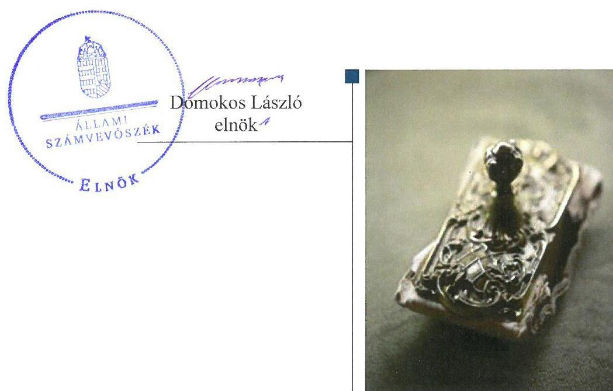
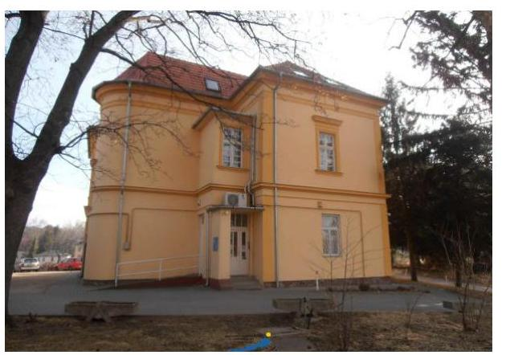
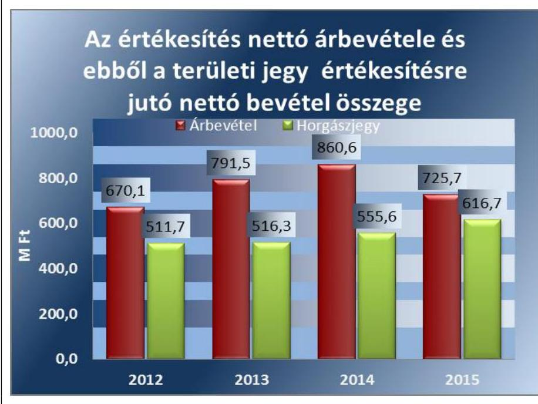
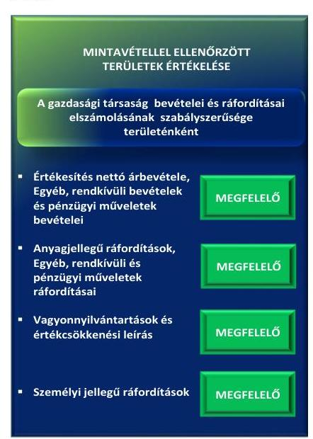
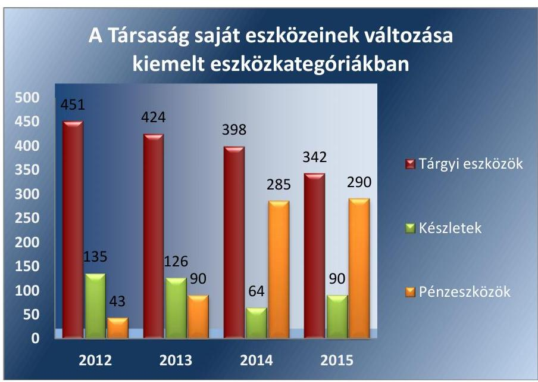
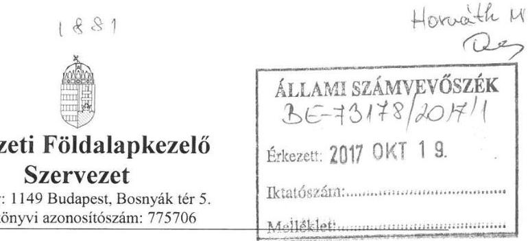
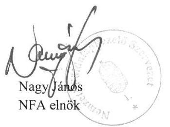
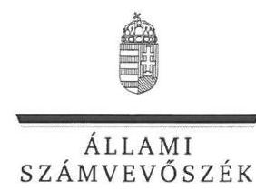
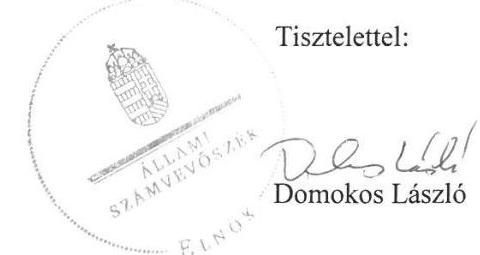

# Jelentés 

## Balatoni Halgazdálkodási Nonprofit Zrt.

Az állami tulajdonban (résztulajdonban) lévő gazdálkodó szervezetek vagyonmegőrzési és gazdálkodási tevékenységének ellenőrzése 2017.

---

# Jelentés 

## Balatoni Halgazdálkodási Nonprofit Zrt.

Az állami tulajdonban (résztulajdonban) lévő gazdálkodó szervezetek vagyonmegőrzési és gazdálkodási tevékenységének ellenőrzése
2017. szeptember 23. nap

---

# AZ ELLENŐRZÉST FELÜGYELTE:

DR. HORVÁTH MARGIT felügyeleti vezető

## AZ ELLENŐRZÉST VEZETTE ÉS A VÉGREHAJTÁSÁÉRT FELELŐS:

SIPOSNÉ DÓCZI KLÁRA ellenőrzésvezető

## A PROGRAM ÖSSZEÁLLÍTÁSÁÉRT FELELŐS:

JANIK JÓZSEF LÁSZLÓ osztályvezető

IKTATÓSZÁM: V-1383-204/2016

TÉMASZÁM: 2417

ELLENŐRZÉS-AZONOSÍTÓ SZÁM: V075953

Jelentéseink az Országgyűlés számítógépes hálózatán és az Interneten a www.asz.hu címen is olvashatóak.

---

# TARTALOMJEGYZÉK 

■ ÖSSZEGZÉS ..... 5
■ AZ ELLENŐRZÉS CÉLJA ..... 7
■ AZ ELLENŐRZÉS TERÜLETE ..... 8
■ AZ ELLENŐRZÉS HÁTTERE, INDOKOLTSÁGA ..... 10
■ A JELENTÉS LÉNYEGES KÉRDÉSKÖREI ..... 11
■ ELLENŐRZÉS HATÓKÖRE ÉS MÓDSZEREI ..... 12
■ MEGÁLLAPÍTÁSOK ..... 14
■ JAVASLATOK ..... 21
■ MELLÉKLETEK ..... 23
I. Sz. melléklet: Értelmező szótár ..... 23
II. Sz. melléklet: A társaság tevékenységét bemutató adatok az éves beszámolók alapján ..... 26
■ FÜGGELÉK: ÉSZREVÉTELEK ..... 27
■ RÖVIDÍTÉSEK JEGYZÉKE ..... 35

---

.

---

# ÖSSZEGZÉS 

A Balaton-felvidéki Nemzeti Park Igazgatóság, majd a Földművelésügyi Minisztérium a Balatoni Halgazdálkodási Nonprofit Zrt. és a Társaság használatába adott állami vagyon felett a tulajdonosi jogokat szabályszerűen gyakorolta. A Társaság viszont nem biztosította folyamatosan a közpénzek felhasználásának elszámoltathatóságát, átláthatóságát és nyilvános ellenőrizhetőségét, mert 2015-ig kötelező számviteli szabályzatok hiányoztak, a közhasznú tevékenységekre, illetve a vagyonkezelt eszközökre nem rendelkeztek elkülönített nyilvántartással, a közbeszerzési törvény előírásait minden évben megsértették. Ugyanakkor a bevételek és ráfordítások elszámolása szabályszerű volt. A Társaság a beszámolási kötelezettségének eleget tett.

## Az ellenőrzés társadalmi indokoltsága

Az Állami Számvevőszék kiemelt célja, hogy az államháztartáson kívülre nyújtott költségvetési támogatások és ingyenes vagyonjuttatások, valamint az államháztartáson kívül működő feladatellátó rendszerek ellenőrzéseivel hozzájáruljon ahhoz, hogy a közpénzeket az államháztartáson kívül működő szervezetek is átlátható, rendezett módon használják fel.

Az állami tulajdonú gazdálkodó szervezetek a nemzeti vagyon részét képezik. Az állami vagyonnal való gazdálkodást illetően a tulajdonosi joggyakorlás feladata az állami vagyon átlátható, rendeltetésszerű és felelős használatának biztosítása. Az állami tulajdonú gazdasági társaságok feladata az állami vagyon szerződésben vállalt átlátható, hatékony, költségtakarékos működtetése, értékének megőrzése, állagának védelme, érték-növelő használata, hasznosítása.

A környezeti értékekkel való gazdálkodás, a környezetvédelem, beleértve a biológiai diverzifikáció fenntartását a modern állam egyik alapvető funkciója. A kapcsolódó feladatait az állam elláthatja a kizárólagosan állami tulajdonban álló nonprofit gazdálkodó szervezeteken keresztül is. Az államot megillető jog vagyonkezelői szerződéssel történő átadása, ennek a gazdálkodó részéről történő gyakorlása a közvagyonnal történő gazdálkodás szempontjából kiemelt fontosságú.

## Főbb megállapítások, következtetések, javaslatok

A Földművelésügyi Minisztériumnak a tulajdonosi joggyakorlása a Társaság és az általa használt állami vagyon felett megfelelő volt. A Nemzeti Földalapkezelő Szervezet tulajdonosi joggyakorlása nem volt megfelelő, mert a Vagyonkezelői szerződés nem terjedt ki minden vagyonkezelésbe adott vagyonelemre, és az átadott vagyonelemek értékének meghatározása sem volt pontos.

A Balatoni Halgazdálkodási Nonprofit Zrt. 2012-2014 között a Leltározási szabályzat és az Önköltség számítási szabályzat kivételével nem rendelkezett a jogszabályi előírásoknak megfelelő számviteli politikával és az ahhoz kapcsolódó kötelezően elkészítendő további szabályzattal. A működés szabályozási hiányosságokat a szabályzatok elkészítésével 2015-ben pótolta, azonban azokban a közhasznú tevékenység elkülönített nyilvántartását, a vagyonkezelésbe vett eszközökhöz kapcsolódó elszámolások kezelését nem biztosította.

A Társaságnál a pénzügyi-számviteli feladatok ellátása során a jogszabályi előírásokat betartották. A bevételek és a ráfordítások elszámolása a számviteli törvény előírásainak megfelelt. Az éves beszámolók közzétételére vonatkozó szabályozásoknak 2014 kivételével az előírt határidő túllépésével és hiányos adattartalommal tettek eleget. A Társaság a nonprofit tevékenységgel összefüggő adatszolgáltatási kötelezettségre vonatkozó előírásokat 2012-2013-ban nem tartotta be, 2014-ben határidőn túl gondoskodott a közzétételről.

---

A Balatoni Halgazdálkodási Nonprofit Zrt. az ellenőrzött időszak végére kialakította a vagyongazdálkodás alapjául szolgáló szabályrendszerét, de nem teremtette meg teljes körűen a szabályszerű vagyongazdálkodás feltételeit. A számviteli szabályozásnak a vagyongazdálkodás területét érintő hiányosságai kihatottak a saját vagyon nyilvántartására is, ami ezért nem volt megfelelő. A Társaság a kezelésében lévő állami vagyon nyilvántartásakor a halastavakat szabálytalanul, nem egyéb építményként vette nyilvántartásba. A saját és a kezelt vagyon értékének megőrzéséről gondoskodott. A vagyonváltozást eredményező döntések megalapozása és végrehajtása nem volt megfelelő, mert a közbeszerzési törvény előírásait folyamatosan megsértették.

Az Állami Számvevőszék a megállapítások alapján a számviteli szabályozás, valamint a nyilvántartás hiányosságai, továbbá a Kbt. megsértése miatt a vezérigazgatónak négy javaslatot, a közzétételi mulasztások miatt további két javaslatot fogalmazott meg. Javaslatot tett továbbá az NFA elnökének a vagyonkezelési szerződés kiegészítése érdekében.

---

# AZ ELLENŐRZÉS CÉLJA 

Az ellenőrzés célja annak értékelése volt, hogy a tulajdonosi jogok gyakorlása szabályszerű volt-e; a gazdálkodó szervezet szabályozottsága, gazdálkodása és vagyongazdálkodási tevékenysége megfelelt-e a jogszabályi és a tulajdonosi előírásoknak; a vagyonváltozást eredményező döntések esetében a tulajdonosi jogok gyakorlója és a gazdálkodó szervezet szabályszerűen jártak-e el.

---

# AZ ELLENŐRZÉS TERÜLETE

## Balatoni Halgazdálkodási Nonprofit Zártkörűen működő Részvénytársaság

A Balatoni Halgazdálkodási NZrt. 2009-ben a Balatoni Halászati Zrt.-ből kiválással létrejött 100%-os állami tulajdonban lévő gazdasági társaság. A Társaság Alapító okirata szerint fő tevékenysége tudományos tevékenység, kutatás, természetvédelem, állatvédelem, környezetvédelem. A Társaság beszámolójának kiegészítő melléklete szerint közhasznú tevékenységként édesvízi halászatot és ehhez kapcsolódó tevékenységeket végzett, így a különféle halfajok okszerű pótlását, azok felnevelését, a halőrzést, valamint az elhullott haltetemek begyűjtését.

A közhasznú tevékenységét a Tvtv., Kvtv. valamint 2013. szeptember 1-ig a Hhtv., ezt követően a Hhvtv. előírásai alapján végezte. Az ellenőrzött időszakban a Társaság az FM-mel kötött haszonbérleti szerződés keretében rendelkezett a Balaton, a Kis-Balaton és kapcsolódó vízrendszere területeinek halgazdálkodási jogával. Ennek a kizárólagos jognak az alapján azokra a területekre, melyekre a halgazdálkodási joga vonatkozott, a Társaság területi jegyeket bocsájtott ki saját maga vagy bizományosai útján. A területi jegyek birtokában végezhették a horgászjegy tulajdonosok a sporthorgászatot.

A Vtv.-ben foglaltak alapján a Társaságban lévő állami vagyont egyrészt a társasági részesedés, másrészt a halgazdálkodáshoz kapcsolódóan a Társaság vagyonkezelésében lévő, halgazdálkodásra alkalmas ingatlanok, valamint a haszonbérlet keretében kezelt halgazdálkodási jog, mint vagyoni értékű jog jelentették.

A Társaság részesedése feletti tulajdonosi jogok gyakorlásával az MNV Zrt. 2014. augusztus 21-ig a Balaton-felvidéki Nemzeti Park Igazgatóságot, ezt követően a Földművelésügyi Minisztériumot bízta meg.

A Társaság kezdeményezésére a Nemzeti Földalapkezelő Szervezettel 2015. augusztus 27-én vagyonkezelési szerződést kötött 247 hektár, 342 M Ft értékű földterület kezelésére. Ez a földterület természetben a Varászlói tógazdaság. Ezzel a Társaság a Balaton vízrendszeréhez csatlakozó területen, a folyamatosan ellenőrzött körülmények között nevelt hal utánpótlást kívánt biztosítani.

A Társaság 2012-2015 időszaki beszámolói adatainak részletes bemutatását a II. sz melléklet tartalmazza.

A Társaság folyamatosan eredményesen, megalakulása óta változatlan, 100 M Ft jegyzett tőkével gazdálkodott.

A mérlegfőösszeg (635 M Ft) 2012. január elsejei állapothoz képesti 33%-kal növekedett 2015-re a Társaság jövedelmező gazdálkodása, valamint a vagyonkezelésbe vett vagyon miatt.

A Társaság hitel nélkül gazdálkodott. Pénzügyi helyzete az ellenőrzött időszak valamennyi évében stabil volt. A saját tőke nem csak a Társaság

---

saját befektetett eszközeit finanszírozta, hanem a forgóeszközök meghatározó (56-87%) részére is fedezetet nyújtott.

Árbevétele meghatározóan a területi jegyek értékesítéséből származott, ahogy azt az 1. ábra szemlélteti. A bevételek minden évben fedezetet nyújtottak nem csak a működésre, hanem az eszközök pótlására is.
1. ábra

Forrás: A Társaság 2012-2015 évi beszámolói
Az átlagos statisztikai állományi létszám a 2012. évi 82 főről 2013-ban 88 főre emelkedett, majd 2015-re 79 főre csökkent.

Az ellenőrzött időszakban a vezérigazgató személye háromszor változott, utoljára 2014 márciusában. A könyvvizsgáló személye az ellenőrzött időszakban egyszer változott, a jelenlegi könyvvizsgáló 2015 májusától látja el feladatát.

A Társaság az ellenőrzött időszakban nem tartozott a kormányzati szektorba sorolt társaságok közé és nem tartozott a Bkr. ${ }^{12}$ hatálya alá.

---

# AZ ELLENŐRZÉS HÁTTERE, INDOKOLTSÁGA 

Az ÁSZ ${ }^{13}$ középtávra szóló stratégiájában megfogalmazta, hogy az állami tulajdonú gazdálkodó szervezetek ellenőrzése kiemelten fontos a nemzeti vagyon megőrzése, megóvása érdekében. Gazdálkodásuk jellemzően a közérdeklődés és a média figyelmének központjában áll, amihez hozzájárul a gazdálkodásuk körébe tartozó - közvetlen vagy közvetett állami tulajdonú - vagyon nagysága, illetve az általuk ellátott szolgáltatások minősége és hatékonysága. A tevékenység árbevételének, azon keresztül az eredményességnek biztosítania kell a működés fenntarthatóságát, eszközeinek pótlását is.

Az ellenőrzés rámutathat az állami tulajdonú gazdálkodó szervezetek gazdálkodási tevékenységével jó gyakorlatokra és szabálytalanságokra. Felhívhatja a figyelmet a jogszabályi követelmények teljesítéséhez szükséges feltételek hiányosságaira, hozzájárulhat az államháztartáson kívüli, de (közvetlenül vagy közvetve) állami vagyont használó gazdálkodó szervezetek tevékenységének átláthatóságához. Ellenőrzésünk eredményeképpen javaslatainkkal, megállapításainkkal hozzájárulhatunk a nemzeti vagyonnal való gazdálkodás átláthatóságának, elszámoltathatóságának javításához.

---

# A JELENTÉS LÉNYEGES KÉRDÉSKÖREI 

1. A tulajdonosi jogok gyakorlása szabályszerű volt-e?
2. A társaság működésének szabályozottsága megfelelt-e az előírásoknak?
3. A társaságnál a pénzügyi-számviteli, adatszolgáltatási és ellenőrzési feladatok ellátása szabályszerű volt-e?
4. A társaság vagyongazdálkodása szabályszerű volt-e?

---

# ELLENŐRZÉS HATÓKÖRE ÉS MÓDSZEREI 

## Az ellenőrzés típusa

Megfelelőségi ellenőrzés.

## Az ellenőrzött időszak

2012. január 1-jétől 2015. december 31-ig tart

## Az ellenőrzés tárgya

Állami tulajdonban lévő gazdasági társaság gazdálkodása, kiemelten vagyongazdálkodási tevékenysége, valamint a tulajdonosi jogok gyakorlása.

## Az ellenőrzött szervezet

A Balatoni Halgazdálkodási Nonprofit Zrt., a tulajdonosi jogokat gyakorló Balaton-felvidéki Nemzeti Park Igazgatóság, és a Földművelésügyi Minisztérium valamint a Nemzeti Földalapkezelő Szervezet.

## Az ellenőrzés jogalapja

Az Állami Számvevőszékről szóló 2011. évi LXVI. törvény 5. § (3)-(5) bekezdései.

## Az ellenőrzés módszerei

Az ellenőrzést a nemzetközi standardokat irányadónak tekintve az ellenőrzési program ellenőrzési kérdései, az ellenőrzött időszakban hatályos jogszabályok, az ellenőrzés szakmai szabályok és módszertanok figyelembe vételével végeztük.

Az ellenőrzés ideje alatt az ellenőrzött szervezettel történő kapcsolattartást az ÁSZ Szervezeti és Működési Szabályzatának vonatkozó előírásai alapján biztosítottuk.

Az ellenőrzési kérdések megválaszolásához szükséges bizonyítékok megszerzése a következő ellenőrzési eljárások alkalmazásával történt: megfigyelés, kérdésfeltevés (információkérés), összehasonlítás, valamint elemző eljárás. Az ellenőrzési bizonyítékként felhasználható adatforrások

---

közé tartoztak egyrészt a szakmai programban felsorolt adatforrások, másrészt minden, az ellenőrzés folyamán feltárt, az ellenőrzés szempontjából információkat tartalmazó dokumentum.

A Balatoni Halgazdálkodási Nonprofit Zrt.-nél a bevételek és ráfordítások elszámolása, valamint a vagyonnyilvántartás terén a szabályszerű működést véletlen mintavétellel és irányított kiválasztással ellenőriztük. A mintatételek értékelése alapján egyrészt a sokaságban előforduló hiba arányát becsültük, másrészt az irányítottan kiválasztott tételeket értékeltük. A jogszabályoknak és a belső eljárásoknak megfelelőnek, azaz szabályszerűnek tekintettük az adott területet, amennyiben a minta ellenőrzésének eredménye alapján 95%-os bizonyossággal a teljes sokaságban a hibaarány kisebb volt, mint 10%. Nem megfelelőnek értékeltük, ha a hibaarány a 10%-ot meghaladta. A ráfordítások elszámolására és a vagyonnyilvántartásra vonatkozó véletlen mintavételt kockázati alapú kiválasztással egészítettük ki, amelynek során évente a három legnagyobb összegű tételt választottuk ki.

---

# 1. A tulajdonosi jogok gyakorlása szabályszerű volt-e? 

Összegző megállapítás

1.1. számú megállapítás

A tulajdonosi joggyakorlás mind a részesedések mind a használatba adott vagyon tekintetében megfelelő volt, ugyanakkor a vagyonkezelésbe adott állami vagyon tekintetében szabálytalan volt.

Balaton-felvidéki Nemzeti Park Igazgatóság és a Földművelésügyi Minisztérium részesedések feletti
 tulajdonosi joggyakorlása megfelelő volt.

A TULAJDONOSI JOGOK GYAKORLÓI a Társaság részesedése feletti tulajdonosi joggyakorlás feladatait a Társaság Alapító okirata ${ }_{1-7}{ }^{14}$.ban, a Gt. ${ }^{15}$ és a Ptk. ${ }_{2}{ }^{16}$ előírásaival valamint a BfNPI ${ }^{17}$ és az FM szervezeti és működési szabályzataival ${ }^{1819}$ összhangban, az MNV Zrt.-vel kötött vagyonkezelési szerződésben ${ }^{20}$ illetve megbízási szerződés ${ }_{2-7}{ }^{21}$-ben foglaltaknak megfelelően határozták meg. A tulajdonosi joggyakorlók választották meg a vezérigazgatót és a könyvvizsgálót, valamint hozták létre a felügyelő bizottságot, működtették a beszámoltatási rendszert, fogadták el - a Társaság Felügyelő bizottságának ${ }^{22}$ előzetes írásbeli véleményezését követően, a könyvvizsgálói jelentések birtokában - a Társaság éves beszámolóit, és az Ectv. ${ }^{23}$-nek megfelelően döntöttek az adózott eredmény eredménytartalékba helyezéséről. A Javadalmazási szabályzat ${ }_{1-7}{ }^{24}$-t a tulajdonosi joggyakorlók a Taktv. ${ }^{25}$ előírásainak megfelelő személyi és tárgyi hatállyal fogadták el.

A BfNPI a Társaság 2013. évi közhasznúsági jelentéséről - az Ectv. 46§ (1) bekezdésében foglaltakkal ellentétben - valamint a 2012-2014. évi üzleti tervének elfogadásáról alapítói határozat útján nem hozott döntést. A BfNPI a beszámoltatási rendszert a Társaság Felügyelő bizottságának ügyrendje szerint működtette.

A FÖLDMŰVELÉSÜGYI MINISZTÉRIUM részéről az üzleti terv elfogadásával a tervezett beruházások, fejlesztések jóváhagyása is megtörtént. Az FM 2015-től monitoring rendszert működtetett, melynek keretében a Társaság negyedéves gyakorisággal adatokat szolgáltatott.

---

### 1.2. számú megállapítás

A Társaság vagyonkezelésébe adott állami vagyon feletti tulajdonosi joggyakorlás a Nemzeti Földalapkezelő Szervezet részéről nem volt megfelelő. A Társaság használatába adott nemzeti vagyon feletti tulajdonosi joggyakorlás a Földművelésügyi Minisztérium részéről megfelelő volt.

A NEMZETI FÖLDALAPKEZELŐ SZERVEZET a Társaság vagyonkezelésébe adott halastavak és egyéb földrészletek tekintetében részben járt el szabályszerűen. Az NFA megalkotta vagyon-nyilvántartási szabályzatát. Az NFA ${ }^{26}$ és a Társaság között létrejött vagyonkezelői szerződéshez ${ }^{27}$ a NATURA 2000 védettség alá tartozó területek vonatkozásában az Nfatv. ${ }^{28}$ előírásainak megfelelően a természetvédelemért felelős miniszter kiadta az egyetértését. A vagyonkezelés vonatkozásában az FM a 6/2015. számú alapítói határozatban jóváhagyta a Társaság és az NFA közötti szerződés megkötését 8/2014. (XI. 28.) FM utasítás ${ }^{29}$ 1. § ab) pontjának megfelelően.

A vagyonkezelési szerződésben a Nemzeti Földalapba tartozó földrészletek hasznosításának részletes szabályairól szóló 262/2010. (XI. 17.) Korm. rendelet 50/B. §-ában foglaltakkal szemben nem rögzítették, hogy a használó az NFA vagyon-nyilvántartási szabályzatát megismerte, és magára nézve kötelező érvényűnek ismeri el. Valamint az Nfatv. 19/A. § (1) bekezdés előírásaiban foglaltakkal szemben a vagyonkezelési szerződés nyilvántartási értékről szóló melléklete nem sorolt fel egy db kezelésbe adott ingatlant, valamint az ingatlanok értékének a meghatározása nem volt helyes, mert szerepeltettek olyan értéket is, ami át nem adott földterületre (31,3 hektár erdő) vonatkozott, illetve egy db átadott vagyonelem értékét nem tüntették fel.

Az NFA nem élt 262/2010. (XI. 17.) Korm. rendelet 47. § (1) bekezdésében és a vagyonkezelői szerződésbe foglalt ellenőrzési jogosultsággal.

A FÖLDMŰVELÉSÜGYI MINISZTÉRIUM az állam nevében a Balaton és a kapcsolódó vízterületek halászati/halgazdálkodásával kapcsolatos jogokat szabályszerűen gyakorolta. Az FM és a Társaság az Nvtv.-ben és a Hhtv.-ben előírtaknak megfelelő haszonbérleti szerződés ${ }_{1}$. $4-\mathrm{t}^{30}$ kötött a Balaton és csatlakozó vízterületek halászati/halgazdálkodási jogára, amelyek 2015. december 31-ig hatályban voltak. Az FM nem kezdeményezett a Vhr. 9. § (5) bekezdésében és a haszonbérleti szerződésekben leírt ellenőrzést a haszonbérbe adott vagyonnal történő gazdálkodásról a Társaságnál.

---

# 2. A társaság működésének szabályozottsága megfelelt-e az előírásoknak? 

Összegző megállapítás

A Társaság szabályszerű működéséhez 2012-től 2015-ig kötelező számviteli szabályzatok hiányoztak, továbbá elmaradt a közhasznú tevékenység bevételei és ráfordításai elkülönített nyilvántartási rendjének kialakítása is.

SZERVEZETI ÉS MŰKÖDÉSI SZABÁLYZATTAL ${ }^{31}$, melyet az Alapító Okirat ${ }_{1-7}$ által előírtan a vezérigazgató állapított meg, 2015. szeptember 1-jéig nem rendelkezett a Társaság. A hivatkozott szabályzatban nevesített belső ellenőrzési, valamint az iratkezelési szabályzatot nem készítette el.

SZÁMVITELI SZABÁLYZATOKKAL - a Leltározási szabályzat ${ }^{32}$ és az Önköltség számítási szabályzat ${ }^{33}$ kivételével - 2015. január 1-ig nem rendelkezett a társaság, amely nem felelt meg a Számv. tv. 14. § (11) bekezdésében és a Számv. tv. 161. § (5) bekezdésében előírtaknak. A Számlarend ${ }^{34}$ és a Bizonylati szabályzat ${ }^{35}$ 2015. január elsején lépett hatályba. 2015. szeptember elsejétől volt érvényes a Számviteli politika ${ }^{36}$ és az Eszközök és források értékelési szabályzata ${ }^{37}$. A Pénzkezelési szabályzat ${ }^{38}$ 2015. december 15-én hatályosult. A Leltározási szabályzat, az Önköltség számítási szabályzat, az Eszközök és források értékelési szabályzata valamint a Pénzkezelési szabályzat megfelelt a Számv. tv. előírásainak.

A szabályszerű könyvvezetést biztosító alapvető szabályzatok hiánya ellenére a könyvvizsgáló korlátozás nélküli (hitelesítő) záradékkal látta el a beszámolókhoz kapcsolódó jelentéseit. A Magyar Könyvvizsgálói Kamara Fegyelmi Bizottsága a könyvvizsgáló felelősségre vonását nem tartotta indokoltnak az ÁSZ értesítése alapján.

A SZÁMVITELI POLITIKA a Számv. tv 14.§ (4) és (11) bekezdéseiben előírtaknak nem felelt meg, mert
(1) a jelentős összegű hiba definíciója nem volt megfelelő, mert nem szerepelt benne a Számv. tv. 3. § (3) bekezdés 3. pontjában meghatározott az „értékének együttes (előjeltől független)” kitétel;
(2) nem rögzítette a Számv. tv. 3. § (4) bekezdés 7-9. pontjaiban foglaltaknak megfelelően, hogy a Társaság mit minősít beruházásnak, felújításnak, karbantartásnak;
(3) nem határozta meg a Számv. tv. 52. § (2) bekezdése szerint az eszköz szokásos vállalkozási tevékenység keretében történő rendeltetésszerű hasznosításának a kezdő időpontját.

A SZÁMLAREND nem határozta meg az NFA-val kötött vagyonkezelési szerződés 3.16 pontja szerint a vagyonkezelésbe vett vagyon használatából, működtetéséből származó bevételek, valamint a közvetlen költségek és ráfordítások elkülönített nyilvántartását biztosító számlák megnevezését, tartalmát, az azokhoz kapcsolódó főkönyvi és analitikus nyilvántartások körét.

---

A KÖZHASZNÚSÁGI TEVÉKENYSÉGHEZ kapcsolódóan a Társaság a Számv. tv. 14. § (4) bekezdésében, valamint a 161/A. § (1) és (2) bekezdéseiben rögzítettekkel ellentétesen nem határozta meg a számviteli politikájában és a számlarendjében az általa ellátott közhasznú tevékenységekből, illetve a vállalkozási tevékenységből származó bevételek és ráfordítások elkülönített nyilvántartásának a módját, a tevékenységekre közvetlenül el nem számolható költségek, ráfordítások felosztási szabályait.

# 3. A társaságnál a pénzügyi-számviteli, adatszolgáltatási és ellenőrzési feladatok ellátása szabályszerű volt-e? 

Összegző megállapítás

### 3.1. számú megállapítás

2. ábra

A Társaságnál a pénzügyi-számviteli feladatok ellátása során a jogszabályi előírásokat betartották, azonban a közérdekű adatok közzétételére vonatkozó kötelezettségnek nem szabályszerűen tettek eleget. Az ellenőrzési feladatok ellátása megfelelő volt.

A bevételek és a ráfordítások elszámolása során az előírásokat betartották.

A BEVÉTELEK ELSZÁMOLÁSA megfelelő a jogszabályi és a belső szabályozásba foglalt előírásoknak abban az időszakban is, amikor a Társaság nem rendelkezett érvényes számviteli szabályozással. A bevételek kiszámlázása, főkönyvi számlákon történő elszámolása megfelelő a Számv. tv-ben, a belső szabályozásokban és a vagyonkezelési szerződésben előírtaknak. A mintavétellel ellenőrzött területek értékelését a 2. ábra mutatja.

A RÁFORDÍTÁSOK ELSZÁMOLÁSA megfelelő a jogszabályi és a belső szabályozásba foglalt előírásoknak. Az anyagjellegű ráfordítások esetében az elszámolást megalapozó dokumentumok rendelkezésre álltak, elszámolásuk meghatározóan a számviteli bizonylatok alapján, a szerződés szerinti teljesítéssel, a megfelelő főkönyvi számlán történt. A személyi jellegű ráfordítások elszámolását, a munkabérek kifizetését munkaszerződés alapján, az Szja. tv. ${ }^{39}$ és a Tbj. tv. ${ }^{40}$ előírásainak megfelelő levonások alkalmazásával teljesítették. A személyi jellegű egyéb kifizetésekre a belső szabályozás és az Ebm. tv. ${ }^{41}$ valamint az Szja. tv. előírásaival összhangban került sor.

AZ ÉRTÉKCSÖKKENÉS ELSZÁMOLÁSA a saját és a vagyonkezelt eszközök tekintetében a Számv. tv. szerint, a belső szabályozás figyelembevételével történt.

A HÁTRALÉKOS KÖVETELÉS ÁLLOMÁNY CSÖKKENTÉSÉRE a Társaság a jogszabályi előírások alapján intézkedett, ide értve a behajthatatlan követelések leírását is. Az értékvesztést a Számv. tv. 55. § (1) bekezdésében foglaltaknak megfelelően számolták el.

---

# 3.2. számú megállapítás 

A Társaság teljesítette tervezési, beszámolási kötelezettségét, azonban a közhasznú tevékenységével kapcsolatos adatszolgáltatási kötelezettségének részben tett eleget.

ÜZLETI TERVET minden évben készített a Társaság, azt részére a tulajdonosi joggyakorló azonban csak 2015. évre írta elő. Az üzleti terv jóváhagyója 2012-2013-ban a Felügyelő bizottság, 2014-2015-ben a tulajdonosi joggyakorló volt.

A BESZÁMOLÁSI KÖTELEZETTSÉGE teljesítéséhez a Társaság minden évben elkészítette a gazdálkodási és a közhasznú tevékenységéről a beszámolóit. A számviteli éves beszámolók közzétételéről 2012 és 2014 vonatkozásában nem intézkedett határidőben, és 2014 kivételével nem teljesítette hiánytalanul a beszámoló közzétételét, ami ellentétes a Számv. tv. 153. § (1) bekezdésében foglaltakkal. A közhasznú tevékenység bemutatásáról 2012-2014-ben a Társaság közhasznú jelentést készített közhasznúsági melléklet helyett, mellyel megsértette a 350/2011. (XII. 30.) Kormányrendelet 12. § (1) bekezdésébe foglalt előírásokat. 2012-2013-ban nem tette közzé, 2014-ben a jogszabályban megadott határidőn túl tette közzé a közhasznú tevékenységéről szóló beszámolót, amivel megsértette az Ectv. 46. § (1) bekezdésében foglaltakat. 2015-ben a Társaság a jogszabály által előírt formában és határidőben tette közzé a közhasznúsági mellékletet.

A BESZÁMOLÓK ALÁTÁMASZTÁSÁHOZ a leltározást a Társaság az ellenőrzött időszak valamennyi évében - a Számv. tv. 69. § (1) bekezdésében foglaltaknak eleget téve - elvégezte, a beszámolóiban, a számviteli nyilvántartásaiban szereplő eszközöket és forrásokat leltárral támasztotta alá. A mennyiségi felvétellel és egyeztetéssel - a Számv. tv. 69. § (3) bekezdése szerint - végzett leltározás megfelelt a Társaság Leltározási szabályzatának.

A Társaság nem gondoskodott a Taktv. 2. § (3) bekezdése szerinti szerződések adatainak közzétételéről.

## 4. A társaság vagyongazdálkodása szabályszerű volt-e?

## Összegző megállapítás

### 4.1. számú megállapítás

A Társaság vagyongazdálkodása nem volt megfelelő.
A Társaság 2015-ig nem alakította ki a saját vagyon értékének megőrzését, gyarapítását szolgáló szabályrendszerét, továbbá a kezelt vagyon vonatkozásában a szabályszerű vagyongazdálkodás feltételeit sem teremtette meg.

A VAGYONGAZDÁLKODÁS FELTÉTELEIT a Társaság a 2015. szeptember elsejétől hatályos SZMSZ-ben és a 2015-ben a Számviteli politikához kapcsolódóan elkészített szabályzatokban határozta meg. 2012-2014 időszakban Leltározási szabályzattal és Vagyonvédelmi szabályzattal ${ }^{42}$-tal rendelkezett. A vagyongazdálkodás szabályozása a közbeszerzésre vonatkozó szabályozás ${ }^{43}$ 2015. szeptember 1-i hatálybalépésével vált teljessé. A számviteli szabályozásban bemutatott hiányosságok a vagyongazdálkodás szabályozásával vannak összefüggésben.

---

# Megállapítások 

A KEZELT VAGYONNAL KAPCSOLATOS nyilvántartási követelményeknek, előírásoknak nem tett eleget a Társaság. Az NFA-val 2015. augusztus 27-én kötött vagyonkezelési szerződést követően a Társaság a jogszabályi előírásoknak megfelelően nem egészítette ki a belső szabályzatait, amivel megsértette Vhr. 9. §-a (3) bekezdésében foglaltakat, miszerint a vagyonkezelő köteles teljesíteni a jogszabályban és a szerződésben előírt, az állami vagyonra vonatkozó nyilvántartási kötelezettséget. Azzal, hogy a Társaság nem határozta meg a vagyonkezelésbe vett vagyon működtetésével összefüggésben keletkezett bevételek és felmerült ráfordítások körét, az azokhoz kapcsolódó főkönyvi és analitikus nyilvántartásokat, az alkalmazandó bizonylatokat, megsértette a Számv. tv 161. § (1)-(3) bekezdéseiben foglaltakat.

## 4.2. számú megállapítás

A Társaságnak a közbeszerzés keretébe tartozó saját vagyon változást eredményező döntései szabálytalanok voltak.

A Társaság a 2012-2015. években a halbeszerzések vonatkozásában megsértette
 - a Kbt. ${ }^{44}$ 5. §-ára tekintettel - a Kbt. 114. § (2) bekezdés b) pontjában előírt közbeszerzési eljárás lefolytatásának kötelezettségét.

A Közbeszerzési Döntőbizottság a Közbeszerzési Hatóság nevében a jogsértés tényét megállapította, és a Társaságot megbírságolta.

## 4.3. számú megállapítás

A Társaságnál a saját és a kezelt vagyon nyilvántartása nem volt megfelelő.

A saját vagyonnak a Számv. tv. szerinti elkülönült nyilvántartásánál a Társaság nem a Számv. tv. 159. §-a alapján járt el, mert a felújításokat beruházásként tartotta nyilván. A Társaság által az amortizáció elszámolására alkalmazott módszer nem felelt meg a Számv. tv 52. §-a (2) bekezdése előírásainak, mert az amortizáció elszámolására az üzembe helyezés hónapját követő hónap első napjától került sor. A nyilvántartási hiányosságok a Társaság számviteli szabályozásainak hiányosságaiból adódtak.

A vagyonkezelésbe vett vagyonnak a nyilvántartása, a tárgyi eszközök besorolása és hasznos élettartamának a megállapítása nem volt megfelelő. A Társaság megsértette a Számv. tv 26.§-a (2) bekezdésében foglaltakat, mert a vagyonkezelésbe vett ingatlanokon belül a halastavakat szabálytalanul, a földterületek között vette állományba. Valamint a Társaság az NFA-val kötött vagyonkezelési szerződés tárgyát képező ingatlanok hasznos élettartamát nem a Számv. tv. 3. § (4) 5. pontja szerint határozta meg, mert nem vette figyelembe a szerződött használati időt.

## 4.4. számú megállapítás

A Társaságnál a saját és a kezelt vagyon értékének megőrzése megvalósult.

A saját vagyon értékének megőrzése az ellenőrzött időszakon belül megvalósult. Eszközeinek összege 87%-kal emelkedett, melyben szerepet játszott a saját vagyon 635 M Ft-ról 843 M Ft-ra történő bővülése is. A Társaság saját eszközein belül a meghatározó eszköz-kategóriák változását a 3. ábra mutatja.

---

A tárgyi eszközökre aktivált összeg 44,2 M Ft-tal haladta meg az elszámolt amortizáció összegét (225,5 M Ft), melynek forrása az adózott eredmény (203,7 M Ft) volt.
3. ábra

Forrás: A Társaság 2012-2015. évi beszámolói
A kezelésbe vett ingatlanokra vonatkozóan a vagyonkezelői szerződésben szereplő 342 M Ft, nyilvántartásba vételkori mérleg érték nem változott 2015-ben. A Társaságnál a vagyonkezelt ingatlanokra vonatkozó vagyonkezelői jognak az ingatlan nyilvántartásba történő bejegyzése a mérlegkészítés időszakára esett, ezért az ingatlanok között szereplő halastavakra értékcsökkenés elszámolása, valamint az azzal egyező mértékű visszapótlási kötelezettség nem keletkezett az ellenőrzött időszakban.

---

# JAVASLATOK 

Az ÁSZ tv. 33. § (1) bekezdésében foglaltak értelmében az ellenőrzött szervezet vezetője köteles a jelentésben foglalt megállapításokhoz kapcsolódó intézkedési tervet összeállítani és azt a jelentés kézhezvételétől számított 30 napon belül az ÁSZ részére megküldeni. Amennyiben az ellenőrzött szervezet vezetője nem küldi meg határidőben az intézkedési tervet, vagy továbbra sem elfogadható intézkedési tervet küld, az Állami Számvevőszék elnöke az ÁSZ tv. 33. § (3) bekezdése a) és b) pontjaiban foglaltakat érvényesítheti.

Javaslataink célja a Balatoni Halgazdálkodási Nonprofit Zrt. gazdálkodása szabályozottságának erősítése annak érdekében, hogy a szabályozási környezet és a gazdálkodási gyakorlat megfelelően tudja támogatni az átlátható működést.

## A Balatoni Halgazdálkodási Zrt. vezérigazgatójának

1. Intézkedjen a jogszabályi változások számviteli politikán történő átvezetéséről, valamint a tevékenységekre közvetlenül el nem számolható költségek, ráfordítások felosztási szabályainak rögzítéséről a Számv. tv. előírásainak megfelelően.
(2. sz. megállapítás 4. és 6. bekezdései alapján)
2. Intézkedjen a Számlarend módosításáról, hogy az tartalmazza mind az általa ellátott közhasznú illetve a vállalkozási tevékenységhez mind a vagyonkezelésbe vett vagyon használatához, működtetéséhez kapcsolódóan, az elkülönített nyilvántartások biztosítását megalapozó, a különböző tevékenységekből származó bevételek, valamint a közvetlen költségek és ráfordítások elkülönített nyilvántartását szolgáló számlák megnevezését, tartalmát, az azokhoz kapcsolódó főkönyvi és analitikus nyilvántartások körét a Számv. tv. előírásainak megfelelően.
(2. sz. megállapítás 5. és 6. bekezdései alapján)
3. Intézkedjen az éves beszámolókkal kapcsolatos közzétételi kötelezettség jogszabályoknak megfelelő teljesítéséről.
(3.2. sz. megállapítás 2. bekezdése alapján)
4. Gondoskodjon a szerződések adatainak Taktv. szerinti közzétételéről.
(3.2. sz. megállapítás 4. bekezdése alapján)

---

5. Gondoskodjon a vagyonkezelésbe vett halastavak Számv. tv. előírásainak megfelelő nyilvántartásba vételéről.
(4.3. sz. megállapítás 2. bekezdése alapján)
6. Intézkedjen, hogy a Társaság a Kbt.-ben rögzített közbeszerzési értékhatárt elérő, meghatározott tárgyú beszerzéseinél minden esetben a közbeszerzési törvény előírásai szerint járjon el.
(4.2. sz. megállapítás 1. bekezdése alapján)

# Javaslataink célja az Nemzeti Földalapkezelő Szervezet (NFA) szabályszerű tulajdonosi joggyakorlásának elősegítése, továbbá kontrolljainak erősítése. 

## Nemzeti Földalapkezelő Szervezet elnökének

1. Intézkedjen annak érdekében, hogy a 2015-ben a Balatoni Halgazdálkodási Nonprofit Zrt.-vel megkötött vagyonkezelési szerződés nyilvántartási értékről szóló melléklete - az Nfatv. előírásainak megfelelően a ténylegesen vagyonkezelt ingatlanokat és azok helyes értékét tartalmazza.
(1.2. sz. megállapítás 2. bekezdése alapján)

---

# MELLÉKLETEK 

## I. SZ. MELLÉKLET: ÉRTELMEZŐ SZÓTÁR

állami vagyon
a) Az állam tulajdonában lévő dolog, valamint a dolog módjára hasznosítható természeti erő,
b) az a) pont hatálya alá nem tartozó mindazon vagyon, amely vonatkozásában törvény az állam kizárólagos tulajdonjogát nevesíti,
c) az állam tulajdonában lévő tagsági jogviszonyt megtestesítő értékpapír, illetve az államot megillető egyéb társasági részesedés,
d) az államot megillető olyan immateriális, vagyoni értékkel rendelkező jogosultság, amelyet jogszabály vagyoni értékű jogként nevesít.
Forrás: Vtv. 1. § (2) bekezdése
2012. november 10-től az állami vagyon fogalma kiegészül a következő ponttal:
e) az állam tulajdonában lévő pénzügyi eszközök

Forrás: Vtv. 1. § (2) bekezdése
2013. június 27-ig:

Az állami vagyont az MNV Zrt. maga kezeli, vagy szerződés - így különösen bérlet, haszonbérlet, megbízás - alapján központi költségvetési szervnek, természetes vagy jogi személynek, vagy jogi személyiséggel nem rendelkező gazdálkodó szervezetnek hasznosításra átengedi.
Forrás: Vtv. 23. § (1) bekezdése
2013. június 28-ától:

Az állami vagyonnal az MNV Zrt. maga gazdálkodik, vagy szerződés - így különösen bérlet, haszonbérlet, megbízás - alapján központi költségvetési szervnek, természetes vagy jogi személynek, vagy jogi személyiséggel nem rendelkező gazdálkodó szervezetnek hasznosításra átengedi, illetőleg vagyonkezelésbe, haszonélvezetbe adja.
Forrás: Vtv. 23. § (1) bekezdése
A Ptk. 3:88. § (1) bekezdése szerint „a gazdasági társaságok üzletszerű közös gazdasági tevékenység folytatására, a tagok vagyoni hozzájárulásával létrehozott, jogi személyiséggel rendelkező vállalkozások, amelyekben a tagok a nyereségből közösen részesednek, és a veszteséget közösen viselik".
2013. június 27-ig:

Az állami vagyont az MNV Zrt. maga kezeli, vagy szerződés - így különösen bérlet, haszonbérlet, megbízás - alapján központi költségvetési szervnek, természetes vagy jogi személynek, vagy jogi személyiséggel nem rendelkező gazdálkodó szervezetnek hasznosításra átengedi. Az állami vagyonra vonatkozóan az MNV Zrt. kizárólag az Nvtv.-ben meghatározott személyekkel köthet vagyonkezelési szerződést.
Forrás: Vtv. 23. § (1), 27. § (1)
2013. június 28-ától:

Az állami vagyonnal az MNV Zrt. maga gazdálkodik, vagy szerződés - így különösen bérlet, haszonbérlet, megbízás - alapján központi költségvetési szervnek, természetes vagy jogi személynek, vagy jogi személyiséggel nem rendelkező gazdálkodó szervezetnek hasznosításra átengedi, illetőleg vagyonkezelésbe, haszonélvezetbe adja. Az állami vagyonra vonatkozóan az MNV Zrt. kizárólag az Nvtv.-ben meghatározott személyekkel köthet vagyonkezelési szerződést.
Forrás: Vtv. 23. § (1), 27. § (1)
2014. március 14-ig:

A Ptk. 145. 685. § c) pontja szerint gazdálkodó szervezet: „az állami vállalat, az egyéb állami gazdálkodó szerv, a szövetkezet, a lakásszövetkezet, az

---

# Mellékletek 

európai szövetkezet, a gazdasági társaság, az európai részvénytársaság, az egyesülés, az európai gazdasági egyesülés, az európai területi együttműködési csoportosulás, az egyes jogi személyek vállalata, a leányvállalat, a vízgazdálkodási társulat, az erdő birtokossági társulat, a végrehajtói iroda, az egyéni cég, továbbá az egyéni vállalkozó."
2014. március 15-től:

A gazdasági társaság, az európai részvénytársaság, az egyesülés, az európai gazdasági egyesülés, az európai területi együttműködési csoportosulás, a szövetkezet, a lakásszövetkezet, az európai szövetkezet, a vízgazdálkodási társulat, az erdőbirtokossági társulat, az állami vállalat, az egyéb állami gazdálkodó szerv, az egyes jogi személyek vállalata, a közös vállalat, a végrehajtói iroda, a közjegyzői iroda, az ügyvédi iroda, a szabadalmi ügyvivői iroda, az önkéntes kölcsönös biztosító pénztár, a magánnyugdípénztár, az egyéni cég, továbbá az egyéni vállalkozó. Az állam, a helyi önkormányzat, a költségvetési szerv, az egyesület, a köztestület, valamint az alapítvány gazdálkodó tevékenységével összefüggő polgári jogi kapcsolataira is a gazdálkodó szervezetre vonatkozó rendelkezéseket kell alkalmazni.
Forrás: Ppt. ${ }^{46} .396 . \S$
MNV Zrt.
nemzeti vagyon
a) az állam vagy a helyi önkormányzat kizárólagos tulajdonában álló dolgok,
b) az a) pont hatálya alá nem tartozó, állam vagy a helyi önkormányzat tulajdonában lévő dolog,
c) az állam vagy a helyi önkormányzat tulajdonában lévő pénzügyi eszközök, továbbá az államot vagy a helyi önkormányzatot megillető társasági részesedések,
d) az államot vagy a helyi önkormányzatot megillető bármely vagyoni értékkel rendelkező jogosultság, amelyet jogszabály vagyoni értékű jogként nevesít,
e) Magyarország határa által körbezárt terület feletti légtér,
f) az üvegházhatású gázok kibocsátási egységeinek kereskedelméről szóló törvény szerint kibocsátási egység és légiközlekedési kibocsátási egység, valamint az ENSZ Éghajlatváltozási Keretegyezménye és annak Kiotói Jegyzőkönyve végrehajtási keretrendszeréről szóló törvény szerinti kiotói egység,
g) állami vagy helyi önkormányzati fenntartású közgyűjtemény (muzeális intézmény, levéltár, közgyűjteményként működő kép- és hangarchívum, valamint könyvtár) saját gyűjteményében nyilvántartott kulturális javak körébe tartozó dolog, kivéve, ha az állami vagy önkormányzati tulajdon jogszerű létrejötte kétséget kizáró módon nem bizonyítható és a dologra nézve más a tulajdonjogát bizonyítja vagy a kulturális javakra vonatkozó jogszabályokban meghatározott eljárás keretében valószínűsíti (g. pont módosult 2013. december 7-től),
h) a régészeti lelet,
i) a nemzeti adatvagyon körébe tartozó állami nyilvántartások fokozottabb védelméről szóló törvény szerinti nemzeti adatvagyon.
Forrás: Nvtv. 1. § (2)
nemzeti vagyon hasznosítása

A tulajdonosi joggyakorló vagy a nemzeti vagyon használója által a nemzeti vagyon birtoklásának, használatának, hasznok szedése jogának bármely - a tulajdonjog átruházását nem eredményező - jogcímen történő átengedése, ide nem értve a vagyonkezelésbe adást, valamint a haszonélvezeti jog alapítását.
Forrás: Nvtv. 3. § (1) 4. pont
rábízott vagyon

Egyrészt minden a Vtv. alkalmazásában állami vagyonnak minősülő vagyon, amit az MNV Zrt. kezel és nyilvántart.
Másrészt az a vagyon, amely felett a Magyar Állam nevében az MFB Zrt. gyakorolja a tulajdonosi jogokat.
Forrás: MFB tv. 3. § (9)

---

tulajdonosi jogok gyakorlója

A rábízott vagyon a tulajdonosi jogokat gyakorló szervezetek saját vagyonától elkülönítendő. Forrás: Vtv. 22. § (6)
1.
2013. június 27-ig:

Az állami vagyon felett a Magyar Államot megillető tulajdonosi jogok és kötelezettségek összességét - ha törvény eltérően nem rendelkezik - az állami vagyon felügyeletéért felelős miniszter (a továbbiakban: miniszter) gyakorolja, aki e feladatát a Magyar Nemzeti Vagyonkezelő Zártkörűen Működő Részvénytársaság (a továbbiakban: MNV Zrt.), a Magyar Fejlesztési Bank, illetve a tulajdonosi joggyakorló szervezet útján látja el. A miniszter miniszteri rendeletben, a törvényben meghatározott állami vagyoni kör tekintetében, meghatározott időtartamra, a joggyakorlás egyes szabályainak meghatározásával - az őt megillető tulajdonosi jogok és kötelezettségek összességének, illetve azok meghatározott részének gyakorlóját az Áht. szerinti központi költségvetési szervek, ezek intézménye, továbbá a 100%-ban állami tulajdonban álló gazdasági társaságok közül kijelölheti.
Forrás: Vtv. 3. § (1) és (2)
2013. június 28-ától:

A rábízott állami vagyon felett az államot megillető tulajdonosi jogok és kötelezettségek összességét tulajdonosi joggyakorlóként:
a) ha törvény vagy miniszteri rendelet eltérően nem rendelkezik, a Magyar Nemzeti Vagyonkezelő Zártkörűen Működő Részvénytársaság (a továbbiakban: MNV Zrt.),
b) törvényben kijelölt

 személy vagy
c) az állami vagyon felügyeletéért felelős miniszter (a továbbiakban: miniszter) által rendeletben kijelölt személy gyakorolja.
[...] A miniszter e törvény felhatalmazása alapján - a meghatározott célok hatékonyabb elérése érdekében, miniszteri rendeletben, az ott meghatározott állami vagyoni kör tekintetében, meghatározott időtartamra - e törvény keretei között, a joggyakorlás egyes szabályainak meghatározásával - az államot megillető tulajdonosi jogok és kötelezettségek összességének, illetve azok meghatározott részének gyakorlóját az Áht. szerinti központi költségvetési szervek, ezek intézményei, továbbá a 100%-ban állami tulajdonban álló gazdasági társaságok közül kijelölheti.
Forrás: Vtv. 3. § (1) és (2)
2.

Aki a nemzeti vagyon felett az államot vagy a helyi önkormányzatot megillető tulajdonosi jogok és kötelezettségek összességének gyakorlására jogosult
Forrás: Nvtv. 3. § (1) 17. pontja

---

# II. SZ. MELLÉKLET: A TÁRSASÁG TEVÉKENYSÉGÉT BEMUTATÓ ADATOK AZ ÉVES BESZÁMOLÓK ALAPJÁN

|  KÖNYVVITELI BESZÁMOLÓK SZERINTI ADATOK (M FT) |  |  |  |  |   |
| --- | --- | --- | --- | --- | --- |
|  MEGNEVEZÉS | 2012.01.01. | 2012.12.31. | 2013.12.31. | 2014.12.30. | 2015.12.31.  |
|  I. Értékesítés nettó árbevétele |  | 670 | 791 | 861 | 726  |
|  II. Aktivált saját teljesítmény értéke |  | 115 | 72 | 79 | 76  |
|  III. Egyéb bevételek |  | 6 | 20 | 7 | 83  |
|  IV. Anyagjellegű ráfordítások |  | 427 | 405 | 372 | 427  |
|  V. Személyi jellegű ráfordítások |  | 304 | 359 | 322 | 353  |
|  VI. Értékcsökkenési leírás |  | 47 | 59 | 62 | 57  |
|  VII. Egyéb ráfordítások |  | 10 | 21 | 63 | 11  |
|  A. Üzemi tevékenység eredménye |  | 2 | 40 | 127 | 36  |
|  B. Pénzügyi műveletek eredménye |  | 2 | -2 | 10 | 2  |
|  C. Szokásos vállalkozási eredmény |  | 4 | 38 | 133 | 36  |
|  D. Rendkívüli eredmény |  | 1 | -6 | -2 | 2  |
|  E. Adózás előtti eredmény |  | 5 | 32 | 131 | 38  |
|  XII. Adófizetési kötelezettség |  |  |  |  |   |
|  F. Adózott eredmény |  |  |  |  |   |
|  G. Mérleg szerinti eredmény |  | 5 | 32 | 129 | 38  |
|  A. Befektetett eszközök | 400 | 454 | 433 | 405 | 767  |
|  I. Immateriális javak | 1 | 2 | 4 | 3 | 3  |
|  II. Tárgyi eszközök | 399 | 451 | 424 | 398 | 762  |
|  III. Befektetett pénzügyi eszközök | 0 | 1 | 5 | 4 | 3  |
|  B. Forgóeszközök | 234 | 228 | 257 | 391 | 417  |
|  I. Készletek | 72 | 135 | 126 | 64 | 90  |
|  II. Követelések | 64 | 51 | 41 | 42 | 37  |
|  - vevők | 28 | 28 | 35 | 30 | 18  |
|  - egyéb követelések | 36 | 23 | 16 | 12 | 19  |
|  III: Értékpapírok |  |  |  |  |   |
|  IV. Pénzeszközök | 97 | 43 | 90 | 285 | 290  |
|  C. Aktív időbeli elhatárolások | 1 | 1 |  |  |   |
|  ESZKÖZÖK ÖSSZESEN | 635 | 684 | 691 | 797 | 1185  |
|  D. Saját tőke | 572 | 583 | 615 | 744 | 792  |
|  I. Jegyzett tőke | 100 | 100 | 100 | 100 | 100  |
|  II. Jegyzett, de még be nem fizetett tőke (-) |  |  |  |  |   |
|  III. Tőketartalék |  | 2 | 3 | 4 | 5  |
|  IV. Eredménytartalék | 472 | 472 | 478 | 510 | 638  |
|  V. Lekötött tartalék |  | 4 |  | 1 | 10  |
|  VI. Értékelési tartalék |  |  |  |  |   |
|  VII. Mérleg szerinti eredmény |  | 5 | 32 | 129 | 38  |
|  E. Céltartalékok |  |  |  |  |   |
|  F. Kötelezettségek | 55 | 83 | 57 | 50 | 386  |
|  I. Hátrasorolt kötelezettségek |  |  |  |  |   |
|  II. Hosszú lejáratú kötelezettségek | 11 | 7 | 4 | 1 | 342  |
|  III. Rövid lejáratú kötelezettségek | 43 | 76 | 53 | 49 | 44  |
|  - kötelezettségek áruszállításból, szolgáltatásból | 15 | 49 | 25 | 18 | 16  |
|  - vevői előleg |  |  |  |  |   |
|  G. Passzív időbeli elhatárolások | 8 | 17 | 18 | 3 | 7  |
|  Források összesen | 635 | 684 | 691 | 797 | 1185  |

---

# FÜGGELÉK: ÉSZREVÉTELEK 

A jelentéstervezetet a Számvevőszék 15 napos észrevételezésre megküldte az ellenőrzött szervezetek vezetőinek az ÁSZ tv. 29. § (1) bekezdése előírásának megfelelően.

Balatoni Halgazdálkodási Nonprofit Zrt. és az MNV Zrt. vezérigazgatója, valamint a Balaton-felvidéki Nemzeti Park Igazgatóság igazgatója nem tett észrevételt, a Nemzeti Földalapkezelő Szervezet elnökétől érkezett észrevételeket és azok kezeléséről szóló válaszlevelet a jelentés tartalmazza.

[^0]
[^0]:    * 29. § (1) Az Állami Számvevőszék az ellenőrzési megállapításait megküldi az ellenőrzött szervezet vezetőjének vagy az általa megbízott személynek, és annak, akinek személyes felelősségét állapította meg.
    (2) Az ellenőrzött szervezet vezetője és a felelősként megjelölt személy az ellenőrzés megállapításaira tizenöt napon belül írásban észrevételt tehet.
    (3) Az Állami Számvevőszék az észrevételre a beérkezésétől számított harminc napon belül írásban válaszol. A figyelembe nem vett észrevételeket köteles a jelentésben feltüntetni, és megindokolni, hogy azokat miért nem fogadta el.

---

Domokos László
Elnök
Úgyiratszám: NFA-003105/00#2017
Állami Számvevőszék

# Budapest 4. PF. 54. 

1364
Tárgy: A V-1383-186/2016 számú levelükben megküldött Jelentés tervezetre adott észrevétel megküldése

Tisztelt Elnök Úr!
Az Állami Számvevőszék a V-1383-186 számú levelében megküldte „Az állami tulajdonban (résztulajdonban) lévő gazdálkodó szervezetek vagyonmegőrzési és gazdálkodási tevékenységek ellenőrzése - Balatoni Halgazdálkodási Nonprofit Zrt. címü" vizsgálatáról készült Jelentéstervezetét.

1. Az ÁSZ az NFA-ra vonatkozóan az alábbi kifogásokat tette:

- a vagyonkezelési szerződésben a 262/2010. (XI. 17.) Korm. rendelet 20/B. §-ában foglaltakkal szemben nem került rögzítésre, hogy a használó az NFA vagyonnyilvántartási szabályzatát megismerte, és magára nézve kötelező érvényűnek ismeri el,
- az Nfatv. 19/A (1) bekezdés előírásaiban foglaltakkal szemben a vagyonkezelési szerződés nyilvántartási értékéről szóló melléklete nem sorolt fel egy db kezelésbe adott ingatlant, valamint az ingatlanok értékének meghatározása nem volt helyes, mert szerepeltettünk olyan értéket is, ami át nem adott földterületre (31,3 ha erdő) vonatkozott, ill. egy db átadott vagyonelem értékét nem tüntettük fel,
- az NFA nem élt a 262/2010. (XI. 17.) Korm. rendelet 47 § (1) bekezdésében és a vagyonkezelési szerződésben foglalt ellenőrzési jogosultsággal.

2. Az ÁSZ javaslata az NFA Elnökének:

- Intézkedés annak érdekében, hogy a 2015-ben a Balatoni Halgazdálkodási Nonprofit Zrt-vel megkötött vagyonkezelési szerződés nyilvántartási értékéről szóló melléklete az Nfatv. előírásainak megfelelően a ténylegesen vagyonkezelt

---

ingatlanokat és azok helyes értékét tartalmazza. (1.2 sz. megállapítás 2. bekezdése alapján)

# 3. NFA észrevétele az ÁSZ jelentésre: 

- A Nemzeti Földalapkezelő Szervezet vagyon-nyilvántartása az @vatar informatikai rendszer 2014. június 30-tól kezdve használja az SQL rendszer helyett. Az NFA a 10/2014. (IV. 8.) számú vagyon-nyilvántartási szabályzatának módosítását - belső egyeztetéseket követően - az új szabályzat jóváhagyását 2016. január 25-én kezdeményezte a Földművelésügyi Minisztériumnál, melyet 2016. április 29-én küldött vissza. A közzétételre 2016. május 4-én került sor a 2/2016. (V. 4.) számú elnöki utasítás kiadásával.
- A Balaton és a Kis-Balaton a Cigány csatorna valamint a Keleti-Bozót halásztati/halgazdálkodási joga, mint vagyoni értékű jog a 2012-2015. években a Nemzeti Földalapkezelő Szervezet vagyon-nyilvántartásában nem szerepelt. A Hhvtv. alapján a halgazdálkodásért felelős miniszter gyakorolja az állam nevében a halgazdálkodási joggal, mint vagyoni értékű joggal kapcsolatos jogokat.
- A Nemzeti Földalapkezelő Szervezet és a Balatoni Halgazdálkodási Nonprofit Zrt. között létrejött VK-2015/15 számú vagyonkezelési szerződés alapján kezelésbe adott 64 db ingatlan nyilvántartás szerinti értéke 347 799 753,- Ft volt a Nemzeti Földalapkezelő Szervezetnél, amely tartalmazta a kezelésbe adott erdőrészletek értékét is.

Az értékre vonatkozóan a VK-2015/15 számú vagyonkezelési szerződés módosítása érdekében az NFA megteszi a szükséges intézkedést 2018. december 31-ig, melyet intézkedési tervben előírtam.

Budapest, 2017. október 16.

Tisztelettel:

Melléklete:
Intézkedési terv

---

Mellékletek

Az Állami tulajdonban (résztulajdonban) lévő gazdálkodó szervezetek vagyonmegőrzési és gazdálkodási tevékenységének ellenőrzése Balatoni Halgazdálkodási Nonprofit Zrt. ÁSZ ellenőrzéséhez intézkedési terv. NFA-003105-066/2017/2017

|  Szerv
szám | El. az tárgya, hivatkozva | A teivel ellenőrzési
nepáresti level
nokva | A teivel ellenőrzési
végző
szorgatolvasottó
neve és
elérhetősége | Az ellenőrzési
nevevelő legfeléi
szabrian
nepravidőérté
neve és
elérhetősége | Javaslat | Naposztadó megállapítás | Fevetszel | Az intézkedési terv | Terveszel intézkedés | A tervszerű intézkedés | Az
intézkedés
+ | Név
+ | Név végrehajtott intézkedés esetén: | Név időben
végre nem
hajtott el. elv.  |
| --- | --- | --- | --- | --- | --- | --- | --- | --- | --- | --- | --- | --- | --- | --- |
|   |  |  |  |  |  |  |  | zöndragsítja
csav, szerv egyedzi | zöndrag
juttat való
tékvete | Módit
esitete | Terveszel
intézkedés |  |  |   |
|   |  |  |  |  |  |  |  |  |  |  |

  |  | Hatortától |   |
|  |   |   |   |   |   |   |   |   |   |   |   |   |   |   |
|  |   |   |   |   |   |   |   |   |   |   |   |   |   |   |
|  |   |   |   |   |   |   |   |   |   |   |   |   |   |   |
|  |   |   |   |   |   |   |   |   |   |   |   |   |   |   |
|  |   |   |   |   |   |   |   |   |   |   |   |   |   |   |
|  |   |   |   |   |   |   |   |   |   |   |   |   |   |   |
|  |   |   |   |   |   |   |   |   |   |   |   |   |   |   |
|  |   |   |   |   |   |   |   |   |   |   |   |   |   |   |
|  |   |   |   |   |   |   |   |   |   |   |   |   |   |   |
|  |   |   |   |   |   |   |   |   |   |   |   |   |   |   |
|  |   |   |   |   |   |   |   |   |   |   |   |   |   |   |
|  |   |   |   |   |   |   |   |   |   |   |   |   |   |   |
|  |   |   |   |   |   |   |   |   |   |   |   |   |   |   |
|  |   |   |   |   |   |   |   |   |   |   |   |   |   |   |
|  |   |   |   |   |   |   |   |   |   |   |   |   |   |   |
|  |   |   |   |   |   |   |   |   |   |   |   |   |   |   |
|  |   |   |   |   |   |   |   |   |   |   |   |   |   |   |
|  |   |   |   |   |   |   |   |   |   |   |   |   |   |   |
|  |   |   |   |   |   |   |   |   |   |   |   |   |   |   |
|  |   |   |   |   |   |   |   |   |   |   |   |   |   |   |
|  |   |   |   |   |   |   |   |   |   |   |   |   |   |   |
|  |   |   |   |   |   |   |   |   |   |   |   |   |   |   |
|  |   |   |   |   |   |   |   |   |   |   |   |   |   |   |
|  |   |   |   |   |   |   |   |   |   |   |   |   |   |   |
|  |   |   |   |   |   |   |   |   |   |   |   |   |   |   |
|  |   |   |   |   |   |   |   |   |   |   |   |   |   |   |
|  |   |   |   |   |   |   |   |   |   |   |   |   |   |   |
|  |   |   |   |   |   |   |   |   |   |   |   |   |   |   |
|  |   |   |   |   |   |   |   |   |   |   |   |   |   |   |
|  |   |   |   |   |   |   |   |   |   |   |   |   |   |   |
|  |   |   |   |   |   |   |   |   |   |   |   |   |   |   |

---

ELNÖK

# Nagy János úr 

elnök
Nemzeti Földalapkezelő Szervezet
Budapest

## Tisztelt Elnök Úr!

Köszönettel vettem a Balatoni Halgazdálkodási Nonprofit Zrt. ellenőrzéséről készített számvevőszéki jelentéstervezetre megküldött észrevételeit.
Az Állami Számvevőszék észrevételekre vonatkozó álláspontjáról a felügyeleti vezető által készített részletes tájékoztatásból kap választ, amelyet levelemhez mellékeltem.
Tájékoztatom Elnök urat, hogy az Állami Számvevőszék a figyelembe nem vett észrevételeket az Állami Számvevőszékről szóló 2011. évi LXVI. törvény 29. § (3) bekezdésében előírtak szerint köteles a jelentésében feltüntetni és megindokolni, hogy azokat miért nem fogadta el.

Budapest, 2017. november 2. nap

Melléklet: Tájékoztatás az észrevételek kezeléséről

---

# Tájékoztatás az észrevételek kezeléséről 

Megköszönöm Elnök úrnak a „Balatoni Halgazdálkodási Nonprofit Zrt. - Az állami tulajdonban (résztulajdonban) lévő gazdálkodó szervezetek vagyonmegőrzési és gazdálkodási tevékenységének ellenőrzése" címmel készített jelentés-tervezetre tett észrevételét. Az észrevétel kezeléséről az alábbi tájékoztatást adom.
I. A jelentéstervezet 1.2. számú megállapítás 2. bekezdéséhez és a kapcsolódó, a Nemzeti Földalapkezelő Szervezet elnökének tett javaslathoz tett észrevétel:

A Nemzeti Földalapkezelő Szervezet (továbbiakban NFA) elnöke által küldött észrevétel 1. pontja idézi a jelentéstervezet 1.2. megállapítás 2. bekezdésében az NFA-ra vonatkozóan tett megállapításait. A megállapítás tartalmával szemben e pontban észrevétel nem rögzített, így a jelentéstervezet megállapításai továbbra is helytállóak, a jelentéstervezetet nem módosítom.

Az NFA elnöke által küldött észrevétel 2. pontja a jelentéstervezet 1.2. megállapítás 2. bekezdés alapján tett ÁSZ javaslatot idézi. Az NFA elnökének tett javaslatunk tartalmával szemben e pontban észrevétel nem rögzített, így a jelentéstervezet javaslata továbbra is helytálló, a jelentéstervezetet nem módosítom.

Az NFA elnöke
 által tett észrevétel 3. pontja tartalmazza az NFA elnökének észrevételét a jelentéstervezetre.

Az észrevétel szerint:

1. „A Nemzeti Földalapkezelő Szervezet vagyon-nyilvántartása az @vatar informatikai rendszer 2014. június 30-tól kezdve használja az SQL rendszer helyett. Az NFA a 10/2014. (IV. 8.) számú vagyon-nyilvántartási szabályzatának módosítását - belső egyeztetéseket követően - az új szabályzat jóváhagyását 2016. január 25-én kezdeményezte a Földművelésügyi Minisztériumnál, melyet 2016. április 29-én küldött vissza. A közzétételre 2016. május 4-én került sor a 2/2016. (V. 4.) számú elnöki utasítás kiadásával.
2. A Balaton és a Kis-Balaton a Cigány csatorna valamint a Keleti-Bozót halásztati/halgazdálkodási joga, mint vagyoni értékű jog a 2012-2015. években a Nemzeti Földalapkezelő Szervezet vagyon-nyilvántartásában nem szerepelt. A Hhvtv. alapján a halgazdálkodásért felelős miniszter gyakorolja az állam nevében a halgazdálkodási joggal, mint vagyoni értékű joggal kapcsolatos jogokat.
3. A Nemzeti Földalapkezelő Szervezet és a Balatoni Halgazdálkodási Nonprofit Zrt. között létrejött VK-2015/15 számú vagyonkezelési szerződés alapján kezelésbe adott 64 db ingatlan nyilvántartási szerinti értéke 347799 753,- Ft volt a Nemzeti Földalapkezelő Szervezetnél, amely tartalmazta a kezelésbe adott erdőrészek értékét is."
Az értékre vonatkozóan a VK-2015/15 számú vagyonkezelési szerződés módosítása érdekében az NFA megteszi a szükséges intézkedést 2018. december 31-ig, melyet intézkedési tervben előírtam."

---

Az észrevétel első részében jelzett, az NFA vagyon-nyilvántartási szabályzatának ellenőrzött időszakon túli módosítására vonatkozó intézkedését tudomásul veszem. A szabályzat módosítására vonatkozó intézkedés az ellenőrzött időszakot követően történt, így a jelentéstervezet megállapítása 1.2. megállapítás 2. bekezdés 1. mondata - továbbra is helytálló, a jelentéstervezetet nem módosítom. A megállapítás az NFA elnökének tett javaslatot nem érintette.
Az észrevétel második részben az NFA elnöke két olyan ingatlant sorolt fel, amelyre a jelentéstervezet - 1.2. megállapítás 2. bekezdés megállapítása nem vonatkozott. Erre tekintettel az 1.2. megállapítás 2. bekezdés megállapítása továbbra is helytálló, így a jelentéstervezetet nem módosítom. A megállapítás az NFA elnökének tett javaslatot nem érintette.

Az észrevétel harmadik részében jelezettek szerint az NFA és a Balatoni Halgazdálkodási Nonprofit Zrt. között létrejött vagyonkezelési szerződés alapján kezelésbe adott ingatlanok nyilvántartási értéke tartalmazta a kezelésbe adott erdőrészek értékét is. Az észrevétel nem tér ki a vagyonkezelési szerződés mellékletének tartalmára. A jelentéstervezet megállapítása azonban a vagyonkezelési szerződés mellékletének hibás tartalmát rögzíti. Az ellenőrzés rendelkezésére bocsátott dokumentum szerint a földrészletek listájáról szóló 2. melléklet 64, a nyilvántartási értékről szóló további melléklet 63 ingatlant jelölt meg. Az eltérést a Somogysimonyi 032 hrsz. ingatlan képezte, a Varászló 044/1/b hrsz. ingatlannál nem tüntettek fel a nyilvántartás szerinti értéket. A nyilvántartás szerinti érték tartalmazta a vagyonkezelésbe nem adott 31,3 hektár területű erdő földrészletekre jutó értékadatokat is. Mindezek alapján az ellenőrzés rendelkezésére bocsátott dokumentum alapján, a vagyonkezelési szerződés mellékletének tartalmát illetően rögzített megállapítás továbbra is helytálló, így a jelentéstervezet 1.2. megállapítás 2. bekezdés 2. mondatának 2. és 3. tagmondatát, továbbá az NFA elnökének tett javaslatot nem módosítom.

Az észrevétel utolsó részében az NFA elnökének a vagyonkezelési szerződés értékre vonatkozó ellenőrzött időszakon túli módosításának tervére vonatkozó tájékoztatását tudomásul veszem. A tájékoztatás a jelentéstervezet megállapításait nem befolyásolja, így a jelentéstervezetet, továbbá az NFA elnökének tett javaslatot nem módosítom.

Budapest, 2017. 11. hó 2. nap

Dr. Horváth Margit felügyeleti vezető

---

.

---

# RÖVIDÍTÉSEK JEGYZÉKE 

${ }^{1}$ Balatoni Halgazdálkodási NZrt.
${ }^{2}$ Balatoni Halászati Zrt.
${ }^{3}$ Társaság
${ }^{4}$ Alapító okirat
${ }^{5}$ Tvtv.
${ }^{6}$ Kvtv.
${ }^{7}$ Hhtv.
${ }^{8}$ Hhvtv.
${ }^{9} \mathrm{FM}$
${ }^{10} \mathrm{Vtv}$.
${ }^{11}$ MNV Zrt.
${ }^{12}$ Bkr.
${ }^{13}$ ÁSZ
${ }^{14}$ Alapító okirat ${ }_{1-7}$

Balatoni Halgazdálkodási Nonprofit Zártkörűen működő Részvénytársaság
Balatoni Halászati Zártkörűen működő Részvénytársaság
Balatoni Halgazdálkodási Nonprofit Zártkörűen működő Részvénytársaság
A Balatoni Halgazdálkodási Nonprofit Zártkörűen működő Részvénytársaság Alapító okirata
A természet védelméről szóló 1996. évi LIII. törvény (hatályos 1997. január 1-től)
A környezet védelmének általános szabályairól szóló 1995. évi LIII. törvény (hatályos 1995. december 19-től)
A halászatról és a horgászatról szóló 1997. évi XLI. törvény (hatálytalan 2013. szeptember 1-től)
A halgazdálkodásról és a halvédelméről szóló 2013. évi CII. törvény (hatályos 2013. szeptember 1-től)

Földművelésügyi Minisztérium, 2014-ig Vidékfejlesztési Minisztérium
Az állami vagyonról szóló 2007. évi CVI. törvény (hatályos 2007. szeptember 25-től)
Magyar Nemzeti Vagyonkezelő Zártkörűen működő Részvénytársaság
370/2011. (XII. 31.) Korm. rendelet a költségvetési szervek belső kontrollrendszeréről és belső ellenőrzéséről (hatályos 2012. január 1-jétől)
Állami Számvevőszék
Alapító okirat ${ }_{1}$ : Balatoni Halgazdálkodási Nonprofit Zrt. Alapító okirata (hatályos: 2012.09.20-ig)

Alapító okirat2: Balatoni Halgazdálkodási Nonprofit Zrt. Alapító okirata (hatályos: 2013.09.24-ig)

Alapító okirat3: Balatoni Halgazdálkodási Nonprofit Zrt. Alapító okirata (hatályos: 2013.12.01-ig)

Alapító okirat4: Balatoni Halgazdálkodási Nonprofit Zrt. Alapító okirata (hatályos: 2014.03.06-ig)

Alapító okirat5: Balatoni Halgazdálkodási Nonprofit Zrt. Alapító okirata (hatályos: 2014.12.16-ig)

Alapító okirat6: Balatoni Halgazdálkodási Nonprofit Zrt. Alapszabálya (hatályos: 2015.02.17-ig)

Alapító okirat7: Balatoni Halgazdálkodási Nonprofit Zrt. Alapszabálya (hatályos: 2015.02.18-től)

A gazdasági társaságokról szóló 2006. évi IV. törvény (hatálytalan 2014. március 15-től)
A Polgári Törvénykönyvről szóló 2013. évi V. törvény (hatályos 2014. március 15-től)
Balaton-felvidéki Nemzeti Park Igazgatóság
BfNPI SZMSZ1: Balaton-felvidéki Nemzeti Park Igazgatóság Szervezeti és Működési Szabályzata (hatályos 2012. december 20-ig)
BfNPI SZMSZ2: Balaton-felvidéki Nemzeti Park Igazgatóság Szervezeti és Működési Szabályzata (hatályos 2012. december 20-tól)
Földművelésügyi Minisztérium Szervezeti és Működési Szabályzatáról szóló 3/2014. (VIII. 1.) FM utasítás

---

${ }^{20}$ vagyonkezelési szerződés
${ }^{21}$ megbízási szerződés1-2
${ }^{22}$ Társaság Felügyelő bizottsága
${ }^{23}$ Ectv.
${ }^{24}$ Javadalmazási szabályzat ${ }_{1-2}$
${ }^{25}$ Taktv.
${ }^{26}$ NFA
${ }^{27}$ NFA-val kötött vagyonkezelői szerződés
${ }^{28}$ Nfatv.
${ }^{29}$ 8/2014. (XI. 28.) FM utasítás
${ }^{30}$ FM-el kötött haszonbérleti szerződés1-4
${ }^{31}$ Szervezeti és Működési Szabályzat
${ }^{32}$ Leltározási szabályzat
${ }^{33}$ Önköltség számítási szabályzat ${ }_{1-2}$
${ }^{34}$ Számlarend
${ }^{35}$ Bizonylati szabályzat
${ }^{36}$ Számviteli politika
${ }^{37}$ Eszközök- és források értékelési szabályzata
${ }^{38}$ Pénzkezelési szabályzat

Az MNV Zrt. és a BfNPI között 2009. szeptember 24-én a társasági részesedéshez kapcsolódó tulajdonosi jogok gyakorlására kötött szerződés (a megbízási szerződés; hatálybalépéséig volt érvényben)
megbízási szerződés1: Az MNV Zrt. és a BfNPI között 2012. december 17-én a társasági részesedéshez kapcsolódó tulajdonosi jogok gyakorlására kötött szerződés (SZT-38946)
megbízási szerződés2: Az MNV Zrt. és az FM között 2014. augusztus 21-én a Balatoni Halgazdálkodási Nonprofit Zrt. állami tulajdonú társasági részesedéshez kapcsolódó tulajdonosi jogok gyakorlásra kötött szerződés (SZT-101744)
A Balatoni Halgazdálkodási Nonprofit Zártkörűen működő Részvénytársaság Felügyelő bizottsága
Az egyesülési jogról, a közhasznú jogállásról, valamint a civil szervezetek működéséről és támogatásáról szóló 2011. évi CLXXV. törvény (hatályos 2011. december 22-től)
1: A Balatoni Halgazdálkodási NZrt. Javadalmazási szabályzata (hatályos 2010. január 21-től - 2015. október 28-ig)
2: A Balatoni Halgazdálkodási NZrt. Javadalmazási szabályzata (hatályos a 7/2015. (V. 29.) számú alapítói határozat elfogadásával)
a köztulajdonban álló gazdasági társaságok takarékosabb működéséről szóló 2009. évi CXXII. törvény (hatályos 2009. november 17-től)

Nemzeti Földalapkezelő Szervezet
Aláírásra került 2015.08.27-én, az FM előzetes engedélye alapján az NFA és a Társaság között (száma: VK-2015/15.)
a Nemzeti Földalapról szóló 2010. évi LXXXVII. törvény (hatályos 2010. szeptember 1-jétől)
A Magyar Állam tulajdonában álló ingatlanokat érintő jogügyletekkel kapcsolatos előzetes miniszteri nyilatkozatok és a miniszter tulajdonosi joggyakorlása alá tartozó gazdasági társaságok ingatlanügyleteivel kapcsolatos miniszteri nyilatkozatok, alapítói határozatok kiadásának rendjéről szóló utasítás
1.: Az FM és a Balatoni Halgazdálkodási NZrt. között 2001. március 9-én létrejött határozott idejű, 10427/2001. számú szerződés
2.: Az FM és a Balatoni Halgazdálkodási NZrt. között 2001. március 9-én létrejött határozott idejű, 10428/2001. számú szerződés
3.: Az FM és a Balatoni Halgazdálkodási NZrt. között 2001. május 8-án létrejött határozott idejű, 10929/2001. számú szerződés
4.: Az FM és a Balatoni Halgazdálkodási NZrt. között 2013. február 1-én létrejött határozott idejű, EHVF/83/2013. számú szerződés
A Balatoni Halgazdálkodási NZrt. Szervezeti és Működési Szabályzata (hatályos: 2015. szeptember 01.)

A Balatoni Halgazdálkodási NZrt. szabályzata (hatályos: 2010. április 1-jétől)
1: A Balatoni Halgazdálkodási NZrt. szabályzata (hatályos: 2011. január 1-jétől 2015. szeptember 30-ig)

2: A Balatoni Halgazdálkodási NZrt. szabályzata (hatályos: 2015. október 1-jétől)
A Balatoni Halgazdálkodási NZrt. szabályzata (hatályos: 2015. január 1-jétől)
A Balatoni Halgazdálkodási NZrt. szabályzata (hatályos: 2015. január 1-jétől)
A Balatoni Halgazdálkodási NZrt. szabályzata (hatályos: 2015. szeptember 1-jétől)
A Balatoni Halgazdálkodási NZrt. szabályzata (hatályos: 2015. szeptember 1-jétől)
A Balatoni Halgazdálkodási NZrt. szabályzata (hatályos: 2015. december 15-től)

---

${ }^{39}$ Szja. tv.
${ }^{40}$ Tbj. tv.
${ }^{41}$ Ebm. tv.
${ }^{42}$ Rendészeti és vagyonvédelmi szabályzat
${ }^{43}$ Közbeszerzési szabályzat
${ }^{44} \mathrm{Kbt}$.
${ }^{45}$ Ptk. 1
${ }^{46} \mathrm{Ppt}$.
1995. évi CXVII. törvény a személyi jövedelemadóról (hatályos 1996. január 1-jétől)
1997. évi LXXX. törvény a társadalombiztosítás ellátásaira és a magánnyugdíjra jogosultakról, valamint e szolgáltatások fedezetéről (hatályos 1998. január 1-től)
2003. évi CXXV. törvény az egyenlő bánásmódról és az esélyegyenlőség előmozdításáról (hatályos 2004. január 27-től)
Rendészeti és vagyonvédelmi szabályzat (Telephelyekre történő belépés és szállítás rendje, hatályos: 2011. október 1-jétől)
A Balatoni Halgazdálkodási NZrt. szabályzata (hatályos: 2015. szeptember 1-jétől)
A közbeszerzésekről szóló 2011. évi CVIII. törvény (hatálytalan 2015. szeptember 1-től)
A Polgári Törvénykönyvről szóló 1959. évi IV. törvény (hatálytalan 2014. március 15-től)
A polgári perrendtartásról szóló 1952. évi III. törvény

---

# ÁLLAMI SZÁMVEVŐSZÉK 

1052 Budapest, Apáczai Csere János utca 10.
Levélcím: 1364 Budapest 4. Pf. 54
Telefon: +36 14849100 Telefax: +36 14849200
www.asz.hu
