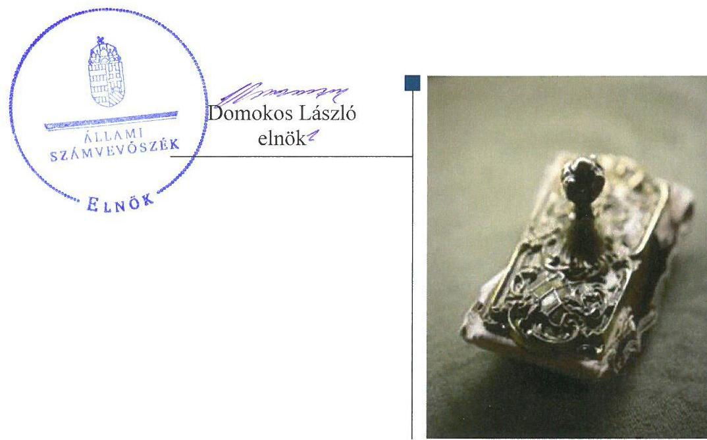
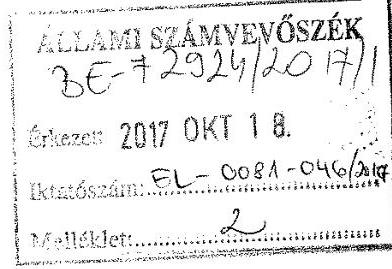
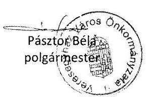
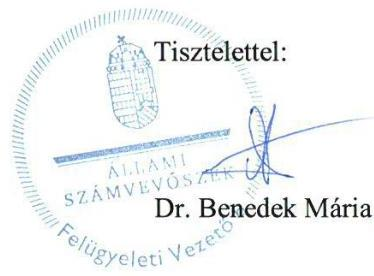

# Jelentés 

## Önkormányzatok integritás- és belső kontrollrendszere

Az önkormányzatok belső kontrollrendszere kialakításának és működtetésének ellenőrzése - Veresegyház Város Önkormányzata
2017.

---

# Jelentés 

## Önkormányzatok integritás- és belső kontrollrendszere

Az önkormányzatok belső kontrollrendszere kialakításának és működtetésének ellenőrzése - Veresegyház Város Önkormányzata
2017. november 22. nap

---

# AZ ELLENŐRZÉST FELÜGYELTE:

DR. BENEDEK MÁRIA felügyeleti vezető

## AZ ELLENŐRZÉST VEZETTE ÉS A VÉGREHAJTÁSÁÉRT FELELŐS:

HORVÁTH JÓZSEF, MAROZSÁN LÁSZLÓNÉ ellenőrzésvezető

## A PROGRAM ÖSSZEÁLLÍTÁSÁÉRT FELELŐS:

TÓTPÁL SZABOLCS osztályvezető

IKTATÓSZÁM: EL-0081-048/2017.

TÉMASZÁM: 2444

ELLENŐRZÉS-AZONOSÍTÓ SZÁM: V078901

Jelentéseink az Országgyűlés számítógépes hálózatán és az Interneten a www.asz.hu címen is olvashatóak.

---

# TARTALOMJEGYZÉK 

■ ÖSSZEGZÉS ..... 5
■ AZ ELLENŐRZÉS CÉLJA ..... 6
■ AZ ELLENŐRZÉS TERÜLETE ..... 7
■ AZ ELLENŐRZÉS HÁTTERE, INDOKOLTSÁGA ..... 8
■ A JELENTÉS LÉNYEGES KÉRDÉSKÖREI ..... 9
■ ELLENŐRZÉS HATÓKÖRE ÉS MÓDSZEREI ..... 10
■ MEGÁLLAPÍTÁSOK ..... 12
■ JAVASLATOK ..... 19
■ MELLÉKLETEK ..... 23
I. Sz. melléklet: Értelmező szótár ..... 23
■ FÜGGELÉK: ÉSZREVÉTELEK ..... 25
■ RÖVIDÍTÉSEK JEGYZÉKE ..... 31

---

.

---

# ÖSSZEGZÉS 

Az Állami Számvevőszék Veresegyház Város Önkormányzatának ellenőrzése során megállapította, hogy a kontrolltevékenység kereteinek kialakítása és működtetése nem felelt meg a jogszabályi előírásoknak. A költségvetési szerv vezetője kockázatkezelési rendszert nem működtetett és az ellenőrzött időszak egy részében a belső ellenőrzési tevékenység ellátásáról nem gondoskodott. A belső kontrollrendszer kialakítása és működtetése, valamint az integritás szemlélet érvényesítése hiányos volt, ennek következtében nem volt biztosított a közpénzek szabályos, átlátható felhasználása, a vagyonnal való felelős gazdálkodás.

## Az ellenőrzés társadalmi indokoltsága

Az Állami Számvevőszék a stratégiai céljával összhangban - az Állami Számvevőszékről szóló 2011. évi LXVI. törvény felhatalmazása alapján - végzi a közpénzekkel, az állami és önkormányzati vagyonnal való felelős gazdálkodás, valamint a helyi önkormányzatok számviteli rendje betartásának és belső kontrollrendszere működésének ellenőrzését. Magyarország Alaptörvénye az önkormányzatoktól is elvárja a kiegyensúlyozott, átlátható és fenntartható költségvetési gazdálkodás elvének érvényesítését, továbbá a nemzeti vagyonnal való rendeltetésszerű és felelős módon való gazdálkodást. Az Állami Számvevőszék stratégiájában az is megfogalmazódott, hogy támogatja az integritás alapú, átlátható és elszámoltatható közpénzfelhasználás megteremtését. Mindezekre tekintettel, a közpénzzel gazdálkodó szervezetek esetében a belső kontrollrendszer megfelelő működésének ellenőrzését prioritásként kezeli az Állami Számvevőszék.

## Főbb megállapítások, következtetések, javaslatok

Veresegyház Város Önkormányzatánál a kontrollkörnyezet kialakítása megfelelt a jogszabályi előírásoknak. Az ellenőrzött időszakban kockázatkezelési rendszert nem működtetett, nem tárta fel a tevékenységében, gazdálkodásában rejlő kockázatokat. A kontrolltevékenység kereteinek kialakítása és működtetése során nem tartották be a jogszabályokban és a belső szabályzatokban foglaltakat. Ennek következtében nem előzték meg és nem tárták fel a szabálytalanságokat, a gazdálkodási jogkörök szabálytalan gyakorlása növelte a jogosulatlan kifizetések kockázatát.

Veresegyház Város Önkormányzata nem alakította ki és nem működtette a szervezet információs rendszerét, az ellenőrzött időszak egy részében belső ellenőrzési tevékenység ellátásáról nem gondoskodott, a belső ellenőrzésekről a belső ellenőr nyilvántartást nem vezetett, éves ellenőrzési jelentést nem készített.

Az ellenőrzött időszakban a belső kontrollrendszer nem támogatta Veresegyház Város Önkormányzata szabályszerű működését, a gazdaságosság, hatékonyság és eredményesség követelményének érvényesülését.

A Veresegyház Roma Nemzetiségi Önkormányzat gazdálkodásával kapcsolatos önkormányzati feladatok ellátása nem felelt meg a jogszabályi előírásoknak.

Veresegyház Város Önkormányzatánál az integritással összefüggő szabályos kontrollrendszer kiépítése, működtetése, valamint az integritás szemlélet érvényesítése érdekében további intézkedések szükségesek.

---

# AZ ELLENŐRZÉS CÉLJA 

AZ ELLENŐRZÉS CÉLJA annak megállapítása volt, hogy szabályszerűen történt-e Veresegyház Város Önkormányzata belső kontrollrendszerének kialakítása és működtetése, az biztosította-e a közpénzfelhasználás szabályosságát, a közpénzekkel és a nemzeti vagyonnal történő szabályszerű és felelős gazdálkodást, a beszámolási és adatszolgáltatási kötelezettségek szabályszerű teljesítését. Az ellenőrzés keretében értékeltük Veresegyház Város Önkormányzata korrupciós kockázatainak kezelését szolgáló integritás kontrollok kiépítettségét, valamint az integritás szemlélet érvényesülését.

---

# AZ ELLENŐRZÉS TERÜLETE 

## Veresegyház Város Önkormányzata

Veresegyház Város a Közép-Magyarországi régióban, Pest megyében fekszik, lakónépessége a Központi Statisztikai Hivatal Magyarország közigazgatási helynévkönyve alapján 2016. január 1-jén 17532 fő volt.

Veresegyház Város Önkormányzata a Veresegyházi Polgármesteri Hivatallal és intézményeivel látta el feladatait, amelyek közül a Veresegyházi Medveotthon 2016. december 31-ével megszűnt, közfeladatainak ellátásáról a GAMESZ ${ }^{1}$ gondoskodott a továbbiakban. Az intézmények közül három gazdasági szervezettel rendelkező költségvetési szerv volt a 2016. évben. A Veresegyházi Polgármesteri Hivatal rendelkezett gazdasági szervezettel, a gazdasági vezető feladatait a Pénzügyi osztály vezetője látta el. A 12 fővel működő Képviselő-testület munkáját négy állandó bizottság támogatta.

A településen az ellenőrzött időszakban Roma Nemzetiségi Önkormányzat működött. Veresegyház Város Önkormányzata többségi tulajdonában lévő gazdasági társaságok száma az ellenőrzött időszak végére háromról egyre csökkent.

A településvezető személye 1965. szeptember 1-jétől nem változott. A jegyző 2011. február 11-től látja el feladatait.

A Veresegyház Város Önkormányzata által fenntartott nyolc költségvetési szervnél 2016. december 31-én 414 fő közalkalmazott és 59 köztisztviselő dolgozott.

A 2016. évi konszolidált költségvetési beszámoló alapján Veresegyház Város Önkormányzatának 7 070,6 millió Ft teljesített költségvetési bevétele és 7780,0 millió Ft teljesített kiadása volt. Veresegyház Város Önkormányzata 2016. december 31-i könyvviteli mérleg szerinti eszközvagyona 48931,2 millió Ft volt. A költségvetési évben esedékes kötelezettségek összege 2 513,0 millió Ft-ot, a költségvetési évet követően esedékes kötelezettségek állományának összege 117,4 millió Ft-ot tett ki.

---

# AZ ELLENŐRZÉS HÁTTERE, INDOKOLTSÁGA 

A demokratikus társadalmakban alapvető igény, hogy a közpénzeket, a közvagyont használók tevékenységükről elszámoljanak, ahhoz egyértelmű és érvényesíthető felelősségi szabályok társuljanak. Ennek a jogos igénynek az érvényesítéséhez meg kell teremteni azokat a folyamatokat, rendszereket, amelyek nélkülözhetetlenek az elszámoltatáshoz. Az elszámoltatás eredményes működtetéséhez szükség van a megfelelő információs, kontroll-, értékelési - és beszámolási rendszerek kialakítására. A belső kontrollok kiépítettsége hozzájárul az integritási szemlélet kialakításához és érvényesüléséhez. A belső kontrollrendszer kialakítása és működtetése nélkül nem valósítható meg a közpénzek, a közvagyon szabályos, gazdaságos, hatékony és eredményes felhasználása.

A BELSŐ KONTROLLRENDSZER azt a célt szolgálja, hogy az államháztartás szervei működésük és gazdálkodásuk során a tevékenységeket szabályszerűen, gazdaságosan, hatékonyan, eredményesen hajtsák végre, teljesítsék elszámolási kötelezettségeiket és megvédjék az erőforrásokat a veszteségektől, a károktól, a nem rendeltetésszerű használattól. A belső kontrollrendszer magában foglalja mindazon szabályokat, eljárásokat, gyakorlati módszereket és szervezeti struktúrákat, kockázatkezelési technikákat, kontrolltevékenységeket, amelyek segítséget nyújtanak a szervezetnek céljai eléréséhez. A belső kontrollrendszer szabályozása háromszintű, a törvényi előírásokat az Áht. ${ }^{2}$ és a Mötv. ${ }^{3}$ a rendeleti szintű szabályozást az Ávr. ${ }^{4}$ és a Bkr. ${ }^{5}$ tartalmazza, amelyeket útmutatói szinten az NGM ${ }^{6}$ által kiadott standardok és kézikönyvek támogatnak.

A MEGFELELŐ BELSŐ KONTROLLRENDSZER jelentősen csökkenti a hibák és szabálytalanságok kockázatát. Az ÁSZ ${ }^{7}$ célja, hogy javuljon az ellenőrzött önkormányzatok belső kontrollrendszerének szabályozottsága, működésének megfelelősége, szabályszerűsége, biztosítva az önkormányzatnál a közpénzfelhasználás szabályosságát, a közpénzekkel és a nemzeti vagyonnal történő szabályszerű, gazdaságos, hatékony és eredményes gazdálkodást. Az ÁSZ ellenőrzés tapasztalatai nem csupán a közvetlenül ellenőrzött önkormányzatokat támogathatják, hanem a „jó gyakorlat” elterjesztésével azok az önkormányzatok is átvehetik a pozitív példákat, ahol nem végez ellenőrzést az ÁSZ.

## AZ ELLENŐRZÉS VÁRHATÓ HASZNOSULÁSA

NÉGY SZINTEN valósul meg. A törvényalkotás számára összegzett tapasztalatok állnak rendelkezésre a belső kontrollrendszer önkormányzati területen való kialakításáról, működtetéséről és hatásairól. Az ellenőrzés az ellenőrzött számára visszajelzést ad a belső kontrollrendszer kialakításában és működésében lévő hiányosságokról, javaslataival hozzájárul azok kiküszöböléséhez. Az ellenőrzés megállapításait és javaslatait más szervezetek is hasznosíthatják a rendezett gazdálkodási keretek kialakításához. A társadalom számára jelzi, hogy közpénz nem maradhat ellenőrizetlenül, az ÁSZ értékteremtő rend kialakításához és megőrzéséhez hozzájáruló tevékenysége pozitív hatással lesz a szervezetről kialakított összkép formálásában.

---

# A JELENTÉS LÉNYEGES KÉRDÉSKÖREI 

1. Az önkormányzat belső kontrollrendszerének kialakítása és működtetése szabályszerű volt-e, az biztosította-e az önkormányzatnál a közpénzfelhasználás szabályosságát, a nemzeti vagyonnal történő felelős gazdálkodást?
2. Érvényesült-e az integritás szemlélet és ennek megfelelően kiépítették-e az integritás kontrollrendszert az önkormányzatnál?

---

# ELLENŐRZÉS HATÓKÖRE ÉS MÓDSZEREI 

## Az ellenőrzés típusa

Megfelelőségi ellenőrzés.

## Az ellenőrzött időszak

2016. január 1. és 2016. december 31. közötti időszak.

## Az ellenőrzés tárgya

A helyi önkormányzatnak, mint éves költségvetési beszámoló készítésére kötelezett szervezetnek és polgármesteri hivatalának belső kontrollrendszere. Az integritás szemlélet érvényesülése.

Az ellenőrzés kiterjedt minden olyan körülményre és adatra, amely az ÁSZ jogszabályban meghatározott feladatainak teljesítéséhez, valamint a program végrehajtása folyamán felmerült újabb összefüggések feltárásához szükséges volt.

## Az ellenőrzött szervezet

Veresegyház Város Önkormányzata

## Az ellenőrzés jogalapja

Az ÁSZ tv. ${ }^{8}$ 1. § (3) bekezdésében foglaltak alapján az ÁSZ általános hatáskörrel végzi a közpénzekkel és az állami és önkormányzati vagyonnal való felelős gazdálkodás ellenőrzését. Az ÁSZ tv. 5. § (2) bekezdése alapján az államháztartás gazdálkodásának ellenőrzése keretében az ÁSZ ellenőrzi a helyi önkormányzatok gazdálkodását, valamint az ÁSZ tv. 5. § (6) bekezdése alapján ellenőrzése során értékeli az államháztartás számviteli rendjének betartását és a belső kontrollrendszer működését.

## Az ellenőrzés módszerei

Az ÁSZ az ellenőrzést a nemzetközi standardokat irányadónak tekintve az ellenőrzési program szempontjai, kérdései, az ellenőrzött időszakban hatályos jogszabályok, az ellenőrzés szakmai szabályok és módszertanok figyelembe vételével végezte.

---

Az ellenőrzés ideje alatt az ÁSZ az ellenőrzött szervezettel történt kapcsolattartást az ÁSZ SZMSZ²-ének vonatkozó előírásai alapján biztosította.

Az ellenőrzési kérdések megválaszolásához szükséges bizonyítékok megszerzése az ellenőrzöttek által rendelkezésre bocsátott dokumentumokra, adatokra alapozva megfigyelés, szemle (szemrevételezés), kérdésfeltevés (információkérés), valamint elemző eljárással történt. A minták kiválasztása rétegzett, véletlen mintavételi eljárással történt. Az ellenőrzési bizonyítékként felhasználható adatforrások közé tartoztak egyrészt az ellenőrzési program részletes szempontjainál felsorolt adatforrások, másrészt minden - az ellenőrzés folyamán feltárt, az ellenőrzés szempontjából információt tartalmazó - dokumentum.

Az ellenőrzés lefolytatásához az önkormányzat a tanúsítványok kitöltésével, valamint az ÁSZ által kért dokumentumok megküldésével szolgáltatott adatokat. A rendelkezésre bocsátott adatok, információk kontrollja az ellenőrzés keretében történt. Az egységes értelmezést támogatta a program mellékletét képező fogalomtár és rövidítésjegyzék.

Az önkormányzat belső kontrollrendszere jogszabályi előírások szerinti kialakításának és működtetésének szabályszerűségét az ÁSZ az erre irányuló ellenőrzési kérdésekre adott válaszok összesítése alapján pillérenként (kontrollkörnyezet, kockázatkezelési rendszer, kontrolltevékenységek, információs és kommunikációs rendszer, monitoring rendszer) és összesítetten is értékelte. Az önkormányzat belső kontrollrendszere egyes pilléreinek kialakítása és működtetése „szabályszerű”, amennyiben az értékelt területen az elért igen válaszok százalékban kifejezett, egész számra kerekített aránya, meghaladta a 85%-ot, „nem szabályszerű”, ha nem haladta meg a 60%-ot. Ha a 85%-ot nem haladta meg, de 60%-nál nagyobb volt az igen válaszok aránya, akkor a minősítés „részben szabályszerű”. Az önkormányzat belső kontrollrendszerének összesített értékelése megegyezik a pillérenként (kontrollterületenként) alkalmazott százalékos értékelésekkel, a következő eltérésekkel. A kontrollrendszer egésze esetében a „szabályszerű” értékelésnek a százalékos értéken felül további feltétele, hogy egyik kontrollterület sem kaphat „nem szabályszerű” értékelést, a „részben szabályszerű” értékelés további feltétele, hogy legfeljebb egy ellenőrzött kontrollterület lehet „nem szabályszerű” értékelésű. Az összesített értékelés a százalékos értéktől függetlenül „nem szabályszerű”, ha az ellenőrzött kontrollterületek közül több mint egynek „nem szabályszerű” az értékelése.

A közszféra integritás alapú kultúrájának kialakítása, megerősítése és működése szorosan
 összefügg a belső kontrollrendszer működésével, ezért az ellenőrzés kiterjedt annak értékelésére is, hogy a belső kontrollrendszer kialakítása és működtetése hogyan hatott az integritás szemlélet érvényesülésére. Az integritás szemlélet érvényesülésének értékelése az önkormányzat által kitöltött tanúsítvány alapján történt.

---

# 1. Az önkormányzat belső kontrollrendszerének kialakítása és működtetése szabályszerű volt-e, az biztosította-e az önkormányzatnál a közpénzfelhasználás szabályosságát, a nemzeti vagyonnal történő felelős gazdálkodást? 

Összegző megállapítás

Az Önkormányzat ${ }^{10}$ belső kontrollrendszerének kialakítása és működtetése nem volt szabályszerű, nem biztosította a közpénzfelhasználás szabályosságát, a nemzeti vagyonnal történő felelős gazdálkodást.

Az Önkormányzatnál a kontrollkörnyezet kialakítása megfelelt a jogszabályi előírásoknak.

Az Önkormányzat szervezetének és működésének szabályozási kereteit az Önkormányzati SZMSZ ${ }^{11}$ és a Hivatali SZMSZ ${ }^{12}$ a jogszabályokban foglaltaknak megfelelően tartalmazta. A Hivatal ${ }^{13}$ Alapító Okirata az Áht. és az Ávr. előírásainak megfelel.

A Jegyző elkészítette az ügyrendet ${ }^{14}$, kialakította az Önkormányzat és a Hivatal Számviteli politikáját ${ }^{15}$, annak keretében elkészítette a Számlarendet ${ }^{16}$, a Leltárkészítési és leltározási szabályzatot ${ }^{17}$, az Eszközök és források értékelési szabályzatát ${ }^{18}$, az Önköltség-számítási szabályzatot ${ }^{19}$, a Pénzkezelési szabályzatot ${ }^{20}$ és a Bizonylati rendet ${ }^{21}$.

A Jegyző a működéshez kapcsolódó, pénzügyi kihatással bíró, jogszabályban nem szabályozott kérdéseket szabályozta. Ennek keretében kidolgozták a beszerzések lebonyolítására, a kiküldetések rendjére, a reprezentációs kiadások elszámolására és a gépjárművek igénybevételének rendjére vonatkozó eljárásokat, továbbá a munkáltatói szabályozási hatáskörébe tartozó kérdésekről kiadta a Közszolgálati szabályzatot ${ }^{22}$.

A Polgármester az Önkormányzat Közbeszerzési szabályzatában ${ }^{23}$ meghatározta a Kbt. ${ }^{24}$ hatálya alá tartozó beszerzések eljárásrendjét, mely kiterjedt a Hivatalt érintő közbeszerzési eljárások szabályaira is.

Az Önkormányzat kontrollkörnyezetének kialakítása - az 1. táblázatban részletezett hiányosságok mellett - szabályszerű volt.

---

# A KONTROLLKÖRNYEZET KIALAKÍTÁSÁNAK HIÁNYOSSÁGAI 

| Sorszám | Részmegállapítások | Megjegyzések |
| :--: | :--: | :--: |
| 1. | A Jegyző az Önkormányzati SZMSZ 53. § (2) bekezdés h) pontjában előírt feladata ellenére nem kezdeményezte és nem készítette elő az Önkormányzati SZMSZ módosítását a helyi önkormányzatra vonatkozó jogszabályváltozást követően. | Az Önkormányzati SZMSZ 8. számú függeléke Preambulumának 2. pontja a 2015. január 1-jétől hatályon kívül helyezett Áht. 27. § (2) bekezdésére hivatkozik. |
| 2. | Az ügyrend az Ávr. 13. § (5) bekezdésében foglaltak ellenére nem tartalmazta a szervezeti egység vezetőjének és alkalmazottainak a helyettesítés rendjét. |  |
| 3. | A Képviselő-testület a Kttv. ${ }^{25}$ 231. § (1) bekezdésében foglaltak ellenére nem állapította meg a köztisztviselőkre vonatkozó hivatásetikai alapelvek részletes tartalmát, valamint az etikai eljárás szabályait. |  |
| 4. | A Számviteli politika keretében a Számv. tv. ${ }^{26}$ 14. § (4) bekezdésében foglaltak ellenére nem rögzítették írásban azokat a gazdálkodóra jellemző szabályokat, előírásokat, módszereket, amelyekkel meghatározzák, hogy mit tekintenek az értékelés szempontjából lényegesnek, nem lényegesnek. |  |
| 5. | A Jegyző az az Ávr. 13. (2) bekezdés b) pontjában foglaltak ellenére nem rendezte belső szabályzatban a beszerzések lebonyolításával kapcsolatos eljárásrendet a Roma Nemzetiségi Önkormányzat gazdálkodására vonatkozóan. |  |

Forrás: ÁSZ

### 1.2. számú megállapítás

A kockázatkezelési rendszer megfelelő szabályozása a teljes ellenőrzött időszakban nem volt biztosított, működtetése nem felelt meg a jogszabályi előírásoknak.

## A KOCKÁZATKEZELÉSSEL KAPCSOLATOS SZABÁLYOKAT az Önkormányzat és a Hivatal 2016. március 1-jétől hatályos Belső kontrollrendszere ${ }^{27}$ tartalmazta, melyek 2016. szeptember 30-ig megfeleltek a jogszabályi előírásoknak, azonban a Bkr. 2016. október 1-jei változását követően azokat nem módosították, illetve a jogszabályi változásoknak megfelelő új szabályzatot sem készítettek.

A kockázatkezelési és az integrált kockázatkezelési rendszer hiányosságait a 2. táblázat tartalmazza.
2. táblázat

## A KOCKÁZATKEZELÉSI ÉS INTEGRÁLT KOCKÁZATKEZELÉSI RENDSZER HIÁNYOSSÁGAI

| Sorszám | Részmegállapítás | Megjegyzés |
| :--: | :--: | :--: |
| 1. | A Jegyző a Bkr. 6. § (4) bekezdésének előírása ellenére 2016. október 1-jétől nem szabályozta a szervezeti integritást sértő események kezelésének eljárásrendjét, valamint az integrált kockázatkezelés eljárásrendjét. | A Bkr. 2016. október 1-jétől történt módosítását követően az Önkormányzat nem módosította a meglévő szabályzatát. |
| 2. | A Jegyző 2016. szeptember 30-ig a Bkr. 7. § (1) bekezdésében foglalt követelmény ellenére kockázatkezelési rendszert, 2016. október 1-jétől integrált kockázatkezelési rendszert nem működtetett. | A Jegyző nem mérte fel és nem állapította meg a költségvetési szerv tevékenységében rejlő, szervezeti célokkal összefüggő kockázatokat és nem határozta meg a szükséges intézkedéseket. |

Forrás: ÁSZ

### 1.3. számú megállapítás

A kontrolltevékenységek kereteinek kialakítása és működtetése nem volt szabályszerű.

A KONTROLLTEVÉKENYSÉGEK keretein belül a Jegyző a Gazdálkodási szabályzatban ${ }^{28}$ az Ávr. előírásainak megfelelően meghatározta az Önkormányzatot érintően a gazdálkodási jogkörök kijelölésére, gyakorlására és az összeférhetetlenségre vonatkozó szabályokat. A jogosultak kötelezettségvállalási, teljesítésigazolási és utalványozási jogkör gyakorlására történő kijelölése megfelelt az Ávr.-ben foglalt előírásoknak.

A pénzügyi ellenjegyzési és az érvényesítési jogkörök gyakorlása kiterjesztésre került az Önkormányzatra és minden olyan költségvetési szervre, melynek gazdálkodási feladatait a Hivatal látta el.

---

# A KÖTELEZETTSÉGVÁLLALÁSOK NYILVÁNTARTÁSI RENDSZERE megfelelte a jogszabályi előírásoknak. A kötelezettségvállalások az Áht. előírásainak megfelelően a kiadáshoz tartozó szabad előirányzat terhére történtek, a nyilvántartásba vételről az Ávr.-ben és az Áhsz. ${ }^{29}$-ben foglalt előírásoknak megfelelően a Jegyző gondoskodott. A kötelezettségvállalások a jogszabályban és a Gazdálkodási szabályzatban foglaltaknak megfeleltek. 

A kontrolltevékenység kialakításának és működtetésének szabálytalanságait a 3. táblázat tartalmazza.

## A KONTROLLTEVÉKENYSÉG KIALAKÍTÁSÁNAK ÉS MŰKÖDTETÉSÉNEK SZABÁLYTALANSÁGAI

| Sorszám | Részmegállapítások | Megjegyzések |
| :--: | :--: | :--: |
|  | PÉNZÜGYI ELLENJEGYZÉS |  |
| 1. | A kötelezettségvállalás pénzügyi ellenjegyzését végző köztisztviselő jogosulatlanul látta el feladatát, mert az Ávr. 55. § (2) a) pontjában foglaltak ellenére nem az arra jogosult gazdasági vezető jelölte ki. | A jogkör gyakorlása szabályszerű kijelölés hiányában történt, a köztisztviselőt a Jegyző jelölte ki. |
| 2. | A kötelezettségvállalás pénzügyi ellenjegyzése nem volt szabályszerű, mert a kötelezettségvállalás dokumentumán a pénzügyi ellenjegyzés az Ávr. 55. (1) pontjában foglaltak ellenére a pénzügyi ellenjegyzés dátumának és a pénzügyi ellenjegyzés tényére történő utalás megjelölése nélkül történt. |  |
|  | TELJESÍTÉSIGAZOLÁS | Az Önkormányzat megbízást adott a Medveotthon ${ }^{30}$ részére történő állat beszerzésére és azok átadására. A megbízási szerződésben vállalt feladat szerződésszerű teljesítése nem történt meg. Az Önkormányzat alkalmazottaival kötött megbízási szerződések nem tartalmazták a szerződésszerű teljesítés követelményeit, ennek ellenére a kifizetések megtörténtek. |
| 3 | Az Ávr. 57. § (1) bekezdésében foglaltak ellenére a teljesítést igazoló a kiadások teljesítését úgy igazolta, hogy a kiadások teljesítésének jogossága nem állt fenn. | Az Önkormányzat megbízást adott a Medveotthon ${ }^{30}$ részére történő állat beszerzésére és azok átadására. A megbízási szerződésben vállalt feladat szerződésszerű teljesítése nem történt meg. Az Önkormányzat alkalmazottaival kötött megbízási szerződések nem tartalmazták a szerződésszerű teljesítés követelményeit, ennek ellenére a kifizetések megtörténtek. |
| 4. | A teljesítésigazolás során az Ávr. 60. § (2) bekezdésében előírtak ellenére a jogkör gyakorlója maga javára igazolta személyi jellegű kifizetés teljesítését. ÉRVÉNYESÍTÉS |  |
| 5. | Az érvényesítési jogkört ellátó köztisztviselő jogosulatlanul látta el feladatát, mert az Ávr. 58. § (4) bekezdésében foglaltak ellenére nem az arra jogosult gazdasági vezető jelölte ki a feladat ellátására. | A jogkör gyakorlása szabályszerű kijelölés hiányában történt, a köztisztviselőt a Jegyző jelölte ki. |
| 6. | Az Ávr. 58. § (2) bekezdésében foglaltakkal ellentétben az érvényesítő nem jelezte az utalványozónak, hogy a megelőző ügymenetben az Áht.-ban, az Ávr.-ben és a belső szabályzatokban foglaltakat nem tartották meg. |  |
|  | UTALVÁNYOZÁS | Az érvényesítés nem volt szabályszerű. |
| 7. | A kiadások utalványozása az Ávr. 59. § (1) bekezdésében előírtak ellenére nem érvényesített okmányok alapján történt. | Az érvényesítés nem volt szabályszerű. |
|  | Egyéb kontrolltevékenység működési szabálytalanság |  |
| 8. | Az Önkormányzat megsértette a Nvtv. ${ }^{31}$ 11. § (13) bekezdésében, valamint a Vagyonrendelet ${ }^{32}$ 11. § (1) bekezdésében foglaltakat, mert egy megvásárolt ingatlan eladójával bérleti díj megfizetési kötelezettség nélkül, ingyenes használatra kötöttek lakáshasználati szerződést, annak ellenére, hogy az érintett önkormányzati vagyon nem közfeladat ellátása céljából került hasznosításra. Továbbá az ingyenes lakáshasználati szerződést az Önkormányzat képviseletében a polgármester a Vagyonrendelet 11. § (3) bekezdésében előírtak ellenére a képviselő-testület határozata nélkül kötötte meg. |  |

---

# 1.4. számú megállapítás 

Az információs és kommunikációs rendszer kialakítása és működtetése szabályszerű volt.

A KÖZÉRDEKŰ ADATOK KEZELÉSI RENDJÉNEK kialakítása és működtetése megfelelt a jogszabályi előírásoknak. A Jegyző az Info. tv. ${ }^{33}$-nek és az Ávr.-nek megfelelően elkészítette a kötelezően közzéteendő adatok nyilvánosságra hozatalának és a közérdekű adatok megismerésére irányuló igények teljesítésének rendjét rögzítő szabályzatot.

A Hivatal az Ltv. ${ }^{34}$-ben előírtak szerint rendelkezett a Magyar Nemzeti Levéltár és a Pest Megyei Kormányhivatal egyetértésével kiadott Egyedi Iratkezelési Szabályzattal ${ }^{35}$.

A működési folyamatok ellenőrzési nyomvonala 2016. március 1-jétől tartalmazta a Bkr.-ben foglaltaknak megfelelően a felelősségi szinteket, az ellenőrzési folyamatokat.

Az Önkormányzat beszámolási és adatszolgáltatási kötelezettségét a jogszabályokban és belső szabályzatokban foglaltaknak megfelelően teljesítette, éves költségvetését és beszámolóját a honlapján közzétette.

Az információs és kommunikációs rendszer kialakítása és működtetése a 4. táblázatban rögzített hiányosságok mellett szabályszerű volt.
4. táblázat

## AZ INFORMÁCIÓS ÉS KOMMUNIKÁCIÓS RENDSZER KIALAKÍTÁSÁNAK ÉS MŰKÖDTETÉSÉNEK HIÁNYOSSÁGAI

| Sorszám | Részmegállapítások | Megjegyzések |
| :--: | :--: | :--: |
| 1. | A Jegyző az Önkormányzatnál a Bkr. 9. § (1) bekezdésében foglaltak ellenére nem alakított ki és nem működtetett olyan rendszert, amely biztosította, hogy a megfelelő információk a megfelelő időben eljussanak az illetékes szervezethez, szervezeti egységhez, illetve személyhez. | Az Önkormányzat nem szabályozta az információ áramlás rendjét, az információkezelést, valamint a szervezeten kívülre történő információ átadást. |
| 2. | Az Önkormányzat, mint adatkezelő az Info. tv. 24. § (3) bekezdésében foglaltak ellenére nem készített adatvédelmi és adatbiztonsági szabályzatot. |  |
| 3. | A Jegyző a Bkr. 6. § (3) bekezdésében foglaltak ellenére 2016. február 29-éig nem készítette el a költségvetési szerv ellenőrzési nyomvonalát. |  |

1.5. számú megállapítás

Az Önkormányzat monitoring rendszerének kialakítása és működtetése nem felelt meg a jogszabályoknak. A belső ellenőrzést kialakította, azonban az ellenőrzött időszak egy részében azt nem működtette.

A BELSŐ ELLENŐRZÉS szabályozottsága
 megfelelt a jogszabályi előírásoknak. A Hivatali SZMSZ-ben és a Belső ellenőrzési kézikönyvben ${ }^{36}$ meghatározták a belső ellenőrzést végző személy jogállását és feladatait, biztosították a belső ellenőr szervezeti és funkcionális függetlenségét. A belső ellenőrzési feladatok ellátására egy köztisztviselőt neveztek ki. A belső ellenőr rendelkezett a Bkr.-ben előírt szakképzettséggel és szakmai gyakorlattal. A belső ellenőr tekintetében érvényesültek a Bkr. összeférhetetlenségi előírásai.

A belső ellenőrzési tevékenység szervezeti formája, működtetése 2016. első félévében megfelelt a jogszabályi előírásoknak, azonban a második félévben működtetése nem volt megfelelő. Az Önkormányzat rendelkezett a Képviselő-testület által elfogadott stratégiai és kockázatelemzésen alapuló éves ellenőrzési tervvel.

---

# A MONITORING RENDSZER KIALAKÍTÁSA ÉS MŰKÖDTETÉSE az ellenőrzött időszakban az 5. táblázatban részletezett hiányosságok következtében nem volt szabályszerű. 

5. táblázat

## A MONITORING RENDSZER KIALAKÍTÁSÁNAK ÉS MŰKÖDTETÉSÉNEK HIÁNYOSSÁGAI

| Sorszám | Részmegállapítások | Megjegyzések |
| :--: | :--: | :--: |
| 1. | A Jegyző a Bkr. 10. §-ában foglaltak ellenére nem alakította ki a szervezet tevékenységének, a célok megvalósításának nyomon követését biztosító rendszert az operatív tevékenységek keretében megvalósuló folyamatos és eseti nyomon követés tekintetében. |  |
| 2. | A Jegyző az Áht. 70. § (1) bekezdésében foglaltak ellenére az Önkormányzatnál a belső ellenőrzés megfelelő működtetéséről az ellenőrzött időszak egy részében nem gondoskodott. | A belső ellenőrzés működtetéséről az alkalmazásban lévő belső ellenőr tartós távolléte idején a Jegyző nem gondoskodott. |
| 3. | A belső ellenőrzési vezető a Bkr. 22. § (2) bekezdés b) pontjában foglaltak ellenére nem gondoskodott a belső ellenőrzések nyilvántartásáról. | A Bkr. 2. § c) pontja értelmében a belső ellenőrzési vezető a belső ellenőrzést ellátó személy, amennyiben a költségvetési szervnél egy fő látja el a belső ellenőrzést. |
| 4. | A belső ellenőrzési vezető a Bkr. 49. (1) bekezdésében foglalt előírások ellenére nem készített éves ellenőrzési jelentést. |  |
| 5. | A Bkr. 13. § (2) bekezdésében előírtak ellenére nem készítettek intézkedési tervet a külső ellenőrző szerv által tett ellenőrzési javaslatra vonatkozóan, továbbá a Jegyző nem tett eleget a Bkr. 14. § (1) bekezdésében foglalt nyilvántartási kötelezettségének a külső ellenőrzéshez kapcsolódóan. |  |

Forrás: ÁSZ
1.6. számú megállapítás

A belső kontrollrendszer kialakításával és működésével kapcsolatban a Jegyző által nyilatkozatban ${ }^{37}$ tett értékelést jelen ellenőrzés megállapításai nem támasztották alá.

A JEGYZŐ A JOGSZABÁLY ÁLTAL ELŐÍRT NYILATKOZATÁBAN megfelelőnek értékelte az Önkormányzat belső kontrollrendszerének kialakítását és működését, ezen belül a költségvetési szerv tevékenységében a hatékonyság, eredményesség és gazdaságosság követelmények érvényesítését. A Jegyző nyilatkozatában foglaltakat jelen ellenőrzés a kialakított kontrollkörnyezet minősítése kivételével nem támasztotta alá.

### 1.7. számú megállapítás

A Roma Nemzetiségi Önkormányzat ${ }^{38}$ gazdálkodásával kapcsolatos feladatok ellátása nem felelt meg a jogszabályi előírásoknak.

Az Önkormányzat a Roma Nemzetiségi Önkormányzattal 2014. november 24-én a Nek. tv. ${ }^{39}$-ben előírtak alapján Együttműködési Megállapodást kötött.

Az Együttműködési Megállapodásban a jogszabályi előírásoknak megfelelően rendelkeztek a Roma Nemzetiségi Önkormányzat gazdálkodási jogköreinek gyakorlását végzők kijelöléséről, a működési feltételeinek és gazdálkodásának eljárási és dokumentációs részletszabályairól, a bevételeivel és kiadásaival kapcsolatos tervezési, ellenőrzési, finanszírozási, adatszolgáltatási és beszámolási feladatai ellátásának részletes szabályairól.

---

A 2016. évi költségvetési határozat-tervezetet és annak módosításaira vonatkozó határozat-tervezeteket a Jegyző előkészítette a Roma Nemzetiségi Önkormányzat képviselő-testület elé történő terjesztéshez.

A Roma Nemzetiségi Önkormányzatra vonatkozóan az ellenőrzött időszakban a Jegyző az Áht.-ban foglaltaknak megfelelően kiterjesztette a gazdálkodására vonatkozó, Számv. tv.-ben előírt szabályzatokat, illetve az ügyrendet.

A Roma Nemzetiségi Önkormányzat gazdálkodásával kapcsolatos önkormányzati feladatellátás hiányosságait az 6. táblázat tartalmazza.
6. táblázat

# AZ ROMA NEMZETISÉGI ÖNKORMÁNYZAT GAZDÁLKODÁSÁVAL KAPCSOLATOS ÖNKORMÁNYZATI FELADATELLÁTÁS HIÁNYOSSÁGAI 

| Sorszám | Részmegállapítások | Megjegyzések |
| :--: | :--: | :--: |
| 1. | Az Önkormányzat és a Roma Nemzetiségi Önkormányzat között megkötött Együttműködési Megállapodás felülvizsgálatát az érintett felek a Nek. tv. 80. § (2) bekezdése ellenére 2016. január 31-éig nem végezték el. |  |
| 2. | A Roma Nemzetiségi Önkormányzat vonatkozásában a kötelezettségvállalások pénzügyi ellenjegyzésére jogosult köztisztviselőt az Ávr. 55. § (2) bekezdés g) pontjában foglaltak ellenére a gazdasági vezető helyett a Jegyző jelölte ki. |  |
| 3. | A Roma Nemzetiségi Önkormányzat vonatkozásában az érvényesítési jogkört gyakorló köztisztviselőt az Ávr. 58. § (4) bekezdésében foglaltak ellenére a gazdasági vezető helyett a Jegyző jelölte ki. |  |
| 4. | A Jegyző a Bkr. 6. § (3) bekezdésének előírása ellenére a Roma Nemzetiségi Önkormányzatra vonatkozóan nem készítette el az ellenőrzési nyomvonalat. | Az Önkormányzat 2016. március 1-jétől hatályos ellenőrzési nyomvonalának hatálya nem terjedt ki a Roma Nemzetiségi Önkormányzatra. |
| 5. | A Jegyző a Bkr. 6. § (4) bekezdésében előírtak ellenére nem szabályozta a szabálytalanságok kezelésének eljárásrendjét, illetve 2016. október 1-jétől nem készítette el a szervezeti integritást sértő események kezelésének eljárásrendjét, valamint az integrált kockázatkezelés eljárásrendjét a Roma Nemzetiségi Önkormányzatra vonatkozóan. | Az Önkormányzat szabálytalanságkezelési eljárásrendjének hatálya nem terjedt ki a Roma Nemzetiségi Önkormányzatra. |
| 6. | A belső ellenőrzési vezető a Bkr. 22. § (1) bekezdésének b) pontjában és az Együttműködési Megállapodás VII. 3. pontjában foglaltak ellenére nem állított össze kockázatelemzéssel alátámasztott éves ellenőrzési tervet a Roma Nemzetiségi Önkormányzatra vonatkozóan. |  |
| 7. | A Jegyző az Áht. 91. § (1) és (3) bekezdéseiben előírtak ellenére - figyelemmel az Áht. 26. § (1) bekezdésben foglaltakra - nem készítette elő a Roma Nemzetiségi Önkormányzat 2016. évi zárszámadási határozat-tervezetét. |  |

## 2. Érvényesült-e az integritás szemlélet és ennek megfelelően kiépítették-e az integritás kontrollrendszert az önkormányzatnál?

Összegző megállapítás

Az Önkormányzatnál az integritással összefüggő kontrollok és a korrupciós kockázatok szintje nem volt összhangban, a kontrollrendszer nem támogatta az integritás szemlélet érvényesülését.

Az Önkormányzat a jogszabályok által előírt integritás kontrollok jelentős részét kialakította. Szervezeti és működési szabályait az Önkormányzati

---

SZMSZ és a Hivatali SZMSZ tartalmazta, a dolgozók munkaköri leírással rendelkeztek. A gazdálkodási és egyéb működési folyamatairól a Számv. tv.-ben és egyéb ágazati jogszabályokban előírt szabályzatokban - Közbeszerzési szabályzat, Közszolgálati Szabályzat, Egyedi Iratkezelési Szabályzat - rendelkeztek.

Az Önkormányzatnál ugyanakkor a jogszabályi előírások ellenére a korrupciós kockázatok mérséklését, megelőzését támogató, integrált kockázatkezelési eljárásrend nem került szabályozásra, etikai szabályzattal nem rendelkeztek. A kialakított belső ellenőrzést nem működtette a költségvetési szerv vezetője a teljes ellenőrzött időszakban, kockázatelemzést csak a belső ellenőrzési területen végeztek, azok nem terjedtek ki a korrupciós, integritási kockázatokra.

Az integritás érvényesülését erősítő egyéb, jogszabályok által nem előírt kontrollok közül előírták a dolgozóknak a Közszolgálati Szabályzatban az egyéb érdekeltségeikről való nyilatkozattételi kötelezettséget, azonban nem alakították ki az Önkormányzatnál a szervezeten belüli közérdekű bejelentők védelmének szabályait, nem szabályozták a külső szakértők alkalmazásának, valamint az ajándékok, meghívások, utaztatások elfogadási feltételeit. Az Önkormányzat nem rendelkezett a szervezeti kultúrára vonatkozó hosszú- vagy középtávú stratégiával.

Az egyéb integritást erősítő kontrollok működtetése az Önkormányzatnál alacsony szinten valósult meg. Nem szerveztek korrupcióellenes képzést az elmúlt három évben, illetve nem ellenőrizték az állásra jelentkezők által benyújtott pályázati dokumentumok helyességét.

A hiányzó kontrollok növelték az Önkormányzat működéséből adódó korrupciós kockázatok veszélyét, nem támogatták a szervezeti integritás érvényesülését.

---

# JAVASLATOK 

Az ÁSZ tv. 33. § (1) bekezdésében foglaltak értelmében az ellenőrzött szervezet vezetője köteles a jelentésben foglalt megállapításokhoz kapcsolódó intézkedési tervet összeállítani és azt a jelentés kézhezvételétől számított 30 napon belül az ÁSZ részére megküldeni. Amennyiben az ellenőrzött szervezet vezetője nem küldi meg határidőben az intézkedési tervet, vagy továbbra sem elfogadható intézkedési tervet küld, az Állami Számvevőszék elnöke az ÁSZ tv. 33. § (3) bekezdés a) és b) pontjaiban foglaltakat érvényesítheti.

## a polgármesternek:

1. Intézkedjen a Kttv. előírásának megfelelően a köztisztviselőkre vonatkozó hivatásetikai alapelvek részletes tartalmát, valamint az etikai eljárás szabályait tartalmazó előterjesztést Képviselő-testület elé terjesztéséről.
(1. táblázat 3. sz. megállapítás alapján)
2. Intézkedjen az Állami Számvevőszék ellenőrzése során feltárt hiányosságok és/vagy szabálytalanságok tekintetében a munkajogi felelősség tisztázására irányuló eljárás megindításáról, és ennek eredménye ismeretében tegye meg a szükséges intézkedéseket.
(1. táblázat 1-5., 2. táblázat 1-2., 3. táblázat 1-8. 4. táblázat 1-3., 5. táblázat 1-2., 6. táblázat 1-5., 7. sz. megállapítás alapján)

## a jegyzőnek:

1. Intézkedjen a szervezeti és működési szabályzat belső szabályzat általi előírás szerinti felülvizsgálatáról.
(1. táblázat 1. sz. megállapítás alapján)
2. Intézkedjen az Ávr. előírásainak megfelelő tartalmú ügyrend elkészítéséről.
(1. táblázat 2. sz. megállapítás alapján)
3. Intézkedjen a Kttv. előírásának megfelelően a köztisztviselőkre vonatkozó hivatásetikai alapelvek részletes tartalmát, valamint az etikai eljárás szabályait tartalmazó előterjesztés elkészítéséről.
(1. táblázat 3. sz. megállapítás alapján)

---

4. Intézkedjen a Számv. tv. előírásának megfelelően azoknak a gazdálkodóra jellemző szabályoknak, előírásoknak, módszereknek a Számviteli politika keretében írásban történő rögzítéséről, amelyekkel meghatározza, hogy mit tekint a számviteli elszámolás, az értékelés szempontjából lényegesnek, nem lényegesnek.
(1. táblázat 4. sz. megállapítás alapján)
5. Intézkedjen az Ávr. előírásának megfelelően a helyi nemzetiségi önkormányzat gazdálkodására vonatkozóan a beszerzések lebonyolításával kapcsolatos eljárásrend elkészítéséről.
(1. táblázat 5. sz. megállapítás alapján)
6. Intézkedjen a Bkr. előírásának megfelelően a szervezeti integritást sértő események kezelésének eljárásrendje, valamint az integrált kockázatkezelés eljárásrendje szabályozásáról.
(2. táblázat 1. sz. megállapítás alapján)
7. Intézkedjen a Bkr. előírásának megfelelően integrált kockázatkezelési rendszer működtetéséről.
(2. táblázat 2. sz. megállapítás alapján)
8. Intézkedjen a gazdálkodási jogkörök gyakorlása során az Ávr. és a belső előírások betartásáról.
(3. táblázat 1-8. sz. megállapítás alapján)
9. Intézkedjen a Bkr. előírásának megfelelően olyan rendszer kialakításáról és működtetéséről, amely biztosítja, hogy a megfelelő információk a megfelelő időben eljussanak az illetékes szervhez, szervezeti egységhez, illetve személyhez.
(4. táblázat 1. sz. megállapítás alapján)
10. Intézkedjen az Info tv. előírásának megfelelően adatvédelmi és adatbiztonsági szabályzat elkészítéséről.
(4. táblázat 2. sz. megállapítás alapján)
11. Intézkedjen a Bkr. előírásának megfelelően a szervezet tevékenységének, a célok megvalósításának nyomon követését biztosító rendszer kialakításáról az operatív tevékenységek keretében megvalósuló folyamatos és eseti nyomon követés tekintetében.
(5. táblázat 1. sz. megállapítás alapján)

---

12. Intézkedjen az Áht. előírása szerint a belső ellenőrzés megfelelő működtetéséről.
(5. táblázat 2. sz. megállapítás alapján)
13. Intézkedjen a Bkr. előírásának megfelelően a belső ellenőrzések nyilvántartásáról.
(5. táblázat 3. sz. megállapítás alapján)
14. Intézkedjen a Bkr. előírásának megfelelően az éves ellenőrzési jelentés elkészítéséről.
(5. táblázat 4. sz. megállapítás alapján)
15. Intézkedjen a Nek. tv. előírásának megfelelően az Önkormányzat és Roma Nemzetiségi Önkormányzata között megkötött Együttműködési megállapodás felülvizsgálatáról.
(6. táblázat 1. sz. megállapítás alapján)
16. Intézkedjen az Önkormányzat Roma Nemzetiségi Önkormányzata vonatkozásában a gazdálkodási jogkörök gyakorlása során az Ávr előírásainak betartásáról.
(6. táblázat 2. és 3. sz. megállapítás alapján)
17. Intézkedjen a Bkr. előírásának megfelelően az Önkormányzat Roma Nemzetiségi Önkormányzata vonatkozásában az ellenőrzési nyomvonal elkészítéséről, és rendszeres aktualizálásáról.
(6. táblázat 4. sz. megállapítás alapján)
18. Intézkedjen a Bkr. előírásának megfelelően az Önkormányzat Roma Nemzetiségi Önkormányzata vonatkozásában a szervezeti integritást sértő események kezelésének eljárásrendje,
 valamint az integrált kockázatkezelés eljárásrendje szabályozásáról.
(6. táblázat 5. sz. megállapítás alapján)
19. Intézkedjen a Bkr. előírásának megfelelően az Önkormányzat Roma Nemzetiségi Önkormányzata vonatkozásában a kockázatelemzéssel alátámasztott éves ellenőrzési terv összeállításáról.
(6. táblázat 6. sz. megállapítás alapján)

---

20. Intézkedjen az Áht. előírásának megfelelően az Önkormányzat Roma Nemzetiségi Önkormányzata vonatkozásában a zárszámadási rendelet tervezet előkészítéséről.
(6. táblázat 7. sz. megállapítás alapján)
21. Intézkedjen az Állami Számvevőszék ellenőrzése során feltárt hiányosságok és/vagy szabálytalanságok tekintetében a munkajogi felelősség tisztázására irányuló eljárás megindításáról, és ennek eredménye ismeretében tegye meg a szükséges intézkedéseket.
(5. táblázat 3-4. és 6. táblázat 6. sz. megállapítás alapján)

---

# MELLÉKLETEK 

- I. SZ. MELLÉKLET: ÉRTELMEZŐ SZÓTÁR

ÁSZ Integritás Projekt
belső ellenőrzés
belső kontrollrendszer
pillérei, kontrollterületei
helyi önkormányzat
információs és kommunikációs rendszer
integritás

Az Állami Számvevőszék 2009-ben indította el a „Korrupciós kockázatok feltérképezése - Integritás alapú közigazgatási kultúra terjesztése" című, európai uniós forrásból megvalósított kiemelt projektjét (Integritás Projekt). Az Integritás Projekt célja, hogy felmérje a közszféra intézményei korrupciós kockázatoknak való kitettségét, illetőleg az azok mérséklésére hivatott kontrollok szintjét. Az Állami Számvevőszék a projekt révén az integritás szemlélet minél szélesebb körrel történő megismertetését, gyakorlatba ültetését kívánja elérni. Az integritás követelményeinek megfelelő szervezeti működést előnyben részesítő közigazgatási kultúra elterjesztését és a korrupció elleni fellépést az ÁSZ önmagára nézve is stratégiai jelentőségű célként fogalmazta meg. A projekt a felmérésben résztvevő intézmények számára helyzetükről egyfajta „tükörképet" mutat be, ami alapot teremt a jövőbeni pozitív irányú elmozduláshoz.
(Forrás: a http://integritas.asz.hu honlapon közzétett, a 2013. évi Integritás felmérés eredményeiről készült összefoglaló tanulmány)
Független, tárgyilagos bizonyosságot adó és tanácsadó tevékenység, amelynek célja, hogy az ellenőrzött szervezet működését fejlessze és eredményességét növelje, az ellenőrzött szervezet céljai elérése érdekében rendszerszemléletű megközelítéssel és módszeresen értékeli, illetve fejleszti az ellenőrzött szervezet irányítási és belső kontrollrendszerének hatékonyságát. (Forrás: Bkr. 2. § b) pontja)
A belső kontrollrendszer a kockázatok kezelése és tárgyilagos bizonyosság megszerzése érdekében kialakított folyamatrendszer, amely azt a célt szolgálja, hogy a működés és gazdálkodás során a tevékenységeket szabályszerűen, gazdaságosan, hatékonyan, eredményesen hajtsák végre, az elszámolási kötelezettségeket teljesítsék, megvédjék az erőforrásokat a veszteségektől, károktól és nem rendeltetésszerű használattól.
(Forrás: Áht. 69. § (1) bekezdése)
A kontrollkörnyezet, a (integrált) kockázatkezelési rendszer, a kontrolltevékenységek, az információs és kommunikációs rendszer, valamint a nyomon követési (monitoring) rendszer. (Forrás: Bkr. 3. §-a)

A helyi önkormányzat jogi személy. Az önkormányzati feladatok ellátását a képviselő-testület és szervei biztosítják. A képviselőtestület szervei: a polgármester, a főpolgármester, a megyei közgyűlés elnöke, a képviselő-testület bizottságai, a részönkormányzat testülete, a önkormányzati hivatal, a megyei önkormányzati hivatal, a közös önkormányzati hivatal, a jegyző, továbbá a társulás. A képviselő-testület a feladatkörébe tartozó közszolgáltatások ellátására - jogszabályban meghatározottak szerint - költségvetési szervet, a polgári perrendtartásról szóló törvény szerinti gazdálkodó szervezetet (a továbbiakban: gazdálkodó szervezet), nonprofit szervezetet és egyéb szervezetet (a továbbiakban együtt: intézmény) alapíthat, továbbá szerződést köthet természetes és jogi személlyel vagy jogi személyiséggel nem rendelkező szervezettel. A helyi önkormányzat éves költségvetési beszámolója magába foglalja a helyi önkormányzat - nem költségvetési szerveihez tartozó - feladataihoz kapcsolódó bevételeket és kiadásokat. A helyi önkormányzat összevont (konszolidált) költségvetési beszámolóját a helyi önkormányzatra és költségvetési szerveire vonatkozóan külön-külön beérkezett éves költségvetési beszámolók alapján a Kincstár készíti el és küldi meg az önkormányzatnak.
(Forrás: Mötv. 41. § (1), (2), (6) bekezdései; Áhsz. 2. § (1) bekezdése, 6. § (1) bekezdés a) és f) pontja, 30. §-a, 37. § (1) és (6) bekezdése)
A költségvetési szerv vezetője által kialakított és működtetett olyan rendszer, mely biztosítja, hogy a megfelelő információk a megfelelő időben eljutnak az illetékes szervezethez, szervezeti egységhez, illetve személyhez. (Forrás: Bkr. 9. § (1) bekezdés)
Az integritás elvek, értékek, cselekvések, módszerek, intézkedések konzisztenciáját jelenti: olyan magatartásmódot, amely meghatározott értékeknek felel meg. Az integritás a közszféra esetében

---

| irányító szerv és annak | a társadalom által elvárt nyilvánossági, átláthatósági, illetve jogi/etikai normáknak történő meg-   felelést jelenti.   (Forrás: a http://integritas.asz.hu honlapon közzétett „A 2012. évi integritás felmérés eredménye-   inek összefoglalója" című dokumentum 3. oldal 1. bekezdése) |
| :--: | :--: |
| irányító szerv és annak   vezetője | A közös önkormányzati hivatal kivételével a helyi önkormányzat által irányított költségvetési szerv   esetén a képviselő-testület, közgyűlés és a polgármester, főpolgármester, megyei közgyűlés el-   nöke. A közös önkormányzati hivatal esetén a közös önkormányzati hivatal székhelye szerinti helyi   önkormányzat képviselő-testülete és annak polgármestere.   (Forrás: Áht. 2. § (1) bekezdés i), ia) és ib) pontja) |
| kockázatkezelési   rendszer | Olyan irányítási eszközök és módszerek összessége, melynek elemei a szervezeti célok elérését   veszélyeztető tényezők (kockázatok) azonosítása, elemzése, csoportosítása, nyomon követése,   valamint szükség esetén a kockázati kitettség mérséklése. (Forrás: Bkr. 2. § m) pontja) |
| kontrollkörnyezet | A költségvetési szerv vezetője által kialakított olyan elvek, eljárások, belső szabályzatok össze-   sége, amelyben világos a szervezeti struktúra, egyértelműek a felelősségi, hatásköri viszonyok és   feladatok, meghatározottak az etikai elvárások a szervezet minden szintjén, átlátható a humán-   erőforrás-kezelés. (Forrás: Bkr. 6. § (1) bekezdés) |
| kontrolltevékenységek | A költségvetési szerv vezetője által a szervezeten belül kialakított (kontroll) tevékenységek, me-   lyek biztosítják a kockázatok kezelését, hozzájárulnak a szervezet céljainak eléréséhez. (Forrás:   Bkr. 8. § (1) bekezdés) |
| költségvetési szerv veze-   tője (Bkr. alkalmazásá-   ban) | Helyi önkormányzat esetén a jegyző, főjegyző, társulás esetén a társulási megállapodásban meg-   határozott önkormányzat jegyzője. (Forrás: Bkr. 2. § n) pont nb) alpont) |
| önkormányzati hivatal | a polgármesteri hivatal, a főpolgármesteri hivatal, a megyei önkormányzati hivatal és a közös ön-   kormányzati hivatal (Forrás: Áht. 1. § 18. pont) |

---

# FÜGGELÉK: ÉSZREVÉTELEK 

A jelentéstervezetet a Számvevőszék 15 napos észrevételezésre megküldte az ellenőrzött szervezet vezetőinek az ÁSZ tv. 29. § (1) bekezdése előírásának megfelelően.

A függelék tartalmazza az ellenőrzött észrevételeit, illetve az el nem fogadott észrevételek elutasításának indoklását.

[^0]
[^0]:    * 29. § (1) Az Állami Számvevőszék az ellenőrzési megállapításait megküldi az ellenőrzött szervezet vezetőjének vagy az általa megbízott személynek, és annak, akinek személyes felelősségét állapította meg.
    (2) Az ellenőrzött szervezet vezetője és a felelősként megjelölt személy az ellenőrzés megállapításaira tizenöt napon belül írásban észrevételt tehet.
    (3) Az Állami Számvevőszék az észrevételre a beérkezésétől számított harminc napon belül írásban válaszol. A figyelembe nem vett észrevételeket köteles a jelentésben feltüntetni, és megindokolni, hogy azokat miért nem fogadta el.

---

# Veresegyház Város Polgármestere 

2112 Veresegyház, Fö út 35. Tel: 28-588-600 Fax: 28-588-646

Szám: 3047-12/2017.
Ügyintéző: Székelyné Szabó Andrea

## Állami Számvevőszék   Domokos László elnök   Budapest   Pf.: 54.   1364

Tisztelt Elnök Úr!
Tárgy: Észrevétel

Az EL-0081-045/2017. iktatószámú, „Önkormányzatok integritás- és belső kontrollrendszere - Az Önkormányzatok belső kontrollrendszere kialakításának és működtetésének ellenőrzése Veresegyház Város Önkormányzata" tárgyú szabályszerűségi ellenőrzésről készült jegyzőkönyvvel kapcsolatban, amely 2017. október 04-én érkezett Hivatalomba, az alábbi észrevételeket teszem.

A jelentés 1.7. számú megállapítás 6. táblázatának 7. pontja szerint „A Jegyző az Áht. 91.§ (1) és (3) bekezdésében előírtak ellenére - figyelemmel az Áht. 26. § (1) bekezdésében foglaltakra nem készítette elő a Roma Nemzetiségi Önkormányzat 2016. évi zárszámadási határozattervezetét."
Ezzel kapcsolatban észrevételezzük, hogy az Áht. 91.§ (1) bekezdése alapján eleget tettünk törvény által előírt kötelezettségünknek, hiszen a legkésőbbi időpont, tehát a költségvetési évet követő ötödik hónap utolsó napjáig a zárszámadási határozat hatályba lépett. 2017. május 30-án a Veresegyházi Roma Nemzetiségi Önkormányzat Képviselő-testülete a nemzetiségi önkormányzat 2016. évi költségvetési beszámolóját elfogadta.

Igazolásul mellékelem a Roma Nemzetiségi Önkormányzat Képviselő-testületének 2017. május 30-án megtartott ülésének jegyzőkönyvéből készült kivonatot, illetve a 4/2017. (V.30) számú zárszámadási határozat másolatát.

A jelentés 2. pontjában, az egyéb integritást erősítő kontrollok működtetésével kapcsolatban tett megjegyzésre, miszerint nem ellenőrzött az állásra jelentkezők által benyújtott pályázati dokumentumok helyessége, az alábbi észrevételt tesszük.
Szervezetünknél a felvételt nyert pályázók által benyújtott pályázati dokumentumok (önéletrajzok, diplomák, referenciák) hitelességét minden esetben vizsgáljuk, így véleményünk szerint e tekintetben megfelelően működtettük az egyéb integritást erősítő kontrollt.

Kérem tájékoztatásom szíves elfogadását.

Veresegyház, 2017. október 15.
Üdvözlettel:

---

# Pásztor Béla úr 

polgármester
Veresegyház Város Önkormányzata

## Veresegyház

## Tisztelt Polgármester Úr!

Köszönettel megkaptam az Állami Számvevőszékhez 2017. október 18. napján érkezett „Önkormányzatok integritás- és belső kontrollrendszere - Az önkormányzatok belső kontrollrendszere kialakításának és működtetésének ellenőrzése - Veresegyház Város Önkormányzata" című számvevőszéki jelentéstervezetben foglalt megállapításokra tett észrevételét.

Tájékoztatom Polgármester urat, hogy az el nem fogadott észrevételeket - az Állami Számvevőszékről szóló 2011. évi LXVI. törvény 29. § (3) bekezdése alapján - a jelentésben szerepeltetjük az elutasítás indokainak feltüntetésével együtt.

Az Állami Számvevőszék észrevételekre vonatkozó álláspontjáról a felügyeleti vezető által készített részletes tájékoztatást csatoltan megküldöm.

Budapest, 2017. 11. hó 20. nap

Tisztelettel:

Domokos László

Melléklet: Tájékoztatás az el nem fogadott észrevételekről, azok indokairól

---

# Tájékoztatás 

az el nem fogadott észrevételekről, azok indokairól

| 1. | Észrevétel: | Az észrevétel második bekezdésében az ÁSZ jelentéstervezet 17. oldal 6. táblázat 7. pontjában szereplő részmegállapításra:   „A Jegyző az Áht. 91. § (1) és (3) bekezdéseiben előírtak ellenére - figyelemmel az Áht. 26. § (1) bekezdésben foglaltakra - nem készítette elő a Roma Nemzetiségi Önkormányzat 2016. évi zárszámadási határozat-tervezetét." tett észrevétel:   „Ezzel kapcsolatban észrevételezzük, hogy az Áht. 91. § (1) bekezdése alapján eleget tettünk törvény által előírt kötelezettségünknek, hiszen a legkésőbbi időpont, tehát a költségvetési évet követő ötödik hónap utolsó napjáig a zárszámadási határozat hatályba lépett. 2017. május 30-án a Veresegyházi Roma Nemzetiségi Önkormányzat Képviselő-testülete a nemzetiségi önkormányzat 2016. évi költségvetési beszámolóját elfogadta." |
| :--: | :--: | :--: |
|  | Válasz: | Az ÁSZ az észrevételt nem fogadja el. |
|  | Indokolás: | Az észrevétel nem megalapozott. Az Áht. 91. § (1) bekezdése előírja, hogy „A helyi önkormányzat költségvetésének végrehajtására vonatkozó zárszámadási rendelet tervezetét a jegyző készíti elő és a polgármester terjeszti a képviselőtestület elé úgy, hogy az a képviselő-testület elé terjesztését követő harminc napon belül, de legkésőbb a költségvetési évet követő ötödik hónap utolsó napjáig hatályba lépjen.", továbbá az Áht. 91. § (3) bekezdése szerint „A nemzetiségi önkormányzat és a társulás zárszámadásának megalkotására az (1) és (2) bekezdést kell alkalmazni a 26. § (1) bekezdésében meghatározott eltérésekkel." Az ÁSZ az ellenőrzés során a rendelkezésére bocsátott dokumentumok felülvizsgálata alapján megállapította, hogy az Önkormányzat által az ÁSZ részére megküldött vonatkozó - a Veresegyház Roma Nemzetiségi Önkormányzat 2016. május 30-i ülésére |

---

|  |  | a Veresegyház Roma Nemzetiségi Önkormányzat 2016. évi költségvetési beszámolója Képviselő-testület részére történő előterjesztés
 - dokumentumát az Áht. fent idézett előírásai ellenére nem a jegyző készítette elő. Az ÁSZ-nak az EL-0050-002/2017. számú ellenőrzési programja és a módszertani szabályok alapján már nem áll módjában figyelembe venni az észrevétel mellékleteként megküldött dokumentumokat.   Fentiek figyelembevételével az ÁSZ fenntartja a jelentéstervezetben a Roma Nemzetiségi Önkormányzat 2016. évi zárszámadási határozattervezet előkészítése vonatkozásában tett megállapítását. |
| :--: | :--: | :--: |
|  | Észrevétel: | Az észrevétel negyedik bekezdésében az ÁSZ jelentéstervezet 18. oldal utolsó előtti bekezdés második mondat második tagmondatára: „nem ellenőrizték az állásra jelentkezők által benyújtott pályázati dokumentumok helyességét." tett észrevétel szerint:   „Szervezetünknél a felvételt nyert pályázók által benyújtott pályázati dokumentumok (önéletrajzok, diplomák, referenciák) hitelességét minden esetben vizsgáljuk, így véleményünk szerint e tekintetben megfelelően működtettük az egyéb integritást erősítő kontrollt." |
| 2. | Válasz: | Az ÁSZ az észrevételt nem fogadja el. |
|  | Indokolás: | Az észrevétel nem megalapozott. Az ÁSZ az ellenőrzés során a rendelkezésére bocsátott dokumentumok felülvizsgálata alapján megállapította, hogy az Önkormányzat által kitöltött és az ÁSZ részére megküldött, 2017. június 13-i keltezésű 5. számú tanúsítvány 135. b) sorában foglaltak szerint nem történt meg a felvételi eljárás során a felvételt nyert pályázók által benyújtott pályázati dokumentumok (önéletrajzok, diplomák, referenciák) hitelességének ellenőrzése. Fentiek figyelembevételével az ÁSZ fenntartja a jelentéstervezetben az egyéb integritást erősítő kontrollok működtetése vonatkozásában tett megállapítását. |

Budapest, 2017. 44. hó 05 nap

---

.

---

# RÖVIDÍTÉSEK JEGYZÉKE 

${ }^{1}$ GAMESZ
${ }^{2}$ Áht.
${ }^{3}$ Mötv.
${ }^{4}$ Ávr.
${ }^{5}$ Bkr.
${ }^{6}$ NGM
${ }^{7}$ ÁSZ
${ }^{8}$ ÁSZ tv.
${ }^{9}$ ÁSZ SZMSZ
${ }^{10}$ Önkormányzat
${ }^{11}$ Önkormányzati SZMSZ
${ }^{12}$ Hivatali SZMSZ
${ }^{13}$ Hivatal
${ }^{14}$ ügyrend
${ }^{15}$ Számviteli Politika
${ }^{16}$ Számlarend
${ }^{17}$ Leltárkészítési és leltározási szabályzat
${ }^{18}$ Eszközök és források értékelési szabályzata
${ }^{19}$ Önköltség-számítási szabályzat
${ }^{20}$ Pénzkezelési szabályzat
${ }^{21}$ Bizonylati rend
${ }^{22}$ Közszolgálati szabályzat
${ }^{23}$ Közbeszerzési szabályzat
${ }^{24} \mathrm{Kbt}$.
${ }^{25} \mathrm{Kttv}$.
${ }^{26}$ Számv. tv.
${ }^{27}$ Belső Kontrollrendszer
${ }^{28}$ Gazdálkodási szabályzat
${ }^{29}$ Áhsz.
${ }^{30}$ Medveotthon
az Önkormányzat által fenntartott Gazdasági Műszaki Ellátó Szervezet
2011. évi CXCV. törvény az államháztartásról (hatályos: 2012. január 1-jétől)
2011. évi CLXXXIX. törvény Magyarország helyi önkormányzatairól (hatályos: 2012. január 1-jétől)
368/2011. (XII. 31.) Korm. rendelet az államháztartásról szóló törvény végrehajtásáról (hatályos 2012. január 1-jétől)
370/2011. (XII. 31.) Korm. rendelet a költségvetési szervek belső kontrollrendszeréről és belső ellenőrzéséről (hatályos: 2012. január 1-jétől)
Nemzetgazdasági Minisztérium
Állami Számvevőszék
2011. évi LXVI. törvény az Állami Számvevőszékről (hatályos: 2011. július 1-jétől)

Állami Számvevőszék Szervezeti és Működési Szabályzata
Veresegyház Város Önkormányzata
Veresegyház Város Önkormányzat Képviselő-testületének 15/2013. (IV.17.) sz. önkormányzati rendelete az Önkormányzat Képviselő-testületének Szervezeti és működési szabályzatáról (hatályos: 2013. április 18-tól, módosításokkal)
Veresegyházi Polgármesteri Hivatal Szervezeti és Működési Szabályzata (hatályos: 2013. március 1-től módosításokkal)

Veresegyház Város Önkormányzatának Polgármesteri Hivatala
a gazdasági szervezet ügyrendje (hatályos: 2016. január 1-jétől)
Számviteli Politika (hatályos: 2016. január 1-jétől)
Számlarend (hatályos: 2016. január 1-jétől)
Leltárkészítési és leltározási szabályzat ((hatályos: 2016. január 1-jétől)
Eszközök és források értékelési szabályzata (hatályos: 2016. január 1-jétől)
Önköltség-számítási szabályzat (hatályos: (2016. január 1-jétől)
Pénzkezelési szabályzat (hatályos: 2016. január 1-jétől)
Bizonylati rend (hatályos: 2016. január 1-jétől)
Veresegyház Polgármesteri Hivatal köztisztviselőinek Közszolgálati szabályzata (hatályos: 2012. augusztus 1-jétől)
Veresegyház Város Önkormányzatának Közbeszerzési szabályzata (hatályos: 2016. február 1-jétől)
2015. évi CXLIII. törvény a közbeszerzésekről (hatályos: 2015. november 1-jétől)
2011. évi CXCIX. törvény a közszolgálati tisztviselőkről (hatályos: 2012. március 1-jétől)
2000. évi C. törvény a számvitelről (hatályos: 2001. január 1-jétől)

Az Önkormányzat és a Hivatal „Belső Kontrollrendszer" elnevezésű dokumentuma (hatályos: 2016. március 1-jétől)
Veresegyház Város Önkormányzata Gazdálkodási szabályzata (hatályos: 2016. január 1-jétől)
4/2013. (I. 11.) Korm. rendelet az államháztartás számviteléről (hatályos: 2014. január 1-jétől)
Veresegyházi Medveotthon (alapítva 2015. május 1-jén, jogutódlással megszűnt 2016. december 31-ével)

---

${ }^{31}$ Nvtv.
${ }^{32}$ Vagyonrendelet
${ }^{33}$ Info. tv.
${ }^{34}$ Ltv.
${ }^{35}$ Egyedi Iratkezelési Szabályzat
${ }^{36}$ Belső ellenőrzési kézikönyv
${ }^{37}$ nyilatkozat
${ }^{38}$ Roma Nemzetiségi Önkormányzat
${ }^{39}$ Nek. tv.
2011. évi CXCVI. törvény a nemzeti vagyonról (hatályos: 2011. december 31-től) Veresegyház Város Önkormányzat képviselő-testületének 13/2007. (XI.7.) önkormányzati rendelete az önkormányzat vagyonáról és a vagyonnal való gazdálkodás szabályairól (módosításokkal egységes szerkezetben)
2011. évi CXII. törvény az információs önrendelkezési jogról és az információszabadságról (2012. január 1-jétől)
1995. évi LXVI. törvény a köziratokról, a közlevéltárakról és a magánlevéltári anyag védelméről (hatályos: 1996. január 1.)
Veresegyházi Polgármesteri Hivatal egyedi iratkezelési szabályzata (hatályos: 2015. január 1-jétől)

Veresegyház Város Önkormányzata és Veresegyházi Polgármesteri Hivatal Belső ellenőrzési kézikönyve (hatályos: 2013. október 30-tól)
a Bkr. 1. melléklete szerinti nyilatkozat
Veresegyház Roma Nemzetiségi Önkormányzat
2011. évi CLXXIX. törvény a nemzetiségek jogairól (hatályos 2011. december 20-tól)

---

# ÁLLAMI SZÁMVEVŐSZÉK 

1052 Budapest, Apáczai Csere János utca 10.
Levélcím: 1364 Budapest 4. Pf. 54
Telefon: +36 14849100 Telefax: +36 14849200
www.asz.hu
