# Jelentés 

## Állami tulajdonú gazdasági társaságok

Az állami tulajdonban (résztulajdonban) lévő gazdálkodó szervezetek vagyonmegőrzési és gazdálkodási tevékenységének ellenőrzése Grand Tokaj Zrt.
2017.

---

# J elentés 

## Állami tulajdonú gazdasági társaságok

Az állami tulajdonban (résztulajdonban) lévő gazdálkodó szervezetek vagyonmegőrzési és gazdálkodási tevékenységének ellenőrzése Grand Tokaj Zrt.
2017. 11. hó 23. nap
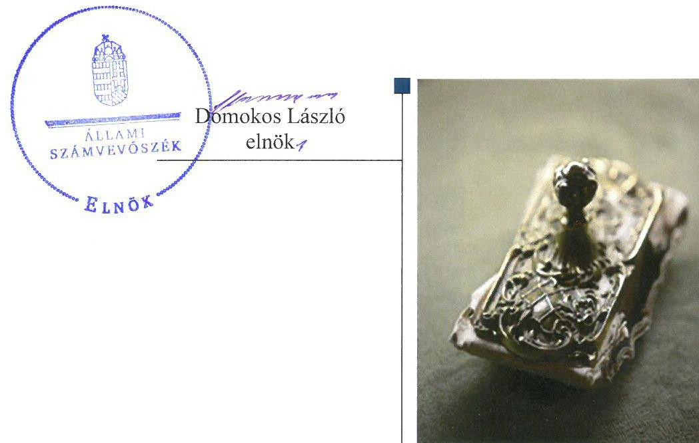

---

# AZ ELLENŐRZÉST FELÜGYELTE:

DR. NÉMETH ERZSÉBET felügyeleti vezető

## AZ ELLENŐRZÉST VEZETTE ÉS A VÉGREHAJTÁSÁÉRT FELELŐS:

IMRE ZSUZSANNA ellenőrzésvezető

## A PROGRAM ÖSSZEÁLLÍTÁSÁÉRT FELELŐS:

JANIK JÓZSEF osztályvezető

IKTATÓSZÁM: V-1358-177/2016

TÉMASZÁM: 2392

ELLENŐRZÉS-AZONOSÍTÓ SZÁM: V075929

Jelentéseink az Országgyűlés számítógépes hálózatán és az Interneta a www.asz.hu címen is olvashatóak.

---

# TARTALOMJEGYZÉK 

■ ÖSSZEGZÉS ..... 5
■ AZ ELLENŐRZÉS CÉLJA ..... 6
■ AZ ELLENŐRZÉS TERÜLETE ..... 7
■ AZ ELLENŐRZÉS HÁTTERE, INDOKOLTSÁGA ..... 9
■ A JELENTÉS LÉNYEGES KÉRDÉSKÖREI ..... 10
■ ELLENŐRZÉS HATÓKÖRE ÉS MÓDSZEREI ..... 11
■ MEGÁLLAPÍTÁSOK ..... 13
■ JAVASLATOK ..... 21
■ MELLÉKLETEK ..... 23
I. Sz. melléklet: Értelmező szótár ..... 23
II. Sz. melléklet: Társasági adatok ..... 26
III. Sz. melléklet: A Grand Tokaj Zrt. eredményének alakulása a 2011-2014. évben (M forint).. 27
IV. Sz. melléklet: Tőkeemelések célok szerinti részletezésben, az ellenőrzött időszakban (M forint) ..... 28
■ FÜGGELÉK: ÉSZREVÉTELEK ..... 29
■ RÖVIDÍTÉSEK JEGYZÉKE ..... 59

---

.

---

# ÖSSZEGZÉS 

A Magyar Nemzeti Vagyonkezelő Zrt. Grand Tokaj Zrt.-ben lévő részesedés feletti tulajdonosi joggyakorlása összességében szabályszerű volt. A Grand Tokaj Zrt. vagyonkezelésében lévő vagyon feletti tulajdonosi jogokat a Nemzeti Földalapkezelő Szervezet nem megfelelően gyakorolta. A Grand Tokaj Zrt. müködésének szabályozottsága és a vagyongazdálkodás nem volt megfelelő. A pénzügyi- számviteli, adatszolgáltatási feladatokat összességében szabályszerűen látták el.

## Az ellenőrzés társadalmi indokoltsága

Az Állami Számvevőszék kiemelt célja, hogy az államháztartáson kívülre nyújtott költségvetési támogatások és ingyenes vagyonjuttatások, valamint az államháztartáson kívül múködő feladat-ellátó rendszerek ellenőrzéseivel hozzájáruljon ahhoz, hogy a közpénzeket az államháztartáson kívül múködő szervezetek is átlátható, rendezett módon használják fel a szerződésben átvállalt állami feladatok ellátása, továbbá az állami vagyon szerződésben vállalt átlátható, hatékony, költségtakarékos múködtetése, értékének megőrzése, állagának védelme, értéknövelő használata, hasznosítása és gyarapítása érdekében. Az Állami Számvevőszék Stratégiájával összhangban, figyelemmel arra, a Grand Tokaj Zrt. vagyonának jelentős változására, valamint arra, hogy a Tokaj Borvidék meghatározó munkaadója, került sor az ellenőrzésére történő kiválasztására a 2012-2015. évek vonatkozásában. Kiemelten fontos, hogy az állami tulajdonú gazdálkodó szervezetekkel - így a Grand Tokaj Zrt. -vel - szemben alapvető követelmény, hogy gazdálkodásuk, múködésük szabályszerű, az általuk szolgáltatott adatok minél megbízhatóbbak legyenek.

## Főbb megállapítások, következtetések

A Magyar Nemzeti Vagyonkezelő Zrt.-nek a Grand Tokaj Zrt. társasági részesedése feletti tulajdonosi joggyakorlása összességében szabályszerű volt. A felügyelőbizottságon keresztül, valamint állandó könyvvizsgáló megbízásával biztosította a tulajdonosi ellenőrzést. A Grand Tokaj Zrt. vagyonkezelésében lévő földterületekre -mely fölött a tulajdonosi jogokat a Nemzeti Földalapkezelő Szervezet gyakorolta - kötött vagyonkezelési szerződés nem biztosította az állami vagyonról szóló törvény végrehajtására kiadott kormányrendeletben foglaltak maradéktalan betartását, mivel nem tartalmazta a vagyonkezelésbe adott ingatlanok értékét.

A Grand Tokaj Zrt. vagyongazdálkodással kapcsolatos szabályozása nem volt megfelelő, mivel a Számviteli politika és annak részeként elkészített szabályzatok - a pénzkezelési szabályzat kivételével -, illetve a Számlarend nem felelt meg a számvitelről szóló törvény előírásainak. A számviteli szabályzatok egyes rendelkezései között ellentmondás volt; a számvitelről szóló törvény módosítását követően a változásokat a számviteli politikán és annak részét képező szabályzatain nem vezette át; számlarendje hiányos volt; valamint a számlarendet alátámasztó bizonylati rendet nem készítettek.

A Grand Tokaj Zrt. bevételeinek és ráfordításainak elszámolása megfelelt a jogszabályi előírásoknak, ugyanakkor a vagyonelemek elszámolása nem volt szabályszerű. A beszámolási, adatszolgáltatási kötelezettségét összességében szabályszerűen teljesítették. A Grand Tokaj Zrt. kialakította a saját vagyon értékének megőrzését, gyarapítását szolgáló, szabályszerű vagyongazdálkodás feltételeit, azonban tervezési tevékenysége nem volt szabályszerű, a saját vagyonát nem az előírásoknak megfelelően tartotta nyilván, mivel a készletek, az immateriális javak, tárgyi eszközök és részesedések mérlegsorokat alátámasztó leltárral nem rendelkezett.

---

# AZ ELLENŐRZÉS CÉLJA 

Az ellenőrzés célja annak értékelése, hogy a tulajdonosi jogok gyakorlása szabályszerű volt-e; a gazdálkodó szervezet szabályozottsága, gazdálkodása és vagyongazdálkodási tevékenysége megfelelt-e a jogszabályi és a tulajdonosi előírásoknak; a vagyonváltozást eredményező döntések esetében a tulajdonosi jogok gyakorlója és a gazdálkodó szervezet szabályszerűen jártak-e el.

---

# AZ ELLENŐRZÉS TERÜLETE 

## Grand Tokaj Zrt.

A Grand Tokaj Zrt., mely a 2016. évi névváltozást megelőzően a Tokaj Kereskedőház Zrt. nevet viselte, 100\% állami tulajdonban lévő egyszemélyes gazdasági társaság. A Társaság ${ }^{1}$ részesedése feletti tulajdonosi jogokat és kötelezettségeket az állami vagyon felügyeletéért felelős miniszter a Magyar Nemzeti Vagyonkezelő Zrt. (a továbbiakban: MNV Zrt.) ${ }^{2}$ útján gyakorolta. A vagyonkezelt földterületek vonatkozásában a tulajdonosi jogokat az ellenőrzött időszakban a Nemzeti Földalapról szóló törvény (a továbbiakban: NFa. tv.) ${ }^{3}$ alapján az agrárpolitikáért felelős miniszter a Nemzeti Földalapkezelő Szervezet (a továbbiakban: NFA) ${ }^{4}$ útján gyakorolta.

A Társaság vagyonkezelésében 23,8 ha ${ }^{5}$ állami tulajdonban levő földterület volt. A Társaság közszolgáltatást nem végzett, közfeladatot nem látott el. Tevékenysége a Világörökség részét képező Tokaj-Hegyalja zárt, történelmi borvidékén borkészítésre és értékesítésre, borkóstoltatásra, valamint szőlőalapanyag termelésre és felvásárlásra épült.

A Társaság jegyzett tőkéje az ellenőrzött időszakban 2 326, 9 M $^{6}$ Ft-ról 3 786,9 M Ft-ra nőtt. Ötször történt ázsiós tőkeemelés, összesen 7900 M Ft értékben, melyből 1460 M Ft-tal a jegyzett tőke, 6440 M Ft-tal a tőketartalék került növelésre (részletezve a IV. sz. mellékletben). 100\%-os részesedéssel rendelkezett a Tokaj Vitis Kft.-ben. Legfontosabb gazdálkodási adatait az 1. ábra, továbbá a II. és a III. számú mellékletek szemléltetik.
1. ábra

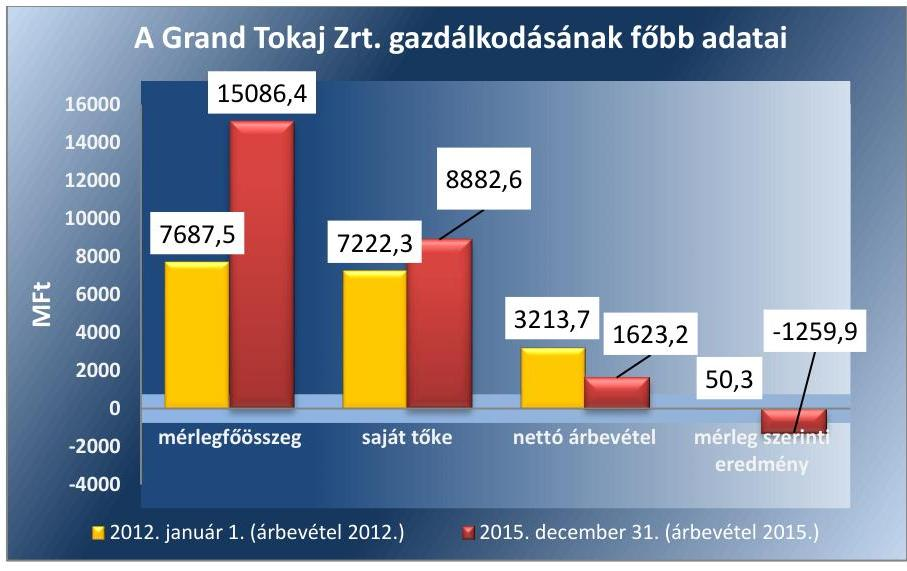

A Társaság eszközállományának növekedését a befektetett eszközei értékének jelentős növekedése eredményezte, ugyanakkor az ellenőrzött időszakban összesen 6 230,5 M Ft mérleg szerinti veszteséget realizált, alapvetően az értékesítés nagymértékű csökkenése és a készletekre elszámolt értékvesztés következtében.

---

A Társaság vezérigazgatójának és könyvvizsgálójának személye az ellenőrzött időszakban háromszor változott. Alkalmazottainak száma a 2011. december 31-i 172 fơről a 2015. év végére 133 fơre csökkent.

---

# AZ ELLENŐRZÉS HÁTTERE, INDOKOLTSÁGA 

Az állami tulajdonú gazdálkodó szervezetek ellenőrzése kiemelten fontos a nemzeti vagyon megőrzése, megóvása érdekében. Gazdálkodásuk jellemzően a közérdeklődés és a média figyelmének középpontjában áll, amihez hozzájárul a gazdálkodásuk körébe tartozó - közvetlen vagy közvetett állami tulajdonú - vagyon nagysága, illetve az általuk ellátott közszolgáltatások minősége és hatékonysága. A szolgáltatási árképzés megalapozottsága és az éves elszámoltatás feltételeinek kialakítása az ellenőrzés során nagy hangsúlyt kap. A szolgáltatás árában és annak támogatásában meg kell jelennie az önköltségszámítás szempontjainak, amely biztosítja a müködés fenntarthatóságát (eszközpótlást) is. Az ellenőrzés rámutathat az állami tulajdonú gazdálkodó szervezetek gazdálkodási tevékenységével kapcsolatos jó gyakorlatokra és szabálytalanságokra. Felhívhatja a figyelmet a jogszabályi követelmények teljesítéséhez szükséges feltételek hiányosságaira, hozzájárulhat az államháztartáson kívüli, de (közvetlenül vagy közvetve) állami vagyont használó gazdálkodó szervezetek tevékenységének átláthatóságához. Ellenőrzésünk eredményeképpen javaslatainkkal, megállapításainkkal hozzájárulhatunk a nemzeti vagyonnal való gazdálkodás átláthatóságának, elszámoltathatóságának javításához. Az Állami Számvevőszék Stratégiájával összhangban, figyelemmel arra, a Grand Tokaj Zrt. vagyonának jelentős változására, valamint arra, hogy a Tokaj Borvidék meghatározó munkaadója, került sor az ellenőrzésére történő kiválasztására a 2012-2015. évek vonatkozásában.

---

# A JELENTÉS LÉNYEGES KÉRDÉSKÖREI 

1.     - A tulajdonosi jogok gyakorlása szabályszerű volt-e?
2.     - A társaság müködésének szabályozottsága megfelelt-e az előírásoknak?
3.     - A társaságnál a pénzügyi-számviteli, adatszolgáltatási és ellenőrzési feladatok ellátása szabályszerű volt-e?
4.     - A társaság vagyongazdálkodása szabályszerű volt-e?

---

# ELLENŐRZÉS HATÓKÖRE ÉS MÓDSZEREI 

## Az ellenőrzés típusa

Megfelelőségi ellenőrzés.

## Az ellenőrzött időszak

Az ellenőrzött időszak 2012. január 1-jétől 2015. december 31-ig tart.

## Az ellenőrzés tárgya

Állami tulajdonban (résztulajdonban) lévő gazdasági társaság gazdálkodása, kiemelten vagyongazdálkodási tevékenysége, a tulajdonosi jogok gyakorlása, továbbá a kormányzati szektorba sorolt gazdasági társaság gazdálkodásának a kormányzati szektor hiányára és az államadósságra befolyással bíró elemei.

Az ellenőrzés kiterjed minden olyan körülményre és adatra, amely az ÁSZ jogszabályban meghatározott feladatainak teljesítéséhez, valamint a program végrehajtása folyamán felmerült újabb összefüggések feltárásához szükséges.

## Az ellenőrzött szervezet

Grand Tokaj Zrt.
Magyar Nemzeti Vagyonkezelő Zrt. és
Nemzeti Földalapkezelő Szervezet, mint tulajdonosi joggyakorlók

## Az ellenőrzés jogalapja

Az ellenőrzés jogalapját az ÁSZ tv. ${ }^{7}$ 1. § (3) bekezdése és 5. § (3)-(5) bekezdése képezi.

## Az ellenőrzés módszerei

Az ellenőrzést a nemzetközi standardokat irányadónak tekintve az ellenőrzési program ellenőrzési kérdései, az ellenőrzött időszakban hatályos jogszabályok, az ellenőrzés szakmai szabályok és módszertanok figyelembevételével végeztük.

Az ellenőrzésre a nemzetgazdasági szempontból kiemelt jelentőségű nemzeti vagyon körébe tartozó gazdálkodó szervezeteknél és a többségi

---

állami tulajdonban álló gazdálkodó szervezeteknél került sor. Az ellenőrzési program szerinti feladatokat a kiválasztott gazdálkodó szervezetnél, valamint a tulajdonosi jogok gyakorlójánál hajtottuk végre.

Az ellenőrzési kérdések megválaszolásához szükséges bizonyítékok megszerzése a következő ellenőrzési eljárások alkalmazásával történt: megfigyelés, kérdésfeltevés (információkérés), összehasonlítás, valamint mintavételi és elemző eljárások. Az ellenőrzési bizonyítékként felhasználható adatforrások közé tartoznak egyrészt az ellenőrzési programban felsorolt adatforrások, másrészt adatforrás lehet még minden - az ellenőrzés folyamán - feltárt, az ellenőrzés szempontjából információkat tartalmazó dokumentum.

Az ellenőrzést a kérdésekre adott válaszok kiértékelésével, valamint a megjelölt adatforrások, a csatolt tanúsítványok felhasználásával, továbbá az adott időszakban hatályos jogszabályok figyelembevételével folytattuk le. A bevételek és a ráfordítások elszámolása, valamint a vagyonnyilvántartás terén a szabályszerű múködést véletlen mintavétellel és irányított kiválasztással ellenőriztük. A jogszabályok és a belső előírások szerint megfelelőnek, azaz szabályszerűnek tekintettük az adott területet, amennyiben a minta ellenőrzésének eredménye alapján 95\%-os bizonyossággal a teljes sokaságban a hibaarány kisebb volt, mint 10\%, nem megfelelőnek értékeltük, ha a hibaarány a 10\%-ot meghaladta.

---

# 1. A tulajdonosi jogok gyakorlása szabályszerű volt-e? 

## Összegző megállapítás

1.1. számú megállapítás

1. táblázat

ADÓZÁS ELŐTTI EREDMÉNY/SAJÁT TÖKE MUTATÓ ALAKULÁSA (\%)

|  | 2012. | 2013. | 2014. | 2015. |
| :--: | :--: | :--: | :--: | :--: |
| MNV Zrt. elvárás | $>0$ | $>1$ | $>2$ | $>0$ |
| tervezett | 1 | $-21$ | $-38$ | $-20$ |
| tényleges | $-59$ | $-9$ | $-26$ | $-14$ |
| Forrás: MNV Zrt. tervezési irányelvek, a Társaság üzleti tervei, beszámolói |  |  |  |  |

2. táblázat

TÖKEEMELÉSEK (M FT)

|  | jegyzett   tőke | tőke-   tartalák | össze-   sen |
| :--: | :--: | :--: | :--: |
| 2012. | - |  |  |
| 2013. | 900 | 2100 | 3000 |
| 2014. | 450 | 1050 | 1500 |
| 2015. | 110 | 3290 | 3400 |
| összesen | 1460 | 6440 | 7900 |

Az MNV Zrt. a Grand Tokaj Zrt. feletti tulajdonosi joggyakorlása összességében szabályszerű volt, azonban az NFA tulajdonosi joggyakorlása nem volt szabályszerű a társaság által kezelt állami vagyon felett.

Az MNV Zrt. Társaság feletti tulajdonosi joggyakorlás során figyelembe vette az előírásokat, összességében szabályszerűen járt el.

## A TULAJDONOSI JOGOK GYAKORLÁSÁNAK

RENDJÉT az MNV Zrt. belső irányítási eszközeiben, SZMSZ ${ }^{8}$-ében, Társasági Monitoring Szabályzat ${ }^{9}$-ában, a Tulajdonosi Ellenőrzési Szabályzat ${ }^{10}$ ban, meghatalmazásokra vonatkozó feljegyzés ${ }^{11}$-ben, vezérigazgatói utasítás ${ }^{12}$-okban, valamint Portfoliós Kódex ${ }^{13}$-ben szabályozta.

Az MNV Zrt. a Társaság Alapító Okirat ${ }_{1-5}$ ában ${ }^{14}$ és az Alapszabályában ${ }^{15}$ rendelkezett a vagyongazdálkodásra vonatkozó követelményekről, a beszámolási kötelezettségekről, a Gt. ${ }^{16}$ és a $\mathrm{Ptk}_{2}{ }^{17}$ előírásainak megfelelően az alapító ${ }^{18}$ számára fenntartott jogokról, az FB tagjairól, a könyvvizsgáló személyéről és meghatározta az $\mathrm{FB}^{19}$ és az ügyvezető jogait, feladatait.

A Társaság igazgatósága 2012. szeptember 14-től november 12-ig az Alapító Okirat ${ }_{2}$-ban foglaltak ellenére nem volt határozatképes. Az MNV Zrt. döntése nyomán, a Gt. előírásával összhangban 2012. november 13án az igazgatóságot egyszemélyes ügyvezetés váltotta fel, melyet megelőzően a Gt. előírásának megfelelő ügydöntő FB-t hoztak létre.

A TÁRSASÁG ÜZLETI TERVEIT az MNV Zrt. a Gt.-ben és a $\mathrm{Ptk}_{2}$-ban, valamint az Alapító Okirat ${ }_{1-5}$-ban és az Alapszabályban foglaltaknak megfelelően minden évben megtárgyalta és elfogadó határozatai ${ }^{20}$-val jóváhagyta.

Az MNV Zrt. az üzleti tervek készítéséhez minden évben tervezési irány-elv ${ }^{21}$-et adott ki, amelyben a 2013-tól a Társaságra nevesítetten is meghatározta a minimális tőkehatékonysági elvárásokat.

A Társaság által készített üzleti tervekben nem érvényesültek a 2012. év kivételével a tervezési irányelvek 1,2 pontjában rögzített tőkehatékonyságra vonatkozó elvárások. Az MNV Zrt. az üzleti terveket jóváhagyta. Az adatokat az 1. táblázat mutatja be.

AZ ÉVES BESZÁMOLÓ jóváhagyásáról az MNV Zrt. a Gt. és a Ptk2 előírásainak megfelelően az FB és a könyvvizsgáló írásbeli jelentésének birtokában határozott.

---

3. táblázat

| MÉRLEG SZERINTI EREDMÉNY   (MSZE M FT) |  |  |
| :--: | :--: | :--: |
|  | Társaság MSZE | Tány MSZE |
| 2012. | 78,4 | $-2665,1$ |
| 2013. | $-2390,3$ | $-518,6$ |
| 2014. | $-3617,3$ | $-1786,9$ |
| 2015. | $-2684,9$ | $-1259,9$ |

Forrás: A Társaság üzleti tervel és éves beszámolói

### 1.2. számú megállapítás

4. táblázat

VAGYONKEZELÉSBE ADOTT FÖLDTERÜLETEK NFA ÁLTAL NYILVÁNTARTOTT ÉRTÉKE (M FT)

| Helyrajzi szám | Kónyv szerinti   érték |
| :-- | :--: |
| $0128 / 10 / a, b, c, d$ | 0 |
| $031 / 11 / a, b, c, d, f$ | 0 |
| 032 | 12,6 |
| $033 a, b, c, d, f, g, h, j$, | 78,3 |
| $k, l$ |  |
| $034 / 3$ | 10,7 |
| $034 / 5 a, b, c, d, f$ | 26,9 |
| összesen | 128,5 |

Forrás: NFA adatszolgáltatása

AZ MNV ZRT. DÖNTÖTT a Gt. és a Ptk2 előírásának megfelelően minden alapvető üzleti ügyben, így:
$\longrightarrow$ Az MNV Zrt. 2014-ben 4500 M Ft és járulékai értékű kölcsönt nyújtott a Társaság számára, és ennek biztosítékaként a Társaság földterületeit a Magyar Állam javára bejegyzett jelzáloggal terhelte.
$\longrightarrow$ Az MNV Zrt. összesen 7900 M Ft értékű tőkeemelésről határozott. A tőkeemeléseket - melyeket a 2. táblázat szemléltet - az MNV Zrt. célokhoz kötötte, melyeket a IV. számú melléklet mutat be.
$\longrightarrow$ Az MNV Zrt. elfogadta a tőkeemelések ellenére veszteséges gazdálkodást. A Társaság által realizált mérlegszerinti eredmény (veszteség) alakulását a 3. táblázat szemlélteti.

## A társaság kezelésében lévő állami vagyon feletti tulajdonosi jogokat az NFA nem szabályszerűen gyakorolta.

Az MNV Zrt. és a Társaság között 2008-ban, 23,8 ha földterületre húsz év időtartamra létrejött vagyonkezelési szerződés ${ }^{22}$ változatlanul hatályban volt, azt nem módosították.

A VAGYONKEZELÉSI SZERZŐDÉS nem biztosította a Vhr. ${ }^{23} 9 . \S$ (9) bekezdés a) pontjában foglaltak teljesítését, mert nem rögzítette a vagyonkezelésbe vett eszközök értékét, amely értéken a Társaságnak a vagyonkezelésbe vett eszközöket a Számv. tv. ${ }^{24}$ előírásai szerint - a hosszú lejáratú kötelezettségekkel szemben - állományba kellett vennie. A vagyonkezelési szerződés annak ellenére nem tartalmazta a vagyonkezelésbe adott földterületek könyvszerinti értékét, hogy az NFA rendelkezett az adatokkal. A vagyonkezelésbe adott földterületek NFA által nyilvántartott értékét a 4. táblázat szemlélteti.

VAGYON-NYILVÁNTARTÁSI SZABÁLYZATTAL az NFA nem rendelkezett 2012. január 1. és 2014. április 8-a között, ellentétben a földalap nyilvántartásról szóló Korm. rendelet ${ }^{25}$ 7. §-ában előírtakkal. A 2014. április 8-án kiadott vagyon-nyilvántartási szabályzat ${ }^{26}$ tartalma megfelelt a földalap nyilvántartásról szóló Korm. rendelet követelményeinek.

Az NFA az ellenőrzött időszakban a Grand Tokaj Zrt. esetében nem élt a földrészletek hasznosításáról szóló Korm. rendelet ${ }^{27}$ 40. § (2) bekezdésében előírt jogával, a kezelt vagyonnal való gazdálkodás szabályszerűségének ellenőrzésével.

Az NFA a 2012-2014. évekre vonatkozóan a Grand Tokaj Zrt.-t az esedékes vagyonkezelői díjfizetés elmulasztását követően nem szólította fel harminc napos határidő tűzésével és a következményekre való figyelmeztetéssel - írásban a hátralék megfizetésére. Az NFA ezzel figyelmen kívül hagyta a földrészletek hasznosításáról szóló Korm. rendelet 42. § (3) bekezdésében foglaltakat. Az NFA csak 2015 decemberében számlázta ki a 2012-2015. évekre vonatkozó vagyonkezelési díjakat, a Társaság a fizetési kötelezettségének eleget tett.

---

# 2. A társaság múködésének szabályozottsága megfelelt-e az előírásoknak? 

Összegző megállapítás

A Társaság múködésének szabályozottsága nem felelt meg a jogszabályi előírásoknak és a számviteli szabályzatok egyes rendelkezései között ellentmondás volt.

SZÁMVITELI POLITIKÁ ${ }^{18}$-val és annak részét képező, a Számv. tv. 14. § (5) bekezdésében meghatározott értékelési ${ }^{19}$, leltározási ${ }^{20}$, pénzkezelési, valamint önköltség-számítási szabályzattal ${ }^{21}$ a Társaság rendelkezett, amelyek azonban a pénzkezelési szabályzat ${ }^{22}$ kivételével nem feleltek meg a Számv. tv. előírásainak.

A Társaság a számviteli szabályzatai közötti összhangot nem biztosította, így azok egyes rendelkezései egymással ellentétesek voltak:
$\longrightarrow$ A 6-os és a 7-es számlaosztályokban történő rögzítésére használandó főkönyvi számlákat nem tartalmazták sem a számviteli politika 5. számú mellékleteként évente kiadott Számlatükör a 2013. évtől, sem a 2013-2015. évi főkönyvi kivonatok. Ugyanakkor a Számlarend, valamint az Önköltség számítási szabályzat tartalmazta azok használatát.
$\longrightarrow$ A számviteli politika 6. számú mellékletét képező számlarendben azt rögzítették, hogy a Társaság értékben és mennyiségben a készletekről nyilvántartást nem vezet, ezzel szemben az értékelési szabályzatban arról rendelkeztek, hogy az anyagkészletek analitikus nyilvántartása fajtánként mennyiségben tényleges beszerzési áron történik.
A Társaság figyelmen kívül hagyta a Számv. tv. 14. § (11) bekezdésében foglaltakat, mivel elmulasztotta a Számv. tv. módosítása miatti változásokat a számviteli politikán és annak keretében elkészitetett szabályzatain átvezetni:
$\longrightarrow$ A számviteli politika 3.13. pontja a teljes időszakban tartalmazta a megbízható, valós képet befolyásoló hiba meghatározását, miközben a Számv. tv. 3. § (3) bekezdésének 5) pontja - mely e fogalmat rögzítette - 2013. január 1-étől hatálytalan.
$\longrightarrow$ Az értékelési szabályzatban a mérlegben kimutatott deviza, valuta készletek, követelések és kötelezettségek értékelése szabályozásánál figyelmen kívül hagyták a Számv. tv. 60. § (2) bekezdésében foglalt mérleg fordulónapi devizaárfolyamon átszámított forintértéken való kimutatás követelményét. Az átértékelést továbbra is a Számv. tv. 60. § (2) bekezdésének 2010. december 31-ig hatályos rendelkezése szerint szabályozták.
$\longrightarrow$ A leltározási szabályzat nem felelt meg a Számv. tv. 2012-től hatályos 69. § (3) bekezdésében foglaltaknak, mivel az ingatlanok tekintetében a legalább háromévente történő leltározási gyakoriság helyett ötévente történő leltározást írtak elő.

---

A hatályban lévő számviteli politika nem felelt meg a Számv. tv. előírásainak, mivel:
A számviteli politikában nem határozták meg, hogy az egyéb gazdasági múveletek bizonylatainak adatait mely időpontig kell a könyvekben rögzíteni, ezzel a Társaság figyelmen kívül hagyta a Számv. tv. 165. § (3) bekezdése b) pontjában rögzített előírást.

- A számviteli politika I. függelék II. 2) pontja az értékcsökkenés elszámolása során az „adótörvény"-ben (a jogszabály meghatározása nélkül) meghatározott leírási kulcsok használatát szabályozta, figyelmen kívül hagyva a Számv. tv. 52. § (1) bekezdésében foglaltakat, mely szerint az értékcsökkenés elszámolását azokra az évekre kell felosztani, amelyekben azokat előreláthatólag használni fogják.

AZ ÖNKÖLTSÉGSZÁMÍTÁSI SZABÁLYZAT 2013-tól nem volt alkalmas arra, hogy a saját termelésú készletek és a saját vállalkozásban végzett beruházások előállítási, bekerülési értékét a Számv. tv. 51. § (3) bekezdésében előírtak figyelembevételével határozza meg, mivel a szabályzatban rögzített, a közvetlen és közvetett költségek elkülönítésére szolgáló 6-7. számlaosztályokat a Társaság nem vezette.

A SZÁMLAREND ${ }^{33}$ nem tartalmazta valamennyi alkalmazásra kijelölt számla számjelét és megnevezését, az évenként aktualizált számlatú-kör ${ }^{34}$ - a 2013. év kivételével - szintén nem teljesítette ezt a követelményt, valamint az alkalmazott számlák értéke növekedésének és csökkenésének jogcímeit, a számlákat érintő gazdasági eseményeket, azok más számlákkal való kapcsolatát. A Társaság számlarendjében nem rögzítette a főkönyvi számlák és az analitikus nyilvántartások kapcsolatát, továbbá a számlarendjében foglaltakat alátámasztó bizonylati rendet nem készített. A Társaság a fentiekkel megsértette a Számv. tv. 161. § (2) bekezdés a), b), c) és d) pontjaiban foglaltakat.

SZMSZ ${ }_{1,2}{ }^{35}$-szel rendelkezett a Társaság az ellenőrzött időszakban. Az SZMSZ ${ }_{1}$ azonban 2012. november 12. és 2014. október 22. között nem volt összhangban az Alapító Okirat 3.5 12. pontjában foglaltakkal, mivel nem tartalmazta az ügydöntő FB jogosultságait, ugyanakkor a megszüntetett igazgatóságra, mint ügyvezető szervre vonatkozó előírásokat tartalmazott. Az SZMSZ2 már megfelelt az előírásoknak.

A JAVADALMAZÁSI SZABÁLYZATÁT ${ }^{36}$ a Társaság a Taktv. ${ }^{37}$ 5. § (3) bekezdésében foglalt követelménynek megfelelően megalkotta, amelyet az MNV Zrt. jóváhagyó Alapító Határozatát követően szabályszerűen a cégiratok közé letétbe helyezett.

---

# 3. A társaságnál a pénzügyi-számviteli, adatszolgáltatási és ellenőrzési feladatok ellátása szabályszerű volt-e? 

Összegző megállapítás

### 3.1. számú megállapítás

5. táblázat

## KÖVETELÉSEK (M FT)

|  | vevők | kapcsolt   vállalkozás | egyéb |
| :--: | :--: | :--: | :--: |
| 2012. | 693,7 | 172,6 | 71,1 |
| 2013. | 730,8 | 158,3 | 268,2 |
| 2014. | 261,8 | 2,9 | 713,8 |
| 2015. | 233,1 | 35,8 | 502,1 |

A Társaságnál a pénzügyi-számviteli feladatok, valamint az adatszolgáltatási és ellenőrzési feladatok ellátása összességében szabályszerű volt.

A Társaság bevételeinek és ráfordításainak elszámolása szabályszerű, a vagyonelemek elszámolása nem volt szabályszerű.

A BEVÉTELEK ÉS A RÁFORDÍTÁSOK ELSZÁMOLÁSA megfelelő volt. Az értékesítés nettó árbevételének, az anyagjellegű ráfordításoknak, a személyi jellegű ráfordításoknak és az értékcsökkenési leírás elszámolása szabályszerű volt, megfelelt a Számv. tv.-ben, a számviteli politikában és a számlarendben foglalt előírásoknak.

A VAGYONELEMEK ELSZÁMOLÁSA nem volt szabályszerű, mivel:
A 2015. évben az immateriális javak között aktiválási jegyzőkönyv, üzembe helyezési okmány nélkül aktiváltak eszközöket, amellyel figyelmen kívül hagyták az Értékelési szabályzat I. 1 pontjában, valamint a Számv. tv. 52. § (2) bekezdés előírását, mivel az immateriális javak bekerülése során az üzembe helyezést hitelt érdemlő módon nem dokumentálták.

- A Társaság a mérleg fordulónapján meglévő tárgyi eszközeiről nem készített leltárt a mérleg tételeinek alátámasztásához, amely tartalmazta volna a mérleg fordulónapján meglévő tárgyi eszközeit menynyiségben és értékben, ezzel megsértették a Számv. tv. 69. § (1) bekezdésében foglaltakat, és figyelmen kívül hagyták a Számv. tv. 15. § (3) bekezdésében foglalt valódiság elvét.

A KÖVETELÉS ÁLLOMÁNYA az árbevétel csökkenésével együtt csökkent az ellenőrzött időszakban, melyet az 5. táblázat szemléltet.

A Társaság követeléskezelésre vonatkozó szabályozást nem léptetett hatályba annak ellenére, hogy azt a 2012. évben az MNV Zrt. ellenőrzési javaslatai alapján készített intézkedési terv ${ }^{38}$-ében vállalta.

ÖNKÖLTSÉGSZÁMÍTÁSSAL támasztották alá az értékesített termékek árképzését. Az alkalmazott árjegyzékek felülvizsgálata az utókalkulációk alapján történt, míg új termék ármeghatározásához előkalkulációt készítettek. A társaság közszolgáltatást nem végzett.

## A Társaság összességében teljesítette beszámolási és adatszolgáltatási kötelezettségét.

A BESZÁMOLÁSI, ADATSZOLGÁLTATÁSI kötelezettségeket az MNV Zrt az Alapító Okirat ${ }_{1-5}$-ban és az Alapszabályban, valamint a Társasági Monitoring Szabályzatban és a tervezési irányelvekben írta elő, mely feladatokat és felelőseit a Társaság az SZMSZ ${ }_{1,2}$-ében szabályozta.

---

6. táblázat

| A TÁRSASÁG TÖKEHELYZETE (M FT) |  |  |  |
| :--: | :--: | :--: | :--: |
|  | saját   tóka | jegyzett   tóka | saját   tóka/jegy-   zett tóka \% |
| 2012. | 4548,1 | 2326,9 | 195,5 |
| 2013. | 5529,4 | 2776,9 | 199,1 |
| 2014. | 6742,5 | 3676,9 | 183,4 |
| 2015. | 8882,6 | 3786,9 | 234,6 |

A Társaság elkészítette az éves beszámolóit, azokat az MNV Zrt. az FB írásbeli jelentésének és a könyvvizsgáló írásbeli véleményének birtokában az előírt határidőig jóváhagyta. A Társaság megfelelve a Számv. tv.-ben foglaltaknak, a jóváhagyott beszámolót határidőben közzétette és letétbe helyezte.

Az éves beszámolók részét képező kiegészítő melléklet a számviteli politika meghatározó elemeit és azok változásit, valamint a beszámoló összeállításánál alkalmazott szabályrendszert bemutató fejezetének tartalma nem felelt meg a Számv. tv. 88. § (3) és (4) bekezdéseiben foglaltaknak. A kiegészítő melléklet nem a számviteli politikában rögzítetteknek megfelelően ismertette 2015. évben a mérlegkészítés időpontját, az eredmény kimutatás választott módját, 2012-2015. években, a devizában és a valutában fennálló eszközök és források értékelésénél alkalmazandó árfolyamot; az átszervezési költségek aktiválására vonatkozó rendelkezéseket.

A Társaságnál az ellenőrzött időszakban végrehajtott, összesen 7900 M Ft összegű tőkeemelések hatására a saját tőke értéke nem csökkent a jegyzett tőke értéke alá. Az adatokat a 6. táblázat mutatja.

A Társaság a közérdekű adatokat nyilvánosságra hozta és az adatok védelmét teljes körűen biztosította. A Taktv.-ben előírt adatokat honlapján szabályszerűen közzétette, így a vezető tisztségviselők, vezető állású alkalmazottak, valamint a Taktv.-ben hivatkozott szerződések adatait. Adatszolgáltatási és tájékoztatási kötelezettségét az Alapító Okiratban1-5-ben, az Alapszabályban valamint az MNV Zrt Társasági Monitoring Szabályzatában foglaltak alapján teljesítette.

BELSŐ ELLENŐRZÉST a Társaság a teljes ellenőrzött időszakban az SZMSZ ${ }_{1-2}$-nek megfelelően múködtetett, mely tevékenységet a Belső Ellenőrzési Kézikönyvben szabályozott.

Az MNV Zrt. által végzett, az FB, a könyvvizsgálói, a külső és belső ellenőrzések során megfogalmazott javaslatokat a Társaság - a követelés-kezelési szabályzat kiadása kivételével - szabályszerűen végrehajtotta, vagy a végrehajtást megkezdte az ellenőrzött időszakban. Az FB és a könyvvizsgáló a közvagyon védelme érdekében a legfőbb döntéshozó szerv összehívását, az MNV Zrt. döntését nem kezdeményezte.

# 4. A társaság vagyongazdálkodása szabályszerű volt-e? 

## Összegző megállapítás

### 4.1. számú megállapítás

## A Társaság vagyongazdálkodása nem volt megfelelő.

A Társaság összességében kialakította és szabályozta a vagyongazdálkodás feltételeit, azonban tervezési tevékenysége nem volt szabályszerű.

A VAGYONGAZDÁLKODÁSHOZ kapcsolódó fő feladat- és hatáskörök, illetve felelősségi viszonyokra vonatkozó előírások az Alapító Okiratban1-5, valamint az SZMSZ-ben meghatározásra kerültek. A vagyongazdálkodáshoz kapcsolódóan a számviteli szabályzatokon túl szabályozták a kötelezettségvállalások és utalványozások rend ${ }^{39}$-jét, megalkották az

---

7. táblázat

|  | ÜZLETI TERV (M FT) |  |  |
| :--: | :--: | :--: | :--: |
|  | ért. nettó árhevétel | beru-
házás | mérleg   szerinti   eredmény |
| 2012. | 3635,2 | 272,0 | 78,4 |
| 2013. | 3139,4 | 4429,6 | $-2390,3$ |
| 2014. | 1686,8 | 3510,5 | $-3617,3$ |
| 2015. | 2038,9 | 9142,0 | $-2684,9$ |

Fonrás: Grand Tokaj Zrt. üzleti tervei
4.2. számú megállapítás
alapanyag felvásárlás és feldolgozás szabályzatát ${ }^{40}$, a beszerzési folyamatok szabályzatát ${ }^{41}$, az ingatlan értékesítés szabályzatát ${ }^{42}$ valamint a selejtezési szabályzatot ${ }^{43}$

A TERVEZÉSI TEVÉKENYSÉG nem volt szabályszerű. Az SZMSZ1 I. fejezet 3. pontjában és az SZMSZ2 V. fejezet 6. pontjában előírtak ellenére a 2012. év kivételével nem készítettek középtávú tervet. Az éves üzleti tervei a 2013-2015. években nem feleltek meg az MNV Zrt. tervezési irányelveiben meghatározott, a társasággal szemben támasztott, pozitív eredményen alapuló tőkehatékonysági követelményeknek.

Üzleti terveit a 2012-2015. évekre elkészítette és az Alapító Okirat-ban1-5 foglaltaknak megfelelően azokat jóváhagyásra az FB, majd az MNV Zrt. részére előterjesztette.

Az éves üzleti tervekben meghatározó összegű beruházási tervek mellett jelentős összegű veszteséget terveztek a 2013-2015. évekre. Az adatokat a 7. táblázat mutatja.

## A Társaság a vagyonát nem az előírásoknak megfelelően tartotta nyilván, mivel az immateriális javak, tárgyi eszközök, részesedések és készletek mérlegsorokat leltárral nem támasztotta alá.

A vagyonkezelésében lévő földingatlanok nyilvántartásáról szabályszerűen gondoskodtak, azok állományát a Számv. tv.-ben foglaltaknak megfelelően az éves beszámolóinak kiegészítő mellékletében bemutatták.

A Társaság 100\%-os tulajdonában levő Tokaj Vitis Kft.-ben lévő részesedésére 2015-ben értékvesztést számolt el. Az elszámolt értékvesztés öszszegének megállapítása szabályszerű volt.

A saját eszközei és forrásai leltárral való alátámasztása az ellenőrzés egyetlen évében sem volt teljes körűen biztosított, mivel a készletek, az immateriális javak, a tárgyi eszközök és a részesedések mérlegsorokat alátámasztó leltárral nem rendelkeztek. Ezzel megsértették a Számv. tv. 15. § (3) bekezdése szerinti „valódiság elvét", és nem teljesültek a Számv. tv. 69. § (1) bekezdésében foglaltak, valamint a Leltározási szabályzat vonatkozó előírásai. A megbízott könyvvizsgáló a szabálytalanságok ellenére korlátozó véleményében az immateriális javak, a tárgyi eszközök, a készletek és a részesedések mérlegsorokat alátámasztó leltár készítésének elmulasztását nem jelezte.

A vagyon értékének és állagának megőrzéséről -a készletek kivételével - az előírásoknak megfelelően gondoskodott a Társaság. A tulajdonában lévő tárgyi eszközök összértéke, használhatósági foka növekedett, átlagos életkoruk és elhasználódási szintjük csökkent az ellenőrzött időszakban. A Társaság a részben tőkeemelésekből finanszírozott bővítő beruházásainak 5 514,0 M Ft-os értéke - visszapótlási kötelezettség nélkül is - jelentősen meghaladta az elszámolt amortizáció 794,6 M Ft-os értékét.

## 4.3. számú megállapítás

## A Társaság a saját vagyon változását és hasznosítását eredményező döntései megfeleltek az előírásoknak.

Az MNV Zrt. az Alapító Okirat ${ }_{1-5}$-ban, a Társaság az SZMSZ-ben és a szerződéskötési és utalványozási szabályzatban szabályozta a vagyon változását eredményező döntések rendjét, melyet a saját vagyon hasznosítása, értékesítése során betartottak.

---

| 8. táblázat |  |  |  |
| :--: | :--: | :--: | :--: |
| VAGYONVÁLTOZÁS/HASZNOSÍTÁS (M FT) |  |  |  |
|  | Értékesítés | Térítés |  |
|  |  |  |  |
|  |  |  |  |
| 2012. | 2,7 | 4,1 | 159,0 |
| 2013. | 0,0 | 0,9 | 1145,6 |
| 2014. | 0,7 | 2,3 | 1641,6 |
| 2015. | 2,3 | 2,1 | 2567,7 |
| összesen | 8,7 | 9,4 | 5513,9 |
| Forrás: Grand Tokaj Zrt. főkönyvi kivonatai, 8. sz. tanúsitványa |  |  |  |

### 4.4. számú megállapítás

9. táblázat

TÖKEEMELÉS, ÉRTÉKVESZTÉS A TOKAJ VITIS KFT-BEN (M FT)

|  | Tőkeemelés | Értékvesztés |
| :-- | :--: | :--: |
| 2012. | 0 | 3,0 |
| 2013. | 0 | 0 |
| 2014. | 160,0 | 0 |
| 2015. | 0 | 103,8 |

Forrás: Grand Tokaj Zrt. éves beszámolói
$\longrightarrow$ Az üzleti tervek részeként a beruházási tervek minden évben az MNV Zrt felé előterjesztésre, s általa jóváhagyásra kerültek. A beruházási döntések előterjesztése megfelelt az Alapító Okirat ${ }_{1-5}$-ban foglaltaknak. A beruházásokról az éves tervek elfogadásának keretében az MNV Zrt. határozott.
$\longrightarrow$ Vagyon megterhelésére egy alkalommal került sor 4500 M Ft tulajdonosi kölcsön és járulékai fedezeteként, melyről a tulajdonosi joggyakorló; a kölcsönszerződést engedélyező alapítói határozatában ${ }^{44}$ döntött.
$\longrightarrow$ A vagyon hasznosításáról (értékesítés, bérbeadás), az eszközök selejtezéséről szóló döntés az Alapító Okirat ${ }_{1-5}$-ban és az Alapszabályban foglaltaknak megfelelően, figyelemmel az Selejtezési szabályzat előírásaira a Társaság vezérigazgatójának hatáskörébe tartozott.

Nem került sor a kapcsolt társaság vagyongazdálkodásával szembeni követelmények meghatározására és a vagyongazdálkodás ellenőrzésére.

A Társaság 100\%-os tulajdonú kapcsolt vállalkozása a Tokaj Vitis Kft. volt. A Társaság nem írt elő a kapcsolt vállalkozásban lévő részesedés értékének védelme érdekében a kapcsolt társaság felé a vagyongazdálkodásra, a vagyon értékének megőrzésére, gyarapítására, valamint a vagyonnal való felelős gazdálkodásra vonatkozó követelményeket. A kapcsolt vállalkozás működése nyomán az ellenőrzött időszakban jelentős, 106 M Ft-ot meghaladó értékvesztést számoltak el a részesedés könyvszerinti értékére. A Tokaj Vitis Kft. számviteli nyilvántartásait a Társaság vezette, külön ellenőrzést a kapcsolt vállalkozásnál nem végeztek. A tőkeemelésre, értékvesztés elszámolására vonatkozó adatokat a 9. táblázat mutatja.

---

# JAVASLATOK 

Az ÁSZ tv. 33. § (1) bekezdésében foglaltak értelmében az ellenőrzött szervezet vezetője köteles a jelentésben foglalt megállapításokhoz kapcsolódó intézkedési tervet összeállítani és azt a jelentés kézhezvételétől számított 30 napon belül az ÁSZ részére megküldeni. Amennyiben az ellenőrzött szervezet vezetője nem küldi meg határidőben az intézkedési tervet, vagy továbbra sem elfogadható intézkedési tervet küld, az Állami Számvevőszék elnöke az ÁSZ tv. 33. § (3) bekezdése a) és b) pontjaiban foglaltakat érvényesítheti.

## Az NFA elnökének és a Grand Tokaj Zrt. vezérigazgatójának

1. Intézkedjen, hogy az állami földterülettel kapcsolatos vagyonkezelési szerzödés tartalmazza a kezelt vagyon értékét.
(1.2. sz. megállapítás 2. bekezdése alapján)

## Az NFA elnökének

1. Intézkedjen arról, hogy a jogszabályi elöírásnak megfelelően, az esedékes vagyonkezelői dij fizetésének elmulasztása esetén az NFA szólítsa fel a Grand Tokaj Zrt.-t a hátralék megfizetésére.
(1.2 sz. megállapítás 5. bekezdése alapján)

## Grand Tokaj Zrt. vezérigazgatójának

1. Intézkedjen, hogy a Grand Tokaj Zrt. számviteli politikája és az annak keretében elkészítendő szabályzatok teljes köre feleljen meg a Számv. tv. előírásainak, biztosítsa továbbá a szabályzatok és a számlarend közötti összhang megteremtését.
(2. sz. megállapítás 1-5. bekezdései alapján)
2. Intézkedjen a számlarend Számv. tv. előírásainak megfelelő módosításáról.
(2. sz. megállapítás 6. bekezdése alapján)
3. Intézkedjen, hogy az eszközök aktiválása során az üzembe helyezést a Számv. tv. előírásának megfelelően, hitelt érdemlő módon dokumentálják.
(3.1 sz. megállapítás 2. bekezdés 1. pontja alapján)

---

4. Intézkedjen a Számv. tv. előírásainak megfelelő, a mérleg tételeinek alátámasztásául szolgáló olyan leltár összeállításáról, amely tételesen, ellenőrizhető módon tartalmazza a mérleg fordulónapján meglévő eszközeit és forrásait mennyiségben és értékben.
(3.1 sz. megállapítás 2. bekezdés 2. pontja, továbbá 4.2 sz. megállapítás 3. bekezdése alapján)
5. Intézkedjen a Grand Tokaj Zrt. Szervezeti és Müködési Szabályzatának megfelelően középtávú tervek elkészítéséről.
(4.1 sz. megállapítás 2. bekezdése alapján)

---

# MELLÉKLETEK 

- I. SZ. MELLÉKLET: ÉRTELMEZŐ SZÓTÁR
állami vagyon
a) Az állam tulajdonában lévő dolog, valamint a dolog módjára hasznosítható természeti erő,
b) az a) pont hatálya alá nem tartozó mindazon vagyon, amely vonatkozásában törvény az állam kizárólagos tulajdonjogát nevesíti,
c) az állam tulajdonában lévő tagsági jogviszonyt megtestesítő értékpapír, illetve az államot megillető egyéb társasági részesedés,
d) az államot megillető olyan immateriális, vagyoni értékkel rendelkező jogosultság, amelyet jogszabály vagyoni értékű jogként nevesít.
Forrás: Vtv. 1. § (2) bekezdése
2012. november 10-től az állami vagyon fogalma kiegészül a következő ponttal:
e) az állam tulajdonában lévő pénzügyi eszközök

Forrás: Vtv. 1. § (2) bekezdése
Alapító Okirat
A Gt. 167. §-a előírása szerint az egyszemélyes társaság alapításának okirata a Ptk2 3:94. §-a szerint a részvénytársaság létesítő okirata
Alapszabály
ázsiós tőkeemelés
gazdasági társaság
A tőkeemelés azon formája, amely során a jegyzett tőke emelése mellett az átadott vagyon jelentősebb része tőketartalékba kerül.
A Ptk2. 3:88. § (1) bekezdése szerint „a gazdasági társaságok üzletszerű közös gazdasági tevékenység folytatására, a tagok vagyoni hozzájárulásával létrehozott, jogi személyiséggel rendelkező vállalkozások, amelyekben a tagok a nyereségből közösen részesednek, és a veszteséget közösen viselik".
Állami vagyon hasznosítására kötött szerződések elsődleges célja az állami vagyon hatékony működtetése, állagának védelme, értékének megőrzése, illetve gyarapítása, az állami és közfeladatok ellátásának elősegítése.
Forrás: Vtv. 23. § (2) bekezdése
Állami vagyon használója
Az a természetes vagy jogi személy, jogi személyiséggel nem rendelkező szervezet, aki, vagy amely törvény vagy szerződés alapján, bármely jogcímen (bérlet, haszonbérlet, használat stb.) állami vagyont birtokol, használ, szedi annak hasznait, hasznosít, ide nem értve a haszonélvezőt, a vagyonkezelőt és a tulajdonosi jogok gyakorlóját.
Forrás: Vhr. 1. § (7) a. pontja
2013. június 27-ig:

Az állami vagyont az MNV Zrt. maga kezeli, vagy szerződés - így különösen bérlet, haszonbérlet, megbízás - alapján központi költségvetési szervnek, természetes vagy jogi személynek, vagy jogi személyiséggel nem rendelkező gazdálkodó szervezetnek hasznosításra átengedi. Az állami vagyonra vonatkozóan az MNV Zrt. kizárólag az Nvtv-ben meghatározott személyekkel köthet vagyonkezelési szerződést.
Forrás: Vtv. 23. § (1), 27. § (1)
2013. június 28-ától:

Az állami vagyonnal az MNV Zrt. maga gazdálkodik, vagy szerződés - így különösen bérlet, haszonbérlet, megbízás - alapján központi költségvetési szervnek, természetes vagy jogi személynek, vagy jogi személyiséggel nem rendelkező gazdálkodó szervezetnek hasznosításra átengedi, illetőleg vagyonkezelésbe, haszonélvezetbe adja. Az állami vagyonra vonatkozóan az MNV Zrt. kizárólag az Nvtv-ben meghatározott személyekkel köthet vagyonkezelési szerződést.

---

kormányzati szektorba sorolt egyéb szervezet

MNV Zrt.
tulajdonosi jogok gyakorlója

Forrás: Vtv. 23. § (1), 27. § (1)
Az a szervezet, amely az Áht. alapján nem része az államháztartásnak, azonban az Európai Közösséget létrehozó szerződéshez csatolt, a túlzott hiány esetén követendő eljárásról szóló jegyzőkönyv alkalmazásáról szóló 2009. május 25-i 479/2009/EK rendelet szerint a kormányzati szektorba tartozik. A nemzetgazdasági miniszter 2013. június 26-án megjelent Közleményben tette közé ezen szervezetek listáját
Az állami vagyon felett, a Magyar Államot megillető tulajdonosi jogok és kötelezettségek összességét - a hatályos szabályozás szerint - az állami vagyon felügyeletéért felelős miniszter (jelenleg a nemzeti fejlesztési miniszter) gyakorolja. A miniszter feladatát nagy részben az MNV Zrt., mint tulajdonosi joggyakorló szervezet útján látja el.
1.

## 2013. június 27-ig:

Az állami vagyon felett a Magyar Államot megillető tulajdonosi jogok és kötelezettségek összességét - ha törvény eltérően nem rendelkezik - az állami vagyon felügyeletéért felelős miniszter (a továbbiakban: miniszter) gyakorolja, aki e feladatát a Magyar Nemzeti Vagyonkezelő Zártkörűen Müködő Részvénytársaság (a továbbiakban: MNV Zrt.), a Magyar Fejlesztési Bank, illetve a tulajdonosi joggyakorló szervezet útján látja el. A miniszter miniszteri rendeletben, a törvényben meghatározott állami vagyoni kör tekintetében, meghatározott időtartamra, a joggyakorlás egyes szabályainak meghatározásával - az őt megillető tulajdonosi jogok és kötelezettségek összességének, illetve azok meghatározott részének gyakorlóját az Áht. szerinti központi költségvetési szervek, ezek intézménye, továbbá a 100\%-ban állami tulajdonban álló gazdasági társaságok közül kijelölheti.
Forrás: Vtv. 3. § (1) és (2)

## 2013. június 28-ától:

A rábízott állami vagyon felett az államot megillető tulajdonosi jogok és kötelezettségek összességét tulajdonosi joggyakorlóként:
a) ha törvény vagy miniszteri rendelet eltérően nem rendelkezik, a Magyar Nemzeti Vagyonkezelő Zártkörűen Müködő Részvénytársaság (a továbbiakban: MNV Zrt.), b) törvényben kijelölt személy vagy
c) az állami vagyon felügyeletéért felelős miniszter (a továbbiakban: miniszter) által rendeletben kijelölt személy gyakorolja.
[...] A miniszter e törvény felhatalmazása alapján - a meghatározott célok hatékonyabb elérése érdekében, miniszteri rendeletben, az ott meghatározott állami vagyoni kör tekintetében, meghatározott időtartamra - e törvény keretei között, a joggyakorlás egyes szabályainak meghatározásával - az államot megillető tulajdonosi jogok és kötelezettségek összességének, illetve azok meghatározott részének gyakorlóját az Áht. szerinti központi költségvetési szervek, ezek intézménye, továbbá a 100\%-ban állami tulajdonban álló gazdasági társaságok közül kijelölheti.
Forrás: Vtv. 3. § (1) és (2)
2.

Aki a nemzeti vagyon felett az államot vagy a helyi önkormányzatot megillető tulajdonosi jogok és kötelezettségek összességének gyakorlására jogosult
Forrás: Nvtv. 3. § (1) 17. pontja
2013. június 27-től:

A vagyonkezelő köteles a vagyontárgy értékét megőrizni, állagának megóvásáról, jó karban tartásáról, működtetéséről gondoskodni, továbbá - a központi költségvetési

---

szervek kivételével - díjat fizetni vagy a szerződésben előírt más kötelezettséget teljesíteni.
Forrás: Vtv. 27. § (2)

# 2013. június 28-ától december 31-ig: 

A vagyonkezelő köteles a vagyontárgy állagának megóvásáról, jó karbantartásáról, működtetéséről gondoskodni, továbbá - a központi költségvetési szervek kivételével - díjat fizetni, jogszabályban és szerződésben előírt más kötelezettségét teljesíteni, valamint a vagyontárgyat jogszabályban vagy szerződésben meghatározott célnak megfelelően használni. Amennyiben a vagyonkezelő ezen kötelezettségének nem tesz eleget, a tulajdonosi joggyakorló jogosult a szerződést azonnali hatállyal felmondani.
Forrás: Vtv. 27. § (2)

## 2014. január 1-jétől:

A vagyonkezelő köteles a vagyontárgy állagának megóvásáról, jó karbantartásáról, működtetéséről gondoskodni, jogszabályban és szerződésben előírt más kötelezettségét teljesíteni, valamint a vagyontárgyat jogszabályban vagy szerződésben meghatározott célnak megfelelően használni.
A vagyonkezelő - a központi költségvetési szervek és a kizárólag közfeladatot ellátó nem központi költségvetési szerv vagyonkezelők kivételével - köteles díjat fizetni, jogszabályban és szerződésben előírt más kötelezettségét teljesíteni, valamint a vagyontárgyat jogszabályban vagy szerződésben meghatározott célnak megfelelően használni. Amennyiben a vagyonkezelő ezen kötelezettségeinek nem tesz eleget, a tulajdonosi joggyakorló jogosult a szerződést azonnali hatállyal felmondani.
Forrás: Vtv. 27. § (2), (2a)

---

|  Sze-
szám | Megnevezés | 2012.01.01. | 2012.12.31. | 2013.12.31. | 2014.12.31. | 2015.12.31. | Változás
2015.12.31/2012.12.31.
(M Ft)  |
| --- | --- | --- | --- | --- | --- | --- | --- |
|  1. | Befektetett eszközök | 1355,6 | 1272,8 | 2174,6 | 4590,5 | 8095,9 | 636 %  |
|  2. | IMMATERIÁLIS JAVAK | 10,4 | 7,6 | 12,9 | 900,9 | 2313,7 | 30 443 %  |
|  3. | TÁRGYI ESZKÖZÖK | 1289,8 | 1254,3 | 2150,6 | 3518,5 | 5718,6 | 456 %  |
|  4. | Ingatlanok és a kapcsolódó vagyoni értékű jogok | 1062,4 | 999,7 | 986,5 | 1886,2 | 1816,5 | 182 %  |
|  5. | Műszaki berendezések, gépek, járművek | 146,9 | 208,2 | 685 | 1205,7 | 1167,9 | 561 %  |
|  6. | Egyéb berendezések, felszerelések, járművek | 61,2 | 46,0 | 126,4 | 122,6 | 110,3 | 240 %  |
|  7. | Beruházások, felújítások | 14,9 | 0 | 352,1 | 200,8 | 2567,7 | 2 568 %  |
|  8. | Beruházásokra adott előlegek | 4,4 | 0,4 | 0,6 | 103,2 | 56,2 | 14 050 %  |
|  9. | BEFEKTETETT PÉNZÜGYI ESZKÖZÖK | 55,4 | 10,9 | 11,1 | 171,1 | 63,6 | 583 %  |
|  10. | Forgóeszközök | 6323,3 | 5697,1 | 6925,1 | 3900,7 | 6978 | 122 %  |
|  11. | KÉSZLETEK | 4728,3 | 4525,3 | 3672,5 | 2734,3 | 3537,4 | 78 %  |
|  12. | KÖVETELÉSEK | 1015,8 | 937,4 | 1157,2 | 978,5 | 771 | 82 %  |
|  13. | Követelések áruszállításból és szolgáltatásból (vevők) | 782,3 | 693,7 | 730,8 | 261,8 | 233,1 | 34 %  |
|  14. | Követelések kapcsolt vállalkozással szemben | 169,6 | 172,6 | 158,3 | 2,9 | 35,8 | 21 %  |
|  15. | Egyéb követelések | 63,9 | 71,1 | 268,1 | 713,8 | 502,1 | 706 %  |
|  16. | ÉRTÉKPÁPIROK | 32,5 | 0 | 290,1 | 36,1 | 2102 | 2 102 %  |
|  17. | PÉNZESZKÖZÖK | 546,7 | 234,4 | 1805,3 | 151,8 | 567,6 | 242 %  |
|  18. | Aktív időbeli elhatárolások | 8,7 | 7,4 | 9,4 | 27,3 | 12,4 | 168 %  |
|  19. | Bevételek aktív időbeli elhatárolása | 2,2 | 1,9 | 1,7 | 2,1 | 3,9 | 205 %  |
|  20. | Költségek, ráfordítások aktív időbeli elhatárolása | 6,5 | 5,5 | 7,7 | 25,2 | 8,5 | 155 %  |
|  21. | ESZKÖZÖK ÖSSZESEN | 7687,5 | 6977,3 | 9109,1 | 8518,5 | 15086,3 | 216 %  |
|  22. | Saját tőke | 7222,3 | 4548,0 | 5529,4 | 6742,5 | 8882,6 | 195 %  |
|  23. | JEGYZETT TŐKE | 2326,9 | 2326,9 | 2776,9 | 3676,9 | 3786,9 | 163 %  |
|  24. | TÖKETARTALÉK | 3844,4 | 3844,4 | 4894,4 | 6994,4 | 10284,4 | 268 %  |
|  25. | EREDMÉNYTARTALÉK | 988,7 | 1029,8 | -1635,3 | -2141,9 | -6211,5 | -603 %  |
|  26. | MÉRLEG SZERINTI EREDMÉNY | 50,3 | -2665,1 | -518,6 | -1786,9 | -1259,9 | 47 %  |
|  27. | LEKÖTÖTT TARTALÉK | 12 | 12 | 12 | 0 | 2282,7 | 19 023 %  |
|  28. | Céltartalékok | 0 | 2005,8 | 1260,4 | 942,7 | 1008,4 | 50 %  |
|  29. | Kötelezettségek | 412,6 | 361,1 | 2183,8 | 567,7 | 4987,2 | 1381 %  |
|  30. | HOSSZÚ LEIÁRATÚ KÖTELEZETTSÉGEK | 0 | 0 | 0 | 0 | 4676,3 | 4676 %  |
|  31. | RÖVID LEIÁRATÚ KÖTELEZETTSÉGEK | 412,6 | 361,1 | 2183,8 | 567,7 | 310,9 | 86 %  |
|  32. | Passzív időbeli elhatárolások | 52,7 | 62,4 | 135,5 | 265,6 | 208,2 | 334 %  |
|  33. | FORRÁSOK (PASSZÍVÁK) ÖSZSZESEN | 7687,6 | 6977,3 | 9109,1 | 8518,5 | 15086,3 | 216 %  |

---

| Sorszám | Megnevezés | 2012. 12. 31. | 2013. 12. 31. | 2014. 12. 31. | 2015. 12. 31. |
| :--: | :--: | :--: | :--: | :--: | :--: |
| 1. | Értékesítés nettó árbevétele | 3213,7 | 3815,0 | 1999,6 | 1,623,2 |
| 2. | Aktivált saját teljesítmények értéke | $-68,3$ | $-233,0$ | 106,6 | 1021,9 |
| 3. | Egyéb bevételek | 19,0 | 1459,8 | 775,7 | 1118,6 |
| 4. | Anyagjellegú ráfordítások | 2469,2 | 3096,8 | 2031,8 | 2452,4 |
| 5. | Személyi jellegú ráfordítások | 731,2 | 827,3 | 817,5 | 748,5 |
| 6. | Értékcsökkenési leírás | 136,3 | 146,8 | 211,0 | 300,6 |
| 7. | Egyéb ráfordítások | 2500,0 | 1522,0 | 1612,9 | 1260,0 |
| 8. | Üzemi (üzleti) tevékenység eredménye | $-2672,3$ | $-551,0$ | $-1791,2$ | $-997,7$ |
| 9. | Pénzügyi műveletek bevételei | 51,3 | 46,7 | 42,1 | 24,6 |
| 10. | Pénzügyi műveletek ráfordításai | 37,6 | 14,7 | 20,1 | 280,6 |
| 11. | Pénzügyi műveletek eredménye | 13,7 | 32,0 | 22,0 | $-256,0$ |
| 12. | Szokásos vállalkozási eredmény | $-2658,6$ | $-519,0$ | $-1769,2$ | $-1253,7$ |
| 13. | Rendkívüli bevételek | 1,6 | 4,3 | 2,6 | 1,5 |
| 14. | Rendkívüli ráfordítások | 8,1 | 3,9 | 20,3 | 2,1 |
| 15. | Rendkívüli eredmény | $-6,4$ | 0,4 | $-17,7$ | $-0,6$ |
| 16. | Adózás előtti eredmény | $-2665,1$ | $-518,6$ | $-1786,9$ | $-1254,3$ |
| 17. | Adófizetési kötelezettség | 0 | 0 | 0 | 5,5 |
| 18. | Adózott eredmény | $-2665,1$ | $-518,6$ | $-1786,9$ | $-1259,9$ |
| 19. | Eredménytartalék igénybevétel osztalékra | 0 | 0 | 0 | 0 |
| 20. | Jóváhagyott osztalék, részesedés | 0 | 0 | 0 | 0 |
| 21. | Mérleg szerinti eredmény | $-2665,1$ | $-518,6$ | $-1786,9$ | $-1259,9$ |

---

| Alapitól határozat száma, tőkeemelés értéke (M Ft) |  |  |  |  |  |
| :--: | :--: | :--: | :--: | :--: | :--: |
| Tőkeemelés célja | $\begin{gathered} \text { 513/2013. } \\ \text { (IX.27.) } \end{gathered}$ | $\begin{gathered} \text { 683/2013. } \\ \text { (XII.20.) } \end{gathered}$ | $\begin{gathered} \text { 360/2014. } \\ \text { (VIII.11.) } \end{gathered}$ | $\begin{gathered} \text { 311/2015. } \\ \text { (X.13.) } \end{gathered}$ | $\begin{gathered} \text { 314/2015. } \\ \text { (X.19.) } \end{gathered}$ | Összesen |
| Technológiai fejlesztések, beruházások, modernizálás | 1500 |  |  | - | 1300 |  |
| Értékesítési stratégia, piac és márka építés megvalósítása | - |  |  | - | - |  |
| Tokaj Kereskedőház múködtetése | - | 1500 | 1500 | - | - | 5800 |
| Jó minőségú alapanyag felvásárlása | - |  |  | - | - |  |
| Termékalap átalakítása | - |  |  | - | - |  |
| A 2015. évi szúret szőlőalapanyag felvásárlása | - | - | - | 1200 | 900 | 2100 |
| ÖSSZESEN | 1500 | 1500 | 1500 | 1200 | 2200 | 7900 |

---

# FÜGGELÉK: ÉSZREVÉTELEK 

A jelentéstervezetet a Számvevőszék 15 napos észrevételezésre megküldte az ellenőrzött szervezetek vezetőinek az ÁSZ tv. 29. §* (1) bekezdése előírásának megfelelően.

Az ellenőrzött szervezetek vezetői az ÁSZ tv. 29. § (2) bekezdésében foglalt észrevételezési jogukkal éltek, a jelentéstervezetre észrevételt tettek.
Az elfogadott észrevételek alapján a Számvevőszék módosította a jelentést.
A függelék tartalmazza az ellenőrzöttek észrevételeit, illetve az el nem fogadott észrevételek elutasításának indoklását.

[^0]
[^0]:    * 29. § (1) Az Állami Számvevőszék az ellenőrzési megállapításait megküldi az ellenőrzött szervezet vezetőjének vagy az általa megbízott személynek, és annak, akinek személyes felelősségét állapította meg.
    (2) Az ellenőrzött szervezet vezetője és a felelősként megjelölt személy az ellenőrzés megállapításaira tizenöt napon belül írásban észrevételt tehet.
    (3) Az Állami Számvevőszék az észrevételre a beérkezésétől számított harminc napon belül írásban válaszol. A figyelembe nem vett észrevételeket köteles a jelentésben feltüntetni, és megindokolni, hogy azokat miért nem fogadta el.

---

# GXAND TOKAI 

## ÁLLAMI SZÁMVEVŐSZÉK Domokos László Elnök úr részére

Budapest,
Apáczai Cs. J. u. 10.
1052

Hivatkozási szám: V-1358-166/2016
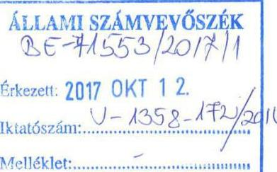

Tárgy: Az „Állami tulajdonú gazdasági társaságok - Az állami tulajdonban (résztulajdonban) lévő gazdálkodó szervezetek vagyonmegőrzési és gazdálkodási tevékenységének ellenőrzése Grand Tokaj Zrt. 20017," címü jelentéstervezettel kapcsolatos észrevételek.

Iktatószám: $05295 / 17$

## Tisztelt Elnök Úr!

Köszönettel kézhez vettük az Állami Számvevőszékről szóló 2011. évi LXVI. törvény 29.§ (1) bekezdésben foglaltak alapján észrevételezés céljából megküldött, a Grand Tokaj Zrt.-hez 2017. szeptember 27.-én érkezett „Állami tulajdonú gazdasági társaságok - Az állami tulajdonban (résztulajdonban) lévő gazdálkodó szervezetek vagyonmegőrzési és gazdálkodási tevékenységének ellenőrzése - Grand Tokaj Zrt. 2017," címủ ellenőrzésről készült jelentéstervezetet, melyre a hivatkozott jogszabály alapján az alábbi észrevételeket tesszük:

## I. Előzmények

Az Állami Számvevőszék (továbbiakban ÁSZ) az ellenőrzés elrendeléséről szóló értesítését a Grand Tokaj Zrt. 2016. december 12-én kapta meg, mely alapján az ÁSZ ellenőrzés 2017. január 6-án kezdődött meg és 2017. április 6-ig tartott. Ennek során két alkalommal történt adatbekérés, melyre a társaság 2288 file-t készített és töltött fel az ÁSZ részére. Az ellenőrzés során négy alkalommal történt helyszíni ellenőrzés.

## II. Általános észrevételek a jelentéstervezet Föbb megállapítások, következtetések fejezethez

Álláspontunk szerint a jelentéstervezet összegzésének az a kategorikus megállapítása, mely szerint a Grand Tokaj Zrt. müködésének szabályozottsága és a vagyongazdálkodás nem volt megfelelő, nincs összhangban az anyagban található alábbi részmegállapításokkal:

- „A Grand Tokaj Zrt. bevételeinek és ráforditásainak elszámolása megfelelt a jogszabályi elöírásoknak,"
- „A pénzkezelési szabályzat megfelel t a Számv. tv. elöírásainak."
- „A társaságnál a pénzügyi-számviteli feladatok, valamint az adatszolgáltatási és ellenőrzési feladatok ellátása összességében szabályszerü volt."
- „A Társaság összességében kialakította és szabályozta a vagyongazdálkodás feltételeit,"
- A Társaság a saját vagyon változását és hasznositását eredményező döntései megfeleltek az elöírásoknak."

---

# GRAND TOKAJ 

Sem az "Összegzésben", sem a "Főbb megállapítások, következtetések" részben nem szerepel, hogy az azokban megfogalmazott megállapítások a 2012-2015. közötti időszakra vonatkoznak (az ellenőrzött időszak megjelölése csak a 9. oldalon szerepel). Álláspontunk szerint ennek azért is van jelentősége, mert - a jelentéstervezet címében szerepeltetett 2017-es évszám figyelembevételével - azt a téves látszatot keltheti, hogy a Számvevőszék részben elmarasztaló megállapításai a Társaság jelenlegi müködésére és gazdálkodására vonatkoznak, holott a Társaság vezetése kiemelt figyelmet fordít a minden téren szabályszerű gazdálkodás biztosítására, és ennek eredményeként több, a jelentéstervezetben feltüntetett hiányosság a vizsgált időszakot követően már megszüntetésre került. Fentiek alapján kérjük, hogy az „Összegzésben" - az Állami Számvevőszék által más állami tulajdonú gazdasági társaságok (pl. Magyar Nemzeti Filharmonikus Zenekar, Énekkar és Kottatár Nonprofit Kft.) gazdálkodásáról készült jelentéshez hasonlóan - jelenjen meg, hogy a megállapítások a 2012. január 1 - 2015. december 31. közötti időszakra vonatkoznak.

Meg kívánjuk jegyezni, hogy mind a pénzügyi-számviteli feladatok ellátása, mind a vagyongazdálkodás kapcsán felmerült a készleteket és tárgyi eszközöket alátámasztó leltárak hiánya, amelyeket a társaság a jelentéstervezet megállapításaitól eltérően az érvényben lévő szabályzatai alapján elkészített.

Kérjük, hogy a "Főbb megállapítások, következtetések" fejezetben a megállapítás az alábbi javasolt szöveggel kerüljön véglegesítésre: "a Grand Tokaj Zrt. müködésének szabályozottsága és a vagyongazdálkodás kisebb hiányosságokkal megfelelő volt a 2012. január 1 - 2015. december 31. közötti időszakban"

## III. Részletes észrevételek

Jelen pontban követve és pontosan hivatkozva a jelentéstervezet egyes megállapításaira, részletesen tesszük meg észrevételeinket azzal, hogy álláspontunk szerint a jelentéstervezet több ponton tendenciózus, csekély jelentőségủ anomáliákkal kapcsolatban úgy fogalmaz meg véleményt, hogy az a megfogalmazástól sokkal súlyosabbnak hat, a jelentéstervezet tárgyi tévedéseket is tartalmaz, és a ténylegesnél jóval súlyosabb képet adnak az ellenőrzés tárgyáról, vállalkozásunkról. Tekintettel arra a tényre, hogy a jelentéstervezet önmagát ismétli a „Főbb megállapítások, következtetések" fejezetben és a „Megállapítások" fejezetben is, az észrevételeinket valamennyi, ismétlődő megállapításhoz megtettük.

## 1. számú fókuszkérdés - A tulajdonosi jogok gyakorlása szabályszerű volt-e?

Észrevételezett megállapítás
„A Vagyonkezelési szerződésben a Vhr. 14.§ (3) bekezdésében foglaltakat figyelmen kivül hagyva nem rögzítették:

- 2014. március 14-ig, hogy a Társaság az MNV Zrt. vagyon-nyilvántartási szabályzatát megismerte és magára nézve kötelező érvényünek ismeri el."

## GT észrevétel

2. oldal

---

# GRAND TOKAJ 

Az ellenőrzés rendelkezésére bocsátott, hitelesített dokumentum, a 2008. december 16 -án keltezett vagyonkezelési szerződés 7 . oldal 9.7 . pontja szerint
„Vagyonkezelö kijelenti, hogy a Vhr. 14.§.(3) bekezdésében foglaltaknak megfelelöen Vagyonkezelésbe adó vagyonnyilvántartási szabályzatát megismerte, és azt magára nézve kötelezőnek ismeri el."
mellyel társaságunk eleget tett a Vhr. fent említett rendelkezésének.
Kérjük a megállapítást törölni szíveskedjenek.

## Észrevételezett megállapítás

„Az NFA csak 2015 decemberében számlázta ki a 2012-2015. évekre vonatkozó vagyonkezelési dijakat. A Társaság a fizetési kötelezettségének 2015. évben nem tett eleget."

## GT észrevétel

Az ellenőrzés rendelkezésére bocsátott dokumentumok alapján is látható volt, hogy társaságunk a vizsgált időszakra vonatkozó, a gazdasági eseményeket dokumentáló bizonylatokat az alábbi datált adatokkal kapta kézhez.
A 2012. évi vagyonkezelési jog gyakorlásáért fizetendő dijról szóló számviteli bizonylat társaságunkhoz 2015. december 21 -én érkezett, 2015. december 27.-i fizetési határidővel, melyet társaságunk 2016. január 7-én pénzügyileg teljesített.
A 2013. évi vagyonkezelési jog gyakorlásáért fizetendő dijról szóló számviteli bizonylat társaságunkhoz 2015. december 21-én érkezett, 2015. december 27.-i fizetési határidővel, melyet társaságunk 2016. január 7-én pénzügyileg teljesített.
A 2014. évi vagyonkezelési jog gyakorlásáért fizetendő dijról szóló számviteli bizonylat társaságunkhoz 2015. december 21-én érkezett, 2015. december 27.-i fizetési határidővel, melyet társaságunk 2016. január 7-én pénzügyileg teljesített.
A 2015. évi vagyonkezelési jog gyakorlásáért fizetendő dijról szóló számviteli bizonylat társaságunkhoz 2015. december 21-én érkezett, 2015. december 27.-i fizetési határidővel, melyet társaságunk 2016. január 7-én pénzügyileg teljesített.
A társaság könyveiben a 2008-ban kötött vagyonkezelésben lévő állami földterületek után fizetendő bérleti díjat a vizsgált időszak valamennyi évében, a szerződésben rögzített feltételek alapján kimutattuk.

## 2. számú fókuszkérdés - A társaság müködésének szabályozottsága megfelelt-e az elöírásoknak?

Az összegző megállapítás szerint a müködés szabályozottsága „nem felelt meg a jogszabályi előírásoknak". A Társaság müködésére vonatkozóan hatályos szabályzatok közül a jelentéstervezet a számviteli politikával és a kapcsolódó szabályzatokkal összefüggésben összesen öt hibát jelöl meg, a Szervezeti és Müködési Szabályzatra vonatkozóan egyet, emellett a számlarenddel összefüggésben tesz megállapításokat. Tekintettel arra, hogy a Számvevőszék a többi belső szabályzattal kapcsolatban hiányosságot nem tárt fel, az idézett megállapítás álláspontunk szerint nem ad teljes képet a Társaság belső szabályozottságáról, és így nem felel meg az ÁSZ tv. 24. § (1) bekezdésének d) pontjában, valamint 25. § (4) bekezdésének b) pontjában előírt követelményeknek. Erre való tekintettel kérjük a szóban forgó Összegző

---

# GRAND TOKAJ 

megállapítás olyan tartalmú pontositását, amely szerint a Társaság müködésének szabályozottsága teljes mértékben nem felelt meg a jogszabályi előírásoknak.

## Észrevételezett megállapítás

„A Társaság a Számv. tv. módositása miatti változásokat a számviteli politikán, az értékelési szabályzaton és a leltározási szabályzaton nem vezette át, ezzel figyelmen kivül hagyta a Számv. tv. 14.§ (11) bekezdésében foglaltakat:"

## GT észrevétel

A vizsgált időszakra vonatkozóan a 2016. december 12 -én társaságunkhoz érkezett, V-1358/001/2016. iktatószám alatt „Dokumentumjegyzék és egyéb információk" megnevezéssel 2. sz. mellékletként csatolt felsorolásban szereplő adatszolgáltatásra kijelölt dokumentumokat az abban foglalt rendező szempontok alapján teljes körűen az ellenőrzés rendelkezésére bocsátottuk.
Ennek részeként 1. fejezet „Gazdálkodó szervezet ellenörzéséhez elektronikusan, illetve papíralapon elökészítendő" az „1.2 Szabályzatok" pont 4. bekezdésben foglaltaknak eleget téve az ellenőrzés rendelkezésre bocsátottuk a vizsgált időszakban érvényben lévő számviteli politika és számviteli szabályzatokat, továbbá a jogszabályi változásokat lekövető vezérigazgatói utasításokat.
Ugyancsak az ellenőrzés rendelkezésére bocsátottuk a vizsgált időszakra vonatkozóan készített valamennyi éves beszámoló részeként elkészített és hiteles kiegészítő mellékleteket, melyekben a törvényi kötelezésnek eleget téve mutattuk be a számviteli politika tárgyévi változásait.
Ezek együtt bizonyítottan az ellenőrzés elé tárták, hogy a vizsgált időszak valamennyi évében társaságunk a hatályos törvényi szabályozóknak megfelelő belső szabályzatokkal rendelkezett.

## Észrevételezett megállapítás

„A számviteli politika 3.13.pontja a teljes időszakban tartalmazta a megbizható, valós képet befolyásoló hiba meghatározását, miközben a Számv. tv. 3.§ (3) bekezdésének 5. pontja - mely e fogalmat rögzitette - 2013 január 1-től hatálytalan."

## GT észrevétel

Az ellenőrzés rendelkezésére bocsátott, „VEZÉRIGAZGATÓ UTASÍTÁS a számviteli politika módositására" belső szabályozó dokumentum I. Módosuló és új rendelkezések fejezet 10. pontja szerint:
„A 3.13-as pontban a „megbizható és valós képet lényegesen befolyásoló hiba: ha a jelentős összegü hibák és hibahatások összevont értéke következtében a hiba feltárásának évét megelöző üzleti év mérlegében kimutatott saját tőke legalább 5 százalékkal változik (nő vagy csökken)" szövegrész törlésre kerül."
továbbá I. Módosuló és új rendelkezések fejezet 14. pontja szerint:
„A függelék II.6. pontjában szereplő a „, társaság a megbizható és valós összképet lényegesen befolyásoló hibának minösíti azt a hibát, amely a saját tőke értékét $5 \%$-kal módosítja ( növeli vagy csökkenti)" szövegrész törlésre kerül"

---

# GRAND TOKAI 

társaságunk eleget tett a Számv. tv. módosuló rendelkezései belső szabályzatban történő átvezetésének, tehát a megállapítás, miszerint a vizsgált időszakban a fogalmi meghatározás érvényben volt a belső szabályzatban; nem helytálló.

## Észrevételezett megállapítás

„Az értékelési szabályzatban a mérlegben kimutatott deviza, valuta készletek, követelések, kötelezettségek értékelése szabályozásánál figyelmen kivül hagyták a Számv. tv. 60.§ (2) bekezdésében foglalt mérleg fordulónapi devizaárfolyamon átszámított forintértéken való kimutatás követelményét. Az átértékelést továbbra is a Számv. tv. 60.§ (2) bekezdésének 2010. december 31-ig hatályos rendelkezései szerint szabályozták."

## GT észrevétel

Az ellenőrzés rendelkezésére bocsátott „VEZÉRIGAZGATÓ UTASÍTÁS az eszközök és források értékelési szabályzatának módosítására" belső szabályozó dokumentum 1. Módosuló és új rendelkezések fejezet $6 ., 10 ., 11 ., 12 ., 16 ., 19 ., 20 ., 21 ., 22 ., 25 ., 28 .$, valamint 29 . pontjában részletesen oldalszámra történő hivatkozás mellett a
,,mérlegérték Magyar Nemzeti Bank fordulónapi árfolyamán, vagy a könyv szerinti árfolyamon számított forintérték attól függően, hogy az összes devizás eszköz és forrás összevont együttes átértékelési különbözet jelentősnek minősül-e,, szövegrész törlésre kerül."
megfogalmazott belső szabályozással társaságunk eleget tett a Számv. tv. módosuló rendelkezése szabályzatban történő átvezetésének.

## Észrevételezett megállapítás

„A leltározási szabályzat nem felelt meg a Számv.tv. 2012-től hatályos 69.§ (3) bekezdésében foglaltaknak, mivel az ingatlanok tekintetében a legalább háromévente történő leltározási gyakoriság helyett ötévente történő leltározást írtak elő."

## GT észrevétel

Az ellenőrzés rendelkezésére bocsátott, „VEZÉRIGAZGATÓ UTASÍTÁS az eszközök és források értékelési szabályzatának módosítására" belső szabályozó dokumentum 1. Módosuló és új rendelkezések fejezet 5.pontja szerint
,, A 7.2 -es pontban a ,,tárgyi eszközök közül a leltározás gyakorisága:

- ingatlanok esetében öt év
- müszaki illetve egyéb berendezések, felszerelések, jármüvek esetében egy év,
- beruházások esetében egy év,
- ingatlanokhoz kapcsolódó vagyoni értékü jogokhoz egy év" szövegrész helyébe a „tárgyi eszközök leltározási gyakoriság három év szövegrész lép"
megfogalmazott belső szabályozással társaságunk eleget tett a Számv. tv. módosuló rendelkezése szabályzatban történő átvezetésének.

Észrevételezett megállapítás

---

# GRAND TOKAJ 

„A számviteli politikában nem határozták meg, hogy az egyéb gazdasági müveletek bizonylatainak adatait mely idöpontig kell a könyvekben rögzíteni, ezzel a Társaság figyelmen kivül hagyta a Számv.tv. 165.§ (3) bekezdése b) pontjában rögzített elöirást."

## GT észrevétel

Az ellenőrzés rendelkezésére bocsátott, 9/2014. számú Gazdasági vezérigazgató- helyettesi utasitás a havi zárásról c. belső szabályozó 2. pont rendelkezése alapján
„, A számviteli zárási határidő betartásához elengedhetetlen, hogy a nyilvántartások vezetése, az adatok és dokumentumok feldolgozása, a számlák igazolása, leadása folyamatosan történjék, az elöirt kapcsolódó adatszolgáltatások legkésöbb a megszabott határidőig megtörténjenek. Ide tartozik különösen, de nem kizárólagosan, hogy

- a tárgyhavi számlákat a költséghelyi felelős igazolásával a pénzügyi osztály felé, illetve
- az önköltségszámitási rendszer müködtetéséhez szükséges kézi naturáliák táblázatait kitöltve a kontrolling osztálynak
meg kell küldeni.
Felelős: költséghelyi felelősök, illetve adatszolgáltatásra kötelezettek
Határidő: tárgyhót követő hónap 10. napja"
a társaság eleget tett a Számv. tv bizonylati elv és bizonylati fegyelem előírásait megfogalmazó 165. §. (3) bekezdés előírásainak és a gazdasági esemény megtörténte utáni hónap 10. napjáig határozta meg a könyvekben történő rögzítés kötelezettségét.

3. számú fókuszkérdés - A társaságnál a pénzügyi-számviteli feladatok, valamint az adatszolgáltatási és ellenőrzési feladatok ellátása szabályszerű volt-e?

Észrevételezett megállapítás
„A 2015. évben az immateriális javak között aktiválási jegyzőkönyv, üzembehelyezési okmány nélkül aktiváltak eszközöket, amellyel figyelmen kivül hagyták az Értékelési szabályzat I.1. pontjában, valamint a Számv. tv. 52.§ (2) bekezdés elöirását, mivel az immateriális javak bekerülése során az üzembehelyezési hitelt érdemlő́en nem dokumentálták. "

## GT észrevétel

Az ellenőrzés rendelkezésére bocsátott 2015.év ÉVES BESZÁMOLÓ, illetve annak részeként elkészített kiegészítő melléklet 2. A számviteli politika alkalmazása, 2.16. Alapítás-átszervezés költségei pontjában
„, A bevételekben várhatóan megtérülö alapitás-átszervezési költségek - az elözö üzleti évhez hasonlóan - az immateriális javak között kerülnek bemutatásra.
A Társaság alapitás átszervezés aktivált értékeként kivánja bemutatni a márkafejlesztés, brandépitéshez külső vállalkozók által számlázott költségeket, melyek az alapitás átszervezés befejezését követöen a bevételekben megtérülnek. A számviteli politika rendelkezése szerint a vállalkozás a költségeket aktiválni kivánja, és gazdasági kalkulációt készített a jövőbeni megtérülésre.

---

# GRAND TOKAI 

Tekintettel arra, hogy a folyamat több üzleti évre átnyúlik, az üzleti év végéig brandépitéssel kapcsolatban közvetlenül felmerült tételeket az alapitás-átszervezés mérlegsoron mutatja ki a Társaság.
Az értékcsökkenés elszámolása az alapitás-átszervezés befejeztével kezdődik, melynek várható időpontja 2017. január 1."
bemutattuk, hogy a Számv. tv. 25.§.(3) bekezdés szerint
„Alapitás-átszervezés aktivált értékeként a vállalkozási tevékenység inditásával, megkezdésével, jelentős bővitésével, átalakitásával, átszervezésével kapcsolatos - beruházásnak, felújitásnak nem minősülő - a külső vállalkozók által számlázott, valamint a saját tevékenység során felmerült olyan az 51. § szerinti - közvetlen önköltségbe tartozó költségeket lehet kimutatni, amelyek az alapitásátszervezés befejezését követően a tevékenység során a bevételekben várhatóan megtérülnek"
a 2015.évi mérlegben, az immateriális javak mérlegsoron a még használatba nem vett, a vizsgált időszakon túl befejeződő, beruházásnak, felújitásnak nem minősülő költségeket szerepeltetjük, melyek majd az alapítás-átszervezés befejezését követően fognak megtérülni.

Ugyancsak az ellenőrzés rendelkezésére bocsátott 2015.év ÉVES BESZÁMOLÓ, illetve annak részeként elkészített kiegészítő melléklet 2. A számviteli politika alkalmazása, 2.17. Kísérleti fejlesztés aktiválása pontban bemutattuk, hogy
„A Társaság a kísérleti fejlesztés közvetlen költségeit aktiválja. A sikerrel zárult kísérleti fejlesztés aktivált költségeket legfeljebb öt év alatt a tervszerinti értékcsökkenési leírás elszámolásával az eredmény terhére elszámolja, maradvány értékkel nem számol...."
„... A döntéstámogató térinformatikai rendszer, lekérdezö szoftver a vállalkozás saját tulajdonát képezi, használatba vételt követően a szellemi termékek között kerül kimutatásra."
a Számv. tv. 25.§ (5) bekezdésben foglalt törvényi előírás szerint
„A kísérleti fejlesztés aktivált értékeként lehet kimutatni a megkezdett, de az üzleti év mérlegfordulónapjáig be nem fejezett kísérleti fejlesztés - a jövőben várhatóan megtérülő - közvetlen költségeit is. Ez esetben a kísérleti fejlesztés aktivált értéke nemcsak a kísérleti fejlesztés többletköltségeit foglalja magában, hanem azon termékek közvetlen költségeit is, amelyeket csak később, a kísérleti fejlesztés befejezésekor lehet a készletek, a tárgyi eszközök, a szellemi termékek között állományba venni a kísérleti fejlesztés aktivált értékének csökkentésével."
a folyamatban lévő, be nem fejezett kísérleti fejlesztés során felmerülő költségeket a 2015.évi mérleg immateriális javak mérlegsoron szerepeltetjük.
Tehát az észrevételben közölt megállapítás, miszerint a társaság bizonylat nélkül aktivált volna eszközöket nem valós, hiszen a mérlegsoron bemutatott értékek a még be nem fejezett eszközök bekerülési értékének 2015. december 31-ig felmerült költségeit tartalmazták a Számv. tv. előírásainak megfelelően.

Észrevételezett megállapítás

---

# GRAND TOKAJ 

„A Társaság a mérleg fordulónapján meglévő tárgyi eszközeiről nem készitett leltárt a mérlegtételeinek alátámasztásához, amely tartalmazta volna a mérleg fordulónapján meglévő tárgyi eszközeit mennyiségben és értékben, ezzel megsértették a Számv. tv. 69.§ (1) bekezdésében foglalt valódiság elvét."

## GT észrevétel

Meglepő számunkra az észrevételezett megállapítás, hiszen az ellenőrzés során az adatszolgáltatás teljesítésére irányuló megkeresésben a „Dokumentumjegyzék és egyéb információk" megnevezéssel 2.sz. mellékletként csatolt felsorolásban szereplő kijelölt dokumentumokat az abban foglalt rendező szempontok alapján teljes körűen az ellenőrzés rendelkezésére bocsátottuk, amiben:
Az 1. fejezet „Gazdálkodó szervezet ellenőrzéséhez elektronikusan, illetve papiralapon elökészítendő" az „1.. Egyéb dokumentumok" pont 6. és 8. bekezdésben foglaltaknak eleget téve elérhetővé tettük az ellenőrzés számára az ellenőrzési időszak valamennyi évére vonatkozó zárás előtti főkönyvi kivonatokat, a fökönyvi leltárakat, továbbá a leltározás során felvett nyitó és záró, illetve esetlegesen folytatólagos leltári jegyzőkönyveket.
A 2. fejezet „Az ellenőrzéshez papiralapon elökészítendő" pont 5. bekezdése szerint az ellenőrzés rendelkezésére bocsátottuk, eredetiben előkészítettük az ellenőrzési időszak valamennyi évére vonatkozóan évenként több mint 900 oldalon rögzített leltári felvételi íveket. Ezeken mintegy 15.000 db tárgyi eszköz és több száz vásárolt és saját termelésủ készlet mennyiségének teljes körű, tételes megszámlálása került dokumentálásra.
A 3. fejezet „Elektronikusan előkészítendő adatállományok" 1. bekezdésében bekért, és évenkénti bontásban kimutatott anyagjellegủ ráfordítások mérlegsoron elszámolt, a főkönyvi adatbázisból évenkénti bontásban az ellenőrzés rendelkezésére bocsátott információk is alátámasztják, hogy a mennyiségi számbavétel során a vizsgált időszakban külső szakértő szolgáltatását is igénybe vette a vállalkozás.
Mindezekre a rendelkezésére bocsátott dokumentumokra tekintettel, nem helytálló az ellenőrzés megállapítása, miszerint a vállalkozás meglévő eszközeiről nem készített leltárt a mérlegtételek alátámasztására.

## Észrevételezett megállapítás

„A társaság követeléskezelésre vonatkozó szabályozást nem léptetett hatályba annak ellenére, hogy ...vállalta."

## GT észrevétel

A jelentéstervezet kifogásolja, hogy „a Társaság követeléskezelésre vonatkozó szabályozást nem léptetett hatályba". Tekintettel arra, hogy ilyen szabályzat készítését előiró jogszabályi rendelkezés tudomásunk szerint nincs, és a követeléskezelés gyakorlatára vonatkozóan a Számvevőszék nem állapított meg szabálytalanságot, kérjük a megállapítás törlését vagy fentiekkel történő kiegészítését.

## Észrevételezett megállapítás

„Az éves beszámoló részét képző kiegészitő melléklet a számviteli politika meghatározó elemeit és azok változásait, valamint a beszámoló összeállitásánál alkalmazott szabályrendszert bemutató fejezetének tartalma nem felelt meg a Számv.tv. 88.§ (3) és (4) bekezdéseiben foglaltaknak. A kiegészitő melléklet nem a számviteli politikában rögzítetteknek megfelelően ismertette 2015. évben a mérlegkészités idöpontját, az eredménykimutatás választott módját, 2012-2015. években, a devizában

---

# GRAND TOKAJ 

és a valutában fennálló eszközök és források értékelésénél alkalmazandó árfolyamot; az átszervezési költségek aktiválására vonatkozó rendelkezéseket."

## GT észrevétel

Az ellenőrzés rendelkezésére bocsátott, „VEZÉRIGAZGATÓ UTASÍTÁS a számviteli politika módositására" belső szabályozó dokumentum
I. Módosuló és új rendelkezések fejezet 12. pontja szerint:
„A függelék 8-as pontjában szereplő a „mérlegkészités idöpontja a tárgyévet követő év február 28" szövegrész helyébe a „mérlegkészités idöpontja a tárgyévet követő év január 31." szövegrész lép"
I. Módosuló és új rendelkezések fejezet 13. pontja szerint:
„, A függelék II.1. pontjában szereplő az „átszervezési költségeket a társaság nem tervezi aktiválni" szövegrész helyébe az „alapítás-átszervezés költségeit a Társaság aktiválja" szövegrész lép."

Az ellenőrzés rendelkezésére bocsátott „VEZÉRIGAZGATÓ UTASÍTÁS az eszközök és források értékelési szabályzatának módositására" belső szabályozó dokumentum
I. Módosuló és új rendelkezések fejezet $6 ., 10 ., 11 ., 12 ., 16 ., 19 ., 20 ., 21 ., 22 ., 25 ., 28 .$, valamint 29 . pontjában részletesen oldalszámra történő hivatkozás mellett a
„,mérlegérték Magyar Nemzeti Bank fordulónapi árfolyamán, vagy a könyv szerinti árfolyamon számított forintérték attól függően, hogy az összes devizás eszköz és forrás összevont együttes átértékelési különbözet jelentősnek minősül-e,, szövegrész törlésre kerül."
I. Módosuló és új rendelkezések fejezet 3. pontja szerint
,, A 13. oldalon a Társaság alapitással, átszervezéssel kapcsolatos kiadásait, közvetlen költségeit nem aktiválja. Amennyiben a Társaság mégis az aktiválás mellett döntene, az aktiválási érték saját kivitelezés esetében az utókalkulált közvetlen önköltség, idegen kivitelezés esetén a számlázott beszerzési ár" szövegrész helyébe a „, Társaság alapitással, átszervezéssel kapcsolatos költségeket aktiválja ,, szövegrész lép.

Ezen rendelkezésére bocsátott dokumentumok 20 illetve - az értékelési szabályzatra vonatkozó módosító és új rendelkezések - 31 pontba szedve szabályozták beszámoló készítésekor a kiegészítő melléklet összeállítása során a Számv. tv. hivatkozott előírásainak megfelelően alkalmazandó szabályrendszert, eljárásokat, módszereket.
A belső szabályzat módosító rendelkezéseit figyelembe véve állítottuk össze a 2015.évi beszámoló részeként a kiegészítő mellékletet, a Számv. tv. 88.§ (3) bekezdés szerint bemutatva a számviteli politika változása miatti hatásokat.

## 4. számú fókuszkérdés - A társaság vagyongazdálkodása szabályszerű volt-e?

Az összegző megállapítás szerint a Társaság vagyongazdálkodása nem volt megfelelő. Álláspontunk szerint a jelentéstervezet 4. pontjában szereplő és általunk vitatott hiányosságok ilyen súlyos és kategorikus megállapítás megfogalmazását nem alapozzák meg, ezért kérjük annak pontosítását úgy, hogy a vagyongazdálkodás kisebb hiányosságokkal megfelelő volt.

## Észrevételezett megállapítás

„A tervezési tevékenység nem volt szabályszerű. Az SZMSZ I. fejezet 3. pontjában és az SZMSZ V. fejezet 6. pontjában elöirtak ellenére a 2012. év kivételével nem készítettek középtávú tervet. Az éves

---

# GRAND TOKAJ 

üzleti tervei a 2013-2015. években nem feleltek meg az MNV Zrt. tervezési irányelveiben meghatározott, a társasággal szemben támasztott, pozitív eredményen alapuló tőkehatékonysági követelményeknek.

## GT észrevétel

A jelentéstervezet kifogásolja, hogy a Társaság üzleti tervei egyes években nem feleltek meg az MNV Zrt. által meghatározott, pozitív eredményen alapuló tőkehatékonysági követelményeknek.
E megállapítás megalapozottságát nem vitatjuk, ugyanakkor fontosnak tartjuk annak megjelenítését, hogy az MNV Zrt., mint az alapítói jogok gyakorlója minden évben jóváhagyta az üzleti tervet, ismerve a Tokaj Kereskedőház Zrt. speciális piaci helyzetét és gazdálkodásának kereteit.
Meg kívánjuk jegyezni továbbá, hogy amennyiben az üzleti terv készitésének időszakában már látható, hogy a Társaság müködése veszteséges lesz, álláspontunk szerint a felelős gazdálkodás követelményeivel ellentétes egy, a realitástól elrugaszkodott, pozitív eredményt tartalmazó üzleti terv összeállítása és alapító részére történő előterjesztése. Ez még akkor is így van, ha az üzleti terv ebben az esetben megfelelne a tervezési irányelvekben foglaltaknak. A tervezet 13. oldalán szereplő táblázat adataiból egyébként látható, hogy az adózás előtti eredmény / saját tőke mutató tényleges alakulása utóbb igazolta az üzleti tervek megalapozottságát, mivel a szóban forgó években - a tervekkel összhangban - negatív volt.
Az MNV Zrt. részéről nem volt elvárás, hogy az ellenőrzési időszakban az éves üzleti tervek mellett külön középtávú terv is készüljön minden évben, tekintettel arra, hogy a Társaság beruházásaira, illetve szőlőfelvásárlásaira a finanszírozást a tulajdonos MNV Zrt. csak évente, Kormányhatározatok birtokában biztosíthatta, ugyanakkor a társaságnak előirta, hogy az üzleti terv részeként készítsen 3 éves kitekintést - középtávú előrejelzést - az értékesítésre és az eredményekre vonatkozóan, amely megtörtént.

## Észrevételezett megállapítás

„A saját eszközei és forrásai leltárral való alátámasztása az ellenőrzés egyetlen évében sem volt teljes körüen biztositott, mivel a készletek, az immateriális javak, a tárgyi eszközök és a részesedések mérlegsorokat alátámasztó leltárral nem rendelkeztek. Ezzel megsértették a Számv.tv. 15.§ (3) bekezdése szerinti „valódiság elvét", és nem teljesítették a Számv.tv. 69.§ (1) bekezdésében foglaltak, valamint a leltározási szabályzat elöírásai. A könyvvizsgáló a szabálytalanságok ellenére korlátozás nélküli záradékot adott ki. ""

## GT észrevétel

A 3. sz. fókuszkérdésben tett megállapításhoz tett észrevételben is megjegyeztük, hogy az ellenőrzés során az adatszolgáltatás teljesítésére irányuló megkeresésben a „Dokumentumjegyzék és egyéb információk" megnevezéssel 2.sz. mellékletként csatolt 1. fejezet „Gazdálkodó szervezet ellenőrzéséhez elektronikusan, illetve papíralapon előkészítendő" az ,,1,. Egyéb dokumentumok" pont 6. és 8. bekezdésben foglaltaknak eleget téve az ellenőrzés rendelkezésére bocsátottuk az ellenőrzési időszak valamennyi évére vonatkozó zárás előtti főkönyvi kivonatokat, a főkönyvi leltárakat, továbbá a leltározás során felvett nyitó és záró illetve esetlegesen folytatólagos leltári jegyzőkönyveket.
A 2. fejezet „Az ellenőrzéshez papíralapon elökészítendő" pont 5. bekezdése szerint az ellenőrzés rendelkezésére bocsátottuk, eredetiben előkészítettük az ellenőrzési időszak valamennyi évére vonatkozóan évenként több mint 900 oldalon rögzített leltári felvételi ívet. Ezeken mintegy 15.000 db tárgyi eszköz és több száz vásárolt és saját termelésű készlet mennyiségének teljes körű, tételes megszámlálása került dokumentálásra.

---

# GRAND TOKAJ 

A 3. fejezet „Elektronikusan előkészitendő adatállományok" 1. bekezdésében bekért, anyagjellegủ ráfordítások mérlegsoron elszámolt a főkönyvi adatbázisból évenkénti bontásban is az ellenőrzés rendelkezésére bocsátott információk is alátámasztják, hogy a mennyiségi számbavétel során a vizsgált időszakban külső szakértő szolgáltatását igénybe vettük.

Az ellenőrzés során az adatszolgáltatás teljesítésére irányuló megkeresésben a „Dokumentumjegyzék és egyéb információk" megnevezéssel 2.sz. mellékletként csatolt felsorolás 1. fejezet „Gazdálkodó szervezet ellenőrzéséhez elektronikusan, illetve papíralapon előkészitendő" „1.3 egyéb dokumentumok" pont 9. alpontjában kért adatszolgáltatásnak eleget téve az ellenőrzés rendelkezésére bocsátottuk a 2012., 2013., 2014., és 2015 évi könyvvizsgálói jelentéseket, továbbá a 2015.évi könyvvizsgálói vezetői leveleket.

A 2012. évre vonatkozó könyvvizsgálói jelentésben korlátozó vélemény került megfogalmazásra az alábbiak szerint:
„A korlátozó vélemény alapja
„Mivel könyvvizsgálói megbizásunkat a mérleg fordulónapját követően kaptuk, igy nem állt módunkban részt venni a készletek 2012. december 31-i fizikai leltárfelvételén és egyéb könyvvizsgálati módszerekkel sem tudtunk megbizonyosodni a készletmennyiségek helyességéről." Korlátozás
Véleményünk szerint a vélemény alapja bekezdésben leírt kérdés hatásait kivéve az éves beszámoló megbizható és valós képet ad a Tokaj Kereskedőház Zrt 2012. december 31-én fennálló vagyoni és pénzügyi helyzetéről a számviteli törvénnyel összhangban.
Vélemény
Véleményünk szerint az éves beszámoló a fenti korlátozással megbizható és valós képet ad a Tokaj Kereskedöház Zrt 2012. december 31-én fennálló vagyoni és pénzügyi helyzetéről, valamint az ezen időponttal végződő évre vonatkozó jövedelmi helyzetéről a számviteli törvényben foglaltakkal összhangban."
A záradékból indirekt módon kiderül, hogy nem az volt a könyvvizsgáló megállapítása, hogy nem történt leltárfelvétel, hanem az, hogy azon a megbízás későbbi időpontja miatt nem vett részt.

A 2013. évre vonatkozó könyvvizsgálói jelentésben korlátozó vélemény került megfogalmazásra az alábbiak szerint:
„A korlátozott vélemény alapja
A könyvvizsgálati eljárások befejezését követően, a Társaság éves beszámolójának elfogadása érdekében összehivott Felügyelő Bizottsági ülést követően értesültünk arról, hogy a Társaság készleteinek minőségével kapcsolatosan megalapozott kételyek merültek fel. Eszerint egyes megvizsgált bortételek esetében a nyilvántartásokban olyan borászati müveletek kerültek rögzitésre, amelyek a borvidéki rendtartásban illetve jogszabályban nem engedélyezettek. Ennek alapján a minőségi vizsgálatok lezárásáig nem határozható meg a számviteli kimutatásokban szereplő készletek valós értéke.
Korlátozás
Véleményünk szerint a vélemény alapja bekezdésben leírt kérdés hatásait kivéve az éves beszámoló megbizható és valós képed ad a Tokaj Kereskedöház Zrt. 2013. december 31-én fennálló vagyoni és pénzügyi helyzetéről, valamint az ezen időponttal végződő évre vonatkozó jövedelmi helyzetéről a számviteli törvényben foglaltakkal összhangban.
Vélemény

---

# GRAND TOKAJ 

Véleményünk szerint az éves beszámoló a fenti korlátozással megbizható és valós képet ad a Tokaj Kereskedöház Zrt. 2013. december 31-én fennálló vagyoni és pénzügyi helyzetéről, valamint az ezen időponttal végződő évre vonatkozó jövedelmi helyzetéről a számviteli törvényben foglaltakkal összhangban."

A 2014. évre vonatkozó könyvvizsgálói jelentésben korlátozó vélemény került megfogalmazásra az alábbiak szerint:
„A korlátozott vélemény alapja
A Társaság 2014. december 31-i fordulónappal készült éves beszámolója jelentős mérleg szerinti veszteséget mutat. A veszteség legfontosabb magyarázatát a Társaság borkészleteivel kapcsolatban 2014-ben felmerült minőségi problémák - a bortörvénynek és a termékleírásnak maradéktalanul meg nem felelő tételek - és az ebből eredő visszaeső értékesitési bevételek adják. Elsősorban ezen okok miatt a Társaság müködési cash-flow értéke negatív, amely várhatóan 2015-ben sem fordul át pozitív értékre.
A 2015-re elfogadott üzleti terv alapján a Társaság jelentős mértékü beruházásokat tervez elvégezni. A Társaság finanszírozási igénye 2015-ben meghaladja azt a mértéket, amelyet saját maga képes volna elöteremteni, igy a tulajdonos támogatására van szüksége. A tulajdonos - az Államháztartásról szóló törvény alapján - nem adhatott olyan nyilatkozatot, melyben megerősitené, hogy szükség esetén a Társaság számára a fizetőképesség folyamatos fenntartásához szükséges anyagi források rendelkezésre bocsátásáról gondoskodik.
Korlátozás
Véleményünk szerint a vélemény alapja bekezdésben leírt körülményekre való tekintettel, megítélésünk szerint jelentös bizonytalanság áll fenn abban, hogy a Társaság képes lesz-e tovább müködni, illetve likviditását folyamatosan fenntartani. Ennek megfelelöen nem tudtunk megfelelő könyvvizsgálói bizonyitékot szerezni a vállalkozás folytatása elvének teljesüléséről.
Vélemény
A könyvvizsgálat során a Tokaj Kereskedöház Zrt. éves beszámolóját, annak részeit és tételeit, azok könyvelési és bizonylati alátámasztását az érvényes nemzeti könyvvizsgálati standardokban foglaltak szerint felülvizsgáltuk és ennek alapján elegendő és megfelelő bizonyosságot szereztünk arról, hogy a fenti korlátozásnak az éves beszámolóra vonatkozó esetleges hatásait kivéve, az éves beszámolót a számviteli törvényben foglaltak és az általános számviteli elvek szerint készítették el.
Véleményünk szerint az éves beszámoló a fenti korlátozással megbizható és valós képet ad a Tokaj Kereskedöház Zrt. 2014. december 31-én fennálló vagyoni és pénzügyi helyzetéről, valamint az ezen idöponttal végződő évre vonatkozó jövedelmi helyzetéről a számviteli törvényben foglaltakkal összhangban."

A 2015. évre vonatkozó könyvvizsgálói jelentésben korlátozó vélemény került megfogalmazásra az alábbiak szerint:
„Korlátozott vélemény alapja
A Grand Tokaj Zrt késztermékei 610.056 E Ft, a befejezetlen termelés és félkész termékek 2.774.352 E Ft értékben szerepelnek a mérlegben. A befejezetlen termelés és félkész termékek értékét a számvitelről szóló 2000. évi C. törvény (továbbiakban: Szt.) 62. § (2) bekezdése alapján utókalkulációval meghatározott közvetlen önköltségen kellett kimutatni. A Grand Tokaj Zrt önköltségszámitási rendszere - belcértve annak szabályozottságát is - nem alkalmas arra, hogy abból a saját termelésü készletek közvetlen önköltségét meg lehessen határozni, ezért a hibás állitás pénzügyi hatásának számszerüsítése nem kivitelezhető.

---

# GRAND TOKAJ 

A Grand Tokaj Zrt immateriális javai 2.313.700 E Ft, tárgyi eszközei 5.718.692 E Ft értékben szerepelnek a mérlegben. Az immateriális javak és a tárgyi eszközök után az elözö években elszámolt terv szerinti értékcsökkenés a Grand Tokaj Zrt által használt program hibás paraméterezése alapján nem felelt meg az Szt. 52. §-ának, mert az üzleti évenként elszámolt terv szerinti értékcsökkenés kevesebb volt, mint amennyi a használati idöt ténylegesen terhelte. A hiba hatásaként az immateriális javak és a tárgyi eszközök 2015. évi nyitó értéke lényeges hibás állitást tartalmazhat, amely pénzügyi hatásának számszerüsítése nem kivitelezhető.
Korlátozott vélemény
A könyvvizsgáló véleménye szerint a korlátozott vélemény alapja bekezdésben leírt kérdés hatásait kivéve az éves beszámoló megbizható és valós képet ad a gazdálkodó Grand Tokaj Zrt. 2015. december 31-én fennálló vagyoni és pénzügyi helyzetéről, valamint az ezen időponttal végződő évre vonatkozó jövedelmi helyzetéről a számviteli törvényben foglaltakkal összhangban."

Mindezekre az ellenőrzés rendelkezésére bocsátott dokumentumokra tekintettel nem valós az ellenőrzés megállapítása, miszerint a vállalkozás mérlegben kimutatott eszközei és forrásai leltárral nem alátámasztottak, továbbá valótlan az a megállapítás is miszerint a könyvvizsgáló korlátozás nélküli záradékot adott ki, hiszen az ellenőrzési időszak valamennyi évének beszámolója korlátozott könyvvizsgálói záradékkal ellátott jelentéssel került elfogadásra.

Kérjük, hogy a fentiekben megfogalmazott észrevételeinket megfontolni és azok alapján a jelentéstervezetet módosítani szíveskedjenek.

Meglátásunk szerint néhány formai vagy adminisztrációs hiányosságtól eltekintve vállalkozásunk törvényszerüen müködik, és a számviteli nyilvántartásait is a törvényi előírások szerint vezeti.

Tolcsva, 2017. október 9.

Tisztelettel:
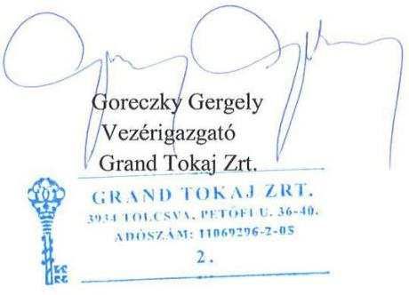

---

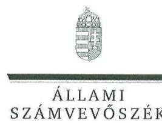

ELNÖK

Ikt.szám: V-1358-176/2016.

# Goreczky Gergely úr 

vezérigazgató
Grand Tokaj Zrt.

## Siófok

## Tisztelt Vezérigazgató Úr!

Az „Állami tulajdonú gazdasági társaságok - Az állami tulajdonban (résztulajdonban) lévő gazdálkodó szervezetek vagyonmegőrzési és gazdálkodási tevékenységének ellenőrzése Grand Tokaj Zrt. " címủ jelentéstervezetre tett észrevételeit köszönettel megkaptam.

Az ellenőrzési megállapításokra vonatkozó észrevételét az Állami Számvevőszékről szóló 2011. évi LXVI. törvény (a továbbiakban: ÁSZ tv.) 29. § (2) bekezdésében meghatározott tizenöt napos határidőn belül küldte meg. Az Állami Számvevőszék észrevétellel kapcsolatos álláspontját a mellékletként csatolt, a felügyeleti vezető által készített indokolás tartalmazza.

Tájékoztatom, hogy az Állami Számvevőszék a figyelembe nem vett észrevételeket az ÁSZ tv. 29. § (3) bekezdésében előírtak szerint köteles a jelentésében feltüntetni és megindokolni, hogy azokat miért nem fogadta el.

Budapest, 2017. 11. hó nap
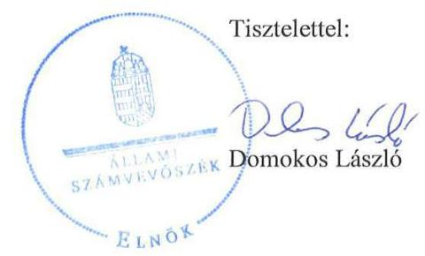

Melléklet: Észrevételre adott válasz

---

"Az állami tulajdonban (résztulajdonban ) lévő gazdálkodó szervezetek vagyonmegőrzési és gazdálkodási tevékenységének ellenörzése - Grand Tokaj Zrt" címủ jelentéstervezethez tett észrevételre adott válasz

A jelentéstervezetre tett észrevételeket áttekintettem, annak kezelésével kapcsolatban a következő tájékoztatást adom.

# 1. A jelentéstervezet 5. oldalának Összegzés c. fejezetére vonatkozó észrevétel 

Vezérigazgató Úr észrevétele szerint a jelentéstervezet összegzésének megállapítása, mely szerint a Grand Tokaj Zrt. (a továbbiakban: Társaság) müködésének szabályozottsága és a vagyongazdálkodás nem volt megfelelő, nincs összhangban egyes részmegállapításokkal.
Az Összegzés fejezet első bekezdése (lead-je) a jelentéstervezet egyes fókuszkérdéseire adott öszszegző megállapításokat tartalmazza, azokkal így összhangban áll. Erre való tekintettel az első bekezdés módosítását nem tartjuk indokoltnak.
Vezérigazgató Úr észrevételezi továbbá, hogy sem a fejezet első bekezdésében, sem pedig a Föbb megállapítások, következtetések c. pontban nem szerepel, hogy a megállapítások a 2012-2015 közötti időszakra vonatkoznak, és kéri, hogy ezt az információt tartalmazzák a kérdéses bekezdések.
Az ellenőrzött időszakra vonatkozó információ a fejezet Az ellenörzés társadalmi indokoltsága c. pontjában feltüntetésre kerül, emellett azt tartalmazza a jelentéstervezet 11. oldalán Az ellenörzött idöszak c. pont is, ezért a jelentéstervezet kiegészítése nem indokolt.

## 2. A jelentéstervezet 1.2. sz. megállapításának 2. bekezdése kapcsán tett észrevétel

A jelentéstervezet megállapítja, hogy a vagyonkezelési szerződésben a Vhr. 14. § (3) bekezdésében foglaltakat figyelmen kívül hagyva nem rögzítették 2014. március 14-ig, hogy a Társaság az MNV Zrt. vagyon-nyilvántartási szabályzatát megismerte és magára nézve kötelező érvényűnek ismeri el.
Az ellenőrzés rendelkezésére bocsátott dokumentum alapján Vezérigazgató Úr kérte a megállapítást törlését.
Az észrevétel kapcsán a dokumentumokat áttekintettük, a megállapítást, illetve a kapcsolódó javaslatot töröljük.

## 3. A jelentéstervezet 1.2. sz. megállapításának 5. bekezdése kapcsán tett észrevétel

A jelentéstervezet megállapítja, hogy az NFA csak 2015 decemberében számlázta ki a 2012-2015. évekre vonatkozó vagyonkezelési díjakat, illetve hogy a Társaság a fizetési kötelezettségének a 2015. évben nem tett eleget.

Észrevételében Vezérigazgató Úr a kapcsolódó bizonylatokra vonatkozóan mutat be adatokat. Tekintettel arra, hogy az észrevétel a megállapítást nem vitatja, a jelentéstervezet módosítása nem indokolt.

## 4. A jelentéstervezet 2. Összegzö megállapítása kapcsán tett észrevétel

A jelentéstervezet 2. Összegző megállapítása szerint a Társaság müködésének szabályozottsága nem felelt meg a jogszabályi előírásoknak és a számviteli szabályzatok egyes rendelkezései között ellentmondás volt.

---

Észrevételében Vezérigazgató Úr kéri a megállapítás olyan tartalmú pontositását, mely szerint a „Társaság müködésének szabályozottsága teljes mértékben nem felelt meg a jogszabályi elöírásoknak".
A 2. Összegző megállapítást a jelentéstervezet 15-16. oldalán bemutatott, részletes megállapítások támasztják alá. Tekintettel a szabálytalanságok számosságára, az összesített értékelés alapján a müködés szabályozottsága nem volt megfelelő, a jelentéstervezet módosítása nem indokolt.

# 5. A jelentéstervezet 2. sz. megállapításának 1. bekezdésére tett észrevételek 

A jelentéstervezet 2. megállapításának 1. bekezdése alapján a Társaság a Számv. tv. módosítása miatti változásokat a számviteli politikán, az értékelési szabályzaton és a leltározási szabályzaton nem vezette át, ezzel figyelmen kívül hagyta a Számv. tv. 14. § (11) bekezdésében foglaltakat. A jelentéstervezet részletesen bemutatja a szabálytalanságokat.
Vezérigazgató Úr álláspontja szerint a Társaság által az ellenőrzés rendelkezésére bocsátott dokumentumok bizonyítottan az ellenőrzés elé tárták a hatályos törvényi szabályozóknak való megfelelést. Vezérigazgató Úr levelének 4. és 5. oldalán tett észrevételekben foglaltak szerint a Társaság az ellenőrzés rendelkezésére bocsátotta a Vezérigazgatói utasitás a számviteli politika módositására, illetve a Vezérigazgatói utasitás az eszközök és források értékelési szabályzatának módositására c. belső szabályozó dokumentumokat, melyekkel a Társaság eleget tett a Számv. tv. módosuló rendelkezése szabályzatban történő átvezetésének.
A fenti észrevételek kapcsán áttekintettük az ellenőrzés rendelkezésére álló dokumentumokat, és megállapítottuk, hogy a megnevezett szabályozókat a Társaság nem bocsátotta az ellenőrzés rendelkezésére, illetve azok a Vezérigazgató Úr által aláirt teljességi-hitelességi nyilatkozatokban sem szerepelnek. Erre való tekintettel a megállapítás módosítása nem indokolt.

## 6. A jelentéstervezet 2. sz. megállapításának 2. bekezdésére tett észrevétel

A jelentéstervezet 2. megállapítás 2. bekezdésének első francia bekezdése alapján a számviteli politikában nem határozták meg, hogy az egyéb gazdasági műveletek bizonylatainak adatait mely időpontig kell a könyvekben rögzíteni, ezzel a Társaság figyelmen kívül hagyta a Számv. tv. 165. $\S(3)$ bekezdése b) pontjában rögzített előirást.
Vezérigazgató Úr vitatja a megállapítást, tekintettel arra, hogy a Társaság által az ellenőrzés rendelkezésére bocsátott, 9/2014. számú Gazdasági vezérigazgató-helyettesi utasitás a havi zárásról c. belső szabályozó alapján a Társaság eleget tett a törvényi előírásoknak.

Az észrevétel kapcsán áttekintettük az ellenőrzés rendelkezésére álló dokumentumokat, és megállapítottuk, hogy a fent nevezett szabályozót a Társaság nem bocsátotta az ellenőrzés rendelkezésére, illetve az a Vezérigazgató Úr által aláirt teljességi-hitelességi nyilatkozatokban sem szerepel, ezért a megállapítás módosítása nem indokolt.

## 7. A jelentéstervezet 3.1. sz. megállapítás 2. bekezdésének 1. francia bekezdésére tett észrevétel

A jelentéstervezet 3.1. megállapítás 2. bekezdésének első francia bekezdése alapján a 2015. évben az immateriális javak között aktiválási jegyzőkönyv, üzembe helyezési okmány nélkül aktiváltak eszközöket, amellyel figyelmen kívül hagyták az Értékelési szabályzat I. 1 pontjában, valamint a Számv. tv. 52. § (2) bekezdés előírását, mivel az immateriális javak bekerülése során az üzembe helyezést hitelt érdemlő módon nem dokumentálták.
Az észrevételben foglaltak szerint a Társaság a 2015. évi beszámolóban bemutatta, hogy a Számv. tv. 25. § (3) bekezdés alapján, a 2015. évi mérlegben az immateriális javak mérlegsoron a még használatba nem vett, a vizsgált időszakon túl befejeződő, beruházásnak, felújításnak nem minősülő költségeket szerepeltetik, amelyek majd az alapítás-átszervezés befejezését követően fognak

---

megtérülni, valamint a jövőbeni megtérülésre gazdasági kalkulációt készítettek. A megállapításban szereplő jogszabályi rendelkezésnek való megfelelésre az észrevétel külön nem tér ki.
Az észrevétel kapcsán áttekintettük az ellenőrzés rendelkezésére álló dokumentumokat. Az észrevétel a 2015. évi Éves beszámoló részeként készített kiegészitő melléklet, 2. A számviteli politika alkalmazása, 2.16 Alapítás-átszervezés költségei pontjában írtakra hivatkozik. Ugyanakkor a megállapítás megalapozását szolgáló, az ellenőrzés rendelkezésére álló Számviteli politika 1. számú függelékének II/ 1. pontja szerint átszervezési költséget a társaság nem tervezi aktiválni.
Tekintettel a fentiekre a megállapítás módosítása nem indokolt.

# 8. A jelentéstervezet 3.1. sz. megállapítás 2. bekezdésének 2. francia bekezdésére tett észrevétel 

A jelentéstervezet 3.1. megállapítás 2. bekezdésének második francia bekezdése alapján a Társaság a mérleg fordulónapján meglévő tárgyi eszközeiről nem készített leltárt a mérleg tételeinek alátámasztásához, amely tartalmazta volna a mérleg fordulónapján meglévő tárgyi eszközeit mennyiségben és értékben, ezzel megsértették a Számv. tv. 69. § (1) bekezdésében foglaltakat, és figyelmen kívül hagyták a Számv. tv. 15. § (3) bekezdésében foglalt valódiság elvét.
Vezérigazgató Úr észrevétele szerint nem helytálló a jelentéstervezet megállapítása, és azt állítja, hogy - az ÁSZ által megküldött Dokumentumjegyzékben foglaltaknak megfelelően - a leltárfelvételi íveket az ellenőrzés rendelkezésére bocsátották, eredetiben előkészítették valamennyi évre vonatkozóan. Ezen kívül elérhetővé tették az ellenőrzés számára, az ellenőrzött időszak valamennyi évére vonatkozó zárás előtti fökönyvi kivonatokat, főkönyvi leltárakat, továbbá leltári jegyzőkönyveket.
Az észrevétel kapcsán áttekintettük az ellenőrzés rendelkezésére álló dokumentumokat. Az adatbekérő levél Dokumentumjegyzékében foglaltak szerint az ellenőrzéshez az elektronikusan beküldendő dokumentumok közé tartoztak a beszámolót alátámasztó zárás előtti fökönyvi kivonatok és leltárkimutatások, leltárösszesítők, illetve leltározási jegyzőkönyvek. A Társaság az ellenőrzés webes felületére az Egyéb dokumentumok - 6. pont alá feltöltötte a „Fökönyvi számlák leltára ...év" elnevezésủ dokumentumokat 2012-2015. évekre, 7 db file-ban. Ezen dokumentumok között a tárgyi eszközök mérlegsort alátámasztó leltárt nem bocsátotta az ellenőrzés rendelkezésére. Az Egyéb dokumentumok - 8. pont alá feltöltött „leltározási jegyzőkönyveket", melyek évente, leltározási körzetenként tartalmaznak dokumentumokat (pl. megbízólevél, leltár előtti jegyzőkönyv, leltározási jegyzőkönyv). Ezek bár igazolják, hogy a Társaság évente végzett mennyiségi felvétellel történő leltározást, e dokumentumok között sem bocsátottak rendelkezésre a tárgyi eszközök mérlegsorokat alátámasztó, az eszközöket tételesen mennyiségben és értékben tartalmazó leltárt.
Az ellenőrzési bizonyítékok helyszíni szemrevételezésekor készült, Vezérigazgató Úr által is aláirt jegyzőkönyvek nem tartalmaznak információt leltárakra, leltárfelvételi ívekre vonatkozóan, valamint a teljességi-hitelességi nyilatkozatok sem tartalmazzák a hiányolt dokumentumokat.
A fentiekre való tekintettel az észrevétel a megállapítást nem módosítja.

## 9. A jelentéstervezet 3.1. sz. megállapításának 4. bekezdésére tett észrevétel

A jelentéstervezet 3.1. megállapításának 4. bekezdése szerint a Társaság követeléskezelésre vonatkozó szabályozást nem léptetett hatályba annak ellenére, hogy azt a 2012. évben az MNV Zrt. ellenőrzési javaslatai alapján készített intézkedési tervében vállalta.
Vezérigazgató Úr kéri a megállapítás törlését vagy kiegészítését tekintettel ilyen szabályzat készítését előíró jogszabályi rendelkezés hiányára, valamint arra, hogy az ellenőrzés nem állapított meg szabálytalanságot a követeléskezelés gyakorlatára vonatkozóan.

---

Az ellenőrzés módszertana szerint a tulajdonosi joggyakorló ellenőrzése nyomán készült intézkedési terv a belső szabályozás része. Emellett az észrevétel nem vitatja a megállapítás megalapozottságát. Erre való tekintettel a megállapítás módosítását nem tartjuk indokoltnak.

# 10. A jelentéstervezet 3.2. sz. megállapításának 3. bekezdésére tett észrevétel 

A jelentéstervezet megállapítja, hogy az éves beszámolók részét képező kiegészítő melléklet a számviteli politika meghatározó elemeit és azok változásait, valamint a beszámoló összeállításánál alkalmazott szabályrendszert bemutató fejezetének tartalma nem felelt meg a Számv. tv. 88. § (3) és (4) bekezdéseiben foglaltaknak. A kiegészítő melléklet nem a számviteli politikában rögzítetteknek megfelelően ismertette 2015. évben a mérlegkészítés időpontját, az eredmény kimutatás választott módját, 2012-2015. években, a devizában és a valutában fennálló eszközök és források értékelésénél alkalmazandó árfolyamot; az átszervezési költségek aktiválására vonatkozó rendelkezéseket.
Vezérigazgató Úr észrevételében kiemeli, hogy az ellenőrzés rendelkezésére bocsátott, az észrevételben megnevezett dokumentumok szabályozták beszámoló készítésekor a kiegészítő melléklet összeállítása során a törvényi előírásoknak megfelelően alkalmazandó szabályrendszert, eljárásokat, módszereket.
Az észrevétel kapcsán áttekintettük az ellenőrzés rendelkezésére álló dokumentumokat, és megállapítottuk, hogy a fent nevezett szabályozókat a Társaság nem bocsátotta az ellenőrzés rendelkezésére, illetve azok a Vezérigazgató Úr által aláirt teljességi-hitelességi nyilatkozatokban sem szerepelnek. Erre való tekintettel a megállapítás módosítása nem indokolt.

## 11. A jelentéstervezet 4.1. sz. megállapításának 2. bekezdésére tett észrevétel

A jelentéstervezet megállapítja, hogy a tervezési tevékenység nem volt szabályszerű, mivel az SZMSZ ${ }_{1}$ I. fejezet 3. pontjában és az SZMSZ ${ }_{2}$ V. fejezet 6. pontjában előírtak ellenére a 2012. év kivételével nem készítettek középtávú tervet, illetve az éves üzleti tervek a 2013-2015. években nem feleltek meg az MNV Zrt. tervezési irányelveiben meghatározott, a társasággal szemben támasztott, pozitív eredményen alapuló tőkehatékonysági követelményeknek.
Vezérigazgató Úr észrevételében a megállapítás megalapozottságát nem vitatja, ugyanakkor fontosnak tartja megjeleníteni, hogy az MNV Zrt. mint az alapítói jogok gyakorlója minden évben jóváhagyta az üzleti tervet. Emellett Vezérigazgató Úr megjegyzi, hogy az MNV Zrt. részéről nem volt elvárás, hogy az ellenőrzési időszakban az éves üzleti tervek mellett külön középtávú terv is készüljön.
Tekintettel arra, hogy a jelentéstervezet az 1.1. számú megállapításában rögzíti, hogy a Társaság üzleti terveit az MNV Zrt. minden évben megtárgyalta és elfogadó határozataival jóváhagyta, a megállapítás módosítása nem indokolt. Felhívjuk emellett a figyelmet arra, hogy az SZMSZ jelentéstervezetben hivatkozott szakaszai írták elő a középtávú terv készítésének kötelezettségét.

## 12. A jelentéstervezet 4.2. sz. megállapításának 3. bekezdésére tett észrevétel

A jelentéstervezet megállapítja, hogy a Társaság saját eszközei és forrásai leltárral való alátámasztása az ellenőrzés egyetlen évében sem volt teljes körűen biztosított, mivel a készletek, az immateriális javak, a tárgyi eszközök és a részesedések mérlegsorokat alátámasztó leltárral nem rendelkeztek. Ezzel megsértették a Számv. tv. 15. § (3) bekezdése szerinti „valódiság elvét", és nem teljesültek a Számv. tv. 69. § (1) bekezdésében foglaltak, valamint a Leltározási szabályzat vonatkozó előírásai. A megbízott könyvvizsgáló a szabálytalanságok ellenére korlátozás nélküli záradékot adott ki.
Vezérigazgató Úr észrevételében ismételten jelzi, hogy a kért dokumentumokat az ellenőrzés rendelkezésére bocsátották, ezen kívül rendelkezésre bocsátották a könyvvizsgálói jelentéseket és a 2015. évi könyvvizsgálói vezetői leveleket. Ezek alapján nem tartja valósnak az ellenőrzés azon

---

megállapítást, miszerint a mérlegben kimutatott eszközök és források leltárral nem alátámasztottak, továbbá valótlannak tartja azt a megállapítást is, miszerint a könyvvizsgáló korlátozás nélküli záradékot adott ki.
Az észrevétel kapcsán áttekintettük az ellenőrzés rendelkezésére álló dokumentumokat. A leltárra vonatkozó észrevételt a 8 . pontban foglalt indoklás alapján nem fogadjuk el. Ugyanakkor a megállapítás utolsó mondatára vonatkozó észrevételt elfogadjuk, a jelentéstervezetet e tekintetben módosítjuk.

Budapest, 2017.
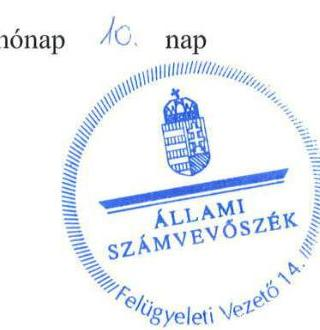

Dr. Németh Erzsébet
felügyeleti vezető

---

# MNV   Magyar Nemzeti   VagyonkezelóZrt.   VEZÉRIGAZGATÓ 

Állami Számvevőszék

## Domokos László

elnök

1052 Budapest
Apáczai Cs. J. u. 10.

Ikt. sz.: MNV/01/3998/25/2017.
Hiv. sz.: V-1358-167/2016.

Tisztelt Elnök Úr!
Tájékoztatom, hogy a 2017. szeptember 26. napján „Az állami tulajdonban (résztulajdonban) lévő gazdálkodó szervezetek vagyonmegőrzési és gazdálkodási tevékenységének ellenőrzése - Grand Tokaj Zrt. 2017." tárgyában kézhez vett, V-1358-167/2016. ikt. sz. levél mellékleteként megküldött Jelentés-tervezetre az alábbi észrevételeket tesszük:
„Összegzés Főbb megállapítások, következtetések" / 5. oldal 3. bekezdés 3. mondatból az „azonban a tervezési tevékenysége nem volt szabályszerű" szövegrész / „Megállapítások 1.1. számú megállapítás" / 13. oldal 6. bekezdés:

A hivatkozott szövegrészek szerint a Grand Tokaj Zrt. tervezési tevékenysége nem volt szabályszerű.
A tulajdonosi joggyakorló által kiadott tervezési irányelvektől eltérő tartalmú üzleti terv tulajdonosi joggyakorló által történő jóváhagyása - azaz a tulajdonosi joggyakorló saját korábbi álláspontjának (irányelvek kiadása) a társaság gazdálkodási körülményeire tekintettel, saját hatáskörben történő megváltoztatása (üzleti terv jóváhagyása) - megítélésünk szerint nem minősíthető szabálytalan, illetve szabályszerűtlen eljárásnak, sem jogszabályt, sem az érintett társaság belső szabályzatait nem sérti.

Az előzőek alapján javasoljuk a fent hivatkozott szövegrészek törlését.
„Rövidítések jegyzéke" / 30. oldal 22. számú rövidítés:
A hivatkozott rövidítés („vagyonkezelési szerződés") magyarázatában téves szerződésszám (SZT 30041/2008) szerepel.

Fentiek okán javasoljuk a szövegrész alábbiak szerinti módosítását:
„Az MNV Zrt. és a Grand Tokaj Zrt. között 2008. december 16-án létrejött, SZT-30341 számú vagyonkezelési szerződés."

Kérem Elnök Urat, hogy a jelentés véglegesítése során jelen észrevételeinket szíveskedjenek figyelembe venni.
Budapest, 2017. október 12 "
Üdvözlettel:
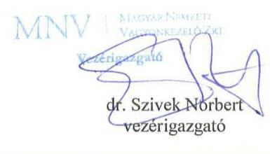

---

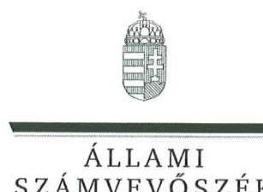

ELNÖK

# Dr. Szívek Norbert úr 

vezérigazgató

Magyar Nemzeti Vagyonkezelő Zrt.

## Budapest

## Tisztelt Vezérigazgató Úr!

Az „Állami tulajdonú gazdasági társaságok - Az állami tulajdonban (résztulajdonban) lévő gazdálkodó szervezetek vagyonmegőrzési és gazdálkodási tevékenységének ellenőrzése Grand Tokaj Zrt. " címủ jelentéstervezetre tett észrevételeit köszönettel megkaptam.

Az ellenőrzési megállapításokra vonatkozó észrevételét az Állami Számvevőszékről szóló 2011. évi LXVI. törvény 29. § (2) bekezdésében meghatározott tizenöt napos határidőn belül küldte meg. Az Állami Számvevőszék észrevétellel kapcsolatos álláspontját a mellékletként csatolt, a felügyeleti vezető által készített indokolás tartalmazza.

Budapest, 2017. 40. hó 20. nap

Melléklet: Észrevételre adott válasz
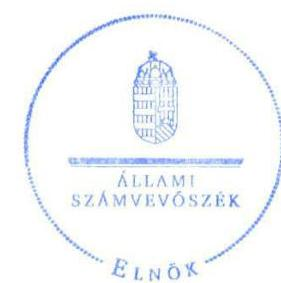

Tisztelettel:

Domokos László

---

„Állami tulajdonú gazdasági társaságok - Az állami tulajdonban (résztulajdonban) lévő gazdálkodó szervezetek vagyonmegőrzési és gazdálkodási tevékenységének ellenőrzése - Grand Tokaj Zrt. " című jelentéstervezetre tett észrevételre adott válasz

Magyar Nemzeti Vagyonkezelő Zrt.
" Állami tulajdonú gazdasági társaságok - Az állami tulajdonban (résztulajdonban) lévő gazdálkodó szervezetek vagyonmegőrzési és gazdálkodási tevékenységének ellenőrzése - Grand Tokaj Zrt " címủ jelentéstervezetre tett észrevételeket áttekintettem, annak kezelésével kapcsolatban a következő tájékoztatást adom.

A jelentéstervezet 1.1. számú megállapításához, valamint a rövidítések jegyzékéhez kapcsolódóan tett észrevételt a dokumentumok ismételt áttekintését és felülvizsgálatát követően elfogadtuk, és azt a számvevőszéki jelentés összeállításánál figyelembe vesszük.

Budapest, 2017. 56666
hónap
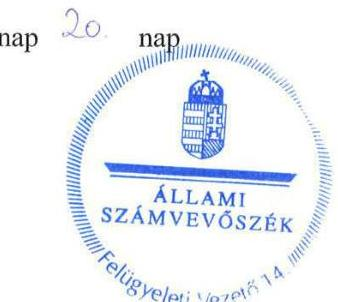

Dr. Németh Erzsébet felügyeleti vezető

---

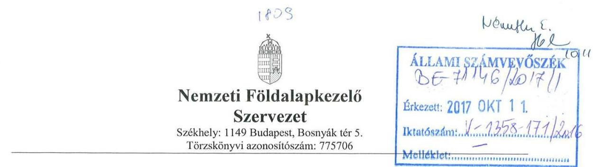

Domokos László
Elnök
Úgyiratszám: NFA-003926/005/2017
Állami Számvevőszék

# Budapest 4. PF. 54. 

1364

Tárgy: A V-1358-168/2016 számú levelükben megküldött Jelentés tervezetre adott észrevétel megküldése

Tisztelt Elnök Úr!
Az Állami Számvevőszék a V-1358-168 számú levelében megküldte „Az állami tulajdonban (résztulajdonban) lévő gazdálkodó szervezetek vagyonmegőrzési és gazdálkodási tevékenységek ellenőrzése - Grand Tokaj Zrt. 2017. címü" vizsgálatáról készült Jelentéstervezetét.

1. Az ÁSZ jelentés tervezetében az NFA-ra vonatkozóan kifogásolta:

- a vagyonkezelési szerződés nem biztosította a Vhr. 9 § (9) bekezdés a) pontjában foglaltakat teljesítését, mert a szerződésben nem rögzítette a vagyonkezelésbe vett eszközök értékét, annak ellenére, hogy az NFA rendelkezett az adatokkal.
- 2014. március 14-ig a vagyonkezelési szerződésben nem szerepelt, hogy a Társaság az MNV Zrt. vagyon-nyilvántartási szabályzatát megismerte és magára nézve kötelező érvényűnek ismeri el.
2014. március 15 -től a vagyonkezelési szerződésben nem szerepelt, hogy a Társaság a tulajdonosi joggyakorló vagyon-nyilvántartási szabályzatát megismerte és magára nézve kötelező érvényűnek ismeri el.

A jelentés tervezetben az NFA Elnökének és a Grand Tokaj Zrt. vezérigazgatójának javasolt intézkedés a fenti ( 1.2 számú megállapítás 2. bekezdése alapján):

- a vagyonkezelési szerződésnek tartalmaznia kell a kezelt vagyon értékét,
- a szerződésben kerüljön rögzítésre, hogy a Grand Tokaj Zrt. magára nézve kötelező érvényűnek ismeri el a tulajdonosi joggyakorló vagyon-nyilvántartási szabályzatát.

---

Az NFA Jogi Igazgatóságának állásfoglalása szerint: „az NFA-ra vonatkozó megállapításban olyan jogszabály Vhr. 254/2007. (X. 4.) rendelkezéseit kéri számon az ÁSZ az NFA-n, amely jogszabály nem vonatkozik az NFA-ra. A megállapításból minden NFA-ra utaló részt töröltetni kellene. A Vtv. és Vhr. rendelkezéseit nem kell, nem lehet alkalmazni. Az Nfatv.-ben ilyen kötelezettség nincs, tehát ha az MNV Zrt. a szerzödésben el is mulasztotta az erröl (fentiekre) való rendelkezések kötelezettségét, az NFA-nak nem volt kötelezettsége hogy egy reá nem vonatkozó jogszabály alapján szerzödésmódosítással pótolja a jogelöd tulajdonosi joggyakorló által kötött szerzödés két hiányát".

# 2. Az ÁSZ kifogásolta: 

- NFA 2012-2014. évekre vonatkozóan a Grand Tokaj Zrt.-t az esedékes vagyonkezelői díjfizetés elmulasztását követően nem szólította fel 30 napos határidő kitűzésével és a következményekre való figyelmeztetéssel.

Az NFA Elnökének javasolt intézkedés a fenti (1.2 számú megállapítás 5. bekezdése alapján):

- Az NFA szólítsa fel a Grand Tokaj Zrt.-t a hátralék megfizetésére.

## NFA észrevétele:

Jelentés tervezet vitatott része: „Az NFA csak 2015 decemberében számlázta ki a 20122015. évekre vonatkozó vagyonkezelési díjakat. A Társaság a fizetési kötelezettségének 2015 évben nem tett eleget"

Az NFA tételesen ellenőrizte a Grand Tokaj Zrt. vagyonkezelésében levő ingatlanokat és 2015. 12. 11-én kiszámlázta az összes Zrt. vagyonkezelésében lévő ingatlan diját évenkénti bontásban. A Zrt. 2016. 01. 07-én befizette kötelezettségét. A vagyonkezelői számlák kiállítását követően a pénzügyi esedékességét követő 9. munkanapon került az NFA bankszámlájára a kifizetés, ezért nem került sor a hátralék miatt fizetési felszólító levél kiküldésére.
Fentiekre tekintettel kérjük törölni az NFA Elnökének javasolt intézkedések közül az 1.2 pont számú megállapítás 5. bekezdését és az arra javasolt intézkedést.
3. Az ÁSZ kifogásolta:

- Az NFA nem élt a földrészletek hasznosításáról szóló Korm. rendelet 40 § (2) bekezdésében előírt jogával, a kezelt vagyonnal való gazdálkodás szabályszerűségének ellenőrzésével. (1.2 számú megállapítás 4. bekezdése alapján):

---

# NFA észrevétele: 

Az NFA éves ellenőrzési tervet készít minden évben és folyamatosan változó, de átlagosan 15021 db ügyféllel rendelkezik. A vizsgált időszakban nem szerepelt az ellenőrzési tervben a Grand Tokaj Zrt.

Budapest, 2017. október 05.

Tisztelettel:
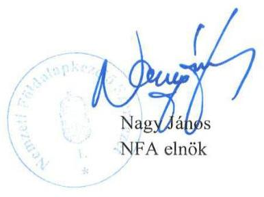

---

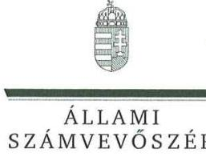

# K 

Ikt.szám: V-1358-174/2016.

## Nagy János úr

elnök

Nemzeti Földalapkezelő Szervezet

## Budapest

## Tisztelt Elnök Úr!

Az „Állami tulajdonú gazdasági társaságok - Az állami tulajdonban (résztulajdonban) lévő gazdálkodó szervezetek vagyonmegőrzési és gazdálkodási tevékenységének ellenőrzése Grand Tokaj Zrt. " című jelentéstervezetre tett észrevételeit köszönettel megkaptam.

Az ellenőrzési megállapításokra vonatkozó észrevételét az Állami Számvevőszékről szóló 2011. évi LXVI. törvény 29. § (2) bekezdésében meghatározott tizenöt napos határidőn belül küldte meg. Az Állami Számvevőszék észrevétellel kapcsolatos álláspontját a mellékletként csatolt, a felügyeleti vezető által készített indokolás tartalmazza.

Budapest, 2017. 4. hó 03 nap
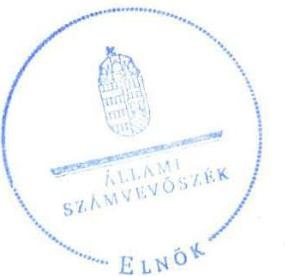

Tisztelettel:

Domokos László

Melléklet: Észrevételre adott válasz

---

# 1. számú melléklet   a V-1358-174/2016. számú levélhez 

„Állami tulajdonú gazdasági társaságok - Az állami tulajdonban (résztulajdonban) lévô gazdálkodó szervezetek vagyonmegörzési és gazdálkodási tevékenységének ellenörzése - Grand Tokaj Zrt." címủ jelentéstervezetre tett észrevételre adott válasz

A jelentéstervezetre tett észrevételeit áttekintettem, annak kezelésével kapcsolatban a következő tájékoztatást adom.

## 1. A jelentéstervezet 1.2 számú megállapítás 2. bekezdésére (14. oldal) vonatkozó észrevétel

A jelentéstervezetben szereplő megállapítás szerint a vagyonkezelési szerződés nem biztosította az állami vagyonnal való gazdálkodásról szóló 254/2007. (X. 4.) Korm. rendelet (a továbbiakban Vhr.) 9. § (9) bekezdés a) pontjában foglaltak teljesítését, mert nem rögzítette a vagyonkezelésbe vett eszközök értékét, amely értéken a Társaságnak a vagyonkezelésbe vett eszközöket a számvitelről szóló 2000 . évi C. törvény előírásai szerint - a hosszú lejáratú kötelezettségekkel szemben - állományba kellett vennie. A vagyonkezelési szerződés annak ellenére nem tartalmazta a vagyonkezelésbe adott földterületek könyvszerinti értékét, hogy az NFA rendelkezett az adatokkal:
Elnök Úr tájékoztat, hogy az NFA Jogi Igazgatóságának állásfoglalása szerint „az NFA-ra vonatkozó megállapításban olyan jogszabály (Vhr. 254/2007. (X.4.) rendelkezéseit kéri számon az ÁSZ az NFA-n, amely jogszabály nem vonatkozik az NFA-ra. A megállapításból minden NFA-ra utaló részt törölni kellene. A Vtv. és Vhr. rendelkezéseit nem kell, nem lehet alkalmazni. Az Nfatv-ben ilyen kötelezettség nincs, tehát ha az MNV Zrt. a szerzödésben el is mulasztotta az erről (fentiekre) való rendelkezések kötelezettségét, az NFA-an nem volt kötelezettsége, hogy egy reá nem vonatkozó jogszabály alapján szerzödésmódosítással pótolja a jogelöd tulajdonosi joggyakorló által kötött szerzödés hiányát."
Tájékoztatom Elnök Urat, hogy a Nemzeti Földalapba tartozó földrészletek hasznosításának részletes szabályairól szóló 262/2010. (XI.17.) Korm. rendelet (Nfa. vhr.) 52. § (1) bekezdése azt rögzíti, hogy az Nfa. vhr. hatálybalépését megelőzően kötött szerződésekre a hatálybalépést megelőző napon alkalmazandó rendelkezéseket kell alkalmazni. Mivel az Nfa. vhr. 2010. december 2-án lépett hatályba, ezért az ellenőrzéssel érintett - 2008-ban megkötött - vagyonkezelési szerződésre a korábbi Nfatv. rendelkezései alapján a Vtv. és így a Vhr. szabályait is alkalmazni kellett.
A fentiekre való tekintettel a megállapítás módosítása és az NFA elnökének és a Grand Tokaj Zrt. vezérigazgatójának címzett 1. javaslat törlése nem indokolt.

## 2. A jelentéstervezet 1.2. számú megállapítás 5. bekezdésére (14. oldal) vonatkozó észrevétel

A jelentéstervezetben szereplő megállapítás szerint az NFA csak 2015. decemberében számlázta ki a 2012-2014. évekre vonatkozó vagyonkezelési díjakat. A Társaság a fizetési kötelezettségének 2015. évben nem tett eleget.

Az ellenőrzött dokumentumok és az észrevétel alapján az állapítható meg, hogy az ellenőrzött időszakban az NFA nem tett eleget az Nfa. vhr. 42. § (3) bekezdésben elöírt írásbeli felszólítási

---

kötelezettségének annak ellenére, hogy a vagyonkezelési szerződés szerint a díjfizetés a tárgyévet követő év február 15-ig esedékes volt.
Elnök Úr sem vitatja, hogy a vagyonkezelői számlák kiállítását követően a pénzügyi esedékességet követő 9. munkanapon került az NFA bankszámlájára a kifizetés, ezért nem került sor a hátralék miatt fizetési felszólító levél kiküldésére.
A fentiekre való tekintettel a megállapítás módosítása és az NFA Elnökének címzett 1. javaslat törlése nem indokolt.

# 3. A jelentéstervezet 1.2. számú megállapítás 4. bekezdésére (14. oldal) vonatkozó észrevétel 

Elnök Úr az észrevételében tájékoztat, hogy az NFA éves ellenőrzési tervet készít minden évben és folyamatosan változó, de átlagosan 15021 db ügyféllel rendelkezik A vizsgált időszakban nem szerepelt az ellenőrzési tervben a Grand Tokaj Zrt.

A fentiekre való tekintettel a számvevőszéki jelentés 14. oldalán az 1.2. számú megállapítás 4. bekezdésében foglaltakat pontositottuk.
Tájékoztatom Elnök Urat, hogy az Állami Számvevőszékről szóló 2011. évi LXVI. törvény 29. § (3) bekezdése alapján az Állami Számvevőszék a figyelembe nem vett észrevételeket köteles a jelentésben feltüntetni és megindokolni, hogy azokat miért nem fogadta el.

Budapest, 2017.
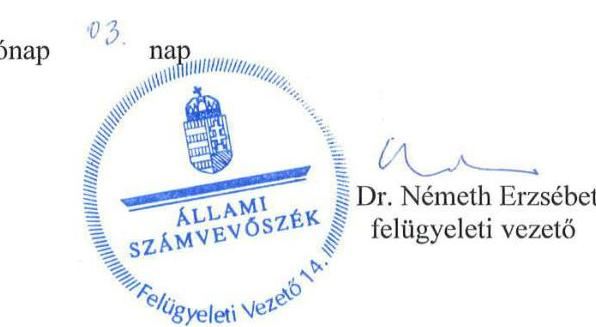

---

.

---

# RÖVIDÍTÉSEK JEGYZÉKE 

${ }^{1}$ Társaság
${ }^{2}$ MNV Zrt.
${ }^{3} \mathrm{NFa} . \mathrm{tv}$.
${ }^{4}$ NFA
${ }^{5} \mathrm{ha}$
${ }^{6} \mathrm{M}$
${ }^{7}$ ÁSZ tv.
${ }^{8} \mathrm{SZMSZ}_{1-10}$
${ }^{9}$ Társasági Monitoring Szabályzat
${ }^{10}$ Tulajdonosi Ellenőrzési Szabályzat
${ }^{11}$ feljegyzés
${ }^{12}$ vezérigazgatói utasítások
${ }^{13}$ Portfoliós Kódex
${ }^{14}$ Alapító Okirat ${ }_{1-5}$
${ }^{15}$ Alapszabály

Grand Tokaj Zrt., az ellenőrzött időszakban a Tokaj Kereskedőház Zrt. nevet viselte. A névváltozás 2016.03.23. időponttól hatályos Magyar Nemzeti Vagyonkezelő Zrt.
A Nemzeti Földalapról szóló 2010. évi LXXXVII. törvény
Nemzeti Földalapkezelő Szervezet
hektár
millió
az Állami Számvevőszékről szóló 2011. évi LXVI. törvény
az MNV Zrt. Szervezeti és Múködési Szabályzatai:
SZMSZ ${ }_{1}$ hatályos 2011. V. 30-tól
SZMSZ ${ }_{2}$ hatályos 2012. IV. 16-tól
SZMSZ ${ }_{3}$ hatályos 2012. IV. 23-tól
SZMSZ ${ }_{4}$ hatályos 2012. IX. 24-től
SZMSZ ${ }_{5}$ hatályos 2012. X. 8-tól
SZMSZ ${ }_{6}$ hatályos 2013. III. 7-től
SZMSZ ${ }_{7}$ hatályos 2013. IV. 22-től
SZMSZ ${ }_{8}$ hatályos 2013. V. 6-tól
SZMSZ ${ }_{9}$ hatályos 2013. VI. 17-től
SZMSZ ${ }_{10}$ hatályos 2015. X 17-től
Az MNV Zrt. Társasági Monitoring Szabályzatáról szóló 51/2013.
(XII. 19.) számú vezérigazgatói utasítás
Az MNV Zrt. Tulajdonosi Ellenőrzési Szabályzatáról szóló 46/2011.számú és a 39/2014. számú vezérigazgatói utasítások
A megbízási szerződésen alapuló tulajdonosi jogok gyakorlására vonatkozó meghatalmazások kiadásáról szóló MNV/01/58077/0/2013. ikt. számú feljegyzés
A vezető tisztségviselők és felügyelőbizottsági tagok vagyonnyilatkozatának átadásáról, nyilvántartásáról, a vagyonnyilatkozatban foglalt személyes adatok védelméről szóló 42/2010., a 21/2012., a 47/2013. számú vezérigazgatói utasítások
A negyedéves tulajdonosi értékelő értekezletről szóló 53/2011.(XII. 21.) számú és a 43/2012. (XII. 18.) számú vezérigazgatói utasítás
A könyvvizsgálók kiválasztásának eljárásrendjéről szóló 45/2014.(XII.10) sz. vezérigazgatói utasítás
Az MNV Zrt. Portfoliós Kódexéről szóló 7/2015. (III. 31.) számú vezérigazgatói utasítás
A Grand Tokaj Zrt. Alapító Okirata ${ }_{1}$ hatályos 2012. I. 10-től
A Grand Tokaj Zrt. Alapító Okirata ${ }_{2}$ hatályos 2012. VI. 28-tól
A Grand Tokaj Zrt. Alapító Okirata ${ }_{3}$ hatályos 2012. XI. 12-től
A Grand Tokaj Zrt. Alapító Okirata ${ }_{4}$ hatályos 2012. XII. 10-től
A Grand Tokaj Zrt. Alapító Okirata ${ }_{5}$ hatályos 2013. I. 28-tól
A Grand Tokaj Zrt. Alapszabálya

---

${ }^{16} \mathrm{Gt}$.
${ }^{17} \mathrm{Ptk}_{2}$
${ }^{18}$ alapító
${ }^{19} \mathrm{FB}$
${ }^{20}$ elfogadó határozatai
${ }^{21}$ tervezési irányelv
${ }^{22}$ vagyonkezelési szerződés
${ }^{23} \mathrm{Vhr}$.
${ }^{24}$ Számv. tv.
${ }^{25}$ földalap nyilvántartásról szóló Korm. rendelet
${ }^{26}$ vagyon-nyilvántartási szabályzat
${ }^{27}$ földrészletek hasznosításáról szóló Korm. rendelet
${ }^{28}$ számviteli politika
${ }^{29}$ értékelési szabályzat
${ }^{30}$ leltározási szabályzat
${ }^{31}$ önköltség-számítási szabályzat
${ }^{32}$ pénzkezelési szabályzat
${ }^{33}$ számlarend
${ }^{34}$ számlatükör1-4
${ }^{35} \mathrm{SZMSZ}_{1,2}$
${ }^{36}$ javadalmazási és juttatási szabályzat

A gazdasági társaságokról szóló 2006. évi IV. törvény (hatályos 2014. III. 14-ig)

A polgári törvénykönyvről szóló 2013. évi V. törvény (hatályos 2014. III. 15-től)

A Magyar Állam joggyakorlója az MNV Zrt.
felügyelő bizottság
A Grand Tokaj Zrt. üzleti terveit elfogadó Alapítói Határozatok: 138/2012.(IV.26.) számú Alapítói Határozat 253/2013.(V.27.) számú Alapítói Határozat 429/2013.(VIII.05.) számú Alapítói Határozat 390/2014.(IX.25.) számú Alapítói Határozat 89/2015.(IV.20.) számú Alapítói Határozat
A tervezési irányelvekről szóló MNV Zrt. Igazgatóságának 513/2011. (XI.07.) Ig. sz. határozata
A tervezési irányelvekről szóló MNV Zrt. Igazgatóságának 558/2012. (X.24.) Ig. sz. határozata
A tervezési irányelvekről szóló MNV Zrt. Igazgatóságának 774/2013. (X.21.) Ig. sz. határozata
A tervezési irányelvekről szóló MNV Zrt. Igazgatóságának 4/2015. (I.12.) Ig. sz. határozata

Az MNV Zrt és a Grand Tokaj Zrt. között 2008. december 16-án létrejött, SZT-30341/2008. számú vagyonkezelési szerződés
Az állami vagyonnal való gazdálkodásról szóló 254/2007. (X. 4.) Korm. rendelet
A számvitelről szóló 2000. évi C. törvény
A Nemzeti Földalap vagyonnyilvántartásának szabályairól szóló 11/2011. (II. 22. ) Korm. rendelet
Az NFA vagyon-nyilvántartási szabályzata
A Nemzeti Földalapba tartozó földrészletek hasznosításának részletes szabályairól szóló 262/2010. (XI. 17.) Korm. rendelet
A Társaság Számviteli politikája, hatályos 2008. I. 1-től
A Társaság Értékelési Szabályzata, hatályos: 2001.III.31-től
A Társaság Leltározási Szabályzata, hatályos: 2001.I.01-től
A Társaság Önköltség Számítási Szabályzata, hatályos: 2001.III.01-től

A Társaság Pénzkezelési szabályzata, hatályos: 2001. III. 31-től
A Társaság Számlarendje hatályos 2001. III. 31-től
Társasági Számlatükör1 hatályos 2001. III. 31-től
Társasági Számlatükör2 hatályos a 2013. évben
Társasági Számlatükör3 hatályos a 2014. évben
Társasági Számlatükör4 hatályos a 2015. évben
A Társaság Szervezeti és múködési szabályzata, SZMSZ1: (hatályos: 2003. I. 14-től)

A Társaság Szervezeti és múködési szabályzata, SZMSZ2: (hatályos: 2014. XI. 17-től)

A Társaság Juttatási szabályzatai, melyeket a 33/2011. (II.21.), a 138/2012. (IV. 26.) és a 426/2012. (XI.12.) Alapítói Határozatok rendeltek el.

---

${ }^{37}$ Taktv.
${ }^{38}$ intézkedési terv
${ }^{39}$ kötelezettségvállalások és utalványozások rendje
${ }^{40}$ alapanyag felvásárlás és feldolgozás szabályzat
${ }^{41}$ beszerzési folyamatok szabályzata
${ }^{42}$ ingatlan értékesítés szabályzat
${ }^{43}$ selejtezési szabályzat
${ }^{44}$ kölcsönszerződést engedélyező alapítói határozat

A köztulajdonban álló gazdasági társaságok takarékosabb múködéséről szóló 2009. évi CXXII. törvény
Intézkedési terv az MNV Zrt. által a TK Zrt. belső ellenőrének bevonásával végzett „A követeléskezelési tevékenység szabályozottságának és a 2011. évi vevőkövetelés vizsgálata" című belső ellenőrzési jelentés javaslatainak realizálására
A kötelezettségvállalási, utalványozási és kifizetési rendről szóló 37/2013. (II.1.), 42/2013. (III.7.), 45/2014. (III.17.) számú vezérigazgatói utasítások
A Társaság Alapanyag Felvásárlási és Feldolgozási Szabályzata ${ }_{1}$ hatályos 2012.VII.30.-2015.II.01.
A Társaság Alapanyag Felvásárlási és Feldolgozási Szabályzata ${ }_{1}$ hatályos 2015.II.02-től
A Társaság Beszerzési Folyamata Szabályzata ${ }_{1}$, hatályos: 2010.IX.30.-2014.IV.09.

A Társaság Beszerzési Folyamata Szabályzata ${ }_{1}$, hatályos: 2014.IV.10-től

A Társaság Ingatlan Értékesítési Szabályzata, hatályos: 2012.IV.27-től

A Társaság Feleslegessé vált vagyontárgyak hasznosítási és selejtezési szabályzata, hatályos
A kölcsönszerződést engedélyező 524/2014. (XII.29.) sz. Alapítói Határozat

---

# ÁLLAMI SZÁMVEVŐSZÉK 

1052 Budapest, Apáczai Csere János utca 10.
Levélcím: 1364 Budapest 4. Pf. 54
Telefon: +36 14849100 Telefax: +36 14849200
www.asz.hu