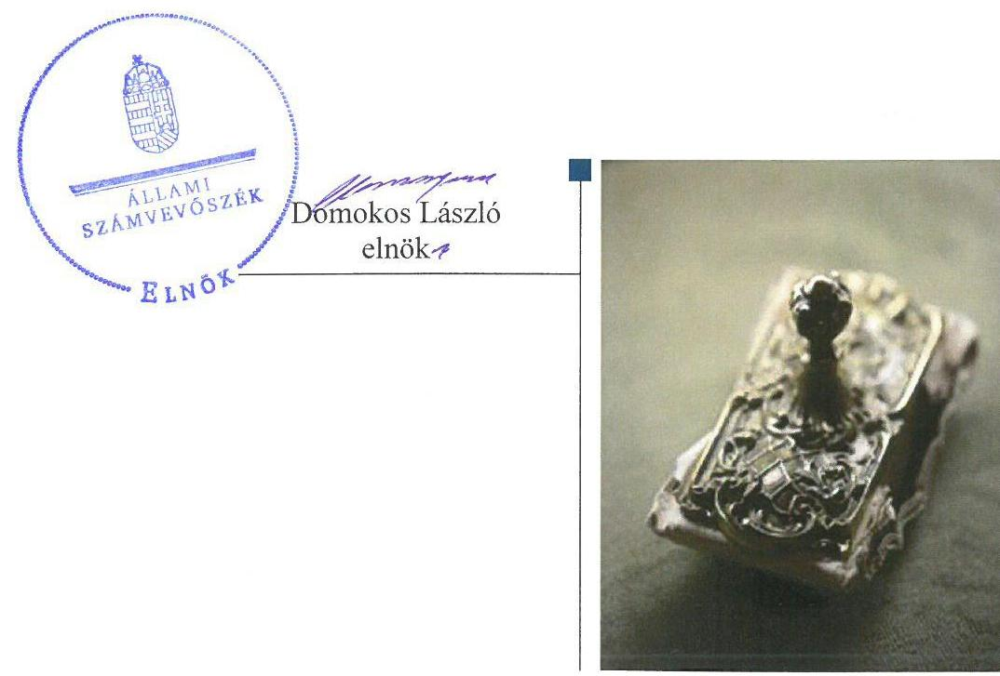
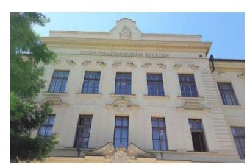
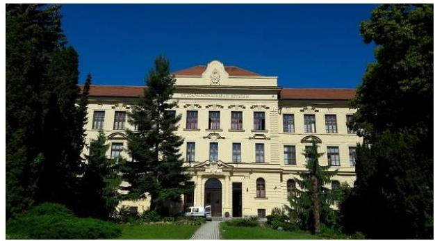
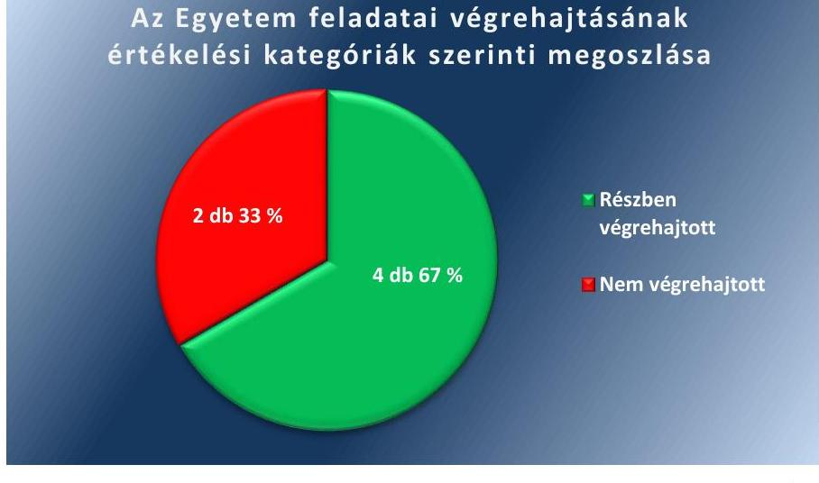
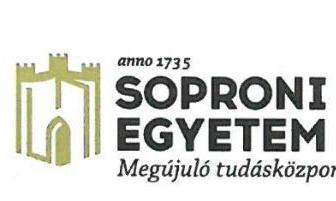
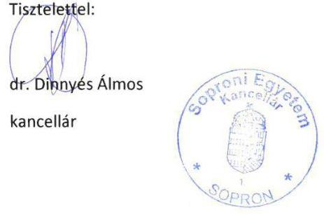
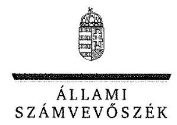
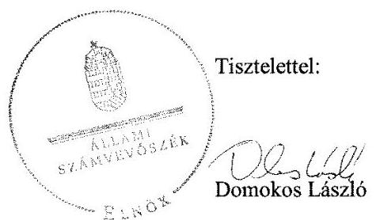

# Jelentés 

## Utóellenőrzések

Az állami felsőoktatási intézmények gazdálkodásának, működésének ellenőrzéséről készült jelentések utóellenőrzése - Soproni Egyetem 2017.

---

# Jelentés 

## Utóellenőrzések

Az állami felsőoktatási intézmények gazdálkodásának, működésének ellenőrzéséről készült jelentések utóellenőrzése - Soproni Egyetem 2017. 12. hó 05. nap

---

# AZ ELLENŐRZÉST FELÜGYELTE: 

PETŐ KRISZTINA felügyeleti vezető

## AZ ELLENŐRZÉST VEZETTE ÉS A VÉGREHAJTÁSÁÉRT FELELŐS:

MOLNÁR ZSUZSANNA ellenőrzésvezető

## A PROGRAM ÖSSZEÁLLÍTÁSÁÉRT FELELŐS:

JANIK JÓZSEF LÁSZLÓ osztályvezető

## A TÉMÁHOZ KAPCSOLÓDÓ KORÁBBI SZÁMVEVŐSZÉKI JELENTÉS:

- címe: Jelentés a Nyugat-magyarországi Egyetem ellenőrzéséről - Az állami felsőoktatási intézmények gazdálkodásának, működésének ellenőrzése
- sorszáma: 15036

IKTATÓSZÁM: V-1350-048/2016.
TÉMASZÁM: 2096
ELLENŐRZÉS-AZONOSÍTÓ SZÁM: V075545

---

# TARTALOMJEGYZÉK 

■ ÖSSZEGZÉS ..... 5
■ AZ ELLENŐRZÉS CÉLJA ..... 6
■ AZ ELLENŐRZÉS TERÜLETE ..... 7
■ AZ ELLENŐRZÉS HÁTTERE, INDOKOLTSÁGA ..... 9
■ A JELENTÉS LÉNYEGES KÉRDÉSKÖRE ..... 10
■ ELLENŐRZÉS HATÓKÖRE ÉS MÓDSZEREI ..... 11
■ MEGÁLLAPÍTÁSOK ..... 13
■ MELLÉKLETEK ..... 17
I. Sz. melléklet: Az ÁSZ 15036. számú jelentéséhez kapcsolódó intézkedési terv végrehajtása a Nyugat-magyarországi Egyetemen ..... 17
II. Sz. melléklet: Az ÁSZ 15036. számú jelentéséhez kapcsolódó intézkedési terv végrehajtása az Emberi Erőforrások Minisztériumánál. ..... 22
■ FÜGGELÉK: ÉSZREVÉTELEK ..... 23
■ RÖVIDÍTÉSEK JEGYZÉKE ..... 33

---

.

---

# ÖSSZEGZÉS 

A Soproni Egyetem rektora által összeállított intézkedési tervben szereplő feladatok jelentős részét nem hajtották végre, ezért a szabályszerű müködéshez szükséges feltételeket nem biztosították. Az Emberi Erőforrások Minisztériuma - mint a fenntartói jogkör gyakorlója - intézkedési tervében vállalt feladatát határidőben végrehajtotta.

## Az ellenőrzés társadalmi indokoltsága

Az Állami Számvevőszék stratégiájában célul tűzte ki a számvevőszéki munka hasznosulásának javítását. Ezzel összhangban ellenőrzi, hogy az ellenőrzött szervezetek megvalósították-e a korábbi ellenőrzései által feltárt hibák, hiányosságok és szabálytalanságok megszüntetése céljából kialakított intézkedési terveikben foglaltakat. A rendszeres utóellenőrzések hozzájárulnak a szükséges intézkedések tényleges végrehajtáshoz, ezáltal a közpénzügyek rendezettségének javulásához.

## Főbb megállapítások, következtetések

A Soproni Egyetem az intézkedési tervben meghatározott hat feladatból négyet részben hajtott végre, kettőt pedig nem hajtott végre.

A kancellári rendszer bevezetésével átalakult gazdálkodási, irányítási rendhez kapcsolódóan, a szervezeti és müködési szabályzat mellékletét képező szabályzatok közül nem vizsgálták felül 2015-ben az etikai kódexet, a térítési és juttatási szabályzatot, az oktatói munka hallgatói véleményezésének rendjét, továbbá a tanulmányi és vizsgaszabályzatot. Az egyes gazdálkodási jogkörök gyakorlásának részletes szabályaira és módjaira vonatkozó kancellári utasítás kiadását követően nem vezették a jogszabályban előírt, az egyes aláírási jogkörrel rendelkezőkről a nyilvántartást. Az Egyetem önköltség-számítási rendszere nem került kialakításra. Mindezek alapján az Egyetem nem biztosította a szabályos müködés alapvető feltételeit.

Az intézkedési tervben vállaltak ellenére nem teremtették meg a hallgatói követelés állomány mérlegben történő kimutatásának informatika hátterét.

A magasabb összegű illetménnyel kapcsolatos szabálytalanság kiküszöbölésére megalkotott illetményszabályzatban foglaltak ellenére nem vizsgálták felül a megállapított illetményeket. A szabálytalan illetménygazdálkodás, a megállapított közbeszerzési szabálytalanság és a szabálytalan leltározás miatti munkajogi felelősségek kivizsgálása elmaradt. A hallgatóktól származó térítési díjkövetelések leltárban, illetve mérlegben történt kimutatásának hiánya miatt a vizsgálóbizottság a munkajogi felelősség megállapítására és érvényesíthetőségére vonatkozóan nem fogalmazta meg javaslatát.

Az Emberi Erőforrások Minisztériuma az intézkedési tervében vállalt feladatát határidőben végrehajtotta.

---

# AZ ELLENŐRZÉS CÉLJA 

Az ellenőrzés célja annak értékelése volt, hogy a számvevőszéki jelentésben ${ }^{1}$ foglalt javaslatot megalapozó megállapításokkal összhangban készített intézkedési tervben meghatározott feladatokat az ellenőrzött szervezetek végrehajtották-e.

---

# **A Z ELLENŐRZÉS TERÜLETE**

## **Soproni Egyetem, mint a Nyugat-magyarországi Egyetem jogutódja**

Az Egyetem2 jogelőd intézményét III. Károly alapította 1735-ben Bányatisztképző Iskolaként Selmecbányán. Akadémiai rangra Mária Terézia emelte az intézményt 1770-ben Selmeci Akadémia néven. Az Erdészeti Tanintézet 1809-ban kezdte meg működését, s az intézmény az 1846-os oktatási reform után a Bányászati és Erdészeti Akadémia nevet kapta. 1918-ban, miután Selmecbányát cseh csapatok szállták meg, az Akadémia először Budapestre, majd 1919-ben Sopronba települt át. A Bányamérnöki és Kohómérnöki Karokat 1949-ben átköltöztették Miskolcra, majd 1962-ben létrejött az Erdészeti és Faipari Egyetem. 1996-ban az intézmény a Soproni Egyetem nevet vette fel. A városban és a régióban folytatott együttműködés vezetett a Sopron székhellyel működő Nyugat-magyarországi Egyetem létrejöttéhez, amely 2000. január 1-jétől 7 karon kezdte el működését. 2014. július 1-jétől a Nyugat-magyarországi Egyetem székesfehérvári szervezeti egységei az Óbudai Egyetemhez, 2016. január 1-jétől a győri és mosonmagyaróvári szervezeti egységei a győri Széchenyi István Egyetemhez csatlakoztak. 2017. február 1-jétől az Országgyűlés döntése alapján az Egyetem neve ismét Soproni Egyetem lett. Az Egyetem szombathelyi telephelyén lévő szervezeti egységek az Eötvös Loránd Tudományegyetemhez csatlakoztak.

Az Egyetemen négy kar és négy doktori iskola működik. Pedagógiai, erdőmérnöki, közgazdaságtudományi, valamint műszaki, faanyagtudományi és művészeti karokon hétféle képzés (felsőoktatási szakképzés, egyetemi képzés, alapképzés, mesterképzés, egységes, osztatlan képzés, szakirányú továbbképzés, doktori képzés) folyik, amelyre a 2015–2016. év 1. félévére beiratkozott hallgatók létszáma 8160 fő volt. Az Egyetem keretében működik az Erdészeti és Faipari Kutató Intézet.

Az Egyetem vezetésében az ÁSZ3 ellenőrzés óta változás nem volt, a rektor4 2003. augusztus 1-jétől, a kancellár5 2014. november 15-től tölti be tisztségét.

Az Egyetem 2015. évi kiadási előirányzata 12833,7 millió Ft, bevételi előirányzata 13626,8 millió Ft, a finanszírozási bevétel 7582,1 millió Ft öszszegben teljesült. A 2015. év december 31-én az Egyetem eszközei 12363,3 millió Ft-ot tettek ki.

Az Egyetem gazdálkodásának, működésének ellenőrzését az ÁSZ a 2009. január 1. – 2013. december 31. közötti időszakra végezte el, az erről szóló számvevőszéki jelentést 2015. március 17-én tette közzé. Az ellenőrzés célja annak megállapítása volt, hogy szabályos volt-e az Egyetem pénzügyi és vagyongazdálkodása, biztosított volt-e a vagyonnal való felelős gazdálkodás követelményének érvényesülése, jogszabályi előírásoknak megfelelően működött-e a belső kontrollrendszer, az irányító szerv tevékenysége a jogszabályi előírásoknak megfelelt-e.

---

A fenntartói jogkörök gyakorlója az Emberi Erőforrások Minisztériuma volt.

---

# AZ ELLENŐRZÉS HÁTTERE, INDOKOLTSÁGA 

Az ÁSZ tv. ${ }^{6}$ 33. § (1) bekezdése értelmében a számvevőszéki jelentések intézkedést igénylő megállapításaihoz kapcsolódóan az ellenőrzött szervezet vezetője intézkedési tervet köteles összeállítani, és az ÁSZ részére megküldeni. Az intézkedési tervben foglaltak megvalósítását - az ÁSZ tv. 33. § (7) bekezdésében foglaltak alapján - az ÁSZ utóellenőrzés keretében ellenőrizheti. Az intézkedések megvalósulásának értékelése során az ÁSZ figyelembe vette az ellenőrzött szervezetek működési feltételeiben, valamint a jogszabályi előírásokban bekövetkezett változásokat.

Az intézkedési tervben foglalt feladatok hiányos, illetve késedelmes végrehajtása, valamint megvalósításának elmaradása azt mutatja, hogy az ellenőrzés során feltárt hibák, hiányosságok és szabálytalanságok megszüntetése nem kapott kellő hangsúlyt. Ez a szabályszerű működés és a felelős vezetői magatartás vonatkozásában kockázatot hordoz. E kockázatok feltárásával az ÁSZ utóellenőrzési rendszere fokozza a fegyelmet, és igazolja, hogy a közpénzzel való szabályos gazdálkodás felelőssége elől nem lehet kitérni.

Az utóellenőrzés négy szinten hasznosulhat:

- A társadalom szintjén az utóellenőrzés jelzi, hogy a számvevőszéki ellenőrzés megállapításainak van következménye: a hiányosságok megszüntetésére az ellenőrzött szervezet által meghatározott intézkedések végrehajtását is számon kéri az ÁSZ.
- Az ellenőrzött terület szintjén az utóellenőrzés tájékoztatást nyújt a terület döntéshozóinak a hiányosságok kiküszöbölésének jó gyakorlatairól, ezzel lehetőséget biztosítva arra, hogy az ÁSZ ellenőrzési megállapításai, javaslatai a terület nem ellenőrzött szervezeteinek a működése során is hasznosuljanak.
- Az ellenőrzött szervezet szintjén az utóellenőrzés feltárja, hogy a szervezet az intézkedések végrehajtásával hasznosította-e a korábbi ellenőrzési jelentésben a hiányosságok megszüntetése, illetve a kockázatok kezelése érdekében megfogalmazott javaslatokat.
- Az ÁSZ szintjén az utóellenőrzés visszacsatolást ad az ellenőrzési jelentések hasznosulásáról, az intézkedések elmaradása vagy részleges megvalósulása a további ellenőrzésekhez kockázati jelzésként szolgál.

---

# A JELENTÉS LÉNYEGES KÉRDÉSKÖRE 

Az ellenőrzött szervezetek az intézkedési tervben foglaltakat az elöirt határidőben végrehajtották-e?

---

# ELLENŐRZÉS HATÓKÖRE ÉS MÓDSZEREI 

## Az ellenőrzés típusa

Megfelelőségi ellenőrzés.

## Az ellenőrzött időszak

Az utóellenőrzés alapját képező számvevőszéki jelentés közzétételének napjától (2015. március 17.) az ellenőrzésről szóló kiértesítő levél keltének napjáig (2017. június 12.) tartó időszak.

## Az ellenőrzés tárgya

Az ÁSZ tv. 2011. július 1-jei hatálybalépését követően a számvevőszéki jelentésben foglalt intézkedést igénylő megállapításokkal és javaslatokkal összhangban - az Egyetem és az EMMI ${ }^{7}$ által - készített intézkedési tervekben foglaltak végrehajtásának ellenőrzése volt.

Az ellenőrzés kiterjedt minden olyan körülményre és adatra, amely az ÁSZ jogszabályban meghatározott feladatainak teljesítéséhez, valamint a program végrehajtása folyamán felmerült újabb összefüggések feltárásához szükséges volt.

## Az ellenőrzött szervezet

Soproni Egyetem és az Emberi Erőforrások Minisztériuma

## Az ellenőrzés jogalapja

Az ÁSZ tv. 1. § (3) bekezdése szerint az ÁSZ általános hatáskörrel végzi a közpénzekkel és az állami és önkormányzati vagyonnal való felelős gazdálkodás ellenőrzését.

Az ÁSZ tv. 33. § (7) bekezdés alapján a 33. § (1)-(2) bekezdése szerinti intézkedési tervben foglaltak megvalósítását az ÁSZ utóellenőrzés keretében ellenőrizheti.

---

# Az ellenőrzés módszerei 

Az ÁSZ az ellenőrzést a nemzetközi standardokat irányadónak tekintve az ellenőrzési program ellenőrzési kérdései, az ellenőrzött időszakban hatályos jogszabályok, az ellenőrzés szakmai szabályok és módszertanok figyelembevételével, önálló ellenőrzés keretében végezte.

Az ÁSZ az ellenőrzés ideje alatt az Egyetemmel és az EMMI-vel történő kapcsolattartást az ÁSZ SZMSZ²-ének vonatkozó előírásai alapján biztosította.

Az utóellenőrzés megállapításait elsősorban az ÁSZ rendelkezésére álló, valamint az ellenőrzött szervezetektől bekért dokumentumok alapozták meg.

Az ellenőrzési bizonyítékként felhasználható adatforrások közé tartoztak egyrészt a szakmai programban felsorolt adatforrások, másrészt minden - az ellenőrzés folyamán feltárt, az ellenőrzés szempontjából információt tartalmazó - dokumentum.

Az intézkedési tervben előírt feladatokat azok végrehajthatósága, illetve végrehajtása szempontjából az alábbiak szerint értékelte az ÁSZ:
$\longrightarrow$ „határidőben végrehajtott" a feladat, ha a teljesítés dokumentáltan, az intézkedési tervben előírt határidőben és tartalommal megtörtént;
$\longrightarrow$ „határidőn túl végrehajtott" a feladat, ha annak teljesítése az intézkedési tervben meghatározott módon, de az előírt határidőn túl történt meg;
$\longrightarrow$ „részben végrehajtott" a feladat, ha végrehajtása teljes körűen az intézkedési tervben előírt módon nem történt meg;
$\longrightarrow$ „nem végrehajtott" ha a végrehajtás nem történt meg, vagy amenynyiben a teljesítést nem dokumentálták;
$\longrightarrow$ „okafogyottá vált" a feladat, ha végrehajtására - meghatározott esemény bekövetkezése, továbbá külső körülmény, a müködést érintő feltétel változása miatt - már nincs szükség, illetve lehetőség, és egyértelműen megállapítható, hogy az intézkedést szükségessé tevő körülmény a jövőben nem fordulhat elő;
$\longrightarrow$ „nem időszerű" az a feladat, amelynek ellenőrzési időszakon belüli végrehajtására azért nem került (kerülhetett) sor, mert az intézkedés alapjául szolgáló esemény nem következett be, de annak jövőbeni előfordulása lehetséges, a végrehajtása nem volt esedékes, vagy a végrehajtás határideje még nem járt le.
Az ellenőrzés lefolytatásához az ellenőrzött szervezetek a tanúsítványok elektronikus kitöltésével, valamint az ÁSZ által kért dokumentumok rendelkezésre bocsátásával szolgáltattak adatokat, amelyek valódiságát és teljes körűségét az ellenőrzött szervezetek vezetői által tett teljességi és hitelességi nyilatkozat igazolt. Az így rendelkezésre bocsátott adatok, információk kontrollja az ellenőrzés keretében történt meg.

---

# MEGÁLLAPÍTÁSOK 

## Az ellenőrzött szervezetek az intézkedési tervben foglaltakat az előírt határidőben végrehajtották-e?

Összegző megállapítás

Az Egyetem az intézkedési tervében vállalt hat feladat közül négy feladatot részben, két feladatot nem hajtott végre. Az EMMI az intézkedési tervében vállalt feladatot határidőben végrehajtotta.

A hiányosságok, szabálytalanságok megszüntetésére az Egyetem hat, az EMMI egy feladatot határozott meg intézkedési tervében a határidők és a felelősök megjelölésével.

2015-ben az ÁSZ javaslatot megalapozó megállapítások alapján készített intézkedési tervben rögzített feladatok végrehajtásáról az Egyetem vezette a Bkr. ${ }^{9}$ által előírt nyilvántartást. Annak ellenére, hogy a 2015. évre vállalt feladatok végrehajtása nem fejeződött be, az áthúzódó, folyamatban lévő feladatokról 2016-ban nem vezette az Egyetem a jogszabályban előírt nyilvántartást. Ez nem felelt meg a Bkr. 14. § (1) bekezdésében foglaltaknak.

Az Egyetem intézkedési tervében meghatározott feladatokat, határidőket, a feladatok végrehajtásáért felelős személyeket és a feladatok végrehajtását az I. számú melléklet, az EMMI intézkedési tervében meghatározott feladat végrehajtását a II. számú melléklet mutatja be.

Az Egyetem intézkedési tervében meghatározott feladatok végrehajtásának értékelési kategóriák szerinti megoszlását az 1. ábra szemlélteti.
1. ábra

Az Egyetem feladatai végrehajtásának értékelési kategóriák szerinti megoszlása

Forrás: ÁSZ

---

# RÉSZBEN VÉGREHAJTOTT feladatok: 

1. (1) Az Egyetem a kontrollkörnyezet hiányosságainak felszámolása érdekében vállalt feladatait részben hajtotta végre. A Szenátus ${ }^{10}$ határidőn belül elfogadta az etikai kódexet ${ }^{11}$, módosította az adatvédelmi és adatkezelési szabályzatot ${ }^{12}$, a kockázatfelmérési- és kezelési szabályzatot ${ }^{13}$, a gazdálkodási szabályzatot ${ }^{14}$, a kötelezettségvállalás, érvényesítés, utalványozás és ellenjegyzés rendjét ${ }^{15}$, és az SZMSZ ${ }^{16}$-t. Kancellári utasítás kiadásával intézkedtek a múködési bevételek esetében a teljesítés igazolás ellátására. Az intézkedési tervben vállaltak ellenére az Egyetem nem vizsgálta felül valamennyi szabályzatát. Az intézkedési tervben vállaltak ellenére nem rögzítették belső szabályzatban, hogy az ingatlan hasznosítására vonatkozó szerződések melléklete legyen az átláthatósági nyilatkozat. Nem került sor a vállalt - 2015. december 31-i - határidőre az SZMSZ módosítása keretében a folyamatba épített előzetes, utólagos és vezetői ellenőrzés (FEUVE) aktualizálására.
2. (2a) Az Egyetemen a - 2014. november 15-től történt - kancellári rendszer bevezetését követően átalakult gazdálkodási, irányítási rendhez kötődő - intézkedési tervben vállalt - SZMSZ mellékletét képező szabályzatok jogszabályi felülvizsgálata részben valósult meg. A folyamatos szabályzat felülvizsgálat keretében aktualizálták 2015. évben a gazdálkodási szabályzatot és az adatvédelmi és adatkezelési szabályzatot, azonban nem vizsgálták felül a térítési és juttatási szabályzatot, az oktatói munka hallgatói véleményezésének rendjét, a tanulmányi és vizsgaszabályzatot, továbbá az etikai kódexet. Elmaradt az önköltség-számítási szabályzat felülvizsgálata. A kancellár - az intézkedési tervben vállaltaknak megfelelően - kiadta az egyes gazdálkodási jogkörök gyakorlásának részletes szabályaira és módjaira vonatkozó 9/2015. (IX. 15.) Kancellári utasítását ${ }^{17}$. Az utasítás kiadását követően az egyes aláírási jogkörrel rendelkezőkről az intézkedési tervben vállalt nyilvántartási rendet nem alakították ki, tekintettel arra, hogy az aláírási jogkörrel rendelkezőkről nyilvántartást nem vezettek. Ezzel megsértették az Ávr. ${ }^{18} 60 . \S$ (3) bekezdésében foglaltakat.
3. (2c) Az Egyetem az intézkedési tervben vállalt - a Kjt. 61. §-ában foglaltaknál magasabb összegű alapilletmény megállapítása, illetve a közbeszerzési szabálytalanság miatti - munkajogi felelősség kivizsgáláshoz kapcsolódóan vállalt feladatait részben hajtotta végre. A Szenátus 12/2015. (I. 28.) számú határozatával elfogadta az illetmény szabályzatot ${ }^{19}$, amelynek záró rendelkezése előírta, hogy a szabályzat hatályba lépésével egyidejűleg minden közalkalmazott illetményét felül kell vizsgálni, és a szabályzat szerint megállapítani. Az illetmények felülvizsgálatára nem került sor, annak ellenére, hogy az illetményszabályzat 2015. február 1-jével hatályba lépett. A magasabb összegű alapilletmény megállapításával, illetve a közbeszerzési szabálytalansággal kapcsolatos munkajogi felelősség kivizsgálására létrehozta a rektor a vizsgálóbizottságot, azonban a bizottság feladatát nem hajtotta végre. A feltárt szabálytalanságokkal kapcsolatos munkajogi felelősség kivizsgálása nem történt meg.

---

4. (3a) Az Egyetem a mérlegében kimutatott eszközök szabályszerű leltározása érdekében vállalt és a szabálytalan leltározással kapcsolatos munkajogi felelősség kivizsgálására irányuló feladatait részben hajtotta végre. A mérlegben kimutatott eszközök szabályszerű leltározása érdekében a - 2015. október 31-i vállalt határidő lejárta előtt - hatályba léptetett leltározási és leltárkezelési szabályzatban ${ }^{20}$ rendelkeztek a leltárhiányért való dolgozói felelősségről, valamint megfogalmazásra került a munkajogi felelősség rendje. A két évenkénti mennyiségi felvétellel történő leltározás fenntartói engedélyeztetése okafogyottá vált, mert az engedélyeztetést előíró Áhsz. ${ }^{21} 37 . \S$ (7) bekezdése 2014. január 1-jével hatályát vesztette. Az ÁSZ ellenőrzés által feltárt szabálytalan leltározáshoz kapcsolódóan a munkajogi felelősség kivizsgálására vizsgálóbizottságot nem hoztak létre, a munkajogi felelősség kivizsgálása nem történt meg.

# NEM VÉGREHAJTOTT feladatok: 

5. (2b) Az Egyetem az intézményi térítési díjak és költségtérítések ön-költség-számítással történő megalapozása érdekében a vállalt feladatokat nem hajtotta végre. Nem mérték fel a rendelkezésre álló informatikai hátteret, nem egyeztették a főbb elveket, az intézkedési tervben vállaltak ellenére a feladat végrehajtása érdekében nem kezdte meg munkacsoport a múködését. Uniós pályázati forrás felhasználásával készült követelményspecifikáció az önköltségszámítási modul módszertanának megvalósításához, de a Szenátus által elfogadásra nem került. Az Egyetem önköltség-számítási rendszere nem került kialakításra.
6. (3b) A rektor 2015. március 25 -én vizsgáló bizottságot ${ }^{22}$ hozott létre az ÁSZ ellenőrzés által feltárt - többek között - a mérlegtételekkel kapcsolatos munkajogi felelősség megállapítása és annak érvényesíthetősége tárgyában. A bizottság a vizsgálatot nem fejezte be, a mérlegtételekre vonatkozóan megállapított szabálytalanságokkal kapcsolatos munkajogi felelősség megállapítására, és annak jogszabály alapján való érvényesíthetőségére vonatkozóan javaslatot nem fogalmazott meg. A gazdasági rendszer és a hallgatói kintlévőségeket nyilvántartó rendszer összekapcsolását lehetővé tévő informatikai fejlesztés az intézkedési tervben vállaltak ellenére nem valósult meg, ezért a hallgatói követelés állomány mérlegben történő kimutatásának informatikai háttere továbbra sem biztosított.

## EMMI ÁLTAL HATÁRIDŐBEN VÉGREHAJTOTT fel-

adat:

1. Az EMMI Belső Ellenőrzési Főosztálya az intézkedési tervében vállalt feladatát határidőben végrehajtotta. Az Egyetem vagyongazdálkodásával és a vagyonelemek kimutatásával összefüggésben feltárt szabálytalanságok tekintetében a munkajogi felelősséggel kapcsolatos körülményeket kivizsgálta, további fenntartói intézkedést nem tartott szükségesnek.

---

.

---

# MELLÉKLETEK

- I. SZ. MELLÉKLET: AZ ÁSZ 15036. SZÁMÚ JELENTÉSÉHEZ KAPCSOLÓDÓ INTÉZKEDÉSI TERV VÉGREHAJTÁSA A NYUGAT-MAGYARORSZÁGI EGYETEMEN

|  1. | Intézkedési tervben meghatározott feladat | Az intézkedési tervben meghatározott határidő | Az intézkedési tervben meghatározott feladatok felelőse | A feladat végrehajtása  |
| --- | --- | --- | --- | --- |
|   | 1. | 2. | 3. | 4.  |
|   |  | Részben végrehajtott feladatok |  |   |
|  1. | 1. számú intézkedési tervpont:
Az ÁSZ ellenőrzés megállapításai, valamint a kancellári rendszerre vonatkozó új jogi szabályozás bevezetése kapcsán, megindult az a folyamat, amely a kontrollkörnyezet hiányosságait hivatott felszámolni, ennek keretében:
- 2014. április 9-én a Szenátus elfogadta az Etikai Kódex szabályzatot;
- pontosításra kerül a Kockázatkezelési szabályzat a kockázat folyamatgazdái, valamint a válaszintézkedések tekintetében;
- újragondolásra és ezáltal újra szabályozásra kerül az SZMSZ az új szervezeti felépítésnek megfelelően, s ennek keretében a folyamatba épített előzetes, utólagos és vezetői ellenőrzés (FEUVE) szabályozás is aktualizálásra kerül;
- 2015. január 28-án a Szenátus által elfogadásra került az Adatvédelmi és adatkezelési szabályzat módosítása;
- a Szenátus 2015. áprilisi soron következő ülésén tárgyalja a felülvizsgált Gazdálkodási Szabályzatot, valamint a Kötelezettségvállalás, érvényesítés, utalványozás és ellenjegyzésről rendelkező szabályzatot, s ebben dönt az egyes gazdálkodási jogkörök gyakorlásának pontosításáról;
- müködési bevételek esetében intézkedés történik a teljesítés igazolás ellátására; | 2015. december
31. | Dr. Barkó Péter jogtanácsos, Szabó László mb. gazdasági vezető | Határidőben végrehajtott feladatrész:
A Szenátus az intézkedési tervben vállaltaknak megfelelően, 2014. április 9-én elfogadta az etikai kódexet, valamint 2015. január 28-án az adatvédelmi és adatkezelési szabályzat módosítását. 2015. április 15én módosították a gazdálkodási szabályzatot és a Kötelezettségvállalás, érvényesítés, utalványozás és ellenjegyzés rendjét, amelyben pontosították az egyes gazdálkodási jogkörök gyakorlását. 2015. december 3-án módosították az SZMSZ-t az új szervezeti felépítésnek megfelelően. A müködési bevételek esetében a teljesítés igazolás ellátására a gazdálkodási szabályzat, valamint a Kötelezettségvállalás, érvényesítés, utalványozás és ellenjegyzés rendje című szabályzat végrehajtásáról szóló 9/2015. (IX. 15.) Kancellári utasítás III/4. pontjában gondoskodtak. A Kockázatfelmérési- és kezelési szabályzatban az intézkedési tervben vállalt határidőn belül pontosításra kerültek a kockázat folyamatgazdáira és a válaszintézkedésekre vonatkozó előírások.
Nem végrehajtott feladatrész:
Az Egyetem 2015-ben - az intézkedési tervben folyamatos feladatként vállalt - valamennyi szabályzatának felülvizsgálatát, nem hajtotta végre.
Az intézkedési tervben foglaltak ellenére nem rögzítették szabályzatban, hogy az ingatlan hasznosítására vonatkozó szerződések melléklete legyen az átláthatósági nyilatkozat. Nem került sor az SZMSZ módosításai keretében vállalt folyamatba épített előzetes, utólagos és vezetői ellenőrzés (FEUVE) aktualizálására.  |

---

|  1. | Intézkedési
tervben
meghatározott
haláridő | Az intézkedési
tervben
meghatározott
haláridő | Az intézkedési
tervben meghatározott feladatok felelőse | A feladat végrehajtása  |
| --- | --- | --- | --- | --- |
|   | 1. | 2. | 3. | 4.  |
|   | - szabályzatban rögzítésre került, hogy az ingatlan hasznosítására vonatkozó szerződések melléklete az átláthatósági nyilatkozat; |  |  |   |
|   | Az Egyetem valamennyi szabályzatának felülvizsgálata folyamatos feladat a 2015. évben. |  |  |   |
|  2. | 2a. számú intézkedési tervpont: | 2015. december 31. | Dr. Barkó Péter jogtanácsos, Szabó László mb. gazdasági vezető | Határidőben végrehajtott feladatrész:  |
|   | A kancelláriai rendszer bevezetésével átalakult a felsőoktatási intézmények működtetésének, így a gazdálkodásának irányítása, szabályozása. Ez az átalakítás a Nyugat-magyarországi egyetem SZMSZ-ének mellékletét képező szabályzatok jogszabályi felülvizsgálatát jelenti. A folyamat megkezdődött, az alapvető szabályzatok módosítása, majd Szenátus általi elfogadása 2014. március és április hónapokban megtörtént, de ezt követően is biztosított lesz a folyamatos szabályzat felülvizsgálat. |  |  | A Szenátus 2014. március és április hónapokban elfogadta a Kötelezettségvállalás, érvényesítés, utalványozás és ellenjegyzés rendjének módosítását, a Beszerzési szabályzatot, valamint az etikai kódexet.  |
|   | Az elfogadott szabályzatok alapján az egyes gazdálkodási jogkörök gyakorlásának részletes szabályai és módja Kancellári utasításba kerül megfogalmazásra, s ezt követően az egyes aláírási jogkörrel rendelkezőkről nyilvántartási rend is kialakításra fog kerülni. |  |  | A kancellári rendszer bevezetését követően – az Egyetem SZMSZ-ének mellékletét képező szabályzatok folyamatos jogszabályi felülvizsgálata keretében – a gazdálkodási szabályzatot 2015. április 15-ei hatállyal, az Adatvédelmi és adatkezelési szabályzatot 2015. január 28-ai hatállyal módosították.  |
|   |  |  |  | A gazdálkodási jogkörök szabályozásával kapcsolatban a Kancellár határidőben kiadta az egyes gazdálkodási jogkörök gyakorlásának részletes szabályaira és módjaira vonatkozóan 9/2015. (IX. 15.) Kancellári utasítását a gazdálkodási szabályzat, valamint a Kötelezettségvállalás, érvényesítés, utalványozás és ellenjegyzés rendje című szabályzat végrehajtásáról.  |
|   |  |  |  | Nem végrehajtott feladatrészek:  |
|   |  |  |  | Az Egyetem SZMSZ-ének mellékletét képező szabályzatok közül nem vizsgálták felül a Térítési és juttatási szabályzatot, az Oktatói munka hallgatói véleményezésének rendjét, a Tanulmányi és vizsgaszabályzatot, az etikai kódexet, továbbá az Önköltség-számítási szabályzatot.  |
|   |  |  |  | A gazdálkodási jogkörök gyakorlásának részletes szabályainak és módjának Kancellári utasításban történő megfogalmazását követően az egyes aláírási jogkörrel rendelkezőkről az intézkedési tervben vállalt nyilvántartási rendet nem alakították ki, tekintettel arra, hogy az aláírási jogkörrel rendelkezőkről nyilvántartást nem vezettek. Ezzel megsértették az Ávr. 60. § (3) bekezdésében foglaltakat.  |

---

|  3. | Intézkedési
tervben meghatározott feladat | Az intézkedési
tervben
meghatározott
határidő | Az intézkedési
tervben meghatározott feladatok felelőse | A feladat végrehajtása  |
| --- | --- | --- | --- | --- |
|  1. |  | 2. | 3. | 4.  |
|  3. | 2c. számú intézkedési tervpont:
Az ellenőrzési jelentés két esetben fogalmazta meg a Kjt. 61. §-ában foglaltaknál magasabb összegű alapilletmény megállapítását, illetve a közbeszerzési szabálytalanságot. Az észrevételekkel kapcsolatos szabálytalanságok kapcsán Vizsgáló Bizottságot hoztunk létre, melynek célja a munkajogi felelősség kivizsgálása.
Az alapilletménnyel kapcsolatos szabályozottság megteremtése érdekében a Szenátus 2015. január 28-i ülésén elfogadta az Illetményszabályzatot.
A jogszabályok, valamint az Illetményszabályzat rendelkezései alapján a szabálytalan besorolások felülvizsgálata meg fog történni.
A Vizsgáló Bizottságnak a szabálytalan illetménygazdálkodással kapcsolatos munkajogi felelősség megállapítására, és annak jogszabály alapján való érvényesíthetősége tárgyban kell megfogalmaznia javaslatát. | 2015. október
31. | Prof. Dr. Faragó
Sándor rektor,
Dinnyés Álmos
kancellár | Határidőben végrehajtott feladatrész:
A Szenátus 2015. január 28-i ülésén elfogadta az Illetmény szabályzatot, amelynek záró rendelkezése előírta, hogy a szabályzat hatályba lépésével egyidejűleg (2015. február 1.) minden közalkalmazott illetményét felül kell vizsgálni, és a szabályzat szerint megállapítani.
Nem végrehajtott feladatrészek:
A szabálytalan besorolások felülvizsgálata – az intézkedési tervben vállaltak ellenére – nem történt meg. Ezzel az Illetmény szabályzat záró rendelkezésében foglaltak nem kerültek végrehajtásra.
Az intézkedési tervben vállaltaknak megfelelően 2015. március 25-én vizsgáló bizottságot hoztak létre a Kjt. 61. §-ában foglaltaknál magasabb összegű alapilletmény megállapításával, illetve a közbeszerzési szabálytalansággal kapcsolatos munkajogi felelősség kivizsgálására. A bizottság feladatát – amely a megállapított szabálytalanságokkal kapcsolatos munkajogi felelősség megállapítása és annak érvényesíthetősége tárgyában szükséges javaslatok megtétele lett volna – nem hajtotta végre, javaslatait nem fogalmazta meg.  |
|  4. | 3a. számú intézkedési tervpont:
A Nyugat-magyarországi Egyetemen alkalmazott leltározási gyakorlat elméletileg megfelelő és a szabályozási háttere is biztosított volt, de ebben a tárgykörben minisztériumi engedéllyel nem rendelkezett ahhoz, hogy a két évente kerüljön sor a vagyonelemek leltározására. A valóságban az Egyetem 2009., 2010., 2011. és 2013. években végzett leltározást, tehát maga a vagyonelemek számbavételezésének folyamata mindig ellátott tevékenység volt. Az időszakos mennyiségi leltárfelvétel mellett minden évben sor került a mérleg egyes sorait alátámasztó leltározásra, azaz a főkönyvi és az analitikus nyilvántartások összevetésére. A leltározással kapcsolatban a 2008. és a 2013. évi Leltározási szabályzatokban főképp vezetői felelősség fogalmazódott meg. A 2014. évi szabályzat már dolgozói felelősségről is | 2015. október
31. | Prof. Dr. Faragó
Sándor rektor,
Dinnyés Álmos
kancellár | Határidőben végrehajtott feladatrész:
A Szenátus 170/2015. (VII. 22.) számú határozatával fogadta el – a 2015. július 22-én hatályba lépett – Leltározási és Leltárkezelési Szabályzatot, amely rendelkezett a dolgozói felelősségről, valamint megfogalmazásra került benne a munkajogi felelősség rendje is.
Oka fogyottá vált feladatrész:
A két évenkénti leltározás fenntartói engedélyezését előíró Áhsz. 37. § (7) bekezdése 2014. január 1-jével hatályát vesztette. 2015. január 1-jétől az intézmény a Számv.tv.23 69. § (3) bekezdése alapján leltárkészítési és leltározási szabályzatában jogosult a mennyiségi leltározásról rendelkezni. A 2015. július 22-én hatályba lépett Leltározási és Leltárkezelési Szabályzatban a három évente történő mennyiségi leltározásról rendelkeztek.  |

---

|  4. | Intézkedési
tervben
meghatározott
feladat | Az intézkedési
tervben
meghatározott
határidő | Az intézkedési
tervben meghatározott feladatok felelőse | A feladat végrehajtása  |
| --- | --- | --- | --- | --- |
|   | 1. | 2. | 3. | 4.  |
|   | rendelkezik. Tekintettel arra, hogy a két évenkénti leltározás fenntartói engedélyezését szabályozó, az államháztartás szervezetei beszámolási és könyvvezetési kötelezettségének sajátosságairól szóló 249/2000.(XII.24.) Korm. rendelet 2014. január 1-ével hatályát vesztette, ezért az Intézmény már a számvitelről szóló 2000. évi C. törvény alapján saját hatáskörben jogosult a leltározásról rendelkezni. A leltározási szabályzat 1.§ (4) bekezdése alapján három évente kerül sor leltározásra.
Az ÁSZ vizsgálat nyomán megfogalmazott munkajogi felelősség megállapítására létrehozott Vizsgáló Bizottság feladata a szabálytalan leltározáshoz kapcsolódóan a munkajogi felelősség kivizsgálása.
A Szenátus 2015. június 17-i ülésén tárgyalja az Egyetem Leltározási Szabályzatát, melyben a munkajogi felelősség rendje is megfogalmazásra kerül. |  |  | Nem végrehajtott feladatrész:
A szabálytalan leltározáshoz kapcsolódó munkajogi felelősség kivizsgálására vizsgáló bizottságot nem hoztak létre, a munkajogi felelősség kivizsgálása elmaradt.  |
|   |  |  | Nem végrehajtott feladatok |   |
|  5. | 2b. számú intézkedési tervpont:
Az önköltség-számítás meghatározásának érdekében felmértük a rendelkezésre álló informatikai hátteret, egyeztettük a főbb elveket, és egy munkacsoport megkezdte működését. Célunk egy részletesen kidolgozott, országosan meghatározott elveknek megfelelő számítási rendszer kialakítása. A felsőoktatási intézmények kancellárjaival és az EMMI-vel az egyeztetés folyamatosan zajlik.
A felmért informatikai háttér és a közeljövőben megjelenő kormányzati módszertan alapján az önköltség-számítási rendszer kialakításra kerül. | 2015. szeptember 30. | Dr. Cseh Sándor oktatási rektor helyettes, Szabó László mb. gazdasági vezető | Az Egyetem az intézményi térítési díjak és költségtérítések önköltségszámítással történő megalapozása érdekében az intézkedési tervben vállalt feladatát nem teljesítette. Nem mérte fel a rendelkezésre álló informatikai hátteret, elmaradt a főbb elvek egyeztetése és nem kezdte meg munkacsoport a működését a feladat végrehajtása érdekében. Uniós pályázati forrás felhasználásával készítetett követelményspecifikációt az önköltségszámítási modul módszertanának megvalósításához, de a Szenátus által elfogadásra nem került. Az Egyetem önköltségszámítási rendszerét nem alakította ki.  |
|  6. | 3b. számú intézkedési tervpont:
A Nyugat-magyarországi Egyetemen 2013. évig a gazdasági rendszer és a NEPTUN adatbázisára épülő hallgatói kintlévőségeket nyilvántartó rendszer informatikai problémák | 2015. október 31. | Prof. Dr. Faragó Sándor rektor, | 2015. március 25-én vizsgáló bizottságot hoztak létre a mérlegtételekkel kapcsolatban feltárt szabálytalanság kivizsgálására. A bizottság feladatát nem hajtotta végre, mert a vizsgálatot nem fejezte be. A mér-  |

---

|  4. | Intézkedési
tervben
meghatározott
feladat |  | Az intézkedési
tervben
meghatározott
határidő | Az intézkedési
tervben meghatározott feladatok felelőse | A feladat végrehajtása  |
| --- | --- | --- | --- | --- | --- |
|   | 1. |  | 2. | 3. | 4.  |
|   | miatt nem került összekapcsolásra, így a gazdasági szervezet nem kapott hivatalos és hiteles kimutatást a hallgatói kintlévőségekről, ezért azokat a főkönyvi nyilvántartásokban, s így a mérlegben sem szerepeltette. A szabálytalanság kivizsgálására Vizsgáló Bizottságot hoztunk létre. Ezen hiányosság 2013. évben rendezésre került, s a folyamatos mérlegértékelés érdekében a NEPTUN-t kezelők adatközlése és adatszolgáltatása megtörtént, a két rendszer informatikai összekapcsolására a rendszerek fogadókészségének fejlesztése után kerül sor. |  |  | Dr. Cseh Sándor oktatási rektor helyettes, Dinnyés Álmos kancellár, Szabó László mb. gazdasági vezető | legtételekre vonatkozóan megállapított szabálytalanságokkal kapcsolatos munkajogi felelősség megállapítására, és annak jogszabály alapján való érvényesíthetőségére vonatkozóan javaslatot nem fogalmazott meg. Az informatikai rendszer vállalt fejlesztését a két rendszer – az EGIR és a NEPTUN – összekapcsolására a hallgatói kintlévőségek folyamatos nyilvántartása érdekében az ellenőrzött időszakban nem kezdték meg. Az intézkedések elmaradása miatt továbbra sem biztosított az informatikai háttere annak, hogy a hallgatókkal szemben fennálló követelések teljes körűen és valós adatokkal szerepeljenek az Egyetem zárómérlegében.  |
|   | Informatikai fejlesztés megkezdése a két rendszer – EGIR^{24}, NEPTUN^{25} – összekapcsolására a hallgatói kintlévőségek folyamatos nyilvántartása érdekében. A Vizsgáló Bizottságnak a szabálytalansággal kapcsolatos munkajogi felelősség megállapítására, és annak jogszabály alapján való érvényesíthetőségére vonatkozóan javaslatot nem fogalmazott meg. |  |  |  |   |

---

#### *Mellékletek*

#### ▪ II. SZ. MELLÉKLET: AZ ÁSZ 15036. SZÁMÚ JELENTÉSÉHEZ KAPCSOLÓDÓ INTÉZKEDÉSI TERV VÉGREHAJTÁSA AZ EMBERI ERŐFORRÁSOK MINISZTÉRIUMÁNÁL

|  1. | Intézkedési
tervben
meghatározott
határidő | Az intézkedési
tervben
meghatározott
határidő | Az intézkedési
tervben meghatározott feladatok felelőse | A feladat végrehajtása  |
| --- | --- | --- | --- | --- |
|   | 1. | 2. | 3. | 4.  |
|   | Határidőben végrehajtott feladat |  |  |   |
|  1. | A vagyongazdálkodással és a vagyonelemek kimutatásával összefüggésben feltárt szabálytalanságok tekintetében a munkajogi felelősség kivizsgálása, a szükséges intézkedések kezdeményezése. | 2015. december
31. | Belső Ellenőrzési Főosztály | Az EMMI Belső Ellenőrzési Főosztálya az Egyetem vagyongazdálkodásával és vagyonelemeinek kimutatásával összefüggésben feltárt szabálytalanságokhoz kapcsolódó munkajogi felelősséggel kapcsolatos körülményeket az intézkedési tervben vállalt határidőre kivizsgálta, a rektorral kapcsolatban további fenntartói intézkedést nem tartott szükségesnek. Az ellenőrzési jelentés^{26} szerint a megbízott gazdasági főigazgatóval kapcsolatosan okafogyottá vált intézkedés meghozatala, mert munkaviszonya 2014. december 12-én megszűnt.  |

---

# FÜGGELÉK: ÉSZREVÉTELEK 

A jelentéstervezetet a Számvevőszék 15 napos észrevételezésre megküldte az ellenőrzött szervezetek vezetőinek az ÁSZ tv. 29. §* (1) bekezdése előírásának megfelelően.
A Soproni Egyetem kancellárja az ellenőrzés megállapításaira írásban észrevételt tett.

A Soproni Egyetem rektora és az Emberi Erőforrások Minisztériuma részéről észrevétel nem érkezett.

A függelék - mellékletek nélkül - tartalmazza a Soproni Egyetem kancellárja észrevételeit, illetve az el nem fogadott észrevételek elutasításának indoklását.

[^0]
[^0]:    * 29. § (1) Az Állami Számvevőszék az ellenőrzési megállapításait megküldi az ellenőrzött szervezet vezetőjének vagy az általa megbízott személynek, és annak, akinek személyes felelősségét állapította meg.
    (2) Az ellenőrzött szervezet vezetője és a felelősként megjelölt személy az ellenőrzés megállapításaira tizenöt napon belül írásban észrevételt tehet.
    (3) Az Állami Számvevőszék az észrevételre a beérkezésétől számított harminc napon belül írásban válaszol. A figyelembe nem vett észrevételeket köteles a jelentésben feltüntetni, és megindokolni, hogy azokat miért nem fogadta el.

---

# SOPRONI EGYETEM KANCELLÁR 

## 1052 Budapest, Apáczai Csere János u. 10.

Tárgy: észrevétel a V-1350-036/2016. ikt. sz. jelentés-tervezethez

Tisztelt Elnök Úr!

A Soproni Egyetem részéről a fent hivatkozott iktatószámú jelentés-tervezethez az alábbi észrevételeket tesszük:

Az I. sz. mellékletben, az 1. sz. intézkedési tervpontra vonatkozóan:
A megküldött intézkedési terv elfogadásáról az ÁSZ V-0588-153/2015. ikt. sz. levelét 2017. 07. 28. napján vettük kézhez.

Az egyetem 2015-ben valamennyi szabályzatának felülvizsgálatát valóban csak részben (mintegy 80\%ban) hajtotta végre. Az alábbi táblázat mutatja a 2015-ben felülvizsgálat szabályzatokat:

| Szabályzat (ügyrend, müködési rend, stb.) neve | Felülvizsgálat időpontja |
| :-- | :-- |
| SZMSZ I. Szervezeti és Müködési Rend | $2015.02 .25$. |
|  | $2015.03 .11$. |
|  | $2015.05 .06$. |
|  | $2015.07 .22$. |
|  | $2015.10 .07$. |
|  | $2015.12 .03$. |
| SZMSZ II. Foglalkoztatási Követelményrendszer | $2015.03 .11$. |
|  | $2015.05 .06$. |
| SZMSZ III. Hallgatói Követelményrendszer | $2015.03 .11$. |
|  | $2015.07 .22$. |
| Apáczai Csere János Kar Ügyrend | $2015.05 .06$. |
|  | $2015.08 .01$. |
| Benedek Elek Pedagógiai Kar Ügyrend | $2015.05 .06$. |
| Berzsenyi Dániel Pedagógusképző Kar Ügyrend | $2015.05 .06$. |
| Közgazdaságtudományi Kar Ügyrend | $2015.05 .06$. |
| Erdőmérnöki Kar Ügyrend | $2015.05 .06$. |
| Mezőgazdaság- és Élelmiszertudományi Kar Ügyrend | $2015.05 .06$. |
| Simonyi Károly Kar Ügyrend | $2015.05 .06$. |

---

| Természettudományi és Müszaki Kar Ügyrend | 2015.05.06. |
| :--: | :--: |
| Szenátus Ügyrend | 2015.02.25. |
| SEK Könyvtár és Levéltár Ügyrend | 2015.05.06. |
| Rektori Hivatal Ügyrend | 2015.02.25. |
| Rektorhelyettesek Ügyrendje | 2015.02.25. |
| Kancellári Hivatal és egységeinek ügyrendje (Egyetemi Központok, Gazdasági Igazgatóság, Müszaki Igazgatóság, Egyetemi Tanulmányi Központ, Ügyfélkapcsolat és Tudásmenedzsment Központ, Központi Könyvtár és Levéltár) | 2015.03.11. (új szabályozás!) 2015.05.06. |
| Gazdálkodási Szabályzat | 2015.04.15. |
| Kötelezettségvállalás, érvényesítés, utalványozás és ellenjegyzés rendje | $\begin{aligned} & \text { 2015.04.15. } \\ & 2015.10 .07 . \end{aligned}$ |
| Helyiséggazdálkodási szabályzat | 2015.06.17. |
| Felesleges vagyontárgyak hasznosításának és selejtezésének szabályzata | 2015.07.22. |
| Beszerzési Szabályzat | 2015.07.22. |
| Adatvédelmi és adatkezelési szabályzat | 2015.01.28. |
| Bizonylati szabályzat | 2015.07.22. |
| Eszközök és források értékelésének szabályzata | 2015.06.17. |
| Költségvetési Bizottság Ügyrendje | 2015.01.15. |
| Kiküldetési szabályzat | $\begin{aligned} & \text { 2015.01.28. } \\ & 2015.07 .22 . \end{aligned}$ |
| Kockázatkezelési szabályzat | 2015.12.03. |
| Pénz- és értékkezelési szabályzat | 2015.06.17. |
| Számlarend | 2015.07.22. |
| Számviteli politika | 2015.07.22. |
| Leltározási és leltárkezelési szabályzat | 2015.07.22. |
| Minőségfejlesztési program | 2015.06.17. |
| Minőségbiztosítási szabályzat | 2015.06.17. |
| Rendezvényszervezési szabályzat | 2015.07.22. (új szabályzat) |
| Reprezentációs szabályzat | 2015.06.17. |
|  |  |
|  |  |

A táblázat alapján megállapítható, hogy az Nftv. 2. sz. melléklet II. pontjának hatálya alá tartozó, szervezeti és működési szabályzat és részei, így az egyes szervezeti egységek ügyrendjei, teljes egészében felülvizsgálatra, vagy megalkotásra kerültek.

Az egyéb jogszabályokban (Áht., Ávr., Ber.) írt előírt szabályzatok is nagy részben felülvizsgálatra, vagy megalkotásra kerültek 2015-ben.

2016-ban történt meg a Közalkalmazotti Szabályzat, Közbeszerzési Szabályzat, Média Ködex, Munkavédelmi Szabályzat felülvizsgálata.

Jelenleg van folyamatban az informatikai területet érintő szabályozás komplex felülvizsgálata, valamint a FEUVE szabályzat, az Ellenőrzési nyomvonal, és a Szabálytalanságok kezelésének eljárásrendje szabályzatok felülvizsgálata.

Megjegyezzük, hogy az intézkedési tervben is folyamatos feladatként jelöltük meg a szabályzatok felülvizsgálatát a vonatkozó jogszabályok és szervezeti változások függvényében. A feladat teljesülését nagyban nehezítette az egyetem fenntartói döntés alapján történő átalakítása (2016.

---

01. 01. napjával a győri és mosonmagyaróvári karok kiválása, 2017. 02. 01. napjával a Savaria Egyetemi Központ kiválása).

A 2015.06.07. napján módosított Helyiséggazdálkodási szabályzat 4. § (4) bekezdésében rögzítésre került az átláthatósági nyilatkozatra vonatkozó szabály. A szabályzatot hiteles másolatban csatoljuk.

Álláspontunk szerint így az 1. sz. intézkedés részben végrehajtott feladatrésznek minősül.

# Az I. sz. mellékletben, az 2./2a. sz. intézkedési tervpontra vonatkozóan: 

A jelentésben nem végrehajtott feladatrészként megjelölt

- Térítési és juttatási szabályzat az SZMSZ III. Hallgatói Követelményrendszer IX. fejezete, amely a fenti táblázatban írtak alapján 2015-ben kétszer is felülvizsgálatra (módosításra) került,
- Oktatói munka hallgatói véleményezésének rendje a Minőségbiztosítási Szabályzatban (VIII. fejezet, és kérdőívek a mellékletben) került szabályozásra, amely szabályzat a fenti táblázat alapján 2015-ben felülvizsgálatra (módosításra) került. A szabályzatot hiteles másolatban csatoljuk,
- Etikai Kódex szabályzatot 2014.04.19. napján fogadta el a szenátus. 2015. évben való felülvizsgálata nem volt indokolt. Megjegyezzük, hogy az Etikai Kódex megalkotása az 1. sz. intézkedési tervpontban határidőben végrehajtott feladatrészként került megjelölésre!

Az önköltségszámítási szabályzat (Ellenőrzési jelentés tervezet 5/2b. pont) valóban nem került felülvizsgálatra. Ennek oka, hogy fenntartói módszertan nem került elfogadásra, amely a felsőoktatásban általánosan alkalmazható lett volna. Így azt elismerjük, hogy ugyan a Térítési és Juttatási szabályzatban megállapított térítési díjak az Nftv. 61. § (1) bek. a) pontja alapján a HÖK egyetértésével folyamatosan aktualizálásra kerültek, de a térítési díjak mértéke egzakt módon önköltségszámítással nem került alátámasztásra. 2016-ban megkezdődött az Egységes Intézményirányítási Rendszer (EIIR) kialakítása és bevezetése, mely révén várhatóan 2018-ban teljesül ez a vállalás.

Csatoljuk az egyes gazdálkodási jogkörök folyamatosan, így a 2015. évben is vezetett nyilvántartását, valamint a korábban már az ÁSZ-nak megküldött aláírásmintákon kívül a 2015. évben, vagy azt követően módosított, az egyes jogkörök gyakorlóiról szóló nyilvántartást, valamint a kapcsolódó aláírás mintákat.

Álláspontunk szerint így az 2.a. sz. intézkedés részben végrehajtott feladatrésznek minősül.

## Az I. sz. mellékletben, az 3./2c. sz. intézkedési tervpontra vonatkozóan:

A jelentésben nem végrehajtott feladatrészként megjelölt, az Illetmény szabályzat alapján történt illetmény felülvizsgálatok megtörténtek. Az Illetmény szabályzat hatályba lépését követő időszakban a HR osztály megvizsgálta 1289 közalkalmazott illetményét, és ahol az szükséges volt, a szabályzat alapján történő illetmény megállapítás/korrigálás megtörtént. Tekintettel azonban arra, hogy a 15036. sz. jelentés név szerint nem jelölte meg azt a két közalkalmazottat, akinél a szabálytalanul történt illetmény megállapítása, nem tudhatjuk, hogy az ÁSZ-nak mely közalkalmazottak illetményének változását kell igazolnunk.

Az illetmény szabályzat módosítása és felülvizsgálata után a bizottság új javaslatot nem tudott megfogalmazni, így ezen intézkedés okafogyottá vált.

---

Álláspontunk szerint így az 3/2.c. sz. intézkedés részben végrehajtott feladatrésznek minősül.

Az I. sz. mellékletben, az 3/2c., a 4/3a. és a 6/3b. sz. intézkedési tervpontra vonatkozóan:
Az ÁSZ azon megállapítását nem vitatjuk, hogy a vizsgálóbizottság ugyan felállt, müködését megkezdte, de a munkajogi felelősség kivizsgálására javaslatot nem tett.

Az I. sz. mellékletben, a 6/3b. sz. intézkedési tervpontra vonatkozóan:
Az ÁSZ vizsgálatot követően, 2015. és 2016. évben is a neptunban felülvizsgáltuk a hallgatói kintlévőségeket (jogalap, összegszerűség), így a követelések a mérlegben kimutatásra kerületek. Mivel a mérlegkészítéshez a hallgatói követeléseket egy időállapotra szükséges megadni (költségvetési év 12.31. napja), így a 2015. és 2016. évben a mérlegben kimutatott adatok valósak.

Az informatikai háttér biztosításához nem rendelkeztünk olyan belső szakemberekkel, a Neptun és EGR rendszerek között a hallgatói kintlévőségek tekintetében az adatszolgáltatást kompatibilissá tették volna. Mivel két külső szolgáltató biztosította a rendszereket (Neptun: SDA Kft., EGR: T-System), programozási akadályba ütközött a két rendszer összekapcsolása. 2016. évben pedig döntés született arra vonatkozóan, hogy a gazdálkodási rendszereket egységesítik, 2017-ben bevezetésre került az Egységes Intézményirányítási Rendszer (EIIR), így nem volt célszerű tovább foglalkozni és kiadást felvállalni a meglévő rendszerek összekapcsolásával.

Álláspontunk szerint a 6/3b. intézkedés e tekintetben részben végrehajtott feladatrésznek minősül.

Kérjük, megtett észrevételeinket elfogadni szíveskedjék.

Sopron, 2017. október 19.

---

Ikt.szám: V-1350-045/2016.

Dr. Dinnyés Álmos úr kancellár Soproni Egyetem

# Sopron 

## Tisztelt Kancellár Úr!

Az „Utóellenörzések - az állami felsőoktatási intézmények gazdálkodásának, müködésének ellenörzéséről készült jelentések utóellenörzése - Soproni Egyetem" címmel készített számvevöszéki jelentéstervezetre tett észrevételét köszönettel megkaptam.
Az Állami Számvevőszék észrevételre vonatkozó álláspontjáról a felügyeleti vezető által készített részletes tájékoztatást csatoltan megküldöm.
Tájékoztatom Kancellár urat, hogy a számvevőszéki jelentésben - az Állami Számvevőszékről szóló 2011. évi LXVI. törvény 29. § (3) bekezdése alapján - a figyelembe nem vett észrevételeket szerepeltetjük az elutasítás indokának feltüntetésével.

Budapest, 2017. nececter hó 今. nap

Melléklet: Tájékoztatás az el nem fogadott észrevételekről

---

# Tájékoztatás az el nem fogadott észrevételekröl 

Az „Utóellenörzések - az állami felsőoktatási intézmények gazdálkodásának, müködésének ellenörzéséről készült jelentések utóellenörzése - Soproni Egyetem" címü jelentéstervezetre az GF-90-9/2017. iktatószámú levélben tett észrevételeit áttekintettem.

Észrevételeinek kezeléséről az alábbi tájékoztatást adom.

## 1. Az 1. sz. mellékletben, az 1. intézkedési tervpontra vonatkozó észrevétele kapcsán

Kancellár úr az észrevétel első bekezdésében azt a tájékoztatást adta, hogy az intézkedési terv elfogadásáról szóló V-0588-153/2015. ikt. számú számvevőszéki levelet 2017. július 28 -án vették kézhez.

Tájékoztatom Kancellár urat, hogy az utóellenőrzés tekintetében az ellenőrzött időszak a 15036. sz. jelentés nyilvánosságra hozatalától, azaz 2015. március 17 -től, a V-1350-006/2016. ikt. számú kiérteśítő levél keltének, azaz 2017. június 12. napjáig tartott.

Az észrevétel - a második bekezdéstől kezdődően - arra vonatkozott, hogy a Soproni Egyetem (továbbiakban: Egyetem) 2015-ben valamennyi szabályzatának a felülvizsgálatát valóban csak részben (mintegy $80 \%$-ban) hajtotta végre, és felsorolta, hogy 2015-ben és 2016-ban mely szabályzatokat vizsgálták felül. Kancellár úr továbbá tájékoztatást adott arról, hogy az informatikai területet érintő szabályozás komplex felülvizsgálata, valamint a FEUVE szabályzatnak, az ellenőrzési nyomvonalnak és a szabálytalanságok kezelése eljárásrendjének a felülvizsgálata jelenleg is folyamatban van. Az észrevétel szerint az átláthatósági nyilatkozatra vonatkozó szabály a helyiséggazdálkodási szabályzatukban rögzítésre került, és ennek alátámasztásául mellékelték a vonatkozó szabályzatot hiteles másolatban. Álláspontjuk szerint az 1. sz. intézkedés részben végrehajtott feladatrésznek minősül.

A mellékelt helyiséggazdálkodási szabályzattal kapcsolatban tájékoztatom, hogy az észrevételéhez csatolt dokumentumokat a számvevőszéki jelentés készítésekor nem tudjuk figyelembe venni a következőkre tekintettel. A 2017. június 19 -én kelt teljességi és hitelességi nyilatkozat szerint az Állami Számvevőszék (továbbiakban: ÁSZ) rendelkezésére bocsátott dokumentumok, adatok megbízhatóak, és a bekért adatokra, dokumentumokra vonatkozóan teljes körü információt adnak, továbbá Kancellár úr a nyilatkozatban teljes felelősséget vállalt a rendelkezésre bocsátott dokumentumok, adatok hiánytalanságáért. Az ÁSZ az ellenőrzési megállapításait az adatbekérés során teljesített közremüködési kötelezettség keretében rendelkezésre bocsátott dokumentumokra, bizonyítékokra alapozva fogalmazza meg, így a teljességi és hitelességi nyilatkozatban foglaltakra tekintettel az utólag rendelkezésre bocsátott dokumentumok hitelességéről

---

nem áll módunkban meggyőződni. A fentiekre és arra tekintettel, hogy az észrevétel a számvevőszéki megállapítást egyebekben nem vitatta, észrevételét nem fogadtuk el, ezért a jelentéstervezet módosítása nem indokolt.

Megjegyezzük, hogy az ÁSZ az 1. számú intézkedési tervpontot az észrevételezésre megküldött jelentéstervezetben részben végrehajtottnak minősítette.

# 2. Az I. sz. mellékletben, a 2/2a. intézkedési tervpontra vonatkozó észrevétele kapcsán 

Észrevétele szerint a térítési és juttatási szabályzatot 2015-ben kétszer is felülvizsgálták. Az oktatói munka hallgatói véleményezésének rendjét a minőségbiztosítási szabályzatban szabályozták, amelyet 2015-ben szintén felülvizsgáltak és módosítottak. Ennek alátámasztásául mellékelték a szabályzatot. Az etikai kódexet 2014-ben alkották meg, 2015. évi felülvizsgálata nem volt indokolt. Az észrevétel ezzel kapcsolatban azt tartalmazta, hogy az etikai kódex megalkotása az 1. intézkedési tervpont vonatkozásában határidőben végrehajtott feladatrészként került megjelölésre. Az észrevétel utolsó előtti bekezdése szerint csatolták az egyes gazdálkodási jogkörök folyamatosan vezetett nyilvántartását, valamint az ÁSZ-nak korábban megküldött aláírásmintákon kívül a 2015. évben, vagy azt követően módosított, az egyes gazdálkodási jogkörök gyakorlóiról szóló nyilvántartást, valamint a kapcsolódó aláírásmintákat.

A térítési és juttatási szabályzattal kapcsolatban a rendelkezésre álló dokumentumokat ismételten áttekintettük, és megállapítást nyert, hogy a felülvizsgálat elvégzését igazoló dokumentum az adatszolgáltatás során nem került csatolásra, amelynek hiányában a feladat elvégzésére vonatkozó utólagos tájékoztatás megfelelő bizonyítékkal nincs alátámasztva. A mellékelt minőségbiztosítási szabályzattal és a gazdálkodási jogkörök gyakorlói aláírásmintájának nyilvántartásával kapcsolatban tájékoztatom, hogy az észrevételhez csatolt dokumentumokat a számvevőszéki jelentés készítésekor nem tudjuk figyelembe venni a következőkre tekintettel. A 2017. június 19én kelt teljességi és hitelességi nyilatkozat szerint az ÁSZ rendelkezésére bocsátott dokumentumok, adatok megbízhatóak, és a bekért adatokra, dokumentumokra vonatkozóan teljes körü információt adnak, továbbá Kancellár úr a nyilatkozatban teljes felelősséget vállalt a rendelkezésre bocsátott dokumentumok, adatok hiánytalanságáért. Az ÁSZ az ellenőrzési megállapításait az adatbekérés során teljesített közremüködési kötelezettség keretében rendelkezésre bocsátott dokumentumokra, bizonyítékokra alapozva fogalmazza meg, így a teljességi és hitelességi nyilatkozatban foglaltakra tekintettel az utólag rendelkezésre bocsátott dokumentumok hitelességéről nem áll módunkban meggyőződni. Az etikai kódexre vonatkozó észrevétel kapcsán tájékoztatom, hogy az etikai kódex megalkotását végrehajtott feladatrésznek értékeltük, azonban annak intézkedési tervben vállalt felülvizsgálata nem történt meg (amelyet az észrevétel is megerősít), ezért a felülvizsgálatra vonatkozó feladatrészt nem végrehajtott feladatrésznek minősítettük. A fentiekre tekintettel az észrevételt nem fogadjuk el, a jelentéstervezet módosítása nem indokolt.

Megjegyezzük, hogy az ÁSZ a 2a. számú intézkedési tervpontot az észrevételezésre megküldött jelentéstervezetben részben végrehajtottnak minősítette.

---

# 3. Az I. sz. mellékletben, a 3/2b. sz. intézkedési tervpontra (önköltségszámítási szabályzatra) tett észrevétele kapcsán 

Észrevétele szerint az önköltségszámítási szabályzat nem került felülvizsgálatra, mert a felsőoktatásban általánosan alkalmazható fenntartói módszertan nem került elfogadásra, és elismerték, hogy a térítési díjak mértéke egzakt módon önköltségszámítással nem került alátámasztásra, várhatóan 2018-ban teljesül ez a vállalás.

Az észrevétel a megállapítást nem vitatta, amelyre tekintettel a jelentéstervezet módosítása nem indokolt.

## 4. Az I. sz. mellékletben, a 3/2c. sz. intézkedési tervpontra tett észrevétele kapcsán

Kancellár úr azt a tájékoztatást adta a hivatkozott észrevételben, hogy az elfogadott illetményszabályzat alapján az illetmények felülvizsgálata, és ahol szükséges volt annak korrigálása megtörtént. Mivel azonban a 15036. számú jelentés név szerint nem jelölte meg, hogy kinél történt szabálytalanul az illetmény megállapítása, ezért nem tudhatták, hogy az ÁSZ-nak mely közalkalmazottak illetményének változását kellett igazolniuk. Az intézkedés okafogyottá vált, és álláspontjuk szerint ez végrehajtott feladatrésznek minősül.

A 15036. számú jelentés azért nem tartalmazta a név szerinti megjelölést, mert a jogszabályi előírásoknak nemcsak a megjelölt személyek, hanem valamennyi közalkalmazott esetében érvényesülniük kell. A vonatkozó intézkedési tervpont szerint a felülvizsgálatot valamennyi szabálytalan besorolás tekintetében vállalták, nemcsak két esetben. A felülvizsgálat elvégzését igazoló dokumentum az adatszolgáltatás során nem került az ÁSZ részére megküldésre (amelyet az észrevétel is megerősít). Ennek hiányában a feladat elvégzésére vonatkozó utólagos tájékoztatás megfelelő bizonyítékkal nincs alátámasztva. A fentiekre tekintettel az észrevételt nem fogadjuk el, a jelentéstervezet módosítása nem indokolt.

Megjegyezzük, hogy az ÁSZ a 2c. számú intézkedési tervpontot az észrevételezésre megküldött jelentéstervezetben részben végrehajtottnak minősítette.

## 5. Az I. sz. mellékletben, a 3/2c., a 4/3a. és a 6/3b. sz. intézkedési tervpontra tett észrevétele kapcsán

Az észrevétel szerint nem vitatták az ÁSZ azon álláspontját, hogy a vizsgálóbizottság ugyan felállt, müködését megkezdte, de a munkajogi felelősség kivizsgálására javaslatot nem tett.

Az észrevétel a megállapítást nem vitatta, amelyre tekintettel a jelentéstervezet módosítása nem indokolt.

---

# 6. Az I. sz. mellékletben, a 6/3b. sz. intézkedési tervpontra tett észrevétele kapcsán 

Az észrevétel szerint 2015-ben és 2016-ban is felülvizsgálták a hallgatói kintlévőségeket, a követelések a mérlegben kimutatásra kerültek, és 2015-ben és 2016-ban a mérlegben kimutatott adatok valósak. Az informatikai háttér biztosításához nem rendelkeztek megfelelő szakemberekkel, a két külső szolgáltató által biztosított rendszerek összekapcsolása pedig programozási akadályba ütközött. 2016-ban döntést hoztak a gazdálkodási rendszerek egységesítéséről, 2017-ben bevezetésre került az Egységes Intézményirányitási rendszer, és nem foglalkoztak tovább a meglévő rendszerek összekapcsolásával. Álláspontjuk szerint az intézkedés e tekintetben részben végrehajtott feladatrésznek minősül.

Az észrevétel megerősítette, hogy az informatikai rendszerek összekapcsolása nem történt meg. Figyelemmel arra, hogy az intézkedési tervpont két részfeladata (informatikai rendszerek összekapcsolása és a munkajogi felelősség kivizsgálására javaslat megtétele) közül egyik sem került végrehajtásra, nincs olyan végrehajtott feladatrész, amelyre tekintettel indokolt lenne az intézkedési tervpont végrehajtását részben végrehajtott feladatként értékelni. Az észrevételt nem fogadjuk el, amelyre tekintettel a jelentéstervezet módosítása nem indokolt.

Budapest, 2017. kutember hó ơ. nap

Pető Krisztina
felügyeleti vezető

---

# RÖVIDÍTÉSEK JEGYZÉKE 

${ }^{1}$ számvevőszéki jelentés
${ }^{2}$ Egyetem
${ }^{3}$ ÁSZ ellenőrzés
${ }^{4}$ rektor
${ }^{5}$ kancellár
${ }^{6}$ ÁSZ tv.
${ }^{7}$ EMMI
${ }^{8}$ ÁSZ SZMSZ
${ }^{9}$ Bkr.
${ }^{10}$ Szenátus
${ }^{11}$ etikai kódex
${ }^{12}$ adatvédelmi és adatkezelési szabályzat
${ }^{13}$ kockázatfelmérési- és kezelési szabályzat
${ }^{14}$ gazdálkodási szabályzat
${ }^{15}$ a kötelezettségvállalás, érvényesítés, utalványozás és ellenjegyzés rendje
${ }^{16}$ SZMSZ
${ }^{17}$ 9/2015. (IX. 15.) Kancellári utasítás
${ }^{18}$ Ávr.
${ }^{19}$ illetményszabályzat
${ }^{20}$ leltározási és leltárkezelési szabályzat
${ }^{21}$ Áhsz.

ÁSZ 15036. számú, Jelentés a Nyugat-magyarországi Egyetem ellenőrzéséről - Az állami felsőoktatási intézmények gazdálkodásának, működésének ellenőrzése (közzététel időpontja: 2015. március 17.)
2017. február 1-jétől Soproni Egyetem, korábban Nyugat-magyarországi Egyetem a Nyugat-magyarországi Egyetem ellenőrzéséről - Az állami felsőoktatási intézmények gazdálkodásának, működésének ellenőrzése (15036. számú jelentés közzététel időpontja: 2015. március 17.)
2017. január 31-ig a Nyugat-magyarországi Egyetem, 2017. február 1-jétől a Soproni Egyetem rektora
2017. január 31-ig a Nyugat-magyarországi Egyetem, 2017. február 1-jétől a Soproni Egyetem kancellárja
2011. évi LXVI. törvény az Állami Számvevőszékről (hatályos: 2011. július 1-jétől)

Emberi Erőforrások Minisztériuma
Az Állami Számvevőszék elnökének 3/2016. (XII. 29.) ÁSZ utasítása az Állami Számvevőszék Szervezeti és Működési Szabályzatáról (hatályos: 2017. január 1-jétől)
370/2011. (XII. 31.) Kormányrendelet a költségvetési szervek belső kontrollrendszeréről és belső ellenőrzéséről (hatályos: 2012. január 1-jétől)
2017. január 31-ig a Nyugat-magyarországi Egyetem, 2017. február 1-jétől a Soproni Egyetem Szenátusa
Nyugat-magyarországi Egyetem Etikai Kódex (hatályos: 2014. április 9-től)
Nyugat-magyarországi Egyetem Adatvédelmi és Adatkezelési Szabályzat (hatályos: 2015. január 28-tól)
Nyugat-magyarországi Egyetem Kockázatfelmérési- és Kezelési Szabályzat (hatályos: 2015. december 3-tól)
Nyugat-magyarországi Egyetem Gazdálkodási Szabályzat (hatályos: 2015. április 16-től)
Nyugat-magyarországi Egyetem Kötelezettségvállalás, érvényesítés, utalványozás és ellenjegyzés rendje (hatályos: 2015. április 16-tól)
Nyugat-magyarországi Egyetem 2015. évben hatályos nyolc darab Szervezeti és Müködési Szabályzata
Kancellári utasítás a Gazdálkodási Szabályzat, valamint a Kötelezettségvállalás, érvényesítés, utalványozás és ellenjegyzés rendjének végrehajtásáról (hatályos: 2015. szeptember 15-től)

368/2011. (XII. 31.) kormányrendelet az államháztartásról szóló törvény végrehajtásáról (hatályos: 2012. január 1-jétől)
Nyugat-magyarországi Egyetem Illetményszabályzat (hatályos: 2015. február 1-től)
Nyugat-magyarországi Egyetem Leltározási és Leltárkezelési Szabályzat (hatályos: 2015. július 22-től)

249/2000. (XII. 24.) Korm. rendelet az államháztartás szervezetei beszámolási és könyvvezetési kötelezettségének sajátosságairól (hatálytalan 2014. január 1-jétől)

---

${ }^{22}$ vizsgáló bizottság
${ }^{23}$ Számv.tv
${ }^{24}$ EGIR
${ }^{25}$ NEPTUN
${ }^{26}$ ellenőrzési jelentés
a Nyugat-magyarországi Egyetem rektora által - az ÁSZ által lefolytatott vizsgálat során megállapított szabálytalanságokkal kapcsolatos - munkajogi felelősség kivizsgálására létrehozott vizsgáló bizottság
2000. évi C. törvény a számvitelről (hatályos: 2012. január 1-jétől)

Egységes Gazdálkodási Intergált Rendszer (speciálisan az állami költségvetésből gazdálkodó szervek számára kifejlesztett integrált gazdálkodási rendszer)
Egységes Tanulmányi Rendszer (a magyar felsőoktatási intézmények internetes szoftvere)
Ellenőrzési jelentés a Nyugat-magyarországi Egyetem gazdálkodásának, működésének ellenőrzéséről szóló 15036. számú ÁSZ jelentésben az emberi erőforrások miniszterének címzett javaslat alapján lefolytatott soron kívüli ellenőrzésről

---

ÁLLAMI SZÁMVEVŐSZÉK
1052 Budapest, Apáczai Csere János utca 10.
Levélcím: 1364 Budapest 4. Pf. 54
Telefon: +36 14849100 Telefax: +36 14849200
www.asz.hu