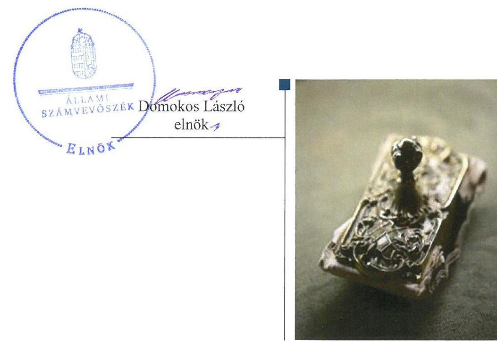
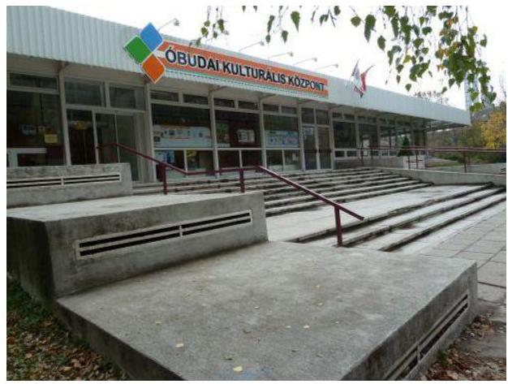
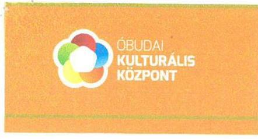
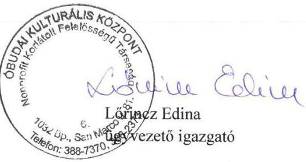
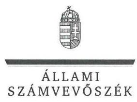
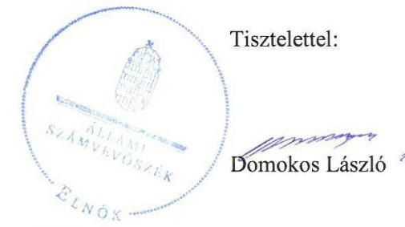
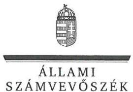

# Jelentés 

## Az önkormányzatok gazdasági társaságai

Az önkormányzatok többségi tulajdonában lévő gazdasági társaságok gazdálkodásának ellenőrzése - Óbudai Kulturális Központ Nonprofit Kft.
2017. 12. hó 07. nap

---

# AZ ELLENŐRZÉST FELÜGYELTE:

DR. NAGY IMRE felügyeleti vezető

# AZ ELLENŐRZÉST VEZETTE ÉS A VÉGREHAJTÁSÁÉRT FELELŐS:

DR. NAGY JUDIT ellenőrzésvezető

# A PROGRAM ÖSSZEÁLLÍTÁSÁÉRT FELELŐS:

JANIK JÓZSEF LÁSZLÓ osztályvezető

---

**IKTATÓSZÁM:** V-1398-118/2016

**TÉMASZÁM:** 2167

**ELLENŐRZÉS-AZONOSÍTÓ SZÁM:** V-075832

---

Jelentéseink az Országgyűlés számítógépes hálózatán és az Interneten a www.asz.hu címen is olvashatóak.

---

# TARTALOMJEGYZÉK 

■ ÖSSZEGZÉS ..... 5
■ AZ ELLENŐRZÉS CÉLJA ..... 6
■ AZ ELLENŐRZÉS TERÜLETE ..... 7
■ AZ ELLENŐRZÉS HÁTTERE, INDOKOLTSÁGA ..... 9
■ A JELENTÉS LÉNYEGES KÉRDÉSKÖREI ..... 10
■ ELLENŐRZÉS HATÓKÖRE ÉS MÓDSZEREI ..... 11
■ MEGÁLLAPÍTÁSOK ..... 13
■ JAVASLATOK ..... 18
■ MELLÉKLETEK ..... 21
I. Sz. melléklet: Értelmező szótár ..... 21
■ FÜGGELÉK: ÉSZREVÉTELEK ..... 23
■ RÖVIDÍTÉSEK JEGYZÉKE ..... 29

---

.

---

# ÖSSZEGZÉS 

Budapest Főváros III. Kerület, Óbuda-Békásmegyer Önkormányzat a tulajdonosi joggyakorlásának kereteit szabályszerűen alakította ki, és azokat megfelelően gyakorolta. Az Óbudai Kulturális Központ Nonprofit Kft. szabályozottsága, vagyongazdálkodása és vagyonnyilvántartása megfelelő volt. A jogszabályi előírás ellenére nem alakította ki a belső kontrollrendszerét, és nem tett eleget az adatszolgáltatási kötelezettségének, így nem volt biztosított a működés nyomon követése és átláthatósága.

## Az ellenőrzés társadalmi indokoltsága

Magyarországon az intézmény-centrikus közfeladat-ellátás jellemző, de egyre jelentősebb a költségvetésen kívüli feladatellátás térnyerése. Helyi szinten ennek legfontosabb szereplői az önkormányzati tulajdonban lévő gazdasági társaságok, amelyeknek ellenőrzése kiemelten fontos a közfeladat ellátása, és a közvagyon megőrzése, megóvása érdekében. Ezért alapvető követelmény, hogy gazdálkodásuk, működésük szabályszerű és átlátható legyen. Emellett az is erősítette az ellenőrzés indokoltságát, hogy az Óbudai Kulturális Központ Nonprofit Kft. gazdálkodása kormányzati szektorba sorolt egyéb szervezetként a kormányzati szektor hiányára is befolyással lehetett.

Budapest Főváros III. kerületében 2012-2015 között az Óbudai Kulturális Központ Nonprofit Kft. közművelődési feladatokat látott el, a Budapest Főváros III. Kerület, Óbuda-Békásmegyer Önkormányzattal kötött megállapodások alapján. Az Állami Számvevőszék az ellenőrzése során arra kereste a választ, hogy szabályszerű volt-e a közművelődéssel összefüggő közfeladatokat is ellátó társaság gazdálkodása és az önkormányzat ehhez kapcsolódó tulajdonosi joggyakorlása.

A jelentésben foglalt megállapítások és a megfogalmazott számvevőszéki javaslatok hozzájárulnak a felelős tulajdonosi joggyakorláshoz és a szabályos gazdálkodáshoz.

## Főbb megállapítások, következtetések, javaslatok

Budapest Főváros III. Kerület, Óbuda-Békásmegyer Önkormányzat a tulajdonosi joggyakorlás kereteit Óbudai Kulturális Központ Nonprofit Kft.-vel kötött közművelődési megállapodás hiányosságai kivételével szabályszerűen alakította ki és szabályszerűen gyakorolta.

Az Óbudai Kulturális Központ Nonprofit Kft. rendelkezett a jogszabályban előírt szabályzatokkal, kivéve a szabálytalanságok kezelésének eljárásrendjét, valamint 2015. december 17-ig az adatvédelmi és adatbiztonsági szabályzatot. Nem alakított ki belső kontrollrendszert a vagyongazdálkodás nyomon követésére, ellenőrzésére, amelyre a kormányzati szektorba tartozás okán volt kötelezett.

Az Óbudai Kulturális Központ Nonprofit Kft. fizetőképessége biztosított volt. A Társaság bevételeinek és ráfordításainak elszámolása szabályszerű volt.

Az Óbudai Kulturális Központ Nonprofit Kft. nem teljesítette a kormányzati szektorba tartozásból eredő adatszolgáltatási kötelezettségét. Nem készítette el a közérdekű adatok megismerésére irányuló igények teljesítésének rendjét rögzítő szabályzatot. Közzétételi kötelezettségének a vezető tisztségviselők és a vezető állású munkavállalók juttatásainak összege tekintetében nem tett eleget.

Az Állami Számvevőszék jelentésében az Óbudai Kulturális Központ Nonprofit Kft. ügyvezetőjének öt, Budapest Főváros III. Kerület, Óbuda-Békásmegyer Önkormányzat polgármesterének egy javaslatot fogalmazott meg, amelyre az érintetteknek 30 napon belül intézkedési tervet kell készíteniük.

---

# AZ ELLENŐRZÉS CÉLJA 

sal bíró elemei a jogszabályi előírásoknak megfelelnek-e.

Az ellenőrzés célja annak értékelése, hogy az önkormányzat vagyongazdálkodási tevékenysége során szabályszerűen gyakorolta-e tulajdonosi jogait. A gazdasági társaság szabályozottsága, gazdálkodása és vagyongazdálkodási tevékenysége, bevételeinek és ráfordításainak elszámolása megfelelt-e a jogszabályi és tulajdonosi előírásoknak. A gazdasági társaság kötelezettségállománya jelent-e kockázatot a működésre. Az ellenőrzés célja továbbá annak megítélése, hogy az önkormányzatok többségi tulajdonában lévő gazdasági társaságok gazdálkodásának a kormányzati szektor hiányára és az államadósságra befolyás-
sal

---

# **AZ ELLENŐRZÉS TERÜLETE**

## **Budapest Főváros III. Kerület, Óbuda-Békásmegyer Önkormányzat és az Óbudai Kulturális Központ Nonprofit Kft.**

Az Önkormányzat^{1} a Társaság^{2}-ot 2008. június 25-én egyszemélyes gazdasági társaságként alapította^{3} az Óbudai Művelődési Központ és a Békásmegyeri Közösségi Ház integrációjával. Később a Csillaghegyi Közösségi Ház, a Kolosy téri Civil Ház és a Pethe Ferenc téri 3K Ház is integrálódott a szervezetbe. A Társaság közhasznú tevékenység ellátására jött létre, alaptevékenysége az Önkormányzat közigazgatási területén a kulturális tevékenység, oktatás, szociális tevékenység, időskorúak gondozása, sporttevékenység volt.

Az Önkormányzat a Társasággal közművelődési megállapodást^{1,2} kötött és térítésmentes ingatlanhasználatot biztosított – 2012. február 15-ig vagyonkezelési, ezt követően az Nvtv. 3. § (1) bekezdés 4. és 11. pontja szerint ingatlanhasználati szerződés^{5} megkötésével – a Társaság működési területeire.

A Társaság 2013. december 16-tól a kormányzati szektorba sorolt egyéb szervezetek közé tartozott.

A Társaság tevékenysége a Főváros III. kerületére terjedt ki. Az öt ház^{6}-ban művelődési, sport, táncművészeti, képzőművészeti, népművészeti és tárgyalkotó csoportok, klubok, szakkörök működtek. Az öt ház, valamint a nagyrendezvények összes látogatójának száma 2015-ben 574 064 fő volt a Társaság szakmai beszámolója alapján.^{7}

A Társaság jegyzett tőkéje 5 M Ft volt, az ellenőrzött időszak alatt nem változott. A saját tőke/jegyzett tőke mutató jogszabályban előírt szintje biztosított volt. A Társaság tevékenységéből származó mérleg szerinti nyereség – megfelelve a Gt.^{8} 4.§. (3) bekezdésében foglaltnak – a Társaság Alapító Okirata^{1-9} 6.2. pontjában meghatározottak szerint az Alapító^{9} részére nem osztható fel, azt a közhasznú feladatok ellátására fordították.

A Társaság gazdálkodásával kapcsolatos főbb mutatói alakulását az 1. táblázat mutatja be:

^{1} táblázat

|  A TÁRSASÁG FŐBB GAZDÁLKODÁSI MUTATÓINAK ALAKULÁSA (M FT) |  |  |  |   |
| --- | --- | --- | --- | --- |
|   | 2012. | 2013. | 2014. | 2015.  |
|  Értékesítés nettó árbevétele | 123,0 | 163,8 | 229,1 | 225,9  |
|  Mérlegfőösszeg | 50,8 | 69,7 | 70,7 | 93,0  |
|  Követelések | 22,1 | 35,9 | 21,9 | 24,1  |
|  Mérleg szerinti eredmény | -17,7 | 16,9 | -15,2 | -0,7  |
|  Saját tőke összege | 8,0 | 24,9 | 9,7 | 8,9  |
|  Kötelezettségek | 34,5 | 25,8 | 23,2 | 47,4  |

^{1.} táblázat

*Forrás: A Társaság egyszerűsített éves beszámolói*

---

A Polgármester ${ }^{10}$ és a Jegyző ${ }^{11}$ személyében változás nem következett be az ellenőrzött időszakban, a jelenlegi Ügyvezető ${ }^{12}$ 2008. június 25-től irányítja a Társaságot.

---

# AZ ELLENŐRZÉS HÁTTERE, INDOKOLTSÁGA 

## AZ ÖNKORMÁNYZATI TULAJDONÚ GAZDASÁGI

TÁRSASÁGOK teljes körű ellenőrzésének lehetőségét az Állami Számvevőszékről szóló 1989. évi XXXVIII. törvény 2011. január 1-jétől hatályos módosítása teremtette meg és az Állami Számvevőszékről szóló 2011. évi LXVI. törvény is tartalmazza. A gazdasági társaságok gazdálkodási tevékenysége szabályszerűségének ellenőrzését 2011. évtől végezzük. Az önkormányzatok többségi tulajdonában álló gazdasági társaságok ellenőrzése kiemelten fontos a vagyon megőrzése, megóvása érdekében, valamint a kormányzati szektor elszámolásaiban megjelenő önkormányzati tulajdonú gazdálkodó szervezetek esetében, amelyekkel szemben alapvető követelmény, hogy gazdálkodásuk, működésük szabályszerű, az általuk szolgáltatott adatok minél megbízhatóbbak legyenek.

A feladatellátás költségeinek, ráfordításainak alakulása a lakosság széles rétegét érinti. Az ellenőrzés várható hasznosulásaként ellenőrzéseink feltárhatják, hogy az önkormányzat a feladatellátásához rendelt vagyon működtetését a tulajdonostól elvárható gondossággal végezte-e, a feladatot ellátó gazdasági társaság a létesítő okiratban, szolgáltatási szerződésben foglaltak betartásával biztosította-e a feladat ellátását. Az ellenőrzés rávilágíthat arra, hogy a gazdasági társaság a vagyon használatával biztosította-e a szolgáltatás folytatásának feltételeit, az önkormányzat tulajdonosi felügyelete hozzájárult-e a szabályszerű gazdálkodáshoz és feladatellátáshoz.

A megállapítások alapján megfogalmazott számvevőszéki javaslatok hasznosítása elősegítheti a meglévő hibák megszüntetését. A jó gyakorlatok bemutatásával az Állami Számvevőszék hozzájárul a követendő megoldások megismertetéséhez, terjesztéséhez.

---

# A JELENTÉS LÉNYEGES KÉRDÉSKÖREI 

1.     - A tulajdonosi joggyakorlás szabályszerű volt-e?
2.     - A kormányzati szektorba sorolt gazdasági társaság vagyongazdálkodása szabályszerű volt-e, fizetőképessége biztosított volt-e a gazdálkodása során?
3.     - A kormányzati szektorba sorolt gazdasági társaság bevételeinek és ráfordításainak elszámolása - beleértve a kormányzati szektor hiányára befolyással bíró gazdasági eseményeket - szabályszerű volt-e?

---

# ELLENŐRZÉS HATÓKÖRE ÉS MÓDSZEREI 

## Az ellenőrzés típusa

Megfelelőségi ellenőrzés.

## Az ellenőrzött időszak

2012. január 1-jétől 2015. december 31-ig.

## Az ellenőrzés tárgya

Budapest Főváros III. Kerület, Óbuda-Békásmegyer Önkormányzat tulajdonosi joggyakorlása, valamint az Óbudai Kulturális Központ Nonprofit Kft. gazdálkodásának szabályozottsága és szabályszerűsége.

Az ellenőrzés kiterjed minden olyan körülményre és adatra, amely az ÁSZ ${ }^{13}$ jogszabályban meghatározott feladatainak teljesítéséhez, valamint a program végrehajtása folyamán felmerült újabb összefüggések feltárásához szükséges.

## Az ellenőrzött szervezet

Óbudai Kulturális Központ Nonprofit Kft. és a kizárólagos tulajdonosi jogokat gyakorló Budapest Főváros III. Kerület, Óbuda-Békásmegyer Önkormányzat.

## Az ellenőrzés jogalapja

Az ellenőrzés jogszabályi alapját az ÁSZ tv. ${ }^{14} 1. \S$ (3) bekezdése és 5. § (3)-(4)-(5) bekezdései képezik.

## Az ellenőrzés módszerei

Az ellenőrzést a nemzetközi standardokat irányadónak tekintve az ellenőrzési program ellenőrzési kérdései, az ellenőrzött időszakban hatályos jogszabályok, az ellenőrzés szakmai szabályok és módszertanok figyelembe vételével végeztük.

Az ellenőrzés ideje alatt az ellenőrzött szervezettel történő kapcsolattartást az ÁSZ Szervezeti és Működési Szabályzatának vonatkozó előírásai alapján biztosítottuk.

---

Az ellenőrzés a kiválasztott, többségi tulajdonosi jogokat gyakorló önkormányzatra, illetve az ellenőrzésre kijelölt gazdasági társaság felett tulajdonosi jogokat gyakorló szervezetre és az ellenőrzött gazdasági társaságra terjedt ki.

Az ellenőrzési kérdések megválaszolásához szükséges bizonyítékok megszerzése a következő ellenőrzési eljárások alkalmazásával történt: megfigyelés, kérdésfeltevés (információkérés), összehasonlítás, valamint elemző eljárás. Az ellenőrzési bizonyítékként felhasználható adatforrások közé tartoztak egyrészt az ellenőrzési programban felsorolt adatforrások, másrészt adatforrás lehet még minden - az ellenőrzés folyamán - feltárt, az ellenőrzés szempontjából információkat tartalmazó dokumentum.

Az ellenőrzést a kérdésekre adott válaszok kiértékelésével, valamint a megjelölt adatforrások, a csatolt tanúsítványok felhasználásával, továbbá az adott időszakban hatályos jogszabályok figyelembe vételével folytattuk le.

A bevételek és ráfordítások elszámolása, valamint a vagyonnyilvántartás terén a szabályszerű működést véletlen mintavétellel ellenőriztük. A mintavétellel ellenőrzött területek esetében minden egyes tétel vonatkozásában a szabályszerűségre vonatkozó kérdéseket tettünk fel, amelyek eredménye összesítésre került. Megfelelőnek értékeltünk egy ellenőrzött területet, amennyiben 95%-os bizonyossággal a teljes sokaságban az átlagos hibaarány legfeljebb 10%, nem megfelelőnek, amennyiben 10%-nál magasabb arányt képviselt. A ráfordítások elszámolására és a vagyonnyilvántartásra vonatkozó véletlen mintavételt kockázati alapú kiválasztással egészítettük ki, amelynek során évente a három legnagyobb összegű tételt választottuk ki.

---

# 1. A tulajdonosi joggyakorlás szabályszerű volt-e? 

## Összegző megállapítás

### 1.1. számú megállapítás

Az Önkormányzat tulajdonosi joggyakorlása szabályszerű volt.

Az Önkormányzat a tulajdonosi joggyakorlás kereteit szabályszerűen alakította ki.

Az Önkormányzat az Ötv. ${ }^{15}$ 91. § (6) bekezdése és Mötv. ${ }^{16}$ 116. § (3)-(4) bekezdéseiben foglaltaknak megfelelve elkészítette a gazdasági programot ${
 }_{1,2}{ }^{17}-t, amelyeket a Képviselő-testület ${ }^{18}$ elfogadott.

A Társaság tevékenységére vonatkozó fejlesztési elképzeléseket a kulturális koncepció ${ }_{1,2}{ }^{19}$ tartalmazta. A Társaság feladatellátására, tevékenységére az Önkormányzatnak rendeletalkotási kötelezettsége volt a Közműv.tv. ${ }^{20}$ 76-77. §-a alapján, amely kötelezettségnek az Önkormányzat eleget tett Közművelődési rendelettel. ${ }^{21}$

A Közművelődési rendelet 4.§ (2) bekezdése alapján az Önkormányzat közművelődési feladatait éves cselekvési tervek szerint végezte, amelyeket a Képviselő-testület hagyott jóvá ${ }^{22}$, illetve a cselekvési terv végrehajtásáról szóló, Polgármester által beterjesztett beszámolót megtárgyalta.

Az Önkormányzat SZMSZ ${ }_{1,2}{ }^{23}$-e alapján - megfelelve az Ötv. ${ }^{24}$ és a Mötv. ${ }^{25}$ előírásának - az alapítói jogokat a Képviselő-testület gyakorolta.

Az Önkormányzat tulajdonosi jogainak gyakorlásához az Ötv., a Mötv., az Nvtv., a Gt., a Ptk. ${ }^{26}$ és Közműv.tv. alapján elkészítette a Vagyonrendelet ${ }_{1,2}{ }^{27}$-t, Közművelődési rendeletet, illetve a Tulajdonosi rendeletet ${ }^{28}$. A Tulajdonosi rendelet 3. §-a előírta a Társaság számára az üzleti terv készítését, ennek felügyelő-bizottsági véleményezését. A Tulajdonosi rendelet 4. §-ában az Önkormányzat a féléves és háromnegyed éves beszámolási kötelezettség határidős előírásával kialakította a Társasággal kapcsolatos monitoring rendszerét.

Az Önkormányzat a Közműv.tv. 79. §-a alapján a Társasággal közművelődési megállapodást ${ }_{1,2}$ kötött. A megállapodásban meghatározásra került az elvégzendő közművelődési szolgáltatás, ennek tárgyi és pénzügyi feltételei, valamint a közművelődési tevékenységben érintettek köre.

Ugyanakkor a közművelődési megállapodás ${ }_{1,2}$-ben nem határozták meg a Közműv.tv. 79. § (2) bekezdése a), c), d), e), f) pontja szerinti tartalmi elemeket, azaz a közművelődési szolgáltatás díját, az ingyenesen vagy térítési díjért igénybe vehető szolgáltatások körét, a közművelődési szolgáltatás igénybevételi lehetőségeinek minimális időtartamát és rendszerességét, a közösségi színtér, illetőleg közművelődési intézmény közművelődési célú minimális nyitvatartását, a megállapodás személyi feltételeit, a közművelődési feladat megvalósításában közreműködőktől megkívánt szakképzettséget.

---

# 1.2. számú megállapítás 

Az Önkormányzat - megfelelve a Gt. 19. § (4) pontja, illetve a Ptk. 3:26. § (1) és 3:250. § (1) d) előírásának - a Társaság Alapító Okiratában ${ }_{1}$ rögzítette a Felügyelő-bizottság tagjait és a megválasztott könyvvizsgálót. A Felügyelő-bizottság - megfelelve a Gt. 34. § (4) és a Ptk. 3:122. § (3) előírásainak - rendelkezett a Képviselő-testület által jóváhagyott ügyrenddel és megtárgyalta a Társaság egyszerűsített éves beszámolóit annak közhasznúsági mellékleteivel.

A Társaság Alapító Okirat ${ }_{1-9}$ 49. pontja alapján a Felügyelő-bizottság az Önkormányzat részére történt előterjesztés előtt megtárgyalta a Társaság üzleti terveit.

Az éves üzleti terveket a Felügyelő-bizottság javaslata alapján a Képviselő-testület az éves költségvetésének jóváhagyásához kapcsolódóan hagyta jóvá, a Tulajdonosi rendelet 3. §-ának megfelelően.

Az Önkormányzat a Tulajdonosi rendeletében írta elő a Társaság egyszerűsített éves beszámolójának és közhasznúsági jelentésének Önkormányzat felé történő megküldését és annak határidejét. A Képviselő-testület az egyszerűsített éves beszámoló és közhasznúsági jelentés elfogadásáról a könyvvizsgálói jelentések és a felügyelő-bizottsági javaslat birtokában döntött ${ }^{29}$, ezzel eleget téve a jogszabályoknak. A könyvvizsgáló az egyszerűsített éves beszámolókat és a közhasznúsági mellékleteket a Számv. tv. 156. § (4) bekezdése szerint hitelesítő záradékkal látta el.

Az Önkormányzat az Áht. ${ }^{30}$ 70.§(1) d) és az Ötv. 92. § (11) bekezdése b) pontjában foglalt lehetőséggel élve végzett ellenőrzéseket a Társaságnál. Az ellenőrzések megállapításai alapján a Társaság intézkedési terveket készített.

A Társaság 2013. kivételével veszteségesen gazdálkodott, de ennek rendezése külön önkormányzati döntést nem igényelt, mert arra az eredménytartalék fedezetet nyújtott. Az Önkormányzat Pénzügyi és Gazdálkodási Főosztálya évente külön adatbekérés keretében ellenőrizte a saját tőke és a jegyzett tőke egymáshoz való viszonyának alakulását.

A Képviselő-testület - megfelelve a Taktv. ${ }^{31}$ 5.§ (3) bekezdésében előírtaknak - határozatával ${ }^{32}$ szabályzatot fogadott el a vezető tisztségviselők, felügyelőbizottsági tagok, valamint az Mt. 208. §-ának hatálya alá eső munkavállalók javadalmazása, valamint a jogviszony megszűnése esetére biztosított juttatások módjának, mértékének elveiről, annak rendszeréről ${ }^{33}$.

---

# 2. A kormányzati szektorba sorolt gazdasági társaság vagyongazdálkodása szabályszerű volt-e, fizetőképessége biztosított volt-e a gazdálkodása során? 

Összegző megállapítás

A Társaság vagyongazdálkodását, a belső kontrollrendszer hiányossága kivételével, megfelelően végezte. Fizetőképessége biztosított volt a gazdálkodás során.

### 2.1. számú megállapítás

A Társaság rendelkezett a jogszabályokban előírt szabályzatokkal.

A Társaság a Számv. tv. ${ }^{34}$ 14. § (4)-(5) bekezdésében előírt szabályzatokat elkészítette, és azokat aktualizálta. A számviteli politika ${ }_{1-2}{ }^{35}$ keretében (mellékletként) a Társaság elkészítette a leltározási szabályzatot ${ }_{1-2}{ }^{36}$, az értékelési szabályzatot ${ }^{37}$ és a bizonylati rendet ${ }^{38}$. Önálló szabályzatként került kiadásra és évente módosításra a pénzkezelési szabályzat ${ }^{39}$. A Társaság rendelkezett a Számv. tv. 161. § (1)-(2) bekezdésében foglaltaknak megfelelő számlarenddel ${ }^{40}$, a Számv. tv. 160. § által előírt számlakeret ${ }^{41}$ évente került kiadásra.

A tevékenységre közvetlenül el nem számolható költségeknek, ráfordításoknak a felosztási szabályait - megfelelve a Civil tv. ${ }^{42}$ 21. §-ban foglaltaknak - a belső elszámolási rend szabályzata ${ }^{43}$ tartalmazta. A szabályzatban meghatározásra került az ellátott közfeladat bevételei és ráfordításai elkülönített nyilvántartására vonatkozó előírás, ezzel eleget téve a Számv. tv. 161/A § (2) bekezdése előírásainak.

A Társaság a gazdálkodással kapcsolatos személyi, vezetői felelősség-, jog- és hatásköröket kötelezettségvállalási szabályzatában ${ }_{1-4}{ }^{44}$ határozta meg, melyet a tulajdonosi rendelet 6. § 2) bekezdése írt elő.

A Társaság adatvédelmi és adatbiztonsági szabályzattal csak 2015. december 18-tól rendelkezett, ezért 2012. január 1-től 2015. december 17-ig nem teljesítette az Infotv. ${ }^{45}$ 24. § (3) bekezdésében foglaltakat.

A Társaság mint kormányzati szektorba sorolt egyéb szervezet nem teljesítette a Bkr. ${ }^{46}$ 6. §. (4) bekezdése előírásait, mert 2014. január 1-től nem rendelkezett a szabálytalanságok kezelésének eljárásrendjével.

## 2.2. számú megállapítás

A Társaság vagyonnyilvántartása a jogszabályi előírásoknak megfelelt. Belső kontrollrendszerét jogszabályi előírás ellenére nem alakította ki.

Társaság saját vagyonnyilvántartása átlátható, naprakész volt, megfelelt a jogszabályi, illetve belső szabályozási előírásoknak.

A használatba vett ingatlanok karbantartásával, javításával kapcsolatos feladatokra - az ingatlanhasználati szerződés 5. pontja szerint - az Önkormányzat biztosította a forrást az éves költségvetési rendeletekben meghatározottak szerint. Az Alapító Okirat ${ }_{1-9}$ 24. pontja szerinti önkormányzati jóváhagyással a beszerzések során a Társaság rendelkezett.

A Társaság egyszerűsített éves beszámoló mérlegében és a számviteli nyilvántartásaiban szereplő vagyonelemek állományát leltárral alátámasztották, megfelelve a Számv. tv. 69. § (1) bekezdése előírásainak.

---

Az Ügyvezető 2014. január 1-től a Bkr. 3. §-ban foglaltak ellenére nem alakított ki belső kontrollrendszert, így nem volt biztosított a Társaság tevékenységének, a célok megvalósításának nyomon követése.
2.3. számú megállapítás

# A Társaság fizetőképessége biztosított volt, kötelezettségállománya a működését nem veszélyeztette. 

A Társaság közfeladatainak ellátását alapvetően az Önkormányzat finanszírozása biztosította, a lejárt szállítói tartozások aránya nem volt jelentős. A forrás igénylése - a tulajdonosi rendelet 3. § 11) bekezdése alapján - az Önkormányzatnak benyújtott havi likviditási tervek alapján történt.
2.4. számú megállapítás

A Társaság az előírt tervezési, beszámolási kötelezettségét teljesítette, azonban előírt adatszolgáltatási kötelezettségének nem tett eleget.

A Társaság tervezési feladatait a közművelődési rendeletben és a közművelődési megállapodásban ${ }_{1-2}$ rögzítettek szerint látta el. A kötelezettségvállalási szabályzat ${ }_{3-4}$ alapján elkészültek a havi likviditási tervek. Az üzleti tervek tartalmazták az igényelt működési támogatást, a szükséges eszközbeszerzésekre, az ingatlanok felújítására szükséges támogatást.

A Társaság féléves és háromnegyed éves beszámolóit a Tulajdonosi rendelet 4. §-ának előírásai szerint elkészítette.

A Társaság a Számv. tv. 17. § (1) bekezdése szerinti egyszerűsített éves beszámolóit, valamint a Civil tv. 29. § (3) bekezdése szerinti közhasznúsági mellékleteit határidőben elkészítette.

A Társaság 2015. december 18-tól rendelkezett adatvédelmi és adatbiztonsági szabályzattal ${ }^{47}$. A közérdekű adatok megismerésére irányuló igények teljesítésének rendjét rögzítő szabályzattal nem rendelkezett a Társaság, így nem tett eleget az Info. tv. 30. § (6) bekezdésében foglaltaknak.

A Társaság az Áht. 107. § (1) bekezdése alapján 2013. évtől az Ávr. ${ }^{48}$ 7. sz. melléklete 2., 28., és 29. pontjai, 2015. január 1-től az Ávr. 5. sz. melléklete 23-24. pontjai szerinti adatszolgáltatás teljesítésére volt kötelezett, amelynek azonban nem tett eleget.

A Társaság a közérdekű adatait saját honlapon hozta nyilvánosságra. A Taktv ${ }^{49}$ 2. § (1) bekezdésének ca) pontjában előírtak ellenére a Társaság vezető tisztségviselőinek és a vezető állású munkavállalóinak nyújtott pénzbeli juttatások összegét a honlap nem tartalmazta.

## 3. A kormányzati szektorba sorolt gazdasági társaság bevételeinek és ráfordításainak elszámolása - beleértve a kormányzati szektor hiányára befolyással bíró gazdasági eseményeket - szabályszerű volt-e?

## Összegző megállapítás

A Társaság elszámolásai szabályszerűek voltak.
A Társaságnál a bevételek és ráfordítások, a bér és személyi jellegű kifizetések elszámolása szabályszerű volt.

---

A jogszabályoknak és a belső szabályozásnak megfelelően történt az értékcsökkenési leírás elszámolása.

A Társaság a Stabilitási tv. ${ }^{50}$ szerinti adósságot keletkeztető ügyletet nem kötött. A Társaságnak az egyszerűsített éves beszámolói alapján hosszú lejáratú kötelezettsége nem keletkezett, a rövid lejáratú kötelezettségeit alapvetően a szállítók, illetve az esedékes adók és járulékok tették ki, amelyek nem tartoztak az államadósságra befolyással bíró elemek közé.

---

# JAVASLATOK 

Az ÁSZ tv. 33. § (1) bekezdésében foglaltak értelmében az ellenőrzött szervezet vezetője köteles a jelentésben foglalt megállapításokhoz kapcsolódó intézkedési tervet összeállítani és azt a jelentés kézhezvételétől számított 30 napon belül az ÁSZ részére megküldeni. Amennyiben az ellenőrzött szervezet vezetője nem küldi meg határidőben az intézkedési tervet, vagy továbbra sem elfogadható intézkedési tervet küld, az Állami Számvevőszék elnöke az ÁSZ tv. 33. § (3) bekezdése a) és b) pontjaiban foglaltakat érvényesítheti.

## Óbudai Kulturális Központ Nonprofit Kft. Ügyvezetőjének

1. Gondoskodjon a szervezeti integritást sértő események kezelésének eljárásrendje, valamint az integritás kockázatkezelés eljárásrendje szabályozásáról a jogszabályban előírtak szerint.
(2.1. sz. megállapítás 5. bekezdése alapján)
2. Gondoskodjon belső kontrollrendszer kialakításáról a jogszabályban előírtak szerint.
(2.2. sz. megállapítás 4. bekezdése alapján)
3. Intézkedjen a közérdekű adatok megismerésére irányuló igények teljesítésének rendjét rögzítő szabályzat elkészítéséről a jogszabályi előírásnak megfelelően.
(2.4. sz. megállapítás 4. bekezdés második mondata alapján)
4. Intézkedjen a jogszabályokban a kormányzati szektorba sorolt egyéb szervezeteknek előírt adatszolgáltatás teljesítéséről.
(2.4. sz. megállapítás 5. bekezdése alapján)
5. Intézkedjen a jogszabályban előírt adatok közzétételéről.
(2.4. sz. megállapítás 6. bekezdése alapján)

---

# Budapest Főváros III. Kerület, Óbuda-Békásmegyer Önkormányzat Polgármesterének 

1. Gondoskodjon a közművelődési megállapodásban foglaltak kiegészítéséről a jogszabályban előírtak szerint.
(1.1. sz. megállapítás 7. bekezdése alapján)

---

.

---

# MELLÉKLETEK 

- I. SZ. MELLÉKLET: ÉRTELMEZŐ SZÓTÁR
gazdasági társaság
gazdálkodó szervezet
közszolgáltatás
meghatározó befolyás
minősített többséget biztosító részesedés
többségi befolyást biztosító részesedés

Ptk. 3.88. § (1) bekezdése szerint „a gazdasági társaságok üzletszerű közös gazdasági tevékenység folytatására, a tagok vagyoni hozzájárulásával létrehozott, jogi személyiséggel rendelkező vállalkozások, amelyekben a tagok a nyereségből közösen részesednek, és a veszteséget közösen viselik".
A Ptk. ${ }^{51}$ 685. § c) pontja szerint gazdálkodó szervezet: „az állami vállalat, az egyéb állami gazdálkodó szerv, a szövetkezet, a lakásszövetkezet, az európai szövetkezet, a gazdasági társaság, az európai

 részvénytársaság, az egyesülés, az európai gazdasági egyesülés, az európai területi együttműködési csoportosulás, az egyes jogi személyek vállalata, a leányvállalat, a vízgazdálkodási társulat, az erdőbirtokossági társulat, a végrehajtói iroda, az egyéni cég, továbbá az egyéni vállalkozó." (2014. 03. 15-ig hatályos)
Az Ebktv. ${ }^{52}$ 3. § d) pontja a következőképpen határozza meg a közszolgáltatást: „szerződéskötési kötelezettség alapján a lakosság alapvető szükségleteinek ellátására irányuló szolgáltatás, így különösen a villamos energia-, gáz-, hő-, víz-, szennyvíz- és hulladékkezelési, köztisztasági, postai és távközlési szolgáltatás, továbbá a menetrend alapján közlekedő járművekkel végzett közforgalmú személyszállítás".
A Ptk. 2 8:2. § (2) bekezdése szerint „A befolyással rendelkező akkor rendelkezik egy jogi személyben meghatározó befolyással, ha annak tagja vagy részvényese, és
a) jogosult e jogi személy vezető tisztségviselői vagy felügyelőbizottsága tagjainak többségének megválasztására, illetve visszahívására; vagy
b) a jogi személy más tagjai, illetve részvényesei a befolyással rendelkezővel kötött megállapodás alapján a befolyással rendelkezővel azonos tartalommal szavaznak, vagy a befolyással rendelkezőn keresztül gyakorolják szavazati jogukat, feltéve, hogy együtt a szavazatok több mint felével rendelkeznek."
A minősített befolyásszerző az ellenőrzött társaságban a szavazatok legalább hetvenöt százalékával rendelkezik. (Ptk. 2. 3:324. §)
A Ptk. 2 8:2. § (1) bekezdése szerint „többségi befolyás az olyan kapcsolat, amelynek révén természetes személy vagy jogi személy (befolyással rendelkező) egy jogi személyben a szavazatok több mint felével vagy meghatározó befolyással rendelkezik."

---

.

---

# FÜGGELÉK: ÉSZREVÉTELEK 

A jelentéstervezetet a Számvevőszék 15 napos észrevételezésre megküldte az ellenőrzött szervezetek vezetőinek az ÁSZ tv. 29. § (1) bekezdése előírásának megfelelően.

Az ÁSZ a jelentéstervezetet észrevételezésre megküldte Budapest Főváros III. Kerület, Óbuda-Békásmegyer Önkormányzat polgármesterének és az Óbudai Kulturális Központ Nonprofit Kft. ügyvezetőjének.
Budapest Főváros III. Kerület, Óbuda-Békásmegyer Önkormányzat a jelentéstervezetre észrevételt nem tett. Az Óbudai Kulturális Központ Nonprofit Kft. ügyvezetőjének észrevételét - mellékletek nélkül - , illetve az el nem fogadott észrevételek elutasításának indoklását a függelék tartalmazza.

[^0]
[^0]:    * 29. § (1) Az Állami Számvevőszék az ellenőrzési megállapításait megküldi az ellenőrzött szervezet vezetőjének vagy az általa megbízott személynek, és annak, akinek személyes felelősségét állapította meg.
    (2) Az ellenőrzött szervezet vezetője és a felelősként megjelölt személy az ellenőrzés megállapításaira tizenöt napon belül írásban észrevételt tehet.
    (3) Az Állami Számvevőszék az észrevételre a beérkezésétől számított harminc napon belül írásban válaszol. A figyelembe nem vett észrevételeket köteles a jelentésben feltüntetni, és megindokolni, hogy azokat miért nem fogadta el.

---

Állami Számvevőszék
1052 Budapest,
Apáczai Csere János utca 10.
Dr. Nagy Imre Úr
Felügyeleti vezető részére
Ikt. sz: V-1398-001/2016
Témaszám: 2167
Ellenőrzés-azonosító: V-075834

Tisztelt Dr. Nagy Imre Felügyeleti Vezető Úr!
Társaságunknál zajló, Állami Számvevőszék V-1398-001/2016 iktatószámú ellenőrzése kapcsán készült Számvevőszéki jelentéstervezetet megkaptuk, melyet ezúton is szeretnék megköszönni. A jelentéstervezet megállapításai kapcsán szeretnénk kérni a tisztelt Hivatalt, hogy a végleges jelentésben vegye figyelembe az alábbi észrevételeinket:

# 2.2. számú megállapítás (részlet): 

„Az Ügyvezető 2014. január 1-től a Bkr. 3. §-ban foglaltak ellenére nem alakított ki belső kontrollrendszert, így nem volt biztosított a Társaság tevékenységének, a célok megvalósításának nyomon követése."

Társaságunk 2012. évben kialakította a Belső Elszámolási Rendjét, amely tartalmazza mindazon elveket, eljárásokat, melyek szavatolják, hogy valamennyi tevékenység és cél összhangban legyen egymással. A gazdálkodás szabályszerű legyen, megfelelő szabályozottsággal, valamint a gazdaságosság, hatékonyság és eredményesség követelményei érvényesülni tudjanak.
A szabályzat kialakításával a társaság működésével kapcsolatosan megfelelő, pontos és naprakész információk birtokába juthatunk.

Mindezek figyelembevételével kérem a tisztelt Hivatalt, hogy módosítsa a végleges Számvevőszéki jelentés szövegét az alábbira:
Az Ügyvezető kialakított a társaság működésével kapcsolatosan egyfajta belső kontrollrendszert, azonban 2014. január 1-től a Bkr. 3. § szerint nem aktualizálta azt.

---

ÖBUDAI KULTURÁLIS KÖZPONT NONPROFIT KFT.
1032 Budapest, Szent klarca utca 81.
tel./fax. 06 | 368 2373, 06 | 368 7370
e-mail: kulturkozpont@kulturkozpont.hu
honlap: www.kulturkozpont.hu

# 2.4. számú megállapítás, 5. bekezdés: 

„A Társaság az Áht. 107. § (1) bekezdése alapján 2013. évtől az Ávr. 7. sz. melléklete 2., 28., és 29. pontjai, 2015. január 1-től az Ávr. 5. sz. melléklete 23-24. pontjai szerinti adatszolgáltatás teljesítésére volt kötelezett, amelynek azonban nem tett eleget."

Társaságunk számviteli beszámolói, az ellenőrzött időszakot tekintve, nem tartalmaznak adósságot keletkeztető ügyletből eredő kötelezettséget.

A tisztelt Hivatal ellenőrzése kapcsán megállapította, hogy „A Társaság féléves és háromnegyed éves beszámolóit a Tulajdonosi rendelet 4. §-ának előírásai szerint elkészítette."
Az államháztartási törvény végrehajtásáról szóló 368/2011. (XII. 31.) Korm. rendelet (Ávr.) 7. számú mellékletének 29. pontjában előírt adatszolgáltatáshoz, a Kft., mint adatszolgáltató szervezet az adatszolgáltatást a Rendeletben előírt módon:
„Az adatszolgáltatás módja: a dokumentumokat a tulajdonosi, illetve irányítói jogokat gyakorló szerv vagy személy küldi meg a tárgynegyedévet követő hónap végéig, kizárólag elektronikus formában."

Mindezek figyelembevételével kérem a tisztelt Hivatalt, hogy az ide vonatkozó adatszolgáltatásunkat, a fentieket figyelembe véve tekintse teljesítettnek.

## 2.4. számú megállapítás, 6. bekezdés:

A Társaság a közérdekű adatait saját honlapon hozta nyilvánosságra. A Taktv. 49. 2. § (1) bekezdésének ca) pontjában előírtak ellenére a Társaság vezető tisztségviselőinek és a vezető állású munkavállalóinak nyújtott pénzbeli juttatások összegét a honlap nem tartalmazta.

Társaságunk honlapját folyamatosan karbantartja, a megújult honlapunkon a nyilvánosságot szolgáltató adatok betekinthetőségét karbantartjuk és igyekszünk naprakészen tartani.
2012. évben a tulajdonos részéről történt (ikt: 3/I/2/3b/2013. számú) ellenőrzés kapcsán is megállapításra került, hogy: „A vezető tisztségviselők munkabérét és egyéb rendszeres juttatásait nyilvánosságra hozták."
Ezért kérem a tisztelt Hivataltól a nyilvánosságra hozatal teljesítésének elfogadását.
Budapest, 2017. október 16.
Mellékelt: belső ellenőrzési jegyzőkönyv

---

ELNÖK

Ikt.szám: V-1398-116/2016.

# Lőrincz Edina úrhölgy 

ügyvezető
Óbudai Kulturális Központ Nonprofit Kft.

## Budapest

## Tisztelt Ügyvezető Úrhölgy!

„Az önkormányzatok gazdasági társaságai - Az önkormányzatok többségi tulajdonában lévő gazdasági társaságok gazdálkodásának ellenőrzése - Öbudai Kulturális Központ Nonprofit Kft. " címmel készített számvevőszéki jelentéstervezetre tett észrevételeit köszönettel megkaptam.
Az Állami Számvevőszék észrevételekre vonatkozó álláspontjáról a felügyeleti vezető által készített részletes tájékoztatást csatoltan megküldöm.
Tájékoztatom Ügyvezető úrhölgyet, hogy a számvevőszéki jelentésben - az Állami Számvevőszékről szóló 2011. évi LXVI. törvény 29. § (3) bekezdése alapján - a figyelembe nem vett észrevételeket szerepeltetjük annak megindoklásával, hogy azokat miért nem fogadtuk el.

Budapest, 2017. 17. hó 17. nap

Melléklet: Tájékoztatás az észrevételek kezeléséről

---

# Tájékoztatás   az észrevételek kezeléséről 

„Az önkormányzatok gazdasági társaságai - Az önkormányzatok többségi tulajdonában lévő gazdasági társaságok gazdálkodásának ellenőrzése - Óbudai Kulturális Központ Nonprofit Kft. " című jelentéstervezetre 2017. október 16-án tett (az Állami Számvevőszékhez 2017. október 18-án érkezett) észrevételét áttekintettük, annak kezelésével kapcsolatban a következő tájékoztatást adom.

1. A jelentéstervezet 2.2. számú megállapítására (,Az Ügyvezető 2014. január 1-től a Bkr. 3. §-ban foglaltak ellenére nem alakított ki belső kontrollrendszert, így nem volt biztosított a Társaság tevékenységének, a célok megvalósításának nyomon követése.") vonatkozó észrevétel:
Az észrevételben leírtak szerint „Társaságunk 2012. évben kialakította a Belső Elszámolási Rendjét, amely tartalmazza mindazon elveket, eljárásokat, melyek szavatolják, hogy valamennyi tevékenység és cél összhangban legyen egymással. A gazdálkodás szabályszerű legyen, megfelelő szabályozottsággal, valamint a gazdaságosság, hatékonyság és eredményesség követelményei érvényesülni tudjanak. A szabályzat kialakításával a társaság működésével kapcsolatosan megfelelő, pontos és naprakész információk birtokába juthatunk. Mindezek figyelembevételével kérem a tisztelt Hivatalt, hogy módosítsa a végleges Számvevőszéki jelentés szövegét az alábbira: »Az Ügyvezető kialakított a társaság működésével kapcsolatosan egyfajta belső kontrollrendszert, azonban 2014. január 1-től a Bkr. 3. § szerint nem aktualizálta azt.«".

Az észrevétel nem megalapozott. A Társaság az ellenőrzés során az adatszolgáltatásra rendelkezésére álló időben nem adott át a Bkr. 3. §-a szerint kialakított belső kontrollrendszerre vonatkozó dokumentumot.

Erre tekintettel az észrevétel alapján a jelentéstervezet módosítása nem indokolt.
2. A jelentéstervezet 2.4. számú megállapítás 5. bekezdésére (,,A Társaság az Áht. 107. § (1) bekezdése alapján 2013. évtől az Ávr. 7. sz. melléklete 2., 28. és 29. pontjai, 2015. január 1-től az Ávr. 5. sz. melléklete 23-24. pontjai szerinti adatszolgáltatás teljesítésére volt kötelezett, amelynek azonban nem tett eleget.") vonatkozó észrevétel:

Az észrevételben leírtak szerint „Társaságunk számviteli beszámolói, az ellenőrzött időszakot tekintve, nem tartalmaznak adósságot keletkeztető ügyletből eredő kötelezettséget. A tisztelt Hivatal ellenőrzése kapcsán megállapította, hogy „A Társaság féléves és háromnegyed éves beszámolóit a Tulajdonosi rendelet 4. §-ának előírásai szerint elkészítette. „Az államháztartási törvény végrehajtásáról szóló 368/2011. (XII. 31.) Korm. rendelet (Ávr.) 7. számú mellékletének 29. pontjában előírt adatszolgáltatáshoz, a Kft., mint adatszolgáltató szervezet az adatszolgáltatást

---

a Rendeletben előírt módon: „Az adatszolgáltatás módja: a dokumentumokat a tulajdonosi, illetve irányítói jogokat gyakorló szerv vagy személy küldi meg a tárgynegyedévet követő hónap végéig, kizárólag elektronikus formában. „ Mindezek figyelembevételével kérem a tisztelt Hivatalt, hogy az ide vonatkozó adatszolgáltatásunkat, a fentieket figyelembe véve tekintse teljesítettnek. ${ }^{16}$.

Az észrevétel nem megalapozott. Az észrevételében leírtak nem támasztják alá a megállapításban hivatkozott jogszabályi helyen (Ávr.) előírt adatszolgáltatás teljesítését, valamint a Társaság az ellenőrzés során az adatszolgáltatásra rendelkezésére álló időben nem adott át annak teljesítését igazoló dokumentumot.

Erre tekintettel az észrevétel alapján a jelentéstervezet módosítása nem indokolt.
3. A jelentéstervezet 2.4. számú megállapítás 6. bekezdésére („A Társaság a közérdekű adatait saját honlapon hozta nyilvánosságra. A Taktv. 2. § (1) bekezdésének ca) pontjában előírtak ellenére a Társaság vezető tisztségviselőinek és a vezető állású munkavállalóinak nyújtott pénzbeli juttatások összegét a honlap nem tartalmazta.") vonatkozó észrevétel:

Az észrevételben leírtak szerint: „Társaságunk honlapját folyamatosan karbantartja, a megújult honlapunkon a nyilvánosságot szolgáltató adatok betekinthetőségét karbantartjuk és igyekszünk naprakészen tartani. 2012. évben a tulajdonos részéről történt (ikt: 3/I/2/3b/2013. számú) ellenőrzés kapcsán is megállapításra került, hogy: „A vezető tisztségviselők munkabérét és egyéb rendszeres juttatásait nyilvánosságra hozták. „Ezért kérem a tisztelt Hivataltól a nyilvánosságra hozatal teljesítésének elfogadását. ${ }^{17}$

Az észrevételben hivatkozott tulajdonosi ellenőrzés 2012. évet érintette. A számvevőszéki ellenőrzés a 2012-2015. közötti évekre terjedt ki, amely időszakban az ellenőrzés megállapítása szerint a honlapon a Társaság vezető tisztségviselőinek és a vezető állású munkavállalóinak nyújtott pénzbeli juttatások összegét nem hozták nyilvánosságra.

Erre tekintettel az észrevétel alapján a jelentéstervezet módosítása nem indokolt.
Budapest, 2017. 11. hó 1. nap

Dr. Nagy Imre felügyeleti vezető

---

# RÖVIDÍTÉSEK JEGYZÉKE 

${ }^{1}$ Önkormányzat
${ }^{2}$ Társaság
${ }^{3}$ Határozat az alapításról
${ }^{4}$ Közművelődési megállapodás:

Közművelődési megállapodás:

${ }^{5}$ Ingatlan-használati szerződés
${ }^{6}$ Öt ház
${ }^{7}$ Látogatók száma
${ }^{8}$ Gt.
${ }^{9}$ Alapító
${ }^{10}$ Polgármester
${ }^{11}$ Jegyző
${ }^{12}$ Ügyvezető
${ }^{13}$ ÁSZ
${ }^{14}$ ÁSZ tv.
${ }^{15}$ Ötv.
${ }^{16}$ Mötv.
${ }^{17}$ gazdasági program:
gazdasági program:
${ }^{18}$ Képviselő-testület
${ }^{19}$ kulturális koncepció:
kulturális koncepció:

Budapest Főváros III. Kerület, Óbuda-Békásmegyer Önkormányzat
Óbudai Kulturális Központ Nonprofit Korlátolt Felelősségű Társaság
Budapest Főváros III. kerület Óbuda-Békásmegyer Önkormányzata 334/ÖK/2008 (V. 28.) sz. Képviselő-testületi határozata

Budapest Főváros III. kerület Óbuda - Békásmegyer Önkormányzat és az Óbudai Kulturális Központ Nonprofit Korlátolt Felelősségű Társaság között 2008. június 25-én létrejött közművelődési megállapodás
Budapest Főváros III. kerület Óbuda - Békásmegyer Önkormányzat és az Óbudai Kulturális Központ Nonprofit Korlátolt Felelősségű Társaság között 2013. január 31-én létrejött közművelődési megállapodás
Budapest Főváros III. Kerület

 Óbuda-Békásmegyer Önkormányzat Képviselőtestületének 89/ÖK/2012. (II. 16.) Határozata alapján kötött a Budapest Főváros III. Kerület, Óbuda-Békásmegyer Önkormányzat és az Óbudai Kulturális Központ Nonprofit Korlátolt Felelősségű Társaság 2012. február 16-án kötött Ingatlan-használati szerződése, módosítva 2012. október 25-én, 2013. május 30-án és 2014. június 26-án.
Óbudai Művelődési Központ, Békásmegyeri Közösségi Ház, Csillaghegyi Közösségi Ház, Kolossy téri Civil Ház és a Pethe Ferenc téri 3K Ház
Forrás: Óbudai Kulturális Központ Nonprofit Kft. 2015. évi szakmai közhasznú tevékenységének bemutatása, Vezetői összefoglaló
2006. évi IV. törvény a gazdasági társaságokról (hatályos 2006. január 4-től 2014. március 15-ig)
Budapest Főváros III. Kerület, Óbuda-Békásmegyer Önkormányzat
Budapest Főváros III. Kerület, Óbuda-Békásmegyer Önkormányzat polgármestere
Budapest Főváros III. Kerület, Óbuda-Békásmegyer Önkormányzat jegyzője
Óbudai Kulturális Központ Nonprofit Kft. irányításáért felelős vezető tisztségviselője
Állami Számvevőszék
2011. évi LXVI. törvény az Állami Számvevőszékről
1990. évi LXV. törvény a helyi önkormányzatokról (hatálytalan: 2014. október 12-től)
2011. évi CLXXXIX. törvény Magyarország helyi önkormányzatairól (hatályos: 2012. január 1-jétől)

Budapest Főváros III. kerület Óbuda-Békásmegyer Önkormányzat Gazdasági Városfejlesztési program (2011-2014)
Budapest Főváros III. kerület Óbuda-Békásmegyer Önkormányzat Gazdasági program (2015-2019)
Budapest Főváros III. Kerület, Óbuda-Békásmegyer Önkormányzat Képviselőtestülete
Budapest Főváros III. kerület Óbuda-Békásmegyer Önkormányzata Kulturális Koncepció 2007., elfogadta a Képviselő-testület 546/ÖK/2007.(X.24.). sz. határozatával
Budapest Főváros III. Kerület, Óbuda-Békásmegyer Kulturális Koncepciója 2013, elfogadta a Képviselő-testület 385/2013.(IV.30.) sz. határozatával

---

${ }^{20}$ Közműv.tv.
${ }^{21}$ Közművelődési rendelet
${ }^{22}$ Közművelődési cselekvési terv 2012
Közművelődési cselekvési terv 2013
Közművelődési cselekvési terv 2014

Közművelődési cselekvési terv 2015
${ }^{23}$ SZMSZ1
SZMSZ2
${ }^{24}$ Ötv.
${ }^{25}$ Mötv.
${ }^{26}$ Ptk. 2
${ }^{27}$ Vagyonrendelet ${ }_{1}$

Vagyonrendelet ${ }_{2}$
${ }^{28}$ Tulajdonosi rendelet
${ }^{29}$ 2012. évi beszámoló elfogadás
2013. évi beszámoló elfogadás
2014. évi beszámoló elfogadás
2015. évi beszámoló elfogadás
${ }^{30}$ Áht.
${ }^{31}$ Taktv.
${ }^{32}$ Határozat a javadalmazási szabályzatról
${ }^{33}$ Javadalmazási szabályzat
1997. évi CXL. sz. törvény a muzeális intézményekről, a nyilvános könyvtári ellátásról és a közművelődésről
Budapest Főváros III. Kerület, Óbuda-Békásmegyer Önkormányzat Képviselőtestületének 14/2000.(V.17.). sz. rendelete a közművelődésről (hatályos 2000. május 17-től)
Budapest Főváros III. Kerület, Óbuda-Békásmegyer Önkormányzat Képviselőtestületének 76/ÖK/2012.(II.16.) sz. határozata alapján
Budapest Főváros III. Kerület, Óbuda-Békásmegyer Önkormányzat Képviselőtestületének 96/ÖK/2013.(II.14.) sz. határozata alapján
Budapest Főváros III. Kerület, Óbuda-Békásmegyer Önkormányzat Képviselőtestületének 90/2014.(II.27.) sz. határozata alapján
Budapest Főváros III. Kerület, Óbuda-Békásmegyer Önkormányzat Képviselőtestületének 71/2015.(II.12.) sz. határozata alapján
Budapest Főváros III. Kerület, Óbuda-Békásmegyer Önkormányzat Képviselőtestületének 9/1995. (VI. 1.) rendelete Az Önkormányzat Szervezeti és Működési Szabályzatáról
Budapest Főváros III. Kerület, Óbuda-Békásmegyer Önkormányzat Képviselőtestületének 22/2013. (III. 29.) önkormányzati rendelete az Önkormányzat Szervezeti és Működési Szabályzatáról
1990. évi LXV. törvény a helyi önkormányzatokról (hatályos 1990. augusztus 14-től 2014. október 12-ig)
2011. évi CLXXXIX. törvény Magyarország helyi önkormányzatairól (hatályos 2011. december 19-től)
2013. évi V. törvény a Polgári Törvénykönyvről (hatályos 2013. február 26-tól) Budapest Főváros III. Kerület, Óbuda-Békásmegyer Önkormányzat Képviselőtestületének 23/1995. (XII. 28.) rendelete az önkormányzat vagyonáról, a vagyontárgyak feletti tulajdonosi jogok gyakorlásáról (hatályos 1995. december 28-tól 2014. június 1-ig)
Budapest Főváros III. Kerület, Óbuda-Békásmegyer Önkormányzat Képviselőtestületének 17/2014. (VI. 2.) önkormányzati rendelete az önkormányzat vagyonáról és a vagyontárgyak feletti tulajdonosi jogok gyakorlásáról (hatályos 2014. június 2-től)
Budapest Főváros III. Kerület Óbuda-Békásmegyer Önkormányzat Képviselőtestületének 17/2011. (V. 11.) rendelete az önkormányzat tulajdonában lévő gazdasági társaságok költségvetésével, beszámolásával, pénzellátásával összefüggő nyilvántartási és adatszolgáltatási kötelezettségeiről (hatályos 2011. május 11-től)
Budapest Főváros III. Kerület Óbuda-Békásmegyer Önkormányzat Képviselőtestületének 383/2013.(V.30.) sz. határozata
Budapest Főváros III. Kerület Óbuda-Békásmegyer Önkormányzat Képviselőtestületének 284/2014.(IV.24.) sz. határozata
Budapest Főváros III. Kerület Óbuda-Békásmegyer Önkormányzat Képviselőtestületének 344/2015.(V.14.) sz. határozata
Budapest Főváros III. Kerület Óbuda-Békásmegyer Önkormányzat Képviselőtestületének 242/2016.(IV.22.) sz. határozata
2011. évi CXCV. törvény az államháztartásról (hatályos 2011. december 30-tól)
2009. évi CXXII. törvény a köztulajdonban álló gazdasági társaságok takarékosabb működéséről (hatályos 2009. november 26-tól)
Budapest III. kerület Óbuda-Békásmegyer Önkormányzat Képviselő-testületének 177/ÖK/2010. (IV. 28.) sz. határozata
Óbudai Kulturális Központ Nonprofit Kft. vezetői javadalmazási szabályzata

---

${ }^{34}$ Számv. tv.
${ }^{35}$ Számviteli politika ${ }_{1}$

Számviteli politika ${ }_{2}$
${ }^{36}$ Leltározási szabályzat ${ }_{1}$

Leltározási szabályzat ${ }_{2}$
${ }^{37}$ Értékelési szabályzat ${ }_{3}$
Értékelési szabályzat ${ }_{2}$
${ }^{38}$ Bizonylati rend ${ }_{1}$

Bizonylati rend ${ }_{2}$
${ }^{39}$ Pénzkezelési szabályzat
${ }^{40}$ Számlarend
${ }^{41}$ Számlakeret
${ }^{42}$ Civil tv.
${ }^{43}$ Belső elszámolási rend szabályzat
${ }^{44}$ Kötelezettségvállalási szabályzat ${ }_{1}$

Kötelezettségvállalási szabályzat ${ }_{2}$

Kötelezettségvállalási szabályzat ${ }_{3}$

Kötelezettségvállalási szabályzat ${ }_{4}$
${ }^{45}$ Info.tv.
${ }^{46}$ Bkr.
${ }^{47}$ Adatvédelmi és adatbiztonsági szabályzat
${ }^{48}$ Ávr.
${ }^{49}$ Taktv.
${ }^{50}$ Stabilitási tv.
2000. évi C. törvény a számvitelről (hatályos: 2000. szeptember 21-től)
Óbudai Kulturális Központ Nonprofit Kft Számviteli Politikája (hatályos 2010. január 1-től, aktualizálva 2012. január 1-től)
Óbudai Kulturális Központ Nonprofit Kft Számviteli Politikája (hatályos 2010. január 1-től, aktualizálva 2014. január 1-től)
Óbudai Kulturális Központ Nonprofit Kft Számviteli Politikájának melléklete (hatályos 2010. január 1-től, aktualizálva 2012. január 1-től)
Óbudai Kulturális Központ Nonprofit Kft Számviteli Politikájának melléklete (hatályos 2010. január 1-től, aktualizálva 2012. január 1-től)
Óbudai Kulturális Központ Nonprofit Kft Számviteli Politikájának melléklete (hatályos 2010. január 1-től, aktualizálva 2014. január 1-től)
Óbudai Kulturális Központ Nonprofit Kft Számviteli Politikájának melléklete (hatályos 2010. január 1-től, aktualizálva 2012. január 1-től)
Óbudai Kulturális Központ Nonprofit Kft Számviteli Politikájának melléklete (hatályos 2010. január 1-től, aktualizálva 2014. január 1-től)
Óbudai Kulturális Központ Nonprofit Kft pénzkezelési szabályzata (módosítva 2012. január 1-től, 2013. január 1-től, 2014. január 1-től, 2015. január 1-től)
Óbudai Kulturális Központ Nonprofit Kft számlarendje (hatályos 2012. január 1-től)
Óbudai Kulturális Központ Nonprofit Kft számlatükre (2012, 2013, 2014, 2015)
2011. évi CLXXV. törvény az egyesülési jogról, a közhasznú jogállásról, valamint a civil szervezetek működéséről és támogatásáról (hatályos 2011. december 14-től)
Óbudai Kulturális Központ Nonprofit Kft belső elszámolási rend szabályzata (hatályos 2012. január 1-től)
Óbudai Kulturális Központ Nonprofit Kft. Kötelezettségvállalás, Érvényesítés, Utalványozás és Ellenjegyzés Rendje (hatályos 2012. január 1-től 2012. december 31-ig)
Óbudai Kulturális Központ Nonprofit Kft. Kötelezettségvállalás, Érvényesítés, Utalványozás és Ellenjegyzés Rendje (hatályos 2013. január 1-től 2014. december 31-ig)
Óbudai Kulturális Központ Nonprofit Kft. Kötelezettségvállalás, Érvényesítés, Utalványozás és Ellenjegyzés Rendje (hatályos 2014. január 1-től 2015. december 31-ig)
Óbudai Kulturális Központ Nonprofit Kft. Kötelezettségvállalás, Érvényesítés, Utalványozás és Ellenjegyzés Rendje (hatályos 2015. január 1-től)
2011. évi CXII. törvény az információs önrendelkezési jogról és az információszabadságról szóló (hatályos: 2011. július 26-tól)
370/2011. (XII.31.) Korm. rendelet a költségvetési szervek belső kontrollrendszeréről és belső ellenőrzéséről (hatályos: 2012. január 1-jétől)
Óbudai Kulturális Központ Nonprofit Kft. Adatvédelmi szabályzata (hatályos 2015. december 18-tól)

Az államháztartási törvény végrehajtásáról szóló 368/2011. (XII. 31.) Korm. rendelet (hatályos: 2012. I. 1-jétől)
2009. évi CXXII. törvény a köztulajdonban álló gazdasági társaságok takarékosabb működéséről
2011. évi CXCIV. törvény Magyarország gazdasági stabilitásáról (hatályos: 2011. december 30-tól)

---

${ }^{51}$ Ptk. 1
${ }^{52}$ Ebktv.
1959. évi IV. törvény a Polgári törvénykönyvről (hatályos: 2014. március 14-éig) 2003. évi CXXV. törvény az egyenlő bánásmódról és az esélyegyenlőség előmozdításáról

---

# ÁLLAMI SZÁMVEVŐSZÉK 

1052 Budapest, Apáczai Csere János utca 10.
Levélcím: 1364 Budapest 4. Pf. 54
Telefon: +36 14849100 Telefax: +36 14849200
www.asz.hu
