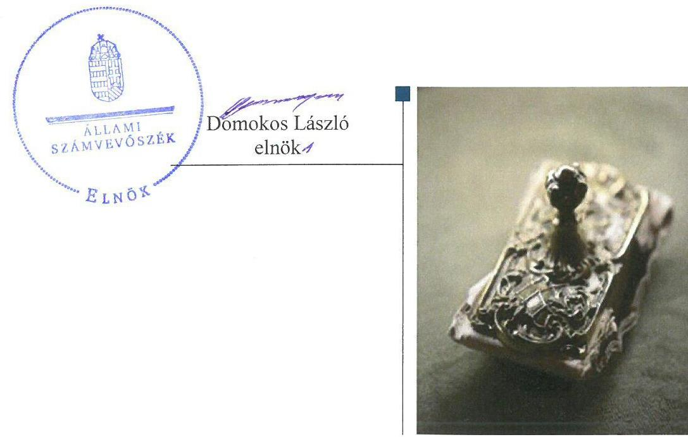
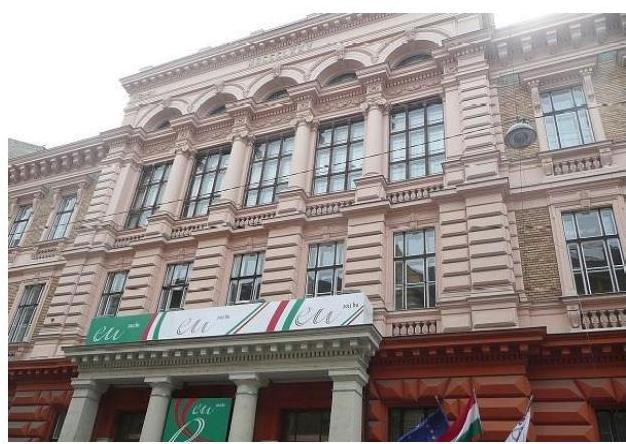
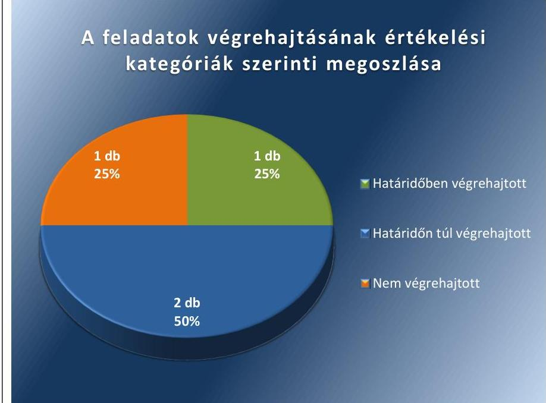
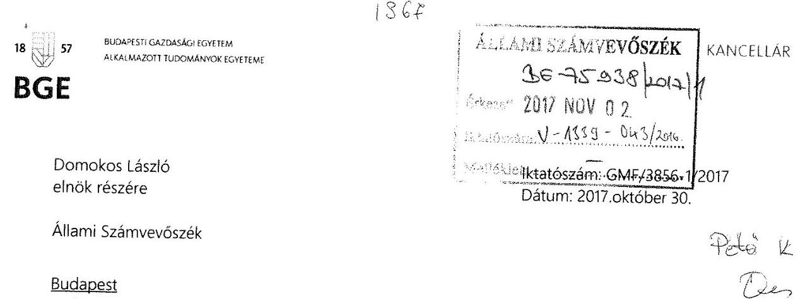
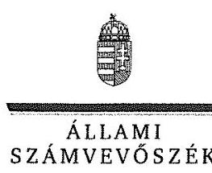
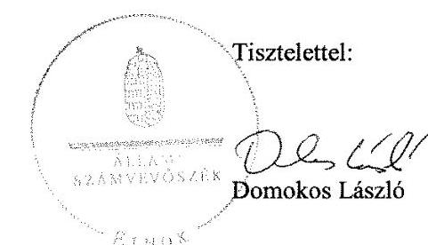
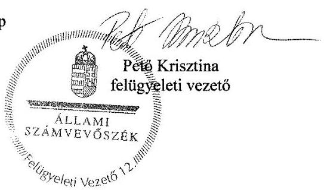

# Jelentés 

## Utóellenőrzések

Az állami felsőoktatási intézmények gazdálkodásának, működésének ellenőrzéséről készült jelentések utóellenőrzése - Budapesti Gazdasági Egyetem
2017.

---

# Jelentés 

## Utóellenőrzések

Az állami felsőoktatási intézmények gazdálkodásának, működésének ellenőrzéséről készült jelentések utóellenőrzése - Budapesti Gazdasági Egyetem
2017. 12. hó 05. nap

---

# AZ ELLENŐRZÉST FELÜGYELTE: 

PETŐ KRISZTINA felügyeleti vezető

## AZ ELLENŐRZÉST VEZETTE ÉS A VÉGREHAJTÁSÁÉRT FELELŐS:

HEFFNER ZOLTÁN, MOLNÁR ZSUZSANNA ellenőrzésvezetők

## A PROGRAM ÖSSZEÁLLÍTÁSÁÉRT FELELŐS:

JANIK JÓZSEF LÁSZLÓ osztályvezető

## A TÉMÁHOZ KAPCSOLÓDÓ KORÁBBI SZÁMVEVŐSZÉKI JELENTÉS:

- címe: Jelentés a Budapesti Gazdasági Főiskola ellenőrzéséről - Az állami felsőoktatási intézmények gazdálkodásának, működésének ellenőrzése
- sorszáma: 15029

IKTATÓSZÁM: V-1339-046/2016.
TÉMASZÁM: 2373
ELLENŐRZÉS-AZONOSÍTÓ SZÁM: V075549

---

# TARTALOMJEGYZÉK 

■ ÖSSZEGZÉS ..... 5
■ AZ ELLENŐRZÉS CÉLJA ..... 6
■ AZ ELLENŐRZÉS TERÜLETE ..... 7
■ AZ ELLENŐRZÉS HÁTTERE, INDOKOLTSÁGA ..... 8
■ A JELENTÉS LÉNYEGES KÉRDÉSKÖRE ..... 9
■ ELLENŐRZÉS HATÓKÖRE ÉS MÓDSZEREI ..... 10
■ MEGÁLLAPÍTÁSOK ..... 12
■ MELLÉKLETEK ..... 15
I. Sz. melléklet: Az ÁSZ 15029. számú jelentéséhez kapcsolódó intézkedési terv végrehajtása ..... 15
■ FÜGGELÉK: ÉSZREVÉTELEK ..... 17
■ RÖVIDÍTÉSEK JEGYZÉKE ..... 23

---

.

---

# ÖSSZEGZÉS 

Az Állami Számvevőszék a Budapesti Gazdasági Egyetem utóellenőrzése során megállapította, hogy a korábbi számvevőszéki jelentés megállapításai alapján készített intézkedési tervben meghatározott feladatok jelentős részét végrehajtották, ezzel támogatva az elszámoltatható közpénzfelhasználást.

## Az ellenőrzés társadalmi indokoltsága

Az Állami Számvevőszék stratégiájában célul tűzte ki a számvevőszéki munka hasznosulásának javítását. Ezzel összhangban ellenőrzi, hogy az ellenőrzött szervezetek megvalósították-e a korábbi ellenőrzései által feltárt hibák, hiányosságok és szabálytalanságok megszüntetése céljából kialakított intézkedési terveikben foglaltakat. A rendszeres utóellenőrzések hozzájárulnak a szükséges intézkedések tényleges végrehajtásához, ezáltal a közpénzügyek rendezettségének javulásához.

## Főbb megállapítások, következtetések

Az intézkedési tervben meghatározott négy feladatból egy határidőben, kettő határidőn túl került végrehajtásra, egy feladat pedig nem került végrehajtásra. Az Egyetem irányítási rendszere a végrehajtott intézkedésekkel támogatta a szabályszerű és elszámoltatható közpénzfelhasználást. Fennálló hiányosság, hogy az Egyetem nem biztosította a jogszabályban meghatározott - a versenyeztetés mellőzésére vonatkozó - feltételek fennállásának vizsgálatát a szerződéskötést megelőző folyamatba épített ellenőrzéssel.

---

# AZ ELLENŐRZÉS CÉLJA 

Az ellenőrzés célja annak értékelése volt, hogy a számvevőszéki jelentésben ${ }^{1}$ foglalt javaslatokat megalapozó megállapításokkal összhangban készített intézkedési tervben meghatározott feladatokat az ellenőrzött szervezet végrehajtotta-e.

---

# AZ ELLENŐRZÉS TERÜLETE

## Budapesti Gazdasági Egyetem, mint a Budapesti Gazdasági Főiskola jogutódja

Az Egyetem² jogelődje a Budapesti Gazdasági Főiskola három felsőoktatási intézmény, a Kereskedelmi, Vendéglátóipari és Idegenforgalmi Főiskola, a Külkereskedelmi Főiskola és a Pénzügyi és Számviteli Főiskola integrációjával 2000. január 1-jével jött létre. Az intézmény 2016. január 1-jével egyetemi rangot kapott és elnevezése Budapesti Gazdasági Egyetemre változott. Az Egyetem öt képzési területen (gazdaságtudományok, társadalomtudomány, informatika, bölcsészettudomány, tanárképzés) összesen tizenkét alapképzési, hat mesterképzési és nyolc felsőoktatási szakképzési szakon kínál képzéseket. Hallgatói létszáma a 2015/2016-os tanévben 15032 fő volt.

Az Egyetem jelenlegi rektora³ 2016. július 1-jétől, a kancellár⁴ 2014. november 15. óta tölti be tisztségét.

A Budapesti Gazdasági Egyetem 2015. évi éves beszámolója szerint 5627,4 millió Ft költségvetési bevételt, 8 822,9 millió Ft finanszírozási bevételt ért el és 8510,4 millió Ft költségvetési kiadást teljesített. A 2015. december 31.-i fordulónapi beszámoló mérleg-főösszege 15825 millió Ft, ezen belül befektetett eszközvagyona 9716,6 millió Ft, követelés állománya 140,2 millió Ft, kötelezettségállománya 190,3 millió Ft volt.

Az ÁSZ⁵ 2014–2015. évben ellenőrizte a Budapesti Gazdasági Főiskola gazdálkodásának és működésének szabályszerűségét a 2009. január 1. és 2013. december 31. közötti időszak vonatkozásában. Az erről szóló 15029. számú jelentését az ÁSZ 2015. március 5-én tette közzé. Az ellenőrzés célja annak megállapítása volt, hogy szabályos volt-e a Főiskola⁶ pénzügyi és vagyongazdálkodása, biztosított volt-e a vagyonnal való felelős gazdálkodás követelményének érvényesülése, a jogszabályi előírásoknak megfelelően működött-e a belső kontrollrendszer, az irányító szerv tevékenysége a jogszabályi előírásoknak megfelelt-e.

---

# AZ ELLENŐRZÉS HÁTTERE, INDOKOLTSÁGA 

Az ÁSZ tv. ${ }^{7}$ 33. § (1) bekezdése értelmében a számvevőszéki jelentések javaslatokat megalapozó megállapításaihoz kapcsolódóan az ellenőrzött szervezet vezetője intézkedési tervet köteles összeállítani, és az Állami Számvevőszék részére megküldeni. Az intézkedési tervben foglaltak megvalósítását - az ÁSZ tv. 33. § (7) bekezdésében foglaltak alapján - az Állami Számvevőszék utóellenőrzés keretében ellenőrizheti. Az intézkedések megvalósulásának értékelése során az Állami Számvevőszék figyelembe veszi az ellenőrzött szervezetek működési feltételeiben, valamint a jogszabályi előírásokban bekövetkezett változásokat.

Az intézkedési tervekben foglalt feladatok hiányos, illetve késedelmes végrehajtása, valamint megvalósításának elmaradása azt mutatja, hogy az ellenőrzések során feltárt hibák, hiányosságok és szabálytalanságok megszüntetése nem kapott kellő hangsúlyt. Ez a szabályszerű működés és a felelős vezetői magatartás vonatkozásában kockázatot hordoz. E kockázatok feltárásával az Állami Számvevőszék utóellenőrzési rendszere fokozza a fegyelmet, és igazolja, hogy a közpénzzel való szabályos gazdálkodás felelőssége elől nem lehet kitérni.

Az utóellenőrzés négy szinten hasznosulhat:
A társadalom szintjén az utóellenőrzés jelzi, hogy a számvevőszéki ellenőrzés megállapításainak van következménye: a hiányosságok megszüntetésére az ellenőrzött szervezet által meghatározott intézkedések végrehajtását is számon kéri az ÁSZ.

- Az ellenőrzött terület szintjén az utóellenőrzés tájékoztatást nyújt a terület döntéshozóinak a hiányosságok kiküszöbölésének jó gyakorlatairól, ezzel lehetőséget biztosítva arra, hogy az ÁSZ ellenőrzési megállapításai, javaslatai a terület nem ellenőrzött szervezeteinek a működése során is hasznosuljanak.
- Az ellenőrzött szervezet szintjén az utóellenőrzés feltárja, hogy a szervezet az intézkedések végrehajtásával hasznosította-e a korábbi ellenőrzési jelentésben a hiányosságok megszüntetése, illetve a kockázatok kezelése érdekében megfogalmazott javaslatokat.
- Az ÁSZ szintjén az utóellenőrzés visszacsatolást ad az ellenőrzési jelentések hasznosulásáról, az intézkedések elmaradása vagy részleges megvalósulása a további ellenőrzésekhez kockázati jelzésként szolgál. Az ÁSZ szintjén az utóellenőrzés visszacsatolást ad az ellenőrzési jelentések hasznosulásáról, az intézkedések elmaradása vagy részleges megvalósulása a további ellenőrzésekhez kockázati jelzésként szolgál.

---

# A JELENTÉS LÉNYEGES KÉRDÉSKÖRE 

Az Egyetem az intézkedési tervben foglaltakat az előírt határidőben végrehajtotta-e?

---

# ELLENŐRZÉS HATÓKÖRE ÉS MÓDSZEREI 

## Az ellenőrzés típusa

Megfelelőségi ellenőrzés.

## Az ellenőrzött időszak

Az utóellenőrzés alapját képező ÁSZ jelentés közzétételének (2015. március 05.) napjától az ellenőrzésről szóló kiértesítő levél keltének (2017. február 10.) napjáig tartó időszak.

## Az ellenőrzés tárgya

Az ÁSZ tv. 2011. július 1-jei hatálybalépését követően a számvevőszéki jelentésben foglalt intézkedést igénylő megállapításokkal és javaslatokkal összhangban - az ellenőrzött szervezet által - készített intézkedési tervben foglaltak végrehajtásának ellenőrzése.

Az ellenőrzés kiterjedt minden olyan körülményre és adatra, amely az ÁSZ jogszabályban meghatározott feladatainak teljesítéséhez, valamint a program végrehajtása folyamán felmerült újabb összefüggések feltárásához szükséges.

## Az ellenőrzött szervezet

Budapesti Gazdasági Egyetem

## Az ellenőrzés jogalapja

Az ÁSZ tv. 1. § (3) bekezdése szerint az ÁSZ általános hatáskörrel végzi a közpénzekkel és az állami és Egyetemi vagyonnal való felelős gazdálkodás ellenőrzését.

Az ÁSZ tv. 33. § (7) bekezdése alapján a 33. § (1)-(2) bekezdése szerinti intézkedési tervben foglaltak megvalósítását az ÁSZ utóellenőrzés keretében ellenőrizheti.

---

# Az ellenőrzés módszerei 

Az ÁSZ az ellenőrzést a nemzetközi standardokat irányadónak tekintve az ellenőrzési program ellenőrzési kérdései, az ellenőrzött időszakban hatályos jogszabályok, az ellenőrzés szakmai szabályok és módszertanok figyelembevételével, önállóan vagy ellenőrzéshez kapcsolódóan végezte.

Az ÁSZ az ellenőrzés ideje alatt az ellenőrzött szervezettel történő kapcsolattartást az ÁSZ SZMSZ ${ }^{\circledR}$-ének vonatkozó előírásai alapján biztosította.

Az utóellenőrzés megállapításait elsősorban az ÁSZ rendelkezésére álló, valamint az ellenőrzött szervezetektől elektronikusan bekért dokumentumok alapozták meg.

Az ellenőrzési bizonyítékként felhasználható adatforrások közé tartoznak egyrészt a szakmai programban felsorolt adatforrások, másrészt minden - az ellenőrzés folyamán feltárt, az ellenőrzés szempontjából információt tartalmazó - dokumentum.

A vagyongazdálkodás szabályszerűségét az ellenőrzött szervezet által vezetett, bérbe adott helyiségek nyilvántartásából mintavétellel, 10 kiválasztott tétel alapján értékelte az ÁSZ. A kiválasztott tételek esetében azt ellenőrizte, hogy az Egyetem az intézkedési tervben meghatározott feladatok végrehajtása során biztosította-e a jogszabályok és a belső szabályzatok előírásainak megfelelő működtetését.

Az intézkedési tervben előírt feladatokat azok végrehajthatósága, illetve végrehajtása szempontjából az alábbiak szerint értékelte az ÁSZ:
$\longrightarrow$ „határidőben végrehajtott" a feladat, ha a teljesítés dokumentáltan, az intézkedési tervben előírt határidőben és tartalommal megtörtént;
$\longrightarrow$ „határidőn túl végrehajtott" a feladat, ha annak teljesítése az intézkedési tervben meghatározott módon, de az előírt határidőn túl történt meg;
$\longrightarrow$ „részben végrehajtott" a feladat, ha végrehajtása teljes körűen az intézkedési tervben előírt módon nem történt meg;
$\longrightarrow$ „nem végrehajtott" a feladat, ha a végrehajtás nem történt meg, vagy amennyiben a teljesítést nem dokumentálták;
$\longrightarrow$ „okafogyottá vált" a feladat, ha végrehajtására - meghatározott esemény bekövetkezése, továbbá külső körülmény, a működést érintő feltétel változása miatt - már nincs szükség, illetve lehetőség, és egyértelműen megállapítható, hogy az intézkedést szükségessé tevő körülmény a jövőben nem fordulhat elő;
$\longrightarrow$ „nem időszerű" az a feladat, amelynek ellenőrzési időszakon belüli végrehajtására azért nem került (kerülhetett) sor, mert az intézkedés alapjául szolgáló esemény nem következett be, de annak jövőbeni előfordulása lehetséges, a végrehajtása nem volt esedékes, vagy a végrehajtás határideje még nem járt le.
Az ellenőrzés lefolytatásához az ellenőrzött szervezet a tanúsítványok elektronikus kitöltésével, valamint az ÁSZ által kért dokumentumok elektronikus megküldésével szolgáltat adatokat, amelyek valódiságát és teljes körűségét az ellenőrzött szervezet vezetője által tett teljességi és hitelességi nyilatkozat igazolta. Az így rendelkezésre bocsátott adatok, információk kontrollja az ellenőrzés keretében történt meg.

---

# MEGÁLLAPÍTÁSOK 

## Az Egyetem az intézkedési tervben foglaltakat az előírt határidőben végrehajtotta-e?

Összegző megállapítás

Az Egyetem az intézkedési tervében vállalt négy feladat közül egy feladatot határidőben, kettőt határidőn túl, egy feladatot nem hajtott végre. A feladatok végrehajtásáról a jogszabályban meghatározott nyilvántartást vezette.

A számvevőszéki jelentésben megfogalmazott javaslatot megalapozó megállapítások alapján négy feladatot határozott meg a rektor a végrehajtásért felelősök megjelölésével. A feladatok elvégzésének felelőseként két feladat esetében a gazdasági és műszaki igazgató, egy feladat esetében a kancellár és rektor, egy feladat felelőseként pedig az ellenőrzési szervezet vezetője került megjelölésre.

Az ÁSZ javaslatot megalapozó megállapítások alapján készített intézkedési tervben rögzített feladatok végrehajtásáról az Egyetem a Bkr. ${ }^{9}$ által előírt nyilvántartást vezette.

Az intézkedési tervben meghatározott feladatokat, határidőket, a feladatok végrehajtásáért felelős személyeket és a feladatok végrehajtását az I. számú melléklet mutatja be.

Az Egyetem intézkedési tervében meghatározott feladatok végrehajtásának értékelési kategóriák szerinti megoszlását az 1. ábra szemlélteti.

1. ábra

Forrás: ÁSZ

---

# HATÁRIDŐBEN VÉGREHAJTOTT feladat: 

1. (1.b) A rektor és a kancellár a kockázatok dokumentált felmérését, elemzését és kiértékelését követően aktualizálta a kockázatkezelési szabályzatot ${ }^{10}$, amit a Szenátus ${ }^{11}$ az intézkedési tervben meghatározott határidőn belül elfogadott.

## HATÁRIDŐN TÚL VÉGREHAJTOTT feladatok:

2. (1.a) Az Egyetem a pénzügyi és vagyongazdálkodás terén, illetve a pénzügyi dokumentumok elkészítésénél a folyamatba épített és vezetői ellenőrzés folyamatos működését az intézkedési tervben vállalt - 2015. május 1-jei - határidőn túl valósította meg, mert a kontrolltevékenységek megfelelő működtetését biztosító belső szabályzatait és ügyrendjét 2015. június, november, és december hónapokban aktualizálta.
3. (1.c) Az ellenőrzési szervezet vezetője ${ }^{12}$ az intézkedési tervben vállalt 2015. május 1-jei határidőt követően - 2015. július 9-én - hívta fel a

 szervezeti egység vezetők figyelmét a jogszabályban előírt intézkedési terv készítési kötelezettségre és véleményeztetésre. Az Egyetem a Bkr. 47. § (1) bekezdésben foglaltaknak megfelelően, naprakész nyilvántartást vezet az ellenőrzési jelentésekben tett megállapításokra, javaslatokra, valamint a vonatkozó intézkedési tervekre és azok végrehajtására vonatkozóan.

## NEM VÉGREHAJTOTT feladat:

4. (2.) Az Egyetem nem gondoskodott arról, hogy az Vtv ${ }^{13}$-ben foglaltak minden esetben betartásra kerüljenek, mert a bérleti szerződésekből vett tíz mintatételből hat - az ellenőrzési időszakban kötött - szerződés esetében mellőzte az Egyetem a versenyeztetést annak ellenére, hogy a szerződések tartama meghaladta a 90 napot. Ezzel megsértették a Vtv. 24.§ (1) bekezdését. A szerződéskötést megelőző, a versenyeztetés mellőzésére vonatkozó törvényi feltételek fennállásának - az intézkedési tervben vállalt - vizsgálatát az Egyetem nem biztosította folyamatba épített ellenőrzéssel.

---

.

---

# MELLÉKLETEK

- I. SZ. MELLÉKLET: AZ ÁSZ 15029. SZÁMÚ JELENTÉSÉHEZ KAPCSOLÓDÓ INTÉZKEDÉSI TERV VÉGREHAJTÁSA

|  Sorszám | Intézkedési terv alapján meghatározott feladat | Az intézkedési tervben meghatározott határidő | Az intézkedési tervben meghatározott felelős | A feladat végrehajtása  |
| --- | --- | --- | --- | --- |
|   | 1. | 2. | 3. | 4.  |
|  Határidőben végrehajtott feladat |  |  |  |   |
|  1. | 1.b) A 2014. április 25-től hatályos kockázatkezelési szabályzat aktualizálása, a BGF-et érintő kockázatok dokumentált elemzése, értékelése. | 2015. december 31. | rektor, kancellár | A kancellár és rektor - 2015. október 9-én - elektronikus levélben kérte be a szervezeti egységek vezetőitől az általuk feltárt kockázatokkal kapcsolatos információkat. A bekért adatok összegyűjtésével létrehozták a Főiskolát érintő kockázatok nyilvántartását. A nyilvántartásban elemzésre és értékelésre került minden kockázat bekövetkezésének valószínűsége, illetve az ebből fakadó esetlegesen felmerülő kár mértéke. Az Egyetem 2014. április 25-től hatályos kockázatkezelési szabályzatát felülvizsgálta és az Nftv. - kancellári rendszer bevezetéséhez kötődő - változása miatt szükséges módosításokkal aktualizálta. A módosított szabályzatot a Szenátus a 2015/2016. tanévi (XII. 11.) 27. számú határozatával hagyta jóvá és 2015. december 12. napján lépett hatályba.  |
|  Határidőn túl végrehajtott feladatok |  |  |  |   |
|  2. | 1.a) A kontrolltevékenység részeként a folyamatba épített és vezetői ellenőrzés folyamatos működésének biztosítása a pénzügyi és vagyongazdálkodás terén is, különösen a pénzügyi döntések dokumentumainak elkészítésénél (370./2011. (XII.31) Korm. rendelet 8.§). | 2015. május 1. majd folyamatos | gazdasági és műszaki igazgató | A folyamatba épített és vezetői ellenőrzés folyamatos működésének biztosítása a pénzügyi és vagyongazdálkodás terén, illetve a pénzügyi dokumentumok elkészítésénél az intézkedési tervben vállalt - 2015. május 1-jei - határidőt követően valósult meg. A gazdasági igazgató - 2015. április 29-én kelt levelében - felszólította a szervezeti egységek vezetőit, hogy az általuk végzett, végzendő folyamatba épített vezetői ellenőrzés során fordítsanak kiemelt figyelmet a pénzügyi, számviteli, vagyongazdálkodási és beszerzési-, közbeszerzési folyamatok ellenőrzésére, azonban az ezt biztosító szükséges szabályzatmódosításokra határidőn túl került sor. A folyamatba épített és vezetői ellenőrzés folyamatos működését biztosító szerződéskötés rendjéről szóló szabályzatot ${ }^{14}$ és a vagyongazdálkodási szabályzatot 2015. június 27-től, a kötelezettségvállalás, ellenjegyzés, teljesítés  |

---

|  1. c) A szervezeti egység vezetők figyelmének felhívása a 370/2011. (XII.31) Korm. rendelet intézkedési terv készítési kötelezettségre és véleményeztetésre (370/2011. (XII.31) Korm. rendelet 45. § (3)-(4) bekezdés). Az ellenőrzési jelentésekben tett megállapítások, javaslatok, a vonatkozó intézkedési tervek és azok végrehajtásának nyomon követésére szolgáló nyilvántartás naprakész vezetése (370/2011. (XII.31) Korm. rendelet 47. § (1) bekezdés). | 2015. május 1. majd folyamatos | a Főiskola ellenőrzési szervezetének a vezetője | a feladat végrehajtása  |
| --- | --- | --- | --- |
|  4. |  |  |   |

|  2. Gondoskodjon róla, hogy az állami vagyonról szóló 2007. évi CVI. törvény, (Vtv.) valamint a BGF 2011. április 29-én jóváhagyott Vagyongazdálkodási Szabályzatában foglaltak minden esetben betartásra kerüljenek. A hivatkozott törvény 24. § (2) bekezdésében meghatározott – versenyeztetés mellőzésére vonatkozó – feltételek fennállásának vizsgálatát a szerződéskötést megelőző folyamatba épített ellenőrzéssel biztosítsa. | azonnal, majd folyamatos | gazdasági és műszaki igazgató | Az Egyetem nem gondoskodott arról, hogy a Vtv.-ben foglaltak minden esetben betartásra kerüljenek. A bérleti szerződésekből vett tíz mintatételből hat – az ellenőrzési időszakban kötött – szerződés esetében az Egyetem mellőzte a versenyeztetést annak ellenére, hogy a szerződések tartama meghaladta a 90 napot és ezzel megsértették a Vtv. 24. § (1) bekezdését. Az Egyetem nem biztosította a Vtv. 24. § (2) bekezdésében meghatározott – a versenyeztetés mellőzésére vonatkozó – feltételek fennállásának vizsgálatát a szerződéskötést megelőző folyamatba épített ellenőrzéssel.  |

*Forrás: ÁSZ által készített táblázat*

---

# FÜGGELÉK: ÉSZREVÉTELEK 

A jelentéstervezetet a Számvevőszék 15 napos észrevételezésre megküldte az ellenőrzött szervezetek vezetőinek az ÁSZ tv. 29. § (1) bekezdése előírásának megfelelően.
A Budapesti Gazdasági Egyetem kancellárja az ellenőrzés megállapításaira írásban észrevételt tett.

A Budapesti Gazdasági Egyetem rektora észrevételt nem tett.
A függelék tartalmazza a Budapesti Gazdasági Egyetem kancellárja észrevételeit, illetve az el nem fogadott észrevételek elutasításának indoklását.

[^0]
[^0]:    * 29. § (1) Az Állami Számvevőszék az ellenőrzési megállapításait megküldi az ellenőrzött szervezet vezetőjének vagy az általa megbízott személynek, és annak, akinek személyes felelősségét állapította meg.
    (2) Az ellenőrzött szervezet vezetője és a felelősként megjelölt személy az ellenőrzés megállapításaira tizenöt napon belül írásban észrevételt tehet.
    (3) Az Állami Számvevőszék az észrevételre a beérkezésétől számított harminc napon belül írásban válaszol. A figyelembe nem vett észrevételeket köteles a jelentésben feltüntetni, és megindokolni, hogy azokat miért nem fogadta el.

---

Tárgy: észrevételek a V-1339-038/2016. iktatószámon megküldött Számvevőszéki jelentéstervezet kapcsán

Tisztelt Elnök Úr!
A 2017. október 13. napján kelt, V-1339-038/2016. iktatószámú levelének mellékleteként megküldött, „Az állami felsőoktatási intézmények gazdálkodásának, működésének ellenőrzéséről készült jelentések utóellenőrzése - Budapesti Gazdasági Egyetem" témában készült Számvevőszéki jelentéstervezetet köszönettel megkaptam. Intézményünk a nevezett jelentéstervezet kapcsán az alábbi észrevételeket teszi.

A megküldött dokumentumban rögzítésre került, hogy az Egyetem az ellenőrzéssel érintett intézkedési tervben foglalt feladatot nem hajtotta végre, nem biztosította a jogszabályban meghatározott - a versenyeztetés mellőzésére vonatkozó - feltételek fennállásának vizsgálatát a szerződéskötést megelőző folyamatba épített ellenőrzéssel, mely megállapítást a bérleti szerződésekből vett tíz mintából hat szerződést érintően tették.

Intézményünk számára kiemelten fontos a jogszabályi előírásoknak megfelelő, szabályszerű működés. Fenti megállapításuk kapcsán kérem Tisztelt Elnök Urat, hogy tájékoztatni szíveskedjen azon hat szerződésről, melynek kapcsán szabálytalanságot kívánnak megállapítani.

Az Egyetem az Állami Számvevőszék által lefolytatott ellenőrzések során bekért bérleti szerződések esetében jóhiszeműen eljárva, minden esetben vizsgálta a versenyeztetés mellőzésére vonatkozó feltételek fennállását, melyekről - az Önök számára is megküldött - külön feljegyzéseket készített, azokban vonatkozó számításokat végzett, illetve feltételeket vizsgált az érintett jogszabályokat rögzítve. A hivatkozott feljegyzésekben részletesen alátámasztásra kerültek azon indokok, melyek alapján Intézményünk a jogszabályi előírásoknak megfelelően mellőzni kívánta a versenyeztetést.

Az Önök részére megküldött dokumentumok tanúsága szerint Intézményünk a jogszabályban meghatározott - a versenyeztetés mellőzésére vonatkozó - feltételek fennállásának vizsgálatát a szerződéskötést megelőző folyamatba épített ellenőrzéssel elvégezte, annak dokumentumai 1055 Budapest, Markó utca 29-31.
+36 13013428
www.uni-bge.hu

---

rendelkezésre állnak, így meglátásunk szerint az érintett vizsgálati kötelezettségének az Egyetem eleget tett.

Az utóellenőrzéssel érintett intézkedési tervben előírtak alapján Intézményünk kötelezettsége a szerződéskötést megelőző folyamatba épített ellenőrzés biztosítása, mely a bemutatott módon megtörtént minden szerződés esetében.

Abban az esetben, amennyiben az érintett hat szerződés vonatkozásában Intézményünk tévesen állapította meg a versenyeztetés mellőzésére vonatkozó feltételek fennálltát és tévesen került értelmezésre a vonatkozó jogszabályhely, úgy a jövőben igyekszünk az esetlegesen felmerülő hasonló szerződések esetében megfelelő módon intézkedni, valamint a Magyar Nemzeti Vagyonkezelő Zrt. ezen eljárásra vonatkozó tájékoztatását megkérni annak érdekében, hogy jogszerű működésünket biztosíthassuk.

Kérem, a Számvevőszéki jelentéstervezetet a fentiek szerint módosítani szíveskedjenek a tekintetben, hogy Intézményünk az utóellenőrzéssel érintett intézkedési tervben foglalt vizsgálati kötelezettségének a szerződéskötést megelőző folyamat során eleget tett.

Üdvözlettel:

1055 Budapest, Markó utca 29-31.
+3613013428
www.uni-bge.hu

---

ELNÖK

# Dr. Dietz Ferenc úr 

kancellár
Budapesti Gazdasági Egyetem

## Budapest

## Tisztelt Kancellár Úr!

Az „Utóellenőrzések - az állami felsőoktatási intézmények gazdálkodásának, müködésének ellenőrzéséről készült jelentések utóellenőrzése - Budapesti Gazdasági Egyetem" címmel készített számvevőszéki jelentéstervezetre tett észrevételét köszönettel megkaptam.
Az Állami Számvevőszék észrevételre vonatkozó álláspontjáról a felügyeleti vezető által készített részletes tájékoztatást csatoltan megküldöm.
Tájékoztatom Kancellár urat, hogy a számvevőszéki jelentésben - az Állami Számvevőszékről szóló 2011. évi LXVI. törvény 29. § (3) bekezdése alapján - a figyelembe nem vett észrevételeket szerepeltetjük az elutasítás indokának feltüntetésével.

Budapest, 2017. kucnolor hó 14. nap

Melléklet: Tájékoztatás az el nem fogadott észrevételekről

---

# Tájékoztatás az el nem fogadott észrevételekről 

Az „Utóellenőrzések - az állami felsőoktatási intézmények gazdálkodásának, működésének ellenőrzéséről készült jelentések utóellenőrzése - Budapesti Gazdasági Egyetem" című jelentéstervezetre az GMF-3856-1/2017. iktatószámú levélben tett észrevételeit áttekintettem.

Észrevételeinek kezeléséről az alábbi tájékoztatást adom.
Kancellár úr az észrevételében kérte, hogy jelöljük meg azt a hat szerződést, amely esetében a Budapesti Gazdasági Egyetem (továbbiakban: Egyetem) nem biztosította folyamatba épített ellenőrzéssel a jogszabályi feltételek fennállásának vizsgálatát. Az észrevétel további részében Kancellár úr jelezte, hogy az Egyetem minden esetben vizsgálta a versenyeztetés mellőzésére vonatkozó feltételek fennállását, amelyekről külön feljegyzéseket készített, azokban vonatkozó számításokat végzett, illetve feltételeket vizsgált az érintett jogszabályokat rögzítve. A hivatkozott feljegyzésekben részletesen alátámasztásra kerültek azon indokok, amelyek alapján az Egyetem a jogszabályi előírásoknak megfelelően mellőzni kívánta a versenyeztetést. Az észrevétel szerint az Egyetem a jogszabályban meghatározott - a versenyeztetés mellőzésére vonatkozó - feltételek fennállásának vizsgálatát a szerződéskötést megelőző folyamatba épített ellenőrzéssel elvégezte, az érintett vizsgálati kötelezettségének eleget tett.

Tájékoztatom Kancellár urat, hogy az intézkedést az Állami Számvevőszék (továbbiakban: ÁSZ) részére megküldött tíz darab bérleti szerződés alapján értékelte. Az Egyetem által az ÁSZ részére megküldött dokumentumokat ismételten felülvizsgáltuk és megállapítottuk, hogy az ellenőrzéssel érintett bérleti szerződések közül hat esetben az állami vagyonról szóló 2007. évi CVI. törvény (továbbiakban: Vtv.) 24. § (2) bekezdés d) pontja szerinti feltétel azért nem áll fenn, mert a szerződések tartama meghaladta a 90 napot. A hivatkozott dokumentumokban a számítások arra vonatkoztak, hogy a szerződés - egyébként 90 napot meghaladó tartamán belül - pontosan mennyi a bérleti jogviszony tényleges gyakorlásával töltött órák száma. Figyelemmel arra, hogy a Vtv. 24. § (2) bekezdés d) pontja a kötendő szerződés tartamára, és nem a bérleti jog tényleges gyakorlásának időtartamára vonatkozó feltételt tartalmaz.

Az ÁSZ részére megküldött intézkedési tervben azt vállalták, hogy az Egyetem gondoskodik arról, hogy a Vtv., valamint a Vagyongazdálkodási Szabályzatban foglaltak minden esetben betartásra kerüljenek. Továbbá a Vtv.
 24. § (2) bekezdésében meghatározott - versenyeztetés mellőzésére vonatkozó - feltételek fennállásának vizsgálatát a szerződéskötést megelőző folyamatba épített ellenőrzéssel biztosítani fogják. A fent leírtak és az ÁSZ részére megküldött dokumentumok alapján tett megállapítás megalapozott, mert az Egyetem nem gondoskodott arról, hogy a Vtv.-ben foglaltak minden esetben betartásra kerüljenek. Továbbá a bérleti szerződésekből vett tíz mintatételből hat - az ellenőrzési időszakban kötött - szerződés esetében az Egyetem mellőzte

---

a versenyeztetést annak ellenére, hogy a szerződések tartama meghaladta a 90 napot. Mindezek alapján észrevételeit nem fogadjuk el, a jelentéstervezet módosítása nem indokolt.

Budapest, 2017. október 1. nap

---

# RÖVIDÍTÉSEK JEGYZÉKE 

${ }^{1}$ számvevőszéki jelentés
${ }^{2}$ Egyetem
${ }^{3}$ rektor
${ }^{4}$ kancellár
${ }^{5}$ ÁSZ
${ }^{6}$ Főiskola
${ }^{7}$ ÁSZ tv.
${ }^{8}$ SZMSZ
${ }^{9}$ Bkr.
${ }^{10}$ kockázatkezelési szabályzat
${ }^{11}$ Szenátus
${ }^{12}$ ellenőrzési szervezet vezetője
${ }^{13} \mathrm{Vtv}$.
${ }^{14}$ szerződéskötési rendjéről szóló szabályzat
${ }^{15}$ kötelezettségvállalási szabályzat
${ }^{16}$ közbeszerzési és beszerzési szabályzat

Az ÁSZ 15029. számú jelentése a Budapesti Gazdasági Főiskola ellenőrzéséről - Az állami felsőoktatási intézmények gazdálkodásának, működésének ellenőrzése (elérhető a www.asz.hu honlapon)
Budapesti Gazdasági Egyetem 2016. január 1-jét megelőzően Budapesti Gazdasági Főiskola
Budapesti Gazdasági Egyetem rektora, 2016. január 1-jét megelőzően Budapesti Gazdasági Főiskola rektora
Budapesti Gazdasági Egyetem kancellárja, 2016. január 1-jét megelőzően Budapesti Gazdasági Főiskola kancellárja
Állami Számvevőszék
Budapesti Gazdasági Főiskola, 2016. január 1-jét követően Budapesti Gazdasági Egyetem
2011. évi LXVI. törvény az Állami Számvevőszékről (hatályos: 2011. július 1-jétől)

Az Állami Számvevőszék elnökének 3/2016. (XII. 29.) ÁSZ utasítása az Állami Számvevőszék Szervezeti és Működési Szabályzatáról (hatályos: 2017. január 1-jétől)
370/2011. (XII. 31.) Kormányrendelet a költségvetési szervek belső kontrollrendszeréről és belső ellenőrzéséről
A Budapesti Gazdasági Főiskola Kockázatkezelési Szabályzata elfogadva a 2015/2016. tanévi (XII. 11.) 27. számú BGF szenátusi határozatával (hatályos: 2015. december 12-től)

Budapesti Gazdasági Egyetem Szenátusa, 2016. január 1-jét megelőzően a Budapesti Gazdasági Főiskola Szenátusa
Budapesti Gazdasági Főiskola Ellenőrzési Irodájának vezetője
2007. évi CVI. törvény az állami vagyonról (hatályos: 2015. február 1-től)

A Budapesti Gazdasági Főiskola Szerződéskötési rendjéről szóló szabályzata elfogadva a 2014/2015. tanévi (VI. 26.) 176. számú BGF szenátusi határozatával (hatályos: 2015. június 27-től)
A Budapesti Gazdasági Főiskola Kötelezettségvállalás, ellenjegyzés (pénzügyi és jogi), teljesítés igazolás, érvényesítés és utalványozás szabályzata elfogadva a 2015/2016. tanévi (XI. 6.) 7. számú BGF szenátusi határozatával (hatályos: 2015. november 7-től)
A Budapesti Gazdasági Főiskola A közbeszerzési és beszerzési szabályzata elfogadva a 2015/2016. tanévi (XI. 6.) 6. számú BGF szenátusi határozatával (hatályos: 2015. november 7-től)

---

ÁLLAMI SZÁMVEVŐSZÉK
1052 Budapest, Apáczai Csere János utca 10.
Levélcím: 1364 Budapest 4. Pf. 54
Telefon: +36 14849100 Telefax: +36 14849200
www.asz.hu
