# Jelentés 

## Utóellenőrzések

Az állami felsőoktatási intézmények gazdálkodásának, működésének ellenőrzéséről készült jelentések utóellenőrzése - Kaposvári Egyetem 2017. 12. hó 14. nap
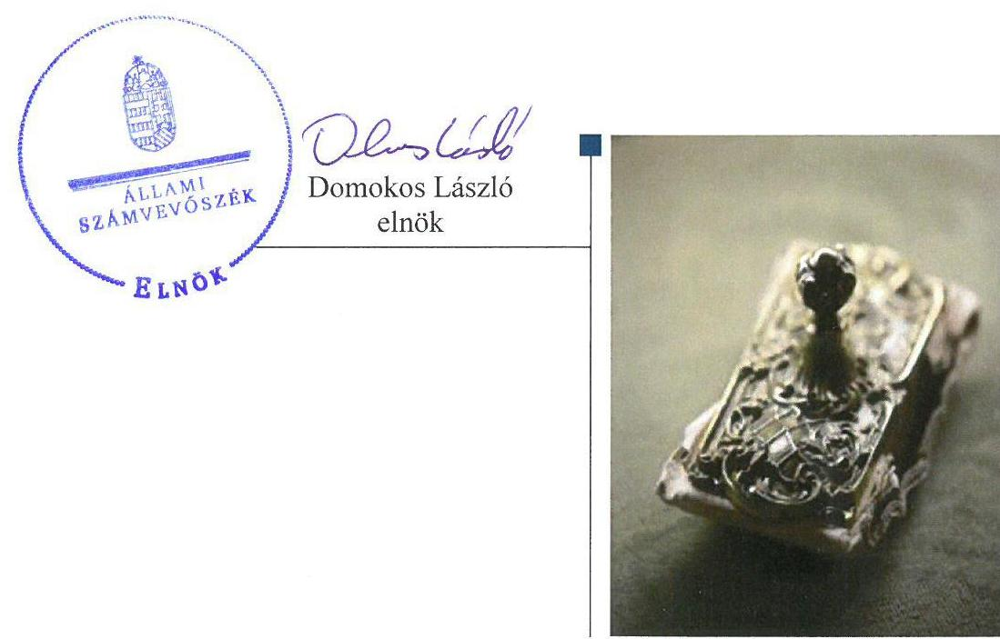

---

# AZ ELLENŐRZÉST FELÜGYELTE: 

PETŐ KRISZTINA felügyeleti vezető

## AZ ELLENŐRZÉST VEZETTE ÉS A VÉGREHAJTÁSÁÉRT FELELŐS:

CSORDÁS PÉTERNÉ ellenőrzésvezető

## A PROGRAM ÖSSZEÁLLÍTÁSÁÉRT FELELŐS:

JANIK JÓZSEF LÁSZLÓ osztályvezető

## A TÉMÁHOZ KAPCSOLÓDÓ KORÁBBI SZÁMVEVŐSZÉKI JELENTÉS:

- címe: Jelentés a Kaposvári Egyetem ellenőrzéséről - Az állami felsőoktatási intézmények gazdálkodásának, működésének ellenőrzése
- sorszáma: 15030

IKTATÓSZÁM: V-1347-037/2016.
TÉMASZÁM: 2096
ELLENŐRZÉS-AZONOSÍTÓ SZÁM: V075548

---

# TARTALOMJEGYZÉK 

■ ÖSSZEGZÉS ..... 5
■ AZ ELLENŐRZÉS CÉLJA ..... 6
■ AZ ELLENŐRZÉS TERÜLETE ..... 7
■ AZ ELLENŐRZÉS HÁTTERE, INDOKOLTSÁGA ..... 8
■ A JELENTÉS LÉNYEGES KÉRDÉSKÖRE ..... 9
■ AZ ELLENŐRZÉS HATÓKÖRE ÉS MÓDSZEREI ..... 10
■ MEGÁLLAPÍTÁSOK ..... 12
■ MELLÉKLETEK ..... 15
I. sz. melléklet: Az ÁSZ 15030. számú jelentéséhez kapcsolódóan az Egyetem intézkedési tervének végrehajtása. ..... 15
II. sz. melléklet: Az ÁSZ 15030. számú jelentéséhez kapcsolódóan az EMMI intézkedési tervének végrehajtása. ..... 17
■ FÜGGELÉK: ÉSZREVÉTELEK ..... 19
■ RÖVIDÍTÉSEK JEGYZÉKE ..... 25

---

.

---

# ÖSSZEGZÉS 

Az utóellenőrzés megállapította, hogy a Kaposvári Egyetem az intézkedési tervében szereplő feladatai döntő részét határidőben végrehajtotta, amely javította az Egyetem működésének szabályozottságát. Az Emberi Erőforrások Minisztériuma - mint a fenntartói jogkör gyakorlója - az intézkedési tervében vállalt feladatait végrehajtotta.

## Az ellenőrzés társadalmi indokoltsága

Az Állami Számvevőszék stratégiájában célul tűzte ki a számvevőszéki munka hasznosulásának javítását. Ezzel összhangban ellenőrzi, hogy az ellenőrzött szervezetek megvalósították-e a korábbi ellenőrzései által feltárt hibák, hiányosságok és szabálytalanságok megszüntetése céljából kialakított intézkedési terveikben foglaltakat. A rendszeres utóellenőrzések hozzájárulnak a szükséges intézkedések tényleges végrehajtásához, ezáltal a közpénzügyek rendezettségének javulásához.

## Főbb megállapítások, következtetések

A Kaposvári Egyetem intézkedési tervében meghatározott hat feladata közül négyet határidőben, egyet határidőn túl, egyet pedig részben hajtott végre. Az intézkedési tervben vállalt feladatok döntő többségének határidőben való végrehajtásával javították az Egyetem működésének szabályozottságát.

A kancellár utasítást adott ki a közbeszerzésre vonatkozó jogszabályi előírások betartására és betartatására, a térítési díjakkal és költségtérítésekkel kapcsolatos számlaadási kötelezettség betartására, a térítési díjak és költségtérítések önköltségszámításon alapuló megalapozására, a vagyongazdálkodási terv és a fejlesztések indításának a fenntartó egyeztetésével történő, Szenátus általi elfogadására vonatkozóan, továbbá - határidőn túl - intézkedtek a Kockázatkezelési Szabályzat aktualizálásáról. A jogszabályi és szervezeti változásoknak megfelelően elvégezték a gazdálkodás szempontjából meghatározó belső szabályzatok aktualizálását, azonban a jogszabályi előírások ellenére elmaradt a közbeszerzési törvény hatálya alá nem tartozó beszerzések lebonyolításával kapcsolatos eljárásrend aktualizálása, így ezen beszerzések lebonyolítását nem szabályozták.

Az Emberi Erőforrások Minisztériuma az intézkedési tervében meghatározott két feladatát határidőben végrehajtotta.

---

# AZ ELLENŐRZÉS CÉLJA 

Az ellenőrzés célja annak értékelése volt, hogy a számvevőszéki jelentésben ${ }^{1}$ foglalt javaslatokat megalapozó megállapításokkal összhangban készített intézkedési tervben meghatározott feladatokat az ellenőrzött szervezet végrehajtotta-e.

---

# AZ ELLENŐRZÉS TERÜLETE

## Kaposvári Egyetem

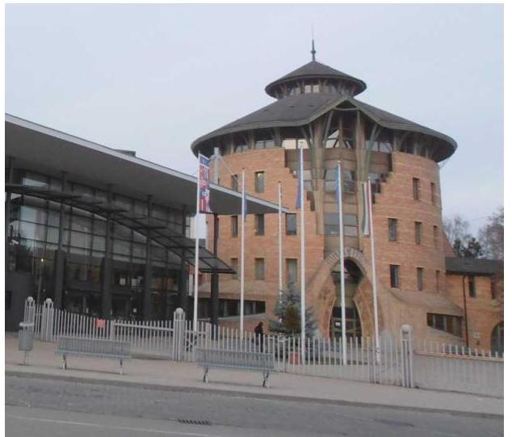

Az Egyetem² a magyarországi felsőoktatás szerkezetének átalakításakor az alapító jogelőd intézmények integrációjával jött létre 2000. január 1-jével. Az Egyetem 2000-ben végrehajtott intézményfejlesztési tervének eredményeként, államilag finanszírozott beruházásokkal megteremtették a nagyobb hallgatói létszám fogadásának, új szakok és karok működtetésének feltételeit. A Kormány 218/2004. (VII.9.) sz. rendelete³ létrehozta az Egyetemen a Gazdaságtudományi Kart és a Művészeti Főiskolai Kart. Az új karok létrejöttével – a meglévő Agrár- és Környezettudományi Karral és Pedagógiai Karral – az intézmény négykarú egyetemmé fejlődött, hallgatói létszáma 2016-ban 2823 fő volt.

Az Egyetem 2016. évi költségvetési beszámolója alapján a költségvetési bevételként 12 546 M Ft-ot, finanszírozási bevételként 2848 M Ft-ot, költségvetési kiadásként 11 041 M Ft-ot számoltak el.

Az utóellenőrzés időszakában az Egyetem rektorának és kancellárjának személye nem változott.

Az Egyetem, mint állami felsőoktatási intézmény fenntartói jogkörének gyakorlója az EMMI⁴ volt.

Az ÁSZ⁵ 2014-ben elvégezte a 2009 – 2013 évek közötti időszakra vonatkozóan az állami felsőoktatási intézmények gazdálkodásának, működésének ellenőrzését az Egyetemnél, az erről szóló 15030. számú számvevőszéki jelentését 2015. február 24-én tette közzé, amely az Egyetem rektorának⁶ három, az emberi erőforrások miniszterének⁷ kettő javaslatot fogalmazott meg.

A javaslatokat megalapozó megállapítások alapján készített intézkedési tervekben az Egyetem rektora a kancellár⁸ számára hat, az emberi erőforrások minisztere az EMMI Belső Ellenőrzési Főosztálya és a felsőoktatásért felelős államtitkára számára egy-egy feladatot határozott meg.

Az utóellenőrzés – a 2015. február 24-től 2017. június 21-ig végrehajtott intézkedéseket figyelembe véve – a számvevőszéki jelentésben megfogalmazott megállapításokra megküldött és az ÁSZ által elfogadott intézkedési tervekben foglalt feladatok végrehajtására irányult.

---

# AZ ELLENŐRZÉS HÁTTERE, INDOKOLTSÁGA 

Az ÁSZ tv. ${ }^{9}$ 33. § (1) bekezdése értelmében a számvevőszéki jelentések javaslatot megalapozó megállapításaihoz kapcsolódóan az ellenőrzött szervezet vezetője intézkedési tervet köteles összeállítani, és az ÁSZ részére megküldeni. Az intézkedési tervben foglaltak megvalósítását - az ÁSZ tv. 33. § (7) bekezdésében foglaltak alapján - az ÁSZ utóellenőrzés keretében ellenőrizheti. Az intézkedések megvalósulásának értékelése során az ÁSZ figyelembe vette az ellenőrzött szervezet működési feltételeiben, valamint a jogszabályi előírásokban bekövetkezett változásokat.

Az intézkedési tervekben foglalt feladatok hiányos, illetve késedelmes végrehajtása, valamint megvalósításának elmaradása azt mutatja, hogy az ellenőrzések során feltárt hibák, hiányosságok és szabálytalanságok megszüntetése nem kapott kellő hangsúlyt. Ez a szabályszerű működés és a felelős vezetői magatartás vonatkozásában kockázatot hordoz. E kockázatok feltárásával az ÁSZ utóellenőrzési rendszere fokozza a fegyelmet, és igazolja, hogy a közpénzzel való szabályos gazdálkodás felelőssége elől nem lehet kitérni.

Az utóellenőrzés négy szinten hasznosulhat:
$\longrightarrow$ A társadalom szintjén az utóellenőrzés jelzi, hogy a számvevőszéki ellenőrzés megállapításainak van következménye: a hiányosságok megszüntetésére az ellenőrzött szervezet által meghatározott intézkedések végrehajtását is számon kéri az ÁSZ.
$\longrightarrow$ Az ellenőrzött terület szintjén az utóellenőrzés tájékoztatást nyújt a terület döntéshozóinak a hiányosságok kiküszöbölésének jó gyakorlatairól, ezzel lehetőséget biztosítva arra, hogy az ÁSZ ellenőrzési megállapításai, javaslatai a terület nem ellenőrzött szervezeteinek a működése során is hasznosuljanak.
$\longrightarrow$ Az ellenőrzött szervezet szintjén az utóellenőrzés feltárja, hogy a szervezet az intézkedések végrehajtásával hasznosította-e a korábbi ellenőrzési jelentésben a hiányosságok megszüntetése, illetve a kockázatok kezelése érdekében megfogalmazott javaslatokat.
$\longrightarrow$ Az ÁSZ szintjén az utóellenőrzés visszacsatolást ad az ellenőrzési jelentések hasznosulásáról, az intézkedések elmaradása vagy részleges megvalósulása a további ellenőrzésekhez kockázati jelzésként szolgál.

---

# A JELENTÉS LÉNYEGES KÉRDÉSKÖRE 

Az Egyetem és az EMMI az intézkedési terveikben foglaltakat az előírt határidőben végrehajtották-e?

---

# AZ ELLENŐRZÉS HATÓKÖRE ÉS MÓDSZEREI 

## Az ellenőrzés típusa

Megfelelőségi ellenőrzés

## Az ellenőrzött időszak

Az utóellenőrzés alapját képező számvevőszéki jelentés közzétételének napjától (2015. február 24.) az ellenőrzésről szóló kiértesítő levél keltének napjáig (2017. június 21.) tartó időszak.

## Az ellenőrzés tárgya

A számvevőszéki jelentésben foglalt javaslatokat megalapozó megállapításokkal összhangban - az Egyetem és az EMMI által - készített intézkedési tervben foglaltak végrehajtásának ellenőrzése volt.

Az ellenőrzés kiterjedt minden olyan körülményre és adatra, amely az ÁSZ jogszabályban meghatározott feladatainak teljesítéséhez, valamint a program végrehajtása folyamán felmerült újabb összefüggések feltárásához szükséges volt.

## Az ellenőrzött szervezet

Kaposvári Egyetem és az Emberi Erőforrások Minisztériuma

## Az ellenőrzés jogalapja

Az ÁSZ tv. 33. § (7) bekezdése alapján a 33. § (1)-(2) bekezdés szerinti intézkedési tervben foglaltak megvalósítását az ÁSZ utóellenőrzés keretében ellenőrizheti.

## Az ellenőrzés módszerei

Az ÁSZ az ellenőrzést a nemzetközi standardokat irányadónak tekintve az ellenőrzési program ellenőrzési kérdései, az ellenőrzött időszakban hatályos jogszabályok, az ellenőrzés szakmai szabályok és módszertanok figyelembevételével, önálló ellenőrzés keretében végezte.

Az ÁSZ az ellenőrzés ideje alatt az ellenőrzött szervezettel történő kapcsolattartást az ÁSZ SZMSZ ${ }^{10}$-ének vonatkozó előírásai alapján biztosította.

---

Az utóellenőrzés megállapításait elsősorban az ÁSZ rendelkezésére álló, valamint az ellenőrzött szervezetektől elektronikusan bekért dokumentumok alapozták meg.

Az ellenőrzési bizonyítékként felhasználható adatforrások közé tartoztak egyrészt a szakmai programban felsorolt adatforrások, másrészt minden - az ellenőrzés folyamán feltárt, az ellenőrzés szempontjából információt tartalmazó - dokumentum.

Az intézkedési tervben előírt feladatokat azok végrehajtása szempontjából az alábbiak szerint értékelte az ÁSZ:
—_ „határidőben végrehajtott" a feladat, ha a teljesítés dokumentáltan, az intézkedési tervben előírt határidőben és tartalommal megtörtént;
—_ „határidőn túl végrehajtott" a feladat, ha annak teljesítése az intézkedési tervben meghatározott módon, de az előírt határidőn túl történt meg;
—_ „részben végrehajtott" a feladat, ha végrehajtása teljes körűen az intézkedési tervben előírt módon nem történt meg;
—_ „nem végrehajtott" a feladat, ha a végrehajtás nem történt meg, vagy amennyiben a teljesítést nem dokumentálták;
—_ „okafogyottá vált" a feladat, ha végrehajtására - meghatározott esemény bekövetkezése, továbbá külső körülmény, a működést érintő feltétel változása miatt - már nincs szükség, illetve lehetőség, és egyértelműen megállapítható, hogy az intézkedést szükségessé tevő körülmény a jövőben nem fordulhat elő;
—_ „nem időszerű" az a feladat, amelynek ellenőrzési időszakon belüli végrehajtására azért nem került (kerülhetett) sor, mert az intézkedés alapjául szolgáló esemény nem következett be, de annak jövőbeni előfordulása lehetséges, a végrehajtása nem volt esedékes, vagy a végrehajtás határideje még nem járt le.
Az ellenőrzés lefolytatásához az ellenőrzött szervezet a tanúsítványok elektronikus kitöltésével, valamint az ÁSZ által kért dokumentumok elektronikus megküldésével szolgáltatott adatokat, amelyek valódiságát és teljes körűségét az ellenőrzött szervezet vezetője által tett teljességi és hitelességi nyilatkozat igazolta. Az így rendelkezésre bocsátott adatok, információk kontrollja az ellenőrzés keretében megtörtént.

---

# MEGÁLLAPÍTÁSOK 

## Az Egyetem és az EMMI az intézkedési terveikben foglaltakat az előírt határidőben végrehajtották-e?

Összegző megállapítás

Az Egyetem az intézkedési tervében meghatározott hat feladat közül négyet határidőben, egyet határidőn túl, egyet részben hajtott végre. Az EMMI a feladatait határidőben végrehajtotta.

A rektor az ÁSZ elnöke által tudomásul vett intézkedési tervben a hiányosságok, szabálytalanságok megszüntetésére hat feladatot határozott meg, az EMMI kettőt vállalt a végrehajtásért felelősök megjelölésével.

Az Egyetem intézkedési tervében meghatározott feladatokat, határidőket, a feladatok végrehajtásáért felelős személyeket és a feladatok végrehajtását az I. számú melléklet, az EMMI intézkedési tervében meghatározott feladat végrehajtását a II. számú melléklet mutatja be.

AZ EGYETEM az intézkedési tervében meghatározott hat feladat közül négyet határidőben, egyet határidőn túl, egyet részben hajtott végre, a feladatok végrehajtásának értékelési kategóriák szerinti megoszlását az 1. ábra szemlélteti.

1. ábra
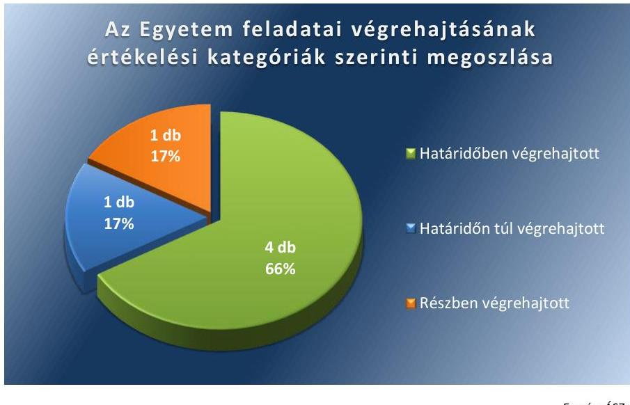

Fonrás: ÁSZ

## HATÁRIDŐBEN VÉGREHAJTOTT feladatok:

$\qquad$ 1. A kancellár 2015. április 28-án utasítást adott ki az Egyetem valamennyi vezetője számára a mindenkor hatályos Kbt. ${ }^{11}$ előírásainak betartására és betartatására vonatkozóan.
$\qquad$ 2. A kancellár 2015. április 28-án utasította az Egyetem gazdasági igazgatóját, hogy gondoskodjon arról, hogy az Egyetem a térítési

---

díjakkal és költségtérítésekkel kapcsolatos számlaadási kötelezettségének a hatályos jogszabályi előírásoknak megfelelően tegyen eleget.
3. A kancellár 2015. április 28-án utasította az Egyetem gazdasági igazgatóját, hogy gondoskodjon a térítési díjak és költségtérítések önköltségszámításon alapuló megalapozásáról a hatályos jogszabályoknak megfelelően.
4. A kancellár 2015. április 28-án utasította az Egyetem Működtetési Igazgatóságának vezetőjét, hogy gondoskodjon a vagyongazdálkodási terv és a fejlesztések indításának a fenntartó ${ }^{12}$ egyeztetésével történő, Szenátus ${ }^{13}$ általi elfogadásáról.

# HATÁRIDŐN
 TÚL VÉGREHAJTOTT feladat: 

5. A kancellár 2015. április 28-án utasította az Egyetem gazdasági igazgatóját a Kockázatkezelési Szabályzat aktualizálására. A jogszabályi változásoknak megfelelően aktualizált Kockázatkezelési Szabályzat ${ }^{14}$ Szenátus általi elfogadására és hatályba lépésére az intézkedési tervben megadott határidőn túl, 2015. május 15-én került sor. A szabályzatban rögzítették a kockázatok évente történő felmérésének, azonosításának, értékelésének, a lehetséges válaszreakciók folyamatba építésének, nyomon követésének és felülvizsgálatának szabályait.

## RÉSZBEN VÉGREHAJTOTT feladat:

6. Az Egyetem a jogszabályi és szervezeti változásoknak megfelelően elvégezte a gazdálkodás szempontjából meghatározó belső szabályzatainak aktualizálását, azonban a Kbt. hatálya alá nem tartozó beszerzések lebonyolításával kapcsolatos eljárásrend aktualizálása az intézkedési tervben rögzítettek ellenére elmaradt, így ezen beszerzések lebonyolításával kapcsolatos - Ávr. ${ }^{15}$ 13. § (2) bekezdésének b) pontja szerinti - eljárásrenddel nem rendelkezett.

AZ EMMI intézkedési tervében megfogalmazott két feladatot határidőben végrehajtotta.

## HATÁRIDŐBEN VÉGREHAJTOTT feladatok:

1. Az EMMI Belső Ellenőrzési Főosztálya 2015. május 19-26. között soron kívüli szabályszerűségi ellenőrzést folytatott le az Egyetemnél az ÁSZ által feltárt szabálytalanságok tekintetében a munkajogi felelősséggel kapcsolatos körülmények kivizsgálása, szükséges intézkedés kezdeményezése céljából.
2. Az EMMI felsőoktatásért felelős államtitkára az EMMI Belső Ellenőrzési főosztályvezetőjének címzett feljegyzésében számolt be az ÁSZ ellenőrzések intézkedési terveinek végrehajtásáról. Az államtitkár havonta kancellári beszámoló keretében írásban számoltatta be a kancellárt az általa megtett intézkedésekről.
Az ÁSZ javaslatai alapján készített intézkedési tervekben rögzített feladatok végrehajtásáról az Egyetem és az EMMI a Bkr. ${ }^{16}$ 14. § (1) bekezdésében előírt nyilvántartást vezette.

---

.

---

# MELLÉKLETEK

- I. SZ. MELLÉKLET: AZ ÁSZ 15030. SZÁMÚ JELENTÉSÉHEZ KAPCSOLÓDÓAN AZ EGYETEM INTÉZKEDÉSI TERVÉNEK VÉGREHAJTÁSA

|  Az intézkedési tervben meghatározott feladat | Az intézkedési tervben meghatározott határidő | Az intézkedési tervben meghatározott feladat végrehajtásának felelése | Az intézkedési tervben meghatározott feladat végrehajtása  |
| --- | --- | --- | --- |
|  1. | 2. | 3. | 4.  |
|  Határidőben végrehajtott feladatok |  |  |   |
|  1. 2/a. Utasítás kiadása a Kbt. előírásainak betartására, az egyetem vezetői részére. | 2015. április 30. | kancellár | A kancellár 2015. április 28-án kiadta a K/52-4/2015. iktatási számú utasítást az Egyetem valamennyi vezetője számára a Kbt. előírásainak betartására és betartatására vonatkozóan.  |
|  2. 2/b. Utasítás kiadása a térítési díjak és költségtérítések esetén a számlaadási kötelezettség teljesítéséről. | 2015. április 30. | kancellár | A kancellár 2015. április 28-án utasította (iktatási száma: K/52-5/2015.) az Egyetem gazdasági igazgatóját gondoskodjon arról, hogy az Egyetem a térítési díjakkal és költségtérítésekkel kapcsolatos számlaadási kötelezettségének a hatályos jogszabályi előírásoknak megfelelően tegyen eleget.  |
|  3. 2/c. Utasítás kiadása a térítési díjak és költségtérítések önköltségszámításon alapuló megalapozásáról. | 2015. április 30. | kancellár | A kancellár 2015. április 28-án utasította (iktatási száma: K/52-6/2015.) az Egyetem gazdasági igazgatóját, hogy gondoskodjon a térítési díjak és költségtérítések önköltségszámításon alapuló megalapozásáról.  |
|  4. 3. Utasítás kiadása a működési igazgató részére, hogy gondoskodjon a vagyongazdálkodási terv és a fejlesztések indításának a fenntartó egyeztetésével történő, Szenátus általi elfogadásáról. | 2015. április 30. | kancellár | A kancellár 2015. április 28-án utasította (iktatási száma: K/52-7/2015.) a Működtetési Igazgatóság vezetőjét, hogy gondoskodjon a vagyongazdálkodási terv és a fejlesztések indításának a fenntartó egyeztetésével történő, Szenátus általi elfogadásáról.  |
|  Határidőn túl végrehajtott feladat |  |  |   |
|  5. 1/a. Kockázatkezelési rendszer működtetése keretében: A Kockázatkezelési Szabályzat aktualizálása a jogszabályi változásoknak megfelelően, valamint a szabályzatban rögzítésre kerüljön a kockázatok évente történő felmérése, megállapítása, kiértékelése és nyomon követése. | 2015. április 30. | kancellár | A kancellár 2015. április 28-án utasítást adott (iktatási száma: K/52-2/2015.) az Egyetem gazdasági igazgatójának a kockázatkezelési szabályzat aktualizálására.
A jogszabályi változásoknak megfelelően aktualizált Kockázatkezelési Szabályzatot a Szenátus a 2015. április 30-ai határidőn túl 2015. május 15-én fogadta el, a szabályzat ettől a naptól volt hatályos. A szabályzatban rögzítették a kockázatok évente történő felmérésének, azonosításának, értékelésének, a lehetséges válaszreakciók folyamatba építésének, nyomon követésének és felülvizsgálatának szabályait.  |

---

|  Az intézkedési tervben meghatározott feladat | Az intézkedési tervben meghatározott határidő | Az intézkedési tervben meghatározott feladat végrehajtásának felelőse | Az intézkedési tervben meghatározott feladat végrehajtása  |
| --- | --- | --- | --- |
|  1. | 2. | 3. | 4.  |
|  Részben végrehajtott feladat |  |  |   |
|  6. 1/b. A belső szabályzatok hiányosságainak megszüntetése: A vizsgálat befejezését követően elkészítettük a gazdálkodás szempontjából meghatározó belső szabályzatok aktualizálását a jogszabályi változásoknak megfelelően. A szabályzatok 2015. évi jogszabályok szerinti aktualizálása folyamatban van. | 2015. április 30. | kancellár | Határidőben végrehajtott feladat:
A 2015. április 28-án kelt K/52-3/2015. iktatási számú kancellári utasítás alapján a gazdálkodás szempontjából meghatározó belső szabályzatok aktualizálása a jogszabályi változásokat is figyelembe véve határidőben megtörtént.
Nem végrehajtott feladat:
Az Egyetem az intézkedési tervben rögzítettek ellenére a Kbt. hatálya alá nem tartozó beszerzések lebonyolításával kapcsolatos eljárásrendet nem aktualizálta, így az Ávr. 13. § (2) bekezdésének b) pontja szerinti - Kbt. hatálya alá nem tartozó beszerzések lebonyolítására vonatkozó - eljárásrenddel nem rendelkezett.  |

---

# II. SZ. MELLÉKLET: AZ ÁSZ 15030. SZÁMÚ JELENTÉSÉHEZ KAPCSOLÓDÓAN AZ EMMI INTÉZKEDÉSI TERVÉNEK VÉGREHAJTÁSA

|  Az intézkedési tervben meghatározott feladat | Az intézkedési tervben meghatározott határidő | Az intézkedési tervben meghatározott feladat végrehajtásának felelőse | Az intézkedési tervben meghatározott feladat végrehajtása  |
| --- | --- | --- | --- |
|  1. | 2. | 3. | 4.  |
|  Határidőben végrehajtott feladatok |  |  |   |
|  1. A közbeszerzési és egyéb feltárt szabálytalanságokhoz kapcsolódó munkajogi felelősség kivizsgálása, a szükséges intézkedések kezdeményezése. | 2015. december 31. | EMMI Belső Ellenőrzési Főosztály | Az EMMI Belső Ellenőrzési Főosztálya 2015. május 19-26. között soron kívüli szabályszerűségi ellenőrzést folytatott le az Egyetemnél az ÁSZ által feltárt szabálytalanságok tekintetében a munkajogi felelősséggel kapcsolatos körülmények kivizsgálása, szükség esetén intézkedés kezdeményezése céljából. A 24739-13/2015/ELL iktatási számú Ellenőrzési jelentés értékelése szerint a közbeszerzési eljárás nélküli beszerzések esetében a rektor osztott felelőssége volt megállapítható, az egyéb, az Egyetem pénzügyi gazdálkodását érintő szabálytalanságok vonatkozásában a rektor nem volt felelős, azonban a vezetői ellenőrzés hiányosságai miatt felvethető a közvetett felelőssége.
Az EMMI Belső Ellenőrzési Főosztálya által folytatott ellenőrzés megállapításai szerint - tekintettel az intézmény belső szabályzataiban rögzített átruházott feladat és hatáskörökre - az ÁSZ által feltártak nem indokolják az Nftv. 73. § (3) bekezdés e) pontjában foglalt fenntartói intézkedést, az Egyetem rektora felmentésének kezdeményezését.  |
|  2. A kancellár által kidolgozott intézményracionalizálási terv végrehajtásának folyamatos ellenőrzése. | folyamatos | EMMI Felsőoktatásért Felelős Államtitkár | Az EMMI felsőoktatásért felelős államtitkára a 11741-2/2016/INTFIN iktatási számú, az EMMI Belső Ellenőrzési főosztályvezetőjének címzett feljegyzésében számolt be az ÁSZ ellenőrzések intézkedési terveinek végrehajtásáról. Az államtitkár havonta kancellári beszámoló keretében írásban számoltatta be a kancellárt az általa megtett intézkedésekről. A "Fokozatváltás a felsőoktatásban" című felsőoktatási stratégiával összhangban az Egyetem működésének racionalizálása folyamatos volt, ennek keretében az SZMSZ és az ahhoz kapcsolódó szabályzatok ütemezetten készültek el és kerültek a fenntartóhoz benyújtásra.  |

Forrás: ÁSZ által készített táblázat

---

.

---

# FÜGGELÉK: ÉSZREVÉTELEK 

A jelentéstervezetet a Számvevőszék 15 napos észrevételezésre megküldte az ellenőrzött szervezetek vezetőinek az ÁSZ tv. 29. §* (1) bekezdése előírásának megfelelően.
A Kaposvári Egyetem kancellárja és rektora a jelentéstervezet megállapításaira írásban észrevételt tett.
Az Emberi Erőforrások Minisztériuma részéről nem érkezett észrevétel.
A függelék tartalmazza a Kaposvári Egyetem kancellárja és rektora észrevételeit, illetve az el nem fogadott észrevételek elutasításának indoklását.

[^0]
[^0]:    * 29. § (1) Az Állami Számvevőszék az ellenőrzési megállapításait megküldi az ellenőrzött szervezet vezetőjének vagy az általa megbízott személynek, és annak, akinek személyes felelősségét állapította meg.
    (2) Az ellenőrzött szervezet vezetője és a felelősként megjelölt személy az ellenőrzés megállapításaira tizenöt napon belül írásban észrevételt tehet.
    (3) Az Állami Számvevőszék az észrevételre a beérkezésétől számított harminc napon belül írásban válaszol. A figyelembe nem vett észrevételeket köteles a jelentésben feltüntetni, és megindokolni, hogy azokat miért nem fogadta el.

---

# 2002 

## K A P O S V Á R I E G Y E T E M

Állami Számvevőszék
Domokos László
elnök részére

## Budapest

Apáczai Csere János utca 10. 1052

Tisztelt Elnök Úr!

Tárgy: V-1347-027/2017 és a V-1347028/2017 ikt. sz. levelekhez kapcsolódó észrevételezés

Ikt. sz.: RH/143-5/2017
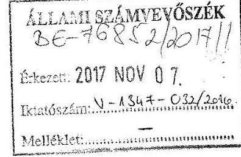

A V-1347-027/2017 és a V-1347-028/2017 ikt. sz. leveleit megkaptuk, melyekkel észrevételezés céljából megküldte az „Utóellenőrzések - Az állami felsőoktatási intézmények gazdálkodásának, működésének ellenőrzéséről készült jelentések utóellenőrzése - Kaposvári Egyetem" című ellenőrzésről készült számvevőszéki jelentéstervezetet.

A jelentéstervezetet áttekintettük, hozzá egy megjegyzést tennénk, mégpedig azt, hogy időközben a közbeszerzési törvény hatálya alá nem tartozó beszerzések lebonyolításával kapcsolatos eljárásrend is aktualizálásra került (a Szenátus 2017. augusztus 29-i ülésén tárgyalta, majd pedig a 2017. évi 3. sz. kancellári utasításban kiadásra került).

Egyebekben észrevételt nem kívánunk tenni.

Kaposvár, 2017. november 3.

Tisztelettel:
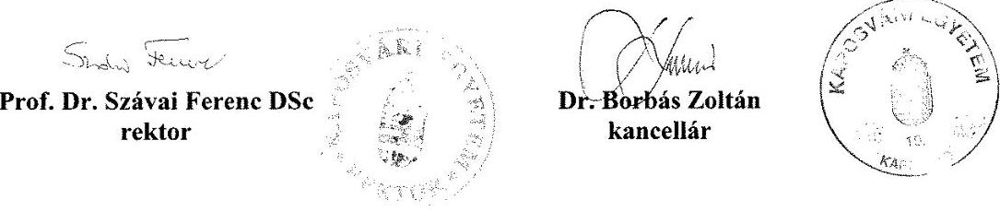

---

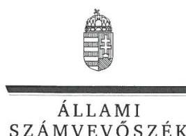

ELNÖK

Ikt.szám: V-1347-033/2016.

# Dr. Borbás Zoltán úr 

kancellár
Kaposvári Egyetem

## Kaposvár

## Tisztelt Kancellár Úr!

Az „Utóellenőrzések - az állami felsőoktatási intézmények gazdálkodásának, működésének ellenőrzéséről készült jelentések utóellenőrzése - Kaposvári Egyetem" címmel készített számvevőszéki jelentéstervezetre tett észrevételét köszönettel megkaptam.
Az Állami Számvevőszék észrevételre vonatkozó álláspontjáról a felügyeleti vezető által készített részletes tájékoztatást csatoltan megküldöm.
Tájékoztatom Kancellár urat, hogy a számvevőszéki jelentésben - az Állami Számvevőszékről szóló 2011. évi LXVI. törvény 29. § (3) bekezdése alapján - a figyelembe nem vett észrevételeket szerepeltetjük az elutasítás indokának feltüntetésével.
Tájékoztatom továbbá, hogy jelen levelem mellékletében foglaltakról prof. dr. Szávai Ferenc Tibor rektor urat is tájékoztattam.

Budapest, 2017. xoximker hó (4) nap
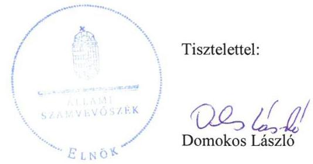

Melléklet: Tájékoztatás az el nem fogadott észrevételről

---

# Tájékoztatás az el nem fogadott észrevételről 

Az „Utóellenőrzések - az állami felsőoktatási intézmények gazdálkodásának, működésének ellenőrzéséről készült jelentések utóellenőrzése - Kaposvári Egyetem" című jelentéstervezetre a RH/143-5/2017. iktatószámú levélben tett észrevételét áttekintettem.

Észrevételének kezeléséről az alábbi tájékoztatást adom.
Kancellár úr az észrevételében azt a tájékoztatást adta, hogy időközben a közbeszerzési törvény hatálya alá nem tartozó beszerzések lebonyolításával kapcsolatos eljárásrend is aktualizálásra került (a Szenátus a 2017. augusztus 27-ei ülésén tárgyalta, és a 2017. évi 3. sz. kancellári utasításban kiadásra került).

Tájékoztatom Kancellár urat, hogy az Állami Számvevőszék az ellenőrzött időszakot követően végrehajtott intézkedéseket nem értékeli. A tárgyi ellenőrzés tekintetében az ellenőrzött időszak 2015. február 24-től 2017. június 21-ig tartott, amelyhez viszonyítva a 2017. augusztus 27-ei intézkedés
 az ellenőrzött időszakot követő végrehajtásnak minősül. Erre tekintettel az észrevételt nem fogadjuk el, a jelentéstervezet módosítása nem indokolt.

Budapest, 2017. január 1. nap
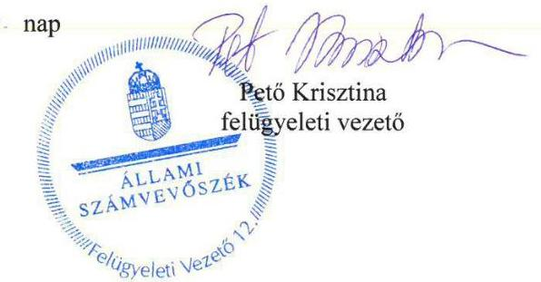

---

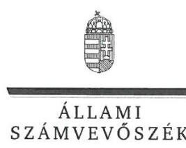

ELNÖK

Ikt.szám: V-1347-035/2016.

# Prof. Dr. Szávai Ferenc Tibor úr 

rektor
Kaposvári Egyetem

## Kaposvár

## Tisztelt Rektor Úr!

Az „Utóellenőrzések - az állami felsőoktatási intézmények gazdálkodásának, működésének ellenőrzéséről készült jelentések utóellenőrzése - Kaposvári Egyetem" címmel készített számvevőszéki jelentéstervezetre tett észrevételét köszönettel megkaptam.
Az Állami Számvevőszék észrevételre vonatkozó álláspontjáról a felügyeleti vezető által készített részletes tájékoztatást csatoltan megküldöm.
Tájékoztatom Rektor urat, hogy a számvevőszéki jelentésben - az Állami Számvevőszékről szóló 2011. évi LXVI. törvény 29. § (3) bekezdése alapján - a figyelembe nem vett észrevételeket szerepeltetjük az elutasítás indokának feltüntetésével.
Tájékoztatom továbbá, hogy jelen levelem mellékletében foglaltakról dr. Borbás Zoltán kancellár urat is tájékoztattam.

Budapest, 2017.  hó  nap
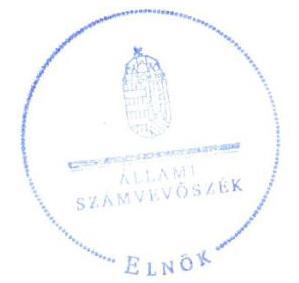

Tisztelettel:

## Domokos László

Melléklet: Tájékoztatás az el nem fogadott észrevételről

---

# Tájékoztatás az el nem fogadott észrevételről 

Az „Utóellenőrzések - az állami felsőoktatási intézmények gazdálkodásának, működésének ellenőrzéséről készült jelentések utóellenőrzése - Kaposvári Egyetem" című jelentéstervezetre a RH/143-5/2017. iktatószámú levélben tett észrevételét áttekintettem.

Észrevételének kezeléséről az alábbi tájékoztatást adom.
Rektor úr az észrevételében azt a tájékoztatást adta, hogy időközben a közbeszerzési törvény hatálya alá nem tartozó beszerzések lebonyolításával kapcsolatos eljárásrend is aktualizálásra került (a Szenátus a 2017. augusztus 27-ei ülésén tárgyalta, és a 2017. évi 3. sz. kancellári utasításban kiadásra került).

Tájékoztatom Rektor urat, hogy az Állami Számvevőszék az ellenőrzött időszakot követően végrehajtott intézkedéseket nem értékeli. A tárgyi ellenőrzés tekintetében az ellenőrzött időszak 2015. február 24-től 2017. június 21-ig tartott, amelyhez viszonyítva a 2017. augusztus 27-ei intézkedés az ellenőrzött időszakot követő végrehajtásnak minősül. Erre tekintettel az észrevételt nem fogadjuk el, a jelentéstervezet módosítása nem indokolt.

Budapest, 2017.  hó 14. nap
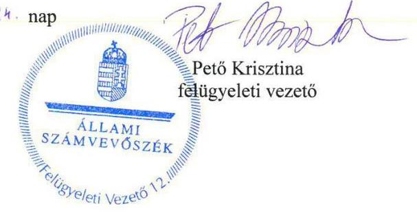

---

# RÖVIDÍTÉSEK JEGYZÉKE 

${ }^{1}$ számvevőszéki jelentés
${ }^{2}$ Egyetem
${ }^{3}$ 218/2004. (VII.9.) sz. rendelet
${ }^{4}$ EMMI
${ }^{5}$ ÁSZ
${ }^{6}$ Egyetem rektora
${ }^{7}$ emberi erőforrások minisztere
${ }^{8}$ kancellár
${ }^{9}$ ÁSZ tv.
${ }^{10}$ ÁSZ SZMSZ
${ }^{11} \mathrm{Kbt}$.
${ }^{12}$ fenntartó
${ }^{13}$ Szenátus
${ }^{14}$ Kockázatkezelési Szabályzat
${ }^{15}$ Ávr.
${ }^{16}$ Bkr.
„A Kaposvári Egyetem ellenőrzéséről - Az állami felsőoktatási intézmények gazdálkodásának, működésének ellenőrzése" című 15030. számú jelentés
Kaposvári Egyetem
218/2004. (VII. 19.) Korm. rendelet a felsőoktatási intézmények karainak felsorolásáról szóló 209/1999. (XII. 26.) Korm. rendelet módosításáról
Emberi Erőforrások Minisztériuma
Állami Számvevőszék
A Kaposvári Egyetem rektora
Az Emberi Erőforrások Minisztériuma minisztere
A Kaposvári Egyetem kancellárja
2011. évi LXVI. törvény az Állami Számvevőszékről (hatályos 2011. július 1-jétől)

Az Állami Számvevőszék elnökének 3/2016. (XII. 29.) ÁSZ utasítása az Állami Számvevőszék Szervezeti és Működési Szabályzatáról (hatályos 2017. január 1-jétől)
Kbt1: 2011. évi CVIII. törvény a közbeszerzésekről (hatályos 2011. augusztus 21-től 2015. október 31-ig)
Kbt2: 2015. évi CXLIII. törvény a közbeszerzésekről (hatályos 2015. november 1-jétől)
Emberi Erőforrások Minisztériuma
A Kaposvári Egyetem Szenátusa
A Kaposvári Egyetem Kockázatkezelési Szabályzata (hatályos 2015. május 15-től)
368/2011. (XII. 31.) Korm. rendelet az államháztartásról szóló törvény végrehajtásáról (hatályos: 2012. január 1-jétől)
370/2011. (XII. 31.) Kormányrendelet a költségvetési szervek belső kontrollrendszeréről és belső ellenőrzéséről (hatályos: 2012. január 1-jétől)

---

ÁLLAMI SZÁMVEVŐSZÉK
1052 Budapest, Apáczai Csere János utca 10.
Levélcím: 1364 Budapest 4. Pf. 54
Telefon: +36 14849100 Telefax: +36 14849200
www.asz.hu
