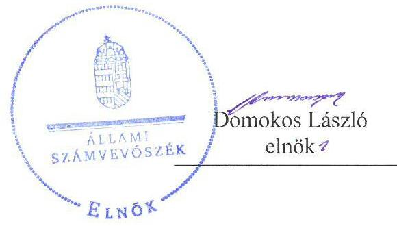
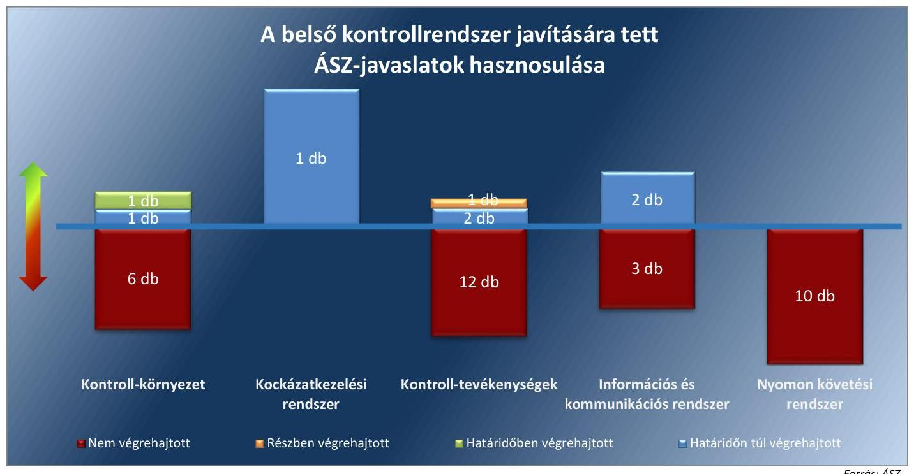
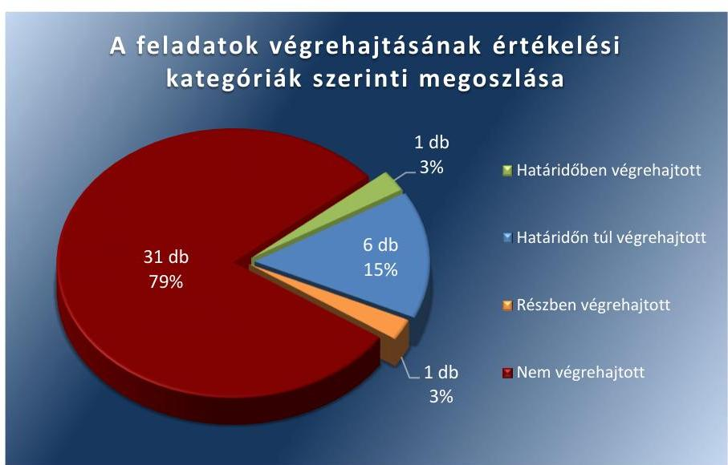

# Jelentés 

## Utóellenőrzések

Az önkormányzatok belső
kontrollrendszere kialakításának és működtetésének utóellenőrzése Ják Község Önkormányzata 2017.

---

# Jelentés 

## Utóellenőrzések

Az önkormányzatok belső
kontrollrendszere kialakításának és működtetésének utóellenőrzése Ják Község Önkormányzata
2017. 12 hó ๑ nap

---

|  AZ ELLENŐRZÉST FELÜGYELTE: |  |  |  |  |   |
| --- | --- | --- | --- | --- | --- |
|   |  |  |  |  | DR. BENEDEK MÁRIA felügyeleti vezető  |
|   |  |  |  |  | AZ ELLENŐRZÉST VEZETTE ÉS A VÉGREHAJTÁSÁÉRT FELELŐS:  |
|   |  |  |  |  | KLINGA LÁSZLÓ ellenőrzésvezető  |
|   |  |  |  |  | A PROGRAM ÖSSZEÁLLÍTÁSÁÉRT FELELŐS:  |
|   |  |  |  |  | JANIK JÓZSEF LÁSZLÓ osztályvezető  |
|   |  |  |  |  | A TÉMÁHOZ KAPCSOLÓDÓ KORÁBBI SZÁMVEVŐSZÉKI JELENTÉSEK:  |
|   |  |  |  |  | - címe: Jelentés az önkormányzatok belső kontrollrendszere kialakításának, egyes kontrolltevékenységek és a belső ellenőrzés működésének – 2013. évben induló – ellenőrzéséről Ják  |
|  Jelentéseink az Országgyűlés számítógépes hálózatán és az Interneten a www.asz.hu címen is olvashatóak. |  |  |  |  | - sorszáma: 13175  |
|   |  |  |  |  | IKTATÓSZÁM: EL-0062-050/2017.  |
|   |  |  |  |  | TÉMASZÁM: 2096  |
|   |  |  |  |  | ELLENŐRZÉS-AZONOSÍTÓ SZÁM: V0755125  |

---

# TARTALOMJEGYZÉK 

■ ÖSSZEGZÉS ..... 5
■ AZ ELLENŐRZÉS CÉLJA ..... 7
■ AZ ELLENŐRZÉS TERÜLETE ..... 8
■ AZ ELLENŐRZÉS HÁTTERE, INDOKOLTSÁGA ..... 9
■ A JELENTÉS LÉNYEGES KÉRDÉSKÖRE ..... 10
■ ELLENŐRZÉS HATÓKÖRE ÉS MÓDSZEREI ..... 11
■ MEGÁLLAPÍTÁSOK ..... 13
■ KÖVETKEZTETÉSEK ..... 18
■ MELLÉKLETEK ..... 19
I. Sz. melléklet: Az ÁSZ 13175 számú jelentéséhez kapcsolódó intézkedési terv végrehajtása ..... 19
■ FÜGGELÉK: ÉSZREVÉTELEK ..... 25
■ RÖVIDÍTÉSEK JEGYZÉKE ..... 27

---

.

---

# ÖSSZEGZÉS 

Az Állami Számvevőszék Ják Község Önkormányzata belső kontrollrendszere kialakításának és működtetésének utóellenőrzése során megállapította, hogy a fennálló hiányosságok miatt nem volt biztosított a közpénzek szabályos, átlátható felhasználása, a vagyonnal való felelős gazdálkodás. Ják Község Önkormányzata az intézkedési tervben meghatározott feladatok közül határidőben egyet hajtott végre. A felelős vezetői magatartás hiányának következtében a belső kontrollrendszer kialakítása és szabályszerű működtetése nem volt biztosított, így a korrupció tényleges felmerülésének a kockázata fennáll. Az Állami Számvevőszék a polgármester és a jegyző felelősségre vonását kezdeményezte a törvényességi felügyeletet ellátó szervnél.

## Az ellenőrzés társadalmi indokoltsága

Az Állami Számvevőszék stratégiájában célul tűzte ki a számvevőszéki munka hasznosulásának javítását. Ezzel összhangban ellenőrzi, hogy az ellenőrzött szervezetek megvalósították-e a korábbi ellenőrzései által feltárt hibák, hiányosságok és szabálytalanságok megszüntetése céljából kialakított intézkedési tervben foglaltakat. A rendszeres utóellenőrzések hozzájárulnak a szükséges intézkedések tényleges végrehajtásához, ezáltal a közpénzügyek rendezettségének javulásához, igazolják, hogy lezárult a következmények nélküli ellenőrzések időszaka.

## Főbb megállapítások, következtetések

Ják Község Önkormányzata az intézkedést igénylő megállapításokhoz és javaslatokhoz kapcsolódóan összeállított intézkedési tervben meghatározott 39 feladatból egyet határidőben, hatot határidőn túl, egyet részben, 31-et nem hajtott végre.

A belső szabályozottság kis mértékben javult, de a gazdálkodás, az adatvédelem és a belső ellenőrzés egyes területein a belső szabályozást a jegyző nem, vagy csak hiányosan alakította ki. A kontrolltevékenységek meghatározása, továbbá az információs és kommunikációs rendszer szabályszerű kialakítása továbbra sem történt meg. A monitoring rendszer kialakítása, működtetése és értékelése nem valósult meg. A jegyző nem megfelelően működtette a pénzügyi folyamatokban kulcsszerepet betöltő kontrollokat, továbbá nem biztosította teljes körűen a belső ellenőrzés szabályszerűségét.

Ják Község Önkormányzata belső kontrollrendszerének kialakítása, valamint az egyes kontrolltevékenységek és a belső ellenőrzés működésének területén az Állami Számvevőszék által korábban feltárt hiányosságok döntő része továbbra is fennáll.

A közpénzekkel és a vagyonnal való szabályszerű gazdálkodásra vonatkozó szabályok súlyos megsértése miatt az Állami Számvevőszék felhívta az ellenőrzött szervezet vezetőjének a figyelmét a vagyonmegóvási intézkedés kilátásba helyezésére.

A jegyző az intézkedési tervben meghatározott feladatok végrehajtásáról a nyilvántartást éves bontásban vezette, azonban annak tartalma nem felelt meg a jogszabályi előírásoknak.

Az Állami Számvevőszék által tett javaslatok hasznosulását a belső kontrollrendszer öt pillére vonatkozásában az 1. ábra mutatja.

---

# Összegzés

## 1. ábra

---

# AZ ELLENŐRZÉS CÉLJA 

Az ellenőrzés célja annak értékelése volt, hogy a számvevőszéki jelentésben foglalt intézkedést igénylő megállapításokkal és javaslatokkal összhangban készített intézkedési tervben meghatározott feladatokat az ellenőrzött szervezet végrehajtotta-e.

---

# **AZ ELLENŐRZÉS TERÜLETE**

## **Ják Község Önkormányzata**

Ják Község Vas megyében található, állandó lakosainak száma a Központi Statisztikai Hivatal Magyarország Közigazgatási Helynévkönyvében közzétett adatok alapján 2016. január 1-jén 2 593 fő volt.

A polgármester¹ az 1990. évi önkormányzati választások óta tölti be tisztségét, a jegyző² személye az ellenőrzött időszakban egy alkalommal változott, a jelenlegi jegyző 2014. augusztus 1-től látja el feladatát. Ják Község Önkormányzatának gazdálkodási feladatait a Jáki Közös Önkormányzati Hivatal látja el.

Ják Község Önkormányzata a 2015. évi költségvetési beszámolója szerint 311,9 millió Ft költségvetési bevételt ért el és 316,2 millió Ft költségvetési kiadást teljesített. 2015. december 31-én a könyvviteli mérleg szerinti követelések állományának értéke 11,1 millió Ft, a kötelezettségek állományának értéke 54,8 millió Ft, mérlegfőösszege 1046,1 millió Ft volt.

Az Állami Számvevőszék a 2013. évben ellenőrizte Ják Község Önkormányzatánál a belső kontrollrendszer kialakítását, egyes kontrolltevékenységek és a belső ellenőrzés működését a 2012. január 1. és december 31-e közötti időszak vonatkozásában. Az erről szóló 13175 sorszámú jelentését³ az Állami Számvevőszék 2014. január 9-én tette közzé. Az ellenőrzés célja annak megállapítása volt, hogy az önkormányzat a jogszabályi előírásoknak megfelelően alakította-e ki a belső kontrollrendszert, megfelelően működtette-e a gazdálkodás folyamatában kulcsszerepet betöltő szakmai teljesítésigazolás és érvényesítés kontrolltevékenységeit, biztosította-e a belső ellenőrzés szabályos működését. Az Állami Számvevőszék jelentésében foglalt javaslatok végrehajtása érdekében Ják Község Önkormányzata intézkedési tervet készített.

Az utóellenőrzés – a 2014. január 9-től 2017. július 14-ig végrehajtott feladatokat figyelembe véve – az Állami Számvevőszék jelentésében a polgármester és a jegyző részére megfogalmazott intézkedést igénylő megállapításokra és javaslatokra készített, az Állami Számvevőszék részére megküldött intézkedési tervben foglalt feladatok megvalósításának ellenőrzésére, illetve értékelésére fókuszált.

---

# AZ ELLENŐRZÉS HÁTTERE, INDOKOLTSÁGA 

Az ÁSZ tv. 4. § 33. (1) bekezdése értelmében a számvevőszéki jelentések intézkedést igénylő megállapításaihoz kapcsolódóan az ellenőrzött szervezet vezetője intézkedési tervet köteles összeállítani, és az ÁSZ ${ }^{5}$ részére megküldeni. Az intézkedési tervben foglaltak megvalósítását - az ÁSZ tv. 33. § (7) bekezdésében foglaltak alapján - az ÁSZ utóellenőrzés keretében ellenőrizheti. Az intézkedések megvalósulásának értékelése során az ÁSZ figyelembe veszi az ellenőrzött szervezetek működési feltételeiben, valamint a jogszabályi előírásokban bekövetkezett változásokat.

Az intézkedési tervben foglalt feladatok hiányos, illetve késedelmes végrehajtása, valamint megvalósításának elmaradása azt mutatja, hogy az ellenőrzések során feltárt hibák, hiányosságok és szabálytalanságok megszüntetése nem kapott kellő hangsúlyt. Ez a szabályszerű működés és a felelős vezetői magatartás vonatkozásában kockázatot hordoz. E kockázatok feltárásával az ÁSZ utóellenőrzési rendszere fokozza a fegyelmet, és igazolja, hogy a közpénzzel való szabályos gazdálkodás felelőssége elől nem lehet kitérni.

Az utóellenőrzés négy szinten hasznosulhat:

- A társadalom szintjén az utóellenőrzés jelzi, hogy a számvevőszéki ellenőrzés megállapításainak van következménye: a hiányosságok megszüntetésére az ellenőrzött szervezet által meghatározott intézkedések végrehajtását is számon kéri az ÁSZ.
- Az ellenőrzött terület szintjén az utóellenőrzés tájékoztatást nyújt a terület döntéshozóinak a hiányosságok kiküszöbölésének jó gyakorlatairól, ezzel lehetőséget biztosítva arra, hogy az ÁSZ ellenőrzési megállapításai, javaslatai a terület nem ellenőrzött szervezeteinek a működése során is hasznosuljanak.
- Az ellenőrzött szervezet szintjén az utóellenőrzés feltárja, hogy a szervezet az intézkedések végrehajtásával hasznosította-e a korábbi ellenőrzési jelentésben a hiányosságok megszüntetése, illetve a kockázatok kezelése érdekében megfogalmazott javaslatokat.
- Az ÁSZ szintjén az utóellenőrzés visszacsatolást ad az ellenőrzési jelentések hasznosulásáról, az intézkedések elmaradása vagy részleges megvalósulása a további ellenőrzésekhez kockázati jelzésként szolgál.

---

# A JELENTÉS LÉNYEGES KÉRDÉSKÖRE 

Az ellenőrzött szervezet az intézkedési tervben foglaltakat az előírt határidőben végrehajtotta-e?

---

# ELLENŐRZÉS HATÓKÖRE ÉS MÓDSZEREI 

## Az ellenőrzés típusa

Megfelelőségi ellenőrzés.

## Az ellenőrzött időszak

Az utóellenőrzés alapját képező ÁSZ jelentés közzétételének napjától (2014. január 09.) az ellenőrzésről szóló kiértesítő levél keltének napjáig (2017. július 14.) tartó időszak.

## Az ellenőrzés tárgya

Az ÁSZ tv. 2011. július 1-jei hatálybalépését követően a számvevőszéki jelentésben foglalt intézkedést igénylő megállapításokkal és javaslatokkal összhangban - Ják Község Önkormányzata által-készített intézkedési tervben foglaltak végrehajtásának ellenőrzése volt.

Az ellenőrzés kiterjedt minden olyan körülményre és adatra, amely az ÁSZ jogszabályban meghatározott feladatainak teljesítéséhez, valamint a program végrehajtása folyamán felmerült újabb összefüggések feltárásához szükséges volt.

## Az ellenőrzött szervezet

Ják Község Önkormányzata

## Az ellenőrzés jogalapja

Az ÁSZ tv. 33. § (7) bekezdése szerinti intézkedési tervben foglaltak megvalósítását az ÁSZ utóellenőrzés keretében ellenőrizheti.

## Az ellenőrzés módszerei

Az ÁSZ az ellenőrzési program ellenőrzési kérdései, az ellenőrzött időszakban hatályos jogszabályok, az ellenőrzés szakmai szabályok és módszertanok figyelembevételével, önálló ellenőrzés keretében végezte.

Az ÁSZ az ellenőrzés ideje alatt az Önkormányzattal történő kapcsolattartást az ÁSZ SZMSZ ${ }^{6}$-ének vonatkozó előírásai alapján biztosította.

---

Az utóellenőrzés megállapításait elsősorban az ÁSZ rendelkezésére álló, valamint az ellenőrzött szervezettől elektronikusan bekért dokumentumok alapozták meg.

Az ellenőrzési bizonyítékként felhasználható adatforrások közé tartoztak egyrészt a szakmai programban felsorolt adatforrások, másrészt minden - az ellenőrzés folyamán feltárt, az ellenőrzés szempontjából információt tartalmazó - dokumentum.

Az intézkedési tervben előírt feladatokat, azok végrehajthatósága, illetve végrehajtása szempontjából az alábbiak szerint értékelte az ÁSZ:
$\longrightarrow$ „határidőben végrehajtott" a feladat, ha a teljesítés dokumentáltan, az intézkedési tervben előírt határidőben és tartalommal megtörtént;
$\longrightarrow$ „határidőn túl végrehajtott" a feladat, ha annak teljesítése az intézkedési tervben meghatározott módon, de az előírt határidőn túl történt meg;
$\longrightarrow$ „részben végrehajtott" a feladat, ha végrehajtása teljes körűen az intézkedési tervben előírt módon nem történt meg;
$\longrightarrow$ „nem végrehajtott" a feladat, ha a végrehajtás nem történt meg, vagy amennyiben a teljesítést nem dokumentálták;
$\longrightarrow$ „okafogyottá vált" a feladat, ha végrehajtására - meghatározott esemény bekövetkezése, továbbá külső körülmény, a működést érintő feltétel változása miatt - már nincs szükség, illetve lehetőség, és egyértelműen megállapítható, hogy az intézkedést szükségessé tevő körülmény a jövőben nem fordulhat elő;
$\longrightarrow$ „nem időszerű" az a feladat, amelynek ellenőrzési időszakon belüli végrehajtására azért nem került (kerülhetett) sor, mert az intézkedés alapjául szolgáló esemény nem következett be, de annak jövőbeni előfordulása lehetséges, a végrehajtása nem volt esedékes, vagy a végrehajtás határideje még nem járt le.
Az ellenőrzés lefolytatásához az

 ellenőrzött szervezet a tanúsítványok elektronikus kitöltésével, valamint az ÁSZ által kért dokumentumok elektronikus megküldésével szolgáltatott adatokat, amelyek valódiságát és teljes körűségét az ellenőrzött szervezet vezetője által tett teljességi és hitelességi nyilatkozat igazolta. Az így rendelkezésre bocsátott adatok, információk kontrollja az ellenőrzés keretében történt.

---

# MEGÁLLAPÍTÁSOK 

## Az ellenőrzött szervezet az intézkedési tervben foglaltakat az előírt határidőben végrehajtotta-e?

Összegző megállapítás

Az Önkormányzat az intézkedési tervében meghatározott harminckilenc feladatból egyet határidőben, hatot határidőn túl, egyet részben és harmincegyet nem hajtott végre. Az intézkedési tervben meghatározott feladatok végrehajtásáról a jogszabályban előírt nyilvántartást vezette, azonban annak tartalma nem felelt meg a jogszabályi előírásoknak.

Az ÁSZ a jelentésében a polgármester részére négy, a jegyző részére 35 intézkedést igénylő megállapítást és javaslatot fogalmazott meg. Az ÁSZ részére a polgármester által megküldött intézkedési tervben a hiányosságok, szabálytalanságok megszüntetésére a polgármester részére négy, a jegyző részére 35 feladat került meghatározásra.

Az intézkedési tervben meghatározott feladatokat, határidőket, felelősöket és a feladatok végrehajtását az I. számú melléklet mutatja be.

A jegyző az intézkedési terv végrehajtásáról - a Bkr. 7. 14. § (1) bekezdésében előírtaknak megfelelően - éves bontásban vezette a nyilvántartást, de annak tartalma nem felelt meg a Bkr. 47. § (2) bekezdésében előírtaknak, mivel nem tartalmazta a számvevőszéki jelentés javaslatait, az elfogadott intézkedési tervet, az intézkedési terv alapján végrehajtott intézkedések rövid leírását, és a végre nem hajtott intézkedések okát.

Az Önkormányzat ${ }^{8}$ intézkedési tervében meghatározott feladatok végrehajtásának értékelési kategóriák szerinti megoszlását az 2. ábra szemlélteti.
2. ábra

---

# HATÁRIDŐBEN VÉGREHAJTOTT feladat: 

1. A jegyző gondoskodott a jogszabályi előírásoknak megfelelő leltározási és leltárkészítési szabályzat elkészítéséről.

## HATÁRIDŐN TÚL VÉGREHAJTOTT feladatok:

2. A polgármester 2014. február 6-a helyett a 2016. július 1-jétől hatályos Gazdálkodási szabályzat ${ }_{1}{ }^{9}$-ben gondoskodott az általa történő kötelezettségvállalások esetében a teljesítésigazolásra jogosult személyek jogszabályi előírásoknak megfelelő kijelöléséről.
3. A jegyző 2014. március 30-a helyett a 2016. július 1-jétől hatályos Gazdálkodási szabályzat ${ }_{2}$-ben gondoskodott a pénzkezeléssel összefüggő valamennyi kötelező tartalmi elem jogszabályban előírtaknak megfelelő rögzítéséről.
4. A jegyző 2014. április 15-e helyett a 2015. január 1-jétől hatályos Kockázatkezelési szabályzatban állapította meg a jogszabályi előírásoknak megfelelően a Hivatal tevékenységében, gazdálkodásában rejlő kockázatokat, és meghatározta az egyes kockázatokkal kapcsolatban szükséges intézkedéseket, valamint azok teljesítése folyamatos nyomon követésének módját.
5. A jegyző a 2014. április 30-a helyett a 2014. augusztus 1-jén hatályba lépett Gazdálkodási szabályzat ${ }_{1}$-ben, majd a 2016. július 1-jétől hatályos Gazdálkodási szabályzat ${ }_{2}$-ben gondoskodott az általa történő kötelezettségvállalások esetében a teljesítés igazolására jogosult személyek jogszabályi előírásoknak megfelelő kijelöléséről.
6. A jegyző 2014. június 30-a helyett a 2015. január 1-jétől hatályos Közérdekű adatok igénylése és közzététele szabályzatban állapította meg a jogszabályi előírásoknak megfelelően a kötelezően közzéteendő adatok nyilvánosságra hozatalának rendjét.
7. A jegyző a közérdekű adatok megismerésére irányuló igények teljesítésének rendjét rögzítő szabályzat jogszabályi előírásoknak megfelelő elkészítéséről 2014. június 30-a helyett 2015. január 1-jétől gondoskodott.

## RÉSZBEN VÉGREHAJTOTT feladat:

8. A jegyző a 2014. augusztus 1-jétől hatályba léptetett Gazdálkodási szabályzat ${ }_{1}{ }^{10}$-ben rögzítette a jogszabályban foglaltak szerinti gazdálkodással, valamint a beszámolási feladatok teljesítésével kapcsolatos előírásokat, azonban a 2016. július 1-jétől hatályba léptetett Gazdálkodási szabályzat ${ }_{2}$-ben a jogszabályban foglaltak ellenére a gazdálkodással kapcsolatos belső előírások eljárási és dokumentációs részletszabályai nem kerültek szabályozásra.

## NEM VÉGREHAJTOTT feladatok:

9. A polgármester nem intézkedett arról, hogy az Önkormányzat kiadási előirányzatai terhére történt kötelezettségvállalásra az Áht. ${ }^{11}$ 37. § (1) bekezdésében és az Ávr. ${ }^{12}$ 55. § (1) bekezdésében foglaltaknak megfelelően - a meghatározott kivételekkel - csak pénzügyi ellenjegyzés után, a pénzügyi teljesítés esedékességét megelőzően, írásban kerüljön sor.

---

10. A polgármester Bkr. 49. § (3a) bekezdésében előírtak ellenére nem terjesztette a Képviselő-testület elé jóváhagyásra a zárszámadási rendelettervezettel egyidejűleg az éves összefoglaló ellenőrzési jelentést.
11. A polgármester a Mötv. ${ }^{13}$ 115. § (1) bekezdésében foglaltak ellenére nem kísérte figyelemmel az Önkormányzat gazdálkodásának szabályszerűségét, továbbá a Mötv. 67. § (1) bekezdés f) pontjában biztosított munkáltatói jogkörében nem gondoskodott a belső kontrollrendszer működésére vonatkozó jogszabályi rendelkezések be nem tartása, valamint a teljesítésigazolás, illetve az érvényesítés kontrollokkal összefüggésben feltárt hiányosságok, szabálytalanságok tekintetében az esetleges munkajogi felelősséggel kapcsolatos körülmények kivizsgálásáról.
12. A jegyző nem készítette el a Számv. tv. 14. § (5) bekezdés b) pontjában foglaltak ellenére a Hivatalra ${ }^{14}$ vonatkozó eszközök és források értékelési szabályzatát.
13. A jegyző nem készítette el a Tvtv. ${ }^{15}$ 19. § (1) bekezdésében előírt tűzvédelmi szabályzatot.
14. A jegyző nem készítette el a Bkr. 6. § (3) bekezdésében előírt ellenőrzési nyomvonalat, továbbá a Bkr. 6. § (4) bekezdésében előírtak ellenére nem szabályozta a szabálytalanságok kezelésének eljárásrendjét.
15. A jegyző a Kttv. ${ }^{16}$ 130. § (1) bekezdésében előírtak ellenére nem értékelte írásban a Hivatal köztisztviselőinek munkateljesítményét.
16. A jegyző nem készítette elő az Mötv. 81. § (3) bekezdés c) pontjában foglalt feladatkörében a köztisztviselőkkel szembeni, továbbá a Kttv. 83. §-ában foglaltak szerint a hivatásetikai alapelvek részletes tartalmának, az etikai eljárás szabályainak dokumentumait, valamint a Kttv. 231. § (1) bekezdésében foglaltak érvényesülése érdekében nem kezdeményezte azok Képviselő-testület ${ }^{17}$ elé terjesztését.
17. A jegyző a kontrolltevékenység részeként nem biztosította a Bkr. 8. § (2) bekezdésében előírtak ellenére minden tevékenységre vonatkozóan a folyamatba épített, előzetes, utólagos és vezetői ellenőrzést.
18. A jegyző az Ávr. 53. § (2) bekezdésében foglaltak ellenére, belső szabályzatban nem rögzítette az előzetes írásbeli kötelezettségvállalást nem igénylő kifizetések rendjét.
19. A jegyző a Bkr. 8. § (4) bekezdés b) pontjában előírtak ellenére belső szabályzatban nem határozta meg a dokumentumokhoz és információkhoz való hozzáférésre vonatkozó felelősségi köröket.
20. A jegyző az Ávr. 13. § (5) bekezdésében előírtak ellenére nem határozta meg a gazdasági feladatokat ellátó alkalmazottak helyettesítési rendjét.
21. A jegyző nem szabályozta a Kttv. 74. § (1) bekezdésében foglaltak ellenére, a jogviszony megszűnése esetére a munkavállaló folyamatban lévő feladatai átadásának rendjét.

---

22. A jegyző a Bkr. 3. § d) pontjában és 9. § (1) bekezdésében foglaltak ellenére nem alakított ki olyan információs és kommunikációs rendszert, amely biztosítja, hogy a megfelelő információk a megfelelő időben eljussanak az illetékes szervezethez, szervezeti egységhez, illetve személyhez.
23. A jegyző nem készítette el az Info tv. ${ }^{18}$ 24. § (3) bekezdésében foglaltak ellenére az adatvédelmi és adatbiztonsági szabályzatot.
24. A jegyző nem gondoskodott az Info tv. 33. § (1) és (3) bekezdésében foglaltak ellenére az elektronikus közzétételi kötelezettség teljesítéséről.
25. A jegyző nem alakított ki a Bkr. 3. § e) pontjában és a 10. §-ában foglaltak ellenére olyan rendszert, mely a Hivatal tevékenységének, a célok megvalósításának nyomon követését biztosítja, továbbá amelynek része az operatív tevékenységek keretében megvalósuló folyamatos és eseti nyomon követés.
26. A jegyző a Bkr. 11. § (1) bekezdésében foglaltak ellenére nem értékelte a belső kontrollrendszer minőségét a Bkr. 1. melléklete szerinti nyilatkozatban.
27. A jegyző nem alakította ki az Ávr. 57. § (1) bekezdésében és az Ávr. 57. § (3) bekezdésében előírtaknak megfelelő kontrolltevékenységeket, mivel a kifizetéseket megelőzően a teljesítésigazolás nem szabályszerűen került végrehajtásra, mert ellenőrizhető okmányok alapján nem történt meg a kiadások teljesítése jogosságának, összegszerűségének, az ellenszolgáltatást is magában foglaló kötelezettségvállalás esetén annak teljesítésének ellenőrzése, valamint az igazolás dátumának és a teljesítés tényére történő utalásnak az arra jogosult személy aláírásával történő igazolása.
28. A jegyző nem alakította ki az Ávr. 58. § (1) bekezdésében előírtaknak megfelelő kontrolltevékenységeket, mivel a kifizetéseket megelőzően az érvényesítő nem ellenőrizte az összegszerűséget, a fedezet meglétét és a megelőző ügymenetben az Áht., az államháztartási számvitel kormányrendelet és az Ávr. előírásait, továbbá a belső szabályzatokban foglaltakat betartását.
29. A jegyző az Áht. 37. § (1) bekezdésében és az Ávr. 55. § (1) bekezdésében előírtak ellenére nem intézkedett arról, hogy kötelezettségvállalásra a pénzügyi ellenjegyzést követően írásban kerüljön sor.
30. A jegyző az Ávr. 56. § (1) bekezdésében előírtak ellenére nem gondoskodott a kötelezettségvállalások nyilvántartásba vételéről.
31. A jegyző az összeférhetetlenségi szabályok Ávr. 60. § (1) bekezdésében előírtak érvényesüléséről nem gondoskodott, mivel a kötelezettségvállaló és a pénzügyi ellenjegyző ugyanazon gazdasági esemény tekintetében azonos személy volt.
32. A jegyző nem kezdeményezte a Bkr. 16. § (4) bekezdésében előírtak ellenére, hogy a belső ellenőrzési megállapodásban rendelkezzenek a Bkr. 22. § (1) - (2) bekezdésében foglalt belső ellenőrzési vezetői tevékenységek és kötelességek ellátási módjának meghatározásáról.

---

33. A jegyző nem kezdeményezte a Bkr. 17. § (1) bekezdésében, a 22. § (1) bekezdés a) pontjában és az 56. § (7) bekezdésében előírtak ellenére az Önkormányzat részére a belső ellenőrzési vezető által jóváhagyott belső ellenőrzési kézikönyv elkészítését.
34. A jegyző nem kezdeményezte a Bkr. 22. § (1) bekezdés b) pontjában, a 29. § (1) bekezdésében és a Bkr. 30. § (1) bekezdésében előírtak ellenére a kockázatelemzéssel alátámasztott stratégiai és éves ellenőrzési tervek összeállításának elkészítését.
35. A jegyző nem kezdeményezte, hogy a Bkr. 22. § b) pontja, valamint a 29. § (1) és a 31. § (2) bekezdése szerinti éves ellenőrzési tervek tartalmazzák a Bkr. 31. § (4) bekezdésében előírt valamennyi tartalmi elemet, továbbá azt, hogy az éves ellenőrzési terv a stratégiai ellenőrzési tervben és a kockázatelemzés alapján felállított prioritásokon, valamint a belső ellenőrzés rendelkezésére álló erőforrásokon alapuljon.
36. A jegyző nem kezdeményezte, hogy a végrehajtandó ellenőrzésekhez a Bkr. 19. § (5) bekezdésében előírtaknak megfelelően készüljenek belső ellenőrzési vezető által jóváhagyott ellenőrzési programok.
37. A jegyző nem kezdeményezte az elvégzett ellenőrzésekről készített jelentésekben a Bkr. 39. § (3) bekezdésében előírt tartalmi elemek szerepeltetését.
38. A jegyző nem kezdeményezte, hogy a Bkr. 22. § (2) bekezdés e) pontjában és az 50. §-ában előírtak szerint a belső ellenőrzési vezető nyilvántartást vezessen az elvégzett belső ellenőrzésekről.
39. A jegyző nem kezdeményezte, hogy a belső ellenőrzési vezető a Bkr. 22. § (1) bekezdés g) pontjában, a 49. § (1) és (3) bekezdésekben, valamint az 56. § (8) bekezdésében előírtaknak megfelelően készítse el az éves (összefoglaló) ellenőrzési jelentést és jóváhagyásra azt a jegyző részére küldje meg.

---

# KÖVETKEZTETÉSEK 

Az Önkormányzat nem gondoskodott a kötelezően közzéteendő közérdekű adatok közzétételéről, amivel sérül a közérdekű és közérdekből nyilvános adatok megismeréséhez és terjesztéséhez fűződő jog érvényesülése, ami jelentős kockázatot hordoz a gazdálkodás átláthatósága és elszámoltathatósága szempontjából. A végre nem hajtott feladat indokolja a feltárt hiányosság, szabálytalanság tekintetében a munkajogi felelősség tisztázására irányuló eljárás megindítását, és eredményének ismeretében a szükséges intézkedések megtételét.

---

# MELLÉKLETEK

- I. SZ. MELLÉKLET: AZ ÁSZ 13175 SZÁMÚ JELENTÉSÉHEZ KAPCSOLÓDÓ INTÉZKEDÉSI TERV VÉGREHAJTÁSA

|  Sorszám | Intézkedési
 tervben meghatározott feladat | Az intézkedési tervben meghatározott határidő | Az intézkedési tervben meghatározott feladat felelőse | A feladat végrehajtása  |
| --- | --- | --- | --- | --- |
|   |  |  | 3. | 4.  |
|   |  | Határidőben végrehajtott feladat |  |   |
|  1. | A jegyző gondoskodik róla, hogy a leltározási és leltárkészítési szabályzat rendelkezései az Áhsz. ${ }^{29}$ 37. §-ában előírtaknak megfeleljen. | 2014. március 30. | jegyző | A jegyző a 2014. január 1-jétől hatályos leltározási és leltárkészítési szabályzat megalkotásával gondoskodott arról, hogy a szabályzat rendelkezései az Áhsz. ${ }^{30}$ 22. § (1) bekezdéseiben rögzített szabályoknak megfeleljenek.  |
|   |  | Határidőn túl végrehajtott feladatok |  |   |
|  2. | A polgármester kijelöli az Ávr. 57. § (4) bekezdésének megfelelően az általa történő kötelezettségvállalások esetében a teljesítés igazolására jogosult személyeket. | azonnal | polgármester | A polgármester az Ávr. 57. § (4) bekezdésének megfelelően az általa vállalt kötelezettségek vonatkozásában teljesítésigazolásra jogosult személyeket 2014. február 6-a helyett 2016. július 1-jén aktualizált Gazdálkodási szabályzat ${ }_{2}$-ban jelölte ki.  |
|  3. | A jegyző intézkedik arról, hogy a pénzkezelési szabályzat tartalmazza a Számv. tv ${ }^{31}$. 14. § (8) bekezdésében előírt valamennyi kötelező tartalmi elemet. | 2014. március 30. | jegyző | A jegyző a pénzkezelés rendjének a Számv. tv. 14. § (8) bekezdésében előírtaknak megfelelő szabályozásáról 2014. március 30-a helyett a 2016. július 1-jétől hatályos Gazdálkodási szabályzat ${ }_{2}$-ben intézkedett.  |
|  4. | A jegyző megállapítja a Bkr. 7. § (2) bekezdésében foglaltak alapján a Hivatal tevékenységében, gazdálkodásában rejlő kockázatokat, és meghatározza az egyes kockázatokkal kapcsolatban szükséges intézkedéseket, valamint azok teljesítése folyamatos nyomon követésének módját. | 2014. április 15. | jegyző | A jegyző 2014. április 15-e helyett a 2015. január 1-jétől hatályos Kockázatkezelési szabályzatban állapította meg a Bkr. 7. § (2) bekezdésében előírtaknak megfelelően a Hivatal tevékenységében, gazdálkodásában rejlő kockázatokat, az egyes kockázatokkal kapcsolatban szükséges intézkedéseket, valamint azok teljesítésének folyamatos nyomon követésének módját.  |
|  5. | A jegyző kijelöli az Ávr. 57. § (4) bekezdésének megfelelően az általa történő kötelezettségvállalás esetében a teljesítés igazolására jogosult személyeket. | 2014. április 30. | jegyző | A jegyző 2014. április 30-a helyett a 2014. augusztus 1-jén hatályba lépett Gazdálkodási szabályzat ${ }_{1}$-ben, majd 2016. július 1-jétől a Gazdálkodási szabályzat ${ }_{2}$-ben jelölte ki az általa vállalt kötelezettségek esetében teljesítés igazolására jogosult személyeket az Ávr. 57. § (4) bekezdésének megfelelően.  |
|  6. | A jegyző belső szabályzatban megállapítja - az Info tv. 35. § (3) bekezdésében, valamint az Ávr. 13. § (2) bekezdés h) pontjában foglaltaknak megfelelően - a kötelezően közzéteendő adatok nyilvánosságra hozatalának rendjét. | 2014. június 30. | jegyző | A jegyző 2014. június 30-a helyett a 2015. január 1-jétől hatályos Közérdekű adatok igénylése és közzététele szabályzatában állapította meg a kötelezően közzéteendő adatok nyilvánosságra hozatalának rendjét. az Info tv. 35. § (3) bekezdésében, valamint az Ávr. 13. § (2) bekezdés h) pontjában foglaltaknak megfelelően.  |

---

|  1. |  | Az intézkedési | Az intézkedési | A feladat végrehajtása  |
| --- | --- | --- | --- | --- |
|   |  | tervben meg- | tervben megha- |   |
|   | Intézkedési tervben | határozott | tározott feladat |   |
|   | meghatározott feladat | határidő | felelőse |   |
|   | 1. | 2. | 3. | 4.  |
|  7. | A jegyző elkészíti - az Info tv. 30. § (6) bekezdésében és az Ávr. 13. § (2) bekezdés h) pontjában foglaltaknak megfelelően - a közérdekű adatok megismerésére irányuló igények teljesítésének rendjét rögzítő szabályzatot. |  | 2014. június 30. | jegyző  |
|   |  |  |  | A jegyző 2014. június 30-a helyett a 2015. január 1-jétől hatályos Közérdekű adatok igénylése és közzététele szabályzatban gondoskodott a közérdekű adatok megismerésére irányuló igények teljesítése rendjének az Info tv. 30. § (6) bekezdésében és az Ávr. 13. § (2) bekezdés h) pontjában foglaltaknak megfelelő elkészítéséről.  |
|   |  |  | Részben végrehajtott feladat |   |
|  8. | A jegyző belső szabályzatban rögzíti az Ávr. 13. § (2) bekezdés a) pontjában foglaltak szerint a gazdálkodással - különösen a kötelezettségvállalás, az ellenjegyzés, a teljesítés igazolása, az érvényesítés, az utalványozás gyakorlásának módjával, eljárási és dokumentációs részletszabályaival - valamint a beszámolási feladatok teljesítésével kapcsolatos belső előírásokat, feltételeket. |  | 2014. április 30. | jegyző  |
|   |  |  |  | A jegyző a 2014. augusztus 1-jétől hatályba helyezett Gazdálkodási szabályzat1-ben rögzítette az Ávr. 13. § (2) bekezdés a) pontjában foglaltak szerinti gazdálkodással, valamint a beszámolási feladatok teljesítésével kapcsolatos előírásokat, különös tekintettel a kötelezettségvállalás, az ellenjegyzés, a teljesítés igazolása, az érvényesítés, az utalványozás módjával, eljárási és dokumentációs részletszabályaival. A 2016. július 1-jén hatályba helyezett Gazdálkodási szabályzat2-ben az Ávr. 13. § (2) bekezdés a) pontjában foglaltak ellenére nem került a gazdálkodással kapcsolatos belső előírások eljárási és dokumentációs részletszabályai rögzítésre, így nem szabályozták a kötelezettségvállalás, ellenjegyzés és teljesítésigazolás eljárásrendjét.  |
|   |  |  | Nem végrehajtott feladatok |   |
|  9. | A polgármester intézkedik arról, hogy az Önkormányzat kiadási előirányzatai terhére történt kötelezettségvállalásra az Áht. 37. § (1) bekezdésében és az Ávr. 55. §. (1) bekezdésében foglaltaknak megfelelően - az Ávr. 53. §-ában meghatározott kivételekkel - kizárólag a pénzügyi ellenjegyzés után, a pénzügyi teljesítés esedékességét megelőzően, írásban kerüljön sor. |  | azonnal | polgármester  |
|  10. | A polgármester a Képviselő-testület elé terjeszti a zárszámadási rendelettervezettel egyidejűleg a Bkr. 49. § (3a) bekezdésében, illetve a Bkr. 56. § (8) bekezdésében foglaltak figyelembevételével az éves ellenőrzési jelentést. |  | 2014. április 30. | polgármester  |
|  11. | A polgármester a Mótv. 115. § (1) bekezdésében foglaltak alapján figyelemmel kíséri az Önkormányzat gazdálkodásának szabályszerűségét. A Mótv. 67. § f) pontja alapján gondoskodik a belső kontrollrendszer működésére vonatkozó jogszabályi rendelkezések be nem tartása, valamint a teljesítésről. |  | 2014. június 30., illetve folyamatos | polgármester  |
|   |  |  |  | A polgármester a Bkr. 49. § (3a) bekezdésében előírtak ellenére nem terjesztette a Képviselő-testület elé jóváhagyásra a zárszámadási rendelettervezettel egyidejűleg az éves összefoglaló ellenőrzési jelentést.  |
|   |  |  | 2014. június 30., illetve folyamatos | polgármester  |
|   |  |  |  | A polgármester a Mótv. 115. § (1) bekezdésében foglaltak ellenére nem kísérte figyelemmel az Önkormányzat gazdálkodásának szabályszerűségét. A polgármester nem gondoskodott az Mótv. 67. § (1) bekezdés f) pontjában biztosított munkáltatói jogkörében a belső kontrollrendszer működésére vonatkozó jogszabályi rendelkezések be  |

---

|  1. | Intézkedési tervben meghatározott feladat | Az intézkedési tervben meghatározott határidő | Az intézkedési tervben meghatározott feladat felelőse | A feladat végrehajtása  |
| --- | --- | --- | --- | --- |
|  1. |  | 2. | 3. | 4.  |
|   | sítményigazolás, illetve az érvényesítés kontrollokkal összefüggésben feltárt hiányosságok, szabálytalanságok tekintetében az esetleges munkajogi felelősséggel kapcsolatos körülmények kivizsgálásáról, majd a vizsgálat eredményének függvényében megteszi a szükséges munkajogi intézkedéseket. |  |  | nem tartása, valamint a teljesítésigazolás, illetve az érvényesítés kontrollokkal összefüggésben feltárt hiányosságok, szabálytalanságok tekintetében az esetleges munkajogi felelősséggel kapcsolatos körülmények kivizsgálásáról.  |
|  12. | A jegyző elkészíti a Hivatal eszközök és források értékelési szabályzatát a Számv. tv. 14. § (5) bekezdése b) pontjában és az Áhsz. j. 8. § (4) bekezdés b) pontjában előírtak alapján. | 2014. március 30. | jegyző | A jegyző nem készítette el a Számv. tv. 14. § (5) bekezdése b) pontjában foglaltak ellenére a Hivatalra vonatkozó eszközök és források értékelési szabályzatát.  |
|  13. | A jegyző elkészíti a tűzvédelmi szabályzatot a Tvtv. 19. § (1) bekezdésében foglalt előírásnak megfelelően. | 2014. március 30. | jegyző | A jegyző nem készítette el a Tvtv. 19. § (1) bekezdésében előírt tűzvédelmi szabályzatot.  |
|  14. | A jegyző elkészíti és rendszeresen aktualizálja az ellenőrzési nyomvonalat, valamint szabályozza a szabálytalanságok kezelésének eljárásrendjét a Bkr. 6. § (3)-(4) bekezdéseiben foglaltaknak megfelelően. | 2014. március 30. | jegyző | A jegyző nem készítette el a Bkr. 6. § (3) bekezdésben előírt ellenőrzési nyomvonalat és a Bkr. 6. § (4) bekezdés ellenére nem szabályozta a szabálytalanságok kezelésének rendjét.  |
|  15. | A jegyző írásban értékeli a Kttv. 130. § (1) bekezdése alapján a Hivatal köztisztviselőinek munkateljesítményét. | 2014. március 30. | jegyző | A jegyző írásban nem értékelte a Kttv. 130. § (1) bekezdésében foglaltak ellenére a Hivatal köztisztviselőinek munkateljesítményét.  |
|  16. | A jegyző előkészíti a Mötv. 81. § (3) bekezdés c) pontjában foglalt feladatkörében a köztisztviselőkkel szembeni, a Kttv. 83. §-ában foglaltak szerinti hivatásetikai alapelvek részletes tartalmának, valamint az etikai eljárás szabályainak dokumentumait, és a Kttv. 231. § (1) bekezdésében foglaltak érvényesülése érdekében kezdeményezi azok Képviselő-testület elé terjesztését. | 2014. március 30. | jegyző | A jegyző nem készítette elő az Mötv. 81. § (3) bekezdés c) pontjában foglalt feladatkörében a köztisztviselőkkel szembeni, továbbá a Kttv. 83. §-ában foglaltak szerinti a hivatásetikai alapelvek részletes tartalmának, az etikai eljárás szabályainak dokumentumait, valamint a 231. § (1) bekezdésében foglaltak érvényesülése érdekében nem kezdeményezte azok Képviselő-testület elé terjesztését.  |
|  17. | A jegyző biztosítja minden tevékenységre vonatkozóan a folyamatba épített, előzetes, utólagos és vezetői ellenőrzést a Bkr. 8. § (2) bekezdése alapján. | 2014. április 30. | jegyző | A jegyző a kontrolltevékenység részeként nem biztosította a
 Bkr. 8. § (2) bekezdésében foglaltak ellenére minden tevékenységre vonatkozóan a folyamatba épített, előzetes, utólagos és vezetői ellenőrzést.  |
|  18. | A jegyző belső szabályzatban rögzíti az Ávr. 53. § (2) bekezdése alapján az előzetes írásbeli kötelezettségvállalást nem igénylő kifizetések rendjét. | 2014. április 30. | jegyző | A jegyző az Ávr. 53. § (2) bekezdésében foglaltak ellenére belső szabályzatban nem rögzítette az előzetes írásbeli kötelezettségvállalást nem igénylő kifizetések rendjét.  |

---

|  1. | Intézkedési tervben meghatározott feladat | Az intézkedési tervben meghatározott határidő | Az intézkedési tervben meghatározott feladat felelőse | A feladat végrehajtása  |
| --- | --- | --- | --- | --- |
|  1. |  | 2. | 3. | 4.  |
|  19. | A jegyző belső szabályzatban meghatározza a Bkr. 8. § (4) bekezdés b) pontjában előírtaknak megfelelően a dokumentumokhoz és információkhoz való hozzáférésre vonatkozó felelősségi köröket. | 2014. április 30. | jegyző | A jegyző a Bkr. 8. § (4) bekezdés b) pontjában előírtak ellenére belső szabályzatban nem határozta meg a dokumentumokhoz és információkhoz való hozzáférésre vonatkozó felelősségi köröket.  |
|  20. | A jegyző meghatározza az Ávr. 13. § (5) bekezdésében előírtaknak megfelelően a gazdasági feladatot ellátó alkalmazottak helyettesítésének rendjét. | 2014. április 30. | jegyző | A jegyző nem határozta meg az Ávr. 13. § (5) bekezdésében foglaltak ellenére a gazdasági feladatot ellátó alkalmazottak helyettesítés rendjét.  |
|  21. | A jegyző szabályozza a Kttv. 74. § (1) bekezdésében foglaltak alapján a jogviszony megszűnése esetére a munkavállaló folyamatban lévő feladatai átadásának rendjét. | 2014. április 30. | jegyző | A jegyző nem szabályozta a Kttv. 74. § (1) bekezdésében foglaltak ellenére a kormánytisztviselő jogviszonya megszűnésekor (megszüntetésekor) a munkavállaló folyamatban lévő feladatai átadásának rendjét.  |
|  22. | A jegyző kialakít a Bkr. 3. § d) pontjában és a 9. § (1) bekezdésében foglaltaknak megfelelően egy olyan rendszert, amely biztosítja, hogy a megfelelő információk a megfelelő időben eljutnak az illetékes szervezethez, szervezeti egységhez, illetve személyhez. | 2014. június 30. | jegyző | A jegyző a Bkr. 3. § d) pontjában és 9. § (1) bekezdésében foglaltak ellenére nem alakított ki olyan információs és kommunikációs rendszert, amely biztosítja, hogy a megfelelő információk a megfelelő időben eljussanak az illetékes szervezethez, szervezeti egységhez, illetve személyhez.  |
|  23. | A jegyző adatvédelmi és adatbiztonsági szabályzatot készít az Info tv. 24. § (3) bekezdésének megfelelően. | 2014. június 30. | jegyző | A jegyző nem készítette el az adatvédelmi és adatbiztonsági szabályzatot, így nem tett eleget az Info tv. 24. § (3) bekezdésében foglaltaknak.  |
|  24. | A jegyző gondoskodik az Info tv. 33. § (1) és (3) bekezdésében foglaltaknak megfelelően az elektronikus közzétételi kötelezettség teljesítéséről. | 2014. június 30. | jegyző | A jegyző nem gondoskodott az Info tv. 33. § (1) és (3) bekezdésében foglaltak ellenére az elektronikus közzétételi kötelezettség teljesítéséről.  |
|  25. | A jegyző kialakítja és működteti a Bkr. 3. § e) pontjában és a 10. §-ában előírtak alapján a Hivatal tevékenységének, a célok megvalósításának nyomon követését biztosító rendszert, amelynek része az operatív tevékenységek keretében megvalósuló folyamatos és eseti nyomon követés is. | 2014. június 30. | jegyző | A jegyző nem alakított ki és nem működtetett a Bkr. 3. § e) pontjában és a 10. §-ában foglaltak ellenére olyan rendszert, mely a Hivatal tevékenységének, a célok megvalósításának nyomon követését biztosítja, és amelynek része az operatív tevékenységek keretében megvalósuló folyamatos és eseti nyomon követés is.  |
|  26. | A jegyző értékeli a Bkr. 11. § (1) bekezdésben előírtaknak megfelelően a jogszabályban meghatározott keretek között a belső kontroll rendszer minőségét a Bkr. 1. melléklete szerinti nyilatkozatban. | 2014. június 30. | jegyző | A jegyző a Bkr. 11. § (1) bekezdésében foglaltak ellenére nem értékelte a belső kontrollrendszer minőségét a Bkr. 1. melléklete szerinti nyilatkozatban.  |

---

|  27. | Az Áht. 38. § (1) bekezdésén alapuló teljesítésigazolás során az Ávr. 57. § (1) bekezdésében előírtaknak megfelelően, ellenőrizhető okmányok alapján ellenőrizzék és igazolják a kiadások teljesítésének jogosságát, összegszerűségét, az ellenszolgáltatást is magában foglaló kötelezettségvállalás esetén annak teljesítését, valamint az Ávr. 57. § (3) bekezdése szerint a teljesítést az igazolás dátumának és a teljesítés tényére történő utalásnak a megjelölésével, az arra jogosult személy aláírásával igazolják; | 2014. május 31. | jegyző | A jegyző nem gondoskodott a teljesítésigazolás során az Ávr. 57. § (1) bekezdésben és az Ávr. 57. § (3) bekezdésében foglaltak szerinti végrehajtásáról, mivel a kifizetéseket megelőzően a teljesítésigazolás nem szabályszerűen került végrehajtásra, mert ellenőrizhető okmányok alapján nem történt meg a kiadások teljesítése jogosságának, összegszerűségének, az ellenszolgáltatást is magában foglaló kötelezettségvállalás esetén annak teljesítésének ellenőrzése, valamint az igazolás dátumának és a teljesítés tényére történő utalásnak az arra jogosult személy aláírásával történő igazolása.  |
| --- | --- | --- | --- | --- |
|  28. | Az érvényesítő a kifizetéseket megelőzően a teljesítés igazolás alapján az Ávr. 57. § (3) bekezdése szerinti esetben annak hiányában is - az összegszerűségnek, a fedezet meglétének és a megelőző ügymenetben az Áht., az Áhsz.), az Ávr. előírásai és a belső szabályzatokban foglaltak betartásának az ellenőrzése - az Ávr. 58. § (1) bekezdése szerint - történjen meg; | 2014. május 31. | jegyző | A jegyző nem gondoskodott az érvényesítés során az Ávr. 58. § (1) bekezdésében foglaltak végrehajtásáról, mivel a kifizetéseket megelőzően az érvényesítő nem ellenőrizte az összegszerűséget, a fedezet meglétét és azt, hogy a megelőző ügymenetben az Áht., az államháztartási számvitel kormányrendelet és az Ávr. előírásait, továbbá a belső szabályzatokban foglaltakat betartását.  |
|  29. | Kötelezettségvállalásra az Áht. 37. § (1) bekezdésében és az Ávr. 55. § (1) bekezdésében foglaltaknak megfelelően- az Ávr. 53. §-ában meghatározott kivételeket figyelembe véve - kizárólag a pénzügyi ellenjegyzés után, a pénzügyi teljesítés esedékességét megelőzően, írásban kerüljön sor; | 2014. május 31. | jegyző | A jegyző az Áht. 37. § (1) bekezdésében és az Ávr. 55. § (1) bekezdésében foglaltak ellenére nem gondoskodott arról, hogy a kötelezettségvállalásra a pénzügyi ellenjegyzést követően, a pénzügyi teljesítés esedékességét megelőzően, írásban kerüljön sor.  |
|  30. | A kötelezettségvállalásokat az Ávr. 56. § (1) bekezdésében foglalt előírásnak megfelelően vegyék nyilvántartásba; | 2014. május 31. | jegyző | A jegyző nem gondoskodott az Ávr. 56. § (1) bekezdésében foglaltak ellenére a kötelezettségvállalások nyilvántartásba vételéről.  |
|  31. | Az összeférhetetlenségi szabályok az Ávr. 60. § (1) bekezdésében foglaltaknak megfelelően érvényesüljenek. | 2014. május 31. | jegyző | A jegyző az összeférhetetlenségi szabályok Ávr. 60. § (1) bekezdésében foglaltak szerinti érvényesüléséről nem gondoskodott, mivel a kötelezettségvállaló és a pénzügyi ellenjegyző ugyanazon gazdasági esemény tekintetében azonos személy volt.  |
|  32. | A jegyző kezdeményezi, hogy a Bkr. 16. § (4) bekezdésének megfelelően a belső ellenőrzési tevékenység megszervezésére vonatkozó megállapodásban rendelkezzenek a Bkr. 22. § (1) - (2) bekezdésében foglalt tevékenységek és a kötelességek ellátásának módjáról. | 2014. május 31. | jegyző | A jegyző nem kezdeményezte a Bkr. 16. § (4) bekezdésében előírtak ellenére, hogy a belső ellenőrzési tevékenység megszervezésére vonatkozó megállapodásban rendelkezzenek a Bkr. 22. § (1) - (2) bekezdésében foglalt belső ellenőrzési vezetői tevékenységek és a kötelességek ellátásának módjáról.  |

---

|  33. | A jegyző kezdeményezi, hogy az Önkormányzat rendelkezzen a Bkr. 17. § (1) bekezdésében, a 22. § (1) bekezdés a) pontjában és az 56. § (7) bekezdésében foglaltaknak megfelelő, a belső ellenőrzési vezető által jóváhagyott belső ellenőrzési kézikönyvvel | 2014. május 31. | jegyző | A jegyző nem kezdeményezte az Önkormányzat részére a Bkr. 17. § (1) bekezdésében, a 22. § (1) bekezdés a) pontjában és az 56. § (7) bekezdésében foglaltak szerinti belső ellenőrzési vezető által jóváhagyott belső ellenőrzési kézikönyv elkészítését.  |
| --- | --- | --- | --- | --- |
|  34. | A jegyző kezdeményezi - a Bkr. 22. § (1) bekezdés b) pontjában, a 29. § (1) bekezdésében és a 30. § (1) bekezdésében foglaltaknak megfelelően-a stratégiai ellenőrzési terv elkészítését. | 2014. május 31. | jegyző | A jegyző nem kezdeményezte a Bkr. 22. § (1) bekezdés b) pontjában, a 29. § (1) bekezdésében és a Bkr. 30. § (1) bekezdésében előírtak szerinti kockázatelemzéssel alátámasztott stratégiai és éves ellenőrzési tervek elkészítését.  |
|  35. | A jegyző kezdeményezi, hogy az éves ellenőrzési tervek tartalmazzák a Bkr. 31. § (4) bekezdésében előírt valamennyi tartalmi elemet, és azok a Bkr. 22. § b) pontja, valamint a 29. § (1) és a 31. § (2) bekezdése alapján kockázatelemzésen alapuljanak. | 2014. május 31. | jegyző | A jegyző nem kezdeményezte, hogy a Bkr. 22. § b) pontja, valamint a 29. § (1) és a 31. § (2) bekezdése szerinti éves ellenőrzési tervek tartalmazzák a Bkr. 31. § (4) bekezdésében előírt valamennyi tartalmi elemet, valamint azt, hogy az éves ellenőrzési terv a stratégiai ellenőrzési tervben és a kockázatelemzés alapján felállított prioritásokon, valamint a belső ellenőrzés rendelkezésére álló erőforrásokon alapuljon.  |
|  36. | A jegyző kezdeményezi, hogy a végrehajtandó ellenőrzésekhez a Bkr. 19. § (5) bekezdésében foglaltaknak megfelelően készüljenek a belső ellenőrzési vezető által jóváhagyott ellenőrzési programok. | 2014. május 31. | jegyző | A jegyző nem kezdeményezte, hogy a Bkr. 19. § (5) bekezdésében foglaltak szerint a végrehajtandó ellenőrzésekhez készüljenek belső ellenőrzési vezető által jóváhagyott ellenőrzési programok.  |
|  37. | A jegyző kezdeményezi, hogy az elvégzett ellenőrzésekről készített jelentésekben szerepeljenek a Bkr. 39. § (3) bekezdése szerinti tartalmi elemek. | 2014. május 31. | jegyző | A jegyző nem kezdeményezte, hogy az elvégzett ellenőrzésekről készített jelentésekben szerepeljenek a Bkr. 39. § (3) bekezdése szerinti tartalmi elemek.  |
|  38. | A jegyző kezdeményezi, hogy a belsőellenőrzési vezető a Bkr. 22. § (2) bekezdés e) pontja és az 50. §-a alapján vezessen
 nyilvántartást az elvégzett ellenőrzésekről. | 2014. május 31. | jegyző | A jegyző nem kezdeményezte, hogy a belső ellenőrzési vezető a Bkr. 22. § (2) bekezdés e) pontja és az 50. §-a szerint vezessen nyilvántartást az elvégzett ellenőrzésekről.  |
|  39. | A jegyző kezdeményezi, hogy a belső ellenőrzési vezető a Bkr. 22. § (1) bekezdés g) pontjában és a 49. § (1) és (3) bekezdésében, valamint az 56. § (8) bekezdésében foglaltak alapján az éves (összefoglaló) ellenőrzési jelentést készítse el, és jóváhagyásra a jegyzőnek küldje meg. | 2014. május 31. | jegyző | A jegyző nem kezdeményezte, hogy a belső ellenőrzési vezető készítse el a Bkr. 22. § (1) bekezdés g) pontja, a 49. § (1) és (3) bekezdése, valamint az 56. § (8) bekezdése szerint az éves (összefoglaló) ellenőrzési jelentést és azt jóváhagyásra a jegyző részére küldje meg.  |

Forrás: ÁSZ által készített táblázat

---

# FÜGGELÉK: ÉSZREVÉTELEK 

A jelentéstervezetet a Számvevőszék 15 napos észrevételezésre megküldte az ellenőrzött szervezet vezetőjének az ÁSZ tv. 29. § (1) bekezdése előírásának megfelelően.

Az ellenőrzött szervezet vezetője az ÁSZ. tv. 29. § (2) bekezdésében foglalt észrevételezési jogával nem élt, a jelentéstervezetre észrevételt nem tett.

[^0]
[^0]:    * 29. § (1) Az Állami Számvevőszék az ellenőrzési megállapításait megküldi az ellenőrzött szervezet vezetőjének vagy az általa megbízott személynek, és annak, akinek személyes felelősségét állapította meg.
    (2) Az ellenőrzött szervezet vezetője és a felelősként megjelölt személy az ellenőrzés megállapításaira tizenöt napon belül írásban észrevételt tehet.
    (3) Az Állami Számvevőszék az észrevételre a beérkezésétől számított harminc napon belül írásban válaszol. A figyelembe nem vett észrevételeket köteles a jelentésben feltüntetni, és megindokolni, hogy azokat miért nem fogadta el.

---

.

---

# RÖVIDÍTÉSEK JEGYZÉKE 

${ }^{1}$ polgármester
${ }^{2}$ jegyző
${ }^{3}$ számvevőszéki jelentés
${ }^{4}$ ÁSZ tv.
${ }^{5}$ ÁSZ
${ }^{6}$ SZMSZ
${ }^{7}$ Bkr.
${ }^{8}$ Önkormányzat
${ }^{9}$ Gazdálkodási szabályzat ${ }_{2}$
${ }^{10}$ Gazdálkodási szabályzat ${ }_{1}$
${ }^{11}$ Áht.
${ }^{12}$ Ávr.
${ }^{13}$ Mötv.
${ }^{14}$ Hivatal
${ }^{15}$ Tvtv.
${ }^{16}$ Kttv.
${ }^{17}$ Képviselő-testület
${ }^{18}$ Info tv.
${ }^{19}$ Áhsz. 1
${ }^{20}$ Áhsz. 2
${ }^{21}$ Számv. tv.

Ják Község Önkormányzatának polgármestere
Ják Község Önkormányzatának jegyzője
az ÁSZ 13175. számú jelentése - Jelentés az önkormányzatok belső kontrollrendszere kialakításának, egyes kontrolltevékenységek és a belső ellenőrzés működésének - 2013. évben induló - ellenőrzéséről (elérhető a www.asz.hu honlapon)
2011. évi LXVI. törvény az Állami Számvevőszékről (hatályos 2011. július 1-jétől)

Állami Számvevőszék
az Állami Számvevőszék elnökének 3/2016. (XII. 29.) ÁSZ utasítása az Állami Számvevőszék Szervezeti és Működési Szabályzatáról (hatályos: 2017. január 1-jétől)
a költségvetési szervek belső kontrollrendszeréről és belső ellenőrzéséről szóló 370/2011. (XII.31.) Korm. rendelet
Ják Község Önkormányzata
Ják Község Önkormányzata, Kommunális Üzemeltető és Építő Szervezet, Százszorszép Óvoda valamint Jáki Közös Önkormányzati Hivatalának Gazdálkodási Szabályzata (hatályos 2016. július 1-jétől)
Ják Község Önkormányzata, Kommunális Üzemeltető és Építő Szervezet, Százszorszép Óvoda valamint Jáki Közös Önkormányzati Hivatalának Gazdálkodási Szabályzata (hatályos 2014. augusztus 1-jétől)
az államháztartásról szóló 2011. évi CXCV. törvény (hatályos 2012. január 1-jétől) az államháztartásról szóló törvény végrehajtásáról szóló 368/2011. (XII. 31.) Korm. rendelet
Magyarország helyi önkormányzatairól szóló 2011. évi CLXXXIX. törvény
Jáki Közös Önkormányzati Hivatal
a tűz elleni védekezésről, a műszaki mentésről és a tűzoltóságról szóló 1996. évi XXXI. törvény
a közszolgálati tisztviselőkről szóló 2011. évi CXCIX. törvény
Ják Község Önkormányzatának Képviselő-testülete
az információs önrendelkezési jogról és az információszabadságról szóló 2011. év CXII. törvény
az államháztartás szervezetei beszámolási és könyvelési kötelezettségének sajátosságairól szóló 249/2000. (XII. 24.) Korm. rendelet (hatálytalan: 2014. január 1-jétől)
az államháztartás számviteléről szóló 4/2013. (I. 11.) Korm. rendelet (hatályos: 2014. január 1-jétől)
a számvitelről szóló 2000. évi C. törvény

---

ÁLLAMI SZÁMVEVŐSZÉK
1052 Budapest, Apáczai Csere János utca 10.
Levélcím: 1364 Budapest 4. Pf. 54
Telefon: +36 14849100 Telefax: +36 14849200
www.asz.hu
