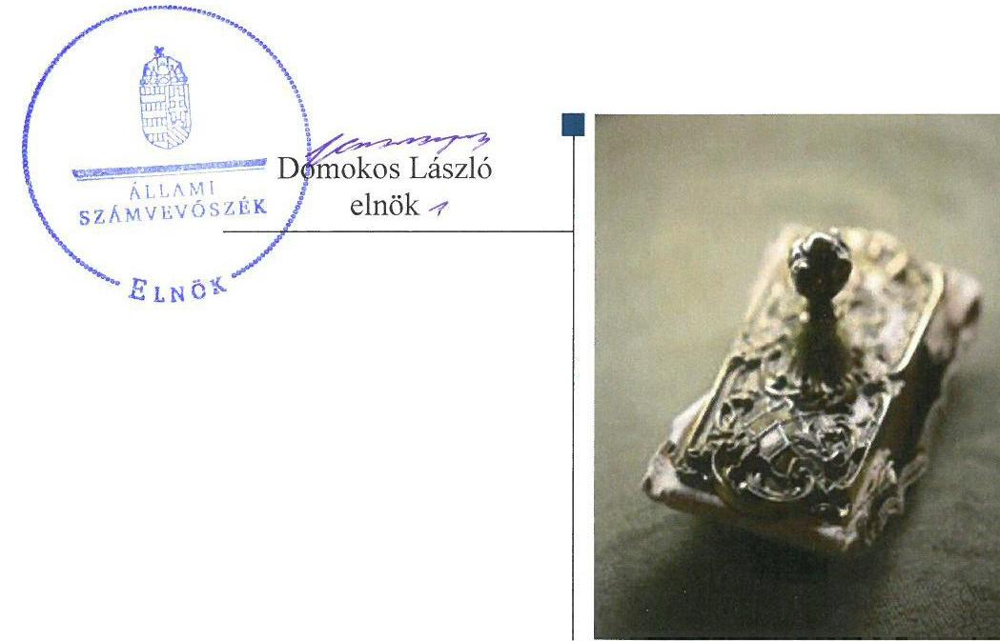
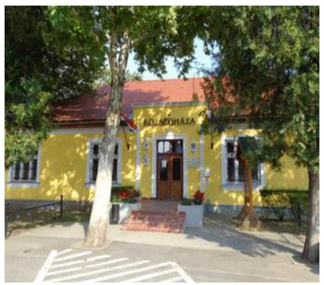
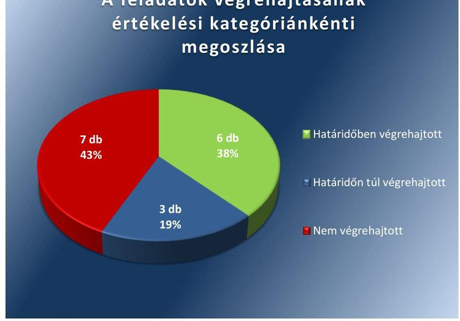

# Jelentés 

## Utóellenőrzések

Az önkormányzatok belső
kontrollrendszere kialakításának és múködtetésének utóellenőrzése Tuzsér Nagyközségi Önkormányzat 2017.

---

# Jelentés 

## Utóellenőrzések

Az önkormányzatok belső
kontrollrendszere kialakításának és múködtetésének utóellenőrzése -
Tuzsér Nagyközségi Önkormányzat
2017. 12 hó 20 nap

---

|  AZ ELLENŐRZÉST FELÜGYELTE: |  |  |  |  |  |   |
| --- | --- | --- | --- | --- | --- | --- |
|   | RENKŐ ZSUZSANNA felügyeleti vezető |  |  |  |  |   |
|   | AZ ELLENŐRZÉST VEZETTE ÉS A VÉGREHAJTÁSÁÉRT FELELŐS: |  |  |  |  |   |
|   | ÁRPÁSI TIBOR ellenőrzésvezető |  |  |  |  |   |
|   | A PROGRAM ÖSSZEÁLLÍTÁSÁÉRT FELELŐS: |  |  |  |  |   |
|   | JANIK JÓZSEF LÁSZLÓ osztályvezető |  |  |  |  |   |
|   | A TÉMÁHOZ KAPCSOLÓDÓ KORÁBBI SZÁMVEVŐSZÉKI JELENTÉSEK: |  |  |  |  |   |
|   | - címe: | Jelentés az önkormányzatok belső kontrollrendszere kialakításának, egyes kontrolltevékenységek és a belső ellenőrzés müködésének - 2013. évben induló - ellenőrzéséről Tuzsér |  |  |  |   |
|  Jelentéseink az Országgyúlés számítógépes hálózatán és az Interneten a www.asz.hu címen is olvashatóak. | - sorszáma: | 13121 |  |  |   |
|   | IKTATÓSZÁM: EL-0074-053/2017. |  |  |  |  |   |
|   | TÉMASZÁM: 10 |  |  |  |  |   |
|   | ELLENŐRZÉS-AZONOSÍTÓ SZÁM: V0755114 |  |  |  |  |   |

---

# TARTALOMJEGYZÉK 

■ ÖSSZEGZÉS ..... 5
■ AZ ELLENŐRZÉS CÉLJA ..... 6
■ AZ ELLENŐRZÉS TERÜLETE ..... 7
■ AZ ELLENŐRZÉS HÁTTERE, INDOKOLTSÁGA ..... 8
■ A JELENTÉS LÉNYEGES KÉRDÉSKÖRE ..... 9
■ ELLENŐRZÉS HATÓKÖRE ÉS MÓDSZEREI ..... 10
■ MEGÁLLAPÍTÁSOK ..... 12
■ MELLÉKLETEK ..... 15
I. Sz. melléklet: Az ÁSZ 13121. számú jelentéséhez kapcsolódó intézkedési terv végrehajtása ..... 15
■ FÜGGELÉK: ÉSZREVÉTELEK ..... 19
■ RÖVIDÍTÉSEK JEGYZÉKE ..... 21

---

.

---

# ÖSSZEGZÉS 

Az Állami Számvevőszék utóellenőrzése megállapította, hogy a Tuzsér Nagyközségi Önkormányzat az intézkedési tervében vállalt feladatok jelentős részét nem hajtotta végre. Az Önkormányzat nem hasznosította a hibák, szabálytalanságok megszüntetése érdekében a jelentésben megfogalmazott javaslatokat, a belső ellenőrzés nem töltötte be feladatát. Müködésének átláthatósága, szabályozottsága nem javult.

## Az ellenőrzés társadalmi indokoltsága

Az Állami Számvevőszék stratégiájában célul tűzte ki a számvevőszéki munka hasznosulásának javítását. Ezzel összhangban ellenőrzi, hogy az ellenőrzött szervezetek megvalósították-e a korábbi ellenőrzései által feltárt hibák, hiányosságok és szabálytalanságok megszüntetése céljából elkészített intézkedési terveikben foglaltakat. A rendszeres utóellenőrzések hozzájárulnak a szükséges intézkedések tényleges végrehajtáshoz, ezáltal a közpénzügyek rendezettségének javulásához.

## Főbb megállapítások, következtetések

Az intézkedési tervben meghatározott 16 feladatból hatot határidőben, hármat határidőn túl, hetet nem hajtottak végre. A jegyző határidőben gondoskodott a hivatali SZMSZ módosításáról, az ellenjegyzési és érvényesítési feladatra jogosultak kijelöléséről, a teljesítésigazolás és érvényesítés szabályszerűségéről, kialakította és alkalmazta a teljesít-mény-értékelés szabályait, rögzítette az előzetes írásbeli kötelezettségvállalást nem igénylő kifizetések rendjét.

A belső ellenőrzés működésére vonatkozó feladatok közül határidőn túl került sor a belső ellenőrzési vezető feladatai ellátása módjának meghatározására, az ellenőrzési tervet megalapozó elemzések és a kockázatelemzés eredményének összefoglaló bemutatására, éves ellenőrzési jelentés elkészítésére. A jegyző nem intézkedett arról, hogy készüljön kockázatelemzés az éves ellenőrzési tervhez, az ellenőrzési programokat a belső ellenőrzési vezető hagyja jóvá, meghatározzák az ellenőrzési jelentésekben az ellenőrzés típusát, a belső ellenőrzési jelentésekben megfogalmazott javaslatok végrehajtására intézkedési terv készüljön, a belső ellenőrzési jelentések és az azok alapján megtett intézkedésekről vezessenek nyilvántartást.

Nem került sor továbbá a hivatás-etikai alapelvek meghatározására és az Önkormányzat tevékenységének, a célok megvalósításának folyamatos nyomon követését biztosító rendszer kialakítására.

Az intézkedési tervben rögzített feladatok végrehajtásáról vezették a jogszabályi előírásnak megfelelő nyilvántartást.

---

# AZ ELLENŐRZÉS CÉLJA 

Az ellenőrzés célja annak értékelése volt, hogy a számvevőszéki jelentésében ${ }^{1}$ foglalt intézkedést igénylő javaslatokat megalapozó megállapításokkal összhangban készített intézkedési tervében meghatározott feladatokat az Önkormányzat végrehajtotta-e.

---

# AZ ELLENŐRZÉS TERÜLETE 

## Tuzsér Nagyközségi Önkormányzat, Tuzséri Közös Önkormányzati Hivatal

Tuzsér a Nyírségben, Szabolcs-Szatmár-Bereg megye északkeleti részén, Záhony járásban, 1552 hektár területen helyezkedik el, állandó lakosainak száma a KSH által közzétett népességi adatok ${ }^{2}$ szerint 2016. január 1-jén 3441 fő volt.

A település polgármestere ${ }^{3}$ a 2013. évi időközi önkormányzati választások óta tölti be tisztségét. A jegyző ${ }^{4}$ 2011. május 19-től látja el a feladatait. A Képviselő-testület ${ }^{5} 7$ tagból áll, az Önkormányzat ${ }^{6}$ munkáját két bizottság, a Pénzügyi, valamint a Népjóléti és Köznevelési bizottság segíti. Az igazgatási tevékenységek ellátására Tuzsér Nagyközségi Önkormányzat és Komoró Község Önkormányzata 2013. március 1-jén létrehozta a Tuzséri Közös Önkormányzati Hivatalt ${ }^{7}$.

Az Önkormányzat a 2016. évi zárszámadási rendelete szerint 1067,9 M Ft bevételt ért el és 916 M Ft kiadást teljesített, 2016. december 31-én 2113,4 M Ft értékű vagyonnal rendel-
kezett, amelyből 1903,4 M Ft volt a nemzeti vagyonba tartozó befektetett eszközök állománya.

Az ÁSZ ${ }^{8}$ 2013. évben ellenőrizte az Önkormányzat belső kontrollrendszere kialakításának és működtetésének szabályszerűségét 2012. január 1. és december 31. közötti időszak tekintetében. Az erről szóló 13121 számú jelentést 2013. december 4-én tette közzé. A számvevőszéki jelentésben feltárt szabálytalanságok, múködésbeli hiányosságok kiküszöbölése érdekében az Önkormányzat Képviselő-testülete a 195/2013. (XII. 23.) számú határozattal intézkedési tervet fogadott el.

Az utóellenőrzés a számvevőszéki jelentésben megfogalmazott intézkedést igénylő megállapításokra készített, intézkedési tervben foglalt feladatok végrehajtásának ellenőrzésére, illetve értékelésére terjedt ki.

---

# AZ ELLENŐRZÉS HÁTTERE, INDOKOLTSÁGA 

Az ÁSZ tv. ${ }^{9}$ 33. § (1) bekezdése értelmében a számvevőszéki jelentések intézkedést igénylő megállapításaihoz kapcsolódóan az ellenőrzött szervezet vezetője intézkedési tervet köteles összeállítani, és az ÁSZ részére megküldeni. Az intézkedési tervben foglaltak megvalósítását - az ÁSZ tv. 33. § (7) bekezdésében foglaltak alapján - az ÁSZ utóellenőrzés keretében ellenőrizheti. Az intézkedések megvalósulásának értékelése során az ÁSZ figyelembe veszi az ellenőrzött szervezetek működési feltételeiben, valamint a jogszabályi előírásokban bekövetkezett változásokat.

Az intézkedési tervekben foglalt feladatok hiányos, illetve késedelmes végrehajtása, valamint megvalósításának elmaradása azt mutatja, hogy az ellenőrzések során feltárt hibák, hiányosságok és szabálytalanságok megszüntetése nem kapott kellő hangsúlyt. Ez a szabályszerű működés és a felelős vezetői magatartás vonatkozásában kockázatot hordoz. E kockázatok feltárásával az ÁSZ utóellenőrzési rendszere fokozza a fegyelmet, és igazolja, hogy a közpénzzel való szabályos gazdálkodás felelőssége elől nem lehet kitérni.

## AZ UTÓELLENŐRZÉS VÁRHATÓ HASZNOSULÁSA

Az utóellenőrzés négy szinten hasznosulhat:
$\longrightarrow$ A társadalom szintjén az utóellenőrzés jelzi, hogy a számvevőszéki ellenőrzés megállapításainak van következménye: a hiányosságok megszüntetésére az ellenőrzött szervezet által meghatározott intézkedések végrehajtását is számon kéri az ÁSZ.
$\longrightarrow$ Az ellenőrzött terület szintjén az utóellenőrzés tájékoztatást nyújt a terület döntéshozóinak a hiányosságok kiküszöbölésének jó gyakorlatairól, ezzel lehetőséget biztosítva arra, hogy az ÁSZ ellenőrzési megállapításai, javaslatai a terület nem ellenőrzött szervezeteinek a működése során is hasznosuljanak.
$\longrightarrow$ Az ellenőrzött szervezet szintjén az utóellenőrzés feltárja, hogy a szervezet az intézkedések végrehajtásával hasznosította-e a korábbi ellenőrzési jelentésben a hiányosságok megszüntetése, illetve a kockázatok kezelése érdekében megfogalmazott javaslatokat.
$\longrightarrow$ Az ÁSZ szintjén az utóellenőrzés visszacsatolást ad az ellenőrzési jelentések hasznosulásáról, az intézkedések elmaradása vagy részleges megvalósulása a további ellenőrzésekhez kockázati jelzésként szolgál.

---

# A JELENTÉS LÉNYEGES KÉRDÉSKÖRE 

Az Önkormányzat az intézkedési tervben foglaltakat az elöirt határidőben végrehajtotta-e?

---

# ELLENŐRZÉS HATÓKÖRE ÉS MÓDSZEREI 

## Az ellenőrzés típusa

Megfelelőségi ellenőrzés.

## Az ellenőrzött időszak

Az utóellenőrzés alapját képező számvevőszéki jelentés közzétételének napjától (2013. december 4.) az ellenőrzésről szóló kiértesítő levél keltének napjáig (2017. július 14.) tartó időszak.

## Az ellenőrzés tárgya

A számvevőszéki jelentésben foglalt intézkedést igénylő javaslatokat megalapozó megállapításokkal összhangban - az Önkormányzat által - készített intézkedési tervben foglaltak végrehajtásának ellenőrzése.

Az ellenőrzés kiterjedt minden olyan körülményre és adatra, amely az ÁSZ jogszabályban meghatározott feladatainak teljesítéséhez, valamint a program végrehajtása folyamán felmerült újabb összefüggések feltárásához szükséges volt.

## Az ellenőrzött szervezet

Tuzsér Nagyközségi Önkormányzat, Tuzséri Közös Önkormányzati Hivatal

## Az ellenőrzés jogalapja

Az ÁSZ tv. 33. § (7) bekezdése alapján az intézkedési tervben foglaltak megvalósítását az Állami Számvevőszék utóellenőrzés keretében ellenőrizheti.

## Az ellenőrzés módszerei

Az ÁSZ az utóellenőrzést a nemzetközi standardokat irányadónak tekintve az ellenőrzési program ellenőrzési kérdései, az ellenőrzött időszakban hatályos jogszabályok, az ellenőrzés szakmai szabályok és módszertanok figyelembevételével, önálló ellenőrzés keretében végezte.

Az ÁSZ az ellenőrzés ideje alatt az Önkormányzattal történő kapcsolattartást az ÁSZ SZMSZ-ének vonatkozó előírásai alapján biztosította.

---

Az utóellenőrzés megállapításait elsősorban az ÁSZ rendelkezésére álló, valamint az ellenőrzött szervezetektől elektronikusan bekért dokumentumok alapozták meg.

Az ellenőrzési bizonyítékként felhasználható adatforrások közé tartoznak egyrészt az ellenőrzés szakmai programjában felsorolt adatforrások, másrészt minden - az ellenőrzés folyamán feltárt, az ellenőrzés szempontjából információt tartalmazó - dokumentum.

Az intézkedési tervekben előírt feladatokat, azok végrehajthatósága, illetve végrehajtása szempontjából az alábbiak szerint értékelte az ÁSZ:
$\longrightarrow$ „határidőben végrehajtott" a feladat, ha a teljesítés dokumentáltan, az intézkedési tervben előírt határidőben és tartalommal megtörtént;
$\longrightarrow$ „határidőn túl végrehajtott" a feladat, ha annak teljesítése az intézkedési tervben meghatározott módon, de az előírt határidőn túl történt meg;
$\longrightarrow$ „részben végrehajtott" a feladat, ha végrehajtása teljes körűen az intézkedési tervben előírt módon nem történt meg;
$\longrightarrow$ „nem végrehajtott" a feladat, ha a végrehajtás nem történt meg, vagy amennyiben a teljesítést nem dokumentálták;
$\longrightarrow$ „okafogyottá vált" a feladat, ha végrehajtására - meghatározott esemény bekövetkezése, továbbá külső körülmény, a működést érintő feltétel változása miatt - már nincs szükség, illetve lehetőség, és egyértelműen megállapítható, hogy az intézkedést szükségessé tevő körülmény a jövőben nem fordulhat elő;
$\longrightarrow$ „nem időszerü" az a feladat, amelynek ellenőrzési időszakon belüli végrehajtására azért nem került (kerülhetett) sor, mert az intézkedés alapjául szolgáló esemény nem következett be, de annak jövőbeni előfordulása lehetséges, a végrehajtása nem volt esedékes, vagy a végrehajtás határideje még nem járt le.
Az ellenőrzés lefolytatásához az ellenőrzött szervezet a tanúsítványok elektronikus kitöltésével, valamint az ÁSZ által kért dokumentumok elektronikus megküldésével szolgáltatott adatokat, amelyek valódiságát és teljes körűségét az ellenőrzött szervezet vezetője által tett teljességi és hitelességi nyilatkozat igazolta. Az így rendelkezésre bocsátott adatok, információk kontrollja az ellenőrzés keretében történt.

---

# MEGÁLLAPÍTÁSOK 

## Az Önkormányzat az intézkedési tervben foglaltakat az előírt határidőben végrehajtotta-e?

Összegző megállapítás

Az Önkormányzat az intézkedési tervben meghatározott tizenhat feladatból hatot határidőben, hármat határidőn túl, míg hetet nem hajtott végre. Az intézkedési tervben rögzített feladatok végrehajtásáról vezették a jogszabályban előírt nyilvántartást.

Az ÁSZ a jelentésében a jegyző részére tizenhat javaslatot fogalmazott meg. A Képviselő-testület az ÁSZ részére megküldött intézkedési tervben a hiányosságok, feltárt szabálytalanságok megszüntetésére tizenhat feladatot határozott meg. A feladatok elvégzésének felelőse minden esetben a jegyző volt.

Az intézkedési tervben meghatározott feladatokat, határidőket, a feladatok elvégzésének felelősét és az intézkedések végrehajtását az I. számú melléklet mutatja be.

A jegyző az intézkedési terv végrehajtásáról a Bkr. ${ }^{10}$ előírásainak megfelelő nyilvántartást vezette.

Az intézkedési tervben vállalt feladatok végrehajtásának értékelési kategóriák szerinti megoszlását az 1. ábra szemlélteti:

1. ábra

A feladatok végrehajtásának
értékelési kategóriánkénti
megoszlása

Fonás. ÁSZ

---

# HATÁRIDŐBEN VÉGREHAJTOTT FELADAT: 

$\qquad$1. A jegyző előkészítette és kezdeményezte a hivatali SZMSZ ${ }^{11}$ módosítását.
2. A jegyző kialakította és alkalmazta a teljesítmény-értékelésre vonatkozó szabályokat.
3. A jegyző a Gazdálkodási szabályzat ${ }^{12}$ II. fejezetében rögzítette az előzetes írásbeli kötelezettségvállalást nem igénylő kifizetések rendjét.
4. A pénzügyi ellenjegyzési és érvényesítési feladatra jogosultak kijelöléséről az aljegyző mint gazdasági vezető gondoskodott.
5. A jegyző gondoskodott arról, hogy a teljesítést az arra szabályszerűen kijelölt személy igazolja.
6. A jegyző gondoskodott arról, hogy az érvényesítő jelezze az utalványozónak, ha az Áht. ${ }^{13}$-ban, az Áhsz. ${ }^{14}$-ben, az Ávr. ${ }^{15}$-ben vagy a belső szabályzatokban foglaltak megsértését tapasztalja.

## HATÁRIDŐN TÚL VÉGREHAJTOTT FELADAT:

7. A külső szolgáltatóval a belső ellenőrzés megszervezésére a 2015. március 31-én aláírt megállapodás tartalmazta a belső ellenőrzési vezető feladatai ellátásának módját az intézkedési tervben vállalt 2014. március 31. helyett.
8. Az intézkedési tervben vállalt 2014. március 31-ei határidőt követően, a 2015. november 19-én elfogadott 2016. évi ellenőrzési terv tartalmazta az ellenőrzési tervet megalapozó elemzések és a kockázatelemzés eredményének összefoglaló bemutatását.
9. Az intézkedési tervben meghatározott 2014. április 30-át követően, 2015. május 6-án fogadta el a Képviselő-testület a 36/2015. (V. 06.) számú képviselő-testületi határozattal a 2014. évről szóló éves ellenőrzési jelentést.

## NEM VÉGREHAJTOTT FELADAT

10. A jegyző a Mötv ${ }^{16}$. 81. § (3) bekezdés c) pontjában foglalt feladatkörében előírtak és a Kttv. ${ }^{17}$ 83. §-ában foglaltak ellenére nem készítette elő a köztisztviselőkkel szembeni hivatás-etikai alapelvek részletes tartalmának, valamint az etikai eljárás szabályainak dokumentumait, így nem is kezdeményezte a polgármesternél a Kttv. 231. § (1) bekezdésében foglaltak alapján azok Képviselő-testület elé terjesztését.
11. A Bkr. 3. § e) pontjában és a 10. §-ában foglaltak ellenére a jegyző nem alakította ki a szervezet tevékenységének, a célok megvalósításának folyamatos nyomon követését biztosító rendszert.
12. Kockázatelemzés a 2016. évi ellenőrzési tervhez készült. A jegyző nem gondoskodott arról, hogy a Bkr. 31. § (2) bekezdésének előírása alapján az intézkedési tervben előírt folyamatos határidőnek megfelelően minden év ellenőrzési tervéhez készüljön kockázatelemzés.

---

13. A 2014. évi ellenőrzésekhez készült a belső ellenőrzési vezető által jóváhagyott ellenőrzési program. A jegyző nem gondoskodott arról, hogy a Bkr. 33. § (2) bekezdésében foglaltak alapján az intézkedési tervben előírt folyamatos határidőnek megfelelően minden év ellenőrzési programját hagyja jóvá a belső ellenőrzési vezető.
14. Az ellenőrzés típusát a 2014. évi ellenőrzési jelentés tartalmazta. A jegyző nem gondoskodott arról, hogy a Bkr. 39. § (3) bekezdés d) pontjában előírtak alapján az intézkedési tervben előírt folyamatos határidőnek megfelelően minden év ellenőrzési jelentése tartalmazza az ellenőrzés típusát.
15. A 2014. évi belső ellenőrzési jelentésekben megfogalmazott javaslatok végrehajtására készültek intézkedési tervek a Bkr. 45. § (1)-3) bekezdéseiben foglaltaknak megfelelő tartalommal és az előírt határidőn belül. A jegyző nem gondoskodott arról, hogy az intézkedési tervben előírt folyamatos határidőnek megfelelően minden évben készüljenek a belső ellenőrzési jelentésekben megfogalmazott javaslatok végrehajtására intézkedési tervek.
16. A 2014. évre vonatkozóan elkészült a nyilvántartás a belső ellenőrzési jelentés alapján megtett intézkedésekről a Bkr. 47. § (1)-(2) bekezdéseiben, valamint az elvégzett belső ellenőrzésekről a Bkr. 50. §-ában előírtaknak megfelelően. A jegyző nem gondoskodott arról, hogy intézkedési tervben előírt folyamatos határidőnek megfelelően minden évben készüljön nyilvántartás a belső ellenőrzési jelentés alapján megtett intézkedésekről, valamint az elvégzett belső ellenőrzésekről.

---

# MELLÉKLETEK

- I. SZ. MELLÉKLET: AZ ÁSZ 13121. SZÁMÚ JELENTÉSÉHEZ KAPCSOLÓDÓ INTÉZKEDÉSI TERV VÉGREHAJTÁSA

|  1. | Az intézkedési terv alapján elvégzendő feladat | Az intézkedési tervben meghatározott határidő | Az intézkedési tervben megjelölt felelős | A feladat végrehajtása  |
| --- | --- | --- | --- | --- |
|  1. | Határidőben végrehajtott feladatok |  |  |   |
|  1. | „1. Elő kell készíteni a közös önkormányzati hivatali SZMSZ módosítását, és kezdeményezze az Áht. 9. § (1) bekezdés a) pontjában foglaltak alapján a polgármesternél a Képviselő-testület elé terjesztését annak érdekében, hogy az tartalmazza az Ávr. 13. § (1) bekezdés g) és i) pontjaiban foglaltaknak megfelelően az SZMSZ-ben nevesített valamennyi munkakörhöz tartozó feladat- és hatásköröket, a hatáskörök gyakorlásának módját, a helyettesítés rendjét, az ezekhez kapcsolódó felelősségi szabályokat, valamint a költségvetési szervhez rendelt más költségvetési szervek felsorolását."
„2. Ki kell alakítani a Kttv. 130. § (1)-(6) bekezdéseiben előírtak szerint a teljesítmény-értékelésre vonatkozó szabályokat, és azokat alkalmazni kell." | 2014. február 28. | jegyző | A jegyző előkészítette és kezdeményezte a hivatali SZMSZ módosítását. A Képviselő-testület a 33/2014. (III. 10.) számú határozatával fogadta el a Tuzséri Közös Önkormányzati Hivatal Szervezeti és Működési Szabályzatának módosítását. Az SZMSZ 4. számú melléklete tartalmazta az Ávr. 13. § (1) bekezdés g) pontjában foglaltaknak megfelelően az SZMSZ-ben nevesített valamennyi munkakörhöz tartozó feladat- és hatásköröket, a hatáskörök gyakorlásának módját, a helyettesítés rendjét, az ezekhez kapcsolódó felelősségi szabályokat. Az Ávr. 13. § (1) bekezdés i) pontjában foglalt előírásoknak eleget téve az SZMSZ 4.5. pontja kiegészítésre került és tartalmazta a Hivatalhoz rendelt más költségvetési szervek felsorolását.  |
|  2. |  |  |  |   |
|  2. |  |  |  |   |
|  3. | „4. Rögzíteni kell a belső szabályzatban az Ávr. 53. § (2) bekezdése alapján az előzetes kötelezettségvállalást nem igénylő kifizetések rendjét." | 2014. március 31. | jegyző | A jegyző a Kttv. 130. § (1)-(6) bekezdéseiben és a 10/2013. (I. 21.) Korm. rendeletben ${ }^{18}$ foglaltak alapján kialakította és alkalmazta a teljesítményértékelésre vonatkozó szabályokat. A jegyző 2013. július 11-én a Hivatal nevében nyilatkozott arról, hogy csatlakozni kíván a KIH ${ }^{19}$ által üzemeltetett TÉR Centrumhoz ${ }^{20}$. A hivatalban foglalkoztatott személyek részére a 10/2013. (I. 21.) Korm. rendelet 5. § előírásainak megfelelően meghatározták és az értékelt személyek részére átadták az egyéni teljesítménykövetelményeket és a kompetencia alapú munkamagatartás értékelés tényezőit. A jegyző 2014 januárjában elkészítette és átadta a közszolgálati tisztviselők teljesítményértékelését és a minősítő lapokat.  |
|  3. |  |  |  |   |
|  3. |  |  |  |   |

---

|  4. | „5. Gondoskodni kell arról, hogy a pénzügyi ellenjegyzési és érvényesítési feladatra jogosultakat az Ávr. 55. § (2) bekezdés a) pontjában, valamint az 58. § (4) bekezdésben foglaltaknak megfelelően a gazdasági vezető jelölje ki." | 2014. március 31. | jegyző | A 2014. január 1-jétől hatályos Gazdálkodási szabályzatban foglaltak értelmében a gazdasági vezetői feladatokat az aljegyző látta el. A Gazdálkodási szabályzat 1/h, 1/i, 1/j. számú mellékletét képező, a pénzügyi ellenjegyzési jogkör gyakorlására kiadott, továbbá az érvényesítési jogkör gyakorlására kiadott 4/a. 4/b. 4/c. 4/d. számú mellékletet képező felhatalmazásokat az aljegyző ${ }^{21}$ mint gazdasági vezető írta alá.  |
| --- | --- | --- | --- | --- |
|  5. | „7.a) Gondoskodni kell - a teljesítésigazolás és az érvényesítés vonatkozásában feltárt hiányosságok megszüntetése, illetve az operatív gazdálkodás során a müködésbeli hibák megelőzése, feltárása és kijavítása érdekében - arról, hogy a teljesítést az Ávr. 57. § (4) bekezdésében foglalt előírásoknak megfelelően az arra kijelölt személy igazolja." | 2014. február 28. | jegyző | A jegyző gondoskodott arról, hogy a teljesítést az Ávr. 57. § (4) bekezdésében foglalt előírásoknak megfelelően - az arra kijelölt személy igazolja.
2014. február 3-án levélben hívta fel a gazdasági vezető (aljegyző) figyelmét, hogy teljesítésigazolásra csak az Ávr. 57. § (4) bekezdésében foglaltak szerint, a kötelezettségvállaló által írásban kijelölt személy jogosult, akinek feladata ellátása során a jogszabályi előírásoknak megfelelően kell eljárnia. Az aljegyző a jegyzői felhívásban foglaltak tudomásul vételét 2014. február 3-án aláírásával igazolta.  |
|  6. | „7.b) Gondoskodni kell - a teljesítésigazolás és az érvényesítés vonatkozásában feltárt hiányosságok megszüntetése, illetve az operatív gazdálkodás során a müködésbeli hibák megelőzése, feltárása és kijavítása érdekében - arról, hogy az érvényesítő az Ávr. 58 § (2) bekezdésében foglalt előírásnak megfelelően jelezze az utalványozónak, ha az Áht. vagy az államháztartási számviteli kormányrendelet, az Ávr. és a belső szabályzatokban foglaltak megsértését tapasztalja." | 2014. február 28. | jegyző | A jegyző gondoskodott arról, hogy az érvényesítő az Ávr. 58. § (2) bekezdésében foglalt előírásoknak megfelelően jelezze az utalványozónak, ha az Áht.-ban, az Áhsz.-ben, az Ávr.-ben vagy a belső szabályzatokban foglaltak megsértését tapasztalja.
2014. február 3-án levélben hívta fel az érvényesítési jogkörgyakorlásra felhatalmazott személyek figyelmét, hogy teljesítésigazolásra csak az Ávr. 57. § (4) bekezdésében foglaltak szerint, a kötelezettségvállaló által írásban kijelölt személy jogosult és feladatuk ellátása során a jogszabályi előírásoknak megfelelően járjanak el. Amennyiben az érvényesítési jogkör gyakorlás során az Áht. az Áhsz. az Ávr. vagy a belső szabályzatokban foglaltak megsértését tapasztalják, úgy az Ávr. 58. §. (2) bekezdésében foglaltaknak megfelelően kötelesek azt jelezni az utalványozónak. A Gazdálkodási szabályzat 8. számú melléklete szerinti valamennyi érvényesítési jogkörgyakorlásra felhatalmazott személy a jegyzői felhívásban foglaltak tudomásul vételét 2014. február 3-án aláírásával igazolta.  |
|  7. | „8. Intézkedni kell arról, hogy a Bkr. 16. § (4) bekezdés előírásának megfelelően a belső ellenőrzési tevékenység megszervezésére vonatkozó megállapodás- | 2014. március 31. | jegyző | A 2015. március 31-én külső szolgáltatóval kötött megállapodásban gondoskodtak arról, hogy az - a Bkr. 22. § (1) - (2) bekezdéseiben foglaltaknak megfelelően - tételesen tartalmazza a feladatok és kötelességek ellátásának módját. A megállapodás szerint a megbízott feladatait személyesen köteles ellátni.  |

---

|  E
S
S
Z
A | Az intézkedési terv alapján elvégrendő feladat | Az intézkedési tervben meghatározott határidő | Az intézkedési tervben megjelölt felelős | A feladat végrehajtása  |
| --- | --- | --- | --- | --- |
|   | ban rendelkezzenek a Bkr. 22. § (1)-(2) bekezdéseiben foglalt tevékenységek és kötelességek ellátásának módjáról." |  |  |   |
|  8. | „9. Kezdeményezni kell, hogy az éves ellenőrzési tervek tartalmazzák a Bkr. 31. § (4) bekezdés a) pontjaiban előírtaknak megfelelően az ellenőrzési tervet megalapozó elemzések és a kockázatelemzés eredményének összefoglaló bemutatását." | 2014. március 31. | jegyző | A 97/2015. (XI. 19.) képviselő-testületi határozattal elfogadott 2016. évi ellenőrzési tervben gondoskodtak arról, hogy az ellenőrzési terv tartalmazza a Bkr. 31. § (4) bekezdésben előírtaknak megfelelően az ellenőrzési tervet megalapozó elemzések és a kockázatelemzés eredményének összefoglaló bemutatását.  |
|  9. | „15. Intézkedni kell arról, hogy a Bkr. 49. § (1) és bekezdésében foglaltak szerint és a 49. §(3) bekezdésben előírt határidőre készítsék el és küldjék meg az éves ellenőrzési jelentést, továbbá kezdeményezze a polgármesternél a Bkr. 56. §. (8) bekezdésében előírt határidőig annak Képviselő-testület elé terjesztését." | 2014. április 30. | jegyző | A Képviselő-testület a 36/2015. (V. 06.) számú képviselő-testületi határozattal fogadta el a 2014. évről szóló éves ellenőrzési jelentést.  |
|   |  |  | Nem végrehajtott feladatok |   |
|  10. | „3. Elő kell készíteni a Mótv. 81. § (3) bekezdés c) pontjában foglalt feladatkörében a Kttv. 83. §-ában foglaltaknak megfelelően a köztisztviselőkkel szembeni hivatás-etikai alapelvek részletes tartalmának, valamint az etikai eljárás szabályainak dokumentumait és kezdeményezni kell a polgármesternél a Kttv. 231. § (I) bekezdésében foglaltak alapján annak Képviselő-testület elé terjesztését." | 2014. március 31. | jegyző | A jegyző a Mótv. 81. § (3) bekezdés c) pontjában foglalt feladatkörében előírtak, valamint a Kttv. 83. §-ában foglaltak ellenére nem készítette elő a köztisztviselőkkel szembeni hivatás etikai alapelvek részletes tartalmának, valamint az etikai eljárás szabályainak dokumentumait, így nem is kezdeményezte a polgármesternél a Kttv. 231. § (1) bekezdésében foglaltak alapján azok Képviselő-testület elé terjesztését.  |
|  11. | „6. Ki kell alakítani és müködtetni a Bkr. 3. § e) pontjában és a 10. §-ában előírtak alapján a szervezet tevékenységének, a célok megvalósításának folyamatos nyomon követését biztosító rendszert." | 2014. április 30. | jegyző | A Bkr. 3. § e) pontjában és a 10. §-ában foglaltak ellenére a jegyző nem alakította ki a szervezet tevékenységének, a célok megvalósításának folyamatos nyomon követését biztosító rendszert.  |
|  12. | „10. Intézkedni kell arról, hogy az éves ellenőrzési terv - a Bkr. 31. § (2) bekezdése alapján kockázatelemzésen alapuljon." | folyamatos | jegyző | A 2016. évi ellenőrzési tervhez készült a Bkr. 31. § (2) bekezdésében foglaltaknak megfelelően kockázatelemzés. Az intézkedési tervben előírt folyamatos határidő ellenére a jegyző nem intézkedett arról, hogy a 2014., 2015. és 2017. évek ellenőrzési terveihez is készüljön kockázatelemzés.  |

---

|  E
szízen | Az intézkedési terv alapján elvégzendő feladat | Az intézkedési tervben meghatározott határidő | Az intézkedési tervben megjelölt felelős | A feladat végrehajtása  |
| --- | --- | --- | --- | --- |
|  13. | „11. Intézkedni kell arról, hogy az ellenőrzési programokat a Bkr. 33. § (2) bekezdésében foglaltnak megfelelően belső ellenőrzési vezető hagyja jóvá." | folyamatos | jegyző | A 2014. évi ellenőrzésekhez készült a belső ellenőrzési vezető által jóváhagyott ellenőrzési program. A jegyző nem intézkedett arról, hogy a Bkr. 33. § (2) bekezdésében foglaltnak megfelelően a 2015., a 2016. és a 2017. évi ellenőrzési programokat a belső ellenőrzési vezető hagyja jóvá.  |
|  14. | „12. Intézkedni kell arról, hogy az ellenőrzési jelentések a Bkr. 39. § (3) bekezdés d) pontjában foglaltak alapján tartalmazzák az ellenőrzések típusát." | folyamatos | jegyző | A 2014. évi ellenőrzési jelentések tartalmazták az ellenőrzések típusát. A jegyző az intézkedési tervben előírt folyamatos határidő ellenére nem intézkedett arról, hogy a 2015., 2016. és 2017. évi ellenőrzési jelentések tartalmazzák a Bkr. 39. § (3) bekezdés d) pontjában foglaltaknak megfelelően az ellenőrzések típusát.  |
|  15. | „13. El kell készíttetni intézkedési tervet a belső ellenőrzési jelentésekben megfogalmazott javaslatok végrehajtására a Bkr. 45. § (1)-(3) bekezdéseiben foglaltaknak megfelelő tartalommal és határidőn belül." | folyamatos | jegyző | A 2014. évi ellenőrzésekre vonatkozóan elkészültek a belső ellenőrzési jelentésekben megfogalmazott javaslatok végrehajtására az intézkedési tervek. A jegyző nem gondoskodott arról, hogy a 2015., a 2016. és a 2017. évi belső ellenőrzési jelentések alapján készüljenek intézkedési tervek a Bkr. 45. § (1)-(3) bekezdéseiben foglaltaknak megfelelő tartalommal és előírt határidőn belül.  |
|  16. | „14. Kezdeményezni kell, hogy a Bkr. 47. § (1)-(2) bekezdéseiben foglaltak szerint tartsák nyilván és kövessék nyomon a belső ellenőrzési jelentések alapján megtett intézkedéseket, és az 50.§-ban foglaltaknak megfelelően az elvégzett belső ellenőrzésekről vezessenek nyilvántartást." | folyamatos | jegyző | A 2014. évre vonatkozóan elkészült a nyilvántartás a belső ellenőrzés alapján megtett intézkedésekről, valamint az elvégzett belső ellenőrzésekről. Az elvégzett belső ellenőrzésekről vezetett 2014. évi nyilvántartás tartalma megfelelt a Bkr. 50. §-ában előírtaknak. A belső ellenőrzés alapján megtett intézkedésekről vezetett 2014. évi nyilvántartás - a Bkr. 47. § (1)-(2) bekezdéseiben foglaltak ellenére - nem éves bontásban készült, továbbá nem tartalmazta az intézkedési terv alapján végrehajtott intézkedések rövid leírását.
A jegyző nem kezdeményezte, hogy a 2015., 2016. és 2017. évekre készüljön nyilvántartás a belső ellenőrzés alapján megtett intézkedésekről Bkr. 47. § (1)-(2) bekezdéseiben foglaltak, valamint az elvégzett belső ellenőrzésekről Bkr. 50. §-ában előírtaknak megfelelően.  |

Fonrás: $A S Z$ által készített táblázat

---

# FÜGGELÉK: ÉSZREVÉTELEK 

A jelentéstervezetet a Számvevőszék 15 napos észrevételezésre megküldte az ellenőrzött szervezet vezetőjének az ÁSZ tv. 29. §* (1) bekezdése előírásának megfelelően.

A polgármester és a jegyző az ÁSZ tv. 29. § (2) bekezdésében foglalt észrevételezési jogával nem élt.

[^0]
[^0]:    * 29. § (1) Az Állami Számvevőszék az ellenőrzési megállapításait megküldi az ellenőrzött szervezet vezetőjének vagy az általa megbízott személynek, és annak, akinek személyes felelősségét állapította meg.
    (2) Az ellenőrzött szervezet vezetője és a felelősként megjelölt személy az ellenőrzés megállapításaira tizenöt napon belül írásban észrevételt tehet.
    (3) Az Állami Számvevőszék az észrevételre a beérkezésétől számított harminc napon belül írásban válaszol. A figyelembe nem vett észrevételeket köteles a jelentésben feltüntetni, és megindokolni, hogy azokat miért nem fogadta el.

---

.

---

# RÖVIDÍTÉSEK JEGYZÉKE 

${ }^{1}$ számvevőszéki jelentés
${ }^{2}$ KSH által közzétett népességi adatok
${ }^{3}$ polgármester
${ }^{4}$ jegyző
${ }^{5}$ képviselő-testület
${ }^{6}$ Önkormányzat
${ }^{7}$ Hivatal
${ }^{8}$ ÁSZ
${ }^{9}$ ÁSZ tv.
${ }^{10}$ Bkr.
${ }^{11}$ SZMSZ
${ }^{12}$ Gazdálkodási szabályzat
${ }^{13}$ Áht.
${ }^{14}$ Áhsz.
${ }^{15}$ Ávr.
${ }^{16}$ Mötv.
${ }^{17}$ Kttv.
${ }^{18}$ 10/2013. (I. 21.) Korm. rendelet
${ }^{19}$ KIH
${ }^{20}$ TÉR Centrum
${ }^{21}$ Aljegyző

Az ÁSZ 13121 számú jelentése - Jelentés az önkormányzatok belső kontrollrendszere kialakításának, egyes kontrolltevékenységek és a belső ellenőrzés múködésének - 2013. évben induló - ellenőrzéséről Tuzsér, közzétéve 2013. december 4-én (elérhető a www.asz.hu honlapon)

Központi Statisztikai Hivatal, Magyarország Helységnévtára 2016. január 1-jei adatai

Tuzsér Nagyközségi Önkormányzat polgármestere
Tuzséri Közös Önkormányzati Hivatal jegyzője
Tuzsér Nagyközségi Önkormányzat Képviselő-testülete
Tuzsér Nagyközségi Önkormányzat
Tuzséri Közös Önkormányzati Hivatal
Állami Számvevőszék
Az Állami Számvevőszékről szóló 2011. évi LXVI. törvény (hatályos: 2011. július 1-jétől)
A költségvetési szervek belső kontrollrendszeréről és belső ellenőrzéséről szóló 370/2011. (XII. 31.) Korm. rendelet (hatályos: 2012. január 1-jétől)
Tuzséri Közös Önkormányzati Hivatal Szervezeti és Múködési Szabályzata (hatályos: 2014. március 11-től)
Tuzsér Nagyközségi Önkormányzat Gazdálkodási szabályzata a kötelezettségvállalás, pénzügyi ellenjegyzés, teljesítés igazolása, érvényesítés, utalványozás és adatszolgáltatás rendjéről (hatályos: 2014. január 1-jétől)
Az államháztartásról szóló 2011. évi CXCV. törvény (hatályos 2012. január 1-jétől)
Az államháztartás számviteléről szóló 4/2013. (I. 11.) Korm. rendelet (hatályos: 2014. január 1-jétől)

Az államháztartásról szóló törvény végrehajtásáról szóló 368/2011. (XII. 31.) Korm. rendelet (hatályos 2012. január 1-jétől)
2011. évi CLXXXIX. törvény Magyarország helyi önkormányzatairól (hatályos: 2012. január 1-jétől)
2011. évi CXCIX. törvény a közszolgálati tisztviselők ről (hatályos: 2012. március 1-jétől)
10/2013. (I. 21.) Korm. rendelet a közszolgálati egyéni teljesítményértékelésről (hatályos: 2013. július 1-jétől)
Közigazgatási és Igazságügyi Hivatal
Közigazgatási és Igazságügyi Hivatal által működtetett közszolgálati egyéni teljesítményértékelési rendszer
Tuzséri Közös Önkormányzati Hivatal aljegyzője (gazdasági vezető)

---

# ÁLLAMI SZÁMVEVŐSZÉK 

1052 Budapest, Apáczai Csere János utca 10.
Levélcím: 1364 Budapest 4. Pf. 54
Telefon: +36 14849100 Telefax: +36 14849200
www.asz.hu