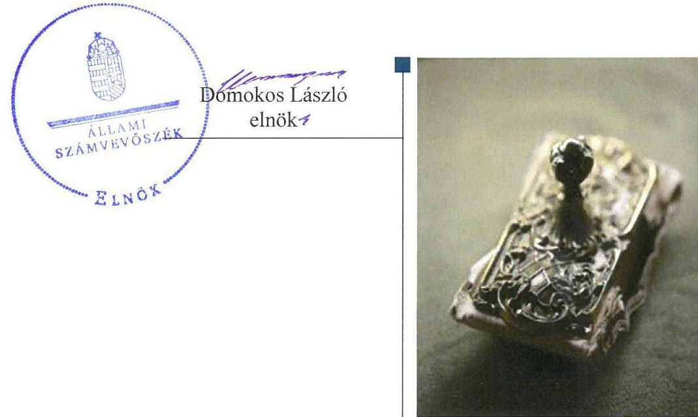
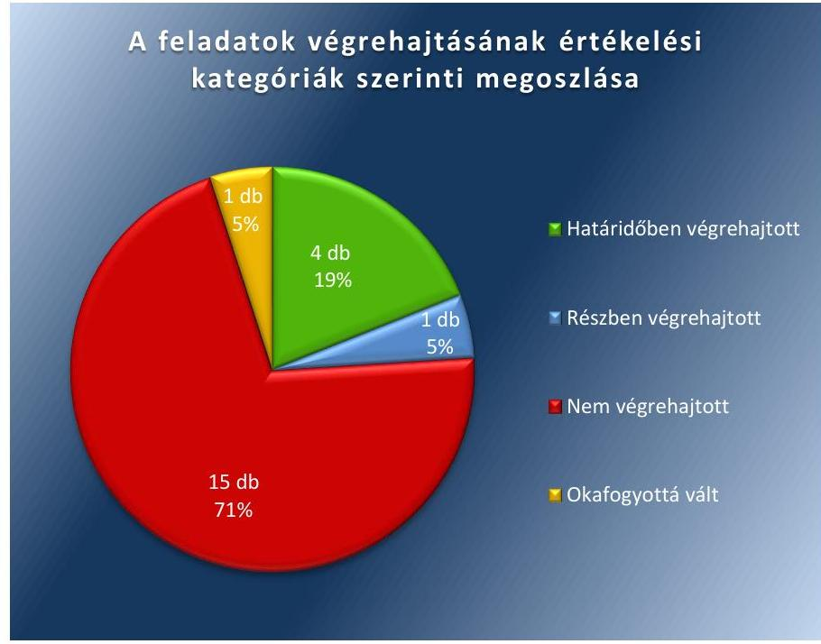

# Jelentés 

## Utóellenőrzések

Az önkormányzatok belső
kontrollrendszere kialakításának és múködtetésének utóellenőrzése Marcaltő Község Önkormányzata 2017.

---

# Jelentés 

## Utóellenőrzések

Az önkormányzatok belső
kontrollrendszere kialakításának és múködtetésének utóellenőrzése Marcaltő Község Önkormányzata 2017. 12 hó 20 nap

---

|  AZ ELLENŐRZÉST FELÜGYELTE: |  |  |  |  |   |
| --- | --- | --- | --- | --- | --- |
|   | RENKŐ ZSUZSANNA felügyeleti vezető |  |  |  |   |
|   | AZ ELLENŐRZÉST VEZETTE ÉS A VÉGREHAJTÁSÁÉRT FELELŐS: |  |  |  |   |
|   | ÁRPÁSI TIBOR ellenőrzésvezető |  |  |  |   |
|   | A PROGRAM ÖSSZEÁLLÍTÁSÁÉRT FELELŐS: |  |  |  |   |
|   | JANIK JÓZSEF LÁSZLÓ osztályvezető |  |  |  |   |
|   | A TÉMÁHOZ KAPCSOLÓDÓ KORÁBBI SZÁMVEVŐSZÉKI JELENTÉSEK: |  |  |  |   |
|   | - címe: | Jelentés az önkormányzatok belső kontrollrendszere kialakításának, egyes kontrolltevékenységek és a belső ellenőrzés működésének ellenőrzéséről - Marcaltó |  |  |   |
|  Jelentéseink az Országgyúlés számítógépes hálózatán és az Interneten a www.asz.hu címen is olvashatóak. | - sorszáma: | 14094 |  |   |
|   | IKTATÓSZÁM: EL-0075-065/2017. |  |  |  |   |
|   | TÉMASZÁM: 21 |  |  |  |   |
|   | ELLENŐRZÉS-AZONOSÍTÓ SZÁM: V0755120 |  |  |  |   |

---

# TARTALOMJEGYZÉK 

■ ÖSSZEGZÉS ..... 5
■ AZ ELLENŐRZÉS CÉLJA ..... 6
■ AZ ELLENŐRZÉS TERÜLETE ..... 7
■ AZ ELLENŐRZÉS HÁTTERE, INDOKOLTSÁGA ..... 8
■ A JELENTÉS LÉNYEGES KÉRDÉSKÖRE ..... 9
■ ELLENŐRZÉS HATÓKÖRE ÉS MÓDSZEREI ..... 10
■ MEGÁLLAPÍTÁSOK ..... 12
■ MELLÉKLETEK ..... 15
I. Sz. melléklet: Az ÁSZ 14094. számú jelentéséhez kapcsolódó intézkedési terv végrehajtása ..... 15
■ FÜGGELÉK: ÉSZREVÉTELEK ..... 19
■ RÖVIDÍTÉSEK JEGYZÉKE ..... 21

---

.

---

# ÖSSZEGZÉS 

Az Állami Számvevőszék utóellenőrzése megállapította, hogy az intézkedési tervben foglalt feladatok többségét Marcaltő Község Önkormányzata nem hajtotta végre. A belső kontrollrendszer kialakításának és müködésének, valamint a pénzügyi folyamatok hiányosságai továbbra is fennálltak. Ezáltal nem volt biztositott a közpénzekkel való felelős, elszámoltatható, átlátható és szabályszerü gazdálkodás.

## Az ellenőrzés társadalmi indokoltsága

Az Állami Számvevőszék stratégiájában célul tűzte ki a számvevőszéki munka hasznosulásának javítását. Ezzel összhangban ellenőrzi, hogy az ellenőrzött szervezetek megvalósították-e a korábbi ellenőrzései által feltárt hibák, hiányosságok és szabálytalanságok megszüntetése céljából elkészített intézkedési terveikben foglaltakat. A rendszeres utóellenőrzések hozzájárulnak a szükséges intézkedések tényleges végrehajtáshoz, ezáltal a közpénzügyek rendezettségének javulásához.

## Főbb megállapítások, következtetések

Marcaltő Község Önkormányzata az intézkedési tervben meghatározott 21 feladatból négyet határidőben, egyet részben, tizenötöt nem hajtott végre, míg egy okafogyottá vált. A jegyző határidőben gondoskodott a hivatásetikai szabályzat előterjesztéséről, módosította a kockázatkezelési szabályzatot, beszerezte az iratkezelési szabályzat kiadásához szükséges egyetértést és kezdeményezte a stratégiai ellenőrzési terv elkészítését.

Részben végrehajtott feladatként a polgármester nem kísérte figyelemmel a gazdálkodás szabályszerűségét, ugyanakkor megvizsgálta a jegyzővel szemben a számvevőszéki jelentésben feltárt hiányosságokkal összefüggésben felvethető munkajogi felelősséget.

A polgármester nem határozott meg vezetői kontrollokat az írásbeli kötelezettségvállalás során követendő eljárás szabályszerűségének biztosítása érdekében. A jegyző nem intézkedett a Marcaltői Közös Önkormányzati Hivatal szervezeti és múködési szabályzatának módosításáról, nem fordított figyelmet a rendeletmódosítások határidőben történő előkészítésére, az elektronikus közzétételi kötelezettség dokumentálására, nem alakította ki a Hivatal tevékenységének, a célok megvalósításának nyomon követését biztosító rendszerét. Nem tett intézkedéseket a monitoring rendszer fejlesztése érdekében, nem gondoskodott vezetői kontrollok meghatározásáról, hogy a teljesítésigazolás minden esetben a jogszabályi előírásoknak megfelelően, szabályszerűen történjen, hogy az utalványon a jogszabályi előírásnak megfelelő adatokat tűntessék fel. A jegyző nem jelezte a belső ellenőrzést végző társulás felé, hogy szerződésükben rendelkezzenek a belső ellenőrzési vezetői feladatok és kötelességek ellátásának módjáról. A jegyző nem gondoskodott a belső ellenőrzési kézikönyv jóváhagyásáról, továbbá arról, hogy a belső ellenőrzési tevékenységet végző belső ellenőrök minden esetben rendelkezzenek az előírt engedéllyel, az éves ellenőrzési terv tartalmazza az ellenőrzések tervezett ütemezését, a belső ellenőrzés a stratégiai ellenőrzési tervben foglaltaknak megfelelően minden évben megtörténjen, a társulás az éves ellenőrzési jelentést határidőre küldje.

Jogszabályváltozás miatt okafogyottá vált az önkormányzat gazdálkodásának első félévi helyzetéről a polgármester tájékoztatási kötelezettsége.

Marcaltő Község Önkormányzata szabályozásbeli és múködési hiányosságai következtében továbbra sem biztosított a szabályszerű, átlátható és elszámoltatható közpénzfelhasználás.

Az intézkedési tervben rögzített feladatok végrehajtásáról nem vezették a jogszabályi előírásnak megfelelő nyilvántartást.

---

# AZ ELLENŐRZÉS CÉLJA 

Az ellenőrzés célja annak értékelése volt, hogy a számvevőszéki jelentésben ${ }^{1}$ foglalt intézkedést igénylő megállapításokkal összhangban készített intézkedési tervben meghatározott feladatokat az Önkormányzat végrehajtotta-e.

---

# **AZ ELLENŐRZÉS TERÜLETE**

## **Marcaltő Község Önkormányzata**

Marcaltő község Pápától északnyugatra, Veszprém megyében található. Állandó lakosainak száma a KSH által közzétett népességi adatok² szerint 2016. január 1-jén 731 fő volt.

A polgármester³ a 2010. évi önkormányzati választások óta tölti be tisztségét, míg a jegyző⁴ 1990. évtől látja el feladatait.

Marcaltő Község Önkormányzata⁵ a 2016. évi költségvetési beszámoló⁶ szerint 151,5 M Ft bevételt ért el, valamint 108,8 M Ft kiadást teljesített. Az igazgatási tevékenységek ellátására Marcaltő, Malomsok, Egyházaskesző és Várkesző községek önkormányzatai 2012. december 18-án létrehozták a Marcaltői Közös Önkormányzati Hivatalt⁷.

Az ÁSZ⁸ 2014. évben ellenőrizte az Önkormányzat belső kontrollrendszere kialakításának és működtetésének szabályszerűségét 2012. január 1. és december 31. közötti időszak tekintetében. Az erről szóló 14094 számú jelentését az ÁSZ 2014. június 19-én tette közzé. Az ellenőrzés célja annak megállapítása volt, hogy az Önkormányzat a jogszabályi előírásoknak megfelelően alakította-e ki a belső kontrollrendszerét, megfelelően működtette-e egyes kontrolltevékenységeit, belső ellenőrzését. A számvevőszéki jelentésben feltárt szabálytalanságok, működésbeli hiányosságok kiküszöbölése érdekében a képviselő-testület⁹ 41/2014. (XI. 17.) számú határozatával intézkedési tervet fogadott el.

Az utóellenőrzés – a 2014. június 19. és 2017. július 3. között végrehajtott feladatokat figyelembe véve – a számvevőszéki jelentésben megfogalmazott intézkedést igénylő megállapításokra készített, intézkedési tervben foglalt feladatok végrehajtásának ellenőrzésére, illetve értékelésére fókuszált.

---

# AZ ELLENŐRZÉS HÁTTERE, INDOKOLTSÁGA 

Az ÁSZ tv. ${ }^{10}$ 33. § (1) bekezdése értelmében a számvevőszéki jelentések intézkedést igénylő megállapításaihoz kapcsolódóan az ellenőrzött szervezet vezetője intézkedési tervet köteles összeállítani, és az ÁSZ részére megküldeni. Az intézkedési tervben foglaltak megvalósítását - az ÁSZ tv. 33. § (7) bekezdésében foglaltak alapján - az ÁSZ utóellenőrzés keretében ellenőrizheti. Az intézkedések megvalósulásának értékelése során az ÁSZ figyelembe veszi az ellenőrzött szervezetek működési feltételeiben, valamint a jogszabályi előírásokban bekövetkezett változásokat.

Az intézkedési tervekben foglalt feladatok hiányos, illetve késedelmes végrehajtása, valamint megvalósításának elmaradása azt mutatja, hogy az ellenőrzések során feltárt hibák, hiányosságok és szabálytalanságok megszüntetése nem kapott kellő hangsúlyt. Ez a szabályszerű működés és a felelős vezetői magatartás vonatkozásában kockázatot hordoz. E kockázatok feltárásával az ÁSZ utóellenőrzési rendszere fokozza a fegyelmet, és igazolja, hogy a közpénzzel való szabályos gazdálkodás felelőssége elől nem lehet kitérni.

## AZ UTÓELLENŐRZÉS NÉGY SZINTEN HASZNOSULHAT:

- A társadalom szintjén az utóellenőrzés jelzi, hogy a számvevőszéki ellenőrzés megállapításainak van következménye: a hiányosságok megszüntetésére az ellenőrzött szervezet által meghatározott intézkedések végrehajtását is számon kéri az ÁSZ.
- Az ellenőrzött terület szintjén az utóellenőrzés tájékoztatást nyújt a terület döntéshozóinak a hiányosságok kiküszöbölésének jó gyakorlatairól, ezzel lehetőséget biztosítva arra, hogy az ÁSZ ellenőrzési megállapításai, javaslatai a terület nem ellenőrzött szervezeteinek a működése során is hasznosuljanak.
- Az ellenőrzött szervezet szintjén az utóellenőrzés feltárja, hogy a szervezet az intézkedések végrehajtásával hasznosította-e a korábbi ellenőrzési jelentésben a hiányosságok megszüntetése, illetve a kockázatok kezelése érdekében megfogalmazott javaslatokat.
- Az ÁSZ szintjén az utóellenőrzés visszacsatolást ad az ellenőrzési jelentések hasznosulásáról, az intézkedések elmaradása vagy részleges megvalósulása a további ellenőrzésekhez kockázati jelzésként szolgál.

---

# A JELENTÉS LÉNYEGES KÉRDÉSKÖRE 

Az Önkormányzat az intézkedési tervben foglaltakat az elöirt határidőben végrehajtotta-e?

---

# ELLENŐRZÉS HATÓKÖRE ÉS MÓDSZEREI 

## Az ellenőrzés típusa

Megfelelőségi ellenőrzés.

## Az ellenőrzött időszak

Az utóellenőrzés alapját képező ÁSZ jelentés közzétételének napjától (2014. június 19.) az ellenőrzésről szóló kiértesítő levél keltének napjáig (2017. július 3.) tartó időszak.

## Az ellenőrzés tárgya

A számvevőszéki jelentésben foglalt intézkedést igénylő megállapításokkal és javaslatokkal összhangban - az Önkormányzat által - készített intézkedési tervben foglaltak végrehajtásának ellenőrzése.

Az ellenőrzés kiterjedt minden olyan körülményre és adatra, amely az ÁSZ jogszabályban meghatározott feladatainak teljesítéséhez, valamint a program végrehajtása folyamán felmerült újabb összefüggések feltárásához szükséges volt.

## Az ellenőrzött szervezet

Marcaltő Község Önkormányzata, Marcaltői Közös Önkormányzati Hivatal

## Az ellenőrzés jogalapja

Az ÁSZ tv. 33. § (7) bekezdése alapján az intézkedési tervben foglaltak megvalósítását az ÁSZ utóellenőrzés keretében ellenőrizheti.

## Az ellenőrzés módszerei

Az ÁSZ az utóellenőrzést a nemzetközi standardokat irányadónak tekintve az ellenőrzési program ellenőrzési kérdései alapján, az ellenőrzött időszakban hatályos jogszabályok, az ellenőrzés szakmai szabályok és módszertanok figyelembevételével, önálló ellenőrzés keretében végezte.

Az ÁSZ az ellenőrzés ideje alatt az Önkormányzattal történő kapcsolattartást az ÁSZ SZMSZ ${ }^{11}$-ének vonatkozó előírásai alapján biztosította.

---

Az utóellenőrzés megállapításait elsősorban az ÁSZ rendelkezésére álló, valamint az ellenőrzött szervezetektől elektronikusan bekért dokumentumok alapozták meg.

Az ellenőrzési bizonyítékként felhasználható adatforrások közé tartoznak egyrészt az ellenőrzés szakmai programjában felsorolt adatforrások, másrészt minden - az ellenőrzés folyamán feltárt, az ellenőrzés szempontjából információt tartalmazó - dokumentum.

Az intézkedési tervekben előírt feladatokat, azok végrehajthatósága, illetve végrehajtása szempontjából az alábbiak szerint értékelte az ÁSZ:
$\longrightarrow$ „határidőben végrehajtott" a feladat, ha a teljesítés dokumentáltan, az intézkedési tervben előírt határidőben és tartalommal megtörtént;
$\longrightarrow$ „határidőn túl végrehajtott" a feladat, ha annak teljesítése az intézkedési tervben meghatározott módon, de az előírt határidőn túl történt meg;
$\longrightarrow$ „részben végrehajtott" a feladat, ha végrehajtása teljes körűen az intézkedési tervben előírt módon nem történt meg;
$\longrightarrow$ „nem végrehajtott" a feladat, ha a végrehajtás nem történt meg, vagy amennyiben a teljesítést nem dokumentálták;
$\longrightarrow$ „okafogyottá vált" a feladat, ha végrehajtására - meghatározott esemény bekövetkezése, továbbá külső körülmény, a működést érintő feltétel változása miatt - már nincs szükség, illetve lehetőség, és egyértelműen megállapítható, hogy az intézkedést szükségessé tevő körülmény a jövőben nem fordulhat elő;
$\longrightarrow$ „nem időszerü" az a feladat, amelynek ellenőrzési időszakon belüli végrehajtására azért nem került (kerülhetett) sor, mert az intézkedés alapjául szolgáló esemény nem következett be, de annak jövőbeni előfordulása lehetséges, a végrehajtása nem volt esedékes, vagy a végrehajtás határideje még nem járt le.
Az ellenőrzés lefolytatásához az ellenőrzött szervezet a tanúsítványok elektronikus kitöltésével, valamint az ÁSZ által kért dokumentumok elektronikus megküldésével szolgáltatott adatokat, amelyek valódiságát és teljes körűségét az ellenőrzött szervezet vezetője által tett teljességi és hitelességi nyilatkozat igazolta. Az így rendelkezésre bocsátott adatok, információk kontrollja az ellenőrzés keretében történt.

---

# MEGÁLLAPÍTÁSOK 

## Az Önkormányzat az intézkedési tervben foglaltakat az előírt határidőben végrehajtotta-e?

Összegző megállapítás

Az Önkormányzat az intézkedési tervben foglalt 21 feladatból négyet határidőben, egyet részben, tizenötöt nem hajtott végre, egy feladat okafogyottá vált. Az intézkedési tervben rögzített feladatok végrehajtásáról a jegyző̉ nem vezette a jogszabályban előírt nyilvántartást.

Intézkedési terv készítési kötelezettségének az Önkormányzat határidőben eleget tett. Az ÁSZ a jelentésében a polgármester részére három, a jegyző részére hat javaslatot fogalmazott meg. A képviselő-testület által elfogadott intézkedési terv a feltárt hiányosságok, szabálytalanságok megszüntetése érdekében huszonegy feladatot határozott meg. A feladatok elvégzésének felelő́seként három esetben a polgármestert, tizennyolc esetben a jegyzőt jelölték meg.

Az intézkedési tervben meghatározott feladatokat, határidőket, felelősöket és a feladatok végrehajtását az I. számú melléklet mutatja be.

A jegyző az ÁSZ javaslatai alapján készített intézkedési terv végrehajtásáról a $8 \mathrm{kr} .{ }^{12} 14 . \S$ (1) bekezdése szerinti nyilvántartást nem vezette.

Az intézkedési tervben felsorolt feladatok végrehajtásának értékelési kategóriák szerinti megoszlását az 1. ábra szemlélteti:

1. ábra

---

# HATÁRIDŐBEN VÉGREHAJTOTT feladatok: 

1. A jegyző a képviselő-testület elé terjesztette a közszolgálati hivatásetika alapelvei és hivatásetika szabályzatát ${ }^{13}$.
2. A jegyző meghatározta a kockázatok kezelése érdekében szükséges intézkedések teljesítése folyamatos nyomon követési módját, módosította a kockázatkezelési szabályzatot ${ }^{14}$.
3. A jegyző beszerezte a Hivatal egyedi iratkezelési szabályzata kiadásához a Magyar Nemzeti Levéltár ${ }^{15}$ és a Kormányhivatal ${ }^{16}$ egyetértő nyilatkozatát.
4. A 2015-2018. évekre vonatkozó belső ellenőrzési stratégiai terv a jegyző kezdeményezésére határidőben elkészült, azt a képviselőtestület elfogadta.

## RÉSZBEN VÉGREHAJTOTT feladat:

5. A polgármester nem kísérte figyelemmel az Önkormányzat gazdálkodásának szabályszerűségét, nem gondoskodott a belső kontrollrendszer múködésére vonatkozó jogszabályi rendelkezések, valamint a teljesítésigazolás, illetve az érvényesítés kontrollok betartásáról, vezetői kontrollok meghatározásáról. Munkáltatói jogkörében a polgármester és a jegyző eljárt, munkajogi felelősségre vonást nem tartottak indokoltnak az ÁSZ jelentésében foglaltakkal kapcsolatosan.

## NEM VÉGREHAJTOTT feladatok:

6. A polgármester nem az Áht.-ban és az Ávr. ${ }^{17}$-ben foglaltak szerint járt el az Önkormányzat nevében történő kötelezettségvállalás esetén, arra - az Ávr.-ben meghatározott kivételekkel - nem pénzügyi ellenjegyzés után, a pénzügyi teljesítés esedékességét megelőzően, írásban került sor.
7. A jegyző nem intézkedett arról, hogy a hivatali SZMSZ ${ }^{18}$ tartalmazza az ellátandó, és a kormányzati funkció szerint besorolt alaptevékenységek, rendszeresen ellátott vállalkozási tevékenységek, valamint az alaptevékenységet szabályozó jogszabályok megjelölését.
8. A jegyző a Mötv.-ben foglaltak ellenére nem fordított figyelmet a rendeletmódosítások határidőben történő előkészítésére.
9. A jegyző nem tett eleget az Info tv. ${ }^{19}$-ben foglalt elektronikus közzétételi kötelezettségének.
10. A jegyző a Bkr.-ben foglaltak ellenére nem alakította ki a Hivatal tevékenységének, a célok megvalósításának nyomon követését biztosító rendszerét. A képviselő-testület által meghatározott kiemelt célkitűzésekhez, illetve egyéb stratégiai dokumentumokhoz nem határozott meg indikátorokat, illetve nem alakította ki ezek nyilvántartásának, értékelésének rendjét és felelőseit.
11. A jegyző a Bkr.-ben foglalt kötelezettségek ellenére nem tett intézkedéseket a monitoring rendszer fejlesztése érdekében, hogy azok dokumentáltan nyomon követhetőek legyenek.

---

12. A jegyző nem gondoskodott vezetői kontrollok meghatározásáról, hogy a teljesítésigazolás minden esetben az Áht.-ban és az Ávr.ben foglaltaknak megfelelően, szabályszerűen megtörténjen.
13. A jegyző nem gondoskodott vezetői kontrollok meghatározásáról az érvényesítés, a kötelezettségvállalások nyilvántartása, a teljesítésigazolás és a pénzügyi ellenjegyzés szabálytalanságai és hiányosságai elkerülése érdekében.
14. A jegyző nem gondoskodott vezetői kontrollok meghatározásáról, hogy az Ávr.-ben foglaltaknak megfelelően, az utalványon tüntessék fel a bevétel, kiadás egységes rovatrend és kormányzati funkció szerinti számát és megnevezését, a terheléssel, jóváírással (kifizetéssel, bevételezéssel) érintett pénzeszköz államháztartási számviteli kormányrendelet ${ }^{20}$ szerinti könyvviteli számlájának számát és megnevezését, a kötelezettségvállalás nyilvántartási számát, valamint a kiadások megfelelő főkönyvi számlán kerüljenek elszámolásra.
15. A belső ellenőrzési kézikönyv jóváhagyása nem történt meg.
16. A jegyző a Bkr.-ben foglaltak ellenére nem jelezte a Társulás felé, hogy a belső ellenőrzési tevékenység megszervezésére vonatkozó írásbeli megállapodásban - a Bkr. előírásainak megfelelően - rendelkezzenek a belső ellenőrzési vezetői feladatok és kötelességek ellátásának módjáról.
17. A jegyző az Áht.-ban foglalt kötelezettség ellenére nem gondoskodott arról, hogy a belső ellenőrzést végző belső ellenőr folyamatosan rendelkezzen a tevékenysége folytatásához szükséges jogszabályban előírt engedéllyel.
18. A jegyző az Áht.-ban foglaltak ellenére nem gondoskodott arról, hogy az éves ellenőrzési terv tartalmazza - a Bkr.-ben foglaltak alapján - az ellenőrzések tervezett ütemezését.
19. A jegyző az Áht.-ban foglaltak ellenére nem gondoskodott arról, hogy a belső ellenőrzés a stratégiai ellenőrzési tervben foglaltaknak megfelelően minden évben megtörténjen.
20. A jegyző az Áht.-ban foglaltak ellenére nem jelezte a Társulás munkaszervezete vezetője számára, hogy az éves ellenőrzési jelentést a Bkr.-ben előírt határidőre küldje meg a jegyző részére.

# OKAFOGYOTTÁ VÁLT feladat: 

21. Az polgármesternek az Önkormányzat gazdálkodásáról a képvi-selő-testület részére történő évközi írásbeli tájékoztatási kötelezettségére vonatkozó Áht. előírást 2014. szeptember 30-tól hatályon kívül helyezték.

---

# MELLÉKLETEK

- I. SZ. MELLÉKLET: AZ ÁSZ 14094. SZÁMÚ JELENTÉSÉHEZ KAPCSOLÓDÓ INTÉZKEDÉSI TERV VÉGREHAJTÁSA

|  Sorszám | Az intézkedési terv alapján elvégzendő feladat | Az intézkedési tervben meghatározott határidő | Az intézkedési tervben megjelölt felelős | A feladat végrehajtása  |
| --- | --- | --- | --- | --- |
|  Határidőben végrehajtott feladat |  |  |  |   |
|  1. | „6. A Jegyző a köztisztviselőkkel szembeni hivatásetikai alapelvek részletes tartalmát, valamint az etikai eljárás szabályait tartalmazó hivatásetikai szabályzatot terjessze a Képviselőtestület elé." | 2014. november 30. | jegyző | A jegyző előkészítette és a képviselő-testület elé terjesztette a Hivatal dolgozóira vonatkozó, a közszolgálati hivatásetika alapelvei és a hivatásetika szabályzatát, amelyet az - a Kttv. ${ }^{21}$ 231. § (1) bekezdésében foglaltakra figyelemmel - 2014. november 17- én a 42/2014. (XI.17.) számú határozatával elfogadott.  |
|  2. | „7. A Jegyző határozza meg - a kockázatok kezelése érdekében szükséges intézkedések teljesítése folyamatos nyomon követési módját, végezze el a kockázatkezelési szabályzat módosítását." | 2014. december 31. | jegyző | A jegyző módosította a kockázatkezelési szabályzatot. A 2014. december 1-jétől hatályos szabályozás - a Bkr. 7. § (2) bekezdésében foglaltakra figyelemmel - meghatározta a kockázatok kezelése érdekében szükséges intézkedések teljesítése folyamatos nyomon követési módját.  |
|  3. | „9. A Jegyző 2014. áprilisában pótolta a Közös Hivatal iratkezelési szabályzat kiadásához a Magyar Nemzeti Levéltár és a Kormányhivatal egyetértését, amennyiben a jövőben annak módosítására, vagy új szabályzat kiadására kerülne sor az egyetértést minden esetben szerezze be." | 2014. július 14. Ezt követően a feladat végrehajtása folyamatos | jegyző | A jegyző a Hivatal egyedi iratkezelési szabályzata bevezetéséhez kapcsolódóan - az Ltv. ${ }^{22}$ 10. § (1) bekezdés c) pontjában foglaltakkal összhangban - beszerezte 2014. február 24-én a Magyar Nemzeti Levéltár és 2014. március 6-án a Kormányhivatal egyetértő nyilatkozatát. A szabályzat módosítására nem került sor.  |
|  4. | „18. A Jegyző kezdeményezze az Önkormányzat vonatkozásában a Társulás belső ellenőre felé a 2014-2019. ciklus idejére szóló stratégiai ellenőrzési terv elkészítését." | A jelzés határideje: 2014. július 31. Tervkészítés határideje: 2014. december 31. | jegyző | A képviselő-testület 2014. november 17-én a 2015-2018. évekre vonatkozó - a Bkr. 30. § (1) bekezdése által előírt négy éves - stratégiai tervet hagyott jóvá a jegyző előterjesztése alapján.  |
|  Részben végrehajtott feladat |  |  |  |   |
|  5. | „3. A polgármester kísérje figyelemmel a Mótv. 115. § (1) bekezdésében foglaltak alapján az Önkormányzat gazdálkodásának szabályszerűségét. A Mótv. 67. § f) pontja alapján gondoskodjon a belső kontrollrendszer müködésére vonatkozó | 2014. július 14. Ezt követően a feladat végrehajtása folyamatos | polgármester, jegyző | A polgármester nem kísérte figyelemmel a Mótv. 115. § (1) bekezdésében foglaltak alapján az Önkormányzat gazdálkodásának szabályszerűségét, nem gondoskodott a belső kontrollrendszer müködésére vonatkozó jogszabályi rendelkezések, valamint a teljesítésigazolás, illetve az érvényesítés kontrollok betartásáról, vezetői kontrollok meghatározásáról.  |

---

|  5
5
A | Az intézkedési terv alapján elvégzendő feladat | Az intézkedési tervben meghatározott határidő | Az intézkedési tervben megjelölt felelős | A feladat végrehajtása  |
| --- | --- | --- | --- | --- |
|   | jogszabályi rendelkezések, valamint a teljesítésigazolás, illetve az érvényesítés kontrollok betartásáról, vezetői kontrollok meghatározásáról.
A polgármester megvizsgálta a jegyző, illetve a jegyző pedig a Közös Önkormányzati Hivatal köztisztviselőinek teljesítésigazolási, érvényesítési, ellenjegyzési igazolási jogköreinek a gyakorlását. A vizsgálat eredménye alapján semminemű munkaipaj felelősségre vonást nem tartottak indokoltnak." |  |  | A 2014. július 3-án készült „Jegyzőkönyv munkáltatói felelősségre vonás mellőzéséről" című dokumentumban foglaltak szerint a jegyző tájékoztatta a polgármestert a gazdálkodási jogkörök gyakorlásával kapcsolatos eljárásrend felülvizsgálatáról. A polgármester a jegyző, a jegyző a Hivatal dolgozói tekintetében munkajogi felelősségre vonást nem tartott indokoltnak az ÁSZ jelentésében foglaltakkal kapcsolatosan.  |
|   |  | Nem végrehajtott feladatok |  |   |
|  6. | „2. A polgármester a jövőben az önkormányzat nevében történő kötelezettségvállalás esetén az Áht. 37. § (1) bekezdésében és az Ávr. 55. § (1) bekezdésében foglaltaknak megfelelően járjon el az Ávr. 53. §-ában meghatározott kivételekkel - kizárólag a pénzügyi ellenjegyzés után, és a pénzügyi teljesítés esedékességét megelőzően, erre írásban kerüljön sor, vezetői kontrollok meghatározásával." | 2014. július 14. Ezt követően a feladat végrehajtása folyamatos | polgármester | A polgármester az Önkormányzat nevében történő kötelezettségvállalás esetén nem az Áht. 37. § (1) bekezdésében és az Ávr. 55. § (1) bekezdésében foglaltak szerint kötelezettségvállalásra az kizárólag a pénzügyi ellenjegyzés után, és a pénzügyi teljesítés esedékességét megelőzően, írásban kerüljön sor - járt el.  |
|  7. | „4. A jegyző a hivatali SZMSZ-ben rögzítse az ellátandó, és a kormányzati funkció szerint besorolt alaptevékenységek, rendszeresen ellátott vállalkozási tevékenységek, valamint az alaptevékenységet szabályozó jogszabályok megjelölését." | 2014. október 31. | jegyző | A jegyző az Ávr. 13. § (1) bekezdés c) pontjában foglaltak ellenére nem intézkedett arról, hogy a hivatali SZMSZ tartalmazza az ellátandó, és a kormányzati funkció szerint besorolt alaptevékenységek, rendszeresen ellátott vállalkozási tevékenységek, valamint az alaptevékenységet szabályozó jogszabályok megjelölését.  |
|  8. | „5. A Jegyző a jövőben fordítson figyelmet a rendeletmódosítások határidőben történő előkészítésére." | 2014. július 14. Ezt követően a feladat végrehajtása folyamatos | jegyző | A jegyző a Mótv. 81. § (3) bekezdés c) pontjában foglaltak ellenére nem fordított figyelmet a rendeletmódosítások határidőben történő előkészítésére.  |
|  9. | „8. A Jegyző a jövőben tegyen eleget az - elektronikus közzétételi kötelezettségének az Info tv.33.§ (1) és (3) bekezdésében foglaltak alapján." | 2014. december 31. Ezt követően a feladat végrehajtása folyamatos | jegyző | A jegyző nem tett eleget az Info tv. 33.§ (1) és (3) bekezdéseiben foglaltak alapján az elektronikus közzétételi kötelezettségének.  |
|  10. | „10. A Jegyző a Bkr. 3. § e) pontjában és a 10. §-ában foglaltak alapján alakítsa ki a Hivatal tevékenységének, a célok megvalósításának nyomon követését biztosító rendszert. A Képviselőtestű- | Miután a Körjegyzőség megszűnt, a jogutód Marcaltői Közös Önkormányzati | jegyző | A jegyző a Bkr. 3. § e) pontjában és a 10. §-ában foglaltak ellenére nem alakította ki a Hivatal tevékenységének, a célok megvalósításának nyomon követését biztosító rendszerét. A képviselő-testület által meghatározott kiemelt célkitűzésekhez, illetve  |

---

|  ㅇ
5
5
5 | Az intézkedési
terv alapján
elvégzendő feladat | Az intézkedési
tervben
meghatározott
határidő | Az intézkedési
tervben
megjelölt
felelős | A feladat végrehajtása  |
| --- | --- | --- | --- | --- |
|   | let által meghatározott kiemelt célkitűzésekhez, illetve egyéb stratégiai dokumentumokhoz (pl.: költségvetési rendelet) kapcsolódóan határozzon meg indikátorokat (mérőszámok, statisztikai adatok, teljesítménymutatók), illetve alakítsa ki ezek nyilvántartásának értékelésének rendjét, és felelőseit." | Hivatal alakítsa ki
2015. június 30-ig a
képviselőtestület ál-
tal meghatározott
célkitűzések megva-
lósításának nyomon
követését biztosító
rendszert |  | egyéb stratégiai dokumentumokhoz nem határozott meg indikátorokat, illetve nem alakította ki ezek nyilvántartásának, értékelésének rendjét, és felelőseit.  |
|  11. | „11. A jegyző - az Áht. 69. § (2) bekezdésében és a Bkr. 3. §-ában foglaltak alapján tegyen intézkedéseket a monitoring rendszer fejlesztése érdekében, és azok dokumentáltan nyomon követhetők legyenek." | 2014. július 14. Ezt követően a feladat végrehajtása folyamatos. | jegyző | A jegyző a Bkr. 3. §-ában foglalt kötelezettségek ellenére nem tett intézkedéseket a monitoring rendszer fejlesztése érdekében, hogy azok dokumentáltan nyomon követhetőek legyenek.  |
|  12. | „12. A jegyző - gondoskodjon a vezetői kontrollok meghatározásáról, hogy a teljesítésigazolás minden esetben szabályszerűen megtörténjen." | 2014. július 14. Ezt követően a feladat végrehajtása folyamatos. | jegyző | A jegyző nem gondoskodott vezetői kontrollok meghatározásáról, hogy a teljesítésigazolás minden esetben az Áht. 38. § (1) és Ávr. 57. § (1) és (3) bekezdésében foglaltaknak megfelelően, szabályszerűen megtörténjen.  |
|  13. | „13. A jegyző - gondoskodjon a vezetői kontrollok meghatározásáról, hogy az érvényesítés mindes esetben szabályszerűen megtörténjen és a kötelezettségvállalások nyilvántartását folyamatosan vezessék, így az érvényesítő ellenőrizni tudja a fedezet meglétét. Kísérje figyelemmel az érvényesítő jelzési kötelezettségének betartását, a teljesítésigazolás és a pénzügyi ellenjegyzés szabálytalanságai és hiányosságai tekintetében." | 2014. január 1-től folyamatos | jegyző | A jegyző nem gondoskodott vezetői kontrollok meghatározásáról, hogy az érvényesítés mindes esetben az Áht. 38. § (1) bekezdésében és az Ávr. 58. § (1) bekezdésében foglaltak szerint, szabályszerűen megtörténjen és a kötelezettségvállalások nyilvántartását folyamatosan vezessék, így az érvényesítő ellenőrizni tudja a fedezet meglétét. Nem kísérte figyelemmel az érvényesítő jelzési kötelezettségének betartását, a teljesítésigazolás és a pénzügyi ellenjegyzés szabálytalanságai és hiányosságai tekintetében.  |
|  14. | „14. A jegyző gondoskodjon a vezetői kontrollok meghatározásáról, hogy a jövőben az utalványon tüntessék fel a megterhelendő fizetési számla számát és megnevezését és a kötelezettségvállalás nyilvántartási számát, valamint a kiadások megfelelő főkönyvi számlán kerüljenek elszámolásra." | 2014. július 14. Ezt követően a feladat végrehajtása folyamatos. | jegyző | A jegyző nem gondoskodott a vezetői kontrollok meghatározásáról, hogy a jövőben az utalványon az Ávr. 59. § (3) bekezdés e) és f) pontjában foglaltaknak megfelelően, tüntessék fel a bevétel, kiadás egységes rovatrend és kormányzati funkció szerinti számát és megnevezését, a terheléssel, jóváírással (kifizetéssel, bevételezéssel) érintett pénzeszköz államháztartási számviteli kormányrendelet szerinti könyvviteli számlájának számát és megnevezését a kötelezettségvállalás nyilvántartási számát, valamint a kiadások megfelelő főkönyvi számlán kerüljenek elszámolásra.  |

---

|  ㅁ
A | Az intézkedési terv alapján elvégzendő feladat | Az intézkedési tervben meghatározott határidő | Az intézkedési tervben megjelölt felelős | A feladat végrehajtása  |
| --- | --- | --- | --- | --- |
|  15. | „15. A jegyző jelezze a belső ellenőrzési kézikönyv tekintetében a Társulás felé hogy a jóváhagyás a munkaszervezetének vezetőjének a feladata." | 2014. július 31. | jegyző | A jegyző az Áht. 70. § (1) bekezdésében foglaltak ellenére nem jelezte a Társulás felé, hogy a belső ellenőrzési kézikönyv jóváhagyása a Bkr. 56. § (7) bekezdésében foglaltak szerint a munkaszervezet vezetőjének a feladata.  |
|  16. | „16. A jegyző jelezze a Társulás felé, hogy a belső ellenőrzési tevékenység megszervezésére vonatkozó írásbeli megállapodásban rendelkezzenek a belső ellenőrzési vezetői feladatok és kötelességek ellátásának módjáról." | 2014. július 31. | jegyző | A jegyző a Bkr. 16. § (4) bekezdésben foglaltak ellenére nem jelezte a Társulás felé, hogy a belső ellenőrzési tevékenység megszervezésére vonatkozó írásbeli megállapodásban - a Bkr. 22. § (1)-(2) bekezdéseinek megfelelően - rendelkezzenek a belső ellenőrzési vezetői feladatok és kötelességek ellátásának módjáról.  |
|  17. | „17. A Társulás jelenlegi belső ellenőre rendelkezik az Áht. 70. § (4) bekezdésében előírt engedéllyel." | folyamatos | jegyző | A jegyző nem gondoskodott arról, hogy a belső ellenőrzést végző belső ellenőr folyamatosan rendelkezzen a tevékenysége folytatásához szükséges - az Áht. 70. § (4) bekezdésében - előírt engedéllyel.  |
|  18. | „19. A jegyző a jövőben gondoskodjon arról, hogy a belső ellenőrzési terv a Bkr.31.§.(4.)bek.g. pontjában foglaltak alapján a tárgyévre határozza meg az ellenőrzések ütemezését." | 2014. december 31. Ezt követően a feladat végrehajtása folyamatos. | jegyző | A jegyző az Áht. 70. § (1) bekezdésében foglaltak ellenére nem gondoskodott arról, hogy az éves ellenőrzési terv tartalmazza - a Bkr. 31. §. (4) bekezdés g) pontjában foglaltak alapján - az ellenőrzések tervezett ütemezését.  |
|  19. | „20. A jegyző a jövőben gondoskodjon arról, hogy a belső ellenőrzés minden évben megtörténjen." | 2014. július 14. Ezt követően a feladat végrehajtása folyamatos. | jegyző | A jegyző az Áht. 70. § (1) foglaltak ellenére nem gondoskodott arról, hogy a belső ellenőrzés a stratégiai ellenőrzési tervben foglaltaknak megfelelően minden évben megtörténjen.  |
|  20. | „21. A jegyző a jelentés megállapítására hivatkozva jelezze a Társulás munkaszervezetének vezetője számára, hogy az éves ellenőrzési jelentést a Bkr. 56. § (8) bekezdésében előírt határidőre küldje meg a jegyző részére." | A jelzés határideje: 2014. július 31. | jegyző | A jegyző az Áht. 70. § (1) bekezdésében foglaltak ellenére nem jelezte a Társulás munkaszervezete vezetője számára, hogy az éves ellenőrzési jelentést a Bkr. 56. § (8) bekezdésében előírt határidőre küldje meg a jegyző részére.  |
|  21. | „1. A polgármester a jövőben az Áht. 87. § (1) bekezdésében foglaltaknak megfelelően tájékoztatassa az Önkormányzat gazdálkodásának első félévi helyzetéről a Képviselőtestületet." |  |  |   |

---

# FÜGGELÉK: ÉSZREVÉTELEK 

A jelentéstervezetet a Számvevőszék 15 napos észrevételezésre megküldte az ellenőrzött szervezet vezetőjének az ÁSZ tv. 29. §* (1) bekezdése előírásának megfelelően.

A polgármester és a jegyző az ÁSZ tv. 29. § (2) bekezdésében foglalt észrevételezési jogával nem élt.

[^0]
[^0]:    * 29. § (1) Az Állami Számvevőszék az ellenőrzési megállapításait megküldi az ellenőrzött szervezet vezetőjének vagy az általa megbízott személynek, és annak, akinek személyes felelősségét állapította meg.
    (2) Az ellenőrzött szervezet vezetője és a felelősként megjelölt személy az ellenőrzés megállapításaira tizenöt napon belül írásban észrevételt tehet.
    (3) Az Állami Számvevőszék az észrevételre a beérkezésétől számított harminc napon belül írásban válaszol. A figyelembe nem vett észrevételeket köteles a jelentésben feltüntetni, és megindokolni, hogy azokat miért nem fogadta el.

---

.

---

# RÖVIDÍTÉSEK JEGYZÉKE 

${ }^{1}$ számvevőszéki jelentés
${ }^{2}$ KSH népességi adatok
${ }^{3}$ polgármester
${ }^{4}$ jegyző
${ }^{5}$ Önkormányzat
${ }^{6}$ Költségvetési beszámoló
${ }^{7}$ Hivatal
${ }^{8}$ ÁSZ
${ }^{9}$ képviselő-testület
${ }^{10}$ ÁSZ tv.
${ }^{11}$ ÁSZ SZMSZ
${ }^{12}$ Bkr.
${ }^{13}$ hivatásetikai szabályzat
${ }^{14}$ kockázatkezelési szabályzat
${ }^{15}$ Magyar Nemzeti Levéltár
${ }^{16}$ Kormányhivatal
${ }^{17}$ Ávr.
${ }^{18}$ SZMSZ
${ }^{19}$ Info tv.
${ }^{20}$ Áhsz.
${ }^{21}$ Kttv.
${ }^{22}$ Ltv.

Az ÁSZ 14094 számú jelentése - Jelentés az önkormányzatok belső kontrollrendszere kialakításának, egyes kontrolltevékenységek és a belső ellenőrzés múködésének - 2013. évben induló - ellenőrzéséről Marcaltő (elérhető a www.asz.hu honlapon)
Központi Statisztikai Hivatal, Magyarország Közigazgatási Helynévkönyve 2016. január 1-jei adatai
Marcaltő Község Önkormányzata polgármestere
Marcaltői Közös Önkormányzati Hivatal jegyzője
Marcaltő Község Önkormányzata
Marcaltő Község Önkormányzat Képviselő-testületének 6/2017. (V. 30.) önkormányzati rendelete az önkormányzat 2016. évi zárszámadásáról
Marcaltői Közös Önkormányzati Hivatal
Állami Számvevőszék
Marcaltő Község Önkormányzata Képviselő-testülete
Az Állami Számvevőszékről szóló 2011. évi LXVI. törvény (hatályos: 2011. július 1-jétől)
Az Állami Számvevőszék elnökének 3/2016. (XII. 29.) ÁSZ utasítása az Állami Számvevőszék Szervezeti és Múködési Szabályzatáról (hatályos: 2017. január 1-jétől)
370/2011. (XII. 31.) Korm. rendelet a költségvetési szervek belső kontrollrendszeréről és belső ellenőrzéséről (hatályos: 2012. január 1-jétől)
Marcaltő Község Önkormányzata Képviselő-testületének 42/2014. (XI/17.) határozata a Marcaltői Közös Önkormányzati Hivatal dolgozóira vonatkozó: A közszolgálati hivatásetika alapelvei és a hivatásetika szabályzata (hatályos: 2014. november 18-ától)
Marcaltői Közös Önkormányzati Hivatal Kockázatkezelési szabályzata, kiadva a 3/2014. (XII. 01.) Jegyzői utasítással (hatályos: 2012. december 1-jétől)
Magyar Nemzeti Levéltár Veszprém Megyei Levéltára
Veszprém Megyei Kormányhivatal
368/2011. (XII. 31.) Korm. rendelet az államháztartásról szóló törvény végrehajtásáról
Marcaltői Közös Önkormányzati Hivatal Szervezeti és múködési szabályzata, elfogadta Marcaltő Község Önkormányzata 63/2012. (XII. 18.) határozatával (hatályos: 2013. január 1-jétől)
2011. évi CXII. törvény az információs önrendelkezési jogról és az információszabadságról (hatályos: 2012. január 1-jétől)
4/2013. (I. 11.) Korm. rendelet az államháztartás számviteléről (hatályos: 2014. január 1-jétől)
2011. évi CXCIX. törvény a közszolgálati tisztviselőkről (hatályos: 2012. március 1-jétől)
1995. évi LXVI. törvény a köziratokról, a közlevéltárakról és a magánlevéltári anyag védelméről (hatályos: 1996. január 1-jétől)

---

ÁLLAMI SZÁMVEVŐSZÉK
1052 Budapest, Apáczai Csere János utca 10.
Levélcím: 1364 Budapest 4. Pf. 54
Telefon: +36 14849100 Telefax: +36 14849200
www.asz.hu