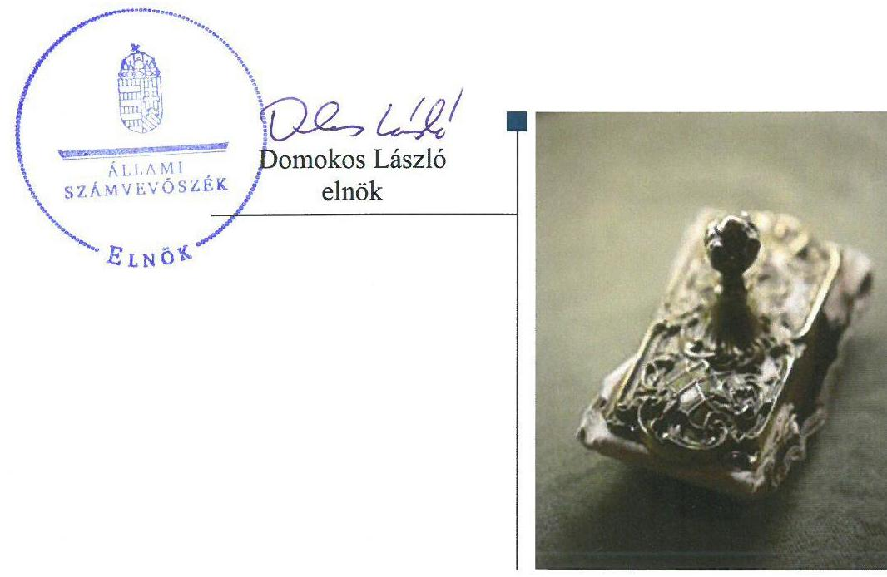
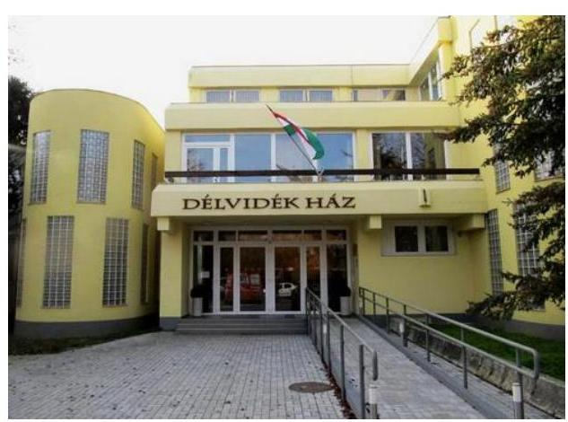
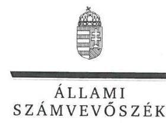
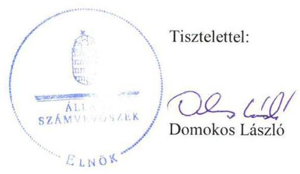
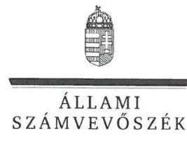
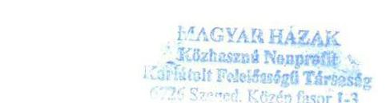
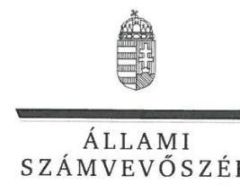
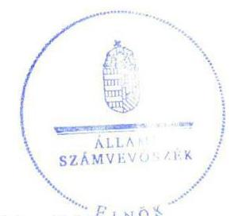
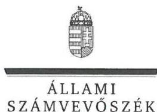
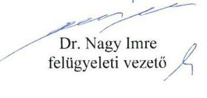

# Jelentés 

## Állami tulajdonú gazdasági társaságok

Az állami tulajdonban (résztulajdonban) lévő gazdálkodó szervezetek vagyonmegőrzési és gazdálkodási tevékenységének ellenőrzése - Magyar Házak Közhasznú Nonprofit Kft. 2017.

---

# Jelentés 

## Állami tulajdonú gazdasági társaságok

Az állami tulajdonban (résztulajdonban) lévő gazdálkodó szervezetek vagyonmegőrzési és gazdálkodási tevékenységének ellenőrzése - Magyar Házak Közhasznú Nonprofit Kft.
2017. decenius hó 21. nap

---

# AZ ELLENŐRZÉST FELÜGYELTE:

DR. NAGY IMRE felügyeleti vezető

# AZ ELLENŐRZÉST VEZETTE ÉS A VÉGREHAJTÁSÁÉRT FELELŐS:

SALAMIN VIKTOR ellenőrzésvezető

# A PROGRAM ÖSSZEÁLLÍTÁSÁÉRT FELELŐS:

JANIK JÓZSEF osztályvezető

IKTATÓSZÁM: V-1376-184/2016.

TÉMASZÁM: 2084

ELLENŐRZÉS-AZONOSÍTÓ SZÁM: V075946.

Jelentéseink az Országgyűlés számítógépes hálózatán és az Interneta a www.asz.hu címen is olvashatóak.

---

# TARTALOMJEGYZÉK 

■ ÖSSZEGZÉS ..... 5
■ AZ ELLENŐRZÉS CÉLJA ..... 6
■ AZ ELLENŐRZÉS TERÜLETE ..... 7
■ AZ ELLENŐRZÉS HÁTTERE, INDOKOLTSÁGA ..... 9
■ A JELENTÉS LÉNYEGES KÉRDÉSKÖREI ..... 10
■ ELLENŐRZÉS HATÓKÖRE ÉS MÓDSZEREI ..... 11
■ MEGÁLLAPÍTÁSOK ..... 13
■ JAVASLATOK ..... 19
■ MELLÉKLETEK ..... 21
I. sz. melléklet: Értelmező szótár ..... 21
II. sz. melléklet: A Társaság főbb mérleg adatai ..... 26
■ FÜGGELÉK: ÉSZREVÉTELEK ..... 27
■ RÖVIDÍTÉSEK JEGYZÉKE ..... 49

---

.

---

# ÖSSZEGZÉS 

A Magyar Nemzeti Vagyonkezelő Zrt. és a Csongrád Megyei Intézményfenntartó Központ a tulajdonosi jogait szabályszerüen gyakorolta. A szegedi székhelyű Magyar Házak Közhasznú Nonprofit Kft. nem teljesitette a jogszabályi, illetve tulajdonosi előírások szerinti adatszolgáltatási kötelezettségét, müködésének szabályozása nem az előírások szerint történt. A vagyonnal való gazdálkodás nem volt szabályszerü. A kezelt vagyonhoz kapcsolódó szabályozási, elkülönített nyilvántartási, visszapótlási kötelezettségének a Társaság nem tett eleget, ezáltal a kezelésébe adott állami vagyon megőrzését, védelmét nem biztositotta.

## Az ellenőrzés társadalmi indokoltsága

Az állami tulajdonú gazdálkodó szervezetek a nemzeti vagyon részét képezik. Az állami vagyon megőrzése, megóvása érdekében kiemelten fontos a vagyon átlátható, rendeltetésszerü és felelős felhasználásának biztosítása.

Minden közvagyont használó szervezettel szemben társadalmi igény, hogy tevékenységükről elszámoljanak. Az Állami Számvevőszék Stratégiájával összhangban ellenőrzésével hozzájárul a nemzeti vagyont használó gazdálkodó szervezetek tevékenységének átláthatóságához, elszámoltathatóságának javításához.

Az ellenőrzött szervezetnek, mint vagyonkezelőnek az ellenőrzött időszak alatti gazdálkodása, ezzel összefüggésben a közfeladatok ellátása közérdeklődésre tarthat számot.

## Főbb megállapítások, következtetések, javaslatok

A tulajdonosi jogait az MNV Zrt. és a Csongrád Megyei Intézményfenntartó Központ szabályszerűen gyakorolta. Az MNV Zrt. a Társaság kezelésébe adott vagyonnal kapcsolatos - jogszabályban és szerződésben biztosított - tulajdonosi ellenőrzés lehetőségével a 2012-2015. években nem élt, így a vagyonkezelésbe adott állami vagyonnal való gazdálkodás szabályosságát nem biztosította.

A Magyar Házak Közhasznú Nonprofit Kft. belső szabályozása nem a jogszabályok előírásai szerint történt. A Társaság a vagyonkezelt eszközök elkülönített nyilvántartására vonatkozó szabályokat a Vagyonkezelési szerződés ${ }_{1,2}$-ben foglalt előírás ellenére nem alkotott.

A bevételek, ráfordítások és beruházások, valamint az értékcsökkenés elszámolása nem az előírások szerint történt. A Társaság számviteli beszámolási kötelezettségét a jogszabályi előírások szerint teljesítette. A Társaság nem tett eleget a jogszabályi, illetve tulajdonosi előírások szerinti adatszolgáltatási kötelezettségének. A Társaság adatvédelmi és adatbiztonsági szabályzattal a 2012-2015. években nem rendelkezett.

A Társaság a saját és a kezelésében lévő vagyon elkülönített nyilvántartásáról a jogszabályi előírások ellenére nem gondoskodott, visszapótlási kötelezettségét nem teljesítette. A Társaságnál a saját és a kezelésbe vett vagyon változását eredményező döntések nem a jogszabályi és a tulajdonosi joggyakorló által meghatározott előírások szerint történtek. A leltározás során a Társaság a jogszabály és a belső szabályozás előírásait nem tartotta be.

Az ÁSZ jelentésében a Magyar Házak Közhasznú Nonprofit Kft. ügyvezetőjének tíz, a Magyar Nemzeti Vagyonkezelő Zrt. vezérigazgatójának egy javaslatot fogalmazott meg, amelyekre az érintetteknek 30 napon belül intézkedési tervet kell készíteniük.

---

# AZ ELLENŐRZÉS CÉLJA 

AZ ELLENŐRZÉS CÉLJA annak értékelése volt, hogy a tulajdonosi jogok gyakorlása szabályszerű volt-e; a gazdálkodó szervezet szabályozottsága, gazdálkodása és vagyongazdálkodási tevékenysége megfelelt-e a jogszabályi és a tulajdonosi előírásoknak; a vagyonváltozást eredményező döntések esetében a tulajdonosi jogok gyakorlója és a gazdálkodó szervezet szabályszerűen jár-tak-e el.

---

# AZ ELLENŐRZÉS TERÜLETE 

## A Magyar Házak Közhasznú Nonprofit Kft., valamint tulajdonosi joggyakorlói, a Magyar Nemzeti Vagyonkezelö Zrt. és a Csongrád Megyei Intézményfenntartó Központ

A MAGYAR HÁZAK KÖZHASZNÚ NONPROFIT KFT. 2009. április 10-én alakult „RENDEZVÉNYHÁZ" Csongrád Megyei Közművelődési és Szolgáltató Közhasznú Nonprofit Kft. néven, mely 2012. június 29-étől DÉLVIDÉK HÁZ Közhasznú Nonprofit Kft.-re, 2015. július 16-ától Magyar Házak Közhasznú Nonprofit Kft.-re változott.

A Társaság tulajdonosai 2012. január 1. és 2015. július 15. között a Magyar Állam ( $97,6 \%$ ), valamint Kistelek Város Önkormányzata (2,4\%) voltak. 2015. július 16-ától a Magyar Állam $100 \%$-os tulajdonos lett.

## A TÁRSASÁG RÉSZESEDÉSE FELETTI TULAJDONOSI JOGOK GYAKORLÁSÁT 2012.

január 1-jétől a Magyar Állam képviseletében a Magyar Nemzeti Vagyonkezelő Zrt. látta el. Az MNV. Zrt. a Társaság részesedése feletti tulajdonosi jogai gyakorlását 2012. január 1. és 2013. március 29. között szerződés alapján átruházta a Csongrád Megyei Intézményfenntartó Központra (2013. március 31-étől jogutódja a Szociális és Gyermekvédelmi Főigazgatóság).

Az MNV Zrt. két ingatlannal kapcsolatban kötött vagyonkezelési szerződést a Társasággal. 2012. december 5-én kivett kastély megnevezésű, $10948 \mathrm{~m}^{2}$ földterületet és a rajta lévő felépítményt, valamint az ingatlanhoz kapcsolódó vagyonelemeket, 57,7 M Ft nettó könyv szerinti értéken, 2015. október 16-án $3104 \mathrm{~m}^{2}$ kivett rendezvényház udvar megnevezésű földterületet és a rajta lévő épületeket 162,3 M Ft nettó könyv szerinti értéken adott a Társaság vagyonkezelésébe.

A Társaság az állam feladatkörébe utalt feladatok közül a következő közhasznú tevékenységek (egyben közfeladatok) ellátására jött létre: tudományos tevékenység, kutatás; nevelés, oktatás, képességfejlesztés, ismeretterjesztés; kulturális tevékenység; kulturális örökség megóvása; hátrányos helyzetű csoportok társadalmi esélyegyenlőségének elősegítése; a magyarországi nemzeti és etnikai kisebbségekkel, valamint a határon túli magyarsággal kapcsolatos tevékenység; munkaerőpiacon hátrányos helyzetű rétegek képzésének, foglalkoztatásának elősegítése.

A Társaság részt vett a térség rendezvényeinek szervezésében, gondozta a kistérségi, megyei, regionális országos és nemzetközi kulturális kapcsolatokat. 2012-től a szakmai feladatok ellátását eseti szerződések alapján teljesítette. 2014-től részt vállalt a közfoglalkoztatási programban.

A Társaság a közhasznú tevékenységén kívül vállalkozási tevékenységet is végzett. Tulajdonosi részesedése más gazdasági társaságban nem volt,

---

kapcsolt vállalkozásokban lévő részesedéssel nem rendelkezett, kormányzati szektorba nem volt besorolva a 2012-2015 közötti időszakban.

A Társaság mentesült az önköltség-számítási szabályzat készítésének kötelezettsége alól. Egyes szolgáltatásai (termek és irodahelyiségek, eszközök bérbeadása) díjtételeinek megállapítása belső szabályozás alapján történt.

Az ügyvezető személye egy alkalommal, 2012. május 14-én változott.
A Társaság vagyona a 2012-2015. években összességében nőtt. A növekedést jelentős részben a vagyonkezelésbe vett ingatlanok eredményezték. A főbb mérleg- és létszámadatokat és azok változását a II. számú melléklet mutatja be.

---

# AZ ELLENŐRZÉS HÁTTERE, INDOKOLTSÁGA 

AZ ÁLLAMI TULAJDONÚ GAZDÁLKODÓ SZERVEZETEK ellenőrzése kiemelten fontos a nemzeti vagyon megőrzése, megóvása érdekében. Gazdálkodásuk jellemzően a közérdeklődés és a média figyelmének középpontjában áll, amihez hozzájárul a gazdálkodásuk körébe tartozó - közvetlen vagy közvetett állami tulajdonú - vagyon nagysága, illetve az általuk ellátott közszolgáltatások minősége és hatékonysága. A szolgáltatási/közszolgáltatási árképzés megalapozottsága és az éves elszámoltatás feltételeinek kialakítása az ellenőrzés során nagy hangsúlyt kap. A szolgáltatás/közszolgáltatás árában és annak támogatásában meg kell jelennie az önköltségszámítás szempontjainak, amely biztosítja a müködés fenntarthatóságát (eszközpótlást) is. Az ellenőrzés rámutathat az állami tulajdonú gazdálkodó szervezetek gazdálkodási tevékenységével jó gyakorlatokra és szabálytalanságokra. Felhívhatja a figyelmet a jogszabályi követelmények teljesítéséhez szükséges feltételek hiányosságaira, hozzájárulhat az államháztartáson kívüli, de (közvetlenül vagy közvetve) állami vagyont használó gazdálkodó szervezetek tevékenységének átláthatóságához. Ellenőrzésünk eredményeképpen javaslatainkkal, megállapításainkkal hozzájárulhatunk a nemzeti vagyonnal való gazdálkodás átláthatóságának, elszámoltathatóságának javításához.

---

# A JELENTÉS LÉNYEGES KÉRDÉSKÖREI 

1.     - A tulajdonosi jogok gyakorlása szabályszerű volt-e?
2.     - A társaság müködésének szabályozása az előírások szerint tör-tént-e?
3.     - A társaságnál a pénzügyi-számviteli, adatszolgáltatási és ellenőrzési feladatok ellátása szabályszerű volt-e?
4.     - A társaság vagyongazdálkodása szabályszerű volt-e?

---

# ELLENŐRZÉS HATÓKÖRE ÉS MÓDSZEREI 

## Az ellenőrzés típusa

Megfelelőségi ellenőrzés.

## Az ellenőrzött időszak

Az ellenőrzött időszak 2012. január 1-jétől 2015. december 31-ig tartott.

## Az ellenőrzés tárgya

Állami tulajdonban (résztulajdonban) lévő gazdasági társaság gazdálkodása, kiemelten vagyongazdálkodási tevékenysége, a tulajdonosi jogok gyakorlása volt.

Az ellenőrzés kiterjedt minden olyan körülményre és adatra, amely az ÁSZ jogszabályban meghatározott feladatainak teljesítéséhez, valamint a program végrehajtása folyamán felmerült újabb összefüggések feltárásához szükséges volt.

## Az ellenőrzött szervezet

Magyar Házak Közhasznú Nonprofit Kft., valamint a tulajdonosi jogokat gyakorló Magyar Nemzeti Vagyonkezelő Zrt. és a Szociális és Gyermekvédelmi Főigazgatóság, mint a Csongrád Megyei Intézményfenntartó Központ általános és egyetemleges jogutódja 2013. március 31-étől.

## Az ellenőrzés jogalapja

Az ellenőrzés jogalapját az ÁSZ tv. 1. § (3) bekezdése és 5. § (3)-(5) bekezdése képezte.

## Az ellenőrzés módszerei

Az ellenőrzést a nemzetközi standardokat irányadónak tekintve az ellenőrzési program ellenőrzési kérdései, az ellenőrzött időszakban hatályos jogszabályok, az ellenőrzés szakmai szabályok és módszertanok figyelembe vételével végeztük.

---

Az ellenőrzés ideje alatt az ellenőrzött szervezettel történő kapcsolattartást az ÁSZ Szervezeti és Múködési Szabályzatának vonatkozó előírásai alapján biztosítottuk.

Az ellenőrzésre a nemzetgazdasági szempontból kiemelt jelentőségű nemzeti vagyon körébe tartozó gazdálkodó szervezeteknél és a többségi állami tulajdonban álló gazdálkodó szervezeteknél került sor. A program szerinti feladatokat a kiválasztott gazdálkodó szervezeteknél (társaságoknál) és azok többségi tulajdonban lévő leányvállalatainál, valamint a tulajdonosi jogok gyakorlójánál kellett végrehajtani. Az ellenőrzés szempontjai és az ellenőrzés alá vont gazdálkodó szervezetek köre az ellenőrzés tapasztalatai alapján - indokolt esetben - változhatott. Az ellenőrzési kérdések megválaszolásához szükséges bizonyítékok megszerzése a következő ellenőrzési eljárások alkalmazásával történt: megfigyelés, kérdésfeltevés (információkérés), összehasonlítás, valamint elemző eljárás. Az ellenőrzési bizonyítékként felhasználható adatforrások közé tartoznak egyrészt az ellenőrzési programban felsorolt adatforrások, másrészt adatforrás lehetett még minden - az ellenőrzés folyamán - feltárt, az ellenőrzés szempontjából információkat tartalmazó dokumentum.

Az ellenőrzést a kérdésekre adott válaszok kiértékelésével, valamint a megjelölt adatforrások, a csatolt tanúsítványok felhasználásával, továbbá az adott időszakban hatályos jogszabályok figyelembe vételével folytattuk le.

A bevételek és ráfordítások elszámolása, valamint a vagyonnyilvántartás terén, a szabályszerű működést véletlen mintavétellel és irányított kiválasztással ellenőriztük. A mintatételek értékelése alapján egyrészt a sokaságban előforduló hibaarányát becsültük, másrészt az irányítottan kiválasztott tételeket értékeltük. A jogszabályoknak és a belső előírásoknak megfelelőnek, azaz szabályszerűnek tekintettük az adott területet, amenynyiben a minta ellenőrzésének eredménye alapján 95\%-os bizonyossággal a teljes sokaságban a hibaarány kisebb volt, mint 10\%, nem megfelelőnek értékeltük, ha a hibaarány a 10\%-ot meghaladta. A ráfordítások elszámolására és a vagyonnyilvántartásra vonatkozó véletlen mintavételt kockázati alapú kiválasztással egészítettük ki, amelynek során évente a három legnagyobb összegű tételt választottuk ki.

---

# 1. A tulajdonosi jogok gyakorlása szabályszerű volt-e? 

Összegző megállapítás

A tulajdonosi jogok gyakorlása szabályszerű volt.
1.1. számú megállapítás

A tulajdonosi joggyakorlás szabályszerű volt.

## A RÉSZESEDÉSEK FELETTI TULAJDONOSI JOG-

GYAKORLÁS RENDJÉT az MNV Zrt. SZMSZ ${ }_{1}{ }^{1}{ }_{2}{ }^{2}$-ében, a Társasági Monitoring Szabályzatban ${ }^{3}$, a Tulajdonosi Ellenőrzési Szabályzatban ${ }^{4}$, a Szerződésben ${ }^{5}$, a CSOMIK SZMSZ ${ }^{6}$-ében, valamint a Társasági szerződésben ${ }^{7}$ és az Alapító okiratban ${ }^{8}$ szabályszerűen meghatározták.

Az $\mathrm{FB}^{9}$ létrehozásáról, tagjainak kijelöléséről, a könyvvizsgáló személyéről, megbízatásának időtartamáról a jogszabályokban előírtaknak megfelelően rendelkeztek.

A TULAJDONOSI JOGGYAKORLÁS az FB, a tulajdonosi képviseletet ellátók, valamint a könyvvizsgáló tevékenységéhez kapcsolódóan a Gt., illetve a Ptk. ${ }_{2}$ előírásainak megfelelt.

A Társaság legfőbb szerve a Számv. tv. 155. § (6) bekezdésében foglalt előírást megsértve a Társaság könyvvizsgálóját a 2013. üzleti év mérlegfordulónapját követően, 2014. március 12-én választotta meg.

A Társaság beszámoltatása a 2012-2015. években megtörtént. Az MNV Zrt. a Számv. tv. és a Civil tv. ${ }^{10}$ előírásai szerinti beszámolón túl - a Társasági szerződésben, Alapító okiratban foglaltak szerint - az ügyvezető tevékenységéről beszámoltatta a Társaságot.
A TÁRSASÁG SAJÁT TÖKÉJE 2012-ben és 2013-ban nem érte el - a Gt. 143. § (2) bekezdés a) pontjában meghatározott - az adott társasági formára kötelezően előírt jegyzett tőkét. A 2013. évi egyszerűsített éves beszámoló elfogadásától, azaz 2014. május 29-étől számított három hónapon belül a Ptk. ${ }_{2}$ 3.133. § (2) bekezdésében foglaltak ellenére a saját tőke biztosításáról nem gondoskodtak, mivel a 8,0 M Ft pótbefizetést 2014. szeptember 17-én teljesítették.

A könyvvizsgáló a 2013. és a 2015. pénzügyi évről szóló jelentéseiben a társasági vagyon csökkenése miatti - törvényben biztosított - figyelemfelhívás lehetőségével élt.

A vezető tisztségviselők, felügyelőbizottsági tagok, az Mt. ${ }^{11}$ 208. §-ának hatálya alá eső munkavállalók javadalmazása, valamint a jogviszony megszűnése esetére biztosított juttatások módjának, mértékének elveiről, annak rendszeréről szóló Javadalmazási szabályzat ${ }_{1,2}$-ot ${ }^{12}$ a Társaság legfőbb szerve a Taktv. ${ }^{13}$ 5. § (3) bekezdésének megfelelően megalkotta.

---

# 1.2. számú megállapítás 

A nemzeti vagyon feletti tulajdonosi joggyakorlás szabályszerű volt.
A VAGYONKEZELÉSI SZERZŐDÉS ${ }^{14}{ }^{14}{ }^{15}$ megfelel a jogszabályok előírásainak. A Vagyonkezelési szerződés ${ }_{1,2} 7.4$. pontja az elszámolt értékcsökkenés összegével azonos visszapótlási kötelezettséget írt elő a Társaság részére, előírta továbbá az állagmegóvási, karbantartási, adatszolgáltatási, beszámolási és elkülönített nyilvántartási kötelezettséget.

A Vagyonkezelési szerződés ${ }_{1,2}$ 9.2. pontjában rögzítették az MNV Zrt. jogosultságát a vagyon használatának ellenőrzésére, 9.3. pontjában a Tulajdonosi Ellenőrzési Szabályzat szerinti tulajdonosi ellenőrzésre. Az MNV Zrt. a Társaság kezelésében lévő vagyon használata ellenőrzésének, továbbá a tulajdonosi ellenőrzés jogával a 2012-2015. években nem élt.

A Vagyonkezelési szerződés ${ }_{1,2}$ 9.4. pontjának előírása szerint az MNV Zrt. folyamatosan ellenőrizni volt köteles a Társaság vagyon-nyilvántartás felé megküldött jelentéseit és azok helytállóságát, melynek eleget tett.

VAGYON-NYILVÁNTARTÁSI SZABÁLYZAT ${ }_{1}{ }^{16}{ }_{2}{ }^{17}{ }_{3}{ }^{18}$-át az MNV Zrt. a jogszabályban előírtak szerint, az abban foglalt tartalmi előírásoknak megfelelően megalkotta.

A vagyon változását eredményező döntések előkészítésének követelményeit az MNV Zrt. a Döntés-előkészítési szabályzat ${ }_{1-4}{ }^{19}$-ban írta elő. A Társaság 2013-2014. évi beruházási terveiről az MNV Zrt. a Vhr. 9. § (6) bekezdés b) pontjában, illetve a Döntés-előkészítési szabályzat ${ }_{1-4}$-ban foglaltaknak megfelelően döntött a vagyonkezelési szerződés ${ }_{1}$-ben szereplő ingatlanon elvégzendő munkálatokra vonatkozóan.

Az MNV Zrt. a Társaság Vagyonkezelési szerződés ${ }_{1}$ 4.3. pontjában 20132014. évekre meghatározott beruházási terveit elfogadta, azonban a tervek megvalósítását, az adatszolgáltatási kötelezettség teljesítését a 2013. évre vonatkozóan nem kérte számon, ezzel nem tett eleget a Vagyon-nyilvántartási szabályzat ${ }_{1}$ 3.6. pontjában foglalt 15 napos felhívási kötelezettségének.

## 2. A társaság múködésének szabályozása az előírások szerint tör-tént-e?

## Összegző megállapítás

A Társaság múködésének szabályozása nem a jogszabályi előírások szerint történt.

A Társaság rendelkezett a Számv. tv. 14. § (3) bekezdésében előírt számviteli politikával és a Számv. tv. 14. § (5) bekezdés a), b) és d) pontjaiban előírt szabályzatokkal. Önköltség-számítási szabályzat készítésére a Társaság a Számv. tv. 14. § (6) bekezdése értelmében nem volt kötelezett.

A Társaság 2012. január 1. és 2012. július 24. között rendelkezett a Számv. tv. 161. § (1) bekezdésében foglaltaknak megfelelő számlarenddel ${ }^{20}$.
2012. július 25. és 2015. december 31. közötti időszakra a Társaság a jogszabályban előírt számlarendet nem készítette el, ezzel nem tett eleget a Számv. tv. 161. § (1) bekezdésében foglaltaknak.

---

A SZÁMVITELI POLITIKA ${ }_{1,2}{ }^{21}$-ban a Társaság a Vhr. ${ }^{22}$ 14. § (1) bekezdésében előírtak ellenére nem rögzítette a vagyonkezelt eszközök elkülönített nyilvántartására vonatkozó szabályokat. A hiányos Számviteli politika ${ }_{1,2}$ a Társaság adottságainak, körülményeinek leginkább megfelelő módszereket, eszközöket nem határozta meg, ezáltal nem felelt meg a Számv. tv. 14. § (3) bekezdésében, valamint a Vagyonkezelési szerződés ${ }_{1,2} 7.10 .1$ pontjában foglaltaknak.

A Leltározási szabályzat ${ }_{1,2}{ }^{23}$ valamennyi eszközre és forrásra évenkénti leltározást írt elő, a szabályozás megfelelt a Számv. tv. 69. §-a előírásának. Az eszközök és források értékelési szabályzatát a Társaság a Számviteli politika ${ }_{1-2}$ részeként készítette el, a szabályozás a Számv. tv. előírásainak megfelel.

A Pénzkezelési szabályzat ${ }_{1}$-ban ${ }^{24}$ a Számv. tv. 14. § (8) bekezdésében foglaltak ellenére nem rendelkeztek a napi készpénz záró állomány maximális mértékéről.

# 3. A társaságnál a pénzügyi-számviteli, adatszolgáltatási és ellenőrzési feladatok ellátása szabályszerű volt-e? 

Összegző megállapítás

## 3.1. számú megállapítás

A Társaságnál a pénzügyi-számviteli, adatszolgáltatási feladatok ellátása nem volt szabályszerű.

A Társaság bevételeinek, ráfordításainak, beruházásainak, valamint az értékcsökkenés elszámolása nem az előírások szerint történt.

AZ ÉRTÉKESÍTÉS NETTÓ ÁRBEVÉTELÉNEK, az egyéb bevételeknek az elszámolása nem volt megfelelő. A Számv. tv. 165. § (1) bekezdésében foglaltak ellenére az egyéb bevételek elszámolásai között a kapott támogatásként elszámolt tételhez a Társaság a számviteli elszámolást alátámasztó bizonylattal nem rendelkezett.

AZ ANYAGJELLEGŰ RÁFORDÍTÁSOK és a pénzügyi műveletek ráfordításainak elszámolása nem volt megfelelő. A Társaság a Számv. tv. 25. § (1), valamint (7) bekezdés c) pontjának előírása ellenére informatikai fejlesztést tárgyévi költségként számolt el, nem pedig az immateriális javak között aktivált. A Számv. tv. 165. § (1) bekezdésében foglaltak ellenére könyvelési díjhoz, jogi képviselethez kapcsolódó tételek esetében a Társaság a számviteli elszámolást alátámasztó bizonylattal nem rendelkezett.

A SZEMÉLYI JELLEGŰ RÁFORDÍTÁSOK elszámolása nem volt megfelelő. A könyvviteli elszámolást alátámasztó bizonylatok tartalmi kellékei nem feleltek meg a Számv. tv. 167. § (1) bekezdés h) pontjában foglalt előírásoknak, mivel a könyvelés módjára, az érintett könyvviteli számlákra történő hivatkozás nem volt megfelelő.

A BERUHÁZÁSOK, FELÚJÍTÁSOK elszámolása nem volt megfelelő. A legalább egy éven túl szolgáló kis értékű tárgyi eszközöket anyag jellegű ráfordításként számolta el a Társaság, amellyel megsértette

---

a Számv. tv. 24. §-át. Más-más eszközcsoportba és értékcsökkenési kulcs alá tartozó eszközt egy önálló eszközként vett a Társaság nyilvántartásba, ezzel megsértette a Számv. tv. 16. § (1) bekezdésében foglalt egyedi értékelés elvét.

AZ ÉRTÉKCSÖKKENÉS elszámolása nem volt megfelelő. A Társaság a Számv. tv. 53. § (1) bekezdés b) pontjában foglaltak ellenére feleslegessé vált beruházás miatt terven felüli értékcsökkenést nem számolt el.

# 3.2. számú megállapítás 

A Társaság nem teljesítette a jogszabályi, illetve tulajdonosi előírások szerinti adatszolgáltatási kötelezettségét.

## A TULAJ DONOSI JOGGYAKORLÓ ÁLTAL ELŐíRT,

Társasági Monitoring Szabályzat II.1.1. pontja szerinti negyedéves adatszolgáltatási kötelezettségét a Társaság nem teljesítette. Nem teljesítette továbbá a Vagyonkezelési szerződés: 7.7. pontjában foglaltakat, mivel az elvégzett felújítási, beruházási - ide értve a beruházási tervben foglaltakat - és egyéb munkálatokról a 2013-2015. évek január 30. napjáig az MNV Zrt. felé írásban nem számolt be.

EGYSZERÚSÍTETT ÉVES BESZÁMOLÓIT a Társaság elkészítette, azokat a Számv. tv. 153. § (1) bekezdésében előírt határidőig letétbe helyezte és a Számv. tv. 154. § (1) bekezdése szerint közzétette. Az egyszerúsített éves beszámolókat a Társaság legfőbb szerve jóváhagyta, döntése előtt - a Gt. és a Ptk. ${ }_{2}$ előírásai szerint - az FB és a könyvvizsgáló véleményét megismerte.

A Társaság az Infotv. ${ }^{25}$ 24. § (3) bekezdésében foglaltak ellenére adatvédelmi és adatbiztonsági szabályzattal a 2012-2015. években nem rendelkezett. Az Infotv. 30. § (6) bekezdésének előírása ellenére a közérdekú adatok megismerésére irányuló igények teljesítésének rendjét rögzítő szabályzatot 2012. január 1. és július 31. között nem készített.

A közérdekú adatok közzétételére vonatkozó kötelezettségének a Társaság a 2012. évi egyszerúsített éves beszámoló tekintetében nem tett eleget, ezzel megsértette az Infotv. 37. § (1) bekezdését és az 1. számú melléklet III. Gazdálkodási adatok közzétételére vonatkozó előírását, valamint a Taktv. 2. § (1) bekezdését.

## 4. A társaság vagyongazdálkodása szabályszerú volt-e?

Összegző megállapítás
A Társaság vagyongazdálkodása nem volt szabályszerű.
4.1. számú megállapítás

A Társaság a kezelésében lévő állami vagyont nem szabályszerűen tartotta nyilván.

Vagyongazdálkodási stratégiát, középtávú kitekintést az üzleti tervek részeként a Társaság a 2012-2015. évekre nem készített, ezzel nem tett eleget a Tervezési irányelv ${ }_{1-4}{ }^{26}$ I.4.) pontja előírásának.

A Vagyonkezelési szerződés ${ }_{1,2}$ 7.14. pontja előírta a Társaság részére a vagyonkezelt ingatlanokra vagyonbiztosítási szerződés kötésének kötelezettségét, melynek eleget tett.

---

### 4.2. számú megállapítás

1. táblázat

## VISSZAPÓTLÁSI KÖTELEZETTSÉG (M FT)

|  Év | Elszámol-
ÉCS | Teljesített
visszapótlás  |
| --- | --- | --- |
|  2012. | 0,043 | 0,0  |
|  2013. | 0,620 | 0,0  |
|  2014. | 1,197 | 0,0  |
|  2015. | 2,230 | 0,0  |

Fonrás: A Társaság adatszolgáltatósa

NYILVÁNTARTÁSSAL a Társaság a vagyonkezelésbe vett vagyon vonatkozásában a Vhr. 17 § (1) bekezdésében és a Vagyonkezelési szerző-dés1-2 7.10.1. és a 12.1.-12.2. pontjaiban foglaltak ellenére nem rendelkezett.

A Társaság a Számv. tv. 161/A. § (2) bekezdésében, valamint a Civil tv. 27. § (1) bekezdésében foglaltak ellenére az alapcél szerinti (ezen belül közhasznú) tevékenységből, illetve a gazdasági-vállalkozási tevékenységből származó bevételek és költségek, ráfordítások (kiadások) elkülönített nyilvántartásáról nem gondoskodott.

A Társaság a 2015. év tekintetében nem tett eleget a Vagyonkezelési szerződés 1 4.3.3. pontja előírásának, mivel nem készítette el a tulajdonosi joggyakorló részére a vagyonkezelt ingatlan előzetes beruházási, felújítási tervét.

A Társaság a vagyonkezelésébe vett ingatlanokat szabályszerűen, a Számv. tv. előírásának megfelelően állományba vette. A vagyonkezelői jog ingatlan-nyilvántartásba történő bejegyzésével a Társaság eleget tett a Vhr., a Ptk. 2 , valamint a Vagyonkezelési szerződés 1,2 -ben foglalt előírásoknak.

AZ ÉV VÉGI LELTÁRAKAT a Társaság a 2012-2015. években elkészítette el, azok azonban a Számv. tv. 69. § (1) bekezdésében és a Leltározási szabályzat 1 3.2. pontjában, illetve a Leltározási szabályzat 2 . és 3 . pontjaiban foglaltak ellenére nem tartalmaztak minden eszközt mennyiségben és értékben. Leltár nem készült az immateriális javakról, beruházásokról, továbbá a tárgyi eszközök leltárai a felleltározott eszközöket értékben nem tartalmazták. A leltározás a pénztár és bank év végi záró egyenlegének egyeztetésére, a készletek mennyiségi és értékbeni felvételére, valamint a tárgyi eszközök mennyiségi felvételére terjedt ki. A leltározás hiányosságai ellenére a könyvvizsgáló a beszámolókat korlátozás nélküli hitelesítő záradékkal látta el.

## A Társaság visszapótlási kötelezettségének a vagyonkezelt eszközök tekintetében nem tett eleget.

A Társaság a vagyonkezelt eszközei után összességében 2,2 M Ft értékcsökkenést számolt el, amely után visszapótlási kötelezettség terhelte.

VISSZAPÓTLÁSI KÖTELEZETTSÉGÉT a Társaság a 2012-2015. években nem teljesítette, ezzel megsértette a Vagyonkezelési szerződés ${ }_{1-2}$ 7.4. és 12.4. pontjában foglaltakat, valamint a Vtv. ${ }^{27} 27 . \S$ (7) bekezdésében előírtakat.

A Társaság a Vagyonkezelési szerződés ${ }_{1}$-ben 2013-2014. évekre vállalt beruházási terveit nem teljesítette.

A Társaság saját vagyonát érintően a 2012-2015. években összesen 19,8 M Ft értékben végzett beruházást, felújítást.

## A Társaság saját, illetve vagyonkezelésbe vett vagyon változását eredményező döntései nem az előírások szerint történtek.

A Társaság a Társasági szerződés 2012. szeptember 10-étől hatályos módosítása VI. fejezet 14.6. pontjában foglaltak ellenére a saját vagyonát

---

érintő, 2,0 M Ft-ot meghaladó kötelezettségvállalásaihoz tulajdonosi hozzájárulással nem rendelkezett, azt előzetesen nem kérte meg.

A Vagyonkezelési szerződés; 7.5. pontjában és a Vtv. 27. § (2) bekezdésében foglaltak ellenére a kezelésbe vett ingatlanon 2015-ben 2,3 M Ft értékben végzett felújítással kapcsolatban a Társaság nem kérte az MNV Zrt. előzetes engedélyét és nem is tájékoztatta a múemlékvédelem alatt álló épületen elvégzett munkákról.

---

# JAVASLATOK 

Az ÁSZ tv. 33. § (1) bekezdésében foglaltak értelmében az ellenőrzött szervezet vezetője köteles a jelentésben foglalt megállapításokhoz kapcsolódó intézkedési tervet összeállítani és azt a jelentés kézhezvételétől számított 30 napon belül az ÁSZ részére megküldeni. Amennyiben az ellenőrzött szervezet vezetője nem küldi meg határidőben az intézkedési tervet, vagy továbbra sem elfogadható intézkedési tervet küld, az Állami Számvevőszék elnöke az ÁSZ tv. 33. § (3) bekezdése a) és b) pontjaiban foglaltakat érvényesítheti.

## Magyar Házak Közhasznú Nonprofit Kft. Ügyvezetőjének

1. Intézkedjen a jogszabályban elöirt számlarend elkészitéséröl.
(2. sz. megállapítás 3. bekezdése alapján)
2. Intézkedjen, hogy a Számviteli politika a jogszabályi elöírásnak és a Vagyonkezelési szerzödés ${ }_{1,2}$ nek megfelelöen tartalmazza a vagyonkezelt vagyon elkülönitett nyilvántartására vonatkozó szabályokat.
(2. sz. megállapítás 4. bekezdése alapján)
3. Intézkedjen a számviteli elszámolások szabályszerü végrehajtásáról, ezen belül az értékesités nettó árbevétele, az egyéb bevételek, az anyagjellegü ráforditások, a pénzügyi müveletek ráfordításai, a személyi jellegü ráfordítások, a beruházások, felújitások, és az értékcsökkenés elszámolása tekintetében a jogszabályi elöírások betartásáról.
(3.1. sz. megállapítás 1-5. bekezdései alapján)
4. Intézkedjen a tulajdonosi joggyakorló által elöirt adatszolgáltatási kötelezettség teljesitéséről.
(3.2. sz. megállapítás 1. bekezdés első mondata alapján)
5. Intézkedjen a jogszabályban elöirt adatvédelmi és adatbiztonsági szabályzat elkészitéséről.
(3.2. sz. megállapítás 3. bekezdés első mondata alapján)
6. Intézkedjen a Tervezési irányelv előirása alapján az üzleti tervek részeként vagyongazdálkodási stratégia, középtávú kitekintés elkészitéséről.
(4.1. sz. megállapítás 1. bekezdése alapján)

---

7. Intézkedjen a jogszabályoknak és a Vagyonkezelési szerződés1,2 -nek megfelelő elkülönített nyilvántartás vezetéséről
a) a vagyonkezelésbe vett vagyon,
(4.1. sz. megállapítás 3. bekezdése alapján)
b) az alapcél szerinti (ezen belül közhasznú) tevékenységéből, illetve a gazdasági-vállalkozási tevékenységéből származó bevételek tekintetében.
(4.1. sz. megállapítás 4. bekezdése alapján)
8. Intézkedjen a jogszabályi előírásnak és a belső szabályzatnak megfelelő leltározásról.
(4.1. sz. megállapítás 7. bekezdés alapján)
9. Intézkedjen a jogszabályi előírásoknak és a Vagyonkezelési szerzö-dés1,2-nek megfelelően a vagyonkezelt eszközök esetében a visszapótlási kötelezettség teljesítéséről.
(4.2. sz. megállapítás 2. bekezdése alapján)
10. Intézkedjen a saját vagyon és a vagyonkezelésbe vett vagyon változását eredményező döntések során az előírások betartásáról.
(4.3. sz. megállapítás 1-2. bekezdései alapján)

# A Magyar Nemzeti Vagyonkezelő Zrt. Vezérigazgatójának 

1. Intézkedjen a Társaságnál feltárt szabálytalanságok tekintetében a felelősség tisztázása érdekében, és szükség szerint intézkedjen a felelősség érvényesítéséről.
(2. sz. megállapítás 4. bekezdése, 4.1. sz. megállapítás 3-4. bekezdései, 4.1. sz. megállapítás 7. bekezdése, 4.2. sz. megállapítás 2. bekezdése és 4.3. sz. megállapítás 1-2. bekezdései alapján)

---

# MELLÉKLETEK 

## I. SZ. MELLÉKLET: ÉRTELMEZŐ SZÓTÁR

állami vagyon
a) Az állam tulajdonában lévő dolog, valamint a dolog módjára hasznosítható természeti erő,
b) az a) pont hatálya alá nem tartozó mindazon vagyon, amely vonatkozásában törvény az állam kizárólagos tulajdonjogát nevesíti,
c) az állam tulajdonában lévő tagsági jogviszonyt megtestesítő értékpapír, illetve az államot megillető egyéb társasági részesedés,
d) az államot megillető olyan immateriális, vagyoni értékkel rendelkező jogosultság, amelyet jogszabály vagyoni értékű jogként nevesít.
Forrás: Vtv. 1. § (2) bekezdése
2012. november 10-étől az állami vagyon fogalma kiegészül a következő ponttal:
e) az állam tulajdonában lévő pénzügyi eszközök

Forrás: Vtv. 1. § (2) bekezdése
2013. június 27-éig:

Az állami vagyont az MNV Zrt. maga kezeli, vagy szerződés - így különösen bérlet, haszonbérlet, megbízás - alapján központi költségvetési szervnek, természetes vagy jogi személynek, vagy jogi személyiséggel nem rendelkező gazdálkodó szervezetnek hasznosításra átengedi.
Forrás: Vtv. 23. § (1) bekezdése
2013. június 28-ától:

Az állami vagyonnal az MNV Zrt. maga gazdálkodik, vagy szerződés - így különösen bérlet, haszonbérlet, megbízás - alapján központi költségvetési szervnek, természetes vagy jogi személynek, vagy jogi személyiséggel nem rendelkező gazdálkodó szervezetnek hasznosításra átengedi, illetőleg vagyonkezelésbe, haszonélvezetbe adja.
Forrás: Vtv. 23. § (1) bekezdése
forrás SQL rendszer
Az MNV Zrt. vagyonnyilvántartási informatikai rendszere
3.1. Feladata

A ForrásSQL rendszer feladata:

- a Kincstári Vagyonkataszter működtetése;
- lehetővé tenni a Vagyonkezelők számára a vagyonkataszteri jelentést;
- az MNV Zrt. vagyonkezelésében lévő, a ForrásSQL-ben rögzített vagyonelemek tranzakciós nyilvántartása.
Forrás: Magyar Nemzeti Vagyonkezelő Zrt. - Vagyonnyilvántartási Szabályzata (46/2008. számú vezérigazgatói utasítás)
gazdasági társaság
A Ptk.: 3:88. § (1) bekezdése szerint „a gazdasági társaságok üzletszerű közös gazdasági tevékenység folytatására, a tagok vagyoni hozzájárulásával létrehozott, jogi személyiséggel rendelkező vállalkozások, amelyekben a tagok a nyereségből közösen részesednek, és a veszteséget közösen viselik".
állami vagyon hasznosítására kötött szerződések elsődleges célja az állami vagyon hatékony működtetése, állagának védelme, értékének megőrzése, illetve gyarapítása, az állami és közfeladatok ellátásának elősegítése.
Forrás: Vtv. 23. § (2) bekezdése

---

állami vagyon használója
állami vagyon kezelője/vagyonkezelő
állami vagyon kezelője/vagyonkezelő
állami vagyon értékesítése
kompenzálás
kormányzati szektorba sorolt egyéb szervezet

MNV Zrt.
nemzeti vagyon

Az a természetes vagy jogi személy, jogi személyiséggel nem rendelkező szervezet, aki, vagy amely törvény vagy szerződés alapján, bármely jogcímen (bérlet, haszonbérlet, használat stb.) állami vagyont birtokol, használ, szedi annak hasznait, hasznosít, ide nem értve a haszonélvezőt, a vagyonkezelőt és a tulajdonosi jogok gyakorlóját.
Forrás: Vhr. 1. § (7) a. pontja

## 2013. június 27-éig:

Az állami vagyont az MNV Zrt. maga kezeli, vagy szerződés - így különösen bérlet, haszonbérlet, megbízás - alapján központi költségvetési szervnek, természetes vagy jogi személynek, vagy jogi személyiséggel nem rendelkező gazdálkodó szervezetnek hasznosításra átengedi. Az állami vagyonra vonatkozóan az MNV Zrt. kizárólag az Nvtv-ben meghatározott személyekkel köthet vagyonkezelési szerződést.
Forrás: Vtv. 23. § (1), 27. § (1)

## 2013. június 28-ától:

Az állami vagyonnal az MNV Zrt. maga gazdálkodik, vagy szerződés - így különösen bérlet, haszonbérlet, megbízás - alapján központi költségvetési szervnek, természetes vagy jogi személynek, vagy jogi személyiséggel nem rendelkező gazdálkodó szervezetnek hasznosításra átengedi, illetőleg vagyonkezelésbe, haszonélvezetbe adja. Az állami vagyonra vonatkozóan az MNV Zrt. kizárólag az Nvtv-ben meghatározott személyekkel köthet vagyonkezelési szerződést.
Forrás: Vtv. 23. § (1), 27. § (1)
Állami vagyon tulajdonjogának bármely jogcímen történő, visszterhes átruházása. Forrás: Vhr. 1. § (7) d) pont)
A kompenzálás az ÁFA tv-ben és a Ptk ${ }_{1,2}$-ban definiált, a Számv. tv. 68. § (5) bekezdése szerinti ellenérték kiegyenlítése, mely során az egymással szemben fennálló követeléseiket a kötelezettségek beszámításával egyenlítik ki a felek.
Nem feltétele a kompenzálásnak, hogy a követelések összege azonos összegű legyen, a különbözet a megállapodástól függően készpénzben vagy banki átutalással is rendezhető.
A kompenzálás számviteli bizonylata a „Kompenzálási jegyzőkönyv", vagy bármely olyan - mindkét fél által hitelesített - dokumentum, amely az ellenérték megtérítésének kompenzálással történő teljesítését egyértelműen igazolja.
Forrás: 2007. évi CXXVII. törvény - az általános forgalmi adóról 259. § 6. pont: ellenérték; Számv. tv. 68. § (5) bekezdés; Ptk ${ }_{1}$ 296. §, 297. §; Ptk ${ }_{2}$.:49. §
Az a szervezet, amely az 2011. évi CXCV. törvény alapján nem része az államháztartásnak, azonban az Európai Közösséget létrehozó szerződéshez csatolt, a túlzott hiány esetén követendő eljárásról szóló jegyzőkönyv alkalmazásáról szóló 2009. május 25-i 479/2009/EK rendelet szerint a kormányzati szektorba tartozik. A nemzetgazdasági miniszter 2013. június 26-án megjelent Közleményben tette közé ezen szervezetek listáját
Az állami vagyon felett, a Magyar Államot megillető tulajdonosi jogok és kötelezettségek összességét - a hatályos szabályozás szerint - az állami vagyon felügyeletéért felelős miniszter (jelenleg a nemzeti fejlesztési miniszter) gyakorolja. A miniszter feladatát nagy részben az MNV Zrt., mint Tulajdonosi joggyakorló szervezet útján látja el.
a) az állam vagy a helyi önkormányzat kizárólagos tulajdonában álló dolgok,
b) az a) pont hatálya alá nem tartozó, állam vagy a helyi önkormányzat tulajdonában lévő dolog,

---

c) az állam vagy a helyi önkormányzatot tulajdonában lévő pénzügyi eszközök, továbbá az államot vagy a helyi önkormányzatot megillető társasági részesedések,
d) az államot vagy a helyi önkormányzatot megillető bármely vagyoni értékkel rendelkező jogosultság, amelyet jogszabály vagyoni értékű jogként nevesít,
e) Magyarország határa által körbezárt terület feletti légtér,
f) az üvegházhatású gázok kibocsátási egységeinek kereskedelméről szóló törvény szerint kibocsátási egység és légiközlekedési kibocsátási egység, valamint az ENSZ Éghajlatváltozási Keretegyezménye és annak Kiotói Jegyzőkönyve végrehajtási keretrendszeréről szóló törvény szerinti kiotói egység,
g) állami vagy helyi önkormányzati fenntartású közgyűjtemény (muzeális intézmény, levéltár, közgyűjteményként működő kép- és hangarchívum, valamint könyvtár) saját gyűjteményében nyilvántartott kulturális javak körébe tartozó dolog, kivéve, ha az állami vagy önkormányzati tulajdon jogszerű létrejötte kétséget kizáró módon nem bizonyítható és a dologra nézve más a tulajdonjogát bizonyítja vagy a kulturális javakra vonatkozó jogszabályokban meghatározott eljárás keretében valószínűsíti (g. pont módosult 2013. december 7-től),
h) a régészeti lelet,
i) a nemzeti adatvagyon körébe tartozó állami nyilvántartások fokozottabb védelméről szóló törvény szerinti nemzeti adatvagyon.
Forrás: Nvtv. 1. § (2)
nemzeti vagyon hasznosítása

A Tulajdonosi joggyakorló vagy a nemzeti vagyon használója által a nemzeti vagyon birtoklásának, használatának, hasznok szedése jogának bármely - a tulajdonjog átruházását nem eredményező - jogcímen történő átengedése, ide nem értve a vagyonkezelésbe adást, valamint a haszonélvezeti jog alapítását.
Forrás: Nvtv. 3. § (1) 4. pont
nonprofit gazdasági társaság Civil tv. azaz a 2011. évi CLXXV. törvény 9/F. § (2) bekezdése szerint „az a gazdasági társaság minősül nonprofit gazdasági társaságnak és cégnevében az a gazdasági társaság tüntetheti fel a nonprofit jelleget, amelynek létesítő okirata tartalmazza, hogy a gazdasági társaság tevékenységéből származó nyereség a tagok között nem osztható fel, hanem az a gazdasági társaság vagyonát gyarapítja." (hatályos 2014. március 15 -től)
tulajdonosi ellenőrzés
2014. március 14-éig:

Az állami vagyon kezelőjét, haszonélvezőjét, használóját megillető jogok gyakorlását, annak szabályszerűségét, célszerűségét az MNV Zrt. - szükség szerint területi szervei útján - ellenőrzi.

# 2014. március 15-étől: 

Az állami vagyon használóját, vagyonkezelőjét és haszonélvezőjét megillető jogok gyakorlását, annak szabályszerűségét, a kötelezettségek teljesítését, valamint a vagyon rendeltetése szerinti célszerűségét a Tulajdonosi joggyakorló rendszeresen ellenőrzi.
Forrás: Vhr. 20. § (1)
tulajdonosi jogok gyakorlója 2013. június 27-éig:
Az állami vagyon felett a Magyar Államot megillető tulajdonosi jogok és kötelezettségek összességét - ha törvény eltérően nem rendelkezik - az állami vagyon felügyeletéért felelős miniszter (a továbbiakban: miniszter) gyakorolja, aki e feladatát a Magyar Nemzeti Vagyonkezelő Zártkörűen Működő Részvénytársaság (a továbbiakban: MNV Zrt.), a Magyar Fejlesztési Bank, illetve a Tulajdonosi joggyakorló szervezet útján látja el. A miniszter miniszteri rendeletben, a törvényben meghatározott

---

közvetlen tulajdonosi joggyakorlású gazdasági társaság
a Társaság részesedéseinek vagyonkezelése
tulajdonosi joggyakorlás meghatalmazás, megbízási szerződés útján
állami vagyoni kör tekintetében, meghatározott időtartamra, a joggyakorlás egyes szabályainak meghatározásával - az őt megillető tulajdonosi jogok és kötelezettségek összességének, illetve azok meghatározott részének gyakorlóját az Áht. azaz 2011. évi CXCV. törvény szerinti központi költségvetési szervek, ezek intézménye, továbbá a 100\%-ban állami tulajdonban álló gazdasági társaságok közül kijelölheti.
Forrás: Vtv. 3. § (1) és (2)

## 2013. június 28-ától:

A rábízott állami vagyon felett az államot megillető tulajdonosi jogok és kötelezettségek összességét Tulajdonosi joggyakorlóként:
a) ha törvény vagy miniszteri rendelet eltérően nem rendelkezik, a Magyar Nemzeti Vagyonkezelő Zártkörűen Működő Részvénytársaság (a továbbiakban: MNV Zrt.), b) törvényben kijelölt személy vagy
c) az állami vagyon felügyeletéért felelős miniszter (a továbbiakban: miniszter) által rendeletben kijelölt személy gyakorolja.
[...] A miniszter e törvény felhatalmazása alapján - a meghatározott célok hatékonyabb elérése érdekében, miniszteri rendeletben, az ott meghatározott állami vagyoni kör tekintetében, meghatározott időtartamra - e törvény keretei között, a joggyakorlás egyes szabályainak meghatározásával - az államot megillető tulajdonosi jogok és kötelezettségek összességének, illetve azok meghatározott részének gyakorlóját az Áht. azaz 2011. évi CXCV. törvény szerinti központi költségvetési szervek, ezek intézménye, továbbá a 100\%-ban állami tulajdonban álló gazdasági társaságok közül kijelölheti.
Forrás: Vtv. 3. § (1) és (2)
Aki a nemzeti vagyon felett az államot vagy a helyi önkormányzatot megillető tulajdonosi jogok és kötelezettségek összességének gyakorlására jogosult
Forrás: Nvtv. 3. § (1) 17. pontja
A Magyar Házak Közhasznú Nkft. 2013. március 30-ától volt az MNV Zrt. közvetlen tulajdonosi joggyakorlású gazdasági társasága:
Olyan gazdasági társaság, amely állami tulajdonú társasági részesedése felett a tulajdonosi jogokat az MNV Zrt. közvetlenül, saját hatáskörben látja el
Forrás: MNV Zrt. Társasági Monitoring Szabályzata I.3. Fogalmak
A Magyar Házak Közhasznú Nkft. részesedései 2012. január 1-jétől 2013. március 29éig voltak a Csongrád Megyei Intézményfenntartó Központ (CSMIK) vagyonkezelésében:
Olyan gazdasági társaság, amely állami tulajdonú részesedése felett a tulajdonosi jogokat az MNV Zrt-vel megkötött vagyonkezelési szerződés alapján az Nvtv. 3. § (1) bekezdés 19. a) pontja szerint valamely szervezet látja el.
Forrás: Nvtv.
2012. június 30-tól:
8. § (7) * Gazdasági társaságban fennálló állami vagy önkormányzati tulajdonban lévő társasági részesedés nem lehet vagyonkezelés tárgya. A társasági részesedés Tulajdonosi joggyakorlója nevében és helyett más személy megbízáson alapuló meghatalmazással járhat el a tulajdonosi jogok egészének vagy meghatározott részének gyakorlása során. Meghatalmazás kizárólag a 3. § (1) bekezdés 19. pontjában meghatározott személyek részére adható.
18. § (7) * 2012. július 1. napját megelőzően állami vagy önkormányzati tulajdonban lévő társasági részesedések tekintetében a tulajdonosi joggyakorlás tárgyában létrejött szerződéseket 2012. december 31-ig a 8. § (7) bekezdésében foglaltaknak megfelelően módosítani kell.

---

vagyonkezelői jog

Forrás: $\underline{N v t v} . \underline{8} . \S$ (7) és $\underline{18} . \S$ (7)
2013. június 27-étől:

A vagyonkezelő köteles a vagyontárgy értékét megőrizni, állagának megóvásáról, jó karban tartásáról, működtetéséről gondoskodni, továbbá - a központi költségvetési szervek kivételével - díjat fizetni vagy a szerződésben előírt más kötelezettséget teljesíteni.
Forrás: $\underline{V t v} . \underline{27} . \underline{\text { § (2) }}$
2013. június 28-ától december 31-éig:

A vagyonkezelő köteles a vagyontárgy állagának megóvásáról, jó karbantartásáról, működtetéséről gondoskodni, továbbá - a központi költségvetési szervek kivételével - díjat fizetni, jogszabályban és szerződésben előírt más kötelezettségét teljesíteni, valamint a vagyontárgyat jogszabályban vagy szerződésben meghatározott célnak megfelelően használni. Amennyiben a vagyonkezelő e kötelezettségének nem tesz eleget, a tulajdonosi joggyakorló jogosult a szerződést azonnali hatállyal felmondani.
Forrás: $\underline{V t v} . \underline{27} . \underline{\text { § (2) }}$
2014. január 1-jétől:

A vagyonkezelő köteles a vagyontárgy állagának megóvásáról, jó karbantartásáról, működtetéséről gondoskodni, jogszabályban és szerződésben előírt más kötelezettségét teljesíteni, valamint a vagyontárgyat jogszabályban vagy szerződésben meghatározott célnak megfelelően használni.
A vagyonkezelő - a központi költségvetési szervek és a kizárólag közfeladatot ellátó nem központi költségvetési szerv vagyonkezelők kivételével - köteles díjat fizetni, jogszabályban és szerződésben előírt más kötelezettségét teljesíteni, valamint a vagyontárgyat jogszabályban vagy szerződésben meghatározott célnak megfelelően használni. Amennyiben a vagyonkezelő ezen kötelezettségeinek nem tesz eleget, a Tulajdonosi joggyakorló jogosult a szerződést azonnali hatállyal felmondani.
Forrás: $\underline{V t v} . \underline{27} . \underline{\text { § (2), (2a) }}$

---

II. SZ. MELLÉKLET: A TÁRSASÁG FŐBB MÉRLEG ADATAI

A Társaság főbb mérleg adatai (M Ft)

|  Megnevezés/Ev | 2012.12.31. | 2013.12.31. | 2014.12.31. | 2015.12.31.  |
| --- | --- | --- | --- | --- |
|  Mérleg főösszeg | 107,9 | 117,2 | 122,6 | 318,5  |
|  Saját tőke | 2,1 | $-4,9$ | 5,5 | 2,0  |
|  Jegyzett tőke | 4,2 | 4,2 | 4,2 | 4,2  |
|  Lekötött tartalék |  |  | 8,0 | 8,0  |
|  Mérleg szerinti eredmény | $-29,4$ | $-7,1$ | 2,4 | $-3,5$  |
|  Követelések | 7,0 | 4,0 | 2,4 | 1,2  |
|  Kötelezettségek | 83,6 | 104,2 | 101,0 | 301,8  |
|  Ebből hosszúlejáratú | 57,7 | 57,1 | 57,7 | 266,8  |
|  Pénzeszközök | 7,6 | 21,4 | 31,0 | 23,8  |
|  Befektetett eszközök | 92,4 | 90,5 | 88,5 | 292,7  |
|  Átlagos állományi létszám | 8 | 8 | 35 | 35  |

Forrás: A Társaság egyszerűsített éves beszámolói

---

# FÜGGELÉK: ÉSZREVÉTELEK 

A jelentéstervezetet a Számvevőszék 15 napos észrevételezésre megküldte az ellenőrzött szervezetek vezetőinek az ÁSZ tv. 29. §* (1) bekezdése előírásának megfelelően.

Az ÁSZ a jelentéstervezetet észrevételezésre megküldte Magyar Házak Közhasznú Nonprofit Kft. ügyvezetőjének, a Magyar Nemzeti Vagyonkezelő Zrt. vezérigazgatójának és a Szociális és Gyermekvédelmi Főigazgatóság föigazgatójának.
A Magyar Nemzeti Vagyonkezelő Zrt. vezérigazgatójának és a Magyar Házak Közhasznú Nonprofit Kft. ügyvezetőjének - mellékletek nélküli- észrevételét, és az azokra adott válaszokat a függelék alább tartalmazza.
A Szociális és Gyermekvédelmi Főigazgatóság az ÁSZ tv. 29. § (2) bekezdésében foglalt észrevételezési jogával nem élt, a törvényes határidőn belül észrevételt nem tett.

[^0]
[^0]:    * 29. § (1) Az Állami Számvevőszék az ellenőrzési megállapításait megküldi az ellenőrzött szervezet vezetőjének vagy az általa megbízott személynek, és annak, akinek személyes felelősségét állapította meg.
    (2) Az ellenőrzött szervezet vezetője és a felelősként megjelölt személy az ellenőrzés megállapításaira tizenöt napon belül írásban észrevételt tehet.
    (3) Az Állami Számvevőszék az észrevételre a beérkezésétől számított harminc napon belül írásban válaszol. A figyelembe nem vett észrevételeket köteles a jelentésben feltüntetni, és megindokolni, hogy azokat miért nem fogadta el.

---

# MNV   Magyar Nemzeti   VAGYONKEZELÓ ZRT   VEZÉRIGAZGATÓ 

Állami Számvevőszék

## Domokos László

elnök

1052 Budapest
Apáczai Cs. J. u. 10.

ÁLLAMI SZÁMVEVÓSZÉK
$362010 \mathrm{~s} / 6171 /$
Breszen: 2017 NOV 15.
Bozadossám: V-1376-167/2016
Melléklet:

## DY. Megys Jonne

Ikt. sz.: MNV/01/3995/5/2017.
Hiv. sz.: V-1376-167/2016.

Tisztelt Elnök Úr!
Tájékoztatom, hogy a 2017. október 30. napján „Az állami tulajdonban (résztulajdonban) lévő gazdálkodó szervezetek vagyonmegőrzési és gazdálkodási tevékenységének ellenőrzése - Magyar Házak Nonprofit Kft." tárgyában kézhez vett, V-1376-167/2016. ikt. sz. levél mellékleteként megküldött Jelentés-tervezetre az alábbi észrevételeket tesszük:
„Megállapítások 1.2. számú megállapítás" / 14. oldal 6. bekezdés:
A megállapítás szerint az MNV Zrt. a „2013-2014. évekre meghatározott beruházási terveit elfogadta, azonban a tervek megvalósítását, az adatszolgáltatási kötelezettség teljesítését a 2013. évre vonatkozóan nem kérte számon, ezzel nem tett eleget a Vagyon-nyilvántartási szabályzat ${ }_{1}$ 3.6. pontjában foglalt 15 napos felhívási kötelezettségének".

Jelezni kívánjuk, hogy a Vagyon-nyilvántartási szabályzat ${ }_{1}$ 3.5. pontja nem írja elő az MNV Zrt. részére, hogy az általa (vagy jogelödje által) kötött vagyonkezelési szerződésben, vagy egyebekben elfogadott beruházási tervének megvalósulását éves bontásban ellenőriznie szükséges, és e tekintetben a vagyonkezelőnek adatszolgáltatási kötelezettsége is lenne.

A Vagyon-nyilvántartási szabályzat ${ }_{1}$ 3.5. pontja „, vagyonelem állami vagyon-körbe kerülését (beruházás, beszerzés, esetleges fellelés, stb.)" rögzíti, ami nem jelenti a beruházási terv megvalósulásának éves bontásban történő adatszolgáltatási kötelezettségét.

Fentiek alapján kérjük törölni a téves megállapításokat.
Természetesen ez a megállapításunk nem érinti a beruházási tervvel kapcsolatos szerződéses kötelezettségeket, azonban azok a Vagyon-nyilvántartási szabályzattal nincsenek összefüggésben.
„Megállapítások 4.2. számú megállapítás" / 18. oldal 2. bekezdés:
A megállapítással összefüggésben szükségesnek tartjuk rögzíteni, hogy a Vagyonkezelési Szerződés ${ }_{1-2}$ nem írja elő, hogy a vagyonkezelőnek a vagyonkezelt vagyonelemek értékcsökkenéséből eredő visszapótlási kötelezettséget minden évben teljesítenie szükséges (valamely kötelezettség évenkénti

---

mértékének meghatározása nem jelent évenkénti teljesítési kötelezettséget), és ilyen irányú rendelkezés az általános számviteli és vagyongazdálkodási elvekkel is ellentétes lenne.

Amennyiben például egy ingatlan teljes egészében felújitásra kerül vagy újonnan kerül átadásra, úgy megfelelő minőségủ kivitelezés esetén - elvi lehetőség sincs arra, hogy a visszapótlási kötelezettség éves mértékének megfelelő összeget a vagyonkezelő az ingatlanra fordítson, hiszen az állagromlás mértékét ekkor a visszapótlási kötelezettség éves mértéke még lényegesen meghaladja.

Az elszámolási kérdések tekintetében a Vagyonkezelési Szerződés ${ }_{1}$ 12.9. pontja, valamint a Vagyonkezelési Szerződés ${ }_{2} 12.12$. pontja ad megfelelő iránymutatást a szerződő felek részére, amelyek alapján megállapítható, hogy a feleket e kérdéskörben mulasztás nem terheli, mivel a visszapótlási kötelezettséget nem szükséges és korábban sem is kellett minden évben teljesíteni (egyébként a visszapótlási kötelezettség követelésként folyamatosan előírásra kerül a tulajdonosi joggyakorlónál).

Kérem Elnök Urat, hogy a jelentés véglegesítése során jelen észrevételeinket szíveskedjenek figyelembe venni.

Budapest, 2017. november „ 15 "

---

ELNÖK

Ikt.szám: V-1376-182/2016.

# Dr. Szivek Norbert úr 

vezérigazgató
Magyar Nemzeti Vagyonkezelő Zrt.

## Budapest

## Tisztelt Vezérigazgató Úr!

Az „Állami tulajdonú gazdasági társaságok - Az állami tulajdonban (résztulajdonban) lévő gazdálkodó szervezetek vagyonmegőrzési és gazdálkodási tevékenységének ellenőrzése - Magyar Házak Közhasznú Nonprofit Kft." címmel készített számvevőszéki jelentéstervezetre tett észrevételeit köszönettel megkaptam.
Az Állami Számvevőszék észrevételekre vonatkozó álláspontjáról a felügyeleti vezető által készített részletes tájékoztatást csatoltan megküldöm.
Tájékoztatom Vezérigazgató urat, hogy a számvevőszéki jelentésben - az Állami Számvevőszékről szóló 2011. évi LXVI. törvény 29. § (3) bekezdése alapján - a figyelembe nem vett észrevételeket szerepeltetjük annak megindoklásával, hogy azokat miért nem fogadtuk el.

Budapest, 2017. 12. hó 01 nap

Melléklet: Tájékoztatás az észrevételek kezeléséről

---

FELÜGYELETI VEZETŐ

Melléklet
Ikt.szám: V-1376-182/2016.

# Tájékoztatás   az észrevételek kezeléséről 

Az ,,Állami tulajdonú gazdasági társaságok - Az állami tulajdonban (résztulajdonban) lévő gazdálkodó szervezetek vagyonmegőrzési és gazdálkodási tevékenységének ellenőrzése - Magyar Házak Közhasznú Nonprofit Kft." című jelentéstervezetre 2017. november 15-én tett (az Állami Számvevőszékhez 2017. november 15-én érkezett) észrevételét áttekintettük, annak kezelésével kapcsolatban a következő tájékoztatást adom.

## 1. A jelentéstervezet 1.2. számú megállapítás 6. bekezdésére vonatkozó észrevétel:

Az észrevételben leírtak szerint a beruházási terv megvalósulásának éves bontásban történő adatszolgáltatási kötelezettsége nincs összefüggésben a Vagyonnyilvántartási szabályzat; előírásaival.

Az észrevétel nem megalapozott, azt nem fogadom el. A Vagyonnyilvántartási szabályzat; 3.5. pontja az adatszolgáltatási határidőkről rendelkezik. Az alfejezet záró mondatában rögzítésre került, hogy az MNV Zrt. „eltérő adatszolgáltatási kötelezettséget is megállapíthat a vagyonkezelési szerződésben". A Vagyonkezelési szerződés; 4.3.3.1. pontja írja elő, hogy a vagyonkezelőnek október 15-ig beruházási tervet kell benyújtania, aminek elfogadásáról az MNV Zrt.-nek december 15 -ig kell nyilatkoznia. A 7.7. pont értelmében a beruházási tervben jóváhagyott munkákról január 30 -ig köteles a vagyonkezelő az MNV Zrt. felé beszámolni. A Vagyonnyilvántartási szabályzat; 3.6. pontja a felügyeleti, ellenőrzési rendről rendelkezik, és visszautal a 3.5. pont szerinti kötelezettségekre, amelyeknek ha a vagyonkezelő nem tesz eleget, az MNV Zrt.-nek 15 napos határidő kitűzésével fel kell hívnia az elmulasztott kötelezettsége teljesítésére.

## 2. A jelentéstervezet 4.2. számú megállapítás 2. bekezdésére vonatkozó észrevétel:

Az észrevételben leírtak szerint a vagyonkezelőnek a Vagyonkezelési szerződés ${ }_{1,2}$ nem írja elő, hogy az értékcsökkenésből eredő visszapótlási kötelezettségét minden évben teljesítenie kell, mivel „valamely kötelezettség évenkénti mértékének meghatározása nem jelent évenkénti teljesitési kötelezettséget és ilyen irányú rendelkezés az általános számviteli és vagyongazdálkodási elvekkel is ellentétes lenne."

Az észrevétel nem megalapozott, azt nem fogadom el. A jelentéstervezet nem tartalmazott arra nézve megállapítást, hogy a Társaság nem tett eleget az évenkénti visszapótlási kötelezettségé-

---

nek, hanem az ellenőrzött időszak 4 évére összesítve állapította meg, hogy visszapótlási kötelezettségét a Társaság a 2012-2015. évekre vonatkozóan nem teljesítette. Erre való tekintettel a jelentéstervezet módosítása nem indokolt.

Budapest, 2017. 12. hó 01 nap

Dr. Nagy Imre felügyeleti vezető

---

# MAGYAR HÁZAK KÖZHASZNÚ NONPROFIT KORLÁTOLT FELELŐSSÉGŰ TÁRSASÁG 

Rövidített név: MAGYAR HÁZAK NONPROFIT KFT.

Cím: 6726 Szeged, Közép fasor 1-3.
Telefon: +36 (62) 592-800, Telefax: +36 (62) 592-808
Email: titkarsag@delvidekhaz.hu

## ÉSZREVÉTELEK   A MAGYAR HÁZAK KÖZHASZNÚ NONPROFIT KFT. SZÁMVEVŐSZÉKI JELENTÉSTERVEZETÉRŐL

## 2. A társaság múködésének szabályozása az előírások szerint történt-e?

A/: Társaságunknál a 2012. július 24-ig érvényben lévő Számviteli politika számlarendre vonatkozó részét a 2012. július 25 -től hatályos Számviteli politika nem helyezte hatályon kívül. Társaságunk 2012. július 25től hatályos Számviteli politikája ebben a tekintetben teljes egyértelműséggel fogalmaz: „Jelen szabályzat hatálybalépése előtt érvényes számviteli politikája és az eszközök és források értékelési szabályzata érvényét veszíti", tehát a korábbi Számviteli politika részét képező számlarend nem veszítette érvényét. Jelen észrevételeinkhez mellékelem a hivatkozott Számviteli politikát (2.A/1. melléklet), valamint a Társaság számlarendjének vizsgálati időszakban létező hatályosságára vonatkozó ügyvezetői nyilatkozatot (2.A/2. melléklet).

Mindezek alapján tisztelettel kérem, hogy a jelentéstervezetben szereplő „2012. július 25. és 2015. december 31. közötti időszakra a Társaság a jogszabályban előírt számlarendet nem készítette el, ezzel nem tett eleget a Számv. tv.161.§(1) bekezdésében foglaltaknak" megállapításának elhagyását szíveskedjék megfontolni.
$\mathbf{B} /$ : A jelentéstervezetben hivatkozott vagyonkezelési szerződés 7.10 .1 pontja az adatszolgáltatási kötelezettség teljesítéséről és nyilvántartási kötelezettség teljesítéséről rendelkezik. A számviteli beszámoló megbízható valós összkép biztosításának érdekében a vagyonkezelt ingatlant a vagyonkezelési szerződés alapján nyilvántartásba vettük (2.B/1. melléklet). A hatályos számviteli politika a vagyonkezelt eszközök elszámolt értékcsökkenésének kulcsáról rendelkezik, azt a Zichy-kastélyra vonatkozó szerződés megkötése előtt módosítottuk (2.B/2. melléklet).
A vagyonkezelt eszközök értékéről, visszapótlási kötelezettségéről minden évben jelentést készítettünk, amely jelentés tartalmazta az eszköz bruttó értékét és az évenként elszámolt értékcsökkenést, valamint a visszapótlási kötelezettség összegét (2.B/3. melléklet).
Az előzőekben elősoroltak alapján kérjük, hogy a jelentéstervezetben „a számviteli politika ${ }_{1,2}{ }^{21}$ ban a Társaság a Vhr. ${ }^{22} 14 . \S(1)$ bekezdésében előírtak ellenére nem rögzítette a vagyonkezelt eszközök elkülönített nyilvántartására vonatkozó szabályokat." megállapításának elhagyását szíveskedjék megfontolni.
C/: A Társaságunk 2015. évben hatályba léptetett mindkét Pénzkezelési szabályzatában a napi készpénz záró állomány maximális értékéről rendelkeztünk, ezeket a szabályzatokat jelen észrevételezésünk mellékleteként elküldjük (2.C/1. melléklet).
Ennek alapján kérjük, hogy „A Pénzkezelési szabályzatban ${ }_{1,2,3}{ }^{24}$ a Számv. tv. 14.§(8) bekezdésében foglaltak ellenére nem rendelkeztek a napi készpénz záró állomány maximális mértékéről" megállapításának elhagyását szíveskedjék megfontolni.

---

# 3. A Társaságnál a pénzügyi-számviteli, adatszolgáltatási és ellenőrzési feladatok ellátása szabályszerű volt-e? 

### 3.1. Számú megállapítás:

A/: Társaságunk a kijelölt mintatételek közül a közmunkaprogramban történő részvételét szabályozó, a Munkaügyi Központtal kötött szerződéseket és csatlakozó dokumentumokat hiánytalanul felöltöttük (3.1.A/1. melléklet), a vonatkozó elszámolások havonta megtörténtek. A Munkaügyi Központ elszámolásainkat elfogadta, egyéb feltétele az elszámolásnak nem volt. Ehhez az összegző megállapításhoz feltöltött valamennyi hatósági szerződés hiánytalan dokumentációval és elszámolást alátámasztó bizonylattal rendelkezik, a szerződés teljesítésével teljes körűen elszámoltunk, és azokkal kapcsolatban a Munkaügyi Központ semmiféle kifogással nem élt.
A 3412/08420. IP NKA szerződés esetében a Szeleczky Zita könyv előállításához nyújtott előleggel kapcsolatban a született támogatási szerződést feltöltöttük (3.1.A/2. melléklet). Az előlegre vonatkozóan ez képezi a vonatkozó számviteli bizonylatot, természetesen a kijelölésre nem került számviteli bizonylatok a könyv előállítására vonatkozó teljes körű elszámolást tartalmazzák.
Mindezek alapján kérjük, hogy „az értékesítés nettó árbevételének, az egyéb bevételeknek az elszámolása nem volt megfelelő. A Számv. tv.165.§(1) bekezdésében foglaltak ellenére az egyéb bevételek elszámolásai között a kapott támogatásként elszámolt tételhez a Társaság a számviteli elszámolást alátámasztó bizonylattal nem rendelkezett" megállapításának elhagyását szíveskedjék megfontolni.
B/: Társaságunk egy Európai Unió által finanszírozott szerb-magyar fejlesztésben konzorciumi partnerként vett részt, a főpályázó mellett. Eme pályázathoz kapcsolódóan a vizsgálathoz kiválasztott számlán (HUSRB/1002/212 kódszámú pályázathoz készült) alkalmazás-fejlesztés van feltüntetve, és ez a tétel a főpályázó által rendelkezésünkre bocsájtott költségvetésben is szolgáltatás soron szerepel, ezt a besorolást Társaságunk nem minősíthette, illetve vitathatta (3.1.B/1. melléklet). A hivatkozott költségelszámolást a pályázat megvalósítása, majd ellenőrzése során sem a főpályázó, sem később az ellenőrző szerv nem vitatta, Társaságunknak a fejlesztéssel kapcsolatban egyéb információ nem állt rendelkezésre.
A vonatkozó dokumentumok alapján kérjük, hogy „az anyagjellegú ráfordítások és a pénzügyi műveletek ráfordításainak elszámolása nem volt megfelelő. A Társaság a Számv.tv.25.§(1) valamint (?) bekezdés c) pontjának előirása ellenére informatikai fejlesztést tárgyévi költségként számolt el, nem pedig az immateriális javak között aktivált" megállapításának elhagyását szíveskedjék megfontolni.
C/: Társaságunk jogi képviselője, illetve könyvelője a meghatározott ellenőrzési időszakban is érvényes szerződéssel végezte munkáját és állította ki számláját, a szerződések feltöltése valószínűleg technikai problémák miatt maradt el. A jogi képviseletre vonatkozó szerződést a Budai Ügyvédi Irodával 2007. szeptember 01. napjával kötöttük meg határozatlan időre (3.1.C/1. melléklet), míg a könyvelési feladatokra vonatkozóan Fehér Mária Csilla egyéni vállalkozóval 2010. 01. 01-én határozatlan idejű szerződést kötöttünk (3.1.C/2. melléklet).
Az előzőek alapján kérjük a „Számv. tv. (165.§(1) bekezdésében foglaltak ellenére a könyvelési díjhoz, jogi képviselethez kapcsolódó tételek esetében a Társaság a számviteli elszámolást alátámasztó bizonylattal nem rendelkezett." megállapításának elhagyását szíveskedjék megfontolni.
D/: A jelentéstervezet szerint kis értékủ tárgyi eszközöket Társaságunk anyagjellegủ ráfordításként számolt el. A kijelölt mintatételek között egy virágláda dézsa beszerzés volt ilyen, ám arra vonatkozóan a Munkaügyi Központtal kötött vonatkozó támogatási szerződés közvetlen anyagköltség jogcímen történő elszámolást írt elő, ezen Társaságunknak nem állt módjában módosítani (3.1.D/1. melléklet).

---

A legalább 1 éven túl szolgáló kis értékű tárgyi eszközök vonatkozásában a helyszíni ellenőrzés 2 db antikvár könyvet jelölt ki vizsgálatra. A valóságnak megfelelően a könyveket tárgyi eszközként vettük nyilvántartásba, azokat múzeumi kiállítás részeként szereztük be (3.1.D/2. melléklet).
Mindezek alapján kérem, hogy „A beruházások, felújítások elszámolása nem volt megfelelő. A legalább egy éven túl szolgáló kis értékủ tárgyi eszközöket anyag jellegủ ráfordításként számolta el a Társaság, amellyel megsértette a Számv. tv. 24. 5-át." megállapításának elhagyását szíveskedjék megfontolni.

E/: A jelentéstervezetben a személyi jellegű ráfordításaink elszámolásával kapcsolatos általános megállapítás konkrét hivatkozásait nem sikerült kétséget kizáróan azonosítanunk. Ennek következtében a személyi jellegű ráfordításaink elszámolásával kapcsolatosan általános érvénnyel kívánunk észrevételeket tenni. Az ellenőrzéskor a személyi jellegű ráfordítások kartonjait nem kérték el, a kijelölt személyek munkaszerződését, jelenléti ívét és bérjegyzékét az ellenőrzés részére előkészítettük. A kijelölt tételek között voltak képzéssel egybekötött jogviszonyok is. Szeretnénk nyomatékosítani, hogy Társaságunk a közfoglalkoztatotti program keretei között történő munkavállalások tekintetében kizárólag a Munkaügyi Központ által elfogadott előírások alapján kötötte meg a vonatkozó munkaszerződéseket, illetve az ehhez kapcsolódó képzésre vonatkozó szerződéseket. A jelenléti ívek bekérésének módja, azok formátumakizárólag a Munkaügyi Központ által előírt módon került alkalmazásra Társaságunknál. A kijelölt tételek között voltak hónapon belüli munkavégzéssel együtt járó és képzést is tartalmazó jogviszonyok. A képzés kezdetének pontos naptári napi dátumáról a Munkaügyi Központ elvárása és gyakorlata alapján eseti szerződésmódosítás nem készült, annak alátámasztására a képzéseken a Munkaügyi Központ megbízott szervezete által felvett jelenléti ív szolgált (3.1.E/1. melléklet).
Amennyiben a fentiek alapján indokoltnak látják, kérjük „A személyi jellegű ráfordítások elszámolása nem volt megfelelő. A könyvviteli elszámolást alátámasztó bizonylatok tartalmi kellékei nem feleltek meg a Számv.tv.167.5(1) bekezdés h) pontjában foglalt előírásoknak, mivel a könyvelés módjára, az érintett könyvviteli számlákra történő hivatkozás nem volt megfelelő." megállapításai módosításának megvizsgálását.

F/: Társaságunk egy Európai Unió által finanszírozott szerb-magyar fejlesztésben konzorciumi partnerként vett részt, a főpályázó mellett. A főpályázó, a projektgazda és a kivitelező tájékoztatása alapján a hivatkozott pályázat (HUSRB/1002/212 kódszámú pályázat) megvalósításához kapcsolódó 3 műszakiszámítástechnikai eszköz egy önálló rendszerben üzemeltethető, így ennek alapján a számítógépes program (laptop) által vezérelt rendszer jött létre, ezért a beszerzett laptopra alkalmazott $33 \%$-os leírási kulcs került alkalmazásra az egész rendszerre vonatkozóan (3.1.F/1. melléklet). Álláspontunk szerint Társaságunk ezzel a gyakorlattal valósította meg ebben az esetben a számviteli törvényben előírt egyedi értékelés elvét.
Fentiek alapján kérjük, hogy a „Más-más eszközcsoportba és értékcsökkenési kulcs alá tartozó eszközt egy önálló eszközként vett a Társaság nyilvántartásba, ezzel megsértette a Számv. tv. 16 § (1) bekezdésében foglalt egyedi értékelés elvét." megállapításának elhagyását szíveskedjék megfontolni.

G/: A Társaságunk egy pályázathoz kapcsolódóan a Délvidék Házra vonatkozó tervezői díját tartotta nyilván a beruházások között. Az építésziroda tervezői díjáról ügyvezetői nyilatkozat készült, miszerint a tervezés nem felesleges beruházás, az Társaságunk számára később is felhasználható (3.1.G/1. melléklet).
Az előbbiek alapján „Az értékcsökkenés elszámolása nem volt megfelelő. A Társaság a Számv. tv. 53. § (1) bekezdés b) pontjában foglaltak ellenére feleslegessé vált beruházás miatt terven felüli értékcsökkenést nem számolt el." megállapításának elhagyását szíveskedjék megfontolni.

# 3.2. Számú megállapítás: 

A/: Társaságunk Adatvédelmi és adatbiztonsági szabályzattal 2012. augusztus 01-től rendelkezik (3.2.A/1. melléklet).

---

Ennek alapján kérem, hogy a jelentéstervezet „A Társaság az Infotv. ${ }^{25}$ 24. $\$ 2$ (3) bekezdésében foglaltak ellenére adatvédelmi és adatbiztonsági szabályzattal a 2012-2015 években nem rendelkezett." megállapításának elhagyását szíveskedjék megfontolni.

B/: Társaságunk a közérdekủ adatok közzétételére vonatkozó kötelezettségeit teljes mértékben teljesítette, amennyiben a 2012. évi beszámolót az Igazságügyi Minisztérium megfelelő adatbázisába (3.2.B/1. melléklet), valamint Társaságunk hivatalos honlapján is közzétettük (3.2.B/2. melléklet), ahol jelenleg is megtekinthető.
Az előbbiek alapján kérjük, hogy „A közérdekű adatok közzétételére vonatkozó kötelezettségének a Társaság a 2012. évi egyszerűsített éves beszámoló tekintetében nem tett eleget, ezzel megsértette az Infotv. 37. $\$ 1$ ) bekezdését és az 1. számú melléklet III. Gazdálkodási adatok közzétételére vonatkozó előírását, valamint a Taktv. 2. $\$ 1$ ) bekezdését" megállapításának elhagyását szíveskedjék megfontolni.

# 4. A társaság vagyongazdálkodása szabályszerű volt-e? 

## 4.1. Számú megállapítás:

A/: Társaságunk középtávú kitekintést és vagyongazdálkodási stratégiát üzleti terve részeként készített, az ezt tartalmazó 2015. évi - a taggyűlés és az FB által elfogadott, szabályosan iktatott - üzleti tervünket mellékeljük (4.1.A/1. melléklet).
Ezek alapján kérjük, hogy a „Vagyongazdálkodási stratégiát, középtávú kitekintést az üzleti tervek részeként a Társaság a 2012-2015. évekre nem készített, ezzel nem tett eleget a tervezési irányelv I. 4.) pontja előírásának" megállapításának elhagyását szíveskedjék megfontolni.

B/: Társaságunk a vizsgált időszak tekintetében a vagyonkezelésbe vett vagyon vonatkozásában nyilvántartással rendelkezett (4.1.B/1. melléklet).
Az elkülönített nyilvántartás részei az alábbiak:

- tárgyi eszközök kartonjai (az évenként elszámolt értékcsökkenést tartalmazzák)
- főkönyvi nyilvántartás a tárgyi eszközökről (a bekerülési bruttó értéket tartalmazza)
- főkönyvi nyilvántartás a hosszú lejáratú kötelezettségekről

Ennek alapján a „Nyilvántartással a Társaság a vagyonkezelésbe vett vagyon vonatkozásában a Vht. 17. § (1) bekezdésében és a Vagyonkezelési szerződés ${ }_{1,2} 7.10 .1$ és a 12.1-12.2. pontjaiban foglaltak ellenére nem rendelkezett." megállapításának elhagyását szíveskedjék megfontolni.

C/: Társaságunk közhasznú és vállalkozási bevételeinek és kiadásainak elkülönített nyilvántartását minden üzleti év beszámolójának részeként elkészítettük (4.1.C/1. melléklet).
A fentiek alapján kérjük, hogy „A Társaság a Számv. tv. 161/A $\mathbb{S}$ (2) bekezdésében, valamint a Civil tv. 27. $\mathbb{S}$ (1) bekezdésében foglaltak ellenére az alapcél szerinti (ezen belül közhasznú) tevékenységből, illetve a gazdasági-vállalkozási tevékenységből származó bevételek és költségek, ráfordítások elkülönített nyilvántartásáról nem gondoskodott."megállapításának elhagyását szíveskedjék megfontolni.

D/: 2015. évre vonatkozóan előzetes beruházási, felújítási tervek - Társaságunk aktuális likviditási helyzetére tekintettel - nem készültek, viszont a felújítások 2015-ben 2,3 M Ft értékben ténylegesen megvalósultak.
Kérjük, hogy a jelentéstervezet ezt a tényt a lehetőség szerint tartalmazza.
E/: Társaságunknál a leltárívekben szereplő eszközök mennyiségét önállóan vettük fel, az eszközök értékét pedig a főkönyvi könyvelésben szerepeltettük. A leltárívekben a tárgyi eszközök vonatkozásában mennyiségi felvétel történt helyiségenként. A mennyiségi nyilvántartás bővebb egy tárgyi eszköz analitikánál, a vagyonmegóvás érdekében olyan eszközöket is nyilvántartunk, melyek számviteli

---

szempontból nem tartoznak a tárgyi eszközökhöz. Ezt a mennyiségi analitikát a Cosinus programban vezetjük. A főkönyvi könyvelés analitikus nyilvántartásából rendelkezésünkre áll a tárgyi eszközök mennyiségi és értékbeli adata.
Mivel a mennyiségek a leltári és analitikus kimutatásokban megegyeztek, nem volt mennyiségi eltérés, tehát a főkönyvi könyvelésben szereplő tárgyi eszköz értékek valósak. Az analitikus nyilvántartásban szereplő tárgyi eszköz nettó értékek végösszege megegyezik a mérlegben szereplő tárgyi eszköz értékkel.
A fentiek alapján kérjük, hogy „....a Számv. tv. 69. §(1) bekezdésében és a Leltározási szabályzat, 3.2. pontjában, illetve a Leltározási szabályzat, 2. és 3. pontjaiban foglaltak ellenére nem tartalmaztak minden eszközt mennyiségben és értékben. Leltár nem készült az immateriális javakról, beruházásokról, továbbá a tárgyi eszközök leltárai a felleltározott eszközöket értékben nem tartalmazták." megállapításának elhagyását szíveskedjék megfontolni.

# 4.2. Számú megállapítás: 

A/: Társaságunk vagyonkezelt ingatlanaival kapcsolatban elszámolt értékcsökkenései (4.2.A/1. melléklet) a jelentéstervezetben szereplő adatokkal szemben a vizsgált időszakban, 2012-2015 között az alábbiak voltak:
Zichy-kastély: 1,7 M Ft.
Délvidék Ház: 0,5 M Ft.
Összesen: 2,2 M Ft.
Kérem, hogy ennek alapján „A Társaság a vagyonkezelt eszközei után összességben 4,1 M Ft értékcsökkenést számolt el" megállapításban szereplő 4,1 M Ft összeget szíveskedjék módosítani 2,2 M Ft-ra.

B/: Társaságunk a vagyonkezelt ingatlanjainkra vonatkozó visszapótlási kötelezettségét a Zichy-kastélyra vonatkozóan a Trianon Múzeum Alapítvánnyal megkötött megállapodás alapján teljes körűen teljesítette (4.2.B/1. melléklet).
Kérem, hogy a „Visszapótlási kötelezettségét a Társaság a 2012-2015. években nem teljesítette, ezzel megsértette a Vagyonkezelési szerződés ${ }_{1,2}$ 7.4. és 12.4. pontjában foglaltakat, valamint a Vtv. ${ }^{27}$ 27. $\$ (7)$ bekezdésében előírtakat." megállapításának elhagyását szíveskedjék megfontolni.
C/: Társaságunk a vagyonkezelt ingatlanjainkra vonatkozó beruházási terveit a Zichy-kastélyra vonatkozóan a Trianon Múzeum Alapítvánnyal megkötött megállapodásalapján teljes körűen teljesítette (4.2.C/1. melléklet).

Az előbbiek alapján kérjük, hogy „A Társaság a Vagyonkezelési szerződés,-ben 2013-2014. évekre vállalt beruházási terveit nem teljesítette." megállapításának elhagyását szíveskedjék megfontolni.

D/: Társaságunk saját vagyonán (vagyonkezelésben nem vett állami vagy önkormányzati vagyon) elszámolt értékcsökkenésének összege 18,5 M Ft. A saját vagyonon végzett beruházások, felújítások értéke 19,79 M Ft (4.2.D/1. melléklet). A különbözet értéke 1,3 M Ft, amely összeg meghaladja az elszámolt értékcsökkenés értékét.
Az előzőek alapján kérem, hogy „A Társaság saját vagyonát érintően a 2012-2015. években összesen 19,8 M Ft értékben végzett beruházást, felújítást, azonban azok az elszámolt értékcsökkenés összegét nem érték el" megállapításának elhagyását szíveskedjék megfontolni.

### 4.3. Számú megállapítás:

A/: Társaságunk a saját vagyont érintő kötelezettségvállalást nem tett. A jelentéstervezetben egy EMMI miniszteri keretből történő webes fejlesztésre vonatkozó NKA támogatás szerepel kötelezettségvállalásként (4.3.A/1. melléklet). Álláspontunk szerint a támogatási szerződésben 100\%-os intenzitással meghatározott támogatási összeg felhasználása nem minősül kötelezettségvállalásnak.

---

Ennek alapján kérjük, hogy „A Társaság a Társasági szerződés 2012. szeptember 10-étől hatályos módosítása VI. fejezet 14.6. pontjában foglaltak ellenére a saját vagyonát érintő, 2,0 M Ft-ot meghaladó kötelezettségvállalásaihoz tulajdonosi hozzájárulással nem rendelkezett, azt előzetesen nem kérte meg." megállapításának elhagyását szíveskedjék megfontolni.
B/: Társaságunk 2015-ben az általunk vagyonkezelt ingatlanra vonatkozóan a Trianon Múzeum Alapítvánnyal létrejött üzemeltetési szerződés alapján $2,3 \mathrm{M}$ Ft értékben végeztetett karbantartási munkákat (4.3.B/1. melléklet). Az Alapítvány által elvégzett rendes, éves karbantartási munkálatokhoz nem volt szükséges egyéb vagyonkezelői intézkedésre.
A fentiek alapján kérjük, hogy „A Vagyonkezelési szerződés, 7.5. pontjában és a Vtv.27.§(2) bekezdésében foglaltak ellenére a kezelésbe vett ingatlanon 2015-ben 2,3 M Ft értékben végzett felújítással kapcsolatban a Társaság nem kérte az MNV Zrt. előzetes engedélyét és nem is tájékoztatta a múemlékvédelem alatt álló épületen elvégzett munkákról." megállapításának elhagyását szíveskedjék megfontolni.

Tisztelettel jelzem, hogy a jelen levelemhez mellékelt listában szereplő tételek az ÁSZ rendszerében feltöltésre,vagy a helyszíni ellenőrzés során bemutatásra kerültek.

Szeged, 2017. november 08.

Tisztelettel:

Dr. Szabó Pál Csaba
ügyvezető
Magyar Házak Nonprofit Kft.

---

ELNÖK

Ikt.szám: V-1376-180/2016.

# Dr. Szabó Pál Csaba úr 

ügyvezető
Magyar Házak Közhasznú Nonprofit Kft.

## Szeged

## Tisztelt Ügyvezető Úr!

„Állami tulajdonú gazdasági társaságok - Az állami tulajdonban (résztulajdonban) lévő gazdálkodó szervezetek vagyonmegőrzési és gazdálkodási tevékenységének ellenőrzése - Magyar Házak Közhasznú Nonprofit Kft." címmel készített számvevőszéki jelentéstervezetre tett észrevételeit köszönettel megkaptam.
Az Állami Számvevőszék észrevételekre vonatkozó álláspontjáról a felügyeleti vezető által készített részletes tájékoztatást csatoltan megküldöm.
Tájékoztatom Ügyvezető urat, hogy a számvevőszéki jelentésben - az Állami Számvevőszékről szóló 2011. évi LXVI. törvény 29. § (3) bekezdése alapján - a figyelembe nem vett észrevételeket szerepeltetjük annak megindoklásával, hogy azokat miért nem fogadtuk el.

Budapest, 2017. 12. hó 04. nap

Tisztelettel:

Melléklet: Tájékoztatás az észrevételek kezeléséről

---

FELÜGYELETI VEZETŐ

Melléklet
Ikt.szám: V-1376-180/2016.

# Tájékoztatás   az észrevételek kezeléséről 

Az ,,Állami tulajdonú gazdasági társaságok - Az állami tulajdonban (résztulajdonban) lévő gazdálkodó szervezetek vagyonmegőrzési és gazdálkodási tevékenységének ellenőrzése - Magyar Házak Közhasznú Nonprofit Kft." című jelentéstervezetre 2017. november 8-án tett (az Állami Számvevőszékhez 2017. november 10-én érkezett) észrevételét áttekintettük, annak kezelésével kapcsolatban a következő tájékoztatást adom.

1. A jelentéstervezet 2. számú megállapítás 3. bekezdésére és az ügyvezetőnek címzett 1. javaslatra vonatkozó észrevétel:

Az észrevételben leírtak szerint a társaságnál a 2012. július 24 -ig érvényben lévő Számviteli politika1 számlarendre vonatkozó részét a 2012. július 25 -től hatályos Számviteli politika2 nem helyezte hatályon kívül.

Az észrevétel nem megalapozott. A 2012. július 24 -ig érvényben lévő Számviteli politika ${ }_{1}$ szerves része, annak nem leválasztható melléklete volt a számlarend. A 2012. július 25 -től hatályos Számviteli politika ${ }_{2}$ borítóján a „Jelen szabályzat hatálybalépése elötti érvényes számviteli politika és az eszközök és források értékelési szabályzata érvényét vesziti" mondat a korábbi szabályzat egészére értendő, nem annak egyes fejezeteire. A fentiek figyelembevételével a számlarendre tett megállapítást továbbra is fenntartjuk.

## 2. A jelentéstervezet 2. számú megállapítás 4. bekezdésére és az ügyvezetőnek címzett 2. javaslatra vonatkozó észrevétel:

Az észrevételben leírtak szerint a vagyonkezelt ingatlant a vagyonkezelési szerződés alapján nyilvántartásba vették, a hatályos számviteli politika a vagyonkezelt eszközök elszámolt értékcsökkenésének kulcsáról rendelkezett, a vagyonkezelt eszközök értékéről, visszapótlási kötelezettségéről minden évben jelentést készítettek.

A megállapítás arra vonatkozott, hogy a számviteli politika ${ }_{1,3}$-ben nem kerültek rögzítésre a vagyonkezelt eszközök elkülönített nyilvántartására vonatkozó szabályok. Az észrevétel a szabályozást illetően a vagyonkezelt eszközökre elszámolt értékcsökkenés kulcsára hivatkozott, amely szabályozás azonban nem elégséges az előírásoknak való megfeleléshez, tekintettel arra, hogy a Társaság köteles lett volna a vagyonkezelt ingatlanokkal folytatott tevékenységéből származó bevételeit, illetve költségeit és ráfordításait elkülönítetten nyilvántartani és az elkülönítési szabályokat a Számviteli politikájában rögzíteni a Vagyonkezelési szerződések előírásai alapján. Az észrevétel nem megalapozott, azt a fenti indokok alapján nem fogadjuk el, erre tekintettel a jelentéstervezet módosítása nem indokolt.

---

# 3. A jelentéstervezet 2. számú megállapítás 6 . bekezdésére és az ügyvezetőnek címzett 3. javaslatra vonatkozó észrevétel: 

Az észrevételben leírtak szerint a 2015. évben hatályba léptetett mindkét Pénzkezelési szabályzat a napi készpénz záró állomány maximális értékéről rendelkezett.

Az észrevételt elfogadjuk. Az ellenőrzött időszakban 2012. január 1-je és 2015. február 3-a között hatályos Pénzkezelési szabályzat ${ }_{1}$ nem tartalmazott rendelkezést a napi készpénz záró állomány maximális mértékére vonatkozóan. A 2015. február 4-étől hatályos Pénzkezelési szabályzath. és a 2015. július 17-től hatályos Pénzkezelési szabályzat ${ }_{2}$ megfelel a jogszabályi előírásoknak. Fentiekre tekintettel az észrevétel alapján a jelentéstervezetet a következők szerint módosítjuk: „A Pénzkezelési szabályzat ${ }_{1}$-ben a Számv. tv. 14. § (8) bekezdésében foglaltak ellenére nem rendelkeztek a napi készpénz záró állomány maximális mértékéröl. ", valamint a kapcsolódó 3. számú javaslatot töröljük.

## 4. A jelentéstervezet 3.1. számú megállapítás 1. bekezdésére, valamint az ügyvezetőnek címzett 4. számú javaslatra vonatkozó észrevétel:

Az észrevételben leírtak szerint a kijelölt mintatételek közül a közmunkaprogramban történő részvételét szabályozó, a Munkaügyi Központtal kötött szerződéseket és a csatlakozó dokumentumokat hiánytalanul feltöltötték, a vonatkozó elszámolások havonta megtörténtek. A Munkaügyi Központ az elszámolásokat elfogadta, egyéb feltétele az elszámolásnak nem volt. Valamennyi hatósági szerződés hiánytalan dokumentációval és elszámolást alátámasztó bizonylattal rendelkezik, a szerződés teljesítésével teljes körüen elszámolták, és azokkal kapcsolatban a Munkaügyi Központ semmiféle kifogással nem élt. Az NKA szerződéssel kapcsolatos támogatási szerződést feltöltötték, az előlegre vonatkozóan ez képezte a vonatkozó számviteli bizonylatot.

Az észrevétel nem megalapozott. Az értékesítés nettó árbevételeként, valamint az egyéb bevételként elszámolt összegek ellenőrzésre kiválasztott tételeinek az értékelése - a jelentéstervezet ellenőrzés módszerei fejezetben foglaltak alapján - összevontan történt, így a bevételek területéről kiválasztott mintatételek összessége határozta meg az elszámolás minősítését.

Az egyéb bevételként elszámolt, az ellenőrzött szervezet által a fent jelzett közmunkaprogrammal és az NKA szerződéssel kapcsolatban az ellenőrzés során beküldött dokumentumok a támogatás felhasználásának igazolását, a támogató részére megküldött, elfogadott, az egyéb bevételként elszámolt összeget nem támasztották alá egyértelműen elszámolási bizonylattal, ennek következtében az elszámolás nem felelt meg a Számv. tv. 165. § (1) bekezdésében foglaltaknak. Az Állami Számvevőszékről szóló 2011. évi LXVI. törvény (ÁSZ tv.) 28. § (2) bekezdése alapján az ellenőrzés megállapításai az ellenőrzött szervezetek által az ellenőrzés lefolytatásához a törvényi határidőben rendelkezésre bocsátott dokumentumokon alapulhatnak. Az észrevételhez csatolt, de az adatszolgáltatási szakaszban át nem adott dokumentumokat nem vehetjük figyelembe.

Az észrevétel alapján a jelentéstervezet módosítása nem indokolt.

---

# 5. A jelentéstervezet 3.1. számú megállapítás 2. bekezdés 1-2. mondataira, valamint az ügyvezetének címzett 4. számú javaslatra vonatkozó észrevétel: 

Az észrevételben leírtak szerint pályázathoz kapcsolódóan a vizsgálathoz kiválasztott számlán alkalmazás-fejlesztés van feltüntetve, és ez a tétel a föpályázó által rendelkezésre bocsátott költségvetésben is szolgáltatás soron szerepel, ezt a besorolást a Társaság nem minősíthette, illetve vitathatta. A hivatkozott költségelszámolást a pályázat megvalósítása, majd ellenőrzése során sem a föpályázó, sem később az ellenőrző szerv nem vitatta, a Társaságnak a fejlesztéssel kapcsolatban egyéb információ nem állt rendelkezésre.

Az észrevételt nem fogadjuk el. Az ellenőrzött számlához csatolt kimutatás nem tekinthető a szerződés elválaszthatatlan részének, egyértelmű beazonosíthatóság hiányában. A mintatétel költségként elszámolt összegének szállítói számla szerinti tartalma alapján a teljesített szolgáltatás honlap készítés, amelynek számviteli elszámolása során nem vették figyelembe a Számv. tv. 16. § (3) bekezdésében foglalt, a tartalom elsődlegessége a formával szemben alapelv követelményét, s a kifizetett összeg számviteli elszámolását nem megfelelően végezték. Az észrevétel alapján a jelentéstervezet módosítása nem indokolt.

## 6. A jelentéstervezet 3.1. számú megállapítás 2. bekezdés 3. mondatára, valamint az ügyvezetének címzett 4. számú javaslatra vonatkozó észrevétel:

Az észrevételben leírtak szerint a Társaság jogi képviselője, illetve könyvelője a meghatározott ellenőrzési időszakban is érvényes szerződéssel végezte munkáját és állította ki számláját, a szerződések feltöltése valószínűleg technikai problémák miatt maradt el, melyeket most pótoltak.

Az észrevételt nem fogadjuk el. A Társaság az ellenőrzés során az adatszolgáltatásra rendelkezésére álló időben nem adta át az észrevételben jelzett gazdasági események számviteli elszámolást alátámasztó bizonylatokat. Az ÁSZ tv. 29. § (2) bekezdésében foglaltak szerint az ellenőrzött szervezet vezetője az ellenőrzés megállapításaira írásban észrevételt tehet, azonban az ÁSZ tv. nem ad lehetőséget új, az ellenőrzés adatszolgáltatásra rendelkezésre álló szakaszában át nem adott dokumentumok benyújtására. Az észrevétel alapján a jelentéstervezet módosítása nem indokolt.

## 7. A jelentéstervezet 3.1. számú megállapítás 4. bekezdés 1. mondatára, valamint az ügyvezetének címzett 4. számú javaslatra vonatkozó észrevétel:

Az észrevételben leírtak szerint a kijelölt mintatételek között egy virágláda dézsa beszerzés volt, melyre vonatkozóan a Munkaügyi Központtal kötött vonatkozó támogatási szerződés közvetlen anyagköltség jogcímen történő elszámolást írt elő, ezen a Társaságnak nem állt módjában módosítani. A legalább 1 éven túl szolgáló kis értékủ tárgyi eszközök vonatkozásában a helyszíni ellenőrzés 2 db antikvár könyvet jelölt ki vizsgálatra. A könyveket tárgyi eszközként vették nyilvántartásba.

---

Az észrevételt nem fogadjuk el. A jelentéstervezetben a beruházások, felújítások elszámolása kapcsán tett megállapítást az e számviteli területről ellenőrzésre kiválasztott gazdasági események mintatételeinek összevont értékelése alapozta meg. Az észrevételben jelzett „virágláda dézsa beszerzés" valamint a „ 2 db antikvár könyv" számviteli elszámolása során az ellenőrzött szervezet nem tett eleget a Számv. tv. 16. § (3) bekezdésében foglalt, a tartalom elsődlegessége a formával szemben alapelv követelményének. Az észrevétel alapján a jelentéstervezet módosítása nem indokolt.

# 8. A jelentéstervezet 3.1. számú megállapítás 3. bekezdésére, valamint az ügyvezetőnek címzett 4. számú javaslatra vonatkozó észrevétel: 

Az észrevételben leírtak szerint a személyi jellegủ ráfordítások elszámolásával kapcsolatos általános megállapítás konkrét hivatkozásait nem sikerült kétséget kizáróan azonosítania a Társaságnak, ennek következtében a személyi jellegủ ráfordításaink elszámolásával kapcsolatosan általános érvénnyel tettek észrevételt. A kijelölt tételek között voltak képzéssel egybekötött jogviszonyok is. A Társaság a közfoglalkoztatott program keretei között történő munkavállalások tekintetében kizárólag a Munkaügyi Központ által elfogadott előírások alapján kötötte meg a vonatkozó munkaszerződéseket, illetve az ehhez kapcsolódó képzésre vonatkozó szerződéseket. A jelenléti ívek bekérésének módja, azok formátuma kizárólag a Munkaügyi Központ által előírt módon került alkalmazásra Társaságunknál. A kijelölt tételek között voltak hónapon belüli munkavégzéssel együtt járó és képzést is tartalmazó jogviszonyok. A képzés kezdetének pontos naptári napi dátumáról a Munkaügyi Központ elvárása és gyakorlata alapján eseti szerződésmódosítás nem készült, annak alátámasztására a képzéseken a Munkaügyi Központ megbízott szervezete által felvett jelenléti ív szolgált.

Az észrevételt nem fogadjuk el. Az ÁSZ a jelentéstervezetben rögzített megállapításait a Társaság adatbázisából leválogatott mintatételekhez az ellenőrzés rendelkezésére bocsátott dokumentumok alapján tette meg. A fentiek figyelembevételével a személyi jellegủ ráfordítások elszámolása tárgyában a jelentéstervezetben tett megállapítást továbbra is fenntartjuk.

## 9. A jelentéstervezet 3.1. számú megállapítás 4. bekezdés 3. mondatára, valamint az ügyvezetőnek címzett 4. számú javaslatra vonatkozó észrevétel:

Az észrevételben leírtak szerint egy pályázattal kapcsolatos 3 műszaki-számítástechnikai eszköz egy önálló rendszerben üzemeltethető, így ennek alapján a számítógépes program (laptop) által vezérelt rendszer jött létre, ezért a beszerzett laptopra alkalmazott $33 \%$-os leírási kulcs került alkalmazásra az egész rendszerre vonatkozóan A Társaság ezzel a gyakorlattal valósította meg a számviteli törvényben előírt egyedi értékelés elvét.

Az észrevételt nem fogadjuk el. A támogatással megvalósított projekthez beszerzett eszközök bizonylatai alapján a létrehozott „világításhíd rendszer" többféle számítástechnikai (notebook, monitor, CD lejátszó) eszköz és - a számlarészletező szerint - installáció alapján müködik, amelyek értékcsökkenés elszámolása az észrevételben is jelzett 33\%-os leírási kulcs alapján történt. Az észrevétel A/ pontjában hivatkozott Számviteli politika és az abban foglalt Eszközök és források értékelési szabályzata előírásai nem alapozták meg az egy önálló rendszerként üzembe

---

helyezett eszközök leírási kulcsának azonos mértékben történő meghatározását. A jelentéstervezet megállapításának és javaslatának módosítása nem indokolt.

# 10. A jelentéstervezet 3.1. számú megállapítás 5. bekezdésére, valamint az ügyvezetőnek címzett 4. számú javaslatra vonatkozó észrevétel: 

Az észrevételben leírtak szerint a Társaság egy pályázathoz kapcsolódó tervezői díjat tartott nyilván a beruházások között. A tervezés nem felesleges beruházás, az a Társaság számára később is felhasználható.

Az észrevételt nem fogadjuk el. Az indoklásként jelzett, a 2014. évi számviteli beszámolóban bemutatott ügyvezetői nyilatkozat szerint a 2012. évben bruttó 2,159 millió Ft DAOP pályázatra, valamint bruttó 3,810 millió Ft, a HURO pályázatra elkészített megvalósíthatósági tanulmányterveket más projektekhez kívánják felhasználni. Az észrevételben jelzett nyilatkozat nem volt megalapozott, mivel a 2015. évi beszámoló kiegészítő mellékletben e megvalósíthatósági tanulmánytervek továbbra is értékcsökkenés elszámolása nélkül szerepeltek, és az üzleti tervekben sem történt felhasználási javaslat e dokumentumok alapján. A megállapítás módosítása nem indokolt.

## 11. A jelentéstervezet 3.2. számú megállapítás 3. bekezdés 1. mondatára, valamint az ügyvezetőnek címzett 6. számú javaslatra vonatkozó észrevétel:

Az észrevételben leírtak szerint a Társaság Adatvédelmi és adatbiztonsági szabályzattal 2012. augusztus 1-tól rendelkezik.

Az észrevétel nem megalapozott, azt nem fogadjuk el. Az ellenőrzés részére átadott adatvédelmi szabályzat sem nevében, sem tartalmában nem felel meg a törvény által előírt adatvédelmi és adatbiztonsági szabályzatnak, mivel hiányzik belőle az adatbiztonságra vonatkozó rész. Fentiekre való tekintettel az észrevétel alapján a jelentéstervezet módosítása nem indokolt.

## 12. A jelentéstervezet 3.2. számú megállapítás 4. bekezdésére vonatkozó észrevétel:

Az észrevételben leírtak szerint a Társaság a közérdekủ adatok közzétételére vonatkozó kötelezettségeit teljes mértékben teljesítette, amennyiben a 2012. évi beszámolót az Igazságügyi Minisztérium megfelelő adatbázisába, valamint a Társaság hivatalos honlapján is közzétette.

Az észrevételt nem fogadjuk el. Az ÁSZ a jelentéstervezetben rögzített megállapításait az ellenőrzés rendelkezésére bocsátott dokumentumok alapján tette meg, amelyek között a 2012. évi beszámoló közzétételét igazoló dokumentumok nem találhatók. Fentiekre való tekintettel az észrevétel alapján a jelentéstervezet módosítása nem indokolt.

---

# 13. A jelentéstervezet 4.1. számú megállapítás 1. bekezdésére, valamint az ügyvezetőnek címzett 7. számú javaslatra vonatkozó észrevétel: 

Az észrevételben leírtak szerint a Társaság középtávú kitekintést és vagyongazdálkodási stratégiát üzleti terve részeként készített.

Az észrevételt nem fogadjuk el. Az észrevételhez mellékelt dokumentum megegyezik az ellenőrzés során átadottal, a megállapítást alátámasztja. Fentiekre való tekintettel az észrevétel alapján a jelentéstervezet módosítása nem indokolt.

## 14. A jelentéstervezet 4.1. számú megállapítás 3. bekezdésére, valamint a 8. a) számú javaslatra vonatkozó észrevétel:

Az észrevételben leírtak szerint a Társaság a vizsgált időszak tekintetében a vagyonkezelésbe vett vagyon vonatkozásában nyilvántartással rendelkezett. Az elkülönített nyilvántartás részei az tárgyi eszközök kartonjai (az évenként elszámolt értékcsökkenést tartalmazzák), a fökönyvi nyilvántartás a tárgyi eszközökről (a bekerülési bruttó értéket tartalmazza) és a fökönyvi nyilvántartás a hosszú lejáratú kötelezettségekről.
Az észrevételt nem fogadjuk el. Az állami vagyonnal való gazdálkodásról szóló 254/2007. (X.4.) Korm. rendelet 17. § (1) bekezdése értelmében a saját vagyonnal rendelkező vagyonkezelő a rábízott állami vagyonról olyan elkülönített nyilvántartást köteles vezetni, amely tételesen tartalmazza ezen eszközök könyv szerinti bruttó és nettó értékét, az elszámolt terv szerinti és terven felüli értékcsökkenés összegét és az értékben bekövetkezett egyéb változásokat. A Társaság az ellenőrzés során az adatszolgáltatásra rendelkezésére álló időben nem adott át a vagyonkezelésbe vett vagyon nyilvántartására vonatkozó dokumentumot. A fentiek figyelembevételével a megállapítást továbbra is fenntartjuk.

## 15. A jelentéstervezet 4.1. számú megállapítás 4. bekezdésére, valamint az ügyvezetőnek címzett 8. b) számú javaslatra vonatkozó észrevétel:

Az észrevételben leírtak szerint a Társaság a közhasznú és vállalkozási bevételeinek és kiadásainak elkülönített nyilvántartását minden üzleti év beszámolójának részeként elkészítette.

Az észrevételt nem fogadjuk el. A megállapításban hivatkozott Civil tv. 27. § (1) bekezdésében előírt elkülönített nyilvántartás vezetés követelményének az évente egyszer, a beszámoló részeként történő elkülönítés nem felel meg. Fentiekre való tekintettel az észrevétel alapján a jelentéstervezet módosítása nem indokolt.

## 16. A jelentéstervezet 4.1. számú megállapítás 5. bekezdésére vonatkozó észrevétel:

Az észrevételben leírtak szerint 2015. évre vonatkozóan előzetes beruházási, felújítási tervek nem készültek, viszont a felújítások 2015-ben 2,3 M Ft értékben ténylegesen megvalósultak.

Az észrevétel a megállapítást nem vitatja, a jelentéstervezet módosítása nem indokolt.

---

# 17. A jelentéstervezet 4.1. számú megállapítás 7. bekezdés 1. és 2. mondataira, valamint az ügyvezetőnek címzett 9. számú javaslatra vonatkozó észrevétel: 

Az észrevételben leírtak szerint a Társaságnál a leltárívekben szereplő eszközök mennyiségét önállóan vették fel, az eszközök értékét pedig a fökönyvi könyvelésben szerepeltették. Mivel a mennyiségek a leltári és analitikus kimutatásokban megegyeztek, nem volt mennyiségi eltérés, tehát a fökönyvi könyvelésben szereplő tárgyi eszköz értékek valósak.

A megállapítás arra vonatkozott, hogy az év végi leltárak nem tartalmaztak minden eszközt mennyiségben és értékben. Az észrevétel nem megalapozott, azt nem fogadjuk el, annak alapján a jelentéstervezet módosítása nem indokolt.

## 18. A jelentéstervezet 4.2. számú megállapítás 1. bekezdés 1. tagmondatára vonatkozó észrevétel:

Az észrevételben leírtak szerint a Társaságnak a vagyonkezelt ingatlanaival kapcsolatban elszámolt értékcsökkenése 2012-2015 között nem 4,1 M Ft, hanem 2,2 M Ft volt.

Az észrevételt elfogadjuk, a jelentéstervezetben az összeget módosítjuk.

## 19. A jelentéstervezet 4.2. számú megállapítás 2. bekezdésére, valamint az ügyvezetőnek címzett 10. számú javaslatra vonatkozó észrevétel:

Az észrevételben leírtak szerint a Társaság a vagyonkezelt ingatlanjainkra vonatkozó visszapótlási kötelezettségét a Zichy-kastélyra vonatkozóan a Trianon Múzeum Alapítvánnyal megkötött megállapodás alapján teljes körűen teljesítette.

Az észrevételt nem megalapozott, azt nem fogadjuk el. Az ellenőrzés részére rendelkezésre álló dokumentumok alapján (a Társaság 2015. évi beszámolója, a Társaság által kitöltött tanúsítvány) a Társaság a visszapótlási kötelezettségének nem tett eleget. Az észrevétel alapján a jelentéstervezet módosítása nem indokolt.

## 20. A jelentéstervezet 4.2. számú megállapítás 3. bekezdésére vonatkozó észrevétel:

Az észrevételben leírtak szerint a Társaság a vagyonkezelt ingatlanjainkra vonatkozó beruházási terveit a Zichy-kastélyra vonatkozóan a Trianon Múzeum Alapítvánnyal megkötött megállapodás alapján teljes körűen teljesítette.

Az észrevételt nem megalapozott, azt nem fogadjuk el. A Társaság által a Vagyonkezelési szer-zödés,-ben a 2013. és 2014. évekre vállalt beruházási-felújítási feladatokat a Társaság nem teljesítette, ezért a Társaság könyveiben nem jelent meg az üzemeltető által elvégzett beruházások, felújítások értéke, illetve a pótlási kötelezettség teljesítésének elszámolása. Az észrevétel alapján a jelentéstervezet módosítása nem indokolt.

---

# 21. A jelentéstervezet 4.2. számú megállapítás 4. bekezdésére vonatkozó észrevétel: 

Az észrevételben leírtak szerint a Társaság saját vagyonán elszámolt értékcsökkenésének öszszege 18,5 M Ft. A saját vagyonon végzett beruházások, felújítások értéke 19,79 M Ft. A különbözet értéke $1,3 \mathrm{MFt}$, amely összeg meghaladja az elszámolt értékcsökkenés értékét.

Az észrevételt elfogadjuk, a jelentéstervezetet az alábbiak szerint módosítjuk: „A Társaság saját vagyonát érintően a 2012-2015. években összesen 19,8 M Ft értékben végzett beruházást, felújítást.

## 22. A jelentéstervezet 4.3. számú megállapítás 1. bekezdésére, valamint az ügyvezetőnek címzett 11. számú javaslatra vonatkozó észrevétel:

Az észrevételben leírtak szerint a Társaság a saját vagyont érintő kötelezettségvállalást nem tett.
Az észrevételt nem megalapozott, azt nem fogadjuk el, mivel a mintatételek ellenőrzése során több esetben nem állt rendelkezésre a meghatározott értéket meghaladó beruházásokhoz tulajdonosi hozzájárulás, azzal a Társaság nem rendelkezett. Az észrevétel alapján a jelentéstervezet módosítása nem indokolt.

## 23. A jelentéstervezet 4.3. számú megállapítás 2. bekezdésére, valamint az ügyvezetőnek címzett 11. számú javaslatra vonatkozó észrevétel:

Az észrevételben leírtak szerint az üzemeltető által elvégzett rendes, éves karbantartási munkálatokhoz nem volt szükséges egyéb vagyonkezelői intézkedésre.

Az észrevételhez csatolt, az ellenőrzés során is rendelkezésre bocsátott dokumentum szerint a 2015. évben felújítási és karbantartási munkálatokat is végzett az üzemeltető, a Vagyonkezelési szerződés; 7.5. pontja szerint pedig a felújítási munkákhoz az MNV Zrt.-től előzetesen engedélyt kell kérni. Az észrevétel nem megalapozott, azt nem fogadjuk el, ezért a jelentéstervezet módosítása nem indokolt.

Budapest, 2017. 12. hó 01. nap

---

.

---

# RÖVIDÍTÉSEK JEGYZÉKE 

${ }^{1}$ MNV Zrt. SZMSZ ${ }_{1}$-e
${ }^{2}$ MNV Zrt. SZMSZ ${ }_{2}$-e
${ }^{3}$ Társasági Monitoring Szabályzat
${ }^{4}$ Tulajdonosi Ellenőrzési Szabályzat
${ }^{5}$ Szerződés
${ }^{6}$ CSOMIK SZMSZ-e
${ }^{7}$ Társasági szerződés
Társasági Szerződés: ${ }^{1}$
Társasági Szerződés: ${ }^{2}$
Társasági Szerződés: ${ }^{3}$
Társasági Szerződés: ${ }^{4}$
Társasági Szerződés: ${ }^{5}$
Társasági Szerződés: ${ }^{6}$
Társasági Szerződés: ${ }^{7}$
Társasági Szerződés: ${ }^{8}$
Társasági Szerződés: ${ }^{9}$ F8
${ }^{10}$ Civil tv.
${ }^{11} \mathrm{Mt}$.

Az MNV Zrt. Szervezeti és Müködési Szabályzata és módosításai (hatályos: 2011. június 24étől)
Az MNV Zrt. Szervezeti és Müködési Szabályzata és módosításai (hatályos: 2013. június 28ától)
Az MNV Zrt. 51/2013. számú vezérigazgatói utasítása a Társasági Monitoring Szabályzatról (hatályos: 2013. december 19-étől)
Az MNV Zrt. Tulajdonosi Ellenőrzési Szabályzata (hatályos: 2011. október 5-étől)
Az MNV Zrt. és a Csongrád Megyei Intézményfenntartó Központ között létrejött Szerződés társasági részesedés vagyonkezelésbe adásáról (hatályos: 2012. január 1-jétől 2013. március 29-éig)
78/2011. (XII. 30.) KIM utasítás a Megyei Intézményfenntartó Központok ideiglenes Szervezeti és Müködési Szabályzatáról
A Magyar Házak NKft. Társasági szerződése ${ }_{1-10}$ valamennyi módosításaival (hatályos: 2015. július 15-éig), amelyek külön-külön:
A „RENDEZVÉNYHÁZ" Csongrád Megyei Közművelődési és Szolgáltató Közhasznú Nonprofit Korlátolt Felelősségű Társaság 2012.01.01 - 2012.03.29. között érvényes Társasági Szerződése
A „RENDEZVÉNYHÁZ" Csongrád Megyei Közművelődési és Szolgáltató Köz-hasznú Nonprofit Korlátolt Felelősségű Társaság 2012.03.30 - 2012.05.13. között érvényes Társasági Szerződése
A „RENDEZVÉNYHÁZ" Csongrád Megyei Közművelődési és Szolgáltató Közhasznú Nonprofit Korlátolt Felelősségű Társaság 2012.05.14 - 2012.06.28. között érvényes Társasági Szerződése
A DÉLVIDÉK HÁZ Közhasznú Nonprofit Korlátolt Felelősségű Társaság 2012.06.29 2012.09.09. között érvényes Társasági Szerződése
A DÉLVIDÉK HÁZ Közhasznú Nonprofit Korlátolt Felelősségű Társaság 2012.06.29 2012.09.09. között érvényes Társasági Szerződés módosítása
A DÉLVIDÉK HÁZ Közhasznú Nonprofit Korlátolt Felelősségű Társaság 2012.09.10 2013.05.08. között érvényes Társasági Szerződése
A DÉLVIDÉK HÁZ Közhasznú Nonprofit Korlátolt Felelősségű Társaság 2013.05.09 2014.03.11. között érvényes Társasági Szerződése
A DÉLVIDÉK HÁZ Közhasznú Nonprofit Korlátolt Felelősségű Társaság 2014.03.12 2014.05.28. között érvényes Társasági Szerződése
A DÉLVIDÉK HÁZ Közhasznú Nonprofit Korlátolt Felelősségű Társaság 2014.05.29 2014.08.25. között érvényes Társasági Szerződése
A DÉLVIDÉK HÁZ Közhasznú Nonprofit Korlátolt Felelősségű Társaság 2014.08.26 2015.07.15. között érvényes Társasági Szerződése
A Magyar Házak NKft. Alapító okirata (hatályos: 2015. július 16-ától)
A Magyar Házak NKft. Felügyelő bizottsága
az egyesülési jogról, a közhasznú jogállásról, valamint a civil szervezetek müködéséről és támogatásáról szóló 2011. évi CLXXV. törvény
a Munka Törvénykönyvéről szóló 2012. évi I. törvény

---

${ }^{12}$ Javadalmazási szabályzat ${ }_{1,2}$ Javadalmazási szabályzat ${ }_{1,2}$ hatályos volt 2010. február 14-étől 2014. március 12-éig (11/2014.(III.11.) Taggyúlési határozat; Javadalmazási szabályzat ${ }_{2}$ hatályos 2014. március 12-étől (11/2014.(III.11.) Taggyúlési határozat)
${ }^{13}$ Taktv. a köztulajdonban álló gazdasági társaságok takarékosabb müködéséről szóló 2009. évi CXXII. törvény
${ }^{14}$ Vagyonkezelési szerződés ${ }_{1}$ Vagyonkezelési Szerződés ${ }_{2}$ Hátályos: 2012. december 5-étől (a helyszíni ellenőrzés idején hatályos)
${ }^{15}$ Vagyonkezelési szerződés ${ }_{2}$ Vagyonkezelési Szerződés az MNV Zrt. és a Magyar Házak NKft. között
${ }^{16}$ Vagyon-nyilvántartási Hátályos: 2015. október 16-ától (a helyszíni ellenőrzés idején hatályos)
szabályzat ${ }_{1}$ A Magyar Nemzeti Vagyonkezelő Zrt. Vagyon-nyilvántartási szabályzata (46/2008. számú vezig utasítás) hatályos volt 2008. június 11-től 2014. május 31-éig
${ }^{17}$ Vagyon-nyilvántartási A Magyar Nemzeti Vagyonkezelő Zrt. közvetlen és közvetett kezelésű rábízott vagyonának
szabályzat ${ }_{2}$ nyilvántartási feladataira vonatkozó alapvető belső szabályok (10/2014. számú vezig. utasítás) hatályos 2014. május 31-étől
${ }^{18}$ Vagyon-nyilvántartási A Magyar Nemzeti vagyonkezelő Zrt. állami vagyon vagyonkezelőire, az állami vagyont
szabályzat ${ }_{3}$ használókra és a társasági részesedések esetében az MNV Zrt. tulajdonosi joggyakorlását megbízottként ellátókra vonatkozó Vagyon-nyilvántartási szabályzata (12/2014. számú vezérigazgatói utasítás) hatályos 2014. május 31-étől
${ }^{19}$ Döntés-előkészítési szab. ${ }_{1}$ 1.29_2011_SZ_VEZIG_UTASITAS.pdf Hatályos: 2011. június 1-jétől
Döntés-előkészítési szab. ${ }_{1 m}$ 2.30_2011_SZ_VEZIG_UTASITAS.pdf Hatályos: 2011. június 1-jétől
Döntés-előkészítési szab. ${ }_{2}$ 3.35_2012_SZ_VEZIG_UTASITAS.pdf Hatályos 2012. december 18-ától
Döntés-előkészítési szab. ${ }_{3}$ 4.44_2013_SZ_VEZIG_UTASITAS.pdf Hatályos 2013. november 4-étől
Döntés-előkészítési szab. ${ }_{4}$ 5.18_2014_SZ_VEZIG_UTASITAS.pdf Hatályos 2014. június 2-ától
${ }^{20}$ Számlarend: hatályos volt 2008. január 1. és 2012. július 24. között
${ }^{21}$ Számviteli politika1: hatályos volt 2008. január 1-jétől; Számviteli politika2: hatályos 2012. július 25-étől
${ }^{22}$ Vhr. az állami vagyonnal való gazdálkodásról szóló 254/2007. (X. 4.) Korm. rendelet
${ }^{23}$ Leltározási Szabályzat ${ }_{1}$ : hatályos 2008.január 1-jétől 2014. december 31-éig; Leltározási Szabályzat2: hatályos: 2015. január 1-jétől
${ }^{24}$ Pénzkezelési szabályzat ${ }_{1,2,3}$ Pénzkezelési szabályzat ${ }_{1,2,3}$ Pénzkezelési szabályzat ${ }_{1}$ : hatályos volt 2008. január 1-jétől 2015. február 4-éig; 2015. február 4-étől 2015. július 17-éig; Pénzkezelési szabályzat3: hatályos 2015. július 17-étől
${ }^{25}$ Infotv. az információs önrendelkezési jogról és az információszabadságról szóló 2011. évi CXII. törvény
${ }^{26}$ Tervezési irányelv ${ }_{1}$ az MNV Zrt. Igazgatóságának 513/2011. (XI. 07.) IG sz. határozata a tervezési irányelvekről a 2012. üzleti évre az MNV Zrt. portfóliójába tartozó, többségi állami tulajdonú cégkör részére
Tervezési irányelv ${ }_{2} \quad$ az MNV Zrt. Igazgatóságának 558/2012. (X. 24.) IG sz. határozata a tervezési irányelvekről a 2013. üzleti évre az MNV Zrt. portfóliójába tartozó, többségi állami tulajdonú cégkör részére
Tervezési irányelv ${ }_{3} \quad$ az MNV Zrt. Igazgatóságának 774/2013. (X. 21.) IG sz. határozata a tervezési irányelvekről a 2014. üzleti évre az MNV Zrt. portfóliójába tartozó, többségi állami tulajdonú cégkör részére
Tervezési irányelv ${ }_{4} \quad$ az MNV Zrt. Igazgatóságának 4/2015. (I. 12.) IG sz. határozata a tervezési irányelvekről a 2015. üzleti évre az MNV Zrt. portfóliójába tartozó, többségi állami tulajdonú cégkör részére
az állami vagyonról szóló 2007. évi CVI. törvény

---

# ÁLLAMI SZÁMVEVŐSZÉK 

1052 Budapest, Apáczai Csere János utca 10.
Levélcím: 1364 Budapest 4. Pf. 54
Telefon: +36 14849100 Telefax: +36 14849200
www.asz.hu