# Jelentés 

## Állami tulajdonú gazdasági társaságok

Az állami tulajdonban (résztulajdonban) lévő gazdálkodó szervezetek vagyonmegőrzési és gazdálkodási tevékenységének ellenőrzése Duna Médiaszolgáltató Nonprofit Zrt. 2017.

---

# Jelentés 

## Állami tulajdonú gazdasági társaságok

Az állami tulajdonban (résztulajdonban) lévő gazdálkodó szervezetek vagyonmegőrzési és gazdálkodási tevékenységének ellenőrzése Duna Médiaszolgáltató Nonprofit Zrt.
2017. december hó 21. nap
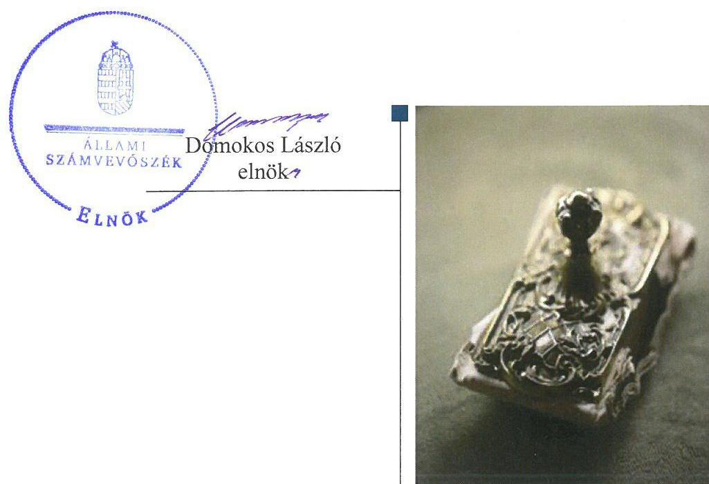

---

# AZ ELLENŐRZÉST FELÜGYELTE:

DR. NAGY IMRE felügyeleti vezető

# AZ ELLENŐRZÉST VEZETTE ÉS A VÉGREHAJTÁSÁÉRT FELELŐS:

GELENCSÉR ZSOLT ellenőrzésvezető

# A PROGRAM ÖSSZEÁLLÍTÁSÁÉRT FELELŐS:

JANIK JÓZSEF LÁSZLÓ osztályvezető

# IKTATÓSZÁM: V-1375-123/2016.

TÉMASZÁM: 2084

# ELLENŐRZÉS-AZONOSÍTÓ SZÁM: V075945

Jelentéseink az Országgyűlés számítógépes hálózatán és az Interneten a www.asz.hu címen is olvashatóak.

---

# TARTALOMJEGYZÉK 

■ ÖSSZEGZÉS ..... 5
■ AZ ELLENŐRZÉS CÉLJA ..... 6
■ AZ ELLENŐRZÉS TERÜLETE ..... 7
■ AZ ELLENŐRZÉS HÁTTERE, INDOKOLTSÁGA ..... 8
■ A JELENTÉS LÉNYEGES KÉRDÉSKÖREI ..... 9
■ ELLENŐRZÉS HATÓKÖRE ÉS MÓDSZEREI ..... 10
■ MEGÁLLAPÍTÁSOK ..... 12
■ JAVASLATOK ..... 17
■ MELLÉKLETEK ..... 19
I. Sz. melléklet: Értelmező szótár. ..... 19
II. Sz. melléklet: A Társaság vagyonának alakulása a 2012-2015. években (adatok M forintban) ..... 22
III. Sz. melléklet: A Társaság eredményének alakulása a 2012-2015. években (adatok M forintban) ..... 23
IV. Sz. melléklet: Az eszközök és források megoszlásának alakulása a 2012-2015. években ..... 24
V. Sz. melléklet: A saját tőke és a jegyzett tőke arányának alakulása a 2012-2015. években ..... 25
■ FÜGGELÉK: ÉSZREVÉTELEK ..... 27
■ RÖVIDÍTÉSEK JEGYZÉKE ..... 43

---

.

---

# ÖSSZEGZÉS 

A Közszolgálati Közalapítvány a Duna Médiaszolgáltató Nonprofit Zrt. feletti tulajdonosi jogokat szabályszerűen gyakorolta. A Duna Médiaszolgáltató Nonprofit Zrt. vagyongazdálkodása szabályszerű volt, a vagyont az előírásoknak megfelelően tartotta nyilván, gondoskodott a vagyon értékének megőrzéséről. A szabályozottsága és számviteli feladatainak ellátása megfelelt az előírásoknak. Tervezési, beszámolási kötelezettségét megfelelően teljesítette.

## Az ellenőrzés társadalmi indokoltsága

Az Állami Számvevőszék stratégiájában megfogalmazott kiemelt célja, hogy az államháztartáson kívülre nyújtott költségvetési támogatások és ingyenes vagyonjuttatások, valamint az államháztartáson kívül működő közfeladat-ellátó rendszerek ellenőrzéseivel hozzájáruljon a közpénzek átlátható, rendezett módon történő felhasználásához, a közvagyon átlátható, hatékony, költségtakarékos, eredményes működtetéséhez, értékének megőrzéséhez, gyarapításához. Minden közpénzt, közvagyont használó szervezettel szemben társadalmi igény, hogy tevékenységükről elszámoljanak. A Duna Médiaszolgáltató Nonprofit Zrt.-nek, mint Magyarország egyik közmédiai szolgáltatójának az átlátható, szabályszerű működése és gazdálkodása alapvető társadalmi igény, mely indokolta az ellenőrzés lefolytatását.

## Főbb megállapítások, következtetések, javaslatok

A Közszolgálati Közalapítvány a tulajdonosi joggyakorlás rendjét kialakította. A tulajdonosi jogokat a jogszabályi és a belső előírásoknak megfelelően gyakorolta, a szükséges tulajdonosi döntéseket meghozta.

A Duna Médiaszolgáltató Nonprofit Zrt. működésének és gazdálkodásának rendjét szabályozta, azonban nem készített önköltség-számítási szabályzatot, javadalmazási szabályzatát pedig csak a 2013. évben alkotta meg.

A bevételek és ráfordítások elszámolása megfelelt az előírásoknak. A Duna Médiaszolgáltató Nonprofit Zrt. a tervezési, beszámolási, valamint a tulajdonosi joggyakorló által meghatározott adatszolgáltatási kötelezettségeit teljesítette. Nem tett eleget az adatvédelmi, adatbiztonsági előírásoknak. A közérdekű adatok közzététele hiányos volt, ezért nem felelt meg a jogszabályoknak. A hiányosságok miatt nem érvényesült a gazdálkodás átláthatósága.

A vagyongazdálkodás szabályszerű volt. A Duna Médiaszolgáltató Nonprofit Zrt. kialakította a vagyon értékének megőrzését szolgáló vagyongazdálkodás feltételeit. A vagyont az előírásoknak megfelelően tartotta nyilván, a mérlegben kimutatott vagyonértéket leltárral támasztotta alá. A mérleg szerinti vagyonérték változásai alapján gondoskodott a vagyon értékének megőrzéséről. A vagyonváltozást eredményező döntések megfeleltek az előírásoknak.

A Duna Médiaszolgáltató Nonprofit Zrt. nem kötött adósságot keletkeztető ügyletet.
Az ÁSZ jelentésében a Duna Médiaszolgáltató Nonprofit Zrt. vezérigazgatójának négy javaslatot fogalmazott meg, amelyekre az érintettnek 30 napon belül intézkedési tervet kell készítenie.

---

# AZ ELLENŐRZÉS CÉLJA 

Az ellenőrzés célja annak értékelése volt, hogy a tulajdonosi jogok gyakorlása szabályszerű volt-e, a gazdálkodó szervezet szabályozottsága, gazdálkodása és vagyongazdálkodási tevékenysége megfelelt-e a jogszabályi és a tulajdonosi előírásoknak, biztosítva volt-e a közfeladatok átláthatósága és elszámoltathatósága érdekében a közszolgáltatás díjának megalapozottsága szabályszerű önköltségszámítással, a vagyonváltozást eredményező döntések esetében a tulajdonosi jogok gyakorlója és a gazdálkodó szervezet szabályszerűen jártak-e el.

Az ellenőrzés további célja volt annak megítélése, hogy a kormányzati szektorba sorolt állami tulajdonban (résztulajdonban) lévő gazdálkodó szervezetek gazdálkodásának a kormányzati szektor hiányára és az államadósságra befolyással bíró elemei a jogszabályi előírásoknak megfeleltek-e.

---

# **Duna Médiaszolgáltató Nonprofit Zrt. és a Közszolgálati Közalapítvány**

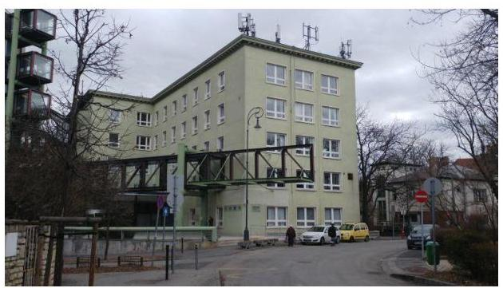

A Társaságot1 a Hungária Televízió Közalapítvány jogutódjaként létrejött KSZKA2 alapította. A korábban Duna Televízió NZrt.3 néven működő társaságba 2015. július 1-jei hatállyal beolvadt az MTV NZrt.4, az MR NZrt.5 és az MTI NZrt.6, így egyetlen közszolgálati médiaszolgáltatóként létrejött a Duna Médiaszolgáltató Nonprofit Zrt.

Az Mttv.1.27 84. §-a alapján a Társaság tulajdonosa a KSZKA volt, amely kezelő szerve, a Kuratórium8 útján gyakorolta az alapítói és részvényesi jogokat.

A Társaság célja közszolgálati médiatartalom-szolgáltatás nyújtása a Magyarország határain belül élő közönség és a határain kívül élő magyarság számára, részvétel a közszolgálati médiaszolgáltatók nemzetközi szervezeteinek munkájában, valamint hírügynökségi feladatok ellátása és részvétel a nemzetközi hírügynökségi szervezetek munkájában. Biztosítja a szabad és független közszolgálati médiatartalom-szolgáltatást, elősegíti a véleménynyilvánítás és a tájékozódás szabadságának érvényesülését, a tájékoztatás függetlenségét, kiegyensúlyozottságát és tárgyilagosságát, az európai, az egyetemes és a nemzeti kultúra értékeinek megjelenítését, valamint a kultúra sokszínűségének érvényre juttatását. Médiatarta-lom-szolgáltatási és hírügynökségi tevékenysége keretében szolgálja továbbá a magyar, az európai és az egyetemes szellemi és kulturális értékek közvetítését, a tárgyilagos Magyarország- és magyarságkép kialakítását Európában és azon kívül, a népek közötti és a nemzetközi kapcsolatok ápolását és erősítését, a magyar kisebbségek identitásának, anyanyelvének, kultúrájának megőrzését.

A Társaság vezérigazgatójának9 személye az ellenőrzött időszakban nem változott, feladatait 2011. szeptember 21-től látja el. A mérlegfőösszeg a 2012. évről a 2015. évre 420,4 M Ft10-ról 1390,2 M Ft-ra nőtt, a saját tőke a 2012. évi 165,1 M Ft-ról 909,1 M Ft-ra emelkedett. A követelések állománya a 2012. évi záró 17,9 M Ft-ról a 2015. év végére 661,6 M Ft-ra változott. Az értékesítés nettó árbevétele a 2012. december 31-i 3,0 M Ft-ról 2015. december 31-ére 104,1 M Ft-ra, a mérleg szerinti eredmény 53,3 M Ft-ról -277,2 M Ft-ra módosult. Az átlagos állományi létszám a 2012. évi 40 főről 76 főre nőtt.

A Társaság nem rendelkezett vagyonkezelésbe vett állami vagyonnal. Tevékenységét alapvetően saját vagyonával látta el, emellett az Mttv.1 100. § (6) bekezdésében és az Mttv.2 137/B. § (10) bekezdésében foglaltak alapján az MTVA11 a vagyonkezelésében lévő vagyon ingyenes használatának biztosításával támogatta a Társaság működését. A Társaságnak kapcsolt vállalkozása nem volt.

A Társaság az ellenőrzött időszakban kormányzati szektorba, azon belül a központi kormányzat alszektorba besorolt gazdálkodó szervezet volt.

---

# AZ ELLENŐRZÉS HÁTTERE, INDOKOLTSÁGA 

Az ÁSZ stratégiai célkitűzése, hogy az államháztartáson kívülre nyújtott költségvetési támogatások és ingyenes vagyonjuttatások, valamint az államháztartáson kívül működő közfeladat-ellátó szervezetek ellenőrzésével hozzájáruljon ahhoz, hogy a közpénzeket átlátható módon használják fel a közfeladatok ellátása, a közvagyon átlátható, hatékony, költségtakarékos működtetése, értékének megőrzése, állagának védelme, értéknövelő használata, hasznosítása és gyarapítása érdekében.

Az ellenőrzés feladata a közvagyonnal biztosított közfeladat ellátással kapcsolatban a közpénzek átláthatósága, nyilvánossága érdekében a jogszabályokban, belső szabályzatokban megfogalmazott előírások érvényesülésének az állami tulajdonban (résztulajdonban) lévő gazdálkodó szervezetek vagyonérték megőrzési és gazdálkodási tevékenységében történő értékelése.

A nemzeti számlák nemzetközi és hazai statisztikai módszertana és szabványai elveket határoznak meg a statisztikai értelemben vett kormányzati szektorba tartozó szervezetek körére és besorolásuk módjára. A szervezetek megnevezését a nemzetgazdasági miniszter tette közzé. A kormányzati szektor elszámolásaiban megjelenő állami tulajdonú gazdálkodó szervezetekkel szemben alapvető követelmény, hogy gazdálkodásuk, működésük szabályszerű, az általuk szolgáltatott adatok minél megbízhatóbbak legyenek.

Az ellenőrzés rámutathat az állami tulajdonú gazdálkodó szervezetek gazdálkodási tevékenységével kapcsolatos jó gyakorlatokra és szabálytalanságokra. Az ellenőrzés megállapításai segítséget nyújthatnak a jogalkotás számára az államháztartáson kívüli közfeladat-ellátás, közvagyonnal való gazdálkodás értékeléséhez, jogszabályi keretei pontosításához, az átláthatóságot biztosító szabályozáshoz. Az ellenőrzés felhívhatja a figyelmet a jogszabályi követelmények teljesítéséhez szükséges feltételek hiányosságaira. Az ellenőrzöttek számára visszajelzést ad a gazdálkodási tevékenységgel, az állami vagyon felhasználásával, az árképzés megalapozottságával és az éves elszámolással kapcsolatos szabálytalanságokról és kockázatokról. Az ellenőrzés tapasztalatai segítik és erősítik az ÁSZ hozzáadott értéket teremtő tevékenységét és tanácsadó szerepét.

---

# A JELENTÉS LÉNYEGES KÉRDÉSKÖREI 

1. A tulajdonosi jogok gyakorlása szabályszerű volt-e?
2. A Társaság működésének szabályozottsága megfelelt-e az előírásoknak? A Társaságnál a pénzügyi-számviteli, adatszolgáltatási és ellenőrzési feladatok ellátása szabályszerű volt-e?
3. A Társaság vagyongazdálkodása szabályszerű volt-e?
4. A kormányzati szektorba sorolt gazdasági társaságok gazdálkodásának a kormányzati szektor hiányára és az államadósságra befolyással bíró elemei megfeleltek-e a jogszabályi előírásoknak?

---

# ELLENŐRZÉS HATÓKÖRE ÉS MÓDSZEREI 

## Az ellenőrzés típusa

Megfelelőségi ellenőrzés.

## Az ellenőrzött időszak

2012. január 1-jétől 2015. december 31-ig.

## Az ellenőrzés tárgya

Az állami tulajdonban (résztulajdonban) lévő gazdasági társaság gazdálkodása, kiemelten vagyongazdálkodási tevékenysége, a tulajdonosi jogok gyakorlása, továbbá a kormányzati szektorba sorolt gazdasági társaság gazdálkodásának a kormányzati szektor hiányára és az államadósságra befolyással bíró elemei.

## Az ellenőrzött szervezet

Duna Médiaszolgáltató Nonprofit Zrt., Közszolgálati Közalapítvány.

## Az ellenőrzés jogalapja

Az ellenőrzés végrehajtásának jogszabályi alapját az Állami Számvevőszékről szóló 2011. évi LXVI. törvény 1. § (3) bekezdése és 5. § (3)-(5) bekezdése képezte.

## Az ellenőrzés módszerei

Az ellenőrzést a nemzetközi standardokat irányadónak tekintve, az ellenőrzési program ellenőrzési kérdései, az ellenőrzött időszakban hatályos jogszabályok, az ellenőrzés szakmai szabályok és módszertanok figyelembe vételével végeztük.

Az ellenőrzés lefolytatásához a Társaság tanúsítványok kitöltésével, valamint az ÁSZ12 által kért dokumentumok megküldésével szolgáltatott adatokat. A rendelkezésre bocsátott adatok, információk kontrollja a helyszíni ellenőrzés keretében történt.

A bevételek és ráfordítások elszámolása, valamint a vagyonnyilvántartás terén a szabályszerű működést véletlen mintavétellel - a kormányzati

---

szektor hiányát nem befolyásoló ráfordítások esetében tételesen - ellenőriztük. A mintavétellel ellenőrzött területek esetében minden egyes tétel vonatkozásában a szabályszerűségre vonatkozó kérdéseket tettünk fel, amelyek eredménye összesítésre került.

A jogszabályoknak és a belső előírásoknak megfelelőnek tekintettük az adott területet, amennyiben a minta ellenőrzésének eredménye alapján 95%-os bizonyossággal a teljes sokaságban a hibaarány kisebb volt, mint 10%, nem megfelelőnek értékeltük, ha a hibaarány a 10%-ot meghaladta. Kockázatot, illetve magas kockázatot jeleztünk, amennyiben egy adott terület vonatkozásában a minta alapján a teljes sokaságban nem volt egyértelműen biztosított a jogszabályoknak és a belső szabályzatoknak megfelelő működés. A ráfordítások elszámolására és a vagyon-nyilvántartásra vonatkozó véletlen mintavételt kockázati alapú kiválasztással egészítettük ki, amelynek során évente a három legnagyobb összegű tételt választottuk ki.

---

# 1. A tulajdonosi jogok gyakorlása szabályszerű volt-e? 

Összegző megállapítás

## A Társaság vonatkozásában a KSZKA tulajdonosi joggyakorlása szabályszerű volt.

A TULAJDONOSI JOGGYAKORLÁSRA vonatkozó előírásokat, feladatokat a KSZKA SZMSZ1-213-ben és az Alapító okirat1-514-ban az Mttv.1-2 90-91. §-ában foglaltak alapján rögzítették. Ugyanakkor az Alapító okirat1-4 11.1. pontjának előírása, mely szerint „A Társaság könyvvizsgálóját a Kuratórium választja négy éves határozott időtartamra.", nem volt összhangban az Mttv.1 107. § (1) bekezdésében foglaltakkal, amely a

 könyvvizsgáló két évre történő megválasztását írta elő. A 2015. július 1-jétől hatályos Alapító okirat ${ }_{5}$ a könyvvizsgáló megválasztására vonatkozó előírást már a jogszabályban foglaltaknak megfelelően tartalmazta.

A tulajdonosi joggyakorlás a Felügyelőbizottság ${ }^{15}$, a Vezérigazgató és a könyvvizsgáló tevékenységéhez kapcsolódóan szabályszerű volt. A Felügyelőbizottság elnökét és tagjait, valamint a könyvvizsgálót az előírásoknak megfelelően a legfőbb szerv hatáskörében eljáró Kuratórium választotta meg. A Felügyelőbizottság és a könyvvizsgáló minden ellenőrzött évben tárgyalta a Társaság éves beszámolóit, illetve független könyvvizsgálói jelentést készített azokról.

A tulajdonosi joggyakorló ${ }^{16}$ a Társaságnak üzleti terv készítését írta elő, amelyet minden évben tárgyalt a Felügyelőbizottság, majd jóváhagyásáról a Kuratórium döntött. A KSZKA a Társaságot beszámoltatta a gazdálkodásról és a feladatellátásról, tevékenységét, gazdálkodását figyelemmel kísérte.

A Kuratórium a 2012. évben döntött az alaptőke leszállításáról, mivel a saját tőke a 2011. évben - a 109/2010. (X. 28.) OGY határozatban ${ }^{17}$ előírt vagyonátadáshoz kapcsolódóan - a Gt. 245. § (1) bekezdés a) pontjában meghatározott szint alá csökkent. Határozott továbbá - az Mttv. 2 215/A. § (1) bekezdésében foglaltakat betartva - az MTV NZrt., MR NZrt. és MTI NZrt. Duna Televízió NZrt.-be 2015-ben történő beolvadásáról, valamint ezt követően meghozta az egyesülés végrehajtásához szükséges tulajdonosi döntéseket.

JAVADALMAZÁSI SZABÁLYZATOT a tulajdonosi joggyakorló 2012. január 1. és 2013. március 26. között nem készített, ezzel megsértette a Taktv. ${ }^{18}$ 5. § (3) bekezdésében foglaltakat. A Társaság legfőbb szervének hatáskörében eljáró Kuratórium 2013. márciusában megalkotta a Javadalmazási szabályzat ${ }_{1}{ }^{19}$-át. A Javadalmazási szabályzat ${ }_{1,2}$ megfelelt a Taktv. 5.§ (3) bekezdésében foglaltaknak.

---

# 2. A Társaság működésének szabályozottsága megfelelt-e az előírásoknak? A Társaságnál a pénzügyi-számviteli, adatszolgáltatási és ellenőrzési feladatok ellátása szabályszerű volt-e? 

Összegző megállapítás

A Társaság bevételeinek és ráfordításainak elszámolása megfelelt az előírásoknak. A beszámolási, adatszolgáltatási kötelezettségeket teljesítették. Az ellenőrzési feladatok ellátása nem felelt meg az előírásoknak.
2.1. számú megállapítás

A Társaság működésének szabályozottsága összhangban volt a jogszabályi előírásokkal.

A tevékenység alapvető szabályait, a vagyongazdálkodással kapcsolatos feladat- és hatásköröket, valamint a felelősségi viszonyokat az Alapító Ok-irat ${ }_{1-5}$-ban, valamint az SZMSZ ${ }_{1-7}{ }^{20}$-ben foglaltak határozták meg. A Társaság az előírásoknak megfelelően elkészítette számviteli szabályzatait, a Leltározási szabályzat ${ }_{1,2}{ }^{21}$, az Értékelési szabályzat ${ }_{1,2}{ }^{22}$ a Pénzkezelési szabályzat ${ }_{1,2}{ }^{23}$ a Számv. tv-ben foglaltakkal összhangban készült. A Társaság a Számv. tv-nek megfelelően alakította ki Számlarend ${ }_{1-2}{ }^{24}$-jét, Bizonylati rend ${ }_{1-2}{ }^{25}$-jét és egységes számlakeretét. A szabályzatok szükség szerinti illesztése a jogszabályváltozásokhoz megtörtént.
2.2. számú megállapítás

A Társaság bevételeinek és ráfordításainak elszámolása - a kormányzati szektor hiányát nem befolyásoló ráfordítások kivételével - megfelelt az előírásoknak.

Az ÉRTÉKESÍTÉS NETTÓ ÁRBEVÉTELE, az egyéb, a rendkívüli és a pénzügyi műveletek bevételei elszámolása során a Társaság szabályszerűen, a Számv. tv.-ben és a számviteli szabályzatokban foglaltaknak megfelelően járt el. A kormányzati szektor hiányát befolyásoló ráfordítások elszámolása szabályszerűen, a megfelelő dokumentumokkal alátámasztva, megfelelő főkönyvi számlák alkalmazásával történt. A kormányzati szektor hiányát nem befolyásoló ráfordítások elszámolása nem felelt meg az előírásoknak, mivel az immateriális javak könyvekből történő kivezetésének bizonylatai a Számv. tv. 167. § 1) bekezdés (a) és (h) pontjaiban foglaltak ellenére nem tartalmazták a bizonylatszámot, a könyvelés módjára, az érintett könyvviteli számlákra történő hivatkozást. A beruházások és az értékcsökkenés elszámolása megfelelt az előírásoknak.

A vevőkövetelések állományának alakulását az 1. táblázat mutatja be.

1. táblázat

A TÁRSASÁG VEVŐKÖVETELÉSEI ÁLLOMÁNYÁNAK ALAKULÁSA A 2012-2015. ÉVEKBEN (M FT-BAN)

| Megnevezés | 2012. év | 2013. év | 2014. év | 2015. év |
| :--: | :--: | :--: | :--: | :--: |
| Vevőkövetelések állománya XII. 31-én | 1,1 | 0,2 | 0,8 | 180,8 |
| Ebből:   határidőn belüli   határidőn túli | 0,1 | 0,2 | 0,1 | 28,1 |

---

A Társaság hátralékos követeléseinek összege az egyesülést követően főként az MTI hátralékos követeléseinek átvétele miatt - a 2014. évi 0,7 M Ft-ról 2015. év végére 152,7 M Ft-ra emelkedett. A kétes követelések vonatkozásában értékvesztést számoltak el, ezzel eleget tettek a Számv. tv. 55. § (1) bekezdésében foglaltaknak és a 15. § (8) bekezdésben megfogalmazott óvatosság elvének.

# 2.3. számú megállapítás 

A Társaság a tervezési, beszámolási és a tulajdonosi joggyakorló felé fennálló adatszolgáltatási kötelezettségét az előírásoknak megfelelően teljesítette. Az adatvédelmi előírásokat nem, a közérdekű adatok közzétételére vonatkozó kötelezettséget hiányosan teljesítették, ami nem felelt meg a jogszabályi előírásnak.

A Társaság az Mttv. 1,2 105. § (1) d) pontjában, és az Alapító okirat ${ }_{1-5}$-ban foglaltaknak megfelelően minden évben elkészítette üzleti tervét. Az Üzleti $\operatorname{terv}_{1-5}{ }^{26}$-ek a tulajdonosi joggyakorló céljaival összhangban voltak, azok elfogadásáról a Kuratórium döntött.

ÉVES BESZÁMOLÓIT a Társaság az ellenőrzött években a Számv. tv.-ben, valamint az Alapító okirat ${ }_{1-5}$-ban foglaltaknak megfelelően elkészítette, azokat a legfőbb szerv hatáskörében eljáró Kuratórium a jogszabályokban előírtak alapján minden évben jóváhagyta. A Társaság a beszámoló letétbe helyezését és közzétételét az előírásoknak megfelelően, elektronikus formában, határidőben teljesítette.

A tulajdonosi joggyakorló előírásainak megfelelően, az általa meghatározott adattartalommal a Társaság rendszeresen teljesítette kontrolling adatszolgáltatási, tájékoztatási kötelezettségét.

## A KÖZÉRDEKBŐL NYILVÁNOS ADATOK KÖZZÉ-

TÉTELE nem felelt meg a Taktv. 2.§ (1) bekezdés c), d) pontjainak, illetve a (2) bekezdésnek.

A Társaság kormányzati szektorba sorolt szervezetként 2014. december 31-éig az Ávr. ${ }^{27}$ 7. sz. mellékletének 2., 28., 29. pontjaiban, ezt követően 5. számú mellékletének 3., 23-24. pontjaiban előírtakat - az NGM részére havi szintű mérleg és eredménykimutatás adatok továbbításával - a 2014-2015. években teljesítette. A 2012-2013. években nem teljesítette az Ávr. 7. sz. melléklet 28-29. pontja szerinti adatszolgáltatást.

A Társaság rendelkezett Iratkezelési szabályzattal, amelyben részletesen szabályozta a belső iratkezelési rendet. Az Info tv. 30. § (6) bekezdésben előírtakat megsértve ugyanakkor nem készítették el a közérdekű adatok megismerésére irányuló igények teljesítésének rendjét rögzítő szabályzatot. Az Info tv. alapján a Társaság belső adatvédelmi felelős kinevezésére volt kötelezett, azonban az ellenőrzött időszakban ez nem történt meg, ezzel megsértették az Info tv. 24.§ (1) bekezdés c) pontját. Nem készítettek adatvédelmi és adatbiztonsági szabályzatot, így nem feleltek meg az Info tv. 24. § (3) bekezdésében foglaltaknak. Továbbá nem vezettek belső adatvédelmi nyilvántartást, ezzel megsértették az Info tv. 24. §. (2) bekezdés e) pontjának előírásait.

---

# 2.4. számú megállapítás 

A Társaság nem alakított ki belső ellenőrzést, így nem tett eleget a jogszabályban meghatározott kötelezettségének.

A TÁRSASÁG MINT KORMÁNYZATI SZEKTORBA SOROLT EGYÉB SZERVEZET 2014. január 1-jétől a Bkr. 1. §. (2) bekezdés e) pontja alapján a rendelet hatálya alá tartozott, azonban belső ellenőrzést nem alakított ki és nem működtetett. Ezáltal nem gondoskodott a Bkr. 3. § e) pontja és a Bkr. 10.§-a ellenére a szervezet tevékenységének, a célok megvalósításának nyomon követését biztosító rendszer kialakításáról.

Külső ellenőrzések lefolytatása több esetben a társadalombiztosítási kötelezettségek ellenőrzése céljából történt a Társaságnál, a feltárt hiányosságok javítása, pótlása megtörtént.

## 3. A Társaság vagyongazdálkodása szabályszerű volt-e?

## Összegző megállapítás

### 3.1. számú megállapítás

A Társaság vagyongazdálkodása az ellenőrzött időszakban szabályszerű volt.

A Társaság kialakította a saját vagyon értékének megőrzését szolgáló, szabályszerű vagyongazdálkodás feltételeit, szabályszerűen tartotta nyilván a saját vagyonát.

## A VAGYONGAZDÁLKODÁSI TEVÉKENYSÉG SZABÁLYAIT alapvetően az Alapító Okirat ${ }_{1-5}$-ban, valamint az SZMSZ ${ }_{1-7}$-ben határozták meg, amelyek tartalmazták a Társaság legfőbb szervére, vezérigazgatójára, könyvvizsgálójára és a Felügyelőbizottságra vonatkozó, vagyongazdálkodáshoz kapcsolódó feladat- és hatásköröket, valamint felelősségi viszonyokat. A Társaság a Számviteli politika ${ }_{1,2}$-ban, az Értékelési szabályzat ${ }_{1,2}$-ban és a Leltározási szabályzat ${ }_{1,2}$-ban rögzítette a saját vagyonával való gazdálkodás módját.

A SAJÁT VAGYON NYILVÁNTARTÁSÁT, elszámolását a Társaság az ellenőrzött időszakban szabályszerűen végezte. Az eszközök és források változását tartalmazó főkönyvi kimutatások és az annak alapját képező analitikus nyilvántartások alapján a vagyonnyilvántartás átlátható, naprakész volt, a vagyonváltozás kimutatása folyamatosan történt. Az immateriális javak, tárgyi eszközök állománynövekedési tételeinek nyilvántartásba vétele az előírásoknak megfelelő volt.

A Társaság betartotta a jogszabályi előírásokat a részesedések, egyéb befektetett pénzügyi eszközök értékelésénél, azokat megfelelően értékelte.

A Társaság - a Számv. tv. 69. §-ában előírtaknak megfelelően - leltárral támasztotta alá a mérlegtételek beszámolóban kimutatott állományát.

---

# 3.2. számú megállapítás 

A Társaság gondoskodott a saját vagyon értékének megőrzéséről

## 3.3. számú megállapítás

A TÁRSASÁG VAGYONSZERKEZETE jelentősen átrendeződött az ellenőrzött időszakban a 2015-ös beolvadás miatt. A vagyon alakulását a II. számú melléklet, az eszközök és források megoszlásának változását az IV. számú melléklet mutatja be.

A mérleg szerinti vagyonérték-változások alapján megvalósult a saját vagyon értékének megőrzése. A Társaság az ellenőrzött időszak minden évében az értékcsökkenés mértékénél nagyobb összegű beruházást hajtott végre.

A Társaság eredményének alakulását a III. számú melléklet mutatja be. A mérleg szerinti eredmény évről évre csökkent főként az egyéb kötelezettségekre kapott támogatás összegének folyamatos csökkenése következtében. A 2015. évben a mérleg szerinti eredmény negatív lett az egyesülés miatti változások, valamint a folyamatban lévő peres eljárásokra történt, 276,3 M Ft összegű céltartalék képzés miatt.

A Társaság saját tőke állománya az egyesülésnek köszönhetően az ellenőrzött időszak végére több mint nyolcszorosára, 909,1 M Ft-ra növekedett. A saját tőke és a jegyzett tőke arányának alakulását az V. számú melléklet szemlélteti.

A Társaságnál a saját vagyon változását eredményező döntések megfeleltek az előírásoknak.

A saját vagyon értékesítésével kapcsolatos döntés, valamint a selejtezések során betartották az Alapító okirat ${ }_{1-5}$-ban, az SZMSZ ${ }_{1-7}$-ben, valamint a Leltározási szabályzat ${ }_{1-2}$-ban előírt jogosultsági és eljárási szabályokat. Az Mttv. 2 215/A §-ában foglaltaknak megfelelően a Kuratórium határozatban döntött a MTV NZrt, a MR NZrt., a MTI NZrt. 2015. július 1. napjával történő beolvadásáról a Duna Televízió NZrt.-be. Az egyesülés, az azzal összefüggő vagyonváltozáshoz kapcsolódó döntések szabályszerűek voltak.

## 4. A kormányzati szektorba sorolt gazdasági társaságok gazdálkodásának a kormányzati szektor hiányára és az államadósságra befolyással bíró elemei megfeleltek-e a jogszabályi előírásoknak?

Összegző megállapítás A Társaság gazdálkodása nem volt hatással az államadósságra.
A Társaság az ellenőrzött időszakban nem kötött a Stabilitási tv. ${ }^{28}$ 3. §-a szerinti adósságot keletkeztető ügyletet.

A kormányzati szektor hiányára befolyást gyakorló bevételek és ráfordítások elszámolása szabályszerű volt.

---

# JAVASLATOK 

Az ÁSZ tv. 33. § (1) bekezdésében foglaltak értelmében az ellenőrzött szervezet vezetője köteles a jelentésben foglalt megállapításokhoz kapcsolódó intézkedési tervet összeállítani és azt a jelentés kézhezvételétől számított 30 napon belül az ÁSZ részére megküldeni. Amennyiben az ellenőrzött szervezet vezetője nem küldi meg határidőben az intézkedési tervet, vagy továbbra sem elfogadható intézkedési tervet küld, az Állami Számvevőszék elnöke az ÁSZ tv. 33. § (3) bekezdése a) és b) pontjaiban foglaltakat érvényesítheti.

## Duna Médiaszolgáltató Nonprofit Zrt. Vezérigazgatójának

1. Intézkedjen a kormányzati szektor hiányát nem
 befolyásoló ráfordítások elszámolásának szabályszerű végrehajtásáról.
(2.2. sz. megállapítás 1. bekezdésének 3. mondata alapján)
2. Gondoskodjon a közérdekből nyilvános adatok közzétételének jogszabályi előírásnak megfelelő teljesítéséről.
(2.3. sz. megállapítás 4. bekezdés alapján)
3. Intézkedjen a jogszabályban előírt közérdekű adatok megismerésére irányuló igények teljesítésének rendjét rögzítő szabályzat és adatvédelmi és adatbiztonsági szabályzat elkészítéséről, adatvédelmi felelős kinevezéséről és a belső adatvédelmi nyilvántartás vezetéséről.
(2.3. sz. megállapítás 6. bekezdésének 2-5. mondata alapján)
4. Intézkedjen a szervezet tevékenységének, a célok megvalósításának nyomon követését biztosító rendszer kialakításáról a jogszabályi előírásoknak megfelelően.
(2.4. sz. megállapítás 1. bekezdése alapján)

---

.

---

# MELLÉKLETEK 

## I. SZ. MELLÉKLET: ÉRTELMEZŐ SZÓTÁR

adósságot keletkeztető ügylet
„Adósságot keletkeztető ügylet és annak értéke:
a) hitel, kölcsön felvétele, átvállalása a folyósítás, átvállalás napjától a végtörlesztés napjáig, és annak aktuális tőketartozása,
b) a számvitelről szóló törvény szerinti hitelviszonyt megtestesítő értékpapír forgalomba hozatala a forgalomba hozatal napjától a beváltás napjáig, kamatozó értékpapír esetén annak névértéke, egyéb értékpapír esetén annak vételára,
c) váltó kibocsátása a kibocsátás napjától a beváltás napjáig, és annak a váltóval kiváltott kötelezettséggel megegyező, kamatot nem tartalmazó értéke,
d) az Szt. szerint pénzügyi lízing lízingbevevői félként történő megkötése a lízing futamideje alatt, és a lizingszerződésben kikötött tőkerész hátralévő összege,
e) a visszavásárlási kötelezettség kikötésével megkötött adásvételi szerződés eladói félként történő megkötése - ideértve az Szt. szerinti valódi penziós és óvadéki repóügyleteket is - a visszavásárlásig, és a kikötött visszavásárlási ár,
f) a szerződésben kapott, legalább háromszázhatvanöt nap időtartamú halasztott fizetés, részletfizetés, és a még ki nem fizetett ellenérték,
g) hitelintézetek által, származékos műveletek különbözeteként az Államadósság Kezelő Központ Zrt.-nél (a továbbiakban: ÁKK Zrt.) elhelyezett fedezeti betétek, és azok összege."
Forrás: Stabilitási tv. 3. § (1) bekezdése
állami vagyon
a) Az állam tulajdonában lévő dolog, valamint dolog módjára hasznosítható természeti erő;
b) az a) pont hatálya alá tartozó mindazon vagyon, amely vonatkozásában törvény az állam kizárólagos tulajdonjogát nevesíti;
c) az állam tulajdonában lévő tagsági jogviszonyt megtestesítő értékpapír, illetve az államot megillető egyéb társasági részesedés;
d) az államot megillető olyan immateriális, vagyoni értékkel rendelkező jogosultság, amelyet jogszabály vagyoni értékű jogként nevesít;
2012. november 10-től az állami vagyon fogalma kiegészül a következő ponttal:
e) az állam tulajdonában lévő pénzügyi eszközök.
(Forrás: Vtv. 29. § (2) bekezdése)
állami vagyon használója Az a természetes vagy jogi személy, jogi személyiséggel nem rendelkező szervezet, aki, vagy amely törvény vagy szerződés alapján, bármely jogcímen (bérlet, haszonbérlet, használat stb.) állami vagyont birtokol, használ, szedi annak hasznait, hasznosít, ide nem értve a haszonélvezőt, a vagyonkezelőt és a tulajdonosi jogok gyakorlóját.
állami vagyon kezelője/vagyonkezelő
2013. június 27-ig:

Az állami vagyont az MNV Zrt. maga kezeli, vagy szerződés - így különösen bérlet, haszonbérlet, megbízás - alapján központi költségvetési szervnek, természetes vagy jogi személynek, vagy jogi személyiséggel nem rendelkező gazdálkodó szervezetnek hasznosításra átengedi. Az állami vagyonra vonatkozóan az MNV Zrt. kizárólag az Nvtv30-ben meghatározott személyekkel köthet vagyonkezelési szerződést.
Forrás: Vtv. 23. § (1), 27. § (1)

---

# 2013. június 28-ától: 

Az állami vagyonnal az MNV Zrt. maga gazdálkodik, vagy szerződés - így különösen bérlet, haszonbérlet, megbízás - alapján központi költségvetési szervnek, természetes vagy jogi személynek, vagy jogi személyiséggel nem rendelkező gazdálkodó szervezetnek hasznosításra átengedi, illetőleg vagyonkezelésbe, haszonélvezetbe adja. Az állami vagyonra vonatkozóan az MNV Zrt. kizárólag az Nvtv-ben meghatározott személyekkel köthet vagyonkezelési szerződést.
Forrás: Vtv. 23. § (1), 27. § (1)
gazdasági társaság
kormányzati szektorba sorolt egyéb szervezet
nemzeti vagyon

A Ptk. 3:88. § (1) bekezdése szerint „a gazdasági társaságok üzletszerű közös gazdasági tevékenység folytatására, a tagok vagyoni hozzájárulásával létrehozott, jogi személyiséggel rendelkező vállalkozások, amelyekben a tagok a nyereségből közösen részesednek, és a veszteséget közösen viselik".
Az a szervezet, amely az Áht.31 alapján nem része az államháztartásnak, azonban az Európai Közösséget létrehozó szerződéshez csatolt, a túlzott hiány esetén követendő eljárásról szóló jegyzőkönyv alkalmazásáról szóló 2009. május 25-i 479/2009/EK rendelet szerint a kormányzati szektorba tartozik. A nemzetgazdasági miniszter a Hivatalos Értesítő 2012. évi, február 16-án megjelent 9. számában, 2013. évi, június 28-án megjelent 32. és december 16-án megjelent 60. számában, 2015. évi, december 30-án megjelent 66. számában kiadott NGM közleményekben tette közzé ezen szervezetek listáját.
a) az állam vagy a helyi önkormányzat kizárólagos tulajdonában álló dolgok,
b) az a) pont hatálya alá nem tartozó, állam vagy a helyi önkormányzat tulajdonában lévő dolog,
c) az állam vagy a helyi önkormányzat tulajdonában lévő pénzügyi eszközök, továbbá az államot vagy a helyi önkormányzatot megillető társasági részesedések,
d) az államot vagy a helyi önkormányzatot megillető bármely vagyoni értékkel rendelkező jogosultság, amelyet jogszabály vagyoni értékű jogként nevesít,
e) Magyarország határa által körbezárt terület feletti légtér,
f) az üvegházhatású gázok kibocsátási egységeinek kereskedelméről szóló törvény szerint kibocsátási egység és légiközlekedési kibocsátási egység, valamint az ENSZ Éghajlatváltozási Keretegyezménye és annak Kiotói Jegyzőkönyvének végrehajtási keretrendszeréről szóló törvény szerinti kiotói egység,
g) állami vagy helyi önkormányzati fenntartású közgyűjtemény (muzeális intézmény, levéltár, közgyűjteményként működő kép- és hangarchívum, valamint könyvtár) saját gyűjteményében nyilvántartott kulturális javak körébe tartozó dolog, kivéve, ha az állami vagy önkormányzati tulajdon jogszerű létrejötte kétséget kizáró módon nem bizonyítható és a dologra nézve más a tulajdonjogát bizonyítja vagy a kulturális javakra vonatkozó jogszabályokban meghatározott eljárás keretében valószínűsíti (g. pont módosult 2013. december 7-től),
h) a régészeti lelet,
i) a nemzeti adatvagyon körébe tartozó állami nyilvántartások fokozottabb védelméről szóló törvény szerinti nemzeti adatvagyon.
Forrás: Nvtv.32 1. § (2)
nonprofit gazdasági társaság Civil tv.33 9/F. § (2) bekezdése szerint „az a gazdasági társaság minősül nonprofit gazdasági társaságnak és cégnevében az a gazdasági társaság tüntetheti fel a nonprofit jelleget, amelynek létesítő okirata tartalmazza, hogy a gazdasági társaság tevékenységéből származó nyereség a tagok között nem osztható fel, hanem az a gazdasági társaság vagyonát gyarapítja." (hatályos 2014. március 15-től)

---

tulajdonosi ellenőrzés

## 2014. március 14-ig:

Az állami vagyon kezelőjét, haszonélvezőjét, használóját megillető jogok gyakorlását, annak szabályszerűségét, célszerűségét az MNV Zrt. - szükség szerint területi szervei útján - ellenőrzi.

## 2014. március 15-től:

Az állami vagyon használóját, vagyonkezelőjét és haszonélvezőjét megillető jogok gyakorlását, annak szabályszerűségét, a kötelezettségek teljesítését, valamint a vagyon rendeltetése szerinti célszerűségét a tulajdonosi joggyakorló rendszeresen ellenőrzi.
Forrás: Vhr.34 20. § (1)
tulajdonosi joggyakorló
Nvtv. 3. § (1) bekezdés 17. pontja szerint, aki a nemzeti vagyon felett az államot vagy a helyi önkormányzatot megillető tulajdonosi jogok és kötelezettségek összességének gyakorlására jogosult.
(Forrás: Nvtv. 3. § (1) bekezdés 17. pontja)
2012. január 1-jétől:

A vagyonkezelő köteles a vagyontárgy értékét megőrizni, állagának megóvásáról, jó karban tartásáról, működtetéséről gondoskodni, továbbá - a központi költségvetési szervek kivételével - díjat fizetni vagy a szerződésben előírt más kötelezettséget teljesíteni.
Forrás: Vtv. 27. § (2)
2013. június 28-ától:

A vagyonkezelő köteles a vagyontárgy állagának megóvásáról, jó karbantartásáról, működtetéséről gondoskodni, továbbá - a központi költségvetési szervek kivételével - díjat fizetni, jogszabályban és szerződésben előírt más kötelezettségét teljesíteni, valamint a vagyontárgyat jogszabályban vagy szerződésben meghatározott célnak megfelelően használni. Amennyiben a vagyonkezelő ezen kötelezettségének nem tesz eleget, a tulajdonosi joggyakorló jogosult a szerződést azonnali hatállyal felmondani.
Forrás: Vtv. 27. § (2)

---

II. SZ. MELLÉKLET: A TÁRSASÁG VAGYONÁNAK ALAKULÁSA A 2012-2015. ÉVEKBEN (ADATOK M FORINTBAN)

|  Megnevezés | 2012. év | 2013. év | 2014. év | 2015. év | Változás 2015. 12. 31./ 2012. 12. 31. (%)  |
| --- | --- | --- | --- | --- | --- |
|  BEFEKTETETT ESZKÖZÖK | 30,8 | 117,3 | 202,3 | 267,3 | 767,9  |
|  Immateriális javak | 0,8 | 0,5 | 0,4 | 8,5 | 962,5  |
|  Tárgyi eszközök | 13,2 | 102,2 | 189,5 | 187,6 | 1321,2  |
|  Befektetett pénzügyi eszközök | 16,8 | 14,6 | 12,4 | 71,2 | 323,8  |
|  FORGÓESZKÖZÖK | 285,4 | 203,0 | 47,1 | 1105,2 | 287,2  |
|  Készletek | 3,4 | 3,1 | 3,1 | 5,8 | 70,6  |
|  Követelések | 17,9 | 17,7 | 15,3 | 661,6 | 3596,1  |
|  Pénzeszközök | 264,1 | 182,2 | 28,7 | 437,8 | 65,8  |
|  AKTÍV IDŐBELI ELHATÁROLÁSOK | 104,2 | 1,1 | 1,2 | 17,7 | -83,0  |
|  ESZKÖZÖK ÖSSZESEN | 420,4 | 321,4 | 250,6 | 1390,2 | 230,7  |
|  SAJÁT TŐKE | 165,1 | 192,1 | 212,3 | 909,1 | 450,6  |
|  Jegyzett tőke | 10,0 | 10,0 | 10,0 | 230,0 | 2200,0  |
|  Tőketartalék | 0,0 | 0,0 | 0,0 | 892,4 | -  |
|  Eredménytartalék | 101,8 | 155,1 | 182,1 | 63,9 | -37,2  |
|  Mérleg szerinti eredmény | 53,3 | 27,0 | 20,2 | -277,2 | -620,1  |
|  CÉLTARTALÉK | 6,9 | 0,9 | 0,9 | 276,3 | 3904,3  |
|  KÖTELEZETTSÉGEK | 96,8 | 79,0 | 26,8 | 187,4 | 93,6  |
|  PASSZÍV IDŐBELI ELHATÁROLÁSOK | 151,6 | 49,4 | 10,6 | 17,4 | -88,5  |
|  FORRÁSOK ÖSSZESEN | 420,4 | 321,4 | 250,6 | 1390,2 | 230,7  |

Forrás: 2012-2015. évi beszámolók

---

III. SZ. MELLÉKLET: A TÁRSASÁG EREDMÉNYÉNEK ALAKULÁSA A 2012-2015. ÉVEKBEN (ADATOK M FORINTBAN)

|  Megnevezés | 2012. év | 2013. év | 2014. év | 2015. év | Változás 2015. 12. 31./ 2012. 12. 31. (%)  |
| --- | --- | --- | --- | --- | --- |
|  Értékesítés nettó árbevétele | 3,0 | 9,8 | 8,0 | 104,1 | 3370,0  |
|  Aktivált saját teljesítmények értéke | 0,0 | 0,0 | 0,0 | 0,0 | 0,0  |
|  Egyéb bevételek | 693,5 | 599,1 | 582,6 | 1078,2 | 55,5  |
|  Anyagjellegű ráfordítások | 82,0 | 74,2 | 94,5 | 216,6 | 164,1  |
|  Személyi jellegű ráfordítások | 461,6 | 480,4 | 448,7 | 1072,0 | 132,2  |
|  Értékcsökkenési leírás | 2,7 | 9,0 | 17,3 | 11,0 | 307,4  |
|  Egyéb ráfordítások | 114,8 | 27,1 | 9,8 | 161,6 | 40,8  |
|  ÜZEMI (ÜZLETI) TEVÉKENYSÉG EREDMÉNYE | 35,4 | 18,2 | 20,3 | -278,9 | -887,9  |
|  Pénzügyi műveletek bevételei | 34,2 | 9,5 | 2,2 | 1,4 | -95,9  |
|  Pénzügyi műveletek ráfordításai | 16,4 | 0,7 | 2,3 | 2,0 | -87,7  |
|  PÉNZÜGYI MŰVELETEK EREDMÉNYE | 17,8 |

 | 8,8 | $-0,1$ | $-0,6$ | $-103,4$  |
|  SZOKÁSOS VÁLLALKOZÁSI EREDMÉNY | 53,2 | 27,0 | 20,2 | $-279,5$ | $-625,4$  |
|  Rendkívüli bevételek | 0,1 | 0,0 | 0,0 | 2,3 | 2200,0  |
|  Rendkívüli ráfordítások | 0,0 | 0,0 | 0,0 | 0,0 | 0,0  |
|  RENDKÍVÜLI EREDMÉNY | 0,1 | 0,0 | 0,0 | 2,3 | 2200,0  |
|  ADÓZÁS ELŐTTI EREDMÉNY | 53,3 | 27,0 | 20,2 | $-277,2$ | $-620,1$  |
|  Adófizetési kötelezettség | 0,0 | 0,0 | 0,0 | 0,0 | 0,0  |
|  ADÓZOTT EREDMÉNY | 53,3 | 27,0 | 20,2 | $-277,2$ | $-620,1$  |
|  Eredménytartalék igénybevétel osztalékra | 0,0 | 0,0 | 0,0 | 0,0 | 0,0  |
|  Jóváhagyott osztalék, részesedés | 0,0 | 0,0 | 0,0 | 0,0 | 0,0  |
|  MÉRLEG SZERINTI EREDMÉNY | 53,3 | 27,0 | 20,2 | $-277,2$ | $-620,1$  |

Forrás: 2012-2015. évi beszámolók

---

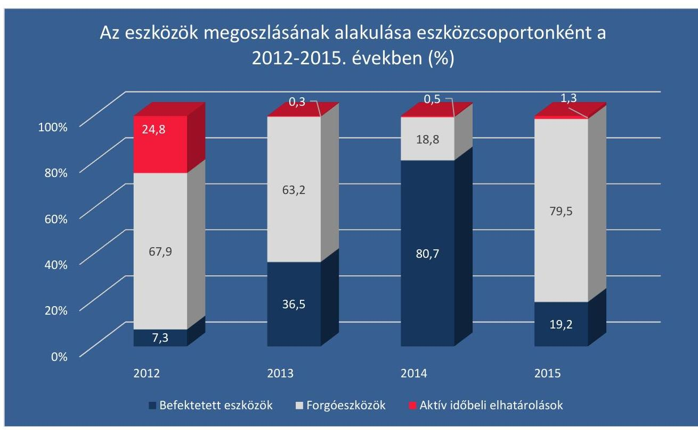

A források megoszlásának alakulása forráscsoportonként a 2012-2015. években (%)
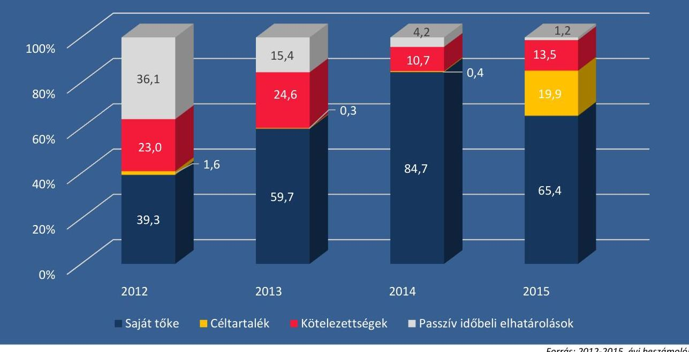

---

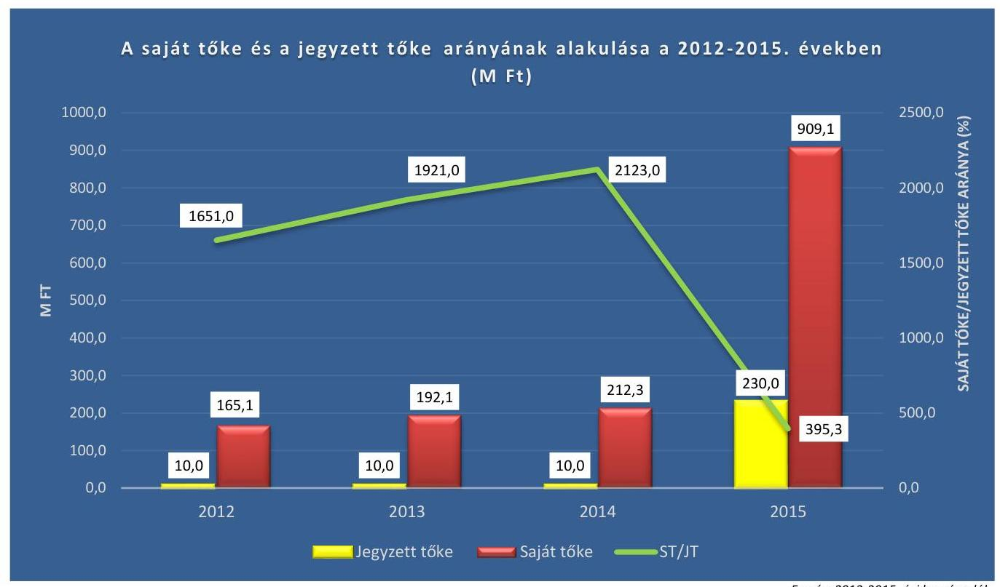

Forrás: 2012-2015. évi beszámolók

---

.

---

# FÜGGELÉK: ÉSZREVÉTELEK 

A jelentéstervezetet a Számvevőszék 15 napos észrevételezésre megküldte az ellenőrzött szervezetek vezetőinek az ÁSZ tv. 29. § (1) bekezdése előírásának megfelelően.

Az ÁSZ a jelentéstervezetet észrevételezésre megküldte a Közszolgálati Közalapítvány elnökének és a Duna Médiaszolgáltató Nonprofit Zrt. vezérigazgatójának.
A Közszolgálati Közalapítvány elnökének és a Duna Médiaszolgáltató Nonprofit Zrt. vezérigazgatójának észrevételét és az arra adott választ a függelék alább tartalmazza.

[^0]
[^0]:    * 29. § (1) Az Állami Számvevőszék az ellenőrzési megállapításait megküldi az ellenőrzött szervezet vezetőjének vagy az általa megbízott személynek, és annak, akinek személyes felelősségét állapította meg.
    (2) Az ellenőrzött szervezet vezetője és a felelősként megjelölt személy az ellenőrzés megállapításaira tizenöt napon belül írásban észrevételt tehet.
    (3) Az Állami Számvevőszék az észrevételre a beérkezésétől számított harminc napon belül írásban válaszol. A figyelembe nem vett észrevételeket köteles a jelentésben feltüntetni, és megindokolni, hogy azokat miért nem fogadta el.

---

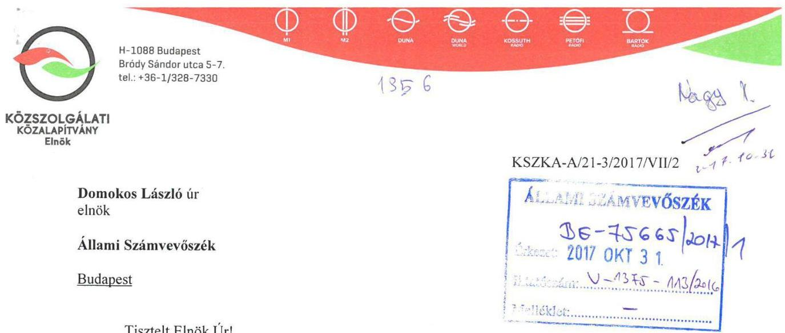

Tisztelt Elnök Úr!

A V-1375-107/2016. számon iktatott az „Állami tulajdonú gazdasági társaságok - Az állami tulajdonban (résztulajdonban) lévő gazdálkodó szervezetek vagyonmegőrzési és gazdálkodási tevékenységének ellenőrzése - Duna Médiaszolgáltató Nonprofit Zrt." címmel készített jelentéstervezettel kapcsolatban az alábbi észrevételeket teszem.

Tudomásul vesszük a jelentéstervezet 12. oldalán (1. fejezet) a tulajdonosi joggyakorlással összefüggésben rögzített, a Duna Televízió Zrt. mint a Duna Médiaszolgáltató Zrt. jogelődje alapító okirata könyvvizsgáló választásának időtartamára vonatkozó megállapításait. Ennek kapcsán jelezni kívánjuk, hogy a Közszolgálati Közalapítvány Kuratóriuma a könyvvizsgálót minden alkalommal az Mttv. 107. § (1) bekezdésében rögzített két éves időtartamra választotta meg, mind a jogelőd, mind pedig a jogutód szervezet tekintetében, és a könyvvizsgáló megbízatásának időtartamát a Fővárosi Cégbíróság által vezetett cégjegyzék is mindvégig ekként tartalmazta.

Ugyancsak tudomásul vesszük a jelentéstervezet 12. oldalán (1. fejezet) a tulajdonosi joggyakorlással összefüggésben rögzített, a Duna Televízió Zrt.-re vonatkozó javadalmazási szabályzat hiányának tényét a 2012. január 1. és 2013. március 26. közötti időszak tekintetében. Örömmel nyugtázzuk ugyanakkor, hogy a jelentéstervezet megállapítása szerint a Kuratórium által elfogadott javadalmazási szabályzat megfelel a vonatkozó jogszabályi rendelkezéseknek.

Nem értünk egyet a jelentéstervezet 14. oldalán a 2.3. számú megállapítás a Duna Médiaszolgáltató Zrt.-re irányadó adatvédelmi szabályok alkalmazása körében megfogalmazott megállapítások közül az elektronikus hírközlői jogállással összefüggésben tett megállapításokkal. Megítélésünk szerint a Duna Médiaszolgáltató Zrt. nem tartozik az
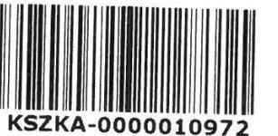

---

elektronikus hírközlésről szóló 2003. évi C. törvény hatálya alá, jogállását illetően ugyanis nem minősül elektronikus hírközlési szolgáltatónak. Ezt támasztja alá azon tény is, miszerint a Duna Médiaszolgáltató Zrt. nem szerepel a Nemzeti Média- és Hírközlési Hatóság által az elektronikus hírközlési szolgáltatók tekintetében vezetett nyilvántartásában. Ebből következően megítélésünk szerint a Duna Médiaszolgáltató Zrt. vonatkozásában nem alkalmazandóak az Infotv. 24. §-ában rögzített belső adatvédelmi felelős alkalmazására vonatkozó és az ahhoz kapcsolódó előírások.

Végezetül szeretnénk ismételten felhívni a Tisztelt Állami Számvevőszék figyelmét arra a körülményre, hogy a jelentéstervezetben több helyen megfogalmazottakkal szemben a Duna Médiaszolgáltató Zrt. nem minősül állami tulajdonú gazdasági társaságnak, annak tulajdonosa ugyanis az Mttv. 84. § (1) bekezdése értelmében az Országgyűlés által létrehozott Közszolgálati
Közalapítvány.

Budapest, 2017. október 30.
Tisztelettel
Balogh László

---

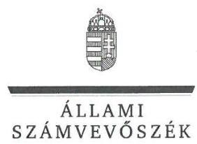

ELNÖK

# Balogh László úr 

elnök

Közszolgálati Közalapítvány

## Budapest

## Tisztelt Elnök Úr!

Az „Állami tulajdonú gazdasági társaságok - Az állami tulajdonban (résztulajdonban) lévő gazdálkodó szervezetek vagyonmegőrzési és gazdálkodási tevékenységének ellenőrzése - Duna Médiaszolgáltató Nonprofit Zrt. "címmel készített számvevőszéki jelentéstervezetre tett észrevételeit köszönettel megkaptam.

Az Állami Számvevőszék észrevételekre vonatkozó álláspontjáról a felügyeleti vezető által készített részletes tájékoztatást csatoltan megküldöm.

Tájékoztatom Elnök urat, hogy a számvevőszéki jelentésben - az Állami Számvevőszékről szóló 2011. évi LXVI. törvény 29. § (3) bekezdése alapján - a figyelembe nem vett észrevételeket szerepeltetjük az elutasítás indokának feltüntetésével.

Budapest, 2017. 11. 23.
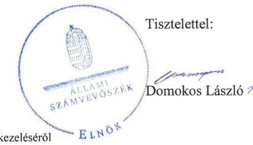

Melléklet: Tájékoztatás az észrevételek kezeléséről

---

# Tájékoztatás   az észrevételek kezeléséről 

Az „Állami tulajdonú gazdasági társaságok - Az állami tulajdonban (résztulajdonban) lévő gazdálkodó szervezetek vagyonmegőrzési és gazdálkodási tevékenységének ellenőrzése - Duna Médiaszolgáltató Nonprofit Zrt. " címủ számvevőszéki jelentéstervezetre 2017. október 30-án kelt észrevételeit áttekintettem, annak kezeléséről az alábbi tájékoztatást adom.

1. A jelentéstervezet Összegző megállapítás 1. bekezdésében foglaltakra (,, .... az Alapító okirat1-4 11.1. pontjának előírás, mely szerint „A Társaság könyvvizsgálóját a Kuratórium választja négy éves határozott időtartamra.", nem volt összhangban az Mttv. 1 107. § (1) bekezdésében foglaltakkal, amely a könyvvizsgáló két évre történő megválasztását írta elő.") vonatkozó észrevétel:
Az észrevételben leírtak szerint: „Tudomásul vesszük a jelentéstervezet 12. oldalán (1. fejezet) a tulajdonosi joggyakorlással összefüggésben rögzített, a Duna Televízió Zrt. mint a Duna Médiaszolgáltató Zrt. jogelődje alapító okirata könyvvizsgáló választásának időtartamára vonatkozó megállapításait. Ennek kapcsán jelezni kívánjuk, hogy a Közszolgálati Közalapítvány Kuratóriuma a könyvvizsgálót minden alkalommal az Mttv. 107. § (1) bekezdésében rögzített két éves időtartamra választotta meg, mind a jogelőd, mind pedig a jogutód szervezet tekintetében, és a könyvvizsgáló megbízatásának időtartamát a Fővárosi Cégbíróság által vezetett cégjegyzék is mindvégig ekként tartalmazta."

Az észrevétel a megállapítást nem vitatta, erre való tekintettel a megállapítás módosítása nem indokolt.
2. A jelentéstervezet Összegző megállapítás 5. bekezdésében foglaltakra (,,Javadalmazási szabályzatot a tulajdonosi joggyakorló 2012. január 1. és 2013. március 26. között nem készített, ezzel megsértette a Taktv. 5. § (3) bekezdésében foglaltakat. A Társaság legfőbb szervének hatáskörében eljáró Kuratórium 2013 márciusában megalkotta a Javadalmazási szabályzat1-át. A Javadalmazási szabályzat1,2 megfelelte a Taktv. 5.§ (3) bekezdésében foglaltaknak" vonatkozó észrevétel:
Az észrevételben leírtak szerint: „Ugyancsak tudomásul vesszük a jelentéstervezet 12. oldalán (1. fejezet) a tulajdonosi joggyakorlással összefüggésben rögzített, a Duna Televízió Zrt.-re vonatkozó javadalmazási szabályzat hiányának tényét 2012. január 1. és 2013. március 26. közötti időszak tekintetében."

---

Az észrevétel a megállapítást nem vitatta, erre való tekintettel a megállapítás módosítása nem indokolt.
3. A jelentéstervezet 2.3. számú megállapítás 6. bekezdésének 4. mondatában foglaltakra („Az Info tv. alapján a Társaság belső adatvédelmi felelős kinevezésére volt kötelezett, azonban az ellenőrzött időszakban ez nem történt meg, ezzel megsértették Info tv. 24.§ (1) bekezdés c) pontját. Nem készítettek adatvédelmi és adatbiztonsági szabályzatot, így nem feleltek meg az Info tv. 24. § (3) bekezdésében foglaltaknak. Továbbá nem vezettek belső adatvédelmi nyilvántartást, ezzel megsértették az Info tv. 24. §. (2) bekezdés e) pontjának előírásait."') vonatkozó észrevétel:
Az észrevételben leírtak szerint: „Nem értünk egyet a jelentéstervezet 14 oldalán a 2.3. számú megállapítás a Duna Médiaszolgáltató Zrt.-re irányadó adatvédelmi szabályok alkalmazása körében megfogalmazott megállapítások közül az elektronikus hírközlői jogállással összefüggésben tett megállapításokkal. Megítélésünk szerint a Duna Médiaszolgáltató Zrt. nem tartozik az elektronikus hírközlésről szóló 2003. évi C. törvény hatálya alá, jogállását illetően ugyanis nem minősül elektronikus hírközlési szolgáltatónak. Ezt támasztja alá azon tény is, miszerint a Duna Médiaszolgáltató Zrt. nem szerepel a Nemzeti Média- és Hírközlési Hatóság által az elektronikus hírközlési szolgáltatók tekintetében vezetett nyilvántartásban. Ebből következően megítélésünk szerint a Duna Médiaszolgáltató Zrt. vonatkozásában nem alkalmazandóak az Infotv. 24. §-ában rögzített belső adatvédelmi felelős alkalmazására vonatkozó és az ahhoz kapcsolódó előírások.")
Az észrevétel a Duna Médiaszolgáltató Nonprofit Zrt. részére megfogalmazott megállapításhoz és javaslathoz kapcsolódik. Az elektronikus hírközlésről szóló 2003. évi C. törvény 1. § (1) bekezdésének a) pontja szerint a törvény hatálya kiterjed a Magyarország területén végzett vagy területére irányuló elektronikus hírközlési tevékenységre, valamint minden olyan tevékenységre, amelynek gyakorlása során rádiófrekvenciás jel keletkezik, továbbá a b) pontja szerint az a) pontban foglalt, vagy azzal összefüggő tevékenységet végző vagy szolgáltatást nyújtó természetes, illetőleg jogi személyre vagy jogi személyiséggel nem rendelkező más szervezetre is. A Duna Médiaszolgáltató Nonprofit Zrt. tájékoztatása szerint az ellenőrzést követően az adatvédelmi és adatbiztonsági szabályzat kiadásra került, az adatvédelmi felelős kinevezése megtörtént. A megállapítás módosítása nem indokolt.
4. A jelentéstervezettel kapcsolatban - hivatkozás nélkül - tett észrevétel: „Végezetül szeretnénk ismételten felhívni a Tisztelt Állami Számvevőszék figyelmét arra a körülményre, hogy a jelentéstervezetben több helyen megfogalmazottakkal szemben a Duna Médiaszolgáltató Zrt. nem minősül állami tulajdonú gazdasági társaságnak, annak tulajdonosa ugyanis az Mttv. 84. § (1) bekezdése értelmében az Országgyűlés által létrehozott Közszolgálati Közalapítvány."
Az észrevételt nem fogadom el. Magyarország Alaptörvénye „Az állam" cím fejezet 1. cikkében rögzíti az Országgyűlést, mint Magyarország legfőbb népképviseleti szervét. Ezáltal az Országgyűlés által létrehozott Közszolgálati Közalapítvány tulajdonosi részesedése a Duna Médiaszolgáltató Zrt. felett az állami tulajdon része. A számvevőszéki ellenőrzés a Duna Médiaszolgáltató Nonprofit Zrt.-nél a Polgári Törvénykönyv, a Számviteli törvény gazdasági társaságokra vonatkozó azon előírásainak a végrehajtását ellenőrizte, amelyek a közszolgálati médiaszolgáltató gazdasági társaságokra is kiterjednek.
Az észrevételben jelzett kiegészítő információkat, mivel az a megállapításokra vonatkozó észrevételeket nem tartalmazott, az Állami Számvevőszék nem értékelte.

Budapest, 2017. november 4.

Dr. Nagy Imre felügyeleti vezető

---

TV | RADIO | HÍR | ONLINE
VEZÉRIGAZGATÓSÁG
Duna Médiaszolgáltató Nonprofit Zrt.

Állami Számvevőszék
Domokos László Elnök Úr részére
Budapest
Pf.: 54.
1364

Iktatószám: V-1375-106/2016.
Dátum: 2017. október 25.

Tisztelt Elnök Úr!
A Duna Médiaszolgáltató Nonprofit Zrt. (székhely: 1016 Budapest, Naphegy tér 8.) nevében és képviseletében, Dobos Menyhért vezérigazgató az alábbiakkal fordulok Önökhöz:

Az Állami tulajdonú gazdasági társaságok - Az Állami tulajdonban (résztulajdonban) lévő gazdálkodó szervezetek vagyonmegőrzési és gazdálkodási tevékenységének ellenőrzése - Duna Médiaszolgáltató Nonprofit Zrt. címmel készült jelentéstervezet (a továbbiakban: Jelentéstervezet) 2017. október 12. napján, fenti iktatószámon kelt levelével egyidejűleg részünkre megküldésre került.

A Jelentéstervezet Javaslatok megnevezésű része a Duna Médiaszolgáltató Nonprofit Zrt. Vezérigazgatójának az alábbi négy pontos intézkedéseket írta elő:

1. Intézkedjen a kormányzati szektor hiányát nem befolyásoló ráfordítások elszámolásának szabályszerű végrehajtásáról.
2. Gondoskodjon a közérdekből nyilvános adatok közzétételének jogszabályi előírásnak megfelelő teljesítéséről.
3. Intézkedjen a jogszabályban
 előírt közérdekű adatok megismerésére irányuló igények teljesítésének rendjét rögzítő szabályzat és adatvédelmi és adatbiztonsági szabályzat elkészítéséről, adatvédelmi felelős kinevezéséről és a belső adatvédelmi nyilvántartás vezetéséről.

---

# TV | RÁDIÓ | HÍR | ONLINE 

## VEZÉRIGAZGATÓSÁG

Duna Médiaszolgáltató Nonprofit Zrt.
pontjainak. Mivel az immateriális jószágok között nyilvántartott tételekhez kapcsolódó bizonylatok - az adott javak sajátosságaira is tekintettel - rendkívül sokfélék lehetnek (szerződések, tulajdoni lapok, nyilvántartások kivonatai stb.), így gyakran egyedi módon kezelendőek, hogy a könyvelés e része is maradéktalanul meg tudjon az Sztv. rendelkezéseinek felelni.
2. A köztulajdonban álló gazdasági társaságok takarékosabb működéséről szóló 2009. évi CXXII. törvény (a továbbiakban: Taktv.) 2. § (1) bekezdés c) és d) pontjainak, illetve (2) bekezdésének - a Jelentéstervezetben foglaltak szerint is - történő megfeleléséről gondoskodtam az információs önrendelkezési jogról és az információszabadságról szóló törvényben meghatározott elektronikus közzététel útján.
3. A közérdekű adatok illetve közérdekből nyilvános adatok közzétételéről és megismerésére irányuló igény teljesítésének rendjéről szóló vezérigazgatói utasítás kiadása 2016-ban megtörtént. Az adatvédelmi és adatbiztonsági szabályzat 2016-ban szintén kiadásra került. Utóbbi szabályzat módosítás alatt van az európai jogszabályok figyelembe vételével. Az adatvédelmi felelős kinevezése időközben szintén megtörtént, ekként a fentiekben foglalt szabályzat módosítását a továbbiakban az adatvédelmi felelős koordinálja.
(Annak ellenére neveztem ki adatvédelmi felelőst, hogy véleményem szerint a Duna Médiaszolgáltató nem minősül hírközlési szolgáltatónak.)
4. A költségvetési szervek belső kontrollrendszeréről és belső ellenőrzéséről szóló 370/2011. (XII. 31.) Korm. rendelet (a továbbiakban: Bkr.) 1. § (2) bekezdésének e) pontja az alábbiakat írja elő:
„jogszabály alapján a költségvetési szervek belső kontrollrendszerére és belső ellenőrzésére vonatkozó szabályokat alkalmazó más szervre, szervezetre"
Ezen jogszabályi rendelkezés alapján közvetlenül nem tudtuk beazonosítani azon jogszabályokat, amely a Duna Médiaszolgáltató Nonprofit Zrt-t is a Bkr. hatálya alá sorolta volna be. A célok megvalósítását nyomon követő biztosító rendszer kialakításáról előzetesen intézkedtem, azonban a Jelentéstervezetben foglaltaknak történő megfeleléshez tisztelettel kérem, hogy bocsássák rendelkezésünkre azon jogszabályi helyeket, amelyből hiánytalanul levezethető, hogy a Duna Médiaszolgáltató Nonprofit Zrt. a rendelet hatálya alá tartozik. A jogszabályi helyek levezetése a rendszer legitim 1016 Budapest

Naphegy tér 8.

---

4. Intézkedjen a szervezet tevékenységének, a célok megvalósítását nyomon követő biztosító rendszer kialakításáról a jogszabályi előírásoknak megfelelően.

Az Állami Számvevőszékről 2011. évi LXVI. törvény 29. § (2) bekezdésében foglaltaknak megfelelően - nem vitatva sem a jelentésben foglalt észrevételeket, sem a megfogalmazott javaslatokat, sem pedig az előírt kötelezettségeket - a fentiekben foglalt javaslatokkal összefüggésben az alábbi észrevételeket kívánjuk tenni:

1. A számvitelről szóló 2000. évi C. törvény (a továbbiakban: Sztv.) rendelkezéseit, valamint alapul véve az immateriális javak között a mérlegben a nem anyagi eszközöket (a vagyoni értékű jogokat az ingatlanhoz kapcsolódó vagyoni értékű jogok kivételével, a szellemi terméket, az üzleti vagy cégértéket), továbbá az immateriális javakra adott előlegeket, valamint az immateriális javak értékhelyesbítését kell kimutatni. Amennyiben az immateriális jószág bármilyen oknál fogva kikerül a könyvekből, akkor a kikerülés időpontja szerinti könyv szerinti értékét az egyéb ráfordítások között kell kivezetni.

Az eszköz üzembe helyezésének adóévétől kezdve addig az adóévig bezárólag, amíg az eszköz ki nem kerül a könyvekből az alábbi tételek jelennek meg a könyvekben értékcsökkenésként, egyéb ráfordításként:

- Az eszköz terv szerinti értékcsökkenés értéke,
- Az eszköz terven felüli értékcsökkenés értéke,
- Az eszköz kivezetéskori könyv szerinti érték.

A három érték összességében pedig az eszköz bekerülési értékét adja, tehát összességében a bekerülési érték kerül értékcsökkenésként leírása illetve ráfordításként elszámolásra.

A könyvekben a fentebb kifejtettekre is tekintettel a bizonylatolásnak a Jelentéstervezetben részletezett hibája számszaki eltérést nem okoz. Ugyanakkor nem vitatva a számviteli törvénynek és a jelentéstervezetben foglaltaknak való megfelelés kötelezettségét, ekként intézkedtem az érintett körbe tartozó bizonylatok Sztv. szerinti általános alaki és tartalmi kellékeinek történő maradéktalan megfeleléséről.

A Jelentéstervezetben foglaltaknak mindenképpen eleget kívánunk tenni, melyhez tisztelettel kérem, hogy bocsássák rendelkezésünkre azon bizonylatok listáját, melyek a fenti hiányosságok okán nem feleltek meg az Sztv. 167. § (1) bekezdés (a) és (h) 1016 Budapest

Naphegy tér 8.

Tel.:+36 14419701
email: vezerigazgatosag@dunamsz.hu

---

# TV | RÁDIÓ | HÍR | ONLINE 

## VEZÉRIGAZGATÓSÁG

Duna Médiaszolgáltató Nonprofit Zrt.
bevezetésének, valamint a rendszerhez kapcsolódó utasításoknak elengedhetetlen előfeltétele.
(A belső kontroll rendszer működtetésére korábban alkalmazásunkban volt belső ellenőr, akinek munkájával a Felügyelő Bizottság elégedetlen volt, így munkaviszonya megszüntetésre került. Jelenleg a Médiaszolgáltatás-támogató és Vagyonkezelő Alap és a Duna MSZ közötti szerződés értelmében a belső ellenőrzési feladatokat felkérésre az MTVA látja el. Természetesen amennyiben ez a megoldás nem megfelelő, gondoskodunk belső ellenőr felvételéről.)

A Jelentéstervezetben foglaltak maradéktalan megtartásához nyújtott segítségét előre is köszönjük.

Duna Médiaszolgáltató
Nonprofit Zrt.
1016 Budapest, Naphegy tér 8.
Tisztelettel:

## Dobos Menyhért   vezérigazgató   Duna Médiaszolgáltató Nonprofit Zrt.

---

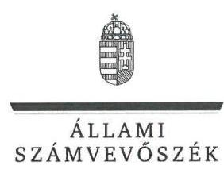

ELNÖK

Ikt.szám: V-1375-120/2016.

# Dobos Menyhért úr 

vezérigazgató
Duna Médiaszolgáltató Nonprofit Zrt.

## Budapest

## Tisztelt Vezérigazgató Úr!

„Állami tulajdonú gazdasági társaságok - Az állami tulajdonban (résztulajdonban) lévő gazdálkodó szervezetek vagyonmegőrzési és gazdálkodási tevékenységének ellenőrzése - Duna Médiaszolgáltató Nonprofit Zrt. " címmel készített számvevőszéki jelentéstervezetre tett észrevételeit köszönettel megkaptam.
Az Állami Számvevőszék észrevételekre vonatkozó álláspontjáról a felügyeleti vezető által készített részletes tájékoztatást csatoltan megküldöm.
Tájékoztatom Vezérigazgató urat, hogy a számvevőszéki jelentésben - az Állami Számvevőszékről szóló 2011. évi LXVI. törvény 29. § (3) bekezdése alapján - a figyelembe nem vett észrevételeket szerepeltetjük annak megindoklásával, hogy azokat miért nem fogadtuk el.

Budapest, 2017. 44 hó 46 nap
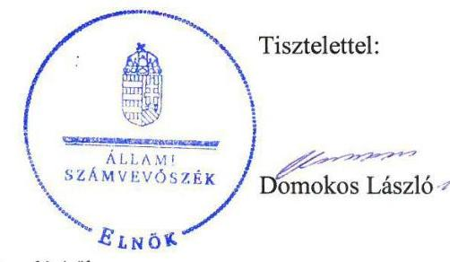

Melléklet: Tájékoztatás az észrevételek kezeléséről

---

# Tájékoztatás   az észrevételek kezeléséről 

„Állami tulajdonú gazdasági társaságok - Az állami tulajdonban (résztulajdonban) lévő gazdálkodó szervezetek vagyonmegőrzési és gazdálkodási tevékenységének ellenőrzése - Duna Médiaszolgáltató Nonprofit Zrt." címü jelentéstervezetre 2017. október 25-én tett (az Állami Számvevőszékhez 2017. október 31-én érkezett) észrevételét áttekintettük, annak kezelésével kapcsolatban a következő tájékoztatást adom.

1. A jelentéstervezet 2.2. számú megállapítás 1. bekezdés 3. mondata alapján tett 1. számú javaslatra („Intézkedjen a kormányzati szektor hiányát nem befolyásoló ráfordítások elszámolásának szabályszerű végrehajtásáról.") vonatkozó észrevétel:
Az észrevételben leírtak szerint „A számvitelről szóló 2000. évi C. törvény (a továbbiakban: Sztv.) rendelkezéseit, valamint alapul véve az immateriális javak között a mérlegben a nem anyagi eszközöket (a vagyoni értékű jogokat az ingatlanhoz kapcsolódó vagyoni értékű jogok kivételével, a szellemi terméket, az üzleti vagy cégértéket), továbbá az immateriális javakra adott előlegeket, valamint az immateriális javak értékhelyesbítését kell kimutatni. Amennyiben az immateriális jószág bármilyen oknál fogva kikerül a könyvekből, akkor a kikerülés időpontja szerinti könyv szerinti értékét az egyéb ráfordítások között kell kivezetni.
Az eszköz üzembe helyezésének adóévétől kezdve addig az adóévig bezárólag, amíg az eszköz ki nem kerül a könyvekből az alábbi tételek jelennek meg a könyvekben értékcsökkenésként, egyéb ráfordításként:
Az eszköz terv szerinti értékcsökkenés értéke,
Az eszköz terven felüli értékcsökkenés értéke,
Az eszköz kivezetéskori könyv szerinti érték.
A három érték összességében pedig az eszköz bekerülési értékét adja, tehát összességében a bekerülési érték kerül értékcsökkenésként leírása illetve ráfordításként elszámolásra.
A könyvekben a fentebb kifejtettekre is tekintettel a bizonylatolásnak a Jelentéstervezetben részletezett hibája számszaki eltérést nem okoz. Ugyanakkor nem vitatva a számviteli törvénynek és a jelentéstervezetben foglaltaknak való megfelelés kötelezettségét, ekként intézkedtem az érintett körbe tartozó bizonylatok Sztv. szerinti általános alaki és tartalmi kellékeinek történő maradéktalan megfeleléséről.
A Jelentéstervezetben foglaltaknak mindenképpen eleget kívánunk tenni, melyhez tisztelettel kérem, hogy bocsássák rendelkezésünkre azon bizonylatok listáját, melyek a fenti hiányosságok okán nem feleltek meg az Sztv. 167. § (1) bekezdés (a) és (h) pontjainak. Mivel az immateriális jószágok között nyilvántartott tételekhez kapcsolódó bizonylatok - az adott javak sajátosságaira is tekintettel - rendkívül sokfélék lehetnek (szerződések, tulajdoni lapok, nyilvántartások kivonatai stb.), így gyakran egyedi módon kezelendőek, hogy a könyvelés e része is maradéktalanul meg tudjon az Sztv. rendelkezéseinek felelni.".

---

Az észrevételben a megállapítást nem vitatták. Az ÁSZ a jelentéstervezetben rögzített megállapításait a Társaság adatbázisából leválogatott mintatételekhez az ellenőrzés rendelkezésére bocsátott dokumentumok alapján tette meg.

Fentiekre tekintettel az észrevétel alapján a jelentéstervezet módosítása nem indokolt.
2. A jelentéstervezet 2.3. számú megállapítás 4. bekezdése alapján tett 2. számú javaslatra („Gondoskodjon a közérdekből nyilvános adatok közzétételének jogszabályi előírásnak megfelelő teljesítéséről.") vonatkozó észrevétel:

Az észrevételben leírtak szerint „A köztulajdonban álló gazdasági társaságok takarékosabb működéséről szóló 2009. évi CXXII. törvény (a továbbiakban: Taktv.) 2. § (1) bekezdés c) és d) pontjainak, illetve (2) bekezdésének - a Jelentéstervezetben foglaltak szerint is - történő megfeleléséről gondoskodtam az információs önrendelkezési jogról és az információszabadságról szóló törvényben meghatározott elektronikus közzététel útján. ".

Az észrevételben a megállapítást nem vitatták. Erre tekintettel az észrevétel alapján a jelentéstervezet módosítása nem indokolt.
3. A jelentéstervezet 2.3. számú megállapítás 6. bekezdés 2-5. mondatai alapján tett 3. számú javaslatra („Intézkedjen a jogszabályban előírt közérdekű adatok megismerésére irányuló igények teljesítésének rendjét rögzítő szabályzat és adatvédelmi és adatbiztonsági szabályzat elkészítéséről, adatvédelmi felelős kinevezéséről és a belső adatvédelmi nyilvántartás vezetéséről.") vonatkozó észrevétel:

Az észrevételben leírtak szerint: „A közérdekű adatok illetve közérdekből nyilvános adatok közzétételéről és megismerésére irányuló igény teljesítésének rendjéről szóló vezérigazgatói utasítás kiadása 2016-ban megtörtént. Az adatvédelmi és adatbiztonsági szabályzat 2016-ban szintén kiadásra került. Utóbbi szabályzat módosítás alatt van az európai jogszabályok figyelembe vételével. Az adatvédelmi felelős kinevezése időközben szintén megtörtént, ekként a fentiekben foglalt szabályzat módosítását a továbbiakban az adatvédelmi felelős koordinálja. (Annak ellenére neveztem ki adatvédelmi felelőst, hogy véleményem szerint a Duna Médiaszolgáltató nem minősül hírközlési szolgáltatónak.)".

Az észrevételben jelzett szabályozást - abból adódóan, hogy az ellenőrzött időszakot követően keletkezett - nem lehetett az ellenőrzés során figyelembe venni. Az ellenőrzött időszakot követően keletkezett dokumentumok meglétét, a megtett intézkedések jogszabályi előírásoknak való megfelelőségét a jelentéstervezetben nem értékeltük. Az elektronikus hírközlésről szóló 2003. évi C. törvény 1. § (1) bekezdésének a) pontja szerint a törvény hatálya kiterjed a Magyarország területén végzett vagy területére irányuló elektronikus hírközlési tevékenységre, valamint minden olyan tevékenységre, amelynek gyakorlása során rádiófrekvenciás jel keletkezik, továbbá a b) pontja szerint az a) pontban foglalt, vagy azzal összefüggő tevékenységet végző vagy szolgáltatást nyújtó természetes, illetőleg jogi személyre vagy jogi személyiséggel nem rendelkező más

---

szervezetre is. Az észrevételében leírt, megtett intézkedések a megállapítást alátámasztják. Az előbbiekre való tekintettel az észrevétel alapján a jelentéstervezet módosítása nem indokolt.
4. A jelentéstervezet 2.4. számú megállapítás 1. bekezdése alapján tett 4. számú javaslatra („Intézkedjen a szervezet tevékenységének, a célok megvalósításának nyomon követését biztosító rendszer kialakításáról a jogszabályi előírásoknak megfelelően.") vonatkozó észrevétel:

Az észrevételben leírtak szerint: „A költségvetési szervek belső kontrollrendszeréről és belső ellenőrzéséről szóló 370/2011. (XII. 31.) Korm. rendelet (a továbbiakban: Bkr.) 1. § (2) bekezdésének e) pontja az alábbiakat írja elő: >)jogszabály alapján a költségvetési szervek belső kontrollrendszerére és belső ellenőrzésére vonatkozó szabályokat alkalmazó más szervre, szervezetrest
Ezen jogszabályi rendelkezés alapján közvetlenül nem tudtuk beazonosítani azon jogszabályokat, amely a Duna Médiaszolgáltató
 Nonprofit Zrt-t a Bkr. hatálya alá sorolta volna be. A célok megvalósítását nyomon követő biztosító rendszer kialakításáról előzetesen intézkedtem, azonban a Jelentéstervezetben foglaltaknak történő megfeleléshez tisztelettel kérem, hogy bocsássák rendelkezésünkre azon jogszabályi helyeket, amelyből hiánytalanul levezethető, hogy a Duna Médiaszolgáltató Nonprofit Zrt. a rendelet hatálya alá tartozik. A jogszabályi helyek levezetése a rendszer legitim bevezetésének, valamint a rendszerhez kapcsolódó utasításoknak elengedhetetlen előfeltétele.
(A belső kontroll rendszer működtetésére korábban alkalmazásunkban volt belső ellenőr, akinek munkájával a Felügyelő Bizottság elégedetlen volt, így munkaviszonya megszüntetésre került. Jelenleg a Médiaszolgáltatás-támogató és Vagyonkezelő Alap és a Duna MSZ közötti szerződés értelmében a belső ellenőrzési feladatokat felkérésre az MTVA látja el. Természetesen amennyiben ez a megoldás nem megfelelő, gondoskodunk belső ellenőr felvételéről.)".

Az észrevétel nem megalapozott. A jelentéstervezet fent hivatkozott megállapítása szerint a Társaság, mint kormányzati szektorba sorolt egyéb szervezet számára 2014. január 1-jétől a Bkr. 1. § (2) bekezdés e) pontja, a jogszabályváltozás miatt 2015. július 8-ától a Bkr. 1. § (2) bekezdés d) pontja írta elő a belső kontrollrendszer és belső ellenőrzés működtetésének kötelezettségét. Az észrevételben leírtak a megállapítást nem vitatták, ezért a fentiekre való tekintettel az észrevétel alapján a jelentéstervezet módosítása nem indokolt.

Budapest, 2017. 11. hó 16. nap

Dr. Nagy Imre felügyeleti vezető

---

.

---

# RÖVIDÍTÉSEK JEGYZÉKE 

${ }^{1}$ Társaság
${ }^{2}$ KSZKA
${ }^{3}$ NZrt.
${ }^{4}$ MTV NZrt.
${ }^{5}$ MR NZrt.
${ }^{6}$ MTI NZrt.
${ }^{7} \mathrm{Mttv}_{.1-2}$
${ }^{8}$ Kuratórium
${ }^{9}$ Vezérigazgató
${ }^{10} \mathrm{M} \mathrm{Ft}$
${ }^{11}$ MTVA
${ }^{12}$ ÁSZ
${ }^{13}$ KSZKA SZMSZ ${ }_{1-2}$
${ }^{14}$ Alapító okirat ${ }_{1-5}$
${ }^{15}$ Felügyelőbizottság
${ }^{16}$ tulajdonosi joggyakorló
${ }^{17}$ 109/2010. (X. 28.) OGY határozat
${ }^{18}$ Tak tv.
${ }^{19}$ Javadalmazási szabályzat
${ }^{20} \mathrm{SZMSZ}_{3-7}$

Duna Médiaszolgáltató Nonprofit Zrt., 2015. július 1-jét megelőzően Duna Televízió Nonprofit Zrt.
Közszolgálati Közalapítvány
Nonprofit zártkörűen működő részvénytársaság
Magyar Televízió Nonprofit Zrt.
Magyar Rádió Nonprofit Zrt.
Magyar Távirati Iroda Nonprofit Zrt.
Mttv. 1: 2010. évi CLXXXV. törvény a médiaszolgáltatásokról és a tömegkommunikációról (2015. június 30-ig hatályos szöveg)
Mttv. 2 : 2010. évi CLXXXV. törvény a médiaszolgáltatásokról és a tömegkommunikációról (2015. július 1-jétől hatályos szöveg)
Közszolgálati Közalapítvány Kuratóriuma
Duna Médiaszolgáltató Nonprofit Zrt., 2015. július 1-jét megelőzően Duna Televízió Nonprofit Zrt. vezérigazgatója
millió forint
Médiaszolgáltatás-támogató és Vagyonkezelő Alap
Állami Számvevőszék
KSZKA SZMSZ1: Közszolgálati Közalapítvány Szervezeti és Működési Szabályzata (2012. február 8.)
KSZKA SZMSZ2: Közszolgálati Közalapítvány Szervezeti és Működési Szabályzata (2013. augusztus 28.)
Alapító okirat1: Duna Televízió Nonprofit Zrt. Alapító okirata (2011. november 16.)
Alapító okirat2: Duna Televízió Nonprofit Zrt. Alapító okirata (2012. március 28.)
Alapító okirat3: Duna Televízió Nonprofit Zrt. Alapító okirata (2012. november 28.)
Alapító okirat4: Duna Televízió Nonprofit Zrt. Alapító okirata (2013. január 30.)
Alapító okirat5: Duna Médiaszolgáltató Nonprofit Zrt. Alapszabálya (2015. március 25.)

Közszolgálati Médiaszolgáltatók Felügyelő Bizottsága, Duna Médiaszolgáltató Nonprofit Zrt. Felügyelőbizottsága (2015. július 1-jétől)
Közszolgálati Közalapítvány
109/2010. (X. 28.) OGY határozat a Közszolgálati Közalapítvány, a Magyar Rádió Zrt., a Magyar Televízió Zrt., a Duna Televízió Zrt. és a Magyar Távirati Iroda Zrt. vagyona meghatározott körének a Műsorszolgáltatás Támogató és Vagyonkezelő Alap részére történő átadásáról
2009. évi CXXII. törvény a köztulajdonban álló gazdasági társaságok takarékosabb működéséről
Javadalmazási szabályzat ${ }_{1} \quad$ A Duna Televízió Nonprofit Zrt. javadalmazási szabályzata (2013. március 27.)
Javadalmazási szabályzat ${ }_{2} \quad$ A Duna Médiaszolgáltató Nonprofit Zrt. javadalmazási szabályzata (2015. augusztus 26.)
SZMSZ1: Duna Televízió Nonprofit Zrt. Szervezeti és Működési Szabályzata (11/2011. Vut.) (2012.január 1.-2012. június 30.)
SZMSZ2: Duna Televízió Nonprofit Zrt. Szervezeti és Működési Szabályzata (16/2012. Vut. (2012.09.17) (2012.július 1.-2013. március 13.)

---

SZMSZ3: Duna Televízió Nonprofit Zrt. Szervezeti és Működési Szabályzata (16/2013. Vut. (2013.03.14) (2013.március 14.-2014. január 30.)
SZMSZ4: Duna Televízió Nonprofit Zrt. Szervezeti és Működési Szabályzata (2/2014. Vut. (2014.01.31) (2014.január 31.-2014. március 31.)
SZMSZ5: Duna Televízió Nonprofit Zrt. Szervezeti és Működési Szabályzata (4/2014. Vut. (2014.03.18) (2014.április 1.-2014. december 31.)
SZMSZ6: Duna Televízió Nonprofit Zrt. Szervezeti és Működési Szabályzata (2/2015. Vut. (2015.01.12) (2015.január 1.-2015. június 30.)
SZMSZ7: Duna Médiaszolgáltató Nonprofit Zrt. Szervezeti és Működési Szabályzata (1/2015. Vut. (2015.07.01) (2015.július 1-től)
${ }^{21}$ Leltározási szabályzat ${ }_{1-2}$
${ }^{22}$ Értékelési szabályzat ${ }_{1-2}$
${ }^{23}$ Pénzkezelési szabályzat ${ }_{1-2}$
${ }^{24}$ Számlarend $_{1-2}$
${ }^{25}$ Bizonylati rend $_{1-2}$
${ }^{26}$ Üzleti terv $_{1-5}$
${ }^{27}$ Ávr.
${ }^{28}$ Stabilitási tv.
${ }^{29}$ Vtv.
${ }^{30}$ Nvtv.
${ }^{31}$ Áht.
${ }^{32}$ Nvtv.
${ }^{33}$ Civil tv.
${ }^{34} \mathrm{Vhr}$.

Leltározási szabályzat ${ }_{1}$ : Duna Televízió Nonprofit Zrt. eszközeinek és forrásainak leltárkészítési és leltározási szabályzata (2011. január 1.-2015. november 3.)
Leltározási szabályzat2: Duna Médiaszolgáltató Nonprofit Zrt. Eszközök és források leltárkészítési és leltározási szabályzata (2015. november 4.)
Értékelési szabályzat1: Duna Televízió Nonprofit Zrt. eszközeinek és forrásainak értékelési szabályzata (2011. január 1.- 2015. november 3.)
Értékelési szabályzat2: Duna Médiaszolgáltató Nonprofit Zrt. Eszközök és források értékelési szabályzata (2015. november 4-től)
Pénzkezelési szabályzat1: Duna Televízió Nonprofit Zrt. Pénz- és értékkezelési szabályzata (2011. augusztus 9.-2015. november 3.)
Pénzkezelési szabályzat2: Duna Médiaszolgáltató Nonprofit Zrt. Pénzkezelési szabályzata Érvényes: 2015. november 4-től
Számlarend1: Duna Televízió Nonprofit Zrt. Számlarendje (2011. január 1.-2015. november 3.)
Számlarend2: Duna Médiaszolgáltató Nonprofit Zrt. Számlarendje (2015. november 4-től)
Bizonylati rend1: Duna Televízió Nonprofit Zrt. Bizonylati rendje (2011. január 1.2015. november 3.)
Bizonylati rend2: Duna Médiaszolgáltató Nonprofit Zrt. Bizonylati rendje (2015. november 4-től)
Üzleti terv1: Duna Televízió Nonprofit Zrt. 2012. évi üzleti terve
Üzleti terv2: Duna Televízió Nonprofit Zrt. 2013. évi üzleti terve
Üzleti terv3: Duna Televízió Nonprofit Zrt. 2014. évi üzleti terve
Üzleti terv4: Duna Televízió Nonprofit Zrt. 2015. évi üzleti terve
Üzleti terv5: Duna Televízió Nonprofit Zrt. 2015. II. félévi üzleti terve
368/2011. (XII. 31.) Korm. rendelet az államháztartási törvény végrehajtásáról
2011. évi CXCIV. törvény Magyarország gazdasági stabilitásáról
2007. évi CVI. törvény az állami vagyonról
2011. évi CXCVI. törvény a nemzeti vagyonról
2011. évi CXCV. törvény az államháztartásról
2011. évi CXCVI. törvény a nemzeti vagyonról
2011. évi CLXXV. törvény az egyesülési jogról, a közhasznú jogállásról, valamint a civil szervezetek működéséről és támogatásáról
254/2007. (X. 4.) Korm. rendelet az állami vagyonnal való gazdálkodásról

---

# ÁLLAMI SZÁMVEVŐSZÉK 

1052 Budapest, Apáczai Csere János utca 10.
Levélcím: 1364 Budapest 4. Pf. 54
Telefon: +36 14849100 Telefax: +36 14849200
www.asz.hu
