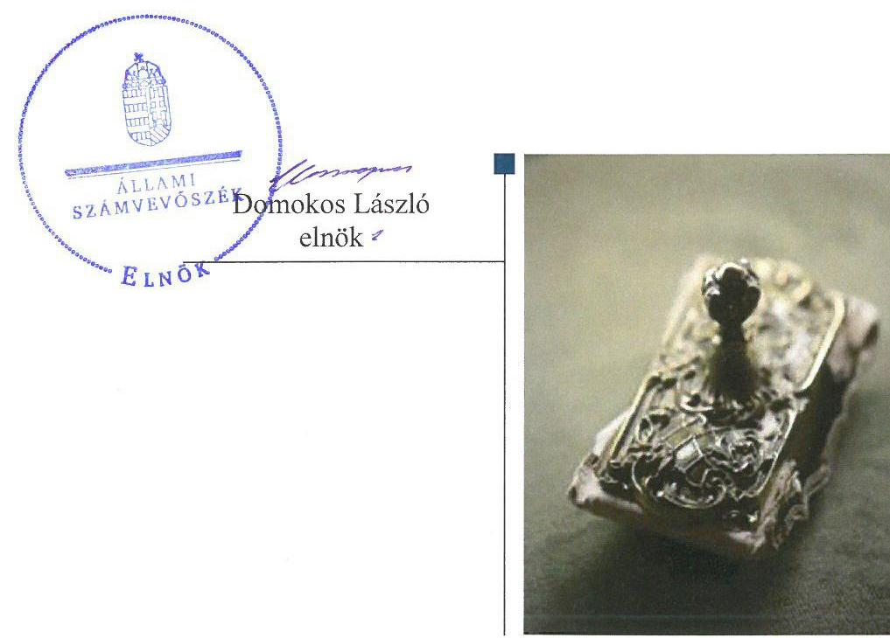
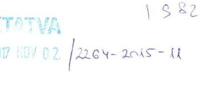
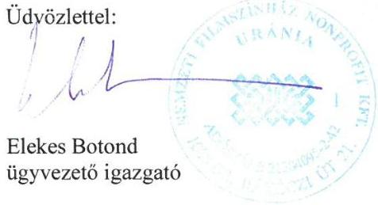
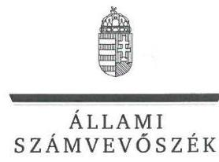
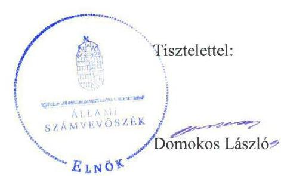
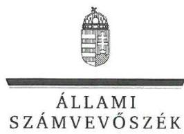

# Jelentés 

## Állami tulajdonú gazdasági társaságok

Az állami tulajdonban (résztulajdonban) lévő gazdálkodó szervezetek vagyonmegőrzési és gazdálkodási tevékenységének ellenőrzése - Nemzeti Filmszínház Nonprofit Kft.
2017.

---

# Jelentés 

## Állami tulajdonú gazdasági társaságok

Az állami tulajdonban (résztulajdonban) lévő gazdálkodó szervezetek vagyonmegőrzési és gazdálkodási tevékenységének ellenőrzése - Nemzeti Filmszínház Nonprofit Kft.
2017. december 21. nap

---

# AZ ELLENŐRZÉST FELÜGYELTE:

DR. NAGY IMRE felügyeleti vezető

# AZ ELLENŐRZÉST VEZETTE ÉS A VÉGREHAJTÁSÁÉRT FELELŐS:

MODER BEATRIX ellenőrzésvezető

# A PROGRAM ÖSSZEÁLLÍTÁSÁÉRT FELELŐS:

JANIK JÓZSEF LÁSZLÓ osztályvezető

---

**IKTATÓSZÁM:** V-1364-110/2016

**TÉMASZÁM:** 2398

**ELLENŐRZÉS-AZONOSÍTÓ SZÁM:** V075935

---

Jelentéseink az Országgyűlés számítógépes hálózatán és az Interneten a www.asz.hu címen is olvashatóak.

---

# TARTALOMJEGYZÉK 

■ ÖSSZEGZÉS ..... 5
■ AZ ELLENŐRZÉS CÉLJA ..... 6
■ AZ ELLENŐRZÉS TERÜLETE ..... 7
■ AZ ELLENŐRZÉS HÁTTERE, INDOKOLTSÁGA ..... 9
■ A JELENTÉS LÉNYEGES KÉRDÉSKÖREI ..... 10
■ ELLENŐRZÉS HATÓKÖRE ÉS MÓDSZEREI ..... 11
■ MEGÁLLAPÍTÁSOK ..... 13
■ JAVASLATOK ..... 18
■ MELLÉKLETEK ..... 21
I. Sz. melléklet: Értelmező szótár ..... 21
■ FÜGGELÉK: ÉSZREVÉTELEK ..... 25
■ RÖVIDÍTÉSEK JEGYZÉKE ..... 35

---

.

---

# ÖSSZEGZÉS 

A Nemzeti Filmszínház Nkft. vagyongazdálkodása nem biztosította az állami vagyon értékének megőrzését, védelmét és a vagyongazdálkodás átláthatóságát. A számviteli nyilvántartásaiban és az éves beszámolóiban jogalap nélkül mutatta ki az általa használt állami tulajdonban lévő vagyonelemeket. Az éves beszámolók ezáltal nem mutattak valós képet a Nemzeti Filmszínház Nkft. vagyoni helyzetéről. A Nemzeti Filmszínház Nkft. a közérdekű adatai közzétételét hiányosan teljesítette, a gazdálkodás átláthatóságát nem biztosította.

## Az ellenőrzés társadalmi indokoltsága

Az állami vagyonnal való gazdálkodás alapvető célja a vagyon megőrzése és védelme. Az állami tulajdonú gazdálkodó szervezetek által használt vagyon is az állami vagyon részét képezi, ezért kiemelten fontos a vagyongazdálkodás szabályszerűségének ellenőrzése. A számvevőszéki ellenőrzés célja, hogy a vagyongazdálkodásban feltárt szabálytalanságok feltárásával hozzájáruljon a közpénzek és a közvagyon szabályos, átlátható, elszámoltatható és eredményes felhasználásához.

## Főbb megállapítások, következtetések, javaslatok

A Nemzeti Filmszínház Nkft. vagyongazdálkodása nem volt szabályszerű. A használatában lévő állami vagyont jogalap nélkül mutatta ki a számviteli nyilvántartásaiban. Az éves beszámolók így nem mutattak valós képet a Nemzeti Filmszínház Nkft. vagyoni helyzetéről.

A Magyar Nemzeti Vagyonkezelő Zrt. megfelelően kialakította a Nemzeti Filmszínház Nkft. feletti tulajdonosi jogok gyakorlásának rendjét. A Nemzeti Filmszínház Nkft. által használt állami tulajdonú vagyonelemek számviteli nyilvántartása tekintetében azonban a jogszabálysértő állapot megszüntetéséhez szükséges tulajdonosi intézkedéseket nem tette meg. A Magyar Nemzeti Vagyonkezelő Zrt. a Társaság éves számviteli beszámolóit minden évben úgy hagyta jóvá, hogy a mérlegekben jogalap nélkül kimutatott állami vagyon szerepelt.

A Nemzeti Filmszínház Nkft. a gazdálkodással kapcsolatos számviteli szabályozását kialakította, azonban nem rendelkezett a számviteli jogszabályokban előírt tartalmi követelményeknek megfelelő számlarenddel. Pénzkezelési szabályzata nem tartalmazta a jogszabályban előírt valamennyi tartalmi elemet. A bevételeinek és ráfordításainak elszámolása - a kormányzati hiányt nem befolyásoló ráfordítások kivételével - megfelelt a jogszabályi előírásoknak.

A Nemzeti Filmszínház Nkft. a közzététel rendjét és a közérdekű adatok megismerésére irányuló igények teljesítésének rendjét rögzítő szabályzattal nem rendelkezett. A közérdekű adatok jogszabályban előírt közzétételi kötelezettségét hiányosan teljesítette, a működésének átláthatóságát nem biztosította. A tervezési, beszámolási, adatszolgáltatási kötelezettségét az előírásoknak megfelelően teljesítette.

Belső ellenőrzést a költségvetési szervek belső kontrollrendszeréről szóló kormányrendelet előírása ellenére a Nemzeti Filmszínház Nkft. nem alakított ki és nem működtetett. Ezáltal nem biztosította, hogy valamennyi tevékenysége összhangban legyen a szabályszerűséggel, szabályozottsággal, továbbá az eszközökkel és forrásokkal való gazdálkodásban ne kerüljön sor rendeltetésellenes felhasználásra.

Az Állami Számvevőszék jelentésében a Nemzeti Filmszínház Nkft. ügyvezetőjének nyolc, a Magyar Nemzeti Vagyonkezelő Zrt. vezérigazgatójának egy javaslatot fogalmazott meg, amelyekre az érintetteknek 30 napon belül intézkedési tervet kell készíteniük

---

# AZ ELLENŐRZÉS CÉLJA 

Az ellenőrzés célja annak értékelése volt, hogy a tulajdonosi jogok gyakorlása szabályszerű volt-e; a gazdálkodó szervezet szabályozottsága, gazdálkodása és vagyongazdálkodási tevékenysége megfelelt-e a jogszabályi és a tulajdonosi előírásoknak; biztosítva volt-e a közfeladatok átláthatósága és elszámoltathatósága érdekében a közszolgáltatás díjának megalapozottsága szabályszerű önköltségszámítással; a vagyonváltozást eredményező döntések esetében a tulajdonosi jogok gyakorlója és a gazdálkodó szervezet szabályszerűen jártak-e el. Az ellenőrzés célja volt továbbá annak megítélése, hogy a kormányzati szektorba sorolt állami tulajdonban (résztulajdonban) lévő gazdálkodó szervezetek gazdálkodásának a kormányzati szektor hiányára és az államadósságra befolyással bíró elemei a jogszabályi előírásoknak megfeleltek-e.

---

# AZ ELLENŐRZÉS TERÜLETE

## Nemzeti Filmszínház Nonprofit Korlátolt Felelősségű Társaság

A Társaság^{1} jogelődjét a Magyar Állam – 2002. február 8-án – 15 millió Ft jegyzett tőkével, közhasznú társaságként alapította, amely változatlan jegyzett tőkével 2009. júniusa óta működik nonprofit kft-ként. Az alapítót megillető tulajdonosi jogok és kötelezettségek összességét a 2012-2015. években a Vtv.^{2} alapján az MNV Zrt.^{3} gyakorolta.

A Nemzeti Filmszínház egyedüli – intézmény jellegű – nemzeti film- és kulturális centrum, közhasznú tevékenysége keretében ellátott feladata a magyar és az európai filmértékek, a kortárs és a klasszikus filmművészet bemutatása és műsoron tartása, filmklub jellegű programok, nemzeti és nemzetközi filmes fesztiválok, díszbemutatók szervezése. A Társaság közfeladatként ellátja a közösségi kulturális hagyományok és értékek ápolását, a kulturális szolgáltatást, a filmszínház, a kulturális örökség helyi védelmét, támogatja a lakosság művészeti kezdeményezéseit, önszerveződéseit.

A Társaság cél szerinti közhasznú tevékenysége a filmvetítés, amelyet az OKM-mel^{4} az ellenőrzött időszakot megelőzően kötött közhasznú szerződés, majd 2014. júniustól az EMMI-vel^{5} kötött közszolgáltatási szerződés alapján végez, amely tevékenységhez az állami költségvetésből feladatfinanszírozást szolgáló költségvetési támogatásban részesül. A Társaság az alapító okiratai szerint kiegészítő gazdasági-vállalkozási tevékenységet is folytathat.

A Társaság 2012-2015. évi könyvviteli mérlegének főbb adatait az 1. táblázat tartalmazza:

1. táblázat

|  A TÁRSASÁG FŐBB VAGYONI ADATAI (M FT) |  |  |  |   |
| --- | --- | --- | --- | --- |
|  Megnevezés | 2012.
dec. 31. | 2013.
dec. 31. | 2014.
dec. 31. | 2015.
dec. 31.  |
|  Mérlegfőösszeg | 1883,4 | 1838,7 | 1790,4 | 1758,1  |
|  Befektetett eszközök | 1757,5 | 1745,6 | 1695,9 | 1646,9  |
|  ebből: állami tulajdonú vagyonelemek | 1716,3 | 1680,6 | 1643,5 | 1606,0  |
|  Követelések | 12,6 | 14,3 | 18,5 | 16,2  |
|  Mérleg szerinti eredmény | 0,3 | 0,3 | 6,2 | 0,7  |
|  Jegyzett tőke | 15,0 | 15,0 | 15,0 | 15,0  |
|  Saját tőke | 60,8 | 61,1 | 67,3 | 67,9  |
|  Kötelezettségek | 28,4 | 25,9 | 24,6 | 30,7  |
|  Passzív időbeli elhatárolás | 1794,1 | 1751,7 | 1698,5 | 1657,5  |

*Forrás: A Társaság 2012-2015. évi éves beszámolói*

---

A könyvviteli mérleg szerinti vagyon több mint 91%-a - a mérlegben jogalap nélkül kimutatott - állami tulajdonban lévő tárgyi eszközök értéke volt.

A Társaság 2012-2015. évi eredménykimutatásának főbb adatait a 2. táblázat tartalmazza:
2. táblázat

| A TÁRSASÁG FŐBB BEVÉTELEI ÉS KIADÁSA (M FT) |  |  |  |  |
| :--: | :--: | :--: | :--: | :--: |
| Megnevezés | $\begin{gathered} 2012 . \\ \text { dec. } 31 . \end{gathered}$ | $\begin{gathered} 2013 . \\ \text { dec. } 31 . \end{gathered}$ | $\begin{gathered} 2014 . \\ \text { dec. } 31 . \end{gathered}$ | $\begin{gathered} 2015 . \\ \text { dec. } 31 . \end{gathered}$ |
| Bevételek összesen | 277,6 | 281,5 | 295,8 | 298,9 |
| ebből: értékesítés nettó árbevétele | 162,2 | 153,3 | 169,8 | 174,1 |
| támogatások | 68,8 | 77,7 | 75,8 | 75,3 |
| halasztott bevétellel szemben elszámolt egyéb bevétel | 43,5 | 46,7 | 48,5 | 48,3 |
| Kiadások összesen: | 277,3 | 281,2 | 289,4 | 298,2 |
| ebből: anyag és személyi jellegű kiadás | 228,2 | 231,4 | 237,2 | 239,9 |
| elszámolt értékcsökkenés | 46,9 | 49,2 | 51,3 | 51,2 |
| ebből: kezelésbe átvett eszközök értékcsökkenése | 37,3 | 37,3 | 37,4 | 37,5 |

A Társaság a 2015. évben 4139 előadáson 123079 nézőt fogadott, amelynek eredményeként 135,0 millió Ft nettó árbevételt ért el. A gazdasági vállalkozási tevékenységből származó bevétele 2015-ben 39,1 millió Ft volt, amely elsősorban bérleti díjbevételből és egyéb szolgáltatások nyújtásából származott. A Társaság az ellenőrzött időszak minden évében a közfeladatai ellátására 60 M Ft egyéb működési célú költségvetési támogatást kapott az EMMI-től.

A Társaság anyag- és személyi jellegű kiadásai 2015-ben 239,9 millió Ftot tettek ki, amelynek 91%-a, 218,5 millió Ft, a közhasznú tevékenységgel kapcsolatban merült fel.

A Társaságnál foglalkoztatottak átlagos statisztikai létszáma 2012-ben 19 fő, 2015-ben 20 fő volt. Az ügyvezető személye az ellenőrzött időszakban egy alkalommal, 2015. márciusában változott.

A Társaság a nemzetgazdasági miniszter közleménye ${ }^{6}$ szerint - megfelelve a 479/2009/EK rendeletben ${ }^{7}$ előírtaknak - az ellenőrzött időszak egészében kormányzati szektorba sorolt egyéb szervezet volt.

---

# AZ ELLENŐRZÉS HÁTTERE, INDOKOLTSÁGA 

Az állami tulajdonú gazdálkodó szervezetek gazdálkodása jellemzően a közérdeklődés és a média figyelmének középpontjában áll, amihez hozzájárul a gazdálkodásuk körébe tartozó - közvetlen vagy közvetett állami tulajdonú - vagyon nagysága, illetve az általuk ellátott közszolgáltatások minősége és hatékonysága.

Az Európai Unióban az 1994. év óta hatályos túlzott hiány eljárás mindig kihívást jelentett a tagállamok számára. Kiemelten fontosak a kormányzati szektor elszámolásaiban megjelenő állami tulajdonú gazdálkodó szervezetek, amelyekkel szemben alapvető követelmény, hogy gazdálkodásuk, működésük szabályszerű, az általuk szolgáltatott adatok minél megbízhatóbbak legyenek.

Az ÁSZ ${ }^{8}$ célkitűzése, hogy ellenőrzésével rámutasson az állami tulajdonú gazdálkodó szervezetek gazdálkodási tevékenységével kapcsolatos jó gyakorlatra és szabálytalanságokra, hozzájáruljon az államháztartáson kívüli, de (közvetlenül vagy közvetve) állami vagyont használó gazdálkodó szervezetek tevékenységének átláthatóságához, valamint felhívja a figyelmet a jogszabályi követelmények teljesítéséhez szükséges feltételek hiányosságára.

Az ellenőrzés várható hasznosulásaként az ellenőrzés megállapításai a jogalkotás számára segítséget nyújthatnak az átláthatóságot biztosító szabályozáshoz. Az ellenőrzöttek számára visszajelzést ad a vagyongazdálkodási tevékenységgel, beszámolással kapcsolatos szabálytalanságokról és kockázatokról. Az ellenőrzés tapasztalatai segítik és erősítik az ÁSZ hozzáadott értéket teremtő elemző tevékenységét és tanácsadó szerepét.

---

# A JELENTÉS LÉNYEGES KÉRDÉSKÖREI 

1.     - A tulajdonosi jogok gyakorlása szabályszerű volt-e?
2.     - A társaságnál a pénzügyi-számviteli szabályozás és feladatellátás, valamint az adatszolgáltatási és ellenőrzési feladatok ellátása szabályszerű volt-e?
3.     - A társaság vagyongazdálkodása szabályszerű volt-e?

---

# ELLENŐRZÉS HATÓKÖRE ÉS MÓDSZEREI 

## Az ellenőrzés típusa

Megfelelőségi ellenőrzés.

## Az ellenőrzött időszak

Az ellenőrzött időszak 2012. január 1-jétől 2015. december 31-ig tart.

## Az ellenőrzés tárgya

A Nemzeti Filmszínház Nonprofit Kft. gazdálkodása, kiemelten vagyongazdálkodási tevékenysége és - mint kormányzati szektorba sorolt gazdasági társaság - a gazdálkodásának a kormányzati szektor hiányára és az államadósságra befolyással bíró elemei, valamint a tulajdonosi jogok gyakorlása.

Az ellenőrzés kiterjed minden olyan
 körülményre és adatra, amely az ÁSZ jogszabályban meghatározott feladatainak teljesítéséhez, valamint a program végrehajtása folyamán felmerült újabb összefüggések feltárásához szükséges.

## Az ellenőrzött szervezet

Nemzeti Filmszínház Nonprofit Korlátolt Felelősségű Társaság; Magyar Nemzeti Vagyonkezelő Zrt.

## Az ellenőrzés jogalapja

Az ellenőrzés jogalapját az ÁSZ tv. 1. § (3) bekezdése és 5. § (3)-(5) bekezdése képezi.

## Az ellenőrzés módszerei

Az ellenőrzést a nemzetközi standardokat irányadónak tekintve az ellenőrzött időszakban hatályos jogszabályok, az ellenőrzés szakmai szabályok és módszertanok figyelembevételével végeztük.

Az ellenőrzési kérdések megválaszolásához szükséges bizonyítékok megszerzése a következő ellenőrzési eljárások alkalmazásával történt: megfigyelés, kérdésfeltevés (információkérés), összehasonlítás, valamint elemző eljárás. Az ellenőrzési bizonyítékként felhasználható adatforrások közé tartoztak egyrészt az ellenőrzési programban felsorolt adatforrások,

---

másrészt az ellenőrzés során feltárt, az ellenőrzés szempontjából információkat tartalmazó dokumentumok.

A bevételek és ráfordítások elszámolását, valamint a vagyonnyilvántartás szabályszerűségét véletlen mintavétellel ellenőriztük. A mintatételek értékelése alapján, egyrészt a sokaságban a hibaarányt becsültük, másrészt az irányítottan kiválasztott tételeket értékeltük. A jogszabályoknak és a belső előírásoknak megfelelőnek, azaz szabályszerűnek tekintettük az adott területet, amennyiben a minta ellenőrzésének eredménye alapján 95%-os bizonyossággal a teljes sokaságban a hibaarány kisebb volt, mint 10%, nem megfelelőnek értékeltük, ha a hibaarány a 10%-ot meghaladta. A ráfordítások elszámolására és a vagyonnyilvántartásra vonatkozó véletlen mintavételt kockázati alapú kiválasztással egészítettük ki, amelynek során évente a három legnagyobb összegű tételt választottuk ki.

---

# 1. A tulajdonosi jogok gyakorlása szabályszerű volt-e? 

Összegző megállapítás

A Társaság feletti tulajdonosi joggyakorlás rendjét az MNV Zrt. megfelelően kialakította. A Társaság használatában lévő állami vagyon tekintetében azonban nem intézkedett a jogszabálysértő állapot megszüntetése érdekében.

## A TÁRSASÁG FELETTI TULAJDONOSI JOGGYAKORLÁS rendjét az MNV Zrt. Igazgatósága - a Vtv. előírásával összhangban - az SZMSZ 1-4-ben ${ }^{9}$ alakította ki, amely szerint a tulajdonosi jogkört az MNV Zrt. vezérigazgatója gyakorolta.

A tulajdonosi joggyakorló az alapító okirat 1-6-ban ${ }^{10}$ meghatározta a Társaság által ellátható közhasznú, illetve gazdasági-vállalkozási tevékenységek körét, rögzítette a kizárólagos jogkörébe tartozó döntéseket, valamint a Társaság ügyvezetőjének feladat- és hatáskörét, az összeférhetetlenségi szabályokat, a cégjegyzés módját. Az ügyvezetés ellenőrzésére a Taktv. ${ }^{11}$ előírásának megfelelően három tagból álló felügyelő bizottságot működtetett, valamint a Gt. ${ }^{12}$ és a Ptk. ${ }^{13}$ előírásával összhangban alapítói határozattal választotta meg a könyvvizsgálót.

## A TÁRSASÁG ÁLTAL HASZNÁLT INGATLANVAGYON számviteli nyilvántartása tekintetében az MNV Zrt. - a Számv. tv. ${ }^{14}$ 23. § (2) bekezdésének előírásával ellentétes - jogszabálysértő állapot megszüntetéséhez szükséges tulajdonosi intézkedéseket nem tette meg. A tulajdonosi joggyakorló alapítói határozattal jóváhagyta a Társaság 2012-2015. évi üzleti terveit, valamint - megismerve a könyvvizsgáló és a felügyelő bizottság beszámolóról adott írásbeli jelentését - az éves számviteli beszámolókat és közhasznúsági mellékleteket. A tulajdonosi joggyakorló a számviteli beszámolókat úgy fogadta el, hogy a Társaság mérlegeiben jogalap nélkül kimutatott állami vagyon vagyonkezelési jogának rendezetlensége, illetve szabálytalan számviteli elszámolása miatt a felügyelő bizottság, illetve a könyvvizsgáló a jelentéseiben figyelemfelhívással élt.

A JAVADALMAZÁSI SZABÁLYZAT 1,2,3-t ${ }^{15}$ a Taktv. előírásainak megfelelően a vezető tisztségviselő, a felügyelő bizottsági tagok, valamint a vezető állású munkavállalók javadalmazási és juttatási rendszeréről a tulajdonosi joggyakorló megalkotta, és alapítói határozatokkal elrendelte annak Társaságnál történő alkalmazását.

---

# 2. A társaságnál a pénzügyi-számviteli szabályozás és feladatellátás, valamint az adatszolgáltatási és ellenőrzési feladatok ellátása szabályszerű volt-e? 

Összegző megállapítás

2.1. számú megállapítás

A Társaság a gazdálkodáshoz kapcsolódó kötelező szabályzatait megalkotta, a pénzügyi-számviteli, adatszolgáltatási feladatait szabályszerűen látta el. A gazdálkodás átláthatóságát biztosító szabályozási és közzétételi kötelezettségeinek azonban nem tett eleget. Belső ellenőrzését jogszabályi előírás ellenére nem alakította ki.

A Társaság a gazdálkodáshoz kapcsolódó kötelező szabályozását megalkotta.

A TÁRSASÁGI SZMSZ ${ }^{16}$ meghatározta a társaság működésének kereteit, azonban a szervezeti változásoknak megfelelő, felügyelő bizottsági határozattal elfogadott módosításának - az alapító okirat 5. 6.2.17. és 7.3.10. pontjának, illetve az alapító okirat 7. 7.3.1. pontjának megfelelő szabályszerű hatályba léptetéséről nem gondoskodtak.

A GAZDÁLKODÁS SZABÁLYOZÁSA keretében - a Számv. tv. előírásainak megfelelően - elkészítették a Társaság sajátosságainak megfelelő számviteli politika 1-4-t $^{17}$, a leltározási szabályzat 1,2-t $^{18}$, az értékelési szabályzat 1,2-t $^{19}$, és a pénzkezelési szabályzatot ${ }^{20}$.

Az alkalmazott főkönyvi számlák számát és elnevezését a számlatükör tartalmazta, a könyvviteli számlák megfelelő alábontásával biztosították, hogy - a Számv. tv. előírásának megfelelően - a könyvvezetés alkalmas legyen a mérleg és az eredmény-kimutatás alátámasztásán túlmenően a kiegészítő melléklet adatainak közvetlen alátámasztására. A közhasznú tevékenységekre közvetlenül el nem számolható költségek, ráfordítások elszámolásának, megosztásának szabályait a számviteli politika 1-4 és a költségfelosztási szabályzat ${ }^{21}$ rögzítette. A Számv. tv. 161. § (2) bekezdésében foglalt tartalmi követelményeknek megfelelő számlarend összeállításáról a Számv. tv. 161. § (1) bekezdése ellenére azonban nem gondoskodtak.

A számviteli politika 3,4 függelékében és az értékelési szabályzat 2. 8.1 pontjában meghatározott értékcsökkenési leírási kulcsok összhangja az épületek és a bérbe adott tárgyi eszközök esetében nem volt biztosított.

A pénzkezelési szabályzat a Számv. tv. 14. § (8) bekezdésében előírtak ellenére a pénzforgalommal kapcsolatos nyilvántartási szabályok között a bankkártyás jegybevételek elszámolásával összefüggő rendelkezéseket nem tartalmazta, ennek következtében a bankszámlán történő jóváírásig - a Számv. tv. 31. § előírása ellenére - azokat a pénzeszközök között készpénzbevételként tartották nyilván.

---

### 2.2. számú megállapítás

3. táblázat

VEVŐKÖVETELÉSEK ALAKULÁSA (M FT)

|  Megnevezés | 2012. | 2015.  |
| --- | --- | --- |
|  Követelések összesen | 12,6 | 16,2  |
|  ebből: vevőkövetelések | 9,8 | 15,9  |
|  határidőn túli vevőkövetelések | 6,9 | 4,1  |
|  határidőn túli vevőkövetelés aránya | 70,4 % | 25,8 %  |

Forrás: A Társaság 2012-2015. évi beszámolói

### 2.3. számú megállapítás

A bevételek és a kormányzati hiányt befolyásoló ráfordítások elszámolása szabályszerű volt. A kormányzati hiányt nem befolyásoló ráfordítások elszámolása nem felelt meg az előírásoknak.

A BEVÉTELEK kiszámlázása a szerződésekben foglaltaknak megfelelően történt, a kapott támogatásokkal a támogatási szerződésekben előírtak szerint elszámoltak. Az egyes bevételtípusokat - a közhasznú és a vállalkozási tevékenység bevételeit a Számv. tv. és a Civil tv. ${ }^{22}$ előírásai szerint elkülönítve - a megfelelő főkönyvi számlákra számolták el.

## AZ ANYAGJELLEGŰ ÉS A KORMÁNYZATI HIÁNYT

BEFOLYÁSOLÓ EGYÉB RÁFORDÍTÁSOK elszámolása megfelelt a Számv. tv. előírásainak. A közhasznú és a vállalkozási tevékenység ráfordításait elkülönítve, a megfelelő főkönyvi számlákra számolták el. A személyi jellegű ráfordítások kifizetéseit megfelelő munkaügyi dokumentumok támasztották alá, a cafeteria juttatásokat a munkavállalói nyilatkozatok alapján, az Szja. tv. ${ }^{23}$ előírásainak megfelelően folyósították.

Az alapító okiratokkal összhangban, a Gt. és a Civil tv. előírásainak megfelelően, a Társaság a gazdálkodása során elért eredményét nem osztotta fel, azt az eredménytartalékba helyezte. A Társaságnak a Stabilitási tv. ${ }^{24}$ szerinti adósságot keletkeztető ügylete nem volt. A Társaság gazdálkodása a kormányzati szektor hiányát nem befolyásolta.

## A KORMÁNYZATI HIÁNYT NEM BEFOLYÁSOLÓ

RÁFORDÍTÁSOK elszámolása nem volt szabályszerű, mivel a könyvviteli nyilvántartását közvetlenül alátámasztó belső bizonylatok a Számv. tv. 167. § (1) bekezdés c) és i) pontjában előírtak ellenére nem tartalmazták az utalványozó és az ellenőrzést végző személy aláírását, illetve a könyvviteli nyilvántartásokban történt rögzítés időpontját, igazolását.

## A VEVŐKKEL SZEMBENI KÖVETELÉSÁLLOMÁNY

2015. végére 1,6-szeresére növekedett, ugyanakkor az összetétele kedvezően alakult, mivel a fizetési határidőn túli vevőkövetelések aránya jelentősen csökkent. A Társaság egyenlegközlő levelekkel, fizetési felszólításokkal, valamint - a költséghaszon elv alapján mérlegelve - ügyvédi eljárás indításával intézkedett a követelések behajtása érdekében. A követelésállomány változását a 3. táblázat mutatja be.

A Társaság a tervezési és a beszámolási kötelezettségét szabályszerűen teljesítette. A közérdekű adatokat azonban hiányosan tette közzé, így törvényi kötelezettségének nem tett eleget.

AZ ÉVES ÜZLETI TERVEKET az MNV Zrt. által meghatározott tartalmi követelményeknek megfelelően, határidőben elkészítették, azok alapítói határozattal elfogadásra kerültek. Az előírt évközi adatszolgáltatási és tájékoztatási kötelezettségeinek a Társaság eleget tett.

AZ ÉVES BESZÁMOLÓKAT, közhasznúsági mellékleteket határidőre elkészítették, az MNV Zrt. által jóváhagyott éves beszámolók, közhasznúsági mellékletek és a kapcsolódó könyvvizsgálói jelentések letétbe helyezése, közzététele határidőben megtörtént.

---

# 2.4. számú megállapítás 

A KÖZÉRDEKŰ ADATOK közzétételének rendjét az Info tv. ${ }^{25} 35$. § (3) bekezdés előírása ellenére a Társaság nem szabályozta, az Info tv. 30. § (6) bekezdésében előírtak ellenére a közérdekű adatok megismerésére irányuló igények teljesítésének rendjét rögzítő szabályzatot nem készített.

A Társaság az Info tv. 37. § (1) bekezdésében előírt közzétételi kötelezettségének hiányosan tett eleget, mivel az Info tv. 1. melléklet II/12., III/2. és III/4. pontjaiban előírtak ellenére a honlapján nem tette közzé az alaptevékenységgel kapcsolatos ellenőrzések nyilvános megállapításait, a foglalkoztatottak személyi juttatásaira vonatkozó összesített adatokat, és az egyéb alkalmazottaknak nyújtott juttatások fajtáját és mértékét összesítve, valamint az 5 millió forintot elérő, vagy meghaladó értékű szolgáltatási szerződések adatait.

## A Társaságnál a belső ellenőrzés kialakításáról és működtetéséről nem gondoskodtak. A tulajdonosi ellenőrzést biztosították.

A Társaságnál, mint kormányzati szektorba sorolt egyéb szervezetnél a Bkr. ${ }^{26}$ 1. § (2) bekezdés d) pontja és a 10. § előírása ellenére 2014. január 1-jétől a szervezet tevékenységének, a célok megvalósításának nyomon követését biztosító rendszer, ezen belül a belső ellenőrzés kialakításáról és működtetéséről nem gondoskodtak.

Az MNV Zrt. az Ellenőrzési Igazgatósága és a felügyelő bizottság által végzett ellenőrzésekkel, valamint az állandó könyvvizsgáló megbízásával biztosította a tulajdonosi ellenőrzést.

A filmszínháznak helyet adó épület vagyonkezelési jogának rendezetlensége miatt a felügyelő bizottság jelzésekkel, illetve a könyvviteli elszámolásának szabálytalansága miatt a könyvvizsgáló a jelentéseiben figyelemfelhívással élt. Az MNV Zrt. Ellenőrzési Igazgatósága egy alkalommal vizsgálta a Társaság gazdálkodását, az ellenőrzési jelentésében megfogalmazott javaslataira a Társaság intézkedési tervet készített.

## 3. A társaság vagyongazdálkodása szabályszerű volt-e?

Összegző megállapítás

A Társaság vagyongazdálkodása nem volt szabályszerű. A vagyon megőrzésére, gyarapítására, és a számviteli nyilvántartásokra vonatkozó jogszabályi előírások nem érvényesültek.

A Társaság által üzemeltetett filmszínháznak is helyet adó műemlék épület két használója - az SZFE ${ }^{27}$ és a Társaság - valamint az OKM között 2007-ben háromoldalú megállapodás jött létre a vagyonkezelői jog módosítására. A megállapodás szerint a SZFE - mint vagyonkezelő - az épület és a földterület 624/1000 eszmei hányadrészének vagyonkezelői jogát átadta volna a Társaságnak. Emellett a Társaság használatában lévő épületrészen végzett, 1616,0 millió Ft összegű értéknövelő beruházást - a háromoldalú megállapodás mellékletét képező jegyzőkönyvvel - a beruházást végző OKM aktiválásra átadta a Társaságnak.

A vagyonkezelési szerződés megkötésére és a Társaság vagyonkezelői jogának földhivatali nyilvántartásba vételére azonban az ellenőrzött idő-

---

szak végéig nem került sor. Ennek ellenére a Társaság a számviteli nyilvántartásaiban és az éves beszámolóiban jogalap nélkül kimutatta az általa használt állami vagyont.

A VAGYON NYILVÁNTARTÁSA nem felelt meg a jogszabályi előírásoknak. A Társaság az általa használt állami vagyonba tartozó
 vagyonelemeket a befektetett eszközök között szabálytalanul mutatta ki, mivel a Számv. tv. 23. § (2) és 165. § (2) bekezdéseiben foglaltaknak megfelelő könyvelési bizonylattal (érvényes szerződéssel) nem rendelkezett. A szabálytalanság ellenére a könyvvizsgáló a Társaság számviteli beszámolóit korlátozás nélküli hitelesítő záradékkal látta el.

A Társaság használatában lévő, állami tulajdonú épületrészt, műszaki berendezéseket, gépeket (színpadi- és vetítő rendszert) a Számv. tv. 26. § (2) és (4)-(5) bekezdésében előírtak ellenére a számviteli nyilvántartásban egy tételként - épületként - tartották nyilván, és az annak megfelelő - 2\%-os - leírási kulccsal számolták el a terv szerinti értékcsökkenést, amellyel megsértették a Számv. tv. 16. § (1) bekezdésében előírt egyedi értékelés elvét, illetve a 15. § (3) bekezdésében előírt valódiság elvét.

A mérlegben kimutatott eszközöket és forrásokat teljes körű leltárakkal alátámasztották, a leltárak kiértékelése megtörtént, leltárkülönbözet (többlet/hiány) nem került megállapításra.

# A VAGYON ÉRTÉKÉNEK MEGŐRZÉSE, GYARAPÍTÁSA

nem valósult meg. A Társaság használatában lévő állami vagyon után az ellenőrzött időszakban elszámolt 149,5 millió értékcsökkenéssel szemben mindössze 1,9 millió Ft értékű beruházás történt.

---

# JAVASLATOK 

Az ÁSZ tv. 33. § (1) bekezdésében foglaltak értelmében az ellenőrzött szervezet vezetője köteles a jelentésben foglalt megállapításokhoz kapcsolódó intézkedési tervet összeállítani és azt a jelentés kézhezvételétől számított 30 napon belül az ÁSZ részére megküldeni. Amennyiben az ellenőrzött szervezet vezetője nem küldi meg határidőben az intézkedési tervet, vagy továbbra sem elfogadható intézkedési tervet küld, az Állami Számvevőszék elnöke az ÁSZ tv. 33. § (3) bekezdése a) és b) pontjaiban foglaltakat érvényesítheti.

## A Nemzeti Filmszínház Nkft. Ügyvezetőjének

1. Intézkedjen a jogszabályban előírt számlarend elkészítéséről.
(2.1. sz. megállapítás 3. bekezdés harmadik mondata alapján)
2. Intézkedjen a belső szabályzataiban az értékcsökkenési leírási kulcsok összhangjának megteremtéséről.
(2.1. sz. megállapítás 4. bekezdése alapján)
3. Intézkedjen, hogy a pénzkezelési szabályzat rendelkezzen a bankkártyás jegybevételek elszámolásáról a jogszabályban előírtak szerint.
(2.1. sz. megállapítás 5. bekezdése alapján)
4. Intézkedjen, hogy a kiállított bizonylatok tartalmazzák a jogszabályban előírt valamennyi alaki és tartalmi kelléket.
(2.2. sz. megállapítás 4. bekezdése alapján)
5. Intézkedjen a jogszabályban foglaltak alapján a közérdekű adatok nyilvánosságra hozatalának rendjére vonatkozó, valamint a közérdekű adatok megismerésére irányuló igények teljesítésének rendjét rögzítő szabályzatok elkészítéséről.
(2.3 sz. megállapítás 3. bekezdése alapján)
6. Gondoskodjon a közzétételi kötelezettségek jogszabályi előírásnak megfelelő teljesítéséről.
(2.3. sz. megállapítás 4. bekezdése alapján)
7. Gondoskodjon a jogszabályi előírásnak megfelelően belső ellenőrzés kialakításáról.
(2.4. sz. megállapítás 1. bekezdése alapján)

---

8. Intézkedjen a Társaság használatában lévő vagyonelemek jogszabályban előírtak szerinti nyilvántartásáról, értékcsökkenésük megfelelő leírási kulcsokkal történő elszámolásáról.
(3. sz. megállapítás 4. bekezdése alapján)

# A Magyar Nemzeti Vagyonkezelő Zrt. Vezérigazgatójának 

1. Intézkedjen a Társaság használatában lévő állami vagyon számviteli nyilvántartása tekintetében a jogszabálysértő állapot megszüntetéséhez szükséges tulajdonosi intézkedések megtételéről.
(1. sz. megállapítás 3. bekezdés első mondata alapján)

---

.

---

# MELLÉKLETEK 

## I. SZ. MELLÉKLET: ÉRTELMEZŐ SZÓTÁR

állami vagyon
állami vagyon kezelése/hasznosítása
állami vagyon hasznosítására kötött szerződés
állami vagyon értékesítése
gazdasági társaság
gazdálkodó szervezet
a) Az állam tulajdonában lévő dolog, valamint a dolog módjára hasznosítható természeti erő,
b) az a) pont hatálya alá nem tartozó mindazon vagyon, amely vonatkozásában törvény az állam kizárólagos tulajdonjogát nevesíti,
c) az állam tulajdonában lévő tagsági jogviszonyt megtestesítő értékpapír, illetve az államot megillető egyéb társasági részesedés,
d) az államot megillető olyan immateriális, vagyoni értékkel rendelkező jogosultság, amelyet jogszabály vagyoni értékű jogként nevesít.
Forrás: Vtv. 1. § (2) bekezdése
2012. november 10-től az állami vagyon fogalma kiegészül a következő ponttal:
e) az állam tulajdonában lévő pénzügyi eszközök

Forrás: Vtv. 1. § (2) bekezdése
2013. június 27-ig:

Az állami vagyont az MNV Zrt. maga kezeli, vagy szerződés - így különösen bérlet, haszonbérlet, megbízás - alapján központi költségvetési szervnek, természetes vagy jogi személynek, vagy jogi személyiséggel nem rendelkező gazdálkodó szervezetnek hasznosításra átengedi. Az állami vagyonra vonatkozóan az MNV Zrt. kizárólag az Nvtv-ben meghatározott személyekkel köthet vagyonkezelési szerződést.
Forrás: Vtv. 23. § (1), 27. § (1)
2013. június 28-ától:

Az állami vagyonnal az MNV Zrt. maga gazdálkodik, vagy szerződés - így különösen bérlet, haszonbérlet, megbízás - alapján központi költségvetési szervnek, természetes vagy jogi személynek, vagy jogi személyiséggel nem rendelkező gazdálkodó szervezetnek hasznosításra átengedi, illetőleg vagyonkezelésbe, haszonélvezetbe adja. Az állami vagyonra vonatkozóan az MNV Zrt. kizárólag az Nvtv-ben meghatározott személyekkel köthet vagyonkezelési szerződést.
Forrás: Vtv. 23. § (1), 27. § (1)
Az állami vagyon hasznosítására kötött szerződések elsődleges célja az állami vagyon hatékony működtetése, állagának védelme, értékének megőrzése, illetve gyarapítása, az állami és közfeladatok ellátásának elősegítése.
Forrás: Vtv. 23. § (2) bekezdése
Állami vagyon tulajdonjogának bármely jogcímen történő, visszterhes átruházása.
Forrás: Vhr. 1. § (7) bekezdés d) pont)
A Ptk. 3:88. § (1) bekezdése szerint „a gazdasági társaságok üzletszerű közös gazdasági tevékenység folytatására, a tagok vagyoni hozzájárulásával létrehozott, jogi személyiséggel rendelkező vállalkozások, amelyekben a tagok a nyereségből közösen részesednek, és a veszteséget közösen viselik".
2014. március 14-ig:

A Ptk. $^{28}$ 685. § c) pontja szerint gazdálkodó szervezet: „az állami vállalat, az egyéb állami gazdálkodó szerv, a szövetkezet, a lakásszövetkezet, az európai szövetkezet, a gazdasági társaság, az európai részvénytársaság, az egyesülés, az európai gazdasági egyesülés, az európai területi együttműködési csoportosulás, az egyes jogi személyek vállalata, a leányvállalat, a vízgazdálkodási társulat, az erdő birtokossági társulat, a végrehajtói iroda, az egyéni cég, továbbá az egyéni vállalkozó."

---

# 2014. március 15-től: 

A gazdasági társaság, az európai részvénytársaság, az egyesülés, az európai gazdasági egyesülés, az európai területi együttműködési csoportosulás, a szövetkezet, a lakásszövetkezet, az európai szövetkezet, a vízgazdálkodási társulat, az erdőbirtokossági társulat, az állami vállalat, az egyéb állami gazdálkodó szerv, az egyes jogi személyek vállalata, a közös vállalat, a végrehajtói iroda, a közjegyzői iroda, az ügyvédi iroda, a szabadalmi ügyvivői iroda, az önkéntes kölcsönös biztosító pénztár, a magánnyugdíjpénztár, az egyéni cég, továbbá az egyéni vállalkozó. Az állam, a helyi önkormányzat, a költségvetési szerv, az egyesület, a köztestület, valamint az alapítvány gazdálkodó tevékenységével összefüggő polgári jogi kapcsolataira is a gazdálkodó szervezetre vonatkozó rendelkezéseket kell alkalmazni.
Forrás: $\mathrm{Ptk}^{29}$ 396. §
kormányzati szektorba sorolt egyéb szervezet

MNV Zrt.
nemzeti vagyon
a) az állam vagy a helyi önkormányzat kizárólagos tulajdonában álló dolgok,
b) az a) pont hatálya alá nem tartozó, állam vagy a helyi önkormányzat tulajdonában lévő dolog,
c) az állam vagy a helyi önkormányzat tulajdonában lévő pénzügyi eszközök, továbbá az államot vagy a helyi önkormányzatot megillető társasági részesedések,
d) az államot vagy a helyi önkormányzatot megillető bármely vagyoni értékkel rendelkező jogosultság, amelyet jogszabály vagyoni értékű jogként nevesít,
e) Magyarország határa által körbezárt terület feletti légtér,
f) az üvegházhatású gázok kibocsátási egységeinek kereskedelméről szóló törvény szerint kibocsátási egység és légiközlekedési kibocsátási egység, valamint az ENSZ Éghajlatváltozási Keretegyezménye és annak Kiotói Jegyzőkönyve végrehajtási keretrendszeréről szóló törvény szerinti kiotói egység,
g) állami vagy helyi önkormányzati fenntartású közgyűjtemény (muzeális intézmény, levéltár, közgyűjteményként működő kép- és hangarchívum, valamint könyvtár) saját gyűjteményében nyilvántartott kulturális javak körébe tartozó dolog, kivéve, ha az állami vagy önkormányzati tulajdon jogszerű létrejötte kétséget kizáró módon nem bizonyítható és a dologra nézve más a tulajdonjogát bizonyítja vagy a kulturális javakra vonatkozó jogszabályokban meghatározott eljárás keretében valószínűsíti (g. pont módosult 2013. december 7-től),
h) a régészeti lelet,
i) a nemzeti adatvagyon körébe tartozó állami nyilvántartások fokozottabb védelméről szóló törvény szerinti nemzeti adatvagyon.
Forrás: Nvtv. 1. § (2)
Civil tv. 9/F. § (2) bekezdése szerint „az a gazdasági társaság minősül nonprofit gazdasági társaságnak és cégnevében az a gazdasági társaság tüntetheti fel a nonprofit jelleget, amelynek létesítő okirata tartalmazza, hogy a gazdasági társaság tevékenységéből származó nyereség a tagok között nem osztható fel, hanem az a gazdasági társaság vagyonát gyarapítja." (hatályos 2014. március 15-től)

---

tulajdonosi ellenőrzés
tulajdonosi jogok gyakorlója

### 2014. március 14-ig:

Az állami vagyon kezelőjét, haszonélvezőjét, használóját megillető jogok gyakorlását, annak szabályszerűségét, célszerűségét az MNV Zrt. - szükség szerint területi szervei útján - ellenőrzi.

### 2014. március 15-től:

Az állami vagyon használóját, vagyonkezelőjét és haszonélvezőjét megillető jogok gyakorlását, annak szabályszerűségét, a kötelezettségek teljesítését, valamint a vagyon rendeltetése szerinti célszerűségét a tulajdonosi joggyakorló rendszeresen ellenőrzi.
Forrás: Vhr. 20. § (1)
1.

### 2013. június 27-ig:

Az állami vagyon felett a Magyar Államot megillető tulajdonosi jogok és kötelezettségek összességét - ha törvény eltérően nem rendelkezik - az állami vagyon felügyeletéért felelős miniszter (a továbbiakban: miniszter) gyakorolja, aki e feladatát a Magyar Nemzeti Vagyonkezelő Zártkörűen Működő Részvénytársaság (a továbbiakban: MNV Zrt.), a Magyar Fejlesztési Bank, illetve a tulajdonosi joggyakorló szervezet útján látja el. A miniszter miniszteri rendeletben, a törvényben meghatározott állami vagyoni kör tekintetében, meghatározott időtartamra, a joggyakorlás egyes szabályainak meghatározásával - az őt megillető tulajdonosi jogok és kötelezettségek összességének, illetve azok meghatározott részének gyakorlóját az Áht. szerinti központi költségvetési szervek, ezek intézménye, továbbá a 100%-ban állami tulajdonban álló gazdasági társaságok közül kijelölheti.
Forrás: Vtv. 3. § (1) és (2)
2013. június 28-ától:

A rábízott állami vagyon felett az államot megillető tulajdonosi jogok és kötelezettségek összességét tulajdonosi joggyakorlóként:
a) ha törvény vagy miniszteri rendelet eltérően nem rendelkezik, a Magyar Nemzeti Vagyonkezelő Zártkörűen Működő Részvénytársaság (a továbbiakban: MNV Zrt.),
b) törvényben kijelölt személy vagy
c) az állami vagyon felügyeletéért felelős miniszter (a továbbiakban: miniszter) által rendeletben kijelölt személy gyakorolja.
[...] A miniszter e törvény felhatalmazása alapján - a meghatározott célok hatékonyabb elérése érdekében, miniszteri rendeletben, az ott meghatározott állami vagyoni kör tekintetében, meghatározott időtartamra - e törvény keretei között, a joggyakorlás egyes szabályainak meghatározásával - az államot megillető tulajdonosi jogok és kötelezettségek összességének, illetve azok meghatározott részének gyakorlóját az Áht. szerinti központi költségvetési szervek, ezek intézménye, továbbá a 100%-ban állami tulajdonban álló gazdasági társaságok közül kijelölheti.
Forrás: Vtv. 3. § (1) és (2)
2.

Aki a nemzeti vagyon felett az államot vagy a helyi önkormányzatot megillető tulajdonosi jogok és kötelezettségek összességének gyakorlására jogosult
Forrás: Nvtv. 3. § (1) 17. pontja

---

.

---

# FÜGGELÉK: ÉSZREVÉTELEK 

A jelentéstervezetet a Számvevőszék 15 napos észrevételezésre megküldte az ellenőrzött szervezetek vezetőinek az ÁSZ tv. 29. § (1) bekezdése előírásának megfelelően.

Az ÁSZ a jelentéstervezetet észrevételezésre megküldte a Magyar Nemzeti Vagyonkezelő Zrt. vezérigazgatójának és a Nemzeti Filmszínház Nkft. ügyvezetőjének.
A Nemzeti Filmszínház Nkft. ügyvezetőjének észrevételét és az arra adott választ a függelék alább tartalmazza. A Magyar Nemzeti Vagyonkezelő Zrt. vezérigazgatója nem élt az ÁSZ tv. 29. § (2) bekezdésében foglalt észrevételezési jogával, a törvényes határidőn belül észrevételt nem tett.

[^0]
[^0]:    * 29. § (1) Az Állami Számvevőszék az ellenőrzési megállapításait megküldi az ellenőrzött szervezet vezetőjének vagy az általa megbízott személynek, és annak, akinek személyes felelősségét állapította meg.
    (2) Az ellenőrzött szervezet vezetője és a felelősként megjelölt személy az ellenőrzés megállapításaira tizenöt napon belül írásban észrevételt tehet.
    (3) Az Állami Számvevőszék az észrevételre a beérkezésétől számított harminc
 napon belül írásban válaszol. A figyelembe nem vett észrevételeket köteles a jelentésben feltüntetni, és megindokolni, hogy azokat miért nem fogadta el.

---

NEMZETI FILMSZÍNHÁZ Nonprofit Kft.
1088 Budapest, Rákóczi út 21.
Telefon: 00 36 1 486-3424
www.urania-nf.hu

10 - 76282 / 2 17/1

Domokos László elnök úr részére

Állami Számvevőszék

Budapest

Tisztelt Elnök úr!

Kérem, engedje meg, hogy az Önök nyilvántartásában V-1364-099/2016. iktató számmal nyilvántartott, Ön által 2017.10.13. keltezéssel kiadmányozott levél mellékleteként kézbesített *Számvevőszéki jelentéstervezet – Állami tulajdonú gazdasági társaságok – Az állami tulajdonban (résztulajdonban) lévő gazdálkodó szervezetek vagyonmegőrzési és gazdálkodási tevékenységének ellenőrzése – Nemzeti Filmszínház Nonprofit Kft. 2017.* (a továbbiakban Jelentéstervezet) című iratban foglaltakra tételesen az alábbi észrevételeket és megjegyzéseket tegyem.

Tekintettel arra, hogy az Önök által vizsgált időszak 48 hónapjának utolsó 9,5 hónapjában voltam a Társaság ügyvezetője, észrevételeimet és megjegyzéseimet a Társaságnál fellelhető iratok, az előző ügyvezető által készített Átadás-átvételi jegyzőkönyvben foglaltak, illetve a munkatársaktól beszerzett információk alapján teszem.

A Jelentéstervezet *összegzésében* (5. oldalon) szerint a „Nemzeti Filmszínház Nkft. vagyongazdálkodása nem biztosította az állami vagyon értékének megőrzését, védelmét és a vagyongazdálkodás átláthatóságát.”

A súlyosan elmarasztaló megállapítással nem értek egyet, ugyanis a Nemzeti Filmszínház Nkft. vagyongazdálkodása biztosította az állami vagyon értékének megőrzését, védelmét és a vagyongazdálkodás átláthatóságát. A Jelentéstervezet egészében a Nemzeti Filmszínház Nkft. jó hírét is jelentősen befolyásoló megállapítás nincs alátámasztva. A feltárt hiányosságok nincsenek összhangban az összegző megállapítás üzenetével.

Tekintettel arra, hogy a vizsgált időszakban a Magyar Nemzeti Vagyonkezelő Zrt. (a továbbiakban MNV Zrt.) mint az alapítót megillető tulajdonosi jogok és kötelezettségek összességének gyakorlója minden évben jóváhagyta a Társaság éves üzleti tervét, illetve – megismerve a könyvvizsgáló és a felügyelőbizottság beszámolóról adott írásbeli jelentését – jóváhagyta a Társaság éves számviteli beszámolóját és közhasznúsági mellékletét, joggal vélelmezzük, hogy az MNV Zrt. biztosítottnak látta a Társaság vagyongazdálkodását, az állami vagyon értékének megőrzését, védelmét és a vagyongazdálkodás átláthatóságát. Mindezt az MNV Zrt. Ellenőrzési Igazgatósága által a Társaságnál 2014 őszén lefolytatott vizsgálat is alátámasztja.

A vizsgált időszakban a Társaság Felügyelőbizottsága sem hívta fel az MNV Zrt. és/vagy a Társaság figyelmét arra, hogy vagyongazdálkodása nem biztosítja vagy veszélyezteti az állami vagyon értékének megőrzését, védelmét és a vagyongazdálkodás átláthatóságát.

---

„A számviteli nyilvántartásaiban és az éves beszámolóiban jogalap nélkül mutatta ki az általa használt állami tulajdonban lévő vagyonelemeket. Az éves beszámolók ezáltal nem mutattak valós képet a Nemzeti Filmszínház Nkft. vagyoni helyzetéről."

2007 júniusában a Színház és Filmművészeti Egyetem (SZFE), a Társaság és az OKM aláírták a Megállapodás vagyonkezelői jog átruházásáról szóló dokumentumot.
2007. július 24-i keltezéssel az SZFE, illetve a Társaság Együttműködési megállapodást kötött. A megállapodásban egyrészt utalnak az előbbi háromoldalú megállapodásra, másrészt rögzítik az általuk használt épületrésszel kapcsolatos szabályokat.
Az Oktatási és Kulturális Minisztérium (OKM) mint átadó, illetve a Társaság mint átvevő között a Jegyzőkönyv beruházás előirányzat-felhasználás átadás-átvételéről című iratban foglaltak szerint a Társaság a 249/2000. (XII. 24.) Korm. rendelet és módosításai az államháztartás szervezetei beszámolási és könyvvezetéseinek sajátosságairól valamint az NKÖM (Nemzeti Kulturális Örökség Minisztériuma) és az OKM belső rendelkezései alapján 2007. augusztus 15-i könyvelési időponttal átvette az „Uránia Nemzeti Filmszínháznak helyet adó épület rekonstrukciója" tárgyat.
A két megállapodás és a jegyzőkönyv felhatalmazása alapján a Társaság az átvett „tárgyat" a nyilvántartásaiba vette.

A Társaság a háromoldalú megállapodásban tett vállalásának megfelelően kezdeményezte a Kincstári Vagyoni Igazgatóságnál a Társaság által használt épületrészre vonatkozó vagyonkezelési szerződés megkötését. A szóban forgó vagyonkezelési szerződés formális megkötése egészen biztos nem a Társaság mulasztása miatt nem valósult meg, hiszen a Társaság a vagyonkezelési jog átvevője lett volna, az általa használt ingatlan 100%-ban állami tulajdon volt és a mai napig is az.

A fentiekre hivatkozva nem értünk egyet a Jelentéstervezet azon megállapításával, hogy a Társaság a számviteli nyilvántartásaiban és az éves beszámolóiban jogalap nélkül mutatta ki az általa használt állami tulajdonban lévő vagyonelemeket. Feltételezve, de meg nem engedve, hogy a Jelentéstervezet megállapítása mégis helytálló, abban az esetben a fentiekből egyértelműen levezethető, hogy a kialakult helyzetért a Társaságot felelősség nem terheli, sőt fogalmilag sem terhelheti, ugyanis nem volt kompetenciája a kérdés megoldásához.

# Mindezeket figyelembe véve kérjük a Jelentéstervezet összegző megállapításának újragondolását. 

Ad Főbb megállapítások, következtetések, javaslatok 3. és 4. bekezdéséhez (5. oldalon)
A Társaság SZMSZ-e rögzíti a Társaság szabályzatainak a jegyzékét. Ebben nem szerepel a közzététel rendjét és a közérdekű adatok megismerésére irányuló igények teljesítésének rendjét rögzítő szabályzat. A Társaság SZMSZ-ét a Felügyelőbizottság elfogadta. Joggal feltételezhető, hogy ennek alapján a Társaság ügyvezetője arra következtetett, hogy a szóban forgó szabályzat megalkotása nem kötelező.
A Jelentéstervezet megállapítja, hogy szabályzat hiányában a Társaság hiányosan teljesítette a jogszabályban előírt közzétételi kötelezettségét. Hiányosan, de teljesítette a kötelezettségét. Ebből az következik, hogy a Társaság működésének átláthatóságát csak részben biztosította. A Jelentéstervezetben szereplő „nem biztosította" megállapítással nem értünk egyet, kérjük azt „csak részben biztosította" tartalommal helyettesíteni.
Nem értünk egyet a 4. bekezdés szubjektív megállapításával, ugyanis a Társaság a belső ellenőrzést annak ellenére biztosította, hogy a belső kontrollrendszerről szóló kormányrendeletnek megfelelően nem alakította ki és nem működtette azt. Álláspontunk szerint a költségvetési szervek belső kontrollrendszeréről és belső ellenőrzéséről szóló 370/2011. (XII. 31.) Kormányrendelet hatálya a Társaságra 2016. január 1-től terjed ki, az ÁSZ által vizsgált időszakban még nem. Itt jegyezzük meg, hogy a kormányrendeletben előírtak megvalósítása a Társaság számára nehezen megoldható, ugyanis jelenlegi munkatársi körében senki nem rendelkezik az előírt képzettséggel, kifejezetten

---

erre a célra új munkatárs alkalmazását az MNV Zrt. által meghatározott üzleti terv adottsága nem teszi lehetővé. A Társaság a kötelezettséget külső vállalkozótól vett szolgáltatással igyekszik teljesíteni.

Ad A kormányzati hiányt nem befolyásoló ráfordítások megállapításához (15. oldalon)
A megállapítás konkrétan nem jelöli meg azokat a belső bizonylatokat, amelyek nem tartalmazzák az utalványozó és az ellenőrzést végző személy aláírását, illetve a könyvviteli nyilvántartásokban történt rögzítés időpontját, igazolását. A konkrétumok hiányában a megállapítás helytállóságát vitatjuk.

Ad 2.4. számú megállapításhoz
Álláspontunk szerint a költségvetési szervek belső kontrollrendszeréről és belső ellenőrzéséről szóló 370/2011. (XII. 31.) Kormányrendelet hatálya a Társaságra 2016. január 1-től terjed ki, az ÁSZ által vizsgált időszakban még nem. Itt jegyezzük meg, hogy a kormányrendeletben előírtak megvalósítása a Társaság számára nehezen megoldható, ugyanis jelenlegi munkatársi körében senki nem rendelkezik az előírt képzettséggel, kifejezetten erre a célra új munkatárs alkalmazását az MNV Zrt. által meghatározott üzleti terv nem teszi lehetővé. A Társaság a kötelezettséget külső vállalkozótól vett szolgáltatással igyekszik teljesíteni.

A Jelentéstervezetben a Társaság számára meghatározott intézkedési terv összeállítását elkezdtük. A véglegesített jelentés kézhezvételétől számított 30 napon belül az ÁSZ részére el fogjuk küldeni.

Tisztelettel kérem, észrevételeim figyelembe vételével a jelentéstervezetet módosítani.
További munkájához sok sikert és jó egészséget kívánok!
Budapest, 2017. október 31.

---

ELNÖK

Ikt.szám: V-1364-107/2016.

# Elekes Botond úr 

ügyvezető
Nemzeti Filmszínház Nonprofit Kft.

## Budapest

## Tisztelt Ügyvezető Úr!

Az ,,Állami tulajdonú gazdasági társaságok - Az állami tulajdonban (résztulajdonban) lévő gazdálkodó szervezetek vagyonmegőrzési és gazdálkodási tevékenységének ellenőrzése - Nemzeti Filmszínház Nonprofit Kft. " címmel készített számvevőszéki jelentéstervezetre tett észrevételeit köszönettel megkaptam.
Az Állami Számvevőszék észrevételekre vonatkozó álláspontjáról a felügyeleti vezető által készített részletes tájékoztatást csatoltan megküldöm.
Tájékoztatom Ügyvezető urat, hogy a számvevőszéki jelentésben - az Állami Számvevőszékről szóló 2011. évi LXVI. törvény 29. § (3) bekezdése alapján - a figyelembe nem vett észrevételeket szerepeltetjük annak megindoklásával, hogy azokat miért nem fogadtuk el.

Budapest, 2017.  [**Helyesbítés szükséges: A "93 hó le nap" nem értelmezhető dátum.  A hiányzó információ pótlása szükséges a forrásból.**]

Melléklet: Tájékoztatás az észrevételek kezeléséről

---

FELÜGYELETI VEZETŐ

Melléklet
Ikt.szám: V-1364-107/2016.

# Tájékoztatás   az észrevételek kezeléséről 

Az „Állami tulajdonú gazdasági társaságok - Az állami tulajdonban (résztulajdonban) lévő gazdálkodó szervezetek vagyonmegőrzési és gazdálkodási tevékenységének ellenőrzése - Nemzeti Filmszínház Nonprofit Kft." című jelentéstervezetre 2017. október 31-én tett (az Állami Számvevőszékhez 2017. november 3-án érkezett) észrevételét áttekintettük, annak kezelésével kapcsolatban a következő tájékoztatást adom.

1. A jelentéstervezet Összegzés 1. mondatára (,A Nemzeti Filmszínház Nkft. vagyongazdálkodása nem biztosította az állami vagyon értékének megőrzését, védelmét és a vagyongazdálkodás átláthatóságát.") vonatkozó észrevétel:
Az észrevételben leírtak szerint: „A súlyosan elmarasztaló megállapítással nem értek egyet, ugyanis a Nemzeti Filmszínház Nkft. vagyongazdálkodása biztosította az állami vagyon értékének megőrzését, védelmét és a vagyongazdálkodás átláthatóságát. A Jelentéstervezet egészében a Nemzeti Filmszínház Nkft. jó hírét is jelentősen befolyásoló megállapítás nincs alátámasztva. A feltárt hiányosságok nincsenek összhangban az összegző megállapítás üzenetével.
Tekintettel arra, hogy a vizsgált időszakban a Magyar Nemzeti Vagyonkezelő Zrt. (a továbbiakban MNV Zrt.) mint az alapítót megillető tulajdonosi jogok és kötelezettségek összességének gyakorlója minden évben jóváhagyta a Társaság éves üzleti tervét, illetve - megismerve a könyvvizsgáló és a felügyelőbizottság beszámolóról adott írásbeli jelentését - jóváhagyta a Társaság éves számviteli beszámolóját és közhasznúsági mellékletét, joggal vélelmezzük, hogy az MNV Zrt. biztosítottnak látta a Társaság vagyongazdálkodását, az állami vagyon értékének megőrzését, védelmét és a vagyongazdálkodás átláthatóságát. Mindezt az MNV Zrt. Ellenőrzési Igazgatósága által a Társaságnál 2014 őszén lefolytatott vizsgálat is alátámasztja.
A vizsgált időszakban a Társaság Felügyelőbizottsága sem hívta fel az MNV Zrt. és/vagy a Társaság figyelmét arra, hogy vagyongazdálkodása nem biztosítja vagy veszélyezteti az állami vagyon értékének megőrzését, védelmét és a vagyongazdálkodás átláthatóságát.".

Az észrevétel nem megalapozott. A jelentéstervezet Összegzés részében szintetizáltan leírtakat - az észrevétel 2. mondatában jelzettel ellentétben - a Megállapítások fejezet 3. részében tett részletes megállapítások támasztják alá. Az észrevétel a vagyongazdálkodásra vonatkozó, részletes megállapításban leírtakat nem vitatta.

Fentiekre tekintettel az észrevétel alapján a jelentéstervezet módosítása nem indokolt.
2. A jelentéstervezet Összegzés 2. mondatára (,A számviteli nyilvántartásaiban és az éves beszámolóiban jogalap nélkül mutatta ki az általa használt állami tulajdonban lévő vagyonelemeket. Az éves beszámolók ezáltal nem mutattak valós képet a Nemzeti Filmszínház Nkft. vagyoni helyzetéről.") vonatkozó észrevétel:
 szerződés megkötését. A szóban forgó vagyonkezelési szerződés formális megkötése egészen biztos nem a Társaság mulasztása miatt nem valósult meg, hiszen a Társaság a vagyonkezelési jog átvevője lett volna, az általa használt ingatlan 100%-ban állami tulajdon volt és a mai napig is az.
A fentiekre hivatkozva nem értünk egyet a Jelentéstervezet azon megállapításával, hogy a Társaság a számviteli nyilvántartásaiban és az éves beszámolóiban jogalap nélkül mutatta ki az általa használt állami tulajdonban lévő vagyonelemeket. Feltételezve, de meg nem engedve, hogy a Jelentéstervezet megállapítása mégis helytálló, abban az esetben a fentiekből egyértelműen levezethető, hogy a kialakult helyzetért a Társaságot felelősség nem terheli, sőt fogalmilag sem terhelheti, ugyanis nem volt kompetenciája a kérdés megoldásához.
Mindezeket figyelembe véve kérjük a Jelentéstervezet összegző megállapításának újragondolását.".

Az észrevétel a megállapítást nem vitatja, a jelentéstervezet Megállapítások fejezet 1. részében, a tulajdonosi jogok gyakorlásának szabályszerűségével kapcsolatban tett megállapítást alátámasztja.

Erre tekintettel az észrevétel alapján a jelentéstervezet módosítása nem indokolt.
3. A jelentéstervezet Főbb megállapítások, következtetések, javaslatok 4. és 5. - az észrevételben 3. és 4. bekezdésekként jelölt - bekezdéseire (,A Nemzeti Filmszínház Nkft. a közzététel rendjét és a közérdekű adatok megismerésére irányuló igények teljesítésének rendjét rögzítő szabályzattal nem rendelkezett. A közérdekű adatok jogszabályban előírt közzétételi kötelezettségét hiányosan teljesítette, a működésének átláthatóságát nem biztosította. A tervezési, beszámolási, adatszolgáltatási kötelezettségét az előírásoknak megfelelően teljesítette. Belső ellenőrzést a költségvetési szervek belső kontrollrendszeréről szóló kormányrendelet előírása ellenére a Nemzeti Filmszínház

---

Nkft. nem alakított ki és nem működtetett. Ezáltal nem biztosította, hogy valamennyi tevékenysége összhangban legyen a szabályszerűséggel, szabályozottsággal, továbbá az eszközökkel és forrásokkal való gazdálkodásban ne kerüljön sor rendeltetésellenes felhasználásra."), valamint az azt alátámasztó 2.4. számú megállapítására („A Társaságnál a belső ellenőrzés kialakításáról és működtetéséről nem gondoskodtak. A tulajdonosi ellenőrzést biztosították.") vonatkozó észrevételek:

Az észrevétel 2. oldalán leírtak szerint: „A Társaság SZMSZ-e rögzíti a Társaság szabályzatainak a jegyzékét. Ebben nem szerepel a közzététel rendjét és a közérdekű adatok megismerésére irányuló igények teljesítésének rendjét rögzítő szabályzat. A Társaság SZMSZ-ét a Felügyelőbizottság elfogadta. Joggal feltételezhető, hogy ennek alapján a Társaság ügyvezetője arra következtetett, hogy a szóban forgó szabályzat megalkotása nem kötelező.
A Jelentéstervezet megállapítja, hogy szabályzat hiányában a Társaság hiányosan teljesítette a jogszabályban előírt közzétételi kötelezettségét. Hiányosan, de teljesítette a kötelezettségét. Ebből az következik, hogy a Társaság működésének átláthatóságát csak részben biztosította. A Jelentéstervezetben szereplő „nem biztosította" megállapításával nem értünk egyet, kérjük azt „csak részben biztosította" tartalommal helyettesíteni.
Nem értünk egyet a 4. bekezdés szubjektív megállapításával, ugyanis a Társaság a belső ellenőrzést annak ellenére biztosította, hogy a belső kontrollrendszerről szóló kormányrendeletnek megfelelően nem alakította ki és nem működtette azt. Álláspontunk szerint a költségvetési szervek belső kontrollrendszeréről és belső ellenőrzéséről szóló 370/2011. (XII. 31.) Kormányrendelet hatálya a Társaságra 2016. január 1-től terjed ki, az ÁSZ által vizsgált időszakban még nem. Itt jegyezzük meg, hogy a kormányrendeletben előírtak megvalósítása a Társaság számára nehezen megoldható, ugyanis jelenlegi munkatársi körében senki nem rendelkezik az előírt képzettséggel, kifejezetten erre a célra új munkatárs alkalmazását az MNV Zrt. által meghatározott üzleti terv nem teszi lehetővé. A Társaság a kötelezettséget külső vállalkozótól vett szolgáltatással igyekszik teljesíteni. ".

Az észrevétel 3. oldalán leírtak szerint: „Álláspontunk szerint a költségvetési szervek belső kontrollrendszeréről és belső ellenőrzéséről szóló 370/2011. (XII. 31.) Kormányrendelet hatálya a Társaságra 2016. január 1-től terjed ki, az ÁSZ által vizsgált időszakban még nem. Itt jegyezzük meg, hogy a kormányrendeletben előírtak megvalósítása a Társaság számára nehezen megoldható, ugyanis jelenlegi munkatársi körében senki nem rendelkezik az előírt képzettséggel, kifejezetten erre a célra új munkatárs alkalmazását az MNV Zrt. által meghatározott üzleti terv nem teszi lehetővé. A Társaság a kötelezettséget külső vállalkozótól vett szolgáltatással igyekszik teljesíteni.)".

Az észrevételek nem megalapozottak. A közérdekű adatok közzétételére vonatkozó előírásokat az információs önrendelkezési jogról és az információszabadságról szóló 2011. évi CXII. törvény (továbbiakban: Info tv.) szabályozza, függetlenül a gazdálkodó szervezetek saját maguk által készített belső szabályzataikban foglaltaktól. A Társaság csak akkor tesz eleget az Info tv. 37. § (1) bekezdésében előírtaknak, ha teljes körűen biztosítja a jogszabályi rendelkezések végrehajtását.

---

A Hivatalos Értesítő 2012/9. számában megjelent NGM közlemény I. Rész A pontjában megjelentek szerint a Társaság kormányzati szektorba sorolt egyéb szervezet, a Bkr. 1. § (2) bekezdés d) pontjában előírt belső kontrollrendszer és belső ellenőrzés működtetésének kötelezettsége 2014. január 1-jétől vonatkozott rá.

A fentiekre való tekintettel az észrevételek alapján a jelentéstervezet módosítása nem indokolt.
4. A jelentéstervezet 2.2. számú megállapítás 3. bekezdésére (,A kormányzati hiányt nem befolyásoló ráfordítások elszámolása nem volt szabályszerű, mivel a könyvviteli nyilvántartását közvetlenül alátámasztó belső bizonylatok a Számv. tv. 167. § (1) bekezdés c) és i) pontjában előírtak ellenére nem tartalmazták az utalványozó és az ellenőrzést végző személy aláírását, illetve a könyvviteli nyilvántartásokban történt rögzítés időpontját, igazolását.") vonatkozó észrevétel:

Az észrevételben leírtak szerint: „A megállapítás konkrétan nem jelöli meg azokat a belső bizonylatokat, amelyek nem tartalmazzák az utalványozó és az ellenőrzést végző személy aláírását, illetve a könyvviteli nyilvántartásokban történt rögzítés időpontját, igazolását. A konkrétumok hiányában a megállapítás helytállóságát vitatjuk. ".

Az észrevétel nem megalapozott. Az ÁSZ a jelentéstervezetben rögzített megállapításait a Társaság adatbázisából leválogatott mintatételekhez az ellenőrzés rendelkezésére bocsátott dokumentumok alapján tette meg.

Fentiekre tekintettel az észrevétel alapján a jelentéstervezet módosítása nem indokolt.
Budapest, 2017. 11. 26. nap

Dr. Nagy Imre felügyeleti vezető

---

.

---

# RÖVIDÍTÉSEK JEGYZÉKE 

${ }^{1}$ Társaság
${ }^{2}$ Vtv.
${ }^{3}$ MNV Zrt.
${ }^{4}$ OKM
${ }^{5}$ EMMI
${ }^{6}$ nemzetgazdasági miniszter közleménye
${ }^{7}$ 479/2009/EK rendelet
${ }^{8}$ ÁSZ
${ }^{9}$ SZMSZ $_{1-4}$
${ }^{10}$ alapító okirat ${ }_{1-6}$
${ }^{11}$ Taktv.
${ }^{12}$ Gt.
${ }^{13}$ Ptk. 2
${ }^{14}$ Számv. tv.
${ }^{15}$ javadalmazási szabályzat ${ }_{1,2,3}$
${ }^{16}$ társasági SZMSZ
${ }^{17}$ számviteli politika $_{1-4}$

Nemzeti Filmszínház Nonprofit Korlátolt Felelősségű Társaság
2007. évi CVI. törvény az állami vagyonról

Magyar Nemzeti Vagyonkezelő Zártkörűen működő részvénytársaság
Oktatási és Kulturális Minisztérium (2010. május 29-ig az EMMI jogelődje)
Emberi Erőforrások Minisztériuma
A nemzetgazdasági miniszter közleménye a kormányzati szektorba sorolt egyéb szervezetekről (megjelent a Hivatalos Értesítő 2012. évi 9. számában, a 2013. évi 32. számában, a 2013. évi 60. számában és a 2015. évi 66. számában) az Európai Közösséget létrehozó szerződéshez csatolt, a túlzott hiány esetén követendő eljárásról szóló jegyzőkönyv alkalmazásáról szóló 2009. május 25-i 479/2009/EK rendelet
Állami Számvevőszék
az MNV Zrt. 301/2011. (V. 30.) IG. határozattal jóváhagyott szervezeti és működési szabályzata (hatályos 2011. május 30-tól 2012. április 22-ig), az MNV Zrt. 180/2012. (IV. 23.) IG. határozattal jóváhagyott szervezeti és működési szabályzata (hatályos 2012. április 23-tól 2012. október 7-ig) az MNV Zrt. 508/2012. (X.08.) IG. határozattal jóváhagyott szervezeti és működési szabályzata (hatályos 2012. október 8-tól 2013. június 30-ig) az MNV Zrt. 430/2013. (VI. 17.) IG. határozattal jóváhagyott szervezeti és működési szabályzata (hatályos 2013. július 1-től )
Nemzeti Filmszínház Nkft. 142/2011. (V. 23.) alapítói határozattal jóváhagyott alapító okirata1 (hatályos 2011. június 10-től 2012. október 17-ig)
Nemzeti Filmszínház Nkft. 385/2012. (X. 5.) alapítói határozattal jóváhagyott alapító okirata2 (hatályos 2012. október 17-től 2013. február 25-ig)
Nemzeti Filmszínház Nkft. 36/2013. (II. 11.) alapítói határozattal jóváhagyott alapító okirata3 (hatályos 2013. február 25-től 2014. március 12-ig)
Nemzeti Filmszínház Nkft. 81/2014. (III. 12.) alapítói határozattal jóváhagyott alapító okirata4 (hatályos 2014. március 12-től 2015. március 20-ig)
Nemzeti Filmszínház Nkft. 35/2015. (III. 9.) alapítói határozattal jóváhagyott alapító okirata5 (hatályos 2015. március 20-tól 2015. április 30-ig)
Nemzeti Filmszínház Nkft. alapító okirata6 a 189/2015. (V. 29.) alapítói határozat 2. pontjával módosított 104/2015. (IV. 30.) alapítói határozattal került jóváhagyásra (hatályos 2015. április 30-tól)
2009. évi CXXII. törvény a köztulajdonban álló gazdasági társaságok takarékosabb működéséről
2006. évi IV. törvény a gazdasági társaságokról (hatálytalan 2014. március 15-től) 2013. évi V. törvény a Polgári Törvénykönyvről (hatályos 2014. március 15-től) 2000. évi C. törvény a számvitelről

Nemzeti Filmszínház Nonprofit Korlátolt Felelősségű Társaság Javadalmazási, juttatási rendszeréről szóló szabályzat (hatályos 2011. április 12-től 2012. május 6-ig; 2012. május 7-től 2013. február 11-ig; 2013. február 12-től)
Nemzeti Filmszínház Nonprofit Korlátolt Felelősségű Társaság Szervezeti és Működési Szabályzata (hatályos 2009. június 11-től)
Nemzeti Filmszínház Nonprofit Korlátolt Felelősségű Társaság Számviteli politikája, (hatályos 2012. január 1-től 2012. december 31-ig)

---

|  | Nemzeti Filmszínház Nonprofit Korlátolt Felelősségű Társaság Számviteli politikája (hatályos 2013. január 1-től 2013. december 31-ig, |
| :--: | :--: |
|  | Nemzeti Filmszínház Nonprofit Korlátolt Felelősségű Társaság Számviteli politikája (hatályos 2014. január 1-től 2014. december 31-ig,) |
|  | Nemzeti Filmszínház Nonprofit Korlátolt Felelősségű Társaság Számviteli politikája (hatályos 2015. január 1-től 2015. december 31-ig) |
| ${ }^{18}$ leltározási szabályzat ${ }_{1,2}$ | Nemzeti Filmszínház Nonprofit Korlátolt Felelősségű Társaság Leltárkészítési és leltározási szabályzata (hatályos 2012. január 1-től 2013. december 31-ig) |
|  | Nemzeti Filmszínház Nonprofit Korlátolt Felelősségű Társaság Leltárkészítési és leltározási szabályzata (hatályos 2014. január 1-től 2015. december 31-ig) |
| ${ }^{19}$ értékelési szabályzat ${ }_{1,2}$ | Nemzeti Filmszínház Nonprofit Korlátolt Felelősségű Társaság Eszközök és források értékelési szabályzata (hatályos 2002. augusztus 22-től 2014. március 14-ig) |
|  | Nemzeti Filmszínház Nonprofit Korlátolt Felelősségű Társaság Eszközök és források értékelési szabályzata (hatályos 2014. március 15-től) |
| ${ }^{20}$ pénzkezelési szabályzat | Nemzeti Filmszínház Nonprofit Korlátolt Felelősségű Társaság Pénzkezelési szabályzata (hatályos 2011. január 1-jétől, módosítva 2014. január 5-én, illetve 2014. március 19-én.) |
| ${ }^{21}$ költségfelosztási szabályzat | Nemzeti Filmszínház Nonprofit Korlátolt Felelősségű Társaság Költségfelosztási szabályzata (hatályos: 2010. január 10-től) |
| ${ }^{22}$ Civil tv. | 2011. évi CLXXV. törvény az egyesülési jogról, a közhasznú jogállásról, valamint a civil szervezetek működéséről és támogatásáról |
| ${ }^{23}$ Szja. tv. | 1995. évi CXVII. törvény a személyi jövedelemadóról |
| ${ }^{24}$ Stabilitási tv. | 2011. évi CXCIV. törvény Magyarország gazdasági stabilitásáról |
| ${ }^{25}$ Info tv. | 2011. évi CXII. törvény az információs önrendelkezési jogról és az információszabadságról |
| ${ }^{26}$ Bkr. | 370/2011. (XII. 31.) Korm. rendelet a költségvetési szervek belső kontrollrendszeréről és a belső ellenőrzésről |
| ${ }^{27}$ SZFE | Színház- és Filmművészeti Egyetem |
| ${ }^{28}$ Ptk. 1 | 1959. évi IV. törvény a Polgári Törvénykönyvről (hatálytalan 2014. március 15-től) |
| ${ }^{29} \mathrm{Pp}$. | a polgári perrendtartásról szóló 1952. évi III. törvény |

---

# ÁLLAMI SZÁMVEVŐSZÉK 

1052 Budapest, Apáczai Csere János utca 10.
Levélcím: 1364 Budapest 4. Pf. 54
Telefon: +36 14849100 Telefax: +36 14849200
www.asz.hu

