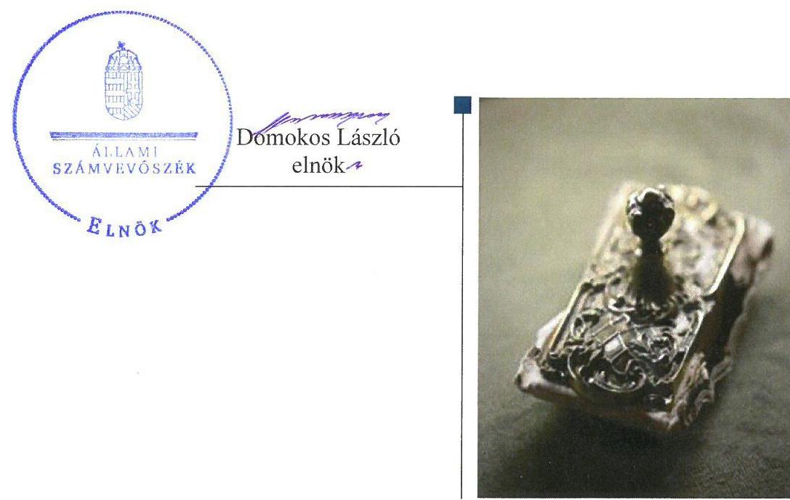
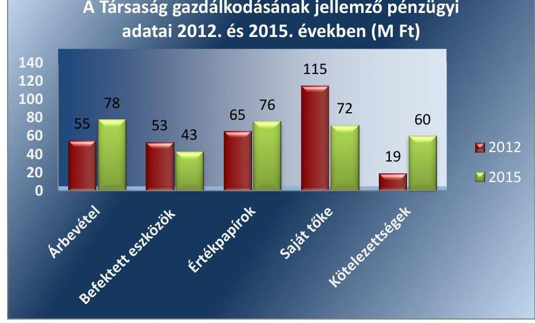

# Jelentés 

## AGROSTER Besugárzó Zrt.

Az állami tulajdonban (résztulajdonban) lévő gazdálkodó szervezetek vagyonmegőrzési és gazdálkodási tevékenységének ellenőrzése 2017.

---

# Jelentés 

## AGROSTER Besugárzó Zrt.

Az állami tulajdonban (résztulajdonban) lévő gazdálkodó szervezetek vagyonmegőrzési és gazdálkodási tevékenységének ellenőrzése
2017. december hó 18 nap

---

# AZ ELLENŐRZÉST FELÜGYELTE:

DR. HORVÁTH MARGIT felügyeleti vezető

## AZ ELLENŐRZÉST VEZETTE ÉS A VÉGREHAJTÁSÁÉRT FELELŐS:

SIPOSNÉ DÓCZI KLÁRA ellenőrzésvezető

## A PROGRAM ÖSSZEÁLLÍTÁSÁÉRT FELELŐS:

JANIK JÓZSEF LÁSZLÓ osztályvezető

IKTATÓSZÁM: V-1391-170/2016

TÉMASZÁM: 2425

ELLENŐRZÉS-AZONOSÍTÓ SZÁM: V075961

Jelentéseink az Országgyűlés számítógépes hálózatán és az Interneten a www.asz.hu címen is olvashatóak.

---

# TARTALOMJEGYZÉK 

■ ÖSSZEGZÉS ..... 5
■ AZ ELLENŐRZÉS CÉLJA ..... 6
■ AZ ELLENŐRZÉS TERÜLETE ..... 7
■ AZ ELLENŐRZÉS HÁTTERE, INDOKOLTSÁGA ..... 9
■ A JELENTÉS LÉNYEGES KÉRDÉSKÖREI ..... 10
■ ELLENŐRZÉS HATÓKÖRE ÉS MÓDSZEREI ..... 11
■ MEGÁLLAPÍTÁSOK ..... 13
■ JAVASLATOK ..... 18
■ MELLÉKLETEK ..... 19
I. Sz. melléklet: Értelmező szótár ..... 19
II. Sz. melléklet: A társaság gazdálkodási szabályzata ..... 22
■ FÜGGELÉK: ÉSZREVÉTELEK ..... 23
■ RÖVIDÍTÉSEK JEGYZÉKE ..... 25

---

.

---

# ÖSSZEGZÉS 

Az AGROSTER Besugárzó Zrt. felett a Magyar Nemzeti Vagyonkezelő Zrt. tulajdonosi joggyakorlása szabályszerű volt. Az állami vagyonnal való gazdálkodás elszámoltathatóságát biztosította a Társaság azzal, hogy a működésének szabályozottsága megfelelt a jogszabályi előírásoknak. A bevételek és a ráfordítások elszámolása valamint a vagyongazdálkodás szabályszerű volt. A Társaság a beszámolási, adatszolgáltatási és közzétételi kötelezettségének eleget tett, a gazdálkodása átlátható volt.

## Az ellenőrzés társadalmi indokoltsága

Az Állami Számvevőszék kiemelt célja, hogy az államháztartáson kívülre nyújtott költségvetési támogatások és ingyenes vagyonjuttatások, valamint az államháztartáson kívül működő feladatellátó rendszerek ellenőrzéseivel hozzájáruljon ahhoz, hogy a közpénzeket az államháztartáson kívül működő szervezetek is átlátható, rendezett módon használják fel.

Az állami tulajdonú gazdálkodó szervezetek a nemzeti vagyon részét képezik. Az állami vagyonnal való gazdálkodást illetően a tulajdonosi joggyakorlás feladata az állami vagyon átlátható, rendeltetésszerű és felelős használatának biztosítása. Az állam meghatározza az ellátandó közszolgáltatással kapcsolatos feladatokat, amelyhez a vagyonnal kapcsolatos döntéseknek igazodniuk kell.

Minden közpénzt, közvagyont felhasználó szervezettel szemben társadalmi igény, hogy tevékenységükről elszámoljanak. Ezt figyelembe véve és az Állami Számvevőszék Stratégiájával összhangban került sor az AGROSTER Besugárzó Zártkörűen Működő Részvénytársaság ellenőrzésére a 2012-2015. évek vonatkozásában.

## Főbb megállapítások, következtetések, javaslatok

A Magyar Nemzeti Vagyonkezelő Zrt. a Társaság felett a jogszabályi előírásoknak megfelelően alakította ki a tulajdonosi joggyakorlás feltételrendszerét. Az így meghatározott belső szabályoknak megfelelően gyakorolta a hatásköröket, a meghatározott jogkörök szerint eljárva teljesítette az előírt feladatokat.

Az AGROSTER Besugárzó Zrt. megteremtette a szabályszerű működés feltételrendszerét, a jogszabályi előírásoknak megfelelően kialakította a vagyon megőrzésének, gyarapításának és működtetésének a kereteit. A pénzügyi- és számviteli feladatok ellátása a jogszabályi előírások betartásával történt. A működéshez kapcsolódó - tulajdonosi, könyvvizsgálói -, valamint a hatósági ellenőrzések nem fogalmaztak meg intézkedést igénylő megállapítást a Társaság számára.

Az ellenőrzött időszakban a Társaság a vagyona értékét megőrizte. Vagyongazdálkodása megfelelt a jogszabályi és a belső előírások követelményeinek. Éves beszámolási és további adatszolgáltatási kötelezettségének eleget tett ezzel is biztosítva a tevékenység és a gazdálkodás átláthatóságát.

---

# AZ ELLENŐRZÉS CÉLJA 

Az ellenőrzés célja annak értékelése volt, hogy a tulajdonosi jogok gyakorlása szabályszerű volt-e; a gazdálkodó szervezet szabályozottsága, gazdálkodása és vagyongazdálkodási tevékenysége megfelelt-e a jogszabályi és a tulajdonosi előírásoknak; biztosítva volt-e a közfeladatok átláthatósága és elszámoltathatósága érdekében a közszolgáltatás díjának megalapozottsága szabályszerű önköltségszámítással; a vagyonváltozást eredményező döntések esetében a tulajdonosi jogok gyakorlója és a gazdálkodó szervezet szabályszerűen jártak-e el.

---

# AZ ELLENŐRZÉS TERÜLETE 

## AGROSTER Besugárzó Zártkörűen Működő Részvénytársaság

Az AGROSTER Besugárzó Zrt. 1992. július 1-jén jött létre, amikor is az AGROSTER Besugárzó Vállalat egyszemélyes részvénytársasággá alakult AGROSTER Besugárzó Rt. néven. Elnevezésében a zártkörű működésre történő utalás 2005 novemberétől van jelen.

A folyamatosan 100%-os állami tulajdonban álló Társaság ${ }^{1}$ alaptőkéje a megalakuláskor $54 \mathrm{M} \mathrm{Ft}^{2}$ volt, ami 2000-ben pénzbeli befizetéssel 60 M Ft-ra nőtt, ezt követően nem változott. A Társaság felett a tulajdonosi jogokat az állami vagyon felügyeletéért felelős miniszter az MNV Zrt. ${ }^{3}$ útján gyakorolta.

A Társaság székhelye Budapesten, a Jászberényi út 5. szám alatt, a Dréher Sörgyártól bérelt ingatlanban volt.

A Társaság tevékenysége különféle termékek ionizáló energiával történő kezelése volt. Alaptevékenysége a csíraszám csökkentés, szükség szerint sterilizálás, a termékek mikrobiológiai minőségének javítása a fogyasztói biztonság fokozása érdekében az élelmiszerektől (pl. fűszerek, szárítmányok, gyógynövények) a gyógyászati és kozmetikai alapanyagokon keresztül az egészségügyi és labor eszközökig szinte mindenütt, ahol mikrobiológiai probléma felléphet. A Társaság tevékenységét ISO 9001:20084, valamint ISO 13485:20125 minőségirányítási rendszer felügyelete alatt és kiépített HACCP ${ }^{6}$ rendszer mellett végezte.

A Társaság beszámolóinak jellemző adatait az 1. ábra foglalja össze, a gazdálkodás részletes adatait a II. sz. melléklet tartalmazza.
1 ábra

A Társaság gazdálkodásának jellemző pénzügyi adatai 2012. és 2015. években (M Ft)

Forrás: A Társaság 2012-2015. évi beszámolói

---

A Társaság az ellenőrzött időszakban saját tulajdonú és bérelt eszközökkel rendelkezett, a működése során az 1969-ben a kísérleti célokra épített besugárzó üzemet ipari méretű termelésre is alkalmassá tette.

A Társaságnak - tevékenységéből adódóan - jelentős számú ágazati előírásnak, jogszabálynak kellett megfelelnie. Ezek közé tartoztak a sugárbiztonsággal kapcsolatos előírások (1996. évi CXVI. törvény ${ }^{7}$; 16/2000. (VI. 8.) EüM rendelet ${ }^{8}$ ), az élelmiszer besugárzással kapcsolatos jogszabályok (2008. évi XLVI. törvény ${ }^{9} ; 67 / 2011$. (VII. 13.) VM rendelet ${ }^{10}$ ) és az orvostechnikai eszközök sterilizálásával kapcsolatos előírások (4/2009. (III.17.) EüM rendelet ${ }^{11}$ ).

A Társaság az értékesítésből származó bevételét a 2012. évi 55 M Ft-ról 2015-ben 78 M Ft-ra, 42%-kal növelte. Tevékenységére a magas fix költség szint jellemző, mely technológiájának sajátja - a sugárforrás hűtéséről, működőképes fenntartásáról használaton kívül is gondoskodni kell.

A Társaság az ellenőrzött időszakban megőrizte eszközeinek értékét. A mérlegfőösszeg 2012. január elsején 132 M Ft, 2015. december 31-én 136 M Ft volt. Az eszköz szerkezeten belül azonban átrendeződés történt. A befektetett eszközök 2012. év elejétől 2015. év végéig történt 16%-os csökkenése mellett az értékpapírok állománya ugyanezen időszakban 21%-kal nőtt.

A saját tőke változása, az ellenőrzött időszakban történt 44 M Ft-os csökkenése, a Tulajdonos 2015. évi osztalékfizetési döntésének a hatása. A kötelezettségek 2015. december 31-i 60 M Ft állománya tükrözi, hogy az osztalékfizetést 2015-ben előírták, de annak tényleges kifizetésére az ellenőrzött időszakban nem került sor.

A Társaság vezérigazgatója 2007-óta tölti be tisztségét, a könyvvizsgáló személye az ellenőrzött időszakon belül egy alkalommal, 2014-ben változott. A foglalkoztatottak átlagos statisztikai létszáma 9 fő volt.

Az AGROSTER Besugárzó Zrt. az ellenőrzött időszakban nem tartozott a kormányzati szektorba sorolt társaságok közé, közfeladatot, közszolgáltatást nem látott el, közhasznú tevékenységet nem végzett. A Társaság nem tartozott a Bkr. ${ }^{12}$ hatálya alá.

---

# AZ ELLENŐRZÉS HÁTTERE, INDOKOLTSÁGA 

Az ÁSZ ${ }^{13}$ középtávra szóló stratégiájában megfogalmazta, hogy az állami tulajdonú gazdálkodó szervezetek ellenőrzése kiemelten fontos a nemzeti vagyon megőrzése, megóvása érdekében. Gazdálkodásuk jellemzően a közérdeklődés és a média figyelmének középpontjában áll, amihez hozzájárul a gazdálkodásuk körébe tartozó - közvetlen vagy közvetett állami tulajdonú - vagyon nagysága, illetve az általuk ellátott közszolgáltatások minősége és hatékonysága.

Az ellenőrzés rámutathat az állami tulajdonú gazdálkodó szervezetek gazdálkodási tevékenységével jó gyakorlatokra és szabálytalanságokra. Felhívhatja a figyelmet a jogszabályi követelmények teljesítéséhez szükséges feltételek hiányosságaira, hozzájárulhat az államháztartáson kívüli, de (közvetlenül vagy közvetve) állami vagyont használó gazdálkodó szervezetek tevékenységének átláthatóságához. Ellenőrzésünk eredményeképpen javaslatainkkal, megállapításainkkal hozzájárulhatunk a nemzeti vagyonnal való gazdálkodás átláthatóságának, elszámoltathatóságának javításához.

---

# A JELENTÉS LÉNYEGES KÉRDÉSKÖREI 

1.     - A tulajdonosi jogok gyakorlása szabályszerű volt-e?
2.     - A társaság működésének szabályozottsága megfelelt-e az előírásoknak?
3.     - A társaságnál a pénzügyi-számviteli, adatszolgáltatási és ellenőrzési feladatok ellátása szabályszerű volt-e?
4.     - A társaság vagyongazdálkodása szabályszerű volt-e?

---

# ELLENŐRZÉS HATÓKÖRE ÉS MÓDSZEREI 

## Az ellenőrzés típusa

Megfelelőségi ellenőrzés.

## Az ellenőrzött időszak

2012. január 1-jétől 2015. december 31-ig tart

## Az ellenőrzés tárgya

Állami tulajdonban lévő gazdasági társaság gazdálkodása, kiemelten vagyongazdálkodási tevékenysége, a tulajdonosi jogok gyakorlása.

## Az ellenőrzött szervezet

Az AGROSTER Besugárzó Zrt., valamint a tulajdonosi jogok gyakorlója a Magyar Nemzeti Vagyonkezelő Zrt.

## Az ellenőrzés jogalapja

Az Állami Számvevőszékről szóló 2011. évi LXVI. törvény 5. § (3)-(5) bekezdései.

## Az ellenőrzés módszerei

Az ellenőrzést a nemzetközi standardokat irányadónak tekintve az ellenőrzési program ellenőrzési kérdései, az ellenőrzött időszakban hatályos jogszabályok, az ellenőrzés szakmai szabályok és módszertanok figyelembe vételével végeztük.

Az ellenőrzés ideje alatt az ellenőrzött szervezettel történő kapcsolattartást az ÁSZ Szervezeti és Működési Szabályzatának vonatkozó előírásai alapján biztosítottuk.

Az ellenőrzési kérdések megválaszolásához szükséges bizonyítékok megszerzése a következő ellenőrzési eljárások alkalmazásával történt: megfigyelés, kérdésfeltevés (információkérés), összehasonlítás, valamint elemző eljárás. Az ellenőrzési bizonyítékként felhasználható adatforrások közé tartoztak egyrészt a szakmai programban felsorolt adatforrások, másrészt minden, az ellenőrzés folyamán feltárt, az ellenőrzés szempontjából információkat tartalmazó dokumentum.

---

Az AGROSTER Besugárzó Zrt. a bevételek és ráfordítások elszámolása, valamint a vagyonnyilvántartás terén a szabályszerű működést véletlen mintavétellel és irányított kiválasztással ellenőriztük. A mintatételek értékelése alapján egyrészt a sokaságban előforduló hiba arányát becsültük, másrészt az irányítottan kiválasztott tételeket értékeltük. A jogszabályoknak és a belső eljárásoknak megfelelőnek, azaz szabályszerűnek tekintettük az adott területet, amennyiben a minta ellenőrzésének eredménye alapján 95%-os bizonyossággal a teljes sokaságban a hibaarány kisebb volt, mint 10%. Nem megfelelőnek értékeltük, ha a hibaarány a 10%-ot meghaladta. A ráfordítások elszámolására és a vagyonnyilvántartásra vonatkozó véletlen mintavételt kockázati alapú kiválasztással egészítettük ki, amelynek során évente a három legnagyobb összegű tételt választottuk ki.

---

# 1. A tulajdonosi jogok gyakorlása szabályszerű volt-e? 

Összegző megállapítás

Az MNV Zrt. tulajdonosi joggyakorlása szabályszerű volt.

A TULAJDONOSI JOGGYAKORLÁS RENDJÉT a Társaság felett a Gt. ${ }^{14}$, a Ptk. ${ }^{15}$, a Vtv. ${ }^{16}$ és az Nvtv. ${ }^{17}$ előírásaiknak megfelelően alakította ki az MNV Zrt. Az ezzel kapcsolatos szabályokat az MNV Zrt. SZMSZ ${ }^{18}$-ében és belső szabályzataiban, irányelvekben ${ }^{19}$ és iránymutatásokban ${ }^{20}$, illetve a Társaság Alapító okirat ${ }_{1,2}$-ában ${ }^{21}$ határozták meg.

Az Alapító okirat ${ }_{1,2}$-ban - a Gt. és Ptk. ${ }_{2}$ előírásaival összhangban - meghatározták, hogy a legfőbb szerv hatáskörét az alapító, mint egyedüli tag a tulajdonosi joggyakorló MNV Zrt. útján gyakorolja. A jogszabályi előírásoknak megfelelően az Alapító okirat ${ }_{1,2}$-ban megnevezték a vezérigazgatót és a Felügyelő Bizottság ${ }^{22}$ tagjait, meghatározták a feladataikat, kötelezettségeiket és megnevezték a választott könyvvizsgálót valamint meghatározták a tulajdonosi joggyakorló számára fenntartott tulajdonosi jogokat.

A BESZÁMOLTATÁS 2012. január 1-jétől az MNV Zrt. vezérigazgatói utasítások ${ }^{23}{ }_{1-2}$ alapján a negyedéves tulajdonosi értékelő értekezletek keretében, 2013. december 19-től az MNV Zrt. Társasági monitoring szabályzata ${ }^{24}$ előírásai szerint történt. A Társaság részére kiadott Alapítói határozatok végrehajtásának ellenőrzését
 félévente, a Felügyelő bizottság tevékenységének áttekintését és értékelését évente teljesítették.

A számviteli éves beszámolók elfogadása a Gt. és a Ptk. ${ }_{2}$ előírásaival összhangban, a Társaság Felügyelő bizottságának és választott könyvvizsgálójának véleményét figyelembe véve alapítói határozattal történt, melynek során az MNV Zrt. döntött a veszteség rendezésének módjáról illetve az adózott eredmény felhasználásáról is. Osztalékfizetésre vonatkozó döntésre a 2015. évi beszámoló elfogadásakor került sor. A döntések meghozatalakor a tulajdonosi joggyakorló figyelembe vette a Számv. tv. ${ }^{25}$ előírásait, a saját tőke/jegyzett tőke mutató nem csökkent a Gt., illetve Ptk. ${ }_{2}$ által meghatározott szint alá, így visszapótlási kötelezettség nem keletkezett.

Az üzleti tervet 2012-2014. évek vonatkozásában, azok keretében a Társaság tulajdonosi döntést igénylő beruházásait, a tulajdonosi joggyakorló elfogadta illetve jóváhagyta, azonban a 2015. évi üzleti tervet nem hagyta jóvá. Az elutasítást a tervezési irányelvekben ${ }^{26}$ előzetesen meghatározott feltételektől való eltéréssel (a tőkehatékonysági szint az előző évinél alacsonyabb volt) indokolta.

A javadalmazási szabályzat ${ }_{1-2}{ }^{27}$-ot, melyben a Taktv. ${ }^{28}$ előírásainak megfelelően határozta meg a tulajdonosi joggyakorló a Társaság első számú vezetője, a Felügyelő bizottság tagjai, a vezető állású

---

munkavállalók, valamint a könyvvizsgáló javadalmazásának elveit, a Társaság a Taktv. 5. § (3) bekezdésében előírt 30 napos határidőn túl helyezte letétbe a cégiratok között.

# 2. A társaság működésének szabályozottsága megfelelt-e az előírásoknak? 

Összegző megállapítás

A Társaság működésének szabályozottsága megfelelő, a pénzügyi-számviteli és adatszolgáltatási feladatok ellátása szabályszerű volt.

### 2.1. számú megállapítás

A Társaság működésének szabályozottsága megfelelt az előírásoknak.

Szervezeti és működési szabályzattal ${ }_{1,2}{ }^{29}$-tal, valamint az abban meghatározott Ügyrendi szabályzattal ${ }_{1,2}{ }^{30}$-tal és Üzletszabályzattal ${ }_{2,2}{ }^{31}$-tal az ellenőrzött időszakban rendelkezett a Társaság.

Továbbá elkészítette a Béren kívüli juttatások szabályzatát ${ }^{32}$ valamint a Selejtezési szabályzat ${ }_{1,2}{ }^{33}$-ot is. A Béren kívüli juttatások szabályzatában meghatározta a kereteit a munkáltató által minden munkavállaló számára biztosított étkezési célú juttatásoknak. A Társaság a Selejtezési szabályzat ${ }_{3}$-2-ban rendelkezett a saját tulajdonú eszközei selejtezésének menetéről. A szabályzat előírta, hogy az év végi leltározás előtt a vizsgálat tárgyává kell tenni az eszközök állapotát, használhatóságát, alkalmazásuk hatékonyságát.

Számviteli politikával ${ }^{34}$, és az ahhoz kapcsolódó szabályzatokkal, a Pénzkezelési szabályzattal ${ }^{35}$, a Leltározási szabályzattal ${ }^{36}$ valamint Számlarenddel ${ }^{37}$ a Számv. tv. előírásainak megfelelően rendelkezett a Társaság. A Számviteli politika részeként határozta meg az eszközök és források értékelésére vonatkozó szabályokat.

Leltározási szabályzatát a Számv. tv-ben foglaltaknak megfelelve készítette el a társaság. Abban a mennyiségi felvételezéssel történő leltározást éves gyakorisággal határozta meg, ami megfelelt a Számv. tv. 69. § (3) bekezdése előírásainak.

Pénzkezelési szabályzatát a Számv. tv.-ben előírtaknak megfelelően elkészítette a Társaság, melyben rögzítették a pénzforgalom lebonyolításának a rendjét.

### 2.2. számú megállapítás

A Társaság bevételeinek és ráfordításainak elszámolása megfelelt az előírásoknak.

A bevételek elszámolása megfelelt a jogszabályi és a belső szabályozásba foglalt előírásoknak. A bevételek kiszámlázása, főkönyvi számlákon történő elszámolása megfelelt a Számv. tv.-ben, a belső szabályozásokban előírtaknak. A mintavétellel ellenőrzött területek értékelését a 2. ábra mutatja.

---

Forrás: ÁSZ saját
2.3. számú megállapítás
2.3. számú megállapítás
2. táblázat

A tervezett és a teljesített árbevétel alakulása (M Ft)

| Cseh | Tetu | Tétu |
| :-- | :--: | :--: |
| 2012. | 68 | 55 |
| 2013. | 55 | 58 |
| 2014. | 68 | 71 |
| 2015. | 67 | 78 |

Forrás: A Társaság üzleti tervei és éves beszámolói

A ráfordítások elszámolása megfelelt a jogszabályi és a belső szabályozásba foglalt előírásoknak. Az anyagjellegű ráfordítások esetében az elszámolást megalapozó dokumentumok rendelkezésre álltak, elszámolásuk a számviteli bizonylatok alapján, a szerződés szerinti teljesítéssel, a megfelelő főkönyvi számlán történt. A személyi jellegű ráfordítások elszámolását, a munkabérek kifizetését munkaszerződés alapján, az Szja. tv. ${ }^{38}$ és a Tbj. tv. ${ }^{39}$ előírásainak megfelelő levonások alkalmazásával teljesítették. A személyi jellegű egyéb kifizetésekre a Béren kívüli juttatások szabályzat és az Szja. tv. előírásaival összhangban került sor.

Az értékcsökkenés elszámolása a Számv. tv. és a Tao. tv. ${ }^{40}$ szerint, a belső szabályozás figyelembevételével történt.

A hátralékos követelés állomány csökkentésére a tulajdonosi joggyakorló nem írt elő intézkedési kötelezettséget a Társaság részére. A határidőn túli követelések árbevételen belüli aránya a 2012. év végi 10%-ról 2015-ben 3%-ra csökkent. A 30 napon túli vevőkövetelések aránya a teljes vevőköveteléshez viszonyítva 2013-ban volt a legmagasabb, értéke ekkor 1 M Ft volt. A követelés várhatóan megtérülő összege vonatkozásában nem tartotta indokoltnak értékvesztés elszámolását a Társaság az ellenőrzött időszakban. A vevőkövetelések alakulását az 1. táblázat szemlélteti.

1. táblázat

Vevőkövetelések alakulása 2012-2015.

|  | 2012 | 2013 | 2014 | 2015 |
| :-- | :--: | :--: | :--: | :--: |
| Árbevétel (M Ft) | 55 | 58 | 71 | 78 |
| Vevőkövetelések (M Ft) | 11 | 10 | 15 | 6 |
| 30 napon túli vevőkövetelések ará-   nya a vevőkövetelésekben (%) | 5 | 10 | 2 | 6 |
| Határidőn túli vevőkövetelések   aránya az árbevételhez (%) | 10 | 5 | 1 | 3 |

A Társaság a beszámolási, adatszolgáltatási kötelezettségeit teljesítette. A 2015. évi üzleti tervet a tulajdonosi joggyakorló nem fogadta el. A tulajdonosi és egyéb külső ellenőrzések nem fogalmaztak meg intézkedést igénylő megállapítást.

Az üzleti tervet a Társaság az Alapító Okirat ${ }_{1,2}$, az SZMSZ ${ }_{1,2}$ és az Ügyrendi szabályzat ${ }_{1,2}$ előírásainak megfelelően az ellenőrzési időszak minden évében elkészítette, azokat a Társaság Felügyelő bizottsága a tulajdonosi joggyakorlónak elfogadásra javasolta. Az üzleti tervek a Társaság előterjesztésében tartalmazták a tervezési irányokat, a várható árbevételt (lásd 2. táblázat) és eredményt, valamint a tervezett beruházások forrásait. Mivel ez a javaslat az MNV Zrt. által meghatározott tervezési irányelvektől 2015. vonatkozásában eltért, a Felügyelő Bizottság a javaslatát visszavonta, így az üzleti terveket 2012-2014 években fogadta el a tulajdonosi joggyakorló.

A beszámolási kötelezettsége teljesítéséhez a Társaság a Számv. tv. előírásainak megfelelő éves beszámolót készített,

---

melyeket a tulajdonosi joggyakorló elfogadási határozatával és a könyvvizsgáló hitelesítő záradékával együtt határidőben közzétett.

A közérdekű adatok megismerésére irányuló igényeknek a Tak.tv 2. §-ában előírt közzétételi kötelezettség teljesítésével tett eleget a Társaság.

A tulajdonosi joggyakorló, a Felügyelő bizottság, a könyvvizsgáló ellenőrzései során intézkedést, beavatkozást igénylő ellenőrzési megállapításra nem került sor. A Társaságnál lefolytatott külső ellenőrzések a Társaság szakmai tevékenységére irányultak, melynek során intézkedési terv készítését igénylő megállapítást az ellenőrző szervezetek nem tettek.
$\longrightarrow$ Az SNL Department of Energy ${ }^{41}$ műszaki jellegű védettségre vonatkozó ellenőrzést végzett egy alkalommal.
$\longrightarrow$ A Pest Megyei Kormányhivatal Élelmiszerlánc-, Biztonsági és Állategészségügyi Igazgatóság Észak-Budapesti Kerületi Állategészségügyi és Élelmiszer-ellenőrző Hivatala tartott élelmiszer egészségügyi (élelmiszer besugárzással kapcsolatos) ellenőrzést négy alkalommal.
$\longrightarrow$ Az $\mathrm{OAH}^{42}$ helyi nyilvántartásra, védettségre vonatkozó ellenőrzést az ellenőrzött időszakon belül 11 alkalommal végezte.
$\longrightarrow$ Budapest Főváros Kormányhivatala Népegészségügyi Szakigazgatási Szerve Sugáregészségügyi Decentruma négy alkalommal sugáregészségügyi ellenőrzést tartott.

# 3. A társaság vagyongazdálkodása szabályszerű volt-e? 

## Összegző megállapítás

### 3.1. számú megállapítás

A vagyongazdálkodás szabályszerű volt.
A Társaság a szabályszerű vagyongazdálkodás feltételeit kialakította és vagyonát az előírásoknak megfelelően tartotta nyilván.

A vagyongazdálkodás feltételeit az Alapító okirat ${ }_{1,2}$-ban, az SZMSZ ${ }_{1,2}$-ben, a Számviteli politikában, valamint az Ügyrendi szabályzat ${ }_{1,2}$-ban és a Selejtezési szabályzatban foglaltak határozták meg. Az Alapító okirat ${ }_{1,2}$ a tulajdonosi joggyakorló kizárólagos hatáskörébe tartozó vagyongazdálkodással kapcsolatos jogosultságokat tartalmazta, az Ügyrendi szabályzat a Társaság fő folyamataival, ezen belül a műszaki fejlesztéssel, beruházással kapcsolatos feladat- és hatásköröket rögzítette. A vagyon védelme, megőrzése érdekében a feleslegessé vált vagyontárgyak hasznosításának, selejtezésének rendjét a Selejtezési szabályzat írja le.

A saját vagyon nyilvántartását, a változások folyamatos nyomon követhetőségét a Számv. tv. előírásai szerint, az analitikus és főkönyvi rendszer biztosította. A Társaság az állományba vételi, nyilvántartási kötelezettségének a jogszabályi előírásoknak megfelelően tett eleget.

A leltározást a Társaság az ellenőrzött időszak valamennyi évében - a Számv. tv. 69. § (1) bekezdésében foglaltaknak eleget téve -

---

# Megállapítások 

elvégezte, a beszámolóiban, a számviteli nyilvántartásaiban szereplő eszközöket és forrásokat leltárral támasztotta alá. A minden évben mennyiségi felvétellel és egyeztetéssel - a Számv. tv. 69. § (3) bekezdése szerint végzett leltározás megfelelt a Társaság Leltározási szabályzatának.

## 3.2. számú megállapítás

## A Társaság vagyonának értékét megőrizte, a vagyonváltozást eredményező döntései megfeleltek az előírásoknak.

A saját vagyon értékének megőrzése megvalósult. A Társaság 2012. január 1. és 2015. december 31. között megőrizte vagyonát. Az összes eszköz értéke 2012. január elsején 132 M Ft, 2015. év végén 136 M Ft volt. A Társaság mérlegében a befektetett eszközök értéke, ezen belül a tárgyi eszközök értéke a 2012. január elsejei 51 M Ft-ról 2015. december 31-re 43 M Ft-ra csökkent, ugyanakkor ebben az időszakban a forgóeszközök között nyilvántartott értékpapírok állománya 63 M Ft-ról 76 M Ft-ra nőtt.

Az ellenőrzött időszakban a felújítások, beruházások éves összege - a 2013. év kivételével - kisebb volt (összesen 21 M Ft) az elszámolt értékcsökkenés (összesen 38 M Ft) összegénél. Ugyanakkor a Társaság a jövőbeni beruházások fedezetére az értékpapírokon túl a befektetett pénzügyi eszközök között 11 M Ft megtakarítást képzett.

A vagyongazdálkodási döntések megfeleltek a Társaság belső szabályzatainak, és a tulajdonosi joggyakorló előírásainak is. A döntések körét, melyek a tulajdonosi joggyakorló hatáskörébe tartoztak, a Társaság Alapító Okirat ${ }_{1,2}$-ában és SZMSZ ${ }_{1,2}$-ében határozták meg. Egyben előírták, hogy a döntésekre vonatkozó javaslatok, indítványok előkészítésének felelőse a Társaság vezérigazgatója. A vagyonváltozást érintően az ellenőrzött időszak alatt egy alkalommal, 2012. évben került sor tulajdonosi joggyakorló jóváhagyását igénylő beruházásra (sugárforrás feltöltése), melyhez a Társaság a 2012. évi üzleti tervet elfogadó alapítói határozat keretében kapta meg a tulajdonosi joggyakorló hozzájárulását.

---

# JAVASLATOK 

Az ÁSZ tv. 33. § (1) bekezdésében foglaltak értelmében az ellenőrzött szervezet vezetője köteles a jelentésben foglalt megállapításokhoz kapcsolódó intézkedési tervet összeállítani és azt a jelentés kézhezvételétől számított 30 napon belül az ÁSZ részére megküldeni. Amennyiben az ellenőrzött szervezet vezetője nem küldi meg határidőben az intézkedési tervet, vagy továbbra sem elfogadható intézkedési tervet küld, az Állami Számvevőszék elnöke az ÁSZ tv. 33. § (3) bekezdése a) és b) pontjaiban foglaltakat érvényesítheti.

Javaslataink célja az AGROSTER Besugárzó Zrt. gazdálkodása szabályozottságának erősítése annak érdekében, hogy a szabályozási környezet és a gazdálkodási gyakorlat megfelelően tudja támogatni az átlátható működést.

## Az AGROSTER Besugárzó Zrt. vezérigazgatójának

1. Intézkedjen a számviteli politika, a számlarend és a pénzkezelési szabályzat aktualizálásáról a hatályos Számv. tv. előírásainak megfelelően.
(2. sz. megállapítás 3-4. bekezdései alapján)

---

# MELLÉKLETEK 

## I. SZ. MELLÉKLET: ÉRTELMEZŐ SZÓTÁR

állami vagyon
a) Az állam tulajdonában lévő dolog, valamint a dolog módjára hasznosítható természeti erő,
b)
 az a) pont hatálya alá nem tartozó mindazon vagyon, amely vonatkozásában törvény az állam kizárólagos tulajdonjogát nevesíti,
c) az állam tulajdonában lévő tagsági jogviszonyt megtestesítő értékpapír, illetve az államot megillető egyéb társasági részesedés,
d) az államot megillető olyan immateriális, vagyoni értékkel rendelkező jogosultság, amelyet jogszabály vagyoni értékű jogként nevesít.
Forrás: Vtv. 1. § (2) bekezdése
2012. november 10-től az állami vagyon fogalma kiegészül a következő ponttal:
e) az állam tulajdonában lévő pénzügyi eszközök

Forrás: Vtv. 1. § (2) bekezdése
2013. június 27-ig:

Az állami vagyont az MNV Zrt. maga kezeli, vagy szerződés - így különösen bérlet, haszonbérlet, megbízás - alapján központi költségvetési szervnek, természetes vagy jogi személynek, vagy jogi személyiséggel nem rendelkező gazdálkodó szervezetnek hasznosításra átengedi.
Forrás: Vtv. 23. § (1) bekezdése
2013. június 28-ától:

Az állami vagyonnal az MNV Zrt. maga gazdálkodik, vagy szerződés - így különösen bérlet, haszonbérlet, megbízás - alapján központi költségvetési szervnek, természetes vagy jogi személynek, vagy jogi személyiséggel nem rendelkező gazdálkodó szervezetnek hasznosításra átengedi, illetőleg vagyonkezelésbe, haszonélvezetbe adja.
Forrás: Vtv. 23. § (1) bekezdése
A Ptk. 2. 3:88. § (1) bekezdése szerint „a gazdasági társaságok üzletszerű közös gazdasági tevékenység folytatására, a tagok vagyoni hozzájárulásával létrehozott, jogi személyiséggel rendelkező vállalkozások, amelyekben a tagok a nyereségből közösen részesednek, és a veszteséget közösen viselik".
a) állami vagyont bértokol, használ, szedi annak használt, hasznosít, ide nem értve a haszonélvezőt, a vagyonkezelőt és a tulajdonosi jogok gyakorlóját.
Forrás: Vhr. 1. § (7) a. pontja
2013. június 27-ig:

Az állami vagyont az MNV Zrt. maga kezeli, vagy szerződés - így különösen bérlet, haszonbérlet, megbízás - alapján központi költségvetési szervnek, természetes vagy jogi személynek, vagy jogi személyiséggel nem rendelkező gazdálkodó szervezetnek hasznosításra átengedi. Az állami vagyonra vonatkozóan az MNV Zrt. kizárólag az Nvtv-ben meghatározott személyekkel köthet vagyonkezelési szerződést.
Forrás: Vtv. 23. § (1), 27. § (1)
2013. június 28-ától:

Az állami vagyonnal az MNV Zrt. maga gazdálkodik, vagy szerződés - így különösen bérlet, haszonbérlet, megbízás - alapján központi költségvetési szervnek, természetes vagy jogi személynek, vagy jogi személyiséggel nem rendelkező gazdálkodó szervezetnek hasznosításra átengedi, illetőleg vagyonkezelésbe, haszonélvezetbe adja. Az állami vagyonra vonatkozóan az MNV Zrt. kizárólag az Nvtv-ben meghatározott személyekkel köthet vagyonkezelési szerződést. Forrás: Vtv. 23. § (1), 27. § (1)

---

állami vagyon értékesítése
gazdálkodó szervezet
nemzeti vagyon
nemzeti vagyon hasznosítása

Állami vagyon tulajdonjogának bármely jogcímen történő, visszterhes átruházása.
Forrás: Vhr. 1. § (7) d) pont)
2014. március 14-ig:

A Ptk. ⁴³ 685. § c) pontja szerint gazdálkodó szervezet: „az állami vállalat, az egyéb állami gazdálkodó szerv, a szövetkezet, a lakásszövetkezet, az európai szövetkezet, a gazdasági társaság, az európai részvénytársaság, az egyesülés, az európai gazdasági egyesülés, az európai területi együttműködési csoportosulás, az egyes jogi személyek vállalata, a leányvállalat, a vízgazdálkodási társulat, az erdő birtokossági társulat, a végrehajtói iroda, az egyéni cég, továbbá az egyéni vállalkozó."
2014. március 15-től:

A gazdasági társaság, az európai részvénytársaság, az egyesülés, az európai gazdasági egyesülés, az európai területi együttműködési csoportosulás, a szövetkezet, a lakásszövetkezet, az európai szövetkezet, a vízgazdálkodási társulat, az erdőbirtokossági társulat, az állami vállalat, az egyéb állami gazdálkodó szerv, az egyes jogi személyek vállalata, a közös vállalat, a végrehajtói iroda, a közjegyzői iroda, az ügyvédi iroda, a szabadalmi ügyvivői iroda, az önkéntes kölcsönös biztosító pénztár, a magánnyugdíjpénztár, az egyéni cég, továbbá az egyéni vállalkozó. Az állam, a helyi önkormányzat, a költségvetési szerv, az egyesület, a köztestület, valamint az alapítvány gazdálkodó tevékenységével összefüggő polgári jogi kapcsolataira is a gazdálkodó szervezetre vonatkozó rendelkezéseket kell alkalmazni.
Forrás: Ppt ⁴⁴. 396. §
Az állami vagyon felett, a Magyar Államot megillető tulajdonosi jogok és kötelezettségek összességét - a hatályos szabályozás szerint - az állami vagyon felügyeletéért felelős miniszter (jelenleg a nemzeti fejlesztési miniszter) gyakorolja. A miniszter feladatát nagy részben az MNV Zrt., mint tulajdonosi joggyakorló szervezet útján látja el.
a) az állam vagy a helyi önkormányzat kizárólagos tulajdonában álló dolgok,
b) az a) pont hatálya alá nem tartozó, állam vagy a helyi önkormányzat tulajdonában lévő dolog,
c) az állam vagy a helyi önkormányzat tulajdonában lévő pénzügyi eszközök, továbbá az államot vagy a helyi önkormányzatot megillető társasági részesedések,
d) az államot vagy a helyi önkormányzatot megillető bármely vagyoni értékkel rendelkező jogosultság, amelyet jogszabály vagyoni értékű jogként nevesít,
e) Magyarország határa által körbezárt terület feletti légtér,
f) az üvegházhatású gázok kibocsátási egységeinek kereskedelméről szóló törvény szerint kibocsátási egység és légiközlekedési kibocsátási egység, valamint az ENSZ Éghajlatváltozási Keretegyezménye és annak Kiotói Jegyzőkönyve végrehajtási keretrendszeréről szóló törvény szerinti kiotói egység,
g) állami vagy helyi önkormányzati fenntartású közgyűjtemény (muzeális intézmény, levéltár, közgyűjteményként működő kép- és hangarchívum, valamint könyvtár) saját gyűjteményében nyilvántartott kulturális javak körébe tartozó dolog, kivéve, ha az állami vagy önkormányzati tulajdon jogszerű létrejötte kétséget kizáró módon nem bizonyítható és a dologra nézve más a tulajdonjogát bizonyítja vagy a kulturális javakra vonatkozó jogszabályokban meghatározott eljárás keretében valószínűsíti (g. pont módosult 2013. december 7-től),
h) a régészeti lelet,
i) a nemzeti adatvagyon körébe tartozó állami nyilvántartások fokozottabb védelméről szóló törvény szerinti nemzeti adatvagyon.
Forrás: Nvtv. 1. § (2)
A tulajdonosi joggyakorló vagy a nemzeti vagyon használója által a nemzeti vagyon birtoklásának, használatának, hasznok szedése jogának bármely - a tulajdonjog átruházását nem eredményező - jogcímen történő átengedése, ide nem értve a vagyonkezelésbe adást, valamint a haszonélvezeti jog alapítását.
Forrás: Nvtv. 3. § (1) 4. pont

---

rábízott vagyon

Tulajdonosi jogok gyakorlója

Egyrészt minden a Vtv. alkalmazásában állami vagyonnak minősülő vagyon, amit az MNV Zrt. kezel és nyilvántart.
Másrészt az a vagyon, amely felett a Magyar Állam nevében az MFB Zrt. gyakorolja a tulajdonosi jogokat.
Forrás: MFB tv. 3. § (9)
A rábízott vagyon a tulajdonosi jogokat gyakorló szervezetek saját vagyonától elkülönítendő. Forrás: Vtv. 22. § (6)

## 1.

## 2013. június 27-ig:

Az állami vagyon felett a Magyar Államot megillető tulajdonosi jogok és kötelezettségek összességét - ha törvény eltérően nem rendelkezik - az állami vagyon felügyeletéért felelős miniszter (a továbbiakban: miniszter) gyakorolja, aki e feladatát a Magyar Nemzeti Vagyonkezelő Zártkörűen Működő Részvénytársaság (a továbbiakban: MNV Zrt.), a Magyar Fejlesztési Bank, illetve a tulajdonosi joggyakorló szervezet útján látja el. A miniszter miniszteri rendeletben, a törvényben meghatározott állami vagyoni kör tekintetében, meghatározott időtartamra, a joggyakorlás egyes szabályainak meghatározásával - az őt megillető tulajdonosi jogok és kötelezettségek összességének, illetve azok meghatározott részének gyakorlóját az Áht. szerinti központi költségvetési szervek, ezek intézménye, továbbá a 100%-ban állami tulajdonban álló gazdasági társaságok közül kijelölheti.
Forrás: Vtv. 3. § (1) és (2)

## 2013. június 28-ától:

A rábízott állami vagyon felett az államot megillető tulajdonosi jogok és kötelezettségek összességét tulajdonosi joggyakorlóként:
a) ha törvény vagy miniszteri rendelet eltérően nem rendelkezik, a Magyar Nemzeti Vagyonkezelő Zártkörűen Működő Részvénytársaság (a továbbiakban: MNV Zrt.),
b) törvényben kijelölt személy vagy
c) az állami vagyon felügyeletéért felelős miniszter (a továbbiakban: miniszter) által rendeletben kijelölt személy gyakorolja.
[...] A miniszter e törvény felhatalmazása alapján - a meghatározott célok hatékonyabb elérése érdekében, miniszteri rendeletben, az ott meghatározott állami vagyoni kör tekintetében, meghatározott időtartamra - e törvény keretei között, a joggyakorlás egyes szabályainak meghatározásával - az államot megillető tulajdonosi jogok és kötelezettségek összességének, illetve azok meghatározott részének gyakorlóját az Áht. szerinti központi költségvetési szervek, ezek intézménye, továbbá a 100%-ban állami tulajdonban álló gazdasági társaságok közül kijelölheti.
Forrás: Vtv. 3. § (1) és (2)
2.

Aki a nemzeti vagyon felett az államot vagy a helyi önkormányzatot megillető tulajdonosi jogok és kötelezettségek összességének gyakorlására jogosult
Forrás: Nvtv. 3. § (1) 17. pontja

---

# A TÁRSASÁG FŐBB GAZDÁLKODÁSI ADATAI 2012-2015 ÉVEKBEN (M Ft)

|  Megnevezés | 2012. | 2012. | 2013. | 2014. | 2015.  |
| --- | --- | --- | --- | --- | --- |
|   | jan. 1. | dec. 31. | dec. 31. | dec. 31. | dec. 31.  |
|  Értékesítés nettó árbevétele | - | 55 | 58 | 71 | 78  |
|  Anyag jellegű ráfordítások | - | 16 | 15 | 15 | 15  |
|  Személyi jellegű ráfordítások | - | 43 | 39 | 41 | 40  |
|  Értékcsökkenési leírás | - | 10 | 10 | 9 | 8  |
|  Egyéb ráfordítások | - | 1 | 2 | 1 | 6  |
|  Üzemi tevékenység eredménye | - | -14 | -7 | 4 | 9  |
|  Pénzügyi műveletek eredménye | - | 4 | 2 | 1 | 0  |
|  Rendkívüli eredmény | - | 1 | 1 | 1 | 0  |
|  Adózott eredmény | - | -9 | -5 | 6 | 8  |
|  Mérleg szerinti eredmény | - | -9 | -5 | 6 | 0  |
|  Befektetett eszközök | 51 | 53 | 45 | 39 | 43  |
|  Immateriális javak | 0 | 1 | 3 | 4 | 4  |
|  Tárgyi eszközök | 51 | 52 | 42 | 35 | 28  |
|  Befektetett pénzügyi eszközök | 0 | 0 | 0 | 0 | 11  |
|  Forgóeszközök | 80 | 83 | 74 | 87 | 93  |
|  Készletek | 1 | 1 | 1 | 1 | 2  |
|  Követelések | 7 | 14 | 10 | 15 | 7  |
|  Értékpapírok | 63 | 65 | 53 | 63 | 76  |
|  Pénzeszközök | 9 | 3 | 9 | 7 | 8  |
|  Aktív időbeli elhatárolások | 0 | 0 | 0 | 1 | 0  |
|  Eszközök összesen | 132 | 137 | 118 | 127 | 136  |
|  Saját tőke | 125 | 115 | 110 | 116 | 72  |
|  Jegyzett tőke | 60 | 60 | 60 | 60 | 60  |
|  Tőketartalék | 12 | 12 | 12 | 12 | 12  |
|  Eredménytartalék | 56 | 53 | 44 | 39 | 0  |
|  Céltartalék | 0 | 0 | 0 | 0 | 4  |
|  Kötelezettségek | 4 | 19 | 7 | 9 | 60  |
|  Passzív időbeli elhatárolások | 3 | 2 | 2 | 2 | 0  |
| 

 Források összesen | 132 | 137 | 118 | 127 | 136  |
|  Foglalkoztatottak átlagos statisztikai létszáma (fő) | - | 9 | 9,1 | 9,2 | 9,4  |

Forrás: A Társaság 2012-2015 évi beszámolói.

---

# FÜGGELÉK: ÉSZREVÉTELEK 

A jelentéstervezetet a Számvevőszék 15 napos észrevételezésre megküldte az ellenőrzött szervezetek vezetőinek az ÁSZ tv. 29. § (1) bekezdése előírásának megfelelően.

Sem az AGROSTER Besugárzó Zrt., sem az MNV Zrt. vezérigazgatója nem tett észrevételt a jelentéstervezettel kapcsolatban.

[^0]
[^0]:    * 29. § (1) Az Állami Számvevőszék az ellenőrzési megállapításait megküldi az ellenőrzött szervezet vezetőjének vagy az általa megbízott személynek, és annak, akinek személyes felelősségét állapította meg.
    (2) Az ellenőrzött szervezet vezetője és a felelősként megjelölt személy az ellenőrzés megállapításaira tizenöt napon belül írásban észrevételt tehet.
    (3) Az Állami Számvevőszék az észrevételre a beérkezésétől számított harminc napon belül írásban válaszol. A figyelembe nem vett észrevételeket köteles a jelentésben feltüntetni, és megindokolni, hogy azokat miért nem fogadta el.

---

.

---

# RÖVIDÍTÉSEK JEGYZÉKE 

${ }^{1}$ Társaság
${ }^{2} \mathrm{M} F \mathrm{~Ft}$
${ }^{3}$ MNV Zrt.
${ }^{4}$ ISO 9001:2008
${ }^{5}$ ISO 13485:2012
${ }^{6}$ HACCP
${ }^{7}$ 1996. évi CXVI. törvény
${ }^{8}$ 16/2000. (VI. 8.) EüM rendelet
${ }^{9}$ 2008. évi XLVI. törvény
${ }^{10}$ 67/2011. (VII. 13.) VM rendelet
${ }^{11}$ 4/2009. (III.17.) EüM rendelet
${ }^{12}$ Bkr.
${ }^{13}$ ÁSZ
${ }^{14} \mathrm{Gt}$.
${ }^{15}$ Ptk. 2
${ }^{16} \mathrm{Vtv}$.
${ }^{17}$ Nvtv.
${ }^{18}$ MNV Zrt. SZMSZ
${ }^{19}$ irányelvek
${ }^{20}$ iránymutatások
${ }^{21}$ Alapító okirat
${ }^{22}$ Felügyelő bizottság,

AGROSTER Besugárzó Zártkörűen Működő Részvénytársaság
millió forint
Magyar Nemzeti Vagyonkezelő Zártkörűen Működő Részvénytársaság
Az ISO 9001 nemzetközileg elismert szabvány a szervezetek minőségirányítási rendszereire vonatkozóan.
Az ISO 13485 az ISO 9001 folyamatmodell megközelítésén alapszik és egy irányítási rendszerszabvány, speciálisan az orvostechnikai eszközök gyártására fejlesztették ki.
A HACCP nemzetközileg elfogadott, Magyarországon kötelező élelmiszerbiztonsági rendszer, szisztematikus módszer az élelmiszerek biztonságának megteremtésére a lehetséges kockázatok, veszélyek megállapítása, értékelése és kezelése révén.
1996. évi CXVI. törvény az atomenergiáról (hatályos 1997. június 1-től)
16/2000. (VI. 8.) EüM rendelet az atomenergiáról szóló 1996. évi CXVI. törvény egyes rendelkezéseinek végrehajtásáról (hatályos 2000. július 8-tól)
2008. évi XLVI. törvény az élelmiszerláncról és hatósági felügyeletéről (hatályos 2008. szeptember 1-jétől)

67/2011. (VII. 13.) VM rendelet az élelmiszerek ionizáló sugárzással való kezelésének szabályairól
4/2009. (III. 17.) EüM rendelet az orvostechnikai eszközökről
370/2011. (XII. 31.) Korm. rendelet a költségvetési szervek belső kontrollrendszeréről és belső ellenőrzéséről (Hatályos 2012. január 1-jétől)
Állami Számvevőszék
A gazdasági társaságokról szóló 2006. évi IV. törvény (hatálytalan 2014. március 15-től)
a Polgári Törvénykönyvről szóló 2013. évi V. törvény (hatályos 2014. március 15-től)
Az állami vagyonról szóló 2007. évi CVI. törvény (hatályos 2007. szeptember 25-től)
2011. évi CXCVI. törvény a nemzeti vagyonról

MNV Zrt. Szervezeti és Működési Szabályzata (A 2012.01.01-jén hatályos 301/2011(V.30.) IG sz. határozattal kiadott SZMSZ-t hat alkalommal módosították az ellenőrzött időszakban: a 180/2012. (IV.13.); a 508/2012. (X.08.); a 123/2013. (III.07.); a 246/2013. (IV.22.); a 287/2013. (V.06.) és 430/2013. (VI.17.); a 617/2015. (XI.17.) IG. számú határozatokkal.)
Isd. 26. tervezési irányelvek
MNV/01/19844/0/2011. számú Gazdasági Főigazgató feljegyzés a
könyvvizsgálóval kötendő szerződésről
45/2014. (XII. 10.) számú vezérigazgatói utasítás a független könyvvizsgálók kiválasztásának eljárásrendjéről
AGROSTER Besugárzó Zrt. Alapító okirata
Alapító okirat1 (kelt 2011. június 23., hatályos 2011. július 4-től)
Alapító okirat2 (kelt 2012. december 12., hatályos 2013. február 27-től)
AGROSTER Besugárzó Zrt. Felügyelő bizottsága

---

${ }^{23}$ vezérigazgatói utasítások

24 MNV Zrt. Társasági monitoring szabályzat
${ }^{25}$ Számv. tv.
${ }^{26}$ tervezési irányelvek
${ }^{27}$ Javadalmazási szabályzat
${ }^{28}$ Taktv.
${ }^{29}$ SZMSZ
${ }^{30}$ Ügyrendi szabályzat
${ }^{31}$ Üzletszabályzat
${ }^{32}$ Béren kívüli juttatások szabályzat
${ }^{33}$ Selejtezési szabályzat ${ }_{1,2}$
${ }^{34}$ Számviteli politika
${ }^{35}$ Pénzkezelési szabályzat
${ }^{36}$ Leltározási szabályzat
${ }^{37}$ Számlarend
${ }^{38}$ Szja. tv.
${ }^{39}$ Tbj. tv.
${ }^{40}$ Tao. tv.
${ }^{41}$ SANDIA National Laboratories Department of Energy
${ }^{42}$ OAH
${ }^{43}$ Ptk. 1
${ }^{44} \mathrm{Ppt}$.

1. 24/2011. számú VIG utasítás az MNV Zrt. tulajdonosi ellenőrzési szabályzatáról, hatályos 2011. októbertől
2. 37/2013. számú VIG utasítás az MNV Zrt. tulajdonosi ellenőrzési szabályzatáról, hatályos 2013. augusztustól
MNV Zrt. Társasági monitoring szabályzata (hatályos 2013.12.19-től)
2000. évi C. törvény a számvitelről (hatályos 2001. január 1-jétől)

Az MNV Zrt. Igazgatóságának határozata az adott üzleti év vonatkozásában az MNV Zrt. portfoliójába tartozó többségi állami tulajdonú cégkörre
2015-re 4/2015. (I.23.) IG sz. határozat
2014-re 744/2013. (X.21.) IG sz. határozat
2013-ra 558/2012. (X.24.) IG sz. határozat
2012-re 513/2011. (XI.07.) IG sz. határozat
AGROSTER Besugárzó Zrt. Javadalmazási szabályzata
Javadalmazási szabályzat ${ }_{1}$ (hatályos 2012. május 8-tól)
Javadalmazási szabályzat ${ }_{2}$ (hatályos 2013. május 30-tól)
2009. évi CXXII. törvény - a köztulajdonban álló gazdasági társaságok takarékosabb működéséről (hatályos 2009. december 4-től)
AGROSTER Besugárzó Zrt. Szervezeti és Működési Szabályzata
SZMSZ1 (hatályos: 2002. január 14-től 2012. október 31-ig)
SZMSZ2 (hatályos: 2012. november 1-jétől)
AGROSTER Besugárzó Zrt. Ügyrendi szabályzata
Ügyrendi szabályzat ${ }_{1}$ (hatályos: 2002. január 14-től 2012. október 31-ig)
Ügyrendi szabályzat ${ }_{2}$ (hatályos: 2012. november 1-jétől)
AGROSTER Besugárzó Zrt. Üzletszabályzata
Üzletszabályzat ${ }_{1}$ (hatályos 2009. augusztus 26-tól 2014. május 3-ig)
Üzletszabályzat ${ }_{2}$ (hatályos 2014. május 4-től)
AGROSTER Besugárzó Zrt. Béren kívüli juttatások szabályzata (hatályos 2012.11.01-től)
Selejtezési szabályzat ${ }_{1}$ : AGROSTER Besugárzó Zrt. Selejtezési szabályzata (hatályos 2011. január 1-től 2012. július 30-ig)
Selejtezési szabályzat ${ }_{2}$ : AGROSTER Besugárzó Zrt. Selejtezési szabályzata (hatályos 2012. július 31-től)
AGROSTER Besugárzó Zrt. Számviteli politikája (hatályos 2011. január 1-jétől)
AGROSTER Besugárzó Zrt. Pénzkezelési szabályzata (hatályos 2011. január 1-jétől)
AGROSTER Besugárzó Zrt. Leltározási szabályzata (hatályos 2011. január 1-jétől)
AGROSTER Besugárzó Zrt. Számlarendje (hatályos 2012. január 1-jétől)
1995. évi CXVII. törvény a személyi jövedelemadóról
1997. évi LXXX. törvény a társadalombiztosítás ellátásaira és a magánnyugdíjra jogosultakról, valamint e szolgáltatások fedezetéről
1996. évi LXXXI. törvény a társasági adóról és az osztalékadóról

SANDIA National Laboratories Department of Energy az Egyesült Államok
Energiaügyi minisztériumán belül működő fél-autonóm szervezet
Országos Atomenergia Hivatal
a Polgári Törvénykönyvről szóló 1959. évi IV. törvény (hatálytalan 2014. március 15-től)
a polgári perrendtartásról szóló 1952. évi III. törvény (hatályos 1990. december 31-től)

---

# ÁLLAMI SZÁMVEVŐSZÉK 

1052 Budapest, Apáczai Csere János utca 10.
Levélcím: 1364 Budapest 4. Pf. 54
Telefon: +36 14849100 Telefax: +36 14849200
www.asz.hu
