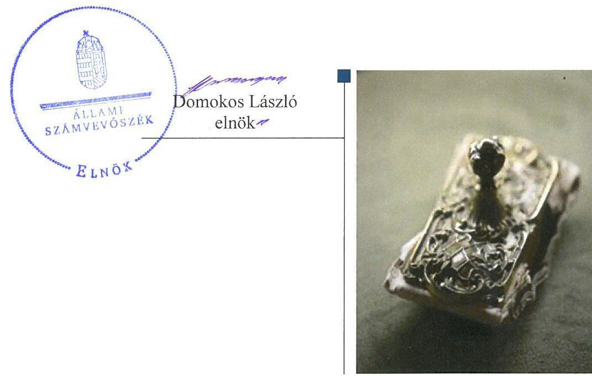
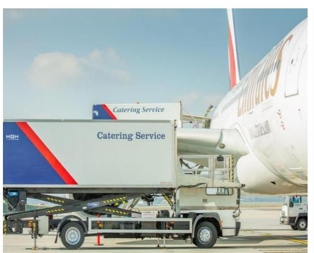
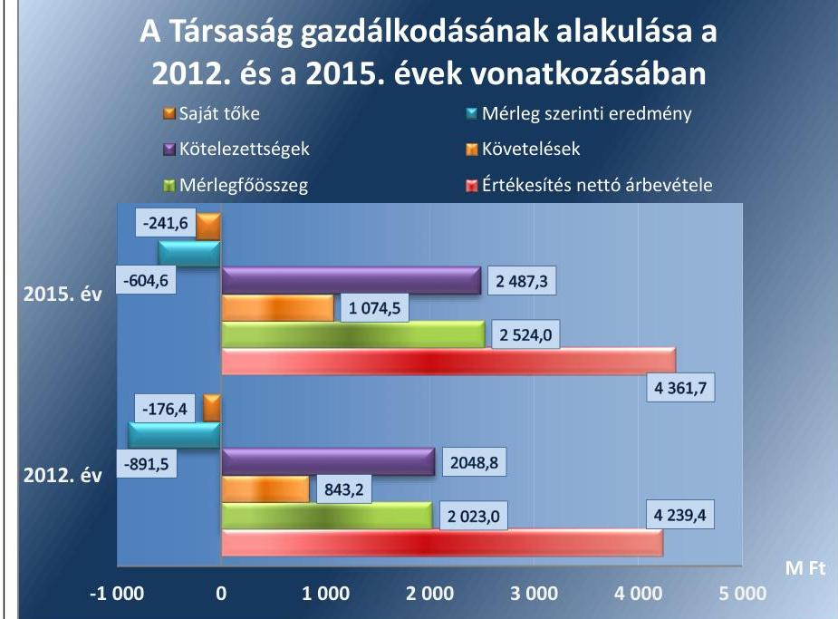
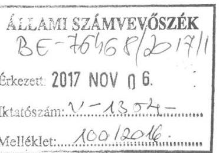
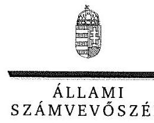
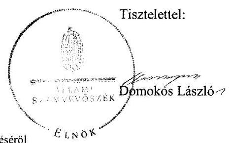
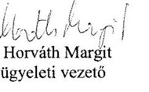
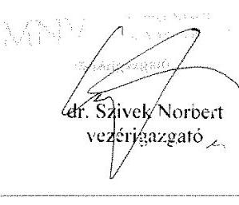
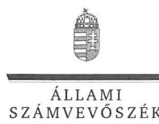
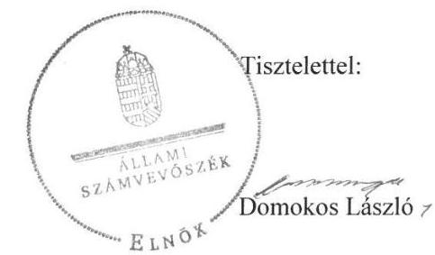

# Jelentés 

## MALÉV GH Földi Kiszolgáló Zrt.

Az állami tulajdonban (résztulajdonban) lévő gazdálkodó szervezetek vagyonmegőrzési és gazdálkodási tevékenységének ellenőrzése 2017.

---

# Jelentés 

## MALÉV GH Földi Kiszolgáló Zrt.

Az állami tulajdonban (résztulajdonban) lévő gazdálkodó szervezetek vagyonmegőrzési és gazdálkodási tevékenységének ellenőrzése
2017. 12, hó 15, nap

---

# AZ ELLENŐRZÉST FELÜGYELTE:

DR. HORVÁTH MARGIT felügyeleti vezető

## AZ ELLENŐRZÉST VEZETTE ÉS A VÉGREHAJTÁSÁÉRT FELELŐS:

HOFMEISTER LÁSZLÓ ellenőrzésvezető

A PROGRAM ÖSSZEÁLLÍTÁSÁÉRT FELELŐS:

TÓTPÁL SZABOLCS osztályvezető

IKTATÓSZÁM: V-1354-115/2016

TÉMASZÁM: 2388

ELLENŐRZÉS-AZONOSÍTÓ SZÁM: V-075925

Jelentéseink az Országgyűlés számítógépes hálózatán és az Interneta a www.asz.hu címen is olvashatóak.

---

# TARTALOMJEGYZÉK 

■ ÖSSZEGZÉS ..... 5
■ AZ ELLENŐRZÉS CÉLJA ..... 6
■ AZ ELLENŐRZÉS TERÜLETE ..... 7
■ AZ ELLENŐRZÉS HÁTTERE, INDOKOLTSÁGA ..... 9
■ A JELENTÉS LÉNYEGES KÉRDÉSKÖREI ..... 10
■ ELLENŐRZÉS HATÓKÖRE ÉS MÓDSZEREI ..... 11
■ MEGÁLLAPÍTÁSOK ..... 13
■ JAVASLATOK ..... 17
■ MELLÉKLETEK ..... 19
I. sz. melléklet: Értelmező szótár ..... 19
II. sz. melléklet: 2012-2015. évi beszámoló adatok ..... 21
■ FÜGGELÉK: ÉSZREVÉTELEK ..... 23
■ RÖVIDÍTÉSEK JEGYZÉKE ..... 37

---

.

---

# ÖSSZEGZÉS 

A MALÉV GH Földi Kiszolgáló Zrt. feletti tulajdonosi joggyakorlás szabályszerű volt. A Társaság vagyongazdálkodása nem volt szabályszerű, nem biztosították a vagyon értékének megőrzését. A beszámolók hiteles és megbízható alátámasztásáról nem gondoskodtak a tárgyi eszközök tekintetében. A Társaság a szabályszerű gazdálkodás feltételeit nem alakította ki, alapvető számviteli szabályzatokkal sem rendelkezett. A beszámolási és adatszolgáltatási, valamint közzétételi kötelezettségüknek eleget tettek.

## Az ellenőrzés társadalmi indokoltsága

A közpénzt, közvagyont használó állami tulajdonú gazdálkodó szervezetekkel szemben társadalmi igény, hogy a tevékenységük átlátható és elszámoltatható legyen.

Az állami vagyonnal való gazdálkodás célja az állami vagyon átlátható, rendeltetésszerű és felelős felhasználásának biztosítása. Az állami tulajdonú gazdálkodó szervezetek a nemzeti vagyon részét képezik.

Az Állami Számvevőszék stratégiájában célul tűzte ki az államháztartáson kívül működő szervezetek ellenőrzését, mely hozzájárul a közpénzek szabályos, átlátható, elszámoltatható és eredményes felhasználásához. A stratégiával összhangban került sor a MALÉV GH Földi Kiszolgáló Zrt. ellenőrzésére a 2012-2015. évekre vonatkozóan.

## Főbb megállapítások, következtetések

Az MNV Zrt. szabályszerűen rögzítette a felelős vagyongazdálkodáshoz szükséges követelményeket, a tulajdonosi jogokat szabályszerűen gyakorolta a Társaság felett.

A Társaság számviteli szabályozottsága az ellenőrzött időszakban nem volt megfelelő, mert kötelező számviteli szabályzatok - számviteli politika, számlarend, eszközök és források értékelési szabályzata - hiányoztak. A szabályozási környezet nem támogatta a szabályszerű gazdálkodást az ellenőrzött időszakban.

A vagyongazdálkodása nem volt szabályszerű, nem biztosították a vagyon értékének megőrzését. A beszámolási és adatszolgáltatási kötelezettséget teljesítették, azonban a beszámolók mennyiségi leltárral való alátámasztottsága nem volt teljes körű.

A Társaság bevételeinek és ráfordításainak elszámolása megfelelő volt az értékcsökkenés elszámolása kivételével, a vagyonnyilvántartás vezetése viszont nem volt szabályszerű. A szolgáltatások árainak kialakításánál a piaci viszonyokat vették figyelembe, mely gyakorlat ellentétes volt az Önköltségszámítási szabályzattal. A Társaság a szolgáltatások árait a 2015. évtől állapította meg szabályszerűen. Közzétételi kötelezettségeinek eleget tett.

---

# AZ ELLENŐRZÉS CÉLJA 

Az ellenőrzés célja annak értékelése volt, hogy a tulajdonosi jogok gyakorlása szabályszerű volt-e; a gazdálkodó szervezet szabályozottsága, gazdálkodása és vagyongazdálkodási tevékenysége megfelelt-e a jogszabályi és a tulajdonosi előírásoknak; biztosítva volt-e a közfeladatok átláthatósága és elszámoltathatósága érdekében a közszolgáltatás díjának megalapozottsága szabályszerű önköltségszámítással; a vagyonváltozást eredményező döntések esetében a tulajdonosi jogok gyakorlója és a gazdálkodó szervezet szabályszerűen jártak-e el.

---

# AZ ELLENŐRZÉS TERÜLETE 

## Magyar Nemzeti Vagyonkezelő Zártkörűen Müködő Részvénytársaság és a MALÉV GH Földi Kiszolgáló Zártkörűen Müködő Részvénytársaság

A Társaság ${ }^{1}$-ot a MALÉV Zrt. alapította. Az alapító felszámolási eljárásának megindítását követően, 2012. június 14-én az MNV Zrt. ${ }^{2}$ és a Tiszavíz Vízerőmű Energetikai Kft. megvásárolta a MALÉV Zrt.-től a Társaság törzsrészvényének 50-50\%-os tulajdoni hányadát. A Tiszavíz Vízerőmű Energetikai Kft. 2012. október 25-én megkötött, 2012. október 30-án hatályba lépett adásvételi szerződéssel a részesedését értékesítette az MNV Zrt. részére. Ezután a Társaság egyszemélyes részvénytársaság lett, az állam tulajdonosi jogait a MNV Zrt. 100\%-ban gyakorolta. A Társaságnál nincs Igazgatóság. A Társaságot vezérigazgató irányítja, akit az MNV Zrt. Igazgatósága nevezett ki.

A Társaság alaptevékenysége több mint 70 éve a földi kiszolgálás, amely keretében repülőgépek teljes körű földi kiszolgálását, reptéri bárt, transzfer szolgáltatást, jegyeladást, okta-tás-szervezést és gépjárművek karbantartását, javítását végzi. A Társaság nem tartozott a kormányzati szektorba sorolt egyéb szervezetek közé, saját tulajdonú vagyonával gazdálkodott, vagyonkezelésbe nem vett át vagyont, nem látott el közfeladatot az ellenőrzött időszakban. Saját ingatlannal nem rendelkezett, feladatellátását bérelt ingatlanban végezte.

Az 1. ábra a Társaság néhány, jellemző gazdálkodási adatának alakulását mutatja a 2012. és a 2015. év vonatkozásában.

1. ábra

A Társaság gazdálkodásának alakulása a 2012. és a 2015. évek vonatkozásában

---

A Társaság mérlegfőösszege a 2012. évi 2,0 Mrd Ft-ról 24,8\%-kal, 2,5 Mrd Ft-ra nőtt. Az értékesítés nettó árbevétele a 2012. évről a 2015. évre 2,9\%-kal nőtt. A mérleg szerinti eredmény negatív volt a 2013. év kivételével. A jegyzett tőkéje 100,0 M Ft-ról 201,0 M Ft-ra növekedett. A foglalkoztatottak száma a 2015. évben 373 fő volt. A Társaság főbb mérlegadatait a II. melléklet mutatja be.

---

# AZ ELLENŐRZÉS HÁTTERE, INDOKOLTSÁGA 

Az állami tulajdonú gazdálkodó szervezetek ellenőrzése kiemelten fontos a nemzeti vagyon megőrzése, megóvása érdekében. Gazdálkodásuk jellemzően a közérdeklődés és a média figyelmének középpontjában áll, amihez hozzájárul a gazdálkodásuk körébe tartozó - közvetlen vagy közvetett állami tulajdonú - vagyon nagysága, illetve az általuk ellátott közszolgáltatások minősége és hatékonysága. A szolgáltatási árképzés megalapozottsága és az éves elszámoltatás feltételeinek kialakítása az ellenőrzés során nagy hangsúlyt kap. A szolgáltatás árában és annak támogatásában meg kell jelennie az önköltségszámítás szempontjainak, amely biztosítja a müködés fenntarthatóságát (eszközpótlást) is.

Az ellenőrzés rámutathat az állami tulajdonú gazdálkodó szervezetek gazdálkodási tevékenységével jó gyakorlatokra és szabálytalanságokra. Felhívhatja a figyelmet a jogszabályi követelmények teljesítéséhez szükséges feltételek hiányosságaira, hozzájárulhat az államháztartáson kívüli, de (közvetlenül vagy közvetve) állami vagyont használó gazdálkodó szervezetek tevékenységének átláthatóságához. Ellenőrzésünk eredményeképpen javaslatainkkal, megállapításainkkal hozzájárulhatunk a nemzeti vagyonnal való gazdálkodás átláthatóságának, elszámoltathatóságának javításához.

---

# A JELENTÉS LÉNYEGES KÉRDÉSKÖREI 

1.     - A tulajdonosi jogok gyakorlása szabályszerű volt-e?
2.     - A Társaság müködése megfelelt-e az elöírásoknak?
3.     - A Társaság vagyongazdálkodása szabályszerű volt-e?

---

# ELLENŐRZÉS HATÓKÖRE ÉS MÓDSZEREI 

## Az ellenőrzés típusa

Megfelelőségi ellenőrzés.

## Az ellenőrzött időszak

2012. január 1-jétől 2015. december 31-ig

## Az ellenőrzés tárgya

Az állami tulajdonban lévő gazdasági társaság gazdálkodása, kiemelten vagyongazdálkodási tevékenysége, valamint a tulajdonosi jogok gyakorlása.

## Az ellenőrzött szervezet

MALÉV GH Földi Kiszolgáló Zrt. és a Magyar Nemzeti Vagyonkezelő Zrt.

## Az ellenőrzés jogalapja

Az ellenőrzés jogalapját az Állami Számvevőszékről szóló 2011. évi LXVI. törvény 1. § (3) bekezdése és 5. § (3)-(5) bekezdései képezik.

## Az ellenőrzés módszerei

Az ellenőrzést a nemzetközi standardokat irányadónak tekintve az ellenőrzési program ellenőrzési kérdései, az ellenőrzött időszakban hatályos jogszabályok, az ellenőrzés szakmai szabályok és módszertanok figyelembe vételével végeztük.

Az ellenőrzés ideje alatt az ellenőrzött szervezettel történő kapcsolattartást az ÁSZ Szervezeti és Müködési Szabályzatának vonatkozó előírásai alapján biztosítottuk.

Az ellenőrzési kérdések megválaszolásához szükséges bizonyítékok megszerzése a következő ellenőrzési eljárások alkalmazásával történt: megfigyelés, kérdésfeltevés (információkérés), összehasonlítás, valamint elemző eljárás. Az ellenőrzési bizonyítékként felhasználható adatforrások közé tartoztak egyrészt az ellenőrzési programban felsorolt adatforrások, másrészt az ellenőrzés folyamán feltárt, az ellenőrzés szempontjából információkat tartalmazó dokumentumok.

---

Az ellenőrzést a kérdésekre adott válaszok kiértékelésével, valamint a megjelölt adatforrások, tanúsítványok felhasználásával, továbbá az adott időszakban hatályos jogszabályok figyelembe vételével folytattuk le.

A bevételek, a ráfordítások elszámolása, valamint a vagyonnyilvántartás terén a szabályszerű múködést véletlenszerű mintavétellel és irányított kiválasztással ellenőriztük. A mintatételek értékelése alapján egyrészt a sokaság hiba arányát becsültük, másrészt az irányítottan kiválasztott tételeket értékeltük. A jogszabályoknak és a belső előírásoknak megfelelőnek, azaz szabályszerűnek tekintettük az adott területet, amennyiben a minta ellenőrzésének eredménye alapján 95\%-os bizonyossággal a teljes sokaságban a hibaarány kisebb volt, mint 10\% és nem megfelelőnek értékeltük, ha a hibaarány a 10\%-ot elérte. A ráfordítások elszámolására és a vagyonnyilvántartásra vonatkozó véletlen mintavételt kockázati alapú kiválasztással egészítettük ki, melynek során évente a három legnagyobb összegű tételt választottuk ki.

---

# 1. A tulajdonosi jogok gyakorlása szabályszerű volt-e? 

## Összegző megállapítás

Az MNV Zrt. tulajdonosi joggyakorlása szabályszerű volt.

A TULAJ DONOSI JOGGYAKORLÁS szabályait a tulajdonosi joggyakorló ${ }_{1-3}{ }^{3}$ a létesítő okiratokban szabályozta. Az MNV Zrt. a Társaság alapító okiratában ${ }^{4}$, majd a 2014. évtől alapszabályában ${ }^{5}$ meghatározta a tulajdonosi jogokat, továbbá kinevezte a Társaság vezérigazgatóját, és előírta a felügyelőbizottságában való képviseletét. Az FB ${ }^{6}$ tagjait a tulajdonosi joggyakorló ${ }_{1-3}$ nevezte ki, három főben a Gt. ${ }^{7}$-ben, majd a Ptk. ${ }^{8}$-ban előírtaknak megfelelően. Az MNV Zrt. SZMSZ ${ }^{9}$-ében a Vtv. ${ }^{10}$ 20. § (4) bekezdésében előírtakkal összhangban rögzítette az MNV Zrt. Igazgatósága döntési hatáskörét. Az Igazgatóság gyakorolta a fő tulajdonosi jogokat, a vezérigazgató feladatköréhez a működési folyamatokkal kapcsolatos szabályozás tartozott.

Az MNV Zrt. a Társaság létesítő okiratában előírta az üzleti terv készítését, amelyet a Társaság elkészített és azt az ellenőrzött időszakban az MNV Zrt. Igazgatósága jóváhagyott.

Az MNV Zrt. Igazgatósága a Taktv. ${ }^{11}$ rendelkezéseivel összhangban elkészítette a Társaság üzleti tervének teljesítését elősegítő anyagi ösztönzési rendszerre vonatkozó Javadalmazási szabályzat ${ }^{12}$-át, melyben meghatározták a vezető tisztségviselőkre és az FB tagokra vonatkozó javadalmazási rendszert.

A KÖNYVVIZSGÁLÓ tulajdonosi joggyakorló ${ }_{1-3}$ általi megválasztása szabályszerűen történt. A létesítő okirat tartalmazta a könyvvizsgáló személyével, működésével kapcsolatos hatásköröket, feladatokat.

MONITORING TEVÉKENYSÉGÉT az MNV Zrt. vezérigazgatója a tulajdonosi joggyakorlás keretében - 2013 decemberéig egyedi vezérigazgatói utasításokban, majd 2013. december 19-étől egységes Monitoring szabályzat ${ }^{13}$-ban - rögzítette. A Társaság a gazdasági adatainak alakulását megküldte az előírt adatszolgáltatás keretében. Az MNV Zrt. az éves beszámoló jóváhagyásáról minden évben az FB írásbeli jelentésének és a könyvvizsgáló írásbeli véleményének a birtokában határozott. Figyelemfelhívással a 2012., 2014. és 2015. évi könyvvizsgálói jelentésekben élt a könyvvizsgáló, amelyekben a Társaság negatív saját tőkéjére hívta fel a figyelmet.

A Társaság saját tőkéjének alakulását az 1. táblázat mutatja be. A saját tőke kedvezőtlen alakulása miatt tőkeemelésekről döntött az MNV Zrt. A 2012. évi tőkeemelés 250,0 M Ft - melyből 1,0 M Ft a jegyzett tőkébe, 249,0 M Ft a tőketartalékba került -, illetve a 2014. évi tőkeemelés 465,0 M Ft - melyből 100,0 M Ft a jegyzett tőkébe, 365,0 M Ft a tőketartalékba került - összegben valósultak meg. A jóváhagyott tőkeemelések végrehajtása az alapítói okiratok módosítása szabályszerűen, az alapítói

---

határozatoknak megfelelően történtek, miniszteri engedély birtokában. A Társaság a tőkeemelések eredményeképpen az ellenőrzött időszakban megfelelt a Gt. 51. §-ában, majd a Ptk. 3:133. § (2) bekezdésében előírt követelménynek.

A TÁRSASÁGNÁL ELLENŐRZÉST az MNV Zrt. a vagyongazdálkodási tevékenység szabályozottságával kapcsolatban végzett a 2014. évben. Az ellenőrzés javaslatai részben hasznosultak, mert a Társaság a kötelező számviteli szabályzatai egy részét nem léptette hatályba.

# 2. A Társaság múködése megfelelt-e az elöírásoknak? 

Összegző megállapítás

A Társaság megállapítás

2.1. számú megállapítás

A Társaság számviteli szabályozottsága nem volt megfelelő, kötelező számviteli szabályzatok hiányoztak.

A Társaság a Számv. tv. 14. § (5) bekezdés a), c), illetve d) pontjában előírtaknak megfelelően elkészítette a Leltározási szabályzat ${ }^{14}$-ot, az Önköltségszámítási szabályzat ${ }^{15}$-ot, illetve a Pénzkezelési szabályzat ${ }^{16}$-ot, melyek tartalma megfelelt a Számv. tv. előírásainak.

A Társaság az ellenőrzött időszakban számviteli politikával nem rendelkezett, ezért a Számv. tv. ${ }^{17}$ 14. § (3)-(4) bekezdései előírásának nem felelt meg.

A Társaság eszközök és források értékelési szabályzatával nem rendelkezett, ezáltal nem tett eleget a Számv. tv. 14. § (5) bekezdés b) pontja előírásának.

A Társaság Számv. tv. 161. §-a (1) bekezdése rendelkezései ellenére nem készített számlarendet, ugyanakkor a gyakorlatban, az elszámolások könyvelésénél a Számv. tv.-ben bekövetkezett törvényi változásokat figyelembe vette.

## 2.2. számú megállapítás

A Társaság bevételeinek és ráfordításának elszámolása megfelelő volt az értékcsökkenés elszámolása kivételével.

A BEVÉTELEK ELSZÁMOLÁSA megfelelő főkönyvi számlán, szabályszerűen történt. A bevételek könyvviteli elszámolását közvetlenül alátámasztó bizonylatok rendelkeztek a Számv. tv.-ben előírt általános alaki és tartalmi kellékekkel.

A RÁFORDÍTÁSOK ELSZÁMOLÁSA a Számv. tv. előírásainak megfelelően történt az értékcsökkenés elszámolása kivételével. Az anyagjellegú és személyi jellegú ráfordítások elszámolását minden esetben megfelelő számviteli bizonylattal alátámasztották. A munkavállalót terhelő

---

adók, járulékok az Szja tv. ${ }^{18}$-ben és a Tbj. tv. ${ }^{19}$-ben foglaltaknak megfelelően levonásra kerültek.

Az értékcsökkenés elszámolása nem volt szabályszerű, mert belső szabályozás hiányában végezték annak elszámolását. A számviteli politika és az eszközök és források értékelési szabályzatának hiánya miatt nem rögzítették a Számv. tv. 14. § (4) bekezdésében foglaltak ellenére azokat a szabályokat, előírásokat, módszereket - az értékcsökkenés elszámolására vonatkozóan - amelyekkel meghatározzák, hogy a törvényben biztosított választási, minősítési lehetőségek közül melyeket, milyen feltételek fennállása esetén alkalmaznak.

A Társaság jelentős vevőköveteléssel rendelkezett az ellenőrzött időszakban. A késedelmes partnerek számára a Társaság fizetési felszólítást küldött, illetve szükség szerint a követelés behajtását jogi útra terelte. A követelések állománya az ellenőrzött időszakban 27,4\%-kal, 1,1 Mrd Ft-ra emelkedett.

# 2.3. számú megállapítás 

A Társaság a szolgáltatások árait a 2012-2014. években nem az Önköltségszámítási szabályzatban foglaltaknak megfelelően állapította meg.

ÖNKÖLTSÉGSZÁMÍTÁSRA a Társaság az ellenőrzött időszakban kötelezett volt, melynek rendjét kialakították, azonban a szolgáltatási árak kialakításához csak a 2015. évtől alkalmazták.

## 2.4. számú megállapítás

A Társaság teljesítette beszámolási és adatszolgáltatási kötelezettségét az ellenőrzött időszak alatt, azonban a beszámolókat nem támasztották alá mennyiségi leltárral a tárgyi eszközök tekintetében.

Az MNV Zrt. által előírt tervezési, beszámolási, adatszolgáltatási kötelezettséget szabályszerűen végrehajtotta a Társaság.

ÜZLETI TERV KÉSZÍTÉSÉRE vonatkozó kötelezettségét a Társaság teljesítette. Az üzleti tervekről szóló előterjesztéseket a Társaság először az FB elé terjesztette, amely a tulajdonosi joggyakorlóz számára elfogadásra javasolta azokat.

AZ ÉVES BESZÁMOLÓT a Számv. tv. előírásai szerint elkészítették, azokat a könyvvizsgáló hitelesítő záradékkal látta el. Az éves számviteli beszámoló letétbe helyezési és közzétételi kötelezettséget szabályszerűen teljesítették.

A Társaságnál az ellenőrzött időszakban a tárgyi eszközök leltározása egyeztetés útján történt, a tárgyi eszközök mérlegben kimutatott értékét a 2012-2015. években nem támasztották alá mennyiségi felvétellel történő leltárral, ezzel nem tettek eleget a Számv. tv. 69. § (3) bekezdésében és a Leltározási Szabályzat 2. pontjában foglaltaknak. A könyvvizsgáló a leltározás hiányossága ellenére minden évben korlátozás nélküli hitelesítő záradékkal látta el a beszámolókra vonatkozó jelentését.

A mérlegben kimutatott egyéb eszközöket és az összes forrást a Társaság az ellenőrzött években egyeztetéssel leltározta és ezzel a mérleget alátámasztotta a Számv. tv. 69. § (1) bekezdés előírásának megfelelően.

---

A KÖZÉRDEKŰ ADATOK nyilvánosságra hozatalával és szabályozásával kapcsolatos kötelezettségeinek a Taktv. alapján a Társaság eleget tett.

# 3. A Társaság vagyongazdálkodása szabályszerű volt-e? 

## Összegző megállapítás

### 3.1. számú megállapítás

A Társaság vagyongazdálkodása nem volt szabályszerű, nem biztosította a vagyon értékének megőrzését.

A Társaság a szabályszerű vagyongazdálkodás feltételeit nem alakította ki, kötelező számviteli szabályzatokat nem készített el.

A Társaság vagyongazdálkodása vonatkozásában a feladat- és hatásköröket, valamint a felelősségi viszonyokat az SZMSZ ${ }^{20}$-ben meghatározták. A vagyon változását eredményező döntéseket a létesítő okiratokban megfogalmazott hatásköröknek megfelelően hozta meg a Társaság. A vagyongazdálkodási döntések előkészítése, előterjesztése a tulajdonosi joggyakorló2. 3 által meghatározott formában és tartalommal történt. A Társaság számviteli szabályozottsága nem volt megfelelő.

A Társaság elkészítette az ellenőrzött időszakban az MNV Zrt. által előírt reorganizációs tervét, amelynek végrehajtása - a tulajdonosi joggyakorló jóváhagyását követően - biztosította a vállalkozás folytatását a MALÉV Zrt. 2012. évi felszámolását követően.

A Társaság vagyon nyilvántartása nem volt megfelelő.
A tárgyi eszközök beszerzésekor az üzembe helyezést nem dokumentálták hitelt érdemlően a Számv. tv. 52. § (2) bekezdésének rendelkezése ellenére.
3.2. számú megállapítás

A Társaság nem biztosította a vagyon értékének megőrzését.
A BEFEKTETETT ESZKÖZÖK ÉRTÉKE a 2012. évben 831,0 M Ft volt, mely a 2015. évre 622,4 M Ft-ra csökkent, mely döntően az elszámolt amortizáció miatt következett be.

A saját tőke összege a 2012. évi -176,4 M Ft-ról a 2015. évre ismét negatív tartományba került, -241,6 M Ft volt. Az ellenőrzött időszakban öszszesen 715 M Ft összegben valósult meg tulajdonosi tőkeemelés.

A Társaság a 2013. év kivételével veszteségesen gazdálkodott, a mérleg szerinti eredménye -891,5 M Ft és 19,5 M Ft között alakult.

Az eszközök összetétele jelentős mértékben eltolódott a forgóeszközök javára az ellenőrzött időszakban. A forgóeszközök értékének növekedése alapvetően pénzeszközök és a vevőkkel szembeni követelésállomány emelkedésének a következménye volt.

A befektetett eszközök között jelentős beruházásra egyik eszközcsoportban sem került sor.

Az elavult, használhatatlanná vált berendezések pótlására fordított öszszeg elmaradt az értékcsökkenés összegétől és ennek következményeként csökkent a Társaság eszközeinek értéke. Visszapótlási kötelezettsége saját vagyonára vonatkozóan a Társaságnak nem volt.

---

# JAVASLATOK 

Az ÁSZ tv. 33. § (1) bekezdésében foglaltak értelmében az ellenőrzött szervezet vezetője köteles a jelentésben foglalt megállapításokhoz kapcsolódó intézkedési tervet összeállítani és azt a jelentés kézhezvételétől számított 30 napon belül az ÁSZ részére megküldeni. Amennyiben az ellenőrzött szervezet vezetője nem küldi meg határidőben az intézkedési tervet, vagy továbbra sem elfogadható intézkedési tervet küld, az Állami Számvevőszék elnöke az ÁSZ tv. 33. § (3) bekezdése a) és b) pontjaiban foglaltakat érvényesítheti.
Javaslataink célja a MALÉV GH Földi Kiszolgáló Zrt. gazdálkodása szabályszerűségének és gyakorlatának javítása annak érdekében, hogy a szabályozási környezet és az alkalmazott gyakorlat megfelelően tudja támogatni az átlátható múködést.

## A MALÉV GH Földi Kiszolgáló Zrt. vezérigazgatójának

1. Intézkedjen a számviteli politika elkészítéséről a Számv. tv.-ben előírtak szerint.
(2.1 megállapítás 2. bekezdése alapján)
2. Intézkedjen az eszközök és források értékelési szabályzatának elkészítéséről a Számv. tv.-ben elöírtak szerint.
(2.1 megállapítás 3. bekezdése alapján)
3. Intézkedjen a számlarend elkészítéséről a Számv. tv.-ben elöírtak szerint.
(2.1 megállapítás 4. bekezdése alapján)
4. Intézkedjen a tárgyi eszközökre vonatkozó leltár mennyiségi felvétellel történő elvégzéséről a Számv. tv-ben és a Leltározási szabályzatban elöírtaknak megfelelően.
(2.4. megállapítás 4. bekezdése alapján)
5. Intézkedjen a tárgyi eszközök üzembe helyezésének hitelt érdemlő módon történő dokumentálásáról.
(3.1. megállapítás 4. bekezdése alapján)

---

Javaslataink célja a tulajdonosi joggyakorló MNV Zrt. szabályszerű működésének elősegítése, továbbá a tulajdonosi joggyakorlás kontrolljainak erősítése.

# Magyar Nemzeti Vagyonkezelő Zrt. vezérigazgatójának 

1. Tegyen intézkedéseket a számviteli szabályozottság hiányával, továbbá a leltározással kapcsolatban feltárt szabálytalanság tekintetében a felelősség tisztázása érdekében, és szükség szerint intézkedjen a felelősség érvényesítéséről.
(2.1 megállapítás 2., 3. és 4. bekezdései, valamint a 2.4. megállapítás 4. bekezdés, illetve a 3.1 megállapítás 4. bekezdései alapján)

---

# MELLÉKLETEK 

- I. SZ. MELLÉKLET: ÉRTELMEZŐ SZÓTÁR
állami vagyon
gazdasági társaság

MNV Zrt.
nemzeti vagyon
a) Az állam tulajdonában lévő dolog, valamint a dolog módjára hasznosítható természeti erő,
b) az a) pont hatálya alá nem tartozó mindazon vagyon, amely vonatkozásában törvény az állam kizárólagos tulajdonjogát nevesíti,
c) az állam tulajdonában lévő tagsági jogviszonyt megtestesítő értékpapír, illetve az államot megillető egyéb társasági részesedés,
d) az államot megillető olyan immateriális, vagyoni értékkel rendelkező jogosultság, amelyet jogszabály vagyoni értékű jogként nevesít.
Forrás: Vtv. 1. § (2) bekezdése
2012. november 10-től az állami vagyon fogalma kiegészül a következő ponttal:
e) az állam tulajdonában lévő pénzügyi eszközök
Forrás: Vtv. 1. § (2) bekezdése
A Ptk. 3:88. § (1) bekezdése szerint „a gazdasági társaságok üzletszerű közös gazdasági tevékenység folytatására, a tagok vagyoni hozzájárulásával létrehozott, jogi személyiséggel rendelkező vállalkozások, amelyekben a tagok a nyereségből közösen részesednek, és a veszteséget közösen viselik".
Az állami vagyon felett, a Magyar Államok megillető tulajdonosi jogok és kötelezettségek összességét - a hatályos szabályozás szerint - az állami vagyon felügyeletéért felelős miniszter (jelenleg a nemzeti fejlesztési miniszter) gyakorolja. A miniszter feladatát nagy részben az MNV Zrt., mint tulajdonosi joggyakorló2-3 szervezet útján látja el.
a) az állam vagy a helyi önkormányzat kizárólagos tulajdonában álló dolgok,
b) az a) pont hatálya alá nem tartozó, állam vagy a helyi önkormányzat tulajdonában lévő dolog,
c) az állam vagy a helyi önkormányzatot tulajdonában lévő pénzügyi eszközök, továbbá az államot vagy a helyi önkormányzatot megillető társasági részesedések,
d) az államot vagy a helyi önkormányzatot megillető bármely vagyoni értékkel rendelkező jogosultság, amelyet jogszabály vagyoni értékű jogként nevesít,
e) Magyarország határa által körbezárt terület feletti légtér,
f) az üvegházhatású gázok kibocsátási egységeinek kereskedelméről szóló törvény szerint kibocsátási egység és légiközlekedési kibocsátási egység, valamint az ENSZ Éghajlatváltozási Keretegyezménye és annak Kiotói Jegyzőkönyve végrehajtási keretrendszeréről szóló törvény szerinti kiotói egység,
g) állami vagy helyi önkormányzati fenntartású közgyűjtemény (muzeális intézmény, levéltár, közgyűjteményként működő kép- és hangarchívum, valamint könyvtár) saját gyűjteményében nyilvántartott kulturális javak körébe tartozó dolog, kivéve, ha az állami vagy önkormányzati tulajdon jogszerű létrejötte kétséget kizáró módon nem bizonyítható és a dologra nézve más a tulajdonjogát bizonyítja vagy a kulturális javakra vonatkozó jogszabályokban meghatározott eljárás keretében valószínűsíti (g. pont módosult 2013. december 7től),
h) a régészeti lelet,

---

tulajdonosi ellenőrzés
tulajdonosi jogok gyakorlója
i) a nemzeti adatvagyon körébe tartozó állami nyilvántartások fokozottabb védelméről szóló törvény szerinti nemzeti adatvagyon.
Forrás: Nvtv. ${ }^{21} 1 . \S(2)$
2014. március 14-ig:

Az állami vagyon kezelőjét, haszonélvezőjét, használóját megillető jogok gyakorlását, annak szabályszerűségét, célszerűségét az MNV Zrt. - szükség szerint területi szervei útján - ellenőrzi.
2014. március 15-től:

Az állami vagyon használóját, vagyonkezelőjét és haszonélvezőjét megillető jogok gyakorlását, annak szabályszerűségét, a kötelezettségek teljesítését, valamint a vagyon rendeltetése szerinti célszerűségét a tulajdonosi joggyakorló ${ }_{3}$ rendszeresen ellenőrzi.
Forrás: Vhr. ${ }^{22} 20 . \S(1)$
1.
2013. június 27-ig:

Az állami vagyon felett a Magyar Államot megillető tulajdonosi jogok és kötelezettségek összességét - ha törvény eltérően nem rendelkezik - az állami vagyon felügyeletéért felelős miniszter (a továbbiakban: miniszter) gyakorolja, aki e feladatát a Magyar Nemzeti Vagyonkezelő Zártkörűen Müködő Részvénytársaság (a továbbiakban: MNV Zrt.), a Magyar Fejlesztési Bank, illetve a tulajdonosi joggyakorló szervezet útján látja el. A miniszter miniszteri rendeletben, a törvényben meghatározott állami vagyoni kör tekintetében, meghatározott időtartamra, a joggyakorlás egyes szabályainak meghatározásával - az őt megillető tulajdonosi jogok és kötelezettségek összességének, illetve azok meghatározott részének gyakorlóját az Áht. szerinti központi költségvetési szervek, ezek intézménye, továbbá a 100\%-ban állami tulajdonban álló gazdasági társaságok közül kijelölheti. Forrás: Vtv. 3. § (1) és (2)
2013. június 28-ától:

A rábízott állami vagyon felett az államot megillető tulajdonosi jogok és kötelezettségek összességét tulajdonosi joggyakorlóként:
a) ha törvény vagy miniszteri rendelet eltérően nem rendelkezik, a Magyar Nemzeti Vagyonkezelő Zártkörűen Müködő Részvénytársaság (a továbbiakban: MNV Zrt.),
b) törvényben kijelölt személy vagy
c) az állami vagyon felügyeletéért felelős miniszter (a továbbiakban: miniszter) által rendeletben kijelölt személy gyakorolja.
[...] A miniszter e törvény felhatalmazása alapján - a meghatározott célok hatékonyabb elérése érdekében, miniszteri rendeletben, az ott meghatározott állami vagyoni kör tekintetében, meghatározott időtartamra - e törvény keretei között, a joggyakorlás egyes szabályainak meghatározásával - az államot megillető tulajdonosi jogok és kötelezettségek összességének, illetve azok meghatározott részének gyakorlóját az Áht. szerinti központi költségvetési szervek, ezek intézménye, továbbá a 100\%-ban állami tulajdonban álló gazdasági társaságok közül kijelölheti.
Forrás: Vtv. 3. § (1) és (2)
2.

Aki a nemzeti vagyon felett az államot vagy a helyi önkormányzatot megillető tulajdonosi jogok és kötelezettségek összességének gyakorlására jogosult
Forrás: Nvtv. 3. § (1) 17. pontja

---

II. SZ. MELLÉKLET: 2012-2015. ÉVI BESZÁMOLÓ ADATOK

| A TÁRSASÁG 2012-2015. ÉVI BESZÁMOLÓINAK FŐBB ADATAI (M FT-BAN) |  |  |  |  |  |  |  |  |
| :--: | :--: | :--: | :--: | :--: | :--: | :--: | :--: | :--: |
| Megnevezés | 2012. év | 2013. év | $\begin{gathered} 2013 / 2012 . \\ \text { év (\%) } \end{gathered}$ | 2014. év | $\begin{gathered} 2014 / 2013 . \\ \text { év (\%) } \end{gathered}$ | 2015. év | $\begin{gathered} 2015 / 2014 . \\ \text { év (\%) } \end{gathered}$ | $\begin{gathered} 2015 / 2012 . \\ \text { év (\%) } \end{gathered}$ |
| Mérleg föösszeg | 2022,8 | 2692,3 | 133,1\% | 2121,1 | 78,8\% | 2523,5 | 119,0\% | 124,8\% |
| Befektetett eszközök | 831,0 | 715,4 | 86,1\% | 659,2 | 92,1\% | 622,4 | 94,4\% | 74,9\% |
| ebből tárgyi eszközök | 823,6 | 710,3 | 86,2\% | 649,9 | 91,5\% | 617,0 | 94,9\% | 74,9\% |
| Forgóeszközök | 1170,5 | 1953,1 | 166,9\% | 1440,4 | 73,7\% | 1849,7 | 128,4\% | 158,0\% |
| ebből követelések | 843,2 | 1700,4 | 201,7\% | 1142,4 | 67,2\% | 1074,5 | 94,1\% | 127,4\% |
| ebből vevőkövetelések | 742,8 | 1502,4 | 202,3\% | 1071,5 | 71,3\% | 996,9 | 93,0\% | 134,2\% |
| ebből pénzeszközök | 240,7 | 130,1 | 54,1\% | 187,2 | 143,9\% | 668,2 | 356,9\% | 277,6\% |
| Aktív időbeli elhatárolás | 21,3 | 23,8 | - | 21,5 | 90,3\% | 51,4 | 239,1\% | - |
| Saját tőke összege | $-176,4$ | 93,0 | - | $-102,0$ | - | $-241,6$ | - | 137,0\% |
| Jegyzett tőke | 100,0 | 101,0 | 101,0\% | 101,0 | 100,0\% | 201,0 | 199,0\% | 201,0\% |
| Tőketartalék | 792,0 | 1041,0 | 131,4\% | 1041,0 | 100,0\% | 1406,0 | 135,1\% | 177,5\% |
| Eredménytartalék | $-176,9$ | $-1068,5$ | - | $-1048,9$ | - | $-1244,0$ | - | 703,2\% |
| Mérleg szerinti eredmény | $-891,5$ | 19,5 | - | $-195,0$ | - | $-604,6$ | - | - |
| Céltartalékok | 82,7 | 96,4 | 116,6\% | 53,4 | 55,4\% | 20,6 | 38,6\% | 24,9\% |
| Kötelezettségek | 2048,8 | 2363,2 | 115,3\% | 1967,9 | 83,3\% | 2487,3 | 126,4\% | 121,4\% |
| ebből szállítói tartozások | 478,3 | 446,3 | 93,3\% | 628,7 | 140,9\% | 860,2 | 136,8\% | 179,8\% |
| Passzív időbeli elhatárolás | 67,7 | 139,7 | - | 201,8 | 144,5\% | 257,2 | - | - |
| Összes bevétel | 7417,5 | 5030,0 | 67,8\% | 4583,3 | 91,1\% | 4480,7 | 97,8\% | 60,4\% |
| Értékesítés nettó árbevétele | 4239,4 | 4847,4 | 114,3\% | 4459,9 | 92,0\% | 4361,7 | 97,8\% | 102,9\% |
| Pénzügyi és rendkívüli bevételek | 265,6 | 122,4 | 46,1\% | 64,0 | - | 60,0 | - | 22,6\% |
| Egyéb bevételek, támogatások | 2912,5 | 60,2 | 2,1\% | 59,4 | 98,7\% | 59,0 | 99,3\% | 2,0\% |
| Összes ráfordítás | 8309,0 | 5010,5 | 60,3\% | 4778,3 | 95,4\% | 5085,3 | 106,4\% | 61,2\% |
| Anyagi jellegű ráfordítások | 2254,7 | 2679,0 | 118,8\% | 2704,9 | 101,0\% | 2862,8 | 105,8\% | 127,0\% |
| Személyi jellegű ráfordítások | 3026,4 | 1703,3 | 56,3\% | 1742,3 | 102,3\% | 1743,5 | 100,1\% | 57,6\% |
| Értékcsökkenési leírás | 187,1 | 118,9 | 63,5\% | 76,5 | 64,3\% | 59,6 | 77,9\% | 31,9\% |
| Egyéb ráfordítások | 2623,9 | 291,9 | 11,1\% | 141,5 | 48,5\% | 276,7 | 195,5\% | 10,5\% |
| Pénzügyi, rendkívüli ráfordítás | 216,9 | 207,5 | 95,7\% | 124,0 | 59,8\% | 142,4 | 114,8\% | 65,7\% |
| Adófizetési kötelezettség | 0,0 | 9,9 | 0,0\% | $-10,9$ | - | 0,3 | - | 0,0\% |

Forrás: 2012-2015. évi beszámolók, fökönyvi kivonatok

---

.

---

# FÜGGELÉK: ÉSZREVÉTELEK 

A jelentéstervezetet a Számvevőszék 15 napos észrevételezésre megküldte az ellenőrzött szervezetek vezetőinek az ÁSZ tv. 29. §* (1) bekezdése előírásának megfelelően.

A MALÉV GH Földi Kiszolgáló Zrt. vezérigazgatójától és az MNV Zrt. vezérigazgatójától érkezett észrevételeket és azok kezeléséről szóló válaszleveleket a jelentés tartalmazza.

A MALÉV GH Földi Kiszolgáló Zrt. vezérigazgatójától és az MNV Zrt. vezérigazgatójától érkezett észrevételeket és azok kezeléséről szóló válaszleveleket a jelentés tartalmazza.

[^0]
[^0]:    * 29. § (1) Az Állami Számvevőszék az ellenőrzési megállapításait megküldi az ellenőrzött szervezet vezetőjének vagy az általa megbízott személynek, és annak, akinek személyes felelősségét állapította meg.
    (2) Az ellenőrzött szervezet vezetője és a felelősként megjelölt személy az ellenőrzés megállapításaira tizenöt napon belül írásban észrevételt tehet.
    (3) Az Állami Számvevőszék az észrevételre a beérkezésétől számított harminc napon belül írásban válaszol. A figyelembe nem vett észrevételeket köteles a jelentésben feltüntetni, és megindokolni, hogy azokat miért nem fogadta el.

---

# MGH MALÉV GROUND HANDLING 

## Állami Számvevőszék Domokos László Elnök Úr Budapest   Apáczai Csere János utca 10. 1052

Budapest, 2017. október 30.

Tárgy: Észrevétel a MALÉV GH Földi Kiszolgáló Zrt. ellenőrzéséről készült, V-1354-090/2016-os iktatószámon megküldött jelentéstervezethez

## Tisztelt Domokos László Elnök Úr!

Köszönettel megkaptuk a MALÉV GH Földi Kiszolgáló Zrt. ellenőrzéséről készült számvevőszéki jelentéstervezetet.

Az jelentéstervezetben foglalt megállapításokkal kapcsolatban Társaságunk az alábbi észrevételeket kívánja tenni:
2.1. és 2.2. 2.4., és 3.1. sz. megállapítás kapcsán megfogalmazott észrevételek:

## 1. Társaság számviteli szabályozottsága

A jelentéstervezet azt a megállapítást tartalmazza, hogy Társaság nem rendelkezett számviteli politikával, eszközök és források értékelési szabályzatával, illetőleg nem késztette el a Számviteli törvényben foglalt rendelkezések ellenére a számlarendet.

Társaságunk egy 2006. szeptember 30-tól hatályos számviteli politikával rendelkezik (1. számú melléklet), mely tartalmazza az eszközök és források értékelésének szabályait, valamint a számlarendet. A számviteli politika az SZMSZ-ben foglalt alábbi előírásoknak megfelelően:

A nem a Vezérigazgató által kiadott szabályokat és szabályzókat az azt kiadó vezető köteles a Vezérigazgató részére előzetesen megküldeni.

A belső szabályzatokat, utasításokat minden felelős vezető köteles megküldeni a Minőségirányítási és képzési vezetőnek a központi dokumentációs rendszerbe való felvétel céljából.

---

# MGH MALÉV GROUND HANDLING 

megtalálható (rögzítés dátuma 2008. április 3.) a Társaság elektronikus dokumentációs rendszerében (MGH szabályzatok gyüjteménye), ennek megfelelően kihirdetettnek, így hatályosnak tekinthető.
A számviteli politika létezését támasztják alá az alábbiak:
A 2014. évi második felében végrehajtott tulajdonosi belsőellenőrzés során a Társaság az MNV Zrt. rendelkezésére bocsátotta a kért szabályzatokat, többek között a számviteli szabályzatokat, mellyel kapcsolatban az MNV Zrt. belső ellenőrzése az alábbi megállapítást tette (2. számú melléklet):

A Társaság az alapvető szabályzatokon felül rendelkezik azon szabályzatokkal, amelyeket jogszabályok írnak elő (Munkavédelmi szabályzat, Tüzvédelmi szabályzat, Számviteli szabályzatokkal), azonban a Számviteli szabályzatok közül több aktualizálást igényel, bár

Fentiek alapján az MNV Zrt. a belső ellenőrzésről készült jelentésben elismerte a szabályzatok létezését, kérte azok frissítését.

A számviteli politikát 2011-2013. évek vonatkozásában végrehajtott átfogó ellenőrzés keretében a NAV is megtekintette, arról a 2015. augusztus 13 -án kiadott határozatában említést tesz (3. számú melléklet):

Az adózó eszközeinek bekerülési értéke 15.561 eFt-tal növekszik, mely bekerülési érték után évi $20 \%$ értékcsökkenést számolhat el költségként az eszköz kartonon és a számviteli politikában rögzítetteknek megfelelően. Az adózó költségei 15.561 eFt-tal csökkennek, az adózás előtti

A Társaság a gyakorlatban is alkalmazta a számviteli politikájában megfogalmazott, a Számviteli törvény által biztosított választási lehetőséggel élve meghatározott egyedi szabályokat, mint például:

- a Társasági adó törvényben meghatározott értékcsökkenési leírási kulcsoktól való eltérés,
- a maradványérték vonatkozásában a számviteli politikában meghatározott szabályozás,
- a kísértékủ tárgyi eszközök értékhatára, melyet a Társaság - a törvény által biztosított lehetőséggel ellentétben - 2013-ban emelt meg 100 eFt-ra, addig a számviteli politikában szereplő 50 eFt-os értékhatárt alkalmazta (4. számú melléklet)

A számviteli alapelveket a Társaság éves beszámolójának részét képező kiegészítő mellékletei is megemlítik, az abban foglaltak alapján megállapítható, hogy a Társaság érvényesítette a számviteli alapelveket, valamint megállapítható az, hogy a Társaság rendelkezik számviteli politikával. A kiegészítő mellékletben foglalt információk összehasonlításával (alapelvek, értékcsökkenésre vonatkozó információk, befektetési tükör) nyomon lehet követni a Társaságnál bekövetkezett változásokat. A fent leírtak alapján elmondható, hogy a tulajdonosi joggyakorló által elfogadott beszámoló

---

# MGH MALÉV GRDUND HANDLING 

következetes, az adatok összehasonlíthatóak és átláthatóak. A beszámoló kapcsán a fent említettekre alapozva adta ki a könyvvizsgáló a jelentését, valamint fogadta el a beszámolót a tulajdonosi joggyakorló MNV Zrt.

## 2. Értékcsökkenés elszámolása

A jelentéstervezet azt a megállapítást tartalmazza, hogy Társaságnál az értékcsökkenés elszámolása nem volt szabályszerű, mivel belső szabályozás hiányában végezték azt.

A Társaság számviteli politikája (2. számú pont) tartalmazza az értékcsökkenés elszámolásával kapcsolatos előírásokat, a számviteli politika 5. számú melléklete rögzíti az értékcsökkenési leírási kulcsokat.

A havi értékcsökkenés elszámolása során - mellyen kapcsolatban sem a Társaság könyvvizsgálója, sem a NAV nem fogalmazott meg elmarasztalást - a Társaság alkalmazta a számviteli politikában foglaltakat, valamint „a gyakorlatban, az elszámolások könyvelésénél a Számv. tv.ben bekövetkezett törvényi változásokat figyelembe vette."

Figyelemmel arra, hogy a Társaság az 1. pontban bemutatottak szerint rendelkezett számviteli politikával, mely tartalmazta az értékcsökkenés elszámozására vonatkozó szabályozást, az értékcsökkenés elszámolása szabályszerű volt.

## 3. Tárgyi eszköz leltározás

A Számviteli törvényben foglaltak ellenére a Társaság a 2012-2015. években nem tett eleget a tárgyi eszköz leltározási kötelezettségének, ugyanakkor a MFB Zrt-vel kötött kölcsönszerződéshez kapcsolódott egy aláírt tárgyi eszköz leltár, mivel a kölcsönszerződés szerint a Társaság eszközeire - leszámítva 4 darab lízingelt eszközt - az MFB Zrt. jelzálogjogot jegyzett be.

A kiszolgáló berendezések leltározásra 2016. év nyarán került sor (a könyvszerinti érték közel $90 \%$-át teszi ki), teljes körű tárgyi eszköz leltárra 2016. év végén. A leltározásra 2015. évzárás során a managementváltás - 2015. év szeptemberében a gazdasági igazgató távozott, 2016. év márciusában a vezérigazgató - miatt nem került sor.

A tárgyi eszközök leltározásával kapcsolatban az alábbi nyilatkozatot adtuk át az Állami Számvevőszék részére
„Alulírott $\qquad$ mint a Malév GH Zrt. vezérigazgatója az Állami Számvevőszék által elrendelt ellenőrzéshez (V-1354-0023/2106) kapcsolódóan ez úton nyilatkozom arról, hogy Társaságnál a 2012-2015. évre vonatkozóan fizikai leltárfelvételre nem került sor.
A Társaság eszközeire - leszámítva a Társaság által lízingelt 4 darab eszközt vonatkozóan a MFB Zrt-nek bejegyzett jelzálogjoga volt. A Társaság az eszközöket

---

# MGH MALÉV GROUND HANDLING 

elidegeniteni, valamint selejtezni kizárólag az MFB Zrt. engedélyének birtokában, illetve az MFB Zrt. tájékoztatása mellett tudta. Az MFB Zrt. évente, a hitelszerzödés hosszabbítását megelőzően szúrópróbaszerüen ellenőrizte az eszközök meglétét, valamint az eszközök állagmegórás érdekében a Társaság által megtett intézkedéseket."

## 4. Analitikus nyilvántartás

Társaságunk álláspontja szerint az analitikus nyilvántartások megfelelnek az azokkal szemben támasztott formai és tartalmai követelményeknek.

## 5. Üzembe helyezés

A Számviteli törvény vonatkozó rendelkezése - Sztv 52. § (2) bekezdés - konkrét útmutatást nem tartalmaz az eszközök üzembe helyezésére vonatkozóan, hanem csak azt írja, hogy „az üzembe helyezést hitelt érdemlő módon dokumentálni kell". Társaság véleménye szerint az eszközök üzembe helyezésének hitelt érdemlő dokumentálása megvalósult azzal, hogy az eszközök az üzembe helyezéskor megkapták a leltári számukat - a leltári szám kiosztása jelentette az üzembe helyezést - valamint az eszközök adatai rögzítésre kerültek a tárgyi eszköz nyilvántartó programban (leltárszám, megnevezés, aktiválás dátuma, leírási kulcsok, maradvány érték, ...stb)

Fentiekben bemutatottak alapján egyértelműen megállapítható, hogy a Társaság a vizsgált időszakban rendelkezett számviteli politikával, amelynek részét képezte a hiányolt eszközök és források értékelési szabályzata, illetve a számlarend is. A Társaság analitikus nyilvántartása, valamint a tárgyi eszközök üzembe helyezése megfelelt az előírásoknak. Mindezekre a körülményekre tekintettel kérjük a jelentés-tervezetből a számviteli szabályozottság nem megfelelőségére vonatkozó megállapítások, valamint a Malév GH Zrt. vezérigazgatója részére javasolt intézkedések törlését.

Tisztelettel:
Herczog Péter
vezérigazgató

---

ELNÖK

Ikt.szám: V-1354-103/2016

# Herczog Péter úr 

vezérigazgató
MALÉV GH Földi Kiszolgáló Zrt.

## Budapest

## Tisztelt Vezérigazgató Úr!

Köszönettel vettem a „MALÉV GH Földi Kiszolgáló Zrt. - Az állami tulajdonban (résztulajdonban) lévő gazdálkodó szervezetek vagyonmegőrzési és gazdálkodási tevékenységének ellenőrzése" című ellenőrzésről készített számvevőszéki jelentéstervezetre megküldött észrevételeit.
Az Állami Számvevőszék észrevételekre vonatkozó álláspontját a felügyeleti vezető által készített részletes tájékoztatás tartalmazza, amelyet levelemhez mellékeltem.
Tájékoztatom Vezérigazgató urat, hogy az Állami Számvevőszék a figyelembe nem vett észrevételeket az Állami Számvevőszékről szóló 2011. évi LXVI. törvény 29. § (3) bekezdésében előírtak szerint köteles a jelentésében feltüntetni és megindokolni, hogy azokat miért nem fogadta el.

Budapest, 2017. 11 hó 17 nap

Melléklet: Tájékoztatás az észrevételek kezeléséről

---

# Tájékoztatás az észrevételek kezeléséről 

Megköszönöm Vezérigazgató úrnak a „MALÉV GH Földi Kiszolgáló Zrt. - Az állami tulajdonban (résztulajdonban) lévő gazdálkodó szervezetek vagyonmegőrzési és gazdálkodási tevékenységének ellenörzése" címmel készített jelentés-tervezetre tett észrevételeit. Az észrevételek kezeléséről az alábbi tájékoztatást adom.

## 1. számú észrevétel:

Az észrevételben rögzítettek szerint a jelentéstervezet 2.1. pontja azt a megállapítást tartalmazza, hogy Társaság nem rendelkezett számviteli politikával, eszközök és források értékelési szabályzatával, illetőleg nem készítette el a Számviteli törvényben foglalt rendelkezések ellenére a számlarendet. Az észrevétel szerint a Társaság egy 2006. szeptember 30-tól hatályos számviteli politikával rendelkezett, mely tartalmazta az eszközök és források értékelésének szabályait, valamint a számlarendet. A számviteli politika az SZMSZ-ben foglalt előírásoknak megfelelően megtalálható volt (rögzítés dátuma 2008. április 3.) a Társaság elektronikus dokumentációs rendszerében (MGH szabályzatok gyüjteménye), amely ennek megfelelően kihirdetettnek, így hatályosnak tekinthető. Az észrevétel szerint a számviteli politika létezését támasztja alá az, hogy az MNV Zrt. belső ellenőrzésről készült jelentésében elismerte a szabályzatok létezését, kérte azok frissítésését, továbbá a számviteli politikára 2011-2013. évek vonatkozásában végrehajtott átfogó ellenőrzés keretében a NAV is hivatkozott. Az észrevételben közlik továbbá, hogy a számviteli alapelveket a Társaság éves beszámolójának részét képező kiegészítő mellékletei is megemlítik, az abban foglaltak alapján véleményük szerint - megállapítható, hogy a Társaság érvényesítette a számviteli alapelveket, valamint megállapítható az, hogy a Társaság rendelkezett számviteli politikával. A kiegészítő mellékletben foglalt információk összehasonlításával (alapelvek, értékcsökkenésre vonatkozó információk, befektetési tükör) nyomon lehetett követni a Társaságnál bekövetkezett változásokat. A fent leírtak alapján elmondható, hogy a tulajdonosi joggyakorló által elfogadott beszámoló következetes, az adatok összehasonlíthatóak és átláthatóak voltak. A beszámoló kapcsán a fent említettekre alapozva adta ki a könyvvizsgáló a jelentését, valamint fogadta el a beszámolót a tulajdonosi joggyakorló MNV Zrt.

A Társaság vezérigazgatójának 1. számú észrevételét nem fogadom el, a jelentés-tervezetet nem módosítom az alábbiak miatt.

A számvitelről szóló 2000. évi C. törvény (Számv. tv.) 14. § (11) bekezdése szerint az újonnan alakuló gazdálkodó a Számv. tv. 14. § (3)-(4) bekezdése szerinti számviteli politikát és az annak 14. § (5) bekezdése szerint elkészítendő szabályzatokat - egyebek mellett az eszközök és a források értékelési szabályzatot - a megalakulás időpontjától számított 90 napon belül köteles elkészíteni. Törvénymódosítás esetén a változásokat annak hatálybalépését követő 90 napon belül kell a számviteli politikán keresztülvezetni. A Számv. tv. 14. § (12) bekezdése rögzíti, hogy a számviteli politika elkészítéséért, módosításáért a gazdálkodó képviseletére jogosult személy felelős. A Számv. tv. 161. § (1) bekezdése szerint a kettős könyvvitelt vezető gazdálkodó az egységes számlakeret előírásainak figyelembevételével olyan számlarendet köteles készíteni, amely szerinti könyvvezetés

---

az e törvényben előírt beszámoló készítését maradéktalanul biztosítja, annak (5) bekezdése pedig rögzíti, hogy az újonnan alakuló gazdálkodó köteles számlarendjét a megalakulás időpontjától számított 90 napon belül elkészíteni. E törvény változása esetén a számlarend szükséges módosítását a törvényi változás hatálybalépését követő 90 napon belül kell elvégezni.

A Társaság észrevételében foglaltak - szabályzatok belső közzététele, tulajdonosi joggyakorló és NAV ellenőrzései során történt szabályzatokra hivatkozás, valamint a beszámoló kiegészítő mellékletének adattartalma - a számviteli politika, eszközök és források értékelési szabályzata és számlarend vonatkozásában, azok Számv. 14. § (11) és (12) bekezéseiben és 161. § (5) bekezdésében előírtaknak való megfelelőségét nem alapozzák meg. A Társaság az ellenőrzött időszakban nem rendelkezett a gazdálkodó képviseletére jogosult vezérigazgató által aláírt, hiteles - a Számv. 14. § (11) és (12) bekezéseiben és 161. § (5) bekezdésében előírtaknak megfelelő - számviteli politikával, eszközök és források értékelési szabályzatával és számlarenddel.

Mindezek alapján a jelentéstervezet 2.1. pontjában tett megállapítások változatlanul helytállóak azok módosítását az észrevételben foglaltak nem teszik szükségessé - mivel a Társaság nem rendelkezett az ellenőrzött időszakban a Számv. 14. § (11) és (12) bekezéseiben és 161. § (5) bekezdésében előírtaknak megfelelő számviteli politikával, eszközök és források értékelési szabályzatával és számlarenddel. Ezt a Vezérigazgató úr is elismerte 2017. március 21 -én és 2017. január 12-én tett nyilatkozataiban, melyek szerint - az ellenőrzött időszak voantkozásában -híteles formában nem állt a Társaság rendelkezésére számviteli politika és számlarend, továbbá nem állt a Társaság rendelkezésére eszközök és a források értékelési szabályzata. Mindezek alapján a jelentéstervezet 2.1. pontjának vonatkozó megállapításait nem módosítom, a jelentés-tervezet vezérigazgatónak címzett 1., 2. és 3. javaslatait továbbiakban is fenntartom, azokat nem módosítom.

# 2. számú észrevétel: 

Az észrevétel szerint a jelentéstervezet azt a megállapítást tartalmazza, hogy Társaságnál az értékcsökkenés elszámolása nem volt szabályszerű, mivel belső szabályozás hiányában végezték azt. Az észrevételben rögzítettek szerint ugyanakkor a Társaság számviteli politikája tartalmazta az értékcsökkenés elszámolásával kapcsolatos előírásokat, a számviteli politika 5. számú melléklete rögzítette az értékcsökkenési leírási kulcsokat. A havi értékcsökkenés elszámolása során - mellyel kapcsolatban sem a Társaság könyvvizsgálója, sem a NAV nem fogalmazott meg elmarasztalást - a Társaság alkalmazta a számviteli politikában foglaltakat, valamint a gyakorlatban, az elszámolások könyvelésénél a Számv. tv.-ben bekövetkezett törvényi változásokat figyelembe vette. Figyelemmel arra, hogy a Társaság észrevételének 1. pontjában bemutatottak szerint rendelkezett számviteli politikával, mely tartalmazta az értékcsökkenés elszámozására vonatkozó szabályozást, az értékcsökkenés elszámolása szabályszerű volt.

A Társaság vezérigazgatójának 2. számú észrevételét nem fogadom el, a jelentés-tervezetet nem módosítom az alábbiak miatt.
Vezérigazgató úrnak a Társaság értékcsökkenés elszámolásával kapcsolatos tájékoztatását tudomásul veszem. Az 1. számú észrevétellel kapcsolatban nyújtott tájékoztatásomban foglaltak alapján a Társaság nem rendelkezett az ellenőrzött időszakban a Számv. 14. § (11) és (12) bekezéseiben

---

előirtaknak megfelelő számviteli politikával, amiből következően nem indokolt a jelentéstervezet 2.2. pontjának értékcsökkenési leírás elszámolásával kapcsolatos megállapításainak módosítása. A értékcsökkenési leírás elszámolásával kapcsolatos megállapításokhoz intézkedést igénylő javaslat nem tartozott a jelentés-tervezetben.

# 3. számú észrevétel: 

Az észrevétel 3. pontja szerint a Számviteli törvényben foglaltak ellenére a Társaság a 2012-2015. években nem tett eleget a tárgyi eszköz leltározási kötelezettségének, ugyanakkor a MFB Zrt-vel kötött kölcsönszerződéshez kapcsolódott egy aláirt tárgyi eszköz leltár, mivel a kölcsönszerződés szerint a Társaság eszközeire - leszámítva 4 darab lízingelt eszközt - az MFB Zrt. jelzálogjogot jegyzett be. A kiszolgáló berendezések leltározására 2016. év nyarán került sor, teljes körű tárgyi eszköz leltárra 2016. év végén. A leltározásra 2015. évzárás során a managementváltás - 2015. év szeptemberében a gazdasági igazgató távozott, 2016. év márciusában a vezérigazgató - miatt nem került sor. Vezérigazgató úr ezt követően észrevételében közli, hogy a tárgyi eszközök leltározásával kapcsolatban az Állami Számvevőszék ellenőrzése részére (2017. április 20-i keltezéssel) az alábbi tartalmú nyilatkozatot adta át ,...Társaságnál a 2012-2015. évre vonatkozóan fizikai leltárfelvételre nem került sor.". Az észrevételben foglaltak szerint a Társaság eszközeire - leszámítva a Társaság által lízingelt 4 darab eszközt - vonatkozóan a MFB Zrt-nek bejegyzett jelzálogjoga volt. A Társaság az eszközöket elidegeníteni, valamint selejtezni kizárólag az MFB Zrt. engedélyének birtokában, illetve az MFB Zrt. tájékoztatása mellett tudta. Az MFB Zrt. évente, a hitelszerződés hosszabbítását megelőzően szúrópróbaszerűen ellenőrizte az eszközök meglétét, valamint az eszközök állagmegóvás érdekében a Társaság által megtett intézkedéseket.
Vezérigazgató úrnak a Társaság leltározási tevékenységével kapcsolatos tájékoztatását tudomásul veszem. Vezérigazgató úr észrevételében a jelentés-tervezet 2.4. pontja tárgyi eszközök mennyiségi felvétellel történő leltározásának ellenőrzött időszaki elmaradását rögzítő megállapítását nem vitatja, így a vonatkozó megállapítást nem módosítom. Mindezek alapján a jelentés-tervezet vezérigazgatónak címzett 4. javaslatát továbbiakban is fenntartom, azt nem módosítom.

## 4. számú észrevétel:

A 4. számú észrevételben a következőket rögzítették: „Társaságunk álláspontja szerint az analitikus nyilvántartások megfelelnek az azokkal szemben támasztott formai és tartalmi követelményeknek."

A Társaság vezérigazgatójának észrevételét -az ellenőrzés rendelkezésére bocsátott dokumentumok újbóli áttekintése alapján - elfogadom, mivel azok az analitikus nyilvántartások megfelelőségét támasztották alá. A jelentés-tervezetet a 4. számú észrevételnek megfelelően módosítom. A jelentéstervezet 3.1. számú megállapítás harmadik bekezdésének második mondata törlésre kerül, így a 3.1. számú megállapítás harmadik bekezdése a következő tartalmú lesz: „A Társaság vagyon nyilvántartása nem volt megfelelő." Az analitikus nyilvántartások megfelelőségével kapcsolatos megállapításhoz intézkedést igénylő javaslat nem tartozott a jelentés-tervezetben.

## 5. számú észrevétel:

Az 5. számú észrevételben foglaltak szerint a Számviteli törvény vonatkozó rendelkezése - Sztv 52. § (2) bekezdés - konkrét útmutatást nem tartalmaz az eszközök üzembe helyezésére vonatkozóan,

---

hanem csak azt írja, hogy „az üzembe helyezést hitelt érdemlő módon dokumentálni kell". A Társaság véleménye szerint az eszközök üzembe helyezésének hitelt érdemlő dokumentálása megvalósult azzal, hogy az eszközök az üzembe helyezéskor megkapták a leltári számukat - a leltári szám kiosztása jelentette az üzembe helyezést - valamint az eszközök adatai rögzítésre kerültek a tárgyi eszköz nyilvántartó programban (leltárszám, megnevezés, aktiválás dátuma, leírási kulcsok, maradvány érték, ...stb).

A Társaság vezérigazgatójának 5. számú észrevételét nem fogadom el, a jelentés-tervezetet nem módosítom az alábbiak miatt.
A Számv. tv. 52. § (2) bekezdése szerint az üzembe helyezést hitelt érdemlő módon dokumentálni kell. A Számv. tv. 165. § (2) bekezdése szerint a számviteli (könyvviteli) nyilvántartásokba csak szabályszerűen kiállított bizonylat alapján szabad adatokat bejegyezni. Szabályszerú az a bizonylat, amely az adott gazdasági műveletre (eseményre) vonatkozóan a könyvvitelben rögzítendő és a más jogszabályban előírt adatokat a valóságnak megfelelően, hiánytalanul tartalmazza, megfelel a bizonylat általános alaki és tartalmi követelményeinek, és amelyet - hiba esetén - előírásszerüen javítottak. A bizonylatok általános alaki és tartalmi kellékeit a Számv. tv. 167. § (1) bekezdése rögzíti.
Az előbbiek alapján minden bizonylatnak, így az üzembe helyezés dokumentumának is meg kell felelnie a Számv. tv. 165. § (2) bekezdésében előírtaknak. Az 5. számú észrevételben az üzembe helyezés dokumentálásaként felsoroltak - leltári szám kiosztás, adatok rögzítése a tárgyi eszköz programban - nem felelnek meg Számv. tv. 165. § (2) bekezdésében a bizonylatokkal kapcsolatban előírtaknak, sőt még dokumentumként sem értelmezhetők. Mindezek alapján a jelentéstervezet 3.1. pontjának negyedik bekezdésében foglalt vonatkozó megállapítását nem módosítom, a jelentéstervezet vezérigazgatónak címzett 5. javaslatát továbbiakban is fenntartom, azt nem módosítom.

Az észrevétel záró bekezdése szerint a fentiekben bemutatottak alapján egyértelműen megállapítható, hogy a Társaság a vizsgált időszakban rendelkezett számviteli politikával, amelynek részét képezte a hiányolt eszközök és források értékelési szabályzata, illetve a számlarend is. A Társaság analitikus nyilvántartása, valamint a tárgyi eszközök üzembe helyezése megfelelt az előírásoknak. Mindezekre a körülményekre tekintettel kérik a jelentés-tervezetből a számviteli szabályozottság nem megfelelőségére vonatkozó megállapítások, valamint a Malév GH Zrt. vezérigazgatója részére javasolt intézkedések törlését.
Az észrevétel záró bekezdésében új tény nem szerepelt, így arra vonatkozó tájékoztatás nyújtás nem volt szükséges.

Budapest, 2017. november

---

# MNV   Magyar Nemzeti   VAGYONKEZLÓZRT   Vezérigazgato   Állami Számvevőszék   Domokos László   elnök 

1052 Budapest
Apáczai Cs. J. u. 10.

Ikt. sz.: MNV/01/3998/ ㅇ 2017.
Hiv. sz.: V-1354-091/2016.

Tiszte!! Elnök Úr!
Tájékoztatom hogy a 2017. október 19. napján „Az állami tulajdonban (részulajdonban) lévő gazdálkodó szervezetek vagyonmegörzési és gazdálkodási tevékenységének ellenörzése - MALÉV GH Földi Kiszolgáló Zrt" tárgyában kézhez vett, V-1354-091/2016. ikt. sz. levél metlekleteként megküldött Jelentés-tervezetre az alábbi észrevételeket tesszük:
„Örszegzés Főbb megállapítások, következtetések" / 5. oldal, második bekezdés: „Megállapítások" 14. oldal, a 2.1. megállapítás második- negyedik bekezdés, 15. olden, a 2.2. megállapítás harmadik bekezdés: „Javasatok" 18. oldal, MNV Zrt. vezérigazgatája részére megfogalmazott javaslat

Az ÁSZ az alabhi javaslatot fogalmazta meg az MNV Zrt. részére: „Tegyén intézkedéseket a szimnvíteli szamolvazottság hiányával, továbbá a leltározással kapcsolatban feltúrt szabálytalanság tekintetében, a felelősség tisztázása érdekében, és szükség szerint intézkedjen a felelősség érvényesitésérői."

A fenti intézkedési javaslat alapvetően azon okból került megfogalmazásra, mert a Jelentés-tervezet 2.1. pençának megállapítása szerint: „A Társaság szimnviteli szabályozottsága nem volt megfelelő, kövözzi szimnviteli szabályzatok hiányoztok." A Jelentés-tervezetben foglaltak szerint a Malév GH Zrt. az ellenőrzött időszakban nem rendelkezett számviteli politikával, eszközök és források ertékelési szabályzatával, valamint: nem készített számlarendet.

A Társasággal történt egyeztetés, valamint az MNV Zrt. ellenőrzési szaktorületi által végzett, azonos idószikra vonatkozó tulajdonosi ellenőrzési vizsgálat megállapítáasi, valamin: az ellenőrzési idószakban elvégzett könyvvizsgálatok keretében kiadott független könyvvizsgálói jelentések alapján egyértelmien megállapítható, hogy a Társaság a vizsgált időszakban rendelkezett számviteli politikával, amelynek résiá kepezze a számvolt eszközök és források ertékelési szabályzata, illetve a számlarend is. Mindezekre a körülményekre tekintetlét kerül a Jelentés-tervezetből a számviteli szabályozottság nem megfelelőségére vonatkozó megállapítások, valamint az MNV Zrt. vezérigazgatója részére megfogalmazott intézkedési javaslat törlését.

Kérem Elnök Ural, hogy a leizetési véglegestése során jelen észrevételeinket szíveskedjenek figyelembe venni
Budapest, 2017. november, 3. "
Üdvözlettel:

---

ELNÖK

# Dr. Szívek Norbert úr 

vezérigazgató

Magyar Nemzeti Vagyonkezelő Zrt.

## Budapest

## Tisztelt Vezérigazgató Úr!

Köszönettel vettem a MALÉV GH Földi Kiszolgáló Zrt. ellenőrzéséről készített számvevőszéki jelentéstervezetre megküldött észrevételeit.
Az Állami Számvevőszék észrevételekre vonatkozó álláspontját a felügyeleti vezető által készített részletes tájékoztatás tartalmazza, amelyet levelemhez mellékeltem.
Tájékoztatom Vezérigazgató urat, hogy az Állami Számvevőszék a figyelembe nem vett észrevételeket az Állami Számvevőszékről szóló 2011. évi LXVI. törvény 29. § (3) bekezdésében előírtak szerint köteles a jelentésében feltüntetni és megindokolni, hogy azokat miért nem fogadta el.

Budapest, 2017. hó 20 nap

Melléklet: Tájékoztatás az észrevételek kezeléséről

---

# Tájékoztatás az észrevételek kezeléséről 

Megköszönöm Vezérigazgató úrnak a „MALÉV GH Földi Kiszolgáló Zrt. - Az állami tulajdonban (résztulajdonban) lévő gazdálkodó szervezetek vagyonmegőrzési és gazdálkodási tevékenységének ellenőrzése" címmel készített jelentés-tervezetre tett észrevételét. Az észrevétel kezeléséről az alábbi tájékoztatást adom.

## Az észrevétel szerint:

„Összegzés Föbb megállapítások, következtetések" / 5. oldal, második bekezdés: ,, Megállapítások" 14. oldal, a 2.1. megállapítás második- negyedik bekezdés, 15. oldal, a 2.2. megállapítás harmadik bekezdés: „Javaslatok" /, 18. oldal, MNV Zrt. vezérigazgatója részére megfogalmazott javaslat

Az ÁSZ az alábbi javaslatot fogalmazta meg az MNV Zrt. részére: „Tegyen intézkedéseket a számviteli szabályozottság hiányával, továbbá a leltározással kapcsolatban feltárt szabálytalanság tekintetében a felelősség tisztázása érdekében, és szükség szerint intézkedjen a felelősség érvényesítéséről."

A fenti intézkedési javaslat alapvetően azon okból került megfogalmazásra, mert a Jelentés-tervezet 2.1. pontjának megállapítása szerint; „A Társaság számviteli szabályozottsága nem volt megfelelő, kötelező számviteli szabályzatok hiányoztak." A Jelentés-tervezetben foglaltak szerint a Malév GH Zrt. az ellenőrzött időszakban nem rendelkezett számviteli politikával, eszközök és források értékelési szabályzatával, valamint nem készített számlarendet.

A Társasággal történt egyeztetés, valamint az MNV Zrt. ellenőrzési szakterülete által végzett, azonos időszakra vonatkozó tulajdonosi ellenőrzési vizsgálat megállapításai, valamint az ellenőrzési időszakban végzett könyvvizsgálatok keretében kiadott független könyvvizsgálói jelentések alapján egyértelmüen megállapítható, hogy a Társaság a vizsgált időszakban rendelkezett számviteli politikával, amelynek részét képezte a hiányolt eszközök és források értékelési szabályzata, illetve a számlarend is. Mindezekre a körülményekre tekintettel kérjük a Jelentés-tervezetből a számviteli szabályozottság nem megfelelőségére vonatkozó megállapítások, valamint az MNV Zrt. vezérigazgatója részére megfogalmazott intézkedési javaslat törését."

## A fenti észrevételre az alábbi választ adom:

A számvitelről szóló 2000. évi C. törvény (Számv. tv.) 14. § (11) bekezdése szerint az újonnan alakuló gazdálkodó a Számv. tv. 14. § (3)-(4) bekezdése szerinti számviteli politikát és az annak 14. § (5) bekezdése szerint elkészítendő szabályzatokat - egyebek mellett az eszközök és a források értékelési szabályzatot - a megalakulás időpontjától számított 90 napon belül köteles elkészíteni. Törvénymódosítás esetén a változásokat annak hatálybalépését követő 90 napon belül kell a számviteli politikán keresztülvezetni. A Számv. tv. 14. § (12) bekezdése rögzíti, hogy a számviteli politika elkészítéséért, módosításáért a gazdálkodó képviseletére jogosult személy felelős. A Számv. tv. 161. § (1) bekezdése szerint a kettős könyvvitelt vezető gazdálkodó az egységes számlakeret előírásainak figyelembevételével olyan számlarendet köteles készíteni, amely szerinti könyvvezetés az e törvényben előírt beszámoló készítését maradéktalanul biztosítja, annak (5) bekezdése pedig rögzíti,

---

hogy az újonnan alakuló gazdálkodó köteles számlarendjét a megalakulás időpontjától számított 90 napon belül elkészíteni. E törvény változása esetén a számlarend szükséges módosítását a törvényi változás hatálybalépését követő 90 napon belül kell elvégezni.

Az MNV Zrt. vezérigazgatójának a jelentéstervezet Főbb megállapítások, következtetések rész második bekezdéssel, a 2.1. számú - egyúttal MALÉV GH Földi Kiszolgáló Zrt. vezérigazgatójának címzett 1-3. számú javaslatok alátámasztásaként megjelölt - megállapítással és az MNV Zrt. vezérigazgatója részére megfogalmazott 1. számú javaslattal kapcsolatos észrevételét nem fogadom el, a jelentés-tervezetet nem módosítom az alábbiak miatt:

A MALÉV GH Földi Kiszolgáló Zrt. az ellenőrzött időszakban nem rendelkezett a gazdálkodó képviseletére jogosult vezérigazgató által aláirt, hiteles - a Számv. 14. § (11) és (12) bekezdéseiben és 161. § (5) bekezdésében előirtaknak megfelelő - számviteli politikával, eszközök és források értékelési szabályzatával és számlarenddel, amit a MALÉV GH Földi Kiszolgáló Zrt. vezérigazgatója 2017. január 12-én és 2017. március 21-én tett nyilatkozatában is elismert. A 2017. január 12-én tett nyilatkozat szerint az eszközök és források értékelési szabályzata nem áll rendelkezésre a Malév GH Földi Kiszolgáló Zrt.-nél, azt a megadott web-es felületre feltölteni nem tudják. A 2017. március 21-én tett nyilatkozat szerint nem rendelkeztek hiteles és hatályos számlarenddel, számviteli politikával.

Mindezek alapján a jelentéstervezet Főbb megállapítások, következtetések rész második bekezdés, Megállapítások rész 2.1. megállapítás második - negyedik bekezdés megállapításait nem módosítom, a Javaslatok rész, MNV Zrt. vezérigazgatója részére megfogalmazott 1. számú javaslatot továbbra is fenntartom, nem módosítom.

Budapest, 2017. november 22.
Dr. Horváth Margit
felügyeleti vezető

---

# RÖVIDÍTÉSEK JEGYZÉKE 

${ }^{1}$ Társaság
${ }^{2}$ MNV Zrt.
${ }^{3}$ tulajdonosi joggyakorló3-3
${ }^{4}$ alapító okiratok
${ }^{5}$ alapszabály
${ }^{6} \mathrm{FB}$
${ }^{7} \mathrm{Gt}$.
${ }^{8}$ Ptk.
${ }^{9}$ MNV Zrt. SZMSZ
${ }^{10}$ Vtv.
${ }^{11}$ Taktv.
${ }^{12}$ Javadalmazási szabályzat3-2
${ }^{13}$ Monitoring szabályzat
${ }^{14}$ Leltározási szabályzat
${ }^{15}$ Önköltségszámítási szabályzat
${ }^{16}$ Pénzkezelési szabályzat
${ }^{17}$ Számv. tv.
${ }^{18}$ Szja tv.
${ }^{19}$ Tbj. tv.
${ }^{20} \mathrm{SZMSZ}_{3-2}$
${ }^{21}$ Nvtv.
${ }^{22} \mathrm{Vhr}$.

MALÉV GH Földi Kiszolgáló Zártkörűen Működő Részvénytársaság Magyar Nemzeti Vagyonkezelő Zártkörűen Működő Részvénytársaság tulajdonosi joggyakorló:1: MALÉV Zrt. 2012. június 13-ig
tulajdonosi joggyakorló2: MNV Zrt. és a Tiszavíz Vizerőmű Energetikai Kft. 50-50\%-ban 2012. október 29-ig
tulajdonosi joggyakorló3: MNV Zrt. 2012. október 30-tól
MALÉV GH Földi Kiszolgáló Zrt. Alapító okirata, hatályos 2011. október 10-től 2012. június 13-ig. Módosítások: 2012. június 14.; 2012. június 29.; 2012. július 9.; 2012. szeptember 19.; 2012. október 30.; 2012. november 28.; 2013. március 25.; 2013. július 10.; 2013. augusztus 30.

MALÉV GH Földi Kiszolgáló Zrt. Alapszabálya, hatályos 2014. december 31-től 2015. május 26-ig. Módosítások: 2015. május 27.; 2015. december 28. MALÉV GH Földi Kiszolgáló Zrt. felügyelőbizottsága
2006. évi IV. törvény a gazdasági társaságokról (hatálytalan 2014. március 15-től) 2013. évi V. törvény a Polgári Törvénykönyvről (hatályos 2014. március 15-től) Magyar Nemzeti Vagyonkezelő Zártkörűen Működő Részvénytársaság Szervezeti és Működési Szabályzata
2007. évi CVI. törvény az állami vagyonról (hatályos 2007. szeptember 17-től) 2009. évi CXXII. törvény a köztulajdonban álló gazdasági társaságok takarékosabb müködéséről (hatályos 2009. december 4-től)
a 2011. március 25-i MALÉV Közgyűlés határozata a MALÉV GH Földi Kiszolgáló Zrt. Javadalmazási szabályzat3-áról (hatályos 2011. június 28-től)
MALÉV GH Földi Kiszolgáló Zrt. Javadalmazási szabályzata2 (hatályos 2013. április 22-től)
51/2013. számú vezérigazgatói utasítás a Társasági Monitoring Szabályzatról (hatályos 2013. december 19-től)
MALÉV GH Földi Kiszolgáló Zrt. Leltározási szabályzata (hatályos 2007. február 23-tól)
MALÉV GH Földi Kiszolgáló Zrt. Pénzkezelési szabályzata (hatályos 2007. február 23-tól)
MALÉV GH Földi Kiszolgáló Zrt. Pénzkezelési szabályzata (hatályos 2007. február 23-tól)
2000. évi C. törvény a számvitelről (hatályos 2001. január 1-jétől)
1995. évi CXVII. törvény a személyi jövedelemadóról (hatályos 1995. december 22-től)
1997. évi LXXX. törvény a társadalombiztosítás ellátásaira és a magánnyugdíjra jogosultakról, valamint e szolgáltatások fedezetéről (hatályos 1997. július 25-től)
MALÉV GH Földi Kiszolgáló Zrt. Szervezeti és Müködési Szabályzata1 (hatályos 2009. szeptember 1-jétől); MALÉV GH Földi Kiszolgáló Zrt. Szervezeti és Müködési Szabályzata2 (hatályos 2015. március 1-jétől);
2011. évi CXCVI. törvény a nemzeti vagyonról (hatályos 2012. január 1-jétől) 254/2007. (X.4.) Kormányrendelet az állami vagyonnal való gazdálkodásról

---

# ÁLLAMI SZÁMVEVŐSZÉK 

1052 Budapest, Apáczai Csere János utca 10.
Levélcím: 1364 Budapest 4. Pf. 54
Telefon: +36 14849100 Telefax: +36 14849200
www.asz.hu