# Jelentés 

## Utóellenőrzések

Az állami felsőoktatási intézmények gazdálkodásának, működésének ellenőrzéséről készült jelentések utóellenőrzése - Szegedi
Tudományegyetem
2017.

---

# Jelentés 

## Utóellenőrzések

Az állami felsőoktatási intézmények gazdálkodásának, működésének ellenőrzéséről készült jelentések utóellenőrzése - Szegedi
Tudományegyetem
2017. 12. hó 14. nap
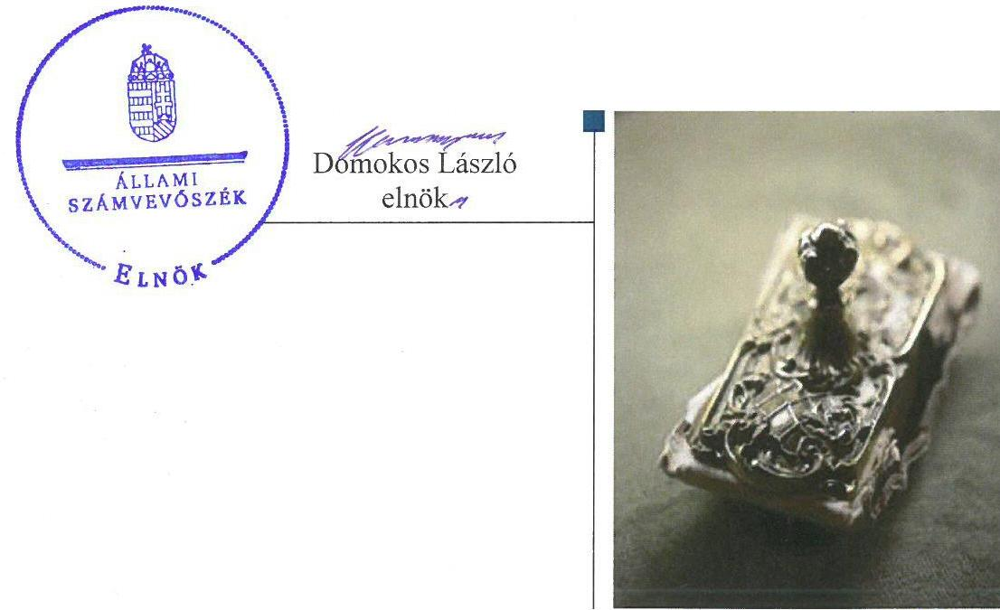

---

# AZ ELLENŐRZÉST FELÜGYELTE: 

PETŐ KRISZTINA felügyeleti vezető

## AZ ELLENŐRZÉST VEZETTE ÉS A VÉGREHAJTÁSÁÉRT FELELŐS:

SZILÁGYI GÁBOR ANTAL ellenőrzésvezető

## A PROGRAM ÖSSZEÁLLÍTÁSÁÉRT FELELŐS:

JANIK JÓZSEF LÁSZLÓ osztályvezető

## A TÉMÁHOZ KAPCSOLÓDÓ KORÁBBI SZÁMVEVŐSZÉKI JELENTÉS:

- címe: Jelentés a Szegedi Tudományegyetem ellenőrzéséről - Az állami felsőoktatási intézmények gazdálkodásának, működésének ellenőrzése
- sorszáma: 15035

IKTATÓSZÁM: V-1346-052/2016.
TÉMASZÁM: 2096
ELLENŐRZÉS-AZONOSÍTÓ SZÁM: V075541

---

# TARTALOMJEGYZÉK 

■ ÖSSZEGZÉS ..... 5
■ AZ ELLENŐRZÉS CÉLJA ..... 6
■ AZ ELLENŐRZÉS TERÜLETE ..... 7
■ AZ ELLENŐRZÉS HÁTTERE, INDOKOLTSÁGA ..... 8
■ A JELENTÉS LÉNYEGES KÉRDÉSKÖRE ..... 9
■ AZ ELLENŐRZÉS HATÓKÖRE ÉS MÓDSZEREI ..... 10
■ MEGÁLLAPÍTÁSOK ..... 12
■ MELLÉKLETEK ..... 17
I. Sz. melléklet: Az ÁSZ 15035. számú jelentéséhez kapcsolódó Szegedi Tudományegyetem intézkedési tervének végrehajtása ..... 17
II. Sz. melléklet: Az ÁSZ 15035. számú jelentéséhez kapcsolódó EMMI intézkedési terv végrehajtása ..... 22
■ FÜGGELÉK: ÉSZREVÉTELEK ..... 23
■ RÖVIDÍTÉSEK JEGYZÉKE ..... 31

---

.

---

# ÖSSZEGZÉS 

A Szegedi Tudományegyetem intézkedési tervében meghatározott tizenhét feladat többségét ugyan végrehajtották, ennek ellenére továbbra is fennálló szabálytalanság, hogy az Egyetem nem tette közzé a közérdekű gazdálkodási adatokat, ezzel nem biztosították a közpénzfelhasználás átláthatóságát. Az Egyetemnél a nem végrehajtott feladatok következtében fennáll a vagyonvesztés veszélye. Az Emberi Erőforrások Minisztériuma - mint a fenntartó jogkör gyakorlója - az intézkedési tervében foglalt feladatokat határidőben végrehajtotta.

## Az ellenőrzés társadalmi indokoltsága

Az Állami Számvevőszék stratégiájában célul tűzte ki a számvevőszéki munka hasznosulásának javítását. Ezzel összhangban ellenőrzi, hogy az ellenőrzött szervezetek megvalósították-e a korábbi ellenőrzései által feltárt hibák, hiányosságok és szabálytalanságok megszüntetése céljából kialakított intézkedési terveikben foglaltakat. A rendszeres utóellenőrzések hozzájárulnak a szükséges intézkedések tényleges végrehajtásához, ezáltal a közpénzügyek rendezettségének javulásához.

## Főbb megállapítások, következtetések

A Szegedi Tudományegyetem intézkedési tervében meghatározott tizenhét feladatból kettőt határidőben, tízet határidőn túl, egyet részben hajtott végre. Három feladat végrehajtása elmaradt, míg egy intézkedés nem volt időszerű.

Az intézkedési tervben foglaltak ellenére az Egyetem nem gondoskodott a közérdekű gazdálkodási adatok közzétételéről a közpénzügyek átláthatósága érdekében. A térítési és a szolgáltatási díjakat önköltségszámítás továbbra sem támasztotta alá. Az Egyetemnek nem volt a jogszabályoknak megfelelően elfogadott vagyongazdálkodási terve.

Az Emberi Erőforrások Minisztériuma az intézkedési tervben meghatározott két feladatát határidőben végrehajtotta.

---

# AZ ELLENŐRZÉS CÉLJA

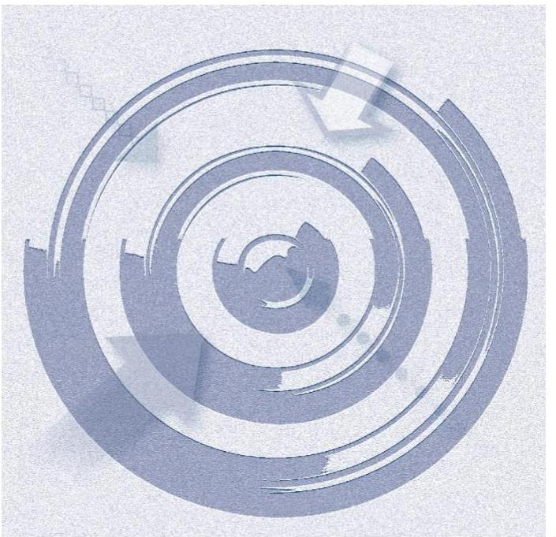

Az ellenőrzés célja annak értékelése volt, hogy a Számvevőszéki jelentésben¹ foglalt javaslatot megalapozó megállapításokkal összhangban készített intézkedési tervben meghatározott feladatokat az ellenőrzött szervezetek végrehajtották-e.

---

# AZ ELLENŐRZÉS TERÜLETE 

## Szegedi Tudományegyetem

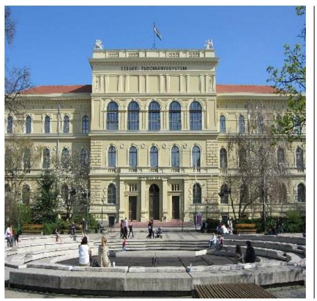

Az Egyetem² elődeinek tekinthető intézmények már a XIX. század közepén megkezdték működésüket Szegeden. 2000. január elsején több egyetem egyesítésével jött létre a Szegedi Tudományegyetem, amelyben 12 karon folyik oktatási tevékenység, és az oktatástól elválaszthatatlan kutatás. Székhelye Szegeden található, azonban Bajai és Hódmezővásárhelyi telephellyel is rendelkezik.

Az Egyetem gazdálkodásának, működésének ellenőrzéséről 2015. március 17-én, a 15035 számon közzétett Számvevőszéki jelentés készült, melyben a pénzügyi és vagyongazdálkodás szabályszerűsége, a vagyonnal való felelős gazdálkodás érvényesülése, a belső kontrollrendszer működése és az irányító szerv jogszabálynak megfelelő tevékenysége került értékelésre 2009. január 1-től 2013. december 31-ig terjedő időszak tekintetében. A hiányosságok megszüntetésére az ÁSZ ³ öt db az Egyetem Rektorának ⁴ címzett javaslatára az Egyetem, továbbá az ÁSZ kettő db az emberi erőforrások Miniszterének ⁵ címzett javaslatára az EMMI ⁶ határidőkkel és felelősökkel megjelölt intézkedési tervet készített.

Az Egyetem hallgatóinak száma a 2015/2016-os tanév őszi szemeszterében 22693 fő volt.

Az Egyetem, mint állami felsőoktatási intézmény fenntartói jogkörének gyakorlója az EMMI volt. A Rektor 2010-től töltötte be tisztségét. A kancellár személyében kettő alkalommal volt változás, 2015. január 1-jétől a kancellár ⁷, majd 2016. augusztus 1-jétől kancellárt ⁸ került kinevezésre.

Az Egyetem 2015. évi költségvetési beszámolója alapján a költségvetési bevételként 56 291,3 M Ft-ot, finanszírozási bevételként 23 513,4 M Ft-ot, költségvetési kiadásként 74 323,4 M Ft-ot számoltak el.

Az utóellenőrzés a Számvevőszéki jelentésben a Rektor és a Miniszter részére megfogalmazott intézkedést igénylő megállapításokra és javaslatokra készített intézkedési tervekben foglalt feladatok megvalósításának ellenőrzésére, illetve értékelésére fókuszált.

---

# AZ ELLENŐRZÉS HÁTTERE, INDOKOLTSÁGA 

Az ÁSZ tv. ⁹ 33. § (1) bekezdése értelmében a Számvevőszéki jelentések javaslatot megalapozó megállapításaihoz kapcsolódóan az ellenőrzött szervezet vezetője intézkedési tervet köteles összeállítani, és az Állami Számvevőszék részére megküldeni. Az intézkedési tervben foglaltak megvalósítását - az ÁSZ tv. 33. § (7) bekezdésében foglaltak alapján - az Állami Számvevőszék utóellenőrzés keretében ellenőrizheti. Az intézkedések megvalósulásának értékelése során az Állami Számvevőszék figyelembe veszi az ellenőrzött szervezetek működési feltételeiben, valamint a jogszabályi előírásokban bekövetkezett változásokat.

Az intézkedési tervekben foglalt feladatok hiányos, illetve késedelmes végrehajtása, valamint megvalósításának elmaradása azt mutatja, hogy az ellenőrzések során feltárt hibák, hiányosságok és szabálytalanságok megszüntetése nem kapott kellő hangsúlyt. Ez a szabályszerű működés és a felelős vezetői magatartás vonatkozásában kockázatot hordoz. E kockázatok feltárásával az Állami Számvevőszék utóellenőrzési rendszere fokozza a fegyelmet, és igazolja, hogy a közpénzzel való szabályos gazdálkodás felelőssége elől nem lehet kitérni.

Az utóellenőrzés négy szinten hasznosulhat:
A társadalom szintjén az utóellenőrzés jelzi, hogy a számvevőszéki ellenőrzés megállapításainak van következménye: a hiányosságok megszüntetésére az ellenőrzött szervezet által meghatározott intézkedések végrehajtását is számon kéri az ÁSZ.

- Az ellenőrzött terület szintjén az utóellenőrzés tájékoztatást nyújt a terület döntéshozóinak a hiányosságok kiküszöbölésének jó gyakorlatairól, ezzel lehetőséget biztosítva arra, hogy az ÁSZ ellenőrzési megállapításai, javaslatai a terület nem ellenőrzött szervezeteinek a működése során is hasznosuljanak.
- Az ellenőrzött szervezet szintjén az utóellenőrzés feltárja, hogy a szervezet az intézkedések végrehajtásával hasznosította-e a korábbi ellenőrzési jelentésben a hiányosságok megszüntetése, illetve a kockázatok kezelése érdekében megfogalmazott javaslatokat.
- Az ÁSZ szintjén az utóellenőrzés visszacsatolást ad az ellenőrzési jelentések hasznosulásáról, az intézkedések elmaradása vagy részleges megvalósulása a további ellenőrzésekhez kockázati jelzésként szolgál.

---

# A JELENTÉS LÉNYEGES KÉRDÉSKÖRE 

Az Egyetem és az EMMI az intézkedési tervekben foglaltakat az előírt határidőben végrehajtotta-e?

---

# AZ ELLENŐRZÉS HATÓKÖRE ÉS MÓDSZEREI 

## Az ellenőrzés típusa

Megfelelőségi ellenőrzés.

## Az ellenőrzött időszak

Az utóellenőrzés alapját képező Számvevőszéki jelentés közzétételének napjától (2015. március 17.) az ellenőrzésről szóló kiértesítő levél keltének napjáig (2017. május 15.) tartó időszak.

## Az ellenőrzés tárgya

Az ÁSZ tv. 2011. július 1-jei hatálybalépését követően a Számvevőszéki jelentésben foglalt javaslatot megalapozó megállapításokkal összhangban az Egyetem és az EMMI által készített intézkedési tervekben foglaltak végrehajtásának ellenőrzése.

Az ellenőrzés kiterjedt minden olyan körülményre és adatra, amely az ÁSZ jogszabályban meghatározott feladatainak teljesítéséhez, valamint a program végrehajtása folyamán felmerült újabb összefüggések feltárásához szükséges.

## Az ellenőrzött szervezet

Szegedi Tudományegyetem és az Emberi Erőforrások Minisztériuma

## Az ellenőrzés jogalapja

Az ÁSZ tv. 33. § (7) bekezdése alapján a 33. § (1)-(2) bekezdés szerinti intézkedési tervben foglaltak megvalósítását az ÁSZ utóellenőrzés keretében ellenőrizheti.

## Az ellenőrzés módszerei

Az ÁSZ az ellenőrzést a nemzetközi standardokat irányadónak tekintve az ellenőrzési program ellenőrzési kérdései, az ellenőrzött időszakban hatályos jogszabályok, az ellenőrzés szakmai szabályok és módszertanok figyelembevételével, önállóan végezte.

---

Az ÁSZ az ellenőrzés ideje alatt az Egyetemmel és az EMMI-vel történő kapcsolattartást az ÁSZ SZMSZ ¹⁰-ének vonatkozó előírásai alapján biztosította.

Az utóellenőrzés megállapításait elsősorban az ÁSZ rendelkezésére álló, valamint az ellenőrzött szervezetektől elektronikusan bekért dokumentumok alapozták meg.

Az ellenőrzési bizonyítékként felhasználható adatforrások közé tartoztak egyrészt a szakmai programban felsorolt adatforrások, másrészt minden - az ellenőrzés folyamán feltárt, az ellenőrzés szempontjából információt tartalmazó - dokumentum.

Az ellenőrzés során a működés szabályszerűsége érdekében hozott intézkedések végrehajtását 14 elemű véletlen mintavétellel kiválasztott tétel alapján ellenőrizte az ÁSZ a térítési díjak, szolgáltatási díjak és a költségtérítések vonatkozásában.

Az intézkedési tervben előírt feladatokat azok végrehajthatósága, illetve végrehajtása szempontjából az alábbiak szerint értékelte az ÁSZ:
"határidőben végrehajtott" a feladat, ha a teljesítés dokumentáltan, az intézkedési tervben előírt határidőben és tartalommal megtörtént;
"határidőn túl végrehajtott" a feladat, ha annak teljesítése az intézkedési tervben meghatározott módon, de az előírt határidőn túl történt meg;
"részben végrehajtott" a feladat, ha végrehajtása teljes körűen az intézkedési tervben előírt módon nem történt meg;
"nem végrehajtott" a feladat, ha a végrehajtás nem történt meg, vagy amennyiben a teljesítést nem dokumentálták;
"okafogyottá vált" a feladat, ha végrehajtására - meghatározott esemény bekövetkezése, továbbá külső körülmény, a működést érintő feltétel változása miatt - már nincs szükség, illetve lehetőség, és egyértelműen megállapítható, hogy az intézkedést szükségessé tevő körülmény a jövőben nem fordulhat elő;
"nem időszerű" az a feladat, amelynek ellenőrzési időszakon belüli végrehajtására azért nem került (kerülhetett) sor, mert az intézkedés alapjául szolgáló esemény nem következett be, de annak jövőbeni előfordulása lehetséges, a végrehajtása nem volt esedékes, vagy a végrehajtás határideje még nem járt le.
Az ellenőrzés lefolytatásához az ellenőrzött szervezetek a tanúsítványok elektronikus kitöltésével, valamint az ÁSZ által kért dokumentumok elektronikus megküldésével szolgáltattak adatokat, amelyek valódiságát és teljes körűségét az ellenőrzött szervezetek vezetői által tett teljességi és hitelességi nyilatkozatok igazoltak. Az így rendelkezésre bocsátott adatok, információk kontrollja az ellenőrzés keretében történt.

---

# MEGÁLLAPÍTÁSOK 

## Az Egyetem és az EMMI az intézkedési tervekben foglaltakat az előírt határidőben végrehajtotta-e?

Összegző megállapítás

Az Egyetem az intézkedési tervében meghatározott feladatok közül két intézkedést határidőben, tíz intézkedést határidőn túl, egy intézkedést részben hajtott végre. Három intézkedés végrehajtása elmaradt, egy intézkedés pedig nem volt időszerű. Az EMMI az intézkedési tervében meghatározott két feladatot határidőben végrehajtotta.

A Számvevőszéki jelentésben az Egyetem rektorának öt javaslat került megfogalmazásra, amelyhez az Egyetem az intézkedési tervében 17 feladatot határozott meg a javaslatok hasznosítására.

Az Egyetem az intézkedési tervében meghatározott feladatok végrehajtásáról a Bkr. ¹¹ 14. § (1) és 47. § (2) bekezdés előírásainak megfelelő nyilvántartást vezette, azonban abban - a Bkr. 47. § (2) bekezdése ellenére - egy részben végrehajtott intézkedést nem szerepeltetett.

Az Egyetem intézkedési tervében meghatározott feladatokat, határidőket, felelősöket és a feladatok végrehajtását az I. számú melléklet mutatja be.

Az Egyetem intézkedési tervében meghatározott feladatok végrehajtásának értékelési kategóriák szerinti megoszlását az 1. ábra szemlélteti.

1. ábra
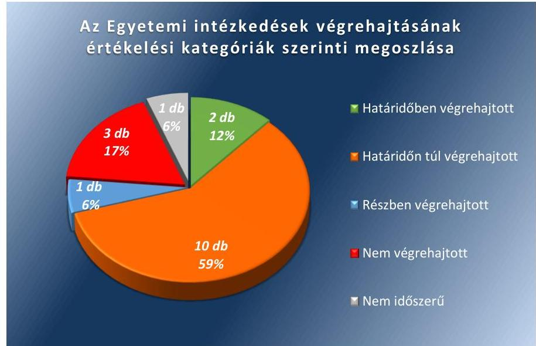

A Számvevőszéki jelentésben a Miniszter részére kettő javaslat került megfogalmazásra. Az EMMI az intézkedési tervében kettő feladatot határozott meg a javaslatok hasznosítására.

---

Az EMMI a Bkr. 14. § (1) bekezdése előírásának megfelelő nyilvántartást az intézkedési tervben vállalt feladatok tekintetében vezette.

Az EMMI intézkedési tervében meghatározott feladatokat, határidőket, felelősöket és a feladatok végrehajtását a II. számú melléklet mutatja be.

# HATÁRIDŐBEN VÉGREHAJTOTT feladatok: 

$\qquad$ 1. (10/17) A Rektor, a Kancellár ¹, a Szenátus ¹² és a Gazdasági szervezet főigazgatója az intézkedési tervben vállalt bizonylati szabályzat, illetve bizonylati rend kidolgozása feladatot határidőben végrehajtotta, mivel a Számv. tv. ¹³ 161. § (2) bekezdés d) pontjában

 előírt számlarend részeként a számlarendet alátámasztó bizonylati rendet és a bizonylati szabályzatot az előírt határidőben kidolgozta.
2. (11/17) A Rektor, a Kancellár ${ }_{1}$, a Szenátus és a Gazdasági szervezet főigazgatója a Gazdálkodási Szabályzat ${ }^{14}$ jogszabályi változásoknak megfelelő aktualizálását határidőben végrehajtotta, mivel a Gazdálkodási Szabályzat az intézkedési tervben vállalt határidőben 2015. november 30-án került elfogadásra és hatályba lépése is megtörtént.

## HATÁRIDŐN TÚL VÉGREHAJTOTT feladatok:

3. (1/17) A Rektor, a Kancellár ${ }_{1}$, a Szenátus, a Gazdasági szervezet főigazgatója a Leltározási szabályzat ${ }^{15}$ kiegészítését határidőn túl hajtotta végre, mivel az üzemeltetésre, kezelésre átadott, vagyonkezelésbe vett, illetve az idegen helyen tárolt eszközök leltározásának módját és a könyvviteli mérlegben értékkel nem szereplő, használt és használatban lévő készletek, kis értékű immateriális javak, tárgyi eszközök leltározási módjának rendjét a Szenátus az intézkedési tervben vállalt határidőt követően fogadta el.
4. (2/17) A Rektor, a Kancellár ${ }_{1}$, a Szenátus, a Gazdasági szervezet főigazgatója közreműködésével az Értékelési szabályzat ${ }^{16}$ kiegészítése követeléstípusonként a minősítés szempontjaival és dokumentálás rendjével határidőn túl került végrehajtásra.
5. (3/17) A Rektor, a Kancellár ${ }_{1}$ és a Gazdasági szervezet főigazgatója az egyetemi szolgálati lakások bérleti díjaira vonatkozó egységes szabályozás elkészítését az intézkedési tervben vállalt intézkedést határidőn túl hajtotta végre, mivel a bérlakásainak bérleti díj megállapítására vonatkozó szabályzat az intézkedési tervben vállalt határidőn túl készült el.
6. (5/17) Az IBSZ ${ }^{17}$ aktualizálása feladatot határidőn túl hajtotta végre a Rektor, Kancellár ${ }_{1}$, a Szenátus, mivel az IBSZ-t az intézkedési tervben megjelölt határidőt követően aktualizálta.
7. (6/17) Az Egyetem Számlarendjének ${ }^{18}$ kiegészítése a könyvviteli számla értéke növekedésének/csökkenésének jogcímeivel, illetve a főkönyvi számlák és az analitikus nyilvántartások kapcsolatának részletes szabályozásával feladatot a Kancellár ${ }_{1}$, a Gazdasági szervezet főigazgatója határidőn túl hajtotta végre, mivel a Számlarendet az intézkedési tervben előírt határidőn túl egészítették ki.
8. (8/17) Az Egyetem ellenőrzési nyomvonalának elkészítése a folyamatok szöveges, táblázatos, vagy folyamatábrán bemutatott leírásával, ezen belül az információs, felelősségi szintek és kapcsolatok, irányítási és ellenőrzési folyamatok bemutatása feladat kapcsán az intézkedési tervben felelősként a Rektor, a Kancellár ${ }_{1}$, a Szenátus, a Gazdasági szervezet főigazgatója került megjelölésre. Az intézkedés határidőn túl került végrehajtásra, mivel 2016/1. számú főigazgatói utasítás - ami a folyamatok azonosítását határozta meg - kiadása és az ellenőrzési nyomvonal elkészítése is határidőn túl történt meg.
9. (9/17) A Rektor, a Kancellár ${ }_{1}$, a Szenátus az idegen nyelvű képzésekre vonatkozó, devizában teljesített hallgatói költségtérítések befizetési rendjének felülvizsgálatát, a kereskedelmi bankban vezetett számla kincstári engedélyeztetését a „devizás" hallgatók esetében határidőn túl hajtotta végre.
10. (15/17) A kötelezettségvállalási szabályzat felülvizsgálata a Rektor, a Kancellár ${ }_{1}$, a Szenátus, a Gazdasági szervezet főigazgatója által határidőn túl végrehajtott feladat, mivel az Egyetem Kötelezettségvállalási Szabályzata az intézkedési tervben vállalt határidőn túl került elfogadásra.
11. (16/17) A Kancellár ${ }_{1}$ az intézkedési tervpontban vállalt kancellári utasítás kiadását a pénzügyi gazdálkodás területén - különös tekintettel a rendszeres és nem rendszeres személyi juttatások, a dologi- és felhalmozási kiadások, valamint a működési bevételek beszedése előirányzatának felhasználása tekintetében - a gazdálkodási jogkörök szabályszerű gyakorlásának érvényesülése érdekében határidőn túl hajtotta végre, mivel a gazdálkodási jogkörök szabályszerű gyakorlásának érvényesüléséről szóló 9/2015. (X. 14.) számú kancellári utasítást az intézkedési tervben vállalt határidőn túl adta ki.
12. (17/17) A közbeszerzési, a személyi juttatások kifizetésével összefüggő, valamint a kincstári körön kívüli számlavezetési szabálytalansághoz kapcsolódóan a munkajogi felelősség kivizsgálására irányuló eljárás megindítása határidőn túl teljesült Kancellár ${ }_{1}$ felelőségi körében.

# RÉSZBEN VÉGREHAJTOTT feladat: 

13. (13/17) A kockázatkezelési rendszer kialakítása, kockázatok felmérését követően az elfogadható kockázati keretek és kockázati stratégia meghatározása, folyamatgazdák kijelölése részben végrehajtott feladat, mivel nem minden folyamat esetében készítették el a Gazdasági szervezet egységvezetői a kockázatok felmérését, ami ellentétes a Bkr. 7. § (1)-(2) bekezdésben foglaltakkal.

## NEM VÉGREHAJTOTT feladatok:

14. (4/17) A Gazdasági szervezet főigazgatója felelőssége mellett nem végrehajtott feladat a térítési díjak, szolgáltatási díjak költségtérítések aktualizálása (fénymásoló kártya, bérleti díjak, szállásdíjak, stb.) az önköltségszámítási szabályzat alapján, mivel a mintatételek többségénél nem kerültek aktualizálásra a térítési díjak, szolgáltatási díjak az Egyetem Önköltségszámítási szabályzatának ${ }^{15}$ I. és III. pontjában foglaltak ellenére.
15. (12/17) A Vagyongazdálkodási terv jogszabályi előírásoknak megfelelő elkészítése és a fenntartó egyetértésével történő Szenátus által elfogadása a Rektor, a Kancellár ${ }_{1}$, a Szenátus, a Gazdasági szervezet főigazgatója felelőssége mellett nem végrehajtott feladat. Az Nvtv. ${ }^{20} 16 . \S$ (1) bekezdés j) pontja alapján a felsőoktatási intézmények vagyongazdálkodási szabályait az Nftv. ${ }^{21}$ állapítja meg. Az Nftv. 12. § (3) bekezdés gb) pontja szerint a szenátus a fenntartó egyetértésével dönt az intézmény vagyongazdálkodási tervéről, továbbá a 2015. szeptember 1-jétől hatályos Nftv. 13/C. § (1) bekezdése alapján előzetesen szükséges a szenátusi döntés érvényességéhez a konzisztórium egyetértése is. Az Egyetem 2015. évi és 2016. évi vagyongazdálkodási tervének elfogadása nem a jogszabályi előírásoknak megfelelően történt meg.
16. (14/17) A közérdekű szervezeti, működési és gazdálkodási adatokra vonatkozó közzétételi kötelezettség hiányosságainak a pótlása nem végrehajtott feladat, mivel a Gazdasági szervezet főigazgatója, az Igazgatásszervezési és szolgáltatási főigazgatója felelősségi körében az alapellenőrzésben feltárt hiányosságok közzétételét nem pótolták, mivel - az Info tv. ${ }^{22}$ 37. § (1) bekezdésében foglaltak ellenére - nem tették közzé a gazdálkodási adatok között az éves költségvetési beszámolót, valamint foglalkoztatottak létszámára és személyi juttatásaira vonatkozó összesített adatok között csak a 2015. március 1-31 közötti időszak adatai szerepelnek.

# NEM IDŐSZERŰ feladat: 

17. (7/17) Munkaidő nyilvántartás eljárásrendjének aktualizálása, különösen oktatói munkakörök esetén, munkaköri leírások dokumentációs rendjének felülvizsgálata a Rektor, Kancellár ${ }_{1}$, ISZSZK ${ }^{23}$ főigazgató felelősként való megjelölésével nem időszerű feladat, mivel az intézkedési terv végrehajtásának határidejeként rögzített Kollektív szerződés aktualizálása az ellenőrzött időszakban nem történt meg.

## EMMI

## HATÁRIDŐBEN VÉGREHAJTOTT feladatok:

1. (1/2) Az EMMI Belső Ellenőrzési Főosztály a belső kontrollrendszer kialakításával és működtetésével, a pénzügyi és vagyongazdálkodással, vagyonkimutatással összefüggésben feltárt szabálytalanságokhoz kapcsolódóan a munkajogi felelősség kivizsgálására vonatkozó feladatot határidőben végrehajtotta.
2. (2/2) Az EMMI Belső Ellenőrzési Főosztály a kincstári körön kívüli számlavezetés miatt megállapított szabálytalan pénzkezeléshez kapcsolódó munkajogi felelősség kivizsgálása, a szükséges intézkedések kezdeményezésére vonatkozó feladatot határidőben végrehajtotta.

---

.

---

# MELLÉKLETEK

- I. SZ. MELLÉKLET: AZ ÁSZ 15035. SZÁMÚ JELENTÉSÉHEZ KAPCSOLÓDÓ SZEGEDI TUDOMÁNYEGYETEM INTÉZKEDÉSI TERVÉNEK VÉGREHAJTÁSA

|  Sorszám | Intézkedési tervben meghatározott feladat | Az intézkedési tervben meghatározott határidő 2. | Az intézkedési tervben meghatározott felelős 3. | A feladat végrehajtása 4.  |
| --- | --- | --- | --- | --- |
|  1. | 10. A bizonylati szabályzat illetve bizonylati rend kidolgozása. | 2015. 11. 30. | Rektor, Kancellár, Szenátus, Gazdasági szervezet főigazgatója | A Rektor, Kancellár ${ }_{1}$, Szenátus és a Gazdasági szervezet főigazgatója az intézkedési tervben vállalt bizonylati szabályzat, illetve bizonylati rend kidolgozása feladatot határidőben végrehajtotta, mivel a Számv tv. 161. § (2) bekezdés d) pontjában előírt számlarend részeként a Számlarendet alátámasztó bizonylati rendet az előírt határidőben kidolgozta. A Számlarendet a Szenátus 208/2015. számú határozatával elfogadta, amely 2015. november 30 -tól hatályos, ebben a szigorú számadású bizonylatok nyilvántartása, kezelése esetén hivatkozik a Bizonylati Szabályzatra ${ }^{24}$, ami 2015. november 30 -tól hatályos.  |
|  2. | 11. A gazdálkodási szabályzat jogszabályi változásoknak megfelelő aktualizálása. | 2015. 11. 30. | Rektor, Kancellár, Szenátus, Gazdasági szervezet főigazgatója | A Rektor, a Kancellár ${ }_{1}$, a Szenátus és a Gazdasági szervezet főigazgatója a Gazdálkodási Szabályzat jogszabályi változásoknak megfelelő aktualizálását határidőben végrehajtotta, mivel a Gazdálkodási Szabályzat az intézkedési tervben vállalt határidőben 2015. november 30. napján került elfogadásra és hatálybalépésre. A Gazdálkodási szabályzat az Ávr ${ }^{25}$. 13. § (2) bekezdés a) pontjában előírtaknak megfelelően tartalmazta a gazdálkodás általános szabályait, a költségvetés tervezésével, keretgazdálkodásával kapcsolatos szabályokat, a kötelezettségvállalással, az ellenjegyzéssel, teljesítésigazolással, a beszámolási feladatok teljesítésével kapcsolatos keret szabályokat. A Számv tv. 159. §-ának megfelelően rögzítették a nyilvántartásokkal szembeni követelményeket.  |
|  3. | 1. A leltározási és leltárkészítési szabályzat kiegészítése az üzemeltetésre, kezelésre átadott, vagyonkezelésbe vett, illetve az idegen helyen tárolt eszközök leltározásának módja és a könyvviteli mérlegben értékkel nem szereplő, használt és használatban lévő készletek, kis értékű immateriális javak, tárgyi eszközök, valamint a nullára leírt eszközök leltározási módjának rendjére vonatkozóan. | 2015. 06. 30. | Rektor, Kancellár, Szenátus, Gazdasági szervezet főigazgatója | Az Rektor, Kancellár ${ }_{1}$, Szenátus, Gazdasági szervezet főigazgatója a leltározási szabályzat kiegészítését határidőn túl hajtotta végre, mivel a szenátus által - 2015. szeptember 28-án - elfogadott leltározási szabályzat kiegészítése tartalmazta Áhsz ${ }^{26}$. 22. § (2) bekezdés a) és b) pontjának figyelembe vételével az üzemeltetésre, kezelésre átadott, vagyonkezelésbe vett, illetve az idegen helyen tárolt eszközök leltározásának módját és a könyvviteli mérlegben értékkel nem szereplő, használt és használatban lévő készletek, kis értékű immateriális javak, tárgyi eszközök leltározási módjának rendjét.  |

---

|  4. | 2. Az eszközök és források értékelésének szabályzatának kiegészítése, melyben meg kell határozni követeléstípusonként a minősítés szempontjait és a dokumentálás rendjét. | 2015. 06. 30. | Rektor, Kancellár, Szenátus, Gazdasági szervezet főigazgatója | Eszközök és források értékelési szabályzatában határidőn túl került kiegészítésre és meghatározásra követeléstípusonként a minősítés szempontjai és a dokumentálás rendje, mivel a szabályzat 2015. szeptember 28.-án került kihirdetésre.  |
| --- | --- | --- | --- | --- |
|  5. | 3. Az egyetemi szolgálati lakások bérleti díjaira vonatkozó egységes szabályozás elkészítése. | 2015. 07. 31. | Rektor, Kancellár, Gazdasági szervezet főigazgatója | A Rektor és a Gazdasági szervezet főigazgatója az intézkedési tervpontban tervezett egyetemi szolgálati lakások bérleti díjaira vonatkozó egységes szabályozás elkészítését határidőn túl hajtotta végre, mivel az „Egyetem bérlakásainak bérleti díj megállapítására vonatkozó szabályzat" az intézkedési tervben vállalt határidőn túl készült el, azt a Szenátus 2015. november 30-án a 199/2015. számú határozattal elfogadta.  |
|  6. | 5. Informatikai biztonsági szabályzat aktualizálása. | 2015. 07. 31. | Rektor, Kancellár, Szenátus | A Rektor, a Kancellár, a Szenátus az IBSZ-t az intézkedési tervben megjelölt határidőt követően aktualizálta, mivel Szenátus az IBSZ-t 2015. szeptember 28-án a 176/2015. számú határozattal fogadta el. Az IBSZ tartalmazta az IBtv.27 11. § (1) bekezdés f) pontjában előírt felelősöket és hatásköröket a felhasználókra vonatkozó szabályokat.  |
|  7. | 6. Az egyetem számlarendjének kiegészítése a könyvviteli számla értéke növekedésének/csökkenésének jogcímeivel, illetve a főkönyvi számlák és az analitikus nyilvántartások kapcsolatának részletes

 szabályozásával. | 2015. 09. 30. | Kancellár, Gazdasági szervezet főigazgatója | A Kancellár, a Gazdasági szervezet főigazgatója az Egyetem Számlarendjének kiegészítését a könyvviteli számla értéke növekedésének/csökkenésének jogcímeivel, illetve a főkönyvi számlák és az analitikus nyilvántartások kapcsolatának részletes szabályozásával az intézkedési tervben előírt határidőn túl hajtotta végre, mivel a Számlarendet az intézkedési tervben előírt határidőn túl – 2015. november 30-án került a Szenátus által elfogadásra – egészítették ki. A Számlarend tartalmazta a számlaosztályok szerinti csoportosításban a növekedések és csökkenések elszámolási jogcímeit, mely megfelelt az Áhsz. 51. § (2) bekezdése és a Számv tv. 161. § (2) bekezdés b)-c) pontjaiban foglaltaknak, valamint tartalmazta az analitikus nyilvántartásokkal szembeni követelményeket és a főkönyvvel való egyeztetés részletes szabályait is.  |
|  8. | 8. Az egyetem ellenőrzési nyomvonalának elkészítése a folyamatok szöveges, táblázatos, vagy folyamatábrán bemutatott leírásával, ezen belül az információs, felelősségi szintek és kapcsolatok, irányítási és ellenőrzési folyamatok bemutatása. | 2015. 11. 30. | Rektor, Kancellár, Szenátus, Gazdasági szervezet főigazgatója | Az ellenőrzési nyomvonal az intézkedési tervben előírt határidőn túl készült el, mivel a 2016/1. számú főigazgatói utasítás 2016. május 19.-én került kiadásra, ami a folyamatok azonosítását határozta meg. A Bkr. 6.§ (3) bekezdése és az utasítás melléklete szerint készültek a működési folyamatok leírásai, táblázatba foglalt szöveges formában, bemutatták az adott folyamathoz kapcsolódó információs, felelősségi szinteket és kapcsolatok, irányítási és ellenőrzési folyamatokat.  |

---

|  9. | 9. Az idegen nyelvű képzésekre vonatkozó, devizában teljesített hallgatói költségtérítések befizetési rendjének felülvizsgálata, a kereskedelmi bankban vezetett számla kincstári engedélyeztetése a „devizás" hallgatók esetében, vagy annak a megszüntetése. | 2015. 08. 31. | Rektor, Kancellár, Szenátus | A Rektor, a Kancellár, a Szenátus által az idegen nyelvű képzésekre vonatkozó, devizában teljesített hallgatói költségtérítések befizetési rendjének felülvizsgálata, a kereskedelmi bankban vezetett számla kincstári engedélyeztetése a „devizás" hallgatók esetében határidőn túl került végrehajtásra. Az Egyetem „A devizában teljesített hallgatói befizetések rendjéről" szóló 2015/6 számú főigazgatói körlevelet az intézkedési tervben foglalt határidőn túl 2015. december 23-án adta ki. A Kincstár engedélyének a beszerzése az intézkedési tervben előírt határidőn túl 2015. szeptember 15-én történt meg.  |
| --- | --- | --- | --- | --- |
|  10. | 15. A kötelezettségvállalási szabályzat felülvizsgálata. | 2015. 10. 31. | Rektor, Kancellár, Szenátus, Gazdasági szervezet főigazgatója | A kötelezettségvállalási szabályzat felülvizsgálata a Rektor, Kancellár, Szenátus, Gazdasági szervezet főigazgatója által határidőn túl végrehajtott feladat, mivel az Egyetem Kötelezettségvállalási Szabályzatot az intézkedési tervben vállalt határidőn túl vizsgálta felül, azt a Szenátus 2015. november 30. napján fogadta el. A szabályzat tartalmazta az Ávr. 13. § (2) bekezdés a.) pontja szerint a kötelezettségvállalás gyakorlásának módját, eljárási és dokumentációs részletszabályait, az ezeket végző személyek kijelölésének rendjét.  |
|  11. | 16. Kancellári utasítás kiadása a pénzügyi gazdálkodás területén - különös tekintettel a rendszeres és nem rendszeres személyi juttatások, a dologi és felhalmozási kiadások, valamint a működési bevételek beszedése előirányzatának felhasználása tekintetében - a gazdálkodási jogkörök szabályszerű gyakorlásának érvényesülése érdekében. | 2015. 09. 30. | Kancellár | A Kancellár az intézkedési tervpontban vállalt kancellári utasítás kiadását a pénzügyi gazdálkodás területén a gazdálkodási jogkörök szabályszerű gyakorlásának érvényesülése érdekében határidőn túl végrehajtotta, mivel a gazdálkodási jogkörök szabályszerű gyakorlásának érvényesüléséről szóló 9/2015. (X.14.) számú kancellári utasítást az intézkedési tervben vállalt határidőn túl 2015. október 14-én adta ki. A Kancellári utasításban a tervezett intézkedéssel összhangban a kancellár felhívta a figyelmét a gazdálkodási jogkörrel felruházott munkavállalóknak arra, hogy fokozott figyelemmel járjanak el a gazdálkodási jogkörök szabályszerű alkalmazása vonatkozásában. Továbbá felhívta a figyelmet a jogszabályban és a vonatkozó belső szabályzatokban foglaltak érvényesítésére.  |
|  12. | 17. A közbeszerzési, a személyi juttatások kifizetésével összefüggő, valamint a kincstári körön kívüli számlavezetési szabálytalansághoz kapcsolódóan a munkajogi felelősség kivizsgálására irányuló eljárás megindítása és annak eredményérétől függően a szükséges intézkedések megtétele. | 2015. 12. 31. | Kancellár | A Kancellár a szabálytalanságokkal összefüggő munkajogi felelősség kivizsgálására irányuló eljárás megindításával kapcsolatos feladat végrehajtását határidőn túl teljesítette. Az intézkedés felelőseként megjelölt Kancellár által jóváhagyott 2016. évi belső ellenőrzési munkaterv és a Kancellári megbízólevél alapján a munkajogi felelősség kivizsgálására irányuló belső ellenőrzés az intézkedési tervben megjelölt határidőn túl, 2016. január 25-én került megindításra és 2016. április 8-ig tartott. A belső ellenőrzés eredményeként további szükséges intézkedés megtétele nem volt indokolt. A vizsgálat megállapította, hogy a közbeszerzési szabálytalanságok kapcsán egyszemélyi felelősség nem állapítható meg. A felelősségi körbe tartozó személyek nagy része a vizsgálat idején már nem állt az Egyetem alkalmazásában, a személyi juttatások kifizetésével kapcsolatban felelősségre  |

---

|  12. | Intézkedési tervben
meghatározott feladat | Az intézkedési tervben
meghatározott határidő | Az intézkedési
tervben megha-
tározott felelős | A feladat végrehajtása  |
| --- | --- | --- | --- | --- |
|   |  |  |  | vonást a szabálytalanság egyedi előfordulására tekintettel nem tartották indokoltnak, a
kincstári körön kívüli számlavezetési szabálytalanság esetében felelősségre vonást nem
tartották indokoltnak.  |
|   |  |  |  | Részben végrehajtott feladat  |
|  13. | 13. A kockázatkezelési rendszer kialakítása, kockázatok
felmérését követően az elfogadható kockázati keretek és
kockázati stratégia meghatározása, folyamatgazdák kijelölése. | 2015.09.30. | Gazdasági szervezet
egységvezetői | Végrehajtott feladatrész:
A kockázatkezelési rendszer kialakítása, kockázatok felmérését követően az elfogadható
kockázati keretek és kockázati stratégia meghatározása, folyamatgazdák kijelölése rész-
ben végrehajtott feladat, mivel nem minden – a megbízólevélben meghatározott – mű-
ködési folyamat esetében készítették el a Gazdasági szervezet egységvezetői a kockázat-
tok felmérését. A megbízólevelekben kerültek meghatározásra a folyamatgazdák, akik
bevonásával kellett az egységvezetőknek elvégezni a kockázatvizsgálatot és a kockázat-
értékelést.
Nem végrehajtott feladatrész:
Hét működési folyamat esetében nem történt meg a kockázatvizsgálat és a kockázatért
ékelés, ami ellentétes a 8kr. 7.§(1)-(2) bekezdésében foglaltakkal.  |
|   |  |  |  | Nem végrehajtott feladatok  |
|  14. | 4. A térítési díjak, szolgáltatási díjak, költségtérítések aktualizálása (fénymásoló kártya, bérleti díjak, szállásdíjak,
stb.), az önköltség-számítási szabályzat alapján. | 2015. 08.31. | Gazdasági szervezet
főigazgatója | A Gazdasági szervezet főigazgatója felelőssége mellett nem végrehajtott feladat a térítési díjak, szolgáltatási díjak költségtérítések aktualizálása (fénymásoló kártya, bérleti díjak, szállásdíjak, stb.) az önköltségszámítási szabályzat alapján. Az intézkedési tervpontban vállalt feladat ellenőrzése véletlen mintavétellel történt. A mintatételek többségénél nem kerültek aktualizálásra a térítési díjak, szolgáltatási díjak (fénymásoló kártya, bérleti díjak, szállásdíjak, stb.) az önköltségszámítási szabályzat alapján, mivel nem került megállapításra az Önköltség-számítási szabályzat I. és III. pontjában előírtak ellenére a kalkulációs sémák alapján a konkrét térítési díjak, szolgáltatási díjak önköltsége.  |
|  15. | 12. A Vagyongazdálkodási terv jogszabályi előírásoknak
megfelelő elkészítése és a fenntartó egyetértésével tör-
ténő Szenátus általi elfogadása. | 2015. 12. 15. | Rektor, Kancellár, Szenátus, Gazdasági szervezet főigazgatója | A Vagyongazdálkodási terv jogszabályi előírásoknak megfelelő elkészítése és a fenntartó egyetértésével történő Szenátus általi elfogadása a Rektor, Kancellár, Szenátus, Gazdasági szervezet főigazgatója felelőssége mellett nem végrehajtott feladat. Kettő vagyongazdálkodási terv készült, a 2015 évi vagyongazdálkodási terv és 2016. évi vagyongazdálkodási terv. Az Nvtv. 16. § (1) bekezdés j.) pontja alapján a felsőoktatási intézmények vagyongazdálkodási szabályait a felsőoktatásról szóló törvény állapítja meg. Az Nftv. 12. § (3) bekezdés gb.) pontja szerint a szenátus a fenntartó egyetértésével dönt az Egyetem vagyongazdálkodási tervéről, továbbá 2015. szeptember 1-től hatályos Nftv.  |

---

|  15
KÖZET | Intézkedési tervben
meghatározott feladat | Az intézkedési tervben
meghatározott határidő | Az intézkedési
tervben megha-
tározott felelős | A feladat végrehajtása  |
| --- | --- | --- | --- | --- |
|   |  |  |  | 13/C. § (1) bekezdés alapján a szenátusi döntés érvényességéhez a Konzisztórium előzetes egyetértése is szükséges. A 2015 évi vagyongazdálkodási terv esetében a fenntartó egyetértése és a konzisztórium előzetes egyetértése, a 2016. évi vagyongazdálkodási terv esetében a Szenátus döntése nem történt meg.  |
|  16. | 14. A közérdekű szervezeti, működési és gazdálkodási adatokra vonatkozó közzétételi kötelezettség hiányosságainak pótlása az SZTE honlapján. | beszámoló jóváhagyását követő 60. nap vagy 2015. 06. 30. | Gazdasági szervezet főigazgatója, Igazgatásszervezési és szolgáltatási főigazgató | A közérdekű szervezeti, működési és gazdálkodási adatokra vonatkozó közzétételi kötelezettség hiányosságainak a pótlása nem végrehajtott feladat. A Gazdasági szervezet főigazgatója, az Igazgatásszervezési és szolgáltatási főigazgató felelősségi körében az alapellenőrzésben feltárt hiányosságok közzétételét nem pótolták, mivel nem tették közzé az Info. tv. 37.§ (1) bekezdésében előírtak ellenére a gazdálkodási adatok között az éves költségvetési beszámolót, csak annak a szöveges értékelést, továbbá foglalkoztatottak létszámára és személyi juttatásaira vonatkozó összesített adatok között csak a 2015. március 1-31 közötti időszak adatai szerepelnek.  |
|   |  |  | Nem időszerű feladat |   |
|  17. | 7. Munkaidő nyilvántartás eljárásrendjének aktualizálása, különösen oktatói munkakörök esetén, munkaköri leírások dokumentációs rendjének felülvizsgálata. | IKT/20-311/2015. sorszámú intézkedési terv alapján az SZTE Kollektívszerződés aktualizálását követő 60 napon belül | Rektor, Kancellár, ISZSZK főigazgatója | Munkaidő nyilvántartás eljárásrendjének aktualizálása, különösen oktatói munkakörök esetén, munkaköri leírások dokumentációs rendjének felülvizsgálata a Rektor, Kancellár, ISZSZK főigazgató felelősként való megjelölésével nem időszerű feladat. A végrehajtás határideje még nem járt le, mivel Kollektív szerződés aktualizálása az ellenőrzött időszakban nem történt meg. A Bkr.-ben előírt külső ellenőrzésekhez kapcsolódó intézkedések nyilvántartás szerint a „Kollektív Szerződés módosításának tervezete egyeztetés alatt áll".  |

*Forrás: ÁSZ által készített táblázat*

---

#### *Mellékletek*

#### ▪ II. SZ. MELLÉKLET: AZ ÁSZ 15035. SZÁMÚ JELENTÉSÉHEZ KAPCSOLÓDÓ EMMI INTÉZKEDÉSI TERV VÉGREHAJTÁSA

|  SZÁMÚ
JELENTÉSÉHEZ
KAPCSOLÓDÓ
EMMI
INTÉZKEDÉSI
TERV
VÉGREHAJTÁSA |  |  |  |   |
| --- | --- | --- | --- | --- |
|  Intézkedési
tervben
meghatározott
feladat | Az intézkedési
tervben
meghatározott
határidő | Az intézkedési
tervben
meghatározott
felelős | A feladat végrehajtása |   |
|  1. | 2. | 3. | 4. |   |
|   | Határidőben végrehajtott
feladatok |  |  |   |
|  1. | 1. A belső kontrollrendszer kialakításával és működtetésével, a pénzügyi és vagyongazdálkodással, vagyonkimutatással összefüggésben feltárt szabálytalanságokhoz kapcsolódóan a munkajogi felelősség kivizsgálása, a szükséges intézkedések kezdeményezése. | 2015. december
31. | Belső Ellenőrzési Főosztály | Az EMMI Belső Ellenőrzési Főosztály a belső kontrollrendszer kialakításával és működtetésével, a pénzügyi és vagyongazdálkodással, vagyonkimutatással összefüggésben feltárt szabálytalanságokhoz kapcsolódóan a

 munkajogi felelősség kivizsgálására vonatkozó feladatot határidőben végrehajtotta. Az EMMI Belső Ellenőrzési Főosztálya szabályszerűségi ellenőrzést folytatott le 2014. május 19-28. között az Egyetemnél, az "ÁSZ javaslatai alapján készült intézkedési terv végrehajtása" tárgyában. A vizsgálat eredményéről 2015. június 10-én készült 24728-14/2015/ELL számú ellenőrzési jelentés tartalmazta a belső kontrollrendszer kialakításával és működtetésével, a pénzügyi és vagyongazdálkodással összefüggésben feltárt szabálytalanságokhoz kapcsolódó munkajogi felelősség kivizsgálását. A 24728-14/2015/ELL iktatószámú jelentésben az ellenőrzést végzők nem javasoltak az Nftv. 73. § (3) bekezdés e) pontjában foglaltak alapján fenntartói intézkedést az Egyetem rektora tekintetében.  |
|  2. | 2. A kincstári körön kívüli számlavezetés miatt megállapított szabálytalan pénzkezeléshez kapcsolódó munkajogi felelősség kivizsgálása, a szükséges intézkedések kezdeményezése. | 2015. december
31. | Belső Ellenőrzési Főosztály | Az EMMI Belső Ellenőrzési Főosztály a kincstári körön kívüli számlavezetés miatt megállapított szabálytalan pénzkezeléshez kapcsolódó munkajogi felelősség kivizsgálása, a szükséges intézkedések kezdeményezésére vonatkozó feladatot határidőben végrehajtotta. A vizsgálat eredményéről 2015. június 10-én készült 24728-14/2015/ELL számú ellenőrzési jelentés II.2 pontja tartalmazta a kincstári körön kívüli számlavezetés miatt megállapított szabálytalan pénzkezeléshez kapcsolódó munkajogi felelősség kivizsgálását. Az ellenőrzést végzők nem javasoltak az Nftv. 73. § (3) bekezdés e) pontjában foglaltak alapján fenntartói intézkedést az Egyetem rektora tekintetében.  |

*Forrás: ÁSZ által készített táblázat*

---

# FÜGGELÉK: ÉSZREVÉTELEK 

A jelentéstervezetet a Számvevőszék 15 napos észrevételezésre megküldte az ellenőrzött szervezetek vezetőinek az ÁSZ tv. 29. § (1) bekezdése előírásának megfelelően.

A Szegedi Tudományegyetem rektora és kancellárja az ellenőrzés megállapításaira írásban észrevételt tett.
Az Emberi Erőforrások Minisztériuma észrevételt nem tett.
A függelék tartalmazza a Szegedi Tudományegyetem rektora és kancellárja észrevételeit, illetve az el nem fogadott észrevételek elutasításának indoklását.

[^0]
[^0]:    * 29. § (1) Az Állami Számvevőszék az ellenőrzési megállapításait megküldi az ellenőrzött szervezet vezetőjének vagy az általa megbízott személynek, és annak, akinek személyes felelősségét állapította meg.
    (2) Az ellenőrzött szervezet vezetője és a felelősként megjelölt személy az ellenőrzés megállapításaira tizenöt napon belül írásban észrevételt tehet.
    (3) Az Állami Számvevőszék az észrevételre a beérkezésétől számított harminc napon belül írásban válaszol. A figyelembe nem vett észrevételeket köteles a jelentésben feltüntetni, és megindokolni, hogy azokat miért nem fogadta el.

---

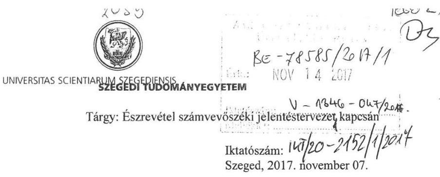

Tisztelt Elnök Úr!

Hivatkozva a V-1346-043/2016. iktatószámú, 2017. október 20-i keltezésű levelére a Szegedi Tudományegyetem az „Utóellenőrzések - Az állami felsőoktatási intézmények gazdálkodásának, működésének ellenőrzéséről készült jelentések utóellenőrzése - Szegedi Tudományegyetem" című ellenőrzésről készült számvevőszéki jelentéstervezet kapcsán az alábbi észrevételeket tesszük.

A jelentéstervezet MEGÁLLAPÍTÁSOK című fejezetében kérjük az alábbi mondat átfogalmazását, mivel az nem következetes:

„Az Egyetem az intézkedési tervében meghatározott feladatok végrehajtásáról a Bkr. 14. § (1) és 47. § (2) bekezdés előírásainak megfelelő nyilvántartást nem vezette a 2017. évben, mivel abban egy részben végrehajtott intézkedést nem szerepeltettek."

Az Egyetem a jogszabályi előírásoknak megfelelő nyilvántartást 2017. évben is vezette, hiszen ez alapján volt megállapítható, hogy egy 2015. évben csak részben végrehajtott intézkedés nem szerepelt benne. Erre tekintettel javasoljuk az első mondatrészt úgy módosítani, hogy csak a nyilvántartás hiányosságára vonatkozó megállapítást tartalmazzon. A hiányosságot természetesen már pótoltuk.

Ezen túlmenően „Az Egyetem ellenőrzési nyomvonalának elkészítése a folyamatok szöveges, táblázatos, vagy folyamatábrán bemutatott leírásával, ezen belül az információs, felelősségi szintek és kapcsolatok, irányítási és ellenőrzési folyamtok bemutatása" tartalmú intézkedési tervfeladat a jelentéstervezetben a határidőn túl végrehajtottak között szerepel. Ennek kapcsán az utóellenőrzés során is, de jelen levél 1. számú mellékletében ismételten csatoltjuk az „Intézkedési terv módosítása iránti kérelem" tárgyú, korábban - a végrehajtási határidő előtt - megküldött levelet, melyben tájékoztattuk Tisztelt Elnök Urat a végrehajtás új határidejéről (2016. június 30.). Az abban megjelölt új határidőig az ellenőrzési nyomvonalak el is készültek. Kérjük a jelentés megállapításaiban ennek figyelembevételét.

A fentieken túl további észrevételünk lenne még, hogy „a nem végrehajtott feladatok" körébe álláspontunk szerint az alábbi pontok nem tartoznak bele, hiszen ezen feladatokat a Szegedi Tudományegyetem határidőn túl ugyan, de teljesítette. Kérnénk a jelentésben ezen feladatok „határidőn túli" csoportba történő áthelyezését:

14. pont: 2015. évben a szabályzatainkat aktualizáltuk. Az Önköltség számítási Szabályzatot 2015. év november hó 30. napján fogadta el a Szenátus, így ezen előírásnak is határidőn túl, de eleget tettünk,

15. pont: 2016. évben fogadta el a Szenátus a Vagyongazdálkodási Szabályzatot, ami előírja a vagyongazdálkodási terv készítését, melynek megfelelően járt el Egyetemünk.

16. pont A 2014. évi beszámoló szöveges részének honlapra történő kihelyezése 2015. év június hó 2. napján megtörtént.

Kérjük a jelentés megállapításaiban a fent leírtak szíves figyelembevételét.

Tisztelettel:

Dr. Szabó Gábor
rektor

Melléklet: 1 db „Intézkedési terv módosítása iránti kérelem" tárgyú levél

6720 Szeged, Dugonics tér 13.
www.u-szeged.hu

---

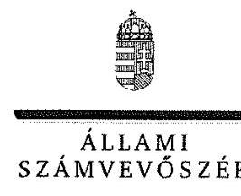

ELNÖK

Ikt.szám: V-1346-051/2016.

# Dr. Szabó Gábor úr 

rektor
Szegedi Tudományegyetem

## Szeged

## Tisztelt Rektor Úr!

Az „Utóellenőrzések - az állami felsőoktatási intézmények gazdálkodásának, működésének ellenőrzéséről készült jelentések utóellenőrzése - Szegedi Tudományegyetem" címmel készített számvevőszéki jelentéstervezetre tett észrevételét köszönettel megkaptam.
Az Állami Számvevőszék észrevételre vonatkozó álláspontjáról a felügyeleti vezető által készített részletes tájékoztatást csatoltan megküldöm.
Tájékoztatom Rektor urat, hogy a számvevőszéki jelentésben - az Állami Számvevőszékről szóló 2011. évi LXVI. törvény 29. § (3) bekezdése alapján - a figyelembe nem vett észrevételeket szerepeltetjük az elutasítás indokának feltüntetésével.
Tájékoztatom továbbá, hogy jelen levelem mellékletében foglaltakról dr. Fendler Judit kancellár úrhölgyet is tájékoztattam.

Budapest, 2017. 91 hó 14 nap
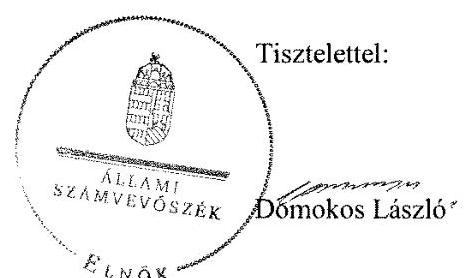

Melléklet: Tájékoztatás az észrevételek kezeléséről

---

# Tájékoztatás az észrevételek kezeléséről 

Az „Utóellenőrzések - az állami felsőoktatási intézmények gazdálkodásának, működésének ellenőrzéséről készült jelentések utóellenőrzése - Szegedi Tudományegyetem" című jelentéstervezetre az IKT/20-2152/1/2017. iktatószámú levélben tett észrevételeit áttekintettem.

Észrevételeinek kezeléséről az alábbi tájékoztatást adom.

1. A költségvetési szervek belső kontrollrendszeréről és belső ellenőrzéséről szóló 370/2011. (XII. 31.) Korm. rendelet (továbbiakban: Bkr.) szerint nyilvántartás vezetésére vonatkozó észrevétele kapcsán

Az észrevétel szerint a Szegedi Tudományegyetem (továbbiakban: Egyetem) a jogszabályi előírásoknak megfelelő nyilvántartást 2017-ben is vezette, hiszen ez alapján volt megállapítható, hogy egy 2015-ben csak részben végrehajtott intézkedés nem szerepelt.

A rendelkezésre álló dokumentumokat ismételten áttekintettük, és megállapítást nyert, hogy az Egyetem rendelkezett a külső ellenőrzések nyilvántartásával a 2017. év tekintetében is, azonban az hiányos volt. A jelentéstervezetet ennek megfelelően módosítjuk.

## 2. Az ellenőrzési nyomvonal készítésével kapcsolatos 8. intézkedési tervpont határidőn túli végrehajtására tett észrevétele kapcsán

Az észrevétel szerint az ellenőrzési nyomvonalak kapcsán mind az utóellenőrzés, mind a 15 napos észrevételezés során is csatolták az „Intézkedési terv módosítása iránti kérelem" tárgyú, korábban - a végrehajtási határidő előtt - megküldött levelet, amelyben tájékoztatták az Állami Számvevőszék (továbbiakban: ÁSZ) elnökét a végrehajtás új határidejéről (2016. június 30.). A megjelölt új határidőig az ellenőrzési nyomvonalak el is készültek.
A hivatkozott dokumentum a tárgya és a tartalma szerint intézkedési terv módosítása iránti kérelem volt, amelyet az ÁSZ nem értékelt arra tekintettel, hogy a 2015. szeptember 3-án kelt V-0592-182/2015. ikt. számú levelével az intézkedési tervet a kiegészítésekkel együtt elfogadta, és az ellenőrzést lezárta. A V-0592-182/2015. ikt. számú számvevőszéki levél alapját képező kiegészített intézkedési tervben a vonatkozó feladat határideje 2015. november 30. volt, amelyre tekintettel az észrevételt nem fogadjuk el, a jelentéstervezet módosítása nem indokolt.

---

# 3. Az önköltség-számítási szabályzattal, a vagyongazdálkodási tervvel és a beszámoló közzétételével kapcsolatban tett észrevétele kapcsán 

a) Az észrevétel szerint az Egyetem 2015-ben aktualizálta a szabályzatait, az önköltség-számítási szabályzatot 2015. november 30-án a Szenátus elfogadta, így a feladatot határidőn túl, de végrehajtotta.

Tájékoztatom, hogy az intézkedési terv 4. tervpontjában vállalt intézkedés nem az önköltségszámítási szabályzat, hanem az önköltség-számítási szabályzat alapján a térítési díjak, szolgáltatási díjak, költségtérítések aktualizálása (fénymásoló kártya, bérleti díjak, szállásdíjak stb.) volt. Figyelemmel arra, hogy az észrevétel a ténylegesen vállalt feladat (díjak, költségtérítések aktualizálása) végrehajtásának elmulasztását nem vitatta, az észrevételt nem fogadjuk el, a jelentéstervezet módosítása nem indokolt.
b) Az észrevétel szerint a Szenátus 2016-ban elfogadta a vagyongazdálkodási szabályzatot, amely előírja a vagyongazdálkodási terv készítését, amelynek megfelelően járt el az Egyetem.

A vállalt intézkedés a vagyongazdálkodási terv jogszabályi előírásoknak megfelelő elkészítése és a fenntartó egyetértésével történő Szenátus általi elfogadása volt, nem pedig a vagyongazdálkodási szabályzat megalkotása, és a vagyongazdálkodási terv annak megfelelő elkészítése. Az észrevétel nem vitatta, hogy - a nemzeti felsőoktatásról szóló 2011. évi CCIV. törvény 12. § (3) bekezdés g) pont gb) alpontja és a 13/C. § (1) bekezdése ellenére - a 2015. évi vagyongazdálkodási terv esetében a fenntartó egyetértése és a konzisztórium előzetes egyetértése, a 2016. évi vagyongazdálkodási terv esetében a Szenátus döntése nem történt meg, amelyre tekintettel az észrevételt nem fogadjuk el, a jelentéstervezet módosítása nem indokolt.
c) Az észrevétel szerint a 2014. évi beszámoló szöveges részének honlapra történő kihelyezése 2015. június 2-án megtörtént.

Az információs önrendelkezési jogról és az információszabadságról szóló 2011. évi CXII. törvény 37. § (1) bekezdése szerint az 1. melléklet (általános közzétételi lista) szerinti adatokat az 1. mellékletben foglaltak szerint kell közzétenni. Az 1. melléklet III. Gazdálkodási adatok című részének első sora szerint a beszámolónak nemcsak a szöveges részét, hanem magát a beszámolót kell közzétenni, amelyre tekintettel az észrevételt nem fogadjuk el, a jelentéstervezet elfogadása nem indokolt.

Budapest, 2017. M.
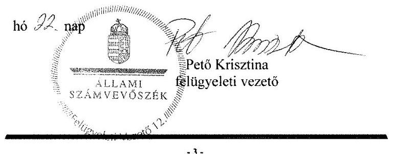

---

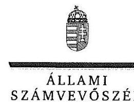

ELNÖK

# Dr. Fendler Judit úrhölgy 

kancellár
Szegedi Tudományegyetem

## Szeged

## Tisztelt Kancellár Úrhölgy!

Az „Utóellenőrzések - az állami felsőoktatási intézmények gazdálkodásának, működésének ellenőrzéséről készült jelentések utóellenőrzése - Szegedi Tudományegyetem" címmel készített számvevőszéki jelentéstervezetre tett észrevételét köszönettel megkaptam.
Az Állami Számvevőszék észrevételre vonatkozó álláspontjáról a felügyeleti vezető által készített részletes tájékoztatást csatoltan megküldöm.
Tájékoztatom Kancellár úrhölgyet, hogy a számvevőszéki jelentésben - az Állami Számvevőszékről szóló 2011. évi LXVI. törvény 29. § (3) bekezdése alapján - a figyelembe nem vett észrevételeket szerepeltetjük az elutasítás indokának feltüntetésével.
Tájékoztatom továbbá, hogy jelen levelem mellékletében foglaltakról dr. Szabó Gábor rektor urat is tájékoztattam.

Budapest, 2017. 1/7 hó 2. nap
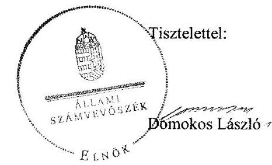

Melléklet: Tájékoztatás az észrevételek kezeléséről

---

# Tájékoztatás az észrevételek kezeléséről 

Az „Utóellenőrzések - az állami felsőoktatási intézmények gazdálkodásának, működésének ellenőrzéséről készült jelentések utóellenőrzése - Szegedi Tudományegyetem" című jelentéstervezetre az IKT/20-2152/1/2017. iktatószámú levélben tett észrevételeit áttekintettem.

Észrevételeinek kezeléséről az alábbi tájékoztatást adom.

1. A költségvetési szervek belső kontrollrendszeréről és belső ellenőrzéséről szóló 370/2011. (XII. 31.) Korm. rendelet (továbbiakban: Bkr.) szerint nyilvántartás vezetésére vonatkozó észrevétele kapcsán

Az észrevétel szerint a Szegedi Tudományegyetem (továbbiakban: Egyetem) a jogszabályi előírásoknak megfelelő nyilvántartást 2017-ben is vezette, hiszen ez alapján volt megállapítható, hogy egy 2015-ben csak részben végrehajtott intézkedés nem szerepelt.

A rendelkezésre álló dokumentumokat ismételten áttekintettük, és megállapítást nyert, hogy az Egyetem rendelkezett a külső ellenőrzések nyilvántartásával a 2017. év tekintetében is, azonban az hiányos volt. A jelentéstervezetet ennek megfelelően módosítjuk.

## 2. Az ellenőrzési nyomvonal készítésével kapcsolatos 8. intézkedési tervpont határidőn túli végrehajtására tett észrevétele kapcsán

Az
 észrevétel szerint az ellenőrzési nyomvonalak kapcsán mind az utóellenőrzés, mind a 15 napos észrevételezés során is csatolták az „Intézkedési terv módosítása iránti kérelem" tárgyú, korábban - a végrehajtási határidő előtt - megküldött levelet, amelyben tájékoztatták az Állami Számvevőszék (továbbiakban: ÁSZ) elnökét a végrehajtás új határidejéről (2016. június 30.). A megjelölt új határidőig az ellenőrzési nyomvonalak el is készültek.
A hivatkozott dokumentum a tárgya és a tartalma szerint intézkedési terv módosítása iránti kérelem volt, amelyet az ÁSZ nem értékelt arra tekintettel, hogy a 2015. szeptember 3-án kelt V-0592-182/2015. ikt. számú levelével az intézkedési tervet a kiegészítésekkel együtt elfogadta, és az ellenőrzést lezárta. A V-0592-182/2015. ikt. számú számvevőszéki levél alapját képező kiegészített intézkedési tervben a vonatkozó feladat határideje 2015. november 30. volt, amelyre tekintettel az észrevételt nem fogadjuk el, a jelentéstervezet módosítása nem indokolt.

---

# 3. Az önköltség-számitási szabályzattal, a vagyongazdálkodási tervvel és a beszámoló közzétételével kapcsolatban tett észrevétele kapcsán 

a) Az észrevétel szerint az Egyetem 2015-ben aktualizálta a szabályzatait, az önköltség-számítási szabályzatot 2015. november 30-án a Szenátus elfogadta, így a feladatot határidőn túl, de végrehajtotta.

Tájékoztatom, hogy az intézkedési terv 4. tervpontjában vállalt intézkedés nem az önköltségszámítási szabályzat, hanem az önköltség-számítási szabályzat alapján a térítési díjak, szolgáltatási díjak, költségtérítések aktualizálása (fénymásoló kártya, bérleti díjak, szállásdíjak stb.) volt. Figyelemmel arra, hogy az észrevétel a ténylegesen vállalt feladat (díjak, költségtérítések aktualizálása) végrehajtásának elmulasztását nem vitatta, az észrevételt nem fogadjuk el, a jelentéstervezet módosítása nem indokolt.
b) Az észrevétel szerint a szenátus 2016-ban elfogadta a vagyongazdálkodási szabályzatot, amely előírja a vagyongazdálkodási terv készítését, amelynek megfelelően járt el az Egyetem.

A vállalt intézkedés a vagyongazdálkodási terv jogszabályi előírásoknak megfelelő elkészítése és a fenntartó egyetértésével történő szenátus általi elfogadása volt, nem pedig a vagyongazdálkodási szabályzat megalkotása, és a vagyongazdálkodási terv annak megfelelő elkészítése. Az észrevétel nem vitatta, hogy - a nemzeti felsőoktatásról szóló 2011. évi CCIV. törvény 12. § (3) bekezdés g) pont gb) alpontja és a 13/C. § (1) bekezdése ellenére - a 2015. évi vagyongazdálkodási terv esetében a fenntartó egyetértése és a konzisztórium előzetes egyetértése, a 2016. évi vagyongazdálkodási terv esetében a Szenátus döntése nem történt meg, amelyre tekintettel az észrevételt nem fogadjuk el, a jelentéstervezet módosítása nem indokolt.
c) Az észrevétel szerint a 2014. évi beszámoló szöveges részének honlapra történő kihelyezése 2015. június 2-án megtörtént.

Az információs önrendelkezési jogról és az információszabadságról szóló 2011. évi CXII. törvény 37. § (1) bekezdése szerint az 1. melléklet (általános közzétételi lista) szerinti adatokat az 1. mellékletben foglaltak szerint kell közzétenni. Az 1. melléklet III. Gazdálkodási adatok című részének első sora szerint a beszámolónak nemcsak a szöveges részét, hanem magát a beszámolót kell közzétenni, amelyre tekintettel az észrevételt nem fogadjuk el, a jelentéstervezet elfogadása nem indokolt.

Budapest, 2017.
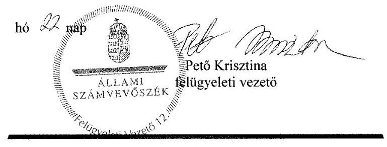

---

# RÖVIDÍTÉSEK JEGYZÉKE 

${ }^{1}$ Számvevőszéki jelentés
${ }^{2}$ Egyetem
${ }^{3}$ ÁSZ
${ }^{4}$ Rektor
${ }^{5}$ Miniszter
${ }^{6}$ EMMI
${ }^{7}$ Kancellár ${ }_{1}$
${ }^{8}$ Kancellár ${ }_{2}$
${ }^{9}$ ÁSZ tv.
${ }^{10}$ SZMSZ
${ }^{11}$ Bkr.
${ }^{12}$ Szenátus
${ }^{13}$ Számv. tv.
${ }^{14}$ Gazdálkodási Szabályzat
${ }^{15}$ Leltározási szabályzat
${ }^{16}$ Értékelési szabályzat
${ }^{17}$ IBSZ
${ }^{18}$ Számlarend
${ }^{19}$ Önköltségszámítási szabályzat
${ }^{20}$ Nvtv.
${ }^{21}$ Nftv.
${ }^{22}$ Info. tv.
${ }^{23}$ ISZSZK
${ }^{24}$ Bizonylati Szabályzat
${ }^{25}$ Ávr.
${ }^{26}$ Áhsz.
${ }^{27}$ IBtv.
${ }^{28}$ Kincstár

Az ÁSZ 15035. számú jelentése Szegedi Tudományegyetem ellenőrzéséről- Az állami felsőoktatási intézmények gazdálkodásának, működésének ellenőrzése (elérhető a www.asz.hu honlapon)
Szegedi Tudományegyetem
Állami Számvevőszék
Szegedi Tudományegyetem Rektora
Emberi Erőforrások Minisztere
Emberi Erőforrások Minisztériuma
Szegedi Tudományegyetem Kancellárja, 2015. január 1-jétől (MK 2015. évi 2. számában megjelent 1/2015. (I. 15.) ME határozat alapján),
Szegedi Tudományegyetem Kancellárja, 2016. augusztus 1-jétől (a MK 2016. évi 109. számában megjelent 80/2016. (VII. 21.) ME határozat szerint)
2011. évi LXVI. törvény az Állami Számvevőszékről (hatályos 2011. július 1-jétől)

Az Állami Számvevőszék elnökének 3/2016. (XII.29.) ÁSZ utasítása az Állami Számvevőszék Szervezeti és Működési Szabályzatáról (hatályos: 2017. január 1-jétől)
370/2011. (XII.31.) Korm. rendelet a költségvetési szervek belső
kontrollrendszeréről és belső ellenőrzéséről (hatályos: 2012. január 1-jétől)
A Szegedi Tudományegyetem vezető testülete a Szenátus
2000. évi C. törvény a számvitelről (hatályos: 2001. január 1.-től)

Szegedi Tudományegyetem Gazdálkodási Szabályzata (hatályos: 2015. november 30.-tól)

Szegedi Tudományegyetem Eszközök és források leltárkészítési és leltározási szabályzata (hatályos: 2015. szeptember 28-tól)
Szegedi Tudományegyetem Eszközök és Források Értékelési Szabályzata (hatályos: 2015. október 26-tól)
Szegedi Tudományegyetem Informatikai Biztonsági Szabályzata (hatályos 2015. szeptember 30.-tól)
Szegedi Tudományegyetem Számlarendje (hatályos: 2015. november 30-tól)
Szegedi Tudományegyetem Önköltségszámítási Szabályzata (hatályos: 2015. november 30-tól)
2011. évi CXCVI. törvény a nemzeti vagyonról (hatályos: 2011. december 31-étől)
2011. évi CCIV törvény a Nemzeti felsőoktatásról (hatályos: 2012. január 1.-től)
2011. évi CXII. törvény az információs önrendelkezési jogról és az információszabadságról (hatályos: 2011. július 27.-étől)
Igazgatásszervezési és Szolgáltatási Központ
Szegedi Tudományegyetem i Szabályzata (hatályos: 2015. november 30-tól)
368/2011. (XII.31) Korm. rendelet az államháztartásról szóló törvény végrehajtásáról
4/2013. (I.11) Korm. rendelet az államháztartás számviteléről
2013. évi L. törvény az állami és az önkormányzati szervek elektronikus információbiztonságáról
Magyar Államkincstár

---

${ }^{29}$ 2015. évi vagyongazdálkodási terv
${ }^{30}$ 2016. évi vagyongazdálkodási terv
2015. évi vagyongazdálkodási terv, melyet a szenátus 209/2015. számú határozattal elfogadott 2016. január 1-jei hatállyal
A 2016. évi vagyongazdálkodási terv, melyet az Egyetem konzisztóriuma 2016. július 17-én 9/2016. számú határozattal fogadott el.

---

# ÁLLAMI SZÁMVEVŐSZÉK 

1052 Budapest, Apáczai Csere János utca 10.
Levélcím: 1364 Budapest 4. Pf. 54
Telefon: +36 14849100 Telefax: +36 14849200
www.asz.hu

