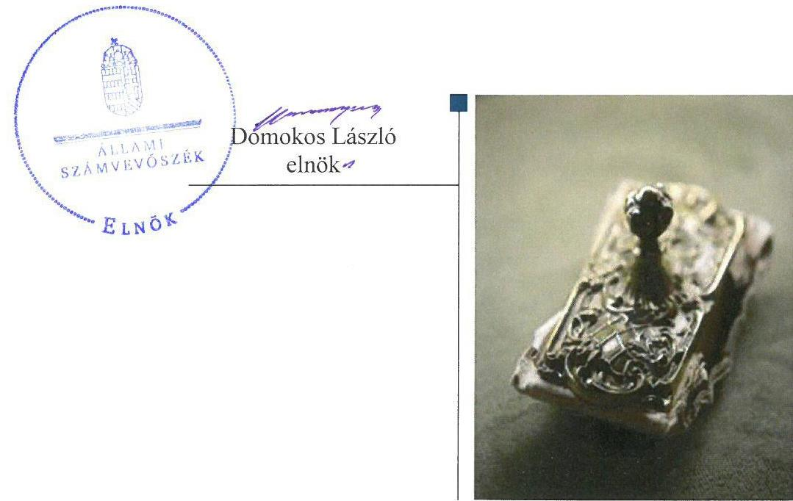
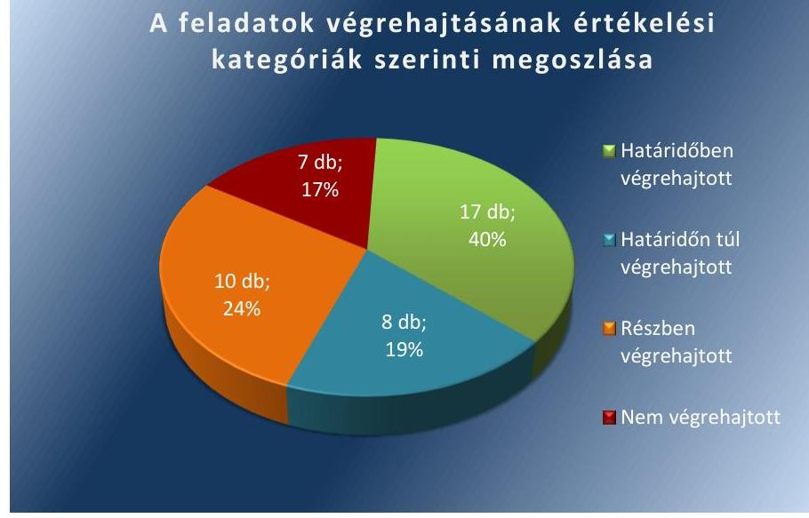

# Jelentés 

## Utóellenőrzések

Az önkormányzatok belső
kontrollrendszere kialakításának és működtetésének utóellenőrzése Mezőkeresztes Város Önkormányzata 2017.

---

# Jelentés 

## Utóellenőrzések

Az önkormányzatok belső
kontrollrendszere kialakításának és működtetésének utóellenőrzése -
Mezőkeresztes Város Önkormányzata
2017. 12 hó 20 nap

---

|  AZ ELLENŐRZÉST FELÜGYELTE: |  |  |  |  |  |   |
| --- | --- | --- | --- | --- | --- | --- |
|   | RENKŐ ZSUZSANNA felügyeleti vezető |  |  |  |  |   |
|   | AZ ELLENŐRZÉST VEZETTE ÉS A VÉGREHAJTÁSÁÉRT FELELŐS: |  |  |  |  |   |
|   | NAGY ANNA ellenőrzésvezető |  |  |  |  |   |
|   | A PROGRAM ÖSSZEÁLLÍTÁSÁÉRT FELELŐS: |  |  |  |  |   |
|   | JANIK JÓZSEF LÁSZLÓ osztályvezető |  |  |  |  |   |
|   | A TÉMÁHOZ KAPCSOLÓDÓ KORÁBBI SZÁMVEVŐSZÉKI JELENTÉSEK: |  |  |  |  |   |
|   | - címe: | Jelentés az önkormányzatok belső kontrollrendszere kialakításának, egyes kontrolltevékenységek és a belső ellenőrzés működésének - 2013. évben induló - ellenőrzéséről Mezőkeresztes |  |  |  |   |
|  Jelentéseink az Országgyűlés számítógépes hálózatán és az Interneten a www.asz.hu címen is olvashatóak. | - sorszáma: | 13157 |  |  |   |
|   | IKTATÓSZÁM: EL-0072-054/2017. |  |  |  |  |   |
|   | TÉMASZÁM: 21 |  |  |  |  |   |
|   | ELLENŐRZÉS-AZONOSÍTÓ SZÁM: V075592 |  |  |  |  |   |

---

# TARTALOMJEGYZÉK 

■ ÖSSZEGZÉS ..... 5
■ AZ ELLENŐRZÉS CÉLJA ..... 6
■ AZ ELLENŐRZÉS TERÜLETE ..... 7
■ AZ ELLENŐRZÉS HÁTTERE, INDOKOLTSÁGA ..... 8
■ A JELENTÉS LÉNYEGES KÉRDÉSKÖRE ..... 9
■ ELLENŐRZÉS HATÓKÖRE ÉS MÓDSZEREI ..... 10
■ MEGÁLLAPÍTÁSOK ..... 12
■ MELLÉKLETEK ..... 19
I. sz. melléklet: Az ÁSZ 13157 számú jelentéséhez kapcsolódó intézkedési terv végrehajtása ..... 19
■ FÜGGELÉK: ÉSZREVÉTELEK ..... 35
■ RÖVIDÍTÉSEK JEGYZÉKE ..... 37

---

.

---

# ÖSSZEGZÉS 

Az Állami Számvevőszék Mezőkeresztes Város Önkormányzata belső kontrollrendszere kialakításának és működtetésének utóellenőrzése során megállapította, hogy az intézkedési tervben meghatározott feladatok végrehajtása javította az önkormányzat szabályozottságát. Ugyanakkor a belső kontrollrendszert érintő további hiányosságok, a működtetése terén továbbra is fennálló hibák, szabálytalanságok nem biztosítják a közpénzekkel történő szabályszerű, felelős gazdálkodást.

## Az ellenőrzés társadalmi indokoltsága

Az Állami Számvevőszék stratégiájában célként határozta meg a számvevőszéki munka hasznosulásának javítását. Ezzel összhangban ellenőrzi, hogy az ellenőrzött szervezetek megvalósították-e a korábbi ellenőrzései által feltárt hibák, hiányosságok és szabálytalanságok megszüntetése céljából kialakított intézkedési terveikben foglaltakat. A rendszeres utóellenőrzések hozzájárulnak a szükséges intézkedések tényleges végrehajtásához, ezáltal a közpénzügyek rendezettségének javulásához.

## Főbb megállapítások, következtetések

Javult a pénzügyi kontrollok - a teljesítésigazolási jogkör - gyakorlása és a belső ellenőrzés - az Önkormányzat belső ellenőrzési kézikönyvének elkészíttetése, jóváhagyása, valamint a belső ellenőrzések alapján tett intézkedések nyilvántartása - szabályozottsága. Ugyanakkor a gazdálkodási jogkörök - a kötelezettségvállalás pénzügyi ellenjegyzése és az érvényesítési jogkör - gyakorlása és a belső ellenőrzés működtetése - a belső ellenőrzési tevékenység jogszabálynak megfelelő ellátásáról való gondoskodás, az elvégzett belső ellenőrzések nyilvántartása, a belső ellenőrzési terv jogszabályi előírásnak megfelelő módosítása - terén továbbra is hiányosságok voltak. A részben illetve nem végrehajtott feladatok az Önkormányzat tevékenységének szabályozásában, működtetésének szabályosságában és a felelős vezetői magatartásban további intézkedéseket tesznek szükségessé, mivel továbbra is fennáll a hibák, szabálytalanságok bekövetkezésének lehetősége.

A jegyző az intézkedési tervben meghatározott feladatok végrehajtásáról a jogszabály által előírt nyilvántartást nem vezette.

---

# AZ ELLENŐRZÉS CÉLJA 

Az ellenőrzés célja annak értékelése volt, hogy a számvevőszéki jelentésben foglalt intézkedést igénylő megállapításokkal összhangban készített intézkedési tervben meghatározott feladatokat az ellenőrzött szervezet végrehajtotta-e.

---

# **AZ ELLENŐRZÉS TERÜLETE**

## **Mezőkeresztes Város Önkormányzata**

Mezőkeresztes város Borsod-Abaúj-Zemplén megyében található, állandó lakosainak száma a Központi Statisztikai Hivatal Magyarország közigazgatási helynévkönyv alapján 2016. január 1-jén 3746 fő volt.

A polgármester¹, a 2002. évi helyi önkormányzati választásoktól a 2014. évi helyi önkormányzati választásokig töltötte be, a polgármester² a 2014. évi helyi önkormányzati választások (2014. október 12.) óta tölti be tisztségét. Az ellenőrzött időszak alatt a jegyző¹, 2012. augusztus 1-jétől 2015. január 4-éig, a jegyző², 2015. április 27-étől 2016. május 30-áig látta el, a jegyző³, 2016. december 12-étől látja el feladatát. 2015. január 5-e és április 26-a között, valamint 2016. május 31-e és december 11-e között az aljegyző látta el a jegyző feladatait. A Polgármesteri Hivatal³ szervezeti egységekre nem tagolódott, elkülönített gazdasági szervezettel nem rendelkezett. A Képviselő-testület⁴ hat tagból állt, munkáját három állandó bizottság segítette.

Mezőkeresztes Város Önkormányzata a 2015. évi költségvetésének végrehajtásáról szóló zárszámadás⁵ szerint 1027,7 millió Ft költségvetési bevételt ért el, valamint 953,9 millió Ft költségvetési kiadást teljesített, a befektetett eszközeinek könyv szerinti értéke 4280,9 millió Ft, összes eszközértéke 4393,0 millió Ft volt.

Az Állami Számvevőszék 2013-ban ellenőrizte Mezőkeresztes Város Önkormányzata belső kontrollrendszerének kialakítását, valamint egyes kontrolltevékenységek és a belső ellenőrzés működését a 2012. január 1-jétől 2012. december 31-ig terjedő időszakra vonatkozóan. Az erről szóló 13157 számú jelentését 2013. december 10-én tette közzé. Az ellenőrzés célja annak értékelése volt, hogy az Önkormányzat a jogszabályi előírásoknak megfelelően alakította-e ki a belső kontrollrendszert, megfelelően működtette-e a gazdálkodás folyamatában kulcsszerepet betöltő szakmai teljesítésigazolás és érvényesítés kontrolltevékenységeket, biztosította-e a belső ellenőrzés szabályos működését. Az ÁSZ jelentésében⁶ foglalt javaslatok alapján összeállított, a polgármester által megküldött intézkedési terveket⁷ az Állami Számvevőszék elnöke 2014. december 1-jén fogadta el.

Az utóellenőrzés – a 2013. december 10-től 2017. június 19-ig végrehajtott feladatokat figyelembe véve – az ÁSZ jelentésében a polgármester és a jegyző részére megfogalmazott, intézkedést igénylő megállapításokra készített, az Állami Számvevőszék részére megküldött intézkedési tervben foglalt feladatok végrehajtásának ellenőrzésére, értékelésére fókuszált.

---

# AZ ELLENŐRZÉS HÁTTERE, INDOKOLTSÁGA 

Az ÁSZ tv ${ }^{8}$. 33. § (1) bekezdése értelmében a számvevőszéki jelentések intézkedést igénylő megállapításaihoz kapcsolódóan az ellenőrzött szervezet vezetője intézkedési tervet köteles összeállítani, és az Állami Számvevőszék részére megküldeni. Az intézkedési tervben foglaltak megvalósítását - az ÁSZ tv. 33. § (7) bekezdésében foglaltak alapján - az Állami Számvevőszék utóellenőrzés keretében ellenőrizheti. Az intézkedések megvalósulásának értékelése során az Állami Számvevőszék figyelembe veszi az ellenőrzött szervezetek működési feltételeiben, valamint a jogszabályi előírásokban bekövetkezett változásokat.

Az intézkedési tervekben foglalt feladatok hiányos, illetve késedelmes végrehajtása, valamint megvalósításának elmaradása azt mutatja, hogy az ellenőrzések során feltárt hibák, hiányosságok és szabálytalanságok megszüntetése nem kapott kellő hangsúlyt. Ez a szabályszerű működés és a felelős vezetői magatartás vonatkozásában kockázatot hordoz. E kockázatok feltárásával az Állami Számvevőszék utóellenőrzési rendszere fokozza a fegyelmet, és igazolja, hogy a közpénzzel való szabályos gazdálkodás felelőssége elől nem lehet kitérni.

Az utóellenőrzés négy szinten hasznosulhat:
A társadalom szintjén az utóellenőrzés jelzi, hogy a számvevőszéki ellenőrzés megállapításainak van következménye: a hiányosságok megszüntetésére az ellenőrzött szervezet által meghatározott intézkedések végrehajtását is számon kéri az Állami Számvevőszék.
$\longrightarrow$ Az ellenőrzött terület szintjén az utóellenőrzés tájékoztatást nyújt a terület döntéshozóinak a hiányosságok kiküszöbölésének jó gyakorlatairól, ezzel lehetőséget biztosítva arra, hogy az Állami Számvevőszék ellenőrzési megállapításai, javaslatai a terület nem ellenőrzött szervezeteinek a működése során is hasznosuljanak.
$\longrightarrow$ Az ellenőrzött szervezet szintjén az utóellenőrzés feltárja, hogy a szervezet az intézkedések végrehajtásával hasznosította-e a korábbi ellenőrzési jelentésben a hiányosságok megszüntetése, illetve a kockázatok kezelése érdekében megfogalmazott javaslatokat.
$\longrightarrow$ Az Állami Számvevőszék szintjén az utóellenőrzés visszacsatolást ad az ellenőrzési jelentések hasznosulásáról, az intézkedések elmaradása vagy részleges megvalósulása a további ellenőrzésekhez kockázati jelzésként szolgál.

---

# A JELENTÉS LÉNYEGES KÉRDÉSKÖRE 

Az ellenőrzött szervezet az intézkedési tervben foglaltakat az előírt határidőben végrehajtotta-e?

---

# ELLENŐRZÉS HATÓKÖRE ÉS MÓDSZEREI 

## Az ellenőrzés típusa

Megfelelőségi ellenőrzés

## Az ellenőrzött időszak

Az utóellenőrzés alapját képező ÁSZ jelentése közzétételének napjától (2013. december 10-e) az ellenőrzésről szóló kiértesítő levél keltének napjáig (2017. június 19-e) tartó időszak.

## Az ellenőrzés tárgya

Az ÁSZ tv. 2011. július 1-jei hatálybalépését követően a számvevőszéki jelentésben foglalt intézkedést igénylő megállapításokkal összhangban - az ellenőrzött szervezet által - készített intézkedési tervben foglaltak végrehajtásának ellenőrzése volt.

Az ellenőrzés kiterjedt minden olyan körülményre és adatra, amely az Állami Számvevőszék jogszabályban meghatározott feladatainak teljesítéséhez, valamint a program végrehajtása folyamán felmerült újabb összefüggések feltárásához szükséges volt.

## Az ellenőrzött szervezet

Mezőkeresztes Város Önkormányzata

## Az ellenőrzés jogalapja

Az ÁSZ tv. 33. § (7) bekezdése alapján az intézkedési tervben foglaltak megvalósítását az Állami Számvevőszék utóellenőrzés keretében ellenőrizheti.

## Az ellenőrzés módszerei

Az Állami Számvevőszék az ellenőrzést a nemzetközi standardokat irányadónak tekintve az ellenőrzési program ellenőrzési kérdései alapján, az ellenőrzött időszakban hatályos jogszabályok, az ellenőrzés szakmai szabályok és módszertanok figyelembevételével, önállóan végezte.

---

Az Állami Számvevőszék az ellenőrzés ideje alatt az ellenőrzött szervezettel történő kapcsolattartást az ÁSZ SZMSZ ${ }^{9}$-ének vonatkozó előírásai alapján biztosította.

Az utóellenőrzés megállapításait elsősorban az Állami Számvevőszék rendelkezésére álló, valamint az ellenőrzött szervezetektől elektronikusan bekért dokumentumok alapozták meg.

Az ellenőrzési bizonyítékként felhasználható adatforrások közé tartoznak egyrészt a szakmai programban felsorolt adatforrások, másrészt minden - az ellenőrzés folyamán feltárt, az ellenőrzés szempontjából információt tartalmazó - dokumentum.

Az intézkedési tervekben előírt feladatokat azok végrehajthatósága, illetve végrehajtása szempontjából az alábbiak szerint értékelte az Állami Számvevőszék:
"határidőben végrehajtott" a feladat, ha a teljesítés dokumentáltan, az intézkedési tervben előírt határidőben és tartalommal megtörtént;
"határidőn túl végrehajtott" a feladat, ha annak teljesítése az intézkedési tervben meghatározott módon, de az előírt határidőn túl történt meg;
"részben végrehajtott" a feladat, ha végrehajtása teljes körűen az intézkedési tervben előírt módon nem történt meg;
"nem végrehajtott" a feladat, ha a végrehajtás nem történt meg, vagy amennyiben a teljesítést nem dokumentálták;
"okafogyottá vált" a feladat, ha végrehajtására - meghatározott esemény bekövetkezése, továbbá külső körülmény, a működést érintő feltétel változása miatt - már nincs szükség, illetve lehetőség, és egyértelműen megállapítható, hogy az intézkedést szükségessé tevő körülmény a jövőben nem fordulhat elő;
"nem időszerű" az a feladat, amelynek ellenőrzési időszakon belüli végrehajtására azért nem került (kerülhetett) sor, mert az intézkedés alapjául szolgáló esemény nem következett be, de annak jövőbeni előfordulása lehetséges, a végrehajtása nem volt esedékes, vagy a végrehajtás határideje még nem járt le.
Az ellenőrzés lefolytatásához az ellenőrzött szervezet a tanúsítványok elektronikus kitöltésével, valamint az Állami Számvevőszék által kért dokumentumok elektronikus megküldésével szolgáltatott adatokat, amelyek valódiságát és teljes körűségét az ellenőrzött szervezet vezetője által tett teljességi és hitelességi nyilatkozat igazolta. Az így rendelkezésre bocsátott adatok, információk kontrollja az ellenőrzés keretében történt.

---

# MEGÁLLAPÍTÁSOK 

## Az ellenőrzött szervezet az intézkedési tervben foglaltakat az előírt határidőben végrehajtotta-e?

Összegző megállapítás

Az Önkormányzat az intézkedési tervben meghatározott 42 feladatból 17 feladatot határidőben, nyolcat határidőn túl, 10 feladatot részben, hetet nem hajtott végre. A jegyző az intézkedési tervben rögzített feladatok végrehajtásáról a jogszabály által előírt nyilvántartást nem vezette.

Az ÁSZ ${ }^{10}$ a jelentésében a polgármester ${ }_{1}$ részére négy, a jegyző ${ }_{1}$ részére 37 javaslatot fogalmazott meg. A polgármester ${ }_{1}$ és a jegyző ${ }_{1}$ az ÁSZ részére megküldött intézkedési tervben a hiányosságok, szabálytalanságok megszüntetésére 42 feladatot határozott meg, a feladatok elvégzésének felelőseként öt esetben a polgármester ${ }_{1}$-t, 37 esetben pedig a jegyző ${ }_{1}$-t jelölték meg.

Az intézkedési tervben meghatározott feladatokat, határidőket, felelősöket és a feladatok végrehajtását az I. sz. melléklet mutatja be.

A jegyző az intézkedési tervben meghatározott feladatok végrehajtásáról nem vezette a Bkr. ${ }^{11}$ 14. § (1) bekezdésében előírt nyilvántartást.

Az Önkormányzat ${ }^{12}$ intézkedési tervében meghatározott feladatok végrehajtásának értékelési kategóriák szerinti megoszlását az 1. ábra szemlélteti.

1. ábra

A feladatok végrehajtásának értékelési kategóriák szerinti megoszlása

Forrás: ÁSZ

---

# HATÁRIDŐBEN VÉGREHAJTOTT feladatok: 

1. A polgármester ${ }_{1}$ intézkedett, hogy kötelezettséget vállalni csak pénzügyi ellenjegyzés után lehessen.
2. A polgármester ${ }_{1}$ a zárszámadási rendelettervezettel egyidejűleg terjesztette be a 2013. évi éves ellenőrzési jelentést ${ }^{13}$.
3. A polgármester ${ }_{1}$ kijelölte a teljesítésigazolásra jogosultakat az általa történő kötelezettségvállalások esetében.
4. A jegyző ${ }_{1}$ elkészítette a vagyongazdálkodási rendelet módosításának tervezetét és kezdeményezte a Képviselő-testület elé terjesztését.
5. A jegyző ${ }_{1}$ feltüntette a vagyonnyilatkozat-tételi kötelezettséggel érintett munkaköröket a Polgármesteri Hivatal SZMSZ ${ }^{14}$-ében.
6. A jegyző ${ }_{1}$ belső szabályzatban rendezte a tervezéssel, gazdálkodással és a beszámolási feladatok teljesítésével kapcsolatos belső előírásokat, feltételeket.
7. A jegyző ${ }_{1}$ kijelölte az általa történő kötelezettségvállalások esetében a teljesítés igazolására jogosult személyeket.
8. A jegyző ${ }_{1}$ kijelölte az érvényesítésre jogosult személyt.
9. A jegyző ${ }_{1}$ rögzítette az iratkezelési rendszer kialakítása során az üzemeltetés és az adatbiztonság szabályait, abban a feladatok és hatáskörök pontosan meghatározásra kerültek.
10. A jegyző ${ }_{1}$ meghatározta a Polgármesteri Hivatal tevékenységeire vonatkozó beszámolási eljárásokhoz kapcsolódó felelősségi köröket.
11. A jegyző ${ }_{1}$ meghatározta a gazdasági feladatot ellátó vezetők és alkalmazottak helyettesítésének rendjét.
12. A jegyző ${ }_{1}$ elkészítette az adatvédelmi és adatbiztonsági szabályzatot ${ }^{15}$.
13. A jegyző ${ }_{1,2,3}$ intézkedett arról, hogy a teljesítésigazolás során az Áht ${ }^{16}$-ben, Ávr ${ }^{17}$-ben előírt szabályoknak megfelelően járjanak el.
14. A jegyző ${ }_{1}$ kezdeményezte, hogy az Önkormányzat rendelkezzen a jogszabálynak megfelelő Belső ellenőrzési kézikönyvvel ${ }^{18}$.
15. A jegyző ${ }_{1,2,3}$ gondoskodott arról, hogy a belső ellenőr a jogszabály előírásának megfelelő tartalommal vezesse a belső ellenőrzési jelentésekben tett megállapítások, javaslatok intézkedési tervbe való beépítéséről és azok végrehajtásának nyomon követéséről szóló nyilvántartást.
16. A jegyző ${ }_{1}$ biztosította minden tevékenységre vonatkozóan a folyamatba épített, előzetes, utólagos és vezetői ellenőrzésre vonatkozó szabályozást.
17. A jegyző ${ }_{1,2}$ külső szolgáltató bevonásával, írásbeli megállapodásban és Belső ellenőrzési kézikönyvben a jogszabályi rendelkezéseknek megfelelően rendelkezett a belső ellenőrzési vezető feladatai és kötelezettségei ellátásának módjáról.

---

# HATÁRIDŐN TÚL VÉGREHAJTOTT feladatok: 

18. A jegyző az egészséget nem veszélyeztető és biztonságos munkavégzés követelményeit a jogszabályban foglaltaknak megfelelően - a 2014. január 31. határidőt követően - a 2014. április 1-jén aláírt és hatályba léptetett szabályzat keretében határozta meg.
19. A jegyző a jogszabálynak megfelelően szabályozta a szabálytalanságok kezelésének eljárásrendjét, amikor - a 2014. január 31.-i határidőt követően - 2014. április 1-jén aláírta és kiadta az erre vonatkozó szabályzatot.
20. A jegyző a 2014. április 1-jén - a 2014. január 31.-i határidőt követően - aláírt és kiadott szabályzatban rögzítette a Polgármesteri Hivatal által ellátott feladatok munkafolyamatait a jogszabályban előírtaknak megfelelően.
21. A jegyző - a 2014. január 31.-i határidőt követően - előkészítette a jogszabályban foglalt feladatkörében a köztisztviselőkkel szembeni hivatásetikai alapelvek részletes tartalmát, valamint az etikai eljárás szabályait a Kttv. ${ }^{19}$ 231. § (1) bekezdésében foglaltak érvényesülése érdekében és kezdeményezte a Képviselő-testület elé terjesztését, melyet az 2014. április 24-én fogadott el.
22. A jegyző a 2014. április 1-jei hatállyal kiadott szabályzatban - a 2014. március 31.-i határidőt követően - szabályozta a jogviszony megszűnés esetére a munkavállaló folyamatban lévő feladatai átadásának rendjét.
23. A jegyző - a 2014. március 31-i határidőt követően - a 2014. április 1-je és július 1-je között hatályba lépett szabályzatokkal alakított ki a jogszabályokban foglaltaknak megfelelően egy olyan rendszert, amely biztosítja, hogy a megfelelő információk a megfelelő időben eljutnak az illetékes szervezethez, szervezeti egységhez, illetve személyhez.
24. A jegyző - a 2014. március 31-i határidőt követően - a 2014. június 24-én aláírt, július 1-jétől hatályos szabályzatban állapította meg a kötelezően közzéteendő adatok nyilvánosságra hozatalának rendjét.
25. A jegyző - a 2014. március 31-i határidőt követően - 2014. június 24-én, július 1-jei hatállyal készítette el a szabályzatot, melyben meghatározta a jogszabályoknak megfelelően a közérdekű adatok megismerésére irányuló kérelmek intézésének rendjét.

## RÉSZBEN VÉGREHAJTOTT feladatok:

26. A jegyző a 2015. július és 2016. március közötti időszakban végezte a napi munkafolyamatokba beépített szúrópróbaszerű ellenőrzéseket. A polgármester ${ }_{1,2}$ a gazdálkodás szabályszerű működésének figyelemmel kísérése során az intézkedési tervben megfogalmazott beszámoltatási kötelezettségét nem teljesítette, az elvégzett ellenőrzésekről nem számoltatta be a jegyző ${ }_{1,2,3}$-t. Az ellenőrzések megállapításai alapján munkajogi intézkedés kezdeményezését a polgármester ${ }_{2}$ nem tartotta indokoltnak.
27. A jegyző - határidőben - elkészítette a hivatali SZMSZ módosítását és kezdeményezte annak Képviselő-testület elé terjesztését. A

---

Képviselő-testület által megtárgyalt és jóváhagyott SZMSZ-ben a módosítást követően - az Ávr. 13. § (1) bekezdés c), h) pontjaiban foglaltak ellenére - nem rögzítették az ellátandó, és a kormányzati funkció szerint besorolt alaptevékenységek, valamint az alaptevékenységet szabályozó jogszabályok megjelölését, továbbá a munkáltatói jogok - ideértve az átruházott munkáltatói jogokat is - gyakorlásának rendjét.
28. A jegyző nem értékelte írásban a Polgármesteri Hivatal valamennyi köztisztviselőjének munkateljesítményét a Kttv. 130. § (1) bekezdésében foglaltak ellenére.
29. A jegyző 2014. január 1-jétől hatályos Gazdálkodási szabályzatban ${ }^{20}$ rögzítette az Ávr. 53. § (2) bekezdésében foglaltaknak megfelelően az előzetes írásbeli kötelezettségvállalást nem igénylő kifizetések rendjét. A Gazdálkodási szabályzat 1.2.1. pontjában - az Ávr. 53. § (1) bekezdés a)-c) pontjával összhangban - nevesítette, hogy mely esetekben nem szükséges előzetes írásbeli kötelezettségvállalás, illetve rögzítette, hogy ezeket is fel kell vezetni a kötelezettségvállalás nyilvántartásába. A szabályzat ugyanakkor nem tért ki arra, hogy az eljárásmenet során mikor, milyen dokumentum alapján kerüljön sor erre.
30. A jegyző hiányosan biztosította az Info tv. ${ }^{21}$ 33. § (1) és (3) bekezdésében foglaltak szerinti elektronikus közzétételi kötelezettséget, mivel az Info tv. 37. § (1) bekezdésében foglaltakkal ellentétben a jegyző nem a jogszabály 1. mellékletében foglaltak szerint tette közzé a melléklet szerinti általános közzétételi listában meghatározott adatokat. Nem kerültek teljeskörűen közzétételre az Info tv. 1. sz. mell. I/9. pontjában, az Info tv. 1. sz. mell. II/1. pontjában, az Info tv. 1. sz. mell. III/1. pontjában, az Info tv. 1. sz. mell. III/2. pontjában foglaltak szerinti adatok.
31. A jegyző1,2,3 a Bkr. 3. § e) pontjában és 10. §-ában foglaltak ellenére hiányosan alakította ki és működtette a Polgármesteri Hivatal tevékenységének, a célok megvalósításának nyomon követését biztosító rendszerét. A jegyző rendszeresen végzett ellenőrzéseket ezzel biztosítva az eseti nyomon követést, a jegyző1,3 eseti nyomon követést nem végzett. A jegyző 2014. január 1-jei hatállyal adta ki a Belső Ellenőrzési Kézikönyvet. A 2013. évi, a 2014. éves összefoglaló ellenőrzési jelentéseket a belső ellenőrzési vezető a Bkr. előírásainak megfelelő tartalommal elkészítette. A 2015. évi valamint a 2016. évre vonatkozó éves összefoglaló ellenőrzési jelentést a Képviselő-testület a - Bkr. 48. §-ában előírt tartalmi követelmények hiányosságai ellenére - elfogadta. A belső ellenőrzési vezető1,2 nem készített kockázatelemzésen alapuló stratégiai tervet - a Bkr. 29. § (1) bekezdésében foglaltak ellenére- azonban a 2015-2017. évekre vonatkozó éves ellenőrzési terveket a Képvi-selő-testület jóváhagyta. A jegyző1,2,3 gondoskodott arról, hogy a belső ellenőrzési vezető1,2 a Bkr. 47. § (1) bekezdésében foglalt tartalommal vezessen nyilvántartást a belső ellenőrzési jelentésekben tett megállapítások, javaslatok, intézkedési tervek és azok végrehajtása nyomon követésének biztosítása érdekében. A jegyző2,3 illetve az aljegyző nem gondoskodott a belső ellenőrzési tevékenység megszervezéséről és ellátásáról 2015. november 1-je és

---

2016. december 14-e között. A jegyző ${ }_{1,2,3}$ nem gondoskodott arról, hogy a belső ellenőrzési vezető1,2 a Bkr. 31. § (5) bekezdésében előírtaknak megfelelően a jegyző egyetértésével módosítsa a 2014-2016. évi belső ellenőrzési tervet, illetve 2017. január 1-jétől a Bkr. 31. § (5) bekezdésében előírtaknak megfelelően a Képviselőtestület egyetértésével módosítsa a 2017. évi belső ellenőrzési tervet. A belső ellenőrzési vezető1,2 a Bkr. 50. §-a alapján vezetett nyilvántartást az elvégzett belső ellenőrzésekről, azonban az a Bkr. 50. § (2) bekezdés d)-f) pontjaiban foglaltakat nem tartalmazta.
2017. A jegyző ${ }_{1}$ intézkedett a külső ellenőrzések megállapításai és javaslatai alapján szükséges intézkedési tervek nyilvántartására. Azonban a nyilvántartások a Bkr. 14. § (1) bekezdésében foglaltak ellenére nem tartalmaztak valamennyi, a külső ellenőrzések megállapításai és javaslatai alapján elkészített intézkedési terv végrehajtására vonatkozó - a Bkr. 47. § (2) bekezdése szerinti - adatot: az ellenőrzési tervben szereplő javaslatokat, az elfogadott intézkedési tervet, az intézkedési terv alapján végrehajtott intézkedések rövid leírását, és a végre nem hajtott intézkedések okát.
2018. A jegyző ${ }_{1}$ gondoskodott a jogszabályban előírt éves ellenőrzési terv készítéséről, ugyanakkor nem gondoskodott - a Bkr. 22. § (1) bekezdés b) pontjában, a 29. § (1) bekezdésében, a 30. § (1) bekezdésében előírtaknak ellenére - stratégiai ellenőrzési terv készítéséről.
2019. A jegyző ${ }_{1,2,3}$ az elvégzett belső ellenőrzésekről nyilvántartás vezetéséről gondoskodott, azonban az a Bkr. 22.§ (2) e) pontjában előírtak ellenére hiányos tartalmú volt. A nyilvántartás tartalmazta az ellenőrzés azonosítóját, tárgyát, az ellenőrzött szervezet megnevezését, és az intézkedési terv készítésének szükségességét. A Bkr. 50. § (1) bekezdésének d) pontjában előírtak ellenére a nyilvántartás nem terjedt ki az ellenőrzés kezdetének és lezárásának időpontjára, a Bkr. 50. § (1) bekezdésének e) pontjában előírtak ellenére hiányzott a vizsgálatvezető, a belső ellenőr, a szakértő neve, és a Bkr. 50. § (1) bekezdésének f) pontjában előírtak ellenére hiányzott a vizsgált időszak megnevezése.
2020. A jegyző ${ }_{1}$ illetve az aljegyző a 2013. és 2014. évi éves belső ellenőrzési jelentések jogszabályoknak megfelelő elkészíttetését kezdeményezte. A jegyző ${ }_{2}$ a 2015. éves belső ellenőrzési jelentés határidőben történő elkészítését kezdeményezte, azonban az a Bkr. 48. §-ban foglaltak ellenére hiányos tartalommal készült el, nem tartalmazta a belső ellenőrzés által végzett tevékenység bemutatását, a belső kontrollrendszer működésének értékelését. A jegyző ${ }_{3}$ a 2016. évi belső ellenőrzési jelentés elkészíttetéséről határidőn túl és nem a Bkr.-ben előírt tartalommal gondoskodott.

# NEM VÉGREHAJTOTT feladatok: 

36. A polgármester - a Bkr. 49. § (3a) bekezdésében, illetve az 56. § (8) bekezdésében foglaltak ellenére - nem intézkedett arról, hogy az Önkormányzat éves munkatervében szerepeljen az éves ellenőrzési jelentés zárszámadási rendelettervezettel egyidejűleg történő beterjesztése.

---

37. A jegyző ${ }_{1}$ a Bkr. 6. § (3) bekezdésében foglaltakkal ellentétben nem intézkedett az ellenőrzési nyomvonal jogszabályban előírtaknak megfelelő elkészítéséről.
38. A jegyző ${ }_{1}$ nem mérte fel és nem állapította meg a Bkr. 7. § (1)-(2) bekezdésében foglaltak ellenére a Polgármesteri Hivatal tevékenységében, gazdálkodásában rejlő kockázatokat, nem határozta meg az egyes kockázatokkal kapcsolatban szükséges intézkedéseket, valamint azok teljesítése folyamatos nyomon követésének módját.
39. A jegyző ${ }_{1}$ nem értékelte a Bkr. 11. § (1) bekezdésében előírtak ellenére a Bkr. 1. melléklete szerinti nyilatkozatban - a jogszabályban meghatározott keretek között - a 2013. évre vonatkozóan a belső kontrollrendszer minőségét.
40. A jegyző ${ }_{1,2,3}$ nem intézkedett arról, hogy a kötelezettségvállalásra - az Áht. 37. § (1) és az Ávr. 55. § (1) bekezdésében és a Gazdálkodási szabályzatban foglaltaknak megfelelően, az Ávr. 53. §-ában és a Gazdálkodási szabályzatban meghatározott kivételekkel - kizárólag a pénzügyi ellenjegyzés után, a pénzügyi teljesítést megelőzően, írásban kerüljön sor.
41. A jegyző ${ }_{1,2,3}$ nem intézkedett arról, hogy a kifizetéseket megelőzően a teljesítésigazolás alapján - az Ávr. 57. § (3) bekezdése szerinti esetben annak hiányában is - az összegszerűségnek, a fedezet meglétének és a megelőző ügymenetben az Áht., az Áhsz ${ }_{1}{ }^{22}$, Áhsz ${ }_{2}{ }^{23}$ az Ávr. előírásai és a belső szabályzatokban foglaltak betartásának az ellenőrzése - az Ávr. 58. § (1)-(3) bekezdései szerint történjen meg.
42. A jegyző ${ }_{1,2,3}$ a Bkr. 31. § (5) bekezdése - 2016. december 31-ig hatályos előírása ellenére - nem intézkedett a 2014., 2015. és 2016. évi éves ellenőrzési terveknek az egyetértésével, valamint a Bkr. 31. § (5) bekezdése 2017. január 1-jétől hatályos előírása ellenére - nem intézkedett a 2017. éves ellenőrzési terv Képviselő-testület egyetértésével történő módosítására, ugyanakkor az ellenőrzési tervek módosítása indokolt lett volna a tervtől való eltérések miatt.

---

.

---

# MELLÉKLETEK

- I. SZ. MELLÉKLET: AZ ÁSZ 13157 SZÁMÚ JELENTÉSÉHEZ KAPCSOLÓDÓ INTÉZKEDÉSI TERV VÉGREHAJTÁSA

|  Sorszám | Intézkedési tervben meghatározott feladat | Az ÁSZ jelentésében megfogalmazott feladatok | Intézkedési tervben meghatározott határidő | Intézkedési tervben meghatározott feladatok felelőse | Feladat végrehajtása  |
| --- | --- | --- | --- | --- | --- |
|   | 1. | 2 | 3. | 4. | 5.  |
|  Határidőben végrehajtott feladatok |  |  |  |  |   |
|  1. | Kötelezettségvállalás csak pénzügyi ellenjegyzés szerint történhet a jövőben. |  | azonnal
(int. terv kelte:
2014. 01.21.)
és azt követően
folyamatos | polgármester | A polgármester; a jegyzővel a kötelezettségvállalás rendjének felülvizsgálata után 2014. január 1-jei hatállyal kiadta a Gazdálkodási szabályzatot, amelyben előírták, hogy kötelezettséget vállalni csak pénzügyi ellenjegyzés után a pénzügyi teljesítés esedékességét megelőzően - az Ávr. 53. § (1) bekezdése szerinti kivételekkel írásban lehet.  |
|  2. | Éves ellenőrzési jelentést a zárszámadási rendelettervezettel egyidejűleg be kell terjeszteni. |  | 2014. 04. 24.
(rendelettervezet tárgyalása) | polgármester | A polgármester; a Képviselő-testület 2014. április 24-ei ülésére a zárszámadási rendelettervezettel egyidejűleg beterjesztette a helyi Önkormányzat által alapított költségvetési szervek éves ellenőrzési jelentései alapján készített 2013. évi éves összefoglaló ellenőrzési jelentést, amelyet a Képviselő-testület megtárgyalt és elfogadott.  |
|  3. | A teljesítésigazolásra jogosult személyeket ki kell azonnal írásban jelölni. |  | azonnal
(int. terv kelte:
2014. 01. 21.) | polgármester | A polgármester; a 2014. január 1-jétől hatályos Gazdálkodási szabályzat mellékleteiben kijelölte a teljesítésigazolásra jogosultakat az általa történő kötelezettségvállalások esetében.  |
|  4. | A Jegyző hajtsa végre az ELLENŐRZÉS-i jegyzőkönyv ${ }^{24} 12$. oldalán felsoroltak előkészítését. | ÁSZ jelentése 12. oldal 1. b.) javaslat: A jegyző készítse el a Mótv. 81. § (3) bekezdés c) pontjában foglaltak alapján a vagyongazdálkodási rendelet módosításának tervezetét és kezdeményezze a Képviselő-testület elé terjesztését annak érdekében, hogy az megfeleljen az Nvtv. 3. § (1) bekezdés 6. pontja, 5-6. §-a, 11. § (16) bekezdése, 13. § (1) bekezdése, 18. § (1) és (12) bekezdése, valamint a Mótv. 109. § (4) bekezdése előírásainak. | 2014. 04. 24. | jegyző | A jegyző; elkészítette a vagyongazdálkodási rendelet módosításának tervezetét és kezdeményezte a Képviselő-testület elé terjesztését. A Képviselő-testület a 2014. április 24-ei ülésén elfogadta a 7/2014. (IV. 24.) önk. rendeletet ${ }^{25}$ az Önkormányzat vagyonáról és a vagyongazdálkodás szabályairól. A rendelet a módosítás eredményeként megfelelt az Nvtv. ${ }^{26} 3 . \S$ (1) bekezdés 6. pontjában, az 5-6. §- ban, 18. § (1) bekezdésében, a 11. § (16) bekezdésében, a 13. § (1) bekezdésében, valamint a Mótv. 81. § (3) c) pontjában, a 109. § (4) bekezdésében foglaltaknak. A Nvtv. 18. § (12) bekezdése időszerűtlenné vált.  |

---

|  5. | A Jegyző az ELLENŐRZÉS-i jegyzőkönyv 12-18. oldalain írt megállapításokra vonatkozó javaslatok tételes, szakszerű elvégzéséről gondoskodjon. | ÁSZ jelentése 13. oldal 2. b) javaslat: A jegyző az egyes vagyonnyilatkozat-tételi kötelezettségekről szóló 2007. évi CLII. tv. 4. § a) pontjában foglalt előírásnak megfelelően a vagyonnyilatkozat-tételi kötelezettséget az érintett személyek esetében a hivatali SZMSZ-ben tüntesse fel. | 2014. 04. 24. | jegyző | A jegyző, gondoskodott arról, hogy az egyes vagyonnyilatkozat-tételi kötelezettségekről szóló 2007. évi CLII. tv. 4. § a) pontjában foglalt előírásnak megfelelően a vagyonnyilatkozat-tételi kötelezettséget az érintett munkaköröket a Polgármesteri Hivatal SZMSZének IV/10. pontja tartalmazza. A Képviselő-testület a 2014. április 24-ei ülésén elfogadta az 5/2011. (IV. 14.) Önkormányzati rendelet^{28} 1. sz. mellékletét képező Polgármesteri Hivatal Szervezeti és működési szabályzatának módosítását.  |
| --- | --- | --- | --- | --- |
|  6. | A Jegyző az ELLENŐRZÉS-i jegyzőkönyv 12-18. oldalain írt megállapításokra vonatkozó javaslatok tételes, szakszerű elvégzéséről gondoskodjon. | ÁSZ jelentése 14. oldal 3. b) javaslat: A jegyző rendezze belső szabályzatban az Ávr. 13. § (2) bekezdés a) pontjában foglaltak alapján a tervezéssel, gazdálkodással - különösen az ellenjegyzés, a teljesítésigazolás módjával, valamint az érvényesítés és az utalványozás rendjével - és a beszámolási feladatok teljesítésével kapcsolatos belső előírásokat, feltételeket. | 2014. 05. 31. | jegyző | A jegyző, a 2014. január 1-jétől hatályos Gazdálkodási szabályzatban rendezte az Ávr. 13. § (2) bekezdés a) pontjában foglaltak alapján a tervezéssel, gazdálkodással – különösen az ellenjegyzés, a teljesítésigazolás módjával, valamint az érvényesítés és az utalványozás rendjével – és a beszámolási feladatok teljesítésével kapcsolatos belső előírásokat, feltételeket. További részleteket a beszámolási feladatokról a jegyző, a 2014. április 1-jén kiadott Belső szabályzat a Polgármesteri Hivatal által ellátott feladatok munkafolyamatairól^{29} című szabályzatban rögzített.  |
|  7. | A Jegyző az ELLENŐRZÉS-i jegyzőkönyv 12-18. oldalain írt megállapításokra vonatkozó javaslatok tételes, szakszerű elvégzéséről gondoskodjon. | ÁSZ jelentése 14. oldal 3. d) javaslat: A jegyző jelölje ki az Ávr. 57. § (4) bekezdésének megfelelően az általa történő kötelezettségvállalások esetében a teljesítés igazolására jogosult személyeket. | 2014. 03. 31. | jegyző | A jegyző, a 2014. január 1-jei hatállyal kiadott Gazdálkodási szabályzat keretében jelölte ki az Ávr. 57. § (4) bekezdésének megfelelően az általa történő kötelezettségvállalások esetében a teljesítés igazolására jogosult személyeket.  |
|  8. | A Jegyző az ELLENŐRZÉS-i jegyzőkönyv 12-18. oldalain írt megállapításokra vonatkozó javaslatok tételes, szakszerű elvégzéséről gondoskodjon. | ÁSZ jelentése 14. oldal 3. e) javaslat: A jegyző jelölje ki az Ávr. 58. § (4) bekezdésében foglaltak alapján az érvényesítésre jogosult személyeket. | 2014. 03. 31. | jegyző | A jegyző, a 2014. január 1-jei hatállyal kiadott Gazdálkodási szabályzat keretében jelölte ki az Ávr. 58. § (4) bekezdésének, valamint az Ávr. 55. § (2) bekezdésének megfelelően az érvényesítésre jogosult személyet.  |
|  9. | A Jegyző az ELLENŐRZÉS-i jegyzőkönyv 12-18. oldalain írt megállapításokra vonatkozó javaslatok tételes, szakszerű elvégzéséről gondoskodjon. | ÁSZ jelentése 14. oldal 3. f) javaslat: A jegyző rögzítse az iratkezelési rendszer kialakítása során az Íkr. 8. § (2) bekezdése alapján az üzemeltetés és az adatbiztonság szabályait oly módon, hogy a feladatok és hatáskörök pontosan meghatározásra kerüljenek és végrehajthatók legyenek. | 2014. 03. 31. | jegyző | A jegyző, az iratkezelési rendszer kialakítása során a 2014. március 25-én kiadmányozott Adatvédelmi és adatbiztonsági szabályzatban^{30} rögzítette az Íkr.^{31} 8. § (2) bekezdése alapján az üzemeltetés és az adatbiztonság szabályait, meghatározta a feladatokat és hatásköröket.  |

---

|  10. | A Jegyző az ELLENŐRZÉS-i jegyzőkönyv 12-18. oldalain írt megállapításokra vonatkozó javaslatok tételes, szakszerű elvégzéséről gondoskodjon. | ÁSZ jelentése 14. oldal 3. g) javaslat: A jegyző határozza meg a Bkr. 8. § (4) bekezdés c) pontjában foglaltaknak megfelelően a Polgármesteri Hivatal tevékenységeire vonatkozó beszámolási eljárásokhoz kapcsolódó felelősségi köröket. | 2014.05.31. | jegyző | A jegyző; a Bkr. 8. § (4) bekezdés c) pontjában foglaltaknak megfelelően a Polgármesteri Hivatal tevékenységeire vonatkozó beszámolási eljárásokhoz kapcsolódó felelősségi köröket a 2014. január 1-jei hatállyal kiadott Gazdálkodási szabályzat 2. fejezetében határozta meg. További részleteket a beszámolási feladatokról a jegyző; a 2014. április 1-jén kiadott Belső szabályzat a Polgármesteri Hivatal által ellátott feladatok munkafolyamatairól című szabályzat 3.1. és 3.2. pontjaiban rögzített.  |
| --- | --- | --- | --- | --- | --- |
|  11. | A Jegyző az ELLENŐRZÉS-i jegyzőkönyv 12-18. oldalain írt megállapításokra vonatkozó javaslatok tételes, szakszerű elvégzéséről gondoskodjon. | ÁSZ jelentése 14. oldal 3. h) javaslat: A jegyző határozza meg az Ávr. 13. § (5) bekezdése alapján a gazdasági feladatot ellátó vezetők és alkalmazottak helyettesítésének rendjét. | 2014.05.31. | jegyző | A jegyző; az Ávr. 13. § (5) bekezdésében foglalt előírás szerint a 2014. január 1-jei hatállyal kiadott Gazdálkodási szabályzat 1.2.2. pont utolsó bekezdésében határozta meg a gazdasági feladatot ellátó vezetők
 és alkalmazottak helyettesítésének rendjét.  |
|  12. | A Jegyző az ELLENŐRZÉS-i jegyzőkönyv 12-18. oldalain írt megállapításokra vonatkozó javaslatok tételes, szakszerű elvégzéséről gondoskodjon. | ÁSZ jelentése 15. oldal 4. b) javaslat: A jegyző készítsen adatvédelmi és adatbiztonsági szabályzatot az Info tv. 24. § (3) bekezdésének megfelelően. | 2014.03.31. | jegyző | A jegyző, 2014. március 25-én kiadmányozta az Adatvédelmi és adatbiztonsági szabályzatot az Info tv. 24. § (3) bekezdésének megfelelően. Ebben kitért többek között az alapvető fogalmi meghatározásokon túl, az adatvédelemért felelősök feladataira, a nyilvántartási és adatszolgáltatási rendre, valamint az adathordozókhoz, dokumentumokhoz kapcsolódó védelmi intézkedésekre is.  |
|  13. | A Jegyző az ELLENŐRZÉS-i jegyzőkönyv 12-18. oldalain írt megállapításokra vonatkozó javaslatok tételes, szakszerű elvégzéséről gondoskodjon. | ÁSZ jelentése 16. oldal 6. a) javaslat a jegyző intézkedjen - a teljesítésigazolás és az érvényesítés vonatkozásában feltárt hiányosságok megszüntetése, illetve az operatív gazdálkodás során a működésbeli hibák megelőzése, feltárása és kijavítása érdekében - arról, hogy az Áht. 38. § (1) bekezdésén alapuló teljesítésigazolás során az Ávr. 57. § (1) bekezdésében előírtaknak megfelelően, ellenőrizhető okmányok alapján ellenőrizzék és igazolják a kiadások teljesítésének jogosságát, összegszerűségét, az ellenszolgáltatást is magában foglaló kötelezettségvállalás esetén annak teljesítését, valamint az Ávr. 57. § (3) bekezdése szerint a teljesítést | azonnal (2014.01.01-jétől hatályos Gazdálkodási szabályzattal) és azt követően folyamatos | jegyző | A jegyző; az Ávr. 57. § (1) bekezdése, az Ávr. 57. § (3) bekezdése és a Gazdálkodási szabályzat előírásainak megfelelően, szakszerűen járjanak el.  |

---

|  13
14 | Intézkedési tervben meghatározott
feladat | Az ÁSZ jelentésében megfogalmazott
feladatok | Intézkedési
tervben
meghatározott
határidő | Intézkedési
tervben meg
határozott
feladatok
felelőse | Feladat végrehajtása  |
| --- | --- | --- | --- | --- | --- |
|   |  | az igazolás dátumának és a teljesítés tényére tör-
ténő utalásnak a megjelölésével, az arra jogosult
személy aláírásával igazolják |  |  |   |
|  14. | A jegyző az ELLENŐRZÉS-i jegyzőkönyv 12-18. ol-
dalain írt megállapításokra vonatkozó javaslatok
tételes, szakszerű elvégzéséről gondoskodjon. | ÁSZ jelentése 17. oldal 7. a) javaslat a jegyző kezde-
ményezze, hogy az Önkormányzat rendelkezzen a
Bkr. 17. § (1) bekezdésében, a 22. § (1) bekezdés a)
pontjában és az 56. § (7) bekezdésében foglaltak-
nak megfelelően a munkaszervezet vezetője által
jóváhagyott belső ellenőrzési kézikönyvvel. | 2014.03.31. | jegyző | Az Önkormányzat rendelkezik a Bkr. 17. § (1) bekezdésében, a 22. §
(1) bekezdés a) pontjában és az 56. § (7) bekezdésében foglaltaknak
megfelelően – a költségvetési szerv vezetője, a jegyző_{1} által jóváha-
gyott és az intézkedési tervben előírt határidőben, 2014. január 1.
napjával hatályba léptetett és a jegyző_{12} által hatályban tartott –
Belső Ellenőrzési Kézikönyvvel. (Mezőkeresztesi Polgármesteri Hi-
vatal Belső ellenőrzési Kézikönyve kelt, 2014.01.06.)  |
|  15. | A jegyző az ELLENŐRZÉS-i jegyzőkönyv 12-18. ol-
dalain írt megállapításokra vonatkozó javaslatok
tételes, szakszerű elvégzéséről gondoskodjon. | ÁSZ jelentése 17. oldal 7. f) javaslat a jegyző kezde-
ményezze, hogy a belső ellenőrzési vezető vezessen
a Bkr. 21. § (2) bekezdés d) pontjának és a Bkr. 47.
§ (1) bekezdésének megfelelően a belső ellenőrzési
jelentésekben tett megállapításokat, javaslatokat,
a vonatkozó intézkedési terveket és azok végrehajtását nyomon követő nyilvántartást. | 2014.03.31. és azt
követően folyama-
tos | jegyző | A belső ellenőr a Bkr. 21. § (2) bekezdés d) pontjának és a Bkr. 47. §
(1) bekezdése előírásának megfelelő tartalommal vezette a belső
ellenőrzési jelentésekben tett megállapítások, javaslatok intézkedési tervbe való beépítéséről és azok végrehajtásának nyomon kö-
vetéséről szóló nyilvántartást.  |
|  16. | A jegyző az ELLENŐRZÉS-i jegyzőkönyv 12-18. ol-
dalain írt megállapításokra vonatkozó javaslatok
tételes, szakszerű elvégzéséről gondoskodjon. | ÁSZ jelentése 14. oldal 3. a) javaslat: A jegyző biztosítsa minden tevékenységre vonatkozóan a folyamatba épített, előzetes, utólagos és vezetői ellenőrzést a Bkr. 8. § (2) bekezdése alapján. | 2014.03.31. | jegyző | A jegyző_{1} a Bkr. 8. § (2) bekezdésében foglaltak teljesítése érdekében 2014. április 1-jén kiadta a FEUVE alapját képező belső szabályzatokat tartalmazó, illetve azok felülvizsgálati rendjét és a felelősöket is részletező Folyamatba épített, előzetes és utólagos vezetői ellenőrzés (FEUVE) szabályzatát^{32}. A pénzügyi jogkörök gyakorlását részletező Gazdálkodási szabályzat módosítására 2014. január 1-jétől, a vagyonnal való gazdálkodás részleteit szabályozó rendelet módosítására 2014. április 24-én került sor. A beszámolási feladatokat részletező „Belső szabályzat a Polgármesteri Hivatal által ellátott feladatok munkafolyamatairól” című szabályzatot 2014. április 1-jén adták ki.  |
|  17. | A jegyző az ELLENŐRZÉS-i jegyzőkönyv 12-18. ol-
dalain írt megállapításokra vonatkozó javaslatok
tételes, szakszerű elvégzéséről gondoskodjon. | ÁSZ jelentése 17. oldal 7. b) javaslat a jegyző kezde-
ményezze, hogy a Bkr. 16. § (4) bekezdésének | 2014.03.31. | jegyző | A jegyző_{12} az utóellenőrzés időszakában 2015. október 31-ig az Áht.-nak megfelelően gondoskodott a belső ellenőrzési tevékenység ellátásáról az Önkormányzat SZMSZ-ének megfelelően külső  |

---

|  17
18 | Intézkedési tervben meghatározott
feladat | Az ÁSZ jelentésében megfogalmazott
feladatok | Intézkedési
tervben
meghatározott
határidő | Intézkedési
tervben meg
határozott
feladatok
felelőse | Feladat végrehajtása  |
| --- | --- | --- | --- | --- | --- |
|   |  | 2 | 3 | 4 | 5  |
|   |  | megfelelően a belső ellenőrzési tevékenység meg-
szervezésére vonatkozó megállapodásban rendelkezőek
eközzenek a Bkr. 22. § (1)-(2) bekezdésében foglalt
tevékenységek és kötelességek ellátásának módjá-
ról. |  |  | szolgáltató bevonásával, valamint írásbeli megállapodásban és
Belső ellenőrzési kézikönyvben a Bkr.-nek megfelelően rendelke-
zett a belső ellenőrzési vezető feladatai és kötelezettségei ellátásá-
nak módjáról a Bkr. 16. § (4) bekezdésének és a Bkr. 22. §
(1)-(2) bekezdésében foglaltaknak megfelelően.  |
|   |  | Határidőn túl végrehajtott feladatok |  |  |   |
|  18. | A jegyző hajtsa végre az ELLENŐRZÉS-i jegyző
könyv 12. oldalán felsoroltak előkészítését. | ÁSZ jelentése 12. oldal 1. c) javaslat: A jegyző hatá-
rozza meg az Mvtv. 2. § (3) bekezdése alapján az
egészséget nem veszélyeztető és biztonságos mun-
kavégzés követelményei megvalósításának mód-
ját. | 2014.01.31. | jegyző | A jegyző, az egészséget nem veszélyeztető és biztonságos munka-
végzés követelményeit az Mvtv. 2. § (3) bekezdése alapján a
2014. április 1-jén hatályba léptetett "Az egészséget nem veszélyez-
tető és biztonságos munkavégzés követelményeit meghatározó
szabályzat" keretében határozta meg.  |
|  19. | A jegyző hajtsa végre az ELLENŐRZÉS-i jegyző
könyv 12. oldalán felsoroltak előkészítését. | ÁSZ jelentése 12. oldal 1. d) javaslat: A jegyző sza-
bályozza a Bkr. 6. § (4) bekezdésének megfelelően
a szabálytalanságok kezelésének eljárásrendjét. | 2014.01.31. | jegyző | A jegyző, a Bkr. 6. § (4) bekezdésének megfelelően szabályozta a
szabálytalanságok kezelésének eljárásrendjét, amikor – határidőn
túl – 2014. április 1-jén aláírta és kiadta a Szabálytalanságok keze-
lésének eljárásrendjét meghatározó szabályzatot. A szabályzat
tartalmazta többek között a szabálytalanság észlelése estén szükséges
teendőket, a szabálytalanság kivizsgálásának eljárásrendjét, a
szabálytalanság észlelését követő szükséges intézkedések megha-
tározását, a nyomon követés és nyilvántartás szabályait  |
|  20. | A jegyző hajtsa végre az ELLENŐRZÉS-i jegyző
könyv 12. oldalán felsoroltak előkészítését. | ÁSZ jelentése 12. oldal 1. f) javaslat: A jegyző rög-
zítse az Ávr. 13. § (5) bekezdésében előírtaknak
megfelelően a Polgármesteri Hivatal által ellátott
feladatok munkafolyamatainak leírását. | 2014.01.31. | jegyző | A jegyző, a 2014. április 1-jén aláírt és kiadott Belső szabályzat a
Polgármesteri Hivatal által ellátott feladatok munkafolyamatairól
című szabályzatban rögzítette - az Ávr. 13. § (5) bekezdésében elő-
írtaknak megfelelően - a költségvetési szerv vezetőinek és alkalmazottainak feladat- és hatáskörét, a helyettesítés rendjét, továbbá a
költségvetési szerven belüli belső kapcsolattartás rendjét. A költségvetési szerven kívüli külső kapcsolattartás módját, szabályait a
Polgármesteri Hivatal SZMSZ-e tartalmazza. A szabályzatot a
2014. április 24-ei Képviselő-testületi ülésen fogadták el.  |

---

|  21. | A Jegyző hajtsa végre az ELLENŐRZÉS-i jegyzőkönyv 12. oldalán felsoroltak előkészítését. |  |  |  |   |
| --- | --- | --- | --- | --- | --- |
|   |  |  |  | Intézkedési
tervben
meghatározott
határidő | Intézkedési
tervben meg
határozott
feladatok
felelőse  |
|   |  |  |  | 2. | 3.  |
|   |  |  |  | 4. | 5.  |
|  22. | A Jegyző az ELLENŐRZÉS-i jegyzőkönyv 12-18. oldalain írt megállapításokra vonatkozó javaslatok
tételes, szakszerű elvégzéséről gondoskodjon. |  | ÁSZ jelentése 12. oldal 1. h) javaslat: A jegyző ké-
szítse elő a Mötv. 81. § (3) bekezdés c) pontjában
foglalt feladatkörében a köztisztviselőkkel szem-
beni - a Kttv. 83. §-a szerinti - hivatásetikai alapel-
vek részletes tartalmának, valamint az etikai eljár-
ás szabályainak dokumentumait, és a Kttv. 231. §
(1) bekezdésében foglaltak érvényesülése érdeké-
ben kezdeményezze azok Képviselő-testület elé ter-
jesztését. |  | 2014.01.31. |  | jegyző  |
|   |  |  |  | ÁSZ jelentése 14. oldal 3. i) javaslat: A jegyző szabály-
ozza a Kttv. 74. § (1) bekezdésében foglaltak
alapján a jogviszony megszűnése esetére a munka-
vállaló folyamatban lévő feladatai átadásának
rendjét. |   |
|   |  |  |  | 23. | ÁSZ jelentése 15. oldal 4. a) javaslat: A jegyző ala-
kítson ki a Bkr. 3. § d) pontjában és a 9. § (1) bekez-
désében foglaltaknak megfelelően egy olyan rend-
szert, amely biztosítja, hogy a megfelelő informá-
ciók a megfelelő időben eljutnak az illetékes szer-
vezethez, szervezeti egységhez, illetve személyhez.  |
|   |  |  |  | 24. | ÁSZ jelentése 15. oldal 4. c) javaslat: A jegyző állapítsa meg szabályzatban - az Info tv. 35. § (3) be-
kezdésében, valamint az Ávr. 13. § (2) bekezdés h)
pontjában foglaltaknak megfelelően - a kötelezően  |

|  2014.01.31. | jegyző | A Képviselő-testület a 14/2014. (IV. 24.) sz. KT határozatban²⁶ fogadta el a 2014. május 1-jei hatállyal életbe lépő Mezőkeresztesi Polgármesteri Hivatal Köztisztviselői Etikai kódexét²⁷. A polgármester és a jegyző által együttesen kiadott etikai kódexben meghatározták a köztisztviselőkkel és a vezetőkkel szemben támasztott – a Kttv. 83. §-a szerinti – hivatásetikai alapelvek részletes tartalmát, valamint az etikai eljárás szabályait. |  |  |   |
| --- | --- | --- | --- | --- | --- |
|  2014.03.31. | jegyző | A jegyző; a Kttv. 74. § (1) bekezdésében foglaltak megvalósítása érdekében a Belső szabályzat a Polgármesteri Hivatal által ellátott feladatok munkafolyamatairól című 2014. április 1-jei hatállyal kiadott szabályzat III. fejezetében szabályozta a jogviszony megszűnés esetére a munkavállaló folyamatban lévő feladatai átadásának rendjét külön alpontban részletezve a vezetői megbízatás esetére vonatkozó szabályokat, valamint az átadás-átvételi jegyzőkönyv tartalmi elemeit. |  |  |   |
|  2014.03.31. | jegyző | A jegyző; a 2014. április 1-jén aláírt, a „Belső szabályzat a Polgármesteri Hivatal által ellátott feladatok munkafolyamatairól” című szabályzat, a 2014. április 24-én elfogadott a Polgármesteri Hivatal SZMSZ-e, valamint a 2014. július 1-jétől hatályos „A közérdekű adatok megismerésére irányuló kérelmek intézésének és a kötelezően közzéteendő adatok nyilvánosságra hozatalának szabályzatában” alakított ki a Bkr. 3. § d) pontjában és a 9. § (1) bekezdésében foglaltaknak megfelelően egy olyan rendszert, amely biztosítja, hogy a megfelelő információk a megfelelő időben eljutnak az illetékes szervezethez, szervezeti egységhez, illetve személyhez. |  |  |   |
|  2014.03.31. | jegyző | A jegyző; a 2014. július 1-jétől hatályos “A közérdekű adatok megismerésére irányuló kérelmek intézésének és a kötelezően közzéteendő adatok nyilvánosságra hozatalának szabályzata”²⁸ III. fejezetében állapította meg – az Info tv. 35. § (3) bekezdésében, valamint |  |  |   |

---

|  24
25 | Intézkedési tervben meghatározott
feladat | Az ÁSZ jelentésében megfogalmazott
feladatok | Intézkedési
tervben
meghatározott
határidő | Intézkedési
tervben meg
határozott
feladatok
felelőse | Feladat végrehajtása  |
| --- | --- | --- | --- | --- | --- |
|   |  | 2 | 3 | 4 | 5  |
|   |  | közzéteendő adatok nyilvánosságra hozatalának
rendjét. |  |  | az Ávr. 13. § (2) bekezdés h) pontjában foglaltaknak megfelelően –
a kötelezően közzéteendő adatok nyilvánosságra hozatalának rendjét.  |
|  25. | A Jegyző az ELLENŐRZÉS-i jegyzőkönyv 12-18. ol-
dalain írt megállapításokra vonatkozó javaslatok
tételes, szakszerű elvégzéséről gondoskodjon. | ÁSZ jelentése 15. oldal 4. e) javaslat: A jegyző ké-
szítsen - az Info tv. 30. § (6) bekezdésében és az
Ávr. 13. § (2) bekezdés h) pontjában foglaltaknak
megfelelően - a közérdekű adatok megismerésére
irányuló igények teljesítésének rendjét rögzítő sza-
bályzatot. | 2014.03.31. | jegyző | A jegyző, 2014. július 1-jei hatállyal készítette el a "A közérdekű ada-
tok megismerésére irányuló kérelmek intézésének és a kötelezően
közzéteendő adatok nyilvánosságra hozatalának szabályzat"-át,
melynek II. fejezetében határozta meg - az Info tv. 30. § (6) bekez-
désében, valamint az Ávr. 13. § (2) bekezdés h) pontjában foglaltak-
nak megfelelően - a közérdekű adatok megismerésére irányuló ké-
relmek intézésének rendjét.  |
|   |  |  | Részben végrehajtott feladatok |  |   |
|  26. | Az önkormányzat gazdálkodásának szabályszerű
működését folyamatosan figyelemmel kell kísérni,
erre vonatkozóan a napi munkafolyamatokba be-
épített szúrópróbaszerű ellenőrzést kell végezni,
havonta minimum egy alkalommal, a jegyzőt e te-
kintetben be kell számoltatni. Az észlelt hiányossá-
gok kapcsán - indokolt esetben - a szükséges mun-
kajogi intézkedéseket meg kell tenni, illetve a jeg-
zőnél kezdeményezni kell. |  | azonnal
(2014.01.21)
és azt követően
folyamatos | polgármester | A jegyző, a 2015. július és 2016. március közötti időszakban végezte
a napi munkafolyamatokba beépített szúrópróbaszerű ellenőrzése-
ket, amelyekről feljegyzéseket készített: 2015. júliusban 2, augusztusban 2, szeptemberben 1, októberben 1, novemberben 2, dec-
emberben 1, 2016. januárban 2, februárban 1, márciusban 2 alka-
lommal. A polgármester1,2 a gazdálkodás szabályszerű működésé-
nek figyelemmel kísérése során az intézkedési tervben meghatáro-
zott beszámoltatási kötelezettségét nem teljesítette. A polgármes-
ter1,2 az intézkedési tervben rögzítettek ellenére nem számoltatta
be az elvégzett ellenőrzésekről a jegyző1,2,3-t. Az ellenőrzések meg-
állapításai alapján munkajogi intézkedés kezdeményezését a pol-
gármester2 nem tartotta indokoltnak.  |
|  27. | A Jegyző készítse elő a Képviselő-testületi ülésre az
SZMSZ -ELLENŐRZÉS által megállapított hiányossá-
gok megszüntetésére alkalmas - módosítását, kez-
deményezze annak tárgyalását. |  | 2014.04.24. | jegyző | A jegyző, elkészítette a hivatali SZMSZ módosítását és kezdemé-
nyezte annak Képviselő-testület elé terjesztését. A Képviselő-testü-
let által 2014. április 24-én megtárgyalt és jóváhagyott SZMSZ tar-
talmazta a szervezeti felépítést és a működés rendjét, a helyettes-
tés rendjét, a költségvetési szerv szervezeti ábráját. Rögzítették,
hogy a Hivatal egységes, belső szervezeti tagozódás nélkül. Az
SZMSZ-ben -az Ávr. 13. § (1) bekezdés c), h) pontjaiban foglaltak
ellenére -nem rögzítették az ellátandó, és a kormányzati funkció  |

---

|  27. | Intézkedési tervben meghatározott feladat | Az ÁSZ jelentésében megfogalmazott feladatok | Intézkedési tervben meghatározott határidő | Intézkedési tervben meghatározott feladatok felülése | Feladat végrehajtása  |
| --- | --- | --- | --- | --- | --- |
|   | 1. | 2. | 3. | 4. | 5.  |
|   |  |  |  |  | szerint besorolt alaptevékenységek, valamint az alaptevékenységet szabályozó jogszabályok megjelölését, továbbá a munkáltatói jogok – ideértve az átruházott munkáltatói jogokat is – gyakorlásának rendjét.  |
|  28. | A jegyző hajtsa végre az ELLENŐRZÉS-i jegyzőkönyv 12. oldal g) pontban írtak elkészítését. | ÁSZ jelentése 12. oldal 1. g) javaslat: A jegyző értékelje írásban a Kttv. 130. § (1) bekezdése alapján a Polgármesteri Hivatal köztisztviselőinek munkateljesítményét. | 2014.01.31. | jegyző | A jegyző; hét fő esetében értékelte, hat fő esetében nem értékelte írásban a Polgármesteri Hivatal köztisztviselőinek munkateljesítményét a Kttv. 130 §(1) bekezdésében foglaltak ellenére.  |
|  29. | A jegyző az ELLENŐRZÉS-i jegyzőkönyv 12-18. oldalain írt megállapításokra vonatkozó javaslatok tételes, szakszerű elvégzéséről gondoskodjon. | ÁSZ jelentése 14. oldal 3. c) javaslat: A jegyző rögzítse belső szabályzatban az Ávr. 53. § (2) bekezdése alapján az előzetes írásbeli kötelezettségvállalást nem igénylő kifizetések rendjét. | 2014.05.31. | jegyző | A jegyző; 2014. január 1-jétől hatályos Gazdálkodási szabályzatban rögzítette az Ávr. 53. § (2) bekezdésében foglaltaknak megfelelően az előzetes írásbeli kötelezettségvállalást nem igénylő kifizetések rendjét. A Gazdálkodási szabályzat 1.2.1. pontjában – az Ávr. 53. § (1) bekezdés a)- c) pontjával összhangban – nevesítette, hogy mely esetekben nem szükséges előzetes írásbeli kötelezettségvállalás, illetve rögzítette, hogy ezeket is fel kell vezetni a kötelezettségvállalás nyilvántartásába. A szabályzat ugyanakkor nem tért ki, hogy az eljárásmenet során mikor, milyen dokumentum alapján kerüljön sor erre.  |
|  30. | A jegyző az ELLENŐRZÉS-i jegyzőkönyv 12-18. oldalain írt megállapításokra vonatkozó javaslatok tételes, szakszerű elvégzéséről gondoskodjon. | ÁSZ jelentése 15. oldal 4. d) javaslat: A jegyző biztosítsa az Info tv. 33. § (1) és (3) bekezdésében foglaltaknak megfelelően az elektronikus közzétételi kötelezettséget. | 2014.05.31. | jegyző | A jegyző; nem biztosította teljeskörűen az Info tv. 33. § (1) és (3) bekezdésében foglaltaknak megfelelően az elektronikus közzétételi kötelezettséget. Az Info tv. 37. § (1) bekezdésében foglaltak ellenére a jegyző; az Önkormányzat tevékenységéhez kapcsolódóan az 1. melléklet szerinti általános közzétételi listában meghatározott adatokat nem az 1. mellékletben foglaltak szerint tette közzé az alábbiak szerint. Az Önkormányzat honlapján létre hozott Közzétételi lista menüpontban a Szervezeti, személyzeti adatok között az Info tv. 1. sz. mell. I/9. pontjában foglaltak ellenére – a változásokat követően azonnal – nem kerültek közzétételre az Önkormányzat által alapított Mezőkeresztesi Harmatcsepp Óvoda 2016. június 21-ei,  |

---

|  1. | Intézkedési tervben meghatározott feladat | Az ÁSZ jelentésében megfogalmazott feladatok | Intézkedési tervben meghatározott határidő | Intézkedési tervben meghatározott feladatok felelőse  |
| --- | --- | --- | --- | --- |
|  2. |  |  |  |   |
|  3. |  |  |  |   |

|  4. | valamint a Tahy Olga Városi Könyvtár 2016. november 10-ei alapító okiratai. A Közzétételi lista menüpontban a Tevékenységre vonatkozó adatok között nem kerültek közzétételre az Info tv. 1. sz. mell. II/1. pontjában foglaltakkal ellentétben a szervezetre vonatkozó alapvető jogszabályok, valamint (a változásokat követően azonnal, az előző állapot 1 évig archívumban tartása mellett) nem került archívumba a Polgármesteri Hivatal már hatályát vesztett SZMSZ-e. A Közzétételi lista menüpontban a Gazdálkodási adatok között nem került közzétételre az Info tv. 1. sz. mell. III/1. pontjában foglaltak ellenére a 2016. évi költségvetés végrehajtásáról szóló beszámoló, valamint a közzétételt követő 10 éves megőrzési kötelezettség ellenére is hiányzik a 2007-2011. évi éves költségvetés és a 2006-2011. évi éves költségvetési beszámoló. Az Info tv. 1. sz. mell. III/2. pontjában foglaltak ellenére hiányzik a Közzétételi lista III/2. pontjából - a negyedévente frissítendő, de legalább egy évig archívumban tartandó - a foglalkoztattak létszám és személyi juttatása adatai negyedéves bontásban. A III/2. pontban fellelhető egy darab dokumentumról dátum hiányában nem állapítható meg, hogy melyik időszakra vonatkozik. A jegyző_{1,2,3} a Bkr. 3. § e) pontjában és 10. §-ában foglaltak teljesítése érdekében a következőket valósította meg a Polgármesteri Hivatal tevékenységének, a célok megvalósításának nyomon követését biztosító rendszer kialakítása során: A jegyző_{1,3} eseti nyomon követést nem dokumentált. A jegyző_{1} rendszeresen végzett ellenőrzéseket ezzel biztosítva az eseti nyomon követést, melyeket feljegyzésekben dokumentált. A belső ellenőrzést – 2015. november 1-je és 2016. december 14-e közötti időszak kivételével – külső szolgáltatóval látták el. A jegyző_{1,3} illetve az aljegyző nem gondoskodott a belső ellenőrzési kiegészítésére. A jegyző_{1,2,3} a Bkr. 3. § e) pontjában és 10. §-ában foglaltak teljesítése érdekében a következőket valósította meg a Polgármesteri Hivatal tevékenységének, a célok megvalósításának nyomon követését biztosító rendszer kialakítása során: A jegyző_{1,3} eseti nyomon követést nem dokumentált. A jegyző_{1} rendszeresen végzett ellenőrzéseket ezzel biztosítva az eseti nyomon követést, melyeket feljegyzésekben dokumentált. A belső ellenőrzést – 2015. november 1-je és 2016. december 14-e közötti időszak kivételével – külső szolgáltatóval látták el. A jegyző_{1,3} illetve az aljegyző nem gondoskodott a belső ellenőrzési kiegészítésére.

---

|  4. | Intézkedési tervben meghatározott feladat | Az ÁSZ jelentésében megfogalmazott feladatok | Intézkedési tervben meghatározott határidő | Intézkedési tervben meghatározott feladatok felülése | Feladat végrehajtása  |
| --- | --- | --- | --- | --- | --- |
|   | 1. | 2. | 3. | 4. | 5.  |
|   |  |  |  |  | tevékenység megszervezéséről és ellátásáról 2015. november 1-je és 2016. december 14-e között.  |
|   |  |  |  |  | A jegyző; 2014. január 1-jei hatállyal adta ki a Belső Ellenőrzési Kézikönyvet.  |
|   |  |  |  |  | A 2015-2017. évekre vonatkozó éves ellenőrzési terveket a Képviselő-testület jóváhagyta. A Bkr. 29. § (1) bekezdésében foglaltak ellenére a belső ellenőrzési vezetőit nem készített kockázatelemzésen alapuló stratégiai tervet.  |
|   |  |  |  |  | A 2013. évi, a 2014. éves összefoglaló ellenőrzési jelentéseket a belső ellenőrzési vezetői a Bkr. előírásainak megfelelő tartalommal elkészítették. A 2015. évi valamint a 2016. évre vonatkozó éves összefoglaló ellenőrzési jelentést a Képviselő-testület a – Bkr. 48. §-ában előírt tartalmi követelmények hiányosságai ellenére elfogadta.  |
|   |  |  |  |  | A jegyző, 1.3. nem gondoskodott arról, hogy a belső ellenőrzési vezetője a Bkr. 31. § (5) bekezdésében előírtaknak megfelelően a jegyző egyetértésével módosítsa a 2014-2016. évi belső ellenőrzési tervet, illetve 2017. január 1-jétől a Bkr. 31. § (5) bekezdésében előírtaknak megfelelően a Képviselő-testület egyetértésével módosítsa a 2017. évi belső ellenőrzési tervet.  |
|   |  |  |  |  | A belső ellenőrzési vezetője nem megfelelő nyilvántartást vezetett az elvégzett belső ellenőrzésekről, az nem felelt meg a Bkr. 50. § (2) bekezdése d)-f) pontjaiban foglaltaknak: nem tartalmazta az ellenőrzés kezdetének és lezárásának időpontját, az ellenőrzés lefolytatásában részt vett vizsgálatvezető, belső ellenőr, és szakértő nevét, továbbá a vizsgált időszakot. A jegyző, 1.3. gondoskodott arról, hogy a belső ellenőrzési vezetője a Bkr. 47. § (1) bekezdésében foglalt tartalommal vezessen nyilvántartást a belső ellenőrzési jelentésekben tett megállapítások, javaslatok, intézkedési tervek és azok végrehajtása nyomon követésének biztosítása érdekében.  |

---

|  31. | Intézkedési tervben meghatározott feladat | Az ÁSZ jelentésében megfogalmazott feladatok | Intézkedési tervben meghatározott határidő | Intézkedési tervben meghatározott feladatok felülése | Feladat végrehajtása  |
| --- | --- | --- | --- | --- | --- |
|  32. | A Jegyző az ELLENŐRZÉS-i jegyzőkönyv 12-18. oldalain írt megállapításokra vonatkozó javaslatok tételes, szakszerű elvégzéséről gondoskodjon. | Az ÁSZ jelentése 15. oldal 5. c) javaslat: A jegyző gondoskodjon a Bkr. 13. § (2) bekezdésében foglalt előírás alapján a külső ellenőrzések megállapításai és javaslatai alapján intézkedési terv elkészítéséről és a 14. § (1) bekezdésben foglalt előírás alapján azok végrehajtására vonatkozó - a Bkr. 47. § (2) bekezdése szerinti - nyilvántartás vezetéséről. | 2014.03.31
és azt követően folyamatos | jegyző | A jegyző, a Bkr. 13. § (2) bekezdésében foglaltaknak megfelelően gondoskodott a külső ellenőrzések megállapításai és javaslatai alapján intézkedési terv elkészítéséről. Az ellenőrzött időszak alatt az ÁSZ által lefolytatott 13157 sz. 2013. évi ellenőrzés intézkedést igénylő megállapításairól az Önkormányzat elkészítette az intézkedési tervét, melyet az ÁSZ elfogadott. A 2014. évben a MÁK által megfogalmazott javaslat alapján nem készült intézkedési terv a nyilvántartás szerint.
A jegyző nem gondoskodott teljes körűen a külső ellenőrzések megállapításai és javaslatai alapján elkészített intézkedési terv végrehajtására vonatkozó - a Bkr. 47. § (2) bekezdése szerinti - nyilvántartás vezetéséről. A Bkr. 47. § (2) bekezdésében foglaltak ellenére sem a 2012-2013. évi, sem a 2014. évi nyilvántartás nem tartalmazta az ÁSZ 2013. decemberben megküldött 13157 sz. ellenőrzési jelentésében foglalt javaslatokat, az ahhoz kapcsolódó 2014. évi intézkedési terv és annak módosításai alapján végrehajtott intézkedések rövid leírását, és a végre nem hajtott intézkedések okát. Nem tartalmazta továbbá 2014. évben a MÁK által lefolytatott és javaslattal zárult ellenőrzés intézkedési tervét, tartalmazta ugyanakkor a megtett intézkedést.
2015. évben külső ellenőrzés nem érintette az Önkormányzatot. A 2016. évben és 2017. június 16-áig a MÁK, valamint a BAZ Megyei Kormányhivatal Hatósági osztálya által lefolytatott Önkormányzatot érintő ellenőrzések intézkedést igénylő megállapítás nélkül zárultak a nyilvántartás szerint.  |
|  33. | A Jegyző az ELLENŐRZÉS-i jegyzőkönyv 12-18. oldalain írt megállapításokra vonatkozó javaslatok tételes, szakszerű elvégzéséről gondoskodjon. | ÁSZ jelentése 17. oldal 7. c) javaslat a jegyző kezdeményezze, hogy a Bkr. 22. § (1) bekezdés b) pontjában, a 29. § (1) bekezdésében, a 30. § (1) bekezdésében foglaltaknak megfelelően készüljön stratégiai ellenőrzési terv és éves ellenőrzési terv. | 2014.08.31. | jegyző | A jegyző, nem gondoskodott arról, hogy a belső ellenőrzési vezető - a Bkr. 22. § (1) bekezdés b) pontjában, a 29. § (1) bekezdésében, a 30. § (1) bekezdésében előírtaknak megfelelően - stratégiai ellenőrzési tervet készítsen. A jegyző, gondoskodott arról, hogy a belső ellenőrzési vezető a Bkr.-ben előírtaknak megfelelően éves ellenőrzési tervet készítsen az utóellenőrzés időszakában (2015, 2016. és  |

---

|  33. | Intézkedési tervben meghatározott feladat | Az ÁSZ jelentésében megfogalmazott feladatok | Intézkedési tervben meghatározott határidő | Intézkedési tervben meghatározott feladatok felelőse 4. | Feladat végrehajtása  |
| --- | --- | --- | --- | --- | --- |
|   | 1. | 2. | 3. | 4. | 5.  |
|   |  |  |  |  | 2017. évekre) és Mezőkeresztes Városi Önkormányzat Képviselőtestülete jóváhagyta azokat.  |
|  34. | A jegyző az ELLENŐRZÉS-i jegyzőkönyv 12-18. oldalain írt megállapításokra vonatkozó javaslatok tételes, szakszerű elvégzéséről gondoskodjon. | ÁSZ jelentése 17. oldal 7. e) javaslat a jegyző kezdeményezze, hogy a belső ellenőrzési vezető a Bkr. 22. § (2) bekezdése e) pontja és 50. § -a alapján vezessen nyilvántartást az elvégzett ellenőrzésekről. | 2014.03.31. és azt követően folyamatos | jegyző | A jegyző,1,5 nem gondoskodott arról, hogy a belső ellenőr a Bkr.-nek megfelelő nyilvántartást vezessen a 2014., a 2015. és a 2017. években elvégzett belső ellenőrzésekről (a 2016. évben nem volt elvégzett belső ellenőrzés). A belső ellenőr által vezetett nyilvántartás (2014., a 2015. és a 2017. évek) a Bkr.-nek megfelelően tartalmazta az ellenőrzés azonosítóját, az ellenőrzött szervezet megnevezését, az ellenőrzés tárgyát és az intézkedési terv készítésének szükségességét, azonban nem tartalmazta a Bkr. 50. § (1) bekezdés d) pontban előírtak ellenére az ellenőrzés kezdetének és lezárásának időpontját, az e) pontban előírtak ellenére az ellenőrzés lefolytatásában részt vett vizsgálatvezető, a belső ellenőrzés és a szakértő nevét, valamint az f) pontban előírtak ellenére a vizsgált időszakot.  |
|  35. | A Jegyző az ELLENŐRZÉS-i jegyzőkönyv 12-18. oldalain írt megállapításokra vonatkozó javaslatok tételes, szakszerű elvégzéséről gondoskodjon. | ÁSZ jelentése 18. oldal 7. g) javaslat a jegyző kezdeményezze, hogy a belső ellenőrzési vezető a Bkr. 22. § (1) bekezdés g) pontjában és a 49. § (1) bekezdésében foglaltak alapján az éves (összefoglaló) ellenőrzési jelentést készítse el. | 2014.03.31. és azt követően folyamatos | jegyző | A jegyző,1 illetve az aljegyző gondoskodott arról, hogy a belső ellenőrzési vezető1 a 2013. és a 2014. éves (összefoglaló) jelentést a Bkr.-nek megfelelően, határidőben készítse el. A jegyző1 gondoskodott a 2015. éves (összefoglaló) jelentés határidőben történő elkészítéséről, ugyanakkor a 2015. éves (összefoglaló) jelentés a Bkr. 48. §-ában foglaltak ellenére hiányos tartalommal készült el. A jegyző1 nem gondoskodott arról, hogy a belső ellenőrzési vezető1 a Bkr. 49. § (3) bekezdésében foglalt határidőig adja át a 2016. éves jelentést a jegyző és a polgármester részére, valamint a jelentés megfeleljen a Bkr. 48. §-ában foglalt tartalmi követelményeknek. A 2015. éves (összefoglaló) jelentés a Bkr. 48. § c) pontja alapján az intézkedési tervet tartalmazta, azonban nem tért ki az a) pont alapján a belső ellenőrzés által végzett tevékenység bemutatására és a b) pont alapján a belső kontrollrendszer működésének értékelésére. (Megjegyzés: A 2015. éves (összefoglaló) jelentés készítésének idején belső ellenőrzési vezető nem volt megbízva a belső ellenőrzési tevékenységek ellátásával.)  |

---

|  4000 | Intézkedési tervben meghatározott
feladat | Az ÁSZ jelentésében megfogalmazott
feladatok | Intézkedési
tervben
meghatározott
határidő | Intézkedési
tervben meg
határozott
feladatok
felelőse | Feladat végrehajtása  |
| --- | --- | --- | --- | --- | --- |
|   |  | 2 | 3 | 4 | 5  |
|   |  |  |  |  | A 2016. éves (összefoglaló) jelentés a belső ellenőrzési vezetői által
a 2016. évi ellenőrzési tervben betervezett és 2017. 04., illetve 05.
hóban elvégzett két ellenőrzésről készített jelentésből állt, ebből
adódóan az éves jelentés a Bkr. 49. § (3) bekezdésben meghatározott határidőig (tárgyévet követő év 02.15-ig) nem került átadásra
a jegyző és a polgármester részére. Továbbá a 2016. éves (összefoglaló) jelentés nem tartalmazta a Bkr. 48. § a)-c) pontban előírt
tartalmi elemeket, azaz a belső ellenőrzés által végzett tevékenység
bemutatását, a belső kontrollrendszer működésének értékelését és
az intézkedési tervek megvalósítását.  |
|   |  |  | Nem végrehajtott feladatok |  |   |
|  36. | Éves ellenőrzési jelentés zárszámadási rendelet-
tervezettel egyidejűleg történő beterjesztését az
önkormányzat éves munkatervében szerepeltetni
kell. |  | nem ismert | polgármester | A polgármester - a Bkr. 49. § (3a) bekezdésében, illetve az 56. §
(8) bekezdésében foglaltak ellenére - nem intézkedett arról, hogy
az Önkormányzat éves munkatervében szerepeljen az éves ellenőrzési jelentés zárszámadási rendelettervezettel egyidejűleg történő
beterjesztése.  |
|  37. | A Jegyző hajtsa végre az ELLENŐRZÉS-i jegyzőkönyv 12. oldalán felsoroltak előkészítését. | ÁSZ jelentése 12. oldal 1. e) javaslat: A jegyző intézkedjen arról, hogy az ellenőrzési nyomvonal a Bkr.
6. § (3) bekezdésében előírtaknak megfelelően készüljön el. | 2014.01.31. | jegyző | A jegyző; a Bkr. 6. § (3) bekezdésében foglaltakkal ellentétben nem
intézkedett az ellenőrzési nyomvonal Bkr.-ben előírtaknak megfelelő elkészítéséről. Az ellenőrzési nyomvonalat meghatározó szabályzatot${ }^{16}$ az aljegyző –annak ellenére, hogy a Bkr 6. § (3) bekezdése kimondja, hogy a költségvetési szerv vezetője köteles elkészíteni és rendszeresen aktualizálni - a saját nevében 2014. május 1-jei
hatállyal adta ki.  |
|  38. | A Jegyző az ELLENŐRZÉS-i jegyzőkönyv 12-18. ol-
dalain írt megállapításokra vonatkozó javaslatok
tételes, szakszerű elvégzéséről gondoskodjon. | ÁSZ jelentése 13. oldal 2. a) javaslat: A jegyző mérje
fel és állapítsa meg a Bkr. 7. § (2) bekezdése alap-
ján a Polgármesteri Hivatal tevékenységében, gazdálkodásában rejlő kockázatokat, határozza meg
az egyes kockázatokkal kapcsolatban szükséges intézkedéseket, valamint azok teljesítése folyamatos nyomon követésének módját. | 2014.03.31. | jegyző | A jegyző; nem mérte fel és nem állapította meg a Bkr. 7. §
(1)-(2) bekezdésében foglaltak ellenére a Polgármesteri Hivatal tevékenységében, gazdálkodásában rejlő kockázatokat, nem határozza meg az egyes kockázatokkal kapcsolatban szükséges intézkedéseket, valamint azok teljesítése folyamatos nyomon követésének módját. A jegyző; 2014. április 1-jei hatállyal kockázatkezelési sza-  |

---

|  4 | Intézkedési tervben meghatározott feladat | Az ÁSZ jelentésében megfogalmazott feladatok | Intézkedési tervben meghatározott határidő | Intézkedési tervben meghatározott feladatok felülése | Feladat végrehajtása  |
| --- | --- | --- | --- | --- | --- | | --- | --- | --- | --- | --- |
|   | 1. | 2. | 3. | 4. | 5.  |
|   |  |  |  |  | bályzatot adott ki, amelyben a kockázatkezelés módszertanát (fogalmi meghatározásokat, a végrehajtás általános eljárás menetét) mutatta be általánosan.  |
|  39. | A Jegyző az ELLENŐRZÉS-i jegyzőkönyv 12-18. oldalain írt megállapításokra vonatkozó javaslatok tételes, szakszerű elvégzéséről gondoskodjon. | ÁSZ jelentése 15. oldal 5. b) javaslat: A jegyző értékelje a Bkr. 11. § (1) bekezdésében előírtaknak megfelelően, a jogszabályban meghatározott keretek között a belső kontrollrendszer minőségét a Bkr. 1. melléklete szerinti nyilatkozatban. | 2014.03.31. | jegyző | A jegyző, nem értékelte a Bkr. 11. § (1) bekezdésében előírtak ellenére a Bkr. 1. melléklete szerinti nyilatkozatban - a jogszabályban meghatározott keretek között - a 2013. évre vonatkozóan a belső kontrollrendszer minőségét.  |
|  40. | A Jegyző az ELLENŐRZÉS-i jegyzőkönyv 12-18. oldalain írt megállapításokra vonatkozó javaslatok tételes, szakszerű elvégzéséről gondoskodjon. | ÁSZ jelentése 16. oldal 6. b) javaslat a jegyző intézkedjen - a teljesítésigazolás és az érvényesítés vonatkozásában feltárt hiányosságok megszüntetése, illetve az operatív gazdálkodás során a működésbeli hibák megelőzése, feltárása és kijavítása érdekében - arról, hogy a kötelezettségvállalásra az Áht. 37. § (1) és az Ávr. 55. § (1) bekezdésében foglaltaknak megfelelően, az Ávr. 53. §-ában meghatározott kivételekkel - kizárólag a pénzügyi ellenjegyzés után, a pénzügyi teljesítést megelőzően, írásban kerüljön sor. | azonnal 2014.01.01-jétől hatályos Gazdálkodási Szabályzattal) és azt követően folyamatos | jegyző | A jegyző1,2,3 nem intézkedett arról, hogy a kötelezettségvállalásra az Áht. 37. § (1) és az Ávr. 55. § (1) bekezdésében és a Gazdálkodási szabályzatban foglaltaknak megfelelően, az Ávr. 53. §-ában és a Gazdálkodási szabályzatban meghatározott kivételekkel - kizárólag a pénzügyi ellenjegyzés után, a pénzügyi teljesítést megelőzően, írásban kerüljön sor.  |
|  41. | A Jegyző az ELLENŐRZÉS-i jegyzőkönyv 12-18. oldalain írt megállapításokra vonatkozó javaslatok tételes, szakszerű elvégzéséről gondoskodjon. | ÁSZ jelentése 16. oldal 6. c) javaslat a jegyző intézkedjen - a teljesítésigazolás és az érvényesítés vonatkozásában feltárt hiányosságok megszüntetése, illetve az operatív gazdálkodás során a működésbeli hibák megelőzése, feltárása és kijavítása érdekében - arról, hogy a kifizetéseket megelőzően a teljesítésigazolás alapján - az Ávr. 57. § (3) bekezdése szerinti esetben annak hiányában is - az összegszerűségnek, a fedezet meglétének és a megelőző ügymenetben az Áht., az Áhsz., az Ávr. Elő- | azonnal 2014.01.01-jétől hatályos Gazdálkodási Szabályzattal) és azt követően folyamatos | jegyző | A jegyző1,2,3 nem intézkedett - arról, hogy a kifizetéseket megelőzően a teljesítésigazolás alapján - az Ávr. 57. § (3) bekezdése szerinti esetben annak hiányában is - az összegszerűségnek, a fedezet meglétének és a megelőző ügymenetben az Áht., az Áhsz., az Ávr. előírásai és a belső szabályzatokban foglaltak betartásának az ellenőrzése - az Ávr. 58. § (1)-(3) bekezdései szerint - történjen meg.  |

---

|  41. | Intézkedési tervben meghatározott feladat | Az ÁSZ jelentésében megfogalmazott feladatok | Intézkedési tervben meghatározott határidő | Intézkedési tervben meghatározott feladatok felelőse | Feladat végrehajtása  |
| --- | --- | --- | --- | --- | --- |
|   | 1. | 2. | 3. | 4. | 5.  |
|   |  | írásai és a belső szabályzatokban foglaltak betartásának az ellenőrzése - az Ávr. 58. § (1)-(3) bekezdései szerint - történjen meg. |  |  |   |
|  42. | A jegyző az ELLENŐRZÉS-i jegyzőkönyv 12-18. oldalain írt megállapításokra vonatkozó javaslatok tételes, szakszerű elvégzéséről gondoskodjon. | ÁSZ jelentése 17. oldal 7. d) javaslat: a jegyző intézkedjen, hogy a Bkr. 31. § (5) bekezdésben, valamint az 56. § (5) bekezdésében foglaltak szerint az éves ellenőrzési tervben foglaltakhoz képest ellenőrzés elhagyására vagy új ellenőrzés indítására az éves terv módosítását követően kerül sor. | 2014.03.31. és azt követően folyamatos | jegyző | A jegyzői,13 a Bkr. 31. § (5) bekezdése - 2016. december 31-ig hatályos előírása ellenére - nem intézkedett a 2014., 2015. és 2016. évi éves ellenőrzési terveknek az egyetértésével, valamint a Bkr. 31. § (5) bekezdése - 2017. január 1-jétől hatályos előírása ellenére - nem intézkedett a 2017. éves ellenőrzési terv Képviselőtestület egyetértésével történő módosítására, ugyanakkor az ellenőrzési tervek módosítása indokolt lett volna a tervtől való eltérések miatt.  |

Forrás: ÁSZ által készített táblázat

---

.

---

# FÜGGELÉK: ÉSZREVÉTELEK 

A jelentéstervezetet a Számvevőszék 15 napos észrevételezésre megküldte az ellenőrzött szervezetek vezetőinek az ÁSZ tv. 29. § (1) bekezdése előírásának megfelelően.

Az ellenőrzött szervezetek vezetői az ÁSZ tv. 29. § (2) bekezdésében foglalt észrevételezési jogukkal nem éltek, a jelentéstervezetre észrevételt nem tettek.

[^0]
[^0]:    * 29. § (1) Az Állami Számvevőszék az ellenőrzési megállapításait megküldi az ellenőrzött szervezet vezetőjének vagy az általa megbízott személynek, és annak, akinek személyes felelősségét állapította meg.
    (2) Az ellenőrzött szervezet vezetője és a felelősként megjelölt személy az ellenőrzés megállapításaira tizenöt napon belül írásban észrevételt tehet.
    (3) Az Állami Számvevőszék az észrevételre a beérkezésétől számított harminc napon belül írásban válaszol. A figyelembe nem vett észrevételeket köteles a jelentésben feltüntetni, és megindokolni, hogy azokat miért nem fogadta el.

---

.

---

# RÖVIDÍTÉSEK JEGYZÉKE 

${ }^{1}$ polgármester
polgármester: Dr. Dózsa György, 2002. évi önkormányzati választástól a 2014. évi választásig
polgármester: Majoros János, a 2014. évi önkormányzati választástól
jegyző: Dr. Pelládi Ildikó 2012. augusztus 1-től 2015. január 4-ig, jegyző: Tóth Ábel 2015. április 27-től 2016. május 30-ig, jegyző: Dr. Szombati Csaba Gábor 2016. december 12-től
A jegyzői feladatokat az aljegyző látta el a 2015. január 5-től 2015. április 26., valamint a 2016. június 1-je és 2016. december 11. közötti időszakban.
Mezőkeresztesi Polgármesteri Hivatal
Mezőkeresztes Város Önkormányzatának Képviselő-testülete
Mezőkeresztes Város Önkormányzati Képviselő-testületének 6/2016.(IV.29.) számú önkormányzati rendelete Mezőkeresztes Város Önkormányzata 2015. évi költségvetésének végrehajtásáról
Az Állami Számvevőszék 13157 számú „Jelentés az önkormányzatok belső kontrollrendszere kialakításának, egyes kontrolltevékenységek és a belső ellenőrzés működésének -2013. évben induló- ellenőrzéséről Mezőkeresztes" jelentése (kiadva: 2013. december 10.-én)
Az intézkedési tervet és annak kijavítását, kiegészítését az alábbi iratok tartalmazzák:
polgármester 257/2014. ikt. sz. levele (V-0135-046/2014. ikt. sz. ÁSZ irat), jegyző 257-5/2014. ikt. sz. levele (V-0135-050/2014. ikt. sz. ÁSZ irat), polgármester 257-7/2014. ikt. sz. levele (V-0135-054/2014. ikt. sz. ÁSZ irat), polgármester 257-8/2014. ikt. sz. levele (V-0135-057/2014. ikt. sz. ÁSZ irat)
2011. évi LXVI. törvény (hatályos: 2011. július 1-jétől)
Az Állami Számvevőszék elnökének 3/2016. (XII.29.) ÁSZ utasítása az Állami Számvevőszék Szervezeti és Működési Szabályzatáról (hatályos 2017. január 1-jétől)
Állami Számvevőszék
370/2011. (XII. 31.) Korm. rendelet a költségvetési szervek belső kontrollrendszeréről és belső ellenőrzéséről szóló (hatályos 2012. január 1-jétől)
Mezőkeresztes Város Önkormányzata
Az Önkormányzat 2013. évi belső ellenőrzéséről szóló beszámoló elfogadásáról
5/2011. (IV. 14.) önk. rendelet Mezőkeresztes Város Önkormányzatának Szervezeti és működési szabályzatáról 1. sz. melléklete (hatálytalan: 2017. március 25-étől)
Adatvédelmi és adatbiztonsági szabályzat Adatvédelmi és adatbiztonsági szabályzat Mezőkeresztes Város Önkormányzata és intézményei, valamint a Polgármesteri Hivatal részére (hatályos: 2014. április 1-jétől)
2011. évi CXCV. törvény az államháztartásról (hatályos 2012. január 1-jétől)
368/2011. (XII.31.) Korm. rendelet az államháztartásról szóló törvény végrehajtásáról (hatályos: 2012. január 1-jétől)
Mezőkeresztesi Polgármesteri Hivatal Belső ellenőrzési kézikönyve (hatályos: 2014. január 1-jétől, kiterjed Mezőkeresztes Város Önkormányzata, a Roma Nemzetiségi Önkormányzat, valamint a Mezőkeresztes Város Önkormányzatához rendelt önállóan működő intézmények ellenőrzésére)

---

${ }^{19}$ Kttv.
${ }^{20}$ Gazdálkodási szabályzat
${ }^{21}$ Info tv.
${ }^{22}$ Áhsz $_{1}$
${ }^{23}$ Áhsz $_{2}$
${ }^{24}$ ELLENŐRZÉS-i jegyzőkönyv
${ }^{25}$ 7/2014. (IV.24.) önk. rendelet
${ }^{26}$ Nvtv.
${ }^{27}$ 2007. évi CLII. tv.
${ }^{28}$ 5/2011. (IV. 14.) önkormányzati rendelet
${ }^{29}$ Belső szabályzat a Polgármesteri Hivatal által ellátott feladatok munkafolyamatairól
${ }^{30}$ Adatvédelmi és adatbiztonsági szabályzat
${ }^{31}$ Ikr.
${ }^{32}$ Folyamatba épített, előzetes és utólagos vezetői ellenőrzés szabályzata
${ }^{33}$ Mvtv.
${ }^{34}$ Az egészséget nem veszélyeztető és biztonságos munkavégzés követelményeit meghatározó szabályzat
${ }^{35}$ Szabálytalanságok kezelésének eljárásrendjét meghatározó szabályzat
${ }^{36}$ 14/2014. (IV. 24.) sz. KT határozat
${ }^{37}$ A Polgármesteri Hivatal köztisztviselői Etikai kódexe
2011. évi CXCIX törvény a közszolgálati tisztviselőkről (hatályos: 2012. március 1-jétől)
Gazdálkodási szabályzat Mezőkeresztesi Polgármesteri Hivatal részére (hatályos. 2014. január 1-jétől)
2011. évi CXII. törvény az információs önrendelkezési jogról és az információszabadságról (hatályos: 2012. január 1-jétől)
249/2000. (XII. 24.) Korm. rendelet az államháztartás szervezetei beszámolási és könyvvezetési kötelezettségének sajátosságairól (hatálytalan 2014. január 1-jétől)
4/2013. (I. 11.) Korm. rendelet az államháztartás számviteléről (hatályos 2014. január 1-jétől)

Az intézkedési tervben az ÁSZ 13157 számú jelentése
Mezőkeresztes Város Önkormányzata Képviselő-testületének 7/2014. (IV.24.) önkormányzati rendelete az önkormányzat vagyonáról és a vagyongazdálkodás szabályairól
2011. évi CXCVI. törvény a nemzeti vagyonról (hatályos: 2012. január 1-jétől)
2007. évi CLII. törvény egyes vagyonnyilatkozat-tételi kötelezettségekről (hatályos: 2008. január 1-jétől)
Mezőkeresztes Város Önkormányzata Képviselő-testületének 5/2011. (IV.14.) önkormányzati rendelete Mezőkeresztes Város Önkormányzatának Szervezeti és Működési Szabályzatáról (egységes szerkezet) (hatálytalan: 2017. március 25-étől)

Mezőkeresztes Város Önkormányzat Polgármesteri Hivatala által ellátott feladatok munkafolyamatairól kiadott szabályzat (hatályos: 2014. április 1-jétől)
Adatvédelmi és adatbiztonsági szabályzat Mezőkeresztes Város Önkormányzata és intézményei, valamint a Polgármesteri Hivatal részére (hatályos: 2014. április 1-jétől)
335/2005. (XII.29.) Korm. rendelet a közfeladatot ellátó szervek iratkezelésének általános követelményeiről (hatályos: 2006. január 1-jétől)

Folyamatba épített, előzetes és utólagos vezetői ellenőrzés (FEUVE) szabályzata Mezőkeresztes Város Önkormányzata és intézményei, valamint a Polgármesteri Hivatal részére (hatályos: 2014. április 1-jétől)
1993. évi XCIII. törvény a munkavédelemről (hatályos: 1994. január 1-jétől)

Az egészséget nem veszélyeztető és biztonságos munkavégzés követelményeit meghatározó szabályzat Mezőkeresztes Város Önkormányzata és intézményei, valamint a Polgármesteri Hivatal részére (hatályos: 2014. április 1-jétől)

Szabálytalanságok kezelésének eljárásrendjét meghatározó szabályzat Mezőkeresztes Város Önkormányzata és intézményei, valamint a Polgármesteri Hivatal részére (hatályos: 2014. április 1-jétől)
14/2014. (IV. 24.) sz. képviselő-testületi határozat a Mezőkeresztesi Polgármesteri Hivatal Köztisztviselői Etikai kódexének elfogadása

A Polgármesteri Hivatal köztisztviselői Etikai kódexe (hatályos: 2014. május 1-jétől)

---

${ }^{38}$ A közérdekű adatok megismerésére irányuló kérelmek intézésének és a kötelezően közzéteendő adatok nyilvánosságra hozatalának szabályzata
${ }^{39}$ Ellenőrzési nyomvonalat meghatározó szabályzat

A közérdekű adatok megismerésére irányuló kérelmek intézésének és a kötelezően közzéteendő adatok nyilvánosságra hozatalának szabályzata Mezőkeresztes Város Önkormányzata és a Polgármesteri Hivatal részére (hatályos: 2014. július 1-jétől)

Mezőkeresztesi Polgármesteri Hivatal, Mezőkeresztes Város Önkormányzata és annak költségvetési szervei, valamint a Mezőkeresztesi Roma Nemzetiségi Önkormányzat ellenőrzési nyomvonalát meghatározó szabályzat (hatályos: 2014. május 1-jétől)

---

ÁLLAMI SZÁMVEVŐSZÉK
1052 Budapest, Apáczai Csere János utca 10.
Levélcím: 1364 Budapest 4. Pf. 54
Telefon: +36 14849100 Telefax: +36 14849200
www.asz.hu