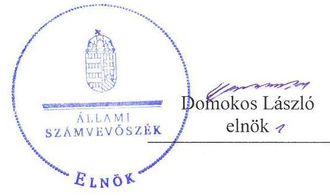
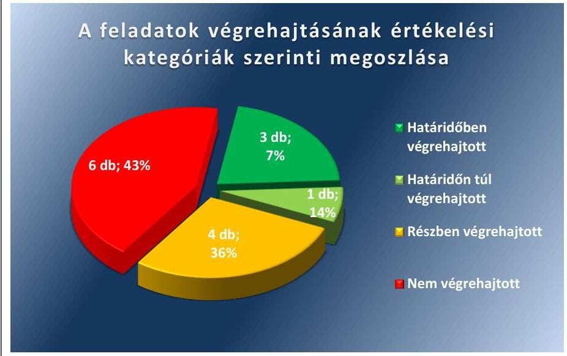
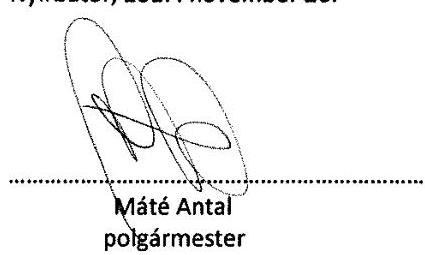
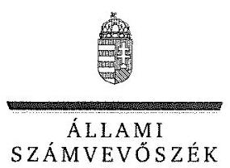
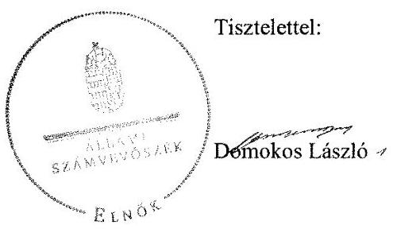
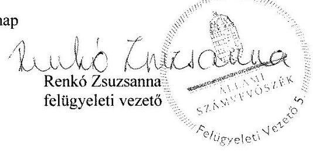
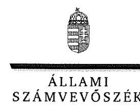
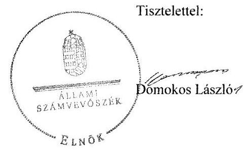
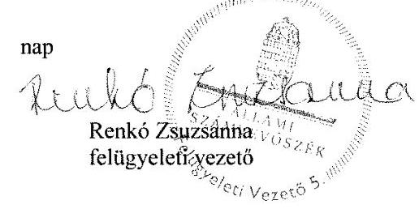

# Jelentés 

## Utóellenőrzések

Az önkormányzatok belső
kontrollrendszere kialakításának és működtetésének utóellenőrzése Nyírbátor Város Önkormányzata 2017.

---

# Jelentés 

## Utóellenőrzések

Az önkormányzatok belső
kontrollrendszere kialakításának és működtetésének utóellenőrzése Nyírbátor Város Önkormányzata 2017. 12 hó 20 nap

---

|  J | AZ ELLENŐRZÉST FELÜGYELTE:  |
| --- | --- |
|   | RENKŐ ZSUZSANNA felügyeleti vezető  |
|   | AZ ELLENŐRZÉST VEZETTE ÉS A VÉGREHAJTÁSÁÉRT FELELŐS:  |
|   | DR. SIMON JÓZSEF ellenőrzésvezető  |
|   | A PROGRAM ÖSSZEÁLLÍTÁSÁÉRT FELELŐS:  |
|   | TÓTPÁL SZABOLCS osztályvezető  |
|   | A TÉMÁHOZ KAPCSOLÓDÓ KORÁBBI SZÁMVEVŐSZÉKI JELENTÉSEK:  |
|   | - címe: Jelentés az önkormányzatok belső kontrollrendszere kialakításának, egyes kontrolltevékenységek és a belső ellenőrzés működésének ellenőrzéséről - Nyírbátor  |
|  J | sorszáma: 14124  |
|   | IKTATÓSZÁM: EL-0076-067/2017.  |
|   | TÉMASZÁM: 2096  |
|   | ELLENŐRZÉS-AZONOSÍTÓ SZÁM: V0755121  |

---

# TARTALOMJEGYZÉK 

■ ÖSSZEGZÉS ..... 5
■ AZ ELLENŐRZÉS CÉLJA ..... 6
■ AZ ELLENŐRZÉS TERÜLETE ..... 7
■ AZ ELLENŐRZÉS HÁTTERE, INDOKOLTSÁGA ..... 8
■ A JELENTÉS LÉNYEGES KÉRDÉSKÖRE ..... 9
■ AZ ELLENŐRZÉS HATÓKÖRE ÉS MÓDSZEREI ..... 10
■ MEGÁLLAPÍTÁSOK ..... 12
■ MELLÉKLETEK ..... 17
I. sz. melléklet: Az ÁSZ 14124 számú jelentéséhez kapcsolódó intézkedési terv végrehajtása ..... 17
■ FÜGGELÉK: ÉSZREVÉTELEK ..... 23
■ RÖVIDÍTÉSEK JEGYZÉKE ..... 55

---

.

---

# ÖSSZEGZÉS 

Az Állami Számvevőszék az utóellenőrzés keretében megállapította, hogy Nyírbátor Város Önkormányzata az intézkedési tervben szereplő feladatok jelentős részét nem hajtotta végre. Ezáltal az Önkormányzat belső kontrollrendszere és belső ellenőrzése továbbra sem biztosította a közpénzekkel, illetve a közvagyonnal történő szabályszerű és felelős gazdálkodást.

## Az ellenőrzés társadalmi indokoltsága

Az Állami Számvevőszék stratégiájában célul tűzte ki a számvevőszéki munka hasznosulásának javítását. Ezzel összhangban utóellenőrzések keretében ellenőrzi, hogy az ellenőrzött önkormányzatok megvalósították-e a korábbi ellenőrzések által feltárt hibák, hiányosságok és szabálytalanságok megszüntetése céljából kialakított intézkedési terveikben foglaltakat. A rendszeres utóellenőrzések hozzájárulnak a szükséges intézkedések tényleges végrehajtásához, ezáltal a közpénzügyek rendezettségének javulásához és azok szabályszerű felhasználásához.

## Főbb megállapítások, következtetések

Nyírbátor Város Önkormányzata az intézkedési tervben meghatározott tizennégy feladatból hármat - a teljesítésigazolásra jogosult személyek kijelölését és a Polgármesteri Hivatal adatvédelmi és adatbiztonsági szabályzatának elkészítését, az Etikai Kódex kiegészítését - határidőben, egyet - a vagyonnyilatkozat-tételi kötelezettség szabályainak a képviselő-testület szervezeti és működési szabályzatában való rögzítését - határidőn túl hajtotta végre.

Négy feladatot részben hajtottak végre. Az ellenőrzött időszakon belül összeállítandó 26 darab időszaki költségvetési jelentésből a polgármester 22 darab, a jegyző pedig 23 darab aláírásáról nem gondoskodott. A megállapított szabálytalanságok kivizsgálásáról szóló jelentésben az Állami Számvevőszék jelentése ${ }^{1}$ által feltárt 26 darab szabálytalanságot a polgármester egy esetben nem vizsgálta ki. A polgármester által elvégzett vizsgálat megállapításai alapján szükséges 8 darab intézkedés közül 6 darab feladat végrehajtása nem történt meg. A jegyző gondoskodott a belső ellenőr által a Polgármesteri Hivatal Szervezeti és Működési Szabályzatának felülvizsgálatáról, azonban a szükséges módosításokkal nem terjesztette jóváhagyásra a képviselő-testület elé. A jegyző nem gondoskodott a 2016. és 2017. évre szóló stratégiai ellenőrzési terv, illetve éves ellenőrzési terv összeállításáról, az éves ellenőrzési tervek képviselő-testület elé terjesztéséről, a belső kontrollrendszer minőségének értékeléséről, a belső ellenőrzési kézikönyv legalább kétévente történő felülvizsgálatának elvégzéséről, valamint a belső ellenőrzési jelentések megállapításainak hasznosulása érdekében az intézkedési tervek készítéséről.

Hat feladatot nem hajtott végre a jegyző. E feladatok során a jegyző nem gondoskodott a működési folyamatok ellenőrzési nyomvonalának elkészítéséről, a kockázatkezelési rendszer felülvizsgálatáról és szükséges módosításáról, a folyamatba épített előzetes, utólagos és vezetői ellenőrzés rendszerének felülvizsgálatáról és módosításáról, a vagyonhasznosítási tevékenység és a támogatásokkal való elszámolás ellenőrzési szabályainak meghatározásáról és a célok nyomon követését biztosító rendszer kialakításáról. Továbbá nem gondoskodott a gazdasági szervezet ügyrendjének felülvizsgálatáról, a megbízási szerződések megkötése előtt a szerződések jogi kontrolljára, az előzetes kötelezettségvállalást nem igénylő kifizetések rendjére, a pénzügyi ellenjegyzés, a teljesítésigazolás és érvényesítés kontrollok szabályszerű működésének rendjére vonatkozó szabályozás kialakításáról, illetve a teljesítésigazolás és érvényesítés kulcskontrollok működtetéséről.

A részben, illetve a nem végrehajtott feladatok által a szabályszerű gazdálkodás feltételei nem állnak rendelkezésre, továbbá kockázatot jelentenek a felelős vezetői magatartás vonatkozásában.

Nyírbátor Város Önkormányzata az intézkedési tervben meghatározott feladatok végrehajtásáról a jogszabály szerinti nyilvántartást vezette.

---

# AZ ELLENŐRZÉS CÉLJA 

Az ellenőrzés célja annak értékelése volt, hogy a számvevőszéki jelentésben foglalt intézkedést igénylő megállapításokkal összhangban készített intézkedési tervben meghatározott feladatokat Nyírbátor Város Önkormányzata végrehajtotta-e.

---

# **AZ ELLENŐRZÉS TERÜLETE**

## **Nyírbátor Város Önkormányzata, Nyírbátori Polgármesteri Hivatal**

Nyírbátor város, a Nyírbátori járás központja, Szabolcs-Szatmár-Bereg megyében helyezkedik el. Állandó lakosainak száma a Központi Statisztikai Hivatal által közzétett népességi adatok szerint 2016. január 1-jén 12 146 fő volt*.

A jelenlegi polgármester² a 2014. évi általános önkormányzati választás óta tölti be tisztségét. Az utóellenőrzés idején a jegyző személyében változás történt, a hivatalban lévő jegyző³ 2015. március 1-től látja el feladatait.

Az igazgatási feladatokat a Nyírbátori Polgármesteri Hivatal látta el.

Nyírbátor Város Önkormányzata a 2016. évben konszolidált beszámolójában 3418,0 millió Ft költségvetési bevételt és 2734,7 millió Ft költségvetési kiadást állapított meg. 2016. december 31-i mérlege alapján 17 462,9 millió Ft eszközvagyonnal rendelkezett, ebből a nemzeti vagyonba tartozó befektetett eszközök értéke 16 396,8 millió Ft-ot tett ki*.

Az Állami Számvevőszék a 2014. évben ellenőrizte Nyírbátor Város Önkormányzata belső kontrollrendszere kialakításának, az egyes kontrolltevékenységek és a belső ellenőrzés működésének szabályszerűségét a 2012. január 1. és 2012. december 31. közötti időszak vonatkozásában. Az erről szóló 14124 számú jelentését az ÁSZ⁴ 2014. június 24-én tette közzé.

Az ellenőrzés célja annak megállapítása volt, hogy a belső kontrollrendszer elemeinek kialakítása, a pénzügyi folyamatokban kulcsszerepet betöltő teljesítésigazolás és érvényesítés, és a belső ellenőrzés szabályos működése biztosította-e a közpénzfelhasználás szabályosságát, hozzájárult-e az értéket teremtő rend követelményének érvényesüléséhez. Az ÁSZ jelentésben megfogalmazott intézkedést igénylő megállapításokra készített intézkedési tervben foglaltak végrehajtása érdekében a képviselő-testület⁵ 2014. július 17-én intézkedési tervet fogadott el. Az ÁSZ értékelése alapján, a javaslatok hasznosítása érdekében az intézkedési terv kiegészítése volt szükséges, amely 2014. október 8-án került megküldésre az Állami Számvevőszék részére.

Az utóellenőrzés – a 2014. június 24. és 2017. július 14. között végrehajtott feladatokat figyelembe véve – az ÁSZ jelentésben a polgármester és a jegyző részére megfogalmazott intézkedést igénylő megállapításokra készített, az ÁSZ által elfogadott intézkedési tervben foglalt feladatok megvalósításának ellenőrzésére, illetve értékelésére fókuszált.

* Forrás: Központi Statisztikai Hivatal, Magyarország Közigazgatási Helységnévkönyve, Nyírbátor Város 2016. január 1-jei adatai

† Forrás: 9/2017. (V.31.) számú zárszámadási rendelet, Nyírbátor Város Önkormányzata

---

# AZ ELLENŐRZÉS HÁTTERE, INDOKOLTSÁGA 

AZ ÁSZ tv. ${ }^{6}$ 33. § (1) bekezdése értelmében a számvevőszéki jelentések intézkedést igénylő megállapításaihoz kapcsolódóan az ellenőrzött szervezet vezetője intézkedési tervet köteles összeállítani, és az ÁSZ részére megküldeni. Az intézkedési tervben foglaltak megvalósítását - az ÁSZ tv. 33. § (7) bekezdésében foglaltak alapján - az ÁSZ utóellenőrzés keretében ellenőrizheti. Az intézkedések megvalósulásának értékelése során az ÁSZ figyelembe veszi az ellenőrzött szervezetek működési feltételeiben, valamint a jogszabályi előírásokban bekövetkezett változásokat.

AZ INTÉZKEDÉSI TERVEKBEN foglalt feladatok hiányos, illetve késedelmes végrehajtása, valamint megvalósításának elmaradása azt mutatja, hogy az ellenőrzések során feltárt hibák, hiányosságok és szabálytalanságok megszüntetése nem kapott kellő hangsúlyt. Ez a szabályszerű működés és a felelős vezetői magatartás vonatkozásában kockázatot hordoz. E kockázatok feltárásával az ÁSZ utóellenőrzési rendszere fokozza a fegyelmet, és igazolja, hogy a közpénzzel való szabályos gazdálkodás felelőssége elől nem lehet kitérni.

## AZ UTÓELLENŐRZÉS NÉGY SZINTEN HASZNOSULHAT:

- A társadalom szintjén az utóellenőrzés jelzi, hogy a számvevőszéki ellenőrzés megállapításainak van következménye: a hiányosságok megszüntetésére az ellenőrzött szervezet által meghatározott intézkedések végrehajtását is számon kéri az ÁSZ.
- Az ellenőrzött terület szintjén az utóellenőrzés tájékoztatást nyújt a terület döntéshozóinak a hiányosságok kiküszöbölésének jó gyakorlatairól, ezzel lehetőséget biztosítva arra, hogy az ÁSZ ellenőrzési megállapításai, javaslatai a terület nem ellenőrzött szervezeteinek a működése során is hasznosuljanak.
- Az ellenőrzött szervezet szintjén az utóellenőrzés feltárja, hogy a szervezet az intézkedések végrehajtásával hasznosította-e a korábbi ellenőrzési jelentésben a hiányosságok megszüntetése, illetve a kockázatok kezelése érdekében megfogalmazott javaslatokat.
- Az ÁSZ szintjén az utóellenőrzés visszacsatolást ad az ellenőrzési jelentések hasznosulásáról, az intézkedések elmaradása vagy részleges megvalósulása a további ellenőrzésekhez kockázati jelzésként szolgál.

---

# A JELENTÉS LÉNYEGES KÉRDÉSKÖRE 

Az Önkormányzat az intézkedési tervben foglaltakat az előírt határidőben végrehajtotta-e?

---

# AZ ELLENŐRZÉS HATÓKÖRE ÉS MÓDSZEREI 

## Az ellenőrzés típusa

Megfelelőségi ellenőrzés

## Az ellenőrzött időszak

Az utóellenőrzés alapját képező ÁSZ jelentés közzétételének napjától (2014. június 24.) az ellenőrzésről szóló kiértesítő levél keltének napjáig (2017. július 14.) tartó időszak.

## Az ellenőrzés tárgya

Az ÁSZ tv. 2011. július 1-jei hatálybalépését követően a számvevőszéki jelentésben foglalt intézkedést igénylő megállapításokkal összhangban - az ellenőrzött szervezet által - készített intézkedési tervben foglaltak végrehajtásának ellenőrzése.

Az ellenőrzés kiterjed minden olyan körülményre és adatra, amely az ÁSZ jogszabályban meghatározott feladatainak teljesítéséhez, valamint a program végrehajtása folyamán felmerült újabb összefüggések feltárásához szükséges volt.

## Az ellenőrzött szervezet

Nyírbátor Város Önkormányzata, Nyírbátori Polgármesteri Hivatal

## Az ellenőrzés jogalapja

Az ÁSZ tv. 33. § (7) bekezdése alapján az ÁSZ tv. 33. § (1)-(2) bekezdése szerinti intézkedési tervben foglaltak megvalósítását az ÁSZ utóellenőrzés keretében ellenőrizheti.

## Az ellenőrzés módszerei

Az ÁSZ az ellenőrzést a nemzetközi standardokat irányadónak tekintve az ellenőrzési program ellenőrzési kérdései alapján az ellenőrzött időszakban hatályos jogszabályok, az ellenőrzés szakmai szabályok és módszertanok figyelembevételével, önállóan végezte.

Az ellenőrzés ideje alatt az ellenőrzött szervezettel történő kapcsolattartást az ÁSZ SZMSZ7-ének vonatkozó előírásai alapján biztosítottuk.

---

Az utóellenőrzés megállapításait elsősorban az ÁSZ rendelkezésére álló, valamint az ellenőrzött szervezettől elektronikusan bekért dokumentumok alapozták meg.

Az ellenőrzési bizonyítékként felhasználható adatforrások közé tartoztak egyrészt a szakmai programban felsorolt adatforrások, másrészt minden - az ellenőrzés folyamán feltárt, az ellenőrzés szempontjából információt tartalmazó - dokumentum.

Az intézkedési tervekben előírt feladatokat azok végrehajthatósága, illetve végrehajtása szempontjából az alábbiak szerint értékeltük:
$\longrightarrow$ „határidőben végrehajtott" a feladat, ha a teljesítés dokumentáltan, az intézkedési tervben előírt határidőben és tartalommal megtörtént;
$\longrightarrow$ „határidőn túl végrehajtott" a feladat, ha annak teljesítése az intézkedési tervben meghatározott módon, de az előírt határidőn túl történt meg;
$\longrightarrow$ „részben végrehajtott" a feladat, ha végrehajtása teljes körűen az intézkedési tervben előírt módon nem történt meg;
$\longrightarrow$ „nem végrehajtott" ha a végrehajtás nem történt meg, vagy amennyiben a teljesítést nem dokumentálták;
$\longrightarrow$ „okafogyottá vált" a feladat, ha végrehajtására - meghatározott esemény bekövetkezése, továbbá külső körülmény, a működést érintő feltétel változása miatt - már nincs szükség, illetve lehetőség, és egyértelműen megállapítható, hogy az intézkedést szükségessé tevő körülmény a jövőben nem fordulhat elő;
$\longrightarrow$ „nem időszerű" az a feladat, amelynek ellenőrzési időszakon belüli végrehajtására azért nem került (kerülhetett) sor, mert az intézkedés alapjául szolgáló esemény nem következett be, de annak jövőbeni előfordulása lehetséges, a végrehajtása nem volt esedékes, vagy a végrehajtás határideje még nem járt le.
Az ellenőrzés lefolytatásához Nyírbátor Város Önkormányzata a tanúsítványok elektronikus kitöltésével, valamint az ÁSZ által kért dokumentumok elektronikus megküldésével szolgáltatott adatokat, amelyek valódiságát és teljes körűségét az ellenőrzött szervezet vezetője által tett teljességi és hitelességi nyilatkozat igazolta. Az így rendelkezésre bocsátott adatok, információk kontrollja az ellenőrzés keretében történt.

---

# MEGÁLLAPÍTÁSOK 

## Az Önkormányzat az intézkedési tervben foglaltakat az előírt határidőben végrehajtotta-e?

Összegző megállapítás

Az intézkedési tervben szereplő feladatok közül hármat határidőben, egyet határidőn túl, négy feladatot részben hajtottak végre, valamint hat feladat végrehajtása nem történt meg. A jegyző az intézkedési tervben meghatározott feladatok végrehajtásáról a jogszabályban előírt nyilvántartást vezette.

Az ÁSZ a jelentésében a polgármester részére kettő és a jegyző részére hét javaslatot fogalmazott meg, amelynek hasznosítására az Önkormányzat ${ }^{8}$ kilenc pontban tizennégy feladatot határozott meg. A feladatok végrehajtásának felelőseként az intézkedési tervben ${ }^{9}$ egy esetben a polgármestert és tizenhárom esetben a jegyzőt jelölték meg.

Az intézkedési tervben meghatározott feladatokat, határidőket, az intézkedési tervben rögzített feladatok elvégzésének felelősét és a feladatok végrehajtását az I. számú melléklet mutatja be.

A jegyző az intézkedési tervben szereplő feladatok végrehajtásáról szóló nyilvántartást vezette.

Az Önkormányzat intézkedési tervében meghatározott feladatok végrehajtásának értékelési kategóriák szerinti megoszlását az 1. ábra szemlélteti.

1. ábra

Forrás: ÁSZ

---

# HATÁRIDŐBEN VÉGREHAJTOTT feladatok: 

1.  A jegyző - az Ávr ${ }^{10}$. rendelkezéseivel összhangban - gondoskodott az Önkormányzat, a Polgármesteri Hivatal ${ }^{11}$ és a Roma Nemzetiségi Önkormányzat ${ }^{12}$ kötelezettségvállalásra jogosult vezetői által a teljesítésigazolásra jogosult személyek írásban történő kijelöléséről.
2.  A jegyző gondoskodott a Polgármesteri Hivatal Adatvédelmi és adatbiztonsági szabályzatának kiadásáról.
3.  A jegyző gondoskodott a belső ellenőr által a vagyongazdálkodási rendelet és a Köztisztviselői Etikai Kódex felülvizsgálatáról. A Kép-viselő-testület a belső ellenőr felülvizsgálatát követően a szükséges módosításokat 40/2014 (VII.17.) számú határozatával jóváhagyta.

## HATÁRIDŐN TÚL VÉGREHAJTOTT feladat:

4.  A jegyző az intézkedési tervben foglalt 2014. júliusi határidőt követően intézkedett a képviselő-testületi SZMSZ ${ }^{13}$ módosításáról, mert - a Vagyonnyil. tv. ${ }^{14}$ és az Mötv. ${ }^{15}$ rendelkezései alapján - a vagyonnyilatkozat-tételre kötelezett képviselő-testületi tagok va-gyonnyilatkozat-tételi kötelezettségének részletes szabályait tartalmazó képviselő-testületi SZMSZ-t módosító rendelet ${ }^{16}$ 2014. augusztus 28-án került elfogadásra.

## RÉSZBEN VÉGREHAJTOTT feladatok:

5.  A jegyző nem gondoskodott az időszaki költségvetési jelentések adatainak gazdálkodási feladatokkal megbízott munkavállalók általi ellenőrzéséről, illetve a Költségvetési és Adó Iroda ${ }^{17}$ vezetője általi ellenőrzéséről és a gazdálkodás szabályszerűségének igazolásáról.

A jegyző a 2014. október 1. és 2016. december 31. közötti, és a polgármester a 2014. november 1. és 2016. december 31. között időszakra vonatkozóan nem gondoskodott az időszaki költségvetési jelentések aláírásáról, ezáltal a gazdálkodás szabályszerűségének figyelemmel kíséréséről.

A polgármester a 2017. január 1. és 2017. május 31. közötti, illetve a 2014. október hónapra, és a jegyző a 2017. január 1. és 2017. május 31. közötti időszakra vonatkozó időszaki költségvetési jelentések aláírásáról gondoskodtak, figyelemmel kísérték a gazdálkodás szabályszerűségét.
6.  A megállapított szabálytalanságok kivizsgálásáról szóló jelentést a polgármester elkészítette, azonban a feltárt szabálytalanságok közül nem vizsgálta ki az intézkedési tervek készítésének elmaradását. A belső ellenőrzéssel kapcsolatban a belső ellenőrzési jelentésekben tett javaslatok, vonatkozó intézkedési tervek és azok végrehajtását nyomon követő nyilvántartás vezetésének, valamint a 2011. évi belső ellenőrzési jelentésben a belső kontrollrendszer öt elemére vonatkozó értékelés hiányának kivizsgálására vonatkozó intézkedés okafogyottá vált, tekintettel a belső ellenőrzés szervezeti kereteiben bekövetkezett változásra.

---

A polgármester által elvégzett vizsgálat megállapításai alapján szükséges intézkedések végrehajtása a vagyonnyilatkozat tételi kötelezettség képviselő-testületi SZMSZ-ben történő szabályozása és a Polgármesteri Hivatal Adatvédelmi és adatbiztonsági szabályzatának módosítása esetében történt meg.

A polgármester által elvégzett vizsgálat megállapításai szerint szükséges intézkedések közül nem történt intézkedés az ellenőrzési nyomvonal kialakítása, a kockázatkezelési rendszer felülvizsgálata és Bkr. szerinti kialakítása, a folyamatba épített, előzetes, utólagos és vezetői ellenőrzés rendszerének felülvizsgálata és aktualizálása, a gazdasági szervezet ügyrendjének felülvizsgálata és az utalványrendelet kialakítása érdekében.
7.  A jegyző gondoskodott a belső ellenőr által a Polgármesteri Hivatal SZMSZ ${ }^{18}$-ének felülvizsgálatáról, a szükséges módosításokkal az Ávr. 13. § (1) bekezdésben foglalt rendelkezéseinek való megfelelés érdekében nem terjesztette jóváhagyásra a képviselő-testület elé.
8.  A jegyző - kivéve a 2015. évre vonatkozóan - nem gondoskodott - a Bkr. 29. § (1) bekezdésében foglalt rendelkezés ellenére - a stratégiai ellenőrzési terv és az éves ellenőrzési terv belső ellenőrzési vezető általi elkészítéséről. A jegyző nem gondoskodott - a Bkr. 32. § (4) bekezdésében foglalt rendelkezés ellenére - az éves ellenőrzési tervek képviselő-testület elé terjesztéséről. A jegyző három ellenőrzési programot kivéve nem intézkedett annak érdekében, hogy a belső ellenőr az ellenőrzések során a Bkr. 33. § (2) bekezdésében szereplő rendelkezéseinek megfelelő belső ellenőrzési programokat készítsen. A belső kontrollrendszer öt elemének belső ellenőrzési vezető általi értékelésére - a Bkr. 48. § bb) pontjában foglalt rendelkezéssel ellentétben - kizárólag a 2014. és 2016. évre vonatkozó éves ellenőrzési jelentésben került sor. A jegyző - megsértve a Bkr. 11. § (1) és (2a) bekezdésében foglalt rendelkezéseket - nem értékelte a belső kontrollrendszer minőségét.

A jegyző nem gondoskodott arról, hogy a belső ellenőr a feltárt hiányosságok ismétlésének elkerülésére kiemelt figyelmet fordítson. Nem intézkedett továbbá - a Bkr. 17. § (4) bekezdésében szereplő rendelkezés ellenére - a belső ellenőrzési kézikönyv legalább kétévente történő felülvizsgálata, valamint - a Bkr. 45. § (1)-(3) bekezdésekben foglalt rendelkezések ellenére - az ellenőrzési jelentések megállapításainak hasznosulása céljából intézkedési tervek készítése érdekében.

# NEM VÉGREHAJTOTT feladatok: 

9.  A jegyző nem készítette el - a Bkr. 6. § (3) bekezdésében foglalt rendelkezéssel ellentétben - a működési folyamatok ellenőrzési nyomvonalát.
10. A jegyző nem gondoskodott a Polgármesteri Hivatal kockázatkezelési szabályzatának ${ }^{19}$ felülvizsgálatáról és aktualizálásáról, továbbá - a Bkr. 7. § (2) bekezdésében foglalt rendelkezések ellenére - nem

---

mérte fel és állapította meg a Polgármesteri Hivatal tevékenységében rejlő és szervezeti célokkal összefüggő kockázatokat, valamint nem határozta meg az egyes kockázatokkal kapcsolatban szükséges intézkedéseket, valamint azok teljesítésének folyamatos nyomon követésének módját.
11. A jegyző nem gondoskodott - a Bkr. 8. § (1) bekezdésében foglalt rendelkezése ellenére - a folyamatba épített, előzetes, utólagos és vezetői ellenőrzés rendszerének felülvizsgálatáról és aktualizálásáról. Nem intézkedett a jegyző - a Bkr. 8. § (2) bekezdés rendelkezése ellenére - a vagyonhasznosítási tevékenység és - a Bkr. 8. § (2a) bekezdés rendelkezése ellenére - a támogatásokkal való elszámolás ellenőrzési szabályainak meghatározása érdekében.
12. A jegyző nem gondoskodott a gazdasági szervezet ügyrendjének felülvizsgálatáról és nem tett intézkedéseket - az Ávr. 13. § (2) bekezdés a) pontjában foglalt előírás ellenére - a kötelezettségvállalás pénzügyi ellenjegyzésének és az érvényesítés gyakorlási módjának, valamint - az Ávr. 53. § (2) bekezdésében foglalt előírás ellenére - az előzetes kötelezettségvállalást nem igénylő kifizetések rendjének szabályozása érdekében. A jegyző nem gondoskodott az Ávr. 58. § (4) bekezdésében foglalt rendelkezés ellenére - az érvényesítésre jogosult személyek kijelöléséről. A jegyző nem intézkedett az utalványrendelet tartalmának szabályozása érdekében.
13. A jegyző nem alakította ki - a Bkr. 3. § e) pontjában és a 10. §-ban foglalt rendelkezéseket megsértve - a célok megvalósításának nyomon követését biztosító rendszert.
14. A jegyző nem gondoskodott a gazdasági szervezet ügyrendjének felülvizsgálatáról és a megbízási szerződések megkötése előtt a jogi kontrollra vonatkozó szabályozás kialakításáról. A jegyző nem tett intézkedéseket - az Ávr. 57-58. § rendelkezései ellenére - a teljesítésigazolás és érvényesítés kulcskontrollok szabályszerű működésének rendjére vonatkozó szabályozás kialakítása érdekében, valamint nem gondoskodott - az Ávr. 57. és 58. § rendelkezései ellenére - a teljesítésigazolás és érvényesítés kulcskontrollok működtetéséről.

---

.

---

# MELLÉKLETEK

- I. SZ. MELLÉKLET: AZ ÁSZ 14124 SZÁMÚ JELENTÉSÉHEZ KAPCSOLÓDÓ INTÉZKEDÉSI TERV VÉGREHAJTÁSA

|  1. | Intézkedési terv alapján elvégzendő feladat. | Az intézkedési tervben meghatározott határidő | Az intézkedési tervben rögzített feladatok elvégzésének felelőse 3. | A feladat végrehajtása  |
| --- | --- | --- | --- | --- |
|   | 1. | 2. | 3. | 4.  |
|  Határidőben végrehajtott feladatok |  |  |  |   |
|  1. | Az Önkormányzat, Roma Nemzetiségi Önkormányzat és a Polgármesteri Hivatal kötelezettségvállalásra jogosult vezetői a teljesítésigazolásra jogosult személyeket írásban kijelölik. | 2014. július 30. | jegyző | Az Önkormányzat, a Polgármesteri Hivatal és a Roma Nemzetiségi Önkormányzat kötelezettségvállalásra jogosult vezetői a teljesítésigazolásra jogosult személyeket - az Ávr. 57. § (4) bekezdés rendelkezésének megfelelően - írásban, 2014. július 30-án kijelölték. A teljesítésigazolásra kijelölt személyek aláírásukkal igazolták a kijelölés tudomásul vételét, a feladatok és a felelősség megismerését.  |
|  2. | A Polgármesteri Hivatal adatvédelmi és adatbiztonsági szabályzatát a jogszabályi előírásoknak megfelelően felül kell vizsgálni és módosítani. | 2014. október 30. | jegyző | A jegyző gondoskodott a Polgármesteri Hivatal jogszabályi előírásoknak megfelelő Adatvédelmi és adatbiztonsági szabályzatának kiadásáról, amely 2014. október 30-tól lépett hatályba.  |
|  3. | A vagyongazdálkodási rendelet és a Köztisztviselői Etikai Kódex Képviselő-testület általi jóváhagyása megtörtént, a jogszabályi előírásoknak történő megfelelés tárgyában a belső ellenőr felülvizsgálatát követően, ha szükséges a módosításokkal jóváhagyásra a Képviselő-testület elé kell terjeszteni. | a vizsgálat lefolytatására 2014. július 15-e, majd az előterjesztésre 2014. júliusi testületi ülés | jegyző | A belső ellenőr 2014. július 2. és 15. között végezte el ellenőrzését az ÁSZ jelentés ellenőrzési időszakot követően elkészített dokumentumok jogszabályi megfelelőségéről. A belső ellenőr felülvizsgálata magába foglalta a vagyongazdálkodási rendelet és a Köztisztviselői Etikai Kódex tartalmának ellenőrzését.
A vagyongazdálkodási rendelet esetében a belső ellenőrzési jelentés a módosítás szükségességét nem állapította meg.
A belső ellenőrzési jelentés tartalmazta a Köztisztviselői Etikai Kódex módosítására vonatkozó megállapításokat és javaslatokat, összhangban a Kttv. ${ }^{20}$ 83. § (1) bekezdés rendelkezéseivel.
Az Etikai Kódex módosításáról szóló 40/2014 (VII.17.) számú határozatával a Képviselőtestület a belső ellenőr felülvizsgálatát követően a szükséges módosításokat jóváhagyta.  |

---

|  4. | A vagyonnyilatkozat-tételre kötelezettek vagyonnyilatkozat tételi kötelezettségét a képviselő-testületi SZMSZ-ben fel kell tüntetni. | 2014. júliusi a testületi ülés | Az intézkedési tervben rögzített feladatok elvégzésének felelőse 3. | A feladat végrehajtása  |
| --- | --- | --- | --- | --- |
|  4. | A vagyonnyilatkozat-tételre kötelezettek vagyonnyilatkozat tételi kötelezettségét a képviselő-testületi SZMSZ-ben fel kell tüntetni. | 2014. júliusi a testületi ülés | jegyző | 4.  |

## Határidőn túl
 végrehajtott feladat

| 2014. júliusi a testületi
ülés | jegyző | 2014. augusztus 28-án Nyírbátor Város Önkormányzatának képviselő-testülete a képviselő-testület Szervezeti és Működési Szabályzatáról szóló 5/2011. (II.24.) önkormányzati rendeletet a 13/2014. (VIII.28.) számú önkormányzati rendelettel módosította. A képviselő-testületi SZMSZ ezen időponttól kezdődően - a Vagyonnyil. tv. 4. § d) pontjában és az Mötv. 39. § (3) bekezdésében foglalt rendelkezéseknek megfelelően - tartalmazta a képviselő-testület és a képviselő-testület bizottságai tagjainak, mint vagyonnyilatkozattételre kötelezettek vagyonnyilatkozat-tételi kötelezettségének részletes szabályait. A jegyző a 2014. júliusi képviselő-testületi ülést követően, határidőn túl gondoskodott a képviselő-testületi SZMSZ módosításáról a vagyonnyilatkozat-tételi kötelezettség szabályainak rögzítése érdekében. A képviselő-testület a 2014. augusztus 28-i képviselő-testületi ülésen tárgyalta az előterjesztést. |
| --- | --- | --- |
| Részben végrehajtott feladatok | | |
| 5. | A Költségvetési és Adó Iroda által havonta elkészítésre kerülő - a költségvetési gazdálkodásról szóló időszaki költségvetési jelentéshez a könyvelési adatokat összeállítja a könyvelési feladatot ellátó munkatárs, ellenőrzi és a jelentés formájában elkészíti az önkormányzat illetve a polgármesteri hivatal gazdálkodási feladatokkal megbízott két munkatársa, ellenőrzi a Költségvetési és Adó Iroda vezetője, - mint gazdasági vezető -, aki igazolja, hogy az ellenőrzés során meggyőződött arról, hogy a gazdálkodás szabályszerűen történt. A polgármester és a jegyző az időszaki költségvetési jelentés aláírásával igazolja, hogy figyelemmel kísérte a gazdálkodás szabályszerűségét. | Első ízben
2014. november 25., azt követően folyamatosan a jogszabály által előírt időpontban | jegyző |

A jegyző nem intézkedett annak érdekében, hogy az időszaki költségvetési jelentéseket az Önkormányzat, illetve a Polgármesteri Hivatal gazdálkodási feladatokkal megbízott két munkatársa ellenőrizze, illetve a Költségvetési és Adó Iroda vezetője ellenőrizze és igazolja a gazdálkodás szabályszerűségét. A polgármester a 2017. január 1. és 2017. május 31. közötti, illetve a 2014. október hónapra, és a jegyző a 2017. január 1. és 2017. május 31. közötti időszakra vonatkozó időszaki költségvetési jelentések aláírásáról gondoskodott, figyelemmel kísérve a gazdálkodás szabályszerűségét. A jegyző a 2014. október 1. és 2016. december 31. közötti, és a polgármester a 2014. november 1. és 2016. december 31. között időszakra vonatkozóan nem gondoskodott az időszaki költségvetési jelentések aláírásáról, ezáltal a gazdálkodás szabályszerűségének figyelemmel kíséréséről.

---

| 5. Orszáma | Intézkedési terv alapján elvégzendő feladat | Az intézkedési tervben meghatározott határidő | Az intézkedési tervben rögzített feladatok elvégzésének felelőse | A feladat végrehajtása |
| --- | --- | --- | --- | --- |
| | 1. | 2. | 3. | 4. |
| 6. | A belső kontrollrendszer és a belső ellenőrzés szabályszerű működtetése vonatkozó jogszabályok betartása és a teljesítésigazolások, érvényesítés keretében feltárt hiányosságok okainak, körülményeinek belső ellenőr közreműködésével történő kivizsgálása, és a vizsgálat eredményétől függő esetleges intézkedések megtétele. | 2014. augusztus 15. a vizsgálat lefolytatására
2014. augusztus 30. az intézkedések megtételére | polgármester | A belső kontrollrendszer és a belső ellenőrzés szabályszerű működtetésére vonatkozó jogszabályok betartása és a teljesítésigazolások, érvényesítés keretében feltárt hiányosságok okainak, körülményeinek kivizsgálásáról szóló jelentését a polgármester 2014. augusztus 15-én készítette el.
A kivizsgálásról szóló jelentésben kivizsgálta a kontroll környezettel, a kockázatkezelési rendszerrel, a kontrolltevékenységekkel, az információs és kommunikációs rendszerrel, valamint a teljesítésigazolás és érvényesítés kulcskontrollokkal kapcsolatos szabálytalanságokat.
A monitoring rendszer esetében a polgármester kivizsgálta a célok nyomon követését biztosító rendszerrel kapcsolatos szabálytalanságot.
A kivizsgálásról szóló jelentésben azonban nem vizsgálta ki a feltárt szabálytalanságok közül a polgármester az intézkedési tervek készítésének elmaradását. A belső ellenőrzéssel kapcsolatban a belső ellenőrzési jelentésekben tett javaslatok, vonatkozó intézkedési tervek és azok végrehajtását nyomon követő nyilvántartás vezetésének, valamint a 2011. évi belső ellenőrzési jelentésben a belső kontrollrendszer öt elemére vonatkozó értékelés hiányának kivizsgálására vonatkozó intézkedés okafogyottá vált, tekintettel a belső ellenőrzés szervezeti kereteiben bekövetkezett változásra.
A belső ellenőr 2014. július 2. és 15. között végezte el ellenőrzését az ÁSZ jelentés ellenőrzési időszakot követően elkészített dokumentumok jogszabályi megfelelőségéről. A belső ellenőrzési jelentés kizárólag - a vonatkozó soron kívüli ellenőrzés ellenőrzési program alapján - a Köztisztviselői Etikai Kódex, a képviselő-testületi SZMSZ, valamint a Polgármesteri Hivatal SZMSZ módosítására vonatkozó javaslatokat tartalmazta. A vagyongazdálkodási rendelet esetében a belső ellenőrzési jelentés szerint nem volt szükség a módosításra. A belső ellenőrzési jelentést a belső ellenőr 2014. július 15-én küldte meg a jegyző részére. A belső ellenőrzési jelentésben foglalt megállapítások összhangban voltak a polgármester által, a belső kontrollrendszer és a belső ellenőrzés szabályszerű működtetésére vonatkozó jogszabályok betartása és a teljesítésigazolások, érvényesítés keretében feltárt hiányosságok okainak, körülményeinek kivizsgálásáról szóló jelentés vonatkozó pontjainak tartalmával.
A polgármester által összeállított jelentés megállapításai szerint szükséges intézkedés kizárólag a vagyonnyilatkozat-tételi kötelezettség képviselő-testületi SZMSZ-ben történő |

---

| 7. | A Nyírbátori Polgármesteri Hivatal Szervezeti és Működési Szabályzata (SZMSZ) Képviselő-testület általi jóváhagyása megtörtént, ezért a jogszabályi előírásoknak történő megfelelés tárgyában a belső ellenőr felülvizsgálatát követően a szükséges módosításokkal jóváhagyásra a Képviselő-testület elé kell terjeszteni. | a vizsgálat lefolytatására 2014. július 15-e, majd az előterjesztésre 2014. júliusi testületi ülés | jegyző | A belső ellenőr 2014. július 2. és 15. között végezte el ellenőrzését az ÁSZ jelentés ellenőrzési időszakot követően elkészített dokumentumok jogszabályi megfelelősége tárgyában. A belső ellenőrzési jelentés tartalmazta a Polgármesteri Hivatal SZMSZ-ének módosítására vonatkozó megállapításokat és javaslatokat, az Ávr. 13. § (1) bekezdésben foglalt rendelkezéseivel összhangban. A jegyző nem intézkedett a Polgármesteri Hivatal SZMSZ-ének az Ávr. 13. § (1) bekezdésben foglalt rendelkezéseinek való megfelelés érdekében a szükséges módosításokkal, jóváhagyásra a képviselő-testület elé terjesztéséről.  |
| --- | --- | --- | --- | --- |
|  8. | A belső ellenőrzési feladatokat 2013. április 1. óta önálló belső ellenőr látja el, a 2012. évi gyakorlat kapcsán feltárt hibákat - melyek a Nyírbátor és Vonzáskörzete Többcélú Kistérségi Társulás által működtetett ellenőrzés kapcsán merültek fel - javítani nem tudjuk. A 2013. évi ellenőrzési terv, beszámoló a jelentések, és a nyilvántartás esetében már a jogszabályi előírásnak megfelelő gyakorlat került bevezetésre. A belső ellenőr munkavégzése során a feltárt hiányosságok ismétlésének elkerülésére fordítson kiemelt figyelmet. Kiegészítés: A 2013. április 1- hatállyal életbelépett belső ellenőrzési kézikönyvet, a jogszabályi előírásoknak megfelelően legalább 2 évente felül kell vizsgálni. Az éves ellenőrzési tervek elkészítése során a 2013. április 1-ban átadhatók, a 2014. április 1-ben megtekintett 2014. július 15-e, majd az előterjesztésre 2014. július 15-e, majd az előterjesztésre 2014. július 15-e, majd az előterjesztésre 2014. július 15-e, majd az előterjesztésre 2014. július 15-e, majd az előterjesztésre 2014. július 15-e, majd az előterjesztésre 2014. július 15-e, majd az előterjesztésre 2014. július 15-e, majd az előterjesztésre 2014. július 15-e, majd az előterjesztésre 2014. július 15-e, 2014. július 15-e, 2014. július 15-e, 2014. július 15-e, 2014. július 15-e, 2014. július 15-e, 2014. július 15-e, 2014. július 15-e, 2014. július 15-e, 2014. július 15-e, 2014. július 15-e, 2014. július 15-e, 2014. július 15-e, 2014. július 15-e, 2014. július 15-e, 2014. július 15-e, 2014. július 15-e, 2014. július 15-e, 2014. július 15-e, 2014. július 15-e, 2014. július 15-e, 2014. július 15-e, 2014. július 15-e, 2014. július 15-e, 2014. július 15-e, 2014. július 15-e, 2014. július 15-e, 2014. július 15-e, 2014. július 15-e, 2014. július 15-e, 2014. július 15-e, 2014. július 15-e, 2014. július 15-e, 2014. július 15-e, 2014. július 15-e, 2014. július 15-e, 2014. július 15-e, 2014. július 15-e, 2014. július 15-e, 2014. július 15-e, 2014. július 15-e, 2014. július 15-e, 2014. július 15-e, 2014. július 15-e, 2014. július 15-e, 2014. július 15-e, 2014. július 15-e, 2014. július 15-e, 2014. július 15-e, 2014. július 15-e, 2014. július 15-e, 2014. július 15-e, 2014. július 15-e, 2014. július 15-e, 2014. július 15-e, 2014. július 15-e,
 2014. július 15-e, 2014. július 15-e, 2014. július 15-e, 2014. július 15-e, 2014. július 15-e, 2014. július 15-e, 2014. július 15-e, 2014. július 15-e, 2014. július 15-e, 2014. július 15-e, 2014. július 15-e, 2014. július 15-e, 2014. július 15-e, 2014. július 15-e, 2014. július 15-e, 2014. július 15-e, 2014. július 15-e, 2014. július 15-e, 2014. július 15-e, 2014. július 15-e, 2014. július 15-e, 2014. július 15-e, 2014. július 15-e, 2014. július 15-e, 2014. július 15-e, 2014. július 15-e, 2014. július 15-e, 2014. július 15-e, 2014. július 15-e, 2014. július 15-e, 2014. július 15-e, 2014. július 15-e, 2014. július 15-e, 2014. július 15-e, 2014. július 15-e, 2014. július 15-e, 2014. július 15-e, 2014. július 15-e, 2014. július 15-e, 2014. július 15-e, 2014. július 15-e, 2014. július 15-e, 2014. július 15-e, 2014. július 15-e, 2014. július 15-e, 2014. július 15-e, 2014. július 15-e, 2014. július 15-e, 2014. július 15-e, 2014. július 15-e, 2014. július 15-e, 2014. július 15-e, 2014. július 15-e, 2014. július 15-e, 2014. július 15-e, 2014. július 15-e, 2014. július 15-e, 2014. július 15-e, 2014. július 15-e, 2014. július 15-e, 2014. július 15-e, 2014. július 15-e, 2014. július 15-e, 2014. július 15-e, 2014. július 15-e, 2014. július 15-e, 2014. július 15-e, 2014. július 15-e, 2014. július 15-e, 2014. július 15-e, 2014. július 15-e, 2014. július 15-e, 2014. július 15-e, 2014. július 15-e, 2014. július 15-e, 2014. július 15-e, 2014. július 15-e, 2014. július 15-e, 2014. július 15-e, 2014. július 15-e, 2014. július 15-e, 2014. július 15-e, 2014. július 15-e, 2014. július 15-e, 2014. július 15-e, 2014. július 15-e, 2014. július 15-e, 2014. július 15-e, 2014. július 15-e, 2014. július 15-e, 2014. július 15-e, 2014. július 15-e, 2014. július 15-e, 2014. július 15-e, 2014. július 15-e, 2014. július 15-e, 2014. július 15-e, 2014. július 15-e, 2014. július 15-e, 2014. július 15-e, 2014. július 15-e, 2014. július 15-e, 2014. július 15-e, 2014. július 15-e, 2014. július 15-e, 2014. július 15-e, 2014. július 15-e, 2014. július 15-e, 2014. július 15-e, 2014. július 15-e, 2014. július 15-e, 2014. július 15-e, 2014. július 15-e, 2014. július 15-e, 2014. július 15-e, 2014. július 15-e, 2014. július 15-e, 2014. július 15-e, 2014.
 július 15-e, 2014. július 15-e, 2014. július 15-e, 2014. július 15-e, 2014. július 15-e, 2014. július 15-e, 2014. július 15-e, 2014. július 15-e, 2014. július 15-e, 2014. július 15-e, 2014. július 15-e, 2014. július 15-e, 2014. július 15-e, 2014. július 15-e, 2014. július 15-e, 2014. július 15-e, 2014. július 15-e, 2014. július 15-e, 2014. július 15-e, 2014. július 15-e, 2014. július 15-e, 2014. július 15-e, 2014. július 15-e, 2014. július 15-e, 2014. július 15-e, 2014. július 15-e, 2014. július 15-e, 2014. július 15-e, 2014. július 15-e, 2014. július 15-e, 2014. július 15-e, 2014. július 15-e, 2014. július 15-e, 2014. július 15-e, 2014. július 15-e, 2014. július 15-e, 2014. július 15-e, 2014. július 15-e, 2014. július 15-e, 2014. július 15-e, 2014. július 15-e, 2014. július 15-e, 2014. július 15-e, 2014. július 15-e, 2014. július 15-e, 2014. július 15-e, 2014. július 15-e, 2014. július 15-e, 2014. július 15-e, 2014. július 15-e, 2014. július 15-e, 2014. július 15-e, 2014. július 15-e, 2014. július 15-e, 2014. július 15-e, 2014. július 15-e, 2014. július 15-e, 2014. július 15-e, 2014. július 15-e, 2014. július 15-e, 2014. július 15-e, 2014. július 15-e, 2014. július 15-e, 2014. július 15-e, 2014. július 15-e,
 2014. július 15-e, 2014. július 15-e, 2014. július 15-e, 2014. július 15-e, 2014. július 15-e, 2014. július 15-e, 2014. július 15-e, 2014. július 15-e, 2014. július 15-e, 2014. július 15-e, 2014. július 15-e, 2014. július 15-e, 2014. július 15-e, 2014. július 15-e, 2014. július 15-e, 2014. július 15-e, 2014. július 15-e, 2014. július 15-e, 2014. július 15-e, 2014. július 15-e, 2014. július 15-e, 2014. július 15-e, 2014. július 15-e, 2014. július 15-e, 2014. július 15-e, 2014. július 15-e, 2014. július 15-e, 2014. július 15-e, 2014. július 15-e, 2014. július 15-e, 2014. július 15-e, 2014. július 15-e, 2014. július 15-e, 2014. július 15-e, 2014. július 15-e, 2014. július 15-e, 2014. július 15-e, 2014. július 15-e, 2014. július 15-e, 2014. július 15-e, 2014. július 15-e, 2014. július 15-e, 2014. július 15-e, 2014. július 15-e, 2014. július 15-e, 2014. július 15-e, 2014. július 15-e, 2014. július 15-e, 2014. július 15-e, 2014. július 15-e, 2014. július 15-e, 2014. július 15-e, 2014. július 15-e, 2014. július 15-e, 2014. július 15-e, 2014. július 15-e, 2014. július 15-e, 2014. július 15-e, 2014. július 15-e, 2014. július 15-e, 2014. július 15-e, 2014. július 15-e, 2014. július 15-e, 2014. július 15-e, 2014. július 15-e, 2014. július 15-e, 2014. július 15-e, 2014. július 15-e, 2014. július 15-e, 2014. július 15-e, 2014. július 15-e, 2014. július 15-e, 2014. július 15-e, 2014. július 15-e, 2014. július 15-e, 2014. július 15-e, 2014. július 15-e, 2014. július 15-e, 2014. július 15-e, 2014. július 15-e, 2014. július 15-e, 2014. július 15-e, 2014. július 15-e, 2014. július 15-e, 2014. július 15-e, 2014. július 15-e, 2014. július 15-e, 2014. július 15-e, 2014. július 15-e, 2014. július 15-e, 2014. július 15-e, 2014. július 15-e, 2014. július 15-e, 2014. július 15-e, 2014. július 15-e, 2014. július 15-e, 2014. július 15-e, 2014. július 15-e, 2014. július 15-e, 2014. július 15-e, 2014. július 15-e, 2014. július 15-e, 2014. július 15-e, 2014. július 15-e, 2014. július 15-e, 2014. július 15-e, 2014. július 15-e, 2014. július 15-e, 2014. július 15-e, 2014. július 15-e, 2014. július 15-e, 2014. július 15-e, 2014. július 15-e, 2014. július 15-e, 2014. július 15-e, 2014. július 15-e, 2014. július 15-e, 2014. július 15-e, 2014.
 július 15-e, 2014. július 15-e, 2014. július 15-e, 2014. július 15-e, 2014. július 15-e, 2014. július 15-e, 2014. július 15-e, 2014. július 15-e, 2014. július 15-e, 2014. július 15-e, 2014. július 15-e, 2014. július 15-e, 2014. július 15-e, 2014. július 15-e, 2014. július 15-e, 2014. július 15-e, 2014. július 15-e, 2014. július 15-e, 2014. július 15-e, 2014. július 15-e, 2014. július 15-e, 2014. július 15-e, 2014. július 15-e, 2014. július 15-e, 2014. július 15-e, 2014. július 15-e, 2014. július 15-e, 2014. július 15-e, 2014. július 15-e, 2014. július 15-e, 2014. július 15-e, 2014. július 15-e, 2014. július 15-e, 2014. július 15-e, 2014. július 15-e, 2014. július 15-e, 2014. július 15-e, 2014. július 15-e, 2014. július 15-e, 2014. július 15-e, 2014. július 15-e, 2014. július 15-e, 2014. július 15-e, 2014. július 15-e, 2014. július 15-e, 2014. július 15-e, 2014. július 15-e, 2014. július 15-e, 2014. július 15-e, 2014. július 15-e, 2014. július 15-e, 2014. július 15-e, 2014. július 15-e, 2014. július 15-e, 2014. július 15-e, 2014. július 15-e, 2014. július 15-e, 2014. július 15-e, 2014. július 15-e, 2014. július 15-e, 2014. július 15-e, 2014. július 15-e, 2014. július 15-e, 2014. július 15-e, 2014. július 15-e, 2014. július 15-e, 2014. július 15-e,
 2014. július 15-e, 2014. július 15-e, 2014. július 15-e, 2014. július 15-e, 2014. július 15-e, 2014. július 15-e, 2014. július 15-e, 2014. július 15-e, 2014. július 15-e, 2014. július 15-e, 2014. július 15-e, 2014. július 15-e, 2014. július 15-e, 2014. július 15-e, 2014. július 15-e, 2014. július 15-e, 2014. július 15-e, 2014. július 15-e, 2014. július 15-e, 2014. július 15-e, 2014. július 15-e, 2014. július 15-e, 2014. július 15-e, 2014. július 15-e, 2014. július 15-e, 2014. július 15-e, 2014. július 15-e, 2014. július 15-e, 2014. július 15-e, 2014. július 15-e, 2014. július 15-e, 2014. július 15-e, 2014. július 15-e, 2014. július 15-e, 2014. július 15-e, 2014. július 15-e, 2014. július 15-e, 2014. július 15-e, 2014. július 15-e, 2014. július 15-e, 2014. július 15-e, 2014. július 15-e, 2014. július 15-e, 2014. július 15-e, 2014. július 15-e, 2014. július 15-e, 2014. július 15-e, 2014. július 15-e, 2014. július 15-e, 2014. július 15-e, 2014. július 15-e, 2014. július 15-e, 2014. július 15-e, 2014. július 15-e, 2014. július 15-e, 2014. július 15-e, 2014. július 15-e, 2014. július 15-e, 2014. július 15-e, 2014. július 15-e, 2014. július 15-e, 2014. július 15-e, 2014. július 15-e, 2014. július 15-e, 2014. július 15-e, 2014. július 15-e, 2014. július 15-e, 2014. július 15-e, 2014. július 15-e, 2014. július 15-e, 2014. július 15-e, 2014. július 15-e, 2014. július 15-e, 2014. július 15-e, 2014. július 15-e, 2014. július 15-e, 2014. július 15-e, 2014. július 15-e, 2014. július 15-e, 2014. július 15-e, 2014. július 15-e, 2014. július 15-e, 2014. július 15-e, 2014. július 15-e, 2014. július 15-e, 2014. július 15-e, 2014. július 15-e, 2014. július 15-e, 2014. július 15-e, 2014. július 15-e, 2014. július 15-e, 2014. július 15-e, 2014. július 15-e, 2014. július 15-e, 2014. július 15-e, 2014. július 15-e, 2014.
 július 15-e, 2014. július 15-e, 2014. július 15-e, 2014. július 15-e, 2014. július 15-e, 2014. július 15-e, 2014. július 15-e, 2014. július 15-e, 2014. július 15-e, 2014. július 15-e, 2014. július 15-e, 2014. július 15-e, 2014. július 15-e, 2014. július 15-e, 2014. július 15-e, 2014. július 15-e, 2014. július 15-e, 2014. július 15-e, 2014. július 15-e, 2014. július 15-e, 2014. július 15-e, 2014. július 15-e, 2014. július 15-e, 2014. július 15-e, 2014. július 15-e, 2014. július 15-e, 2014. július 15-e, 2014. július 15-e, 2014. július 15-e, 2014. július 15-e, 2014. július 15-e, 2014. július 15-e, 2014. július 15-e, 2014. július 15-e, 2014. július 15-e, 2014. július 15-e, 2014. július 15-e, 2014. július 15-e, 2014. július 15-e, 2014. július 15-e, 2014. július 15-e, 2014. július 15-e, 2014. július 15-e, 2014. július 15-e, 2014. július 15-e, 2014. július 15-e, 2014. július 15-e, 2014. július 15-e, 2014. július 15-e, 2014. július 15-e, 2014. július 15-e, 2014. július 15-e, 2014. július 15-e, 2014. július 15-e, 2014. július 15-e, 2014. július 15-e, 2014. július 15-e, 2014. július 15-e, 2014. július 15-e, 2014. július 15-e, 2014. július 15-e, 2014. július 15-e, 2014. július 15-e, 2014. július 15-e, 2014. július 15-e,
 2014. július 15-e, 2014. július 15-e, 2014. július 15-e, 2014. július 15-e, 2014. július 15-e, 2014. július 15-e, 2014. július 15-e, 2014. július 15-e, 2014. július 15-e, 2014. július 15-e, 2014. július 15-e, 2014. július 15-e, 2014. július 15-e, 2014. július 15-e, 2014. július 15-e, 2014. július 15-e, 2014. július 15-e, 2014. július 15-e, 2014. július 15-e, 2014. július 15-e, 2014. július 15-e, 2014. július 15-e, 2014. július 15-e, 2014. július 15-e, 2014. július 15-e, 2014. július 15-e, 2014. július 15-e, 2014. július 15-e, 2014. július 15-e, 2014. július 15-e, 2014. július 15-e, 2014. július 15-e, 2014. július 15-e, 2014. július 15-e, 2014. július 15-e, 2014. július 15-e, 2014. július 15-e, 2014. július 15-e, 2014. július 15-e, 2014. július 15-e, 2014. július 15-e, 2014. július 15-e, 2014. július 15-e, 2014. július 15-e, 2014. július 15-e, 2014. július 15-e, 2014. július 15-e, 2014. július 15-e, 2014. július 15-e, 2014. július 15-e, 2014. július 15-e, 2014. július 15-e, 2014. július 15-e, 2014. július 15-e, 2014. július 15-e, 2014. július 15-e, 2014. július 15-e, 2014. július 15-e, 2014. július 15-e, 2014. július 15-e, 2014. július 15-e, 2014. július 15-e, 2014. július 15-e, 2014. július 15-e, 2014. július 15-e, 2014. július 15-e, 2014. július 15-e, 2014. július 15-e, 2014. július 15-e, 2014. július 15-e, 2014. július 15-e, 2014. július 15-e, 2014. július 15-e, 2014. július 15-e, 2014. július 15-e, 2014. július 15-e, 2014. július 15-e, 2014. július 15-e, 2014. július 15-e, 2014. július 15-e, 2014. július 15-e, 2014. július 15-e, 2014. július 15-e, 2014. július 15-e, 2014. július 15-e, 2014. július 15-e, 2014. július 15-e, 2014. július 15-e, 2014. július 15-e, 2014. július 15-e, 2014. július 15-e, 2014. július 15-e, 2014. július 15-e, 2014. július 15-e, 2014. július 15-e, 2014. július 15-e, 2014. július 15-e, 2014. július 15-e, 2014. július 15-e, 2014. július 15-e, 2014. július 15-e, 2014. július 15-e, 2014. július 15-e, 2014. július 15-e, 2014. július 15-e, 2014. július 15-e, 2014. július 15-e, 2014. július 15-e, 2014. július 15-e, 2014. július 15-e, 2014. július 15-e, 2014. július 15-e, 2014. július 15-e, 2014. július 15-e, 2014. július 15-e, 2014. július 15-e, 2014. július 15-e, 2014. július 15-e, 2014. július 15-e, 2014. július 15-e, 2014. július 15-e, 2014. július 15-e, 2014. július 15-e, 2014. július 15-e, 2014. július 15-e, 2014. július 15-e, 2014. július 15-e, 2014.
 július 15-e, 2014. július 15-e, 2014. július 15-e, 2014. július 15-e, 2014. július 15-e, 2014. július 15-e, 2014. július 15-e, 2014. július 15-e, 2014. július 15-e, 2014. július 15-e, 2014. július 15-e, 2014. július 15-e, 2014. július 15-e, 2014. július 15-e, 2014. július 15-e, 2014. július 15-e, 2014. július 15-e, 2014. július 15-e, 2014. július 15-e, 2014. július 15-e, 2014. július 15-e, 2014. július 15-e, 2014. július 15-e, 2014. július 15-e, 2014. július 15-e, 2014. július 15-e, 2014. július 15-e, 2014. július 15-e, 2014. július 15-e, 2014. július 15-e, 2014. július 15-e, 2014. július 15-e, 2014. július 15-e, 2014. július 15-e, 2014. július 15-e, 2014. július 15-e, 2014. július 15-e, 2014. július 15-e, 2014. július 15-e, 2014. július 15-e, 2014. július 15-e, 2014. július 15-e, 2014. július 15-e, 2014. július 15-e, 2014. július 15-e, 2014. július 15-e, 2014. július 15-e, 2014. július 15-e, 2014. július 15-e, 2014. július 15-e, 2014. július 15-e, 2014. július 15-e, 2014. július 15-e, 2014. július 15-e, 2014. július 15-e, 2014. július 15-e, 2014. július 15-e, 2014. július 15-e, 2014. július 15-e, 2014. július 15-e, 2014. július 15-e, 2014. július 15-e, 2014. július 15-e, 2014. július 15-e, 2014. július 15-e, 2014. július 15-e, 2014. július 15-e, 2014. július 15-e, 2014. július 15-e, 2014. július 15-e, 2014. július 15-e, 2014. július 15-e, 2014. július 15-e, 2014. július 15-e, 2014. július 15-e, 2014. július 15-e, 2014. július 15-e, 2014. július 15-e, 2014. július 15-e, 2014. július 15-e, 2014. július 15-e, 2014. július 15-e, 2014. július 15-e, 2014. július 15-e, 2014. július 15-e, 2014. július 15-e, 2014. július 15-e, 2014. július 15-e, 2014. július 15-e, 2014. július 15-e, 2014. július 15-e, 2014. július 15-e, 2014. július 15-e, 2014. július 15-e, 2014. július 15-e, 2014. július 15-e, 2014. július 15-e, 2014. július 15-e, 2014. július 15-e, 2014. július 15-e, 2014. július 15-e, 2014. július 15-e, 2014. július 15-e, 2014. július 15-e, 2014. július 15-e, 2014. július 15-e, 2014. július 15-e, 2014. július 15-e, 2014. július 15-e, 2014. július 15-e, 2014. július 15-e, 2014. július 15-e, 2014. július 15-e, 2014. július 15-e, 2014. július 15-e, 2014. július 15-e, 2014. július 15-e, 2014. július 15-e, 2014. július 15-e, 2014. július 15-e, 2014. július 15-e, 2014. július 15-e, 2014.

---

| 1. | 2. | 3. | 4. |
| --- | --- | --- | --- |
| rán a kiadott útmutatóknak megfelelően el kell készíteni a stratégiai tervet, a kockázat elemzésen alapuló ellenőrzési tervet kell jóváhagyásra a képviselő-testület elé terjeszteni.
A belső ellenőr az ellenőrzések során a jogszabályi tartalomnak megfelelő belső ellenőrzési programot készítsen, az ellenőrzési jelentések megállapításainak hasznosulása érdekében gondoskodjék az intézkedések tervek elkészíttetéséről. Az éves beszámoló keretében a jogszabályi előírásoknak megfelelően értékelni kell a belső kontrollrendszer öt elemét. | Az ellenőrzési programok és intézkedési tervek vonatkozásában első ízben a 2014. évi ellenőrzések és azt követően folyamatosan. | Az intézkedési tervben rögzített feladatok elvégzésének felelőse
Az intézkedési tervben rögzített feladatok elvégzésének felelőse
Az intézkedési tervben rögzített feladatok elvégzésének felelőse | A belső ellenőrzési vezető a 2014. és 2016. évi éves ellenőrzési jelentéseket elkészítette, azonban nem gondoskodott – a Bkr. 49. § (1) bekezdésben szereplő rendelkezés ellenére – a 2015. évi éves ellenőrzési jelentés elkészítéséről.
A belső ellenőrzési vezető által összeállított 2014. és 2016. évi éves ellenőrzési jelentés a Bkr. 48. § (2) pontjában szereplő rendelkezésnek megfelelően tartalmazta a belső kontrollrendszer öt elemének értékelését. A jegyző azonban nem értékelte a belső kontrollrendszer minőségét a Bkr. 11. § (1) és (2a) bekezdésében foglalt rendelkezések ellenére. A 2016. évi éves ellenőrzési jelentés belső ellenőrzési vezető általi elkészítése és jegyzőnek történő megküldése a Bkr. 49. § (3) bekezdésében szereplő rendelkezéssel ellentétben határidőn túl, 2017. május 15-én történt meg.
A jegyző nem gondoskodott arról, hogy a feltárt hiányosságok ismétlésének elkerülésére a belső ellenőr kiemelt figyelmet fordítson, továbbá nem intézkedett a Bkr. 17. § (4) bekezdésében szereplő rendelkezés ellenére a belső ellenőrzési kézikönyv legalább kétévente történő felülvizsgálatának elvégzése, valamint a belső ellenőrzési jelentések megállapításainak hasznosulása érdekében az intézkedési tervek készítéséről a Bkr. 45. § (1)-(3) bekezdésekben foglalt rendelkezések ellenére. |
| 9. | A 370/2011. (XII. 31.) sz. Korm. rendelet 6. § (3) bekezdésében foglaltak alapján el kell készíteni valamennyi folyamatra az ellenőrzési nyomvonalat. | 2014. november 30. | Jegyző |
| 10. | A Nyírbátori Polgármesteri Hivatal kockázatkezelési szabályzatát felül kell vizsgálni, aktualizálni szükséges. Be kell azonosítani a polgármesteri hivatal tevékenységében, gazdálkodásában rejlő külső és belső kockázatokat, a kockázatok bekövetkezésének valószínűségét, az azonosított kockázatok bekövetkezése esetén azok költségvetési szervre gyakorolt hatását, az egyes kockázati tényezőkkel kapcsolatban a szükséges intézkedéseket, a kockázatkezelés során előírt intézkedések teljesítésének nyomon követési módját. | 2014. november 30. | Jegyző |
| 9. | A jegyző a Bkr. 6. § (3) bekezdésében foglaltak ellenére nem intézkedett a működési folyamatok ellenőrzési nyomvonalának elkészítése érdekében. | | |

---

| 1. | Intézkedési terv alapján elvégzendő feladat | Az intézkedési tervben meghatározott határidő | Az intézkedési tervben rögzített feladatok elvégzésének felelőse 3. | A feladat végrehajtása |
| --- | --- | --- | --- | --- |
| 1. | | 2. | 3. | 4. |
| 11. | A folyamatba épített, előzetes, utólagos és vezetői ellenőrzés rendszerét felül kell vizsgálni és aktualizálni kell. Meg kell határozni a vagyonhasznosítási tevékenység és a támogatásokkal való elszámolás ellenőrzését. | 2014. november 30. | jegyző | A jegyző nem intézkedett – a Bkr. 8. § (1) bekezdésében foglalt rendelkezés ellenére – a folyamatba épített, előzetes, utólagos és vezetői ellenőrzés rendszerének felülvizsgálatáról és aktualizálásáról. A jegyző nem tett intézkedéseket – a Bkr. 8. § (2) bekezdés rendelkezése ellenére – a vagyonhasznosítási tevékenység és – a Bkr. 8. § (2a) bekezdés rendelkezése ellenére – a támogatásokkal való elszámolás ellenőrzési szabályainak megalkotása érdekében. |
| 12. | A Gazdasági Szervezet ügyrendjeinek felülvizsgálata és megalkotása során a jogszabályi előírásoknak megfelelően szabályozni szükséges a kötelezettségvállalás pénzügyi ellenjegyzésének és az érvényesítés gyakorlásának módját, az előzetes kötelezettségvállalást nem igénylő kifizetések rendjét. A jogszabályi előírásoknak megfelelően biztosítani kell a teljesítési igazolásra és érvényesítési feladattal megbízottak kijelölését. Az utalványrendelet tartalmát a jogszabályi előírások figyelembe vételével kell meghatározni. | 2014. november 30. | jegyző | A jegyző nem intézkedett a gazdasági szervezet ügyrendjének felülvizsgálata érdekében. A jegyző nem gondoskodott – az Ávr. 13. § (2) bekezdés a) pontjában foglalt előírás ellenére – a kötelezettségvállalás pénzügyi ellenjegyzésére és az érvényesítés gyakorlási módjára, – az Ávr. 53. § (2) bekezdésében foglalt előírás ellenére – az előzetes kötelezettségvállalást nem igénylő kifizetések rendjére, és – az Ávr. 58. § (4) bekezdésében foglalt rendelkezés ellenére – az érvényesítési feladatokkal megbízottak kijelölésére. A jegyző nem gondoskodott az utalványrendelet tartalmára vonatkozó szabályozás kialakításáról. |
| 13. | Ki kell alakítani a célok megvalósításának nyomon követését biztosító rendszert. | 2014. szeptember 30. | jegyző | A jegyző nem intézkedett – a Bkr. 3. § e) pontjában és a 10. §-ban foglalt rendelkezések ellenére – a célok megvalósításának nyomon követését biztosító rendszer kiépítése érdekében. |
| 14. | A Gazdasági Szervezet ügyrendjének felülvizsgálata során ki kell alakítani a kulcskontrollok szabályszerű működésének rendjét, biztosítani kell a megbízások megkötése előtt is a szerződések jogi kontrollját. A teljesítési igazolás és érvényesítési kulcskontrollok végrehajtása az Áht. és az Ávr. vonatkozó rendelkezéseinek megfelelően történik. | 2014. november 30. a gazdasági szervezet ügyrendjének felülvizsgálatára | jegyző | A jegyző nem gondoskodott a gazdasági szervezet ügyrendjének felülvizsgálatáról és a megbízási szerződések megkötése előtt a jogi kontrollra vonatkozó szabályozás kialakításáról. A jegyző nem tett intézkedéseket – az Ávr. 57-58. § rendelkezései ellenére – a teljesítésigazolás és érvényesítés kulcskontrollok szabályszerű működésének rendjére vonatkozó szabályozás kialakítása érdekében, valamint nem gondoskodott – az Ávr. 57-58. § rendelkezései ellenére – a teljesítésigazolás és érvényesítés kulcskontrollok működtetéséről. |

---

# FÜGGELÉK: ÉSZREVÉTELEK

A jelentéstervezetet a Számvevőszék 15 napos észrevételezésre megküldte az ellenőrzött szervezetek vezetőinek az ÁSZ tv. 29. § (1) bekezdése előírásának megfelelően.
Az elfogadott észrevételek alapján a Számvevőszék módosította a jelentést.
A függelék tartalmazza az ellenőrzöttek észrevételeit, illetve az el nem fogadott észrevételek elutasításának indoklását.

${ }^{2}$ 29. § (1) Az Állami Számvevőszék az ellenőrzési megállapításait megküldi az ellenőrzött szervezet vezetőjének vagy az általa megbízott személynek, és annak, akinek személyes felelősségét állapította meg.
(2) Az ellenőrzött szervezet vezetője és a felelősként megjelölt személy az ellenőrzés megállapításaira tizenöt napon belül írásban észrevételt tehet.
(3) Az Állami Számvevőszék az észrevételre a beérkezésétől számított harminc napon belül írásban válaszol. A figyelembe nem vett észrevételeket köteles a jelentésben feltüntetni, és megindokolni, hogy azokat miért nem fogadta el.

---

# NYÍRBÁTOR VÁROS POLGÁRMESTERÉTŐL

4300. Nyírbátor, Szabadság tér 7. sz.

Távbeszélő száma: 42/281-095, Telefax száma: 42/281-311, E-mail cím: polgarmester@nyirbator.hu

Ügyiratszám:968-1/2017.

## Domokos László elnök
## Állami Számvevőszék

## BUDAPEST

Apáczai Csere János utca 10.
1052

Tisztelt Elnök Úr!
Tisztelt Renkó Zsuzsanna
 felügyeleti vezető

Az Állami Számvevőszék által Utóellenőrzések - Az önkormányzatok belső kontrollrendszere kialakításának és működtetésének utóellenőrzése - Nyírbátor Város Önkormányzata címen, EL-0076-054/2017. szám alatt megküldött ellenőrzési jelentéstervezettel kapcsolatosan az alábbi észrevételt tesszük:

Nyírbátor Város polgármesteréhez 2017. március 24-én érkezett, EL-0076-001/2017 iktatószámú levelük alapján az ÁSZ elektronikus rendszerébe feltöltöttük a korábbi ellenőrzési jelentésükre készült intézkedési tervben foglalt feladatok végrehajtását igazoló dokumentumokat, amiket még 2014 évben hajtottunk végre. A 2. sz. mellékletből és a levelükből sem derült ki, hogy milyen időszakra vonatkozóan kérik a dokumentumokat, így a feltöltött dokumentumok a jóváhagyott intézkedési tervben foglalt feladatok elvégzése kapcsán keletkezett iratok elektronikus másolatai. Az adatok feltöltését határidőre végrehajtottuk, a szükséges nyilatkozatokat postai úton továbbítottuk.

A 2017. július 14-én kiadmányozott EL-0076-004/2017 iktatószámú levél mellékleteként kaptunk Önöktől utóellenőrzésre vonatkozó ellenőrzési programot. Ezt követően telefonon érdeklődtünk, hogy mi a teendőnk, amikor azt a választ kaptuk, hogy ezt csak kiküldték tájékoztatásként. 2017. július 31-én érkezett EL-0076-018/2017 iktatószámú levelükben kérik, az intézkedési tervek végrehajtásáról éves bontásban vezetett nyilvántartás megküldését a belsokontroll.nyirbator@asz.hu e-mail címre, az adatok megküldése 2017.08.04-én megtörtént. 2017. augusztus 15-én érkezett EL-0076-032/2017 iktatószámú levelük, a levélben és az 1. sz. mellékletben is megadott időszakra vonatkozóan - 2017. március 31. és 2017. július 14. között kérték a dokumentumok megküldését és a nyilatkozatokat. Az adatszolgáltatás végrehajtását követően semmilyen visszajelzést nem kaptunk. A jelentéstervezet olvasásakor szembesültünk az

---

ellenőrzési időszakkal, és vettük észre, hogy a vizsgált időszakot nem megfelelően értelmeztük, de erről korábban semmilyen visszajelzést nem kaptunk.

Álláspontunk szerint fentiek lehetnek az alapvető okai annak, hogy a megküldött anyagok alapján több ponton úgy ítélték meg, hogy az intézkedési tervben foglalt feladatok végrehajtása nem történt meg.

A 2017. november 2-án lefolytatott helyszíni ellenőrzésen átadott dokumentumok is igazolják, hogy az intézkedési tervet követően is keletkeztek az intézkedési tervben foglaltak kapcsán aktualizált, felülvizsgált dokumentumok. A helyszíni ellenőrzés kapcsán mi az intézkedési tervben végrehajtott feladatokat követő időszakra az átdolgozott, felülvizsgált, aktualizált dokumentumokat előkészítettük, mivel azt hittük, hogy a dokumentumok helyszíni ellenőrzése fog lefolytatódni.

Kérjük a fentiekben leírtakat figyelembe véve a jelen levelünk mellékleteként megküldésre kerülő CD lemezen pdf. formátumba található dokumentumokat is megvizsgálni és ennek megfelelően a jelentéstervezet pontjait módosítani szíveskedjenek.

A jelentéstervezetben pontonként rögzített megállapításokkal kapcsolatos, részletes észrevételeink az alábbiak:

# ÖSSZEGZŐ MEGÁLLAPÍTÁSOK 

Megállapítás: A jegyző az intézkedési tervben szereplő feladatok végrehajtásáról szóló nyilvántartást - a Bkr. 14 § (1) bekezdésében foglalt előírás ellenére - nem vezette.

Észrevétel: A nyilvántartásokat vezetjük, és azt 2014-2016. év közötti időszakra vonatkozóan az adatszolgáltatás keretében 2017. augusztus 4-én Samu István ügyintéző részére megküldtük, csatoljuk az igazolást az e-mail megküldéséről. Kérjük a megállapítás módosítását.

## RÉSZBEN VÉGREHAJTOTT FELADAT:

## 4. pont

Megállapítás: A jegyző nem intézkedett annak érdekében, hogy az időszaki költségvetési jelentéseket az Önkormányzat, illetve a Polgármesteri Hivatal gazdálkodási feladatokkal megbízott két munkatársa ellenőrizze, illetve a Költségvetési és Adó iroda vezetője ellenőrizze és igazolja a gazdálkodás szabályszerűségét.

Észrevétel: Az ellenőrzési jelentés megállapítása szerint a polgármester és a jegyző feladataként lett meghatározva, hogy rendszeresen kísérje figyelemmel az önkormányzati gazdálkodást. Az intézkedési tervben erre vonatkozóan került sor feladat meghatározásra, melynek alapján a polgármester és a jegyző a havi gazdálkodási jelentések aláírásával igazolja, hogy figyelemmel kíséri a gazdálkodást. A költségvetési jelentések gazdálkodási feladatokkal megbízott munkavállalók általi ellenőrzése illetve a Költségvetési és Adó iroda (azóta már Költségvetési Csoport) vezetőjének ellenőrzési feladataik elvégzését a jelentésen szintén kézjegyükkel igazolják, ezen felül az Ő munkaköri leírásukban szerepelnek. Az aláírt költségvetési jelentésekkel igazoljuk az ellenőrzések megtörténtét, ennek megfelelően kérjük a megállapítás módosítását.

---

Megállapítás: A jegyző a 2014. október 1. és 2016. december 31. közötti, és a polgármester a 2014. november 1. és 2016. december 31. közötti időszakra vonatkozóan nem gondoskodott az időszaki költségvetési jelentések aláírásáról, ezáltal a gazdálkodás szabályszerűségének figyelemmel kíséréséről.

Észrevétel: A polgármester és a jegyző az említett időszakokra vonatkozó időszaki jelentéseket aláírásával záradékolta, de ezeket a dokumentumokat a levelünk bevezetőjében említett ellenőrzési időszakkal kapcsolatos félreértés miatt nem töltöttük fel az elektronikus rendszerbe. Ezen dokumentumok elektronikus másolatait a mellékelt CD tartalmazza. Kérjük a megküldött adatok figyelembevételét és a megállapítás módosítását.

# 5. pont 

Megállapítás: A kivizsgálásról szóló jelentésben azonban nem vizsgálta ki a feltárt szabálytalanságok közül a polgármester az intézkedési tervek készítésének elmaradását, a belső ellenőrzési jelentésekben tett javaslatok, a vonatkozó intézkedési tervek és azok végrehajtását nyomon követő nyilvántartás vezetésének és a 2011. évi belső ellenőrzési jelentésben a belső kontrollrendszer öt elemére vonatkozó értékelés hiányát. A megállapított szabálytalanságok kivizsgálásáról szóló jelentést a polgármester elkészítette. Azonban a feltárt szabálytalanságok közül nem vizsgálta ki az intézkedési tervek készítésének elmaradását, a belső ellenőrzési jelentésekben tett javaslatok, vonatkozó intézkedési tervek és azok végrehajtását nyomon követő nyilvántartás vezetésének, valamint a 2011. évi belső ellenőrzési jelentésben a belső kontrollrendszer öt elemére vonatkozó értékelés hiányát.

Észrevétel: A polgármester nem tudta a belső ellenőrzéssel kapcsolatosan feltárt hiányosságok ellenőrzését elvégezni, mivel az ellenőrzés által vizsgált időszakban - 2012. évben - a belső ellenőrzési feladatokat a Nyírbátori Többcélú Kistérségi társulás által foglalkoztatott belső ellenőr látta el. Mint azt jeleztük is az ellenőrzési jelentésre tett észrevételünkben a Társulás által történt feladat ellátással nem volt elégedett Önkormányzatunk, ezért 2013. Kvtől kivált a közös feladat ellátásból és önálló belső ellenőr foglalkoztatásával oldotta meg a feladatot. A jelentés kiadásának idején - 2014. júniusában - már semmilyen hatásköre nem volt a polgármesternek a társulás által elláttatott feladatok ellenőrzésének tekintetében intézkedni. A belső ellenőrzések, intézkedési tervek és azok végrehajtását nyomon követő nyilvántartás vezetését a használt REVISIONSOFT programban vezettük. A 2015. és 2016. évi nyilvántartásokat a mellékelt CD-re mentettük. Az intézkedési tervek 2015. évi program általi nyilvántartása befejezetlen, mert 2015. novembertől a belső ellenőr személye megváltozott, a program használatát megszüntettük. Kérjük, hogy a megküldött dokumentumok megvizsgálását követően a megállapítást módosítani szíveskedjenek.

## 6. pont

Megállapítás: A jegyző nem intézkedett a belső ellenőr által a Polgármesteri Hivatal SZMSZ-ének az Ávr. 13. § (1) bekezdésében foglalt rendelkezéseinek való megfelelés érdekében a szükséges módosításokkal, jóváhagyásra a képviselő testület elé terjesztéséről.

Észrevétel: A 2017. március 31-i adatszolgáltatás alkalmával feltöltöttük a Képviselő- testület által meghozott 39/2014 (VII.17.) számú határozatot az SZMSZ elfogadásáról. Kérjük a megállapítás módosítását, mivel az előterjesztés igazolása megtörtént.

---

# 7. pont 

Megállapítás: A jegyző nem gondoskodott a Köztisztviselői Etikai kódex a Kttv. 231 § (1) bekezdés rendelkezéseinek való megfelelés érdekében, a szükséges módosításokkal, jóváhagyásra a képviselőtestület elé terjesztéséről.

Észrevétel: A 2017. március 31-i adatszolgáltatás alkalmával feltöltöttük a Képviselő-testület 40/2014 (VII.17.) számú határozatát az Etikai Kódex elfogadásáról. Kérjük a megállapítás módosítását, mivel az előterjesztés igazolása megtörtént.

## 8. pont

Megállapítás: A jegyző nem gondoskodott - a Bkr. 29 § (1) bekezdésében foglalt rendelkezés ellenére - a 2016. és 2017. évre szóló stratégiai ellenőrzési terv, illetve éves ellenőrzési terv összeállításáról, valamint a 2015., 2016. és 2017. évi éves ellenőrzési terv - Bkr. 32. § (4) bekezdésében foglalt rendelkezés ellenére - a képviselő-testület elé terjesztéséről.

Észrevétel: A stratégiai ellenőrzési tervek és az éves ellenőrzési tervek minden évben elkészültek, és azokat a képviselőtestület jóváhagyta. A 2017. március 31-i adatszolgáltatás keretében - a levelem bevezető részében említett okok miatt - csak a 2015. évi került feltöltésre, a 2016. és a 2017. évekre jóváhagyott stratégiai és éves belső ellenőrzési terveket, valamint a jóváhagyásukról szóló testületi határozatokat a mellékelt CD-re rögzítettük. Kérjük, hogy a dokumentumok megvizsgálását követően a megállapítást módosítani szíveskedjenek.

Megállapítás: A jegyző - három esetet kivéve - nem intézkedett annak érdekében, hogy a belső ellenőrzési vezető a Bkr. 33. § (2) bekezdésben szereplő rendelkezésnek megfelelő belső ellenőrzési programot készítsen.

Észrevétel: A jegyző már az ellenőrzés megkezdése előtt intézkedett - a RevisionSoft belső ellenőrzést segítő program megvásárlásával és az ennek használatát előíró, 2013. április 1-el hatályba léptetett belső ellenőri kézikönyvvel - arra vonatkozóan, hogy a belső ellenőrzési programok a jogszabályi előírásoknak megfelelően készüljenek. A 2014-2017. években belső ellenőrzési programokat levelünk mellékleteként megküldésre kerülő CD-re évenkénti bontásban rögzítettük. . Kérjük, hogy a dokumentumok megvizsgálását követően a megállapítást módosítani szíveskedjenek.

Megállapítás: A belső ellenőrzési vezető a 2014. és 2016. évi éves ellenőrzési jelentéseket elkészítette, azonban nem gondoskodott - a Bkr. 49. § (1) bekezdésben szereplő rendelkezés ellenére - a 2015. évi éves ellenőrzési jelentés elkészítéséről.

Észrevétel: A 2017. március 31-i adatszolgáltatás keretében - a levelem bevezető részében említett okok miatt - a 2014. évi éves belső ellenőrzési jelentést csatoltuk. A 2017. augusztusában kért adatszolgáltatás keretében pedig a megjelölt időszak miatt 2016. évi éves ellenőrzési jelentés került feltöltésre. A 2015. évről szóló éves ellenőrzési jelentés is elkészült. Az éves beszámolót és a jóváhagyó testületi döntést a mellékelt CD-n csatoljuk. Kérjük, hogy a dokumentumok megvizsgálását követően a megállapítást módosítani szíveskedjenek.

Megállapítás: A jegyző nem értékelte a belső kontrollrendszer minőségét a Bkr. 11 § (1) és (2a) bekezdésében foglalt rendelkezések ellenére.

---

Észrevétel: A jogszabály által előírt melléklet aláírásával jegyző értékelte a belső kontrollrendszer minőségét, melyet az éves belső ellenőrzési jelentés is tartalmazott. A vezetői nyilatkozat erre való tekintettel, nem került külön is benyújtásra a Képviselő-testület elé. A dokumentum elektronikus másolatát a mellékelt CD tartalmazza. Kérjük, hogy a dokumentumok megvizsgálását követően a megállapítást módosítani szíveskedjenek.

Megállapítás: A jegyző nem gondoskodott arról, hogy a feltárt hiányosságok ismétlésének elkerülésére a belső ellenőr kiemelt figyelmet fordítson, továbbá nem intézkedett a Bkr. 17 § (4) bekezdésében szereplő rendelkezés ellenére - a belső ellenőrzési kézikönyv legalább kétévente történő felülvizsgálatának elvégzése valamint, a belső ellenőrzési jelentések megállapításainak hasznosulása érdekében az intézkedési tervek készítéséről a Bkr. 45 § (1)- (3) bekezdésekben foglalt rendelkezések ellenére.

Észrevétel: A belső ellenőrzés kapcsán feltárt hiányosságok ismétlődésének elkerülése érdekében a jegyző 2013. évtől 1 fő belső ellenőrt foglalkoztatott a Polgármesteri Hivatalban. Az önálló feladatellátás megkezdésével 2013. évben elkészült egy új - már nem a társulati keretek között érvényes - belső ellenőrzési kézikönyv, ezért kézikönyv felülvizsgálatra innen számított 2 év múlva kellett sort keríteni, mely 2015. évben megtörtént. Az adatszolgáltatások kapcsán a belső ellenőrzési kézikönyv feltöltése elmaradt. A 2015. évi belső ellenőrzési kézikönyv elektronikus másolatát a CD lemezre mentettük. Az önállóan foglalkoztatott belső ellenőr által végzett belső ellenőrzések során az ellenőrzési jelentések megállapításainak hasznosulása céljából intézkedési tervek készültek, az ezekről készült nyilvántartások elektronikus másolatait a mellékelt lemezen rögzítettük. Kérjük, hogy a dokumentumok megvizsgálását követően a megállapítást módosítani szíveskedjenek.

# NEM VÉGREHAJTOTT FELADATOK 

## 9. pont

Megállapítás: A jegyző a Bkr. 6 § (3) bekezdésében foglaltak ellenére nem intézkedett a működési folyamatok ellenőrzési nyomvonalának elkészítése érdekében.

Észrevétel: A mellékletként feltöltésre került FEUVE 2014 szabályzattal rendelte el a jegyző az ellenőrzési nyomvonalak elkészítését. A 2017. március 31-i adatfeltöltés során a 2014. évi ellenőrzési nyomvonalakat feltöltöttük. Az ellenőrzési nyomvonalak áttekintésre kerültek az új SZMSZ hatályba lépését (VII.17.) követően, amiket a mellékelt CD-re ellenőrzési nyomvonalak 2015 névvel feltöltöttünk. Kérjük, hogy a dokumentumok megvizsgálását követően a megállapítást módosítani szíveskedjenek.

## 10. pont

Megállapítás: A jegyző nem gondoskodott a kockázatkezelési szabályzat felülvizsgálatáról és aktualizálásáról, - a Bkr. 7 § (2) bekezdésében foglalt rendelkezések ellenére nem mérte fel és állapította meg a Polgármesteri Hivatal tevékenységében rejlő és szervezeti célokkal összefüggő kockázatokat, valamint nem határozta meg az egyes kockázatokkal kapcsolatban szükséges intézkedéseket, valamint azok teljesítésének folyamatos nyomon követésének módját.

---

Észrevétel: A kockázatkezelési szabályzat felülvizsgálata megtörtént. A kockázatok vizsgálata a belső ellenőrzési tervben minden évben megvizsgálásra kerül és ennek megfelelően a szükséges ellenőrzések elrendelése megtörténik. A 2017. március 31-i adatszolgáltatás során az intézkedési terv végrehajtásához 2014. évben készített szabályzatot feltöltöttük, a 2016. évben módosított szabályzatot a CD-re mentettük. Kérjük, hogy a dokumentumok megvizsgálását követően a megállapítást módosítani szíveskedjenek.

# 11. pont 

Megállapítás: A jegyző nem gondoskodott - a Bkr. 8 § (1) bekezdésében foglalt rendelkezések ellenére - a folyamatba épített, előzetes, utólagos és vezetői ellenőrzés rendszerének felülvizsgálatáról és aktualizálásáról. A jegyző nem tett intézkedéseket - a Bkr. 8. § (2) rendelkezése ellenére - a vagyonhasznosítási tevékenység és - a Bkr. 8.§ (2a) bekezdés rendelkezése ellenére - a támogatásokkal való elszámolás ellenőrzési szabályainak megalkotása érdekében.

Észrevétel: A 2017. március 31-i adatfeltöltés alkalmával a kontroll kézikönyvet, és mellékleteit feltöltöttük, mellyel igazoltuk, hogy a folyamatba épített előzetes, utólagos és vezetői ellenőrzés rendszerének felülvizsgálata és aktualizálása 2014. évben megtörtént az intézkedési tervben elvégzendő feladatként. A 2016. évben módosított szabályzatot a mellékelt CD-re lementettük.

Önkormányzatunk 4/2013 (III.07.) rendelete rendelkezik az önkormányzat vagyonáról, a vagyonhasznosítási tevékenységről. A vagyonhasznosítási tevékenység igazolására a csatolt dokumentumok közül kimaradt a rendelet másolata, de a helyszíni ellenőrzés alkalmával rendelkezésre bocsátottuk. A korábban nem csatolt vagyonrendelet, mellékelt CD-n is megküldésre kerül.

A támogatásokkal való elszámolás ellenőrzési szabályait a 14/2011 (III.31.) számú önkormányzati rendelet tartalmazza, amit a 2017. március 31-i adatszolgáltatás keretében felcsatoltunk. A rendeletet a 3/2016. (II.24.) önkormányzati rendelet hatályon kívül helyezte, és 2017. évben a rendelet ismételten módosítva lett a 2/2017 (II.03.) önkormányzati rendelettel, a CD lemezre, támogatásokkal való elszámolásról szóló rendeletet és annak módosításait lementettük. Kérjük, hogy a dokumentumok megvizsgálását követően a megállapítást módosítani szíveskedjenek.

## 12. pont

Megállapítás: A jegyző nem intézkedett a gazdasági szervezet ügyrendjének felülvizsgálata érdekében. A jegyző nem gondoskodott - az Ávr. 13. § (2) bekezdés a) pontjában foglalt előírás ellenére - a kötelezettségvállalás pénzügyi ellenjegyzésének és az érvényesítés gyakorlati módjára, az Ávr. 53. § (2) bekezdésében foglalt előírás ellenére - az előzetes kötelezettségvállalást nem igénylő kifizetések rendjére, és - az Ávr. 58. §(4) bekezdésében foglalt rendelkezés ellenére - az érvényesítési feladatokkal megbízottak kijelölésére. A jegyző nem gondoskodott az utalványrendelet tartalmára vonatkozó szabályozás kialakításáról.

Észrevétel: A gazdasági szervezetünk ügyrendjét, gazdálkodási szabályzat néven készítjük el. Többször is módosításra került az évek során, az intézkedési tervben történt igazolás óta, ezeket a helyszíni ellenőrzés alkalmával hitelesített másolatban is átadtuk. A szabályzat tartalmazza törvényi hivatkozásokat és a gyakorlati módokat is valamennyi a megállapításban felsorolt rendelkezés esetében. Az Ávr. 13. § (2) bekezdés a) pontjára vonatkozik a gazdálkodási szabályzat III. pontja. Az

---

Ávr. 53. § (2) bekezdésére vonatkozóan a gazdálkodási szabályzat 14. oldalán rendelkezünk. Az Ávr. 58. § (4) bekezdésére vonatkozó szabályozásról a gazdálkodási szabályzat 17. oldalán rendelkezünk. Az utalványrendelet tartalmára nem kellett külön intézkedni, mert a bevezetett POLISZ rendszerből már a jogszabályi előírásnak megfelelő utalványrendelet volt használatban a jelentés elkészülte idején is. Az utalványrendeletet elektronikus formában levelünkhöz csatolt CD-n bemutatjuk. Kérjük, hogy a dokumentumok megvizsgálását követően a megállapítást módosítani szíveskedjenek.

# 13. pont 

Megállapítás: A jegyző nem intézkedett - a Bkr. 3. § e) pontjában és a 10. §-ban foglalt rendelkezések ellenére - a célok megvalósításának nyomon követését biztosító rendszer kiépítése érdekében.

Észrevétel: A Képviselő-testület által elfogadott, a Polgármesteri Hivatalra vonatkozó SZMSZ 7. oldalán rögzítésre került, hogy milyen mutatószámok rendszeres elemzésével, vizsgálatával követjük nyomon a célok megvalósulását. Ezek megtörténtek, a vizsgálatokról szóló feljegyzéseket a mellékelt CD-re rögzítettük. Kérjük, hogy a dokumentumok megvizsgálását követően a megállapítást módosítani szíveskedjenek.

## 14. pont

Megállapítás: A jegyző nem gondoskodott a gazdasági szervezet ügyrendjének felülvizsgálatáról és a megbízási szerződések megkötése előtt a jogi kontrollra vonatkozó szabályozás kialakításáról.

Észrevétel: A 2017. március 31-i adatszolgáltatás keretében felcsatolt Polgármesteri Hivatal SZMSZ-ének III. fejezetének 12. pontja tartalmazza a jogi ellenőrzés kialakítását és a gazdálkodási szabályzat 14. oldala is rendelkezik róla. Jelen levelünk mellékleteként a hivatkozott két szabályozást újból megküldjük, a 2017.11.02-án a helyszíni ellenőrzés során másolati példányban az aktualizált SZMSZ-ek és Gazdálkodási Szabályzatok is átadásra kerültek. Kérjük, hogy a dokumentumok újbóli megvizsgálását követően a megállapítást módosítani szíveskedjenek.

Megállapítás: A jegyző nem tett intézkedéseket - az Ávr. 57-58. § rendelkezései ellenére - a teljesítésigazolás és érvényesítés kulcskontrollok szabályszerű működési rendjére vonatkozó szabályozás kialakítása érdekében, valamint nem gondoskodott - az Ávr. 57-58. § rendelkezései ellenére - a teljesítésigazolás és érvényesítés kulcskontrollok működtetéséről.

Észrevétel: A 2017. március 31-i adatszolgáltatás keretében felcsatolt gazdálkodási szabályzat tartalmazza a 17. oldalon a teljesítésigazolásra és érvényesítésre vonatkozó szabályokat. A teljesítésigazolásra jogosultak kijelölésre kerültek, az erről szóló dokumentumok elektronikusan benyújtásra kerültek, amiket jelentés-tervezet I. számú mellékletében az intézkedési terv alapján elvégzendő feladat oszlop 1. pontjában: határidőben végrehajtott feladatként elismertek. A 2017.03.31-i adatszolgáltatás keretében az iktatott teljesítésigazolásra jogosultak kijelöléseinek másolatait csatoltuk. A 2017. november 2-án lefolytatott helyszíni ellenőrzés keretében a kijelölések dokumentumai átadásra is kerültek, amelyek a teljesítés igazolás és érvényesítés gyakorlatát is igazolják. A teljesítésigazolás és érvényesítés gyakorlatát igazoló dokumentumok a mellékelt CD-n is benyújtásra kerülnek. Kérjük, hogy a dokumentumok megvizsgálását követően a megállapítást módosítani szíveskedjenek.

---

Kérjük, hogy a fenti észrevételek, az adatszolgáltatások kapcsán benyújtott dokumentumok, a 2017. november 2-án lefolytatott helyszíni ellenőrzés során átadott dokumentumok, és levelünk mellékleteként CD-n megküldött dokumentumok alapján az ellenőrzési jelentés-tervezet megállapításait módosítani szíveskedjenek.

Tisztelettel

Nyírbátor, 2017. november 20.

Pappné dr. Fülöp Enikő
jegyző

---

ELNÖK

Ikt. szám: EL-0076-059/2017.

# Máté Antal úr 

polgármester
Nyírbátor Város Önkormányzata

## Nyírbátor

## Tisztelt Polgármester Úr!

Köszönettel megkaptam az ,,Utóellenőrzések - Az önkormányzatok belső kontrollrendszere kialakításának és működtetésének utóellenőrzése - Nyírbátor Város Önkormányzata" című jelentéstervezet megállapításaira tett észrevételét.

Az ellenőrzési megállapításokra vonatkozó észrevételét az Állami Számvevőszékről szóló 2011. évi LXVI. törvény 29. § (2) bekezdésében meghatározott tizenöt napos határidőn belül küldte meg. Az Állami Számvevőszék észrevétellel kapcsolatos álláspontját a mellékletként csatolt, a felügyeleti vezető által készített indokolás tartalmazza. Tájékoztatom, hogy az ÁSZ tv. 29. § (3) bekezdése szerint az ÁSZ a figyelembe nem vett észrevételeket a jelentésben feltünteti az észrevétel elutasításának indoklásával együtt.

Budapest, 2017. 11. hónap 29. nap

Melléklet: Észrevételre adott válasz

---

# „Utóellenőrzések - Az önkormányzatok belső kontrollrendszere kialakításának és működtetésének utóellenőrzése - Nyírbátor Város Önkormányzata" 

című jelentéstervezetre tett észrevételekre adott válasz

| 1. észrevétel : | Az észrevétel szerint Nyírbátor Város polgármesteréhez 2017. március 24-én érkezett, EL-0076-001/2017 iktatószámú levél alapján az ÁSZ elektronikus rendszerébe feltöltötték a korábbi ellenőrzési jelentésükre készült intézkedési tervben foglalt feladatok végrehajtását igazoló dokumentumokat, amiket még 2014 évben hajtottak végre. Az észrevétel szerint a 2. sz. mellékletből és a levélből sem derült ki, hogy milyen időszakra vonatkozóan kéri az ÁSZ a dokumentumokat, így a feltöltött dokumentumok a jóváhagyott intézkedési tervben foglalt feladatok elvégzése kapcsán keletkezett iratok elektronikus másolatai. Az adatok feltöltését határidőre végrehajtották, a szükséges nyilatkozatokat postai úton továbbították.   A 2017. július 14-én kiadmányozott EL-0076-004/2017 iktatószámú levél mellékleteként kaptak utóellenőrzésre vonatkozó ellenőrzési programot. Ezt követően telefonon érdeklődtek, hogy mi a teendőjük, amikor azt a választ kapták, hogy ezt csak kiküldték tájékoztatásként. 2017. július 31-én érkezett EL-0076-018/2017 iktatószámú levélben az ÁSZ kérte az intézkedési tervek végrehajtásáról éves bontásban vezetett nyilvántartás megküldését a belsokontroll_utó_nyirbator@asz.hu e-mail címre, az adatok megküldése 2017.08.04-én megtörtént. 2017. augusztus 15-én érkezett EL-0076-032/2017 iktatószámú a levélben és az 1. sz. mellékletben is megadott időszakra vonatkozóan - 2017. március 31. és 2017. július 14. között - kérte az ÁSZ a dokumentumok megküldését és a nyilatkozatokat. Az adatszolgáltatás végrehajtását követően semmilyen visszajelzést nem kaptak. A jelentéstervezet olvasásakor szembesültek az ellenőrzési időszakkal, és vették észre, hogy a vizsgált időszakot nem megfelelően értelmezték, de erről korábban semmilyen visszajelzést nem kaptak.   Álláspontjuk szerint fentiek lehetnek az alapvető okai annak, hogy a megküldött anyagok alapján több ponton úgy ítélték meg, hogy az intézkedési tervben foglalt feladatok végrehajtása nem történt meg.   Az észrevétel szerint a 2017. november 2-án lefolytatott helyszíni ellenőrzésen átadott dokumentumok is igazolják, hogy az intézkedési tervet követően is keletkeztek az intézkedési tervben foglaltak kapcsán aktualizált, felülvizsgált dokumentumok. A helyszíni ellenőrzés kapcsán az intézkedési tervben végrehajtott feladatokat követő időszakra az átdolgozott, felülvizsgált, aktualizált dokumentumokat előkészítették, mivel azt hitték, hogy a dokumentumok helyszíni ellenőrzése fog lefolytatódni.   Kérik a fentiekben leírtakat figyelembe véve a jelen levelünk mellékleteként megküldésre kerülő CD lemezen pdf. formátumba található dokumentumokat is megvizsgálni és ennek megfelelően a jelentéstervezet pontjait módosítani szíveskedjenek. |
| :--: | :--: |
| Válasz: | Az Állami Számvevőszék az észrevételt nem fogadja el. |
| Indoklás: | Az Önkormányzat polgármestere az ellenőrzés során tett teljességi nyilatkozatokban kijelentette, hogy az ellenőrzés kapcsán az ÁSZ részére átadott, a teljességi nyilatkozatokban részletezett dokumentumok, adatok megbízhatóak és a bekért adatokra, dokumentumokra vonatkozóan teljes körű információt tartalmaznak. Az ellenőrzés |

---

|  | rendelkezésére bocsátott dokumentumok felülvizsgálata alapján az ÁSZ megállapította, hogy az észrevétel mellékleteként csatolt dokumentumokat az Önkormányzat az ellenőrzés során nem bocsátotta az ÁSZ rendelkezésére. Az ÁSZ az intézkedési tervfeladat végrehajtására vonatkozó megállapításainak minősítését fentiekre tekintettel nem módosítja. |
| :--: | :--: |
| 2. észrevétel : | Megállapítások fejezet 3. bekezdése   Megállapítás: A jegyző az intézkedési tervben szereplő feladatok végrehajtásáról szóló nyilvántartást - a Bkr. 14. § (1) bekezdésében foglalt előírás ellenére - nem vezette.   Észrevétel: A nyilvántartást vezetik, azt 2014-2016. év közötti időszakra vonatkozóan az adatszolgáltatás keretében 2017. augusztus 4-én megküldték. |
| Válasz: | Az Állami Számvevőszék az észrevételt elfogadja. |
| Indoklás: | Az észrevételben hivatkozott és az ellenőrzés rendelkezésére bocsátott 2014-2016. évi nyilvántartás megfelelt a jogszabályi előírásoknak, ezért az Állami Számvevőszék a megállapítást módosította. |
| 3. Észrevétel: | Megállapítások fejezet Részben végrehajtott feladat 4. pont   Megállapítás: A jegyző nem intézkedett annak érdekében, hogy az időszaki költségvetési jelentéseket az Önkormányzat, illetve a Polgármesteri Hivatal gazdálkodási feladatokkal megbízott két munkatársa ellenőrizze, illetve a Költségvetési és Adó iroda vezetője ellenőrizze és igazolja a gazdálkodás szabályszerűségét.   Észrevétel: Az ellenőrzési jelentés megállapítása szerint a polgármester és a jegyző feladataként lett meghatározva, hogy rendszeresen kísérje figyelemmel az önkormányzati gazdálkodást. Az intézkedési tervben erre vonatkozóan került sor feladat meghatározásra, melynek alapján a polgármester és a jegyző a havi gazdálkodási jelentések aláírásával igazolja, hogy figyelemmel kíséri a gazdálkodást. A költségvetési jelentések gazdálkodási feladatokkal megbízott munkavállalók általi ellenőrzése illetve a Költségvetési és Adó iroda (azóta már Költségvetési Csoport) vezetőjének ellenőrzési feladataik elvégzését a jelentésen szintén kézjegyükkel igazolják, ezen felül az Ő munkaköri leírásukban szerepelnek. Az észrevétel szerint az aláírt költségvetési jelentésekkel igazolják az ellenőrzések megtörténtét, ennek megfelelően kérik a megállapítás módosítását. |
| Válasz: | Az Állami Számvevőszék az észrevételt nem fogadja el. |
| Indoklás: | Az ellenőrzés rendelkezésére bocsátott dokumentumok felülvizsgálata alapján az ÁSZ megállapította, hogy a 2014. év 10. havi, 2017.01-03. havi, 2017. 04. havi és 2017. 05.havi időközi Nyírbátor Város Önkormányzatára és Polgármesteri Hivatalára vonatkozó költségvetési jelentés és a 2017. év első negyedéves mérlegjelentéssel kapcsolatban nem dokumentált, hogy a gazdálkodási feladatokkal megbízott két munkatársa azokat ellenőrizte, illetve a Költségvetési és Adó iroda vezetője azokat ellenőrizte és igazolta, hogy a gazdálkodás szabályszerűen történt. 2014 novemberétől 2016. decemberéig tartó időszakra költségvetési jelentést és mérlegjelentést nem küldtek az ellenőrzés részére, így erre az időszakra vonatkozóan sem igazolt az intézkedési tervben vállalt ellenőrzési feladatok ellátása. |

---

| 4. észrevétel: | Megállapítások fejezet Részben végrehajtott feladat 9. pont   Megállapítás: A jegyző a 2014. október 1. és 2016. december 31. közötti, és a polgármester a 2014. november 1. és 2016. december 31. között időszakra vonatkozóan nem gondoskodott az időszaki költségvetési jelentések aláírásáról, ezáltal a gazdálkodás szabályszerűségének figyelemmel kíséréséről.   Észrevétel: A polgármester és a jegyző az említett időszakokra vonatkozó időszaki jelentéseket aláírásával záradékolta, de ezeket a dokumentumokat az észrevétel bevezetőjében említett ellenőrzési időszakkal kapcsolatos félreértés miatt nem töltötték fel az elektronikus rendszerbe. Ezen dokumentumok elektronikus másolatait a mellékelt CD tartalmazza. Kérik a megküldött adatok figyelembevételét és a megállapítás módosítását. |
| :--: | :--: |
| Válasz: | Az Állami Számvevőszék az észrevételt nem fogadja el. |
| Indoklás: | 2014 novemberétől 2016. decemberéig tartó időszakra költségvetési jelentést és mérlegjelentést nem küldtek az ellenőrzés részére, így erre az időszakra vonatkozóan nem igazolt az intézkedési tervben vállalt feladatok ellátása. A Polgármesteri Hivatal 2014. 10. havi időközi költségvetési jelentését az aljegyző írta alá. A jegyző a Magyarország helyi önkormányzatairól szóló 2011. évi CLXXXIX. tv 81. § (2) bekezdésében előírtak ellenére a helyettesítésére az aljegyzőnek feladatot nem határozott meg. Így e dokumentum tekintetében nem igazolható, hogy a jegyző figyelemmel kísérte a gazdálkodás szabályszerűségét. |
| 5. észrevétel: | Megállapítások fejezet Részben végrehajtott feladat 5. pont   Megállapítás: A megállapított szabálytalanságok kivizsgálásáról szóló jelentést a polgármester elkészítette. Azonban a feltárt szabálytalanságok közül nem vizsgálta ki az intézkedési tervek készítésének elmaradását, a belső ellenőrzési jelentésekben tett javaslatok, vonatkozó intézkedési tervek és azok végrehajtását nyomon követő nyilvántartás vezetésének, valamint a 2011. évi belső ellenőrzési jelentésben a belső kontrollrendszer öt elemére vonatkozó értékelés hiányát.   Észrevétel: A polgármester nem tudta a belső ellenőrzéssel kapcsolatosan feltárt hiányosságok ellenőrzését elvégezni, mivel az ellenőrzés által vizsgált időszakban 2012. évben - a belső ellenőrzési feladatokat a Nyírbátori Többcélú Kistérségi társulás által foglalkoztatott belső ellenőr látta el. Az észrevétel szerint, mint az jelezték is a 14124 számú Számvevőszéki jelentésre tett észrevételükben a Társulás által történt feladat ellátással nem volt elégedett az Önkormányzat, ezért 2013. évtől kivált a közös feladat ellátásból és önálló belső ellenőr foglalkoztatásával oldották meg a feladatot. A jelentés kiadásának idején - 2014. júniusában - már semmilyen hatásköre nem volt a polgármesternek a társulás által elláttatott feladatok ellenőrzésének tekintetében intézkedni. A belső ellenőrzések, intézkedési tervek és azok végrehajtását nyomon követő nyilvántartás vezetését a használt REVISIONSOFT programban vezették. A 2015. és 2016. évi nyilvántartásokat a mellékelt CD-re mentették. Az intézkedési tervek 2015. évi program általi nyilvántartása befejezetlen, mert 2015. novembertől a belső ellenőr személye megváltozott, a program használatát megszüntették. Kérik, hogy a megküldött dokumentumok megvizsgálását követően a megállapítást módosítani szíveskedjenek. |
| Válasz: | Az Állami Számvevőszék az észrevételt részben elfogadja. |

---

| Indoklás: | Az ellenőrzési program szerint az utóellenőrzés megállapításait elsősorban az ÁSZ rendelkezésére álló, valamint az ellenőrzött szervezettől elektronikusan bekért dokumentumok alapozták meg. Az észrevételben hivatkozott, a 14124 számú Számvevőszéki jelentésre tett észrevételben az Önkormányzat a belső ellenőrzés szervezeti kereteiben bekövetkezett változásról az ÁSZ-t tájékoztatta. A fentiekben leírtak alapján a belső ellenőrzési jelentésekben tett javaslatok, vonatkozó intézkedési tervek és azok végrehajtását nyomon követő nyilvántartás vezetésének, valamint a 2011. évi belső ellenőrzési jelentésben a belső kontrollrendszer öt elemére vonatkozó értékelés hiányának kivizsgálásával kapcsolatos megállapítást az ÁSZ módosította. Az intézkedési tervek készítésének elmaradásának kivizsgálásával kapcsolatos megállapítást az ÁSZ fenntartja, tekintettel arra, hogy az nem a belső ellenőrzési vezető, hanem a költségvetési szervek belső kontrollrendszeréről és belső ellenőrzéséről szóló 370/2011. (XII. 31.) Korm. rendelet 45. § (1) bekezdése alapján a javaslattal érintett szerv, illetve szervezeti egység vezetője felelős. |
| :--: | :--: |
| 6. észrevétel: | Megállapítások fejezet Részben végrehajtott feladat 6. pont   Megállapítás: A jegyző gondoskodott a belső ellenőr által a Polgármesteri Hivatal SZMSZ-ének felülvizsgálatáról, azonban a szükséges módosításokkal az Ávr. 13. § (1) bekezdésben foglalt rendelkezéseinek való megfelelés érdekében, nem terjesztette jóváhagyásra a képviselő-testület elé   Észrevétel: A 2017. március 31-i adatszolgáltatás alkalmával feltöltötték a Képviselő-testület által meghozott 39/2014 (VII.17.) számú határozatot az SZMSZ elfogadásáról. Kérjük a megállapítás módosítását, mivel az előterjesztés igazolása megtörtént. |
| Válasz: | Az Állami Számvevőszék az észrevételt nem fogadja el. |
| Indoklás: | A belső ellenőr 2014. július 2. és 15. között végezte el ellenőrzését az ÁSZ jelentés ellenőrzési időszakot követően elkészített dokumentumok jogszabályi megfelelősége tárgyában. A belső ellenőrzési jelentés tartalmazta a Polgármesteri Hivatal SZMSZ-ének módosítására vonatkozó megállapításokat és javaslatokat az Ávr. 13. § (1) bekezdésben foglalt rendelkezéseivel összhangban. Az észrevételben hivatkozott Polgármesteri Hivatal Szervezeti és Működési Szabályzata nem tekinthető hiteles kiadmánynak, mivel az nem felel meg a közfeladatot ellátó szervek iratkezelésének általános követelményeiről szóló 335/2005. (XII. 29.) Korm. rendelet 53. § (1) bekezdésében foglaltaknak, így dokumentummal nem igazolt, hogy azt a jogszabályi előírásoknak történő megfelelés tárgyában a belső ellenőr felülvizsgálatát követően a szükséges módosításokkal terjesztették jóváhagyásra a Képviselő-testület. |
| 7. észrevétel: | Megállapítások fejezet Részben végrehajtott feladat 7. pont   Megállapítás: A jegyző gondoskodott a belső ellenőr által a vagyongazdálkodási rendelet és a Köztisztviselői Etikai Kódex felülvizsgálatáról. A jegyző a Köztisztviselői Etikai Kódexet a Kttv. 231. § (1) bekezdés rendelkezéseinek való megfelelés érdekében, a szükséges módosításokkal együtt nem terjesztette jóváhagyásra a képviselő-testület elé.   Észrevétel: A 2017. március 31-i adatszolgáltatás alkalmával feltöltötték a Képviselő-testület 40/2014 (VII.17.) számú határozatát az Etikai Kódex elfogadásáról. Kérik a megállapítás módosítását, mivel az előterjesztés igazolása megtörtént. |

---

| Válasz: | Az Állami Számvevőszék az észrevételt elfogadja. |
| :--: | :--: |
| Indoklás: | Az ellenőrzés rendelkezésére bocsátott dokumentumok felülvizsgálata alapján az ÁSZ megállapította, hogy az észrevételben hivatkozott, az Etikai Kódex módosításáról szóló 40/2014 (VII.17.) számú határozatával a Képviselő-testület a belső ellenőr felülvizsgálatát követően a szükséges módosításokat jóváhagyta. |
|  | Megállapítások fejezet Részben végrehajtott feladat 8. pont   Megállapítás: A jegyző - kivéve a 2015. évre vonatkozóan - nem gondoskodott - a Bkr. 29. § (1) bekezdésében foglalt rendelkezés ellenére - a stratégiai ellenőrzési terv és az éves ellenőrzési terv belső ellenőrzési vezető általi elkészítéséről. A jegyző nem gondoskodott - a Bkr. 32. § (4) bekezdésében foglalt rendelkezés ellenére - az éves ellenőrzési tervek képviselő-testület elé terjesztéséről. A jegyző három ellenőrzési programot kivéve nem intézkedett annak érdekében, hogy a belső ellenőr az ellenőrzések során a Bkr. 33. § (2) bekezdésében szereplő rendelkezéseinek megfelelő belső ellenőrzési programokat készítsen. A belső kontrollrendszer öt elemének belső ellenőrzési vezető általi értékelésére - a Bkr. 48. § bb) pontjában foglalt rendelkezéssel ellentétben - kizárólag a 2014. és 2016. évre vonatkozó éves ellenőrzési jelentésben került sor. A jegyző - megsértve a Bkr. 11. § (1) és (2a) bekezdésében foglalt rendelkezéseket - nem értékelte a belső kontrollrendszer minőségét.   A jegyző nem gondoskodott arról, hogy a belső ellenőr a feltárt hiányosságok ismétlésének elkerülésére kiemelt figyelmet fordítson. Nem intézkedett továbbá - a Bkr. 17. § (4) bekezdésében szereplő rendelkezés ellenére - a belső ellenőrzési kézikönyv legalább kétévente történő felülvizsgálata, valamint - a Bkr. 45. § (1)-(3) bekezdésekben foglalt rendelkezések ellenére - az ellenőrzési jelentések megállapításainak hasznosulása céljából intézkedési tervek készítése érdekében.   8. észrevétel: Az észrevétel szerint a stratégiai ellenőrzési tervek és az éves ellenőrzési tervek minden évben elkészültek, és azokat a képviselőtestület jóváhagyta. A 2017. március 31-i adatszolgáltatás keretében - az észrevétel bevezető részében említett okok miatt - csak a 2015. évi került feltöltésre, a 2016. és a 2017. évekre jóváhagyott stratégiai és éves belső ellenőrzési terveket, valamint a jóváhagyásukról szóló testületi határozatokat a mellékelt CD-re rögzítették.   A jegyző már az ellenőrzés megkezdése előtt intézkedett - a RevisionSoft belső ellenőrzést segítő program megvásárlásával és az ennek használatát előíró, 2013. április 1-el hatályba léptetett belső ellenőri kézikönyvvel - arra vonatkozóan, hogy a belső ellenőrzési programok a jogszabályi előírásoknak megfelelően készüljenek. A 2014-2017. években belső ellenőrzési programokat levelünk mellékleteként megküldésre kerülő CD-re évenkénti bontásban rögzítették.   A 2017. március 31-i adatszolgáltatás keretében - az észrevétel bevezető részében említett okok miatt - a 2014. évi éves belső ellenőrzési jelentést csatolták. A 2017. augusztusában kért adatszolgáltatás keretében pedig a megjelölt időszak miatt 2016. évi éves ellenőrzési jelentés került feltöltésre. A 2015. évről szóló éves ellenőrzési jelentés is elkészült. Az éves beszámolót és a jóváhagyó testületi döntést a mellékelt CD-n csatoltak.   A jogszabály által előírt melléklet aláírásával jegyző értékelte a belső kontroll rendszer minőségét, melyet az éves belső ellenőrzési jelentés is tartalmazott. A vezetői nyilatkozat erre való tekintettel, nem került külön is benyújtásra a Képviselő-testület elé. A dokumentum elektronikus másolatát a mellékelt CD tartalmazza.

---

|  | A belső ellenőrzés kapcsán feltárt hiányosságok ismétlődésének elkerülése érdekében a jegyző 2013. évtől 1 fő belső ellenőrt foglalkoztatott a Polgármesteri Hivatalban. Az önálló feladatellátás megkezdésével 2013. évben elkészült egy új - már nem a társulati keretek között érvényes - belső ellenőrzési kézikönyv, ezért a kézikönyv felülvizsgálatra innen számított 2 év múlva kellett sort keríteni, mely 2015. évben megtörtént. Az adatszolgáltatások kapcsán a belső ellenőrzési kézikönyv feltöltése elmaradt. A 2015. évi belső ellenőrzési kézikönyv elektronikus másolatát a CD lemezre mentettük. Az önállóan foglalkoztatott belső ellenőr által végzett belső ellenőrzések során az ellenőrzési jelentések megállapításainak hasznosulása céljából intézkedési tervek készültek, az ezekről készült nyilvántartások elektronikus másolatait a mellékelt lemezen rögzítettük.   Az észrevételben kérik, hogy a dokumentumok megvizsgálását követően a megállapítást az ÁSZ módosítani szíveskedjen. |
| :--: | :--: |
| Válasz: | Az Állami Számvevőszék az észrevételt nem fogadja el. |
| Indoklás: | Az intézkedési tervben vállalt feladat elvégzését az ÁSZ ellenőrzése során dokumentummal nem igazolták. Az Önkormányzat polgármestere az ellenőrzés során tett teljességi nyilatkozatokban kijelentette, hogy az ellenőrzés kapcsán az ÁSZ részére átadott, a teljességi nyilatkozatokban részletezett dokumentumok, adatok megbízhatóak és a bekért adatokra, dokumentumokra vonatkozóan teljes körű információt tartalmaznak. Az ellenőrzés rendelkezésére bocsátott dokumentumok felülvizsgálata alapján az ÁSZ megállapította, hogy az észrevételben hivatkozott 2016. és a 2017. évekre jóváhagyott stratégiai és éves belső ellenőrzési terveket az Önkormányzat az ellenőrzés során nem bocsátotta az ÁSZ rendelkezésére. Az ÁSZ az intézkedési tervfeladat végrehajtására vonatkozó megállapítás minősítését nem módosítja. |
| 9. észrevétel: | Megállapítások fejezet Nem végrehajtott feladat 9. pont   Megállapítás: A jegyző nem készítette el - a Bkr. 6. § (3) bekezdésében foglalt rendelkezéssel ellentétben - a működési folyamatok ellenőrzési nyomvonalát.   Észrevétel: A mellékletként feltöltésre került FEUVE 2014 szabályzattal rendelte el a jegyző az ellenőrzési nyomvonalak elkészítését. A 2017. március 31-i adatfeltöltés során a 2014. évi ellenőrzési nyomvonalakat feltöltöttük. Az ellenőrzési nyomvonalak áttekintésre kerültek az új SZMSZ hatályba lépését (VII.17.) követően, amiket a mellékelt CD-re ellenőrzési nyomvonalak 2015 névvel feltöltöttünk. Az észrevételben kérik, hogy a dokumentumok megvizsgálását követően a megállapítást az ÁSZ módosítani szíveskedjen. |
| Válasz: | Az Állami Számvevőszék az észrevételt nem fogadja el. |
| Indoklás: | Az ellenőrzés rendelkezésére bocsátott és az észrevételben hivatkozott dokumentum felülvizsgálata alapján az ÁSZ megállapította, hogy a 2014. évben kiadott ellenőrzési nyomvonal jóváhagyását az aljegyző végezte el, aki a Nyírbátori Polgármesteri Hivatal Szervezeti és Működési Szabályzata VI. fejezetének 21. pontja alapján nem rendelkezett kiadmányozási jogosultsággal, ezért az ÁSZ az intézkedési tervfeladat végrehajtására vonatkozó megállapítás minősítését nem módosítja. |

---

| 10. észrevétel: | Megállapítások fejezet Nem végrehajtott feladat 10. pont   Megállapítás: A jegyző nem gondoskodott a Polgármesteri Hivatal kockázatkezelési szabályzatának felülvizsgálatáról és aktualizálásáról, továbbá - a Bkr. 7. § (2) bekezdésében foglalt rendelkezések ellenére - nem mérte fel és állapította meg a Polgármesteri Hivatal tevékenységében rejlő és szervezeti célokkal összefüggő kockázatokat, valamint nem határozta meg az egyes kockázatokkal kapcsolatban szükséges intézkedéseket, valamint azok teljesítésének folyamatos nyomon követésének módját.   Észrevétel: A kockázatkezelési szabályzat felülvizsgálata megtörtént. A kockázatok vizsgálata a belső ellenőrzési tervben minden évben megvizsgálásra kerül és ennek megfelelően a szükséges ellenőrzések elrendelése megtörténik. A 2017. március 31-i adatszolgáltatás során az intézkedési terv végrehajtásához 2014. évben készített szabályzatot feltöltötték, a 2016. évben módosított szabályzatot a CD-re mentették. Kérik, hogy a dokumentumok megvizsgálását követően a megállapítást az ÁSZ módosítani szíveskedjen. |
| :--: | :--: |
| Válasz: | Az Állami Számvevőszék az észrevételt nem fogadja el. |
| Indoklás: | Az ellenőrzés rendelkezésére bocsátott és az észrevételben hivatkozott dokumentum felülvizsgálata alapján az ÁSZ megállapította, hogy a 2014. évben kiadott kockázatkezelési szabályzat jóváhagyását az aljegyző végezte el, aki a Nyírbátori Polgármesteri Hivatal Szervezeti és Működési Szabályzata VI. fejezetének 21. pontja alapján nem rendelkezett kiadmányozási jogosultsággal, ezért az ÁSZ az intézkedési tervfeladat végrehajtására vonatkozó megállapítás minősítését nem módosítja. |
| 11. észrevétel: | Megállapítások fejezet Nem végrehajtott feladat 17. pont   Megállapítás: A jegyző nem gondoskodott - a Bkr. 8. § (1) bekezdésében foglalt rendelkezése ellenére - a folyamatba épített, előzetes, utólagos és vezetői ellenőrzés rendszerének felülvizsgálatáról és aktualizálásáról. Nem intézkedett a jegyző - a Bkr. 8. § (2) bekezdés rendelkezése ellenére - a vagyonhasznosítási tevékenység és - a Bkr. 8. § (2a) bekezdés rendelkezése ellenére - a támogatásokkal való elszámolás ellenőrzési szabályainak meghatározása érdekében.   Észrevétel: Az észrevétel szerint 2017. március 31-i adatfeltöltés alkalmával a kontroll kézikönyvet, és mellékleteit feltöltötték, mellyel igazolták, hogy a folyamatba épített előzetes, utólagos és vezetői ellenőrzés rendszerének felülvizsgálata és aktualizálása 2014. évben megtörtént az intézkedési tervben elvégzendő feladatként. A 2016. évben módosított szabályzatot a mellékelt CD-re lementették.   Az Önkormányzat 4/2013 (III.07.) rendelete rendelkezik az önkormányzat vagyonáról, a vagyonhasznosítási tevékenységről. Az észrevétel szerint vagyonhasznosítási tevékenység igazolására a csatolt dokumentumok közül kimaradt a rendelet másolata, de a helyszíni ellenőrzés alkalmával rendelkezésre bocsátották. A korábban nem csatolt vagyonrendelet az észrevételhez mellékelt CD-n is megküldésre került.   A támogatásokkal való elszámolás ellenőrzési szabályait a 14/2011 (III.31.) számú önkormányzati rendelet tartalmazza, amit a 2017. március 31-i adatszolgáltatás keretében felcsatoltak. A rendeletet a 3/2016. (II.24.) önkormányzati rendelet hatályon kívül helyezte, és 2017. évben a rendelet ismételten módosítva lett a 2/2017 (II.03.) önkormányzati rendelettel, a CD lemezre, támogatásokkal való elszámolásról szóló |

---

|  | rendeletet és annak módosításait lementették. Kérik, hogy a dokumentumok megvizsgálását követően a megállapítást az ÁSZ módosítani szíveskedjen. |
| :--: | :--: |
| Válasz: | Az Állami Számvevőszék az észrevételt nem fogadja el. |
| Indoklás: | Az ellenőrzés rendelkezésére bocsátott és az észrevételben hivatkozott dokumentum felülvizsgálata alapján az ÁSZ megállapította, hogy az észrevételben hivatkozott kontroll szabályzat jóváhagyását az aljegyző végezte el, aki a Nyírbátori Polgármesteri Hivatal Szervezeti és Működési Szabályzata VI. fejezetének 21. pontja alapján nem rendelkezett kiadmányozási jogosultsággal, ezért az ÁSZ az intézkedési tervfeladat végrehajtására vonatkozó megállapítás minősítését nem módosítja.   Az észrevételben hivatkozott 4/2013 (III.07.) és 14/2011 (III.31.) önkormányzati rendelet mellékletét az Önkormányzat nem bocsátotta az ellenőrzés rendelkezésére. Az Önkormányzat polgármestere az ellenőrzés során tett teljességi nyilatkozatokban kijelentette, hogy az ellenőrzés kapcsán az ÁSZ részére átadott, a teljességi nyilatkozatokban részletezett dokumentumok, adatok megbízhatóak és a bekért adatokra, dokumentumokra vonatkozóan teljes körű információt tartalmaznak. Az ellenőrzés rendelkezésére bocsátott dokumentumok felülvizsgálata alapján az ÁSZ megállapította, hogy az észrevétel mellékleteként csatolt dokumentumokat az Önkormányzat az ellenőrzés során nem bocsátotta az ÁSZ rendelkezésére. Az ÁSZ az intézkedési tervfeladat végrehajtására vonatkozó megállapításainak minősítését fentiekre tekintettel nem módosítja. |
|  | Megállapítások fejezet Nem végrehajtott feladat 12. pont   Megállapítás: A jegyző nem gondoskodott a gazdasági szervezet ügyrendjének felülvizsgálatáról és nem tett intézkedéseket - az Ávr. 13. § (2) bekezdés a) pontjában foglalt előírás ellenére - a kötelezettségvállalás pénzügyi ellenjegyzésének és az érvényesítés gyakorlási módjának, valamint - az Ávr. 53. § (2) bekezdésében foglalt előírás ellenére - az előzetes kötelezettségvállalást nem igénylő kifizetések rendjének szabályozása érdekében. A jegyző nem gondoskodott - az Ávr. 58. § (4) bekezdésében foglalt rendelkezés ellenére - az érvényesítésre jogosult személyek kijelöléséről. A jegyző nem intézkedett az utalványrendelet tartalmának szabályozása érdekében.   Észrevétel: A gazdasági szervezet ügyrendjét gazdálkodási szabályzat néven készítették el. Többször is módosításra került az évek során, az intézkedési tervben történt igazolás óta, ezeket a helyszíni ellenőrzés alkalmával hitelesített másolatban is átadták. A szabályzat tartalmazza a törvényi hivatkozásokat és a gyakorlati módokat is valamennyi a megállapításban felsorolt rendelkezés esetében. Az Ávr. 13. § (2) bekezdés a) pontjára vonatkozik a gazdálkodási szabályzat III. pontja. Az Ávr. 53. § (2) bekezdésére vonatkozóan a gazdálkodási szabályzat 14. oldalán rendelkezünk. Az Ávr. 58. § (4) bekezdésére vonatkozó szabályozásról a gazdálkodási szabályzat 17. oldalán rendelkezünk. Az utalványrendelet tartalmára nem kellett külön intézkedni, mert a bevezetett POLISZ rendszerből már a jogszabályi előírásnak megfelelő utalványrendelet volt használatban a jelentés elkészülte idején is. Az utalványrendeletet elektronikus formában levelünkhöz csatolt CD-n bemutatják. Kérik, hogy a dokumentumok megvizsgálását követően a megállapítást az ÁSZ módosítani szíveskedjen. |
| Válasz: | Az Állami Számvevőszék az észrevételt nem fogadja el. |

---

| Indoklás: | Az észrevételben hivatkozott és az ellenőrzés rendelkezésére bocsátott gazdálkodási szabályzat nem tekinthető hiteles dokumentumnak, mert a kiadmányozó aláírása és pecsétje is hiányzik a dokumentumról. Az észrevétel nem vitatta, hogy a jegyző nem intézkedett utalványrendelet tartalmának szabályozása érdekében. Az ÁSZ az intézkedési tervfeladat végrehajtására vonatkozó megállapításainak minősítését fentiekre tekintettel nem módosítja. |
| :--: | :--: |
| 13. észrevétel: | Megállapítások fejezet Nem végrehajtott feladat 13. pont   Megállapítás: A jegyző nem alakította ki - a Bkr. 3. § e) pontjában és a 10. §-ban foglalt rendelkezéseket megsértve - a célok megvalósításának nyomon követését biztosító rendszert.   Észrevétel: A Képviselő-testület által elfogadott, a Polgármesteri Hivatalra vonatkozó SZMSZ 7. oldalán rögzítésre került, hogy milyen mutatószámok rendszeres elemzésével, vizsgálatával követik nyomon a célok megvalósulását. Ezek megtörténtek, a vizsgálatokról szóló feljegyzéseket a mellékelt CD-re rögzítettük. Kérjük, hogy a dokumentumok megvizsgálását követően a megállapítást módosítani szíveskedjenek. |
| Válasz: | Az Állami Számvevőszék az észrevételt nem fogadja el. |
| Indoklás: | Az észrevételben hivatkozott Polgármesteri Hivatal Szervezeti és Működési Szabályzata nem tekinthető hiteles kiadmánynak, mivel az nem felel meg a közfeladatot ellátó szervek iratkezelésének általános követelményeiről szóló 335/2005. (XII. 29.) Korm. rendelet 53. § (1) bekezdésében foglaltaknak, így dokumentummal nem igazolt, hogy a jegyző kialakította a célok megvalósításának nyomon követését biztosító rendszer. Az ellenőrzés rendelkezésére bocsátott dokumentumok felülvizsgálata alapján az ÁSZ megállapította, hogy az észrevétel mellékleteként csatolt dokumentumokat az Önkormányzat az ellenőrzés során nem bocsátotta az ÁSZ rendelkezésére. Az ÁSZ az intézkedési tervfeladat végrehajtására vonatkozó megállapításainak minősítését fentiekre tekintettel nem módosítja. |
| 14. észrevétel: | Megállapítások fejezet Nem végrehajtott feladat 14. pont   Megállapítás: A jegyző nem gondoskodott a gazdasági szervezet ügyrendjének felülvizsgálatáról és a megbízási szerződések megkötése előtt a jogi kontrollra vonatkozó szabályozás kialakításáról. A jegyző nem tett intézkedéseket - az Ávr. 57-58. § rendelkezései ellenére - a teljesítésigazolás és érvényesítés kulcskontrollok szabályszerű működésének rendjére vonatkozó szabályozás kialakítása érdekében, valamint nem gondoskodott - az Ávr. 57. és 58. § rendelkezései ellenére - a teljesítésigazolás és érvényesítés kulcskontrollok működtetéséről.   Észrevétel: A 2017. március 31-i adatszolgáltatás keretében felcsatolt Polgármesteri Hivatal SZMSZ-nek III. fejezetének 12. pontja tartalmazza a jogi ellenőrzés kialakítását és a gazdálkodási szabályzat 14. oldala is rendelkezik róla. Az észrevétel mellékleteként a hivatkozott két szabályozást újból megküldik, a 2017.11.02-án a helyszíni ellenőrzés során másolati példányban az aktualizált SZMSZ-ek és Gazdálkodási Szabályzatok is átadásra kerültek.   A 2017. március 31-i adatszolgáltatás keretében felcsatolt gazdálkodási szabályzat tartalmazza a 17. oldalon a teljesítésigazolásra és érvényesítésre vonatkozó szabályokat. A teljesítésigazolásra jogosultak kijelölésre kerültek, az erről szóló dokumentumok elektronikusan benyújtásra kerültek, amiket jelentéstervezet I. számú

---

|  | mellékletében az intézkedési terv alapján elvégzendő feladat oszlop 1. pontjában: határidőben végrehajtott feladatként elismertek. A 2017.03.31-i adatszolgáltatás keretében az iktatott teljesítésigazolásra jogosultak kijelöléseinek másolatait csatolták. A 2017. november 2-án lefolytatott helyszíni ellenőrzés keretében a kijelölések dokumentumai átadásra is kerültek, amelyek a teljesítés igazolás és érvényesítés gyakorlatát is igazolják. A teljesítésigazolás és érvényesítés gyakorlatát igazoló dokumentumok a mellékelt CD-n is benyújtásra kerülnek. Kérik, hogy a dokumentumok megvizsgálását követően a megállapítást az ÁSZ módosítani szíveskedjen. |
| :--: | :--: |
| Válasz: | Az Állami Számvevőszék az észrevételt nem fogadja el. |
| Indoklás: | Az észrevételben hivatkozott Polgármesteri Hivatal Szervezeti és Működési Szabályzata nem tekinthető hiteles kiadmánynak, mivel az nem felel meg a közfeladatot ellátó szervek iratkezelésének általános követelményeiről szóló 335/2005. (XII. 29.) Korm. rendelet 53. § (1) bekezdésében foglaltaknak. Az észrevételben hivatkozott és az ellenőrzés rendelkezésére bocsátott gazdálkodási szabályzat nem tekinthető hiteles dokumentumnak, mert a kiadmányozó aláírása és pecsétje is hiányzik a dokumentumról. A teljesítés igazoló kijelölésére vonatkozó észrevételt az ÁSZ nem vitatja, azonban az intézkedési tervben az érintett feladatként nem a teljesítés igazolására jogosultak kijelölését, hanem a teljesítésigazolás szabályszerű működési rendjére vonatkozó szabályozás kialakítását és a teljesítésigazolás működtetését írták elő. Az ÁSZ az intézkedési tervfeladat végrehajtására vonatkozó megállapításainak minősítését fentiekre tekintettel nem módosítja. |

Tájékoztatom Polgármester Urat, hogy az Állami Számvevőszékről szóló 2011. évi LXVI. törvény 29. § (3) bekezdése alapján az Állami Számvevőszék a figyelembe nem vett észrevételeket köteles a jelentésben feltüntetni, és megindokolni, hogy azokat miért nem fogadta el.

Budapest, 2017. 11 hónap 29 nap

---

ELNÖK

Ikt. szám: EL-0076-060/2017.

# Pappné Dr. Fülöp Enikő úrhölgy

jegyző
Nyírbátori Polgármesteri Hivatal

## Nyírbátor

## Tisztelt Jegyző Úrhölgy!

Köszönettel megkaptam az „Utóellenőrzések - Az önkormányzatok belső kontrollrendszere kialakításának és működtetésének utóellenőrzése - Nyírbátor Város Önkormányzata" című jelentéstervezet megállapításaira tett észrevételét.

Az ellenőrzési megállapításokra vonatkozó észrevételét az Állami Számvevőszékről szóló 2011. évi LXVI. törvény 29. § (2) bekezdésében meghatározott tizenöt napos határidőn belül küldte meg. Az Állami Számvevőszék észrevétellel kapcsolatos álláspontját a mellékletként csatolt, a felügyeleti vezető által készített indokolás tartalmazza. Tájékoztatom, hogy az ÁSZ tv. 29. § (3) bekezdése szerint az ÁSZ a figyelembe nem vett észrevételeket a jelentésben feltünteti az észrevétel elutasításának indoklásával együtt.

Budapest, 2017. 11 hónap 25 nap

Melléklet: Észrevételre adott válasz

---

# „Utóellenőrzések - Az önkormányzatok belső kontrollrendszere kialakításának és működtetésének utóellenőrzése - Nyírbátor Város Önkormányzata"

című jelentéstervezetre tett észrevételekre adott válasz

| 1. észrevétel : | Az észrevétel szerint Nyírbátor Város polgármesteréhez 2017. március 24-én érkezett, EL-0076-001/2017 iktatószámú levél alapján az ÁSZ elektronikus rendszerébe feltöltötték a korábbi ellenőrzési jelentésükre készült intézkedési tervben foglalt feladatok végrehajtását igazoló dokumentumokat, amiket még 2014 évben hajtottak végre. Az észrevétel szerint a 2. sz. mellékletből és a levélből sem derült ki, hogy milyen időszakra vonatkozóan kéri az ÁSZ a dokumentumokat, így a feltöltött dokumentumok a jóváhagyott intézkedési tervben foglalt feladatok elvégzése kapcsán keletkezett iratok elektronikus másolatai. Az adatok feltöltését határidőre végrehajtották, a szükséges nyilatkozatokat postai úton továbbították.   A 2017. július 14-én kiadmányozott EL-0076-004/2017 iktatószámú levél mellékleteként kaptak utóellenőrzésre vonatkozó ellenőrzési programot. Ezt követően telefonon érdeklődtek, hogy mi a teendőjük, amikor azt a választ kapták, hogy ezt csak kiküldték tájékoztatásként. 2017. július 31-én érkezett EL-0076-018/2017 iktatószámú levélben az ÁSZ kérte az intézkedési tervek végrehajtásáról éves bontásban vezetett nyilvántartás megküldését a belsőkontroll uto nvírbatorúiasz.hu e-mail címre, az adatok megküldése 2017.08.04-én megtörtént. 2017. augusztus 15-én érkezett EL-0076-032/2017 iktatószámú a levélben és az 1. sz. mellékletben is megadott időszakra vonatkozóan - 2017. március 31. és 2017. július 14. között - kérte az ÁSZ a dokumentumok megküldését és a nyilatkozatokat. Az adatszolgáltatás végrehajtását követően semmilyen visszajelzést nem kaptak. A jelentéstervezet olvasásakor szembesültek az ellenőrzési időszakkal, és vették észre, hogy a vizsgált időszakot nem megfelelően értelmezték, de erről korábban semmilyen visszajelzést nem kaptak.   Álláspontjuk szerint fentiek lehetnek az alapvető okai annak, hogy a megküldött anyagok alapján több ponton úgy ítélték meg, hogy az intézkedési tervben foglalt feladatok végrehajtása nem történt meg.   Az észrevétel szerint a 2017. november 2-án lefolytatott helyszíni ellenőrzésen átadott dokumentumok is igazolják, hogy az intézkedési tervet követően is keletkeztek az intézkedési tervben foglaltak kapcsán aktualizált, felülvizsgált dokumentumok. A helyszíni ellenőrzés kapcsán az intézkedési tervben végrehajtott feladatokat követő időszakra az átdolgozott, felülvizsgált, aktualizált dokumentumokat előkészítették, mivel azt hitték, hogy a dokumentumok helyszíni ellenőrzése fog lefolytatódni.   Kérik a fentiekben leírtakat figyelembe véve a jelen levelünk mellékleteként megküldésre kerülő CD lemezen pdf. formátumba található dokumentumokat is megvizsgálni és ennek megfelelően a jelentéstervezet pontjait módosítani szíveskedjenek. |
| :--: | :--: |
| Válasz: | Az Állami Számvevőszék az észrevételt nem fogadja el. |
| Indoklás: | Az Önkormányzat polgármestere az ellenőrzés során tett teljességi nyilatkozatokban kijelentette, hogy az ellenőrzés kapcsán az ÁSZ részére átadott, a teljességi nyilatkozatokban részletezett dokumentumok, adatok megbízhatóak és a bekért adatokra, dokumentumokra vonatkozóan teljes körű információt tartalmaznak. Az ellenőrzés |

---

|  | rendelkezésére bocsátott dokumentumok felülvizsgálata alapján az ÁSZ megállapította, hogy az észrevétel mellékleteként csatolt dokumentumokat az Önkormányzat az ellenőrzés során nem bocsátotta az ÁSZ rendelkezésére. Az ÁSZ az intézkedési tervfeladat végrehajtására vonatkozó megállapításainak minősítését fentiekre tekintettel nem módosítja. |
| :--: | :--: |
| 2. észrevétel : | Megállapítások fejezet 3. bekezdése   Megállapítás: A jegyző az intézkedési tervben szereplő feladatok végrehajtásáról szóló nyilvántartást - a Bkr. 14. § (1) bekezdésében foglalt előírás ellenére - nem vezette.   Észrevétel: A nyilvántartást vezetik, azt 2014-2016. év közötti időszakra vonatkozóan az adatszolgáltatás keretében 2017. augusztus 4-én megküldték. |
| Válasz: | Az Állami Számvevőszék az észrevételt elfogadja. |
| Indoklás: | Az észrevételben hivatkozott és az ellenőrzés rendelkezésére bocsátott 2014-2016. évi nyilvántartás megfelelt a jogszabályi előírásoknak, ezért az Állami Számvevőszék a megállapítást módosította. |
| 3. Észrevétel: | Megállapítások fejezet Részben végrehajtott feladat 4. pont   Megállapítás: A jegyző nem intézkedett annak érdekében, hogy az időszaki költségvetési jelentéseket az Önkormányzat, illetve a Polgármesteri Hivatal gazdálkodási feladatokkal megbízott két munkatársa ellenőrizze, illetve a Költségvetési és Adó iroda vezetője ellenőrizze és igazolja a gazdálkodás szabályszerűségét.   Észrevétel: Az ellenőrzési jelentés megállapítása szerint a polgármester és a jegyző feladataként lett meghatározva, hogy rendszeresen kísérje figyelemmel az önkormányzati gazdálkodást. Az intézkedési tervben erre vonatkozóan került sor feladat meghatározásra, melynek alapján a polgármester és a jegyző a havi gazdálkodási jelentések aláírásával igazolja, hogy figyelemmel kíséri a gazdálkodást. A költségvetési jelentések gazdálkodási feladatokkal megbízott munkavállalók általi ellenőrzése illetve a Költségvetési és Adó iroda (azóta már Költségvetési Csoport) vezetőjének ellenőrzési feladataik elvégzését a jelentésen szintén kézjegyükkel igazolják, ezen felül az Ő munkaköri leírásukban szerepelnek. Az észrevétel szerint az aláírt költségvetési jelentésekkel igazolják az ellenőrzések megtörténtét, ennek megfelelően kérik a megállapítás módosítását. |
| Válasz: | Az Állami Számvevőszék az észrevételt nem fogadja el. |
| Indoklás: | Az ellenőrzés rendelkezésére bocsátott dokumentumok felülvizsgálata alapján az ÁSZ megállapította, hogy a 2014. év 10. havi, 2017.01-03. havi, 2017. 04. havi és 2017. 05.havi időközi Nyírbátor Város Önkormányzatára és Polgármesteri Hivatalára vonatkozó költségvetési jelentés és a 2017. év első negyedéves mérlegjelentéssel kapcsolatban nem dokumentált, hogy a gazdálkodási feladatokkal megbízott két munkatársa azokat ellenőrizte, illetve a Költségvetési és Adó iroda vezetője azokat ellenőrizte és igazolta, hogy a gazdálkodás szabályszerűen történt. 2014 novemberétől 2016. decemberéig tartó időszakra költségvetési jelentést és mérlegjelentést nem küldtek az ellenőrzés részére, így erre az időszakra vonatkozóan sem igazolt az intézkedési tervben vállalt ellenőrzési feladatok ellátása. |

---

| 4. észrevétel: | Megállapítások fejezet Részben végrehajtott feladat 9. pont   Megállapítás: A jegyző a 2014. október 1. és 2016. december 31. közötti, és a polgármester a 2014. november 1. és 2016. december 31. között időszakra vonatkozóan nem gondoskodott az időszaki költségvetési jelentések aláírásáról, ezáltal a gazdálkodás szabályszerűségének figyelemmel kíséréséről.   Észrevétel: A polgármester és a jegyző az említett időszakokra vonatkozó időszaki jelentéseket aláírásával záradékolta, de ezeket a dokumentumokat az észrevétel bevezetőjében említett ellenőrzési időszakkal kapcsolatos félreértés miatt nem töltötték fel az elektronikus rendszerbe. Ezen dokumentumok elektronikus másolatait a mellékelt CD tartalmazza. Kérik a megküldött adatok figyelembevételét és a megállapítás módosítását. |
| :--: | :--: |
| Válasz: | Az Állami Számvevőszék az észrevételt nem fogadja el. |
| Indoklás: | 2014 novemberétől 2016. decemberéig tartó időszakra költségvetési jelentést és mérlegjelentést nem küldtek az ellenőrzés részére, így erre az időszakra vonatkozóan nem igazolt az intézkedési tervben vállalt feladatok ellátása. A Polgármesteri Hivatal 2014. 10. havi időközi költségvetési jelentését az aljegyző írta alá. A jegyző a Magyarország helyi önkormányzatairól szóló 2011. évi CLXXXIX. tv 81. § (2) bekezdésében előírtak ellenére a helyettesítésére az aljegyzőnek feladatot nem határozott meg. Így e dokumentum tekintetében nem igazolható, hogy a jegyző figyelemmel kísérte a gazdálkodás szabályszerűségét. |
| 5. észrevétel: | Megállapítások fejezet Részben végrehajtott feladat 5. pont   Megállapítás: A megállapított szabálytalanságok kivizsgálásáról szóló jelentést a polgármester elkészítette. Azonban a feltárt szabálytalanságok közül nem vizsgálta ki az intézkedési tervek készítésének elmaradását, a belső ellenőrzési jelentésekben tett javaslatok, vonatkozó intézkedési tervek és azok végrehajtását nyomon követő nyilvántartás vezetésének, valamint a 2011. évi belső ellenőrzési jelentésben a belső kontrollrendszer öt elemére vonatkozó értékelés hiányát.   Észrevétel: A polgármester nem tudta a belső ellenőrzéssel kapcsolatosan feltárt hiányosságok ellenőrzését elvégezni, mivel az ellenőrzés által vizsgált időszakban 2012. évben - a belső ellenőrzési feladatokat a Nyírbátori Többcélú Kistérségi társulás által foglalkoztatott belső ellenőr látta el. Az észrevétel szerint, mint az jelezték is a 14124 számú Számvevőszéki jelentésre tett észrevételükben a Társulás által történt feladat ellátással nem volt elégedett az Önkormányzat, ezért 2013. évtől kivált a közös feladat ellátásból és önálló belső ellenőr foglalkoztatásával oldották meg a feladatot. A jelentés kiadásának
 idején - 2014. júniusában - már semmilyen hatásköre nem volt a polgármesternek a társulás által elláttatott feladatok ellenőrzésének tekintetében intézkedni. A belső ellenőrzések, intézkedési tervek és azok végrehajtását nyomon követő nyilvántartás vezetését a használt REVISIONSOFT programban vezették. A 2015. és 2016. évi nyilvántartásokat a mellékelt CD-re mentették. Az intézkedési tervek 2015. évi program általi nyilvántartása befejezetlen, mert 2015. novembertől a belső ellenőr személye megváltozott, a program használatát megszüntették. Kérik, hogy a megküldött dokumentumok megvizsgálását követően a megállapítást módosítani szíveskedjenek. |
| Válasz: | Az Állami Számvevőszék az észrevételt részben elfogadja. |

---

| Indoklás: | Az ellenőrzési program szerint az utóellenőrzés megállapításait elsősorban az ÁSZ rendelkezésére álló, valamint az ellenőrzött szervezettől elektronikusan bekért dokumentumok alapozták meg. Az észrevételben hivatkozott, a 14124 számú Számvevőszéki jelentésre tett észrevételben az Önkormányzat a belső ellenőrzés szervezeti kereteiben bekövetkezett változásról az ÁSZ-t tájékoztatta. A fentiekben leírtak alapján a belső ellenőrzési jelentésekben tett javaslatok, vonatkozó intézkedési tervek és azok végrehajtását nyomon követő nyilvántartás vezetésének, valamint a 2011. évi belső ellenőrzési jelentésben a belső kontrollrendszer öt elemére vonatkozó értékelés hiányának kivizsgálásával kapcsolatos megállapítást az ÁSZ módosította. Az intézkedési tervek készítésének elmaradásával kapcsolatos megállapítást az ÁSZ fenntartja, tekintettel arra, hogy az nem a belső ellenőrzési vezető, hanem a költségvetési szervek belső kontrollrendszeréről és belső ellenőrzéséről szóló 370/2011. (XII. 31.) Korm. rendelet 45. § (1) bekezdése alapján a javaslattal érintett szerv, illetve szervezeti egység vezetője felelős. |
| :--: | :--: |
| 6. észrevétel: | Megállapítások fejezet Részben végrehajtott feladat 6. pont   Megállapítás: A jegyző gondoskodott a belső ellenőr által a Polgármesteri Hivatal SZMSZ-ének felülvizsgálatáról, azonban a szükséges módosításokkal az Ávr. 13. § (1) bekezdésben foglalt rendelkezéseinek való megfelelés érdekében, nem terjesztette jóváhagyásra a képviselő-testület elé   Észrevétel: A 2017. március 31-i adatszolgáltatás alkalmával feltöltötték a Képviselő-testület által meghozott 39/2014 (VII.17.) számú határozatot az SZMSZ elfogadásáról. Kérjük a megállapítás módosítását, mivel az előterjesztés igazolása megtörtént. |
| Válasz: | Az Állami Számvevőszék az észrevételt nem fogadja el. |
| Indoklás: | A belső ellenőr 2014. július 2. és 15. között végezte el ellenőrzését az ÁSZ jelentés ellenőrzési időszakot követően elkészített dokumentumok jogszabályi megfelelősége tárgyában. A belső ellenőrzési jelentés tartalmazta a Polgármesteri Hivatal SZMSZ-ének módosítására vonatkozó megállapításokat és javaslatokat az Ávr. 13. § (1) bekezdésben foglalt rendelkezéseivel összhangban. Az észrevételben hivatkozott Polgármesteri Hivatal Szervezeti és Működési Szabályzata nem tekinthető hiteles kiadmánynak, mivel az nem felel meg a közfeladatot ellátó szervek iratkezelésének általános követelményeiről szóló 335/2005. (XII. 29.) Korm. rendelet 53. § (1) bekezdésében foglaltaknak, így dokumentummal nem igazolt, hogy azt a jogszabályi előírásoknak történő megfelelés tárgyában a belső ellenőr felülvizsgálatát követően a szükséges módosításokkal terjesztették jóváhagyásra a Képviselő-testület. |
| 7. észrevétel: | Megállapítások fejezet Részben végrehajtott feladat 7. pont   Megállapítás: A jegyző gondoskodott a belső ellenőr által a vagyongazdálkodási rendelet és a Köztisztviselői Etikai Kódex felülvizsgálatáról. A jegyző a Köztisztviselői Etikai Kódexet a Kttv. 231. § (1) bekezdés rendelkezéseinek való megfelelés érdekében, a szükséges módosításokkal együtt nem terjesztette jóváhagyásra a képviselő-testület elé.   Észrevétel: A 2017. március 31-i adatszolgáltatás alkalmával feltöltötték a Képviselő-testület 40/2014 (VII.17.) számú határozatát az Etikai Kódex elfogadásáról. Kérik a megállapítás módosítását, mivel az előterjesztés igazolása megtörtént. |

---

| Válasz: | Az Állami Számvevőszék az észrevételt elfogadja. |
| :--: | :--: |
| Indoklás: | Az ellenőrzés rendelkezésére bocsátott dokumentumok felülvizsgálata alapján az ÁSZ megállapította, hogy az észrevételben hivatkozott, az Etikai Kódex módosításáról szóló 40/2014 (VII.17.) számú határozatával a Képviselő-testület a belső ellenőr felülvizsgálatát követően a szükséges módosításokat jóváhagyta. |
|  | Megállapítások fejezet Részben végrehajtott feladat 8. pont   Megállapítás: A jegyző - kivéve a 2015. évre vonatkozóan - nem gondoskodott - a Bkr. 29. § (1) bekezdésében foglalt rendelkezés ellenére - a stratégiai ellenőrzési terv és az éves ellenőrzési terv belső ellenőrzési vezető általi elkészítéséről. A jegyző nem gondoskodott - a Bkr. 32. § (4) bekezdésében foglalt rendelkezés ellenére - az éves ellenőrzési tervek képviselő-testület elé terjesztéséről. A jegyző három ellenőrzési programot kivéve nem intézkedett annak érdekében, hogy a belső ellenőr az ellenőrzések során a Bkr. 33. § (2) bekezdésében szereplő rendelkezéseinek megfelelő belső ellenőrzési programokat készítsen. A belső kontrollrendszer öt elemének belső ellenőrzési vezető általi értékelésére - a Bkr. 48. § bb) pontjában foglalt rendelkezéssel ellentétben - kizárólag a 2014. és 2016. évre vonatkozó éves ellenőrzési jelentésben került sor. A jegyző - megsértve a Bkr. 11. § (1) és (2a) bekezdésében foglalt rendelkezéseket - nem értékelte a belső kontrollrendszer minőségét.   A jegyző nem gondoskodott arról, hogy a belső ellenőr a feltárt hiányosságok ismétlésének elkerülésére kiemelt figyelmet fordítson. Nem intézkedett továbbá - a Bkr. 17. § (4) bekezdésében szereplő rendelkezés ellenére - a belső ellenőrzési kézikönyv legalább kétévente történő felülvizsgálata, valamint - a Bkr. 45. § (1)-(3) bekezdésekben foglalt rendelkezések ellenére - az ellenőrzési jelentések megállapításainak hasznosulása céljából intézkedési tervek készítése érdekében.   Észrevétel: Az észrevétel szerint a stratégiai ellenőrzési tervek és az éves ellenőrzési tervek minden évben elkészültek, és azokat a képviselőtestület jóváhagyta. A 2017. március 31-i adatszolgáltatás keretében - az észrevétel bevezető részében említett okok miatt - csak a 2015. évi került feltöltésre, a 2016. és a 2017. évekre jóváhagyott stratégiai és éves belső ellenőrzési terveket, valamint a jóváhagyásukról szóló testületi határozatokat a mellékelt CD-re rögzítették.   A jegyző már az ellenőrzés megkezdése előtt intézkedett - a RevisionSoft belső ellenőrzést segítő program megvásárlásával és az ennek használatát előíró, 2013. április 1-el hatályba léptetett belső ellenőri kézikönyvvel - arra vonatkozóan, hogy a belső ellenőrzési programok a jogszabályi előírásoknak megfelelően készüljenek. A 2014-2017. években belső ellenőrzési programokat levelünk mellékleteként megküldésre kerülő CD-re évenkénti bontásban rögzítették.   A 2017. március 31-i adatszolgáltatás keretében - az észrevétel bevezető részében említett okok miatt - a 2014. évi éves belső ellenőrzési jelentést csatolták. A 2017. augusztusában kért adatszolgáltatás keretében pedig a megjelölt időszak miatt 2016. évi éves ellenőrzési jelentés került feltöltésre. A 2015. évről szóló éves ellenőrzési jelentés is elkészült. Az éves beszámolót és a jóváhagyó testületi döntést a mellékelt CD-n csatoltak.   A jogszabály által előírt melléklet aláírásával jegyző értékelte a belső kontroll rendszer minőségét, melyet az éves belső ellenőrzési jelentés is tartalmazott. A vezetői nyilatkozat erre való tekintettel, nem került külön is benyújtásra a Képviselő-testület elé. A dokumentum elektronikus másolatát a mellékelt CD tartalmazza. |

---

|  | A belső ellenőrzés kapcsán feltárt hiányosságok ismétlődésének elkerülése érdekében a jegyző 2013. évtől 1 fő belső ellenőrt foglalkoztatott a Polgármesteri Hivatalban. Az önálló feladatellátás megkezdésével 2013. évben elkészült egy új - már nem a társulati keretek között érvényes - belső ellenőrzési kézikönyv, ezért kézikönyv felülvizsgálatra innen számított 2 év múlva kellett sort keríteni, mely 2015. évben megtörtént. Az adatszolgáltatások kapcsán a belső ellenőrzési kézikönyv feltöltése elmaradt. A 2015. évi belső ellenőrzési kézikönyv elektronikus másolatát a CD lemezre mentettük. Az önállóan foglalkoztatott belső ellenőr által végzett belső ellenőrzések során az ellenőrzési jelentések megállapításainak hasznosulása céljából intézkedési tervek készültek, az ezekről készült nyilvántartások elektronikus másolatait a mellékelt lemezen rögzítettük.   Az észrevételben kérik, hogy a dokumentumok megvizsgálását követően a megállapítást az ÁSZ módosítani szíveskedjen. |
| :--: | :--: |
| Válasz: | Az Állami Számvevőszék az észrevételt nem fogadja el. |
| Indoklás: | Az intézkedési tervben vállalt feladat elvégzését az ÁSZ ellenőrzése során dokumentummal nem igazolták. Az Önkormányzat polgármestere az ellenőrzés során tett teljességi nyilatkozatokban kijelentette, hogy az ellenőrzés kapcsán az ÁSZ részére átadott, a teljességi nyilatkozatokban részletezett dokumentumok, adatok megbízhatóak és a bekért adatokra, dokumentumokra vonatkozóan teljes körű információt tartalmaznak. Az ellenőrzés rendelkezésére bocsátott dokumentumok felülvizsgálata alapján az ÁSZ megállapította, hogy az észrevételben hivatkozott 2016. és a 2017. évekre jóváhagyott stratégiai és éves belső ellenőrzési terveket az Önkormányzat az ellenőrzés során nem bocsátotta az ÁSZ rendelkezésére. Az ÁSZ az intézkedési tervfeladat végrehajtására vonatkozó megállapítás minősítését nem módosítja. |
| 9. észrevétel: | Megállapítások fejezet Nem végrehajtott feladat 9. pont   Megállapítás: A jegyző nem készítette el - a Bkr. 6. § (3) bekezdésében foglalt rendelkezéssel ellentétben - a működési folyamatok ellenőrzési nyomvonalát.   Észrevétel: A mellékletként feltöltésre került FEUVE 2014 szabályzattal rendelte el a jegyző az ellenőrzési nyomvonalak elkészítését. A 2017. március 31-i adatfeltöltés során a 2014. évi ellenőrzési nyomvonalakat feltöltöttük. Az ellenőrzési nyomvonalak áttekintésre kerültek az új SZMSZ hatályba lépését (VII.17.) követően, amiket a mellékelt CD-re ellenőrzési nyomvonalak 2015 névvel feltöltöttünk. Az észrevételben kérik, hogy a dokumentumok megvizsgálását követően a megállapítást az ÁSZ módosítani szíveskedjen. |
| Válasz: | Az Állami Számvevőszék az észrevételt nem fogadja el. |
| Indoklás: | Az ellenőrzés rendelkezésére bocsátott és az észrevételben hivatkozott dokumentum felülvizsgálata alapján az ÁSZ megállapította, hogy a 2014. évben kiadott ellenőrzési nyomvonal jóváhagyását az aljegyző végezte el, aki a Nyírbátori Polgármesteri Hivatal Szervezeti és Működési Szabályzata VI. fejezetének 21. pontja alapján nem rendelkezett kiadmányozási jogosultsággal, ezért az ÁSZ az intézkedési tervfeladat végrehajtására vonatkozó megállapítás minősítését nem módosítja. |

---

| 10. észrevétel: | Megállapítások fejezet Nem végrehajtott feladat 10. pont   Megállapítás: A jegyző nem gondoskodott a Polgármesteri Hivatal kockázatkezelési szabályzatának felülvizsgálatáról és aktualizálásáról, továbbá - a Bkr. 7. § (2) bekezdésében foglalt rendelkezések ellenére - nem mérte fel és állapította meg a Polgármesteri Hivatal tevékenységében rejlő és szervezeti célokkal összefüggő kockázatokat, valamint nem határozta meg az egyes kockázatokkal kapcsolatban szükséges intézkedéseket, valamint azok teljesítésének folyamatos nyomon követésének módját.   Észrevétel: A kockázatkezelési szabályzat felülvizsgálata megtörtént. A kockázatok vizsgálata a belső ellenőrzési tervben minden évben megvizsgálásra kerül és ennek megfelelően a szükséges ellenőrzések elrendelése megtörténik. A 2017. március 31-i adatszolgáltatás során az intézkedési terv végrehajtásához 2014. évben készített szabályzatot feltöltötték, a 2016. évben módosított szabályzatot a CD-re mentették. Kérik, hogy a dokumentumok megvizsgálását követően a megállapítást az ÁSZ módosítani szíveskedjen. |
| :--: | :--: |
| Válasz: | Az Állami Számvevőszék az észrevételt nem fogadja el. |
| Indoklás: | Az ellenőrzés rendelkezésére bocsátott és az észrevételben hivatkozott dokumentum felülvizsgálata alapján az ÁSZ megállapította, hogy a 2014. évben kiadott kockázatkezelési szabályzat jóváhagyását az aljegyző végezte el, aki a Nyírbátori Polgármesteri Hivatal Szervezeti és Működési Szabályzata VI. fejezetének 21. pontja alapján nem rendelkezett kiadmányozási jogosultsággal, ezért az ÁSZ az intézkedési tervfeladat végrehajtására vonatkozó megállapítás minősítését nem módosítja. |
| 11. észrevétel: | Megállapítások fejezet Nem végrehajtott feladat 17. pont   Megállapítás: A jegyző nem gondoskodott - a Bkr. 8. § (1) bekezdésében foglalt rendelkezése ellenére - a folyamatba épített, előzetes, utólagos és vezetői ellenőrzés rendszerének felülvizsgálatáról és aktualizálásáról. Nem intézkedett a jegyző - a Bkr. 8. § (2) bekezdés rendelkezése ellenére - a vagyonhasznosítási tevékenység és - a Bkr. 8. § (2a) bekezdés rendelkezése ellenére - a támogatásokkal való elszámolás ellenőrzési szabályainak meghatározása érdekében.   Észrevétel: Az észrevétel szerint 2017. március 31-i adatfeltöltés alkalmával a kontroll kézikönyvet, és mellékleteit feltöltötték, mellyel igazolták, hogy a folyamatba épített előzetes, utólagos és vezetői ellenőrzés rendszerének felülvizsgálata és aktualizálása 2014. évben megtörtént az intézkedési tervben elvégzendő feladatként. A 2016. évben módosított szabályzatot a mellékelt CD-re lementették.   Az Önkormányzat 4/2013 (III.07.) rendelete rendelkezik az önkormányzat vagyonáról, a vagyonhasznosítási tevékenységről. Az észrevétel szerint vagyonhasznosítási tevékenység igazolására a csatolt dokumentumok közül kimaradt a rendelet másolata, de a helyszíni ellenőrzés alkalmával rendelkezésre bocsátották. A korábban nem csatolt vagyonrendelet az észrevételhez mellékelt CD-n is megküldésre került.   A támogatásokkal való elszámolás ellenőrzési szabályait a 14/2011 (III.31.) számú önkormányzati rendelet tartalmazza, amit a 2017. március 31-i adatszolgáltatás keretében felcsatoltak. A rendeletet a 3/2016. (II.24.) önkormányzati rendelet hatályon kívül helyezte, és 2017. évben a rendelet ismételten módosítva lett a 2/2017 (II.03.) önkormányzati rendelettel, a CD lemezre, támogatásokkal való elszámolásról szóló |

---

|  | rendeletet és annak módosításait lementették. Kérik, hogy a dokumentumok megvizsgálását követően a megállapítást az ÁSZ módosítani szíveskedjen. |
| :--: | :--: |
| Válasz: | Az Állami Számvevőszék az észrevételt nem fogadja el. |
| Indoklás: | Az ellenőrzés rendelkezésére bocsátott és az észrevételben hivatkozott dokumentum felülvizsgálata alapján az ÁSZ megállapította, hogy az észrevételben hivatkozott kontroll szabályzat jóváhagyását az aljegyző végezte el, aki a Nyírbátori Polgármesteri Hivatal Szervezeti és Működési Szabályzata VI. fejezetének 21. pontja alapján nem rendelkezett kiadmányozási jogosultsággal, ezért az ÁSZ az intézkedési tervfeladat végrehajtására vonatkozó megállapítás minősítését nem módosítja.   Az észrevételben hivatkozott 4/2013 (III.07.) és 14/2011 (III.31.) önkormányzati rendelet mellékletét az Önkormányzat nem bocsátotta az ellenőrzés rendelkezésére. Az Önkormányzat polgármestere az ellenőrzés során tett teljességi nyilatkozatokban kijelentette, hogy az ellenőrzés kapcsán az ÁSZ részére átadott, a teljességi nyilatkozatokban részletezett dokumentumok, adatok megbízhatóak és a bekért adatokra, dokumentumokra vonatkozóan teljes körű információt tartalmaznak. Az ellenőrzés rendelkezésére bocsátott dokumentumok felülvizsgálata alapján az ÁSZ megállapította, hogy az észrevétel mellékleteként csatolt dokumentumokat az Önkormányzat az ellenőrzés során nem bocsátotta az ÁSZ rendelkezésére. Az ÁSZ az intézkedési tervfeladat végrehajtására vonatkozó megállapításainak minősítését fentiekre tekintettel nem módosítja. |
|  | Megállapítások fejezet Nem végrehajtott feladat 12. pont   Megállapítás: A jegyző nem gondoskodott a gazdasági szervezet ügyrendjének felülvizsgálatáról és nem tett intézkedéseket - az Ávr. 13. § (2) bekezdés a) pontjában foglalt előírás ellenére - a kötelezettségvállalás pénzügyi ellenjegyzésének és az érvényesítés gyakorlási módjának, valamint - az Ávr. 53. § (2) bekezdésében foglalt előírás ellenére - az előzetes kötelezettségvállalást nem igénylő kifizetések rendjének szabályozása érdekében. A jegyző nem gondoskodott - az Ávr. 58. § (4) bekezdésében foglalt rendelkezés ellenére - az érvényesítésre jogosult személyek kijelöléséről. A jegyző nem intézkedett az utalványrendelet tartalmának szabályozása érdekében.   Észrevétel: A gazdasági szervezet ügyrendjét gazdálkodási szabályzat néven készítették el. Többször is módosításra került az évek során, az intézkedési tervben történt igazolás óta, ezeket a helyszíni ellenőrzés alkalmával hitelesített másolatban is átadták. A szabályzat tartalmazza a törvényi hivatkozásokat és a gyakorlati módokat is valamennyi a megállapításban felsorolt rendelkezés esetében. Az Ávr. 13. § (2) bekezdés a) pontjára vonatkozik a gazdálkodási szabályzat III. pontja. Az Ávr. 53. § (2) bekezdésére vonatkozóan a gazdálkodási szabályzat 14. oldalán rendelkezünk. Az Ávr. 58. § (4) bekezdésére vonatkozó szabályozásról a gazdálkodási szabályzat 17. oldalán rendelkezünk. Az utalványrendelet tartalmára nem kellett külön intézkedni, mert a bevezetett POLISZ rendszerből már a jogszabályi előírásnak megfelelő utalványrendelet volt használatban a jelentés elkészülte idején is. Az utalványrendeletet elektronikus formában levelünkhöz csatolt CD-n bemutatják. Kérik, hogy a dokumentumok megvizsgálását követően a megállapítást az ÁSZ módosítani szíveskedjen. |
| Válasz: | Az Állami Számvevőszék az észrevételt nem fogadja el. |

---

| Indoklás: | Az észrevételben hivatkozott és az ellenőrzés rendelkezésére bocsátott gazdálkodási szabályzat nem tekinthető hiteles dokumentumnak, mert a kiadmányozó aláírása és pecsétje is hiányzik a dokumentumról. Az észrevétel nem vitatta, hogy a jegyző nem intézkedett utalványrendelet tartalmának szabályozása érdekében. Az ÁSZ az intézkedési tervfeladat végrehajtására vonatkozó megállapításainak minősítését fentiekre tekintettel nem módosítja. |
| :--: | :--: |
| 13. észrevétel: | Megállapítások fejezet Nem végrehajtott feladat 13. pont   Megállapítás: A jegyző nem alakította ki - a Bkr. 3. § e) pontjában és a 10. §-ban foglalt rendelkezéseket megsértve - a célok megvalósításának nyomon követését biztosító rendszert.   Észrevétel: A Képviselő-testület által elfogadott, a Polgármesteri Hivatalra vonatkozó SZMSZ 7. oldalán rögzítésre került, hogy milyen mutatószámok rendszeres elemzésével, vizsgálatával követik nyomon a célok megvalósulását. Ezek megtörténtek, a vizsgálatokról szóló feljegyzéseket a mellékelt CD-re rögzítettük. Kérjük, hogy a dokumentumok megvizsgálását követően a megállapítást módosítani szíveskedjenek. |
| Válasz: | Az Állami Számvevőszék az észrevételt nem fogadja el. |
| Indoklás: | Az észrevételben hivatkozott Polgármesteri Hivatal Szervezeti és Működési Szabályzata nem tekinthető hiteles kiadmánynak, mivel az nem felel meg a közfeladatot ellátó szervek iratkezelésének általános követelményeiről szóló 335/2005. (XII. 29.) Korm. rendelet 53. § (1) bekezdésében foglaltaknak, így dokumentummal nem igazolt, hogy a jegyző kialakította a célok megvalósításának nyomon követését biztosító rendszer. Az ellenőrzés rendelkezésére bocsátott dokumentumok felülvizsgálata alapján az ÁSZ megállapította, hogy az észrevétel mellékleteként csatolt dokumentumokat az Önkormányzat az ellenőrzés során nem bocsátotta az ÁSZ rendelkezésére. Az ÁSZ az intézkedési tervfeladat végrehajtására vonatkozó megállapításainak minősítését fentiekre tekintettel nem módosítja. |
| 14. észrevétel: | Megállapítások fejezet Nem végrehajtott feladat 14. pont   Megállapítás: A jegyző nem gondoskodott a gazdasági szervezet ügyrendjének felülvizsgálatáról és a megbízási szerződések megkötése előtt a jogi kontrollra vonatkozó szabályozás kialakításáról. A jegyző nem tett intézkedéseket - az Ávr. 57-58. § rendelkezései ellenére - a teljesítésigazolás és érvényesítés kulcskontrollok szabályszerű működésének rendjére vonatkozó szabályozás kialakítása érdekében, valamint nem gondoskodott - az Ávr. 57. és 58. § rendelkezései ellenére - a teljesítésigazolás és érvényesítés kulcskontrollok működtetéséről.   Észrevétel: A 2017. március 31-i adatszolgáltatás keretében felcsatolt Polgármesteri Hivatal SZMSZ-nek III. fejezetének 12. pontja tartalmazza a jogi ellenőrzés kialakítását és a gazdálkodási szabályzat 14. oldala is rendelkezik róla. Az észrevétel mellékleteként a hivatkozott két szabályozást újból megküldik, a 2017.11.02-án a helyszíni ellenőrzés során másolati példányban az aktualizált SZMSZ-ek és Gazdálkodási Szabályzatok is átadásra kerültek.   A 2017. március 31-i adatszolgáltatás keretében felcsatolt gazdálkodási szabályzat tartalmazza a 17. oldalon a teljesítésigazolásra és érvényesítésre vonatkozó szabályokat. A teljesítésigazolásra jogosultak kijelölésre kerültek, az erről szóló dokumentumok elektronikusan benyújtásra kerültek, amiket jelentéstervezet I. számú |

---

|  | mellékletében az intézkedési terv alapján elvégzendő feladat oszlop 1. pontjában: határidőben végrehajtott feladatként elismertek. A 2017.03.31-i adatszolgáltatás keretében az iktatott teljesítésigazolásra jogosultak kijelöléseinek másolatait csatolták. A 2017. november 2-án lefolytatott helyszíni ellenőrzés keretében a kijelölések dokumentumai átadásra is kerültek, amelyek a teljesítés igazolás és érvényesítés gyakorlatát is igazolják. A teljesítésigazolás és érvényesítés gyakorlatát igazoló dokumentumok a mellékelt CD-n is benyújtásra kerülnek. Kérik, hogy a dokumentumok megvizsgálását követően a megállapítást az ÁSZ módosítani szíveskedjen. |
| :--: | :--: |
| Válasz: | Az Állami Számvevőszék az észrevételt nem fogadja el. |
| Indoklás: | Az észrevételben hivatkozott Polgármesteri Hivatal Szervezeti és Működési Szabályzata nem tekinthető hiteles kiadmánynak, mivel az nem felel meg a közfeladatot ellátó szervek iratkezelésének általános követelményeiről szóló 335/2005. (XII. 29.) Korm. rendelet 53. § (1) bekezdésében foglaltaknak. Az észrevételben hivatkozott és az ellenőrzés rendelkezésére bocsátott gazdálkodási szabályzat nem tekinthető hiteles dokumentumnak, mert a kiadmányozó aláírása és pecsétje is hiányzik a dokumentumról. A teljesítés igazoló kijelölésére vonatkozó észrevételt az ÁSZ nem vitatja, azonban az intézkedési tervben az érintett feladatként nem a teljesítés igazolására jogosultak kijelölését, hanem a teljesítésigazolás szabályszerű működési rendjére vonatkozó szabályozás kialakítását és a teljesítésigazolás működtetését írták elő. Az ÁSZ az intézkedési tervfeladat végrehajtására vonatkozó megállapításainak minősítését fentiekre tekintettel nem módosítja. |

Tájékoztatom Jegyző Úrhölgyet, hogy az Állami Számvevőszékről szóló 2011. évi LXVI. törvény 29. § (3) bekezdése alapján az Állami Számvevőszék a figyelembe nem vett észrevételeket köteles a jelentésben feltüntetni, és megindokolni, hogy azokat miért nem fogadta el.

Budapest, 2017. AA hónap 29 nap

---

.

---

# RÖVIDÍTÉSEK JEGYZÉKE 

${ }^{1}$ Állami Számvevőszék jelentése
${ }^{2}$ polgármester
${ }^{3}$ jegyző
${ }^{4}$ ÁSZ
${ }^{5}$ képviselő-testület
${ }^{6}$ ÁSZ törvény
${ }^{7}$ ÁSZ SZMSZ
${ }^{8}$ Önkormányzat
${ }^{9}$ intézkedési terv
${ }^{10}$ Ávr.
${ }^{11}$ Polgármesteri Hivatal
${ }^{12}$ Roma Nemzetiségi Önkormányzat
${ }^{13}$ képviselő-testületi SZMSZ
${ }^{14}$ Vagyonnyil. tv.
${ }^{15}$ Mötv.
${ }^{16}$ a képviselő-testület SZMSZ-ét módosító rendelet
${ }^{17}$ Költségvetési és Adó Iroda
${ }^{18}$ Polgármesteri Hivatal SZMSZ
${ }^{19}$ Kockázatkezelési szabályzat
${ }^{20}$ Kttv.

Nyírbátor Város Önkormányzata belső kontrollrendszerének kialakítása, valamint az egyes kontrolltevékenységek és a belső ellenőrzés működése ellenőrzéséről szóló 14124. számú számvevőszéki jelentés
Nyírbátor Város Önkormányzatának polgármestere
Nyírbátor Város Önkormányzatának jegyzője
Állami Számvevőszék
Nyírbátor Város Önkormányzatának képviselő-testülete
2011. évi LXVI. törvény az Állami Számvevőszékről (hatályos 2011. július 1-jétől)

Az Állami Számvevőszék elnökének 3/2016. (XII.29.) ÁSZ utasítása az Állami Számvevőszék Szervezeti és Működési Szabályzatáról (hatályos 2017. január 1-től)
Nyírbátor Város Önkormányzata
Nyírbátor Város Önkormányzatának intézkedési terve
az államháztartásról szóló törvény végrehajtásáról szóló 368/2011. (XII. 31.) Korm. rendelet (hatályos 2012. január 1-től)
Nyírbátor Város Önkormányzata Polgármesteri Hivatal
Nyírbátor Város Roma Nemzetiségi Önkormányzat
Nyírbátor Város Önkormányzata képviselő-testületének Szervezeti és Működési Szabályzatáról szóló 5/2011. (II.24.) önkormányzati rendelete
Az egyes vagyonnyilatkozat-tételi kötelezettségekről szóló 2007. évi CLII. törvény (hatályos 2007. december 7-től)
Magyarország helyi önkormányzatairól szóló 2011. évi CLXXXIX. törvény (hatályos 2012. január 1-től)

Nyírbátor Város Önkormányzata képviselő-testületének 13/2014. (VIII.28.) önkormányzati rendelete a képviselő-testület Szervezeti és Működési Szabályzatáról szóló 5/2011. (II.24.) önkormányzati rendelet módosításáról
Nyírbátor Város Önkormányzata Polgármesteri Hivatal Költségvetési és Adó Iroda Nyírbátor Város Önkormányzata Polgármesteri Hivatal Szervezeti és Működési Szabályzata
Nyírbátori Polgármesteri Hivatal 2014. október 30-tól hatályos Kockázatkezelési szabályzata
A közszolgálati tisztviselőkről szóló 2011. évi CXCIX. törvény (hatályos 2012. március 1-től)

---

ÁLLAMI SZÁMVEVŐSZÉK
1052 Budapest, Apáczai Csere János utca 10.
Levélcím: 1364 Budapest 4. Pf. 54
Telefon: +36 14849100 Telefax: +36 14849200
www.asz.hu