# Jelentés 

## Utóellenőrzések

Az állami felsőoktatási intézmények gazdálkodásának, működésének ellenőrzéséről készült jelentések utóellenőrzése - Debreceni Egyetem 2017. 12. hó 14. nap
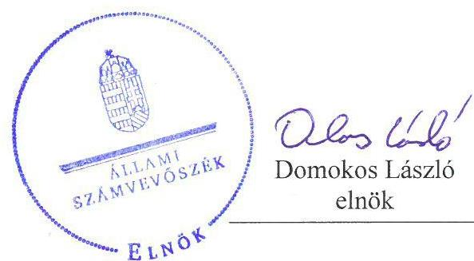
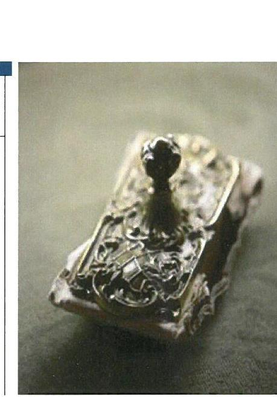

---

# AZ ELLENŐRZÉST FELÜGYELTE: 

PETŐ KRISZTINA felügyeleti vezető

## AZ ELLENŐRZÉST VEZETTE ÉS A VÉGREHAJTÁSÁÉRT FELELŐS:

FÜLÖP IBOLYA ellenőrzésvezető

## A PROGRAM ÖSSZEÁLLÍTÁSÁÉRT FELELŐS:

JANIK JÓZSEF LÁSZLÓ osztályvezető

## A TÉMÁHOZ KAPCSOLÓDÓ KORÁBBI SZÁMVEVŐSZÉKI JELENTÉS:

- címe: Jelentés a Debreceni Egyetem ellenőrzéséről - Az állami felsőoktatási intézmények gazdálkodásának, működésének ellenőrzése
- sorszáma: 15071

IKTATÓSZÁM: V-1349-033/2016.
TÉMASZÁM: 2096
ELLENŐRZÉS-AZONOSÍTÓ SZÁM: V075546

---

# TARTALOMJEGYZÉK 

■ ÖSSZEGZÉS ..... 5
■ AZ ELLENŐRZÉS CÉLJA ..... 6
■ AZ ELLENŐRZÉS TERÜLETE ..... 7
■ AZ ELLENŐRZÉS HÁTTERE, INDOKOLTSÁGA ..... 8
■ A JELENTÉS LÉNYEGES KÉRDÉSKÖRE ..... 9
■ AZ ELLENŐRZÉS HATÓKÖRE ÉS MÓDSZEREI ..... 10
■ MEGÁLLAPÍTÁSOK ..... 12
■ MELLÉKLETEK ..... 15
I. sz. melléklet: Az ÁSZ 15071 számú jelentéséhez kapcsolódó intézkedési terv végrehajtása a Debreceni Egyetemnél ..... 15
■ FÜGGELÉK: ÉSZREVÉTELEK ..... 17
■ RÖVIDÍTÉSEK JEGYZÉKE ..... 25

---

.

---

# ÖSSZEGZÉS 

Az Állami Számvevőszék utóellenőrzése megállapította, hogy a Debreceni Egyetem által készített intézkedési tervben meghatározott feladatok jelentős részét végrehajtották, ezzel támogatva az elszámoltatható és ellenőrizhető közpénzfelhasználást.

## Az ellenőrzés társadalmi indokoltsága

Az Állami Számvevőszék stratégiájában célul tűzte ki a számvevőszéki munka hasznosulásának javítását. Ezzel összhangban ellenőrzi, hogy az ellenőrzött szervezetek megvalósították-e a korábbi ellenőrzései által feltárt hibák, hiányosságok és szabálytalanságok megszüntetése céljából elkészített intézkedési terveikben foglaltakat. A rendszeres utóellenőrzések hozzájárulnak a szükséges intézkedések tényleges végrehajtásához, ezáltal a közpénzügyek rendezettségének javulásához.

## Főbb megállapítások, következtetések

A Debreceni Egyetem intézkedési tervében meghatározott hat feladatból három feladatot határidőben, kettő feladatot határidőn túl, egy feladatot részben hajtottak végre. Az Állami Számvevőszék által korábban azonosított szabálytalanságok jelentős része megszüntetésre kerültek, ezzel támogatva az elszámoltatható és ellenőrizhető közpénzfelhasználást.

Megtörtént az önköltségszámítási szabályzat aktualizálása, így a működéshez szükséges alapvető feltételek megteremtéséről intézkedtek. A közbeszerzési eljárás ellenőrzését megerősítették, amelyben kiemelt feladatot kapott a kancellár, aki a folyamatba épített előzetes és utólagos vezetői ellenőrzés során ellenőrzi a tevékenységet és minden olyan intézkedésre jogosult, amely szükséges a közbeszerzési eljárás jogszerűségének biztosításához. Az Egyetem gazdasági társaságaiban az összeférhetetlenséget eredményező felügyelőbizottsági tagságokat megszüntették.

A devizaszámlák kezelésének vizsgálatát nem végezték el, ezzel elmaradt a gazdálkodási szabályok maradéktalan betartásának kontrollja e területen.

---

# AZ ELLENŐRZÉS CÉLJA 

Az ellenőrzés célja annak értékelése volt, hogy a számvevőszéki jelentésben ${ }^{1}$ foglalt javaslatot megalapozó megállapításokkal összhangban készített intézkedési tervben meghatározott feladatokat az ellenőrzött szervezet vég-rehajtotta-e.

---

# AZ ELLENŐRZÉS TERÜLETE 

## Debreceni Egyetem

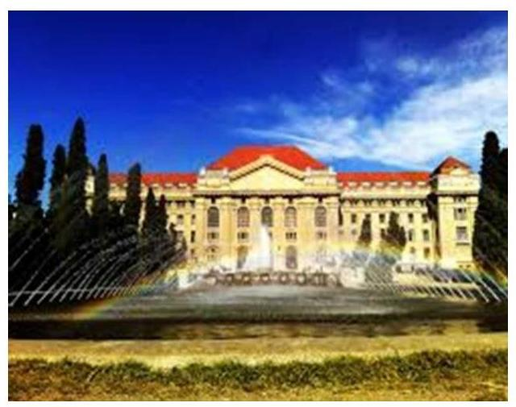

Az Egyetem ${ }^{2}$ múltja a XVI. századig nyúlik vissza, ekkor alapították a Debreceni Református Kollégiumot, amely hosszú évszázadokon át játszott jelentős szerepet a magyar oktatásban és kultúrában. 1912-ben mondta ki az országgyűlés a Debreceni Magyar Királyi Tudományegyetem megalakulását, amely azonban csak 1914-ben kezdte meg működését három karral. Az Egyetem központi épületét a húszas években kezdték építeni, és 1932-ben avatták fel. A II. világháborút követően, 1949-ben politikai okokból megkezdődött az időközben többkarúvá fejlődött egyetem szétdarabolása.

A felsőoktatási intézményrendszer korszerűsítésére vonatkozó jogszabály ${ }^{3}$ alapján 2000. január 1-jén jött létre 4 önálló intézmény integrációjával az Egyetem, amely 5 egyetemi és 3 főiskolai karral kezdte meg működését. A 2017/18-as tanévben a közel 30000 hallgató 14 karon folytathat tanulmányokat.

A rektor ${ }^{4}$ 2013. július 1-jétől, a kancellár ${ }^{5}$ 2014. november 15-től tölti be tisztségét.

Az Egyetem 2016. évi költségvetési beszámolója szerint 89088 millió Ft költségvetési bevételt, 39859 millió Ft finanszírozási bevételt teljesített, ugyanakkor 77379 millió Ft költségvetési kiadást és 313 millió Ft finanszírozási kiadást teljesített. A 2016. december 31-i könyvviteli mérleg szerint az Egyetem eszközei 135996 millió Ft-ot tettek ki.

Az Egyetem gazdálkodásának és működésének ellenőrzését az ÁSZ ${ }^{6}$ a 2009-2013. közötti időszakra végezte el, az erről szóló 15071. számú jelentést 2015. április 30-án tette közzé, amelynek célja annak értékelése volt, hogy szabályos volt-e az Egyetem pénzügyi és vagyongazdálkodása, biztosított volt-e a vagyonnal való gazdálkodás követelményének érvényesülése, a jogszabályi előírásoknak megfelelően működött-e a belső kontrollrendszer, az irányító szerv tevékenysége a jogszabályoknak megfelelő volt-e.

Az utóellenőrzés a számvevőszéki jelentésben a rektor részére megfogalmazott javaslatokat megalapozó megállapításokra és javaslatokra készített, az ÁSZ részére megküldött intézkedési tervben foglalt feladatok megvalósításának ellenőrzésére, illetve értékelésére fókuszált.

---

# AZ ELLENŐRZÉS HÁTTERE, INDOKOLTSÁGA 

Az ÁSZ tv. ${ }^{7}$ 33. § (1) bekezdése értelmében a számvevőszéki jelentések javaslatot megalapozó megállapításaihoz kapcsolódóan az ellenőrzött szervezet vezetője intézkedési tervet köteles összeállítani, és az ÁSZ részére megküldeni. Az intézkedési tervben foglaltak megvalósítását - az ÁSZ tv. 33. § (7) bekezdésében foglaltak alapján - az ÁSZ utóellenőrzés keretében ellenőrizheti. Az intézkedések megvalósulásának értékelése során az ÁSZ figyelembe veszi az ellenőrzött szervezetek működési feltételeiben, valamint a jogszabályi előírásokban bekövetkezett változásokat.

Az intézkedési tervekben foglalt feladatok hiányos, illetve késedelmes végrehajtása, valamint megvalósításának elmaradása azt mutatja, hogy az ellenőrzések során feltárt hibák, hiányosságok és szabálytalanságok megszüntetése nem kapott kellő hangsúlyt. Ez a szabályszerű működés és a felelős vezetői magatartás vonatkozásában kockázatot hordoz. E kockázatok feltárásával az ÁSZ utóellenőrzési rendszere fokozza a fegyelmet, és igazolja, hogy a közpénzzel való szabályos gazdálkodás felelőssége elől nem lehet kitérni.

## AZ UTÓELLENŐRZÉS VÁRHATÓ HASZNOSULÁSA

Az utóellenőrzés négy szinten hasznosulhat:
$\longrightarrow$ A társadalom szintjén az utóellenőrzés jelzi, hogy a számvevőszéki ellenőrzés megállapításainak van következménye: a hiányosságok megszüntetésére az ellenőrzött szervezet által meghatározott intézkedések végrehajtását is számon kéri az ÁSZ.
$\longrightarrow$ Az ellenőrzött terület szintjén az utóellenőrzés tájékoztatást nyújt a terület döntéshozóinak a hiányosságok kiküszöbölésének jó gyakorlatairól, ezzel lehetőséget biztosítva arra, hogy az ÁSZ ellenőrzési megállapításai, javaslatai a terület nem ellenőrzött szervezeteinek a működése során is hasznosuljanak.
$\longrightarrow$ Az ellenőrzött szervezet szintjén az utóellenőrzés feltárja, hogy a szervezet az intézkedések végrehajtásával hasznosította-e a korábbi ellenőrzési jelentésben a hiányosságok megszüntetése, illetve a kockázatok kezelése érdekében megfogalmazott javaslatokat.
$\longrightarrow$ Az ÁSZ szintjén az utóellenőrzés visszacsatolást ad az ellenőrzési jelentések hasznosulásáról, az intézkedések elmaradása vagy részleges megvalósulása a további ellenőrzésekhez kockázati jelzésként szolgál.

---

# A JELENTÉS LÉNYEGES KÉRDÉSKÖRE 

Az ellenőrzött szervezet az intézkedési tervében foglaltakat az előírt határidőben végrehajtotta-e?

---

# AZ ELLENŐRZÉS HATÓKÖRE ÉS MÓDSZEREI 

## Az ellenőrzés típusa

Megfelelőségi ellenőrzés.

## Az ellenőrzött időszak

Az utóellenőrzés alapját képező számvevőszéki jelentés közzétételének napjától (2015. április 30.) az ellenőrzésről szóló kiértesítő levél keltének napjáig (2017. június 21.) tartó időszak.

## Az ellenőrzés tárgya

A számvevőszéki jelentésben foglalt javaslatot megalapozó megállapításokkal összhangban - az Egyetem által - készített intézkedési tervben foglaltak végrehajtásának ellenőrzése.

Az ellenőrzés kiterjed minden olyan körülményre és adatra, amely az ÁSZ jogszabályban meghatározott feladatainak teljesítéséhez, valamint a program végrehajtása folyamán felmerült újabb összefüggések feltárásához szükséges.

## Az ellenőrzött szervezet

Debreceni Egyetem

## Az ellenőrzés jogalapja

Az ÁSZ tv. 33. § (7) bekezdése alapján az ÁSZ tv. 33. § (1)-(2) bekezdése szerinti intézkedési tervben foglaltak megvalósítását az ÁSZ utóellenőrzés keretében ellenőrizheti.

## Az ellenőrzés módszerei

Az ÁSZ az utóellenőrzést a nemzetközi standardokat irányadónak tekintve az ellenőrzési program ellenőrzési kérdései, az ellenőrzött időszakban hatályos jogszabályok, az ellenőrzés szakmai szabályok és módszertanok figyelembevételével, önállóan végezte.

Az ÁSZ az ellenőrzés ideje alatt az Egyetemmel történő kapcsolattartást az ÁSZ SZMSZ ${ }^{\text {A}}$-ének vonatkozó előírásai alapján biztosította.

---

Az utóellenőrzés megállapításait elsősorban az ÁSZ rendelkezésére álló, valamint az ellenőrzött szervezetektől elektronikusan bekért dokumentumok alapozták meg.

Az ellenőrzési bizonyítékként felhasználható adatforrások közé tartoznak egyrészt a szakmai programban felsorolt adatforrások, másrészt minden - az ellenőrzés folyamán feltárt, az ellenőrzés szempontjából információt tartalmazó - dokumentum.

Az intézkedési tervekben előírt feladatokat, azok végrehajtása, illetve végrehajtása szempontjából az alábbiak szerint értékelte az ÁSZ:
$\longrightarrow$ „határidőben végrehajtott" a feladat, ha a teljesítés dokumentáltan, az intézkedési tervben előírt határidőben és tartalommal megtörtént;
$\longrightarrow$ „határidőn túl végrehajtott" a feladat, ha annak teljesítése az intézkedési tervben meghatározott módon, de az előírt határidőn túl történt meg;
$\longrightarrow$ „részben végrehajtott" a feladat, ha végrehajtása teljes körűen az intézkedési tervben előírt módon nem történt meg;
$\longrightarrow$ „nem végrehajtott" a feladat, ha a végrehajtás nem történt meg, vagy amennyiben a teljesítést nem dokumentálták;
$\longrightarrow$ „okafogyottá vált" a feladat, ha végrehajtására - meghatározott esemény bekövetkezése, továbbá külső körülmény, a működést érintő feltétel változása miatt - már nincs szükség, illetve lehetőség, és egyértelműen megállapítható, hogy az intézkedést szükségessé tevő körülmény a jövőben nem fordulhat elő;
$\longrightarrow$ „nem időszerű" az a feladat, amelynek ellenőrzési időszakon belüli végrehajtására azért nem került (kerülhetett) sor, mert az intézkedés alapjául szolgáló esemény nem következett be, de annak jövőbeni előfordulása lehetséges, a végrehajtása nem volt esedékes, vagy a végrehajtás határideje még nem járt le.
Az utóellenőrzés lefolytatásához az ellenőrzött szervezetek a tanúsítványok kitöltésével és elektronikus feltöltésével, valamint az ÁSZ által kért dokumentumok elektronikus megküldésével szolgáltattak adatokat, amelyek valódiságát és teljes körűségét az ellenőrzött szervezet vezetője által tett teljességi és hitelességi nyilatkozat igazolta. Az így rendelkezésre bocsátott adatok, információk kontrollja az ellenőrzés keretében történt.

---

# MEGÁLLAPÍTÁSOK 

## Az ellenőrzött szervezet az intézkedési tervében foglaltakat az előírt határidőben végrehajtotta-e?

Összegző megállapítás

Az intézkedési tervben lévő hat feladatból az Egyetem három feladatot határidőben, kettő feladatot határidőn túl hajtott végre, egy feladatot részben hajtott végre.

A hiányosságok, szabálytalanságok megszüntetésére az Egyetem által elkészített és az ÁSZ által tudomásul vett intézkedési terv hat feladatot határozott meg.

Az intézkedési tervben meghatározott feladatokat, határidőket, a felelősöket és a feladatok végrehajtását az I. sz. melléklet mutatja be.

Az Egyetem intézkedési tervében vállalt feladatok végrehajtásának értékelését az 1. ábra szemlélteti.

1. ábra

Az Egyetem által az intézkedési tervben
vállalt feladatok végrehajtásának
értékelése
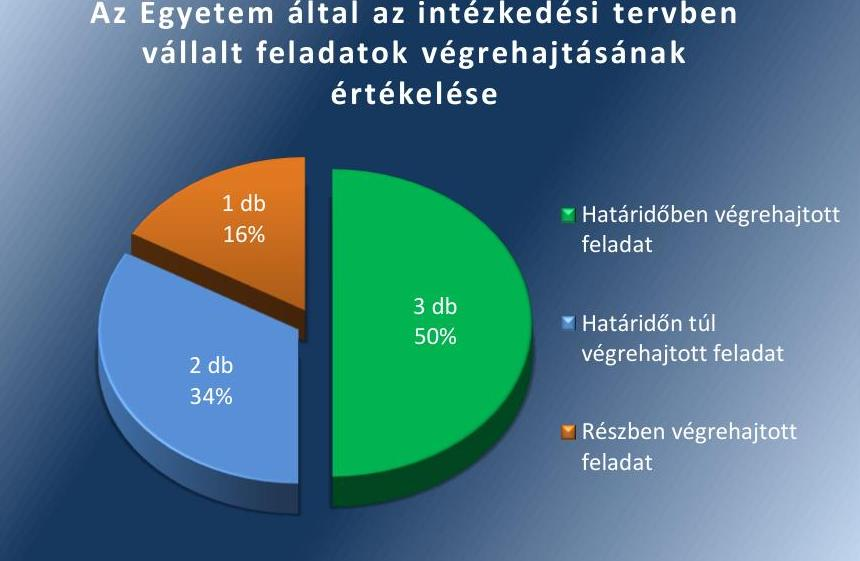

Fonrás: ÁSZ

## HATÁRIDŐBEN VÉGREHAJTOTT feladatok:

$\qquad$ 1. (4/1.) A rektor és a kancellár gondoskodott az Önköltségszámítási Szabályzat ${ }^{9}$ aktualizálásáról, amely tartalmazta az intézkedési tervben vállalt módosításokat. A feladat végrehajtásának értékelése nem terjedt az Önköltségszámítási Szabályzatban foglaltak gyakorlati alkalmazásának megfelelőségére.
$\qquad$ 2. (4/2a.) A kancellár határidőn belül vizsgáló bizottságot ${ }^{10}$ hozott létre a munkaügyi felelősség kivizsgálására a Kbt. ${ }^{11}$ hatálya alá tartozó termékbeszerzésnél a le nem folytatott közbeszerzési eljárás

---

tekintetében. A bizottság személyi felelősségre vonásra okot adó tényállást nem állapított meg.
3. (4/3a.) A kancellár a kincstári körön kívüli számlavezetés miatti szabálytalan pénzkezelés tekintetében a munkajogi felelősséggel kapcsolatos körülmények kivizsgálására 3 fős vizsgálóbizottságot hozott létre. A tagok felkérése határidőben megtörtént, a bizottság munkajogi felelősséget nem állapított meg.

# HATÁRIDŐN TÚL VÉGREHAJTOTT feladatok: 

4. (4/2b.) A rektor és a kancellár a közbeszerzésekre vonatkozóan a kontrolltevékenységének megerősítését a határidőn túl hatályba léptetett Közbeszerzési Szabályzat ${ }^{12}$ módosításával valósította meg.
5. (4/4.) Az intézményi gazdasági társaságokban az összeférhetetlenséget eredményező felügyelőbizottsági tagságokat megszüntették. Az Egyetem négy összeférhetetlenség megszüntetése iránt intézkedett. Egy esetben határidőn belül, három esetben határidőn túl szűntették meg a vezetői összeférhetetlenségeket.

## RÉSZBEN VÉGREHAJTOTT feladat:

6. (4/3b.) A
 kincstári gyűjtőszámlák megnyitása, az elektronikus tanulmányi rendszerrel való összehangolása megtörtént. A devizaszámlák kezelésének megvizsgálása nem történt meg, amelynek következtében nem gondoskodtak a devizaszámlák kezelésére vonatkozó - Áht. 79. § (6) bekezdésében foglalt - előírásoknak való megfelelés folyamatos nyomon követéséről. Továbbá nem zárták ki annak a lehetőségét, hogy a külföldi hallgatók befizetéseivel összefüggésben feltárt - a devizában történő befizetések forintban történő realizálására és könyvelésére vonatkozó - hiányosságok megismétlődjenek.

Az Egyetem a Bkr. ${ }^{13}$ 14. § (1) bekezdése szerinti nyilvántartást a jogszabályi előírásnak megfelelően vezette.

---

.

---

# MELLÉKLETEK

- I. SZ. MELLÉKLET: AZ ÁSZ 15071 SZÁMÚ JELENTÉSÉHEZ KAPCSOLÓDÓ INTÉZKEDÉSI TERV VÉGREHAJTÁSA A DEBRECENI EGYETEMNÉL

|  1. | Intézkedési tervben rögzített feladat | Az intézkedési tervben meghatározott határidő | A feladatok elvégzésének felelőse | A feladat végrehajtása  |
| --- | --- | --- | --- | --- |
|   | 1. | 2. | 3. | 4.  |
|  Határidőben végrehajtott feladatok |  |  |  |   |
|  1. (4/1.) „Önköltségszámítási szabályzat aktualizálása, új számítási módszertan kidolgozása az állami, fenntartói iránymutatás alapján, igazítás a tényleges kalkulációs folyamathoz a díjbevételek, költségtérítések megállapítása céljából." | 2015.10.01., továbbiakban folyamatos | megbízott kancellár helyettes | A rektor és a kancellár az Egyetem aktualizálta az Önköltségszámítási Szabályzatát. Az aktualizált Önköltségszámítási Szabályzatban új számítási módszertant dolgoztak ki, amely részletesen rögzíti a 8. §-ban az önköltségszámítás tárgyait, a 13. § tartalmazza a kalkulációs sémákat, a szabályzat mellékleteiben találhatóak a konkrét sémalapok. A feladat végrehajtásának értékelése nem terjedt ki az Önköltségszámítási Szabályzatban foglaltak gyakorlati alkalmazásának megfelelőségére. |   |
|  2. (4/2a.) „A konkrét ügyben a munkaügyi felelősség megvizsgálása." | 2015.07.01. | kancellár | A kancellár a Kbt. hatálya alá tartozó termékbeszerzéseknél le nem folytatott közbeszerzési eljárás miatt vizsgálóbizottságot hozott létre a munkaügyi felelősség megvizsgálására. A vizsgálóbizottságban való részvételre a tagok felkérése 2015. június 05. napján megtörtént.
A kitűzött határidőn belül, 2015. június 10-én lefolytatott ülésén, a vizsgálóbizottság munkajogi felelősséget sem az 1997-ben megkötött külföldi folyóirat szállítással kapcsolatos szerződés, sem a nettó 8,4 M Ft-os Kbt. szabályaiba ütköző beszerzés vonatkozásában nem állapított meg. |   |
|  3. (4/3a.) „A konkrét ügyben konkrét munkaügyi felelősség megvizsgálása, erre belső bizottság létrehozása." | 2015.09.01., folyamatos | kancellár | A kancellár a kincstári körön kívüli számlavezetés miatti szabálytalan pénzkezelés tekintetében a munkajogi felelősséggel kapcsolatos körülmények kivizsgálására 3 fős vizsgálóbizottságot hozott létre. A tagok felkérése 2015. június 05-i dátummal, határidőben megtörtént. Mivel az Egyetemet vagyoni hátrány nem érte, a bizottság munkajogi felelősséget nem állapított meg. |   |

---

|  1. | Intézkedési tervben rögzített feladat | Az intézkedési tervben meghatározott határidő | A feladatok elvégzésének felelőse | A feladat végrehajtása  |
| --- | --- | --- | --- | --- |
|   | 1. | 2. | 3. | 4.  |
|  Határidőn túl végrehajtott feladatok |  |  |  |   |
|  4. | (4/2b.) „A DE kontrolltevékenységének megerősítése a közbeszerzésekre vonatkozóan." | 2015.10.01. | kancellár | A rektor és a kancellár a közbeszerzésekre vonatkozóan a kontrolltevékenység megerősítését a Közbeszerzési eljárási szabályzat módosításával határidőn túl valósította meg. A Közbeszerzési Szabályzatot 2015. november 05-én adták ki, és 2015. november 06. napján lépett hatályba. A Közbeszerzési Szabályzat a X. rész 21. §-a szabályozza a közbeszerzési eljárás ellenőrzését. A közbeszerzési eljárás ellenőrzésében kiemelt feladatot kap a kancellár, aki felügyeli a közbeszerzések teljes folyamatát, a folyamatba épített előzetes és utólagos vezetői ellenőrzés során ellenőrzi a tevékenységet és minden olyan intézkedésre jogosult, amely szükséges a közbeszerzési eljárás jogszerűségének biztosításához.  |
|  5. | (4/4.) „A vezetők összeférhetetlenségének vizsgálata, kimutatása. Összeférhetetlenség megszüntetésére intézkedés." | 2015.10.01., majd folyamatos | megbízott jogi igazgató | Az intézményi gazdasági társaságokban az összeférhetetlenséget eredményező felügyelőbizottsági tagságokat megszüntették. Az Egyetem négy összeférhetetlenség megszüntetése iránt intézkedett. Egy esetben határidőn belül, három esetben határidőn túl 2015. október 30-án, 2015. november 30-án és 2016. február 02-án - szűntek meg az összeférhetetlenségek.  |
|  Részben végrehajtott feladat |  |  |  |   |
|  6. | (4/3b.) „Kincstári gyűjtőszámlák megnyitása, elektronikus tanulmányi rendszerrel való összehangolása. Devizaszámlák kezelésének megvizsgálása" | 2015.09.01., folyamatos | kancellár | Határidőben végrehajtott feladatrész:
A Kincstárnál az elektronikus tanulmányi rendszerrel összehangolt gyűjtő számla megnyitása 2015. március 28-án megtörtént, a kereskedelmi banknál vezetett bankszámla 2015. júliusi 26-i megszüntetésre került, a számlaegyenleg átvezetése a vállalt határidőre megtörtént.
Nem végrehajtott feladatrész:
A devizaszámlák kezelésének megvizsgálása nem történt meg, amelynek következtében nem gondoskodtak a devizaszámlák kezelésére vonatkozó - Áht. 79. § (6) bekezdésében foglalt - előírásoknak való megfelelés folyamatos nyomon követéséről. Továbbá nem zárták ki annak a lehetőségét, hogy a külföldi hallgatók befizetéseivel összefüggésben feltárt - a devizában történő befizetések forintban történő realizálására és könyvelésére vonatkozó -hiányosságok megismétlődjenek.  |

---

# FÜGGELÉK: ÉSZREVÉTELEK 

A jelentéstervezetet a Számvevőszék 15 napos észrevételezésre megküldte az ellenőrzött szervezet vezetőinek az ÁSZ tv. 29. §* (1) bekezdése előírásának megfelelően.
A Debreceni Egyetem kancellárja a jelentéstervezet megállapításaira írásban észrevételt tett.

A Debreceni Egyetem rektora részéről nem érkezett észrevétel.
A függelék tartalmazza a Debreceni Egyetem kancellárjának észrevételeit, illetve az el nem fogadott észrevételek elutasításának indoklását.

[^0]
[^0]:    * 29. § (1) Az Állami Számvevőszék az ellenőrzési megállapításait megküldi az ellenőrzött szervezet vezetőjének vagy az általa megbízott személynek, és annak, akinek személyes felelősségét állapította meg.
    (2) Az ellenőrzött szervezet vezetője és a felelősként megjelölt személy az ellenőrzés megállapításaira tizenöt napon belül írásban észrevételt tehet.
    (3) Az Állami Számvevőszék az észrevételre a beérkezésétől számított harminc napon belül írásban válaszol. A figyelembe nem vett észrevételeket köteles a jelentésben feltüntetni, és megindokolni, hogy azokat miért nem fogadta el.

---

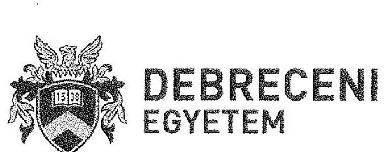

**Iktatószám:** KC/515-5/2017.
**Tételszám:** 01.19.
**Ügyintéző:** Borné Lampert Andrea
**Tárgy:** Észrevétel utóellenőrzés megállapításhoz
**Hivatkozás:** V 3347 026/2016

**Domokos László**
elnök úr részére
Állami Számvevőszék

**Tisztelt Elnök Úr!**

**ÁLLAMI SZÁMVEVŐSZÉK**
25-3686/2017
**Érkezési idő:** 2017. NOV. 11. 7
**Intézés szám:** V-4345-055/2017
**Melléklet:** __________________________

Az „Utóellenőrzések – Az állami felsőoktatási intézmények gazdálkodásának, működésének ellenőrzéséről készült jelentések utóellenőrzése – Debreceni Egyetem” című ellenőrzésről készült számvevőszéki jelentéstervezetre az alábbiak szerint észrevételt teszek.

Az Állami Számvevőszék utóellenőrzése megállapította, hogy a 2009-2013 közötti időszakra vonatkozó vizsgálat kapcsán a Debreceni Egyetem az általa készített intézkedési tervben meghatározott 6 feladatból 5 feladatot teljes egészében végrehajtott, egy feladat a jelentés megállapítása szerint részben teljesült.

Az Állami Számvevőszék megállapításai alapján az alábbi pont részlegesen teljesült.

**Intézkedési tervben rögzített feladat:**
„Kincstári gyűjtőszámlák megnyitása, elektronikus tanulmányi rendszerrel való összehangolása. Devizaszámlák kezelésének megvizsgálása.”

**Jelentéstervezet megállapítása:**
„Határidőben végrehajtott feladatrész:
A Kincstárnál az elektronikus tanulmányi rendszerrel összehangolt gyűjtő számla megnyitása 2015. március 28-án megtörtént, a kereskedelmi banknál vezetett bankszámla 2015. július 26-án megszüntetésre került, a számlaegyenleg átvezetése a vállalt határidőre megtörtént.

Nem végrehajtott feladatrész:
A devizaszámlák kezelésének megvizsgálása nem történt meg, amelynek következtében nem gondoskodtak a devizaszámlák kezelésére vonatkozó – Áht. 79.§ (6) bekezdésében foglalt – előírásoknak való megfelelés folyamatos nyomon követéséről. Továbbá nem zárták ki annak a lehetőségét, hogy a külföldi hallgatók befizetéseivel összefüggésben feltárt – a devizában történő befizetések forintban történő realizálására és könyvelésére vonatkozó – hiányosságok megismétlődjenek.”

Az ellenőrzött időszak az utóellenőrzés alapját képező számvevőszéki jelentés közzétételének napjától (2015. április 30.) az ellenőrzésről szóló kiértesítő levél keltének napjáig (2017. június 21.) tartó időszak.

A Debreceni Egyetem részben az eredeti ellenőrzött időszakban, részben az utóellenőrzéssel érintett időszakban lépéseket tett annak érdekében, hogy a kincstári körön kívüli devizaszámlái megszüntetésre kerüljenek és a külföldi hallgatók befizetéseinek kezelése a lehető leghatékonyabb módon valósuljon meg. A megtett intézkedések az alábbiak:

---

# 1. Kereskedelmi banknál vezetett devizaszámlák felülvizsgálata, megszüntetése 

Az ERSTE Bank Hungary Nyrt. által a külföldi hallgatók valutában történő befizetéseinek fogadását és az egyetem számlájára történő átvezetését biztosító technikai bankszámlák 2014. december 29-ével megszüntetésre kerültek.
A KLTE tandíj nevű bankszámla (11600006-00000000-01844054) 2014. március 31-i dátummal szűnt meg, az Egyetem az utolsó innen érkező átutalást 2014. április 01-én fogadta.
A DOTE tandíj nevű bankszámla (11625009-09000650-25000007) 2014. december 29. napjával került megszüntetésre, melyre már ezt megelőzően a 2014. szeptember 19-i keltezésű értesítő levelük kézhezvételét követő 60. napon jóváírás-tiltás típusú zárolás került. Az utolsó átutalt összeget 2014. december 01-én fogadta az Egyetem. Ezt követően az Egyetem hallgatói ezzel a lehetőséggel nem élhettek.

A Debreceni Egyetem már 2009-től folyamatosan lépéseket tett annak érdekében, hogy a kereskedelmi bankoknál vezetett devizaszámlái megszüntetésre kerüljenek. 2009. június 17-én a gazdasági főigazgató az akkor még centrum struktúrában működő tervezési egységek gazdasági vezetőinek hivatalos levélben hívta fel a figyelmét az 1992. évi XXXVIII. törvény 18/C. § (10) bekezdésére, mely szerint „A kincstári körbe tartozók ... megszerzett devizaeszközeik kezelésére devizaszámlájukat ... a kincstárban kötelesek vezetni."

Az ÁSZ ellenőrzést követően felülvizsgálatot rendeltem el a 2009 évig visszamenőleges időszakra vonatkozóan a korábbi részjogkörű tervezési egységek által nyitott és kezelt devizaszámlák forgalmát illetően, a számla rendeltetési céljától függetlenül, tehát minden irányultságú devizaszámlára kiterjesztve. Ennek eredményeként kijelenthető, hogy 2015 évtől már egyetlen kereskedelmi banknál vezetett számlánknak sem volt forgalma. A napi működés fenntartása mellett a szükséges devizaszámlák a kincstárban megnyitásra kerültek, míg a devizaszámla vezetés szabályai szerint a kereskedelmi bankoknál vezetett devizaszámláink folyamatosan megszüntetésre kerültek. Az utolsó bankszámlák 2017. március 01-én kerültek lezárásra, azaz a Debreceni Egyetemnek jelenleg nincs kereskedelmi banknál vezetett devizaszámlája, ezzel teljes mértékben megfelelve az Áht 79. § (6) bekezdésben foglaltaknak.

## 2. Külföldi hallgatók által fizetendő díjak fogadására vonatkozó szabályozó környezet

2014. novemberében a Debreceni Egyetem rektorával és a költségvetési felügyelet vezetőjével közösen -az RH/855-1/2015 iktatószámú levélben is említett- személyes látogatást tettünk a Magyar Államkincstár elnökénél az akkori konstrukciók megváltoztatása és kincstári körbe való bevonása érdekében. A megbeszélésen mind a magyar, mind a külföldi hallgatók befizetéseinek kezelési lehetőségét megvitattuk.

A külföldi hallgatók készpénzes befizetéseit a Kincstár elnökének 2014. november 07-én kelt levele szerint a Kincstár továbbra sem képes fogadni. A hallgatók által történő külföldi valutanemben kezdeményezett befizetések kezelésére javasolja, hogy a felsőoktatási intézmény valutapénztárába történjenek a befizetések. A felsőoktatási intézmény a befizetett valutát döntése alapján a Neptun gyűjtőszámlára fizetheti be forintban.

---

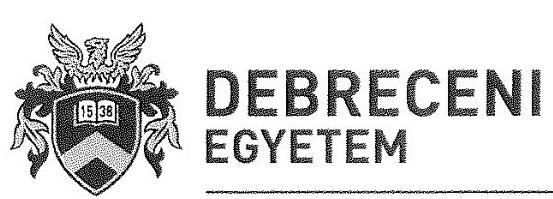

KANCELLÁR H-4028 Debrecen, Kassai út 28. H-4002 Debrecen M.: 400 Tel.: 52/512-729, Fax:52/512-730 E-mail: kancellar@fin.unideb.hu

Dr. Palkovics László felsőoktatásért felelős államtitkár 2015. május 28-án kelt levelében arról tájékoztatta a felsőoktatási intézményeket, hogy ezt a megoldást az EMMI nem támogatja a nagy összegű készpénzkezelés lehetséges felelősségi következményei miatt, ennek megoldása
 érdekében egyeztetést kezdeményez a Kincstár elnökével.

A Magyar Államkincstár elnöke 2015. szeptember 15-i levelében tájékoztatta az Egyetemet, hogy részére a hitelintézeti devizaszámla-vezetés lehetőségét - a hallgatói tandíjak készpénzben történő befizetése érdekében - visszavonásig engedélyezi.

A Magyar Államkincstár 2017. január 06-án kelt levelében tájékoztatást adott, mely szerint a fent nevezett engedélyt 2017. december 31. napjával visszavonja.

# 3. A kincstári engedély alapján nyitható devizaszámla kezelésének vizsgálata, modell számítások elvégzése a Debreceni Egyetem forgalmi adatai alapján 

A hitelintézeti devizaszámla-nyitás engedélyt követően az Egyetem személyes egyeztetést kezdeményezett, valamint számlavezetési ajánlatot kért az OTP Banktól 2015 októberében, mely ajánlatot a személyes egyeztetés alapján, kérésünkre majd 2016 szeptemberében frissített. Ezen ajánlatok alapján kalkulációk készültek a várható előnyökről és hátrányokról az OTP-s devizaszámla kapcsán.
A kalkuláció számításokat az alábbi tényezők alapján végeztük:

- a 2015/2016-os tanév létszámadatai ( 3.254 fő) és az USD-ban történő befizetés nagyságrendje alapján,
- feltételezve, hogy a fenti pontban jelzett létszám 95%-a átutalással, 5%-a pénztári befizetéssel teljesít
- 270 Ft/USD árfolyammal,
- a bevétel előirányzat-felhasználási keretszámlára 500.000 USD összeghatár elérése esetén történő átvezetéssel (évi 40 alkalom) végeztük el,
- feltételezve, hogy a beérkezett jóváírások 1%-a a hallgatók részére visszautalásra kerülhet.

A kalkuláció során megállapítást nyert, hogy a hitelintézeti devizaszámla kedvezőtlen az Egyetem számára, tekintettel az alábbiakra:

- számlavezetési díja kedvezőtlenebb,
- jóváírási jutalék felszámítása a pénztári befizetések ( 0,65%, minimum 800 Ft/tétel) és a külföldi, illetve magyar bankból kapott deviza átutalás ( 3 EUR/tétel 100 EUR felett) esetén
- tranzakciós díj terheli, illetve az USD/EUR váltás esetén is újabb költség kerül felszámításra,
- a deviza átutalása az Egyetem előirányzat-felhasználási számlájára -hiszen ezen a számlán realizálódnak az oktatás érdekében felmerülő kiadások is- kétféle költséggel jár, egyrészt terhelés utáni díj, másrészt a tranzakciós illeték.

A MÁK előirányzati-, forintszámla esetében előny, hogy a számlavezetési díj kedvezőbb, fő- és alszámla közötti utalásnak nincs költsége, nemzetközi utalások díja kedvezőbb, nincs külön díja a jóváírásnak. A számítások végső konklúziója szerint a hitelintézeti devizaszámla költségei és egyéb

---

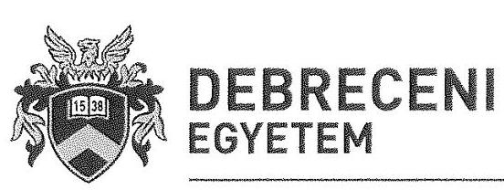

KANCELLÁR
H-4028 Debrecen, Kassai út 28.
H-4002 Debrecen Pf.: 400
Tel.: 52/512-729, Fax:52/512-730
E-mail: kancellardhfin.undeb.hu
hátrányai olyan magasak a MÁK-kal szemben -az egyeztetések során elért látra szóló kamat ellenére is-, hogy az nem szolgálja az intézmény érdekeit. Így bár a Kincstár engedélyezte a Debreceni Egyetem részére a hitelintézetnél történő devizaszámla nyitását, ezzel a lehetőséggel intézményünk - A költségvetési szervek belső kontrollrendszerről és belső ellenőrzéséről szóló 370/2011. (XII.31.) kormányrendelet 6. § (2) bekezdésére is figyelemmel- nem élt.

A fentiekben bemutatott kalkulációs számítások és egyeztetések mellett 2015 áprilisában egyeztetést folytattunk a NEPTUN tanulmányi rendszer üzemeltetését és fejlesztését végző SDA Stúdió Kft. képviselőivel a devizában érkező befizetések tanulmányi rendszerbeli kezelésére vonatkozó technikai feltételekről. A megbeszélés konklúziójaként elmondható volt, hogy nem volt alkalmazható megoldás a devizás befizetések kezelésére.

A Debreceni Egyetemen tanuló, illetve ide jelentkező külföldi hallgatók a devizában megállapított költségtérítési díjakat az utalás devizanemétől függetlenül, a Magyar Államkincstárnál vezetett 10034002-00282871-00000000 számú előirányzat-felhasználási keretszámlára fizetik be. A Debreceni Egyetem 2015. január 1. óta készpénzes fizetést nem tesz lehetővé a külföldi hallgatói számára. A Magyar Államkincstár a befizetett térítési díjakat MNB árfolyamon számítja át, ami az intézmények szempontjából megfelel a devizás tételek értékelésére vonatkozó, az államháztartás számviteléről szóló 4/2013. (I. 11.) Korm. rendelet 20. § (3) bekezdés szerinti előírásoknak.

Összefoglalásként elmondható, hogy az intézkedési tervben meghatározott „Devizaszámlák kezelésének megvizsgálása" tárgyú feladatot az intézmény teljesítette, elismerve a határidőn túli teljesítés tényét a fenti körülményekre is tekintettel.

Kérem észrevételem szíves tudomásul vételét és a jelentésen történő átvezetését.
Debrecen, 2017. október 31.

Üdvözlettel:
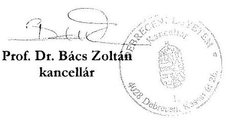

---

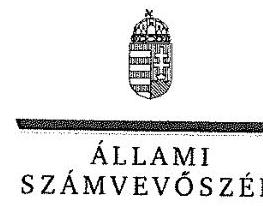

ELNÖK

Ikt.szám: V-1349-031/2016.

# Prof. Dr. Bács Zoltán úr 

kancellár
Debreceni Egyetem

## Debrecen

## Tisztelt Kancellár Úr!

Az „Utóellenőrzések - az állami felsőoktatási intézmények gazdálkodásának, működésének ellenőrzéséről készült jelentések utóellenőrzése - Debreceni Egyetem" címmel készített számvevőszéki jelentéstervezetre tett észrevételét köszönettel megkaptam.
Az Állami Számvevőszék észrevételre vonatkozó álláspontjáról a felügyeleti vezető által készített részletes tájékoztatást csatoltan megküldöm.
Tájékoztatom Kancellár urat, hogy a számvevőszéki jelentésben - az Állami Számvevőszékről szóló 2011. évi LXVI. törvény 29. § (3) bekezdése alapján - a figyelembe nem vett észrevételeket szerepeltetjük az elutasítás indokának feltüntetésével.

Budapest, 2017. 11. hó 10. nap
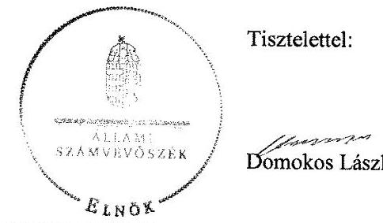

Tisztelettel:

Melléklet: Tájékoztatás az el nem fogadott észrevételekről

---

# Tájékoztatás az el nem fogadott észrevételekről 

Az „Utóellenőrzések - az állami felsőoktatási intézmények gazdálkodásának, működésének ellenőrzéséről készült jelentések utóellenőrzése - Debreceni Egyetem" című jelentéstervezetre a KC/515-5/2017. iktatószámú levélben tett észrevételeit áttekintettem.

Észrevételének kezeléséről az alábbi tájékoztatást adom.

## 1. Kereskedelmi banknál vezetett devizaszámlák felülvizsgálata, megszüntetése tárgyban tett észrevétele kapcsán

Az észrevétel szerint a Debreceni Egyetemnek (továbbiakban: Egyetem) nincs kereskedelmi banknál vezetett devizaszámlája, amellyel eleget tettek az államháztartásról szóló 2011. évi CXCV. törvény (továbbiakban: Áht.) 79. § (6) bekezdésének.
Az Állami Számvevőszék (továbbiakban: ÁSZ) az ellenőrzési megállapításait az adatbekérés során teljesített közreműködési kötelezettség keretében rendelkezésre bocsátott dokumentumokra, bizonyítékokra alapozva fogalmazza meg. Kancellár úr a 2016. november 21-én kelt teljességi és hitelességi nyilatkozatában kijelentette, hogy az átadott dokumentumok, adatok megbízhatóak és a bekért adatokra, dokumentumokra vonatkozóan teljes körű információt tartalmaznak. Nyilatkozott továbbá Kancellár úr arról is, hogy az átadott dokumentumok, adatok hitelességéért, valódiságáért, hiánytalanságáért és hatályosságáért teljes felelősséget vállalt. A Kancellár úr nyilatkozatában foglaltakra tekintettel a megtett intézkedésekről való utólagos tájékoztatás hitelességéről nem áll módunkban meggyőződni, mert ennek alátámasztásául szolgáló dokumentumokat az adatbekérés során nem bocsátott az ÁSZ rendelkezésére. Erre tekintettel észrevételét nem fogadjuk el, a jelentéstervezet módosítása nem indokolt.

## 2. A külföldi hallgatók által fizetendő díjak fogadására vonatkozó szabályozó környezet tárgyban tett észrevétele kapcsán

Kancellár úr észrevétele szerint a Magyar Államkincstár elnökével folytatott egyeztetés alapján felmerült az Egyetem valutapénztárába történő befizetés lehetősége, amelyet azonban az Emberi Erőforrások Minisztériuma nem támogatott a nagy összegű készpénzkezelés lehetséges felelősségi következményei miatt. A Magyar Államkincstár elnöke a hitelintézeti devizaszámla-vezetés lehetőségét visszavonásig engedélyezte, amely engedélyt 2017. december 31. napjával visszavont.

Tájékoztatom Kancellár urat, hogy az ellenőrzésünket megalapozó adatszolgáltatás keretében az Egyetem az észrevételben foglaltakat alátámasztó dokumentumot nem bocsátott az ÁSZ rendelkezésére, így a Kancellár úr 2016. november 21-én kelt teljességi és hitelességi nyilatkozatában foglaltakra tekintettel a megtett intézkedésekről való utólagos tájékoztatás hitelességéről nem áll

---

módunkban meggyőződni. Erre tekintettel az észrevételt nem fogadjuk el, a jelentéstervezet módosítása nem indokolt.

# 3. A kincstári engedély alapján nyitható devizaszámla kezelésének vizsgálata, modell számítások elvégzése az Egyetem forgalmi adatai alapján tárgyban tett észrevétele kapcsán 

Az észrevétel szerint a hitelintézeti devizaszámla-nyitás engedélyezését követően a kereskedelmi bank ajánlatát megvizsgálták, azonban az a Magyar Államkincstárral szemben annyival kedvezőtlenebb volt, hogy nem szolgálta az Egyetem érdekét, és nem éltek a lehetőséggel. Egyeztetést folytattak a NEPTUN tanulmányi rendszer üzemeltetését és fejlesztését végző céggel a devizában történő befizetések tanulmányi rendszerbeli kezelésének technikai feltételeiről, azonban alkalmazható megoldást nem találtak. A devizában megállapított költségtérítési díjakat - devizanemtől függetlenül - a Magyar Államkincstárnál vezetett keretszámlára fizetik be, külföldi hallgatók számára 2015. január 1-jétől az Egyetem készpénzes fizetést nem tesz lehetővé. A befizetett térítési díjakat a Magyar Államkincstár MNB árfolyamon számítja át, amely megfelel a devizás tételek értékelésére vonatkozó előírásoknak.
Tájékoztatom Kancellár urat, hogy az ellenőrzésünket megalapozó adatszolgáltatás keretében az Egyetem az észrevételben foglaltakat alátámasztó dokumentumot nem bocsátott az Állami Számvevőszék rendelkezésére, így a Kancellár úr 2016. november 21-én kelt teljességi és hitelességi nyilatkozatában foglaltakra tekintettel a megtett intézkedésekről való utólagos tájékoztatás hitelességéről nem áll módunkban meggyőződni. Erre tekintettel az észrevételt nem fogadjuk el, a jelentéstervezet módosítása nem indokolt.

Budapest, 2017.
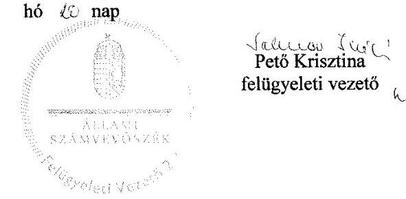

---

# RÖVIDÍTÉSEK JEGYZÉKE 

${ }^{1}$ számvevőszéki jelentés
${ }^{2}$ Egyetem
${ }^{3}$ 1999. évi LII. törvény
${ }^{4}$ rektor
${ }^{5}$ kancellár
${ }^{6}$ ÁSZ
${ }^{7}$ ÁSZ tv.
${ }^{8}$ ÁSZ SZMSZ
${ }^{9}$ Önköltségszámítási Szabályzat
${ }^{10}$ vizsgálóbizottság
${ }^{11}$ Kbt.
${ }^{12}$ Közbeszerzési Szabályzat
${ }^{13}$ Bkr.

15071 Jelentés A Debreceni Egyetem ellenőrzéséről - Az állami felsőoktatási intézmények gazdálkodásának, működésének ellenőrzése
Debreceni Egyetem
a felsőoktatási intézményhálózat átalakításáról, továbbá a felsőoktatásról szóló 1993. évi LXXX. törvény módosításáról (hatályos: 1999. június 12. 2006. március 1.)
Debreceni Egyetem rektora
Debreceni Egyetem kancellárja
Állami Számvevőszék
2011. évi LXVI. törvény az Állami Számvevőszékről (hatályos: 2011. július 1-jétől)
Az Állami Számvevőszék elnökének 3/2016. (XII. 29.) ÁSZ utasítása az Állami Számvevőszék Szervezeti és Működési Szabályzatáról (hatályos: 2017. január 1-jétől)
A Debreceni Egyetem Önköltségszámítási Szabályzata (hatályos: 2015. október 03-tól)
Az Egyetem kancellárja által létrehozott 3 fős Bizottság, amely 2015. június 10-i ülésén megvizsgálta az ÁSZ jelentésében kifogásolt közbeszerzési eljárás kapcsán felvetett személyi felelősség megállapításának szükségességét a közbeszerzésekről szóló 2003. évi CXXIX. törvény (hatályos: 2011. december 31-ig)
A Debreceni Egyetem Közbeszerzési Eljárási Szabályzata (hatályos: 2015. november 06-tól)
a költségvetési szervek belső kontrollrendszeréről és belső ellenőrzéséről szóló 370/2011. (XII. 31.) Korm. rendelet (hatályos: 2012. január 1-jétől)

---

ÁLLAMI SZÁMVEVŐSZÉK
1052 Budapest, Apáczai Csere János utca 10.
Levélcím: 1364 Budapest 4. Pf. 54
Telefon: +36 14849100 Telefax: +36 14849200
www.asz.hu
