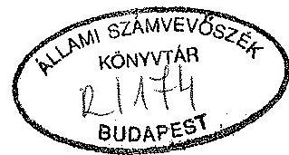
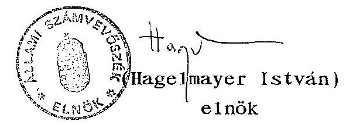
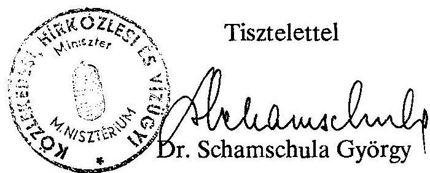
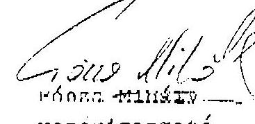
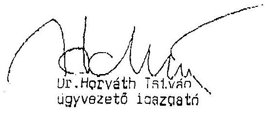
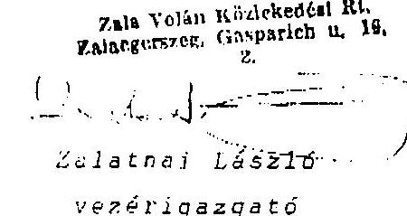

# Sallami Sxámvevössék 

## JELENTÉS

a Vasi Volán Vállalatnál, az országos menetrend szerinti személyszállitásra rendelt állami vagyonnal való gazdálkodásról

---

# ÁLLAMI SZÁMVEVÖSZÉK   Vagyone11enőrzési Igazgatóság   V-14-6/1993.   Témaszám: 173 

## J E L E N T É S

a Vasi Volán Vállalatnál,
az országos menetrend szerinti személyszállitásra rende1t állami vagyonnal való gazdálkodásról

## I.

## B EVEZETÉS

A Vasi Volán Vállalat megyei szintű vegyes profilú - személy- és teherfuvarozó - cég volt, ame1y 1957-től 1993-ig számos szervezeti változáson ment keresztül, többnyire államigazgatási döntés alapján. Időrendben ez a következôk szerint történt.

A részvénytársaság jogelődjei:
1957. április 1-jétől 65. sz. Autóközlekedési Vállalat, 1959. Július 16-án a Be1fõldi Szállitmányozási Vállalat (BELSPED) be1eolvadt az Autóköz1ekedési Vállalatba.
1961. december 19-től 17. sz. Autóköz1ekedési Vállalat, 1985. október 21-től Volán 17. sz. Vállalat
1990. április 28-tól Vasi Volán Vállalat
1993. január 1-jétől Vasi Volán Közlekedési Részvénytársaság, Az alapító okíratot a cégbírósághoz beadták: 1993. február 5-én. A Cégbírósági bejegyzés folyamatban volt a vizsgálat idején.

---

A 17. sz. Volán Vállalat a Volán Tröszt tagvállalata volt 1984. január 1-jéig, amikor a Volán Tröszt megszűnt. A Volán Tröszt jogutódja 1984. január 1-jétől a Volán Vállalatok Központja lett. Jelenleg a társaság tagja a Volán Válla1atok Egyesülésének.

A Válla1at 1991-ben megkezdte - a menetrendszerü autóbuszköz1ekedéshez nem közvetlenül kapcsolódó - a versenyszférába tartozó feladatok (áruszállítás, tehergépkocsi javítás) szervezeti elkülönítését, kft-kbe vitelét. Ez a folyamat 1992. március 1-jével befejeződött, amikor a legnagyobb, a szombathelyi árufuvarozást végző egység is kft-vé alakult.

|  | 1991. évben | 1992. évben |
| :-- | :-- | :-- |
| A Válla1at saját vagyona | 485 M Ft | 487,7 M Ft |
| a teljes munkaidőben foglalkoztatottak létszáma | 1850 fő | 820 fő |
| mérleg főösszege | 690 M Ft | 585 M Ft |
| volt. |  |  |

Az Rt tevékenységi körébe alapvetően a következők tartoznak:

Menetrendszerü, közúti, távolsági szemé1yszállitás
Nem menetrendszerü, közúti, távolsági szemé1yszállitás
Menetrendszerü, közúti, helyi szemé1yszállitás

A vállalat ellátja müködési területén a közhasználatú autóbusz szemé1yszállitási feladatokat. Ez azt jelenti, hogy az Rt. mintegy 200 autóbusszal 254 lakott településen 3014 km helyi viszonylathosszon nyújt naponta rendszeres közszolgáltatást a lakosságnak. A közszolgáltatások fenntartása azonban jelenleg a korábbi vagyon felélése (eladása, lizingbe adása) mellett valósul meg. Az átalakulás során végrehajtott vagyonértékelés következtében ezt a tényt az értékbeni adatok elfedik. Az Rt. hosszabb távú müködésének anyagi, pénzügyi feltételei nem kielégítőek, azokat javítani kell, illetve meg kell teremteni.

---

Az ellenőrzés célja: az Állami Számvevőszékről szóló 1989. évi XXXVIII. törvény 2.§-ának (6) bekezdésében foglaltaknak megfelelően annak vizsgálata, hogy a Vállalat

- a kezelésében lévő állami vagyonnal hogyan gazdálkodott,
- közszolgáltatási tevékenységét megfelelően látta-e el,
- a társasági átalakulás a jogszabályoknak és a gazdasági racionalitásoknak megfelelően történt-e.

Az ellenőrzés a Vállalat központja szintjén a Vállalat hosszú távú működő képességével a részvénytársasággá alakulást követően, valamint a menetrendszerủ autóbuszszemélyszállítás müködési színvonalával és ennek ellátásával kapcsolatos gazdálkodási kérdésekkel foglalkozott.
Kiterjedt az ellenőrzés a környezetvédelmi jogszabályok betartására.

A vizsgált időszak: 1991-1992. év volt, a részvénytársasági müködés tekintetében az 1993. I. féléve is.

A vizsgálat: 1993. május 10-től 1993. augusztus 5-ig - a vizsgálati jelentésnek az ellenőrzött szervezet részére észrevételezésre átadásáig - tartott, amelyen belül a helyszíni vizsgálat 1993. május 10 -én kezdődött és 1993 . június 30 -án fejeződött be.

# II. 

## Összefoglaló megállapítások, ajánlások

## Összefoglaló megállapítások

A vizsgálat az alábbi fő témákban tett megállapításokat:

- a vagyonnal történt gazdálkodás,
- a közszolgáltatási tevékenység,

---

- a gazdálkodással kapcsolatos jogszabályok betartása,
- a belsó ellenőrzési tevékenység,
- a környezetvédelem terén.

A Vasi Volán Vállalat a vizsgált időszakban államigazgatási felügyelet alatt álló vállalat volt. A Vállalat 1993. január 1-jei időponttal - zártkörű alapítással - határozatlan idejű, egyszemélyes részvénytársasággá alakult át, tökebevonás mèlkül. A létrejött társaság a Vasi Volán Vállalat általános jogutódja. Az Rt.-nek a magyar állam 100 \%-ban tulajdonosa, a tulajdonosi jogokat a közlekedési, hírközlési és vígazdálkodási miniszter, illetve képviseletében a minisztérium Köggazdasági és Privatizációs Főosztálya gyakorolja.

A vállalat a vizsgált idôszak elején komplex, megyei szintű személy- és teherszállításra berendezkedett gazdasági egység volt, rendelkezett az ehhez szükséges eszközökkel és infrastruktúrával.

A kialakult nemzetgazdasági helyzetben a teherszállítás és kapcsolt funkciói visszafejlesztése, szervezeti szétválasztása vált szükségessé. A teherárufuvarozás az állami beruházások megszünése, valamint az ipari és mezőgazdasági termelés jelentős csökkenése miatt megrendelések nélkü1 maradt és veszteségessé vált. Korábban keresztfinanszirozás révén ezen jövedelmező ágazatok tartották el a személyszállítást is.

Az 1991. és 1992. években a vállalat - összhangban az országos közlekedéspolitikai koncepcióval - célul tüzte maga elé és végrehajtotta a következőket:

- a veszteségessé vált áruszállítási tevékenységet a vállalatnál megszüntette és
- a közúti személyszállítás müködőképességét minden rendelkezésre álló eszközzel megörizte, valamint
- előkészítette a vállalat átalakulását.

---

Az általános gazdasági reszesszió következtében lecsökkent áruszállítási igények kielégitésére a vállalat eszközeiből és dolgozóiból alakult szakirányú gazdasági társaságokat (kft-ket) hoztak létre. Az ezen túlmenően feleslegessé vált eszközöket és infrastruktúra elemeket a vállalat a nyilvántartási értékeket jelentősen meghaladó árakon értékesítette, bérbeadta, lizingbe adta különböző vevőknek. A kft-ktől kapott osztaléknál sokkal nagyobb jövedelmet biztosítottak a vállalatnak a bérleti és lizing dijbevételek.

# Gazdálkodás a vagyonnal 

A Vállalat saját vagyona 1992-ben 487,7 millió Ft-ra nött, az elözö évihez képest 2,7 millió Ft-tal lett több. Ennek ellenére az összes körülményt mérlegelve megállapítható, hogy a közúti személyszállítás müködöképességének megörzése középtávon, 2-3 éven túl nem biztosított. Ez azért gond, mert a közúti (helyi, helyközi és nemzetközi) menetrendszerü személyszállítás közszolgáltatás.

A menetrendszerü autóbusz személyszállításra nincs meghatározva, sem jogszabályokban, sem irányelvekben, koncepciókban, sem a vállalat által, hogy milyen paraméterek határozzák meg e közszolgáltatás alapellátásának színvonalát. A gyakorlatban emiatt a már hosszabb ideje kialakult területi autóbuszhálózat, járatsűrűség, utazási, eljutási idönormák képezik az összemérés alapját. A jövöt illetően szükség van az ellátási alapkövetelmények meghatározására az ország különböző területeinek kiegyenlített és a lakosságot célszerűen, jól kiszolgáló autóbusz közlekedési rendszerhez. A megkövetelt alapellátási színvonalhoz kell és lehet biztosítani az anyagi feltételeket. Ennek a meghatározásnak a kimunkálására valamennyi menetrendszerinti autóbuszközlekedési vállalatra, vállalkozásra vonatkozóan a Közlekedési, Hírközlési és Vízügyi Mi-

---

nisztérium illetékes. Megitélésünk szerint a közúti autóbusz személyszállitási alapellátás követelményeinek és feltételeinek meghatározása időszerű feladata a tárcának.

Veszteségesen müködik a helyi személyszállitás. Egyedül a szombathelyi önkormányzattal sikerült 1992-ben megállapodni, hogy a veszteséget ezen ágazatban megtéríti, mert felelőssége van a város közlekedésének fenntartásában. Ez a veszteségtérítés várható 1993-ban is. Ez felveti a kérdést, hogy a közszolgálat fenntartása nem függhet egyedi és eseti jószándéktól.

Veszteséges jelenleg a nemzetközi személyszállitás is, összefüggésben egyfelől a volt Jugoszlávia országaiban kialakult helyzettel és a különféle (elsősorban hús-) embargóval, másrészt avval, hogy a kis rezsivel működő magánvállalkozók alá a jánlanak különjárataikon a menetdíjakban.

Összességében a vállalat adózás előtti eredménye 1991-ben az árbevétel $-0,1 \%-a(1,1$ millió Ft veszteség), 1992-ben a $+0,1 \%-a(0,5$ millió Ft nyereség) volt.

A vizsgált időszakban a vállalat saját vagyonát megőrizte, sőt fél százalékkal, igen szerény mértékben gyarapította. Ez az eredmény még nem a vagyonértékelésből származott.

A legfontosabb azonban, hogy a cég bevételei sem a vizsgált időszakban, sem jelenleg nem nyújtanak fedezetet a jármüpark rekonstrukciójára (beruházásra, nagyjavításra). Az ellenőrzés e részleteiben is igazolt megállapítását alátámasztja:

- a Minisztérium Közgazdasági és Privatizációs Főosztálya 356/322/93. számon a Számvevőszékhez eljuttatott anyaga és
- az APEH Vas megyei Igazgatósága 1992. június 29-én kelt jelentése.

---

A Minisztérium e tárgyban úgy fogalmazott, hogy "...a legkritikusabb helyzet eszközoldalról alakult ki, mivel a 0 -ás autóbuszok aránya tovább növekedett és az autóbuszbeszerzés jóval elmarad a szükségletektől".

Az APEH-jelentés fogalmazásai markánsabbak, szerintük:
(1) "...a tömegközlekedés összeomlásának veszélye belátható időn belül konkrét lehetőséggé válik".
(2) "...Az árbevétel és a támogatás összege az üzemeltetés költségeit fedezi, de a fejlesztésekre elegendö forrást nem biztosít".

E megál lapitások jelenleg azért érdemelnek küllőnös figyelmet, mert a cég tevékenysége 1993-ra leszükült a menetrendszerinti autóbusz személyszállitásra.

A vizsgált időszak alatt az átalakulást gazdasági társasággá a vállalat eredményesen előkészítette, túl az előzőekben említett profiltisztitáson,

- elkészítette és benyújtotta átalakulási- és vagyonmér-leg-tervét,
- elkészítette alapító okiratát és jóváhagyták azt,
- a vizsgált időszak alatt nem jogerős cégbírósági bejegyzéssel rendelkezett,
- elkészítette végleges vagyonmér legét, melynek átértékeit értékei képezik az 1993. január 1-jétől megalakult részvénytársaság induló vagyonának adatait.

A Részvénytársaság megalakulása megteremtette a lehetőséget a privatizáláshoz maximum $49 \%$ mértékig, befektetőt azonban eddig nem találtak.

---

A cég müködése során pénzügyi gondokat okozott, hogy az APEH rendszeresen több tízmilliós nagyságrendben késedelmesen folyósította a fogyasztói árkiegészítést, valamint az általános forgalmi adó visszaigényelhető részét és emiatt hitelt kellett felvenni magas kamattal.

A cég belsö szabályozottsága jó szinvonalú, ame1y nagymértékben segiti a szakszerü szakmai és gazdasági munkát.

Közszolgáltatási tevékenység

A helyi és helyközi közlekedésben bevezetett tarifaemelések az utasszámra csökkenőleg hatottak, amelyet - a menetrendet fenntartva - teljesítményvisszafogással nem tudtak követni, igy a személyszállitási tevékenység hatékonysága romlott.

Összefügg ezzel, hogy a települések mintegy felében minimális az ellátás, csak napi három autóbuszjárat biztosított. Nyilvánvaló, hogy ezeket kevés utas esetén sem lehet megszüntetni.

Az egyéb járatfajtáknál (szerződéses, különjárat) a tel jesítmények jelentős csökkenését részben a kereslet visszaesése, részben pedig az idézte elő, hogy az autóbuszokat vállalkozóknak bérbeadva hasznosították, ezáltal a teljesítmények nem a vállalatnál jelentkeztek.

Az autóbuszközlekedésben a menetrendek felülvizsgálatával és korszerűsítésével, a különösen kihasználatlan járatok leállításával a helyi járatoknál sikerült a költséges teljesítményeket csökkenteni, míg a helyközi járatoknál a tervezett csökkentést nem tudták realizálni.

---

Az utasszám csökkenése miatt általában a párhuzamosan közlekedö (rövid távolsági viszonylatú) járatokat szüntették meg.

A járat süritéseket a tanulók utazási igényének növekedése, egyes céljáratok beindítása tette indoko1ttá. A süritések elsősorban hétvégi haza- illetve visszautazásokra (hétfői) szorítkoznak.

A megye mezőgazdasága, könnyűipara és fafcldo1gozó ipara a megélhetés fö forrása. A gazdasági recesszió elkerülhetetlen következménye a munkanélküliség. Ez a jelenség különösen Köszeg, Sárvár, Vasvár és Körmend térségében jelentkezett, illetve jelentkezik, de Szombathelyen is több nagyvállalat (Latex, Falco, Rába, MÁV, Recomix, Autójavító) kényszerült elbocsátásokra. Mindez természetesen kihatott az utazási igényekre és a teljesítményekre.

A helyközi közlekedés új tarifái 1991. február 1-töl léptek érvénybe.

A megye helyi közlekedéssel rendelkező településein az 1991. évi új tarifákat azonban csak március 1-töl vezették be, mivel a döntéshozatalra jogosult helyi önkormányzatok az új feladatot csak több fordulós előterjesztést követően vállalták fel.

A helyi önkormányzat joga a helyi tarifák megállapítása. A minisztérium állapítja meg a távolsági tarifákat. A tarifaemelések fizető utas számot csökkentő hatásait figyelembevéve az árképzés problémája, hogy nem számolt az infrastruktúra megújításához szükséges források kitermelésével. Röviden a tarifa nem fedezi a selejtezésre érett jármüvek pótlását sem. Ezért a folyamat ma ott tart, hogy a helyközi közlekedés bevételei is alig haladják meg a müködési költségeket, a helyi

---

forgalomban pedig évről évre növekvő volumenű hiány képződik, ame1ynek megtéritésére vonatkozóan az ellátásért felelós szombathe1yi önkormányzattal csak 1992. évben tudtak első alkalommal érvényes megállapodást kötni.

A vállalat kimerítette az általa megtehető intézkedéseket, a helyzetet érdemben nem tudja önerőből javítani.

A szolgáltatást igénybevevőktől és az önkormányzatoktól együttesen jövőben is csak a működési költségekre elégséges bevétel beszedésére (biztosítására) látnak reális lehetőséget, ezért az infrastruktúra megújítását, fejlesztését csak a központi támogatásból, illetve az önkormányzatoknak biztosított céltámogatásból tartják megoldhatónak.

A vállalat az autóbusz szemé1yszállítással kapcsolatos reklamációk és azok intézése terén megfelelő alapossággal és szakértelemmel járt el. Igyekezett minden felvetett észrevételt, panaszt megnyugtatóan rendezni.

Áruszállítási tevékenység gyakorlatilag csak 1992. február hónap végéig volt. Március l-jétől a kft-k végzik ezen tevékenységet.

A jármüpark karbantartásához és tárolásához viszonylag korszerü létesítményekkel és technikai eszközökkel rendelkeznek, ame1yek a környezetvédelmi követelményeknek is megfelelnek, zárt technológiás jármükarbantartó és felújító tevékenység folytatására alkalmasak. A jármüjavító kapacitást a Volán Tröszt müködése idején tervszerűen alapozták meg. Szombathelyen javitották az ország többi Volán Vállalatának autóbuszait is. Következésképpen itt a javítóipari kapacitás meghaladta a megyei szükségleteket.

---

A személyszállítás hálózati rendszerét segitik a korábbi Volán üzemek. A jelenleg meglévő valamennyi Volán szolgálati helyen a Vállalat által alapitott társaságok végzik az autóbuszokkal kapcsolatos jármüfenntartást, kivéve Szombathelyt, ahol ezt az Rt végzi.

A személyközlekedési teljesítményadatok csökkenö tendenciát mutatnak, 1992-ben az utasok száma $14 \%$-kal, az utaskm 15 \%-kal csökkent 1991-hez képest.

A menetrendi koordináció terén különösebb nézeteltérések, ellentétek nem merültek fel.

Belsö ellenörzési tevékenység

A Vasi Volán Vállalatnál három főből álló ellenőrzési osztály volt, ame1y 1993-tól megszűnt. Jelenleg egy fő végez kontroliing tevékenységet.

A belsö ellenőrzési megállapításokat egy esetben személyi felelösségre vonás is követte. A vállalathoz tartozó kavicsbányánál történő üzemanyag felhasználás komplex ellenőrzése során az üzemvezető ellen fegyelmi eljárást inditott az üzletág igazgatója és vétkesnek mondta ki munkaköri kötelezettségének vétkes megszegése miatt. Ezért személyi alapbérét $10 \%$-kal csökkentette, de a végrehajtást az MT 55. §-ának (3) bekezdése alapján 6 hónapra felfüggesztette.

Környezetvédelmi tevékenység

Környezetvédelmi szempontból a közúti közlekedésben és a lephelyen belül, müködéséből adódóan környezetterhelést, de nem környezetszennyezést okozott a Vállalat.

---

Az autóbuszok környezetvédelmi felülvizsgálata az érvényben lévö rendeletek szerint megtörtént.
A Vállalat, lehetséges keretein belül, teljesítette a környezet védelmével kapcsolatos elvárásokat, igy környezetszennyezési birságot nem fizetett.

Az átalakulási terv környezetvédelmi szempontok címü fejezete tartalmazta az elöirt környezetvédelmi helyzetismertetést.

Környezetvédelmi szempontból is elmondható, hogy javulást csak a motorok, meghajtómüvek korszerüsitése hozhat. Az önkéntességen alapuló Volán Egyesülés szerény anyagi háttérrel, de gondozza a tagok közös és speciális környezetvédelmi problémakörét, ezáltal tevékenysége hasznos, elöremutató. Vállalt koordináló szerepének támogatása javasolt.

A környezetvédelmi vizsgálattal kapcsolatos megállapításokat a 2. sz. melléklet tartalmazza.

# Ajánlások 

Az Állami Számvevöszék elnöke a vizsgálat során tett megállapítások alapján

- az Országgyülés figyelmét felhívja az állami vagyon védelme érdekében arra, hogy
a közhasználatú menetrend szerinti autóbusz személyszállitás jármüállománya további romlásának megakadályozása érdekében, illetve hosszabb távon az autóbuszállomány minöségi cseréjére biztosítsa a szükséges pénzügyi fedezetet állami támogatással, valamint beruházási forrásképzést lehetővé tevő szabályozórendszeri ${ }^{2}$ módosítással, adómentes közszolgáltatásnak minösítve a tevékenységet.

1 1991. évi XVIII. törvény a számvitelről
21991. évi LXXXVI. törvény a társasági adóról

---

Jelzi, hogy az amortizáció ${ }^{2}$ elszámolása is újra szabályozásra szorul. 1992. évtől az új jármúbeszerzéseknél megszűnt a jól bevált teljesítményarányos leírási lehetőség. Az idő és teljesítményarányos leírás közötti választási lehetőség visszaállítása indokolt, mert a teljesítményarányos leírás fizikai és erkölcsi avulást jobban követő elszámolási rendszer.

# - ajánlja a Kormánynak 

1. A menetrend szerinti köszolgáltatást végző autóbuszközlekedési gazdasági társaságok számára az autóbusz állomány megújításához a mindenkori éves költségvetésben elöirányzott összegből az igényelhető támogatás mértékét és feltételeit a Kormányrendeletben szabályozza.
2. Járulékos, de nem elhanyagolható - a beruházási forrásokat befolyásoló - gond, hogy a számviteli ${ }^{1}$ és társasági adószabályozásban ${ }^{2}$ a felújítás és karbantartás fogalmi elhatárolása nem kielégítő. Különös tekintettel a speciális helyzetű autóbusz és járműfelújításokra, ezekre vonatkozóan is kezdeményezze a jogalkotónál, hogy adjon felhatalmazást a számvitelről ${ }^{1}$ szóló törvényben arra, hogy kapcsolódó Kormányrendeletben legyen egységesen és egyértelmüen elhatárolva a felújítás és karbantartás fogalma, tárgyi tartalma.
${ }^{1}$ 1991. évi XVIII. törvény a számvitelről
${ }^{2}$ 1991. évi LXXXVI. törvény a társasági adóról

---

- ajánlja Közlekedési, Hírközlési és Vízügyi Minisztériumnak

Határozza meg a tárca a menetrend szerinti autóbuszközlekedésben az ország valamennyi lakott településén kötelező ellátás minimumát, annak paramétereit, a színvonalat minősitő követelményrendszert valamennyi e tevékenységet végzőre annak érdekében, hogy az indokolt és szükséges anyagi fedezetet ebből kiindulva meg lehessen állapítani. A gazdálkodó szervezetnek pedig a nyújtandó közszolgáltatást legalább az alapellátás normáinak megfelelően kell teljesítenie az ország lakott településein.

- az általa meghatározott feltételekhez, követelményekhez rendelten kezdeményezze a Pénzügyminisztériummal egyetértésben a tarifákban is a költségvetésben olyan pénzügyi feltételek kialakítását, ame1y 1994-töl folyamatosan biztosítja a járművek és egyéb fontosabb eszközök beruházási fedezetét,
- árhatósági jogkörében az alapszo1gáltatási kritériumokkal összehangoltan határozza meg a tárca árképzési szabályait és érvényesítse azt az árak meghatározásakor,
- gazdasági társaságok alapítása során az alapító fordítson gondot arra, hogy az alapítási okmányokban a ke1tezések megfeleljenek a jogszabályoknak és a valós tényeknek, hogy joghézag vagy jogvita ne keletkezhessék.
- az Adó- és Pénzügyi Ellenőrzési Hivatal részére
- Az APEH a jövőben késedelem nélkül tegyen eleget a támogatás fizetési, valamint az adó visszafizetési kötelezettségének. Az eddigi késede1me miatt okozott kárt és a késedelem kamatait fizesse meg a cégnek.

---

- az Részvénytársaság vezetőségének javasolt intézkedés:
- a szabálytalan munkavégzések kiszűrése, csökkentése érdekében, az ellenőrzési tevékenységek (vezetői, munkafolyamatba épített, önrevízió) hatékonyabbá tétele céljából legalább egy fő függetlenített belsö ellenőr alkalmazása szükséges.

111 .

Részletes megállapítások

1. Gazdálkodás a vagyonnal
1.1. A gazdasági társaságok alapításának törvényessége

A vizsgált időszakban a hatályos törvényeknek megfelelően történt a 15 gazdasági társaság alapítása. Az 1990-92-ben végrehajtott profiltisztítás során a Vasi Volán Vállalat befektetéseket eszközölt főleg a kivált profilokból alakult 15 gazdasági társaságba. A befektetés összes értéke 26,5 millió Ft, (az 1992. december 31-i mérleggel egyezően). Ezen felül volt még 4, a vizsgált időszak végére megszűnt (értékesített) befektetés 1,2 millió Ft értékben.

A befektetések célja az volt, hogy a kivált vállalkozásokba átkerült dolgozók munkahelye és az általuk végzett szolgáltatás legalább részben megmaradjon és a profiltisztítás miatt a Vasi Volán Vállalatnál feleslegessé vált ingatlanok, eszközök és jármüvek az állami vagyonból ne vesszenek el, hanem tökerész formájában megmaradjanak.

---

A befektetések szerény éves osztalékot, 635 ezer Ft-ot hoztak, viszont az ugyanezen társaságoktól beszedett éves bérleti és lizingdij megközelítette a 37 millió Ft-ot.

A Vasi Volán alapítványokban nem helyezett el pénzeszközt.

Az 1991-92. években történt gazdasági társaság alapítások során a vállalat a hatályos törvények előírásainak megfelelően járt el. A többször módosított 1977. évi VI. tv. rendelkezése alapján a gazdasági társaságban való jelentös részvétel elhatározása az igazgató tanács hatáskörébe tartozott.

A vállalat szervezeti és müködési szabályzata a "jelentős döntés" kritériumát úgy határozta meg, hogy az e körbe tartozó minden döntés jelentős.

Az előzőek alapján a gazdasági társaságok megalakításáról minden esetben az igazgató tanács hozott határozatot.

A gazdasági társaságok a teheráru fuvarozás, a kereskedelem, és a jármüjavítás tevékenységböl alakultak, ame lyeket a cégbíróság törvényesen bejegyzett.

Az apportként bevitt vagyontárgyak értékét a vállalat a törvényben elöirt esetekben hivatalosan felértékeltette, illetve a vagyonértékeléseket könyvvizsgálóval ellenjegyeztette.

# 1.2. Az állami vagyon védelme 

Az ellenőrzés megállapította, hogy a cég betartotta mind a Vagyonpolitikai Irányelveket, mind az 1990. évi VIII. törvényt az állam vállalatokra bízott vagyonának védelméről.

---

A Vasi Volán Vállalat, miután a közszolgáltatásnak tekintett személyfuvarozáson kívül minden más profilban minimálisra csökkent a megrendelés és az árbevétel, a vizsgált időszakban vitte ki a vállalati vagyon jelentős részét társaságokba, a felesleges ingatlanok egy részét értékesítette, eszközeit eladta, illetve haszonbérbe adta.

A hivatkozott törvény előirta, hogy

- az értékhatár feletti szerződéskötéseket be kell jelenteni a tulajdonos képviselőjének (ÁvÜ, majd KHVM),
- illetve ilyen esetben az apport értékét független vagyonértékelövel kell megállapíttatni.

A cég ezen előírásoknak eleget tett.

Az előírt bejelentési értékhatárt túlhaladták

- az apportba adásnál $14 \%$-kal
- az ingatlan eladásnál $5 \%$-kal
- tárgyi eszközök értékesítésénél $52 \%$-kal.

A tulajdonosok (ÁvÜ, KHVM) a bejelentéseket jóváhagyólag tudomásul vették.

Az értékhatárt nem érték el

- a vagyoni értékú jogok elidegenítésénél és
- a haszonbérletbe adásnál.

# 1.3. Az Részvénytársaság alapításának törvényessége 

Az autóbusz személyszállításra szakosodott részvénytársaság alapítása a hatályos jogszabályok betartásával történt. Az Rt. a Vas megyei Cégbíróság még nem jogerős cégbejegyzö végzésével rendelkezik.

---

Az alapítás során mind a részvénytársaságokra vonatkozó előírások, mind a koncesszióról szóló 1991. évi XVI. törvény elöírásai érvényesültek.
Az alapító Közlekedési, Hírközlési és Vízügyi Minisztérium a Közgazdasági és Privatizációs Főosztályt bízta meg az alapító (tulajdonosi) jogok gyakorlásával összefüggő feladatok ellátásával, illetve koordinálásával.

# 1.4. A Részvénytársasággá alakulás hatása a menetrendszerü autóbusz személyszállitás müködöképességének feltételeire 

Az Rt-vé alakulás nem javitotta a menetrendszerü autóbusz személyszállitás müködöképességének gazdasági, pénzügyi feltételeit, mert idegen tökét nem vontak be, befektetök nincsenek.

A részvénytársasággá alakuláshoz készült átalakulási terv az átalakulás fő indokául a korszerü gazdasági szerkezet tőkebefogadó lehetöségét jelölte meg azzal, hogy a vállalati merev szerkezet gátja a megújulásnak és a gazdasági ellehetetlenülés rövidesen bekövetkezik.

A $100 \%$-ban állami tulajdonú részvénytársasággá átalakulás során tökeemelés nem történt, emiatt a müködöképesség anyagi feltételében fennállt korábbi gondok változatlanok. A gazdálkodó szervezet felépítése egyébként nem változott. Miután a cég gazdasági-pénzügyi helyzete sem változott öt hónap alatt, a távlati müködöképességet most sem lehet kedvezönek ítélni.

A pénzügyi helyzet megoldatlansága esetén előreláthatóan csupán 2-3 évig lesz müködöképes a cég. Ennek az az oka, hogy az autóbuszok elhasználódtak és sem felújításukra, sem cseréjükre nem nyújt fedezetet az ár- és dijbevétel, ezért

---

a közszolgáltatási tevékenység biztonságos folytatása kétséges. A Vasi Volán Rt. 254 településen végez menetrendszerüen autóbusz személyszállítást. A közszolgáltatás fenntartása a települések $30 \%$-ában nélkülözhetetlen, mert más egyenértékü közlekedési lehetőség nincs.

Jellemzõ adat, hogy a vállalat az elmúlt 7 év során 50 mi11 ió Ft-os kōtvénykibocsátás révén jutott 34 db autóbuszhoz. A 200 db -os állomány megújításához ez a pótlás azonban elenyésző mértékü. A cégnél tehát nem a szervezet struktúrája, hanem a nem kielégítő pénzügyi helyzet határozza meg a müködőképesség korlátait.

Az indokolt és valóban szükséges pénzügyi feltételek megteremtéséhez azonban alapellátás fogalmát, színvonalának kritériumait meg kell határozni.

Az alapellátás fogalmát és annak kivánatos szinvonalát ezideig jogszabály nem határozt a meg. Ilyen átfogó meghatározást a Vasi Volán sem fogalmazott meg. Gyakorlatban - jobb hiján - a már kialakult megyei autóbuszhálózatot, a rendszeresített járatokat, azok menetrendi sürüségét egyfajta lakossági ellátási normának tekintik és ehhez mérik megteendö intézkedéseik hatását.

A közszolgálati ellátási igény és a gazdaságosság ma ellenkező előjel1el hat. A helyzet az, hogy napközben a járatok ritkán - sok esetben több órás követésben - és kevés utassal járnak. Több az utas, jobb a férőhelykihasználás az autóbuszon a munkakezdéskor, illetve befejezéshez csatlakozó járatoknál.

A gazdasági helyzetet rontja, hogy minden viteldijeme lés az utasszám - és a fizető utasszám - csökkenését vonja maga után.

---

# 1.5. Az állami vagyon megőrzése 

A Vasi Volán Vállalat a vizsgált időszakban az állami vagyont megörizte, söt kismértékben növelte.

A müködés a könyvviteli adatok szerint 2,7 millió Ft-tal $(0,56 \%)$ növelte a saját tőke értékét.

A vagyonértékelés tőkeeme1ő hatása 160 millió Ft (+33 \%) volt. Ebben nagy szerepe volt többek között a földingatlanok felértékelésének, melyek korábban érték nélkül voltak nyilvántartva.

A folyó gazdálkodás alakulását átfogóan a következö összefoglaló táblázat szemlélteti:
érték ezer Ft-ban

| sor- |  | 1991. |  | 1992. |  | 1992. |
| :--: | :--: | :--: | :--: | :--: | :--: | :--: |
| szám | megnevezés | érték | megosz1.   \% | érték | megosz1.   \% | 1991.   \%   (e:c) |
| a. | b. | c. | d. | e. | f. | g. |

1. összes ábevéte1 $1.275,0 \quad 100,0 \quad 970,9 \quad 100,0 \quad 76,2$
2. összes költség $1.220,4 \quad 95,7 \quad 886,8 \quad 91,3 \quad 72,7$
3. egyéb ráford. $\quad 55,6 \quad 4,4 \quad 83,6 \quad 8,6 \quad 150,2$
4. Adózás elötti eredmény $-1,0-0,1 \quad 0,5 \quad 0,1$

Az 1992. évi árbevétel az egyes tevékenységi profilok kiválása és az igénycsökkenések következtében jelentősen alacsonyabb, mint az 1991. évi.

---

Mindezeket figyelembe véve, a cégnél jó gazdálkodásra enged következtetni az, hogy az összes költség indexe alacsonyabb az összes ábevéte1 indexénél ( $72,7 \%$ ). Ez még infláció nélküli gazdálkodásban is szép eredmény.

Az árbevételi csökkenési indexnél jelentősen jobban alakult az anyagköltség indexe ( $1992 / 1991=66 \%$ ), a bér és a bérjárulékok csökkenési indexe viszont magasabb, ( 75 és $78 \%$ ), mert az igen alacsony béreket jobban fejlesztették az átlagnál.

Nem ilyen kedvező a kép az egyéb ráfordítások terén, mert az 1992-ben $50 \%$-kal volt magasabb, mint az előző évi érték.

Az egyéb ráfordítások számlacsoportban vannak olyan ráfordítások, ame lyek a müködéshez nem szükségesek.

Ezek 1991-ben 44,2 millió Ft-ot, 1992-ben 54,4 millió Ft-ot tettek ki az összesen belül (index $+23 \%$ ).

A közölt összes ráfordításon belül említést érdemelnek az összeg nagysága miatt:
millió Ft-ban

|  | 1991. | 1992. | Index \% |
| :-- | :-- | :-- | :-- |
| 18. Értékesített befek-   tetett eszközök nyil   vántartási értéke | 4,9 | 15,6 | 318,4 |
| 24. Pénzintézeteknek fi-   zetett kamat | 22,5 | 20,2 | 90,0 |

---

Az értékesítéskor elért árbevétel több mint a kétszerese volt a nyilvántartási értéknek, tehát a cég itt jó eredményeket ért el:
millió Ft-ban

| értékesített befektetett eszközök | nyilvánt.   érték | eladási   érték | Index   $\%$ |
| :--: | :--: | :--: | :--: |
| Jármúvek | 1,2 | 4,3 |  |
| Szentgotthárd telep (ing.) | 3,5 | 9,0 |  |
| Gép-berendezés, hull. (egyéb) | 0,2 | 0,0 |  |
| 1991. év összesen: | 4,9 | 13,3 | 271,4 |
| Jármüvek | 7,4 | 19,1 |  |
| Körmendi föld (ing.) | 2,2 | 12,0 |  |
| Gép-berendezés, hull. (egyéb) | 6,0 | 3,8 |  |
| 1992. év összesen: | 15,6 | 34,9 | 223,7 |

A pénzintézeteknek fizetett kamat a pénzszüke miatt felvett forgóeszköz-finanszirozási hitelekkel függ össze.

A kikerülő profilból alakult kft-k és egyéb gazdasági társaságok teher nélkül alakultak. A Vasi Volánnáll maradtak a kintlévőségek. A vevők tartozásait a Vasi Volán szedte be. Az 1991. végén fennállt ilyen jellegủ 132 milliós kintlévőség egy év múlva 37 millióra apadt.

1993-ban is ennek egy része valamilyen formában be fog folyni és csak a végén, a teljesen behajthatatlan követeléseket kell majd leírni. Ennek pontos összege még nem látható.

---

A megszünt profilból származó kintlévőségek részleteiben a következök szerint alakultak:
millió Ft-ban

| Megnevezés | 1991. XII. 31. | 1992. III. 31. | 1992.XII. 31. |
| :-- | :--: | :--: | :--: |
| Áruszállitás | 94,4 | 52,7 | 25,8 |
| Kereskedelmi | 1,5 | -- | -- |
| Iparí tevékenység | 36,3 | 27,1 | 11,6 |
| Összesen: | 132,2 | 79,8 | 37,4 |

1.6. Az Rt. eszközeinek és töke összetételének változása az 1991. évi számviteli törvény bevezetése következtében

Az 1991. évi XVIII. (számviteli) törvény elöírásait a vállalat végrehajtotta, tételes vizsgálat alapján átminösítette az álló- és fogyóeszközöket tárgyi eszközökké, illetve készletekké. A készletek, illetve a tárgyi eszközök közül a kísértékűeket az 1992. év folyamán a cég költségként, illetve értékcsökkenési leírásként elszámolta.

Az állóeszközök és beruházások együttes értéke 1991. december 31-én 326,7 millió Ft volt, az átrendezés után a tárgyi eszközök értéke 359,5 millió Ft lett. A készletek értéke 97,0 millió Ft-ról 70,3 millió Ft-ra csökkent.

Tárgyi eszközök közé lettek sorolva fogyóeszközböl p1. a gépjárművekre kiadott ponyvák, a számítástechnikai eszközök, a szoftverek, a csiszoló-, fúró- és egyéb kisgépek, valamint egyes jóléti eszközök. Ezek összes értéke 28,7 millió Ft volt.

---

A saját tökén belül az alapítói vagyon/jegyzett töke nem változott, a töketartalék/eredménytartalék $17 \%$-kal megnőtt a jelleg megváltozása miatt.

Az idegen tökén belül több, mint $15 \%$-kal megnöttek a rövidlejáratú hitelek, melynek okai a pénzügyi helyzettel magyarázhatók.

Mindezek eredményeként a mérleg-főösszeg 2,2 \%-kal, 14,8 millió Ft-tal nőtt.
1.7. Az Rt. alakulása során a vagyonértékelés okozta értékváltozás hatásának vizsgálata

A vállalatnál két vagyonértékelés történt. Az átalakulási tervhez készült egy vagyonmérleg tervezet 1992. június 30-i fordulónappal és egy részvénytársasági nyitómérlegnek tekintett vagyonmérleg 1992. december 31-i fordulónappal.

- A két vagyonmérleg
- a mérleg föösszegben $2,1 \%$-kal,
- a saját tökében $0,44 \%$-kal, 2,8 millió Ft-tal
tér el egymástól az idôközi gazdasági események következtében.

A végleges, nyitó vagyonmérleg föösszege $26,9 \%$-kal 157,2 millió Ft-tal haladja meg a könyvvitelí zárómérleg föösszegét.

Ebből a következő főbb tételek jellemzőek:

- az eddig érték nélkül nyilvántartott földingatlanokat, felértékelték + 116.5 millió Ft értékben,
- az épületek vagyonértékeIési különbözete + 121 millió Ft,

---

- a jóléti ingatlanok vagyonértékelési különbözete +2.8 millió Ft, az ingatlanok összes értéknövekedése $+240,4$ millió Ft,
- a gépek és jármüvek közül a gépeket, tehergépkocsikat, rakodógépeket erõtel jesen le ( $34 \%$-ra), az autóbuszokat fel ( $238 \%$-ra) értékelték,
- a befektetések, adott kölcsönök tételes vizsgálatot követöen értékük $52 \%$-át, ( 18 millió Ft-ot) elvesztették, mert osztalékot nem fizettek, illetve a cégek, ahova befektették, veszteségesek,
- a készletek egyrészének csak hulladék-értéke van, mert kihalt profil alkatrészei, szerszámai, az értékvesztés 12,3 millió Ft, $27 \%$,
- a kintlévőségek értékvesztése 67,0 millió Ft, $41 \%$.

# 1.7.1. A likviditási helyzet a pénzügyi folyamatokon belül 

A cég likviditási helyzete meglehetösen ellentmondásos.

Szerencsésnek mondható, hogy a cégnek a vizsgált időszakban hosszú lejáratú hitelkötelezettségei nem voltak, rövid lejáratú hitel viszont elég sok volt, a saját vagyonnak/tökének

| 1991-ben | $40 \%$-át, |
| :-- | :-- |
| 1992-ben | $16 \%$-át |

tette ki. Ebben a kötelezettségben szerepel 50 millió Ft értékủ 1986-ban kibocsátott, mára visszafizetett kötvény, ame lyböl az autóbuszpark szerény mértékủ fejlesztésére futotta.

A vizsgálat ideje alatt készült havi likviditási mérleg kedvező képet mutat: a pénzügyi lehetöségek meghaladják a szükségletet. A kedvezö kép azonban az APEH késedelmes tel-

---

jesítése miatt részben nem reális. Az adóhatóság ugyanis még a vizsgálat idején sem utalta át a cégnek járó visszaigényelhető ÁFÁ-t és a menetdijkedvezmények miatt járó fogyasztói árkiegészitést. Az Rt. emiatt hiteleket vett fel, így a meglévő pénzeszközökben, illetve a várható bevételekben halmozódás mutatkozik. A látszatra kedvező kép még abból is adódik, hogy beruházásokra szinte semmit, felújításokra egyáltalán semmit nem mertek tervezni. Így aztán: a CASH-FLOW INDEX is kedvező.

# 1.8. A menetrendszerinti belföldi autóbusz személyszállitás jövedelmezőségének alakulása 

A helyi forgalom visszaesésében éreztette legelöbb a hatását a gazdasági recesszió. Egyre általánosabb, hogy az emberek településen belül inkább gyalog vagy kerékpárral közlekednek. Erre módot ad, hogy a helyi járattal rendelkezö települések földrajzi kiterjedése nem túl nagy, síkvidéki jellegüek. A tarifák folyamatos, szükségszerú emelése és azzal együtt más költségnövekedések miatt túlterheltek a családi kasszák, így a helyi közlekedésen takarékoskodnak a lakosok.

A helyi önkormányzatokkal az új törvényi helyzetböl adódó népszerütlen döntések meghozatalát: legalább az inflációhoz közelítő mértékű tarifaemelések szükségességét nem volt könnyü megértetni.

A cégge1, mint üzemeltetővel csak hosszú és türelmes bizalomépítés után kötött az ellátásért felelős önkormányzat olyan megállapodást, melyben vállalta legalább a müködési költség szintjéig a bevételek kiegészitését.
Évröl-évre ahogy a költségek nőnek, egyre nehezebb az ebben való megállapodás is.

---

Minden tarifatárgyalás alkalmával felvetödik az elhasznált jármüpark megújításának tovább nem odázható szükségessége is. Ennek ellenére - pénzhiány miatt - nem rendeződik a jármüpótlás ügye.

A helyközi közlekedést érintö gazdasági recesszió hatása, ha az ország más részeihez viszonyítva némi fáziskéséssel és arányait tekintve mérsékeltebben is, de a Vasi Volán müködését is elérte.

A megyében a munkáltatók, a gazdasági társaságok költségérzékenysége és terheinek növekedése következtében létszámcsökkentést, föleg az ingázók körében, közülük is a távolról bejáróknál hajtottak végre, megszabadulva ezzel az utazási költség $80 \%$-os térítési kötelezettségétől.

Az utasszám évröl-évre történő, és egyre dinamikusabbá váló csökkenésével arányos járatcsökkentést nem lehetett végrehajtani, mert a megmaradt utasok kiszolgálását a szükséges differenciáltság mellett fenn kell tartani.

A megye aprófalvas településszerkezete, s az általánosan rossz ellátottsággal küszködő önkormányzatok forráshiánya miatt anyagi támogatásukra nem számíthat a cég, ezért a helyközi közlekedés bevételei is alig haladják meg a müködési költségeket.

A rezsi költségeket megpróbálták a lehetséges minimumra szorítani. Ahol csak lehetett, az autóbuszok éjszakai tárolását közvetlenül a végállomásokon oldották meg. Ahol forgalombiztonsági vagy egyéb szempontból ez nem volt lehetséges, csak ott merül fel többlet rezsi költség.

---

A napi revizió, tankolás és futójavítás rezsiköltségét sem lehet - elsősorban a forgalombiztonsági követelmények megtartása érdekében - tovább csökkenteni. Sőt, a folyamatosan öregedő jármúpark okozza azt a tényt, hogy mind gyakoribbá válnak a járat közbeni meghibásodások, me1yek miatt fe1merülö forgalmi és müszaki mentés a csökkenő hasznos kilométer kibocsátás mellett is növeli a rezsi költséget.

A be1földi szemé1yszál1ítási tevékenység eredményének alakulása a vizsgált időszakban a következő volt:

|  |  | mi11ió Ft-ban |
| :-- | :--: | :--: |
| Tevékenység | 1991. év | 1992. év |
| Helyi szemé1yszál1ítás | $-1,9$ | $-2,7^{*}$ |
| Helyközi szemé1yszál1ítás | 29,4 | 10,7 |

*A helyi szemé1yszál1ítás támogatására a szombathelyi önkormányzat 10 mi11ió Ft-ot adott 1992-ben, különben a veszteség ennyivel nagyobb lenne. A veszteség további kompenzálását jelentő 2,7 mi11ió Ft-ot már csak 1993-ban utalták át.

# 1.9. A nemzetközi autóbusz szemé1yszál1ítás rentabilitása 

A nemzetközi járatok utasforgalma az utóbbi időkben jelentősen visszaesett, amelyet több, a cég által nem befolyásolható körű1mény idézett eló.
Ezek közül lényegesebbek a következők:

- A járatok ritkán közlekednek, gyakoriságuk vonalanként a heti háromszori és a havi egyszeri alkalom között változik, ezért a magánvállalkozók "menetrendszerú különjáratainak", - ame1yek olcsóbbak, mint a VOLÁN kedvezményes nemzetközi menettérti tarifái - jelentős az utaselszivó hatása.

---

- Az utasok döntő többsége úgynevezett "bevásárló turista", igy a forint többszöri leértékelése, a cseh és szlovák korona körüli bizonytalanságok továbbá a Szlovákiában is zajló gazdasági folyamatok következtében emelkedö árak is jelentősen visszavetették a forgalmat.
- Utasforgalomra csökkentő hatása volt az - külföldön megvásárolhatónál lényegesen olcsóbb - élelemre vonatkozó kiviteli tilalomnak is.
- A határmenti forgalomban a kávé családi szükségletet szolgáló mennyiségének vámmentes behozatali tilalma ugyancsak azonnal lemérhető volt az utazók számának csökkenésében.

A nemzetközi menetrendszerü és különjárati tevékenység vesztesége

1991-ben - 1,6 millió Ft,
1992-ben - 883 ezer Ft volt.
10. A közszolgáltató autóbuszok infrastruktúra helyzete

A közszolgáltatás eszközeinek és infrastruktúrájának megújítása már hosszú évek óta nem biztosított. A bevételek a helyközi autóbuszforgalomban haladják meg csak a müködési költségeket, a nemzetközi forgalomban jelenleg már az alatt vannak, helyi forgalomban pedig a bevételek és a müködési költségek között "szakadék" van. Az érintett önkormányzatok többnyire nem tudják vagy helyenként nem kívánják "betömni" a hiányt, hanem az üzemeltetőtől várják el a lehetetlen költségcsökkentő megoldásokat (változatlan vagy még jobb közlekedési ellátás igénye mellett).

---

Az autóbuszok kétharmada már tel jesen amortizálódott, fizikailag is elhasznált. Új autóbuszt az amortizálódott eszközök beszerzéskori áránál 6-7-szer magasabb áron, 13-14 millió Ft-ért lehet csak beszerezni. Emiatt, valamint a 15-20 \%-os veszteséget produkáló tevékenység és $20-30$ \%-os hitelkamatok mellett központi támogatás nélkül az autóbuszállomány és infrastruktúra megújításának semmilyen reális esélye nincs, ennek halogatása pedig rövid időn belül a közlekedési rendszer összeomlásához vezethet.
2. A vállalat közszolgáltatási tevékenysége

Az alapító határozat értelmében a Vállalat fö profilja volt a közszolgáltatási tevékenység biztosítása, vagyis a menetrendszerinti személyszállitás állami vállalati keretek között való zavartalan müködtetése saját müszaki infrastruktúrával.

A Vállalat koncessziós nemzetközi vonalakkal rendelkezik Ausztriában, a Csehországban és a Szlovákiában, valamint Szlovéniában.
A. Vállalat elsősorban a vasúttól elzárt területeken végzi a személyszállítást, továbbá fö feladata az iskola körzetesítéséből adódóan a tanulószállítás és a városokon belüli utasszállítás.

A megye közlekedés-földrajzi sajátosságai (aprófalvas településszerkezet, a sok egyirányból megközelíthető zsáktelepülés, a betéréses közlekedés nagy aránya, a vasúthálózat által kiszolgált jelentős közlekedési igény, megyén belüli régiók eltérő gazdasági lehetőségei stb.) ellenére a Vállalat 1991-1992-ben is kielégítette a megye 254 településének közúti tömegközlekedési igényeit. Nemesmedves kivételével valamennyi település be van kötve a menetrendszerü közlekedési hálózatba.

---

Az autóbuszközlekedésre a közlekedésföldrajzi értelemben vett egyoldalú irányultság a jellemző az osztrák és a jugoszláv határ közelsége miatt. A transzverzális vonalak száma a kisebb utazási igények és a jó vasúti közlekedés miatt viszony$\operatorname{lag}$ alacsony.

A kiegészítő tevékenység döntő hányadát a gépjárművek szervize, karbantartása, felújítása és nagyjavítása képezi.
2.1. Vállalaton belül a szerződéses autóbusz személyszállítás és a hatósági áras menetrendszerinti (helyi és helyközi) személyszállitás arányának alakulása

A szabadáras és a hatósági áras autóbusz személyszállítás adatainak arányai a következők szerint alakultak - 1991 évhez viszonyítva - 1992. évben.

- A szállitott utasok számának alakulását vizsgálva megállapítható, hogy a hatósági áras menetrendszerinti személyszállitáson belül nagyméretü utascsökkenés a helyi közlekedésben volt ( $18,4 \%$ ), míg ugyanez a helyközi közlekedésben csak 5,9 \%-ot tett ki.

A nem menetrendszerinti járatokon is nagymértékben csökkent az utasok száma a szerzödéses (szabadáras) járatoknál $67,8 \%$-kal, míg a különjáratok esetében a csökkenés $28,1 \%$ volt.
Összesen, a szállított utasok száma 14,2 \%-kal csökkent.

- Az összes utaskilométer szállítási teljesítmény alakulást vizsgálva, megállapítható, hogy itt a csökkenés mértéke $15,4 \%$-ot tett ki. Ezen belül a menetrendszerinti $11,9 \%$-kal, a szerződéses (szabadáras) - $68 \%$-kal, míg a külön járatok esetében $22,5 \%$-kal csökkent az utaskilométer.

---

- Az autóbuszok száma átlagosan 15 db-bal csökkent (7\%). Ebből a menetrendszerinti -6 db , a szerződéses -4 db , mig a külön járatok 5 db .
- A menetdij bevételek a menetrendszerinti járatoknál 17 \%-kal, továbbá a külön járatokon belül a hatósági áras járatoknál 2,7 \%-kal nőttek. A növekedést a hatósági, illetve a helyi önkormányzat által elfogadott tarifaemelés biztosította. Ezzel szemben a szerződéses (szabadáras) járatoknál nagymérvű volt a csökkenés ( $62,2 \%$ ), míg a szabadáras különjáratnál kisebb mértéket ( $8,4 \%$ ) tett ki.
2.2. A Vállalat müködési területén a menetrendszerinti autóbusz személyszállítási ellátottság helyzete, alakulása

A Vállalat müködési területén, Vas megyében a menetrendszerinti helyi és helyközi autóbuszközlekedés megfelelő személyszállítási ellátást biztosított.

Az elmúlt két év időszakában 1991. májusában volt utoljára országos helyközi és távolsági menetrend változás. Az 1992. évi a miniszteri rendelkezés alapján elmaradt. Ezen időszakban a felmerüló új utazási igények, illetve a vonali gazdaságossági vizsgálatok alapján folyamatosan a megváltozott körülményekhez igazították a menetrendet.
1992. július óta koncessziós törvény (ágazati) rendelkezéseivel összhangban végzik a menetrend módosításokat.

A menetrend szerinti autóbusz személyszállítási ellátottságra vonatkozó 1991-92. évi változások a következők:

- A helyi közlekedésben 1991. évben nem szüntettek meg járatokat. 1992-ben csak Köszegen került sor 14 járatpár megszüntetésére.

---

- A vizsgált időszakra vonatkozóan a helyközi közlekedés területén a meglévő vonalakon 19 db járatsúrités történt, me1y $202,1 / \mathrm{km} /$ nap útvonal hosszat jelentett. Új vonal kialakítása egy volt, mégpedig Szombathely-Körmend-Öri-szentpéter-Bajánsenye viszonylatában. A meglévő vonalakon 23 járat-meghosszabbítás történt, me1ynek útvonalhossza $67,2 \mathrm{~km} /$ nap.
- A helyközi közlekedésben a meglévő vonalakon összesen 41 db járat leál1itás történt $497,7 \mathrm{~km} /$ nap hosszban.

Összességében megállapítható, hogy a menetrend módosítások során közlekedésböl kizárt területek nem keletkeztek, a megye közúti tömegköz1ekedési hálózatába bevont települések száma nem változott.

A helyi tömegköz1ekedésben az 1992. évben végzett utasfelmérés alapján önkormányzati hozzá járulással (menetrend jóváhagyással) változás következett be Szombathely és Köszeg helyi menetrendjében.

Vas megye közúti közlekedését je1enleg alapvetően a Vasi Volán Rt. biztosítja. Az autóbuszvonali hálózatban hat társ Volán társaság (VOLÁNBUSZ, Zala-, Vértes-, Kisalföld-Veszprém megyei - és a Kapos Volán) biztosít menetrendszerinti távolsági autóbuszközlekedést, kizárólagosan a saját vonalon meghirdetett menetrend szerint. Társ Volán társaságokkal közösen üzemeltetett autóbuszvonalakon is közlekedtettek menetrendszerinti autóbuszjáratokat.

A menetrendi koordinációt és vitás esetek rendezését koncessziós törvény hatályba lépését megelózően 1991. évben és 1992. I. félévben a VOLÁN EGYESÜLÉS látta e1 föleg harmadik érintett üzemeltető érdekeltsége esetén. 1992. II. félévben

---

átmeneti állapot volt. Ezen időszak alatt a két társvállalatot érintő menetrendi ügyekben a menetrendi bővítéseket, illetve szükítéseket közvetlen egyeztetés, megegyezés alapján határozták meg.
1992. július 1-től a helyközi menetrendek jóváhagyása a KHVM hatáskörébe tartozik. A menetrendmódosítási kezdeményezéseket a KHVM maga vagy a területi közlekedési hatóság útján vizsgálja, illetve dönt ezen ügyekben.
2.3. A fizetőképes utazási igények változása (a térségben a gazdasági recesszió, a munkanélküliség vagy egyéb más jelentős tényezők hatásai)

Az 1991-92-es években már Vas megyét is érintette a gazdasági recesszió, ha nem is az országos átlagnak megfelelő mértékben.

A munkáltatók számára a munkábajárással kapcsolatos költségtérítésnél nagyobb költséget jelentő szerződéses járatok közlekedtetése még nagyobb terhet jelentett, így ezek csak ott maradtak meg, ahol az elfogadható eljutást menetrend szerinti autóbuszjáratokkal nem tudták megoldani. A családi költségvetések terhelése, megélhetési költségek növekedése is éreztette hatását. A szolgáltatások díjainak emelkedésével főleg a helyi közlekedésben (ahol a teljes utazási költséget a munkavállalónak kell viselnie) következett be nagyobb arányú utasszám csökkenés.

A munkanélküliség növekedésével kísérő jelenségként a helyi járatokon jelentősen növekedett a jegy nélküli utazások "a bliccelés" aránya. Emiatt a menetjegy-ellenőrzés hatékonyságát és gyakoriságát fokozták, de jelentős eredményt csak az 1993. februárról bevezetett egyajtós beszállási rendszer

---

hozott, ami a szolgáltatási színvonalban bizonyos visszalépést jelentett, mert lassúbb, kényelmetlenebb az utasok felszállása.

A 70 éven felülleknek biztosított ingyenes utazási lehetöség alapján érzékelhető volt olyan jelenség, hogy a családok bizonyos utazásoknál, háztartási beszerzésekhez olyan családtagot vesznek igénybe, aki díjmentes utazásra jogosult. Ezáltal csak a fizetö utazások száma csökkent, a szociális kedvezményezettek utazásai nem, sőt többlet igény jelentkezett. Az utasok által fizetett bevételek a 70 éven felüllek utazásainak növekedésével nem emelkedtek, viszont csökkenőleg hatott a bevétel arányosan biztosított árkiegészítés nagyságrendjére.

Az utasszám alakulása

| Év | Helyi   (ezer fő) | Index \%   (előző év) | Index   $(92 / 90)$ | Helyközi   (ezer fő) | Index \%   (előző év) | Index   $(92 / 90)$ |
| :--: | :--: | :--: | :--: | :--: | :--: | :--: |
| 1990 | 30733 | -- | -- | 18683 | -- | -- |
| 1991 | 26932 | 87,6 | -- | 17546 | 93,9 | -- |
| 1992 | 21964 | 81,6 | 71,4 | 16512 | 94,1 | 88,4 |

Az 1990-1992. közötti időszakban a fizetőképes utazási igények a fenti táblázat szerint csökkentek. A helyi utasszám a helyközinél nagyobb mértékben esett vissza 1992. évben (helyi $28,6 \%$-kal, míg a helyközi $11,6 \%$-kal).

Az előző évhez viszonyítva a visszaesés a helyiben 1992-ben volt nagyobb mértékú ( $18,4 \%$ ), a helyköziben pedig 1991-ben $(6,1 \%)$.

---

A gazdasági recesszió, a munkanélküliség a helyi tömegközlekedésben éreztette jobban hatását.

A helyi járati bérletjegyeket vásárlók száma csökkent, átrendeződtek az utazási szokások. A jelentös árkiegészitésü tanuló/nyugdijas bérletjegy vásárlásoknál a legkisebb a visszaesés mértéke, 1991-ben 8,4 \%, míg 1992-ben 6,4\% volt.

Az összvonalas-bérlet vásárlások viszont 1991-ben 28,2 \%-kal maradtak el az előző évhez képest. Két év viszonylatában pedig 40,1 \%-kal esett vissza a bérletvásárlás. Az egy vonalas bérletvásárlást részesítették előnyben.
2.4. A belföldi helyi és helyközi autóbuszok tarifáinak alakulása

A személyszállítás árbevéte1éből 99,4 \% belföldi és 0,6 \% külföldi közlekedés.
*A belföldi személyszállítás döntő mértékben:

- menetrendszerinti tömegköz1ekedés (helyi, helyközi), ame1y (maximált hatósági áras)
- szerződéses különjáratok, (szabadáras)
- hatósági áras különjáratok (iskola és tanintézet részére)
- helyi különjáratok (iskolák között)
üzemeltetésével egészül ki.

A külföldi személyszállítás Csehszlovákiába és Ausztriába irányuló menetrend szerinti, valamint eseti megrendelésre indított különjáratokból tevödött össze.

---

Az 1990. évi LXV. tv. a helyi önkormányzatok felelösségi körébe utalta a helyi tömegközlekedési szolgáltatások ellátását. Az árak megállapításáról szóló 1990. évi LXXXVIII. tv. szerint szintén a helyi önkormányzat illetékes a menetrendszerinti autóbuszközlekedés és az iskolák által rende1t helyi autóbusz különjáratok dijának, valamint a szolgáltatás hatósági árának megállapítására.

Ennek értelmében a Vállalat által üzemeltetett helyi tömegközlekedéssel rendelkezỏ helységekben 1991. március 1-től a települések önkormányzati testülete által jóváhagyott új tarifa lépett érvénybe.

A külföldre irányuló menetrendszerinti járatok személyszállitási tarifáit a nemzetközi koncessziós engedélyben rögzítettek szerint állapították meg.

A menetrendszerinti távolsági (helyközi) autóbuszközlekedési díjak megállapítása az árak megállapításáról szóló 1990. évi LXXXVIII. törvény 7. §-ában foglalt felhatalmazás alapján - a pénzügyminiszterrel egyetértésben - a közlekedési, hírközlési és vízügyi miniszter hatáskörébe tartozik. Ennek értelmében a belföldi menetrend szerinti távolsági (helyközi) autóbuszközlekedés, valamint az iskolák és tanintézetek által rendelt belföldi autóbusz különjáratok díjáról 1991. évre vonatkozóan az 5/1991.(1.29.), míg 1992. évre vonatkozóan az 5/1992.(I.23.) KHVM rendelet rendelkezik.

Az egyes évek tarifaváltozásainak az utasszámra és a bevételre gyakorolt hatása az alábbi táblázat összefoglaló adatai alapján értékelhető, illetve elemezhető:

---

|  | 1990. | 1991. | Index | 1991. | 1992. | Index |
| :-- | --: | --: | --: | --: | --: | --: |
| Utasszám | ezer fö | ezer fö | $\%$ | ezer fö | ezer fö | $\%$ |
| - Helyi | 30733 | 26932 | 87,6 | 26932 | 21964 | 81,6 |
| - Helyk. | 18683 | 17546 | 93,9 | 17546 | 16512 | 94,1 |
| Bevétel | M Ft | M Ft | $\%$ | M Ft | M Ft | $\%$ |
| - Helyi | 52,0 | 81,0 | 155,0 | 81,0 | 95,0 | 117,8 |
| - Helyk. | 191,0 | 275,0 | 144,1 | 275,0 | 324,0 | 117,9 |

Az 1991. évre meghirdetett új díjak átlagos növekedése az előző évihez viszonyítva helyközi forgalomban $65 \%$-os, míg a helyi forgalomban $95 \%$-os volt.

Az 1992. évre érvényes tarifák bevezetése a helyi és a helyközi forgalomban egységesen február 1-től történt, s a díjak átlagos növekedési indexe is megegyezö, $25 \%$-os volt.

Az 1990-91. év járatfajtánkénti bevételeinek növekedési indexét összevetve a tarifa indexével, megállapítható, hogy a helyi forgalomban a bevéte1 elmaradása $40 \%$, mig helyközi forgalomban az elmaradás $20 \%$ volt.

A bevételek növekedési ütemének a tarifaindexnek a felét alig meghaladó növekedése tükröződik egyrészt az utasszám alakulásában, ame1y a helyi forgalomban $12 \%$-kal, a helyközi forgalomban $6 \%$-kal esett vissza.

Hozzájárult a bevételeknek a tarifaemelésnél kisebb eme1kedéséhez az a körülmény is, hogy az új díjak a helyközi forgalomban kettő, a helyi forgalomban pedig három hónapos késéssel léptek érvénybe.

---

Az 1991. év utasforgalmának és bevételeinek alakulását meghatározó tényezők 1992. évben is kivétel nélkül megfigyelhetők voltak, csak más arányokkal. A tarifaemelés miatt minden évben csökkent az utasok száma, emiatt kevesebb lett a bevéte1.
2.5. Az autóbusz személyszállítással kapcsolatos reklamációk és azok elintézésének módjai

Az utazóközönség részéről az autóbusz személyszállítással kapcsolatban felvetett észrevételek, panaszok általában a következőkre vonatkoztak: menetrend módosítás, be nem tartás; autóbuszmegálló létesítése, áthelyezése; autóbuszvezető magatartása, viselkedése; járatok megszűnése, menetdij kifizetés, utazási kedvezmény.

A Vállalathoz beérkezett írásos észrevételek, panaszok ügyintézésével kapcsolatban a következőket állapítottuk meg:

- Minden egyes beérkezett levélben felvetett problémával érdemben foglalkoztak és ha jogos volt orvosolták is.
- A beérkezett levelekben felvetett problémák intézésére vonatkozóan az illetékeseknek minden esetben írásban válaszoltak.
- A beérkezett leveleket és válasz leveleket mindenkor szabályosan iktatták az "Iktatókönyv"-be. A panaszügyintézés tehát ellenőrizhető volt.

Nem volt jelentős a panaszok száma, ugyanis a vizsgált időszakra vonatkozóan közérdekủ be jelentés 88 darab, javaslat 8 darab és panasz 13 darab érkezett a vállalathoz. Ez a teljesített járatok számához viszonyítva $0,01 \%$-ot tett ki és jellemzően kedvezően intézték el.

---

2.6. A gazdasági kényszer miatt milyen eszközökkel javitotta a vállalat a közszolgáltatás rentabilitását

A gazdasági kényszer hatására, illetve az ezzel összefüggésben megjelenő utazási igényváltozások miatt a menetrend szerinti autóbuszközlekedés a Vasi Volánnál a korábbi években is folyamatosan a vizsgálat tárgyát képezte.

A tevékenység rentabilitását szem elött tartva utasforgalmi felméréseket végeztek, ami alapján az említett menetrend módosítások megtörténtek (11.2. pont).
1992. évtöl a VOLÁN EGYESÜLÉS által kidolgozott szakmai ajánlás szerint végezték a vonali gazdaságossági vizsgálataikat.

A vizsgálatok célja egy-egy vonal gazdaságosságának, az utasforgalom nagyságának, időbeli eloszlásának és a járatok kihasználtságának megismerése volt.

A vizsgálat eredménye szerint a járatok kihasználtsága 96 -járatra kiterjesztett felmérés alapján átlagosan $26,4 \%$-os volt. A vizsgált járatok $16,7 \%$-a utas nélkül közlekedett, szám szerint 16 db .

Az üresen közlekedö járatok azonban nem állíthatók le, mert azok ellenjáratban, müszakos-, vagy tanulójárati funkciókat látnak el. A megyére is, de különösen az örségi térségre jellemző, hogy a meglévő járatok sok helyen infrastruktúrát pótolnak.

Az áruszállitás a vizsgált időszakban nagyon veszteséges volt (1991-ben 41,4 millió Ft). Ennek okai a következök voltak:

---

- Nagyarányú teljesitménycsökkenés mutatkozott, ame1y nagyrészt összefüggött azzal, hogy visszaesett a kereslet, csökkent a tömegárus munka, de a vállalat által 1991. II. félévben alapított árúszál1ítási kft-k is csökkenőleg hatottak a vállalati teljesítményre.
- Lényegesen megnövekedett üzemanyag, alkatrész és egyéb anyag költségeket a díjszabásváltozással teljes mértékben áthárítani a megbizókra nem lehetett.
- Az átalakult gazdálkodási egységekhez kihelyezett (bér-let-lizing) áruszál1ítási termeló eszközök után beszedett bevételek nem a teherautó-fuvarozásnál jelentkeztek.

Az áruszállítási statisztikai adatok nem hasonlithatók össze, mivel 1991-ben a társaság (Kft) alakítása júliusban megkezdődött. Igy a vonatkozó számok már nem komplett évet tartalmaznak.

Torz az 1992-es év, mert az áruszállítást végzők közül ja-nuár-februárban egyedül a volt szombathelyi TEFU-üzem maradt meg. Március 1-e után a Vasi Volánnál megszünt az áruszállítási tevékenység, a tehergépjárműveket apportként Kft-be vitték. A használt tárgyi eszközöket bérlik, lizinge1ik a Kft-k.
2.7. Az utaskm és férőhelykm, a kocsikihasználási-teljesítmények változása1, továbbá a közlekedési igények ellátásának k1elégitése a térségben. A menetrendi koordináció helyzete.

A tömegközlekedés színvonalára vonatkozó ellátási teljesítmény adatokból megállapítható, hogy 1992-ben - 1991-hez viszonyítva - mind az utaskm, mind a férőhelykm a menet-

---

rend szerinti járatok esetében kismértékben, ezzel szemben a különjáratoknál és a szerzödéses járatoknál nagymértékben csökkent. A féröhelyek kihasználása a menetrendszerinti járatoknál nagyon alacsony ( 31,8 és $39,3 \%$ értékek között vannak), míg a szerződéses járatoknál ez az érték $66,7 \%$ (1991.) és $59,3 \%$ (1992.) volt.

A térség tömegközlekedési ellátottságát - az előző pontokban közölteket figyelembevéve - kielégítőnek tartjuk.

Teherszállítás területén sem a Volán Vállalat, sem annak jogutódja a Volán Rt. és más Volán vállalatok között együttmüködés nem létezik. A Vasi Volán által alapított Háztól-Házig Kft. részese a darabárús országos rendszernek, ami jelenleg halódik, amelynek oka, a szállítási igény lecsökkenése, illetve majdnem teljes megszünése.

A menetrendi koordináció a MÁV-VOLÁN járatok között a Várakozási Idök Jegyzéke szerint történik.

A Jegyzék 3 részből áll:
I. Vonat vár autóbuszra
II. Autóbusz vár vonatra
III. Autóbusz vár autóbuszra

A Koordinációt végzi:
MÁV vezérig.8.A. osztálya
Volán Egyesülés és az
egyes Rt-k koordinálják

A II. és III. részben megjelent várakozással kapcsolatos döntés a Volán hatáskörébe tartozik.

A MÁV területi igazgatósága és a Volán menetrend szerkesztöi között a munkakapcsolat korrekt, ám esetenként elöfordult, hogy helyileg egyeztetett menetrendet a MÁV magasabb szintü döntése alapján a Volán elözetes tájékoztatása nélkül megváltoztatta.

---

2.8. A célállomásra történö eljutási idömutatók alakulása

Járatfajtáktól függően a távolsági, helyközi, nemzetközi járatok átlagos forgalmi sebessége $35-45 \mathrm{~km} /$ óra között szóródik.

A menetrend tervezése és szerkesztése során a forgalmi sebesség meghatározása az útvonal földrajzi adottságai, a megállók száma, az állomási tartózkodási idők, csatlakozási, átszállási várakozási idők, utasforgalom nagysága figyelembevételével történik.

Az így kialakított értékek változtatására csak rendkívüli esetben kerül sor, ha a fenti összetevők valamelyikében számottevố eltérés, javulás vagy romlás következik be, de egy-egy tényező megváltozása csak tizedekkel vagy maximum $1-2 \mathrm{~km} /$ órával változtatja meg az eljutási időértéket.

Helyi forgalomban az átlagos forgalmi sebesség $14-19 \mathrm{~km} /$ óra között szóródik. A menetrend tervezésénél - a helyközi járatoknál felsorolt szempontokon túlmenően - az elsőbbséga--dási helyek aránya, forgalomirányító fényjelző készülékeknél való várakozások játszanak még szerepet.
3. A gazdálkodással kapcsolatos jogszabályok betartása

A Vasi Volán Rt. betartja a jogszabályokat és azok müködéséhez megfelelőek. Megállapítható, hogy a cég a belsó szabályozottsága jó szinvonalú, amely biztosítja erről az oldalról a megfelelő munkavégzést.

Az alapító okirat azonban nem mindenben felel meg a kívánalmaknak.

---

Maga az okirat 1992. december 31-én kelt, a megalakulás napjául 1993. január 1-ét jelöli meg. Az 1. és 2. sz. melléklet, amely az ügyvezető igazgatót, az igazgatóságot és a felügyelöbizottságot jelöli ki, 1993. január 29-én kelt. Január 28. napjáig tehát - az iratok tanúsága szerint - a céget nem vezette senki, illetve a hivatkozott okmányban szereplő személyek jogalap nélkül tevékenykedtek.

Az ügyvezető igazgató aláírási cimpéldányát - számozás né1küli melléklet - a közjegyzö 1993. február 11-én hitelesítette.

További alaki hiba, hogy a 8.1. pont a közgyülés hatáskörét taglalja. Egyszemélyes részvénytársaság esetén nincs közgyülés, mivel egyetlen tulajdonos van.

Az ellenőrzés tizenhat belsö szabályzatot vizsgált meg, azokat nagyjában és egészében megfelelőnek találta. Ezen szabályzatok zöme még a vállalati forma idején született, azonban ezeket az Rt. - esetleg kis módosításokkal - érvényben tartotta.

Az ellenőrzés a következő szabályzatok tartalmát vizsgálta meg:

- Szervezeti-müködési szabályzat,
- Kollektív szerződés,
- Számlarend: az 1991. évi nagyon részletes, az 1992. évi kevésbé az, mert 1992-ben vált ki a legtöbb ágazat, az elszámolás belül egyszerüsödött,
- az árképzés rendje (3/1992. Ig.Ut.): részletes tagolással szabályozza a költségek felosztását a telepen belül lévő és kivált kft-k részére,
- járművek karbantartási szabályzata (7/1992. sz. Ig.Ut.) munkamüvelet-mélységben szabályozza a tennivalókat, az üzemeltetési felelősség elhatárolásával,

---

- az üzemanyaggazdálkodás és elszámolás szabályozása (11/1992. Ig. ut., a 4/1991. Ig. ut. módosítása) a szervezeti változások és pontosítások miatt vált szükségessé a kiadása,
- a vállalati személygépkocsi használatáról (14/1992. Ig. ut.),
- az üzemanyagelszámolás rendje (20/1992. sz. Ig.ut.)
- belsö érdekeltségi rendszer, jó elszámolási szabályokkal,
- rendészeti szabályzat (16/1992. Ig. ut, a 2/1985. Ig. ut. aktualizálása)
- tüzvédelmi utasítás: eredeti 1986-ból aktualizálva (16/1992. Ig. utasítással),
- hatályban van a 4/1989. Ig. ut. a titkos ügykezelésről, ennek aktualizálása megfontolandó.

4. A belsö ellenörzés helyzete, a feltárt hibák megszüntetésére tett intézkedések

A belsö ellenőrzési tevékenységet a vállalatoknál jelenleg a 39/1978.(VII.18.) MT rendelet szabályozza.

A Vállalatnál - 1991. január 1-jével jóváhagyott VSZMSZ-nek megfelelően - Szervezési és Ellenőrzési Osztály müködött. A belsö ellenőrzési tevékenységet az osztályon belül "belsö ellenöri" beosztásban 3 fő dolgozó látta el. A létszám 1991. július 14-töl 1 fôre csökkent. 1992. április 3-i igazgatótanácsi határozat értelmében a vállalati szervezet változott, az osztály megszünt.

Az osztály megszünése után a belsö ellenőri feladatokat eseti megbizás alapján a controlling menedzser látta és jelenleg is látja el. Az önálló belsö ellenőri státusz megszünt.

---

A be1sõ e11enõrzéssel kapcsolatos megállapítások a kõvetkezõk:

- A Vállalatnál sem 1991-re sem 1992-re éves ellenõrzési terv nem készült. 1991-ben csak I. negyedév végéig elvégzendõ ellenõrzési feladatok kerültek kiadásra a vállalat gazdasági igazgatóhelyettese által a vállalati veszteségforrások feltárására.

Ezen felül az igazgató által esetenként kije1õlt egy-egy munka ellenõrzésére került sor (p1. a be1sõ bank mükõdése, kereskedelmi üzletág gazdálkodása stb.).

- Az I. negyedévben elõírt ellenõrzési feladatokat végrehajtották.
- Az elvégzett vizsgálatokról minden esetben be1sõ e1lenõri jelentés készült.
- A be1sõ e1lenõrzés megállapításainak realizálása igazgatói értekezleten történt meg, melyekrõl emlékeztetõ készül t.
- A vállalat külsõ kõnyvvizsgáló részére az 1991 és 1992. évi mérleg ellenõrzésére adott megbízást. A megbízott kõnyvvizsgáló az éves mérlegek felülvizsgálatát elvégezte. Az ellenõrzés során a kõnyvvizsgáló nem tett olyan észrevételt, mely intézkedési terv készítését indokolta volna. A mérleg auditáláskor a kõnyvvizsgáló a be1sõ ellenõrzés tevékenységére nem tért ki.
- 1992. évben csak egy be1sõ e1lenõrzést végeztek, melynek tárgya a sõrõzõ leltár szerinti átadásának a vizsgálata.

---

A vizsgálatok során tapasztaltakat figyelembe véve szükségesnek tartjuk az éves ellenőrzési terv összeállítását a hatékonyabb munka végzése érdekében az Rt-nél. A Felügyelő Bizottság és a könyvvizsgáló jelentéséből ugyanis nem állapítható meg a munkafolyamatba épített ellenőrzés, vagy a független belsó ellenőr rendszerbeli és/vagy eseti hibákat megszüntető, megelôző tevékenysége.

# 5. A környezetvédelmi szabályok betartása 

A VASI VOLÁN Rt Központi telepe a Szombathely, Körmendi u. 92. sz. alatt van. Az átalakulás előtt müszaki telepek Sárváron, Körmenden, Ce1ldömö1kön, Szentgotthárdon, Vasváron és Köszegen voltak. Ezeken a telephelyeken az Rt jogelődje, a Vasi Volán Vállalat gazdasági társulásokat hozott létre.

A központi telep rendelkezik teljes infrastruktúrával; körü1kerített, vizellátása, szennyvíz-e1vezetése, csapadék-vize1vezetése, villamosenergia-e1látása, földgáz-e1látása megoldott, a telefonhálózatba bekötött, a telep külső tere szilárd térburkolattal és térvilágitással ellátott. A telep a város szélén van, telepítése átgondolt volt, így jelenlegi, környezetterhelési tevékenységének hatása a közvetlen környezet szempontjából kedvező. A telep a következő, funkcionálisan elkülöníthető részekre osztható:

- tároló telep,
- javító telep,
- üzemanyagtöltő kút,
- veszélyes hulladéktároló-égető telep.

---

Környezetvédelmi szempontból a vizsgált vállalat a közúti közlekedésben és a telephelyen belül, müködése során környezetterhelö hatást fejtett ki, de ez nem érte el a környezetszennyezés fokozatát. Ez azt jelenti, hogy a szennyezőanyag kibocsátás az elöirt határértékeket nem haladta meg.

Két jelentősebb környezetterhelő hatása van a közúti közlekedésnek. Az egyik a zajártalom, a másik a kipuffogógáz. Mindkét káros hatás fokozódik a járművek elhasználódásával. Panasz miatt Szombathely, Éhen Gyula téren lévő helyi autó-busz-pályaudvaron 1991-92-ben a vállalat átcsoportosította autóbuszait, amelyek nagy zajterhelést okoztak a környezetben. A telephelyen belül egyes műhelyekben ez elöirt határértéket szintén meghaladta a zajterhelés. Emiatt a léglapátos teljesítménymérő padot korszerűbb, csendesebb berendezésre cserélték.

A telepeken szennyvíz, olaj és telepedő anyag keletkezik. Ezeket a telep beépített mütárgyaival szűrik, tisztítják (olajfölözés) ezáltal a közcsatornába kerülő szennyvíz ellenőrzött szennyezőanyag tartalma nem haladta meg az elöirt határértéket. Talajszennyezést műszaki hiba miatt Szentgotthárdon a pályaudvaron okoztak, amit földcserével ártalmatlanitottak.

A veszélyes hulladékokat az elöírásoknak megfelelően kezeltték, évente szabályosan jelentették a Környezetvédelmi Felügyelőségnek.

A vállalat rendszeresen végez évente autóbusz környezetvédelmi vizsgálatot, a telepeken évente egy-kétszer szennyvíz vizsgálatot. A mérések idején a szennyezési határértékeket betartották. A vállalat 1986 óta nem fizetett környezetvé-

---

delmi bírságot. A részvénytársasággá alakuláskor az átalakulási tervben kidolgozták a környezetvédelmi szempontokat. Ezzel eleget tettek az 1992. évi LIV. törvény IV. fejezetének 35. § (2) bekezdésében elöirtaknak.

Pénz hiányában a vállalat csak minimális mértékben tudta javítani a legjelentősebb környezetterhelő tényezőt az elhasználódott autóbuszparkot. Ezt a kérdést kizárólag korszerü, környezetkimélő motorral ellátott új, az Európai Gazdasági Közösség normáinak megfelelő jármüállomány oldhatja meg.

Budapest, 1993. november " $\delta$ ".

---

KÖZLEKEDÉSI, HÍRKÖZLÉSI ÉS VÍZŰGYI MINISZTER
$361.301 / 1993$.

Állami Számvevőszék HAGELMAYER ISTVÁN elnök úr

Budapest

Tisztelt Elnök Úr!

Az Állami Számvevőszék 1993. évi ellenőrzési terve alapján a Kisalföld Volán, a Vasi Volán és a Volánbusz Részvénytársaságnál 1993. I. félévében végzett, az országos menetrend szerinti személyszállitásra rendelt állami vagyonnal való gazdálkodással kapcsolatos ellenőrzési munkálatokról szóló jelentésekben foglaltakat - mint a vizsgált vagyoni kör felett az állami tulajdonosi jogokat gyakorlo - köszönettel elfogadom.

Megnyugtató számomra, hogy a vizsgálat alapvető hiányosságot nem állapitott meg az emlitett társaságoknál, illetve a jogelőd vállalatoknál.

A társaságok ügyvezető igazgatói az ÁSZ ajánlásokkal kapcsolatos intézkedéseket - belső munkafolyamataiknak a szervezeti-múködési szabályzatukkal való összhangjának és a belső ellenőrzés zavartalan múködési feltételeinek megteremtése érdekében - idôközben megtették.

Részünkről a tulajdonosi ellenőrzések keretében fokozott figyelmet fogunk forditani az ÁSZ ellenőrzései során feltárt hiányosságok kiküszöbölésére.

---

A tárca részére tett javaslatakat - a kötelező ellátás minimumának, annak paramétereinek, a szinvonalat minősitő követelményrendszernek a meghatározását - célirányosnak tartjuk, az önkormányzatok feladat- és hatáskörének tiszteletbentartása mellett a szükséges intézkedéseket megtesszük, illetve kezdeményezzük.

Megköszönöm segitő támogatását a közhasználatú menetrend szerinti autóbusz személyszállítás közgazdasági - számviteli és adórendszeri módositására vonatkozó - szabályozórendszerének korszerűsítésével kapcsolatban a Kormány és az Országgyưlés részére megfogalmazott javaslatain keresztül. Ez utóbbiakat úgy is mint a Kormány, illetőleg az Országgyűlés tagja képviselni szándékozom.

Budapest, 1993. október " 26 "

---

# 4291/SzI/1993. 

## Hagelmayer István úr

e l n ök

Állami Számvevőszék

Budapest

Tisztelt E 1 n ök Úr!
Az Állami Számvevőszék 1993. évi ellenőrzési terve alapján a Kisalföld, a Vasi és a VOLÁNBUSZ vállalatoknál a menetrendszerinti személyszállításra rendelt állami vagyonnal való gazdálkodás ellenőrzéséről készített jelentéseiben foglaltakkal kapcsolatban észrevételeim a következők.

Messzemenően egyetértek a vizsgálat azon megállapításaival, amelyek a menetrendszerinti autóbusz személyszállítás jármúállománya megújítási igényét fogalmazza meg.

A Kormány már korábban döntést hozott és a költségvetési törvényben a támogatandó célok közé az autóbuszrekonstrukciót felvette.
Az 1994. évi költségvetésről szóló törvényjavaslat e célra 1 Mrd Ft állami támogatást irányoz elő. A felhasználás módját szabályozó rendeletet 1994. március 31 -éig tervezzük kiadni.

A megállapítások és ajánlások másik része részben már ma is meglévő, választható alternatívákra vonatkoznak (teljesítményarányos leírás, maradványérték egy összegű leírása, stb.) vagy alkalmazásuk további részletes helyzetfeltárásokat és vizsgálatokat igényelnek.

---

Bevezetésükről döntést hozni csak az előfeltételek megteremtése - a közlekedési munkamegosztáson alapuló feladat ellátás minimumának meghatározása, a finanszírozási mechanizmus kialakítása, stb. - után, az 1995. évi szabályozórendszer előkészítése.és alkotása során látok lehetőséget.

Budapest, 1993. október 18.

---

IV. VAGYONELLENÖRZÉSI IGAZGATÓSÁG
$\mathrm{V}-10-25 / 1993$.
Témaszám: 173 .

# J E L E N T É S 

a Dunántúli Volán Vállalatoknál
/VOLÁNBUSZ Vállalat, Kisalföld Volán Vállalat és
Vasi Volán Vállalat/ az autóbusz-közlekedéshez kapcsolódó
környezetvédelmi jogszabályok betartásáról

## 1.

## B E VE ZETÉS

1991-ben és 1992-ben, a vizsgált időszakban zajlott le a három Dunántúli Volán Vállalat - a VOLÁNBUSZ Vállalat, a Kisalföld Volán Vállalat és a Vasi Volán Vállalat - átalakulása részvénytársasággá. A részvénytársaságokat a közlekedési, hírközlési és vízügyi miniszter, a tartósan állami tulajdonban maradó vagyon értékesítéséröl, hasznosításáról és védelméröl szóló 1992. évi LIII. törvény, valamint a részben vagy teljesen tartósan állami tulajdonban maradó gazdálkodó szervezetekről szóló 126/1992. (VIII.28.) Kormányrendeletben foglalt felhatalmazás alapján alapította meg.

Az átalakulás során, valamint a vizsgált években a vállalatoknak azonos környezetvédelmi problémái voltak. Ezek legnagyobb mértékben az elhasználódott jármúpark müködtetéséböl, kisebb mértékben pedig a telepek müködtetéséböl, a környezeti terhelések mértékének csökkentése miatti követelményekböl adódtak.

---

A vizsgálat célja a környezetvédelmi szabályok betartásának ellenörzése. Az állami vagyonnal való gazdálkodás és közszolgálati tevékenység ellátásáról szóló program kiegészítéseként elhatározott ellenőrzés, a vállalatok, átalakulás elötti időszakában, az autóbusz-közlekedéssel kapcsolatos környezeti ártalmak elhárítására tett intézkedésekre irányul.

A vizsgálat alapja az Állami Számvevőszékről szóló 1989. évi XXXVIII. törvény, típusa az ÁSZ elnöke által, saját hatáskörben elrendelt témavizsgálat.

A jelentés helyzetfe1mérésre irányult, időszerűségét az INTOSAI 1995. évi tervezett környezetvédelmi témája adta.

A vizsgálat módszere az elözetesen kiküldött kérdöivekre adott válaszok és dokumentumok helyszini ellenörzése volt, vállalati szintü reprezentativ mintát választó vizsgálattal.

A vizsgálat tárgykörei kiterjedtek a vállalat jármüparkjának és telephelyeinek környezetterhelési vizsgálatára, a környezetvédelmi jogszabályok betartására, a környezetvédelmi hatóságok ellenörzései alapján hozott határozatok végrehajtására és a környezetvédelemmel foglalkozó szakemberek számára és képzettségére.

A vizsgálat az 1991-92. évekre terjedt ki. A vizsgálat 1993. május 15 -től 1993. július 30 -ig tartott, amelyböl a helyszíni vizsgálat idópontja 1993. június 2 -től 1993. július 8 -ig terjedt.

---

# II. 

## ÖSSZEFOGLALÓ MEGÁLLAPÍTÁSOK, KÖVETKEZTETÉSEK ÉS JAVASLATOK

A vizsgált vállalatok rendelkeztek a müködéshez szükséges teljes inf rastruktúrával.

A vállalatok, lehetséges eszközeiket környezetvédelmi szempontból úgy használták fel, hogy környezetszennyezést ne okozzanak. A müködésböl adódik, hogy a vállalatok a közúti közlekedésben és telephelyen belül többirányú környezetterhelést okoznak, de mivel a környezetnek vagy valamely elemének terhelései a kibocsátási határértéket nem haladták meg, igy környezetszennyezést sem okoztak.

Az autóbuszok kipufogógázai, mint bármely hasonló Ottó-rendszerü és dízel-rendszerü motorral meghajtott gépkocsi, a müködés során a környezetre és egészségre egyaránt ártalmas szennyezőanyagot tartalmaz. Ez a szennyezőanyag kibocsátás és a közlekedésböl eredó zajterhelés jelenti azt a fő problémakört, mely a vizsgálat során megállapítást nyert. Az autóbuszok motor és futómü életkorának növekedése révén a környezetvédelemmel kapcsolatos intézkedések száma és anyagi ráfordítása szükségszerűen nö.

A környezeti hatások vizsgálatánál a telephelyen belüli és közvetlen környezeti zajmisszió mérések egyes területeken határérték túllépést mutattak, melynektékét a vállalatok idökorlátozás bevezetésével, nem-zajos üzemü berendezések telepítésével csökkentették a határértékek alá.

A VOLÁNBUSZ Vállalat Kelenföldi Üzemigazgatóságán állt fenn az a többéves zajterhelési probléma, mely a korábban korrekt módon telepített, de idöközben, környezetében építési övezet-módosítás

---

során lakóépületekkel körbeépített telep és a lakóépület között több éven át tartott. Az elsőfokú építési hatóság a zajterhelés felé terelte a problémakört. A zajbírság kiszabása, a környezeti beépítés ellen többször fellebbezó vállalat jogos érdekeit mellözve, a környezetvédelmi hatóság milliós nagyságrendü bírságot szabott ki. A vállalat igy, egyéb környezetvédelmi intézkedései mellett külön beruházásként 1992. év végére zajvédő falat építtetett.

A müködés során keletkező szennyvízek olaj és ülepedőtartalmának ellenőrzése biztosított, így a közcsatornába, illetve elövizbe bejuttatott szennyvízek szennyezőanyag tartalma is ellenőrizhető, a határértékek betartása így biztosított volt.

A talajszennyezést a szilárd térburkolatok léte megakadályozta. A Vasi Volán Vállalatnál, a szentgotthárdi pályaudvaron történt, müszaki hiba miatt okozott talaj-olajszennyeződés, ez az 56/1981. (XII.18.) MT rendelet betartásával, talajcserével hárították el.

Veszélyes hulladékok besorolását és kezelését az 56/198. (XI.18.) MT rendelet, anyagforgalmi diagram és anyagmérleg készitését az OKTH 4331/1986. határozata figyelembevételével a vállalatok elvégezték.

A vállalatokon belüli stabil légszennyezési források azonosíthatók, a környezetvédelmi előadók a légszennyezés mértékéről szóló éves bejelentőlapot kitöltve, idöben megküldték a környezetvédelmi felügyelőségeknek.

Az autóbuszok környezetvédelmi vizsgálata a 6/1990. (IV.12.) KÖFÉM rendelet és a 18/1991. (XII.18.) KHVM rendelet szerint történt. A karbantartási rendszerben a környezetvédelmi tevékenység

---

szabályozott, zárt és folyamatos. A Közlekedési Felügyelet ezen felül folyamatosan, előre be nem jelentett ellenőrzéseket végzett. A kifogásolt autóbuszoknál a beszabályozások még az ellenőrzések időpontjában megtörténtek.

A környezetvédelmi bejárások gyakorisága évenként 2-4-szer történt. A bejárásokról nem mindegyik előadó készített jegyzőkönyvet. Ezen esetekben a feltárt hibák, azok javításának végrehajtási határideje, a végrehajtás utóellenőrzése nem dokumentált. A jegyzőkönyvek formai és elvárható tartalmi követelményét a pontatlan kitöltéssel és fogalmazással több esetben nem teljesítették, így használati értékük csökkent. Mindezek ellenére, az előadók jól ismerik a telepeket, azok környezetvédelmi problémakörét és be tudták tartatni a környezetvédelemmel kapcsolatos jogszabályokban foglaltakat.

A vállalatok vezetése, a fenntartási és beruházási munkák előkészítésénél és megvalósításánál, a tervbírálatnál és a kivitelezés stádiumában, a környezetvédelmi jogszabályok érvényre jutása érdekében a környezetvédelmi előadók szakértelmét figyelembe vette. Vállalatonként egy-egy főállású előadó van, a telepeken, üzemigazgatóságokon a kinevezett felelősök általában közép és felsőfokú műszaki végzettségűek.

A Kisalföld Volán Vállalatnak és a Vasi Volán Vállalatnak már több éve nem kellett fizetni környezetvédelmi bírságot, a VOLÁNBUSZ Vállalatra kivetett bírság legnagyobb része a jelentés első részében már jelzett, telep-környéki beépítés problémájából adódott.

A vállalatok átalakulási terveinek, a környezeti károk rendezéséről szóló fejezetei teljesítették az 1992. évi LVI. törvény IV. fejezetének 35. § (2) bekezdésében jelzett környezetvédelmi

---

helyzetismertetését. Mive1 a vállalatok környezeti károkat nem okoztak, igy nem volt elvárható egy külön, környezeti károk rendezését szo1gáló terv készittetése.

A vizsgálat alapvetõ megállapitása az, hogy a vállalatok, te1ephelyeiken betartották a környezetvédelmi elöírásokat. A jármüvek fajlagos szennyezési értékének csökkentését a jármüpark rekonstrukciójától, a környezetkímélö közlekedési eszközök alkalmazásától lehet várni.

A vizsgálat kiterjedt arra, hogy az autóbuszközlekedéssel kapcsolatos környezetvédelmi problémakör gondozását, a vállalatok környezetvédelmi elöadóit szakmai körökben felvállalja-e valaki. A VOLÁN EGYESÜLÉS, ame1y önkéntességen alapuló szervezet, megalakulásától (1990. február 8.) kezdve összetartotta az egyesületi tagvállalatok környezetvédelmi elöadóit, félévenként konzultatív munkaértekezletet szervezett. Éves tevékenységét, a tárgyalt témákat, a hatályos jogszabályokat összefoglalta és azokat a tagoknak megküldte. Pályázatban való részvételben járatlan tagjait segitette, az új megoldások alkalmazásában tagjainak szakmai segítségek nyújtott. Ez, a jelenleg is tartó környezetvédelmi koordináló szerepvállalás hasznos mind a közúti, mind - közvetve - a szolgáltatást igénybevevö számára.

Budapest, 1993. november hó

---

Az Allami Számvevöszék vizsgálati száma: V-10-16/1993. témaszáma : 173

# I. MELLEKLET 

a volán vállalatok 1991-1992. évi gazdálkodási és vagyon adatairól
az országos közhasználatú autóbusz személyszállításra rendelt állami vagyon ellenőrzéséhez

Osezeállította:
a VOLAN ELEKTRONIKA RT. MIKRO VOLAN ELEKTRONIKA Kft

---

# Tartalomjegyzék 

Oldalszám
I. Bevezetठ
II. Gazdálkodási. szállítási adatok
ALBA VOLAN RT : Vagyoni, pénzügyi adatok ..... 4
Létszám. bér. beruházási adatok ..... 5
Szállítási teljesítmények ..... 6
Személyazállítás üzemi mutatói ..... 7
KISALFOLD VOLAN RT : Vagyoni. pénzügyi adatok ..... 8
Létszám. bér. beruházási adatok ..... 9
Szállítási teljesítmények ..... 10
Személyazállítás üzemi mutatói ..... 11
VASI VOLAN RT : Vagyoni. pénzügyi adatok ..... 12
Létszám. bér. beruházási adatok ..... 13
Szállítási teljesítmények ..... 14
Személyazállítás üzemi mutatói ..... 15
VERTES VOLAN RT : Vagyoni. pénzügyi adatok ..... 16
Létszám. bér. beruházási adatok ..... 17
Szállítási teljesítmények ..... 18
Személyazállítás üzemi mutatói ..... 19
VOLANBUSZ RT : Vagyoni. pénzügyi adatok ..... 20
Létszám. bér. beruházási adatok ..... 21
Szállítási teljesítmények ..... 22
Személyazállítás üzemi mutatói ..... 23
ZALA VOLAN RT : Vagyoni. pénzügyi adatok ..... 24
Létszám. bér. beruházási adatok ..... 25
Szállitási teljesítmenyek ..... 26
Személyazállítás üzemi mutatói ..... 27
A vizsgált 6 volán
szervezet összesen : Vagyoni. pénzügyi adatok ..... 28
Létszám. bér. beruházási adatok ..... 29
Szállítási teljesítmények ..... 30
Személyazállítás üzemi mutatói ..... 31
összes volán
szervezet : Vagyoni. pénzügyi adatok ..... 32
Létszám. bér. beruházási adatok ..... 33
Szállítási teljesítmények ..... 34

---

III. Mérleg adatok
ALBA VOLAN RT ..... 37
KISALFOLD VOLAN RT ..... 40
VASI VOLAN RT ..... 43
VERTES VOLAN RT ..... 46
VOLANBUSZ RT ..... 49
ZALA VOLAN RT ..... 52
A vizsgált 6 volán szervezet összesen ..... 55
IV. Záradékok
ALBA VOLAN RT ..... 59
KISALFOLD VOLAN RT ..... 60
VASI VOLAN RT ..... 61
VERTES VOLAN RT ..... 62
VOLANBUSZ RT ..... 63
ZALA VOLAN RT ..... 64

---

# BEVEZETO 

Az ALLAMI SZAMVEVOSZEK és a KHVM felkérésére összeállítottuk a kijelölt volán szervezetek vizsgálati anyagának mellékletét képező közgazdasági elemzésekhez szükséges adatokat.

Az adatokat a cégek bocsátották rendelkezésünkre. és az összeállítás elkészítése után ellenörizték is.

Az összes volán szervezetre (a mellékelt lista szerint) vonatkozóan az adatokat a rendelkezésünkre álló elözetes információkból állítottuk össze.

---

II. Gazdálkodási szállítási adatok

---

Gazdálkodó szervezet megnevezése: ALBA VOLAN RT
Vagyoni, pénzügyi adatok

| Megnevezés | 1991 1992 |  | 1992. év | Volán összesen |  |
| :-- | :--: | :--: | :--: | :--: | :--: |
|  | millió Ft |  | 1991. év   \%-ában | százalékában |  |
| A vagyon alakulása |  |  |  |  |  |
| Saját tőke | 584,8 | 595,7 | 101,9 | 3,1 | 3,4 |
| Jegyzett tőke | 638,9 | 638,9 | 100,0 | 4,1 | 4,3 |
| ebbol: külföldi | - | - | - | - | - |
| Allami vagyon | 638,9 | 638,9 | 100,0 | .. | .. |

Az árbovétel és az eredmény alakulása

| Ert.nettó árbevétele | 1929,9 | 2156,8 | 111,8 | 5,1 | 5,7 |
| :-- | --: | --: | --: | --: | --: |
| ebböl: export tev. | 442,9 | 420,7 | 95,0 | 9,3 | 13,4 |
| Alaptevékenység nettó |  |  |  |  |  |
| árbevétele | 1603,8 | 1900,0 | 118,5 | 5,1 | 6,5 |
| ebböl:személyszállitás | 1134,2 | 1424,8 | 125,6 | 5,7 | 5,8 |
| áriuszállitás | 469,6 | 475,2 | 101,2 | 4,5 | 9,6 |
| Eredmény |  |  |  |  |  |
| üzemi | 90,7 | 66,5 | 73,3 |  |  |
| mérleg szerinti | 32,2 | 10,5 | 32,6 |  |  |

A költségek alakulása

| Osszes ráfordítás | 1930,3 | 2137,2 | 110,7 | 5,0 | 5,6 |
| :-- | --: | --: | --: | --: | --: |
| Osszes költség | 1826,6 | 2025,2 | 110,9 | 4,8 | 5,4 |
| ebböl: |  |  |  |  |  |
| Nettó anyagköltség | 659,6 | 841,8 | 127,6 | 5,1 | 6,4 |
| ebböl: energia | 498,7 | 518,9 | 104,1 | 5,4 | 6,5 |
| Bérköltség | 357,0 | 433,6 | 121,5 | 4,7 | 5,6 |
| TB járulék | 153,6 | 195,1 | 127,0 | 4,6 | 6,0 |
| Ertékcsökkenési leírás | 110,1 | 110,3 | 100,2 | 6,0 | 5,2 |

A támogatás alakulása

| Koltseggvetesi támogatás | 303,8 | 469,6 | 154,6 | 5,7 | 5,8 |
| :--: | :--: | :--: | :--: | :--: | :--: |
| Ebböl:fogyasztói árkieg. | 296,2 | 457,1 | 154,3 | 5,6 | 5,6 |
| Egyéb támogatás | - | 1,0 | - | - | 0,7 |
| Támogatás összesen | 303,8 | 470,6 | 154,9 | 5,6 | 5,7 |

---

Gazdálkodó szervezet megnevezése:ALBA VOLAN RT
Létszám, bér, beruházási adatok
Megnevezés
19911992 1992. év Volán összesen
1991. év százalékában
$\%$-ában 19911992
Létszám, bér-kereset alakulása
Teljes munkaidöben fog-
lakoztatottak átlagos
létszáma, f8
19911853
93,1
4,7
6,2
Atlagos havi bruttó
munkabér, Ft/f8
1440518280
126,9
$98,8 \quad 94,0$

Beruházás alakulása

Beruházás telj. értéke
ebből: építés
gép
ebből: jármú
Az összes beruházásból:
saját forrás
1992
1992. Ft
Volán összesen
százalékában 1992
49,0
2,5
2,3
1,4
45,2
2,5
32,9
2,5
49,0
2,5

---

Gazdálkodó szervezet megnevezése:ALBA VOLAN RT
Szállítási teljesítmények

| Megnevezés | 1991 | 1992 | 1992. év | Volán összesen |  |
| :-- | :-- | :-- | :-- | :-- | :-- |
|  |  |  | 1991. év | százalékában |  |
|  |  |  | $\%$-ában | 1991 | 1992 |

# SZEMBLYSZALLITAS 

Szállitott utasok, millió fő

| Helyi forgalomban | 54,6 | 48,4 | 88,6 | 5,6 | 5,4 |
| :-- | :-- | :-- | :-- | :-- | :-- |
| Helyközi forgalomban | 27,8 | 25,8 | 92,8 | 5,8 | 5,8 |
| összesen | 82,4 | 74,2 | 90,0 | 5,6 | 5,6 |

Utaskilométer teljesítmény, millió

| Helyi forgalomban | 203,8 | 180,8 | 88,7 | 5,8 | 5,6 |
| :-- | :-- | :-- | :-- | :-- | :-- |
| Helyközi forgalomban | 538,4 | 476,1 | 88,4 | 6,1 | 6,4 |
| összesen | 742,2 | 656,9 | 88,5 | 6,0 | 6,2 |

Atlagos utazási távolság
Eltérés az átlagtól
km
Helyi forgalomban $\quad 3,7 \quad 3,7 \quad 100,0 \quad 0,1 \quad 0,1$
Helyközi forgalomban $\quad 19,4 \quad 18,5 \quad 95,4 \quad 1,1 \quad 1,7$

## ARUSZALLITAS

Szállított áruk tömege, ezer t

| Belföldi forgalomban | 412 | 2 | 0,5 | 1,1 | 0,0 |
| :-- | --: | --: | --: | --: | --: |
| Nemzetközi forgalomban | 78 | 73 | 93,6 | 5,4 | 16,2 |
| összesen | 490 | 75 | 15,3 | 1,3 | 0,6 |

Arutonnakilométer, millió

| Belföldi forgalomban | 7,9 | 0 | - | 1,0 | - |
| :-- | --: | --: | --: | --: | --: |
| Nemzetközi forgalomban | 113,9 | 105,9 | 93,0 | 13,2 | 24,9 |
| összesen | 121,8 | 105,9 | 86,9 | 7,2 | 16,2 |

---

Gazdálkodó szervezet megnevezése:ALBA VOLAN Rt
Személyesallitás üzeni mutatói

|  | 1991 | 1992 | $\begin{gathered} 1992 / \\ 1991 . \text { év \% } \end{gathered}$ |
| :--: | :--: | :--: | :--: |
| Autóbuszállomány az év végén, db | 362 | 342 | 94.5 |
| Ebbol: a nullára futott állomány | 224 | 214 | 95.5 |
| Uzembehelyezett autóbuszok az év folyamán, db | 5 | 8 | 160.0 |
| Ebböl: az új autóbuszok száma | 2 | 1 | 50.0 |
| Kocsikilométer teljesítmény, ezer km | 25070 | 23702 | 94.5 |
| Ebbol: helyi | 5777 | 5642 | 97.7 |
| helyközi menetrendszerü | 15650 | 15570 | 99.5 |
| Féröhelykilométer, millió km | 2102 | 1983 | 94.3 |
| Ebböl: helyi | 660 | 637 | 96.5 |
| helyközi menetrendszerü | 1195 | 1175 | 98.3 |
| Helyi vonalhálózat, km | 151 | 159 | 105.3 |
| Helyi viszonylatok hossza, km | 402 | 411 | 102.2 |
| Helyi viszonylatok száma, db | 53 | 53 | 100.0 |
| Bekapcsolt helységek száma | 10 | 9 | 90.0 |
| Ebböl: városok | 5 | 5 | 100.0 |
| Helyi forgalomban közlekedett autóbuszok átlagos száma, db | 93 | 92 | 98.9 |
| Helyközi menetrendszerü vonalhálózat, km | 1216 | 1222 | 100.5 |
| Helyközi viszonylatok hossza, km | 5309 | 5309 | 100.0 |
| Helyközi viszonylatok száma, db | 116 | 116 | 100.0 |
| Bekapcsolt helységek száma, db | 100 | 100 | 100.0 |
| Gépkocsinapok száma összesen, ezer | 128 | 123 | 96.1 |
| Ebböl: fuvarban | 98 | 92 | 93.9 |

---

Gazdálkodó szervezet megnevezése:KISALFOLD VOLAN RT
Vagyoni, pénzügyi adatok

| Megnevezés | 1991 1992 |  | 1992. év | Volán összesen |  |
| :-- | :--: | :--: | :--: | :--: | :--: |
|  | millió | Ft | 1991. év   \%-ában | százalékában |  |
| A vagyon alakulása |  |  |  |  |  |
| Saját tőke | 884,7 | 862,7 | 97,5 | 4,6 | 4,9 |
| Jegyzett tőke | 704,5 | 704,5 | 100,0 | 4,6 | 4,8 |
| ebböl: külföldi | - | - | - | - | - |
| Allami vagyon | 704,5 | 704,5 | 100,0 | . | . |

Az ábevetel és az eredmény alakulása

| Ert.nettó árbevétele | 1891.4 | 2114,4 | 111,8 | 5,0 | 5,6 |
| :-- | --: | --: | --: | --: | --: |
| ebböl: export tev. | 145,8 | 117,2 | 80,4 | 3,1 | 3,7 |
| Alaptevékenység nettó |  |  |  |  |  |
| árbevétele | 1700,9 | 1750,2 | 102,9 | 5,4 | 6,0 |
| ebböl:személyszállítás | 1177,3 | 1606,7 | 136,5 | 5,9 | 6,6 |
| árúszállítás | 523,6 | 143,5 | 27,4 | 5,0 | 2,9 |
| Eredmény |  |  |  |  |  |
| $\quad$ üzemi | 38,2 | 121,8 | 318,8 | . | . |
| mérleg szerinti | 2,3 | 1,2 | 52,2 | . | . |

A költségek alakulása

| Osszes ráfordítás | 1896.1 | 2066.5 | 109,0 | 4,9 | 5,4 |
| :-- | --: | --: | --: | --: | --: |
| Osszes költség | 1876,5 | 2006,8 | 106,9 | 5,0 | 5,3 |
| ebböl: |  |  |  |  |  |
| Nettó anyagköltség | 759,0 | 873,2 | 115,0 | 5,8 | 6,7 |
| ebböl: energia | 530,9 | 509,7 | 96,0 | 5,7 | 6,4 |
| Bérköltség | 406,8 | 415,4 | 102,1 | 5,3 | 5,4 |
| TB járulék | 174,2 | 178,6 | 102,5 | 5,2 | 5,5 |
| Ertékcsökkenési leírás | 103,9 | 137,1 | 132,0 | 5,6 | 6,5 |

A támogatás alakulása

| Költségvetési támogatás | 367,6 | 542,6 | 147,6 | 6,9 | 6,6 |
| :--: | :--: | :--: | :--: | :--: | :--: |
| Ebböl: fogyasztói árkieg. | 367,6 | 542,6 | 147,6 | 6,9 | 6,7 |
| Egyéb támogatás | - | 0,4 | - | - | 0,3 |
| Támogatás összesen | 367,6 | 543,0 | 147,7 | 6,8 | 6,5 |

---

Gazdálkodó szervezet:KISALFOLD VOLAN RT
Létszám, bér, beruházási adatok

| Megnevezés | 1991 | 1992 | 1992. év | Volán összesen |  |
| :-- | :-- | :-- | :-- | :-- | :-- |
|  |  |  | 1991. év | százalékában |  |
|  |  |  | $\%$-ában | 1991 | 1992 |

Létszám, bér-kereset alakulása
Teljes munkaidöben foglakoztatottak átlagos
létszáma, fö $2513 \quad 1977$
$78.7 \quad 5.9$
6.7

Atlagos havi bruttó munkabér, Ft/fö $13280 \quad 16858$
$126.9 \quad 91.1 \quad 88.7$

Beruházás alakulása

| Megnevezés | 1992   millió Ft | Volán összesen   százalékában |
| :-- | :--: | :--: |
|  |  |  |
| Beruházás telj. értéke | 92.0 | 4.6 |
| ebböl: építés | 5.8 | 3.6 |
| gép | 86.2 | 4.8 |
| ebböl: jármü | 74.0 | 5.7 |

Az összes beruházásból:
saját forrás
92.0
4.6

---

Gazdálkodó szervezet megnevezése: KISALFOLD VOLAN RT
Szállítási teljesítményelk

| Megnevezés | 1991 | 1992 | 1992. év | Volán összesen |  |
| :-- | :-- | :-- | :-- | :-- | :-- |
|  |  |  | 1991. év | százalékában |  |
|  |  |  | $\%$-ában | 1991 | 1992 |

SZKMJLYSZALLITAS
Szállított utasok, millió fö

| Helyi forgalomban | 86,0 | 83,9 | 97,6 | 8,8 | 9,4 |
| --: | --: | --: | --: | --: | --: |
| Helyközi forgalomban | 26,6 | 27,6 | 103,8 | 5,5 | 6,3 |
| összesen | 112,6 | 111,5 | 99,0 | 7,7 | 8,4 |

Utaskilométer teljesítmény, millió

| Helyi forgalomban | 299,1 | 291,9 | 97,6 | 8,5 | 9,1 |
| --: | --: | --: | --: | --: | --: |
| Helyközi forgalomban | 470,2 | 492,6 | 104,8 | 5,3 | 6,6 |
| összesen | 769,3 | 784,5 | 102,0 | 6,2 | 7,4 |

Atlagos utazási távolság, km
Eltérés az átlagtól
km
Helyi forgalomban $\quad 3,5 \quad 3,5 \quad 100,0 \quad-0,1 \quad-0,1$
Helyközi forgalomban $\quad 17,7 \quad 17,9 \quad 101,1 \quad-0,6 \quad 1,1$

# ARUSZALLITAS 

Szállított áruk tömege, ezer $\mathbf{t}$

| Belföldi forgalomban | 3010 | 1155 | 38,4 | 8,1 | 9,9 |
| :--: | --: | --: | --: | --: | --: |
| Nemzetközi forgalomban | 42 | 29 | 69,0 | 2,9 | 6,4 |
| összesen | 3052 | 1184 | 38,8 | 8,0 | 9,8 |

Arutonnakilométer, millió

| Belföldi forgalomban | 67,9 | 23,3 | 34,3 | 8,3 | 10,2 |
| :-- | --: | --: | --: | --: | --: |
| Nemzetközi forgalomban | 34,1 | 20,1 | 58,9 | 4,0 | 4,7 |
| összesen | 102,0 | 43,4 | 42,5 | 6,1 | 6,6 |

---

Gazdálkodó szervezet megnevezése: KISALFOLD VOLAN RT
Személyezállitás üzemi mutatói

|  | 1991 | 1992 | 1992/1991   év \%-ában |
| :--: | :--: | :--: | :--: |
| Autóbuszállomány az év végén, db | 367 | 358 | 97,5 |
| Ebbol: a nullára futott állomány | 192 | 226 | 117,7 |
| Ozembehelyezett autóbuszok az év folyamán, db | 4 | 10 | 250,0 |
| Ebbol: az új autóbuszok száma | 4 | 1 | 25,0 |
| Kocsikilométer teljesítmény, ezer km | 24661 | 25982 | 105,3 |
| Ebbol: helyi | 8049 | 7603 | 94,5 |
| helyközi menetrendszerü | 14807 | 16314 | 110,2 |
| Féröhelykilométer, millió km | 2001 | 2121 | 106,0 |
| Ebbol: helyi | 759 | 786 | 103,6 |
| helyközi menetrendszerü | 1145 | 1260 | 110,0 |
| Helyi vonalhálózat, km | 240 | 290 | 120,8 |
| Helyi viszonylatok hossza, km | 531 | 531 | 100,0 |
| Helyi viszonylatok száma, db | 83 | 81 | 97,6 |
| Bekapcsolt helységek száma | 10 | 10 | 100,0 |
| Ebbol: városok | 5 | 5 | 100,0 |
| Helyi forgalomban közlekedett autóbuszok átlagos száma, db | 137 | 139 | 101,5 |
| Helyközi menetrendszerü vonalhálózat, km | 1169 | 1202 | 102,8 |
| Helyközi viszonylatok hossza, km | 4045 | 5076 | 125,5 |
| Helyközi viszonylatok száma, db | 105 | 105 | 100,0 |
| Bekapcsolt helységek száma, db | 347 | 347 | 100,0 |
| Gépkocsinapok száma összesen, ezer | 137 | 134 | 97,8 |
| Ebbol: fuvarban | 100 | .. | .. |
| Lizingelt autóbusz | 9 | 19 | 211,1 |
| Bérelt autóbusz | 1 | 3 | 300,0 |

---

Gazdálkodó szervezet megnevezése:VASI VOLAN RT
Vagyoni, pénzügyi adatok

| Megnevezés | 1991 | 1992 | 1992. év | Volán összesen |  |
| :-- | :-- | :-- | :-- | :-- | :-- |
|  | millió | Ft | 1991. év | százalékában |  |
|  |  |  | $\%$-ában | 1991 | 1992 |
| A vagyon alakulása |  |  |  |  |  |
| Saját tőke | 485,0 | 487,7 | 100,6 | 2,5 | 2,8 |
| Jegyzett tőke | 423,4 | 423,4 | 100,0 | 2,7 | 2,9 |
| ebböl: külföldi | - | - | - | - | - |
| Allami vagyon | 423,4 | 423,4 | 100,0 | .. | .. |

Az árbovétel és az eredmény alakulása

| Ert. nettó arbevétele | 1226,3 | 897,1 | 73,2 | 3,3 | 2,4 |
| :-- | :-- | :-- | :-- | :-- | :-- |
| ebböl: export tev. | 147,1 | 36,0 | 24,5 | 3,1 | 1,1 |
| Alaptevékenység nettó |  |  |  |  |  |
| árbevétele | 1021,4 | 704,9 | 69,0 | 3,3 | 2,4 |
| ebböl:személyszállitás | 521,5 | 636,8 | 122,1 | 2,6 | 2,6 |
| árúszállitás | 499,9 | 68,1 | 13,6 | 4,8 | 1,4 |
| Eredmény |  |  |  |  |  |
| azemi | 3,6 | 13,6 | 377,8 |  |  |
| mérleg szerinti | $-1,1$ | 0,5 |  |  |  |

A költségek alakulása

| Osszes ráforditás | 1239,3 | 937,0 | 75,6 | 3,2 | 2,4 |
| :-- | :-- | :-- | :-- | :-- | :-- |
| Osszes költség | 1220,4 | 886,8 | 72,7 | 3,2 | 2,4 |
| ebböl: |  |  |  |  |  |
| Nettó anyagköltség | 495,1 | 348,2 | 70,3 | 3,8 | 2,7 |
| ebböl: energia | 314,5 | 202,3 | 64,3 | 3,4 | 2,5 |
| Bérköltség | 268,4 | 201,4 | 75,0 | 3,5 | 2,6 |
| TB járulék | 115,3 | 89,9 | 78,0 | 3,5 | 2,8 |
| Ertékcsökkenési leírás | 46,7 | 48,4 | 103,6 | 2,5 | 2,3 |

A támogatás alakulása

| Költségvetési támogatás | 138,1 | 199,4 | 144,4 | 2,6 | 2,4 |
| :-- | :-- | :-- | :-- | :-- | :-- |
| Ebböl:fogyasztói árkieg. | 138,1 | 199,4 | 144,4 | 2,6 | 2,4 |
| Egyéb támogatás | - | 10,0 | - | - | 6,8 |
| Támogatás összesen | 138,1 | 209,4 | 151,6 | 2,5 | 2,5 |

---

Gazdálkodó szervezet megnevezése:VASI VOLAN RT
Létszám, bér, beruházási adatok

Létszám, bér-kereset alakulása
Teljes munkaidöben foglakoztatottak átlagos
létszáma, f8 $1580 \quad 820 \quad 51.9 \quad 3.7 \quad 2.8$
Atlagos havi brutto munkabér, Ft/f8 $\quad 13852 \quad 19933 \quad 143.9 \quad 95.0 \quad 102.5$

Beruházás alakulása

Beruházás telj. értéke ebböl: épités
gép
ebbol:jármu

Az összes beruházásból:
saját forrás
$1992 \quad$ Volán összesen
millió Ft százalékában 1992

| 17,7 | 0,9 |
| --: | --: |
| 11,4 | 7,0 |
| 6,3 | 0,4 |
| 1,8 | 0,1 |

17,7
0,9

---

Gazdálkodó szervezet megnevezése: VASI VOLAN RT
Szállítási teljesítmények

| Megnevezés | 1991 | 1992 | 1992. év 1991. év $\%$-ában | Volán összesen százalékában 1991 | öszzesen |
| :--: | :--: | :--: | :--: | :--: | :--: |

# SZEMGILYSZALLITAS 

Szállitott utasok, millio fo

| Helyi forgalomban | 26,9 | 22,0 | 81,8 | 2,8 | 2,5 |
| Helyk0zi forgalomban | 18,2 | 16,8 | 92,2 | 3,8 | 3,8 |
| Oszzesen | 45,1 | 38,8 | 86,0 | 3,1 | 2,9 |

Utaskilométer teljesítmény, millio

| Helyi forgalomban | 91,9 | 74,8 | 81,4 | 2,6 | 2,3 |
| Helyk0zi forgalomban | 242,7 | 208,1 | 85,7 | 2,7 | 2,8 |
| Oszzesen | 334,6 | 282,9 | 84,5 | 2,7 | 2,7 |

Atlagos utazási távolság, km
Eltérés az átlagtól km
Helyi forgalomban $\quad 3,4 \quad 3,4 \quad 100,0 \quad-0,2-0,2$
Helyközi forgalomban $\quad 13,3 \quad 12,4 \quad 93,2 \quad-5,0 \quad-4,4$

## ARUSZALLITAS

Szállitott áruk tömege, ezer $t$

| Belföldi forgalomban | 1049 | 47 | 4,5 | 2,8 | 0,4 |
| :-- | --: | --: | --: | --: | --: |
| Nemzetközi forgalomban | 53 | 5 | 9,4 | 3,7 | 1,1 |
| Oszzesen | 1102 | 52 | 4,7 | 2,9 | 0,4 |

Arutonnakilométer, millio

| Belföldi forgalomban | 59,3 | 2,7 | 4,6 | 7,2 | 1,2 |
| :-- | --: | --: | --: | --: | --: |
| Nemzetközi forgalomban | 39,5 | 1,8 | 4,6 | 4,6 | 0,4 |
| Oszzesen | 98,8 | 4,5 | 4,6 | 5,9 | 0,7 |

---

Gazdálkodó szervezet megnevezése: VASI VOLAN RT
Személyazállítás üzemi mutatói

|  | 1991 | 1992 | 1992/1991   év \%-ában |
| :--: | :--: | :--: | :--: |
| Autóbuszállomány az év végén, db | 219 | 199 | 90.9 |
| Ebböl: a nullára futott állomány | 153 | 134 | 87.6 |
| Üzembehelyezett autóbuszok az év folyamán, db | - | - | - |
| Ebböl: az új autóbuszok száma | - | - | - |
| Kocsikilométer teljesítmény, ezer km | 11847 | 11359 | 95.9 |
| Ebböl: helyi | 2439 | 2344 | 96.1 |
| helyközi menetrendszerü | 9408 | 9015 | 95.8 |
| Féröhelykilométer, millió km | 885 | 851 | 96.2 |
| Ebböl: helyi | 234 | 225 | 96.2 |
| helyközi menetrendszerü | 651 | 626 | 96.2 |
| Helyi vonalhálózat, km | 94 | 94 | 100.0 |
| Helyi viszonylatok hossza, km | 227 | 227 | 100.0 |
| Helyi viszonylatok száma, db | 46 | 46 | 100.0 |
| Bekapcsolt helységek száma | 5 | 5 | 100.0 |
| Ebböl: városok | 4 | 4 | 100.0 |
| Helyi forgalomban közlekedett autóbuszok átlagos száma, db | 59 | 57 | 96.6 |
| Helyközi menetrendszerü vonal-hálózat, km | 1226 | 1226 | 100.0 |
| Helyközi viszonylatok hossza, km | 2933 | 3014 | 102.8 |
| Helyközi viszonylatok száma, db | 94 | 95 | 101.1 |
| Bekapcsolt helységek száma, db | 254 | 254 | 100.0 |
| Gépkocsinapok száma összesen, ezer | 80 | 73 | 91.3 |
| Ebböl: fuvarban | 53 | 53 | 100.0 |

---

Gazdálkodó szervezet megnevezése:VERTES VOLAN RT
Vagyoni, pénzügyi adatok

| Megnevezés | 1991 | 1992 | 1992. év | Volán összesen |  |
| :-- | :-- | :-- | :-- | :-- | :-- |
|  | millió | Ft | 1991. év | százalékában |  |
|  |  |  | $\%$-ában | 1991 | 1992 |
| A vagyon alakulása |  |  |  |  |  |
| Saját tóke | 525,5 | 510,2 | 97,1 | 2,8 | 2,9 |
| Jegyzett toke | 637,6 | 637,6 | 100,0 | 4,1 | 4,3 |
| ebböl: külföldi | - | - | - | - | - |
| Allami vagyon | 637,6 | 637,6 | 100,0 | . | . |

Az árbevétel és az eredmény alakulása

| Ert.nettó árbevétele | 1227,5 | 1398,7 | 113,9 | 3,3 | 3,7 |
| :-- | :-- | :-- | :-- | :-- | :-- |
| ebböl: export tev. | 130,5 | 6,1 | 4,7 | 2,7 | 0,2 |
| Alaptevékenység nettó |  |  |  |  |  |
| árbevétele | 1043,2 | 1068,3 | 102,4 | 3,3 | 3,6 |
| ebböl:személyszállitás | 881,7 | 1068,3 | 121,2 | 4,4 | 4,4 |
| árúszállitás | 151,5 | - | - | 1,5 | - |
| Eredmény |  |  |  |  |  |
| üzemi | 53,5 | 1,1 | 2,1 |  |  |
| mérleg szerinti | $-59,9$ | $-10,7$ |  |  |  |

A költségek alakulása

| Összes ráfordítás | 1237,9 | 1460,5 | 118,0 | 3,1 | 3,8 |
| :-- | :-- | :-- | :-- | :-- | :-- |
| Összes költség | 1195,4 | 1358,8 | 113,7 | 3,2 | 3,6 |
| ebböl: | 473,8 | 506,4 | 106,9 | 3,6 | 3,9 |
| Nettó anyagköltség | 326,4 | 332,1 | 101,7 | 3,5 | 4,2 |
| ebböl: energia | 282,8 | 290,1 | 102,6 | 3,7 | 3,8 |
| Bérköltség | 121,3 | 135,2 | 111,5 | 3,7 | 4,2 |
| TB járulék | 60,3 | 87,9 | 145,8 | 3,3 | 4,2 |
| Ertékesökkenési leírás |  |  |  |  |  |

A támogatás alakulása

| Költségvetési támogatás | 283,8 | 396,4 | 139,7 | 5,3 | 4,9 |
| :-- | :-- | :-- | :-- | :-- | :-- |
| Ebböl:fogyasztói árkieg. | 281,7 | 394,1 | 139,9 | 5,3 | 4,8 |
| Egyéb támogatás | - | - | - | - | - |
| Támogatás összesen | 283,8 | 396,4 | 139,7 | 5,2 | 4,8 |

---

Gazdálkodó szervezet megnevezése:VERTES VOLAN RT
Létszám, bér, beruházási adatok
Megnevezés
19911992 1992. év Volán összesen
1991. év százalékában
$\%$-ában 19911992
Létszám, bér-kereset alakulása
Teljes munkaidöben fog-
lakoztatottak átlagos
létszáma, fö
13491174 87,0
$3,2 \quad 4,0$
Atlagos havi bruttó
munkabér, Ft/fo
1618519604 121,1 111,0 100,8

Beruházás alakulása

Beruházás telj. értéke
ebből: építés
gép
ebből: jármú
Az összes beruházásból:
saját forrás
1992 Volán összesen
millió Ft
százalékában 1992

43,9
0,4
43,5
27,0
Az összes beruházásból:
saját forrás
43,9
2,2
0,3
2,4
2,1

2,2

---

Gazdálkodó szervezet megnevezése:VERTES VOLAN RT
Szállítási teljesítmények

| Megnevezés | 1991 | 1992 | 1992. év 1991. év $\%$-ában | Volán összesen   százalékában 1991 | öszzesen |
| :--: | :--: | :--: | :--: | :--: | :--: |

# SZEMGLYSZALLITAS 

Szállitott utasok, millió fo

| Helyi forgalomban | 53.4 | 47.7 | 89.3 | 5.5 | 5.4 |
| Helyközi forgalomban | 23.6 | 23.1 | 97.9 | 4.9 | 5.2 |
| Oszzesen | 77.0 | 70.8 | 91.9 | 5.3 | 5.3 |

Utaskilométer teljesítmény, millió

| Helyi forgalomban | 212.6 | 190.4 | 89.6 | 6.0 | 5.9 |
| :-- | :-- | :-- | :-- | :-- | :-- |
| Helyközi forgalomban | 414.9 | 367.2 | 88.5 | 4.7 | 4.9 |
| Oszzesen | 627.5 | 557.6 | 88.9 | 5.1 | 5.2 |

Atlagos utazási távolság
Eltérés az átlagtól
km
Helyi forgalomban $\quad 4.0 \quad 4.0 \quad 100.0 \quad 0.4 \quad 0.4$
Helyközi forgalomban $\quad 17.6 \quad 15.9 \quad 90.3 \quad-0.7-0.9$

## ARUSZALLITAS

Szállított áruk tömege, ezer $t$

| Belföldi forgalomban | 78 | 24 | 30.8 | 0.2 | 0.2 |
| :-- | :-- | :-- | :-- | :-- | :-- |
| Nemzetközi forgalomban | 22 | - | - | 1.5 | - |
| Oszzesen | 100 | 24 | 24.0 | 0.3 | 0.2 |

Arutonnakilométer, millió

| Belföldi forgalomban | 4.6 | 0.7 | 15.2 | 0.6 | 0.3 |
| :-- | :-- | :-- | :-- | :-- | :-- |
| Nemzetközi forgalomban | 25.0 | - | - | 2.9 | - |
| Oszzesen | 29.6 | 0.7 | 2.4 | 1.8 | 0.1 |

---

Gazdálkodó szervezet megnevezése:VERTES VOLAN Rt
Személyesállitás üzeni mutatói

|  | 1991 | 1992 | $\begin{aligned} & 1992 / \\ & 1991 . \text { év } \% \end{aligned}$ |
| :--: | :--: | :--: | :--: |
| Autóbuszállomány az év végén, db | 314 | 336 | 107,0 |
| Ebböl: a nullára futott állomány | 215 | 238 | 110,7 |
| Özembehelyezett autóbuszok az év folyamán, db | 2 | 25 | $\begin{aligned} & 12,5- \\ & \text { szeres } \end{aligned}$ |
| Ebböl: az új autóbuszok száma | - | - | - |
| Kocsikilométer teljesítmény, ezer km | 18854 | 17926 | 95,1 |
| Ebböl: helyi | 5524 | 5049 | 91,4 |
| helyközi menetrendszerü | 10019 | 10144 | 101,2 |
| Féröhelykilométer, millió km | 1600 | 1365 | 85,3 |
| Ebböl: helyi | 607 | 455 | 75,0 |
| helyközi menetrendszerü | 765 | 726 | 94,9 |
| Helyi vonalhálózat, km | 174 | 180 | 103,4 |
| Helyi viszonylatok hossza, km | 367 | 373 | 101,6 |
| Helyi viszonylatok száma, db | 44 | 46 | 104,5 |
| Bekapcsolt helységek száma | 8 | 10 | 125,0 |
| Ebböl: városok | 6 | 6 | 100,0 |
| Helyi forgalomban közlekedett autóbuszok átlagos száma, db | 57 | 55 | 96,5 |
| Helyközi menetrendszerü vonalhálózat, km | 873 | 891 | 102,1 |
| Helyközi viszonylatok hossza, km | 2787 | 3118 | 111,9 |
| Helyközi viszonylatok száma, db | 72 | 75 | 104,2 |
| Bekapcsolt helységek száma, db | 102 | 106 | 103,9 |
| Gépkocsinapok száma összesen, ezer | 114 | 121 | 106,1 |
| Ebböl: fuvarban | 85 | 83 | 97,6 |

---

Gazdálkodó szervezet megnevezése:VOLANEUSZ RT
Vagyoni, pénztigyi adatok

| Megnevezés | 1991 1992 |  | 1992. év | Volán összesen |  |
| :-- | :--: | :--: | :--: | :--: | :--: |
|  | millió Ft |  | 1991. év   \%-ában | százalékában |  |
| A vagyon alakulása |  |  |  |  |  |
| Saját tőke | 1692,2 | 1707,9 | 100,9 | 8,9 | 9,7 |
| Jegyzett töke | 1400,1 | 1400,1 | 100,0 | 9,1 | 9,5 |
| ebböl: külföldi | - | - | - | - | - |
| Allami vagyon | 1400,1 | 1400,1 | 100,0 | .. | .. |

Az árbovétel és az eredmény alakulása

| ért. nettó árbevétele | 3337,8 | 3964,3 | 118,8 | 8,9 | 10,5 |
| :-- | :-- | :-- | :-- | :-- | :-- |
| ebböl: export tev. | 191,8 | 186,9 | 97,4 | 4,0 | 6,0 |
| Alaptevékenység nettó |  |  |  |  |  |
| árbevétele | 2835,0 | 3681,2 | 129,8 | 9,0 | 12,6 |
| ebböl:személyszállítá | 2835,0 | 3681,2 | 129,8 | 14,3 | 15,1 |
| árúszállítás | - | - | - | - | - |
| Eredmény |  |  |  |  |  |
| üzemi | 64,4 | 36,3 | 56,4 |  |  |
| mérleg szerinti | 33,6 | 17,7 | 52,7 |  |  |

# A költségek alakulása 

Oszzes ráfordítás 3504,9 3954,5 112,8 9,0 10,2
Oszzes költség 3387,9 3857,4 113,9 9,0 10,3
ebböl:
Nettó anyagköltség 1582,8 1649,1 104,2 12,1 12,6
ebböl: energia 883,3 1005,1 113,8 9,5 12,7
Bérköltség 844,4 931,6 110,3 11,0 12,1
TB járulék 361,8 420,2 116,1 10,9 12,9
Ertékcsökkenési leírás 204,5 241,3 118,0 11,1 11,4

## A támogatás alakulása

Költségvetési támogatás 635,7 1074,3 169,0 11,9 13,2
Ebböl:fogyasztói árkieg. 635,7 1074,3 169,0 11,9 13,2
Egyéb támogatás 4,4 - 5,3
Támogatás összesen 640,1 1074,3 167,8 11,8 12,9

---

Gazdálkodó szervezet: VOLANBUSZ RT
Létszám, bér, beruházási adatok
Megnevezés
19911992 1992. év Volán összesen
1991. év százalékában
$X$-ában
19911992
Létszám, bér-kereset alakulása
Teljes munkaidöben foglakoztatottak átlagos
létszáma, fö
$3249 \quad 2778$
85,5
$7,6 \quad 9,4$
Atlagos havi bruttó munkabér, Ft/fö 2046026917 131,6 140,3 138,4

Beruházás alakulása
Megnevezés
1992
milliő Ft
Volán összesen
százalékában

Beruházás telj. értéke
293,7
14,7
ebből: épités
67,7
41,8
gép
208,0
10,6
ebböl: jármú
165,0
12,7
Az összes beruházásból:
saját forrás
293,7
14,8

---

Gazdálkodó szervezet megnevezése: VOLANEUSZ RT
Szálítási teljesítményok

| Megnevezés | 1991 | 1992 | 1992. év | Volán összesen |  |
| :-- | --: | --: | --: | --: | --: |
|  |  |  | 1991. év | százalékában |  |
|  |  |  | \%-ában | 1991 | 1992 |

# SZEMGILYSZALLITAS 

Szállított utasok, millió fo

| Helyi forgalomban | 32,6 | 27,3 | 83,7 | 3,3 | 3,1 |
| :-- | --: | --: | --: | --: | --: |
| Helyközi forgalomban | 75,0 | 72,3 | 96,4 | 15,5 | 16,4 |
| összesen | 107,6 | 99,6 | 92,6 | 7,4 | 7,5 |

Utaskilométer teljesítmény, millió

| Helyi forgalomban | 123,0 | 100,5 | 81,7 | 3,5 | 3,1 |
| :-- | --: | --: | --: | --: | --: |
| Helyközi forgalomban | 1609,7 | 1545,6 | 96,0 | 18,2 | 20,8 |
| összesen | 1732,7 | 1646,1 | 95,0 | 14,0 | 15,5 |

Atlagos utazási távolság, km
Eltérés az átlagtól
km
Helyi forgalomban 3,8 3,7 97,4 0,2 0,1
Helyközi forgalomban 21,5 21,4 99,5 3,2 4,6

## ARUSZALLITAS

Szállított áruk tömege, ezer t
Belföldi forgalomban
Nemzetközi forgalomban
összesen

Arutonnakilométer, millió
Belföldi forgalomban
Nemzetközi forgalomban
összesen

---

Gazdálkodó szervezet megnevezése: VOLANBUSZ RT
Személyszállitás

|  | 1991 | 1992 | 1992/1991   év \%-ában |
| :--: | :--: | :--: | :--: |
| Autóbuszállomány az év végén, db | 876 | 836 | 95,7 |
| Ebböl: a nullára futott állomány | 587 | 603 | 102,7 |
| Üzembehelyezett autóbuszok az év folyamán, db | 18 | 35* | 194,4 |
| Ebböl: az új autóbuszok száma | 15 | 7* | 46,7 |
| Kocsikilométer teljesítmény, ezer km | 63831 | 66527 | 104,2 |
| Ebböl: helyi | 3618 | 2917 | 80,6 |
| helyközi menetrendszerü | 50855 | 56656 | 111,4 |
| Féröhelykilométer, millió km | 4539 | 4719 | 104,0 |
| Ebböl: helyi | 258 | 229 | 88,8 |
| helyközi menetrendszerü | 3709 | 4086 | 110,2 |
| Helyi vonalhálózat, km | 409 | ... | ... |
| Helyi viszonylatok hossza, km | 596 | 315 | 52,9 |
| Helyi viszonylatok száma, db | 104 | 87 | 83,7 |
| Bekapcsolt helységek száma | 37 | 28 | 75,7 |
| Ebböl: városok | 12 | 10 | 83,3 |
| Helyi forgalomban közlekedett autóbuszok átlagos száma, db | 71 | 70 | 98,6 |
| Helyközi menetrendszerü vonalhálózat, km | 5371 | 5371 | 100,0 |
| Helyközi viszonylatok hossza, km | .. | .. | .. |
| Helyközi viszonylatok száma, db | 246 | 270 | 109,8 |
| Bekapcsolt helységek száma, db** | 176 | 176 | 100,0 |
| Gépkocsinapok száma összesen, ezer | 322 | 318 | 98,8 |
| Ebböl: fuvarban | 236 | 219 | 92,8 |

* Ebböl: lízingelt 20 db , ebböl új 2 db.
** Megyei adat.

---

Gazdálkodó szervezet megnevezése:ZALA VOLAN RT
Vagyoni, pénzügyi adatok

| Megnevezés | 1991 1992 |  | 1992. év | Volán összesen |  |
| :-- | :--: | :--: | :--: | :--: | :--: |
|  | millió Ft |  | 1991. év   \%-ában | százalékában   1991 | 1992 |
| A vagyon alakulása |  |  |  |  |  |
| Saját tőke | 1048,3 | 1065,1 | 101,6 | 5,5 | 6,0 |
| Jegyzett tőke | 439,6 | 439,6 | 100,0 | 2,9 | 3,0 |
| ebböl: külföldi | - | - | - | - | - |
| Allami vagyon | 439,6 | 439,6 | 100,0 | .. | .. |

Az árbovétel és az eredmény alakulása

| Ert.nettó árbevétele | 2098,7 | 1593,0 | 75,9 | 5,6 | 4,2 |
| :-- | :--: | :--: | :--: | :--: | :--: |
| ebböl: export tev. | - | - | - | - | - |
| Alaptevékenység nettó |  |  |  |  |  |
| árbevétele | 911,2 | 1540,4 | 169,1 | 2,9 | 5,3 |
| ebböl:személyszállitás | 885,8 | 1128,9 | 127,4 | 4,5 | 4,6 |
| árúszállitás | 25,4 | 411,5 | 16-szoros | 0,2 | 8,2 |
| Eredmény |  |  |  |  |  |
| azemi | -23,6 | 13,3 |  |  |  |
| mérleg szerinti | 2,7 | 14,8 | 548,1 |  |  |

A költségek alakulása

| Osszes ráfordítás | 2125,1 | 1837,6 | 86,5 | 5,4 | 4,8 |
| :--: | :--: | :--: | :--: | :--: | :--: |
| Osszes költség | 2075,6 | 1989,5 | 95,9 | 5,5 | 5,3 |
| ebböl: |  |  |  |  |  |
| Nettó anyagköltség | 474,7 | 669,4 | 141,0 | 3,6 | 5,1 |
| ebböl: energia | 299,7 | 376,4 | 125,6 | 3,2 | 4,7 |
| Bérköltség | 285,6 | 360,6 | 126,3 | 3,7 | 4,7 |
| TB járulék | 122,2 | 160,4 | 131,3 | 3,7 | 4,9 |
| Ertékcsökkenési leírás | 133,1 | 126,1 | 94,7 | 7,2 | 6,0 |

A támogatás alakulása

| Költségvetési támogatás | 237,9 | 363,1 | 152,6 | 4,5 | 4,4 |
| :--: | :--: | :--: | :--: | :--: | :--: |
| Ebböl: fogyasztói árkieg. | 235,9 | 363,1 | 153,9 | 4,4 | 4,5 |
| Egyéb támogatás | 2,0 | - | - | 2,4 | - |
| Támogatás összesen | 237,9 | 363,1 | 152,6 | 4,4 | 4,4 |

---

Gazdálkodó szervezet megnevezése:ZALA VOLAN RT
Létszám, bér, beruházási adatok
Megnevezés
$1991 \quad 1992$
1992. év Volán összesen
1991. év
százalékában
$\%$-ában
19911992

Létszám, bér-kereset alakulása
Teljes munkaidöben foglakoztatottak átlagos
létszáma, fö
$1594 \quad 1547$
$97,1 \quad 3.7 \quad 5.2$
Atlagos havi brutto munkabér, Ft/fö
$11962 \quad 18821$
$157,3 \quad 82,0 \quad 96,8$

Beruházás alakulása

Beruházás telj. értéke ebböl: épités
gép
ebbol: jármú
$1992 \quad$ Volán összesen
millió Ft
százalékában
90,4
4,5
1,5
0,9
74,5
4,1
67,3
5,2

Az összes beruházásból:
saját forrás
90,4
4,6

---

Gazdálkodó szervezet megnevezése: ZALA VOLAN RT
Szállítási teljesítuények

| Megnevezés | 1991 | 1992 | 1992. év | Volán összesen |  |
| :-- | :-- | :-- | :-- | :-- | :-- |
|  |  |  | 1991. év | százalékában |  |
|  |  |  | \%-ában | 1991 | 1992 |

# SZKMELYSZALLITAS 

Szállitott utasok, millió fo

| Helyi forgalomban | 45,9 | 42,5 | 92,6 | 4,7 | 4,8 |
| :-- | :-- | :-- | :-- | :-- | :-- |
| Helyközi forgalomban | 23,4 | 23,8 | 101,7 | 4,8 | 5,4 |
| összesen | 69,3 | 66,3 | 95,7 | 4,7 | 5,0 |

Utaskilométer teljesítmény, millió

| Helyi forgalomban | 130,3 | 121,4 | 93,2 | 3,7 | 3,8 |
| :-- | :-- | :-- | :-- | :-- | :-- |
| Helyközi forgalomban | 464,2 | 401,7 | 86,5 | 5,3 | 5,4 |
| összesen | 594,5 | 523,1 | 88,0 | 4,8 | 4,9 |

Atlagos utazási távolság, km
Eltérés az átlagtól
km
Helyi forgalomban $\quad 2,8 \quad 2,9 \quad 103,6 \quad-0,8-0,7$
Helyközi forgalomban $\quad 19,8 \quad 16,9 \quad 85,4 \quad 1,5 \quad 0,1$

## ARUSZALLITAS

Szállitott áruk tömege, ezer $t$

| Belföldi forgalomban | 73 | 133 | 182,2 | 0,2 | 1,1 |
| :-- | --: | --: | --: | --: | --: |
| Nemzetközi forgalomban | 6 | - | - | 0,4 | - |
| összesen | 79 | 133 | 168,4 | 0,2 | 1,1 |

Arutonnakilométer, millió

| Belföldi forgalomban | 7,0 | 14,0 | 200,0 | 0,9 | 6,1 |
| :-- | --: | --: | --: | --: | --: |
| Nemzetközi forgalomban | 1,0 | - | - | 0,1 | - |
| összesen | 8,0 | 14,0 | 175,0 | 0,5 | 2,1 |

---

Gazdálkodó szervezet megnevezése: ZALA VOLAN RT
Személyesallitás azemi mutatói

|  | 1991 | 1992 | 1992/1991   év \%-ában |
| :--: | :--: | :--: | :--: |
| Autóbuszállomány az év végén, db | 316 | 312 | 98,7 |
| Ebböl: a nullára futott állomány | 34 | 62 | 182,4 |
| Ozembehelyezett autóbuszok az év folyamán, db | 5 | 11 | 220,0 |
| Ebböl: az új autóbuszok száma | - | 8 | - |
| Kocsikilométer teljesítmény, ezer km | 20804 | 20976 | 100,8 |
| Ebböl: helyi | 3478 | 3497 | 100,5 |
| helyközi menetrendszerü | 16289 | 16914 | 103,8 |
| Féröhelykilométer, millió km | 1505 | 1468 | 97,5 |
| Ebböl: helyi | 338 | 337 | 99,7 |
| helyközi menetrendszerü | 1018 | 1036 | 101,8 |
| Helyi vonalhálózat, km | 177 | 177 | 100,0 |
| Helyi viszonylatok hossza, km | 434 | 431 | 99,3 |
| Helyi viszonylatok száma, db | 76 | 76 | 100,0 |
| Bekapcsolt helységek száma | 5 | 5 | 100,0 |
| Ebböl: városok | 5 | 5 | 100,0 |
| Helyi forgalomban közlekedett autóbuszok átlagos száma, db | 75 | 75 | 100,0 |
| Helyközi menetrendszerü vonal-hálózat, km | 2141 | 2600 | 121,4 |
| Helyközi viszonylatok hossza, km | . | . | . |
| Helyközi viszonylatok száma, db | . | . | . |
| Bekapcsolt helységek száma, db | 255 | 255 | 100,0 |
| Gépkocsinapok száma összesen, ezer | 119 | 114 | 95,8 |
| Ebböl: fuvarban | 86 | 82 | 95,3 |

---

Gazdálkodó szervezet megnevezése:A VIZSGALT 6 VOLAN SZERVEZET OSSZESER
Vagyoni, pénzügyi adatok

| Megnevezés | 19911992 |  | 1992. év | Volán összesen |  |
| :-- | :--: | :--: | :--: | :--: | :--: |
|  | millió Ft |  | 1991. év | százalékában |  |
|  |  |  | \%-ában | 1991 | 1992 |

A vagyon alakulása

| Saját tőke | 5220,5 | 5229,3 | 100,2 | 27,3 | 29,7 |
| :-- | --: | --: | --: | --: | --: |
| Jegyzett tőke | 4244,1 | 4244,1 | 100,0 | 27,5 | 28,7 |
| ebböl: külföldi | - | - | - | - | - |
| Allami vagyon | 4244,1 | 4244,1 | 100,0 | $\ldots$ | $\ldots$ |

Az árbovétel és az eredmény alakulása

| Ert.nettó árbevétele | 11711,6 | 12124,3 | 103,5 | 31,2 | 32,0 |
| :-- | --: | --: | --: | --: | --: |
| ebböl: export tev. | 1058,1 | 766,9 | 72,5 | 22,2 | 24,5 |
| Alaptevékenység nettó |  |  |  |  |  |
| árbevétele | 9115,5 | 10645,0 | 116,8 | 29,0 | 36,3 |
| ebböl:személyszállítás | 7435,5 | 9546,7 | 128,4 | 37,4 | 39,2 |
| áriuszállítás | 1670,0 | 1098,3 | 65,8 | 16,0 | 22,2 |
| Eredmény |  |  |  |  |  |
| üzemi | 226,8 | 252,6 | 111,4 |  |  |
| mérleg szerinti | 9,8 | 34,0 | 346,9 |  |  |

A költségek alakulása

| Osszes ráfordítás | 11933,6 | 12393,3 | 103,9 | 30,6 | 32,3 |
| :-- | --: | --: | --: | --: | --: |
| Osszes költség | 11582,5 | 12124,5 | 104,7 | 30,6 | 32,3 |
| ebböl: |  |  |  |  |  |
| Nettó anyagköltség | 4445,0 | 4888,1 | 110,0 | 34,1 | 37,4 |
| ebböl: energia | 2853,5 | 2944,5 | 103,2 | 30,7 | 37,1 |
| Bérköltség | 2445,0 | 2632,7 | 107,7 | 31,9 | 34,3 |
| TB járulék | 1048,4 | 1179,4 | 112,5 | 31,6 | 36,3 |
| Ertékcsökkenési leírás | 658,5 | 751,1 | 114,0 | 35,7 | 35,6 |

A támogatás alakulása

| Költségvetési támogatás | 1966,8 | 3045,4 | 154,8 | 36,9 | 37,3 |
| :-- | --: | --: | --: | --: | --: |
| ebböl:fogyasztói árkieg. | 1955,2 | 3030,6 | 155,0 | 36,6 | 37,2 |
| Egyéb támogatás | 6,4 | 11,4 | 178,1 | 7,8 | 7,7 |
| Támogatás összesen | 1971,3 | 3056,8 | 155,1 | 36,4 | 36,8 |

---

Gazdálkodó szervezet megnevezése:A VIZSGALT 6 VOLAN SZERVEZET OSSZESEN

Létszám, bér, beruházási adatok
Megnevezés
19911992 1992. év Volán összesen
1991. év százalékában
X-ában 19911992
Létszám, bér-kereset alakulása
Teljes munkaidöben fog-
lakoztatottak átlagos
létszáma, fő
1227610149
82,7
28,8 34,2
Atlagos havi bruttó
munkabér, Ft/fö
1558420735
133,1
109,4 106,5

Beruházás alakulása
1992
1992 Volán összesen
millió Ft
százalékában
1992
Beruházás telj. értéke 937,4
ebböl: építés 92,4
gép 829,1
ebből:jármú 494,6
Az összes beruházásból:
saját forrás
937,4
46,9
57,1
46,1
38,1
937,4
47,3

---

Gazdálkodó szervezet megnevezése:A VIZSGALT 6 VOLAN SZERVEZET OSSZESEN
Szállitási teljesítmények

| Megnevezés | 1991 | 1992 | 1992. év 1991. év $\%$-ában | Volán összesen   azázalékában 1991 |  |
| :--: | :--: | :--: | :--: | :--: | :--: |
| SZERMELYSZALLITAS |  |  |  |  |  |
| Szállított utasok, millió fô |  |  |  |  |  |
| Helyi forgalomban | 299.4 | 271.8 | 90.8 | 30.7 | 30.5 |
| Helyközi forgalomban | 194.6 | 189.4 | 97.3 | 40.3 | 42.9 |
| összesen | 494.0 | 461.2 | 93.4 | 33.9 | 34.6 |

Utaskilométer teljesítmény, millió

| Helyi forgalomban | 1060.7 | 959.8 | 90.5 | 30.0 | 29.9 |
| :-- | :-- | :-- | :-- | :-- | :-- |
| Helyközi forgalomban | 3740.1 | 3491.3 | 93.3 | 42.3 | 47.0 |
| összesen | 4800.8 | 4451.1 | 92.7 | 38.8 | 41.9 |

Atlagos utazási távolság
Eltérés az átlagtól
km
Helyi forgalomban $\quad 3.5 \quad 3.5 \quad 100.0 \quad-0.1 \quad-0.1$
Helyközi forgalomban $\quad 18.2 \quad 17.2 \quad 94.5 \quad-0.1 \quad 0.4$

# ARUSZALLITAS 

Szállított áruk tömege, ezer $t$

| Belföldi forgalomban | 4622 | 1361 | 29.4 | 12.5 | 11.6 |
| :-- | --: | --: | --: | --: | --: |
| Nemzetközi forgalomban | 201 | 107 | 53.2 | 13.9 | 23.8 |
| Oszzesen | 4823 | 1468 | 30.4 | 12.7 | 12.1 |

Arutonnakilométer, millió

| Belföldi forgalomban | 146.7 | 40.7 | 27.7 | 17.8 | 17.9 |
| :-- | --: | --: | --: | --: | --: |
| Nemzetközi forgalomban | 213.5 | 127.8 | 59.9 | 24.8 | 30.0 |
| Oszzesen | 360.2 | 168.5 | 46.8 | 21.4 | 25.8 |

---

# Gazdálkodó szervezet megnevezése:A VIZSGALT 6 VOLAN SZERVEZET OSSZESEN 

## Személyszállitás üzemi mutatói

|  | 1991 | 1992 | 1992/1991   év \%-ában |
| :--: | :--: | :--: | :--: |
| Autóbuszállomány az év végén, db | 2454 | 2385 | 97.2 |
| Ebböl: a nullára futott állomány | 1405 | 1477 | 105,1 |
| Üzembehelyezett autóbuszok az év folyamán, db | 34 | 89 | 261,8 |
| Ebböl: az új autóbuszok száma | 21 | 17 | 81,0 |
| Kocsikilométer teljesítmény, ezer km | 165087 | 166472 | 100,8 |
| Ebböl: helyi | 28885 | 27052 | 93,7 |
| helyközi menetrendszerü | 117028 | 124613 | 106,5 |
| Féröhelykilométer, millió km | 12632 | 12507 | 99,0 |
| Ebböl: helyi | 2856 | 2869 | 93,5 |
| helyközi menetrendszerü | 8483 | 8909 | 105,0 |
| Helyi vonalhálózat, km | 1245 | 900 | 72,3 |
| Helyi viszonylatok hossza, km | 2557 | 2286 | 89,5 |
| Helyi viszonylatok száma, db | 406 | 389 | 95,8 |
| Bekapcsolt helységek száma | 75 | 67 | 89,3 |
| Ebböl: városok | 37 | 35 | 94,6 |
| Helyi forgalomban közlekedett autóbuszok átlagos száma, db | 492 | 488 | 99,2 |
| Helyközi menetrendszerü vonalhálózat, km | 11996 | 12512 | 104,3 |
| Helyközi viszonylatok hossza, km | .. | .. | .. |
| Helyközi viszonylatok száma, db | .. | .. | .. |
| Bekapcsolt helységek száma, db | 1234 | 1238 | 100,3 |
| Gépkocsinapok száma összesen, ezer | 900 | 883 | 98,1 |
| Ebböl: fuvarban | 658 | 529 | 80,4 |

---

Gazdálkodó szervezet megnevezése:OSSZES VOLAN SZERVEZET
(a mellékelt névsor szerint)
Vagyoni, pénzügyi adatok (előzetes adatok)
Megnevezés
19911992 1992. év
millió Ft 1991. év
$\%$-ában

A vagyon alakulása

| Saját toke | 19095.7 | 17632.6 | 92.3 |
| :-- | --: | --: | --: |
| Jegyzett toke | 15424.3 | 14770.9 | 95.8 |
| ebbol: külföldi | - | 40.0 | - |
| Allami vagyon |  |  |  |

Az ábevétel és az eredmény alakulása

| Ert.nettó árbevétele | 37581.2 | 37892.0 | 100.8 |
| :-- | --: | --: | --: |
| ebbol: export tev. | 4759.4 | 3130.7 | 65.9 |
| Alaptevékenység nettó |  |  |  |
| árbevétele | 31410.4 | 29327.1 | 93.4 |
| ebbol:személyszállitás | 19865.8 | 24368.8 | 122.7 |
| árúszállitás | 10416.6 | 4958.3 | 47.6 |
| Eredmény |  |  |  |
| azemi | 71.8 | -25.4 |  |
| mérleg szerinti | -554.9 | -397.3 |  |

A költségek alakulása

Osszes ráfordítás
Osszes költség ebböl:
Nettó anyagköltség ebbol: energia
Bérköltség
TB járulék
értékcsökkenési leírás

38984.6 38367.1 98.6
37794.8 37585.2 99.4
13047.9 13083.5 100.3
9284.2 7934.8 85.5
7664.9 7677.5 100.2
3320.3 3250.7 97.9
1843.7 2112.0 114.6

A támogatás alakulása

Költségvetési támogatás ebböl:fogyasztói árkieg. Egyéb támogatás
Támogatás összesen

5336.4 8165.7 153.0
5336.4 8137.6 153.0
82.4 147.1 178.5
5418.8 8312.8 153.4

---

Gazdálkodó szervezet megnevezése:VOLAN SZERVEZET OSSZESEN
(a mellékelt névsor szerint)
Létszám, bér, beruházási adatok(elözetes adatok)
Megnevezés
$1991 \quad 1992 \quad 1992$. év
$1991 . \dot{\text { év }}$
$\%$-ában

Létszám, bér-kereset alakulása
Teljes munkaidöben foglakoztatottak átlagos
létszáma, fö
$42650 \quad 29698 \quad 69,6$
Atlagos havi bruttó munkabér. Ft/fö
$14584 \quad 19446 \quad 133,3$

Beruházás alakulása

Beruházás telj. értéke ebböl: épités
gép
ebböl:jármü
Az összes beruházásból:
saját forrás
$1997,2$
$161,9 \quad .$.
$1798,8 \quad \square$
$1295,6 \quad \square$
1979.9

---

# Gazdálkodó szervezet megnevezése: OSSZES VOLAN SZERVEZET (a mellékelt névsor szerint) 

Szállitási teljesítmények

Megnevezés
$1991 \quad 1992 \quad 1992$. év
1991. év
$\%$-ában

## SZEMMLYSZALLITAS

Szállított utasok, millió fő

| Helyi forgalomban | 976.2 | 890.0 | 91.2 |
| :-- | --: | --: | --: |
| Helyk0zi forgalomban | 483.0 | 441.6 | 91.4 |
| Osszesen | 1459.2 | 1331.6 | 91.3 |

Utaskilométer teljesítmény, millió
Helyi forgalomban $\quad 3530.0 \quad 3209.8 \quad 90.9$
Helyközi forgalomban $\quad 8838.5 \quad 7425.4 \quad 84.0$
Oszesen $\quad 12368.510635 .2 \quad 86.0$
Atlagos utazási távolság, km
Helyi forgalomban $\quad 3.6 \quad 3.6 \quad 100.0$
Helyközi forgalomban $\quad 18.3 \quad 16.8 \quad 91.8$

## ARUSZALLITAS

Szállított áruk tömege, ezer t
Belföldi forgalomban $\quad 36936 \quad 11683 \quad 31.6$
Nemzetközi forgalomban $\quad 1444 \quad 450 \quad 31.2$
Oszesen $\quad 38080 \quad 12133 \quad 31.9$
Arutonnakilométer, millió
Belföldi forgalomban $\quad 822 \quad 228 \quad 27.7$
Nemzetközi forgalomban $\quad 862 \quad 426 \quad 49.4$
Oszesen $\quad 1684 \quad 654 \quad 38.8$

---

Az összesitésben szerepl8 Volán vállalatok:
Agria Volán
Ajkai Volán
Alba Volán
Balaton Volán
Balatonfüredi Volán
Bács Volán
Betvol Trans Kft.
Borsod Volán
Dudari Volán
Gemenc Volán
Hajdú Volán
Hatvani Volán
Jászkun Volán
Kapos Volán
Kisalfold Volán
Körös Volán
Kunság Volán
Mátra Volán
Nógrád Volán
Pannon Volán
Pannsped Kft.
Pápai Volán
Sümegi Volán
Szabolcs Volán
Tapolcai Volán
Tisza Volán
Transtank Kft.
Vasi Volán
Várpalotai Volán
Vértes Volán
Volánbusz
Volán-Metál Kanizsatrans Kft.
Volán Tefu Rt.
Volán Tömegáru
Zala Volán
Zala Volán Épkersped Kft.
Zala Volán Intertrans Kft.

---

III. Mérleg adatok

---

|  Sor. | Megnevezés | 1991. | 1991. cég | 1992. | 1992. vagyon | 1992. cég  |
| --- | --- | --- | --- | --- | --- | --- |
|   |  | rendeső | bírósági | adóné | könyvt. | bírósági  |
|   |  | mérleg | letéti a. |  | érték | letéti a.  |
|  1 | A. Hefektetett eszközök | 690800 | 690800 | 628939 | 628939 | 1335626  |
|  2 | I. IMMATERIALIS JAVAR | 4382 | 4382 | 5972 | 5972 | 5758  |
|  3 | Vagyoni értékú jogok | 0 | 0 | 0 | 0 | 0  |
|  4 | Ozleti értékú jogok | 0 | 0 | 0 | 0 | 0  |
|  5 | Szellemi termének | 4382 | 4382 | 2472 | 2472 | 2258  |
|  6 | Etsérleti fejlesztés aktivált értéke | 0 | 0 | 0 | 0 | 0  |
|  7 | Alapítás-átazervesés aktivált értéke | 0 | 0 | 0 | 0 | 0  |
|  8 | II. TENGTI ESZKOZOK | 579195 | 579195 | 515837 | 515837 | 1244588  |
|  9 | Ingatlanok | 273152 | 273152 | 268917 | 268917 | 878578  |
|  10 | Minzaki berendezések, gépok, járulvek | 264080 | 264080 | 214884 | 214884 | 319583  |
|  11 | Egyéb berendezések, felzserelések, járulvek | 40346 | 40346 | 28563 | 28563 | 42944  |
|  12 | Berobázások | 1617 | 1617 | 1036 | 1036 | 1036  |
|  13 | Berobázásokra adott előlegek | 0 | 0 | 2437 | 2437 | 2437  |
|  14 | III. BEFEKTETETT PENZOGYI ESZKOZOK | 107283 | 107283 | 107130 | 107130 | 85280  |
|  15 | Részeredések | 69684 | 69684 | 67984 | 67984 | 47634  |
|  16 | Ertélepapirok | 155 | 155 | 146 | 146 | 146  |
|  17 | Adott kölcsönök | 37444 | 37444 | 39000 | 39000 | 37500  |
|  18 | Hosszú lejáratú bankbetétek | 0 | 0 | 0 | 0 | 0  |
|  19 | B. Forgbeszközök | 384334 | 384334 | 330499 | 330499 | 258831  |
|  20 | I. EASZLATEK | 122208 | 122208 | 98271 | 98271 | 94470  |
|  21 | Anyagok | 118365 | 118365 | 95824 | 95824 | 92023  |
|  22 | Aruk | 83 | 83 | 50 | 50 | 50  |
|  23 | Köszletekre adott előlegek | 3059 | 3059 | 1696 | 1696 | 1696  |
|  24 | Allatok | 701 | 701 | 701 | 701 | 701  |
|  25 | Befejesetlen termelés és félkész termékek | 0 | 0 | 0 | 0 | 0  |
|  26 | Késztermékek | 0 | 0 | 0 | 0 | 0  |
|  27 | II. EDVETELÉSEK | 243735 | 243735 | 226711 | 226711 | 198844  |
|  28 | Követelések áraszállításból és szolgáltatásokból(verők) | 155481 | 155481 | 171142 | 171142 | 149178  |
|  29 | Váltókövetelések | 0 | 0 | 0 | 0 | 0  |
|  30 | Jegysett, de még be nem fizetett tőke | 0 | 0 | 0 | 0 | 0  |
|  31 | Alapítókkal szembeni követelések | 0 | 0 | 0 | 0 | 0  |
|  32 | Egyéb követelések | 88254 | 88254 | 55569 | 55569 | 49666  |
|  33 | III. KETEKPAPIROK | 0 | 0 | 0 | 0 | 0  |
|  34 | Eledásra vásárolt kötvények | 0 | 0 | 0 | 0 | 0  |
|  35 | Saját részvények, üzletrénsek, eladásra vásárolt kötvények | 0 | 0 | 0 | 0 | 0  |
|  36 | Egyéb értékpapirok | 0 | 0 | 0 | 0 | 0  |
|  37 | IV. PENZESZKOZOK | 18391 | 18391 | 5517 | 5517 | 5517  |
|  38 | Pénztár, csokkuk | 2726 | 2726 | 3459 | 3459 | 3459  |
|  39 | Bankbetétek | 15665 | 15665 | 2058 | 2058 | 2058  |
|  40 | C. Aktív időbeli elhatárolások | 0 | 0 | 4847 | 4847 | 4847  |
|  41 | ESZKOZOK (AKTYVÁZ) OSZZKSEN | 1075194 | 1075194 | 964285 | 964285 | 1639304  |

---

Alba Volán

|  Nérleg enzközök, források |  |  |  |  |  | (csar Ft)  |
| --- | --- | --- | --- | --- | --- | --- |
|  Sor. | Megnevezés | 1991. | 1991. cég- | 1992. | 1992. vagyonárlag | 1992. cég-  |
|   |  | rendezv | bírósági | edémérleg | könyvit. | bírósági  |
|   |  | mérleg | letéti m. |  | érték | letéti m.  |
|  42 | D. Saját tőke | 584789 | 584789 | 595706 | 595706 | 1270725  |
|  43 | I. JEGTARTT TÖKE | 638899 | 638899 | 638899 | 638899 | 700000  |
|  44 | II. TÖKETARTALAK | 68094 | 68094 | 68495 | 68495 | 570725  |
|  45 | III. KRÉUMENYTARTALAK | $-124437$ | $-124437$ | $-111688$ | $-111688$ | 0  |
|  46 | IV. BLOGO AVEE ATHODOTY VESZTESZOK | $-30000$ | $-30000$ | 0 | 0 | 0  |
|  47 | V. HARLEG SZERIBYI KRÉUMENY | 32233 | 32233 | 0 | 0 | 0  |
|  48 | E. Céltartalékok | 0 | 0 | 15495 | 15495 | 15495  |
|  49 | 1. Céltartalék a várható veszteségekre | 0 | 0 | 15495 | 15495 | 15495  |
|  50 | 2. Céltartalék a várható kötelezettségokre | 0 | 0 | 0 | 0 | 0  |
|  51 | 3. Egyéb céltartalék | 0 | 0 | 0 | 0 | 0  |
|  52 | F. Kötelezettségek | 480195 | 480195 | 322310 | 322310 | 322310  |
|  53 | I. HOSZTÁ LEJARATÚ KÖTELEZETTSÉGOK | 300813 | 100813 | 28800 | 28800 | 28800  |
|  54 | Horvázási és fejlesztési hitelek | 49690 | 49690 | 18800 | 18800 | 18800  |
|  55 | Egyéb hosszú lejáratú hitelek | 0 | 0 | 0 | 0 | 0  |
|  56 | Hosszú lejáratra kapott kölcsönök | 1775 | 1775 | 0 | 0 | 0  |
|  57 | Tartozások kötvényklibocsátásból | 25000 | 25000 | 10000 | 10000 | 10000  |
|  58 | Alapítékkal aszabani kötelezettségek | 0 | 0 | 0 | 0 | 0  |
|  59 | Egyéb hosszú lejáratú kötelezettségek | 24438 | 24438 | 0 | 0 | 0  |
|  60 | II. HÖVID LEJARATÚ KÖTELEZETTSÉGOK | 379382 | 379382 | 293510 | 293510 | 293510  |
|  61 | Vevőtől kapott előlegek | 31 | 31 | 3008 | 3008 | 3008  |
|  62 | Kötelezettségek áruszállításból és szolgáltatásokból (száll) | 194867 | 194867 | 100337 | 100337 | 100337  |
|  63 | Vältétartozások | 0 | 0 | 0 | 0 | 0  |
|  64 | Rövid lejáratú hitelek | 67600 | 67600 | 78128 | 78128 | 78128  |
|  65 | Rövid lejáratú kölcsönök | 31971 | 31971 | 28520 | 28520 | 28520  |
|  66 | Egyéb rövid lejáratú kötelezettségek | 84913 | 84913 | 83517 | 83517 | 83517  |
|  67 | 0. Panszív lóbbeli elhatárolások | 16210 | 16210 | 30774 | 30774 | 30774  |
|  62 | FORRASOK (PASZTIVÁK) OSSZESZŐ | 1675194 | 1675194 | 964285 | 964285 | 1639304  |

---

Alba Volán

|  "B" eredménykimutatás |  |  |  |  | (eszer 8t) |  |   |
| --- | --- | --- | --- | --- | --- | --- | --- |
|  Sor. | Megnevezés | 1991. | 1991. cég- | 1992. | 1992. | vagyonmérleg | 1992. cég-  |
|   |  | rendeső | bírósági | adómérleg | könyvrit. | átért. | bírósági  |
|   |  | mérleg | letéti m. |  | érték |  | letéti m.  |
|  01 | Belföldi értékesítés nettó árbevétele | 1487018 | 1487018 | 1736071 | 0 | 0 | 1736071  |
|  02 | Export értékesítés nettó árbevétele | 442919 | 442919 | 420713 | 0 | 0 | 420713  |
|  I | Értékesítés nettó árbevétele | 1929937 | 1929937 | 2156784 | 0 | 0 | 2156784  |
|  II | Egyéb bevételek | 91048 | 91048 | 46966 | 0 | 0 | 46966  |
|  03 | Értékesítés elszámolt közvetlen ömköltsége | 1233630 | 1233630 | 1358960 | 0 | 0 | 1358960  |
|  04 | Eladott áruk benzeszési értéke, alvállalkozói teljesítu.ért. | 136984 | 136984 | 79047 | 0 | 0 | 79047  |
|  III | Az értékesítés közvetlen költségei | 1370614 | 1370614 | 1438007 | 0 | 0 | 1438007  |
|  05 | Értékesítés költsége | 151640 | 151640 | 289666 | 0 | 0 | 289666  |
|  06 | Igazgatási költségek | 255050 | 255050 | 261722 | 0 | 0 | 261722  |
|  07 | Egyéb általános költségek | 49297 | 49297 | 35824 | 0 | 0 | 35824  |
|  IV | Az értékesítés közvetett költségei | 455987 | 455987 | 587212 | 0 | 0 | 587212  |
|  V | Egyéb ráfordítások | 103677 | 103677 | 111962 | 0 | 0 | 111962  |
|  A | OIEM! (OSLEY!) TÉTHERMÍTÁNGEK EKEUMANTE | 90707 | 90707 | 66549 | 0 | 0 | 66549  |
|  08 | Kapott kamatok és kamatjellegű bevételek | 9576 | 9576 | 7842 | 0 | 0 | 7842  |
|  09 | Kapott osztalék és részesedés | 9662 | 9662 | 4285 | 0 | 0 | 4285  |
|  10 | Pénzügyi műveletek egyéb bevételei | 3407 | 3407 | 2447 | 0 | 0 | 2447  |
|  VI | Pénzügyi műveletek bevételei | 22645 | 22645 | 14574 | 0 | 0 | 14574  |
|  11 | Fizetett kamatok és kamatjellegű kifizetések | 74004 | 74004 | 57530 | 0 | 0 | 57530  |
|  12 | Pénzügyi befektetések leírása | 0 | 0 | 1800 | 0 | 0 | 1800  |
|  13 | Pénzügyi műveletek egyéb ráfordításai | 4 | 4 | 642 | 0 | 0 | 642  |
|  VII | Pénzügyi műveletek ráfordításai | 74008 | 74008 | 59972 | 0 | 0 | 59972  |
|  B | PENZOGYI MOVBLATEK EKEUMANTE | -51363 | -51363 | -45398 | 0 | 0 | -45398  |
|  C | SZOEASOS VALLALÁSZASI EKEUMANY | 39344 | 39344 | 21151 | 0 | 0 | 21151  |
|  VIII | Rendkívüli bevételek | 7571 | 7571 | 636 | 0 | 0 | 636  |
|  IX | Rendkívüli ráfordítások | 12577 | 12577 | 8103 | 0 | 0 | 8103  |
|  D | RENDEIVOLI EKEUMANY | -5006 | -5006 | -7467 | 0 | 0 | -7467  |
|  E | ADASAS ELOTYI EKEUMANY | 34338 | 34338 | 13684 | 0 | 0 | 13684  |
|  X | Adófizetési kötelezettség | 0 | 0 | 0 | 0 | 0 | 0  |
|  F | ADASOTT EKEUMANY | 34338 | 34338 | 13684 | 0 | 0 | 13684  |
|  14 | Eredménytartalék igénybevétele osztalékra, részesedésre | 0 | 0 | 0 | 0 | 0 | 0  |
|  15 | Fizetett (jóváhagyott) osztalék, részesedés | -2105 | -2105 | 3168 | 0 | 0 | 3168  |
|  G | MERLEG SZERÍNYI EKEUMANY | 32233 | 32233 | 10518 | 0 | 0 | 10518  |

---

|  (szer Ft) |  |  |  |  |  |  |  |  |  |  |  |  |   |
| --- | --- | --- | --- | --- | --- | --- | --- | --- | --- | --- | --- | --- | --- |
|  (ezer Ft) |  |  |  |  |  |  |  |  |  |  |  |  |   |
|  Sor. | Megnevezés | 1991. | 1991. cég | 1992. | 1992. vagyon | mérleg | 1992. cég |  |  |  |  |  |   |
|   |  | rendeső |  | hírósági |  |  | közyrit. |  | átért. |  | hírósági |  |   |
|   |  |  |  |  | érték |  |  |  |  |  |  |  |   |
|  1 | A. Befektetett eszközök | 677754 | 677754 | 684886 | 684886 | 1049693 | 684886 |  |  |  |  |  |   |
|  2 | I. IMMATERIALIS JAVAR | 1877 | 1877 | 3886 | 3886 | 2250 | 3886 |  |  |  |  |  |   |
|  3 | Vagyoni értékű jogok | 1300 | 1300 | 1083 | 1083 | 500 | 1083 |  |  |  |  |  |   |
|  4 | Szjeti értékủ jogok | 0 | 0 | 0 | 0 | 0 | 0 |  |  |  |  |  |   |
|  5 | Szellemi termékek | 577 | 577 | 2903 | 2903 | 1750 | 2903 |  |  |  |  |  |   |
|  6 | Elsérleti fajlesztés aktivált értéke | 0 | 0 | 0 | 0 | 0 | 0 |  |  |  |  |  |   |
|  7 | Alapítás-átsszervesés aktivált értéke | 0 | 0 | 0 | 0 | 0 | 0 |  |  |  |  |  |   |
|  8 | II. TÁRSVI ESZKÖZÖK | 615995 | 615995 | 522233 | 522233 | 904356 | 522233 |  |  |  |  |  |   |
|  9 | Ingatlanok | 265431 | 265431 | 257952 | 257952 | 509156 | 257952 |  |  |  |  |  |   |
|  10 | Műszaki berendezések, gépek, járnávok | 274488 | 274488 | 192688 | 192688 | 323515 | 192688 |  |  |  |  |  |   |
|  11 | Egyéb berendezések, felszerelések, járnávok | 55692 | 55692 | 29772 | 29772 | 29864 | 29772 |  |  |  |  |  |   |
|  12 | Beruházások | 20184 | 20184 | 22693 | 22693 | 22693 | 22693 |  |  |  |  |  |   |
|  13 | Beruházásokra adott előlegek | 0 | 0 | 19128 | 19128 | 19128 | 19128 |  |  |  |  |  |   |
|  14 | III. BEFEKTETETY PERSZOTI ESZKÖZÖK | 59862 | 59862 | 158767 | 158767 | 143067 | 158767 |  |  |  |  |  |   |
|  15 | Készesedések | 28467 | 28467 | 136772 | 136772 | 121092 | 136772 |  |  |  |  |  |   |
|  16 | Értékpapírok | 9766 | 9766 | 524 | 524 | 524 | 524 |  |  |  |  |  |   |
|  17 | Adott kölcsönök | 21649 | 21649 | 21471 | 21471 | 21471 | 21471 |  |  |  |  |  |   |
|  18 | Bocsai lejáratú bankbetétek | 0 | 0 | 0 | 0 | 0 | 0 |  |  |  |  |  |   |
|  19 | B. Forgóeszközök | 423288 | 423288 | 395068 | 395068 | 344397 | 395068 |  |  |  |  |  |   |
|  20 | I. ESSZLATTEK | 148866 | 148866 | 141300 | 141300 | 102426 | 141300 |  |  |  |  |  |   |
|  21 | Anyagok | 142897 | 142897 | 135855 | 135855 | 97927 | 135855 |  |  |  |  |  |   |
|  22 | Árok | 0 | 0 | 0 | 0 | 0 | 0 |  |  |  |  |  |   |
|  23 | Készletekre adott előlegek | 3285 | 3285 | 4499 | 4499 | 4499 | 4499 |  |  |  |  |  |   |
|  24 | Állatok | 0 | 0 | 946 | 0 | 0 | 946 |  |  |  |  |  |   |
|  25 | Befejesetlen termelés és félkész termékek | 2684 | 2684 | 0 | 946 | 0 | 0 |  |  |  |  |  |   |
|  26 | Késztermékek | 0 | 0 | 0 | 0 | 0 | 0 |  |  |  |  |  |   |
|  27 | II. KÖVETELÉSEK | 228020 | 228020 | 203904 | 203904 | 192107 | 203904 |  |  |  |  |  |   |
|  28 | Követelések áruszállításból és szolgáltatásokból (vevők) | 168878 | 168878 | 82752 | 82752 | 70955 | 82752 |  |  |  |  |  |   |
|  29 | Váltókövetelések | 0 | 0 | 0 | 0 | 0 | 0 |  |  |  |  |  |   |
|  30 | Jegyzett, de még be sem fizetett tőke | 0 | 0 | 0 | 0 | 0 | 0 |  |  |  |  |  |   |
|  31 | Alapítókkal szembeni követelések | 0 | 0 | 0 | 0 | 0 | 0 |  |  |  |  |  |   |
|  32 | Egyéb követelések | 59144 | 59144 | 121152 | 121152 | 121152 | 121152 |  |  |  |  |  |   |
|  33 | III. KETEKPAPÍROK | 3890 | 3890 | 0 | 0 | 0 | 0 |  |  |  |  |  |   |
|  34 | Eladásra vásárolt kötvények | 0 | 0 | 0 | 0 | 0 | 0 |  |  |  |  |  |   |
|  35 | Saját részvények, üzletrészek, eladásra vásárolt kötvények | 3890 | 3890 | 0 | 0 | 0 | 0 |  |  |  |  |  |   |
|  36 | Egyéb értékpapírok | 0 | 0 | 0 | 0 | 0 | 0 |  |  |  |  |  |   |
|  37 | IV. PÉRIESZKÖZÖK | 42512 | 42512 | 49864 | 49864 | 49864 | 49864 |  |  |  |  |  |   |
|  38 | Pénztár, csokkak | 3920 | 3920 | 3695 | 3695 | 3695 | 3695 |  |  |  |  |  |   |
|  39 | Bankbetétek | 38592 | 38592 | 46169 | 46169 | 46169 | 46169 |  |  |  |  |  |   |
|  40 | C. Aktív időbeli elhatárolások | 1207 | 1207 | 8000 | 8000 | 8000 | 8000 |  |  |  |  |  |   |
|  41 | ESZKÖZÖK (AKTI WÁK) ÖSSZESZÖ | 1102249 | 1102249 | 1087954 | 1087954 | 1402090 | 1087954 |  |  |  |  |  |   |

---

|  Sor. | Neguevesse | 1991. | 1991. cég | 1992. | 1992. vagyon | 1992. cég- | 1992. cég-  |
| --- | --- | --- | --- | --- | --- | --- | --- |
|   |  | rendeesé | bírósági | adómérleg | könyvit. | átért. | bírósági  |
|   |  | mérleg | letéti a. |  | érzék |  | letéti a.  |
|  42 | D. Saját töke | 884671 | 884671 | 862731 | 862731 | 1165070 | 862731  |
|  43 | I. JEGTZETT TOEX | 704546 | 704546 | 704546 | 704546 | 699770 | 704546  |
|  44 | II. TOXETARTALAK | 68072 | 68072 | 52764 | 52764 | 465300 | 52764  |
|  45 | III. KREMENYTARTALAK | 108911 | 108911 | 104189 | 104189 | 0 | 104189  |
|  46 | IV. KLOSB EYEX ATNOSOTT VESTESÉGE | 0 | 0 | 0 | 0 | 0 | 0  |
|  47 | V. MERLÓG SZERDIYI KREMENY | 2342 | 2342 | 1232 | 1232 | 0 | 1232  |
|  48 | E. CÉltartalékok | 0 | 0 | 0 | 0 | 11797 | 0  |
|  49 | 1. Céltartalék a várható veszteségekre | 0 | 0 | 0 | 0 | 0 | 0  |
|  50 | 2. Céltartalék a várható kötelezettségekre | 0 | 0 | 0 | 0 | 11797 | 0  |
|  51 | 3. Egyéb céltartalék | 0 | 0 | 0 | 0 | 0 | 0  |
|  52 | F. Kötelezettségek | 215811 | 215811 | 205243 | 205243 | 205243 | 205243  |
|  53 | I. HOSSEG LEJÁRATG KÖTELEZETTSÉGÉK | 3000 | 3000 | 0 | 0 | 0 | 0  |
|  54 | Berobésási és fejlesztési kötelek | 3000 | 3000 | 0 | 0 | 0 | 0  |
|  55 | Egyéb hosszú lejáratú kötelek | 0 | 0 | 0 | 0 | 0 | 0  |
|  56 | Hosszú lejáratra kapott kölcsönök | 0 | 0 | 0 | 0 | 0 | 0  |
|  57 | Tartozások kötvénykibocsátásból | 0 | 0 | 0 | 0 | 0 | 0  |
|  58 | Alapítókkal szembeni kötelezettségek | 0 | 0 | 0 | 0 | 0 | 0  |
|  59 | Egyéb hosszú lejáratú kötelezettségek | 0 | 0 | 0 | 0 | 0 | 0  |
|  60 | II. KÖVID LEJÁRATG KÖTELEZETTSÉGÉK | 212811 | 212811 | 205243 | 205243 | 205243 | 205243  |
|  61 | Vevőtől kapott előlegek | 1343 | 1343 | 0 | 0 | 0 | 0  |
|  62 | Kötelezettségek áruszállitásból és szolgáltatásokból (száll) | 93169 | 93169 | 69035 | 69035 | 69035 | 69035  |
|  63 | Váltótartozások | 0 | 0 | 22632 | 22632 | 22632 | 22632  |
|  64 | Rövid lejáratú kötelek | 33000 | 33000 | 53000 | 53000 | 53000 | 53000  |
|  65 | Rövid lejáratú kölcsönök | 22000 | 22000 | 6000 | 6000 | 6000 | 6000  |
|  66 | Egyéb rövid lejáratú kötelezettségek | 63299 | 63299 | 54576 | 54576 | 54576 | 54576  |
|  67 | G. Pannziv időbeli elhatárolások | 1767 | 1767 | 19980 | 19980 | 19980 | 19980  |
|  82 | FORRASOK (PASSZIVAK) OSSZESZ | 1102249 | 1102249 | 1687954 | 1687954 | 1402090 | 1087954  |

---

Elsalföld Volán

| Sor. | Hegenvezés | 1991. | 1991. cég- 1992 | 1992. vagyonárleg | 1992. cég- |
| :--: | :--: | :--: | :--: | :--: | :--: |
|  |  | rendees | bírósági | adómérleg | közyvit. átárt. |
|  |  | mérleg | letéti a. | érték | letéti a. |

---

| Sor. | Henguevesés | 1991. | 1991. cég- | 1992. | 1992. vagyon | 1992. cég- |
| :--: | :--: | :--: | :--: | :--: | :--: | :--: |
|  |  | reménsó | birinági | adómárleg | könyvit. | átért. birinági |
|  |  | mérleg | letáti a. |  | érték | letáti a. |

| 1 | A. Hefektetett eszközök | 358493 | 358493 | 366130 | 365855 | 601816 | 365855 |
| :--: | :--: | :--: | :--: | :--: | :--: | :--: | :--: |
| 2 | I. IMMATYRIALLS JAVAX | 1038 | 1038 | 4234 | 4234 | 4234 | 4234 |
| 3 | Vagyoni értékú jogok | 0 | 0 | 100 | 100 | 100 | 100 |
| 4 | Azleti értékú jogok | 0 | 0 | 0 | 0 | 0 | 0 |
| 5 | Szellemi termékek | 1038 | 1038 | 264 | 264 | 264 | 264 |
| 6 | Elbérleti fejlesztés aktivált értéke | 0 | 0 | 0 | 0 | 0 | 0 |
| 7 | Elapítás-átsszervesés aktivált értéke | 0 | 0 | 3870 | 3870 | 3870 | 3870 |
| 8 | 11. TANOTI BZZEGZOK | 359554 | 359554 | 325854 | 326353 | 580781 | 326353 |
| 9 | Ingatlanok | 215569 | 215569 | 210909 | 210909 | 451342 | 210909 |
| 10 | Műszaki berendezésok, gépok, járulvek | 114155 | 114155 | 94195 | 94194 | 116354 | 94194 |
| 11 | Egyéb berendezésok, felszerelének, járulvok | 24625 | 24625 | 17112 | 17112 | 8947 | 17112 |
| 12 | Beruházások | 5205 | 5205 | 3638 | 4138 | 4138 | 4138 |
| 13 | Beruházásokra adott előlegek | 0 | 0 | 0 | 0 | 0 | 0 |
| 14 | III. BEFEKTETTTY PANZMOTI BZZEGZOK | 37901 | 37901 | 36942 | 35268 | 16801 | 35268 |
| 15 | Részesedések | 29671 | 29671 | 28488 | 29488 | 12105 | 28488 |
| 16 | Értékpapírok | 590 | 590 | 470 | 470 | 470 | 470 |
| 17 | Adott kölcsönök | 7640 | 7640 | 7084 | 6310 | 4226 | 6310 |
| 18 | Hosszú lejáratú bankbetétek | 0 | 0 | 0 | 0 | 0 | 0 |
| 19 | B. Forgóeszközök | 288229 | 288239 | 200796 | 217329 | 138436 | 217329 |
| 20 | I. EESZLETTE | 76300 | 76300 | 44944 | 45481 | 33172 | 45481 |
| 21 | Anyagok | 65834 | 65834 | 44376 | 44378 | 33084 | 44378 |
| 22 | Árok | 1741 | 1741 | 160 | 160 | 83 | 160 |
| 23 | Részletekre adott előlegek | 157 | 157 | 0 | 0 | 0 | 0 |
| 24 | Allatok | 5 | 5 | 5 | 5 | 5 | 5 |
| 25 | Befejezetlen termelés és félhézz termékek | 2355 | 2355 | $-497$ | 938 | 0 | 938 |
| 26 | Résztermének | 208 | 208 | 0 | 0 | 0 | 0 |
| 27 | 11. KÖVEYELGSEK | 208920 | 208920 | 147244 | 162387 | 95803 | 162387 |
| 28 | Követelések áruszállitásból és szolgáltatásokból(vevök) | 141059 | 141059 | 63492 | 64386 | 39876 | 64386 |
| 29 | Váltókövetelének | 4500 | 4500 | 0 | 0 | 0 | 0 |
| 30 | Jegyzett, de még be nem fizetett tőke | 0 | 0 | 0 | 0 | 0 | 0 |
| 31 | Elapítákkal azonban következek | 0 | 0 | 0 | 0 | 0 | 0 |
| 32 | Egyéb követelének | 63361 | 63361 | 83752 | 98001 | 55927 | 98001 |
| 33 | III. KÖVEKPAPIROK | 0 | 0 | 0 | 0 | 0 | 0 |
| 34 | Eladásra vásárolt kötvények | 0 | 0 | 0 | 0 | 0 | 0 |
| 35 | Saját részvények, üzletrénzek, eladásra vásárolt kötvények | 0 | 0 | 0 | 0 | 0 | 0 |
| 36 | Egyéb értékpapírok | 0 | 0 | 0 | 0 | 0 | 0 |
| 37 | IV. PENZESZEGZOK | 9019 | 9019 | 9508 | 9461 | 9461 | 9461 |
| 38 | Pénztár, cseékek | 4142 | 4142 | 4717 | 4717 | 4717 | 4717 |
| 39 | Bankbetétek | 4877 | 4877 | 4791 | 4744 | 4744 | 4744 |
| 40 | C. Aktív időbeli elhatárolások | 3045 | 3045 | 705 | 1825 | 1977 | 1825 |
| 41 | BZZEGZOK (AKTIVÁK) GOSZESZ | 689777 | 689777 | 567631 | 585009 | 742229 | 585009 |

---

|  Sor. | Negarvesen | 1991. | 1991. cég- 1992 |  | 1992. vagyonárlag |  | 1992. cég-  |
| --- | --- | --- | --- | --- | --- | --- | --- |
|   |  | rendeesé | bírósági | adomérlag | könyvit. | átárt. | bírósági  |
|   |  | mérleg | letéti a. |  | érték |  | letéti a.  |
|  42 | D. Saját tőke | 485049 | 485049 | 492344 | 487744 | 644964 | 487744  |
|  43 | I. ZESTZETT TOKZ | 423436 | 423436 | 423436 | 423436 | 403080 | 423436  |
|  44 | II. TOLATARTALAK | 2119 | 2119 | 4306 | 4306 | 241884 | 4306  |
|  45 | III. EXZOMENTTARTALAK | 73641 | 73641 | 66494 | 66494 | 0 | 66494  |
|  46 | IV. ELGIO AVEX ATMOSDYT VESZTESNOK | -13000 | -13000 | -7000 | -7000 | 0 | -7000  |
|  47 | V. MEXLON GZERINYI EXZOMENT | -1147 | -1147 | 5108 | 508 | 0 | 508  |
|  48 | X. CÉltartalékok | 0 | 0 | 0 | 7008 | 7008 | 7008  |
|  49 | 1. Céltartalék a várható veszteségekre | 0 | 0 | 0 | 7008 | 7008 | 7008  |
|  50 | 2. Céltartalék a várható kötelessztsségekre | 0 | 0 | 0 | 0 | 0 | 0  |
|  51 | 3. Egyéb céltartalék | 0 | 0 | 0 | 0 | 0 | 0  |
|  52 | F. Kötelesettségek | 197791 | 197791 | 67265 | 81642 | 81642 | 81642  |
|  53 | 1. BOSZKÓ LAJARATÓ KOTELÉZETTENGEK | 0 | 0 | 0 | 0 | 0 | 0  |
|  54 | Beruházási és fejlesztési kitelek | 0 | 0 | 0 | 0 | 0 | 0  |
|  55 | Egyéb bonasú lajáratú kitelek | 0 | 0 | 0 | 0 | 0 | 0  |
|  56 | Bonasú lajáratra kapott kölcsönök | 0 | 0 | 0 | 0 | 0 | 0  |
|  57 | Tartozások kötvénykibocsátásból | 0 | 0 | 0 | 0 | 0 | 0  |
|  58 | Alapítákkal asombeni kötelesettségek | 0 | 0 | 0 | 0 | 0 | 0  |
|  59 | Egyéb bonasú lajáratú kötelesettségek | 0 | 0 | 0 | 0 | 0 | 0  |
|  60 | II. ROVID LAJARATÓ KOTELÉZETTENGEK | 197791 | 197791 | 67265 | 81642 | 81642 | 81642  |
|  61 | Vevőtől kapott előlegek | 1908 | 1908 | -388 | 1002 | 1002 | 1002  |
|  62 | Kötelesettségek árassállitásból és assujáltatásokból (száll) | 58147 | 58147 | 25060 | 24356 | 24356 | 24356  |
|  63 | Váltótartozások | 0 | 0 | 0 | 0 | 0 | 0  |
|  64 | Rövid lajáratú kitelek | 58000 | 58000 | 22276 | 21500 | 21500 | 21500  |
|  65 | Rövid lajáratú kölcsönök | 21980 | 21980 | 2000 | 2000 | 2000 | 2000  |
|  66 | Egyéb rövid lajáratú kötelesettségek | 57756 | 57756 | 18317 | 32784 | 32784 | 32784  |
|  67 | 6. Panasir időbeli elhatárolások | 6937 | 6937 | 8022 | 8615 | 8615 | 8615  |
|  82 | FORMÁSOK (FASZZIVAK) OSZZESZK | 689777 | 689777 | 567631 | 585009 | 742229 | 585009  |

---

|  (ezer Ft) |  |  |  |  |  |  |   |
| --- | --- | --- | --- | --- | --- | --- | --- |
|  Sor. | Hegenvezés | 1991. | 1991. cég | 1992. | 1992. vagyonné |  | 1992. cég  |
|   |  | rendezv | bírósági | adomérleg | könyvit, | átért. | bírósági  |
|   |  | mérleg | letéti |  | érték |  | letéti  |
|  01 | Belföldi értékesítés nettó árbevétele | 1079210 | 1079210 | 818953 | 861106 | 0 | 861106  |
|  02 | Export értékesítés nettó árbevétele | 147109 | 147109 | 76781 | 36012 | 0 | 36012  |
|  I | Értékesítés nettó árbevétele | 1226319 | 1226319 | 895734 | 897118 | 0 | 897118  |
|  II | Egyéb bevételek | 16517 | 16517 | 51681 | 53518 | 0 | 53518  |
|  03 | Értékesítés elszámolt közvetlen önböltsége | 861744 | 861744 | 615413 | 614673 | 0 | 614673  |
|  04 | Kiadott áruk beszerzési értéke, alvállalkozási teljesítu. ért. | 76821 | 78821 | 42685 | 42822 | 0 | 42822  |
|  III | Az értékesítés közvetlen költségei | 940565 | 940565 | 658098 | 657495 | 0 | 657495  |
|  05 | Értékesítés költsége | 55366 | 55366 | 51534 | 51537 | 0 | 51537  |
|  06 | Igazgatási költségek | 137277 | 137277 | 123211 | 123220 | 0 | 123220  |
|  07 | Egyéb általános költségek | 87218 | 87218 | 54402 | 54501 | 0 | 54501  |
|  IV | Az értékesítés közvetett költségei | 279861 | 279861 | 229147 | 229258 | 0 | 229258  |
|  V | Egyéb ráfordítások | 18832 | 18832 | 42150 | 50252 | 0 | 50252  |
|  A | OZEM (OZLETI) TYVEKETTSZEK EKEUMATY | 3578 | 3578 | 18020 | 13631 | 0 | 13631  |
|  08 | Espott kamatok és kamatjellegú bevételek | 2745 | 2745 | 1589 | 1628 | 0 | 1628  |
|  09 | Espott osztalék és részesedés | -633 | -633 | 104 | 103 | 0 | 103  |
|  10 | Pénzügyi advoletek egyéb bevételei | 699 | 699 | 744 | 573 | 0 | 573  |
|  VI | Pénzügyi advoletek bevételei | 2811 | 2811 | 2437 | 2304 | 0 | 2304  |
|  11 | Fizetett kamatok és kamatjellegú kifizetések | 20315 | 20315 | 20458 | 20458 | 0 | 20458  |
|  12 | Pénzügyi befektetések leírása | 0 | 0 | 0 | 0 | 0 | 0  |
|  13 | Pénzügyi advoletek egyéb ráfordításai | 0 | 0 | 850 | 838 | 0 | 838  |
|  VII | Pénzügyi advoletek ráfordításai | 20315 | 20315 | 21308 | 21296 | 0 | 21296  |
|  B | PENZOGYI HUVELATYK EKEUMATY | -17504 | -17504 | -18871 | -18992 | 0 | -18992  |
|  C | SZOKASOS VALAALADZASI EKEUMATY | -13926 | -13926 | -851 | -5361 | 0 | -5361  |
|  VIII | Rendkívüli bevételek | 29378 | 29378 | 17990 | 17990 | 0 | 17990  |
|  IX | Rendkívüli ráfordítások | 16498 | 16498 | 12031 | 12031 | 0 | 12031  |
|  D | RENDEIVOLI EKEUMATY | 12880 | 12880 | 5959 | 5959 | 0 | 5959  |
|  X | ADULAS KLOYTI EKEUMATY | -1046 | -1046 | 5108 | 598 | 0 | 589  |
|  X | Addifizetési kötelezettség | 101 | 101 | 0 | 0 | 8 | 0  |
|  F | ADOZOTY EKEUMATY | -1147 | -1147 | 5108 | 598 | 0 | 589  |
|  14 | Eredménytartalék igénybevétele osztalékra, részesedésre | 1298 | 1298 | 0 | 0 | 0 | 0  |
|  15 | Fizetett (jóváhagyott) osztalék, részesedés | 1298 | 1298 | 0 | 90 | 0 | 90  |
|  G | MARLEG SZERINTI EKEUMATY | -1147 | -1147 | 5108 | 508 | 0 | 508  |

---

|  S |  |  |  |  |  | (ezar 7t)  |
| --- | --- | --- | --- | --- | --- | --- |
|   |  | 1991. | 1991. cég- 1992 |  | 1992. vagyonmérleg | 1992. cég-  |
|  Sor. | Megnevezés | rendezzé | bírósági | cédmérleg | könyvit. | bírósági  |
|   |  | mérleg | letéti a. |  | érték | letéti a.  |
|  1 | A. Befektetett eszközök | 559408 | 559408 | 481337 | 478019 | 917860  |
|  2 | I. IMMATERIALIS JAVAR | 811 | 811 | 985 | 985 | 908  |
|  3 | Vagyoni értékú jogok | 0 | 0 | 0 | 0 | 0  |
|  4 | Osleti értékú jogok | 0 | 0 | 0 | 0 | 0  |
|  5 | Szellemi termének | 811 | 811 | 985 | 985 | 908  |
|  6 | Kiérleti fejlesztés aktivált értéke | 0 | 0 | 0 | 0 | 0  |
|  7 | Alapítás-áteszervezés aktivált értéke | 0 | 0 | 0 | 0 | 0  |
|  8 | II. TAROTI ESZKOSOK | 470583 | 470583 | 413821 | 414692 | 885821  |
|  9 | Ingatlanok | 321053 | 321053 | 311199 | 311199 | 626907  |
|  10 | Müszaki berendezések, gépek, jármúvek | 117981 | 117981 | 85392 | 86805 | 239534  |
|  11 | Egyéb berendezések, felzsurelének, jármúvek | 28812 | 28812 | 15709 | 15642 | 17632  |
|  12 | Beruházások | 2737 | 2737 | 1521 | 956 | 1748  |
|  13 | Beruházásokra adott előlegek | 0 | 0 | 0 | 0 | 0  |
|  14 | III. BEFEKTETETT PERZOGYI ESZKOSOK | 88014 | 88014 | 66531 | 62432 | 31131  |
|  15 | Részesedések | 58510 | 58510 | 35080 | 35080 | 15302  |
|  16 | Értékpapírok | 9621 | 9621 | 7483 | 7483 | 6000  |
|  17 | Adott kölcsönök | 19883 | 19883 | 23968 | 19869 | 9829  |
|  18 | Hosszú lajáratú bankbetétek | 0 | 0 | 0 | 0 | 0  |
|  19 | 8. Forglezszközök | 339621 | 339621 | 281004 | 305448 | 210636  |
|  20 | I. ESZKÖRTZ | 74958 | 74958 | 48038 | 54029 | 54029  |
|  21 | Anyagok | 73913 | 73913 | 46957 | 43686 | 43686  |
|  22 | Árok | 1045 | 1045 | 757 | 757 | 757  |
|  23 | Készletekre adott előlegek | 0 | 0 | 324 | 9586 | 9586  |
|  24 | Allatok | 0 | 0 | 0 | 0 | 0  |
|  25 | Befujezetlen termelés és félkész termének | 0 | 0 | 0 | 0 | 0  |
|  26 | Késztermének | 0 | 0 | 0 | 0 | 0  |
|  27 | II. KÖVETELÉSEK | 226058 | 226058 | 175998 | 193771 | 98961  |
|  28 | Követelések áruszállításból és szolgáltatásokból(verők) | 188210 | 188210 | 138182 | 141218 | 48592  |
|  29 | Váltókövetelések | 1500 | 1500 | 0 | 0 | 0  |
|  30 | Jegyzett, de még be nem fizetett tőke | 0 | 0 | 0 | 0 | 0  |
|  31 | Alapítákkal szembeni követelések | 0 | 0 | 0 | 0 | 0  |
|  32 | Egyéb követelések | 36348 | 36348 | 37816 | 52553 | 50369  |
|  33 | III. ARTEKPAPÍROK | 0 | 0 | 0 | 0 | 0  |
|  34 | Kiadásra vásárolt kötvények | 0 | 0 | 0 | 0 | 0  |
|  35 | Saját részvények, üzletrészek, eladásra vásárolt kötvények | 0 | 0 | 0 | 0 | 0  |
|  36 | Egyéb értékpapírok | 0 | 0 | 0 | 0 | 0  |
|  37 | IV. PERZESZKOSOK | 38605 | 38605 | 57568 | 57648 | 57648  |
|  38 | Pénztár, csokkok | 1165 | 1165 | 991 | 991 | 991  |
|  39 | Bankbetétek | 37440 | 37440 | 56577 | 56657 | 56657  |
|  40 | C. Aktív időbeli elhatárolások | 288 | 288 | 9536 | 8391 | 8391  |
|  41 | ESZKOSOK (AKTIVÁK) OGSZESZK | 899317 | 899317 | 772477 | 791858 | 1136889  |

---

|  S |  |  |  |  |  |  | (osor Pt)  |
| --- | --- | --- | --- | --- | --- | --- | --- |
|   |  | 1991. | 1991. cég- 1992 |  | 1992. vagyonmérleg |  | 1992. cég-  |
|  Sor. | Megnevezés | rezdesó | bírósági | adómérleg | közyvít. | átért. | bírósági  |
|   |  | mérleg | letéti a. |  | érték |  | letéti a.  |
|  42 | 9. Saját tőke | 525542 | 524857 | 510226 | 862510 | 510226 |   |
|  43 | 1. JEGYZKYY YOKK | 637611 | 637611 | 637611 | 637611 | 430000 | 637611  |
|  44 | II. TOEKTARYALAK | 0 | 0 | 0 | 0 | 432510 | 0  |
|  45 | III. KEETMANYTARYALAK | -52210 | -52210 | -116664 | -116645 | 0 | -116645  |
|  46 | IV. KLOZO AVOK ATROSZTY VESZTESZEK | 0 | 0 | 0 | 0 | 0 | 0  |
|  47 | V. MENLAS SZEKINTI KEETMANY | -59859 | -59859 | 3850 | -10740 | 0 | -10740  |
|  48 | 2. Céltartalékok | 0 | 0 | 4250 | 4250 | 0 | 4250  |
|  49 | 1. Céltartalék a várható veszteségekre | 0 | 0 | 4250 | 4250 | 0 | 4250  |
|  50 | 2. Céltartalék a várható köteleszttségedire | 0 | 0 | 0 | 0 | 0 | 0  |
|  51 | 3. Egyéb céltartalék | 0 | 0 | 0 | 0 | 0 | 0  |
|  52 | 9. Köteleszttségek | 373775 | 373775 | 242820 | 271721 | 268718 | 271721  |
|  53 | 1. HOSZTÁ LÉJÁRATG KOTELKZKYTSZEKK | 23005 | 23005 | 0 | 0 | 0 | 0  |
|  54 | Beruházási és fejlesztési kitelek | 0 | 0 | 0 | 0 | 0 | 0  |
|  55 | Egyéb hosszú lejáratú kitelek | 0 | 0 | 0 | 0 | 0 | 0  |
|  56 | Hosszú lejáratra kapott kölcsönök | 0 | 0 | 0 | 0 | 0 | 0  |
|  57 | Tartozások kötvénykibocsátásból | 23000 | 23000 | 0 | 0 | 0 | 0  |
|  58 | Alapítékkal szembeni köteleszttségek | 0 | 0 | 0 | 0 | 0 | 0  |
|  59 | Egyéb hosszú lejáratú köteleszttségek | 5 | 5 | 0 | 0 | 0 | 0  |
|  60 | II. KÖVID LÁJÁRATG KOTELKZKYTSZEKK | 350770 | 350770 | 242820 | 271721 | 268718 | 271721  |
|  61 | Vevőtől kapott előlegek | 0 | 0 | 405 | 405 | 405 | 405  |
|  62 | Köteleszttségek áruszállitásból és szolgáltatásokból (száll) | 118404 | 118404 | 32166 | 36801 | 33798 | 36801  |
|  63 | Váltótartozások | 0 | 0 | 0 | 0 | 0 | 0  |
|  64 | Kövld lejáratú kitelek | 0 | 0 | 0 | 0 | 0 | 0  |
|  65 | Kövld lejáratú kölcsönök | 0 | 0 | 3000 | 3000 | 3000 | 3000  |
|  66 | Egyéb rövid lejáratú köteleszttségek | 232366 | 232366 | 207249 | 231515 | 231515 | 231515  |
|  67 | 6. Panszív lóbbeli elhatárolások | 0 | 0 | 550 | 5661 | 5661 | 5661  |
|  82 | FORRASOK (PASSZIVAK) OSZTESZK | 899317 | 899317 | 772477 | 791858 | 1136889 | 791858  |

---

|  (ezer Ft) |  |  |  |  |  |  |  |  |  |  |  |  |   |
| --- | --- | --- | --- | --- | --- | --- | --- | --- | --- | --- | --- | --- | --- |
|  Sor. |  |  |  |  |  |  |  |  |  |  |  |  |   |
|  01 | Belföldi értékesítés nettó árbevétele |  |  |  |  |  |  |  |  |  |  |  |   |
|  02 | Export értékesítés nettó árbevétele |  |  |  |  |  |  |  |  |  |  |  |   |
|  I |  |  |  |  |  |  |  |  |  |  |  |  |   |
|  1 |  |  |  |  |  |  |  |  |  |  |  |  |   |
|  II |  |  |  |  |  |  |  |  |  |  |  |  |   |
|  03 |  |  |  |  |  |  |  |  |  |  |  |  |   |
|  04 |  |  |  |  |  |  |  |  |  |  |  |  |   |
|  11 |  |  |  |  |  |  |  |  |  |  |  |  |   |
|  05 |  |  |  |  |  |  |  |  |  |  |  |  |   |
|  06 | Igazgatási költségek |  |  |  |  |  |  |  |  |  |  |  |   |
|  07 |  |  |  |  |  |  |  |  |  |  |  |  |   |
|  12 |  |  |  |  |  |  |  |  |  |  |  |  |   |
|  13 |  |  |  |  |  |  |  |  |  |  |  |  |   |
|  14 |  |  |  |  |  |  |  |  |  |  |  |  |   |
|  15 |  |  |  |  |  |  |  |  |  |  |  |  |   |
|  16 |  |  |  |  |  |  |  |  |  |  |  |  |   |
|  17 |  |  |  |  |  |  |  |  |  |  |  |  |   |
|  18 |  |  |  |  |  |  |  |  |  |  |  |  |   |
|  19 |  |  |  |  |  |  |  |  |  |  |  |  |   |
|  20 |  |  |  |  |  |  |  |  |  |  |  |  |   |
|  21 |  |  |  |  |  |  |  |  |  |  |  |  |   |
|  22 |  |  |  |  |  |  |  |  |  |  |  |  |   |
|  23 |  |  |  |  |  |  |  |  |  |  |  |  |   |
|  24 |  |  |  |  |  |  |  |  |  |  |  |  |   |
|  25 |  |  |  |  |  |  |  |  |  |  |  |  |   |
|  26 |  |  |  |  |  |  |  |  |  |  |  |  |   |
|  27 |  |  |  |  |  |  |  |  |  |  |  |  |   |
|  28 |  |  |  |  |  |  |  |  |  |  |  |  |   |
|  29 |  |  |  |  |  |  |  |  |  |  |  |  |   |
|  30 |  |  |  |  |  |  |  |  |  |  |  |  |   |
|  31 |  |  |  |  |  |  |  |  |  |  |  |  |   |
|  32 |  |  |  |  |  |  |  |  |  |  |  |  |   |
|  33 |  |  |  |  |  |  |  |  |  |  |  |  |   |
|  34 |  |  |  |  |  |  |  |  |  |  |  |  |   |
|  35 |  |  |  |  |  |  |  |  |  |  |  |  |   |
|  36 |  |  |  |  |  |  |  |  |  |  |  |  |   |
|  37 |  |  |  |  |  |  |  |  |  |  |  |  |   |
|  38 |  |  |  |  |  |  |  |  |  |  |  |  |   |
|  39 |  |  |  |  |  |  |  |  |  |  |  |  |   |
|  40 |  |  |  |  |  |  |  |  |  |  |  |  |   |
|  41 |  |  |  |  |  |  |  |  |  |  |  |  |   |
|  42 |  |  |  |  |  |  |  |  |  |  |  |  |   |
|  43 |  |  |  |  |  |  |  |  |  |  |  |  |   |
|  44 |  |  |  |  |  |  |  |  |  |  |  |  |   |
|  45 |  |  |  |  |  |  |  |  |  |  |  |  |   |
|  46 |  |  |  |  |  |  |  |  |  |  |  |  |   |
|  47 |  |  |  |  |  |  |  |  |  |  |  |  |   |
|  48 |  |  |  |  |  |  |  |  |  |  |  |  |   |
|  49 |  |  |  |  |  |  |  |  |  |  |  |  |   |
|  50 |  |  |  |  |  |  |  |  |  |  |  |  |   |
|  51 |  |  |  |  |  |  |  |  |  |  |  |  |   |
|  52 |  |  |  |  |  |  |  |  |  |  |  |  |   |
|  53 |  |  |  |  |  |  |  |  |  |  |  |  |   |
|  54 |  |  |  |  |  |  |  |  |  |  |  |  |   |
|  55 |  |  |  |  |  |  |  |  |  |  |  |  |   |
|  56 |  |  |  |  |  |  |  |  |  |  |  |  |   |
|  57 |  |  |  |  |  |  |  |  |  |  |  |  |   |
|  58 |  |  |  |  |  |  |  |  |  |  |  |  |   |
|  59 |  |  |  |  |  |  |  |  |  |  |  |  |   |
|  60 |  |  |  |  |  |  |  |  |  |  |  |  |   |
|  61 |  |  |  |  |  |  |  |  |  |  |  |  |   |
|  62 |  |  |  |  |  |  |  |  |  |  |  |  |   |
|  63 |  |  |  |  |  |  |  |  |  |  |  |  |   |
|  64 |  |  |  |  |  |  |  |  |  |  |  |  |   |
|  65 |  |  |  |  |  |  |  |  |  |  |  |  |   |
|  66 |  |  |  |  |  |  |  |  |  |  |  |  |   |
|  67 |  |  |  |  |  |  |  |  |  |  |  |  |   |
|  68 |  |  |  |  |  |  |  |  |  |  |  |  |   |
|  69 |  |  |  |  |  |  |  |  |  |  |  |  |   |
|  70 |  |  |  |  |  |  |  |  |  |  |  |  |   |
|  71 |  |  |  |  |  |  |  |  |  |  |  |  |   |
|  72 |  |  |  |  |  |  |  |  |  |  |  |  |   |
|  73 |  |  |  |  |  |  |  |  |  |  |  |  |   |
|  74 |  |  |  |  |  |  |  |  |  |  |  |  |   |
|  75 |  |  |  |  |  |  |  |  |  |  |  |  |   |
|  76 |  |  |  |  |  |  |  |  |  |  |  |  |   |
|  77 |  |  |  |  |  |  |  |  |  |  |  |  |   |
|  78 |  |  |  |  |  |  |  |  |  |  |  |  |   |
|  79 |  |  |  |  |  |  |  |  |  |  |  |  |   |
|  80 |  |  |  |  |  |  |  |  |  |  |  |  |   |
|  81 |  |  |  |  |  |  |  |  |  |  |  |  |   |
|  82 |  |  |  |  |  |  |  |  |  |  |  |  |   |
|  83 |  |  |  |  |  |  |  |  |  |  |  |  |   |
|  84 |  |  |  |  |  |  |  |  |  |  |  |  |   |
|  85 |  |  |  |  |  |  |  |  |  |  |  |  |   |
|  86 |  |  |  |  |  |  |  |  |  |  |  |  |   |
|  87 |  |  |  |  |  |  |  |  |  |  |  |  |   |
|  88 |  |  |  |  |  |  |  |  |  |  |  |  |   |
|  89 |  |  |  |  |  |  |  |  |  |  |  |  |   |
|  90 |  |  |  |  |  |  |  |  |  |  |  |  |   |
|  91 |  |  |  |  |  |  |  |  |  |  |  |  |   |
|  92 |  |  |  |  |  |  |  |  |  |  |  |  |   |
|  93 |  |  |  |  |  |  |  |  |  |  |  |  |   |
|  94 |  |  |  |  |  |  |  |  |  |  |  |  |   |
|  95 |  |  |  |  |  |  |  |  |  |  |  |  |   |
|  96 |  |  |  |  |  |  |  |  |  |  |  |  |   |
|  97 |  |  |  |  |  |  |  |  |  |  |  |  |   |
|  98 |  |  |  |  |  |  |  |  |  |  |  |  |   |
|  99 |  |  |  |  |  |  |  |  |  |  |  |  |   |
|  100 |  |  |  |  |  |  |  |  |  |  |  |  |   |
|  101 |  |  |  |  |  |  |  |  |  |  |  |  |   |
|  102 |  |  |  |  |  |  |  |  |  |  |  |  |   |
|  103 |  |  |  |  |  |  |  |  |  |  |  |  |   |
|  104 |  |  |  |  |  |  |  |  |  |  |  |  |   |
|  105 |  |  |  |  |  |  |  |  |  |  |  |  |   |
|  106 |  |  |  |  |  |  |  |  |  |  |  |  |   |
|  107 |  |  |  |  |  |  |  |  |  |  |  |  |   |
|  108 |  |  |  |  |  |  |  |  |  |  |  |  |   |
|  109 |  |  |  |  |  |  |  |  |  |  |  |  |   |
|  110 |  |  |  |  |  |  |  |  |  |  |  |  |   |
|  111 |  |  |  |  |  |  |  |  |  |  |  |  |   |
|  112 |  |  |  |  |  |  |  |  |  |  |  |  |   |
|  113 |  |  |  |  |  |  |  |  |  |  |  |  |   |
|  114 |  |  |  |  |  |  |  |  |  |  |  |  |   |
|  115 |  |  |  |  |  |  |  |  |  |  |  |  |   |
|  116 |  |  |  |  |  |  |  |  |  |  |  |  |   |
|  117 |  |  |  |  |  |  |  |  |  |  |  |  |   |
|  118 |  |  |  |  |  |  |  |  |  |  |  |  |   |
|  119 |  |  |  |  |  |  |  |  |  |  |  |  |   |
|  120 |  |  |  |  |  |  |  |  |  |  |  |  |   |
|  121 |  |  |  |  |  |  |  |  |  |  |  |  |   |
|  122 |  |  |  |  |  |  |  |  |  |  |  |  |   |
|  123 |  |  |  |  |  |  |  |  |  |  |  |  |   |
|  124 |  |  |  |  |  |  |  |  |  |  |  |  |   |
|  125 |  |  |  |  |  |  |  |  |  |  |  |  |   |
|  126 |  |  |  |  |  |  |  |  |  |  |  |  |   |
|  127 |  |  |  |  |  |  |  |  |  |  |  |  |   |
|  128 |  |  |  |  |  |  |  |  |  |  |  |  |   |
|  129 |  |  |  |  |  |  |  |  |  |  |  |  |   |
|  130 |  |  |  |  |  |  |  |  |  |  |  |  |   |
|  131 |  |  |  |  |  |  |  |  |  |  |  |  |   |
|  132 |  |  |  |  |  |  |  |  |  |  |  |  |   |
|  133 |  |  |  |  |  |  |  |  |  |  |  |  |   |
|  134 |  |  |  |  |  |  |  |  |  |  |  |  |   |
|  135 |  |  |  |  |  |  |  |  |  |  |  |  |   |
|  136 |  |  |  |  |  |  |  |  |  |  |  |  |   |
|  137 |  |  |  |  |  |  |  |  |  |  |  |  |   |
|  138 |  |  |  |  |  |  |  |  |  |  |  |  |   |
|  139 |  |  |  |  |  |  |  |  |  |  |  |  |   |
|  140 |  |  |  |  |  |  |  |  |  |  |  |  |   |
|  141 |  |  |  |  |  |  |  |  |  |  |  |  |   |
|  142 |  |  |  |  |  |  |  |  |  |  |  |  |   |
|  143 |  |  |  |  |  |  |  |  |  |  |  |  |   |
|  144 |  |  |  |  |  |  |  |  |  |  |  |  |   |
|  145 |  |  |  |  |  |  |  |  |  |  |  |  |   |
|  146 |  |  |  |  |  |  |  |  |  |  |  |  |   |
|  147 |  |  |  |  |  |  |  |  |  |  |  |  |   |
|  148 |  |  |  |  |  |  |  |  |  |  |  |  |   |
|  149 |  |  |  |  |  |  |  |  |  |  |  |  |   |
|  150 |  |  |  |  |  |  |  |  |  |  |  |  |   |
|  151 |  |  |  |  |  |  |  |  |  |  |  |  |   |
|  152 |  |  |  |  |  |  |  |  |  |  |  |  |   |
|  153 |  |  |  |  |  |  |  |  |  |  |  |  |   |
|  154 |  |  |  |  |  |  |  |  |  |  |  |  |   |
|  155 |  |  |  |  |  |  |  |  |  |  |  |  |   |
|  156 |  |  |  |  |  |  |  |  |  |  |  |  |   |
|  157 |  |  |  |  |  |  |  |  |  |  |  |  |   |
|  158 |  |  |  |  |  |  |  |  |  |  |  |  |   |
|  159 |  |  |  |  |  |  |  |  |  |  |  |  |   |
|  160 |  |  |  |  |  |  |  |  |  |  |  |  |   |
|  161 |  |  |  |  |  |  |  |  |  |  |  |  |   |
|  162 |  |  |  |  |  |  |  |  |  |  |  |  |   |
|  163 |  |  |  |  |  |  |  |  |  |  |  |  |   |
|  164 |  |  |  |  |  |  |  |  |  |  |  |  |   |
|  165 |  |  |  |  |  |  |  |  |  |  |  |  |   |
|  166 |  |  |  |  |  |  |  |  |  |  |  |  |   |
|  167 |  |  |  |  |  |  |  |  |  |  |  |  |   |
|  168 |  |  |  |  |  |  |  |  |  |  |  |  |   |
|  169 |  |  |  |  |  |  |  |  |  |  |  |  |   |
|  170 |  |  |  |  |  |  |  |  |  |  |  |  |   |
|  171 |  |  |  |  |  |  |  |  |  |  |  |  |   |
|  172 |  |  |  |  |  |  |  |  |  |  |  |  |   |
|  173 |  |  |  |  |  |  |  |  |  |  |  |  |   |
|  174 |  |  |  |  |  |  |  |  |  |  |  |  |   |
|  175 |  |  |  |  |  |  |  |  |  |  |  |  |   |
|  176 |  |  |  |  |  |  |  |  |  |  |  |  |   |
|  177 |  |  |  |  |  |  |  |  |  |  |  |  |   |
|  178 |  |  |  |  |  |  |  |  |  |  |  |  |   |
|  179 |  |  |  |  |  |  |  |  |  |  |  |  |   |
|  180 |  |  |  |  |  |  |  |  |  |  |  |  |   |
|  181 |  |  |  |  |  |  |  |  |  |  |  |  |   |
|  182 |  |  |  |  |  |  |  |  |  |  |  |  |   |
|  183 |  |  |  |  |  |  |  |  |  |  |  |  |   |
|  184 |  |  |  |  |  |  |  |  |  |  |  |  |   |
|  185 |  |  |  |  |  |  |  |  |  |  |  |  |   |
|  186 |  |  |  |  |  |  |  |  |  |  |  |  |   |
|  187 |  |  |  |  |  |  |  |  |  |  |  |  |   |
|  188 |  |  |  |  |  |  |  |  |  |  |  |  |   |
|  189 |  |  |  |  |  |  |  |  |  |  |  |  |   |
|  190 |  |  |  |  |  |  |  |  |  |  |  |  |   |
|  191 |  |  |  |  |  |  |  |  |  |  |  |  |   |
|  192 |  |  |  |  |  |  |  |  |  |  |  |  |   |
|  193 |  |  |  |  |  |  |  |  |  |  |  |  |   |
|  194 |  |  |  |  |  |  |  |  |  |  |  |  |   |
|  195 |  |  |  |  |  |  |  |  |  |  |  |  |   |
|  196 |  |  |  |  |  |  |  |  |  |  |  |  |   |
|  197 |  |  |  |  |  |  |  |  |  |  |  |  |   |
|  198 |  |  |  |  |  |  |  |  |  |  |  |  |   |
|  199 |  |  |  |  |  |  |  |  |  |  |  |  |   |
|  200 |  |  |  |  |  |  |  |  |  |  |  |  |   |
|  201 |  |  |  |  |  |  |  |  |  |  |  |  |   |
|  202 |  |  |  |  |  |  |  |  |  |  |  |  |   |
|  203 |  |  |  |  |  |  |  |  |  |  |  |  |   |
|  204 |  |  |  |  |  |  |  |  |  |  |  |  |   |
|  205 |  |  |  |  |  |  |  |  |  |  |  |  |   |
|  206 |  |  |  |  |  |  |  |  |  |  |  |  |   |
|  207 |  |  |  |  |  |  |  |  |  |  |  |  |   |
|  208 |  |  |  |  |  |  |  |  |  |  |  |  |   |
|  209 |  |  |  |  |  |  |  |  |  |  |  |  |   |
|  210 |  |  |  |  |  |  |  |  |  |  |  |  |   |
|  211 |  |  |  |  |  |  |  |  |  |  |  |  |   |
|  212 |  |  |  |  |  |  |  |  |  |  |  |  |   |
|  213 |  |  |  |  |  |  |  |  |  |  |  |  |   |
|  214 |  |  |  |  |  |  |  |  |  |  |  |  |   |
|  215 |  |  |  |  |  |  |  |  |  |  |  |  |   |
|  216 |  |  |  |  |  |  |  |  |  |  |  |  |   |
|  217 |  |  |  |  |  |  |  |  |  |  |  |  |   |
|  218 |  |  |  |  |  |  |  |  |  |  |  |  |   |
|  219 |  |  |  |  |  |  |  |  |  |  |  |  |   |
|  220 |  |  |  |  |  |  |  |  |  |  |  |  |   |
|  221 |  |  |  |  |  |  |  |  |  |  |  |  |   |
|  222 |  |  |  |  |  |  |  |  |  |  |  |  |   |
|  223 |  |  |  |  |  |  |  |  |  |  |  |  |   |
|  224 |  |  |  |  |  |  |  |  |  |  |  |  |   |
|  225 |  |  |  |  |  |  |  |  |  |  |  |  |   |
|  226 |  |  |  |  |  |  |  |  |  |  |  |  |   |
|  227 |  |  |  |  |  |  |  |  |  |  |  |  |   |
|  228 |  |  |  |  |  |  |  |  |  |  |  |  |   |
|  229 |  |  |  |  |  |  |  |  |  |  |  |  |   |
|  230 |  |  |  |  |  |  |  |  |  |  |  |  |   |
|  231 |  |  |  |  |  |  |  |  |  |  |  |  |   |
|  232 |  |  |  |  |  |  |  |  |  |  |  |  |   |
|  233 |  |  |  |  |  |  |  |  |  |  |  |  |   |
|  234 |  |  |  |  |  |  |  |  |  |  |  |  |   |
|  235 |  |  |  |  |  |  |  |  |  |  |  |  |   |
|  236 |  |  |  |  |  |  |  |  |  |  |  |  |   |
|  237 |  |  |  |  |  |  |  |  |  |  |  |  |   |
|  238 |  |  |  |  |  |  |  |  |  |  |  |  |   |
|  239 |  |  |  |  |  |  |  |  |  |  |  |  |   |
|  240 |  |  |  |  |  |  |  |  |  |  |  |  |   |
|  241 |  |  |  |  |  |  |  |  |  |  |  |  |   |
|  242 |  |  |  |  |  |  |  |  |  |  |  |  |   |
|  243 |  |  |  |  |  |  |  |  |  |  |  |  |   |
|  244 |  |  |  |  |  |  |  |  |  |  |  |  |   |
|  245 |  |  |  |  |  |  |  |  |  |  |  |  |   |
|  246 |  |  |  |  |  |  |  |  |  |  |  |  |   |
|  247 |  |  |  |  |  |  |  |  |  |  |  |  |   |
|  248 |  |  |  |  |  |  |  |  |  |  |  |  |   |
|  249 |  |  |  |  |  |  |  |  |  |  |  |  |   |
|  250 |  |  |  |  |  |  |  |  |  |  |  |  |   |
|  251 |  |  |  |  |  |  |  |  |  |  |  |  |   |
|  252 |  |  |  |  |  |  |  |  |  |  |  |  |   |
|  253 |  |  |  |  |  |  |  |  |  |  |  |  |   |
|  254 |  |  |  |  |  |  |  |  |  |  |  |  |   |
|  255 |  |  |  |  |  |  |  |  |  |  |  |  |   |
|  256 |  |  |  |  |  |  |  |  |  |  |  |  |   |
|  257 |  |  |  |  |  |  |  |  |  |  |  |  |   |
|  258 |  |  |  |  |  |  |  |  |  |  |  |  |   |
|  259 |  |  |  |  |  |  |  |  |  |  |  |  |   |
|  260 |  |  |  |  |  |  |  |  |  |  |  |  |   |
|  261 |  |  |  |  |  |  |  |  |  |  |  |  |  |   |
|  262 |  |  |  |  |  |  |  |  |  |  |  |  |   |
|  263 |  |  |  |  |  |  |  |  |  |  |  |  |   |
|  264 |  |  |  |  |  |  |  |  |  |  |  |  |  |   |
|  265 |  |  |  |  |  |  |  |  |  |  |  |  |  |   |
|  266 |  |  |  |  |  |  |  |  |  |  |  |  |  |   |
|  267 |  |  |  |  |  |  |  |  |  |  |  |  |  |   |
|  268 |  |  |  |  |  |  |  |  |  |  |  |  |  |   |
|  269 |  |  |  |  |  |  |  |  |  |  |  |  |  |   |
|  270 |  |  |  |  |  |  |  |  |  |  |  |  |  |   |
|  271 |  |  |  |  |  |  |  |  |  |  |  |  |  |   |
|  272 |  |  |  |  |  |  |  |  |  |  |  |  |  |   |
|  273 |  |  |  |  |  |  |  |  |  |  |  |  |  |   |
|  274 |  |  |  |  |  |  |  |  |  |  |  |  |  |   |
|  275 |  |  |  |  |  |  |  |  |  |  |  |  |  |   |
|  276 |  |  |  |  |  |  |  |  |  |  |  |  |  |   |
|  277 |  |  |  |  |  |  |  |  |  |  |  |  |  |   |
|  278 |  |  |  |  |  |  |  |  |  |  |  |  |  |   |
|  279 |  |  |  |  |  |  |  |  |  |  |  |  |  |   |
|  280 |  |  |  |  |  |  |  |  |  |  |  |  |  |   |
|  281 |  |  |  |  |  |  |  |  |  |  |  |  |  |   |
|  282 |  |  |  |  |  |  |  |  |  |  |  |  |  |   |
|  283 |  |  |  |  |  |  |  |  |  |  |  |  |  |   |
|  284 |  |  |  |  |  |  |  |  |  |  |  |  |  |   |
|  285 |  |  |  |  |  |  |  |  |  |  |  |  |  |   |
|  286 |  |  |  |  |  |  |  |  |  |  |  |  |  |   |
|  287 |  |  |  |  |  |  |  |  |  |  |  |  |  |   |
|  288 |  |  |  |  |  |  |  |  |  |  |  |  |  |   |
|  289 |  |  |  |  |  |  |  |  |  |  |  |  |  |   |
|  290 |  |  |  |  |  |  |  |  |  |  |  |  |  |   |
|  291 |  |  |  |  |  |  |  |  |  |  |  |  |  |   |
|  292 |  |  |  |  |  |  |  |  |  |  |  |  |  |   |
|  293 |  |  |  |  |  |  |  |  |  |  |  |  |  |   |
|  294 |  |  |  |  |  |  |  |  |  |  |  |  |   |
|  295 |  |  |  |  |  |  |  |  |  |  |  |  |   |
|  296 |  |  |  |  |  |  |  |  |  |  |  |   |
|  297 |  |  |  |  |  |  |  |  |  |  |  |  |   |
|  298 |  |  |  |  |  |  |  |  |  |  |  |   |
|  299 |  |  |  |  |  |  |  |  |  |  |  |   |
|  299 |  |  |  |  |  |  |  |  |  |  |  |   |
|  210 |  |  |  |  |  |  |  |  |  |  |   |
|  2110 |  |  |  |  |  |  |  |  |  |  |   |
|  2111 |  |  |  |  |  |  |  |  |  |  |   |
|  21212 |  |  |  |  |  |  |  |  |  |  |   |
|  21313 |  |  |  |  |  |  |  |  |  |   |
|  21323 |  |  |  |  |  |  |  |  |  |   |
|  21334 |  |  |  |  |  |  |  |  |  |   |
|  2143 |  |  |  |  |  |  |  |  |  |   |
|  2144 |  |  |  |  |  |  |  |  |  |  |   |
|  2150 |  |  |  |  |  |  |  |  |  |   |
|  2151 |  |  |  |  |  |  |  |  |  |  |   |
|  2152 |  |  |  |  |  |  |  |  |  |   |
|  2153 |  |  |  |  |  |  |  |  |  |   |
|  2153 |  |  |  |  |  |  |  |  |  |   |
|  2153 |  |  |  |  |  |  |  |  |  |   |
|  2154 |  |  |  |  |  |  |  |  |   |
|  2155 |  |  |  |  |  |  |  |  |   |
|  2156 |  |  |  |  |  |  |  |  |  |   |
|  2157 |  |  |  |  |  |  |  |  |  |   |
|  2158 |  |  |  |  |  |  |  |  |   |
|  2159 |  |  |  |  |  |  |  |  |  |   |
|  2160 |  |  |  |  |  |  |  |  |   |
|  2170 |  |  |  |  |  |  |  |  |   |
|  2171 |  |  |  |  |  |  |  |   |
|  2172 |  |  |  |  |  |  |  |  |   |
|  2173 |  |  |  |  |  |  |  |  |   |
|  2174 |  |  |  |  |  |  |  |  |   |
|  2175 |  |  |  |  |  |  |  |   |
|  2176 |  |  |  |  |  |  |  |   |
|  2177 |  |  |  |  |  |  |  |   |
|  2177 |  |  |  |  |  |  |  |  |   |
|  2177 |  |  |  |  |  |  |  |   |
|  2178 |  |  |  |  |  |  |  |   |
|  2180 |  |  |  |  |  |  |  |   |
|  2180 |  |  |  |  |  |  |  |   |
|  2180 |  |  |  |  |  |  |  |   |
|  2181 |  |  |  |  |  |  |   |
|  2182 |  |  |  |  |  |  |   |
|  2181 |  |  |  |  |  |  |   |
|  2182 |  |  |  |  |  |  |   |
|  2182 |  |  |  |  |  |  |   |
|  2182 |  |  |  |  |  |  |   |
|  2190 |  |  |  |  |  |  |   |
|  222190 |  |  |  |  |  |  |   |
|  2230 |  |  |  |  |  |  |   |
|  2231 |  |  |  |  |  |  |   |
|  22323 |  |  |  |  |  |  |   |
|  22324 |  |  |  |  |  |  |   |
|  22334 |  |  |  |  |  |  |   |
|  2235 |  |  |  |  |  |  |   |
|  2235 |  |  |  |  |  |  |   |
|  2240 |  |  |  |  |  |  |   |
|  2241 |  |  |  |  |  |  |   |
|  2191 |  |  |  |  |  |  |   |
|  2242 |  |  |  |  |  |  |   |
|  2250 |  |  |  |  |  |  |   |
|  2251 |  |  |  |  |  |  |   |
|  2252 |  |  |  |  |  |  |   |
|  2325 |  |  |  |  |  |  |   |
|  2335 |  |  |  |  |  |  |   |
|  236 |  |  |  |  |  |  |   |
|  236 |  |  |  |  |  |  |   |
|  237 |  |  |  |  |  |  |   |
|  237 |  |  |  |  |  |  |   |
|  238 |  |  |  |  |  |  |   |
|  238 |  |  |  |  |  |  |   |
|  239 |  |  |  |  |  |   |
|  239 |  |  |  |  |  |  |   |
|  239 |  |  |  |  |  |  |   |
|  239 |  |  |  |  |  |  |   |
|  242 |  |  |  |  |  |  |   |
|  242 |  |  |  |  |  |   |
|  2430 |  |  |  |  |  |   |
|  2431 |  |  |  |  |  |   |
|  2432 |  |  |  |  |  |   |
|  24334 |  |  |  |  |  |   |
|  2432 |  |  |  |  |  |   |
|  2434 |  |  |  |  |  |   |
|  2444 |  |  |  |  |  |   |
|  245 |  |  |  |  |   |
|  251 |  |  |  |  |   |
|  252 |  |  |  |  |  |   |
|  252 |  |  |  |  |  |   |
|  252 |  |  |  |  |   |
|  252 |  |  |  |  |  |   |
|  252 |  |  |  |  |  |   |
|  2531 |  |  |  |  |   |
|  2532 |  |  |  |  |   |
|  2532 |  |  |  |  |   |
|  260 |  |  |  |  |   |
|  261 |  |  |  |  |   |
|  262 |  |  |  |  |  |   |
|  262 |  |  |  |  |   |
|  27 |  |  |  |  |   |
|  27 |  |  |  |  |   |
|  28 |  |  |  |  |   |
|  28 |  |  |  |  |   |
|  28 |  |  |   |
|  28 |  |  |  |   |
|  29 |  |  |  |  |  |   |
|  29 |  |  |  |  |   |
|  29 |  |  |  |  |   |
|  29 |  |  |  |   |
|  210 |  |  |  |   |
|  210 |  |  |  |   |
|  224 |  |  |  |   |
|  2244 |  |  |  |  |   |
|  2244 |  |  |  |   |
|  224 |  |  |  |  |   |
|  225 |  |  |  |   |
|  2335 |  |  |  |  |   |
|  236 |  |  |  |   |
|  237 |  |  |  |   |
|  245 |  |  |  |   |
|  238 |  |  |  |  |  |   |
|  246 |  |  |  |   |
|  24 |  |  |  |   |
|  247 |  |  |  |   |
|  25 |  |  |   |
|  25 |  |  |  |   |
|  25 |  |  |  |   |
|  25 |  |  |  |   |
|  25 |  |  |  |   |
|  25 |  |  |  |   |
|  25 |  |  |  |   |
|  25 |  |  |  |   |
|  25 |  |  |  |   |
|  26 |  |  |  |   |
|  26 |  |  |  |   |
|  26 |  |  |  |   |
|  26 |  |  |  |   |
|  27 |  |  |  |   |
|  27 |  |  |  |   |
|  27 |  |  |  |   |
|  28 |  |  |  |  |   |
|  28 |  |  |  |  |   |
|  28 |  |  |  |  |   |
|  29 |  |  |  |  |   |
|  29 |  |  |  |  |   |
|  29 |  |  |  |  |  |   |
|  29 |  |  |  |  |  |  |   |
|  20 |  |  |  |  |  |  |  |  |  |  |  |  |  |  |  |  |  |  |  |  |   |   |   |    |            |        |        |           |   |        |   |      |       |    |    |      |      |        |      |          |    |      |    |    |          |    |        |   |       |    |          |  |    |      |     |         |  |    |        |    |        |    |        |    |       |     |          |  |    |      |     |         |    |          |   |       |    |          |  |    |      |     |         |  |          |  |        |    |        |     |         |  |  |        |    |           |  |     |      |  |       |     |        |  |  |    

---

|  Sor. | Megnevezés | 1991. | 1991. cég | 1992. | 1992. vagyon | 1992. cég-  |
| --- | --- | --- | --- | --- | --- | --- |
|   |  | rendezv | bírósági | adómérleg | könyvt. | átért.  |
|   |  | mérleg | letéti a. |  | érték |   |
|  1 | A. Befektetett eszközök | 1572834 | 1572834 | 1629817 | 1620817 | 4013304  |
|  2 | I. IMMETEKIALLIS JAVAR | 871 | 871 | 1475 | 1475 | 1475  |
|  3 | Vagyoni értékú jogok | 0 | 0 | 0 | 0 | 0  |
|  4 | Azleti értékú jogok | 0 | 0 | 0 | 0 | 0  |
|  5 | Szellemi termének | 871 | 871 | 1475 | 1475 | 1475  |
|  6 | Elzérleti fejlesztés aktivált értéke | 0 | 0 | 0 | 0 | 0  |
|  7 | Alapítás-átsszervesés aktivált értéke | 0 | 0 | 0 | 0 | 0  |
|  8 | II. TAROTI ESZKÖZÖK | 1292826 | 1292826 | 1309111 | 1309111 | 3759648  |
|  9 | Ingatlanok | 731372 | 731372 | 791251 | 791251 | 2043974  |
|  10 | Mészek! berendezések, gépok, járnávok | 371984 | 371984 | 367764 | 367764 | 1541569  |
|  11 | Egyéb berendezések, felismerelések, járnávok | 67676 | 67676 | 77278 | 77278 | 92387  |
|  12 | Beruházások | 101623 | 101623 | 71218 | 71218 | 71218  |
|  13 | Beruházásokra adott elölegek | 171 | 171 | 1500 | 1500 | 1500  |
|  14 | III. BEFEKTETETY PENZENTI ESZKÖZÖK | 279137 | 279137 | 310231 | 310231 | 261181  |
|  15 | Bészességének | 230481 | 230481 | 252800 | 252800 | 235280  |
|  16 | Értékpapírok | 12715 | 12715 | 22660 | 22660 | 12140  |
|  17 | Adott kölcsönök | 35941 | 35941 | 34971 | 34971 | 13761  |
|  18 | Hosszú lejáratú bankhetétek | 0 | 0 | 0 | 0 | 0  |
|  19 | B. Forgóeszközök | 513375 | 513375 | 431804 | 431804 | 411692  |
|  20 | I. EKSZLATEK | 143980 | 143980 | 110379 | 110379 | 105745  |
|  21 | Anyagok | 127689 | 127689 | 110379 | 110379 | 105745  |
|  22 | Árok | 0 | 0 | 0 | 0 | 0  |
|  23 | Ekszletekre adott elölegek | 843 | 843 | 0 | 0 | 0  |
|  24 | Állatok | 0 | 0 | 0 | 0 | 0  |
|  25 | Befejesetlen termelés és félkész termének | 15528 | 15528 | 0 | 0 | 0  |
|  26 | Eksztermének | 0 | 0 | 0 | 0 | 0  |
|  27 | II. KÖVETELÉSEK | 348455 | 348455 | 310063 | 310063 | 294585  |
|  28 | Követelések áruszállitásból és szolgáltatásokból (vevők) | 181059 | 181059 | 97245 | 97245 | 46838  |
|  29 | Váltókövetelések | 0 | 0 | 0 | 0 | 0  |
|  30 | Jegyzett, de még ha nem fizetett tőke | 0 | 0 | 0 | 0 | 0  |
|  31 | Alapítókkal azonban követelések | 0 | 0 | 0 | 0 | 0  |
|  32 | Egyéb követelések | 167396 | 167396 | 212818 | 212818 | 247747  |
|  33 | III. KETEZPAPÍROK | 0 | 0 | 0 | 0 | 0  |
|  34 | Eladásra vásárolt kötvények | 0 | 0 | 0 | 0 | 0  |
|  35 | Saját részvények, üzletrézsek, eladásra vásárolt kötvények | 0 | 0 | 0 | 0 | 0  |
|  36 | Egyéb értékpapírok | 0 | 0 | 0 | 0 | 0  |
|  37 | IV. PENZESZKÖZÖK | 20940 | 20940 | 11362 | 11362 | 11362  |
|  38 | Pénztár, csokkuk | 1648 | 1648 | 1909 | 1909 | 1909  |
|  39 | Bankhetétek | 19292 | 19292 | 9453 | 9453 | 9453  |
|  40 | C. Aktív időbeli elhatárolások | 1971 | 1971 | 37943 | 37943 | 0  |
|  41 | ESZKÖZÖK (AKTIVÁK) GÖZERSEK | 2088180 | 2088180 | 2090564 | 2090564 | 4424996  |

---

|  (ezer Ft) |  |  |  |  |  |  |  |  |  |  |  |   |
| --- | --- | --- | --- | --- | --- | --- | --- | --- | --- | --- | --- | --- |
|  (ezer Ft) |  |  |  |  |  |  |  |  |  |  |  |   |
|  1992. cég- 1992. vagyonmérleg 1992. cég- |  |  |  |  |  |  |  |  |  |  |  |   |
|  hírósági adómérleg könyvit. átért. |  |  |  |  |  |  |  |  |  |  |  |   |
|  mérleg letéti a. |  |  |  |  |  |  |  |  |  |  |  |   |
|  |   |   |   |   |   |   |   |   |   |   |   |   |
|  1692193 1692193 1707924 1707924 4042356 1707924 |  |  |  |  |  |  |  |  |  |  |  |   |
|  1400075 1400075 1400075 1400075 1400075 1400075 1400075 |  |  |  |  |  |  |  |  |  |  |  |   |
|  253568 253568 251622 251622 2586854 251622 |  |  |  |  |  |  |  |  |  |  |  |   |
|  4910 4910 38550 38550 38550 38550 |  |  |  |  |  |  |  |  |  |  |  |   |
|  0 0 0 0 0 0 |  |  |  |  |  |  |  |  |  |  |  |   |
|  33640 33640 17677 17677 17677 17677 |  |  |  |  |  |  |  |  |  |  |  |   |
|  0 0 0 0 0 0 |  |  |  |  |  |  |  |  |  |  |  |   |
|  0 0 0 0 0 0 |  |  |  |  |  |  |  |  |  |  |  |   |
|  0 0 0 0 0 0 |  |  |  |  |  |  |  |  |  |  |  |   |
|  379249 379249 352183 352183 382640 352183 |  |  |  |  |  |  |  |  |  |  |  |   |
|  0 0 0 0 0 0 |  |  |  |  |  |  |  |  |  |  |  |   |
|  0 0 0 0 0 0 |  |  |  |  |  |  |  |  |  |  |  |   |
|  0 0 0 0 0 0 |  |  |  |  |  |  |  |  |  |  |  |   |
|  379249 379249 352183 352183 382640 352183 |  |  |  |  |  |  |  |  |  |  |  |   |
|  0 0 0 0 0 0 |  |  |  |  |  |  |  |  |  |  |  |   |
|  0 0 0 0 0 0 |  |  |  |  |  |  |  |  |  |  |  |   |
|  0 0 0 0 0 0 |  |  |  |  |  |  |  |  |  |  |  |   |
|  0 0 0 0 0 0 |  |  |  |  |  |  |  |  |  |  |  |   |
|  0 0 0 0 0 0 |  |  |  |  |  |  |  |  |  |  |  |   |
|  0 0 0 0 0 0 |  |  |  |  |  |  |  |  |  |  |  |   |
|  0 0 0 0 0 0 |  |  |  |  |  |  |  |  |  |  |  |   |
|  0 0 0 0 0 0 |  |  |  |  |  |  |  |  |  |  |  |   |
|  0 0 0 0 0 0 |  |  |  |  |  |  |  |  |  |  |  |   |
|  0 0 0 0 0 0 |  |  |  |  |  |  |  |  |  |  |  |   |
|  0 0 0 0 0 0 |  |  |  |  |  |  |  |  |  |  |  |   |
|  0 0 0 0 0 0 |  |  |  |  |  |  |  |  |  |  |  |   |
|  0 0 0 0 0 0 |  |  |  |  |  |  |  |  |  |  |  |   |
|  0 0 0 0 0 0 |  |  |  |  |  |  |  |  |  |  |  |   |
|  0 0 0 0 0 0 |  |  |  |  |  |  |  |  |  |  |  |   |
|  0 0 0 0 0 0 |  |  |  |  |  |  |  |  |  |  |  |   |
|  0 0 0 0 0 0 |  |  |  |  |  |  |  |  |  |  |  |   |
|  0 0 0 0 0 0 |  |  |  |  |  |  |  |  |  |  |  |   |
|  0 0 0 0 0 0 |  |  |  |  |  |  |  |  |  |  |  |   |
|  0 0 0 0 0 0 |  |  |  |  |  |  |  |  |  |  |  |   |
|  0 0 0 0 0 0 |  |  |  |  |  |  |  |  |  |  |  |   |
|  0 0 0 0 0 0 |  |  |  |  |  |  |  |  |  |  |  |   |
|  0 0 0 0 0 0 |  |  |  |  |  |  |  |  |  |  |  |   |
|  0 0 0 0 0 0 |  |  |  |  |  |  |  |  |  |  |  |   |
|  0 0 0 0 0 0 |  |  |  |  |  |  |  |  |  |  |  |   |
|  0 0 0 0 0 0 |  |  |  |  |  |  |  |  |  |  |  |   |
|  0 0 0 0 0 0 |  |  |  |  |  |  |  |  |  |  |  |   |
|  0 0 0 0 0 0 |  |  |  |  |  |  |  |  |  |  |  |   |
|  0 0 0 0 0 0 |  |  |  |  |  |  |  |  |  |  |  |   |
|  0 0 0 0 0 0 |  |  |  |  |  |  |  |  |  |  |  |   |
|  0 0 0 0 0 0 |  |  |  |  |  |  |  |  |  |  |  |   |
|  

---

| Sor. | Heguovosás | 1991. | 1991. cég- 1992. | 1992. vagyonmérleg | 1992. cég- |
| :--: | :--: | :--: | :--: | :--: | :--: |
|  |  | rendeső | birómági | adómérleg | könyvit. átért. |
|  |  | mérleg | letéti a. | érték | letéti a. |

01 Belföldi értékesités nettó árbovételo
02 Export értékesités nettó árbovételo
I Ertékesités nettó árbovételo
II Egyéb bevételok
03 Saját elöállitású eszközök aktívált értéke
04 Saját termelésú eszközök állományvältesása
III Aktívált saját teljesitmények értéke
05 Anyagkáltasg
06 Igénybe vett anyagjellegú szolgáltatások értéke
07 Eladott áruk henzerséni értéke
08 Alvállalkozói teljesitmények értéke
IV Anyagjellegú ráfordítások
09 Bérkáltasg
10 Személyi jellegú egyéb kifizetések
11 Társadalombiztosítási járulék
V Személyi jellegú ráforditások
VI Ertékcsökkenéni leírás
VII Egyéb költények
VIII Egyéb ráforditások
A OIERI TEYEERETSÉG EEEIMENTE
12 Kapott kamatok és kamatjelligá bevételnk
13 Kapott osztalék és részesedés
14 Pénsügyi advaletek egyéb bevételni
IX Pénsügyi advaletek bevételeri
15 Fizetett kamatok és kamatjellegú kifizetések
16 Pénsügyi befektetések leírása
17 Pénsügyi advaletek egyéb ráfordításai
2 Pénsügyi advaletek ráfordításai
B PERSZOTI MIVELATEK EEEIMENTE
C SZOKESOS VILLALÁDSASI EEEIMENT
XI Rendkívüli bevételnk
XII Rendkívüli ráfordítások
D REEDKIVOLI EEEIMENT
E ADOSAS ELOTTI EEEIMENT
XIII Adófizetési kötelezettség
F ADOSOTT EEEIMENT
18 Eredménytartalék igénybevételo osztalékra, részesedésre
19 Fizetett osztalék és részesedés
G MARLÁG SZERINTI EEEIMENT

| 3145967 | 3145967 | 3777440 | 0 | 0 | 3777440 |
| :--: | :--: | :--: | :--: | :--: | :--: |
| 191764 | 191764 | 186886 | 0 | 0 | 186886 |
| 3337751 | 3337751 | 3964328 | 0 | 0 | 3964328 |
| 41467 | 41467 | 21845 | 0 | 0 | 21845 |
| 163708 | 163708 | 5650 | 0 | 0 | 5650 |
| 6443 | 6443 | 0 | 0 | 0 | 0 |
| 190151 | 190151 | 5650 | 0 | 0 | 5650 |
| 1582826 | 1582826 | 1649096 | 0 | 0 | 1649096 |
| 169763 | 169763 | 299752 | 0 | 0 | 299752 |
| 0 | 0 | 0 | 0 | 0 | 0 |
| 4950 | 4950 | 2978 | 0 | 0 | 2978 |
| 1748539 | 1748539 | 1951826 | 0 | 0 | 1951826 |
| 844381 | 844381 | 931572 | 0 | 0 | 931572 |
| 146455 | 146455 | 216004 | 0 | 0 | 216004 |
| 361774 | 361774 | 420234 | 0 | 0 | 420234 |
| 1352810 | 1352810 | 1567810 | 0 | 0 | 1567810 |
| 204507 | 204507 | 241280 | 0 | 0 | 241280 |
| 82259 | 82259 | 96478 | 0 | 0 | 96478 |
| 117025 | 117025 | 98131 | 0 | 0 | 98131 |
| 64429 | 64429 | 36298 | 0 | 0 | 36298 |
| 10220 | 10220 | 4233 | 0 | 0 | 4233 |
| 9386 | 9386 | 15376 | 0 | 0 | 15376 |
| 192 | 192 | 8088 | 0 | 0 | 8088 |
| 19798 | 19798 | 27697 | 0 | 0 | 27697 |
| 50285 | 50285 | 29988 | 0 | 0 | 29988 |
| 0 | 0 | 0 | 0 | 0 | 0 |
| 120 | 120 | 12798 | 0 | 0 | 12798 |
| 50485 | 50485 | 42786 | 0 | 0 | 42786 |
| $-30607$ | $-30607$ | $-15089$ | 0 | 0 | $-15089$ |
| 33822 | 33822 | 21209 | 0 | 0 | 21209 |
| 209517 | 209517 | 64921 | 0 | 0 | 64921 |
| 192586 | 192586 | 51964 | 0 | 0 | 51964 |
| 16931 | 16931 | 12957 | 0 | 0 | 12957 |
| 50753 | 50753 | 34166 | 0 | 0 | 34166 |
| 9533 | 9533 | 10597 | 0 | 0 | 10597 |
| 41220 | 41220 | 23569 | 0 | 0 | 23569 |
| 0 | 0 | 0 | 0 | 0 | 0 |
| 7580 | 7580 | 5892 | 0 | 0 | 5892 |
| 33640 | 33640 | 17677 | 0 | 0 | 17677 |

---

Sor. Heguovesés

| 1 A. Befektetett eszközök | 762325 | 762325 | 733157 | 751629 | 1216920 | 733157  |
| --- | --- | --- | --- | --- | --- | --- |
|  2 I. IMMATERIALIS JAVÁK | 0 | 0 | 12000 | 0 | 0 | 12000  |
|  3 Vagyoni értékú jogok | 0 | 0 | 12000 | 0 | 0 | 12000  |
|  4 Üzleti értékú jogok | 0 | 0 | 0 | 0 | 0 | 0  |
|  5 Szellemi termének | 0 | 0 | 0 | 0 | 0 | 0  |
|  6 Elsérleti fejlesztés aktivált értéke | 0 | 0 | 0 | 0 | 0 | 0  |
|  7 Alapítás-átszarvezés aktivált értéke | 0 | 0 | 0 | 0 | 0 | 0  |
|  8 II. TÁBUTI KSIKODOK | 517282 | 517282 | 483517 | 496886 | 1064997 | 483517  |
|  9 Ingatlanok | 242871 | 242871 | 237950 | 261400 | 543191 | 237950  |
|  10 Mészaki berendezések, gépok, járnóvek | 269639 | 269639 | 234072 | 138081 | 506633 | 234072  |
|  11 Egyéb berendezések, felzszerelések, járnóvek | 4772 | 4772 | 4688 | 5062 | 8376 | 4688  |
|  12 Beruházások | 0 | 0 | 2321 | 27491 | 2321 | 2321  |
|  13 Beruházásokra adott előlegek | 0 | 0 | 4486 | 4852 | 4486 | 4486  |
|  14 III. BEVEKTEMENT PERIODI KSIKODOK | 245043 | 245043 | 237640 | 254743 | 151923 | 237640  |
|  15 Részesedések | 216463 | 216463 | 211326 | 223463 | 132762 | 211326  |
|  16 Ertékpapírok | 2081 | 2081 | 1708 | 1781 | 1196 | 1708  |
|  17 Adott kölcsönök | 26499 | 26499 | 24606 | 29499 | 17965 | 24606  |
|  18 Beszám lejáratú bankbetétek | 0 | 0 | 0 | 0 | 0 | 0  |
|  19 8. Forgóeszközök | 563309 | 562309 | 451805 | 509251 | 437990 | 451805  |
|  20 I. LESSIATKK | 135521 | 135521 | 107954 | 81632 | 102398 | 107954  |
|  21 Asyagok | 130795 | 130795 | 99313 | 74619 | 93757 | 99313  |
|  22 Árok | 2649 | 2649 | 3526 | 3451 | 3526 | 3526  |
|  23 Köszletekre adott előlegek | 2007 | 2007 | 5045 | 3492 | 5045 | 5045  |
|  24 Allatok | 70 | 70 | 70 | 70 | 70 | 70  |
|  25 Befejészetlen termelés és félkész termékek | 0 | 0 | 0 | 0 | 0 | 0  |
|  28 Késztermének | 0 | 0 | 0 | 0 | 0 | 0  |
|  27 II. KÖVETELASKK | 342876 | 342876 | 192459 | 247900 | 184200 | 192459  |
|  28 Követelések áruszállitásból és szolgáltatásokból(vevők) | 130433 | 130433 | 87504 | 214016 | 83935 | 87504  |
|  29 Váltókövetelések | 0 | 0 | 0 | 0 | 0 | 0  |
|  30 Jegyzett, de még be nem fizetett tőke | 0 | 0 | 0 | 0 | 0 | 0  |
|  31 Alapítókkal szembeni követelések | 0 | 0 | 8 | 0 | 0 | 0  |
|  32 Egyéb követelések | 212443 | 212443 | 104955 | 33884 | 100265 | 104955  |
|  33 III. EKTEKPEPIROK | 5000 | 5000 | 0 | 5000 | 0 | 0  |
|  34 Eladásra vásárolt kötvények | 5000 | 5000 | 0 | 5000 | 0 | 0  |
|  35 Saját részvények, üzletrézsek, eladásra vásárolt kötvények | 0 | 0 | 0 | 0 | 0 | 0  |
|  36 Egyéb értékpapírok | 0 | 0 | 0 | 0 | 0 | 0  |
|  37 IV. PENIKSIKODOK | 78912 | 78912 | 151392 | 174719 | 151392 | 151392  |
|  38 Pénztár, csekkek | 10883 | 10883 | 12508 | 6615 | 12508 | 12508  |
|  39 Bankbetétek | 68029 | 68029 | 138884 | 168104 | 138884 | 138884  |
|  40 C. Aktív idébeli elhatárolások | 0 | 0 | 6960 | 0 | 6960 | 6960  |
|  41 KSIKODOK (AKTIVAK) OGSIKSEN | 1324634 | 1324634 | 1191922 | 1260880 | 1661870 | 1191922  |

---

| Sor. | Bégnevezés | 1991. | 1991. cég | 1992. | 1992. | 1992. | 1992. cég |
| :--: | :--: | :--: | :--: | :--: | :--: | :--: | :--: |
|  |  |  |  |  |  |  | birósági |
|  |  | mérleg | letéti m. |  |  | érték | letéti m. |

| 42 | D. Saját tőke | 1048317 | 1048317 | 1065050 | 1088041 | 1510524 | 1065050 |
| :--: | :--: | :--: | :--: | :--: | :--: | :--: | :--: |
| 43 | I. JAGTZATT TOKX | 439620 | 439620 | 439620 | 439620 | 709000 | 439620 |
| 44 | II. TOKKYANTAIAX | 26748 | 26748 | 42106 | 42106 | 801524 | 42106 |
| 45 | III. KUHUNNYTANTAIAX | 579253 | 579253 | 588681 | 585933 | 0 | 588681 |
| 46 | IV. KLOZO AVEX AYBOSOTY VESZTESGOK | 0 | 0 | $-20120$ | 0 | 0 | $-20120$ |
| 47 | V. BAKLAG SZAKINTI KUHUNNY | 2896 | 2696 | 14763 | 20382 | 0 | 14763 |
| 48 | 8. Céltartalékok | 0 | 0 | 8363 | 0 | 32837 | 8363 |
| 49 | 1. Céltartalék a várható veszteségekre | 0 | 0 | 0 | 0 | 32837 | 0 |
| 50 | 2. Céltartalék a várható kötelezettségekre | 0 | 0 | 8363 | 0 | 0 | 8363 |
| 51 | 3. Kgyéb céltartalék | 0 | 0 | 0 | 0 | 0 | 0 |
| 52 | 7. Kötelezettségek | 276317 | 276317 | 108505 | 172839 | 108505 | 108505 |
| 53 | I. BOSSEG LEJARATG KOTKLKZATTSEGKK | 13000 | 13000 | 7385 | 35719 | 7385 | 7385 |
| 54 | Beruházási és fejlesztési kitelek | 13000 | 13000 | 0 | 13000 | 0 | 0 |
| 55 | Kgyéb hozasú lejáratú kitelek | 0 | 0 | 7385 | 0 | 7385 | 7385 |
| 56 | Hozasú lejáratra kapott kölcsönök | 0 | 0 | 0 | 8056 | 0 | 0 |
| 57 | Tartozások kötvénykibocsátásból | 0 | 0 | 0 | 14663 | 0 | 0 |
| 58 | Alapítókkal asembezi kötelezettségek | 0 | 0 | 0 | 0 | 0 | 0 |
| 59 | Kgyéb hozasú lejáratú kötelezettségek | 0 | 0 | 0 | 0 | 0 | 0 |
| 60 | II. KÖVID LEJARATU KOTKLKZATTSEGKK | 263317 | 263317 | 101120 | 137120 | 101120 | 101120 |
| 61 | Vevőtől kapott előlegek | $-15474$ | $-15474$ | 900 | 12074 | 900 | 900 |
| 62 | Kötelezettségek áruszállitásból és asolgáltatásokból (száll) | 106660 | 106660 | 66566 | 73260 | 66566 | 66566 |
| 63 | Váltótartozások | 0 | 0 | 0 | 0 | 0 | 0 |
| 64 | Rövid lejáratú kitelek | 71000 | 71000 | 13000 | 15530 | 13000 | 13000 |
| 65 | Rövid lejáratú kölcsönök | 31915 | 31915 | 0 | 0 | 0 | 0 |
| 66 | Kgyéb rövid lejáratú kötelezettségek | 69216 | 69216 | 20654 | 36256 | 20654 | 20654 |
| 67 | G. Pannxiv lóbbell elhatárolások | 0 | 0 | 10004 | 0 | 10004 | 10004 |
| 82 | FORRASOK (PASSZIVAK) OSOZKSEN | 1324634 | 1324634 | 1191922 | 1260880 | 1661870 | 1191922 |

---

Sala Volán

|  "B" eredménykiutatás |  |  |  |  |  | (esor 81) |   |
| --- | --- | --- | --- | --- | --- | --- | --- |
|  Sor. | Megnevezés | 1991. | 1991. cég | 1992. | 1992. | vagyonmérleg | 1992. cég  |
|   |  | rendeső | bírósági | odómérleg | könyvit. | átért. | bírósági  |
|   |  | mérleg | letéti. a. |  | érték |  | letéti a.  |
|  01 | Belföldi értékesítés nettó árbevétele | 2098708 | 2098708 | 1592971 | 0 | 0 | 1592971  |
|  02 | Export értékesítés nettó árbevétele | 0 | 0 | 0 | 0 | 0 | 0  |
|  I | Értékesítés nettó árbevétele | 2098708 | 2098708 | 1592971 | 0 | 0 | 1592971  |
|  II | Egyéb bevételek | 2865 | 2865 | 257918 | 0 | 0 | 257918  |
|  03 | Értékesítés elszámolt közvetlen ősköltsége | 1043673 | 1043673 | 1010423 | 0 | 0 | 1010423  |
|  04 | Eladott áruk beszerzési értéke, alvállalkozói teljesítveért. | 556769 | 556769 | 489486 | 0 | 0 | 489486  |
|  III | Az értékesítés közvetlen költségei | 1602442 | 1602442 | 1499909 | 0 | 0 | 1499909  |
|  05 | Értékesítés költsége | 0 | 0 | 34015 | 0 | 0 | 34015  |
|  06 | Igazgatási költségek | 332783 | 332783 | 423552 | 0 | 0 | 423552  |
|  07 | Egyéb általános költségek | 140664 | 140664 | 32000 | 0 | 0 | 32000  |
|  IV | Az értékesítés követett költségei | 473447 | 473447 | 489567 | 0 | 0 | 489567  |
|  V | Egyéb ráfordítások | 49264 | 49264 | -151910 | 0 | 0 | -151910  |
|  A | OZEMÍ (OZLEYI) TEVELENTENSEE EKEUMENTE | -23580 | -23580 | 13323 | 0 | 0 | 13323  |
|  08 | Kapott kanatok és kamatjellegű bevételek | 29737 | 29737 | 26370 | 0 | 0 | 26370  |
|  09 | Kapott osztalék és részesedés | 5133 | 5133 | 17934 | 0 | 0 | 17934  |
|  10 | Pénsügyi növeletek egyéb bevételei | 0 | 0 | 2705 | 0 | 0 | 2705  |
|  VI | Pénségi növeletek bevételei | 34870 | 34870 | 47009 | 0 | 0 | 47009  |
|  11 | Pizetett kanatok és kamatjellegű kifizetések | 3473 | 3473 | 15682 | 0 | 0 | 15682  |
|  12 | Pénségi befeleltetések leírása | 0 | 0 | 22500 | 0 | 0 | 22500  |
|  13 | Pénségi növeletek egyéb ráfordításai | 2865 | 2865 | 3499 | 0 | 0 | 3499  |
|  VII | Pénségi növeletek ráfordításai | 6338 | 6338 | 41781 | 0 | 0 | 41781  |
|  B | PONZOGI NOVELATEK EKEUMENTE | 28532 | 28532 | 5228 | 0 | 0 | 5228  |
|  C | SZOLADOS VALLALEGZASI EKEUMENT | 4952 | 4952 | 18551 | 0 | 0 | 18551  |
|  VIII | Rendkívüli bevételek | 16000 | 16000 | 14139 | 0 | 0 | 14139  |
|  II | Rendkívüli ráfordítások | 5077 | 5077 | 13006 | 0 | 0 | 13006  |
|  D | RENDKIVOLI EKEUMENT | 10923 | 10923 | 1133 | 0 | 0 | 1133  |
|  E | ADALAS ELOTTI EKEUMENT | 15875 | 15875 | 19684 | 0 | 0 | 19684  |
|  I | Addifizetési kötelezettség | 4276 | 4276 | 0 | 0 | 0 | 0  |
|  F | ADGEGYT EKEUMENT | 11599 | 11599 | 19684 | 0 | 0 | 19684  |
|  14 | Eredménytartalék igénybevétele osztalékra, részesedésre | 0 | 0 | 0 | 0 | 0 | 0  |
|  15 | Pizetett (jóvákagyott) osztalék, részesedés | 8903 | 8903 | 4921 | 0 | 0 | 4921  |
|  G | MERLEG SZERIETI EKEUMENT | 2696 | 2696 | 14763 | 0 | 0 | 14763  |

---

|  Sor. | Megnevezés | 1991. | 1991. cég | 1992. | 1992. vagyon | 1992. cég  |
| --- | --- | --- | --- | --- | --- | --- |
|   |  | rendező | bírósági | adónéleg | könyvt. | étért.  |
|   |  | mérleg | letéti |  | érték | letéti  |
|  1 | 4. Refektetett eszközök | 4661674 | 4661674 | 4515266 | 4530145 | 9135219  |
|  2 | 1. IMMATERIALIS JAVAK | 6979 | 6979 | 28552 | 16552 | 14625  |
|  3 | Vagyoni értékű jogok | 1300 | 1300 | 13183 | 1183 | 600  |
|  4 | Üzleti értékủ jogok | 0 | 0 | 0 | 0 | 0  |
|  5 | Szellemi termékek | 7679 | 7679 | 7999 | 7999 | 6655  |
|  6 | Elbérleti fejlesztés aktivált értéke | 0 | 0 | 0 | 0 | 0  |
|  7 | Alapítás-átsszervesés aktivált értéke | 0 | 0 | 7370 | 7370 | 7370  |
|  8 | II. TAROTI ESZKOSOK | 3835435 | 3835435 | 3570373 | 3585022 | 8431191  |
|  9 | Ingatlanok | 2049448 | 2049448 | 2078178 | 2101628 | 5053148  |
|  10 | Műszaki berendezések, gépek, járnűvek | 1412327 | 1412327 | 1188995 | 1154416 | 3047188  |
|  11 | Egyéb berendezések, felismerelések, járnűvek | 242123 | 242123 | 173222 | 173529 | 200150  |
|  12 | Beruházások | 131366 | 131366 | 102427 | 127532 | 103154  |
|  13 | Beruházásokra adott előlegek | 171 | 171 | 27551 | 27917 | 27551  |
|  14 | III. BEFEKTETETT PENDUOTI ESZKOSOK | 617260 | 617260 | 916341 | 928571 | 689403  |
|  15 | Ekszenedések | 633276 | 633276 | 732250 | 744387 | 564175  |
|  16 | Értékpapírok | 34928 | 34928 | 32991 | 33064 | 26478  |
|  17 | Adott kölcsönök | 149056 | 149056 | 151100 | 151120 | 104752  |
|  18 | Hosszú lejáratú bankbetétek | 0 | 0 | 0 | 0 | 0  |
|  19 | B. Forgóeszközök | 2511166 | 2511166 | 2091576 | 2189399 | 1841984  |
|  20 | I. ESSZLATOK | 695833 | 695833 | 549986 | 531092 | 492240  |
|  21 | Anyagok | 659413 | 659413 | 532704 | 504741 | 466222  |
|  22 | Árok | 5518 | 5518 | 4493 | 4418 | 4416  |
|  23 | Készletekre adott előlegek | 9351 | 9351 | 11564 | 19273 | 20826  |
|  24 | Állatok | 776 | 776 | 1722 | 776 | 776  |
|  25 | Befejesetlen termelés és félkész termékek | 20567 | 20567 | -497 | 1884 | 0  |
|  26 | Késztermékek | 208 | 208 | 0 | 0 | 0  |
|  27 | II. KÖVETELÉSEK | 1598064 | 1598064 | 1256379 | 1344736 | 1064500  |
|  28 | Követelések áruszállításból és szolgáltatásokból (vevők) | 965118 | 965118 | 640317 | 770759 | 439374  |
|  29 | Váltákkövetelések | 6000 | 6000 | 0 | 0 | 0  |
|  30 | Jegyzett, de még be nem fizetett tőke | 0 | 0 | 0 | 0 | 0  |
|  31 | Alapítókkal eszebbeni követelések | 0 | 0 | 0 | 0 | 0  |
|  32 | Egyéb követelések | 626946 | 626946 | 616062 | 573977 | 625126  |
|  33 | III. KETEZPAPÍROK | 6890 | 6890 | 0 | 5500 | 0  |
|  34 | Kiadásra vásárolt kötvények | 5000 | 5000 | 0 | 5000 | 0  |
|  35 | Saját részvények, üzletrénzek, eladásra vásárolt kötvények | 3890 | 3890 | 0 | 0 | 0  |
|  36 | Egyéb értékpapírok | 0 | 0 | 0 | 0 | 0  |
|  37 | IV. PÉREKESZKOSOK | 208379 | 208379 | 285211 | 308571 | 285244  |
|  38 | Pénztár, csekékek | 24484 | 24484 | 27279 | 21386 | 27279  |
|  39 | Bankbetétek | 163895 | 163895 | 257932 | 267185 | 257965  |
|  40 | C. Aktív időbeli elhatárolások | 6511 | 6511 | 67991 | 61906 | 30175  |
|  41 | ESZKOSOK (AKTIVÁK) OGSZESZK | 7179351 | 7179351 | 6674833 | 6780550 | 11007378  |

---

|  S |  |  |  |  |  |  |  |  |  |  |  |   |
| --- | --- | --- | --- | --- | --- | --- | --- | --- | --- | --- | --- | --- |
|  42 | D. Saját tőke | 5220561 | 5220561 | 5248612 | 5252372 | 9496149 | 5229381 |  |  |  |  |   |
|  43 | I. JEGTZETT TÖKE | 4244187 | 4244187 | 4244187 | 4244187 | 4341925 | 4244187 |  |  |  |  |   |
|  44 | II. TÖKETARTALAK | 419401 | 419401 | 419293 | 419293 | 5097997 | 419293 |  |  |  |  |   |
|  45 | III. KREIMENTTARTALAK | 590068 | 590068 | 569622 | 566833 | 38550 | 569581 |  |  |  |  |   |
|  46 | IV. KÜGGO ETEK ATTODOTTY TESZTESZGE | -43000 | -43000 | -27120 | -7000 | 0 | -27120 |  |  |  |  |   |
|  47 | V. MENZEG SZERINTI KREIMENT | 9905 | 9905 | 42630 | 29059 | 17677 | 23440 |  |  |  |  |   |
|  48 | E. CÉltartalékok | 0 | 0 | 28108 | 26753 | 67137 | 35116 |  |  |  |  |   |
|  49 | 1. CÉltartalék a várható veszteségekre | 0 | 0 | 19745 | 26753 | 55340 | 26753 |  |  |  |  |   |
|  50 | 2. CÉltartalék a várható kötelezettségekre | 0 | 0 | 8363 | 0 | 11797 | 8363 |  |  |  |  |   |
|  51 | 3. Egyéb céltartalék | 0 | 0 | 0 | 0 | 0 | 0 |  |  |  |  |   |
|  52 | F. Kötelezettségek | 1923138 | 1923138 | 1298326 | 1405938 | 1369058 | 1341694 |  |  |  |  |   |
|  53 | I. HOSZZA LAJARATH KÖTELEZETTSEGEK | 139818 | 139818 | 36185 | 64519 | 36185 | 36185 |  |  |  |  |   |
|  54 | Beruházási és fajlesztési kitelek | 65600 | 65600 | 18800 | 31800 | 18800 | 15800 |  |  |  |  |   |
|  55 | Egyéb hosszú lajáratú kitelek | 0 | 0 | 7385 | 0 | 7385 | 7385 |  |  |  |  |   |
|  56 | Hosszú lajáratra kapott kölcsönök | 1775 | 1775 | 0 | 8056 | 0 | 0 |  |  |  |  |   |
|  57 | Tartozások kötvénykibocsátásból | 48000 | 48000 | 10000 | 24663 | 10000 | 10000 |  |  |  |  |   |
|  58 | Alapítókhai szembeni kötelezettségek | 0 | 0 | 0 | 0 | 0 | 0 |  |  |  |  |   |
|  59 | Egyéb hosszú lajáratú kötelezettségek | 24443 | 24443 | 0 | 0 | 0 | 0 |  |  |  |  |   |
|  60 | II. ROVID LAJARATH KÖTELEZETTSEGEK | 1783320 | 1783320 | 1262141 | 1341419 | 1332873 | 1305419 |  |  |  |  |   |
|  61 | Vevőtől kapott előlegek | -6209 | -6209 | 6797 | 19361 | 8961 | 8187 |  |  |  |  |   |
|  62 | Kötelezettségek áruszállitásból és szolgáltatásokból (száll) | 655623 | 655623 | 410904 | 421529 | 428433 | 414835 |  |  |  |  |   |
|  63 | Váltótartozások | 0 | 0 | 22632 | 22632 | 22632 | 22632 |  |  |  |  |   |
|  64 | Rövid lajáratú kitelek | 317973 | 317973 | 206798 | 208552 | 206022 | 206022 |  |  |  |  |   |
|  65 | Rövid lajáratú kölcsönök | 107866 | 107866 | 39520 | 39520 | 39520 | 39520 |  |  |  |  |   |
|  66 | Egyéb rövid lajáratú kötelezettségek | 708067 | 708067 | 575490 | 629825 | 627305 | 614223 |  |  |  |  |   |
|  67 | G. Panszív időbeli elhatárolások | 35652 | 35652 | 99787 | 95487 | 75834 | 105491 |  |  |  |  |   |
|  68 | FURRADOK (PASSZIVAK) OSSZESZG | 7179351 | 7179351 | 6674833 | 6780550 | 11007378 | 6711592 |  |  |  |  |   |

---

As Alba, a Elsalföld, a Vaxi, a Törtee és a Zala Volán összesen.
'B' eredménykintatás
1991. 1991. cég- 1992 1992. vagyonmérleg 1992. cég-
Sor. Megnevezés
rendzési birónági adómérleg könyvit. átért. bírónági
mérleg letéti n. érték letéti n.

01 Belföldi értékesítés nettó árbevétele 7507407 7507407 7538389 861106 0 7579938
02 Export értékesítés nettó árbevétele 866386 866386 620750 36012 0 579981
I értékesítés nettó árbevétele 8373793 8373793 8159139 897118 0 8159919
II Egyéb bevételek 217243 217243 490431 53518 0 495285
03 Értékesítés elszámolt közvetlen önköltsége 5164315 5164315 5009441 614873 0 5011935
04 Eladott áruk benzetési értéke, alvállalkozói teljesítu.ért. 925963 925963 914281 42822 0 914560
III Az értékesítés közvetlen költségei 6090218 6090218 5923722 657495 0 5926495
05 Értékesítés költsége 459042 459042 923839 51537 0 922700
06 Igazgatási költségek 1327672 1327672 1235849 123220 0 1244863
07 Egyéb általános költségek 317975 317975 172890 54501 0 172988
IV Az értékesítés közvetett költségei 2104689 2104689 2332578 229258 0 2340551
V Egyéb ráfordítások 233737 233737 164461 50252 0 171762
A OLEMI (OZLETI) TYFEKERTUNGEE EREDMENTE 162392 162392 228809 13631 0 216376
08 Kapott kamatok és kamatjellegá bevételek 52478 52478 58055 1628 0 63527
09 Kapott osztalék és részesedés 21430 21430 26118 103 0 28117
10 Pénzügyi adveletek egyéb bevételei 6342 6342 7729 573 0 7558
VI Pénzügyi adveletek bevételei 80250 80250 91902 2304 0 97202
11 Fizetett kamatok és kamatjellegá kifizetések 128258 128258 110606 20456 0 110557
12 Pénzügyi befektetések leírása 0 0 25644 0 0 25530
13 Pénzügyi adveletek egyéb ráfordításai 3601 3601 10913 838 0 10901
VII Pénzügyi adveletek ráfordításai 131859 131859 147165 21296 0 146968
B PENZOGYI MÖVELETTE EREDMENTE -51609 -51609 -55283 -18992 0 -49786
C CSOKASOS VALLALÁGZÁSI EREDMENT 110783 110783 173546 -5361 0 166590
VIII Rendkívüli bevételek 55284 55284 110775 17990 0 110944
IX Rendkívüli ráfordítások 167327 167327 207862 12031 0 207862
D RENDEIVOLI EREDMENT -112043 -112043 -97087 5959 0 -96918
X ADOZAS ELOTTI EREDMENT -1260 -1280 76459 598 0 69663
X Adófizetési kötelessettség 6328 6328 29848 0 0 29735
7 ADASOTT EREDMENT -9568 -9568 46611 598 0 39928
14 Eredménytartalék igénybevétele osztalékra, részesedésre 1298 1298 0 0 0 0
15 Fizetett (jóváhagyott) osztalék, részesedés 11235 11235 23568 90 0 23658
G MERLEG SZERINTI EREDMENT -23735 -23735 23043 508 0 16279

-57-

---

IV. Záradékok

---

# KISALFOLD VOLAN 

A folyamatos egyeztetés eredményoként kialakult cégemre vonatkozó adatokat, valamint a morlegos adataiként kínulatuk értékeket aláirásommal pontoznak és valósnak ismerem el.

Dátum. . . . Győr............ 1993. július " .4 "

KISALFOLD VOLAN
Közlekeddal Rt. 1.
GYÖR

---

Cég megnevezése: ALBA VOLÁN RT
olme: Székesfehérvár, Börgöndi ut 14.

# ZARADBK 

A folyamatos egyeztetés eredményeként kialakult cégemre vonatkozó adatokat, valamint a mérlegek adataiként kimutatott értékeket alairásommal pontosnak és valósnak ismerem el.

Székesfehérvár
Dátum. 1993. julius ".."

## ALBA VOLÁN Rt.

(2)
Tesuáa
(Tasnádiné dr. Galambos Mária) gazdasági igazgatóhelyettes

---

Cég megnevezése: VASI VOLÁN Rt.
Címe: Szombathely, Körmendi út 92.

# ZÁRADÉK 

A folyamatos egyeztetés eredményeként kialakult cégemre vonatkozó adatokat, valamint a mérlegek adataiként kimutatott értékeket aláírásommal pontosnak és valósnak ismerem el.

Szombathely, 1993. július 7.

---

# VERTES VOLAN Rt 

## Tatabanya

## ZARADFK

A folyamatos egyeztetés eredmónyeként kialakult cégemue vonatkozn adatokat, valamint a mérlegek adataiként kimutalull értékeket alairásommal pontnanak és valdsnak ismerem ol.

Tatabanya, 1993, lúlius 9.

VERTES VOLAN
Tatabanya I., Csaba utca 19. KJV8 380-08806

---

-15-1-1-3-8766 VOLANBUSZ RT. EE. 13H 235 F01 12:21

Gugle 18.1/20

ULDO : :IKRC-U ELEKTRONIKA ; 2- 7-93 9:20AM ; 3611820809+ +36 : 149 8766;# 1

Cóg megnevezése: VOLÁNBUSZ ET.

cime: Budapest, XIII. Szabolcs u.17. 1134.

ZARADZK

A folyamatos egyeztetés eredményeként kialakult cégemre vonat-
kozó adatokat, valamint a mérlegek adataiként kimutatott
értékeket aláírásommal pontosnak és valósnak ismerem el.

Dátum. 1993. július "8"

VOLÁNBUSZ Rt.
(14.)

/ Feib Gyula / / dr. Pongrád Baroara
vezérigazkatőhelyettes fűkönyve!

-63-

---

Dr. Zombori Györgyné
$1 n 20-809$ részére

Cég megnevezése: Zala Volán Kozlekcećsi Készvénytársaság Cime:

8900 Zalaegerszeg, Gasparich u. 16.

# Z A R A $\Pi$ E K 

A folyamatos egyeztotés eredménycként kialakult, cégemre vonatkozó adatokat, valamint a mérlegek adataiként kimutatott értékeket alárásommal pontosnak és valósnak ismerem el.

Zalacgerszeg, 1993. július 7.
