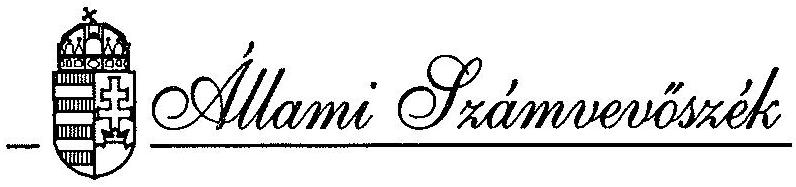
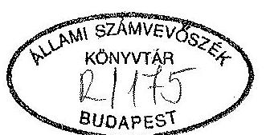
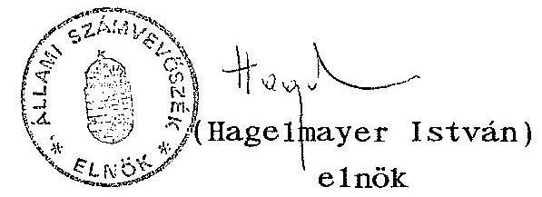
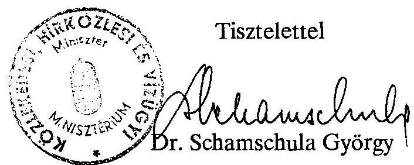
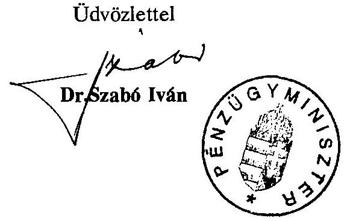
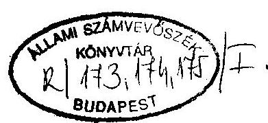
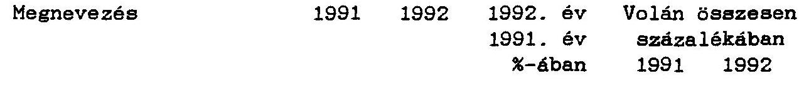
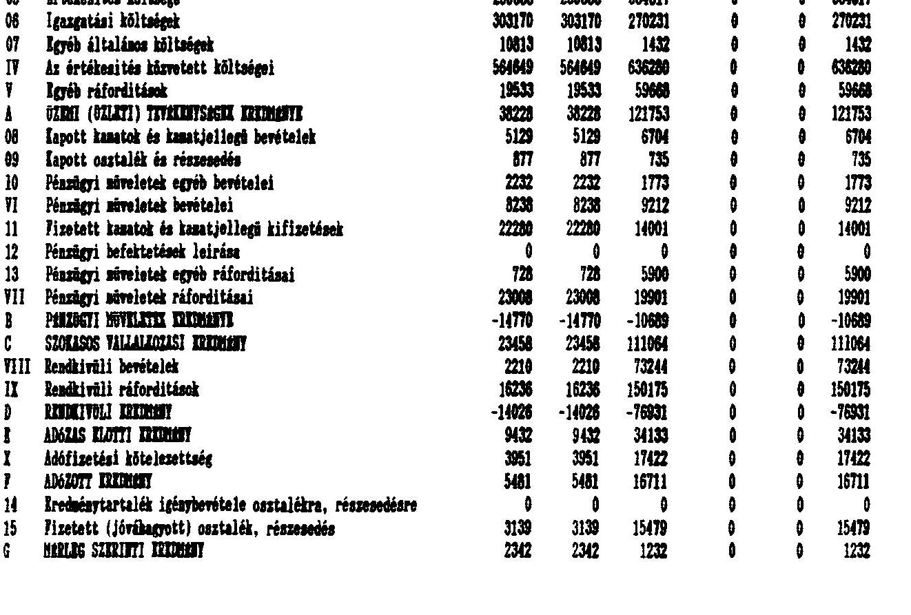
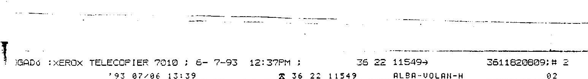

# JELENTÉS 

a Kisalföldi Volán Vállalatnál, az országos menetrend szerinti személyszállításra rendelt állami vagyonnal való gazdálkodásról

---

IV. VAGYONELLENÖRZÉSI IGAZGATÓSÁG
$\mathrm{V}-18-10 / 1993$.
Témaszám: 173.

# J E L E N T É S 

a Kisalföld Volán Vállalatnál
az országos menetrend szerinti személyszállításra rendelt állami vagyonnal való gazdálkodásról

## I.

## BEVEZETÉS

A Kisalföld Volánt 1950-ben alapították és 1992. december 31-ig működött államigazgatási felügyelet alatt mint állami vállalat. A Vállalat elsődleges feladata a menetrend alapján autóbusszal végzett közforgalmú szemé lyszállítás. A másik fő profilját, az árufuvarozást a gazdasági visszaesés, a fuvarpiac telítődése miatt fokozatosan vissza kellett fejleszteni, majd szervezetileg is leválasztották.

A közlekedési miniszter 1992-ben meghirdetett privatizációs stratégiája alapján végrehajtott "profiltisztítás", a teherfuvarozó üzletág kft-be vitele volt a legnagyobb horderejü változás a cég müködésében, mert korábban az áchevétel fele az árufuvarozásból származott.

Ennél nagyobb jelentőségủ a közlekedési tárca döntésében az elvi változtatás, mert ezáltal megszünt a megyékben - igy Györ-Moson-Sopron megyében is - az az egység, amely az or-

---

szágos közúti közhasználatú gépjármüközlekedésbe in tegráltan, az áru és személy közlekedési igények autarch ellátójaként, rendszerszerűen müködött.

A Kisalföld Volán Vállalat rendelkezett Győr-Sopron megyét ellátó közúti személy és áruszállító gépjármüparkkal és az ehhez szükséges infrastruktúrával (jármũjavító üzemmel és jármütelepekkel).

A Vállalat 1991. évben a hagyományos üzemegységi szervezetét átalakította az ún. divizionális (öne1számoló) szervezetté. A szervezet átalakítása 1992-ben tovább folytatódott és a korábbi teherfuvarozási üzletágból - a Vállalat többségi tulajdona mellett - hat teherfuvarozó kft-t alapított.

A Kisalföld Volán - államigazgatási vállalatkénti működése utolsó évében - 1992-ben 2.271 millió Ft árbevételt és 34 millió Ft eredményt ért el, 2008 fő átlagos állományi létszámmal 1.088 millió Ft mérlegfőösszeg mellett. Saját vagyona 863 millió Ft volt, ebből alapítói vagyon 705 millió Ft. A Vállalat a közszolgálatra rendelt vagyonnal biztosította 347 településen, összesen 358 db autóbusszal a helyközi viszonylatokban 5076 km távolságon, a helyi viszonylatokban tíz helységben - ebből öt városban - 531 km hosszon, naponta, menetrend szerinti gyakorisággal a lakosság utazási igényeinek kielégítését.

A Vállalatot a KHVM 1993. január 1-jétől Kisalföld Volán Közlekedési Részvénytársasággá alakította. A cégbírósági bejegyzés a vizsgálat idején folyamatban volt.

A vizsgálatot az tette különösen időszerűvé, hogy a cég tárgyi és pénzbeni vagyona állami eredetű és a profiltisztítás után megmaradó cég alapvető feladata a közszolgáltatás,

---

a megye helyi és távolsági menetrendszerủ autóbusz közlekedésének biztosítása. A vizsgálat arra irányult, hogy a vállalat a szétválás után

- a rendelkezésére álló állami vagyonnal (saját vagyonnal) hogyan gazdálkodott,
- a cég távlati müködése biztosítható-e és kielégítő módon eleget tud-e tenni a közszolgáltató feladatának a személyszállításban, továbbá
- a gazdasági társasággá, Rt-vé alakulás a jogszabályoknak és a gazdasági racionalitásnak megfelelő volt-e.

# II. 

## ÖSSZEFOGLALÓ MEGÁLLAPÍTÁSOK, AJÁNLÁSOK

## Összefoglaló megállapítások

A Kisalföld Volán Vállalat vizsgálata alapján a megállapításokat három fő témakörben tartalmazza a jelentés:

- A Vállalat kezelésében lévő állami vagyonnal való gazdálkodásának megitélése.
- A személyszállitási, közszolgáltató tevékenységének minősitése.
- A környezetvédelmi előírások betartásának ellenőrzése.

Vagyonnal való gazdálkodás

A Vállalat állami vagyonnal való gazdálkodásáról összességében elmondható, hogy a vagyont a romló, külső gazdasági feltételek mellett is megörizte.

---

Az eszközállományon belül a járművek csökkenése és a részesedések növekedése volt a legjelentősebb változás.
A Vállalat befektetései két csoportba oszthatók.
Elsö jelentősebb csoportba tartoznak a Vállalat által létrehozott gazdasági társaságok, ahol a Vállalat részesedése 76-100 \% között mozog, s a befektetések teljes értéke 120 millió Ft. A befektetések jelentős nagyságrendje miatt fontos érdek, hogy a társaságok működőképesek legyenek, tevékenységükkel a piacon tudjanak maradni. Ezt a bérleti, lizing szerződések kölcsönös előnyös kialakításával, illetve a tulajdonosi jogosítványok szakmai orientációjú alkalmazásával biztosítja a Vállalat. Az áruszállítás területén tapasztalható jelentős gazdasági visszaesés ellenére a teherfuvarozó, Vállalat által alapított társaságok közül csupán egy volt veszteséges.

Második kisebb jelentőségü csoportba tartoznak azok a befektetések, amelyeknél a Vállalatnak nincs jelentős befolyásoló szerepe az adott társaságban. Itt elsősorban mint pénzügyi befektetők vannak jelen, ill. más szakmai, vállalati érdek diktálja a jelenlétet.

A tiszta személyszállítási profil kialakítását a Vállalat úgy érte el, hogy a TEFU üzletágait hat kft-be vitte ki. A társaságok alapítása megfelel a hatályos jogszabályoknak, s kiemelten az állami vagyon védelméről szóló törvényeknek.

A Vállalat 60 millió Ft nyilvántartási értékủ eszközállományt 73 millió Ft értéken vitt be a társaságokba. A társaságok a müködésükhöz szükséges feltételekkel rendelkeznek. A teherfuvarozás felhalmozódott veszteségei kiválás után az anyavállalatot terhelik 34 millió Ft értékben.

Nem volt szerencsés a társaságok alapításának kampányszerủ végrehajtása, amelyet a KHVM államtitkári leirata határozott meg. Egy hosszabb idő intervallumban végrehajtott profiltisztitás

---

kisebb veszteségeket - hitelfelvétel-, előnyugdijazás költsége, szállítóeszközök nyomott áron való értékesítése - okozott volna a Kisalföld Volánnál. Megkönnyítette a KHVM rendelkezésének végrehajtását a Kft-k ilyen rövid idő alatti létrehozását, hogy már elözetesen ún. divíziókat (önelszámoló egységeket) alakítottak ki.
A Vállalat 1993. január 1-jétől részvénytársasági formában müködik. A részvénytársasággá alakítás feltételeinek a Kisalföld Volán Vállalat megfelel, az átalakulási terv is alátámasztotta ezt.

A cégbírósági bejegyzés a helyszíni vizsgálat lezárásáig nem történt meg a sürgősségi kérelem ellenére sem, ami akadálya volt egy ingatlan jó áron való értékesítésének.

A vagyonértékelés során a saját tőke mintegy $35 \%$-kal felértékelődött. A jegyzett tőke és tartaléktőke összetételét a későbbi átalakulások és célok figyelembevételével alakították ki. Az érdeke1t önkormányzatok első ütemben nem kívántak részt venni társaságok alapításában.

A Vállalat gazdálkodási eredményei jobbak az országos átlagnál. Ez a viszonylag kedvezőbb gazdasági környezet és a felkészült gazdasági, műszaki vezetés eredménye. A likviditási helyzet is jónak mondható. A folyó működés költségei biztonsággal fedezhetők.

A jövedelmezöségi mutatók a helyi közlekedésnél romló tendenciát mutatnak. Főleg Győr helyi közlekedésének jövedelmezősége alacsony, ame1yben közrejátszik az is, hogy a város földrajzi adottságai (több folyó, hidak, a vasút városon belüli elhelyezkedése, zsúfolt nemzetközi főutak, nem sugár irányú úthálózat) kedvezőtlenek a helyi közlekedés lebonyolítása szempontjából.

---

A megye érintett önkormányzatai közül Győr városa mutatott a legkisebb hajlandóságot a helyi közlekedés támogatására. A helyközi közlekedés jövedelmezöségi mutatói viszonylag kedvezöen alakulnak, erre jó hatással van a magasabb nyereségtartalmú távolsági közlekedés bővülése. A nemzetközi járatok a jó piackutatásnak köszönhetően megfelelö jövedelmezöséget biztosítanak.

A társasági adótörvény ${ }^{2}$ néhány esetben speciális problémát jelent a közlekedési vállalatoknál, így a Kisalföld Volánnál is. A hatályban volt átalakulási ${ }^{3}$ törvény alapján megtörtént a"0" értékre leiródott tárgyi eszközök értékelése is, ezáltal a "O"-ra leírt autóbuszok új értéket kaptak, ame1ynek amortizálását az adótörvény csak az új beszerzésre vonatkozó leírási idővel engedi elszámolni, ami nem tükrözi reálisan az elhasználódást. A számvite1i ${ }^{1}$ elöírásokhoz képest jóval szigorúbban szabályoz a társasági adótörvény ${ }^{2}$ az adóalap védelme érdekében. A társasági adótörvény ${ }^{2}$ szükiti az amúgy is csekély beruházási keretet. További gond, hogy a költségként elszámolható karbantartások és az adózott beruházási forrásból fizetendő felújítások elhatárolásánál a számvite1i törvény nem ad pontos meghatározást, ami az adóellenőrzéseknél vita tárgyát képezheti.

A jelenlegi támogatási és tarifális rendszer hosszabb távon nem biztosítja tevékenység szintentartásához szükséges eszközök állománycseréjét. A Kisalföld Volán az elmúlt időszakban, jóval a szakmai átlag feletti darabszámban szerzett be autóbuszokat, de az átlagéletkor így is növekszik, jelenleg 8 év. A selejtezett

[^0]
[^0]:    ${ }^{1}$ 1991. évi XVIII. tv. a számvite1ről
    ${ }^{2} 1991$. évi LXXXVI. tv. a társasági adóról
    ${ }^{3}$ 1989. évi XIII. tv. az átalakulásról

---

autóbuszok pótlása - az 1990. év óta 3-3,5 szeresére emelkedett autóbusz árak miatt - rendkivül megnehezült. A magas 0-ra írt állomány megszüntetése, illetve kedvezőbb átlagéletkorú jármüállomány létrehozásának beruházási pénzigénye olyan nagy, amit önerőből egyetlen közlekedési egység sem tud végrehajtani.

Jelentös elörelépés lenne a szabályozórendszer olyan változtatása, amely lehetővé tenné a bevételnövekmény terhére az adómentes autóbusz beszerzéseket, állami támogatásokkal kiegészítve. Ez a megoldás a hazai gyártmányú autóbusz beszerzések esetén az IKARUS Autóbuszgyár helyzetét is javítaná, belsö fizetöképes piacot teremtve. E magas értékủ eszközök üzembe állítása a problémák megoldásának csupán az egyik oldalát jelentené, mivel a magas beszerzési árak olyan magas amortizációs költséget jelentenének, ame1yeket a mai dijbevételek nem fedeznek és nem is birnak el.

Összefoglaló minösités a Vállalat személyszállitási tevékenységéröl

A Vállalat a személyszállításhoz rendelkezésére álló források célszerü és hatékony hasznosítására törekedett. Mivel a személyszállítás alapvető minőségi követelményei, teljesítési minimumai nem definiáltak, minősítésük a helyhez és időhöz rendelhető utazási igények relativ teljesitésén alapul. Ilyen közelítéssel - a magyarországi közúti személyszállításban 1991-1992. években reális utazási igényekhez, és a megvalósult általános gyakorlathoz viszonyítva - a Vállalat teljesítőképességével arányosan eleget tett személyszállitási feladatainak. Eredményes szolgáltatásnak kell tekinteni, hogy

- nincsenek ellátatlan (közlekedésböl kizárt) települések; minimum három járat-pár érinti azokat naponta;

---

- a helyi közlekedésben je1lemzően 30 percnél nem hosszabb a várakozási idő a járatok között;
- az autóbuszok zsúfoltsága a csúcsidőszakra korlátozódott.

E1ismerés illeti a Vállalatot

- az új távolsági járatok beindításáért, korábbiak meghosszabbításáért
- az önkormányzatokkal kialakított munkakapcsolatáért, ame1y során az utazási igények, illetve az utasok panaszainak megismerése, és a Vállalat alkalmazkodási képességének/készségének egyeztetése valósul meg; (je1lemzően teljesítik a kért szolgáltatásokat);
- pénzügyi lehetőségeinek (likviditási helyzetének) optimális kihasználásával megvalósított autóbuszbeszerzéseiért, ame1y a szükséges rekonstrukcióhoz segitő volt;
- a saját szervezetében megvalósított személyzeti munkájáért, ame1y által nemcsak szakmai, de üzletpolitikai képességű vezetőket választottak ki, valamint gondoskodtak az engedélyezett túlóraszámhoz mérten elégséges autóbuszvezetői létszámról.

Elmarasztalást érdemlő viszont a Vállalat munkájában, hogy

- provizórikusnak sem tekinthető volt a Szervezeti és Müködési Szabályzata, mivel nem tartalmazta szervezeti egy ségenként a feladatokat;
- a be1ső e1lenőrzése - függetlenül az E1lenőrzési Iroda vezetőjének hosszas betegségétől - nem volt megoldott. Függetlenített be1ső e1lenőrzési apparátus, vagy akár erre a feladatra függetlenített személy nem volt;

---

- a "vasútra ráhordó" járatokat nem te1jeskörüen teljesítette, holott ez jogos lakossági igény;
- az autóbuszvezetők magatartásbe1i hiányosságait nem sikerült kielégítően megoldaniuk. Különösen nehezményezzük az utasok megállóban hagyását, a "betérők" elkerülését.

Az előző hiányosságok e1lenére azért - és csakis azért - tudta a Vállalat teljesíteni személyszállítási feladatait, mert a szakmában rutinos, jól képzett vezetők álltak az üzletágak és a központi apparátusok élén. Csak erre alapozva bizonytalan a tartósan eredményes szolgáltatás. Korszerủ és egységes követelményeket rögzítő be1só szabályozás és ellenőrzés rendszeresítése lenne szükséges.

Környezetvédelem

Környezetvédelmi szempontból a közúti közlekedésben és a telephelyen belül müködéséből adódóan környezetterhelést, de nem környezetszennyezést okozott a Vállalat.

Az autóbuszok környezetvédelmi felülvizsgálatai az érvényben lévő rendeletek szerint megtörténtek. A Vállalat, lehetséges keretein belül teljesítette a környezet védelmével kapcsolatos elöirásokat, így környezetszennyezési bírságot nem fizetett. Az átalakulási terv környezetvédelmi szempontok c. fejezete teljesítette a környezetvédelmi helyzetismertetés kívánalmát.

Környezetvédelmi szempontból is elmondható, hogy javulást csakis a motorok, meghajtómüvek korszerüsítése hozhat. A korszerübb autóbuszok beszerzése nem szándékon, hanem a pénzhiányon múlik.

---

Az önkéntességen alapuló Volán Egyesülés szerény anyagi háttérrel, de gondozza a tagok közös és speciális környezetvéde1mi problémáit, ezáltal tevékenysége hasznos, előremutató. Vállalt koordináló szerepének támogatása javasolt.

# Ajánlások 

Az Állami Számvevőszék elnöke a vizsgálat során tett megállapítások alapján

- az Országgyülés figyelmét felhívja az állami vagyon véde1me érdekében arra, hogy
a közhasználatú menetrend szerinti autóbusz szemé1yszállitás jármúállománya további romlásának megakadályozása érdekében, illetve hosszabb távon az autóbuszállomány minőségi cseréjére biztosítsa a szükséges pénzügyi fedezetet állami támogatással, valamint beruházási forrásképzést lehetővé tevő szabályozórendszeri ${ }^{2}$ módosítással, adómentes közszolgáltatásnak minősítve a tevékenységet.

Je1zi, hogy az amortizáció ${ }^{2}$ elszámolása is újra szabályozásra szorul. 1992 évtől az új jármúbeszerzéseknél megszűnt a jól bevált teljesítményarányos leírási lehetőség. Az idő és teljesítményarányos leírás közötti választási lehetőség visszaállítása indoko1t, mert a tel jesítményarányos leírás fizikai és erkölcsi avulást jobban követő elszámolási rendszer.

## - ajánlja a Kormánynak

1. A menetrend szerinti köszolgáltatást végző autóbuszköz1ekedési gazdasági társaságok számára az autóbusz állomány megújításához a mindenkori éves költségvetésben elöirányzott összegből az igényelhető támogatás mértékét és feltételeit a Kormányrendeletben szabályozza.

---

2. Járulékos, de nem elhanyagolható - a beruházási forrásokat befolyásoló - gond, hogy a számviteli ${ }^{1}$ és társasági adószabályozásban ${ }^{2}$ a felújítás és karbantartás fogalmi elhatárolása nem kielégítő. Különös tekintettel a speciális helyzetű autóbusz és járműfelújításokra, ezekre vonatkozóan is kezdeményezze a jogalkotónál, hogy adjon felhatalmazást a számvitelről ${ }^{1}$ szóló törvényben arra, hogy kapcsolódó Kormányrendeletben legyen egységesen és egyértelmüen elhatárolva a felújítás és karbantartás fogalma, tárgyi tartalma.

# - ajánlja Közlekedési, Hírközlési és Vízügyi Minisztériumnak 

Határozza meg a tárca a menetrend szerinti autóbuszközlekedésben az ország valamennyi lakott településén kötelező ellátás minimumát, annak paramétereit, a színvonalat minősitő követelményrendszert valamennyi e tevékenységet végzőre annak érdekében, hogy az indokolt és szükséges anyagi fedezetet ebből kiindulva meg lehessen állapítani. A gazdálkodó szervezetnek pedig a nyújtandó közszolgáltatást legalább az alapellátás normáinak megfelelően kell teljesítenie az ország lakott településein.

## - a Részvénytársaságnak ajánlja

hozza létre a munkafolyamatba épített belsö ellenőrzés rendszerét, biztosítsa a végrehajtandó feladatok, a megtett intézkedések egységes, szabályozott, áttekinthető, zárt rendszerét.

[^0]
[^0]:    ${ }^{1}$ 1991. évi XVIII. tv. a számvite1ről
    ${ }^{2}$ 1991. évi LXXXVI. tv. a társasági adóról

---

# III. 

## RÉSZLETES MEGÁLLAPÍTÁSOK

1. A Vállalat kezelésében lévő állami vagyonnal való gazdálkodás megítélése
1.1. A vállalati vagyon és befektetések alakulása
1.1.1. A vagyon alakulása

A Vállalat a vagyonát a vizsgált időszak alatt kisebb mértékben ( $6 \%$-kal) növelte, amely két év eltérő előjelű mozgásának az eredménye. 1991. évben dolgozói tőkebevonás eredményeképpen $9 \%$-os vagyonnövekedés, 1992-ben $2 \%$-os csökkenés következett be.

VAGYON ALAKULÁSA

| MEGNEVEZÉS | 1990 | 1991 | 1991 | 1992 | 1992 | 1992 |
| :--: | :--: | :--: | :--: | :--: | :--: | :--: |
|  | MFt | MFt | T992   \% | MFt | T99T   \% | T990   \% |
| Saját vagyon | 813 | 885 | 109 | 863 | 98 | 106 |
| - ebből alapítóí 705 |  | 705 | 100 | 705 | 100 | 100 |

A gazdálkodás feltételrendszere nem tette lehetővé a vagyon jelentősebb mértékủ gyarapítását. A Vállalat a vagyon megőrzését biztosította.

[^0]
[^0]:    ${ }^{1}$ 1991. évi XVIII. tv. a számvite1ről
    ${ }^{2}$ 1991. évi LXXXVI. tv. a társasági adóról

---

A Vállalat eszközeiből $60 \%$ feletti a befektetett eszközök aránya a forgóeszközökkel szemben. A tőkeellátottsági mutató mindkét évben $80 \%$ körül alakult, ami megfelelő vagyoni helyzetre utal. Az 1991-1992. évi mérleg eszközoldalának vizsgálatából megállapítható, hogy lényeges csökkenés van a tárgyi eszközök között a műszaki berendezések, gépek és járművek állományánál. Ennek oka az, hogy a Vállalat folyamatosan értékesítette, illetve selejtezte a TEFU üzletág gépeit. A korábbi évek 500 db feletti teher szállító gépjármú parkja 1991. évben is már 400 db alá csökkent, 1992. évben ebből 195 db-ot átvettek a kft-k, illetve selejtezésre és értékesítésre került jelentős részük, emiatt a mérleg ezen sora 82 millió Ft-tal csökkent.

A teherfuvarozási üzletág kft-kbe történő kivitele miatt 1992. évben jelentősen nőtt a befektetett pénzügyi eszközök állománya 28 millió Ft-ról 137 millió Ft-ra.

# 1.1.2. Befektetések alakulása 

A Vállalat 1989 óta jelen van a közhasználatú közúti közlekedés befektetési piacán. Befektetéseinek állománya 137 millió Ft. A Vállalat befektetéseinek döntő része az álta1a alapított kft-kben található ( 120 millió Ft). Ezen kft-k nagyobb részét a Vállalat 1992. évben alapította. Féléves működés után az újonnan alapított 6 kft közül csupán a TEMPO-KER Kft. volt veszteséges.

A kft-kből a Vállalat minimális osztalékhoz jutott, itt azonban már az is eredmény volt, hogy nem termeltek veszteséget. A kis osztalék mellett jelentős lizing és bérleti díjat szedett be a Vállalat az általa alapított társaságoktól, részben ebből fedezte az autóbusz személyszállítás költségeit.

---

Ezen társaságokban a Válla1at részesedése 67-100 \%-ig terjed.

Régebben a Válla1at olyan kisebbségi befektetéseket eszközölt, ame1yekné1 nincs jelentős befolyásoló szerepe az adott társaságokban. Ezeknél elsősorban mint pénzügyi befektetők vannak jelen, vagy más szakmai, vállalati érdek diktálja a jelenlétüket.

Az elsó 1986. évben szerzett MHB Rt. részesedést 1 millió Ft értékben kötelezően előirták számukra.

# 1.1.2. Profiltisztítás végrehajtása a gazdasági társaságok alakításával 

A Volán Válla1atoknál a profiltisztítást a KHVM államtitkári levele írja elő. Az 1992. február 6-án ke1t leírat minden egységnél a profiltisztítás határidejét 1992. I. félév végében jelölte meg. A Kisalföld Volán Válla1at ezt megfelelően végrehajtotta.

A profiltisztításra, illetve az önálló elszámolású tevékenységek kialakítására azért volt szükség, hogy a költségek és bevételek ismeretében az állammal és az önkormányzatokkal közösen meghatározhatók legyenek a szemé1yszállitásban a távolsági és helyi tarifák, valamint a reális anyagi támogatás mértéke, továbbá megteremtődjenek a privatizáció, illetve koncesszió-köteles tevékenységek végzésének feltételei.

A Válla1at a kft-k alakításánál a jogszabályi előírások betartásával járt el.

---

Betartotta az állami vagyon védelmével kapcsolatos törvényeket. A kihelyezett és értékesített vagyon minden esetben alatta maradt az engedély-köteles szintnek. A kialakított 6 kft megfelelő vagyont kapott a müködéshez.

A kft-k alapítását nagyban segítette, hogy a Vállalat a korábbi hagyományos szerkezetét már 1991-ben átalakította és létrejöttek a diviziók (önelszámoló egységek). Az alapításkor a kft-k megfelelő forgóeszközzel is el voltak látva.

A teherfuvarozásban a korábbi években felhalmozódott veszteséget nem kellett magukkal vinni, mivel ezeket a Vállalat leírta, így anyagi terhektöl mentesen indulhattak. A Vállalat által 1992. évben leírt hitelezési veszteség 51 millió Ft, amelyböl 17 millió Ft a bérautóbusz vesztesége a többi a TEFU üzletág ki nem fizetett vevői követelése volt.

A megrende lőknél végrehajtott csőde1 járások miatt rendkívül megnehezült a követelések behajtása.

A Vállalat a társaságokba 60 millió Ft névértékủ eszközt adott át 73 millió Ft törzsbetétnek számolva.

A kft-k alapításának kampányszerủ végrehajtása nem volt szerencsés utasítás a KHVM részéről. A profiltisztítás szükségessége nem vitatható, előremutató rendelkezés, de a végrehajtás több időt és jobb felkészítést igényelt volna, ami csökkentette volna az átalakításokkal járó veszteségeket, melyek a következők:

- a Kft.-k egyidejű forgóeszközzel való ellátásához felvett hitel kamata;
- előnyugdijazás költsége;

---

- tehergépkocsik rövid idő alatt való értékesítése miatti nyomott eladási árakból adódó veszteség;
- a teher szállítóeszközök kiszolgálására épült infrastruktúra kihasználatlanságából adódó veszteség.

# 1.3. A részvénytársasággá alakulás törvényessége 

A Vállalat 1993. január 1-től részvénytársasági formában müködik. A Vállalat zártkörü alapítással, határozatlan idejü, egyszemélyes részvénytársasággá alakult át. Az átalaku1ó szervezet az 1992. évi LIV. törvénynck megfelelően 1992. július 30-i állapot szerint vagyonmérleg tervezetet, 1992. december 31-i dátummal vagyonmérleget, illetve nyitómérleget készített.

A vagyonértékelés során az eszközök értéke 314 millió Ft-tal felértékelődött. A földterületek értéke1ése jelentette a legnagyobb változást.

Az önkormányzatok az átalakulás első szakaszában nem kivántak az Rt.-ben alapítóként részt venni.

A jegyzett tőke és a tőketartalék felosztásánál már figyelembe vették a későbbi célokat és lehetséges átalakulásokat. A tőketartalékba kerültek be az önkormányzati földterületek, a részesedések és az alaptevékenységhez nem kapcsolódó eszközök. A vagyon újraértékelése következtében a befektetett eszközök 365 millió Ft-tal nőttek a forgóeszközök 51 millió Ft-os értékvesztése mellett.

Az újraértékelés föbb változásaí

Inmateriális javakban az elavult szoftverek miatt 2 millió Ft-os leértékelés vált szükségessé.

---

Ingatlanoknál a 251 millió Ft vagyonnövekedésböl a földérték növekedésére 180 millió Ft jutott.
Müszaki és egyéb berendezések, gépek, jármüvek körében az összes növekedés 131 millió Ft. Az autóbusz állomány 130 millió Ft-tal felértéke1ődött a tehergépkocsiállományt viszont 36 millió Ft-tal leértéke1ték.

Befektetett pénzügyi eszközöket a hozadéke1v alapján 16 millió Ft-tal leértéke1ték.

Készletek közül a profiltisztítás következtében feleslegessé vált anyagok értékét 39 millió Ft-tal leértéke1ték.
Követelések között 11 millió Ft leértékelés történt. Kötelezettségekben nincs változás.

A részvénytársaság cégbírósági bejegyzése a vizsgálat 1ezárásáig nem történt meg a sürgösségi kérelem e1lenére sem, ami akadályozza az egyik ingatlan jó áron való értékesítését.

# 1.4. Gazdálkodás és jövedelmezőség 

A Kisalföld Volán gazdálkodásáról megállapítható, hogy meghaladja a szakmai átlagot. Az országos átlagnál kedvezőbb gazdasági környezet mellett ez a jó szakembere1látottságának is köszönhető.

A Vállalat a szerkezetátalakítás során megörizte pénzügyi egyensúlyát.
A teherfuvarozási üzletág kiválása következtében sem csökkent az árbevétele, hanem a tarifaemelés és elsősorban a helyközi közlekedés teljesítménynövekedése miatt növekedés tapasztalható.

---

Az átszervezés folyamán a Vállalat létszáma 25 \%-kal csökkent. A Vállalat adózás előtti eredménye a két év során 9 millió Ft-ról 34 millió Ft-ra emelkedett, ame1yból 3, illetve 14 millió Ft részesedést hagytak jóvá.

A Vállalat egyéb bevételei is jelentősen növekedtek, me1ynek oka elsősorban a tárgyi eszközök nagyobb volumenű értékesítése.

A rendkívüli bevételek jelentős növekedése mögött a kft-kbe bevitt apport vagyon utáni eszközök értéke található.

A Vállalat ráfordításai kisebb mértékben emelkedtek, mint a bevételek. Az amortizációs költségek emelkedésének az oka az, hogy az új számviteli törvénynek megfelelően a 20 ezer Ft alatti tárgyi eszközök leírására egy összegben került sor.

Az egyéb költségek növekedését a lizing díjak nagy arányú belépése okozta.

A Vállalat az átszervezés, a társaság alapítás és az átalakulás előkészítése során szükségessé vált létszámcsökkentés megoldásánál jelentős többletterhet vállalt a korkedvezményes nyugdíjazás biztosítására.

A rendkívüli ráfordítások jelentős növekedését a társaságokba bevitt apport nyilvántartási értéke, a hitelezési veszteség és a korkedvezményes nyugdíjazás okozta.

A Vállalat likvidítási helyzete jó, a vizsgált időszak folyamán fokozatosan javult. Az autóbuszközlekedés folyamatos bevételt biztosít. A bérletek arányának csökkenése rontotta a likvidítás helyzetét. 1991. és 1992. 1. negyed-

---

évében a még meglévő teherfuvarozási üzletág szezonaitásából származott kisebb likviditási probléma. Autóbusz beszerzések finanszírozására és a társaságok forgóeszköz ellátására vett igénybe rövid lejáratú hiteleket a Vállalat.

A Vállalat teljes mértékben visszafizette a lakossági kötvények tökerészét, így az átalakulás után kötvénykibocsátásból származó kötelezettsége nem maradt.

A Vállalat likviditási mutatói mindkét évben kedvezőek, a szállitók és vevők teljesítési ideje csökkent, valamint nőtt a készletek forgási sebessége.

A jövedelmezőségi mutatók (árbevétel-, eszköz-, tőkearányos) javuló, de alacsony jövedelmezőséget mutatnak.

A gazdasági visszaesés legjobban a helyi közlekedésnél éreztette hatását. Drasztikusan csökkent a gyári járatok igénybevétele. A jövedelmezőséget az is rontotta, hogy a tarifacmelést az önkormányzatok később fogadták el. A teljesítmény visszaesése mindkét évben kisebb volt a vártnál, de a tarifacmelések nem kompenzálták a költségek emelkedését, ame1y következtében a jövedelmezőség igen alacsonyan alakult. Különösen Győr városában alacsony a helyi közlekedés jövedelmezősége, amit a város területileg folyókkal szabda1t, közlekedés szempontjából hátrányos helyzete is befolyásolt.

A város önkormányzata nem mutatott megfelelő hajlandóságot a helyi közlekedés támogatására a vizsgált időszakban.

---

A helyközi közlekedés mindkét évben növelte teljesítményét és jövedelmezöségét. Több új távolsági járatot is beinditottak, amelyek magasabb nyereséget biztosítanak.

A helyközi járatok eszközállományának összetétele kedvezőbb mint a helyi járatok állománya. A helyi és helyközi járatok költségét a jegybevételekből teljes körűen nem lehet fedezni, a szolgáltatás nyereséget csak a - tanuló és nyugdíjas bérletek - fogyasztói árkiegészítése mellett biztosít. Ez az ellenérték minimális beruházás mellett jelenleg fedezi a müködés költségeit.

A nemzetközi járatok összességében kis részarányt jelentenek, de a jó piackutatás következtében bevételeik fedezik költségeiket.
1.5. Költségvetési kapcsolatok alakulása, számviteli és adótörvények speciális hatása

A Vállalat fizetési kötelezettségeinek, a gazdasági szabályozórendszer követelményeinek eleget tett. 1991. évben a költségvetésbe 68 millió Ft (főleg személyi jövedelemadó) befizetést eszközölt, és 537 millió Ft kiutalást kapott, amely döntő hányada fogyasztói árkiegészítésből állt. 1992. évben hasonló összetételben 17 millió Ft volt a befizetés, és 545 millió Ft volt az igénylés.

A számviteli és adótörvények a közlekedés területén néhány esetben speciális problémát jelentenek. Ezek a következők.

---

Amortizáció

Az új számvite1i ${ }^{1}$ törvény elöírásai a tárgyi eszközök piaci áron való nyilvántartását szorgalmazzák. Az átalakulási ${ }^{3}$ törvény lehetővé tette a 0 -ra futott autóbuszok átértékelését. A számvite1i törvény azt is megengedi, hogy az amortizáció az eszközre je11emző idő alatt legyen leírható.

Az új, érvényben lévő társasági adótörvény ${ }^{2}$ viszont túl szigorúan szabályoz ebben az esetben, hiszen a jól bevált teljesítményarányos leírás alkalmazása esetén az elszámolást az új beszerzésekre vonatkozó szabályok szerint kell elvégezni. Ez annyit jelent hogy 400 ezer km futásteljesítményt vélelmezve kell a beállított értéket elszámolni. Belátható, hogy ezt a teljesítményt egy 0 -ról felértékelt autóbusz csak igen ritka estben tudja teljesíteni, s így nem teljesítményarányosan történik a leírás, hanem selejtezéskor egy összegben. Az 1992. január 1. után beszerzett autóbuszok amortizálásánál az adótörvény nem teszi lehetővé a korábban sikeresen alkalmazott teljesítményarányos leírást.

# Felújítás, karbantartás elhatárolása 

A felújítások és karbantartások elhatárolása régebben is az adóvizsgálatok vitatott témája volt. A jelenlegi szabályozás csak a karbantartást engedi költségként elszámolni, a felújításokat viszont nem. Ez a téma a jelenlegi leromlott autóbuszpark ismeretében még néhány évig problémát jelenthet.

[^0]
[^0]:    ${ }^{1}$ 1991. évi XVIII. tv. a számvite1ről
    ${ }^{2} 1991$. évi LXXXVI. tv. 1. és 2. sz. me11ék1ete a társasági adóról
    ${ }^{3}$ 1989. évi XVIII. tv. az átalakulásról

---

A Kisalföld Volán 1991. évben 6 db autóbusz felújítására 6 millió Ft-ot költségként számolt el. 1992. évben 25 db autóbusz felújítását kellett elvégezni 24 millió Ft értékben, ame1yet beruházásként aktiváltak az új szabályozó alapján. Ahhoz, hogy a számviteli politika biztosan és reálisan tükrözze a felújítások és karbantartások elhatárolását, a számviteli és adószabályozást jobban össze kellene hangolni. A jelenlegi társasági adó törvény feleslegesen szükíti az amúgy is csekély autóbusz beszerzésre fordítható beruházási keretet.

# 1.6. Az autóbuszállomány megújítási lehetőségei 

A Vállalatnál megfelelö infrastruktúra áll rendelkezésre az autóbuszközlekedés kiszolgálására. A javítóbázis, töltőállomások, állomások, utak és egyéb kiszolgáló létesítmények tel jesen kiépítettek. A Vállalat 1992. évben a központi telephelyen teljes felújítás ellátására alkalmas javítóbázist alakított ki. A saját kivitelezésben elvégezhető munkáknak köszönhetően a felújítások olcsóbbak.

A Vállalat magasan a szakmai átlag felett szerzett be a vizsgált időszak alatt autóbuszokat. Az autóbuszok beszerzésére 50 millió Ft devizahitelt is igénybe vett. Viszonylag kedvezőbb líingkondíciókkal is növelte autóbuszai számát. Az 1992. évben kötött lizingszerződésekből fakadó pénzügyi kötelezettségei 1993. évre már mintegy 120 millió Ft-tal terhe1ik az éves eredményt, ami tovább nem terhelhető. Az emelkedő árak ( 1990 óta 3-3, 5-szeres autóbuszáremelkedés) következtében a régi beszerzésekből képződő amortizációból az eszközpótláshoz szükséges összeg töredé-

---

ke képződik meg. Az önköltség típusú tarifák pedig "konzerválják" bevételi oldalról az irreálisan alacsony amortizációs fedezetet. Az ügy többszörösen ellentmondásos, mert a tarifák emelését korlátozza a lakosság fizetőképességének romlása.

A Vállalat autóbuszállománya az országos átlagnál jelentősebb beszerzések ellenére is öreg, 8 év körüli.

Az érvényben lévő támogatási és tarifális rendszer nem biztosítja a személyszállításban, a közszolgálati tevékenység szintentartásához szükséges eszközök állománycseréjét.

Az autóbuszállomány öregedésének megálítása rövid távon is elkerülhetetlen feladat: a Vállalatnak ehhez gyorsuló ütemben kellene kicserélnie az autóbuszokat.

A fizikailag is elhasznált és nagy számú 0 -ás állomány 1992. év végén 358 autóbuszból $226 \mathrm{db}(63 \%)$ volt " 0 " értékre leírt, - lecserélése jelentős beruházási összeget kíván, ame1yet egy közlekedési egység nem tud önerőböl végrehajtani.
A Kisalföld Volánnál a mai helyzetben az optimális selejtezés végrehajtásához - évi $12,5 \%$-os autóbuszcseréhez -400-450 millió Ft beruházásra volna szükség éves szinten, aminek jelenleg harmadát tudják biztosítani.

A szabályozórendszer olyan irányú változtatására lenne szükség, amely megengedi adómentesen a többletárbevétel terhére történő eszközbeszerzést állami támogatással kiegészítve, és ha ennek feltétele hazai gyártmányú új autóbusz megvásárlása lenne, akkor az autóbuszgyártásnak is támogatott be1só piacot teremtene. Az eszközpótlás megol-

---

dása a probléma egyik részét érinti csak, hiszen a magas bekerülési árak olyan magas amortizációs költséget jelentenének, ame1yeket a jelenlegi bevételek nem fedeznek, tehát a személyszállítási tarifákat is emelni kellene. A fizető utasszám emiatt tovább csökkenne.
2. A Vállalat személyszállitási közszolgáltató tevékenységének minösítése

A Vállalat 1990. április 28-i ke1tezésű létesítő határozata elsődleges feladatként írja elő a "menetrend alapján; autóbusszal végzett közforgalmú személyszállítást." Az előirt szolgáltatás minőségi követelményeire, a szolgáltatás elfogadhatóságának minimális mértékére semmilyen definíció nem áll rendelkezésre. Ezért minősítésünkhöz egyrészt alapul vettük az utazó közönség XX. század végén jogosnak itélhető közlekedési igényeit, másrészt figyelembe vettük a Vállalat teljesítési lehetőségeit, azaz rendelkezésre álló tárgyi, személyi és pénzügyi forrásait. Kiegészítő jellegge1 ugyancsak feltételeket szabnak a szolgáltatás minőségi te1tésé jesihez a Vállalaton kivüli, környezeti aktuális adottságok és azok változásának tendenciája. E tekintetben kiemelkedő jelentőségűnek tekintettük a régió gazdasági helyzetének alakulását. Mindezek együttes hatásaként értékeltük a Vállalat személyszállitási tevékenységét.
2.1. A Vállalat részére rendelkezésre állt tárgyi feltételek.

Az autóbuszok darabszáma, műszaki állapota és üzletágak közötti megoszlása alapvetően meghatározta a vizsgált időszak személyszállitását. Az 1992. december 31-i záróállomány 362 db autóbusz volt. Ezeknek üzletágak közötti felosztása a járatszámok és a szükséges tartalék-állomány képzésének megfelelően történt.

---

Az öt üzemegységgel müködö helyközi személyszállitási üzletágnál van nyilvántartva az autóbuszok $61 \%$-a. A nyilvántartás nem azonos a tényleges üzemeltetéssel, ugyanis a 3 nemzetközi járathoz szükséges autóbuszt (Isztambul, Bécs, Pozsony) és az idegenforgalmi üzletághoz időszakosan átadott autóbuszokat figyelmen kivül kell hagyni a helyközi személyszállitásra rendelkezésre álló autóbusz-állományból. Az idegenforgalom részére megvalósult átengedés mértéke: 1991. II. félévben 108 gépnap 39.404 km-re1; 1992. évben 183 gépnap 44.704 km-es teljesítménnyel. A személyszállitás menetrend szerinti, fennakadás mentes szolgáltatásában megnyilvánult problémákat elsődlegesen nem az autóbuszok számszerü mennyisége okozta, hanem azok müszaki állapota. Jellemző adatok erre, hogy a "0"-ra irt autóbuszok 1992. év végi aránya a helyközi állomány 67,1 $\%-a$, a helyi közlekedésben müködtetett állománynak pedig 56,5\%-a. Ugyanezen időpontban az autóbuszok átlagos életkora helyközi forgalomban: 7,9 év, helyi forgalomban: 8,1 év. Az ilymódon elöregedett autóbusz-állomány változásában - az 1991-töl 1993. május végéig beszerzett autóbuszokat tekintve - lényeges javulás nem tapasztalható. Ugyanis az ezen időszakban üzembehelyezett 45 db autóbusz csak számszerüségében megnyugtató, mivel közülük 18 db ( $40 \%$ ) használt, koros jármü.

Györ helyi személyszállitására 1992. december 31-én összesen 104 db autóbusz állt rendelkezésre. Közülük 60 db - az állomány $58 \%-a-8$ éves, vagy annál idősebb. 16 db még nem volt ún. nagyjavitáson /teljes felújitáson/, holott km-telitettségük ezt indokolta volna. Igy aztán elöfordul, hogy napi 8-10 autóbusz "áll ki"; gyors helyettesítésük a tartalékállományból járatba állítható autóbuszokkal történik.

---

Győr Helyi Személyszállítási Üzletága 46 viszonylaton üzemeltet menetrend szerint közlekedő járatokat. Munkanapokon a napi inditott járatok száma: 2519, amelyböl 1039 közlekedik csúcsidőszakban. A reggeli csúcsórák áttevödtek a 6 órás munkakezdések megszünése, mérséklése miatt a 8 órát megelöző időszakra. Zsúfoltság csak ekkor, illetve a 14-15 óra közötti intervallumban adódik.

Sopron Helyi Személyszállítási Üzletág 19 viszonylaton bonyolít utasszállítást. A kimaradt járatok száma 1991. évben 370, 1992. évben 181 volt. A soproni járatkimaradásokat megvizsgáltuk mindkét évben havi bontásban annak érdekében, hogy megállapítható-e szoros összefüggés a kiálló autóbuszok és az időjárási tényezők között. Kitűnt, hogy nincs korreláció a két tény között; alapvetően az autóbuszok leromlott müszaki állapota a járatkimaradás oka.

# 2.2. Személyi feltételek rendelkezésre állása 

Az utasszállítás személyi feltételeként az autóbuszvezetök létszámát és alkalmasságát vizsgáltuk. A három személyszállításra hivatott üzletágban foglalkoztatott összlétszám 1992. december 31-én 910 fő, ame lyből 770 fő volt autóbuszvezető. Ugyanezek a számok a vizsgálatunk időpontjában: 930 főből 792 autóbuszvezető; arányuk a tekintélyes 84,6 \%-ról tovább emelkedett 85,2 \%-ra. Lényegében 1992. év végére tudtak eleget tenni a jogszabály által maximált túlóráztatásnak. /Megelőzően a létszámhiány miatt lényegesen fölötte volt az autóbuszvezetők túlórája a jelenleg engedélyezettnek./

Az autóbuszvezetök képzettségi alkalmasságát jellemzöen VOLÁN-szaktanfolyami képzésekkel oldották meg, illetve folyamatos lehetőséget biztosítanak erre. A létszám bővités

---

csak ilymódon oldható meg. Nem lehetett felvételi kritériumként előirni a D-vizsgával rendelkezést; a jogelőd VO-LÁN-tól átvett személy- vagy tehergépkocsivezetőknek például még meg kellett szerezniük azt. Az érvényes tanulmányi szerződésekről készített kimutatás szerint autóbuszvezetői tanfolyamot végez 21 fő, nemzetközi autóbuszvezetői szaktanfolyamot végez 58 fő.

Kedvezötlen a középiskolát végzettek aránya az autóbuszvezetök között. Bár a Vállalat támogatja a továbbtanulási szándékot, de jelentéktelen a tényleges anyagi elönyben részesítés a középiskolai végzettség megszerzését követöen.

A Vállalat regionális elhelyezkedése miatt olyan sajátosságok nehezítik a foglalkoztatottak optimális mennyiségies minőségi szintjének elérését, mint az Ausztriába ingázó munkavállalás kedvezményei. A magyarországi bér- és juttatási rendszer mércéjével mérve pedig a Vállalat kedvező körülményeket biztosít autóbuszvezetőinek. Az 1992. évi átlagkeresetük

He1yközi Szemé1yszállitási Üzletágban 23.275.- Ft/fő/hó He1yi Szemé1yszállitási Üzletág Győr 20.626.- Ft/fő/hó He1yi Szemé1yszállitási Üzletág Sopron 21.649.- Ft/fő/hó

További közvetlen és közvetett anyagi juttatások növe1ik az autóbuszvezetők tényleges jövedelmét. Komoly összeget jelent az általuk eladott menetjegyek és bérletek utáni százalék; az osztott munkarendben szolgálatot teljesitők regenerálódásukat biztosító szálláshelyet vehetnek igénybe téritésmentesen; a Vállalat kifizeti a jármúvezetői jogo-

---

sitvány érvényesitésének összegét; évente növekvő értékű /jelenleg havi 1000 Ft-nyi élelmiszerboltokban levásárolható "vásárlási utalvány"-t kapnak étkezési hozzájárulásként/.

Nem szerény mértékü a Vállalat valamennyi dolgozóját megillető szociális juttatások értéke. /pl. VOLÁN utazási kedvezmény; üdültetés (1992-ben 64 család, 1993-ban 96 család); munkaruhapénz (autóbuszvezetőknek $4500 \mathrm{Ft} /$ fő/hó); İakásépítés kamatmentes kölcsöne.

A vagyoni, pénzügyi feltételek vizsgálatát, és azokra vonatkozó vizsgálati megállapításainkat önálló fejezet tartalmazza.
2.3. Környezeti adottságok hatása a Vállalat személyszállitási tevékenységére

A gazdasági recesszió sajátos módon érezteti hatását a Vállalatot érintően. A sajátosság abban nyilvánul meg, hogy nemcsak az általánosságban jellemző negatív befolyások követhetőek nyomon az utasszállításban, hanem egyidejüleg pozitív módon érvényesülő következményei is vannak a környezet gazdasági elszegényedésének. Példákat hozva e megállapításra: kedvezötlen a vállalkozások létszámcsökkentésének és az autóbuszviteldi jak emelkedésének együttes hatásaként mutatkozó utasszám-csökkenés; ugyanakkor kedvező a vállalkozók gazdasági kényszerböl kiárusitott autóbuszaihoz hozzájutás, és a korábban vállalati /TSZ/ gépkocsikkal szállított dolgozók VOLÁN-utassá válása. Kedvezötlen a szabadáras személyszállítási megrendelések csökkenése elmaradása; ugyanakkor kedvező a MÁV-személyszállítás hanyatlása miatt VOLÁN közlekedésre áttérők növekvő száma.

---

Egyértelmũen kedvezötlenek a közúti forgalomban érvényesũ10̋ tendenciák. /Az országos föútvonalakon tapasztalható jármũnövekedés, a mellékutak állapotának elégtelensége, a közlekedési lámpák - VOLÁN személyszállitást lassitó száma, és forgalomváltó ütemezése stb./
Egyértelmũen kedvezö a növekvö számú magángazdálkodók, kisvállalkozások - bérelt autóbuszfelületen történő - reklámtevékenysége.

A Vállalat személyszállitási tevékenységének értéke1éséhez megvizsgáltuk, hogy a be1sõ feltételeket hogyan biztosították, illetve a külső feltételeket hogyan kezeltték a személyszállitás optimális teljesitésére törekvően. A minősitéshez figyelembe vett szempontok szerint csoportosított vizsgálati megállapításaink a következök.
2.4. A települések személyszállitásának javitása érdekében megtett eljárások.
2.4.1. Önkormányzatokkal menetrend-egyeztetések

Az évenkénti menetrendmódosítást megelözöen - a Vállalat kezdeményezésére - célszerűen megválasztott polgármesteri hivatalban, több település önkormányzati képviselöinek részvételével utasigény felmérés történik. A Fertőszentmiklós /és környéke/ vonathoz "ráhordás"-i kérelmének ismételt elutasítását kivéve, a megalapozott igényeket teljesitették.
2.4.2. A menetrend alapján személyszállitásban érdekelı egyéb szervezetekkel megvalósult munkakapcsolatok

A Volán vállalatok közötti munkakapcsolatra csak elismerésre méltó gyakorlatot tapasztaltunk. Ebben a Kisalföldi

---

Volán kezdeményező szerepére utaló példák is vannak. A személyszállítás színvonalát segíti, hogy a társ-Volánok az útirányukba esö autóbusz megállókban várakozókat felveszik, és úti céljuk felé továbbítják. Az útirány, illetve a megállókat érintő idöpontok meghatározása a menetrendi egyeztető megbeszéléseknek tárgya. Az utazási lehetőségek bővítését bemutató példákrai a Beled és környéke autó-. buszközlekedéséről készített emlékeztetőben jelzett az a Zala Volán járat, ame1y a Zalaegerszeg - Sárvár - Csorna Győr (Beled be1területén is megállva) távolsági-útvonalon teljesít szemé1yszállítást. Ugyanebből az emlékeztetőből kitűnik, hogy Edve polgármesterének kapuvári munkásjárati igényét a Vasi Volán közlekedteti, így a kért módosítást is a szombathelyi társvállalattal kell elintézni.

Ugyancsak az utasok érdekét szolgálja a közúti forgalomban /járatban/ bekövetkezett autóbusz-meghibásodás gyors szervizelésére kötött Volánok közötti együttmüködés.

A MÁV-val és a GYSEV-ve1 formális menetrend-egyeztetés van. Gyakorlatilag a Vállalat tudomásul veszi a bekövetkeżő vasúti menetrendi változásokat, és feladatul kapja - a vonatok érkezési és indulási időpontjaihoz - megfelelő au-tóbusz-csatlakozás megvalósítását. Az utazók érdekeit biztositó alkalmazkodás a jellemzö. Lényegében akceptálandó a nemzetközi vonatokhoz és a kötöttpályás közlekedéshez igazodás.

Vizsgálatunk elítéli viszont a Vállalat következetesen elutasító magatartását, amely a Fertöszentmiklóst és környezö településeit érintő vonatra "ráhordó" autóbusz járatok - jogos lakossági igényét - nem teljesíti. A vállalat gazdaságtalan üzemeltetésre hivatkozása a lakosságot kény-

---

szeríti megnövelt gazdasági terhek viselésére. Távolsági gyorsvonatokhoz csatlakozó autóbuszjáratok közlekedtetése véleményünk szerint a Vállalat alapvetö közszolgáltató tevékenységébe tartozik.

Az alacsony utasszám ellenére járatbiztosításra kedvező megoldást vezet be a Vállalat soproni helyi személyszállitási üzletága; megfelelő átalakítással városi city-buszokat állít be a kevésbé frekventált útvonalakra.

# 2.4.3. A személyszállitási dijak alakulása 

Az utasszállítás tarifáinak meghatározásában, alakításában csekély lehetősége volt a Vállalatnak; azokat lényegében adottságként kezelhette.
A helyközi személyszállítás jegyfajtánkénti dij meghatározása a Közlekedési, Hírközlési és Vízügyi Minisztérium aktuális számításai alapján - valamennyi VOLÁN vállalatra előírt volt. A vizsgált években megvalósított $25 \%$-os díjemelés sem a Vállalat, sem a lakosság elvárásait nem elégítette ki. A vállalatnak alacsony a tarifaemelés az autóbuszállomány rekonstrukciójához, a lakosságnak pedig magas a korábbi utazási igényeinek fenntartásához. A helyközi forgalomban a jegye ladási kimutatás alapján az állapítható meg, hogy a kedvezményezett tanuló- és nyugdíjasbérletek iránti kereslet nőtt.
/A tanulóbérletek eladása átlag $20 \%$-os, a nyugdíjasoké 61 \%-os emelkedést mutat az előző évhez viszonyítva/. A dolgozó havibérletek $6 \%$-os csökkenésével szemben a félhavi bérletvásárlás emelkedett $5 \%$-kal. A napijegyek $6 \%$-os csökkenése következett be.

---

A hatósági árak kötöttségében a vállalati hatáskör díjkedvezmény adására korlátozódhat. Ezzel élt a Helyközi Személyszálítási Üzletág, amikor távolsági járatain /Budapest, Szeged, Pécs, Zalaegerszeg, Kaposvár célállomásokig és a balatoni járatokon/ 10-15 \%-os "üzletpolitikai kedvezményt" adott.

A nyugdíjas, és a nyugdíjas korú munkaviszonyban nem álló házastárs vagy élettárs által igénybevehető kedvezmény, hogy a jogosult 25 km távolságig - az igazolványán feltüntetett viszonylatban - korlátlan számban utazhat $50 \%$-os kedvezménnyel.

A szabadáras személyszállítási tevékenységet a gazdasági recesszió nagyon kedvezötlenül érintette. Megszüntek pl. a munkásszállító járatok, amelyek határozatlan idöre szóló szerződések alapján biztos és folyamatos bevételt jelentettek a Vállalatnak.

A helyi személyszállítás tarifái az önkormányzatokkal folytatott díjtárgyalások eredményei. A Vállalat számítási ádataival alátámasztott alternatívákat dolgoz ki, és a számára legkedvezőbbet igyekszik elfogadtatni autóbuszrekonstrukciós nehézségeire hivatkozva. Kompromisszumos megállapodás az eredmény.

A helyi közlekedést igénybevevők utazási szokásait jobban befolyásolják a viteldíj-eme1kedések, mint a hosszabb távolságra utazó - helyközi közlekedést igénybevevő - személyekét.

Az egyvonalas havi bérlet kivételével valamennyi jegytípus iránti kereslet emelkedett /ného1 ugrásszerüen nőtt/ 1992. január hónapban. Ez a tény azonban sokkal inkább szezoná-

---

lis utasmagatartást tükröz, mint a jegyárakkal összefüggésbe hozható keresletalakulást. /1991. március 1-jétől 1992. március 1-ig nem volt dijváltozás/.

Töretlen csökkenést csak az egyvonalas havi bérlet vétele mutat.

A januári kiugró értéktől eltekintve, lényegében egyenletesen növekvö tendenciát mutat a tanuló és nyugdijas havi bérletek vételének alakulása. Egyrészt kedvezményezett, másrészt rugalmatlan utazási szükségletü társadalmi rétegek jegyfelhasználását tükrözik a számok.

A szélső dátumokhoz rendelt adatok szerint - a tanuló és nyugdijas bérletek kivételével - valamennyi bérletvásárlás csökkent.

A Sopron Helyi Személyszál1itási Üzletág üzleti érdekét érvényesitően, és a turisták, ill. gyógyűdűlők ideig1enes utazási igényeit szo1gálóan 1993. januártól bevezette a 66 Ft-os napijegyet, és fenntartja az előző évben jól bevált 200 Ft-os - hétfőtől-vasárnapig érvényes - heti összvonalas bérletet.

A Sopronban - önkormányzati egyezkedéssel - kialakított tarifákra je11emző, hogy az alku-eredmények mindössze 10-60 Ft-os e1térésben mutatkoznak a győri viteldijakhoz viszonyitva.

Komoly elemzésre, a Vállalat személyszál1ításra irányuló magatartásának minősitésére nem alkalmasak a jegyeladási statisztikák. Nemcsak a viteldijak meghatározásában megnyilvánuló vállalati önállótlanság az oka ennek, hanem - a tanuló és nyugdijas bérletek kivételével - valamennyi utazási bérlet keresletét alapvetően a régió gazdasági hely-

---

zete befolyásolja. Megjegyzendő, hogy teljes önállósága esetén sem állna módjában a Vállalatnak olyan viteldíjak megállapítása, amelyek az autóbusz-rekonstrukcióhoz elégséges forrást biztosítanának. Fizetőképes kereslet nem lenne rá.

A Vállalat szerepe a napi menetjegyek - 1991. júniushoz viszonyított - számszerủ emelkedésében valószínűsíthető, ame1yet az egyajtós utasfelszállással, a jegy né1kül utażók kizárásával érhetett e1.
2.5. A személyszállításról készülő statisztikai mutatók

A Vállalat személyszállitási tevékenységéről készített mutatókat - a VOLÁN ELEKTRONIKA Rt. számítógépes feldolgozásában, a Vállalat hozzá eljuttatott adatszolgáltatása alapján - az 1. sz. me1léklet tartalmazza.
E statisztikai mutatókat évtizedekkel ezelőtt a közlekedést irányító minisztérium központilag meghatározta és egységesen előirta szolgáltatásukat valamennyi személyszállításban részt vállaló szervezetnek.

Véleményünk szerint e mutatók több szempontból korszerűtlenek, illetve nem alkalmasak arra,hogy a változott gazdasági környezetben a Vállalat tevékenységéről adjanak számot. A környezeti adottságoknál érzékeltetett - Vállalaton kívüli befolyásoló tényezők - erőteljesen meghatározzák e mutatók egy részének alakulását. Érve1ésünk a1átámasztására szolgálnak az alább kiemelt szempontok.
ad. 1 .
Központi támogatás né1kül, elöregedett autóbuszállományt megörökölve, nem lehet vállalati teljesítmény mutatókat helyesen értéke1ni; stagnáló vagy romló teljesítményt jelző mutatók nem feltétlen hozhatók egyértelmủ összefüggésbe adott vállalat munkájával.

---

ad. 2 .
Kedvezôt1en gazdasági környezetben kiszámithatatlanul alakul a Vállalat számára több - a mutatók készítéséhez elöírt - tényező. Például az utasok száma csökken /Sopron helyi közlekedésben 1989. évi 24.014 fó utasszám 1992. évben 18.234 fôre csökkent/.
ad. 3 .
Elöfordulhat, hogy egyes mutatók alacsony, vagy csökkenő értéke éppen a személyszállítás színvonalának emelése érdekében tett tevékenységek miatt mutat kisebb értéket. Erre példa lehet a "férőhely kihasználás" alacsony értéke akkor, ha a Vállalat a csekély utasfogalom ellenére müködtetett járatokat, biztosított "vonatra ráhordást".

Természetesen szükséges a közlekedésért - a menetrend alapján müködő közforgalmi személyszállításért - felelős központi szerveknek a megfelelő tájékozottsága a személyszállítás színvonaláról és alakulásáról. A régi mutatók megfelelőségét azonban vitatjuk.

Lényegesen pontosítani fogják az utasszámról, utaskm-ről, a jegytípusonkénti felhasználásról, a menetidőről, a menetrend betartásáról készülö kimutatásokat - a Vállalat újításaként - ez év augusztus 1-jétöl autóbuszokba szerelt jegy-automaták.

Ezek segítségével valamennyi autóbuszvezetőnél történt menetjegy és bérlet vásárlás eseménye rögzitve lesz; pontos adatszo1gáltatás nyerhető a vona1szakaszokat igénybevevők számáról, a fel- és leszállóhelyek forgalmáról, a menetidőről és a menetrend szerinti idỏ betartásáról stb.

---

# 2.6. A személyszállítással kapcsolatos panaszok és ügyintézésük 

Az utasszállításra tett bejelentéseket, panaszokat és javaslatokat az egyes üzletágak önállóan intézik.
Vizsgálatunk szúrópróba jelleggel választott ki iktatókönyvben jelzett tartalom alapján, vagy - önálló iktatás hiányában - az iratanyagokból annyi esetet, amennyi e-légséges volt ahhoz, hogy általános képet lehessen alkotni az utasok által nehezményezettekröl. E tárgyban véleményalkotáshoz figyelembe vettük a menetrendmódosítást megelöző, önkormányzatok polgármesteri hivatalaiban folytatott megbeszélések emlékeztetőit is. Csak azokat az észrevételeket vettük tekintetbe, amelyek a Vállalat és/vagy szerintünk megalapozottak voltak, feltétlen odafigyelést és mielőbbi megoldást igénye1nek.

Mindezek alapján megállapítható, hogy
a.) a panaszok egy része megalapozott ugyan, de a Vállalat hatáskörén kivül eső intézkedéseket igényelne. Pl. fel- és leszálláskor balesetet okozott kiépítetlen autóbuszmegállók. /P1. 1992. áprilisában Szany Malom megállóban történt utasbaleset. ${ }^{* /}$
b.) Az autóbusz vezetők magatartását kifogásolja számos panaszos. Az esetek közül kiemelést érdemlőek azok a mulasztások, amikor nem állt meg, illetve a betéröbe nem ment be a várakozók felszállása végett a gépkocsivezető. Ez különösen elmarasztalást érdemlő a helyközi forgalomban.
/Például: 1992. október 4-én az autóbusz nem tért be a Tét Széchenyi úti megállóba.*/

[^0]
[^0]:    *A konkrétság alátámasztásául választottunk ki egy példát; egyedi esetet nem emeltünk ki.

---

c.) Több panasz érkezett az autóbuszok zsúfoltsága miatt. /Például 1993. január 26-án a VOLÁN csónakházában hat polgármesteri hivatal részvételével Győrőtt megtartott ülés jegyzőkönyve.*/
d.) Fertőszentmiklós vasútállomásra "felhordó járatot" igénye1tek a környező településen lakók. /Például: 1991. december 27-i emlékeztető a Fertőd Polgármesteri Hivatalban tartott menetrendi értekezletről.*/

A b.) - d.) pontokban jelzett hiányosságok felszámolására nem hozott hatékony intézkedéseket a Vállalat. Hiányoljuk, hogy a felhozott panaszok szankcionálási következményeit tanúsító dokumentumot nem mutatott be. A kedvező irányú személyiségalakítás érdekében elvárható - a felpanaszolt irataiban (személyi kartonján, számítógépes rekordjában) történő - panaszrögzítéssel sem találkoztunk. Egyedül a Helyközi Személyszál1ítási Üz1etág Győri üzemegysége vezetett be 1993. január 1-től dolgozónkénti nyilvántartást egyértelmü vétkességük rögzítésére. Ezzel kapcsolatosan említjük meg, hogy jelentős számú a gépkocsivezetök gondatlanságból elkövetett károkozása. A Munka Törvénykönyve a ténylegesen okozott kár nagyságától függetlenül a munkavállaló havi átlagkeresetének $50 \%$-ában maximálja a megté-ritésre- a kárt okozóval megfizettetésre - kötelezhető összeget. Ez a törvényi szabályozás, ame1y önmagában nem jelent komoly visszatartó erőt a további károkozástól (gondatlan magatartástól), szigorúbb eljárást indokolna a Vállalat illetékes vezetőitől, mint ame1yet tanúsitottak. Ezért erőteljesen hiányoljuk a - személyi nyilvántartásban tartósan követhető - eseményrögzitést. Az a tény pedig,

[^0]
[^0]:    *A konkrétság alátámasztásául választottunk ki egy példát; egyedi esetet nem emeltünk ki.

---

hogy az üzletágvezető a megitélhető kárösszeg megtérítését tovább csökkenti, meghiúsítja a jövőben megkövetelhető felelős magatartást. Ez a Győr He1yi Szemé1yszál1ítási Üzletágban jel1emző.
/Például: III/22/351/92. iktató számú saját hibás károkozás 11.748 Ft-os összegének 2.350 Ft-ra mérséklése; 111/91 ikt.sz. 1992. szeptember 7-én hozott határozat szerint 6.761.- Ft csökkentése 1.000 Ft-ra/.

Az autóbuszok zsúfoltsága a csúcsidőszakokra korlátozódik. A zsúfoltság mérséklésére megoldást jelentene csuklós autóbuszok közlekedtetése a csúcsidőszakokban, illetve a menetrend szerinti járatokkal azonos időpontban segítő (kiegészítő) autóbuszok közlekedtetése. E legutóbbi változat a tartalék - autóbuszállomány ilyen érte1mü felhasználását igényelné.

A vasútállomásra "felhordó járatok" közlekedtetése a lakosságnak anyagi szempontból nagyon indoko1t igénye. Igaz ugyan, hogy az ilyen jellegű problémával érintett települések tömegközlekedési szolgáltatását a Vállalat vállalja - tehát nem minősithetőek ellátatlan területnek -, de lényeges dijfizetési kötelezettség terheli az utazókat, ha vonattal kombinált, vagy kizárólagos autóbuszközlekedést vehetnek csak igénybe.

A lakossági bejelentésekről, panaszokról és javaslatokról a Közlekedési Hírközlési és Vízügyi Minisztérium részére kötelezően elöírt statisztikai kimutatást készít a Vállalat, amelyhez szöveges beszámolót készít. Sem a számszerü statisztika, sem a szöveges tájékoztatás nem nyújt érdemi értékelést, minősítést a tömegközlekedésben tapasztalt kifogásokról. Érthető a Vállalat magatartása, ame1y a minisztériumi tájékoztatásnak ilymódon is eleget tehetve megelégszik az általunk tartalmatlannak itélt tárgybani

---

informálással. Kifogásoljuk azonban, hogy a Vállalat felső vezetése nem igényel rendszeres - a személyszállítás jobbításához intézkedésre alkalmas - tárgybani jelentéseket az üzletágvezetőktöl.

# 2.7. Belsö ellenörzés 

A Vállalat Szervezeti és Müködési Szabályzatának ábrája szerint közvetlen és közvetett módon ellenőrzéssel foglalkozik az Ellenőrzési Iroda és a Controlling Iroda. Mivel a SZMSZ szervezeti egységként részletezett szöveges kifejtése elmaradt, nem lehet tudni, hogy a szervezet kialakításkor milyen munkamegosztásban, milyen feladatok teljesitéséért felelösséggel tervezték müködtetni a két szervezeti egységet. Az első szembetűnő jelenség a szervezeti alárende1tségük. A Controlling Iroda a "vállalkozási és termelési igazgatóhelyettes" alá rende1ten müködött, az Ellenőrzési Iroda pedig a "törzskari vezető " alá rende1t egységek közé tartozott.

A belsö ellenőrzés müködésének tartalmi értéke1éséhez az 1992. évi ellenőrzési tervet és annak teljesitését volt célszerű figyelembe venni. Ez volt ugyanis az első naptári év, amikor az előző év(ek) átalakulási folyamatának eredményeképpen az új szervezeti egységek és azok élén az új vezetők müködtették a Vállalatot.

Az ellenőrzési tervet a törzskari szervezet készítette el, amelyet az igazgató 1992. január 10-én jóváhagyott. Ehhez képest a Controlling Iroda tagjai végezték el a konkrét revíziót 1992. november 2. és 11. közötti időszakban. Vizsgálatukat az 1992. október 20-i ke1tezésű megbízólevél, és az ahhoz csatolt ellenőrzési program alapján végezték.

---

A be1sõ e11enõrzés szervezetét, éves munkája folyamatát és eredményességét több kritikus észrevétel illeti. Elmarasztalandó tények az alábbiak.
a.) SZMSZ szöveges e1igazításának hiányában a törzskari vezető és az Ellenőrzési Iroda vezetőjének munkaköri leírását próbáltuk alapul venni ellenőrzési feladataik behatárolásához. Egyik sem tartalmazza a hagyományos, függetlenített be1sõ e1lenőrzés tevékenységeit.
b.) Az Ellenőrzési Iroda létszáma és képzettsége nem volt a tervezett ellenőrzésekhez elégséges. (Egy fő müszaki végzettségű.) E hiányosság kiküszöbölésére jelzett megoldás - "e1lenőrzési szakteam létrehozása" - nem valósult meg.
c.) A betervezett ellenőrzések ad-hoc elvégzésére felkért Controlling-munkatársak mindössze 17 munkanapot kaptak három üzletág -összesen hét szervezeti egység helyszíni vizsgálatára és a vizsgálati jelentés elkészítésére.
d.) A sikeres vizsgálathoz irreálisan rövidre szabott vizsgálati intervallumot a Controlling munkatársai tovább kurtították még egy napot sem szánva egyes szervezeti egységek ellenőrzésére.
e.) A be1sõ e1lenőrzés tartalmi minősitéséhez az öt üzemegységet müködtető Helyközi Személyszál1ítási Üzletág vizsgálatáról készített jegyzökönyv volt mintavétele1ünk dokumentuma. Ennek alapján megállapítható, hogy az ellenőrzési programnak nem minden pontját teljesítették. Kimaradt a "menetrendszerüség," a "forgalmi technológiák megléte," a "K.SZ. elöírásai a gépkocsivezetői foglalkoztatásban témák ellenőrzése."

---

Egyes vizsgálati megállapítások nem a programpont lényegét érintően teljesültek. Például az ittasság vizsgálat folyamatosságát és ügymenetét tartalmazó programpontra teljesített revizori jelentésböl a vizsgált időszakot jellemző konkrét információk maradtak el. /Üzemegységenként hány mérés volt, milyen eredménnyel, milyen következménnyel./ A menetlevelek vezetésére előírt program-pontot hatsoros vizsgálati jelentés elintézi, ame1yből a megállapítás alapjául szolgáló konkrét dokumentumok megjelölése elmaradt. Nem nyújtott revizori minősítést az olyan megállapítás,ame1y szerint "több olyan feladatot, munkakört, amit az üzemnek kellene ellátni, az üzletági központ lát el." A konkrét hiányosságok meg nem említése, a kifogásolt gyakorlat pontos megjelölésének elmaradása nem teszi lehetővé a vizsgálat hatékony realizálását. Tartalmas intézkedési terv készítését csak konkrét hibák és hiányosságok felszámolására lehet igényelni.

További hiányossága a vizsgálati jegyzőkönyvnek, hogy elhagyja a vizsgálati megállapításokhoz alapul szolgáló szabályzatok, utasítások, egyéb irányadó/követendő dokumentumok megjelölését. Ezek hiányának megállapítása ugyancsak komoly észrevétel lett volna.

A belsó ellenőrzés működését alapvetően meghatározta a vizsgált időszakra érvényes SZMSZ hiánya. A belsó ellenőri apparátus munkáját nem lehet megalapozottan számonkérni, ha nincsenek írásban rögzítve a konkrét feladat- és hatáskörök.

Érzékelhető a vállalati ellenőrzés működésében, hogy figyelmen kívül hagyták a 39/1978. (VII.18.) MT rendeletet a vállalati felügyeleti és belsó ellenőrzésről (21-23. §).

---

3. A környezetvédelmi jogszabályok betartásának ellenőrzése

A Kisalföld Volán Vállalat központja a Győr, Ipar u. 99. sz. alatt van. Győrben még a Buda utcai Jármújavító Üzem és a helyi-helyközi autóbusz-pályaudvar van. Vidéki üzemek Sopronban, Mosonmagyaróváron, Csornán, Kapuváron és Beleden vannak.

A központi telep és a vidéki üzemek rendelkeznek teljes infrastruktúrával. Az üzemek helye - környezetvédelmi szempontból - a györi pályaudvarnál és a Buda utcában jelent telepítési problémakört, mert ezek a telepek a lakóépületek környékén vannak. Müködésüket írásban, a vizsgált időszakban nem kifogásolták.

Környezetvédelmi szempontból a vizsgált vállalat, a vizsgált időszakban mind a közúti közlekedésben, mind a telephelyen belül, müködéséböl adódóan környezetterhelést okozott, de ez nem azonos a környezetszennyezéssel.

Ezt azért szükséges hangsúlyozni, mert a környezetszennyezés fogalma a környezetnek és valamely elemének a kibocsátási határértéket meghaladó terhelését jelenti, ezt a határértéke1 a Kisalföld Volán nem lépte túl.

A vállalat autóbuszainak nagyobb része elhasznált, idős jármú, emiatt nagyobb a zajterhelés, valamint a kipufogó gázok ártalmas szennyezőanyagot jelentenek. Fokozott erőfeszítéssel a hatályos normákat betartja a cég a szennyezőanyag kibocsátásban. A telepek jellemző szennyezését (szennyvíz, olaj és ültepedő anyag) a beépített műtárgyak a gépjármúmosó berendezések olaj- és homokfogói csökkentik. Szilárd burkolatok vannak a telepen, ennek ellenére a belsó és külső környezetvédelmi ellenőrzések jegyzőkönyveiben többször rögzítettek talajszennyezést. Pontosítva: a betonburkolaton keletkezett olajsarat.

---

A veszélyes hulladékok kezelése, ártalmatlanitása (fékbetétpor, fáradtolaj, hulladékzsir) a hatályos rendeletek betartásával történt. Rendszeres jelentéseket küld a cég félévente a Környezetvédelmi Felügyelöségnek. Veszélyes hulladékokat a cég maga nem tudja megsemmisiteni, ezért az erre szakosodott szervezeteknek adta át. Az Ipar utcai telepen felújította festékmühelyét, ennek során betartották a környezetvédelmi szabályokat. A vállalat 1987 óta nem fizetett környezetvédelmi bírságot részben azért mert, környezetvédelmi előadót alkalmaz, akihez az üzemek küıön környezetvédelmi megbizottjai tartoznak. A környezetvédelmi szakemberek által jelzett hibákat kijavították, következésképpen a környezetvédelmi jogszabályokat betartották. A jármüállomány korszerűsitése, az elhasznált jármúvek szükséges mértékủ cseréje jelenthet a jövőben megoldást a környezetterhelő szennyezés (zaj, égéstermékek) csökkentésére.

Budapest, 1993. november " 8. ".

---

KÖZLEKEDÉSI, HÍRKÖZLÉSI ÉS VÍZŰGYI MINISZTER
$361.301 / 1993$.

Állami Számvevőszék HAGELMAYER ISTVÁN elnök úr

Budapest

Tisztelt Elnök Úr!

Az Állami Számvevőszék 1993. évi ellenőrzési terve alapján a Kisalföld Volán, a Vasi Volán és a Volánbusz Részvénytársaságnál 1993. I. félévében végzett, az országos menetrend szerinti személyszállitásra rendelt állami vagyonnal való gazdálkodással kapcsolatos ellenőrzési munkálatokról szóló jelentésekben foglaltakat - mint a vizsgált vagyoni kör felett az állami tulajdonosi jogokat gyakorlo - köszönettel elfogadom.

Megnyugtató számomra, hogy a vizsgálat alapvető hiányosságot nem állapitott meg az emlitett társaságoknál, illetve a jogelőd vállalatoknál.

A társaságok ügyvezető igazgatói az ÁSZ ajánlásokkal kapcsolatos intézkedéseket - belső munkafolyamataiknak a szervezeti-működési szabályzatukkal való összhangjának és a belső ellenőrzés zavartalan múködési feltételeinek megteremtése érdekében - idôközben megtették.

Részünkről a tulajdonosi ellenőrzések keretében fokozott figyelmet fogunk forditani az ÁSZ ellenőrzései során feltárt hiányosságok kiküszöbölésére.

---

A tárca részére tett javaslatakat - a kötelező ellátás minimumának, annak paramétereinek, a szinvonalat minősitő követelményrendszernek a meghatározását - célirányosnak tartjuk, az önkormányzatok feladat- és hatáskörének tiszteletbentartása mellett a szükséges intézkedéseket megtesszük, illetve kezdeményezzük.

Megköszönöm segitő támogatását a közhasználatú menetrend szerinti autóbusz személyszállítás közgazdasági - számviteli és adórendszeri módositására vonatkozó - szabályozórendszerének korszerűsítésével kapcsolatban a Kormány és az Országgyưlés részére megfogalmazott javaslatain keresztül. Ez utóbbiakat úgy is mint a Kormány, illetőleg az Országgyűlés tagja képviselni szándékozom.

Budapest, 1993. október " 26 "

---

# 4291/SzI/1993. 

## Hagelmayer István úr

e l n ök

Állami Számvevőszék

Budapest

Tisztelt E 1 n ök Úr!
Az Állami Számvevőszék 1993. évi ellenőrzési terve alapján a Kisalföld, a Vasi és a VOLÁNBUSZ vállalatoknál a menetrendszerinti személyszállításra rendelt állami vagyonnal való gazdálkodás ellenőrzéséről készített jelentéseiben foglaltakkal kapcsolatban észrevételeim a következők.

Messzemenően egyetértek a vizsgálat azon megállapításaival, amelyek a menetrendszerinti autóbusz személyszállítás jármúállománya megújítási igényét fogalmazza meg.

A Kormány már korábban döntést hozott és a költségvetési törvényben a támogatandó célok közé az autóbuszrekonstrukciót felvette.
Az 1994. évi költségvetésről szóló törvényjavaslat e célra 1 Mrd Ft állami támogatást irányoz elő. A felhasználás módját szabályozó rendeletet 1994. március 31 -éig tervezzük kiadni.

A megállapítások és ajánlások másik része részben már ma is meglévő, választható alternatívákra vonatkoznak (teljesítményarányos leírás, maradványérték egy összegű leírása, stb.) vagy alkalmazásuk további részletes helyzetfeltárásokat és vizsgálatokat igényelnek.

---

Bevezetésükről döntést hozni csak az előfeltételek megteremtése - a közlekedési munkamegosztáson alapuló feladat ellátás minimumának meghatározása, a finanszírozási mechanizmus kialakítása, stb. - után, az 1995. évi szabályozórendszer előkészítése.és alkotása során látok lehetőséget.

Budapest, 1993. október 18.

---

IV. VAGYONELLENÖRZÉSI IGAZGATÓSÁG
$\mathrm{V}-10-25 / 1993$.
Témaszám: 173 .

# J E L E N T É S 

a Dunántúli Volán Vállalatoknál
/VOLÁNBUSZ Vállalat, Kisalföld Volán Vállalat és
Vasi Volán Vállalat/ az autóbusz-közlekedéshez kapcsolódó
környezetvédelmi jogszabályok betartásáról

## 1.

## B E VE ZETÉS

1991-ben és 1992-ben, a vizsgált időszakban zajlott le a három Dunántúli Volán Vállalat - a VOLÁNBUSZ Vállalat, a Kisalföld Volán Vállalat és a Vasi Volán Vállalat - átalakulása részvénytársasággá. A részvénytársaságokat a közlekedési, hírközlési és vízügyi miniszter, a tartósan állami tulajdonban maradó vagyon értékesítéséröl, hasznosításáról és védelméröl szóló 1992. évi LIII. törvény, valamint a részben vagy teljesen tartósan állami tulajdonban maradó gazdálkodó szervezetekről szóló 126/1992. (VIII.28.) Kormányrendeletben foglalt felhatalmazás alapján alapította meg.

Az átalakulás során, valamint a vizsgált években a vállalatoknak azonos környezetvédelmi problémái voltak. Ezek legnagyobb mértékben az elhasználódott jármúpark müködtetéséböl, kisebb mértékben pedig a telepek müködtetéséböl, a környezeti terhelések mértékének csökkentése miatti követelményekböl adódtak.

---

A vizsgálat célja a környezetvédelmi szabályok betartásának ellenörzése. Az állami vagyonnal való gazdálkodás és közszolgálati tevékenység ellátásáról szóló program kiegészítéseként elhatározott ellenőrzés, a vállalatok, átalakulás elötti időszakában, az autóbusz-közlekedéssel kapcsolatos környezeti ártalmak elhárítására tett intézkedésekre irányul.

A vizsgálat alapja az Állami Számvevőszékről szóló 1989. évi XXXVIII. törvény, típusa az ÁSZ elnöke által, saját hatáskörben elrendelt témavizsgálat.

A jelentés helyzetfe1mérésre irányult, időszerűségét az INTOSAI 1995. évi tervezett környezetvédelmi témája adta.

A vizsgálat módszere az elözetesen kiküldött kérdöivekre adott válaszok és dokumentumok helyszini ellenörzése volt, vállalati szintü reprezentativ mintát választó vizsgálattal.

A vizsgálat tárgykörei kiterjedtek a vállalat jármüparkjának és telephelyeinek környezetterhelési vizsgálatára, a környezetvédelmi jogszabályok betartására, a környezetvédelmi hatóságok ellenörzései alapján hozott határozatok végrehajtására és a környezetvédelemmel foglalkozó szakemberek számára és képzettségére.

A vizsgálat az 1991-92. évekre terjedt ki. A vizsgálat 1993. május 15 -től 1993. július 30 -ig tartott, amelyböl a helyszíni vizsgálat idópontja 1993. június 2 -től 1993. július 8 -ig terjedt.

---

# II. 

## ÖSSZEFOGLALÓ MEGÁLLAPÍTÁSOK, KÖVETKEZTETÉSEK ÉS JAVASLATOK

A vizsgált vállalatok rendelkeztek a müködéshez szükséges teljes inf rastruktúrával.

A vállalatok, lehetséges eszközeiket környezetvédelmi szempontból úgy használták fel, hogy környezetszennyezést ne okozzanak. A müködésböl adódik, hogy a vállalatok a közúti közlekedésben és telephelyen belül többirányú környezetterhelést okoznak, de mivel a környezetnek vagy valamely elemének terhelései a kibocsátási határértéket nem haladták meg, igy környezetszennyezést sem okoztak.

Az autóbuszok kipufogógázai, mint bármely hasonló Ottó-rendszerü és dízel-rendszerü motorral meghajtott gépkocsi, a müködés során a környezetre és egészségre egyaránt ártalmas szennyezőanyagot tartalmaz. Ez a szennyezőanyag kibocsátás és a közlekedésböl eredó zajterhelés jelenti azt a fő problémakört, mely a vizsgálat során megállapítást nyert. Az autóbuszok motor és futómü életkorának növekedése révén a környezetvédelemmel kapcsolatos intézkedések száma és anyagi ráfordítása szükségszerűen nö.

A környezeti hatások vizsgálatánál a telephelyen belüli és közvetlen környezeti zajmisszió mérések egyes területeken határérték túllépést mutattak, melynektékét a vállalatok idökorlátozás bevezetésével, nem-zajos üzemü berendezések telepítésével csökkentették a határértékek alá.

A VOLÁNBUSZ Vállalat Kelenföldi Üzemigazgatóságán állt fenn az a többéves zajterhelési probléma, mely a korábban korrekt módon telepített, de idöközben, környezetében építési övezet-módosítás

---

során lakóépületekkel körbeépített telep és a lakóépület között több éven át tartott. Az elsőfokú építési hatóság a zajterhelés felé terelte a problémakört. A zajbírság kiszabása, a környezeti beépítés ellen többször fellebbezó vállalat jogos érdekeit mellözve, a környezetvédelmi hatóság milliós nagyságrendü bírságot szabott ki. A vállalat igy, egyéb környezetvédelmi intézkedései mellett külön beruházásként 1992. év végére zajvédő falat építtetett.

A müködés során keletkező szennyvízek olaj és ülepedőtartalmának ellenőrzése biztosított, így a közcsatornába, illetve elövizbe bejuttatott szennyvízek szennyezőanyag tartalma is ellenőrizhető, a határértékek betartása így biztosított volt.

A talajszennyezést a szilárd térburkolatok léte megakadályozta. A Vasi Volán Vállalatnál, a szentgotthárdi pályaudvaron történt, müszaki hiba miatt okozott talaj-olajszennyeződés, ez az 56/1981. (XII.18.) MT rendelet betartásával, talajcserével hárították el.

Veszélyes hulladékok besorolását és kezelését az 56/198. (XI.18.) MT rendelet, anyagforgalmi diagram és anyagmérleg készitését az OKTH 4331/1986. határozata figyelembevételével a vállalatok elvégezték.

A vállalatokon belüli stabil légszennyezési források azonosíthatók, a környezetvédelmi előadók a légszennyezés mértékéről szóló éves bejelentőlapot kitöltve, idöben megküldték a környezetvédelmi felügyelőségeknek.

Az autóbuszok környezetvédelmi vizsgálata a 6/1990. (IV.12.) KÖFÉM rendelet és a 18/1991. (XII.18.) KHVM rendelet szerint történt. A karbantartási rendszerben a környezetvédelmi tevékenység

---

szabályozott, zárt és folyamatos. A Közlekedési Felügyelet ezen felül folyamatosan, előre be nem jelentett ellenőrzéseket végzett. A kifogásolt autóbuszoknál a beszabályozások még az ellenőrzések időpontjában megtörténtek.

A környezetvédelmi bejárások gyakorisága évenként 2-4-szer történt. A bejárásokról nem mindegyik előadó készített jegyzőkönyvet. Ezen esetekben a feltárt hibák, azok javításának végrehajtási határideje, a végrehajtás utóellenőrzése nem dokumentált. A jegyzőkönyvek formai és elvárható tartalmi követelményét a pontatlan kitöltéssel és fogalmazással több esetben nem teljesítették, így használati értékük csökkent. Mindezek ellenére, az előadók jól ismerik a telepeket, azok környezetvédelmi problémakörét és be tudták tartatni a környezetvédelemmel kapcsolatos jogszabályokban foglaltakat.

A vállalatok vezetése, a fenntartási és beruházási munkák előkészítésénél és megvalósításánál, a tervbírálatnál és a kivitelezés stádiumában, a környezetvédelmi jogszabályok érvényre jutása érdekében a környezetvédelmi előadók szakértelmét figyelembe vette. Vállalatonként egy-egy főállású előadó van, a telepeken, üzemigazgatóságokon a kinevezett felelősök általában közép és felsőfokú műszaki végzettségűek.

A Kisalföld Volán Vállalatnak és a Vasi Volán Vállalatnak már több éve nem kellett fizetni környezetvédelmi bírságot, a VOLÁNBUSZ Vállalatra kivetett bírság legnagyobb része a jelentés első részében már jelzett, telep-környéki beépítés problémájából adódott.

A vállalatok átalakulási terveinek, a környezeti károk rendezéséről szóló fejezetei teljesítették az 1992. évi LVI. törvény IV. fejezetének 35. § (2) bekezdésében jelzett környezetvédelmi

---

helyzetismertetését. Mive1 a vállalatok környezeti károkat nem okoztak, igy nem volt elvárható egy külön, környezeti károk rendezését szo1gáló terv készittetése.

A vizsgálat alapvetõ megállapitása az, hogy a vállalatok, te1ephelyeiken betartották a környezetvédelmi elöírásokat. A jármüvek fajlagos szennyezési értékének csökkentését a jármüpark rekonstrukciójától, a környezetkímélö közlekedési eszközök alkalmazásától lehet várni.

A vizsgálat kiterjedt arra, hogy az autóbuszközlekedéssel kapcsolatos környezetvédelmi problémakör gondozását, a vállalatok környezetvédelmi elöadóit szakmai körökben felvállalja-e valaki. A VOLÁN EGYESÜLÉS, ame1y önkéntességen alapuló szervezet, megalakulásától (1990. február 8.) kezdve összetartotta az egyesületi tagvállalatok környezetvédelmi elöadóit, félévenként konzultatív munkaértekezletet szervezett. Éves tevékenységét, a tárgyalt témákat, a hatályos jogszabályokat összefoglalta és azokat a tagoknak megküldte. Pályázatban való részvételben járatlan tagjait segitette, az új megoldások alkalmazásában tagjainak szakmai segítségek nyújtott. Ez, a jelenleg is tartó környezetvédelmi koordináló szerepvállalás hasznos mind a közúti, mind - közvetve - a szolgáltatást igénybevevö számára.

Budapest, 1993. november hó

---

Az Allami Számvevöszék vizsgálati száma: V-10-16/1993. témaszáma : 173

# I. MELLEKLET 

a volán vállalatok 1991-1992. évi gazdálkodási és vagyon adatairól
az országos közhasználatú autóbusz személyszállításra rendelt állami vagyon ellenőrzéséhez

Osezeállította:
a VOLAN ELEKTRONIKA RT. MIKRO VOLAN ELEKTRONIKA Kft

---

# Tartalomjegyzék 

Oldalszám
I. Bevezetठ
II. Gazdálkodási. szállítási adatok
ALBA VOLAN RT : Vagyoni, pénzügyi adatok ..... 4
Létszám. bér. beruházási adatok ..... 5
Szállítási teljesítmények ..... 6
Személyazállítás üzemi mutatói ..... 7
KISALFOLD VOLAN RT : Vagyoni. pénzügyi adatok ..... 8
Létszám. bér. beruházási adatok ..... 9
Szállítási teljesítmények ..... 10
Személyazállítás üzemi mutatói ..... 11
VASI VOLAN RT : Vagyoni. pénzügyi adatok ..... 12
Létszám. bér. beruházási adatok ..... 13
Szállítási teljesítmények ..... 14
Személyazállítás üzemi mutatói ..... 15
VERTES VOLAN RT : Vagyoni. pénzügyi adatok ..... 16
Létszám. bér. beruházási adatok ..... 17
Szállítási teljesítmények ..... 18
Személyazállítás üzemi mutatói ..... 19
VOLANBUSZ RT : Vagyoni. pénzügyi adatok ..... 20
Létszám. bér. beruházási adatok ..... 21
Szállítási teljesítmények ..... 22
Személyazállítás üzemi mutatói ..... 23
ZALA VOLAN RT : Vagyoni. pénzügyi adatok ..... 24
Létszám. bér. beruházási adatok ..... 25
Szállitási teljesítmenyek ..... 26
Személyazállítás üzemi mutatói ..... 27
A vizsgált 6 volán
szervezet összesen : Vagyoni. pénzügyi adatok ..... 28
Létszám. bér. beruházási adatok ..... 29
Szállítási teljesítmények ..... 30
Személyazállítás üzemi mutatói ..... 31
összes volán
szervezet : Vagyoni. pénzügyi adatok ..... 32
Létszám. bér. beruházási adatok ..... 33
Szállitási teljesítmények ..... 34

---

III. Mérleg adatok
ALBA VOLAN RT ..... 37
KISALFOLD VOLAN RT ..... 40
VASI VOLAN RT ..... 43
VERTES VOLAN RT ..... 46
VOLANBUSZ RT ..... 49
ZALA VOLAN RT ..... 52
A vizsgált 6 volán szervezet összesen ..... 55
IV. Záradékok
ALBA VOLAN RT ..... 59
KISALFOLD VOLAN RT ..... 60
VASI VOLAN RT ..... 61
VERTES VOLAN RT ..... 62
VOLANBUSZ RT ..... 63
ZALA VOLAN RT ..... 64

---

# BEVEZETO 

Az ALLAMI SZAMVEVOSZEK és a KHVM felkérésére összeállítottuk a kijelölt volán szervezetek vizsgálati anyagának mellékletét képező közgazdasági elemzésekhez szükséges adatokat.

Az adatokat a cégek bocsátották rendelkezésünkre. és az összeállítás elkészítése után ellenörizték is.

Az összes volán szervezetre (a mellékelt lista szerint) vonatkozóan az adatokat a rendelkezésünkre álló elözetes információkból állítottuk össze.

---

II. Gazdálkodási szállítási adatok

---

Gazdálkodó szervezet megnevezése: ALBA VOLAN RT
Vagyoni, pénzügyi adatok

| Megnevezés | 1991 1992 |  | 1992. év | Volán összesen |  |
| :-- | :--: | :--: | :--: | :--: | :--: |
|  | millió Ft |  | 1991. év   \%-ában | százalékában |  |
| A vagyon alakulása |  |  |  |  |  |
| Saját tőke | 584,8 | 595,7 | 101,9 | 3,1 | 3,4 |
| Jegyzett tőke | 638,9 | 638,9 | 100,0 | 4,1 | 4,3 |
| ebbol: külföldi | - | - | - | - | - |
| Allami vagyon | 638,9 | 638,9 | 100,0 | .. | .. |

Az árbovétel és az eredmény alakulása

| Ert.nettó árbevétele | 1929,9 | 2156,8 | 111,8 | 5,1 | 5,7 |
| :-- | --: | --: | --: | --: | --: |
| ebböl: export tev. | 442,9 | 420,7 | 95,0 | 9,3 | 13,4 |
| Alaptevékenység nettó |  |  |  |  |  |
| árbevétele | 1603,8 | 1900,0 | 118,5 | 5,1 | 6,5 |
| ebböl:személyszállitás | 1134,2 | 1424,8 | 125,6 | 5,7 | 5,8 |
| áriuszállitás | 469,6 | 475,2 | 101,2 | 4,5 | 9,6 |
| Eredmény |  |  |  |  |  |
| üzemi | 90,7 | 66,5 | 73,3 |  |  |
| mérleg szerinti | 32,2 | 10,5 | 32,6 |  |  |

A költségek alakulása

| Osszes ráfordítás | 1930,3 | 2137,2 | 110,7 | 5,0 | 5,6 |
| :-- | --: | --: | --: | --: | --: |
| Osszes költség | 1826,6 | 2025,2 | 110,9 | 4,8 | 5,4 |
| ebböl: |  |  |  |  |  |
| Nettó anyagköltség | 659,6 | 841,8 | 127,6 | 5,1 | 6,4 |
| ebböl: energia | 498,7 | 518,9 | 104,1 | 5,4 | 6,5 |
| Bérköltség | 357,0 | 433,6 | 121,5 | 4,7 | 5,6 |
| TB járulék | 153,6 | 195,1 | 127,0 | 4,6 | 6,0 |
| Ertékcsökkenési leírás | 110,1 | 110,3 | 100,2 | 6,0 | 5,2 |

A támogatás alakulása

| Koltsegevetesi támogatás | 303,8 | 469,6 | 154,6 | 5,7 | 5,8 |
| :--: | :--: | :--: | :--: | :--: | :--: |
| Ebböl:fogyasztói árkieg. | 296,2 | 457,1 | 154,3 | 5,6 | 5,6 |
| Egyéb támogatás | - | 1,0 | - | - | 0,7 |
| Támogatás összesen | 303,8 | 470,6 | 154,9 | 5,6 | 5,7 |

---

Gazdálkodó szervezet megnevezése:ALBA VOLAN RT
Létszám, bér, beruházási adatok
Megnevezés
19911992 1992. év Volán összesen
1991. év százalékában
$\%$-ában 19911992
Létszám, bér-kereset alakulása
Teljes munkaidöben fog-
lakoztatottak átlagos
létszáma, f8
19911853
93,1
4,7
6,2
Atlagos havi bruttó
munkabér, Ft/f8
1440518280
126,9
$98,8 \quad 94,0$

Beruházás alakulása

Beruházás telj. értéke
ebből: építés
gép
ebből: jármú
Az összes beruházásból:
saját forrás
1992
1992. Ft
Volán összesen
százalékában 1992
49,0
2,5
2,3
1,4
45,2
2,5
32,9
2,5
49,0
2,5

---

Gazdálkodó szervezet megnevezése: ALBA VOLAN RT

# Szállitási teljesítmények 

| Megnevezés | 1991 | 1992 | 1992. év | Volán összesen |  |
| :-- | :-- | :-- | :-- | :-- | :-- |
|  |  |  | 1991. év | százalékában |  |
|  |  |  | $\%$-ában | 1991 | 1992 |

## SZEMBLYSZALLITAS

Szállított utasok, millió fő

| Helyi forgalomban | 54,6 | 48,4 | 88,6 | 5,6 | 5,4 |
| :-- | :-- | :-- | :-- | :-- | :-- |
| Helyközi forgalomban | 27,8 | 25,8 | 92,8 | 5,8 | 5,8 |
| összesen | 82,4 | 74,2 | 90,0 | 5,6 | 5,6 |

Utaskilométer teljesítmény, millió
Helyi forgalomban 203,8 180,8 88,7 5,8 5,6
Helyközi forgalomban 538,4 476,1 88,4 6,1 6,4
összesen 742,2 656,9 88,5 6,0 6,2

Atlagos utazási távolság
Eltérés az átlagtól
km
Helyi forgalomban 3,7 3,7 100,0 0,1 0,1
Helyközi forgalomban 19,4 18,5 95,4 1,1 1,7

## ARUSZALLITAS

Szállított áruk tömege, ezer t

| Belföldi forgalomban | 412 | 2 | 0,5 | 1,1 | 0,0 |
| :-- | --: | --: | --: | --: | --: |
| Nemzetközi forgalomban | 78 | 73 | 93,6 | 5,4 | 16,2 |
| összesen | 490 | 75 | 15,3 | 1,3 | 0,6 |

Arutonnakilométer, millió

| Belföldi forgalomban | 7,9 | 0 | - | 1,0 | - |
| :-- | --: | --: | --: | --: | --: |
| Nemzetközi forgalomban | 113,9 | 105,9 | 93,0 | 13,2 | 24,9 |
| összesen | 121,8 | 105,9 | 86,9 | 7,2 | 16,2 |

---

Gazdálkodó szervezet megnevezése:ALBA VOLAN Rt
Személyesallitás üzeni mutatói

|  | 1991 | 1992 | $\begin{gathered} 1992 / \\ 1991 . \text { év \% } \end{gathered}$ |
| :--: | :--: | :--: | :--: |
| Autóbuszállomány az év végén, db | 362 | 342 | 94.5 |
| Ebbol: a nullára futott állomány | 224 | 214 | 95.5 |
| Uzembehelyezett autóbuszok az év folyamán, db | 5 | 8 | 160.0 |
| Ebböl: az új autóbuszok száma | 2 | 1 | 50.0 |
| Kocsikilométer teljesítmény, ezer km | 25070 | 23702 | 94.5 |
| Ebbol: helyi | 5777 | 5642 | 97.7 |
| helyközi menetrendszerü | 15650 | 15570 | 99.5 |
| Féröhelykilométer, millió km | 2102 | 1983 | 94.3 |
| Ebböl: helyi | 660 | 637 | 96.5 |
| helyközi menetrendszerü | 1195 | 1175 | 98.3 |
| Helyi vonalhálózat, km | 151 | 159 | 105.3 |
| Helyi viszonylatok hossza, km | 402 | 411 | 102.2 |
| Helyi viszonylatok száma, db | 53 | 53 | 100.0 |
| Bekapcsolt helységek száma | 10 | 9 | 90.0 |
| Ebböl: városok | 5 | 5 | 100.0 |
| Helyi forgalomban közlekedett autóbuszok átlagos száma, db | 93 | 92 | 98.9 |
| Helyközi menetrendszerü vonalhálózat, km | 1216 | 1222 | 100.5 |
| Helyközi viszonylatok hossza, km | 5309 | 5309 | 100.0 |
| Helyközi viszonylatok száma, db | 116 | 116 | 100.0 |
| Bekapcsolt helységek száma, db | 100 | 100 | 100.0 |
| Gépkocsinapok száma összesen, ezer | 128 | 123 | 96.1 |
| Ebböl: fuvarban | 98 | 92 | 93.9 |

---

Gazdálkodó szervezet megnevezése:KISALFOLD VOLAN RT
Vagyoni, pénzügyi adatok

| Megnevezés | 1991 1992 |  | 1992. év | Volán összesen |  |
| :-- | :--: | :--: | :--: | :--: | :--: |
|  | millió | Ft | 1991. év   \%-ában | százalékában |  |
| A vagyon alakulása |  |  |  |  |  |
| Saját tőke | 884,7 | 862,7 | 97,5 | 4,6 | 4,9 |
| Jegyzett tőke | 704,5 | 704,5 | 100,0 | 4,6 | 4,8 |
| ebböl: külföldi | - | - | - | - | - |
| Allami vagyon | 704,5 | 704,5 | 100,0 | . | . |

Az ábevetel és az eredmény alakulása

| Ert.nettó árbevétele | 1891.4 | 2114,4 | 111,8 | 5,0 | 5,6 |
| :-- | --: | --: | --: | --: | --: |
| ebböl: export tev. | 145,8 | 117,2 | 80,4 | 3,1 | 3,7 |
| Alaptevékenység nettó |  |  |  |  |  |
| árbevétele | 1700,9 | 1750,2 | 102,9 | 5,4 | 6,0 |
| ebböl:személyszállítás | 1177,3 | 1606,7 | 136,5 | 5,9 | 6,6 |
| árúszállítás | 523,6 | 143,5 | 27,4 | 5,0 | 2,9 |
| Eredmény |  |  |  |  |  |
| $\quad$ üzemi | 38,2 | 121,8 | 318,8 | . | . |
| mérleg szerinti | 2,3 | 1,2 | 52,2 | . | . |

A költségek alakulása

| Osszes ráfordítás | 1896.1 | 2066.5 | 109,0 | 4,9 | 5,4 |
| :-- | --: | --: | --: | --: | --: |
| Osszes költség | 1876,5 | 2006,8 | 106,9 | 5,0 | 5,3 |
| ebböl: |  |  |  |  |  |
| Nettó anyagköltség | 759,0 | 873,2 | 115,0 | 5,8 | 6,7 |
| ebböl: energia | 530,9 | 509,7 | 96,0 | 5,7 | 6,4 |
| Bérköltség | 406,8 | 415,4 | 102,1 | 5,3 | 5,4 |
| TB járulék | 174,2 | 178,6 | 102,5 | 5,2 | 5,5 |
| Ertékcsökkenési leírás | 103,9 | 137,1 | 132,0 | 5,6 | 6,5 |

A támogatás alakulása

| Költségvetési támogatás | 367,6 | 542,6 | 147,6 | 6,9 | 6,6 |
| :--: | :--: | :--: | :--: | :--: | :--: |
| Ebböl: fogyasztói árkieg. | 367,6 | 542,6 | 147,6 | 6,9 | 6,7 |
| Egyéb támogatás | - | 0,4 | - | - | 0,3 |
| Támogatás összesen | 367,6 | 543,0 | 147,7 | 6,8 | 6,5 |

---

Gazdálkodó szervezet:KISALFOLD VOLAN RT
Létszám, bér, beruházási adatok

| Megnevezés | 1991 | 1992 | 1992. év | Volán összesen |  |
| :-- | :-- | :-- | :-- | :-- | :-- |
|  |  |  | 1991. év | százalékában |  |
|  |  |  | $\%$-ában | 1991 | 1992 |

Létszám, bér-kereset alakulása
Teljes munkaidöben foglakoztatottak átlagos
létszáma, fö $2513 \quad 1977$
$78.7 \quad 5.9$
6.7

Atlagos havi bruttó munkabér, Ft/fö $13280 \quad 16858$
$126.9 \quad 91.1 \quad 88.7$

Beruházás alakulása

| Megnevezés | 1992   millió Ft | Volán összesen   százalékában |
| :-- | :--: | :--: |
|  |  |  |
| Beruházás telj. értéke | 92.0 | 4.6 |
| ebböl: építés | 5.8 | 3.6 |
| gép | 86.2 | 4.8 |
| ebböl: jármü | 74.0 | 5.7 |

Az összes beruházásból:
saját forrás
92.0
4.6

---

Gazdálkodó szervezet megnevezése: KISALFOLD VOLAN RT
Szállítási teljesítményelk

| Megnevezés | 1991 | 1992 | 1992. év | Volán összesen |  |
| :-- | :-- | :-- | :-- | :-- | :-- |
|  |  |  | 1991. év | százalékában |  |
|  |  |  | $\%$-ában | 1991 | 1992 |

SZKMJLYSZALLITAS
Szállított utasok, millió fö

| Helyi forgalomban | 86,0 | 83,9 | 97,6 | 8,8 | 9,4 |
| --: | --: | --: | --: | --: | --: |
| Helyközi forgalomban | 26,6 | 27,6 | 103,8 | 5,5 | 6,3 |
| Osszesen | 112,6 | 111,5 | 99,0 | 7,7 | 8,4 |

Utaskilométer teljesítmény, millió

| Helyi forgalomban | 299,1 | 291,9 | 97,6 | 8,5 | 9,1 |
| --: | --: | --: | --: | --: | --: |
| Helyközi forgalomban | 470,2 | 492,6 | 104,8 | 5,3 | 6,6 |
| Osszesen | 769,3 | 784,5 | 102,0 | 6,2 | 7,4 |

Atlagos utazási távolság, km
Eltérés az átlagtól
km
Helyi forgalomban $\quad 3,5 \quad 3,5 \quad 100,0 \quad-0,1 \quad-0,1$
Helyközi forgalomban $\quad 17,7 \quad 17,9 \quad 101,1 \quad-0,6 \quad 1,1$

# ARUSZALLITAS 

Szállított áruk tömege, ezer t

| Belföldi forgalomban | 3010 | 1155 | 38,4 | 8,1 | 9,9 |
| :--: | --: | --: | --: | --: | --: |
| Nemzetközi forgalomban | 42 | 29 | 69,0 | 2,9 | 6,4 |
| Osszesen | 3052 | 1184 | 38,8 | 8,0 | 9,8 |

Arutonnakilométer, millió

| Belföldi forgalomban | 67,9 | 23,3 | 34,3 | 8,3 | 10,2 |
| :-- | --: | --: | --: | --: | --: |
| Nemzetközi forgalomban | 34,1 | 20,1 | 58,9 | 4,0 | 4,7 |
| Osszesen | 102,0 | 43,4 | 42,5 | 6,1 | 6,6 |

---

Gazdálkodó szervezet megnevezése: KISALFOLD VOLAN RT
Személyezállitás üzeni mutatói

|  | 1991 | 1992 | 1992/1991   év \%-ában |
| :--: | :--: | :--: | :--: |
| Autóbuszállomány az év végén, db | 367 | 358 | 97,5 |
| Ebbol: a nullára futott állomány | 192 | 226 | 117,7 |
| Ozembehelyezett autóbuszok az év folyamán, db | 4 | 10 | 250,0 |
| Ebbol: az új autóbuszok száma | 4 | 1 | 25,0 |
| Kocsikilométer teljesítmény, ezer km | 24661 | 25982 | 105,3 |
| Ebbol: helyi | 8049 | 7603 | 94,5 |
| helyközi menetrendszerü | 14807 | 16314 | 110,2 |
| Féröhelykilométer, millió km | 2001 | 2121 | 106,0 |
| Ebbol: helyi | 759 | 786 | 103,6 |
| helyközi menetrendszerü | 1145 | 1260 | 110,0 |
| Helyi vonalhálózat, km | 240 | 290 | 120,8 |
| Helyi viszonylatok hossza, km | 531 | 531 | 100,0 |
| Helyi viszonylatok száma, db | 83 | 81 | 97,6 |
| Bekapcsolt helységek száma | 10 | 10 | 100,0 |
| Ebbol: városok | 5 | 5 | 100,0 |
| Helyi forgalomban közlekedett autóbuszok átlagos száma, db | 137 | 139 | 101,5 |
| Helyközi menetrendszerü vonalhálózat, km | 1169 | 1202 | 102,8 |
| Helyközi viszonylatok hossza, km | 4045 | 5076 | 125,5 |
| Helyközi viszonylatok száma, db | 105 | 105 | 100,0 |
| Bekapcsolt helységek száma, db | 347 | 347 | 100,0 |
| Gépkocsinapok száma összesen, ezer | 137 | 134 | 97,8 |
| Ebbol: fuvarban | 100 | .. | .. |
| Lizingelt autóbusz | 9 | 19 | 211,1 |
| Bérelt autóbusz | 1 | 3 | 300,0 |

---

Gazdálkodó szervezet megnevezése:VASI VOLAN RT
Vagyoni, pénzügyi adatok

| Megnevezés | 1991 | 1992 | 1992. év | Volán összesen |  |
| :-- | :-- | :-- | :-- | :-- | :-- |
|  | millió | Ft | 1991. év | százalékában |  |
|  |  |  | $\%$-ában | 1991 | 1992 |
| A vagyon alakulása |  |  |  |  |  |
| Saját tőke | 485,0 | 487,7 | 100,6 | 2,5 | 2,8 |
| Jegyzett tőke | 423,4 | 423,4 | 100,0 | 2,7 | 2,9 |
| ebböl: külföldi | - | - | - | - | - |
| Allami vagyon | 423,4 | 423,4 | 100,0 | .. | .. |

Az árbévétel és az eredmény alakulása

| Ert. nettó arbevétele | 1226,3 | 897,1 | 73,2 | 3,3 | 2,4 |
| :-- | :-- | :-- | :-- | :-- | :-- |
| ebböl: export tev. | 147,1 | 36,0 | 24,5 | 3,1 | 1,1 |
| Alaptevékenység nettó |  |  |  |  |  |
| árbevétele | 1021,4 | 704,9 | 69,0 | 3,3 | 2,4 |
| ebböl:személyszállitás | 521,5 | 636,8 | 122,1 | 2,6 | 2,6 |
| árúszállitás | 499,9 | 68,1 | 13,6 | 4,8 | 1,4 |
| Eredmény |  |  |  |  |  |
| azemi | 3,6 | 13,6 | 377,8 |  |  |
| mérleg szerinti | $-1,1$ | 0,5 |  |  |  |

A költségek alakulása

| Osszes ráforditás | 1239,3 | 937,0 | 75,6 | 3,2 | 2,4 |
| :-- | :-- | :-- | :-- | :-- | :-- |
| Osszes költség | 1220,4 | 886,8 | 72,7 | 3,2 | 2,4 |
| ebböl: |  |  |  |  |  |
| Nettó anyagköltség | 495,1 | 348,2 | 70,3 | 3,8 | 2,7 |
| ebböl: energia | 314,5 | 202,3 | 64,3 | 3,4 | 2,5 |
| Bérköltség | 268,4 | 201,4 | 75,0 | 3,5 | 2,6 |
| TB járulék | 115,3 | 89,9 | 78,0 | 3,5 | 2,8 |
| Ertékcsökkenési leírás | 46,7 | 48,4 | 103,6 | 2,5 | 2,3 |

A támogatás alakulása

| Költségvetési támogatás | 138,1 | 199,4 | 144,4 | 2,6 | 2,4 |
| :-- | :-- | :-- | :-- | :-- | :-- |
| Ebböl:fogyasztói árkieg. | 138,1 | 199,4 | 144,4 | 2,6 | 2,4 |
| Egyéb támogatás | - | 10,0 | - | - | 6,8 |
| Támogatás összesen | 138,1 | 209,4 | 151,6 | 2,5 | 2,5 |

---

Gazdálkodó szervezet megnevezése:VASI VOLAN RT
Létszám, bér, beruházási adatok

Létszám, bér-kereset alakulása
Teljes munkaidöben foglakoztatottak átlagos
létszáma, f8 $1580 \quad 820 \quad 51.9 \quad 3.7 \quad 2.8$
Atlagos havi brutto munkabér, Ft/f8 $\quad 13852 \quad 19933 \quad 143.9 \quad 95.0 \quad 102.5$

Beruházás alakulása

Beruházás telj. értéke ebböl: épités
gép
ebbol:jármu

Az összes beruházásból:
saját forrás
$1992 \quad$ Volán összesen
millió Ft százalékában 1992

| 17.7 | 0.9 |
| --: | --: |
| 11.4 | 7.0 |
| 6.3 | 0.4 |
| 1.8 | 0.1 |

17.7
0.9

---

Gazdálkodó szervezet megnevezése: VASI VOLAN RT
Szállítási teljesítmények

| Megnevezés | 1991 | 1992 | 1992. év 1991. év $\%$-ában | Volán összesen százalékában 1991 | öszzesen |
| :--: | :--: | :--: | :--: | :--: | :--: |
| SZERMELYSZALLITAS |  |  |  |  |  |
| Szállitott utasok, millio fo |  |  |  |  |  |
| Helyi forgalomban | 26.9 | 22.0 | 81.8 | 2.8 | 2.5 |
| Helyk0zi forgalomban | 18.2 | 16.8 | 92.2 | 3.8 | 3.8 |
| Oszzesen | 45.1 | 38.8 | 86.0 | 3.1 | 2.9 |

Utaskilométer teljesítmény, millio

| Helyi forgalomban | 91.9 | 74.8 | 81.4 | 2.6 | 2.3 |
| :-- | :--: | :--: | :--: | :--: | :--: |
| Helyk0zi forgalomban | 242.7 | 208.1 | 85.7 | 2.7 | 2.8 |
| Oszzesen | 334.6 | 282.9 | 84.5 | 2.7 | 2.7 |

Atlagos utazási távolság, km
Eltérés az átlagtól
km
Helyi forgalomban $\quad 3.4 \quad 3.4 \quad 100.0 \quad-0.2-0.2$
Helyközi forgalomban 13.3 12.4 93.2 $-5.0-4.4$

# ARUSZALLITAS 

Szállitott áruk tömege, ezer $t$

| Belföldi forgalomban | 1049 | 47 | 4.5 | 2.8 | 0.4 |
| :-- | --: | --: | --: | --: | --: |
| Nemzetközi forgalomban | 53 | 5 | 9.4 | 3.7 | 1.1 |
| Oszzesen | 1102 | 52 | 4.7 | 2.9 | 0.4 |

Arutonnakilométer, millio

| Belföldi forgalomban | 59.3 | 2.7 | 4.6 | 7.2 | 1.2 |
| :-- | --: | --: | --: | --: | --: |
| Nemzetközi forgalomban | 39.5 | 1.8 | 4.6 | 4.6 | 0.4 |
| Oszzesen | 98.8 | 4.5 | 4.6 | 5.9 | 0.7 |

---

Gazdálkodó szervezet megnevezése: VASI VOLAN RT
Személyazállítás üzemi mutatói

|  | 1991 | 1992 | 1992/1991   év \%-ában |
| :--: | :--: | :--: | :--: |
| Autóbuszállomány az év végén, db | 219 | 199 | 90.9 |
| Ebböl: a nullára futott állomány | 153 | 134 | 87.6 |
| Üzembehelyezett autóbuszok az év folyamán, db | - | - | - |
| Ebböl: az új autóbuszok száma | - | - | - |
| Kocsikilométer teljesítmény, ezer km | 11847 | 11359 | 95.9 |
| Ebböl: helyi | 2439 | 2344 | 96.1 |
| helyközi menetrendszerü | 9408 | 9015 | 95.8 |
| Féröhelykilométer, millió km | 885 | 851 | 96.2 |
| Ebböl: helyi | 234 | 225 | 96.2 |
| helyközi menetrendszerü | 651 | 626 | 96.2 |
| Helyi vonalhálózat, km | 94 | 94 | 100.0 |
| Helyi viszonylatok hossza, km | 227 | 227 | 100.0 |
| Helyi viszonylatok száma, db | 46 | 46 | 100.0 |
| Bekapcsolt helységek száma | 5 | 5 | 100.0 |
| Ebböl: városok | 4 | 4 | 100.0 |
| Helyi forgalomban közlekedett autóbuszok átlagos száma, db | 59 | 57 | 96.6 |
| Helyközi menetrendszerü vonal-hálózat, km | 1226 | 1226 | 100.0 |
| Helyközi viszonylatok hossza, km | 2933 | 3014 | 102.8 |
| Helyközi viszonylatok száma, db | 94 | 95 | 101.1 |
| Bekapcsolt helységek száma, db | 254 | 254 | 100.0 |
| Gépkocsinapok száma összesen, ezer | 80 | 73 | 91.3 |
| Ebböl: fuvarban | 53 | 53 | 100.0 |

---

Gazdálkodó szervezet megnevezése:VERTES VOLAN RT
Vagyoni, pénzügyi adatok

| Megnevezés | 1991 | 1992 | 1992. év | Volán összesen |  |
| :-- | :-- | :-- | :-- | :-- | :-- |
|  | millió | Ft | 1991. év | százalékában |  |
|  |  |  | $\%$-ában | 1991 | 1992 |
| A vagyon alakulása |  |  |  |  |  |
| Saját tóke | 525,5 | 510,2 | 97,1 | 2,8 | 2,9 |
| Jegyzett toke | 637,6 | 637,6 | 100,0 | 4,1 | 4,3 |
| ebböl: külföldi | - | - | - | - | - |
| Allami vagyon | 637,6 | 637,6 | 100,0 | . | . |

Az árbevétel és az eredmény alakulása

| Ert.nettó árbevétele | 1227,5 | 1398,7 | 113,9 | 3,3 | 3,7 |
| :-- | :-- | :-- | :-- | :-- | :-- |
| ebböl: export tev. | 130,5 | 6,1 | 4,7 | 2,7 | 0,2 |
| Alaptevékenység nettó |  |  |  |  |  |
| árbevétele | 1043,2 | 1068,3 | 102,4 | 3,3 | 3,6 |
| ebböl:személyszállitás | 881,7 | 1068,3 | 121,2 | 4,4 | 4,4 |
| árúszállitás | 151,5 | - | - | 1,5 | - |
| Eredmény |  |  |  |  |  |
| üzemi | 53,5 | 1,1 | 2,1 |  |  |
| mérleg szerinti | $-59,9$ | $-10,7$ |  |  |  |

A költségek alakulása

| Összes ráfordítás | 1237,9 | 1460,5 | 118,0 | 3,1 | 3,8 |
| :-- | :-- | :-- | :-- | :-- | :-- |
| Összes költség | 1195,4 | 1358,8 | 113,7 | 3,2 | 3,6 |
| ebböl: | 473,8 | 506,4 | 106,9 | 3,6 | 3,9 |
| Nettó anyagköltség | 326,4 | 332,1 | 101,7 | 3,5 | 4,2 |
| ebböl: energia | 282,8 | 290,1 | 102,6 | 3,7 | 3,8 |
| Bérköltség | 121,3 | 135,2 | 111,5 | 3,7 | 4,2 |
| TB járulék | 60,3 | 87,9 | 145,8 | 3,3 | 4,2 |
| Ertékesökkenési leírás |  |  |  |  |  |

A támogatás alakulása

| Költségvetési támogatás | 283,8 | 396,4 | 139,7 | 5,3 | 4,9 |
| :-- | :-- | :-- | :-- | :-- | :-- |
| Ebböl:fogyasztói árkieg. | 281,7 | 394,1 | 139,9 | 5,3 | 4,8 |
| Egyéb támogatás | - | - | - | - | - |
| Támogatás összesen | 283,8 | 396,4 | 139,7 | 5,2 | 4,8 |

---

Gazdálkodó szervezet megnevezése:VERTES VOLAN RT
Létszám, bér, beruházási adatok
Megnevezés
19911992 1992. év Volán összesen
1991. év százalékában
$\%$-ában 19911992
Létszám, bér-kereset alakulása
Teljes munkaidöben fog-
lakoztatottak átlagos
létszáma, fö
13491174 87,0
$3,2 \quad 4,0$
Atlagos havi bruttó
munkabér, Ft/fo
1618519604 121,1 111,0 100,8

Beruházás alakulása

Beruházás telj. értéke
ebből: építés
gép
ebből: jármú
Az összes beruházásból:
saját forrás
1992
1992. Ft
Volán összesen
százalékában 1992
43,9
0,4
43,5
27,0
Az összes beruházásból:
saját forrás
43,9
2,2
0,3
2,4
2,1
43,9
2,2

---

Gazdálkodó szervezet megnevezése:VERTES VOLAN RT
Szállítási teljesítmények

| Megnevezés | 1991 | 1992 | 1992. év 1991. év $\%$-ában | Volán összesen   százalékában 1991 | öszzesen |
| :--: | :--: | :--: | :--: | :--: | :--: |

# SZEMGLYSZALLITAS 

Szállitott utasok, millió fo

| Helyi forgalomban | 53.4 | 47.7 | 89.3 | 5.5 | 5.4 |
| Helyközi forgalomban | 23.6 | 23.1 | 97.9 | 4.9 | 5.2 |
| Oszzesen | 77.0 | 70.8 | 91.9 | 5.3 | 5.3 |

Utaskilométer teljesítmény, millió

| Helyi forgalomban | 212.6 | 190.4 | 89.6 | 6.0 | 5.9 |
| :-- | :-- | :-- | :-- | :-- | :-- |
| Helyközi forgalomban | 414.9 | 367.2 | 88.5 | 4.7 | 4.9 |
| Oszzesen | 627.5 | 557.6 | 88.9 | 5.1 | 5.2 |

Atlagos utazási távolság
Eltérés az átlagtól
km
Helyi forgalomban $\quad 4.0 \quad 4.0 \quad 100.0 \quad 0.4 \quad 0.4$
Helyközi forgalomban $\quad 17.6 \quad 15.9 \quad 90.3 \quad-0.7-0.9$

## ARUSZALLITAS

Szállított áruk tömege, ezer $t$

| Belföldi forgalomban | 78 | 24 | 30.8 | 0.2 | 0.2 |
| :-- | :-- | :-- | :-- | :-- | :-- |
| Nemzetközi forgalomban | 22 | - | - | 1.5 | - |
| Oszzesen | 100 | 24 | 24.0 | 0.3 | 0.2 |

Arutonnakilométer, millió

| Belföldi forgalomban | 4.6 | 0.7 | 15.2 | 0.6 | 0.3 |
| :-- | :-- | :-- | :-- | :-- | :-- |
| Nemzetközi forgalomban | 25.0 | - | - | 2.9 | - |
| Oszzesen | 29.6 | 0.7 | 2.4 | 1.8 | 0.1 |

---

Gazdálkodó szervezet megnevezése:VERTES VOLAN Rt
Személyesállitás üzeni mutatói

|  | 1991 | 1992 | $\begin{gathered} 1992 / \\ 1991 . \text { év } \% \end{gathered}$ |
| :--: | :--: | :--: | :--: |
| Autóbuszállomány az év végén, db | 314 | 336 | 107,0 |
| Ebböl: a nullára futott állomány | 215 | 238 | 110,7 |
| Özembehelyezett autóbuszok az év folyamán, db | 2 | 25 | $\begin{gathered} 12,5- \\ \text { szeres } \end{gathered}$ |
| Ebböl: az új autóbuszok száma | - | - | - |
| Kocsikilométer teljesítmény, ezer km | 18854 | 17926 | 95,1 |
| Ebböl: helyi | 5524 | 5049 | 91,4 |
| helyközi menetrendszerü | 10019 | 10144 | 101,2 |
| Féröhelykilométer, millió km | 1600 | 1365 | 85,3 |
| Ebböl: helyi | 607 | 455 | 75,0 |
| helyközi menetrendszerü | 765 | 726 | 94,9 |
| Helyi vonalhálózat, km | 174 | 180 | 103,4 |
| Helyi viszonylatok hossza, km | 367 | 373 | 101,6 |
| Helyi viszonylatok száma, db | 44 | 46 | 104,5 |
| Bekapcsolt helységek száma | 8 | 10 | 125,0 |
| Ebböl: városok | 6 | 6 | 100,0 |
| Helyi forgalomban közlekedett autóbuszok átlagos száma, db | 57 | 55 | 96,5 |
| Helyközi menetrendszerü vonalhálózat, km | 873 | 891 | 102,1 |
| Helyközi viszonylatok hossza, km | 2787 | 3118 | 111,9 |
| Helyközi viszonylatok száma, db | 72 | 75 | 104,2 |
| Bekapcsolt helységek száma, db | 102 | 106 | 103,9 |
| Gépkocsinapok száma összesen, ezer | 114 | 121 | 106,1 |
| Ebböl: fuvarban | 85 | 83 | 97,6 |

---

Gazdálkodó szervezet megnevezése:VOLANEUSZ RT
Vagyoni, pénztigyi adatok

| Megnevezés | 1991 1992 |  | 1992. év | Volán összesen |  |
| :-- | :--: | :--: | :--: | :--: | :--: |
|  | millió Ft |  | 1991. év   \%-ában | százalékában |  |
| A vagyon alakulása |  |  |  |  |  |
| Saját tőke | 1692,2 | 1707,9 | 100,9 | 8,9 | 9,7 |
| Jegyzett töke | 1400,1 | 1400,1 | 100,0 | 9,1 | 9,5 |
| ebböl: külföldi | - | - | - | - | - |
| Allami vagyon | 1400,1 | 1400,1 | 100,0 | .. | .. |

Az árbovétel és az eredmény alakulása

| ért. nettó árbevétele | 3337,8 | 3964,3 | 118,8 | 8,9 | 10,5 |
| :-- | :-- | :-- | :-- | :-- | :-- |
| ebböl: export tev. | 191,8 | 186,9 | 97,4 | 4,0 | 6,0 |
| Alaptevékenység nettó |  |  |  |  |  |
| árbevétele | 2835,0 | 3681,2 | 129,8 | 9,0 | 12,6 |
| ebböl:személyszállítá | 2835,0 | 3681,2 | 129,8 | 14,3 | 15,1 |
| árúszállitás | - | - | - | - | - |
| Eredmény |  |  |  |  |  |
| üzemi | 64,4 | 36,3 | 56,4 |  |  |
| mérleg szerinti | 33,6 | 17,7 | 52,7 |  |  |

# A költségek alakulása 

Oszzes ráfordítás 3504,9 3954,5 112,8 9,0 10,2
Oszzes költség 3387,9 3857,4 113,9 9,0 10,3
ebböl:
Nettó anyagköltség 1582,8 1649,1 104,2 12,1 12,6
ebböl: energia 883,3 1005,1 113,8 9,5 12,7
Bérköltség 844,4 931,6 110,3 11,0 12,1
TB járulék 361,8 420,2 116,1 10,9 12,9
Ertékcsökkenési leírás 204,5 241,3 118,0 11,1 11,4

## A támogatás alakulása

Költségvetési támogatás 635,7 1074,3 169,0 11,9 13,2
Ebböl:fogyasztói árkieg. 635,7 1074,3 169,0 11,9 13,2
Egyéb támogatás 4,4 - 5,3
Támogatás összesen 640,1 1074,3 167,8 11,8 12,9

---

Gazdálkodó szervezet: VOLANBUSZ RT
Létszám, bér, beruházási adatok
Megnevezés
19911992 1992. év Volán összesen
1991. év százalékában
$X$-ában
19911992
Létszám, bér-kereset alakulása
Teljes munkaidöben foglakoztatottak átlagos
létszáma, fó
$3249 \quad 2778$
85,5
$7,6 \quad 9,4$
Atlagos havi bruttó munkabér, Ft/fő
2046026917
$131,6 \quad 140,3 \quad 138,4$

Beruházás alakulása
Megnevezés
1992
milliő Ft
Volán összesen
százalékában

Beruházás telj. értéke
293,7
14,7
ebből: építés
67,7
41,8
gép
208,0
10,6
ebböl: jármú
165,0
12,7
Az összes beruházásból:
saját forrás
293,7
14,8

---

Gazdálkodó szervezet megnevezése: VOLANEUSZ RT
Szálítási teljesítményok

| Megnevezés | 1991 | 1992 | 1992. év | Volán összesen |  |
| :-- | --: | --: | --: | --: | --: |
|  |  |  | 1991. év | százalékában |  |
|  |  |  | $\%$-ában | 1991 | 1992 |

# SZEMGILYSZALLITAS 

Szállított utasok, millió fo

| Helyi forgalomban | 32,6 | 27,3 | 83,7 | 3,3 | 3,1 |
| :-- | --: | --: | --: | --: | --: |
| Helyközi forgalomban | 75,0 | 72,3 | 96,4 | 15,5 | 16,4 |
| összesen | 107,6 | 99,6 | 92,6 | 7,4 | 7,5 |

Utaskilométer teljesítmény, millió

| Helyi forgalomban | 123,0 | 100,5 | 81,7 | 3,5 | 3,1 |
| :-- | --: | --: | --: | --: | --: |
| Helyközi forgalomban | 1609,7 | 1545,6 | 96,0 | 18,2 | 20,8 |
| összesen | 1732,7 | 1646,1 | 95,0 | 14,0 | 15,5 |

Atlagos utazási távolság, km
Eltérés az átlagtól
km
Helyi forgalomban 3,8 3,7 97,4 0,2 0,1
Helyközi forgalomban 21,5 21,4 99,5 3,2 4,6

## ARUSZALLITAS

Szállított áruk tömege, ezer t
Belföldi forgalomban
Nemzetközi forgalomban
összesen

Arutonnakilométer, millió
Belföldi forgalomban
Nemzetközi forgalomban
összesen

---

Gazdálkodó szervezet megnevezése: VOLANBUSZ RT
Személyszállitás

|  | 1991 | 1992 | 1992/1991   év \%-ában |
| :--: | :--: | :--: | :--: |
| Autóbuszállomány az év végén, db | 876 | 836 | 95,7 |
| Ebböl: a nullára futott állomány | 587 | 603 | 102,7 |
| Üzembehelyezett autóbuszok az év folyamán, db | 18 | 35* | 194,4 |
| Ebböl: az új autóbuszok száma | 15 | 7* | 46,7 |
| Kocsikilométer teljesítmény, ezer km | 63831 | 66527 | 104,2 |
| Ebböl: helyi | 3618 | 2917 | 80,6 |
| helyközi menetrendszerü | 50855 | 56656 | 111,4 |
| Féröhelykilométer, millió km | 4539 | 4719 | 104,0 |
| Ebböl: helyi | 258 | 229 | 88,8 |
| helyközi menetrendszerü | 3709 | 4086 | 110,2 |
| Helyi vonalhálózat, km | 409 | ... | ... |
| Helyi viszonylatok hossza, km | 596 | 315 | 52,9 |
| Helyi viszonylatok száma, db | 104 | 87 | 83,7 |
| Bekapcsolt helységek száma | 37 | 28 | 75,7 |
| Ebböl: városok | 12 | 10 | 83,3 |
| Helyi forgalomban közlekedett autóbuszok átlagos száma, db | 71 | 70 | 98,6 |
| Helyközi menetrendszerü vonalhálózat, km | 5371 | 5371 | 100,0 |
| Helyközi viszonylatok hossza, km | .. | .. | .. |
| Helyközi viszonylatok száma, db | 246 | 270 | 109,8 |
| Bekapcsolt helységek száma, db** | 176 | 176 | 100,0 |
| Gépkocsinapok száma összesen, ezer | 322 | 318 | 98,8 |
| Ebböl: fuvarban | 236 | 219 | 92,8 |

* Ebböl: lízingelt 20 db , ebböl új 2 db.
** Megyei adat.

---

Gazdálkodó szervezet megnevezése:ZALA VOLAN RT
Vagyoni, pénzügyi adatok

| Megnevezés | 1991 1992 |  | 1992. év | Volán összesen |  |
| :-- | :--: | :--: | :--: | :--: | :--: |
|  | millió Ft |  | 1991. év   \%-ában | százalékában   1991 | 1992 |
| A vagyon alakulása |  |  |  |  |  |
| Saját tőke | 1048,3 | 1065,1 | 101,6 | 5,5 | 6,0 |
| Jegyzett tőke | 439,6 | 439,6 | 100,0 | 2,9 | 3,0 |
| ebböl: külföldi | - | - | - | - | - |
| Allami vagyon | 439,6 | 439,6 | 100,0 | .. | .. |

Az árbovétel és az eredmény alakulása

| Ert.nettó árbevétele | 2098,7 | 1593,0 | 75,9 | 5,6 | 4,2 |
| :-- | :--: | :--: | :--: | :--: | :--: |
| ebböl: export tev. | - | - | - | - | - |
| Alaptevékenység nettó |  |  |  |  |  |
| árbevétele | 911,2 | 1540,4 | 169,1 | 2,9 | 5,3 |
| ebböl:személyszállitás | 885,8 | 1128,9 | 127,4 | 4,5 | 4,6 |
| árúszállitás | 25,4 | 411,5 | 16-szoros | 0,2 | 8,2 |
| Eredmény |  |  |  |  |  |
| azemi | -23,6 | 13,3 |  |  |  |
| mérleg szerinti | 2,7 | 14,8 | 548,1 |  |  |

A költségek alakulása

| Osszes ráfordítás | 2125,1 | 1837,6 | 86,5 | 5,4 | 4,8 |
| :--: | :--: | :--: | :--: | :--: | :--: |
| Osszes költség | 2075,6 | 1989,5 | 95,9 | 5,5 | 5,3 |
| ebböl: |  |  |  |  |  |
| Nettó anyagköltség | 474,7 | 669,4 | 141,0 | 3,6 | 5,1 |
| ebböl: energia | 299,7 | 376,4 | 125,6 | 3,2 | 4,7 |
| Bérköltség | 285,6 | 360,6 | 126,3 | 3,7 | 4,7 |
| TB járulék | 122,2 | 160,4 | 131,3 | 3,7 | 4,9 |
| Ertékcsökkenési leírás | 133,1 | 126,1 | 94,7 | 7,2 | 6,0 |

A támogatás alakulása

| Költségvetési támogatás | 237,9 | 363,1 | 152,6 | 4,5 | 4,4 |
| :--: | :--: | :--: | :--: | :--: | :--: |
| Ebböl: fogyasztói árkieg. | 235,9 | 363,1 | 153,9 | 4,4 | 4,5 |
| Egyéb támogatás | 2,0 | - | - | 2,4 | - |
| Támogatás összesen | 237,9 | 363,1 | 152,6 | 4,4 | 4,4 |

---

Gazdálkodó szervezet megnevezése:ZALA VOLAN RT
Létszám, bér, beruházási adatok
Megnevezés
$1991 \quad 1992$
1992. év Volán összesen
1991. év
százalékában
$\%$-ában
19911992

Létszám, bér-kereset alakulása
Teljes munkaidöben foglakoztatottak átlagos
létszáma, fö
$1594 \quad 1547$
$97,1 \quad 3.7 \quad 5.2$
Atlagos havi brutto munkabér, Ft/fö
$11962 \quad 18821$
$157,3 \quad 82,0 \quad 96,8$

Beruházás alakulása

Beruházás telj. értéke ebböl: épités
gép
ebbol: jármú
$1992 \quad$ Volán összesen
millió Ft
százalékában
90,4
4,5
1,5
0,9
74,5
4,1
67,3
5,2

Az összes beruházásból:
saját forrás
90,4
4,6

---

Gazdálkodó szervezet megnevezése: ZALA VOLAN RT
Szállítási teljesítuények

| Megnevezés | 1991 | 1992 | 1992. év | Volán összesen |  |
| :-- | :-- | :-- | :-- | :-- | :-- |
|  |  |  | 1991. év | százalékában |  |
|  |  |  | \%-ában | 1991 | 1992 |

# SZKMELYSZALLITAS 

Szállitott utasok, millió fo

| Helyi forgalomban | 45,9 | 42,5 | 92,6 | 4,7 | 4,8 |
| :-- | :-- | :-- | :-- | :-- | :-- |
| Helyközi forgalomban | 23,4 | 23,8 | 101,7 | 4,8 | 5,4 |
| összesen | 69,3 | 66,3 | 95,7 | 4,7 | 5,0 |

Utaskilométer teljesítmény, millió

| Helyi forgalomban | 130,3 | 121,4 | 93,2 | 3,7 | 3,8 |
| :-- | :-- | :-- | :-- | :-- | :-- |
| Helyközi forgalomban | 464,2 | 401,7 | 86,5 | 5,3 | 5,4 |
| összesen | 594,5 | 523,1 | 88,0 | 4,8 | 4,9 |

Atlagos utazási távolság, km
Eltérés az átlagtól
km
Helyi forgalomban $\quad 2,8 \quad 2,9 \quad 103,6 \quad-0,8-0,7$
Helyközi forgalomban $\quad 19,8 \quad 16,9 \quad 85,4 \quad 1,5 \quad 0,1$

## ARUSZALLITAS

Szállitott áruk tömege, ezer $t$

| Belföldi forgalomban | 73 | 133 | 182,2 | 0,2 | 1,1 |
| :-- | --: | --: | --: | --: | --: |
| Nemzetközi forgalomban | 6 | - | - | 0,4 | - |
| összesen | 79 | 133 | 168,4 | 0,2 | 1,1 |

Arutonnakilométer, millió

| Belföldi forgalomban | 7,0 | 14,0 | 200,0 | 0,9 | 6,1 |
| :-- | --: | --: | --: | --: | --: |
| Nemzetközi forgalomban | 1,0 | - | - | 0,1 | - |
| összesen | 8,0 | 14,0 | 175,0 | 0,5 | 2,1 |

---

Gazdálkodó szervezet megnevezése: ZALA VOLAN RT
Személyesallitás azemi mutatói

|  | 1991 | 1992 | 1992/1991   év \%-ában |
| :--: | :--: | :--: | :--: |
| Autóbuszállomány az év végén, db | 316 | 312 | 98,7 |
| Ebböl: a nullára futott állomány | 34 | 62 | 182,4 |
| Ozembehelyezett autóbuszok az év folyamán, db | 5 | 11 | 220,0 |
| Ebböl: az új autóbuszok száma | - | 8 | - |
| Kocsikilométer teljesítmény, ezer km | 20804 | 20976 | 100,8 |
| Ebböl: helyi | 3478 | 3497 | 100,5 |
| helyközi menetrendszerü | 16289 | 16914 | 103,8 |
| Féröhelykilométer, millió km | 1505 | 1468 | 97,5 |
| Ebböl: helyi | 338 | 337 | 99,7 |
| helyközi menetrendszerü | 1018 | 1036 | 101,8 |
| Helyi vonalhálózat, km | 177 | 177 | 100,0 |
| Helyi viszonylatok hossza, km | 434 | 431 | 99,3 |
| Helyi viszonylatok száma, db | 76 | 76 | 100,0 |
| Bekapcsolt helységek száma | 5 | 5 | 100,0 |
| Ebböl: városok | 5 | 5 | 100,0 |
| Helyi forgalomban közlekedett autóbuszok átlagos száma, db | 75 | 75 | 100,0 |
| Helyközi menetrendszerü vonal-hálózat, km | 2141 | 2600 | 121,4 |
| Helyközi viszonylatok hossza, km | . | . | . |
| Helyközi viszonylatok száma, db | . | . | . |
| Bekapcsolt helységek száma, db | 255 | 255 | 100,0 |
| Gépkocsinapok száma összesen, ezer | 119 | 114 | 95,8 |
| Ebböl: fuvarban | 86 | 82 | 95,3 |

---

Gazdálkodó szervezet megnevezése:A VIZSGALT 6 VOLAN SZERVEZET OSSZESER
Vagyoni, pénzügyi adatok

| Megnevezés | 19911992 |  | 1992. év | Volán összesen |  |
| :-- | :--: | :--: | :--: | :--: | :--: |
|  | millió Ft |  | 1991. év | százalékában |  |
|  |  |  | \%-ában | 1991 | 1992 |

A vagyon alakulása

| Saját toke | 5220,5 | 5229,3 | 100,2 | 27,3 | 29,7 |
| :-- | --: | --: | --: | --: | --: |
| Jegyzett toke | 4244,1 | 4244,1 | 100,0 | 27,5 | 28,7 |
| ebböl: külföldi | - | - | - | - | - |
| Allami vagyon | 4244,1 | 4244,1 | 100,0 | $\ldots$ | $\ldots$ |

Az árbevétel és az eredmény alakulása

| Ert.nettó árbevétele | 11711,6 | 12124,3 | 103,5 | 31,2 | 32,0 |
| :-- | --: | --: | --: | --: | --: |
| ebböl: export tev. | 1058,1 | 766,9 | 72,5 | 22,2 | 24,5 |
| Alaptevékenység nettó |  |  |  |  |  |
| árbevétele | 9115,5 | 10645,0 | 116,8 | 29,0 | 36,3 |
| ebböl:személyszállítás | 7435,5 | 9546,7 | 128,4 | 37,4 | 39,2 |
| árúszállítás | 1670,0 | 1098,3 | 65,8 | 16,0 | 22,2 |
| Eredmény |  |  |  |  |  |
| üzemi | 226,8 | 252,6 | 111,4 |  |  |
| mérleg szerinti | 9,8 | 34,0 | 346,9 |  |  |

A költségek alakulása

| Osszes ráfordítás | 11933,6 | 12393,3 | 103,9 | 30,6 | 32,3 |
| :-- | --: | --: | --: | --: | --: |
| Osszes költség | 11582,5 | 12124,5 | 104,7 | 30,6 | 32,3 |
| ebböl: | 4445,0 | 4888,1 | 110,0 | 34,1 | 37,4 |
| Nettó anyagköltség | 2853,5 | 2944,5 | 103,2 | 30,7 | 37,1 |
| ebböl: energia | 2445,0 | 2632,7 | 107,7 | 31,9 | 34,3 |
| Bérköltség | 1048,4 | 1179,4 | 112,5 | 31,6 | 36,3 |
| TB járulék | 658,5 | 751,1 | 114,0 | 35,7 | 35,6 |
| Ertékcsökkenési leírás |  |  |  |  |  |

A támogatás alakulása

| Költségvetési támogatás | 1966,8 | 3045,4 | 154,8 | 36,9 | 37,3 |
| :-- | --: | --: | --: | --: | --: |
| ebböl:fogyasztói árkieg. | 1955,2 | 3030,6 | 155,0 | 36,6 | 37,2 |
| Egyéb támogatás | 6,4 | 11,4 | 178,1 | 7,8 | 7,7 |
| Támogatás összesen | 1971,3 | 3056,8 | 155,1 | 36,4 | 36,8 |

---

Gazdálkodó szervezet megnevezése:A VIZSGALT 6 VOLAN SZERVEZET OSSZESEN

Létszám, bér, beruházási adatok
Megnevezés
19911992 1992. év Volán összesen
1991. év százalékában
X-ában 19911992
Létszám, bér-kereset alakulása
Teljes munkaidöben fog-
lakoztatottak átlagos
létszáma, fő
1227610149
82,7
28,8 34,2
Atlagos havi bruttó
munkabér, Ft/fö
1558420735
133,1
109,4 106,5

Beruházás alakulása
1992
1992 Volán összesen
millió Ft
százalékában
1992
Beruházás telj. értéke 937,4
ebből: építés 92,4
gép 829,1
ebből:jármú 494,6
46,9
57,1
46,1
38,1
Az összes beruházásból:
saját forrás
937,4
47,3

---

Gazdálkodó szervezet megnevezése:A VIZSGALT 6 VOLAN SZERVEZET OSSZESEN
Szállitási teljesítmények

| Megnevezés | 1991 | 1992 | 1992. év 1991. év $\%$-ában | Volán összesen   azázalékában 1991 |  |
| :--: | :--: | :--: | :--: | :--: | :--: |
| SZERMELYSZALLITAS |  |  |  |  |  |
| Szállított utasok, millió fô |  |  |  |  |  |
| Helyi forgalomban | 299.4 | 271.8 | 90.8 | 30.7 | 30.5 |
| Helyközi forgalomban | 194.6 | 189.4 | 97.3 | 40.3 | 42.9 |
| összesen | 494.0 | 461.2 | 93.4 | 33.9 | 34.6 |

Utaskilométer teljesítmény, millió

| Helyi forgalomban | 1060.7 | 959.8 | 90.5 | 30.0 | 29.9 |
| :-- | :-- | :-- | :-- | :-- | :-- |
| Helyközi forgalomban | 3740.1 | 3491.3 | 93.3 | 42.3 | 47.0 |
| összesen | 4800.8 | 4451.1 | 92.7 | 38.8 | 41.9 |

Atlagos utazási távolság
Eltérés az átlagtól
km
Helyi forgalomban $\quad 3.5 \quad 3.5 \quad 100.0 \quad-0.1 \quad-0.1$
Helyközi forgalomban $\quad 18.2 \quad 17.2 \quad 94.5 \quad-0.1 \quad 0.4$

# ARUSZALLITAS 

Szállított áruk tömege, ezer $t$

| Belföldi forgalomban | 4622 | 1361 | 29.4 | 12.5 | 11.6 |
| :-- | --: | --: | --: | --: | --: |
| Nemzetközi forgalomban | 201 | 107 | 53.2 | 13.9 | 23.8 |
| Oszzesen | 4823 | 1468 | 30.4 | 12.7 | 12.1 |

Arutonnakilométer, millió

| Belföldi forgalomban | 146.7 | 40.7 | 27.7 | 17.8 | 17.9 |
| :-- | --: | --: | --: | --: | --: |
| Nemzetközi forgalomban | 213.5 | 127.8 | 59.9 | 24.8 | 30.0 |
| Oszzesen | 360.2 | 168.5 | 46.8 | 21.4 | 25.8 |

---

# Gazdálkodó szervezet megnevezése:A VIZSGALT 6 VOLAN SZERVEZET OSSZESEN 

## Személyszállitás üzemi mutatói

|  | 1991 | 1992 | 1992/1991   év \%-ában |
| :--: | :--: | :--: | :--: |
| Autóbuszállomány az év végén, db | 2454 | 2385 | 97.2 |
| Ebböl: a nullára futott állomány | 1405 | 1477 | 105,1 |
| Üzembehelyezett autóbuszok az év folyamán, db | 34 | 89 | 261,8 |
| Ebböl: az új autóbuszok száma | 21 | 17 | 81,0 |
| Kocsikilométer teljesítmény, ezer km | 165087 | 166472 | 100,8 |
| Ebböl: helyi | 28885 | 27052 | 93,7 |
| helyközi menetrendszerü | 117028 | 124613 | 106,5 |
| Féröhelykilométer, millió km | 12632 | 12507 | 99,0 |
| Ebböl: helyi | 2856 | 2869 | 93,5 |
| helyközi menetrendszerü | 8483 | 8909 | 105,0 |
| Helyi vonalhálózat, km | 1245 | 900 | 72,3 |
| Helyi viszonylatok hossza, km | 2557 | 2286 | 89,5 |
| Helyi viszonylatok száma, db | 406 | 389 | 95,8 |
| Bekapcsolt helységek száma | 75 | 67 | 89,3 |
| Ebböl: városok | 37 | 35 | 94,6 |
| Helyi forgalomban közlekedett autóbuszok átlagos száma, db | 492 | 488 | 99,2 |
| Helyközi menetrendszerü vonalhálózat, km | 11996 | 12512 | 104,3 |
| Helyközi viszonylatok hossza, km | .. | .. | .. |
| Helyközi viszonylatok száma, db | .. | .. | .. |
| Bekapcsolt helységek száma, db | 1234 | 1238 | 100,3 |
| Gépkocsinapok száma összesen, ezer | 900 | 883 | 98,1 |
| Ebböl: fuvarban | 658 | 529 | 80,4 |

---

Gazdálkodó szervezet megnevezése:OSSZES VOLAN SZERVEZET
(a mellékelt névsor szerint)
Vagyoni, pénzügyi adatok (előzetes adatok)
Megnevezés
19911992 1992. év
millió Ft 1991. év
$\%$-ában

A vagyon alakulása

| Saját toke | 19095.7 | 17632.6 | 92.3 |
| :-- | --: | --: | --: |
| Jegyzett toke | 15424.3 | 14770.9 | 95.8 |
| ebbol: külföldi | - | 40.0 | - |
| Allami vagyon |  |  |  |

Az ábevétel és az eredmény alakulása

| Ert.nettó árbevétele | 37581.2 | 37892.0 | 100.8 |
| :-- | --: | --: | --: |
| ebbol: export tev. | 4759.4 | 3130.7 | 65.9 |
| Alaptevékenység nettó |  |  |  |
| árbevétele | 31410.4 | 29327.1 | 93.4 |
| ebbol:személyszállitás | 19865.8 | 24368.8 | 122.7 |
| árúszállitás | 10416.6 | 4958.3 | 47.6 |
| Eredmény |  |  |  |
| azemi | 71.8 | -25.4 |  |
| mérleg szerinti | -554.9 | -397.3 |  |

A költségek alakulása

Osszes ráfordítás
Osszes költség ebböl:
Nettó anyagköltség ebbol: energia
Bérköltség
TB járulék
értékcsökkenési leírás

38984.6 38367.1 98.6
37794.8 37585.2 99.4
13047.9 13083.5 100.3
9284.2 7934.8 85.5
7664.9 7677.5 100.2
3320.3 3250.7 97.9
1843.7 2112.0 114.6

A támogatás alakulása

Költségvetési támogatás ebböl:fogyasztói árkieg. Egyéb támogatás
Támogatás összesen

5336.4 8165.7 153.0
5336.4 8137.6 153.0
82.4 147.1 178.5
5418.8 8312.8 153.4

---

Gazdálkodó szervezet megnevezése:VOLAN SZERVEZET OSSZESEN
(a mellékelt névsor szerint)
Létszám, bér, beruházási adatok(elözetes adatok)
Megnevezés
$1991 \quad 1992 \quad 1992$. év
$1991 . \dot{\text { év }}$
$\%$-ában

Létszám, bér-kereset alakulása
Teljes munkaidöben foglakoztatottak átlagos
létszáma, fö
$42650 \quad 29698 \quad 69,6$
Atlagos havi bruttó munkabér. Ft/fö
$14584 \quad 19446 \quad 133,3$

Beruházás alakulása

Beruházás telj. értéke ebböl: épités
gép
ebböl:jármü
Az összes beruházásból:
saját forrás
$1997,2$
$161,9 \quad .$.
$1798,8 \quad \square$
$1295,6 \quad \square$
1979.9

---

# Gazdálkodó szervezet megnevezése: OSSZES VOLAN SZERVEZET (a mellékelt névsor szerint) 

Szállitási teljesítmények

Megnevezés
$1991 \quad 1992 \quad 1992$. év
1991. év
$\%$-ában

## SZEMMLYSZALLITAS

Szállított utasok, millió fő

| Helyi forgalomban | 976.2 | 890.0 | 91.2 |
| :-- | --: | --: | --: |
| Helyk0zi forgalomban | 483.0 | 441.6 | 91.4 |
| Osszesen | 1459.2 | 1331.6 | 91.3 |

Utaskilométer teljesítmény, millió
Helyi forgalomban $\quad 3530.0 \quad 3209.8 \quad 90.9$
Helyközi forgalomban $\quad 8838.5 \quad 7425.4 \quad 84.0$
Oszesen $\quad 12368.510635 .2 \quad 86.0$
Atlagos utazási távolság, km
Helyi forgalomban $\quad 3.6 \quad 3.6 \quad 100.0$
Helyközi forgalomban $\quad 18.3 \quad 16.8 \quad 91.8$

## ARUSZALLITAS

Szállított áruk tömege, ezer t
Belföldi forgalomban $\quad 36936 \quad 11683 \quad 31.6$
Nemzetközi forgalomban $\quad 1444 \quad 450 \quad 31.2$
Oszesen $\quad 38080 \quad 12133 \quad 31.9$
Arutonnakilométer, millió
Belföldi forgalomban $\quad 822 \quad 228 \quad 27.7$
Nemzetközi forgalomban $\quad 862 \quad 426 \quad 49.4$
Oszesen $\quad 1684 \quad 654 \quad 38.8$

---

Az összesitésben szerepl8 Volán vállalatok:
Agria Volán
Ajkai Volán
Alba Volán
Balaton Volán
Balatonfüredi Volán
Bács Volán
Betvol Trans Kft.
Borsod Volán
Dudari Volán
Gemenc Volán
Hajdú Volán
Hatvani Volán
Jászkun Volán
Kapos Volán
Kisalfold Volán
Körös Volán
Kunság Volán
Mátra Volán
Nógrád Volán
Pannon Volán
Pannsped Kft.
Pápai Volán
Sümegi Volán
Szabolcs Volán
Tapolcai Volán
Tisza Volán
Transtank Kft.
Vasi Volán
Várpalotai Volán
Vértes Volán
Volánbusz
Volán-Metál Kanizsatrans Kft.
Volán Tefu Rt.
Volán Tömegáru
Zala Volán
Zala Volán Épkersped Kft.
Zala Volán Intertrans Kft.

---

III. Mérleg adatok

---

|  Sor. | Megnevezés | 1991. | 1991. cég | 1992. | 1992. vagyon | 1992. cég  |
| --- | --- | --- | --- | --- | --- | --- |
|   |  | rendeső | bírósági | adóné | könyvt. | bírósági  |
|   |  | mérleg | letéti a. |  | érték | letéti a.  |
|  1 | A. Hefektetett eszközök | 690800 | 690800 | 628939 | 628939 | 1335626  |
|  2 | I. IMMATERIALIS JAVAR | 4382 | 4382 | 5972 | 5972 | 5758  |
|  3 | Vagyoni értékú jogok | 0 | 0 | 0 | 0 | 0  |
|  4 | Ozleti értékú jogok | 0 | 0 | 0 | 0 | 0  |
|  5 | Szellemi termének | 4382 | 4382 | 2472 | 2472 | 2258  |
|  6 | Etsérleti fejlesztés aktivált értéke | 0 | 0 | 0 | 0 | 0  |
|  7 | Alapítás-átazervesés aktivált értéke | 0 | 0 | 2500 | 2500 | 3500  |
|  8 | II. TENOTI ESZKÖZOK | 579195 | 579195 | 515837 | 515837 | 1244588  |
|  9 | Ingatlanok | 273152 | 273152 | 268917 | 268917 | 878578  |
|  10 | Minzaki berendezések, gépok, járulvek | 264080 | 264080 | 214884 | 214884 | 319583  |
|  11 | Egyéb berendezések, felzserelések, járulvek | 40346 | 40346 | 28563 | 28563 | 42944  |
|  12 | Berobázások | 1617 | 1617 | 1036 | 1036 | 1036  |
|  13 | Berobázásokra adott előlegek | 0 | 0 | 2437 | 2437 | 2437  |
|  14 | III. BEFEKTETETI PENZOGYI ESZKÖZOK | 107283 | 107283 | 107130 | 107130 | 85280  |
|  15 | Részeredések | 69684 | 69684 | 67984 | 67984 | 47634  |
|  16 | Artékpapírok | 155 | 155 | 146 | 146 | 146  |
|  17 | Adott kölcsönök | 37444 | 37444 | 39000 | 39000 | 37500  |
|  18 | Hosszú lejáratú bankbetétek | 0 | 0 | 0 | 0 | 0  |
|  19 | B. Forgbeszközök | 384334 | 384334 | 330499 | 330499 | 238831  |
|  20 | I. EASZLATEK | 122208 | 122208 | 98271 | 98271 | 94470  |
|  21 | Anyagok | 118365 | 118365 | 95824 | 95824 | 92023  |
|  22 | Aruk | 83 | 83 | 50 | 50 | 50  |
|  23 | Köszletekre adott előlegek | 3059 | 3059 | 1696 | 1696 | 1696  |
|  24 | Allatok | 701 | 701 | 701 | 701 | 701  |
|  25 | Befejesetlen termelés és félkész termékek | 0 | 0 | 0 | 0 | 0  |
|  26 | Késztermékek | 0 | 0 | 0 | 0 | 0  |
|  27 | II. EDVETELÉSEK | 243735 | 243735 | 226711 | 226711 | 198844  |
|  28 | Követelések áruszállításból és szolgáltatásokból(verők) | 155481 | 155481 | 171142 | 171142 | 149178  |
|  29 | Váltókövetelések | 0 | 0 | 0 | 0 | 0  |
|  30 | Jegysett, de még be nem fizetett tőke | 0 | 0 | 0 | 0 | 0  |
|  31 | Alapítókkal szembeni követelések | 0 | 0 | 0 | 0 | 0  |
|  32 | Egyéb követelések | 88254 | 88254 | 55569 | 55569 | 49666  |
|  33 | III. KETEKPAPIROK | 0 | 0 | 0 | 0 | 0  |
|  34 | Eledásra vásárolt kötvények | 0 | 0 | 0 | 0 | 0  |
|  35 | Saját részvények, üzletrénzek, eladásra vásárolt kötvények | 0 | 0 | 0 | 0 | 0  |
|  36 | Egyéb értékpapírok | 0 | 0 | 0 | 0 | 0  |
|  37 | IV. PENZESZKÖZOK | 18391 | 18391 | 5517 | 5517 | 5517  |
|  38 | Pénztár, csekkek | 2726 | 2726 | 3459 | 3459 | 3459  |
|  39 | Bankbetétek | 15665 | 15665 | 2058 | 2058 | 2058  |
|  40 | C. Aktív időbeli elhatárolások | 0 | 0 | 4847 | 4847 | 4847  |
|  41 | ESZKÖZOK (AKTYVÁZ) OSZZKSEN | 1075194 | 1075194 | 964285 | 964285 | 1639304  |

---

Alba Volán

|  Nérleg enzközök, források |  |  |  |  |  | (csar Ft)  |
| --- | --- | --- | --- | --- | --- | --- |
|  Sor. | Megnevezés | 1991. | 1991. cég- | 1992. | 1992. vagyonárlag | 1992. cég-  |
|   |  | rendezv | bírósági | edémérleg | könyvit. | bírósági  |
|   |  | mérleg | letéti m. |  | érték | letéti m.  |
|  42 | D. Saját tőke | 584789 | 584789 | 595706 | 595706 | 1270725  |
|  43 | I. JEGTARTT TÖKE | 638899 | 638899 | 638899 | 638899 | 700000  |
|  44 | II. TÖKETARTALAK | 68094 | 68094 | 68495 | 68495 | 570725  |
|  45 | III. KERUMENYTARTALAK | $-124437$ | $-124437$ | $-111688$ | $-111688$ | 0  |
|  46 | IV. BLOGO AVEE ATHODOTY VESZTESZOK | $-30000$ | $-30000$ | 0 | 0 | 0  |
|  47 | V. HERLEG SZERIBYI KERUMENY | 32233 | 32233 | 0 | 0 | 0  |
|  48 | E. Céltartalékok | 0 | 0 | 15495 | 15495 | 15495  |
|  49 | 1. Céltartalék a várható veszteségekre | 0 | 0 | 15495 | 15495 | 15495  |
|  50 | 2. Céltartalék a várható kötelezettségokre | 0 | 0 | 0 | 0 | 0  |
|  51 | 3. Egyéb céltartalék | 0 | 0 | 0 | 0 | 0  |
|  52 | F. Kötelezettségek | 480195 | 480195 | 322310 | 322310 | 322310  |
|  53 | I. HOSZTÁ LEJARATÚ KÖTELEZETTSEGEK | 300813 | 100813 | 28800 | 28800 | 28800  |
|  54 | Horvázási és fejlesztési hitelek | 49690 | 49690 | 18800 | 18800 | 18800  |
|  55 | Egyéb hosszú lejáratú hitelek | 0 | 0 | 0 | 0 | 0  |
|  56 | Hosszú lejáratra kapott kölcsönök | 1775 | 1775 | 0 | 0 | 0  |
|  57 | Tartozások kötvényklibocsátásból | 25000 | 25000 | 10000 | 10000 | 10000  |
|  58 | Alapítókkal aszabani kötelezettségek | 0 | 0 | 0 | 0 | 0  |
|  59 | Egyéb hosszú lejáratú kötelezettségek | 24438 | 24438 | 0 | 0 | 0  |
|  60 | II. HÖVID LEJARATÚ KÖTELEZETTSEGEK | 379382 | 379382 | 293510 | 293510 | 293510  |
|  61 | Vevőtől kapott előlegek | 31 | 31 | 3008 | 3008 | 3008  |
|  62 | Kötelezettségek áruszállításból és szolgáltatásokból (száll) | 194867 | 194867 | 100337 | 100337 | 100337  |
|  63 | Vältétartozások | 0 | 0 | 0 | 0 | 0  |
|  64 | Rövid lejáratú hitelek | 67600 | 67600 | 78128 | 78128 | 78128  |
|  65 | Rövid lejáratú kölcsönök | 31971 | 31971 | 28520 | 28520 | 28520  |
|  66 | Egyéb rövid lejáratú kötelezettségek | 84913 | 84913 | 83517 | 83517 | 83517  |
|  67 | 0. Panszív lóbbeli elhatárolások | 16210 | 16210 | 30774 | 30774 | 30774  |
|  62 | FORRASOK (PASZTIVAK) OSSZESZK | 1675194 | 1675194 | 964285 | 964285 | 1639304  |

---

Alba Volán

|  "B" eredménykimutatás |  |  |  |  | (eszer 8t) |  |   |
| --- | --- | --- | --- | --- | --- | --- | --- |
|  Sor. | Megnevezés | 1991. | 1991. cég- | 1992. | 1992. | vagyonmérleg | 1992. cég-  |
|   |  | rendeső | bírósági | adómérleg | könyvrit. | átért. | bírósági  |
|   |  | mérleg | letéti m. |  | érték |  | letéti m.  |
|  01 | Belföldi értékesítés nettó árbevétele | 1487018 | 1487018 | 1736071 | 0 | 0 | 1736071  |
|  02 | Export értékesítés nettó árbevétele | 442919 | 442919 | 420713 | 0 | 0 | 420713  |
|  I | Értékesítés nettó árbevétele | 1929937 | 1929937 | 2156784 | 0 | 0 | 2156784  |
|  II | Egyéb bevételek | 91048 | 91048 | 46966 | 0 | 0 | 46966  |
|  03 | Értékesítés elszámolt közvetlen ömköltsége | 1233630 | 1233630 | 1358960 | 0 | 0 | 1358960  |
|  04 | Eladott áruk benzeszési értéke, alvállalkozói teljesítu.ért. | 136984 | 136984 | 79047 | 0 | 0 | 79047  |
|  III | Az értékesítés közvetlen költségei | 1370614 | 1370614 | 1438007 | 0 | 0 | 1438007  |
|  05 | Értékesítés költsége | 151640 | 151640 | 289666 | 0 | 0 | 289666  |
|  06 | Igazgatási költségek | 255050 | 255050 | 261722 | 0 | 0 | 261722  |
|  07 | Egyéb általános költségek | 49297 | 49297 | 35824 | 0 | 0 | 35824  |
|  IV | Az értékesítés közvetett költségei | 455987 | 455987 | 587212 | 0 | 0 | 587212  |
|  V | Egyéb ráfordítások | 103677 | 103677 | 111962 | 0 | 0 | 111962  |
|  A | OIEM! (OSLEY!) TÉTHERMÍTÁNGEK EKEUMANTE | 90707 | 90707 | 66549 | 0 | 0 | 66549  |
|  08 | Kapott kamatok és kamatjellegű bevételek | 9576 | 9576 | 7842 | 0 | 0 | 7842  |
|  09 | Kapott osztalék és részesedés | 9662 | 9662 | 4285 | 0 | 0 | 4285  |
|  10 | Pénzügyi műveletek egyéb bevételei | 3407 | 3407 | 2447 | 0 | 0 | 2447  |
|  VI | Pénzügyi műveletek bevételei | 22645 | 22645 | 14574 | 0 | 0 | 14574  |
|  11 | Fizetett kamatok és kamatjellegű kifizetések | 74004 | 74004 | 57530 | 0 | 0 | 57530  |
|  12 | Pénzügyi befektetések leírása | 0 | 0 | 1800 | 0 | 0 | 1800  |
|  13 | Pénzügyi műveletek egyéb ráfordításai | 4 | 4 | 642 | 0 | 0 | 642  |
|  VII | Pénzügyi műveletek ráfordításai | 74008 | 74008 | 59972 | 0 | 0 | 59972  |
|  B | PENZOGYI MOVBLATEK EKEUMANTE | -51363 | -51363 | -45398 | 0 | 0 | -45398  |
|  C | SZOEASOS VALLALÁSZASI EKEUMANY | 39344 | 39344 | 21151 | 0 | 0 | 21151  |
|  VIII | Rendkívüli bevételek | 7571 | 7571 | 636 | 0 | 0 | 636  |
|  IX | Rendkívüli ráfordítások | 12577 | 12577 | 8103 | 0 | 0 | 8103  |
|  D | RENDEIVOLI EKEUMANY | -5006 | -5006 | -7467 | 0 | 0 | -7467  |
|  E | ADASAS ELOTYI EKEUMANY | 34338 | 34338 | 13684 | 0 | 0 | 13684  |
|  X | Adófizetési kötelezettség | 0 | 0 | 0 | 0 | 0 | 0  |
|  F | ADASOTT EKEUMANY | 34338 | 34338 | 13684 | 0 | 0 | 13684  |
|  14 | Eredménytartalék igénybevétele osztalékra, részesedésre | 0 | 0 | 0 | 0 | 0 | 0  |
|  15 | Fizetett (jóváhagyott) osztalék, részesedés | -2105 | -2105 | 3168 | 0 | 0 | 3168  |
|  G | MERLEG SZERÍNYI EKEUMANY | 32233 | 32233 | 10518 | 0 | 0 | 10518  |

---

|  (szer Ft) |  |  |  |  |  |  |  |  |  |  |  |  |   |
| --- | --- | --- | --- | --- | --- | --- | --- | --- | --- | --- | --- | --- | --- |
|  (ezer Ft) |  |  |  |  |  |  |  |  |  |  |  |  |   |
|  Sor. | Megnevezés | 1991. | 1991. cég | 1992. | 1992. vagyon | mérleg | 1992. cég |  |  |  |  |  |   |
|   |  | rendeső |  | hírósági |  |  | közyrit. |  | átért. |  | hírósági |  |   |
|   |  |  |  |  | érték |  |  |  |  |  |  |  |   |
|  1 | A. Befektetett eszközök | 677754 | 677754 | 684886 | 684886 | 1049693 | 684886 |  |  |  |  |  |   |
|  2 | I. IMMATERIALIS JAVAR | 1877 | 1877 | 3886 | 3886 | 2250 | 3886 |  |  |  |  |  |   |
|  3 | Vagyoni értékű jogok | 1300 | 1300 | 1083 | 1083 | 500 | 1083 |  |  |  |  |  |   |
|  4 | Szjeti értékủ jogok | 0 | 0 | 0 | 0 | 0 | 0 |  |  |  |  |  |   |
|  5 | Szellemi termékek | 577 | 577 | 2903 | 2903 | 1750 | 2903 |  |  |  |  |  |   |
|  6 | Elsérleti fajlesztés aktivált értéke | 0 | 0 | 0 | 0 | 0 | 0 |  |  |  |  |  |   |
|  7 | Alapítás-átsszervesés aktivált értéke | 0 | 0 | 0 | 0 | 0 | 0 |  |  |  |  |  |   |
|  8 | II. TÁRSVI ESZKÖZÖK | 615995 | 615995 | 522233 | 522233 | 904356 | 522233 |  |  |  |  |  |   |
|  9 | Ingatlanok | 265431 | 265431 | 257952 | 257952 | 509156 | 257952 |  |  |  |  |  |   |
|  10 | Műszaki berendezések, gépek, járnávok | 274488 | 274488 | 192688 | 192688 | 323515 | 192688 |  |  |  |  |  |   |
|  11 | Egyéb berendezések, felszerelések, járnávok | 55692 | 55692 | 29772 | 29772 | 29864 | 29772 |  |  |  |  |  |   |
|  12 | Beruházások | 20184 | 20184 | 22693 | 22693 | 22693 | 22693 |  |  |  |  |  |   |
|  13 | Beruházásokra adott előlegek | 0 | 0 | 19128 | 19128 | 19128 | 19128 |  |  |  |  |  |   |
|  14 | III. BEFEKTETETY PERSZOTI ESZKÖZÖK | 59862 | 59862 | 158767 | 158767 | 143067 | 158767 |  |  |  |  |  |   |
|  15 | Készesedések | 28467 | 28467 | 136772 | 136772 | 121092 | 136772 |  |  |  |  |  |   |
|  16 | Értékpapírok | 9766 | 9766 | 524 | 524 | 524 | 524 |  |  |  |  |  |   |
|  17 | Adott kölcsönök | 21649 | 21649 | 21471 | 21471 | 21471 | 21471 |  |  |  |  |  |   |
|  18 | Bocsai lejáratú bankbetétek | 0 | 0 | 0 | 0 | 0 | 0 |  |  |  |  |  |   |
|  19 | B. Forgóeszközök | 423288 | 423288 | 395068 | 395068 | 344397 | 395068 |  |  |  |  |  |   |
|  20 | I. ESSZLATTEK | 148866 | 148866 | 141300 | 141300 | 102426 | 141300 |  |  |  |  |  |   |
|  21 | Anyagok | 142897 | 142897 | 135855 | 135855 | 97927 | 135855 |  |  |  |  |  |   |
|  22 | Árok | 0 | 0 | 0 | 0 | 0 | 0 |  |  |  |  |  |   |
|  23 | Készletekre adott előlegek | 3285 | 3285 | 4499 | 4499 | 4499 | 4499 |  |  |  |  |  |   |
|  24 | Állatok | 0 | 0 | 946 | 0 | 0 | 946 |  |  |  |  |  |   |
|  25 | Befejesetlen termelés és félkész termékek | 2684 | 2684 | 0 | 946 | 0 | 0 |  |  |  |  |  |   |
|  26 | Késztermékek | 0 | 0 | 0 | 0 | 0 | 0 |  |  |  |  |  |   |
|  27 | II. KÖVETELÉSEK | 228020 | 228020 | 203904 | 203904 | 192107 | 203904 |  |  |  |  |  |   |
|  28 | Követelések áruszállításból és szolgáltatásokból (vevők) | 168878 | 168878 | 82752 | 82752 | 70955 | 82752 |  |  |  |  |  |   |
|  29 | Váltókövetelések | 0 | 0 | 0 | 0 | 0 | 0 |  |  |  |  |  |   |
|  30 | Jegyzett, de még be sem fizetett tőke | 0 | 0 | 0 | 0 | 0 | 0 |  |  |  |  |  |   |
|  31 | Alapítókkal szembeni követelések | 0 | 0 | 0 | 0 | 0 | 0 |  |  |  |  |  |   |
|  32 | Egyéb követelések | 59144 | 59144 | 121152 | 121152 | 121152 | 121152 |  |  |  |  |  |   |
|  33 | III. KETEKPAPÍROK | 3890 | 3890 | 0 | 0 | 0 | 0 |  |  |  |  |  |   |
|  34 | Eladásra vásárolt kötvények | 0 | 0 | 0 | 0 | 0 | 0 |  |  |  |  |  |   |
|  35 | Saját részvények, üzletrészek, eladásra vásárolt kötvények | 3890 | 3890 | 0 | 0 | 0 | 0 |  |  |  |  |  |   |
|  36 | Egyéb értékpapírok | 0 | 0 | 0 | 0 | 0 | 0 |  |  |  |  |  |   |
|  37 | IV. PÉRIESZKÖZÖK | 42512 | 42512 | 49864 | 49864 | 49864 | 49864 |  |  |  |  |  |   |
|  38 | Pénztár, csokkak | 3920 | 3920 | 3695 | 3695 | 3695 | 3695 |  |  |  |  |  |   |
|  39 | Bankbetétek | 38592 | 38592 | 46169 | 46169 | 46169 | 46169 |  |  |  |  |  |   |
|  40 | C. Aktív időbeli elhatárolások | 1207 | 1207 | 8000 | 8000 | 8000 | 8000 |  |  |  |  |  |   |
|  41 | ESZKÖZÖK (AKTI WÁK) ÖSSZESZÖ | 1102249 | 1102249 | 1087954 | 1087954 | 1402090 | 1087954 |  |  |  |  |  |   |

---

|  Sor. | Neguevesse | 1991. | 1991. cég | 1992. | 1992. vagyon | 1992. cég- | 1992. cég-  |
| --- | --- | --- | --- | --- | --- | --- | --- |
|   |  | rendeesé | bírósági | adómérleg | könyvit. | átért. | bírósági  |
|   |  | mérleg | letéti a. |  | érzék |  | letéti a.  |
|  42 | D. Saját töke | 884671 | 884671 | 862731 | 862731 | 1165070 | 862731  |
|  43 | I. JEGTZETT TOEX | 704546 | 704546 | 704546 | 704546 | 699770 | 704546  |
|  44 | II. TOXETARTALAK | 68072 | 68072 | 52764 | 52764 | 465300 | 52764  |
|  45 | III. KREMENYTARTALAK | 108911 | 108911 | 104189 | 104189 | 0 | 104189  |
|  46 | IV. KLOSB EYEX ATNOSOTT VESTESÉGE | 0 | 0 | 0 | 0 | 0 | 0  |
|  47 | V. MERLÓG SZERDIYI KREMENY | 2342 | 2342 | 1232 | 1232 | 0 | 1232  |
|  48 | E. CÉltartalékok | 0 | 0 | 0 | 0 | 11797 | 0  |
|  49 | 1. Céltartalék a várható veszteségekre | 0 | 0 | 0 | 0 | 0 | 0  |
|  50 | 2. Céltartalék a várható kötelezettségekre | 0 | 0 | 0 | 0 | 11797 | 0  |
|  51 | 3. Egyéb céltartalék | 0 | 0 | 0 | 0 | 0 | 0  |
|  52 | F. Kötelezettségek | 215811 | 215811 | 205243 | 205243 | 205243 | 205243  |
|  53 | I. HOSSEG LEJÁRATG KÖTELEZETTSÉGÉ | 3000 | 3000 | 0 | 0 | 0 | 0  |
|  54 | Berobésási és fejlesztési kötelek | 3000 | 3000 | 0 | 0 | 0 | 0  |
|  55 | Egyéb hosszú lejáratú kötelek | 0 | 0 | 0 | 0 | 0 | 0  |
|  56 | Hosszú lejáratra kapott kölcsönök | 0 | 0 | 0 | 0 | 0 | 0  |
|  57 | Tartozások kötvénykibocsátásból | 0 | 0 | 0 | 0 | 0 | 0  |
|  58 | Alapítókkal szembeni kötelezettségek | 0 | 0 | 0 | 0 | 0 | 0  |
|  59 | Egyéb hosszú lejáratú kötelezettségek | 0 | 0 | 0 | 0 | 0 | 0  |
|  60 | II. KÖVID LEJÁRATG KÖTELEZETTSÉGÉ | 212811 | 212811 | 205243 | 205243 | 205243 | 205243  |
|  61 | Vevőtől kapott előlegek | 1343 | 1343 | 0 | 0 | 0 | 0  |
|  62 | Kötelezettségek áruszállitásból és szolgáltatásokból (száll) | 93169 | 93169 | 69035 | 69035 | 69035 | 69035  |
|  63 | Váltótartozások | 0 | 0 | 22632 | 22632 | 22632 | 22632  |
|  64 | Rövid lejáratú kötelek | 33000 | 33000 | 53000 | 53000 | 53000 | 53000  |
|  65 | Rövid lejáratú kölcsönök | 22000 | 22000 | 6000 | 6000 | 6000 | 6000  |
|  66 | Egyéb rövid lejáratú kötelezettségek | 63299 | 63299 | 54576 | 54576 | 54576 | 54576  |
|  67 | G. Pannziv időbeli elhatárolások | 1767 | 1767 | 19980 | 19980 | 19980 | 19980  |
|  82 | FORRASOK (PASSZIVÁK) OSSZESZ | 1102249 | 1102249 | 1687954 | 1687954 | 1402090 | 1087954  |

---

Elsalföld Volán

| Sor. | Hegenvezés | 1991. | 1991. cég- 1992 | 1992. vagyonárleg | 1992. cég- |
| :--: | :--: | :--: | :--: | :--: | :--: |
|  |  | rendees | bírósági | adómérleg | közyvit. átárt. |
|  |  | mérleg | letéti a. | érték | letéti a. |

---

| Sor. | Henguevesés | 1991. | 1991. cég- | 1992. | 1992. vagyon | 1992. cég- |
| :--: | :--: | :--: | :--: | :--: | :--: | :--: |
|  |  | reménsó | birinági | adómárleg | könyvit. | átért. birinági |
|  |  | mérleg | letáti a. |  | érték | letáti a. |

| 1 | A. Hefektetett eszközök | 358493 | 358493 | 366130 | 365855 | 601816 | 365855 |
| :--: | :--: | :--: | :--: | :--: | :--: | :--: | :--: |
| 2 | I. IMMATYRIALLS JAVAX | 1038 | 1038 | 4234 | 4234 | 4234 | 4234 |
| 3 | Vagyoni értékú jogok | 0 | 0 | 100 | 100 | 100 | 100 |
| 4 | Azleti értékú jogok | 0 | 0 | 0 | 0 | 0 | 0 |
| 5 | Szellemi termékek | 1038 | 1038 | 264 | 264 | 264 | 264 |
| 6 | Elbérleti fejlesztés aktivált értéke | 0 | 0 | 0 | 0 | 0 | 0 |
| 7 | Elapítás-átsszervesés aktivált értéke | 0 | 0 | 3870 | 3870 | 3870 | 3870 |
| 8 | 11. TANOTI BZZEGZOK | 359554 | 359554 | 325854 | 326353 | 580781 | 326353 |
| 9 | Ingatlanok | 215569 | 215569 | 210909 | 210909 | 451342 | 210909 |
| 10 | Műszaki berendezésok, gépok, járulvek | 114155 | 114155 | 94195 | 94194 | 116354 | 94194 |
| 11 | Egyéb berendezésok, felszerelének, járulvok | 24625 | 24625 | 17112 | 17112 | 8947 | 17112 |
| 12 | Beruházások | 5205 | 5205 | 3638 | 4138 | 4138 | 4138 |
| 13 | Beruházásokra adott előlegek | 0 | 0 | 0 | 0 | 0 | 0 |
| 14 | III. BEFEKTETETT PENZONTI BZZEGZOK | 37901 | 37901 | 36942 | 35268 | 16801 | 35268 |
| 15 | Részesedések | 29671 | 29671 | 28488 | 29488 | 12105 | 28488 |
| 16 | Értékpapírok | 590 | 590 | 470 | 470 | 470 | 470 |
| 17 | Adott kölcsönök | 7640 | 7640 | 7084 | 6310 | 4226 | 6310 |
| 18 | Hosszú lejáratú bankbetétek | 0 | 0 | 0 | 0 | 0 | 0 |
| 19 | B. Forgóeszközök | 288229 | 288239 | 200796 | 217329 | 138436 | 217329 |
| 20 | I. EESZLETTE | 76300 | 76300 | 44944 | 45481 | 33172 | 45481 |
| 21 | Anyagok | 65834 | 65834 | 44376 | 44378 | 33084 | 44378 |
| 22 | Árok | 1741 | 1741 | 160 | 160 | 83 | 160 |
| 23 | Részletekre adott előlegek | 157 | 157 | 0 | 0 | 0 | 0 |
| 24 | Allatok | 5 | 5 | 5 | 5 | 5 | 5 |
| 25 | Befejezetlen termelés és félhézz termékek | 2355 | 2355 | $-497$ | 938 | 0 | 938 |
| 26 | Résztermének | 208 | 208 | 0 | 0 | 0 | 0 |
| 27 | 11. KÖVEYELGSEK | 208920 | 208920 | 147244 | 162387 | 95803 | 162387 |
| 28 | Követelések áruszállitásból és szolgáltatásokból(verők) | 141059 | 141059 | 63492 | 64386 | 39876 | 64386 |
| 29 | Váltókövetelének | 4500 | 4500 | 0 | 0 | 0 | 0 |
| 30 | Jegyzett, de még be nem fizetett tőke | 0 | 0 | 0 | 0 | 0 | 0 |
| 31 | Elapítákkal azonban következek | 0 | 0 | 0 | 0 | 0 | 0 |
| 32 | Egyéb követelének | 63361 | 63361 | 83752 | 98001 | 55927 | 98001 |
| 33 | III. KÖVEKPAPINOK | 0 | 0 | 0 | 0 | 0 | 0 |
| 34 | Eladásra vásárolt kötvények | 0 | 0 | 0 | 0 | 0 | 0 |
| 35 | Saját részvények, üzletrészek, eladásra vásárolt kötvények | 0 | 0 | 0 | 0 | 0 | 0 |
| 36 | Egyéb értékpapírok | 0 | 0 | 0 | 0 | 0 | 0 |
| 37 | IV. PENZESZEGZOK | 9019 | 9019 | 9508 | 9461 | 9461 | 9461 |
| 38 | Pénztár, cseékek | 4142 | 4142 | 4717 | 4717 | 4717 | 4717 |
| 39 | Bankbetétek | 4877 | 4877 | 4791 | 4744 | 4744 | 4744 |
| 40 | C. Aktív időbeli elhatárolások | 3045 | 3045 | 705 | 1825 | 1977 | 1825 |
| 41 | BZZEGZOK (AKTIVÁK) GOSZKSEN | 689777 | 689777 | 567631 | 585009 | 742229 | 585009 |

---

|  Sor. | Negarvesen | 1991. | 1991. cég- 1992 |  | 1992. vagyonárlag |  | 1992. cég-  |
| --- | --- | --- | --- | --- | --- | --- | --- |
|   |  | rendeesé | bírósági | adomérlag | könyvit. | átárt. | bírósági  |
|   |  | mérleg | letéti a. |  | érték |  | letéti a.  |
|  42 | D. Saját tőke | 485049 | 485049 | 492344 | 487744 | 644964 | 487744  |
|  43 | I. ZESTZETT TOKZ | 423436 | 423436 | 423436 | 423436 | 403080 | 423436  |
|  44 | II. TÖZETARTALAK | 2119 | 2119 | 4306 | 4306 | 241884 | 4306  |
|  45 | III. EXZOMENTTARTALAK | 73641 | 73641 | 66494 | 66494 | 0 | 66494  |
|  46 | IV. ELGIO AVEX ATHOSOYT VESZTESNOK | -13000 | -13000 | -7000 | -7000 | 0 | -7000  |
|  47 | V. MEXLÓS GZERINYI EXZOMENT | -1147 | -1147 | 5108 | 508 | 0 | 508  |
|  48 | X. CÉltartalékok | 0 | 0 | 0 | 7008 | 7008 | 7008  |
|  49 | 1. Céltartalék a várható veszteségekre | 0 | 0 | 0 | 7008 | 7008 | 7008  |
|  50 | 2. Céltartalék a várható kötelessettségekre | 0 | 0 | 0 | 0 | 0 | 0  |
|  51 | 3. Egyéb céltartalék | 0 | 0 | 0 | 0 | 0 | 0  |
|  52 | F. Kötelesettségek | 197791 | 197791 | 67265 | 81642 | 81642 | 81642  |
|  53 | 1. BOSZKÓ LEJARATÓ KÖTELEZETTTSGÉK | 0 | 0 | 0 | 0 | 0 | 0  |
|  54 | Beruházási és fejlesztési kitelek | 0 | 0 | 0 | 0 | 0 | 0  |
|  55 | Egyéb bonasú lejáratú kitelek | 0 | 0 | 0 | 0 | 0 | 0  |
|  56 | Bonasú lejáratra kapott kölcsönök | 0 | 0 | 0 | 0 | 0 | 0  |
|  57 | Tartozások kötvénykibocsátásból | 0 | 0 | 0 | 0 | 0 | 0  |
|  58 | Alapítákkal asombeni kötelessettségek | 0 | 0 | 0 | 0 | 0 | 0  |
|  59 | Egyéb bonasú lejáratú kötelessettségek | 0 | 0 | 0 | 0 | 0 | 0  |
|  60 | II. ROVID LEJARATÓ KÖTELEZETTTSGÉK | 197791 | 197791 | 67265 | 81642 | 81642 | 81642  |
|  61 | Vevőtől kapott előlegek | 1908 | 1908 | -388 | 1002 | 1002 | 1002  |
|  62 | Kötelesettségek áruszállitásból és assujáltatásokból (száll) | 58147 | 58147 | 25060 | 24356 | 24356 | 24356  |
|  63 | Váltótartozások | 0 | 0 | 0 | 0 | 0 | 0  |
|  64 | Rövid lejáratú kitelek | 58000 | 58000 | 22276 | 21500 | 21500 | 21500  |
|  65 | Rövid lejáratú kölcsönök | 21980 | 21980 | 2000 | 2000 | 2000 | 2000  |
|  66 | Egyéb rövid lejáratú kötelessettségek | 57756 | 57756 | 18317 | 32784 | 32784 | 32784  |
|  67 | 6. Pasazir időbeli elhatárolások | 6937 | 6937 | 8022 | 8615 | 8615 | 8615  |
|  82 | FOKRASOK (FASZZIVAK) OSSZESZK | 689777 | 689777 | 567631 | 585009 | 742229 | 585009  |

---

|  (ezer Ft) |  |  |  |  |  |  |  |  |  |  |  |  |   |
| --- | --- | --- | --- | --- | --- | --- | --- | --- | --- | --- | --- | --- | --- |
|  Sor. |  |  |  |  |  |  |  |  |  |  |  |  |   |
|  01 | Belföldi értékesítés nettó árbevétele |  |  |  |  |  |  |  |  |  |  |  |   |
|  02 | Export értékesítés nettó árbevétele |  |  |  |  |  |  |  |  |  |  |  |   |
|  I |  |  |  |  |  |  |  |  |  |  |  |  |   |
|  II |  |  |  |  |  |  |  |  |  |  |  |  |   |
|  03 |  |  |  |  |  |  |  |  |  |  |  |  |   |
|  04 |  |  |  |  |  |  |  |  |  |  |  |  |   |
|  05 |  |  |  |  |  |  |  |  |  |  |  |  |   |
|  06 |  |  |  |  |  |  |  |  |  |  |  |  |   |
|  07 |  |  |  |  |  |  |  |  |  |  |  |  |   |
|  08 |  |  |  |  |  |  |  |  |  |  |  |  |   |
|  09 |  |  |  |  |  |  |  |  |  |  |  |  |   |
|  10 |  |  |  |  |  |  |  |  |  |  |  |  |   |
|  11 |  |  |  |  |  |  |  |  |  |  |  |  |   |
|  12 |  |  |  |  |  |  |  |  |  |  |  |  |   |
|  13 |  |  |  |  |  |  |  |  |  |  |  |  |   |
|  14 |  |  |  |  |  |  |  |  |  |  |  |  |   |
|  15 |  |  |  |  |  |  |  |  |  |  |  |  |   |
|  16 |  |  |  |  |  |  |  |  |  |  |  |  |   |
|  17 |  |  |  |  |  |  |  |  |  |  |  |  |   |
|  18 |  |  |  |  |  |  |  |  |  |  |  |  |   |
|  19 |  |  |  |  |  |  |  |  |  |  |  |  |   |
|  20 |  |  |  |  |  |  |  |  |  |  |  |  |   |
|  21 |  |  |  |  |  |  |  |  |  |  |  |  |   |
|  22 |  |  |  |  |  |  |  |  |  |  |  |  |   |
|  23 |  |  |  |  |  |  |  |  |  |  |  |  |   |
|  24 |  |  |  |  |  |  |  |  |  |  |  |  |   |
|  25 |  |  |  |  |  |  |  |  |  |  |  |  |   |
|  26 |  |  |  |  |  |  |  |  |  |  |  |  |   |
|  27 |  |  |  |  |  |  |  |  |  |  |  |  |   |
|  28 |  |  |  |  |  |  |  |  |  |  |  |  |   |
|  29 |  |  |  |  |  |  |  |  |  |  |  |  |   |
|  30 |  |  |  |  |  |  |  |  |  |  |  |  |   |
|  31 |  |  |  |  |  |  |  |  |  |  |  |  |   |
|  32 |  |  |  |  |  |  |  |  |  |  |  |  |   |
|  33 |  |  |  |  |  |  |  |  |  |  |  |  |   |
|  34 |  |  |  |  |  |  |  |  |  |  |  |  |   |
|  35 |  |  |  |  |  |  |  |  |  |  |  |  |   |
|  36 |  |  |  |  |  |  |  |  |  |  |  |  |   |
|  37 |  |  |  |  |  |  |  |  |  |  |  |  |   |
|  38 |  |  |  |  |  |  |  |  |  |  |  |  |   |
|  39 |  |  |  |  |  |  |  |  |  |  |  |  |   |
|  40 |  |  |  |  |  |  |  |  |  |  |  |  |   |
|  41 |  |  |  |  |  |  |  |  |  |  |  |  |   |
|  42 |  |  |  |  |  |  |  |  |  |  |  |  |   |
|  43 |  |  |  |  |  |  |  |  |  |  |  |  |   |
|  44 |  |  |  |  |  |  |  |  |  |  |  |  |   |
|  45 |  |  |  |  |  |  |  |  |  |  |  |  |   |
|  46 |  |  |  |  |  |  |  |  |  |  |  |  |   |
|  47 |  |  |  |  |  |  |  |  |  |  |  |  |   |
|  48 |  |  |  |  |  |  |  |  |  |  |  |  |   |
|  49 |  |  |  |  |  |  |  |  |  |  |  |  |   |
|  50 |  |  |  |  |  |  |  |  |  |  |  |  |   |
|  51 |  |  |  |  |  |  |  |  |  |  |  |  |   |
|  52 |  |  |  |  |  |  |  |  |  |  |  |  |   |
|  53 |  |  |  |  |  |  |  |  |  |  |  |  |   |
|  54 |  |  |  |  |  |  |  |  |  |  |  |  |   |
|  55 |  |  |  |  |  |  |  |  |  |  |  |  |   |
|  56 |  |  |  |  |  |  |  |  |  |  |  |  |   |
|  57 |  |  |  |  |  |  |  |  |  |  |  |  |   |
|  58 |  |  |  |  |  |  |  |  |  |  |  |  |   |
|  59 |  |  |  |  |  |  |  |  |  |  |  |  |   |
|  60 |  |  |  |  |  |  |  |  |  |  |  |  |   |
|  61 |  |  |  |  |  |  |  |  |  |  |  |  |   |
|  62 |  |  |  |  |  |  |  |  |  |  |  |  |   |
|  63 |  |  |  |  |  |  |  |  |  |  |  |  |   |
|  64 |  |  |  |  |  |  |  |  |  |  |  |  |   |
|  65 |  |  |  |  |  |  |  |  |  |  |  |  |   |
|  66 |  |  |  |  |  |  |  |  |  |  |  |  |   |
|  67 |  |  |  |  |  |  |  |  |  |  |  |  |   |
|  68 |  |  |  |  |  |  |  |  |  |  |  |  |   |
|  69 |  |  |  |  |  |  |  |  |  |  |  |  |   |
|  70 |  |  |  |  |  |  |  |  |  |  |  |  |   |
|  71 |  |  |  |  |  |  |  |  |  |  |  |  |   |
|  72 |  |  |  |  |  |  |  |  |  |  |  |  |   |
|  73 |  |  |  |  |  |  |  |  |  |  |  |  |   |
|  74 |  |  |  |  |  |  |  |  |  |  |  |  |   |
|  75 |  |  |  |  |  |  |  |  |  |  |  |  |   |
|  76 |  |  |  |  |  |  |  |  |  |  |  |  |   |
|  77 |  |  |  |  |  |  |  |  |  |  |  |  |   |
|  78 |  |  |  |  |  |  |  |  |  |  |  |  |   |
|  79 |  |  |  |  |  |  |  |  |  |  |  |  |   |
|  80 |  |  |  |  |  |  |  |  |  |  |  |  |   |
|  81 |  |  |  |  |  |  |  |  |  |  |  |  |   |
|  82 |  |  |  |  |  |  |  |  |  |  |  |  |   |
|  83 |  |  |  |  |  |  |  |  |  |  |  |  |   |
|  84 |  |  |  |  |  |  |  |  |  |  |  |  |   |
|  85 |  |  |  |  |  |  |  |  |  |  |  |  |   |
|  86 |  |  |  |  |  |  |  |  |  |  |  |  |   |
|  87 |  |  |  |  |  |  |  |  |  |  |  |  |   |
|  88 |  |  |  |  |  |  |  |  |  |  |  |  |   |
|  89 |  |  |  |  |  |  |  |  |  |  |  |  |   |
|  90 |  |  |  |  |  |  |  |  |  |  |  |  |   |
|  91 |  |  |  |  |  |  |  |  |  |  |  |  |   |
|  92 |  |  |  |  |  |  |  |  |  |  |  |  |   |
|  93 |  |  |  |  |  |  |  |  |  |  |  |  |   |
|  94 |  |  |  |  |  |  |  |  |  |  |  |  |   |
|  95 |  |  |  |  |  |  |  |  |  |  |  |  |   |
|  96 |  |  |  |  |  |  |  |  |  |  |  |  |   |
|  97 |  |  |  |  |  |  |  |  |  |  |  |  |   |
|  98 |  |  |  |  |  |  |  |  |  |  |  |  |   |
|  99 |  |  |  |  |  |  |  |  |  |  |  |  |   |
|  100 |  |  |  |  |  |  |  |  |  |  |  |  |   |
|  101 |  |  |  |  |  |  |  |  |  |  |  |  |   |
|  102 |  |  |  |  |  |  |  |  |  |  |  |  |   |
|  103 |  |  |  |  |  |  |  |  |  |  |  |  |   |
|  104 |  |  |  |  |  |  |  |  |  |  |  |  |   |
|  105 |  |  |  |  |  |  |  |  |  |  |  |  |   |
|  106 |  |  |  |  |  |  |  |  |  |  |  |  |   |
|  107 |  |  |  |  |  |  |  |  |  |  |  |  |   |
|  108 |  |  |  |  |  |  |  |  |  |  |  |  |   |
|  109 |  |  |  |  |  |  |  |  |  |  |  |  |   |
|  110 |  |  |  |  |  |  |  |  |  |  |  |  |   |
|  111 |  |  |  |  |  |  |  |  |  |  |  |  |   |
|  112 |  |  |  |  |  |  |  |  |  |  |  |  |   |
|  113 |  |  |  |  |  |  |  |  |  |  |  |  |   |
|  114 |  |  |  |  |  |  |  |  |  |  |  |  |   |
|  115 |  |  |  |  |  |  |  |  |  |  |  |  |   |
|  116 |  |  |  |  |  |  |  |  |  |  |  |  |   |
|  117 |  |  |  |  |  |  |  |  |  |  |  |  |   |
|  118 |  |  |  |  |  |  |  |  |  |  |  |  |   |
|  119 |  |  |  |  |  |  |  |  |  |  |  |  |   |
|  120 |  |  |  |  |  |  |  |  |  |  |  |  |   |
|  111 |  |  |  |  |  |  |  |  |  |  |  |  |   |
|  112 |  |  |  |  |  |  |  |  |  |  |  |  |   |
|  113 |  |  |  |  |  |  |  |  |  |  |  |  |   |
|  114 |  |  |  |  |  |  |  |  |  |  |  |  |   |
|  115 |  |  |  |  |  |  |  |  |  |  |  |  |   |
|  116 |  |  |  |  |  |  |  |  |  |  |  |  |   |
|  117 |  |  |  |  |  |  |  |  |  |  |  |  |   |
|  118 |  |  |  |  |  |  |  |  |  |  |  |  |   |
|  119 |  |  |  |  |  |  |  |  |  |  |  |  |   |
|  120 |  |  |  |  |  |  |  |  |  |  |  |  |   |
|  111 |  |  |  |  |  |  |  |  |  |  |  |  |   |
|  112 |  |  |  |  |  |  |  |  |  |  |  |  |   |
|  113 |  |  |  |  |  |  |  |  |  |  |  |  |   |
|  114 |  |  |  |  |  |  |  |  |  |  |  |  |   |
|  115 |  |  |  |  |  |  |  |  |  |  |  |  |   |
|  116 |  |  |  |  |  |  |  |  |  |  |  |  |   |
|  117 |  |  |  |  |  |  |  |  |  |  |  |  |   |
|  118 |  |  |  |  |  |  |  |  |  |  |  |  |   |
|  119 |  |  |  |  |  |  |  |  |  |  |  |  |   |
|  120 |  |  |  |  |  |  |  |  |  |  |  |  |   |
|  111 |  |  |  |  |  |  |  |  |  |  |  |  |   |
|  112 |  |  |  |  |  |  |  |  |  |  |  |  |   |
|  113 |  |  |  |  |  |  |  |  |  |  |  |  |   |
|  114 |  |  |  |  |  |  |  |  |  |  |  |  |   |
|  115 |  |  |  |  |  |  |  |  |  |  |  |  |   |
|  116 |  |  |  |  |  |  |  |  |  |  |  |  |   |
|  117 |  |  |  |  |  |  |  |  |  |  |  |  |   |
|  118 |  |  |  |  |  |  |  |  |  |  |  |  |   |
|  119 |  |  |  |  |  |  |  |  |  |  |  |  |   |
|  111 |  |  |  |  |  |  |  |  |  |  |  |  |   |
|  112 |  |  |  |  |  |  |  |  |  |  |  |  |   |
|  113 |  |  |  |  |  |  |  |  |  |  |  |  |   |
|  114 |  |  |  |  |  |  |  |  |  |  |  |  |   |
|  115 |  |  |  |  |  |  |  |  |  |  |  |  |   |
|  116 |  |  |  |  |  |  |  |  |  |  |  |  |   |
|  117 |  |  |  |  |  |  |  |  |  |  |  |  |   |
|  118 |  |  |  |  |  |  |  |  |  |  |  |  |   |
|  119 |  |  |  |  |  |  |  |  |  |  |  |  |   |
|  118 |  |  |  |  |  |  |  |  |  |  |  |  |   |
|  119 |  |  |  |  |  |  |  |  |  |  |  |  |   |
|  111 |  |  |  |  |  |  |  |  |  |  |  |  |   |
|  112 |  |  |  |  |  |  |  |  |  |  |  |  |   |
|  113 |  |  |  |  |  |  |  |  |  |  |  |  |   |
|  114 |  |  |  |  |  |  |  |  |  |  |  |  |   |
|  115 |  |  |  |  |  |  |  |  |  |  |  |  |   |
|  116 |  |  |  |  |  |  |  |  |  |  |  |  |   |
|  117 |  |  |  |  |  |  |  |  |  |  |  |  |   |
|  118 |  |  |  |  |  |  |  |  |  |  |  |  |   |
|  119 |  |  |  |  |  |  |  |  |  |  |  |  |   |
|  118 |  |  |  |  |  |  |  |  |  |  |  |  |   |
|  119 |  |  |  |  |  |  |  |  |  |  |  |  |   |
|  119 |  |  |  |  |  |  |  |  |  |  |  |  |   |
|  119 |  |  |  |  |  |  |  |  |  |  |  |  |   |
|  111 |  |  |  |  |  |  |  |  |  |  |  |  |   |
|  112 |  |  |  |  |  |  |  |  |  |  |  |  |   |
|  113 |  |  |  |  |  |  |  |  |  |  |  |  |   |
|  114 |  |  |  |  |  |  |  |  |  |  |  |  |   |
|  115 |  |  |  |  |  |  |  |  |  |  |  |  |   |
|  116 |  |  |  |  |  |  |  |  |  |  |  |  |   |
|  117 |  |  |  |  |  |  |  |  |  |  |  |  |   |
|  118 |  |  |  |  |  |  |  |  |  |  |  |  |   |
|  119 |  |  |  |  |  |  |  |  |  |  |  |  |   |
|  119 |  |  |  |  |  |  |  |  |  |  |  |  |   |
|  119 |  |  |  |  |  |  |  |  |  |  |  |  |   |
|  120 |  |  |  |  |  |  |  |  |  |  |  |  |   |
|  111 |  |  |  |  |  |  |  |  |  |  |  |  |   |
|  112 |  |  |  |  |  |  |  |  |  |  |  |  |   |
|  113 |  |  |  |  |  |  |  |  |  |  |  |  |   |
|  114 |  |  |  |  |  |  |  |  |  |  |  |  |   |
|  115 |  |  |  |  |  |  |  |  |  |  |  |  |   |
|  116 |  |  |  |  |  |  |  |  |  |  |  |  |   |
|  117 |  |  |  |  |  |  |  |  |  |  |  |  |   |
|  118 |  |  |  |  |  |  |  |  |  |  |  |  |   |
|  119 |  |  |  |  |  |  |  |  |  |  |  |  |   |
|  119 |  |  |  |  |  |  |  |  |  |  |  |  |   |
|  120 |  |  |  |  |  |  |  |  |  |  |  |  |   |
|  111 |  |  |  |  |  |  |  |  |  |  |  |  |   |
|  112 |  |  |  |  |  |  |  |  |  |  |  |  |   |
|  113 |  |  |  |  |  |  |  |  |  |  |  |  |   |
|  114 |  |  |  |  |  |  |  |  |  |  |  |  |   |
|  115 |  |  |  |  |  |  |  |  |  |  |  |  |   |
|  116 |  |  |  |  |  |  |  |  |  |  |  |  |   |
|  117 |  |  |  |  |  |  |  |  |  |  |  |  |   |
|  118 |  |  |  |  |  |  |  |  |  |  |  |  |   |
|  119 |  |  |  |  |  |  |  |  |  |  |  |  |   |
|  118 |  |  |  |  |  |  |  |  |  |  |  |  |   |
|  119 |  |  |  |  |  |  |  |  |  |  |  |  |   |
|  120 |  |  |  |  |  |  |  |  |  |  |  |  |   |
|  119 |  |  |  |  |  |  |  |  |  |  |  |  |   |
|  111 |  |  |  |  |  |  |  |  |  |  |  |  |   |
|  112 |  |  |  |  |  |  |  |  |  |  |  |  |   |
|  113 |  |  |  |  |  |  |  |  |  |  |  |  |   |
|  114 |  |  |  |  |  |  |  |  |  |  |  |  |   |
|  115 |  |  |  |  |  |  |  |  |  |  |  |  |   |
|  116 |  |  |  |  |  |  |  |  |  |  |  |  |   |
|  117 |  |  |  |  |  |  |  |  |  |  |  |  |   |
|  118 |  |  |  |  |  |  |  |  |  |  |  |  |   |
|  119 |  |  |  |  |  |  |  |  |  |  |  |  |   |
|  118 |  |  |  |  |  |  |  |  |  |  |  |  |   |
|  119 |  |  |  |  |  |  |  |  |  |  |  |  |   |
|  119 |  |  |  |  |  |  |  |  |  |  |  |  |   |
|  119 |  |  |  |  |  |  |  |  |  |  |  |  |   |
|  120 |  |  |  |  |  |  |  |  |  |  |  |  |   |
|  119 |  |  |  |  |  |  |  |  |  |  |  |  |   |
|  119 |  |  |  |  |  |  |  |  |  |  |  |  |   |
|  119 |  |  |  |  |  |  |  |  |  |  |  |  |   |
|  119 |  |  |  |  |  |  |  |  |  |  |  |  |   |
|  118 |  |  |  |  |  |  |  |  |  |  |  |  |   |
|  119 |  |  |  |  |  |  |  |  |  |  |  |  |   |
|  119 |  |  |  |  |  |  |  |  |  |  |  |  |   |
|  119 |  |  |  |  |  |  |  |  |  |  |  |  |   |
|  119 |  |  |  |  |  |  |  |  |  |  |  |  |   |
|  119 |  |  |  |  |  |  |  |  |  |  |  |  |   |
|  119 |  |  |  |  |  |  |  |  |  |  |  |  |   |
|  119 |  |  |  |  |  |  |  |  |  |  |  |  |   |
|  119 |  |  |  |  |  |  |  |  |  |  |  |  |   |
|  119 |  |  |  |  |  |  |  |  |  |  |  |  |   |
|  119 |  |  |  |  |  |  |  |  |  |  |  |  |   |
|  119 |  |  |  |  |  |  |  |  |  |  |  |  |   |
|  119 |  |  |  |  |  |  |  |  |  |  |  |  |   |
|  119 |  |  |  |  |  |  |  |  |  |  |  |  |   |
|  119 |  |  |  |  |  |  |  |  |  |  |  |  |   |
|  119 |  |  |  |  |  |  |  |  |  |  |  |  |   |
|  119 |  |  |  |  |  |  |  |  |  |  |  |  |   |
|  119 |  |  |  |  |  |  |  |  |  |  |  |  |   |
|  119 |  |  |  |  |  |  |  |  |  |  |  |  |   |
|  119 |  |  |  |  |  |  |  |  |  |  |  |  |   |
|  119 |  |  |  |  |  |  |  |  |  |  |  |  |   |
|  119 |  |  |  |  |  |  |  |  |  |  |  |  |   |
|  119 |  |  |  |  |  |  |  |  |  |  |  |  |   |
|  119 |  |  |  |  |  |  |  |  |  |  |  |  |   |
|  119 |  |  |  |  |  |  |  |  |  |  |  |  |   |
|  119 |  |  |  |  |  |  |  |  |  |  |  |  |   |
|  119 |  |  |  |  |  |  |  |  |  |  |  |  |   |
|  119 |  |  |  |  |  |  |  |  |  |  |  |  |   |
|  119 |  |  |  |  |  |  |  |  |  |  |  |  |   |
|  119 |  |  |  |  |  |  |  |  |  |  |  |  |   |
|  119 |  |  |  |  |  |  |  |  |  |  |  |  |   |
|  119 |  |  |  |  |  |  |  |  |  |  |  |  |   |
|  

---

|  S |  |  |  |  |  | (ezar 7t)  |
| --- | --- | --- | --- | --- | --- | --- |
|   |  | 1991. | 1991. cég- 1992 |  | 1992. vagyonmérleg | 1992. cég-  |
|  Sor. | Megnevezés | rendezzé | bírósági | cédmérleg | könyvit. | bírósági  |
|   |  | mérleg | letéti a. |  | érték | letéti a.  |
|  1 | A. Befektetett eszközök | 559408 | 559408 | 481337 | 478019 | 917860  |
|  2 | I. IMMATERIALIS JAVAR | 811 | 811 | 985 | 985 | 908  |
|  3 | Vagyoni értékú jogok | 0 | 0 | 0 | 0 | 0  |
|  4 | Osleti értékú jogok | 0 | 0 | 0 | 0 | 0  |
|  5 | Szellemi termének | 811 | 811 | 985 | 985 | 908  |
|  6 | Kiérleti fejlesztés aktivált értéke | 0 | 0 | 0 | 0 | 0  |
|  7 | Alapítás-áteszervezés aktivált értéke | 0 | 0 | 0 | 0 | 0  |
|  8 | II. TAROTI ESZKOSOK | 470583 | 470583 | 413821 | 414692 | 885821  |
|  9 | Ingatlanok | 321053 | 321053 | 311199 | 311199 | 626907  |
|  10 | Müszaki berendezések, gépek, jármúvek | 117981 | 117981 | 85392 | 86805 | 239534  |
|  11 | Egyéb berendezések, felzsurelének, jármúvek | 28812 | 28812 | 15709 | 15642 | 17632  |
|  12 | Beruházások | 2737 | 2737 | 1521 | 956 | 1748  |
|  13 | Beruházásokra adott előlegek | 0 | 0 | 0 | 0 | 0  |
|  14 | III. BEFEKTETETT PERZOGYI ESZKOSOK | 88014 | 88014 | 66531 | 62432 | 31131  |
|  15 | Részesedezek | 58510 | 58510 | 35080 | 35080 | 15302  |
|  16 | Értékpapírok | 9621 | 9621 | 7483 | 7483 | 6000  |
|  17 | Adott kölcsönök | 19883 | 19883 | 23968 | 19869 | 9829  |
|  18 | Hosszú lajáratú bankbetétek | 0 | 0 | 0 | 0 | 0  |
|  19 | 8. Forglezszközök | 339621 | 339621 | 281004 | 305448 | 210636  |
|  20 | I. ESZKÖRTZ | 74958 | 74958 | 48038 | 54029 | 54029  |
|  21 | Anyagok | 73913 | 73913 | 46957 | 43686 | 43686  |
|  22 | Árok | 1045 | 1045 | 757 | 757 | 757  |
|  23 | Készletekre adott előlegek | 0 | 0 | 324 | 9586 | 9586  |
|  24 | Allatok | 0 | 0 | 0 | 0 | 0  |
|  25 | Befujezetlen termelés és félkész termének | 0 | 0 | 0 | 0 | 0  |
|  26 | Késztermének | 0 | 0 | 0 | 0 | 0  |
|  27 | II. KÖVETELÉSEK | 226058 | 226058 | 175998 | 193771 | 98961  |
|  28 | Követelések áruszállításból és szolgáltatásokból(verők) | 188210 | 188210 | 138182 | 141218 | 48592  |
|  29 | Váltókövetelések | 1500 | 1500 | 0 | 0 | 0  |
|  30 | Jegysett, de még be nem fizetett tőke | 0 | 0 | 0 | 0 | 0  |
|  31 | Alapítákkal szembeni követelések | 0 | 0 | 0 | 0 | 0  |
|  32 | Egyéb követelések | 36348 | 36348 | 37816 | 52553 | 50369  |
|  33 | III. ARTEKPAPÍROK | 0 | 0 | 0 | 0 | 0  |
|  34 | Kiadásra vásárolt kötvények | 0 | 0 | 0 | 0 | 0  |
|  35 | Saját részvények, üzletrészek, eladásra vásárolt kötvények | 0 | 0 | 0 | 0 | 0  |
|  36 | Egyéb értékpapírok | 0 | 0 | 0 | 0 | 0  |
|  37 | IV. PERZESZKOSOK | 38605 | 38605 | 57568 | 57648 | 57648  |
|  38 | Pénztár, csokkok | 1165 | 1165 | 991 | 991 | 991  |
|  39 | Bankbetétek | 37440 | 37440 | 56577 | 56657 | 56657  |
|  40 | C. Aktív időbeli elhatárolások | 288 | 288 | 9536 | 8391 | 8391  |
|  41 | ESZKOSOK (AKTIVÁK) OGSZESZK | 899317 | 899317 | 772477 | 791858 | 1136889  |

---

|  S |  |  |  |  |  |  | (osor Pt)  |
| --- | --- | --- | --- | --- | --- | --- | --- |
|   |  | 1991. | 1991. cég- 1992 |  | 1992. vagyonmérleg |  | 1992. cég-  |
|  Sor. | Megnevezés | rezdesó | bírósági | adómérleg | közyvít. | átért. | bírósági  |
|   |  | mérleg | letéti a. |  | érték |  | letéti a.  |
|  42 | 9. Saját tőke | 525542 | 524857 | 510226 | 862510 | 510226 |   |
|  43 | 1. JEGYZKYY YOKK | 637611 | 637611 | 637611 | 637611 | 430000 | 637611  |
|  44 | II. TOEKTARYALAK | 0 | 0 | 0 | 0 | 432510 | 0  |
|  45 | III. KEETMANYTARYALAK | -52210 | -52210 | -116664 | -116645 | 0 | -116645  |
|  46 | IV. KLOZO AVOK ATROSZTY VESZTESZEK | 0 | 0 | 0 | 0 | 0 | 0  |
|  47 | V. MENLAS SZEKINTI KEETMANY | -59859 | -59859 | 3850 | -10740 | 0 | -10740  |
|  48 | 2. Céltartalékok | 0 | 0 | 4250 | 4250 | 0 | 4250  |
|  49 | 1. Céltartalék a várható veszteségekre | 0 | 0 | 4250 | 4250 | 0 | 4250  |
|  50 | 2. Céltartalék a várható köteleszttségedire | 0 | 0 | 0 | 0 | 0 | 0  |
|  51 | 3. Egyéb céltartalék | 0 | 0 | 0 | 0 | 0 | 0  |
|  52 | 9. Köteleszttségek | 373775 | 373775 | 242820 | 271721 | 268718 | 271721  |
|  53 | 1. HOSZTÁ LÉJÁRATG KOTELKZKYTSZEKK | 23005 | 23005 | 0 | 0 | 0 | 0  |
|  54 | Beruházási és fejlesztési kitelek | 0 | 0 | 0 | 0 | 0 | 0  |
|  55 | Egyéb hosszú lejáratú kitelek | 0 | 0 | 0 | 0 | 0 | 0  |
|  56 | Hosszú lejáratra kapott kölcsönök | 0 | 0 | 0 | 0 | 0 | 0  |
|  57 | Tartozások kötvénykibocsátásból | 23000 | 23000 | 0 | 0 | 0 | 0  |
|  58 | Alapítékkal szembeni köteleszttségek | 0 | 0 | 0 | 0 | 0 | 0  |
|  59 | Egyéb hosszú lejáratú köteleszttségek | 5 | 5 | 0 | 0 | 0 | 0  |
|  60 | II. KÖVID LÁJÁRATG KOTELKZKYTSZEKK | 350770 | 350770 | 242820 | 271721 | 268718 | 271721  |
|  61 | Vevőtől kapott előlegek | 0 | 0 | 405 | 405 | 405 | 405  |
|  62 | Köteleszttségek áruszállitásból és szolgáltatásokból (száll) | 118404 | 118404 | 32166 | 36801 | 33798 | 36801  |
|  63 | Váltótartozások | 0 | 0 | 0 | 0 | 0 | 0  |
|  64 | Kövld lejáratú kitelek | 0 | 0 | 0 | 0 | 0 | 0  |
|  65 | Kövld lejáratú kölcsönök | 0 | 0 | 3000 | 3000 | 3000 | 3000  |
|  66 | Egyéb rövid lejáratú köteleszttségek | 232366 | 232366 | 207249 | 231515 | 231515 | 231515  |
|  67 | 6. Panszív lóbbeli elhatárolások | 0 | 0 | 550 | 5661 | 5661 | 5661  |
|  82 | FORRASOK (PASSZIVAK) OSZTESZK | 899317 | 899317 | 772477 | 791858 | 1136889 | 791858  |

---

|  (ezer Ft) |  |  |  |  |  |  |  |  |  |  |  |  |   |
| --- | --- | --- | --- | --- | --- | --- | --- | --- | --- | --- | --- | --- | --- |
|  Sor. |  |  |  |  |  |  |  |  |  |  |  |  |   |
|  01 | Belföldi értékesítés nettó árbevétele |  |  |  |  |  |  |  |  |  |  |  |   |
|  02 | Export értékesítés nettó árbevétele |  |  |  |  |  |  |  |  |  |  |  |   |
|  I |  |  |  |  |  |  |  |  |  |  |  |  |   |
|  1 |  |  |  |  |  |  |  |  |  |  |  |  |   |
|  II |  |  |  |  |  |  |  |  |  |  |  |  |   |
|  03 |  |  |  |  |  |  |  |  |  |  |  |  |   |
|  04 |  |  |  |  |  |  |  |  |  |  |  |  |   |
|  11 |  |  |  |  |  |  |  |  |  |  |  |  |   |
|  05 |  |  |  |  |  |  |  |  |  |  |  |  |   |
|  06 | Igazgatási költségek |  |  |  |  |  |  |  |  |  |  |  |   |
|  07 |  |  |  |  |  |  |  |  |  |  |  |  |   |
|  12 |  |  |  |  |  |  |  |  |  |  |  |  |   |
|  13 |  |  |  |  |  |  |  |  |  |  |  |  |   |
|  14 |  |  |  |  |  |  |  |  |  |  |  |  |   |
|  15 |  |  |  |  |  |  |  |  |  |  |  |  |   |
|  16 |  |  |  |  |  |  |  |  |  |  |  |  |   |
|  17 |  |  |  |  |  |  |  |  |  |  |  |  |   |
|  18 |  |  |  |  |  |  |  |  |  |  |  |  |   |
|  19 |  |  |  |  |  |  |  |  |  |  |  |  |   |
|  20 |  |  |  |  |  |  |  |  |  |  |  |  |   |
|  21 |  |  |  |  |  |  |  |  |  |  |  |  |   |
|  22 |  |  |  |  |  |  |  |  |  |  |  |  |   |
|  23 |  |  |  |  |  |  |  |  |  |  |  |  |   |
|  24 |  |  |  |  |  |  |  |  |  |  |  |  |   |
|  25 |  |  |  |  |  |  |  |  |  |  |  |  |   |
|  26 |  |  |  |  |  |  |  |  |  |  |  |  |   |
|  27 |  |  |  |  |  |  |  |  |  |  |  |  |   |
|  28 |  |  |  |  |  |  |  |  |  |  |  |  |   |
|  29 |  |  |  |  |  |  |  |  |  |  |  |  |   |
|  30 |  |  |  |  |  |  |  |  |  |  |  |  |   |
|  31 |  |  |  |  |  |  |  |  |  |  |  |  |   |
|  32 |  |  |  |  |  |  |  |  |  |  |  |  |   |
|  33 |  |  |  |  |  |  |  |  |  |  |  |  |   |
|  34 |  |  |  |  |  |  |  |  |  |  |  |  |   |
|  35 |  |  |  |  |  |  |  |  |  |  |  |  |   |
|  36 |  |  |  |  |  |  |  |  |  |  |  |  |   |
|  37 |  |  |  |  |  |  |  |  |  |  |  |  |   |
|  38 |  |  |  |  |  |  |  |  |  |  |  |  |   |
|  39 |  |  |  |  |  |  |  |  |  |  |  |  |   |
|  40 |  |  |  |  |  |  |  |  |  |  |  |  |   |
|  41 |  |  |  |  |  |  |  |  |  |  |  |  |   |
|  42 |  |  |  |  |  |  |  |  |  |  |  |  |   |
|  43 |  |  |  |  |  |  |  |  |  |  |  |  |   |
|  44 |  |  |  |  |  |  |  |  |  |  |  |  |   |
|  45 |  |  |  |  |  |  |  |  |  |  |  |  |   |
|  46 |  |  |  |  |  |  |  |  |  |  |  |  |   |
|  47 |  |  |  |  |  |  |  |  |  |  |  |  |   |
|  48 |  |  |  |  |  |  |  |  |  |  |  |  |   |
|  49 |  |  |  |  |  |  |  |  |  |  |  |  |   |
|  50 |  |  |  |  |  |  |  |  |  |  |  |  |   |
|  51 |  |  |  |  |  |  |  |  |  |  |  |  |   |
|  52 |  |  |  |  |  |  |  |  |  |  |  |  |   |
|  53 |  |  |  |  |  |  |  |  |  |  |  |  |   |
|  54 |  |  |  |  |  |  |  |  |  |  |  |  |   |
|  55 |  |  |  |  |  |  |  |  |  |  |  |  |   |
|  56 |  |  |  |  |  |  |  |  |  |  |  |  |   |
|  57 |  |  |  |  |  |  |  |  |  |  |  |  |   |
|  58 |  |  |  |  |  |  |  |  |  |  |  |  |   |
|  59 |  |  |  |  |  |  |  |  |  |  |  |  |   |
|  60 |  |  |  |  |  |  |  |  |  |  |  |  |   |
|  61 |  |  |  |  |  |  |  |  |  |  |  |  |   |
|  62 |  |  |  |  |  |  |  |  |  |  |  |  |   |
|  63 |  |  |  |  |  |  |  |  |  |  |  |  |   |
|  64 |  |  |  |  |  |  |  |  |  |  |  |  |   |
|  65 |  |  |  |  |  |  |  |  |  |  |  |  |   |
|  66 |  |  |  |  |  |  |  |  |  |  |  |  |   |
|  67 |  |  |  |  |  |  |  |  |  |  |  |  |   |
|  68 |  |  |  |  |  |  |  |  |  |  |  |  |   |
|  69 |  |  |  |  |  |  |  |  |  |  |  |  |   |
|  70 |  |  |  |  |  |  |  |  |  |  |  |  |   |
|  71 |  |  |  |  |  |  |  |  |  |  |  |  |   |
|  72 |  |  |  |  |  |  |  |  |  |  |  |  |   |
|  73 |  |  |  |  |  |  |  |  |  |  |  |  |   |
|  74 |  |  |  |  |  |  |  |  |  |  |  |  |   |
|  75 |  |  |  |  |  |  |  |  |  |  |  |  |   |
|  76 |  |  |  |  |  |  |  |  |  |  |  |  |   |
|  77 |  |  |  |  |  |  |  |  |  |  |  |  |   |
|  78 |  |  |  |  |  |  |  |  |  |  |  |  |   |
|  79 |  |  |  |  |  |  |  |  |  |  |  |  |   |
|  80 |  |  |  |  |  |  |  |  |  |  |  |  |   |
|  81 |  |  |  |  |  |  |  |  |  |  |  |  |   |
|  82 |  |  |  |  |  |  |  |  |  |  |  |  |   |
|  83 |  |  |  |  |  |  |  |  |  |  |  |  |   |
|  84 |  |  |  |  |  |  |  |  |  |  |  |  |   |
|  85 |  |  |  |  |  |  |  |  |  |  |  |  |   |
|  86 |  |  |  |  |  |  |  |  |  |  |  |  |   |
|  87 |  |  |  |  |  |  |  |  |  |  |  |  |   |
|  88 |  |  |  |  |  |  |  |  |  |  |  |  |   |
|  89 |  |  |  |  |  |  |  |  |  |  |  |  |   |
|  90 |  |  |  |  |  |  |  |  |  |  |  |  |   |
|  91 |  |  |  |  |  |  |  |  |  |  |  |  |   |
|  92 |  |  |  |  |  |  |  |  |  |  |  |  |   |
|  93 |  |  |  |  |  |  |  |  |  |  |  |  |   |
|  94 |  |  |  |  |  |  |  |  |  |  |  |  |   |
|  95 |  |  |  |  |  |  |  |  |  |  |  |  |   |
|  96 |  |  |  |  |  |  |  |  |  |  |  |  |   |
|  97 |  |  |  |  |  |  |  |  |  |  |  |  |   |
|  98 |  |  |  |  |  |  |  |  |  |  |  |  |   |
|  99 |  |  |  |  |  |  |  |  |  |  |  |  |   |
|  100 |  |  |  |  |  |  |  |  |  |  |  |  |   |
|  101 |  |  |  |  |  |  |  |  |  |  |  |  |   |
|  102 |  |  |  |  |  |  |  |  |  |  |  |  |   |
|  103 |  |  |  |  |  |  |  |  |  |  |  |  |   |
|  104 |  |  |  |  |  |  |  |  |  |  |  |  |   |
|  105 |  |  |  |  |  |  |  |  |  |  |  |  |   |
|  106 |  |  |  |  |  |  |  |  |  |  |  |  |   |
|  107 |  |  |  |  |  |  |  |  |  |  |  |  |   |
|  108 |  |  |  |  |  |  |  |  |  |  |  |  |   |
|  109 |  |  |  |  |  |  |  |  |  |  |  |  |   |
|  110 |  |  |  |  |  |  |  |  |  |  |  |  |   |
|  111 |  |  |  |  |  |  |  |  |  |  |  |  |   |
|  112 |  |  |  |  |  |  |  |  |  |  |  |  |   |
|  113 |  |  |  |  |  |  |  |  |  |  |  |  |   |
|  114 |  |  |  |  |  |  |  |  |  |  |  |  |   |
|  115 |  |  |  |  |  |  |  |  |  |  |  |  |   |
|  116 |  |  |  |  |  |  |  |  |  |  |  |  |   |
|  117 |  |  |  |  |  |  |  |  |  |  |  |  |   |
|  118 |  |  |  |  |  |  |  |  |  |  |  |  |   |
|  119 |  |  |  |  |  |  |  |  |  |  |  |  |   |
|  120 |  |  |  |  |  |  |  |  |  |  |  |  |   |
|  121 |  |  |  |  |  |  |  |  |  |  |  |  |   |
|  122 |  |  |  |  |  |  |  |  |  |  |  |  |   |
|  123 |  |  |  |  |  |  |  |  |  |  |  |  |   |
|  124 |  |  |  |  |  |  |  |  |  |  |  |  |   |
|  125 |  |  |  |  |  |  |  |  |  |  |  |  |   |
|  126 |  |  |  |  |  |  |  |  |  |  |  |  |   |
|  127 |  |  |  |  |  |  |  |  |  |  |  |  |   |
|  128 |  |  |  |  |  |  |  |  |  |  |  |  |   |
|  129 |  |  |  |  |  |  |  |  |  |  |  |  |   |
|  130 |  |  |  |  |  |  |  |  |  |  |  |  |   |
|  131 |  |  |  |  |  |  |  |  |  |  |  |  |   |
|  132 |  |  |  |  |  |  |  |  |  |  |  |  |   |
|  133 |  |  |  |  |  |  |  |  |  |  |  |  |   |
|  134 |  |  |  |  |  |  |  |  |  |  |  |  |   |
|  135 |  |  |  |  |  |  |  |  |  |  |  |  |   |
|  136 |  |  |  |  |  |  |  |  |  |  |  |  |   |
|  137 |  |  |  |  |  |  |  |  |  |  |  |  |   |
|  138 |  |  |  |  |  |  |  |  |  |  |  |  |   |
|  139 |  |  |  |  |  |  |  |  |  |  |  |  |   |
|  140 |  |  |  |  |  |  |  |  |  |  |  |  |   |
|  141 |  |  |  |  |  |  |  |  |  |  |  |  |   |
|  142 |  |  |  |  |  |  |  |  |  |  |  |  |   |
|  143 |  |  |  |  |  |  |  |  |  |  |  |  |   |
|  144 |  |  |  |  |  |  |  |  |  |  |  |  |   |
|  145 |  |  |  |  |  |  |  |  |  |  |  |  |   |
|  146 |  |  |  |  |  |  |  |  |  |  |  |  |   |
|  147 |  |  |  |  |  |  |  |  |  |  |  |  |   |
|  148 |  |  |  |  |  |  |  |  |  |  |  |  |   |
|  149 |  |  |  |  |  |  |  |  |  |  |  |  |   |
|  150 |  |  |  |  |  |  |  |  |  |  |  |  |   |
|  151 |  |  |  |  |  |  |  |  |  |  |  |  |   |
|  152 |  |  |  |  |  |  |  |  |  |  |  |  |   |
|  153 |  |  |  |  |  |  |  |  |  |  |  |  |   |
|  154 |  |  |  |  |  |  |  |  |  |  |  |  |   |
|  155 |  |  |  |  |  |  |  |  |  |  |  |  |   |
|  156 |  |  |  |  |  |  |  |  |  |  |  |  |   |
|  157 |  |  |  |  |  |  |  |  |  |  |  |  |   |
|  158 |  |  |  |  |  |  |  |  |  |  |  |  |   |
|  159 |  |  |  |  |  |  |  |  |  |  |  |  |   |
|  160 |  |  |  |  |  |  |  |  |  |  |  |  |   |
|  161 |  |  |  |  |  |  |  |  |  |  |  |  |   |
|  162 |  |  |  |  |  |  |  |  |  |  |  |  |   |
|  163 |  |  |  |  |  |  |  |  |  |  |  |  |   |
|  164 |  |  |  |  |  |  |  |  |  |  |  |  |   |
|  165 |  |  |  |  |  |  |  |  |  |  |  |  |   |
|  166 |  |  |  |  |  |  |  |  |  |  |  |  |   |
|  167 |  |  |  |  |  |  |  |  |  |  |  |  |   |
|  168 |  |  |  |  |  |  |  |  |  |  |  |  |   |
|  169 |  |  |  |  |  |  |  |  |  |  |  |  |   |
|  170 |  |  |  |  |  |  |  |  |  |  |  |  |   |
|  171 |  |  |  |  |  |  |  |  |  |  |  |  |   |
|  172 |  |  |  |  |  |  |  |  |  |  |  |  |   |
|  173 |  |  |  |  |  |  |  |  |  |  |  |  |   |
|  174 |  |  |  |  |  |  |  |  |  |  |  |  |   |
|  175 |  |  |  |  |  |  |  |  |  |  |  |  |   |
|  176 |  |  |  |  |  |  |  |  |  |  |  |  |   |
|  177 |  |  |  |  |  |  |  |  |  |  |  |  |   |
|  178 |  |  |  |  |  |  |  |  |  |  |  |  |   |
|  179 |  |  |  |  |  |  |  |  |  |  |  |  |   |
|  180 |  |  |  |  |  |  |  |  |  |  |  |  |   |
|  181 |  |  |  |  |  |  |  |  |  |  |  |  |   |
|  182 |  |  |  |  |  |  |  |  |  |  |  |  |   |
|  183 |  |  |  |  |  |  |  |  |  |  |  |  |   |
|  184 |  |  |  |  |  |  |  |  |  |  |  |  |   |
|  185 |  |  |  |  |  |  |  |  |  |  |  |  |   |
|  186 |  |  |  |  |  |  |  |  |  |  |  |  |   |
|  187 |  |  |  |  |  |  |  |  |  |  |  |  |   |
|  188 |  |  |  |  |  |  |  |  |  |  |  |  |   |
|  189 |  |  |  |  |  |  |  |  |  |  |  |  |   |
|  190 |  |  |  |  |  |  |  |  |  |  |  |  |   |
|  191 |  |  |  |  |  |  |  |  |  |  |  |  |   |
|  192 |  |  |  |  |  |  |  |  |  |  |  |  |   |
|  193 |  |  |  |  |  |  |  |  |  |  |  |  |   |
|  194 |  |  |  |  |  |  |  |  |  |  |  |  |   |
|  195 |  |  |  |  |  |  |  |  |  |  |  |  |   |
|  196 |  |  |  |  |  |  |  |  |  |  |  |  |   |
|  197 |  |  |  |  |  |  |  |  |  |  |  |  |   |
|  198 |  |  |  |  |  |  |  |  |  |  |  |  |   |
|  199 |  |  |  |  |  |  |  |  |  |  |  |  |   |
|  200 |  |  |  |  |  |  |  |  |  |  |  |  |   |
|  201 |  |  |  |  |  |  |  |  |  |  |  |  |   |
|  202 |  |  |  |  |  |  |  |  |  |  |  |  |   |
|  203 |  |  |  |  |  |  |  |  |  |  |  |  |   |
|  204 |  |  |  |  |  |  |  |  |  |  |  |  |   |
|  205 |  |  |  |  |  |  |  |  |  |  |  |  |   |
|  206 |  |  |  |  |  |  |  |  |  |  |  |  |   |
|  207 |  |  |  |  |  |  |  |  |  |  |  |  |   |
|  208 |  |  |  |  |  |  |  |  |  |  |  |  |   |
|  209 |  |  |  |  |  |  |  |  |  |  |  |  |   |
|  210 |  |  |  |  |  |  |  |  |  |  |  |  |   |
|  211 |  |  |  |  |  |  |  |  |  |  |  |  |   |
|  212 |  |  |  |  |  |  |  |  |  |  |  |  |   |
|  213 |  |  |  |  |  |  |  |  |  |  |  |  |   |
|  214 |  |  |  |  |  |  |  |  |  |  |  |  |   |
|  215 |  |  |  |  |  |  |  |  |  |  |  |  |   |
|  216 |  |  |  |  |  |  |  |  |  |  |  |  |   |
|  217 |  |  |  |  |  |  |  |  |  |  |  |  |   |
|  218 |  |  |  |  |  |  |  |  |  |  |  |  |   |
|  219 |  |  |  |  |  |  |  |  |  |  |  |  |   |
|  220 |  |  |  |  |  |  |  |  |  |  |  |  |   |
|  221 |  |  |  |  |  |  |  |  |  |  |  |  |   |
|  222 |  |  |  |  |  |  |  |  |  |  |  |  |   |
|  223 |  |  |  |  |  |  |  |  |  |  |  |  |   |
|  224 |  |  |  |  |  |  |  |  |  |  |  |  |   |
|  225 |  |  |  |  |  |  |  |  |  |  |  |  |   |
|  226 |  |  |  |  |  |  |  |  |  |  |  |  |   |
|  227 |  |  |  |  |  |  |  |  |  |  |  |  |   |
|  228 |  |  |  |  |  |  |  |  |  |  |  |  |   |
|  229 |  |  |  |  |  |  |  |  |  |  |  |  |   |
|  230 |  |  |  |  |  |  |  |  |  |  |  |  |   |
|  231 |  |  |  |  |  |  |  |  |  |  |  |  |   |
|  232 |  |  |  |  |  |  |  |  |  |  |  |  |   |
|  233 |  |  |  |  |  |  |  |  |  |  |  |  |   |
|  234 |  |  |  |  |  |  |  |  |  |  |  |  |   |
|  235 |  |  |  |  |  |  |  |  |  |  |  |  |   |
|  236 |  |  |  |  |  |  |  |  |  |  |  |  |   |
|  237 |  |  |  |  |  |  |  |  |  |  |  |  |   |
|  238 |  |  |  |  |  |  |  |  |  |  |  |  |   |
|  239 |  |  |  |  |  |  |  |  |  |  |  |  |   |
|  240 |  |  |  |  |  |  |  |  |  |  |  |  |   |
|  241 |  |  |  |  |  |  |  |  |  |  |  |  |   |
|  242 |  |  |  |  |  |  |  |  |  |  |  |  |   |
|  243 |  |  |  |  |  |  |  |  |  |  |  |  |   |
|  244 |  |  |  |  |  |  |  |  |  |  |  |  |   |
|  245 |  |  |  |  |  |  |  |  |  |  |  |  |   |
|  246 |  |  |  |  |  |  |  |  |  |  |  |  |   |
|  247 |  |  |  |  |  |  |  |  |  |  |  |  |   |
|  248 |  |  |  |  |  |  |  |  |  |  |  |  |   |
|  249 |  |  |  |  |  |  |  |  |  |  |  |  |   |
|  250 |  |  |  |  |  |  |  |  |  |  |  |  |   |
|  251 |  |  |  |  |  |  |  |  |  |  |  |  |   |
|  252 |  |  |  |  |  |  |  |  |  |  |  |  |   |
|  253 |  |  |  |  |  |  |  |  |  |  |  |  |   |
|  254 |  |  |  |  |  |  |  |  |  |  |  |  |   |
|  255 |  |  |  |  |  |  |  |  |  |  |  |  |   |
|  256 |  |  |  |  |  |  |  |  |  |  |  |  |   |
|  257 |  |  |  |  |  |  |  |  |  |  |  |  |   |
|  258 |  |  |  |  |  |  |  |  |  |  |  |  |   |
|  259 |  |  |  |  |  |  |  |  |  |  |  |  |   |
|  260 |  |  |  |  |  |  |  |  |  |  |  |  |   |
|  261 |  |  |  |  |  |  |  |  |  |  |  |  |  |   |
|  262 |  |  |  |  |  |  |  |  |  |  |  |  |   |
|  263 |  |  |  |  |  |  |  |  |  |  |  |  |   |
|  264 |  |  |  |  |  |  |  |  |  |  |  |  |  |   |
|  265 |  |  |  |  |  |  |  |  |  |  |  |  |  |   |
|  266 |  |  |  |  |  |  |  |  |  |  |  |  |  |   |
|  267 |  |  |  |  |  |  |  |  |  |  |  |  |  |   |
|  268 |  |  |  |  |  |  |  |  |  |  |  |  |  |   |
|  269 |  |  |  |  |  |  |  |  |  |  |  |  |  |   |
|  270 |  |  |  |  |  |  |  |  |  |  |  |  |  |   |
|  271 |  |  |  |  |  |  |  |  |  |  |  |  |  |   |
|  272 |  |  |  |  |  |  |  |  |  |  |  |  |  |   |
|  273 |  |  |  |  |  |  |  |  |  |  |  |  |  |   |
|  274 |  |  |  |  |  |  |  |  |  |  |  |  |  |   |
|  275 |  |  |  |  |  |  |  |  |  |  |  |  |  |   |
|  276 |  |  |  |  |  |  |  |  |  |  |  |  |  |   |
|  277 |  |  |  |  |  |  |  |  |  |  |  |  |  |   |
|  278 |  |  |  |  |  |  |  |  |  |  |  |  |  |   |
|  279 |  |  |  |  |  |  |  |  |  |  |  |  |  |   |
|  280 |  |  |  |  |  |  |  |  |  |  |  |  |  |   |
|  281 |  |  |  |  |  |  |  |  |  |  |  |  |  |   |
|  282 |  |  |  |  |  |  |  |  |  |  |  |  |  |   |
|  283 |  |  |  |  |  |  |  |  |  |  |  |  |  |   |
|  284 |  |  |  |  |  |  |  |  |  |  |  |  |  |   |
|  285 |  |  |  |  |  |  |  |  |  |  |  |  |  |   |
|  286 |  |  |  |  |  |  |  |  |  |  |  |  |  |   |
|  287 |  |  |  |  |  |  |  |  |  |  |  |  |  |   |
|  288 |  |  |  |  |  |  |  |  |  |  |  |  |  |   |
|  289 |  |  |  |  |  |  |  |  |  |  |  |  |  |   |
|  290 |  |  |  |  |  |  |  |  |  |  |  |  |  |   |
|  291 |  |  |  |  |  |  |  |  |  |  |  |  |  |   |
|  292 |  |  |  |  |  |  |  |  |  |  |  |  |  |   |
|  293 |  |  |  |  |  |  |  |  |  |  |  |  |  |   |
|  294 |  |  |  |  |  |  |  |  |  |  |  |  |   |
|  295 |  |  |  |  |  |  |  |  |  |  |  |  |   |
|  296 |  |  |  |  |  |  |  |  |  |  |  |   |
|  297 |  |  |  |  |  |  |  |  |  |  |  |  |   |
|  298 |  |  |  |  |  |  |  |  |  |  |  |   |
|  299 |  |  |  |  |  |  |  |  |  |  |  |   |
|  299 |  |  |  |  |  |  |  |  |  |  |  |   |
|  210 |  |  |  |  |  |  |  |  |  |  |   |
|  2110 |  |  |  |  |  |  |  |  |  |  |   |
|  2111 |  |  |  |  |  |  |  |  |  |  |   |
|  21212 |  |  |  |  |  |  |  |  |  |  |   |
|  21313 |  |  |  |  |  |  |  |  |  |   |
|  21323 |  |  |  |  |  |  |  |  |   |
|  21334 |  |  |  |  |  |  |  |  |  |   |
|  2135 |  |  |  |  |  |  |  |  |  |   |
|  2143 |  |  |  |  |  |  |  |  |  |   |
|  2144 |  |  |  |  |  |  |  |  |  |   |
|  2145 |  |  |  |  |  |  |  |  |  |   |
|  2146 |  |  |  |  |  |  |  |  |  |   |
|  2150 |  |  |  |  |  |  |  |  |  |   |
|  2151 |  |  |  |  |  |  |  |  |   |
|  2152 |  |  |  |  |  |  |  |  |  |   |
|  2153 |  |  |  |  |  |  |  |  |   |
|  2153 |  |  |  |  |  |  |  |  |   |
|  2153 |  |  |  |  |  |  |  |  |   |
|  2154 |  |  |  |  |  |  |  |  |   |
|  2155 |  |  |  |  |  |  |  |  |   |
|  2155 |  |  |  |  |  |  |  |  |   |
|  2156 |  |  |  |  |  |  |  |   |
|  2157 |  |  |  |  |  |  |  |   |
|  2158 |  |  |  |  |  |  |  |   |
|  2159 |  |  |  |  |  |  |  |   |
|  2160 |  |  |  |  |  |  |  |   |
|  2161 |  |  |  |  |  |  |  |   |
|  2162 |  |  |  |  |  |  |  |   |
|  2162 |  |  |  |  |  |  |  |   |
|  2162 |  |  |  |  |  |  |   |
|  2163 |  |  |  |  |  |  |   |
|  2163 |  |  |  |  |  |  |  |   |
|  2164 |  |  |  |  |  |  |   |
|  2165 |  |  |  |  |  |  |  |   |
|  2165 |  |  |  |  |  |  |   |
|  2166 |  |  |  |  |  |  |  |   |
|  2167 |  |  |  |  |  |  |   |
|  217 |  |  |  |  |  |  |   |
|  217 |  |  |  |  |  |  |   |
|  217 |  |  |  |  |  |  |   |
|  218 |  |  |  |  |  |   |
|  218 |  |  |  |  |  |  |   |
|  218 |  |  |  |  |  |  |   |
|  218 |  |  |  |  |  |  |   |
|  219 |  |  |  |  |  |  |   |
|  22223 |  |  |  |  |  |  |   |
|  219 |  |  |  |  |  |  |   |
|  2230 |  |  |  |  |  |  |   |
|  2231 |  |  |  |  |  |  |   |
|  219 |  |  |  |  |  |   |
|  2232 |  |  |  |  |  |  |   |
|  22334 |  |  |  |  |  |  |   |
|  2111 |  |  |  |  |  |   |
|  22335 |  |  |  |  |  |   |
|  219 |  |  |  |  |  |   |
|  2240 |  |  |  |  |  |  |   |
|  2235 |  |  |  |  |  |   |
|  219 |  |  |  |  |  |   |
|  2241 |  |  |  |  |  |  |   |
|  219 |  |  |  |  |  |   |
|  2242 |  |  |  |  |  |   |
|  2242 |  |  |  |  |  |   |
|  2242 |  |  |  |  |  |   |
|  2243 |  |  |  |  |  |   |
|  2243 |  |  |  |  |  |   |
|  219 |  |  |  |  |  |   |
|  2250 |  |  |  |  |  |   |
|  2251 |  |  |  |  |  |   |
|  219 |  |  |  |  |  |   |
|  2252 |  |  |  |  |  |   |
|  2252 |  |  |  |  |  |   |
|  2252 |  |  |  |  |  |   |
|  2252 |  |  |  |  |  |   |
|  23253 |  |  |  |  |  |   |
|  23253 |  |  |  |  |  |   |
|  2334 |  |  |  |  |  |   |
|  2353 |  |  |  |  |   |
|  2354 |  |  |  |  |   |
|  2354 |  |  |  |  |   |
|  2355 |  |  |  |  |   |
|  2355 |  |  |  |  |   |
|  2360 |  |  |  |  |   |
|  2361 |  |  |  |   |
|  2361 |  |  |  |  |   |
|  2362 |  |  |  |  |   |
|  2362 |  |  |  |  |   |
|  2362 |  |  |  |   |
|  2362 |  |  |  |  |   |
|  237 |  |  |  |   |
|  237 |  |  |  |   |
|  238 |  |  |  |  |   |
|  238 |  |  |  |   |
|  238 |  |  |  |   |
|  239 |  |  |  |   |
|  239 |  |  |  |   |
|  239 |  |  |  |   |
|  239 |  |  |  |   |
|  240 |  |  |  |  |   |
|  240 |  |  |   |
|  239 |  |  |  |   |
|  241 |  |  |  |   |
|  242 |  |  |  |   |
|  242 |  |  |  |   |
|  242 |  |  |  |   |
|  242 |  |  |   |
|  242 |  |  |   |
|  242 |  |  |  |   |
|  243 |  |  |  |   |
|  243 |  |  |   |
|  243 |  |  |   |
|  243 |  |  |   |
|  243 |  |  |   |
|  243 |  |  |   |
|  244 |  |  |   |
|  244 |  |  |   |
|  244 |  |  |   |
|  251 |  |  |  |   |
|  244 |  |  |   |
| 244 |  |  |   |
|  245 |  |  |   |
|  245 |  |   |
|  252 |  |  |  |   |
|  252 |  |   |
|  252 |  |  |   |
|  252 |  |  |   |
|  252 |  |   |
|  252 |  |  |   |
|  253 |  |   |
|  252 |  |  |   |
|  252 |  |   |
|  253 |  |   |
|  253 |  |   |
|  252 |  |   |
|  253 |  |   |
|  253 |  |  |   |
|  253 |  |   |
|  253 |  |   |
|  253 |  |  |   |
|  253 |  |   |
|  253 |  |   |
|  253 |  |   |
|  254 |  |  |   |
|  254 |  |   |
|  254 |  |   |
|  254 |  |   |
|  254 |  |   |
|  254 |  |   |
| 254 |  |   |
|  254 |  |   |
|  255 |  |   |
| 255 |  |   |
|  255 |  |   |
|  255 |  |   |
| 255 |  |   |
|  255 |  |   |
|  261 |  |   |
|  261 |  |   |
|  261 |  |   |
|  261 |  |   |
|  261 |  |   |
|  261 |  |   |
|  261 |  |   |
|  262 |  |   |
|  262 |  |   |
|  27 |  |   |
|  27 |  |   |
|  28 |  |   |
|  28 |  |   |
|  29 |  |   |
|  29 |  |   |
|  29 |  |   |
|  29 |  |   |
|  210 |  |   |
|  210 |  |   |
|  210 |  |   |
|  222 |  |   |
|  224 |  |   |
|  224 |  |   |
|  224 |  |   |
|  224 |  |   |
|  224 |  |   |
|  23 |  |   |
|  235 |  |   |
|  24 |  |   |
|  24 |  |   |
|  24 |  |   |
| 24 |  |   |
|  24 |  |   |
|  25 |  |   |
|  25 |  |   |
|  25 |  |   |
|  25 |  |   |
|  25 |  |   |
|  25 |  |   |
|  25 |  |   |
|  261 |  |   |
|  261 |  |   |
|  261 |  |   |
|  261 |  |   |
|  261 |  |   |
|  261 |  |   |
|  261 |  |   |
|  261 |  |   |
|  27 |  |   |
|  27 |  |   |
|  28 |  |   |
|  28 |  |   |
|  28 |  |   |
| 28 |  |   |
|  29 |  |   |
| 29 |

---

|  Sor. | Megnevezés | 1991. | 1991. cég | 1992. | 1992. vagyon | 1992. cég-  |
| --- | --- | --- | --- | --- | --- | --- |
|   |  | rendezv | bírósági | adómérleg | könyvt. | átért.  |
|   |  | mérleg | letéti a. |  | érték |   |
|  1 | A. Befektetett eszközök | 1572834 | 1572834 | 1629817 | 1620817 | 4013304  |
|  2 | I. INMATERIALIS JAVAR | 871 | 871 | 1475 | 1475 | 1475  |
|  3 | Vagyoni értékú jogok | 0 | 0 | 0 | 0 | 0  |
|  4 | Azleti értékú jogok | 0 | 0 | 0 | 0 | 0  |
|  5 | Szellemi termének | 871 | 871 | 1475 | 1475 | 1475  |
|  6 | Elzérleti fejlesztés aktivált értéke | 0 | 0 | 0 | 0 | 0  |
|  7 | Alapítás-átsszervesés aktivált értéke | 0 | 0 | 0 | 0 | 0  |
|  8 | II. TAROTI ESZKÖZÖK | 1292826 | 1292826 | 1309111 | 1309111 | 3759648  |
|  9 | Ingatlanok | 731372 | 731372 | 791251 | 791251 | 2043974  |
|  10 | Minzaki berendezések, gépok, járnávok | 371984 | 371984 | 367764 | 367764 | 1541569  |
|  11 | Egyéb berendezések, felismerelések, járnávok | 67676 | 67676 | 77278 | 77278 | 92387  |
|  12 | Beruházások | 101623 | 101623 | 71218 | 71218 | 71218  |
|  13 | Beruházásokra adott elölegek | 171 | 171 | 1500 | 1500 | 1500  |
|  14 | III. BEFEKTETETY PENZENTI ESZKÖZÖK | 279137 | 279137 | 310231 | 310231 | 261181  |
|  15 | Bészenedések | 230481 | 230481 | 252800 | 252800 | 235280  |
|  16 | Ertélyapirok | 12715 | 12715 | 22660 | 22660 | 12140  |
|  17 | Adott kölcsönök | 35941 | 35941 | 34971 | 34971 | 13761  |
|  18 | Hosszú lejáratú bankhetések | 0 | 0 | 0 | 0 | 0  |
|  19 | B. Forgóeszközök | 513375 | 513375 | 431804 | 431804 | 411692  |
|  20 | I. EKSZLATEK | 143980 | 143980 | 110379 | 110379 | 105745  |
|  21 | Anyagok | 127689 | 127689 | 110379 | 110379 | 105745  |
|  22 | Árok | 0 | 0 | 0 | 0 | 0  |
|  23 | Ekszletekre adott elölegek | 843 | 843 | 0 | 0 | 0  |
|  24 | Allatok | 0 | 0 | 0 | 0 | 0  |
|  25 | Befeljesztlen termelés és félkész termének | 15528 | 15528 | 0 | 0 | 0  |
|  26 | Eksztermének | 0 | 0 | 0 | 0 | 0  |
|  27 | II. KÖVETELÉSEK | 348455 | 348455 | 310063 | 310063 | 294585  |
|  28 | Követelések áruszállitásból és szolgáltatásokból (vevők) | 181059 | 181059 | 97245 | 97245 | 46838  |
|  29 | Váltókövetelések | 0 | 0 | 0 | 0 | 0  |
|  30 | Jegyzett, de még ha nem fizetett tőke | 0 | 0 | 0 | 0 | 0  |
|  31 | Alapítókkal azonban követelések | 0 | 0 | 0 | 0 | 0  |
|  32 | Egyéb követelések | 167396 | 167396 | 212818 | 212818 | 247747  |
|  33 | III. KETEZPAPÍROK | 0 | 0 | 0 | 0 | 0  |
|  34 | Eladásra vásárolt kötvények | 0 | 0 | 0 | 0 | 0  |
|  35 | Saját részvények, üzletrézsek, eladásra vásárolt kötvények | 0 | 0 | 0 | 0 | 0  |
|  36 | Egyéb értékpapírok | 0 | 0 | 0 | 0 | 0  |
|  37 | IV. PENZESZKÖZÖK | 20940 | 20940 | 11362 | 11362 | 11362  |
|  38 | Pénztár, csekkék | 1648 | 1648 | 1909 | 1909 | 1909  |
|  39 | Bankhetések | 19292 | 19292 | 9453 | 9453 | 9453  |
|  40 | C. Aktív időbeli elhatárolások | 1971 | 1971 | 37943 | 37943 | 0  |
|  41 | ESZKÖZÖK (AKTIVÁK) GOSZESZŐ | 2088180 | 2088180 | 2090564 | 2090564 | 4424996  |

---

|  (ezer Ft) |  |  |  |  |  |  |  |  |  |  |  |   |
| --- | --- | --- | --- | --- | --- | --- | --- | --- | --- | --- | --- | --- |
|  (ezer Ft) |  |  |  |  |  |  |  |  |  |  |  |   |
|  1992. cég- 1992. vagyonmérleg 1992. cég- |  |  |  |  |  |  |  |  |  |  |  |   |
|  hírósági adómérleg könyvit. átért. |  |  |  |  |  |  |  |  |  |  |  |   |
|  mérleg letéti a. |  |  |  |  |  |  |  |  |  |  |  |   |
|  |   |   |   |   |   |   |   |   |   |   |   |   |
|  1692193 1692193 1707924 1707924 4042356 1707924 |  |  |  |  |  |  |  |  |  |  |  |   |
|  1400075 1400075 1400075 1400075 1400075 1400075 1400075 |  |  |  |  |  |  |  |  |  |  |  |   |
|  253568 253568 251622 251622 2586854 251622 |  |  |  |  |  |  |  |  |  |  |  |   |
|  4910 4910 38550 38550 38550 38550 |  |  |  |  |  |  |  |  |  |  |  |   |
|  0 0 0 0 0 0 |  |  |  |  |  |  |  |  |  |  |  |   |
|  33640 33640 17677 17677 17677 17677 |  |  |  |  |  |  |  |  |  |  |  |   |
|  0 0 0 0 0 0 |  |  |  |  |  |  |  |  |  |  |  |   |
|  0 0 0 0 0 0 |  |  |  |  |  |  |  |  |  |  |  |   |
|  0 0 0 0 0 0 |  |  |  |  |  |  |  |  |  |  |  |   |
|  379249 379249 352183 352183 382640 352183 |  |  |  |  |  |  |  |  |  |  |  |   |
|  0 0 0 0 0 0 |  |  |  |  |  |  |  |  |  |  |  |   |
|  0 0 0 0 0 0 |  |  |  |  |  |  |  |  |  |  |  |   |
|  0 0 0 0 0 0 |  |  |  |  |  |  |  |  |  |  |  |   |
|  379249 379249 352183 352183 382640 352183 |  |  |  |  |  |  |  |  |  |  |  |   |
|  0 0 0 0 0 0 |  |  |  |  |  |  |  |  |  |  |  |   |
|  0 0 0 0 0 0 |  |  |  |  |  |  |  |  |  |  |  |   |
|  0 0 0 0 0 0 |  |  |  |  |  |  |  |  |  |  |  |   |
|  0 0 0 0 0 0 |  |  |  |  |  |  |  |  |  |  |  |   |
|  0 0 0 0 0 0 |  |  |  |  |  |  |  |  |  |  |  |   |
|  0 0 0 0 0 0 |  |  |  |  |  |  |  |  |  |  |  |   |
|  0 0 0 0 0 0 |  |  |  |  |  |  |  |  |  |  |  |   |
|  0 0 0 0 0 0 |  |  |  |  |  |  |  |  |  |  |  |   |
|  0 0 0 0 0 0 |  |  |  |  |  |  |  |  |  |  |  |   |
|  0 0 0 0 0 0 |  |  |  |  |  |  |  |  |  |  |  |   |
|  0 0 0 0 0 0 |  |  |  |  |  |  |  |  |  |  |  |   |
|  0 0 0 0 0 0 |  |  |  |  |  |  |  |  |  |  |  |   |
|  0 0 0 0 0 0 |  |  |  |  |  |  |  |  |  |  |  |   |
|  0 0 0 0 0 0 |  |  |  |  |  |  |  |  |  |  |  |   |
|  0 0 0 0 0 0 |  |  |  |  |  |  |  |  |  |  |  |   |
|  0 0 0 0 0 0 |  |  |  |  |  |  |  |  |  |  |  |   |
|  0 0 0 0 0 0 |  |  |  |  |  |  |  |  |  |  |  |   |
|  0 0 0 0 0 0 |  |  |  |  |  |  |  |  |  |  |  |   |
|  0 0 0 0 0 0 |  |  |  |  |  |  |  |  |  |  |  |   |
|  0 0 0 0 0 0 |  |  |  |  |  |  |  |  |  |  |  |   |
|  0 0 0 0 0 0 |  |  |  |  |  |  |  |  |  |  |  |   |
|  0 0 0 0 0 0 |  |  |  |  |  |  |  |  |  |  |  |   |
|  0 0 0 0 0 0 |  |  |  |  |  |  |  |  |  |  |  |   |
|  0 0 0 0 0 0 |  |  |  |  |  |  |  |  |  |  |  |   |
|  0 0 0 0 0 0 |  |  |  |  |  |  |  |  |  |  |  |   |
|  0 0 0 0 0 0 |  |  |  |  |  |  |  |  |  |  |  |   |
|  0 0 0 0 0 0 |  |  |  |  |  |  |  |  |  |  |  |   |
|  0 0 0 0 0 0 |  |  |  |  |  |  |  |  |  |  |  |   |
|  0 0 0 0 0 0 |  |  |  |  |  |  |  |  |  |  |  |   |
|  0 0 0 0 0 0 |  |  |  |  |  |  |  |  |  |  |  |   |
|  0 0 0 0 0 0 |  |  |  |  |  |  |  |  |  |  |  |   |
|  

---

| Sor. | Heguovosás | 1991. | 1991. cég- 1992. | 1992. vagyonmérleg | 1992. cég- |
| :--: | :--: | :--: | :--: | :--: | :--: |
|  |  | rendeső | birómági | adómérleg | könyvit. átért. |
|  |  | mérleg | letéti a. | érték | letéti a. |

01 Belföldi értékesités nettó árbovételo
02 Export értékesités nettó árbovételo
I értékesités nettó árbovételo
II Egyéb bevételsk
03 Saját elöállitású eszközök aktivált értéke
04 Saját termelésú eszközök állományvältesása
III Aktivált saját teljesitmények értéke
05 Anyagkáltasg
06 Igénybe vett anyagjellegú szolgáltatások értéke
07 Aladott áruk henzerséni értéke
08 Alvállalkozói teljesitmények értéke
IV Anyagjellegú ráfordítások
09 Bérkáltasg
10 Személyi jellegú egyéb kifizetések
11 Társadalombiztosítási járulék
V Személyi jellegú ráforditások
VI Ertékcsökkenéni leírás
VII Egyéb költények
VIII Egyéb ráforditások
A OIERI TEYERETSÉG EEEIMENTE
12 Kapott kamatok és kamatjelligá bevételsk
13 Kapott osztalék és részesedés
14 Pénsügyi advaletok egyéb bevételni
IX Pénsügyi advaletok bevételni
15 Fizetett kamatok és kamatjellegú kifizetések
16 Pénsügyi befektetések leírása
17 Pénsügyi advaletok egyéb ráfordításai
2 Pénsügyi advaletok ráfordításai
B PRÉSZOTI MIVELATEK EEEIMENTE
C SZOKESOS VILLALÁDSASI EEEIMENT
XI Rendkivüli bevételsé
XII Rendkivüli ráfordítások
D REEDKIVULI EEEIMENT
E ADOSAS ELOTTI EEEIMENT
XIII Adófizetési kötelezettség
$P$ ADOSOTT EEEIMENT
18 Eredménytartalék igénybevételo osztalékra, részesedésre
19 Fizetett osztalék és részesedés
G MARLÁG SZERINTI EEEIMENT

| 3145967 | 3145967 | 3777440 | 0 | 0 | 3777440 |
| :--: | :--: | :--: | :--: | :--: | :--: |
| 191764 | 191764 | 186886 | 0 | 0 | 186886 |
| 3337751 | 3337751 | 3964328 | 0 | 0 | 3964328 |
| 41467 | 41467 | 21845 | 0 | 0 | 21845 |
| 163708 | 163708 | 5650 | 0 | 0 | 5650 |
| 6443 | 6443 | 0 | 0 | 0 | 0 |
| 190151 | 190151 | 5650 | 0 | 0 | 5650 |
| 1582826 | 1582826 | 1649096 | 0 | 0 | 1649096 |
| 169763 | 169763 | 299752 | 0 | 0 | 299752 |
| 0 | 0 | 0 | 0 | 0 | 0 |
| 4950 | 4950 | 2978 | 0 | 0 | 2978 |
| 1748539 | 1748539 | 1951826 | 0 | 0 | 1951826 |
| 844381 | 844381 | 931572 | 0 | 0 | 931572 |
| 146455 | 146455 | 216004 | 0 | 0 | 216004 |
| 361774 | 361774 | 420234 | 0 | 0 | 420234 |
| 1352810 | 1352810 | 1567810 | 0 | 0 | 1567810 |
| 204507 | 204507 | 241280 | 0 | 0 | 241280 |
| 82259 | 82259 | 96478 | 0 | 0 | 96478 |
| 117025 | 117025 | 98131 | 0 | 0 | 98131 |
| 64429 | 64429 | 36298 | 0 | 0 | 36298 |
| 10220 | 10220 | 4233 | 0 | 0 | 4233 |
| 9386 | 9386 | 15376 | 0 | 0 | 15376 |
| 192 | 192 | 8088 | 0 | 0 | 8088 |
| 19798 | 19798 | 27697 | 0 | 0 | 27697 |
| 50285 | 50285 | 29988 | 0 | 0 | 29988 |
| 0 | 0 | 0 | 0 | 0 | 0 |
| 120 | 120 | 12798 | 0 | 0 | 12798 |
| 50485 | 50485 | 42786 | 0 | 0 | 42786 |
| $-30607$ | $-30607$ | $-15089$ | 0 | 0 | $-15089$ |
| 33822 | 33822 | 21209 | 0 | 0 | 21209 |
| 209517 | 209517 | 64921 | 0 | 0 | 64921 |
| 192586 | 192586 | 51964 | 0 | 0 | 51964 |
| 16931 | 16931 | 12957 | 0 | 0 | 12957 |
| 50753 | 50753 | 34166 | 0 | 0 | 34166 |
| 9533 | 9533 | 10597 | 0 | 0 | 10597 |
| 41220 | 41220 | 23569 | 0 | 0 | 23569 |
| 0 | 0 | 0 | 0 | 0 | 0 |
| 7580 | 7580 | 5892 | 0 | 0 | 5892 |
| 33640 | 33640 | 17677 | 0 | 0 | 17677 |

---

Sor. Heguovesés

| 1 A. Befektetett eszközök | 762325 | 762325 | 733157 | 751629 | 1216920 | 733157  |
| --- | --- | --- | --- | --- | --- | --- |
|  2 I. IMMATERIALIS JAVÁK | 0 | 0 | 12000 | 0 | 0 | 12000  |
|  3 Vagyoni értékú jogok | 0 | 0 | 12000 | 0 | 0 | 12000  |
|  4 Üzleti értékú jogok | 0 | 0 | 0 | 0 | 0 | 0  |
|  5 Szellemi termének | 0 | 0 | 0 | 0 | 0 | 0  |
|  6 Elsérleti fejlesztés aktivált értéke | 0 | 0 | 0 | 0 | 0 | 0  |
|  7 Alapítás-átszarvezés aktivált értéke | 0 | 0 | 0 | 0 | 0 | 0  |
|  8 II. TÁBUTI KSIKODOK | 517282 | 517282 | 483517 | 496886 | 1064997 | 483517  |
|  9 Ingatlanok | 242871 | 242871 | 237950 | 261400 | 543191 | 237950  |
|  10 Mészaki berendezések, gépok, járnóvek | 269639 | 269639 | 234072 | 138081 | 506633 | 234072  |
|  11 Egyéb berendezések, felzszerelések, járnóvek | 4772 | 4772 | 4688 | 5062 | 8376 | 4688  |
|  12 Beruházások | 0 | 0 | 2321 | 27491 | 2321 | 2321  |
|  13 Beruházásokra adott előlegek | 0 | 0 | 4486 | 4852 | 4486 | 4486  |
|  14 III. BEVEKTEMENT PERIODI KSIKODOK | 245043 | 245043 | 237640 | 254743 | 151923 | 237640  |
|  15 Részesedések | 216463 | 216463 | 211326 | 223463 | 132762 | 211326  |
|  16 Ertékpapírok | 2081 | 2081 | 1708 | 1781 | 1196 | 1708  |
|  17 Adott kölcsönök | 26499 | 26499 | 24606 | 29499 | 17965 | 24606  |
|  18 Beszám lejáratú bankbetétek | 0 | 0 | 0 | 0 | 0 | 0  |
|  19 8. Forgóeszközök | 563309 | 562309 | 451805 | 509251 | 437990 | 451805  |
|  20 I. LESSIATKK | 135521 | 135521 | 107954 | 81632 | 102398 | 107954  |
|  21 Asyagok | 130795 | 130795 | 99313 | 74619 | 93757 | 99313  |
|  22 Árok | 2649 | 2649 | 3526 | 3451 | 3526 | 3526  |
|  23 Köszletekre adott előlegek | 2007 | 2007 | 5045 | 3492 | 5045 | 5045  |
|  24 Allatok | 70 | 70 | 70 | 70 | 70 | 70  |
|  25 Befejészetlen termelés és félkész termékek | 0 | 0 | 0 | 0 | 0 | 0  |
|  28 Késztermének | 0 | 0 | 0 | 0 | 0 | 0  |
|  27 II. KÖVETELASKK | 342876 | 342876 | 192459 | 247900 | 184200 | 192459  |
|  28 Követelések áruszállitásból és szolgáltatásokból(vevők) | 130433 | 130433 | 87504 | 214016 | 83935 | 87504  |
|  29 Váltókövetelések | 0 | 0 | 0 | 0 | 0 | 0  |
|  30 Jegyzett, de még be nem fizetett tőke | 0 | 0 | 0 | 0 | 0 | 0  |
|  31 Alapítókkal szembeni követelések | 0 | 0 | 8 | 0 | 0 | 0  |
|  32 Egyéb követelések | 212443 | 212443 | 104955 | 33884 | 100265 | 104955  |
|  33 III. EKTEKPEPIROK | 5000 | 5000 | 0 | 5000 | 0 | 0  |
|  34 Eladásra vásárolt kötvények | 5000 | 5000 | 0 | 5000 | 0 | 0  |
|  35 Saját részvények, üzletrézsek, eladásra vásárolt kötvények | 0 | 0 | 0 | 0 | 0 | 0  |
|  36 Egyéb értékpapírok | 0 | 0 | 0 | 0 | 0 | 0  |
|  37 IV. PENIKSIKODOK | 78912 | 78912 | 151392 | 174719 | 151392 | 151392  |
|  38 Pénztár, csekkek | 10883 | 10883 | 12508 | 6615 | 12508 | 12508  |
|  39 Bankbetétek | 68029 | 68029 | 138884 | 168104 | 138884 | 138884  |
|  40 C. Aktív idébeli elhatárolások | 0 | 0 | 6960 | 0 | 6960 | 6960  |
|  41 KSIKODOK (AKTIVAK) OGSIKSEN | 1324634 | 1324634 | 1191922 | 1260880 | 1661870 | 1191922  |

---

| Sor. | Bégnevezés | 1991. | 1991. cég | 1992. | 1992. | 1992. | 1992. cég |
| :--: | :--: | :--: | :--: | :--: | :--: | :--: | :--: |
|  |  |  |  |  |  |  | birósági |
|  |  | mérleg | letéti m. |  |  | érték | letéti m. |

| 42 | D. Saját tőke | 1048317 | 1048317 | 1065050 | 1088041 | 1510524 | 1065050 |
| :--: | :--: | :--: | :--: | :--: | :--: | :--: | :--: |
| 43 | I. JAGTZATT TOKX | 439620 | 439620 | 439620 | 439620 | 709000 | 439620 |
| 44 | II. TOKKYANTAIAX | 26748 | 26748 | 42106 | 42106 | 801524 | 42106 |
| 45 | III. KUHUNNYTANTAIAX | 579253 | 579253 | 588681 | 585933 | 0 | 588681 |
| 46 | IV. KLOZO AVEX AYBOSOTY VESZTESGOK | 0 | 0 | $-20120$ | 0 | 0 | $-20120$ |
| 47 | V. BAKLAG SZAKINTI KUHUNNY | 2896 | 2696 | 14763 | 20382 | 0 | 14763 |
| 48 | 8. Céltartalékok | 0 | 0 | 8363 | 0 | 32837 | 8363 |
| 49 | 1. Céltartalék a várható veszteségekre | 0 | 0 | 0 | 0 | 32837 | 0 |
| 50 | 2. Céltartalék a várható kötelezettségekre | 0 | 0 | 8363 | 0 | 0 | 8363 |
| 51 | 3. Kgyéb céltartalék | 0 | 0 | 0 | 0 | 0 | 0 |
| 52 | 7. Kötelezettségek | 276317 | 276317 | 108505 | 172839 | 108505 | 108505 |
| 53 | I. BOSSEG LEJARATG KOTKLKZATTSEGKK | 13000 | 13000 | 7385 | 35719 | 7385 | 7385 |
| 54 | Beruházási és fejlesztési kitelek | 13000 | 13000 | 0 | 13000 | 0 | 0 |
| 55 | Kgyéb hozasú lejáratú kitelek | 0 | 0 | 7385 | 0 | 7385 | 7385 |
| 56 | Hozasú lejáratra kapott kölcsönök | 0 | 0 | 0 | 8056 | 0 | 0 |
| 57 | Tartozások kötvénykibocsátásból | 0 | 0 | 0 | 14663 | 0 | 0 |
| 58 | Alapítókkal asembezi kötelezettségek | 0 | 0 | 0 | 0 | 0 | 0 |
| 59 | Kgyéb hozasú lejáratú kötelezettségek | 0 | 0 | 0 | 0 | 0 | 0 |
| 60 | II. KÖVID LEJARATU KOTKLKZATTSEGKK | 263317 | 263317 | 101120 | 137120 | 101120 | 101120 |
| 61 | Vevőtől kapott előlegek | $-15474$ | $-15474$ | 900 | 12074 | 900 | 900 |
| 62 | Kötelezettségek áruszállitásból és asolgáltatásokból (száll) | 106660 | 106660 | 66566 | 73260 | 66566 | 66566 |
| 63 | Váltótartozások | 0 | 0 | 0 | 0 | 0 | 0 |
| 64 | Rövid lejáratú kitelek | 71000 | 71000 | 13000 | 15530 | 13000 | 13000 |
| 65 | Rövid lejáratú kölcsönök | 31915 | 31915 | 0 | 0 | 0 | 0 |
| 66 | Kgyéb rövid lejáratú kötelezettségek | 69216 | 69216 | 20654 | 36256 | 20654 | 20654 |
| 67 | G. Pannxiv lóbbell elhatárolások | 0 | 0 | 10004 | 0 | 10004 | 10004 |
| 82 | FORRASOK (PASSZIVAK) OSOZKSEN | 1324634 | 1324634 | 1191922 | 1260880 | 1661870 | 1191922 |

---

Sala Volán

|  "B" eredménykiutatás |  |  |  |  |  | (esor 81) |  |   |
| --- | --- | --- | --- | --- | --- | --- | --- | --- |
|  Sor. | Megnevezés | 1991. | 1991. cég | 1992. | 1992. | vagyonmérleg | 1992. cég |   |
|   |  | rendeső | bírósági | odómérleg | könyvit. | átért. | bírósági |   |
|   |  | mérleg | letéti. a. |  | érték |  | letéti a. |   |
|  01 | Belföldi értékesítés nettó árbevétele | 2098708 | 2098708 | 1592971 | 0 | 0 | 1592971 |   |
|  02 | Export értékesítés nettó árbevétele | 0 | 0 | 0 | 0 | 0 | 0 |   |
|  I | Értékesítés nettó árbevétele | 2098708 | 2098708 | 1592971 | 0 | 0 | 1592971 |   |
|  II | Egyéb bevételek | 2865 | 2865 | 257918 | 0 | 0 | 257918 |   |
|  03 | Értékesítés elszámolt közvetlen ősköltsége | 1043673 | 1043673 | 1010423 | 0 | 0 | 1010423 |   |
|  04 | Eladott áruk beszerzési értéke, alvállalkozói teljesítveért. | 556769 | 556769 | 489486 | 0 | 0 | 489486 |   |
|  III | Az értékesítés közvetlen költségei | 1602442 | 1602442 | 1499909 | 0 | 0 | 1499909 |   |
|  05 | Értékesítés költsége | 0 | 0 | 34015 | 0 | 0 | 34015 |   |
|  06 | Igazgatási költségek | 332783 | 332783 | 423552 | 0 | 0 | 423552 |   |
|  07 | Egyéb általános költségek | 140664 | 140664 | 32000 | 0 | 0 | 32000 |   |
|  IV | Az értékesítés követett költségei | 473447 | 473447 | 489567 | 0 | 0 | 489567 |   |
|  V | Egyéb ráfordítások | 49264 | 49264 | -151910 | 0 | 0 | -151910 |   |
|  A | OZEMÍ (OZLEYI) TEVELENTENSEE EKEUMENTE | -23580 | -23580 | 13323 | 0 | 0 | 13323 |   |
|  08 | Kapott kanatok és kamatjellegű bevételek | 29737 | 29737 | 26370 | 0 | 0 | 26370 |   |
|  09 | Kapott osztalék és részesedés | 5133 | 5133 | 17934 | 0 | 0 | 17934 |   |
|  10 | Pénsügyi növeletek egyéb bevételei | 0 | 0 | 2705 | 0 | 0 | 2705 |   |
|  VI | Pénségi növeletek bevételei | 34870 | 34870 | 47009 | 0 | 0 | 47009 |   |
|  11 | Pizetett kanatok és kamatjellegű kifizetések | 3473 | 3473 | 15682 | 0 | 0 | 15682 |   |
|  12 | Pénségi befeleltetések leírása | 0 | 0 | 22500 | 0 | 0 | 22500 |   |
|  13 | Pénségi növeletek egyéb ráfordításai | 2865 | 2865 | 3499 | 0 | 0 | 3499 |   |
|  VII | Pénségi növeletek ráfordításai | 6338 | 6338 | 41781 | 0 | 0 | 41781 |   |
|  B | PONZOGI NOVELATEK EKEUMENTE | 28532 | 28532 | 5228 | 0 | 0 | 5228 |   |
|  C | SZOLADOS VALLALEGZASI EKEUMENT | 4952 | 4952 | 18551 | 0 | 0 | 18551 |   |
|  VIII | Rendkívüli bevételek | 16000 | 16000 | 14139 | 0 | 0 | 14139 |   |
|  II | Rendkívüli ráfordítások | 5077 | 5077 | 13006 | 0 | 0 | 13006 |   |
|  D | RENDKIVOLI EKEUMENT | 10923 | 10923 | 1133 | 0 | 0 | 1133 |   |
|  I | ADALAS ELOTTI EKEUMENT | 15875 | 15875 | 19684 | 0 | 0 | 19684 |   |
|  I | Addifizetési kötelezettség | 4276 | 4276 | 0 | 0 | 0 | 0 |   |
|  7 | ADGZOTT EKEUMENT | 11599 | 11599 | 19684 | 0 | 0 | 19684 |   |
|  14 | Eredménytartalék igénybevétele osztalékra, részesedésre | 0 | 0 | 0 | 0 | 0 | 0 |   |
|  15 | Pizetett (jóvákagyott) osztalék, részesedés | 8903 | 8903 | 4921 | 0 | 0 | 4921 |   |
|  0 | MERLEG SZERIETI EKEUMENT | 2696 | 2696 | 14763 | 0 | 0 | 14763 |   |

---

|  Sor. | Megnevezés | 1991. | 1991. cég | 1992. | 1992. vagyon | 1992. cég  |
| --- | --- | --- | --- | --- | --- | --- |
|   |  | rendező | bírósági | adónéleg | könyvt. | étért.  |
|   |  | mérleg | letéti |  | érték | letéti  |
|  1 | 4. Refektetett eszközök | 4661674 | 4661674 | 4515266 | 4530145 | 9135219  |
|  2 | 1. IMMATERIALIS JAVAK | 6979 | 6979 | 28552 | 16552 | 14625  |
|  3 | Vagyoni értékű jogok | 1300 | 1300 | 13183 | 1183 | 600  |
|  4 | Üzleti értékủ jogok | 0 | 0 | 0 | 0 | 0  |
|  5 | Szellemi termékek | 7679 | 7679 | 7999 | 7999 | 6655  |
|  6 | Elbérleti fejlesztés aktivált értéke | 0 | 0 | 0 | 0 | 0  |
|  7 | Alapítás-átsszervesés aktivált értéke | 0 | 0 | 7370 | 7370 | 7370  |
|  8 | II. TAROTI ESZKOSOK | 3835435 | 3835435 | 3570373 | 3585022 | 8431191  |
|  9 | Ingatlanok | 2049448 | 2049448 | 2078178 | 2101628 | 5053148  |
|  10 | Műszaki berendezések, gépek, járnűvek | 1412327 | 1412327 | 1188995 | 1154416 | 3047188  |
|  11 | Egyéb berendezések, felszerelések, járnűvek | 242123 | 242123 | 173222 | 173529 | 200150  |
|  12 | Beruházások | 131366 | 131366 | 102427 | 127532 | 103154  |
|  13 | Beruházásokra adott előlegek | 171 | 171 | 27551 | 27917 | 27551  |
|  14 | III. BEFEKTETETT PENDUOTI ESZKOSOK | 617260 | 617260 | 916341 | 928571 | 689403  |
|  15 | Ekszenedések | 633276 | 633276 | 732250 | 744387 | 564175  |
|  16 | Értékpapírok | 34928 | 34928 | 32991 | 33064 | 26478  |
|  17 | Adott kölcsönök | 149056 | 149056 | 151100 | 151120 | 104752  |
|  18 | Hosszú lejáratú bankbetétek | 0 | 0 | 0 | 0 | 0  |
|  19 | B. Forgóeszközök | 2511166 | 2511166 | 2091576 | 2189399 | 1841984  |
|  20 | I. ESSZLATOK | 695833 | 695833 | 549986 | 531092 | 492240  |
|  21 | Anyagok | 659413 | 659413 | 532704 | 504741 | 466222  |
|  22 | Árok | 5518 | 5518 | 4493 | 4418 | 4416  |
|  23 | Készletekre adott előlegek | 9351 | 9351 | 11564 | 19273 | 20826  |
|  24 | Állatok | 776 | 776 | 1722 | 776 | 776  |
|  25 | Befejesetlen termelés és félkész termékek | 20567 | 20567 | -497 | 1884 | 0  |
|  26 | Késztermékek | 208 | 208 | 0 | 0 | 0  |
|  27 | II. KÖVETELÉSEK | 1598064 | 1598064 | 1256379 | 1344736 | 1064500  |
|  28 | Követelések áruszállításból és szolgáltatásokból (vevők) | 965118 | 965118 | 640317 | 770759 | 439374  |
|  29 | Váltákkövetelések | 6000 | 6000 | 0 | 0 | 0  |
|  30 | Jegyzett, de még be nem fizetett tőke | 0 | 0 | 0 | 0 | 0  |
|  31 | Alapítókkal eszebeni követelések | 0 | 0 | 0 | 0 | 0  |
|  32 | Egyéb követelések | 626946 | 626946 | 616062 | 573977 | 625126  |
|  33 | III. KETEZPAPÍROK | 6890 | 6890 | 0 | 5500 | 0  |
|  34 | Kiadásra vásárolt kötvények | 5000 | 5000 | 0 | 5000 | 0  |
|  35 | Saját részvények, üzletrénzek, eladásra vásárolt kötvények | 3890 | 3890 | 0 | 0 | 0  |
|  36 | Egyéb értékpapírok | 0 | 0 | 0 | 0 | 0  |
|  37 | IV. PÉREKESZKOSOK | 208379 | 208379 | 285211 | 308571 | 285244  |
|  38 | Pénztár, csekékek | 24484 | 24484 | 27279 | 21386 | 27279  |
|  39 | Bankbetétek | 163895 | 163895 | 257932 | 267185 | 257965  |
|  40 | C. Aktív időbeli elhatárolások | 6511 | 6511 | 67991 | 61906 | 30175  |
|  41 | ESZKOSOK (AKTIVÁK) OGSZESZK | 7179351 | 7179351 | 6674833 | 6780550 | 11007378  |

---

|  S |  |  |  |  |  |  |  |  |  |  |   |
| --- | --- | --- | --- | --- | --- | --- | --- | --- | --- | --- | --- |
|  42 | D. Saját tőke | 5220561 | 5220561 | 5248612 | 5252372 | 9496149 | 5229381 |  |  |  |   |
|  43 | I. JEGTZETT TÖKE | 4244187 | 4244187 | 4244187 | 4244187 | 4341925 | 4244187 |  |  |  |   |
|  44 | II. TÖKETARTALAK | 419401 | 419401 | 419293 | 419293 | 5097997 | 419293 |  |  |  |   |
|  45 | III. KREIMENTTARTALAK | 590068 | 590068 | 569622 | 566833 | 38550 | 569581 |  |  |  |   |
|  46 | IV. KÜGÖD ETEK ATTODOTTY TESZTESZGE | -43000 | -43000 | -27120 | -7000 | 0 | -27120 |  |  |  |   |
|  47 | V. MENZEG SZERINTI KREIMENT | 9905 | 9905 | 42630 | 29059 | 17677 | 23440 |  |  |  |   |
|  48 | E. CÉltartalékok | 0 | 0 | 28108 | 26753 | 67137 | 35116 |  |  |  |   |
|  49 | 1. CÉltartalék a várható veszteségekre | 0 | 0 | 19745 | 26753 | 55340 | 26753 |  |  |  |   |
|  50 | 2. CÉltartalék a várható kötelezettségekre | 0 | 0 | 8363 | 0 | 11797 | 8363 |  |  |  |   |
|  51 | 3. Egyéb céltartalék | 0 | 0 | 0 | 0 | 0 | 0 |  |  |  |   |
|  52 | F. Kötelezettségek | 1923138 | 1923138 | 1298326 | 1405938 | 1369058 | 1341694 |  |  |  |   |
|  53 | I. HOSZZA LAJARATU KÖTELEZETTSEGEK | 139818 | 139818 | 36185 | 64519 | 36185 | 36185 |  |  |  |   |
|  54 | Beruházási és fajlesztési kitelek | 65600 | 65600 | 18800 | 31800 | 18800 | 15800 |  |  |  |   |
|  55 | Egyéb hosszú lajáratú kitelek | 0 | 0 | 7385 | 0 | 7385 | 7385 |  |  |  |   |
|  56 | Hosszú lajáratra kapott kölcsönök | 1775 | 1775 | 0 | 8056 | 0 | 0 |  |  |  |   |
|  57 | Tartozások kötvénykibocsátásból | 48000 | 48000 | 10000 | 24663 | 10000 | 10000 |  |  |  |   |
|  58 | Alapítékkal szembeni kötelezettségek | 0 | 0 | 0 | 0 | 0 | 0 |  |  |  |   |
|  59 | Egyéb hosszú lajáratú kötelezettségek | 24443 | 24443 | 0 | 0 | 0 | 0 |  |  |  |   |
|  60 | II. ROVID LAJARATU KÖTELEZETTSEGEK | 1783320 | 1783320 | 1262141 | 1341419 | 1332873 | 1305419 |  |  |  |   |
|  61 | Vevőtől kapott előlegek | -6209 | -6209 | 6797 | 19361 | 8961 | 8187 |  |  |  |   |
|  62 | Kötelezettségek áruszállitásból és szolgáltatásokból (száll) | 655623 | 655623 | 410904 | 421529 | 428433 | 414835 |  |  |  |   |
|  63 | Váltótartozások | 0 | 0 | 22632 | 22632 | 22632 | 22632 |  |  |  |   |
|  64 | Rövid lajáratú kitelek | 317973 | 317973 | 206798 | 208552 | 206022 | 206022 |  |  |  |   |
|  65 | Rövid lajáratú kölcsönök | 107866 | 107866 | 39520 | 39520 | 39520 | 39520 |  |  |  |   |
|  66 | Egyéb rövid lajáratú kötelezettségek | 708067 | 708067 | 575490 | 629825 | 627305 | 614223 |  |  |  |   |
|  67 | G. Panszív időbeli elhatárolások | 35652 | 35652 | 99787 | 95487 | 75834 | 105491 |  |  |  |   |
|  68 | FURRADOK (PASSZIVAK) OSSZESZG | 7179351 | 7179351 | 6674833 | 6780550 | 11007378 | 6711592 |  |  |  |   |

---

As Alba, a Elsalföld, a Vaxi, a Tértee és a Zala Volán összesen.
'B' eredménykintatás
1991. 1991. cég- 1992 1992. vagyonmérleg 1992. cég-
Sor. Megnevezés
rendzési birónági adómérleg könyvit. átért. bírónági
mérleg letéti n. érték letéti n.

01 Belföldi értékesítés nettó árbevétele 7507407 7507407 7538389 861106 0 7579938
02 Export értékesítés nettó árbevétele 866386 866386 620750 36012 0 579981
I értékesítés nettó árbevétele 8373793 8373793 8159139 897118 0 8159919
II Egyéb bevételek 217243 217243 490431 53518 0 495285
03 Értékesítés elszámolt közvetlen önköltsége 5164315 5164315 5009441 614873 0 5011935
04 Eladott áruk benzetési értéke, alvállalkozói teljesítu.ért. 925963 925963 914281 42822 0 914560
III Az értékesítés közvetlen költségei 6090218 6090218 5923722 657495 0 5928495
05 Értékesítés költsége 459042 459042 923839 51537 0 922700
06 Igazgatási költségek 1327672 1327672 1235849 123220 0 1244863
07 Egyéb általános költségek 317975 317975 172890 54501 0 172988
IV Az értékesítés közvetett költségei 2104689 2104689 2332578 229258 0 2340551
V Egyéb ráfordítások 233737 233737 164461 50252 0 171762
A OLEMI (OZLETI) TYFEKERTUNGEE EREDMENTE 162392 162392 228809 13631 0 216376
08 Kapott kamatok és kamatjellegá bevételek 52478 52478 58055 1628 0 63527
09 Kapott osztalék és részesedés 21430 21430 26118 103 0 28117
10 Pénzügyi adveletek egyéb bevételei 6342 6342 7729 573 0 7558
VI Pénzügyi adveletek bevételei 80250 80250 91902 2304 0 97202
11 Fizetett kamatok és kamatjellegá kifizetések 128258 128258 110606 20456 0 110557
12 Pénzügyi befektetések leírása 0 0 25644 0 0 25530
13 Pénzügyi adveletek egyéb ráfordításai 3601 3601 10913 838 0 10901
VII Pénzügyi adveletek ráfordításai 131859 131859 147165 21296 0 146968
B PENZOGYI MÖVELETTE EREDMENTE -51609 -51609 -55283 -18992 0 -49786
C CSOKASOS VALLALÁGZÁSI EREDMENT 110783 110783 173546 -5361 0 166590
VIII Rendkívüli bevételek 55284 55284 110775 17990 0 110944
IX Rendkívüli ráfordítások 167327 167327 207862 12031 0 207862
D RENDEIVOLI EREDMENT -112043 -112043 -97087 5959 0 -96918
X ADOZAS ELOTTI EREDMENT -1260 -1280 76459 598 0 69663
X Adófizetési kötelessettség 6328 6328 29848 0 0 29735
7 ADASOTT EREDMENT -9568 -9568 46611 598 0 39928
14 Eredménytartalék igénybevétele osztalékra, részesedésre 1298 1298 0 0 0 0
15 Fizetett (jóváhagyott) osztalék, részesedés 11235 11235 23568 90 0 23658
G MERLEG SZERINTI EREDMENT -23735 -23735 23043 508 0 16279

-57-

---

IV. Záradékok

---

# KISALFOLD VOLAN 

A folyamatos egyeztetés eredményoként kialakult cégemre vonatkozó adatokat, valamint a morlegos adataiként kínulatuk értékeket aláirásommal pontoznak és valósnak ismerem el.

Dátum. . . . Győr............ 1993. július " .4 "

KISALFOLD VOLAN
Közlekeédel Rt. 1.
GYÖR

---

Cég megnevezése: ALBA VOLÁN RT
olme: Székesfehérvár, Börgöndi ut 14.

# ZARADBK 

A folyamatos egyeztetés eredményeként kialakult cégemre vonatkozó adatokat, valamint a mérlegek adataiként kimutatott értékeket alairásommal pontosnak és valósnak ismerem el.

Székesfehérvár
Dátum. 1993. julius ".."

## ALBA VOLÁN Rt.

(2)
Tesuáa
(Tasnádiné dr. Galambos Mária) gazdasági igazgatóhelyettes

---

Cég megnevezése: VASI VOLÁN Rt.
Címe: Szombathely, Körmendi út 92.

# ZÁRADÉK 

A folyamatos egyeztetés eredményeként kialakult cégemre vonatkozó adatokat, valamint a mérlegek adataiként kimutatott értékeket aláírásommal pontosnak és valósnak ismerem el.

Szombathely, 1993. július 7.

---

# VERTES VOLAN Rt 

## Tatabanya

## ZARADFK

A folyamatos egyeztetés eredmónyeként kialakult cégemue vonatkozn adatokat, valamint a mérlegek adataiként kimutalull értékeket alairásommal pontnanak és valdsnak ismerem ol.

Tatabanya, 1993, lúlius 9.

VERTES VOLAN
Tatabanya I., Csaba utca 19. KJV8 380-08806

---

-15-1-1-3-8766 VOLANBUSZ RT. EE. 13H 235 F01 12:21

Gugle 18.1/20

ULDO : :IKRC-U ELEKTRONIKA ; 2- 7-93 9:20AM ; 3611820809+ +36 : 149 8766;# 1

Cóg megnevezése: VOLÁNBUSZ ET.

cime: Budapest, XIII. Szabolcs u.17. 1134.

ZARADZK

A folyamatos egyeztetés eredményeként kialakult cégemre vonat-
kozó adatokat, valamint a mérlegek adataiként kimutatott
értékeket aláírásommal pontosnak és valósnak ismerem el.

Dátum. 1993. július "8"

VOLÁNBUSZ Rt.
(14.)

/ Feib Gyula / / dr. Pongrád Baroara
vezérigazkatőhelyettes fűkönyve!

-63-

---

Dr. Zombori Györgyné
$1 n 20-809$ részére

Cég megnevezése: Zala Volán Kozlekcećsi Készvénytársaság Cime:

8900 Zalaegerszeg, Gasparich u. 16.

# Z A R A $\Pi$ E K 

A folyamatos egyeztotés eredménycként kialakult, cégemre vonatkozó adatokat, valamint a mérlegek adataiként kimutatott értékeket alárásommal pontosnak és valósnak ismerem el.

Zalacgerszeg, 1993. július 7.
