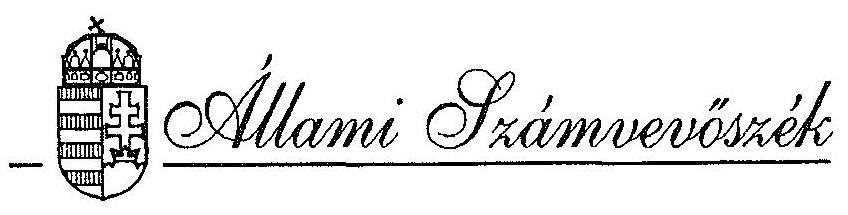

# JELENTÉS 

a Magyar Tudományos Akadémia fejezet pénzügyi-gazdasági ellenőrzéséről
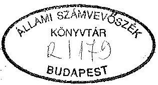
1993. november

---

Az ellenőrzést vezette:

Matusek István számvevö fötanácsos

Az ellenőrzést végezték:

| Bakonyvári Róbertné | számvevő-tanácsos |
| :-- | :-- |
| Deák Tamásné | számvevő-tanácsos |
| Éva Katalin | számvevő-tanácsos |
| Hegyesné dr. Solymosi Mária | számvevő |
| Dr. Mihály Sándor | számvevő-tanácsos |
| Dr. Köszegi Zoltán | külső szakértő |
| Dr. Nagy Mihályné | külső szakértő |
| Dr. Nagy Sándor | külső szakértő |
| Dr. Plank Lászlóné | külső szakértő |

---

# Állami Számvevőszék 

III. Költségvetési Ellenőrzési Igazgatóság
V-2-37/1993.
Témaszám: 158

## J E L E N T É S

## a Magyar Tudományos Akadémia fejezet pénzügyi-gazdasági ellenőrzéséről

Az állami költségvetés XXI. fejezete a Magyar Tudományos Akadémia (továbbiakban MTA), amelynek 1993. évi eredeti bevételi és kiadási előirányzatát 6,7 milliárd forintban (ezen belül 100 millió forint a kormányzati beruházás) állapította meg az 1993. évi költségvetésről szóló törvény.

A tárca 1993. évi költségvetése 8 címre, ezen belül 6 alcímre és 18 csoportra bontva tartalmazza a 48 önálló költségvetési intézmény és 83 támogatott kutatóhely előirányzatait. A fejezethez 43 önálló kutatóintézet és 2 egyéb kutatóhely tartozik 9 ezer fő tervezett átlaglétszámmal.

A fejezet intézményeinek tárgyi eszközállománya 1992. év végén megközelítette a 13 milliárd forintot.

Az ellenőrzés az 1990-93. I. negyedévig terjedő időszak gazdálkodására terjedt ki. Az ellenőrzés célja a költségvetési gazdálkodás törvényességének, célszerűségének és eredményességének vizsgálata volt. Kiemelt figyelmet fordított az ellenőrzés a privatizáció folyamatára és a vállalkozási tevékenység eddigi eredményeire.

## I.

Összefoglaló megállapítások, következtetések és javaslatok
Az MTA a magyar tudományos kutatások legkoncentráltabb bázisa és irányító szervezete, különösképpen az alapkutatások tekintetében. Itt összpontosul a tudományos munkaerő-állomány mintegy $13 \%$-a. A jelenlegi mintegy 7000 alkalmazottból kb. 3000 fő kutató, akiknek hozzávetőlegesen $25 \%$-a oktat is.

---

Az MTA más költségvetési fejezetektől eltérő felépítésű és müködésű szervezet. A szaktevékenység tudományos testületekben valósul meg, amelyek müködését az elnök irányítja. Az akadémia hivatali szervezete (MTA Titkárság) - amelyet a főtitkár irányít - hajtja végre a testületi döntéseket és tevékenysége során érvényesíti az állami törvényekben és más jogszabályokban meghatározott követelményeket.

A fejezet állami támogatásának mértéke a vizsgált időszakban ténylegesen 3,6 milliárd Ft-ról 4,8 milliárd Ft-ra növekedett. A növekedés döntő részben központi bérintézkedésekhez és meghatározott feladatokhoz kapcsolódott. Ezen összegek jelentősen kiegészültek más állami forrásokból, illetve az intézmények saját bevételeiből. Az állami támogatásból mintegy $80 \%$ szolgált az intézményhálózat fenntartására és a különböző kutatások támogatására, 20\%-ot fordítottak az infrastruktúra fejlesztésére, beruházásokra, felújításokra.

Akadémiai tagság, elért tudományos fokozatok és ösztöndíjak címén 9000 főnek fizet rendszeresen az MTA különböző összegeket.

A vizsgált időszakban a személyi állomány kb 15\%-kal csökkent, de a csökkenés számszerủen a kutatói állományt kevésbé érintette, mint a kisegítőkét. A kutatói állományból való kiválás és cserélődés minőségi kihatása más vizsgálatokkal állapítható csak meg.

A tudományos kutatói hálózat struktúrája lényegében változatlannak minősíthető, a privatizáció, vagy egyéb kisebb jelentőségű átszervezések a korábbi arányokat nem módosították számottevően.

Már az MTA 1990. évi rendes közgyűlése állást foglalt az Akadémia reformja mellett, és sürgető feladatként jelölte meg „a magyar tudományosság intézményi rendszerének, valamint müködésének a társadalmi, politikai változásokkal és a tudományok fejlődésével összhangban álló gyökeres átalakítását." Az ezt követő 1990. évi rendkívüli közgyűlés szerint pedig fontos akadémiai feladat „a tudományos kutatás szabadságának védelmezése, a tudományos kutatások, főleg az alapkutatások művelése és fejlesztése, módszertani irányítása". Kinyilvánította, hogy az Akadémia magát autonóm köztestületnek tekinti.

Az MTA megbízásából végrehajtott teljes körű átvilágítás egyenként és összességében a kutatóintézetek müködését - tudományos szempontból - eredményesnek minősítette és a fennálló státuszok nagyobb változtatására nem tett javaslatot.

---

Ez a részleteiben egyedi minősítés nincs teljes összhangban más, korábbi és újabb akadémiai álláspontokkal, például az MTA 1992. évi rendkívüli közgyűlése által kiküldött ad hoc „program bizottság" jelentésével és értékelésével.

Az ad hoc programbizottság javaslata szerint olyan irányítási rendszer kialakítására van szükség, amely

- a tudomány számára adott állami támogatást az intézetek tudományos értéke és munkája arányában tudja elosztani;
- képes - ismét csak tudományos szempontok alapján - mérlegelni, hogy leál-lítandó-e egy sikertelennek vagy eredménytelennek tűnő kutatás;
- dönteni tud az esetleges - az állami szervek által javasolt - kutatási prioritások értékéről és realitásáról;
- messzemenően biztosítja nagy költségkihatású költségvetési döntések előzetes és utólagos nyilvánosságát.

Az előbbiekben röviden vázolt akadémiai célok legitimálására és társadalmi elfogadtatására hivatott akadémiai törvény azonban az ellenőrzés lezárásának időpontjáig nem nyert elfogadást. A felsőoktatási törvény jóváhagyásának elválasztása az akadémiai törvénytervezetétől ma még meg nem ítélhető kihatású. Az akadémiai törvény hiánya alapvető kérdésekben gátolja az MTA és az általa irányított intézményhálózat átalakítását, az alapkutatások zavartalanságát. Bizonytalan az Akadémia jövőbeni jogállása, közjogi státusza, szervezeti és finanszírozási rendszere. Tisztázatlan ebből kifolyólag az intézmények további sorsa; az MTA és a felsőoktatás viszonya, a privatizáció további iránya, módszere és terjedelme a tudományos alapkutatásokban. A törvény megjelenéséig nem célszerú folytatni az Akadémia hivatali átszervezését, nem adható ki az új Szervezeti és Múködési Szabályzat.

A törvény hiánya, illetve jóváhagyásának bizonytalansága lelassította, az MTA és a hozzátartozó kutatóintézetek átalakításának egyébként 1990-ben megindult folyamatát.

A 4/1991. (II.13.) PM rendelet hatálybalépéséig viszonylag aktív spontán privatizációra és vagyonkihelyezésre, gazdasági társaságok létesítésére került sor, amelyeket az MTA hivatalosan nem befolyásolt. A bekövetkezett szervezeti változások a kutatói

---

struktúrát általában nem érintették. A rendelet hatálybalépése óta néhány átalakításra került sor, minden esetben törvényes módon, kormány-engedéllyel.

Mindenképpen további rendezést igényel a KFKI megkezdett átalakítása, mert a felemás módon végrehajtott átszervezés mindeddig nem oldotta meg azokat a gazdasági problémákat, amelyek miatt az átalakulás folyamatát elindították.

A változtatásoknak gazdasági eredményben mérhető haszna eddig csekély, egyéb előnyeit csak a bennük érintett intézmények képesek elbírálni. Az ÁSZ ellenőrzési tapasztalatai szerint, az eddigieknél hatékonyabb megoldásokra van szükség a tudományos alapú vállalkozások létesítésénél és vagyoni befektetéseknél.

A Fejezet és ellenőrzött intézményeinek költségvetési gazdálkodása kiegyensúlyozott és szabályszerű. Költségvetési tekintetben a Fejezet jól áttekinti és összefogja, irányítja a fejezeti költségvetési gazdálkodást. Mintaszerű gondossággal szervezte meg és bonyolította le az új számviteli törvény követelményeinek megvalósítását annak ellenére, hogy a kormányzati irányító szervek rendelkezései esetenként megkésve jelentek meg, vagy el is maradtak.

A Fejezet költségvetési előirányzataira is jellemző a bázis-alapú tervezés, a feladatok és a hozzájuk tartozó források tartós elválása egymástól, valamint a saját bevételek rendszeres alátervezése. A létszámirányszámok alatti ténylegesen betöltött státuszok különbsége biztosít pótlólagos forrást az egyébként valóban alacsony bérszínvonal javítására.

A vizsgált időszakban a Fejezetnél likviditási gondok érdemben nem fordultak elő, az intézményeknél jelentkező átmeneti zavarokat is sikerült áthidalni. Pénzellátottság tekintetében az intézmények helyzete nagyon eltérő. Néhány intézmény saját bevételeiből értékpapírokat képes hosszabb-rövidebb ideig birtokolni és viszonylag jelentős kamatbevételekre tehet szert, az intézmények másik csoportja fenntartásának kiadásait is nehezen tudja fedezni.

A több alkalommal, soron kívül engedélyezett központi bérintézkedések szűk sávokban és csak ideiglenes hatással javítottak a bérarányokon, bérszínvonalon. (A kutatói átlagbér mintegy $25.000 \mathrm{Ft} /$ hó.) E téren egyre nagyobb kihívást jelent a magánvállalkozói szféra és a külföldi megbízások.

---

Meg kell említeni, hogy a felelős és előrelátó gazdálkodást nehezíti a pénzmaradvány elszámolásának parttalan gyakorlata, az önkényes, improvizált pénzügyi döntések újabban meghonosodott eljárása (pl. az 1992. évközi elvonás és a központi elszámolást megkerülő finanszíroztatási utasítások). Ezek a törvénytelen megoldások felelőtlen költésre ösztönözhetik a költségvetési intézményeket.

A különböző forrásokból elért átmeneti megtakarítások, ideiglenesen szabad pénzeszközök kezelésének évente változó tartalmú kormányzati szabályozása az MTA területén is pénzkezelési problémákat eredményezett, föként az intézményeknél.

A tárca kutatási alapja (AKA) felett - az ellenőrzés tapasztalatai szerint - eljárt az idő és eredeti céljának, az alapkutatások fokozott támogatásának csak részben tud eleget tenni. Valóságos funkcióját a pénzügyi puffer szerep jelentette, forrásai folyamatosan csökkennek. Mivel elavult és alacsony szintű jogforrás hívta életre, 3/1991. (A.É.3) MTA-E-F. utasítással módosított 1/1989. (A.É. 5.) MTA-F utasítás. Az akadémiai törvény hatálybalépése után az Alap megszüntetése, vagy jelentős korszerűsítése indokolt.

Kiemelendő, hogy a központi szervek és a vizsgálatba bevont intézmények gazdálkodásában súlyosabb kifogásolni való nem merült fel és az MTA rendszeres felügyeleti ellenőrzései hasonló megállapításokra jutottak.

Több intézménynél a gazdálkodás szervezettsége kifejezetten jónak minősíthető (MTA Titkárság, Soproni Geodéziai és Geofizikai Kutató Intézet; Nyelvtudományi Intézet stb). Ebben a szakembergárdának, a számítógépesítésnek és a központi irányító szervek szakszerű munkájának egyaránt része van. A központi irányító apparátus a „hagyományos" költségvetési gazdálkodást jól kézben tudja tartani és kellően informált is az ottani folyamatokról. Bizonytalanság az újabbkeletű folyamatoknál (privatizáció, átalakulások, vállalkozások) érzékelhető főképpen azért, mert kétségesnek látják a beavatkozás (tájékozódás) jogát, az intézeti önállóság határait és a jogszabályok értelmezhetőségét.

A tárgyi eszközök vonatkozásában egyre súlyosabb a kutatási gép-, műszerbázis szintentartása, üzemeltetése. A fejlesztés lehetősége 1993. évre szinte már megszűnt. Mivel nem 1-2 évig tartó átmeneti lassulásról van szó, hanem már évtizedes folyamatról, a műszaki-gazdasági jellemzők (korszerűség, használhatósági fok, üzemképesség stb.) egyértelműen jelzik a romlást. A teljesen amortizálódott gép-, műszerek aránya megközelíti a $30 \%$-ot. A helyzet annak ellenére romlott, hogy a

---

Fejezet a lehetőségei határán belül a maximumot fordította gép- és műszer beszerzésekre.

A számítógépek tudományos célú felhasználásában és a gazdálkodási feladatok megoldásában hatékony szerepet töltöttek be és az erre irányuló fejlesztésnek kimutatható eredményei vannak. Kiépült egy interaktív rendszer, megfelelő gépparkkal és adatbázissal. A fejlesztési lehetőségek szűkössége talán itt volt a legsikeresebben áttörhető. A fejlesztés eredményeként az alkalmazott számítógépek palettájáról szinte teljesen eltűntek az elavult szocialista géptípusok.

Az MTA vezetése több nyilvános fórumon, közreadott dokumentumban kinyilvánította abbeli szándékát, hogy az az eddigieknél szorosabb, szervesebb kapcsolatot létesít az egyetemi kutatókkal és oktatókkal. E szándék gyakorlati megnyilvánulása az egyetemi kutatóhelyek létesítése és anyagi támogatása, illetve ezt a célt szolgálja az Athenaeum program. A két szervezetrendszer együttműködésének módja és mértéke igen nagy jelentőségű a tudomány fejlődése, az oktatás színvonala szempontjából, de pénzügyi-gazdasági kihatásai is hasonló nagyságrendűen fontosak. A szándékok kölcsönös hangoztatásán túlmenő számottevő fejlődés egyelőre ezen a téren nem tapasztalható. A feszült és óvatos várakozásnak csak részbeni oka az akadémiai törvény hiánya. Ugyanis az elmúlt évtizedekben a fejlett ipari országokétól eltérő struktúrájú kutatóhálózat alakult ki az MTA irányítása alatt, amelynek tudományos eredményeit elfogulatlan külföldi szakértői csoportok is jónak, helyenként kiemelkedőnek ítélik. Ugyanezek az értékelések a kutatói szellemi potenciált úgyszintén nagy nemzeti értékeink közé sorolják, amellyel ésszerűen kell gazdálkodni. A tudományos erőforrások átcsoportosítása nem kizárólag egy elhatározott döntés energikus kivitelezésétől függ. A specializálódott kutatási hálózat szervezeti közelítése a kevesebb erőforrást, többségében leromlott eszközállományt birtokló felsőoktatási intézményekhez csak fokozatosan, a szükséges fejlesztésekkel a különbségek eliminálása mellett van reális esély. Ennek ma még sem törvényi, sem pénzügyi feltételei nem adottak és a garanciarendszere sem jött létre.

A magyar társadalom gazdasági teljesítőképessége ma még - s valószínű, hogy még több évig - nem lesz elégséges ahhoz, a termelő- és szolgáltató ágazatok korszerűsítése mellett változatlan struktúrában finanszírozni legyen képes a jelenlegi alapkutatások kialakult akadémiai szortimentjét és intézményeit, valamint az azonos tudományágakban működő felsőoktatási intézményeket és az ott folyó kutatásokat. Itt átgondolt visszavonulásra, elhagyásra, átrendezésre és bizonyos mértékű

---

integrációra van szükség azért, hogy hatékonyan támogatható legyen, ami tudományos szempontból ígéretes, vagy elengedhetetlen.

A jelenlegi szervezeti, finanszírozási és érdekeltségi viszonyok egy összekapcsolódó folyamatra nem alkalmasak sem az MTA-nál, sem az egyetemeknél. Az Akadémia és intézményeinek természetes törekvése az intézményhálózat lehető megtartása, sta- bilizálása, létének garantálása. Csak annyi változásra vannak felkészülve, amenynyi elkerülhetetlennek látszik, holott az ICU szakértői is arra ösztönöztek, hogy azt kell meghagyni, ami tudományosan szükséges és eredményes.

Nem tartható hosszabb távon az az eddigi gyakorlat, amelynél az elvonásokat egyenletesen „elterítették", így biztosították az intézmények túlélését, de nem juthattak a szükséges többletekhez az élenjárók.

Bármilyen szervezeti rendben, gazdálkodási formában müködnek tovább a kutatóintézetek, belső gazdálkodási viszonyaikat változtatni kell. Ebben az irányban eredményesnek látjuk a SZTAKI-nál alkalmazott belső struktúrát és gazdálkodási rendszert. Természetesen más eredményes struktúrák is elképzelhetők.

Végezetül megemlítjük, hogy a kutatói tevékenységek hatékonyságának mérése ma még nem teljesen megoldott. Ez a paraméter pedig a jövendő finanszírozás egyik alapja kell, hogy legyen. Az ún. citálási index mellett más mérési módszerek alkalmazását is meg kellene oldani.

Megállapításaink alapján a következő javaslatokat tesszük:

# a) A Kormány részére 

1. Az Akadémiai Törvény elfogadását követően rendezést igényel az MTA vagyoni helyzete. A törvénnyel összhangban szabályozni kell a tudományos vagyon további kezelését, a privatizálásának, belföldi, vagy külföldi tőke bevonásának lehetőségeit, illetve egyes vagyonrészek elidegeníthetetlenségét. Intézményesen gondoskodni kell a kincstári vagyon megőrzéséről.
2. Ugyancsak a Törvény ismeretében meg kell határozni a kutatói státuszok besorolási feltételeit, bérarányait, mivel a közalkalmazotti törvény a kutatói tevékenységekre nem értelmezhető. Mindeddig hiányoznak a megfelelő specifikus szabályozások.

---

3. A tudományok fejlődése nem nélkülözheti az alapkutatásokat, az ehhez szükséges feltételek biztosítását. A költségvetés lehetőségeinek figyelembevételével indokolt újragondolni az alapkutatások állami támogatásának további rendszerét és lehetséges forrásait.
4. A költségvetési tervezés és gazdálkodás szabályait az eddigieknél stabilabbá célszerű tenni. A tervezési metodika segítse elő a reálisabb előirányzat-tervezést, különösen a saját bevételeknél. A maradvány- és eredményelszámolás az államháztartási törvény szabályai szerint történjék az utólagos módosítás kizárásával.
5. A végrehajtó szerveknek reális időtartamot kell a jövőben biztosítani az új állami szabályok (pl. számviteli törvény, költségvetési tervezés stb.) végrehajtásának megszervezéséhez, lebonyolításához.
6. A pénzügyi szabályozás eszközeivel is célszerű elősegíteni a tudományok, illetve a kutatások szponzorálását a költségvetés tehermentesítése és a kutatásoknak a reális igényekhez való igazítása céljából.

# b) A Magyar Tudományos Akadémia részére 

1. Az Akadémiai Törvény tartalmának megfelelően újraszabályozást igényelnek az MTA döntési, irányítási és ellenőrzési jogkörei.
2. A Törvény szabályozásainak és az intézetek átvilágításának figyelembevételével az`MTA vezetése határozzon meg új fejlesztési prioritásokat és irányokat, hogy olyan kutatási egységekbe lehessen koncentrálni az erőforrásokat, amelyek megtartása és fejlesztése tudományos és nemzeti érdek.
3. A tudományos hatékonyság megbízható értékelésének elősegítésére további mérőszámokra és módszerekre van szükség, amelyekkel megalapozhatók a szelektív fejlesztési döntések, a rangsorok és a pénzügyi támogatások.
4. A tudományos kutatást végzők célszerű bérezési és ösztönzési rendszerének, minősítési és be-(át)sorolási szempontjainak meghatározását az MTA szakszerű javaslataival segítse elő.
5. Az MTA általános elvek, bevált módszerek közreadásával segítse elő az általa irányított intézmények belső gazdálkodásának fejlesztését, korszerűsítését.

---

6. Az Akadémiai Törvénnyel összhangban indokolt meghatározni az Akadémia és az általa alapított intézmények vállalkozásokban való részvételének koncepcióját és szabályait, beleértve a hatékonyság folyamatos vizsgálatára vonatkozó eljárásokat.
7. Az MTA a Törvény ismeretében kezdeményezze a tulajdoni jogok általános rendezését, ideértve a vállalkozásokba vitt vagyoni jogokat is.
8. Kívánatos a vállalkozások eredményességének elérése. Olyan vállalkozásokat, amelyek nagyon alacsony, vagy éppen semmilyen gazdasági eredményt nem érnek el és vagyonuk csökken, egy ésszerű tűrési időn túl indokolt felülvizsgálni, és a tudományos érdekek sérelme nélkül átalakítani, vagy megszüntetni.
9. A kutatómunka hatékonysága érdekében, az egyetemek, akadémiai kutatóintézetek együttműködésének továbbfejlesztésére, a kutatóhálózat szervezetében a szükséges korrekciók végrehajtására, a különböző intézménytípusok (egyetemek, kutatóhelyek) közötti átjárhatóság biztosítására törekedjen az Akadémia.
10. A támogatott kutatóhelyek intézmény-finanszírozási rendszerének felülvizsgálatát javasoljuk. Célszerű és indokolt a jelenlegi finanszírozási rendszerről a feladat finanszírozására áttérni pályázati rendszer alkalmazásával.

# II.   Részletes megállapítások 

A) A Fejezet müködésének áttekintése

## 1. A feladatok és a szervezeti rendszer összhangja

Az MTA feladatkörét, a magyar tudományos életben betöltött szerepét, államigazgatási funkcióit az 1986. évi 5. sz. törvényerejű rendelettel módosított 1979. évi 6. sz. törvényerejű rendelet állapítja meg. A ma is hatályban lévő törvényerejű rendeletek minden tekintetben elavultak. Nem tükrözik a bekövetkezett társadalmi, politikai és gazdasági változásokat, nem alkalmasak az MTA feladatainak korszerű és iránymutató meghatározására.

---

Az elavult jogi normák felváltására hívatott akadémiai törvény tervezete elkészült és azt a Kormány az Országgyűlésnek elfogadásra benyújtotta, de az a helyszíni ellenőrzés befejezésének időpontjáig nem nyert elfogadást.

A törvényi szintű szabályozás hiányát csak korlátozottan enyhítette, hogy az MTA 1990. februári rendkívüli közgyűlése elfogadta „A Magyar Tudományos Akadémia alapszabályai"-t, majd a Minisztertanács 1044/1990. (III.21.) MT. számú határozatával jóváhagyta.

Az Alapszabály rögziti az akadémia tagjainak, köztestületi szerveinek jogállását, jog- és hatáskörét, a köztestületi müködés szabályát, a hivatali szervezet és a tudományos testületek viszonyát, az Akadémia és intézményei, valamint az MTA és a tudományos társaságok, egyesületek kapcsolatát.

Az MTA ma is hatályos Alapszabályai és a később kidolgozott Ideiglenes Testületi Ügyrend, valamint a tudományos osztályok által meghatározott ügyrendek átmeneti szabályozások, amelyek többszöri átdolgozás ellenére - törvény hiányában - nem véglegesíthetők.

A hivatali szervezet működésének részletes szabályait a törvényerejű rendelettel és az akkor hatályos egyéb jogszabályokkal összhangban elkészített és a 6/1987. (A.K.6.) MTA-F. utasítással életbeléptetett „a Magyar Tudományos Akadémia Központi Hivatalának Szervezeti és Müködési Szabályzata" határozta meg.

Az átmeneti szabályozás és az érvényben lévő törvényerejű rendelet adta keretek között 1990. év májusában megválasztott új akadémiai vezetés megkezdte az Akadémia megújítását.

Az állami jellegű irányítást és egyszemélyi döntéseket a testületi jellegű irányítás váltotta fel oly módon, hogy továbbra is érvényesült a választott vezetők személyes felelőssége az egyes döntésekért.

Az átalakuló MTA-ban az államigazgatás jellegű felügyeleti és irányítási tevékenység helyét fokozatosan a köztestületi jellegű döntéshozatal váltotta fel.

A testületi szervezetek tevékenységét - Közgyűlés, Elnökség, testületi hálózatban müködő állandó bizottságok, tudományos osztályok és szakmai bizottságok, Főtitkári Értekezlet - fogják össze. Közgyűlési állandó bizottságok javaslattevő, döntéselőkészítő tevékenységére alapozódnak a vezetői döntések. (A Felügyelő Bizottság és a Tudományetikai Bizottság 1990-ben, az Akadémiai Kutatóhelyek Bizottsága, a Könyv- és Folyóiratkiadó Bizottság, az Országos Athenaeum Bizottság 1991-ben alakult.)

---

Az MTA Titkárság szervezetében tizenegy tudományos osztály müködik, az osztályok számos tudományos bizottságot alakítottak a tudományos feladatok végrehajtására (1992. novemberében 127 szakmai bizottság müködött).

Az MTA évekkel ezelőtt az ország 5 nagy városában regionális, Területi Bizottságokat hozott létre.

A Területi Bizottságok (az MTA szegedi, miskolci, debreceni, veszprémi és pécsi Területi Bizottságai) a régióban az Akadémia képviseletében tevékenykednek, kapcsolatot tartanak a területükön müködő kutatóintézetekkel, oktatási - elsősorban a felsőoktatási - intézményekkel, a Bizottság különféle tudományos szak- és munkabizottságaiban résztvevő kutatókkal, a régió önkormányzataival és intézményeivel.

A Területi Bizottságok jól felszerelt székházakkal rendelkeznek. Ezek alkalmasak az évenként tartott kb. 150-250 tudományos rendezvény (konferencia) megtartására, a szak- és munkabizottságok tagjai összejövetelére, országos jelentőségủ rendezvényekre, könyvtári szakanyag rendezett elhelyezésére, valamint korszerű vendégszobáikban hazai és külföldi vendégek elszállásolására.

Az MTA Területi Bizottságai az MTA-tól kapott költségvetési támogatáson felül a saját bevételekből önkormányzati, vállalati és más sponzori hozzájárulásokból kiirt pályázatokat díjaznak, kiadványokat jelentetnek meg illetve, arra érdemesnek tartott kutatásokat támogatnak, tudományos és egyéb rendezvényeket megszerveznek.

Az MTA-hoz szakmailag tartozó tudományos társaságok fontos szerepet töltenek be a tudomány népszerüsítése terén.

Az 1989. évi egyesülési törvény alapján az Akadémia és a tudományos társaságok közötti kapcsolat szervezetileg és jogilag megszünt. Ennek ellenére az elmúlt esztendők tapasztalatai egyértelműen bizonyítják, hogy a tudományos társaságok változatlanul igénylik, hogy szellemileg kapcsolódhassanak az MTA-hoz. Ugyanakkor az Akadémia is szükségesnek tartja, hogy a társaságok széles társadalmi kisugárzást jelentő tevékenységére - az MTA öt Területi Bizottsága által szervezett és támogatott igen jelentős számú szak- és munkabizottságokhoz hasonlóan - támaszkodhasson.

Az Akadémia pénzügyi támogatásban részesíti a tudományos társaságokat (5. sz. melléklet).

---

Az MTA fejezet pénzügyi-gazdasági tevékenységének irányítása, az érvényes jogszabályokon alapuló költségvetési gazdálkodás biztosítása az MTA főtitkárának jogköre és feladata. Tevékenységének sajátossága az, hogy munkája során össze kell hangolnia az állami szabályokból eredő kötelezettségeket a testületi döntésekkel.

A fejezeti éves költségvetési terv irányelveinek jóváhagyása, az éves költségvetés és végrehajtásáról készült zárszámadás elfogadása az MTA legfelsőbb szervének, a Közgyűlésnek a hatásköre.

A fejezeti szabályozás rendjében az MTA gazdasági müködtetése és a pénzügyigazdasági folyamatok irányítása közgyűlési határozatok, elnökségi határozatok, állásfoglalások, az Akadémia elnökének és főtitkárának együttes utasításai, főtitkári utasítások, körlevelek útján valósul meg.

Az MTA alapvető szakmai feladataiban, szervezetében, főbb tudományos irányvonalaiban és arányaiban az elmúlt három évben nem voltak jelentős változások. Az alapvető stabilitás mellett több olyan feladat- és szervezeti változás következett be, amely érintette a fejezet költségvetését, vagy fejezeten belüli módosítással járt. A változtatások egy része kormányzati intézkedésekhez kapcsolódott:

- Az MSZMP-től a Társadalomtudományi Intézet átvétele (1990);
- a Magyar Közvéleménykutató Intézet és a Művelődéskutató Intézet kutatógárdája egy részének és színvonalas infrastruktúrájának átvétele 1991-1992-ben;
- MTA-OMFB közötti feladatátcsoportosításként 1992. évben az OMFBhez kerültek az Interkozmosz kutatások;- Az OMFB-től 1992. évben az MTA átvette a rendszerelemzés koordinálásával kapcsolatos feladatokat.

A szervezeti változások másik része az intézmények feladatainak felülvizsgálatával függött össze. A kizárólag saját bevételből működő, önfenntartó költségvetési intézmények gazdasági társaságokba szerveződtek.

Megkezdődött a vállalkozási tevékenység leválasztása a kutatóintézeteknél. Az MTA Elnöksége 1991. novemberi ülésén hagyta jóvá az akadémiai kutatóintézeti hálózat 1992. évi részletes felülvizsgálatának tervét és módszertani vázlatát. Központi igény is volt az intézményhálózat felülvizsgálatára (1991. évi XCI. tv. 34. § (3) bek.)

- Az MTA Központi Fizikal Kutató Intézete - Kormány-jóváhagyással - 1992. január 1-i hatállyal átalakult, a vállalkozói tevékenység leválasztásával hat önálló intézmény - ebből öt kutatóintézet - jött létre,

---

továbbá a vállalkozói tevékenység folytatására megalakult a KFKI Innovációs Rt., amely mintegy 30 Kft.-t, illetve egyéb gazdasági társaságot vont szervezetébe.

Az átszervezések hatására előirányzati szinten a fejezet kiadása és bevétele 1,2 milliárd forinttal, számított létszáma 880 fővel csökkent.

- Jelentősebb szervezeti változás volt még az MTA Izotópkutató Intézetének átszervezése. Kormány-jóváhagyással 1993. január 1-től az Izotópkutató Intézetből kiváltak a fejlesztéssel és termeléssel foglalkozó laboratóriumok és a továbbiakban gazdasági társaságként müködnek. (A fejezeti bevétel-kiadás 210 MFt -tal, a létszám 180 fóvel csökkent).

Az akadémiai reform során - a Kormány vonatkozó határozataival összhangban került sor az MTA Központi Hivatali Szervezetének korszerűsítésére.

- Az MTA Központi Hivatala átalakult az MTA Titkársága szervezetévé (1990.). A hivatal szervezetéből kiváltak és gazdálkodási önállóságot kaptak a korábban részben önálló üdülők, szociális intézmények és a Gépkocsi Szolgálat, amelyek 1991. január 1-tól önálló költségvetési intézményként müködnek.
- Az Akadémiai Székház és Irodaház üzemeltetését az MTA Központi Ellátási Szolgálata vette át.
- Az MTA nemzetközi kapcsolatait ellátó fóosztály 1991-ben megszűnt. A nemzetközi feladatokat az önálló költségvetési intézményként létrejött Nemzetközi Együttmüködési Iroda látja el.

A közigazgatás korszerűsítését célzó 1026/1992. Korm. határozat végrehajtására kidolgozott akadémiai feladatterv megvalósítása 1993. júniusában a következő stádiumban volt:

- a közigazgatás korszerűsítésének elveit az akadémiai törvény elfogadása után - az új alapszabályok kidolgozása során - kívánják érvényesíteni. Ezután kerülhet sor a Titkárság Szervezeti és Müködési Szabályzatának kidolgozására is;
- ugyancsak az akadémiai törvénnyel függ össze a tudományos minősítés új rendszerének a kidolgozása, amiből az „akadémiai doktor" tudományos fokozattal összefüggő eljárást, ill. szervezetet az új alapszabály és a Szervezeti Szabályzat kidolgozásával párhuzamosan alakítják ki;

---

- az MTA áttekintette az ún. szakigazgatási bizottságokat és megszüntette a Kiállítási Bizottságot, a Találmányi Bizottságot, a Múszerügyi Bizottságot és a Dubnai Bizottságot;
- megkezdődött az - idejét múlt - akadémiai belső utasítások felülvizsgálata, azonban ez a folyamat csak a törvény elfogadása után zárul majd le;
- megtörtént az akadémiai kutatóintézeti hálózat felülvizsgálatának előkészítése, aminek során a kutatóintézetek tudományos munkájának tartalmi értékelése befejeződött.
- A múlt év decemberében a rendkívüli Közgyűlés programbizottságot küldött ki többek között az akadémiai kutatóhálózat korszerűsítésére vonatkozó javaslatok kidolgozása céljából. A programbizottság a Közgyűlésnek bemutatta jelentését és javaslatait, amelyek többek között az intézethálózat új irányítási rendszerére vonatkozó elgondolásokat is tartalmazzák. A Közgyűlés úgy határozott, hogy a főtitkár vezetésével a programbizottság folytassa munkáját és részletes intézkedési tervvel kiegészítve terjessze elő jelentését és javaslatait az őszi közgyűlés elé. Az átszervezés célja a fejezet és intézményei működőképességének javítása, a korszerűbb szemlélet érvényesítése és a pénzügyi-gazdasági eredményesség biztosítása.

2. Az MTA fejezet költségvetési gazdálkodásának tervezési, finanszírozási, támogatási rendje.
a) A költségvetés tervezése

Az állami költségvetésről és államháztartás viteléről szóló törvény a költségvetés tervezését szigorította, megalapozottabb és részletesebb, dokumentáltabb, többmenetes tervezést követel meg az intézményektől és a fejezetektől.

A fejezet költségvetési tervezése az elöírásoknak megfelelően kellően részletes és dokumentált. Az éves tervezési irányelvekben foglaltakat betartva - a több menetes tervezési központi programhoz igazodóan - kerültek kimunkálásra az éves intézményi, ill. fejezeti költségvetési javaslatok az adott évben érvényes költségvetési szerkezeti rendnek megfelelően.

---

A fejezet a jóváhagyott költségvetést alapul véve tervezi meg az intézmények és az egyéb költségvetési szervezetek (kutatóhelyek) költségvetésének kiemelt keretszámait, a korábbi bázisadatokra építkezve. Inflációs hatásokat a tervezés során nem vehettek figyelembe.

Kiemelt keretszámot képeznek a kiadások, ebből a béralap, tb. járulék, dologi kiadás; a támogatás; a saját bevétel és a létszám.

Költségvetési támogatásból az alapító okiratban meghatározott alapkutatások finanszírozhatók.

További forrást jelenthetnek

- a pályázatok útján elnyert támogatások (OTKA, AKA, egyéb)
- állami megbizásos feladatok;
- OMFB által támogatott alkalmazott kutatások;
- „consulting" típusú szerződések;
- eredményérdekeltségủ munkákkal járó pénzbeni bevételek.

A költségvetési előirányzatok intézményi hatáskörben történő módosítását szinte szükségszerũvé teszi a költségvetés jelenlegi tervezési menete, ugyanis a tervezés első fázisában csak a költségvetésből finanszírozható alapkutatások pénzforgalmi előirányzata tervezhető.

A pályázatok útján elnyert támogatások (AKA, OTKA stb), valamint az állami megbízásos feladatok (OMFB) és a vállalkozási jellegủ megbízások és felmerülő pénzforgalmi előirányzatok az azokkal kapcsolatban később válnak ismertté.

Megállapítható volt, hogy a vizsgált intézmények betartották a költségvetési tervezési szabályokat.

# b) Bevételek és kiadások alakulása 

A tervezési szigorítások mellett azonban nincs számottevő előrelépés a valós bevételi többletek, az elérhető bevételek tervesítésénél. Ennek részbeni oka, hogy a tervezés időszakában még nem ismertek a pályázat útján elnyerhető összegek.

A fejezet az 1990-91-ben is évente 3,2; 1992. évben 1,6; az 1993-ban 1,8 milliárd forint saját bevételt tervezett jóváhagyott költségvetésében.

---

Ténylegesen a saját folyó intézményi bevételek az 1990. évben $50 \%$-kal, az 1992. évben $59 \%$-kal haladták meg az eredeti éves előirányzatot. Ezen belül az 1992. évben az intézmények egyéb bevételei $80,5 \%$-kal, a vállalkozási árbevételek és szolgáltatások bevételei mintegy $70 \%$-kal haladták meg a tervszámokat.

Az átvett pénzeszközöknél és előző évi pénzeszközök igénybevételénél is számottevő a tervezett és tényleges bevételek közötti eltérés, részben a tervezési metodika (pályázati úton átvett pénzeszközök), részben az alátervezés miatt.

Az átvett pénzeszközök nagyságrendje a fejezet intézményeinél évente 1,3-1,2 milliárd forint, hasonló összegủ az előző évi pénzmaradványból és érdekeltségi alapból igénybevett forrás is.

A kutatóintézetek saját bevételeinek jelentős forrásai a pályázat útján elnyerhető, központi alapokból származó pénzeszközök. (1990-ben KMÜFA 383 MFt, OTKA 314 MFt, 1992-ben KMÜFA 356 MFt, OTKA 534 MFt).

Összességében fejezet szinten az állami támogatáson felüli összes költségvetési saját források 1990. évben 126\%-kal, 1991. évben 84\%-kal, az 1992. évben 262\%-kal haladták meg az eredeti tervezett pénzeszközöket (1.és 2. sz. melléklet).

Az eredeti előirányzatok túlteljesítése ellenére a bevételek folyamatosan csökkentek. A megtérülések adatait is figyelembevéve fejezeti szinten a bevétel 1990. évben 9,$4 ; 1991$. évben 7,0 ; Ft, 1992. évben 5,9 milliárd Ft volt.

A költségvetési törvény által elfogadott fejezet szintű kiadási előirányzat kormányzati beruházások nélkül - 1990-ben 6,7 milliárd; 1991-ben 8; és 1992-ben 6,6 milliárd Ft volt.

A tényleges költségvetési kiadások a fejezeti szektoros összesen adatokból számolva 1990. évben 43,3\%-kal, 1991. évben 8,7\%-kal, 1992. évben 54,5\%-kal haladták meg a tervezett kiadásokat (3. sz. melléklet).

A béralap kiadásai 1992. évben elérték a 2,6 Mrd Ft-ot, mintegy 26\%-kal (527 millió Ft) meghaladták az 1990. évit a jelentős létszámcsökkenés és intézményi átszervezések ellenére. A növekedésben a központi bérfejlesztések, bérintézkedések hatása tükröződik.

---

A bérek és a társadalom-biztosítási járulék a müködési kiadások 50\%-át tették ki 1992-ben.

A bérjellegű kiadásoknál növekedés tapasztalható 1990. évhez viszonyítva. Elsődlegesen a nemzetközi feladatokhoz kapcsolódó kiadások, külföldi kiküldetések kiadásai, továbbá a tudományos fokozatokkal járó illetménykiegészítéseknek a Tudományos Minősítő Bizottság bérjellegủ kiadásaiként elszámolandó kiadásai emelkedtek.

A fejezet szolgáltatási kiadásokra 1992. évben 1,3 Mrd Ft-ot fordított. E kiadásoknál az általános áremelkedések, ezen belül leginkább az energiahordozók, közmúdíjak, telefondíjak emelkedései, továbbá a nyomdaköltségek emelkedései érintették hátrányosan az intézményeket. Az áremelkedések részleges kompenzálási feszültségeit a tárca esetenként a fejezeti pénzmaradvány, ill. a szerény fejezeti szabad támogatási tartaléka terhére igyekezett megoldani.

# c) A támogatások alakulása 

A kiadások finanszírozásában a központi támogatás mérséklésére irányuló kormányzati intézkedések ellenére nőtt a támogatás aránya és összege.

Az állami támogatás tényleges összege az 1990. évben 31\%-ban, az 1992. évben $44 \%$-ban nyújtott fedezetet a kiadásokra.

Az állami támogatás több mint 1,1 milliárd forint összegủ emelkedése elsődlegesen a központi bérintézkedésekhez, bérfejlesztésekhez kapcsolódott.

Az 1991. évben 20\%-os, teljes körű bérfejlesztésre volt lehetőség. 1992-ben 10\%-os bérautomatizmus volt tervezhető. A tervezhető bérfejlesztések forrását a központi költségvetés biztosította, a társadalombiztosítási járulék vonzatának kiadásait csak részben finanszírozta az állami támogatás.

A központi bérintézkedések érintették az MTA-ban foglalkoztatottak kisebb-nagyobb körét (pl: az oktatási, egészségügyi, művészeti és közművelődési dolgozókat).

Fejlesztési többletként rendezték a kutatók bérét.
A kutatói bérrendezés fejlesztési többletén felül a vizsgált három évben 180 millió forint működési fejlesztési többletre kapott lehetőséget a tárca (műszercentrumok

---

üzemeltetési többleteire; TMB ösztöndíjak emelésére és illetmény kiegészítésére; felújításokra).

A költségvetési támogatás évközi változásai központi kormányzati döntésekhez (bérpolitikai intézkedésekhez, társadalombiztosítási járulék felemeléséhez, fejezetek közötti feladatok átcsoportosításához) és központi zárolási intézkedésekhez kapcsolódtak.

PI. igazgatási kiadások támogatásának csökkentése 1990-ben 2,5 millió Ft-ot, 1992-ben 6,4 millió Ft-ot, az egyéb területek támogatásának elvonása 1991-ben 40 millió Ft-ot, 1992. évben 167,5 millió Ft-ot tett ki.

A kiadások és bevételi előirányzatok évközi változásainak döntő hányada saját hatásköri módosítások következménye. A nem tervezett kiadásokra a saját intézményi többletbevételek, átvett pénzeszközök és pénzforgalom nélküli tartalékforrások nyújtottak fedezetet.

A fejezet kiadásaiban a központi költségvetési támogatás a müködési kiadásoknál 87-94\%; a beruházásoknál 6-13\% közötti részarányt képviselt.

A támogatás mintegy fele az akadémiai kutatásokra, több mint negyede az országos kutatási feladatok támogatására szolgált (4. sz. melléklet).

Tudományos könyv- és folyóirat támogatására a vizsgált években 92,3 MFt, 131,4 MFt, 97,1 MFt központi forrás szolgált. Az Akadémiai Nagylexikon kiadását 20 millió Ft-tal támogatta a tárca a tartalék előirányzata terhére. A rendelkezésre álló források elosztásában és a felhasználások ellenőrzésében a szakmai állandó bizottság aktívan közreműködött.

Az MTA szakmai irányításával működő tudományos társaságok támogatására fejezeti kezelésű előirányzatként évente 11,6 MFt támogatás állt rendelkezésre (5. sz. melléklet).

# d) Pénzmaradványok keletkezése és felhasználása 

Az éves költségvetési támogatásból a fejezeti tartalé̋: évente 110-130 millió Ft összegű nem számottevő nagyságrendje a legégetőbb intézményi feladatok esetenkénti támogatására adott lehetőséget (áremelkedések részbeni ellentételezésére, bérfeszültségek oldására).

---

Az intézményeknél és a központosítottan kezelt előirányzatoknál 1990. évben 625,6 millió Ft, 1991. évben 742,8 millió Ft, 1992. évben 444,2 millió Ft pénzmaradvány keletkezett.

Az intézményeknél keletkezett pénzmaradvány jelentős része elszámolási kötelezettséggel járó külső források (OTKA, OMFB, OKTK) maradványa. A bevételi többletből, ill. kiadási megtakarításból származó arányok, a kiadási megtakarítások jelentősen csökkentek.

Az 1992. évben a fejezeti kezelésű előirányzatoknál 31,5 MFt maradvány keletkezett a fiatal kutatók pályázatos támogatásának 70 millió Ft célkereténél. Oka a pályázatok késel kiírása. A felvételek az év II. negyedévére tolódtak el az 1992. évi költségvetés késői elfogadása miatt.

Az előző évek felhasználatlan pénzmaradványa a beszámolási időszak végén 1990. évben 225,2 MFt, 1991. évben 231,1 MFt, 1992. évben 186,2 MFt összegű volt.

Az 1992. évben az előző évi pénzmaradvány 50\%-át, központi intézkedésként befizetési kötelezettség terhelte 115,5 millió Ft összegben.

A Pénzügyminisztérium által jóváhagyott - önrevíziós tételek és elvonások után felhasználható pénzmaradvány 1990. évben 798 millió Ft, 1991-ben évben 785; 1992-ben 758 millió Ft volt.

A pénzmaradvány jóváhagyási eljárása során nem mindenkor érvényesültek a költségvetési eljárásra vonatkozó szabályok. Kifogásolható többek között az a gyakorlat, amelyet a Pénzügyminisztérium alkalmaz egyes esetekben az önrevíziós tételek elszámolása során, mivel az önrevíziós megtakarítás terhére közvetlenül más feladatokat finanszíroztatott a PM, megkerülve a központi elszámolási és befizetési kötelezettséget. A beruházási pénzmaradványok elvonásának anomáliái ellen az Akadémia főtitkára tiltakozását is kifejezte (6. sz. melléklet).

A tárca pénzmaradványát terhelő, 1991. évi önrevíziós visszafizetési támogatási kötelezettségéből 10 millió Ft-ot a Tudományos Ismeretterjesztő Társulat részére, és 5 millió Ft-ot a Történelmi Igazságtétel Bizottság és 5 millió Ft-ot az '56-os Intézet részére 1992. szeptemberében az MTA pénzmaradványa terhére utaltatott át a PM.

A költségvetési gazdálkodás finanszírozása a fejezetnél a korábbi évek felhasználatlan tartalékainak igénybevételével, többletbevételekkel, ideiglenesen szabad pénzeszközök lekötéséből származó kamatbevételekkel biztosított volt.

---

e) Szabad pénzeszközök hasznosítása

Az intézmények átmeneti finanszírozási nehézségeit - az MTA KFKI kivételével - e források és esetenként a havi támogatási elöirányzatok előrehozásával megoldották.

A lekötött pénzeszközök kamatbevétele fejezeti szinten 1991. évben 284 millió Ft, 1992-ben 295 millió Ft volt (1990. évben nincs adat).

A fejezeti pénzellátás lebonyolítása során a pénzeszközök kamatbevétele 1990. évben 40 millió Ft, 1991. évben 40,8 millió Ft, 1992. évben 23,4 millió Ft volt.

Átmenetileg szabad pénzeszközök jelentősebb kihelyezésére az állóeszköz fenntartási forrásokból volt lehetőség, az akadémiai székház rekonstrukcióra tartalékolt összegekböl.

Megjegyzendő, hogy a fejezeti pénzellátási tevékenység éves beszámolójának mérlegében az év végén lekötött és kihelyezett pénzeszközök nem szerepelnek a mérlegadatokban, mivel 1990-ben és 1991-ben is az átcsoportosított pénzeszközönként kerültek elszámolásra. Ez a gyakorlat 1992. évben is folytatódott.

Az MTA fejezet és intézményeinek likviditási helyzete az 1990-92-es időszakban különösebb fizetési gondokkal nem volt terhes, mivel az átmeneti, évközi pénzügyi gondokon a fejezeti pénzmaradványból az MTA segítette az arra rászoruló intézeteket. Az intézetek egy része jelentős összegủ szabad pénzeszközökkel rendelkezett és azokat kamatozó értékpapírok vásárlására fordították. A szállítói állomány a vizsgált időszakban jelentősen csökkent, volumenében nem számottevô. Nagyobb volumenű a vevőállomány, amelynek egy része feltehetően behajthatatlanná válik. Egyes kinnlevőségeknél halasztódott az időbeni felszólítások, egyéb eljárások kezdeményezése.

Az MTA fejezetszintű vevő és szállítói állományának alakulását döntően az intézetek állományai befolyásolták; mind a kinnlevőségeknél, mind a tartozásoknál 99\%-os volt az intézetek részaránya. Amíg azonban a szállítói állomány az 1990. évi 415 millió Ft-ról 1992-re 54 millió Ft-ra csökkent, addig a vevőállomány csökkenése mérsékeltebb és a volumene változatlanul jelentős, melynek összege 1990-ben 740 millió Ft, 1992-ben 610 millió Ft volt (14. sz. melléklet).

---

Az MTA fejezetnél jelentős és növekvő összegű szabad pénzeszközöket használtak fel értékpapírok vásárlására.

1990-ben 769 millió Ft-ot, 1991-ben 1 milliárd 50 millió Ft-ot, 1992-ben 794 millió Ft-ot. A pénzkihelyezésben a kutatóintézetek részaránya döntő (1990-ben $66 \%, 1991$-ben $72 \%, 1992$-ben $75 \%$ ).

Nagyobb összegű értékpapírt a Fejezet a központilag kezelt AKA-ból és az álló-eszköz-fenntartás alap számláról vásárolt.

#### Abstract

Az intézetek közül a legnagyobb összegű értékpapírt a SZTAKI vásárolta (1990-ben 383 millió Ft-ért, 1991-ben 558 millió Ft-ért, 1992-ben 588 millió Ft-ért és az ebből származó kamatbevétele 1991-ben 129 millió Ft, 1992-ben 128 millió Ft volt). Az intézetek közül még viszonylag nagyobb összeget fordított vásárlásra a Szegedi Biológiai Központ (1990-ben 45 millió Ft-ért, 1991-ben 58 millió Ft-ért, 19 millió, ill. 18 millió Ft kamatbevétel ellenében), az Állam- és Jogtudományi Intézet (1990-ben 20 millió Ft-ért, 1991-ben 37 millió Ft-ért, 13 millió, 7 millió Ft kamatbevétellel), a Politika Tudományok Intézete (1990-ben 8 millió Ft-ért, 1991-ben 57 millió Ft-ért, 22 millió, ill. 2,5 millió Ft kamatbevétel ellenében).

Az 1990-92-es időszakban évenként változott a szabad pénzeszközök elhelyezéséről, kötvény-értékpapír vásárlásáról rendelkező jogi szabályozás. A 71/1988. (XII.27.) PM rendelet 1990. év végéig lehetővé tette a költségvetési szerveknek a szabad pénzeszközök elhelyezését tartós betétre, kötvény és kincstárjegy vásárlásra egyaránt. A 4/1991. (II.13.) PM rendelet kötöttebb szabályozást tartalmaz: a 8. § (4) bekezdés a tartós betétre való elhelyezést a számlavezető pénzintézetnél központi költségvetési szerveknek engedélyezte; a 10. § (1) bekezdés pedig kimondja, hogy a fejezetek költségvetési számlája kizárólag pénzellátási feladatok lebonyolítására szolgál. E számlán kezelt pénzeszköz gazdálkodásra, tartós betét elhelyezésre, értékpapír vásárlására nem használható fel. Az ellenőrzés szerint a kutatóintézetek kötvény, értékpapír vásárlása 1991. évben jogszabályellenes volt, hiszen a rendelet 8. § (4) bekezdés csak a tartós betétre elhelyezést engedélyezte, a 71/1988. (XII.27.) PM rendeletet pedig hatályon kívül helyezte. A szabálytalan eljárást a PM azon átirata okozta, amely szerint a rendeletben foglaltak tágabban értelmezhetők. A levél aláírója illetékességi körét túllépve tett engedményt a rendelet előírásaihoz képest.

A szabad pénzeszközök elhelyezését 1992. I. 1-től az 1992. évi költségvetésről és az államháztartás vitelének 1992. évi szabályairól szóló 1991. évi XCI. törvény írja

---

elő. Eszerint tartós betét elhelyezésére továbbra is lehetőségük van a központi költségvetési szerveknek, emellett 1 évnél rövidebb lejáratú államilag garantált értékpapírt vásárolhatnak. Az Akadémia intézményei és intézetei 1992-ben többségében nem államilag garantált értékpapírt vásároltak, a közel 260 értékpapírból 60 volt a kincstárjegyek száma. (Az AKA számláról átutalt 90 millió Ft államilag garantált értékpapír befektetésére az Akadémia Pénzügyi Főosztálya 1992. szeptember 30-án levélben kérte fel a Citybank Rt.-t.) A jogi szabályozásnak azt az előírását, amely szerint a kihelyezés csak 1 évnél rövidebb időtartamú lehet, minden esetben betartották.

# 3. Az Akadémiai Kutatási Alap (AKA) képzése és felhasználásának törvényessége 

Az MTA 1974. óta múködtet tárca kutatási alapot. Az 1990-92-es időszakban hatályos rendelkezések tárca szinten tették lehetővé a kutatási alap képzését és felhasználását. Jogforrás a 4/1991. (II.13.) PM rendelet és a 3/1991. (A.É.3.) MTA E-F utasítással módosított 1/1989. (A.É. 5.) MTA-F utasítás volt.

Az Akadémia által kiadott szabályozások pontosan meghatározták az Alap célját, müködését, forrását és felhasználási körét. Az Alap felhasználásáról 1991-től kezdődően az MTA Főtitkári Értekezletére részletes beszámoló készült.

Az Alap forrásai az akadémiai kutatóhelyek meghatározott pénzeszközeinek MTA-hoz történő bevonásából (járulékbefizetések), továbbá a tárca központi előirányzataiból (költségvetési támogatás) és más szervektől átcsoportosított pénzeszközökből képződtek. A támogatási összegek odaítélésről az MTA központilag, egyedi elbírálás alapján döntött. Pályázatot a támogatás elosztásánál nem alkalmaztak, kutatási támogatást a kutatóhelyek kaptak, egyéni kutatók ebből nem részesültek. Az Alapból állóeszközfenntartásra, felújításra, átmeneti forgóalapjuttatásra is csoportosítottak át összegeket. Az AKA müködésével a tényleges forrásnál lényegesen nagyobb bevételi és kiadási pénzforgalom volt lebonyolítható (pl. OVIBER program, OTKA támogatás), ami technikailag biztosította az egyéb bevételek és kiadások kezelését és elszámolását.

Az AKA összes tényleges bevételei ciklikusan alakultak, az 1990. évi 400 millió Ft-ról 1991-ben 520 millió Ft-ra nőttek, 1992-ben pedig 393 millió Ft-ra csökkentek, mivel jelentős csökkenés következett be a kutató-

---

helyek befizetései tételénél. A bevételek stabil tétele az MTA központi előirányzatából nyújtott támogatás volt, ennek volumene 1990. évi 45 millió Ft-ról 1992-ben 64 millió Ft-ra emelkedett, amely ellensúlyozta a kutatóhelyi befizetések csökkenését. A forrás nagymértékủ növekedését a más szervektől, alapokból való átcsoportosítás,valamint az értékpapír tőke és kamatbevételek tették lehetővé. Végül az egyéb bevételek között említésre méltó még az átmeneti forgóalap juttatás visszafizetéséből származó bevétel.

A bevételek tervezése nem volt kellően átgondolt, megalapozott. A tényleges bevételek többszörösen (1990-ben 9-szer, 1991-92-ben 3-szor) meghaladták a tervezettet.

Az AKA összes tényleges kiadásai a bevételhez hasonlóan alakultak: az 1990. évi 475 millió Ft-ról 1991-ben 566 millió Ft-ra növekedtek, 1992-ben pedig 358 millió Ft-ra csökkentek.

A kiadások tervezésénél sem sikerült a tényleges várható állapothoz közelíteni; az összes tervezett kiadás többszörösen elmaradt az összes tényleges kiadástól (1990ben 10-szeres, 1991-ben 3-szoros, 1992-ben 2,5-szeres nagyságrendű volt az eltérés).

A kiadási tételek között jelentősen növekedett a költségvetési szervek kutatási szerződéseinek megvalósításához nyújtott támogatás. A kutatóhelyek 1991-92-ben a járulék befizetését többszörösen meghaladó költségvetési támogatásban részesültek az alapkutatási témák finanszirozásához.

Az egyéb kiadások tételen belül kiemelendő a kutatási eszközök, berendezések, műszerek felújításához adott hozzájárulás 1990. évi 168 millió Ft összege. A kutatóhelyek likviditási helyzetén segítettek az átmeneti forgóalap juttatással (1990ben 24 millió Ft, 1991-ben 17 millió Ft), ami azt jelzi, hogy az AKA forrást az intézetek operatív gazdálkodási feladatainak megoldására is felhasználták.

Az Alap szabad pénzeszközeit alkalmanként, átmenetileg értékpapírokba fektették. 1990-ben az Alapból finanszírozott értékpapírok után 52 millió Ft, 1991-ben 8,5 millió Ft és 1992-ben 27 millió Ft összegű kamat képződött.

Az AKA alkalmas volt az MTA centrális érdekeinek és lehetőségeinek érvényesítésére, a fontosnak ítélt témák finanszírozásának megalapozására. Az AKA-ban több forrás kumulálódott és került felhasználásra a tárca szintű alapkutatási témák és egyéb feladatok finanszírozására. Az AKA összes kiadásaiból a kutatóhelyeknek

---

kutatási témákra nyújtott támogatása 1990-ben $8 \%$-os, 1991-ben $9 \%$-os, 1992-ben $42 \%$-os arányú volt ( 7 . sz. melléklet).

Az AKA további müködése - törvényi szabályozás hiányában - nem tartható fenn. Ezzel az alapkutatások közvetlen fedezetét biztosító évi 40-50 millió Ft - a járulékfizetés megszủnésével - véglegesen kiesik a felhasználói körböl, s ezáltal az Akadémia központi kutatási témák megvalósítását irányító, befolyásoló szerepe is csökken.

# 4. A támogatott kutatóhelyek tevékenysége, müködési feltételei 

Az egyetemi tanszékek és egyéb kutatóhelyek (múzeumok, könyvtárak, stb.) akadémiai támogatásának eredeti célja az eredményesen működő tudományos iskolák működési feltételeinek megteremtése volt. Az együttmüködés keretében az MTA költségvetési támogatást biztosít a föként egyetemeken müködő kutatócsoportok, tanszéki kutatórészlegek tevékenységéhez. A támogatott kutatóhelyek fenntartása a befogadó intézménnyel közösen valósul meg.

A rezsi (gáz, villany, helyiség használata) költségeket a befogadó intézmények, egyetemek biztosítják, infrastruktúrával segitik a kutató helyeket.

A kutatóhelyek jelenlegi finanszírozási rendszere és költségvetési, tervezési, gazdálkodási gyakorlata rugalmatlan, nehézkes, túlzottan központosított. A feladatok helyett intézményeket finanszíroz. A kutatóhelyi éves költségvetést központilag az MTA KSZI Támogatott Kutatóhelyek Irodája állítja össze, az éves beszámolók a kutatóhelyeken készülnek. Pályázat hiányában a támogatott tevékenység kritériumai általánosak, az értékelés sem rendszeres és döntésmegalapozó. Ezen okok következtében a költségvetés formális, íróasztalhoz kötött, elválik a kutatási tevékenység valós szükségleteitől, a kutatási eredményektől függetlenül a kutatóhelyeket egyformán, ráépítéses módszerrel dotálja.

A támogatások odaítélésénél 1990-92. között a bázisszemlélet érvényesült, a kutatások eredményessége alapján nem differenciáltak. Az iskolateremtő, vezető tudósok elkerülhetetlen váltásával a tudományos szint folytonossága nem minden kutatóhelyen valósult meg, ennek ellenére a kutatóhelyek változatlan mértékben, arányban részesedtek a támogatásokból. A kutatási eredmények valójában nem ke-

---

rültek szakmai megmérettetésre, így arra sem nyílt lehetőség, hogy a felszabaduló erőforrásokat ígéretesebb kutatásokra fordíthassák.

Az ellenőrzött időszakban mindössze 1992-ben egy-egy esetben fordult elő támogatás csökkentés: a Soproni Erdészeti és Faipari Egyetem Termőhely Ismerettani Tanszéktől a feltűnően alacsony produkció, és az Állatorvostudományi Egyetemtől az alapkutatástól eltérő, attól távoleső témaválasztás miatt.

A támogatott kutatóhelyek struktúrája az 1990-92-es időszakban alapvetően nem változott: 15 egyetemen 80 tanszéki kutatóhely, kutatócsoport, 7 egyéb intézményben egy-egy kutatóhely múködött. A létszámot tekintve érzékelhetőbb változás történt, az 1990. évi 745 fơről 1992-ben 622 fơre csökkent a támogatott kutatóhelyeken foglalkoztatottak száma. A kutatók aránya a jelzett időszakban 1990-91-ben $54 \%$, 1992-93-ban $56 \%$ volt. Ez arra utal, hogy a csökkenés a kutatók körét kisebb mértékben érintette.

A kutatóhelyeken sok a fiatal tehetséges kutató, a merítési bázist nagyobb részt az egyetemek adják. A kutatóhelyek a fiatal, kezdő kutatók alkalmazását az alacsony béralapból még eddig meg tudták oldani. A kutatóhelyek szakmailag jó alapot adnak a fiatal kutatók tudományos ambíciói felkeltéséhez, továbblépési lehetőségeik megválasztásához.

A támogatott kutatóhelyek a kutatási feladataikra döntően a költségvetési támogatásból kapott pénzeszközeiket használták fel. E mellett más forrásokból is pénzeszközökhöz jutottak.

Így pl. az OTKA pályázatokból és az egyéb forrásokból befolyt összegek egy részét áttételesen a támogatott kutatóhelyi alaptevékenység finanszirozására fordították (pl. külföldi konferencián való részvétel), továbbá a kutatócsoport müködési feltételeit javították (pl. számítógépek, könyvek, folyóiratok beszerzésével). A költségvetésen kívüli, egyéb forrás igénybevételének lehetősége néhány egyetemre koncentrálódott (ELTE, BME, SOTE, JATE, BKE).

A támogatott kutatóhelyek éves költségvetési beszámoló adatai alapján megállapítható, hogy a kiadások fő összegei egyensúlyban voltak a bevételi főösszegekkel; az éves bevételi többlet 1990-ben 8,9 millió Ft, 1991-ben 26,6 millió Ft, 1992-ben 29,8 millió Ft volt.

---

A kiadásokból a béralap, a bérjellegủ kiadás és a TB járulék aránya együttesen 1990-ben $83 \%$, 1992-ben $82 \%$ volt. A kiadások teljesítése 1990-ben $8 \%$-kal, 1991-ben $12 \%$-kal, 1992-ben $15 \%$-kal maradt el a módosított előirányzattól. A csökkenés miatt az alapkutatásokhoz szükséges könyvek, folyóiratok, vegyszerek, gyógyszerek, szakmai anyagok, különféle szolgáltatások beszerzésétől kellett eltekinteni.

A kutatóhelyek müködéséhez nélkülözhetetlenek az álló/tárgyi eszközök (gép, múszer, berendezések). Jelenleg ezek állapota, használhatósága kritikus szintre jutott. A kutatóhelyek kezelésében lévő állóeszköz-állomány bruttó értéke alig változott a három éves időszakban, 500 millió Ft-hoz közeli értéket képvisel. Az eszközállomány használhatósági foka 1990. évi $18 \%$-ról 1992-ben $14,5 \%$-ra csökkent. Az eredményes alapkutatások az egyetemi kutatóhelyeken sem végezhetők korszerű eszközök alkalmazása, használata nélkül. Ebben az egyetemek nagymértékben segítik a kutatóhelyeket.

Az MTA vezetése 1990-92. között rendszeresen foglalkozott a kutatóhelyek müködésével, s több elképzelés került kidolgozásra.

1991. májusában előterjesztés készült az MTA elnöksége részére a támogatott kutatóhelyek helyzetéről és a jövőjével kapcsolatos elgondolásokról. 1992. október 13-án javaslat készült a támogatott kutatóhelyek támogatási rendszerének átalakítására. 1993. április 9-én az MTA Programbizottság Kutatóhálózati Albizottsága javaslatot készített az akadémiai kutatóintézeti hálózat korszerüsitésének koncepciójára.

Az akadémiai kutatóintézetek mellett 1992-ben az egyetemi székhelyen müködő akadémiai költségvetésből támogatott kutatóhelyek felülvizsgálatára is sor került. A felmérés, a tapasztalatok összegezése, a javaslatok kimunkálása, a változtatás irányának meghatározása az ellenőrzés időpontjában folyamatban volt.

Az előzetes elképzelések, törekvések arra mutatnak - az általános felülvizsgálat céljával összhangban -, hogy az Akadémia vezetése elszánta magát a támogatások hatékonyságát javító intézkedések megtételére. Kevés eredménnyel járna, a felülvizsgálat sikerességét jelentősen csökkentené, ha szerény konkrét lépésekre kerülne sor és elmaradnának a támogatási rendszer hatékonyabb müködését elősegitő intézkedések.

---

5. A fejezet számítógépes információs rendszerének fejlesztésére és müködtetésére előirányzott pénzeszközök felhasználásának értékelése.

Az MTA fejezet területén folyó számítógépes információs rendszer szervezésének három fő iránya van:
a) Az MTA részvétele a tudományos kutatás, felsőoktatás, műszaki fejlesztés és közgyűjtemények szervezetei közötti hálózati rendszer kiépítésében ( $\mathrm{I}^{2} \mathrm{FP}$ )
b) MTA Titkárság munkájának számítógépesítése
c) Az Akadémia intézetei belső munkájának számítógépesítése
a) Az $\mathbf{I}^{2} \mathbf{F P}$ program megvalósításának három fázisa volt:

- az első és második fázisban, amely 1987. évtől 1990. év végéig tartott, a cél a számítógépek közötti hálózat kiépítése és a meglévő adatbázishoz való kölcsönös hozzáférés lehetővé tétele volt, közöttük nemzetközi adatbázisok elérésével.
- a harmadik fázis (1991-1993) fő célkitűzése „európai szintű hálózati és információs szolgáltatások létrehozása", amelyet az első két fázis fejlesztései tennének lehetővé.

A fejlesztések eredményeként elkészült:

- egy postai üzemeltetésű kommunikációs hálózat
- megjelentek a korszerű hálózati szolgáltatások (pl. levelező rendszer, interaktív számítógépes kapcsolatok, elektronikus faliújság)
- "ISIS" adatbázis-kezelő rendszeren alapuló adatbázis és terjedőben van a külföldi adatbázisok használata.

A fejlesztés részben külföldi támogatással valósul meg. A Világbank 6 millió USD támogatást hagyott jóvá.

A PHARE programból 580 ezer ECU felhasználására nyílt mód. Hazai forrásokból (OTKA, MTA, MKM, OMFB egyéb) 3 év alatt összesen 1.144 millió Ft állt rendelkezésre, ebből az MTA összesen 120 millió Ft-tal részesedett.

---

b) Az MTA Titkárság számítógépesítésének eredményeként a gazdasági feladatok ellátása és a hivatali tevékenység egyéb nyilvántartással járó feladatainak ellátása egyszerúsödött, hatékonyabbá vált. Az ügyviteli munkában is mindennapossá vált a számítógépek használata.
c) Az ellenőrzésbe bevont intézmények (MTA Központi Kémiai Kutató Intézet, Izotópkutató Intézet, KFKI Mérés és Számítástechnikai Kutató Intézet, Számítástechnikai és Automatizálási Kutató Intézet, Közgazdaságtudományi Intézet, MTA Pszichológiai Intézet) számítógépes fejlesztése, hálózattá fejlesztése az $\mathrm{I}^{2} \mathrm{FP}$ program alapján vált lehetségessé. A programhoz az intézmények saját pénzügyi forrásokat is felhasználtak, a Világbank támogatásán kívül.

A hálózati fejlesztés összefogója, az MTA központi számítógépének üzemeltetője a SZTAKI. Az Intézet az akadémiai közösségnek díjmentesen biztosítja a központi nagyszámítógép használatát. Ez a számítógép látja el egyben az országos infrastruktúra hálózat ( $\mathrm{I}^{2} \mathrm{FP}$ ) központjának a szerepét is, fénykábellel csatlakozik a nagy budapesti egyetemeket összekapcsoló fénykábel gyürűhöz, közvetlen összeköttetésben áll több regionális hálózati centrummal és össze van kötve a nyugateurópai hálózati rendszerekkel.

A téma fontosságára való tekintettel a számítógépes rendszer fejlesztésének eredményéről - közötte az MTA Titkárság és néhány intézet belső munkájának számítógépesítésével elért eredményekről - a 3. sz. függelékben adunk részletesebb helyzetképet.

A számítógépek korösszetételéről, típusválasztékáról, központi információk nem állnak rendelkezésre.

Az 1989. évet megelőző időszakban az ún. „KGST országok" irányában fennálló korlátozások a komplett, korszerű berendezések beszerzését lehetetlenné tették, illetve nagy mértékben nehezítették. 1990. után fokozatosan oldódott ez a probléma.

A berendezések, ill. egyáltalán az MTA-nál rendelkezésre álló számítástechnikai kapacitás hasznosítási értékelését konkrétan elvégezni nem lehet. A hasznosítás eredményességére néhány intézet egyedi átvilágításánál lehet utaló jelleggel megközelítő mutatókat keresni.

---

Az előbbi megállapítás oka abban található, hogy az MTA számítástechnikai információs rendszere elsősorban a PC-kre épül, s ezeknél sem az üzemidő, sem a futtatott programok követése nincs megoldva. De ez nem az MTA sajátossága, a berendezések használatának szélesedése következtében - „mindennapivá válása", mint bármely más irodai berendezés hasznosítása - a világ más fejlettebb területén is hasonló módon történik.

A korábban alkatrészek beszerzése útján történt hazai gépgyártást pl. KFKI-nál is igénybe vették.

A Szovjetunióból és az NDK-ból származó berendezések beszerzése kisebb mértékű volt. Ezen berendezések ritka kivétellel a forgalomból kikerültek, úgy az erkölcsi, mint a fizikai avulás miatt, használatuk megszűnt.

Az MTA-nál (intézményekkel együtt) a számítógépek főleg a távolkeletről, kisebb számban az USA-ból (IBM) származnak. A nyomtatók multinacionális cégek (Hewlett-Packard, Epson, Data Products, Star, Canon) termékei.

A berendezések erkölcsi elavulása általában igen gyors (átlagosan 3 év), fizikai elavulás 10-15 év, megfelelő folyamatos karbantartás mellett.

Az új (1-2 éves) számítógépek aránya - az egyes intézeteknél végzett felmérés szerint - kb. $38 \%$; 3-4 éveseké $22 \%$, 5 évnél idősebb mintegy $40 \%$.

Fenti számban a 10 évnél öregebb gépek aránya valószínűleg az 5\%-ot nem haladja meg.

A vonatkozó technika fejlődése, a gépek alkalmazási körének szélesedése igen gyors. A piacok telítődése, és a termelők - forgalmazók - erős konkurenciájának eredményeként a gyártmányok beszerzési ára erős ütemben csökkent az utóbbi években. A megrendelt komplett berendezések és a fenntartásukhoz szükséges pótalkatrészek a megrendelést követően ma már ütemesen beérkeznek.

A gépek, berendezések folyamatos karbantartására, ill. eseti meghibásodásuk alkalmával történő javítása az intézmények többségénél erre szakosodott külső cégekkel kötött - rendszerint általány-díjas - szerződések alapján történik. Ami a beszerzett információk szerint a számítástechnikai rendszer zavartalan üzemeltetését az MTA-nál gond nélkül biztosítja.

---

Az MTA a számítástechnikai berendezések szakszerű üzemeltetésének személyi feltételei biztosítására jelentős gondot fordít.

A teljes személyi állománynak megközelítően a fele valamilyen fokon a gépek használatára felkészítést, vagy kiképzést kapott. A kutató, ill. speciális képesítésű munkatársak e feladatokat profiszinten végzik.

Továbbképzés, ill. alapképzés folyamatosan történik, úgy az intézményeken belül, mint erre szakosodott oktató szervezeteknél. A Titkárságról pl. jelenleg 7 munkatárs képzése folyik a SZÁMALK és a CONTROLL Oktatóközpont kurzusain.

Az MTA számítástechnikai berendezéseiben tárolt adatok védelme, részben az egyének és a szakértői csoportok önérdeke alapján általában biztosított. Erre vonatkozóan egységes adatvédelmi szabályzat, illetve célorientált folyamatos ellenőrzési rendszer szervezetten, központosítva nincs.

# 6. A számviteli törvény végrehajtása 

A törvény végrehajtása a fejezet intézményei számára nagy próbatételt jelentett. A munkálatok elkezdését több külső tényező nehezítette:

- a költségvetési területet érintő kormányrendelet csak a bevezetés előtti napon jelent meg és lépett hatályba;
- a kötelezően alkalmazandó számlaösszefüggésekhez a korábbi gyakorlattól eltérően nem készült hivatalos kiadvány;
- az 1991. évi beszámoló és az 1992. évi, már az új alapokra épülő intézményi költségvetés elkészítésének munkálatai egybeestek;
- a PM az első három hónap pénzforgalmi adatairól külön beszámolási kötelezettséget írt elő.

Az MTA példamutató módon segítette át a nehézségeken intézményeit. A felügyelete alá tartozó intézetek részére - külön intézménycsoportonként - 4-5 napos tanfolyamokat szervezett. Ennek keretében az SZT alapelveinek költségvetési intézményeire vonatkozó előírásait, mérlegtételenkénti elszámolási szabá-

---

lyait és a költségvetési végrehajtásával kapcsolatos speciális pénzügyi szabályok elszámolását ismertették.

Ezen felül segédletet készítettek a fejezet felügyelete alá tartozó szervezetek könyvvezetési rendjének kialakításához. A segédletben található számlatükör részletes bontásban tartalmazta a számlákat, elősegítve a fejezet intézményei azonos könyvviteli rendszerének kialakítását.

Mivel a segédlet olyan további számlaösszefüggéseket is tartalmazott, amelyek a számviteli tanfolyamon még nem kerültek ismertetésre, a kiadvány és továbbképzés együttesen pótolta azokat a számlaösszefüggéseket, amelyeket korábban a PM hivatalos kiadványban szokott közzé tenni.

A Pénzügyi Főosztály az 1991/92. évi mérleg átfordításáról intézményenként részletes levezetést kért, amiben a régi és az új számlaosztályok közötti különbözőségek összetevőit tételesen be kellett mutatni. A levezetéseket a főosztály tartalmilag revideálta, s néhány kivételtől eltekintve elfogadta.

A Pénzügyi Főosztály irányító munkája alapján végül is a SZT előírásainak gyakorlati bevezetése zökkenőmentesen zajlott le, a kezdeti nehézségek megoldódtak.

A törvény végrehajtása során nyert tapasztalatok pozitív és negatív irányúak is.
Az újszerú pénzforgalmi kettőskönyvvitel alapján több évtized óta először valós, a pénzügyi forrásokat is figyelembe vevő pénzmaradvány-elszámolásra került sor.

- Több problémát vet fel a költségszemléletről a kiadás szemléletre történő áttérés. Így pl. az 1992. év adatai nem vethetők össze a korábbi évekével.
- Ennél is súlyosabb elvi probléma az, hogy utókalkulációt kizárólag költségszemléletben lehet elkészíteni és éppen a nagy állami megrendelők (pl. KMÜFA, OTKA, OMFB) megkövetelik a szerződésenkénti utókalkulációt.
- Az intézményi tapasztalatok arra is felhívják a figyelmet, hogy a SZT gyakorlati végrehajtása során az analitikus nyilvántartások szerepe megnőtt. A SZT előírásai esetenként a tulajdonvédelem érvényesítését sértik, mivel az eszközök egy részét csak mennyiségben kell nyilvántartani. (A költségvetés alapján gazdálkodó szervek beszámolási és könyvvezetési kötelezettségéről szóló 179/1991. (XII.30.) Korm. rendelet 12. § (2.bek.) alapján.)

---

Az új számviteli szabályok alkalmazása csak abban az esetben lesz hatékony, előnyei akkor érvényesülnek a legjobban, ha a jelenleg kialakított rendszer alapjai nem változnak évente, és az esetleges korrekciók nem az év második felében jelennek meg.

# 7. Az ÁSZ ellenőrzések megállapításai során tett intézkedések 

A fejezetnél két témakörben végzett az ÁSZ ellenőrzést. Az államigazgatási létszám- és bérellenőrzéssel kapcsolatosan intézkedési kötelezettség nem volt.

Az egyéb központi beruházások téma ellenőrzése során az MTA- nak a következő három kérdéskörben kellett intézkednie:

1. meg kellett szüntetnie a Fortuna utcai vendégház szabálytalan finanszírozását és személyi összeférhetetlenség ügyében kellett intézkednie;
2. az atomreaktor rekonstrukciója során az egyéb költségek terhére kifizetett jutalmak jogosságát felül kellett vizsgálni;
3. a kellően nem kihasznált létesítmények ügyében elnöki döntést tartottak szükségesnek.

A megtett intézkedésekről a következő volt megállapítható:

- az. 1991-ben igénybevett beruházási keretösszeget visszautalták, s az összeget más akadémiai forrásokból finanszírozták. Mivel a finanszírozás kikerült a Beruházási Osztály hatásköréből, a személyi összeférhetetlenség is megszűnt;
- a KFKI Atomreaktor rekonstrukciója ügyében vizsgálatot rendeltek el, amely 1992-ben lezárult. (A jelentést az ÁSZ részére megküldték.) A vizsgálat alapján megállapították, hogy az elvégzett feladatok teljesítéséért kifizetett pénzjutalmak nem kapcsolódtak közvetlenül a beruházás egyéb költségeihez, azt az Intézet által elvállalt munkafeládat, téma terhére számolták el, az Atomreaktort azóta üzembehelyezték;
- az Erdőtarcsai Alkotóház értékesítésére, ill. hasznosítására kezdeményezések történtek.

---

B) Az MTA Titkárság és az ellenőrzésbe bevont önálló költségvetési intézmények gazdálkodásának értékelése

# 1. A szervezetek költségvetési gazdálkodása 

## a) MTA Titkárság

Az akadémiai törvény megszületésének Akadémián kívüli okokból történő elhúzódása miatt a hivatali szervezet átalakítására nem magasabb szintű szabályozásra épülő egységes koncepció alapján, hanem szakaszosan, a szükségesség és időszerűség függvényében került sor. Az átszervezés főbb lépései a következők voltak:

- 1990. július 1-jével megszűnt a Központi Hivatal Személyzeti Főosztálya. A személyzeti feladatok a Jogi és Igazgatási Főosztály irányítása alá tartozó a Személyzeti és szociális osztály hatáskörébe kerültek;
- 1991. január 1-jével megszűnt az MTA Központi Hivatala, az Akadémia hivatali szervezetére háruló feladatokat a továbbiakban az MTA Titkársága látja el;
- 1991. június 30-ával megszűnt a Gazdasági és Ellátási Főosztály, valamint a Nemzetközi Kapcsolatok Főosztálya. A nemzetközi kapcsolatok lebonyolítására a Titkárságon kívüli szervként létrejött a Nemzetközi Együttműködési Iroda, valamint a Nemzetközi Kapcsolatok Bizottsága, az adminisztratív ügyek intézésére a Nemzetközi Kapcsolatok Bizottságának Titkársága;
- 1991. szeptember 30-ával megszűnt a Kutatástervezési Főosztály, helyette módosult feladatkörrel létesült a Kutatáspolitikai Titkárság;
- ugyancsak 1991. szeptemberében alakult az MTA Könyv- és Folyóiratkiadó Bizottság Titkársága;
- 1992-től elkerült az MTA-tól az Interkozmosz Tanács Titkársága;
- 1993-tól a Titkárságon belül megszűnt az OTKA Iroda tevékenysége.

A Titkárság szervezeti átalakításának befejezése a törvény elfogadása és az új akadémiai alapszabály kidolgozásával párhuzamosan várható.

---

Az átszervezés kezdete előtt, 1990-ben az MTA Központi Hivatala gazdálkodása során 14, részben önálló költségvetési szerv felügyeletét, irányítását és ellenőrzését látta el. Költségvetése magában foglalta az Interkozmosz Tanács Titkársága és az OTKA Iroda múködésével kapcsolatos kiadásokat is.

Az átszervezés elsősorban az igazgatási feladatok elkülönülését eredményezte, jelentősębb eredményesség, vagy megtakarítás egyébként nem észlelhető.

A költségvetésnek a Titkárságra jutó része 1990-ben 122 millió Ft költségvetési támogatást tartalmazott, 1992-ben 421 millió Ft-ot. A jelentős emelkedés oka, hogy a céltámogatások (akadémikusok munkabére, járuléka, a tudósok segítése) pótelőirányzatként jelennek meg a Titkárság költségvetésében. A Titkárságnak egyéb, saját bevételei alig vannak. A vállalkozási tevékenységnek nincsenek meg a feltételei. Az előirányzati zárolások az igazgatási kiadások csökkentésére irányuló kormányzati intézkedésekkel és az akadémikusok létszámváltozásaival függnek össze.

A saját hatáskörben végrehajtott módosítások a tervezettől eltérő kiadások finanszírozása érdekében történtek.

A kiadások fő tétele a béralap és annak járulékai.
A kiadási előirányzatokkal való racionális gazdálkodásra kényszerítették a Titkárságot az évenként különböző címeket érintő zárolások.

Ennél fogva az éves költségvetési keretek - a céljellegủ pótelőirányzatoktól eltekintve - alig emelkedtek. Az 1990. évi 146 millió Ft-os tényleges kiadásokhoz viszonyítva 1991-ben a céltámogatás, TB és ÁFA kötelezettségek nélküli tényleges kiadásokból 150 millió Ft, 1992-ben 153 millió Ft jutott a Titkárság kiadásaira. A Titkárság egyéb kiadásai számottevően már nem csökkenthetők. A berendezések, felszerelések beszerzésére jelentősebb ráfordítások nem voltak.

A pénzmaradvány 1990-ben 11; 1991-92. években 35,5 ; ill. 40 millió Ft volt. A céltámogatások maradványát elvonták.

A Titkárság pénzügyi-számviteli rendje megfelelt a követelményeknek, az okmányfegyelmet az ellenőrzött esetekben betartották.

---

# b) A Tudományos Minősító Bizottság (TMB) 

Részben önálló költségvetési szerv és külön alcím a fejezet költségvetésében. A TMB szervezési, gazdálkodási feladatait elkülönített nyilvántartásokkal, önálló költségvetéssel és beszámolóval a Titkárság munkatársai látják el. A TMB müködésére külön szabályozások nincsenek.

Bevételi előirányzata 1990-92. években 525; 563, illetve 578 millió Ft volt. A bevétel majdnem teljes egészét a költségvetés biztosítja.

A tényleges kiadások 466; 506; 533 millió összegűek voltak.
A pénzmaradvány összege növekvő tendenciájú: 1990-ben 21; 1991-ben 36; 1992-ben 45 millió Ft volt.

A TMB a feladatai ellátása során különböző, jogszabályokban rögzített díjakat fizet:

- a kandidátusi bírálóbizottsági díj ( 240 Ft );
- doktori opponensi díj ( 2000 Ft );
- vizsgáztatás ( 240 Ft );
- témavezetői díj ( 8000 Ft ).

A fenti jogcímeken kifizetett díjak ma már egyáltalán nem tükrözik a feladat ellátáshoz igényelt magas szakmai és tudományos klaszifikációt és a ráfordítandó időt.

A TMB pénzügyi-gazdasági tevékenysége szabályszerű, a bizonylati és okmányfegyelem biztosított. A munkaköri leírások rögzítik a munkatársak feladatait és a munkafolyamatba épített ellenőrzési kötelezettségeit.

## c) Nemzetközi Együttmüködési Iroda (NEI)

Átszervezés előtt a Nemzetközi Kapcsolatok Főosztálya - az MTA-n belül - a célfeladatok finanszírozására önálló bankszámlával rendelkezett. A főosztály 1991. június 30 -án megszűnt. A továbbiakban - változatlan tevékenységi körrel - önálló gazdálkodási jogú költségvetési szervvé alakult (NEI). Felügyeletét az MTA főtitkára látja el, pénzügyi felügyeletet a Pénzügyi Főosztály gyakorol.

Az Iroda tevékenységi körébe tartozik 1991. október 1-től a Dubnai Egyesített Atomkutató Intézetben dolgozók tartós kiküldetésével és kiutazásával járó adminisztratív és pénzügyi feladatok ellátása.

Az Irodának jóváhagyott SZMSZ-e van, elmaradt azonban a Szabályzatban hivatkozott külön szabályzatok elkészítése (rendezvények szervezése, MTA

---

szerveivel való együttmüködés, saját bevételek kezelése, banki műveletek, jutalékok növelését segitő érdekeltség, leltározás, selejtezés szabályozása.) Nem aktualizálták a munkaköri leírásokat sem.

A költségvetés jelenlegi tervezési rendje nem teszi lehetővé a feladatok és a pénzügyi lehetőségek folyamatos összehangolását, ezért a rendelkezésre álló előirányzatok feladatokra történő felosztása csak erősen szelektált fontossági sorrend figyelembevételével lehetséges. Emiatt a feladatok ellátásához szükséges fedezet jelentős részét pótelőirányzattal lehetett csak biztosítani.

A finanszírozás rendjének változása esetenként finanszírozási nehézségeket okozott, mivel a kiadások már felmerültek, s az előirányzat 1/12-részének havi leutalása nem mindig nyújtott erre fedezetet.

A gazdasági folyamatok nyomon követésére számítógépes feldolgozó rendszert hoztak létre, amely nagymértékben segíti a számviteli követelmények érvényesítését. A bizonylati rend és okmányfegyelem megfelelően érvényesül.

A szervezetileg önállóvá vált Nemzetközi Együttmüködési Iroda 1991. évi módosított bevételi előirányzata 187,2 millió Ft volt.

Az összeg magában foglalja a NEI és a Dubnai Iroda bel- és járulékos költségeit is.

Az 1992. évi bevétel előirányzat 215 millió Ft, az 1993. évi 191,3 millió Ft, ez utóbbi már nem tartalmazza a Dubnai Iroda előirányzatát.

Az 1991. évi pénzmaradvány 5,3 millió Ft; 1992-ben pénzmaradvány nem volt. A korábbi évek maradványa 3,9 millió Ft, kötelezettségekkel terhelt volt.

A tényleges kiadás 1991-ben 187 millió Ft, 1992-ben 211 millió Ft.
A kiadások felét a külföldi kiküldetésekkel felmerülő kifizetések (utazási költség, deviza, útlevél, szállás, napidíj stb.) tették ki.

Jelentős tétel még a részvételi díjak, tagdíjak összege. (1991-ben a tagdíjak összege 10 millió Ft, 1992-ben közel 52 millió Ft.)

A növekedés számottevő része kormánydöntés következménye. E döntés alapján terhelte az MTA-t a Nemzetközi Rendszerelméleti Intézet tagdíja, további két új szervezetbe való belépés 5 millió Ft tagdíj kiadással.

---

A nemzetközi rendezvényeket a Nemzetközi Kapcsolatok Bizottsága hagyja jóvá. A rendezvények pénzügyi fedezetét több forrásból biztosítják (részvételi díj, sponzori támogatások, akadémiai hozzájárulás).

A 1992. évre jóváhagyott 117 akadémiai rendezvényből 84 valósult meg. A magyar résztvevők száma 6.863 fő, a külföldieké 2.342 fő volt. Az MTA-t terhelő költség 6,2 millió Ft volt.

Az egyezménycserét és a központi devizakeret terhére történő utazásokat szintén a Nemzetközi Kapcsolatok Bizottsága hagyja jóvá.

A fejlődő államokba történő devizás utazások a felére csökkentek, az egyéni meghívásos utazás meg is szünt.

A devizával való elszámolás gyakran késedelmesen történik, bár e téren javulás tapasztalható.

A tudományos szempontból jelentősnek minősített útijelentéseket korábban a Nemzetközi Kapcsolatok Főosztálya megkapta, ez a gyakorlat megszűnt.

A NEI költségvetésében jelentős tételek még a külföldiek vendéglátásával kapcsolatos kiadás, kulturális költség, szállásdíj, reprezentáció.

Egyes szállodákkal kedvezményt biztosító szerződése van az Irodának.
A pénzügyi-számviteli nyilvántartások, elszámolások számítógépes rendszerben kerülnek feldolgozásra. A bizonylati rend és okmányfegyelem megfelelően érvényesült.

# d) Központi Ellátási Szolgálat (KESZ) 

Az intézményt korábban az akadémiai és meghatározott akadémián kívüli kutatóhelyek eredményességét segítő feladattal hozták létre MTA Kutatási Ellátási Szolgálat (MTA-KESZ) néven. Feladata volt még a lakásalap kezelése, meghatározott ingatlanok fenntartása és üzemeltetése, továbbá az MTA Soros Alapítvány pénzügyeinek kezelése, müködési feltételeinek biztosítása.

---

A sorozatos szervezési intézkedések hatására:

- megszűnt az MTA Sokszorosító, mint költségvetési szerv és jogutódjaként 1990. novemberben létrejött az AKAPRINT Nyomdaipari Kft. (A KESZ az egyik alapítója 100 ezer Ft tőkerészesedéssel);
- mint költségvetési szerv megszűnt, és kikerült a Szolgálat szervezetéből a külkereskedelmi tevékenységet végző AKADIMPEX. Feladatait az 1991. január 1-jén megalakult AKADIMPEX Kft. vette át. (A KESZ 500.000 Ft tőkerészesedéssel az egyik jogi személyiségủ alapítója);
- ugyancsak 1991. január 1-től önállóvá lett az MTA Soros Alapítvány Bizottságának titkársága és nem maradt az MTA felügyelete alatt sem.

Az átszervezések hatásaként a költségvetési elöirányzat 50 millió Ft-tal csökkent és a létszámvonzata 129 fó költségvetési létszám csökkenés.

- Az MTA székház rekonstrukciós munkálatainak tervezésére, irányítására és ellenőrzésére Székház rekonstrukciós csoport alakult és új szervezeti egységként 1992. évben a KESZ-hez került;
- az intézményt érintő átszervezés azzal folytatódott, hogy az MTA Titkárság szervezetéből az Ellátási osztályt, valamint a
- Tudósklub müködésével kapcsolatos feladatokat összesen 54 millió Ft költségvetési növeléssel és 52 fő létszámtöbblettel a KESZ-hez rendelték.

A feladatbővülés és csökkenés összesített végeredménye szerint a KESZ költségvetése több mint 3 millió Ft-tal növekedett és a létszámcsökkenés összesen 77 fó.

A KESZ tényleges bevételei a költségvetési támogatással együtt 1990-ben 341; 1991-ben 158; 1992-ben 352 millió Ft összegűek voltak. Kiadásai ugyanezekben az években $323 ; 155 ; 340$ millió Ft-ot tettek ki.

A vizsgált időszakban a költségvetési támogatás aránya az intézménynél átlagosan $43 \%$ volt. Tehát bevételeinek nagyobb hányada saját bevétel volt.

A KESZ költségvetését, a szervezeti változásokkal összefüggő előirányzat-módosítások indokoltságát az MTA Ellenőrzési osztálya vizsgálta.

---

A Szolgálatnál az Ellenőrzési osztály kétévenként tart rendszeresen felügyeleti ellenőrzést, az 1992. évi ellenőrzés által feltárt hiányosságok megszüntetésére kidolgozott intézkedési terv végrehajtását 1993. év elején utóvizsgálattal ellenőrizte az osztály. A feladatok végrehajtásának helyzetét kedvezőnek értékelték. A KESZ az előirt szabályzatokkal rendelkezik, ezek közül néhány korszerűsítését tervezik.

# e) Az ellenőrzött kutatóintézetek 

Az ellenőrzésbe bevont kutatóintézetek (Központi Kémiai Kutató Intézet (KKKI), MTA Számítástechnikai és Automatizálási Kutatóintézet (SZTAKI), MTA Izotópkutató Intézet, Nyelvtudományi Intézet) költségvetési gazdálkodása az eltérések és sajátosságok ellenére abban közösnek tekinthető, hogy gazdasági tevékenységük kellően szabályozott és szabályszerű.

A nagy természettudományi kutató intézetek gazdasági helyzete azért megnyugtatóbb és kiegyensúlyozottabb, mint a kisebb és a társadalomtudományt képviselő Nyelvtudományi Intézeté, mert régebbi múltra visszatekintő széles körű piaci kapcsolataik útján szellemi termékeiket inkább értékesíteni tudják.

A Nyelvtudományi Intézet müködőképességét csak úgy volt képes megtartani, hogy pályázatok útján egyéb bevételeket is el tudott érni.

Az Intézet gazdasági nehézségeit csak fokozza az átkölttözés utáni nagyon kedvezőtlen elhelyezkedés, ami már szinte müködésképtelenséghez vezet és a jelenlegi épület fenntartásához szükséges kiadások meghaladják az Intézet költségvetési lehetőségeit.

A legjelentősebb belső gazdálkodási változásokat az MTA-SZTAKI hajtotta végre.
Az intézet vezetőinek javaslatára a kutatókkal kötött konszenzus alapján 1991. január 1-jével lényeges és mindeddig az MTA kutatóintézeti hálózatában egyedülálló szervezeti változásokat hajtottak végre.

Megszüntették a korábban hagyományos, hierarchikus főosztály - osztály struktúrát képező szervezeti rendet, melyben feszültségek jelentkeztek az alkalmazott kutatásban és fejlesztésben is részt vállaló, eredményhez és határidőkhöz kötött, gyakran intenzíven dolgozó, de lényegesen magasabb jövedelmű alkalmazott kutatók és csak az elvont kutatási témák iránt érdeklődő alapkutatók között.

---

A szervezeti változás lényege, hogy az

- Autonóm Kutatási Egységbe jelentkezhettek azok a kutatók, akik kizárólag alapkutatással kívánnak foglalkozni, ennek megfelelően tudomásul veszik, az alkalmazási tevékenységgel összefüggő mellékjövedelmek hiányát.

A kutatási egység kutatólaboratóriumokból és kutatócsoportokból áll. Vezető szerve a laboratórium- és csoportvezetők tanácsa, élén a két évenként választott vezetővel, aki erre az idöre, igazgatóhelyettesi rangban képviseli egységét az intézeti igazgatóságban.

- Az Autonóm Fejlesztési Egységbe (AFE) jelentkezhettek azok a kutatók, akik alapkutatás mellett, szükségesnek tartják az alkalmazott kutatási tevékenység végzését is.
- A harmadik egység az ASZI, az akadémiai számítóközpont bázisán alakult ki fokozatosan (1987-től kezdődően) információs infrastruktúra hálózat (IIF) néven, központja az akadémiai számítóközpont.

A vázolt szervezeti rend nem jelenti az alapkutatók és az alkalmazott kutatásban résztvevők fizikai szétválasztását. Továbbra is egymás mellett dolgoznak, segítik egymást.

Az új szervezeti rend a különböző érdeklődésű kutatók speciális követelményés ösztönzési rendszerét hozta létre.

A belső érdekeltség változásának hatására az intézeti létszám 351 fővel csökkent,
A korábban szolgáltató jellegű számítóközpont ma 50-65 \%-ban kutatási feladatokat végző kutatókat foglalkoztat.

A SZTAKI által alkalmazott módszer az egyik lehetséges útja az akadémiai kutatóintézetek érdekeltségi viszonyai korszerűsítésének.

Az MTA Izotópkutató Intézetnél szintén megkísérelték az autonóm gazdálkodási egységek kialakítását, de ezt a formaváltást 1992-ben megszüntették és 1993-ban megkezdődött az intézet jelentősebb átszervezése, Kft. alakítása. Az éves pénzforgalmi eredmény- és maradványelszámolás során a vállalkozási tevékenység eredménye mintegy $60 \%$, a maradványérdekeltségű hányad $40 \%$ körüli. A bevételek mindenkor biztosították az intézet gazdálkodási szükségleteit.

---

# 2) Bér- és létszámhelyzet 

A fejezet kiadásai között a bérköltség 1990-ben 2.108,2 millió Ft, 1991-ben 2.507,1 millió Ft; 1992-ben 2.634 millió Ft volt. (Az összkiadásokhoz viszonyítva 25; 32; illetve $33 \%$ részarányt képviselt.) (8. sz. melléklet)

A béralap-felhasználás mélyebb elemzésére azért nincs lehetőség fejezet szinten, mivel a beszámolórendszer, a közalkalmazotti és köztisztviselői törvény az adatok beltartalmát, a csoportképzési ismérveket olyan mértékig megváltoztatták, hogy összehasonlítások átszámításokkal sem végezhetők el.

Az 1990-91. évi adatokból az állapítható meg, hogy a bérköltségek háromnegyed részét az alapbérek alkották, a jutalmak és megbízási díjak 10-10\% körül voltak (9. sz. melléklet).

A fejezet átlaglétszáma 1990-ben 9.531 fő volt, 1992-ben 7.778 fő (10. sz. melléklet). Ez idő alatt a kutatóintézetekben foglalkoztatottak száma 1.957 fővel csökkent, míg az egyéb intézményekben dolgozóké 204 fővel emelkedett.

A kutatóintézetekben a létszám csökkenése meghaladja a $23 \%$-ot, ennek $80 \%$-át a nem tudományos munkakörökben foglalkoztatottak számának változása ( -1598 fó, $-32 \%), 20 \%$-ot pedig a tudományos munkakörökben dolgozók számának csökkenése $(-359$ fő; $11 \%$ ) okozta. Ez utóbbi, döntő mértékben a természettudományi területre jellemző. A tudományos létszám csökkenése ezen a területen több tényező együttes hatására vezethető vissza:

- Külföldi pályázatok elnyerése, ami lehet átmeneti tehát 1-2 évre szóló, de a téma folytatása esetén lehet végleges is.
- Újabban a vállalkozásokban való elhelyezkedés jelent vonzerőt a lényegesen jobb kereseti lehetőségek miatt.
- A teljes pályaelhagyás, más szakmai irányokban való elhelyezkedés, főképpen a fiatal kutatók esetében jellemző döntés (11. sz. melléklet).

Az MTA 1992-ben 30 millió Ft költségvetési támogatást kapott abból a célból, hogy mintegy 180 fő fiatal kutató részére létesítsen álláshelyet. A kapott támogatást az Akadémia a tartalékából 40 millió Ft-tal kiegészítette. Az előirányzatból 31,5 millió Ft megmaradt, mert a pályázatokat az éves költségvetés késői jóváhagyása miatt késedelmesen lehetett meghirdetni. Az álláshelyek havi bérkerete sem volt túlságosan vonzó ( $16.000 \mathrm{Ft} / \mathrm{f} \mathrm{f}$ ), ami alig

---

magasabb, mint a TMB által folyósított ösztöndíj összege. A céltámogatás tehát csak részben érte el a folyósítás célját (12. sz. melléklet).

Az MTA fejezet létszámának döntő részét kitevő kutatóintézetekben igen magas a tudományos fokozattal rendelkezők aránya. Az intézetekben foglalkoztatottak egynegyede rendelkezik akadémikusi, a tudományok doktora vagy kandidátusi, egyetemi tanári, illetve docensi címmel. A tudományos fokozattal rendelkezők közül azonban csak az akadémikusoknak van „kiemelt" fizetése.

Az 1992. évben megállapított legmagasabb összeg 90.300 Ft ; a legalacsonyabb összeg 70.950 Ft volt.

Ezeket a személyi béreket az állami költségvetés az MTA Titkárság költségvetésében tervezi meg, ill. folyósítja. Akadémikusi személyi bérben mintegy 170-180 fő részesül.

Az akadémikus(oka)t foglalkoztató intézmények kimutatott béralapja, ill. bérköltsége torz annyiban, hogy a foglalkoztatott létszámnak részét alkotják, bérük viszont nem terheli az intézményt. Az idei (1993. évi) költségvetésben már külön alcímként tervezték meg és elszámolása ennek megfelelően történik.

Az MTA intézményeinél $90 \%$ a teljes munkaidőben foglalkoztatottak aránya. Bérszínvonaluk az 1990. évi 15.144 Ft/hóról 23.301 Ft-ra emelkedett.

A tudományos munkakörökben foglalkoztatottak (vezetők nélküli) átlagbére egy 1992. áprilisban készített felmérés szerint $25.179 \mathrm{Ft} /$ hó (13. és 13/a. sz. melléklet).

A kutatói átlagbérek fenti adatai már tartalmazzák az 1991. évi 155 millió Ft-os központi bérpolitikai intézkedés „hatását". A külön keret felosztásánál a korábbi kutatói személyi alapbérek átlag akadémiai rangsorára tekintettel voltak. A differenciálás mértéke $3700-6500 \mathrm{Ft} /$ fő/hó volt. A támogatott kutatóhelyek tudományos dolgozói a rangsor szerint megállapított 1 fóre járó bérfejlesztésen felül további $1.500 \mathrm{Ft} /$ fő támogatást kaptak, amellyel együtt $48,23 \%$-os bérfejlesztésre nyílott volna lehetőség. Ezt a keretet azonban, tekintettel az egyetemi dolgozók magasabb bérszintjére az Akadémia főtitkára 50\%-ra emelte.

Az Országgyűlés 1992. július 1. hatállyal új munkaügyi törvényeket léptetett hatályba. A munkaviszonyok szabályozásának új rendszerében elkülönül a közigazgatásban és a költségvetési szervezetekben alkalmazandó szabályozás.

---

Az MTA Titkárságon foglalkoztatottakra a köztisztviselői, a kutató intézetekben alkalmazottakra a közalkalmazotti törvény vonatkozik.

Mind a két törvény végrehajtása felvetett problémákat.
A munkaügyi kérdések szabályozására a törvények a minisztereket hatalmazták fel. Mivel az MTA főtítkárának nincs normaalkotási jogköre, a törvény végrehajtására vonatkozó jogszabály kormányrendeletként jelent meg. A kormányrendelet megjelenésével sem oldódott meg minden probléma.

Az MTA Titkárságán és az intézményeknél nincs meg a fedezete a közalkalmazotti törvény végrehajtásának.

Az akadémiai intézeteknél a jövedelmeknek a teljesítménytől, az elért gazdasági eredményektől függő érdekeltségi rendszere általában megoldatlan. A béralap szükösségére való tekintettel erre nem törekedtek és a közalkalmazotti törvény szemlélete sem teljesítmény elvü. Egy lehetséges utat jelölhet a SZTAKI kialakított érdekeltségi rendszere.

A teljesítményelv differenciált érvényesítésére való törekvés érvényesül még a vizsgált intézmények közül a KKKI-nél.

# 3. Tárgyi eszköz gazdálkodás 

## a) Beruházás, fejlesztés

A fejezet intézményeinek tulajdonában lévő tárgyi eszközök értéke a három év alatt gyakorlatilag alig változott. A tárgyi eszközök záró bruttó értéke a 11,9 - 12,8 milliárd Ft között volt. Az eszközök használhatósági foka azonban összességében nem romlott. A tárgyi eszközök nettó/bruttó értékének aránya 55,4 - 56,9\% között mozgott. Ez a stagnálás mindamellett következett be, hogy az 1990. évi nyitóállományhoz képest a tárgyi eszközök csökkenési és növekedési jogcímeinek szaldója 2,2 milliárd Ft emelkedést mutatott (15. sz. melléklet).

A bruttó állomány növekedésének túlnyomó része ( 4,5 milliárd Ft) beszerzésből és létesítéséből adódott, másodsorban használt állóeszköz térítés nélküli átvételéből ( 0,7 millió Ft).

Az ingatlanok és járművek használhatósági foka javult, míg a gépek, berendezések avultsági foka romlott. Ez egyben az alapkutatás infrastruktúrális hatékonyságának

---

igen kritikus pontjára mutat rá. A kutatás eszközigényessége (különösen a természettudományi területen) közismert, így a műszerellátottság avultsági fokozatokban kifejezett színvonala során a kutatás versenyképességét veszélyeztetheti. Különösen igaz ez akkor, ha a műszerellátottság nettó/bruttó értékének arányai mögött a következő tényezőket is figyelembe vesszük:

- költségvetési intézményeknél 1988-ben bevezették a 0 -Ft névleges értékére amortizálódott állóeszközök felértékelésének sajátos - nem is következetes - módját (pl. a Csillagvizsgáló Intézetben valamennyi nagy müszer már egyszer 0 -ra leiródott és azokat újraértékelték);
- a kutatási technika fejlődési dinamizmusát tekintve az előirt éves amortizációs hányad irreálisan alacsony volt;
- az átlagos számok nem mutatják ki, hogy az illető intézmény kutatási főprofilja szempontjából döntő müszerek milyen mértékben avultak el.

A tárgyi eszközök eladása, illetve térítésmentes átadása összesen 2,9 milliárd Ft értéket képviselt.

A használt állóeszközök térítésmentes átadásának nagy arányára való tekintettel, rá kell mutatni az adótörvény azon negatív hatására, amely az MTA intézményeit ezzel kapcsolatosan hátrányosan érinti. Az új adójogszabályok értelmében ugyanis a térítésmentes átadás is ÁFA kötelessé vált.

A kutatóintézeti gép-műszerellátottság problémáját bizonyos mértékig a szabályozások is előidézték. A 80-as évek elején alkalmazott beruházási korlátozások nem csupán a kutatási eszközállomány elöregedésére, hanem az időközben kifejlesztett korszerű, új műszerek hiányához is vezettek; (A lokális fejlesztések, a pótlólagos automatizálások ilyen szakadékok áthidalására csupán kivételes esetben jelentenek megoldást.)

Az országos kutatási-fejlesztési programok révén néhány kutatóhelynek jutottak ugyan új gépek és műszerek, ezek azonban lényegében minden esetben az adott program végrehajtásához szükséges speciális készülékek voltak, míg a kutatóintézeti műszerellátás második vonalába tartozó, általános célú műszerek és gépek állományának korszerűsítése elmaradt.

Adminisztratív korlátozások is nehezítették az irodagépek cseréjét. Ez a társadalomtudományi intézeteket érintette elsősorban.

---

Intézményenként jelentős szóródás észlelhetó az avultság mértékében (17. sz. melléklet). A fejezet intézményeinél a teljesen amortizálódott gépek-müszerek aránya a bruttó érték alapján számítva meghaladja a $27 \%$-ot.

Az Akadémia a gép-műszerberendezések helyzetéről a 80-as évek közepén felmérést készített, s már akkor megállapították, hogy a kutatóhelyek infrastruktúrális leromlottságának felszámolása érdekében halaszthatatlanul szükség lenne a műszerállomány átfogó, nagyvolumenű rekonstrukciójára.

A vizsgált időszakban az ilyen irányú központi invesztició tovább csökkent. 1990-ben még 520 millió ft-ot fordítottak gép-, müszer beszerzésre, 1993-ban ennek mindössze tized részét 50 millió Ft-ot. Ez a bruttó eszközállomány 0,4\% (!)át sem éri el. (18. sz. melléklet.)

Az intézeti és egyéb forrásból származó beruházási keretek 3 évre együttesen számított összege mintegy 1,5 milliárd forint, a költségvetésből származó juttatás összesen 1,2 milliárd Ft. A beruházási keretek ( 2,8 milliárd Ft) túlnyomó része ( $67,1 \%$ ) gép-műszer beszerzést szolgált ( 1,9 milliárd Ft). (16. sz. melléklet.)

Összefoglalva megállapítható tehát, hogy a fejezet a szűkülő források nagyobbik hányadát gép-műszer beruházásra fordította ugyan, de azok használhatósági foka annak ellenére sem javult, sőt inkább romlott.

A fejlesztési források de facto hiánya fokozottan előtérbe helyezte az univerzális műszerek kölcsönzésének lehetőségét, ami egyben javítja a műszerek kihasználtságát.

A hasznosítás másik módja a felesleges gép-műszer ellenérték nélküli átadása, de mint erre rámutattunk, az adótörvény módosítása ezt a megoldást nem preferálja.

Az ingatlanok hasznosítását a vizsgált időszakban tiltó rendelkezések korlátozták. A vizsgált időszakban a hatályos kormányhatározat szerint ugyanis az intézmények a tulajdonukban lévő ingatlanok bérbeadását csak féléves időtartamra tehették. Ez a bérbevevő számára folyamatos bizonytalanságot okozott, így a konstrukció a bérbevevő számára előnytelen volt. Az 1993. évi költségvetési törvény az ingatlanok bérbeadását már megfelelően szabályozza.

---

A tárca intézményei a vizsgált időszak alatt évenként majdnem azonos nagyságrendű fenntartási tevékenységet végeztek, alapvetően külső kivitelezésben. 1990-91-ben felújítás és fenntartási munkák aránya közel azonos volt. 1992-ben azonban a felújítási költségek részesedése közel $80 \%$-ra nőtt (19. sz. melléklet).

# b) Készletgazdálkodás 

Az intézmények egy része raktárral nem rendelkezik, ezért beszerzés után az eszközöket azonnal a felhasználó helyekre továbbítják. Ez a megoldás ott is terjedőben van, ahol egyébként vannak raktárak (pl. KKKI).

A készletbeszerzések tervszerűségét több, az intézményeken kívül álló tényező befolyásolja. Pl.:

- A költségvetési terv összeállításakor pénzszüke miatt általában visszafogják a beszerzési előirányzatokat. Véglegesen az évközi lehetőségek (pénzmaradvány, esetleges szerződéses munkák) és a szükségszerü beszerzések döntik el a módosított előirányzatok kialakulását.
- Az igazgatási és kutatási munkák sajátos jellege miatt több esetben nem is lehetséges ún. normatívák kialakítása.

A tervezési anomáliák ellenére azonban a jó szakember gárda a negatívumokat kiküszöbölheti, pl. a Soproni Geodéziai és Geofizikai Intézetnél azon szakmai anyagokból, amelyek felhasználása ütemezhető és hosszabb távra szükséges volt, nagyobb mennyiséget szereztek be, így árkedvezményben részesültek.

Az MTA Titkárságán az 1991. évi költségvetési ellenőrzés a készletgazdálkodás ellentmondásait kifogásolta. Azóta elkészült készletnyilvántartás cikkszám szerinti számítógépes feldolgozása, ami a készletgazdálkodást áttekinthetővé tette.

## c) Leltározás, selejtezés

Az MTA felügyeleti és belső ellenőrzése rendszeresen vizsgálja a leltározási és selejtezési szabályokat és eljárást. Több esetben tett észrevételeket kisebb súlyú hiányosságok miatt.

Ellenőrzésünk megállapítása szerint az intézetek egy részénél elavult a szabályozás, de alapvető hiányosságok nem fordultak elő a gyakorlatban. Ott, ahol a korábbi ellenőrzések kifogásokat emeltek, a szükséges intézkedéseket megtették (pl. KESZ; MKKI; MTA Titkárság).

---

A soproni Geodéziai Intézetnél a leltározás mintaszerű, a szakmai anyagokat pl. grammnyi pontossággal állapították meg.

# 4. Jóléti intézmények fenntartása üzemeltetése 

Az Akadémia jóléti és szociális intézményeket, üdülőket, vendégházat (óvodát, bölcsődét, hat üdülőt és egy alkotóházat, egy budapesti központi vendégházat) üzemeltet, illetve tart fenn.

A budapesti vendégházat a KESZ üzemelteti, míg az említett többi intézmény óvoda, bölcsőde, hat üdülő és alkotóház - önálló költségvetési szervként működik. Ez azt jelenti, hogy az említett intézmények az MTA Pénzügyi Főosztályától költségvetési támogatásban részesülnek, s azt - lehetőség szerint - a külső igénybe vevőnek nyújtott szolgáltatásokért - például étkezés biztosítása - kapott, valamint a férőhelyek jobb kihasználása révén szerzett bevételekkel (térítési díjakkal) kiegészíthetik.

Az említett intézmények szakmai felügyeletét az MTA Jogi és Igazgatási Főosztályának Jóléti Csoportja látja el, míg a gazdasági, ellenőrzési feladatokat az MTA Pénzügyi Főosztály végzi.

A bölcsőde 40 férőhelyes. A bölcsőde férőhelykihasználása a vizsgált időszakban rendszeresen megközelítette a $100 \%$-ot.

A bölcsőde saját konyhával működik, térítésként csak az élelmezési nyersanyag mindenkori árát kell megfizetni.

A bölcsőde kiadásai és bevételei - az árviszonyok miatt - gyakran változtak, ezért tájékoztatásul szolgálhat az, hogy az 1992. évben a bölcsőde 8 millió Ft költségvetési támogatásban részesült, saját egyéb bevétele nem volt. Így 8 millió Ft kiadást teljesített.

Az óvoda 100 fő gyermek ellátását tudja biztosítani. Az étkeztetés a Gyermekélelmezési Vállalattal kötött szerződés alapján történik. Az óvoda kihasználtsága $85-115 \%$ között alakult.

Az Óvoda az Akadémia költségvetéséből az 1992. évben 6 millió Ft támogatást kapott, míg egyéb bevétel címén (pl. a külsők térítéséből) évi 6 millió

---

Ft-hoz jutott az intézmény. Az így kapott 1992. évi 12 millió Ft összegű összes bevételből az óvoda egész évben 12 millió Ft kiadást teljesített.

Az MTA üdülői vendégkör szerint megoszlanak, a Mátraházai, a Balatonalmádi és Balatonvilágosi Akadémiai Tudós Üdülők elsősorban az akadémikusok és tudományos minősítéssel rendelkezők és hozzátartozóik pihenését, üdültetését biztosítják. Ezen kategóriákhoz szorosan kapcsolódik az MTA erdőtarcsai Alkotóháza.

A felsorolt üdülők közül a két balatoni szezonálisan múködik, a mátraházai folyamatos múködésű.

Az MTA többi üdülője a fejezet dolgozói kedvezményes üdültetéséhez nyújt lehetőséget. A siófoki üdülő ugyancsak szezonálisan működik, míg a visegrádi és mátrafüredi üdülők egész évben üzemelnek.

A Tudós Üdülők évente 34.582 vendégnapot teljesíthetnek, ehhez viszonyítva az igénybevétel 1990-ben $53 \% ; 1991$-ben $61 \% ; 1992$-ben $70 \%$-os volt.

A munkavállalók üdülői évente 36.462 vendégnapot teljesíthetnek, ezzel szemben az évenkénti igénybevétel sorrendben: 85; 70; $75 \%$-os volt.

Az üdülők és az alkotóház az 1992. évben 50 millió Ft összegű költségvetési támogatásban részesültek, egyéb bevételük 67 millió Ft-ot tett ki, az így keletkezett 117 millió Ft összegű összes bevételből 112 millió Ft összegű kiadást teljesítették.

Az akadémiai üdülők 1993. év január 1-től érvényes új SZABÁLYZATA elkészült, azt üdülővezetői értekezleten is megvitatták. Az térítési díjakat - a költségek növekedésére tekintettel - az 1993. évre részletes számítások alapján újból megállapították.

A Vendégház üzemeltetése a KESZ feladata. Az intézményi bevétel növelése, valamint a szabályos múködés biztosítása érdekében a KESZ - mint üzemeltető - felülvizsgálta, korszerűsítette a Vendégház igénybevételi és múködési szabályzatát, egyidejűleg javaslatot tett a térítési díjak felemelésére is.

Az új igénybevételi szabályzat tervezete még mindig előírja, hogy mely szobákkal rendelkezhet az MTA Nemzetközi Együttműködési Irodája (NEI) és melyekbe utalhatja a vendégeket a Jogi és Igazgatási Főosztály Jóléti Csoportja.

Hasznos lenne a Vendégház működtetését - a jobb kihasználás biztosítása érdekében - teljes egészében a KESZ-re bízni, természetesen előírva az önfinanszírozást, illetve

---

a nyereséget, valamint azt a kötelezettséget, hogy mind a NEI, mind a Jóléti csoport igényei kielégítését, az általuk időben jelzett vendégek elszállásolását biztosítsa.

A kihasználtsági mutató 76-83\% értéket mutat, ami azért félrevezető, mert a mutatóban jelentkezik a NEI által fizetett díjátalány alapján lekötött, de nem feltétlenül igénybe vett szobák száma is. A tényleges igénybevétel átlagosan valójában 30\% körüli.

Az öt Területi Bizottság még további 41 vendégszobát üzemeltet, 79 férőhellyel.
Valamennyi vendégszoba igen jól felszerelt (pl. színes TV, hűtőszekrény, rádió, íróasztal, stb.), színvonaluk bármely szállodai elhelyezéssel összevethető. A vendégszobák igénybevételének díját - a szállodai díjakat figyelembe véve - az 1993. évre, a bevételek növelése céljából újból megállapították, használatuk feltételeit írásban szabályozták.

# 5. Megvalósult és folyamatban lévő gazdasági átalakulások 

A privatizációban érintett szervezetek összetétele rendkívül heterogén.
Az ellenőrzésbe bevont intézmények, egy csoportja kincstári vagyont birtokol és költségvetési támogatásban részesül (KFKI; Izotópkutató Intézet, MTA Martonvásári Mezőgazdasági Kutatóintézet), másik csoportja állami vállalat, tulajdonosuk az ÁVŰ és az MTA szeretne hozzájutni a tulajdonosi jogokhoz (MTA Martonvásári Mezőgazdasági Kutatóintézet Kísérleti Gazdasága, Akadémiai Kiadó és Nyomda), a harmadik csoport tulajdonjogának egésze, vagy túlnyomó hányada MTA-t illeti (MTA MMSZ Kft; Akadimpex Kft, Akaprint Kft), végül a KUTESZ Kft. ÁVŰ tulajdon, és az átalakulás óta sem gazdasági, sem szakmai kapcsolatban nem áll az MTA-val.

A KUTESZ Kft. vagyona lényegében a korábbi akadémiai együttműködés során jött létre és halmozódott fel, így bizonyos joggal igényli az MTA a maga számára. Ezt az Akadémia Főtitkára 1991-ben kérte is az ÁVŰ-től.

Jelenleg a vagyon értékesítésének előkészítése, pályázati úton befektető keresése folyik, az ellenőrzés befejezéséig döntés nem született.

A sokhelyszínes ellenőrzés eltérő profilú és helyzetű intézmények közös tapasztalatai a következőkben foglalhatók össze:

---

Az MTA intézményeinek tevékenysége valójában soha nem volt egészen monolitikus abból a szempontból, hogy kizárólag a fő tevékenységet jelentő kutatásra szűkült volna le.

Gazdasági érdekből vagy szükségszerűségből már mintegy negyed évszázada sok intézményben folyt olyan tevékenység, amely vállalkozás-jellegű volt. Ez a profilbővülés spontánnak tekinthető folyamat volt és változott a mindenkori állami szabályozások keretei között.

A termelés és szolgáltatás meghonosodását a mindenkor hivatalosan alacsonyan tartott jövedelmek növelésének lehetősége alapvetően elősegítette. A rendszerváltás után megindult privatizáció, az ezzel kapcsolatos átalakulások ezekre a vállalkozásokra (megbízásos munkák, külön munkák, GMK stb.) épültek rá.

A társasági törvény, majd az átalakulási törvény életbelépésével megnyílt a lehetőség a vállalkozásoknak a kutatóintézeti formától (költségvetéstől) való különválására. Ennek megfelelően jött létre 1991-ben a nyomdaipari feladatokat ellátó AKAPRINT Kft. és az 1991-ben importtevékenységet ellátó AKADIMPEX. A költségvetési intézmények átalakulásához ekkor még kormányengedélyre nem volt szükség. Az újabb átalakulásokra kormányengedélyek birtokában került sor (MTA-MMSZ Kft.; KFKI Innovációs Rt.; MTA Izotóp Intézet Kft.; IZINTA Kft.), illetve az MTA Martonvásári Kutatóintézet tulajdonosi hányadot szerezhet a BÁZISMAG és az ELITMAG Kft.-kben.

Ma még nincs törvényesen megalapozott, tudatosan átgondolt és illetékes testületek által elfogadott koncepció az akadémiai kutatásokról leválasztható tevékenységekről és az intézmények lehetséges, vagy szükséges átalakulásáról. Nem tisztázott még az alapkérdések szintjén sem az új szervezeteknek az akadémiához, illetve annak hálózatához való viszonya, a kincstári vagyon további tulajdonjogi helyzete, a tulajdoni hányadok indokolt és célszerű aránya, a külső és hazai tőke bevonása, a keletkező hasznon való osztozás, a kutatásokban való részvétel módja stb. A felmerülő kérdések tisztázatlansága nem csak az ellenőrzés helyzetértékelését, véleményalkotást nehezíti meg, hanem az illetékes szervek által meghozott átalakulási döntéseket is.

A KFKI átalakítását annak súlyos gazdasági helyzete miatt már 1991-ben elhatározták. Az MTA akkori célkitűzése az adósság rendezésén kívül egy leendő innovációs park kialakítása is volt, a piacképes vállalkozási kapacitások megőrzése mellett. Az 1992. I. 1-jén megkezdett átalakuláskor -

---

amelynek előterjesztője a fejlesztésért felelős tárcanélküli miniszter volt mégsem készült egy átfogó, nyomonkövethető, minden gazdasági gondot felölelő terv. Nem sikerült maradéktalanul elválasztani a kutatást a vállalkozásoktól és nincsenek meg a telephely folyamatos müködésének sem a feltételei. Az átalakulás nem oldotta meg az addig felmerült problémák egyikét sem.

Ezért az átalakulási folyamatot nem lehet lezártnak, megoldottnak tekinteni, mielőbbi további rendezés szükséges, mivel sok milliárdos vagyonról van szó.

A kérdésekre adandó választ a hiányzó akadémiai törvénytől várják az MTA vezetői és az intézményei is. Felmerült egy vagyonkezelő szervezet létrehozásának gondolata, de a részletek még tisztázatlanok, ez is függvénye a törvény tartalmának és az Akadémia jövőbeni státuszának.

Az ellenőrzésbe bevont 8 intézményből 6 tartozik az MTA konpetenciájába, 2 vállalat (az Akadémiai Kiadó és Nyomda Vállalat és a Mezőgazdasági Kutatóintézet Kisérleti Gazdasága) az ÁVÜ által privatizált intézmény, de a jogelőzmények, illetve a tevékenységek valamiképpen az akadémiához kapcsolják őket és tulajdonjoguk megszerzéséről az MTA sem mondott le.

A kutatási tevékenységekhez kapcsolódó privatizációs átalakulások gazdasági vagy egyéb eredményei még nem értékelhetők kellő súllyal, mivel az átalakulások többsége az ellenőrzéshez közeli időpontokban történt (MTA MMMSZ Kft.; KFKI Innovációs Rt.; MTA Izotópkutató Intézet), inkább csak a gazdasági tendenciák érzékelhetők.

A valamivel régebbi alapítású AKAPRINT Kft. és AKADIMPEX Kft. mérleg szerint nyereségesen működtek, de nyereséghozamuk nem jelentős, önálló belső fejlesztést a gazdasági eredmények egyelőre nem tesznek lehetővé. Helyzetük megítélésénél nem hagyható figyelmen kívül, hogy mind a két kft. erősödő konkurencia viszonyai között múködik és a korábbi viszonylag kedvező helyzetük változóban van.

Az újabban átalakult szervezetek helyzetének elemzése alapján jelenleg annyi rögzíthető, hogy az indulás nehézségeinek áthidalásához az MTA jelentős anyagi és eszközbeni támogatásban részesítette őket. Ezek gazdasági, vagy egyéb haszna és célszerűsége az alapítást követő 3 éven túl lesz egyértelműbben megítélhető, mert az Akadémia erre az időtartamra lemondott az őt megillető haszonról. Az

---

eredményes múködésnek sok feltétele van, részben a mainál kedvezőbb piaci viszonyok.

A megtermelt eredményből való későbbi részesedés aránya, a bevitt vagyon hasznosulása ma még kérdéses, az eredményesség feltételezés, nem bizonyosság. A helyszíni ellenőrzés a jövőbeni eredményességet - az eddigi tapasztalatok alapján - kétségesnek tartja különösen az MTA MMSZ Kft. és a KFKI Innovációs Rt. esetében, de az Izotóp Intézet Kft. jövőbeni prosperitását illetően is vannak jogos kétségek.

Az MTA által alapított intézményeknél eddig megvalósult privatizációs átalakulás helyszíni tapasztalatairól részletesebben az 1. sz. függelék ad tájékoztatást.

# 6. A Fejezet és intézményeinek részvétele külső vállalkozásokban 

A mérleg és beszámoló készítésére kötelezett intézményi körbe tartozó összesen 60-70 szervezeti egység mindegyike beszámolt a külső vállalkozásokban való részvételről.

A vállalkozásokban való részesedés összege 1990. I. 1-jén 386,4 millió Ft volt, 1992. december 31 -én 540 millió Ft értéket képviselt. Az MTA intézmények 55 társas vállalkozásban részesek $2 \%-5 \%$ közötti aránnyal. A vállalkozások nagyobb részében a tulajdoni hányaduk a $10 \%$-ot sem éri el, egyedi értékét tekintve 100 ezer Ft-tól, 50 millió Ft-ig terjedő összegűek voltak.

Az MTA fejezet szinten a teljes intézményi körre készült felmérésből levonható az a következtetés, hogy az intézmények önálló társaságalapító tevékenysége a vizsgálatot megelőző időszakra esik. Ez a költségvetési szervezetek ilyen irányú önállóságának korlátozását meghatározó 4/1991. (II.13.) PM rendelet hatálybalépését megelőzően volt jellemző.

Ennek következtében már 1990. év előtt létrejött a jelenleg is múködő vállalkozások többsége, amelyeknek fő indítéka a szabad pénzeszközök felhasználása, a költségvetési restrikció alól való mentesítése.

Az intézeti részvétellel alapított vállalkozások közül azonban - mint erre a vizsgálat ráirányította a figyelmet - nem mindegyik jött létre saját pénzeszköz felhasználásával.

---

A nagyobb összegű befektetésekhez a különböző fejezetek, alapok (OTKA, OMFB, Ipari Minisztérium) irányítottak át intézményi keretekbe a pénzügyi forrásokat.

Az 1991. évben és azt követően létrejött valamennyi vállalkozás az MTA fejezet által irányított szervezeti átalakítások formájában a kormány engedélyével valósultak meg.

Az előző időszakra a vállalkozások alakulására, vagy az intézmények részvételére azonban sem az MTA fejezeti irányításnak, sem a központi költségvetésnek nem volt befolyása.

Az MTA-nál a fejezeti irányítás gyakorlati befolyásának hiánya abban is megnyilvánult, hogy az intézmények vállalkozásokban való részvételéről utólag vagy csak közvetett módon - például a jelenlegi vizsgálat kapcsán - szerzett tudomást.
1991. év előtt nem volt az alapításnak jogszabályi korlátja.

Az intézményi önállóságot az MTA nem gátolta, sőt az irányítói, döntési, ellenőrzési hatáskört sem gyakorolta. Ezek a jog- és hatáskörök még jelenleg sem tisztázottak.

Ennek a hiányosságnak a pótlását szolgálja a Pénzügyi Főosztály Beruházási Osztálya által az „MTA és a felügyelete alá tartozó intézmények, gazdasági társaságok létrehozásában és múködésében való részvételének SZABÁLYOZÁSA" címen kidolgozott tervezet. Ennek bevezetését az Akadémiai törvényt követően irányozták elő.

Eddig sem a fejezeti, sem az intézmények belső ellenőrzése nem foglalkozott kellő súllyal a vállalkozási kérdésekkel.

A költségvetési ellenőrzési jegyzőkönyvekben ugyan érintőlegesen foglalkoztak a vállalkozásokkal, de csak a gazdasági kihatásokkal, ezért nem kerültek felszínre például a társasági jogokkal, a pénzügyi forrásokkal kapcsolatos tisztázatlan körülmények.

A vagyon utáni osztalék vagy részesedés a teljes intézményi körben a vizsgált időszakban összesen 1,5 millió Ft-ot tesz ki, amely a befektetett összértéknek csupán $0,2 \%-a$.

---

A gazdasági társaságok többségénél vagyoni részesedés nem volt, osztalék nem képződött, így a vállalkozások többségénél a bevitt vagyon semmilyen pénzben mérhető hasznot nem hozott a befektető intézményeknek.

Ebből arra lehet következtetni, hogy a kutatások eredményeinek hasznosítására szerveződő vállalkozások nem nyereségesek.

A vállalkozásokban való részvétel általános tapasztalatai a következőkben foglalhatók össze:

- az intézmények nevében alapított társaságokba néhány esetben valamilyen külső pénzeszközt vittek be, nem saját tőkét;
- az intézmények szerepe a vállalkozásokban formális, vagy a vállalkozások müködtetéséhez, a jogi, vagy szervezeti keretek biztosítására korlátozódott;
- több esetben a tulajdoni jogok tisztázatlanok, mivel az alapítóként bejegyzett intézmények törzsbetétjét nem a tényleges befizetések szerint állapították meg;
- a tulajdonosi jogok gyakorlásának feltételei nagyban különböznek egymástól. Széloóséges esetben szinte semmilyen dokumentum nem áll rendelkezésre arról a vállalkozásról, aminek az intézmény is tagja;
- a vállalkozások többségének üzemi, üzleti eredménye csekély, nem fedezi a ráfordításokat sem.

A Fejezet intézményeinek külső vállalkozásban való részvételének helyszíni tapasztalatait a 2. sz. függelék ismerteti részletesebben.

Budapest, 1993. november
Melléklet: $\quad 19 \mathrm{db} 23 \mathrm{lap}$
3 db függelék 21 lap
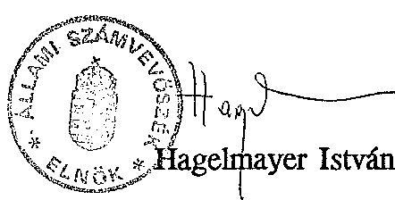

---

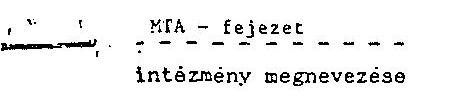

Bovételek alakulása

1.sz. melléklet a V-2-37/1993. sz.hoz (M Ft)

|  MEGNEVEZES | 1990. évi teljesítés | 1991. évi teljesítés | 1992. évi |  | ELOIRANYZAT VALTOZÁS |  |  |  |  |  |  | 1992. évi | TELJESÍTES | 1991. évi  |
| --- | --- | --- | --- | --- | --- | --- | --- | --- | --- | --- | --- | --- | --- | --- |
|   |  |  | EREDE |  | IRANYITOSZERVI |  |  | SAJAT HATASKOHDEN |  | MOD. | TELJ. | a mód. |  | 1990. évi  |
|   |  |  |  | ELOIRANYZ. | Ogy. | Kormány | Felügy. | Ktgv. | Vállalk. | Egyéb | ELOIR. |  | X-ában | telj.  |
|   |  |  |  |  |  |  |  | tstral |  |  |  |  |  | x-ban  |
|  1. Intézm. alaptevékenys. bev. : 16,6 |  | 503,6 | 354,7 | - | 0,8 | 1,7 | 0,5 | 13,4 | 276,6 | 44,9 | 32,3 | 71,9 | 194,6 | -  |
|  2. Intézm. egyéb bevételei | x | 477,3 | 603,7 | - |  |  |  |  |  | 1.206,3 | 1.089,9 | 90,4 | - | -  |
|  2/a Ebből: AFA | 345,4 | 242,0 | 102,3 | - |  |  |  |  |  | 152,3 | 153,3 | 100,7 | 44,4 | 63,3  |
|  3. Intézm. vállalk. bev. | x | 1.815,3 | 458,1 | - | 0,3 | 0,1 | - | 3,3 | 349,7 | 811,5 | 777,1 | 95,8 | - | 42,8  |
|  4. Kamatbevételek | x | 433,2 | - | - | - | - | - | - | 331,8 | 331,8 | 353,6 | 106,6 | - | 81,6  |
|  5. Intézm. saját folyó bev. (1+2+3+4) | 4.154,2 | 3.229,4 | 1.416,5 | - |  |  |  |  |  | 2.394,4 | 2.252,9 | 94,1 | 54,2 | 69,8  |
|  6. Felhalm. és tőkejell. bev. támogatások, visszatérül. | x | 293,8 | 5,9 | - | - | - | - | - | 97,8 | 103,7 | 103,9 | 100,2 | - | 35,4  |
|  7. Egyéb folyó átutalások | 6.650,6 | 6.630,5 | 5.040,2 | - | - | - | - | - | - | 7.041,6 | 6.976,3 | 99,1 | 104,9 | 105,2  |
|  7/a Ebből:- Ktgv-i támogatás 3.608,1 |  | 4.750,5 | 4.912,0 | - | -66,1 | - | - | - | - | 4.845,9 | 4.850,3 | 100,1 | 134,4 | 102,1  |
|  7/b Ebből:-Cél | x | 788,9 | 972,4 | - |  |  |  |  |  | 578,3 | 577,9 | 99,9 | - | 73,3  |
|  7/c -Feledatmut. köt. norm. fin. |  | - | - | - | - | - | - | - | - | - | - | - | - | -  |
|  7/d -Egyéb feladat- finanszírozás |  | - | 156,8 | - | - | - | - | - | - | 239,9 | 239,9 | 100,0 | - | -  |
|  7/e -Atvett pénzeszköz | 1.250,2 | 790,6 | 99,8 | - | - | - | - | - | 1.095,7 | 1.195,5 | 1.191,0 | 99,6 | 95,6 | 150,6  |
|  7/f -AFA visszatérülés | 355,5 | 405,1 | 26,6 | - | - | - | - | - | 148,9 | 175,5 | 217,1 | 123,7 | 61,1 | 53,6  |
|  8. Pénzforgalom nélküli bev. . 1.201,6 |  | 1.029,8 | 98,3 | - |  |  |  |  |  | 1.608,0 | 1.490,5 | 92,7 | 124,0 | 144,7  |
|  8/a Ebből:előző évi pénzmarad. 575,0 igénybevétele |  | 512,7 | 98,3 | - | - | - | 782,5 | - | - | 880,8 | 751,9 | 85,4 | 130,8 | 146,7  |
|  9. Működ. célú hitel (kötvény) bevétel |  | 474,3 | - | - | - | - | - | - | - | - | - | - | - | -  |
|  10. Fejlesztési célú hitel bev. |  | - | - | - | - | - | - | - | - | - | - | - | - | -  |
|  11. Bev. össz.(5+6+7+8+9+10) (kiegyenlítő, függő, átfur 13.006,4 tó és letéti bev. nélkül) |  | 11.747,8 | 6.560,9 | - | -58,4 | - | 782,5 | 727,2 | 3.135,5 | 1.147,7 | 10.823,5 | 97,1 | 83,2 | 92,1  |

A táblázatot fejezeti szinten, MTA Titkárság és intézmények összesenre (gazdálkodó szerv) és intézményenként külön-külön kérjük kitölteni. Megjegyzés: A táblázatot az 1992. és 1993. évi költségvetés, illetve az 1992. évi beszámoló 66 űrlapja figyelésbe vételével kérjük kitölteni.

1. sor = 66/7 sor; 2. sor = 66/12 sor; 2/a = 66/10 sor; 3. sor = 66/15 sor; 4. sor = 66/17 sor; 6. sor = 66/26 sor; 7. sor = 66/67 sor; 7/a sor = 66/42 sor; 7/b = 66/39 sor; 7/c = 66/40 sor; 7/d = 66/41 sor; 8. sor = 66/72 sor; 9. sor = 66/73 sor; 10. sor = 66/74 sor.

Amennyiben a 4. sor: Kamatbevételek adat nem áll rendelkezésre kérjük megjegyzéssel - a tervezési dokumentációnak megfelelően - a 2. sor: intézményi egyéb bevételek között szerepeltetni.

Fejezeten a pénzellátás és az önálló gazdálkodó intézmények összessége értendő.

---

MTA - fejezet
intezmény megnevezése

2.sz. melléklet / 1. oldal a V-2-37/1993. sz.-hoz

Bevételek alakulása 1990-1992. év (M Ft-ban)

| MEGNEVEZÉS | 1990. év |  |  |  |  |  |  |  | 1991. év |  |  |  |  |  |  |  |
| :--: | :--: | :--: | :--: | :--: | :--: | :--: | :--: | :--: | :--: | :--: | :--: | :--: | :--: | :--: | :--: | :--: |
|  | eredeti elóir. | elóirányzat változás saját hat.k. |  | módositott elóir. |  | teli. | teli.   a mód.   X-ban | eredeti elóir. | elóirányzat változás |  |  |  |  | mód.   elóir. | teli. | teli.   mód.   X-ban |
|  |  |  |  |  |  |  |  |  | Ugy. | Korm. | Felügy. | pénzm. | egyéb |  |  |  |
| 1. Saját bev.(működési árás díjbevétel) | 2.763,2 | - | - | 1.386,9 | 4.150,1 | 4.154,2 | 100,0 | 2.739,6 | - | - | - | - | 351 | 3.090,6 | 3.015,9 | 97,6 |
| 2. Költségvetési tám. | 3.480,4 | 127,7 | - | - | 3.608,1 | 3.608,1 | 100,0 | 4.787,6 | - | - | - 37,1 | - | - | 4.750,5 | 4.750,5 | 100,0 |
| 3. Atvett pénzeszk. | 42,8 | - | - | 1.182,9 | 1.225,7 | 1.250,2 | 102,0 | 45,7 | - | - | - | - | 1.682,3 | 1.728,0 | 790,6 | 45,8 |
| 4. Előző évi pénznar. igénybevétele | 83,9 | - | 681,4 | - | 765,3 | 575,0 | 75,1 | 108,8 | - | - | - | 624,3 | - | 733,1 | 512,7 | 70,0 |
| 5. Egyéb bevétel $(6-(1+2+3+4)$ | 376,5 | - | - | 1.587,5 | 1.964,0 | 3.418,9 | 174,1 | 345,2 | - | - | - | - | 1.651,4 | 1.996,6 | 2.678,1 | 134,1 |
| 6. Bev. összesen | 6.746,8 | 127,7 | 681,4 | 4.157,3 | 11.713,2 | 3.006,4 | 111,0 | 8.026,9 | - | - | - 37,1 | 624,3 | 3.686,7 | 12.298,8 | 1.747,6 | 95,5 |

Megjegyzés: Bevételek összesen: kiegyenlítő, függő, átfutó és letéti bevételek nélküli adat, egyező a 1. sz. tábla bevételi adatával.

1. sor $=1990-1991$-ben költségvetési beszámoló 2105 űrlap 4. sorának megfelelő 1992-1993-ban 1. sz. tábla 5. sor - 2/a sor.
2. sor $=1990-1991$-ben költségvetési beszámoló 2105 űrlap 14+15+16 sorának megfelelő 1992-1993-ban 1. sz. tábla 7/e sor.
3. sor $=1990-1991$-ben költségvetési beszámoló 2105 űrlap 17. sorának megfelelő 1992-1993-ban 1. sz. tábla 8/a sor.

---

intézmény megnevezése

2.sz. melléklet / 2. o. a V-2-37/1993. sz-hoz

Bevételek alakulása (M Ft-ban)

|  MEGNEVEZES |  |  |  |  |  |  |  |  |  |  |  |  |  |  |  |  |  |  |  |  |  |  |  |  |  |   |
| --- | --- | --- | --- | --- | --- | --- | --- | --- | --- | --- | --- | --- | --- | --- | --- | --- | --- | --- | --- | --- | --- | --- | --- | --- | --- | --- |
|   |  |  |  |  |  |  |  |  |  |  |  |  |  |  |  |  |  |  |  |  |  |  |  |  |  |   |
|   |  |  |  |  |  |  |  |  |  |  |  |  |  |  |  |  |  |  |  |  |  |  |  |  |  |   |
|   |  |  |  |  |  |  |  |  |  |  |  |  |  |  |  |  |  |  |  |  |  |  |  |  |  |   |
|   |  |  |  |  |  |  |  |  |  |  |  |  |  |  |  |  |  |  |  |  |  |  |  |  |  |   |
|   |  |  |  |  |  |  |  |  |  |  |  |  |  |  |  |  |  |  |  |  |  |  |  |  |  |   |
|   |  |  |  |  |  |  |  |  |  |  |  |  |  |  |  |  |  |  |  |  |  |  |  |  |  |   |
|   |  |  |  |  |  |  |  |  |  |  |  |  |  |  |  |  |  |  |  |  |  |  |  |  |  |   |
|   |  |  |  |  |  |  |  |  |  |  |  |  |  |  |  |  |  |  |  |  |  |  |  |  |  |   |
|   |  |  |  |  |  |  |  |  |  |  |  |  |  |  |  |  |  |  |  |  |  |  |  |  |  |   |
|   |  |  |  |  |  |  |  |  |  |  |  |  |  |  |  |  |  |  |  |  |  |  |  |  |  |   |
|   |  |  |  |  |  |  |  |  |  |  |  |  |  |  |  |  |  |  |  |  |  |  |  |  |  |   |
|   |  |  |  |  |  |  |  |  |  |  |  |  |  |  |  |  |  |  |  |  |  |  |  |  |  |   |
|   |  |  |  |  |  |  |  |  |  |  |  |  |  |  |  |  |  |  |  |  |  |  |  |  |  |   |
|   |  |  |  |  |  |  |  |  |  |  |  |  |  |  |  |  |  |  |  |  |  |  |  |  |  |   |
|   |  |  |  |  |  |  |  |  |  |  |  |  |  |  |  |  |  |  |  |  |  |  |  |  |  |   |
|   |  |  |  |  |  |  |  |  |  |  |  |  |  |  |  |  |  |  |  |  |  |  |  |  |  |   |
|   |  |  |  |  |  |  |  |  |  |  |  |  |  |  |  |  |  |  |  |  |  |  |  |  |  |   |
|   |  |  |  |  |  |  |  |  |  |  |  |  |  |  |  |  |  |  |  |  |  |  |  |  |  |   |
|   |  |  |  |  |  |  |  |  |  |  |  |  |  |  |  |  |  |  |  |  |  |  |  |  |  |   |
|   |  |  |  |  |  |  |  |  |  |  |  |  |  |  |  |  |  |  |  |  |  |  |  |  |  |   |
|   |  |  |  |  |  |  |  |  |  |  |  |  |  |  |  |  |  |  |  |  |  |  |  |  |  |   |
|   |  |  |  |  |  |  |  |  |  |  |  |  |  |  |  |  |  |  |  |  |  |  |  |  |  |   |
|   |  |  |  |  |  |  |  |  |  |  |  |  |  |  |  |  |  |  |  |  |  |  |  |  |  |   |
|   |  |  |  |  |  |  |  |  |  |  |  |  |  |  |  |  |  |  |  |  |  |  |  |  |  |   |
|   |  |  |  |  |  |  |  |  |  |  |  |  |  |  |  |  |  |  |  |  |  |  |  |  |  |   |
|   |  |  |  |  |  |  |  |  |  |  |  |  |  |  |  |  |  |  |  |  |  |  |  |  |  |   |
|   |  |  |  |  |  |  |  |  |  |  |  |  |  |  |  |  |  |  |  |  |  |  |  |  |  |   |
|   |  |  |  |  |  |  |  |  |  |  |  |  |  |  |  |  |  |  |  |  |  |  |  |  |  |   |
|   |  |  |  |  |  |  |  |  |  |  |  |  |  |  |  |  |  |  |  |  |  |  |  |  |  |   |
|   |  |  |  |  |  |  |  |  |  |  |  |  |  |  |  |  |  |  |  |  |  |  |  |  |  |   |
|   |  |  |  |  |  |  |  |  |  |  |  |  |  |  |  |  |  |  |  |  |  |  |  |  |  |   |
|   |  |  |  |  |  |  |  |  |

---

Magyax. Tudománynx Akadénia fejezet összesen
intézmény megnevezése

Kiadánok alakulána

3.sz. melléklet
a V-2-37/1993.sz-hoz H Ft-ban

| Megnevezés | 1990. év | 1991. év | 1992. előirányzat, változás |  |  |  |  |  |  |  |  |  |  |
| :--: | :--: | :--: | :--: | :--: | :--: | :--: | :--: | :--: | :--: | :--: | :--: | :--: | :--: |
|  |  |  | eredeti elóir. | irányító szervi |  | saját hatásk. |  |  | Mód- | Teljesítés | Teljesítés a |  |
|  |  |  |  | Orsz. | Korm. | Felügy. |  | költségv.vállalk |  |  | mód | 1990. | 1991. |
|  | teljes |  |  | gyúlés |  | ezervi | tartalékból | Egyéb | telt elöir. |  |  |  | évi |
|  |  |  |  |  |  |  |  |  |  |  |  |  |  |
| 1/ Béralap | 2.060,7 | 2.471,1 | 2.715,2 | - | 11,2 | - | 13,3 | 1,9 | 198,9 | 2.938,6 | 2.587,2 | 88,0 | 104,7 |
| 2/ Bérjellegú kiadás | 835,1 | 903,2 | 775,2 | - |  |  |  |  |  | 1.077,4 | 1.047,9 | 97,3 | 116,0 |
| 2-a ebből: beff. kiküld. |  | 28,5 | 15,9 | - |  |  |  |  |  | 31,9 | 26,3 | 82,4 | 92,3 |
| 2/b külf. kiküld. |  | 209,8 | 195,4 | - |  |  |  |  |  | 278,0 | 278,2 | 100,0 | 135,2 |
| 2/c kereset és ktg. tér |  | 21,1 | 25,9 | - |  |  |  |  |  | 39,8 | 37,7 | 94,7 | 178,7 |
| 2/d reprezentáció |  | 10,0 | 2,4 | - |  |  |  |  |  | 11,0 | 10,9 | 99,0 | 109,0 |
| 3/ Készletbeszerzés | 1.219,2 | 1.130,9 | 493,7 | - |  |  |  |  |  | 950,0 | 870,3 | 91,6 | 77,0 |
| 3/a ebböl: tüzeló. hajtó és |  |  |  |  |  |  |  |  |  |  |  |  |  |
| tendenség |  | 55,9 | 40,6 | - |  |  |  |  |  | 60,9 | 55,0 | 90,3 | 98,4 |
| 3/b irodaszor nyomt. |  | 32,6 | 29,9 | - |  |  |  |  |  | 60,0 | 53,0 | 88,3 | 162,6 |
| 3/c könyv. folyóirat, napilap. |  | 228,8 | 126,7 | - |  |  |  |  |  | 232,5 | 218,0 | 93,8 | 95,3 |
| 3/d egyéb kömzi. besz. |  | 214,3 | 87,8 | - |  |  |  |  |  | 174,4 | 160,7 | 92,0 | 79,0 |
| 4/ Enolgitatás | 1.001,7 | 1.393,4 | 758,5 | - |  |  |  |  |  | 1.502,9 | 1.280,1 | 85,2 | 91,9 |
| 4/a ebböl: postai ezolgit. |  | 140,4 | 88,8 | - |  |  |  |  |  | 168,1 | 158,3 | 94,2 | 112,7 |
| 4/b negvért.tárgyi eszk. karb.t. |  | 135,5 | 70,1 | - |  |  |  |  |  | 126,2 | 102,4 | 81,1 | 75,7 |
| 4/c Szállítás |  | 16,5 | 9,2 | - |  |  |  |  |  | 25,0 | 26,0 | 104,0 | 157,6 |
| 4/d Egyéb szolgált. |  | 774,7 | 322,4 | - |  |  |  |  |  | 841,0 | 663,8 | 78,9 | 85,7 |
| 5. Kölönféle kiad. és befiz. 1.707,5 |  | 1.729,8 | 1.303,2 | - |  |  |  |  |  | 1.691,1 | 1.600,2 | 94,6 | 92,5 |
| 5/a ebböl: TB járulék |  | 928,4 | 1.136,2 | - | 32,6 | - | 9,8 | 0,8 | 64,1 | 1.243,6 | 1.095,7 | 88,2 | 118,0 |
| 5/b vasárolt termékek |  |  |  |  |  |  |  |  |  |  |  |  |  |
| AFA-ja | 481,1 | 397,2 | 125,0 | - |  |  |  |  |  | 340,3 | 385,7 | 113,3 | 97,4 |
| 6/ Komatfizetések |  | 23,6 | - | - |  |  |  |  |  | 0,3 | 7,6 | - | 32,2 |
| 7/ Felhalm. és tőkés. kiad. | 526,4 | 1.423,5 | 352,1 | - |  |  |  |  |  | 960,0 | 922,8 | 96,1 | 64,8 |
| 7/a ebböl: felújítás |  | 260,6 | 300,8 | - | - | - 20,8 | 5,7 | 2,5 | 96,4 | 384,6 | 387,3 | 100,7 | 148,6 |
| elööl. kiemelt felújítás |  |  |  |  |  |  |  |  |  |  |  |  |  |
| 7/b tárgyi eszk. föld ima javak |  |  |  |  |  |  |  |  |  | 526,4 | 486,3 | 92,4 | 87,2 |
| egyéb folyó átu. |  | 557,8 | 51,3 | - |  |  |  |  |  | 1.665,8 | 1.818,8 | 109,2 | 178,8 |
| 8/ Támosztások. elvonások | 2.527,1 | 1.017,4 | 149,4 | - |  |  |  |  |  | 1.229,1 | 1.357,2 | 110,4 | 102,0 |
| 8/a ebböl átadott pénzek |  | 671,5 | - | - |  |  |  |  |  | 337,3 | 11,4 | 3,4 | - |
| 9/ Pénzéreg. nélküli kiad. |  |  | 15,7 | - |  |  |  |  |  |  |  |  |  |
| 9/a ebböl: tartalék |  |  |  |  |  |  |  |  |  |  |  |  |  |
| 10/ Működési célú hitelköt. |  |  |  |  |  |  |  |  |  |  |  |  |  |
| visszafizetés | 821,2 | 312,9 | - | - | - | - | - | - | - | - | 812,1 | - | 259,5 |
| 11/ Fejlesztési célú hitelköt. |  |  |  |  |  |  |  |  |  |  |  |  |  |
| visszafizetés | 0,7 | - | - | - | - | - | - | - | - | - | - | - | - |
| 12/ Kiadások összesen | 11.579,6 | 10.405,9 | 6.563,0 | - | - 58,4 | - | 782,5 | 727,2 | 3.109,1 | 11.123,4 | 10.958,4 | 98,5 | 78,6 |
| Kisgyenlítő függő, átfutó és letéti |  |  |  |  |  |  |  |  |  |  |  |  |  |

A táblázatot fejezeti azinten, MTA Titkárság és intézményenként külön-külön kérjük kitölteni.

Megjegyzés: a táblázat az 1992. és 1993. évi költségvetés, illetve az 1992. évi beszámoló 65. sz. Orlapja alapján kell kitölteni.

1 sor= 65/10 sor, 2 sor=65/20 sor, 2/a sor= 65/13 as sor, 2/b= 65/14 sor, 2/d=65/17 sor, 3 sor= 65/29, 3/a sor= 65/23 sor, 3/b= 65/24, 3/C= 65/26 sor, 4 sor= 65/30 sor, 4/a sor= 65/34 sor, 4/b sor= 65/36 sor, 4/c sor= 65/31 sor, 5 sor= 65/46 sor, 5/a sor= 65/39 sor, 5/b sor = 65/44 sor, 6 sor= 65/48 sor, 7 sor = 65/73 sor, 7/a sor= 65/72 sor, 7/b = 65/54 sor, 8 sor = 65/108 sor, 9 sor 65/113 sor, 9/a sor = 65/111, 10 sor= 65/114, 11 sor = 65/115 sor
Az 1992. évi előirányzatváltozás a 71. Orlap alapján töltendő ki.

---

# A Magyar Tudományos Akadémia támogatásának felhasználása

EFt-ban

|  Intézmény, feladat | $\begin{gathered} 1990 . \text { év } \\ \text { tény } \end{gathered}$ | $\begin{gathered} 1991 . \text { év } \\ \text { tény } \end{gathered}$ | $\begin{gathered} \text { Az } 1991 . \text { évi } \\ \text { adata az } \\ 1990 . \text { évi } \end{gathered}$ | $\begin{gathered} 1991 . \text { év } \\ \text { megoszlása } \end{gathered}$  |
| --- | --- | --- | --- | --- |
|  Kutatóintézetek és KSEI részére biztosított
$\mathrm{K}+\mathrm{F}$ célú támogatás | $\begin{gathered} 1.836 .335,5 \ 15.307,0 \end{gathered}$ | $\begin{gathered} 2.482 .215 \ 11.647,0^{\prime \prime} \end{gathered}$ | $\begin{gathered} 135,2 \ 76,1 \end{gathered}$ | $\begin{gathered} 48,1 \ 0,2 \end{gathered}$  |
|  Tudományos társaságok és Társadalomkutatási Informatikai Egyesülés támogatás |  |  |  |   |
|  Akadémiai kutatások összesen: | 1.851 .642,5 | 2.493 .862 | 134,7 | 48,3  |
|  Tanszéki kutatások | 165.931 .7 | 241.779 | 145,7 | 4,7  |
|  Interkozmosz kutatások (külsőknek) ${ }^{\text {M }}$ | 32.312 .6 | 52.277 .0 | 161,8 | 1,0  |
|  AKA és egyéb központi feladatok | 36.076 .0 | 52.672 .0 | 146,0 | 1,0  |
|  TMB támogatás | 493.197 .0 | 515.967 .0 | 104,6 | 10,0  |
|  Általános Tudományos Feladatok | 217.467 .0 | 269.071 .0 | 123,7 | 5,2  |
|  Henzetközi kapcsolatok (HKFO-NEI) | 144.685 .0 | 181.848 .0 | 125,7 | 3,5  |
|  Országos kutatás- és tudós támogatás összesen: | 1.089 .669 .3 | 1.313 .614 | 120,6 | 25,4  |
|  Könyvtár | 113.438 .3 | 141.768 .0 | 125,0 | 2,7  |
|  Nagyjavítás (felújítás) | 241.460 .2 | 296.554 .0 | 122,8 | 5,8  |
|  Akadémiai könyv- és folyóirat kiadás | 92.090 .0 | 131.430 .0 | 142,7 | 2,5  |
|  Infrastruktúra összesen: | 446.988 .5 | 569.752 | 127,5 | 11,0  |
|  Szolgáltató szervek | 52.705 .1 | 136.798 | 259,6 | 2,7  |
|  Titkárság | 107.189 .0 | 116.125 .0 | 108,3 | 2,3  |
|  Területi Akadémiai Bizottságok | 18.218 .5 | 21.645 .0 | 118,8 | 0,4  |
|  Kutatóintézetek nem K + F feladatai | 15.800 .0 | 8.630 .0 | 54,6 | 0,2  |
|  Igazgatás, kutatásszervezés, egyéb feladatok támogatás összesen: | 193.912 .6 | 283.198 | 146,0 | 5,6  |
|  Tartalék elöirányzat (elmaradt feladatokra) | 25.891 .0 | 90.106 | 348,0 | 1,8  |
|  MTA müködési célú támogatása | 3.608 .103 .9 | 4.750 .532 | 131,7 | 92,1  |
|  MTA költségvetési, beruházási támogatása | 520.000 | 407.000 | 78,3 | 7,9  |
|  MTA fejezet költségvetési támogatása mindösszesen: | 4.128 .103 .9 | 5.157 .532 | 124,9 | 100  |

[^0] [^0]: * 1991-ben a Társadalomkutatási Informatikai Egyesülés támogatásának nem a költségvetési támogatás volt a forrása

---

| Intézmény, feladat | 1991. év   tény | 1992. év   tény | Az 1992. évi   adata az   1991. évi   Z-ában | 1992. év   megoszlása   z | $\begin{gathered} 4931 \\ \rightarrow \\ \gamma \end{gathered}$ |
| :--: | :--: | :--: | :--: | :--: | :--: |
| Kutatóintézetek és KSZI részére biztosított   $\mathrm{K}+\mathrm{F}$ célú támogatás   Tudományos tárzaságok támogatás | $\begin{gathered} 2.482 .215 \\ 11.647^{\prime} \end{gathered}$ | $\begin{gathered} 2.530 .367 . \\ 11.647 \end{gathered}$ | $\begin{aligned} & 101,9 \\ & 100,0 \end{aligned}$ | $\begin{aligned} & 49,2 \\ & 0,2 \end{aligned}$ | $\begin{gathered} 48,1 \\ c, 2 \end{gathered}$ |
| Akadémiai kutatások összesen: | 2.493 .862 | 2.542 .014 | 101,9 | 49,4 | 48,3 |
| Tanszéki kutatások   Széchenyi Irodalmi és Müvészeti Akadémia   Interkormosz kutatások (külsöknek) ${ }^{2}$   AKA és egyéb központi feladatok   THB támogatás   Általános Tudományos Feladatok (akadémikusok)   Nemzetközi kapcsolatok (NKFO-NKI) | $\begin{gathered} 241.779 \\ - \\ 52.277 \\ 52.672 \\ 515.967 \\ 269.071 \\ 181.848 \end{gathered}$ | $\begin{gathered} 289.240 \\ 2.852 \\ - \\ 78.173 \\ 564.000 \\ 279.000 \\ 195.977 \end{gathered}$ | $\begin{gathered} 119,6 \\ - \\ 148,4 \\ 739,3 \\ 103,7 \\ 107,8 \end{gathered}$ | $\begin{gathered} 5,6 \\ 0,1 \\ - \\ 1,5 \\ 11,0 \\ 3,4 \\ 3,8 \end{gathered}$ | $\begin{gathered} 47 \\ 1,6 \\ 1,0 \\ 1,0 \\ 3,0 \\ 3,5 \end{gathered}$ |
| Országos kutatás- és tudós támogatás összesen: | 1.313 .614 | 1.409 .242 | 107,3 | 27,4 | 47,7 |
| Könyvtár   Nagyjavítás (felújítás)   Akadémiai könyv- és folyóirat kiadás | $\begin{gathered} 141.768 \\ 296.554 \\ 131.430 \end{gathered}$ | $\begin{gathered} 155.584 \\ 283.100 \\ 97.114 \end{gathered}$ | $\begin{gathered} 109,7 \\ 95,5 \\ 73,9 \end{gathered}$ | $\begin{gathered} 3,0 \\ 5,5 \\ 1,9 \end{gathered}$ | $\begin{gathered} 2,7 \\ 7,7 \\ 2,7 \end{gathered}$ |
| Infrastruktúra összesen: | 569.752 | 535.798 | 94,0 | 10,4 | 4,0 |
| Szolgáltató szervek   Titkárság   Területi Akadémiai Bizottságok   Kutatóintézetek nem K + F feladatai | $\begin{gathered} 136.798 \\ 116.125 \\ 21.645 \\ 8.630 \end{gathered}$ | $\begin{gathered} 117.314 \\ 133.003 \\ 26.128 \\ 33.850 \end{gathered}$ | $\begin{gathered} 85,8 \\ 114,5 \\ 120,8 \\ 392,0 \end{gathered}$ | $\begin{gathered} 2,3 \\ 2,6 \\ 0,5 \\ 0,6 \end{gathered}$ |  |
| Igazgatás, kutatásszervezés, egyéb feladatok támogatás összesen: | 283.198 | 310.305 | 109,6 | 6,0 | 5,4 |
| Tartalék elöirányzat (elmaradt feladatokra) | 90.106 | 52.928 | 58,7 | 1,0 | 1,4 |
| MTA müködési célú támogatása | 4.750 .532 | 4.850 .287 | 102,1 | 94,2 | 32,12 |
| MTA költségvetési, beruházási támogatása | 407.000 | 300.000 | 73,7 | 5,8 | 4,3 |
| MTA fejezet költségvetési támogatása mindösszesen: | 5.157 .532 | 5.150 .287 | 99,9 | 100,0 | 140 |
| $\times$ 1992-töl ezt a feladatot az OMFB vette át |  |  |  |  |  |

---

Akadémia által támogatott tudományos társaságok

5. sz. melléklet a V-2-37/1993.sz-hoz adatok EFt-ban

|  Társaság neve | 1990.év | 1991.év | 1992.év | 1993.év  |
| --- | --- | --- | --- | --- |
|  Természettudományi Társaságok |  |  |  |   |
|  Magyar Földrajzi Társaság | 694,0 | 763,0 | 763,0 | 1.000,0  |
|  Parazitológiai Társaság | 21,0 | 23,0 | 23,0 | 50,0  |
|  Orvosmozgalom a Nukl. Háb. Megel. | 311,0 | 342,0 | 342,0 | 342,0  |
|  Társadalomtudományi Társaságok |  |  |  |   |
|  Magyar Közgazdasági Társaság | 1.625,0 | 1.788,0 | 1.788,0 | 1.788,0  |
|  Nyelvtudományi Társaság | 262,5 | 289,0 | 289,0 | 339,0  |
|  Körösi Csoma Társaság | 329,4 | 362,0 | 362,0 | 412,0  |
|  Irodalomtörténeti Társaság | 635,5 | 699,0 | 699,0 | 779,0  |
|  Nemzetközi Magyar Filológiai Társaság | 1.620,8 | 1.783,0 | 1.783,0 | 1.943,0  |
|  Néprajzi Társaság | 417,3 | 459,0 | 459,0 | 539,0  |
|  Ökortudományi Társaság | 122,3 | 135,0 | 135,0 | 315,0  |
|  Numizmatikai Társaság | 870,2 | 957,0 | 957,0 | 1.047,0  |
|  Pszichológiai Társaság | 376,5 | 414,0 | 414,0 | 500,0  |
|  Történelmi Társulat | 1.135,9 | 1.250,0 | 1.250,0 | 1.410,0  |
|  Régészeti Társaság | 208,7 | 230,0 | 230,0 | 270,0  |
|  Szociológiai Társaság | 443,3 | 488,0 | 488,0 | 578,0  |
|  Politikatudományi Társaság | 580,8 | 639,0 | 639,0 | 699,0  |
|  Modern Filológiai Társaság | 458,5 | 504,0 | 504,0 | 864,0  |
|  Kriminológiai Társaság | 108,8 | 120,0 | 120,0 | 160,0  |
|  Filozófiai Társaság | 365,1 | 402,0 | 402,0 | 442,0  |
|  Mindösszesen: | 10.586,6 | 11.647,0 | 11.647,0 | 13.477,0  |

---

dr. Szőke Miklós úrnak
az Állami Fejlesztési Intézet
vezérigazgatójának

B u d a p e s t

Tisztelt Vezérigazgató úr !

Megkaptam múlt hó 27 -én kelt KKK0 2348/92/A számú levelét, melyben dr. Naszvadi György pénzügyminisztérumi helyettes államtitkár felhatalmazása alapján tájékoztat a kormányzati beruházások 1991. és 1992. év végi pénzmaradványainál tervezett eljárásról. Ezekkel kapcsolatban az alábbiakat hozom Vezérigazgató úr szives tudomására.
1./ A levelében hivatkozott 1991. évi XCI. törvény a Magyar Köztársaság 1992. évi költségvetéséről és az államháztartás vitelének 1992. évi szabályairól rendelkezik. E törvény 66.5 -ának /3/ bekezdése arra hatalmazza fel a pénzügyminisztert, hogy - értelemszerũen csak az 1992.évi kiadások tekintetében - 1993. február 28-ig pótkezelési idôszakot állapítson meg.
Haladéktalanul intézkedem, hogy az 1992. évi maradványok elszámolására az intézmények felkészüljenek és a pénzügyminiszter által megállapítandó, a pótkezeléssel meghoszszabbított időszakban az 1992. évi beruházási keretek elszámolása a törvényes rendben megtörténjen.
2./ Hatírozottan vissza kell azonban utasítanom Vezérigazgató úrnak az 1991. évi „maradványok"-kal kapcsolatban kialakult helyzetre tervezett intézkedését.
Egyrészt nincs olyan törvényes lehetôség, ami ilyen és hasonló intézkcdés meghozatalára bárkit is feljogosítana.

---

- A tárgyévet Lövetô év novemberében intézkedést hozni az elôzõ évrôl áthozott maradványokról önmagában is abszurd elképzelés;
- Az Országgyûlés törvényben rögzítette az elmúlt évi zárszámadást, tehát a múlt évet maradványaival együtt lezárta.

Másrészt kísérlet sem történt annak megvizsgálására,hogy a maradványok mennyiben voltak lekötve, illetve azóta milyen mértékben kerültek felhasználásra. Így nem dönthetô el, hogy mennyi az „áthuzódó munkák fedezete", és nem szabályozott kérdések utólag nem szankcionálhatók.

Kérem Vezérigazgató urat, hogy fentieket intézkedéseinél sziveskedjék figyelembe venni. Egyben tájékoztatom, hogy levelemet a Pénzügyminiszter úrhoz is eljuttattuk.

Budapest, 1992. november 4.

Üdvözlettel:

Láng István

---

Az AKA képzése és felhasználása 1990-1992.
7.sz. melléklet
a V-2-37/1993.sz-hoz

M e g n e v e z é s
1990.
1991.
1992.
1993.
Nyitó állomány
Terv
Tény
Tény
Tény
Tény
Terv
1. Bevételek
10.000,0
124.048,8
48.919,9
2.767,7
1. Bevételek
- kut.helyek befizetései
10.000,0
47.258,4
100.000,0
18.668,2
20.000,0
- MTA közp. elöirányzat
37.769,0
45.327,0
50.000,0
'18.668,2
20.000,0
14.064,8
- más szervektől, alapok-tól átcsop.
44.639,9
50.000,0
63.728,0
20.000,0
- egyéb
- értékpapír tőke + kamat
41.122,6
78.431,1
206.918,5
- vállalkozás
41.122,6
- átm. forgóá.
18.000,0
51.344,1
86.000,0
- fügö tételek
203.218,8
- összes bevételı
18.000,0
- 18.000,0
37.200,0
17.500,0
- 269.389,8
- összes bevételı
47.769,0
399.566,7
150.000,0
269.389,8
520.079,2
140.000,0
17.500,0
392.557,8
60.000,0
2. Kiadások
- kv. szerveknek szerzödésre
42.769,0
38.934,3
100.000,0
52.351,0
121.500,0
151.515,1
- egyéb tám.
28.591,0
136.900,6
189.205,9
- más alapoknak
78.931,2
5.000,0
5.000,0
- egyéb
168.473,8
50.000,0
11.098,7
20.000,0
5.888,5
30.000,-
- felujitás
1.545,7
360,0
5.888,5
- jóléti
2.900,0
1.739,2
- Találm. H. Alap
24.000,0
300,0
- Átmen. f. alap
24.000,0
17.200,0
1.500,0
- Fügö
210.250,8
269.389,9
3.000,0
- Összes kiadás:
42.769,0
474.695,6
150.000,0
266.231,4
141.500,0
358.148,7
238.148,7
Záróállományi
58.919,9
3.767,7
37.126,8
3. Kut. tám. megoszlása
a./ - kutatóhelyek
38.934,3
52.351,0
151.515,1
- egyéni kutatók
- - - -
- b./ - összes elf. pályázat száma
- összes elf. pályázat alapján nyujtott tám.
- Összes elf. pályázat alapján nyujtott tám.
- Kut. megbíz., kötel. váll.
- állami megbízás
- országos
- tárcaszintó
6.050
52.351,0
52.351,0
151.515,1
- tárcaközi
- kut. szerződés
14.561.
7.881.
8.550
- uj tud. irányzatok módon
14.561.
7.881.
8.550
- jelentős elméleti, gyak témák
18.994,3
24.017
9.362,9
- aktuális jellegűek
4.679
13.753
10.261,2
- pol., gazdasági döntése-ket megalapozó
700
6.700
2.200

Dátum:Budapest, 1993.áprilia 6.

1., Az OTKA-val kapcsolatos bevétel
1990. évben
186.220,6 EFr
1991. évben
43.373,7 EFr
2., Az OTKA-val kapcsolatos kiadás
1990. évben
156.029,2 EFr
1991. évben
78.931,2 EFr
1991. évben a függő kiadás és bevétel tartalmaz azonos összegű bruttó módon elszámolt technikai átvezetéseket

3., Egyéb támogatások jogcímei
1991./ egyedi igényekre: pl.könyvkiadás, tud.ren-dezvények
1992./ egyedi igényekre, CERN tagdíjra, Lakásépítési alapra, Citibank betét, ath.)
4., Kutatási szerződések részletezése
- AKA
30.373,1
- Bős-Hagymaros
- OKTK
53.000,0
68.140,0

---

Bérköltség alakulása az MTA fejezetnél

|  |  |  | Ezer | Ft-ban |
| :--: | :--: | :--: | :--: | :--: |
|  | 1990. | 1991. | 1992. | $\begin{aligned} & \text { Index } \\ & 92 / 91 . \end{aligned}$ |
| Teljes munkaidősök bére | 1.553 .852 | 1.866 .884 | 1.925 .411 | 124 |
| Részmunkaidősök bére | 19.080 | 23.751 | 23.004 | 121 |
| Nyugdíjasak | 81.580 | 99.079 | 108.946 | 134 |
| Másod- mellékfogl. | 19.050 | 23.781 | 25.534 | 134 |
| Megbízások | 223.553 | 287.845 | 242.251 | 108 |
| Alkalmi munkaváll. | 7.440 | 7.182 | 6.977 | 94 |
| Jutalom | 202.695 | 198.592 | $\begin{gathered} 255.092 \\ 47.745 \end{gathered}$ | 149 |
| Összesen: | 2.108 .150 | 2.507 .114 | 2.634 .960 | 105,1 |

---

9. sz. melléklet
a V-2-37/1993.sz.hoz

Bérköltség alakulása az MTA fejezetnél

Ezer Ft-ban

|  | 1990. | 1991. | 1992. | $+$   Index   $91 / 90$. |
| :--: | :--: | :--: | :--: | :--: |
| Alapbér | 1.606 .829 | 1.931 .637 |  | 120 |
| Jutalom | 202.695 | 198.592 |  | 98 |
| Pótlékok | 41.207 | 57.781 |  | 140 |
| Prémium | 19.817 | 12.312 |  | 62 |
| Helyettesítési térítés | 4.311 | 3.339 |  | 77 |
| Túlmunkadij | 9738 | 15.608 |  | 160 |
| Munkavisz. kiv.egyéb | 223.553 | 287.845 |  | 129 |
| Összesen: | 2.108 .150 | 2.507 .114 |  | 119 |

+ A beszámolórendszer változása miatt ilyen bontású adatokat nem tartalmaz

---

# Létszámadatok alakulása (fõ) az MTA fejezetnél 

|  |  |  | Ezer Ft-ban |  |
| :--: | :--: | :--: | :--: | :--: |
|  | 1990. | 1991. | 1992. | $\begin{aligned} & \text { Index } \\ & 92 / 91 . \end{aligned}$ |
| Teljes munkaidõsök | 8.550 | 7.602 | 6.886. | 81 |
| Részmunkaidõsök | 298 | 255 | 189 | 63 |
| Nyudíjasok | 683 | 691 | 703 | 103 |
|  | 9.531 | 8.548 | 7.778 | 82 |
| Kutatóintézeti létszám | 8.258 | 6.961 | 6.301 | 76 |
| Tudományos létszám | 3.221 | 2.943 | 2.862 | 89 |
| Természet tud. | 2.502 | 2.240 | 2.162 | 86 |
| Társ. tud. | 719 | 703 | 700 | 97 |
| Tudományos fokozat |  |  |  |  |
| Akad + Dr + Kand. | 1.132 | 1.119 | 1.119 | 99 |
| Egy.tanári cím, doc. | 1.085 | 914 | 852 | 79 |

---

11. sz. melléklet
a V-2-37/1993.sz-hoz
12. év alatti tudományos dolgozók számának alakulása

|  | Természet Társadalom tudományos |  | Együtt | Tudományos dolgozók összesen | Ebből 34 év alattiak részaránya \% |
| :--: | :--: | :--: | :--: | :--: | :--: |
| 1988. | 901 | 206 | 1.107 | 3.272 | 34 |
| 1989. | 834 | 207 | 1.041 | 3.221 | 32 |
| 1990. | 834 | 207 | 1.041 | 3.321 | 29 |
| 1991. | 658 | 201 | 859 | 2.943 | 29 |
| 1992. | 670 | 172 | 842 | 2.862 | 29 |
| 1992/88. | $74 \%$ | $83 \%$ | 76\% | 87\% |  |
| 1992/90. | 80\% | 83\% | 81\% | 88\% |  |

---

9. elöirányzat csoport - Fiatal kutatók pályázatos támogátása- 37/1993.82.hoz
millió Ft

| Eredeti előirányzat: | 70,0 |
| :-- | :-- |
| Módosított előirányzat: | 70,3 |
| Tényleges felhasználás: | 38,8 |
| Pénzmaradvány: | 31,5 |

Felhasználás címek szerinti megbontása
04 Cim MTA Természettudományi kutatóintézetek 30,0
05 Cim MTA Társadalomtudományi kutatóintézetek 6,8
07 Cim MTA Kutatási tev.kieg. Szervezetek 2,0
Összes felhasználás 38,8

---

# KIMUTATÁS

az akadémiai kutatóintézetek összes bér (személyi alapbér + bérpótlékok) átlagáról állománycsoportonként 1992.

|  Kulcsszám | Munkakör megnevezése | Összes bór akadémiai átlaga  |
| --- | --- | --- |
|  3601 | Intézeti igazgató | 57.434  |
|  3602 | Intézeti igazgatóhelyettes | 47.681  |
|  3603 | Intézeti fóosztályvezető | 49.311  |
|  3604 | Intézeti osztályvezető | 40.078  |
|   | Tudományos vezetők összesen: | 44.477  |
|  3621/B | Tudományos tanácsadó | 37.950  |
|  3622 | Tudományos fómunkatárs | 30.192  |
|  3623/1 | Tudományos munkatárs 50. évnél idősebb | 30.624  |
|  3623/2 | Tudományos munkatárs 40-50. év között | 25.486  |
|  3623/3 | Tudományos munkatárs 40. évnél fiatalabb | 21.847  |
|  3624 | Tudományos segédmunkatárs | 16.195  |
|   | Kutatók összesen: | 25.179  |
|   | Nem tudományos vezetők összesen: | 33.059  |
|   | Szakalkalmazottak összesen: | 17.472  |
|   | Ügyviteli dolgozók összesen: | 14.868  |
|   | Fizikai dolgozók összesen: | 13.969  |
|   | Intézeti összesen: | 21.461  |

---

| Rangsor | Intézet neve | Létszám 1992 | Összes bér 1992 | Százalék |
| :--: | :--: | :--: | :--: | :--: |
| 1 | KFKI ATOMENERGIAI KI. | 93 | 38638 | 153 |
| 2 | SZTAKI | 176 | 34662 | 138 |
| 3 | KSZI | 7 | 32718 | 130 |
| 4 | VILÁGGAZDASAGI KI. | 24 | 29555 | 117 |
| 5 | KÖZPONTI KÉMIAII KI. | 169 | 29531 | 117 |
| 6 | NÖVÉNYVÉDELMI KI. | 38 | 29450 | 117 |
| 7 | POLITIKAI TUD. INT. | 22 | 29010 | 115 |
| 8 | IZOTÓP KI. | 50 | 28544 | 113 |
| 9 | KFKI RMKI. | 117 | 28349 | 113 |
| 10 | IPARGAZD. KI. | 14 | 28247 | 112 |
| 11 | MÚFI | 66 | 28114 | 112 |
| 12 | ÁLLATORVOSTUD. KI. | 26 | 27105 | 108 |
| 13 | MÜKKI | 44 | 26668 | 106 |
| 14 | TALAJTANI KI. | 30 | 25769 | 102 |
| 15 | KFKI SZILÁRDTEST FIZ. KI. | 74 | 25675 | 102 |
| 16 | PSZICHOLÓGIAI INT. | 35 | 25656 | 102 |
| 17 | RÉGÉSZETI INTÉZET | 22 | 25650 | 102 |
| 18 | BALATONI LIMNOLÓG. KI. | 24 | 25585 | 102 |
| 19 | KÖZGAZDASÁGTUD. INT. | 59 | 25279 | 100 |
| 20 | BÁNYÁSZATI KUT.LAB. | 7 | 25193 | 100 |
| 21 | OKOLOGIAI KI. | 21 | 24205 | 96 |
| 22 | FILOZÓFIAI INT. | 30 | 24077 | 96 |
| 23 | ÁLLAM ÉS JOGTUD. INT. | 16 | 23946 | 95 |
| 24 | GEODÉZIAI KI. | 22 | 23444 | 93 |
| 25 | KFKI ANYAGTUD. KI. | 51 | 23264 | 92 |
| 26 | FÓLDRAJZTUD. KI. | 18 | 23130 | 92 |
| 27 | ATOMMAG KUT. INT. | 76 | 22884 | 91 |
| 28 | KFKI MÉRÉS ÉS SZT.KI. | 64 | 22884 | 91 |
| 29 | MATEMATIKAI KI. | 50 | 22784 | 90 |
| 30 | KFKI | 13 | 22597 | 90 |
| 31 | CSILLAGÁSZATI KI. | 26 | 22204 | 88 |
| 32 | TÖRTÉNETTUD. INT. | 50 | 21900 | 87 |
| 33 | REGIONÁLIS KUT.KÖZP. | 31 | 21818 | 87 |
| 34 | SZEGEDI BK. | 195 | 21613 | 86 |
| 35 | TÁRS.KONF.KUT.KÖZP. | 22 | 21544 | 86 |
| 36 | MÜVÉSZETTÖRT. KI. | 17 | 21248 | 84 |
| 37 | TTKL | 44 | 21144 | 84 |
| 38 | KOKI | 39 | 21042 | 84 |
| 39 | IRODALOMTUD. INT. | 44 | 19928 | 79 |
| 40 | AKSZI TÁM. KIII. | 316 | 19871 | 79 |
| 41 | ZENETUDOMÁNYI INT. | 21 | 19791 | 79 |
| 42 | MEZÓGAZD. KI. | 34 | 19568 | 78 |
| 43 | NYELVTUDOMÁNYI INT. | 55 | 19519 | 78 |
| 44 | NÉPRAJZI KUT. INT. | 20 | 18582 | 74 |
| 45 | SZOCIÓLÓGIAI KI. | 16 | 15991 | 64 |
|  | AKADEMIA ÖSSZESEN | 2388 | 25179 |  |

---

| Megnevezés | Vevö állomány |  |  | Szállítói állomány |  |  |
| :--: | :--: | :--: | :--: | :--: | :--: | :--: |
|  | 1990. | 1991. | 1992. | 1990. | 1991. | 1992. |
| MTA összesen | 740,1 | 619,4 | 609,7 | 414,9 | 94,1 | 54,3 |
| Ebből: Természettudományi kutatóintézetek | 649,7 | 482,1 | 599,5 | 273,0 | 96,3 | 53,5 |
| -Izotópkutató Intézet | 47,8 | 44,8 | 6,6 | 14,7 | 13,1 | 7,6 |
| -Központi Kémiai K.I. | 29,6 | 34,6 | 50,5 | 2,7 | 11,1 | 2,4 |
| -Központi Fizikai K.I. | 429,5 | 383,6 | 300,0 | 207,5 | 54,4 | 9,7 |
| -Mezőgazdasági K.I. | 37,9 | 45,0 | 78,0 | 31,9 | 7,5 | 11,5 |
| -Müszaki Fizikai K.I. | 38,2 | 46,6 | 28,2 | 3,2 | 5,4 | 1,0 |
| -Szegedi Biológiai Közp. | 18,0 | 16,7 | 16,4 | 1,9 | 3,1 | $-0,4$ |
| -Számítástechn.és Aut.KI | 34,1 | $-123,2$ | 43,5 | $-1,8$ | $-5,1$ | 0,7 |
| -Természettud.Kut.Labor. | 7,4 | 9,1 | 10,3 | $-0,1$ | $-0,6$ | - |
| Társadalomtudományi kutatóintézetek | $-5,9$ | $-3,9$ | 1,3 | $-0,1$ | 0,9 | - |
| -Közgazdaságtudom.Int. | 1,0 | 0,2 | 0,3 | - | - | - |

Budapest, 1993. április 7.
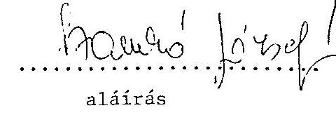

---

# 15.sz. melléklet

a V-2-37/199 3.sz-hoz

Magyar Tudományos Akadémia fejezet összesen intézmény megnevezése Allóeszközállomány (tárgyi eszközök) adatai

|  Megnevezés | Bruttó ért. nyitó | Összes növek. | Összes csökk. | Bruttó ért. záró | Ertékcsökk. összesen | Hettó ért. | Hettó ért. záró bruttó ért. X-ában | Teljesen (U-rs) leírt allóeszk.  |
| --- | --- | --- | --- | --- | --- | --- | --- | --- |
|  1990. év
11. Ingatlan
12. Gépek.
berend. | 3.842,5
7.092,7
68,4
26,4 | 776,9
1.033,0
13,9
0,2 | 41,6
883,0
10,7
-
26,6 | 4.577,8
7.242,7
71,6
26,6 | 1.084,3
4.188,9
39,1
-
26,6 | 3.493,5
3.053,8
32,5
26,6 | 76,3
42,2
45,4
-
55,4 | 7,7
1.575,2
11,7
-
-
1.594,6  |
|  1991. év
11. Ingatlan
12. Gépek.
berend. | 4.577,7
7.242,6
71,7
26,7 | 514,4
776,3
33,2
34,8 | 223,8
1.096,1
18,3
0,5 | 4.868,3
6.922,8
86,6
61,0 | 1.154,1
3.955,8
36,6
0
5 | 3.714,2
2.967,0
50,0
61,0 | 76,3
42,9
57,7
-
56,9 | 11,2
1.421,8
10,5
-
-
1.443,5  |
|  1992. év
11. Ingatlan
12. Gépek.
berend. | 4.941,8
6.552,7
85,9 | 1.477,2
2.076,0
43,3 | 469,0
1.863,4
29,6 | 5.950,0
6.765,3
99,6 | 1.278,0
4.389,5
42,8 | 4.672,0
2.375,8
56,8 | 78,5
35,1
57,0 | 11,9
1.832,2
10,6  |
|  1993. év
11. Ingatlan
12. Gépek.
berend. | 11.580,4
1992-ben eszközcsoportonként a bruttó értékből a felújítás értéke: ingatlanok |  |  |  |  |  |  |   |
|  1994. év
11. Ingatlan
12. Gépek. |  |  |  |  |  |  |  |   |

A táblázatot fejezeti szinten, MTA Titkárság és intézmények összesenre és intézményenként külön-külön, kérjük kitölteni

fejezeti szinten csak az idegen kivitelezés van meg!

---

# 16. sz. melléklet

a V-2-37/1993.

---

Az intézetek fajlagos mutatói

|  Kutatóhelyek | Egy kutatóra jutó felújítás nélküli költségvetési támogat | Egy kutatóra jutó befektetett tárgyi eszköz | Egy kutatóra jutó gép, berend, felszerelés | Használhatósági fok | Használhatósági fok (gép, berend, felezszerű)  |
| --- | --- | --- | --- | --- | --- |
|   |  | bruttó érték | nettó érték | bruttó érték | nettó érték  |
|   | EFt/fő | EFt/fő | EFt/fő |  |   |
|  1. Atomnagkutató Intézet | 978 | 7.034 | 3.981 | 4.002 | 1.540  |
|  2. Állatorvostudományi K.I. | 1.616 | 4.912 | 2.533 | 2.781 | 1.075  |
|  3. Balatoní Limnológiai K.I. | 1.151 | 4.823 | 2.839 | 2.205 | 1.071  |
|  4. Bányászati Kém.Kutatólab. | 1.346 | 5.055 | 2.749 | 2.875 | 1.059  |
|  5. Csillagászati Kutató Int. | 1.183 | 5.561 | 1.931 | 3.060 | 285  |
|  6. Földrajztudományi K.I. | 991 | 2.027 | 1.115 | 1.306 | 593  |
|  7. Geodésiá és Geofiz.K.I. | 1.485 | 6.132 | 3.014 | 3.778 | 1.108  |
|  8. Izotópkutató Intézet | 1.670 | 9.654 | 5.630 | 5.602 | 2.498  |
|  9. Kisérleti Orvostud.K.I. | 1.358 | 5.539 | 3.120 | 2.781 | 1.258  |
|  10. Központi Fizikai K.I. | x | x | x | x | x  |
|  11. Központi Kémiai K.I. | 985 | 5.639 | 3.266 | 3.486 | 1.699  |
|  12. Matematikai Kutató I. | 756 | 330 | 112 | 124 | 47  |
|  13. Mezőgazdasági Kut.Int. | 2.274 | 13.687 | 9.346 | 7.246 | 4.741  |
|  14. Műszaki Fizikai Kut.Int. | 1.106 | 6.794 | 3.094 | 5.409 | 2.036  |
|  15. Műszaki Kémiai Kut.Int. | 825 | 4.063 | 2.814 | 2.107 | 1.162  |
|  16. Növényvédelmi Kut.Int. | 1.053 | 2.474 | 1.325 | 1.447 | 637  |
|  17. Ökológiai és Botanikai K.I. | 1.688 | 3.912 | 2.571 | 1.885 | 1.058  |
|  18. Számitástech. és Aut.K.I. | 1.135 | 6.090 | 3.482 | 3.083 | 739  |
|  19. Szegedi Biológiai Központ | 1.105 | 5.352 | 2.855 | 3.232 | 1.269  |
|  20. Talajzani és Agrokém.K.I. | 1.515 | 3.457 | 1.426 | 2.307 | 895  |
|  21. Természettud.Kutatólab. | 1.329 | 9.067 | 4.728 | 5.049 | 1.390  |
|  22. KFKI Atomenergiai K.I. | 1.602 | 5.056 | 2.813 | 2.533 | 1.142  |
|  23. KFKI Szilárdtestfiz. K.I. | 1.549 | 4.732 | 1.907 | 4.732 | 1.907  |
|  24. KFKI Részecske- és Magfiz.K.I. | 1.469 | 3.886 | 940 | 3.886 | 940  |
|  25. KFKI Anyagtudományi K.I. | 1.527 | 7.512 | 2.047 | 7.512 | 2.047  |
|  26. KFKI Mérés- és Számitástechnikai K.I. | 1.469 | 2.031 | 800 | 2.031 | 800  |
|  TEKM.TUD.FŐO.ÖSSZESEN: | 1.318 | 6.261 | 3.313 | 3.696 | 1.356  |
|  1. Állam- és Jogtud. Intézet | 1.297 | 513 | 133 | 486 | 107  |
|  2. Filozófiai Intézet | 561 | 125 | 47 | 125 | 47  |
|  3. Ipor- és Vállalatgazd-k.I. | 790 | 321 | 126 | 321 | 126  |
|  4. Irodalonudományi Int. | 798 | 236 | 105 | 229 | 100  |
|  5. Közgazdaságtudományi I. | 826 | 407 | 146 | 407 | 146  |
|  6. Művészettörténeti K.I. | 699 | 289 | 115 | 289 | 115  |
|  7. Néprajzi Kutató Intézet | 740 | 246 | 82 | 246 | 82  |
|  8. Nyelvtudományi Intézet | 711 | 956 | 176 | 423 | 116  |
|  9. Patichológiai Intézet | 920 | 1.973 | 479 | 1.707 | 315  |
|  10. Kegionális Kutatások Kp. | 758 | 785 | 379 | 501 | 194  |
|  11. Kégészett Intézet | 1.060 | 974 | 375 | 922 | 344  |
|  12. Szociológiai Intézet | 681 | 412 | 118 | 412 | 118  |
|  13. Politikai Tud.Int. | 1.041 | 1.789 | 749 | 781 | 143  |
|  14. Történettudományi Int. | 758 | 219 | 111 | 191 | 93  |
|  15. Világgazdasági Kut.Int. | 863 | 606 | 415 | 430 | 306  |
|  16. Zenetudományi Intézet | 1.306 | 5.058 | 3.901 | 1.078 | 357  |
|  17. Társadalmi Konfí. Kut.Közp. | 486 | 243 | 57 | 243 | 57  |
|  TÁRS.TUD.FŐO.ÖSSZESEN: | 823 | 858 | 385 | 523 | 161  |
|  KINDÖSSZESEN: | 1.182 | 4.773 | 2.506 | 2.823 | 1.027  |

x A fajlagos mutatók a vagyonkezelő szervezetek nem értelmezhetők

xx Csak a tárgyiasult vagyon került megosztásra, a területfeloxatás nem történt meg

---

Dr. Mádl Ferenc úrnak, tárca nélküli miniszter

# BUDAPEST 

Tisztelt Miniszter Úr!

Korábban a pénzügyminiszter úr leveléból, majd a Magyar Közlönyben kihirdetett kormányhatározatból - minden elözetes egveztetés, tárgyalás nélkül - értesültünk arról, hogy 1993. évre az Magyar Tudományos Akadémia részére 50 millió Ft beruházási keretet javasol a kormány. Megemlítem, hogy 1990-ig évi 5-600 millió Ft, 1991. évben 407 millió Ft, 1992. évben pedig 300 millió Ft beruházási kerettel rendelkezıünk, 1993. évre pedig 700 millió Ft-os - megalapozott - igényt nyújtottunk be. Kötelezettségeink, a fentiekben leírtak, valamint a müszerállományunk egure romló szinvonala miatt a javasolt 50 millió Ft önmagában is elfogadhatatlan, de különösen nagy gondot jelent az alábbiak miatt.
1991. évben megállapodást útunk alá az Országos Múszaki Fejlesztési Bizottsággal, a Müvelődési és Közoktatási Minisztériummal és az Országos Tudományos Kutatási Alappal az nformációs Infrastruktúra Fejlesztési Program támogatására, amely világbanki programhoz, illetve finanszírozáshoz kapcsolódik. A világbanki támogatás folyósitásának feltétele, hogy a szerzödésben rögzített hazai támogatás is rendelkezésre álljon.

A fent említett megállapodás alapján az IIF programhoz 1991. évben 30 millió, 1992. évben 40 millió Ft-tal járulıunk hozzá, 1993. évben pedig továbbí 50 millió Ft-ot kellene a program céljaira rendelkezésre bocsátani. Amennyiben beruházási keretünk legalább ezzel az 50 millió Ft-tal nem kerül megemelésre, a megállapodásban vállalt kötelezettségünket nem tudjuk teljesíteni. Ez sajnos maga után vonja, hogy elmarad vagy csökken a világbanki hozzájárulás is, tehát többszörös veszteség eri a kútatást, az infrastruktúrát.

---

Tisztelt Miniszter Úr!

Kérem szives segitségét, hogy a Magyar Tudományos Akadémia 1993. évi beruházási kerete olyan mértékben kerüljön megállapításra, amely kötelezettségeink teljesitését, folyamatban lévô beruházásaink befejezését, és mindenek elôtt az IIF program vállalt mértékũ támogatását lehetôvé teszi.
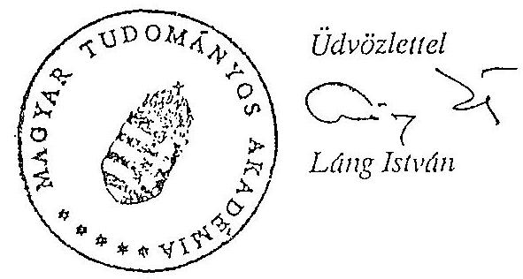

---

# Magyar Tudományos Akadémia fejezet összesen

intézmény megnevezése

## Allóeszköz (tárgyi enzköz) fenntartás felújítás költségadatai

|  Megnevezés | ered. el. | tény | ered. el. | tény | 1992. érv. kiadás | tény  |
| --- | --- | --- | --- | --- | --- | --- |
|  Felújítási tevékenység
- külső kivitelezővel 21-03
-saját kivitelezésben | 236,6** | 171,4
23,1 | 296,6x | 260,6
4,5 | 300,8x
xx | 387,3
xx  |
|  összesen | 236,6 | 194,5 | 296,6 | 265,1 | 300,8 | 387,3  |
|  Allóeszköz nagyértékű tárgyi
eszközök karbantartása 21-10
-külső kivitelezővel
-saját kivitelezésben | 183,7
29,7 | 204,1
45,8 | 173,1
31,2 | 170,0
49,5 | 70,0
xx | 102,4
xx  |
|  összesen | 213,4 | 249,9 | 204,3 | 219,5 | 70,0 | 102,4  |
|  Allóeszköz fenntartás össz. | 450,0 | 444,4 | 500,9 | 484,6 | 370,8 | 489,7  |

A táblázatot MTA Titkárság intézmények összesenre és intézményenként külön-külön kérjük kitölteni.

x központilag kezelt keret!

xx 1992. évben csk intézményi szinten, analitikus nyilvántartásokban van adat!

---

A Magyar Tudományos Akadémia pénzügyi-gazdasági ellenôrzése során az ellenôrzésbe bevont intézmények és gazdálkodó szervezetek

Központi intézmények:
Magyar Tudományos Akadémia Titkárság
Tudományos Minősító Bizottság (TMB)
Központi Ellátási Szervezet (KESZ)
Nemzetközi Együttmüködési Iroda (NEI)
MTA Könyvtár

# Intézetek: 

Izotópkutató Intézet
Közgazdaságtudományi Intézet
Központi Fizikai Kutató Intézet (KFKI)
KFKI Mérés- és Számitástechnikai és Automatizálási Kutató
Intézet (MSZKI)
Központi Kémiai Kutató Intézet (KKKI)
MTA Atommagkutató Intézet (MTA ATOMKI)
MTA Földrajztudományi Kutató Intézet
MTA Pszichológiai Intézet
MTA Zenetudományi Intézet
Mezôgazdasági Kutató Intézet
Nyelvtudományi Intézet
Számitástechnikai és Automatizálási Kutató Intézet (SZTAKI)

## Kutatóhelyek:

Budapesti Közgazdaságtudományi Egyetem (BKE)
Budapesti Müszaki Egyetem (BME)
Eötvös Lóránd Tudományegyetem (ELTE)
József Attila Tudományegyetem (JATE)
Semmelweis Orvostudományi Egyetem (SOTE)

## Egyéb gazdálkodó szervezetek:

Akadémiai Kiadó és Nyomda
AKAPRINT Nyomdaipari Kft (AKAPRINT)
MTA Külkereskedelmi Szolgálata Kft (AKADIMPEX)
Kutatási Eszközöket Kivitelezö Vállalat (KUTESZ)
MTA Mezőgazdasági Kutatóintézetének Kísérleti Gazdasága
MTA Múszer, Méréstechnikai Szolgáltató és Kereskedelmi Kft
(MTA-MMSz Kft)

---

A megvalósult és folyamatban lévő gazdasági átalakulások.
Az akadémiai alapítású intézmények gazdasági társasággá, vállalkozássá átalakulásának helyszíni ellenőrzési tapasztalatai.

# MTA MMSZ KFT 

Az MMSZ eredményérdekeltségủ költségvetési szervként müködött 1992. május 31-ig. Társasággá való átalakulását akadémiai döntés kezdeményezte és a kormány abból a meggondolásából kiindulva engedélyezte, hogy a jogszabályok változása miatt a korábbi müködési forma nem tartaható fenn, továbbá új tevékenységek (bel- és külkereskedelem, egyéb termelési szolgáltatás) végzését is megkezdhetik az új társasági formában, a gazdaságos müködés elősegítése céljából.

Ez a legnagyobb súlyú a vizsgált Kft-k között, 1 milliárd Ft-ot megközelítő vagyonnal. Megalakulására 1992. június 1-jével került sor.

Fő tevékenységi köre a kereskedelem. Újabban kiegészült a tevékenységi kör élelmiszeripari gépgyártással, piac- és közvéleménykutatással, szennyvízelvezetéssel és kezeléssel.

A Kft két épületet bérel a KESZ-től. A bérleti díj hivatott fedezni az ingatlanok használatával kapcsolatos amortizációs, karbantartási, üzemeltetési és egyéb költségeket. Az általa bérelt épület egy részét "albérletbe" adja egy osztrák cégnek korábban közösen létesített Kft-nek (REXFILM Kft). (A bérleti díj 8-szorosa annak, amennyiért a helyiségeket a KESZ átengedte.)

Az alapítás évében 74 millió Ft volt az üzleti tevékenység vesztesége. Ez az összeg magában foglalja a 10,3 millió Ft értékủ céltartalékot is.

---

Az MMSZ rendelkezésére álló, korábbi évek nyerségéből származó készpénz 1990 június 30 -án kb. 590 millió Ft volt. Ebből az MTA készpénzbetétként a jegyzett tőkébe vitt 550 millió Ft-ot. A készpénz értéke 1993. április 30-ára mintegy 460 millió Ft-ra csökkent.

A Kft $50 \%$-os részarányú, 25 millió Ft értékủ tulajdonát képezi az osztrák CENTRON Gmbh Ausztria céggel 1989-ben közösen alapított REXFILM Kft is, amelynek tevékenysége vi-deo- és hangfelvételek készítése.

Az alapítás évének (1992.) hét hónapjában az árbevétel 70 \%-a kül- és belkereskedelmi tevékenységből, lízingelésből, és épülethasznosításból eredt. Az akadémiai intézetek részaránya az árbevételes tevékenységnek kevesebb, mint $2 \%$ volt.

Az utóbbi évek gazdasági, politikai változásai negatívan érintették az MMSZ müködési területét:

- a keleti, föleg volt szovjet piacok megszünése,
- a fizetőképes kereslet csökkenése,
- a liberalizást külkereskedelem,
- az új, vegyes tulajdonú cégek müszerimportjának vámmentessége,
- a korábbi nagy külföldi partnercégekkel való kapcsolat megszűnése, vagy általuk 5 önálló képviselet megnyitása miatt.

Az 1993. gazdasági évet is veszteséggel zárják terv szerint. Az elfogadott tervben 23 millió Ft a tervezett üzleti veszteség, de még ez is túlságosan optimista célkitüzés, mert a feszített terv végrehajtására a feladatok, határidők és felelősök megjelenésével nem készült intézkedési terv; olyan területeken müködnek, ahol jelentős a hazai piaci konkurrencia, az alkalmazott díjtételek nem tartalmaznak elegendő nyereségfedezetet; magasak a bérköltségek; nem ismertek kellően a veszteségforrások.

# KFKI 

A KFKI átalakítására már korábban voltak olyan elgondolások, amelyek magukban hordozták a privatizációs elemeket is. Az 1991.

---

szeptemberében készült MTA előterjesztés, amely a Tudománypolitikai Bizottság részére készült, célul tűzte ki:

- a korábban felhalmozódott súlyos adósságteher rendezését aképpen, hogy az a költségvetést ne terhelje;
- a kutatás és vállalkozás szétválasztását;
- a vállalkozási kapacitás azon részének megőrzését, amely piacképes;
- a csillebérci telephely innovációs parkká fejlesztését.

A következő előterjesztés egy hónappal később kelt, aláírója a fejlesztésért felelős tárcanélküli miniszter volt. Az előterjesztés nagymértékben azonos az elsővel, a különbség annyi, hogy a gazdasági helyzet miatt az átalakulást halaszthatatlannak minősítette és nem érintette az adósság rendezés problémáját.

Az átalakulás 1992. I. 1-jén megtörtént, 5 új kutatóintézet jött létre és megmaradt jogutódként a KFKI). A KFKI pedig létrehozta a KFKI Innovációs Rt-t.

A 6 kutatóintézet megmaradt KFKI néven költségvetési intézménynek. Létszámuk a korábbi 2200 föröl kb. 1000 före csökkent. A felszabaduló létszám egy része az Rt és Kft-k állományába került.

A KFKI korábbi, közel 2 milliárd Ft éves árbevételének zöme a vállalkozási szférába ment át, ezek többsége Kft, s amelyekböl egy részt a Számitástechnikai Rt foglal keretbe.

Az előző időszakban felhalmozódott 500 millió Ft adósság mellett veszteségként jelent meg kb. 500 millió Ft készlet leértékelés (mint eladhatatlan eszköz) és 100 millió Ft feletti bizonytalan vevöállomány.

A KFKI adósságát több intézkedéssel próbálták rendezni:
Elengedtek 159 millió Ft Akadémiai Kutatási Alap és OTKA befizetési kötelezettséget és az OTKA 1990. évi maradványából 160 millió Ft-ot juttattak. A KFKI Rt legfeljebb 300 millió Ft összegű, 3 éves lejáratú hitelt vehet fel az MTA és az állami költségvetés együttes garanciája mellett. Ez együttesen 619 millió Ft feletti rendelkezési jogot biztosít.

---

Az adósság rendezése és az üzemeltetés a KFKI, ill. az általa alapitott KFKI Rt feladatát képezték. Ehhez rendelkezésre álltak részvények és üzletrészek. A hitel visszafizetését vállalkozási tevékenységből kellene biztosítani. A meghagyott vagyontárgyakkal való gazdálkodás ezt nem teszi lehetővé. A korábbi elképzeléssel ellentétben a földterület tulajdonjogát és az azzal összefüggő gazdálkodás lehetőségét a KFKI Innovációs Rt nem kapta meg.

Az átadott vagyonból a KFKI Innovációs Rt egyetlen jelentős értékesítést tudott elindítani, melynek befejezése most történik. Eladja a Számítástechnikai Rt részvényeinek többségét, $50 \%+2$ részvényt. Ezt egy 253 millió Ft-os értékben teszi, tehát ennek $50 \%$-át kapja és vár 100 millió Ft értékben tőkebefektetést. A vevõ egy angol cég. A részvények induló névértéke 150 millió Ft volt, 1992. nyarán 110 millió Ft-ra értékelték a részvényeket.

A tőkeemelésben a KFKI, ha akar és ha tud, részt vehet, akkor fenntarthatja a közel $50 \%$ tulajdoni arányt, ha nem akar, vagy nem tud, akkor csökken a részvételi aránya.

A Számítástechnikai Rt az általa elfoglalt területeknél lényegesen nagyobb arányban járul hozzá a telep fenntartási költségeihez. Ez egy diktált $15000 \mathrm{FT} / \mathrm{m} 2 / \mathrm{év}$ bérleti dijban jelenik meg, míg a költségvetési intézmények $3500 \mathrm{Ft} / \mathrm{m} 2 / \mathrm{év}$ bérleti díjat fizetnek. A többségi külföldi tulajdon esetében a bérleti díj vita tárgya lehet.

Osszefoglalóul megállapítható, hogy a KFKI átalakítását egyértelmüen az Intézet súlyos gazdasági helyzete (adósságai, eladhatatlan készletei, behajthatatlan követelései pusztuló épületei, út, kerítést stb) tették szükségessé. Ennek felszámolására készült egy gondolatmenetében elfogadható előterjesztés. Ezt az elgondolást fokozatosan úgy alakították át, hogy a gazdasági helyzet rendezése már nem volt kiemelt, nyomonkövethető első számú feladat. Nem készült egy átfogó, nyomonkövethető, minden gazdasági gondot felölelő és rendezô terv. A másik cél a kutatás és vállalkozás szétválasztása sem sikerült teljesen.A harmadik cél, a telephely folyamatos müködése és fejlesztése megfelelő források hiánya miatt szintén akadozik.

---

Az eredményes megoldáshoz szükséges döntések között sok népszerütlen is kellene, hogy legyen, ezért ezeket elkerülendő, eddig tudatosan vagy ösztönösen félmegoldások születtek.

# MTA Izotópkutató Intézet 

A kutatóintézet országos viszonylatban egyedülálló tevékenységet folytat. Itt van az ország egyetlen "A" besorolású sugárlaboratóriuma.

A fenntartás költségeit nagymértékben növeli a fegyveres őrzés, a nagy épületállomány, saját tüzoltóság fenntartása.

Az első átalakulás 1984-ben történt, ekkor hozták létre az IZINTA Leányvállalatot a tudományos kutatáshoz, fejlesztéshez kapcsolódó kereskedelmi, szolgáltató feladatok ellátására.

Az 1993. január 1-jével kormányengedéllyel végrehajtott átalakulás után a leányvállalat IZINTA Kft-vé alakult, továbbá az Izotóp Intézet Kft-be került a Diagnosztikai Kutató Laboratórium és az Izotóp és Sugártechnológiai Laboratórium. Ezzel bizonyos kutatások is elkerültek az egyébként költségvetési intézményként megmaradt Izotópkutató Intézettől.

A megkötött szerződés értelmében 3 évig az Intézet a Kft-be vitt tőke után osztalékot nem kap. (Az előző években a vállalkozási bevétel mint 220 millió Ft volt évente, 1993-ra 285 millió Ft a tervek szerint). Az átadott eszközök amortizációjának $50 \%$-át bérleti díj címén téríti a Kft az Intézetnek, a "0" -ig történő leírásig.

Az Izotóp Intézet Kft törzstőkéjéből 22 millió Ft (51\%) az MTA nevére bejegyzett müszer apport, 16,7 millió Ft (39\%) az Izotópkutató Intézeté.

Törzstőkén felül 9 millió Ft eszközt térítésmentesen kapott az Intézettől a Kft és 33 millió Ft értékủ törzstőkén felüli eszköz után fizetendő az amortizáció fele. Ugyancsak a törzstőkén felüli juttatás az IZINTA Kft-ben levő üzletrész 51\%-nak átengedése 7,6 millió Ft értékben, azzal a kikötéssel, hogy az onnan származó

---

osztalék csak fejlesztésre fordítható. Az IZINTA Kft törzstőkéje megegyezik a leányvállalat vagyonával. Ebből 7,6 millió Ft az Izotóp Intézet Kft üzletrésze lett, ezzel megszerezte az IZINTA többségi tulajdonát.

A törzstőkén felüli vagyon az előző évek nyereségéből képződött, ez a rész az IZINTA saját tőkéje. A törzstőkéből 3,5 millió Ft a munkavállalók tulajdonában van.

Az átalakulás során az a cél, hogy a kutatás és vállalkozási tevékenység különválik, teljesül, de ennek önmagában gazdasági haszna nincs. A megtermelt eredményből 3 év múlva történő részesedés ma még csak hipotézis. Tény, hogy a létszám kb. fele ( 160 fő) kikerült a költségvetésből, de az is tény, hogy a visszamaradók teljes költsége a költségvetést terheli majd, mert a hasznot hozó tevékenységek is kikerültek a költségvetési körből. Tény az is, hogy az átadott eszközök amortizációs terhe 50\%-ban továbbra is költségvetésé.

Az Izotópkutató Intézetben végbement átalakításokat nem lehet csak gazdasági alapon nézni. Az intézet olyan környezetben van, ahol üres épületek hasznosítása igen nehéz, szinte lehetetlen a sugárveszéllyel kapcsolatos adottságok miatt.

Az, hogy Magyarországon, Budapest egyik legszebb helyén fenn kell-e tartani egy KFKI-t, Izotópkutatót, Atomreaktort, az messze menő kérdés, nem tartozik a vizsgálat körébe. Azt azonban látni kell, hogy amíg ez az egész objektum létezik, egyes részeinek átalakítása, úgymond privatizálása gazdasági szempontok alapján nézve csak igen szük határok között mozoghat és igen nehéz elvárni a valóban gazdaságos müködést.

# MTA Martonvásári Kutatóintézete 

A privatizáció a Kutatóintézetet a különböző Kft-be fektetett eszközök nagysága alapján csak igen kis mértékben érintette.

A Mezőgazdasági Kutatóintézetben a részleges privatizációra olyan a formában került sor, hogy a Kutatóintézet, egy Kft-re ruházta át a kereskedelmi feladatok ellátását, amelyben a Kutatójntézet és a Kísérleti Gazdaság dolgozói voltak a tulajdonosok.

---

1991. december 6-án a kutatási és gazdasági tevékenységben érdekelt magánszemélyek a Társasági Törvény alapján megalapították a BAZISMAG Kft-t és az ELITMAG Kft-t, mindkettőt egyenként 1,8 millió Ft készpénz törzstőkével, 100\%-os tulajdonosi aránnyal. A Kutatóintézet és a Magyar Tudományos Akadémia a Kormány engedélyével, mindkettőbe belépett: a bevitt vagyon a Kutatóintézet részéről 310 ezer Ft, az Akadémia részéről 780 ezer Ft. Belépett továbbá a Kísérleti Gazdaság is mindkettőbe, egyenként 310 ezer Ft-tal. A magánszemélyek tulajdonosi aránya ezután $55 \%$-ra csökkent.

A Kutatóintézet több más olyan társaságba lépett be, amelyek vetőmag értékesítéssel foglalkoznak. E befektetéseknek nem az a célja a Kutatóintézet részéről, hogy az elhelyezett tőke után osztalékjövedelemre tegyen szert, hanem az, hogy a tulajdonosi képviselőkön keresztül betekintést nyerjen a kereskedelmi tevékenységbe és szükség szerint reagálhasson arra. Ezeknek a befektetéseknek a nagyságrendje 50 ezer Ft és 1 millió Ft között mozog.

A Mezőgazdasági Kutatóintézet résztulajdonosa továbbá három olyan Kft-nek, ahol a tulajdonosi érdekeltség szintén nem az osztalékjövedelemben, hanem az illető Kft-ben végzett tevékenységben van. A kutatóintézet gazdasági eredményeit a gazdasági társaságokban való részvétel a csekély tőkerész miatt érdemben eddig nem befolyásolta.

A Kutatóintézet további sorsa nem vonatkoztatható el a Kísérleti Gazdaságétól.

# MTA Martonvásári Kutatóintézet Kísérleti Gazdasága 

A Gazdaság jelenleg állami vállalatként müködik, 100\%-os tulajdonosa az AVU. Az átalakulást az MTA, az AVU és a Budapest Bank kezdte meg az 1992. évi LIV. törvény alapján.

Célja a felszámolás elkerülése, az eladósodottság csökkentése, az állami vagyon hatékonyabb müködtetése. 1992. szeptemberi adatok szerint a saját tőke pótlási értéke 787 millió Ft, az idegen források összege 841 millió Ft. A befektetett eszközök 78\%-a zálogjoggal terhelt. A létszám kb. 400 fő.

---

Tevékenységének döntő súlya a vetőmag előállítás. Az állattenyésztés genetikai állománya és technikai felszereltsége átlagon felüli. A Gazdaság igen nehéz pénzügyi helyzetét részben a korábbi, kellő szakértelem nélkül végzett ipari tevékenység következményei okozzák. (A kár végleges mértéke eddig - a folyamatban lévő eljárások miatt - még nem állapíthatók meg.) Tovább fokozták a Gazdaság nehézségeit a több év óta tartó aszálykárok és a hitelek magas kamatai.

A Kutatóintézet és a Kísérleti Gazdaság tevékenysége szorosan kapcsolódik egymáshoz. A Kutatóintézet a Kísérleti Gazdaság nélkül müködésképtelen.

Az átalakulási terv lényege az, hogy minden müködő vagyonrész megmaradna az Rt-ben. Ertékesítésre a kisállattenyésztő telep, a szálloda és a magánlakások kerülnének. A föld az AVU tulajdonában marad, a Gazdaság bérletet fizetne utána.

Az újonnan létrehozandó részvénytársaság tevékenységi körébe csak az eddig is nyereséges mezögazdasági területeket kívánják felvenni, úgy gondolják, hogy ezen a területen rendelkeznek magasszintü szaktudással a Gazdaság szakemberei. Az idegen profil - amellyel a 30-as ${ }^{2}$ évek végén próbálkoztak - igen jelentös veszteséget okozott a Gazdaagnak a 90-es évek elején, illetve még ezévben is.

A jövőt illetően az látszana célszerúnek, hogy a Kutatóintézet és a Kísérleti Gazdaság, valamilyen formában kötődne egymáshoz és a kutatások eredményein osztoznának.

Az átalakulás során felvetett lehetőség, hogy a dolgozók MRP útján kivásárolják a Kísérleti Gazdaságot lényegében nem képzelhető el, ha a Kutatóintézet és a Kísérleti Gazdaság szoros kapcsolatban müködik.

A Kísérleti Gazdaság hovatartozását, - a tulajdonosi kérdést egyedi kérelem alapján feltehetően tisztázni lehetne az Akadémiai Törvény megjelenésétől függetlenül, az előtt is. Ezt valószínűleg befolyásolná, ha az MTA is megtenne minden ma lehetséges lépést a Kísérleti Gazdaság talponmaradása érdekében.

---

# AKAPRINT Nyomdaipari Kft 

Részben önálló költségvetési szervböl 1990. novemberében alakult át Kft-vé összesen 32,7 millió Ft értékú vagyonnal. Feladata kis példányszámú tudományos kiadványok, jegyzetek megjelentetése. A megrendelök mintegy $80 \%$-a akadémiai intézmény.

Az adózott eredménye 1991-ben 2,7; 1992-ben 5,8 és 1993-ban terv szerint 1,2 millió Ft.

A Kft a tulajdonosnak - megállapodás szerint - 3 évig nem fizet osztalékot.

Az 1993-ra tervezett üzleti eredmény ( 0,5 millió Ft) elmarad az 1992. évitől ( 1,9 millió Ft). Az 1993. évi adózott eremény - terv szerint - 1,2 millió Ft érték körül várható.

Akadémiai Kiadó és Nyomda Vállalat
Az átalakulás az ellenőrzés időszakában folyamatban volt, még véglegesen nem fejeződött be.

A privatizáció célja az állami vagyon eredményesebb müködtetése.
Az átalakulás előtt álló vállalat alapítója az MTA főtitkára, a tervezett átalakulást illetően a tulajdonosi jogokat az AVU gyakorolja.

A társasággá alakuló előkészítésére a Cégmúves Kft kapott megbízást. A vagyonértékelés az ellenőrzés időpontjában is folyamatban volt.

A cég vagyona hozzávetőlegesen 990 millió Ft. Az induló tőke összege kb. 575 millió Ft, az idegen forrásoké 360 millió Ft. a foglalkoztatott létszám kb. 650 fő. Tevékenységi köre: kiadói tevékenység:
nyomdaipari tevékenység,
könyvkereskedés.
A Cégmúves Tanácsadó Kft javaslata az volt, hogy a vállalat elöször Kft-vé alakuljon át, majd a második lépésben a kiadó alapít-

---

ványi formában müködjön tovább, mert igy az MTA az általa szükségesnek tartott mértékig támogatni tudná. A nyomdát a tanácsadó cég piaci alapon javasolta müködtetni részvénytársasági formában,vagyonátcsoportosítással. A kereskedelmi egységeket együttesen vagy egyenként javasolta privatizálni késôbb eldöntendõ tulajdoni arányokkal.

Felmerült, hogy a tulajdonviszonyokat az akadémiai törvény életbelépéséig átmeneti megoldással rendezzék. Az MTA elnöksége felhatalmazta az Akadémia elnökét, hogy kérje az AVU-töl a tulajdoni jogok átadását.

A helyszini ellenörzés alapján megállapítható, hogy az átalakulást több lépésben tervezik. A jelenlegi tulajdonviszonyok nincsenek összhangban a logikus, célszerũ tulajdoni formákkal, mert a kialakult helyzetet bizonyos törvények szükségszerũ alkalmazása idézte elõ. Igy a tulajdonos ma az AVU, azonban bizonyos jogokat alapítás és szakmai felügyelet címén az MTA magának érez, bár ezeket a jogokat a jelenleg élõ törvények nem teszik felreérthetetlenné és szükségszerũvé számára.

Igy az Akadémiai Kiadó és Nyomda Vállalat könnyen kerülhet olyan elbírálás alá az AVU-ben, mint a sok száz más vállalat, azonban remélhetõ, hogy az Akadémia elnökének kérését nem fogja az AVU elutasítani. Pillanatnyilag azonban a jogszabályok alapján valós veszély, hogy AVU felkínálja eladásra az Akadémiai Kiadó és Nyomda Vállalatot, ami ellen az MTA-nak idöben és folyamatosan célszerũ határozott ellenérvekkel tiltakozni. Ez a megismert anyagok alapján úgy látszik, folyamatban van és várhatóan az Akadémia számára kedvezö formát ölt.

A további gondot az jelenti, hogy különösen a nyomda korszerűsítéséhez jelentős befektetések lennének szükségesek, amivel az MTA nem rendelkezik.

# AKADIMPEX Kft 

A korábban eredményérdekeltségũ AKADIMPEX költségvetési szerv 1991. I. 1-jével alakult át Kft-vé. Ekkor még az átalakuláshoz kormány engedélyre nem volt szükség.

---

A törzstöke összege az induláskor 20 millió Ft volt, 87,5\%-ig MTA és $10 \%$-ig alkalmazotti tulajdonnal.

A Kft tevékenységi köre külkereskedelmi tevékenység. Ennek során az akadémiai intézetek által megrendelt kistételü, gyors beszerzéseket is teljesít. A tevékenységi kört - elhatározás szerint egészen nagykereskedelmi tevékenységgel bővítik.

Az MTA az alapításkor a törzstökén felül összesen 72 millió Ft összegü juttatást, ezen belül további 27 millió Ft készpénzt, 3 millió Ft-ra értékelt iparjogvédelmi jogokat, 9 millió Ft értékủ tárgyi eszközt, 10 millió Ft értékủ befektetést és 23 millió Ft értékú bérlemény használati jogot adott át.

Az 50 fó létszámot foglalkoztató Kft adózott nyeresége 1991-ben 27 millió Ft, 1992-ben 47 millió Ft volt. A tulajdonosnak fizetett osztalék 8: illetve 13 millió Ft volt. Az 1993. évi tervezett osztalék 14 millió Ft.

Az osztalék bár nem túl nagy, de segít az MTA nehéz pénzügyi helyzetén, így a Kft müködését jónak kell ítélni. Amennyiben a következö években az MTA az általa adott eszközök (helyiségek) után piaci árat kér, a Kft rentabilitása csak az üzleti eredményesség javítása esetén lesz fenntartható.

---

# A Magyar Tudományos Akadémia és intézményeinek részvétele külsõ vállalkozásokban 

A külsõ gazdasági társaságokban való részvételre, illetve ilyenek alapítására többnyire a vizsgált időszakot megelőzően került sor, mivel a 4/1991. /II. 13./ PM rendelet a hatálybalépését követöen már korlátozta a költségvetési szervek ilyen irányú önállóságát.

A helyszíni ellenőrzésre kiválasztott gazdasági társaságok vizsgálata arra irányult, hogy megalapításuk megfelelt-e a törvényesség feltételeinek, az azokban való részvétel az alapító, illetve résztvevố Akadémiának vagy intézményeinek milyen gazdasági és tudományos elōnyökkel jár, müködésük ebből a szempontból mennyire célszerű és eredményes.

Az ellenőrzési tapasztalatok szerint a külső társas vállalkozásokban való részvétel motivációi többfélék, az érdekek sokirányúak. A legjellemzőbb, hogy az intézmények nevében alapított társaságokban ténylegesen nem az intézményi, hanem pl. az OTKA, OMFB, vagy az MTA forrásaiból származó pénzeszközöket használták fel.

Az intézmények szerepe a vállalkozásokban esetenként ezért formális.

Például:

- a KF Infrastruktúra Kft az OMFB Információs Infrastruktúra Programja keretében létesült 1988-ban. Az OMFB 70 millió Ft-tal járult hozzá és ezt alaptőke formájában az INVEST Banknál helyezte el. Az MTA ( 30 millió Ft); MTA-SZTAKI ( 35 millió Ft); MT Könyvtár és OSZK 2,5-2,5 millió Ft megosztással járult hozzá a törzsbetéthez.

---

- A Kft-t 3 db számítógép világbanki kölcsönnel történő beszerzése miatt alapították. Az MTA Könyvtárhoz telepített számítógépet a KF Infrastruktúra Kft saját tulajdonú eszközként szerelte fel és kölcsönképpen helyezte el a Könyvtárban. Az alaptőkét a kölcsönt adó kezdeményezésére 45 millió Ft-tal fel kellett emelni. Az összeget a Kft- be való belépéssel saját nevében szintén az OMFB szolgáltatta. Mivel nem tisztázottak a társaságalapítás forrásai az MTA, az MTA-SZTAKI és a Könyvtár mérlegében a társasági vagyonrész nem szerepel.

A tulajdoni viszonyok a KF Infrastruktúra Kft-ben az alapítás körülményeinek tisztázatlansága miatt rendezetlenek. Emiatt a társasági szerződést felül kell vizsgálni.

- Az ATOMKI az OMFB támogatásával a műszaki fejlesztés és a közös tudományos tevékenység hasznosítására alapította 1989-ben a Tudományos Müszaki Park Kft-t 2,5 millió értékben. Az alapításhoz az Ipari Minisztériumtól származó pénzforrást használtak fel. Az átadott pénzeszközök felhasználására külön szerződést kötött az ATOMKI és az Ipari Minisztérium. Ennek értelmében az átutalt összeg mindaddig az intézet saját tőkéjeként szerepelhet a vállalkozásban, ameddig meg nem szünik. Erre az esetre kötelezettséget vállal a KMOFA forrásból származó összeg visszatérítésére az Ipari Minisztérium számára.

Az, hogy a tárca miért a vállalkozás közbeiktatásával kívánta elősegíteni a kutatási eredményeknek a hasznosítását - nem a vizsgálat feladata megválaszolni. A pénzeszközt véglegesen adta át, a vállalkozás kockázatát azonban a fentiek szerint az intézetre hárította. A tagsági jog ilyen módon való megosztása azonban vitatható, a szerződés felülvizsgálata szükségszerű a tulajdonviszonyok rendezése érdekében.

- A HITELAP Rt alapításában 1988. évben az előzőhöz hasonló ágazati érdekek voltak meghatározóak, amelyben az OTKA kezelő MTA úgy kapott szerepet, hogy részére jegyezték be az OMFB és OTKA 100-100 millió Ft-os részvényeit.

A részvénytársaság 510 millió Ft-os alaptőkéje ezen kívül 100 millió Ft az OKISZ, 205 millió Ft a HITEKA szövetkezet és 5 millió Ft a SZTAKI részvényekből tevődött össze.

---

Az MTA azonban alapításkor csak átvette a 200 millió Ft-os részvénycsomagot az eredeti befizetés viszont az OTKA-tól és az OMFB-től származott.

Ennek oka, hogy a pénzt biztosító OTKA-nak, illetve OMFB-nek gyakorlatilag nem volt olyan intézményi háttere, amelyhez a tulajdonosi jogokkal járó gazdasági feladatok kapcsolódhattak volna.

Ezt jelenleg az MTA Titkárság látja el és a részvények bejegyzett tulajdonosaként az MTA van megjelölve, de azt a mérlegében nem szerepelteti.

Az MTA nevére szóló részvények ugyan, mint tulajdonos számára biztosítják mindazokat a jogokat, amelyek az alapszabály szerint megilletik, de ugyancsak a források rendezetlensége miatt a részvények a befektetett pénzügyi eszközök között az MTA fejezetnél nincsenek számbavéve.

- A Bürottel Bau Kft létrehozásához az MTA a fejezeti pénzeszközöket az MTA KESZ szervezeti kereteibe utalta azzal a céllal, hogy az I. ker. Fortuna u. 18-ban épülő ingatlanban 57 millió Ft vagyoni betétnek megfelelő tulajdonrészhez jut.

Az MTA beruházási pénzeszközök felhasználásával indított vállalkozással kapcsolatban az ASZ-nak a témában érintett ellenőrzése hiányosságokat állapított meg, amelynek kiküszöbölésére az MTA főtitkára intézkedett.

- Az MTA befektetések egy része azokban a vagyoni betétekben van, amelyek a korábbi, a társasági törvény hatálybalépését megelőző időszakban egyéb vállalkozásokban működő tőke részét képezték. (Pl. az MTA Könyvtár és a KESZ mérlegében szerepel a raktározási feladatok ellátására szolgáló közös vállalati tulajdoni rész 20-20 millió Ft értékben.)
- Jelentős nagyságrendet képviselnek azokban a vállalkozásokban való MTA részesedések, amelyek az 1984-88. évben az eredményérdekeltségű költségvetési szervek átalakításával keletkeztek. Ezek az MTA vagyonrészek az érintett intézmények (pl. SZTAKI) és a KESZ mérlegében vannak számbavéve.

---

- Az MTA Könyvtár a vállalkozásokban a DEPO vagyoni betétén kívül nem vesz részt. Az intézetek teljes körű felmérése alapján azonban a KF Infrastruktúra Kft a társasági szerződésben a cégbírósági bejegyzés szerint alapítói közt tartja nyilván az MTA könyvtárat is.

Az 1987. augusztus 31-i társasági szerződésben az MTA Könyvtárhoz hasonlóan az MTA, az MTA SZTAKI is a vállalkozás tagjaként szerepel.

Mindezekhez való pénzügyi fedezetet a Kormány Tudománypolitikai Bizottsága által létrehozott Információs Infrastruktúra Program ( $\mathrm{I}^{2} \mathrm{~F}$ ) biztosította. A törzsbetét nem az intézmények költségvetését terhelte. A mérlegekben az a vagyoni részesedés jelenleg sincs rögzítve.

- Sajátos helyzetet jellemzi a SZTAKI-nak a dolgozók részvételével 1990. évben alapított 11 Kft-ben való érdekeltségét. Az alapításkor mind a SZTAKI mind a dolgozók törzsbetétjeinek a fedezetét az intézet saját bevételei alapján képződő jelentősebb érdekeltségi alap biztosította.

A megvizsgált vállalkozások több év óta veszteségesek. Ezt csak a pénzügyi műveletek eredménye csökkenti azzal, hogy a tagok által biztosított pénzbetétek kamatait hasznosítják.

- A KOVIKOR Kft - amelyben több MTA intézet is érdekelt - fõ tevékenységi köre a környezet állapotának komplex vizsgálata, amelyet más kutató szervezetekkel (ELGI, ECOMI) együtt kívánt megvalósítani 1988. évi megalakulás óta. A társaság azonban évek óta nyereséget nem termelt.

Példaként kiemelve az 1992. évet az árbevétele 1,4 millió Ft, ráfordítása 1,7 millió Ft. Az 1991. évi beszámoló alapján ugyan vesztesége nem keletkezett, de a 906 ezer Ft-os bevétellel szemben 905 ezer Ft költséget számolt el.

---

- a Tudományos Müszaki Park Kft megrendelések hiányában bevételre alig tesz szert, amelyet a keleti piac kiesése tesz indokolttá.

Ezeknek a kutatási eredmények hasznosítására irányuló tevékenységeknek vállalkozási formában való végzése a vizsgálat tapasztalatai szerint jelenleg közvetlen gazdasági haszonnal nem mérhetõ az eredménye.

- Az MTA SZTAKI 1992. évi mérlegében a befektetett pénzügyi eszközök értéke összesen 147,7 millió Ft. volt. A befektetések többsége részvény /Flexis, Cosy Rt, Invertbank Rt, SZIM Rt/. A befektetett összegek - eddig - pénzben kifejezhető hasznot alig hoztak ( 450 ezer Ft).
- A COSY Rt az 1984. évben alapított SZTAKI COSY leányvállalatának az átalakításával keletkezett 1989. év végén külföldi részvétellel és bankok bevonásával.

A részvénytársaság nem jogutódja a leányvállalatnak, amelynek felszámolása veszteséges gazdálkodás miatt a SZTAKI-t terhelte. Létrehozásakor 14 millió Ft (egyébként OMFB forrásból fedezett) alaptőke és 25 millió Ft SZTAKI által garantált bankhitel szolgált az intézet kutatási eredményeinek és gyártásbavitelének megvalósítására és értékesítésére.

A vizsgált idôszakot megelőző években a SZTAKI által elrendelt tulajdonosi vizsgálat eredményeként a feltárt likviditási gondok miatt kezdtek az átalakításhoz. A felszámolási folyamatot követően a SZTAKI sz új vállalkozásba vitte a leányvállalati befektetéseit.

---

# 3. sz. függelék   a $\mathrm{V}-2-5 f / 1993 . \mathrm{sz} .-\mathrm{hoz}$ 

## A Számítógépes információs rendszer fejlesztésére és müködtetésére elöirányzott pénzeszközök felhasználásának értékelése

Az MTA Titkársága, mint központi irányító szerv, az ún. "Információs Infrastruktúra Fejlesztési Program" szervezési feladatának alakulásán túlmenően az intézmények számítógépes információ rendszerének helyzetéröl részletesebb adatokkal nem rendelkezik, ezért egy nagyobb intézeti körnél (Izotópkutató Intézet, KFKI MERES és SZAMITASTECHNIKAI és AUTOMATIZALASI KUTATO INTtZET, KOZGAZDASAGTUDOMANYI INTtZET, NYELVTUDOMANYI INTtZET, PSZICHOLOGIAI INTtZET, ZENETUDOMANYI INTtZET, MTA KONYVTAR) kellett tájékozódást végeznem. Igy a jelentésemben szereplő megállapítások és az egyes számszaki adatok ennek megfelelően - szakemberek véleményét is hasznosítva - kerültek felhasználásra.

Bevezetés
A Magyar Tudományos Akadémia - a továbbiakban MTA - területén a számítógépes információs rendszer szervezését, forrásait illetően három fő csoportra osztható:

1/ a MTA Titkársága és intézetei, valamint más tudományos intézmények, szervezetek között kiépített hálózat, azaz az Információs Infrastruktúra Fejlesztési Program (a továbbiakban $\mathrm{I}^{2} \mathrm{FP}$ ), mely egy nagyobb országos rendszer része - bekapcsolva a nemzetközi hálózatba is -.

2/ az MTA Titkársága munkájának számítógépesítése;

---

3/ az akadémia intézményei belsõ munkájának számítógépesítése.

Központi irányítást az $\mathrm{I}^{2} \mathrm{FP}$ végrehajtása igényelt, illetve igényel a továbbiakban is.

Az MTA Titkársága és az Intézetek esetében a berendezések beszerzése, azok müködtetése és az egyéb szükséges feladatok ellátása az adott üzemeltetõ szervezetek - egységek - hatáskörében van. Ennek megfelelően az MTA Titkárság és az Intézetek szervezeti egységeinek számítógépesítésére - az $I^{2}$ FP-on túl egységes központi fejlesztési koncepció nem készült. Az MTA - mint "Központ" - szerepe elsősorban az volt, hogy a felmerülõ beszerzési igények anyagi fedezetét a lehetôségekhez mért n biztosítsa, illetve a külsõ kapcsolatok felsôszintũ lehetôségeit, továbbá koordinációját szervezze.

Az intézetek a "Központból" és az I ${ }^{2}$ FP-ből származó forrásokon túlmenően más területekről (pl.; pályázatok) származó pénzt és a gépekben nyújtott támogatásokat is felhasználtak számítógépparkjuk, ill. a kapcsolódó eszközeik fejlesztésére. Ennek megfelelően a "Központ" alapvetően nem avatkozott be a rendszerek kiépítésének alakításába. A "laissez fair" (korlátozni nem akaró, a beavatkozást elvetõ) elvet alkalmazták.

Az intézmények vezetőinek véleménye, valamint a munkák eredményeit tekintve - az esetek döntõ többségében - hasznos volt ez a koncepció és megfelelt az intézeti autonómia kialakult gyakorlatának.

# A fejlesztés fôbb szakaszai 

A Tudománypolitikai Bizottság (a továbbiakban: TPB) 1986. januárí ülésén határozatot hozott a kutatás és múszaki fejlesztés infrastruktúrájának kialakítása tárgyában.

---

Az elhatározott feladat megvalósítását több fázisra bontották:

- az elsõ fázis 1987. végéig tartott;
- a második fázis 1988-tól 1990. év végéig terjedt;
- a harmadik fázis (1991-1993-ig) a második lépcsõben került meghatározásra.

Az I ${ }^{2}$ FP elsõ és második fázisának meghatározásánál alapelvként rögzítésre került, hogy az $\mathrm{I}^{2} \mathrm{FP}$-ban nagyteljesítményũ számítógépek, mini, illetve megamini gépek és helyi számítógép hálózatok, valamint a személyi számítógépek (PC) kapnak szerepet.

Az elõirányzat szerint egyes berendezések, belföldi összekapcsolásán túlmenően biztosítani kell a munkahelyek nyugati és az akkori "KGST országok" adatbázisához való kapcsolódását is.

Az I ${ }^{2}$ FP hálózat kísérleti szolgáltatását a Posta mũszaki alkalmazási kísérleti rendszerére és az Akadémiai Számítógép Hálózat (a továbbiakban: ASZH) csomagkapcsolt adathálózatára alapozták, a nyilvános szolgálat beindításáig.

Végcélként meghatározták, hogy az adatbázishoz, illetve bármely számítógépes szolgáltatáshoz minden egyszerũ, akár személyi számítógép is hozzáférhessen, természetesen a megfelelő technika kiépítésével.

Mivel hazánknak nincs anyagi lehetôsége egy nagyobb adatbázis kiépítésére az elöbb már említett nyugati és keleti kapcsolatok az $\mathrm{I}^{2} \mathrm{FP}$-ben különösen jelentös szerepet kaptak.

A külföldi kapcsolat gyakorlati megvalósításának két módját látták:

- közvetlen, vagy közvetett terminál kapcsolat;
- mágnes szalagok megvásárlása és azok hazai gépeken történő feldolgozása.

---

A hazai adatbázisokat alkalmazói szempontból:

- "szakmai információs" és
- "KF irányítást elősegítő szervezési - információs" típusú rendszerekre osztották.

Egy másik felosztás szerint:

- dokumentációs, ill.
- faktografikus adatbázisokat különböztettek meg.

Az I ${ }^{2}$ FP anyagi bázisát, az igénybe vevők körét is behatárolták. Igy az OMFB, az MTA és az MM felügyelete alá tartozó szerveket és intézményeket vonták be.

A teljes rendszer kialakítására, az alábbi feladatok megvalósítását tartották szükségesnek:

- általános alkalmazói rendszer létrehozása a kevés számítástechnikai ismerettel rendelkező felhasználók részére:
- adatvédelem;
- elszámolási (tarifa) rendszer;
- forgalom ellenőrzése;
- a rendszerbeli alapjelkészlet definiálása és megvalósítása;
- összekapcsolási és kapcsolat megszüntetési lehetőségek kidolgozása;
- jogosultságvizsgálat;
- erőforrás-védelem.

1991-1993; a harmadik fázis programja
Az újabb I ${ }^{2}$ FP alapdokumentuma az 1991. májusi "Megállapodás" az MTA, az MKM, az OMFB és az OTKA Bizottság között.

A MEGALLAPODAS fő célkitűzése egy "Európai szintü hálózati és információs szolgáltatások létrehozása", amelyet az előző fázisok saját fejlesztésű, centralizált rendszereivel szemben az elosztott hálózati szolgáltatások jellemeznek.

---

A $I^{2} F P$ irányítását a Felügyeló Tanács, az Operatív Bizottság, az Alkalmazói Tanács, a Müszaki Tanács és az önálló I ${ }^{2}$ FP Koordinációs Iroda együttesen végzi, a meghatározott müködési rend szerint. A Müszaki Tanács (a továbbiakban MT) feladata a fejlesztési koncepció kidolgozása. Az egyes felhasználó csoportok központi koordinálását az Alkalmazói Tanács látja el.

A harmadik fázis fejlesztése egyik alappillérének a hálózati infrastruktúra fejlesztését tüzte ki célul, mégpedig úgy, hogy a szolgáltatások alapja egy jó nemzetközi kapcsolatokkal is rendelkezó stabil hazai hálózat.

A szolgáltatások lehetôségei:

- elektronikus levelezés,
- elektronikus levelesláda,
- telefon "PAD",
- interaktív terminál hozzáférés,
- file átvitel,
- "jobb" feldolgozás,
- elektronikus konferencia,
- elektronikus faliújság,
- elektronikus névtár

Az I ${ }^{2}$ FP Központi támogatását az elsõ fázis (1986-87) vonatkozásában összesen 340 millió Ft-ban határozták meg. A második fázis (1988-90) összes költség elõirányzata 950 millió Ft volt.

Az MTA intézményei a tevékenységükhöz szükséges rendszerek kialakítását, szorosan kapcsolódva az I ${ }^{2} \mathrm{FP}$-hez, maguk, saját hatáskörükben végezték el. A munkát a majd mindenütt megalakított Számítástechnikai Bizottságok szervezték.

Az 1986-1990. közötti idõszak értékelése

- Elkészült egy postai üzemeltetésũ csomagkapcsolt kommunikációs hálózat mintegy 200 végponttal és több mint 1500 PC-es végberendezéssel. Lehetőség van az hálózat elérésére a "NEDIX" vonalkapcsolt adathálózatból és telefon hálózatról is.

---

- Megjelentek a korszerü hálózati szolgáltatások is:

Leggyakrabban használt szolgáltatás az ELLA elektronikus levelezo̊ rendszer.

Biztosítást nyert a hálózaton a hazai és külföldi számítógépek távoli interaktív elérése. Az ELF program az elektronikus faliújság (BBS) funkcióit valósította meg.

A felsorolt szolgáltatások nagy részét még ma is széles körben megelégedéssel használják. Néhányuk azonban nem minden számítógépes környezetben fut kielégítően (pl. DECNET/DOS környezet) és a nagy mennyiségü file átvitel az adathálózat interfészeinek teljesítménye következtében lassú.

Az információs szolgáltatások területén a legnagyobb eredmény a mintegy 100 új online, többnyire "ISIS" adatbáziskezelő rendszerre épülő adatbázis.

Az adatbázisok egy részénél a frissítés nem naprakész. Terjedőben van a külföldi adatbázisok használata is.

Az elsõ négy év eredményeiben a legfontosabb szerepet az MTA SZTAKI töltötte be, részint a fejlesztések jelentös részei elvégzésével, részint az IBM 3031. (4341) számítógéppel nyújtott szolgáltatásokon keresztül. Később az OMFB, az MTA, az MTA SZTAKI, az MTA Könyvtár és az OSZK létrehozta a "KF Infrastruktúra Kft"-t és világbanki hitelböl a Kft vásárolt egy IBM 4381. típusú berendezést, amely átvette a legfontosabb központi szolgáltatások nyújtását.

Az I ${ }^{2}$ FP tagintézményei országos jelentőségüknél fogva a társadalmi szféra széles területét fogták be, így a mezőgazdaság, müszaki élet, egészségügy, pedagógus képzés, múzeumok, közigazgatás, gazdaság, kereskedelem és a tudományterületén belül mind a felsőoktatási, kutatási, vállalati, vállalkozási alterületeket.

---

A program végrehajtásának szervezeti formáját a Felügyeló Bizottság, a Müszaki Tanács és az I ${ }^{2}$ FP Prog-ram-iroda alkották.

A Magyar Tudományos Akadémia elnöke, az Országos Müszaki Fejlesztési Bizottság elnöke, a Müvelődési és Közoktatási miniszter, az Országos Tudományos Kutatási Alap Bizottságának elnöke 1991. májusában megállapodást kötött a tudományos kutatás, a müszaki fejlesztés és a felsőoktatás $\mathrm{I}^{2} \mathrm{FP}$-jának tovább fejlesztésére.

Az 1991-93. évekre vonatkozólag meghatározták az infrastruktúra tovább fejlesztésének változótt körülmény közötti útját, korszerűsített céljait, a kibővült eszközállomány hasznosításának irányítását és az egyes részterületek együttmúködésének kereteit, továbbá rögzítették a szükséges forrásokat.

A fejlesztéshez rendelkezésre álló források és azok felhasználása

A I ${ }^{2}$ FP célkitüzéseinek megvalósításához a VILAGBANK "A müszaki fejlesztés emberi erőforrásai" projekt keretében 6 millió USD támogatást hagyott jóvá, míg az EK PHARE Programból 1990-ben 580 ezer ECU felhasználására nyílt mód. Az egész program-szakaszra összesen 2 millió ECU támogatás felhasználására lesz szükség.

A hazai források alakulása az előirányzat szerint:

Millió Ft-ban

|  | OTKA | OMFB | MTA | MOV.MIN. | EGYE B | OSSZESEN |
| :-- | :--: | :--: | :--: | :--: | :--: | :--: |
| 1991. | 60 | 50 | 30 | 30 | 60 | 230 |
| 1992. | 200 | 50 | 40 | 30 | 177 | 497 |
| 1993. | 100 | 50 | 50 | 30 | 187 | 417 |
| OSSZ.: | 360 | 150 | 120 | 90 | 424 | 1.144 |

---

Az MTA az I ${ }^{2}$ FP-ra vonatkozóan 1991. évben készített "Megállapodás" szerint 1991-92-93. években összesen 120 millió Ft-tal járul hozzá annak megvalósításához:

Az MTA előzőek szerinti hozzájárulása a $I^{2} F P$ teljes tervezett ráfordításának ( 720 millió Ft központi forrás, 424 millió Ft intézeti-intézményi ráfordítás, 6 millió USD - azaz mintegy 500 millió Ft $10 \%$-os visszatérítési kötelezettségű - világbanki hitel és 2-3 MECU - azaz mintegy 200-300 millió Ft - körüli PHARE támogatás) töredékét teszi ki. Az MTA a központi forrás mintegy $17 \%$-át, a teljes hazai forrás mintegy $10 \%$-át, az összes ráfordításnak pedig mindössze kb. 7\%-át viszi be az $\mathrm{I}^{2} \mathrm{FP}$-be.

Az $\mathrm{I}^{2} \mathrm{FP}$-ban való részvétel eredményeként ugyanakkor az MTA, ill. kutatóhelyei közvetlenül és közvetve a fenti arányoknál jóval nagyobb hányadban részesülnek a ráfordításokból, illetve a szolgáltatásokból.

Az 1991. és 1992. év fejlesztési eredményei:
A kutatók számára legfontosabb és legkézzelfoghatóbb, hogy már 1992. év közepén több mint 1300 "elektronikus postafiók" (azaz a hazai és nemzetközi elektronikus levelezésben üzenetek és információk küldésére és fogadására képes végpont-cím) müködött az MTA területén. A I ${ }^{2} \mathrm{FP}$ teljes alkalmazói közösségben a postafiókok száma 1992. közepén mintegy 5200 volt, tehát az MTA-ra jutott $25 \%$-uk. 1993. év elején már több, mint 6500 postafiók müködött (az MTA részaránya megközelítően változatlan). A nagyobb kutatóhelyeken további a nemzetközi hálózatokhoz közvetlenül kapcsolódó végpontok is egyre nagyobb számban települnek, az előbbinél is nagyobb részarányban.

Az előbbinél is nagyobb arányt képvisel az MTA a teljes hazai levelezési és adatátviteli (adatbázisok, könyvtári információk lekérdezéséből, kutatási információk küldéséből és fogadásából adódó) forgalomban, melynek időben fluktuáló módon, de az átlagot tekintve - becslés szerint - mintegy $35-40 \%$ az MTA-ra jutott.

---

Speciális - az I ${ }^{2}$ FP alkalmazói kör egy részét, nevezetesen az akadémiai és felsőoktatási; valamint közgyüjteményi kutatókat érintő - kedvezménye a MTI kutató közösségeinek az, hogy az információs hálózaton keresztül bonyolított (kutatással összefüggő forgalom után nem kell fizetniük), a forgalom tetemes postai költségeit az $\mathrm{I}^{2} \mathrm{FP}$ költségkeretéből fedezik, (így az MTA kedvezményezettsége még kiemelkedőbb). Az $I^{2} F P$ által biztosított előnyöket az előbb említetteken túl szemlélteti, hogy 1991-ben a hálózati rendszerekre kiírt pályázat 145 millió Ft-nyi összegéből az MTA 42 kutatóhelyére 36 millió Ft értékú eszköz jutott, ami mintegy $25 \%$-ot jelent, s önmagában nagyobb összeg mint amit az MTA 1991-ben befizetett ( 30 millió) 1992-ben a teljes pályázati összeg 515 millió Ft-jából a közvetlenül érintett 14 akadémiai intézethez 140 millió Ft (mintegy $27 \%$ ) értékú berendezés stb került.

Az előbbiekből következôen az MTA a keretek felhasználása, beruházások megvalósítása során előnyös helyzetbe jutott.

A számítástechnika felhasználásának tapasztalatai az MTA Titkárságán és egyes intézeteknél

Az MTA Titkárságot vizsgálva megállapítható, hogy az egyes szervezeti egységek munkáját megfelelően segítette (pl. a Tudományos Minősítő Bizottság, a Pénzügyi Főosztály, a Társadalomtudományi Főosztály stb) "laisser-faire" rendszer.

A Titkárságon a korábban nehezen, vagy csak hosszadalmas munkával áttekinthető, illetve karbantartható nyilvántartások ma már számítógépen vannak és így a feladatok végzése, áttekintése, kigyüjthetősége egyszerüsödött a munka hatékonyabbá vált, felgyorsult. Itt ma már az ügyviteli munkában is mindennapos a számítógépek, rendszerek alkalmazása.

---

Az egyes - e területeken foglalkoztatott - "beosztott" munkavállalókkal (alkalmazottakkal) történt tájékozódó információ gyüjtés során értékelhető volt - szinte egyöntetüen, hogy az információ technikával, számítógép rendszerekkel - többségükben - eröltetés nélkül "barátkoztak" meg, a maguk diktálta ütemben és alapvetően nem lépett fel a sok helyen, másutt tapasztalt "számítógép nélkül gyorsabban, jobban ment" effektus, visszahúzó fékező szlogenje.

A Titkárság számítógépesítésének szintje ma már olyan magas fokra került, hogy időszerũvé vált az egész titkársági szervezetet átfogó lokális-hálózat kialakítása. A gondolat megvalósítása érdekében a Titkárság, valamint a Kutatás- és Szervezetelemzõ Intézet munkatársaiból a végrehajtást elókészítő Bizottság létrejött.

Az MTA Titkárságán a rendelkezésre álló - 1992. év végi adatok szerint a fontosabb használatban lévő (esetenként több példányban is) software - a következök:

- Word szövegszerkesztő,
- Recognita Plus OCR,
- Clipper, dBASE, LOTUS 1-2-3, QVATTRO PRO adatbáziskezelő, ill. táblázatkezelő,
- ezeken túlmenően több munkahelyen alkalmaznak egyedi fejlesztésü programtermékeket, különösen vonatkozik ez az egyes speciális feladatok (pl. nyilvántartások) ellátására.

A Titkárság területén alkalmazott hardwarekre vonatkozó adatokat legjobban grafikonon ábrázolva lehet áttekinteni, amelyeket a továbbiakban szerepelnek:

A személyi számítógépeket (a továbbiakban PC) alkalmazzák a legszélesebb körben.

---

Az alábbi ábra a Titkárság gépparkjának alaptípusok szerinti megoszlását szemléleti.
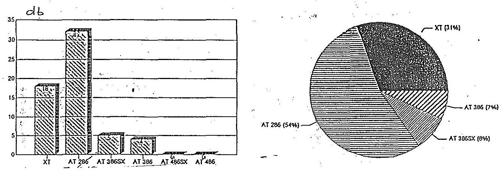

Megállapítható, hogy a gépek között meglehetősen magas az elavultnak tekinthető "XT" berendezések aránya. Ezt a helyzetet némiképp enyhíti, hogy az "XT" berendezés nagy része "terminálként" üzemel. Igen sajnálatosan alacsony viszont a nagyteljesítményú 386-os gépek aránya, ezek föleg serverek.

A következö ábrán a Titkárságon müködő berendezések operatív memória nagysága látható. Az 1 MByte alatti és a 1 MByte-os memoriák száma, illetve aránya - munka hátrányára - sajnos elég magas, nagyjából megfelel ez az előbbi ábrákon szereplő "XT-286"-os gépek arányának.
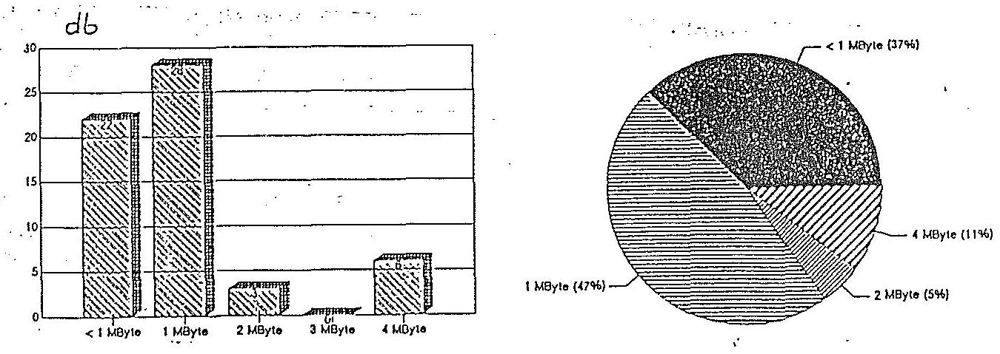

---

A következő ábrán került feltüntetésre a beépített merevlemez kapacitás. Látható, hogy kevés a nagyobb kapacitású "HDD"-vel szerelt gép.

A kisebb teljesítményú processzor, a kis memória és a kis kapacitású "HDD" megnehezítheti a korsżerübb programtermékek installálását (technikai felszerelés, beépítés), bár a számítástechnikai szakértők véleménye szerint az ilyen berendezések terminálként akár a tervbe vett titkársági hálózat termináljaiként is, még jól hasznosíthatók.
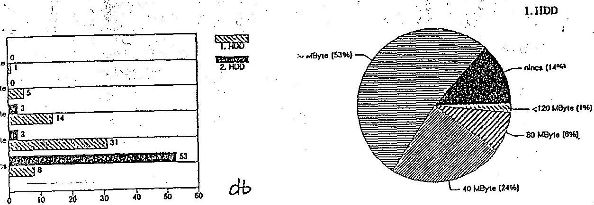

A monitoroknál - amint az alanti ábrán látható - jobb a helyzet, a korszerú "VGA" monitorok aránya nagyobb és sok a még elfogadható minőségũ "MDA (Hercules)" monitor.

Az MTA Titkárság számítástechnikai eszköz beszerzéseinek értékét a táblázat mutatja be.
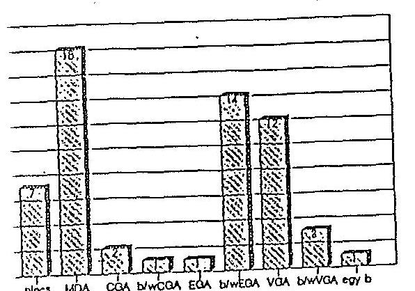
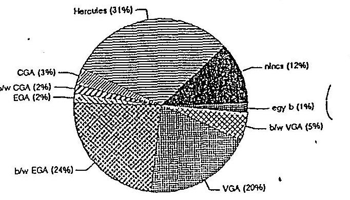

---

Az egyes MTA intézetekre vonatkozó számítástechnikai információs rendszerekre vonatkozó tapasztalatok rövid összefoglalása:

IZOTOPKUTATO INTEZET (Bp.XII., Konkoly Thege-út 29-33.)
Az Intézet számítógéphálózata az utóbbi 2-3 évben az I ${ }^{2}$ FP hatására alakult ki.

1991-ben az intézeti forrásból 2.8 millió Ft ráfordítással építették ki a KFKI számítóközponthoz kapcsolódó ETHERNET hálózatot, amely lehetővé tette a korábbi "X.25." kapcsolati rendszernél bővebb és hatékonyabb adatbázis elérését. Az említett bázist hasznosítva sikerrel pályázták meg az I ${ }^{2}$ FP kiírásait. Igy az 1992. decemberben zárult világbanki támogatással beszerezhető eszközökre kiírt pályázaton elnyerték az általuk kért konfiguráció támogatását.

Számítástechnikai célra "elkülönített" kerettel az Intézet csak az I ${ }^{2}$ FP-ből rendelkezett. Saját forrásai terhére - költségvetési támogatás, központi beruházás, amortizációs alap stb - saját hatáskörben döntött. 1990. évben beruházási ráfordításainak $11 \%$-át fordította számítástechnikai célra. 1991-ben $8 \%$-át 1992-ben $20 \%$-át, összesen 18,6 millió Ft-ot.

Az Intézetben létrehozott Számítástechnikai és Informatikai Bizottság dolgozza ki az aktuális és középtávú fejlesztési koncepciót, a pályázatokat.

Az intézetben jelenleg 193 db számítógép müködik, ebből 50 db 1990. év előtt került beszerzésre. Az újabb beszerzések között már korszerűbb AT 386 és AT 486 gépek szerepelnek.

Az Országos Izotópnyilvántartás - céljaira egy HEWLETT PACKARD MICRO 3000 GX típusú gép beszerzésére került sor. Jelenleg egy korszerú RISC gép megvásárlása van folyamatban.

---

A jelenleg rendelkezésre álló berendezések, a kiépített ETHERNET hálózat útján elérhetó adatbázisok - munkatársak véleménye szerint - jó feltételeket biztosítanak a tudományos munkához. A jól müködő hálózat segíti az Intézet versenyképes müködését.

# KFKI MERES ES SZAMITASTECHNIKAI KUTATO INTEZET (XII. Konkoly-Thege-u 29/33) a továbbiakban MSZKI. 

Az MSZKI 1992. I. 1-én lett önálló jogi személy és pénzügyi téren ezen idóponttól független.

Az MSZKI információs rendszerét lényegében a szétválás után dolgozták ki. Az információs rendszer, mint ahogy a gazdasági nyilvántartások is, ma két helyen van. Egyik a szétválás után keletkezett öt intézet által létesített közös, a gazdasági feladatokat ellátó szervezetnél, a másik a saját egységén belül müködő irodánál.

Az MSZKI számítástechnikai eszközei három csoportra oszthatók:

1/ az információs rendszerek használatához szükséges berendezések;
2/ a kutatáshoz alkalmazott eszközök;
3/ a kevésbé szükséges, ill. kihasználatlan, szétválás után ottmaradt gépek.

Az Intézet gépállományának bruttó értéke 73,6 millió Ft, nettó 25,9 millió Ft, melynek mai forgalmi értéke kb. 12-15 millió Ft lehet. Az 1992. évi 6 millió Ft-os növelés az MTA által biztosított általános beruházási keret terhére történt.

A szükséges fejlesztések érdekében a pályázatokon való részvételt megkezdték.

Az Intézet föleg PC-ket használ, ami az információs rendszerhez megfelelő, de a kuta-

---

tás-fejlesztéshez alkalmazott eszköz-állomány korszerűsítést kíván.

A KFKI belsô, illetve a külsõ hálózatot a kutatómunkához jelentősen igénybe veszik, ezek költségei az Intézetet nem terhelik.

# Az MTA Központi Kémiai Kutató Intézete (II. Pusztasze-ri-út 56/67), a továbbiakban KKKI. 

A KKKI számítógépes információs rendszerének fejlesztése az MTA és az OMFB együttes elökészítõ munkája nyomán 1986-ban indult meg.

A fejlesztések pénzügyi fedezetét az MTA, OMFB, OTKA és a Kutatóintézet forrásai jelentették.

A KKKI-ben az elsõ fázisban (1986-90.) terjedtek el a tudományos osztályokon az IBM PC kompatibilis XT és AT személyi számítógépek 1990-re, számuk 59 db volt.

Az Intézet 1987-ben vásárolt egy Microvax II. számítógépet, amelyre a belsõ hálózatot építette ki 1990-re. A belsõ hálózat már az elsõ fázis végére - I ${ }^{2}$ FP támogatással csatlakozott az országos ELLA hálózathoz, ami a külföldi kapcsolatokat is biztosítja.

Az Intézet I ${ }^{2}$ FP támogatással kapcsolódott a SZTAKI 3031 IBM gépére.

A hálózati és számítástechnikai feladatok koordinálását a KKKI-en belül az Informatikai és Számitástechnikai Csoport végezte.

Az I ${ }^{2}$ FP-hez kapcsolódva a második fázis(1991-93.) fõ célkitüzése a hálózati infrastruktúra fejlesztése és az európai színtü hálózatok létrehozása.
1993. májusában jött létre az Intézetben a Számitástechnikai Bizottság, mely a számítástechnikai koncepció felülvizsgálatát és az $\mathrm{I}^{2} \mathrm{FP}$-hoz való szorosabb illeszkedés kérdését koordinálja.

---

A főigazgató által elfogadott számítástechnikai koncepció és az új szervezeti rend lényeges elemei a következők:

- A számítástechnikai eszközök müködtetése osztott erőförrások elve alapján történik. Az eszközöket az egyes tudományos osztályok igényeiknek megfelelően szerzik be, saját forrásaikból(pl. MTA, OTKA, OMFB és egyéb pályázatok útján is).
- Az egyes felhasználókat az intézeti ETHERNET hálózat köti össze.
- A hálózati kérdésekben Számitástechnikai Bizottság jogosult javaslattételre. A számítástechnikai tevékenységet az igazgatóhelyettes felügyeli.
- A hálózat müködtetésének alapköltségeit az Intézet központi forrásaiból fedezik.
- A hálózat müködtetése egyéb költségei forrásainak biztosítására, a Számitástechnikai Bizottság tesz javaslatot, az OTKA, OMFB, I ${ }^{2}$ FP pályázatok forrásaiból, vagy az Intézethez benyújtott és elnyert központi forrásból, vagy a költségek felhasználókra történő költség terheléssel. $\triangle$
- A nemzetközi online irodalom figyelést és az ehhez tartozó szolgáltatásokat külön csoport látja el. A költségeket a felhasználók viselik közvetlen költségként.
- A hazai és a nemzetközi informatikai rendszereket és adatbázisokat a felhasználók a hálózaton keresztül érik el. A felmerülö költségekről a Bizottság gondoskodik.

A SZAMITASTECHNIKAI és AUTOMATIZALASI KUTATO INTtZZET (a továbbiakban: SZTAKI).

A SZTAKI saját számítástechnikai koncepciója szerint hagyományosan három fő iránnyal foglalkozott:

- a nagyszámitógép kategóriában az IBM - mainframe kategóriával, abból következôen, hogy

---

alapító okirata szerint a SZTAKI kezeli (üzemelteti) az MTA számítógép központját;

- a "valós idejü" számítógéprendszerekhez a DEC miniszámítógép kategóriát alkalmaznak (ezt a típus gyártotta korábban a KFKI);
- személyi számítógépekkel általános célokra.

A felsorolt három számítógép - kategória (újabban kibővült a különösen korszerünek tartott "nyílt rendszerek (OPEN SYSTEMS, UNIX) kategória müvelésével.A desktop pubishing és a hipermédia kutatásokra és alkalmazásokra a személyi számítógépeknél lényegesen jobb minőségü és sokkal intelligensebb szoftvereket tartalmazó APPLE MACINTOSH rendszereket használ az Intézet.

Az Intézet vezetése a számítástechnikai eszközhátteret korszerünek minősíti és továbbra is jelentős figyelmet fordít a szintentartásra és a folyamatos fejlesztésre.

A SZTAKI gépek, berendezések és felszerelések állományának bruttó értéke 521 millió Ft, melynek kb. 80\%-a számítástechnikai eszköz. Az 1992. évi számított értékcsökkenés pedig 121 millió Ft. A szintentartáshoz ilyen összegre lenne szükség az Intézet szakértői szerint. Közlésük szerint ez az összeg nem tartalmazza a szoftverek értékét és bérleti diját, valamint a számítástechnikai eszközök értékének 7-10\%-át kitevő karbantartási átalánydiját sem.

A SZTAKI a számítástechnikai eszközöket háromféle forrásból szerzi be:

- saját pénzmaradványa és érdekeltségi alapja terhére;
- pályázati támogatásokból OTKA, OMFB, IIF, EC pályázatok);
- a számítástechnikai világcégekkel (DEC, HAWLETT Packard, ICL) együttmüködve, azok kutaTási programjában részt vállalva ingyenes adományként, vagy jelképes áron (a listaár $10-25 \%$-áért).

---

Az Intézet rendszeresen vesz részt pályázatokon, s igy jelentôs beruházási forrásokhoz jut. Az OMFB pályázatok többsége is tartalmaz beruházási részt, függetlenül attól, hogy ez gyakran 100\%-osan visszterhes és gyakorlatilag a jövedelemhányadot is tartalmazó müködési forrásokat csökkenti.

Vásárlásaiknál gyakran fordulnak közvetlenül a gyártó cégekhez (pl. USA), igy kedvezményekhez jutnak (esetenként - 50\%). Több esetben sikerült érvényesiteni az "egyetemi kedvezményt". (University Discount), ami 20-50\% árengedményt jelenthet. A nagyértékü szoftvereket forgalmazó cégekkel kötött szerződések alapján a saját részre felhasználandó szoftvert is $40-50 \%$ kedvezménnyel szerzik be.

Az előzőekből következôen az utóbbi években bekerüló eszközök tényleges értéke (pl. listaáron számolva) lényegesen magasabb, mint a nyilvántartási érték. Ezzel magyarázható az, hogy a számított amortizációnál lényegesen alacsonyabb beszerzési ráfordítás mellett is a számítástechnikai eszközháttér folyamatos fejlődése látható.

Néhány tény adat a SZTAKI gépparkjának fontosabb területéről:

Az akadémiai számítóközpont IBM 4311 mainframe nagyszámítógépe 1981-ben került a SZTAKI-hoz. Az elmúlt időszakban ennek korszerűsítését bővítését döntően saját eszközeikből oldották meg.

1992-ben a SZTAKI saját eszközből vásárolt egy korszerűbb IBM E-9000/21 típusú számítógépet mintegy 50 millió Ft értékben.

A SZTAKI az akadémiai közösségnek díjmentesen biztosítja a "központi" nagyszámítógép használatát. Részben ez a berendezés látja el az országos infrastruktúra hálózat (I ${ }^{2}$ FP) központjának szerepét is, nemzeti EARN csomópont, meghatározó szerepet lát el a kutatóintézetek és egyetemek számítógépes hálózati rendszerének müködtetésében. Az

---

akadémiai számítóközpont fénykábellel csatlakozik (szintén az Intézet költségén) a nagy budapesti egyetemeket összekapcsoló fénykábel gyürühöz, közvetlen összeköttetéssel rendelkezik több regionális hálózati centrumhoz és utolsó sorban bérelt telefonvonalon közvetlenül össze van kötve a nyugat-surópai hálózati rendszerekkel.

A SZTAKI középkategóriájú számítógépei nincsenek szervezeti egységekhez, konkrét témákhoz rendelve. Mind kutatási; mind szoftverfejlesztési célokra rendelkezésre állnak.

A SZTAKI-ba mintegy 230-250 db személyi számítógép (PC) müködik. Minden kutató rendelkezik egy PC-vel, ezekkel elérhetik bármelyik középkategóriájú számítógépet, ill. a nagy központi számítógépeket.

A számítógép hálózat kihasználtsága kedvező.
A Közgazdaságtudományi Intézet (a továbbiakban KTI)
A KTI számítástechnikai infrastruktúrája 1988-ig szinte kizárólag az épületben lévő terminálokra korlátozódott, amelyek kapcsolatban voltak a SZTAKI nagyteljesítményü IBM gépével.

Jelentősebb számú PC beszerzésére a 80-as évek végén volt lehetőségük. Az 1990-re megnövekedett számú berendezés, ill. kutatói igény szükségessé tette a KTI vonatkozó fejlesztési koncepciójának kialakítását. Ennek érdekében létrehozták az Intézet Számitástechnikai Bizottságát.

A Bizottság munkája a szervezési, hasznosítási célkitüzések korszerűsítése mellett a céltudatos gépbeszerzés kérdéseit is napirendre tüzte: 1991-re komplett számítástechnikai fejlesztési tervet dolgoztak ki.

1992-ben a külsõ kapcsolatok szélesítése megtörtént.
A szükséges beszerzésekhez elegendő központi beruházási alap nem állt rendelkezésre. 1991-ben az igények

---

26,1\%-át, 1992-ben $26,8 \%$-át tudtak központi forrásból biztosítani.

A gépállomány életkorát tekintve az összetétel nem mondható kedvezőtlennek. Mindössze $12,4 \%$ az 5 évnél idösebb berendezések száma.

Igen jelentös, hogy a berendezések egy része ingyenesen kapcsolódni tud a külsõ hálózatokhoz.

A gépállomány növekedése bizonyos mértékũ adminisztratív állomány csökkenéssel járt. A dolgozók számítástechnikai képzése megtörtént, ill. most is folyik.A gazdasági úgyvitel számítógépre helyezése is folyik.

A Tudományos Titkárság munkáján a berendezések használata igen sokat segített.

A berendezések kihasználtságát optimálisnak ítéltük. A megkérdezett alkalmazók nyilatkozata szerint a számítógépet $92 \%$-uk használta szövegszerkesztésre, $50 \%$-a táblázatkezelő programok futtatására, $31 \%$-uk adatbáziskezelő és $42 \%$-uk matematikai statisztika programosomagok futtatására.

A kibővült külsõ hálózathoz való kapcsolódás lehetösége a használatot folyamatosan növeli.

MTA PSZICHOLOGIAI INTEZETE (Bp VI., Teréz krt 13) a továbbiakban PI.

A PI-ben a számítástechnikai módszerek alkalmazása a 60-as évek végén kezdödött meg - az agyi bioelektromos jelek elemzésére - .

A hetvenes évek elején a KFKI TPA-I számítógépei közül az egyik elsõ mintapéldányt itt helyezték üzembe.1980-82. között telepítették a TPA 1140 típ. számítógépet, amely már magasabb szinten tette lehetővé a gépek alkalmazását. Ekkor alakították meg az önálló számítógépes csoportot.

---

Később megalakult az intézeti Számitástechnikai Bizottság, amely koordinálta a munkát és kialakította a fejlesztési koncepciót.

Az 1986-ban beindított $I^{2} F P$ nyújtott lehetőséget az elavult technika korszerűsítésére. A program támogatásával a PI az elsők között kapcsolódott a nemzetközi hálózatba.

Az Intézet saját anyagi lehetőségeiből is fordított a számítástechnika fejlesztésére, azonban ez a lehetőség a költségvetési támogatás csökkenése következtében egyre szükült. Igy a beszerzések forrása egyre inkább az egyes pályázatokon elnyert összegekböl történik. A $I^{2} F P$ program keretében a PI "díszciplináris központ funkciót kapott.

A diszciplináris központ munkáira 1992-93.évre a PI 500 ezer Ft-ot, majd 470 ezer Ft müködési támogatást nyert el.

Az I ${ }^{2}$ FP 1991-ben meghirdetett pályázatán az Intézet 800 ezer Ft-ot nyert el a Szondi utcai lokális hardware eszközeinek beszerzésére a Teréz krt-i bázisra pedig 2 db nagy teljesítményü PC-t telepítettek.

Az OTKA 1991-ben meghirdetett müszerpályázatán egy számítógépes agytérképező rendszer beszerzésére szereztek 66.000 USD támogatást.

A HUMBOLDT Alapítványtól 1992-ben SUN kompatibilis servert és munkaállomást kaptak az agyi bioelektromos jelek elemzésére.

A Pezichofiziológiai Osztály munkatársai az Albert Einstein College of Medicine (Bronx NY. USA) munkatársaival elnyerték az Mc Donnell alapítvány "Cognitive Neuroscierne grantját" - 2 évre összesen 160.000 USA dollárt amelynek keretében mindkét intézményben azonos, idegsejt tevékenység analizáló számítógépes rendszert helyeznek üzembe.

---

A beszerzett eszközök összetétele életkor, beszerzési relációk szerint

# A számítástechnikai eszközök beszerzése, lebonyolításának értékelése 

Az 1989. évet megelôzõ idõszakban az ún. "KGST országok" irányában fennálló korlátozások a komplett, korszerũ berendezések beszerzését lehetetlenné tette, illetve nagy mértékben nehezítette. 1990. után fokozatosan oldódott ez a probléma.

A berendezések, ill. egyáltalán az MTA-nál rendelkezésre álló számítástechnikai kapacitás hasznosítási értékelését konkrétan elvégezni nem lehet. A hasznosítás eredményességére néhány intézet egyedi átvilágításánál lehet utaló jelleggel megközelítõ mutatókat keresni.

Az elõbbi megállapítás oka abban található, hogy az MTA számítástechnikai információs rendszere elsősorban a PC-kre épül, s ezeknél sem az üzemidô, sem a futtatott programok követése nincs megoldva. De az nem az MTA sajátossága, a berendezések használatának szélesedése következtében - "mindennapivá válása", mint bármely más irodai berendezés hasznosítása - a világ más fejlettebb területén is hasonló módon történik.

A korábban alkatrészek beszerzése útján történt hazai gépgyártást pl. KFKI-nál is igénybe vették.

A Szovjetunióból és az NDK-ból származó berendezések be-szerzése kisebb mértékũ volt. Ezen berendezések ritka kivétellel a forgalomból kikerültek, úgy az erkölcsi, mint a fizikai avulás miatt, használatuk megszûnt.

Az MTA-nál (intézményekkel együtt) a számítógépek fôleg a távolkeletrôl, kisebb számban az USA-ból (IBM) származnak. A nyomtatók multinacionális cégek (Hewlett-Packard, Epson, Data Prodvets, Star, Canon) termékei.

---

A megrendelt komplett berendezések és a fenntartásukhoz szükséges pótalkatrészek a megrendelést követöen ma már ütemesen beérkeznek.

A berendezések erkölcsi elavulása általában igen gyors (átlagosan 3 év), fizikai elavulás 10-15 év, megfelelő folyamatos karbantartás mellett.

A vonatkozó technika fejlődése, a gépek alkalmazási körének szélesedése igen gyors. A piacok telítődése, és a termelők -. forgalmazók - erős konkurenciájának eredményeként a gyártmányok beszerzési ára erős ütemben csökkent az utóbbi években.

A gépek, berendezések folyamatos karbantartására, ill. eseti meghibásodásuk alkalmával történő javítása az intézmények többségénél erre szakosodott külsõ cégekkel kötött - rendszerint általány-díjas - szerződések alapján történik. Ami a beszerzett információk szerint a számítástechnikai rendszer zavartalan üzemeltetését az MTA-nál gond nélkül biztosítja.

Az egyes intézeteknél felmért adatok szerint az MTA egységeinek számítógépparkjának átlagos életkora az alábbiak szerint értékelhetó.

| 0-2 évig | $38 \%$ |
| :-- | :--: |
| 3-4 évig | $22 \%$ |
| 5 évnél öregebb | $40 \%$ |

Fenti számban a 10 évnél öregebb gépek aránya becslések szerint az $5 \%$-ot nem haladja meg.

Az MTA a számítástechnikai berendezések szakszerũ üzemeltetésének személyi feltételei biztosítására jelentős gondot fordít. A teljes személyi állománynak megközelítően a fele valamilyen fokon a gépek használatára felkészítést, vagy kiképzést kapott. A kutató, ill. speciális képesítési munkatársak e feladatokat profiszinten végzik.

---

Továbbképzés, ill. alapképzés folyamatosan történik, úgy az intézményeken belül, mint erre szakosodott oktató szervezeteknél. A Titkárságról pl. jelenleg 7 munkatárs képzése folyik a SZAMALK és a CONTROLL Oktatóközpont kurzusain.

Az MTA számítástechnikai berendezéseiben tárolt adatok védelme, részben az egyének és a szakértői csoportok önérdeke alapján általában biztosított. Erre vonatkozóan egységes adatvédelmi szabályzat, illetve célorientált folyamatos ellenőrzési rendszer szervezetten, központosítva nincs.