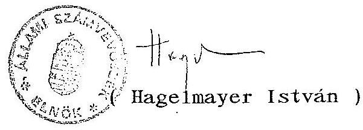
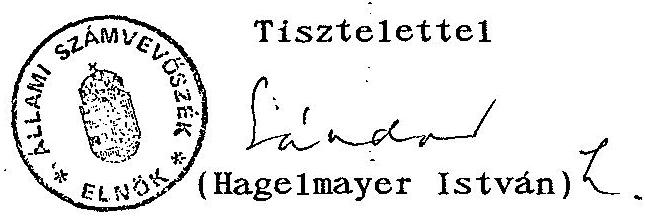

14304. szám

# Állami Számvevőszék 

## VÉLEMÉNY

a társadalombiztosítási alapok
1994. évi költségvetéséről szóló 13791. sz. törvényjavaslathoz

---

A vizsgálatot vezette: dr. Csépán Magdolna osztályvezető főtanácsos

A vizsgálatban résztvettek:

| Balla Józsefné | számvevő tanácsos |
| :-- | :-- |
| dr. Fónyad Erzsébet | számvevő |
| Hajagos Józsefné | számvevő tanácsos |
| Hegyesné dr. Solymosi Mária | számvevő |
| dr. Kurucz István | számvevő tanácsos |
| Molnár Istvánné | számvevő tanácsos |
| Szendrődi Józsefné | számvevő |

---

# VÉLEMÉNY 

a társadalombiztosítási alapok 1994. évi költségvetési törvényjavaslatáról

Az államháztartási törvény 86. paragrafusa értelmében az Országgyűlés a társadalombiztosítás költségvetési törvényjavaslatát az Állami Számvevőszék véleményével együtt tárgyalja meg.

A Nyugdíjbiztosítási és az Egészségbiztosítási Alap 1994. évi költségvetése megalapozottságának vizsgálata érintette

- a társadalombiztosítás helyzetének 1993. évi várható alakulását,
- a biztosítási ágak bevételi és kiadási előirányzatainak teljesíthetőségét, figyelemmel az ellátórendszerekben bekövetkező változásokra is,
- a társadalombiztosítási önkormányzatok és igazgatási szervezeteik működési költségvetését,
- a központi költségvetéssel való kapcsolatokat.

Az ÁSZ véleményének kialakítását megnehezítették a költségvetés összeállításának „rendkívüli” körülményei.

Ismeretes, hogy az 1993. júniusában megalakult társadalombiztosítási önkormányzatok és a Kormány képviselői több alkalommal is egyeztető tárgyalásokat folytattak a költségvetés szempontjából meghatározó kérdéseket (vagyonátadás, hiányrendezés, profiltisztítás, nyugdíjemelések, egészségügyi bérpolitikai intézkedések) érintve. A megállapodás alapján a szeptember 13-án megtartott közgyűlések jóváhagyták a két Alap költségvetését és azt hivatalosan eljuttatták a Pénzügyminisztériumba. A jogalkotás rendjéről szóló törvény ugyanis jelenleg nem teszi lehetővé, hogy elfogadott költségvetését maga az önkormányzat terjessze az Országgyűlés elé (noha erre az 1991. évi XXXVIII. törvény felhatalmazást ad). Az önkormányzatok jogállása általában sem tekinthető rendezettnek.

---

A több hónapos felsőszintű egyeztetés ellenére a PM és az NM a törvényjavaslatokban foglaltakhoz képest újabb, illetve módosított javaslatokat tett, aminek következtében a téma ismét visszakerült az önkormányzatok – október 21-22-én megtartott – rendkívüli közgyűlése elé.

Az ÁSZ „megkísérelte” nyomon követni az eseményeket (gyakorta csak informális úton), ez azonban csak a közgyűléseken született döntésekig volt lehetséges. A kialakult helyzetből adódó problémáinkat, az ÁSZ törvényi kötelezettség teljesítésének akadályait jeleztük az Országgyűlés elnökének is (1. sz. melléklet). A Kormány november 8-án nyújtotta be a 13791. sz. törvényjavaslatot.

# A megállapítások összegzése 

A társadalombiztosítás pénzügyi helyzete 1993-ban a vártnál kedvezőtlenebbül alakul, ami főleg a hiány tervezett 40 Mrd Ft-os összegéhez viszonyított jelentős növekedésében nyilvánul meg. Amennyiben az ingyenes vagyonjuttatásból származó hozambevétel nem realizálódik, az alapok együttes hiánya az 1993. évre szóló pótköltségvetésben jelzett 53,2 Mrd Ft-tal szemben megközelítheti a 60 Mrd Ft-ot is. Az Alapok helyzetéhez mérten lényegesen kedvezőbb, kiegyensúlyozottabb helyzetben van a működési költségvetés. Az ÁSZ-nak az a véleménye, hogy felelős gazdálkodás mellett a kitűzött fejlesztési célok megvalósítását a források biztosítják, beleértve a szervezetátalakítással összefüggő feladatokat is, ezért sem tartja indokoltnak a pótköltségvetés működést érintő változtatásait.

A 42 Mrd Ft-ot kitevő profiltisztítás megvalósításának eredményeként az 1994. évi költségvetés összevontan 707,5 Mrd Ft-os kiadási és 708,4 Mrd Ft-os bevételi főösszeggel számol. Az előirányzatok vizsgálata során a bevételeket és a kiadásokat érintően is több bizonytalansági tényező merült fel. Különösen a bevételek egyes tételeinél érzékelhető az adatok megalapozatlansága, amely mindkét biztosítási ág egyensúlyi pozícióját veszélyeztetheti. Kiadási oldalon az egészségbiztosítási ágba tartozó egyes ellátások alultervezettségét tapasztaltuk. Mindezek alapján az ÁSZ véleménye szerint az Egészségbiztosítási Alapnál reálisan számolni kell azzal, hogy a jövő év során a látszólagos egyensúly helyett deficit alakul ki, amelynek rendezésére is fel kell készülni. Az Alapok folyamatos működését egyébként az állami forgóalap hiteljellegű igénybevételi lehetősége garantálja.

---

Az önkormányzati irányításra való átállással, az ehhez kapcsolódó szervezeti változtatásokkal összefüggően a működési költségvetés jóváhagyását illetően a költségvetési törvényjavaslat (hasonlóan a társadalombiztosítás pénzügyi alapjairól szóló törvénytervezet is) jelentős módosítást tartalmaz. A biztosítási ágak működési hozzájárulása mintegy 14,6 Mrd Ft. A javasolt megoldás szerint 1994-ben az Országgyűlés ezt mint egy keretösszeget hagyja jóvá, a működés fő céljainak (bérek, járulékok, egyéb folyó kiadások, fejlesztések) előirányzatainak ismerte és meghatározása nélkül. Ezt az ÁSZ az államháztartási törvényben, illetve a költségvetési szervek gazdálkodásáról szóló jogszabályokban foglaltak alapján ellentmondónak ítéli.

# Javaslatok 

Az Állami Számvevőszék a társadalombiztosítás 1994. évi költségvetésének vizsgálatának tapasztalatai alapján javasolja, hogy
az Országgyűlés
a.) az 1993. évre vonatkozóan utólag ne módosítsa a társadalombiztosítási alapok működési költségvetéséhez való hozzájárulásának szabályait;
b.) az 1994. évre a működési költségek fedezetét a költségvetési szervekre vonatkozó szabályoknak megfelelően, a fő előirányzatok meghatározásával hagyja jóvá;
c.) a költségvetési törvényjavaslat egyes alternatív változatait mérlegelve a társadalombiztosítás szempontjából reálisan megvalósítható döntéseket hozzon.

## a Kormány

a.) számoljon be az Országgyűlésnek a társadalombiztosítás ingyenes vagyonjuttatásának helyzetéről, a megoldás lehetséges módozatairól, a megvalósítás akadályairól. Hasonlóan adjon tájékoztatást a társadalombiztosítás 1992. és 1993. évi hiányát finanszírozó értékpapír-kibocsátásról is.

---

# a biztosítási önkormányzatok 

a.) a törvényi előirányzatok alapján határozzák meg:

- az Egészségbiztosítási Önkormányzat, illetőleg az Országos Egészségbiztosítási Pénztár (és igazgatási szerveinek),
- a Nyugdíjbiztosítási Önkormányzat, illetőleg az Országos Nyugdíjbiztosítási Főigazgatóság (és igazgatási szerveinek) működési költségvetését.
b.) a biztosítási ágak pénzügyi önállósága érdekében tett intézkedésekről, valamint a szervezetátalakítás helyzetéről tájékoztassák az Országgyűlés Szociális, Egészségügyi és Családvédelmi Bizottságát.
c.) tekintsék át a társadalombiztosítás által folyósított ellátások körét, a feladatok ellátásának személyi és tárgyi feltételeit, kezdeményezzék annak átfogó jogi szabályozását.
d.) vizsgálják meg az alapok közötti keresztfinanszírozás megszüntetésének lehetőségét, egyúttal a járulékbevételek megosztási arányának változtatását is fontolják meg.

## 1./ A társadalombiztosítás helyzetének várható alakulása 1993-ban

Az 1994. évre vonatkozó költségvetés kidolgozásával egyidejűleg készült el a társadalombiztosítás pénzügyi alapjainak 1993. évi pótköltségvetése is. Az erről szóló törvényjavaslatot – 14049. számon – november 15-én terjesztették az Országgyűlés elé. Az ÁSZ véleményének megfogalmazása során az 1993-as folyamatok várható tendenciáinak, hatásának megítélésében erre is igyekeztünk figyelemmel lenni.

### 1.1. Az alapok főbb adatainak változása

A társadalombiztosítás pénzügyi alapjairól és azok 1993. évi költségvetéséről szóló 1992. évi LXXXIV. törvény az államháztartás társadalombiztosítási alrendszerének összes bevételét 581,4 Mrd Ft-ban, a kiadásokat 621,4 Mrd Ft-ban határozta meg. Az Alapok együttesen számított 40 Mrd Ft-os hiányát a törvény szerint államilag garantált, de a társadalombiztosítás által kibocsátott értékpapírokkal kell finanszírozni.

---

A gazdasági- és jövedelmi folyamatok, a demográfiai, a foglalkoztatási, egészségügyi és szociális helyzet változásainak összetett hatásaként jelentősen módosul a társadalombiztosítás mérlegének bevételi és kiadási oldala is. A bevételek összege az előirányzatnál várhatóan 10,8 Mrd Ft-tal kedvezőbben alakul, 592,2 Mrd Ft lesz. Ebből a járulékbevételek a meghatározóak, itt 8,3 Mrd Ft-os többletre számítanak, ami akkor „biztos”, ha

- a makroszintű számítások szerinti 111,0%-os bruttó keresettömegnövekedés megvalósul és
- az 1993. I-VII. havi járulékbefizetési tendencia az év hátralévő részében folytatódik.

A járulékbevételek módosított előirányzatának teljesülése a vizsgálat megítélése szerint is valószínű.

A bevételek más tételei ugyanakkor meglehetősen bizonytalanok. Különösen az ingyenes vagyonátadás 5 Mrd Ft-os hozambevétele ilyen, amelynek elmaradása a hiányt növeli. Az 1991. évi hiány finanszírozásába bevont likviditási tartalék előírt mértékű visszapótlására arányosan számított 7,2 Mrd Ft bevétel (az 1992. előtti tartozások megfizetésére befolyt összeg) realizálása sem kellően megalapozott.

Az arányos visszapótlást már 1992-ben sem tudták elérni. A tartozásállomány időközben tovább nőtt, 1993. augusztusában már meghaladta a 130 Mrd Ft-ot. A MÁV tartozás ebből 14 Mrd Ft.

A kiadások nagysága is meghaladja a tervezettet, várhatóan 645,4 Mrd Ft-ra nő, alapvetően az Egészségbiztosítási Alapba tartozó juttatások miatt.

Az Alapok által 1993-ban még közösen (átmenetileg) finanszírozott ellátások kiadásai – főként központi intézkedések hatására – 44,4 Mrd Ft-ról, 47,7 Mrd Ft-ra emelkednek.

Az Alapok együttes hiánya a 40 Mrd Ft-tal szemben meghaladja az 53 Mrd Ft-ot.
A többlethiány teljes egészében az Egészségbiztosítási Alapnál jelentkezik, itt a többlet 14,8 Mrd Ft. A Nyugdíjbiztosítási Alapnál ugyanakkor az eredetinél kisebb deficit várható. A tervezettnél magasabb összegű hiány rendezésének „esetére” a költségvetési törvény nem intézkedik.

---

A társadalombiztosítási önkormányzatok közgyűlésein a többlethiány finanszírozására nem született a Kormány által is elfogadható megoldás. A pótköltségvetés erre két változatot tartalmaz. Az „A” változat szerint, az 1993. évi teljes hiány rendezése államilag garantált értékpapírkibocsátással történne (az Alapok kezelői által). A „B” változat szerint, a Nyugdíjbiztosítási Alap teljes hiányát (ez 21,8 Mrd Ft) és az Egészségbiztosítási Alap eredetileg tervezett hiányát (ami 16,5 Mrd Ft) fedezné a társadalombiztosítási értékpapír és az e feletti 14,8 Mrd Ft-ot pedig államkötvény. Ily módon, az 1992. évi 31,3 Mrd Ft-os hiány összegét is figyelembe véve, az Alapok kezelőinek 84,5 Mrd, illetve 69,7 Mrd Ft-os értékpapírkibocsátásról kell intézkedni, de az államháztartás szintjén a teljes összeg – mint hiány – jelentkezik.

Az értékpapírkibocsátás gyakorlatilag már megkezdődött, kötvények zártkörű kibocsátása formájában. A Nyugdíjbiztosítási Alap kezelője (önkormányzata) 1993. június 29-én 5 Mrd Ft névértékű kötvény kibocsátásával bízta meg az MNB-t, az ÁB-AEGON Rt részére. A kötvények lejárata 10 év, a kamat fix (évi 16,5%), illetve az első három évben előre rögzített (21%, 17% és 14%) mértékű. Az ÁB-AEGON Általános Biztosító Rt vállalta, hogy a kötvényeket a lejárat időpontjáig megtartja. A vételár július 1-jén az MNB-hez megérkezett.

Időközben ismét tárgyalások kezdődtek az újabb – még ez évre szóló – társadalombiztosítási kötvény sorozat kibocsátására, az ÁB-AEGON Rt és a Hungária Biztosító Rt részére 2, illetve 1 Mrd Ft értékben.

Mint erről az ÁSZ zárszámadási jelentése is szól, a további értékpapírkibocsátás részleteiről nincsenek információk. A kibocsátás feltételei nagymértékben befolyásolják az értékpapírok forgalomképességét. Kérdéses, hogy ekkora tömegű társadalombiztosítási kötvény iránt lesz-e egyáltalán belföldi igény. Mindenesetre az is a választott megoldástól függ, hogy annak „eredményeként” enyhül-e az állami forgóalapra nehezedő hiteligény.

# 1.2. A biztosítási alapok kiadásainak változása 

A pótköltségvetés kidolgozására a következők miatt került sor.
A 7/1993. (II. 27.) OGY határozat a Kormányt arra kötelezi, hogy az évközi folyamatok ismeretében vizsgálja meg a nyugdíjemelésre fordítható pótlólagos forrásokat.

---

Ennek alapján született októberben döntés az újabb, kilenc hónapra számított, egy összegű, 4%-os mértékű év végi nyugdíjintézkedésről. Az intézkedés hatása önmagában 10,7 Mrd Ft. Ezzel együtt számítva az év során, három lépcsőben 18%-os nyugdíjemelés valósul meg, ami nagyságrendileg megközelíti a nettó átlagkeresetek ez évi növekedésének ütemét.

A társadalombiztosítás nyugdíjkiadásainak teljes összege az év végi egyszeri emeléssel együttesen a tervezett 361,5 Mrd Ft-ról, 368,9 Mrd Ft-ra emelkedik, amiből többletként a nyugdíjbiztosítási ágba tartozó ellátásoknál 2,8 Mrd Ft, az egészségbiztosítási ágba tartozóknál 1,8 Mrd Ft és az átmenetileg finanszírozott juttatások esetében 2,8 Mrd Ft jelentkezik.

Az Egészségbiztosítási Alapból finanszírozott gyógyító-megelőző egészségügyi ellátás területén foglalkoztatottak – 1993. májusa óta végrehajtott – központi bérpolitikai intézkedésére közel 2,4 Mrd Ft szolgál (ami havonta, átlagosan nettó 1225 Ft-os bérnövekedést jelent). Az ehhez kapcsolódó költségvetési forrásátadásra egyébként még nem került
 sor, azonban a bérfejlesztés 4 havi elmaradt összegének folyósítása és az októberi ellátmány kiegészítése is megtörtént. Ezt az állami forgóalap igénybevétele tette lehetővé. Az egészségügy támogatásának 129,6 Mrd Ft-os előirányzata így 132 Mrd Ft-ra nő (2. sz. melléklet).

A béremelési keret felosztását, ahol megoldható volt (pl. a háziorvosi szolgálatoknál) a finanszírozás fix eleméhez kapcsolták. A fekvőbetegellátásban "egyszeri" fejlesztésként adták ki, ami 1994-től épül be az intézményi alapdíjba.

Az Egészségbiztosítási Alap 1993. évi költségvetése az előző évhez képest csak "reformtartalék" címén tartalmazott többletforrást, 9,8 Mrd Ft-ot. Ez azonban a reform pénzügyi szükségletét csak részben - és közvetve - szolgálja.

Az OEP kimutatása szerint 5,3 Mrd Ft-ot használtak fel a jogszabályi előírásoknak megfelelő 10 és 15%-os előirányzatnövelésre, 0,8 Mrd Ft-ot különítettek el a válsághelyzetbe kerülő intézmények támogatására. A fennmaradó 3,7 Mrd Ft-ot (a 2,8 Mrd Ft-os szabadrendelkezésű kerettel együtt) főként előzetes kötelezettségvállaláson alapuló feladatokra használják fel.

A teljesítményfinanszírozás 1993. I. félévtól érvényes új rendjének vizsgálati tapasztalatairól, a továbbfejlesztés egyes kérdéseiről a 3. sz. melléklet ad tájékoztatást.

---

A tervezetthez képest jelentősen növekednek a gyógyszer (és a gyógyászati segédeszköz) kiadások, 44 Mrd Ft-ról 52 Mrd Ft-ra, valamint a táppénzkiadások 29 Mrd Ft-ról 34 Mrd Ft-ra. Mivel az információk szerint a számítások a gyógyszerek esetében nem tartalmazzák a forint leértékelés hatását, éves szinten a további növekedés sem zárható ki.

# 1.3. A társadalombiztosítás 1993. évi működési költségvetésének alakulása 

A működési költségvetés összegeinek és szabályainak változtatása hivatalosan ugyan nem oka a pótköltségvetés benyújtásának, mégis lényeges módosításokat tartalmaz.

Az Alapok működési költségvetéshez való hozzájárulását 1992 óta a kamat és egyéb hozam bevételekkel csökkentett összes bevétel 1,5%-ában szabályozták. Első ízben 1993-ban alkalmazzák - a költségvetési gyakorlatban "ismeretlen" - ún. egyszeri hozzájárulást, aminek eredményeként az Alapok valóságos hozzájárulása 1993-ban 2% fölé emelkedik. Az új konstrukciót a társadalombiztosítás "elmaradott" infrastrukturális adottságaival indokolták. (Az 1994. évi költségvetésből hasonló hozzájárulási mérték állapítható meg, amiből tendencia tartósságára lehet következtetni.)

A költségvetési törvény eredetileg 13,2 Mrd Ft-ban hagyta jóvá a működési költségvetés főösszegeit.

A pótköltségvetésben szereplő új előirányzat 14 Mrd Ft. A javaslat készítői nem vették figyelembe az Állami Számvevőszék 1992. évi zárszámadáshoz kapcsolódó megállapítását, amely az előző évek működési tartalékának "saját tevékenység" pénzmaradványaként történő kimutatását kifogásolta, vitatta annak jogszerű elszámolását, hiszen a kiadások nem indokolták a működési tartalék felhasználását.
Megítélésünk szerint az előzőek alapján csak a központi bérpolitikai intézkedés 47 M Ft-os többletével és az 1992. évben tényleges megtakarításnak tekinthető 8 MFt-tal lehetne növelni a jóváhagyott előirányzatot.

Lényeges változás, hogy a pótköltségvetés fix összegben határozza meg az Alapoktól származó hozzájárulást, úgy, hogy az "mindenképpen" biztosítsa a prognosztizált (korrigált) bevételi főösszegek 1,5%-át, ami:

- a Nyugdíjbiztosítási Alap esetében 4690 M Ft-nál;
- az Egészségbiztosítási Alapnál pedig 4059 M Ft-nál
kevesebb nem lehet.

---

Ezen felül az egyszeri ráfordítások fedezeteként az alapok együttesen 3572 M Ft-os hozzájárulást teljesítenek. (Az egyszeri kiadások tervezett összege ugyanakkor az 1992. évi 206 MFt-os tartalék teljes "felélésével" 3778 MFt-ra emelkedik.)

E változtatásra az önkormányzatok közgyűlésén olyan magyarázat hangzott el, hogy mivel az 5 Mrd Ft-os vagyonhozam bevétel realizálása "bizonytalan" (miközben ezzel összefüggésben a pótköltségvetést nem szándékozzák módosítani), ennek 75 M Ft-ot kitevő 1,5%-áról "nem lehet lemondani". Az új módszer ezzel szemben további 76 MFt (összesen 151 MFt) többletet eredményez.

A javaslatban foglaltakat nem tartjuk indokoltnak.
Az alapkezelők az Alapok sorsában láthatóan nem kívánnak "osztozni" és még a hiány további növelése árán is saját költségvetésük biztosítása a cél.
Ez érthető magatartás akkor lenne, ha a működési költségvetés "szűkössége" ezt alátámasztaná. A helyzet azonban nem ez.

Az eredeti költségvetés már számolt 366 MFt-os tartalékkal. Az OGY 61/1993. sz. határozatával felszabadított keretösszeg felhasználását a pótköltségvetési javaslatban csak igen "nagyvonalúan" vázolják.

Eszerint 60-60 MFt jutna az önkormányzatok működési kiadásaira, 100-100 MFt szolgálna szervezetfejlesztésre, a 46 M Ft maradvány pedig fele-fele arányban lenne az alapkezelők tartaléka. Az összeg felhasználására, az alapkezelők közötti megosztására megalapozó számításokat az ÁSZ vizsgálata nem talált.

Az új székház építésére az egyszeri kiadások között előirányzott összeg ugyan meghaladja a tervezettet, annak fedezete azonban nem igényel többletforrásokat. A folyó és az egyszeri fejlesztési kiadások között is szereplő informatikai fejlesztésekre - elsősorban a világbanki projekt jelentős késése miatt - a tervezettnél lényegesen kevesebbet kell fordítani. Fontosnak tartjuk felhívni a figyelmet arra, hogy az Alapok külön - 1,5%-on felüli - hozzájárulását az egyszeri kiadásoknak csak az év során ténylegesen megvalósult összegéhez igazodóan lehet igénybe venni. A fel nem használt összeg más célra nem fordítható és nem válhat pénzmaradvánnyá sem.

---

Jelentősen megnőnek a bérkiadások, az 1992. évi 2,5 Mrd Ft-ról, közel 3,7 Mrd Ft-ra! A növekedés 46%-os mértékű (a 4. sz. melléklet adatai szerint). Ez az egy év alatt végrehajtott 500 fős létszámbővítés mellett is számottevő bérfejlesztési - jutalmazási lehetőségeket biztosít (biztosított). Az egy főre jutó béralap 1993-ban 36 eFt (még 1992-ben csak 26 eFt volt).

Kifejezetten alultervezett tétel a működési, ár és díjbevételek 100 MFt-ban meghatározott összege. Ebből már 1992-ben is 165 MFt bevétel származott. Az 1993. I. félévi tényleges bevétel is több volt, mint az éves előirányzat. Egyáltalán nem számolnak pl. kamatbevétellel, holott - éppen a már kifogásolt működési tartalék befektetésének köszönhetően - ebből eddig mintegy 50 MFt származott.

A vizsgálat alapján reálisan kb. 250-300 MFt-os működési célú bevétellel lehet számolni.
2. / A társadalombiztosítási alapok 1994. évi előirányzatának megalapozottsága
2.1. A járulékbevételi előirányzatoknál figyelembe vett prognózisok, paraméterek

A társadalombiztosítás várható pénzügyi helyzetére vonatkozó számításokat az 1993. évi várható adatok és az állami költségvetést megalapozó makrogazdasági prognózisok alapján végezték el.

Eszerint a foglalkoztatottak száma 1993-hoz viszonyítva 2-3%-ponttal lesz kevesebb. A regisztrált munkanélküliek száma éves átlagban 710-730 ezer fő lesz. A bruttó keresettömeg 1994. évi növekedésére vonatkozó előrejelzés:

- gazdálkodó szervezeteknél
111,6%
- a költségvetési szektorban 115,0%
- a magánvállalkozásoknál 116,2%

Ez átlagosan 13,3%-os bruttó keresettömeg-növekedést jelent.
Ennek figyelembevételével határozták meg a munkáltatói és az egyéni járulékfizetés összegeit, egyúttal feltételezve a járulékalap 0,86%-os bővülését, a közalkalmazottak bérrendezésének megvalósulását, továbbá a behajtási tevékenység hatékonyságának jelentős javulását. Az említett "feltételezéseken" alapuló járulék-összeg-növekedés több, mint 30 Mrd Ft-ot jelent, aminek teljesülésére biztonsággal nem lehet számítani. Az Alapok együttesen számított 647,7 Mrd Ft-os járulékbevételi előirányzatát ezért fenntartásokkal kell kezelni.

---

A különböző behajtási jogcímeken befolyó bevételek nagysága 1993-ban mintegy 5,4 Mrd Ft-ra tehető, ami azonban természetesen része az összes járulékbevételnek. Azt a várakozást, hogy 1994-ben további 11,5 Mrd Ft-tal javul a behajtás "eredményessége", semmilyen konkrét számítás nem támasztja alá, így megalapozatlannak tekintjük.

A közalkalmazottak bérrendezésének hatásaként 16 Mrd Ft-ot vettek figyelembe járuléktöbbletként. Ebből 11 Mrd Ft szolgálna az egészségügyi dolgozók béremelésére (a 2.3. pontban foglaltak szerint). A 16 Mrd Ft-os bevételi többlet számításának alapjára, többletként való jelentkezésének időpontjára nem sikerült megbízható információkat szerezni.

# 2.2. A Nyugdíjbiztosítási Alap tervezett bevételei és kiadásai 

Az Alap 1994. évre tervezett "végleges" bevételeinek összege 371,9 Mrd Ft, a kiadások összege 371,1 Mrd Ft, így tehát kismértékű, 0,8 Mrd Ft szűkficit alakult ki, ami a likviditási tartalékot növeli. Az ágazat hiánya a korábbi tervezési szakaszban 13 Mrd Ft volt. A profiltisztítás mezőgazdasági járadékok nélküli megvalósítása mellett, ugyanakkor közel 7 Mrd Ft-os többlet jött volna létre, miközben az Egészségbiztosítási Alap ugyanilyen feltételek mellett továbbra is deficites lett volna.

A munkáltatói járulékbevételekből a nyugdíjágazatot (törvényben rögzített mérték és alapok közötti megosztási arány szerint) 55,68% illeti meg. A törvényjavaslatban szereplő összeg 274.294 MFt. Helyesen számítva ez 9 MFt-tal kevesebb (és ugyanennyivel több az Egészségbiztosítási Alapot megillető munkáltatói járulék összege). Vélhetően ez számítási hiba következménye.

A munkanélküliek ellátása után fizetendő, összesen 27 Mrd Ft-os járulékbevételi összeg a MüM adatközlésén alapul, ebből az előírt megosztási arány alapján a Nyugdíjbiztosítási Alap bevétele 15.034 MFt. Az egyéni járulékbefizetésekből 60% képezi az Alap bevételét, ami 69.810 MFt.

A vissztehermentesen átvett vagyonból származó bevétel 8931 MFt-os összegét a 4.2. pontban foglaltak alapján ítéljük megalapozatlannak.

A likviditási tartalék visszapótlására számításba vett 3600 MFt realizálása az eddigi tapasztalatok (erről röviden szólunk az 1.1. pontban is) alapján hasonlóan minősíti.

---

A Nyugdíjbiztosítási és az Egészségbiztosítási Alap közötti, úgynevezett keresztfinanszírozás miatt (ami a tisztánlátást is akadályozza és az ellenőrzés szerint indokolatlan) a nyugdíjágazat 15.131 MFt bevételt ad át az egészségbiztosítási ágazatnak.

A nyugdíjszerű ellátásoknak a Nyugdíjbiztosítási Alaphoz történő átcsoportosításával, a járulékbevételek Alapok közötti megosztási arányszámainak felülvizsgálatával a negatív előjelű bevételi tétel (ami sérti a számviteli törvény bruttó elszámolási elvét is) kiküszöbölhető lenne.

Az Alap bevételeit 1994-ben tovább csökkenti az a 6.130 MFt-os egyösszegű átcsoportosítás az Egészségbiztosítási Alap részére, amely annak 0-egyenlegű költségvetési pozícióját "állítja elő". A Nyugdíjbiztosítási Alap tervezett kiadásaiból 359 Mrd Ft szolgál a nyugellátások fedezetéül. Ez az 1993. évhez viszonyítva a nyugdíjkiadások 57,5 Mrd Ft-os növekedését jelenti. A törvénytervezetben - az eddigi gyakorlattól eltérve - nem határozták meg a nyugdíjemelésre 1994-ben fordítható keretösszeget. Ez (hasonlóan az Egészségbiztosítási Alapot terhelő nyugellátásoknál is) csak az 1993-ban végrehajtott - márciusi, szeptemberi és év végi - nyugdíjemelések áthúzódó hatásának kiszűrésével lenne lehetséges. A vizsgálat erre nem vállalkozhatott, de úgy látja, hogy a jövő évi nyugdíjemelések lehetséges mértéke lényegesen elmarad az 1993. évitől és nem követheti a nettó átlagkeresetek várható (17-19%-os) növekedési ütemét sem.

A nyugellátások között szerepel a mezőgazdasági járadékok 5.220 MFt-os összege is. Ezt, helyesen, az átmenetileg finanszírozott ellátások között kellene feltüntetni, hiszen a juttatást 1995-től a központi költségvetésnek át kell vállalnia.

Az Alap a törvényjavaslat szerint a működési kiadásokhoz összesen 7551 MFt-tal járul hozzá. A működési költségvetéssel a 3. pont részletesen foglalkozik.

# 2.3. Az Egészségbiztosítási Alap tervezett bevételei és kiadásai 

Az Egészségbiztosítási Alap 1994. évi bevételi és kiadási előirányzata megegyező összegű, 336,4 Mrd Ft. A tervezés korábbi fázisaiban az Alap jelentős - 28 Mrd Ft-os - hiányát a profiltisztítás 1994. évi megvalósítása, a mezőgazdasági járadékok további (átmeneti) finanszírozásának a Nyugdíjbiztosítási Alaphoz való kerülése és az onnan származó egyösszegű bevétel-átcsoportosítás szüntette meg.

---

A Nyugdíjbiztosítási Alapnál már részletezett bevételi tételekre (munkáltatói és egyéni járulékbevételek, munkanélküliek ellátásáért fizetendő összeg, vissztehermentesen átadott vagyon hozama, likviditási tartalék visszapótlására szolgáló összeg) vonatkozóan az Egészségbiztosítási Alapnál is hasonló megállapítások adódnak.

Külön kell megemlíteni a biztosítási jogviszonnyal nem rendelkező személyek utáni költségvetési átutalást, amelynek összege 1994-ben (az ez évben várható 5.800 MFt-tal szemben) 7.000 MFt.

Az 1993-tól a központi költségvetést terhelő egészségügyi feladatok (terhesgondozás és közgyógyellátás) finanszírozására
 átvett összeg előirányzata 5.500 MFt.

Az Egészségbiztosítási Alap bevételét az alapok közötti elszámolások egyenlege (a 2.2. pont szerinti $15.131+6.130 \mathrm{MFt}$) 21.261 MFt-tal emeli meg.

Az Alap kiadásai közül legjelentősebb, változatlanul a gyógyító-megelőző egészségügyi ellátások 164,5 Mrd Ft-os előirányzata. (Összehasonlításként megemlítjük, hogy az 1990. évi forráscsere idején az egészségügy működési támogatásával "egyenértékű" családi pótlékra 1994-re a központi költségvetés 104 Mrd Ft-ot kíván fordítani.) Az összegnek "elégséges" vagy "elégtelen" minősítésére az ÁSZ nem vállalkozhat. Egyfelől ez az összeg a korábbi terv-variációkban megjelenített szükségletektől elmarad, más oldalról megközelítve tény, hogy az 1993. évhez viszonyítva (a gyógyászati szolgáltatások kiemelését is figyelembe véve) növekedés több, mint 25%-os, amire az elmúlt években nem volt lehetőség. A törvényjavaslat 5. sz. melléklete az előirányzat levezetését összevontan tartalmazza, így annak megállapítása, hogy az milyen feladatellátást, igény szint-kielégítést biztosít, nem volt lehetséges.

Az ellátások 1994. évi kiadásainak levezetésénél az 1993. II. félévi felhasználásra jóváhagyott 9,8 Mrd Ft-os reformtartalék (1.2. pont) szintrezásaként 10 Mrd Ft többletet feltételeznek. Az éves szinten így 19,8 Mrd Ft-os összegből 14 Mrd Ft nyújt fedezetet a finanszirozási jogszabályok szerinti 10, illetve 15%-kal emelt intézményi keretekre. A háziorvosi szolgálatok "kártyapénzének" 42 forintra való emelése éves szinten 1,2 Mrd Ft többletkiadást jelent.

---

A fennmaradó összegre - közgyűlési jóváhagyás mellett - az eddigiekhez hasonlóan az Alap kezelője kötelezettségeket vállalt (vállalhat). Ilyen kötelezettségek pl. az 1992-ben befogadott vállalkozások, alapítványok működési többletigényeinek finanszírozása, az esetfinanszírozási feladatok keretbővítése, Állami Népegészségügyi és Tisztiorvosi Szolgálat laborvizsgálatok térítése stb.

A reformintézkedések folytatása címén beállított további kiadási tételek meghatározása - a finanszírozás új rendszerére vonatkozó szabályozás hiányában - csak becsléseken alapul. Nem ismeretes a tervezett átalakulás tartalma, így forrásigénye sem (fogorvosi ellátás, ügyelet, vérellátás, mentés). A változtatások 1994. 1. félévére ütemezett bevezetésének feltételeit - az előkészítettség alapján - az ÁSZ nem tartja reálisnak.

A fejlesztésekre beállított 3,5 Mrd Ft jórészt egészségügyi vállalkozások finanszírozását szolgálja. Ehhez kapcsolódóan ismételten szükséges felhívni a figyelmet az amortizáció kérdésének megoldatlanságára.

A belső tartalmában még pontosan meg nem határozott előirányzatokat a 6. sz. törvényi melléklet kasszákra lebontva mutatja be, MFt-os "pontossággal", együttesen 158,1 Mrd Ft-os nagyságrendben. A kasszák szerinti megbontás egy-egy ellátási forma pénzügyi és szakmai lehetőségeit határozza meg. A felosztás nem lehet pontos (a számítások az 1994. évi szintrezott intézményi alapelőirányzatokból indultak ki, még a tervezés idején érvényes értékeket alapul véve, amit később folyamatosan módosítottak), ezért az egyes ellátási formák adatai csak a nagyságrendet érzékeltetik, azokat számszakilag nem is lehet egyeztetni. A kasszák közötti átcsoportosítás lehetőségét a törvény "A" változata szabályozza (a "B" változat erre nem tér ki). Megítélésünk szerint is szükség van az átjárhatóság feltételeinek rögzítésére.

Az 1993. évi bérpolitikai intézkedés áthúzódó és a közalkalmazotti törvény végrehajtása hatásának fedezetére az egészségügy-finanszírozás előirányzatából - az 5. sz. mellékletben - 11 Mrd Ft-ot különítenek el. A támogatástöbblettel összefüggésben a törvényjavaslat alternatív megoldást tartalmaz. Az "A" (Kormány) változat a 7. paragrafus (2) bekezdésében a bérfejlesztésekre mintegy kötelezi az Egészségbiztosítási Alap kezelőjét. A "B" (egészségbiztosítási önkormányzati) változat ugyanakkor ezt nem vállalja fel.

---

A többletkiadás teljes összege jelenleg nem is határozható meg pontosan. Ha a forrás biztosítására az Egészségbiztosítási Alapot a törvény "kötelezi", az más célra szolgáló előirányzatokat is terhelhet.

A "B" változat szerint a 11 Mrd Ft-os keretösszeg - kasszákra lebontva - bővíti az egyes ellátási formák forrásait és az arra jellemző finanszírozási módnak megfelelően jut el az intézményekhez (finanszírozóhoz).

Ez a felfogás jobban megfelel a teljesítményfinanszírozás, az önálló intézményi gazdálkodás elveinek, de kétségtelen, hogy nem garantálja - személyre szólóan - a közalkalmazotti bérekre vonatkozó előírások teljesülését.

E hiányosságra, a rendszerben rejlő ellentmondásokra is utal az ÁSZ véleményéhez kapcsolódó 3. sz. melléklet.

A gyógyító-megelőző ellátások előirányzatába "új elemként" került az úgynevezett egészségügyi kockázatkezelő szolgáltatások 2,4 Mrd Ft-os előirányzata. A finanszírozni kívánt célok még nem ismeretesek, csupán az ifjúsági szabadidő és sporttevékenység, valamint az egészségmegőrzési programok támogatása számszerűsíthető 200-200 MFt-os összegben. Az ÁSZ fontosnak tartja, hogy csak egzakt módon meghatározható, ellenőrizhető, a társadalombiztosítás érdekeit az egészségügyi kockázatok csökkentésével közvetlenül szolgáló célokat támogassanak. A prevenció nem tartozik a társadalombiztosítás törvényben meghatározott feladatkörébe. Ezt az álláspontot a zárszámadáshoz kapcsolódó ellenőrzések tapasztalatai alátámasztják.

Az egészségügyi ellátás finanszírozási szabályaira csak a törvényjavaslat szerinti "B" változat tér ki. Az "A" változat esetén ezekről a társadalombiztosítás pénzügyi alapjairól szóló 13.790. számon benyújtott törvényjavaslat rendelkezik. Az ÁSZ ebben nem kíván állást foglalni, de úgy látja, hogy mivel az egészségügy finanszírozási rendszere, annak szabályai még nem tekinthetők kialakultnak (tartósnak), az "A" változat elfogadása mellett az említett törvény gyakori módosítása válik szükségessé, ami annak rövidtávú jellegét erősíti meg.

A gyógyszerek fogyasztói ártámogatásának 1994. évi előirányzata 50,7 Mrd Ft. A tervezésnél 1993-ra 46 Mrd Ft összegű várható kiadással számoltak. A jelenlegi adatok alapján ennek túllépése várható, ezért az 1994. évi kiadási keret megtartásának is igen kicsi a valószínűsége. Évek óta érzéktetik hatásukat az úgynevezett ki-

---

adásnövelő tendenciák (importgyógyszerek növekvő aránya és magasabb ára, a termelői áremelések, a gyógyszeripart is érintő gazdasági változások stb.). Az Egészségbiztosítási Alap által tervezett kiadás-mérséklő intézkedések zöménél a végrehajtás nem az alapkezelőn, hanem főleg a Népjóléti Minisztériumon múlik. A vizsgálat során az ÁSZ érzékelte az intézkedésekkel összefüggő véleményeltéréseket. Az NM-nél jelenleg két jogszabály módosítása (a gyógyszerrendelés szabályainak és a térítésmentes gyógyszerek körének felülvizsgálata) van előkészítés alatt, de ezeknél sem a kiadások visszafogása a fő szempont. A gyógyszertámogatások esetleges csökkentése egyértelműen a lakossági terheket növeli.

A táppénzkiadások tervezett összege 1994-re azonos az 1993. évi várhatóval, 34 Mrd Ft. Ennek megvalósulása feltételezi a táppénzrendszer teljes felülvizsgálatát, annak jelentős szigorítását. A témát érintően előterjesztés készült, amelyben csak a szóba jöhető változatok szerepelnek. Bármilyen intézkedésről döntenek is, az igényli az 1975. évi II. törvény módosítását. Erre ez évben az Országgyűlés nagy leterheltsége miatt már nem kerülhet sor.

Az Egészségbiztosítási Alapot terhelő nyugellátások tervezett összege 54.160 MFt, ami 9,1 Mrd Ft-tal több az ez évi várható kiadási összegnél.

Az Alap működési kiadásainak előirányzata 7 Mrd Ft.

# 3./ A működési költségvetés 1994. évi tervezése 

A benyújtott törvényjavaslat az eddigiektől eltérően nem tartalmazza a társadalombiztosítási alapok kezelőinek és igazgatási szervezeteinek működési költségvetését. Ezt azzal indokolják, hogy az önkormányzatok még nem dönthettek az új igazgatási szervezetek személyi és tárgyi feltételeiről és így nem készülhetett "korrekt" működési költségvetés.

Ez az érvelés ugyan önmagában helytálló (hiszen az önkormányzatok létrejöttét nem előzte meg a szervezeti szétválás, átalakulás), de a működési költségvetés mellőzésének indokául nem tudjuk elfogadni. A logika ott törik meg, hogy a részleteiben nem kalkulálható költségvetés "végszámait" viszont pontosan meg tudják határozni, hiszen a törvényjavaslat szerint:

- az Egészségbiztosítási Alap működési kiadásainak előirányzata 7017 MFt;
- a Nyugdíjbiztosítási Alap hozzájárulása pedig 7551 MFt

---

együttesen számítva tehát 14,6 Mrd Ft működési célú pénzeszköz jóváhagyását várják az Országgyűléstől, anélkül, hogy a működés fő céljait (bérek, járulékok, egyéb folyó kiadások, fejlesztések) meghatároznák. A jelzett összeg egyébként az Alapok járulékbevételeinek több, mint 2%-át teszi ki. Nagyságrendileg tehát valóban "követik az 1993. évi gyakorlatot". Az 1.3. pontban összefoglaltuk az 1993. évi működési költségvetés tartalmával kapcsolatos aggályainkat, amelynek alapján az 1994. évi keretösszeget önmagában sem tartjuk megalapozottnak. Tájékoztató jelleggel a 4. sz. melléklet táblázata, 1989-től kezdődően ismerteti a működési költségek alakulását.

Ennél súlyosabb gond azonban az, hogy a működési előirányzat egyösszegű jóváhagyása lényegében minden, a költségvetési szervekre vonatkozó szabályozás, (első helyen az államháztartási törvény) előírásainak megsértését jelenti. Az ÁSZ nem tud olyan megoldással egyetérteni, amely szerint ez az igen jelentős összeg, minden megkötés nélkül kikerül a törvényhozás hatásköréből. Ha jelenleg nincsenek meg a feltételei, hogy a két alapkezelő és a hozzátartozó hivatali szervezet működési költségvetésének főbb előirányzatai meghatározhatóak legyenek, annak nem lehet akadálya, hogy az 1992. és 1993. évhez hasonlóan a költségvetést összevontan állapítsák meg. A Szociális, Egészségügyi és Családvédelmi Bizottság utólagos tájékoztatása a törvényi szabályozást nem helyettesítheti.

A társadalombiztosítás pénzügyi alapjairól szóló 13790. számon benyújtott törvénytervezet (amelyet az ÁSZ összességében is erős fenntartásokkal kezel, véleményét a 5. sz. melléklet ismerteti) a működési költségvetés törvényi szabályozásának teljes megszüntetésére tesz javaslatot. Csak azt értelmezi, hogy mi minősül működési kiadásnak. Az 1992. évi LXXXIV. törvény I. fejezetének 11. paragrafusában foglaltakhoz képest ez is teljes visszalépést jelent és szakmailag is elfogadhatatlan.
4./ A társadalombiztosítás kamat- és hozambevételeinek, tartalékainak alakulása 1994-ben
4.1. A társadalombiztosítás kamat- és hozambevételeinek alakulása

Az értékpapír ügyletek kamat- és hozambevétele 1993-ban várhatóan az előirányzati szinten teljesül, ami 4000 MFt. Ebből a lakásfedezeti államkötvény kamata 3.447 MFt volt, a többi az egyéb tartós befektetésekből, illetve a rövidlejáratú ügyletekből származik.

---

A tartós befektetések csökkenő hozamának következményeként 1994-re már csak 2.560 MFt hozambevétel irányozható elő.

A rövidlejáratú befektetések hozambevételének alapok közötti megosztásánál nem vették figyelembe az ÁSZ zárszámadási megállapítását.

Az alapok részére visszterhelésmentesen átadott vagyon hozamából 1994-re előirányzott bevételi tétel 16.040 MFt, amit összességében megalapozatlannak ítélünk. A vagyonátadás hozama a törvényben előírt 300 Mrd Ft-os vagyonjuttatáson túl értendő. A törvényjavaslatban a hozambevétel garanciájának két változata a Kormány és a társadalombiztosítási önkormányzatok véleményeltérését tükrözi, alapvetően abban, hogy a többletvagyon részben vagy egészben az átadó, vagy az önkormányzatok értékesítsék. Az értékesítésnek, illetőleg az átadásnak még ez évben kellene megtörténnie. Erről azonban semmilyen konkrét információval nem rendelkezünk.
A vagyonátadás - a társadalombiztosítási önkormányzatok vagyongazdálkodásáról szóló törvény megalkotásával is összefüggő - további elhúzódása kapcsán ismételten felvetjük a vagyonjuttatás egész problémakörének újragondolását.

# 4.2. A társadalombiztosítás tartalékainak alakulása 

Gyakorlatilag 1991-től állandósult az a helyzet, hogy a társadalombiztosítás működőképességét az állami forgóalap napi igénybevétele biztosítja, az erre "hivatott" likviditási tartalék nem nyújt fedezetet.
Az 1992. évi hiányrendezéssel összefüggően elsőként a likviditási tartalékot csökkentik, az értékpapírkibocsátás bevételéből származó visszapótlási kötelezettség mellett. Ez reális elszámolási mód, mivel (különösen az Egészségbiztosítási Alapnál) érzékelteti a forráshiányt, a rendszeres hitel igényt.

A társadalombiztosítás egyéb tartalékai (a befektetések hozama tartalék, tartós befektetések) 1993-ban és 1994-ben sem gyarapodnak. A kamat- vagy hozambevételeket ugyanis a folyó finanszírozásra használják fel, tartalékképzés helyett, ami rövid távon ugyan lehet pénzügyi szükségszerűség, de a vagyon "felélése" ellentétes a társadalombiztosítás hosszú távú érdekeivel.

---

5. 6 társadalombiztosítás és a központi költségvetés közötti kapcsolatok
5.1. Hiány finanszírozásának lehetősége a társadalombiztosítási alapok költségvetésében

A korábbi számításokkal ellentétben "induláskor" sem a Nyugdíjbiztosítási, sem az Egészségbiztosítási Alapnál nem jelentkezik hiány, így a benyújtott törvényjavaslat sem tér ki a hiányfinanszírozás kérdésére.
A jelenlegi "egyensúlyi helyzetet" kialakító döntések sorozata
 azonban az esetleges jövőbeni hiány keletkezése szempontjából figyelemre méltó. Ismeretes, hogy a hiány eredeti összege (az IMF tárgyalásoktól determináltan) nem lehetett volna több 41,2 Mrd Ft-nál. A költségvetési előirányzatok e "sarokszámból" kiindulva alakultak ki, ami a bevételek és a kiadások több tételét is kényszerűen meghatározta. A kompromisszumok árán megszületett költségvetés fő számait a 42 Mrd Ft-os profiltisztítás megvalósítása nem érinti, annak eredményeként csak a hiány szűnt meg. Az egyes biztosítási ágak költségvetési előirányzatainak vizsgálata alapján az ÁSZ egyik pénzügyi alap esetében sem zárja ki a hiány kialakulásának lehetőségét. Főleg az Egészségbiztosítási Alap esetében kell pótköltségvetés készítésére számítani, illetve felkészülni.

A pótköltségvetés készítésére a pénzügyi alapokról szóló törvény tartalmaz - ugyancsak alternatív - előírást.

# 5.2. A társadalombiztosítás által folyósított ellátások megtérítése 

A profiltisztítás 1994. évi megvalósulásával a társadalombiztosítás alapjaiba nem tartozó, de az általa folyósított egyes pénzbeni juttatások jelentősen megnövekednek. Ezek tervezett összege 187,7 Mrd Ft, amiből a legnagyobb tétel a családi pótlék, erre 104 Mrd Ft-ot fordítanak. A gyermekgondozási díj előreláthatólag 21 Mrd Ft, a gyermekgondozási segély 8,5 Mrd Ft lesz, a megváltozott munkaképességű dolgozók szociális járadéka 15,6 Mrd Ft, a foglalkoztatáspolitikai célú korhatár-előtti nyugdíj 11 Mrd Ft, az özvegyi nyugdíj 4,3 Mrd Ft körül alakul.

Arányait tekintve is növekvő feladatról van szó, a társadalombiztosítás saját ellátási kiadásaihoz viszonyítva 1994-ben az említett juttatások kiadásai 26,5%-ot jelentenek. A feladatok ellátására átfogó szabályozás nem létezik, amit egyébként önmagában a nagyságrend is indokolna.

---

A költségvetési törvénytervezet 10. sz. mellékletében ismertetett ellátásoknál a költségvetés megtérítési kötelezettsége közvetlenül, illetve a költségvetésből finanszírozott szervezeteken keresztül jelentkezik. Ki kell emelni a foglalkoztatáspolitikai célú korhatár-előtti nyugdíjak megtérítést, mivel annak nagyobb része a munkáltatói befizetéseken alapul.

Az ÁSZ zárszámadási ellenőrzése e juttatásnál a források bizonytalanságát, illetőleg az érvényes szabályozás hiányosságait tapasztalta.

# 5.3. Az alapok működőképességének biztosítása 1994-ben 

Mint arról már szó volt, a társadalombiztosítás kiadásainak folyamatos teljesítéséhez egyre növekvő összegben és rendszeresen veszi igénybe az állami forgóalaphoz csatolt megelőlegezési számlát.

Az 1993-tól érvényes szabályozás ezt a lehetőséget mindkét Alap számára biztosította, ami egyébként az Egészségbiztosítási Alap számára különösen fontos.
A társadalombiztosítás pénzügyi alapjairól szóló törvényjavaslat szerint az Alapok likviditási tartalékának előírt feltöltési szintje a mindenkori kiadási főösszeg 6%-a. Amíg a likviditási tartalék ezt nem éri el, az Alapok "tehermentesen vehetik igénybe a megelőlegezési számlát". Az előírt feltöltési szint elérésére csak az 1992. évi és 1993. évi hiány finanszírozására szolgáló értékpapír-ügyletek sikere mellett van esély. Ellenkező esetben a jelenlegi helyzet tartósságával kell számolni, ami viszont már a forgóalap működőképességére komoly veszélyt jelent.

Budapest, 1993. november 23.

---

1. sz. melléklet
a V-23-12/1993. sz. véleményhez

---

Budapest, 1993. október 28. A-338/1993.

S Z A B A D GYÖRGY úr, a Magyar Köztársaság Országgyűlésének elnöke

# B U D A P E S T 

Tisztelt Elnök Úr!

Az Állami Számvevőszék az 1992. évi LIII. törvény, illetve az 1992. évi LIV. törvényben előírt kötelezettségének megfelelően, - az 1992. évi költségvetésről szóló zárszámadás kormányzati vonatkozó benyújtási határidejét megelőzően 12143 sz. alatt, illetve 12144 sz. alatt az Országgyűlésnek 1993. július hóban benyújtotta jelentését az Állami Vagyonkezelő Rt., illetve az Állami Vagyonügynökség 1992. évi tevékenységének vizsgálatáról. Így az Állami Számvevőszék munkája nem akadályozhatja, hogy az Országgyűlés plenáris ülése a két megnevezett szervezet tevékenységét megvitassa.

A rendelkezésre álló információk szerint a Kormány az Országgyűlésnek a törvényben előírt határidőt túllépve, 1992. szeptemberében nyújtotta be beszámolóját - 13 145. számon az Állami Vagyonügynökség 1992. évi tevékenységéről. Arról pedig, hogy az Állami Vagyonkezelő Rt. tevékenységéről elfogadott Kormány-beszámoló az Országgyűlés rendelkezésére áll-e, nincs információnk.

Az államháztartásról szóló 1992. évi XXXVIII. törvény 86. paragrafusa értelmében az Országgyűlés a társadalombiztosítás költségvetési, illetve zárszámadási törvényjavaslatát az Állami Számvevőszék véleményével, illetve jelentésével együtt tárgyalja meg. Már az 1993. május 13-ai³ levelemben jeleztem törvényi kötelezettségünk ez évi teljesítésével összefüggő gondjainkat. A Kormány a mai napig nem nyújtotta

---

be és az ÁSZ-nak nem küldte meg a társadalombiztosítás 1992. évre vonatkozó zárszámadási törvénytervezetét. Hasonló a helyzet az 1994. évi társadalombiztosítási költségvetéssel is. A vizsgálataink alapját képező törvénytervezet(ek) még mindig nem áll(nak) rendelkezésre, holott azt a központi költségvetéssel egyidejűleg kellett volna az Országgyűlés elé terjeszteni.

Az Országgyűlés munkaprogramjából ugyanakkor azt látjuk, hogy a törvényjavaslatok általános vitájának megkezdését, a bizottsági tárgyalásokat már tervbe vették.

Szeretném ezért arra felhívni Elnök úr szíves figyelmét, hogy a törvényjavaslatokhoz kapcsolódó ÁSZ jelentést, illetőleg véleményt legkorábban akkor tudjuk az Országgyűlés rendelkezésére bocsájtani, ha a törvényjavaslatokat hivatalosan megkaptuk. Ennek időigénye a társadalombiztosítási önkormányzatokkal történő soron kívüli egyeztetést is beleszámítva legalább három hét.

Kérem, hogy a törvényjavaslatok tárgyalási idejének meghatározása során a fentieket figyelembe venni szíveskedjék.

Jelen levelem másolatát dr. Kis Gyula úrnak, a Szociális, Egészségügyi és Családvédelmi Bizottság elnökének is megküldtem.

---

2. sz. melléklet
a V-23-12/1993. sz. véleményhez

---

A gyógyító-megelőző ellátások 1993. évi előirányzatának várható teljesítése
millió forintban

1. Szintrehozott 1992. évi báziselőirányzat
119.800

Ebből

- intézmények, szolgálatok részére lebontott előirányzat
106.729
- központi kezelésű előirányzatok 13.071
- gyógyfürdő 990
- kórházi gyógyszer támogatás növekménye 300
- szolidaritási járulék 3.288
- háziorvosi és házigyermekorvosi kártyapénz 5.200
- egészségmegőrzés 200
- ifjúsági szabadidő és sport tevékenység támogatása 200
- előzetes kötelezettségen alapuló felhasználás 2.843
(részletezés a 2. oldalon)
- tartalék 50

2. Reformintézkedésekre jóváhagyott keret 9.780

- válsághelyzetbe kerülő intézetek támogatása 780
- jogszabályban előírt 10 ill. 15%-os előirányzat-növelés 5.277
- előzetes kötelezettségvállaláson alapuló felhasználás 512
(részletezés a 2. oldalon)
- 1993. évi fejlesztési igények 800
- CT csőcsere, karbantartás 200
- ANTSZ-nek laborvizsgálatok térítése 275
- esetfinanszírozási feladatokra 900
- háziorvosi kártyapénz emelése (42 forintra) 300
- esetfinanszírozás keretkiegészítése 736

3. Ö s s z e s e n:
129.600

---

"Előzetes kötelezettségvállaláson alapuló felhasználás" részletezése

|  | Központi kezelésű előirányzatból | Reformtart. terhére |
| :--: | :--: | :--: |
| - 1992-ben is finanszírozott vállalkozás | 1.584 | 435 |
| - 1992-ben is finanszírozott alapítvány | 59 | 77 |
| - 1992-ben befogadott, de be nem lépett fejlesztések | 400 | - |
| - vér és vérkészítmény támogatása | 400 | - |
| - endoprotézis központi finanszírozása | 400 |  |
| Ö s s z e s e n: | 2.843 | 512 |

---

3. sz. melléklet
a V-23-12/1993. sz. véleményhez

---

Az egészségügy-finanszírozás 1993. II. félévtől
érvényes új rendje, a reform továbbfejlesztések kérdései

# 1./ A teljesítményfinanszírozás bevezetésének problémái 

Az 1993. évi XLIV. törvénnyel módosított 1992. évi LXXXIV. törvény előírta az alapellátásban 1992-ben bevezetett finanszírozási reform továbbfejlesztését és a teljesítményfinanszírozás kiterjesztését a járó- és fekvőbetegellátásra is. A teljesítménymérés alapját a háziorvosi szolgálatoknál a bejelentkezett biztosítottak száma, a járóbeteg szakellátásoknál a betegek részére elvégzett szolgáltatások, a fekvőbeteg ellátásban az ellátott kórházi esetek képezik. (A háziorvosi ellátáson kívüli alapellátásoknál, továbbá a járóbeteg szakellátások egy részénél a finanszírozás módja nem változik.) A háziorvosi és házi gyermekorvosi szolgálatok finanszírozásának 1992. II. félévtől alkalmazott módszerével szemben a változás abban nyilvánul meg, hogy megszűnik a bázis, helyette egy alacsonyabb fix összegű díj és mintegy kétszeres összegű kártyapénz kifizetésére kerül sor, továbbá 2800 ponton (leadott kártyán) felül degressiv tényezőt alkalmaznak.

A finanszírozás részletes szabályait az 52/1993. (IV. 2.) Kormányrendelet és a végrehajtásra kiadott 9/1993. (IV. 2.) NM rendelet tartalmazza. A jelen költségvetési törvénytervezet a folyamatos finanszírozás érdekében ezek hatályát 1994. év végéig meghosszabbítja.

---

Az 1993. évi XLIV. törvényben foglalt módosítás a bevezetés határidejét érintette, tartalmi kérdésekben nem hozott változást.

A tervezettnél 2 hónappal későbbi bevezetés oka, hogy a gyakorlati megvalósítás során számos tisztázatlan kérdés merült fel és a feladat bonyolultságához mérten rendkívül rövidre szabott határidő az OEP-et is felkészületlenül érte.

A teljesítményfinanszírozás bevezetésének alapfeltétele volt az egyes ellátási formák elkülönített pénzalapjainak - a kasszáknak - a kialakítása. Ezek a fekvőbetegellátásban intézményenként és összesítve, a járóbetegellátásban országos szinten összesítve határozzák meg az elérhető teljesítménydíjak összegét. Az 1993. évi LXXXIV. törvény szerint az Egészségbiztosítási Alap kezelőjére hárult az intézményi előirányzatok felbontásának szabályait tartalmazó "útmutató" kidolgozása. A finanszírozási jogszabályok erre részletes eligazítást nem tartalmaztak.

A mintegy 2 heti késedelemmel kiadott "útmutató" alapján elkészített intézményi adatszolgáltatás az esetek többségében nem volt alkalmas szerződéskötésre, így a belőlük számítógépes felgyűjtéssel kialakított kasszák sem voltak használhatók a teljesítmény szerinti finanszírozásra. Ennek több oka volt: a rendszer bonyolultsága, korábbi szakfeladati rendhez alkalmazkodó intézményi nyilvántartásoktól eltérő szerkezetben kért adatszolgáltatás, jelentős számban számszaki hibák (adategyezőség hiánya). Az intézmények egy része az előirányzatok szétválasztása során saját vélt érdekeit próbálta érvényre juttatni vagy nem érzékelte ennek jelentőségét a későbbiekre nézve. Az intézmények felkészületlensége, a gyenge számítástechnikai háttér, a belső elszámolási és nyilvántartási rendszer hiányosságai egyaránt nehezítették a feladat sikeres végrehajtását.

Fentiek miatt az OEP Finanszírozási Főosztályának saját nyilvántartásai alapján is el kellett készítenie intézményenként az intézményi költségvetés kasszák szerinti szétbontását, (a III. 31-i állapotnak megfelelően) és augusztus végéig folyamatos egyeztetésekre került sor, a mintegy 4000 szerződés véglegesítése érdekében. A szerződéskötés ugyanis az új finanszírozás alapfeltétele - nemcsak intézményi szinten, hanem a kasszákban megjelenő, felosztható pénzalap véglegesítése szempontjából is.

A kasszák kialakításakor az 52/1993. (IV. 2.) Kormányrendelet 26. paragrafus (5) bekezdése szerinti feladattisztításra is sor került. Ennek során leválasztották az intézményi keretekből azokat a korábban olyan feladat ellátására kiadott egyszeri vagy beépülő fejlesztési előirányzatokat, melyek finanszírozása az új rendszerben más kasszákból történik (pl. a még országosan nem elterjedt műtéti és diagnosztikai eljárások keretei). A cél egy azonos rendezőelvek szerint kialakított, szerkezetében egységes intézményi bázis létrehozása volt. Ezt - az új finanszírozás első 2 havi tapasztalatai szerint - nem sikerült maradéktalanul megvalósítani.

Az előbb vázolt okok miatt a kasszák végösszege - bár nem meghatározó mértékben, de folyamatosan változott az 1994. évi költségvetés tervezése időszakában is.

---

Ez nehezíti a kasszák szerinti 1994. évi előirányzat számszerű egyeztetését, illetve levezetését.

# 2./ A teljesítmény elszámolás első tapasztalatai 

A finanszírozási reform bevezetésének első tapasztalatai még nem mindenütt, illetve csak beható elemzés után alkalmasak érdemi következtetések levonására. A már több mint egy éve működő háziorvosi rendszerben jobban jelentkezik az 1993. II. félévtől bevezetett változások hatása. A teljesítmény szerinti díjazás kiterjesztésével megszűntek a szolgálatok korábbi eltérő pénzügyi helyzetéből fakadó (a bázisban megjelenő) jelentős eltérések. A háziorvosi ellátás kasszájából finanszírozott területi, ellátási kötelezettség nélküli szolgálatok kártyapénz-növekedésének forrása a báziselőirányzat. Az új szolgálatok belépése a kártyaszám megoszlásával szintén csökkenti az egy szolgálatra jutó jövedelmet. Az OEP nyilvántartásai szerint az új rendszerben működő szolgálatok közül a területi ellátást vállalókra jutó finanszírozási összeg csökkent. Modellszámítások szerint éves szinten 1-1,2 milliárd forinttal szükséges a háziorvosi kassza összegét emelni a kieső jövedelem pótlására. Erre az OEP - az önkormányzat hozzájárulásával - az 1993. és 1994. évi költségvetés
 reform tartalékából különített el fedezetet. Az intézkedés lehetővé teszi, hogy az egységes elvek szerinti finanszírozás a korábban jobb pénzügyi helyzetben lévő szolgálatok szintjén valósuljon meg.

A járóbetegellátásban 1 teljesített pont 0,4043 forintot ért az első havi elszámolás szerint. Az OEP Finanszírozási Főosztálya kimutatása szerint igen nagyok az eltérések a járóbe-

---

teg-kasszába teljesítményfinanszírozásra intézményenként "beadott" saját keret 1 havi összege (a járóbetegellátásra elkülönített intézményi előirányzat 45%-a) és az elért teljesítmény országos pontérték szerint számított díja között. Az intézmények több mint felénél az elért teljesítmény szerinti díj kevesebb mint az előirányzat. (Az elmaradás mértéke pl. a Szent János Kórház esetében -38,2 %, az OITI-nél 80,8 %, az OMSZ-nél -75,0 %).

A pozitív irányú eltérés szélsőséges értékei: +172,6 % (Mezőkövesdi Rheuma Kórház) 228,3 % (Siklósi Városi Kórház) 372,3 % (Mátrai Állami Gyógyintézet). A járóbeteg kasszából finanszírozott 235 intézmény közül mindössze 36-nál marad az eltérés ±10%-on belül, 7 intézmény egyáltalán nem szolgáltatott adatot.

Az augusztusi teljesítmények alapján az átlagos pontérték 0,42126 Ft volt. Az azóta intézménytípusonként elkészített elemzés tartalmazza a júliusi és augusztusi teljesítménydíjak összegét, illetve a 15%-kal megemelt intézményi előirányzatok havi összegétől való eltérés alakulását. Ennek alapján már érzékelhetők bizonyos forrásátrendeződésre utaló tendenciák. Mindkét hónapban pozitív eltérés jelentkezik a megyei, a városi és a gyermekkórházak javára, az egyetemek, országos intézetek, szakkórházak, önálló szakrendelők és egyéb intézményekkel szemben. Az első elemzések azt támasztják alá, hogy a kasszák kialakításának előbb jelzett problémái miatt - az új elosztási rendszer elsődlegesen nem a teljesítmények szerint, hanem az előirányzat tervezésének különbözősége alapján differenciál.

---

Az eltérések okainak tisztázása érdekében az OEP megkezdte a legnagyobb eltérések alapján az intézményi adatszolgáltatás helyszíni ellenőrzését és indokolt esetben a szerződések, illetve a kasszák módosítására is sor kerül. Egyidejűleg elemzések készülnek a pontrendszer esetleg szükségessé váló korrekciójának alátámasztásához. Bár a teljesítményfinanszírozás a jelenlegi szabályozás szerint - éppen az előkészítés hiányosságai, a várható hatások kiszámíthatatlansága miatt - csak a járóbetegellátás finanszírozási keretösszegének mintegy egyharmadára terjed ki - fontos az ismertetett anomáliák okainak feltárása és megszüntetése, mert ezek az egészségügyi ellátásban negatív tendenciák kialakulásához vezethetnek.

Az aktív fekvőbetegellátás júliusi teljesítménye összességében mind az esetszám, mind a teljesített súlyszámok tekintetében elmaradt az 1992. évi bázis, illetve bázis súlyszám értékétől (95,09 %, illetve 96,7 % az átlagos teljesítés). Az intézmények háromnegyed részének teljesítménye a 80 és 120 % közötti sávban helyezkedik el, a szóródás jóval kisebb, mint a járóbetegellátásban. Ez a jobb előkészítettséget is mutatja. Augusztus hóban 12,3 %-kal növekedett az intézmények által ellátott esetszám a bázisidőszakhoz képest (bár megjegyzendő, hogy a növekedésre az augusztusban pótlólag elszámolt júliusi teljesítmények is hatást gyakorolnak). A súlyszámok országos összege 8,2 %-kal kisebb a bázis súlyszámnál (91,8 %).

A krónikus fekvőbetegellátás július havi teljesített ápolási napjainak száma átlagosan 29%-a az 1992. évi bázisnak. Az azóta elvégzett elemzések az adatszolgáltatás szabályozása

---

hibáját állapították meg, nevezetesen nem volt lehetőség részteljesítés elszámolására, így az áthúzódó esetek teljesen kiestek a tárgyhavi teljesítés összegzéséből. Augusztusban valamelyest javult - 83,6 % lett - a teljesített ápolási napok bázishoz viszonyított aránya, az elmaradás azonban így is jelentős, ha figyelembe vesszük, hogy ez a pótlólag elszámolt júliusi teljesítést is magában foglalja.

Az aktív és krónikus fekvőbeteg szakellátások 1993. július havi teljesítmény arányos díjainak átlagos értéke nem érte el a 15%-kal megemelt 1 havi előirányzat összegét, a lehetséges 115 % helyett a teljesítés 102,6 % lett. A megemelt havi előirányzat összegénél kevesebbet teljesített az intézmények 72 %-a. Az országos korrekciós tényező - mely fekvőbeteg kasszákban rendelkezésre álló (kifizethető) és a havi teljesítmény alapján számított dí hányadosa - júliusban 1,134 volt. Augusztusban ez a mutató lényegében változatlan maradt. Az átlagos 105,55 %-os teljesítményt az intézmények harmada nem érte el és a bázistól való elmaradás szélső értéke nagyobb, mint júliusban.

A teljesítmény elmaradás okainak (szezonális hatás, az adatszolgáltatás, az adatfeldolgozás vagy a súlyszám rendszer hibája stb.) elemzése, vizsgálata adhat alapot az átmeneti, kezelhető likviditási zavarok és a tartós gazdálkodási problémák megkülönböztetésére, a "válságkezelés" hatékony módszereinek alkalmazására. Erre irányuló elemzések elvégzése az OEP-nél folyamatban van.

---

A teljesítményfinanszírozás lebonyolítása az eddigitől eltérő pénzügy-technikai megoldásokat igényel, ezért az OEP főigazgatója újra szabályozta a központi Egészségügyi Finanszírozási Főosztály, illetve a Megyei Egészségbiztosítási Pénztárak feladat- és hatáskörét. Ennek alapján megállapítható, hogy a MEP-ek szerepe a járóbeteg-ellátás finanszírozásával tovább bővül és hatáskörükbe kerül a ma még központilag ellátott feladatok egy része is. A Finanszírozási Főosztály az operatív munka helyett a jövőben inkább a rendszer egész működését figyelemmel kísérő, elemző-értékelő feladatokat lát el. A fekvőbeteg-ellátás adatfeldolgozását ez évben átmenetileg a GYOGYINFOK végzi - miután több éves kutató munkájuk következtében előnyük volt a felkészülésben az OEP-vel szemben. Ez 1994. január 1-jétől várhatóan megváltozik és feladatukat a tervek szerint az OEP Fejlesztési Iroda veszi át.
3./ A reform továbbfejlesztésének problémái, a feloldandó ellentmondások

Az 1993-ban végrehajtott intézkedések nyomán az egészségügyi ellátórendszer meghatározó részének pénzügyi pozíciói teljesítményétől függően alakulnak. Az intézmények a reform célkitűzéseivel összhangban, a teljesítmények növelésében, illetve a teljesítmények és ráfordítások kedvezőbb arányának kialakításában érdekeltek. Ezen keresztül a finanszírozás új rendje felvetheti az intézményen belüli tevékenység felülvizsgálatának, szerkezeti átalakításának szükségességét is. Az új típusú döntések, a gazdaságosság követelményének megjelenése az intézmények működésében várhatóan a vállalkozói jellegű gazdálkodás jegyeit fogják erősíteni, amelyek a jelenleginél nagyobb mozgásteret igényelnek a vezetés számára.

---

A finanszírozás által kiváltott átalakulásnak jelenleg több fékje van: az ellátási felelősség intézményi szinten is megfogalmazott (szerződésben rögzített) követelménye, továbbá a költségvetési gazdálkodás kötöttségei, illetve ehhez kapcsolódva az egészségügyi dolgozók közalkalmazotti státusa. A teljesítményfinanszírozás széleskörű bevezetésével rendszeridegenné váltak olyan, a finanszírozásba eddig szervesen beépülő elemek, mint pl. a központi bérpolitikai intézkedés, de bármely más, címzetten megjelenő központi támogatás is. Ezek forrása sem rendezett.

Dönteni szükséges tehát az egészségügyi intézmények gazdálkodásának további irányáról. Miután a gazdálkodási-pénzügyi folyamatok ellátási feladatokhoz kapcsolódnak, meg kell határozni azokat a makro- és mikroszintű feltételeket, melyek keretet adnak a spontán átalakulásnak és ezeket a folyamatokat egy szükséges és elégséges - nem utolsó sorban finanszírozható - egészségügyi kapacitás kialakulása felé irányítják. Makroszinten ennek eszköze megítélésünk szerint az egészségügyi kormányzat szakmapolitikai koncepciója és a fenntartó önkormányzatokkal, továbbá az Egészségbiztosítási Alap kezelőjével egyeztetett középtávú fejlesztési program lehet.

Az ellátási felelősség törvényi garanciái ma intézményi, önkormányzati és kormányzati szinten is az adott struktúra működtetésére vonatkoznak, erre terjed ki a társadalombiztosítás finanszírozási kötelezettsége is. (Az alapokról szóló törvénytervezet 10. paragrafus (3) bekezdése). A gazdálkodás racionalizálásában való érdekeltség, az intézmények eltérő működési feltételei, az egyes területeken eddig is meglévő

---

túlméretezett kapacitások a jövőben folyamatosan felvehetik a megszüntetés vagy megtartás kérdését. Erre megalapozott és a jövőt szolgáló válasz csak a szakmapolitikai koncepcióban rögzített prioritások, az ellátások térbeli elérhetőségét, szakmai összetételét, kapacitását meghatározó követelményrendszerhez való viszonyítás alapján adható. A "nehéz helyzetbe került intézmények megsegítésére" fordított pénzeszközök csak ilyen módon hasznosulhatnak. E nélkül a "válságkezelés" a korábbi - szubjektív döntésekben megnyilvánuló alku mechanizmus továbbélését jelenti.

Az alapok gazdálkodásáról szóló törvénytervezet 10. paragrafus lehetőséget biztosít a helyi önkormányzatoknak az 1991. évi XX. törvény 132. paragrafus (1) bekezdésében rögzített ellátási kötelezettségük (az 1991. január 1-jén működő egészségügyi intézményhálózat változatlan fenntartása) felülvizsgálatára. Miután a helyi önkormányzatok ellátási felelőssége az adott közigazgatási egységre vonatkozik, nem várható el, hogy regionális vagy országos érdekek figyelembevételével döntsenek. Így ez az egyébként szükséges intézkedés sem pótolhatja az országos szintű rendezőelvet, melynek alapján eldönthető, hogy az intézményhálózat mely elemét kell feltétlenül fenntartani és ennek milyen reális többletforrás igénye van.

Intézményi szinten véleményünk szerint a gazdálkodás liberálisabb szabályozására van szükség, melynek keretei a racionalizálási törekvéseket nem akadályozzák. A költségvetési gazdálkodás kötöttségeit a bér-dologi arány tekintetében már megszüntette az 1993. évi LXXXIV. törvény. 1994-től a terve-

---

zés rendje szükségszerűen megváltozik, hiszen az intézménynek az elérhető teljesítményét kell megtervezni, az ebből származó bevételei azonban bizonytalanok. Ugyanakkor a költségvetés kiadási oldala - éppen a közalkalmazotti törvény előírásai miatt - erősen determinált. A közalkalmazotti jogviszony gyakorlatilag lehetetlenné teszi személyi konzekvenciákkal is járó intézkedések végrehajtását, hiszen a végkielégítés összegét az intézmény nem tudja bevételeiből fedezni. (Logikai következtetésként felmerülhet az egészségügyi dolgozók közalkalmazotti státuszának esetleges megszüntetése. Egy ilyen intézkedés előzetesen megkívánja az ágazat dolgozói bérelmaradásának megszüntetését, ennek "kigazdálkodására" teljesítményfinanszírozás nem elegendő.)

A gazdálkodás kötöttségeinek oldásával nem ellentétes az egységes számviteli és beszámolási rendszer a közpénzekkel való gazdálkodás nyomonkövethetősége érdekében. Az egységes nyilvántartási rendszernek a ráfordítások azonos szerkezetben történő kimutatásával a finanszírozási reform továbbfejlesztését, az egységes térítési díjak kialakítását, a normativitás kiterjesztését is kell szolgálnia.

A "játékszabályok" betartását egyrészt szakfelügyeleti rendszer, másrészt a biztosítói ellenőrzés garantálja. Ez utóbbi módszereinek a teljesítményfinanszírozás követelményeihez alkalmazkodva - a jövőben változnia kell. A teljesítmény kényszer esetleges negatív hatásainak kiküszöbölésében növekvő szerepet kell kapnia az intézményen belüli minőségellenőrzésnek, illetve az intézményi belső ellenőrzésnek.

---

Fentiekre azért kívántuk a figyelmet felhívni, mert a nagy munka és költségráfordítással bevezetett finanszírozási reform csak egy elosztási technika marad, ha a gazdasági környezet átalakulása nem biztosítja hatásának érvényesülését, illetve nem tereli a spontán folyamatokat az egészségügyi reform célkitűzései irányába.
1994. II. félévtől az addig összegyűlt tapasztalatok értékelése alapján a finanszírozás most bevezetett rendszerének korrekciója, továbbfejlesztése várható. Javasoljuk ezzel kapcsolatban a fentiek átgondolását is.

---

4. sz. melléklet
a V-23-12/1993. sz. véleményhez

---

A társadalombiztosítási apparátus létszámának, működési költségének, illetve béralapjának alakulása 1989-1994. között (a TB adatai alapján)

| év | a tb.   önszes | apparátus   létszáma | Működési költségek |  |  |  |  |  |  |  |
| :--: | :--: | :--: | :--: | :--: | :--: | :--: | :--: | :--: | :--: | :--: |
|  |  |  | Összesen |  |  | ebből: béralap |  |  |  |  |
|  |  |  | Összeg | egy | főre | jutó | Összesen   MFt | egy | főre | jutó |
|  |  |  |  |  |  |  |  |  | egy évre | egy hónapra |
|  | fő | $\begin{gathered} \text { index } \\ \text { e.év=100 } \end{gathered}$ |  |

 összeg   ePt | index   e.év=100 |  |  | összeg   ePt | index   e.év=100 | összeg   ePt | index   e.év=100 |
| 1989. | 5.974 | - | 2.964 | 496 | - | 811 | 136 | - | 11 | - |
| 1990. | 6.532 | 109,3 | 4.287 | 656 | 132,3 | 1.084 | 166 | 122,1 | 14 | 127,3 |
| 1991. | 7.054 | 108,0 | 5.836 | 827 | 126,1 | 1.705 | 242 | 145,8 | 20 | 142,9 |
| 1992. | 7.969 | 113,0 | $9.233^{2}$ | 1.159 | 140,1 | 2.518 | 316 | 130,6 | 26 | 130,0 |
| 1993. | $8.482^{2}$ | 106,4 | $13.999^{2}$ | 1.650 | 142,4 | 3.680 | 434 | 137,3 | 36 | 138,5 |
| 1994. a | $8.390^{2}$ | 98,9 | $14.586^{2}$ | 1.738 | 105,3 | $5.100^{2}$ | 608 | 140,1 | 51 | 141,7 |
| b | $9.000^{2}$ | 106,1 | 14.586 | 1.621 | 98,2 | 5.100 | 567 | 130,6 | 47 | 130,6 |

Hegjegyzések:
1./ Létszám, béralap ${ }^{2}$
1993. I. félévi adat
1994. a) tb előzetes kalkulációja
b) az előző évi növekedési ütemet feltételezve
2./ Működési költség ${ }^{2}$
1992. ÁSZ által kifogásolt összeg
1993. várható
1994. törvénytervezet szerint
3./ Az 1989-1993. közötti években a létszám 42%-kal, az egy létszámra jutó működési költség, illetve havi béralap 3,3-szeresére nőtt

---

5. sz. melléklet
a V-23-12/1993. sz. véleményhez

---

5. sz. melléklet
a V-23-11/1993. sz. jelentéshez

A társadalombiztosítás pénzügyi alapjairól szóló 13790. számon beterjesztett törvényjavaslat véleményezése

Az államháztartásról szóló 1992. évi XXXVIII. törvény (továbbiakban Aht.) az ÁSZ feladatául a társadalombiztosítás éves költségvetésének és zárszámadásának véleményezését írja elő. A társadalombiztosítással kapcsolatos egyéb törvényjavaslat véleményezése azonban nem ÁSZ feladat. A társadalombiztosítás pénzügyi alapjairól szóló 13790. számon beterjesztett törvényjavaslat véleményezésétől mégsem lehetett eltekinteni, mert az az általános előírások mellett több, csak 1994. évre vonatkozó szabályozást is tartalmaz. Ennek tükrében véleményünk a következő:

1. A korábban többször hiányolt törvénytervezet benyújtásának időpontja most még korai, tekintettel a két biztosítási önkormányzat rövid idejű működésére, a kellő tapasztalatok hiányára.
2. A törvénytervezet jelenlegi formájában az általános, a korábbi törvényi előírások megtartása mellett, ideiglenes - 1994. évre érvényes - feladatokra (nem befejezett a profiltisztítás, az egészségügy-finanszírozás reformja) vonatkozó szabályozásokat is tartalmaz. Ezek, a csak egy évre érvényes szabályozások kizárólag az 1994. évi költségvetési törvénytervezethez kapcsolódnak, s nem a pénzügyi alapokról szóló javaslat átmeneti rendelkezéseihez.

---

3. Az egészségügy-finanszírozás többlépcsős - 1992-ben a háziorvosi ellátás, 1993-ban a járó- és fekvőbeteg szakellátás területén bevezetett - reformfolyamatának törvényi szabályozása eddig a Társadalombiztosítási Alapok éves költségvetésének az egészségbiztosításra vonatkozó részében kapott helyet. (A részletes szabályokat Kormány-, illetve NM rendeletek tartalmazzák.) A lépcsőzetes bevezetést a tapasztalatok hiánya tette indokolttá és emiatt egyelőre szükség van a rendszer folyamatos karbantartására, egyes elemeinek módosítására is.

A finanszírozás hosszabb távon állandó, a gyakorlatban is bevált rendszerének kialakulásáig célszerűnek látszik, hogy a szabályozás változásai az éves költségvetési törvényekben, nyomonkövethetően jelenjenek meg.

Az ÁSZ ennek ellenére nem emel kifogást az ellen, ha e szabályok a Kormány álláspontjának megfelelően a társadalombiztosítás pénzügyi alapjairól szóló 13790. sz. törvényjavaslatban kapnak helyet, azonban ez esetben szükségesnek tartjuk a hosszabb távon vagy csak 1994-ben érvényes rendelkezések következetesebb szétválasztását.

Logikai ellentmondásnak tartjuk, hogy éppen az Alapok gazdálkodásáról szóló törvényjavaslat ("A" változat 16. paragrafus (2) bekezdés) rendelkezik az 1992-93-ban bevezetett finanszírozási rendszer felülvizsgálatának szükségességéről. Indokolatlan az Alapok gazdálkodási szabályait tartalmazó törvényben átmeneti rendelkezésként megjeleníteni konkrét, egyszeri 1994-re vonatkozó előírásokat ("A" változat 16. paragrafus). Az egészségügy-finanszírozás szabályai közül nem tartjuk ide valónak az 1994-re vonatkozó előírásokat ("A" változat 10. paragrafus (3) bekezdés).

---

A két változat szövegezésében tartalmi eltérés a döntési hatáskörök kérdésében jelentkezik. Megítélésünk szerint szakmapolitikai kérdésekben a Népjóléti Minisztériumot illeti meg a döntés joga és felelőssége is az Egészségbiztosítási Önkormanyzat az ilyen jellegű döntéseket megfelelő apparátus hiányában nem vállalhatja.
A 8. paragrafus (3) bekezdés "A" változata szerinti megfogalmazása a kasszák közötti átcsoportosítás lehetőségét szabályozza. Ennek szükségességével elvileg egyetértünk. Miután azonban az első hónapok finanszírozási tapasztalatai a kasszák kialakításának számos problémáját felvetik, megfontolandónak tartjuk az átcsoportosítások végrehajtására szánt 4 hónapos határidő meghosszabbítását.
4. Nem született végleges döntés a társadalombiztosításnak visszterhelésmentesen juttatandó vagyonról. Ezért korai rendelkezni a képezhető tartalékokról, az azokkal való gazdálkodás és működtetés mikéntjéről, a vagyonelemek biztosítási ágak közötti megosztásáról. A vagyon kezelésével, működtetésével kapcsolatos döntések szabályozását a törvényjavaslat az önkormányzatok alapszabályainak feladatául írta elő. Meg kell jegyezni, hogy az ÁSZ-hoz eljuttatott alapszabályok nem tartalmaznak ilyen rendelkezéseket. Ha ez így marad, a vagyonnal kapcsolatos döntésekről, szabályozásról, az Országgyűlés csak utólag értesülhet (4-7. paragrafus).
5. A törvényjavaslat nem szabályozza a nem társadalombiztosítás által finanszírozott ellátások folyósítási, elszámolási és megtérítési rendjét, az irányadó jogszabályokat, habár az Aht. 85. paragrafusa úgy rendelkezett, hogy a társadalombiztosítás

---

kapcsolatát a központi költségvetéssel és az államháztartás többi alrendszerével külön törvény szabályozza. A szabályozás szükségességét az is alátámasztja, hogy az ellátások nagyságrendje az évek során fokozatosan növekszik, 1994-ben az előirányzat már 189. Mrd Ft.
6. A törvényjavaslat több paragrafusával elvileg sem tudunk egyetérteni, mivel azok ugyan előírnak, de nem szabályoznak. Ezek:
6.1. A javaslat nem rögzíti a társadalombiztosítási pénzalapok gazdálkodására vonatkozó előírásokat, csak arról rendelkezik, hogy e törvényben meghatározott eltérésekkel a költségvetési szervekre érvényes szabályokat alkalmazzák (11. vagy 15. paragrafus (5) bekezdés).

A számvitelre (beszámoló készítésére) szabályokat csak a kormányrendelet írhat elő. A törvényjavaslat pedig hosszútávon lehetőséget ad az egységes számviteli rendtől való eltérésre, de nem rendelkezik az eltérések
kormányrendeleti szabályozására.

Meg kell jegyezni, hogy az 1992. évi zárszámadással kapcsolatban is észrevételeztük, hogy a Főigazgatóság az alapokról szóló beszámolóját nem a költségvetési szervekre vonatkozó kormányrendelet szerint állította össze, holott az eltérésre, a számvitelre vonatkozó kormányrendelet nem adott felmentést.

---

6.2. A működési költségvetés törvényi szabályozásának teljes megszüntetése (1. paragrafus (2), 2. paragrafus (4) és (5) bekezdés). A javaslat csak azt értelmezi, hogy mi minősül működési célú kiadásnak (14. vagy 10. paragrafus (3) bekezdés).

Az Aht. előírja, hogy az éves központi költségvetésben be kell mutatni a fejezetek kiadásait kiemelt előirányzatonként, a társadalombiztosítással kapcsolatban pedig, hogy tervezéskor és zárszámadáskor az éves költségvetés mérlegét az Országgyűlés hagyja jóvá (Aht. 116. paragrafus).

Az Aht. előírásai ellenére a törvényjavaslat úgy rendelkezik, hogy elegendő ha a működési költségvetést tájékoztatásul bemutatják az Országgyűlés Szociális, Egészségügyi és Családvédelmi Bizottságának, a biztosítási alapok éves költségvetésének jóváhagyását követő 60 napon belül. A Bizottságnak ugyanakkor sem a költségvetés elfogadására, sem annak elutasítására nincs befolyása, ezért érdemi jelentősége sincs a költségvetés utólagos bemutatását előíró törvényi szabályozásnak. A 60 napos haladék is csak az alapok önálló működési költségvetésének elkészítésére értelmezhető, mivel az alapok éves költségvetésében már meghatározzák a működési kiadásokat. Ehhez pedig már ismerni kell az éves működési feladatokat is. Ha ez nem így van akkor minek alapján határozzák meg a működéshez szükséges előirányzat nagyságát alaponként, vagyis az önkormányzatok önmaguk igazolnák a működési költségvetésük megalapozatlanságát.

---

Ezért a működési költségvetést legalább összevontan - hasonlóan az alapok összevont költségvetéséhez - be kell mutatni az éves költségvetési javaslatban, eleget téve az Aht-ban előírtaknak.
6.3. A javaslatban nem fogalmazza meg egyértelműen azt a célt, hogy elsődlegesen a likviditási tartalékot kell feltölteni az előírt mértékig és ezzel tehermentesíteni az addig igénybevehető központi költségvetés forgóalapjához kapcsolt megelőlegezési számlát. Lehetőséget biztosít a likviditási tartalék más irányú felhasználására törvényi, illetve önkormányzati döntés mellett, mielőtt azt az előírt mértékre feltöltenék (5. paragrafus (2) és (6) bekezdés).
6.4. Az alapítói okiratban szabályozni kell olyan kérdéseket, amelyek nem feladatai az alapszabálynak. A tervezeti szinten bemutatott alapszabályok egyike sem elégítette ki az alapító okirattal szembeni követelményeket. Nem tartjuk szerencsés döntésnek e két dolognak az összevonását és azt törvényben rögzíteni. Mindegyik más-más célt szolgál, habár tartalmukban vannak azonosságok. Az alapszabály a működés módját, rendjét és az ehhez kapcsolódó hatásköröket, az alapító okirat, a szerv vagy szervezet létrehozásának célját, feladatát és az ehhez biztosított eszközöket hivatott rögzíteni.
6.5. A számvitelről szóló 1991. évi XVIII. törvényben előírtak maradéktalan betartását csak 1995. évtől írja elő a javaslat. Vizsgálataink során már többször felhívtuk a figyelmet a számviteli törvény előírásainak betartására, de az OTF és jogutódai nem intézkedtek ezirányban. A törvényjavaslat nem a hiányosság megszüntetéséről intézkedik, hanem felmentést ad a kötelezettség alól.

---

Összefoglalva a fentieket, továbbra is szükségesnek tartjuk, hogy a társadalombiztosítási Alapok gazdálkodásának fő szabályait egy önálló társadalombiztosítási törvény foglalja össze. Az átmeneti helyzetet azonban nem tartjuk alkalmasnak hosszabb távon érvényes szabályrendszer megfogalmazására. Megítélésünk szerint az Alapok gazdálkodásáról önálló törvény megalkotására a társadalombiztosítási rendszer átalakulási folyamatának letisztulása után kerülhet sor, amikor az önkormányzatok e folyamatokat alaposabban megismerték és megfelelő tapasztalatokkal rendelkeznek, az igazgatási szervezeteiket is kialakították.

Ez a törvényjavaslat rövid távra készült, s így rövidtávú érdekeknek rendeli alá a szabályozást is.
