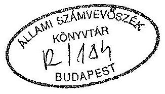
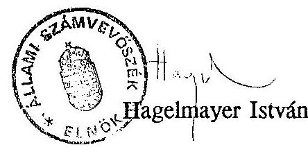

# Sillami Számvevőszék

## JELENTÉS

az Idegenforgalmi Alap pénzügyi-gazdasági ellenőrzéséről

---

Az ellenőrzést végezték:

| Csóry Györgyné | számvevő-tanácsos |
| :-- | :-- |
| Belics János | számvevő-tanácsos |
| Szijártó Károly | számvevő-tanácsos |

Az ellenőrzést vezette:

Hegedűsné
dr. Müllern Veronika
számvevő-főtanácsos

---

# J E L E N T É S

## az Idegenforgalmi Alap pénzügyi-gazdasági ellenőrzéséről

Az Idegenforgalmi Alap (továbbiakban: Alap) jogszabályban megfogalmazott célja az idegenforgalom központi feladatainak pénzügyi eszközökkel történő elősegítése, a konvertibilis devizabevételek növelését célzó beruházások, az infrastruktúrális és kommunális fejlesztések, a marketing-tevékenység támogatása.

Az Alap 1992-ben 1,2 milliárd Ft-tal gazdálkodott, melynek 83 %-át (1 milliárd Ft-ot) mint támogatást a központi költségvetésből kapta.

Az Alap kezelésével a Kormány az Ipari és Kereskedelmi Minisztériumot bízta meg (IKM). A tárcán belül ezt a feladatot az Országos Idegenforgalmi Hivatal (továbbiakban: Hivatal), mint főosztály - 28 fő átlaglétszámmal - végzi, hat intézőbizottság (továbbiakban: IB) közreműködésével.

Az IB-k önállóan gazdálkodó költségvetési szervek, 1992-ben 66,5 millió Ft-tal gazdálkodtak, ebből 24,4 millió Ft volt a költségvetési támogatás. Feladataikat mintegy 50 fővel látták el.

## Ellenőrzésünk során arra kerestünk választ, hogy

- az Alap működése hogyan segítette az idegenforgalmi politika stratégiai céljainak megvalósítását, a konvertibilis devizabevételek növelését,
- az Alap kezelését ellátó Hivatal, illetve az IB-k szervezete, működésük szabályozottsága biztosította-e az elkülönített pénzalap törvényes, célszerű és eredményes felhasználását.

Vizsgálatunk az 1990-1993. I. negyedévig terjedő időszak gazdálkodására terjedt ki. Ellenőrzésünk során mintegy 70 helyszínt kerestünk fel, ahol a pályázatok keretében elnyert pénzeszközök felhasználását, illetve öt IB-nél az infrastrukturális beruházások megvalósítását vizsgáltuk. Ezzel egyidejűleg az e témakörre vonatkozó szakirodalmat is áttekintettük.

---

# KÖVETKEZTETÉSEK, JAVASLATOK

Magyarországon az idegenforgalom, azaz a turizmus gazdasági szerepe egyre jelentősebb. Keresletélénkítő hatása nemcsak saját szolgáltatásai körében, hanem több ágazat /kereskedelem, közlekedés, kulturális-, egészségügyi szolgáltatás/ piacán is megnőtt.

Hasonló növekedési tendencia tapasztalható a világ turizmusában is. Gazdasági teljesítményének emelkedése ugyanis az elmúlt évtizedben jelentősen meghaladta a gazdasági növekedés ütemét, a világ kereskedelmének fejlődésével csaknem azonos mértékben bővült. A 6. legnagyobb üzleti tevékenységgé vált. /A világ GDP-jének 6 %-át, kereskedelmének 7 %-át adja/.

Az elmúlt évben - 1992-ben - hazánkat 33,5 millió látogató kereste fel. Ezen belül a turisták /24 órát meghaladó tartózkodással/ száma 20 millió fő, a kirándulóké 8 millió, az átutazóké 5,5 millió fő volt. A turisták átlagos tartózkodási ideje 5,2 éjszaka/fő, pénzfelhasználásuk 11,7 dollár/nap volt. (Ebben az évben a külföldre utazó magyarok száma megközelítette a 14 millió főt.)

A nemzetközi turistaforgalomból 1992-ben 1,2 milliárd dollár állami deviza bevétel származott /csaknem egynegyeddel magasabb az 1991. évinél/, ami a folyó fizetési mérlegben 560 millió dollár aktívumot jelentett az MNB kimutatásai szerint.

A hazai turizmus bevételeinek a GDP-hez viszonyított aránya a vizsgált időszakban 3-4 % volt, ami közvetlen exporthoz mérten 11 %-ot jelentett, az összes keresők mintegy 7 %-át foglalkoztatta. /a közlekedés, hírközlés foglalkoztatási aránya 8 % volt/.

Az idegenforgalmi bevételek nem tartalmazzák a külföldiek és a lakosság közötti közvetlen valutaforgalmat, mivel erről nincs statisztikai nyilvántartás. Becslések szerint ez az összeg megközelíti az MNB által kimutatott állami deviza bevételek nagyságrendjét.

Mindez jelzi, hogy Magyarország turizmusára ma még a tömegjelleg, az alacsony költésszint, a kirándulók és az átutazók nagy száma a jellemző, ez egyben behatárolja az állam jövőbeni szerepét is. (Nemzetközi statisztikai adatok szerint Magyarország a hivatalosan kimutatott devizabevételek szerint a 46. helyen áll, míg a turisták számát illetően az első tíz között foglal helyet.)

Jelenleg az idegenforgalom, vagyis a turizmus magas szintű jogi szabályozása egyoldalú, csak a tevékenységet segítő pénzügyi ösztönző eszközre, az Alapra korlá-

---

tozódik. Az idegenforgalmat, mint komplex tevékenységet jogszabály nem határozza meg. Az ennek megalapozását célzó kormányzati szintű koncepció elfogadására ez év derekán került sor.

Az Alapot kezelő Hivatal - melynek elnöke államtitkár-helyettesi beosztásban van - szervezete, szabályozottsága, ezzel együtt az Alap kezelésének rendje, gazdálkodása, számvitele nem megfelelő, igen sok kívánnivalót hagy maga után. Tisztázatlanok a hatáskörök, jogkörök, nincs kinevezett pénzügyi vezető, és nincs pénzügyi apparátus sem. A feladatok ellátásában olyan szervezet is résztvesz, melynek működése jogszabályellenes (Magyar Idegenforgalmi Tájékoztató Központ). Az Alap kezelésével összefüggő feladatokat jogszabályellenesen megosztották a Budapest Bankkal. Mindennek következménye, hogy a Parlamentnek bemutatott Alap-mérleg nem valós, ami felveti a Hivatal vezetőjének felelősségét. (Az elmúlt három évben három elnöke volt a szervezetnek.)

Az Alapnak a vizsgált időszakban 3,4 milliárd Ft "kimutatott" bevétele, és 3,2 milliárd Ft "kimutatott" kiadása volt. Ennek 80 %-át - évente eltérő mértékben - a központi költségvetés biztosította. Megállapításaink szerint a tényleges bevételek és kiadások jelentős - több százmilliós - nagyságrenddel térnek el a kimutatott adatoktól. Az éves költségvetést - jogszabállyal ellentétben - a tervalku keretében alakították ki, ami már nem volt összefüggésben az idegenforgalom devizatermelő hatásával, a tervezés nem a reálfolyamatok adataira épült.

Az Alap felhasználása a vizsgált időszakban alapvetően három területre koncentrálódott. Meghatározó volt a marketing-tevékenység, ami gyakorlatilag a nemzeti propagandára vonatkozott (1,2 milliárd Ft), valamivel kevesebbet fordítottak (1 milliárd Ft) az idegenforgalmi fogadóképesség fejlesztését elősegítő beruházásokra, és mintegy félmilliárd forintot az infrastrukturális beruházások támogatására.

A Hivatal hosszabb távú marketing-tervvel nem rendelkezett. A feladatokat a pénzügyi lehetőségek függvényében évenként a Hivatal elnöke határozta meg, annak ellenére, hogy e célra testület is működött, indokolt lett volna a tárca fokozott részvétele a feladatok meghatározásában.

Az idegenforgalmi fogadóképesség fejlesztését szolgáló beruházások támogatására három pályázatot írtak ki. Ebből kettő a kereskedelmi szálláshelyek és szolgáltatások fejlesztését, egy a falusi idegenforgalom feltételeinek javítását célozta. A pályázatokat bizottság bírálta el, melynek működése nem volt mindig jogszabályszerű. Mindhárom pályázatra jellemző volt, hogy a pályázatokat sem befogadáskor, sem a megvalósítás folyamatában átfogó jelleggel (pénzügyi és szakmai szempontból) nem ellenőrizte a Hivatal. Ennek következményeként szerződéstől eltérő kivitelezések és pénzfelhasználá-

---

sok is előfordultak, ennek negatív példáival főleg a "falusi turizmus" keretében lehetett találkozni.

Az infrastrukturális pénzeszközök felhasználása lényegében az önkormányzatok fejlesztési pénzeszközeinek kiegészítését jelentette, ami egyaránt szolgálta a helyi lakosság és az idegenforgalom céljait is. Esetenként ez utóbbi - a megvalósított célok ismeretében - vitatható. (Megjegyezzük, hogy az önkormányzatok üdülőhelyi díjbevételekből lényegesen nagyobb pénzeszközökkel rendelkeztek, mint az IB-k infrastrukturális célú forrásai. A Bizottságoknak azonban még információja sem volt ezek felhasználásáról.)

Az Alap kezelésének ellenőrzéséről a tárca csak részben a felügyeleti ellenőrzés keretében gondoskodott, azonban még ezek realizálása sem valósult meg maradéktalanul. Sem a jogszabályban megjelölt testület (melynek elnöke a miniszter) sem a Hivatal érdemi ellenőrzési munkát nem végzett, ez utóbbi felveti a Hivatal vezetőjének a felelősségét.

Összegezve megállapítható, hogy az Alap - működése, szabályozatlansága, kialakulatlan számviteli rendje, ellenőrzésének hiánya miatt - jelenlegi formájában nem alkalmas arra, hogy az idegenforgalom állami irányításának célirányos, hatékony, és eredményes befolyásolója legyen. A jogszabályszerű és hatékony működés érdekében javasoljuk:

# I. A Kormánynak

1. Az idegenforgalmi koncepció birtokában határozza meg a nemzeti turizmuspolitikát kifejező stratégiai feladatokat. Ennek keretében:
-készítsen elő olyan magas szintű jogszabályt, (törvényt, vagy rendeletet), amely hosszabb távra biztosítja a turizmus működésének, szabályozásának jogi kereteit,

- vizsgálja meg az integrált területi tervezés bevezetésének lehetőségét, biztosítva ezzel a különféle nemzeti tervek (gazdasági, kulturális, szociális stb.) és az idegenforgalmi terv kapcsolódását, a pénzeszközök, az e célú alapok koncentrált felhasználását. Indokolt, hogy ebben a munkában az államigazgatási, az önkormányzati és az érdekképviseleti szervek együttesen vegyenek részt.

## II. Az Ipari és Kereskedelmi Minisztériumnak:

1. Az 1992. évi LXXXIII.tv. végrehajtására kiadott miniszteri rendelet /2/1993. (I.15.) IKM rendelet/ nem teszi egyértelművé a törvény végrehajtását, ezért szükséges a hiányzó kérdésekben újabb rendelet kiadása (pl.: pályáztatás módja, jogcímenkénti támogatás, ellenőrzési kötelezettség).

---

2. Az idegenforgalmi stratégiai célok végrehajtásában - elsősorban az Országos Idegenforgalmi Tanácson keresztül - rendszeresen vegyen részt, jelölje ki a fő célokat, segítse a pénzeszközök koncentrált felhasználását.
3. Az intéző bizottságok jövőbeli feladatait úgy határozza meg, hogy azok - az integrált területfejlesztés célját szolgáló testületekben való részvétel útján - a Hivatal által megfogalmazott szakmai célok végrehajtását segítsék. (Pénzosztó szerepüket célszerű megszüntetni). A szakmai feladatok ismeretében határozza meg, és módosítsa jelenlegi szervezetüket, ehhez rendelten szabályozza működésüket.
4. Az Alap ellenőrzési rendszerének kiépítéséhez nyújtson segítséget, kísérje figyelemmel és tegyen hatékony intézkedést annak érdekében, hogy a hiányosságok megszűnjenek, és az Alap kezelése jogszerű legyen.
5. Kezdeményezze az idegenforgalmi díj megállapításához szükséges statisztikai adatszolgáltatás elrendelését.
6. A nemzeti propagandamunka végrehajtásában résztvevő MITÁK működését szüntesse meg. Biztosítsa a propagandamunka feltételeinek jogszabályszerű ellátását.
7. A Budapest Bankkal való kapcsolatot szerződéses formában rögzítse, azt kizárólag a banki szolgáltatásokra korlátozza.
8. Kezdeményezze a Hivatal mindenkori elnöke felelősségének tisztázását, az Alap kezelésében - szabályozás, ellenőrzés elmulasztása, mérlegvalódiság megsértése - tapasztalt hiányosságokért.

# III. Az Országos Idegenforgalmi Hivatalnak

1. Az IKM SzMSz-ének megfelelően alakítsa ki szervezetét, nevezzen ki pénzügyi vezetőt, illetve a pénzügyi feladatok ellátásához rendeljen szakirányú apparátust.
2. Alakítsa ki a Hivatal ügyrendjét, az ehhez kapcsolódó munkaköri leírásokat.
3. Az Alap működését jogszabályokkal összhangban szabályozza, készítse el a szükséges szabályzatokat, számviteli, bizonylati rendet.
4. Határozza meg az Alap ellenőrzési rendszerét, biztosítsa annak jogszerű működését.
5. Az Alap felhasználásában közreműködő bizottságok munkáját szabályozza, segítse elő a folyamatos és szabályszerű működést.

---

6. Belső információs rendszerét úgy alakítsa ki, hogy az alkalmas legyen az Alapból felhasznált pénzeszközök célszerűségének, hatékonyságának vizsgálatára.
7. Szüntesse meg a Bécsi Idegenforgalmi Külképviseleten működő "subconto" számlát, az ezen lévő pénzeszközöket vezesse át az Alap számlájára. A számláról a beszerzett eszközöket vételezze be az IKM vagyonába. Intézkedjen a külképviselet által kimutatott ÁFA kintlévőség beszedésére.

# II.

## MEGÁLLAPÍTÁSOK

## 1. Az idegenforgalmi tevékenység szabályozottsága, az állam irányításának eszközei, szervezeti kerete

### 1.1. Idegenforgalom jogi szabályozása

A turizmus - mint szolgáltatás - költségvetési bevételt növelő, fizetési mérleget javító, munkahelyteremtő, gazdasági szerkezetátalakító hatása miatt, az állam szerepvállalása jelentős, katalizátor hatást gyakorol a lehetőségek kihasználásában. (A mediterrán országokban pl. az európai felzárkózás első lépésének tekintették a turizmusban rejlő lehetőségek kihasználását.) Ennek megfelelően az idegenforgalomban az állam alapvető feladata a turizmus működésének jogi, közgazdasági valamint az intézményi kereteinek megteremtése. Mindez igényli a nemzeti turizmuspolitika, azaz a hosszútávú cél, feladat és eszközrendszer meghatározását. Ez a feltétele annak is, hogy a nemzetgazdaság szintjén a turizmus integrált tervezési rendszere létrejöjjön.

Magyarországon még nem került sor a turizmuspolitika kialakítására. Azt a koncepció-tervezetet, amely ennek megalapozását szolgálhatja, a Kormány a vizsgálat befejezéséig még nem tárgyalta. Így az idegenforgalom országos szintű feladatait évenként az OIT határozta meg - az OIH előkészítésében - annak ellenére, hogy a magyar turizmusban érdekeltek, résztvevők köre ennél lényegesen szélesebb /önkormányzatok, szállodák, idegenforgalmi irodák, falusi, ifjúsági turizmus, stb./

Az Ipari és Kereskedelmi Minisztérium az NGKM, később a Népjóléti Minisztérium bevonásával 1990. óta évente elkészítette a tervezet szintű turizmusfejlesztési
 koncepciót. 1992-ben hasonló témakörben hosszabb távra is kijelölték a feladatokat. A Kormány ezzel a kérdéssel azonban csak 1993. júliusában foglalkozott.

---

Nemzeti idegenforgalmi politika hiányában nem kerülhetett sor arra sem, hogy e témát átfogó jelleggel, magas szintű jogszabály, pl. törvény szabályozza. /mint Németország és Olaszországban/.

Ennek szükségességére hívta fel a világ parlamentjeinek figyelmét a WTO /az Idegenforgalmi Unió és a Turizmus Világszervezete/ Hágai Nyilatkozatában, ajánlva az átfogó jogi szabályozás szükségességét, amely nemcsak a nemzeti turizmuspolitikát, hanem annak prioritásait is meghatározza.

# 1.2. Az idegenforgalom szervezeti kerete 

Az idegenforgalomnak az államigazgatásban kialakult szervezeti kerete van. Ezt a feladatot jelenleg az IKM-en belül működő OIH látja el, melynek vezetője államtitkár-helyettesi besorolásban van. A Hivatal közvetlen felügyeletét a közigazgatási államtitkár látja el. Ezt megelőzően a hivatal vezetője főosztályvezetői, illetve miniszterhelyettesi besorolással, de közvetlen miniszteri irányítással dolgozott.

Nemzetközi viszonylatban a turizmus állami irányító szervezete meglehetősen eltérő. Önálló minisztérium van pl. Izraelben. Portugáliában és Spanyolországban más ágazatokkal közösen /kereskedelem, közlekedés, hírközlés/ alkotnak önálló tárcát. Alapvetően tartományi, illetve regionális szintű irányítás van Ausztriában és Belgiumban. A svéd gyakorlat sajátos, mivel a kormány és a helyi önkormányzatok szövetsége közösen alapított idegenforgalmi hivatalt. A magyar irányítási modellhez hasonló működik Finnországban, Németországban, Svájcban és Dániában.

Az idegenforgalmi feladatok helyi egyeztetését, - egyre szűkülő pénzforrások és működési zavarok mellett - az intéző bizottságok végzik. (Továbbiakban: IB) Jelenleg 5 IB és a Balatoni Regionális Tanács működik a kiemelt üdülőkörzetekben. Az IB-k tevékenységüket ma is a 2.006/1979. MT sz. hat. alapján végzik, működésük felülvizsgálata, újraszabályozása, a többszöri "nekifutás" után sem történt meg. Így ma az elnökségek egy kivétellel /Közép-Dunavidéki/ legitimek ugyan, de nem működnek. Az elnökségek - felmentés hiányában - csak "papíron léteznek". A minisztertanácsi határozatnak megfelelő működés évek óta lehetetlen, ugyanis annak feltételrendszere már megszűnt /felügyelő tárca, tanácsok, tervgazdálkodás/.

Az IB titkárságok a folyamatos működés érdekében az OIH elnökének intézkedésére jogszabályi háttér nélkül a területükön létrejött helyi önkormányzatok bevonásával megkísérelték tovább vinni a bizottságok munkáját. Ezek "a testületek" illegitimek ugyan, de működőképesek. A kialakult kényszerhelyzetben előfordult olyan szabálytalanság is, hogy az IB titkárságok vezetői felvállalták az egyszemélyi döntés felelősségét.

---

A Közép-Tiszavidéki IB a Kiskörei Vizisport-bázis fejlesztésének 3,5 millió Ft-os támogatására úgy kötelezte el magát, hogy ebből csak 2 millió Ft-ra volt elnökségi határozat. Ugyancsak elnökségi felhatalmazás nélkül vállalta fel a Titkárság a Tisza-tónál az "irányfény" kiépítésével kapcsolatos beruházási feladatot. A Mátra-Bükki IB elnökének lemondásával az IB gyakorlatilag 1991-től nem működik, a területi feladatokat a főtitkár saját belátása szerint látja el.

Az IB-k titkárságai önállóan gazdálkodó költségvetési szervek, és az IKM-hez tartoznak. Az önállóság kritériumainak azonban nem mindegyik felel meg. /Nincs elkülönített pénzügyi szervezet, a Közép-Dunavidéki IB gazdasági ügyeit mellékállású dolgozó végzi, az Alapot hol támogatásként, hol előlegként kezelik stb./ Ezért indokolt az önállóságukat mielőbb felülvizsgálni. /Többségük érezhető működési gondokkal küzd. A fejezet a költségvetési támogatást nem utalja át rendszeresen, így előfordult, hogy még a bérkifizetés is csúszott. Gyakran a rezsiköltségek fedezetének előteremtése is gondot okozott.

#### Abstract

A Közép-Tiszavidéki IB-t a Tiszafüredi Polgármesteri Hivatal "fogadta be" a Titkárság műszaki munkájának honorálásaként. A Mátra-Bükki IB-nél a dolgozók - bérfedezet hiányában - fizetésnélküli szabadságra kényszerültek. Hasonló a helyzet a Sopron-Kőszeg Hegyaljai IB működésénél is. Ez utóbbinál a közszolgálati díjak, SZJA, a TB-járulék fizetését is elhalasztották.

A Mátrabükki IB szabálytalan megoldásra is vállalkozott, több éven keresztül kölcsönt folyósított két Kft-nek, jelentős összegű kamat reményében. A Kft-k azonban megszüntek, így az IB-nek jelenleg 9,6 millió Ft kintlévősége keletkezett. Mindezt az APEH vizsgálata is feltárta.

Az IB-k szakmai irányítását az OIH végzi. A folyamatos, érdemi, felügyeleti irányítás azonban - részben szervezeti és létszám gondok miatt - nem megoldott. Az utóbbi időszakban a kapcsolattartás egyre gyakrabban a konfliktushelyzetek megoldására korlátozódott.

A kialakult szakmai és gazdasági feltételek indokolják, hogy az OIH - a tárcával közösen - az idegenforgalom területi irányításának kérdését mielőbb tekintse át és azt a megváltozott feltételekhez igazodva rendezze. Célszerű lenne, ha a központilag irányított titkárságok helyett az egyre szélesebb körű helyi érdekeket képviselő önkormányzatokra építve a területen működő társadalmi szervezetek, vállalkozások összefogásával átalakulna területi érdekképviseletté. Ez esetben az OIH feladata a helyi szervekben való részvételre, illetve a szakmai iránymutatásra korlátozódhatna.

Az OIH alapfeladatai közé tartozik a nemzeti idegenforgalmi propaganda tevékenység. Az ezzel kapcsolatos propaganda anyagok raktározásával, terjesztésével, idegenforgalmi adatszolgáltatással, illetve turisztikai információ szolgáltatással azonban nem

---

az OIH, mint államigazgatási szerv, hanem a Magyar Idegenforgalmi Tájékoztató Központ /MITÁK/ foglalkozik, meglehetősen sajátos szervezeti formában. A "Központ" ugyanis nem más, mint a Kurír Rt. egyik szervezeti egysége, vezetője az OIH által kijelölt személy. Szakmai irányítását ugyancsak az OIH látja el, és gyakorlatilag a szervezet egészét sajátjának tekinti.

Az idegenforgalmi propaganda tevékenység egy részét 1981-ig az Idegenforgalmi Tájékoztató Szolgálat /ITSz/ mint költségvetési szerv látta el, majd úgy a feladatot, mint a létszámot átvette az Idegenforgalmi Propaganda és Kiadó Vállalat. Ezeket a feladatokat 1991-ig végezte, míg csődbejutott és felszámolták. A folyamatosság megteremtése érdekében 1991. elején az OIH elnöke felkérte a Kurír Rt. vezetőjét, hogy 3 hónapra vegye át az ITSz-t. A felkérést megállapodásnak tekintették és a szervezetet - MITÁK néven - a Kurír Rt. szervezeti egységeként működtették.

# A MITÁK jogállását mielőbb egyértelművé kell tenni. 

#### Abstract

A Hivatal is változtatni kíván a MITÁK jövőbeni működésén. Tervei szerint alapítványt hoz létre. (Megjegyezzük, hogy elkülönített állami pénzalap esetében erre csak Kormány engedéllyel van lehetőség.) Kérdéses, kik lennének az alapítók, akik vagyonukat e cél érdekében áldoznák, mi lenne a jelenleg IKM kezelésében lévő bérlemények, ingóságok sorsa. Vitatható az is, hogy alapítványi formában biztosítható-e az állami érdekek érvényesítése a nemzeti célú propaganda munkában.

Megfontolandó, hogy a szervezet részben önálló jelleggel költségvetési szervként működjön tovább az IKM egyik intézményeként, (pl. a gazdálkodó szervezethez csatoltan) saját bevételeiből tevékenységét finanszírozva, illetve fejlesztve. Ez a megoldás ugyanis a költségvetésből többleteszközt nem igényel /eddig is az Alap finanszírozta, bár szabálytalanul/ és az államigazgatási irányítás egyértelműen biztosítható.

### 1.3. Az idegenforgalom irányításának pénzügyi eszköze

Az IFA az állami idegenforgalmi politika megvalósításának pénzügyi eszköze. Célja és rendeltetése, az idegenforgalomhoz szükséges infrastruktúra fejlesztésének támogatása, a nemzeti marketing, reklám és propaganda tevékenység finanszírozása, a hosszútávú idegenforgalmi célok megvalósításának segítése. 1992-ig a konvertibilis valutabevételeket növelő idegenforgalmi fogadóképességet bővítő beruházások is az Alap támogatási köréhez tartoztak, ezzel az idegenforgalmat ellátó vállalkozói réteget támogatták.

Az idegenforgalom átfogó - magas szintű - jogi szabályozása helyett részmegoldásként 1992. december végén sor került az Idegenforgalmi Alap

---

- mint elkülönített állami pénzalap, - törvényi szabályozására /1992. évi LXXXIII. törvény II. fejezete/.

Nemzetközi viszonylatban nem jellemző, hogy a központi idegenforgalmi célok érvényesítéséhez az állam központi alapot működtetne.

Európában csak Ausztriában van ilyen alap. Ennek forrása viszont nem a költségvetés, hanem még a II. világháború után létrehozott Újraépítési Alap /ERP/ idegenforgalmi célú része. Ennek kihelyezését követő visszafizetése biztosítja az Alap folyamatos feltöltését. (Megjegyezzük, hogy Ausztriában az egy lakosra jutó idegenforgalmi dollár bevétel csaknem a legmagasabb a világon.)

Az Alappal nem rendelkező fejlett piacgazdaságú országokban is jellemző viszont, hogy valamilyen formában támogatják a turizmus fejlődését /pl. nemzeti, regionális, szektorális jelleggel/. Ehhez különféle szintű terveket is készítenek.

A turizmus interszektorális jellege és nem egyszer negatív hatása miatt /pl. környezetrombolás, bűnözés, kábítószer, kommersz kultúra terjedése/ a nemzeti kormányokban terjed az a felismerés /pl. Franciaország, Finnország/, hogy a turizmust integrálni kell a különféle nemzeti tervekkel /pl. gazdasági, kulturális, szociális/.

Ma elsősorban olyan terveket készítenek a nemzeti kormányok a jövőbeni végrehajtók közreműködésével, melyek az infrastruktúra fejlesztését, pénzügyi szabályozók alakulását határozzák meg. A megvalósításban az állam azonban már nem kíván részt venni, azt a vállalkozói szférára bízza. Nemzetközi felmérés szerint /WTO/ elsősorban az adókedvezmények és elengedések, a fejlesztéshez nyújtott kedvezményes kamatozású kölcsönök, illetve az állami tulajdonú föld vásárlásának, koncesszióba vételének, vagy bérbe adásának a megkönnyítése jellemző. /pl. Ausztria, Belgium, Franciaország, Hollandia, Lengyelország, India/

Hazánkban az integrált tervezés igénye kormányzati szinten még nem merült fel. Az állami szerepvállalás kijelölése, magas szintű jogszabály hiányában a jelenlegi államigazgatási szervezeti rend és az IFA működési mechanizmusa mellett nehezen elképzelhető.

Az 1980-as évek elejéig az ötéves tervekben a turizmus csak a létrehozandó szállodai férőhelykapacitás adataival szerepelt. Először a turizmus távlati /2000-ig terjedő/ fejlesztési koncepciójának tárcaszintű kialakítására, a VI. ötéves tervben került sor. Ez azonban a megváltozott társadalmi-gazdasági feltételrendszer miatt ma már nem alkalmazható.

---

# 2. Az Idegenforgalmi Alap működése 

Az Alapot - az Államháztartási törvény előírásai szerint, mint ahogy az 1. pontban már jeleztük - törvény szabályozza. Ezt megelőzően az Alap minisztertanácsi rendeletek előírásai szerint működött (12/1989. /II.5./ és a 45/1989. /V. 26./ MT számú rendeletek). A rendeletek és a törvényi szabályozás között alapvető különbséget jelent, hogy míg az előbbiek közvetlenül támogatták az idegenforgalmi vállalkozásokat, addig az utóbbi közvetett szerepet vállalt elsősorban az infrastruktúra fejlesztésének ösztönzésével. Emellett lehetőséget adott az Alap kezelésével kapcsolatos kiadások fedezetére is.

Az Alap működését szabályozó törvény néhány kérdésben ellentmondásosan, sőt hiányosan szabályoz, aminek egyértelműsítésére a végrehajtásra kiadott miniszteri rendelet sem vállalkozott /2/1993. /I.15./ IKM rendelet/

Az Alap céljai között szerepel a "konvertibilis fejlesztések megvalósításának" elősegítése /9.§/. A felhasználási jogcímek között /14.§/ viszont ilyen tétel nincs, - helyesen - mivel a törvény közvetett úton kíván támogatást nyújtani. Ugyanakkor a törvény 16.§-a lehetőséget ad arra, hogy a 9.§-ban meghatározott célokra - azaz a "konvertibilis fejlesztések megvalósítására" - pályázat útján támogatást nyújtsanak.

A törvény kizárólag az infrastrukturális fejlesztések támogatására ír elő központi pályáztatási kényszert /14.§/2/ bek/, ami viszont a területi, idegenforgalmi bizottságok hatáskörébe tartozik. Ugyanakkor - a 16.§ szerint - támogatás (vagyis bármilyen) "alapvetően pályázat útján nyújtható". A pályáztatási formákról, a résztvevők köréről, a pályáztatás módjáról sem a törvény, sem a miniszteri rendelet nem szól.

Tételesen felsorolja a pályázatot elbíráló bizottságok tagjait, közöttük az önkormányzatok képviselőit is. Nem határoz viszont arról, hogy milyen típusú, vagy konkrétan melyik önkormányzatról van szó. Jelenleg közel 3200 önkormányzat működik és jónéhány önkormányzati szövetség.

A törvény néhány turizmusfajta /pl. falusi, gyógy, ifjúsági, kerékpár, vízi, természetjáró/ kiemelt támogatását írja elő, a konkrét jogcímekről (pl. fogadóképesség, vagy az infrastruktúra fejlesztése, vagy ezek tervezése) nem dönt.

Újszerű elem a "több területet érintő" támogatás. Indokolt lenne ennek konkrét végrehajtását is szabályozni, részben az önkormányzati tulajdon miatt, részben pedig azért, mert eddig a támogatások egy-egy települést, sőt településrészeket támogattak.

A törvény nem intézkedik az Alapból nyújtott támogatások, egyéb címen történt felhasználások ellenőrzéséről, a rendelet is csak érintőlegesen. Korábban a

---
12/1989./II.5./MT számú
 rendelet 6.§-a ezt konkrétan előírta. /Más kérdés, hogy ennek gyakorlati megvalósítása igen sok kivánni valót hagyott maga után/.

# 2.1. Az Alap kezelésének szervezeti háttere, szabályozása 

Úgy a törvény, mint ezt megelőzően a minisztertanácsi rendeletek az Alap kezelését a Kereskedelmi majd az Ipari és Kereskedelmi Miniszterre bízta, ezt a jogkört tárcán belül az OIH gyakorolja.

Az IKM 1990-ben készült SZMSZ-e az OIH-ra vonatkozóan úgy intézkedik, hogy "kezeli az IFA-t, javaslatot tesz az Alap felosztására és gondoskodik hatékony felhasználásáról". Az OIH-n kívül az IFA-val kapcsolatban más szervezeti egységnek nincs feladata, szerepe, még a fejezeti feladatokat ellátó pénzügyi főosztálynak sem. Indokolt lett volna legalább a költségvetésen és az éves beszámolón keresztül a "fejezetnek" ezt a jogosítványt megadni. Ezzel ugyanis a miniszter pénzügyi felügyeleti jogait operatív módon gyakorolhatta volna.

Az SZMSZ-ben kijelölt feladathoz a Hivatal nem készített ügyrendet, a munkaköri leírások pedig nem megfelelőek.

A dolgozók közötti munkakapcsolatok nem szabályozottak teljeskörűen. Nem megfelelően rendezett a területi szervekkel /Idegenforgalmi Bizottságok/, és a külképviseletekkel való kapcsolattartás sem.

A feladatokat, hatásköröket, jogköröket írásban nem rögzítették a szervezeten belül, illetve az osztályok között /4 osztály van/.

Alapvető gondot okoz, hogy az IFA átfogó ügyviteli, nyilvántartási munkáit az OIH Fejlesztési osztálya látja el, de az osztálynak ezirányú pénzügyi tevékenységét írásos dokumentum nem rögzíti, annak ellenére, hogy az osztályvezető értékhatár nélkül rendelkezik kötelezettségvállalási és utalványozási jogkörrel. Gondot okoz az is, hogy a pénzforgalmi feladatok sem egy osztályon belül koncentrálódnak. Nincs a Hivatalban olyan szervezeti egység - pénzügyi szervezet - amelyik az SZMSZ-ban kijelölt "kezelés" pénzügyi feladatát teljeskörűen és szakszerűen el tudná látni.

Az 1993-ban jóváhagyott IKM SZMSZ-ban az OIH-nak már 5 osztálya van, éppen a hiányolt pénzügyi osztály az 5. Eddig azonban a feladat és a hozzá tartozó szervezet kialakítására, munkájának szabályozására nem tettek érdemi lépéseket /felvettek ugyan osztályvezető jelöltet, akit nyugdíjasként megbízásos jogviszonyban alkalmaznak/.

Mindebből következik, hogy az IFA gazdálkodásáért felelős pénzügyi vezetőt nem neveztek ki - még elnökhelyettes szintjén sem. A munkaköri leírások gazdasági

---

felelősséget nem tartalmaznak. Vagyis a Hivatal vezetése - miniszteri felhatalmazás ellenére - az Alap "kezelését" csak adminisztratíve - igen sok hiányossággal terhelve - és nem a pénzügyi jogszabályok előírásai szerint végzi.

Az Alap gazdálkodására vonatkozó szabályzattal 1993-ig nem rendelkeztek, ezt csak 1992. december 29-én adták ki.

#### Abstract

Ez a szabályzat tartalmában nem megfelelő, mivel nem rögzíti a kezelés teljeskörű feladatait. /pl. gazdálkodási hatásköröket, jogköröket csak esetenként rögzít, a pénzügyi kezelés rendjéről nem szól, nem szabályozza az érvényesítést, ellenjegyzést, nem intézkedik a területi szerveknek juttatott Alap felhasználásáról sem./ Így fordulhatott elő pl. hogy a Velence-tavi Intéző Bizottság a rendelkezésére bocsátott alapot saját forrásaival kiegészítve ún. Velence-tavi Alapba "ürítette" és a tényleges támogatást ebből finanszírozta. Ez utóbbi alap még egy 1970-es évek elején kiadott MT határozat alapján működik, a gazdálkodásban érdemi jelentősége nincs, ezért indokolt azt mielőbb megszüntetni.

A szabályzat az Alappal kapcsolatos ellenőrzési kötelezettséget kizárólag az IKM Ellenőrzési Főosztályára hárítja, holott erre az OIH-nak nincs jogosítványa.

Nem szabályozták az Alap számviteli rendjét, így nyilvántartásaik nem elégítik ki a folytonosság, teljesség, áttekinthetőség, valódiság és a bruttó elszámolás elvét. Számvitelüket a 67/1993./ Korm. rendelet megjelenése után sem a kettős könyvvitel szabályai szerint végzik. Megjegyezzük, hogy ehhez megfelelő pénzügyi felkészültségű szakemberekkel sem rendelkeznek.

Ennek következményeként a Parlamentnek az éves beszámoló keretében a bemutatott Idegenforgalmi Alap mérlege nem valós. Az OIH az Alap kezelési feladatainak jórészét szabálytalanul - az 1992. évi LXXXIII. törvénnyel, a 67/1992. (IV.14) Korm. rendelettel, valamint az IKM SZMSZ-ével ellentétben - bankszámla-szerződés keretében a Budapest Bankra bízta. Ugyanis nemcsak a banki pénztechnikai feladatokat hárította át, hanem a tulajdonosi funkciók egy részét is. /pl. szerződéskötés/. A pénzintézet feladatköre igen széles, mivel a Hivatal a férőhelybővítő beruházások, az IB-k nem beruházás-jellegű tevékenységének lebonyolítását, a törlesztő részletek beszedését, a behajtási munkát, a kedvezményezettek beszámoltatását, illetve a beruházások ellenőrzését is a bankkal végezteti. (Természetesen a bank ellenőrzései nem szakmai, hanem számla ellenőrzések.) Helytelen gyakorlat az is, hogy a támogatást kapott, de csődbement vállalkozókkal szembeni követelések érvényesítését is a bank intézi, mivel ebben gyakran a pénzintézet saját tőkéjével is érdekelt.

---

A bank ezekért a feladatokért kezelési költséget nem számított fel, ugyanakkor a nála kezelt pénzeszközöknek csak egy részéért fizet kamatot az OIH-nak. (fedezeti számlákra elkülönített összegekért nem, ami az éves pénzforgalom közel egyharmada)

Mindebből következik, hogy a Hivatal pénzügyi információja a Budapest Bankra támaszkodik, ellenőrzési tevékenységet, - sem a belső gazdálkodásában, sem a támogatottak vonatkozásában - nem végez.

Megjegyezzük, hogy az OIH a Budapest Banknál lévő nyilvántartásokat, bizonylatokat a helyszínen még soha nem ellenőrizte, holott a banki elszámolásban szabálytalanságok is tapasztalhatók, pl. aláíratlan elszámolások találhatók, bizonylat helyett nyilatkozatra fizettek, a beruházó által ígért saját rész elmaradása esetén is kifizették az OIH támogatást /pl. a Sátoraljaújhelyen, Tüskén, Remete-hegyen épült panzióknál/

# 2.2. Az Alap forrásai 

Az IFA 1990-92 között 3,4 milliárd Ft kimutatott bevétellel rendelkezett, melynek mintegy 80%-át /2,7 milliárd Ft/ a központi költségvetés biztosította.

A 12/1989. (II.5.) MT sz. rendelet úgy intézkedett, hogy a költségvetésből nyújtott támogatásra vonatkozó javaslatot a pénzügyminiszternek az idegenforgalomból származó dollárban kimutatott konvertibilis devizabevételek alapján kialakított "mérték" szerint kell elkészíteni. A vizsgált időszakban ez a gyakorlatban nem érvényesült, a támogatás nagyságrendje a tervalku keretében alakult ki. /1990-ig az állam minden egyes USD bevételhez 2 Ft támogatást adott/. Ezt az összeget évente átlag 1 milliárd Ft nagyságrendben tervezték. Ezzel szemben a ténylegesen átutalt összeg ennél kevesebb volt.

1991-ben a Parlament 0,6 milliárd Ft-ot hagyott jóvá. Ugyanezen évtől kezdődően titkos kormányhatározattal évente 34 millió Ft-ot vontak el a Forma 1 futam miatt az Alaphól. 1992-ben az IFA 960 millió Ft volt.

A támogatás rendje 1993-ban alapvetően megváltozott. Az Alapot szabályozó törvény a deviza bevétel és a támogatás összefüggéseitől eltekintett. Döntő hangsúlyt az új szabályozóként bevezetett idegenforgalmi díjra helyezte, amit az idegenforgalomban érintett vállalkozói szféra fizet. /Ezzel egyidejűleg a költségvetési támogatás 500 millió Ft-ra csökkent./

A szabályozott bevétel bevezetése nem volt kellően előkészítve. A törvényben rögzített vendéglátó és kereskedelmi egységek fizetési kötelezettségének megállapításához ugyanis sem a KSH-nál sem az APEH-nál nem álltak rendelkezésre a szükséges adatok, és ilyen típusú adatszolgáltatási kötelezett-

---

séget sem írtak elő. /pl. a kereskedelmi szálláshelyek, az osztályon felüli, az I. és a II. osztályú vendéglátó egységek, a személygépkocsi kölcsönzés éves árbevétele, az utazás szervezői, a közvetítői tevékenységből származó árrés, adóalanyok száma/. Így a PM az OIH bevonásával csak különféle közgazdasági számítási módszerrel /becslés, arányosítás/ tudta a várható bevételeket felmérni. (Megjegyezzük, hogy az 1994. évi költségvetési tervezetben a szabályozott bevételt háromszorosára kívánják emelni, anélkül, hogy az információszolgáltatási kötelezettséget elrendelték volna.)

A számítások alapján kb. 560-570 millió Ft forrással számoltak, amiből 500 millió Ft-ot 1993. évre forrásként beterveztek. Ennek több mint 10%-át /54 millió Ft-ot/ ki fogják fizetni az APEH-nak, a bevételek beszedéséért, a szükséges ellenőrzésekért, illetve a behajtási munkáért. /Minderről egy titkos kormányhatározat intézkedik./ Az OIH és az APEH között létrejött megállapodás szerint - jogszabállyal összhangban - a késedelmi kamat az APEH bevételeként jelenik meg. Mindez több millió Ft-tal csökkentheti az Alap kiadási lehetőségeit.

Az idegenforgalmi bevételek mintegy 15%-át jelentette a pályázat keretében visszterhesen nyújtott támogatások visszafizetése. Sem a minisztertanácsi rendelet sem a törvény nem intézkedett arról, hogy a visszterhesen nyújtott támogatások után milyen nagyságrendű járadékot, illetve visszafizetés elmaradása esetén büntető kamatot kell fizetni, de arról sem döntött, hogy a visszafizetésekhez milyen futamidőt lehet szabni. Mindkét jogszabály megengedte, hogy a támogatásokat visszterhesen, vagy anélkül is nyújthatták, de nem tett különbséget az egyes támogatási típusok között. Ezek a jogszabályi hiányosságok különösen indokolták volna, hogy az OIH belső szabályzatban rögzítse saját eljárási rendjét, a pályázatok bírálati elveit /a következetes döntés és szubjektivizmus vádjának elkerülése érdekében/ erre azonban nem került sor.

A vizsgált időszakban a visszterhes támogatásokat /melyre 980 millió Ft-ot fordítottak/ évente átlag 1-3 % járadékkal /csak elvétve fordul elő 5 %/ esetenként 15 éves visszafizetés mellett nyújtották. A járadék mértékét a támogatás összegének %-ában határozták meg. Kis számban ugyan, de visszafizetési kötelezettség nélkül is adtak támogatást. Sem a megítélt járadék %-áról, a visszafizetés futamidejéről, sem az "ingyen" támogatás indokoltságáról írásos dokumentum nem készült.
1992. december 11-én 50 db pályázatot bíráltak el, csaknem valamennyinél minimális járadékot /1 %/ és maximális /15 év/ futamidőt állapítottak meg, különösebb indoklás nélkül. Előfordult az is, hogy a vállalkozó által vállalt járadék összegének csak a felét állapították meg. (Pl. a "Korda-villához" 2%/év járadékot vállaltak, ehelyett 1%/év fizetési kötelezettséget írtak elő)

Mindez arra utal, hogy az IFA a vizsgált időszakban puha költségvetési támogatásként funkcionált, gyakorlatilag ingyen hitel volt. Ilyen "olcsón" és ilyen hosszú távra építés-jellegű pályázatok sehol sem juthattak volna hitelhez.

---

Jellemző, hogy az Alapnak 1992. december 31-én járadékkal növelve 1,5 milliárd Ft követelése volt, a visszafizetés utolsó dátuma pedig 2008. év. Ezen belül a törlesztési kötelezettségek elmulasztásából 1992. év végén 25 millió Ft bevétel-kiesés keletkezett.

Késedelmes visszafizetés esetén - szabályozás nélkül - 20%-os büntető kamatot alkalmaznak, ami még így is lényegesen kevesebb, mint a hivatalos banki alap kamat. A előírt késedelmi kamat összege 1992. december 31-én 1,4 millió Ft volt, ezzel szemben a befolyt bevételek alig haladták meg a 0,2 millió Ft-ot.

A behajtást a Budapest Bank végzi és nem az OIH. A követelésről a Hivatalnak nincs naprakész nyilvántartása. Az előírásokról a Bank nem ad részletes információt, csak a kifizetett támogatásokról és a visszafizetésekről.

Az IFA tényleges bevételei között található néhány olyan tétel is, melyek nem szerepelnek az Alap éves beszámolójában. Ezek is alátámasztják a mérleg valódiság hiányát.
-A bécsi Idegenforgalmi Külképviseletnél az ÁSZ 1991-ben közel 100 ezer ATS mehrwert steuer kintlevőséget állapított meg. Azóta ez az összeg valószínűleg megnőtt - nagyságrendje az OIH kimutatásainak hiánya miatt nem állapítható meg - behajtására azonban azóta sem történt intézkedés;
— Ugyancsak a bécsi Idegenforgalmi Külképviseletnél szabálytalan deviza-kezelést tapasztaltunk. Még a 80-as évek elején /fellelt bizonylatok alapján/ az Alaphoz kapcsolódó deviza bevételek egy részét - elsősorban nemzetközi vásárok éttermi szolgáltatásaiból - az IBUSZ bécsi kirendeltségén kezeltették. Ezt követően - a bécsi Idegenforgalmi Külképviselet megnyitása után - 1991. decemberében a Hivatal elnöke és a Marketing osztály vezetője utasította a kirendeltség vezetőjét, hogy a külképviselet hivatalos számlája mellett nyisson meg egy ún. "subconto" számlát. Ehhez devizahatósági engedéllyel nem rendelkeztek, így megsértették a
 1974. évi I. tv.

A számla felett intézkedési jogosultsága a mindenkori OIH elnökének /szóban esetenként iktatás nélküli levelezésben/ és a Marketing osztályvezetőnek volt, és van. A számla bevételeit - szabálytalanul - a különböző nemzeti vásárokon keletkezett bevételek /pl. éttermi, büfé forgalom után/ képezik, holott ezeknek a külképviselet engedélyezett számlájára - mint IFA bevétel - kellene befolyni, mivel ez az Alap forrása.

---

A kiadások tételszáma nem volt nagy, de a kifizetések mindegyike szabálytalan volt, mivel ezeket az IFA, illetve az IKM költségvetése terhére kellett volna teljesíteni:

Az OIH elnökének és a Marketing osztály vezetőjének utasítására 1989. szeptember 21-én a számláról 20 e ATS-t vett fel a kirendeltség egyik dolgozója azért, hogy irodai felszereléseket vásároljon /magnetofon, kis számológép, polaroid fényképezőgép, kazetták, filmek/. A pénzeszköz felhasználásának igazolására bemutatott számlák egyike a bécsi kirendeltség dolgozójának /7673 ATS összegben/, egy másik az OIH elnökének /13.400 ATS összegben/ nevére lett kiállítva. (Megjegyezzük, hogy a névre szóló számlák után a mehrwert steuer visszaigényelhető, erről azonban dokumentumokat nem találtunk.) A beszerzett eszközöket 1990. január 17-én "jegyzék" alapján az OIH dolgozói átvették, ez azonban az IKM leltárában nem szerepel. A dolgozók egy része azóta már máshol dolgozik, azonban az átvett eszközök visszavételezésére nem került sor.

Marketing osztály vezetőjének utasítására az IBUSZ bécsi kirendeltsége a nála kezelt deviza terhére 1991. január 22-én 150 e ATS-t átutalt az Idegenforgalmi Külképviselet hivatalos számlájára. Később az osztályvezető arra utasította a kirendeltség vezetőjét, hogy a megkapott kölcsönt a Dunamenti Országok Szervezetének tagsági díjaként fizesse ki. A kölcsön visszafizetésére, illetve elszámolására nem került sor.

Ugyancsak az OIH elnöke utasította a külképviselet vezetőjét, hogy 1991. január 29-30-án vegyen részt az Európai Turisztikai Bizottság angliai ülésén. Az utazás 25 ezer ATS-be került, amit az IBUSZ bécsi kirendeltségétől hívtak le. A kiküldetés, illetve annak elszámolása az IKM nyilvántartásai között nem szerepel, így az azt bizonyító okmányok is hiányoznak.

Az idegenforgalmi külképviselet megnyitása alkalmából 16 ezer ATS vendéglátási költség merült fel, aminek fedezetét ugyancsak az IBUSZ bécsi kirendeltségénél elhelyezett deviza fedezte. A vendéglátás elrendelését, a résztvevők névsorát, a fogyasztott ételek és italok felsorolását tartalmazó számlát nem tudták bemutatni.

A "subconto" számla forgalmáról - mint az elkülönített állami pénzalapon és a költségvetésen kívüli pénzeszközről - a kirendeltség külön nyilvántartást vezet ugyan, de arról, (mivel azt az OIH nem kéri) nem számol el a Hivatal felé. Így ez az összeg hiányzik az Alap mérlegéből.

Az illegális devizakezelés keretében - a fellelt dokumentumok alapján - 1988-tól közel 1 millió ATS bevételt és mintegy 0,6 millió ATS kiadást teljesítettek.

---

A számla megnyitásakor az IBUSZ kirendeltségén lévő záróállományt /157 e ATS-t/ átvezettek a "subconto" számlára, aminek 1993. március 17-én 387 e ATS volt az egyenlege.

A számlát meg kell szüntetni, a rajta lévő deviza összeget át kell vezetni az IFA számlára, és azt az IFA mérlegében szerepeltetni kell.
— Valamennyi idegenforgalmi külképviseletnél jellemző /3 külképviselet van: bécsi, frankfurti, madridi/ hogy működésükhöz az OIH negyedévente ellátmányt utal, amit teljesített kiadásként mutat ki, így az év végi mérlegben sem a tényleges kifizetések, sem a záró állomány /pénz-maradvány/ nem a valós adatokat tartalmazza. (Pl. 1992. év végén 15 millió Ft volt a kirendeltségeken lévő kintlevőség)

- Ugyancsak torzítja a Hivatal bevételeit /és a kiadásokat is/, hogy a kiadványok megjelentetési költségeinek elszámolása nem szabályozott, így az ezzel kapcsolatos bevételek és kiadások néhány esetben nettó módon kerültek elszámolásra. (Pl. TRAVEL újság)
- Az OIH és a MALÉV között létrejött együttműködés alapján a Hivatal a vállalat reklámtevékenységét azzal segítette, hogy rendezvényein és kiadványaiban a MALÉV reklámjának térítésmentesen helyet biztosított /pl. a TRAVEL újság 1993. 2. számában a 48. oldalból 4 oldal MALÉV reklám volt/. A MALÉV ezt a "segítséget" 1992-ig 100 db, 1993-ban pedig 50 db térítésmentes repülőjeggyel honorálta. Gyakran előfordult az is, hogy a Hivatalnak az OIH küldemények repülőgépes szállításáért nem kellett fizetni.

A létrejött megállapodás szerint a térítésmentes repülőjegyeket az OIH a beutazó idegenforgalom elősegítésére használhatja. A ténylegesen felhasznált repülőjegyek között azonban jelentős volt az OIH dolgozóinak igénybevétele is. /1992-ben 18, 1993 I. félévében 11 db/.

A térítésmentesen biztosított repülőjegyek nyilvántartását és felhasználását az OIH nem szabályozta. A lehívott és a felhasznált repülőjegyekről áttekinthető nyilvántartást nem vezettek, így az ebből származó bevételeket /évente 1-2 millió Ft/, illetve kiadás-megtakarításokat sem tudták kimutatni. A MALÉV csak a lehívásokról vezetett meglehetősen pontatlan nyilvántartást, a tényleges felhasználásról nem.

A MALÉV nyilvántartása, illetve kimutatása szerint az OIH az 1992. évi 100 db kerete terhére 90 db-ot hívott le, a nyilvántartásból viszont a nagyszámú törlés és átírás miatt a tényleges felhasználás nem állapítható meg. A lehívott jegyek között

---

közel 20 olyan személy is szerepel, akiket nem az OIH hívott meg. A meghívásokat teljeskörűen - a nagyszámú módosítások miatt - a vállalat nem tudta bemutatni.

Az OIH-tól kért adatszolgáltatás szerint 1992-ben 64, 1993. I. félévében 36 szabadjegyet vettek igénybe. Ezek az adatok azonban pontatlanok (pl. 1993. I. félévére az OIH saját dolgozói részére 9 lehívást eszközölt és 14 dolgozó utazását mutatta ki. Ezzel szemben ténylegesen 11 dolgozó utazott; az 1992. évi igénybevételből hiányzik a frankfurti képviselet vezetőjének utazásához igénybe vett jegy).

A szabadjegyek felhasználásának engedélyezését nem szabályozták, elvileg ez az OIH elnökének hatáskörébe tartozott. Ennek ellenére 1992-ben a meghívásokat és ehhez kapcsolódóan a szabadjegyek igénybevételét is a Marketing osztály vezetője illetve a MITÁK egyik dolgozója engedélyezte.

A szabadjegyekkel való gazdálkodást jogszabály szerint szabályozni, azt a számviteli nyilvántartásokban szerepeltetni kell, mivel ennek hiánya visszaélésre adhat alkalmat.

# 2.3. Az Alap pénzeszközeinek felhasználása 

Az Idegenforgalmi Alapból 1990. - 1992. között mintegy 3,2 millió Ft nagyságrendű felhasználást mutatott ki a Hivatal. Ez az összeg azonban nem egyezik meg a tényleges felhasználással. Egyrészt a bevételeknél már jelzett "nettó elszámolás" miatt a kiadások sem a valós ráfordítást tükrözik, illetve jónéhány tétel "kimaradt" az elszámolásból. Másrészt viszont azért, mert a Hivatal a férőhelybővítő pályázatok esetében - nem a tényleges kiadásokat mutatja ki, hanem ehelyett a kötelezettségvállalást "könyveli" tényleges kiadásként. Vagyis gazdasági esemény nélkül, a banknál vezetett fedezeti számlára a szerződéskötéssel egyidejűleg elkönyvelt összeget tényleges felhasználásnak tekintik. Ez az összeg szerepel az éves beszámolóban is.

Pl. Heiden László (Velencefürdő) részére panzió építéséhez 9,4 millió Ft támogatást biztosítottak, melyből 3 millió Ft-ot 1990. október 30-án, 1 millió Ft-ot pedig 1991. január 10-én a Budapest Bank fedezeti számlára helyezett ki. A 9 millió Ft-ot szerződésbontás miatt a bank 1991. május 21-én visszavezette az alapra. Ennek ellenére az OIH ezt az összeget felhasználásként kezelte, holott a vállalkozó részére kifizetés nem is történt. Hasonló esetek fordultak elő: a KÖÉPSZOLG Kisszövetkezet 25 millió Ft, Tuller Jenő Mosonmagyaróvár 6 millió Ft, Tapolcai Áfész 2 millió Ft összegű támogatásával.

Ebből következően nagyságrenddel tér el az Alap tényleges kiadása, az időszakonkénti forgóeszközállománya, illetve az év végi záróállománya a kimutatott összegtől.

---

Megjegyezzük, hogy a Budapest Bank éppen a fedezeti számlára elkülönített összeg után (1990-93. I. félév között ez az összeg átlag 1 milliárd Ft volt) nem fizet kamatot a Hivatalnak.

Mindennek következménye, hogy a Hivatal által elkészített éves parlamenti beszámoló számszakilag nem valós, csupán az arányok, tendenciák bemutatására alkalmas.

Az elmúlt három évben az Alap 2/3-ad részét (kb. 2,4 milliárd Ft) alapvetően három területen hasznosították. Több mint 1/3 részét (1238 millió Ft-ot) a marketing-tevékenységre, ami gyakorlatilag a nemzeti propaganda-tevékenységet foglalja magába. Valamivel kevesebbet fordítottak (980 millió Ft) az idegenforgalmi fogadóképesség fejlesztésére, amit pályázat keretében használtak fel, és mintegy 560 millió Ft-ot infrastrukturális beruházásokra költöttek. Jellemző, hogy míg ez utóbbi célra fordított támogatás három év alatt 40%-kal, a férőhelybővítésre fordított összeg 60%-kal csökkent, addig a propagandacélú felhasználás 23%-kal nőtt.

A fennmaradó 0,8 milliárd Ft-ot kulturális rendezvényekre, idegenforgalmi külképviselet támogatására, ifjúsági turizmusra, kutatásra, tervezésre, szakemberképzésre fordították.

Az Alap éves felhasználási jogcímeiről - a 12/1989. MT. rendelet szerint - az OIT javaslata alapján a miniszter dönt. Ebből eredően az előirányzatok módosításáról is. A döntésekről azonban miniszteri aláírást egyetlen esetben sem tudott a Hivatal bemutatni. Ez annál inkább indokolt lett volna, mivel a döntési szintek összemosódnak, ugyanis az OIT elnöke és a felügyelő tárca minisztere ugyanaz a személy. (A miniszter a vizsgált időszakban mindössze néhány alkalommal vett részt az OIT ülésén.) Mindebből következik, hogy szabálytalan az az eljárás is, amikor a Hivatal elnöke vezetői értekezlet keretében előirányzat-átcsoportosításról dönt, azzal a kikötéssel, hogy "erről az OIT-t utólag tájékoztatni kell". Hasonló gyakorlatot tapasztaltunk az éves tartalékkeret felosztásánál is.
1990. novemberében az ifjúsági turizmus előirányzatának egy részét, a világkiállításra elkülönített 31,3 millió Ft-ot zárolták, és azt a tartalékba csoportosították át, illetve döntöttek 75 millió Ft tartalékkeret felosztásáról.

Az OIT működésére jellemző, hogy az éves költségvetés jóváhagyására, a jogcímenkénti felhasználására általában igen későn (az első félév végén, vagy ezt követően) tesznek "javaslatot", ami a beruházás jellegű pénzeszközök (az Alap közel fele) időbeni és hatékony felhasználását megnehezíti, és megnöveli a záró pénzkészlet volumenét.

Az éves előirányzatok tervezését a Hivatal bázis szemléletben, a tervezett feladatok kiadásainak becslése alapján végezte, így az IB-k támogatásának nagyságrendjét a

---

maradványelv határozta meg. Konkrét, mindenre kiterjedő feladattervvel, ehhez kapcsolódóan alternatívákkal alátámasztott számítási anyaggal nem rendelkeztek, ami előkészíthette volna az OIT megalapozott döntéseit.

Így pl. 1991-1992. évre a nemzeti propaganda célokra tervezett előirányzatot 85%-kal megemelték minden különösebb indoklás nélkül, az OIH elnökének döntése alapján.

# 2.3.1. A pályázati rendszer működése 

Az idegenforgalmi fogadóképesség fejlesztésére rendelkezésre álló pénzeszközöket (980 millió Ft-ot) pályázat keretében osztották el. A vizsgált időszakban három pályázati kiírás volt, ebből kettő (1989. és 1992. évi) kereskedelmi szálláshelyek és szolgáltatások kialakítását, bővítését szolgálta, míg egy (1991. évben) a falusi turizmus feltételeit igyekezett javítani. A Hivatal jelenlegi nyilvántartásaiból nem lehet megállapítani, hogy ténylegesen hány pályázat érkezett be a megadott határidőre.

### 2.3.1.1. A kereskedelmi szálláshelyek és szolgáltatások fejlesztését segítő pályázat

A beérkezett pályázatokról az Idegenforgalmi Fejlesztési Bizottság (IFB) döntött, amelynek elnöke az OIH mindenkori elnöke, titkára a fejlesztési osztályvezető, tagjai pedig - jogszabály szerint - a Kereskedelmi, és a Pénzügyminisztérium, illetve az Országos Tervhivatal képviselői voltak. Az OT 1990. évi megszűnését követően a bizottság két fővel működött tovább, a jogszabályszerű működés helyreállítását sem a bizottság titkára, sem az OIH elnöke nem kezdeményezte. (A bizottság kiegészítésére, azaz a tagok számának növelésére csak 1991. végén került sor.)

Tekintettel
 arra, hogy a bizottság döntésre feljogosított testületi szerv, ahol szavazati többséggel lehet a pályázatok sorsát eldönteni, indokolt lett volna a bizottsági tagok számának időben történő növelése.

A bizottság működésével összefüggésben több hiányosságot, szabálytalanságot tapasztaltunk:
—a pályázatok döntéselőkészítése (számításokkal való alátámasztása, az adatok helyességének vizsgálata), mint titkársági feladat nem volt nyomonkövethető;
— rendelkeztek ugyan ügyrenddel, de ebben a pályázatok minősítésének szempontjait, a támogatások után fizetendő járadék nagyságrendjét, a visszafizetés futamidejét

---

nem rögzítették, így az egységes elvek érvényesítését az egyes pályázati bírálatokban sem lehetett fellelni.
— pályázati határidő után is fogadtak be már elutasított, illetve új pályázatokat, (pl. Korda villa, Turbókné stb.)

Ezek alapján mintegy 200 millió Ft támogatás odaítéléséről döntöttek. (A pályázatot ismételten nem hirdették meg, így kérdéses, hogy a pályázók honnan tájékozódtak a támogatási lehetőségekről);
— kellékhiányos pályázatot is befogadtak, sőt ezzel nyerni is lehetett (pl. Vas Edit vállalkozó panzióépítése);
—a pályázatban közölt saját forrás összetételét (a pályázati feltételek szerint) sok esetben nem lehet megállapítani,
—a bankhitelt rendszerint saját forrásként vették számításba;

Az ASPER TOURS KFT 44 millió Ft-ot tervezett a tolmácssi Szentiványi-kastély szállodai célra történő kialakítására. Ehhez 5 millió Ft támogatást kapott tízéves visszafizetési kötelezettség mellett. A Hivatal ezt az összeget a helyszíni viszonyok és a saját forrás felhasználásának ismerete nélkül utalta ki. A helyszíni vizsgálat során azt tapasztaltuk, hogy a kastély tetőszerkezetét lebontották, a falakra új födémet helyeztek, jelenleg a kastély tető nélkül áll, rendkívül elhanyagolt környezetben. Az építkezés kb. egy éve szünetel.

- előfordult, hogy a pályázó a tervezett összegből nem tudta befejezni a létesítményt, ezért újabb pályázatot nyújtott be további bővítésre való hivatkozással, eredményesen, mivel számára ismételten támogatást ítéltek meg (Turbókné 1991-ben 4 millió Ft-ot, majd 1992-ben újabb pályázattal 4,5 millió Ft-ot kapott).

Az OIH elnöke nem tett intézkedéseket a jogszabályi feltételeknek megfelelő működés helyreállítására. A tapasztalt szabálytalanságok arra utalnak, hogy esetenként a szubjektivitás tényét sem lehet kizárni. Elvárható lett volna, hogy az elnök személyesen maga is rendszeresen részt vegyen a bizottság munkájában.

A pályázatok kezelésére jellemző, hogy azokat a hivatal sem a befogadáskor sem a megvalósítás során átfogóan - pénzügyi, műszaki szempontból - nem ellenőrizte (a bank számszaki ellenőrzése ezt nem pótolta). A szerződéstől eltérő megvalósításról csak külső információkból, vagy a vállalkozó személyes jelentkezésekor kapott tájékoztatást az OIH.

---

Előfordult, hogy a támogatottak nem a szerződésben meghatározott célra, hanem a cég pénzügyi egyensúlyának megteremtésére használták fel az IFA támogatását, mindemellett a csatolt számlák sem voltak valósak. Erről a Hivatal csak az APEH vizsgálatából értesült (Somogy Korona RT). A Coopbarist irodaház építéséről is áttételesen tájékozódott, és ezt követően került sor a támogatás egyösszegű visszafizetésére.

Az ellenőrzés hiányát támasztja alá az is, hogy olyan pályázatot is támogattak, amelynél a szerződésben rögzített építési hely fiktív volt (a tulajdoni lapot ugyanis nem csatolták).

A szerződésben Budapest, III. Vöröshadsereg útja 148 szám szerepel építési területként megjelölve, holott a panzió Budapest, III. Rozália úton létesült.

A XVII. kerületben egy pályázó a létesítendő jégpálya, panzió helyeként pályázatában (a szerződésbe is ez került) a kerületi önkormányzat szélházát jelölte meg. Természetesen az építkezésre máshol került sor, ebből azonban csak a jégpálya készült el, a támogatást viszont teljes egészében felvette a vállalkozó (10 millió Ft). Időközben a jégpálya leégett, visszafizetési kötelezettségének nem tett eleget a pályázó. Az eseményről az OIH-nak és a Banknak nem volt információja.

A pályázatok keretében felhasznált pénzeszközök hatékonyságát, devizatermelő hatását, a tervezett célok realizálását, nem vizsgálta a Hivatal. Ehhez egyébként adatokkal sosem rendelkeztek. Nincs adat az elkészült férőhelyek számáról, minőségéről, az új szolgáltatások üzemeléséről, gazdaságosságáról. Megjegyezzük, hogy helyszíni ellenőrzéseink során több igen színvonalas létesítményt találtunk, azonban jövőbeni rentabilitásukat illetően ezeknél is van ok aggodalomra, elsősorban az alacsony forgalom és a magas bankkölcsönök miatt. (pl. Tótvázsonyi panzió, Özon Camping Csobánc).

Az 1992. évi IFA törvény ilyen típusú támogatásokra már nem ad módot (helyesen) mivel a vállalkozókat elsődlegesen az adó és a hitelpolitika eszközével célszerű segíteni. Meg kell jegyezni viszont, hogy ezeknek a szabályozó eszközöknek a bevezetésére az új törvénnyel egyidejűleg nem került sor.

# 2.3.1.2. A falusi turizmus támogatása 

A falusi turizmus fejlesztésére - fellelt iratok alapján - közel 260 pályázó részére 25 millió Ft támogatást osztottak szét. Ebből az összegből Győr-Sopron-Moson és Vas megye kivételével minden megye részesült.

A pályázat kiírásakor - osztrák minta alapján - 25 ezer Ft/férőhely, maximum 100 ezer Ft/pályázat volt az elérhető térítésmentes támogatás.

---

A pályázatot az e célra kibővült Fejlesztési Bizottság - KTM, FM, BM, Falusi Vendéglátók Szövetsége, Hungarotours - bírálta el, számítógépes feldolgozás segítségével. A bizottság munkájára jellemző volt, hogy a bírálati szempontokat előre nem határozták meg. Ehelyett a rendelkezésre álló keretösszeg figyelembevételével igyekeztek a feltételeket egyre inkább szűkíteni. (pl. üdülőkörzet, elmaradt, munkanélküliséggel küzdő térség, önkormányzati véleménnyel támogatott település, szövetségi tag)

A Hivatal a Kereskedelmi és Vendéglátóipari Főiskolától, illetve a KONFIDENCIA KFT-től, közel 1 millió Ft összegben a "tanulmánykeret" terhére rendelte meg az adatfeldolgozást. Ehhez előre nem adta meg a feldolgozás, azaz a minősítés szempontjait, így azok kialakítására az OIH egy munkatársának a KFT-vel történő folyamatos kapcsolattartása keretében került sor.

A pályázatra jellemző, hogy nem az egyedi pályázót, hanem az adott térséget minősítették, ezért már a pályázati kiírásnál célszerűbb lett volna, ha az adott térségen belül hirdetik meg a pályázatot. (pl. Tisza-vidéke, Borsodi körzet)

Alapvető hiányosságot jelent, hogy a támogatást elnyert pályázókkal írásban nem rögzítették a férőhelybővítés feltételeit (komfort fokozat, működési feltételek), így azokat saját elképzeléseik szerint valósították meg. A befogadott pályázatok ellenőrzésére sem a befogadás előtt, sem az elnyert támogatások esetében, azok befejezésekor nem került sor. Ehhez még segítséget sem kért a Hivatal, pl. saját idegenforgalmi bizottságaitól, vagy a Falusi Vendéglátók Szövetségétől.

Feltételezhető, hogy egy alaposan előkészített, helyszíni bejárással egybekötött döntés után, minden pályázónál a falusi életformával kiegészített, jó színvonalú vendéglátó- és szálláshelyeket lehetett volna kialakítani. Ennek hiányában viszont a falusi turizmus negatív, esetenként elrettentő példáival is lehet találkozni.

Tömörkény községben földút mellett összetákolt irányjelző mutatja az állítólagos panziót. A látogatót kopott, düledező épület, kulturálatlan környezet fogadja, az elhanyagolt tanyán, ahol a hajdani tanyai életnek és körülményeknek a nyomai sem találhatók meg. Az ilyen szálláshelyek megítélésünk szerint nagy károkat okozhatnak az idegenforgalomnak. Ópusztaszer - Kis-szer településen "a panzió" fellelhetetlen volt. Csánytelek községben hat háznál kértek és kaptak támogatást férőhely kialakításra, ezek kb felénél a kialakított vendéglátói feltételek lesújtóak voltak.
Hasonló - bár színvonalát illetően jobb - körülményeket találtunk Hollókő és környékén. Alsótoldon egy személy kapott támogatást, a ház és környezete nem tükrözi az igazi falusias hangulatot. A tulajdonos elmondása szerint csak néhány vendéget fogadtak. Hollókő öt pályázatot fogadtak el, a kapott támogatást általában célirányosan használták fel, de tapasztalataink szerint sem a propaganda, sem a higiénés körülmények nem voltak vendégcsalogatóak. A helység adottságaiból következően a "falusias légkör" ideális, de a kellemes időtöltéshez szükséges "szolgáltatás" nincs kialakítva.

---

# 2.3.2. Az infrastruktúra fejlesztésre fordított pénzeszközök. 

Az infrastruktúra fejlesztésére 560 millió Ft-ot költöttek. Nagyobb részét az öt kiemelt üdülőkörzet használta fel. (Balaton, Velence, Dunakanyar, Sopron-Kőszeg, Tisza-tó, Mátra Bükk). Az idegenforgalom fejlesztésének ugyanis gyakran a hiányos infrastruktúra a gátja, így alapvető feladat annak kiépítése.

Ezeket a pénzeszközöket a területen működő intéző bizottságok osztották szét, az önkormányzatok bevonásával. Az Alap infrastrukturális célokra történő felhasználására jellemző, hogy az nem koncentrálódik kellőképpen az országosan is kiemelkedő vonzerőt képviselő célpontokra, ehelyett idegenforgalmi szempontból jelentéktelenebb településeket is támogat (Pl. Kosd, Tököl autóbuszváró megépítése, Zebegény iskolaudvar lefedése). Összességében nem jelent egyebet, mint az önkormányzatok saját fejlesztési pénzeszközeinek a kiegészítését. Mindemellett jellemző az is, hogy igen szétaprózódtak, alacsonyak az egyes célokat támogató összegek.
pl. a Mátra-Bükki Intéző bizottságnál évente mintegy 30-40 célt támogatnak átlagosan néhány százezer Ft összeggel. Hasonló a helyzet a Közép-Dunavidéki IB-nál is, ahol 1992-ben összesen 43 célt támogattak, ezen belül nem kis számban előfordult százezer Ft nagyságrendű, illetve ez alatti támogatás is (pl. Perőcsény strandfelújítás 100 ezer Ft, Zebegény Szőnyi Emlék Múzeum 60 ezer Ft, Nógrád 30 ezer Ft, Pilisszentlélek templom 100 ezer Ft.)

A koncentrált felhasználás hiányában a beruházások évekig elhúzódnak. Emiatt a többletköltségek sem elhanyagolhatók (pl. kiskörei vízisporttelep, Velencei-tó víztisztítása).

Hasonló problémák jelentkeznek a műemlékvédelmi célok támogatásánál is, holott ez nem ennek az Alapnak a feladata. Az Országos Műemlékvédelmi Hivatal kezelésében lévő költségvetési pénzeszközök kiegészítéseként az Alap az elmúlt három évben 122 millió Ft támogatást adott közel 50-60 célra. Így a pénzeszközök felhasználása meglehetősen elaprózott volt.

Ezek közé tartozott pl. a visegrádi Fellegvár, az esztergomi Szent Tamás-hegy, a ráckevei Savoyai kastély és a Rác templom, a nágocsi Zichy kastély, a pannonhalmi Apátság, a debreceni Nagytemplom orgonája, a veleméri templom, a zalacsányi Batthyány kúria, a siófoki evangélikus templom felújításának, rekonstrukciójának támogatása.

A vizsgált időszakban felhasznált pénzeszközök elsősorban koordinatív szerepet töltöttek be az önkormányzati és a vállalkozói pénzeszközök ilyen célú bevonásában. Ennek eredményeként 3-4-szeres nagyságú pénzeszközöket tudtak koncentrálni az idegenforgalmi célokat is szolgáló infrastrukturális beruházásokra.

---

Megjegyezzük, hogy az önkormányzatoknak az üdülőterületek fejlesztésére jelentős saját forrásaik vannak, melynek mértékét önállóan határozzák meg (üdülőhelyi díj). Az állam minden egyes beszedett forint után két forintot ad. Ennek felosztásában azonban az IB-k nem vesznek részt, sőt esetenként nagyságrendjét sem ismerik. Mindez összefügg azzal, hogy kormányzati szinten nem érvényesül az egységes területi tervezés gyakorlata, melynek az idegenforgalom is része. (1990-1992 között az önkormányzatok 3,7 milliárd Ft üdülőhelyi díjjal rendelkeztek)

Az intéző bizottságok a rendelkezésükre álló keretösszeget egységes irányelvek hiányában más-más prioritások, szempontok, eljárási rend alapján osztották szét, ami megnehezítette a pénzeszközök célszerű és hatékony felhasználását. Mindez az OIH irányító munkájának, ellenőrzésének hiányára utal.

Így pl. a Mátra-Bükki IB és a Közép-Tiszavidéki IB valamennyi kedvezményezettel megállapodást köt, míg a Közép-Dunavidéki IB fedezetigazolás mellett adja oda az IFA támogatást. Jellemző az is, hogy a helyszíni ellenőrzés, az elvégzett munkák igazolásának módja, dokumentálása is igen különböző. Így pl. jónak minősíthető a Közép-Dunavidéki IB-nél, ugyanakkor a Mátra-Bükki, és a Közép-Tiszavidéki IB-nél az ellenőrzés szervezésével, dokumentálásával kapcsolatban hiányosságok merültek fel.

Jónéhány olyan támogatást is odaítéltek, ami jogszabállyal ellentétes volt, illetve a döntéselőkészítés hiányára utalt.

A 12/1989. (II.5) MT rendelettől eltérően túllépték az 50%-os támogatás részarányt, pl. a Kemence község strandépítésénél, ami 14,9 millió Ft-ba került, ehhez a saját forrás 1,6 millió Ft volt, míg az IFA 7,5 millió Ft támogatást adott. A Tiszafüredi Városi Önkormányzat strand-parkoló-útépítéshez 3,2 millió Ft-ot biztosított, amihez az Alap 1,9 millió Ft-tal járult hozzá. Teljes egészében az Alap támogatásából épült
 Abádszalókon, a Tisza-tónál az önkormányzat beruházásában az üdülőterület körútja 2,5 millió Ft összegben.

A Királyréti Turistafogadó Bázis 14,9 millió Ft-ba került, aminek közel 90%-át az IFA fedezte. A beruházás természetvédelmi-oktatási célokat szolgál, azonban már több mint egy éve kihasználatlanul áll. Úgy a beruházás, mint a támogatás megítélése az előkészítetlen döntésre utal, ugyanis a hasznosításáról, működéséről, az épület fenntartásáról a kivitelezés előtt nem döntöttek.

Vitatható a támogatott cél helyessége, a gödi termál strand esetében is, amire az Alapból 6,5 millió Ft támogatást adtak. A strand építésének támogatása helyett célszerűbb lett volna a strandhoz vezető út és parkoló építését támogatni. A beruházás ugyanis csak igen rossz állapotú földúton közelíthető meg, mindemellett egyetlen irányjelző információs tábla sem utal a strand hollétére. Megjegyezzük, hogy mindez a kettes főúttól mindössze néhány kilométerre van, és az üzemeltetők nem tartották szükségesnek a hiányolt

---

feltételek kialakítását, mondván, hogy az adott fogadókapacitás mellett úgysem lehetne több látogatót befogadni.

Nem történt intézkedés arra sem, hogy tulajdonváltás esetén az alapból juttatott pénzeszközök hogyan térüljenek meg pl. a Királyházán lévő turistaház felújításához a Pest-Budai Vendéglátó Vállalat támogatást kapott az Alapból. A turistaházat egy vállalkozónak eladták, aki az építmény helyén egy 60 millió Ft-os beruházással fogadót épített, megtartva a korábban IFA támogatással létesült szennyvíz-tárolót. A támogatás visszafizetésének jogi feltételei azonban nem tisztázottak. Megjegyezzük, hogy a panzió vendégforgalma igen csekély volt.

Célszerűtlennek minősíthető az olyan támogatás, amelynek idegenforgalmi értéke rendkívül szerény. A váci várfal rekonstrukciójához az önkormányzat 0,2, az OMF 0,3 millió Ft támogatást adott, míg az IFA 6 millió Ft-ot. Jellemző, hogy ugyanez az IB a visegrádi és az esztergomi műemlékek felújításához is ugyanennyi támogatást nyújtott, holott a két műemlék idegenforgalmi vonzereje össze sem hasonlítható.

# 2.3.3. Turisztikai marketing, nemzeti propaganda tevékenység 

Az idegenforgalom állami irányításában alapvetően meghatározó a turisztikai marketing.

Ez a tevékenység alapvetően vállalati kategória, azonban marketing feladatok nemzeti szinten is jelentkeznek, elsősorban a szélesen értelmezett propaganda munkában. Ennek célja az ország imázsának megteremtése, a turisztikai tájékoztatás, a kereslet élénkítése. Jellemző, hogy világviszonylatban a turizmus első kormányzati szervei éppen a nemzeti turisztikai propaganda ellátására jöttek létre.

Erre a célra az elmúlt 3 évben az Alap közel 40%-át használták fel. Tekintettel arra, hogy ebben az időszakban nemzeti turizmuspolitikai koncepció nem volt, a Hivatal sem rendelkezett hosszabb távra szóló egységes marketingtervvel. Ehelyett évenként egy-egy részterületre - az előirányzati korlátok ismeretében - határozták meg a feladatokat. A döntés azonban gyakorlatilag az OIH elnökének szintjén realizálódott.

Mivel a marketing munkában meghatározó volt a nemzeti propaganda tevékenység, ami az ország imázsának is kifejezője, ezért különösen indokolt lett volna e témakörben a tárca fokozott részvétele.

A marketing költségeken belül a pénzeszközök több mint 90%-át a nemzeti propaganda céljaira használták fel. Ezen belül évente 6-7 féle feladatcsoport (pl. kiadványok, lapok, filmek, hirdetés, kiállítások, rendezvények) támogatására került sor egységes szabályozás, eljárási rend nélkül, alapvetően a kialakult hagyományokra építve.

---

A tevékenység előkészítése a két főre csökkent marketing osztály hatáskörébe tartozik (a technikai lebonyolítás, raktározás a MITÁK feladata). Ez az osztály az adott feltételek mellett nem képes a tervezés, végrehajtás, ellenőrzés komplex feladatainak ellátására.

Évente átlag 30-40 kiállításon, vásáron vettek részt. Ezek szervezésére azonban csak 1992-től hirdettek pályázatot. Ettől kezdve nem két, hanem három vállalkozó (Hungexpo, Tourist Studio, Promo Kft, Taurus PR Kft) szervezi a külföldi rendezvényeken való részvételt.

A kiállításonként felhasználható összegek nagyságrendjének meghatározására, a támogatások odaítélésének szempontjaira nem készült szabályzat, így erről minden esetben egyedileg döntöttek. Nem alakítottak ki olyan elszámolási rendet sem, amely a kiállításszervező vállalkozók tételes - pénzügyi és szakmai - elszámoltatását biztosíthatná.

A kiállításszervezők által benyújtott számlákat a szakmai teljesítmények felülvizsgálata nélkül elfogadják és kifizetik. A vizsgált időszakban erre a célra 170 millió Ft felhasználás történt, ellenőrzés nélkül.

Kiadványok, lapok megjelentetésére, filmek elkészítésére 360 millió Ft-ot fordítottak. Mivel ezek a reklámhordozók a nemzeti propagandamunka közvetlen eszközei, ezért különösen indokolt lenne a célok és feladatok stratégiai megfogalmazása. Ennek hiányában a propagandaanyagok összetételét, példányszámát évenként határozzák meg, megrendelésükre elnöki döntés alapján került sor.

Elvileg létezik ugyan egy Propaganda Bizottság, melynek - az 1992. év végén kelt - ügyrendje szerint feladata lenne az ezzel kapcsolatos döntés, működése azonban még a Hivatal marketing osztálya előtt sem ismert.

Évente kiadványokból, lapokból milliós nagyságrendű megrendelés történik (pl. 1992-ben 20 kiadványt és lapot jelentettek meg, 5 millió példányszámban,) így a testületi döntésre feltétlenül szükség lett volna.

A kiadványok nyomdai elkészítését különféle vállalatoktól rendelték meg, de ezekkel szerződéseket nem kötöttek. Így előre nem rögzítették a finanszírozás módját, a vállalkozási határidőt, a szankcionálás lehetőségét, így a jogorvoslásra sem volt mód.

Általában az a kialakult gyakorlat, hogy a megrendeléskor a költségek 50%-át, a munka befejezésekor újabb 50%-át utalták át. Előkalkuláció hiányában azonban nem lehet megállapítani, hogy "mit fedez" az előlegként átutalt 50%. Így gyakorlatilag a kivitelezőt kamatmentes forgóeszközhitelhez juttatták.

A kiadványok az IKM tulajdonát képezik, (melyet a MITÁK a tárca kezelésében lévő raktárakban tárol,) ezek értéke nem meghatározható, mivel csak mennyiségi nyilvántartá-

---

st vezetnek, (a vagyonmérlegben sem szerepelnek). Az itt lévő készletek szakmai felülvizsgálatára csak igen ritkán kerül sor, így jelentős az inmobil kiadványok mennyisége.

Kiemelt feladatnak tekintik az idegenforgalom céljait szolgáló rendezvények támogatását. Az elmúlt három évben, erre a célra a Hivatal 183 millió Ft-ot fordított. Jellemző, hogy a rendezvények között mindössze 8-10 az évenként ismétlődő kiemelt jelentőségű program (pl. Budapesti Tavaszi Fesztivál, Gyulai Várjátékok, Budapesti Fesztivál Zenekar, Velence Tours Club). A Hivatal ezek támogatásához - se a témára, se az összeg nagyságrendjére vonatkozóan - nem rendelkezik egységes elvekkel illetve szabályzattal. A kialakult gyakorlat az, hogy a jelentkezők támogatási kérelmét - ameddig a pénzügyi keret megengedi - befogadják, és finanszírozzák.

Míg a "Balatoni nyár és ősz" rendezvény 1991-ben 2,4 addig 1992-ben 4,6 millió Ft támogatást kapott. A Velence Tours Club nyári rendezvényeit 1991-ben 200, 1992-ben 700 ezer Ft-tal támogatták, minden különösebb előkalkuláció nélkül. A legnagyobb összeggel - évente általában 40-50 millió Ft-tal - a Budapesti Tavaszi Fesztivált finanszírozták.

A támogatásokat egyösszegben átutalták, azok célirányos felhasználását, hasznosulását a rendező szerveknél érdemben nem vizsgálták. A rendezvényekhez kapcsolódóan elsősorban a Budapesti Tavaszi Fesztiválra - igen nagyszámú külföldi újságíró meghívására kerül sor. (három év alatt többszáz főt hívtak meg) Az újságírók vendéglátásának rendjét, az erre fordítható kereteket nem szabályozták, (pl. szálloda, étkezés, utazás)

A vendéglátással kapcsolatos költségeket az utazási irodáknak fizetik ki, a felmerült költségeket tanúsító dokumentumok ellenőrzése nélkül.

Az új "turisztikai arculat" kialakításával 1992-ben egy angol-holland céget bíztak meg 380 ezer Ft összegben. Az új imázs elkészült, annak ellenére, hogy a turisztikai koncepció csak ezt követően került elfogadásra, a stratégiai tervek pedig csak ezután készülhetnek el.

# 2.3.4. Egyéb célok támogatása 

A szakképzés támogatására a vizsgált időszak alatt 50 millió Ft-ot fordítottak. A felhasználók évenként pályázatok útján juthattak a támogatásokhoz.

A pályázatokat az IKM Humánpolitikai Főosztályának közreműködésével bírálta el az OIH.

---

A támogatottak köre - kis eltéréssel - lényegében változatlan (pl. Kereskedelmi és Vendéglátóipari Főiskola, Közgazdaságtudományi Egyetem, szakközépiskolák, továbbképző intézetek).

Intézményenkénti támogatás 500 ezer Ft és 6 millió Ft között ingadozott. A felhasználás - a pályázatokban leírtak szerint - nagyrészt az oktatási intézmények technikai felszereltségének korszerűsítésére irányult (számítógépek, szoftverek, más technikai berendezések, felszerelések beszerzése). Ezen túl a támogatott célok között tananyagírás és a hallgatók külföldi szakmai gyakorlatának finanszírozása is szerepelt. A megítélt összeget az OIH automatikusan utalta át az intézményeknek.

A támogatottak évenként írásban beszámoltak az OIH-nak a pénzeszközök felhasználásáról. A beszámolóban foglaltakat azonban - a célirányos felhasználás, hasznosulás - a hivatal nem ellenőrizte.

Az ifjúsági turizmus támogatására a vizsgált időszak alatt a vonatkozó rendelet szerint az IFA 5%-a szolgált. A tényleges felhasználás három év alatt összesen 131 millió Ft volt.

A pénzeszközök felhasználásáról korábban (1990-ig) az Ifjúsági Turisztikai Bizottság döntött. Időközben ezt a testületet megszüntették. Az 1990. évi felhasználásról még készült - bár az is eléggé nagyvonalú - elszámolás, azóta azonban az OIH-nak nincs rálátása a támogatás felhasználására, tevékenysége arra korlátozódik, hogy a támogatást a Nemzeti Gyermek és Ifjúsági Alapítványnak (NGYIA) átutalja. (1990-ben pl. az olcsó szálláshelyek fejlesztésére 18 millió, a gyermekek táborozásának támogatására 15 millió Ft-ot)

A támogatottak között az Ezermester-Bolt Leányvállalat is szerepel 4,5 millió Ft-tal.
Az ifjúsági turizmus támogatásának módszereiről 1991-ben éles vita alakult ki az OIH és az NGYIA között. A vitát az illetékes miniszter úgy zárta le (1991. június), hogy a rendelkezésre álló összeget a két szervezet közötti megállapodás szerint kell felhasználni. Megállapodás azonban - a kapott tájékoztatás szerint - még 1992-ben sem született.

Az elmúlt 3 évben a MITÁK "fenntartására" csaknem 80 millió Ft-ot fizettek ki a Kurír Rt-nek annak ellenére, hogy az IFA ezirányú felhasználására nem volt jogi lehetőség. A tényleges működési költségek azonban ennél nagyobbak voltak /mintegy 15-20 %-kal/ mivel a tevékenységükből származó bevételeket nem fizették be az OIH-nak, hanem azt is a szervezet fenntartására fordították, így az OIH mérlegében szabálytalanul csak a bevételek és kiadások különbségeként megjelenő nettó összeg szerepel. Helytelen számviteli gyakorlat az is, hogy a Hivatal nem számla alapján

---

fizet, hanem havonta előleget ad "támogatásként",- ez viszont könyvviteli nyilvántartásaiban nem szerepel. Ezzel az összeggel 1-3 havi késedelemmel számolnak el, amit az OIH szakmai szempontból, tételesen sosem ellenőrzött.

Az OIH a Kurír Rt-nek a számviteli, bérszámfejtési tevékenységért a fenntartási költségek 6%-át térítette, aminek indokoltságát számítási anyaggal nem tudja a Hivatal alátámasztani. Ezen túlmenően fedezi a propagandaanyagok megjelentetéséhez kapcsolódó költségeket, illetve a raktározás üzemeltetési költségeit. A propaganda anyagok tárolását a MITÁK az IKM kezelésében lévő raktárakban végzi, amiért viszont bérleti díjat nem fizet. A költségek összemosódását jelzi, hogy a szervezet irányítását ugyancsak az IKM kezelésében lévő irodahelyiségekben látják el.

# 3. Az Alap működésének pénzügyi-gazdasági ellenőrzése 

Az Alap kezelésének és felhasználásának ellenőrzése alapvetően három szervezet hatáskörébe tartozik. Ellenőrzési kötelezettsége van a tárcának, az OIH-nak, illetve az OIT-nek. Míg a tárcaszintű ellenőrzés rendszeresen, az OIH és az OIT ellenőrzése csak esetlegesen funkcionált.

Az IKM ellenőrzési feladatainak az előírt gyakorisággal, széleskörű témaválasztás keretében tett eleget.

A vizsgált időszakban egy alkalommal átfogó ellenőrzést végeztek, aminek hasznosítását egy év múlva utóvizsgálat keretében mérték fel. Ez utóbbi részkérdésektől eltekintve a korábban kifogásolt szabálytalanságok meglétét állapította meg. Emellett néhány kérdéskörben célellenőrzést is végeztek, (pl. Budapesti Tavaszi Fesztivál, Idegenforgalmi Külképviselet finanszírozása)

A vizsgálatokat kellő mélységben, dokumentumokkal alátámasztva folytatták le. Ennek ellenére az ellenőrzések realizálása sorra elmaradt, némi előrelépés csak 1992. végétől tapasztalható. (Néhány alapvető
 szabályzatot elkészítettek, az előzőekben már jelzett hiányosságok mellett.) A tárca nem tett érdemi intézkedést annak érdekében, hogy az Alap gazdálkodásában a szabálytalanságok megszűnjenek.

Az Alapot működtető, kezelő szervezet, illetve testület ellenőrzési kötelezettségének nem, vagy csak igen hiányosan tett eleget.

A vizsgált időszakra vonatkozóan a 12/1989./II.5./ MT sz. rendelet úgy intézkedik, hogy az OIT "gondoskodik a felhasználás rendszeres, folyamatos ellenőrzéséről". (Mind ahogy a bevezetőben már említettük az Alapot szabályozó 1992. évi törvény egyáltalán nem foglalkozik ellenőrzési feladatokkal.)

---

Az OIT ellenőrzési kötelezettségének csak az éves tervezés, a felhasználásról készült beszámoló, illetve egy-egy téma megtárgyalása keretében tett eleget. Ez utóbbiak között "ellenőrzési tevékenységét, annak hatékonyságát" nem tűzték napirendre. (Megjegyezzük, hogy a testület titkársági feladatait a Hivatal látja el.)

A Hivatal nem alakította ki ellenőrzési mechanizmusát, így annak szabályozására sem kerülhetett sor, így az ellenőrzés csak esetlegesen és igen hiányosan funkcionált.

A vezetők munkaköri leírása ellenőrzési kötelezettséget nem tartalmaz, a szakmai osztályvezetők a hatáskörükbe tartozó pénzügyi keretekkel megfelelő koordináció és személyi feltételek nélkül gazdálkodtak, a társaságokkal a pénzügyi felhasználásról csak szűk körű információkkal rendelkeztek. Jellemző, hogy a Hivatal elnökhelyettese a férőhelybővítő támogatásokról, a "subconto" számláról nem volt tájékozott, ez utóbbiról még a gazdasági ügyeket ellátó osztályvezető sem tudott.

A folyamatba épített ellenőrzés - szabályozatlansággal összefüggésben - csak részterületeken funkcionált, ellenőrzési pontok nem kerültek kijelölésre (még az ellenjegyzési, érvényesítési kötelezettség sem.)

Függetlenített belső ellenőr nem volt, holott a területi felhasználás miatt megfontolandó lenne ennek alkalmazása.

Az ellenőrzési rendszerben meglévő hiányosságok összességében sürgetően vetik fel az érdemi intézkedést, illetve az OIH ellenőrzési rendszerének kiépítését, szabályozását és működtetését.

Budapest, 1993. november

Melléklet: 2 db

---

Az Idegenforgalmi Alap tényleges forrásainak és felhasználásának kimutatása
/1990-1992. év/
millió Ft-ban

| Megnevezés | 1990. év | 1991. év | 1992. év |
| :--: | :--: | :--: | :--: |
| Nyitóállomány | 176 | 182 | 69 |
| Folyó bevételek összesen | 1.341 | 719 | 1.189 |
| ebből: |  |  |  |
| költségvetési támogatás | 1.182 | 567 | 966 |
| Egyéb bevétel | 159 | 152 | 189 |
| Nyitó+össz.bevétel | 1.517 | 901 | 1.258 |
| Folyó kiadások összesen | 956 | 370 | 670 |
| Tőke kiadások | 379 | 462 | 348 |
| Kiadás összesen | 1.335 | 832 | 1.018 |
| Záróállomány | 182 | 69 | 240 |
| FORMA 1 |  | +33 |  |

---

Az Idegenforgalmi Alap felhasználásának jogcímenkénti alakulása /1990-1992. évek/

| Megnevezés | 1990. év | 1991. év | 1992. év | Összesen | 1992/1990% |
| :--: | :--: | :--: | :--: | :--: | :--: |
| Infrastruktura fejl. | 255 | 147 | 158 | 560 | 62 |
| Kutatás, tervezés | 10 | 6 | 13 | 29 | 130 |
| Szakemberképzés | 20 | 10 | 20 | 50 | 100 |
| Marketing összesen ebből: | 399 | 295 | 544 | 1.238 | 136 |
| Nemzeti propaganda | 308 | 206 | 380 | 894 | 123 |
| Kulturális rendezvény | 67 | 39 | 77 | 183 | 115 |
| Külképviseletek | 24 | 30 | 76 | 130 | 316 |
| Kongr. rendezvények | - | 20 | 11 | 31 | - |
| Fogadókészség fejlesztés | 484 | 315 | 181 | 980 | 37 |
| Kemping, túristaház | 25 | - | - | 25 | - |
| Ifjúsági túrizmus | 55 | 28 | 48 | 131 | 87 |
| Egyéb /hiteltörlesztés, FORMA 1/ | 12 | 33 | 34 | 79 | 283 |
| Tartalék | 75 | 31 | 20 | 126 | 27 |
| Összesen: | 1.335 | 885 | 1.018 | 3.218 | 76 |

