# 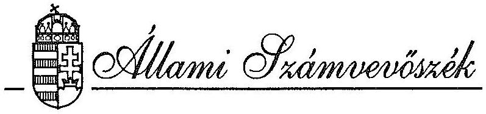 

## JELENTÉS

a Pénzügyminisztérium fejezet pénzügyi-gazdasági ellenőrzéséről
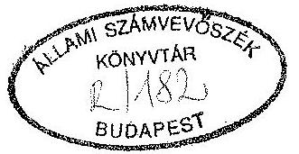

---

Az ellenőrzést vezette:

Nagy Akosné
fötanácsos

Az ellenőrzést végezték:

Balázs Andrásné
Eötvös Magdolna
dr. Erős Aladár
Holé Sándorné dr.
dr. Horváth Gyula
László Józsefné
Surányi Tamás
Szöllősiné Hrabóczki Etelka
Tolnai Károly
számvevő tanácsos
számvevő
külső szakértő
számvevő tanácsos
külső szakértő
számvevő tanácsos
számvevő tanácsos
számvevő
külső szakértő

---

# JELENTÉS 

## a Pénzügyminisztérium fejezet pénzügyi-gazdasági ellenőrzéséről

A kormányzati munka korszerűsítésével, munkamegosztásának változásával összefüggésben a Pénzügyminisztérium (PM) fejezet feladata és szervezeti rendszere jelentősen módosult, amely kifejezésre jutott a költségvetési előirányzatok alakulásában is.

A PM fejezethez 1992-ben 30 cím (19 alcím) tartozott. Ebből a 18-24 címek (8 alcímmel) 110.080 M Ft előirányzattal a központi költségvetésből vállalkozásoknak, magánszemélyeknek juttatott támogatásokat, fogyasztói árkiegészítéseket, stb., illetve a 25-30 címek (17 alcímmel) 828.980 M Ft előirányzattal a központi költségvetést illető adó, adójellegű bevételeket képezték.

A PM felügyelete alá tartozó intézmények (1-17 cím a Vám és Pénzügyőrség (VP) nélkül) 1990-ben $11.795,7 \mathrm{M} \mathrm{Ft}$, 1992-ben $16.235,7 \mathrm{M}$ Ft bevételt értek el, míg kiadásaik 10.708,2 M Ft-ról 14.516,8 M Ft-ra emelkedtek. (Azért hagytuk figyelmen kívül a VP adatait, mert azokat a fejezeti számlák nem tartalmazzák. A továbbiakban ezért fejezet alatt ezt a szűkebb kört értjük.)
Az állami támogatás ugyanezen időszakban 3.164,0 M Ft-ról 10.628,0 M Ft-ra nőtt.
A fejezet irányítása alá tartozó önálló költségvetési intézmények száma az 1989. évi 7-ről 1992-ben 12-re (1993-ban 14-re), átlaglétszámuk 7.225 főről 7.860 főre emelkedett.

A központi költségvetést érintő sajátos, illetve kiemelt funkcióik miatt a Vám és Pénzügyőrséget (6-os cím), az Adó- és Pénzügyi Ellenőrzési Hivatalt (APEH - 5-ös cím) az Állami Számvevőszék az 1989. évi XXXVIII. törvény alapján egyedileg vizsgálja. Az ellenőrzés a fejezet költségvetési gazdálkodását a minisztériumi igazgatás, az intézményi működés, valamint a fejezeti kezelésű előirányzatok körében vizsgálta. (Ellenőrzésünk tehát nem terjedt ki az APEH-re és a VP-re, a Kincstári Vagyonkezelő Szervezetnél (KVSZ) pedig csak az intézmény működését és gazdálkodását érintette

---

(12. cím, 1. alcím), a vagyonkezelő tevékenységet nem. A KVSZ-nél lefolytatott ellenőrzésünk megállapításait a függelék tartalmazza.)

Az ellenőrzés célja annak értékelése volt, hogy a költségvetési gazdálkodásban a törvényességi, a célszerűségi és az eredményességi szempontokat hogyan érvényesítették, a feladatok, a szervezet, a létszám és a rendelkezésre álló pénzügyi források mennyire voltak összhangban, hasznosították-e és milyen eredménnyel az Állami Számvevőszék korábbi ellenőrzéseinek megállapításait.

Az ellenőrzött időszak 1990-1993. I. negyedévig terjedt ki.

# I. 

## Következtetések, javaslatok

A gazdaság- és pénzügypolitika irányításának egy szervezetbe tömörítésével járó új követelménynek a minisztérium és intézményrendszere a többszöri átszervezés ellenére sem felelt meg teljeskörűen.

A minisztérium feladatrendszeréhez igazodó a fő szervezeti struktúra. Ezen belül azonban az egyes főosztályok, önálló osztályok szervezete még túltagolt, párhuzamosságok, ésszerűtlen feladatmegosztások tapasztalhatók. Ebben közrejátszott az is, hogy a közigazgatás korszerűsítésére hozott 1026/1992. (V.12.) sz. Korm. határozatban foglaltaknak késedelmesen, illetve részben tettek eleget.

A feladatbővüléshez, illetve az intézmények számának - elsősorban a vizsgált időszak második felében bekövetkezett - gyors növekedéséhez a fejezet irányító tevékenysége nehezen tudott alkalmazkodni. A fejezeti szintű gazdálkodás a minisztériumban szervezetileg - jogszabályi előírásokat is sértő módon - megosztott, a feladatellátás személyi feltételei hiányosak. A permanens átszervezések visszafogták a működés - egyébként 1991-től javuló tendenciát mutató - szabályozását. A gazdálkodási jogkörök, hatáskörök rendezetlensége is hátrányosan befolyásolta a belső irányítási rendszert, a fejezet irányító, szervező tevékenységét.
A szervezeti egységek közötti koordináció és a döntési mechanizmus működési zavaraiban az információs rendszer kiépítettségének hiányosságai is közrejátszottak.

A gyakori és jelentős mértékű szervezeti változtatásokkal az intézmények szabályozási tevékenysége sem tartott lépést. Nem, vagy nem megfelelően rögzítették a

---

gazdálkodó szervezetek felépítését, feladatát, működési rendjét, illetve nem határolták el kellően vezetői szinten a feladatokat, a hatás- és felelősségköröket, a pénzügyi jogköröket.

Az alapító okiratok felülvizsgálatára, az alap- és vállalkozói tevékenység meghatározására vonatkozó 1991. évi XCI. tv. 34. § (3) bekezdésében foglalt törvényi előírásnak a minisztérium a fejezethez tartozó intézmények vonatkozásában még nem tett eleget.

A Lakásalap felszámolásával kapcsolatos feladatokat a Kormány által előírt határidőre nem fejezte be és szabálytalanul járt el, mivel a Lakásalap Kezelő Szervezet pénzmaradványát nem kezelte elkülönítetten és részben igénybe vette.

A fejezet éves költségvetései 1992-ig egyensúlyban voltak. Intézményeinél a feladatok és a hozzájuk rendelt források összhangja ugyanakkor a vizsgált időszak egészében, teljeskörűen nem volt biztosított. Egyes intézményeknél forráshiány jelentkezett, amíg a jogszabályokban előírt bevételekből gazdálkodó intézményeknél keletkezett pénzeszközök meghaladták reális kiadási szükségleteiket.

A forráshiány, majd a pénzügyi egyensúly megbomlása elsősorban az igazgatási ágazat - meghatározóan a Gazdálkodó Szervezete (PM GSZ) - esetében volt tapasztalható, s kialakulásában gazdálkodási, tervezési hibák, hiányosságok is közrejátszottak.

A fejezet és az intézményi költségvetések tervezésére a mechanikus bázisszemlélet volt jellemző, amelyben a központilag rögzített "sarokszám"-ok betartása dominált. Nem került sor a feladatok ráfordítás igényének megfelelő mérlegelésére. Az ágazati és céljellegű előirányzatok feladatmélységű tervezése hiányzott. Az esetenként az előírástól eltérő tervezés az állami támogatás növelésére irányult, mellyel a feladatok és források egyensúlyát próbálták helyreállítani, illetve a béralaphiányt kívánták megszüntetni.
A tervezés során ugyanakkor nem tárták fel a belső tartalékokat, a saját források növelési lehetőségeit, a bevételeket rendszeresen alátervezték.

A fejezeten belüli forráskülönbségek kiegyenlítésére szabálytalan eszközöket is felhasználtak. A fejezeti hatáskörben végrehajtott előirányzat-átcsoportosítások közül több nem felelt meg a törvényi előírásoknak. Összegszerűen 1991-ben összesen 30,6 M Ft, 1992-ben összesen 158,5 M Ft előirányzat-átcsoportosítás minősült szabálytalannak.
Az intézmények pénzmaradvány-elszámolásának hiányosságait a fejezet nem tárta fel teljeskörűen, az önrevíziók esetenként hiányosak voltak. 1991-ben 6,1 M Ft, 1992-ben 144,4 M Ft ágazati és céljellegű előirányzat-maradványt nem tártak fel, ennek

---

következtében az ágazati és céljellegű előirányzat-maradványok elvonása a központi költségvetés javára nem volt teljeskörű.

Az intézmények finanszírozása a vizsgált időszak első felében kiegyensúlyozottan és szabályosan történt. 1992. végén, 1993. elején azonban - egyes intézmények pénzügyi egyensúlyának hiánya miatt - nagyarányú szabálytalan előfinanszírozást hajtottak végre.

A fejezet bevételei és kiadásai visszatükrözték az intézmény-, illetve feladatrendszer változásait. Az intézmények gazdálkodásában a takarékosság, a feladatok rangsorolása nem érvényesültek maradéktalanul.

A fejezeti szintű pénzügyi feszültségek mögött az intézményi gazdálkodásban is érzékelhetőek egyrészt egyensúlyzavarok, másrészt a kihasználatlan tartalékok, a hatékonyság növelés lehetőségei.

Ezek a hiányosságok a legköltségigényesebb területen, a létszám- és bérgazdálkodásban okoztak feszültségeket, elsősorban az igazgatási ágazatban. A minisztériumban a létszámgazdálkodás racionalizálásával nem éltek. A béralapot ugyanakkor egyrészt a dologi irányzatok terhére - 1991-től szabálytalanul - növelték, másrészt az üres álláshelyek bérét is felhasználták. 1992-től jelentős időarányos béralap-túllépés mutatkozott.

A köztisztviselői törvény előírásait a besorolásoknál érvényesítették, a közalkalmazotti törvény végrehajtása azonban késett.

A kincstári vagyon kezelésének törvényes kereteit a KVSZ nem biztosította. A szervezet gazdálkodása alacsony színvonalú, ebben szerepet játszott a feladatbővülés és a gyakori vezetőváltás is.

Az intézményi körben átmenetileg szabad pénzeszközöket értékpapírok vásárlása és betétként történő kihelyezése útján igyekeztek hasznosítani, ezek azonban nem bizonyultak minden esetben eredményesnek. A pénzkihelyezéseknél nem mindig jártak el kellő gondossággal és a jogszabályi előírásoknak megfelelően. Az Ybl Bank csődje miatt jelentős - kamatokkal együtt több mint 300 M Ft - befektetés megtérülése kétessé vált.

A fejezethez tartozó intézmények működése többnyire nem eszközigényes. Az eszközgazdálkodásra jellemző, hogy a szűkülő dologi kereteket a felújítások terhére igyekeztek bővíteni, s emiatt a szükséges felújítások is elmaradtak néhány esetben. A rendelkezésre álló eszközállomány kapacitásának kihasználása helyenként nem volt megfelelő színvonalú (nyomdai kapacitás, személygépkocsi-állomány). Az ingatlan üzemeltetés és fenntartás, valamint a helyiségbérbeadás feladatai nem minden esetben

---

illeszkedtek megfelelően a kezelői joghoz, illetve a vagyonnyilvántartáshoz. Az irodahelyiség-bérbeadása az intézmények közötti forrásellátottság-különbségek kiegyenlítésének eszközéül is szolgált. Ugyanakkor a szabálytalanul és visszafizetési kötelezettséggel kikötött egyszeri használatbavételi díj a jövőben veszélyezteti a bérbeadó intézmény költségvetési gazdálkodásának egyensúlyát. Az intézményi átszervezések következtében az eszköz- és feladatrendszer szétválasztása esetenként célszerűtlen, felesleges beszerzésekkel is járt.

A vagyonvédelem megfelelő feltételeit nem biztosították mindenütt. A leltározások végrehajtása, szabályszerű kiértékelése, a felelősség érvényesítése többször elmaradt. A számviteli munka alacsony színvonalú, a mérlegvalódiság gyakran nem érvényesült. Sok esetben megsértették a kifizetések utalványozására és ellenjegyzésére vonatkozó jogszabályokat.

A felügyeleti és a belső ellenőrzések hiányosságai is lehetővé tették a szabálytalanságok előfordulását. Az ellenőrzési rendszer kiépítését, szabályozását, tevékenységének eredményességét egyaránt korlátozták a szervezeti, személyi feltételek változásai. Az ellenőrzés - mindezek miatt - nem válhatott a vezetés hatékony eszközévé az irányító, döntéselőkészítő munkában.

Az Állami Számvevőszék korábbi vizsgálatainak tapasztalatait csak részben hasznosították. Így a központi államigazgatási szervek létszám- és bérgazdálkodása 1991. évi ellenőrzésének utóvizsgálatát követően sem szűnt meg teljes mértékben a minisztériumi szervezet túltagoltsága, illetve a párhuzamos feladatellátás, nem készültek el teljeskörűen a főosztályi ügyrendek és ezzel összefüggésben a munkaköri leírások. A minisztériumok, országos hatáskörű szervek költségvetési és vállalati felügyeleti ellenőrzési tevékenységének, valamint a belső ellenőrzési rendszer működésének témavizsgálatát követően sem változott az Ellenőrzési Osztály szervezeten belüli helye, ezért továbbra sem biztosított a felügyeleti jellegű költségvetési és a minisztériumi belső ellenőrzés függetlensége. A Szanáló Szervezet megszűnése, a REORG Rt. alapítása tárgyában végzett ellenőrzésünkre visszajelzett intézkedések végrehajtása részben elmaradt. A PM GSZ nem fizette be a központi költségvetésbe a megszűnt szervezet befejeződött felszámolási díjaiból fennmaradó 11 M Ft-ot, továbbá a meghatározott áthúzódó bevételek 50%-át.

---

# Az ellenőrzés megállapításai alapján javasoljuk: 

## 1. A Kormány részére

- Vizsgálja meg a feltárt tények alapján, hogy a pénzügyminiszter hatáskörében végrehajtott törvénysértő előirányzat-átcsoportosításokért, illetve az 1992. és 1993. évi költségvetésben jogcím nélkül megtervezett előirányzatokért, továbbá 1993-ban a kormányengedély nélküli előfinanszírozásért terhel-e valakit személyi felelősség, és intézkedjék a PM fejezet költségvetésének és pénzmaradványának szükséges módosításáról.
- Az értékpapír-forgalmazásban foglalkoztatott szakemberek képzési támogatásának célszerűsítése, illetve hatékonyabbá tétele érdekében terjesszen az Országgyűlés elé javaslatot az egyes értékpapírok nyilvános forgalomba hozataláról és forgalmazásáról ... szóló 1990. évi VI. törvény (20. §) és a befektetési alapokról szóló 1991. évi LXIII. törvény (48. §) módosítására.
- Vizsgálja meg a Lánchíd Irodaház funkcióját, összefüggésben üzemeltetésének, hasznosításának módjával, műszaki állapotával és a felújítás forrásigényével. Ennek figyelembevételével rendelkezzen az épület további sorsáról és a kapcsolatos feladatokról.

## 2. A Pénzügyminisztérium részére

### 2.1. A szervezeti korszerűsítés érdekében

- tekintse át feladat-, szervezetrendszerét és létszámát, figyelemmel az ellenőrzés megállapításaira;
- mielőbb fejezze be az intézmények alapító okiratának teljeskörű felülvizsgálatát, tevékenységi körük meghatározását. Ehhez kapcsolódóan ismételten tekintse át az intézmények feladat- és eszközrendszerét, különös tekintettel a Lánchíd Irodaház GI működésére;
- javítsa a fejezeti szintű gazdálkodás irányításának, felügyeletének és ellenőrzésének feltételeit
= a VPOP-val kapcsolatos feladatoknak a Pénzügyi és Gazdasági Főosztály feladatkörébe rendelésével és a feladatellátók létszámának megerősítésével;

---

= a bérgazdálkodással kapcsolatos jogkörök és felelősség egyértelmű elhatárolásával oly módon, hogy a bérgazdálkodás a Pénzügyi és Gazdasági Főosztály feladatkörébe tartozzon, a Humánpolitikai Főosztály bérkeret-felhasználás jogosultsággal rendelkezzen.

# 2.2. A működés rendje és szabályozottsága érdekében 

- gondoskodjon a PM Működési Rendjére
 vonatkozó szabályzat, valamint a gazdálkodásra vonatkozó szabályzatok, főosztályi ügyrendek folyamatos, a szervezeti, felügyeleti, jogszabályi változásokkal összehangolt karbantartásáról;
— intézkedjenek az intézmények szervezeti és működési szabályzatainak, ügyrendjeinek, gazdálkodási szabályzatainak felülvizsgálatáról, szükséges kiegészítéséről és aktualizálásáról;
— kísérjék figyelemmel az intézményeknél folytatott vizsgálat tapasztalatainak hasznosulását, különös tekintettel a KVSZ és a PM GSZ működésére, gazdálkodására, pénzmaradvány elszámolására vonatkozó megállapításokra, javaslatokra;
— szorgalmazza az intézményeknél a függetlenített belső ellenőri munkakörök kiépítését, illetve betöltését, segítse működését - figyelemmel az ellenőrzés vonatkozó megállapításaira.
2.3. Vizsgálja meg, hogy gazdálkodó szervezet felügyelő bizottságában, igazgatótanácsában, stb. tisztséget betöltő pénzügyminisztériumi köztisztviselők tevékenysége nem sérti-e a köztisztviselők jogállásáról szóló 1992. évi XXIII. törvény 21. § (4) bek. a./ pontjában foglaltakat.
2.4. A rendelkezésre álló dokumentumok alapján készíttessen tételes elszámolást a vagyonnyilatkozat feldolgozásához biztosított 1992-1993. évi támogatás felhasználásáról.
2.5. Intézkedjen a Szanáló Szervezet megszűnésével és a REORG Rt. megalakulásával kapcsolatos, központi költségvetést megillető befizetések haladéktalan teljesítéséről.
2.6. A fejezet fizesse be a központi költségvetésbe a letéti számláján lévő pénzeszközt (81 e Ft) s egyidejűleg intézkedjen a számla megszüntetéséről.
2.7. A Lakásalap felszámolásával kapcsolatos feladatok ügyintézését gyorsítsa fel és tegyen eleget beszámolási kötelezettségének. A végleges elszámolásig kezelje céltartalékként elkülönítetten a Lakásalap Kezelő Szervezet pénzmaradványát.
2.8. Gondoskodjon a Lánchíd Irodaház épület kezelői jogának telekkönyvi rendezéséről.
2.9. Vizsgálja meg hatáskörében a feltárt tények alapján, hogy a végrehajtott törvénysértő előirányzat átcsoportosításokért, illetve az 1992. és 1993. évi költségvetésben jogcím nélkül megtervezett előirányzatokért, 1993-ban a kormányengedély nélküli előfinanszírozásért, továbbá a mérlegvalódiság megsértéséért terhel-e valakit személyi felelősség.

# II. 

## Részletes megállapítások

1) A feladatok, a szervezeti rendszer, a szabályozottság és a gazdálkodási feltételek értékelése a fejezet szintjén és az intézményeknél
1.a. A PM fejezet feladataiban és intézményrendszerében 1990-1993. évek között jelentős változások következtek be (1. sz. melléklet).

A PM fejezet feladatköre az Országos Tervhivatal (OT) feladat- és hatáskörének átruházásával, az állami értékpapír- és a szerencsejáték felügyelet állami feladatként való megjelenésével, a Szerencsejáték Alap és Kisvállalkozói Garancia Alap kezelésével, az állami értékpapír kibocsátások koordinációs feladataival és a kormányzati ellenőrzést végző szervezet működésével bővült, a Bankfelügyeletnek (BAF) a Miniszterelnökség fejezethez átsorolásával, illetve a Szanálási Alap és a Lakás Alap kezelésének megszünésével csökkent.

Az OT feladatainak átvételénél a koncepció hiánya, a pénzügyminiszter feladat- és hatásköréről szóló kormányrendelet késedelme egyrészt az új minisztériumi szervezet túltagoltságához, másrészt a gazdaságpolitikai funkciók és az azokat ellátók integrálásának, beilleszkedésének elhúzódásához vezetett.

Az OT 1990. július 1-jén szűnt meg, a pénzügyminiszter feladat- és hatáskörét az 50/1990. (IX.15.) Kormányrendelet határozta meg.

Az átszervezett PM főosztályainak, önálló osztályainak száma lényegében megegyezett a korábbi két minisztériuméval.

Az összevonást követően az átszervezések csökkenő intenzitással ugyan, de a vizsgált időszak végéig folyamatosak voltak, fő indítékaik a jogi és a gazdasági környezethez való rugalmasabb alkalmazkodáshoz fűződtek. Eredményükként a szervezeti struktúra fő vonásaiban a minisztérium feladatrendszeréhez (gazdaságpolitika, költségvetés, közhatalmi bevételek, piacgazdaság kiépítése, a szervezet működtetése) igazodik.

Az ágazati feladatokat ellátó blokkok élén helyettes államtitkár áll, aki a szakterülethez tartozó főosztályi kör irányítása mellett felügyeletet gyakorol az alaptevékenységük alapján besorolt intézmények felett. A minisztériumi szervezet működtetését, fenntartását biztosító részlegek közvetlenül a közigazgatási államtitkár irányítása alá rendeltek.

A feladat- és a szervezeti rendszer részleteiben ugyanakkor nem kellően összehangolt. Ezt jelzi néhány főosztály, önálló osztály többszöri átszervezése is, továbbá az a körülmény, hogy a minisztérium felépítésének túltagoltságát még nem sikerült felszámolni.

A minisztérium feladatkörének változásai, továbbá a gyakori átszervezések jelentős mértékben nehezítették, fékezték a működés és a gazdálkodás teljeskörű szabályozását, illetve szükséges korszerűsítését is. A szabályozási tevékenységben 1991-től - elsősorban a gazdálkodás vonatkozásában - javuló tendencia érzékelhető.

A minisztérium működésének szabályozottsága ugyanakkor a vizsgált időszakban még nem kielégítő. Ez egyrészt a szabályzatok hiányosságaiban, másrészt a korszerűsítés, illetve az egyes részszabályzatok közötti összhang folyamatos biztosításának elmaradásában nyilvánult meg. A pénzügyi jogköröket esetileg a jogszabályi előírásokat sértően szabályozták.

Az 1990. április - 1992. december közötti hatályos "PM Működési Rendje" szabályzatának folyamatos karbantartása elmaradt. Az ezt követően kiadott új Működési Rend szervezeti és felügyeleti változások miatt már korrekciót igényel.

Változatlanul időszerű a főosztályi ügyrendek és ezekkel összhangban a munkaköri leírások elkészítése, illetve aktualizálása.

Az azonos jogállású (mellérendelt) Pénzügyi és Gazdasági Főosztály és a Humánpolitikai és Munkaügyi Főosztály között a bérgazdálkodásért való felelősséget a Működési Rend nem rendezi megfelelően.

A kötelezettségvállalás, érvényesítés, utalványozás rendjének szabályozása nem követte a szervezeti és felügyeleti változásokat. A miniszteri és államtitkári kötelezettségvállalás "minden további eljárás nélküli" végrehajtásának elrendelése (Pénzügyminisztérium Működési Rendje I.fejezet 2. pont) sérti az 1979. évi II. tv. végrehajtására kiadott 23/1979. (VI.28.) MT rendelet 60. § (3) bekezdésének, majd az ÁHT 98. § (2) bekezdésének az ellenjegyzés követelményére vonatkozó előirásait. Az aláírási jogkörökhöz kapcsolódó vezetői ellenőrzés tekintetében nem igazodik hozzá megfelelően az ellenőrzési szabályzat.

A fejezeti szintű gazdálkodás irányításának, felügyeletének szervezeti, hatásköri rendje is esetenként célszerűtlen, párhuzamosságot, illetve a pénzellátásban jogszabályt sértő megoldást tartalmaz.

A fejezeti szintű gazdálkodás szervezetileg megosztott. A Pénzügyi és Gazdasági Főosztály irányítási, felügyeleti hatásköre nem terjed ki a Vám és Pénzügyőrség Országos Parancsnokságára (VPOP). A központi költségvetés és a fejezet közötti pénzforgalom lebonyolítása a VPOP vonatkozásában nem felelt meg az 1990. évi CIV. tv. 12. § (6) bekezdésének, illetve az 1991. évi XCI. tv. 53. § (2) bekezdésének. Így gazdálkodásának adatai a fejezeti információs rendszerbe automatikusan nem épültek be. (Ezt már korábbi számvevőszéki vizsgálat is kifogásolta.)

A felügyeleti jellegű költségvetési és a minisztériumi belső ellenőrzés függetlenségét a szervezeti hierarchiában elfoglalt helyük nem biztosítja: a mindkét ellenőrzési formát integráló Ellenőrzési Osztály a Pénzügyi és Gazdasági Főosztály szervezetében a főosztályvezetőhöz tartozik.

Számos ponton összemosódik a fejezeti és a minisztériumi gazdálkodás irányításának hatásköre, felelőssége.

A Pénzügyi és Gazdasági Főosztályon a főosztályvezetői helyettesítés gyakorlata összeférhetetlen. A főosztályvezető helyettese egyben a PM GSZ főkönyvelője és vezetője.

Esetenként a PM GSZ felügyeleti jogkört gyakorolt (pl. PM Üzemeltetési Igazgatósága /PM ÜI - önálló költségvetési szerv/ 1993. évi pénzellátását a PM GSZ végezte).

A Pénzügyminisztérium késedelmesen és csak részben tett eleget a közigazgatás korszerűsítésére hozott 1026/1992. (V.12.) Kormányhatározatban foglaltaknak. Ezt már korábban "A központi államigazgatási szervek létszám és bérgazdálkodása 1991. évi ellenőrzésének utóvizsgálata" keretében is megállapítottuk.

A hivatkozott kormányrendeletben előírt teendők meghatározását célzó - "A pénzügyi kormányzat szervezeti működési rendjének korszerűsítése" tárgyú intézkedési terv késedelmesen, (1992. VII. 31. helyett) 1992. év végén készült el. Az azóta megvalósított szervezeti változások nem számolták fel teljes mértékben a párhuzamosságokat és a túltagoltságot.

# A fejezeti feladatok ellátásának személyi feltételei romlottak. 

Az átszervezést követően a Fejezeti Pénzügyek Osztályának szervezett álláshelye 6 főről 5-re csökkent, s ebből 1 státusz betöltetlen. Az érdemi feladatok elvégzése két főelőadóra hárult.

A fejezeti gazdálkodás feltételi rendszerének hiányosságai miatt nem érvényesült megfelelően az irányító, ellenőrző, koordináló szerep. Tevékenysége elsősorban a tervezés, beszámoltatás, pénzmaradvány elszámoltatás formális végrehajtására korlátozódott. A feladatokat rendszeresen túlmunkával, késedelmesen és sokszor hibásan végezték el.

A feladatellátást információáramlási, koordinálási gondok is gátolták.
A fejezeti irányító tevékenység gyengesége hozzájárult az intézmények gazdálkodásában, számvitelében tapasztalt, esetenként súlyos szabálytalanságokhoz, hiányosságokhoz.
1.b. 1990-1993. évek között a PM intézményrendszere - különösen a PM GSZ feladataiban, struktúrájában is jelentős változások következtek be.

Az új feladatok ellátására a Kormány jellemzően új költségvetési intézmények alapítását rendelte el. Ezek - egy kivételével - a fejezeti költségvetésben önálló címet alkotnak és önálló költségvetési intézményként működnek. Többségük költségvetésének nagysága nem számottevő (15-35 M Ft közötti).

Az alapkezelést végző szervezetek működési költségvetésének forrása a kezelt alap, az Állami Értékpapír Felügyelet (ÁÉF), a Szerencsejáték Felügyelet (SZF) a saját bevétel, a Központi Számvevőségi Hivatalé (KSZH) és az Állami Értékpapír Kibocsátásokat Szervező Irodáé pedig az állami támogatás.

Minden esetben - amint ezt már más jelentésünkben is jeleztük - állami támogatásból indokolt a költségvetési intézmények működési kiadásait fedezni. Egyidejűleg meg kell teremteni az állam által átengedett, jogszabályban előírt bevételek (pl. hatósági díj, bírság) elvonásának jogi lehetőségét. Ezek ugyanis szabályozottan nem kaptak szerepet a központi költségvetés vagy a fejezet egyensúlyi helyzetének javításában.

A pénzeszköz elvonás, illetve felhasználás esetükben olykor szabálytalanul történt (pl. Nemesfémvizsgáló és Hitelesítő Intézet).

Az SZF engedélykérelmekből, bírságokból származó bevételének alakulására jellemző, hogy 1992-re 223 M Ft-ot, 1993-ra 295 M Ft-ot ajánlott fel önként elvonásra, melyet nem realizáltak. (Ugyanakkor 1992-ben 5 évre előre kifizette a PM GSZ-nek a 255 M Ft bérleti és üzemeltetési díjat.)

Az ÁÉF felügyeleti szolgáltatásból, bírságból származó bevételei 1991-ben lehetővé tették, hogy 3 évre előre kifizessen 82,4 M Ft bérleti díjat.

A vizsgált intézmények jelentős körénél a feladatrendszer, a szervezet és a gazdálkodás feltételei között nincs megfelelő összhang, és ebben az átszervezések sem hoztak érdemi változást. A többszöri és jelentős mértékű átszervezést csak részben indokolta a tevékenységi kör, illetve a feladatellátás körülményeinek változása. A feladatok, a szervezeti és költségvetési keretek áttekintésén alapuló koncepció kidolgozása, érvényesítése esetén ezek egy része elkerülhető lett volna. Az átszervezések nem jártak állami támogatás csökkenéssel.

Az OT feladatok átvételekor a módszertani kutatóintézetek tevékenységét, szervezeti, működési feltételeit koncepcionálisan nem vizsgálták felül. A rendelkezésre álló szellemi kapacitás 1991. év végéig a részben önálló PM Gazdaságpolitikai Tervezési Intézet (PM GTI - az OT Tervgazdasági Intézet jogutódja) és az eredményérdekeltségű PM Informatikai és Módszertani Intézet (PM IMI - az OT Számítástechnikai Intézet jogutódja) között célszerűtlenül megosztott volt és nem kellően kihasznált. E szervezetek fokozatos leépülése, majd összevonása PM Gazdaságelemzési és Informatikai Intézetté (PM GII) nem járt a költségvetési források felszabadításával.

A PM Jóléti Intézmények Igazgatóságával (PM JII) és a PM ÜI-vel kapcsolatos két ütemben (1991. és 1993.) végrehajtott átszervezéseket nem előzte meg a PM GSZ tevékenységével összehangolt feladat elhatárolás, a működési feltételek felosztása, a szervezeti és gazdálkodási szabályzatok kidolgozása.

PM JII és a Főmérnökség PM ÜI-vé szervezése nem járt együtt a létszám csökkentésével, csak a köztisztviselők száma lett kevesebb a közalkalmazottak javára.

Egyes intézmények többszöri átszervezése (összevonás, szétválás) nehezítette a gazdasági események előzményeinek számbavételét, a jellemző tendenciák feltárását. Ez is közrejátszott abban, hogy a dokumentációk hiányosak, a vizsgálat előkészítésekor kért adatokat nem tudták időben, hiánytalanul és hibátlanul rendelkezésre bocsátani, hátráltatva ezzel az ellenőrzést (2. sz. melléklet).

Az intézményi elhatározású szervezeti változtatások, belső átszervezések sem voltak minden esetben racionálisak. A célszerűtlen szervezeti, irányítási megoldások hátráltatták a feladatellátást, esetenként működési zavarokhoz, felesleges költségvetési kiadásokhoz vezettek (KVSZ).

A minisztérium nem tett eleget az 1991. évi XCI. tv. 34. § (3) bekezdésében előírt törvényi kötelezettségének, 1992. június 30-ig nem vizsgálta felül működő intézményei alapító okiratát, s nem határozta meg alaptevékenységüket és vállalkozási tevékenységük körét. A költségvetési szervek által kezdeményezett módosításokra is nem egy esetben késve és csak részben került sor (KVSZ), vagy
 az elmaradt (PM GII). Ennek következtében egyes vizsgált intézményeknek átmenetileg nem volt alapító okirata (ÁÉF 1992. áprilisáig), vagy az nem felelt meg a tevékenységi körnek, illetve a hivatkozott törvényi követelményeknek (KVSZ, PM GII).

A KVSZ alapító okiratának 1992. augusztusában kezdeményezett módosítására 1992. december 14-i hatállyal és kizárólag a székhelyváltozásra kiterjedően került sor. A feladatkörbővülés, valamint az alap- és vállalkozási tevékenység meghatározása elmaradt.

A Lánchíd Irodaház GI alapító okiratának (I/1991. MÜM-PM együttes utasítás) rendelkezései - a hatáskörök ellentmondásos és nem teljeskörű megfogalmazása miatt - nem feleltek meg az önálló maradványérdekeltségű költségvetési gazdálkodás szabályainak.

Az SZF alapító határozata szövegezésében eltér az 1991. évi XXXIV. tv. szövegétől, mely szerint a felügyeletét a pénzügyminiszter, az alapító okirat szerint a Pénzügyminisztérium látja el.

Az intézmények működésének, gazdálkodásának szervezettsége, szabályozottsága néhány kivétellel elmaradt a követelményektől. Számos esetben a szervezeti felépítésre, működésre vonatkozó keretszabályzatok (SZMSZ) hiányán (PM ÜI, PM GII) vagy elavult voltán (KVSZ) túl nem, vagy nem teljeskörűen álltak rendelkezésre a szervezeti egységek ügyrendjei, továbbá a munkaköri leírások.

Az intézményi gazdálkodás, elszámoltatás részterületeinek szabályozása is több esetben hiányos volt.

A törvényi előírások végrehajtásához szükséges szabályozás elmaradása sorozatos törvénysértéshez vezetett a KVSZ-nél.

Az 1992. évi költségvetésről szóló törvényben meghatározott 12 cím Kincstári Vagyonkezelő Szervezet 1 igazgatási, illetve 2 állami ingatlanok értékesítéséből származó költségvetést illető bevétel alcímek 1992-ben nem a valós teljesítést tartalmazták. Megsértették ugyanakkor az államháztartásról szóló 1992. évi XXXVIII. tv. 12. § (2) bekezdésében foglaltakat, mivel a letéti számlákat illető pénzforgalmat költségvetési számlán kezelték.

A felügyeleti jellegű költségvetési és a belső ellenőrzés rendszerének kiépítését, szabályozását, tevékenységének eredményességét egyaránt korlátozták a szervezeti, személyi feltételek - néhány esetben célszerűtlen - változásai. Az ellenőrzés - mindezek

---

következtében - nem segítette kellően a vezetés irányító munkáját, a döntések megalapozását. Az ellenőrzési rendszer hiányosságai, működésének gondjai tükröződtek a gazdálkodásban is.

Az intézményi körben a hiányosságok többsége a vezetői és a munkafolyamatba épített ellenőrzések elmaradásában, zavaraiban nyilvánult meg. A függetlenített belső ellenőrzés szervezete sem igazodott mindenütt az intézmény feladataihoz, tapasztalható volt annak teljes hiánya is (pl. KVSZ).

# 2.a. A költségvetés tervezése 

A fejezet költségvetése a vizsgált időszakban - feladatainak bővülésével - 1,6-szeresére nőtt. Szerkezetének - elsősorban 1991-92. években végbement - átrendeződését jellemzi az is, hogy a kiadások támogatásigénye az 1990. évi 34%-ról 1993. évre 79%-ra emelkedett (1. sz. tábla).
Jelentősen megváltozott a költségvetési támogatás megosztása az intézmények és a fejezeti kezelésű előirányzatok között, mivel az utóbbiakhoz kapcsolódott a fejlesztési többletek nagyobb hányada (57%).

1990-ben az APEH a fejezeti költségvetési támogatás 87,8%-ával, a PM többi intézménye 9,3%-ával rendelkezett és mindössze 2,9%-ot tettek ki a fejezeti kezelésű előirányzatok.
1993-ban az APEH a fejezeti támogatás 64,8%-át, a PM igazgatási intézményei (PM GII-vel együtt) 5,8%-át, a KVSZ 16,9%-át kapta, a fejezeti előirányzatok támogatásának aránya 12,5%-ra növekedett.

A költségvetési tervező munkában a fejezet törekedett a feladatok, források és finanszírozás összehangolására. Ez a szándék azonban a vizsgált években nem realizálódott megfelelően. A fejezet költségvetésében teljeskörűen nem biztosított a feladatok és a hozzájuk rendelt pénzügyi keretek összhangja.

A költségvetési szabályozással, a finanszírozási forrásokkal összefüggésben egyes intézményeknél a pénzügyi források szűkösek (PM ÜI, PM GSZ) másutt a szükségleteket meghaladóan bőségesek (Felügyeletek).

Az előirányzatok tervezése - a bázisszemléletű tervezési rendszer keretei között - mechanikus volt: a központilag rögzített "sarokszámok"-hoz igazították a kiemelt előirányzatok"t, míg a kevésbé fontosnak ítélt részelőirányzatokra irreálisan alacsony összeg maradt.

---

Az éves tervezés keretében a fejezet és a felügyelete alá tartozó intézmények 1990. évi költségvetési javaslatának bázis- és alapelőirányzatát ellenőrizhető részletezettséggel és dokumentálhatóan munkálták ki.

Az 1991, 1992. évi költségvetési javaslatok alapdokumentumai fejezeti szinten nem álltak teljeskörűen az ellenőrzés rendelkezésére. Így a többlépcsős tervezési folyamatban az előirányzatok változásai, azok oka és indokoltsága nem, vagy nehezen volt rekonstruálható.

A bér és dologi automatizmusok intézményenkénti levezetéséhez a tervezési munkalapokat nem tudták bemutatni.

Hiba volt, hogy az 1991. évi költségvetésben a központilag előírt 12%-os dologi előirányzatcsökkentést a saját bevételből gazdálkodó intézményeknél - a bevételek szintentartása mellett - is érvényesítették. Ezért engedélyezte az Országgyűlés 38/1991. (VII.1.) határozata, hogy az érintett címek 45,2 M Ft összeggel a költségvetési törvényben megállapított kiadási előirányzataikat túlléphetik. (Ez indokolatlanul az állami támogatás és ezen keresztül a költségvetési deficit növelését eredményezte.)

A szerkezeti változásokat, szintrehozásokat általában az előírások szerint dolgozták ki. Az éves költségvetésekben előfordult ugyanakkor, hogy az előirányzatok kimunkálása nem volt szabályszerű. Ezeket a központi és fejezeti költségvetést összeállító PM főosztályok nem kifogásolták, illetve tudomásul vettek.

A parlamenti anyagok előállítására 1991. évben céljelleggel kapott 35 M Ft beépítése a báziselőirányzatba nagyobb részben indokolatlan volt: folyamatos működésre 4 M Ft szolgált, 31 M Ft egyszeri jellegű kiadás (gépbeszerzés) volt.

Az 1993. évi tervezést megalapozó báziselőirányzat kimunkálásánál, az 1992. évi közkiadások csökkentésére elrendelt támogatás elvonás bázisba építését a PM fejezet 7 M Ft-tal kisebb összeggel hajtotta végre.

A PM igazgatási címnél a hiány mérséklésére - jogcím nélkül - 39,5 M Ft-tal megemelték a béralap előirányzatot. Ezt az alaptevékenység felfutásával kapcsolatos támogatásértékű bevételnövekedés és az ehhez szükséges bér- és létszámtöbblet nem támasztotta alá. A béralapnövelést a dologi kiadások csökkentésével ellensúlyozták.

A PM GSZ 1991-ben a fejezet által közölt 73,7 M Ft-os bérautomatizmus összegét a dologi előirányzatok terhére 1,6 M Ft-tal megnövelte. Ezáltal a központi költségvetési szervek részére - a tervezhető 20%-os bérautomatizmus helyett - a részben önálló intézményekkel együttesen 21,6%-os, míg az igazgatási kiadásokat érintő bértételek esetében 29,7%-os béralapnövelést tervezett. (Az igazgatási feladatok ellátásához a támogatási előirányzatok mindössze 13,9%-kal nőttek, a dologi előirányzatok pedig végül is 2,2%-kal csökkentek.)

---

Az 1993. évi költségvetési tervezés során nem tettek eleget az ÁHT 16. § (1) bekezdésében foglaltaknak, nem különítették el a rendes bevételeket és kiadásokat a rendkívüliektól. A fejezet költségvetésének egyes előirányzatait számításokkal nem igazolták, vagy azok nem voltak megalapozottak.

Az 1990-93. években a fejezet és intézményei néhány kivétellel nem számoltak reálisan a saját forráslehetőségekkel, bevételeiket rendre alátervezték.

A fejezet működési ár- és díjbevételeinek eredeti előirányzata az előző évi teljesítéshez mérten 1991-ben 58%, 1992-ben 69%, 1993-ban 55%, a ténylegesen elértnek pedig 42,8%-a, 50,3%-a, illetve 58,1%-a volt.

A fejezetnek ítélt fejlesztési többletek - a felhasználásuk tükrében - sem voltak mindig kellően megalapozottak. Az ágazati célfeladatok fejezeti kezelésű, pénzügyi kereteivel esetenként nem volt arányban a feladattartalom.

A KVSZ-nek 1992-ben adott 1,3 Mrd Ft fejlesztési többlet konkrét tartalmát a 3409/1991. sz. kormányhatározat nem nevezte meg. Az intézményi tervezési dokumentációból sem volt megállapítható, hogy az konkrétan mely többletfeladatokra nyújt fedezetet.

Az ágazati célfeladatok előirányzatát az éves költségvetések készítésekor feladatmélységű számításokkal nem támasztották alá, indokoltságukat a teljesítések sem igazolták. Esetenként ezeket az előirányzatokat más célokra csoportosították át.

A KVSZ címnél a feladatok és előirányzatok közötti összhang hiányának oka megalapozó számítások hiánya mellett az is, hogy a tervezéskor a tervidőszaki feladatok teljeskörűen nem voltak ismertek (pl. társadalmi szervezetektől, szovjet csapatoktól átvett ingatlanmennyiség és az ahhoz kapcsolódó költségigény). Ugyanakkor az új feladatok meghatározásával egyidejűleg a szükséges források előirányzatosítására az esetek döntő többségében nem került sor.

Az újonnan létrehozott költségvetési szervek tervezése több esetben nem volt reális. A működéshez szükséges ráfordítások nagyságrendjét, vagy összegét előzetesen nem tudták felmérni, illetve rosszul prognosztizálták. A saját bevételükből gazdálkodó intézmények tervezését a felügyeleti szerv érdemben nem vizsgálta.

Az SZF indulása évében 127,6 M Ft-ra tervezett eredeti költségvetési főösszege 82,2 M Ft-ra teljesült. 1992-ben az előirányzott 256,7 M Ft-tal szemben 632,8 M Ft-ot realizált.

Az ÁÉF az alapítása évében még nem készített költségvetést. 1991-ben az eredetileg előirányzott 43,7 M Ft-tal szemben 231,8 M Ft bevételt ért el

---

(kiadása 42,8 M Ft). 1992-ben 83,7 M Ft bevételi terve 192,9 M Ft-ra teljesült (kiadása 225,8 M Ft).

Más esetben rosszul mérték fel a működés támogatásigényét.

A PM ÜI költségvetési alapokmánya szerint 43,7 M Ft támogatásban részesülhet. Ezen a jogcímen - a PM GSZ-en keresztül - 48 M Ft-ot biztosított a fejezet 1993-ban, ugyanakkor az átvett kötelezettség 100 M Ft volt.

A helyszíni ellenőrzés befejezéséig a PM fejezet költségvetésének módosítása a KSZH részére - a létrehozásáról szóló 3647/1992. sz. kormányhatározattal az 1993. évi központi költségvetés általános tartaléka terhére - engedélyezett 120 M Ft új előirányzattal nem történt meg, s a KSZH sem rendelkezett még jóváhagyott költségvetéssel. Az 1993. évi előirányzatok végleges kialakítása indokolatlanul elhúzódott.

A KSZH kiemelt előirányzatait a hivatkozott kormányhatározat nem állapította meg. A Hivatal a helyszíni ellenőrzés - 1993. május 11. - időpontjában még nem készítette el részletes költségvetési javaslatát.

# b.) A költségvetési előirányzatok módosítása 

A vizsgált években végrehajtott előirányzat módosítások következtében a fejezet költségvetése a jóváhagyotthoz képest 1990-ben 65%-kal, 1991-ben 56%-kal, 1992-ban 16%-kal növekedett. Az előirányzat módosításokat meghatározóan intézményi hatáskörben (70-90%) a többletbevételhez, a pénzmaradvány felhasználásához kötődően hajtották végre. Országgyűlési hatáskörben a központi költségvetési deficit csökkentését célzó zárolás, kormányhatáskörben a feladatbővülés volt a változtatás indoka.

Az előirányzatmódosítások dokumentálása, nyilvántartása a fejezetnél és intézményei egy részénél nem kielégítő. Az intézményi költségvetési beszámolókban közölt előirányzatmódosítások - többségük a hibás számbavétel miatt - elemzésre alkalmatlanok.

Jellemző hiba volt, hogy az Országgyűlés és a Kormány által előírt előirányzatmódosításokat fejezeti, esetenként ez utóbbit intézményi saját hatáskörű módosításként jelentették meg.

A fejezet nem tartotta nyilván fejezetre és intézményekre külön-külön hatásköri bontás szerint az előirányzatmódosításokat, azokat - ilyen részletezésben intézményeivel sem közölte.

A fejezeti hatáskörben - elsősorban a tartalék, a pénzmaradvány és az ágazati célfeladatok képzéséhez, illetve felhasználásához kapcsolódóan - végrehajtott elő-

---

irányzat átcsoportosítások közül több nem felelt meg a törvényi előírásoknak. 1991-ben összesen 30,6 M Ft (ebből 10,6 M Ft bér), 1992-ben összesen 158,5 M Ft (ebből 45,3 M Ft bér) átcsoportosítása minősült szabálytalannak (3. sz. melléklet).

Felügyeleti szintű pótelőirányzatot meghatározóan a PM GSZ kapott. Ezek többnyire reális igényeket tükröztek. Néhány közülük ugyanakkor túlzott mértékű volt, s az intézmény szabad forrásait, illetve pénzmaradványát növelte.

Az 1990. évi 72,6 M Ft felújítási előirányzat alig 50%-át használták fel. Az 1992. évben "országmozgósítás" címen ágazati célelőirányzatból juttatott - az év közben felmerült költségek utólagos finanszírozására szolgáló - 10 M Ft-ból 6,3 M Ft maradvány képződött.

Az intézmények saját hatáskörű előirányzat módosításában helyenként feltárt szabálytalanságok a béralap előirányzatának növelésére irányultak.

1992-ben az SZF év közben bérelőirányzatát a dologi előirányzatok terhére - a szervezet bővítésével indokoltan - saját hatáskörben felemelte. Ez nem felelt meg az 1991. évi XCI. tv. 47. § (1) bekezdésben foglalt engedélyezési eljárásoknak. (A módosításról a
 fejezetet értesítették.)

A Lánchíd Irodaház GI 1992. évi béralap előirányzat módosításánál nem tartotta be az 1991. évi XCI. tv. 47. § (2) előírását. A béralap eredeti előirányzatát ( $35,5 \mathrm{M} \mathrm{Ft}$ ) csak a teljesítés erejéig lehetett volna saját hatáskörben módosítani (+3 M Ft-tal). Ezzel szemben a béralap előirányzatát 41,5 M Ft-ra módosították, így 3 M Ft összegű szabálytalan bérmaradvány képződött.

A PM JII-nél hasonló okok miatt 1992-ben 1 M Ft béralap előirányzat emelés volt szabálytalan.

A PM GSZ 1991-ben a bértartalom nélküli 1990. évi pénzmaradványából 856 e Ft-ot béralapra csoportosított át, megsértve ezzel az 1990. évi CIV. tv. 9. § (12) előírását.

A PM GSZ - a 19/1980. (IX.27.) PM rendelet 15-16. §-ban foglaltakat megszegve - 1990-ben két ütemben 22.391 e Ft-ról 1.794 e Ft-ra csökkentette működési bevételének módosított előirányzatát. Ez az eljárás a tervezett összegek alulteljesítése miatt szabálytalan korrekció volt, az éves pénzmaradvány állami költségvetést megillető 19.510 e Ft-os csökkentése, illetve zárolása azonban elmaradt. (A működési bevételét 2.881 e Ft-ra teljesítette.)

A pótforrások juttatására vonatkozó, a fejezetet érintő, de magasabb szintű intézkedések sem voltak minden esetben szabályszerűek, illetve indokoltak.

---

A központi költségvetést megillető pénzmaradvány fejezetek közötti részbeni visszaosztásának gyakorlatát a Pénzügyminisztérium - a jogszabályi alap hatályon kívül helyezése után - az 1990. évi pénzmaradvány jóváhagyásánál is folytatta.

A PM Társadalmi Közkiadások Főosztálya úgy módosította egyes fejezetek, köztük a PM pénzmaradványát, hogy számukra - az esetleges befizetési kötelezettségüket visszahagyva és ezt meghaladóan - pótlólagos támogatást juttatott az állami költségvetést megillető 1990. évi pénzmaradvány terhére. A döntést az 1990. évi zárszámadás parlamenti jóváhagyását megelőzően (1991. július) hozták meg. A jogalapját képező 23/1979. (VI.28.) MT rendelet 61. §-át a 2/1991. (I.1.) sz. Korm. rendelet 1991. I. 1-től hatályon kívül helyezte.

A PM fejezet az önrevízióval feltárt 2.587 e Ft visszahagyásán túl 17.413 e Ft, összesen 20 M Ft támogatásban részesült, melyet a Gazdasági Kabinettel kapcsolatos többletfeladatokkal indokolt. Ezt megalapozó számítási anyag nem készült.

# c.) Gazdálkodási tartalékok, pénzmaradványok, befektetések 

A fejezet a pénzügyi egyensúly javítása érdekében élt a tartalékolás lehetőségével. Az eredetileg jóváhagyott fejezeti gazdálkodási tartalék előirányzat összege azonban az adott évi költségvetés nagyságrendjéhez képest csekély (1991-ben 14,3 M Ft, 1992-ban $7,5 \mathrm{M} \mathrm{Ft}$ ) volt, s nem adott elegendő mozgásteret a pénzügyi feszültségek oldására. A fejezet ezért 1991 és 1992. években átcsoportosításokkal növelte gazdálkodási tartalékát, s abból - meghatározóan az igazgatási címnek - elsősorban béralap hiány fedezetére juttatott pótelőirányzatot. Ezek az intézkedések részben, vagy egészben jogszabálysértőek voltak, holott több esetben éppen a tartalékba csoportosításon keresztül kívánták szabályossá tenni a pótelőirányzat juttatást.

Jellemzően 1992-ben a fejezeti gazdálkodási tartalék 55,2 M Ft módosításból 48,5 M Ft szabálytalan volt, a 62,7 M Ft felhasználásból pedig 52 M Ft nem felelt meg a törvényi előírásoknak (3. sz. melléklet).

Fejezeti szinten jelentős összegű pénzmaradványok képződtek: 1990. évben 1.220,1 M Ft, 1991. évben 715,1 M Ft, 1992-ben 1.304,5 M Ft.

Önrevízió alapján 1990-ben 2.587 e Ft, 1991-ben 22.441 e Ft befizetési kötelezettséget állapítottak meg. Az 1991. évi felhasználható pénzmaradványt a Kormány 3490/1992. számú határozata alapján további 21.468 e Ft-tal csökkentették. A fejezet 1992. évi pénzmaradvány elszámolásában önrevízióval nem tárt fel az állami költségvetés számára befizetendő kötelezettséget.

---

A fejezeti pénzellátásból közvetlenül maradvány nem képződött. A fejezet pénzmaradvány elszámolási számláján - az "országmozgósítási" ágazati célfeladat maradványa kivételével - pénzeszköz nem halmozódott fel.

Az intézmények pénzmaradvány elszámolásának hiányosságait a fejezet nem tárta fel teljeskörűen. Az ágazati és céljellegű előirányzat maradványok önrevíziós feltárása és elvonása nem történt meg maradéktalanul, illetve esetenként helytelenül állapították meg azokat. A vállalkozási eredmény visszaforgatásának kimutatása néhány esetben nem volt reális.

1991-ben a Fejezeti Pénzügyek Osztálya 22.983 e Ft-ot mutatott ki önrevíziós jellegű ágazati és célfeladat maradványként, központi elvonásra csak 16.892 e Ft került. A különbség a Lakásalap Kezelő Szervezet 1990. évi (4.528 e Ft) felhasználatlan pénzmaradványából és a Szanáló Szervezet megszünését követő 1992. évi kötelezettségeinek rendezéséből (1.563 e Ft) adódik. A PM GSZ és ezáltal a fejezet nem tárta fel az önkormányzati adók 6.115 e Ft összegű célelőirányzat maradványát.

A központi költségvetés egyensúlyának javítására a 3.490/1992. sz. Korm. határozat alapján előírt pénzmaradvány elvonást a fejezet csak a támogatásban részesülő intézményeinél érvényesítette, jóllehet a vetítési alap a Felügyeletek nélküli teljes 1991. évi pénzmaradványra kiterjedt.

Az 1992. évi pénzmaradvány fejezeti szintű elszámolásában nem szerepel a KVSZ-nél elmaradt feladatok maradványaként jelzett és ezért befizetési kötelezettség alá eső 4.176 e Ft.

Az Ápt. 39. § (2) bek. - az 1990. évi CIV. tv. hatálybalépését követően az Ápt. 39. § (1) bek. - illetve az 1991. évi XCI. tv. 54. § (2) értelmében a céljelleggel megállapított előirányzatok maradványa a következő évre nem vihető át, így indokolt az elszámolás önrevíziós kiegészítése az állami költségvetés javára történő további befizetési kötelezettséggel.

Az APEH a 3441/1992. sz. Kormányhatározat alapján 1992. évben 550 M Ft pótelőirányzatot kapott céljelleggel a vagyonnyilatkozatok feldolgozására, melyet az 1992. évi LXXX. tv. további 700 M Ft-tal kiegészített.

Az APEH 1993. április 22-i elszámolása szerint a vagyonnyilatkozat feldolgozásához kapcsolódó gépesítés költsége 466,4 M Ft, melyből 326 M Ft értékű gépet 1992-ben szereztek be. Ez az összeg azonos az APEH 1992. évi összes számítógép-beszerzési kiadásával.

A Lakásalap 39/1992. (III.4.) Korm. rendelettel elrendelt felszámolását követően a pénzügyminiszter, 1992. III. 31-i hatállyal megszüntette a Lakásalap Kezelő Szervezetet. A rendelkezések szerint pénzeszközeinek 1992. évi maradványa az állami költségvetést illeti.

---

A Lakásalap felszámolásával kapcsolatos feladatokat a minisztérium a Kormány által előírt, 1992. május 31-i időpontra nem fejezte be, az alappal kapcsolatos ügyintézés még a helyszíni ellenőrzés időpontjában is folyt.

Az 1990-1991. évi összesen 8.681 e Ft pénzmaradványból mindössze 2.000 e Ft került az állami költségvetésbe befizetésre. A Lakásalap és a Lakásalap Kezelő Szervezet megszüntetésével kapcsolatos költségek fedezetéül az 1992. évi teljes előirányzatot, 12.700 e Ft-ot, lehivatták a Lakásalapból. A Lakásalap Kezelő Szervezet 1992. évi teljesített kiadása 3.884 e Ft volt. A maradványt (8.816 e Ft) célkeret jelleggel és elszámolási kötelezettséggel a PM GSZ-hez csoportosították át. A PM GSZ az ebből maradt 6.078 e Ft-ot (bér 1.957 e Ft) az 1992. évi célkeretének pénzmaradványában nem mutatta ki.
1992. dec. 31-ig a Lakásalap Kezelő Szervezet 1992. évi és előző évek tényleges pénzmaradványa - átcsoportosítás nélkül - 12.759 e Ft (ebből bér 1.957 e Ft), melyet a Lakásalap elszámolásába szükséges bevonni (3. sz. melléklet).

Az 1991. évben keletkezett fejezeti szintű pénzmaradvány 23%-a kiadási megtakarításból, 77%-a bevételi többletből származott. Az intézmények (felügyeletek nélkül) pénzmaradványa teljes egészében bevételi többletből eredt. Belső gazdálkodási gondjaikat jelzi, hogy a folyamatos működés fedezetére felújítási előirányzatokat használtak fel.

A dologi előirányzatokat 233.753 e Ft-tal túllépték, az állóeszköz, nagyjavítás előirányzatából, a megtakarítás ugyanakkor 192.259 e Ft volt.
1992. évi pénzmaradvány összetétele lényegesen eltért az 1991. évitől, 61,2%-át a kiadási megtakarítások képezték. A felügyeletek 1992. évi pénzmaradványának korábbi időszakhoz mért csökkenésében a később esedékes kiadásaik előfinanszírozása szerepet játszott.

1992-ben az intézmények lényegében felélték az előző évekből felhalmozódott pénzmaradványaikat, azokat többnyire jutalmazásra, felújításra, illetve beszerzésre fordították.

A PM GSZ forrásait a - részben önálló költségvetési szervként működő felügyeletek gazdálkodásából származó - 1990-ben 299,4 M Ft, 1991-ben 373,1 M Ft, 1992-ben 65,4 M Ft - pénzmaradványok növelték. Ezeket az egyes években 98% - 83% - 100%-os mértékben felhasználta a PM GSZ. A PM GSZ 1992. év 39,2 M Ft-os saját pénzmaradványát számos - azt meghaladó mértékű - tartozás is terhelte.

A fejezet a vizsgált időszakban fejezeti pénzellátási számláról közvetlenül nem eszközölt befektetéseket.

---

Az intézmények 1990-92. között növekvő mértékben igyekeztek szabad pénzeszközeiket hasznosítani. Az átmenetileg - általában 1-3 hónapra és esetenként hosszabbítással - befektetett pénzeszközök után realizált kamatbevétel 1992-ben volt a legjelentősebb, 208 M Ft.

A fejezet intézményei 1992-ben, éves lekötésre átszámítva, 780 M Ft-ot fektettek be értékpapírba, illetve kötöttek le. 1992-ben az 1991-ben vásárolt 638,1 M Ft értékű értékpapír beváltásából 61,3 M Ft, az 1992-ben vásárolt 2.719,5 M Ft értékpapírból beváltott 2.157 M Ft után 134,5 M Ft kamatbevételre tettek szert.

Az értékpapír vásárlásokba fektetett, illetve tartós betétként lekötött jelentős összegek jelzik, hogy időszakonként és intézményenként differenciáltan, számottevő pénzbőség volt.

A tartós betétek elhelyezésénél az intézmények többsége a jogszabályi előírásokat megtartotta. Néhány esetben azonban megszegték a 4/1991. (II.13.) PM rendelet 8. § (4) bekezdésének a költségvetési szervek szabad pénzeszköze tartós betétként elhelyezésének a számlavezető bankra korlátozó előírását.

A PM JII részben önálló költségvetési szervei 1991-ben a Mezőbanknál helyezték el tartós betétként átmenetileg szabad pénzeszközeiket. A Dunaparti üdülő 1992-ben az Invest Banknál fektetett be. A PM GSZ 1991-ben 25 M Ft-ot az Iparbank Rt.-nél, 1992-ben 50 M Ft-ot a Konzumbank Rt.-nél kötött le.

Az értékpapír vásárlásoknál - a maximális jövedelmezőségre törekvés mellett - nem jártak el minden esetben kellő gondossággal.

A PM GSZ 1991-ben szabálytalanul a Közép-Európai Értékforgalmazási Kft.-nek, majd 1992-ben - az 1991. évi XCI, tv. 51. § (4) bekezdése alapján az Ybl Banknak adott megbízást egy évnél rövidebb lejáratú, meg nem nevesített államilag garantált értékpapír vásárlásra. Az értékpapírok átadását a megállapodásokban nem kötötte ki. (Így nem vált ellenőrzötté, hogy a bank eleget tett-e a megbízásuknak, illetve e megoldás magában hordozta a pénzintézeteknek adott közvetlen hitelnyújtás lehetőségét.)

Az SZF a Multinvest Értékpapírforgalmazó és Befektető Rt.-nek kincstárjegy vásárlásra adott megbízást, melyet szintén a befektetőnél hagyott.

A PM GSZ a jelzett kihelyezések során több esetben a szerződött napot megelőzően a bank rendelkezésére bocsátotta a befektetésre szánt összeget, s ezzel további 208 e Ft anyagi veszteség (elmaradt kamat) érte.

---

Az Ybl Bank csődje miatt a PM GSZ által, a saját és a Bankfelügyelet pénzeszközéből befektetett, összesen 273.500 e Ft és 26.429 e Ft kamat kétes követeléssé vált. Az SZF-nek pedig - az Ybl Bankhoz kapcsolódó Multinvest Értékpapírforgalmazó és Befektető Rt.-nél - 20 M Ft befektetése vált kétessé és került peresítésre.

Kifogásolható, hogy a PM GSZ mint számlatulajdonos, írásbeli megállapodások nélkül használta, illetve hasznosította a felügyeletek pénzét. Ebből 1990-ben 72,4 M Ft, 1991-ben 143,7 M Ft többletbevételt realizált és használt fel. (Jelenleg a részben önálló BIF-fel 1993-ra kötött megállapodásban a fenti problémára a szerződő felek már kitértek.)

Gazdasági társaságokba eszközölt befektetéseknél - a vizsgált körben - a költségvetési szervekre vonatkozó engedélyezési előírásokat betartották. A számvitelre, pénzügyi jogkörök gyakorlására vonatkozó szabályoknak azonban a KVSZ nem tett eleget maradéktalanul. A társaságok tevékenységéből a befektetések után a vizsgálatig haszon nem
 keletkezett (függelék).

A KVSZ - 1993-tól az őrzésvédelem saját hatáskörben történő ellátása miatt a Group4 Kft.-be eszközölt befektetését 36.880 e Ft eredménnyel, 77.880 e Ft-ért a többi tulajdonosnak eladta, s a befolyt összeget az állami ingatlanok értékesítése számlára átutalta.

A Szanáló Szervezet megszünésével és a REORG Rt. megalakulásával kapcsolatos ÁSZ ellenőrzés által feltárt elszámolási hiányosságokat a PM GSZ a helyszíni ellenőrzés befejezéséig nem teljeskörűen rendezte. Nem történt meg a megszűnt Szanáló Szervezet által az 1991. december 31-ig befejezett felszámolások után befizetett felszámolási díjak (35 M Ft) és a kivásárlásra megelőlegezett összeg (24 M Ft) különbözetének (11 M Ft-nak), továbbá a meghatározott áthúzódó bevételek 50%-ának befizetése a központi költségvetésbe (4. sz. melléklet).

# d.) Pénzellátás 

A fejezet pénzellátása és ahhoz igazodóan finanszírozási tevékenysége a vizsgált időszak első két évében megfelelt a jogszabályi követelményeknek.

Pénzellátási terv alapján a folyamatos működéshez szükséges támogatást időarányosan, a felújítások célfeladatok fedezetét túlnyomórészt teljesítményarányosan folyósították.

A törvényi előírásoktól - 1992. évi XXXVIII. tv. 102. §-a - eltérő pénzellátás 1992. év végén, és 1993. első negyedévében volt tapasztalható. A szabálytalan illetve

---

indokolatlan előfinanszírozások célja az érintett intézmények - meghatározóan a PM GSZ - gazdálkodásból eredő pénzügyi egyensúly-hiányának enyhítése volt, melynek terhét esetenként a központi költségvetésre hárították.
1992. december elején az APEH anélkül kapta meg a vagyonnyilatkozat feldolgozásához juttatott célkeret második 350 M Ft-os fedezetét, hogy igényét teljesítményarányos felhasználással megindokolta volna.
1993. januárjában a fejezet a PM ÜI egész évi költségvetési támogatását egyösszegben átutalta a PM GSZ számlájára.

A fejezet 1993. januárjában a PM GSZ-t, a havi arányos támogatáson és a 13. havi bérfedezetén túlmenően, a BAF-tel szemben fennálló tartozása kiegyenlítésére - több mint háromhavi támogatásnak megfelelő - 150 M Ft pénzellátásban részesítette. Az előfinanszírozással a PM GSZ-nek - az Ybi Banknál befagyott követeléséből adódó - finanszírozási nehézségeit átmenetileg a központi költségvetés terhére oldották meg.

A bankszámlák kezelése, használata a vizsgált körben többnyire szabályos volt. Helyenként azonban a letéti számla használatánál hiányosság, szabálytalanság fordult elő (KVSZ).

A fejezet letéti számláján évek óta nyilvántartott és kezelt 81 e Ft pontos eredete, tartalma nem ismeretes, ezt korábbi ellenőrzések is rögzítették.

Az ellenőrzött intézmények pénzügyi helyzete többnyire kiegyensúlyozott volt, kivétel a KVSZ 1991-ben és a PM GSZ 1992-től. Ezek az intézmények likviditásukat részben szabálytalanul, részben a kezelésükben lévő idegen pénzeszközökkel biztosították.

A KVSZ a letéti számla pénzeszközeit vette igénybe működési kiadásainak finanszírozására.

Az intézményi bankszámláról a PM GSZ a részben önálló intézményeinek pénzeszközeit kötelezettségei kiegyenlítésére folyamatosan igénybe vette. (Pl. 1992-ben a július havi támogatás érkezése előtti napon a közös bankszámla egyenlege 98.531 e Ft volt. Ugyanakkor a BAF-t kiválásakor az analitikus nyilvántartás alapján 346.981 e Ft illette meg, mely összeg megfizetésére a PM GSZ csak későbbi időpontra tudott kötelezettséget vállalni.)
1993-ban működését csak előrehozott finanszírozással tudta biztosítani.

---

# 3. A költségvetés végrehajtása 

A fejezet bevételei (2. sz. tábla) az 1990. évi 11.795,7 M Ft-ról 1992-re 16.235,7 M Ft-ra, 37,6%-kal nőttek. Ezen belül a költségvetési támogatás 3,4-szeresére, az intézményi egyéb bevétel 3,7-szeresére emelkedett, az előző évi pénzmaradványok igénybevétele pedig csaknem felére (54,2%) csökkent.
A költségvetési támogatás részaránya ezért az 1990. évi 26,8%-ról 1992-re 65,5%-ra, az intézmények saját folyó bevételének részaránya pedig 13,9%-ról 19,4%-ra nőtt.

A befolyt bevételek az eredeti előirányzatnak átlagosan kétszeresét tették ki. (1990-ben 2,4-szeres, 1991-ben 2-szeres, 1992-ben 1,7-szeres a teljesített bevétel.)

A bevételek nagyságának és összetételének jelentős változása az intézmény- és feladatrendszer változásait tükrözik.

Az állami támogatás jelentős növekedését a KVSZ és az APEH feladatainak bővülése, illetve az APEH érdekeltségi rendszerének átalakulása, a saját folyó bevételek növekedését főleg a felügyeletek tevékenysége, illetve a PM GSZ saját bevételének több mint megháromszorozódása eredményezte.

A fejezet kiadásai (3. sz. tábla) az 1990. évi 10.708,2 M Ft-ról 1992-re 14.516,8 M Ft-ra, 35,6%-kal emelkedtek. A felhasználások az előirányzatot folyamatosan meghaladták: 1990-ben 117%, 1991-ben 105%, 1992-ben 101% volt a teljesítés. A kiadások szerkezetén belül legnagyobb arányt a béralap (26-27%), ezt követően a támogatások, elvonások (22-15%) és a szolgáltatások (12-18%) képezték.

Az intézmény- és feladatrendszer változás csak kisebb belső arányeltolódást okozott a fejezeti szintű kiadások szerkezetében. Ebben főként az infláció hatása érzékelhető: 5,5%-ról 9,6%-ra nőtt az összes kiadáson belül a készletbeszerzés, 12%-ról 18%-ra a szolgáltatás részaránya.

A bérjellegű kiadások megkétszereződésében (220,1 M Ft-ról 505,1 M Ft-ra) a munkavállalók részére adott költségtérítés bevezetése, illetve körének szélesedése, a szolgáltatásoknál a postaköltségek és a karbantartási ráfordítások dinamikus növekedése volt a meghatározó.

A címek, alcímek, azokon belül a kiemelt kiadások módosított előirányzatait a teljesítések nem haladták meg.

A vizsgált felügyeletek bírság bevételüket csak részben és eltérő módon fordították a törvényben előírt célra.

---

Az SZF-nek az 1991. évi XXXIV. tv. 12. § (4) bekezdése szerint a beszedett bírságok legalább 50%-át a szerencsejátékok ellenőrzésére kell fordítania. Az SZF ennek a kötelezettségének területi igazgatóságok szervezésével tett eleget. Eddig 4 területi igazgatóságot hoztak létre. A beszedett bírságok az ellenőrzési kiadásokat meghaladták, de az előírt felhasználási mérték teljesült.

Az ÁÉF az 1992. évben befolyt 20.600 e Ft bírság bevételből az 1990. évi VI. tv. 20. § (1) bekezdés szerint felhasználható célra és módon csak 3.010 e Ft-ot fizetett ki (3 pályázat nyertesének). Ugyanakkor ennek a terhére a Bp-i Közgazdaságtudományi Egyetemnek számítástechnikai eszközfejlesztésre 1.240 e Ft-ot, az Értéktőzsdének támogatási jelleggel és információs ellenszolgáltatás mellett 10.000 e Ft-ot utalt át.

A pályázatok kiírása és lebonyolítása szakszerűen és hitelesen történt. A pályázaton nyertes szakmai anyagok hasznosításáról azonban nem történt gondoskodás. Ez azzal is magyarázható, hogy a pályázati kiírás nem megfelelő forma, mert szervesen nem illeszkedik egy, a nemzetközi tapasztalatokat is figyelembe vevő koncepcionálisan kialakított fejlesztési célrendszerhez.

Alapítványoknak támogatást a vizsgált körben a PM GSZ utalt át, évenként dinamikusan növekvő mértékben: 1990-ben 750 e Ft-ot, 1991-ben 2.050 e Ft-ot, 1992-ben 10.451 e Ft-ot.

A támogatások összegeiből 1.050 e Ft az Állami Biztosításfelügyelet, 1.000 e Ft az Állami Értékpapír Felügyelet, 50 e Ft pedig az Állami Bankfelügyelet költségvetési keretéből került teljesítésre.

A támogatások jelentősebb részét pénzügyi, közgazdasági szakmán kívüli alapítványoknak adták (Nemzeti Emlékhely Alapítvány 5.000 e Ft, Humán-AGAPE - egészségügyi célú - Alapítvány 4.000 e Ft, Szabadságharcosokért Alapítvány 350 e Ft). Az erről rendelkező kormányhatározatok - pénzügyi tartalékok hiányában - hátrányosan érintették az intézmény likviditását.
Néhány esetben szabálytalanul - kormányengedély nélkül - utaltak át alapítványoknak kisebb összegű támogatást 1991-1992-ben (5. sz. melléklet).

Az intézmények gazdálkodásában a takarékosság, a feladatok rangsorolásának követelménye nem érvényesült teljeskörűen és maradéktalanul. A nem támogatásból finanszírozott költségvetési szervek rendelkezésére álló forrása szükségleteiket meghaladta, a mértéktartó költés ezért elhatározás és nem pénzügyi korlát kérdése volt. A pénzügyi zavarokkal küzdő intézmények is teljesítettek indokolatlan, vagy szabálytalan kifizetéseket (KVSZ).

A PM GSZ-nél a próbaszerű ellenőrzés több esetben - ugyanazon munka többszöri számlázásának teljesítésigazolása miatt - jelentős összegű túlfizetést,

---

indokolatlanul átvállalt költséget, anyagi veszteséggel járó szerződésmódosítást tárt fel.

A fejezeti feladatok jogszabályt sértő megosztottsága az ágazati célfeladat körében is érvényesült. Az országmozgósítás gazdasági felkészítésének központi kiadásai finanszírozását csak 1992-től végzik a fejezet pénzellátási számlájáról. Ezt terhelő áthúzódó kötelezettségről a helyszíni ellenőrzés időpontjában a fejezet információval nem rendelkezett.

A fejezet 1991. évi költségvetésében eredetileg öt alcímen 740,8 M Ft előirányzattal hagyott jóvá a Parlament ágazati célfeladatot. 1992-ben és 1993-ban a célfeladatok köre bővült, s összességében emelkedett a hozzájuk rendelt költségvetési forrás (1992-ben 808 M Ft, 1993-ban 1207,8 M Ft).

A fejezet a feladatok végrehajtásához az APEH-nek, illetve a PM GSZ-nek adott át előirányzatokat. Ezeket 1991-92-ben többször módosította.

Az 1991. évi előirányzat átadásra, módosításra vonatkozó ügyiratok hiányosak, mivel azok egy részét az ágazati célfeladatok tárgykörében elrendelt ellenőrzést végző PM dolgozótól eltulajdonították.

A kimutatott tényleges ráfordítások - az Európai Újjáépítési és Fejlesztési Bank (EBRD) közgyűlésének megrendezésére és az önkormányzati adók feldolgozásának korszerűsítésére szolgáló 1992. évi előirányzat felhasználása kivételével - a célkereteken belül maradtak (70-99%).

Az EBRD közgyűlése lebonyolítására a 3326/1991. sz. kormányhatározatban megjelölt 76 M Ft célkeretet a kiadások 41.546 e Ft-tal haladták meg. Ebből 35.366 e Ft-ot a szponzori pénzekből, berendezések, felszerelések értékesítéséből elért bevételek fedeztek. 7180 e Ft a PM GSZ egyéb forrásait terhelte. Az önkormányzati adók feldolgozásának korszerűsítésére átadott 68 M Ft módosított előirányzatot a kimutatott teljesítés 529 e Ft-tal haladta meg, melyet az előző évi maradványból finanszíroztak.

Az önkormányzati adók célfeladat előirányzatából a fejezet nem az államháztartásról szóló 1992. évi XXXVIII. sz. törvény 24. § (2)-(3) bekezdésének megfelelően használt fel: 25.000 e Ft-ot általános tartalékra, 58.000 e Ft-ot pedig más célra. Az 1991. évi XCI. törvényben foglaltaktól eltérő felhasználás a célfeladat előirányzat teljesítéseként nem fogadható el.

A célkeretek elkülönített kezelését nem biztosították minden esetben, s ezért felhasználásuk olykor keveredett az azt kezelő intézmények alapfeladataira szolgáló kiadásokkal. Így a PM GSZ 1991. évi beszámolójában előirányzott felhasználásánál és

---

kiadásánál 8.296 e Ft összegben olyan tételeket is elszámoltak, melyek a pénzforgalomban csak 1992-ben kerültek lebonyolításra.

Az 1991. évi költségvetési beszámolásban az önkormányzati adók feldolgozása címen elszámolták a PSZTI 1991. XII. 31-én kelt 606/1991. számú 6.171.000 Ft, továbbá 677/91. számú 2.124.524 Ft összegű számláit, melyeket 1992. január 20-án, illetve január 23-án egyenlítettek ki.

A célfeladat maradványelszámolásának helyessége nem volt megállapítható. A PM GSZ ugyanis nem tudott részletes elszámolást készíteni arról, hogy az 1991. évben saját terhére végzett, de ezt a feladatot érintő kifizetései az 1992. évi pénzforgalomban mely tételekkel kompenzálódtak.

Az előirányzatok felhasználása során a bizonylati előírások nem minden esetben érvényesültek maradéktalanul, szabályszerű számla, megrendelés, szerződéskötés, teljesítésigazolás nélkül utalványoztak és fizettek ki jelentős összegeket.

A Világbanki Programiroda "A magyar tőkepiac és bankrendszer illeszkedése az 1992. utáni Európába" c. tanulmányért 200 e Ft-os átutalását a Pénzügykutató Rt.-nek számla és teljesítésigazolás - a könyvelési bizonylatokhoz csatoltan - nem dokumentálja. Hasonlóan hiányosan bizonylatolt a Mádai és Társai elnevezés alatt "Perspektívikus hazai iparágak exportképessége" tanulmányért kiutalt 200 e Ft elszámolása.

# a.) Létszám és bérgazdálkodás 

A fejezet intézményeinek 1990-1992. között a tervezett állományi átlaglétszáma 20%-kal nőtt, a ténylegesen foglalkoztatottak átlagos száma ettől elmaradó mértékben 9%-kal - 7225 főről 7860 főre - emelkedett (4. sz. tábla).
Fejezeti szinten 1992-ben a béralap eredeti előirányzata 119%-kal, a módosított előirányzata 48%-kal, a tényleges kiadás 42%-kal volt több, mint 1990-ben.

A vizsgált körben (APEH nélkül) az állományi átlaglétszám növekedése dinamikusabb volt, 1992-ben az előirányzat 21
 %-kal, a teljesítés 11%-kal haladta meg az 1990. évit. Az ehhez tartozó eredeti béralap előirányzat háromszorosára, a módosított előirányzat kétszeresére emelkedett, a tényleges bérkiadás 47%-kal nőtt 1990-1992. között.

Az átlaglétszám valamennyi állománycsoportban tapasztalható emelkedése az intézmények számának, feladataiknak növekedéséhez kapcsolódott. A szervezett álláshelyek és ezzel összefüggésben a béralap átvilágítására, az intézmények átszervezésénél sem került sor (PM GII, PM GSZ, PM ÜI) és azok általában nem jártak a létszám szükséges racionalizálásával.

---

A létszám előirányzatok helyenként jelentősen elszakadtak a feladat által igényelt és ahhoz közelítő foglalkoztatástól (PM GII jogelődjei 1990-1991). Az üres álláshelyek számának alakulásában emellett az új intézményekhez, illetve feladatbővülésekhez szükséges létszám feltöltődésének - esetenként lassú - folyamata és az olykor magas fluktuáció tükröződik (KVSZ, PM GSZ). Tartósan üres álláshely csak az intézmények szűkebb körében és általában az ügyintézői munkakörben volt jellemző.

Az állományi létszám összetételében a szervezeti változások csak kisebb hatást gyakoroltak 1992-ig: az ügyintézői állománycsoportban foglalkoztatottak aránya 72,3%-ról 70,5%-ra csökkent a fizikaiak javára. Ez az arányelmozdulás 1993-tól a KVSZ őrzésvédelmi feladatellátásával kapcsolatosan (közel 1300 fő fizikai álláshely növekedés) intenzíven felerősödött.

Az intézmények döntően a teljes munkaidőben foglalkoztatás (93-94%) mellett emelkedő számban és arányban alkalmaztak nyugdíjasokat. A részmunkaidős munkavállalók száma mérsékelten csökkent, e foglalkoztatási lehetőséggel az intézmények szűkebb köre élt.

Az intézményenként változó mértékű fluktuáció okai között a kedvezőbb kereseti viszonyok elszívó hatása és a vezetés részéről támasztott szakmai igényesség egyaránt tapasztalható volt. A jelentős mértékű váltásban adott vezetői munkaköröket érintő többszöri személycsere is szerepet játszott (KVSZ, PM GSZ, stb.). A munkaerő-mozgás tendenciájában a vizsgált időszak végére többnyire - a hozott intézkedések hatására - csökkent.

A béralap (5. sz. tábla) előirányzat és a tényleges bérfelhasználás helyenként tapasztalt lényeges eltérése az új feladatok létszám- és bérszükségletének laza tervezésére utal és indokolatlan bértartalékok képződéséhez vezetett (KVSZ).

A bérkiadások növekedésében a létszám emelkedés bérvonzata mellett a - sokszor az automatizmust jelentős mértékben meghaladó - béralap növelések (PM JII, PM GSZ) is szerepet kaptak. Jelentős további tényező volt az átlagosnál kedvezőbb bérezési feltétellel létrejött intézmények (pl. felügyeletek) számának növekedése.

A béralap szerkezetében - a vizsgált körben, APEH nélkül - az alapbér dominál (90-85%), ugyanakkor dinamikusan (115%-kal) nőtt a béralapból fizetett jutalom, intézményenként nagy szóródással. A túlóra és pótlék címeken a felhasználás nem volt számottevő.

Az állományon kívüli bér növekedését - néhány intézményre jellemzően - a megbízásos jogviszonyú foglalkoztatás számának vagy díjtételének emelkedése okozta.

---

Az átlagbérek 1990-92. között 81%-kal emelkedtek, legdinamikusabban (121%-kal) a fizikai állománycsoportban. A vezetői és ügyintézői kategóriában a növekedés mérsékeltebb, 74-75% volt. A bérfejlesztések és belső létszámmozgások következtében az ügyintézői kategóriában elért átlagbérek a fejezeti átlagtól 5%-kal elmaradtak.

Az egy főre jutó jövedelmek (6. sz. tábla) fejezeti szintű átlaga erősen polarizálódott kereseti viszonyokat takar. A nem támogatásból finanszírozott intézményeknél (felügyeleteknél) elért keresetek az igazgatási átlagot jelentősen meghaladták.

Az eltérésekre jellemző: a legmagasabb intézményi átlagbér a legalacsonyabbnak közel háromszorosa volt 1992-ben. Az azonos állománycsoportba soroltak átlagbérének szélső értékei között általában 70-80%-os a különbség.

Erős a szóródás az intézmények között a fizetett jutalmak egy főre jutó összegében, illetve az alapbérhez viszonyított arányában is: 1992-ben az egy főre eső jutalomkifizetések másfél - hat havi alapbérnek megfelelő összeget tettek ki. Az 1 főre számított jutalom 1990-92. között megkétszereződött.

A vizsgált körben az érintett intézmények a köztisztviselők jogállásáról szóló 1992. évi XXIII. törvényben előírt átsorolásokat határidőre elvégezték. Az alapilletményre meghatározott illetménykiegészítést - a KVSZ kivételével - kifizették.

A besorolások alapján - az eltérő bérezési lehetőségek miatt - a bérbeállási mutatók intézményenként és kategóriánként is differenciáltak, több esetben a meghatározott szintek felett alakultak (KVSZ, ÁÉF).

A minisztérium szintjén a bérbeállási mutató 84,4%. Ezen belül csak a főosztályvezető és helyettes állománycsoportban haladták meg átlagosan a kategóriájuk bérmutatóját.

A közalkalmazottak jogállásáról szóló 1992. évi XXXII. tv. hatálya alá tartozó intézmények - a fejezet végrehajtási utasításának hiányában - a besorolásokat csak ideiglenesen végezték el (PM GII, Lánchíd Irodaház GI), vagy nem hajtották végre (PM ÜI). A bérbeállási mutatók a bértétel alsó határát helyenként jelentősen meghaladják (pl. Lánchíd Irodaház GI 28%-kal, PM GII 39%-kal).

A vizsgált időszakban a minisztérium folyamatosan szerepeltette stratégiai célkitűzései között létszámának racionalizálását, melyet azonban csak részben és időszakosan teljesített. Létszámgazdálkodása nem volt kellően hatékony, mivel az nem a szervezet feladatainak és létszámszükségletének teljeskörű és egymáshoz rendelt számbavételén és annak megfelelő előirányzat kialakításán alapult.

---

Az 1991. évi számvevőszéki vizsgálatot követően nem született eredményes intézkedés a létszám és bérgazdálkodás összehangolására. Az üres álláshelyekre továbbra sem tartalékoltak elegendő bérfedezetet.

Így az Ellátó Szolgálat 1993. január 1-i 47 fővel történő kiválása ellenére a minisztérium létszáma lényegében nem csökkent, 1991-1992-1993. (I. negyedév) zárólétszáma 548-552-546 fő volt.

Az 1993-ban elrendelt felvételi zárlat sem hozta meg a kívánt eredményt, különböző főosztályok létszáma az álláshelyek betöltésével 6 fővel gyarapodott.

A bérgazdálkodásért való felelősség nem volt kellően elhatárolt, ez a munkavégzésben feszültséget okozott és hátrányosan befolyásolta a munkaerő- és bérgazdálkodás színvonalát.

A minisztérium bérgazdálkodása nem volt megalapozott. A pénzügyi forrást és előirányzatot meghaladó bérfejlesztések a vizsgált időszak második felére a PM GSZ költségvetési egyensúlyát megbontották.

A bérfejlesztések forrásait egyrészt az OT összevonást követő szabad béralapból, másrészt az évi automatizmusokkal, továbbá a dologi előirányzat terhére felügyeleti szervi engedéllyel történő - többlet béralap tervezéssel - teremtették meg. Miután a nagyobb mértékű béremelések (1990-ben az OT összevonást követő 25%-os) a vizsgált időszak első felére estek, az automatizmusok szerinti bérfejlesztések az államigazgatási átlagnál magasabb bázisösszegekre épültek rá.

Az 1991. évi (20%-os) bérfejlesztést a pénzügyi források reális számbavételével határozták meg. A többletbevételekből átcsoportosított, illetve a célfeladatok összegéből rendelkezésre álló egyszeri bérelőirányzatok, illetve a kifizetett jutalmak összhangban voltak.

Az 1992. év februárban végrehajtott 10%-os bérfejlesztéshez szükséges tartós források azonban már nem álltak rendelkezésre.

A gazdálkodás hiányosságára utal, hogy bérfejlesztéskor nem számoltak kellő megalapozottsággal a következő évre áthúzódó hatással.

A főosztályvezetők és helyettesek 1991. decemberi 20%-os soronkívüli béremelésének áthúzódó hatásával nem kalkuláltak. A bérfejlesztés összegeibe beszámították a tartós távollétek, valamint az átmenetileg üres álláshelyek miatti bérmegtakarításokat (9,2 M Ft-tal). Az így megállapított összeg (25,3 M Ft) - nem számítva az előző évi tartós kötelezettségvállalást - így is csak 8,5%-os bérfejlesztést tett volna lehetővé. A szabad bérkeret terhére azonban 10 hónapra 10%-os összeget állapítottak meg.

---

A már 1993. januárjában mutatkozó 42.352 e Ft-os időarányos béralap túllépés döntően a 13. havi jutalom kifizetéséből (28.443 e Ft), valamint a december havi jutalom személyi jövedelem adójának utólagos elszámolásából adódott. A hiány összege havi átlagban 3,6%-kal nőtt, a március havi munkabér kifizetése után időarányosan 45.567 e Ft többletbér felhasználása volt regisztrálható.

A fedezetlen 13. havi jutalomösszeg kifizetésén túl tovább növelte a hiányt a köztisztviselői törvény alapján felmentett dolgozók részére 5.330 e Ft-os előre nem tervezett, különböző címen történő kifizetés, valamint - ha kis mértékben is - a nyelvpótlék alapjául szolgáló 15 e Ft-os összeg 18 e Ft-ra történő szabályszerű felemelése.

A köztisztviselői törvény végrehajtása során azonban nem minden esetben jártak el kellő gondossággal, ami a törvényi megfogalmazás problémáira is visszavezethető volt.

Nem került kifizetésre az 1992. november 1-e után érkezettek részére a 13. havi illetmény. A KTV 49. §-a (1) bek. szerint ez 9 dolgozót megilletett volna, minthogy azt a korábbi munkahelyükön sem rendezték. (További lehetőség lett volna a kifizetést illetően a két munkahely megegyezése.)

A PM számos - főleg vezető beosztású - dolgozója munkakörén kívül gazdálkodó szervezetnek felügyelő bizottsági, illetve igazgatótanácsi tagja, egyes esetekben elnöke. Nevezettek ezirányú bejelentési kötelezettségüknek eleget tettek. Konkrét munkavégzésük és a gazdasági társaságok állami költségvetéshez való kapcsolódásuk ismerete hiányában azonban nem állapítható meg, hogy tevékenységük nem veszélyezteti a KTV 21. §-ának 4. bekezdése a./ pontjában foglalt "befolyástól mentes tevékenység" kritériumát.

# b.) Eszközgazdálkodás 

Fejezeti szinten a tárgyi eszközök (állóeszközök) állományának (7. sz. tábla) bruttó értéke nőtt az 1990-1992. közötti időszakban. Ezen belül az ingatlanok aránya a magasabb (69%).

Az eszközigényesség alakulására jellemző, hogy a vizsgált körben három intézményhez koncentrálódott a tárgyi eszközök 88%-a.

A PM GSZ és a Lánchíd Irodaház GI tárgyi eszközállományának nagyobb hányada (80%-a, illetve 88%-a) ingatlan. A PM GII-nél az alaptevékenységet szolgáló számítógép-rendszer értéke a meghatározó.

---

Az intézmények kezelésében és használatában lévő ingatlanállomány vagyonnyilvántartásokban kimutatott értékmozgása azonban nem volt szinkronban az ingatlanállomány tényleges változásával, azt - különböző okok miatt - nem, vagy késedelmesen követte. Az ingatlanvagyon értéke a vizsgálat idején sem tükrözte egészen a tényleges állapotot, esetenként a tulajdonjog bejegyzés is rendezetlen maradt (KVSZ székhelyváltozás).

A PM GSZ fejezeti pénzügyi keretjuttatásból 1986-ban 323 M Ft bruttó értékben vásárolt irodaépületeinek állománybavétele szabálytalanul, 5 év késéssel követte a pénzügyi teljesítést.

A Lánchíd Irodaház (1980-ban üzembehelyezett) épület kezelői jogának bejegyzése - melyet a PM 1991-ben kezdeményezett - telekkönyvileg rendezetlen.

Az ingatlanállomány kihasználtsága a rendeltetés szerinti összetételben (irodahelyiség, üdülő, bölcsőde, stb.) és külön-külön eltérő, s az egyes éveket tekintve is differenciáltan változott.

A rendelkezésre álló jóléti ingatlanok (üdülő, óvoda, stb.) csak kisebb hányadát veszik igénybe a fejezet intézményei. A szabad kapacitások más szervek részére történő hasznosításának eredményességét az üdülők támogatási igényességének mérséklődése mutatja.

Az óvoda, illetve napközi otthon férőhelyeinek kevesebb, mint felét vették igénybe a PM dolgozói. (A térítések a közvetlen ráfordítások 49%-át, illetve 46%-át fedezték.) Célszerű lett volna ezért az önkormányzati kezelésbe adás feltételeit, lehetőségét megvizsgálni.

A rendelkezésre álló - meghatározóan irodahelyiség - kapacitás az intézmények igényeit összességében meghaladja. Az irodahelyiségek bérbeadásának feladata döntően a PM GSZ-hez koncentrált.

Az üzemeltetés, fenntartás, valamint a helyiség bérbeadás feladatai nem illeszkednek minden esetben megfelelően egymáshoz és a tulajdonjoghoz. Ez az intézmények közötti kapcsolatban ellentmondásokat okozott.

A Lánchíd Irodaház kezelői joga az alapító okirat szerint 50-50%-ban az alapító PM és MÜM között oszlik meg. Az ingatlan értéke a Lánchíd Irodaház GI vagyonában szerepel. A helyiség bérbeadás jogosultságát a PM érdekkörében nem szabályozták. Jelenleg az üzemeltető Lánchíd Irodaház GI és a PM GSZ is rendelkezik az irodaház helyiségei felett.

A PM GSZ vagyonában maradtak az 1991-ben önállóvá vált PM JII, majd jogutódja a PM ÜI által használt ingatlanok. A szabad irodakapacitás bérbeadási jogát a PM GSZ gyakorolja, míg az épületek üzembentartásának ráfordításai a PM ÜI-t terhelik.

Az irodahelyiségek bérbeadása fokozódó mértékben az intézmények közötti forrásellátottság különbségek kiegyenlítésének eszközéül szolgált. A választott megoldások azonban a bérbeadó intézmény költségvetési egyensúlyhiányát csak átmenetileg -
 azt tovább görgetve - enyhítették, esetenként szabálytalanul.

A PM GSZ bérleti szerződésekben egyszeri használatbavételi díjat kötött ki, visszafizetési kötelezettségvállalás mellett (BAF-al, BIF-el, ÁÉF-el).
A saját forrás lehetőségek függvényében a bérlők egy része több évre előfinanszírozta a helyiség használatát.

Az egyszeri használatbavételi díj kikötése a többször módosított helyiséggazdálkodásról szóló 19/1984. (IV.15.) MT rendelet értelmében szabálytalan volt. A használatbavételi díjak visszafizetési kötelezettsége (77.444 e Ft) a PM GSZ következő időszak költségvetési gazdálkodásának egyensúlyát veszélyeztette és veszélyezteti.

Az irodahelyiség kapacitások kihasználtsága 1992-től romlott (8% az üresedés). A KVSZ volt székháza nem, a jelenlegi székház bérbeadott területe a szerződött feltételeknél kedvezőtlenebb térítési díj realizálásával hasznosult.

A PM GSZ a vállalkozási tevékenység elszámolásból kihagyta a Sas utcai iroda bérbeadást.

A műszaki és irodai berendezések, gépek, járművek, stb. az eszközcsoport állományának bruttó értéke az 1990. évről 1993-ra 117%-kal nőtt, melyre a beszerzések mellett az intézményi kör változása, továbbá a számviteli törvény hatályba lépését követő átsorolások is befolyással voltak.

Az eszközcsoport elhasználódottsága fejezeti szinten nőtt. A nullára leírt és használatban lévő eszközök állománya emelkedett, aránya nem számottevő. Meghatározó a számítástechnikai eszközök gyors elavulása, mely a korszerűsítések, cserepótlások ellenére is - intézményenként differenciáltan - emelkedett.

A PM GII szakmai berendezéseinek elhasználódása magas és folyamatosan növekedett: 1990-ben 76%, 1992-ben 85% volt. A gépérték 67%-át kitevő HWB nagygép használhatósági mutatója 8%, a szakmai berendezések 61%-a nullára leírt.

Az eszközcsoporton belül a nyomdai, helyenként a jármű kapacitások nem kellően kihasználtak, hasznosításukra esetenként nem történt intézkedés.

---

A PM GSZ-nél a létrehozott nyomdai kapacitás a zárszámadás, költségvetés csúcsidejére méretezett. A gépidő több mint 90%-a az év más időszakában nincs kihasználva, igénybevételre ugyanakkor külső munkákat nem kerestek.

# A gépjármű állomány nagyobb igénybevételre ad lehetőséget. 

A Lánchíd Irodaház GI gépjármű szolgáltatásait kizárólag a MÜM veszi igénybe, öt terhelik a gépjármű kiadások.

Az 1 személygépkocsira jutó futásteljesítmény a növekedés ellenére nem éri el a teljesítménynormát, attól általában 40%-kal elmarad. Az IKARUS autóbusz 1991-ben 79 igénybevétellel 18 e km-t teljesített, 1992-ben 73 igénybevétellel 19 e km-t futott.
Az ellenőrzött időszakban a gépjármű üzemeltetési kiadások növekedtek annak ellenére, hogy a gépkocsik száma 39-ről 24-re csökkent.

A beruházási előirányzatok tendenciájukban emelkedtek. Ezen belül az egyéb központi, illetve kormányzati beruházások volumene - az 1993. évi kivételével - nem volt jelentős, s évenként egy-egy beruházási célt finanszíroztak. (1990-ben 10 M, 1992-ben 25 M, 1993-ban 70 M Ft volt e célra az eredeti előirányzat.)

A kormányzati beruházási forrásokra irányuló intézményi igények, illetve azok fejezeti koordinálása - dokumentum hiányában - nem volt nyomon követhető. Fejezeti szinten nem kísérték figyelemmel az e források felhasználását, a pénzügyi folyamatokat.

Az 1990. évben előirányzott 10 M Ft-os egyéb központi beruházás tényleges kifizetése 29 M Ft volt. Dokumentumot erre vonatkozóan nem tudtak az ellenőrzés rendelkezésére bocsátani.

Az intézményi elhatározású beruházásokhoz adott költségvetési pénzeszközt csak szerény mértékben (5-10%) egészítették ki saját forrásokkal. A felhalmozási célú pénzeszköz átvétel nem volt jellemző. Az előirányzatot a számviteli, ügyviteli tevékenység technikai fejlesztésével összefüggésben - növekvő mértékben - az irodagép és számítógép beszerzésre fordították.

A számítástechnikai eszközbeszerzést a fejezet korábban nem koordinálta. Erre irányulóan 1993-ban születtek érdemi intézkedések.

Megalakították az Informatikai Csúcsbizottságot, az Informatikai Stratégiai Bizottságot, valamint az Informatikai Fejlesztési Munkacsoportot.

Szűkkörű Miniszteri Értekezlet határozata intézkedett a PM Informatikai Stratégiai Tervének elkészítésére (IST határideje: 1993. V. 31.).

---

Korszerű eszköztípusra, beszerzési piac egységesítésre irányuló törekvés a bonyolítást végző PM GSZ tevékenységében érzékelhető volt 1992-ben, ami részeredményt hozott.

A fejlesztési koncepció hiányából, a gyakori vezetői és ügyintézői változásból adódó kedvezőtlen hatásokat fokozta a fizikai kopás, műszaki avulás gyorsasága.
1992. novemberi felmérés szerint a PM meglévő 233 db számítógépéből 40 db-ot sürgősen le kell cserélni, 137 db-ot pedig csak átmeneti használatra alkalmasnak minősítettek.

A beruházásoknál esetileg szabálytalan előlegfizetésre került sor (KVSZ).
Nem volt mindig kellően átgondolt az eszközfejlesztési döntés.
PM GSZ: az 1991. II. hótól lízingelt mikrofilm laboratórium szükségességét a PM irattári gondjaival, a PM-OT összevonás többletfeladataival indokolták. Műszaki hibák, a folyamatos működés feltételeinek hiányos biztosítása ellenére az üzembehelyezés 1991. V. 24-én megtörtént. Mikrofilmen azóta egyetlen egy OT-s anyagot sem rögzítettek, azok levéltári átadása az 5102/1992. áprilisi megállapodástól folyamatos. A gépek üzembehelyezésétől eltelt 2 év alatt a tervezett 5 M oldallal szemben 104 e iratoldal (2,1%) készült el.

A gépsor kifizetett, ÁFA nélküli lízingdíja 18,6 M Ft volt.
Az állóeszközök (tárgyi eszközök) fenntartására (8. sz. tábla) 1990-92. között növekvő - de a szükséges és előirányzott kerettől elmaradó - mértékben költöttek. A felújítási előirányzatok módosítása nem volt kellően átgondolt.

A fenntartási kiadások 178%-kal, azon belül a felújítások 116%-kal emelkedtek 1990. évről 1992. évre. Az eredetileg tervezett előirányzatokat év közben jelentősen megemelték. A módosított karbantartási kereteket rendszeresen felhasználták. Ezzel szemben a felújítási kiadások 1990-ben 62%-kal, 1991-ben 44%-kal maradtak el az előirányzattól. (E forrásokat a működésre fordították.)

A rendszeres megelőző karbantartást az eszközállomány szűkebb körére (sokszorosító, nyomdagépek) végezték, általában átalánydíjas szerződések alapján. A többi gép - köztük a számítógépek - esetében csak hibaelhárító jellegű karbantartást folytatnak.

Az ingatlanállomány műszaki állapota igen változó, a szükséges és indokolt felújítások elvégzését sokszor a forráshiány, a Lánchíd Irodaháznál ezen kívül az épület sorsára vonatkozó különböző elképzelések, illetve a kapcsolatos döntés elhúzódása is késlelteti.

Az ingatlan és a Lánchíd Irodaház GI sorsa bizonytalan. A felújítási munkálatokhoz műszaki becslés szerint is 8-900 M Ft lenne szükséges, ekkora összeggel azonban a tárca nem rendelkezik.

---

Az épület hasznosítása egyúttal szerepel a Kormány 1993. évi konszolidációs programjában.

A vizsgált felújítások közül a KVSZ-nél fordult elő súlyos szabálytalanság, el nem végzett munka után is igazoltak és kifizettek a kivitelezőnek számlát.

A PM székház rekonstrukció a műszaki állapot felmérésén alapult. A felújítási előirányzatok felhasználásának tervszerűsége ellen hatott, hogy azokat egy évben sem konkrét feladathoz rendelten állapították meg, illetve a kivitelezés előzetes felmérései hiányosak, pontatlanok voltak. Ezért a szerződött összegeket többször jelentősen módosítani kellett, kisebb munkáknál is.

A székház rekonstrukció - a szerződés módosításával - közel kétszeres, a konyha rekonstrukció 36%-os kerettúllépéssel realizálódott.

A készletgazdálkodás intézményi rendszere többnyire szabályozott, színvonala differenciált. A kevésbé készletigényes tevékenységet folytató intézményeknél jól funkcionált a beszerzések centralizált engedélyezési rendszere.

A beszerzéseket az igények időszakonkénti felmérése és a felhasználási tapasztalatok figyelembevételével állították össze (SZF, ÁÉF, PM GII).

Másutt a készletalakítás nem volt tudatos, a beszerzések többször nélkülözték a tervszerűséget, a szükségletek meghatározásánál a meglévő állomány számbavétele nem volt rendszeres, a rendelések a pénzügyi forrásoktól függően ingadoztak (PM GSZ, KVSZ). A készletgazdálkodás lazaságát reprezentálta esetenként a szükségletet meghaladó beszerzés.

A PM GSZ-nél 1991. évben a szervezet és feladat változás 6,2 M Ft-os készlet átadással járt együtt. Ennek ellenére az összkészlet 7,4 M Ft-tal nőtt. Korrigált bázishoz mért növekedés 13,6 M Ft, amiben meghatározó szerepe volt az utolsó napok vásárlásainak.

Felesleges készleteket nem, vagy relatív alacsony szinten (4,6%) tártak fel. Hasznosításuk helyenként azonban elhúzódott vagy elmaradt.

A raktározások többnyire megfeleltek az előírásoknak, ugyanakkor a PM GSZ-nél a vizsgált időszak első felében a raktározási feltételek hiánya, illetve az ellenőrzés idején a reprezentációs készletek tárolási rendje volt kifogásolható.

---

# c.) Egyéb működési kiadások 

A reprezentációs kiadások költségvetésen belüli aránya, nagyságrendje nem számottevő, növekedése a vizsgált intézményeknél általában dinamikus volt (1990-ben 4,8 M Ft, 1991-ben 6,8 M Ft, 1992-ben 23,2 M Ft). Az 1992. évi kiugróan magas költségnövekedésben jelentős tétel (8,8 MFt) volt az EBRD kongresszus rendezésével kapcsolatos többletkiadás.
További emelkedést okozott a reprezentációs keretek, illetve az abban részesülő vezetők számának növekedése.

Az intézmények nagyobb hányada a reprezentációs tevékenységek elszámolását szabályozta. A kifizetések dokumentálása, előzetes engedélyezése, elszámolása kisebb hiányosságoktól eltekintve általában megfelelő volt.

A belföldi kiküldetések ráfordításai a jellemző költségtételek (napidíj, közlekedés, stb.) díjemelkedése ellenére fejezeti szinten - és az intézmények nagyobb részénél is - mérséklődtek. Ebben a kiküldetések számának csökkenése mellett 1992. évben a hivatali gépkocsi fokozottabb igénybevétele is szerepet kapott (PM GSZ).

A külföldi kiküldetés csak néhány intézménynél fordult elő rendszeresen. A ráfordítások emelkedését esetenként a kiutazások, az utaztatott személyek számának (PM GSZ), az utazási távolságok és díjtételek növekedése okozta.

A külföldi kiküldetésekre 1990-ben 40,8 M Ft-ot, 1991-ben 83,2 M Ft-ot, 1992-ben 83,2 M Ft-ot költöttek fejezeti szinten.

A kiadási előirányzatokat az előző évek tapasztalatai, esetenként konkrét utazási tervek figyelembevételével határozták meg. A kiküldetések elszámolásánál egyedi jelleggel fordult elő hiányosság.

Határidők túllépését (PM GSZ), a kiküldetések engedélyezésének összeférhetetlenségét (SZF), az előleg felvételek túlzott mértékét (KVSZ), a deviza felvételekről a csoportos, összevont elszámolást, továbbá - a mód. 30/1992. (II.13.) Korm. rendeletben foglalt előírásokkal ellentétben - reprezentáció elszámolását (SZF) kifogásolta a vizsgálat.

A saját gépkocsi rendszeres hivatali célú használata 1992-től - a jövedelemadó kötelezettséget követően - mérséklődött. Az intézmények egy részénél csak eseti igénybevételt engedélyeztek. Mindez a kiadások folyamatos csökkenésében tükröződött. Az igénybevételek indokoltak voltak. Az elszámolások a vonatkozó 11/1990. (IV. 30.) KÖHÉM, illetve a 9/1991. (V. 16.) KHVM rendeletekben előírtaknak általában megfeleltek, kivétel a KVSZ, ahol 1992-ben nem vezették a belső szabályozásban előírt nyilvántartást a kifizetésekről.

---

A munkavállalók részére a vizsgált időszakban ebéd, bérlet és utazási költségtérítés fizetése volt folyamatos kiadás, melyek emelkedő tendenciájában az inflációs ráta követése játszott szerepet.

1992-ben a térítési jogcímek az üdülési költség-hozzájárulással, majd munkaruházati költségtérítéssel, 1993-tól helyi közlekedéshez bérletjuttatással bővültek. A költségátvállalásoknál, juttatásoknál és elszámolásoknál a jogszabályi előírásokat általában betartották.
A vállalt terhek esetileg a költségvetés meglévő pénzügyi feszültségeit tovább erősítették, illetve számítógépes számfejtésének pontatlansága miatt a nettó üdülési hozzájárulások túlfizetése 1,2 M Ft többletkiadással járt (PM GSZ).

# 4. Vagyonvédelem 

Az ellenőrzött intézmények nagyobb hányadánál a vagyonvédelem nem kielégítő. Nem fordítottak több esetben kellő figyelmet a vagyonvédelmi követelmények megtartására. Különösen a leltározási tevékenység színvonala volt kifogásolható. Előfordult, hogy e tevékenységet nem (PM ÜI), vagy a számviteli törvény hatálybalépését követően 1992-ben nem szabályozták (PM GSZ, KVSZ). Sokszor nem érvényesítették teljeskörűen a leltározás gyakoriságára vonatkozó előírásokat. Az intézmények átszervezéséhez, átalakulásához sem kapcsolódott minden esetben a vagyon tényleges számbavétele.

A Lánchíd Irodaház GI megalakulásakor vagyonmérleg nem készült, a jogelőd OT Gazdasági Igazgatóság pénzügyi és számviteli nyilvántartásait folytatólagosan vezették. Az ingatlanokat 1985. óta nem leltározták, a közúti járművek utolsó leltárfelvételének időpontja nem volt megállapítható.

Az üdülők, hétvégi pihenők a PM JII-nek és a Munkaügyi Minisztériumnak 1991. január 1-jével történő átadásakor a révfülöpi és boglárlellei üdülők eszközanalitikájáról átadási jegyzőkönyvek nem készültek.

Ezért is egyes intézmények (pl. Lánchíd Irodaház GI, KVSZ, PM GSZ) vagyonnyilvántartása teljeskörűen nem megbízható.

A leltározás esetenként indokolatlanul elhúzódott és/vagy a leltárkiértékelésre a 13/1985.
 (IV. 20.) PM, illetve a 179/1991. (XII. 30.) Korm. rendeletben előírt határidőt meghaladóan került sor.

A leltáreltérések vizsgálata elmaradt, vagy nem volt körültekintő, olykor a jelentős összegű többletek, hiányok esetében sem. A leltárfelelősséget általában nem érvényesítették, melyben esetenként a jogi feltételek hiánya is közrejátszott.

---

A Lánchíd Irodaház GI előírtnál szűkebb körben végrehajtott 1991. évi leltározása 1992. február 21-ig elhúzódott, kiértékelését a jogszabályban előírt határidőn túl fejezték be. Az eszközállományban kimutatott 406.608 Ft hiány és 389.661 Ft többlet okait nem vizsgálták. A számviteli rendezést felelősség érvényesítése nélkül hajtották végre, azzal az indokkal, hogy a könyvszerinti készletadatok az intézmény átvételekor sem voltak valósak.

Az étterem és büfé üzemeltetésének változásakor az Ínyenc Csemege Kft. ügyvezetése a 484.766 Ft hiányért a felelősséget és annak megtérítését elutasította azzal, hogy az eszközök kizárólagos kezelése és megőrzésének feltételei nem voltak biztosítottak.

PM GII: a leltáreredményt kiértékelő jelentés hiányzott, ugyanígy a hiányok okainak, vagy az esetleges felelősök megnevezése is.
Az érintett dolgozóktól nem kértek felelősségvállalási nyilatkozatot.
PM ÜI: az üdülőknél a leltározás gyakorisága nem egységesen szabályozott. A kimutatott évközi leltáreltéréseket nem könyvelték le. Az 1992-ben összevontan 120,7 e Ft hiány okát az üdülő vezetője az 1993. X. 23-i állófogadás - el nem számolt - felhasználásában jelölte meg (Miskolc-Tapolca).

A balatoni üdülő éttermi büféjét 1992-ben 3 fő kezelte, tőlük erkölcsi bizonyítványt sem kértek be, az 1992. évi hiány 30,5 e Ft volt.

# 5. Számviteli rend 

Az intézmények számviteli rendje, könyvvezetése - a tapasztalt fejlődés ellenére többnyire alacsony színvonalú. A számviteli előírásokat gyakran súlyosan megsértették. Több esetben - s esetileg folyamatosan - nem érvényesült a mérlegvalódiság követelménye. A mérlegadatokat - a szabályok szerint - leltáradatokkal nem, vagy csak részben igazolták. A főkönyvi kivonat és az analitikus nyilvántartások helyenként nem képeztek zárt rendszert, illetve hiányzott egyes tételeknél a szükséges egyezőség.

Lánchíd Irodaház GI: az 1992. évi mérlegben az előző évekhez hasonlóan az ingatlanok 646.901 e Ft nettó értéke és a járművek 926 e Ft nettó értéke nincs a leltározás gyakoriságára vonatkozó előírások alapján leltárral alátámasztva. (Ingatlan leltár utoljára 1985-ben készült, egyáltalán nem volt megállapítható az, hogy a közúti járműveket mikor leltározták.) Így a mérleg bizonylati alátámasztása nem teljes.

ÁÉF: az 1990-91-es évzáró mérlegeit leltárral nem támasztották alá.
PM GSZ: az 1990., illetve 1991. évi mérleg alátámasztása főkönyvi kivonattal nem volt teljeskörű, mert egyes mérlegsorok adatai a főkönyvi kivonat vonatkozó adatától eltértek. Továbbá 1990-ben nem könyvelték le az állóeszközök

---

állományában és értékcsökkenésében beállott változásokat. (Ezeket később 1993-ban rendezték.)

Különösen kifogásolható, hogy a KVSZ számviteli rendje, gyakorlata nem adott megfelelő törvényes keretet a kincstári vagyon kezeléséhez, a működéshez (függelék).

A számítógépes könyvvezetésre az áttérés folyamatos. Ugyanakkor a gépi úton előállított kivonatok könyvelési tételei nem mindenütt voltak ellenőrizhetők (KVSZ, PM GSZ).

A számviteli törvény végrehajtására az intézmények a 3/1992. (II.4.) PM rendeletben előírt rendező mérlegkészítési kötelezettségüknek eleget tették. A részben önálló intézmények tevékenységének, gazdálkodásának nem megfelelő elhatárolása miatt az ÁÉF, az SZF és a PM GSZ rendező mérlege nem felelt meg az előírásnak, illetve hibás volt. (A rendezést azóta elvégezték. A PM GSZ a nyilvántartásában, könyvvezetésében a szükséges elhatárolásokat biztosította.)

Az új előírásoknak megfelelő eszközátsorolásokat végrehajtották, eseti hiba volt, hogy a besorolás szabályozása, végrehajtása szabálytalanul történt.

PM GSZ: a szoftverek 1992. évi nyitó állományából - a számviteli törvény téves értelmezése következtében - a tárgyi eszközökhöz hasonlóan nagy- és kísértékű csoportot képzett, s az értékcsökkenést is ennek megfelelően számolta el, szabálytalanul. Állomány 1991. XII. 31-én 5.590,7 e Ft volt, amiből a rendező mérlegbe 1992. I. 1-i nyitóként csak 4.603,5 e Ft került, mivel a törvényi előírástól eltérően azonnal leírtak 987,2 e Ft értékű szoftvert. Az 1992. évi "kísértékű" beszerzés 436,2 e Ft értékének azonnali folyó kiadásként való elszámolása jogszabályi előírásokba ütközik. (1991. XVIII. törvény 22. § (3) bek.; 179/1991. (XII.30.) Korm. rend. 12. § (2) bek.).

Budapest, 1993. november
Melléklet: 47 lap
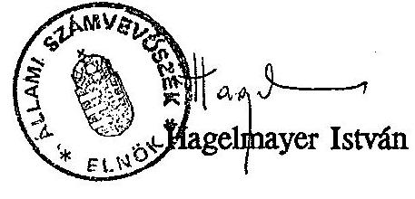

---

# A PM fejezet intézményeinek átszervezése, alapítása, megszüntetése 1990-1993. között 

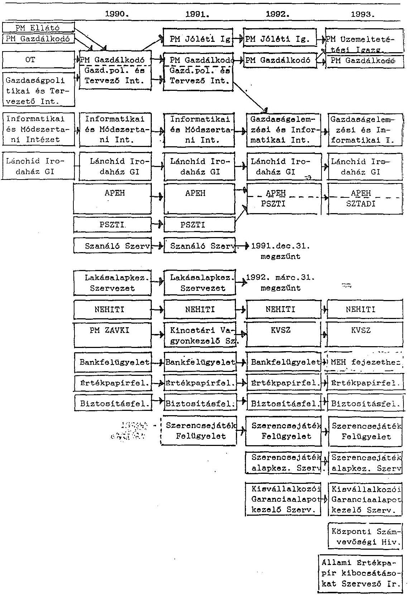

---

JegyzőkönyV

Készült: a PM Pénzügyi és Gazdasági Főosztályán az Állami Számvevőszék Igazgatójának V-40-2/1992. számú, 1993. január 4-én kelt, 1993. január 22-i határidővel, illetve az Állami Számvevőszék Számvevő főtanácsosának V-40-12/1999/93. számú, 1993. május 26-án kelt, 1993. június 2-i határidővel kért számszaki táblák átadásátvételéről.

Az Állami Számvevőszék jelenlévő képviselője a mai napon tartalmi felülvizsgálat nélkül átveszi a XVII. PM fejezet és intézményei számszaki tábláit, a jegyzőkönyv mellékletében felsorolt részletezés szerint.

Az Állami Számvevőszéknek a PM fejezet ellenőrzésében résztvevő munkatársai a táblák átadását követően, 1993. januárjában több alkalommal személyes konzultációt folytattak a táblák kitöltésének tartalmi kérdéseiről, és belső határidőként az 1992. évi módosított előirányzatokra, tényleges teljesítésre, továbbá az 1993. évi költségvetésre és 1993. I. negyedévi felhasználásra vonatkozóan értelemszerűen az e feladatokra előírt határidőkkel azonos időpontokban állapodtak meg.

A fejezeti összegzésű számszaki táblák tartalmi hiányosságai 1993. április elején, a részletes ellenőrzés során derült ki, kijavításukra többszöri konzultációval az Ász munkatársa segítséget adott.

A PM jelenlévő képviselője megjegyzi, hogy a határidő késedelmes teljesítésének okai, elsősorban a beérkező pontatlan információk miatt javításra szorultak, azon kívül az intézményeknél és a PM-ben is ugyanazon munkatársakra több - határidőben szinte azonos - feladat hárult, gondolok itt elsősorban a beszámolóra, az 1993. pótköltségvetésre, az 1994. évi előtervekre, nem beszélve a napi munkáról, és a számítógép meghibásodásáról.

Az intézményeknek egyébként az I. negyedévi - előző évben IV. 20-ra kért adatszolgáltatást az újonnan életbe lépő jogszabály nem írta elő, csak május 20-ig kellett I. negyedévi könyvelésüket teljesíteni.

Budapest, 1993. július 01.
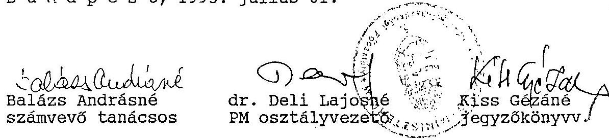

---

A.) Szabálytalan előirányzat átcsoportosítások a XVII. PM fejezet címei között

# 1. $0,6 \mathrm{M}$ Ft bér+TB járulék pótelőirányzat 

14. Állóeszköz felújítás, nagyjavítás címből
15. Tartalék címre, majd 1. Pénzügyminisztérium igazgatása PM Jóléti Intézmények igazgatóságának
az 1991. évi dunai árvíz miatti mentés és helyreállítás költségeire, az 5.229/1991. PGF sz. ügyirattal, 1991. szept. 25-én.

A pótelőirányzat az 1990. évi CIV. törvény 9. § (10) bekezdés előírásaiba ütközik:
"A fejezeteknél központilag tervezett állóeszközfelújítási (nagyjavítási), ágazati és szakmai célfeladatokra szolgáló, valamint a tartalék előirányzatok felhasználásáról a fejezet irányításáért felelős dönt. Ezen előirányzatok csökkentése mellett más fejezethez tartozó költségvetési címek, valamint azok kiemelt előirányzatai is növelhetők. Állóeszközfelújításra (nagyjavításra) szolgáló előirányzatból a béralap akkor növelhető, ha azt saját kivitelezésben végzik."
(mellékelve 2 ügyirat másolatban)
2. 10 M Ft támogatás (pénzeszköz átadás)
17. Tartalék címről

A Történelmi Igazságtétel Bizottságának, a bizottság szervezeti, érdekvédelmi, kegyeleti, történelem feltáró feladataihoz és beruházásaihoz, az 5.198/1991. PGF sz. ügyirattal, 1991. június 27-én.
1990. évi CIV. törvény 9. § (5) bekezdése szerint:
"Az Országgyúlés ... magának tartja fenn a jogot az előirányzatok megváltoztatására:

- a társadalmi szervezetek támogatása"
(mellékelve 5 ügyirat másolatban)

---

# 3. 20 M Ft támogatás (pénzeszköz átadás) 

Központi fejezetektől elvonható, az állami költségvetést megillető pénzmaradvány terhére
XVII. PM fejezet számára
a törvényjavaslatok, előterjesztések többletköltségeire, a 24.692/91. számú, 1991. VII. 18-án kelt ügyirattal.

A pénzmaradvány módosítására vonatkozó pénzügyminiszteri jogkört (23/1979. /VI.28./ MT sz. r. 61. §) a 2/1991. (I.1.) sz. Korm. rendelet 1991. I. 1-től hatályon kívül helyezte.

23/1979. (VI.28.) MT sz. rendelet 61. §:
"(1) A költségvetési szerv gazdálkodása során képződő pénzmaradványokat a minisztériumok és országos hatáskörű szervek tekintetében a pénzügyminiszter ... - elsősorban a feladatok teljesítése alapján - felülvizsgálja. A miniszterek (országos hatáskörű szervek vezetői) ... felügyelete alá tartozó költségvetési szervek pénzmaradványát a pénzügyminiszter is felülvizsgálhatja.
(2) A felülvizsgálat alapján a pénzmaradvány - a költségvetésben meghatározott feladatok teljesítésére figyelemmel - módosítható, illetve elvonható.
(4) A pénzmaradványoknak bérek és egyéb személyi kiadások céljára történő felhasználását a pénzügyminiszter szabályozza."

2/1991. (I.1.) Korm. r. Az állami pénzügyekről szóló 1979. évi II. törvény végrehajtására kiadott 23/1979. (VI.28.) MT rendelet módosításáról 2. §:
"Ez a rendelet kihirdetése napján lép hatályba; rendelkezéseit 1991. január 1. napjától kell alkalmazni; ezzel egyidejűleg

- a Vhr 61. §-a
... hatályukat vesztik."
(mellékelve 4 ügyirat másolatban)

---

# 4. 20 M Ft kiadás 

ebből 10 M Ft bér
4,3 M Ft TB járulék
a 3. pontban átadott pénzmaradvány terhére

1. Pénzügyminisztérium igazgatása

PM Gazdálkodó Szervezete számára.

Indokolás "A Gazdasági Kabinet többlet feladatainak bérszükségletét ezideig a PM viselte saját béralapja terhére. A felhasznált béralap az előirányzat módosítással visszapótlásra kerül és az ezáltal felszabaduló pénzalapot ... a PM jutalmazásra használhatja fel",
15.109/1991, illetve 5283/91 PGF sz. ügyiratok alapján, 1991. nov. 11-én.

Az engedélyezett támogatás béralapot nem tartalmazott, így bérként való felhasználása az 1990. évi CIV. törvény
9. § (12) bekezdése előírásaival ellentétes:
"...A dologi kiadások pénzmaradványából a béralap nem növelhető."
10. § (1) bekezdése:
"Dologi és más kiadási előirányzatból a béralapba történő átcsoportosításnak nincs helye."

## 5. 10 M Ft többletbevétel elvonás

9. Nemesfémvizsgáló és Hitelesítő Intézet címről
10. Fejezeti kezelésű előirányzatok (tartalék) címre
"tekintettel arra, hogy a PM fejezet pénzügyi nehézséggel küzd", illetve "az intézet bevételi tényszámai ismeretében az elmúlt időszakban jelentős túlteljesítés mutatkozott a tervszámokhoz viszonyítva", SZT 1100/92, SZT 1101/92, 5281/1992 PGF sz. ügyiratokkal, 1992. szeptember 30-án.
A fejezeten belül a címek közötti átcsoportosítás joga az 1991. évi XCI. tv. 43. § (2) bekezdés szerint:
"A központi költségvetés egyes fejezetein belül a címek között - a 42. és a 46. §-ban foglalt jogcímek kivételével - a Kormány engedélyezhet átcsoportosítást. E jogát átengedheti a fejezet irányításáért felelősnek."

---

A Kormány az 1992. évi költségvetés végrehajtása során a fejezeten belül a címek közötti átcsoportosítás jogát nem engedte át a fejezet irányításáért felelősöknek.
A 42. § azokat a címeket sorolja fel, amelyeknél az Országgyúlés magának tartotta fenn a jogot az előirányzatok megváltoztatására.

A többletbevétel fejezeti hatáskörű elvonása ellentétes az 1991. évi XCI. tv. 46. §-ában meghatározott jogcímekkel:
"(1) A fejezeten belüli költségvetési címek közötti átcsoportosítás joga a fejezet irányításáért felelőst illeti meg minden olyan esetben, ha az átcsoportosítás a fejezet irányítása alá tartozó költségvetési szerv létrehozásához, átszervezéséhez, megszüntetéséhez kapcsolódik. Az ilyen belső átcsoportosításhoz a pénzügyminiszter egyetértése szükséges.
(2) A fejezeti kezelésű előirányzatként jóváhagyott ágazati és fejezeti célú előirányzatok felhasználásával összefüggő átcsoportosítást a fejezet irányításáért felelős engedélyezhet. Amennyiben az előirányzat felhasználására más fejezetnél vagy az államháztartás más alrendszerében kerül sor, az előirányzat átcsoportosításhoz a pénzügyminiszter intézkedése szükséges.
(3) A fejezet irányításáért felelős a fejezeti tartalék felhasználása során pótelőirányzatot engedélyez, és erről a pénzügyminisztert tájékoztatja.
(4) A központi költségvetésben kiemelt előirányzatok növelhetők az ilyen részletezést nem tartalmazó fejezeti kezelésű előirányzatok felhasználása, átcsoportosítása során.
(5) A fejezet irányításáért felelős

- az állóeszközbeszerzés, létesítés,
- az állóeszközfelújítás, nagyjavítás,
- a kormányzati beruházások
előirányzatai tekintetében az egyes költségvetési címek között - a költségvetésben kiemelt egyedi állóeszköz-felújítási és beruházási előirányzatok kivételével - a műszaki és a pénzügyi teljesítés által is indokolt átcsoportosításokat végrehajthat.
(6) A fejezet irányításáért felelős hatáskörében

 az állóeszközfelújításra (nagyjavításra), kormányzati beruházásra szolgáló előirányzatból a központi költségvetési szerv béralap és társadalombiztosítási járulék kiemelt előirányzata - a tényleges teljesítésnek megfelelően - akkor növelhető, ha azt saját kivitelezésben végzik.
(7) A fejezet irányításáért felelős joga és kötelessége a felügyelete alá tartozó költségvetési szerv kiadási és bevételi előirányzatának

---

módosítása, ha év közben a költségvetési szerv feladataiban és az azzal összefüggésben elérhető bevételekben jelentős - új jogszabályon, jogszabály-változáson, rendkívüli körülményeken alapuló - változás következik be. A saját bevételek előirányzatának növelése mellett a támogatás előirányzata csökkenthető.
(8) A fejezeti tartalék előirányzata a fejezet által saját hatáskörben, a felügyelete alá tartozó költségvetési szerv átszervezésével, megszűnésével összefüggésben elérhető megtakarítás, valamint a (7) bekezdés szerinti támogatáscsökkentés összegével növelhető."

# 6. 13,5 M Ft többletbevétel elvonás 

1. Pénzügyminisztérium igazgatása címről PM Gazdálkodó Szervezete
2. Fejezeti kezelésű előirányzatok (tartalék címre)
"a PM GSZ 1992. évi eredeti előirányzathoz képest bevételeink jóval kedvezőbben alakultak a tervezettnél - különösen a kamatbevétel és a működési célú átvétel előirányzatok, ezért 13,5 M Ft fejezeti tartalékba való átutaláshoz kérjük engedélyét" FP-5197/92. sz. ügyirat, illetve "...a felajánlott 13,5 M Ft többletbevétel elvonás átutalásáról ... intézkedni szíveskedjék" 5287/1992. PGF sz. ügyirat, 1992. dec. 21-én.

A többletbevétel elvonás az 5. pontnál leírtakkal azonos okok miatt nem felelt meg az előírásoknak.

## 7. 25 M Ft támogatás átcsoportosítás

14. Fejezeti kezelésű előirányzatok címről (7. Önkormányzati adók)
15. Fejezeti kezelésű előirányzatok címre (1. tartalék)
"...a 14/7. Önkormányzati adók feldolgozása alcímen 100 M Ft kiadási előirányzat lett tervezve, ... ezen az alcímen az elvonás 7 M Ft. Jelenleg felhasználtak 68 M Ft-ot, ... a tényleges igény $282,5 \mathrm{M}$ Ft ... Tekintettel arra, hogy az igényeket teljeskörűen ebből a 25 M Ft-ból kielégíteni nem lehet, javasoljuk, hogy a 14/1. Fejezeti tartalék alcímre átcsoportosítást engedélyezni szíveskedjék" SZT-12-123/92. sz. ügyirat, 1992. nov. 9-én.

---

Az intézkedés nem felelt meg az államháztartásról szóló 1992. évi XXXVIII. sz. törvény 24. § (2) bekezdésének:
"a célfeladat előirányzat felhasználási célját a költségvetési törvény határozza meg."
és a (3) bekezdésének:
"Az (1)-(2) bekezdésben meghatározott előirányzatok csak az adott célra használhatók fel."
Ez a törvény a kihirdetését (1992. június 18.) követő tizenötödik napon lépett hatályba.
8. 27,5 M Ft támogatás, 30,181 M Ft átvett pénz, 57,681 M Ft
ebből bér 27,5 M Ft
ebből bér 17,78 M Ft
ebből bér 45,28 M Ft összesen

14/1. Fejezeti kezelésű előirányzatok (tartalék) címről

1. Pénzügyminisztérium igazgatása címre PM Gazdálkodó Szervezete
"Az elvégzett és az év végén még várható többletfeladatokra figyelemmel, számításba véve, hogy az év folyamán a szervezet korszerűsítéséhez kapcsolódó létszámkorrekció és az I-III. negyedéves tényleges létszámnövekedés hatásának ellensúlyozására, amely a kvalifikáltabb és magasabb fizetésű munkatársak felvételét tette szükségessé, továbbá a többletfeladatok megoldására igénybevett külső munkatársak megbízási díjainak ellensúlyozására..." TB-1098/1992. sz. ügyirat 1992. nov. 6-án, illetve TB-1098/1992. sz. ügyirat 1992. dec. 22-én javaslatot tett a PM GSZ 1992. évi bérelőirányzatának módosítására, az előirányzatokat az 5284/1992. PGF. sz. ügyirattal módosították 1992. dec. 28-án. Az intézkedés bérelőirányzatra vonatkozó része szabálytalan. Az 1991. évi XCI. törvény 43. § (5) bekezdése szerint:
"Ha az állami feladatstruktúra évközi változása vagy valamely rendkívüli körülmény, illetőleg feltételmódosulás elkerülhetetlenül szükségessé teszi valamely költségvetési címen belül a béralap növelését, azt a költségvetési cím más előirányzatainak egyidejű csökkentésével - a pénzügyminiszter előzetes állásfoglalása alapján - a Kormány engedélyezheti."

Az intézkedés dologi előirányzatra vonatkozó részéből 6,681 M Ft átcsoportosítása a megszüntetett Lakásalap Kezelő Szervezet pénzmaradványából származik. Felhasználására az 1991. évi XCI. törvény 46. §-a fejezeti hatáskörben nem ad lehetőséget.
(Részletezve az 5. pontban.)

---

# 9. 58 M Ft támogatás 

14/7. Fejezeti kezelésű előirányzatok címről
Önkormányzati adók feldolgozása

1. Pénzügyminisztérium igazgatása címre /PM Gazdálkodó Szervezete/
HT-164/1992. sz. ügyirat, 1992. febr. 28-án.
Az 1991. évi XCI. törvényben meghatározott célfeladatok fejezeti hatáskörben való módosítására az említett törvény 46. §-a nem ad felhatalmazást.
(Részletezve az 5. pontban.)
B. XVII. Pénzügyminisztérium fejezet központi költségvetést megillető pénzmaradványai
1991. évi pénzmaradványt érintő tételek
1./ Önkormányzati adók célfeladat maradványa /PM GSZ/ 6.115 e Ft
1992. évi pénzmaradványt érintő tételek
2./ Elmaradt ágazati- és célfeladatok maradványa (KVSZ) 4.176 e Ft
3./ Országmozgósítás gazdasági felkészülésének
központi kiadásai 51.195 e Ft
4./ Önkormányzati adók célfeladat
más feladatra történő felhasználása
$\frac{83.000 \mathrm{eFt}}{144.486 \mathrm{eFt}}$
Összesen
C. A Lakásalap végleges elszámolásáig fejezeti céltartalék
1./ Lakásalap Kezelő Szervezet 1990. évi pénzmaradványa 4.528 e Ft
2./ Lakásalap Kezelő Szervezet 1991. évi pénzmaradványa 2.153 e Ft
3./ Lakásalap Kezelő Szervezet 1992. évi pénzmaradványa 6.078 e Ft
Összesen:
12.759 e Ft
(mellékelve 6 ügyirat (ebből 1 hivatalos másolatban)

---

Pénzügyi és Gazdasági Főosztály
Fejezeti Pénzügyek Osztály
5229/1991.PGF.

# BELSŐ BIZONYLAT 

3. 31341 törzsszámú Pénzügyminisztérium Irányító Szervezete számvitelében az alábbi módosításokat vezettük át.
3. 17. Nagyjavítás (felújítás) rovaton
4.300 eft zárolás.
22. Önkormányzatok és központi fejezetek működési gazdálkodási tartaléka rovaton
4.300 eft pótelőirányzat.
3. 22. Önkormányzatok és központi fejezetek működési gazdálkodási tartaléka rovaton
4.300 eft és
4. 44. Költségvetési támogatás (bevétel) rovaton
4.300 eft zárolás.

Az átsoportosítás a PM Jóléti Intézmények Igazgatóságát illeti meg egyszeri jelleggel, a dunai árvíz károk megszüntetésére.
Az Igazgatóság vezetőjét a pótelőirányzatról és a támogatás teljes összegének átutalásáról (amely levelünkkel egyidejűleg megtörtént) értesítettük.

Budapest, 1991. szeptember 25.
Hiss J.
Engedélyezem:
(Birtók Mária:)
osztályvezető
(Horváth Tibor:)
főosztályvezető

---

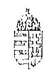
$5229 / 1991 . P G F$.

Ur. Dzur Gábor igazgató
PM Jóléti Intézmények Igazgatósága
Budapest

Tisztelt Dzur Úr!

Hivatkozva az Ig.200/91/71.számú levelére, értesítem, hogy az Intézmény 1991.évi előirányzatát egyszeri jelleggel, a dunai-árvíz károk megszüntetéséhez (a felülvizsgált tételes árvizkárokról szóló felsorolások és kimutatások alapján) a következők szerint megemelem:

Kiadás / Támogatás : 4.300.000,-Ft =
Kiadásból:

- Bér + Tb: 606.500,-Ft

Tájékoztatom továbbá, hogy a támogatás teljes összegének átutalása levelemmel egyidejűleg megtörtént.

Budapest, 1991. szeptember 25.
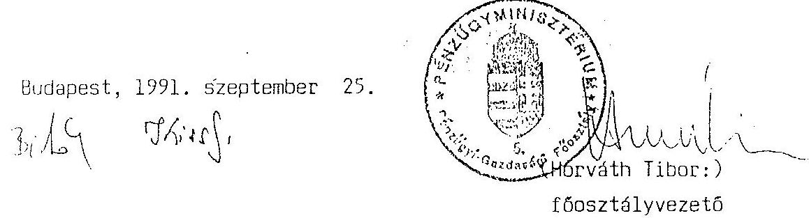
főosztályvezető

---

# 3. sz. melléklet A/2. pontjához (1 

## 5198. /1991.PGF.

Hegedűs László ügyv. alelnök
Történelmi Igazságtétel Bizottsága Országos Elnökség Budapest

Tisztelt Hegedűs úr!

Hivatkozva a miniszter úrhoz írt NZ-772/91. sz. levelére tájékoztatom Önt, hogy a mellékletben megjelölt feladatokra a Pénzügyminisztérium a Fejezeti Tartalékából -egyszeri jelleggel- 10.000 eft-ot, azaz Tízmillió 00/100 forintot tud biztosítani.

Az egyszeri 10 millió Ft-os pénzeszközátadást a Költségvetésistörvény 9.§ (10) bekezdése alapján a minisztérium vezetése engedélyezte.

Az összeg átutalása levelemmel egyidejűleg megtörtént.

Budapest, 1991. június 27.

---

Pénzügyi és Gazdasági Főosztály
Fejezeti Pénzügyek Osztály
1991.PGF.
3. sz. melléklet A/2. pontjához

# BELSŐ BIZONYLAT 

a 31341 törzsszámú Pénzügyminisztérium Irányító Szervezete számvitelében az alábbi módosításokat vezettük át.

A 22. Önkormányzatok és központi fejezetek működési gazdálkodási tartaléka (kiadási) rovaton
10.000 eft
zárolás,
és a 61. Működési célra átadott pénzeszköz (kiadási) rovaton
10.000 eft
pótelőirányzat.
a 10.000 eft előirányzat- és pénzeszköz átadás a Történelmi Igazságtétel Bizottságot illeti meg, egyszeri jelleggel.
A módosításról és a pénzeszközátutalásról a TIB ügyv. alelnökét levélben értesítettük.
Belső megjegyzés: A teljesítés a 61. Működési célra átadott pénzeszköz rovaton jelenik meg.)

Budapest, 1991. június 27.
Fiesj.
Engedélyezem:
(Birtók Mária:)
osztályvezető

---

Pénzügyi és Gazdasági Főosztály
Fejezeti Pénzügyek Osztály
510/1991. PGF.

# BELSŐ BIZONYLAT 

31 341 törzsszámú Pénzügyminisztérium Irányító Szervezete számvitelében az alábbi módosításokat vezettük át.
a 22. Tanácsok és központi fejezetek működési gazdálkodási tartaléka (kiadási) rovaton 12.000 eft
a 62. Működési célra átvett pénzeszköz (bevételi) rovaton
12.000 eft
pótelőirányzat.

Az előirányzatelvonás a PM Gazdálkodó Szervezetet terheli egyszeri jelleggel, többletbevétel elvonás címen.
Az egyszeri előirányzatelvonásról, és a 12.000.000,-Ft többletbevétel befizetési kötelezettségéről az intézmény vezetőjét levélben értesítettük.

Budapest, 1991. június 26.
Júlis!.

Engedélyezem:

osztályvezető

---

Pénzügyi és Gazdasági Főosztály

7/1991.Tárca 12. millió Ft többletbevétel elvonása
10/1991. Tárca 10 millió Ft előirányzat átadás a TIB részére 20 millió Ft igény a PM Gazdálkodó Sz. részére, többletfeladatok címen.

Király Péter közigazgatási államtitkár útján
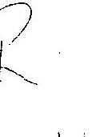
dr. Kupa Mihály
pénzügyminiszter úr
elé
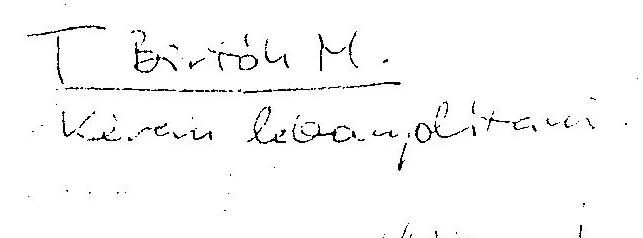

Budapest, 1991. június

---

# 991/91/864 

TÖRTÉNELMI IGAZSÁGTÉTEL BIZOTTSÁGA: 3. sz. melléklet A/2. pontjához (4
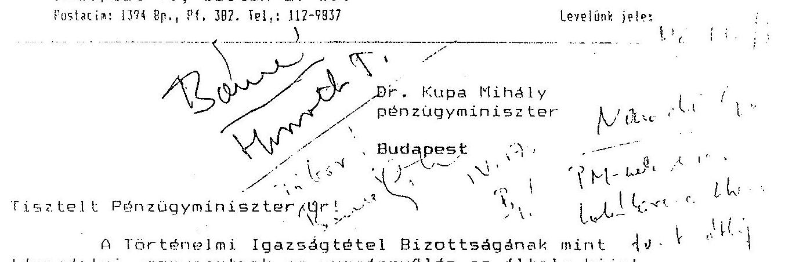

Tisztelt Pénzügyminiszter úr!
A Történelmi Igazságtétel Bizottságának, mint társadalmi szervezetnek az Országgyűlés az általa kiírt pályázat keretén belül az 1991. költségvetési évre hatmillió forint költségvetési hozzájárulást szavazott meg, szemben a TIB által megpályázott huszonnégymillió forinttal. A rendelkezésünkre bocsátott összeg - lévén, hogy szervezetünk a legutóbbi időkig anyagi eszközöknek szinte teljesen híjával volt - a legalitás körülményei közt feltétlenül szükséges tárgyi-anyagi háttér megteremtésére sem elegendő, így hatásos társadalmi működést kifejteni nem tudunk sem érdekvédelmi, sem kegyeleti, sem történelemfeltáró feladatunkban. Meggyőződésünk ugyanakkor, hogy pártfüggetlen tevékenységünk nemcsak csoportérdeket szolgál, hanem megnyugtatóan befolyásolhatja a jelenlegi zilált politikai miliőt is. Tagságunkat azonban jellemzően az elmúlt diktatúra kárvallottjai teszik ki; anyagi erejükre (tagjaikra) alig számíthatunk, de erkölcsi-szellemi tőkéjükre igen.

Figyelemmel az előadottakra, kérjük, szíveskedjék módot találni arra, hogy a jelen levél mellékletében megjelölt feladatokra, a feltüntetett összegekben a TIB további költségvetési támogatást kapjon.

Bízva kérésünk kedvező elbírálásában,
Budapest, 1991. április 15.
tisztelettel:
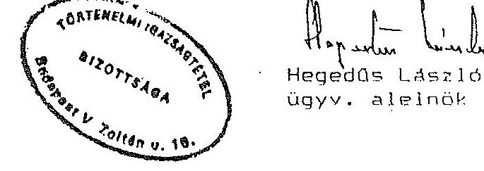

---

# Melléklet 

A TIB legfontosabb célfeladatai és beruházási terve az 1991. költségvetési évre.

|  | eFt | eFt |
| :--: | :--: | :--: |
| 1. Szervezati felépítés |  |  |
| 1 területi adminisztr. bére | 1008 |  |
| 20% bérf. | 202 |  |
| 43% közterh | 520 |  |
| 3 területi szerv alapell. | 1170 | 2900 |
| 2. Érdekvédelem |  |  |
| Állandó jogi szolg., 2 fő bére | 360 |  |
| 43% tbj | 155 |  |
| Ügyvédi költség | 1500 | 2015 |
| 3. Kegyeleti tevékenység |  |  |
| Temetkezési segély 40 eFt/hó | 480 | 480 |
| 4. Történelemfeltárás |  |  |
| Adatgyűjtés 200eFt/hó | 2400 |  |
| Adatfeldolgozás 100 eFt/hó | 1200 |  |
| Könyvkiadás | 2000 | 5600 |
| 5. Beruházások |  |  |
| 1756-os irat- és könyvtár feláll. | 500 |  |
| Telefax | 120 |  |
| Nagyteljesítményű Xerox másoló | 800 |  |
| IBM PC/XT számítógép monitorral | 150 |  |
| Lézerprinter | 600 |  |
| Programok | 600 |  |
| Elektronikus írógép 3 db | 240 | 3010 |
| Mindösszesen: |  | 14005 |

## Magyarázat

Ad 1.: Jelenleg 4 területi szervezet (egy-egy két-három megyét fog át) van, létezéséhez is alig elegendő ellátással, adminisztrátor nélkül. Három területi szervezet kialakítás alatt. Ad2.: A politikai kárvallottak kárpótlási ügyei az állandó szolgálatot nélkülözhetetlenné teszik. Az ügyvédi költség periratok tömegének tanulmányozására és jogorvoslati perek viteléhez szükséges azok ügyében, akik ítéletének megsemmisítését a korabeli ítéletindoklás alapján utasították el. Az érintettek anyagi helyzetük miatt nem képesek ügyvéd megbízatására. Ad 3.: Exhumáltak újratemetése esetén az állam a földi maradványok szállítását nem fizeti. Kispénzű hozzátartozók kivégzett szeretteiket nem tudják lakóhelyük szerinti temetőben eltemettetni. Ad 4.: Utolsó lehetőség, hogy a területi szervezetek tagjaitól és segítségével, szemtanúktól gyűjtsük be és rendszerezzük a történelemkutatás számára az 56-os forradalom valós adatait. Két kötet vár kiadásra: az

 56-os már. lirikus életrajza és középiskolai irodalomtanárok számára. 56 a szépirodalom tükrében. Ad Sr. Ezen beruházások nélkül az említett feladatok végrehajtása lehetetlen.
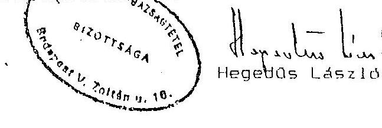

---

Pénzügyi és Gazdasági Főosztály
$10 / 1991$. Tárca

# FELJEGYZÉS 

dr. Kupa Mihály miniszter úr részére

Hivatkozással a Történelmi Igazságtétel Bizottsága levelére és a Pénzügyminisztérium főosztályainak többszöri szóbeli egyeztetésére javasoljuk, hogy a TIB 14 millió Ft-os igényéből 10 millió Ft kerüljön elismerésre.

Az egyszeri 10 millió Ft-os előirányzatnövelés a XVII. Pénzügyminisztérium fejezet még el nem kötelezett fejezeti tartalékát terhelné.

Kérjük szíves engedélyét a Költségvetési törvény 9. § (10) bekezdése alapján az előirányzat átcsoportosításához.

Budapest, 1991. június 17.

Melléklet:
a TIB NZ-772/1991 számú levele
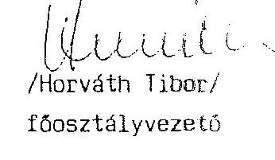
/Horváth Tibor/
főosztályvezető

---

Pénzügyi és Gazdasági Főosztály
$14 / 1991$. Tárca

3. sz. melléklet A/3. pontjához

# FELJEGYZÉS 

dr. Kupa Mihály miniszter úr részére

A Parlament a Költségvetési törvényben 1991. évre a Pénzügyminisztérium Igazgatása címre az akkor meglévő és ismert minisztériumi feladatok végrehajtásához szükséges előirányzatokat hagyta jóvá.

A Minisztérium Kormányzatban betöltött szerepének növekedésével egyre több feladat hárul az apparátusra, melynek anyagi fedezetét az állami költségvetés még nem tudta elismerni.

Ezúton kérjük, hogy a Gazdasági Kabinet anyagok készítésével járó nyomdai, gépbeszerzési, készlettöbbletbeszerzési feladatok ellátásához a költségvetési szervek pénzmaradványának elszámolásakor - a Pénzügyminisztérium meglévő pénzmaradvány visszahagyási igényén felül - 20 millió Ft átcsoportosítását szíveskedjék engedélyezni a központi maradványból.

A kért összeg a többletfeladatok zavartalan ellátásához feltétlenül szükséges.

Budapest, 1991. június 18.

---

Pénzügyi és Gazdasági Főosztály
Fejezeti Pénzügyek Osztály
12/1991. Tárca

# FELJEGYZÉS 

Bán Gézáné főosztályvezető részére

Társadalmi Közkiadások Főosztály

Szóbeli megbeszélésünkre hivatkozva a Gazdasági Kabinet anyagok készítésével járó nyomdai, gépbeszerzési, készlettöbbletbeszerzési feladatok ellátásához szükséges, a Pénzügyminisztérium meglévő pénzmaradvány visszahagyási igényén felüli 20 millió Ft igényünket a minisztérium vezetőinek jeleztük.

A feljegyzésünkben kért 20 millió Ft PM Fejezet számára történő megállapítását Király Péter államtitkár úr engedélyezte. Ezért kérjük, hogy az 1990. évi pénzmaradványok jóváhagyásakor a PM Fejezet visszahagyásra javasolt maradványán felül 20 millió Ft átengedélyezéséről is szíveskedjék intézkedni.

Mivel a többletkiadás béralapot is érintő, a jóváhagyáskor bérre történő felhasználását is kérjük engedélyezni.

Tájékoztatásul közöljük, hogy előzetes megbeszélésünk alapján a TIB részére a megjelölt feladatokra a PM Fejezeti Tartalékból 10 millió Ft pénzeszközt átadtunk.

Budapest, 1991. június 27.

## Mellékletek:

- 7/1991. Tárca sz. Feljegyzés másolata
- 10/1991. Tárca sz. Feljegyzés másolata
- 14/1991. Tárca sz. Feljegyzés másolata
- Király Péter engedélyének másolata
- és a június 27.-i indítású MNB átutalási megbízás másolata a 10 millió Ft-ról.

---

# PÉNZÜGYMINISZTÉRIUM 

BUDAPEST V., JÓZSEF NÁDOR TÉR 2-4. TELEFON: 118 - 2066
TELEFAX: 118 2570. TELEX: 20.2763
POSTACÍM: 1369 BUDAPEST, POSTAFIOK 481

Horváth Tibor úr
főosztályvezető
Helyben

Tisztelt Horváth úr!

A fejezet 1990. évi pénzmaradvány elszámolását felülvizsgáltuk és azt az alábbiak szerint hagyom jóvá.

1990. évi teljes pénzmaradvány 1.220.162 eFt önrevízió alapján pénzmaradvány elvonás 2.587 eFt fejezet által felhasználható pénzmaradvány $1.217.575 \mathrm{eFt}$

Értesítem továbbá arról, hogy a fejezetnek a törvényjavaslatok, előterjesztések többletköltségeire 20.000 eFt-ot egyszeri alkalommal jóváhagyok. A központi fejezetektől elvonható az állami költségvetést megillető pénzmaradványok terhére - az önrevízió által befizetendő összeg levonásával - 17.413 eFt-ot biztosítok. Az összeg átutalásáról levelemmel egyidejűleg intézkedtem.

A fejezetnek 1990. évi pénzmaradvány befizetési kötelezettsége nincs.

Kérem a fentiek szíves tudomásulvételét.

Budapest, 1991. július ...

---

Könyvelésnek

Helyben

# Utalvány 

Költségvetési év: 1991.

A központi költségvetési szervek jóváhagyott pénzmaradvány elszámolása alapján utasítom, hogy a 232-90120-0027 Előző évi költségvetési maradványok számla terhére 17.413.000 Ft-ot, azaz Tizenhétmilliónégyszáztizenháromezer forintot a 232-90109-8493 számú Pénzügyminisztérium Év végi maradványelszámolási számla javára haladéktalanul utaljon át.

Budapest, 1991. július ...
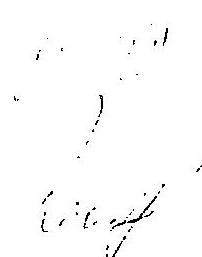
dr. Bősze Zoltán

---

# Pénzügyminiszter 

## Megszüntető határozat

1. Az állami pénzügyekről szóló 1979. évi II. törvény 36. §-ának (1), (3), és (5) bekezdése alapján, az 1979. évi II. törvény végrehajtásáról szóló 23/1979. (VI.28.) MT számú rendelet 53. §-ának (1) bekezdésére figyelemmel a Minisztertanács 115/1988. (XII.31.) sz. rendeletével létrehozott elkülönített állami pénzalap kezelésére az akkori pénzügyminiszter úr által (1989. január 1-i hatállyal) megalapított Lakásalap kezelő Szervezetet (1992. Bp. Bég u. 3-5.) 1992. március 31-i hatállyal
megszüntetem.

A Szervezetet az 1988. december 31-ig hatályban volt jogszabályok alapján nyújtott lakáshitelek kezelésére és az e hitelek forrásaként szolgáló kötvények kibocsátására létrejött decentralizált állami pénzalap, a Lakásalap kezelésére hozták létre. A Lakásalap megszüntetéséről és kötelezettségeinek átszállásáról a 39/1992. (III.4.) Korm. rendelet rendelkezik.
2. A Lakásalap kezelő Szervezet megszünése után a működési költségvetésbe tartozó pénzeszközök szempontjából a jogutód a Pénzügyminisztérium, így a szervezet 232-90174-3210. számú bankszámlaegyenlegének átutalása a 232-90145-4051. számú Pénzügyminisztérium, Budapest elnevezésű számlára történik.
A Szervezet áprilisban esedékes, működéssel kapcsolatos költségeit (TB járulék, személyi jövedelemadó, CSEB, munkavállalói járulék, stb.) a Pénzügyminisztérium teljesíti.

---

3. A pénzeszközöknél mutatkozó 1992. évvégi maradvány az állami költségvetést illeti.
4. A Pénzügyminisztérium könyvjóváírással átveszi a Szervezet eszközállományát.
5. A Szervezet munkajogi megszüntetését a PM - Humánpolitikai és Munkaügyi Főosztálya, mint munkáltatói felügyelet intézi.
6. A Szervezet dokumentációs állományát a PM Irattára 1992. április 15-ével átveszi.
7. Az 1992. évi gazdálkodásról a Szervezet miniszteri biztosa 1992. április 30-ig köteles beszámolni.

Budapest, 1992. március 29.
/dr. Kupa Mihály/ pénzügyminiszter

A másolat hiteles.

Budapest, 1993. november 5.
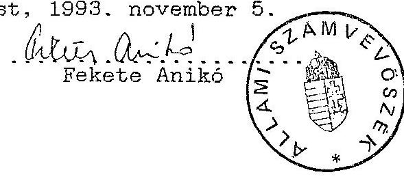

---

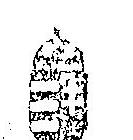

PÉNZÜGYMINISZTÉRIUM
BUDAPEST, JÓZSEF NÁDOR TÉR 2-4
Cím: 1369 Budapest, Postafiok 481
Telefon: 1182066
Telefax: 1182-570 Telex: 20-2763
$5130 / 1002 . PCF$
Dr. Torma Béla főosztályvezető-helyettes
PM Főkonyvelőség
Helyben

Tisztelt Torma úr!

Tájékoztatom, hogy a PM Igazgatása cím PM Gazdálkodó Szervezet 1992. évi előirányzatait a mellékelt módon megemelem. Az előirányzat a megszűnt Lakásalap-kezelő Szervezet átvett feladatainak ellátására szolgál.

Kérem az előirányzatok cél szerinti kezelését és évvégi elszámolását.

A megszűnt Szervezet pénzeszközeinek átutalása 1992. április 3.-án megtörtént, összege 17.497.042 Ft. 1992.

Az egyenleg tartalmazza a Szervezet 1991. évi még jóvá nem hagyott és az előző évekből fel nem használt pénzmaradványát, összesen 8.681 eFt-ot. A pénzmaradvány jóváhagyásáról illetve felhasználásáról külön történik intézkedés.

Budapest, 1992. május 18.
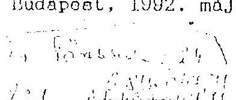
(Szép Tamás)
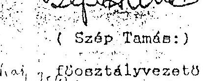

---

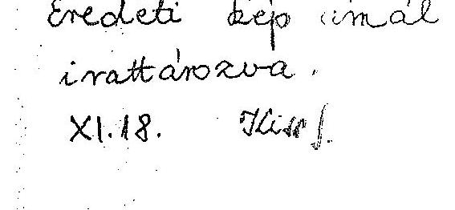

PÉNZÜGYI ÉS GAZDASÁGI
FŐOSZTÁLY

SZI- 12-123/1/92

# FELJEGYZÉS 

dr. Nagy Zoltán közigazgatásért felelős államtitkár úr
részére

Tárgy: Javaslat az 1992. évi 17. PM fejezet költségvetési előirányzatának módosítására

Az 1991. évi XCI. tv. "A Magyar Köztársaság 1992. évi költségvetéséről és az államháztartás vezetésének 1992. évi szabályairól" törvény 43.§ (4) bek. értelmében a pénzügyminiszternek joga van az 1-14 címek között átcsoportosítani.
A 14. cím a fejezeti kezelésű előirányzatokat tartalmazza.
Ennek egyik alcím 14/7 "önkormányzati adók feldolgozása". Erre 100,0 millió kiadás előirányzat lett tervezve. Az 1992. évi elvonások a fejezeti kezelésű előirányzatokat is érintették, ezen alcímén az elvonás 7,0 millió.
Jelenleg már felhasználtak 68,0 milliót, s 25,0 millió még a tervezett kiadások fedezetéül rendelkezésre áll. A tényleges igény ezen alcímén 282,5 millió volt, mint azt az 1992. márc. 25-ei önnek szóló feljegyzés is tartalmazta.
Tekintettel arra, hogy az igényeket teljeskörűen ebből a 25,0 millióból kielégíteni nem lehet, javasoljuk, hogy a 1991. Fejezetből maradt alcímekre az átcsoportosítást engedélyezni szíveskedjék.

---

A 14/7 alcímén még az év hátralévő részében jelentkező igényeket a PMGSZ a dologi kiadásai terhére teljesíti.
A 8.cím Lakásalap Kezelő Szervezet 1990. évi pénzmaradványa 4,5 millió Ft, az 1991. évi pénzmaradványa 4,2 millió Ft. (összesen 8,7 millió Ft).
A költségvetési szervek pénzmaradványát terhelő befizetési kötelezettség a Lakásalapkezelő Szervezetet 2,0 millió Ft-tal érinti.
(Belső kalkulációnk és döntésünk értelmében).
A 6,7 millió Ft pénzmaradvány átcsoportosítását a 14/1 Fejezeti tartalék alcímre engedélyezni szíveskedjék.
A 14/1 Fejezeti tartalék felhasználásáról későbbiekben - a felmerülő igényeket figyelembe véve - kérjük szíves intézkedését és engedélyét.

Kérem fentiek szíves elfogadását, és egyetértése esetén a miniszter úr hozzájárulásával engedélyét.

Budapest, 1992. november 9.

# Döntés

Szép Tamás
főosztályvezető

Engedélyezem:
Jóváhagyom:
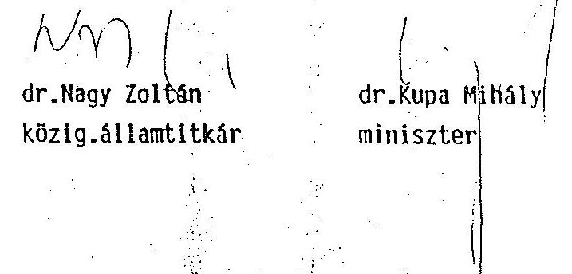

---

# LAKÁSALAP-KEZELŐ SZERVEZET 

Budapest, Bég u. 3-5. 1022 Telefon: 115-4615
Telefax: 115-4217 Telex: 22-6708 Postacím: Budapest 23 Pf. 29. 1277
LA-12355/1992
3. sz. melléklet C. pontjához (4)

Pénzügyminisztérium
Budapest

Nagy Zoltán
államtitkár úr részére

Tisztelt Nagy úr!

Szíves tájékoztatásul közöljük, hogy a Lakásalap-kezelő Szervezet II., III. és IV. negyedévi működési költségét (10.200.000,-Ft) a Lakásalap-számláról lehívtuk és át-
tettük az MNB-nél levő működési számlára.

Budapest, 1992. március 30.
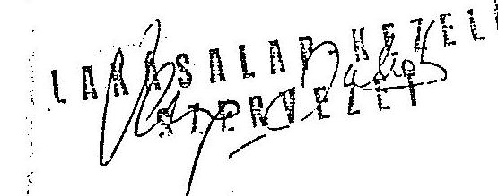

---

# PÉNZÜGYMINISZTÉRIUM   ÁLLAMTITKÁR 

Lakásalap-kezelő Szervezet

Dr. Schült Margit asszony miniszteri biztos

Varga Imre úr igazgatóhelyettes

Budapest

(Utasítom, hogy a Lakásalap és a Lakásalap-kezelő Szervezet megszüntetésével kapcsolatos további költségek fedezetének forrását a Szervezet teljes 1992. évi előirányzatának lehívásával teremtsék meg.)
Budapest, 1992. március 26.
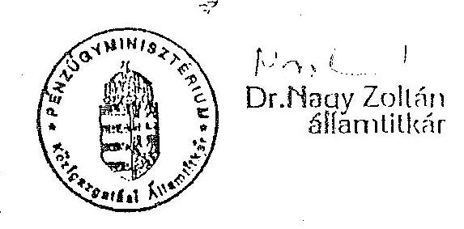

---

# 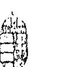 

## 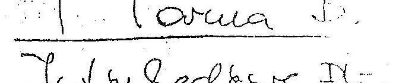

Feljegyzés
Nagy Zoltán államtitkár úr
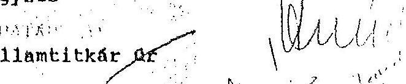

Tárgy: a Lakásalap-kezelő Szervezetet megszüntető határozat

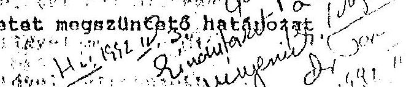
a Lakásalap-kezelő Szervezet - a kedvezményes lakáshitelek elszámolási módjának problematikussága miatt - március 31-ig nem tudja befejezni működését. Ez természetesen nem akadálya a megszüntetésnek, hanem a következők történnek: az Állami Költségvetési Főosztály saját állományába átveszi a szervezet két dolgozóját, akik a szükséges ideig - ami több hónap is lehet - folytatják a szervezetnél félbemaradt munkákat (a szervezet lényegében a főosztályon belül működik tovább).
A munkához szükséges minden ott használható technikai eszközre, valamint arra, hogy a dokumentációs állományhoz folyamatosan hozzáférhessenek.
Az elbocsátandó dolgozók munkabérére, végkielégítésére, azok járulékaira, stb. a PM-nek nincs sem fedezete, sem előirányzata, továbbá arra sincs, hogy a Lakásalapot saját szervezetén belül működtesse, beleértve az átveendő dolgozók további bérét és járulékait is. A szervezet (miniszterhelyettes által jóváhagyott) működési szabályzata negyedévi lehívást tesz lehetővé. Ez azonban normál működésre és nem megszüntetésre vonatkozik. Ezért kérem, utasítsa a Lakásalap-kezelő Szervezetet teljes évi előirányzatának lehívására, hogy azt a PM a további költségek biztosítására átvehesse. Ellenkező esetben mindezt valamilyen a most még esetleg nem is ismert kötelezettségeket a PM keretekből kell fedezeni, pedig ezekre előirányzat nem volt. Tehát a megszüntető határozatnak maga után kell
 vonnia a teljes keret lehívását utólagos elszámolás mellett.

Budapest, 1992. március 26.

---

# 4. sz. melléklet 

## PÉNZÜGYMINISZTÉRIUM

KÖZIGAZGATÁSI ÁLLAMTISZTÁR
dr. Hagelmayer István elnök úr részére

Állami Számvevőszék

Budapest

Tisztelt Elnök Úr!

Az Állami Számvevőszék a Szanáló Szervezet megszünésével és a REORG Rt. megalakulásával kapcsolatban az eljárás egyes intézkedéseit kifogásolta.

Az ezzel kapcsolatban megtett intézkedésekről a következőkben tájékoztatom:

- Áttekintettük a megszűnt szervezet számvitelét, végelszámolását és elkészítettük a rendező mérleget, a PM Gazdálkodó Szervezetének könyveiben átvezetésre került. Ezzel az Állami Számvevőszék vizsgálatakor megállapított 51%-os tulajdoni rész szabályosan a PM Gazdálkodó Szervezet, mint tulajdonos birtokába került:
- A tulajdoni hányad 100%-ra módosult, mely az 1992-es pénzforgalmat érintette és a kivásárlást a PM Gazdálkodó Szervezet költségvetéséből fedeztük. A továbbiakban a PM tulajdonosi jogát Gazdálkodó Szervezetén keresztül gyakorolja.

---

- A megszűnt szervezet 1991. december 31-ig befejeződött felszámolási díjait befizette a PM Gazdálkodó Szervezetéhez. Ebből a 35 MFt-ból a PM Gazdálkodó Szervezete visszatarthatja a kivásárlásra megelőlegezett 24 MFt-ot. A fennmaradó 11 MFt-ot az állami költségvetés részére kell befizetnie. Az új szervezet, a REORG Rt. által bonyolított, még a Szanáló Szervezet által 1989-ben megkezdett, de 1991. december 31-ig be nem fejezett ügyeiből befolyó bevételek PM-et megillető 50%-át a Gazdálkodó Szervezet az állami költségvetés javára köteles befizetni.
Az 1990-1991-ben megkezdett, de 1991. év végéig be nem fejezett felszámolások díjbevétele a REORG Rt-t illeti meg. A PM, mint tulajdonos osztalék formájában jut az őt megillető jövedelemrészhez.
A PM Gazdálkodó Szervezet a befolyt osztalékból fedezi a részvények őrzésével és kezelésével kapcsolatos folyó kiadásait. A fennmaradó részt a költségvetésbe befizeti a visszavásárlásra fordított 24 M Ft. mértékéig.

Ez úton is megköszönöm az Állami Számvevőszék segítőkész tényfeltáró munkáját.

Budapest, 1993. január 19.

---

# Kormányengedély nélkül támogatott alapítványok 

| 1991. - Pénzügyi Kultúra Fejlesztéséért Alapítvány | 50 e Ft |
| :--: | :--: |
| 1992. - 1956. Alapítvány | 1 e Ft |
| - Tessedik Sámuel Alapítvány | 100 e Ft |
| (mely összegből 1993-ban 15 e Ft megtérült. 5 db - nevezett személy életéről szóló - album tiszteletpéldányként történő adományozása miatt) |  |

Az alapítványi támogatásokat az 1990. november 21-én kelt 3457. sz. Kormányhatározat, ezt követően a 4/1991. (II.13.) a költségvetési szervek költségvetésének végrehajtásáról szóló PM rendelet 42. §-ának (3) bekezdése kormányengedélyhez kötötte.

---

|  Pénzügyminisztérium |  |  |  |  |  |  |  |  |   |
| --- | --- | --- | --- | --- | --- | --- | --- | --- | --- |
|  Fejezeti összesen | Költségvetési előirányzat és teljesítése |  |  |  |  | (M Ft) |  |  | 1. sz. tábla  |
|  MEGNEVEZÉS | 1990. |  |  | 1991. |  |  | 1992. |  |   |
|   | Kiadás | Bevétel | Tánogat. | Kiadás | Bevétel | Tánogat. | Kiadás | Bevétel | Tánogat.  |
|  1. Előző évi eredeti előir. | 4779.9 | 2246.5 | 2533.4 | 5593.6 | 2617.3 | 2976.3 | 8414.5 | 1788.8 | 6626.1  |
|  2. Szerkezeti változás | -80.4 | 236.9 | -317.3 | 855.5 | -1392.9 | 2248.4 | 1699.2 | 658.5 | 1040.3  |
|  3. Bázis előir. (1+2) | 4699.5 | 2483.4 | 2216.1 | 6449.1 | 1224.4 | 5224.7 | 10113.7 | 2447.3 | 7666.4  |
|  4. Szintrebozás | 41.9 | 0.4 | 41.5 | 355 | 355 |  | 40.7 | 5.8 | 34.9  |
|  5. Összesen (3+4) | 4741.4 | 2483.8 | 2257.6 | 6804.1 | 1579.4 | 5224.7 | 10154.4 | 2453.1 | 7701.3  |
|  6. Automatizmus | 113.7 | 35.7 | 78 | 476.4 | 76 | 400.4 | 680.9 | 124.3 | 556.6  |
|  7. Alapelőir. (5+6) | 4855.1 | 2519.5 | 2335.6 | 7280.5 | 1655.4 | 5625.1 | 10835.3 | 2577.4 | 8257.9  |
|  8. Fejlesztési többlet | 662.4 | 1.5 | 660.9 | 522.6 | 45.2 | 477.8 | 1588.1 | -799 | 2387.1  |
|  9. Éves előir. (7+8) | 5517.5 | 2521 | 2996.5 | 7803.1 | 1700.6 | 6102.9 | 12423.4 | 1778.4 | 10645  |
|  10. Évközi módosítás | 3613.5 | 3446 | 167.5 | 4344.7 | 4379.7 | -35.4 | 1966 | 2071.2 | -17  |
|  - Országgyűlés |  |  |  | 0.4 | -45.2 | 45.2 | -171.7 |  | -171.7  |
|  - Kormány |  |  |  |  |  |  | 370.3 | 8.6 | 361.7  |
|  - Felügy. szerv | 269.4 | 16.9 | 252.5 | 278 | 134.6 | 143.4 | -180.2 | 26.8 | -207  |
|  - Saját hatáskörű | 3344.1 | 3429.1 | -85 | 4066.3 | 4290.3 | -224 | 1947.6 | 2035.8 |   |
|  11. Módosított előir. (9+10) | 9131 | 5967 | 3164 | 12147.8 | 6080.3 | 6067.5 | 14389.4 | 3849.6 | 10628  |
|  12. Teljesítés | 10708.2 | 8631.7 | 3164 | 12700.6 | 6692.1 | 6622.5 | 14516.8 | 5607.7 | 10628  |

---

|  Pénzügyminisztérium
Fejezeti összesen | Költségvetési előirányzat és teljesítése | (M Ft) | 1. sz. tábla  |
| --- | --- | --- | --- |
|  MEGNEVEZÉS | Kiadás | 1993. 11. 31. | Tánog.  |
|   |  | Bevétel | Tánog.  |
|  1. Előző évi eredeti előír. | 12025.7 | 1380.6 | 10645.1  |
|  2. Szerkezeti változás | -306.2 | 143.2 | -449.4  |
|  3. Bázis előír. (1+2) | 11719.5 | 1523.8 | 10195.7  |
|  4. Szintrebozás | 106.5 | 75.3 | 31.2  |
|  5. Összesen (3+4) | 11826 | 1599.1 | 10226.9  |
|  6. Automatizmus | 11.5 | 13.3 | -1.8  |
|  7. Alapelőír. (5+6) | 11837.5 | 1612.4 | 10225.1  |
|  8. Fejlesztési többlet | 767.5 | 110.6 | 656.9  |
|  9. Éves előír. (7+8) | 12605 | 1723 | 10882  |
|  10. Évközi módosítás | 0 | 0 | 0  |
|  - Országgyűlés | -210 | 0 | -210  |
|  - Kormány |  |  |   |
|  - Felügy. szerv | 210 | 0 | 210  |
|  - Saját hatáskörű |  |  |   |
|  11. Módosított előír. (9+10) | 12605 | 1723 | 10882  |
|  12. Teljesítés | 3662.3 | 730.4 | 2954.9  |

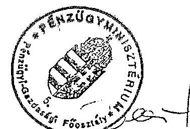

---

# Pénzügyminisztérium

Fejezeti összesen

## Bevételek alakulása (K Ft)

### 2. sz. tábla

|  MEGNEVEZÉS | 1990. évi teljesítés | 1991. évi teljesítés | 1992. évi teljesítés | ELŐIRÁNYZAT VÁLTOZÁS | 1992. évi teljesítés | 1993. évi teljesítés  |
| --- | --- | --- | --- | --- | --- | --- |
|   | EREDETI ELŐIRÁNY | IRÁNYÍTÓSZERVI | SAJÁT HATÁSKÖRBEN | MÓDOS. | TELJESÍT. a mód. | 1990. évi teljesítés  |
|   |  |  |  |  |  | 2-ában  |
|   |  |  |  |  |  | 1-ában  |
|   |  |  |  |  |  | 2-ában  |
|  1. Intézmény alaptevék. bev. | 1360.1 1331.8 844.4 |  |  | 7.6 | 412.3 1264.3 1474.2 | 116.6  |
|  2. Intézmény egyéb bev. | 271.4 536.7 155.5 |  |  | 18.8 | 451.1 627 995.9 | 158.8  |
|  2/a Ebből AFA | 70.2 63.5 81.9 |  |  |  | 36.7 118.6 241.9 | 204  |
|  3. Intézmény vállalk. bev. |  | 317.8 |  |  | -13.5 146 450.3 | 468.5  |
|  4. Csatlakozási bevételek | 8 9.2 |  |  |  | 170.9 170.9 208.2 | 121.8  |
|  5. Intézmény saját folyó bev. (1+2+3+4) | 1639.5 1877.7 1317.7 | 0 | 0 | 26.4 | 1180.3 2512.5 3146.8 | 125.2  |
|  6. Felhalmozott és tökejellegű bev. támogatás, visszatér. | 3.1 2.1 | 4 |  |  | 135.4 139.4 877.1 | 629.2  |
|  7. Egyéb folyó átutalások | 8874.5 9932 10919.2 | -171.7 | 370.3 | -206.6 | 11044.7 11130.3 | 100.8  |
|  7/a Ebből: - Kgv-i támogatás | 3164 6603.8 10645 | -171.7 | 361.7 | -207 | 10628 10628 | 100  |
|  7/b Ebből: - Cél |  | 148.6 1191.5 | -7.2 | -17.5 | 1166.8 1166.8 | 100  |
|  7/c Feladatmeghatározott köt. sor. fin. |  |  |  |  |  |   |
|  7/d Egyéb feladat | 0.1 | 88.3 | -0.7 | -87.6 |  |   |
|  fin. össz. |  |  |  | 81.6 | 81.6 100 |   |
|  7/e Átvett pénzeszk. | 5554.3 3153.7 272.5 |  | 8.6 | 0.4 | 109.8 391.3 469.3 | 119.9  |
|  7/f Átvett visszatérülés | 155.1 174.5 1.7 |  |  |  | 16.5 25.4 26 281.9 | 44.4  |
|  8. Pénzforgalom nélküli bev. | 1278.6 1502.9 182.5 |  |  |  | 1081.5 138.5 84.6 | 72  |
|  8/a Ebből. előző évi pénzeszk. igénybevétele | 1092 1296.3 177.5 |  |  |  | 772 591.6 76.6 | 54.2  |
|  9. Működ. célú hitel (kötvény) bevétel

 |  |  |  |  |  |   |
|  10. Fejlesztési célú hitel bev. |  |  |  |  |  |   |
|  11. Bev. össz. (5+6+7+8+9+10) (kiegyenülő, függő, átfutó és letéti bev. nélkül) | 11795.7 13314.7 12423.4 | -171.7 | 370.3 | -180.2 | 1461.5 14477.6 16235.7 | 112.1  |

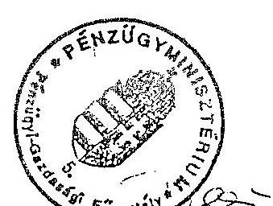

---

| Felségválasztása | Fejezet összesen |  |  |  |  |  |  |  |  |  |  |  |   |
| --- | --- | --- | --- | --- | --- | --- | --- | --- | --- | --- | --- | --- | --- |
|   |  | 1990. évi | 1991. évi | 1992. évi |  | ELVIRÁNYZAT VÁLTOZÁS |  |  |  |  |  |  | 1992. évi  |
|   |  | teljesí- | teljesí- |  |  |  |  |  |  |  |  |  |   |
|  MEGNEVEZÉS |  | tés | tés | EREDETI ELVIRÁNY. |  | IRÁNYÍTÓSZERV |  |  | SZJÁT HATÁSKÖRBEN |  | RODOS. | TELJESÍT. a add. | 1990. évi  |
|   |  |  |  |  |  |  |  |  |  |  |  | 2-ában | 1991. évi teljes.  |
|   |  |  |  |  |  |  |  |  |  |  |  |  | 2-ában  |
|   |  |  |  |  |  | Gy. |  |  |  |  |  |  | 2-ában  |
|  1. | Béralap | 2810.5 | 3657.1 | 4522.2 |  | 88.2 | 48.2 | 1 | 4 | -396.9 | 4266.7 | 3887.6 | 91.1  |
|  2. | Bérjellegű kiadás | 220.1 | 356.8 | 368.6 |  | 0.5 | -10.7 | 8.9 | 9 | 166.7 | 543 | 505.1 | 95  |
|  2/a | ebből: bef. kiabáló. | 48.7 | 50.9 | 40.3 |  |  |  |  |  | 4.8 | 45.1 | 45.9 | 101.8  |
|  2/b | külf. kiabáló | 40.8 | 53.5 | 83.2 |  | 0.3 | -6.6 | 2 |  | -11 | 67.9 | 65.5 | 96.5  |
|  2/c | kereset és kiq. térít. | 4 | 11.7 | 54.7 |  | 0.1 | -1.3 | 4.9 |  | 126.3 | 184.7 | 179.9 | 97.4  |
|  2/d | reprezentáció | 4.8 | 6.8 | 18.2 |  |  | -3.3 | 0.6 |  | 7.2 | 22.7 | 23.2 | 102.2  |
|  3. | Eszközbeszerzés | 586.6 | 605.1 | 327.7 |  | 278.7 | -26.4 | 58.4 |  | 56.7 | 695.1 | 674.4 | 97  |
|  3/a | ebből: fűtő, hajtó ág. | 22.7 | 38.8 | 41.4 |  |  | -0.4 |  |  | 6.8 | 47.8 | 48.9 | 102.3  |
|  3/b | irodaszer | 86.7 | 143 | 60.4 |  | 252.2 | 0 | 20.8 |  | -59.4 | 274 | 273.3 | 99.7  |
|  3/c | könyv, folyóirat | 52.7 | 53.1 | 44.1 |  | 0.1 |  | 9.8 |  | 24.9 | 78.9 | 77.7 | 98.5  |
|  3/d | egyéb készlet. besz. | 238.6 | 255.2 | 156.9 |  | 26.4 | -20.1 | 23.2 |  | 53.6 | 240 | 221.5 | 92.3  |
|  4. | Szolgáltatás | 1281.7 | 2152.8 | 2777.1 | -29.7 | 159.2 | -87.8 | 55.8 |  | 405.5 | 3280.1 | 2608.6 | 79.5  |
|  4/a | ebből: postai szolg. | 177.6 | 331.5 | 289.6 |  | 200 |  | 3 |  | -47.5 | 445.1 | 441.7 | 99.2  |
|  4/b | nagyért. t. eszk. karb. | 61.6 | 109.9 | 591 |  |  |  | 0.8 |  | -42.5 | 549.3 | 389.4 | 56.3  |
|  4/c | szállítás | 10.1 | 13.2 | 11.2 |  | 0.1 |  | 1.2 |  | 5.8 | 18.3 | 17.1 | 93.4  |
|  4/d | egyéb szolg. | 883.2 | 1562.9 | 1792.7 |  | -42.5 | 45.8 | 48.9 |  | 209.7 | 2054.6 | 1665.9 | 81.1  |
|  5. | Személyi kiadó és befiz. | 1981.5 | 2379.3 | 2664.1 | -142 | -238.9 | 49.5 | 43.8 | 37 | 345.1 | 2758.6 | 2578 | 93.2  |
|  5/a | ebből: ib járulék | 1150.6 | 1483.8 | 1949.5 | -142 | -238.9 | 18.5 | 19.9 |  | 103.9 | 1710.9 | 1634.1 | 95.5  |
|  5/b | vásárl. tora. áfá-ja | 556.7 | 594.4 | 678.5 |  |  | 30.9 | 7.5 |  | 248.3 | 965.2 | 815.8 | 84.5  |
|  6. | Kamatfizetések |  |  |  |  |  |  |  |  |  | 0 | 6.7 |   |
|  7. | Felszám. és tőke jell. kiadó. | 1335.4 | 672.6 | 1228.3 |  | 89.8 | -37 | 280.1 | 59.2 | 395.7 | 2816.1 | 1728.5 | 85.3  |
|  7/a | ebből: felújítás | 222.3 | 229.8 | 348.3 |  | -2.7 | -16.4 | 11.3 |  | 168.6 | 509.1 | 479.4 | 94.2  |
|   | ebből:iskámit felől. |  |  | 200 |  |  |  |  |  |  | 200 | 300 | 100  |
|  7/b | tárgyi eszk., kamat. jav. | 773.4 | 355.3 | 605.5 |  | 122.5 | -10.6 | 247.8 | 0.2 | 240.6 | 1206 | 1135.4 | 94.1  |
|   | egyéb folyó átut. |  |  |  |  |  |  |  |  |  | 0 | 1.4 |   |
|  8. | Támogatások, elvonások | 2342.4 | 2791.9 | 498.7 |  | -7.2 | -108.5 | 20 | -2.9 | 403.7 | 803.8 | 2249.9 | 279.9  |
|  8/a | ebből: átadott pénzeszk. | 974 | 1643.9 | 312.1 |  |  | -7.7 |  | -4.9 | 238.3 | 537.8 | 1128.6 | 208.4  |
|  9. | Pénztárig. edikölz kiad. | 150 |  | 7.5 |  |  | -7.5 |  |  | 26 | 26 | 294 | 1130.8  |
|  9/a | ebből:itartalék |  |  | 7.5 |  |  | -7.5 |  |  |  | 0 |  |   |
|  10. | Működési c.hit. visszafiz. |  |  | 29.2 |  |  |  |  |  | -29.2 | 0 |  |   |
|  11. | Fejleszt. c. hit. visszafiz. |  |  |  |  |  |  |  |  |  | 0 |  |   |
|  12. | Kiadások összesen | 10700.2 | 12695.6 | 12423.4 | -171.7 | 370.3 | -186.2 | 468 | 106.3 | 1373.3 | 14389.4 | 14516.8 | 100.9  |
|   | (Kiegyenlítő, függő, átfutó és letéti adók) |  |  |  |  |  |  |  |  |  |  |  |   |

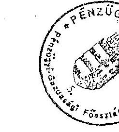

---

# Pénzügyminisztérium

Fejezet összesen

|   | 1990 |  | 1991 |  | 1992 |   |
| --- | --- | --- | --- | --- | --- | --- |
|  Megnevezés | előír. | tény. | előír. | tény. | előír. | tény.  |
|  |   |   |   |   |   |   |
|  Vezetők | 792 | 742 | 843 | 798 | 862 | 821  |
|  Ügyintézők | 5466 | 5291 | 5792 | 5362 | 6269 | 5540  |
|  Ügyv. alk. | 559 | 624 | 522 | 637 | 735 | 671  |
|  Fizikai | 516 | 480 | 536 | 606 | 821 | 702  |
|  Gépkocsi vez. | 37 | 88 | 116 | 87 | 124 | 126  |
|  Összesen: | 7370 | 7225 | 7809 | 7490 | 8811 | 7860  |

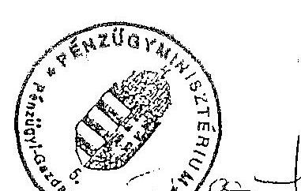

---

| Pénzügyminisztérium
Fejezet összesen |  |  |  | Bérkifizetés alakulása |  |  |  | (M Ft) |  | 5. sz. tábla  |
| --- | --- | --- | --- | --- | --- | --- | --- | --- | --- | --- |
|  MEGNEVEZÉS |  | 1990. |  |  |  | 1991. |  |  |  |   |
|   | előír. | add.ei. | teljes. |

 előir. | add.ei. | teljes. | előir. | add.ei. | teljes. |   |
|  Teljes a. idős foglalk. | 2016.4 | 2670.5 | 2483.3 | 3332.2 | 3372 | 3303.7 | 4355.1 | 3894.7 | 3583.8 |   |
|  Részausk. idős foglalk. | 5.3 | 21.7 | 9.5 | 8.3 | 3.7 | 1.6 | 11.4 | 14.5 | 10.1 |   |
|  Nyugdíjas | 21.7 | 69.5 | 69.4 | 30 | 98.7 | 103 | 71.2 | 121.1 | 114.2 |   |
|  Összes állománya | 2043.4 | 2761.7 | 2562.2 | 3370.5 | 3474.4 | 3408.3 | 4437.7 | 4030.3 | 3708.1 |   |
|  Állomáson kívüli | 20.2 | 17.3 | 104.8 | 36.8 | 39 | 37.4 | 73.7 | 102.6 | 72.6 |   |
|  Mindösszesen | 2063.6 | 2779 | 2667 | 3407.3 | 3513.4 | 3445.7 | 4511.4 | 4132.9 | 3780.7 |   |
|  ebből: |  |  |  |  |  |  |  |  |  |   |
|  -alapbér | 1202.9 | 1667.5 | 1522.3 | 1891.9 | 2206.8 | 2216.3 | 3163.3 | 3111.7 | 2805.3 |   |
|  -pótlék | 75.8 | 71.2 | 53.7 | 59.9 | 85.7 | 83.8 | 31.2 | 95 | 91.4 |   |
|  -túlóra | 3.4 | 3.9 | 2.9 | 2.8 | 3.6 | 3.9 | 3.3 | 5.7 | 5.5 |   |
|  -jutálos | 8.2 | 27.7 | 77.5 | 1397.8 | 141.8 | 209.7 | 1134.5 | 769.7 | 809.9 |   |
|  -prémium | 772.4 | 1008.4 | 1009.3 | 3.7 | 925.7 | 925.3 | 3.7 | 3.7 | 8.4 |   |
|  -egyéb ösztönző jut. |  |  | 0.1 |  |  |  |  |  | 0.1 |   |

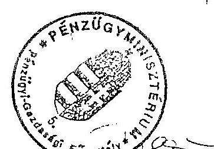

---

| Allománycsoportonkénti átlagbér és jutalom alakulása |  |  |  |  |  |  |  | Ft/hó/fő |
| :--: | :--: | :--: | :--: | :--: | :--: | :--: | :--: | :--: |
|  | 1989 |  | 1990 |  | 1991 |  | 1992 |  |
| Allomáyncsop. | átl. bér jut. |  | átl. bér jut. |  | átl. bér jut. |  | átl. bér jut. |  |
|  | XII. hó |  | XII. hó |  | XII. hó |  | XII. hó |  |
| Vezetők | 31729 | 13711 | 45377 | 12273 | 59274 | 19492 | 78753 | 25919 |
| Vezintézök | 15986 | 4784 | 22626 | 6159 | 30182 | 7133 | 39775 | 172 |
| veyv. alk. | 11019 | 2497 | 16590 | 4650 | 19025 | 9748 | 24043 | 7275 |
| Fizikai | 11657 | 2386 | 13614 | 2628 | 15716 | 3759 | 30032 | 10168 |
| Gépkocsi vez. | 14797 | 3294 | 17657 | 3879 | 22833 | 3236 | 36921 | 9216 |
| üzemen: | 17038 | 5334 | 23173 | 5918 | 29406 | 8674 | 41906 | 12750 |

$1993.08.31$
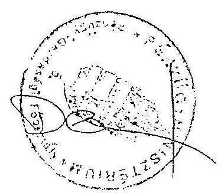

---

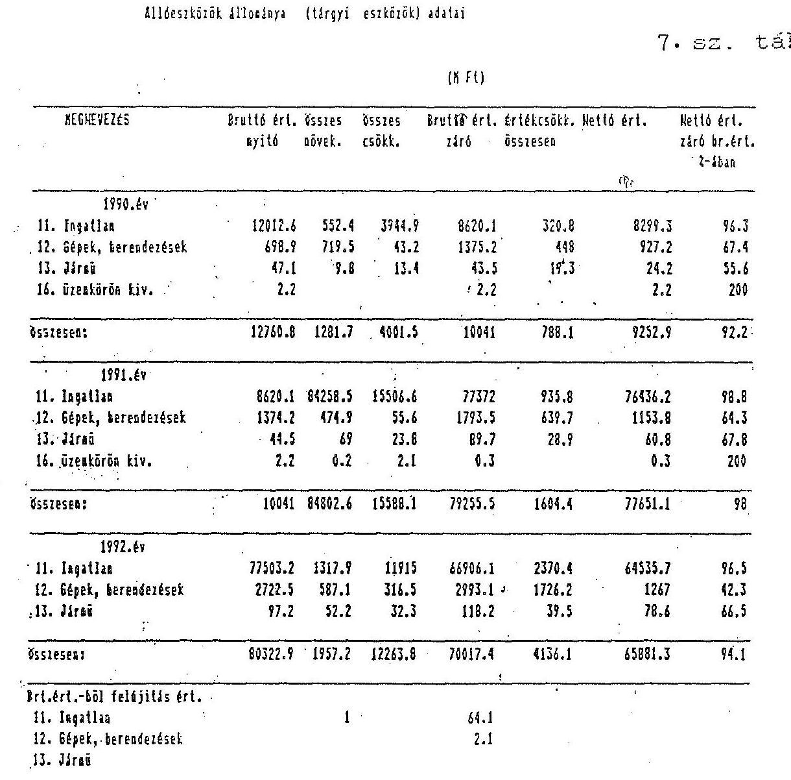

Megjegyzés: az adatok a KVSZ által kezelt vagyont is tartalmazzák.

---

8. sz. tábla

|  MEGHEVEZÉS |  |  |  |  |  |  |  |  |   |
| --- | --- | --- | --- | --- | --- | --- | --- | --- | --- |
|   |  |  |  |  |  |  |  | 1992. |   |
|   | előir. | mód. ei. | teljes. | előir. | mód. ei. | teljes. | előir. | mód. ei. | teljes.  |
|  Felújítási tevékenység |  |  |  |  |  |  |  |  |   |
|  -külső kivitelezővel | 250 | 581 | 222.3 |  | 406.4 | 229.8 | 260 | 509.1 | 481.5  |
|  -saját kivitelezésben |  |  |  |  |  |  |  |  |   |
|  Összesen | 250 | 581 | 222.3 | 0 | 406.4 | 229.8 | 260 | 509.1 | 481.5  |
|  Állész. (nagyért.t.eszk.) |  |  |  |  |  |  |  |  |   |
|  karbantartása |  |  |  |  |  |  |  |  |   |
|  -külső kivitelezővel | 35.2 | 56.2 | 61.6 | 55 | 88.4 | 103.7 | 127.9 | 295.2 | 303.2  |
|  -saját kivitelezésben |  |  |  | 1 | 5.2 | 6.2 | 5.1 | 6.2 | 6.2  |
|  Összesen | 35.2 | 56.2 | 61.6 | 56 | 93.6 | 109.9 | 133 | 301.4 | 309.4  |
|  Állóeszköz fenntartás össz. | 285.2 | 637.2 | 283.9 | 56 | 500 | 339.7 | 393 | 810.5 | 790.9  |

---

# A Kincstári Vagyonkezelő Szervezet működése, gazdálkodása 

Az ellenőrzés nem terjedt ki a kincstári vagyon kezelésére, hasznosítására, illetve azt annyiban érintette, amennyiben az nem volt elválasztható az intézményi gazdálkodás vizsgálatától.

A feladatrendszer és a szervezet összhangja, a szervezet és a működés szabályozottsága

A Kincstári Vagyonkezelő Szervezet (továbbiakban KVSZ) jogelődje a Pénzügyminisztérium Zárolt Állami Vagyont Kezelő és Hasznosító Intézménye a pénzügyminiszter 29012/90/IX. sz. alapító okiratával 1990. január elsején az 1989. évi XXX. törvénnyel jogutód nélkül megszüntetett Munkásőrség ingó- és ingatlan vagyonának őrzésére, kezelésére, hasznosítására, valamint függőben lévő ügyeinek ellátására egy éves időtartamra alakult.

A gyors feladatbővülés következményeként az alapító okirat, valamint a Szervezeti és Működési Szabályzat (SZMSZ) nem sokkal jóváhagyását követően túlhaladottá vált, módosításukra azonban nem került sor.

A ZÁVKHI Szervezeti és Működési Szabályzata az alapító okiratban foglalt feladatok ellátására épült, az intézmény feladatköre azonban az okiratban meghatározott feladatokhoz képest 1990. év folyamán jogszabály, magyar-szovjet államközi megállapodás, valamint kormányhatározatok alapján igen jelentős nagyságrendű feladatokkal bővült: a hátrahagyott szovjet objektumok őrzése, kezelése, a társadalmi szervezetek állami tulajdonú ingatlanai kezelői jogának és az MHSZ felszámolásának átvétele, stb.)

A KVSZ 1991. január elsejétől a pénzügyminiszter 48002/1991. sz. alapító határozata alapján kezdte meg működését.

A szervezet 1991-1992. években állandó átalakulásban volt, amit az alapító okirat és az intézményi SZMSZ módosítása nem követett.

Az 1992. évi költségvetésről szóló 1991. évi XCI. tv. 34. § (3) bekezdése alapján a Pénzügyminisztérium a KVSZ alapító okiratát 1992. június 30-ig nem vizsgálta felül

---

annak ellenére, hogy az intézmény székhelyének megváltozása, valamint feladatköre kibővülése miatt arra e törvényi előírástól függetlenül is szükség lett volna.

Az intézmény 1992. augusztusában kidolgozta az alapító okirat módosításának tervezetét, módosításra azonban csak 1992. december 14-i hatállyal és kizárólag a székhely változásra kiterjedően került sor. (Az alapító okirat a korábbi székhely, Bp. V. Szabadság tér 3. helyett, új székhelyként a Bp., V. Zoltán u. 16. szám alatti ingatlant jelöli meg, ahol a szervezet 1992. áprilisa óta működik. A jogi rendezésre tehát kb. 8 hónapos késéssel került sor.)

Az SZMSZ-ben lefektetett szervezeti struktúra és működési rend a szabályzat megalkotásakor ismert feladatokhoz igazodott. Az intézmény által ellátandó feladatok köre azonban jogszabályok és kormányhatározatok alapján folyamatosan bővült.

A szervezeti változások egy részét a korszerűsítésre, a feladatellátáshoz jobban igazodó struktúra kialakítására való törekvés, illetve feladatbővülés motiválta. Egyes szervezeti változások ugyanakkor nem segítették elő a hatékony feladatellátást, illetve felesleges kiadásokhoz vezettek.

Célszerű szervezeti változásnak minősíthető az általános igazgatóhelyettesi funkció megszüntetése és az irányítási jogkörébe tartozó szervezeti egységeknek az igazgató közvetlen felügyelete alá (őrzésvédelmi felügyelő), illetve az igazgató gazdasági helyettesének irányítása alá rendelése (szervezési és számítástechnikai csoport). Munkaszervezési és takarékossági szempontok alapján indokolt volt a Budapest-Pest Megyei Kirendeltségnek a KVSZ központi szervezetébe való integrálása is.

Célszerűtlen szervezeti változás volt ugyanakkor az SZMSZ szerint a gazdasági igazgatóhelyettes által felügyelt Ellátó csoportnak a titkárságvezető felügyelete alatt gondnokságként való működtetése.

Felesleges kiadásokat eredményező szervezeti változásként értékelhető a Jogi Osztály 1991. év végi megszüntetése. (1991. évben az 5 fő jogásszal működő Jogi Osztály mellett jogi tevékenység végzésére ügyvédi munkaközösséggel kötött szerződést a KVSZ. 1991. év végén a Jogi Osztályt megszüntette és újabb - a KVSZ volt Jogi Osztálya vezetőjének irányításával működő - ÜMK-t vont be a szervezet jogi munkájába.
A két szerződés havi $1,4 \mathrm{M}$ Ft kiadást és emellett költségtérítés fizetést jelentett. Összehasonlításként: 1993. év elején a Jogi Osztály dolgozóinak illetménye és TB járuléka összesen mintegy 500 e Ft.)
1992. év április 1-jén a Jogi Osztályt újra felállították, az ÜMK szerződéseket pedig felbontották.

Az őrzésvédelem átvételének módja a szervezettség pozitív példájaként említhető meg.

---

A SZMSZ módosítása, illetve új SZMSZ kiadása elmaradásának alapvető oka a kincstári vagyonról szóló törvény hatályba lépésére való várakozás. A rögzített, illetve a ténylegesen kialakult szervezeti és működési (hatásköri) rend oly mértékben eltér egymástól, hogy a módosítás további halogatása a hatékony feladatellátást veszélyezteti, illetve eddig is akadályozta.

A volt Munkásőrség vagyonába tartozó - kereskedelmi szálláshely, vendéglátóipari és egyéb szolgáltatást végző és eredetileg költségvetési szervként alapított - badacsonytomaji székhelyű Club Tomaj jogállása rendezetlen, működése jogszabályi előírásba ütköző, gazdálkodása költségvetésen kívül maradt.

A Munkásőrség megszünését követően a felszámoló miniszteri biztos - 1989. december 27-én írt levele szerint - a Club Tomaj további működésével egyetértett, azzal, hogy az 1990. január 1-től költségvetési szervként működjön és 1990. március 31-ig üzemszerű működése keretében szolgáltatási kötelezettségeket vállaljon.

Ezt követően a vizsgált időszakban többféle elképzelés született a Club Tomaj értékesítésére, hasznosítására, gazdálkodási formájának változására, stb, de sem a ZAVKHI, illetve KVSZ, sem a PM a kompetenciájába tartozó érdemi döntést nem hozott.

A szervezet jogállása, működésének jogalapja a vizsgálat befejezésekor még rendezetlen volt. A Munkásőrség által költségvetési szervként alapított Club Tomaj ugyanis
 - a működését engedélyező határidő letelte óta is - folytatja tevékenységét. Gazdálkodásának adatai, eredménye ugyanakkor a KVSZ által kezelt vagyonhoz kapcsolódóan nem, s külön sem kerültek a költségvetésben kimutatásra.

A KVSZ a vizsgált időszakban több - a hatékony feladatellátáshoz alapvetően szükséges - szabályzatot nem adott ki, más szabályzatai korszerűtlenek, vagy nem teljeskörűek.

Nem került kiadásra pl. eszközgazdálkodási, bér- és létszámgazdálkodási, belső ellenőrzési szabályzat, 1992. évre a leltározási szabályzat.
1991. szeptember óta - az őrzésvédelem kivételével - csak néhány dolgozóra vonatkozóan készültek munkaköri leírások.

A gazdálkodás rendjét jelenleg is az 1991. évben kiadott ideiglenes ügyrend szabályozza, amelyet esetenként igazgatói utasítások módosítottak.

Nincs egységes szabályzat a kötelezettségvállalás, érvényesítés, utalványozás rendjéről sem.

A szervezet 1992. évi és 1993. évi költségvetése mind szerkezetében, mind finanszírozási rendszerében eltér az 1991. évitől, amit a gazdálkodás szabályozása 1992. évben nem követett. A szabályozatlanság következményeként a költségvetési törvényben

---

meghatározott alcímek ("igazgatás és állami ingatlanok értékesítéséből származó költségvetést illető bevétel") az intézményi beszámolókban nem a valós ráfordításokat tartalmazzák.

1991. évben a költségvetésről szóló 1990. évi CIV. törvény alapján a KVSZ kiadási előirányzatai (és a teljesítés) megbontás nélkül tartalmazták az igazgatási és a vagyonkezelési, hasznosítási kiadásokat. 1992. évtől a költségvetési törvény (1992. évben az 1991. évi XCI. tv., 1993. évben az 1992. évi LXXX. tv.) alapján a KVSZ-nek külön-külön alcím alatt kell kimutatnia az igazgatási és a vagyonkezelési tevékenység kiadásait. A két alcím tartalmának, az igazgatás és a kezelt vagyon kiadásai elhatárolásának részletes szabályozására sem felügyeleti szervi, sem intézményi szinten nem került sor. (A számlarendben foglaltak az egyértelmű elhatároláshoz nem elégségesek. A követett gyakorlat az ott rögzítetteknek egyébként sem felelt meg.)

A finanszírozási rendszer megváltozásából adódó kérdések szabályozására sem került sor. 1992. évtől ugyanis az ingatlan értékesítés bevételén kívül - a hivatkozott költségvetési törvény 28. § (1) bekezdése alapján - a KVSZ-nek a bevételeit folyamatosan be kellett, illetve be kell fizetnie a költségvetésbe (illetve részben a területi önkormányzatoknak), kiadási előirányzata pedig megegyezik a költségvetési támogatás összegével.

A költségvetést (önkormányzatot) illető bevételek elkülönített kezelésének szabályozása, a letéti számlák tartalmának az új finanszírozási rendszerhez való igazítása elmaradt. Ennek következtében a bevételek részben a letéti számlákra, részben a költségvetési elszámolási számlára folytak be, amivel a szervezet megsértette az ÁHT 12. § (2) bekezdésében foglaltakat. (Eszerint a letéti számla pénzforgalma nem kapcsolódhat a kezelő költségvetéséhez.)

Ebből következően a szervezet folyamatos bevétel átutalási kötelezettségének 1992. évben nem tudott maradéktalanul eleget tenni.

A bankszámlára befolyt bevételek figyelemmel kísérése, kigyűjtése és folyamatos továbbutalása nem történt meg. A bankszámla év végi záróegyenlege költségvetésbe befizetendő letéti jellegű bevételeket is tartalmaz (168.250 e Ft-ot), ezért az intézményi szinten kimutatott $615,6 \mathrm{M} \mathrm{Ft}$ összegű pénzmaradványból a tényleges, kiadási megtakarításból származó maradvány $447,3 \mathrm{M} \mathrm{Ft}$.

Az 1991. évi XCI. tv. költségvetési törvény 28. § (2) b./ pontja alapján a szovjet ingatlanok értékesítésének bevételéből az adósságteherrel és a ráfordításokkal csökkentett (nettó) bevételt kell a költségvetésnek, illetve a területi önkormányzatoknak átutalni.

A bevételek nettósításához szükséges költséggyűjtést a szervezet nem szabályozta, valamint későn rendelte el, ezért a költségvetésnek és az önkormányzatoknak az esetek döntő többségében 1992. évben csak előleget tudott átutalni. (A pénzügyi és számviteli folyamatok megfelelő szabályozottsága és működése esetén 1992. évben 42 szovjet

---

ingatlan értékesítésének a bevétele kerülhetett volna végelszámolásra, ezzel szemben ez mindössze 5 esetben történt meg.) Nincs szabályozva ugyanakkor az előleg megállapításának a módja sem. Nem került szabályozásra 1992. évben a 81/1992. (V.14.) Kormányrendelet 2. § (7) a./ pontjában, valamint a pótköltségvetésről szóló 1992. évi LXX. tv. 6. § (2) a./ pontjában meghatározott tartalék elkülönített nyilvántartása sem. (1993. évben e célra már külön "céltartalék" számla került megnyitásra.)

Meg kell jegyezni, hogy a KVSZ egységes szabályozási rendjének kialakítását a folyamatos feladatbővülés mellett akadályozta a vezetők (igazgató, gazdasági igazgatóhelyettes, pénzügyi osztályvezető, számviteli osztályvezető stb.) állandó fluktuációja is.

További probléma, hogy a meglévő szabályzatok, utasítások sok esetben nem kerültek betartásra, (pl. kötelezettségvállalás ellenjegyzése, adatszolgáltatás teljesítése, dokumentumok továbbítása, számlázás rendje stb.), valamint az érintettek esetenként az előírásokat nem ismerik kellőképpen.

Az 1992. évi fejlődés ellenére az intézmény működésének, gazdálkodásának szervezettsége, szabályozottsága elmarad a követelményektől.

# A bevételi és kiadási előirányzatok tervezése 

A vizsgált időszakban az egyes évek költségvetésének tervezése nem volt kellően megalapozott. A feladatok és a szükséges erőforrások közti összhang hiányában az intézmény által nem befolyásolható körülmények is jelentős szerepet játszottak. A tervkészítések időszakában a tervévben ellátandó feladatok teljeskörűen nem voltak ismertek, s a finanszírozási igények reális számbavételéhez szükséges tapasztalati adatok sem álltak rendelkezésre.

Pl. a tervkészítéskor ismeretlen volt a társadalmi szervezetektől, valamint a szovjet csapatoktól átvett ingatlan mennyiség és az ehhez kapcsolódó költségigény. Ugyanakkor az új feladatok meghatározásával egyidejűleg a feladat ellátásához szükséges források biztosítására az esetek döntő többségében nem került sor.

A tervezés fogyatékosságaihoz fentieken túl hozzájárult azonban a tervezhető tételek részletes számításokkal való alátámasztásának, valamint az ingatlan értékesítésekkel összefüggésben jelentkező költségcsökkenés felmérésének és a költségvetési tervben való figyelembevételének a hiánya is.

Az 1992. évi kiadások tényadatai a tervezés és a jóváhagyott előirányzatok lazaságára utalnak. A KVSZ tervjavaslata 3,3 Mrd Ft kiadással számolt, a felügyeleti szerv 2,2 Mrd Ft kiadást minősített indokoltnak, ez került jóváhagyásra.

---

A 2,2 Mrd Ft kiadási előirányzatból 1,3 Mrd Ft kormányhatározat alapján megállapított fejlesztési többlet volt, a határozat azonban nem nevezte meg konkrétan a többletfeladatokat. (Az intézmény tervezési dokumentációjából sem állapítható meg.)

Az intézmény által jelzett erőforrás szükséglet a jóváhagyott előirányzatot 50%-kal, a tényleges teljesítést kb. 100%-kal haladja meg.

A legjelentősebb eltérés a kezelt vagyon körébe tartozó tárgyi eszközök karbantartására tervezett tételnél jelentkezett: 1,4 Mrd Ft kiadási igény tervezésére nem felmérés, hanem becslés alapján került sor. A jóváhagyott eredeti előirányzat 438 M Ft, a tényleges teljesítés 140 M Ft volt. Az előirányzattal szemben jelentkező megtakarításban szerepet játszott a takarékosságra való törekvés is. Az eltérés nagyságrendje azonban emellett a keretgazdálkodás hiányára visszavezethető feladatelmaradást valószínűsíti.

A bevételek tervezésére is a megalapozatlanság volt a jellemző: az 1991. évre tervezett 90 M Ft intézményi bevétellel szemben a tényleges teljesítés 373 M Ft, az ingatlanértékesítés 5 Mrd Ft-os előirányzatát ugyanakkor a teljesítés ($640,5 \mathrm{M} \mathrm{Ft}$) még csak meg sem közelítette.

# Előirányzat módosítások, pótelőirányzatok indokoltsága, dokumentálása 

Az PM ZÁVKHI 1990. évi beszámolójába 484,1 M Ft kiadási és 644,1 M Ft bevételi előirányzat módosítást állított be.

Nem tudták ugyanakkor dokumentálni a saját hatáskörű 290 M Ft összegű kiadási előirányzat módosítást és a bevételi előirányzat irányítószervi megemelését.
1991. évben a 150 M Ft pótelőirányzat a KVSZ gazdálkodását (az abban fellelhető pazarló elemeket) figyelembe véve teljes összegében nem tekinthető indokoltnak.

Előirányzat változások 1992. évben (M Ft-ban)
(Pártszékházak nélkül)

| Kiadási (támogatási)   előir. | Eredeti előir. | OGY | Kormány   hatáskörében | Felügy.szerv | Mód.   előir. | Eredeti   előir. |
| :--: | :--: | :--: | :--: | :--: | :--: | :--: |
| KVSZ igazgatás | 268,7 | $-29,7$ | $+1,1$ | $-11,1$ | 229,0 | $85 \%$ |
| Kezelt vagyon | 1731,3 | - | $+120,0$ | $-76,5$ | 1774,8 | $103 \%$ |

---

Az 1992. novemberében bejelentett 29,7 M Ft összegű támogatás csökkentést az előirányzat módosításoknál végrehajtották, a tényleges teljesítésnél azonban az igazgatási kiadások egy részét a kezelt vagyon alcímre terhelték át. A szabálytalan átterhelések következményeként az igazgatás terhére egyáltalán nem került elszámolásra távhő, gáz, villamosenergiaszolgáltatás, közműdíj, szállítás, gép, berendezés, felszerelés, jármű vásárlás, külföldi kiküldetés, e kiadások mind a kezelt vagyon alcím alatt jelentek meg.

# Bevételek, kiadások alakulása, összetételének változása 

A szervezet összes bevétele (kiegyenlítő, függő, átfutó és letéti bevételek nélkül, ingatlanértékesítési bevételekkel együtt) 1990. évben 802 M Ft, 1991. évben 1.742,8 M Ft, 1992. évben 3.054,8 M Ft volt. A bevételek összetétele az ellenőrzött időszakban jelentős változásokat mutatott.
1990. évben az intézmény saját folyó bevétele (bérleti díj $14,5 \mathrm{M} \mathrm{Ft}$, ingóság értékesítés $143,6 \mathrm{M}$ Ft) az összes bevétel 20%-a, 1991. évben (működési bevétel 1 M Ft, árbevétel 367 M Ft, ÁFA 5 M Ft) 21%-a, 1992. évben (307,7 M Ft) 10%-a.

A ZÁVKHI, illetve a KVSZ összes kiadása (kiegyenlítő, függő, átfutó és letéti kiadások nélkül) 1990. évben 773 M Ft, 1991. évben 1.097 M Ft, 1992. évben - a költségvetésnek, valamint az önkormányzatoknak befizetett, kiadásként megjelenő összeget (855 M Ft) figyelmen kívül hagyva - 1.585,8 M Ft volt. (Az 1992. évi kiadás az 1990. évi 201%-a.) A kiadás növekedésének alapvető oka a szervezet által ellátandó feladatok körének állandó bővülése.

Az 1990. évi működési kiadások között a legnagyobb részarányt a szolgáltatások (34%) és a béralap (28%) képezték. 1991. évben a szolgáltatások kiadásai - alapvetően az őrzésvédelem kiadásai miatt - az összes kiadás 68%-át tették ki. Az 1992. évi kiadásokon belül 1991. évhez viszonyítva csökkent a béralap, valamint a szolgáltatások aránya.

## Pénzellátás

A KVSZ pénzellátása a vizsgált időszakban nem volt mindig kiegyensúlyozott, 1991. évben finanszírozási gondjai voltak. Ezt egyrészt a kiadások tervezettet meghaladó ütemű növekedése, másrészt a bevételek realizálásának nehézségei (az ingatlan bérlők (és használók) nem megfelelő fizetési készsége) okoztak. 1991. év augusztusában 42 M Ft-ot szabálytalanul a letéti számláról igénybe vettek (erről a felügyeleti szervet tájékoztatták), mivel a bankszámla egyenlege az esedékes fizetési kötelezettségekre nem nyújtott fedezetet.
A finanszírozási gondokat a költségvetési támogatás havi ütemének évközi módosítása,

---

valamint 150 M Ft pótelőirányzat biztosítása oldotta meg.
1992. évben és 1993. I. negyedévében a pénzellátás zavartalan volt. Likviditási terveket az intézmény eddig nem készített.

# Gazdasági társaságban való részvétel 

A vizsgált időszakban az intézmény négy gazdasági társaságba eszközölt befektetést, összesen 435,4 M Ft értékben, döntően tárgyi apport formájában.

| Befektetések | Befekt. fajtája | KVSZ   részesedése | Befekt. értéke   E Ft-ban |
| :-- | :-- | :--: | :--: |
| DUNACOM Kft. | apport | $51 \%$ | 910 |
| GROUP4 Kft. | apport és pénzeszk. | $50 \%$ | 41.000 |
| DYNACORP Rt. | apport (volt szovjet   ingatlan) | $47,4 \%$ | 243.500 |
| LORANGER Rt. | apport (volt szovjet   ingatlan) | $68,1 \%$ | 150.000 |
| Összesen: |  |  | 435.410 |

A DUNACOM Kft.-be bevitt szellemi apport sem az 1990., 1991. évi, sem az 1992. évi mérlegben nem szerepel. Etikailag kifogásolható, hogy a KVSZ műszaki igazgatóhelyettese a Kft. ügyvezető igazgatója, aki ez utóbbi minőségében a Kft. nevében bérleti szerződést kötött 1991. évben a KVSZ-szel.

A GROUP4 Kft.-t a KVSZ
 1990. évben az őrzésvédelem ellátása érdekében alapította külföldi partner bevonásával.
1992. évben a Kft. tevékenységét, az őrzésvédelem tapasztalatait és költségigényét felülvizsgálta. (A vizsgálatra külső szakértő társaságot is bevont, mintegy 3 M Ft díjazás ellenében.)
A vizsgálat megállapította, hogy a Kft.-vel való őriztetés magasabb létszám- és költségigénnyel jár, mint a saját hatáskörű őrzésvédelem. Emellett egyre nőtt a Kft. ellenérdekeltsége a non-profitos őrzésvédelemben, ami a feladatellátás megbízhatóságának romlásával járt együtt.
1993. január 1-től a GROUP4 Kft. által őrzött objektumok őrzését (szovjet, munkásőr, dunai vízlépcső ingatlanai) a KVSZ saját hatáskörben látja el. A könyv szerinti értéken 41 M Ft összegű befektetését a többi tulajdonosnak 600 e angol fontért, azaz 77.880 e Ft-ért eladta és 1992. decemberében a PM 232-90103-1447 Állami ingatlanok értékesítése számlára átutalta.

A DYNACORP Rt. és a LORANGER Rt. 1992. évben alakult. A 243,5 M Ft, illetve 150 M Ft összegű befektetésre úgy került sor, hogy az intézmény gazdasági vezetője a szerződéseket nem ellenjegyezte. Ezzel a szervezet megsértette az államháztartásról szóló 1992. évi XXXVIII. tv. 98. § (2) bekezdésében foglaltakat.

A befektetésekből a szervezetnek eddig hozama nem keletkezett. A GROUP4 Kft.-be való befektetés célja az őrzésvédelem megoldása volt, a DUNACOM Kft. bár jogilag létezik, gyakorlatilag nem működik, a két Rt. alapítására pedig 1992. év közepén került sor.

A szervezet a vizsgált időszakban alapítványnak nem adott át pénzeszközt.

# Eszközgazdálkodás 

Az intézmény eszközgazdálkodása szabályozatlan.
A KVSZ székhelye 1991. évben a Szabadság tér 3. sz., 1992. áprilisa óta a Zoltán utca 16. sz., mert a kibővült szervezet számára a korábbi ingatlan már nem biztosított megfelelő elhelyezést. Az új székhely az ingatlannyilvántartásba még nem került bejegyzésre. Emiatt az 1992. évi intézményi (igazgatási) mérlegben még a Szabadság tér 3. sz. alatti ingatlan szerepel, a tényleges székhely a kezelt vagyon körében jelenik meg.
A Szabadság tér 3. sz. alatti ingatlan jelenleg nincs hasznosítva, mivel erre vonatkozóan kormánydöntés eddig nem született.

A jelenlegi székház hasznosítása a közérdek érvényesítése szempontjából sem tekinthető megnyugtatónak.
A székházat az intézmény 8 társadalmi szervezettel, ún. ingyenes használókkal (TIB, Központi Munkástanács, Recski Szövetség Országos Központja stb.), valamint két lakásbérlővel és a Polinéz Étterem Betéti Társasággal osztja meg. Az épületet ingyenesen használók 1992. évben az ingatlan közüzemi díjaihoz (a telefonköltség kivételével) - a megállapodásokban foglaltaktól eltérően - hozzájárulást nem fizettek, mivel a díjak átterhelésére (továbbszámlázására) nem került sor. (1992. évben ez mintegy 1,2 M Ft áttételes költségvetési támogatást jelentett a szóbanforgó szervezetek számára.)

A Polinéz Bt.-vel (BT) 1991. évben kötött bérleti szerződés a bérbevevő számára lehetőséget nyújt a bérelt ingatlanrészeknek - amelyek között több irodahelyiség, irattár stb. szerepel - a bérbeadó előzetes hozzájárulása nélküli hasznosítására. (A bérlő élt is a további bérletbe adás lehetőségével.) Méltánytalanul alacsony továbbá a bérleti díj összege, amelyet utólag negyedévente kell a BT-nek kiegyenlítenie.
A bérlő fizetési fegyelme minősíthetetlen, jelentős hátraléka van a KVSZ-szel szemben. Nem fizette meg a bérleti díj egy részét (350 e Ft), emellett a ráháru1ó közüzemi díjakat (229 e Ft) és az általános forgalmi adót (437 e Ft) sem. Az 1993. március 12-én kelt fizetési felszólítás szerint a BT-nek több mint 1 M Ft összegű fenti tételekből álló tartozása van.
A szerződés szerint a bérlő a bérleti díj mellett a könyv szerinti nyereség 25%-át is köteles a bérbeadónak átutalni. Ilyen jogcímen átutalás a KVSZ javára nem történt. A szervezet az ellenőrzésnek nem tudta dokumentálni, hogy élt-e a szerződés 6. pontjában rögzített mérleg átvételi jogával, amely alapján meggyőződhetett volna arról, hogy a bérlőnek ezen a jogcímen van-e fizetési kötelezettsége.
A BT jelenleg a székházban, az általa bérelt területen, átépítési munkákat végez, amelyre vonatkozóan az illetékes építésügyi hatóság engedélyével még nem rendelkezik. A KVSZ az építési tervek ismeretének hiánya miatt nem tudja megítélni, hogy a jelenleg folyó kivitelezési munkák az 1991. évben kiadott engedélyében foglaltaknak megfelelnek-e, avagy sem. Mindezek ellenére a bérlő a munkákat akadálytalanul folytathatja, a szervezet a kivitelezés felfüggesztése érdekében semmilyen intézkedést nem tett.

Tekintettel arra, hogy állami (költségvetési) érdek a szóbanforgó bérleti szerződések fenntartásához nem fűződik, ellenkezőleg állami, illetve költségvetési érdekeket sért, az ellenőrzés szükségesnek tartja a szerződések felülvizsgálatát és ennek alapján az állami érdeksérelem mielőbbi megszüntetését.

Az alapító okirat és annak módosítása nem tér ki a vagyonkezelési és hasznosítási tevékenység ellátásához szükséges területi kirendeltségek elhelyezésére. Az 1992. évben (és jelenleg is) 8 területi kirendeltség működik, 7 állami tulajdonú, a KVSZ kezelésében lévő, többségében volt MHSZ ingatlanokban. A KVSZ a kezelésében lévő ingatlanok, illetve ingatlanrészek intézményi működési célú használatára vonatkozó engedéllyel nem rendelkezik. Felügyeleti szervénél - korábbi szándékától eltérően - a kirendeltségek elhelyezése jogszerűségének rendezését nem kezdeményezte.
Az 1993. január 1-től felállított, az őrzésvédelem ellátásához szükséges, területi vagyonvédelmi szervek esetén is fennáll ugyanez a probléma.

Az intézmény székháza 1992. évben karbantartásra szorult. A vállalkozói szerződés teljesítési határideje 1992. december 30-a volt. A karbantartási munka 1992. december 14-én kelt műszaki átadás-átvételi jegyzőkönyvvel átadásra, a szerződés szerinti vállalkozói díj leszámlázásra, igazolásra, a számla 1993. január 18-án kifizetésre került. A szerződésben meghatározott munkák egy része ugyanakkor 1993. március végén is folyamatban volt. Fentiek fiktív átadást-átvételt és számlázást jelentenek, amelyek szükségessé teszik a személyi felelősség érvényesítését.

A Zoltán utcai székházba való átköltözés miatt szükségessé vált az épület távbeszélő hálózatának rekonstrukciója, hálózat bővítése, stb. 1991. decemberében a fővállalkozó Kft. részére árufedezet biztosítása címén 17 M Ft előleget átutaltak. Az előleget a posta, telefon, telex rovattételen szabálytalanul számolták el.
A fővállalkozói szerződés megkötését (1992. február 17.) megelőzte az előlegfizetés, amire vonatkozóan előszerződést, írásba foglalt megállapodást a szervezet nem kötött. A rekonstrukciós és áttelepítési munkák két végszámlája ÁFA-val együtt összesen 18.895 e Ft-ot tett ki, gyakorlatilag tehát a 17 M Ft-os előleg átutalásával a végösszeg 90%-a a teljesítést félévvel megelőzően kifizetésre került.
A számlaérték és az előleg különbözete a kezelt vagyon terhére került elszámolásra. Az intézmény készletgazdálkodásában a szabályozatlanság mellett a keretgazdálkodás hiánya is érezteti hatását.
Az 1992. évi intézményi beszámoló szerint pl. irodaszer, nyomtatvány beszerzésének előirányzatát a tényleges teljesítés 200%-kal haladta meg, a könyv, folyóirat, napilap előirányzatát 66%-kal lépte túl az intézmény.

# Létszám- és bérgazdálkodás 

A vizsgált években az intézmény hatékony létszám- és bérgazdálkodást nem tudott megvalósítani. Ennek alapvető oka a szervezet feladatainak növekedése.

Az egyes évek létszám- és béralapelőirányzatai nem voltak kellően megalapozottak, a tervezett és a tényleges létszám és létszámösszetétel, továbbá a béralapelőirányzat és a tényleges bérfelhasználás lényeges eltéréseket mutatott.

Az engedélyezett létszámot a tényleges átlagos állományi létszám 1990. és 1992. években nem érte el, 1991. évben viszont - PM engedély alapján - túllépte.

## A vizsgált időszakban jelentős volt a fluktuáció.

Oka az állományi létszám kvalifikáltságának növelésére irányuló szándék, a nyugdíjasok foglalkoztatásának 1992. évi változása, az erős munka leterheltség, a magasabb jövedelmet biztosító vállalkozási szféra elszívó hatása.

A belső ellenőr és a személyzeti vezető státusza a helyszíni vizsgálat lezárását követően került betöltésre.
1992. évben a béralap eredeti előirányzata 131,3 M Ft volt, a tényleges felhasználás ennek 86%-a. A jelentős, mintegy 18 M Ft összegű bérmegtakarítás az 1992. évi béralap tervezés lazaságára utal. Százalékos értékben a megtakarítás az egyéb bérek, a részmunkaidőben foglalkoztatottak bérénél és a megbízási díjaknál volt a legmagasabb.

1993. évre jóváhagyott béralap 591 M Ft, amelyből 460 M Ft az őrzésvédelem átvétel miatti többletbér, jelentős tartalékot tartalmaz.

Bérfejlesztésekre differenciáltan, az egyéni teljesítményeket figyelembe véve igazgatói utasítások alapján került sor. Az intézményi átlagbér az 1990. évit 1992-ben 63%-kal haladta meg.

A béralapban a jutalom aránya 1991. és 1992. években 29%-ot, illetve 28%-ot tett ki, az 1993. évi terv szerint aránya 8%-os lesz. (Jutalom tervezésére először 1993. évben került sor az intézményi költségvetésben.)

A KVSZ a vonatkozó rendelet értelmében a köztisztviselők jogállásáról szóló 1992. évi XXIII. tv. hatálya alá tartozik. Az intézmény a tv. 73. paragrafusa (5) bekezdésében előírt, a dolgozók 6 hónapon belüli besorolására vonatkozó kötelezettségének eleget tett. A Ktv. 44. §-ában meghatározott, az alapilletmény 15%-át kitevő illetménykiegészítést 1992-ben és 1993. I. negyedévében nem fizetett, mivel a MÜM szóbeli állásfoglalása szerint nem minősül központi költségvetési szervnek. A BM írásos állásfoglalása szerint jogosult az illetménykiegészítés fizetésére, a PM ezt megerősítette.
1993. február hónapban a teljes és részmunkaidőben foglalkoztatottak alapilletménye átlagosan 2,2 e Ft-tal haladta meg a Ktv. szerinti alapilletményt.

A legnagyobb eltérés a vezetői állománycsoportban (átlagosan plusz 16 e Ft), valamint a részmunkaidőben foglalkoztatott ügyintézők (átlagosan plusz 8 e Ft) csoportjában van. Ezzel szemben a teljes munkaidőben foglalkoztatottak közül egyedül az ügyintézői állománycsoport alapilletménye nem éri el a tv. szerinti illetményt. Az őrzésvédelmet ellátó területi vagyonvédelmi szervek állományába tartozók alapilletménye átlagosan 1,3 e Ft-tal alacsonyabb a Ktv. szerintinél. A 13. havi alapilletmény 1992. decemberében kifizetésre került.

# Szabálytalan érdekeltségi kifizetések: 

- Az ingósági csoport hatáskörébe tartozó ingó vagyon értékesítésének százalékos ösztönzése 1991. évben indokolatlan volt, mivel az érintettek munkaköri kötelezettsége volt az értékesítés.
- Szabálytalan volt 1991. évben a számviteli osztályvezető részére történt célprémium kifizetés, mivel a célprémium feltételek teljesítése az érintett munkaköri kötelezettségeinek körébe tartozott.
- 1992. évben a PM helyettes államtitkára 240 e Ft jutalomban részesítette a Szanáló Szervezet vezetőjét, a jutalmat a KVSZ béralapjának terhére fizették ki, megbízási díjként könyvelve.

# A számviteli, bizonylati rend, vagyonvédelem 

1990. évben a számlarend hiányzik, nem a számlakeret előírásai szerint nyitották meg a főkönyvi számlákat.

Analitikus nyilvántartások 1990-ben nincsenek, leltárt nem tudtak felmutatni.
1990. október 5-én "mellékelt jegyzékre" hivatkozással elkönyvelték az MT rendelkezése alapján térítés nélkül átadott ingatlanok értékét, 3.722.587 e Ft-ot, a forráscsökkenést helytelenül könyvelték. A mellékelt belső bizonylat szerint 6 db MT határozatra hivatkozással, városok kezelői jogába adták a felsorolt ingatlanokat.

Nem a számlakeret előírásai szerint számolták el és mutatták ki a beruházások lebonyolítását, nem alkalmazták a 326. Beruházási juttatás számlát.

Mind pénzügyileg, mind számvitelileg szabálytalanul számoltak el egy 1.200 e Ft-os átutalást: az állóeszközök alapjainak évközi változásai és a beruházások csökkenéseként. (Így a beruházás selejtezését és értékesítését lehet könyvelni. A könyvelési bizonylaton "MNB keresztül Borsod megyének" és még ceruzával ráírva "Nagyvarsánynak" szöveg szerepelt. A Banknaplóban több egymásra könyvelt sor miatt nem lehet nyomon követni az átutalás sorsát.)

Sok bizonylaton "titkos", "szigorúan titkos", "bizalmas" bélyegző lenyomatok vannak, s mellettük "megsemmisítendő" szövegű bélyegzés. Több bizonylat hiányzik.

A Mérlegben a "Készletek összesen" (17. sor) mind az év elején, mind az év végén egyezik a Forgóeszközök alapja (77. sor) összegével 2.671.712
 e Ft, illetve 2.707.484 e Ft. Ez is arra mutat, hogy a mérleg nem valós.

A bankszámlákon az egyenleg 138.248 e Ft.
A mérlegben 155.095 e Ft van, tehát a bankszámla-követelést megemelték 16.847 e Ft-tal, a 377. Függő kiadások és térítmények elszámolása (39. sor) számla alszámláinak egyenlegéből.

A "Pénzmaradvány elszámolás" kimutatásban is 138.248 e Ft-ot vettek figyelembe, de ezt megemelték 11.000 e Ft-tal a 323. Letét számláról, helytelenül.

Nem egyezik a 33. Vevők főkönyvi kivonati 5 e Ft-os egyenlege a mérleg szerinti 456 e Ft-tal (32. sor).

Az 1990. évi mérleg így nem felelhet meg a mérlegvalódiság követelményeinek.
Az adatok minden kimutatásban mások, nem ellenőrizhetők, mert rengeteg tételt könyveltek szabálytalanul a kiegyenlítő, függő és átfutó bevételek és kiadások számlákra.

---

1990-ben a számvitel kialakított rendje nem felelt meg a jogszabályi követelményeknek, a felügyeleti szerv iránymutatásainak. Az adatszolgáltatás nem megbízható. A bankszámlák csak részben felelnek meg az előírásoknak, önkényesen és nem a bankokkal összhangban nyitották. A vagyonnyilvántartás nem az előírásoknak megfelelő, nem teljes, leltárral és analitikus nyilvántartással nem alátámasztott. Sem a mérlegfolytonosság, sem a mérlegvalódiság elve nem érvényesül.
1991. évben a mérlegfolytonosságot az 1990. évi zárómérleg és az 1991. évi nyitómérleg számszaki egyezősége biztosítja, de egyes mérlegsorok és a vonatkozó főkönyvi kivonat adatai között eltérések vannak.

Az állóeszközökről leltár készült, a leltár és a főkönyvi számlák záró egyenlege megegyezik. Arra nincs azonban biztosíték, hogy mindent sikerült-e felleltározni, mert újabb és újabb objektumok kerülnek elő.
1991. évi mérlegben szereplő készletérték valótlan, a nyilvántartási ár jogszabályellenesen ÁFA-val növelt. Az 1992. december 31-i könyv szerinti 6.191.372 Ft bizományi árukészletet - szabálytalanul - az igazgatóhelyettes 800.000 Ft-os Áfa-s áron felkínálta megvásárolni a bizományos PERCENT Kft.-nek 1993. május 6-án. (Ilyen művelet elvégzésére csak selejtezési bizottság jogosult, amely megállapítja a készlet csökkent értékű jellegét, vagy selejtes voltát, amit jegyzőkönyvben kell rögzíteni és az intézmény vezetőjének jóváhagyni.)

A PERCENT Kft. befizetett a KVSZ számlájára 1.334.867 Ft-ot (302/93. sz.) és 1.069.736 Ft-ot (4321/93. sz.), a nyilvántartásban maradt készlet 3.786.769 Ft, amit a Műszaki Osztály engedélye alapján megvásárolt a PERCENT Kft. 640.000 Ft-ért, a differencia 3.146.769 Ft, de erről sincs sem selejtezési, sem leértékelési jegyzőkönyv.

A 2191. Egyéb anyagok nyitó egyenleg 2.682.998 e Ft, ez az anyagkészlet év végére eltűnt a számláról. A kétféle könyvelési technika (átíró és számítógépes) alkalmazása miatt nem volt felderíthető az anyagmozgás útja.

A főkönyvi kivonat és a mérleg számszakilag nem egyezik több tételben.
A pénzmaradvány megállapítása helytelen, mert a 319. Átvezetési számlának nincs egyenlege a főkönyvi kivonat szerint, továbbá sem a függő kiadások, sem a függő bevételek nem valósak.
1992. évi rendező mérleg elkészült összevontan és intézeti, valamint kezelt vagyon bontásban. A számítási anyag rendelkezésre állt, a számszerű egyezőség fennáll,

---

azonban az 1991. évi zárómérlegben hibás adatok szerepelnek, így a mérlegvalódiság itt is megkérdőjelezhető.

A számítógép által közölt mérlegadatok nem minden esetben egyeznek a mérlegek összesített adataival. A kezelt vagyon mérlegében a részesedések és az adott kölcsönök összevontan részesedésként szerepelnek.

A költségvetési bankszámla záró egyenlege a gépi adatközlés szerint 1.141.343 e Ft, a mérlegben 581.993 e Ft szerepel. Az idegen pénzeszközök a mérlegben 574.111 e Ft-tal szerepelnek, a gépi adatközlésben 1.697 e Ft van. A pénzeszközök összesen 13.064 e Ft-tal nagyobb a mérlegben, mint a gépi adatközlésben.

Nem egyezik az aktív függő és átfutó elszámolások összege, de az egyéb aktív pénzügyi elszámolások összesenje sem. Ugyanakkor a forgóeszközök összesen azonos, de a mérleg eszközök összesen is.

Ebből megállapítható, hogy a mérlegek a főkönyvi kivonattal nincsenek alátámasztva.
A mérleg forrás oldalán a tőkeváltozásoknál, így a saját tőkénél sem áll fenn az egyezőség a gépi kivonattal. Nagy az eltérés a költségvetési tartaléknál, a mérleg szerint 615.597 e Ft, a gépi közlés szerint 11.022.476 e Ft.

A gépi kivonatban nem szerepel a passzív letéti elszámolás, a mérlegben 559.350 e Ft van. A kötelezettségek összege a mérlegben 653.671 e Ft, a gépi nyilvántartásban 439.296 e Ft. A források összege egyezik.
1993. február 25-én a költségvetési beszámoló (mérleg) beadása után kiderült, hogy a tárgyi eszközök értéke helytelen, mert bruttó értéken 8.653.000 e Ft tárgyi eszközt elfelejtettek nyilvántartásba venni.

1993-ban a nyitás után rendező tételként elkönyvelték a helyesbítő tételeket.
1993-ban elkészült az intézményi számlarend, megfogalmazták az intézmény számviteli politikáját.

Budapest, 1993. május
