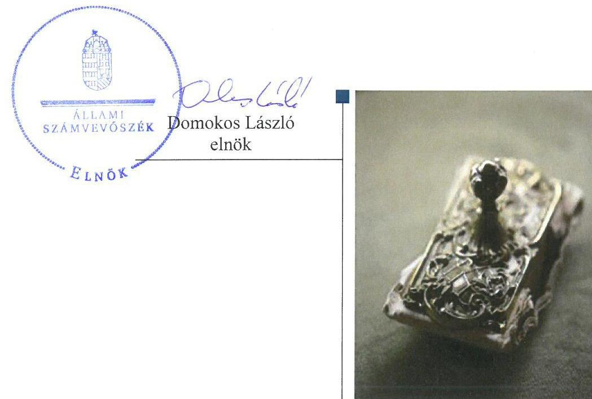
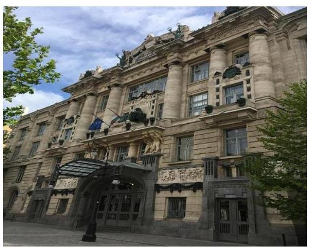
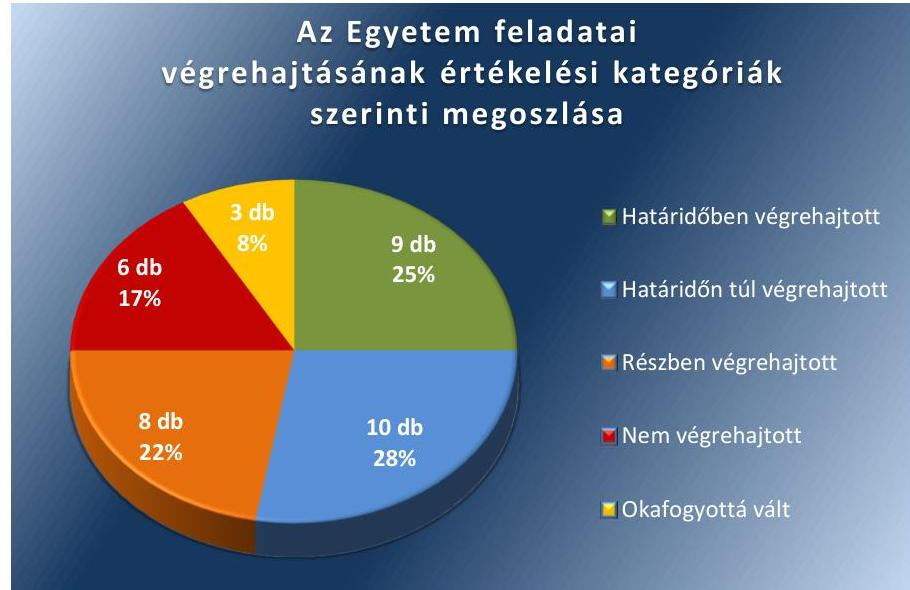
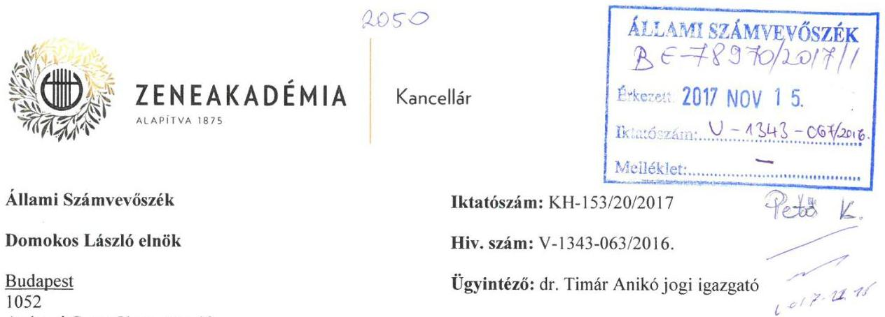
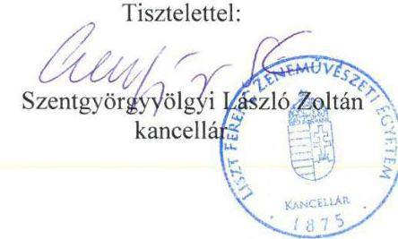
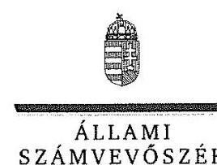
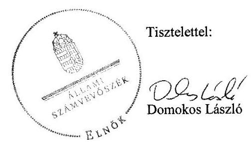
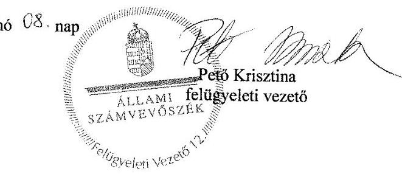

# Jelentés 

## Utóellenőrzések

Az állami felsőoktatási intézmények gazdálkodásának, működésének ellenőrzéséről készült jelentések utóellenőrzése - Liszt Ferenc Zeneművészeti Egyetem 2018. 01. hó 09. nap

---

# AZ ELLENŐRZÉST FELÜGYELTE: 

PETŐ KRISZTINA felügyeleti vezető

## AZ ELLENŐRZÉST VEZETTE ÉS A VÉGREHAJTÁSÁÉRT FELELŐS:

CSAPÓ TIBORNÉ ellenőrzésvezető

## A PROGRAM ÖSSZEÁLLÍTÁSÁÉRT FELELŐS:

JANIK JÓZSEF LÁSZLÓ osztályvezető

## A TÉMÁHOZ KAPCSOLÓDÓ KORÁBBI SZÁMVEVŐSZÉKI JELENTÉS:

- címe: Jelentés a Liszt Ferenc Zeneművészeti Egyetem ellenőrzéséről - Az állami felsőoktatási intézmények gazdálkodásának, működésének ellenőrzése
- sorszáma: 15033

IKTATÓSZÁM: V-1343-073/2016.
TÉMASZÁM: 2096
ELLENŐRZÉS-AZONOSÍTÓ SZÁM: V075537

---

# TARTALOMJEGYZÉK 

■ ÖSSZEGZÉS ..... 5
■ AZ ELLENŐRZÉS CÉLJA ..... 6
■ AZ ELLENŐRZÉS TERÜLETE ..... 7
■ AZ ELLENŐRZÉS HÁTTERE, INDOKOLTSÁGA ..... 8
■ A JELENTÉS LÉNYEGES KÉRDÉSKÖRE ..... 9
■ ELLENŐRZÉS HATÓKÖRE ÉS MÓDSZEREI ..... 10
■ MEGÁLLAPÍTÁSOK ..... 12
■ MELLÉKLETEK ..... 17
I. Sz. melléklet: Az ÁSZ 15033. számú jelentéséhez kapcsolódó intézkedési terv végrehajtása a Liszt Ferenc Zeneművészeti Egyetemnél ..... 17
II. Sz. melléklet: Az ÁSZ 15033. számú jelentéséhez kapcsolódó intézkedési terv végrehajtása az Emberi Erőforrások Minisztériumánál. ..... 26
■ FÜGGELÉK: ÉSZREVÉTELEK ..... 27
■ RÖVIDÍTÉSEK JEGYZÉKE ..... 49

---

.

---

# ÖSSZEGZÉS 

A Liszt Ferenc Zeneművészeti Egyetem kancellárja az intézkedési tervben vállalt feladatai jelentős részét részben hajtotta végre vagy nem hajtotta végre, így a kancellár nem biztosította az Egyetem elszámoltathatóságát. Az Emberi Erőforrások Minisztériuma - mint a fenntartói jogkör gyakorlója - az intézkedési tervében vállalt feladatát végrehajtotta.

## Az ellenőrzés társadalmi indokoltsága

Az Állami Számvevőszék stratégiájában célul tűzte ki a számvevőszéki munka hasznosulásának javítását. Ezzel összhangban ellenőrzi, hogy az ellenőrzött szervezetek megvalósították-e a korábbi ellenőrzései által feltárt hibák, hiányosságok és szabálytalanságok megszüntetése céljából kialakított intézkedési terveikben foglaltakat. A rendszeres utóellenőrzések hozzájárulnak a szükséges intézkedések tényleges végrehajtásához, ezáltal a közpénzügyek rendezettségének javulásához.

## Főbb megállapítások, következtetések

A Liszt Ferenc Zeneművészeti Egyetem kancellárja az intézkedési tervben vállalt harminchat feladatból kilenc feladatot határidőben, tíz feladatot határidőn túl, nyolc feladatot részben végrehajtott, míg hat feladat végrehajtása elmaradt. További három feladat végrehajtása okafogyottá vált. A rektor az intézkedési tervben vállalt harminchat feladatból kilenc feladat végrehajtásában volt érintett, melyből egy feladatot határidőben, hét feladatot határidőn túl hajtott végre, míg egy feladat végrehajtása elmaradt. A kancellár nem biztosította a közpénzek szabályszerű, ellenőrizhető felhasználását, nem gondoskodott arról, hogy az Állami Számvevőszék által korábban azonosított szabálytalanságok a jövőben ne forduljanak elő.

A számviteli szabályzatok aktualizálása és a gazdálkodással összefüggő egyes szabályzatok elkészítése elmaradt, ezzel a kancellár nem biztosította az Egyetem alapvető működésének feltételeit.

A kancellár továbbra sem működtette az Egyetem kockázatkezelési rendszerét, mert nem mérte fel és nem állapította meg az Egyetem tevékenységében, gazdálkodásában rejlő kockázatokat, valamint nem határozta meg az egyes kockázatokkal kapcsolatban szükséges intézkedéseket, valamint azok teljesítésének folyamatos nyomon követésének módját.

A kancellár nem gondoskodott a gazdálkodási adatokon alapuló vezetői információs rendszer kialakításáról és működtetéséről. Nem intézkedett a szabályszerű közpénzfelhasználást biztosító első védelmi vonal, a belső ellenőrzés működési hiányosságainak megszüntetéséről.

A kancellár továbbra sem biztosította, hogy az utólagos elszámolásra felvett előlegek elszámolása során betartsák a vonatkozó belső szabályzat előírásait. Továbbra sem gondoskodott a kancellár arról, hogy a követelések értékelése szabályszerűen történjen, mert elmaradt az egyenlegközlő levelek megküldése a vevők részére és a 2015. évi mérlegben vevő követelést annak ellenére szerepeltettek, hogy a vevők általi elismerés dokumentumával nem rendelkeztek. A személyi juttatás számfejtése előtt a teljesítésigazolás elmaradt, így a kancellár továbbra sem intézkedett a szabályszerű kifizetéseket biztosító kontrollok működéséről. A kancellár nem gondoskodott a 2015/2016-os tanévre vonatkozó térítési díjak, a hangszer-, és 2015. évi terem bérbeadás díjának önköltségen alapuló megállapításáról.

A kancellár nem vizsgálta ki a munkajogi felelősséggel kapcsolatos körülményeket.
Az Emberi Erőforrások Minisztériuma az intézkedési tervében vállalt feladatát határidőben végrehajtotta.

---

# AZ ELLENŐRZÉS CÉLJA 

Az ellenőrzés célja annak értékelése volt, hogy a számvevőszéki jelentésben ${ }^{1}$ foglalt javaslatot megalapozó megállapításokkal összhangban készített intézkedési tervekben vállalt feladatokat az ellenőrzött szervezetek végrehajtották-e.

---

# AZ ELLENŐRZÉS TERÜLETE

## Liszt Ferenc Zeneművészeti Egyetem

A budapesti Liszt Ferenc Zeneművészeti Egyetem a magyar zenei felsőoktatás kiemelkedő intézménye, melyet 1875-ben alapítottak. Budapest emblematikus kulturális intézménye, amely Európa zenei életében, a tradíciók ápolásában kiemelkedő szerepet játszik. Az Egyetem2 alaptevékenységei között szerepel az oktatás, tudományos kutatás, kulturális események szervezése, rendezése. Alaptevékenységeinek ellátásán túl könyvtári, közművelődési, közgyűjteményi és egyéb feladatokat is ellát. Az Egyetem tizenhárom tanszéken végzi a zenetudományi és bölcsészettudományi képzést. A különleges tehetségek számára előképző tagozatot tart fenn, valamint doktori iskolájában a zenetudós jelöltek PhD3, a művészek DLA4 fokozatot szerezhetnek.

A rektor5 2013. november 1-jétől tölti be tisztségét. Az utóellenőrzéssel érintett időszak alatt a kancellár6 személye változott, aki 2015. július 15-től látja el feladatait.

Az Egyetem 2015. évi költségvetési beszámolója szerint 3168,5 millió Ft költségvetési bevételt, 5352,0 millió Ft finanszírozási bevételt ért el, valamint 6857,6 millió Ft költségvetési kiadást teljesített. Az Egyetem 2015. december 31-i könyvviteli mérlege szerint a nemzeti vagyonba tartozó befektetett eszközeinek értéke 13 299,4 millió Ft-ot, a követelések 343,0 millió Ft-ot, míg a kötelezettségek állománya 654,3 millió Ft-ot tett ki.

Az ÁSZ7 2009. január 1. – 2013. december 31. közötti időszakra vonatkozóan ellenőrizte az Egyetem gazdálkodásának, működésének szabályszerűségét, az erről szóló 15033. számú számvevőszéki jelentést 2015. február 24. napján tette közzé.

Az Emberi Erőforrások Minisztériuma az állami felsőoktatási intézmények, így a Liszt Ferenc Zeneművészeti Egyetem fenntartói jogkörének gyakorlója.

Az utóellenőrzés – a 2015. február 24-től 2017. március 21-ig végrehajtott feladatokat figyelembe véve – a számvevőszéki jelentésben a rektor és a miniszter8 részére megfogalmazott javaslatot megalapozó megállapításokra készített, az ÁSZ részére megküldött intézkedési tervben vállalt feladatok megvalósításának ellenőrzésére, illetve értékelésére fókuszált.

---

# AZ ELLENŐRZÉS HÁTTERE, INDOKOLTSÁGA 

Az ÁSZ tv. ${ }^{9}$ 33. § (1) bekezdése értelmében a számvevőszéki jelentések javaslatot megalapozó megállapításaihoz kapcsolódóan az ellenőrzött szervezet vezetője intézkedési tervet köteles összeállítani, és az ÁSZ részére megküldeni. Az intézkedési tervben foglaltak megvalósítását - az ÁSZ tv. 33. § (7) bekezdésében foglaltak alapján - az ÁSZ utóellenőrzés keretében ellenőrizheti. Az intézkedések megvalósulásának értékelése során az ÁSZ figyelembe veszi az ellenőrzött szervezetek működési feltételeiben, valamint a jogszabályi előírásokban bekövetkezett változásokat.

Az intézkedési tervekben foglalt feladatok hiányos, illetve késedelmes végrehajtása, valamint megvalósításának elmaradása azt mutatja, hogy az ellenőrzések során feltárt hibák, hiányosságok és szabálytalanságok megszüntetése nem kapott kellő hangsúlyt. Ez a szabályszerű működés és a felelős vezetői magatartás vonatkozásában kockázatot hordoz. E kockázatok feltárásával az ÁSZ utóellenőrzési rendszere fokozza a fegyelmet, és igazolja, hogy a közpénzzel való szabályos gazdálkodás felelőssége elől nem lehet kitérni.

## AZ UTÓELLENŐRZÉS VÁRHATÓ HASZNOSULÁSA

Az utóellenőrzés négy szinten hasznosulhat:
$\longrightarrow$ A társadalom szintjén az utóellenőrzés jelzi, hogy a számvevőszéki ellenőrzés megállapításainak van következménye: a hiányosságok megszüntetésére az ellenőrzött szervezet által meghatározott intézkedések végrehajtását is számon kéri az ÁSZ.
$\longrightarrow$ Az ellenőrzött terület szintjén az utóellenőrzés tájékoztatást nyújt a terület döntéshozóinak a hiányosságok kiküszöbölésének jó gyakorlatairól, ezzel lehetőséget biztosítva arra, hogy az ÁSZ ellenőrzési megállapításai, javaslatai a terület nem ellenőrzött szervezeteinek a működése során is hasznosuljanak.
$\longrightarrow$ Az ellenőrzött szervezet szintjén az utóellenőrzés feltárja, hogy a szervezet az intézkedések végrehajtásával hasznosította-e a korábbi ellenőrzési jelentésben a hiányosságok megszüntetése, illetve a kockázatok kezelése érdekében megfogalmazott javaslatokat.
$\longrightarrow$ Az ÁSZ szintjén az utóellenőrzés visszacsatolást ad az ellenőrzési jelentések hasznosulásáról, az intézkedések elmaradása vagy részleges megvalósulása a további ellenőrzésekhez kockázati jelzésként szolgál.

---

# A JELENTÉS LÉNYEGES KÉRDÉSKÖRE 

Az ellenőrzött szervezetek az intézkedési terveikben foglaltakat az előírt határidőben végrehajtották-e?

---

# ELLENŐRZÉS HATÓKÖRE ÉS MÓDSZEREI 

## Az ellenőrzés típusa

Megfelelőségi ellenőrzés.

## Az ellenőrzött időszak

Az utóellenőrzés alapját képező számvevőszéki jelentés közzétételének napjától (2015. február 24.) az ellenőrzésről szóló kiértesítő levél keltének napjáig (2017. március 21.) tartó időszak.

## Az ellenőrzés tárgya

A számvevőszéki jelentésben foglalt javaslatot megalapozó megállapításokkal összhangban - Liszt Ferenc Zeneművészeti Egyetem és Emberi Erőforrások Minisztériuma által - készített intézkedési tervekben vállalt feladatok végrehajtásának ellenőrzése.

Az ellenőrzés kiterjedt minden olyan körülményre és adatra, amely az ÁSZ jogszabályban meghatározott feladatainak teljesítéséhez, valamint a program végrehajtása folyamán felmerült újabb összefüggések feltárásához szükséges.

## Az ellenőrzött szervezet

Liszt Ferenc Zeneművészeti Egyetem és az Emberi Erőforrások Minisztériuma

## Az ellenőrzés jogalapja

Az ÁSZ tv. 33. § (7) bekezdése alapján az ÁSZ tv. 33. § (1)-(2) bekezdés szerinti intézkedési tervben foglaltak megvalósítását az ÁSZ utóellenőrzés keretében ellenőrizheti.

## Az ellenőrzés módszerei

Az ellenőrzést a nemzetközi standardokat irányadónak tekintve az ellenőrzési program ellenőrzési kérdései, az ellenőrzött időszakban hatályos jogszabályok, az ellenőrzés szakmai szabályok és módszertanok figyelembevételével, az ÁSZ önállóan végezte.

---

Az ellenőrzés ideje alatt az ellenőrzött szervezetekkel történő kapcsolattartást az ÁSZ SZMSZ ${ }^{10}$-ének vonatkozó előírásai alapján biztosította.

Az utóellenőrzés megállapításait elsősorban az ÁSZ rendelkezésére álló, valamint az ellenőrzött szervezetektől elektronikusan bekért dokumentumok alapozták meg.

Az ellenőrzési bizonyítékként felhasználható adatforrások közé tartoznak egyrészt a szakmai programban felsorolt adatforrások, másrészt minden - az ellenőrzés folyamán feltárt, az ellenőrzés szempontjából információt tartalmazó - dokumentum.

A pénzügyi- és vagyongazdálkodás szabályszerűségére vonatkozóan az intézkedési tervben foglalt feladatok végrehajtását a dologi kiadások, bevételek, személyi kiadások, előleg, vevő, aktív-, passzív időbeli elhatárolások állományából 10 - 10 db véletlen mintavétellel kiválasztott tétel alapján értékelte az ÁSZ. A kiválasztott tételek esetében azt ellenőrizte, hogy az Egyetem az intézkedési tervben meghatározott feladatok végrehajtása során biztosította-e a jogszabályok és a belső szabályzatok előírásainak megfelelő működtetést.

Az intézkedési tervekben előírt feladatokat, azok végrehajthatósága, illetve végrehajtása szempontjából az alábbiak szerint kell értékelni:
"határidőben végrehajtott" a feladat, ha a teljesítés dokumentáltan, az intézkedési tervben előírt határidőben és tartalommal megtörtént;
"határidőn túl végrehajtott" a feladat, ha annak teljesítése az intézkedési tervben meghatározott módon, de az előírt határidőn túl történt meg;
"részben végrehajtott" a feladat, ha végrehajtása teljes körűen az intézkedési tervben előírt módon nem történt meg;
"nem végrehajtott" a feladat, ha a végrehajtás nem történt meg, vagy amennyiben a teljesítést nem dokumentálták;
"okafogyottá vált" a feladat, ha végrehajtására - meghatározott esemény bekövetkezése, továbbá külső körülmény, a működést érintő feltétel változása miatt - már nincs szükség, illetve lehetőség, és egyértelműen megállapítható, hogy az intézkedést szükségessé tevő körülmény a jövőben nem fordulhat elő;
"nem időszerű" az a feladat, amelynek ellenőrzési időszakon belüli végrehajtására azért nem került (kerülhetett) sor, mert az intézkedés alapjául szolgáló esemény nem következett be, de annak jövőbeni előfordulása lehetséges, a végrehajtása nem volt esedékes, vagy a végrehajtás határideje még nem járt le.
Az ellenőrzés lefolytatásához az ellenőrzött szervezetek a tanúsítványok elektronikus kitöltésével, valamint az ÁSZ által kért dokumentumok elektronikus megküldésével szolgáltattak adatokat, amelyek valódiságát és teljes körűségét az ellenőrzött szervezet vezetője által tett teljességi és hitelességi nyilatkozat igazolja. Az így rendelkezésre bocsátott adatok, információk kontrollja
 az ellenőrzés keretében történt.

---

# MEGÁLLAPÍTÁSOK 

## Az ellenőrzött szervezetek az intézkedési terveikben foglaltakat az előírt határidőben végrehajtották-e?

Összegző megállapítás

Az Egyetem kancellárja az intézkedési tervben vállalt részben végrehajtott és végre nem hajtott feladatai a belső kontrollrendszer, a pénzügyi- és vagyongazdálkodás területén továbbra is kockázatot jelentenek az Egyetem szabályszerű működésére. Az EMMI az intézkedési tervében vállalt feladatát határidőben végrehajtotta.

Az ÁSZ a számvevőszéki jelentésben a rektor részére négy pontban tizennégy javaslatot fogalmazott meg, amelynek hasznosítására az Egyetem harminchat feladatot határozott meg.

A rektor által a hiányosságok, szabálytalanságok megszüntetésére elkészített és az ÁSZ részére megküldött intézkedési tervben meghatározott harminchat feladatból kilencet határidőben, tízet határidőn túl, nyolcat részben hajtottak végre, hatot nem hajtottak végre, további három okafogyottá vált.

Az ÁSZ javaslatai alapján készített intézkedési tervben vállalt feladatok végrehajtásáról az Egyetem vezette a Bkr. ${ }^{11} 14$. §-ban előírt nyilvántartást.

Az Egyetem intézkedési tervében vállalt feladatok végrehajtásának értékelési kategóriák szerinti megoszlását az 1. ábra szemlélteti.

1. ábra

Fonrás: ÁSZ
Az Egyetem intézkedési tervében vállalt feladatokat, meghatározott határidőket, a feladatok végrehajtásáért felelős személyt és a feladatok végrehajtását az I. számú melléklet mutatja be.

---

1. táblázat

# AZ EGYETEM INTÉZKEDÉSI TERVÉBEN VÁLLALT BELSŐ KONTROLLRENDSZER SZABÁLYSZERŰ KIALAKÍTÁSÁRA, MŰKÖDTETÉSÉRE VONATKOZÓ FELADATOK 

| Végrehajtása | Sorszáma |
| :-- | :--: |
| Határidőben végrehajtott | $\mathrm{II} / 1, \mathrm{II} / 2, \mathrm{I} / 8.1$ |
| Határidőn túl végrehajtott | $\mathrm{I} / 1, \mathrm{I} / 3, \mathrm{I} / 5, \mathrm{I} / 6, \mathrm{I} / 7.1$ |
| Részben végrehajtott | $\mathrm{I} / 4, \mathrm{I} / 7.2, \mathrm{I} / 9.1$ |
| Nem végrehajtott | $\mathrm{I} / 8.2, \mathrm{I} / 9.2$ |

A KONTROLLKÖRNYEZET szabályszerű kialakítását nem támogatta az elmaradt Eszközök és Források Értékelési Szabályzat ${ }^{12}$, az Önköltség-számítási Szabályzat ${ }^{13}$, a Pénzkezelési Szabályzat ${ }^{14}$ aktualizálása, és az Ávr. ${ }^{15}$ 13. § (2) e), f), g) pontjaiban meghatározott, működéshez kapcsolódó, pénzügyi kihatással bíró és gazdálkodással kapcsolatos jogszabályban nem rendezett kérdések - reprezentációs kiadások szabályai, a gépjárművek, vezetékes- és mobiltelefonok igénybevételének és használatának rendje - kezelésének elmaradása.

Ugyanakkor az Ügyrendek 1-5 ${ }^{16}$, Etikai Kódex ${ }^{17}$ elkészítése, a szabálytalanságok kezelésének ${ }^{18}$ rendjének aktualizálása, a vezetői döntések meghozatalához szükséges tájékoztatási-, beszámoltatási rendszer kialakítása, a gazdálkodást érintő belső szabályzatok meghatározó részének és az SZMSZ ${ }^{19}$ felülvizsgálata és aktualizálása javította az Egyetem szabályos működését.

A KOCKÁZATKEZELÉSI RENDSZER kialakításáról gondoskodtak a Kockázatkezelési Szabályzat ${ }^{20}$ felülvizsgálatával, módosításával, ugyanakkor nem működtették a jogszabályoknak megfelelően. A kancellár a Bkr. 7. § (2) bekezdésének előírásaitól eltérően nem mérte fel a tevékenységben rejlő és a szervezeti célokkal összefüggő kockázatokat, és nem határozta meg az egyes kockázatokkal kapcsolatban szükséges intézkedéseket, azok teljesítésének folyamatos nyomon követésének módját.

A KONTROLLTEVÉKENYSÉG kereteinek kialakításának és működtetése érdekében határidőn túl gondoskodtak a folyamatba épített előzetes és utólagos vezetői ellenőrzési rendszer Ellenőrzési Nyomvonalának ${ }^{21}$ elkészítéséről. Határidőben intézkedtek a gazdálkodási jogkörök gyakorlására vonatkozó szabályzat megalkotásáról, a jogköröket tartalmazó nyilvántartás vezetéséről, gazdálkodási jogkörök gyakorlására vonatkozó felhatalmazások kiadásáról.

## AZ INFORMÁCIÓS ÉS KOMMUNIKÁCIÓS RENDSZER kialakítása érdekében a rektor elkészítette az Adatvédelmi-, Adatkezelési és Adatbiztonsági Szabályzatot ${ }^{22}$. A kancellár nem gondoskodott a Bkr. 9. § előírásaitól eltérően a gazdálkodási adatokon alapuló vezetői információs rendszer kialakításáról és működtetéséről, így nem biztosított, hogy az információk megfelelő időben eljussanak az illetékes szervezeti egységhez, illetve személyhez. Továbbá a beszámolási szinteket, határidőket, módokat nem határozták meg.

---

A MONITORING RENDSZER belső ellenőrzés működési hiányosságait nem szüntették meg. A kancellár ugyan gondoskodott a belső ellenőrzés szabályozottságának felülvizsgálatáról, ugyanakkor nem intézkedett a Bkr. 28. § c) bekezdésének előírásai ellenére a korábbi vizsgálatok megállapításai alapján jóváhagyott intézkedési tervekben foglalt feladatok végrehajtására.
2. táblázat

# EGYETEM INTÉZKEDÉSI TERVÉBEN VÁLLALT PÉNZÜGYI GAZDÁLKODÁS SZABÁLYSZERŰ KIALAKÍTÁSÁRA, MŰKÖDTETÉSÉRE VONATKOZÓ FELADATOK 

| Végrehajtása | Sorszáma |
| :-- | :--: |
| Határidőben végrehajtott | III/5 |
| Határidőn túl végrehajtott | III/4.1, III/4.3 |
| Részben végrehajtott | III/3, III/4.2 |
| Okafogyottá vált | III/4.4 |

Fonrás: ÁSZ

PÉNZÜGYI GAZDÁLKODÁS szabályszerű működése érdekében gondoskodtak az egyes bevételek esetében a nyugtaadási kötelezettség teljesítéséről, a munkaidő nyilvántartási-teljesítési igazolási nyomtatványok elkészítéséről. Továbbá gondoskodtak a 2016/2017-es tanévre vonatkozó képzési önköltség meghatározásáról, és 2016. évtől a teremhasználati díjak önköltségszámításon alapuló megállapításáról.

A pénzügyi gazdálkodás területén a korábban azonosított hiányosságok egy része továbbra is fennállt. A kancellár nem gondoskodott az Áhsz. ${ }^{23} 50$. § (5), az Önköltség-számítási Szabályzat 17. § (4), és Gazdálkodási Szabályzat 9. § (7) bekezdések előírásainak megfelelően a 2015/2016-os tanévre vonatkozó térítési díjak, az eszközök bérbeadási díjának -2016. évi terem bérbeadás díjat kivételével - önköltségszámításon alapuló megállapításáról. Továbbá a kancellár nem gondoskodott a személyi juttatások kifizetése előtt az Ávr. 57. §-ban előírt teljesítésigazolásról.
3. táblázat

EGYETEM INTÉZKEDÉSI TERVÉBEN VÁLLALT VAGYONGAZDÁLKODÁSRA VONATKOZÓ FELADATOK

| Végrehajtása | Sorszáma |
| :-- | :--: |
| Határidőben végrehajtott | IV/1, IV/3, IV/4, IV/10 |
| Határidőn túl végrehajtott | IV/2 |
| Részben végrehajtott | IV/5, IV/12 |
| Nem végrehajtott | IV/6, IV/8, IV/9 |
| Okafogyottá vált | IV/7, IV/11 |

VAGYONGAZDÁLKODÁS szabályszerű kialakítása érdekében intézkedtek a vagyongazdálkodási terv elkészítéséről, a vagyongazdálkodásra vonatkozó belső szabályzatok aktualizálásáról, az előleg elszámolások szabályozásáról, az eszköz bérbeadások esetében az átláthatóság követelményének biztosításáról, a számviteli bizonylatok megőrzéséről.

A kancellár nem gondoskodott annak érdekében, hogy a 19/2014. (XI.29) ${ }^{24}$ számú rektori utasítás 15. § (5) bekezdésnek megfelelően a 2015. évi mérlegben a vevők által elismert követelés szerepeljen, a teljes körű vevőállományra vonatkozóan egyenlegközlő levél megküldéséről. Továbbá

---

nem gondoskodtak a korábbi ellenőrzés által feltárt hiányosságok tekintetében a munkajogi felelősséggel kapcsolatos körülmények kivizsgálására. A kancellár nem intézkedett a Vtvr ${ }^{25}$ 14. § (1)-(2) bekezdések előírásaitól eltérően az MNV Zrt. ${ }^{26}$-nek szolgáltatott adatok és a mérleg közötti egyezőség megteremtéséről, valamint a 22/2014.(XII.15.) számú rektori utasítás 27. § (4), (12) és 33. § (3), (7) bekezdései előírásainak betartásáról az utólagos elszámolásra felvett előlegek elszámolásánál.
4. táblázat

# EGYETEM INTÉZKEDÉSI TERVÉBEN VÁLLALT SZENÁTUS GAZDÁLKODÁSSAL KAPCSOLATOS JOGGYAKORLÁSÁRA VONATKOZÓ FELADATOK 

| Végrehajtása | Sorszáma |
| :-- | :--: |
| Határidőben végrehajtott | $\mathrm{I} / 1$ |
| Határidőn túl végrehajtott | $\mathrm{I} / 1, \mathrm{I} / 3, \mathrm{I} / 4$ |
| Részben végrehajtott | $\mathrm{I} / 2$ |
| Nem végrehajtott | $\mathrm{I} / 2$ |

SZENÁTUS GAZDÁLKODÁSSAL kapcsolatos joggyakorlásának megfelelőssége javult, mivel a kancellár gondoskodott a Szenátus felé a felterjesztésekről, ezért a Szenátus döntött a minőség és teljesítmény alapján differenciáló jövedelemelosztás elveiről, a 2015. évi és 2016. évi elemi költségvetésről, vagyongazdálkodási tervről, a Térítési és Juttatási Szabályzatban meghatározott hallgatók által fizetendő térítési díjakról, a Foglalkoztatási Követelményrendszer módosításáról. Ugyanakkor a kancellár az Nftv. ${ }^{27}$ 74. § (3) bekezdésében előírtaktól eltérően nem gondoskodott a 62/2016.(09.13.) számú szenátusi döntéssel elfogadott SZMSZ módosítás, és a 2015. évi és 2016. évi elemi költségvetés EMMI részére történő megküldéséről.
5. táblázat

## EMMI INTÉZKEDÉSI TERVÉBEN VÁLLALT FELADAT

Végrehajtása
Sorszáma
Határidőben végrehajtott
1
Fonrás: ÁSZ
Az EMMI ${ }^{28}$ által a hiányosságok megszüntetésére elkészített és az ÁSZ részére megküldött intézkedési tervében egy feladatot vállalt, felelősként a Belső Ellenőrzési Főosztályt ${ }^{29}$ jelölte meg.

Az EMMI határidőben intézkedett a belső kontrollrendszer kialakításával és működtetésével, a pénzügyi és vagyongazdálkodással, vagyonkimutatással összefüggésben feltárt szabálytalanságokhoz kapcsolódó munkajogi felelősség kivizsgálásának megindításáról. A felelős Belső Ellenőrzési Főosztály nem tartotta indokoltnak intézkedés kezdeményezését.

Az ÁSZ javaslatai alapján készített intézkedési tervben rögzített feladatok végrehajtásáról az EMMI a Bkr. 14. §-ban előírt nyilvántartást vezette.

Az EMMI intézkedési tervében vállalt feladatot, meghatározott határidőt, a feladat végrehajtásáért felelős szervezetet és a feladat végrehajtását a II. számú melléklet mutatja be.

---

.

---

# MELLÉKLETEK

■ I. SZ. MELLÉKLET: AZ ÁSZ 15033. SZÁMÚ JELENTÉSÉHEZ KAPCSOLÓDÓ INTÉZKEDÉSI TERV VÉGREHAJTÁSA A LISZT FERENC ZENEMŰVÉSZETI EGYETEMNÉL

|  1. | Az intézkedési tervben rögzített feladat | Az intézkedési tervben meghatározott határidő | Az intézkedési tervben meghatározott felelős | A feladat végrehajtása  |
| --- | --- | --- | --- | --- |
|   | 1. | 2. | 3. | 4.  |
|   |  | Határidőben végrehajtott feladatok |  |   |
|  1. | I/8.1. Belső ellenőrzés szabályozottságának felülvizsgálata. | 2015. szeptember 30. | belső ellenőrzési vezető | A kancellár a Belső ellenőrzési kézikönyv ${ }^{10}$ módosításával gondoskodott a belső ellenőrzés szabályozottságának felülvizsgálatáról.  |
|  2. | II/1 Elemi költségvetés felterjesztése Szenátus részére jóváhagyás céljából. | minden évben Nftv. szerint | Kancellár | A kancellár 2015. március 17-re és 2016. május 10-re gondoskodott az elemi költségvetés Szenátus részére történő felterjesztéséről. A Szenátus az elemi költségvetéseket a 15/2015. (03. 17.) számú, és a 27/2016. (05. 10.) számú határozataival fogadta el.  |
|  3. | III/1. A gazdálkodási jogkörök szabályszerű gyakorlásának biztosítása. A Szenátus 2014. február 11-én ülésén elfogadta a Gazdálkodási Szabályzat módosítását, melynek keretében szabályozásra került a kötelezettségvállalás rendje. A Gazdálkodási Szabályzat végrehajtását a 2014. március 31-én kiadott 6/2014.sz. rektori utasítás biztosítja. A rektori utasításban meghatározásra kerültek a gazdálkodási jogkörök gyakorlására jogosult munkakörök, a jogkörök gyakorlására vonatkozó előírások. E két szabályozással az intézkedés megtörtént a gazdálkodási jogkörök szabályszerű gyakorlásának biztosítása érdekében, további intézkedést nem igényel. | - | - | A rektor intézkedett a Gazdálkodási Szabályzat végrehajtásáról a 6/2014. (III. 31.) számú utasítással, melyben meghatározta a gazdálkodási jogkörök gyakorlására jogosult munkaköröket és a jogkörök gyakorlására vonatkozó előírásokat. Az Egyetem a Gazdálkodási Szabályzatban szabályozta az Ávr.-ben előírt gazdálkodási jogkörök eljárási és dokumentációs részletszabályait.  |
|  4. | III/2. A gazdálkodási jogkörök szabályszerű gyakorlásának érvényesülése érdekében a jogkört gyakorló személyek jogosultságának ellenőrzése gazdasági eseményenként. A gazdálkodási jogkörök aktualizálása, folyamatos nyomon követése, aláírás minták naprakészségének biztosítása. | folyamatos | kancellár, gazdálkodási jogkört gyakorlók, pénzügyi vezető | A kancellár a gazdálkodási jogköröket tartalmazó belső szabályzatait aktualizálta a 2016. november 22-én kiadott kötelezettségvállalások, beszerzések és szerződéskötések rendjéről szóló szabályzattal, valamint a rektor és a kancellár a szakmai teljesítés igazolás módjáról és azt végző személyek kijelöléséről szóló 1/2017. (I. 11.) számú utasításával. Gondoskodtak a gazdálkodási jogkörök gyakorlására jogosult személyeket és aláírás mintáikat tartalmazó nyilvántartás vezetéséről, és az utalványozó, érvényesítő és teljesítésigazoló személyek felhatalmazásainak kiadásáról. A gazdálkodási jogkörök szabályszerű  |

---

|  Az intézkedési tervben rögzített feladat | Az intézkedési tervben meghatározott határidő | Az intézkedési tervben meghatározott felelős | A feladat végrehajtása  |
| --- | --- | --- | --- |
|  1. | 2. | 3. | 4.  |
|   |  |  | gyakorlása érvényesült a

 teljesítésigazolás, érvényesítés, utalványozás kulcskontrollok esetében.  |
|  5. III/5 Egyes bevételek nyugtaadási kötelezettség teljesítése. | - | - | A kancellár gondoskodott a bevételek esetében a nyugtaadási kötelezettség teljesítéséről, az integrált pénzügyi és számviteli nyilvántartó rendszerben nyugta helyett számla kiállításával, megfelelve ezzel az Áfa tv. ${ }^{31}$ 166. §-ban előírtaknak.  |
|  6. IV/1. Vagyongazdálkodási terv elkészítése és felterjesztése Szenátus részére jóváhagyás céljából. | minden évben
Nftv. szerint | Kancellár | A kancellár határidőben gondoskodott a vagyongazdálkodási tervek elkészítéséről és a Szenátus részére történő felterjesztésről. A Szenátus a 2015. évi vagyongazdálkodási tervet 15/2015. (03. 17.) számú határozatával, a 2016. évi vagyongazdálkodási tervet a 27/2016. (05. 10.) számú határozatával hagyta jóvá.  |
|  7. IV/3. Számviteli nyilvántartást közvetlenül és közvetetten alátámasztó számviteli bizonylatok jogszabályban előírt módon történő megőrzése, a megőrzés körülményeinek biztosítása. | folyamatos | irattár kezelő | A kancellár biztosította a Számv. tv. ${ }^{32}$ 169. §-ban előírtakkal összhangban a számviteli nyilvántartást alátámasztó számviteli bizonylatok megőrzését.  |
|  8. IV/4. Előlegek elszámolásának jogszabályi előírásoknak megfelelő gyakorlat kialakítása. A pénzkezelés rendjéről 2014. december 15-én kiadott 22/2014. sz. rektori utasítás részletes leírásokat tartalmaz az utólagos elszámolásra felvett előlegekre és a kártyahasználatra vonatkozóan. Ezen intézkedéssel részben teljesül az előlegek elszámolásának előírásoknak megfelelő teljesítése. | - | - | A rektor határidőben intézkedett az előleg elszámolásának jogszabályi előírásoknak megfelelő gyakorlat kialakítására. A rektor 2014. december 15-én kiadta a pénzkezelés rendjéről szóló 22/2014.(XI.29)${ }^{33}$ számú utasítást, amelynek 33. §-a tartalmazta az előleg elszámolására vonatkozó szabályokat, megfelelve ezzel a Számv. tv. 14. § (8) bekezdésében és a Szja. tv. 72. § (4) bekezdés c) pontjában előírtaknak.  |
|  9. IV/10. Eszközök bérbeadással történő hasznosítása során az átláthatóság követelményeinek biztosítása érdekében a szerződő felektől a jogszabályban előírt nyilatkozat megtételének megkövetelése. | - | - | Az Egyetem az eszközök bérbeadással történő hasznosítása során biztosította az átláthatóság követelményét, a szerződő féltől megkövetelte az Nvtv. ${ }^{34}$ 3. § (2) bekezdésében előírt átláthatósági nyilatkozat megtételét, melyet a bérleti szerződésben rögzítettek.  |
|  Határidőn túl végrehajtott feladatok |  |  |   |
|  10. I/1. SZMSZ jogszabályi előírásoknak megfelelő aktualizálása és Szenátus elé történő terjesztése. | Nftv. szerint 2015. április 30. | Kancellár | A rektor az Nftv. 11. § (1) bekezdésben és a 2. mellékletében meghatározott előírásokkal összhangban aktualizálta az SZMSZ köteteit, kötelező részeit. Az Egyetem az intézkedési tervben meghatározott 2015. április 30-át követően, 2015. december 8-ra aktualizálta, terjesztette elő a Szenátus elé a Szervezeti és Működési Rendjét. A Foglalkoztatási Követelményrendszer módosítását 2017. február 14-re, a Hallgatói Követelményrendszer módosítását 2016. február 9-re, határidőn túl készítette el. A Szenátus a 70/2015. (12.08.) számú, a 9/2017. (02.14.) számú és a 6/2016. (02.09.) számú határozataival elfogadta a beterjesztett módosításokat.  |

---

|  Az intézkedési tervben rögzített feladat | Az intézkedési tervben meghatározott határidő | Az intézkedési tervben meghatározott felelős | A feladat végrehajtása  |
| --- | --- | --- | --- |
|  1. | 2. | 3. | 4.  |
|  11. I/3. Ügyrend készítésére kötelezett szervezeti egységek ügyrendjeinek elkészítése és jóváhagyásra történő benyújtása. | SZMSZ elfogadását követő 60. nap | valamennyi, SZMSZ-ben meghatározott vezető | Az ügyrend készítésére kötelezett szervezeti egységek ügyrendjeik elkészítésére és jóváhagyásra történő benyújtására határidőn túl 2016. augusztus 12-re intézkedtek. A kancellár 2016. augusztus 12-én adta ki a Kommunikációs és Médiatartalmi Igazgatóság 10/2016. (VIII.12.) számú, a Koncert- és Rendezvényközpont 11/2016. (VIII.12.) számú, a Kancellári Hivatal 12/2016. (VIII.12.) számú, a Gazdasági Igazgatóság 13/2016. (VIII.12.) számú, a Műszaki és Vagyongazdálkodási Igazgatóság 14/2016. (VIII.12.) számú működési rendeket szabályozó utasításokat.  |
|  12. I/5. Folyamatba épített előzetes és utólagos vezetői ellenőrzési rendszer (FEUVE) ellenőrzési nyomvonalának elkészítése. | 2015.december 31. | pénzügyi vezető és belső ellenőrzési vezető | A kancellár a folyamatba épített előzetes és utólagos vezetői ellenőrzési rendszer ellenőrzési nyomvonalát az intézkedési tervpontban meghatározott határidőn túl, 2016. november 22-re készítette el, amelyet a 15/2016. (XI.22.) számú kancellári utasítás 1. számú melléklete tartalmaz.  |
|  13. I/6. Szabálytalanságok kezelésének eljárásrendjének felülvizsgálata, szükség szerinti aktualizálása, az Etikai Kódex valamint az Adatvédelmi-, adatkezelési és adatbiztonsági szabályzat elkészítése. | 2015.október 30. | Főtitkári Iroda jogtanácsos | Az info tv. ${ }^{35}$ 24. § (3) bekezdésében foglalt előírásnak megfelelően a rektor elkészítette az Egyetem Adatvédelmi, Adatkezelési és Adatbiztonsági Szabályzatát. A szabályzatot az intézkedési tervben meghatározott határidőn túl, 2016. június 14-re készítették el, hatályba lépésének dátuma 2016. június 15. A Szabálytalanságok Kezelésének Eljárásrendje határidőn túl, 2016. június 22-re került aktualizálásra. A szabályzatot a rektor és a kancellár a 2/2016. (VI.22.) számon adta ki. A rektor az Egyetem Etikai kódexét határidőben, 2015. szeptember 15-re elkészítette, amely 2015. október 1-jétől lépett hatályba.  |
|  14. I/7.1 Kockázatkezelési szabályzat felülvizsgálata, szükség szerinti aktualizálása. | 2015.május 31. | Főtitkári Iroda jogtanácsos | A rektor a Kockázatkezelési Szabályzat aktualizálásáról 2015. június 8-ra gondoskodott. A 9/2015 (VI.8.) számú utasítással kiadott szabályzatban meghatározták a kockázati tényezőket, azok értékelését, a kockázatokra vonatkozó válaszreakciókat és a kockázatok felülvizsgálatának módját.  |
|  15. II/3. Térítési és Juttatási Szabályzatban meghatározott, hallgatók által fizetendő költségtérítési és egyéb térítési díjak felterjesztése Szenátus részére jóváhagyás céljából. | minden évben, a Szabályzatban meghatározott időpont | kancellár, tanszékvezetők együtt | A rektor intézkedett a Térítési és Juttatási Szabályzatban meghatározott, hallgatók által fizetendő térítési díjak 2015. július 9-re és 2016. július 12-re Szenátus részére történő felterjesztéséről. A Szenátus a 2015/2016. tanévre vonatkozó hallgatói térítési díjakat a 48/2015. (07.09.) számú határozatával, a 2016/2017. tanévre vonatkozó hallgatói térítési díjakat a 46/2016. (07.12.) számú határozatával fogadta el.  |
|  16. II/4. Minőség és teljesítmény alapján differenciáló jövedelemelosztás elveinek kidolgozása és felterjesztése a Szenátus részére jóváhagyás céljából. | 2015. szeptember 30. | kancellár | A kancellár a minőség és teljesítmény alapján differenciáló jövedelemelosztás elveinek kidolgozásáról és a Szenátus részére történő felterjesztésről 2017. február 14-re gondoskodott. A Szenátus a 2017. február 14-i szenátusi ülésén elfogadta a Foglalkoztatási Követelményrendszer módosítását, amelynek 70. §-a tartalmazta a minőség és teljesítmény alapján differenciáló jövedelemelosztás elveit.  |

---

|  Az intézkedési tervben rögzített feladat | Az intézkedési tervben meghatározott határidő | Az intézkedési tervben meghatározott felelős | A feladat végrehajtása  |
| --- | --- | --- | --- |
|  1. | 2. | 3. | 4.  |
|  III/4.1 Munkaidő nyilvántartási-, teljesítési igazolási nyomtatvány készítése személyi juttatás jogcímenként. | Határidő: 2015. június 30. | Felelős: bér és munkaügyi osztály vezetője, közreműködik a jogtanácsos, pénzügyi vezető | A rektor és a kancellár határidőn túl, 2016. július 1-re készítette el a munkaidő nyilvántartási-teljesítési igazolási nyomtatványokat. A szabadságkiadás és munkaidő-nyilvántartás szabályairól szóló 3/2016. (VII.1.) számú utasítás 4, 5, 6, 7. és 9. számú mellékletei tartalmazták a személyi juttatások esetében alkalmazandó teljesítésigazolási nyomtatványokat.  |
|  III/4.3. A vizsgált időszak munkaidő-nyilvántartás vezetésének elmulasztásával kapcsolatos szabálytalanság tekintetében a munkajogi felelősséggel kapcsolatos körülmények kivizsgálására irányuló eljárás megindítása. | 2015. szeptember 30. | rektor és kancellár | A kancellár a munkaidő-nyilvántartás vezetésének elmulasztásával kapcsolatos szabálytalanság kivizsgálása alapján a KC169/1/2016. számú feljegyzésben, 2016. november 22-én megállapította, hogy az érintett szervezeti egység vezetőjének személyében változás történt, a jogviszony megszűnése miatt nem érvényesíthető a felelősség, másrészt a munkajogi felelősség érvényesítésének lehetősége elévült.  |
|  IV/2. Vagyongazdálkodásra vonatkozó belső szabályzatok aktualizálása, a hiányzó szabályzatok elkészítése | 2015. november 30. | főmérnök | A rektor az intézkedési tervében meghatározott határidőn túl, 2016. október 11-re gondoskodott a Vagyongazdálkodási Szabályzat aktualizálásáról. A Szenátus a 71/2016. (10.11.) számú határozatával fogadta el a szabályzatot. A vagyongazdálkodáshoz kapcsolódó kötelezettségvállalások, beszerzések, és szerződéskötések rendjének aktualizálása 2016. november 22-re készült el.  |
|  Részben végrehajtott feladatok |  |  |   |
|  I/2. Az elfogadott SZMSZ fenntartó részére történő megküldése | Szenátusi döntést követően azonnal | kancellár | Végrehajtott feladatrész:
A kancellár az elfogadott SZMSZ módosítások megküldéséről a fenntartó részére hét esetben gondoskodott. Hat SZMSZ módosítást az Nftv. 74. § (3) bekezdés előírásainak megfelelően a szenátusi döntést követő 15 napon belül, a 2017. január 17-ei módosítást 15. napot követő napon küldte meg. A Szenátus az ellenőrzött időszakban a Szervezeti és Működési Rendet négy alkalommal, a Foglalkoztatási Követelményrendszert egy alkalommal, a Hallgatói Követelményrendszert szintén négy alkalommal módosította, 2015. december 08-án, 2016. február 09-én, 2016. május 10-én, 2016. június 14-én, 2016. szeptember 13-án, 2017. január 17-én, 2017. február 14-én és 2017. március 14-én.  |
|   |  |  | Nem végrehajtott feladatrész:
A kancellár nem gondoskodott a 2016. szeptember 13-i szenátusi ülésen a 62/2016. (09.13.) számú határozattal elfogadott Szervezeti és Működési Rend és Hallgatói Követelményrendszer módosításának fenntartó részére történő megküldéséről, az Nftv. 74. § (3) bekezdésben foglaltak nem érvényesültek.  |

---

|  1. | Az intézkedési tervben rögzített feladat | Az intézkedési tervben meghatározott határidő | Az intézkedési tervben meghatározott felelős | A feladat végrehajtása  |
| --- | --- | --- | --- | --- |
|  1. |  | 2. | 3. | 4.  |
|  21. | I/4. A gazdálkodással összefüggő valamennyi, jogszabályban előírt belső szabályzat aktualizálása, a hiányzó szabályzatok elkészítése. | 2015. november 30. | pénzügyi vezető pénzügyi vezető | Végrehajtott feladatrész:
Az intézkedési tervben meghatározott határidőt követően 2016. november 22-én került sor a Számlarend, 2016. január 8-án az Eszközök és Források Leltározási és Leltárkészítési Szabályzat, 2016. november 22-én a Kötelezettségvállalások, Beszerzések és Szerződéskötési rendjének, 2017. március 20-án a Számviteli Politika és a Bizonylati Rend aktualizálására.  |
|   |  |  |  | Nem végrehajtott feladatrész:
A kancellár az ellenőrzött időszakban nem intézkedett a Számv. tv 14. § (5) bekezdésében előírt Eszközök és Források Értékelési Szabályzat, az önköltségszámítás rendjére vonatkozó belső szabályzat, a Pénzkezelési Szabályzat aktualizálásáról. Nem gondoskodtak továbbá a működéshez kapcsolódó, pénzügyi kihatással bíró és gazdálkodással kapcsolatos reprezentációs kiadások felosztásának, azok teljesítésének és elszámolásának szabályait rögzítő, a gépjárművek igénybevételének és használatának rendjét, a vezetékes- és mobiltelefonok használatát rögzítő szabályozások elkészítéséről, az Ávr. 13. § (2) e), f), g) bekezdéseitől eltérően. A
 felülvizsgálatot és módosítást, az elkészítést indokolta az államháztartási számvitel változásai, a kancellári rendszer bevezetésével összefüggő szervezeti változások és a vonatkozó jogszabályi előírások betartása.  |
|  22. | I/7.2. Kockázatkezelési rendszer működési környezetének kialakítása, ennek keretében felmérés az egyetem tevékenységében, gazdálkodásában rejlő kockázatokról, az egyes kockázatokkal kapcsolatban szükséges intézkedések valamint azok teljesítésének folyamatos nyomon követési módjának meghatározása. | 2015. június 30. és a működtetés folyamatos | kancellár | Végrehajtott feladatrész:
A kockázatkezelési rendszer kialakítása a 2015. június 15-én hatályba lépett Kockázatkezelési szabályzatban határidőben megtörtént.  |
|   |  |  |  | Nem végrehajtott feladatrész:
A kancellár nem gondoskodott a Bkr. 7. § (2) bekezdésében előírt kockázatkezelési rendszer működtetéséről, nem mérte fel a tevékenységgel és gazdálkodással kapcsolatos kockázatokat, és nem határozta meg az egyes kockázatokkal kapcsolatban szükséges intézkedéseket, azok teljesítésének folyamatos nyomon követésének módját.  |

---

|  22
23 | Az intézkedési tervben rögzített feladat | Az intézkedési tervben meghatározott határidő | Az intézkedési tervben meghatározott felelős | A feladat végrehajtása  |
| --- | --- | --- | --- | --- |
|  24 | 1. | 2. | 3. | 4.  |
|  23. | I/9.1. Vezetői döntések meghozatalához szükséges tájékoztatási-, beszámoltatási rendszer kialakítása és működtetése. Közép és felső vezetői szinten 2013. év második felétől értekezletek keretében kerül sor a beszámoltatásra, az információ cserére. Középvezetői szinten: a koncertszervezési és üzemeltetési feladatok heti rendszerességgel megtartott operatív értekezleteken kerülnek megbeszélésre, az egyéb területeken az ellátandó feladatok, valamint a határidők figyelembe vételével. Felső vezetői szinten: heti rendszerességgel kerül sor a Rektori Tanács ülésére a napirend szerint érintett szakmai vezető bevonásával. Heti rendszerességgel kerül összehívásra beszámolási és tájékoztatási kötelezettséggel valamennyi középvezető részvételével a Vezetői Értekezlet, havonta kerül megtartásra a tanszékvezetők és az OTO vezetőjének részvételével a Tanszékvezetői Értekezlet. A rektor és a kancellár heti rendszerességgel megtartott megbeszélésen egyeztet a feladatokról. A megállapítás a tájékoztatási-, beszámoltatási rendszer tekintetében további intézkedést nem igényel. | - | - | Végrehajtott feladatrész:
A rektor a vezetői döntések meghozatalához szükséges tájékoztatási-, beszámoltatási rendszer kialakítását végrehajtotta, a Szervezeti és Működési Rend 56-58. §-a 2016. január 1-től tartalmazta a tájékoztatási, - beszámolási rendszer részét képező Heti Koordinációs Vezetői Értekezlet, Rektori Tanács ülései, Tanszékvezetői értekezletek rendjére vonatkozó előírásokat.
Nem végrehajtott feladatrész:
A rektor és a kancellár nem gondoskodott az intézkedési tervben meghatározott vezetői döntések meghozatalához szükséges tájékoztatási-, beszámoltatási rendszer működtetéséről, a Bkr 9. § előírásai ellenére.  |
|  24. | III/3. Térítési díjak, költségtérítések, bérbeadási díjak önköltségszámításon alapuló megállapítása. | minden évben az Önköltség-számítási Szabályzatban meghatározott időpont, új feladatok esetében a térítési díjak, a költségtérítések, bérleti díjak megállapításakor | pénzügyi vezető és adott bevételszerző tevékenységet végző szervezeti egység vezetője | Végrehajtott feladatrész:
A Szenátus az 51/2015.(09.15.) számú határozatával elfogadta a 2016/2017-es tanévre vonatkozó képzési önköltségeket. A kancellár gondoskodott a 3/2016.(I.11.) számú utasításával a teremhasználati díjak önköltségszámításon alapuló megállapításáról.
Nem végrehajtott feladatrész:
A kancellár nem gondoskodott a 2015/2016-os tanévre vonatkozó térítési díjak, a hangszer- és 2015. évi terem bérbeadás díjának önköltségen alapuló megállapításáról, eltérően az Áhsz.50. § (5), az Önköltség-számítási Szabályzat 17. § (4) és Gazdálkodási szabályzat 9. § (7) bekezdéseinek előírásaitól.  |

---

|  24. | Az intézkedési tervben rögzített feladat | Az intézkedési tervben meghatározott határidő | Az intézkedési tervben meghatározott felelős | A feladat végrehajtása  |
| --- | --- | --- | --- | --- |
|  25. | III/4.2 Személyi juttatás számfejtése a belső szabályzatban meghatározott, teljesítésigazolásra jogosult személy - jóváhagyott teljesítésigazolási nyomtatványon történő - igazolását követően. | folyamatos | bér- és munkaügyi osztály vezetője | Végrehajtott feladatrész:
A személyi juttatások kifizetéseinél a teljesítésigazolás elvégzésére a jóváhagyott nyomtatványt alkalmazták, érvényesítve ezzel a 3/2016.(VII.1.) számú Rektori és Kancellári utasítás a 4, 5, 6, 7. és 9. számú mellékleteiben meghatározottakat.  |
|  26. | IV/5 Utólagos elszámolásra felvett előleg elszámolására vonatkozó előírások betartása és betartatása. | folyamatos | pénzügyi vezető, szervezeti egységvezetők, pénztáros | Végrehajtott feladatrész:
Az utólagos elszámolásra felvett előlegek elszámolása az engedélyezett összeggel megegyező összegben történt, a megalapozó dokumentumok rendelkezésre álltak, és a fel nem használt előlegek elszámolása megtörtént.  |
|  27. | IV/12. Mérlegtételek jogszabály és belső szabályzatok szerint történő besorolása és értékelése. | beszámoló készítés határideje | pénzügyi vezető | Nem végrehajtott feladatrész:
A kancellár nem gondoskodott az utólagos elszámolásra felvett előleg elszámolásra vonatkozó belső szabályzat előírásainak betartatására. Egy előleg elszámolás esetében a 22/2014. (XII.15.) rektori utasítás 27. § (12) bekezdésében foglaltak ellenére az utalványrendeletet a pénztárellenőr nem ellenőrizte. Hét előleg elszámolás esetében az előleg elszámolásra kötelezett nem számolt el határidőben a felvett előleggel, azonban a pénztáros a 22/2014. (XII.15.) rektori utasítás 33. § (7) bekezdésben foglaltak ellenére írásban nem szólította fel az elszámolás megtételére. Két előleg elszámolás esetében a pénztáros a 22/2014. (XII.15.) rektori utasítás 27. § (4) bekezdésében foglaltak ellenére nem a jogosult személyek utalványozásával ellátott kiadási pénztárbizonylat alapján teljesítette az előlegek kifizetését, amely nem felel meg a 22/2014. (XII. 15.) rektori utasítás 33. § (3) bekezdésben és az Ávr. 59. § (4) bekezdésében foglalt előírásokkal.  |
|   |  |  | pénzügyi vezető | Végrehajtott feladatrész:
A kancellár gondoskodott az Áhsz.-ben és az eszközök és források értékelésének rendjéről szóló 19/2014. (XI.29.) számú rektori utasítással összhangban a követelések év végi értékeléséről, az értékelés alapján értékvesztés elszámolásáról. Az aktív-, és passzív időbeli elhatárolások mérlegtételeinél az Áhsz. 13. § (9) és 14. § (11) bekezdéseinek megfelelően gondoskodtak az értékelésről, besorolásról.  |

---

|  Az intézkedési tervben rögzített feladat | Az intézkedési tervben meghatározott határidő | Az intézkedési tervben meghatározott felelős | A feladat végrehajtása  |
| --- | --- | --- | --- |
|  1. | 2. | 3. | 4.  |
|   |  |  | Nem végrehajtott feladatrész:  |
|   |  |  | A kancellár nem gondoskodott a követelések értékelése során a Számv. tv. 65. § (1) bekezdésének és az eszközök és források értékelésének rendjéről szóló 19/2014. (XI. 29.) rektori utasítás 15. § (5) bekezdésében előírtak érvényesítéséről, mivel 2015. évben négy vevő követelést a mérlegben szerepelt annak ellenére, hogy a vevők általi elismerés dokumentumával nem rendelkeztek.  |
|   |  |  | Nem végrehajtott feladatok  |
|  28. | I/8.2. A belső ellenőrzés működési hiányosságainak megszüntetése, a korábbi vizsgálatok megállapításai alapján jóváhagyott intézkedési tervekben foglalt feladatok végrehajtása. | 2015. szeptember 30. | belső ellenőrzési vezető a végrehajtás ellenőrzéséért, kancellár a feladatok végrehajtásáért  |
|  29. | I/9.2. A gazdálkodási adatokon alapuló információs rendszer kialakítása és működtetése (VIR). | 2015. november 30. | kancellár  |
|  30. | II/2. A szenátus által elfogadott költségvetés megküldése a fenntartó részére. | Szenátusi döntést követően azonnal | kancellár  |
|  31. | IV/6. A követelések szabályszerű elvégzése érdekében egyenlegközlő levelek megküldése a vevők részére. | - | -  |
|  32. | IV/8. Az előlegekkel kapcsolatos elszámolási szabálytalanságok tekintetében munkajogi felelősséggel kapcsolatos körülmények kivizsgálására irányuló eljárás megindítása. A munkajogi felelősségre vonás a IV/8. pontban leírtak alapján nem lehetséges. | - | -  |
|  33. | IV/9. MNV Zrt.-nek szolgáltatott adatok és a mérleg közötti egyezőség érdekében vagyonkataszteri adatok helyesbítése. | 2015. április 30. | pénzügyi vezető  |

A kancellár nem gondoskodott a belső ellenőrzés működési hiányosságainak megszüntetéséről, a Bkr. 28. § (c) bekezdésében előírtaktól eltérően a korábbi vizsgálatok megállapításai alapján jóváhagyott intézkedési tervekben foglalt feladatok végrehajtásáról.

A kancellár nem gondoskodott a belső ellenőrzés működési hiányosságainak megszüntetéséről, a Bkr. 28. § (c) bekezdésében előírtaktól eltérően a korábbi vizsgálatok megállapításai alapján jóváhagyott intézkedési tervekben foglalt feladatok végrehajtásáról.

A kancellár nem gondoskodott a Bkr. 9. §-ban előírtaktól eltérően a gazdálkodási adatokon alapuló információs rendszer kialakításáról és működtetéséről.

A kancellár az Nftv. 74. § (3) bekezdésében előírtaktól eltérően nem gondoskodott a fenntartó részére a Szenátus által elfogadott 2015. évi és 2016. évi költségvetés megküldéséről.

Az Egyetem az előlegekkel kapcsolatos elszámolási szabálytalanságok tekintetében a munkajogi felelősséggel kapcsolatos körülmények kivizsgálására irányuló eljárást nem indított.

A kancellár nem gondoskodott a Vtvr. 14. § (1)-(2) bekezdéseiben foglaltak ellenére az MNV Zrt.-nek szolgáltatott adatok és a mérleg közötti egyezőség érdekében a vagyonkataszteri adatok helyesbítéséről.

---

|  34. | IV/11. Aktív és passzív pénzügyi elszámolások Szt. valamint Áhsz. előírásainak megfelelő besorolása és értékelése. A 36/2013. Korm. rendelet 2.§ (3) bekezdése előírja, hogy a 2014. január 01-jei fordulónappal készített rendező mérleg összeállítása előtt 2013. december 31-ig végleges bevételként és kiadásként kellett elszámolni az olyan függő, átfutó kiadásokat és bevételeket, melyek az azonosításhoz szükséges feltételek hiánya miatt a keletkezésük pillanatában végleges kiadásként, vagy bevételként nem kerülhettek elszámolásra és a beazonosításuk továbbra sem volt lehetséges, valamint az olyan függő, átfutó kiadásokat és bevételeket, melyek téves teljesítésből vagy elszámolásból származtak. Az ellenőrzés megállapította, hogy az eredmény szemléletű számvitelre való áttérés előkészítése, a bevezetéssel kapcsolatos feladatok végrehajtása megfelelően került elvégzésre, a megállapítás további intézkedést nem igényel. | 35. | II/4.4 A vizsgálat eredményeként a szükséges intézkedések meghozatala. | 36. | IV/7. Teljes körű leltár elmulasztása miatt munkajogi felelősséggel kapcsolatos körülmények kivizsgálására irányuló eljárás megindítása. A teljes körű leltárkészítés elmulasztására a 2009-2012. időszakban került sor. A 2013. évben a mérleg leltárral történő alátámasztásának kötelezettsége teljesült, tekintettel arra, hogy a gazdasági szervezeti egység irányításában személyváltozásra került sor. A felelős/ök, akikkel szemben az Egyetem munkajogi felelősségi eljárást kezdeményezhetne, már nem állnak az Egyetemmel közalkalmazotti jogviszonyban. | 35. | III/4.4 A vizsgálat eredményeként a szükséges intézkedések meghozatala. | vizsgálat lezártát követő 30. napon belül | rektor és kancellár | Az intézkedési tervpont végrehajtása okafogyottá vált, az ellenőrzött időszakot megelőzően a BMO-1839/1/2013. iktatószámú, rektor által aláírt megállapodással intézkedés történt, az érintett közalkalmazotti jogviszonya 2013. december 31-i hatállyal megszűnt. | | :--: | :--: | :--: | :--: | :--: | :--: | | | - | - | - | Az intézkedési tervpont végrehajtása okafogyottá vált, az ellenőrzött időszakot megelőzően a BMO-1839/1/2013. iktatószámú, rektor által aláírt megállapodással intézkedés történt, az érintett közalkalmazotti jogviszonya 2013. december 31-i hatállyal megszűnt. |

---

#### *Mellékletek*

#### ▪ II. SZ. MELLÉKLET: AZ ÁSZ 15033.

 SZÁMÚ JELENTÉSÉHEZ KAPCSOLÓDÓ INTÉZKEDÉSI TERV VÉGREHAJTÁSA AZ EMBERI ERŐFORRÁSOK MINISZTÉRIUMÁNÁL

|  Az intézkedési
tervben rögzített
feladat | Az intézkedési
tervben
meghatározott
határidő | Az intézkedési
tervben meghatározott
felelős | A feladat végrehajtása  |
| --- | --- | --- | --- |
|  1. | 2. Határidőben végrehajtott feladat | 3. | 4.  |
|  1. | A 15033 sz. ÁSZ jelentés javaslatai alapján a belső kontrollrendszer kialakításával és működtetésével, a pénzügyi és vagyongazdálkodással összefüggésben feltárt szabálytalanságokhoz kapcsolódó munkajogi felelősség kivizsgálása, a szükséges intézkedések kezdeményezése a Liszt Ferenc Zeneművészeti Egyetemnél. | 2015. december 31. | belső ellenőrzési
főosztályvezető  |

*Forrás: ÁSZ által készített táblázat*

---

# FÜGGELÉK: ÉSZREVÉTELEK 

A jelentéstervezetet a Számvevőszék 15 napos észrevételezésre megküldte az ellenőrzött szervezetek vezetőinek az ÁSZ tv. 29. § (1) bekezdése előírásának megfelelően.
A Liszt Ferenc Zeneművészeti Egyetem kancellárja a jelentéstervezet megállapításaira írásban észrevételt tett.

A Liszt Ferenc Zeneművészeti Egyetem rektora és az Emberi Erőforrások Minisztériuma részéről nem érkezett észrevétel.
A függelék tartalmazza a Liszt Ferenc Zeneművészeti Egyetem kancellárja észrevételeit, illetve az el nem fogadott észrevételek elutasításának indoklását.

[^0]
[^0]:    * 29. § (1) Az Állami Számvevőszék az ellenőrzési megállapításait megküldi az ellenőrzött szervezet vezetőjének vagy az általa megbízott személynek, és annak, akinek személyes felelősségét állapította meg.
    (2) Az ellenőrzött szervezet vezetője és a felelősként megjelölt személy az ellenőrzés megállapításaira tizenöt napon belül írásban észrevételt tehet.
    (3) Az Állami Számvevőszék az észrevételre a beérkezésétől számított harminc napon belül írásban válaszol. A figyelembe nem vett észrevételeket köteles a jelentésben feltüntetni, és megindokolni, hogy azokat miért nem fogadta el.

---

Tárgy: A Liszt Ferenc Zeneművészeti Egyetem észrevételei az Állami Számvevőszék V-1343-063/2016. iktatószámú, V-075537 ellenőrzés-azonosító számú utóellenőrzése alapján készült jelentéstervezettel kapcsolatban

Tisztelt Elnök Úr!
Az Állami Számvevőszék (a továbbiakban: ÁSZ) „A Liszt Ferenc Zeneművészeti Egyetem ellenőrzéséről - Az állami felsőoktatási intézmények gazdálkodásának, működésének ellenőrzése" című 15033 számú jelentés utóellenőrzése tárgyában ellenőrzést tartott a Liszt Ferenc Zeneművészeti Egyetemen (a továbbiakban: Egyetem), amellyel kapcsolatos jelentéstervezetet 2017. október 30. érkezett meg az Egyetem részére. Az ÁSZ az utóellenőrzés alapját képező számvevőszéki jelentés közzétételének napjától (2015. február 24.) az ellenőrzésről szóló kiértesítő levél keltének napjáig (2017. március 21.) tartó időszakot vizsgálta az utóellenőrzése során, míg az eredeti ellenőrzés a 2009. január 1. és 2013. december 31. közötti időszak vizsgálatára terjedt ki.

Az Egyetem az utóellenőrzés során több alkalommal teljesített adatszolgáltatást az ÁSZ felé, első körben 2016. november 22. napján (a továbbiakban: Adatszolgáltatás I.), második körben 2017. április 11. napján (a továbbiakban: Adatszolgáltatás II.), harmadik körben 2017. május 4. napján (a továbbiakban: Adatszolgáltatás III.), melyek során számot adott az ellenőrzést követően megtett intézkedéseiről.

Az ÁSZ jelentéstervezetében többek között megállapítja, hogy az Egyetem harminchat feladatból nyolc feladatot részben hajtott végre, továbbá hat feladat végrehajtása elmaradt.

Az ÁSZ által megküldött jelentéstervezet kapcsán az alábbiakban kifejtett észrevételeket tesszük, egyúttal kérjük a végre nem hajtottnak minősített intézkedések közül három, a részben végrehajtottnak minősített intézkedések közül egy intézkedésnek a végrehajtott intézkedések közé, három intézkedésnek a részben végrehajtott intézkedések közé történő átsorolását, míg egy intézkedés okafogyott intézkedéssé történő átminősítését.
I. Az intézmény álláspontja szerint a fent hivatkozott intézkedések közül az I/2., I/9.1., I/9.2. és IV/9. intézkedéseket teljes körűen végrehajtotta az Egyetem az alábbi indokok alapján.

1. I/2. intézkedés: Az elfogadott SzMSz fenntartó részére történő megküldése.

Az ÁSZ megállapítása szerint (jelentéstervezet Mellékletének 20. pontja) az érintett intézkedés nem végrehajtott feladatrésze az, hogy a 2016. szeptember 13-i ülésen a 62/2016. (09.30)

---

számú határozattal elfogadott Szervezeti és Működési Rend és Hallgatói Követelményrendszer nem került megküldésre a fenntartó részére.

Az Egyetem az Adatszolgáltatás I. keretében L_SZMR_20160927 néven csatolta fel azt a 2016. szeptember 27. napján kelt levelet, amellyel a 62/2016. (09.13) számú határozattal elfogadott Szervezeti és Működési Rendet és 56/2016. (09.13.) sz. határozattal elfogadott Hallgatói Követelményrendszert megküldte az EMMI Oktatásért felelős államtitkára részére. Mindkezek alapján kérjük az intézkedés átsorolását a végrehajtott intézkedések kategóriájába.
2. I/9.1. intézkedés: Vezetői döntések meghozatalához szükséges tájékoztatási-, beszámoltatási rendszer kialakítása és működtetése.
Közép és felső vezetői szinten 2013. év második felétől értekezletek keretében kerül sor a beszámoltatásra, az információ cserére.
Középvezetői szinten: a koncertszervezési és üzemeltetési feladatok heti rendszerességgel megtartott operatív értekezleteken kerülnek megbeszélésre, az egyéb területeken az ellátandó feladatok, valamint a határidők figyelembe vételével.
Felső vezetői szinten: heti rendszerességgel kerül sor a Rektori Tanács ülésére a napirend szerint érintett szakmai vezető bevonásával. Heti rendszerességgel kerül összehívásra beszámolási és tájékoztatási kötelezettséggel valamennyi középvezető részvételével a Vezetői Értekezlet, havonta kerül megtartásra a tanszékvezetők és az OTO vezetőjének részvételével a Tanszékvezetői Értekezlet. A rektor és a kancellár heti rendszerességgel megtartott megbeszélésen egyeztet a feladatokról. A megbeszélésekről, értekezletekről dokumentáció (meghívó, emlékeztető) készül.
A megállapítás a tájékoztatási-, beszámoltatási rendszer tekintetében további intézkedést nem igényel.

Az ÁSZ megállapítása szerint (jelentéstervezet Mellékletének 23. pontja) az érintett intézkedés kapcsán az Egyetem felsővezetői nem gondoskodtak a vezetői döntések meghozatalához szükséges tájékoztatási, beszámoltatási rendszer működtetéséről a Bkr. 9. § előírásai ellenére.

A fentiekkel ellentétben az Egyetem Szervezeti és Működési Rendje 56-58. §-aiban meghatározottak szerint a Tanszékvezetői Értekezlet havi, a Rektori Tanács és a Koordinációs Vezetői Értekezlet heti rendszerességgel megtartásra kerültek, amely vonatkozásban az ÁSZ által elfogadott módosított intézkedési terv is tartalmazta már, hogy „A megállapítás a tájékoztatási-, beszámoltatási rendszer tekintetében további intézkedést nem igényel". További intézkedést a módosított intézkedési terv elfogadásakor az ÁSZ sem kért az intézménytől. Az Egyetem az Adatszolgáltatás I. keretében benyújtott Felj_1_11_pont nevű feljegyzésében leírta a mind a rektor, mind a kancellár irányítása alá tartozó vezetők részvételével megtartásra kerülő heti Koordinációs Vezetői Értekezlet működését, illetve a vonatkozó - a Kancellári Hivatal részéről valamennyi vezető e-mail címére heti rendszerességgel kiküldésre kerülő - emlékeztető egy mintáját KVE_emlekezteto néven csatolta. Mindkezek alapján kérjük az intézkedés átsorolását a végrehajtott intézkedések kategóriájába.
3. I/9.2. intézkedés: A gazdálkodási adatokon alapuló információs rendszer kialakítása és működtetése (VIR).
Egységes Vezetői Számviteli Adatszolgáltatás (EVSZA), az adatszolgáltatást az EMMI írja elő kötelező jelleggel 2016-től, 2015-ben már tesztjelleggel működött az Egyetemen.

---

Az EVSZA az Egyetem egészének és az egyes szervezeti egységeinek gazdaság-pénzügyi helyzetéről átfogó, egységes elveken alapuló információ-szolgáltatást jelent, egyrészt a fenntartó, másrészt az Egyetem vezetői számára, a szervezeti felépítéshez igazodó, felelősségi elven alapuló számviteli információs rendszer bázisán.

Az ÁSZ megállapítása szerint (jelentéstervezet Mellékletének 29. pontja) az érintett intézkedést az Egyetem nem hajtotta végre, mert nem gondoskodott a Bkr. 9. §-ban előírtaktól eltérően a gazdálkodási adaton alapuló információs rendszer kialakításáról és működtetéséről.

Az Egyetem az Adatszolgáltatás I. keretében Kut_82016 néven csatolta fel a Liszt Ferenc Zeneművészeti Egyetem gazdasági eseményei számviteli elkülönítésének szabályairól szóló 8/2016. (06.15.) kancellári utasítást, amely tartalmazza a kialakított keretgazdálkodási rendszer főbb eljárási szabályait, valamint az egyeztetésre vonatkozó eljárásrendet, határidőket, és felelősöket. A hivatkozott utasítás 3. § 4-8. pontjai részletesen rendelkeznek a gazdálkodási adaton alapuló információs rendszer kialakításáról és működtetéséről, így többek között

- a szervezeti egységek vezetőivel az irányított szervezeti egység keretéről, a bevételi és kiadási előirányzataikról történő tájékoztatást a költségvetés elfogadása után,
- szervezeti egység vezetők negyedévente, a tárgynegyedévet követő hó 30-ig történő írásos tájékoztatásáról a nyilvántartási egység költségvetési kereteinek állásáról,
- a szervezeti egységek számára a keretekre és azok felhasználására vonatkozóan folyamatos lekérdezési lehetőség biztosításáról az EOS rendszerben,
- kiosztott keretek és azok felhasználásának negyedévente történő egyeztetéséről.

A szabályozással és annak folyamatosan, a gyakorlatban is megvalósuló működtetésével az Egyetem a gazdálkodási adaton alapuló információs rendszer kialakításáról és működtetéséről a Bkr. 9. §-ban előírtakkal összhangban gondoskodott. Mindezek mellett a gazdasági igazgató félévente, 2016 júliusában és októberében, majd 2017 júliusában és októberében beszámolt a Szenátus előtt is az intézmény főbb gazdálkodási adatairól, tájékoztatást adott a vezetők és a Szenátus részére az Egyetem gazdálkodási helyzetéről, a kiadások-bevételek időarányos teljesüléséről, valamint a szervezeti egységek keretgazdálkodásának aktuális adatairól is.
Mindkezek alapján kérjük az intézkedés átsorolását a végrehajtott intézkedések kategóriájába.
4. IV/9. intézkedés: MNV Zrt-nek szolgáltatott adatok és a mérleg közötti egyezőség érdekében a vagyonkataszteri adatok helyesbítése. Megvalósult.

Az ÁSZ megállapítása szerint (jelentéstervezet Mellékletének 33. pontja) a kancellár nem gondoskodott a Vtvr. 14. (1)-(2) bekezdéseiben foglaltak ellenére az MNV Zrt.-nek szolgáltatott adatok és a mérlegek közötti egyezőség érdekében a vagyonkataszteri adatok helyesbítéséről.

A vagyonkataszteri adatok helyesbítése megtörtént, a mérleggel az egyezőség biztosított, melynek igazolására az Évzáró állapot statisztika mérlegsoronként és a Mérleg három év vonatkozásában megküldésre került. Az Egyetem az Adatszolgáltatás I. keretében 2013_Vagyonkat, 2014_Vagyonkat és 2015_Vagyonkat néven csatolta fel évenként egy-egy dokumentumba illesztve a vonatkozó Évzáró állapot statisztikai mérlegsoronkénti adatokat (1. lap), valamint az annak alátámasztására szolgáló az Éves mérlegadatokat (2. lap). Mivel a statisztikai adatszolgáltatásban nem kell minden mérlegtételt szerepeltetni, az Eszközök összesen és Források összesítő sorai technikai jellegűek, azok csak az adatszolgáltatásban

---

szerepeltetendő tételeket tartalmazzák, így az összesítő sorok esetében a mérlegegyezőség nem minden esetben állhat fenn, csak ha valamennyi tétele érintett a statisztikai adatszolgáltatási kötelezettségben. Az egyes, adatszolgáltatásban szereplő tételek egyeznek a mérlegben szereplő értékekkel az alábbiak szerint:

|  2013. évi mérlegsor megnevezése | 2013. évi statisztikai adatszolg. szerinti
mérlegérték (eFt) | 2013. évi mérlegben szereplő érték (eFt)  |
| --- | --- | --- |
|  Immat. javak | 4427 | 4427  |
|  Ingatlanok és kapcsolódó vagyoni ért. jogok
összesen | 3535232 | 3535232  |
|  Gépek, berendezések, felszerelések
összesen | 1348648 | 1348648  |
|  Készletek | 29118 | 29118  |
|  Követelések áruszállításból és szolgáltatásból | 38826 | 38826  |
|  Egyéb követelések | 24985 | 24985  |
|  Pénzeszközök összesen | 1440492 | 1440492  |
|  Rövid lejáratú kötelezettségek | 1695854 | 1695854  |

|  2014. évi mérlegsor megnevezése | 2014. évi statisztikai adatszolg. szerinti
mérlegérték (eFt) | 2014. évi mérlegben szereplő érték (eFt)  |
| --- | --- | --- |
|  Immat. javak | 7430 | 7430  |
|  Ingatlanok és kapcsolódó vagyoni ért. jogok
összesen | 3482586 | 3482586  |
|  Gépek, berendezések, felszerelések
összesen | 1386353 | 1386353  |
|  Beruházások, felújítások | 7024266 | 7024266  |
|  Tárgyi eszközök összesen | 11893205 | 11893205  |
|  Befektetett eszközök összesen | 11900635 | 11900635  |
|  Készletek | 26416 | 26416  |

|  2015. évi mérlegsor megnevezése | 2015. évi statisztikai adatszolg. szerinti
mérlegérték (eFt) | 2015. évi mérlegben szereplő érték (eFt)  |
| --- | --- | --- |
 Immat. javak | 11416 | 11416  |
|  Ingatlanok és kapcsolódó vagyoni értékű jogok összesen | 10927560 | 10927560  |
|  Gépek, berendezések, felszerelések összesen | 2343295 | 2343295  |
|  Beruházások, felújítások | 17126 | 17126  |
|  Tárgyi eszközök összesen | 13287981 | 13287981  |
|  Befektetett eszközök összesen | 13299397 | 13299397  |
|  Készletek | 27478 | 27478  |
|  Követelések | 342983 | 342983  |
|  Pénzeszközök | 1936822 | 1936822  |
|  Kötelezettségek | 654271 | 654271  |

A fentiek alapján - amint azt már ÁSZ által elfogadott módosított intézkedési terv érintett pontja is tartalmazta - az intézkedés megvalósult, ezért kérjük az intézkedés átsorolását a végrehajtott intézkedések kategóriájába.

# II. Az intézmény álláspontja szerint az ÁSZ szerint nem végrehajtott IV/8. intézkedés okafogyottá vált az alábbi indokok alapján.

1. IV/8. intézkedés: Az előlegekkel kapcsolatos elszámolási szabálytalanságok tekintetében munkajogi felelősséggel kapcsolatos körülmények kivizsgálására irányuló eljárás megindítása. A munkajogi felelősségre vonás a IV/8. pontban leírtak alapján nem lehetséges.

Az ÁSZ megállapítása szerint (jelentéstervezet Mellékletének 32. pontja) az Egyetem az előlegekkel kapcsolatos elszámolási szabálytalanságok tekintetében a munkajogi körülmények kivizsgáló eljárást nem indította.

A fentiekkel ellentétben már az ÁSZ által elfogadott módosított intézkedési terv azt tartalmazta, hogy a munkajogi felelősségre vonás nem lehetséges, azaz az intézkedés már az intézkedési terv elkészítésekor okafogyott volt. Az intézkedési terv előző, meghivatkozni szándékozott IV/7. pontja tartalmazta, hogy 2013. évben a gazdasági szervezeti egység irányításában személyváltozásra került sor. A korábbi felelősök, akikkel szemben az Egyetem munkajogi felelősségi eljárást kezdeményezhetett volna, már nem álltak az Egyetemmel közalkalmazotti jogviszonyban.
A fentiek alapján kérjük az intézkedés átsorolását a végrehajtott intézkedések kategóriájába, egyúttal a jelentéstervezet 5. oldal „Főbb megállapítások, következtetések" fejezete 6. bekezdés megállapítását módosítani a fentiek és a jelentéstervezet Mellékletének 35. pontjában foglaltakkal összhangban arra, hogy az intézkedési terv készítésekor sem állt már fenn a munkajogi felelősségre vonás lehetősége, ami az intézkedési tervben rögzítésre is került, ezért további intézkedést nem igényelt.

# III. Az intézmény álláspontja szerint a I/8.2. a II/2. és IV/6. intézkedéseket az Egyetem részben végrehajtotta az alább megjelölésre kerülő indokok alapján szemben az ÁSZ jelentéstervezetében foglaltakkal, ezért kérjük azoknak a részben végrehajtott intézkedések közé történő átsorolását.

1. I/8.2. intézkedés: A belső ellenőrzés működési hiányosságainak megszüntetése, a korábbi vizsgálatok megállapításai alapján jóváhagyott intézkedési tervekben foglalt feladatok végrehajtása.

Az ÁSZ jelentéstervezete a nem végrehajtott feladatok között szerepelteti a belső ellenőrzés működési hiányosságainak megszüntetését, a korábbi vizsgálatok megállapításai alapján jóváhagyott intézkedési tervekben foglalt feladatok végrehajtását (jelentéstervezet Mellékletének 28. pontja).

A belső ellenőrzés hiányosságainak megszüntetése érdekében az Egyetem az előírásoknak megfelelően aktualizálta a belső ellenőrzési kézikönyvét, elkészítette stratégiai ellenőrzési tervét. Mindkét dokumentum megküldésre került az Adatszolgáltatás I. keretében BEK_20150429 és Strategiai_Terv néven.
A belső ellenőrzés működési hiányossága, mely szerint nem rendelkezett minden időszakban kinevezett belső ellenőrrel, megszüntetésre került, a kinevezések dokumentumai az Adatszolgáltatás I. keretében megküldésre kerültek (BudyG_kinevez, TothD_kinevez, BudaiO_kinevez nevű file-ok).
Az intézkedési tervek végrehajtásának utóellenőrzése belső ellenőrzés keretében folyamatos.
Mivel a belső ellenőrzéssel kapcsolatos hiányosságok egy része megszüntetésre került, kérjük a fentiek alapján az intézkedés átsorolását a részben végrehajtott intézkedések kategóriájába, egyúttal a jelentéstervezet 5. oldal „Főbb megállapítások, következtetések" fejezete 4. bekezdés megállapítását módosítani a fentiekkel, valamint a jelen észrevétel I/3. pontjában foglaltakkal összhangban.
2. II/2. intézkedés: A szenátus által elfogadott költségvetés megküldése a fenntartó részére.

Az ÁSZ jelentéstervezete a nem végrehajtott feladatok között szerepelteti a fenti intézkedést, és rögzíti, hogy a kancellár nem gondoskodott a szenátus által elfogadott 2015. évi és 2016. évi költségvetés megküldéséről a fenntartó részére (jelentéstervezet Mellékletének 30. pontja).

A fentiekkel ellentétben az Egyetem kancellárja 2016. május 22-én megküldte a fenntartó EMMI részére a Szenátus által elfogadott 2016. évi elemi költségvetést, amely levél másolatát az Egyetem az Adatszolgáltatás I. keretében L_Kgv20160321 és L_Kgv20160512 név alatt csatolta.
A fentiek alapján kérjük az intézkedés átsorolását a részben végrehajtott intézkedések kategóriájába.
3. IV/6. intézkedés: A követelések szabályszerű elvégzése érdekében egyenlegközlő levelek megküldése vevők részére.
A követelések értékelésének szabályszerű elvégzése érdekében a 2014. évi mérleg összeállítása során már valamennyi vevő részére megküldésre került az egyenlegközlő levél.
Ezzel az intézkedéssel a mérleg összeállításánál, a követelések értékelése jogcímen tett észrevételek teljesítésre kerültek.

Az ÁSZ jelentéstervezete a nem végrehajtott feladatok között szerepelteti a fenti intézkedést, mellyel kapcsolatban rögzíti (jelentéstervezet Mellékletének 31. pontja), hogy négy ellenőrzött tétel esetében a követelésről folyószámla egyeztető levél nem lett megküldve a vevő részére.

A 2015. évi mérleg vevőkövetelések alátámasztására az egyenlegközlő levelek kiküldése a hiányosságként jelzett négy vevő kivételével teljeskörűen megvalósult, figyelemmel az Egyetem az Adatszolgáltatás I. és az Adatszolgáltatás III. keretében csatolt egyenlegközlő levelekre, és további mintatételekre.
A kivételt képező négy vevőkövetelés a 2015. évi egyenlegközlők kiküldésekor már átadásra került az Egyetem jogi részlegére jogi úton történő érvényesítés céljából. Az értékelés és a rendelkezésre álló információk alapján ezek közül két esetben 90%-os értékvesztés került elszámolásra, amelynek alapján a 2015. évi mérlegben az érintett követelések 10%-ban kerültek kimutatásra, ahogy ezt az Adatszolgáltatás III. körében csatolásra került analitikák is mutatják. A jogi közreműködés eredményeként egy tétel a 2016. évi beszámolóban, míg két további tétel 2017. év folyamán a nyilvántartásból kivezetésre került behajthatatlanság miatt, amint ez az Adatszolgáltatás III. körében csatolásra került dokumentumokból is kiderül. A negyedik esetben az Egyetem bírósági eljárást kezdeményezett, a keresetlevél alapján megvalósult a mérleg alátámasztottsága. Ez a vevőkövetelés jelenleg is folyamatban lévő per tárgya, összhangban az ÁSZ részére az Adatszolgáltatás III. körében is becsatolt dokumentumokkal. Megjegyezzük továbbá, hogy a mérleget és az éves beszámolót könyvvizsgáló is hitelesítette.
A fentiek alapján kérjük az intézkedés átsorolását a részben végrehajtott intézkedések kategóriájába.

# IV. Az Egyetem az I.4, az I/7.2, a III/4.2, a IV/5. és IV/12. intézkedések, valamint a jelentéstervezet tekintetében az alábbi besorolást nem érintő észrevételeket teszi.

1. I/4. intézkedés: A gazdálkodással összefüggő valamennyi, jogszabályban előírt belső szabályzat aktualizálása, a hiányzó szabályzatok elkészítése. A gazdálkodási szabályzatok jelentős részének aktualizálása 2014. évben megtörtént, a továbbiak aktualizálása, ill. az azt követően bekövetkezett változásoknak megfelelő aktualizálás folyamatban van.

Az ÁSZ megállapítása szerint (jelentéstervezet Mellékletének 21. pontja) az Egyetem nem intézkedett az Eszközök és Források Értékelési Szabályzata, az önköltségszámítás rendjére vonatkozó belső szabályzat, a Pénzkezelési Szabályzat aktualizálásáról, valamint a reprezentációs kiadások felosztását, azok teljesítésének és elszámolásának szabályait rögzítő, a gépjárművek igénybevételének és használatának rendjét és a vezetékes- és mobiltelefonok használatát rögzítő szabályozások elkészítéséről.

A fentiekkel kapcsolatban megjegyezzük, hogy említett gazdálkodási szabályzatok jelentős részének aktualizálása az eredeti ellenőrzési időszakot (2009-2013.) követően - de még az ÁSZ jelentésének közzétételét megelőzően - már megtörtént. Ennek megfelelően az Egyetem az Adatszolgáltatás I. keretében csatolta 19/2014. (XI. 29.) rektori utasítást az eszközök és források értékelésének rendjéről (Rut_1920141129), a 20/2014. (XI. 29.) rektori utasítást az önköltségszámítás rendjéről (Rut_2020141129), a 18/2014. (XI. 28.) rektori utasítást a pénzkezelés rendjéről (Rut_1820141128), és a 21/2014. (XI. 29.) rektori utasítást a felesleges vagyontárgyak hasznosításának és selejtezésének rendjéről (Rut_2120140929), azonban mivel azok már az ÁSZ jelentésének közzétételét (2015. február 24.) megelőzően kiadásra kerültek, így az utóellenőrzés során nem kerültek figyelembevételre. Ugyancsak elkészült a 12/2014. (VIII.1) rektori utasítás a saját tulajdonú személygépjárművel LFZE érdekkörében történő használatának költségtérítéséről is.
Időközben, az utóellenőrzési időszakot követően a jelzett szabályzatok egy részének ismételt felülvizsgálata is megtörtént, így a kancellár kiadta az 5/2017. (04.20.) kancellári utasítást a vezetékes és mobil távközlési előfizetések és készülékek használatának rendjéről, továbbá új szabályzatként 2017.09.04-én kiadta az Eszközök és források értékelési szabályzatát, valamint 2017.09.06-án a Pénzkezelési Szabályzatot.

A leírtak alapján tehát a rektor az ellenőrzött időszakon kívül intézkedett az eszközök és források értékelésének rendjéről, az önköltségszámítás rendjéről, a pénzkezelés rendjéről, valamint a felesleges vagyontárgyak hasznosításának és selejtezésének rendjéről szóló utasítások kiadásáról, míg a kancellár az ellenőrzött időszakon túl intézkedett az Eszközök és Források Értékelési Szabályzatának és a Pénzkezelési Szabályzat aktualizálásáról, valamint a vezetékes és mobiltelefonok használatát rögzítő szabályozás elkészítéséről.
Mindezek figyelembevételével kérjük a jelentéstervezet 5. oldal „Főbb megállapítások, következtetések" fejezete 2. bekezdés megállapítását megfelelően pontosítani (A számviteli szabályzatok és gazdálkodással összefüggő egyes szabályzatok elkészítése, aktualizálása csak részben megtörtént, ezért a kancellár nem teljeskörűen biztosította az Egyetem alapvető működésének feltételeit).

2. I/7.2 intézkedés: Kockázatkezelési rendszer működési környezetének kialakítása, ennek keretében felmérés az Egyetem tevékenységében, gazdálkodásában rejlő kockázatokról, az egyes kockázatokkal kapcsolatban szükséges intézkedések, valamint azok teljesítésének folyamatos nyomon követési módjának meghatározása. 2015. novemberében közbeszerzési eljárás alapján „Kockázatkezelés és folyamatszabályozás, belső kontroll fejlesztése" tárgyban külső szakértő került megbízásra, melynek keretében kockázatfelmérés is történik. A belső kontroll rendszer előírásoknak megfelelő, teljes körű kialakításának megvalósítása folyamatban van.

Az ÁSZ megállapítása szerint (jelentéstervezet Mellékletének 22. pontja) a kancellár nem gondoskodott a kockázatkezelési rendszer működtetéséről, nem mérte fel a tevékenységgel és gazdálkodással kapcsolatos kockázatokat és nem határozta meg az egyes kockázatokkal kapcsolatban szükséges intézkedéseket, azok teljesítése folyamatos nyomon követésének módját.

A fentiekkel kapcsolatban az ÁSZ nem vette figyelembe az Adatszolgáltatás I. keretében csatolt, az Egyetem „Kockázatkezelés és folyamatszabályozás, belső kontroll fejlesztése" projekt keretében külső szakértő bevonásával készült jelentéseket, így többek között a stratégiai kockázatok elemzése, kritikus folyamatok azonosítása, kiválasztása, valamint a kritikus folyamatok felmérése, kockázat-kontroll elemzése, folyamatfejlesztési javaslatok című anyagokat. A jelentések alapján megfogalmazott javaslatok végrehajtása folyamatosan zajlik az intézményben. Mindezek alapján kérjük a jelentéstervezet 5. oldal „Főbb megállapítások, következtetések" fejezete 3. bekezdés megállapítását megfelelően pontosítani.
3. III/4.2 intézkedés: Személyi juttatás számfejtése a belső szabályzatban meghatározott, teljesítésigazolásra jogosult személy - jóváhagyott teljesítésigazolási nyomtatványon történő - igazolását követően.

Az ÁSZ megállapítása szerint (jelentéstervezet Mellékletének 25. pontja) a kancellár nem gondoskodott a személyi juttatások számfejtését megelőzően a teljesítésigazolás elvégzéséről, egy esetben nem történt meg a teljesítésigazolás, négy esetben a teljesítésigazolás a 3/2016 (VII.1.) rektori és kancellári utasítás 7. § (2) bekezdésében foglalt határidőt követően történt meg.

Az Egyetemen az Adatszolgáltatás I. keretében csatolt, a szabadság és munkaidő-nyilvántartás szabályairól szóló 3/2016 (VII.1.) rektori és kancellári utasítás (RKut 320160701) 7. §-a rendelkezik az egyetem valamennyi munkatársának munkaidő-nyilvántartási rendjéről, valamint a közvetlen munkairányítási jogkör gyakorló általi jóváhagyás módjáról és annak dokumentálásáról az utasítás mellékleteiben meghatározott formában. Az Adatszolgáltatás III. keretében csatolt mintatételek közül azoknál, amelyeknél a teljesítés időpontja az utasítás hatályba lépését követően történt, az utasítás szerinti teljesítésigazolások kiállításra és csatolásra kerültek a kiválasztott mintatételekhez, amelyekkel kapcsolatban az ÁSZ jelentéstervezet Mellékletének 25. pontja szerint az utóellenőrzés
 csak néhány minta esetében állapított meg határidő túllépést, illetve egy esetben a teljesítés igazolás hiányát. Mindezek alapján a jelentéstervezet 5. oldal „Főbb megállapítások, következtetések" fejezete 5. bekezdés 3. mondatának ténymegállapítása ellentmond a jelentéstervezet Mellékletének 25. pontja alatti minősítésnek, amely az érintett intézkedést részben végrehajtottnak minősítette, ezért kérjük a téves ténymegállapítás megfelelő korrigálását (A személyi juttatás számfejtése előtt a teljesítés igazolás kiállítása néhány esetben nem történt meg határidőre, illetve a mintatételek közül egy esetben hiányzott).
4. IV/5 intézkedés: Utólagos elszámolásra felvett előleg elszámolására vonatkozó előírások betartása és betartatása.

Az ÁSZ megállapítása szerint (jelentéstervezet Mellékletének 26. pontja) a kancellár az ott leírtak szerint nem gondoskodott az utólagos elszámolásra felvett előleg elszámolására vonatkozó belső szabályzat előírásainak betartásáról.

Az Egyetem a megállapítással nem ért egyet, mert az ellenőrzés óta eltelt időszakban kiemelt figyelmet fordít a jelzett hiányosságok kiküszöbölésére, amelyet Adatszolgáltatás III. keretében során csatolt mintatételek is alátámasztottak. Az utóellenőrzés hét minta esetében állapított meg határidő túllépést, egy mintánál ellenőrzési aláírás hiányt és két mintatételnél jogosultság hiányosságot. Két mintatétel esetén megállapított jogosultság hiánnyal kapcsolatban jelezni kívánjuk, hogy az utalványozásra jogosult rendelkezett egyedi felhatalmazással és aláírás mintával, amelyet az Adatszolgáltatás III. során a teljességi nyilatkozat 89. sorszámú tétele (Nyt_Utalv) 4. oldal aként mellékeltünk, így a megállapítás ezen részével nem értünk egyet. Mindezek alapján a jelentéstervezet 5. oldal „Főbb megállapítások, következtetések" fejezete 5. bekezdés 1. mondatának ténymegállapítása ellentmond a jelentéstervezet Mellékletének 26. pontja alatti minősítésnek, amely az érintett intézkedést részben végrehajtottnak minősítette, ezért kérjük az érintett mondat ennek megfelelő korrigálását (minden esetben megtörtént az előlegek utólagos elszámolása, azonban néhány esetben az nem teljeskörűen az utólagos elszámolásra felvett előlegek szabályzatban rögzítettek szerint valósult meg).

# 5. IV/12 intézkedés: Mérlegtételek jogszabály és belső szabályzatok szerint történő besorolása és értékelése 

Az ÁSZ megállapítása szerint (jelentéstervezet Mellékletének 27. pontja) a kancellár nem gondoskodott a követelések értékelése során a Számvt. tv. 65. § (1) bekezdésének és az eszközök és források értékelésének rendjéről szóló 19/2014. (XI.29.) rektori utasítás 15. § (5) bekezdésében előírtak érvényesítéséről, mivel 2015. évben négy vevő követelés a mérlegben szerepelt annak ellenére, hogy a vevők általi elismerés dokumentumával nem rendelkeztek.

Hivatkozással a jelen észrevétel III/3. pontjában már leírtakra a 2015. évi mérleg vevő követelések alátámasztására az egyenlegközlő levelek kiküldése négy vevő kivételével teljes körűen megvalósult, így a mérleg valódisága nem sérült, továbbá megjegyezzük, hogy a mérleget és az éves beszámolót könyvvizsgáló is hitelesítette. Mindezek alapján a jelentéstervezet 5. oldal „Főbb megállapítások, következtetések" fejezete 5. bekezdés 2. mondatának ténymegállapítása nem felel meg a valóságnak, ezért kérjük az érintett mondat ennek megfelelő korrigálását (A 2015. évi mérleg vevő követelés sorának leltárral való alátámasztása megvalósult azzal, hogy négy vevő esetében nem történt meg az egyenlegközlö levelek megküldése, nem állt rendelkezésre a vevők általi elismerés dokumentuma.)

---

6. A fentieken túl észrevételezni kívánjuk, hogy az ÁSZ jelentéstervezet összegző megállapításai között szerepel, hogy az ÁSZ javaslatai alapján készített intézkedési tervben vállalt feladatok végrehajtásáról az Egyetem a Bkr. 14. §-ben előírt nyilvántartás nem vezette. Ezzel szemben az Egyetem vezette és folyamatosan vezeti a külső ellenőrzések javaslatai alapján készült intézkedési tervek végrehajtásáról - így az ÁSZ javaslatai alapján készített intézkedési tervről is - az előírt nyilvántartást, évenkénti bontásban, mely az ellenőrzés során az ÁSZ részére az Adatszolgáltatás II. keretében megküldésre került (Külső ell nyilv.).

# V. Összegezés 

Összefoglalóul szeretnénk rögzíteni, hogy az Egyetem a 2009-2013. időszakra vonatkozóan megállapított jelentős számú hiányosság közül nagyon sokat végrehajtott az ellenőrzés lezárását megelőző időszakban, majd az utóellenőrzéssel érintett időszakban, és azóta, azaz 2017. március 21. napját követően annak ellenére, hogy az intézkedések végrehajtása során számos, előre nem látható, váratlanul felmerülő nehézséget is meg kellett oldania az intézménynek. Így például az intézkedések végrehajtásának megkezdése után a fenntartó - 2015. április 30. napján - felmentette az előző kancellárt, amelyet követően az új kancellár kinevezésére csak hónapokkal később, 2015. július 15. napjával kezdődően került sor. Az érintett végrehajtási időszakban az Egyetem gazdasági vezetője személyében is többszöri változásra került sor. Jelentős feladatot jelentett továbbá az új kancellár kinevezése után a intézmény Szervezeti és Működési Szabályzatának (SzMSz) elkészítése, amely szabályzat a felsőoktatásról szóló 2011. évi CCIV. törvény (a továbbiakban: Nftv.) alapján három különböző, önmagában is jelentős szabályozási területet felölelő részből áll (Szervezeti és Működési Rend, Foglalkoztatási Követelményrendszer, Hallgatói Követelményrendszer). Az SzMSz megalkotását követően kerülhet sor az Egyetem további szabályzatainak felülvizsgálatára, illetve megalkotására és elfogadására, miközben az SzMSz megalkotásától nem függő hiányosságokat, hibákat is folyamatosan javította, illetve pótolt az intézmény, és így az intézkedési tervben foglalt intézkedések jelentős részét a leírtak szerint már végrehajtotta. A szabályzatok elkészítésénél prioritás volt azon hiányzó szabályzatok elkészítése, melyekkel a korábbi ellenőrzés időszakban az Egyetem egyáltalán nem rendelkezett. Folyamatos tevékenységének eredményeként az Egyetem a 2013. évet megelőző időszakban mutatkozott szabálytalanságokat folyamatosan kijavította, és mind a szabályzatok megalkotásában, mind azok gyakorlati megvalósításban jelentős mértékben előrelépett. Megjegyezzük, hogy a jelentéstervezet szerint még hiányzó szabályzatok közül a reprezentációs szabályzat, és a gazdálkodási szabályzat is elkészült azzal, hogy az előbbi 2017.11.13 napján kiadásra került, míg az utóbbi a 2017.11.14-i szenátusi ülést követően kerülhet kiadásra.

Az Egyetem álláspontja alapján nem volt olyan intézkedés, melyet az intézmény egyáltalán nem hajtott volna végre. Az ÁSZ jelentéstervezetben szereplő 6 végre nem hajtott intézkedés közül 2 végrehajtásra került, 3 részben került végrehajtásra és 1 okafogyottá vált a fentiekben részletesen kifejtett észrevételek szerint. Mindezek alapján nem értünk egyet, az ÁSZ jelentéstervezet 5. oldal „Főbb megállapítások, következtetések" fejezete 1. bekezdés azon következtetésével, hogy a kancellár ne biztosította volna a közpénzek szabályszerű, ellenőrizhető felhasználását, és azt, hogy az ÁSZ által korábban azonosított szabálytalanságok a jövőben ne fordulhassanak elő.

---

Kérjük Elnök Urat, hogy fenti észrevételeinket szíveskedjenek figyelembe venni, és ennek megfelelően a végleges ellenőrzési jelentésben a végrehajtott feladatok között feltüntetni a I/2., I/9.1., I/9.2. és IV/9. intézkedéseket, a részben végrehajtott feladatok között feltüntetni az I/8.2, II/2. és IV/6. intézkedéseket, továbbá az okafogyott rendelkezések között feltüntetni a IV/8. intézkedéseket.

Kérjük továbbá, hogy a fentiekre tekintettel az ellenőrzési jelentéstervezet 5. oldalán szereplő összegzés főbb megállapításait, következtetéseit, és a 12-15. oldalon szereplő összegző, és részletező megállapításokat a fentiek alapján felülvizsgálni szíveskedjenek oly módon, hogy azok egymással összhangban legyenek, figyelemmel az intézkedések jelentős részének végrehajtására, és a további leírt intézkedésekre, valamint arra, hogy az Egyetem harminchat feladatból végre nem hajtott feladattal egyáltalán nem rendelkezik.

Amennyiben a fenti észrevételekkel kapcsolatban a végleges ellenőrzési jelentés elkészítése során kérdésük, észrevételük merül fel, vagy esetleges további információra van szükségük, akkor mind én, mind munkatársaim állunk szíves rendelkezésükre akár személyes egyeztetés keretében is.

Budapest, 2017. november 14.
Tisztelettel:

---

ELNÖK

# Szentgyörgyvölgyi László Zoltán úr 

kancellár
Liszt Ferenc Zeneművészeti Egyetem

## Budapest

## Tisztelt Kancellár Úr!

Az „Utóellenőrzések - az állami felsőoktatási intézmények gazdálkodásának, működésének ellenőrzéséről készült jelentések utóellenőrzése - Liszt Ferenc Zeneművészeti Egyetem" címmel készített számvevőszéki jelentéstervezetre tett észrevételét köszönettel megkaptam.
Az Állami Számvevőszék észrevételre vonatkozó álláspontjáról a felügyeleti vezető által készített részletes tájékoztatást csatoltan megküldöm.
Tájékoztatom Kancellár urat, hogy a számvevőszéki jelentésben - az Állami Számvevőszékről szóló 2011. évi LXVI. törvény 29. § (3) bekezdése alapján - a figyelembe nem vett észrevételeket szerepeltetjük az elutasítás indokának feltüntetésével.

Budapest, 2017. 12. hó 08. nap

Melléklet: Tájékoztatás az észrevételek kezeléséről

---

# Tájékoztatás az észrevételek kezeléséről 

Az „Utóellenőrzések - az állami felsőoktatási intézmények gazdálkodásának, működésének ellenőrzéséről készült jelentések utóellenőrzése - Liszt Ferenc Zeneművészeti Egyetem" címü jelentéstervezetre a KH-153/20/2017. iktatószámú levélben tett észrevételét áttekintettem.

Észrevételeinek kezeléséről az alábbi tájékoztatást adom.

## I. A végrehajtott feladatnak történő minősítésre vonatkozó észrevételei kapcsán

1. Az elfogadott szervezeti és működési szabályzat fenntartó részére történő megküldésére (I/2. intézkedés) tett észrevétele kapcsán

Kancellár úr az észrevételében azt a tájékoztatást adta, hogy az adatszolgáltatás során csatolták az $L \_S Z M R \_20160927$ elnevezésű fájlt, amely dokumentummal a szenátus által elfogadott szervezeti és működési rendet, valamint hallgatói követelményrendszert megküldték az Emberi Erőforrások Minisztérium (továbbiakban: EMMI) oktatásért felelős államtitkára részére.

Tájékoztatom Kancellár urat, hogy az észrevételben hivatkozott dokumentum - a közfeladatot ellátó szervek iratkezelésének általános követelményeiről szóló 335/2005. (XII. 29.) Korm. rendelet 53. § (1) bekezdés a) pontja ellenére - nem tartalmazta a Liszt Ferenc Zeneművészeti Egyetem (továbbiakban: Egyetem) hivatalos bélyegzőlenyomatát. Ennek hiányában az Állami Számvevőszék (továbbiakban: ÁSZ) a dokumentumot nem tekinti hiteles dokumentumnak. Erre tekintettel a dokumentum nem támasztja alá az intézkedés végrehajtását. Észrevételét az előzőekben leírtak alapján nem fogadjuk el, a jelentéstervezet módosítása nem indokolt.
2. A vezetői döntések meghozatalához szükséges tájékoztatási, beszámoltatási rendszer kialakítására és működtetésére (I/9.1. intézkedés) tett észrevétele kapcsán

Kancellár úr észrevétele szerint - a jelentéstervezetben foglaltakkal ellentétben - az Egyetem szervezeti és működési rendje tartalmazta a tanszékvezetői értekezlet, a rektori tanács és a koordinációs vezetői értekezlet megtartásának szabályait, amely vonatkozásban az ÁSZ által tudomásul vett intézkedési terv azt tartalmazta, hogy a megállapítás a tájékoztatási, beszámoltatási rendszer tekintetében további intézkedést nem igényel. Az Egyetem az adatszolgáltatás során csatolta a Felj_1_11_pont nevű fájlt, amely dokumentum tartalmazta a rektor és a kancellár irányítása alá tartozó vezetők részvételével megtartásra kerülő heti koordinációs vezetői értekezlet működését, illetve megküldték a vonatkozó emlékeztető egy mintáját.

Tájékoztatom Kancellár urat, hogy az ÁSZ a különböző értekezletek működése szabályainak meghatározását (szervezeti és működési rendben vagy feljegyzésben), valamint azokhoz minta-

---

dokumentumok készítését, a tájékoztatási és beszámoltatási rendszer kialakítása, és nem működtetése keretében értékelte. Kancellár úr észrevételében foglaltakkal összhangban a jelentéstervezetben a tájékoztatási és beszámoltatási rendszer kialakítását végrehajtott feladatrésznek minősítettük. A rendszer működtetését azonban csak ténylegesen kitöltött, és nem mintadokumentumok alapján tudjuk értékelni. A megtett intézkedésekről való utólagos tájékoztatás hitelességéről nem áll módunkban meggyőződni, mert ennek alátámasztásául szolgáló dokumentumokat az adatbekérés során nem bocsátottak az ÁSZ rendelkezésére. Erre tekintettel észrevételét nem fogadjuk el, a jelentéstervezet módosítása nem indokolt.
3. A gazdálkodási adatokon alapuló információs rendszer kialakítására és működtetésére (I/9.2. intézkedés) tett észrevétele kapcsán

Kancellár úr az észrevételében jelezte, hogy - a jelentéstervezetben foglaltakkal ellentétben - a vállalt intézkedést végrehajtotta. Az adatszolgáltatás során Kut_82016 nevű fájlként csatolták az Egyetem gazdasági eseményei számviteli elkülönítésének szabályairól szóló 8/2016. (06.15.) kancellári utasítást, amely tartalmazza a kialakított keretgazdálkodási rendszer főbb eljárási szabályait, valamint az egyeztetésre vonatkozó eljárásrendet, határidőket és felelősöket. A hivatkozott utasítás részletesen tartalmazza a gazdálkodási adaton alapuló információs rendszer kialakítására és működtetésére vonatkozó szabályokat. Az Egyetem a gazdálkodási adatokon alapuló információs rendszer kialakításáról és működtetéséről a költségvetési szervek belső kontrollrendszeréről és
 belső ellenőrzéséről szóló 370/2011. (XII. 31.) Korm. rendelet (továbbiakban: Bkr.) 9. §-ában előírtakkal összhangban gondoskodott. Az észrevételben Kancellár úr továbbá tájékoztatást adott a gazdasági igazgató beszámolási kötelezettségének teljesítéséről.

Tájékoztatom Kancellár urat, hogy a V-1343-001/2016. ikt. számú adatbekérő levélben (3. melléklet: Dokumentumok jegyzéke, I. Bevezető információk utolsó bekezdése) a szabályzatok esetében az aláírt, jóváhagyott szabályzatot kértük megküldeni. Az észrevételben hivatkozott dokumentum a kiadmányozási joggal rendelkező személy neve melletti „s. k." jelzésen túl - a közfeladatot ellátó szervek iratkezelésének általános követelményeiről szóló 335/2005. (XII. 29.) Korm. rendelet 53. § (1) bekezdés b) pontja ellenére - nem tartalmazta a hitelesítésre felhatalmazott személy saját kezű aláírását és az Egyetem hivatalos bélyegzőlenyomatát. Ennek hiányában az ÁSZ a dokumentumot nem tekinti hiteles dokumentumnak, amelyre tekintettel az észrevételt nem fogadjuk el, a jelentéstervezet módosítása nem indokolt.
4. Az MNV Zrt.-nek szolgáltatott adatok és a mérleg közötti egyezőség érdekében a vagyonkataszteri adatok helyesbítésének megvalósítására (IV/9. intézkedés) vonatkozó észrevétele kapcsán

Kancellár úr észrevétele szerint a vagyonkataszteri adatok helyesbítése megtörtént, a mérleggel az egyezőség biztosított, és az észrevételben megjelölte azon dokumentumokat, amelyeket ennek alátámasztásául az ÁSZ rendelkezésére bocsátott. Tájékoztatást adott továbbá arról, hogy a statisztikai adatszolgáltatásban nem kell minden mérlegtételt szerepeltetni, vannak technikai jellegű összesítő sorok, amelyek csak az adatszolgáltatásban szerepeltetendő tételeket tartalmazzák, így

---

az összesítő sorok esetében a mérlegegyezőség nem minden esetben állhat fenn, csak ha valamennyi tétele érintett a statisztikai adatszolgáltatási kötelezettségben. Az egyes, adatszolgáltatásban szereplő tételek egyeznek a mérlegben szereplő értékekkel.

Tájékoztatom Kancellár urat, hogy az intézkedési tervben azt vállalták, hogy az „MNV Zrt.-nek szolgáltatott adatok és a mérleg közötti egyezőség érdekében vagyonkataszteri adatok helyesbítése" megtörténik. Ezúton tájékoztatom, hogy az adatszolgáltatás során az észrevételében hivatkozott dokumentumok hiteles formátumban nem kerültek megküldésre az ÁSZ részére, amely alátámasztaná a feladat végrehajtását. Mindezekre tekintettel az észrevételt nem fogadjuk el, a jelentéstervezet módosítása nem indokolt.

# II. Az okafogyott feladatnak történő minősítésre vonatkozó észrevétele kapcsán 

1. Az előlegek nem megfelelő elszámolása miatti munkajogi felelősséggel kapcsolatos körülmények kivizsgálására (IV/8. intézkedés) tett észrevétele kapcsán

Kancellár úr észrevétele szerint azért indokolt okafogyott feladatnak minősíteni a munkajogi felelősséggel kapcsolatos körülmények kivizsgálására irányuló feladatot, mert az ÁSZ által elfogadott intézkedési terv azt tartalmazta, hogy a munkajogi felelősségre vonás nem lehetséges, azaz az intézkedés már az intézkedési terv elkészítésekor okafogyott volt. A személyváltozások miatt a korábbi felelősök, akikkel szemben az Egyetem eljárást kezdeményezhetett volna, már nem állnak közalkalmazotti jogviszonyban az Egyetemmel.

Tájékoztatom Kancellár urat, hogy a már megtett intézkedéseket az ÁSZ az intézkedési terv tudomásulvételét megelőző felülvizsgálata során nem értékelte, hanem az intézkedési tervben foglaltak végrehajtását az Állami Számvevőszékről szóló 2011. évi LXVI. törvény 33. § (7) bekezdése alapján jelen utóellenőrzés keretében ellenőrzi. Az intézkedési tervben nemcsak az szerepelt, hogy a munkajogi felelősségre vonás nem lehetséges, hanem az is, hogy: „Az előlegekkel kapcsolatos elszámolási szabálytalanságok tekintetében munkajogi felelősséggel kapcsolatos körülmények kivizsgálására irányuló eljárás megindítása”. A vállalt intézkedés kapcsán az ÁSZ azt ellenőrizte, hogy az Egyetem valóban indított-e a munkajogi felelősséggel kapcsolatos körülmények kivizsgálására irányuló olyan eljárást, amelynek eredményeként kimondható volt az, hogy a felelősségre vonás nem lehetséges. A teljességi és hitelességi nyilatkozatokban Kancellár úr úgy nyilatkozott, hogy az ÁSZ rendelkezésére bocsátott dokumentumok teljes körű információt tartalmaznak a bekért adatokra, dokumentumokra vonatkozóan, és az átadott adatok, dokumentumok hiánytalanságáért teljes felelősséget vállalt. A munkajogi felelősséggel kapcsolatos körülmények kivizsgálására irányuló eljárás megindítását alátámasztó dokumentum az adatszolgáltatás során nem került csatolásra, amelynek hiányában a feladat elvégzésével kapcsolatos utólagos tájékoztatás hitelességéről nem áll módunkban meggyőződni. Erre tekintettel az észrevételt nem fogadjuk el, a jelentéstervezet módosítása nem indokolt.

---

# III. A részben végrehajtott feladatnak történő minősítésre vonatkozó észrevételei kapcsán 

1. A belső ellenőrzés működési hiányosságainak megszüntetésére, a korábbi vizsgálatok megállapításai alapján jóváhagyott intézkedési tervekben foglalt feladatok végrehajtására (I/8.2. intézkedés) tett észrevétele kapcsán

Kancellár úr észrevétele szerint a belső ellenőrzés működési hiányosságainak megszüntetése érdekében aktualizálta a belső ellenőrzési kézikönyvét, elkészítette stratégiai ellenőrzési tervét, továbbá az Egyetem rendelkezett minden időszakban kinevezett belső ellenőrrel.

A 2015. június 22-ei intézkedési tervben vállalt feladat „a belső ellenőrzés működési hiányosságainak megszüntetése” volt. A szabályok meghatározása, a feladatokat, célokat tartalmazó dokumentumok elkészítése, és ehhez a szükséges erőforrás hozzárendelése a belső ellenőrzés kialakítását biztosítja, és nem a működtetést. Figyelemmel arra, hogy ezen túlmenően az adatszolgáltatás során további dokumentum nem került csatolásra, az észrevételt nem fogadjuk el, a jelentéstervezet módosítása nem indokolt.
2. A szenátus által elfogadott költségvetés fenntartó részére való megküldésére (II/2. intézkedés) tett észrevétele kapcsán

Kancellár úr - észrevétele szerint - megküldte a fenntartó EMMI részére a szenátus által elfogadott 2016. évi elemi költségvetést. Ennek alátámasztásául az adatszolgáltatás során megküldte az L_Kgv_20160321 és az L_Kgv_20160512 nevű fájlokat.

Tájékoztatom Kancellár urat, hogy az L_Kgv_20160321 nevű fájl szerinti dokumentum a KC/63/4/2016 iktatószámú levél, amely a tárgya szerint „A Liszt Ferenc Zeneművészeti Egyetem 2016. évi elemi költségvetéséhez kapcsolódó dokumentumok megküldése”. A közfeladatot ellátó szervek iratkezelésének általános követelményeiről szóló 335/2005. (XII. 29.) Korm. rendelet 53. § (1) bekezdés b) pontja alapján a hivatkozott dokumentum - a kiadmányozási joggal rendelkező személy saját kezű aláírásának és a szerv hivatalos bélyegzőlenyomatának hiányában - nem tekinthető hiteles kiadmánynak, ezért azt ellenőrzési bizonyítékként elfogadni nem tudjuk. Az L_Kgv_20160512 nevű fájl szerinti dokumentum egy 2016. május 12-ei elektronikus üzenet az EMMI felsőoktatásért felelős államtitkárának, amely tartalma szerint azonban csak a szervezeti és működési rend változásával kapcsolatos szenátusi döntés megküldésére vonatkozik. A 2016. évi elemi költségvetéssel kapcsolatban csak arra vonatkozó tájékoztatást tartalmaz a dokumentum, hogy azt a szenátus elfogadta, de annak a fenntartó részére történő megküldésére való utalást nem tartalmaz. A fentiekre tekintettel az észrevételt nem fogadjuk el, a jelentéstervezet módosítása nem indokolt.

---

3. A követelések szabályszerű elvégzése érdekében a vevők részére egyenlegközlő levelek megküldésére (IV/6. intézkedés) tett észrevétele kapcsán

Kancellár úr észrevétele szerint a 2015. évi mérleg vevőkövetelések alátámasztására az egyenlegközlő levelek kiküldése - a hiányosságként jelzett négy vevő kivételével - teljes körűen megvalósult, figyelemmel az adatszolgáltatás során csatolt egyenlegközlő levelekre és további mintatételekre.

A vonatkozó intézkedési tervpontban az az Egyetem által végrehajtott feladat szerepel, hogy „a követelések értékelésének szabályszerű elvégzése érdekében a 2014. évi mérleg összeállítása során már valamennyi vevő részére megküldésre került az egyenlegközlő levél”. Ennek ellenére négy esetben mégsem került kiküldésre egyenlegközlő levél, amelyet Kancellár úr sem vitatott, így az intézkedési tervpontban végrehajtottként jelzett feladat végrehajtása nem történt meg. A fentiekre tekintettel az észrevételt nem fogadjuk el, a jelentéstervezet módosítása nem indokolt.

# IV. A részben végrehajtott feladatnak történő minősítésre vonatkozó észrevételei kapcsán 

1. A gazdálkodási szabályzatok elkészítésére, a meglévő szabályzatok aktualizálására (I/4. intézkedés) tett észrevétele kapcsán

Kancellár úr az észrevételben azt jelezte, hogy a rektor még az ellenőrzött időszakot megelőzően intézkedett az eszközök és források értékelésének rendjéről, az önköltségszámítás rendjéről, a pénzkezelés rendjéről, valamint a felesleges vagyontárgyak hasznosításának és selejtezésének rendjéről szóló utasítások kiadásáról. Kancellár úr az ellenőrzött időszakot követően intézkedett az eszközök és források értékelési szabályzatának és a pénzkezelési szabályzatnak az aktualizálásáról, valamint a vezetékes és mobiltelefonok használatát rögzítő szabályozás elkészítéséről. Észrevételében foglaltakat alátámasztandó, Kancellár úr megjelölte az adatszolgáltatás során az ÁSZ rendelkezésére bocsátott dokumentumokat.

Tájékoztatom Kancellár urat, hogy az Egyetem 2015. június 22-én kelt intézkedési tervében vállalt feladata a következő volt: „A gazdálkodással összefüggő valamennyi, jogszabályban előírt belső szabályzat aktualizálása, a hiányzó szabályzatok elkészítése.” Tekintettel arra, hogy a vállalt intézkedés nem végrehajtott, hanem egy jövőbeni időpontra vállalt feladatként került az Egyetem által meghatározásra, az ÁSZ az intézkedési tervpont végrehajtását ennek megfelelően értékelte. Az ÁSZ az intézkedési terv keltének időpontjában a hatályban lévő szabályzatok esetében azok aktualizálásának elvégzését, és az ugyanebben az időpontban még el nem készített szabályzatok elkészítésének megtörténtét ellenőrizte. Az intézkedési terv elkészítésének időpontját megelőzően hatályba léptetett szabályzatok esetében az ÁSZ tehát nem azt ellenőrizte, hogy azokat elkészítették-e, hanem azt, hogy azokat az ellenőrzött időszakban aktualizálták-e. Az aktualizálás végrehajtására az adatszolgáltatás során dokumentum nem került csatolásra, továbbá az aktualizálás elmulasztását az észrevétel sem vitatta. Az ellenőrzött időszakon túl végrehajtott feladat tekintetében pedig arról tájékoztatom Kancellár urat, hogy ilyen értékelési kategória nincs, csak „határidőn túl végrehajtott” feladat. Az ÁSZ a megállapításait az ellenőrzött

---

időszakra vonatkozóan fogalmazza meg, amelyre tekintettel a vezetékes és mobil távközlési előfizetések és készülékek használatának rendjéről szóló, 2017. április 20-ai kancellári utasítás, a 2017. április 4-ei értékelési szabályzat, valamint a 2017. szeptember 6-ai pénzkezelési szabályzat kiadása a 2017. március 21-ig tartó ellenőrzött időszak tekintetében nem valósult meg. A fentiekre tekintettel az észrevételt nem fogadjuk el, a jelentéstervezet módosítása nem indokolt.
2. A kockázatkezelési rendszer működtetésére (I/7.2. intézkedés) tett észrevétele kapcsán

Kancellár úr az észrevételében azt jelezte, hogy az ÁSZ nem vette figyelembe az Egyetem „Kockázatkezelés és folyamatszabályozás, belső kontroll fejlesztése” projekt keretében külső szakértő bevonásával készült jelentéseket, így többek között a stratégiai kockázatok elemzése, kritikus folyamatok azonosítása, kiválasztása, valamint a kritikus folyamatok felmérése, kockázat-kontroll elemzése, folyamatfejlesztési javaslatok című anyagokat. A jelentések alapján megfogalmazott javaslatok végrehajtása folyamatosan zajlik az intézményben.

Tájékoztatom Kancellár urat, hogy a hivatkozott és az adatszolgáltatás keretében rendelkezésre bocsátott dokumentumok külső vállalkozó által az Egyetem vezetősége részére készített aláírás nélküli dokumentumok voltak, azonban arra vonatkozóan, hogy az Egyetem a vállalkozó által nyújtott szolgáltatás eredményét miként integrálta az Egyetem szabályozási és működési környezetébe, hiteles dokumentum nem került megküldésre az ÁSZ részére. Erre tekintettel az észrevételt nem fogadjuk el, a jelentéstervezet módosítása nem indokolt.
3. A személyi juttatások teljesítésigazolást követő számfejtésére (III/4.2. intézkedés) tett észrevétele kapcsán

Kancellár úr észrevétele szerint az adatszolgáltatás során csatolt mintatételek közül azoknál, amelyeknél a teljesítés a szabadság és munkaidő-nyilvántartás szabályairól szóló 3/2016. (VII. 1.) rektori és kancellári utasítás hatályba lépését követően történt, az utasítás szerinti teljesítésigazolások kiállításra és csatolásra kerültek. Ezekkel kapcsolatban az ÁSZ csak néhány minta esetében állapított meg határidő-túllépést, illetve egy esetben a teljesítésigazolás hiányát. Ez alapján - Kancellár úr álláspontja szerint - a jelentéstervezet (5. oldal „Főbb megállapítások, következtetések” fejezete 5. bekezdés 3. mondatának) ténymegállapítása ellentmond az I. sz. melléklet 25. pontja szerinti minősítésnek.

Tájékoztatom Kancellár urat, hogy a 2015. június 22-ei intézkedési tervben az Egyetem a következőt vállalta: „Személyi juttatás számfejtése belső szabályzatban meghatározott, teljesítésigazolásra jogosult személy - jóváhagyott teljesítésigazolási nyomtatványon történő - igazolását követően.” Figyelemmel arra, hogy továbbra is voltak olyan
 tételek, amelyek esetében - Kancellár úr által nem cáfolt módon - nem volt vagy nem volt megfelelő a teljesítésigazolás, ezért a feladat továbbra sem végrehajtott, hiszen a teljesítésigazolás mint kontrolltevékenység - a hiányosságokra tekintettel - nem működik megbízhatóan. A hivatkozott két szövegrész (Főbb megállapítások, következtetések 5. bekezdés 3. mondat és az I. sz. melléklet 25. sora) azért nincs ellentmondásban, mert az I. sz. melléklet 25. sorában is rögzítésre került, hogy „A kancellár nem gondoskodott a személyi juttatások számfejtését megelőzően a teljesítésigazolás elvégzéséről..."

---

A fentiekre tekintettel az észrevételt nem fogadjuk el, a jelentéstervezet módosítása nem indokolt.
4. Az utólagos elszámolásra felvett előlegek elszámolására vonatkozó előírások betartására (IV/5. intézkedés) tett észrevétele kapcsán

Kancellár úr az észrevételében azt jelezte, hogy - az észrevétellel érintett megállapítással ellentétben - a hivatkozott két esetben az utalványozásra jogosult rendelkezett egyedi felhatalmazással és aláírásmintával, amelyet az adatszolgáltatás során a teljességi nyilatkozat 89. tétele (Nyt_Utalv) 4. oldal aként mellékeltek.

A Kancellár úr észrevételében hivatkozott dokumentum egyoldalas volt, és egyedi felhatalmazást nem tartalmazott, csak aláírásmintákat. Az adatszolgáltatás során rendelkezésre bocsátott felhatalmazó dokumentum hiányában az észrevételt nem fogadjuk el, a jelentéstervezet módosítása nem indokolt.
5. A mérlegtételek besorolására és értékelésére (IV/12. intézkedés) tett észrevétele kapcsán

Kancellár úr észrevételében azt jelezte, hogy a 2015. évi mérleg vevőköveteléseinek alátámasztására az egyenlegközlő levelek kiküldése négy vevő kivételével teljes körűen megvalósult, így a mérleg valódisága nem sérült. Továbbá a mérleget és az éves beszámolót könyvvizsgáló is hitelesítette.

Az észrevétel nem vitatja, hogy az Egyetem négy esetben nem rendelkezett a vevő általi elismerés dokumentumával, és ennek ellenére szerepelt a 2015. évi mérlegben. Tájékoztatom továbbá Kancellár urat, hogy a könyvvizsgálói hitelesítés a jogszabályi hiányosságokat nem pótolja. A fentiekre tekintettel ezen feladatrész nem került végrehajtásra az intézkedési tervben vállaltak ellenére. Mindezek alapján észrevételét nem fogadjuk el, a jelentéstervezet módosítása nem indokolt.
6. A külső ellenőrzések nyilvántartására tett észrevétele kapcsán

Kancellár úr észrevétele szerint az Egyetem éves bontásban vezette a Bkr. szerinti nyilvántartást. Ennek alátámasztásául csatolta az adatszolgáltatás során a Külső ell. nyilv. nevű fájlt.

Tájékoztatom Kancellár urat, hogy a hivatkozott dokumentumot ismételten áttekintettük, és észrevétele alapján a megállapítást módosítjuk.

# V. Összegző észrevételek 

Kancellár úr az észrevételeit tartalmazó levelének V. Összegzés című pontjában feltárta azon okokat, amelyek az intézkedési terv végrehajtását nehezítették (kancellári kinevezések, gazdasági vezető személyében történt változások, a kancellári rendszer bevezetésével járó változások átvezetése a szervezeti és működési szabályzaton, valamint az egyéb belső szabályzatokon).

---

Kancellár úr tájékoztatása szerint folyamatos tevékenységének eredményeként az Egyetem a 2013. évet megelőző időszakban mutatkozott szabálytalanságokat folyamatosan kijavította, és megjelölésre került további két szabályzat, amelyek 2017 novemberében kerültek kiadásra.

Az Összegzésben foglaltak konkrét megállapítást nem érintenek, az észrevételekkel kapcsolatos álláspontunkról pedig az egyes észrevételekre adott tájékoztatás keretében adtunk számot. Az ÁSZ az ellenőrzött időszakot követően keletkezett dokumentumokat a jelentéstervezet véglegezése során nem veszi figyelembe.

Budapest, 2017. 12. hó 08. nap

---

.

---

# RÖVIDÍTÉSEK JEGYZÉKE 

${ }^{1}$ számvevőszéki jelentés
${ }^{2}$ Egyetem
${ }^{3} \mathrm{PhD}$
${ }^{4}$ DLA
${ }^{5}$ rektor
${ }^{6}$ kancellár
${ }^{7}$ ÁSZ
${ }^{8}$ miniszter
${ }^{9}$ ÁSZ tv.
${ }^{10}$ ÁSZ SZMSZ
${ }^{11}$ Bkr.
${ }^{12}$ Eszközök és Források Értékelési Szabályzat
${ }^{13}$ Önköltség-számítási Szabályzat
${ }^{14}$ Pénzkezelési Szabályzat
${ }^{15}$ Ávr.
${ }^{16}$ Ügyrend1-5
${ }^{17}$ Etikai Kódex
${ }^{18}$ szabálytalanságok kezelésének rendje
${ }^{19}$ SZMSZ
${ }^{20}$ Kockázatkezelési Szabályzat
${ }^{21}$ Ellenőrzési Nyomvonal
${ }^{22}$ Adatvédelmi-, adatkezelési és adatbiztonsági szabályzat és adatkezelési szabályzat
${ }^{23}$ Áhsz.
${ }^{24}$ 19/2014.(XI.29)
${ }^{25}$ Vtvr.
${ }^{26}$ MNV Zrt.
${ }^{27}$ Nftv.
${ }^{28}$ EMMI
${ }^{29}$ Belső Ellenőrzési Főosztály
a 15033. számú jelentés a Liszt Ferenc Zeneművészeti Egyetem ellenőrzéséről Az állami felsőoktatási intézmények gazdálkodásának, működésének ellenőrzése Liszt Ferenc Zeneművészeti Egyetem tudományos fokozat
tudományos fokozat megfelelője a művészeti képzésben Liszt Ferenc Zeneművészeti Egyetem rektora Liszt Ferenc Zeneművészeti Egyetem kancellára
Állami Számvevőszék
Emberi Erőforrások Minisztériuma miniszter
2011. évi LXVI. törvény az Állami Számvevőszékről (hatályos: 2011. július 1-jétől) az Állami Számvevőszék Szervezeti és Működési Szabályzata 370/2011(XII.31.) Korm. rendelet a költségvetési szervek belső kontrollrendszeréről és belső ellenőrzéséről Liszt Ferenc Zeneművészeti Egyetem Eszközök és Források Értékelési Szabályzata (hatályos: 2014. december 1-től)
Liszt Ferenc Zeneművészeti Egyetem Önköltség számítási Szabályzata (hatályos: 2014.december 1-től)

Liszt Ferenc Zeneművészeti Egyetem Pénzkezelési Szabályzat (hatályos: 2014. december 19-től)
368/2011.(XII.31.) Korm. rendelet az államháztartásról szóló törvény végrehajtásáról
Liszt Ferenc Zeneművészeti Egyetem Kommunikációs és Médiatartalmi Igazgatóság Ügyrendje, Koncert- és Rendezvényközpont, Kancellári Hivatal, Gazdasági Igazgatóság, Műszaki és Vagyongazdálkodási Igazgatóság Ügyrendjei (hatályos: 2016. augusztus 12-től)
Liszt Ferenc Zeneművészeti Egyetem Etikai Kódex (hatályos: 2015. október 1-től)
Liszt Ferenc Zeneművészeti Egyetem szabálytalanságok kezelésének rendje (hatályos: 2016. június 22-től)
Liszt Ferenc Zeneművészeti Egyetem Szervezeti és Működési Szabályzata Liszt Ferenc Zeneművészetei Egyetem Kockázatkezelési Szabályzata (hatályos: 2015. június 18-tól)

Liszt Ferenc Zeneművészeti Egyetem Ellenőrzési Nyomvonala (hatályos: 2016. november 22-től)
Liszt Ferenc Zeneművészeti Egyetem Adatvédelmi- ,adatkezelés és adatbiztonsági szabályzata (hatályos: 2016. június 15-től)szabályzat

4/2013. (I. 11.) Korm. rendelet az államháztartás számviteléről Liszt Ferenc Zeneművészeti Egyetem eszközök és források értékelésének rendjéről szóló rektori utasítás
254/2007. (X. 4.) Korm. rendelet az állami vagyonnal való gazdálkodásról Magyar Nemzeti Vagyonkezelő Zrt.
2011. évi CCIV. törvény a nemzeti felsőoktatásról

Emberi Erőforrások Minisztériuma
Emberi Erőforrások Minisztériuma Belső Ellenőrzési Főosztály

---

${ }^{30}$ Belső ellenőrzési kézikönyv
${ }^{31}$ Áfa tv.
${ }^{32}$ Számv. tv.
${ }^{33}$ 22/2014.(XII.15.)
${ }^{34}$ Nvtv.
${ }^{35}$ Info.tv.

A BE/19/1/2015. iktatószámú Belső ellenőrzési kézikönyv (hatályos: 2015. április 29-től)
2007.évi CXXVII. törvény az általános forgalmi adóról
1995. évi CXVII. tv. a személyi jövedelemadóról

Liszt Ferenc Zeneművészeti Egyetem rektori utasítása a pénzkezelés rendjéről (hatályos: 2014. december 19-től)
2011. évi CXCVI. törvény a nemzeti vagyonról
2011.évi CXII. törvény az információs önrendelkezési jogról és információszabadságról

---

ÁLLAMI SZÁMVEVŐSZÉK
1052 Budapest, Apáczai Csere János utca 10.
Levélcím: 1364 Budapest 4. Pf. 54
Telefon: +36 14849100 Telefax: +36 14849200
www.asz.hu
