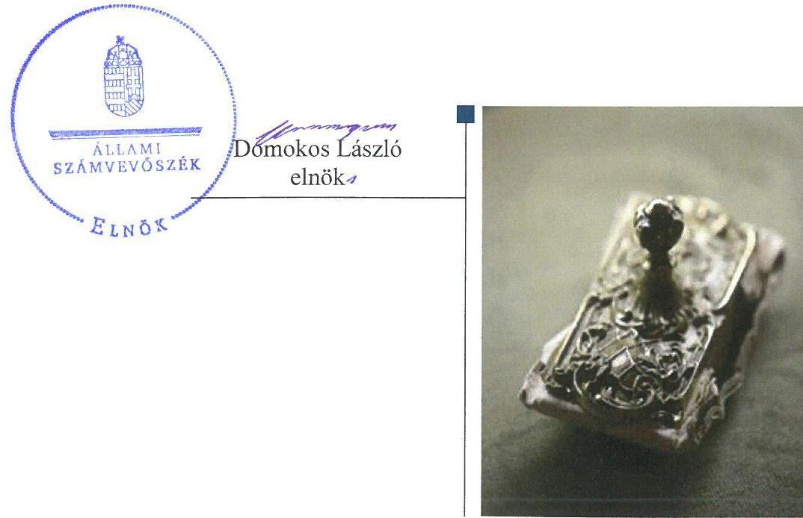
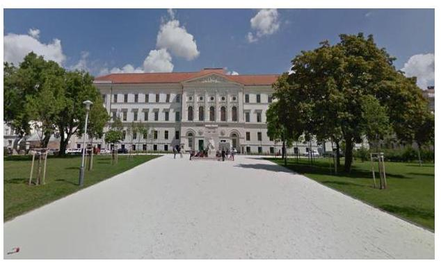
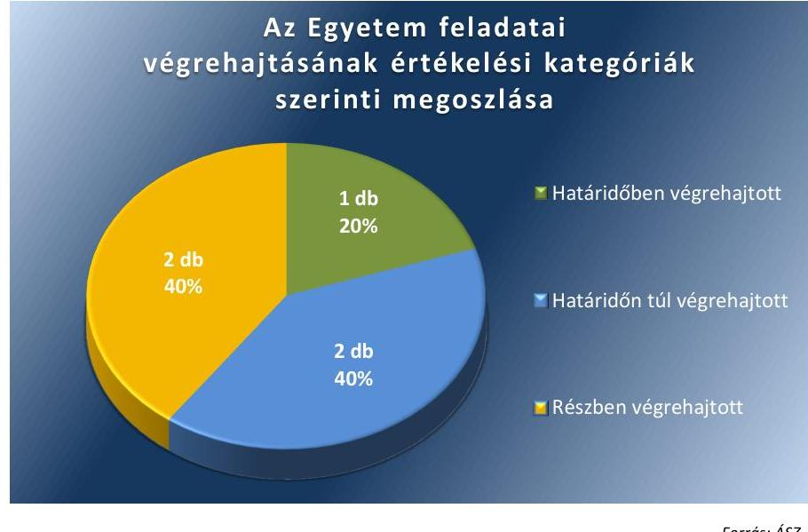
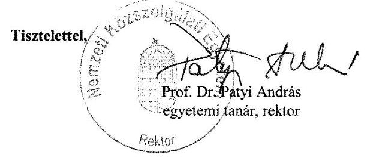
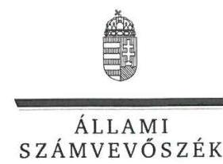
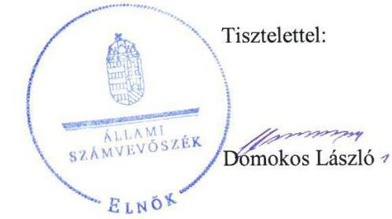
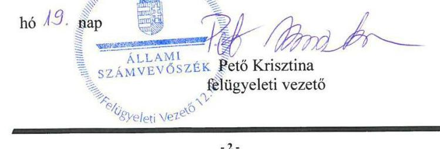

# Jelentés 

## Utóellenőrzések

Az állami felsőoktatási intézmények gazdálkodásának, működésének ellenőrzéséről készült jelentések utóellenőrzése - Nemzeti Közszolgálati Egyetem
2018.

---

# J elentés 

## Utóellenőrzések

Az állami felsőoktatási intézmények gazdálkodásának, múködésének ellenőrzéséről készült jelentések utóellenőrzése - Nemzeti Közszolgálati Egyetem
2018. O1. hó Q9. nap

---

# AZ ELLENŐRZÉST FELÜGYELTE: 

PETŐ KRISZTINA felügyeleti vezető

## AZ ELLENŐRZÉST VEZETTE ÉS A VÉGREHAJTÁSÁÉRT FELELŐS:

CSAPÓ TIBORNÉ ellenőrzésvezető

## A PROGRAM ÖSSZEÁLLÍTÁSÁÉRT FELELŐS:

JANIK JÓZSEF LÁSZLÓ osztályvezető

## A TÉMÁHOZ KAPCSOLÓDÓ KORÁBBI SZÁMVEVŐSZÉKI JELENTÉS:

- címe: Jelentés a Nemzeti Közszolgálati Egyetem ellenőrzéséről - Az állami felsőoktatási intézmények gazdálkodásának, müködésének ellenőrzése
- sorszáma: 15041

IKTATÓSZÁM: V-1351-035/2016.
TÉMASZÁM: 2096
ELLENŐRZÉS-AZONOSÍTÓ SZÁM: V075547

---

# TARTALOMJEGYZÉK 

■ ÖSSZEGZÉS ..... 5
■ AZ ELLENŐRZÉS CÉLJA ..... 6
■ AZ ELLENŐRZÉS TERÜLETE ..... 7
■ AZ ELLENŐRZÉS HÁTTERE, INDOKOLTSÁGA ..... 8
■ A JELENTÉS LÉNYEGES KÉRDÉSKÖRE ..... 9
■ ELLENŐRZÉS HATÓKÖRE ÉS MÓDSZEREI ..... 10
■ MEGÁLLAPÍTÁSOK ..... 12
■ MELLÉKLETEK ..... 15
I. Sz. melléklet: Az ÁSZ 15041. számú jelentéséhez kapcsolódó intézkedési terv végrehajtása a Nemzeti Közszolgálati Egyetemnél ..... 15
■ FÜGGELÉK: ÉSZREVÉTELEK ..... 18
■ RÖVIDÍTÉSEK JEGYZÉKE ..... 23

---

.

---

# ÖSSZEGZÉS 

Az Állami Számvevőszék elvégezte a Nemzeti Közszolgálati Egyetem utóellenőrzését és megállapította, hogy az intézkedési tervben meghatározott feladatok meghatározó részét végrehajtották. Az Egyetem a végrehajtott intézkedésekkel támogatta a közpénzek elszámoltathatóságát.

## Az ellenőrzés társadalmi indokoltsága

Az Állami Számvevőszék stratégiájában célul tűzte ki a számvevőszéki munka hasznosulásának javítását. Ezzel összhangban ellenőrzi, hogy az ellenőrzött szervezetek megvalósították-e a korábbi ellenőrzései által feltárt hibák, hiányosságok és szabálytalanságok megszüntetése céljából kialakított intézkedési terveikben foglaltakat. A rendszeres utóellenőrzések hozzájárulnak a szükséges intézkedések tényleges végrehajtáshoz, ezáltal a közpénzügyek rendezettségének javulásához.

## Főbb megállapítások, következtetések

A Nemzeti Közszolgálati Egyetem az intézkedési tervben vállalt öt feladatból egy feladatot határidőben, két feladatot határidőn túl, két feladatot részben hajtott végre.

A kontrollkörnyezet felülvizsgálata keretében a belső szabályzatokat módosították, elkészítették. A kontrolltevékenység szabályszerű kialakítása érdekében a rektor felülvizsgálta és aktualizálta a gazdálkodási jogkörök gyakorlásának eljárásrendjét tartalmazó szabályzatot. A 2015-2020. évekre vonatkozó vagyongazdálkodási tervet elkészítették, a szenátus és a Fenntartói Testület elé terjesztették. Intézkedtek utasítások kiadásával a bérbeadási és átláthatósági szabályok kialakításáról, és a munkajogi felelősséggel kapcsolatos körülmények kivizsgálásáról.

Elmaradt az Egyetem ellenőrzési nyomvonalának kiegészítése, a hatásköri megbízások nyilvántartásának ellenőrzése, és a nyomtatványok felülvizsgálata.

---

# AZ ELLENŐRZÉS CÉLJA 

Az ellenőrzés célja annak értékelése volt, hogy a számvevőszéki jelentésben ${ }^{1}$ foglalt javaslatot megalapozó megállapításokkal összhangban készített intézkedési tervben meghatározott feladatokat az ellenőrzött szervezet vég-rehajtotta-e.

---

# **A2 ELLENŐRZÉS TERÜLETE**

## **Nemzeti Közszolgálati Egyetem**

Az Egyetemet² a 2011. évi CXXXII. törvény értelmében a Zrínyi Miklós Nemzetvédelmi Egyetem, a Rendőrtiszti Főiskola és a Budapesti Corvinus Egyetem Közigazgatás tudományi Kara integrációjával hozták létre. Működését 2012. január 1-én kezdte meg. Az Egyetem elődei között tartja számon az 1808. évi VII. törvénycikkel megalapított Királyi Honvéd Ludovika Akadémiát. Az Egyetem alapítói és fenntartói jog gyakorlója a Miniszterelnökség, Igazságügyi Minisztérium, Belügyminisztérium, Honvédelmi Minisztérium. Az Egyetem oktató- és kutatótevékenysége az államra, annak alapvető jelenségeire, szolgáltatásaira, funkcióira irányul. Az Egyetem székhelye Budapesten található, emellett további öt városban folytatnak képzést.

Oktatást az Egyetem öt karán, az Államtudományi és Közigazgatási Karon, a Hadtudományi és Honvédtisztképző Karon, a Nemzetközi és Európai Tanulmányok Karon, a Rendészettudományi Karon és a Víztudományi Karon végeznek. Az Egyetem Alapító Okiratában meghatározott maximálisan felvehető hallgatólétszám 10.000 fő.

A rektor³ az Egyetem megalakulása óta, 2012. január 1-től tölti be tisztségét.

Az Egyetem 2016. évi költségvetési beszámolója szerint 15 534,9 millió Ft költségvetési és 18 429,2 millió Ft finanszírozási bevételt ért el, valamint 19 009,2 millió Ft költségvetési kiadást teljesített. A 2016. december 31-i könyvviteli mérleg szerint az Egyetem eszközeinek értéke 48 570,8 millió Ft-ot, a követelések 1306,7 millió Ft-ot, míg a kötelezettségek állománya 1361,4 millió Ft-ot tett ki.

Az ÁSZ⁴ 2012. január 1. –2013. december 31. közötti időszakra vonatkozóan ellenőrizte az Egyetem gazdálkodásának, működésének szabályszerűségét, az erről szóló 15041. számú számvevőszéki jelentést 2015. április 02. napján tette közzé. Az ellenőrzés célja annak megállapítása volt, hogy 2012-2013. években szabályos volt-e az Egyetem pénzügyi és vagyongazdálkodása, biztosított volt-e a vagyonnal való felelős gazdálkodás követelményének érvényesülése, jogszabályi előírásoknak megfelelően működött-e a belső kontrollrendszer, az irányító szerv tevékenysége a jogszabályi előírásoknak megfelelő-e.

Az utóellenőrzés – a 2015. április 02-től 2017. június 16-ig végrehajtott feladatokat figyelembe véve – a számvevőszéki jelentésben a rektor részére megfogalmazott javaslatot megalapozó megállapításokra készített, az ÁSZ részére megküldött intézkedési tervben foglalt feladatok megvalósításának ellenőrzésére, illetve értékelésére fókuszált.

---

# AZ ELLENŐRZÉS HÁTTERE, INDOKOLTSÁGA 

Az ÁSZ tv. ${ }^{5} 33$. § (1) bekezdése értelmében a számvevőszéki jelentések javaslatot megalapozó megállapításaihoz kapcsolódóan az ellenőrzött szervezet vezetője intézkedési tervet köteles összeállítani, és az ÁSZ részére megküldeni. Az intézkedési tervben foglaltak megvalósítását - az ÁSZ tv. 33. § (7) bekezdésében foglaltak alapján - az Állami Számvevőszék utóellenőrzés keretében ellenőrizheti. Az intézkedések megvalósulásának értékelése során az Állami Számvevőszék figyelembe veszi az ellenőrzött szervezetek működési feltételeiben, valamint a jogszabályi előírásokban bekövetkezett változásokat.

Az intézkedési tervekben foglalt feladatok hiányos, illetve késedelmes végrehajtása, valamint megvalósításának elmaradása azt mutatja, hogy az ellenőrzések során feltárt hibák, hiányosságok és szabálytalanságok megszüntetése nem kapott kellő hangsúlyt. Ez a szabályszerű működés és a felelős vezetői magatartás vonatkozásában kockázatot hordoz. E kockázatok feltárásával az Állami Számvevőszék utóellenőrzési rendszere fokozza a fegyelmet, és igazolja, hogy a közpénzzel való szabályos gazdálkodás felelőssége elől nem lehet kitérni.

## AZ UTÓELLENŐRZÉS VÁRHATÓ HASZNOSULÁSA

Az utóellenőrzés négy szinten hasznosulhat:
$\longrightarrow$ A társadalom szintjén az utóellenőrzés jelzi, hogy a számvevőszéki ellenőrzés megállapításainak van következménye: a hiányosságok megszüntetésére az ellenőrzött szervezet által meghatározott intézkedések végrehajtását is számon kéri az ÁSZ.
$\longrightarrow$ Az ellenőrzött terület szintjén az utóellenőrzés tájékoztatást nyújt a terület döntéshozóinak a hiányosságok kiküszöbölésének jó gyakorlatairól, ezzel lehetőséget biztosítva arra, hogy az ÁSZ ellenőrzési megállapításai, javaslatai a terület nem ellenőrzött szervezeteinek a működése során is hasznosuljanak.
$\longrightarrow$ Az ellenőrzött szervezet szintjén az utóellenőrzés feltárja, hogy a szervezet az intézkedések végrehajtásával hasznosította-e a korábbi ellenőrzési jelentésben a hiányosságok megszüntetése, illetve a kockázatok kezelése érdekében megfogalmazott javaslatokat.
$\longrightarrow$ Az ÁSZ szintjén az utóellenőrzés visszacsatolást ad az ellenőrzési jelentések hasznosulásáról, az intézkedések elmaradása vagy részleges megvalósulása a további ellenőrzésekhez kockázati jelzésként szolgál.

---

# A JELENTÉS LÉNYEGES KÉRDÉSKÖRE 

Az ellenőrzött szervezet az intézkedési tervében foglaltakat az előirt határidőben végrehajtotta-e?

---

# ELLENŐRZÉS HATÓKÖRE ÉS MÓDSZEREI 

## Az ellenőrzés típusa

Megfelelőségi ellenőrzés.

## Az ellenőrzött időszak

Az utóellenőrzés alapját képező számvevőszéki jelentés közzétételének napjától (2015. április 02.) az ellenőrzésről szóló kiértesítő levél keltének napjáig (2017. június 16.) tartó időszak.

## Az ellenőrzés tárgya

Az ÁSZ tv. 2011. július 01-jei hatálybalépését követően a számvevőszéki jelentésben foglalt javaslatokat megalapozó megállapításokkal összhangban a Nemzeti Közszolgálati Egyetem által készített intézkedési tervben foglaltak végrehajtásának ellenőrzése.

Az ellenőrzés kiterjedt minden olyan körülményre és adatra, amely az ÁSZ jogszabályban meghatározott feladatainak teljesítéséhez, valamint a program végrehajtása folyamán felmerült újabb összefüggések feltárásához szükséges.

## Az ellenőrzött szervezet

Nemzeti Közszolgálati Egyetem

## Az ellenőrzés jogalapja

Az ÁSZ tv. 33. § (7) bekezdése alapján az intézkedési tervben foglaltak megvalósítását az ÁSZ utóellenőrzés keretében ellenőrizheti.

## Az ellenőrzés módszerei

Az ellenőrzést a nemzetközi standardokat irányadónak tekintve az ellenőrzési program ellenőrzési kérdései, az ellenőrzött időszakban hatályos jogszabályok, az ellenőrzés szakmai szabályok és módszertanok figyelembevételével, az ÁSZ önállóan végezte.

Az ellenőrzés ideje alatt az ellenőrzött szervezettel történő kapcsolattartást az ÁSZ SZMSZ ${ }^{\circledR}$-ének vonatkozó előírásai alapján biztosította.

---

Az utóellenőrzés megállapításait elsősorban az ÁSZ rendelkezésére álló, valamint az ellenőrzött szervezettől elektronikusan bekért dokumentumok alapozták meg.

Az ellenőrzési bizonyítékként felhasználható adatforrások közé tartoznak egyrészt a szakmai programban felsorolt adatforrások, másrészt minden - az ellenőrzés folyamán feltárt, az ellenőrzés szempontjából információt tartalmazó - dokumentum.

Az intézkedési tervben előírt feladatokat, azok végrehajthatósága, illetve végrehajtása szempontjából az alábbiak szerint kell értékelni:
—_ „határidőben végrehajtott" a feladat, ha a teljesítés dokumentáltan, az intézkedési tervben előírt határidőben és tartalommal megtörtént;
—_ „határidőn túl végrehajtott" a feladat, ha annak teljesítése az intézkedési tervben meghatározott módon, de az előírt határidőn túl történt meg;
—_ „részben végrehajtott" a feladat, ha végrehajtása teljes körűen az intézkedési tervben előírt módon nem történt meg;
—_ „nem végrehajtott" a feladat, ha a végrehajtás nem történt meg, vagy amennyiben a teljesítést nem dokumentálták;
—_ „okafogyottá vált" a feladat, ha végrehajtására - meghatározott esemény bekövetkezése, továbbá külső körülmény, a működést érintő feltétel változása miatt - már nincs szükség, illetve lehetőség, és egyértelműen megállapítható, hogy az intézkedést szükségessé tevő körülmény a jövőben nem fordulhat elő;
—_ „nem időszerű" az a feladat, amelynek ellenőrzési időszakon belüli végrehajtására azért nem került (kerülhetett) sor, mert az intézkedés alapjául szolgáló esemény nem következett be, de annak jövőbeni előfordulása lehetséges, a végrehajtása nem volt esedékes, vagy a végrehajtás határideje még nem járt le.
Az ellenőrzés lefolytatásához az ellenőrzött szervezet a tanúsítványok elektronikus kitöltésével, valamint az ÁSZ által kért dokumentumok elektronikus megküldésével szolgáltatott adatokat, amelyek valódiságát és teljes körűségét az ellenőrzött szervezet vezetője által tett teljességi és hitelességi nyilatkozat igazolja. Az így rendelkezésre bocsátott adatok, információk kontrollja az ellenőrzés keretében történt.

---

# MEGÁLLAPÍTÁSOK 

## Az ellenőrzött szervezet az intézkedési tervében foglaltakat az előírt határidőben végrehajtotta-e?

Összegző megállapítás

Az Egyetem intézkedési tervében szereplő feladatok közül határidőben kivizsgálta a munkaügyi felelősséget, határidőn túl hajtotta végre a vagyongazdálkodás, részben hajtotta végre a belső kontrollrendszer és pénzügyi gazdálkodás szabályszerű kialakítására vállalt feladatokat.

Az ÁSZ a számvevőszéki jelentésben a rektor részére öt javaslatot fogalmazott meg.

A rektor a hiányosságok, szabálytalanságok megszüntetésére elkészített és az ÁSZ részére megküldött intézkedési tervben öt feladatot határozott meg.

Az ÁSZ javaslatot megalapozó megállapításai alapján készített intézkedési tervben vállalt feladatok végrehajtásáról az Egyetem a Bkr. ${ }^{7}$-ben előírt nyilvántartást vezette.

Az Egyetem intézkedési tervében vállalt feladatok végrehajtásának értékelési kategóriák szerinti megoszlását az 1. ábra szemlélteti.

1. ábra

Fonás: ÁSZ
Az Egyetem intézkedési tervében meghatározott feladatokat, határidőket, a feladatok végrehajtásáért felelős személyt és a feladatok végrehajtását az I. sz. melléklet mutatja be.

---

1. táblázat

# AZ EGYETEM INTÉZKEDÉSI TERVÉBEN RÖGZÍTETT BELSŐ KONTROLLRENDSZER SZABÁLYSZERŰ KIALAKÍTÁSÁRA, MŰKÖDTETÉSÉRE VONATKOZÓ FELADATOK 

| Intézkedés végrehajtásának értékelése | Intézkedési tervben foglalt intézkedés sorszáma |
| :-- | :-- |
| Részben végrehajtott | 1. |

KONTROLLKÖRNYEZET Bkr.-nek megfelelő kialakítása érdekében a szabályzatok felülvizsgálatáról és aktualizálásáról a rektor gondoskodott, módosította a Számviteli Politikát ${ }^{8}$, az Önköltség-számítási Szabályzatot ${ }^{9}$, a Pénzkezelési Szabályzatot ${ }^{10}$, a Számlarendet ${ }^{11}$, az Eszközök és Források Értékelésének Szabályzatot ${ }^{12}$, és az Egyetem múködésével összefüggő belső szabályzatokat. 2015.szeptember 30-án döntött a szenátus az Egyetem Szervezeti és Múködési Szabályzatának ${ }^{13}$ módosításáról. A gazdálkodási szabályzatok egyszerűsítésére, a gazdasági főigazgató ${ }^{14}$ által 2015. december 28-án kiadott 4/2015. számú, és az 5/2015. számú utasítás kiadásával intézkedtek.

Az Egyetem ellenőrzési nyomvonalát módosították a Gazdasági Hivatal Ellenőrzési Nyomvonalának ${ }^{15}$ kialakításával, ugyanakkor nem egészítették ki valamennyi múködési folyamatra a Bkr. 6. § (3) bekezdés ellenére.

KONTROLLTEVÉKENYSÉGET felülvizsgálták, melynek keretében intézkedtek 2015. szeptember 13-án a 15/2015. számú rektori utasítással ${ }^{16}$ a kötelezettségvállalás, az ellenjegyzés, az utalványozás, az érvényesítés és a teljesítésigazolás rendjéről szóló szabályzat, és 2015. december 28-án a hatáskörök aláírásának gyakorlásáról szóló 5/2015. számú gazdasági főigazgatói utasítás kiadásáról.
2. táblázat

EGYETEM INTÉZKEDÉSI TERVÉBEN RÖGZÍTETT PÉNZÜGYI GAZDÁLKODÁS SZABÁLYSZERŰ KIALAKÍTÁSÁRA, MŰKÖDTETÉSÉRE VONATKOZÓ FELADATOK

| Intézkedés végrehajtásának értékelése | Intézkedési tervben foglalt intézkedés sorszáma |
| :-- | :--: |
| Határidőben végrehajtott | 3. |
| Részben végrehajtott | 2. |

PÉNZÜGYI GAZDÁLKODÁS szabályszerű működése érdekében 2015. szeptember 13-ra gondoskodtak a gazdálkodási jogköröket tartalmazó szabályzat felülvizsgálatáról és módosításáról. A gazdálkodási jogkörök gyakorlásához kapcsolódóan a hatásköri aláírások gyakorlásának rendjét 2015.december 28-ra kialakították. Az intézkedési tervben vállalt hatásköri megbízások nyilvántartásának ellenőrzéséről, és a nyomtatványok felülvizsgálatáról nem gondoskodtak.

Az intézkedési tervben vállalt határidőben, 2015. szeptember 01-jére gondoskodtak a közbeszerzési szabálytalanság kapcsán felmerült munkajogi felelősség kivizsgálása érdekében három főből álló vizsgálóbizottság létrehozására. A bizottság megállapította, hogy további intézkedés megtétele nem szükséges és nem is lehetséges.

---

3. táblázat

# EGYETEM INTÉZKEDÉSI TERVÉBEN RÖGZÍTETT VAGYONGAZDÁLKODÁSRA VONATKOZÓ FELADATOK 

| Intézkedés végrehajtásának érdekelése | Intézkedési tervben foglalt intézkedés sorozáma |
| :-- | :-- |
| Határidőn túl végrehajtott | 4,5 |

Forrás: ÁSZ

VAGYONGAZDÁLKODÁS szabályszerű kialakítása érdekében határidőn túl, 2015. október 14-re gondoskodtak az Nftv. ${ }^{17}$ előírásainak megfelelően a 2015-2020. évekre vonatkozó vagyongazdálkodási terv elkészítéséről, melyet a Fenntartói Testület a 112/2015. (X.15.) számú határozatával ${ }^{18}$ fogadott el.

Határidőn túl, 2015. december 23-ra intézkedtek a Bérbeadási Szabályzat elkészítéséről, és 2015. szeptember 24-re gondoskodtak a kollégium szabad férőhelyek hasznosítása szabályszerű kereteinek kialakításáról. Továbbá az intézkedési tervben vállalt határidőt követően, 2016. február 10től biztosították az Nvtv. ${ }^{19}$-ben előírt átláthatósági követelmény érvényre juttatását a 2/2016. számú rektori utasítás ${ }^{20}$ kiadásával.

---

# MELLÉKLETEK

- I. SZ. MELLÉKLET: AZ ÁSZ 15041. SZÁMÚ JELENTÉSÉHEZ KAPCSOLÓDÓ INTÉZKEDÉSI TERV VÉGREHAJTÁSA A NEMZETI KÖZSZOLGÁLATI EGYETEMNÉL

|  5. | Az intézkedési tervben rögzített feladat
1. | Az intézkedés tervben meghatározott határidő
2. | Az intézkedés tervben meghatározott felelős
3. | A feladat végrehajtása
4.  |
| --- | --- | --- | --- | --- |
|  1. |  | Határidőben végrehajtott feladatok |  |   |
|  1. | (3) A munkajogi felelősség fennállásának vizsgálatára bizottság létrehozása, szükség esetén a vizsgálat eredményének ismeretében intézkedések megtétele. | 2015.09.15. | fơtítkár ${ }^{11}$ | Határidőben, 2015. szeptember 01-jére gondoskodtak a közbeszerzési szabálytalanság kapcsán felmerült munkajogi felelősség kivizsgálása érdekében három főből álló vizsgálóbizottság létrehozására. A bizottság 2015. szeptember 10-én kelt, NKE/3960-3/2015. iktatószámú jegyzőkönyvben ${ }^{22}$ rögzítette a vizsgálat eredményeit. A bizottság megállapította, hogy a 2012. évi beszerzés óta eltelt hosszú idő, a szervezeti átalakítások, a jogszabályi lehetőségek miatt további intézkedés megtétele nem szükséges és nem is lehetséges.  |
|  2. |  | Határidőn túl végrehajtott feladatok |  |   |
|  2. | (4) Vagyongazdálkodási terv összeállítása és jóváhagyása. | 2015.06.30. | gazdasági főigazgató | Az Egyetem Vagyongazdálkodási tervének elkészítésére határidőn túl, 2015. október 14re intézkedett. A 2015-2020. évekre vonatkozó vagyongazdálkodási tervet a szenátus az 59/2015. (X.14.) számú határozatával a Fenntartói Testület számára elfogadásra javasolta, a Fenntartói Testület 112/2015. (X.15.) számú jóváhagyó határozatával 2015. október 15-én fogadta el.  |
|  3. | (5) Bérbeadási szabályzat és az átláthatósági szabályok alkalmazásáról rektori utasítások elkészítése és megjelentetése. | 2015.06.30. | fơtítkár és gazdasági főigazgató | Az intézkedési tervben vállalt határidőt követően, 2015. december 23-ra gondoskodtak a Bérbeadási Szabályzat elkészítéséről és 2016. február 10-re intézkedtek az átláthatóság szabályok alkalmazásának meghatározásáról. Az Egyetem bérbeadási tevékenységének eljárási szabályait a 23/2015. számú rektori utasításban ${ }^{23}$ rögzítették, amely tartalmazza az Nvtv.-ben előírt versenyeztetési kötelezettséget, a tételes bérleti díjakat. A kollégium szabad férőhelyeinek hasznosításának eljárásrendjét, szabályait 2015. június 30át követően, 2015. szeptember 24-én kiadott 16/2015. számú rektori utasítással határozták meg. Az átláthatósági követelményeket a 2/2016. számú rektori utasításban rögzítették.  |

---

|  4. | (1) A kontrollkörnyezet és a kontrolltevékenység felülvizsgálata, szabályzatok aktualizálása, egységesítése, harmonizáció megteremtése, egyszerűsítése, az ellenőrzési nyomvonal módosítása, kiegészítése. | 2015.07.31 | főtitkár, gazdasági főigazgató és a belső ellenőrzési vezető | Végrehajtott feladatrész:  |
| --- | --- | --- | --- | --- |
|   |  |  |  | A kontrollkörnyezet felülvizsgálata, egységesítése, harmonizáció megteremtése érdekében a gazdálkodást érintő szabályzatok felülvizsgálatára, módosítására határidőn túl, 2015. december 23-ra került sor, a Számviteli Politikát a 20/2015. számú utasítással ${ }^{14}$,az Önköltség-számítási szabályzatot a 24/2015. számú utasítással ${ }^{15}$, a Pénzkezelési Szabályzatot a 25/2015. számú utasítással ${ }^{16}$, a Számlarendet a 21/2015. számú utasítással ${ }^{17}$, az Eszközök és Források Értékelésének Szabályzatot a 22/2015. számú utasítással ${ }^{18}$ aktualizálták. Az Egyetem működésével összefüggő belső szabályzatainak módosítására határidőn túl, 2015. szeptember 14-re a 16/2015. számú rektori utasítással és 2015. november 19-re 19/2015. számú rektori utasítással gondoskodtak. A 49/2015. (IX.30.) számú szenátusi határozatban döntöttek az Egyetem Szervezeti és Működési Szabályzatának módosításáról. A gazdálkodási szabályzatok harmonizációja érdekében a gazdasági főigazgató határidőn túl kiadta a kötelezettségvállalás, az ellenjegyzés, az utalványozás, az érvényesítés és a teljesítésigazolás rendjéről szóló rektori utasítás alapján kapott hatáskörök aláírásának gyakorlásának módjáról szóló 5/2015. számú gazdasági főigazgatói utasítást ${ }^{29}$, és az Egyetem bérbeadási tevékenységéről szóló 23/2015. számú utasítást. A gazdálkodási szabályzatok egyszerűsítését megvalósították a gazdasági főigazgató hatáskörök aláírásának gyakorlásának módjáról szóló 5/2015. számú utasítás 1. §-ban és a Neptun rendszerben kezelt követelések eljárási rendjéről szóló 4/2015. számú utasítás ${ }^{30}$ 8. §-ban foglaltakkal.  |
|   |  |  |  | A kontrolltevékenység felülvizsgálata keretében határidőn túl, 2015. szeptember 13-án intézkedtek a kötelezettségvállalás, az ellenjegyzés, az utalványozás, az érvényesítés és a teljesítésigazolás rendjéről szóló szabályzat módosítására a 15/2015. számú rektori utasítással ${ }^{31}$. A szabályzat 2015. november 19-én ismételten módosításra került a 19/2015. számú rektori utasítással ${ }^{32}$. A kötelezettségvállalás, az ellenjegyzés, az utalványozás, az érvényesítés és a teljesítésigazolás rendjéről szóló rektori utasítás alapján kapott hatáskörök aláírásának gyakorlásáról szóló 5/2015. számú gazdasági főigazgatói utasítás 2015. december 28-án került kiadásra.  |

---

|  Sorszám | Az intézkedési tervben rögzített feladat | Az intézkedési tervben meghatározott határidő | Az intézkedési tervben meghatározott felelős  |
| --- | --- | --- | --- |
|   | 1. | 2. | 3.  |
|   |  |  | Az Egyetem ellenőrzési nyomvonalának módosításáról a Gazdasági Hivatal Ellenőrzési Nyomvonalának kiadásával a 6/2015. számú gazdasági főigazgatói utasítással33 gondoskodtak. A Gazdasági Hivatal vonatkozásában a szabályzat tartalmazta a Bkr.-rel összhangban az ellenőrzési nyomvonal kialakításának, működtetésének szabályait, valamint a működési folyamatainak szöveges, táblázatokkal szemléltetett leírását, a felelősségi és információs szinteket és kapcsolatokat, irányítási és ellenőrzési folyamatokat.  |
|   |  |  | Nem végrehajtott feladatrész:  |
|   |  |  | Az Egyetem ellenőrzési nyomvonalát nem egészítették ki valamennyi működési folyamatra a Bkr. 6. § (3) bekezdés előírásai ellenére.  |
|  5. | (2) A kapcsolódó szabályzat felülvizsgálata, esetleges módosítása; hatásköri megbízások nyilvántartásának ellenőrzése; gazdasági főigazgatói utasítás kiadása a jogkörök szabályszerű gyakorlásáról; nyomtatványok felülvizsgálata. | 2015.06.30 | gazdasági főigazgató  |
|   |  |  | A kötelezettségvállalás, az ellenjegyzés, az utalványozás, az érvényesítés és a teljesítésigazolás rendjéről szóló 3/2015. számú rektori utasítás felülvizsgálatáról és aktualizálásáról, az Államreform Operatív Programokhoz kapcsolódó feladatköri változások miatt 2015. szeptember 13-án a 15/2015. számú rektori utasítással, és a közbeszerzésekre vonatkozó jogszabály változásához kapcsolódóan 2015. november 19-én az 19/2015. számú rektori utasítással gondoskodtak. A 3/2015. számú rektori utasítás alapján kapott hatáskörök aláírásának gyakorlására 2015. december 28-án kiadott 5/2015. számú gazdasági főigazgatói utasításban rendelkeztek.  |
|   |  |  | Nem végrehajtott feladatrész:  |
|   |  |  | Az intézkedési tervben vállalt hatásköri megbízások nyilvántartásának ellenőrzéséről, és a nyomtatványok felülvizsgálatáról nem gondoskodtak.  |

*Forrás: ÁSZ által készített táblázat*

---

# FÜGGELÉK: ÉSZREVÉTELEK 

A jelentéstervezetet a Számvevőszék 15 napos észrevételezésre megküldte az ellenőrzött szervezet vezetőjének az ÁSZ tv. 29. §* (1) bekezdése előírásának megfelelően.
A Nemzeti Közszolgálati Egyetem rektora a jelentéstervezet megállapításaira írásban észrevételt tett.
A függelék tartalmazza a Nemzeti Közszolgálati Egyetem rektora észrevételeit, illetve az el nem fogadott észrevételek elutasításának indoklását.

A függelék tartalmazza a Nemzeti Közszolgálati Egyetem rektora észrevételeit, illetve az el nem fogadott észrevételek elutasításának indoklását.

[^0]
[^0]:    * 29. § (1) Az Állami Számvevőszék az ellenőrzési megállapításait megküldi az ellenőrzött szervezet vezetőjének vagy az általa megbízott személynek, és annak, akinek személyes felelősségét állapította meg.
    (2) Az ellenőrzött szervezet vezetője és a felelősként megjelölt személy az ellenőrzés megállapításaira tizenöt napon belül írásban észrevételt tehet.
    (3) Az Állami Számvevőszék az észrevételre a beérkezésétől számított harminc napon belül írásban válaszol. A figyelembe nem vett észrevételeket köteles a jelentésben feltüntetni, és megindokolni, hogy azokat miért nem fogadta el.

---

# 2144 

## NEMZETI   KOZSZOLGÁLATI EGYETEM

A HAZA SZOLGÁLATÁBAN

## 2144

## 4... számú példáiny

Ügyintéző: dr. Szendrei Mária
E-mail: szendrei.maria@uni-nke.hu
Telefon: 432-9080
Iktatási szám: NKE/909/4/2017
Hivatkozási szám: V-1351-028/2016
Tárgy: ellenőrzési jelentés tervezethez észrevétel

## Domokos László úrnak, elnök

## Állami Számvevőszék

1052 Budapest, Apáczai Csere János u. 10.

## Tisztelt Elnök Úr!

## ÁLLAMISZÁMVEVŐSZÉK   26- 244241201711

Ektezen: 2017 DEC 07.
Iktatószáma: 4 - KSA - 032/2016
Melléklet: $\qquad$
Ezúton tisztelettel tájékoztatom arról, hogy a V-1351-028/2016 iktatási számon megküldött „Az állami felsőoktatási intézmények gazdálkodásának, müködésének ellenőrzéséről készült jelentések utóellenőrzése" című ellenőrzési jelentés tervezetet megismertem, az abban foglaltakkal - az alábbi kivétellel - egyetértek.

A jelentés tervezet (17. oldal) 5. sorszám mellett nem végrehajtott feladatrészként az alábbi mondat szerepel: "Az intézkedési tervben vállalt hatásköri megbizások nyilvántartásának ellenőrzéséről és a nyomtatványok felülvizsgálatáról nem gondoskodtak."

1. A jelentés tervezet (17. oldal) 5. sorszám mellett a "nem végrehajtott feladatrész" alatt álló mondatot kérem a jelentéstervezetből kivenni és a Főbb megállapításokat (5. oldal) a változáshoz igazítani.

## Indokolás:

Az Egyetem munkatársai a hatásköri megbízásokat, azok nyilvántartását ellenőrizték. Az ellenőrzés eredményeként az Egyetem a területet újraszabályozta, a hatásköri megbízásokat kiadta. Az újbóli kiadással a nyomtatványok és a nyilvántartás felülvizsgálata is megtörtént.

A leírtakon túl az Egyetem Belső Ellenőrzése belső ellenőrzést folytatott le (NKE/464/6/2016 számon, 2016. február 10-n jóváhagyott ellenőrzési jelentés) amely során ugyanezen intézkedési tervben foglaltak végrehajtását tételesen vizsgálta, a kapcsolódó iratok a V-1062-001/2016 II. melléklet, 1. számú tanúsítvány 4. oldal 6. pont, 1-4. soraiban kerültek felsorolásra és elektronikusan feltöltésre a fenti vizsgálathoz.

Együttműködésüket köszönöm, munkájához jó egészséget kívánok!
Budapest, 2017. december „ 1 ".

Készült: 2 példányban, egy példány 2 oldal terjedelmű
Kappa:

1. példány: Állami Számvevőszék, címzett
2. példány: NKE/909/2017 számú intranyag

1083 Budapest, VIII. Ludovika tér 2. | Tel: (1) 432-9150
Postai cím: 1441 Budapest, Pf.: 60. | Email: rektor@uni-nke.hu

---

ELNÖK

Ikt.szám: V-1351-033/2016.

# Prof. Dr. Patyi András úr 

rektor
Nemzeti Közszolgálati Egyetem

## Budapest

## Tisztelt Rektor Úr!

Az „Utóellenörzések - az állami felsőoktatási intézmények gazdálkodásának, müködésének ellenörzéséről készült jelentések utóellenörzése - Nemzeti Közszolgálati Egyetem" címmel készített számvevőszéki jelentéstervezetre tett észrevételét köszönettel megkaptam.
Az Állami Számvevőszék észrevételre vonatkozó álláspontjáról a felügyeleti vezető által készített részletes tájékoztatást csatoltan megküldöm.
Tájékoztatom Rektor urat, hogy a számvevőszéki jelentésben - az Állami Számvevőszékről szóló 2011. évi LXVI. törvény 29. § (3) bekezdése alapján - a figyelembe nem vett észrevételeket szerepeltetjük az elutasítás indokának feltüntetésével.

Budapest, 2017. 12 hó 19 nap

Melléklet: Tájékoztatás az el nem fogadott észrevételről

---

# Tájékoztatás az el nem fogadott észrevételről 

Az „Utóellenörzések - az állami felsőoktatási intézmények gazdálkodásának, müködésének ellenörzéséről készült jelentések utóellenörzése - Nemzeti Közszolgálati Egyetem" című jelentéstervezetre az NKE/909/4/2017. iktatószámú levélben tett észrevételét áttekintettem. Észrevételének kezeléséről az alábbi tájékoztatást adom.
Rektor úr a jelentéstervezet 17. oldal 5. sorában szereplő, ,,Az intézkedési tervben vállalt hatásköri megbizások nyilvántartásának ellenörzéséről, és a nyomtatványok felülvizsgálatáról nem gondoskodtak" szövegrész tekintetében kérte törölni a szövegrész fölötti szöveget (,,Nem végrehajtott feladatrész: "). Ezzel összefüggésben kérte módosítani a Föbb megállapitások, következtetések címü rész (5. oldal) vonatkozó megállapítását is. Az észrevételben foglaltak szerint az Egyetem munkatársai a hatásköri megbízásokat, azok nyilvántartását ellenőrizték. Az ellenőrzés eredményeként az Egyetem a területet újraszabályozta, a hatásköri megbízásokat kiadta. Az újbóli kiadással a nyomtatványok és a nyilvántartás felülvizsgálata is megtörtént. Ezen túlmenően az Egyetem belső ellenőrzést folytatott le (NKE/464/6/2016 számon, 2016. február 10-én jóváhagyott ellenőrzési jelentés), amely során ugyanezen intézkedés tervben foglaltak végrehajtását tételesen vizsgálta. A kapcsolódó iratokat az Egyetem az adatszolgáltatás során az Állami Számvevőszék rendelkezésére bocsátotta.
Tájékoztatom Rektor urat, hogy a fent hivatkozott belső ellenőrzési jelentés az intézkedési tervükben vállalt 2. számú feladat végrehajtására vonatkozóan - 2016. február 10-ei keltezéssel azt az információt tartalmazta, hogy a kötelezettségvállalás, az ellenjegyzés, az utalványozás, az érvényesítés és a teljesítésigazolás rendjét az Egyetem 2015. január 13-án, illetve a módosításokat is tartalmazó, 2015. november 20-tól hatályos 3/2015. számú rektori utasítással szabályozta; továbbá az érintett személyek a rektori utasítás alapján új hatásköri megbízást kaptak. A hatásköri megbízások rendelkezésünkre bocsátott nyilvántartása (fájlnév: 2_2_2_hatásköri nyilvántartások.pdf) azonban a rektori utasítás kiadásától (2015. január 13.) az ellenőrzési jelentés keltének napjáig (2016. február 10.) tartó időszak tekintetében egyetlen újabb hatásköri megbízás nyilvántartásba vételére utaló információt sem tartalmaz, a legkésőbbi adatok 2014. éviek. Az ezen túlmenően rendelkezésre bocsátott egyéb intézkedési tervek csak a feladatok tervezését bizonyítják, de azok tényleges végrehajtását nem támasztják alá. A rendelkezésre bocsátott dokumentumok alapján, megfelelő bizonyíték hiányában a nyilvántartás felülvizsgálatáról való gondoskodás elmulasztására fogalmaztunk meg megállapítást. A fentiekre tekintettel az észrevételt nem fogadjuk el, a jelentéstervezet módosítása nem indokolt.

Budapest, 2017.

---

.

---

# RÖVIDÍTÉSEK JEGYZÉKE 

${ }^{1}$ számvevőszéki jelentés
${ }^{2}$ Egyetem
${ }^{3}$ rektor
${ }^{4}$ ÁSZ
${ }^{5}$ ÁSZ tv.
${ }^{6}$ ÁSZ SZMSZ
${ }^{7}$ Bkr.
${ }^{8}$ Számviteli Politika
${ }^{9}$ Önköltség-számítási Szabályzat
${ }^{10}$ Pénzkezelési Szabályzat
${ }^{11}$ Számlarend
${ }^{12}$ Eszközök és Források Értékelési Szabályzat
${ }^{13}$ Szervezeti és Müködési Szabályzat
${ }^{14}$ gazdasági főigazgató
${ }^{15}$ Ellenőrzési Nyomvonal
${ }^{16} 15 / 2015$. számú rektori utasítás
${ }^{17}$ Nftv.
${ }^{18} 112 / 2015$. (X.15.) számú határozat
${ }^{19}$ Nvtv.
${ }^{20} 2 / 2016$. számú rektori utasítás
${ }^{21}$ főtitkár
${ }^{22}$ NKE/3960-3/2015. iktatószámú jegyzőkönyv
${ }^{23} 23 / 2015$. számú rektori utasítás
a 15041. számú jelentés a Nemzeti Közszolgálati Egyetem ellenőrzéséről
Nemzeti Közszolgálati Egyetem
A Nemzeti Közszolgálati Egyetem rektora
Állami Számvevőszék
2011. évi LXVI. törvény az Állami Számvevőszékről (hatályos: 2011. július 1-jétől)
az Állami Számvevőszék Szervezeti és Működési Szabályzata
370/2011(XII.31.) Korm. rendelet a költségvetési szervek belső
kontrollrendszeréről és belső ellenőrzéséről
Nemzeti Közszolgálati Egyetem Számviteli Politikája (hatályos: 2015. december 24-től)
Nemzeti Közszolgálati Egyetem Önköltség-számítási Szabályzata (hatályos: 2015. december 24-től)

Nemzeti Közszolgálati Egyetem Pénzkezelési Szabályzata (hatályos: 2015. december 24-től)
Nemzeti Közszolgálati Egyetem Számlarendje (hatályos: 2015. december 24-től)
Nemzeti Közszolgálati Egyetem Eszközök és Források Értékelési Szabályzata (hatályos: 2015. december 24-től)
Nemzeti Közszolgálati Egyetem Szervezeti és Müködési Szabályzat (hatályos: 2015. szeptember 30.)
Nemzeti Közszolgálati Egyetem gazdasági főigazgatója
Nemzeti Közszolgálati Egyetem Ellenőrzési Nyomvonala (hatályos: 2015. december 29-től)
Nemzeti Közszolgálati Egyetem 15/2015. számú rektori utasítás az Államreform Operatív Programokkal (ÁROP) kapcsolatos feladatkörökről szóló 37/2012. számú rektori utasítás, valamint a kötelezettségvállalás, az ellenjegyzés, az utalványozás, az érvényesítés és a teljesítés igazolás rendjéről szóló 3/2015. számú rektori utasítás módosításáról (hatályos: 2015. szeptember 14-től)
2011. évi CCIV. törvény a nemzeti felsőoktatásról

A Fenntartói Testület 2015. október 15-én kelt 112/2015. (X. 15.) számú határozata
2011. évi CXCVI. törvény a nemzeti vagyonról

Nemzeti Közszolgálati Egyetem 2/2016. számú rektori utasítás a kötelezettségvállalás, az ellenjegyzés, az utalványozás, az érvényesítés és a teljesítés igazolás rendjéről szóló 3/2015. számú rektori utasítás módosításáról (hatályos: 2016. február 11-től)
A Nemzeti Közszolgálati Egyetem főtitkára
2015. szeptember 10-én kelt, NKE/3960-3/2015. iktatószámú jegyzőkönyv az Állami Számvevőszék által, a Nemzeti Közszolgálati Egyetem ellenőrzése során megállapított közbeszerzési szabálytalanság kivizsgálásáról
Nemzeti Közszolgálati Egyetem 23/2015. számú rektori utasítás a bérbeadási tevékenységének szabályozásáról (hatályos: 2015. december 24-től)

---

${ }^{24} 20 / 2015$. számú rektori utasítás
${ }^{25} 24 / 2015$. számú rektori utasítás
${ }^{26} 25 / 2015$. számú rektori utasítás
${ }^{27} 21 / 2015$. számú rektori utasítás
${ }^{28} 22 / 2015$. számú rektori utasítás
${ }^{29} 5 / 2015$. számú gazdasági főigazgatói utasítás
${ }^{30} 4 / 2015$. számú utasítás
${ }^{31} 15 / 2015$. számú rektori utasítás
${ }^{32} 19 / 2015$. számú rektori utasítás
${ }^{33} 6 / 2015$. számú gazdasági főigazgatói utasítás

Nemzeti Közszolgálati Egyetem 20/2015. számú rektori utasítás a számviteli politikáról (hatályos: 2015. december 24-től)
Nemzeti Közszolgálati Egyetem 24/2015. számú rektori utasítás az önköltségszámítás rendjéről (hatályos: 2015. december 24-től)
Nemzeti Közszolgálati Egyetem 25/2015. számú rektori utasítás a pénzkezelési szabályzatáról (hatályos: 2015. december 24-től)
Nemzeti Közszolgálati Egyetem 21/2015. számú rektori utasítás a számlarendről (hatályos: 2015. december 24-től)
Nemzeti Közszolgálati Egyetem 22/2015. számú rektori utasítás az eszközök és források értékelési szabályzatáról (hatályos: 2015. december 24-től)
Nemzeti Közszolgálati Egyetem 5/2015. számú gazdasági főigazgatójának utasítása a kötelezettségvállalás, az ellenjegyzés, az utalványozás, az érvényesítés és a teljesítés igazolás rendjéről szóló rektori utasítás alapján kapott hatáskörök aláírásának gyakorlásáról (hatályos: 2015. december 29-től)
Nemzeti Közszolgálati Egyetem 4/2015. számú gazdasági főigazgatói utasítás a Neptun rendszerben kezelt követelések eljárási rendjéről szóló (hatályos: 2016. január 1-jétől)
Nemzeti Közszolgálati Egyetem 15/2015. számú rektori utasítása Nemzeti Közszolgálati Egyetem az Államreform Operatív Programokkal (ÁROP) kapcsolatos feladatkörökről szóló 37/2012. számú rektori utasítás, valamint a kötelezettségvállalás, az ellenjegyzés, az utalványozás, az érvényesítés és a teljesítés igazolás rendjéről szóló 3/2015. számú rektori utasítás módosításáról (hatályos: 2015. szeptember 14-től)
19/2015. számú rektori utasítás egyes rektori utasítások módosításáról (hatályos: 2015. november 20-tól)
Nemzeti Közszolgálati Egyetem 6/2015. számú gazdasági főigazgatói utasítás a Gazdasági Hivatal ellenőrzési nyomvonaláról (hatályos: 2015. december 29-től)

---

ÁLLAMI SZÁMVEVŐSZÉK
1052 Budapest, Apáczai Csere János utca 10.
Levélcím: 1364 Budapest 4. Pf. 54
Telefon: +36 14849100 Telefax: +36 14849200
www.asz.hu