# Jelentés 

## Az önkormányzatok gazdasági társaságai

Az önkormányzatok többségi tulajdonában lévő gazdasági társaságok gazdálkodásának ellenőrzése - ERöMÚVHÁZ Erzsébetvárosi Összevont Művelődési Központ Nonprofit Kft. 2018.

18003
www.asz.hu

---

# Jelentés 

## Az önkormányzatok gazdasági társaságai

Az önkormányzatok többségi tulajdonában lévő gazdasági társaságok gazdálkodásának ellenőrzése - ERöMÚVHÁZ Erzsébetvárosi Összevont Múvelődési Központ Nonprofit Kft.
2018. O. hó 05. nap
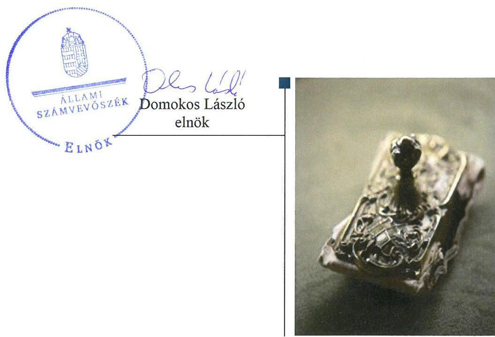

---

# AZ ELLENŐRZÉST FELÜGYELTE:

DR. NAGY IMRE felügyeleti vezető

# AZ ELLENŐRZÉST VEZETTE ÉS A VÉGREHAJTÁSÁÉRT FELELŐS:

DR. NAGY JUDIT ellenőrzésvezető

# A PROGRAM ÖSSZEÁLLÍTÁSÁÉRT FELELŐS:

JANIK JÓZSEF LÁSZLÓ osztályvezető

---

IKTATÓSZÁM: V-1399-177/2016

TÉMASZÁM: 2167

ELLENŐRZÉS-AZONOSÍTÓ SZÁM: V-075834

---

Jelentéseink az Országgyűlés számítógépes hálózatán és az Interneta a www.asz.hu címen is olvashatóak.

---

# TARTALOMJEGYZÉK 

■ ÖSSZEGZÉS ..... 5
■ AZ ELLENŐRZÉS CÉLJA ..... 6
■ AZ ELLENŐRZÉS TERÜLETE ..... 7
■ AZ ELLENŐRZÉS HÁTTERE, INDOKOLTSÁGA ..... 9
■ A JELENTÉS LÉNYEGES KÉRDÉSKÖREI ..... 10
■ ELLENŐRZÉS HATÓKÖRE ÉS MÓDSZEREI ..... 11
■ MEGÁLLAPÍTÁSOK ..... 13
■ JAVASLATOK ..... 16
■ MELLÉKLETEK ..... 19
I. Sz. melléklet: Értelmező szótár ..... 19
■ FÜGGELÉK: ÉSZREVÉTELEK ..... 21
■ RÖVIDÍTÉSEK JEGYZÉKE ..... 35

---

.

---

# ÖSSZEGZÉS 

Budapest Főváros VII. kerület Erzsébetváros Önkormányzata a tulajdonosi joggyakorlásának kereteit megfelelően alakította ki, tulajdonosi joggyakorlása megfelelt a belső előírásoknak. Az ERöMÜVHÁZ Erzsébetvárosi Összevont Múvelődési Központ Nonprofit Kft. vagyongazdálkodása és vagyonnyilvántartása nem volt szabályszerű. Számviteli beszámolói nem nyújtottak megbízható és valós képet a gazdálkodásról. Közzétételi kötelezettségének nem tett eleget a jogszabályi előírások szerint. Ezzel nem volt biztositott a müködés és a gazdálkodás átláthatósága.

## Az ellenőrzés társadalmi indokoltsága

Magyarországon az intézmény-centrikus közfeladat-ellátás jellemző, de egyre jelentősebb a költségvetésen kívüli feladatellátás térnyerése. Helyi szinten ennek legfontosabb szereplői az önkormányzati tulajdonban lévő gazdasági társaságok, amelyeknek ellenőrzése kiemelten fontos a közfeladat ellátása, és a közvagyon megőrzése, megóvása érdekében. Ezért alapvető követelmény, hogy gazdálkodásuk, müködésük szabályszerű és átlátható legyen.

Budapest Főváros VII. kerületében 2012-2015 között az ERöMÜVHÁZ Erzsébetvárosi Összevont Művelődési Központ Nonprofit Kft. közművelődési feladatokat látott el, Budapest Főváros VII. kerület Erzsébetváros Önkormányzatával kötött megállapodások alapján. Az Állami Számvevőszék az ellenőrzése során arra kereste a választ, hogy szabályszerű volt-e a közművelődéssel összefüggő közfeladatokat is ellátó társaság gazdálkodása és az ehhez kapcsolódó tulajdonosi joggyakorlás.

## Főbb megállapítások, következtetések

Budapest Főváros VII. kerület Erzsébetváros Önkormányzata a tulajdonosi joggyakorlás kereteit a felügyelő-bizottsági ügyrenddel és a javadalmazási szabályzattal kapcsolatos hiányosságok kivételével szabályszerűen alakította ki.

Az önkormányzati tulajdonosi joggyakorlás megfelelt a vagyongazdálkodási rendeletnek és az önkormányzati Szervezeti és Müködési Szabályzat előírásainak.

Az ERöMÜVHÁZ Erzsébetvárosi Összevont Művelődési Központ Nonprofit Kft. a használatba vett önkormányzati vagyont nem tartotta nyilván és nem mutatta ki számviteli elszámolásaiban részletesen és ellenőrizhető módon. A vagyongazdálkodás keretében nem készültek szabályszerű éves leltárak, ezért a gazdálkodás átláthatósága nem volt biztosított.

Az egyszerűsített éves beszámolók nem tükröztek a gazdálkodásról megbízható és valós képet.
Az ERöMÜVHÁZ Erzsébetvárosi Összevont Művelődési Központ Nonprofit Kft. nem teljesítette az előírt közzétételi kötelezettségét és nem készítette el az adatvédelmi és adatbiztonsági szabályzatát, így a müködés átláthatósága nem volt biztosított.

---

# AZ ELLENŐRZÉS CÉLJA 

Az ellenőrzés célja annak értékelése, hogy az önkormányzat vagyongazdálkodási tevékenysége során szabályszerűen gyakorolta-e tulajdonosi jogait. A gazdasági társaság szabályozottsága, gazdálkodása és vagyongazdálkodási tevékenysége, bevételeinek és ráfordításainak elszámolása megfelelt-e a jogszabályi és tulajdonosi előírásoknak. A gazdasági társaság kötelezettségállománya jelent-e kockázatot a múködésre.

---

# **A2 ELLENŐRZÉS TERÜLETE**

## **Budapest Főváros VII. kerület Erzsébetváros Önkormányzata és az ERöMŰVHÁZ Erzsébetvárosi Összevont Művelődési Központ Nonprofit Kft.**

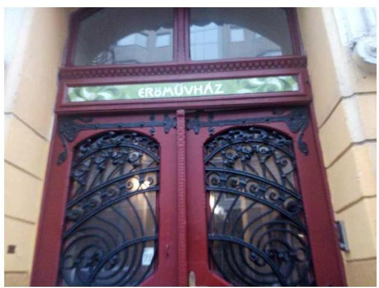

Erzsébetváros Budapest legkisebb (2,09 km²) területű, egyúttal legnagyobb (25 541 fő/km²) népsűrűségű kerülete. Budapest Főváros VII. kerület Erzsébetváros Önkormányzata az ERöMŰVHÁZ Erzsébetvárosi Összevont Művelődési Központ Nonprofit Kft.-t 2012. július 1-jén alapította¹. A Társaság² az erzsébetvárosi lakosság részére közösségi szintér fenntartásával biztosította a közművelődés lehetőségét. Feladata volt a közművelődési, kulturális, oktatási, szervezési, szórakoztató és információs tevékenység, valamint a Róth Miksa Emlékház és Gyűjtemény kiállítóhely működtetése. Kizárólagos tulajdonosa az Önkormányzat³ volt. A Képviselő-testület határozata⁴ alapján az Önkormányzat a Társasággal közművelődési feladatainak ellátására Közszolgáltatási szerződés₁.₇⁵-t kötött, ennek keretében a feladatellátáshoz szükséges önkormányzati vagyont a Társaságnak használatba adta.

A Társaság alaptevékenysége a művészeti létesítmények (a Róth Miksa Emlékház és Gyűjtemény, a K11 Művészeti és Kulturális Központ, valamint az Erzsébetvárosi Közösségi Ház) működtetése volt. Tevékenységét a Wesselényi utca 17. szám alatt lévő székhelyén és a Nefelejcs utca 26. és a Király utca 11. telephelyeken folytatta. A Társaság más gazdasági társaságban nem rendelkezett részesedéssel, egyéb befektetett pénzügyi eszközzel.

A Társaság jegyzett tőkéje alapításkor 1,5 M Ft volt, 2014. szeptember 4-én 3,0 M Ft-ra emelték fel, így tett eleget a Társaság a Ptk₃⁶ 3:161. § (4) bekezdése előírásának. A Társaságnál a saját tőke/jegyzett tőke mutató jogszabályban előírt szintje biztosított volt, és nem csökkent a jegyzett tőke a társasági formára kötelezően előírt szint alá.

A Társaság tevékenységét a Közszolgáltatási szerződések₁,₂,₃,₇-ben előírt üzleti tervek alapján az Önkormányzat vissza nem térítendő támogatással finanszírozta, amelynek felhasználásával a Társaság havonta elszámolt, a Közszolgáltatási Szerződés₁,₂,₃,₇-ben meghatározottak szerint éves összesítő beszámolót készített. Az értékesítés nettó árbevételének legfontosabb forrása a Közszolgáltatási Szerződés III./8. pontjában megfogalmazott terem-bérbeadási tevékenység volt.

A Társaság a Ctv.⁷ 9/F. § értelmében nonprofit működést folytatott, osztalékot nem fizetett, nyereségét eredménytartalékba helyezte, feladataira fordította. A Társaság vagyonkezelésbe vett eszközökkel nem rendelkezett.

---

A Társaság gazdálkodásával kapcsolatos főbb mutatók alakulását az 1. táblázat mutatja be:

1. táblázat

A TÁRSASÁG FŐBB GAZDÁLODÁSI MUTATÓINAK ALAKULÁSA (M FT)

|   | 2012. | 2013. | 2014. | 2014.   (m/s) | 2015.  |
| --- | --- | --- | --- | --- | --- |
|  Értékesítés nettó árbevétele | 3,7 | 9,5 | 9,5 | 9,5 | 15,6  |
|  Egyéb bevétel | 31,5 | 98,3 | 111,9 | 109,2 | 167,4  |
|  Mérlegfőösszeg | 13,0 | 13,8 | 22,2 | 22,2 | 73,8  |
|  Befektetett eszközök | 0,7 | 0,7 | 5,6 | 5,6 | 5,1  |
|  Követelések | 0,2 | 0,4 | 0,4 | 0,4 | 3,6  |
|  Saját tőke összege | 5,0 | 7,3 | 14,9 | 12,5 | 12,6  |
|  - ebből jegyzett tőke | 1,5 | 1,5 | 3,0 | 3,0 | 3,0  |
|  Mérleg szerinti eredmény | 3,5 | 2,3 | 6,1 | 3,7 | 0,1  |

A Kerület ${ }^{8}$ Polgármestere, Jegyzője személyében az ellenőrzött időszakban nem történt változás, a jelenlegi Úgyvezető ${ }^{9}$ alapítástól irányítja a Társaságot.

---

# AZ ELLENŐRZÉS HÁTTERE, INDOKOLTSÁGA 

## AZ ÖNKORMÁNYZATI TULAJDONÚ GAZDASÁGI

TÁRSASÁGOK teljes körű ellenőrzésének lehetőségét az Állami Számvevőszékről szóló 1989. évi XXXVIII. törvény 2011. január 1-jétől hatályos módosítása teremtette meg és az Állami Számvevőszékről szóló 2011. évi LXVI törvény is tartalmazza. A gazdasági társaságok gazdálkodási tevékenysége szabályszerűségének ellenőrzését 2011. évtől végezzük. Az önkormányzatok többségi tulajdonában álló gazdasági társaságok ellenőrzése kiemelten fontos a vagyon megőrzése, megóvása érdekében.

A feladatellátás költségeinek, ráfordításainak alakulása a lakosság széles rétegét érinti. Az ellenőrzés várható hasznosulásaként ellenőrzéseink feltárhatják, hogy az önkormányzat a feladatellátásához rendelt vagyon működtetését a tulajdonostól elvárható gondossággal végezte-e, a feladatot ellátó gazdasági társaság a létesítő okiratban, szolgáltatási szerződésben foglaltak betartásával biztosította-e a feladat ellátását. Az ellenőrzés rávilágíthat arra, hogy a gazdasági társaság a vagyon használatával biztosí-totta-e a szolgáltatás folytatásának feltételeit, az önkormányzat tulajdonosi felügyelete hozzájárult-e a szabályszerű gazdálkodáshoz és feladatellátáshoz.

A megállapítások alapján megfogalmazott számvevőszéki javaslatok hasznosítása elősegítheti a meglévő hibák megszüntetését. A jó gyakorlatok bemutatásával az Állami Számvevőszék hozzájárul a követendő megoldások megismertetéséhez, terjesztéséhez.

---

# A JELENTÉS LÉNYEGES KÉRDÉSKÖREI 

1.     - A tulajdonosi joggyakorlás szabályszerű volt-e?
2.     - A gazdasági társaság vagyongazdálkodása szabályszerű volt-e?

---

# ELLENŐRZÉS HATÓKÖRE ÉS MÓDSZEREI 

## Az ellenőrzés típusa

Megfelelőségi ellenőrzés.

## Az ellenőrzött időszak

2012. július 1-jétől 2015. december 31-ig.

## Az ellenőrzés tárgya

Budapest Főváros VII. kerület Erzsébetváros Önkormányzata tulajdonosi joggyakorlása, valamint az ERöMÜVHÁZ Erzsébetvárosi Összevont Múvelődési Központ Nonprofit Kft. gazdálkodásának szabályozottsága és szabályszerűsége.

Az ellenőrzés kiterjedt minden olyan körülményre és adatra, amely az ÁSZ ${ }^{10}$ jogszabályban meghatározott feladatainak teljesítéséhez, valamint a program végrehajtása folyamán felmerült újabb összefüggések feltárásához szükséges.

## Az ellenőrzött szervezet

ERöMÜVHÁZ Erzsébetvárosi Összevont Művelődési Központ Nonprofit Kft. és a kizárólagos tulajdonosi jogokat gyakorló Budapest Főváros VII. kerület Erzsébetváros Önkormányzata.

## Az ellenőrzés jogalapja

Az ellenőrzés jogszabályi alapját az ÁSZ tv. ${ }^{11} 1 . \S$ (3) bekezdése és 5. § (3)-(4)-(5) bekezdései képezik.

## Az ellenőrzés módszerei

Az ellenőrzést a nemzetközi standardokat irányadónak tekintve az ellenőrzési program ellenőrzési kérdései, az ellenőrzött időszakban hatályos jogszabályok, az ellenőrzés szakmai szabályok és az ÁSZ módszertanok figyelembe vételével végeztük.

Az ellenőrzés ideje alatt az ellenőrzött szervezettel történő kapcsolattartást az ÁSZ Szervezeti és Múködési Szabályzatának vonatkozó előírásai alapján biztosítottuk.

---

Az ellenőrzés a kiválasztott, többségi tulajdonosi jogokat gyakorló önkormányzatra, illetve az ellenőrzésre kijelölt gazdasági társaság felett tulajdonosi jogokat gyakorló szervezetre és az ellenőrzött gazdasági társaságra terjedt ki.

Az ellenőrzési kérdések megválaszolásához szükséges bizonyítékok megszerzése a következő ellenőrzési eljárások alkalmazásával történt: megfigyelés, kérdésfeltevés (információkérés), összehasonlítás, valamint elemző eljárás. Az ellenőrzési bizonyítékként felhasználható adatforrások közé tartoztak egyrészt az ellenőrzési programban felsorolt adatforrások, másrészt adatforrás lehet még minden - az ellenőrzés folyamán - feltárt, az ellenőrzés szempontjából információkat tartalmazó dokumentum.

Az ellenőrzést a kérdésekre adott válaszok kiértékelésével, valamint a megjelölt adatforrások, a csatolt tanúsítványok felhasználásával, továbbá az adott időszakban hatályos jogszabályok figyelembe vételével folytattuk le.

A bevételek és ráfordítások elszámolása, valamint a vagyonnyilvántartás terén a szabályszerű múködést véletlen mintavétellel ellenőriztük. A mintavétellel ellenőrzött területek esetében minden egyes tétel vonatkozásában a szabályszerűségre vonatkozó kérdéseket tettünk fel, amelyek eredménye összesítésre került. Megfelelőnek értékeltünk egy ellenőrzött területet, amennyiben 95\%-os bizonyossággal a teljes sokaságban az átlagos hibaarány legfeljebb 10\%, nem megfelelőnek, amennyiben 10\%-nál magasabb arányt képviselt. Abban az esetben, ha a teljes sokaság tekintetében a 10\%-os hibaarányhoz való viszony megítélésnek megbízhatósága nem érte el a 95\%-ot, annak elérése érdekében értékelésünket további szempontokkal egészítettük ki, és figyelembe vettük a feltárt hibák típusát és súlyát. A ráfordítások elszámolására és a vagyonnyilvántartásra vonatkozó véletlen mintavételt kockázati alapú kiválasztással egészítettük ki, amelynek során évente a három legnagyobb összegű tételt választottuk ki.

---

# 1. A tulajdonosi joggyakorlás szabályszerű volt-e? 

## Összegző megállapítás

### 1.1. számú megállapítás

Az önkormányzati tulajdonosi joggyakorlás a belső előírások szerint történt.

Az Önkormányzat a tulajdonosi joggyakorlás kereteit a felügyelőbizottsági ügyrend és javadalmazási szabályzat késedelmes megalkotása kivételével szabályszerűen alakította ki.

Az Önkormányzat 2011-2014 évekre az Ötv. ${ }^{12}$ 91. § (6)-(7) bekezdésének megfelelően elkészítette a gazdasági program ${ }_{1}{ }^{13}$-et, a 2015-2020. évekre a Mötv. ${ }^{14}$ 116. §-ban foglalt rendelkezésének megfelelően gazdasági progra ${ }_{15}{ }^{15}$-ot.

Az Önkormányzat a Társaságban az önkormányzati tulajdonhoz kapcsolódó tagsági jogokat az önkormányzati SZMSZ ${ }^{16}$-ének 1. sz. mellékletében, illetve a vagyonrendelet ${ }^{17}$ 15.§ (4) bekezdésében foglalt előírásoknak megfelelően gyakorolta.

A Társaság feladatellátására, tevékenységére az Önkormányzatnak rendeletalkotási kötelezettsége volt a Közműv. tv. ${ }^{18}$ 76-77. §-a alapján, amely kötelezettségnek az Önkormányzat eleget tett a közművelődési rendelet ${ }_{1}{ }^{19}$ ${ }_{2}{ }^{20}$-ben.

A Társaság Alapító okirat ${ }^{21}$ 13. pontja tartalmazta a megválasztott, három tagú Felügyelő-bizottság ${ }^{22}$-ot, 14. pontja a személyében felelős könyvvizsgálót, megfelelve a Gt. 19. § (4) bekezdése, illetve a Ptk. ${ }_{2}$ 3:26. § (1) és 3:130. § (1) bekezdés előírásainak. Könyvvizsgálatra a Társaság a Számv. tv. ${ }^{23}$ 155. § (3) bekezdése alapján nem volt kötelezett, azonban a Képviselő-testület határozata ${ }^{24}$ alapján már az alakulástól könyvvizsgáló ellenőrizte a Társaság egyszerűsített éves beszámolóját.

A Felügyelő-bizottság munkájához ügyrendet nem készített, a Gt. 34. § (4) bekezdése, valamint a Ptk ${ }_{2}$ 3:122. § (3) bekezdése előírásai ellenére.

A javadalmazási szabályzatot ${ }^{25}$ az Önkormányzat megalkotta a Tak.tv. ${ }^{26}$ 5. § (3) bekezdés előírása szerint, a Képviselő-testület ${ }^{27}$ elfogadta ${ }^{28}$, de nem az első tulajdonosi döntés alkalmával, hanem több mint egy év késéssel lépett hatályba.

### 1.2. számú megállapítás

A tulajdonosi jogok gyakorlása megfelelt a belső előírásoknak.
Az üzleti terveket a Társaság a közszolgáltatási szerződés VII. 3. pontjában előírtak szerint elkészítette, amelyeket a Képviselő-testület megtárgyalt és határozatokba ${ }^{29}$ foglalta a jóváhagyásukat.

A Vagyonrendelet 15.§ (4) bekezdése és az önkormányzati SZMSZ 1. sz. melléklete szerinti tulajdonosi joggyakorló határozataival, a Felügyelő-bizottság írásbeli véleményének ismeretében, jóváhagyta az egyszerűsített éves beszámolókat. ${ }^{30}$

---

A belső ellenőrzés lehetőségével - amelyet az Ötv. 92. § (11) bekezdés b) pontjában, a 2012. évtől, az Áht. ${ }^{31} 70$. § (1) bekezdés d) pontjában foglaltak lehetővé tettek - az Önkormányzat nem élt.

# 2. A gazdasági társaság vagyongazdálkodása szabályszerű volt-e? 

## Összegző megállapítás

2.1. számú megállapítás

2.2. számú megállapítás

A Társaság vagyongazdálkodása nem volt szabályszerű. A közérdekú adatok nyilvánossága, az adatok védelme nem volt biztosított.

A Társaság elkészítette a szabályzatait, de a számlarend nem felelt meg a jogszabályi előírásoknak. A bevételek és ráfordítások elszámolása a személyi jellegú ráfordítások kivételével szabályszerű volt.

A Társaság elkészítette a Számv. tv. 14. § (3) bekezdése értelmében a Számviteli politika ${ }_{1,2,3}$-t és a számviteli politika keretében előírt szabályzatokat a Számv. tv. 14. § (5) bekezdésének megfelelően.

A Társaság az előírt beszámoló készítésének biztosítása érdekében elkészítette számlarendjét ${ }_{1-4}{ }^{32}$, de az nem tartalmazta a Számv. tv. 161. § (2) bekezdés d) pontjának előírása ellenére a számlarendben foglaltakat alátámasztó bizonylati rendet.

A Társaságnál a bevételek elszámolása, az anyag jellegú ráfordítások, egyéb, rendkívüli és pénzügyi múveletek ráfordításainak elszámolása megfelelő volt.

A jogszabályoknak és a belső szabályozásnak megfelelően történt az értékcsökkenési leírás elszámolása.

Nem volt szabályszerű a személyi jellegú ráfordítások elszámolása, mert a Számv. tv. 165.§ (1) bekezdésében foglaltak ellenére a gazdasági múveleteket bizonylattal nem támasztották alá.

A Társaság vagyonnyilvántartása nem felelt meg az előírásoknak. Nem készültek szabályszerű leltárak.

A használatba vett önkormányzati eszközöket a közszolgáltatási szerződés $1,3,4,5,6$ VII.5.4. pontjában foglaltak ellenére nem vételezték be, nem tartották nyilván és nem mutatták ki számviteli elszámolásukban részletesen és ellenőrizhető módon.

A saját vagyon nyilvántartása nem volt szabályszerű, mert a bekerülési értéket nem a Számv. tv. 47. § (7) bekezdésében foglaltak szerint állapították meg. Ezenkívül, ellentétben a Számviteli politika ${ }_{1-3}$ 2.1.2. pontjával, a tárgyi eszközöket nem egyedileg tartották nyilván.

A Társaság a mérlegtételeket alátámasztó, a Számv. tv. 69. § (1) bekezdésének és a Leltározási szabályzat ${ }^{33}$-nak megfelelő leltárt nem készített.

---

### 2.3. számú megállapítás

A Társaság egyszerűsített éves beszámolói nem adtak megbízható és valós képet a vagyoni és pénzügyi helyzetről, a múködés eredményéről. A közérdekú adatok közzététele nem történt meg, adatvédelmi és adatbiztonsági szabályzat nem készült.

Közszolgáltatási Szerződés ${ }_{1-7}$-ben előírtak szerint a Társaság a kapott támogatással minden évben elszámolt a szakmai beszámolóhoz kapcsolódóan, amely beszámolókat a Képviselő-testület jóváhagyta. ${ }^{34}$

A 2012-2015. üzleti évekre vonatkozóan jóváhagyott egyszerűsített éves beszámolók nem mutattak megbízható és valós képet a Társaság vagyoni, pénzügyi és jövedelmi helyzetéről,, a Számv. tv. 18. §-a előírásai ellenére. A Társaság a Számv. tv. 44. § (2) bekezdésében foglaltak ellenére passzív időbeli elhatárolás helyett egyéb bevételként mutatta ki az egyszerúsített éves beszámolóban a költségek ellentételezésére kapott, pénzügyileg rendezett, egyéb támogatás összegéből az üzleti évben költséggel, ráfordítással nem ellentételezett összeget. A Társaság a Számv. tv. 42. § (1) bekezdése és a 43. § (1) bekezdése előírásai ellenére 2012. és 2015. években nem mutatta ki rövid lejáratú kötelezettségként az Önkormányzat részére visszafizetendő támogatásokat. A szabálytalan könyvelésből eredő hiba minden évben elérte a Számv. tv. 3. § (3) bekezdése 3) pontjában meghatározott jelentős összegű hiba mértékét.

Mindezek ellenére az egyszerűsített éves beszámolót a könyvvizsgáló minden évben korlátozás nélküli hitelesítő záradékkal látta el.

A Társaság rendelkezett az Info tv. ${ }^{35}$ 35. § (3) bekezdés által előírt közzétételi szabályzattal ${ }^{36}$, de nem rendelkezett az Info tv. 24. § (3) bekezdésében előírt adatvédelmi és adatbiztonsági szabályzattal.

A Társaság az Info. tv. 37. § (1) bekezdésben és az I. melléklet I.2., II.1., II.5.,II.15., III.1., III.3., III.4., III.8. pontjaiban meghatározott közérdekú tartalmak közlésének nem tett eleget a honlapján. Nem tette közzé a szervezeti felépítését, a müködését meghatározó jogszabályokat, a közszolgáltatások igénybevételének rendjét és a fizetendő díj mértékét, a tevékenységére vonatkozó statisztikai adatgyűjtés eredményeit, az éves költségvetését, a foglalkoztatottak létszámára és személyi juttatásaira vonatokozó öszszesített adatait, az általa nyújtott támogatásokra vonatkozó adatokat, az 5,0 M Ft-ot elérő szerződések adatait, valamint a közbeszerzési információkat.

---

# JAVASLATOK 

Az ÁSZ tv. 33. § (1) bekezdésében foglaltak értelmében az ellenőrzött szervezet vezetője köteles a jelentésben foglalt megállapításokhoz kapcsolódó intézkedési tervet összeállítani és azt a jelentés kézhezvételétől számított 30 napon belül az ÁSZ részére megküldeni. Amennyiben az ellenőrzött szervezet vezetője nem küldi meg határidőben az intézkedési tervet, vagy továbbra sem elfogadható intézkedési tervet küld, az Állami Számvevőszék elnöke az ÁSZ tv. 33. § (3) bekezdése a) és b) pontjaiban foglaltakat érvényesítheti.

## Az ERŐMŰVHÁZ Erzsébetvárosi Összevont Művelődési Központ Nonprofit Kft. Ügyvezetőjének

1. Intézkedjen a számlarend jogszabályi rendelkezés szerinti kiegészítéséről.
(2.1. sz. megállapítás 2. bekezdése alapján)
2. Intézkedjen a személyi jellegű ráfordítások jogszabályban előirtak szerinti elszámolásáról.
(2.1. sz. megállapítás 5. bekezdése alapján)
3. Intézkedjen a Társaság által használatba vett önkormányzati vagyon közszolgáltatási szerződésben előirtak szerinti nyilvántartásáról, bevételezéséről, számviteli elszámolásokban történő kimutatásáról.
(2.2. sz. megállapítás 1. bekezdése alapján)
4. Intézkedjen arról, hogy a tárgyi eszközök bekerülési értékének figyelembe vétele a jogszabályban foglaltak szerint történjen, valamint, hogy a tárgyi eszközöket a belső szabályozásnak megfelelően egyedileg tartsák nyilván.
(2.2. sz. megállapítás 2. bekezdése alapján)
5. Intézkedjen a mérlegtételeket alátámasztó, évente egyeztetéssel történő leltározás elvégzéséről a jogszabályban és belső szabályzatban előirtak szerint.
(2.2. sz. megállapítás 3. bekezdése alapján)

---

6. Intézkedjen az egyszerüsített éves beszámolóban a támogatások jogszabályban elöirtak szerinti kimutatásáról.
(2.3. sz. megállapítás 2. bekezdése alapján)
7. Intézkedjen adatvédelmi és adatbiztonsági szabályzat elkészitéséről a jogszabályban foglaltak szerint.
(2.3. sz. megállapítás 4. bekezdése alapján)
8. Gondoskodjon a közzétételi kötelezettség jogszabályi előírásnak megfelelő teljesitéséről.
(2.3. sz. megállapítás 5. bekezdése alapján)

# Budapest Főváros VII. kerület Erzsébetváros Önkormányzata Polgármesterének 

1. Kezdeményezze a Felügyelőbizottságnál az ügyrend jogszabályban elöirtak szerinti elkészitését.
(1.1. sz. megállapítás 5. bekezdése alapján)

---

.

---

# MELLÉKLETEK 

- I. SZ. MELLÉKLET: ÉRTELMEZŐ SZÓTÁR
gazdasági társaság
gazdálkodó szervezet
közszolgáltatás
meghatározó befolyás
minősített többséget biztosító részesedés
többségi befolyást biztosító részesedés

Ptk. 3.88. § (1) bekezdése szerint „a gazdasági társaságok üzletszerű közös gazdasági tevékenység folytatására, a tagok vagyoni hozzájárulásával létrehozott, jogi személyiséggel rendelkező vállalkozások, amelyekben a tagok a nyereségből közösen részesednek, és a veszteséget közösen viselik".
A Ptk. ${ }^{37}$ 685. § c) pontja szerint gazdálkodó szervezet: „az állami vállalat, az egyéb állami gazdálkodó szerv, a szövetkezet, a lakásszövetkezet, az európai szövetkezet, a gazdasági társaság, az európai részvénytársaság, az egyesülés, az európai gazdasági egyesülés, az európai területi együttmúködési csoportosulás, az egyes jogi személyek vállalata, a leányvállalat, a vízgazdálkodási társulat, az erdő birtokossági társulat, a végrehajtói iroda, az egyéni cég, továbbá az egyéni vállalkozó." (2014. 03.15-ig hatályos)
Az Ebktv. ${ }^{38}$ 3. § d) pontja a következőképpen határozza meg a közszolgáltatást: „szerződéskötési kötelezettség alapján a lakosság alapvető szükségleteinek ellátására irányuló szolgáltatás, így különösen a villamos energia-, gáz-, hő-, víz-, szenny-víz- és hulladékkezelési, köztisztasági, postai és távközlési szolgáltatás, továbbá a menetrend alapján közlekedő járművekkel végzett közforgalmú személyszállítás".
A Ptk. 2 8:2. § (2) bekezdése szerint „A befolyással rendelkező akkor rendelkezik egy jogi személyben meghatározó befolyással, ha annak tagja vagy részvényese, és
a) jogosult e jogi személy vezető tisztségviselői vagy Felügyelő-bizottsága tagjai többségének megválasztására, illetve visszahívására; vagy
b) a jogi személy más tagjai, illetve részvényesei a befolyással rendelkezővel kötött megállapodás alapján a befolyással rendelkezővel azonos tartalommal szavaznak, vagy a befolyással rendelkezőn keresztül gyakorolják szavazati jogukat, feltéve, hogy együtt a szavazatok több mint felével rendelkeznek."
A minősített befolyásszerző az ellenőrzött társaságban a szavazatok legalább hetvenöt százalékával rendelkezik. (Ptk.2. 3:324. §)
A Ptk. 2 8:2. § (1) bekezdése szerint „többségi befolyás az olyan kapcsolat, amelynek révén természetes személy vagy jogi személy (befolyással rendelkező) egy jogi személyben a szavazatok több mint felével vagy meghatározó befolyással rendelkezik."

---

.

---

# FÜGGELÉK: ÉSZREVÉTELEK 

A jelentéstervezetet a Számvevőszék 15 napos észrevételezésre megküldte az ellenőrzött szervezet vezetőjének az ÁSZ tv. 29. §* (1) bekezdése előírásának megfelelően.
Az ÁSZ a jelentéstervezetet észrevételezésre megküldte a Budapest Főváros VII. kerület Erzsébetváros Önkormányzat polgármesterének és az ERőMÚVHÁZ Erzsébetváros Összevont Müvelődési Központ Nonprofit Kft. ügyvezetőjének.
A függelék tartalmazza Budapest Főváros VII. kerület Erzsébetváros Önkormányzat polgármesterének, továbbá az ERőMÚVHÁZ Erzsébetváros Összevont Müvelődési Központ Nonprofit Kft. ügyvezetőjének észrevételeit, illetve az el nem fogadott észrevételek elutasításának indoklását.

[^0]
[^0]:    * 29. § (1) Az Állami Számvevőszék az ellenőrzési megállapításait megküldi az ellenőrzött szervezet vezetőjének vagy az általa megbízott személynek, és annak, akinek személyes felelősségét állapította meg.
    (2) Az ellenőrzött szervezet vezetője és a felelősként megjelölt személy az ellenőrzés megállapításaira tizenöt napon belül írásban észrevételt tehet.
    (3) Az Állami Számvevőszék az észrevételre a beérkezésétől számított harminc napon belül írásban válaszol. A figyelembe nem vett észrevételeket köteles a jelentésben feltüntetni, és megindokolni, hogy azokat miért nem fogadta el.

---

Iktatószám: 618-1/2017
Ügyintéző: Hamvas Levente Péter Tel : 4133550
E-mail: hamvas.levente@eromuvhaz.hu
Domokos László Elnök Úr részére
Állami Számvevőszék
Budapest
Pf.: 54.
1364

Tárgy: ÁSZ ellenőrzés
Hivatkozási szám: V-1399-150/2016
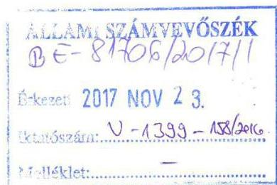

Tisztelt Elnök Úr!
Az Állami Számvevőszék a V-1399/2016. iktatószámon elvégezte a Budapest Főváros VII. Kerület Erzsébetváros Önkormányzata többségi tulajdonában lévő gazdasági társaság, az ERÖMÜVHÁZ Erzsébetvárosi Összevont Müvelődési Központ Nonprofit Kft. 2012-2015. időszakra vonatkozó ellenőrzését.

Az Állam Számvevőszék 2017. október 31. napján kelt, V-1399-150/2016. iktatószámon megküldte „Számvevőszéki jelentéstervezetét" az ERÖMÜVHÁZ Erzsébetvárosi Összevont Müvelődési Központ Nonprofit Kft-re vonatkozóan, melyre a következő észrevételeket teszem:
2.1. számú megállapítás A Társaság elkészítette a szabályzatait, de a számlarend nem felelt meg a jogszabályi előírásoknak. A Társaság az előírt beszámoló készítésének biztosítása érdekében elkészítette a számlarendjét, de az nem tartalmazta a Számv.tv. 161. § (2) bekezdés d) pontjának előirása ellenére a számlarendben foglaltakat alátámasztó bizonylati rendet.

A Társaság rendelkezett a Számlarend mellett Bizonylati rend és szabályzat elnevezésű szabályzattal, amely a Társaság alapítását követően 2012. július 1-tól hatályos. Tartalmazza a bizonylati elv és fegyelem tartalmát, a bizonylatok fogalmát, meghatározását, tartalmi és formai követelményeit, csoportosítását, keletkezését és kiállítását, a bizonylatok feldolgozását és ellenőrzését, a bizonylatok megőrzésére és a szigorú számadású bizonylatokra vonatkozó szabályokat. Melyeket az ÁSZ informatikai rendszerébe fel is töltöttünk.
2.1 számú megállapítás Nem volt szabályszerű a személyi jellegű ráfordítások elszámolása, mert a Számv.tv. 165. § (1) bekezdésében foglaltak ellenére a gazdasági műveleteket bizonylattal nem támasztották alá.

---

A bérszámfejtés alapbizonylata a munkaszerződés, amely alapján a törvényi előírások szerinti levonások és kötelezettségek megállapítására, elszámolására sor került. A vizsgált időszakban a szerződés alapján megbízott könyvviteli szolgáltató végezte a bérszámfejtéssel kapcsolatos feladatokat bérszámfejtő programmal. A megkapott alapbizonylatok alapján elkészítette a bérszámfejtést az adott időszak (hónap) vonatkozásában és a szintetikus könyvelés felé könyvelési bizonylat szerint történt a könyvelés.

# 2.2. számú megállapítás A Társaság vagyonnyilvántartása nem felelt meg az előírásoknak. Nem készültek szabályszerű leltárak. 

A Társaság a közszolgáltatási szerződés VII. 5.4 pontja alapján a megkapott eszközöket elkülönített nyilvántartásban tartotta, szerepeltette. A számviteli törvény alapján a saját vagyont mutatta ki és az önkormányzat tulajdonában maradt, de a Kft. részére a feladatai ellátásához megkapott vagyont egyedileg, de a saját nyilvántartásától elkülönítetten mutatta ki. Az Önkormányzat részére teljesítette a leltározási és az adatszolgáltatási kötelezettségeket határidőre.

Melyeket az ÁSZ informatikai rendszerébe fel is töltöttünk.
A Társaság a Leltározási szabályzat szerinti leltárakat minden évben elkészítette.

## 2.3. számú megállapítás A Társaság egyszerűsített éves beszámolói nem adtak megbízható és valós képet a vagyoni és pénzügyi helyzetről, a müködés eredményéről.

A Számviteli törvény 45. § (1) szerint a passzív időbeli elhatárolások között halasztott bevételként kell kimutatni az egyéb bevételként vagy a pénzügyi műveletek bevételeként elszámolt fejlesztési célra - visszafizetési kötelezettség nélkül - kapott, pénzügyileg rendezett támogatás véglegesen átvett pénzeszköz összegét. A vonatkozó jogszabály nem írja elő a működési célra, visszafizetési kötelezettséggel nyújtott támogatások elhatárolását.

A Számviteli törvény Az eredménykimutatás tételeinek tartalma címben, a 77. § (4) bekezdésében előírja az egyéb bevételek csökkentését és időbeli elhatárolását, kizárólag a fejlesztési célú támogatások esetében. „Egyéb bevételként kell elszámolni, de halasztott bevételként időbelileg el kell határolni:
b) fejlesztési célra - visszafizetési kötelezettség nélkül - kapott, pénzügyileg rendezett támogatás, véglegesen átvett pénzeszközök összegét;"

A szerződés alapján megvalósult elszámolások, önkormányzattal történt megállapodások szerinti visszafizetési kötelezettség kimutatásra került a mérleg forrás oldalán a rövid lejáratú kötelezettségek között.

Kérem, a jelentéstervezet véglegesítésénél vegyék figyelembe a fenti információkat.

---

Végezetül köszönöm az Állami Számvevőszék vizsgálatában részt vevő munkatársainak közremüködését, segítő szándékát, amellyel az ERÖMÜVHÁZ Erzsébetvárosi Összevont Művelődési Központ Nonprofit Kft. munkájának javításához, színvonalának emeléséhez járultak hozzá.

Budapest, 2017. november 21.
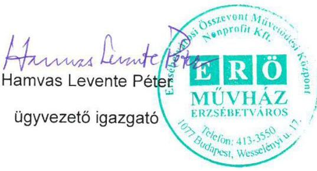

---

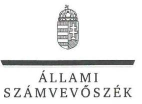

ELHök

Ikt.szám: V-1399-164/2016.

# Hamvas Levente Péter úr 

ügyvezető
ERöMÜVHÁZ Erzsébetvárosi Összevont
Múvelődési Központ Nonprofit Kft.

## Budapest

## Tisztelt Ügyvezető Úr!

„Az önkormányzatok gazdasági társaságai - Az önkormányzatok többségi tulajdonában lévő gazdasági társaságok gazdálkodásának ellenörzése - ERöMÜVHÁZ Erzsébetvárosi Összevont Müvelődési Központ Nonprofit Kft. " címmel készített számvevőszéki jelentéstervezetre tett észrevételeit köszönettel megkaptam.
Az Állami Számvevőszék észrevételekre vonatkozó álláspontjáról a felügyeleti vezető által készített részletes tájékoztatást csatoltan megküldöm.
Tájékoztatom Ügyvezető urat, hogy a számvevőszéki jelentésben - az Állami Számvevőszékről szóló 2011. évi LXVI. törvény 29. § (3) bekezdése alapján - a figyelembe nem vett észrevételeket szerepeltetjük annak megindokolásával, hogy azt miért nem fogadtuk el.

Budapest, 2017. 12. hó 07. nap
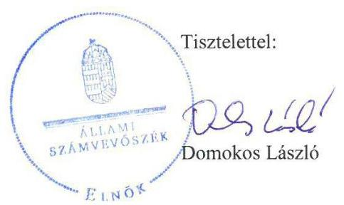

Melléklet: Tájékoztatás az észrevételek kezeléséről

---

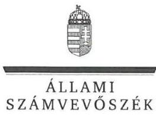

FELÜGYELETI VEZETŐ

Melléklet
Ikt.szám: V-1399-164/2016.

# Tájékoztatás   az észrevételek kezeléséről 

„Az önkormányzatok gazdasági társaságai - Az önkormányzatok többségi tulajdonában lévő gazdasági társaságok gazdálkodásának ellenőrzése - ERöMÜVHÁZ Erzsébetvárosi Összevont Müvelődési Központ Nonprofit Kft." címú jelentéstervezetre 2017. november 21 -én tett (az Állami Számvevőszékhez 2017. november 23-án érkezett) észrevételét áttekintettük, annak kezelésével kapcsolatban a következő tájékoztatást adom.
A jelentéstervezet 2.1. számú megállapítás 1. mondatára (,A Társaság elkészítette a szabályzatait, de a számlarend nem felelt meg a jogszabályi elöírásoknak.") és a 2. bekezdésre (,A Társaság az elöirt beszámoló készitésének biztositása érdekében elkészítette számlarendjét, de az nem tartalmazta a Számv. tv. 161. § (2) bekezdés d) pontjának elöirása ellenére a számlarendben foglaltakat alátámasztó bizonylati rendet.") és az ügyvezetőnek címzett 1. számú javaslatra vonatkozó észrevétel:
Az észrevétel szerint a Társaság rendelkezett 2012. július 1-től hatályos Bizonylati rend és szabályzat elnevezésủ szabályzattal.
Az észrevétel nem megalapozott, azt nem fogadom el. Az ellenőrzés során bemutatott, az észrevételben hivatkozott Bizonylati rend és szabályzat a számvitelről szóló 2000. évi C. törvény (továbbiakban: Számv. tv.) 165-170. §-aiban elöírtakra vonatkozó szabályozást tartalmazott. A Számv. tv. 161. § (2) bekezdés d) pontja szerint a számlarendben foglaltakat alátámasztó - tehát az egyes fökönyvi számlákra történő könyvelés során alkalmazott bizonylatok meghatározását tartalmazó - bizonylati rendet a számlarend részeként kell elkészíteni. Az ellenőrzéshez átadott számlarendek ilyen előírást csak a 16. Beruházások, felújítások számlacsoport esetében tartalmaztak.
Fentiek alapján a jelentéstervezet módosítása nem indokolt.
A jelentéstervezet 2.1. számú megállapítás 5. bekezdésre (,Nem volt szabályszerü a személyi jellegü ráforditások elszámolása, mert a Számv. tv. 165.§ (1) bekezdésében foglaltak ellenére a gazdasági müveleteket bizonylattal nem támasztották alá.") és az ügyvezetőnek címzett 2. számú javaslatra vonatkozó észrevétel:
Az észrevétel szerint a Társaságnál a bérszámfejtés alapbizonylata a munkaszerződés, amely alapján a törvényi előírások szerinti levonások és kötelezettségek megállapítását, elszámolását megbízott könyvviteli szolgáltató végezte bérszámfejtő programmal.

Az észrevétel nem megalapozott, azt nem fogadom el. A Számv. tv. 165. § (1) bekezdése értelmében minden gazdasági műveletről, eseményről, amely az eszközök, illetve az eszközök forrásainak állományát vagy összetételét megváltoztatja, bizonylatot kell kiállítani (készíteni). A munkaidő-nyilvántartás a személyi jellegű kifizetések teljesítésigazolásának alapdokumentuma,

---

mivel ez alapján lehet megállapítani és ellenőrizni az adott napon, az adott hónapban vagy az adott időszakban teljesített munkaórák mértékét. Mivel az ellenőrzés számára nem került átadásra munkaidő-nyilvántartási bizonylat, a személyi jellegű ráfordítások elszámolása nem volt szabályszerű, bizonylattal alátámasztott.
Fentiek alapján a jelentéstervezet módosítása nem indokolt.
A jelentéstervezet 2.2. számú megállapítására (,A Társaság vagyonnyilvántartása nem felett meg az elöírásoknak. Nem készültek szabályszerü leltárak.") és az ügyvezetőnek címzett 3. és 5. számú javaslatokra vonatkozó észrevétel:

Az észrevétel szerint a Társaság a közszolgáltatási szerződés alapján a feladatai ellátásához megkapott vagyont egyedileg, de a saját nyilvántartásától elkülönítetten mutatta ki, a Leltározási szabályzat szerinti leltárakat minden évben elkészítette, az Önkormányzat részére a leltározási és az adatszolgáltatási kötelezettségeket határidőre teljesítette.

Az észrevétel nem megalapozott, azt nem fogadom el. A Társaság részéről - az ellenőrzés rendelkezésére bocsátott 2013. május 31 -ei jegyzőkönyv utolsó bekezdésében és a közszolgáltatási szerződésben foglalt kötelezettsége ellenére - a részére használatba átadott vagyon egyedi bevételezése, saját vagyonától való elkülönített nyilvántartása nem történt meg. Az éves beszámolókat alátámasztó főkönyvi kivonatok nem tartalmazták a használatba vett eszközök értékét, amelyet - mérlegen kívüli tételként - a Számv. tv. 160. § (5) bekezdése szerint a nullás számlaosztályban kell nyilvántartani.

Az 2.2. megállapítás 3. bekezdés megállapítás nem arra irányult, hogy a Társaság nem készített leltárakat. A megállapítás és az ügyvezetőnek címzett 5. javaslat arra irányult, hogy a Társaság nem végzett évente egyeztetéssel történő leltározást, így nem készített olyan, mérlegtételeket alátámasztó leltárakat, amelyek megfeleltek volna a Számv. tv. és a leltározási szabályzat előírásainak.
Fentiek alapján a jelentéstervezet módosítása nem indokolt.

A jelentéstervezet 2.3. számú megállapítás 1. mondatára (,A Társaság egyszerüsitett éves beszámolói nem adtak megbizható és valós képet a vagyoni és pénzügyi helyzetröl, a müködés eredményéről.") és az ügyvezetőnek címzett 6. számú javaslatra vonatkozó észrevétel:
Az észrevétel szerint a Számviteli törvény 45. § (1) szerint a passzív időbeli elhatárolások között halasztott bevételeként kell kimutatni az egyéb bevételként vagy a pénzügyi műveletek bevételeként elszámolt fejlesztési célra - visszafizetési kötelezettség nélkül - kapott, pénzügyileg rendezett támogatás véglegesen átvett pénzeszköz összegét. A vonatkozó jogszabály nem írja elő a működési célra, visszafizetési kötelezettséggel nyújtott támogatások elhatárolását.

A Számviteli törvény 77. § (4) bekezdésében előírja az egyéb bevételek csökkentését és időbeli elhatárolását, kizárólag a fejlesztési célú támogatások esetében. A szerződés alapján megvalósult elszámolások, önkormányzattal történt megállapodások szerinti visszafizetési kötelezettség kimutatásra került a mérleg forrás oldalán a rövid lejáratú kötelezettségek között.

---

Az észrevétel nem megalapozott, azt nem fogadom el. Az ellenőrzés rendelkezésére bocsátott dokumentumok szerint az Önkormányzat a Társaság beszámolójának elkészítése után döntött a támogatás fel nem használt részéről. Abból a következő évben felhasználható hányadot a Számv. tv. 44. § (2) bekezdésében előírtak szerint passzív időbeli elhatárolásként, az Önkormányzatnak visszafizetendő hányadot a Számv. tv. 43. § (1) bekezdésében előírtak szerint rövid lejáratú kötelezettségként kellett volna kimutatnia a Társaságnak. Az ellenőrzött időszak minden évében volt olyan összeg, amelyet passzív időbeli elhatárolásként, és 2012-ben, 2013-ban, valamint 2015-ben olyan összeg, amelyet rövid lejáratú kötelezettségként kellett volna a Társaság beszámolójában kimutatni. A beszámolók így az Önkormányzat tulajdonosi döntéseivel nincsenek összhangban.

Fentiek alapján a jelentéstervezet módosítása nem indokolt.

Budapest, 2017. 12. hó 07 nap

Dr. Nagy Imre felügyeleti vezető

---

# Erzsébetváros Polgármestere 

Iktatószám: KI/2173/2/2017/III.
Ügyintéző: dr. Karpács Eszter
Tel / Fax: 462-3284
E-mail: karpacs.eszter@erzsebetvaros.hu
Domokos László úrnak
elnök

## Állami Számvevőszék

Budapest
Pf.: 54.
1364

Tárgy: ÁSZ ellenőrzés
Hivatkozási szám: V-1399-150/2016

Tisztelt Elnök Úr!
Az Állami Számvevőszék a V-1399/2016. iktatószámon elvégezte a Budapest Főváros VII. Kerület Erzsébetváros Önkormányzata többségi tulajdonában lévő gazdasági társaság, az ERÖMÜVHÁZ Erzsébetvárosi Összevont Müvelődési Központ Nonprofit Kft. 2012-2015. időszakra vonatkozó ellenőrzését.

Az Állam Számvevőszék 2017. október 31. napján kelt, V-1399-150/2016. iktatószámon megküldte „Számvevőszéki jelentéstervezetét" az ERÖMÜVHÁZ Erzsébetvárosi Összevont Müvelődési Központ Nonprofit Kft-re vonatkozóan.

A jelentéstervezet Budapest Főváros VII. kerület Erzsébetváros Önkormányzata Polgármesterének címzett javaslata (1.1 megállapítás 5. bekezdése) alapján kezdeményezni kell, az ERÖMÜVHÁZ Erzsébetvárosi Összevont Müvelődési Központ Nonprofit Kft. Felügyelőbizottságánál az ügyrend jogszabályok szerinti elkészítését.

Tájékoztatom, hogy az ERÖMÜVHÁZ Felügyelő Bizottságának ügyrendje elkészült 2015. évben. Az ügyrend jóváhagyására - a Budapest Főváros VII. kerület Erzsébetváros Önkormányzata Képviselő-testületének Budapest Főváros VII. kerület Erzsébetváros Önkormányzatát megillető tulajdonosi jogok gyakorlása és a tulajdonában álló vagyonnal való gazdálkodás szabályairól szóló, 11/2012. (III.26.) számú önkormányzati rendelete 15. § (4) bekezdés alapján - a Pénzügyi és Kerületfejlesztési Bizottság jogosult, amelyre a 911/2017. (XI. 20.) számú határozattal sor került.

A Pénzügyi és Kerületfejlesztési Bizottság 911/2017. (XI.20.) számú határozatát, és a határozati javaslat mellékleteként elfogadott az ERÖMÜVHÁZ Erzsébetvárosi Összevont Müvelődési Központ Nonprofit Kft. Felügyelő Bizottsági Ügyrendjét mellékelten megküldöm.

---

A jelentéstervezet az ERÖMÜVHÁZ Erzsébetvárosi Összevont Művelődési Központ Nonprofit Kft. Ügyvezetőjének címzett javaslat 3. pontjára (2.2. sz. megállapítás 1. bekezdése alapján) vonatkozóan tájékoztatom, hogy az ERÖMÜVHÁZ Erzsébetvárosi Összevont Müvelődési Központ Nonprofit Kft. az államháztartás számviteléröl szóló 4/2013 (I. 11.) kormányrendelet 22. § (1) - (3) bekezdésiben, a számvitelről szóló 2000. évi C. törvény 69.§ és a leltározási szabályzatban foglaltaknak megfelelően az adott évekre vonatkozó az Önkormányzattól használatba vett önkormányzat tulajdonában lévő eszközöket leltározta, és eleget tett az adatszolgáltatási kötelezettségének. Az Állami Számvevőszék V-1302044/2016. ügyszámon lefolytatott „Utóellenörzések - Az önkormányzati vagyongazdálkodás szabályszerüségének utóellenörzése - Budapest Főváros VII. kerület Erzsébetváros önkormányzata" ellenőrzésében ezt elfogadta az ERÖMÜVHÁZ Erzsébetvárosi Összevont Müvelődési Központ Nonprofit Kft. tekintetében.

Szeretném megköszönni az Állami Számvevőszék vizsgálatában részt vevő munkatársainak közreműködését, segítő szándékát, amellyel az ERÖMÜVHÁZ Erzsébetvárosi Összevont Müvelődési Központ Nonprofit Kft. és Budapest Főváros VII. Kerület Erzsébetváros Önkormányzata munkájának javításához, színvonalának emeléséhez járultak hozzá.

Budapest, 2017. november 21.
Tisztelettel:
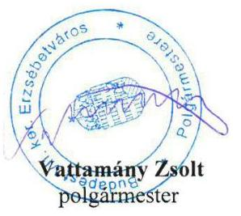

---

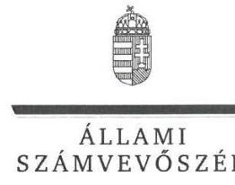

ELNÖK

Ikt.szám: V-1399-165/2016.

# Vattamány Zsolt úr 

polgármester
Budapest Főváros VII. ker. Erzsébetváros Önkormányzata

## Budapest

## Tisztelt Polgármester Úr!

„Az önkormányzatok gazdasági társaságai - Az önkormányzatok többségi tulajdonában lévő gazdasági társaságok gazdálkodásának ellenörzése - ERöMÜVHÁZ Erzsébetvárosi Összevont Müvelődési Központ Nonprofit Kft. " címmel készített számvevőszéki jelentéstervezetre tett észrevételeit köszönettel megkaptam.
Az Állami Számvevőszék észrevételekre vonatkozó álláspontjáról a felügyeleti vezető által készített részletes tájékoztatást csatoltan megküldőm.
Tájékoztatom Polgármester urat, hogy a számvevőszéki jelentésben - az Állami Számvevőszékről szóló 2011. évi LXVI. törvény 29. § (3) bekezdése alapján - a figyelembe nem vett észrevételeket szerepeltetjük annak megindokolásával, hogy azt miért nem fogadtuk el.

Budapest, 2017. 12. hó 07. nap
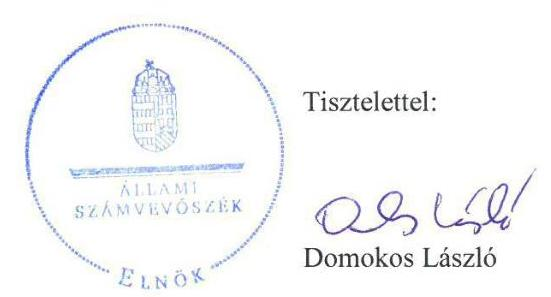

Melléklet: Tájékoztatás az észrevételek kezeléséről

---

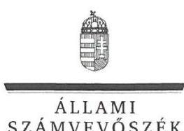

FELÜGYELETI VEZETŐ

# Tájékoztatás   az észrevételek kezeléséről 

„Az önkormányzatok gazdasági társaságai - Az önkormányzatok többségi tulajdonában lévő gazdasági társaságok gazdálkodásának ellenörzése - ERöMÜVHÁZ Erzsébetvárosi Összevont Müvelödési Központ Nonprofit Kft." címü jelentéstervezetre 2017. november 21-én tett (az Állami Számvevőszékhez 2017. november 27-én érkezett) észrevételét áttekintettük, annak kezelésével kapcsolatban a következő tájékoztatást adom.

## A jelentéstervezet 1.1. számú megállapítás 5. bekezdésére, valamint a polgármesternek tett 1. javaslatra vonatkozó észrevétel:

Az észrevétel szerint a Társaság felügyelőbizottságának ügyrendje 2015. évben elkészült, melyet a Pénzügyi és Kerületfejlesztési Bizottság a 2017. november 20-ai ülésén fogadott el.
Az Állami Számvevőszék az ellenőrzését a megküldött ellenőrzési programnak megfelelően, a rendelkezésére bocsátott adatok és dokumentumok alapján végzi. Az Állami Számvevőszékről szóló 2011. évi LXVI. törvény 28. § (2) bekezdése alapján a közremüködésre felhívott szervezet az Állami Számvevőszék részére - annak kérésére soron kívül, de legkésőbb öt munkanapon belül - az ellenőrzés lefolytatása érdekében szükséges adatokat és dokumentumokat rendelkezésre bocsátja. A 2017. január 2-ai adatbekérő levelünk melléklete tartalmazta az Önkormányzat által elektronikusan feltöltendő dokumentumok körét. A bekért dokumentumok közül a felü-gyelő-bizottság ügyrendje nem került feltöltésre vagy átadásra az ellenőrzést végzők részére. Polgármester úr 2017. május 29-ei teljességi és hitelességi nyilatkozata szerint az Állami Számvevőszék részére átadott dokumentumok a bekért adatokra, dokumentumokra vonatkozóan teljes körű információt tartalmaznak. Erre tekintettel a most megküldött dokumentumot a jelentésben nem tudjuk figyelembe venni, az intézkedést igénylő megállapítás és a javaslat módosítása, illetve törlése nem indokolt. A Társaság Felügyelő Bizottságának ügyrendjének elfogadásáról szóló tájékoztatását köszönjük. Az észrevételben leírt intézkedés az ellenőrzött időszakot követően történt, ezért az a jelentéstervezet megállapítását nem érinti, az intézkedést igénylő megállapítás és a javaslat módosítása, illetve törlése nem indokolt. Az ellenőrzött időszakot követően megtett intézkedést az intézkedési terv összeállítása során indokolt figyelembe venni. Fentiek alapján a jelentéstervezet módosítása nem indokolt.

A jelentéstervezet 2.2. számú megállapítás 1. bekezdésére és az ügyvezetőnek címzett 3. javaslatra vonatkozó észrevétel:
Az észrevétel szerint a Társaság az önkormányzattól használatba vett, az önkormányzat tulajdonában levő eszközöket leltározta és eleget tett az adatszolgáltatási kötelezettségének, amit az ÁSZ az „Utóellenörzések -Az önkormányzati vagyongazdálkodás szabályszerüségének utóellenörzése - Budapest Föváros VII. kerület Erzsébetváros önkormányzata"ellenőrzésében elfogadott.

---

Az észrevétel nem megalapozott, azt nem fogadom el. A megállapítás arra vonatkozott, hogy a használatba vett önkormányzati eszközöket a közszolgáltatási szerződés ${ }_{1,3,4,5,6}$ VII.5.4. pontjában foglaltak ellenére a Társaság nem vételezte be, nem tartotta nyilván és nem mutatta ki számviteli elszámolásában részletesen és ellenőrizhető módon. A Társaság részéről - az ellenőrzés rendelkezésére bocsátott 2013. május 31 -ei jegyzőkönyv utolsó bekezdésében és a közszolgáltatási szerződésben foglalt kötelezettsége ellenére - a részére használatba átadott vagyon egyedi bevételezése, saját vagyonától való elkülönített nyilvántartása nem történt meg. Az éves beszámolókat alátámasztó fökönyvi kivonatok nem tartalmazták a használatba vett eszközök értékét, amelyet - mérlegen kívüli tételként - a Számv. tv. 160. § (5) bekezdése szerint a nullás számlaosztályban kell nyilvántartani.
Az önkormányzati vagyongazdálkodás szabályszerüségének ellenörzése c. ellenőrzés célja annak megállapítása volt, hogy az Önkormányzat vagyongazdálkodási tevékenységét a jogszabályi előírásokkal összhangban szabályozta-e, a vagyon nyilvántartása és a vagyongazdálkodási tevékenységek végrehajtása a jogszabályoknak és a belső előírásoknak megfelelően történt-e, az Önkormányzatnál a vagyongazdálkodás során biztosították-e az átláthatóságot, valamint a külső és belső ellenőrzések megállapításai, javaslatai hozzájárultak-e a szabályszerű vagyongazdálkodáshoz. Az utóellenőrzés arra irányult, hogy az Önkormányzat az intézkedési tervben foglaltakat az előírt határidőben végrehajtotta-e.
„Az önkormányzatok gazdasági társaságai - Az önkormányzatok többségi tulajdonában lévő gazdasági társaságok gazdálkodásának ellenörzése" című, jelen ellenőrzés az Önkormányzat vonatkozásában a tulajdonosi joggyakorlás szabályszerűségének vizsgálatára terjedt ki. Fentiek alapján a jelentéstervezet módosítása nem indokolt.

Budapest, 2017. 12. hó 07. nap

Dr. Nagy Imre felügyeleti vezető

---

.

---

# RÖVIDÍTÉSEK JEGYZÉKE 

${ }^{1}$ Alapítói határozat
${ }^{2}$ Társaság
${ }^{3}$ Önkormányzat
${ }^{4}$ Határozat közszolgáltatási szerződés létrejöttéről
${ }^{5}$ Közszolgáltatási szerződés
Közszolgáltatási szerződés
Közszolgáltatási szerződés
Közszolgáltatási szerződés
Közszolgáltatási szerződés
Közszolgáltatási szerződés
Közszolgáltatási szerződés
Közszolgáltatási szerződés
Közszolgáltatási szerződés
${ }^{6} \mathrm{Ptk}_{2}$
${ }^{7}$ Ctv.
${ }^{8}$ Kerület
${ }^{9}$ Ügyvezető
${ }^{10}$ ÁSZ
${ }^{11}$ ÁSZ tv.
${ }^{12}$ Ötv.
${ }^{13}$ gazdasági program ${ }_{1}$
${ }^{14}$ Mötv.
${ }^{15}$ gazdasági program ${ }_{2}$
${ }^{16}$ Önkormányzat SZMSZ-e

Budapest Főváros VII. kerület Erzsébetváros Önkormányzata Képviselőtestületének 320/2012. (VI.11.) és a 463/2012. (VI. 28.) sz. határozata. ERöMÜVHÁZ Erzsébetvárosi Összevont Művelődési Központ Nonprofit Kft. Budapest Főváros VII. kerület Erzsébetváros Önkormányzata

Budapest Főváros VII. kerület Erzsébetváros Önkormányzata Képviselőtestületének 501/2012. (VII.30.) sz határozata Közművelődési feladatok átszervezése II.
Közszolgáltatási szerződés egyben mint közművelődési megállapodás (hatályos 2012. szeptember 1-től 2012. október 31-ig 31.-ig)

Közszolgáltatási szerződés egyben mint közművelődési megállapodás (hatályos 2012. november 1-től 2012. december 31.-ig)

Közszolgáltatási keretszerződés egyben mint közművelődési megállapodás (hatályos 2013. január 1-jétől 2017. december 31.-ig)
Közszolgáltatási keretszerződés kiegészítéséről (hatályos 2013. március 29.-től 2017. december 31.-ig)

Közszolgáltatási keretszerződés kiegészítéséről 1. sz. módosítás (hatályos 2014. június 2.-től 2017. december 31.-ig)
Közszolgáltatási keretszerződés 2015/1. sz. kiegészítése (hatályos 2015. január 28.-től 2015. február 28.-ig)

Közszolgáltatási keretszerződés (hatályos 2015. április 1-től)
2013. évi V. törvény Polgári Törvénykönyvről (hatályos 2014.március 15-tól)
2006. évi V. törvény a cégnyilvánosságról, a bírósági cégeljárásról és a végelszámolásról
Budapest Főváros VII. kerület Erzsébetváros
ERöMÜVHÁZ Erzsébetvárosi Összevont Múvelődési Központ Nonprofit Kft. irányításáért felelős vezető tisztségviselője
Állami Számvevőszék
2011. évi LXVI. törvény az Állami Számvevőszékről
1990. évi LXV. törvény a helyi önkormányzatokról (hatályos 1990.augusztus 14étől 2014. október 12-ig)
Budapest Főváros VII. kerület Erzsébetváros Önkormányzat Képviselő-testület 289/2011. (IV. 15.) számú határozatával elfogadott Budapest Főváros VII. kerület Erzsébetváros Önkormányzatának középtávú gazdasági programja (2011-2014.) 2011. évi CLXXXIX. törvény Magyarország a helyi önkormányzatairól szóló (hatályos 2012. január 1-jétől)
Budapest Főváros VII. kerület Erzsébetváros Önkormányzat Képviselő-testület 213/2015. (IV.22.) számú határozatával elfogadott Budapest Főváros VII. kerület Erzsébetváros Önkormányzatának középtávú gazdasági programja (2015-2020.) Budapest Főváros VII. kerület Erzsébetváros Önkormányzata Képviselő-testülete 48/2012. (XII.17.) számú rendelete a Képviselő-testület Szervezeti és Müködési szabályzatáról és az 50/2013. (IX.5.), 60/2013.(XI.4.), 19/2014.(X.28.), 24/2014.(XII.22.) számú rendeletekkel módosításai

---

${ }^{17}$ Vagyonrendelet
${ }^{18}$ Közműv. tv.
${ }^{19}$ közművelődési rendelet ${ }_{1}$
${ }^{20}$ közművelődési rendelet ${ }_{2}$
${ }^{21}$ Alapító Okirat
${ }^{22}$ Felügyelő-bizottság
${ }^{23}$ Számv. tv.
${ }^{24}$ Határozat a könyvvizsgálatról
${ }^{25}$ Javadalmazási szabályzat
${ }^{26}$ Tak.tv.
${ }^{27}$ Képviselő-testület
${ }^{28}$ Javadalmazási szabályzat elfogadása
${ }^{29}$ Képviselő-testületi határozatok üzleti tervek elfogadásáról
${ }^{30}$ Tulajdonosi joggyakorlói határozatok
${ }^{31}$ Áht.
${ }^{32}$ Számlarend $_{1}$
Számlarend $_{2}$
Számlarend $_{3}$
Számlarend $_{4}$

11/2012. (III.26.) számú önkormányzati rendelet Budapest Főváros VII. kerület Erzsébetváros Önkormányzatát megillető tulajdonosi jogok gyakorlása és a tulajdonában álló vagyonnal való gazdálkodás szabályairól
1997. évi CXL. sz. törvény a muzeális intézményekről, a nyilvános könyvtári ellátásról és a közművelődésről
Budapest Főváros VII. kerület Erzsébetváros Önkormányzat Képviselő-testület 41/2003. (XII. 22.) rendelete az önkormányzat közművelődési feladatairól (hatályos 2004. január 1-től 2013. június 30-áig)
Budapest Főváros VII. kerület Erzsébetváros Önkormányzat Képviselő-testület 41/2013.(VI. 28.) rendelete a helyi közművelődés önkormányzati feladatairól (hatályos 2013. július 1-jétől)
ERöMÜVHÁZ Erzsébetvárosi Összevont Művelődési Központ Nonprofit Kft. Alapító Okirata, kelt 2012. július 1-jén
ERöMÜVHÁZ Erzsébetvárosi Összevont Művelődési központ Nonprofit Kft. Felügyelő Bizottsága
2000. évi C. törvény a számvitelről

Budapest Főváros VII. kerület Erzsébetváros Önkormányzat Képviselö̀testületének 333/2012. (VI.11.) illetve 499/2012 (VI.28) sz. határozata
Az ERöMÜVHÁZ Erzsébetvárosi Összevont Művelődési központ Nonprofit Kft. Szabályzata a vezető tisztségviselők, felügyelő bizottsági tagok valamint az Mt. 208. §-a hatálya alá eső munkavállalók javadalmazása, valamint a jogviszony megszűnése esetére biztosított juttatások módjának, mértékének legfőbb elveiről, annak rendszeréről
2009. évi CXXII. törvény a köztulajdonban álló gazdasági társaságok takarékosabb müködéséről
Budapest Főváros VII. kerület Erzsébetváros Önkormányzata Képviselő-testülete
Budapest Főváros VII. kerület Erzsébetváros Önkormányzat Képviselő-testület 626/2013. (IX. 5.) sz. határozata

502/2012.(VII:30.). sz. a 2012. évi üzleti tervről, 156/2013. (IV.29.) sz. a 2013. évi üzleti tervről, 1118/2014. (IV.29.) sz. a 2014. évi üzleti tervről, 121/2015. (III.25.) sz. a 2013. évi üzleti tervről
Budapest Főváros VII. kerület Erzsébetváros Önkormányzata Pénzügyi Kerületfejlesztési Bizottságának 491/2013.(05.16.) sz. határozata

Budapest Főváros VII. kerület Erzsébetváros Önkormányzata Pénzügyi Kerületfejlesztési Bizottságának 316/2014.(04.11.) sz. határozata

Budapest Főváros VII. kerület Erzsébetváros Önkormányzata Pénzügyi Kerületfejlesztési Bizottságának 535/2015.(05.29.) sz. határozata

Budapest Főváros VII. kerület Erzsébetváros Önkormányzata Pénzügyi Kerületfejlesztési Bizottságának 512/2016.(05.26.) sz. határozata
2011. évi CXCV. törvény az államháztartásról

ERöMÜVHÁZ Erzsébetvárosi Összevont Művelődési központ Nonprofit Kft Számlarend kelt 2012. július 01-én (hatályos 2012.07.01-től,)
ERöMÜVHÁZ Erzsébetvárosi Összevont Művelődési központ Nonprofit Kft Számlarend kelt 2013. január 02-án (hatályos 2013.01.01-től,)
ERöMÜVHÁZ Erzsébetvárosi Összevont Művelődési központ Nonprofit Kft Számlarend kelt 2013.december 09-én (hatályos 2014.01.01-től,)
ERöMÜVHÁZ Erzsébetvárosi Összevont Művelődési központ Nonprofit Kft Számlarend, kelt 2015. január 06-án (hatályos 2015.01.01-től)

---

${ }^{33}$ Leltározási Szabályzat
${ }^{34}$ Szakmai beszámolók jóváhagyása
${ }^{35}$ Info tv.
${ }^{36}$ Közzétételi szabályzat
${ }^{37}$ Ptk. 1
${ }^{38}$ Ebktv.

ERöMÜVHÁZ Erzsébetvárosi Összevont Művelődési központ Nonprofit Kft Eszközök és Források leltárkészítési és leltározási szabályzata, valamint a Selejtezési Szabályzat, (hatályos 2012.09.01-től)
Budapest Főváros VII. kerület Erzsébetváros Önkormányzat Képviselő-testület 228/2013. (V. 30.) sz. határozata
Budapest Főváros VII. kerület Erzsébetváros Önkormányzat Képviselő-testület 114/2014. (IV. 29.) sz. határozata
Budapest Főváros VII. kerület Erzsébetváros Önkormányzat Képviselő-testület 122/2015. (III. 25.) sz. határozata
Budapest Főváros VII. kerület Erzsébetváros Önkormányzat Képviselő-testület 260/2016. (VI. 3..) sz. határozata
2011. évi CXII. törvény az információs önrendelkezési jogról és az információszabadságról
A kötelezően közzéteendő adatok nyilvánosságra hozatalának rendje (hatályos 2012. szeptember 1-jétől)
1959. évi IV. törvény a Polgári törvénykönyvről (hatályos: 2014. március 14-éig) 2003. évi CXXV. törvény az egyenlő bánásmódról és az esélyegyenlőség előmozdításáról

---

ÁLLAMI SZÁMVEVŐSZÉK
1052 Budapest, Apáczai Csere János utca 10.
Levélcím: 1364 Budapest 4. Pf. 54
Telefon: +36 14849100 Telefax: +36 14849200
www.asz.hu