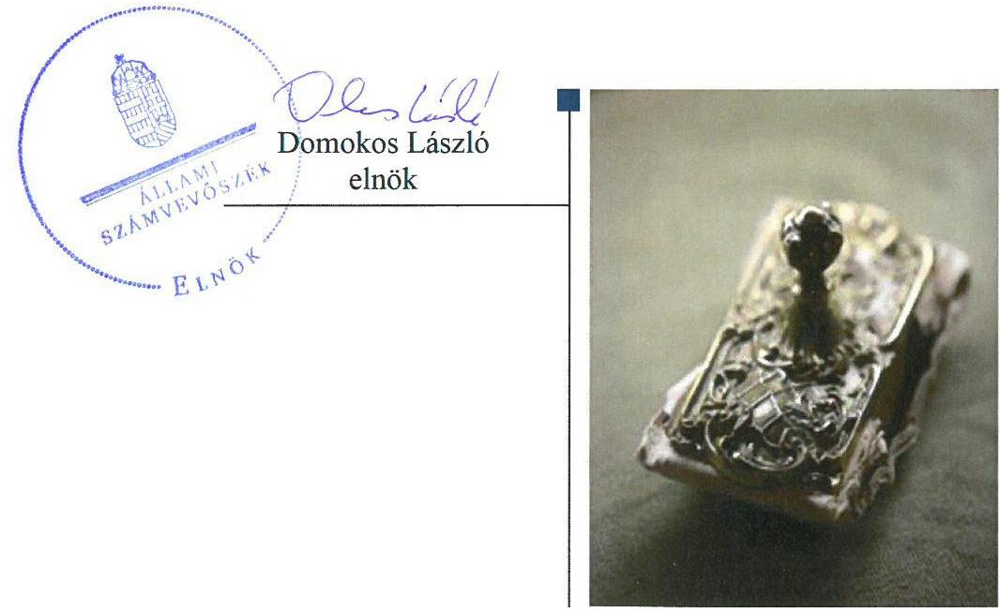
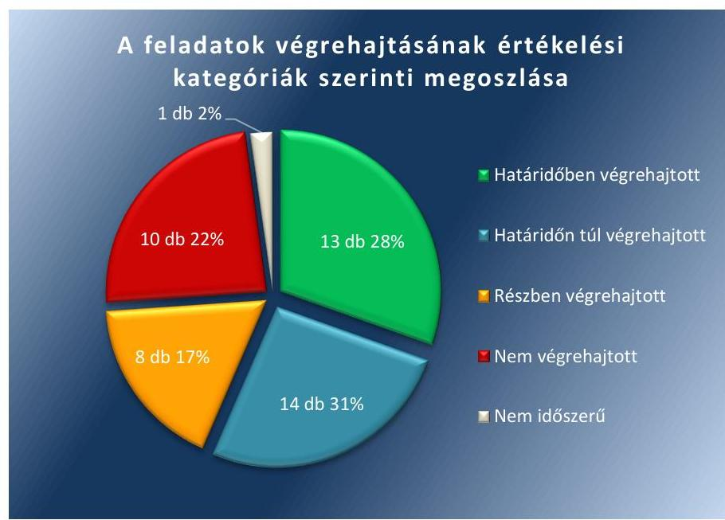

# Jelentés 

## Utóellenőrzések

Az önkormányzatok belső
kontrollrendszere kialakításának és működtetésének utóellenőrzése Esztergom Város Önkormányzata 2018. 04. hó 05. nap

---

# AZ ELLENŐRZÉST FELÜGYELTE: 

DR. BENEDEK MÁRIA felügyeleti vezető

## AZ ELLENŐRZÉST VEZETTE ÉS A VÉGREHAJTÁSÁÉRT FELELŐS:

DR. DANKÓ ISTVÁN ellenőrzésvezető

## A PROGRAM ÖSSZEÁLLÍTÁSÁÉRT FELELŐS:

JANIK JÓZSEF LÁSZLÓ osztályvezető

## A TÉMÁHOZ KAPCSOLÓDÓ KORÁBBI SZÁMVEVŐSZÉKI JELENTÉS:

- címe: Az önkormányzatok belső kontrollrendszere kialakításának és működtetésének utóellenőrzése Esztergom Város Önkormányzata
- sorszáma: 14118

IKTATÓSZÁM: EL-0060-064/2017
TÉMASZÁM: 21
ELLENŐRZÉS-AZONOSÍTÓ SZÁM: V0755116

---

# TARTALOMJEGYZÉK 

■ ÖSSZEGZÉS ..... 5
■ AZ ELLENŐRZÉS CÉLJA ..... 6
■ AZ ELLENŐRZÉS TERÜLETE ..... 7
■ AZ ELLENŐRZÉS HÁTTERE, INDOKOLTSÁGA ..... 8
■ A JELENTÉS LÉNYEGES KÉRDÉSKÖRE ..... 9
■ ELLENŐRZÉS HATÓKÖRE ÉS MÓDSZEREI ..... 10
■ MEGÁLLAPÍTÁSOK ..... 12
■ MELLÉKLETEK ..... 19
I. sz. melléklet: Az ÁSZ 14118 számú jelentéséhez kapcsolódó intézkedési terv pontjainak végrehajtása ..... 19
■ RÖVIDÍTÉSEK JEGYZÉKE ..... 29

---

.

---

# ÖSSZEGZÉS 

Az Állami Számvevőszék Esztergom Város Önkormányzata belső kontrollrendszere kialakításának és működtetésének utóellenőrzése során megállapította, hogy az intézkedési tervben meghatározott feladatok többségét végrehajtotta, amivel javult működésének szabályozottsága. A végre nem hajtott feladatok miatt elszámoltathatósága és gazdálkodásának átláthatósága nem biztosított.

## Az ellenőrzés társadalmi indokoltsága

Az Állami Számvevőszék stratégiájában célul tűzte ki a számvevőszéki munka hasznosulásának javítását. Ezzel összhangban ellenőrzi, hogy az ellenőrzött szervezetek megvalósították-e a korábbi ellenőrzései által feltárt hibák, hiányosságok és szabálytalanságok megszüntetése céljából kialakított intézkedési terveikben foglaltakat. A rendszeres utóellenőrzések hozzájárulnak a szükséges intézkedések tényleges végrehajtásához, ezáltal a közpénzügyek rendezettségének javulásához, igazolják, hogy lezárult a következmények nélküli ellenőrzések időszaka.

## Főbb megállapítások, következtetések

Esztergom Város Önkormányzata az intézkedési tervben meghatározott 46 feladat közül 13-at határidőben, 14-et határidőn túl, nyolcat részben, tízet nem hajtott végre, valamint egy feladat nem volt időszerű.

A végrehajtott intézkedési tervben meghatározott feladatokkal gondoskodott a gazdálkodásra, a vezetői ellenőrzésre, a kockázatkezelésre, az adatkezelésre és az etikai normákra vonatkozó szabályok elfogadásáról, a belső ellenőrzésekkel kapcsolatos alapvető dokumentumok kiadásáról, a közzétételi kötelezettségek teljesítéséről, valamint a pénzügyi kulcskontrollok gyakorlóinak kijelöléséről. A végrehajtott feladatok hozzájárultak Esztergom Város Önkormányzata működésének szabályozottságához, a belső kontrollrendszer szabályszerű működéséhez szükséges szabályzatok és dokumentumok rendelkezésre állnak.

Nem tett eleget a kötelezettségvállalások nyilvántartására, a teljesítésigazolás és az utalványozás jogszabályoknak megfelelő végrehajtására, valamint a kizárólag közszolgálati jogviszonyban állók által betölthető munkakörök meghatározására vonatkozó kötelezettségeinek, nem készítette el határidőben a köztisztviselők teljesítményértékelését, nem tett eleget a vagyonnyilatkozat-tételi kötelezettséggel kapcsolatos jogszabályi előírások érvényesítésére vonatkozó feladatoknak, nem gondoskodott a kötelezettségvállalások nyilvántartásáról és a belső ellenőrzési tervek jóváhagyottaknak megfelelő és szabályos végrehajtásáról, illetve szükséges módosításáról. A végre nem hajtott feladatok miatt a közpénzekkel való felelős gazdálkodása és az átláthatóság nem biztosított.

Az aljegyző az intézkedési tervben meghatározott feladatok végrehajtásáról nem vezette a jogszabályi előírásoknak megfelelő nyilvántartást.

---

# AZ ELLENŐRZÉS CÉLJA 

Az ellenőrzés célja annak értékelése volt, hogy a számvevőszéki jelentésben foglalt intézkedést igénylő megállapításokkal és javaslatokkal összhangban készített intézkedési tervben meghatározott feladatokat az ellenőrzött szervezet végrehajtotta-e.

---

# AZ ELLENŐRZÉS TERÜLETE 

## Esztergom Város Önkormányzata

Esztergom város Komárom-Esztergom megyében található, állandó lakosainak száma a Központi Statisztikai Hivatal Magyarország közigazgatási helynévkönyv alapján 2016. január 1-jén 27990 fő volt.

A Képviselő-testület ${ }^{1}$ a polgármesterrel ${ }^{2}$ együtt 15 főből állt. A polgármester a 2014. évi általános önkormányzati választás óta tölti be tisztségét. A jegyzői feladatokat - teljes körű felhatalmazás alapján - az aljegyző látta el 2017. január 31-ig, ezzel egyidejűleg új jegyző ${ }^{3}$ került kinevezésre.

Az Önkormányzat a 2015. évi zárszámadási rendelete ${ }^{4}$ szerinti összevont könyvviteli mérlegének főösszege 52 904,7 millió Ft volt. Ezen belül a befektetett eszközök értéke 47 000,0 millió Ft, a követelésállomány 894,1 millió Ft, a kötelezettségállomány 1025,6 millió Ft volt.

Az ÁSZ ${ }^{5}$ 2014. évben ellenőrizte Esztergom Város Önkormányzatánál belső kontrollrendszere kialakításának, egyes kontroll tevékenységek és a belső ellenőrzés működését a 2012. január 1. és 2012. december 31. közötti időszak vonatkozásában. Az erről szóló 14118 számú jelentését ${ }^{6}$ az ÁSZ 2014. június 19-én tette közzé. Az ellenőrzés célja annak megállapítása volt, hogy a belső kontrollrendszer elemeinek kialakítása, a pénzügyi folyamatokban kulcsszerepet betöltő teljesítésigazolás és érvényesítés és a belső ellenőrzés szabályos működése biztosította-e az Önkormányzatnál a közpénzfelhasználás szabályosságát, hozzájárult-e az értéket teremtő rend követelményének érvényesüléséhez. Az ÁSZ jelentésben foglalt javaslatok végrehajtása érdekében a Képviselő-testület a 438/2014. (IX. 11.) számú határozatával 46 tervpontból álló intézkedési tervet fogadott el.

Az utóellenőrzés - a 2014. június 19. és 2017. július 3. között végrehajtott feladatokat figyelembe véve - az ÁSZ jelentésben a polgármester és a jegyző részére megfogalmazott intézkedést igénylő megállapításokra és javaslatokra készített, az ÁSZ részére megküldött intézkedési tervben foglalt feladatok megvalósításának ellenőrzésére, illetve értékelésére fókuszált.

---

# AZ ELLENŐRZÉS HÁTTERE, INDOKOLTSÁGA 

Az ÁSZ tv. ${ }^{7}$ 33. § (1) bekezdése értelmében a számvevőszéki jelentések intézkedést igénylő megállapításaihoz és javaslataihoz kapcsolódóan az ellenőrzött szervezet vezetője intézkedési tervet köteles összeállítani, és az ÁSZ részére megküldeni. Az intézkedési tervben foglaltak megvalósítását az ÁSZ tv. 33. § (7) bekezdésében foglaltak alapján - az ÁSZ utóellenőrzés keretében - ellenőrizheti. Az intézkedések megvalósulásának értékelése során az ÁSZ figyelembe veszi az ellenőrzött szervezetek működési feltételeiben, valamint a jogszabályi előírásokban bekövetkezett változásokat.

Az intézkedési tervben foglalt feladatok hiányos, illetve késedelmes végrehajtása, valamint megvalósításának elmaradása azt mutatja, hogy az ellenőrzések során feltárt hibák, hiányosságok és szabálytalanságok megszüntetése nem kapott kellő hangsúlyt. Ez a szabályszerű működés és a felelős vezetői magatartás vonatkozásában kockázatot hordoz. E kockázatok feltárásával az ÁSZ utóellenőrzési rendszere fokozza a fegyelmet, és igazolja, hogy a közpénzzel való szabályos gazdálkodás felelőssége elől nem lehet kitérni.

Az utóellenőrzés négy szinten hasznosulhat:
$\longrightarrow$ A társadalom szintjén az utóellenőrzés jelzi, hogy a számvevőszéki ellenőrzés megállapításainak van következménye: a hiányosságok megszüntetésére az ellenőrzött szervezet által meghatározott intézkedések végrehajtását is számon kéri az ÁSZ.
$\longrightarrow$ Az ellenőrzött terület szintjén az utóellenőrzés tájékoztatást nyújt a terület döntéshozóinak a hiányosságok kiküszöbölésének jó gyakorlatairól, ezzel lehetőséget biztosítva arra, hogy az ÁSZ ellenőrzési megállapításai, javaslatai a terület nem ellenőrzött szervezeteinek a működése során is hasznosuljanak.
$\longrightarrow$ Az ellenőrzött szervezet szintjén az utóellenőrzés feltárja, hogy a szervezet az intézkedések végrehajtásával hasznosította-e a korábbi ellenőrzési jelentésben a hiányosságok megszüntetése, illetve a kockázatok kezelése érdekében megfogalmazott javaslatokat.
$\longrightarrow$ Az ÁSZ szintjén az utóellenőrzés visszacsatolást ad az ellenőrzési jelentések hasznosulásáról, az intézkedések elmaradása vagy részleges megvalósulása a további ellenőrzésekhez kockázati jelzésként szolgál.

---

# A JELENTÉS LÉNYEGES KÉRDÉSKÖRE 

Az ellenőrzött szervezet az intézkedési tervben foglaltakat az előírt határidőben végrehajtotta-e?

---

# ELLENŐRZÉS HATÓKÖRE ÉS MÓDSZEREI 

## Az ellenőrzés típusa

Megfelelőségi ellenőrzés.

## Az ellenőrzött időszak

Az utóellenőrzés alapját képező ÁSZ jelentés közzétételének napjától (2014. június 19.) az ellenőrzésről szóló kiértesítő levél keltének napjáig (2017. július 3.) tartó időszak.

## Az ellenőrzés tárgya

Az ÁSZ tv. 2011. július 1-jei hatálybalépését követően a számvevőszéki jelentésben foglalt intézkedést igénylő megállapításokkal és javaslatokkal összhangban - az Esztergom Város Önkormányzata által - készített intézkedési tervekben foglaltak végrehajtásának ellenőrzése volt.

Az ellenőrzés kiterjedt minden olyan körülményre és adatra, amely az ÁSZ jogszabályban meghatározott feladatainak teljesítéséhez, valamint a program végrehajtása folyamán felmerült újabb összefüggések feltárásához szükséges volt.

## Az ellenőrzött szervezet

Esztergom Város Önkormányzata

## Az ellenőrzés jogalapja

Az ÁSZ tv. 33. § (7) bekezdés alapján a 33. § (1)-(2) bekezdés szerinti intézkedési tervben foglaltak megvalósítását az ÁSZ utóellenőrzés keretében ellenőrizheti.

## Az ellenőrzés módszerei

Az ÁSZ az ellenőrzést az ellenőrzési program ellenőrzési kérdései, az ellenőrzött időszakban hatályos jogszabályok, az ellenőrzés szakmai szabályok és módszertanok figyelembevételével, önálló ellenőrzés keretében végezte.

Az ÁSZ az ellenőrzés ideje alatt az ellenőrzött szervezettel történő kapcsolattartást az ÁSZ SZMSZ ${ }^{\circledR}$-ének vonatkozó előírásai alapján biztosította.

---

Az utóellenőrzés megállapításait elsősorban az ÁSZ rendelkezésére álló, valamint az ellenőrzött szervezettől elektronikusan bekért dokumentumok alapozták meg.

Az ellenőrzési bizonyítékként felhasználható adatforrások közé tartoztak egyrészt a szakmai programban felsorolt adatforrások, másrészt minden - az ellenőrzés folyamán feltárt, az ellenőrzés szempontjából információt tartalmazó - dokumentum.

Az intézkedési tervben előírt feladatokat, azok végrehajthatósága, illetve végrehajtása szempontjából az alábbiak szerint értékelte az ÁSZ:
—_ „határidőben végrehajtott" a feladat, ha a teljesítés dokumentáltan, az intézkedési tervben előírt határidőben és tartalommal megtörtént;
—_ „határidőn túl végrehajtott" a feladat, ha annak teljesítése az intézkedési tervben meghatározott módon, de az előírt határidőn túl történt meg;
—_ „részben végrehajtott" a feladat, ha végrehajtása teljes körűen az intézkedési tervben előírt módon nem történt meg;
—_ „nem végrehajtott" a feladat, ha a végrehajtás nem történt meg, vagy amennyiben a teljesítést nem dokumentálták;
—_ „okafogyottá vált" a feladat, ha végrehajtására - meghatározott esemény bekövetkezése, továbbá külső körülmény, a működést érintő feltétel változása miatt - már nincs szükség, illetve lehetőség, és egyértelműen megállapítható, hogy az intézkedést szükségessé tevő körülmény a jövőben nem fordulhat elő;
—_ „nem időszerű" az a feladat, amelynek ellenőrzési időszakon belüli végrehajtására azért nem került (kerülhetett) sor, mert az intézkedés alapjául szolgáló esemény nem következett be, de annak jövőbeni előfordulása lehetséges, a végrehajtása nem volt esedékes, vagy a végrehajtás határideje még nem járt le.
Az ellenőrzés lefolytatásához az ellenőrzött szervezetek a tanúsítványok elektronikus kitöltésével, valamint az ÁSZ által kért dokumentumok elektronikus megküldésével szolgáltatott adatokat, amelyek valódiságát és teljes körűségét az ellenőrzött szervezet vezetői által tett teljességi és hitelességi nyilatkozat igazolta. Az így rendelkezésre bocsátott adatok, információk kontrollja az ellenőrzés keretében történt.

---

# MEGÁLLAPÍTÁSOK 

## 1. Az ellenőrzött szervezet az intézkedési tervben foglaltakat az előírt határidőben végrehajtotta-e?

Összegző megállapítás

Az Önkormányzat ${ }^{9}$ az intézkedési tervben meghatározott 46 feladatból 13 feladatot határidőben, 14 feladatot határidőn túl, nyolcat részben, tízet nem hajtott végre, egy feladat nem volt időszerű. Az aljegyző az intézkedési tervben meghatározott feladatok végrehajtásáról a jogszabályban előírt nyilvántartást nem vezette.

Az ÁSZ a jelentésében a polgármester és a jegyző részére kilenc pontban ötvenöt javaslatot fogalmazott meg. Az ÁSZ részére megküldött intézkedési tervben a szabálytalanságok és hiányosságok megszüntetése érdekében negyvenhat feladatot határoztak meg, amelyek közül a polgármester 4, az aljegyző harmincnégy esetben volt a végrehajtás felelőse, valamint nyolc intézkedés tekintetében felelősségük együttes volt.

Az intézkedési tervben meghatározott feladatokat, határidőket, a felelősöket és a feladatok végrehajtását az I. számú melléklet mutatja be.

Az aljegyző az intézkedési tervben meghatározott feladatok végrehajtásáról nem vezette a Bkr. ${ }^{10}$ 14. § (1) bekezdésében előírt nyilvántartást.

Az Önkormányzat intézkedési tervében meghatározott feladatok végrehajtásának értékelési kategóriák szerinti megoszlását az 1. ábra szemlélteti.

1. ábra

Fonrás: ÁSZ

---

# HATÁRIDŐBEN VÉGREHAJTOTT feladatok: 

1. A polgármester figyelemmel kísérte az Önkormányzat gazdálkodásának szabályszerűségét és intézkedett az önkormányzati belső kontrollrendszer működésének biztosítására a mindenkori jogszabályi rendelkezéseknek megfelelően, biztosítva, hogy mindenkor rendelkezésre álljanak a jogszabályok szerint előírt, naprakészen aktualizált belső szabályzatok.
2. A
 jegyző tartós távollétében a jegyző helyettesítésére vonatkozó jogkörében eljáró aljegyző (a továbbiakban: jegyző) elkészítette a bizonylati rendet ${ }^{11}$.
3. A jegyző a Hivatalban dolgozó egyes köztisztviselők hiányzó munkaköri leírásait pótolta, illetve kiegészítette.
4. A jegyző a kockázatkezelés rendszer működtetésére érdekében elkészítette a kockázatkezelési szabályzatot ${ }^{12}$.
5. A jegyző intézkedett a beszerzési folyamatok, a vagyonhasznosítási tevékenység, valamint a pénzügyi döntések dokumentumainak megfelelő előkészítésére vonatkozó előírásoknak a Hivatal ${ }^{13}$ FEUVE ${ }^{14}$ rendszerében történő meghatározására.
6. A polgármester és az aljegyző elkészítette a gazdálkodási szabályzat${ }^{15}$-et, amely tartalmazta a kötelezettségvállalás pénzügyi ellenjegyzése, a teljesítésigazolás, az érvényesítés és az utalványozás rendjéről szóló szabályokat, különös figyelmet fordítva az ezeket végző személyek kijelölésének rendjére, személyi változások esetén a személyi kijelölések haladéktalan aktualizálására.
7. Az aljegyző a gazdálkodási szabályzatban meghatározta a beszámolási feladatok teljesítésével kapcsolatos belső előírásokat, feltételeket.
8. A jegyző az adatok biztonságának és védelmének érdekében az adatvédelmi és adatbiztonsági szabályzat ${ }^{16}$-ban szabályozta az informatikai rendszert, meghatározta a technikai és szervezési intézkedéseket, valamint kialakította a szükséges eljárási szabályokat.
9. A jegyző az adatvédelmi és adatbiztonsági szabályzat hatályba léptetésével gondoskodott az adatok biztonságáról és védelméről.
10. A belső ellenőr elkészítette, az aljegyző jóváhagyta a Belső Ellenőrzési Kézikönyvet ${ }^{17}$.
11. A belső ellenőr ${ }^{18}$ elkészítette, a jegyző jóváhagyta a 2015-2018. évekre szóló Stratégiai Ellenőrzési Tervet ${ }^{19}$.
12. A belső ellenőr által elkészített és az aljegyző által jóváhagyott 2014-2016. évi belső ellenőrzésekről szóló összefoglaló éves ellenőrzési jelentések tartalmazták a belső kontrollrendszer szabályszerűségének, gazdaságosságának, hatékonyságának és eredményességének növelése, javítása érdekében tett fontosabb javaslatokat, valamint a belső kontrollrendszer öt elemének értékelését.
13. A jegyző intézkedett az Önkormányzat rendeleteivel kapcsolatos közzétételi kötelezettség teljesítésére.

---

# HATÁRIDŐN TÚL VÉGREHAJTOTT feladatok: 

14. A polgármester az általa történő kötelezettségvállalások esetében 2014. szeptember 30. helyett 2014. október 1-jével jelölte ki a teljesítésigazolásra jogosult személyeket.
15. A jegyző elkészítette az Önkormányzat gazdasági programját ${ }^{20}$, melyet a Képviselő-testület a 2015. május 5. helyett 2015. május 21-én fogadott el.
16. A jegyző a Pénzügyi Iroda ügyrendjét 2014. október 31. helyett 2015. november 27-én, valamint a Hivatal ügyrendjét 2014. október 31. helyett 2015. december 4-én készítette el.
17. A jegyző a folyamatba épített előzetes, utólagos és vezetői ellenőrzés (FEUVE) biztosítása céljából 2014. szeptember 30. helyett 2015. december 4-én készítette el a Hivatal ellenőrzési nyomvonalát.
18. A jegyző intézkedett az etikai eljárás szabályait tartalmazó dokumentum elkészítésére a Képviselő-testület részére, a Képviselőtestület a Hivatásetikai Kódex ${ }^{21}$-et 2014. november 30. helyett 2014. december 11-én fogadta el.
19. A jegyző 2014. szeptember 30. helyett 2017. március 30-án a gazdálkodási szabályzat ${ }^{22}$ elfogadásával határozta meg az előzetes írásbeli kötelezettségvállalást nem igénylő kifizetések rendjét.
20. A polgármester és a jegyző 2014. szeptember 30. helyett 2014. október 1-jén a gazdálkodási szabályzat elfogadásával jelölte ki a kiadási előirányzatok terhére történő kifizetések vonatkozásában a teljesítésigazolásra jogosult személyeket.
21. A jegyző a dokumentumokhoz és információkhoz való hozzáféréshez és a beszámolási eljárásokhoz kapcsolódó felelősségi köröket teljes körűen 2014. január 14. helyett 2014. október 1-jén határozta meg.
22. Az aljegyző az Önkormányzatnál és a Hivatalnál az érvényesítésre jogosult személyeket 2014. szeptember 30. helyett 2014. október 1-jén jelölte ki.
23. A jegyző a kötelezően közzéteendő adatok nyilvánosságra hozatalának rendjét tartalmazó belső szabályzatot 2012. november 15. helyett 2014. október 1-jei hatállyal készítette el.
24. A jegyző a Hivatal tevékenységének, a célok megvalósításának nyomon követését biztosító rendszerét kialakította, azonban az ezt tartalmazó Belső Kontroll Kézikönyvet ${ }^{23}$ 2014. december 31. helyett 2016. szeptember 23-ai hatállyal hagyta jóvá.
25. A jegyző intézkedett a Hivatásetikai Kódex részeként a köztisztviselők hivatásetikai alapelveinek meghatározására, azonban a Hivatásetikai Kódex Képviselő-testület általi elfogadására 2014. november 30. helyett 2014. december 11-én került sor.
26. A polgármester és az aljegyző 2014. szeptember 30. helyett 2014. október 1-el, illetve 2014. november 6-al jelölte ki a teljesítésigazolásra jogosult személyeket.

---

27. A jegyző 2014. szeptember 30. helyett 2014. október 1-el jelölte ki az érvényesítésre jogosult személyeket.

RÉSZBEN VÉGREHAJTOTT feladatok:
28. A polgármester a vonatkozó szabályzatokban intézkedett a teljesítésigazolás, illetve az érvényesítés általi kontrollok biztosítására, gondoskodott a teljesítésigazolásra, érvényesítésre jogosult személyek írásban történő kijelölésére, azonban a teljesítésigazolásra jogosult személyek esetében a teljesítésigazolási jogosultság a munkaköri leírásukban nem került rögzítésre.
29. A belső ellenőr elkészítette, a jegyző jóváhagyta a kockázatelemzés és a stratégiai tervekben foglaltaknak megfelelő 2015-2017. évi belső ellenőrzési terveket, a Képviselő-testület a 2015. évi és 2017. évi belső ellenőrzési terveket elfogadta, azonban a 2016. évi belső ellenőrzési tervet - megsértve a Mötv. 119. § (5) bekezdésének és a Bkr. 32. § (4) bekezdésének rendelkezéseit - nem fogadta el.
30. A jegyző és a belső ellenőr a 2016. évben végrehajtott egy soron kívüli ellenőrzés esetében készített, azonban a 2015. évben végrehajtott egy soron kívüli ellenőrzéshez - a Bkr. 33. § (2) bekezdése rendelkezésének ellenére - nem készített ellenőrzési programot, valamint a 2016. évben végrehajtott ellenőrzés tekintetében nem biztosította az ellenőrzés programnak megfelelő végrehajtást.
31. A jegyző a lezárt belső ellenőrzések vonatkozásában 2015. évben egy, 2016. évben kettő esetben intézkedett, azonban - a Bkr. 45. § (1)-(3) bekezdéseiben foglaltak ellenére - 2014. és 2017. évben nem intézkedett, 2015. évben három, 2016. évben kettő esetében nem intézkedett intézkedési terv készítésére.
32. A belső ellenőr éves bontásban vezette a belső ellenőrzésekhez kapcsolódó intézkedések nyilvántartását, a jegyző és a belső ellenőr - a Bkr. 21. § (2) bekezdés d) pontjának előírása ellenére - nem gondoskodott az intézkedések végrehajtásának nyomon követéséről, valamint nem intézkedett arra, hogy a végrehajtásért felelős szervezeti egységek eleget tegyenek a Bkr. 46. § (1) bekezdésében előírt beszámolási kötelezettségüknek.
33. A jegyző és a belső ellenőr vezette a belső ellenőrzés által elvégzett ellenőrzésekről a nyilvántartásokat, azonban 2017. év kivételével azok tartalma - a Bkr. 50. § (2) bekezdés g) pontjának rendelkezése ellenére - az intézkedési terv készítésének szükségessége vonatkozásában hiányos volt.
34. A jegyző intézkedésére a belső ellenőr ellenőrzést folytatott le az ÁSZ ellenőrzés által feltárt hiányosságok megszűntetésére irányulóan elkészített szabályzatok jogszabályoknak való megfelelőségének vizsgálatára, az ellenőrzés azonban nem terjedt ki a 2012. évet követően, az ÁSZ ellenőrzés által feltárt hiányosságok megszűntetésére irányulóan elkészített, vagy elkészítendő nyilvántartások és egyéb intézkedések jogszabályoknak való megfelelőségének vizsgálatára.
35. A jegyző a jogszabály szerint meghatározott személyek vagyonnyilatkozat-tételi kötelezettségének teljesítésére 2017. év első féléve tekintetében intézkedett, a Vtvt. 10. § (1) bekezdésében, a 12. § (2) bekezdésében foglalt előírás ellenére 2014-2016. év tekintetében azonban nem intézkedett, valamint a hiányzó vagyonnyilatkozatok pótlásáról nem gondoskodott.

---

# NEM VÉGREHAJTOTT feladatok: 

36. A polgármester - Mötv. 67. § f) pontjában foglalt jogkörében nem intézkedett munkajogi felelősség kivizsgálására.
37. A jegyző a köztisztviselők munkateljesítményének értékelését - a Kttv. ${ }^{24}$ 130. § (1) bekezdésének rendelkezése ellenére - nem végezte el.
38. A jegyző - a Vnytv. ${ }^{25}$ 4. § d) pontjának előírása ellenére - nem gondoskodott arról, hogy a képviselő-testületi SZMSZ ${ }^{26}$-ben feltüntetésre kerüljön a Képviselő-testület bizottságai és a részönkormányzat nem helyi képviselő tagjai vagyonnyilatkozat-tételi kötelezettsége.
39. A jegyző a hiányzó köztisztviselői és részönkormányzati képviselői vagyonnyilatkozatok pótlására nem intézkedett és a továbbiakban nem biztosította, hogy a Vnytv. 3. § (3) bekezdés e) pontjában, illetve az 5. § (1) bekezdés b) pontjában foglaltaknak megfelelően minden egyes vagyonnyilatkozatra kötelezett köztisztviselő, illetve képviselő ezen törvényi előírásoknak eleget tegyen.
40. A jegyző a Vnytv. 8. § (4) bekezdése, a 10. § (1) bekezdése és a 12. § (2) bekezdése rendelkezései ellenére nem intézkedett a vagyonnyilatkozat-tételre kötelezett határidőben történő tájékoztatására a vagyonnyilatkozat-tételi kötelezettség fennállásáról, a vagyonnyilatkozat-tétel elmulasztása esetében a nyilatkozat határidőben való megtételére történő felszólítására, valamint nem gondoskodott a vagyonnyilatkozat átadására vonatkozó kötelezettségének teljesítésére.
41. A polgármester és a jegyző az Ávr. ${ }^{27}$ 56. § (1) bekezdésében foglaltak ellenére a kötelezettségvállalások nyilvántartásba vételéről sem az Önkormányzat, sem a Hivatal tekintetében nem gondoskodott.
42. A polgármester és a jegyző nem intézkedett arra, hogy az érvényesítő - feladatkörében eljárva - a kifizetéseket megelőzően az Ávr. 58. § (1) bekezdésében foglaltak betartása mellett ellenőrizze az érvényesítendő kiadások fedezetének meglétét.
43. A polgármester és az aljegyző nem gondoskodott arról, hogy az utalványozás az Ávr. 59. § (3) bekezdésében foglaltaknak megfelelően - különös figyelmet fordítva arra, hogy az utalványon feltüntetésre kerüljön a kötelezettségvállalás nyilvántartási száma is - kerüljön végrehajtásra.
44. A polgármester és a jegyző nem határozta meg, hogy melyek azok a Kttv. 8. § (1)-(2) bekezdésében foglalt feladatok, amelyeket kizárólag közszolgálati jogviszonyban álló személyek láthatnak el.
45. A jegyző és a belső ellenőr nem gondoskodott az éves belső ellenőrzési tervek jóváhagyottak szerinti végrehajtásáról, valamint nem intézkedett az éves belső ellenőrzési tervek - Bkr. 31. § (5) bekezdésében foglaltak szerinti - módosítására.

NEM IDŐSZERŰ feladat:
46. A polgármester és a jegyző annak betartatására vonatkozó intézkedési feladatának minősítése, hogy az érvényesítő az Ávr. 58. § (2) bekezdésében foglaltak szerint eleget tegyen az utalványozóval szemben fennálló jelzési kötelezettségének az általa tapasztalt, megelőző ügymenet során esetlegesen elkövetett szabálytalanságokról - figyelemmel arra, hogy ilyen eseményről jelzés nem volt - nem időszerű.

---

.

---

# MELLÉKLETEK

- I. SZ. MELLÉKLET: AZ ÁSZ 14118 SZÁMÚ JELENTÉSÉHEZ KAPCSOLÓDÓ INTÉZKEDÉSI TERV PONTJAINAK VÉGREHAJTÁSA

|  1. | 2. | 3. | 4.  |
| --- | --- | --- | --- |
|  Intézkedési tervben meghatározott feladat | Az intézkedési tervben meghatározott határidő | Az intézkedési tervben meghatározott feladatok felelőse | A feladat végrehajtása  |
|   | 1. | 2. | 3.  |
|  Határidőben végrehajtott feladatok |  |  |   |
|  1. | A Mótv. 115. § (1) bekezdésének értelmében, a helyi önkormányzat gazdálkodásának biztonságáért a Képviselő-testület, a gazdálkodás szabályszerűségéért a polgármester a felelős. Ennek megfelelően a polgármester kísérje figyelemmel az Önkormányzat gazdálkodásának szabályszerűségét, oly módon, hogy intézkedik az önkormányzati (önkormányzat és intézményei) belső kontrollrendszer működésének biztosításáról a mindenkori jogszabályi rendelkezéseknek megfelelően, biztosítva hogy mindenkor rendelkezésre álljanak a jogszabályok szerint előírt, naprakészen aktualizált - szabályszerű gazdálkodást biztosító - belső szabályzatok. | 2014. október 31-től folyamatos | polgármester  |
|  2. | Az Esztergomi Közös Önkormányzati Hivatal bizonylati rendjének elkészítése a számviteli törvény 161. § (1)-(2) bekezdéseiben foglaltak szerint. | 2014. szeptember 30. | aljegyző  |
|  3. | A Hivatalban dolgozó egyes köztisztviselők hiányzó munkaköri leírásainak pótlása, illetve elkészítése a Kttv. 75 § (1) d) pontjában foglaltaknak megfelelően. | 2014. szeptember 30. |

 aljegyző  |
|  4. | A Bkr. 3. § b) pontjában foglaltaknak megfelelően a belső kontrollrendszer részét képező kockázatkezelés rendszer kialakításáért, működtetéséért és fejlesztéséért a Hivatal vezetője a felelős. A Bkr. 7. §-ának megfelelően kötelező kockázatkezelési rendszert működtetni, ennek érdekében kockázatkezelési szabályzatot készíteni. | Elkészült, hatályba lépett a 3/2014. (I. 27.) számú Jegyzői Utasítás kiadásával. | aljegyző  |

---

|  5. | A beszerzési folyamat, a vagyonhasznosítási tevékenység, valamint a pénzügyi döntések dokumentumainak megfelelő előkészítése, a Bkr. 8. § (2) bekezdésében foglaltaknak megfelelően, illetve jelen intézkedési terv 9. pont szerinti FEUVE rendszer szabályszerű kiépítésével és működtetésének biztosításával. | 2014. szeptember 11-től folyamatos | aljegyző  |
| --- | --- | --- | --- |
|  6. | El kell készíteni a gazdálkodás szabályozása érdekében az aktuális jogszabályoknak, illetve az aktuális szervezeti struktúrának megfelelően, a Hivatal, az Önkormányzat, illetve ennek fenntartásában lévő minden egyes intézmény részére a kötelezettségvállalás pénzügyi ellenjegyzése, a teljesítésigazolás, az érvényesítés és az utalványozás rendjéről szóló belső szabályzatot (vonatkoztatva az önkormányzati intézményekre is), különös figyelmet fordítva az ezeket végző személyek kijelölésének rendjére, személyi változások esetén, a személyi kijelölések haladéktalan aktualizálására - az Ávr. 13. § (2) bekezdésének a) pontjában foglaltaknak megfelelően. | 2014. szeptember 30. | polgármester, aljegyző  |
|  7. | Szintén a fenti jogszabályi hivatkozás előírásainak megfelelően, a beszámolási feladatok teljesítésével kapcsolatos belső előírások, feltételek belső szabályzatban történő meghatározása. | 2014. november 15. | aljegyző  |
|  8. | Az adatok biztonságára és védelmére, szükséges az informatikai rendszer szabályozása, technikai és szervezési intézkedések meghatározása, valamint a szükséges eljárási szabályok kialakítása (Info tv. 7. § (2)-(3) szerint). | Az adatvédelmi és adatbiztonsági szabályzat elkészült és hatályba lépett az 1/2014. (I.14.) | aljegyző  |

A feladat végrehajtása

A jegyző a beszerzési folyamat, a vagyonhasznosítási tevékenység, valamint a pénzügyi döntések dokumentumainak megfelelő előkészítését a Bkr. 8. § (2) bekezdésében foglaltaknak megfelelően a FEUVE rendszerében szabályozta. A szabályzat tartalmazta a költségvetési tervezéssel, a támogatások elszámolásával, a beszerzési folyamat és a pénzügyi döntések előkészítésével kapcsolatos folyamatleírást. A Képviselő-testület és bizottságai által megtárgyalásra kerülő előterjesztések részletes formai és tartalmi elemeit jegyzői utasításban szabályozta 2014. augusztus 15-ei hatállyal. Az értékhatár alatti beszerzések és az árajánlat tételi felhívások jóváhagyásának ügymenetének eljárási szabályait a $\mathrm{Kbt}_{1,2}{ }^{28} 10 .$ § (1) bekezdés b) pontja és a 195. § (1) bekezdésében foglaltak szerint a képviselő-testület 513/2006. (XII. 14.) öh. határozata és a 3/2013. (II. 15.) számú jegyzői utasítással kiadott beszerzési szabályzat tartalmazta.

A polgármester és a jegyző az Ávr. 13. § (2) bekezdése a) pontjának megfelelően elkészítette a gazdálkodási szabályzatot 2014. szeptember 30-áig, amely tartalmazta az aktuális jogszabályoknak, illetve az aktuális szervezeti struktúrának megfelelően, a Hivatal és az Önkormányzat vonatkozásában a kötelezettségvállalás pénzügyi ellenjegyzése, a teljesítésigazolás, az érvényesítés és az utalványozás rendjét, különösen az ezeket végző személyek kijelölésének rendjét, illetőleg személyi változások esetén a személyi kijelölések haladéktalan aktualizálására vonatkozó előírást.

A jegyző az Ávr. 13. § (2) bekezdése a) pontjának megfelelően a gazdálkodási szabályzatban határozta meg a beszámolási feladatok teljesítésével kapcsolatos előírásokat, feltételeket az Önkormányzatra és a Hivatalra.

A jegyző az adatvédelmi és adatbiztonsági szabályzat 2014. január 14-ei hatályba lépésével az Info tv. ${ }^{29}$ 7. § (2)-(3) bekezdésében foglaltaknak megfelelően szabályozta az informatikai rendszert, meghatározta a technikai és szervezési intézkedéseket, valamint kialakította a szükséges eljárási szabályokat az adatok biztonsága és védelme érdekében.

---

|  8 | Intézkedési tervben meghatározott feladat | Az intézkedési tervben meghatározott határidő | Az intézkedési tervben meghatározott feladatok felelőse | A feladat végrehajtása  |
| --- | --- | --- | --- | --- |
|  9 | 1. | 2. | 3. | 4.  |
|   |  | számú Jegyzői Utasítás kiadásával. |  |   |
|   | A 21. pontban hivatkozott szabályozás megvalósítása, az adatvédelmi és adatbiztonsági szabályzat elkészítésével. | Az adatvédelmi és adatbiztonsági szabályzat elkészült és hatályba lépett az 1/2014. (I.14.) számú Jegyzői Utasítás kiadásával. | aljegyző | A jegyző adatvédelmi és adatbiztonsági szabályzatot elkészítette, és azt az 1/2014. (I.14.) számú Jegyzői Utasítással hatályba léptette.  |
|  10 | A Belső Ellenőrzési Kézikönyv elkészítése és jóváhagyása a Bkr. 17. § (1) bekezdésében, valamint a 22. § (1) bekezdésében foglaltak figyelembe vételével. | "A BEK elkészült és 2014. május 12-én hatályba lépett" | aljegyző és a belső ellenőr | A belső ellenőr a Bkr. 17. § (1) bekezdése, valamint a 22. § (1) bekezdés a) pontja előírásainak megfelelően elkészítette és a jegyző jóváhagyta a Belső Ellenőrzési Kézikönyvet, amely 2014. május 12-én lépett hatályba.  |
|  11 | Stratégiai ellenőrzési terv készítése a következő önkormányzati ciklus időszakára, a Bkr. 22. § (1) bekezdés b) pontjában, a 29. § (1) bekezdésben, valamint a 30. § (1) bekezdésében foglaltaknak megfelelően. | 2014. évi választásokat követő 60 napon belül | aljegyző és a belső ellenőr | A belső ellenőr elkészítette az intézkedési tervben rögzített határidőn (2014. október 12-ét követő 60 napon) belül 2014. november 14-én a Bkr. 22. § (1) bekezdés b) pontjában, 29. § (1) és 30. § (1) bekezdésében előírtaknak megfelelően készített, kockázatelemzéssel alátámasztott 2015-2018. évekre szóló Stratégiai Ellenőrzési Tervet, melyet az aljegyző jóváhagyott és a Képviselő-testület az 532/2014. (XII. 4.) öh. határozatával elfogadott.  |
|  12 | A mindenkori éves összefoglaló ellenőrzési jelentésnek tartalmaznia kell a Bkr. 48. § b) pontjában foglaltaknak megfelelően, egyebek mellett, különösen az alábbiakat: a belső kontrollrendszer szabályszerűségének, gazdaságosságának, hatékonyságának és eredményességének növelése, javítása érdekében tett fontosabb javaslatokat, valamint a belső kontrollrendszer öt elemének értékelését |  |  |   |
|  13 | Az Önkormányzat mindenkori költségvetésének, beszámolójának és a Képviselő-testület hatályos rendeleteinek elektronikus közzétételi kötelezettségének a betartása, az Info tv. 33. § (1) és (3) bekezdéseiben, a 37. § (1) bekezdésében és az 1. sz. mellékletben foglaltaknak megfelelően. | folyamatos | aljegyző | A jegyző intézkedett az önkormányzati rendeletekkel, költségvetésekkel és beszámolókkal kapcsolatos közzétételi kötelezettségek Info tv. 33. § (1) és (3) bekezdésében, a 37. § (1) bekezdésében és az 1. mellékletében foglaltaknak megfelelő betartására.  |

---

|  1. | A polgármester által történő kötelezettségvállalások esetében a polgármester jelölje ki, az Ávr. 57. (4) bekezdésének megfelelően, a teljesítésigazolásra jogosult személyeket. | 2014. szeptember 30. | polgármester | A polgármester a teljesítésigazolásra jogosult személy Ávr. 57. (4) bekezdésében foglaltaknak megfelelő kijelölésére az előírt határidőn túl 2014. szeptember 30. helyett 2014. november 6-án intézkedett a gazdálkodási szabályzat mellékletében.  |
| --- | --- | --- | --- | --- |
|  15. | Az önkormányzat gazdasági programjának elkészítése és a Képviselő-testület általi elfogadása, a Mótv. 116. §-ában foglaltaknak megfelelően. | az új Képviselő-testület alakuló ülését követő 6 hónapon belül | aljegyző | A jegyző elkészítette az Önkormányzat gazdasági programját, azonban a 2014. november 5-én alakult Képviselő-testület annak elfogadásáról a Mótv. 116. § (5) bekezdése alapján megállapított 2015. május 5-ei határidőt követően 2015. május 21-én hozott határozatot.  |
|   | Az Ávr.13. § (5) bekezdésének megfelelően, a szervezeti egységek ügyrendjének elkészítése, mely tartalmazza az alábbiakat: | 2014. október 31. | aljegyző | A jegyző az Ávr. 13. § (5) bekezdésének megfelelően elkészítette a szervezeti egységek ügyrendjét, mely tartalmazza a Hivatal által ellátott munkafolyamatok leírását, a szervezeti egységek vezetőinek és alkalmazottainak feladat- és hatáskörét, a helyettesítés rendjét, a szervezeti egységek költségvetési szerven belüli belső és azon kívüli külső kapcsolattartásának módját, szabályait. A jegyző a Pénzügyi Iroda ügyrendjéről szóló 7/2015.(XI. 27.) számú Jegyzői Utasítást 2014. október 31. helyett 2015. november 27-én, az Esztergomi Közös Önkormányzati Hivatal Ügyrendje Szervezeti Egységenként 10/2015. (XII. 4.) számú Jegyzői Utasítást pedig 2015. december 4-én léptette hatályba.  |
|  16. | - a szervezeti egységek vezetőinek és alkalmazottainak feladat- és hatásköre - a helyettesítés rendje - a szervezeti egységek költségvetési szerven belüli belső és azon kívüli külső kapcsolattartásának, módja, szabályai | 2014. október 31. | aljegyző | A jegyző a folyamatba épített, előzetes, utólagos és vezetői ellenőrzés (FEUVE) biztosítása céljából a 2014. szeptember 30. helyett 2015. december 4-én léptette hatályba a Hivatal a Bkr. 6. § (1) bekezdésében foglaltak szerinti ellenőrzési nyomvonalát tartalmazó 9/2015. (XII. 4.) számú Jegyzői utasítást a folyamatba épített előzetes, utólagos és vezetői ellenőrzés rendszeréről, amelynek 1. számú melléklete a Hivatal szervezeti egységekre bontott ellenőrzési nyomvonala.  |
|  17. | A folyamatba épített, előzetes, utólagos és vezetői ellenőrzés (FEUVE) biztosítása céljából el kell készíteni a Hivatal ellenőrzési nyomvonalát a Bkr. 6. § (1) bekezdésében foglaltak szerint. | 2014. szeptember 30. | aljegyző | A jegyző a Mótv. 81. § (3) bekezdés c) pontjának rendelkezése szerint meghatározta a köztisztviselőkkel szembeni hivatásetikai alapelveket, valamint elkészítette az etikai eljárás szabályait tartalmazó dokumentumot és azt a Képviselő-testület elé terjesztette. A Kttv. 231. § (1) bekezdése rendelkezéseinek megfelelően a Képviselő-testület a Hivatásetikai Kódex elfogadásáról 2014. november 30. helyett 2014. december 11-én hozott határozatot (594/2014. (XII. 11.) óh.). A Hivatásetikai Kódex 2015. január 1-jétől hatályos.  |
|  18. | A Mótv. 81. § (3) bekezdés c) pontja szerint a jegyző gondoskodik az önkormányzat működésével kapcsolatos feladatok ellátásáról. E feladatok részeként szükséges meghatározni a köztisztviselőkkel szembeni hivatásetikai alapelveket, valamint elkészíteni az etikai eljárás szabályait tartalmazó dokumentumot (Hivatásetikai kódex) a Képviselő-testület részére, mivel a Kttv. 231. § (1) bekezdése értelmében a hivatásetikai | 2014. november 30. | aljegyző |   |

---

|  1. | 2. | 3. | 4.  |
| --- | --- | --- | --- |
|  alapelvek részletes tartalmát, valamint az etikai eljárás szabályait a Képviselő-testület hivatott megállapítani. |  |  |   |
|  19. | Az Ávr. 53. §-ában foglaltakból kiindulva, szintén szabályozni kell az előzetes írásbeli kötelezettségvállalást nem igénylő kifizetések rendjét. | 2014. szeptember 30. | aljegyző  |
|  20. | Biztosítani kell az Ávr. 57. § (4) bekezdésben foglaltaknak megfelelően, a kiadási előirányzatok terhére történő kifizetések teljesítésigazolásra jogosultak kijelölését, a 17. pont szerint szabályzatba foglaltan. Mint kötelezettségvállaló, erre a kijelölésre az Önkormányzat részéről a polgármester, a Hivatal részéről pedig a jegyző
 jogosult. | 2014. szeptember
30. | aljegyző  |
|  21. | A Bkr. 8. § (4) bekezdés b) és c) pontjaiban foglaltaknak megfelelően, meg kell határozni a dokumentumokhoz és információkhoz való hozzáféréshez és a beszámolási eljárásokhoz kapcsolódó felelősségi köröket. | Fenti szabályzat hatályba lépésével egyidejűleg megvalósult. | aljegyző  |
|  22. | Az Ávr. 58. § (4) bekezdésében foglaltaknak megfelelően, ki kell jelölni az érvényesítési feladatok ellátására jogosult személyeket, mind a Hivatal, mind az Önkormányzat részéről. | 2014. szeptember
30. | aljegyző  |
|  23. | Belső szabályzat készítése a kötelezően közzé teendő adatok nyilvánosságra hozatalának rendjéről, az Info tv. 35. § (3) bekezdésében, valamint az Ávr. 13. (2) bekezdés h) pontjában foglaltaknak megfelelően. | Hatályos a 7/2012. XI. 15-i jegyzői utasítás "A közérdekű adatok közzétételéről és az adatigénylések teljesítésének | aljegyző  |

|  2014. szeptember
30. | aljegyző  |
| --- | --- |
|  aljegyző |   |

A jegyző az előzetes írásbeli kötelezettségvállalást nem igénylő kifizetések rendjét az Ávr. 53. §-ában foglaltakból kiindulva szabályozta a gazdálkodási szabályzatban, azonban a bruttó 100 ezer Ft helyett a nettó 100 ezer Ft alatti kifizetésekre határozta meg az előzetes írásbeli kötelezettségvállalás alóli felmentést. Az aljegyző 2014. szeptember 30. helyett 2017. március 30-ai hatállyal a gazdálkodási szabályzatban az Ávr. 53. §-ában foglaltaknak megfelelően a bruttó 100 ezer forint alatti kifizetésekre határozta meg az előzetes írásbeli kötelezettségvállalás alóli felmentést.

A kiadási előirányzatok terhére történő kifizetések teljesítésének igazolására jogosultak Ávr. 57. § (4) bekezdésben foglaltaknak megfelelő kijelölését a gazdálkodási szabályzat mellékletében 2014. szeptember 30. helyett a polgármester 2014. november 6-án, a jegyző 2014. október 1-jén biztosította.

A jegyző 8kr. 8. § (4) bekezdés b) pontjában foglaltaknak megfelelően az adatvédelmi és adatbiztonsági szabályzatról szóló 1/2014. (I. 14.) számú Jegyzői Utasításban határozta meg a dokumentumokhoz és az információkhoz való hozzáféréshez kapcsolódó felelősségi köröket, azonban –a 8kr. 8. § (4) bekezdés c) pontjában előírtaknak megfelelően – a beszámolási eljárásokhoz kapcsolódó felelősségi köröket 2014. január 14. helyett csak a 2014. október 1-jétől hatályos gazdálkodási szabályzatban rögzítette.

A jegyző az érvényesítésre jogosult személyek Ávr. 58. § (4) bekezdése szerinti kijelölésére a gazdálkodási szabályzat mellékletében 2014. szeptember 30. helyett a 2014. október 1-jétől intézkedett.

A jegyző által a 7/2012. (XI. 15.) Jegyzői utasítással hatályba léptetett közérdekű adatok közzétételéről és az adatigénylések teljesítésének rendjéről szóló szabályzat nem tartalmazta – az Ávr. 13. § (2) bekezdés h) pontjában foglaltak ellenére – a kötelezően közzéteendő adatok nyilvánosságra hozatalának rendjét. A jegyző az Info tv. 35. § (3) bekezdésében, valamint az Ávr. 13. (2) bekezdés h) pontjában foglaltaknak megfelelő szabályozást 2012. november 15. helyett 2014. október 1-

---

|  1. | 2. | 3. | 4.  |
| --- | --- | --- | --- |
|   |  | rendjéről szóló
szabályzat. | jén léptette hatályba a közérdekű adatok közzétételéről és az adatigénylések teljesítésének rendjéről szóló 13/2014. (X. 2.) Jegyzői utasítással.  |
|  24. | Ki kell alakítani a Hivatal tevékenységének, a célok megvalósításának nyomon követését biztosító rendszerét, a Bkr. 3. § e) pontjában és 10. §-ában foglaltaknak megfelelően. | 2014. december 31. | aljegyző  |
|  25. | A köztisztviselők hivatásetikai alapelveinek meghatározása Hivatásetikai kódex formájában, a 11. pontban taglaltaknak megfelelően. | 2014. november 30. | aljegyző  |
|  26. | A teljesítésigazolás biztosítása érdekében, az Ávr. 57. § (3) bekezdésében foglaltak szigorú betartásával ki kell jelölni a felelős személyeket, mind az Önkormányzat, mind a Hivatal kifizetéseire vonatkozóan. A 17. pont szerint elkészített belső szabályzat hivatott ezt biztosítani, minden egyes kifizetés tekintetében, de különösen az állományba nem tartozók megbízási díjainak valamint a külső szolgáltatók által végzett karbantartási, kisjavítási munkák ellenértékének kifizetése során. | 2014. szeptember 30. | polgármester, al-
jegyző  |
|  27. | Az érvényesítés biztosítása érdekében, az Ávr. 57. § (4) bekezdésében foglaltak szigorú betartásával ki kell jelölni a felelős személyeket, mind az Önkormányzat, mind a Hivatal kiadási előirányzatainak terhére történő kifizetésekre vonatkozóan. A 17. pont szerint elkészített belső szabályzat hivatott ezt biztosítani, minden egyes kifizetés tekintetében, de különösen az állományba nem tartozók megbízási díjainak valamint a külső szolgáltatók által végzett karbantartási, kisjavítási munkák ellenértékének kifizetése során. | 2014. szeptember
30. | polgármester, al-
jegyző  |
|  28. | Az érvényesítés biztosítása érdekében, az Ávr. 57. § (4) bekezdésében foglaltak szigorú betartásával ki kell jelölni a felelős személyeket, mind az Önkormányzat, mind a Hivatal kiadási előirányzatainak terhére történő kifizetésekre vonatkozóan. A 17. pont szerint elkészített belső szabályzat hivatott ezt biztosítani, minden egyes kifizetés tekintetében, de különösen az állományba nem tartozók megbízási díjainak valamint a külső szolgáltatók által végzett karbantartási, kisjavítási munkák ellenértékének kifizetése során. | 2014. szeptember
30. | polgármester, al-
jegyző  |

---

|  27. | A feladat végrehajtása |  |  |   |
| --- | --- | --- | --- | --- |
|   | A szabályzatok elkészítése során különös hangsúlyt kell fektetni a teljesítésigazolás, illetve érvényesítés általi kontrollok biztosítására, a felelős személyek írásban történő kijelölésével, mind a vonatkozó szabályzatokban, mind a munkaköri leírásokban. | 2014. szeptember
30. | polgármester | A polgármester a gazdálkodási szabályzat és a FEUVE szabályzat ellenőrzési nyomvonala elfogadásával a teljesítésigazolás és az érvényesítés általi kontrollokat biztosította, a teljesítésigazolásra, érvényesítésre jogosult személyek írásban történő kijelölésére intézkedett. Az előírt határidőig teljesült az érvényesítők munkaköri leírásában az érvényesítési feladatok megjelölése, azonban a teljesítésigazolásra jogosult személyeknél a munkaköri leírásuk összeállításakor a teljesítésigazolási jogosultság rögzítése nem történt meg.  |
|  28. | Kockázatelemzés, valamint a stratégiai tervben foglaltak figyelembe vételével, a mindenkori éves belső ellenőrzési terv elkészítése és a Képviselő-testület által történő jóváhagyása (Ötv. 119. § (5)-(6) és a Bkr. 32. § (4) bek.) |  |  |   |
|  29. | Szükséges ellenőrzési program készítése soron kívüli ellenőrzések esetében is, hasonlóan a terv szerint végzett ellenőrzésekhez, továbbá az ellenőrzések végrehajtása az elkészített programban foglaltaknak megfelelően történjen (Bkr. 19. §, 26. §, 33. §, 35. §-aiban foglaltak figyelembe vételével). | 2014. szeptember
11-től folyamatos | aljegyző, belső ellenőr, Képviselő-testület | A belső ellenőr elkészítette, a jegyző jóváhagyta a kockázatelemzés és a Stratégiai Ellenőrzési Tervben foglaltak figyelembe vételével elkészített 2015., 2016. és 2017. évi belső ellenőrzési tervet, azonban a Képviselő-testület csak a 2015. évi és 2017. évi belső ellenőrzési tervet fogadta el, a 2016. évi belső ellenőrzési tervet azonban nem.  |
|  30. | Különös figyelmet szükséges fordítani arra, hogy az elkészült és lezárt belső ellenőrzési jelentésekhez, az előírt határidőn belül készüljön intézkedési terv a jelentésben tett megállapítások, illetve javaslatok hasznosítására. | 2014. szeptember
11-től folyamatos | aljegyző, belső ellenőr | A jegyző intézkedett arra, hogy a belső ellenőr a 2016. évben lefolytatott egy soron kívüli ellenőrzéshez készítsen ellenőrzési programot, azonban a 2015. évben lefolytatott egy soron kívüli ellenőrzés vonatkozásában – a Bkr. 33. § (2) bekezdésének előírása ellenére – ellenőrzési program nem készült. A jegyző és a belső ellenőr nem gondoskodott a 2016. évben lefolytatott ellenőrzéshez elkészített ellenőrzési programnak megfelelő – Bkr. 19. §, 26. §, 33. §, 35. §-aiban foglaltakkal összhangban lévő - végrehajtására.  |
|  31. | A Bkr. 21. § (2) bekezdés d) pontjában foglaltaknak megfelelően az intézkedési tervekben foglaltak végrehajtását nyomon kell követni, erről a Bkr. 47. § (1) bekezdése szerinti nyilvántartást kell vezetni. Különös odafigyelés szükséges a Bkr. 46. § (1) bekezdésében foglaltak betartására, miszerint az érintett szervezeti egység vezetője „a feladatok végrehajtásáról az intézkedési tervben meghatározott legutolsó határidő lejártát” | 2014. szeptember
11-től folyamatos | aljegyző, belső ellenőr | A jegyző a 2015. évben lezárt négy ellenőrzésből egy esetében, a 2016. évben lezárt négy ellenőrzésből kettő esetében gondoskodott a jelentésekben tett megállapítások, illetve javaslatok hasznosítására vonatkozó intézkedési terv készítésére, a többi lezárt ellenőrzés és a 2014. évben lezárt ellenőrzések tekintetében azonban nem.  |
|  32. | A belső ellenőr a 2014-2016. években a Bkr. 47. § (1) bekezdésének megfelelően vezette a belső ellenőrzésekhez kapcsolódó intézkedések nyilvántartását, 2017. év vonatkozásában azonban nem. A jegyző és a belső ellenőr az intézkedések nyomon követését – a Bkr. 21.§ (2) bekezdés d) pontjának előírása ellenére – nem biztosította, mert a 2014. évben és 2015. évben készített intézkedési tervek vonatkozásában a végrehajtásért felelős szervezeti egységek nem tettek eleget a  |

---

|  32. |  |  | Az intézkedési | Az intézkedési  |
| --- | --- | --- | --- | --- |
|   | Intézkedési tervben meghatározott feladat | tervben meghatározott határidő | tervben meghatározott feladatok felelőse | tervben meghatározott feladatok felelőse  |
|   | 1. | 2. | 3. | 4.  |
|   | követő 8 napon belül írásban beszámol a költségvetési szerv vezetője részére, és ezen beszámolót egyúttal tájékoztatásul megküldi a belső ellenőrzési vezetője részére is. |  |  | Bkr. 46. § (1) bekezdésében előírt – az általuk készített intézkedési tervek végrehajtására vonatkozó – beszámolási kötelezettségüknek.  |
|  33. | A Bkr. 22. § (2) bekezdés e) pontjában és az 50. §-ban foglalt előírásoknak megfelelően, a belső ellenőrzés által elvégzett ellenőrzésekről nyilvántartást kell vezetni. | 2014. szeptember
11-től folyamatos | aljegyző, belső ellenőr | A jegyző gondoskodott arról, hogy a belső ellenőr az ellenőrzött időszakban folyamatosan vezesse a Bkr. 22. § (2) bekezdés e) pontjában és 50. § (1) bekezdésében előírt nyilvántartást az elvégzett ellenőrzésekről. A 2014-2016. években vezetett nyilvántartás – a Bkr. 50. § (2) bekezdés g) pontjának előírása ellenére – nem tartalmazta az intézkedési terv készítésének szükségességét. A 2017. évi ellenőrzésekről vezetett nyilvántartás a Bkr. előírásainak megfelelő tartalmú volt.  |
|  34. | A Hivatal belső ellenőrzése vizsgálja meg a 2012. évet követően, az ÁSZ-ellenőrzés által feltárt hiányosságok megszüntetésére irányulóan elkészített vagy elkészítendő dokumentumok, nyilvántartások, egyéb intézkedések, jogszabályoknak való megfelelőségét. | 2015. január 31. | aljegyző, belső ellenőr | A jegyző intézkedett arra, hogy a belső ellenőr folytasson le ellenőrzést, azonban az csak az ÁSZ ellenőrzés által feltárt hiányosságok megszüntetésére irányulóan elkészített szabályzatok, jogszabályoknak való megfelelőségét vizsgálta,
 az elkészítendő dokumentumok, nyilvántartások, egyéb intézkedések nem kerültek ellenőrzésre.  |
|  35. | A jogszabály szerint előírt személyek vagyonnyilatkozat-tételi kötelezettségének teljesítése, a hiányzó vagyonnyilatkozatok pótlása. | azonnal | aljegyző | A jegyző a jogszabály szerint meghatározott személyek vagyonnyilatkozat-tételi kötelezettségének teljesítésére 2017. év első féléve tekintetében intézkedett, a Vnytv. 10. § (1) bekezdésében, a 12. § (2) bekezdésében foglalt előírást figyelmen kívül hagyva 2014-2016. év tekintetében azonban nem intézkedett, valamint a hiányzó vagyonnyilatkozatok pótlásáról nem gondoskodott.  |
|   |  |  | Nem végrehajtott feladatok |   |
|  36. | A Mótv. 67. § f) pontjában foglaltak figyelembevételével, szükséges a munkajogi felelősséggel kapcsolatos körülmények kivizsgálása és a vizsgálat eredményének függvényében a szükséges intézkedések megtétele, az alábbiak tekintetében:
- a belső kontrollrendszer működésére vonatkozó jogszabályi rendelkezések be nem tartása,
- a megbízási szerződések megkötésével, az ezekhez kapcsolódó teljesítésigazolás és érvényesítés kontrollokkal kapcsolatos hiányosságok, szabálytalanságok, valamint
- a belső ellenőrzés jogszabályi előírásoknak nem megfelelő működése 2012. év vonatkozásában. | 2014. október 31. | polgármester | A polgármester nem intézkedett sem a jegyző sem más személyek munkajogi felelősségével kapcsolatos körülmények kivizsgálására.  |

---

|  37. | A Hivatalban dolgozó teljes köztisztviselő gárda munkateljesítményének értékelése a Kttv. 130. § (1) bekezdésében foglaltaknak megfelelően. |  |  | A jegyző a Kttv. 130. § (1) bekezdésében foglaltak ellenére nem értékelte a köztisztviselők munkateljesítményét.  |
| --- | --- | --- | --- | --- |
|  38. | A Képviselő-testület bizottságai és a részönkormányzat nem helyi képviselő tagjai vagyonnyilatkozat-tételi kötelezettségének a KT SZMSZ-ében történő feltüntetése, a Vagyonnyilatkozatról szóló tv. 4 § d) pontjában foglaltaknak megfelelően. | 2014. október 31. | aljegyző | A jegyző – a Vnytv 4. § d) pontjának előírása ellenére – nem intézkedett arra, hogy képviselő-testületi SZMSZ feltüntetésre kerüljön a Képviselő-testület bizottságai és a részönkormányzat nem helyi képviselő tagjai vagyonnyilatkozat-tételi kötelezettsége.  |
|  39. | A hiányzó köztisztviselői, illetve részönkormányzati képviselői vagyonnyilatkozatok pótlása és a továbbiakban annak biztosítása, hogy a Vagyonnyilatkozat-tételről szóló tv. 3. § (3) bekezdés e) pontjában, illetve az 5. § (1) bekezdés b) pontjában foglaltaknak megfelelően minden egyes vagyonnyilatkozatra kötelezett köztisztviselő, illetve képviselő ezen törvényi előírásoknak eleget tegyen. | 2014. október 31. | aljegyző | A jegyző nem gondoskodott a hiányzó köztisztviselői és részönkormányzati képviselői vagyonnyilatkozatok pótlására, továbbá 2014-2017. évre nem biztosította a Vnytv. 3. § (3) bekezdés e) pontjában, illetve az 5. § (1) bekezdés b) pontjában foglaltaknak megfelelően azt, hogy minden egyes vagyonnyilatkozatra kötelezett köztisztviselő, illetve képviselő ezen törvényi előírásoknak eleget tegyen.  |
|  40. | Szigorúbb odafigyelés szükséges a Vagyonnyilatkozat-tételről szóló tv. 8.§ (4) bekezdésében, a 10.§ (1) bekezdésében, valamint a 12. § (2) bekezdésében előírtak betartására. |  |  | A jegyző nem intézkedett a vagyonnyilatkozat-tételi kötelezettség esedékességéről szóló a Vnytv. 8. § (4) bekezdése szerinti tájékoztatásra, a Vnytv. 10. § (1) bekezdésében előírtaknak megfelelően a vagyonnyilatkozat-tételi kötelezettségüket nem teljesítők írásban történő felszólítására és nem gondoskodott a vagyonnyilatkozat átadásának a Vnytv. 12. § (2) bekezdése szerinti kezdeményezésére.  |
|  41. | Az Ávr. 56. § (1) bekezdésében foglaltaknak megfelelően gondoskodni kell a kötelezettségvállalások nyilvántartásba vételéről, mind a Hivatalt, mind az Önkormányzatot érintően. |  |  | A polgármester, az jegyző az Ávr. 56. § (1) bekezdésében foglaltakat figyelmen kívül hagyva nem gondoskodott a kötelezettségvállalások nyilvántartásba vételére.  |
|  42. | Az érvényesítőnek - feladatkörében eljárva - a kifizetéseket megelőzően, az Ávr. 58. § (1) bekezdésében foglaltak szigorú betartása mellett, ellenőriznie kell az érvényesítendő kiadások fedezetének meglétét. |  |  | A polgármester és a jegyző nem gondoskodott arról, hogy az érvényesítő feladatkörében eljárva a kifizetéseket megelőzően az Ávr. 58. § (1) bekezdésében foglaltak szigorú betartása mellett ellenőrizze az érvényesítendő kiadások fedezetének meglétét.  |
|  43. | Az utalványozást szigorúan az Ávr. 59. § (3) bekezdésében foglaltak szerint kell végrehajtani, különös figyelmet fordítva arra, hogy az utalványon feltüntetésre kerüljön a kötelezettségvállalás nyilvántartási száma is. |  |  | A polgármester és a jegyző nem gondoskodott arról, hogy az utalványozás szigorúan az Ávr. 59. § (3) bekezdésében foglaltak szerint kerüljön végrehajtásra, nem fordított figyelmet arra, hogy az utalványon feltüntetésre kerüljön a kötelezettségvállalás nyilvántartási száma is.  |

---

|  43. | A titkákedési tervben meghatározott feladat | Az intézkedési tervben meghatározott határidő | Az intézkedési tervben meghatározott feladatok felelőse | A feladat végrehajtása  |
| --- | --- | --- | --- | --- |
|   | 1. | 2. | 3. | 4.  |
|  44. | A Ktv. 1. § (9) bekezdésében és a Kttv. 8. § (2) bekezdésében foglaltak szem előtt tartásával, szigorúbb odafigyelés szükséges annak meghatározása során, hogy mely feladatokat lehet ellátni kizárólag közszolgálati- és melyeket megbízási jogviszonyban. | azonnal, folyamatos | polgármester, aljegyző | A polgármester és a jegyző a Kttv. 8. § (1)-(2) bekezdésében foglaltak alapján 2014. szeptember 11-től 2017. július 3-áig bezárólag nem határozta meg, hogy mely feladatokat lehet ellátni kizárólag közszolgálati és mely feladatokat megbízási jogviszonyban.  |
|  45. | A mindenkori éves belső ellenőrzési terv jóváhagyás szerinti végrehajtása, szükség szerinti esetleges módosítása. | évente folyamatos | aljegyző, belső ellenőr | A jegyző és a belső ellenőr 2015. évben és 2017. I. félévben - a Bkr. 31. § (5) bekezdésében előírtak ellenére - nem intézkedett az éves belső ellenőrzési tervek módosítására és nem gondoskodott belső ellenőrzési tervek jóváhagyás szerinti végrehajtására.  |
|   |  | Nem időszerű feladat |  |   |
|  46. | Az érvényesítő köteles jelezni az utalványozónak, az Ávr. 58. § (2) bekezdésében előírtaknak megfelelően, az általa tapasztalt, a megelőző ügymenet során esetlegesen elkövetett szabálytalanságokat (nem szabályszerűen történt teljesítésigazolás vagy annak hiánya). | azonnal, folyamatos | polgármester, aljegyző | A polgármester és a jegyző annak betartatására vonatkozó intézkedési feladatának minősítése, hogy az érvényesítő az Ávr. 58. § (2) bekezdésében foglaltak szerint eleget tegyen az utalványozóval szemben fennálló jelzési kötelezettségének az általa tapasztalt, megelőző ügymenet során esetlegesen elkövetett szabálytalanságokról - figyelemmel arra, hogy ilyen eseményről jelzés nem volt - nem időszerű.  |

Forrás: Intézkedési terv, tanúsítvány, az Önkormányzat adatszolgáltatása

---

# RÖVIDÍTÉSEK JEGYZÉKE 

${ }^{1}$ Képviselő testület
${ }^{2}$ polgármester
${ }^{3}$ jegyző
${ }^{4}$ 2015. évi zárszámadási rendelet
${ }^{5}$ ÁSZ
${ }^{6}$ ÁSZ jelentés
${ }^{7}$ ÁSZ tv.
${ }^{8}$ ÁSZ SZMSZ
${ }^{9}$ Önkormányzat
${ }^{10}$ Bkr.
${ }^{11}$ bizonylati rend
${ }^{12}$ Kockázatkezelési Szabályzat
${ }^{13}$ Hivatal
${ }^{14}$ FEUVE
${ }^{15}$ gazdálkodási szabályzat.:
${ }^{16}$ adatvédelmi és adatbiztonsági szabályzat
${ }^{17}$ Belső Ellenőrzési Kézikönyv
${ }^{18}$ belső ellenőr
${ }^{19}$ Stratégiai Ellenőrzési Terv
${ }^{20}$ gazdasági program
${ }^{21}$ Hivatásetikai Kódex
${ }^{22}$ gazdálkodási szabályzat.:
${ }^{23}$ Belső Kontroll Kézikönyv
${ }^{24}$ Kttv.
${ }^{25}$ Vnytv.

Esztergom Város Önkormányzatának Képviselő-testülete
Esztergom Város polgármestere
Esztergom Város Önkormányzatának jegyzője
Esztergom Város Képviselő-testületének 16/2016. (V.25.) önkormányzati rendelete a 2015. évi zárszámadásról és a költségvetési maradvány megállapításáról
Állami Számvevőszék
14118 számú számvevőszéki jelentés
Az Állami Számvevőszékről szóló 2011. évi LXVI. törvény (hatályos 2011. július 1-től)
Az Állami Számvevőszék elnökének 3/2016. (XII. 29.) ÁSZ utasítása az Állami Számvevőszék Szervezeti és Működési Szabályzatáról (hatályos: 2017. január 1-től)
Esztergom Város Önkormányzata
A költségvetési szervek belső kontrollrendszeréről és belső ellenőrzéséről szóló 370/2011. (XII. 31.) Korm. rendelet (hatályos 2012. január 1-től)
11/2014. (IX. 30.) Jegyzői utasítás a bizonylati rendről (hatályos 2014. szeptember 30-tól)
Az Esztergomi Közös Önkormányzati Hivatal 3/2014. (I. 27.) számú Jegyzői Utasítása a Kockázatkezelési Szabályzatról (hatályos 2014. január 28-tól)
Esztergom Város Közös Önkormányzatának Hivatala
9/2015. (XII. 4.) számú Jegyzői utasítás Esztergom Közös Önkormányzati Hivatal FEUVE rendszere (hatályos 2015 december 4-től)
Gazdálkodási szabályzat - a kötelezettségvállalás, pénzügyi ellenjegyzés, teljesítés igazolása, érvényesítés, utalványozás gyakorlásának módjáról, eljárási rendjéről szóló 1/2014. (IX. 30.) polgármesteri-jegyzői együttes utasítás (hatályos 2014. november 31-től)
1/2014.(I. 14.) számú Jegyzői utasítás az adatvédelmi és adatbiztonsági szabályzatról (hatályos 2014. január 14-től)
Esztergomi Közös Önkormányzati Hivatal Belső Ellenőrzési Kézikönyv (hatályos 2014. május 12-től)

Esztergomi Közös Önkormányzati Hivatal belső ellenőre
Esztergom Város Önkormányzatának Stratégiai Ellenőrzési Terve 2015-2018. évekre (hatályos 2015. január 1-től 2018. december 31-ig)
Esztergom Város Gazdasági Programja 2014-2019, a Képviselő-testület elfogadta a 253/2015. (V. 21.) öh. határozatával (hatályos 2015. május 21-től)
Esztergomi Közös Önkormányzati Hivatal Hivatásetikai Kódexe (hatályos 2015. január 1-től)
4/2017. (III. 30) Polgármesteri-Jegyzői Együttes Utasítás Gazdálkodási Szabályzat (hatályos 2017. március 30-tól)
Esztergomi Közös Önkormányzati Hivatal Belső Kontroll Kézikönyv (hatályos 2016. szeptember 23-tól)
a közszolgálati tisztviselőkről szóló 2011. évi CXCIX. törvény (hatályos 2012. március 1-től)
2007. évi CLII. törvény egyes vagyonnyilatkozat-tételi kötelezettségekről (hatályos 2007. december 7-től)

---

${ }^{26}$ képviselő-testületi SZMSZ

Esztergom Város Önkormányzata Képviselő-testületének 18/2014. (XI. 19.) önkormányzati rendelete Esztergom Város Önkormányzata Képviselő-testülete és szervei Szervezeti és Működési Szabályzatáról (hatályos 2014. november 20-tól)
${ }^{27}$ Ávr.
${ }^{28} \mathrm{Kbt}_{1-2}$
${ }^{29}$ Info.tv.
az államháztartásról szóló törvény végrehajtásáról szóló 368/2011. (XII. 31.) Korm. rendelet (hatályos 2012. január 1-től)
Kbt ${ }_{1}$ 2011. évi CVIII. törvény a közbeszerzésekről (hatálytalan 2015. november 1-től)
Kbt ${ }_{2}$ 2015. évi CXLIII. tv (hatályos 2015. november 1-től)
2011. évi CXII. törvény az információs önrendelkezési jogról és az információszabadságról (hatályos 2011. július 27-től)

---

# ÁLLAMI SZÁMVEVŐSZÉK 

1052 Budapest, Apáczai Csere János utca 10.
Levélcím: 1364 Budapest 4. Pf. 54
Telefon: +36 14849100 Telefax: +36 14849200
www.asz.hu
