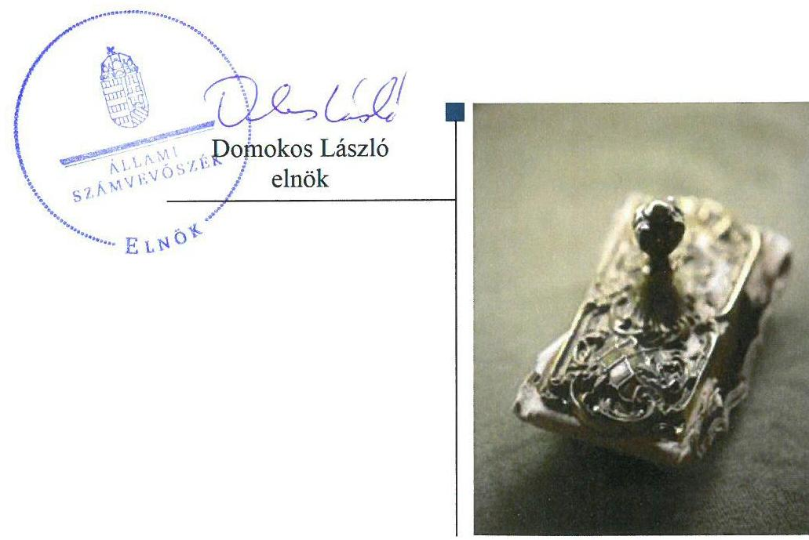
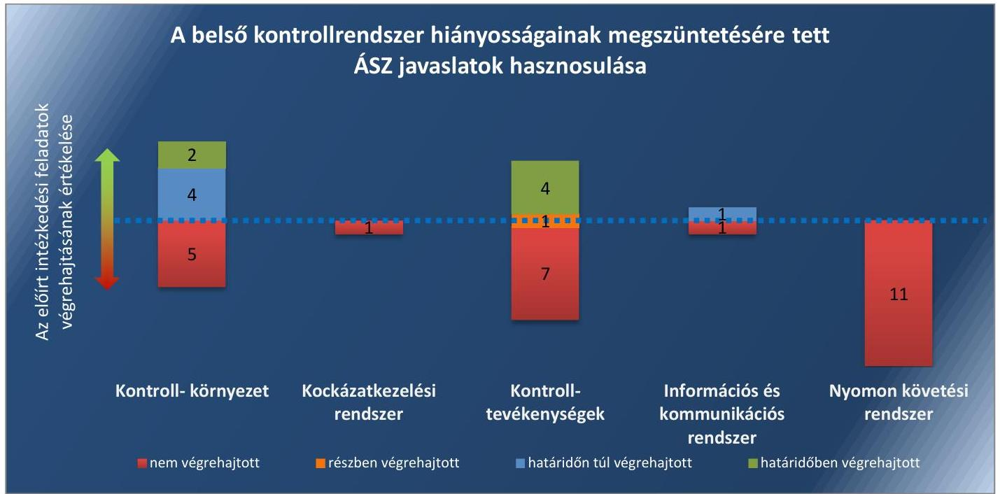
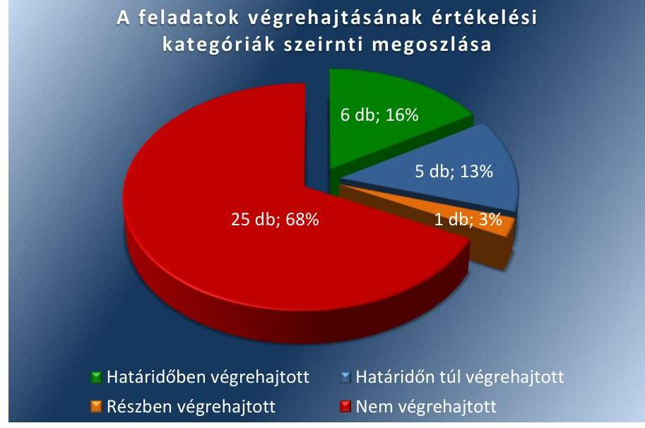

# Jelentés 

## Utóellenőrzések

Az önkormányzatok belső
kontrollrendszere kialakításának és működtetésének utóellenőrzése Hajós Város Önkormányzata 2018. 01. 05.

---

# AZ ELLENŐRZÉST FELÜGYELTE: 

DR. BENEDEK MÁRIA felügyeleti vezető

## AZ ELLENŐRZÉST VEZETTE ÉS A VÉGREHAJTÁSÁÉRT FELELŐS:

HORVÁTH JÓZSEF ellenőrzésvezető

## A PROGRAM ÖSSZEÁLLÍTÁSÁÉRT FELELŐS:

JANIK JÓZSEF LÁSZLÓ osztályvezető

## A TÉMÁHOZ KAPCSOLÓDÓ KORÁBBI SZÁMVEVŐSZÉKI JELENTÉSEK:

- címe: Jelentés az önkormányzatok belső kontrollrendszere kialakításának, egyes kontrolltevékenységek és a belső ellenőrzés működésének - 2013. évben induló - ellenőrzéséről - Hajós
- sorszáma: 13152

IKTATÓSZÁM: EL-0070-045/2017
TÉMASZÁM: 2096
ELLENŐRZÉS-AZONOSÍTÓ SZÁM: V075590

---

# TARTALOMJEGYZÉK 

■ ÖSSZEGZÉS ..... 5
■ AZ ELLENŐRZÉS CÉLJA ..... 7
■ AZ ELLENŐRZÉS TERÜLETE ..... 8
■ AZ ELLENŐRZÉS HÁTTERE, INDOKOLTSÁGA ..... 9
■ A JELENTÉS LÉNYEGES KÉRDÉSKÖRE ..... 10
■ AZ ELLENŐRZÉS HATÓKÖRE ÉS MÓDSZEREI ..... 11
■ MEGÁLLAPÍTÁSOK ..... 13
■ KÖVETKEZTETÉSEK ..... 18
■ MELLÉKLETEK ..... 19
I. sz. melléklet: Az ÁSZ 13152 számú jelentéséhez kapcsolódó intézkedési terv végrehajtása ..... 19
■ FÜGGELÉK: ÉSZREVÉTELEK ..... 27
■ RÖVIDÍTÉSEK JEGYZÉKE ..... 29

---

.

---

# ÖSSZEGZÉS 

Az Állami Számvevőszék Hajós Város Önkormányzata belső kontrollrendszere kialakításának és működtetésének utóellenőrzése során megállapította, hogy az intézkedési tervben meghatározott feladatok jelentős részét nem hajtotta végre, így a belső kontrollrendszer továbbra sem biztosította a szabályszerű, eredményes működést. A szabályozottság, illetve a gazdálkodási jogkörök gyakorlásával kapcsolatos feladatok végrehajtásának elmaradása nem biztosítja a közpénzekkel való elszámoltatható, felelős gazdálkodást.

## Az ellenőrzés társadalmi indokoltsága

Az Állami Számvevőszék stratégiájában célul tűzte ki a számvevőszéki munka hasznosulásának javítását. Ezzel összhangban ellenőrzi, hogy az ellenőrzött szervezetek megvalósították-e a korábbi ellenőrzései által feltárt hibák, hiányosságok és szabálytalanságok megszüntetése céljából kialakított intézkedési terveikben foglaltakat. A rendszeres utóellenőrzések hozzájárulnak a szükséges intézkedések tényleges végrehajtásához, ezáltal a közpénzügyek rendezettségének javulásához, igazolják, hogy lezárult a következmények nélküli ellenőrzések időszaka.

## Főbb megállapítások, következtetések

Hajós Város Önkormányzata az intézkedési tervben meghatározott 37 feladatból hat feladatot határidőben, ötöt határidőn túl, egyet részben, 25 feladatot nem hajtott végre.

Hajós Város Önkormányzata elkészítette Gazdasági programját, mely meghatározta azokat a célkitűzéseket és feladatokat, amelyek Hajós Város Önkormányzata által ellátandó feladatok biztosítását, színvonalának javítását szolgálják.

A jegyző a belső kontrollrendszer kialakításával és működtetésével kapcsolatos egyes szabályzatok jogszabályoknak megfelelő módosítását, a gazdálkodási jogkörök jogszabályokban előírt feltételek szerinti kialakítását és működtetését nem hajtotta végre, ezzel nem járult hozzá a gazdálkodás jogszabályokban előírt, megfelelő színvonalon történő működtetéséhez.

Hajós Város Önkormányzata az intézkedési tervben meghatározott feladatok végrehajtásáról a jogszabályban előírt nyilvántartást nem vezette.

---

# Összegzés

## 1. ábra

*Forrás: ÁSZ*

---

# AZ ELLENŐRZÉS CÉLJA 

Az ellenőrzés célja annak értékelése volt, hogy a számvevőszéki jelentésben foglalt intézkedést igénylő megállapításokkal és javaslatokkal összhangban készített intézkedési tervben meghatározott feladatokat az ellenőrzött szervezet végrehajtotta-e.

---

# AZ ELLENŐRZÉS TERÜLETE 

## Hajós Város Önkormányzata

Bács-Kiskun megye déli részén található Hajós Város település 2008. évben kapott városi rangot. A Központi Statisztikai Hivatal Magyarország közigazgatási helynévkönyve alapján 2016. január 1-jén a település állandó lakosainak száma 3013 fő volt.

A polgármester ${ }^{1}$ a 2010. évi önkormányzati választások óta tölti be tisztségét, a jegyző ${ }^{2}$ 2013. február 1-jétől látja el közszolgálati feladatait.

Hajós Város Önkormányzata Képviselő-testületének 2/2017. (V.29.) önkormányzati rendeletében elfogadott 2016. évi beszámolója alapján 390,3 millió Ft költségvetési bevételt ért el és 309,0 millió Ft költségvetési kiadást teljesített, mérlegfőösszege 1846,0 millió Ft, ezen belül a befektetett eszköz vagyona 1799,4 millió Ft, követelésállománya 7,7 millió Ft, kötelezettségállománya 30,2 millió Ft volt.

Az Állami Számvevőszék 2013. évben ellenőrizte Hajós Város Önkormányzata belső kontrollrendszere kialakításának, egyes kontrolltevékenységek és a belső ellenőrzés működésének szabályszerűségét 2012. január 1. és december 31. közötti időszak vonatkozásában. Az erről szóló 13152 számú jelentését ${ }^{3}$ 2013. december 10-én tette közzé. Az ellenőrzés célja annak megállapítása volt, hogy a belső kontrollrendszer elemeinek kialakítása, a pénzügyi folyamatokban kulcsszerepet betöltő teljesítésigazolás és érvényesítés, és a belső ellenőrzés szabályos működése biztosította-e Hajós Város Önkormányzatánál a közpénzfelhasználás szabályosságát, hozzájárult-e az értéket teremtő rend követelményének érvényesüléséhez. Az ÁSZ jelentésben foglalt javaslatok végrehajtása érdekében Hajós Város Képviselő-testülete a 15/214. Kt. számú határozattal intézkedési tervet fogadott el.

Az utóellenőrzés - 2013. december 10-től 2017. június 19-ig végrehajtott feladatokat figyelembe véve - az Állami Számvevőszék jelentésének megállapításaira és javaslataira a polgármester és a jegyző részére meghatározott intézkedést igénylő, az Állami Számvevőszék részére megküldött intézkedési tervben foglalt feladatok megvalósításának ellenőrzésére, illetve értékelésére terjedt ki.

---

# AZ ELLENŐRZÉS HÁTTERE, INDOKOLTSÁGA 

Az ÁSZ tv. ${ }^{4}$ 33. § (1) bekezdése értelmében a számvevőszéki jelentések intézkedést igénylő megállapításaihoz és javaslataihoz kapcsolódóan az ellenőrzött szervezet vezetője intézkedési tervet köteles összeállítani, és az Állami Számvevőszék részére megküldeni. Az intézkedési tervben foglaltak megvalósítását - az ÁSZ tv. 33. § (7) bekezdésében foglaltak alapján - az Állami Számvevőszék utóellenőrzés keretében ellenőrizheti. Az intézkedések megvalósulásának értékelése során az Állami Számvevőszék figyelembe veszi az ellenőrzött szervezetek működési feltételeiben, valamint a jogszabályi előírásokban bekövetkezett változásokat.

Az intézkedési tervekben foglalt feladatok hiányos, illetve késedelmes végrehajtása, valamint megvalósításának elmaradása azt mutatja, hogy az ellenőrzések során feltárt hibák, hiányosságok és szabálytalanságok megszüntetése nem kapott kellő hangsúlyt. Ez a szabályszerű működés és a felelős vezetői magatartás vonatkozásában kockázatot hordoz. E kockázatok feltárásával az Állami Számvevőszék utóellenőrzési rendszere fokozza a fegyelmet, és igazolja, hogy a közpénzzel való szabályos gazdálkodás felelőssége elől nem lehet kitérni.

Az utóellenőrzés négy szinten hasznosulhat:

- A társadalom szintjén az utóellenőrzés jelzi, hogy a számvevőszéki ellenőrzés megállapításainak van következménye: a hiányosságok megszüntetésére az ellenőrzött szervezet által meghatározott intézkedések végrehajtását is számon kéri az ÁSZ.
- Az ellenőrzött terület szintjén az utóellenőrzés tájékoztatást nyújt a terület döntéshozóinak a hiányosságok kiküszöbölésének jó gyakorlatairól, ezzel lehetőséget biztosítva arra, hogy az ÁSZ ellenőrzési megállapításai, javaslatai a terület nem ellenőrzött szervezeteinek a működése során is hasznosuljanak.
- Az ellenőrzött szervezet szintjén az utóellenőrzés feltárja, hogy a szervezet az intézkedések végrehajtásával hasznosította-e a korábbi ellenőrzési jelentésben a hiányosságok megszüntetése, illetve a kockázatok kezelése érdekében megfogalmazott javaslatokat.
- Az ÁSZ szintjén az utóellenőrzés visszacsatolást ad az ellenőrzési jelentések hasznosulásáról, az intézkedések elmaradása vagy részleges megvalósulása a további ellenőrzésekhez kockázati jelzésként szolgál.

---

# A JELENTÉS LÉNYEGES KÉRDÉSKÖRE 

Az ellenőrzött szervezet az intézkedési tervben foglaltakat az előírt határidőben végrehajtotta-e?

---

# AZ ELLENŐRZÉS HATÓKÖRE ÉS MÓDSZEREI 

## Az ellenőrzés típusa

Megfelelőségi ellenőrzés.

## Az ellenőrzött időszak

Az utóellenőrzés alapját képező ÁSZ jelentés közzétételének napjától (2013. december 10.) az ellenőrzésről szóló kiértesítő levél keltének napjáig (2017. június 19.) tartó időszak.

## Az ellenőrzés tárgya

Az ÁSZ tv. 2011. július 1-jei hatálybalépését követően a számvevőszéki jelentésben foglalt intézkedést igénylő megállapításokkal és javaslatokkal összhangban - Hajós Város Önkormányzata által - készített intézkedési tervben foglaltak végrehajtásának ellenőrzése volt.

Az ellenőrzés kiterjedt minden olyan körülményre és adatra, amely az ÁSZ jogszabályban meghatározott feladatainak teljesítéséhez, valamint a program végrehajtása folyamán felmerült újabb összefüggések feltárásához szükséges volt.

## Az ellenőrzött szervezet

Hajós Város Önkormányzata

## Az ellenőrzés jogalapja

Az ÁSZ tv. 33. § (7) bekezdése alapján az intézkedési tervben foglaltak megvalósítását az ÁSZ utóellenőrzés keretében ellenőrizheti.

## Az ellenőrzés módszerei

Az ÁSZ az ellenőrzést az ellenőrzési program ellenőrzési kérdései, az ellenőrzött időszakban hatályos jogszabályok, az ellenőrzés szakmai szabályok és módszertanok figyelembevételével, önálló ellenőrzés keretében végezte.

Az ÁSZ az ellenőrzés ideje alatt az ellenőrzött szervezettel történő kapcsolattartást az ÁSZ SZMSZ ${ }^{\circledR}$-ének vonatkozó előírásai alapján biztosította.

---

Az utóellenőrzés megállapításait elsősorban az ÁSZ rendelkezésére álló, valamint az ellenőrzött szervezettől elektronikusan bekért dokumentumok alapozták meg.

Az ellenőrzési bizonyítékként felhasználható adatforrások közé tartoztak egyrészt a szakmai programban felsorolt adatforrások, másrészt minden - az ellenőrzés folyamán feltárt, az ellenőrzés szempontjából információt tartalmazó - dokumentum.

Az intézkedési tervben előírt feladatokat, azok végrehajthatósága, illetve végrehajtása szempontjából az ÁSZ az alábbiak szerint értékelte:
$\longrightarrow$ „határidőben végrehajtott" a feladat, ha a teljesítés dokumentáltan, az intézkedési tervben előírt határidőben és tartalommal megtörtént;
$\longrightarrow$ „határidőn túl végrehajtott" a feladat, ha annak teljesítése az intézkedési tervben meghatározott módon, de az előírt határidőn túl történt meg;
$\longrightarrow$ „részben végrehajtott" a feladat, ha végrehajtása teljes körűen az intézkedési tervben előírt módon nem történt meg;
$\longrightarrow$ „nem végrehajtott" a feladat, ha a végrehajtás nem történt meg, vagy amennyiben a teljesítést nem dokumentálták;
$\longrightarrow$ „okafogyottá vált" a feladat, ha végrehajtására - meghatározott esemény bekövetkezése, továbbá külső körülmény, a működést érintő feltétel változása miatt - már nincs szükség, illetve lehetőség, és egyértelműen megállapítható, hogy az intézkedést szükségessé tevő körülmény a jövőben nem fordulhat elő;
$\longrightarrow$ „nem időszerű" az a feladat, amelynek ellenőrzési időszakon belüli végrehajtására azért nem került (kerülhetett) sor, mert az intézkedés alapjául szolgáló esemény nem következett be, de annak jövőbeni előfordulása lehetséges, a végrehajtása nem volt esedékes, vagy a végrehajtás határideje még nem járt le.
Az ellenőrzés lefolytatásához az ellenőrzött szervezet a tanúsítványok elektronikus kitöltésével, valamint az ÁSZ által kért dokumentumok elektronikus megküldésével szolgáltatott adatokat, amelyek valódiságát és teljes körűségét az ellenőrzött szervezet vezetője által tett teljességi és hitelességi nyilatkozat igazolta. Az így rendelkezésre bocsátott adatok, információk kontrollja az ellenőrzés keretében történt.

---

# MEGÁLLAPÍTÁSOK 

## Az ellenőrzött szervezet az intézkedési tervben foglaltakat az előírt határidőben végrehajtotta-e?

Összegző megállapítás

Az Önkormányzat ${ }^{7}$ az intézkedési tervben meghatározott 37 feladatból hatot határidőben, ötöt határidőn túl, egyet részben és 25 feladatot nem hajtott végre. Az intézkedési tervben meghatározott feladatok végrehajtásáról a jogszabályban előírt nyilvántartást nem vezette.

Az ÁSZ a jelentésében a polgármester részére öt, a jegyző részére hét pontban összesen 32 intézkedést igénylő megállapítást és javaslatot fogalmazott meg. A Képviselő-testület által elfogadott és az ÁSZ részére a polgármester által megküldött intézkedési tervben a hiányosságok, szabálytalanságok megszüntetésére a polgármester részére öt, a jegyző részére 32 intézkedési feladat került meghatározásra.

Az intézkedési tervben meghatározott feladatokat, határidőket, felelősöket és a feladatok végrehajtását az I. számú melléklet mutatja be.

A jegyző az intézkedési tervben meghatározott feladatok végrehajtásáról a Bkr. ${ }^{8} 14 . \S$ (1) bekezdésében előírt nyilvántartást nem vezette.

Az Önkormányzat intézkedési tervében meghatározott feladatok végrehajtásának értékelési kategóriák szerinti megoszlását a 2. ábra szemlélteti.
2. ábra

A feladatok végrehajtásának értékelési kategóriák szerinti megoszlása

Forrás: ÁSZ

---

# HATÁRIDŐBEN VÉGREHAJTOTT feladatok: 

1. A jegyző a jogszabályi előírásoknak megfelelően elkészítette a Közös Hivatal ${ }^{9}$ Szervezeti és Működési Szabályzatát és kezdeményezte annak Képviselő-testület elé terjesztését.
2. A jegyző a jogszabályi előírásoknak megfelelően aktualizálta Hajós Város Önkormányzata Leltárkészítési és leltározási szabályzatát ${ }^{10}$.
3. A jegyző a jogszabályi előírásoknak megfelelően belső szabályzatban rögzítette az előzetes írásbeli kötelezettségvállalást nem igénylő kifizetések rendjét.
4. A jegyző a jogszabályi előírásoknak megfelelően belső szabályzatban rendezte az érvényesítés gyakorlásának módjával, eljárási és részletszabályaival kapcsolatos belső előírásokat, feltételeket.
5. A jegyző a jogszabályi előírásoknak megfelelően gondoskodott az utalvány kötelező tartalmi elemeinek belső szabályzatban történő rögzítéséről.
6. A jegyző

 a jogszabályi előírásoknak megfelelően intézkedett arról, hogy a bizonylatokon tüntessék fel a könyvelés módjára és az érintett könyvviteli számlákra történő hivatkozást.

## HATÁRIDŐN TÚL VÉGREHAJTOTT feladatok:

7. A polgármester 2014. december 31-i határidőn túl, a jogszabályi előírásoknak megfelelő tartalommal készítette elő és terjesztette a Képviselő-testület elé Hajós Város Gazdasági Program ${ }^{11}$ tervezetét, amelyet a testület 2016. március 29-én fogadott el.
8. A jegyző 2014. december 31-i határidőn túl, a jogszabályi előírásoknak megfelelő tartalommal készítette elő és kezdeményezte a polgármesternél Hajós Város Gazdasági Program tervezetének Képviselő-testület elé terjesztését, amelyet a testület 2016. március 29-én fogadott el.
9. A jegyző 2014. május 31-i határidőn túl, a jogszabályi előírásoknak megfelelő tartalommal előkészítette az Önkormányzat vagyongazdálkodási rendelet ${ }^{12}$ módosítását és kezdeményezte a módosítás Képviselő-testület elé terjesztését, melyet a testület 2014. június 24-én fogadott el.
10. A jegyző 2014. november 30-i határidőn túl, a jogszabályi előírásoknak megfelelő tartalommal 2014. december 22-én készítette el a Tűzvédelmi szabályzatot ${ }^{13}$.
11. A jegyző 2014. május 31-i határidőn túl, 2014. november 11-én a jogszabályi előírásoknak megfelelően megállapította a kötelezően közzéteendő adatok nyilvánosságra hozatala rendjét.

## RÉSZBEN VÉGREHAJTOTT feladat:

12. A jegyző intézkedett arról, hogy a kiadási pénztárbizonylaton, valamint az utalványon a jogszabályban előírt kötelező tartalmi elemeket tüntessék fel. A jegyző nem intézkedett arról, hogy a kötelezettségvállalásokat az Ávr. ${ }^{14}$ 56. § (1) bekezdésében foglalt előírásoknak megfelelően nyilvántartásba vegyék.

---

# NEM VÉGRE HAJTOTT feladatok: 

13. A polgármester nem biztosította, hogy az Önkormányzat kiadási előirányzatai terhére történt kötelezettségvállalásra az Áht. ${ }^{15}$ 37. § (1) bekezdésének és az 55. §-ában meghatározottaknak megfelelően - az Ávr. 53. §-ában meghatározott kivételeket figyelembe véve - kizárólag a pénzügyi ellenjegyzés után, a pénzügyi teljesítés esedékességét megelőzően, írásban kerüljön sor.
14. A polgármester - az Ávr. 57. § (4) bekezdésében foglaltak ellenére nem jelölte ki az Önkormányzat kiadási előirányzatai vonatkozásában a teljesítésigazolásra jogosult személyeket.
15. A polgármester a Bkr. 49. § (3a), illetve az 56. § (8) bekezdésében foglaltak ellenére az éves ellenőrzési jelentést a zárszámadási rendelettervezettel együtt nem terjesztette a Képviselő-testület elé.
16. A polgármester a Mötv. ${ }^{16}$ 115. § (1) bekezdésében foglaltak ellenére nem kísérte figyelemmel az Önkormányzat gazdálkodásának szabályszerűségét. Nem gondoskodott a belső kontrollrendszer működésére vonatkozó jogszabályi rendelkezések be nem tartása, valamint a teljesítésigazolás, illetve az érvényesítés kontrollokkal összefüggésben feltárt hiányosságok, szabálytalanságok tekintetében az esetleges munkajogi felelősséggel kapcsolatos körülmények kivizsgálásáról.
17. A jegyző az Mvtv. ${ }^{17}$ 2. § (3) bekezdésében foglaltak ellenére nem határozta meg az egészséget nem veszélyeztető és biztonságos munkavégzés követelményei megvalósításának módját.
18. A jegyző nem rögzítette belső szabályzatban az Ávr. 13. § (5) bekezdésében foglaltaknak megfelelően a gazdálkodási csoport által ellátott feladatok munkafolyamatainak leírását, valamint nem határozta meg a belső és külső kapcsolattartás módját és szabályait.
19. A jegyző a Bkr. 6. § (3)-(4) bekezdésében foglalt előírások ellenére nem készítette el az ellenőrzési nyomvonalat és nem szabályozta a szabálytalanságok kezelésének eljárásrendjét.
20. A jegyző a Kttv. ${ }^{18}$ 130. § (1) bekezdésében foglaltak ellenére nem értékelte írásban a Közös Hivatal köztisztviselőinek munkateljesítményét.
21. A jegyző a Mötv. 81. § (3) bekezdés c) pontjában, illetve a Kttv. 83. §-ában foglaltak ellenére nem készítette elő a hivatásetikai alapelvek részletes tartalmának, valamint az etikai eljárás szabályainak dokumentumait és a Kttv. 231. § (1) bekezdésében foglaltak érvényesülése érdekében nem kezdeményezte azok Képviselő-testület elé terjesztését.
22. A jegyző a Bkr. 7. § (2) bekezdésében foglaltak ellenére nem mérte fel és nem állapította meg a Közös Hivatal tevékenységében, gazdálkodásában rejlő kockázatokat, nem határozta meg az egyes kockázatokkal kapcsolatban szükséges intézkedéseket, valamint azok teljesítése folyamatos nyomon követésének módját.
23. A jegyző a Bkr. 8. § (2) bekezdésében foglaltak ellenére nem biztosította minden tevékenységre vonatkozóan a folyamatba épített, előzetes és utólagos vezetői ellenőrzést.

---

24. A jegyző az Ávr. 13. § (5) bekezdésében előírtak ellenére nem határozta meg a gazdasági feladatot ellátó alkalmazottak helyettesítésének rendjét.
25. A jegyző az Info. tv. ${ }^{19}$ 33. § (1) és (3) bekezdésében foglalt előírások ellenére nem tett eleget az elektronikus közzétételi kötelezettségének.
26. A jegyző a Bkr. 3. § e) pontjában és a 10. §-ában előírtak ellenére nem alakította ki és nem működtette a Közös Hivatal tevékenységének, a célok megvalósításának nyomon követését biztosító rendszert, amelynek része az operatív tevékenységek keretében megvalósuló folyamatos és eseti nyomon követés is.
27. A jegyző nem a Bkr. 11. § (1) bekezdésében meghatározott, annak 1. mellékletében foglalt nyilatkozatban értékelte a Közös Hivatal belső kontrollrendszerének minőségét.
28. A jegyző nem hozta meg a szükséges intézkedéseket annak érdekében, hogy a teljesítésigazolás során az Áht. 38. § (1) és az Ávr. 57. § (1) bekezdésekben előírtaknak megfelelően, ellenőrizhető okmányok alapján ellenőrizzék és igazolják a kiadások teljesítésének jogosságát, összegszerűségét, az ellenszolgáltatást is magában foglaló kötelezettségvállalás esetén az ellenszolgáltatás teljesítését, valamint az Ávr. 57. § (3) bekezdése szerint a teljesítést, az igazolás dátumának és a teljesítés tényére történő utalásnak a megjelölésével, az arra jogosult személy aláírásával igazolják.
29. A jegyző nem intézkedett annak érdekében, hogy a kifizetéseket megelőzően a teljesítésigazolás alapján - az Ávr. 57. § (3) bekezdése szerinti esetben annak hiányában is - az összegszerűségnek, a fedezet meglétének és a megelőző ügymenetben az Áht., az Áhsz. ${ }^{20}$, az Ávr. előírása és a belső szabályzatokban foglaltak betartásának az ellenőrzése az Ávr. 58. § (1), (2) és (3) bekezdése szerint - történjen meg.
30. A jegyző nem intézkedett annak érdekében, hogy a kötelezettségvállalásra az Áht. 37. § (1) bekezdésében és az Ávr. 55. § (1) bekezdésében foglaltaknak megfelelően - az Ávr. 53. §-ában meghatározott kivételeket figyelembe véve - kizárólag a pénzügyi ellenjegyzés után, a pénzügyi teljesítés esedékességét megelőzően, írásban kerüljön sor.
31. A jegyző a Bkr. 22. § (1)-(3) bekezdéseiben foglaltak ellenére nem intézkedett a belső ellenőrzési vezetői tevékenységek és kötelezettség ellátásának módjáról.
32. A jegyző a Bkr. 22. § (1) bekezdés b) pontjában, a 29. § (1) bekezdés és a 30. § (1) bekezdésében foglaltak ellenére nem kezdeményezte a stratégiai ellenőrzési terv elkészítését.
33. A jegyző nem intézkedett annak érdekében, hogy az éves ellenőrzési terv tartalmazza a Bkr. 31. § (4) bekezdésében előírt tartalmi elemeket, továbbá az éves ellenőrzési terv a Bkr. 22. § (1) bekezdés b) pontja, a 29. § (1) és a 31. § (2) bekezdése alapján kockázatelemzésen alapuljon.

---

34. A jegyző a Bkr. 33. § (2) bekezdésében foglaltak ellenére nem intézkedett arról, hogy az ellenőrzési programot a belső ellenőrzési vezető hagyja jóvá.
35. A jegyző nem készített intézkedési tervet a Bkr. 45. § (1)-(3) bekezdésében foglaltnak megfelelő tartalommal és határidőn belül a belső ellenőrzési jelentésekben megfogalmazott javaslatok végrehajtására.
36. A jegyző nem kezdeményezte a Bkr. 21. § (2) bekezdés d) pontjának, az 50. §-ának és a 47. §-ának megfelelő nyilvántartás vezetését az elvégzett belső ellenőrzésekről, a belső ellenőrzési jelentésekben tett megállapításokról, javaslatokról, a vonatkozó intézkedési tervekről, és azok végrehajtásának nyomon követéséről.
37. A jegyző a Bkr. 22. § (1) bekezdés g) pontjában és a 49. § (1) bekezdésében foglaltak ellenére nem intézkedett az éves ellenőrzési jelentés elkészítéséről.

---

# KÖVETKEZTETÉSEK 

Az Önkormányzat nem gondoskodott a gazdálkodási jogkörök (érvényesítés, pénzügyi ellenjegyzés, teljesítés igazolás) szabályszerű gyakorlásáról, amivel sérül a közpénzekkel való átlátható, felelős gazdálkodás, és ami jelentős kockázatot jelent a gazdálkodás szabályszerűsége és elszámoltathatósága szempontjából. A nem végrehajtott feladat indokolja a feltárt hiányosság, szabálytalanság tekintetében a munkajogi felelősség tisztázására irányuló eljárás megindítását, és eredményének ismeretében a szükséges intézkedések megtételét.

---

# MELLÉKLETEK

- I. SZ. MELLÉKLET: AZ ÁSZ 13152 SZÁMÚ JELENTÉSÉHEZ KAPCSOLÓDÓ INTÉZKEDÉSI TERV VÉGREHAJTÁSA

|  Sorszám | Az intézkedési tervben meghatározott feladat | Az intézkedési tervben meghatározott határidő | Az intézkedési tervben meghatározott feladat felelőse | A feladat végrehajtása  |
| --- | --- | --- | --- | --- |
|  Határidőben végrehajtott feladat |  |  |  |   |
|  1. | El kell készíteni az Áht. 10. § (5) bekezdése alapján a Hivatal szervezeti és működési szabályzatát és kezdeményezni kell az Áht. 9. § (1) bekezdés a) pontjában foglaltak érdekében a hivatali SZMSZ Képviselő-testület elé terjesztését. | 2014. november 30. | Jegyző | A jegyző a jogszabályi előírásoknak megfelelően elkészítette a Közös Hivatal Szervezeti és Működési Szabályzatát és kezdeményezte annak Képviselő-testület elé terjesztését. Az előterjesztést a Hajós Város Önkormányzat Képviselő-testülete, illetve Homokmágy Község Önkormányzata Képviselő-testülete elfogadta.  |
|  2. | Aktualizálni kell a Számv. tv. ${ }^{21}$ 14. § (11) bekezdésében foglaltak alapján az Áhsz.; 8. § (4) bekezdés a) pontjában előírt leltározási és leltárkészítési szabályzatot. | 2014. november 30. | Jegyző | A jegyző a jogszabályi előírásoknak megfelelően aktualizálta Hajós Város Önkormányzata Leltárkészítési és leltározási szabályzatát, melyet 2014. szeptember 30-án kiadmányozott.  |
|  3. | Rögzíteni kell belső szabályzatban az Ávr. 53. § (2) bekezdés alapján az előzetes írásbeli kötelezettségvállalást nem igénylő kifizetések rendjét. | 2014. november 30. | Jegyző | A jegyző belső a jogszabályi előírásoknak megfelelően belső szabályzatban, a Gazdálkodási szabályzat ${ }^{22}$ 1.2.1. pontjában rögzítette az előzetes írásbeli kötelezettségvállalást nem igénylő kifizetések rendjét.  |
|  4. | Rendezni kell belső szabályzatban az Ávr. 13. § (2) bekezdés a) pontjában foglaltak alapján az érvényesítés gyakorlásának módjával, eljárási és részletszabályaival kapcsolatos belső előírásokat, feltételeket. | 2014. november 30. | Jegyző | A jegyző a jogszabályi előírásoknak megfelelően a Gazdálkodási szabályzatban rendezte az érvényesítés gyakorlásának módjával, eljárási és részletszabályaival kapcsolatos belső előírásokat, feltételeket.  |
|  5. | Gondoskodni kell arról, hogy az Ávr. 13. § (2) bekezdés a) pontja alapján elkészített belső szabályzatban az utalvány kötelező tartalmi elemeit az Ávr. 59. § (3) bekezdésében előírtaknak megfelelően rögzítsék. | 2014. november 30. | Jegyző | A jegyző a jogszabályi előírásoknak megfelelően, a Gazdálkodási szabályzat 8. számú mellékletében gondoskodott az utalvány kötelező tartalmi elemeinek belső szabályzatban történő rögzítéséről.  |
|  6. | Intézkedések meghozatala - a teljesítés igazolása és az érvényesítés vonatkozásában feltárt hiányosságok megszüntetése, illetve az operatív gazdálkodás során | azonnal, illetve folyamatos | Jegyző | A jegyző a jogszabályi előírásoknak megfelelően, a Gazdálkodási szabályzat 8. számú mellékletében intézkedett arról, hogy a bizonylatokon tüntessék fel a könyvelés módjára és az érintett könyvviteli számlákra történő hivatkozást.  |

---

|  1. | Az intézkedési tervben meghatározott feladat | Az
 intézkedési tervben meghatározott határidő | Az intézkedési tervben meghatározott feladat felelőse | A feladat végrehajtása  |
| --- | --- | --- | --- | --- |
|   | a működésbeli hibák megelőzése, feltárása és kijavítása érdekében arról, hogy a bizonylaton tüntessék fel a Számv. tv. 167. § (1) bekezdés h) pontjában előírt, a könyvelés módjára és az érintett könyvviteli számlákra történő hivatkozást. |  |  |   |
|  2. | Határidőn túl végrehajtott feladat |  |  |   |
|  7. | Elő kell készíteni és a Képviselő-testület elé kell terjeszteni a Mótv. 116. § (1)-(4) bekezdéseinek megfelelő tartalommal az Önkormányzat gazdasági programtervezetét. | 2014. december 31. | Polgármester | A polgármester 2014. december 31-i határidőn túl, a jogszabályi előírásoknak megfelelő tartalommal készítette elő és terjesztette a Képviselő-testület elé Hajós Város Gazdasági Program tervezetét, amelyet a testület 2016. március 29-én 12/2016 Kt. számú határozatával fogadott el.  |
|  8. | Elő kell készíteni a Htv. ${ }^{23}$ 140. § (1) bekezdésében foglaltak alapján a gazdasági program tervezetét a Mótv. 116. § (3)-(4) bekezdéseiben foglalt tartalommal, és kezdeményezni kell a polgármesternél a Képviselő-testület elé terjesztését. | 2014. november 30. | Jegyző | A jegyző 2014. december 31-i határidőn túl, a jogszabályi előírásoknak megfelelő tartalommal készítette elő és kezdeményezte a polgármesternél Hajós Város Gazdasági Program tervezetének Képviselő-testület elé terjesztését, amelyet a testület 2016. március 29-én a 12/2016 Kt. számú határozatával fogadott el.  |
|  9. | Elő kell készíteni az Mótv. 81. § (3) bekezdés c) pontjában foglalt feladatkörben a vagyongazdálkodási rendelet módosítását, és kezdeményezni kell a módosítás Képviselő-testület elé terjesztését annak érdekében, hogy az megfeleljen az Nvtv. ${ }^{24}$ 3. § (1) bekezdése, 13. § (1) és az Mótv. 109. § (4) bekezdése előírásainak. | 2014. május 31. | Jegyző | A jegyző 2014. május 31-i határidőn túl, a jogszabályi előírásoknak megfelelő tartalommal előkészítette az Önkormányzat vagyongazdálkodási rendelet módosítását és kezdeményezte a módosítás Képviselő-testület elé terjesztését, melyet a testület 2014. június 24-én a 7/2014 (VI.24) számú önkormányzati rendeletben fogadott el.  |
|  10. | El kell készíteni a tűzvédelmi szabályzatot a Tvtv. ${ }^{25}$ 19. § (1) bekezdésben foglalt előírásoknak megfelelően. | 2014. november 30. | Jegyző | A jegyző 2014. november 30-i határidőn túl, a jogszabályi előírásoknak megfelelő tartalommal 2014. december 22-én készítette el a Tűzvédelmi szabályzatot.  |
|  11. | Meg kell állapítani - az Info tv. 35. § (3) bekezdésében, valamint az Ávr. 13. § (2) bekezdés h) pontjában foglaltaknak megfelelően - kötelezően közzéteendő adatok nyilvánosságra hozatala rendjét. | 2014. május 31. | Jegyző | A jegyző 2014. május 31-i határidőn túl, 2014. november 11-én a jogszabályi előírásoknak megfelelően megállapította a kötelezően közzéteendő adatok nyilvánosságra hozatala rendjét.  |

---

|  Sorszám | Az intézkedési tervben meghatározott feladat | Az intézkedési tervben meghatározott határidő | Az intézkedési tervben meghatározott feladat felelőse | A feladat végrehajtása  |
| --- | --- | --- | --- | --- |
|  Részben végrehajtott feladat |  |  |  |   |
|  12. | Intézkedések meghozatala - a teljesítés igazolása és az érvényesítés vonatkozásában feltárt hiányosságok megszüntetése, illetve az operatív gazdálkodás során a működésbeli hibák megelőzése, feltárása és kijavítása érdekében arról, hogy a kötelezettségvállalásokat az Ávr. 56. § (1) bekezdésében foglalt előírásnak megfelelően vegyék nyilvántartásba, és a kiadási pénztárbizonylaton, valamint az utalványon az Ávr. 59. § (3)-(4) bekezdéseiben foglalt kötelező tartalmi elemeket tüntessék fel. | azonnal, illetve folyamatos | Jegyző | A jegyző intézkedett arról, hogy a kiadási pénztárbizonylaton, valamint az utalványon a jogszabályban előírt kötelező tartalmi elemeket tüntessék fel. A jegyző nem intézkedett arról, hogy a kötelezettségvállalásokat az Ávr. 56. § (1) bekezdésében foglalt előírásoknak megfelelően nyilvántartásba vegyék.  |
|  Nem végrehajtott feladat |  |  |  |   |
|  13. | Biztosítani kell, hogy az Önkormányzat kiadási előirányzatai terhére történt kötelezettségvállalásra az Áht. 37. § (1) bekezdésének és az 55. §-ában meghatározottaknak megfelelően - az Ávr. 53. §-ában meghatározott kivételeket figyelembe véve - kizárólag a pénzügyi ellenjegyzés után, a pénzügyi teljesítés esedékességét megelőzően, írásban kerüljön sor. | azonnal, illetve folyamatos | Polgármester | A polgármester nem biztosította, hogy az Önkormányzat kiadási előirányzatai terhére történt kötelezettségvállalásra az Áht. 37. § (1) bekezdésének és az 55. §-ában meghatározottaknak megfelelően - az Ávr. 53. §-ában meghatározott kivételeket figyelembe véve - kizárólag a pénzügyi ellenjegyzés után, a pénzügyi teljesítés esedékességét megelőzően, írásban kerüljön sor.  |
|  14. | Ki kell jelölni - az Ávr. 57. § (4) bekezdésében foglaltak figyelembe vételével - az Önkormányzat kiadási előirányzatai vonatkozásában a teljesítésigazolásra jogosult személyeket. | 2014. március 1. | Polgármester | A polgármester - az Ávr. 57. § (4) bekezdésében foglaltak ellenére nem jelölte ki az Önkormányzat kiadási előirányzatai vonatkozásában a teljesítésigazolásra jogosult személyeket.  |
|  15. | Az éves ellenőrzési jelentést a Bkr. 49. § (3a), illetve az 56. § (8) bekezdésében foglaltak figyelembe vételével a zárszámadási rendelettervezettel együtt kell a Képviselő-testület elé terjeszteni. | 2014. április 30. | Polgármester | A polgármester a Bkr. 49. § (3a), illetve az 56. § (8) bekezdésében foglaltak ellenére az éves ellenőrzési jelentést a zárszámadási rendelettervezettel együtt nem terjesztette a Képviselő-testület elé.  |
|  16. | Figyelemmel kell kísérni az Mótv. 115. § (1) bekezdésében foglaltak alapján az Önkormányzat gazdálkodásának szabályszerűségét. Az Mótv. 67. § f) pontja alapján gondoskodni kell a belső kontrollrendszer | folyamatos | Polgármester | A polgármester a Mótv. 115. § (1) bekezdésében foglaltak ellenére nem kísérte figyelemmel az Önkormányzat gazdálkodásának szabályszerűségét. Nem gondoskodott a belső kontrollrendszer működésére vonatkozó jogszabályi rendelkezések be  |

---

|  17. | Az intézkedési tervben meghatározott feladat | Az intézkedési tervben meghatározott határidő | Az intézkedési tervben meghatározott feladat felelőse | A feladat végrehajtása  |
| --- | --- | --- | --- | --- |
|   | működésére vonatkozó jogszabályi rendelkezések be nem tartása, valamint a teljesítésigazolás, illetve az érvényesítés kontrollokkal összefüggésben feltárt hiányosságok, szabálytalanságok tekintetében az esetleges munkajogi felelősséggel kapcsolatos körülmények kivizsgálásáról, majd a vizsgálat eredményének függvényében meg kell tenni a szükséges munkajogi intézkedéseket. |  |  | nem tartása, valamint a teljesítésigazolás, illetve az érvényesítés kontrollokkal összefüggésben feltárt hiányosságok, szabálytalanságok tekintetében az esetleges munkajogi felelősséggel kapcsolatos körülmények kivizsgálásáról.  |
|  17. | Meg kell határozni az egészséget nem veszélyeztető és biztonságos munkavégzés követelményei megvalósításának módját az Mvtv. 2. § (3) bekezdés alapján. | 2014. november 30. | Jegyző | A jegyző az Mvtv. 2. § (3) bekezdésében foglaltak ellenére nem határozta meg az egészséget nem veszélyeztető és biztonságos munkavégzés követelményei megvalósításának módját.  |
|  18. | Rögzíteni kell belső szabályzatban az Ávr. 13. § (5) bekezdésében foglaltaknak megfelelően a gazdálkodási csoport által ellátott feladatok munkafolyamatainak leírását, valamint határozza meg a belső és külső kapcsolattartás módját és szabályait. | 2014. november 30. | Jegyző | A jegyző nem rögzítette belső szabályzatban az Ávr. 13. § (5) bekezdésében foglaltaknak megfelelően a gazdálkodási csoport által ellátott feladatok munkafolyamatainak leírását, valamint nem határozta meg a belső és külső kapcsolattartás módját és szabályait.  |
|  19. | El kell készíteni az ellenőrzési nyomvonalat és szabályozni kell a szabálytalanságok kezelésének eljárásrendjét a Bkr. 6. § (3)-(4) bekezdéseiben foglaltaknak megfelelően." | 2014. november 30. | Jegyző | A jegyző a Bkr. 6. § (3)-(4) bekezdésében foglalt előírások ellenére nem készítette el az ellenőrzési nyomvonalat és nem szabályozta a szabálytalanságok kezelésének eljárásrendjét.  |
|  20. | Írásban értékelni kell a Kttv. 130. § (1) bekezdése alapján a Polgármesteri Hivatal köztisztviselőinek munkateljesítményét. | 2014. november 30. | Jegyző | A jegyző a Kttv. 130. § (1) bekezdésében foglaltak ellenére nem értékelte írásban a Közös Hivatal köztisztviselőinek munkateljesítményét.  |
|  21. | Elő kell készíteni az Mötv. 81. § (3) bekezdés c) pontja alapján a köztisztviselőkkel szembeni, a Kttv. 83. §-ában foglaltak szerinti hivatásetikai alapelvek részletes tartalmának, valamint az etikai eljárás szabályainak dokumentumait, és a Kttv. 231. § (1) bekezdésében foglaltak érvényesülése érdekében kezdeményezni kell azok Képviselő-testület elé terjesztését. | 2014. november 30. | Jegyző | A jegyző a Mötv. 81. § (3) bekezdés c) pontjában, illetve a Kttv. 83. §-ában foglaltak ellenére nem készítette elő a hivatásetikai alapelvek részletes tartalmának, valamint az etikai eljárás szabályainak dokumentumait és a Kttv. 231. § (1) bekezdésében foglaltak érvényesülése érdekében nem kezdeményezte azok Képviselő-testület elé terjesztését.  |

---

|  22. | Fel kell mérni és meg kell állapítani a Bkr. 7. § (2) bekezdésében foglaltak alapján a Polgármesteri Hivatal tevékenységében, gazdálkodásában rejlő kockázatokat, meg kell határozni az egyes kockázatokkal kapcsolatban szükséges intézkedéseket, valamint azok teljesítése folyamatos nyomon követésének módját. | 2014. május 31. | Jegyző | A jegyző a Bkr. 7. § (2) bekezdésében foglaltak ellenére nem mérte fel és nem állapította meg a Közös Hivatal tevékenységében, gazdálkodásában rejlő kockázatokat, nem határozta meg az egyes kockázatokkal kapcsolatban szükséges intézkedéseket, valamint azok teljesítése folyamatos nyomon követésének módját.  |
| --- | --- | --- | --- | --- |
|  23. | Biztosítani kell minden tevékenységre vonatkozóan a folyamatba épített, előzetes és utólagos vezetői ellenőrzést a Bkr. 8. § (2) bekezdés alapján. | 2014. november 30. | Jegyző | A jegyző a Bkr. 8. § (2) bekezdésében foglaltak ellenére nem biztosította minden tevékenységre vonatkozóan a folyamatba épített, előzetes és utólagos vezetői ellenőrzést.  |
|  24. | Meg kell határozni az Ávr. 13. § (5) bekezdésében előírtak alapján a gazdasági feladatot ellátó alkalmazottak helyettesítésének rendjét. | 2014. november 30. | Jegyző | A jegyző az Ávr. 13. § (5) bekezdésében előírtak ellenére nem határozta meg a gazdasági feladatot ellátó alkalmazottak helyettesítésének rendjét.  |
|  25. | Az Info. tv. 33. § (1) és (3) bekezdés előírásának megfelelően az elektronikus közzétételi kötelezettségnek eleget kell tenni. | 2014. május 31. | Jegyző |

 A jegyző az Info. tv. 33. § (1) és (3) bekezdésében foglalt előírások ellenére nem tett eleget az elektronikus közzétételi kötelezettségének.  |
|  26. | Ki kell alakítani és működtetni kell a Bkr. 3. § e) pontjában és a 10. §-ában előírtak alapján a Hivatal tevékenységének, a célok megvalósításának nyomon követését biztosító rendszert, amelynek része az operatív tevékenységek keretében megvalósuló folyamatos és eseti nyomon követés is. | 2014. november 30. | Jegyző | A jegyző a Bkr. 3. § e) pontjában és a 10. §-ában előírtak ellenére nem alakította ki és nem működtette a Közös Hivatal tevékenységének, a célok megvalósításának nyomon követését biztosító rendszert, amelynek része az operatív tevékenységek keretében megvalósuló folyamatos és eseti nyomon követés is.  |
|  27. | Értékelni kell a Bkr. 11. § (1) bekezdése alapján a jogszabályban meghatározott keretek között a Polgármesteri Hivatal belső kontrollrendszerének minőségét - a Bkr. 1. mellékletében foglalt - nyilatkozatban. | 2014. április 30. | Jegyző | A jegyző nem a Bkr. 11. § (1) bekezdésében meghatározott, annak 1. mellékletében foglalt nyilatkozatban értékelte a Közös Hivatal belső kontrollrendszerének minőségét.  |
|  28. | Intézkedések meghozatala - a teljesítés igazolása és az érvényesítés vonatkozásában feltárt hiányosságok megszüntetése, illetve az operatív gazdálkodás során a működésbeli hibák megelőzése, feltárása és kijavítása érdekében arról, hogy a teljesítésigazolás során az Áht. 38. § (1) bekezdésében és az Ávr. 57. § (1) | azonnal, illetve folyamatos | Jegyző | A jegyző nem hozta meg a szükséges intézkedéseket annak érdekében, hogy a teljesítésigazolás során az Áht. 38. § (1) és az Ávr. 57. § (1) bekezdésekben előírtaknak megfelelően, ellenőrizhető okmányok alapján ellenőrizzék és igazolják a kiadások teljesítésének jogosságát, összegszerűségét, az ellenszolgáltatást is magában foglaló kötelezettségvállalás esetén az ellenszolgáltatás teljesítését, valamint az Ávr. 57. § (3) bekezdése szerint a teljesítést, az igazolás dátumának és a teljesítés tényére történő utalásnak a megjelölésével, az arra jogosult személy aláírásával igazolják.  |

---

|  28. | Az intézkedési tervben meghatározott feladat | Az intézkedési tervben meghatározott határidő | Az intézkedési tervben meghatározott feladat felelőse | A feladat végrehajtása  |
| --- | --- | --- | --- | --- |
|   | bekezdésében előírtaknak megfelelően, ellenőrizhető okmányok alapján ellenőrizzék és igazolják a kiadások teljesítésének jogosságát, összegszerűségét, az ellenszolgáltatást is magában foglaló kötelezettségvállalás esetén az ellenszolgáltatás teljesítését, valamint az Ávr. 57. § (3) bekezdése szerint a teljesítést, az igazolás dátumának és a teljesítés tényére történő utalásnak a megjelölésével, az arra jogosult személy aláírásával igazolják. |  |  |   |
|  29. | Intézkedések meghozatala - a teljesítés igazolása és az érvényesítés vonatkozásában feltárt hiányosságok megszüntetése, illetve az operatív gazdálkodás során a működésbeli hibák megelőzése, feltárása és kijavítása érdekében arról, hogy a kifizetéseket megelőzően a teljesítésigazolás alapján - az Ávr. 57. § (3) bekezdése szerinti esetben annak hiányában is - az összegszerűségnek, a fedezet meglétének és a megelőző ügymenetben az Áht., az Áhsz., az Ávr. előírása és a belső szabályzatokban foglaltak betartásának az ellenőrzése az Ávr. 58. § (1), (2) és (3) bekezdése szerint - történjen meg. | azonnal, illetve folyamatos | Jegyző | A jegyző nem intézkedett annak érdekében, hogy a kifizetéseket megelőzően a teljesítésigazolás alapján - az Ávr. 57. § (3) bekezdése szerinti esetben annak hiányában is - az összegszerűségnek, a fedezet meglétének és a megelőző ügymenetben az Áht., az Áhsz., az Ávr. előírása és a belső szabályzatokban foglaltak betartásának az ellenőrzése az Ávr. 58. § (1), (2) és (3) bekezdése szerint - történjen meg.  |
|  30. | Intézkedések meghozatala - a teljesítés igazolása és az érvényesítés vonatkozásában feltárt hiányosságok megszüntetése, illetve az operatív gazdálkodás során a működésbeli hibák megelőzése, feltárása és kijavítása érdekében arról, hogy a kötelezettségvállalásra az Áht. 37.§ (1) bekezdésében és az Ávr. 55. § (1) bekezdésében foglaltaknak megfelelően - az Ávr. 53. §-ában meghatározott kivételeket figyelembe véve - kizárólag a pénzügyi ellenjegyzés után, a pénzügyi teljesítés esedékességét megelőzően, írásban kerüljön sor. | azonnal, illetve folyamatos | Jegyző | A jegyző nem intézkedett annak érdekében, hogy a kötelezettségvállalásra az Áht. 37. § (1) bekezdésében és az Ávr. 55. § (1) bekezdésében foglaltaknak megfelelően - az Ávr. 53. §-ában meghatározott kivételeket figyelembe véve - kizárólag a pénzügyi ellenjegyzés után, a pénzügyi teljesítés esedékességét megelőzően, írásban kerüljön sor.  |

---

|  31. | Az intézkedési tervben meghatározott feladat | Az intézkedési tervben meghatározott határidő | Az intézkedési tervben meghatározott feladat felelőse | A feladat végrehajtása  |
| --- | --- | --- | --- | --- |
|  31. | Intézkedés a Bkr. 22. § (1)-(3) bekezdéseiben foglalt belső ellenőrzési vezetői tevékenységek és kötelezettség ellátásának módjáról. | 2014. május 31. | Jegyző | A jegyző a Bkr. 22. § (1)-(3) bekezdéseiben foglaltak ellenére nem intézkedett a belső ellenőrzési vezetői tevékenységek és kötelezettség ellátásának módjáról.  |
|  32. | A Bkr. 22. § (1) bekezdés b) pontjában, a 29. § (1) bekezdés és a 30. § (1) bekezdésében foglaltaknak megfelelően a stratégiai ellenőrzési terv elkészítésének kezdeményezése. | 2014. május 31. | Jegyző | A jegyző a Bkr. 22. § (1) bekezdés b) pontjában, a 29. § (1) bekezdés és a 30. § (1) bekezdésében foglaltak ellenére nem kezdeményezte a stratégiai ellenőrzési terv elkészítését.  |
|  33. | Az éves ellenőrzési terv tartalmazza a Bkr. 31. § (4) bekezdésében előírt tartalmi elemeket, továbbá az éves ellenőrzési terv a Bkr. 22. § b) pontja, a 29. § (1) és a 31.§ (2) bekezdése alapján kockázatelemzésen alapuljon. | 2014. május 31. | Jegyző | A jegyző nem intézkedett annak érdekében, hogy az éves ellenőrzési terv tartalmazza a Bkr. 31. § (4) bekezdésében előírt tartalmi elemeket, továbbá az éves ellenőrzési terv a Bkr. 22. § b) pontja, a 29. § (1) és a 31. § (2) bekezdése alapján kockázatelemzésen alapuljon.  |
|  34. | Az ellenőrzési programot a Bkr. 33. § (2) bekezdésében foglaltaknak megfelelően belső ellenőrzési vezető hagyja jóvá. | 2014. május 31. | Jegyző | A jegyző a Bkr. 33. § (2) bekezdésében foglaltak ellenére nem intézkedett arról, hogy az ellenőrzési programot a belső ellenőrzési vezető hagyja jóvá.  |
|  35. | A belső ellenőrzési jelentésekben megfogalmazott javaslatok végrehajtása a Bkr. 45. § (1)-(3) bekezdésében foglaltaknak megfelelő tartalommal és határidőn belül. | 2014. május 31. | Jegyző | A jegyző nem készített intézkedési tervet a Bkr. 45. § (1)-(3) bekezdésében foglaltnak megfelelő tartalommal és határidőn belül a belső ellenőrzési jelentésekben megfogalmazott javaslatok végrehajtására.  |
|  36. | A Bkr. 21. § (2) bekezdés d) pontjának, 50. §-ának és 47. §-ának megfelelően - nyilvántartás vezetése az elvégzett belső ellenőrzésekről, a belső ellenőrzési jelentésekben tett megállapításokról, javaslatokról, a vonatkozó intézkedési tervekről, és azok végrehajtásának nyomon követése. | 2014. május 31. | Jegyző | A jegyző nem kezdeményezte a Bkr. 21. § (2) bekezdés d) pontjának, az 50. §-ának és a 47. §-ának megfelelő nyilvántartás vezetését az elvégzett belső ellenőrzésekről, a belső ellenőrzési jelentésekben tett megállapításokról, javaslatokról, a vonatkozó intézkedési tervekről, és azok végrehajtásának nyomon követéséről.  |
|  37. | Intézkedjen, hogy a Bkr. 22. § (1) bekezdés g) pontjában és a 49. § (1) bekezdésében foglaltak alapján az éves ellenőrzési jelentést készítsék el." | 2014. május 31. | Jegyző | A jegyző a Bkr. 22. § (1) bekezdés g) pontjában és a 49. § (1) bekezdésében foglaltak ellenére nem intézkedett az éves ellenőrzési jelentés elkészítéséről.  |

*Forrás: ÁSZ által készített táblázat*

---

.

---

# FÜGGELÉK: ÉSZREVÉTELEK 

A jelentéstervezetet a Számvevőszék 15 napos észrevételezésre megküldte az ellenőrzött szervezet vezetőjének az ÁSZ tv. 29. § (1) bekezdése előírásának megfelelően.
Az ellenőrzött szervezet vezetője az ÁSZ tv. 29. § (2) bekezdésében foglalt észrevételezési jogával nem élt, a jelentéstervezetre észrevételt nem tett.

[^0]
[^0]:    * 29. § (1) Az Állami Számvevőszék az ellenőrzési megállapításait megküldi az ellenőrzött szervezet vezetőjének vagy az általa megbízott személynek, és annak, akinek személyes felelősségét állapította meg.
    (2) Az ellenőrzött szervezet vezetője és a felelősként megjelölt személy az ellenőrzés megállapításaira tizenöt napon belül írásban észrevételt tehet.
    (3) Az Állami Számvevőszék az észrevételre a beérkezésétől számított harminc napon belül írásban válaszol. A figyelembe nem vett észrevételeket köteles a jelentésben feltüntetni, és megindokolni, hogy azokat miért nem fogadta el.

---

.

---

# RÖVIDÍTÉSEK JEGYZÉKE 

${ }^{1}$ Polgármester
${ }^{2}$ Jegyző
${ }^{3} 13152$ számú jelentés
${ }^{4}$ ÁSZ tv.
${ }^{5}$ ÁSZ
${ }^{6}$ SZMSZ
${ }^{7}$ Önkormányzat
${ }^{8}$ Bkr.
${ }^{9}$ Közös Hivatal
${ }^{10}$ Leltárkészítési és leltározási szabályzat
${ }^{11}$ Gazdasági Program
${ }^{12}$ vagyongazdálkodási rendelet
${ }^{13}$ Tűzvédelmi szabályzat
${ }^{14}$ Ávr.
${ }^{15}$ Áht.
${ }^{16}$ Mötv.
${ }^{17}$ Mvtv.
${ }^{18} \mathrm{Kttv}$.
${ }^{19}$ Info. tv.
${ }^{20}$ Áhsz. 1

Áhsz. 2
${ }^{21}$ Számv. tv.
${ }^{22}$ Gazdálkodási szabályzat
${ }^{23} \mathrm{Htv}$.
${ }^{24} \mathrm{Nvtv}$.
${ }^{25} \mathrm{Tvtv}$.

Hajós Város Polgármestere
Hajós Közös Önkormányzati Hivatal jegyzője
Az önkormányzatok belső kontrollrendszere kialakításának, egyes
kontrolltevékenységek és a belső ellenőrzés működésének - 2013. évben induló ellenőrzéséről - Hajós
az Állami Számvevőszékről szóló 2011. évi LXVI. törvény (hatályos: 2011. július 1-től)
Állami Számvevőszék
Szervezeti és Működési Szabályzat
Hajós Város Önkormányzata
a költségvetési szervek belső kontrollrendszeréről és belső ellenőrzéséről szóló 370/2011. (XII. 31.) Korm. rendelet (hatályos: 2012. január 1-től)
Hajósi Közös Önkormányzati Hivatal
Hajós Város Önkormányzata Leltárkészítési és leltározási szabályzat (hatályos: 2015. január 1-től)

Hajós Város Gazdasági Programja a 2019-ig tartó önkormányzati ciklusra
Hajós Város Önkormányzata Képviselő-testülete 7/2014. (VI.24.) sz. önkormányzati rendelete az önkormányzat vagyonáról és a vagyongazdálkodás szabályairól
Hajós Város Önkormányzata Tűzvédelmi szabályzat (hatályos: 2015. január 1-től) az államháztartási törvény végrehajtásáról szóló 368/2011. (XII. 31.) Korm. rendelet (hatályos: 2011. december 31-től)
az államháztartásról szóló 2011. évi CXCV. törvény (hatályos: 2011. december 31-től)
Magyarország helyi önkormányzatairól szóló 2011. évi CLXXXIX. törvény (hatályos: 2012. január 1-től)
a munkavédelemről szóló 1993. évi XCIII. törvény (hatályos: 1994. január 1-től)
a közszolgálati tisztviselőkről szóló 2011. évi CXCIX. törvény (hatályos: 2012. március 1-től)
az információs önrendelkezési jogról és az információszabadságról szóló 2011. évi CXII. törvény (hatályos: 2011. július 26-tól)
az államháztartás szervezetei beszámolási és könyvvezetési kötelezettségének sajátosságairól szóló 249/2000. (XII. 24.) Korm. rendelet (hatályos: 2001. január 1-től)
az államháztartás számviteléről szóló 4/2013. (I.11)
 Korm. rendelet (hatályos: 2014. január 1-től)
a számvitelről szóló 2000. évi C. törvény (hatályos: 2000. január 1-től)
Hajós Város Önkormányzata Gazdálkodási szabályzat (hatályos: 2014.01.01-től)
A helyi önkormányzatok és szerveik, a köztársasági megbízottak, valamint egyes centrális alárendeltségű szervek feladat- és hatásköreiről szóló 1991. évi XX. törvény (hatályos: 1991. VII. 23.)
A nemzeti vagyonról szóló 2011. évi CXCVI. törvény (hatályos: 2011. december 31-től)
a tűz elleni védekezésről, a műszaki mentésről és a tűzoltóságról szóló 1996. évi XXXI. törvény (hatályos: 1996. VIII. 1.)

---

ÁLLAMI SZÁMVEVŐSZÉK
1052 Budapest, Apáczai Csere János utca 10.
Levélcím: 1364 Budapest, Pf. 54
Telefon: +36 1 4849100 Telefax: +36 1 4849200
www.asz.hu
