# Jelentés 

## A levegő minőségének védelmét szolgáló intézkedések ellenőrzése

2018.

---

# A levegő minőségének védelmét szolgáló intézkedések ellenőrzése 

2018. 

2019. 

2018. 

## J. elentés

## A levegő minőségének védelmét szolgáló intézkedések ellenőrzése

2018. 

2019. 

2020. 

2021. 

2022. 

2023. 

2024. 

2025. 

2026. 

2027. 

2028. 

2029. 

2021. 

2022. 

2023. 

2024. 

2025. 

2026. 

2027. 

2028. 

2029. 

2021. 

2022. 

2023. 

2024. 

2025. 

2026. 

2027. 

2028. 

2029. 

2021. 

2022. 

2023. 

2024. 

2025. 

2026. 

2027. 

2028. 

2029. 

2021. 

2022. 

2023. 

2024. 

2025. 

2026. 

2027. 

2028. 

2029. 

2021. 

2022. 

2023. 

2024. 

2025. 

2026. 

2027. 

2028. 

2029. 

2021. 

2022. 

2023. 

2024. 

2025. 

2026. 

2027. 

2028. 

2029. 

2021. 

2022. 

2023. 

2024. 

2025. 

2026. 

2027. 

2028. 

2029. 

2021. 

2022. 

2023. 

2024. 

2025. 

2026. 

2027. 

2028. 

2029. 

2021. 

2022. 

2023. 

2024. 

2025. 

2026. 

2027. 

2028. 

2029. 

2021. 

2022. 

2023. 

2024. 

2025. 

2026. 

2027. 

2028. 

2029. 

2021. 

2022. 

2023. 

2024. 

2025. 

2026. 

2027. 

2028. 

2029. 

2021. 

2022. 

2023. 

2024. 

2025. 

2026. 

2027. 

2028. 

2029. 

2021. 

2022. 

2023. 

2024. 

2025. 

2026. 

2027. 

2028. 

2029. 

2021. 

2022. 

2023. 

2024. 

2025. 

2026. 

2027. 

2028. 

2029. 

2021. 

2022. 

2023. 

2024. 

2025. 

2026. 

2027. 

2028. 

2029. 

2021. 

2022. 

2023. 

2024. 

2025. 

2026. 

2027. 

2028. 

2029. 

2021. 

2022. 

2023. 

2024. 

2025. 

2026. 

2027. 

2028. 

2029. 

2021. 

2022. 

2023. 

2024. 

2025. 

2026. 

2027. 

2028. 

2029. 

2021. 

2022. 

2023. 

2024. 

2025. 

2026. 

2027. 

2028. 

2029. 

2021. 

2022. 

2023. 

2024. 

2025. 

2026. 

2027. 

2028. 

2029. 

2021. 

2022. 

2023. 

2024. 

2025. 

2026. 

2027. 

2028. 

2029. 

2021. 

2022. 

2023. 

2024. 

2025. 

2026. 

2027. 

2028. 

2029. 

2021. 

2022. 

2023. 

2024. 

2025. 

2026. 

2027. 

2028. 

2029. 

2021. 

2022. 

2023. 

2024. 

2025. 

2026. 

2027. 

2028. 

2029. 

2021. 

2022. 

2023. 

2024. 

2025. 

2026. 

2027. 

2028. 

2029. 

2021. 

2022. 

2023. 

2024. 

2025. 

2026. 

2027. 

2028. 

2029. 

2021. 

2022. 

2023. 

2024. 

2025. 

2026. 

2027. 

2028. 

2029. 

2021. 

2022. 

2023. 

2024. 

2025. 

2026. 

2027. 

2028. 

2029. 

2021. 

2022. 

2023. 

2024. 

2025. 

2026. 

2027. 

2028. 

2029. 

2021. 

2022. 

2023. 

2024. 

2025. 

2026. 

2027. 

2028. 

2029. 

2021. 

2022. 

2023. 

2024. 

2025. 

2026. 

2027. 

2028. 

2029. 

2021. 

2022. 

2023. 

2024. 

2025. 

2026. 

2027. 

2028. 

2029. 

2021. 

2022. 

2023. 

2024. 

2025. 

2026. 

2027. 

2028. 

2029. 

2021. 

2022. 

2023. 

2024. 

2025. 

2026. 

2027. 

2028. 

2029. 

2021. 

2022. 

2023. 

2024. 

2025. 

2026. 

2027. 

2028. 

2029. 

2021. 

2022. 

2023. 

2024. 

2025. 

2026. 

2027. 

2028. 

2029. 

2021. 

2022. 

2023. 

2024. 

2025. 

2026. 

2027. 

2028. 

2029. 

2021. 

2022. 

2023. 

2024. 

2025. 

2026. 

2027. 

2028. 

2029. 

2021. 

2022. 

2023. 

2024. 

2025. 

2026. 

2027. 

2028. 

2029. 

2021. 

2022. 

2023. 

2024. 

2025. 

2026. 

2027. 

2028. 

2029. 

2021. 

2022. 

2023. 

2024. 

2025. 

2026. 

2027. 

2028. 

2029. 

2021. 

2022. 

2023. 

2024. 

2025. 

2026. 

2027. 

2028. 

2029. 

2021. 

2022. 

2023. 

2024. 

2025. 

2026. 

2027. 

2028. 

2029. 

2021. 

2022. 

2023. 

2024. 

2025. 

2026. 

2027. 

2028. 

2029. 

2021. 

2022. 

2023. 

2024. 

2025. 

2026. 

2027. 

2028. 

2029. 

2021. 

2022. 

2023. 

2024. 

2025. 

2026. 

2027. 

2028. 

2029. 

2021. 

2022. 

2023. 

2024. 

2025. 

2026. 

2027. 

2028. 

2029. 

2021. 

2022. 

2023. 

2024. 

2025. 

2026. 

2027. 

2028. 

2029. 

2021. 

2022. 

2023. 

2024. 

2025. 

2026. 

2027. 

2028. 

2029. 

2021. 

2022. 

2023. 

2024. 

2025. 

2026. 

2027. 

2028. 

2029. 

2021. 

2022. 

2023. 

2024. 

2025. 

2026. 

2027. 

2028. 

2029. 

2021. 

2022. 

2023. 

2024. 

2025. 

2026. 

2027. 

2028. 

2029. 

2021. 

2022. 

2023. 

2024. 

2025. 

2026. 

2027. 

2028. 

2029. 

2021. 

2022. 

2023. 

2024. 

2025. 

2026. 

2027. 

2028. 

2029. 

2021. 

2022. 

2023. 

2024. 

2025. 

2026. 

2027. 

2028. 

2029. 

2021. 

2022. 

2023. 

2024. 

2025. 

2026. 

2027. 

2028. 

2029. 

2021. 

2022. 

2023. 

2024. 

2025. 

2026. 

2027. 

2028. 

2029. 

2021. 

2022. 

2023. 

2024. 

2025. 

2026. 

2027. 

2028. 

2029. 

2021. 

2022. 

2023. 

2024. 

2025. 

2026. 

2027. 

2028. 

2029. 

2021. 

2022. 

2023. 

2024. 

2025. 

2026. 

2027. 

2028. 

2029. 

2021. 

2022. 

2023. 

2024. 

2025. 

2026. 

2027. 

2028. 

2029. 

2021. 

2022. 

2023. 

2024. 

2025. 

2026. 

2027. 

2028. 

2029. 

2021. 

2022. 

2023. 

2024. 

2025. 

2026. 

2027. 

2028. 

2029. 

2021. 

2022. 

2023. 

2024. 

2025. 

2026. 

2027. 

2028. 

2029. 

2021. 

2022. 

2023. 

2024. 

2025. 

2026. 

2027. 

2028. 

2029. 

2021. 

2022. 

2023. 

2024. 

2025. 

2026. 

2027. 

2028. 

2029. 

2021. 

2022. 

2023. 

2024. 

2025. 

2026. 

2027. 

2028. 

2029. 

2021. 

2022. 

2023. 

2024. 

2025. 

2026. 

2027. 

2028. 

2029. 

2021. 

2022. 

2023. 

2024. 

2025. 

2026. 

2027. 

2028. 

2029. 

2021. 

2022. 

2023. 

2024. 

2025. 

2026. 

2027. 

2028. 

2029. 

2021. 

2022. 

2023. 

2024. 

2025. 

2026. 

2027. 

2028. 

2029. 

2021. 

2022. 

2023. 

2024. 

2025. 

2026. 

2027. 

2028. 

2029. 

2021. 

2022. 

2023. 

2024. 

2025. 

2026. 

2027. 

2028. 

2029. 

2021. 

2022. 

2023. 

2024. 

2025. 

2026. 

2027. 

2028. 

2029. 

2021. 

2022. 

2023. 

2024. 

2025. 

2026. 

2027. 

2028. 

2029. 

2021. 

2022. 

2023. 

2024. 

2025. 

2026. 

2027. 

2028. 

2029. 

2021. 

2022. 

2023. 

2024. 

2025. 

2026. 

2027. 

2028. 

2029. 

2021. 

2022. 

2023. 

2024. 

2025. 

2026. 

2027. 

2028. 

2029. 

2021. 

2022. 

2023. 

2024. 

2025. 

2026. 

2027. 

2028. 

2029. 

2021. 

2022. 

2023. 

2024. 

2025. 

2026. 

2027. 

2028. 

2029. 

2021. 

2022. 

2023. 

2024. 

2025. 

2026. 

2027. 

2028. 

2029. 

2021. 

2022. 

2023. 

2024. 

2025. 

2026. 

2027. 

2028. 

2029. 

2021. 

2022. 

2023. 

2024. 

2025. 

2026. 

2027. 

2028. 

2029. 

2021. 

2022. 

2023. 

2024. 

2025. 

2026. 

2027. 

2028. 

2029. 

2021. 

2022. 

2023. 

2024. 

2025. 

2026. 

2027. 

2028. 

2029. 

2021. 

2022. 

2023. 

2024. 

2025. 

2026. 

2027. 

2028. 

2029. 

2021. 

2022. 

2023. 

2024. 

2025. 

2026. 

2027. 

2028. 

2029. 

2021. 

2022. 

2023. 

2024. 

2025. 

2026. 

2027. 

2028. 

2029. 

2021. 

2022. 

2023. 

2024. 

2025. 

2026. 

2027. 

2028. 

2029. 

2021. 

2022. 

2023. 

2024. 

2025. 

2026. 

2027. 

2028. 

2029. 

2021. 

2022. 

2023. 

2024. 

2025. 

2026. 

2027. 

2028. 

2029. 

2021. 

2022. 

2023. 

2024. 

2025. 

2026. 

2027. 

2028. 

2029. 

2021. 

2022. 

2023. 

2024. 

2025. 

2026. 

2027. 

2028. 

2029. 

2021. 

2022. 

2023. 

2024. 

2025. 

2026. 

2027. 

2028. 

2029. 

2021. 

2022. 

2023. 

2024. 

2025. 

2026. 

2027. 

2028. 

2029. 

2021. 

2022. 

2023. 

2024. 

2025. 

2026. 

2027. 

2028. 

2029. 

2021. 

2022. 

2023. 

2024. 

2025. 

2026. 

2027. 

2028. 

2029. 

2021. 

2022. 

2023. 

2024. 

2025. 

2026. 

2027. 

2028. 

2029. 

2021. 

2022. 

2023. 

2024. 

2025. 

2026. 

2027. 

2028. 

2029. 

2021. 

2022. 

2023. 

2024. 

2025. 

2026. 

2027. 

2028. 

2029. 

2021. 

2022. 

2023. 

2024. 

2025. 

2026. 

2027. 

2028. 

2029. 

2021. 

2022. 

2023. 

2024. 

2025. 

2026. 

2027. 

2028. 

2029. 

2021. 

2022. 

2023. 

2024. 

2025. 

2026. 

2027. 

2028. 

2029. 

2021. 

2022. 

2023. 

2024. 

2025. 

2026. 

2027. 

2028. 

2029. 

2021. 

2022. 

2023. 

2024. 

2025. 

2026. 

2027. 

2028. 

2029. 

2021. 

2022. 

2023. 

2024. 

2025. 

2026. 

2027. 

2028. 

2029. 

2021. 

2022. 

2023. 

2024. 

2025. 

2026. 

2027. 

2028. 

2029. 

2021. 

2022. 

2023. 

2024. 

2025. 

2026. 

2027. 

2028. 

2029. 

2021. 

2022. 

2023. 

2024. 

2025. 

2026. 

2027. 

2028. 

2029. 

2021. 

2022. 

2023. 

2024. 

2025. 

2026. 

2027. 

2028. 

2029. 

2021. 

2022. 

2023. 

2024. 

2025. 

2026. 

2027. 

2028. 

2029. 

2021. 

2022. 

2023. 

2024. 

2025. 

2026. 

2027. 

2028. 

2029. 

2021. 

2022. 

2023. 

2024. 

2025. 

2026. 

2027. 

2028. 

2029. 

2021. 

2022. 

2023. 

2024. 

2025. 

2026. 

2027. 

2028. 

2029. 

2021. 

2022. 

2023. 

2024. 

2025. 

2026. 

2027. 

2028. 

2029. 

202

---

# AZ ELLENŐRZÉST FELÜGYELTE:

DR. NÉMETH ERZSÉBET felügyeleti vezető

## AZ ELLENŐRZÉST VEZETTE ÉS A VÉGREHAJTÁSÁÉRT FELELŐS:

GÖRGÉNYI GÁBOR ellenőrzésvezető

## A PROGRAM ÖSSZEÁLLÍTÁSÁÉRT FELELŐS:

JANIK JÓZSEF LÁSZLÓ osztályvezető

IKTATÓSZÁM: V-1266-347/2016

TÉMASZÁM: 3

ELLENŐRZÉS-AZONOSÍTÓ SZÁM: V0779

Jelentéseink az Országgyűlés számítógépes hálózatán és az Interneta a www.asz.hu címen is olvashatóak.

---

# TARTALOMJEGYZÉK 

■ ÖSSZEGZÉS ..... 5
■ AZ ELLENŐRZÉS CÉLJA ..... 6
■ AZ ELLENŐRZÉS TERÜLETE ..... 7
■ AZ ELLENŐRZÉS HÁTTERE, INDOKOLTSÁGA ..... 10
■ A JELENTÉS LÉNYEGES KÉRDÉSKÖREI ..... 11
■ ELLENŐRZÉS HATÓKÖRE ÉS MÓDSZEREI ..... 12
■ MEGÁLLAPÍTÁSOK ..... 16
■ JAVASLATOK ..... 39
■ MELLÉKLETEK ..... 41
I. sz. melléklet: Értelmező szótár ..... 41
II. sz. melléklet: A Hér. 1. számú melléklete 1.1.3.1., 1.1.1.3.2., 1.2. pontjai ..... 42
III. sz. melléklet: Az Európai Bizottság által levegővédelemmel kapcsolatban indított, 2014- 2016. éveket érintő kötelezettségszegési eljárásai ..... 46
IV. sz. melléklet: A levegővédelem hazai szabályozása megfelelősége a nemzetközi előírásoknak ..... 47
■ FÜGGELÉK: ÉSZREVÉTELEK ..... 51
■ RÖVIDÍTÉSEK JEGYZÉKE ..... 69

---

.

---

# ÖSSZEGZÉS 

A légszennyező anyagok éves átlagos koncentrációja, illetve összkibocsátása trendszerüen csökkent, így a levegő minőségének javitására tett intézkedések eredményesek voltak. A levegő minőségéért felelős szervezetek tevékenységüket a kialakított felelősségi- és hatáskörüknek megfelelően látták el.

## Az ellenőrzés társadalmi indokoltsága

A légszennyezettség az egyik legjelentősebb egészségügyi kockázati tényező, a WHO szerint a halálozást okozó faktorok között az 5. a sorban. A levegő rossz minősége a társadalom széles rétegeit érintő probléma, a légszennyezésnek súlyos rövid- és hosszú távú egészségkárosító hatása lehet, illetve ehhez kapcsolódóan magas egészségügyi kiadások jelentkezhetnek mind egyéni, mind társadalmi szinten. Magyarországon a legnagyobb problémát a kisméretű szálló por szennyezettség jelenti, amelynek forrása a közlekedés, valamint egyre nagyobb mértékben a lakossági szilárd tüzelés.

## Főbb megállapítások, következtetések, javaslatok

A levegő minőségének védelme érdekében az Országgyűlés és a Kormány célokat tűzött ki. A célok, a tervezett intézkedések, illetve mutatószámok kidolgozása során figyelembe vették a levegő minőségéről szóló felméréseket, elemzéseket. A levegő minőségéért felelős szervezetek tevékenységüket a kialakított felelősségi- és hatáskörüknek megfelelően látták el. A Földművelésügyi Minisztérium megalkotta a szükséges jogszabályokat, megfelelően látta el felügyeleti, irányítói tevékenységét, eleget tett adatszolgáltatási kötelezettségeinek. A kormányhivatalok hatósági és felügyeleti feladataikat megfelelően látták el. A levegőtisztaság-védelmi engedélyek kiadása, a levegőterheltségi szint mérése, a mérőállomások üzemeltetése megfelelő volt, a mérési pontok elhelyezkedésének felülvizsgálatáról gondoskodtak. A légszennyezettség egészségügyi hatásait, a lakosság egészségügyi állapotát veszélyeztető kockázati tényezőket az Országos Közegészségügyi Központ rendszeresen és teljes körűen értékelte. A kitűzött célok elérése érdekében az érintett minisztériumok számos intézkedést tettek, illetve azok teljesülését nyomon követték. Az intézkedések kiterjedtek a közlekedési, az ipari, a mezőgazdasági és a lakossági szektorokra.

A légszennyező anyagok koncentrációja, illetve összkibocsátása trendszerúen csökkent, a Nemzeti Környezetvédelmi Programok hosszú távú eredményességi célkitűzései időarányosan teljesültek. A 2020-re megcélzott határértékek időarányosan - egy kivétellel - teljesültek. Az illékony szerves vegyületek kibocsátása ugyanis, különösen a téli hónapokban, meghaladta a határértéket. Az egészségre különösen veszélyes anyagok koncentrációja összefügg a háztartási hulladék-égetéssel, így annak csökkentését a lakosság környezettudatos magatartása nagymértékben támogathatja.

A közegészségügyi szempontból meghatározó jelentőségű kisméretű szálló por részecskeszennyezettség esetében a pozitív irányú változások csökkenő kiadások mellett valósultak meg, ami arra mutat, hogy az intézkedések hatékonyak voltak. A kisméretű szálló por koncentráció csökkenéséhez vélhetően több tényező járult hozzá, melyek közül kiemelendő a levegőminőségi tervekben megfogalmazott és végrehajtott intézkedések hatása, a lakossági gázár csökkentése (rezsicsökkentés), továbbá a közutak gyakoribb takarítása, valamint a fásítási programok is.

---

# AZ ELLENŐRZÉS CÉLJA 


AZ ELLENŐRZÉS CÉLJA annak értékelése volt, hogy eredményesek és hatékonyak voltak-e a levegő minőségének javítását, a légszennyezési források elleni küzdelmet célzó intézkedések. Ezzel összefüggésben értékeltük, hogy a levegő védelmét szolgáló irányelvek, a sza-bályozási- és intézményrendszer, a felelősségi és hatásköri viszonyok kialakítása megfelelő volt-e, a levegő minőségének megóvását célzó intézkedéseket szabályszerűen hajtották-e végre, továbbá a levegő minőségére és a légszennyezettség egészségügyi hatásaira vonatkozó információk teljes körűen hozzáférhetőek voltak-e.

---

# AZ ELLENŐRZÉS TERÜLETE 

## A levegővédelem rendszere

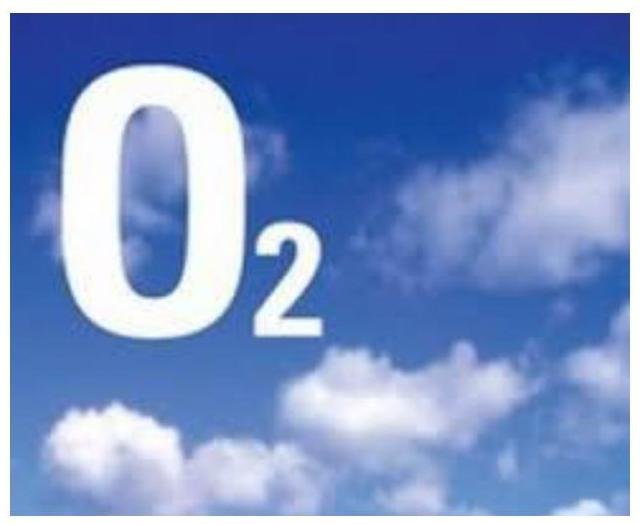

Az emberi egészségre és a környezetre káros hatással bíró légszennyező anyagok kibocsátásáért, így a légszennyezettség kialakulásért jellemzően a közlekedés, az ipar és egyre növekvő mértékben a lakossági kibocsátás tehető felelőssé. A légszenynyezés a légszennyező anyagok kibocsátási határértéket meghaladó mértékű levegőbe juttatását jelenti.

A levegővédelem komplex terület, hiszen a levegő minőségének rendszeres mérésén és értékelésén túlmenően alapvetően szükséges a levegő minőségének megőrzését szolgáló szabályozási környezet megteremtése, amely ebből kifolyólag az állam szerepvállalását igényli.

Az állami szabályozás a légszennyező tevékenységek szankcionálásán vagy éppen a korszerű technológiák terjedését elősegítő célzott támogatásokon keresztül képes közvetlenül hatni a káros anyag kibocsátás mértékére. A levegő minőségét közvetve különböző állami eszközökkel lehet javítani, így például a szennyező anyagok meghatározásával, az összmennyiség korlátozásával, a határértékek kialakításával, az egyes kibocsátók engedélyezési kötelezettségével, rendszeres ellenőrzéssel, szankcionálással, a technológiai korszerűsítés támogatásával, kármérsékléssel stb. Az állami szerepvállalás nemcsak a terület komplexitása miatt szükséges, hanem azért, mert a profitorientált szenynyezők kevésbé érdekeltek a szennyezésből eredő negatív hatások társadalmi költségének mérséklésében.

A légszennyezettség kialakulására egyéb (éghajlati, geográfiai stb.) tényezők is befolyással bírnak, amelyek a levegővédelem területét érintő nemzetközi együttműködés jelentőségére hívják fel a figyelmet.

A fenntartható fejlődés jegyében Magyarországon is fokozott hangsúlyt helyeznek a levegő minőségének megóvására, a levegő tisztaságának védelmére, amely terület szakmai irányítását az $\mathrm{FM}^{1}$ látja el. A fenntartható fejlődés a jelenlegi és a jövőbeli nemzedékek számára is biztosítani kívánja az életfeltételeket azzal, hogy a természeti erőforrásokat fenntartható módon kell hasznosítani, a környezet állapotában bekövetkező visszafordíthatatlan változásokat el kell kerülni. A fenntartható fejlődés céljának tekinti a fenntartható városok és közösségek elérését, egyik alcélja előirányozza, hogy 2030-ra csökkennie kell a városok egy főre jutó hátrányos környezeti hatásának a levegő minőség kiemelt kezelésével.

A levegő minőségének mérését, értékelését az OLM² végzi. A hálózat alapvetően két részből áll: az automata állomások folyamatos - a légszenynyező komponensek széles körét érintő - mérést végeznek; a manuális mérőhálózat $\left(\mathrm{RIV}^{3}\right)$ pontjain gyűjtött minták elemzése laboratóriumban történik, és jellemzően kén-dioxid $\left(\mathrm{SO}_{2}\right)$, nitrogén-dioxid $\left(\mathrm{NO}_{2}\right)$, valamint kivételes helyeken ülepedő por összetevőkre korlátozódik.

Az FM szakmai irányítása alatt működő rendszer operatív és minőségirányítási feladatait az $\mathrm{OMSZ}^{4}$ alá tartozó LRK ${ }^{5}$ látja el. Az FM irányítása alatt

---

álló OKTF ${ }^{6}$ 2016. december 31-én jogutódlással megszűnt, míg a környezetvédelmi hatósági és igazgatási feladatokat ellátó területi felügyelőségek már korábban, 2015. április 1-jei hatállyal beolvadtak a fővárosi és megyei kormányhivatalokba. A mérőállomások és mérőpontok üzemeltetése így 2015. április 1-jétől a megyei kormányhivatalok feladata, míg a hálózat egyes háttérállomásainak üzemeltetése az OMSZ-hez tartozik.

Az $\mathrm{OKK}^{7}$ a levegő állapotát közegészségügyi szempontból vizsgálja és értékeli, emellett szakmai módszertani, szakvéleményezési, nyilvántartási, koordinálási és szakértői feladatokat lát el. Az állami szerepvállalás intézményrendszerének felépítését a Megállapítások fejezetben található 2. ábra szemlélteti.

A legjelentősebb légszennyező anyagok, illetve azok hatásai az alábbiak:
—_ kén-dioxid $\left(\mathrm{SO}_{2}\right)$ : jellemzően az energiaipar, a széntüzelés valamint a közúti közlekedés tehető felelőssé a kéntartalmú fosszilis tüzelőanyagok elégetéséből keletkező izgató hatású gáz kibocsátásáért, amely magas koncentrációban a tüdő és a hörgők görcsös állapotát eredményezi, csökkent tüdőfunkciót okoz.
— nitrogén-dioxid $\left(\mathrm{NO}_{2}\right)$ : elsősorban a közlekedésből valamint a fűtésből eredő, irritáló hatású gáz, amely különféle légzőszervi tünetek kockázatának növekedését eredményezi, továbbá csökkenti a szervezet ellenálló képességét a légúti fertőzésekkel szemben.
— nitrogén-oxidok $\left(\mathrm{NO}_{3}\right)$ : elsősorban a közlekedéssel valamint a fűtéssel összefüggően keletkezett égéstermékből származó gázok, amelyek fő komponense - nitrogén-oxid (NO) - a légkörben jelenlévő oxidáló anyagok hatására gyorsan átalakul nitrogén-dioxiddá $\left(\mathrm{NO}_{2}\right)$.
—_ózon $\left(\mathrm{O}_{3}\right)$ : másodlagos szennyezőanyag, amely többek között a gépjárművek kipufogógázaiból származó nitrogén-oxidokból fotokémiai úton keletkezik, amely izgatja a nyálkahártyákat, súlyosbítja a krónikus betegségeket, de egészséges embereknél is panaszokat okoz, csökkenti a tüdőfunkciót, valamint émelygés, hányinger és mellkasi fájdalmak kiváltását eredményezheti.
— szén-monoxid (CO): elsősorban belsőégésű motorokban keletkező, színtelen, szagtalan mérgező gáz, amely a vér oxigénszállító képességét csökkenti, ezáltal fejfájás, szédülés, álmatlanság, idegrendszeri tünetek kialakulását eredményezheti, valamint növeli a szívinfarktus gyakoriságát.
—_ólom (Pb): korábban a közúti közlekedés, mára inkább az ipar okolható a légkörbe jutó, súlyosan mérgező ólom kibocsátásáért, amely gátolja a hemoglobin képződést, emellett károsítja a bél- és idegrendszert, a veseműködést és az ízületeket egyaránt.
—_ benzol $\left(\mathrm{C}_{6} \mathrm{H}_{6}\right)$ : fő forrását a benzinüzemú járművek belsőégésű motorjai jelentik, s bár légköri környezetben heveny hatást nem vált ki, a benzol az emberi szervezetben (zsírszövetben, idegrendszerben, csontvelőben, mellékvesékben) felhalmozódva erősen rákkeltő hatású, amely vérképzőszervi és nyirokszervi daganatok kialakulásához vezethet.
— ammónia $\left(\mathrm{NH}_{3}\right)$ : fő kibocsátója a mezőgazdaság, de keletkezhet hulladékégetéssel is; izgatja a szem kötőhártyáját, és a légzőszervek nyálkahártyáját, hatása erős könnyezésben, köhögésben, légzési nehézségben és orrnyálkahártya-panaszokban nyilvánul meg.

---

- illékony szerves vegyületek (VOC ${ }^{8}$ ): keletkezésüket a légköri viszonyok és egyéb szennyezők is befolyásolják. Az új épületekben az átlagosnál is magasabb lehet az illékony szerves szennyezőanyagok koncentrációja. Egyrészt az új bútorok, burkolatok, friss festékek és ragasztók még nagy mennyiségben bocsátanak ki káros anyagokat, másrészt a jobban szigetelő ablakok akadályozzák a légcserét. Ezek az anyagok fejfájást, légzőszervi meg-betegedést, torok- és szemirritációt, szédülést, kimerültséget okoznak, és csökkentik a koncentrálóképességet, hosszútávon máj- és idegrendszeri károsodás előidézői is lehetnek.
- PM10: a levegőben szálló 10 mikrométernél kisebb átmérőjű szilárd, vagy folyékony halmazállapotú anyagok, melyek főként a lakossági fűtésből, mezőgazdasági és ipari tevékenységből, az utak felületének kopásából, belsőégésű motorokból származnak. Az alsó légutakba lejutó részecskék a nyálkahártyát ingerelve köhögést, nehézlégzést váltanak ki. A szálló por szennyezettséget az éves átlagos tömegkoncentráció adattal $\left(\mu \mathrm{g} / \mathrm{m}^{3}\right)$ jellemzik.
- PM2,5: a jellemzően égési termékekből keletkező, 2,5 mikrométernél kisebb átmérőjű részecskék belélegzés útján lejutnak a tüdő léghólyagocskákba, ahol gyulladásos folyamatot indíthatnak el, növelve ezáltal az asztma, a légcsőhurut valamint a szív-érrendszeri megbetegedések kialakulásának valószínűségét.

---

# AZ ELLENŐRZÉS HÁTTERE, INDOKOLTSÁGA 


A levegő megfelelő minőségének fenntartása határokon átnyúló, folyamatosan ellátandó feladatot jelent. A legfőbb szennyező a közlekedés, az energiaszektor, illetve a fűtés, bizonyítható továbbá a légszennyezettség és a lakosság egészségi állapota közötti összefüggés. Ezzel összhangban Magyarországon is fokozott figyelem irányul a levegő minőségének megóvására, javítására. Koncepcionális és stratégiai dokumentumok kiemelt feladatként fogalmazták meg a levegő minőségének javításával összefüggésben elérni kívánt célokat, valamint a célkitűzések teljesítéséhez szükséges eszközök körét.

A levegő esetleges rossz minősége a társadalom széles rétegeit érintő probléma, mert jelentős rövid- és hosszú távú egészségkárosító hatása van, ehhez kapcsolódóan magas egészségügyi kiadások jelentkezhetnek mind egyéni, mind társadalmi szinten.

A fenntartható fejlődést mint nemzeti és globális célt az ÁSZ kiemelten fontosnak tartja, a levegő minőségének ellenőrzése ebbe a célrendszerbe illeszkedik.

Az ellenőrzéssel a társadalom képet kaphat arról, hogy milyen intézkedéseket igényel napjaink egyik kiemelt egészségügyi kihívása, milyen jó gyakorlatok léteznek a levegő minőségének javítását érintően.

Az ellenőrzést nemzetközi párhuzamos ellenőrzés keretében végeztük el. A más számvevőszékekkel együttműködésben végzett nemzetközi ellenőrzések a nemzetközi tudásmegosztás és a közös tapasztalatszerzés révén elősegítik az ellenőrzések magasabb szintű és eredményesebb végrehajtását, hozzájárulva a közpénzek felhasználásának jobbításához.

---

# A JELENTÉS LÉNYEGES KÉRDÉSKÖREI 

1. Azonosították és értékelték-e a Magyarországon meglévő légszennyezési problémákat, kialakították-e a levegő védelmét szolgáló ágazati irányelveket, célokat, mutatószámokat, továbbá meghatározták-e a levegő minőségéért felelős szervezetek hatás- és felelősségi körét?
2. A levegő minőségéért felelős szervezetek tevékenységüket a kialakított hatás- és felelősségi körüknek megfelelően végezték-e?
3. Milyen intézkedéseket hoztak a levegő minőségéért felelős szervezetek az ágazati irányelvekben meghatározott célok elérése érdekében? A levegő védelméért felelős szakmai irányító szerv nyomon követte-e a kitüzött célok teljesülését, valamint az intézkedések kiadásait?
4. Hogyan alakult a légszennyező anyagok koncentrációja a jogszabályban meghatározott határértékekhez viszonyítva?
5. Eredményesek és hatékonyak voltak-e a levegő minőségének javitására tett intézkedések?

---

# ELLENŐRZÉS HATÓKÖRE ÉS MÓDSZEREI 

## Az ellenőrzés típusa

Megfelelőségi és teljesítmény-ellenőrzés.

## Az ellenőrzött időszak

2014. január 1. és 2016. december 31. közötti időszak azzal, hogy a telje-sítmény-ellenőrzéshez kapcsolódó megállapítások vonatkozásában a 2011-2013. évekre is kiterjed az ellenőrzés, kitekintéssel a levegőminőséghez kapcsolódó eredményességi mutatók idősoros változásának alakulására a 2007-2010. évekre vonatkozóan.

## Az ellenőrzés tárgya

A Magyarországon meglévő légszennyezési problémák azonosításának és értékelésének ellenőrzése. A környezeti levegő védelmét szolgáló ágazati irányelvek és célok, a végrehajtott intézkedések és a kapcsolódó kiadások, a végrehajtott intézkedések eredményessége és hatékonysága, valamint a mérésükre kialakított mutatószámok. A levegő védelmét szolgáló szabályozási keretrendszer. A környezeti levegő minőségéért felelős személyek, szervezetek tevékenysége.

Az ellenőrzés kiterjedt minden olyan körülményre és adatra, amely az ÁSZ ${ }^{9}$ jogszabályban meghatározott feladatainak teljesítéséhez, valamint a program végrehajtása folyamán felmerült újabb összefüggések feltárásához szükséges.

## Az ellenőrzött szervezetek

Földművelésügyi Minisztérium, Nemzeti Fejlesztési Minisztérium, Emberi Erőforrások Minisztériuma, Nemzetgazdasági Minisztérium, Belügyminisztérium, Országos Környezetvédelmi és Természetvédelmi Főfelügyelőség, Országos Meteorológiai Szolgálat, Országos Közegészségügyi Központ, a kiválasztott megyei kormányhivatalok (Baranya Megyei Kormányhivatal, Borsod-Abaúj-Zemplén Megyei Kormányhivatal, Fejér Megyei Kormányhivatal, Győr-Moson-Sopron Megyei Kormányhivatal, Hajdú-Bihar Megyei Kormányhivatal, Komárom-Esztergom Megyei Kormányhivatal, Pest Megyei Kormányhivatal, Veszprém Megyei Kormányhivatal), a Földművelésügyi Minisztérium szakmai irányítása alá tartozó Országos Légszennyezettségi Mérőhálózat, valamint az Országos Meteorológiai Szolgálat szervezetei keretei között működő Levegőtisztaság-védelmi Referencia Központ.

---

# Az ellenőrzés jogalapja 

Az ÁSZ tv. ${ }^{10} 1 . \S$ (3) bekezdése.

## Az ellenőrzés módszerei

Az ellenőrzést az ellenőrzési program szempontjai, az ellenőrzött időszakban hatályos jogszabályok, a jelen ellenőrzésre irányadó ÁSZ módszertanok figyelembe vételével végeztük. Az ellenőrzés a levegő minőségének védelmére fókuszált, kiterjedt a légszennyezési források elleni küzdelem szabályozási és intézmény rendszerére, a levegő minőségének megóvását, javítását célzó hazai intézkedésekre és határon átnyúló együttműködésre, valamint a levegőtisztaság egészségügyi vonatkozásaira.

Az ellenőrzés ideje alatt az ellenőrzött szervezettel történő kapcsolattartás az ÁSZ SZMSZ ${ }^{11}$-ének vonatkozó előírásai alapján történt.

Az ellenőrzési kérdések megválaszolásához szükséges bizonyítékok megszerzése az ellenőrzöttek által rendelkezésre bocsátott dokumentumokra, adatokra alapozva megfigyelés, szemle, kérdésfeltevés (információkérés), mintavételezés, valamint elemző eljárás útján történt.

A kormányhivatalok esetében az ellenőrzést azon kormányhivatalok tekintetében folytattuk le, amelyekhez tartozó mérőpontok helyén a levegőszennyezettségi adatok, illetve határérték túllépések a legrosszabbak, illetve leggyakoribbak voltak az ellenőrzött időszakban. A kormányhivatalok által ellátott hatósági feladatok, így az engedélyezés, valamint a mérőrendszerekkel kapcsolatos tevékenységek ellenőrzését és értékelését véletlen mintavételi eljárás alapján végeztük. Ez alapján a hatósági tevékenység egészét értékeltük.

Az ellenőrzés lefolytatásához az ellenőrzött szervezetek a tanúsítványok elektronikus kitöltésével, valamint az ÁSZ által kért dokumentumok elektronikus megküldésével szolgáltattak adatokat.

Az ÁSZ ellenőrzés keretében a levegő minőségének javítását célzó intézkedések eredményességét három levegővédelmi irányelv az NKP-3 ${ }^{12}$, az NKP-4 ${ }^{13}$ és a PM10-re vonatkozó ágazatközi intézkedési program ${ }^{14}$ vonatkozásában értékeltük. Az értékelést az NKP-3 és az NKP-4 esetében a szennyező anyagok összkibocsátásának, illetve koncentrációjának trendszerű alakulása, valamint az NKP-3-ban és az NKP-4-ben számszerűsített összkibocsátási célértékek mint eredményességi célkitűzések időarányos teljesülésének elemzésével végezetük el. A PM10-re vonatkozó ágazatközi intézkedési program esetében az értékelést a PM10 szennyező anyagok éves átlagos koncentrációjának trendszerű alakulása elemzésével végeztük el (lásd 1. táblázat):

---

1. táblázat

# AZ EREDMÉNYESSÉG ELLENŐRZÉSÉNEK MÓDSZEREI AZ EGYES LEVEGŐVÉDELMI IRÁNYELVEK ESETÉBEN 

## célkitúzés

I. NKP-3:

1. A PM2,5 koncentráció 20\%-os csökkentése 2010 és 2020 között.
2. A Genfi Egyezménnyel összhangban a 2010. évi összkibocsátási célértékek teljesítése.
3. Az EU tematikus stratégiájával összhangban a 2020-ra teljesítendő célok megalapozása, időarányos teljesítése.
II. NKP-4:
4. A PM2,5 koncentráció 20\%-os csökkentése 2010 és 2020 között.
5. A Genfi Egyezménnyel összhangban a 2020. évi összkibocsátási célértékek teljesítése.
6. Az intézkedések eredményesek, ha a PM2,5 koncentráció trendszerűen csökkent, illetve a 2015. évben mért koncentráció nem haladja meg a 2020-ra teljesítendő célérték 2015. évre számolt időarányos értékeit. A 2010. évre meghatározott összkibocsátási célértékek teljesítését értékeltük a kén-dioxid, a nitrogén-oxid, az illékony szerves vegyületek és az ammónia esetében.
Az intézkedések eredményesek, ha a szennyező anyagok 2010. évben mért összkibocsátása nem haladja meg a 2010-re teljesítendő összkibocsátási célértékeket.
A 2020-ra teljesítendő összkibocsátási célértékek 2015. évre vonatkozó időarányos teljesítését értékeltük az egyes évekre egyenlő javulást feltételezve a kén-dioxid, a nitrogén-oxid, az illékony szerves vegyületek és az ammónia esetében.
Az intézkedések eredményesek, ha a szennyező anyagok összkibocsátása trendszerüen csökkent, illetve a 2015. évben mért összkibocsátás nem haladja meg a 2020-ra teljesítendő összkibocsátási célértékek 2015. évre számolt időarányos értékeit.
7. Megegyezik az NKP-3-ban foglalt PM2,5-re vonatkozó célkitűzéssel, annak megfelelően értékeltük az NKP-4 vonatkozásában is.
A 2020-ra teljesítendő összkibocsátási célértékek 2015. évre vonatkozó időarányos teljesítését értékeltük az egyes évekre egyenlő javulást feltételezve a kén-dioxid, a nitrogén-oxid, az illékony szerves vegyületek és az ammónia esetében.
Az intézkedések eredményesek, ha a szennyező anyagok összkibocsátása trendszerüen csökkent, illetve a 2015. évben mért összkibocsátás nem haladja meg a 2020-ra teljesítendő összkibocsátási célértékek 2015. évre számolt időarányos értékeit.
8. Nem értékeltük, mert az üvegházhatású gázokra az ellenőrzés nem terjedt ki.
III. PM10-re vonatkozó ágazatközi intézkedési program:
9. Fő célkitűzés a környezeti levegő minőségének fenntartása ott, ahol az jó, és annak javítása más esetekben. Az emberi egészséget és a természeti környezetet veszélyeztető légszennyezettség kialakulásának megelőzése.

A fő célkitűzéssel összhangban a 2011-2016. évekre az éves átlagos koncentráció trendszerű változását értékeltük. Az intézkedések eredményesek, ha a PM10 éves átlagos koncentrációja trendszerű csökkenést mutat.

Fornás: $A S Z$ szerkesztés

Az 1. táblázat alapján az eredményességet azokban az esetekben ellenőriztük, ahol a célértéket vagy célállapotot egyértelműen meghatározták, és az ellenőrzés időszakában lejárt a végrehajtásra kitűzött határidő, vagy az időarányos teljesítés kiszámítható. Ennek megfelelően:
—az NKP-3 és az NKP-4 esetében az eredményességet az egyes szenynyező anyagok koncentrációjának, illetve összkibocsátásának alakulása, valamint a koncentráció, illetve összkibocsátás célértékeinek (eredményességi mutatószámok) időarányos teljesülése alapján értékeltük, majd az intézkedések eredményességéről összevontan alkottunk véleményt;

---

- a PM10-re vonatkozó ágazatközi intézkedési program esetében az eredményességet a PM10 szennyező anyagok éves átlagos koncentrációjának 2011-2016. évi alakulása alapján értékeltük nem pedig az abban szereplő jogszabályi határértékek mint eredményességi mutatószámok teljesülése alapján. Az intézkedések eredményességéről ez alapján alkottunk véleményt.
A levegő minőségének javítására tett intézkedések hatékonyságát az alábbiak szerint értékeltük.

A PM10-re vonatkozó ágazatközi intézkedési program esetében a hatékonyság ellenőrzése az intézkedések kapcsán felmerült kiadások, valamint a PM10 légszennyezettségi adatok mint elért eredmény időbeli változásával történt. Az elért eredményt az ÁSZ által kialakított alábbi eredményindikátorok alapján számszerúsítettük:
szennyezettségi pontszám (SZP): megmutatja, hogyan változott a légszennyezettség az egyes légszennyező anyagok illetve az egyes évek vonatkozásában. Minél kisebb az értéke, annál kisebb a légszennyezettség. Az indikátor képzéséhez a mérőállomásokat először a mérőállomásokon mért légszennyezettség alapján - kiváló (1), jó (2), megfelelő (3), szennyezett (4) és erősen szennyezett (5) szennyezettségi kategóriákba soroltuk. A szennyezettségi pontszámot az egyes mérőállomások darabszámához - kiváló $\left(X_{1}\right)$, jó $\left(X_{2}\right)$, megfelelő $\left(X_{3}\right)$, szennyezett $\left(X_{4}\right)$, erősen szennyezett $\left(X_{5}\right)$ - rendelt, azokat jellemző szennyezettségi katégória egy mérőállomásra számított átlagértéke adta meg a következő képlet szerint:

$$
S Z P=\frac{\left(1 * X_{1}\right)+\left(2 * X_{2}\right)+\left(3 * X_{3}\right)+\left(4 * X_{4}\right)+\left(5 * X_{5}\right)}{\Sigma X}
$$

szennyezett és erősen szennyezett értéket jelző mérőállomások száma (SZM): ráirányítja a figyelmet a leginkább szennyezett területeken bekövetkező változásokra.
A PM10-re vonatkozó ágazatközi intézkedési program által nevesített PM10 szennyező anyagok éves átlagos koncentrációjának (K) alakulása.
Az indikátorok 2011. évi és 2016. évi értékeinek változásának átlaga alapján számítottuk ki az eredményindikátorok összes átlagos változását a következő képlet szerint:

$$
\underset{\text { eredményindikátorok }}{\text { változásáa }}=\frac{\left[\frac{S Z P_{2016}}{S Z P_{2011}}-1\right] \times 100+\left[\frac{S Z M_{2016}}{S Z M_{2011}}-1\right] \times 100+\left[\frac{K_{2016}}{K_{2011}}-1\right] \times 100}{3}
$$

Az intézkedések hatékonysága irányába mutat, ha csökkenő kiadások mellett a képlet alapján minél nagyobb negatív irányú, vagyis csökkenő százalékos értéket mutat az eredményindikátorok összes átlagos változása.
Az NKP-3-ban és NKP-4-ben szereplő légszennyező anyagok vonatkozásában a levegő minőségének javítására tett intézkedések hatékonyságát az intézkedések kapcsán felmerült kiadások számszerúsítésének hiányában nem értékeltük.

---

# MEGÁLLAPÍTÁSOK 

## 1. Azonosították és értékelték-e a Magyarországon meglévő légszennyezési problémákat, kialakították-e a levegő védelmét szolgáló ágazati irányelveket, célokat, mutatószámokat, továbbá meghatározták-e a levegő minőségéért felelős szervezetek hatás- és felelősségi körét?

Összegző megállapítás

A légszennyezettség problémák azonosítása és értékelése alapján a levegő védelmét szolgáló ágazati irányelvek az FM koordinálásával elkészültek, amelyek célkitűzéseket és kapcsolódó eredményességi mutatószámokat tartalmaztak. A levegő minőségéért felelős szervezetek hatás- és felelősségi körét a jogszabályok meghatározták. A feladatellátás belső ha-tás- és felelősségi körét a szervezetek - az OKK kivételével belső szabályzatokban rendezték.

Az FM koordinálásával kialakított, a levegő védelmét szolgáló ágazati irányelvek mint stratégiai dokumentumok tartalmazták az elérendő célokat, a célok elérését szolgáló eszközöket és intézkedéseket, valamint a kapcsolódó eredményességi mutatószámokat. A stratégiai dokumentumok hatékonysági mutatószámokat nem tartalmaztak.

A LEVEGŐ VÉDELMÉVEL ÖSSZEFÜGGÉSBEN HÁROM ÁGAZATI IRÁNYELVET hagyott jóvá az Országgyűlés és a Kormány: A környezetvédelem tervezésének alapjául szolgáló NKP-3 és NKP-4, valamint a PM10-re vonatkozó ágazatközi intézkedési program kidolgozását a Kvt. ${ }^{15}$-ben foglaltaknak megfelelően az FM miniszter ${ }^{16}$ koordinálta. Az NKP-3-ban és az NKP-4-ben a levegővédelmi követelményeket az Lvr. ${ }^{17}$ előírásainak megfelelően érvényesítették.

A LEVEGŐ MINŐSÉGÉRŐL SZÓLÓ ORSZÁGOS SZINTŰ FELMÉRÉSEKET, ELEMZÉSEKET a stratégiaalkotás és az irányelvek kidolgozása során figyelembe vették. A felmérések, elemzések azonosították és értékelték a Magyarországon meglévő légszennyezési problémákat és meghatározták azok kockázatait:
$\longrightarrow$ Az OMSZ LRK ${ }^{18}$ az Lvr. előírásaival összhangban elvégezte a levegő minőségének rendszeres, éves értékelését az OLM-adatok alapján.
$\longrightarrow$ Az egészségügyi kockázatokról, a levegő minőségének az emberi egészségre való káros hatásáról az OKK adott rendszeres tájékoztatást.

---

- Az országhatárokon átterjedő légszennyezés problémájához kapcsolódóan az MTA ${ }^{19}$ Atommagkutató Intézetének 2014. évi tanulmánya az aeroszol részecskék forrásait tárta fel.
- A Herman Ottó Intézet az FM felkérésére 2016-ban készített tanulmányában hívta fel a figyelmet az országhatárokon átterjedő légszennyezés jelentőségére a PM10-re vonatkozó ágazatközi intézkedési program felülvizsgálata érdekében.
- Az OMSZ a légszennyező anyagok nagytávolságú terjedésére vonatkozó modellszámításának eredményeit tette közzé és vetette össze az OLM-adatokkal.

AZ NKP-3 középtávú szakpolitikai stratégiát a 96/2009. (XII.9.) OGY határozattal fogadták el, végrehajtása a 2009-2014. közötti időszakra vonatkozott. Az NKP-3 a légszennyezettség kialakulásának megelőzését, a légszennyezettség csökkentését, illetve a tiszta levegőjű térségekben a jó minőség megőrzését tűzte ki fő céljául.

AZ NKP-4 középtávú szakpolitikai stratégiát több minisztérium együttműködésével dolgozták ki a 2015-2020-ig tartó időszakra, melyet az Országgyűlés a 27/2015. (VI.17.) OGY határozatával jóváhagyott. Az NKP-4 kialakítása során felhasználták az elemzéseket, értékeléseket. Az NKP-4 kidolgozásakor a $\mathrm{KSI}^{20}$-ben előírtaknak megfelelően figyelembe vették az NKP-3 végrehajtásáról szóló beszámolóban fellelhető, megvalósult intézkedések alapján az elért eredményeket, a Nemzeti Fenntartható Fejlődés Keretstratégiá ${ }^{21}$-ban található elemzéseket és a $\mathrm{KSH}^{22}$ adatait.

A középtávú szakpolitikai stratégia a levegővédelem területén általánosan, a levegő minőségét befolyásoló tényezőkre, illetve a települések levegőminősége javítására vonatkozóan tartalmaz célokat.

Az NKP-3-ban és az NKP-4-ben a kormányzat, az önkormányzat, a gazdálkodó szervezetek és a lakosság részére részletesen előírták a levegőminőség javítása érdekében szükséges beavatkozások területének pontos meghatározását. Az NKP-3-ban és az NKP-4-ben a célok elérését szolgáló eszközöket átfogóan határozták meg: a kutatás-fejlesztést, a tervezést, a szabályozást és ellenőrzést, a támogatást, a szemléletformálást, valamint a folyamatok nyomon követését és a visszacsatolását. Az általánosan megfogalmazott célokat célkitűzésekre bontották, melyek mérésére eredményességi mutatókat alakítottak ki.

# A PM10-RE VONATKOZÓ ÁGAZATKÖZI INTÉZKEDÉSI PROGRAM kidolgozásának előzménye az volt, hogy a 2008/50/EK irányelv ${ }^{23}$-ben meghatározott PM10 egészségügyi határértékek Magyarország több pontján nem teljesültek. A Európai Bizottság emiatt 2008-ban kötelezettségszegési eljárást indított hazánkkal szemben (bővebben lásd 3. sz. melléklet). A PM10-re vonatkozó ágazatközi intézkedési program a helyzet megoldásának céljából készült.

A PM10-re vonatkozó ágazatközi intézkedési program fő célja a levegő minőségének fenntartása és javítása, illetve az emberi egészséget és a természeti környezetet veszélyeztető légszennyezettség kialakulásának megelőzése volt. Ennek megfelelően a közlekedés, ipar, mezőgazdaság, lakos-

---

A stratégiai dokumentumok tartalmazták a levegöminőség védelméhez kapcsolódó célkitüzéseket és az azokhoz rendelt eredményességi mutatószámokat.
ság, lakosság-szolgáltatási szektorokra és horizontális intézkedésekre (országhatáron túl) csoportosítva tartalmazta a célkitűzések elérését szolgáló intézkedéseket, eszközöket.

## A LEVEGŐ MINŐSÉGÉNEK VÉDELMÉRE VONATKOZÓ CÉLKITŰZÉSEKET, azok elérését szolgáló eszközöket,

intézkedéseket az NKP-3, az NKP-4, valamint a PM10-re vonatkozó ágazatközi intézkedési program tartalmazta, amely az NKP-4 esetében megfelelt a KSI-ben foglalt előírásoknak (lásd 1. ábra). A levegővédelmi irányelvekben meghatározott intézkedések a célkitűzésekhez kapcsolódtak.

1. ábra: A stratégiai tervdokumentumok KSI szerinti tartalmi elemei


A KSI rendelkezéseit, így különösen a stratégiai tervdokumentumok nyomon követésére, értékelésére, felülvizsgálatára vonatkozó előírásokat a KSI 41. §-ban foglaltak alapján az NKP-3-ra és a PM10-re vonatkozó ágazatközi intézkedési programra nem kellett alkalmazni, mivel megvalósításuk a KSI hatályba lépésekor már folyamatban volt.

## A CÉLKITŰZÉSEK TELJESÚLÉSÉNEK MÉRÉSÉT SZOLGÁLÓ EREDMÉNYESSÉGI MUTATÓSZÁMOKAT az NKP-3-ban, a PM10-re vonatkozó ágazatközi intézkedési programban, valamint a KSI előírásainak megfelelően az NKP-4-ben kialakították. A célkitűzésekhez rendelt eredményességi mutatószámokat a 2. táblázat mutatja be.

# AZ NKP-3-BAN, NKP-4-BEN ÉS A PM10-RE VONATKOZÓ ÁGAZATKÖZI INTÉZKEDÉSI PROGRAMBAN MEGHATÁROZOTT CÉLKITŰZÉSEK ÉS EREDMÉNYESSÉGI MUTATÓSZÁMOK 

célkitúzés
eredményességi mutatószám

| I. | NKP-3 |  |
| :--: | :--: | :--: |
| 1. | A PM2,5 koncentráció 20\%-os csökkentése 2010 és 2020 között. | $25 \mu \mathrm{~g} / \mathrm{m}^{3}$-ről $20 \mu \mathrm{~g} / \mathrm{m}^{3}$-re |
| 2. | A Genfi Egyezménnyel összhangban a 2010. évi összkibocsátási célértékek teljesítése. | kén-dioxid $\left(\mathrm{SO}_{2}\right): 500 \mathrm{kt}$, <br> nitrogén-oxidok $\left(\mathrm{NO}_{3}\right): 198 \mathrm{kt}$, <br> illékony szerves vegyületek (VOC): 137 kt <br> ammónia $\left(\mathrm{NH}_{3}\right): 90 \mathrm{kt}$ |
| 3. | Az EU tematikus stratégiájával összhangban a 2020-ra teljesítendő célok megalapozása, időarányos teljesítése. | kén-dioxid $\left(\mathrm{SO}_{2}\right): 55 \mathrm{kt}$, <br> nitrogén-oxidok $\left(\mathrm{NO}_{3}\right): 89 \mathrm{kt}$, <br> illékony szerves vegyületek (VOC): 96 kt , <br> ammónia $\left(\mathrm{NH}_{3}\right): 90 \mathrm{kt}$ |
| II. | NKP-4 |  |
| 1. | A PM2,5 koncentráció 20\%-os csökkentése 2010 és 2020 között | $25 \mu \mathrm{~g} / \mathrm{m}^{3}$-ről $20 \mu \mathrm{~g} / \mathrm{m}^{3}$-re |
| 2. | A Genfi Egyezménnyel összhangban a 2020. évi összkibocsátási célértékek teljesítése a 2005. évi kibocsátásokhoz képest | kén-dioxid $\left(\mathrm{SO}_{2}\right) 46 \%$-os csökkentése (2005: 43 kt, 2020: <br> 23 kt ); <br> nitrogén-oxidok $\left(\mathrm{NO}_{x}\right) 34 \%$-os csökkentése (2005: 165 kt , <br> 2020: 109 kt ); <br> illékony szerves vegyületek (VOC) 30\%-os csökkentése <br> (2005: 124 kt, 2020: 87 kt ); |

---

|  célkitúzés | eredményességi mutatószám  |
| --- | --- |
|   | ammónia $\left(\mathrm{NH}_{3}\right) 10 \%$-os csökkentése (2005: 78 kt, 2020: 70 kt );  |
|   | PM2,5: 13\%-os csökkentése (2005: 27 kt, 2020: 23 kt)  |
|  3. Az ózonkárosító anyagok légkörbe jutásának megakadályozása. | a fluorozott szénhidrogének (HFC-k) mennyiségének 79\%kal való csökkentése 2015-2030 között  |
|  III. PM10-re vonatkozó ágazatközi intézkedési program: |   |
|  1. PM10-re vonatkozóan a Hér. ${ }^{24}$-ben előírt légszennyezettségi határértékek betartása Magyarország egész területén | napi: $50 \mu \mathrm{~g} / \mathrm{m}^{3}$; egy évben maximum 35 -ször léphető túl  |
|  2. PM10-re vonatkozóan a Hér.-ben előírt légszennyezettségi határértékek betartása Magyarország egész területén | éves: $40 \mu \mathrm{~g} / \mathrm{m}^{3}$  |
|   | Forrás: NKP-3, NKP-4, PM10-re vonatkozó ágazatközi intézkedési program  |

A levegővédelmi irányelvekben felsorolt nyolc célkitűzéshez eredményességi mutatószámokat rendeltek. A meghatározott mutatók egyes légszennyező anyagok összkibocsátásához, illetve koncentrációjához kapcsolódtak. A kibocsátást kt-ban (kilotonna), a koncentrációt $\mu \mathrm{g} / \mathrm{m}^{3}$-ben (mikrogramm köbméterenként) adták meg.

Az NKP-3-ban célként rögzítették a kén-dioxid, nitrogén-oxidok, illékony szerves vegyületek, ammónia légszennyező anyagokra a 2020-ra teljesítendő célkitűzések időarányos teljesítését. Az NKP-4-ben és a PM10-re vonatkozó ágazatközi intézkedési programban időarányos teljesítésre vonatkozó célt nem tűztek ki.

# AZ INTÉZKEDÉSEK HATÉKONYSÁGÁNAK MÉRÉSÉRE SZOLGÁLÓ HATÉKONYSÁGI MUTATÓSZÁ-

MOKAT az NKP-3, az NKP-4 és a PM10-re vonatkozó ágazatközi intézkedési program nem tartalmazott.

A PM10-re vonatkozó ágazatközi intézkedési program azonban 2030-ig intézkedésenként tartalmazta a központi és önkormányzati költségvetést terhelő szükséges kiadások nagyságát, melyet fejezeti és uniós forrásonként bontva is kimutattak.

### 1.2. számú megállapítás

A levegő minőségéért felelős szervezetek hatás- és felelősségi körét a vonatkozó jogszabályok meghatározták.

## A LEVEGŐ MINŐSÉGÉÉRT FELELŐS SZERVEZE-

TEKET a vonatkozó jogszabályok egyértelműen kijelölték, a feladatellátással összefüggő hatás- és felelősségi körüket meghatározták.

A levegő minőségének megóvásával és a levegő tisztaságának védelmével összefüggésben feladatokat ellátó terület szakmai irányítását az FM látta el. Az FM szakmai irányítása alatt működő rendszer operatív és minőségirányítási feladatait az OMSZ alá tartozó LRK végezte.

A 4/2002. (X. 7.) KvVM rendelet ${ }^{25}$ által kijelölt légszennyezettségi zónák tekintetében a levegőterheltségi szint és a helyhez kötött légszennyező források kibocsátásának mérését, a mérőállomások üzemeltetését, valamint az Lvr. szerinti igazgatási feladatokat 2015. március 31-ig a 481/2013. (XII. 17.) Korm. rendelet ${ }^{26}$ alapján a területi felügyelőségek, azt követően a 71/2015. (III. 30.) Korm. rendelet ${ }^{27}$ valamint a 7/2015. (III.31.) MvM utasítás ${ }^{28}$ szerint a kormányhivatalok látták el.

---

A mérőállomások és mérőpontok üzemeltetése így 2015. április 1-jétől a megyei kormányhivatalok feladata, míg a hálózat egyes háttérállomásainak üzemeltetése az OMSZ-hez tartozik. Az OKK a levegő állapotát közegészségügyi szempontból vizsgálja és értékeli, emellett szakmai módszertani, szakvéleményezési, nyilvántartási, koordinálási és szakértői feladatokat lát el. A levegő minőségéért felelős szervezetek főbb feladatait és kapcsolatrendszerét a 2. ábra szemlélteti.
2. ábra: A levegő minőségéért felelős szervezetek bemutatása
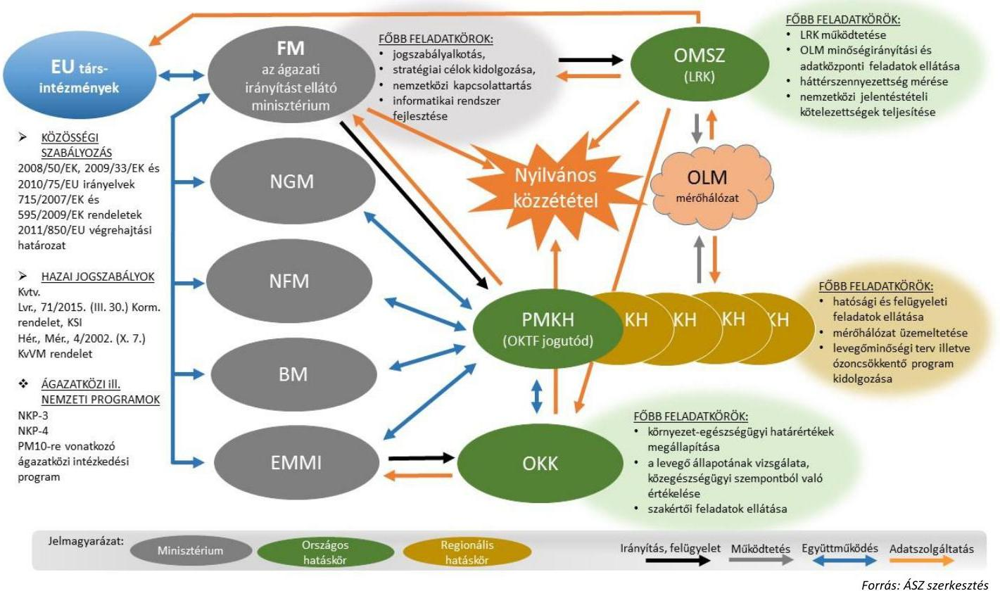

A levegővédelem hazai szabályozásának uniós szabályokkal történő összhangja biztosított volt, amelynek részleteit a 4. számú melléklet tartalmazza.

### 1.3. számú megállapítás

A levegő minőségéért felelős szervezetek belső szabályozása összhangban volt a kötelező feladatellátásukkal.

## A levegő minőségéért felelős szervezetek az intézményen belüli ha-tás- és felelősségi köröket - az OKK kivételével - meghatározták.

## A LEVEGŐ MINŐSÉGÉVEL ÖSSZEFÜGGŐ ÁLLAMI FELADAT- ÉS HATÁSKÖRÖKET ellátó szervezetek belső szabályozása az OKK kivételével megfelelő volt.

Az FM SZMSZ ${ }^{29}$ tartalmazta a levegővédelem irányításával kapcsolatos, a Kvt. ${ }^{30}$ és az Lvr. előírásaival összhangban álló szabályozási, adatszolgáltatási, tájékoztatási és közzétételre vonatkozó feladatokat.

Az LRK-t működtető OMSZ SZMSZ ${ }^{31}$-e rendelkezett - a 277/2005. (XII.20.) Korm. rendeletben ${ }^{32}$ valamint az Lvr.-ben foglaltakkal összhangban álló - az OLM hálózat minőségirányításával, az adatközpont múködetésével, valamint a nemzetközi szerződésekből eredő jelentéstételi kötelezettségek teljesítése érdekében szükséges adatok előkészítésével összefüggő feladatok ellátásáról, azokat az OMSZ ÉLFO ${ }^{33}$ feladatkörébe delegálta.

---

Az FM, az NFM ${ }^{34}$, az NGM ${ }^{35}$, az OKTF, az OMSZ és a kormányhivatalok belső szabályozása és a kötelező feladatellátás összhangja biztosított volt. Az ágazati miniszterek az FM, az NFM, NGM, OKTF valamint a kormányhivatalok részére a Kvt. előírásainak megfelelően az egyes szervek SZMSZ ${ }^{36}$ eiben kialakították a levegő minőségéért felelős személyek és szervezetek közötti együttműködés rendszerét. Az SZMSZ-ekben előírták a levegővédelmi feladatok ellátásához szükséges személyi és tárgyi feltételeket, melyek a feladatellátáshoz rendelkezésre álltak.

Az OKK-nál 2014. január 1. és 2015. december 8. között nem határozták meg a hatás- és felelősségi köröket, mivel az intézmény nem rendelkezett érvényes SZMSZ-szel az Áht. ${ }^{37}$ 10. § (5) bekezdésében foglaltak ellenére. Az OKK-nál emiatt nem volt biztosított a hatásköri és felelősségi viszonyok egyértelmű elhatárolása, az ellátandó részletes feladatok meghatározása, és nem volt garantált a feladatellátásban résztvevő szervezeti egységek számára a jogszabályok szerinti feladatellátás feltételeinek kialakítása, ezáltal a belső szabályozás és a feladatellátás összhangja.

A nemzetközi együttműködés keretében, a Kvt. és az Lvr. vonatkozó rendelkezései alapján, valamint az FM SZMSZ-ben foglaltak szerint az FM feladatát képezte a más tagországokkal és az Európai Bizottsággal történő együttműködés, a környezeti vizsgálat területén jelentkező feladatok koordinálása, az információszolgáltatási feladatok ellátása, a jogszabályok kidolgozásában való részvétel, valamint a nemzetközi egyezmények és együttműködések végrehajtásával kapcsolatos szakmai feladatok irányítása, amelyeknek eleget tett.

# 2. A levegő minőségéért felelős szervezetek tevékenységüket a kialakított hatás- és felelősségi körüknek megfelelően végez-ték-e? 

Összegző megállapítás

## 2.1. számú megállapítás

A levegő minőségéért felelős szervezetek tevékenységüket a kialakított felelősségi- és hatáskörüknek megfelelően végezték.

A levegő minőségéért felelős FM a tevékenységét szabályszerűen látta el.

A JOGSZABÁLYOKBAN ÉS A BELSŐ SZABÁLYOZÁSOKBAN ELŐÍRT FELADATAIT az FM szabályszerűen látta el. Az FM az Lvr. 6. §-ában és 9. § (1a) bekezdésben meghatározott levegőterheltségi szinttel kapcsolatos feladatokat ellátta. Az FM miniszter a Hér.-ben határozta meg az egészségügyi határértékeket, a tájékoztatási és riasztási küszöbértékeket, valamint az egyes technológiákra vonatkozó kibocsátási határértékeket. Az FM a Mér. ${ }^{38}$-ben írta elő a levegőterheltségi szintet vizsgáló mérőpontok számának, sűrűségének valamint elhelyezésének követelményeit. A FM miniszter az Lvr. előírásainak megfelelően 2016. június 3-án közleményben kiadta, és a www.kormany.hu weboldalon közzétette az OLM automata mérőállomásainak és manuális mérési pontjainak, valamint az éves mintavételi program mintavételi pontjainak listáját.

---

Az FM szabályszerűen látta el feladatait. Megalkotta a szükséges jogszabályokat, megfelelően látta el felügyeleti, irányitói tevékenységét, eleget tett adat-szolgáltatási kötelezettségeinek.

Az FM a Kvt. szerinti jogszabály- és stratégiaalkotási kötelezettségének eleget tett, a levegővédelemmel kapcsolatosan kidolgozott irányelvek/stratégiák/programok és cselekvési tervek az interneten a lakosság számára hozzáférhetőek voltak.

A levegő minőségéért felelős szervezetek közötti együttműködés biztosított volt. A kormányhivatalok és jogelőd szervezeteik szakmai felügyeletét a levegőszennyezettség mérésével kapcsolatban az FM látta el. A PM10-re vonatkozó ágazatközi intézkedési program végrehajtásának nyomon követése céljából az FM koordinálásával megalakult a PM10 Tárcaközi Bizottság, illetőleg 2016. május 1-i hatállyal létrejött az OKK és az OMSZ között a légszennyezettségi adatok felhasználását érintő megállapodás.

A MÉRŐHÁLÓZAT FEJLESZTÉSÉT az FM irányította. Az FM által lebonyolított projektek az OLM és az OKIR ${ }^{39}$ továbbfejlesztésére irányultak.

Az FM felügyeleti tevékenysége keretében a 71/2015. (III.30.) Korm. rendeletben valamint a 66/2015. (III.30.) Korm. rendeletben ${ }^{40}$ foglaltak alapján átfogó ellenőrzés végzett a kormányhivataloknál, ahol az OKIR és LAIR ${ }^{41}$ adatok rögzítését és a mérési tevékenységet ellenőrizte.

IRÁNYÍTÓI TEVÉKENYSÉGE során az FM miniszter a Kvt. előírásival összhangban a Mér.-ben rögzítette a levegőterheltségi szint vizsgálatával, értékelésével, vizsgálati módszerekkel, az adatminőségi követelményekkel, a dokumentálással, az értékelési módszerek követelményeivel és az eredmények értékelésével kapcsolatos előírásokat. Az elérhető legjobb technikára vonatkozó követelményeket az FM miniszter útmutatóban tette közzé.

Az FM miniszter az informatikai rendszer és adatbázis mentésével, a pormonitorokkal és az automata validálási beállításokkal kapcsolatos, 2016. április 28 -át követően érvénybe lépő eljárási szabályokat az OLM/1/2016. számú egyedi utasításban írta elő.

A EURÓPAI BIZOTTSÁG TÁJÉKOZTATÁSA az egyes légköri szennyező anyagok kibocsátásáról az Lvr. előírásainak megfelelően megtörtént, az FM KFO az EIONET ${ }^{42}$ (https://www.eionet.europa.eu/) honlapjára történő adatfeltöltésről gondoskodott.

A levegőminőséggel kapcsolatban előírt adatszolgáltatási kötelezettségének az FM az Lvr. előírásainak megfelelően eleget tett. Az FM miniszter a hazai és nemzetközi adatközpontoknak történő közvetlen adatszolgáltatás, és az OLM adatainak gyűjtésével, érvényesítésével, feldolgozásával és értékelésével kapcsolatos feladatokat az OMSZ SZMSZ-ében OMSZ ÉLFOra delegálta. Az FM és az OMSZ által teljesített adatszolgáltatások az EIONET honlapján elérhetőek voltak.

Az FM KFO a levegőminőséggel, légszennyezőanyag kibocsátással öszszefüggő tárgyalási álláspont kialakításában az FM SZMSZ előírásai alapján szakértőként részt vett.

## A LÉGSZENNYEZETTSÉG SZEMPONTJÁBÓL ÖKOLÓGIAILAG SÉRÜLÉKENY TERÜLETEKET,

a légszennyezettségi zónákat, agglomerációkat és azok területi kiterjedését a 4/2002. (X.7.) KvVM rendelet határozza meg. Az Lvr. 10. § (2) bekezdése

---

alapján pedig a légszennyezettségi agglomerációk és zónák kijelölésének felülvizsgálatára a levegőterheltségi szintet befolyásoló körülmények jelentős változása esetén, de legalább öt évenként kerül sor. A 4/2002. (X.7.) KvVM rendelet utoljára 2010-ben módosult a légszennyezettségi zónák tekintetében, amely alapján változott a kijelölt zónák köre. Ezt követően 5 éven belül, illetve az ellenőrzött időszak végéig az FM dokumentált felülvizsgálatot nem végzett az Lvr. 10. § (2) bekezdésében foglaltak ellenére.
2.2. számú megállapítás

A kijelölt hatóságok a levegőterheltségi szint mérését szolgáló mérési pontok kijelölésével és felülvizsgálatával kapcsolatos feladataikat elvégezték.

A MÉRŐPONTOK KIJELŐLÉSÉVEL, FELÜLVIZSGÁLATÁVAL kapcsolatos feladataikat a kormányhivatalok illetve jogelőd szervezeteik a levegőminőségi tervek keretein belül elvégezték. Az Lvr. 2015. évi módosítását követően a mérőpontok helyére vonatkozó javaslattételi kötelezettségének az LRK eleget tett, a mérőpontok jóváhagyásáról az FM miniszter gondoskodott.

A kormányhivatalok a levegőtisztaság-védelmi engedélyek kiadásával kapcsolatosan előírt hatósági, felügyeleti feladataikat szabályszerűen ellátták.

A LEVEGŐTISZTASÁG-VÉDELMI ENGEDÉLYEK kiadásával kapcsolatos hatósági tevékenységeik során a kormányhivatalok illetve jogelőd szervezeteik az Lvr.-ben foglalt előírások betartásával jártak el. A kiadott engedélyek tartalmazták az Lvr. 6. számú melléklete szerinti levegővédelmi követelményeket, mely levegőtisztaság-védelmi előírásokat a kormányhivatalok és jogelőd szervezeteik az elérhető legjobb technika alapján állapították meg.

# 2.4. számú megállapítás 

A kormányhivatalok a légszennyezettségi zónákra vonatkozó levegőminőségi tervvel rendelkeztek.

LEVEGŐMINŐSÉGI TERVVEL a kormányhivatalok illetve jogelőd szervezeteik az Lvr. 14. §-ban foglaltaknak megfelelően rendelkeztek, annak felülvizsgálatáról és a végrehajtásának az Lvr. 15. § (3) bekezdés szerint előírt ellenőrzéséről egy ellenőrzött kormányhivatal kivételével gondoskodtak. A levegőminőségi terv közzétételére vonatkozó előírásokat azonban az ellenőrzésre kiválasztott kormányhivatalok fele nem teljesítette maradéktalanul, mert bár a levegőminőségi terv tervezetét saját hirdetőtábláikon, honlapjaikon, valamint az FM honlapján közzétették, az Lvr. 16. § (1) bekezdése ellenére a közzétételt nem kezdeményezték valamennyi érintett önkormányzat hirdetőtábláján. Egy ellenőrzött kormányhivatal az Lvr. 16. § (4) bekezdés előírásainak ellenére a levegőminőségi tervre érkezett észrevételekről, vagy figyelmen kívül hagyásuk esetén annak indokairól szóló tájékoztatás közzétételét sem kezdeményezte az érintett települési önkormányzatnál.

---

### 2.5. számú megállapítás

A levegőterheltségi szint mérését és értékelését, valamint a mérőrendszerek múködtetésével, az adatok gyüjtésével, mentésével és értékelésével kapcsolatos tevékenységüket az FM, az OMSZ, az OKK és a kormányhivatalok megfelelően ellátták.

A LEVEGŐVÉDELMI ELŐÍRÁSOK, TILALMAK BETARTÁSÁNAK ELLENŐRZÉSI RENDSZERÉT az FM kidolgozta az Lvr.-ben foglalt előírások és a légszennyező anyagokra vonatkozóan a Hér. 1. számú mellékletében megállapított egészségügyi határértékek teljesülése érdekében. A levegőterheltség szint rendszeres ellenőrzése a Mér. előírásainak megfelelően az OLM adatai alapján történt. Az Lvr. előírásai szerint levegőtisztaság-védelmi ügyekben az elsőfokú hatósági jogkört a területi környezetvédelmi hatóság gyakorolta, amely jogosult volt levegőtisztaság-védelmi bírság kiszabására illetve a levegőterhelő tevékenység korlátozására vagy felfüggesztésére, továbbá a levegőminőségi terv végrehajtásának ellenőrzésére.

A LEVEGŐTERHELTSÉGI SZINT MÉRÉSÉT, a mérőállomások és mérőhelyek üzemeltetését a kormányhivatalok megfelelően látták el. A kormányhivatalok az LRK által végzett körméréseken és az éves mérési program előírásoknak megfelelő mérési módszerekkel történő végrehajtásában kijelölés szerint részt vettek.

## A LEVEGŐ MINŐSÉGÉRŐL SZÓLÓ ÉRTÉKELÉSE-

KET az OMSZ LRK az OLM-adatok alapján az Lvr. előírásainak megfelelően készítette el, azonban az ÉLFO/LRK 101-es belső utasításban rögzített, a tárgyévet követő év március 31-ében megszabott határidő figyelmen kívül hagyásával, rendszeresen több hónapos késéssel.

Az OMSZ kései adatszolgáltatása következtében a 2014-2015. évi PM10 illetve PM2,5 szennyezettségre vonatkozó értékeléseket az FM nem tudta az Lvr. 33.§ (2) bekezdése szerinti határidőben, a tárgyévet követő év október 1-ig a www.levegominoseg.hu weboldalon közzétenni. A 2014. évi PM10 mintavételi program értékelésének közzététele 2016-ra csúszott, míg a 2015. évi PM10 és PM2,5 mintavételi program értékelése egy hónapos késéssel 2016 novemberében jelent meg.

## A JOGSZABÁLYOKBA ÚTKÖZŐ LÉGSZENNYEZŐ TEVÉKENYSÉGET VÉGZŐ IPARI KIBOCSÁTÓKRA KISZABOTT SZANKCIÓK ÉS KÖTELEZÉSEK

monitoringját a kormányhivatalok biztosították.

## A LÉGSZENNYEZETTSÉG EGÉSZSÉGÜGYI HATÁ-

SAIT, a lakosság egészségügyi állapotát veszélyeztető kockázati tényezőket az OKK a 323/2010. (XII. 27.) Korm. ${ }^{43}$ rendeletben, valamint az alapító okiratában és SZMSZ-ében foglaltaknak megfelelően rendszeresen és teljeskörűen értékelte. Az OKK az elvégzett értékeléseket a honlapján közzétette.

---

# 2.6. számú megállapítás 

A légszennyezettségi adatok rögzítése és megőrzése biztosított volt.

A LEVEGŐ ÁLLAPOTÁRA VONATKOZÓ ADATOK RÖGZÍTÉSE, TOVÁBBÍTÁSA ÉS MEGÖRZÉSE biztosított volt. Az OLM-adatok interneten történő elérhetőségéről, a nyilvánosság tájékoztatásáról az FM az Lvr. előírásainak megfelelően gondoskodott. Az OLM-adatok 2014 novemberétől a www.levegominoseg.hu (ezt megelőzően a www.kvvm.gov.hu/olm weboldalon) hozzáférhetők, több évre visszamenően kereshetők voltak.

Az adatok első szintű validálása az OLM Alközpontokban történt. Ezt követően online, automatikus adatszinkronizálás révén kerültek a feldolgozott adatok az LRK OLA ${ }^{44}$-ba második szintű validálásra. A légszennyezettségi adatok a kettős validálást követően váltak hivatalossá.

## 3. Milyen intézkedéseket hoztak a levegő minőségéért felelős szervezetek az ágazati irányelvekben meghatározott célok elérése érdekében? A levegő védelméért felelős szakmai irányító szerv nyomon követte-e a kitűzött célok teljesülését, valamint az intézkedések kiadásait?

Összegző megállapítás

A levegővédelmi irányelvekben meghatározott célok elérése érdekében az érintett minisztériumok számos gazdasági és társadalmi ágazatot érintően intézkedtek, azok teljesülését nyomon követték. Az intézkedések kiadásairól - az NKP-3 2013-2014. évi végrehajtása kivételével - beszámoltak.

A LEVEGŐVÉDELMI IRÁNYELVEKBEN MEGHATÁROZOTT CÉLKITŰZÉSEK elérése érdekében 2011-2016. években az FM, az NFM, az NGM és az EMMI ${ }^{45}$ miniszterei intézkedéseket tettek. Az intézkedések kiterjedtek a közlekedési, az ipari, a mezőgazdasági és a lakossági szektorokra, illetve horizontális - pl. országhatáron átnyúló, illetve a lakosságot tájékoztató - intézkedések is születtek:

- Az NKP-3 program végrehajtása érdekében az FM miniszter intézkedéseket hozott a szennyezett levegőjű zónákra készült területi leve-gőtisztaság-védelmi intézkedési programok ütemezett végrehajtása, a legjobb technikák alkalmazása, a határértékek betartásának ellenőrzése, az OLM megfelelő szintű működtetése és a LAIR korszerűsítése érdekében, valamint felülvizsgálta az ipari kibocsátás szabályozásokat.
- A PM10-re vonatkozó ágazatközi intézkedési program keretében az FM, az NFM, az NGM és az EMMI is intézkedéseket tett. A főbb intézkedések között volt az alacsony emissziós övezetek kialakítása, a forgalomcsökkentési intézkedések, az ITS ${ }^{46}$ rendszerének kialakítása, az elektronikus útdíj bevezetése, a gépjárművek környezetvédelmi besorolásának a felülvizsgálata, a részecskeszűrő program, a súlykorlátozott övezetek kialakítása, az autóbuszcsere program ösztönző rendszer kidolgozása, a környezettudatos vezetési szemlélet

---

támogatása. Az FM intézkedett az országhatáron átterjedő levegőszennyezés modellezése, a porleválasztási technológiák áttekintése és a porleválasztási rendszerek ellenőrzési kötelezettségének jogszabályi bevezetése, a PM10 honlap indítása, a környezetkímélő közlekedési módok népszerűsítése, a mezőgazdasági tevékenységek PM10 kibocsátás csökkentésének felmérése, a lakossági szektor területén a lakossági fűtéssel kapcsolatos szemléletformálási tevékenység, a bányászat PM10 szennyezettségének feltárása és a kötelező adatszolgáltatási rendszerbe a tevékenység bevonása érdekében. Az intézkedéseket a PM10-re vonatkozó ágazatközi intézkedési program végrehajtásáról szóló beszámolók tartalmazták.
$\longrightarrow$ Az NKP-4 program célkitűzéseivel kapcsolatban az FM miniszter intézkedései a levegőminőségi jogszabályok további korszerűsítésére, a legjobb technikák és technológiák alkalmazására, az ellenőrzések hatékonyságának javítására, a használt ózonkárosító anyagok és eszközök visszagyűjtésére, az OLM fejlesztésére, ezen belül mobil mérőállomások beszerzésére, a LAIR informatika korszerűsítésére, és a légszennyező anyagok transzmissziójának modellezésére irányultak.
Az intézkedések szektorok szerinti részletes bemutatását az 3. táblázat tartalmazza:

# A LEVEGŐ MINŐSÉGÉNEK JAVÍTÁSÁT SZOLGÁLÓ INTÉZKEDÉSEK 

## KÖZLEKEDÉSI SZEKTOR

- Nehézgépjárművek forgalomkorlátozásának szigorítása.
- Az elektronikus útdíj bevezetése a nehézgépjárművek részére.
- Nehézgépjárművek és egyéb gépek felszerelése részecskeszűrővel.
- Elkerülő úti fejlesztések az országos közúthálózaton.
- Fő- és mellékutak forgalomcsillapítása.
- Parkolási rendszerek átalakítása (P+R és B+R parkolóhelyek létesítése).
- Közutak tisztítása, sárfelhordás büntetési tételeinek szigorítása.
- Elektromos üzemú járművek bevezetése.
- A nem motorizált közlekedési módok népszerűsítése.
- Munkahelyi közlekedési tervek kialakítása.
- Vasútvonalak korszerűsítése terén: kétvágányú, villamosított pályák kialakítása, különszintú alul- és felüljárók építése, állomások, megállóhelyek korszerűsítése, új elektronikus jelző- és biztosítóberendezések létesítése.
- Villamoshálózatok fejlesztése.


## IPARI SZEKTOR

- Porleválasztó rendszerek ellenőrzési kötelezettsége.
- A bányászat PM10 szennyezésének feltárása, a tevékenység bevonása a kötelező adatszolgáltatási rendszerbe.
- Az ipari kibocsátások szabályozásának felülvizsgálata, különös tekintettel a nagy kibocsátó forrásokra (pl. erőművek, cement- és mészgyárak, kohók, hulladékégetők).
- Az elérhető legjobb technikák alkalmazásának és a határértékek betartásának ellenőrzése.


## MEZŐGAZDASÁGI SZEKTOR

- A mezőgazdaság PM10 terhelés terjedés és hatásai vizsgálata.
- Erdőtelepítési, erdőszerkezet-átalakítási, fásítási munkálatok támogatása.


## LAKOSSÁGI SZEKTOR

- A kerti hulladék égetésének tiltása, a komposztálás rendszerének kiépítése.
- Szigorú fellépés az illegális égetések ellen.
- A távfütés versenyképességének javítása, a lakossági tüzelőberendezések kibocsátásának csökkentése.
- Épületek energiahatékonyságának javítása.
- A 140 kW bemenő teljesítmény alatti tüzelőberendezések számának csökkentése.

---

# HORIZONTÁLIS INTÉZKEDÉSEK 

- Az országhatáron átterjedő levegőszennyezés modellezése.
- Felvilágosító, tudatformáló tevékenységek erősítése, környezeti ismeretek átadását a fiatalok számára.
- A szmog rendelet szabályozásának áttekintése.

Forrás: ÁSZ szerkesztés a stratégiai dokumentumokban, illetve azok végrajtásáról készült beszámolóaban foglaltak alapján

## A LEVEGŐVÉDELMI IRÁNYELVEKBEN FOGLALT CÉLKITŰZÉSEK ELÉRÉSÉT BIZTOSÍTÓ INTÉZKEDÉSEK VÉGREHAJTÁSÁNAK KIADÁSAIT az éves beszámolók az NKP-3 2013-14. évi adatai kivételével tartalmazták. Ennek megfelelően a PM10-re vonatkozó ágazatközi intézkedési program esetében az éves beszámolók alapján ismertek az éves kiadási adatok, azonban az egyéb, levegővédelemmel kapcsolatos kiadásokról csak 2012-ig elérhetőek nyilvános adatok, mivel az NKP-3 beszámoló 2013-14-re vonatkozóan nem tartalmaz adatokat:

- Az NKP-3 beszámoló a környezetvédelmi beruházások összesített költségeit 2012. évig tartalmazta, melyből a levegővédelemmel kapcsolatos intézkedésekre fordított kiadások arányát bemutatták (lásd. 3. ábra).
3. ábra
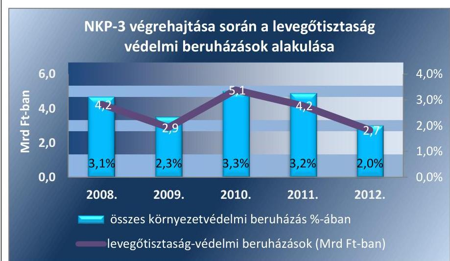

Forrás: NKP-3 beszámoló
A NKP-3 végrehajtásáról készült beszámoló alapján 2012-ig a környezetvédelmi beruházásokon belül a levegőtisztaság védelemmel kapcsolatos beruházások aránya a megelőző öt év átlagában 2,8\% volt. A legnagyobb mértékben, 0,8\%-ponttal a 2012. évi 2,7 Mrd Ft öszszegű levegőtisztaság védelmi beruházások aránya maradt el a 2,8\%os átlagtól.
Az NKP-3 egyes tematikus akcióprogramjai végrehajtásának finanszírozása az alábbi forrásokból valósult meg:

1. az EU, illetve nemzetközi támogatások és a kapcsolódó hazai társfinanszírozás,
2. a központi kormányzat NKP-3 céljait szolgáló 2009-2014. évi ráfordításai,
3. a kormányzaton kívüli jövedelemtulajdonosok ráfordításai (önkormányzatok, gazdálkodó szervezetek, háztartások, vállalkozások, nonprofit szervezetek).

---

A NKP-3 végrehajtásáról készült beszámoló ezekből csak a központi költségvetés ráfordításait tartalmazza. A beszámoló a parlament.hu/irom40/04860/04860.pdf oldalon elérhető volt.
A PM10-re vonatkozó ágazatközi intézkedési program intézkedéseire minden évre vonatkozóan beszámolót készítettek, melyekben a végrehajtás állása szerint a kiadás adatokat intézkedésenként szerepeltették. A PM10-re vonatkozó ágazatközi intézkedési program teljesítése követésére és a közvélemény tájékoztatására kötelezettséget nem írtak elő. A program 2012-2016. évi végrehajtásáról készített éves beszámoló jelentések a http://pm10.kormany.hu/ honlapon elérhetőek voltak.
A PM10-re vonatkozó ágazatközi intézkedési program intézkedéseinek teljesítése érdekében 2012-2016. évekre az FM részére összesen 780,0 M Ft összegű kiadást állapítottak meg. Ebből 236,3 M Ft összegű kiadás (30,3\%) teljesült, amely forráshiány miatt a tervezettnél 543,7 M Ft-tal kevesebb. Az NFM számára a 2012-2016. évekre összesen 100 755,0 M Ft összegű kiadást terveztek, melyből 100 735,0 M Ft a közlekedési, és 20,0 M Ft a lakosság-szolgáltatás szektor tervezett kiadása volt. Az EMMI részére a lakossággal kapcsolatban meghatározott feladataival összefüggésben nem terveztek kiadást.
$\longrightarrow$ Az NKP-4 közbenső értékelése a KSI 21. § (5) bekezdésében foglaltak alapján nem volt időszerű, mert a végrehajtásáról a stratégiai tervdokumentumban előírtak szerint a Kormány kétévente, legelőször 2017-ben köteles összefoglaló jelentést készíteni és az Országgyűlés felé beszámolni, amely egybeesett a közbenső értékelés elkészítésére a KSI 21. § (5) bekezdésében és a stratégiai tervdokumentumban meghatározott határidővel.

# A LEVEGŐVÉDELMI IRÁNYELVEK VÉGREHAJTÁ- 

SÁRÓL, az elért eredményekről és a felmerült kiadásokról az NKP-3-ra és a PM10-re vonatkozó ágazatközi intézkedési programra vonatkozóan az NKP-3 2013. és 2014. évi végrehajtása kiadásait kivéve - az FM miniszter a Kormányt a beszámolókban tájékoztatta.

Az FM miniszter az Lvr.-ben foglaltakkal összhangban az állampolgárokat rendszeresen tájékoztatta a célkitűzések teljesítésére vonatkozóan. A levegominoseg.hu honlapon az OLM mérési pontjainak adatai, a települések éves levegőszennyezettségének összefoglaló értékelései, valamint a Kvt.-ben rögzített, az OKIR-ral szemben támasztott szolgáltatási követelmények és információk szintén hozzáférhetőek voltak.

---

# 4. Hogyan alakult a légszennyező anyagok koncentrációja a jogszabályban meghatározott határértékekhez viszonyítva? 

Összegző megállapítás

A légszennyező anyagok koncentrációjára vonatkozó jogszabályi határértékek nem teljesültek maradéktalanul.

## A HÉR. 1. SZÁMÚ MELLÉKLETÉBEN MEGHATÁROZOTT HATÁRÉRTÉKEK nem teljesültek maradéktalanul. A határértékek teljesülését a kén-dioxid, nitrogén-dioxid, szén-monoxid, ólom, benzol, ózon, valamint a PM2,5 és PM10 tekintetében ellenőriztük a légszennyező anyagok órás, 24 órás és éves határérték túllépései alapján.

A felsorolt szennyező anyagok közül csak a kén-dioxid és az ólom esetében nem történt határérték túllépés, mert e szennyezőanyagok koncentrációja nem érte el egyik mérési időintervallumban sem a Hér.-ben meghatározott határértékeket. A nitrogén-dioxid, szén-monoxid, benzol, ózon, valamint a PM2,5 és PM10 tekintetében azonban a határértékek nem teljesültek (lásd 4. táblázat):

|  | mérési intervallum | megengedett mértékú határérték túllépés nem történt | megengedett mértékú határérték túllépés történt |
| :--: | :--: | :--: | :--: |
| 1. | órás határértékek 2011-2016. évekre | szén-monoxid (CO) <br> kén-dioxid $\left(\mathrm{SO}_{2}\right)$ | nitrogén-dioxid $\left(\mathrm{NO}_{2}\right)$ |
| 2. | 24 órás határértékek 2011-2016. évekre | kén-dioxid $\left(\mathrm{SO}_{2}\right)$ | ```szén-monoxid (CO) nitrogén-dioxid (NO2) PM10``` |
| 3. | éves határértékek 2011-2016. évekre | ```szén-monoxid (CO) kén-dioxid (SO) ólom``` | nitrogén-dioxid $\left(\mathrm{NO}_{2}\right)$ <br> benzol <br> ózon <br> PM2,5 <br> PM10 |

A jogszabályban meghatározott légszennyezettségi határértékek nem teljesültek maradéktalanul.

Az órás határérték túllépések az alábbiak szerint alakultak a 2011-2016. években:

- A szén-monoxid esetében a Hér. 1. számú mellékletében meghatározott $10000 \mu \mathrm{~g} / \mathrm{m}^{3}$ órás határérték túllépésére nem került sor.
- A kén-dioxidnál $250 \mu \mathrm{~g} / \mathrm{m}^{3}$ órás határérték túllépés történt, azonban a túllépések száma 2011-2016. évek között nem haladta meg a Hér. 1. számú mellékletében meghatározott maximum évi 24-et.
- A nitrogén-dioxid esetében a Hér. 1. számú melléklete alapján az előírt $100 \mu \mathrm{~g} / \mathrm{m}^{3}$ órás határérték mérőállomásonként, egy naptári év alatt 18-nál többször nem léphető túl. Az összes mérőállomás esetében az órás határérték túllépések számát a 4. ábra szemlélteti.

---

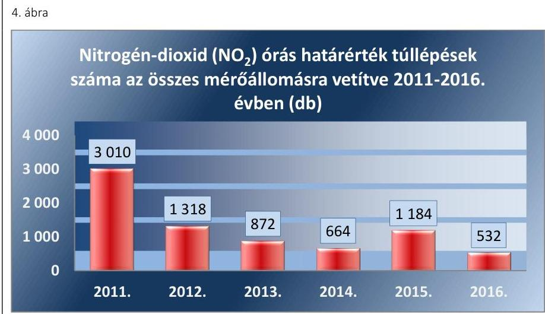

Forrás: OMSZ adatszolgáltatás
A 24 órás határérték túllépések alakulása 2011-2016. évben (lásd. 5. táblázat):
5. táblázat

24 ÓRÁS HATÁRÉRTÉK TÚLLÉPÉSEK AZ ÖSSZES MÉRŐÁLLOMÁSRA VETÍTVE ÉVENKÉNT (DB)

|  | PM10 | $\mathbf{C O}$ | $\mathbf{S O}_{2}$ | $\mathbf{N O}_{2}$ |
| :-- | --: | --: | --: | --: |
| 24 órás határérték túllépés Hér. <br> szerinti maximális száma: | 35 | 0 | 3 | 0 |
| 2011. év | 1173 | 0 | 0 | 77 |
| 2012. év | 372 | 0 | 0 | 52 |
| 2013. év | 273 | 0 | 0 | 20 |
| 2014. év | 215 | 1 | 0 | 25 |
| 2015. év | 248 | 1 | 0 | 19 |
| 2016. év | 137 | 0 | 0 | 12 |
|  |  |  |  |  |

- A kén-dioxidra vonatkozó 24 órás határértékek minden évben teljesültek.
- A szén-monoxidra vonatkozó határértékek túllépésére 2014-ben és 2015-ben került sor.
- A PM10-re és nitrogén dioxidra vonatkozó 24 órás határértékek túllépésére valamennyi évben sor került.
A közegészségügyi szempontból kiemelten fontos PM10 szennyező anyagok mérési eredmények azt mutatták, hogy a közlekedés hozzájárulása csökkent a PM10 kibocsátás tekintetében, a legnagyobb hozzájárulással pedig a lakossági fűtés rendelkezik. Ebből eredően az eseti 24 órás egészségügyi határérték túllépések a PM10 vonatkozásában meghatározóan a fűtési időszakban történtek. A PM10 koncentráció eseti növekedéséhez a kedvezőtlen időjárási viszonyok (inverziós állapot) és a távolhatás (külföld) is hozzájárultak, de a PM10 átlagos és eseti koncentrációja 20112016. között csökkenő tendenciát mutatott (lásd 5-6. ábra):

---

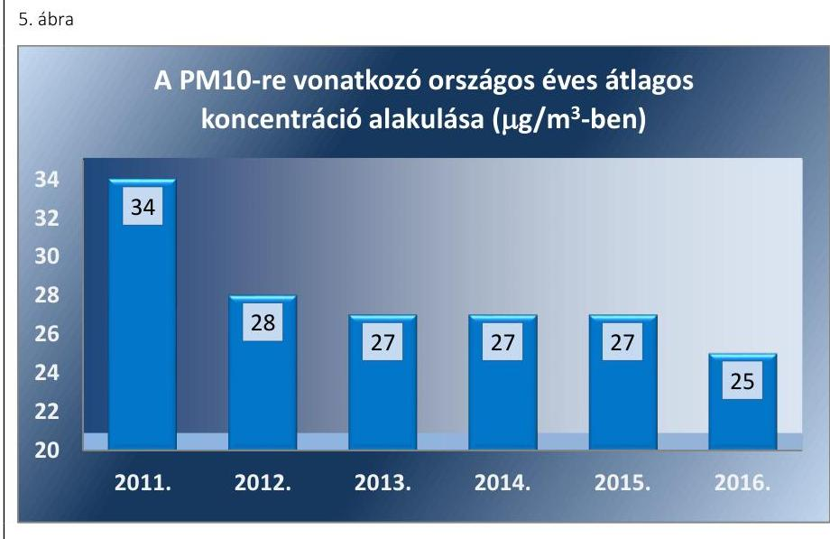

Forrás: OMSZ adatszolgáltatás
6. ábra

PM10 légszennyező anyagok Hér. 1: számú mellékletben előírt 24 órás határérték túllépések száma az összes mérőállomásra vetítve 2011.2016. évben (db)
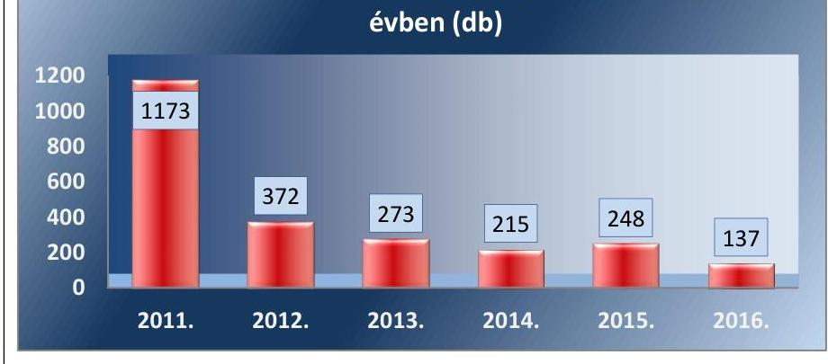

Forrás: OMSZ adatszolgáltatás
Az éves határérték túllépések a 2011-2016. években (lásd 6. táblázat):
6. táblázat

| ÉVES HATÁRÉRTÉKEK ÉS AZ AZOKAT TÚLLÉPŐ, MÉRT ADATOK A LEGTERHELTEBB ÁLLOMÁSON $\mu \mathrm{g} / \mathrm{m}^{3}$-BEN, ÓZONNÁL DB-BAN |  |  |  |  |  |  |  |
| :--: | :--: | :--: | :--: | :--: | :--: | :--: | :--: |
|  | PM10 | PM2,5 | CO | SO3 | NO3 | Benzol | Ólom | Ózon |
| éves határérték: | 40,0 | 25 | 3000,0 | 50,0 | 40,0 | 5,0 | 0,3 | 120 |
| 2011. év | 48,0 | - | - | - | 57,4 | - | - | - |
| 2012. év | - | - | - | - | 42,7 | - | - | - |
| 2013. év | - | - | - | - | 52,0 | - | - | 23 |
| 2014. év | - | - | - | - | 49,4 | - | - | - |
| 2015. év | 44,0 | - | - | - | 51,8 | 5,1 | - | - |
| 2016. év | - | 34,0 | - | - | 45,9 | - | - | - |

- a szén-monoxid, a kén-dioxid és az ólom esetében nem történt határérték túllépés.
- A PM10 esetében két évben, a PM2,5, a benzol és az ózon esetében pedig egy-egy évben történt határérték túllépés.

---

# 5. Eredményesek és hatékonyak voltak-e a levegő minőségének javítására tett intézkedések? 

Összegző megállapítás

A légszennyező anyagok összkibocsátása, illetve koncentrációja - egy szennyező anyag kivételével - trendszerúen csökkent, a stratégiai dokumentumok hosszú távú eredményességi célkitúzései időarányosan teljesültek, így a levegő minőségének javítására tett intézkedések eredményesek voltak. A PM10 szennyezettség esetében mindez csökkenő kiadások mellett valósult meg, amely arra mutat, hogy az intézkedések hatékonyak voltak.
5.1. számú megállapítás

Az intézkedések eredményességét az FM az NKP-3 végrehajtása tekintetében értékelte.

A LEVEGÖVÉDELMI INTÉZKEDÉSEK EREDMÉN YESSÉGÉT az FM kizárólag az NKP-3 végrehajtásáról készített beszámolóban, 2012. évig bezárólag értékelte.

Az FM az NKP-3-ról készült beszámoló részeként program- és monitoring értékelést végzett, amelynek keretében a levegőminőség védelmét szolgáló intézkedések eredményeit az egyes légszennyező anyagok vonatkozásában a 2010. évre kitűzött célokhoz viszonyítva értékelték. A PM2,5 légszennyező anyagokra vonatkozó intézkedések eredményeinek értékelését a 2020-ra kitűzött célokhoz viszonyítva végezték el.

Az NKP-3 végrehajtásával kapcsolatosan 2012-ig elvégzett intézkedések eredményességének értékelése kivételével az NKP-3 és a PM10-re vonatkozó ágazatközi intézkedési program alapján megtett intézkedések kiadásait és az eredményességi mutatószámokat az FM jogszabályi előírás hiányában, annak célszerűsége ellenére nem értékelte.
5.2. számú megállapítás

Az NKP-3, az NKP-4 és a PM10-re vonatkozó ágazatközi intézkedési program alapján végrehajtott intézkedések eredményesek voltak. A légszennyező anyagok összkibocsátása, illetve koncentrációja egy szennyező anyag kivételével - trendszerúen csökkent. Az NKP3 és az NKP-4 hosszú távú eredményességi célkitúzései időarányosan teljesültek.

A levegő minőségére vonatkozó célkitűzések eredményességének értékelését az NKP-3 és az NKP-4 esetében a szennyező anyagok összkibocsátásának, illetve koncentrációjának trendszerú alakulása, valamint az NKP-3-ban és az NKP-4-ben számszerúsített összkibocsátási célértékek mint eredményességi célkitűzések időarányos teljesülésének elemzésével végezetük el. A PM10-re vonatkozó ágazatközi intézkedési program esetében az eredményességet az éves átlagos koncentráció trendszerű változásának iránya alapján állapítottuk meg. Az eredményességi célkitűzések teljesítését a 7. táblázat foglalja össze:

---

7. táblázat:

# AZ EREDMÉNYESSÉG ÉRTÉKELÉSE A LEVEGŐVÉDELMI IRÁNYELVEKBEN MEGHATÁROZOTT CÉLKITŰZÉSEK ÉS AZ EREDMÉNYESSÉGI MUTATÓSZÁMOK ALAPJÁN 

|  | célkitúzés | eredményezési <br> célkitúzés teljesült: | eredményezési <br> célkitúzés nem teljesült: |
| :--: | :--: | :--: | :--: |
| I. | NKP-3: |  |  |
| 1. | A PM2,5 koncentráció 20\%-os csökkentése 2010 és 2020 között. | PM2,5 |  |
| 2. | A Genfi Egyezménnyel összhangban 2010. évi kibocsátási célértékek teljesítése | kén-dioxid $\left(\mathrm{SO}_{2}\right)$, <br> nitrogén-oxidok $\left(\mathrm{NO}_{x}\right)$, <br> ammónia $\left(\mathrm{NH}_{3}\right)$ | illékony szerves vegyületek <br> (VOC) |
| 3. | Az EU tematikus stratégiájával összhangban a 2020-ra teljesítendő célok megalapozása, időarányos teljesítése | kén-dioxid $\left(\mathrm{SO}_{2}\right)$, <br> nitrogén-oxidok $\left(\mathrm{NO}_{x}\right)$, <br> ammónia $\left(\mathrm{NH}_{3}\right)$ | illékony szerves vegyületek <br> (VOC) |
| II. | NKP-4: |  |  |
| 1. | A PM2,5 koncentráció 20\%-os csökkentése 2010 és 2020 között. | PM2,5 |  |
| 2. | A Genfi Egyezménnyel összhangban a 2020. évi összkibocsátási célértékek teljesítése a 2005. évi kibocsátásokhoz képest | kén-dioxid $\left(\mathrm{SO}_{2}\right)$, <br> nitrogén-oxidok $\left(\mathrm{NO}_{x}\right)$, <br> ammónia $\left(\mathrm{NH}_{3}\right)$, | illékony szerves vegyületek <br> (VOC) |
| III. | PM10-re vonatkozó ágazatközi intézkedési program: |  |  |
| 1. | Fő célkitúzés a környezeti levegő minőségének fenntartása ott, ahol az jó, és annak javítása más esetekben. (éves átlagos koncentráció trendszerű csökkenése) | 2011-2016. évekre teljesült |  |

Forrás: ÁSZ szerkesztés

## A LÉGSZENNYEZŐ ANYAGOK ÖSSZKIBOCSÁTÁ-

SA, ILLETVE KONCENTRÁCIÓJA az ammónia $\left(\mathrm{NH}_{3}\right)$ kivételével minden légszennyező anyag esetében trendszerűen csökkent a mérőállomásokon mért adatok alapján. A PM2,5 és PM10 éves átlagos koncentrációjának, illetve a kén-dioxid $\left(\mathrm{SO}_{2}\right)$, a nitrogén-oxidok $\left(\mathrm{NO}_{x}\right)$, az illékony szerves vegyületek (VOC) és az ammónia $\left(\mathrm{NH}_{3}\right)$ éves összkibocsátásának alakulását a 7. és 8. ábra szemlélteti:
7. ábra
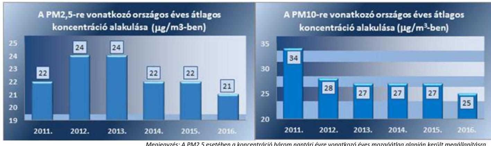

Megjegyzés: A PM2,5 esetében a koncentráció három naptári évre vonatkozó éves mozgóátlag alapján került megállapításra.
Forrás: OMSZ adatszolgáltatás

---

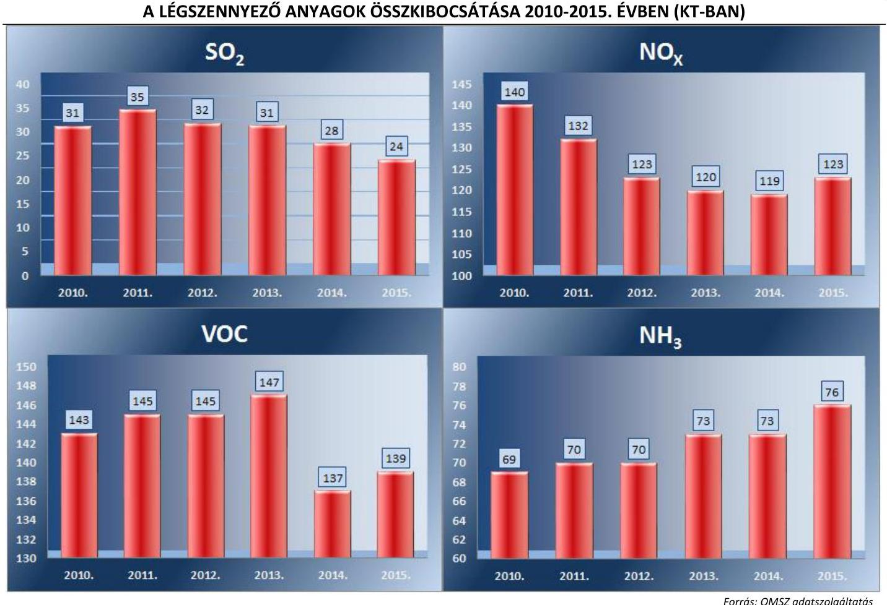

A levegővédelmi intézkedések eredményesek voltak.

A 7-8. ábrák alapján látható, hogy illékony szerves vegyületek (VOC), a kén-dioxid $\left(\mathrm{SO}_{2}\right)$ és a PM2,5 esetében a kezdeti emelkedést követően csökkent az összkibocsátás, illetve koncentráció. Az ammónia $\left(\mathrm{NH}_{3}\right)$ esetében azonban az összkibocsátás trendszerű növekedése figyelhető meg.

A légszennyező anyagok összkibocsátásának, illetve koncentrációjának trendszerű alakulása a stratégiai dokumentumok alapján végrehajtott intézkedések eredményességét igazolja.

## AZ NKP-3 EREDMÉNYESSÉGI CÉLKITŰZÉSEINEK

2015. évre számított időarányos célértékeit - az illékony szerves vegyületek (VOC) kivételével - egyik szennyező anyag sem lépte túl, amely pozitívan vetíti előre a 2020-ra vállalt célértékek teljesíthetőségét:

1. célkitűzés: Az NKP-3 PM2,5-re vonatkozó eredményességi célkitűzései időarányosan teljesültek. Az eredményességi célkitűzések teljesülését a 2020. évre vállalt célérték 2015. évre időarányosan számolt értékéhez viszonyítottuk. A közegészségügyi szempontból kiemelt PM2,5 légszennyező anyagok éves koncentrációja $1 \mu \mathrm{~g} / \mathrm{m}^{3}$-el (4,3\%-kal) az időarányosan számolt érték alatt maradt. (lásd 9. ábra):

---

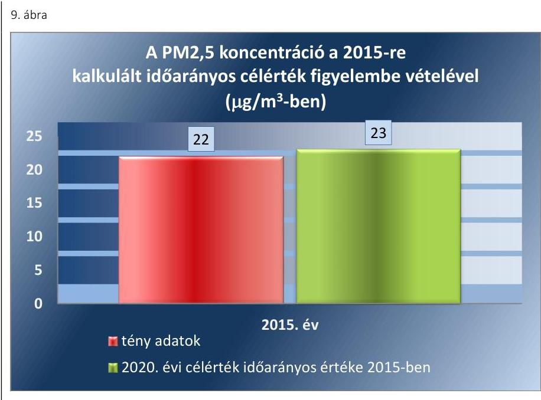

Fonrás: OMSZ adatszolgáltatás
2. célkitűzés: Az NKP-3 2010. évi eredményességi célkitűzései az illékony szerves vegyületek (VOC) összkibocsátása kivételével teljesültek. A kiemelt jelentőségű légszennyező anyagok 2010. évi összkibocsátását az 10. ábra mutatja be:
10. ábra
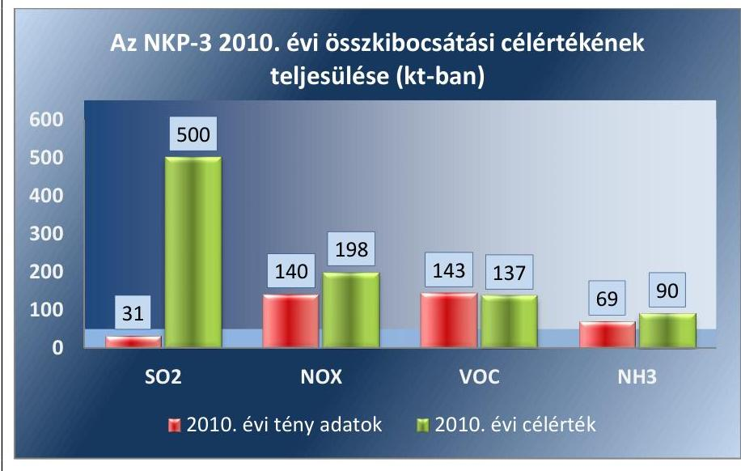

Fonrás: OMSZ adatszolgáltatás
A kén-dioxid $\left(\mathrm{SO}_{2}\right)$, a nitrogén-oxidok $\left(\mathrm{NO}_{\mathrm{x}}\right)$, az illékony szerves vegyületek (VOC) és az ammónia $\left(\mathrm{NH}_{3}\right)$ 2010. évi összkibocsátás adatai alapján megállapítható, hogy a 2010-re rögzített célértéket csak az illékony szerves vegyületek (VOC) kibocsátása haladta meg 6 kt-val.
3. célkitűzés: Az NKP-3 eredményességi célkitűzéseinek 2015. évre számolt időarányos értékei az illékony szerves vegyületek (VOC) összkibocsátása kivételével teljesültek. A kiemelt jelentőségű légszennyező anyagok 2015. évi összkibocsátását a 11. ábra mutatja be:

---

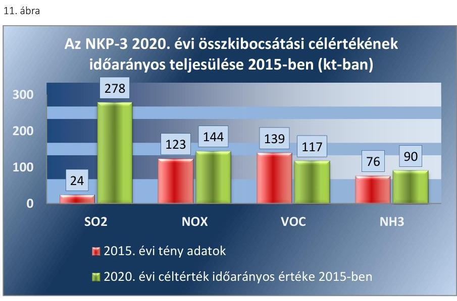

Forrás: OMSZ adatszolgáltatás
A 2015. évi összkibocsátás a kén-dioxid, nitrogén-oxidok, és ammónia tekintetében a 2020. évi összkibocsátási célérték 2015. évre számolt időarányos értéke alatt maradt, azonban az illékony szerves vegyületek (VOC) összkibocsátása $22 \mathrm{kt}^{47}$-val ( $18,8 \%$-kal) haladta meg az időarányos értéket.

# AZ NKP-4 EREDMÉNYESSÉGI CÉLKITŰZÉSEINEK 

2015. évre számított időarányos célértékeit - az illékony szerves vegyületek (VOC) kivételével - egyik szennyező anyag sem lépte túl, amely pozitívan vetíti előre a 2020-ra vállalt célértékek teljesíthetőségét:
1. célkitűzés: Az NKP-4 PM2,5-re vonatkozó eredményességi célkitűzései időarányosan teljesültek, amely megegyezik az NKP-3 1. célkitűzésével (lásd 4. ábra).
2. célkitűzés: Az NKP-4 eredményességi célkitűzéseinek 2015. évre számolt időarányos értékei az illékony szerves vegyületek (VOC) összkibocsátása kivételével teljesültek. A kiemelt jelentőségű légszennyező anyagok 2015. évi összkibocsátását az 12. ábra mutatja be:
12. ábra
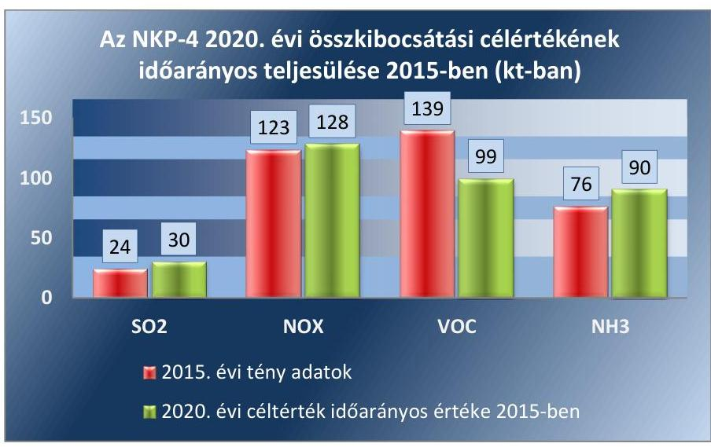

---

A kén-dioxid $\left(\mathrm{SO}_{2}\right)$, a nitrogén-oxidok $\left(\mathrm{NO}_{x}\right)$, az illékony szerves vegyületek (VOC) és az ammónia $\left(\mathrm{NH}_{3}\right)$ 2015. évi összkibocsátás adatai alapján megállapítható, hogy a 2020-re rögzített összkibocsátási célértékek 2015. évre számolt időarányos értékeit csak az illékony szerves vegyületek (VOC) kibocsátása haladta meg 40,4\%-kal, 40 kt-val.

# A PM10-RE VONATKOZÓ ÁGAZATKÖZI INTÉZKEDÉSI PROGRAM ALAPJÁN VÉGREHAJTOTT INTÉZKEDÉSEK eredményesek voltak, mert a PM10 mérőállomások összességére számolt éves átlagos koncentráció értékei 2011-2016 között trendszerű javulást mutattak (lásd 13. ábra): 

13. ábra
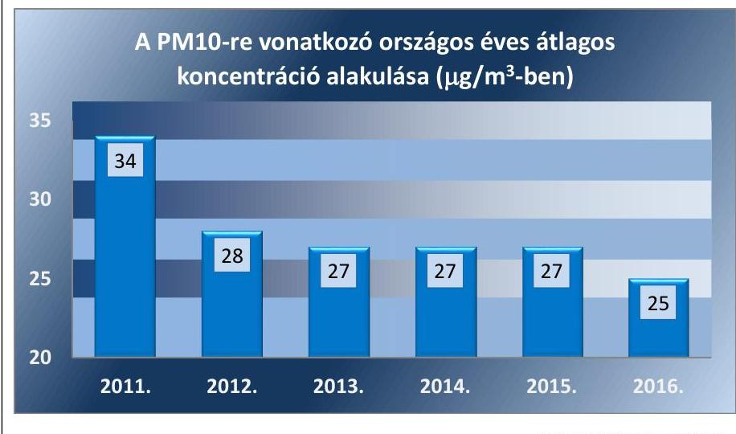

A PM10 koncentráció csökkenéséhez vélhetően több tényező járult hozzá, melyek közül kiemelendő a levegőminőségi tervekben megfogalmazott és végrehajtott intézkedések hatása, a lakossági gázár csökkentése (rezsicsökkentés), továbbá a közutak gyakoribb takarítása, valamint a fásítási programok is.

## 5.3. számú megállapítás

A PM10 koncentráció csökkenő́ kiadások mellett mérséklődött, ami arra mutat, hogy a levegőminőség javítására tett intézkedések hatékonyak voltak.

A PM10 szennyező anyagok éves átlagos koncentrációja csökkenő kiadások mellett mérséklődött, ami arra mutat, hogy a PM10-re vonatkozó ágazatközi intézkedési program alapján a levegőminőség javítására tett intézkedések hatékonyak voltak.

A PM10 szennyezettségi adatokra vonatkozó eredményindikátorok, valamint a levegő minőségének javulását célzó kiadások változásának viszonya arra mutat, hogy a PM10-re vonatkozó ágazatközi intézkedési program intézkedései hatékonyak voltak. A hatékonyságot az eredményindikátorok és a kiadások összegének változása alapján az alábbiak szerint értékeltük:

- A PM10 eredményindikátorai közül a szennyezettségi pontszám 2011-től 2016-ig 20,7\%-kal csökkent.
- A szennyezett és erősen szennyezett értéket jelző mérőállomások száma (100\%-kal) csökkent.
- A PM10 éves átlagos koncentráció ( $\mu \mathrm{g} / \mathrm{m} 3$ ) 26,4\%-kal csökkent, így az eredményindikátorok összes átlagos csökkenése 49,0\%-os volt, amely jelentő javulást mutat.

---

A PM10-re vonatkozó ágazatközi intézkedési program végrehajtásakor a kiadások a 2012. évi 35 803,0 M Ft-ról 2016. évre 5797,3 M Ftra 30 005,7 M Ft-tal (83,8\%-kal) csökkentek. A PM10-el kapcsolatban felmerült kiadás 2012. és 2016. között összesen 68 506,0 M Ft öszszegű volt, melynek 99,6\%-át, 68 242,0 M Ft-ot a lakosság-szolgáltatás szektorral összefüggő intézkedések kiadásai tették ki.
A PM10 eredményindikátorok változását a 14. ábra szemlélteti.
14. ábra
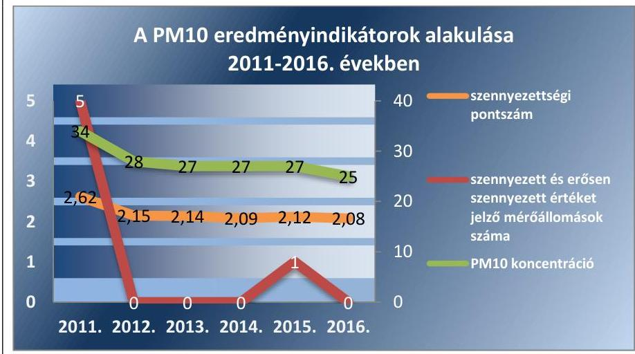

Forrás: OMSZ adatszolgáltatás

---

# JAVASLATOK 

Az ÁSZ tv. 33. § (1) bekezdésében foglaltak értelmében az ellenőrzött szervezet vezetője köteles a jelentésben foglalt megállapításokhoz kapcsolódó intézkedési tervet összeállítani és azt a jelentés kézhezvételétől számított 30 napon belül az ÁSZ részére megküldeni. Amennyiben az ellenőrzött szervezet vezetője nem küldi meg határidőben az intézkedési tervet, vagy továbbra sem elfogadható intézkedési tervet küld, az Állami Számvevőszék elnöke az ÁSZ tv. 33. § (3) bekezdése a) és b) pontjaiban foglaltakat érvényesítheti.

## Földmúvelésügyi miniszternek

1. Intézkedjen a légszennyezettségi agglomerációk és zónák kijelölésének felülvizsgálatáról.
(2.1. sz. megállapítás, 11. bekezdése alapján)

## Országos Meteorológiai Szolgálat elnökének

1. Intézkedjen annak érdekében, hogy a levegő minőségéről szóló értékeléseket az OMSZ a vonatkozó belső utasításban foglalt határidőn belül készítse el.
(2.5. számú megállapítás 3. bekezdése alapján)

---

.

---

# MELLÉKLETEK 

- I. SZ. MELLÉKLET: ÉRTELMEZŐ SZÓTÁR
eredményesség
hatékonyság
hosszú távú célkitúzés
immisszió
légszennyezés
légszennyezettség
légszennyezettségi
agglomeráció
légszennyező anyag
levegő
levegőterhelés (emisszió)
levegővédelmi követelmény
mozgó légszennyező forrás
nitrogén-oxidok:
összkibocsátás
PM10:

PM2,5
szennyezett és erősen
szennyezett mérőállomások
száma
szennyezettségi pontszám:
a kitűzött célok és a szándékolt eredmények (hatások) elérése
a rendelkezésre álló erőforrásokkal a lehető legtöbb eredmény elérése
az a levegőterheltségi szint, amelyet az emberi egészség és a környezet hatékony védelme érdekében hosszú távon el kell érni, kivéve, ha az arányos intézkedésekkel nem teljesíthető
a légszennyező anyag koncentrációja az élőhelyünk felett. E fogalom alatt a különböző területeken mért levegőminőség értendő. Az immissziónál mért szennyezőanyag koncentráció mindig alacsonyabb, mint az emissziónál mért értékek.
légszennyező anyag kibocsátási határértéket meghaladó mértékű levegőbe juttatása a levegő légszennyezettségi határértéket meghaladó levegőterheltségi szintje olyan légszennyezettségi zóna, ahol a népesség száma meghaladja a 250000 lakost, vagy ahol a népesség száma 250000 lakos vagy annál kevesebb, de a népsűrűség legalább 500 fő/km2
a levegőben lévő és az emberi egészségre vagy a környezet egészére valószínűsíthetően káros hatást gyakorló anyag
a troposzférán belüli szabadtéri levegő, kivéve a munkavédelemről szóló 1993. évi XCIII. törvény 87. § 5. pontjában meghatározott olyan munkahely levegője, amelyhez a lakosság rendszeresen nem fér hozzá
légszennyező anyag levegőbe juttatása
jogszabály vagy hatósági határozat által megállapított előírás, tilalom - beleértve a határértékeket is -, amelynek célja a levegőterhelés megelőzése vagy csökkentése a levegőterhelést okozó közúti, vasúti, vízi és légi jármű, továbbá a nem közúti mozgó gép
a nitrogén-monoxid és nitrogén-dioxid térfogati keverési arányának a nitrogén-dioxid tömegkoncentrációjának egységeiben kifejezett összege
összesített, az egész országra vonatkozó éves átlagos érték
a szálló por azon frakciója, amelynek legalább 50\%-a átmegy a PM10 mintavételének és mérésének referenciamódszerére az MSZ EN 12341:2001 szabványban meghatározott $10 \mu \mathrm{~m}$ aerodinamikai átmérőjű szelektív szűrőn
a szálló por azon frakciója, amelynek legalább 50\%-a átmegy a PM2,5 mintavételének és mérésének referenciamódszerére az MSZ EN 14907:2006 szabványban meghatározott $2,5 \mu \mathrm{~m}$ aerodinamikai átmérőjű szelektív szűrőn
eredményességi indikátor, mely azt nézi, hogy hány mérőállomás esetében mértek szennyezett vagy erősen szennyezett levegőminőséget. Segítségével az esetleges időbeli romlás kerül felszínre.
eredményességi indikátor, mely megmutatja, hogy összességében hogyan változott a légszennyezettség az egyes évek vonatkozásában. Ez az indikátor egy összesített képet ad. Az indikátor képzéséhez a mérőállomásokat először a mérőállomásokon mért légszennyezettség alapján - kiváló (1), jó (2), megfelelő (3), szennyezett (4) és erősen szennyezett (5) - szennyezettségi kategóriákba soroltuk. A megadott pontértékek hozzárendelésével kapott szorzatösszeg és a mérőállomások számának hányadosaként kialakított indikátor értéke csökken, ha a mérőállomásokon mért légszenynyezettség csökken, ezért az indikátor képes a mérőállomások számának változásából eredő torzító hatás kiküszöbölésére.

---

# 1.1.3.1. Kiemelt jelentőségű légszennyező anyagok

|   | A | B | C | D | E | F | G | H  |
| --- | --- | --- | --- | --- | --- | --- | --- | --- |
|  1. | Légszennyező anyag | Határérték [ $\mu \mathrm{g} / \mathrm{m} 3]$ |  |  |  |  |  |   |
|  2. |  | órás |  | 24 órás |  | éves |  |   |
|  3. | [CAS szám ${ }^{48}$ ] | Határérték | Türeshatár | Határérték | Türeshatár | Határérték | Türeshatár | Veszélyességi
fokozat  |
|  4. | Kén-dioxid [7446-09-5] | 250
a naptári év alatt 24-nél többször nem léphető túl | 1501 | 125 a naptári év alatt 3-nál többször nem léphető túl |  | 50
(Meghatározására alkalmazott mérési program: folyamatos mérés vagy legalább heti egy-egy, véletlenszerűen kiválasztott 24 órás mérés, egyenletesen elosztva az év során; vagy az év során egyenletesen elosztott, legalább 8 héten keresztül végzett mérés.) |  | III.  |
|  5. | Nitrogén-dioxid
[10102-44-0] (Új kibocsátáscsökkentő intézkedési terv készítésénél a nitrogén-dioxid határértéket kell figyelembe venni.) | 100
a naptári év alatt 18-nál többször nem léphető túl | $50 \% 2$ | 85 |  | 40
(Meghatározására alkalmazott mérési program: folyamatos mérés vagy legalább heti egy-egy, véletlenszerűen kiválasztott 24 órás mérés, egyenletesen elosztva az év során; vagy az év során egyenletesen elosztott, legalább 8 héten keresztül végzett mérés.) | $50 \% 2$ | II.  |
|  7. | Szálló por (PM10) |  |  | 50
a naptári év alatt 35-nél többször nem léphető túl | $50 \% 1$ | 40
(Meghatározására alkalmazott mérési program: folyamatos mérés vagy legalább heti egy-egy, véletlenszerűen kiválasztott 24 órás mérés, egyenletesen elosztva az év során; vagy az év során egyenletesen elosztott, legalább nyolc héten keresztül végzett 24 órás mérés.) | $20 \% 1$ | III.  |
|  8. | Ólom [7439-92-1] |  |  |  |  | 0,3
(Meghatározására alkalmazott mérési program: folyamatos mérés vagy legalább heti egy-egy, véletlenszerűen kiválasztott 24 órás mérés, egyenletesen elosztva az év során; vagy az év során egyenletesen elosztott, legalább nyolc héten keresztül végzett 24 órás mérés.) | $100 \% 3$ | I.  |

---

|  9. | Benzol [71-43-2] (Rákkeltő légszennyező anyag) |  |  | 10
öt év után felülvizsgálatra kerül |  | 5
(Meghatározására alkalmazott mérési program: folyamatos mérés vagy legalább heti egy-egy, véletlenszerűen kiválasztott 24 órás mérés, egyenletesen elosztva az év során; vagy az év során egyenletesen elosztott, legalább nyolc héten keresztül végzett 24 órás, illetőleg 168 órás mérés.) | 100\%2 | I.  |
| --- | --- | --- | --- | --- | --- | --- | --- | --- |
|  |   |   |   |   |   |   |   |   |

1 A határértéknek való megfelelés szempontjából a tűréshatárt 2005. január 1-jéig lehet alkalmazni. 2 A határértéknek való megfelelés szempontjából a tűréshatárt 2010. január 1-jéig lehet alkalmazni. 3 A határértéknek való megfelelés szempontjából a tűréshatárt 2010. január 1-jéig lehet alkalmazni a több évtizedes ipari tevékenység során szennyeződött helyszíneken lévő jellegzetes ipari források közvetlen környezetében (1000 méternél nem messzebb).

---

1.1.3.2. Ózon [CAS szám 10028-15-6]

|   | A | B | C | D  |
| --- | --- | --- | --- | --- |
|  1 | Határérték | célérték | hosszú távú célkitúzés | Veszélyességi
fokozat  |
|   | $\mu \mathrm{g} / \mathrm{m} 3$
Napi 8 órás mozgó átlagkoncentrációk maximuma
A maximum értéket az órás átlagok alapján képzett 8 órás mozgó átlagértékekből kell kiválasztani. Az
ily módon számított 8 órás átlagokat arra a napra kell vonatkoztatni, amelyen a 8 órás időtartam
végződik, tehát bármelyik nap első vizsgálati periódusa a megelőző nap 17 órától az adott nap 01
óráig tart. Bármelyik nap utolsó vizsgálati periódusa az adott napon 16 órától 24 óráig tart. |  |  |   |
|   | $\begin{gathered} 120 \ \text { melyet } \ 2009 . \ \text { december } \ 31 \text {-ig egy } \ \text { naptári } \ \text { évben, } \ \text { hároméves } \ \text { vizsgálati } \ \text { időszak átla- } \ \text { gában } \ 80 \text { napnál } \ \text { többször } \ \text { nem szabad } \ \text { túllépni. } \end{gathered}$ | 120
melyet 2010. évtől mint első évtől kezdve hároméves vizsgálati időszak átlagában egy naptári évben 25 napnál többször nem szabad túllépni. Amennyiben a három évre vonatkozó átlagot nem lehet meghatározni teljes és egymást követő éves adatok alapján, akkor a célértékek betartásának ellenőrzéséhez megkövetelt minimális éves adat: egy évre vonatkozó éves adat. | 120
amely egy naptári év alatt mért napi 8 órás mozgó átlagkoncentráció maximuma. A hosszú távú célkitúzés elérésére vonatkozó időpont nincs meghatározva. | I.  |

1.2. A PM2,5-re vonatkozó specifikus kötelezettségek

# 1.2.1. Nemzeti expozíciócsökkentési cél

|   | A | B  |
| --- | --- | --- |
|  1 | A 2010. évi átlagexpozíció-mutatóhoz (ÁEM) képest megvalósítandó expozíciócsökkentési cél
(Amennyiben a $\mu \mathrm{g} / \mathrm{m} 3$-ben kifejezett ÁEM a referenciaévben $8,5 \mu \mathrm{~g} / \mathrm{m} 3$ vagy annál kevesebb, az
expozíciócsökkentési cél nulla lesz. A csökkentési cél azokban az esetekben is nulla, amikor az | Az expozíció-
csökkentési cél
elérésének éve  |
|  2 | ÁEM a 2010. és 2020. közötti időszakban bármikor eléri a $8,5 \mu \mathrm{~g} / \mathrm{m} 3$ szintet, és ezen a szinten vagy
ezen szint alatt marad.) | 2020  |
|  3 | Kezdeti koncentráció $\mu \mathrm{g} / \mathrm{m} 3$-ben | Csökkentési cél (\%)  |
|  4 | $<8,5=8,5$ | $0 \%$  |
|  5 | $>8,5-<13$ | $10 \%$  |
|  6 | $=13-<18$ | $15 \%$  |
|  7 | $=18-<22$ | $20 \%$  |
|  8 | $\geq 22$ | $18 \mu \mathrm{~g} / \mathrm{m} 3$ eléréséhez szükséges va-
lamennyi megfelelő intézkedés  |

1.2.2. Expozíció koncentráció

|   | A | B  |
| --- | --- | --- |
|  1 | Az expozíciókoncentrációra
vonatkozó kötelezettség | A kötelezettségek teljesítésének éve  |
|  2 | $20 \mu \mathrm{~g} / \mathrm{m} 3$ | 2015  |

1.2.3. Célérték

|   | A | B | C  |
| --- | --- | --- | --- |
|  1 | Átlagszámítási időszak | Célérték | A célértéknek való megfelelés időpontja  |
|  2 | naptári év | $25 \mu \mathrm{~g} / \mathrm{m} 3$ | 2010. január 1.  |

---

# 1.2.4. Határérték 

|  | A | B | C | D |
| :--: | :--: | :--: | :--: | :--: |
| 1 | Átlagszámítási időszak | Határérték | Tưréshatár | A határértéknek való <br> megfelelés időpontja |
| 2 | 1. szakasz |  |  |  |
| 3 | Naptári év | $25 \mu \mathrm{~g} / \mathrm{m} 3$ | A 2008. május 21-én 20\%, amely arány január 1-jén <br> és minden 12 hónapban azonos éves százalék- <br> arányban csökken úgy, hogy 2015. január 1-jére el- <br> érje a 0\%-ot | 2015. január 1. |
| 4 | 2. szakasz <br> (a Bizottság 2013-ban az egészségi és környezeti hatásokra, a múszaki megvalósíthatóságra és a tapasztalatokra vonat- <br> kozó további információk, valamint a tagállami célértékek fényében felülvizsgálja az indikatív határértéket) |  |  |  |
| 5 | Naptári év | $20 \mu \mathrm{~g} / \mathrm{m} 3$ |  | 2020. január 1. |

---

# II. SZ. MELLÉKLET: AZ EURÓPAI BIZOTTSÁG ÁLTAL LEVEGŐVÉDELEMMEL KAPCSOLATBAN INDÍTOTT, 2014-2016. ÉVEKET ÉRINTŐ KÖTELEZETTSÉGSZEGÉSI ELJÁRÁSAI 

## I. 2008/2193. számú uniós jogsértési eljárás (2008.)

A. Az Európai Bizottság által indított eljárás oka:

1. 2008/50/EK irányelv ${ }^{49}$ XI. mellékletével összefüggésben értelmezett 13. cikk (1) bekezdésében foglalt kötelezettségek elmulasztása Magyarország három zónájában Budapest és körzete, Sajó-völgye, Pécs és körzete a levegő napi $\mathrm{PM}_{10}$ koncentráció határérték túllépése 2005-2012. között
2. 2008/50/EK irányelv XI. mellékletével összefüggésben értelmezett 23. cikk (1) bekezdés második al bekezdésében foglalt kötelezettségek elmulasztása - meg nem felelés időszaka lecsökkentése a legrövidebb időre
B. Az eljárással kapcsolatban megtett intézkedések 2014-2016. évben:
3. Az Európai Bizottság a 2014.03.28-i SG-Greffe (2014) D/4862 kiegészítő indoklással ellátott véleményében a levegővédelmi terveket és a megtett intézkedéseket nem tartotta megfelelőnek.
4. Magyarország 2014.05.30-án KUM/6910-4/2014/Adm. válaszlevelet küldött a kiegészítő indoklással ellátott véleményre.

## II. 2016/2085. számú uniós jogsértési eljárás (2016.)

A. Az eljárás előzményei:

1. Az Európai Bizottság a 2014. június 6-án kelt, EU Pilot 6207/14/ENVI számú dokumentuma Pilot ellenőrzési program keretében a 2008/50/EK irányelv 23. cikk (1), a 25. cikk (4), a 33. cikk (2) bekezdései, a IV. melléklet „A" szakasza és a VI. melléklet „B" szakasz 3. és 4. pontjai átültetésére vonatkozó tájékoztatás kérés.
2. Az Európai Bizottság a 2016. június 23-án kelt, EU Pilot 8655/16/ENVI számon az ipari kibocsátásokról (a környezetszennyezés integrált megelőzéséről és csökkentéséről) szóló, 2010. november 24-ei 2010/75/EU50 európai parlamenti és tanácsi irányelv átültetése a magyar jogba tárgyú megkeresése.
B. Az Európai Bizottság által indított eljárás oka:
3. 2008/50/EK irányelv XI. mellékletével összefüggésben értelmezett 13. cikk (1) bekezdésében foglalt kötelezettségek elmulasztása - $\mathrm{NO}_{2}$ éves határérték túllépése tartósan Budapest, Pécs zónákban 2010-2014. között.
4. 2008/50/EK irányelv XI. mellékletével összefüggésben értelmezett 23. cikk (1) bekezdés második albekezdésében foglalt kötelezettségek elmulasztása - meg nem felelés időszaka lecsökkentése a legrövidebb időre
C. Az eljárással kapcsolatban megtett intézkedések
5. Magyarország 2016.09.23-i XX-EUJIMFO/236/9/2016. válaszlevele a megtett intézkedésekről.
6. Az Európai Bizottság 2016.11.28-i kiegészítő megkeresésében a 2008/50/EK irányelv 4. cikk (2) bekezdés, a 8. cikk (2) bekezdés a) és b) pontja, valamint a 24. cikk (3) bekezdés a) pontja hazai jogszabályba történő átültetésére vonatkozóan további tájékoztatást kért. Magyarország az Európai Bizottságot 2016. december 22-én, az XX-EUMJFO/212/12/2016. számú iktatólevelében tételesen tájékoztatta a kiegészítő megkeresésben felvetett hiányosságokról.

---

| AZ EUROPAI PARLAMENT ÉS A TANÁCS 2008/60/EK <br> IRÁNYELVE <br> a környezeti levegő minőségéről és a Tisztább levegőt Európának elnevezésű programról |  |  | Kapcsolódó magyar jogszabály |  | átültetés $\mathrm{I} / \mathrm{N} / \mathrm{X}$ |
| :--: | :--: | :--: | :--: | :--: | :--: |
|  | I. | 1.-5. <br> cikk | Általános rendelkezések | $\begin{aligned} & \text { Lvr. 2. § 2., 5., 7., 11-12., 15- } \\ & \text { 16., 19-22., 25-26., 28., 31-34., } \\ & \text { 35., 38., 41-44. pontjai, 9. § } \\ & \text { (1), (2) a)-c) és e) pontjai, 10. § } \\ & \text { (1), 14. § (1)-(2), 33. § (1) } \\ & \text { Hér. 2. § (1) b) pontja } \\ & \text { Mér. 2. § (1) b)-d) pontjai, 9. § } \\ & \text { (1), 8. melléklet 3. pontja } \\ & \text { 4/2002. KvVM r. 1. §, 2.§ (1) } \end{aligned}$ |  | I |  |
|  | II. | 5.-11. <br> cikk | A környezeti levegő minőségének vizsgálata | Lvr. 9. § (1), 10. § (1)-(3), 33. § <br> (1), 8. melléklet j) pont <br> Mér. 3. § (2)-(3), (5)-(6), 4. § <br> (1)-(2), 9. § (1)-(2), (3) a), aa)- <br> ab), b)-d), 10. § (1)., 2., 3. és 9. <br> melléklet <br> Hér. 4.§ (4), 5. melléklet <br> 4/2002. KvVM r. 1. §, 2. § (1), <br> 1. melléklet |  | I |
|  | III. | 12.-22. <br> cikk | Környezeti levegő minőségének kezelése | Lvr. 4. §, 5. § (1)-(2), 8. § ,11.§ <br> (1)-(2), 12. § (1)-(2), 13. §, 14. <br> § (1)-(2), 15. § (2), 18. §, 19. § <br> (1)-(2), 33. § (1) 40. § (1)-(3), <br> 41. § <br> Hér. 4. § (3), 1. és 3. melléklet, <br> 4. melléklet 2.1. pontja <br> Mér. 3. § (3), 4. § (1) b), valamint a 1-2. és 10. melléklet |  | I |
|  | IV. | 23.-25. <br> cikk | Tervezés | Lvr. 14. §, 15. § (1), 9. § (1), 20. <br> § (1)-(5), 21. §, 33. § (1), 1.-2. <br> melléklet <br> Kvtv. 4. § 10. és 13. pontja, <br> 102/C . § (1)-(2), | 118/2015.(V.13) <br> Korm. rend., <br> módosítás EU <br> pilot eljárás következtében | I |
|  | V. | 26.-28. <br> cikk | Tájékoztatás és jelentéstétel | Lvr. 9. § (2),(4)-(6), 16. §, 33. § <br> (1)-(3), 41. § (4) |  | I |
|  | VI. | 29.-35. <br> cikk | Az Európai Bizottság, az átmeneti és záró rendelkezések | Lvr. 34. §, 35. §, 43. § (1) g), 9. melléklet <br> Hér. 10. § <br> Mér. 24. § |  | I |
|  | I. | Adatminőségi célkitűzések |  | Mér. 8. melléklet 1., 2., 3. pontja, 9. melléklet | 84/2016. (XII. <br> 16.) FM rendelet (korábban <br> 33/2015. <br> (VI.25.) FM rendelet), módosí- | I |

---

|  |  |  |  | tás EU pilot eljárás következtében |  |
| :--: | :--: | :--: | :--: | :--: | :--: |
| II. | A környezeti levegőben lévő kén-dioxid, nitrogén-dioxid és nitrogén-oxidok, szálló por (PM10 és PM2,5), ólom, benzol és szén-monoxid koncentrációjának egy adott zónában vagy agglomerációban történő vizsgálatára vonatkozó követelmények meghatározása | Mér. 9. melléklet |  |  | I |
| III. | A környezeti levegő vizsgálata és a környezeti levegőben lévő kén-dioxid, nit-rogén-dioxid és nitrogén-oxidok, szálló por (PM10 és PM2,5), ólom, benzol és szén-monoxid mérésére szolgáló mintavételi pontok elhelyezkedése | Mér 2. melléklet |  |  | I |
| IV. | A vidéki hátterú helyszíneken a koncentrációtól függetlenül végzett mérések | Mér. 10. melléklet |  |  | I |
| V. | A környezeti levegőben lévő kén-dioxid, nitrogén-dioxid és nitrogén-oxidok, szálló por (PM10, PM2,5), ólom, benzol és szén-monoxid koncentrációinak helyhez kötött mérésére szolgáló mintavételi pontok minimális számának meghatározására vonatkozó kritériumok | Mér. 1. melléklet |  |  | I |
| VI. | $\mathrm{SO}_{2}, \mathrm{NO}_{3}, \mathrm{NOx}, \mathrm{PM} 10, \mathrm{PM} 2,5$, Ólom, benzol, CO vizsgálatára vonatkozó referencia módszerek | Mér. 7. melléklet |  | 84/2016. (XII. <br> 16.) FM rendelet (korábban 33/2015. <br> (VI.25.) FM rendelet), módosítás EU pilot eljárás következtében | I |
| VII. | A kén-dioxid, a nitrogén-dioxid és a nit-rogén-oxidok, a szálló por (PM10 és PM2,5), az ólom, a benzol, a szén-monoxid és az ózon koncentrációjának vizsgálatára vonatkozó referencia-módszerek | Hér. 2 § (1) a), 1. melléklet 1.1.3.2. pontja, 4. melléklet 2.3. pontja, <br> Mér. 8. melléklet 6. pontja |  |  | I |
| VIII. | Az ózonkoncentrációk vizsgálatára szolgáló mintavételi pontok osztályozásának és elhelyezkedésének kritériumai | Mér. 4. melléklet 1.-3. pontja |  |  | I |
| IX. | Az ózonkoncentráció helyhez kötött mérésére szolgáló mintavételi pontok száma meghatározásának kritériumai | Mér. 3. melléklet |  |  | I |
| X. | Az ózon előanyagainak mérései | Mér. 6. melléklet |  |  | I |
| XI. | Az emberi egészség védelme érekében meghatározott határértékek | Mér. 8. melléklet 7. pontja Hér. 1. melléklet 1.1.3.1. pontja |  |  | I |

---

| XII. | Tájékoztatási és riasztási küszöbértékek | Hér. 3. melléklet |  |  | I |
| :-- | :-- | :-- | :-- | :-- | :-- |
| XIII. | A növényzet védelmében meghatáro- <br> zott kritikus szintek | Hér. 4. melléklet 2.1. pontja |  |  | I |
| XIV. | A PM2,5-re vonatkozó nemzeti expozi- <br> ciócsökkentési cél, célérték és határér- <br> ték | Mér. 10. melléklet 3. pontja <br> Hér. 1. melléklet 1.2.1.-1.2.4. <br> pontja |  |  | I |
| XV. | A helyi, regionális vagy nemzeti levegő- <br> minőségi tervekben rögzítendő informá- <br> ciók | Lvr. 1. melléklet |  |  | I |
| XVI. | A nyilvánosság tájékoztatása | Lvr. 9. § (4)-(6) <br> Hér. 3. melléklet 3. pontja |  |  | I |
| XVII. | Megfelelési táblázat | Átültetést nem igényel |  |  | X |


| A BIZOTTSÁG (EU) 2015/1480 IRÁNYELVE <br> a környezeti levegő minőségének vizsgálata kereté- <br> ben alkalmazott referencia-módszereket, adathiteles- <br> tést és mintavételi pontok elhelyezkedését meghatá- <br> rozó szabályok tekintetében a 2004/107/EK ${ }^{\text {10 }}$ és a <br> 2008/50/EK irányelv egyes mellékleteinek módosítá- <br> táról | Kapcsolódó magyar jogszabály | átültetés <br> I/N/X |
| :--: | :--: | :--: |
|  | 1. cikk | Mér. 7. és 11. melléklet | I |
|  | 2. cikk | Mér. 2., 3., 7. és 8. melléklet | I |
|  | 3. cikk | Átültetést nem igényel | X |
|  | 4. cikk | 84/2016. (XII. 16.) FM rendelet | I |
|  | 5. cikk | Átültetést nem igényel | X |
|  | 6. cikk | Átültetést nem igényel | X |
| I. | Melléklet | Mér. 7. és 11. melléklet | I |
| II. | Melléklet | Mér. 2.-3., 7.-8. melléklet | I |

---

.

---

# FÜGGELÉK: ÉSZREVÉTELEK 

A jelentéstervezetet a Számvevőszék 15 napos észrevételezésre megküldte az ellenőrzött szervezetek vezetőinek az ÁSZ tv. 29. §* (1) bekezdése előírásának megfelelően.
Az elfogadott észrevételek alapján a Számvevőszék módosította a jelentést.


A függelék tartalmazza az ellenőrzöttek észrevételeit, illetve az el nem fogadott észrevételek elutasításának indoklását.

[^0]
[^0]:    * 29. § (1) Az Állami Számvevőszék az ellenőrzési megállapításait megküldi az ellenőrzött szervezet vezetőjének vagy az általa megbízott személynek, és annak, akinek személyes felelősségét állapította meg.
    (2) Az ellenőrzött szervezet vezetője és a felelősként megjelölt személy az ellenőrzés megállapításaira tizenöt napon belül írásban észrevételt tehet.
    (3) Az Állami Számvevőszék az észrevételre a beérkezésétől számított harminc napon belül írásban válaszol. A figyelembe nem vett észrevételeket köteles a jelentésben feltüntetni, és megindokolni, hogy azokat miért nem fogadta el.

---

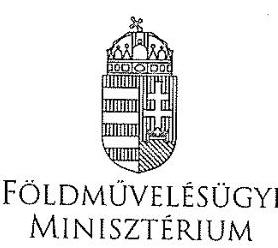

DR. FAZEKAS SÁNDOR
minkszan

Iktatószám: $\mathrm{KmF} / 364-1 / 2017$.
Ügyintéző: Dr. Varga Judit
Telefonszám: 1/79-52-457
E-mail: judit.varga@fm.gov.hu
Domokos László úr
elnök részére
Állami Számvevőszék
Budapest
Apáczai Csere János u. 10.
1052
Tárgy: Jelentéstervezet véleményezése

# Tisztelt Elnök Úr! 

Köszönettel megkaptam (V-1266-334/2016. iktatószámú) levelét, melyben a csatoltan megküldött, „A levegő minőségének védelmét szolgáló intézkedések ellenőrzése" címủ jelentéstervezet észrevételezését kérte.

A jelentéstervezetet áttekintve azt rendkívül alaposnak találtam. Engedje meg, hogy gratuláljak munkatársainak, akik fáradságot nem ismerve törekedtek a levegőminőségvédelmi terület szabályozásának megismerésére, melyhez jelentős háttértudás elsajátitására is szükségük volt. A jelentésük bizonyítja, milyen magas szinten sikerült mindezt átlátniuk.

A tervezetben leírtakat elfogadom, azokkal kapcsolatosan mindössze néhány technikai jellegü, illetve pontositó javaslatot szeretnék Önnel megosztani.

A 22. oldalon található, „A mérőhálózat fejlesztését..." kezdetủ bekezdés a tárca által irányított, összesen három fejlesztési projektet foglal össze - ám a bekezdés második felében ezek közül csak egyet részletez. Javaslom a bekezdés kiegészítését a másik két projekt részletezésével, vagy a bekezdés második felének törlését (,illetve az automata mérőállomással nem rendelkező városok és kistérségek levegőminőségének ellenőrzéséhez, valamint a manuális mintavétel adatainak a regionális laboratóriumokban történő feldolgozásához szükséges feltételrendszer megteremtését célozták.").

A 23. oldalon található, „A mérőpontok kijelölését, felülvizsgálatát..." kezdetủ bekezdés esetén megjegyzem, hogy a mérőpontokat üzemeltető kormányhivatalok és jogelőd szerveik csak javaslatot adhattak/adhatnak a mérőpontok kijelölésére - a hálózat

---

egészének összefogása, így a mérőpontok kijelölése - a beérkezett javaslatok figyelembe vételével - mindig a tárca (központi) feladata volt.

Miközben informatívnak tartom a 4. ábrán a 2011-2016. évek során a nitrogén-dioxid órás határérték túllépések száma esetén azok országos szinten összegzett alakulásának bemutatását, szakmailag pontatlan az ábra előtti szakasz, mely szerint „...minden évben jelentősen meghaladja .... az évenkénti maximum 18 határérték túllépést." Jelzem, hogy a jogszabály mérőállomásonként számolja a 18 megengedett túllépést. Mivel az ábrán a mérőállomások száma nem szerepel, így az előírásoknak történő megfelelés nem értékelhető, a megengedettet meghaladó túllépések száma nem olvasható le.

Hasonlóan félrevezető az értelmezése az 5. ábrának, ahol a túllépések száma minden esetben szintén mérőállomásonként értendő, az országos összes túllépés száma önmagában nem teszi lehetővé az előírásoknak történő megfelelés értékelését.

A jelentés 25 . és 26 . oldalán bemutatott, $\mathrm{PM}_{10}$-re vonatkozó ágazatközi intézkedési program keretében megvalósított intézkedéseket kiegészíteni javaslom az alábbiakkal:

- 25. oldal utolsó bekezdése: az FM, NFM, EMMI mellett az NGM is tett intézkedéseket (pl. gépjármủ adórendszer átalakítása a környezetvédelmi szempontból kedvezőbb járművek irányába);
- az FM intézkedéseit a következőkkel: mezőgazdasági tevékenységek $\mathrm{PM}_{10}$ kibocsátás csökkentésének felmérése,;valamint a lakossági szektor területén a lakossági fütéssel kapcsolatos szemléletformálási tevékenység működtetése (ld. Fűts okosan! kampány).

A 31. oldalon található 6. táblázat címét az alábbira javaslom módosítani: „Éves határértékek és az azokat túllépő, mért adatok a legterheltebb állomásokon $\mu \mathrm{g} / \mathrm{m}^{3}$-ben, ózonnál db-ban". Amennyiben ugyanis nincs pontosítva, hogy a túllépéssel érintett adatok szerepelnek csak a táblázatban, úgy jelentős adathiányra utalnának a hiányzó értékek, amiről nincs szó.

A jelentés 38. oldalán szereplő, a 1330/2011. (X.12.) Korm. határozat végrehajtási kiadásait ismertető adat nem egyezik az FM, mint az kormányhatározat végrehajtásának koordinálásáért felelős tárca, nyilvántartásával. Rendelkezésünkre álló információink alapján a Kormányhatározat végrehajtására 2012-2016. között 149,41612 Mrd Ft-ot fordítottak a tárcák összesen a jelentésben ismertetett 68,506 Mrd Ft-tal ellentétben.

Remélem, fenti pontosító célú észrevételeim hozzá tudnak járulni a jelentéstervezet továbbfejlesztéséhez.

Eddigi munkájukhoz gratulálok, a továbbiakhoz sok sikert kívánok.
Budapest, 2017. november „
Üdvözlettel:
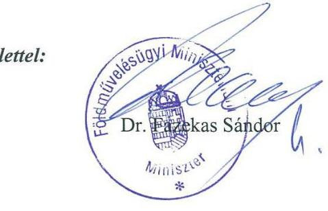

2

---

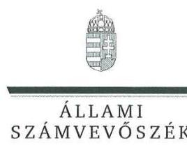

ELHök

Ikt.szám: V-1266-343/2016.

Dr. Fazekas Sándor úr
miniszter

Földművelésügyi Minisztérium

# Budapest 

## Tisztelt Miniszter Úr!

„A levegő minőségének védelmét szolgáló intézkedések ellenőrzése" című jelentéstervezetre tett észrevételeit köszönettel megkaptam. Az ellenőrzési megállapításokra vonatkozó észrevételét az Állami Számvevőszékről szóló 2011. évi LXVI. törvény (a továbbiakban: ÁSZ tv.) 29. § (2) bekezdésében meghatározott tizenöt napos határidőn belül küldte meg. Az Állami Számvevőszék észrevétellel kapcsolatos álláspontját a mellékletként csatolt, a felügyeleti vezető által készített indokolás tartalmazza.

Tájékoztatom, hogy az Állami Számvevőszék a figyelembe nem vett észrevételeket az ÁSZ tv. 29. § (3) bekezdésében előírtak szerint köteles a jelentésében feltüntetni és megindokolni, hogy azokat miért nem fogadta el.

Budapest, 2017. 12. hó 16 nap

Tisztelettel:

Melléklet: Észrevételre adott válasz
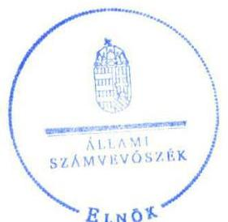

Domokos László

---

"A levegő minőségének védelmét szolgáló intézkedések ellenőrzése" címủ jelentéstervezethez tett észrevételre adott válasz
Földművelésügyi Minisztérium
A jelentéstervezetre tett észrevételeket áttekintettem, annak kezelésével kapcsolatban a következő tájékoztatást adom.

# 1. A jelentéstervezet 22. oldal 3. bekezdésére vonatkozó észrevétel 

Miniszter Úr észrevételében a megállapítást nem vitatja. A pontosító észrevételt elfogadjuk, azt a jelentés véglegezése során figyelembe vesszük.

## 2. A jelentéstervezet 23. oldal 2.2. sz. megállapítására vonatkozó észrevétel

Miniszter Úr észrevételében a megállapítást nem vitatja, azonban megjegyzi, hogy a mérőpontok kijelölése mindig a tárca (központi) feladata volt. Az észrevételt elfogadjuk, azt a jelentés véglegezésekor figyelembe vesszük.

## 3. A jelentéstervezet 29. oldal utolsó franciabekezdésére vonatkozó észrevétel

A szakmai pontosításra tett észrevételt elfogadjuk, azt a jelentés véglegezése során figyelembe vesszük.

## 4. A jelentéstervezet 5. ábrájára vonatkozó észrevétel

Az észrevételben megfogalmazottak feltehetően nem az észrevételben megjelölt 5. ábrára vonatkoznak, hanem a 6. ábrára. Az észrevételt elfogadjuk, azt a jelentés véglegezése során figyelembe vesszük.

## 5. A jelentéstervezet 25. oldal utolsó franciabekezdésére vonatkozó észrevétel

Miniszter Úr észrevételében nem vitatja a megállapítás helytállóságát, azonban kiegészítő javaslatokat fogalmaz meg a PM10-re vonatkozó ágazatközi intézkedési program keretében megvalósított intézkedések bemutatására. Az észrevételt elfogadjuk, azt a jelentés véglegezése során figyelembe vesszük.

## 6. A jelentéstervezet 6. táblázatára vonatkozó észrevétel

A táblázat címének pontosítására vonatkozó javaslatot elfogadjuk, azt a jelentés véglegezése során figyelembe vesszük.

## 7. A jelentéstervezet 38. oldal 1. franciabekezdésére vonatkozó észrevétel

Miniszter Úr észrevételében jelzi, hogy a jelentéstervezet PM10-re vonatkozó ágazatközi intézkedési program végrehajtási kiadásait ismertető adatai nem egyeznek az FM nyilvántartásában szereplő adatokkal.

---

Az észrevétel kapcsán ismételten áttekintettük az ellenőrzés rendelkezésére bocsátott dokumentumokat. Ennek során megállapítottuk, hogy a jelentéstervezetben szereplő kiadási összegek az ellenőrzött minisztériumok által megküldött tanúsítványokban feltüntetett kiadási adatok alapján került összegzésre.

Tekintettel a fentiekre a megállapítás módosítását nem tartjuk indokoltnak.
Budapest, 2017.
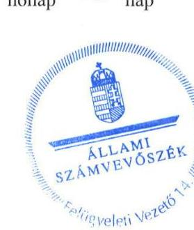

Dr. Németh Erzsébet
felügyeleti vezető

---

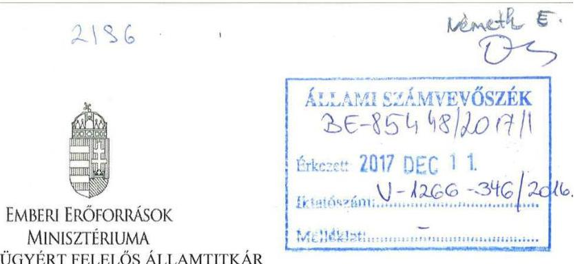

Iktatószám: 17168-4/2017/KÖZEG
Hiv. szám: V-1266-334/2016.
Úgyintéző: Tóthné Meszlényi Ágota
Tel: 795-7682

# Domokos László részére 

elnök

Állami Számvevőszék
Budapest
Apáczai Csere János u. 10.
1052

Tárgy: Észrevétel megküldése „A levegő minőségének védelmét szolgáló intézkedések ellenörzése" című jelentéstervezettel kapcsolatban

Tisztelt Elnök Úr!
„A levegő minőségének védelmét szolgáló intézkedések ellenőrzése" című jelentéstervezetet köszönettel megkaptam. Az ellenőrzés megállapításaival kapcsolatban az alábbi észrevételt teszem.

A jelentés 28. oldalán a $\mathrm{PM}_{10}$ ágazatközi intézkedési program intézkedéseinek teljesítése érdekében a 2012-2016. évekre vonatkozóan megállapított kiadásokkal kapcsolatban „Az EMMI részére a lakossággal kapcsolatban meghatározott feladataival összefüggésben nem terveztek kiadást." szövegrész pontosítását javaslom az alábbiak szerint:
Az EMMI részére a lakossággal kapcsolatban a dohányzás visszaszorítása területén meghatározott feladataival összefüggésben nem terveztek kiadást, tekintettel arra, hogy az intézkedés központi költségvetési forrást nem igényel, a cigaretta jövedéki adójának emelésével bevétel generálódik, illetve közvetve csökkenthetőek az egészségkárosodás miatti egészségügyi költségek.

Budapest, 2017. november „28,
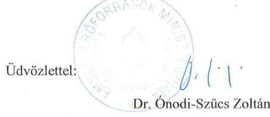

Cím: 1051 Budapest, Széchenyi tér 7-8. Tel: 3617951010
e-mail: euallamtitkar@emmi.gov.hu

---

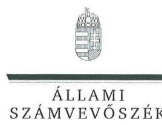

ELNÖK

Ikt.szám: V-1266-342/2016.

# Balog Zoltán úr 

miniszter

Emberi Erőforrások Minisztériuma

## Budapest

## Tisztelt Miniszter Úr!

„A levegő minőségének védelmét szolgáló intézkedések ellenőrzése" címủ jelentéstervezetre tett észrevételeit köszönettel megkaptam. Az ellenőrzési megállapításokra vonatkozó észrevételét az Állami Számvevőszékről szóló 2011. évi LXVI. törvény (a továbbiakban: ÁSZ tv.) 29. § (2) bekezdésében meghatározott tizenöt napos határidőn belül küldte meg. Az Állami Számvevőszék észrevétellel kapcsolatos álláspontját a mellékletként csatolt, a felügyeleti vezető által készített indokolás tartalmazza.

Tájékoztatom, hogy az Állami Számvevőszék a figyelembe nem vett észrevételeket az ÁSZ tv. 29. § (3) bekezdésében előírtak szerint köteles a jelentésében feltüntetni és megindokolni, hogy azokat miért nem fogadta el.

Budapest, 2017. 12. hó 15 nap

Melléklet: Észrevételre adott válasz
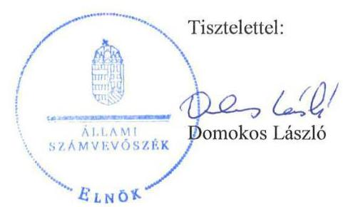

---

"A levegő minőségének védelmét szolgáló intézkedések ellenőrzése" című jelentéstervezethez tett észrevételre adott válasz
Emberi Erőforrások Minisztériuma
A jelentéstervezetre az egészségügyért felelős államtitkár által tett észrevételt áttekintettem, annak kezelésével kapcsolatban a következő tájékoztatást adom.
A jelentéstervezet 28. oldalának 3. bekezdése összegzően mutatja be a PM10-re vonatkozó ágazatközi intézkedési programban meghatározott intézkedések teljesítése érdekében tervezett kiadásokat. Az EMMI vonatkozásában megállapítja, hogy a minisztérium részére, a lakossággal kapcsolatban meghatározott feladataival összefüggésben nem terveztek kiadást.
Államtitkár úr észrevételében nem vitatta a megállapítást, azonban javasolta a szövegrész kiegészítését.
Tekintettel arra, hogy a jelentésnek nem célja az intézkedési program észrevételben javasolt, részletes bemutatása, a megállapítás módosítását nem tartjuk indokoltnak.

Budapest, 2017.
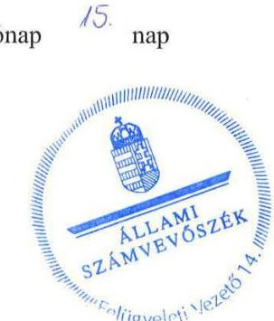

Dr. Németh Erzsébet felügyeleti vezető

---

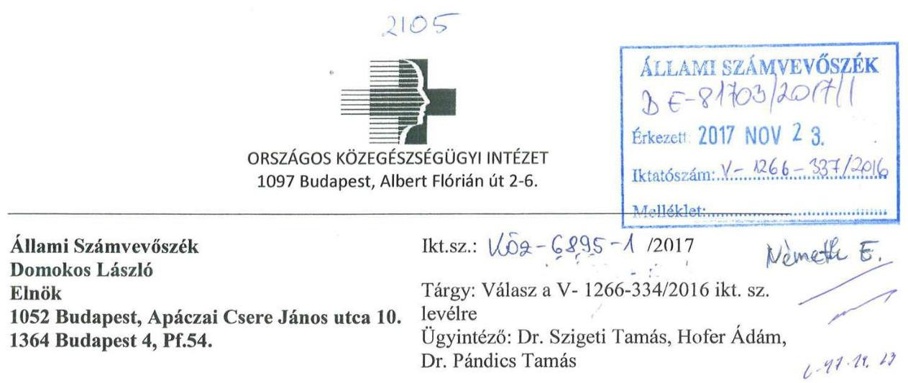

Tisztelt Elnök Úr!

Nagyon szépen köszönjük, hogy megküldték számunkra „A levegő minőségének védelmét szolgáló intézkedések ellenőrzése" c. Állami Számvevőszéki jelentéstervezetet.

A dokumentum kapcsán az alábbi észrevételeket tesszük:

1. A 21. oldalon az alábbi megállapítás található:
„Az OKK-nál 2014. január 1. és 2015. december 8. között nem határozták meg a hatás- és felelősségi köröket, mivel az intézmény nem rendelkezett érvényes SZMSZ-szel az Áht. 10. § (5) bekezdésében foglaltak ellenére."

A megállapítás nem helytálló, mivel az OKK jogelődje az Országos Környezegészségügyi Intézet 2013. július 18-tól rendelkezett SZMSZ-szel, mely 2015. március 31-ig, az Intézet átalakulásáig érvényben volt. Az OKK valóban nem rendelkezett érvényes SZMSZ-szel 2015. április 1. és 2015. december 8. között.
2. Az Országos Légszennyezettségi Mérőhálózat által szolgáltatott adatok számos esetben hiányosak voltak, így a levegőminőség egészséghatás becslését nem tudtuk teljes körüen ellátni. A Levegőhigiénés Index meghatározása meghiúsult azokon a településeken, ahol adathiany volt. Ez a probléma jelenleg is fennáll.
Amennyiben bizonyos állomások esetén nincs adatszolgáltatás, úgy a levegőminőségre vonatkozó országos átlag nem a valós helyzetet tükrözi.

A fentiek alapján szeretnénk javasolni, hogy a jelentés hívja fel a figyelmet az adatszolgáltatás fontosságára.

Budapest, 2017. november 17.

Tisztelettel:
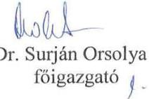

---

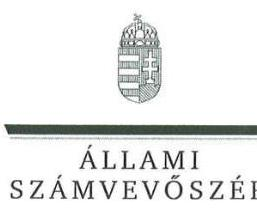

ELNÖK

# Dr. Surján Orsolya úrhölgy 

föigazgató

Országos Közegészségügyi Intézet

## Budapest

## Tisztelt Föigazgató Ürhölgy!

„A levegő minőségének védelmét szolgáló intézkedések ellenőrzése" című jelentéstervezetre tett észrevételeit köszönettel megkaptam. Az ellenőrzési megállapításokra vonatkozó észrevételét az Állami Számvevőszékről szóló 2011. évi LXVI. törvény (a továbbiakban: ÁSZ tv.) 29. § (2) bekezdésében meghatározott tizenöt napos határidőn belül küldte meg. Az Állami Számvevőszék észrevétellel kapcsolatos álláspontját a mellékletként csatolt, a felügyeleti vezető által készített indokolás tartalmazza.

Tájékoztatom, hogy az Állami Számvevőszék a figyelembe nem vett észrevételeket az ÁSZ tv. 29. § (3) bekezdésében előírtak szerint köteles a jelentésében feltüntetni és megindokolni, hogy azokat miért nem fogadta el.

Budapest, 2017. 11 hó 10 nap

Melléklet: Észrevételre adott válasz
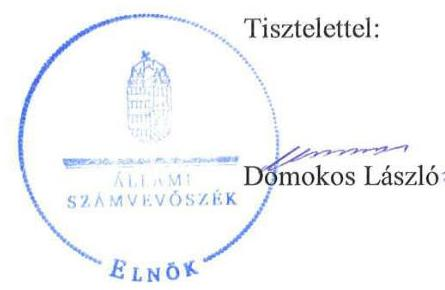

---

"A levegő minőségének védelmét szolgáló intézkedések ellenőrzése" címủ jelentéstervezethez tett észrevételre adott válasz
Országos Közegészségügyi Intézet
A jelentéstervezetre tett észrevételeket áttekintettem, annak kezelésével kapcsolatban a következő tájékoztatást adom.

1. A jelentéstervezet 1.3. sz. megállapítására (21. oldal 2. bekezdés) vonatkozó észrevétel

A jelentéstervezet megállapítja, hogy az OKK-nál 2014. január 1. és 2015. december 8. között nem határozták meg a hatás- és felelősségi köröket, mivel az intézmény nem rendelkezett érvényes SZMSZ-szel az Áht. 37 10. § (5) bekezdésében foglaltak ellenére.
Főigazgató Úrhölgy észrevételében vitatja a megállapítás helytállóságát, és jelzi, hogy az OKK jogelődje, az Országos Környezetegészségügyi Intézet 2013. július 18-tól rendelkezett SZMSZszel, mely az Intézet átalakulásáig érvényben volt.
Az észrevétel kapcsán ismételten áttekintettük az ellenőrzés rendelkezésére álló dokumentumokat és megállapítottuk, hogy az SZMSZ-t 2013. július 18-ával a megbízott országos tisztifőorvos felhatalmazás nélkül hagyta jóvá. A jóváhagyásra a hatályos Áht. 9. § (1) bekezdés a) pontja, és az 1997. évi CLIV. törvény 3. § w) pont, a 150. § (1) bekezdés g) pont, a 155. § (1) bekezdés f) pont alapján az emberi erőforrások minisztere volt jogosult. Az emberi erőforrások minisztere 2015. december 9-én hagyta jóvá az új SZMSZ-t, ami megfelelt a 368/2011. (XII. 31.) számú Korm. rendelet 13. §-ban foglalt szabályozásnak.
A fentiekre való tekintettel a megállapítás módosítása nem indokolt.

# 2. OLM-adatszolgáltatásra vonatkozó észrevétel 

Főigazgató Úrhölgy észrevételében felhívja a figyelmet az Országos Légszennyezettségi Mérőhálózat által szolgáltatott adatokkal kapcsolatos hiányosságokra, ezáltal a Levegőhigiénés Index meghatározásának nehézségeire. Emellett javaslatot fogalmaz meg a jelentés kiegészítésére.
Az észrevétel kapcsán ismételten áttekintettük az ellenőrzés rendelkezésére álló dokumentumokat és megállapítottuk, hogy azok nem tartalmaznak információt a jelzett hiányosságra vonatkozóan. Emellett a helyszíni ellenőrzések során az esetleges adathiányról szóban nem kaptunk tájékoztatást. Erre való tekintettel a jelentéstervezet módosítását nem tartjuk indokoltnak.
Bár Főigazgató Úrhölgy észrevétele nem vitatja az ellenőrzés megállapításait, felhívja a figyelmet a levegőminőségre vonatkozó értékelések megalapozottságának kockázatára. Az Állami Számvevőszék monitoring rendszerében a jelzett kockázatot rögzítjük, illetve azt az ellenőrzések tervezése során figyelembe vesszük.

Budapest, 2017. notemlet hónap
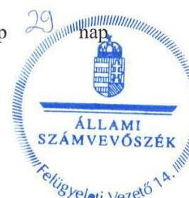

Dr. Németh Erzsébet
felügyeleti vezető

---

# Országos Meteorológiai Szolgálat 

## Elnökség

Állami Számvevőszék
Domokos László
elnök
Budapest
Apáczai Csere János utca 10.
1052
levego_minosege@asz.hu

Ügyiratszám:
Úgyintéző:
Tel:
Fax:
E-mail:
Hiv. számuk:

ELN-232-14/2017.
Décsi Viktor
+3613464878
+3613464669
decsiv@met.hu
V-1266-334/2016.

Tárgy: "A levegő minőségének védelmét szolgáló intézkedések ellenőrzése" keretében készült Jelentéstervezet

Tisztelt Elnök Úr!
"A levegő minőségének védelmét szolgáló intézkedések ellenőrzése" keretében készült Jelentéstervezet szövegével kapcsolatosan az Országos Meteorológiai Szolgálat a következő észrevételeket kívánja tenni.
9. oldal: PM10: utak kopásából és ipari kibocsátás helyett lakossági szilárd tüzelés
12. oldal: Az ellenőrzés tárgya: "kültéri levegő" helyett inkább "környezeti levegő"
17. oldal: "Az NKP-3 ...... illetve légszennyezettségi zónákba nem sorolt, tiszta levegőjű térségekben a jó minőség megőrzését tűzte ki fő céljául." - Az egész ország zónákba van sorolva, olyan nincs, hogy nincs besorolva. A piros betűs részt kihúznám.
22. oldal: irányítói tevékenység: Az FM miniszter a mérőrendszerre vonatkozóan az adatszolgáltatási kötelezettségeket, a dokumentálással, érvényesítéssel kapcsolatos szabályokat az OLM Üzemeltetési ügyrendjében, az informatikai rendszer és adatbázis mentésével, a pormonitorokkal és automata validálási beállításokkal kapcsolatos, 2016. április 28 -át követően érvénybe lépő eljárási szabályokat az OLM/1/2016. számú egyedi utasításban írta elő. Kifogás: nincs érvényben lévő OLM Ügyrend!
24. oldal: a levegő minőségéről szóló értékelések: Az éves jelentések elkészítése a kormányhivatalok elsődleges validálása nélkül nem megvalósítható. Az adatközpont az adatok másodlagos validálását, majd a validált adatokból az éves jelentések elkészítését csak ezután kezdheti meg. Mivel a kormányhivatalok rendszerint nem tartják be a határidőket, így az éves jelentések elkészítése határidőre rendszerint lehetetlen az OLA számára!

---

25. oldal: Az OLM korábbi honlapjának címe helyesen: www.kvvm.hu/olm.
26. oldal:7. ábra PM2,5-re vonatkozó éves átlagos koncentrációk alakulása. A grafikon nem az éves átlagkoncentrációkat mutatja, hanem az Átlagexpozíció-mutatókat tartalmazza (ÁEM) melyet első alkalommal a 2010. évre kellett meghatározni (ld.: 4/2011. (I. 14.) VM rendelet 1. melléklet 1.2.1. ; 2008/50/EK irányelv XIV. melléklet).
27. oldal: intézkedés: lásd 24. oldal észrevétel. Az OMSZ LRK kötelékébe tartozó Országos Légszennyezettségi Adatközpont a Kormányhivatalok validálásának hiányában nem tudja a határidőt teljesíteni. Javasolt az intézkedéseket a Kormányhivatalok irányába meghozni.

Budapest, 2017. november 23.
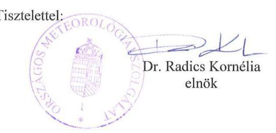

---

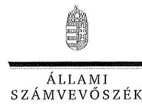

ELNÖK

Ikt.szám: V-1266-341/2016.

# Dr. Radics Kornélia 

elnök

Országos Meteorológiai Szolgálat

## Budapest

## Tisztelt Elnök Asszony!

„A levegő minőségének védelmét szolgáló intézkedések ellenőrzése" címủ jelentéstervezetre tett észrevételeit köszönettel megkaptam. Az ellenőrzési megállapításokra vonatkozó észrevételét az Állami Számvevőszékről szóló 2011. évi LXVI. törvény (a továbbiakban: ÁSZ tv.) 29. § (2) bekezdésében meghatározott tizenöt napos határidőn belül küldte meg. Az Állami Számvevőszék észrevétellel kapcsolatos álláspontját a mellékletként csatolt, a felügyeleti vezető által készített indokolás tartalmazza.

Tájékoztatom, hogy az Állami Számvevőszék a figyelembe nem vett észrevételeket az ÁSZ tv. 29. § (3) bekezdésében előírtak szerint köteles a jelentésében feltüntetni és megindokolni, hogy azokat miért nem fogadta el.

Budapest, 2017. 12. hó ${ }^{11}$ nap

Melléklet: Észrevételre adott válasz
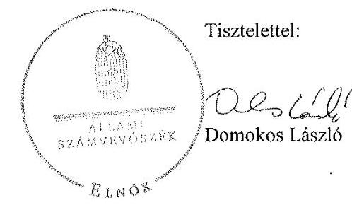

---

"A levegő minőségének védelmét szolgáló intézkedések ellenőrzése" címủ jelentéstervezethez tett észrevételre adott válasz
Országos Meteorológiai Szolgálat
A jelentéstervezetre tett észrevételeket áttekintettem, annak kezelésével kapcsolatban a következő tájékoztatást adom.

# 1. A jelentéstervezet 9. oldal 2. franciabekezdésére vonatkozó észrevétel 

A PM10 meghatározására vonatkozó észrevételt elfogadjuk, azt a jelentés véglegezése során figyelembe vesszük.

## 2. A jelentéstervezet 12. oldal 3. bekezdésére vonatkozó észrevétel

A szóhasználatra vonatkozó módosító javaslatot elfogadjuk, azt a jelentés véglegezése során figyelembe vesszük.

## 3. A jelentéstervezet 17. oldal 1. bekezdésére vonatkozó észrevétel

Az észrevételt elfogadjuk, azt a jelentés véglegezése során figyelembe vesszük.

## 4. A jelentéstervezet 22. oldal 6. bekezdésére vonatkozó észrevétel

Az észrevételt elfogadjuk, azt a jelentés véglegezése során figyelembe vesszük.

## 5. A jelentéstervezet 2.5. sz. megállapításának 3. bekezdésére vonatkozó észrevétel

A jelentéstervezet megállapítja, hogy a levegő minőségéről szóló értékeléseket az OMSZ LRK az OLM-adatok alapján az Lvr. előírásainak megfelelően készítette el, azonban az ÉLFO/LRK 101es belső utasításban rögzített, a tárgyévet követő év március 31 -ében megszabott határidő figyelmen kívül hagyásával, rendszeresen több hónapos késéssel.
Elnök Asszony észrevételében felhívja a figyelmet arra, hogy mivel az adatok elsődleges validálását végző kormányhivatalok rendszerint nem tartják be a határidőket, az éves jelentések határidőre történő elkészítése rendszerint nem lehetséges.
Az észrevétel nem vitatja a megállapítás helytállóságát. Tekintettel arra, hogy az OMSZ az éves értékeléseket az előírt határidőn túl készítette el, illetve hogy nem áll az ellenőrzés rendelkezésére olyan előírás, amely a kormányhivatalok számára meghatározná az elsődleges validáláshoz kapcsolódó határidőket, a megállapítás módosítása nem indokolt.
Az Állami Számvevőszék monitoring rendszerében ugyanakkor a jelzett kockázatot rögzítjük, illetve azt az ellenőrzések tervezése során figyelembe vesszük.

## 6. A jelentéstervezet 25. oldal 1. bekezdés 3. mondatára vonatkozó észrevétel

A honlap címének pontositására vonatkozó javaslatot elfogadjuk, azt a jelentés véglegezése során figyelembe vesszük.

## 7. A jelentéstervezet 33. oldalán található 7. ábrára vonatkozó észrevétel

Az észrevételt elfogadjuk, a jelentést kiegészítjük a PM2,5-re vonatkozó átlagos koncentráció számításának módszertanával.

---

# 8. A jelentéstervezet Országos Meteorológiai Szolgálat elnökének címzett javaslatára vonatkozó észrevétel 

Tekintettel arra, hogy az 5. pontban foglaltak alapján a jelentéstervezet 2.5 . sz. megállapításának 3. bekezdésében szereplő megállapítás módosítását nem tartjuk indokoltnak, a megállapításra tett javaslat módosítása sem indokolt.

Budapest, 2017.
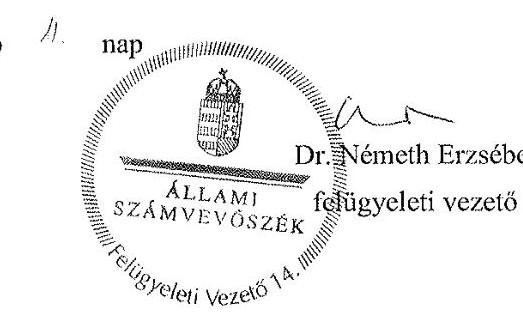

---

.

---

# RÖVIDÍTÉSEK JEGYZÉKE 

${ }^{1} \mathrm{FM}$
${ }^{2}$ OLM
${ }^{3}$ RIV
${ }^{4}$ OMSZ
${ }^{5}$ LRK
${ }^{6}$ OKTF
${ }^{7}$ OKK
${ }^{8}$ VOC
${ }^{9}$ ÁSZ
${ }^{10}$ ÁSZ tv.
${ }^{11}$ ÁSZ SZMSZ
${ }^{12}$ NKP-3
${ }^{13}$ NKP-4
${ }^{14}$ PM10-re vonatkozó ágazatközi intézkedési program
${ }^{15} \mathrm{Kvt}$.
${ }^{16} \mathrm{FM}$ miniszter
${ }^{17}$ Lvr.
${ }^{18}$ OMSZ LRK
${ }^{19}$ MTA
${ }^{20} \mathrm{KSI}$
${ }^{21}$ Nemzeti Fenntartható Fejlődés Keretstratégia
${ }^{22} \mathrm{KSH}$
${ }^{23}$ 2008/50/EK irányelv
${ }^{24}$ Hér.
${ }^{25}$ 4/2002. (X.7.) KvVM rendelet
${ }^{26} 481 / 2013$. (XII. 17.) Korm. rendelet
${ }^{27} 71 / 2015$. (III.30.) Korm. rendelet
${ }^{28} 7 / 2015$. (III.31.) MvM utasítás

Földművelésügyi Minisztérium (2014. május 31-ig Vidékfejlesztési Minisztérium) Országos Légszennyezettségi Mérőhálózat
Manuális mérőhálózat
Országos Meteorológiai Szolgálat
Levegőtisztaság-védelmi Referencia Központ
Országos Környezetvédelmi és Természetvédelmi Főfelügyelőség (a 378/2016. (XII.2.) Korm. rendelet 22. § (1)-(2) bekezdései alapján 2016. december 31-én beolvadásos különválás útján jogutódlással megszűnt)
Országos közegészségügyi Központ
illékony szerves vegyületek (Volatile organic compounds)
Állami Számvevőszék
2011. évi LXVI. törvény az Állami Számvevőszékről, hatályos 2011. július 1-jétől

Állami Számvevőszék Szervezeti és Müködési Szabályzata
96/2009. (XII. 9.) OGY határozat a 2009-2014 közötti időszakra szóló Nemzeti Környezetvédelmi Programról
27/2015. (VI. 17.) OGY határozat a 2015-2020 közötti időszakra szóló Nemzeti Környezetvédelmi Programról
1330/2011. (X. 12.) Korm. határozat a kisméretű szálló por $\left(\mathrm{PM}_{10}\right)$ csökkentés ágazatközi intézkedési programjáról
1995. évi LIII. törvény a környezet védelmének általános szabályairól környezetvédelemért felelős miniszter
306/2010. (XII. 23.) Korm. rendelet a levegő védelméről
Országos Meteorológiai Szolgálat Levegőtisztaság-védelmi Referencia Központ
Magyar Tudományos Akadémia
38/2012. (III. 12.) Korm. rendelet a kormányzati stratégiai irányításról
18/2013. (III. 28.) OGY határozat a Nemzeti Fenntartható Fejlődés Keretstratégiáról
Központi Statisztikai Hivatal
2008/50/EK európai parlamenti és tanácsi irányelv a környezeti levegő minőségéről és a Tisztább levegőt Európának elnevezésű programról
4/2011. (I. 14.) VM rendelet a levegőterheltségi szint határértékeiről és a helyhez kötött légszennyező pontforrások kibocsátási határértékeiről
4/2002. (X.7.) KvVM rendelet a légszennyezettségi agglomerációk és zónák kijelöléséről
481/2013. (XII. 17.) Korm. rendelet a környezetvédelmi, természetvédelmi, vízvédelmi hatósági és igazgatási feladatokat ellátó szervek kijelöléséről (hatálytalan 2015. április 1-jétől)
a környezetvédelmi és természetvédelmi hatósági és igazgatási feladatokat ellátó szervek kijelöléséről
7/2015. (III. 31.) MvM utasítás a fővárosi és megyei kormányhivatalok szervezeti és működési szabályzatáról

---

${ }^{29}$ FM SZMSZ
${ }^{30}$ Kvt.
${ }^{31}$ OMSZ SZMSZ
${ }^{32}$ 277/2005. (XII.20.) Korm. rendelet
${ }^{33}$ OMSZ ÉLFO
${ }^{34}$ NFM
${ }^{35}$ NGM
${ }^{36}$ SZMSZ
${ }^{37}$ Áht.
${ }^{38}$ Mér.
${ }^{39}$ OKIR
${ }^{40}$ 66/2015. (III.30.) Korm. rendelet
${ }^{41}$ LAIR
${ }^{42}$ EIONET
${ }^{43}$ 323/2010. (XII. 27.) Korm. rendelet
${ }^{44}$ LRK OLA
${ }^{45}$ EMMI
${ }^{46}$ ITS
${ }^{47} \mathrm{kt}$
${ }^{48}$ CAS szám
${ }^{49}$ 2008/50/EK irányelv
${ }^{50}$ 2010/75/EU
${ }^{51}$ 2004/107/EK

12/2013. (VI. 18.) VM utasítás a Vidékfejlesztési Minisztérium Szervezeti és Müködési Szabályzatáról; 2/2014. (II. 21.) VM utasítás a Vidékfejlesztési Minisztérium Szervezeti és Müködési Szabályzatáról; 3/2014. (VIII. 1.) FM utasítás a Földművelésügyi Minisztérium Szervezeti és Müködési Szabályzatáról 1995. évi LIII. törvény a környezet védelmének általános szabályairól A vidékfejlesztési miniszter 12/2011. (VII. 8.) VM utasítása az Országos Meteorológiai Szolgálat Szervezeti és Müködési Szabályzatának kiadásáról 277/2005. (XII.20.) Korm. rendelet az Országos Meteorológiai Szolgálatról Országos Meteorológiai Szolgálat Éghajlati és Levegőkörnyezeti Főosztály Nemzeti Fejlesztési Minisztérium
Nemzetgazdasági Minisztérium
Szervezeti és Müködési Szabályzat
2011. évi CXCV. törvény az államháztartásról

6/2011. (I. 14.) VM rendelet a levegőterheltségi szint és a helyhez kötött légszennyező források kibocsátásának vizsgálatával, ellenőrzésével, értékelésével kapcsolatos szabályokról, hatályos 2011. január 15-től.
Országos Környezetvédelmi Információs Rendszer
66/2015. (III.30.) Korm. rendelet a fővárosi és megyei kormányhivatalokról, valamint a járási (fővárosi kerületi) hivatalokról
Levegőtisztaság-védelmi Információs Rendszer
Európai Környezeti Információs és Megfigyelő Hálózat
323/2010. (XII. 27.) Korm. rendelet az Állami Népegészségügyi és Tisztiorvosi Szolgálatról, a népegészségügyi szakigazgatási feladatok ellátásáról, valamint a gyógyszerészeti államigazgatási szerv kijelöléséről
Levegőtisztaság-védelmi Referencia Központ Országos Légszennyezettségi Adatközpont
Emberi Erőforrások Minisztériuma
változtatható tartalmú forgalomtájékoztató táblák
kilotonna
CAS-szám a vegyi anyagok (kémiai elemek, vegyületek) azonosítására használt Chemical Abstracts Service regisztrációs szám.
2008/50/EK európai parlamenti és tanácsi irányelv a környezeti levegő minőségéről és a Tisztább levegőt Európának elnevezésű programról
2010/75/EU európai parlamenti és tanácsi irányelv az ipari kibocsátásokról (a környezetszennyezés integrált megelőzése és csökkentése)
2004/107/EK európai parlamenti és tanácsi irányelv a környezeti levegőben található arzénról, kadmiumról, higanyról, nikkelről és policiklikus aromás szénhidrogénekről

---

ÁLLAMI SZÁMVEVŐSZÉK
1052 Budapest, Apáczai Csere János utca 10.
Levélcím: 1364 Budapest 4. Pf. 54
Telefon: +36 14849100 Telefax: +36 14849200
www.asz.hu