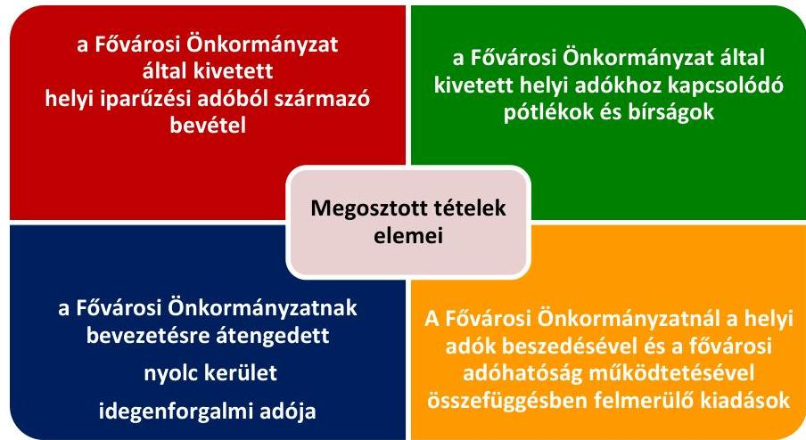

# Jelentés 

## A forrásmegosztás ellenőrzése

A Fővárosi Önkormányzatot és a kerületi önkormányzatokat osztottan megillető bevételek 2017. évi megosztásáról szóló önkormányzati rendelet felülvizsgálata 2018.

---

# Jelentés 

## A forrásmegosztás ellenőrzése

A Fővárosi Önkormányzatot és a kerületi önkormányzatokat osztottan megillető bevételek 2017. évi megosztásáról szóló önkormányzati rendelet felülvizsgálata 2018. 01. hó 04. nap

## 

18007
www.asz.hu

---

|  J | AZ ELLENŐRZÉST FELÜGYELTE:  |
| --- | --- |
|   | RENKŐ ZSUZSANNA felügyeleti vezető  |
|   | AZ ELLENŐRZÉST VEZETTE ÉS A VÉGREHAJTÁSÁÉRT FELELŐS:  |
|   | KORSÓSNÉ VIGH ANDREA ellenőrzésvezető  |
|   | A PROGRAM ÖSSZEÁLLÍTÁSÁÉRT FELELŐS:  |
|   | TÓTPÁL SZABOLCS osztályvezető  |
|   | A TÉMÁHOZ KAPCSOLÓDÓ KORÁBBI SZÁMVEVŐSZÉKI JELENTÉSEK:  |
|   | - címe: A Fővárosi Önkormányzatot és a kerületi önkormányzatokat osztottan megillető bevételek 2016. évi megosztásáról szóló önkormányzati rendelet felülvizsgálata  |
|  J | - sorszáma: 17001  |
|   | IKTATÓSZÁM: EL-0321-030/2017.  |
|   | TÉMASZÁM: 2465  |
|   | ELLENŐRZÉS-AZONOSÍTÓ SZÁM: V0811  |

---

# TARTALOMJEGYZÉK 

■ ÖSSZEGZÉS ..... 5
■ AZ ELLENŐRZÉS CÉLJA ..... 6
■ AZ ELLENŐRZÉS TERÜLETE ..... 7
■ AZ ELLENŐRZÉS HÁTTERE, INDOKOLTSÁGA ..... 9
■ A JELENTÉS LÉNYEGES KÉRDÉSKÖREI ..... 10
■ ELLENŐRZÉS HATÓKÖRE ÉS MÓDSZEREI ..... 11
■ MEGÁLLAPÍTÁSOK ..... 12
■ MELLÉKLETEK ..... 19
I. Sz. melléklet: Értelmező szótár. ..... 19
■ FÜGGELÉK: ÉSZREVÉTELEK ..... 21
■ RÖVIDÍTÉSEK JEGYZÉKE ..... 23

---

.

---

# ÖSSZEGZÉS 

A Fővárosi Önkormányzat 2017. évi forrásmegosztási rendeletalkotási folyamata szabályozott és szabályszerű volt, amely biztosította az átlátható és elszámoltatható közpénzfelhasználást. A Fővárosi Önkormányzatot és a kerületeket osztottan megillető bevételek és kiadások pénzügyi elszámolásában az ÁSZ eltérést nem tárt fel. A 2017. évi forrásmegosztás során korrekció érvényesitése nem indokolt.

## Az ellenőrzés társadalmi indokoltsága

A Fővárosi Önkormányzat Közgyűlése a helyi adóztatással kapcsolatos feladat- és hatáskörében a 2017. évben 239 174,2 M Ft helyi adóbevétel beszedéséről rendelkezett, amelyből 239 011,0 M Ft volt a főváros és a kerületek között megosztandó helyi adóbevétel.

A törvényi előírás szerint az ÁSZ felülvizsgálja a Fővárosi Önkormányzat tárgyévre vonatkozó forrásmegosztási rendeletét és megállapítja a Fővárosi Önkormányzat és a kerületi önkormányzatok közötti helyi adóbevételekhez kapcsolódó elszámolások jogszabályi előírásnak való megfelelőségét, vagy a tapasztalt eltérések miatt szükséges pénzügyi elszámolási korrekciókat, szabályozási pontosításokat, módosításokat.

## Főbb megállapítások, következtetések

A Főjegyző a Főpolgármesteri Hivatalban kialakította a forrásmegosztási rendelet szabályozott és szabályszerű megalkotásához és végrehajtásához szükséges belső szabályrendszert. A Fővárosi Önkormányzat a 2017. évi forrásmegosztási rendeletet a törvényi és a belső szabályozó elemekben rögzített eljárásrend és határidők figyelembevételével, szabályszerűen alkotta meg. Számításokkal, elemzésekkel, az időarányos teljesülési adatokkal alátámasztva megalapozottan határozták meg az iparűzési és idegenforgalmi adóból származó bevételeket, valamint a Fővárosi Önkormányzati Adóhatóság működtetésével összefüggő, helyi adózással kapcsolatos kiadások tervszámait. A Fővárosi Önkormányzatot és a kerületeket osztottan megillető bevételek és kiadások tervezésénél a törvényben rögzített részesedési arányokat érvényesítették.

A 2017. január 1-jétől augusztus 31-éig befolyt megosztható bevételek pénzügyi elszámolása szabályszerűen történt meg a Fővárosi Önkormányzat és a kerületek között. A Fővárosi Önkormányzat a jogszabályi rendelkezések szerint állapította meg és számolta el a kerületek felé a Fővárosi Önkormányzati Adóhatóság működtetésével összefüggő, helyi adózással kapcsolatos 2017. évi kiadási előleget, továbbá 2016. évi kiadási előleg, valamint a 2016. évi tény adatok alapján elszámolható kiadás különbözetét.

Az ÁSZ nem tárt fel a 2017. évi forrásmegosztást érintően eltérést, így a 2018. évi forrásmegosztás során nem szükséges korrekció érvényesítése.

---

# AZ ELLENŐRZÉS CÉLJA 

Az ellenőrzés célja a Fővárosi Önkormányzatot ${ }^{1}$ és a kerületi önkormányzatokat ${ }^{2}$ osztottan megillető bevételek 2017. évi forrásmegosztási rendeletben előírt megosztásának, valamint a helyi adóztatással kapcsolatos kiadások megállapítása, elszámolása szabályszerűségének ellenőrzése volt.

---

# **AZ ELLENŐRZÉS TERÜLETE**

## **A 2017. évi forrásmegosztási rendeletalkotás és annak végrehajtása a Fővárosi Önkormányzatnál**

A Mötv.3 által rögzített kétszintű fővárosi önkormányzati rendszerben az adóbeszedésre vonatkozó hatáskörök az illetékességre vonatkozó szabályok figyelembevételével megoszlanak a főváros és a kerületek között.

A Hatv.4 alapján a Fővárosi Önkormányzat a helyi iparűzési adót, a kerületi önkormányzat az építményadót, a telekadót, a magányszemélyek kommunális adóját és az idegenforgalmi adót jogosult bevezetni. A Hatv. szerint a kerületi önkormányzat képviselő-testülete beleegyezését adhatja ahhoz, hogy az általa kivethető helyi adót a Fővárosi Önkormányzat vezesse be rendeletével. A törvényi rendelkezések alapján a Fővárosi Önkormányzat által közvetlenül igazgatott Margitszigeten a Fővárosi Önkormányzat jogosult kivetni a kerületi önkormányzat által bevezethető adókat, melyekből származó bevétel a Fővárosi Önkormányzatot illeti meg.

A forrásmegosztási tv.5 határozza meg a Fővárosi Önkormányzatot és a kerületi önkormányzatokat osztottan megillető bevételek körét és a részesedési arányokat. A forrásmegosztási tv. és az annak felhatalmazása alapján készült forrásmegosztási rendelet6 szerint a Fővárosi Önkormányzat és a kerületi önkormányzatok között a 2017. évben megosztott tételeket az 1. ábra szemlélteti.

1. ábra

A megosztott tételekből a forrásmegosztási tv. 2017. évben hatályos előírása alapján a Fővárosi Önkormányzatot 54,0%, a kerületi önkormányzatokat együttesen 46,0% részesedés illeti meg, amely változott a 2016. évi 52,5-47,5%-os megosztási arányhoz képest. A kerületi önkormányzatokat megillető forrás a forrásmegosztási tv. mellékletében rögzített arányok szerint kerül felosztásra.

---

A Fővárosi Önkormányzat Közgyűlése ${ }^{7}$ az Alaptörvény ${ }^{8}$, a Mötv. és a forrásmegosztási tv. felhatalmazása alapján minden évben az adott évre tervezett helyi adóbevételek megosztásának rendjét forrásmegosztási rendeletben rögzíti. A 2017. évi forrásmegosztási rendeletben meghatározott bevételi és kiadási tervszámokat az 1. táblázat mutatja be.

1. táblázat

| A 2017. ÉVI MEGOSZTOTT FORRÁSOK TERVEZETT ÖSSZEGE (E FT) |  |  |  |
| :--: | :--: | :--: | :--: |
| Megosztandó tételek | Megosztandó   forrás   összege   E FT | Főváros   részesedése   $(54,0 \%)$   E FT | Kerületek   részesedése   $(46,0 \%)$   E FT |
| Iparúzési adó | 239000000 | 129060000 | 109940000 |
| Kerületek által átengedett   idegenforgalmi adó | 11000 | 5940 | 5060 |
| Megosztandó helyi   adóbevételek | 239011000 | 129065940 | 109945060 |
| Kivetett adókhoz kapcsolóó pótlék, bírság | 400000 | 216000 | 184000 |
| Megosztandó bevételek   összesen | 239411000 | 129281940 | 110129060 |
| Helyi adókhoz kapcsolódó   kiadás | $-200000$ | $-108000$ | $-92000$ |
| Összesen | 239211000 | 129173940 | 110037060 |

Forrás: forrásmegosztási rendelet

---

# AZ ELLENŐRZÉS HÁTTERE, INDOKOLTSÁGA 

A forrásmegosztási tv. 6. § (1) bekezdése alapján az ÁSZ ${ }^{9}$ felülvizsgálja a Fővárosi Önkormányzat tárgyévre vonatkozó forrásmegosztási rendeletét, valamint az elszámolás szabályszerűségét. Amennyiben az ÁSZ megállapítja, hogy a Fővárosi Önkormányzat vagy valamely kerületi önkormányzat jogosulatlan forráshoz jutott vagy az őt jogszerűen megillető forrásnál alacsonyabb összegben részesült, ennek mértékével a forrásmegosztási törvény alapján meghatározott, a felülvizsgálat lezárását követő évi forrásmegosztást a Fővárosi Önkormányzat rendeletében módosítja. A Fővárosi Önkormányzat költségvetési bevételeinek több mint 50\%-át a forrásmegosztási tv. és a forrásmegosztási rendeletben érintett bevételek teszik ki, ezért is fontos ezeknek az elszámolásoknak a kontrollja.

Az ellenőrzés eredményeképp a törvényalkotás tapasztalatokkal gazdagodik a forrásmegosztás szabályozásáról, a forrásmegosztási rendelet szabályszerűségéről, következtetés vonható le arra vonatkozóan, hogy indo-kolt-e jogszabályi módosítás kezdeményezése. Az ellenőrzés az ellenőrzött számára visszajelzést ad a forrásmegosztás végrehajtásának szabályosságáról, javaslataival hozzájárul az esetleges hiányosságok kiküszöböléséhez. A társadalom számára jelzi, hogy a közpénzek tervezett felhasználása sem maradhat ellenőrizetlenül, az ÁSZ értékteremtő rend kialakításához és megőrzéséhez hozzájáruló tevékenysége pozitív hatással lesz a szervezetről kialakított összkép formálására.

---

# A JELENTÉS LÉNYEGES KÉRDÉSKÖREI 

1.     - A Fővárosi Önkormányzat 2017. évi forrásmegosztási rendeletalkotási folyamata szabályozott és szabályszerű volt-e?
2.     - A forrásmegosztás bevételi tervszámai megalapozottak vol-tak-e, a forrásmegosztás szabályszerű volt-e?
3.     - A forrásmegosztásnál figyelembe vett, a Fővárosi Önkormányzati Adóhatóság müködtetésével összefüggő, helyi adózással kapcsolatos kiadások megállapítása és elszámolása szabályszerű volt-e?
4.     - Szükséges-e korrekciót érvényesiteni a 2018. évi forrásmegosztás során?

---

# ELLENŐRZÉS HATÓKÖRE ÉS MÓDSZEREI 

## Az ellenőrzés típusa

Szabályszerúségi ellenőrzés.

## Az ellenőrzött időszak

2016. szeptember 1-jétől 2017. augusztus 31-ig terjedő időszak (a forrásmegosztási rendelet előkészítésével és végrehajtásával érintett időszak)

## Az ellenőrzés tárgya

A Fővárosi Önkormányzatot és a kerületi önkormányzatokat osztottan megillető bevételek megosztásáról szóló 2017. évi forrásmegosztási rendelet.

Az ellenőrzés kiterjedt minden olyan körülményre és adatra, amely az ÁSZ jogszabályban meghatározott feladataiban, valamint a program végrehajtása folyamán felmerült újabb összefüggések feltárásához szükséges.

## Az ellenőrzött szervezet

Budapest Főváros Önkormányzata és Budapest Főváros Főpolgármesteri Hivatal

## Az ellenőrzés jogalapja

Az ellenőrzés jogszabályi alapját az ÁSZ tv. ${ }^{10}$ 1. § (3) bekezdése és 3. § (1) bekezdése, valamint a forrásmegosztási tv. 6. § (1) bekezdése képezték.

## Az ellenőrzés módszerei

Az ellenőrzés szakmai módszertana az ÁSZ hivatalos honlapján (www.asz.hu) közzétett szakmai szabályokon alapult.

Az ellenőrzési kérdések megválaszolásához szükséges bizonyítékok megszerzése az ellenőrzött által rendelkezésre bocsátott dokumentumok, adatok elemzésével valósult meg.

---

# 1. A Fővárosi Önkormányzat 2017. évi forrásmegosztási rendeletalkotási folyamata szabályozott és szabályszerű volt-e? 

Összegző megállapítás

A Fővárosi Önkormányzat a jogszabályi előírásokkal összhangban szabályozta a forrásmegosztási rendeletalkotás folyamatát, amelynek végrehajtása szabályszerű volt.

A Főjegyző a Főpolgármesteri Hivatal ${ }^{11}$ belső szabályzataiban (Hivatali SZMSZ, ${ }^{12}$ Pénzügyi Főosztály BMSZ, ${ }^{13}$ Adó Főosztály BMSZ ${ }^{14}$ ), a kapcsolódó ellenőrzési nyomvonalakban és munkaköri leírásokban a jogszabályi előírásokkal összhangban szabályozta a forrásmegosztási rendeletalkotás folyamatát, az érintett szervezeti egységek rendeletalkotással kapcsolatos fel-adat- és hatáskörét. E szabályozó elemek együttese megfelelő alapot biztosított a forrásmegosztási rendeletalkotás szabályozott és szabályszerű végrehajtásához.

A forrásmegosztási rendeletalkotás során betartották a forrásmegosztási tv-ben és a Főpolgármesteri Hivatal belső szabályzataiban, folyamatleírásaiban, a munkaköri leírásokban előírt eljárási szabályokat. A rendelettervezetet a forrásmegosztási tv.-ben előírt határidőben, a 15 napos véleményezési idő biztosításával küldték meg véleményezésre a kerületi önkormányzatok részére. A Fővárosi Önkormányzat Közgyűlése a kerületi önkormányzatok véleménye, valamint nyolc kerületi önkormányzat tekintetében az idegenforgalmi adó beszedés Fővárosi Önkormányzat részére történő átengedéséről adott előzetes beleegyező nyilatkozat birtokában, a forrásmegosztási tv.-ben előírt határiőn belül fogadta el és léptette hatályba a forrásmegosztási rendeletet.

A forrásmegosztási rendelet a forrásmegosztási tv. előírásaival összhangban és a végrehajtáshoz szükséges valamennyi tartalmi elemre kiterjedően szabályozta a forrásmegosztás rendjét.

A forrásmegosztási rendeletalkotás során a kontrolltevékenység részeként a szervezeti célok elérését veszélyeztető kockázatok csökkentésére irányuló kontrollokat kiépítették és működtették.

---

# 2. A forrásmegosztás bevételi tervszámai megalapozottak vol-tak-e, a forrásmegosztás szabályszerű volt-e? 

## Összegző megállapítás

2.1. számú megállapítás

A forrásmegosztási rendeletben a helyi adóbevételek tervszámai megalapozottak voltak, a pótlék és bírság bevételek tervszáma nem volt megalapozott. A megosztott bevételek megállapítása, a 2017. év ellenőrzött időszakában befolyt bevételek pénzügyi elszámolása szabályszerű volt.

A forrásmegosztás bevételi tervszámai közül az iparúzési- és idegenforgalmi adóbevételek megalapozottak voltak. A pótlék és bírság bevételek tervszáma az előző évi teljesülési adatok alapján alultervezett, nem megalapozott volt.

Megalapozottan tervezte meg a Fővárosi Önkormányzat a forrásmegosztási rendeletben:
$\longrightarrow$ az iparúzési adóbevételt 239000000 E Ft összegben, amely a 2016. évi tény adat ( 232459718 E Ft) és a kormányzat által prognosztizált 3\%-os GDP bővüléssel indokolt növeléssel alátámasztott volt;
$\longrightarrow$ az idegenforgalmi adóbevételt 11000 E Ft összegben, amely a 2016. évi terv ( 6000 E Ft ) és tény adat ( 15956 E Ft ) összevetésével, a túlteljesülés okainak elemzésével, az egyszeri hatások kiszűrésével alátámasztott volt. A tervezésnél figyelembe vették azt a körülményt, hogy az adónem bevezetését (kivetését és beszedését) a Fővárosi Önkormányzat számára átengedő kerületek száma és köre az előző évhez képest nem változott.
Nem megalapozottan tervezte meg a Fővárosi Önkormányzat a kivetett helyi adókhoz kapcsolódóan kiszabott pótlék és bírság bevételeket 400000 E Ft összeggel, mert a 2016. évi tény adat ( 590644 E Ft összegű, 98,4 \%-os teljesülés) és az indoklásban szereplő jegybanki alapkamat prognosztizált csökkenése nem támasztották alá az adóbevételi tervszám előző évihez képest történt 200000 E Ft-os csökkentését. Ez a pénzügyi elszámolás során eltérést nem okozott.

A 2017. évi forrásmegosztási rendeletben szereplő pótlék és bírságbevétel tervezésénél szabályszerűen a Fővárosi Önkormányzat által kivetett helyi adókhoz kapcsolódóan kiszabott pótlék, bírság teljes összegét figyelembe vették megosztandó bevételként.
2.2. számú megállapítás

A Fővárosi Önkormányzatot és a kerületi önkormányzatokat együttesen megillető és a megosztott bevételek kerületenkénti megállapítása megfelelt a forrásmegosztási tv. előírásainak.

A forrásmegosztási rendeletben a Fővárosi Önkormányzat szabályszerűen, a forrásmegosztási tv. előírásaival összhangban állapította meg az egyes bevételi jogcímek szerint a Fővárosi Önkormányzatot, valamint a kerületi önkormányzatokat együttesen megillető bevételek részarányát, összegét, továbbá az egyes kerületek részesedését.

---

- A forrásmegosztásba bevont bevételekből a Fővárosi Önkormányzat részesedését 54,0\%, a 23 kerületi önkormányzat együttes részesedését 46,0\%-os megosztási arány alkalmazásával határozták meg. Az egyes kerületeket megillető forrásrész kiszámítását a forrásmegosztási tv. mellékletében szereplő arányszámok alapján végezték el.
- A forrásmegosztási tv-ben rögzített - fenti - arányszámok alkalmazásával az iparűzési adó és a Fővárosi Önkormányzat által kivetett helyi adókhoz kapcsolódóan kiszabott pótlék és bírság tervezett öszszegének kiszámítása szabályszerű volt.
- Az idegenforgalmi adóból származó tervezett bevétel megosztása csak az adóbeszedést a Fővárosi Önkormányzatnak átengedő (XVIXXIII.) kerületi önkormányzatok között, a forrásmegosztási tv. mellékletében kerületekre meghatározott arányszámok megfelelő alkalmazásával történt meg.
2.3. számú megállapítás

A 2017. január 1-jétől augusztus 31-éig befolyt megosztható bevételek pénzügyi elszámolása szabályszerűen történt meg a Fővárosi Önkormányzat és a kerületi önkormányzatok között.

A 2017. január 1-jétől augusztus 31-éig befolyt megosztható bevételek pénzügyi elszámolását a Fővárosi Önkormányzat a forrásmegosztási tv. és a forrásmegosztási rendelet előírásainak megfelelően, szabályszerűen végezte el. A tárgyhónapban befolyt megosztható bevételek kerületeket megillető hányadát (46,0\%-át) a Fővárosi Önkormányzat a forrásmegosztási tv. mellékletében szereplő arányszámok alapján felosztva az egyes kerületek között, havonta a forrásmegosztási rendelet szerinti határidőben a kerületi önkormányzatok részére átutalta. A tárgyhónapban befolyt megosztható bevételekből az egyes kerületeket megillető összeg meghatározását a Fővárosi Önkormányzat adónemenként külön-külön elvégezte. A forrásmegosztási tv. előírása szerint a helyi iparűzési adóbevételt és a Fővárosi Önkormányzat által kivetett helyi adókhoz kapcsolódó pótlék és bírság bevételt mind a 23 kerülettel, az idegenforgalmi adót az adó kivetését és beszedését átengedő nyolc kerületi önkormányzattal osztották meg.

---

# 3. A forrásmegosztásnál figyelembe vett, a Fővárosi Önkormányzati Adóhatóság múködtetésével összefüggő, helyi adózással kapcsolatos kiadások megállapítása és elszámolása szabályszerű volt-e? 

Összegző megállapítás

A Fővárosi Önkormányzat szabályszerűen állapította meg és számolta el a forrásmegosztás során, a Fővárosi Önkormányzati Adóhatóság múködtetésével összefüggő, helyi adózással kapcsolatos kiadásokat.

### 3.1. számú megállapítás

Megalapozottan tervezték meg a forrásmegosztási rendeletben a 2017. évi előlegként meghatározott múködtetési kiadások tervszámát. A 2017. évben elszámolt kiadási előleg megosztása, érvényesítése szabályszerű volt.

A Fővárosi Önkormányzat a 2017. évi forrásmegosztási rendeletben megalapozottan tervezett meg 200000 E Ft megosztandó múködési kiadást (2017. évi kiadási előleget) és azt szabályszerűen, a forrásmegosztási tvben előírt arányszámokat alkalmazva osztotta meg a Fővárosi Önkormányzat (108 000 E Ft) és a kerületek között (együttesen 92000 E Ft).

A 2017. évi forrásmegosztást megalapozó számításokban a Fővárosi Önkormányzati Adóhatóság ${ }^{15}$ múködtetésével összefüggő kiadásokat - valamennyi helyi adónem beszedésével kapcsolatos kiadást figyelembe véve - megalapozottan tervezték meg. Közvetlenül felmerült múködési célú kiadásként az Adó Főosztály ${ }^{16}$ dolgozóinak személyi juttatásaival és járulékaival, az adóügyi feladatok ellenőrzését végző dolgozók érdekeltségi rendszerével kapcsolatos személyi juttatással és járulékával, valamint az adóigazgatási feladatokhoz kapcsolódó dologi kiadásokkal terveztek, a 2016. évi könyvviteli nyilvántartásokkal alátámasztott bázis adatok alapján.

A megosztandó múködési kiadás meghatározásánál korlátként figyelembe vették a forrásmegosztási tv. 2. § (6) bekezdés előírását, mely szerint a Fővárosi Önkormányzati Adóhatóság múködtetésével összefüggően felmerült kiadásokat legfeljebb a Fővárosi Önkormányzat rendelete alapján kivetett helyi adókhoz kapcsolódóan kiszabott pótlék és bírság bevétel 50\%-áig lehet elszámolni a forrásmegosztás során.

A 2017. évi kiadási előleg elszámolása szabályszerű volt. A Fővárosi Önkormányzat a 2016. évi zárszámadási rendelet ${ }^{17}$ hatályba lépését követő (2017. június) havi utalásban a 2016. évi tény adatok alapján, a felső korlátra vonatkozó szabály érvényesítésével szabályszerűen osztott meg öszszesen 295322 E Ft kiadási előleget, amelyből a kerületek felé együttesen 46\%-ot érvényesített.

A 2017. évi kiadási előleg tervezését és elszámolását az 2. tábla szemlélteti.

---

| 2. táblázat |  |  |
| :--: | :--: | :--: |
| A 2017. ÉVI KIADÁSI ELŐLEG TERVEZÉSE ÉS ELSZÁMOLÁSA (E FT) |  |  |
| 2017. évi kiadási előleg meghatározása | 2017. évi   terv | 2017. évi   elszámolás |
| Fővárosi Önkormányzati Adóhatóság múködésével összefüggő kiadás | 978070 | 846812 |
| Helyi adókhoz kiszabott pótlék és bírság bevétel | 400000 | 590644 |
| Felső korlát: a helyi adókhoz kapcsolódó pótlék és bírság bevétel 50\%-a (= megosztandó kiadási előleg 100\%) | 200000 | 295322 |
| Fővárosi Önkormányzat (54\%) | 108000 | 159474 |
| Kerületek együttesen (46\%) | 92000 | 135848 |
| Forrás: Fővárosi Önkormányzat adatszolgáltatása, 2016. évi zárszámadási rendelet |  |  |

3.2. számú megállapítás

A 2016. év során érvényesített kiadási előlegek és a ténylegesen elszámolható kiadások összevetése 2017-ben megtörtént, a megállapított különbözetet a Fővárosi Önkormányzat szabályosan elszámolta az egyes kerületekkel.

A 2016. évi kiadási előleg elszámolása 2017. júniusban szabályszerű volt. A 2016. évi zárszámadási rendelet elfogadását követően a 2016. júniusban elszámolt kiadási előlegeket és a 2016. évre vonatkozóan ténylegesen elszámolható kiadásokat összevetették.
—A 2016. évi forrásmegosztás során a Fővárosi Önkormányzat a kerületek felé együttesen 142500 E Ft kiadási előleget érvényesített.
—_ A 2016. évre a kerületek felé elszámolható, megosztható kiadást (140 278 E Ft) a forrásmegosztási tv. előírásának megfelelően, a 2016. évi zárszámadásban jóváhagyott tényszámok alapján, a felső korlátra előírt szabály és a 2016. évben hatályos forrásmegosztási tv.-ben meghatározott 52,5-47,5\%-os megosztási arány figyelembe vételével határozták meg.
A Fővárosi Önkormányzat kimutatta az elszámolt (142 500 E Ft) és az elszámolható (140 278 E Ft) kiadás közötti 2222 E Ft különbözetet, amelyet a 2016. évi zárszámadási rendelet hatályba lépését követő hónapban megfelelően érvényesített az egyes kerületek felé történő utalásokban.

# 4. Szükséges-e korrekciót érvényesíteni a 2018. évi forrásmegosztás során? 

Összegző megállapítás

Az ÁSZ nem tárt fel a 2017. évi forrásmegosztást érintő eltérést, így a 2018. évi forrásmegosztás során korrekció érvényesítése nem szükséges.

A 2017. évi forrásmegosztás során a Fővárosi Önkormányzat a jogszabályi előírásoknak megfelelően járt el az ellenőrzött időszakban: Az ÁSZ ellenőrzés a forrásmegosztási tv. 6. § (2) bekezdésében szabályozott körülményt nem tárt fel (a forrásmegosztás során a Fővárosi Önkormányzat vagy valamely kerületi önkormányzat jogosulatlan forráshoz nem jutott, illetve az

---

őket megillető forrástól nem estek el), ezért a 2018. évi forrásmegosztási eljárás során korrekció nem indokolt.

---

.

---

# MELLÉKLETEK 

- I. SZ. MELLÉKLET: ÉRTELMEZŐ SZÓTÁR

Fővárosi Önkormányzat által kivetett helyi adóhoz kapcsolódóan kiszabott pótlék és bírság
helyi adóztatással kapcsolatos kiadás
idegenforgalmi adó
iparúzési adó
kiadási előleg

A fővárost és a kerületeket osztottan illetik meg a fővárosi önkormányzat közgyűlésének rendelete alapján kivetett helyi adóhoz kapcsolódóan kiszabott pótlékból és bírságból származó bevételek. (Forrás: A forrásmegosztási törvény 2. § (2) bekezdése alapján meghatározott fogalom.
A fővárosi önkormányzati helyi adóztatással kapcsolatos - a tárgyévre vonatkozóan a fővárosi önkormányzatot és a kerületi önkormányzatokat osztottan megillető bevételek (iparúzési adó, nyolc kerületnél befolyt idegenforgalmi adó, a kivetett helyi adóhoz kapcsolódóan kiszabott pótlék és bírság) beszedésével összefüggően felmerült - kiadásokat a forrásmegosztási tv. 2. § (1) bekezdés a) pontja szerinti bevételből részesülők viselik részesedésük arányában. Kiadásként a fővárosi önkormányzatnál a beszedéssel - a fővárosi önkormányzati adóhatóság működtetésével - összefüggően felmerült működtetési kiadásokat kell figyelembe venni. A forrásmegosztási tv. 2. § (1) bekezdés a) pontja és a (4) bekezdés szerint figyelembe vehető kiadásokat a (2) bekezdésben felsorolt bevételek legfeljebb 50\%-áig terjedő mértékben lehet érvényesíteni. (Forrás: A forrásmegosztási törvény 2. § (4), (6) bekezdése alapján meghatározott fogalom.)
A kommunális jellegú adók közül a kerület döntése alapján átengedett helyi idegenforgalmi adóból beszedett bevétel. A helyi idegenforgalmi adót a kerületi önkormányzat helyett a Fővárosi Önkormányzat rendeletével akkor jogosult bevezetni, ha ahhoz minden adóév tekintetében az érintett kerület önkormányzatának képviselőtestülete előzetes beleegyezését adja. A fővárosi önkormányzat által közvetlenül igazgatott terület tekintetében a kerületi önkormányzat által bevezethető adó bevezetésére a fővárosi önkormányzat jogosult. (Forrás: A Hatv. III. fejezet Kommunális jellegű adók pontja alapján meghatározott fogalom)
A Hatv. felhatalmazása alapján a Fővárosi Közgyűlés rendeletével kivetett helyi adónem. A Fővárosi Önkormányzat illetékességi területén vállalkozói tevékenységet (iparúzési tevékenységet) állandó vagy ideiglenes jelleggel végző vállalkozó helyi iparúzési adót köteles fizetni. (Forrás: A Hatv. 1. § (2) bekezdése, valamint a 35. § (1) és (2) bekezdései alapján meghatározott fogalom.)
A tárgyévet megelőző év költségvetési rendeletének végrehajtásáról szóló Fővárosi Önkormányzati rendeletben elfogadott adóbeszedéssel kapcsolatos kiadásokat kell előlegként figyelembe venni és a levonását a rendelet hatályba lépését követő havi utalásban kell a kerületi önkormányzatok felé érvényesíteni. Az előleg és a tárgyévi tényleges kiadások különbözetét a tárgyévi költségvetési rendelet végrehajtásáról szóló rendelet hatályba lépését követő havi utalásban kell elszámolni. (Forrás: A forrásmegosztási törvény 2. § (5) bekezdése alapján meghatározott fogalom.)

---

| részesedés | A forrásmegosztásba bevont bevételekből a Fővárosi Önkormányzatot és a kerületi önkormányzatokat együttesen megillető részesedés arányszáma. A Fővárosi Önkormányzatot és a kerületi önkormányzatokat a forrásmegosztási törvény 2. § alapján osztottan megillető bevételekből a Fővárosi Önkormányzatot 52,5\%, a kerületi önkormányzatokat együttesen 47,5\% részesedés illeti meg. (Forrás: A forrásmegosztási törvény 2-3. §-ai alapján meghatározott fogalom) |
| :--: | :--: |
| részesedési arányok | A kerületi önkormányzatokat megillető források egyes kerületek közötti megosztásának aránya, amelyet a forrásmegosztási törvény melléklete tartalmaz. (Forrás: A forrásmegosztási törvény 4. § (1) bekezdése alapján meghatározott fogalom.) |
| tárgyév | Azon gazdasági év, amelyhez tartozó megosztandó bevételeknek a Fővárosi Önkormányzat és a kerületi önkormányzatok közötti megosztását a forrásmegosztási rendelet határozza meg. (Forrás: A forrásmegosztási törvény 1. §-a alapján meghatározott fogalom.) |

---

# FÜGGELÉK: ÉSZREVÉTELEK 

A jelentéstervezetet a Számvevőszék 15 napos észrevételezésre megküldte az ellenőrzött szervezet vezetőjének az ÁSZ tv. 29. §* (1) bekezdése előírásának megfelelően.
Az ellenőrzött szervezet vezetője az ÁSZ. tv. 29. § (2) bekezdésében foglalt észrevételezési jogával nem élt, a jelentéstervezetre észrevételt nem tett.

[^0]
[^0]:    * 29. § (1) Az Állami Számvevőszék az ellenőrzési megállapításait megküldi az ellenőrzött szervezet vezetőjének vagy az általa megbízott személynek, és annak, akinek személyes felelősségét állapította meg.
    (2) Az ellenőrzött szervezet vezetője és a felelősként megjelölt személy az ellenőrzés megállapításaira tizenöt napon belül írásban észrevételt tehet.
    (3) Az Állami Számvevőszék az észrevételre a beérkezésétől számított harminc napon belül írásban válaszol. A figyelembe nem vett észrevételeket köteles a jelentésben feltüntetni, és megindokolni, hogy azokat miért nem fogadta el.

---

.

---

# RÖVIDÍTÉSEK JEGYZÉKE 

${ }^{1}$ Fővárosi Önkormányzat
${ }^{2}$ kerületi önkormányzat
${ }^{3}$ Mötv.
${ }^{4}$ Hatv.
${ }^{5}$ forrásmegosztási tv.
${ }^{6}$ forrásmegosztási rendelet
${ }^{7}$ Közgyűlés
${ }^{8}$ Alaptörvény
${ }^{9}$ ÁSZ
${ }^{10}$ ÁSZ tv.
${ }^{11}$ Főpolgármesteri Hivatal
${ }^{12}$ Hivatali SZMSZ
${ }^{13}$ Pénzügyi Főosztály BMSZ
${ }^{14}$ Adó Főosztály BMSZ
${ }^{15}$ Fővárosi Önkormányzati Adóhatóság
${ }^{16}$ Adó Főosztály
${ }^{17}$ 2016. évi zárszámadási rendelet

Budapest Főváros Önkormányzata
Budapest Főváros I-XXIII. kerületeinek önkormányzatai
2011. évi CLXXXIX. törvény Magyarország helyi Önkormányzatairól
1990. évi C. törvény a helyi adókról
2006. évi CXXXIII. törvény a fővárosi önkormányzat és a kerületi önkormányzatok közötti forrásmegosztásról (2017. január 1-jétől hatályos szöveg)
2/2017 (I. 30.) Főv. Kgy. rendelet a Fővárosi Önkormányzatot és a kerületi önkormányzatokat osztottan megillető bevételek 2017. évi megosztásáról
Budapest Főváros Önkormányzatának Közgyűlése
Magyarország Alaptörvénye (kihirdetve 2011. április 25-én)
Állami Számvevőszék
2011. évi LXVI. törvény az Állami Számvevőszékről, hatályos 2011. július 1-jétől

Budapest Főváros Főpolgármesteri Hivatal
A Főpolgármester és a Főjegyző 6/2015. (II. 3.) többször módosított együttes utasítása a Budapest Főváros Főpolgármesteri Hivatal Szervezeti és Működési Szabályzatáról, Ügyrendjéről egységes szerkezetben (hatályos: 2015. május 8-tól 2017. szeptember 7-ig)

Budapest Főváros Főjegyzője 53/2015. (VI. 15.) utasítása a Pénzügyi Főosztály belső működési szabályzatáról (hatályos: 2016. november 27-ig)
Budapest Főváros Főjegyzője 67/2016. (XI. 28.) utasítása a Pénzügyi Főosztály belső működési szabályzatáról (hatályos: 2017. július 30-ig)
Budapest Főváros Főjegyzője 32/2017. (VII. 31.) utasítása a Pénzügyi Főosztály belső működési szabályzatáról (hatályos: 2017. július 31-től)
Budapest Főváros Főjegyzője 17/2016. (III. 9.) utasítása az Adó Főosztály belső működési szabályzatáról (hatályos: 2017. március 19-ig)
Budapest Főváros Főjegyzője 8/2017. (III. 20.) utasítása az Adó Főosztály belső működési szabályzatáról (hatályos: 2017. március 20-tól)
Budapest Főváros Önkormányzatának Főjegyzője által átruházott hatáskörben Budapest Főváros Önkormányzata Főpolgármesteri Hivatalának Adóhatósága
Budapest Főváros Önkormányzata Főpolgármesteri Hivatalának Adó Főosztálya 19/2017. (V. 25.) Főv. Kgy. rendelet Budapest Főváros Önkormányzata 2016. évi összevont költségvetéséről szóló 6/2016. (III. 3.) Főv. Kgy. rendelet végrehajtásáról

---

ÁLLAMI SZÁMVEVŐSZÉK
1052 Budapest, Apáczai Csere János utca 10.
Levélcím: 1364 Budapest 4. Pf. 54
Telefon: +36 14849100 Telefax: +36 14849200
www.asz.hu