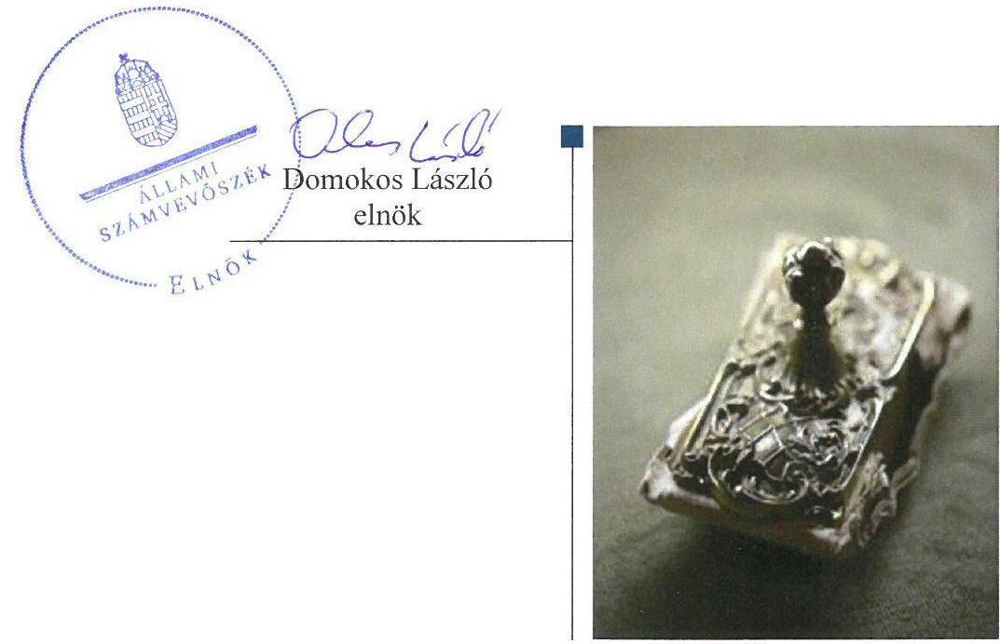
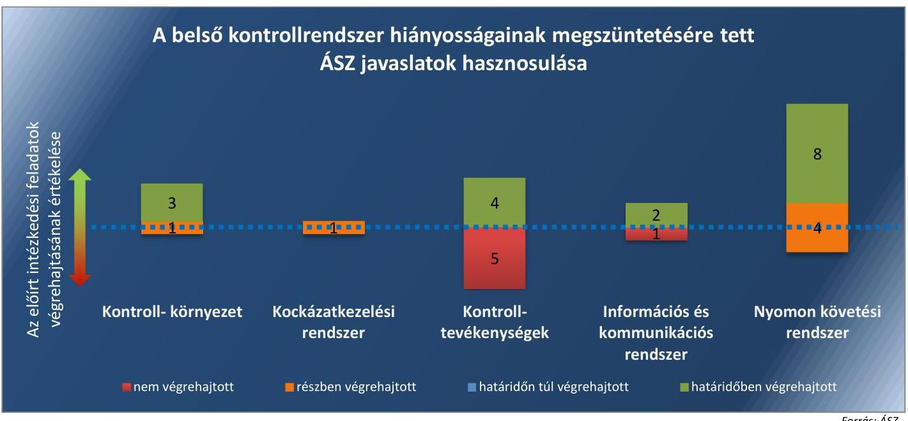
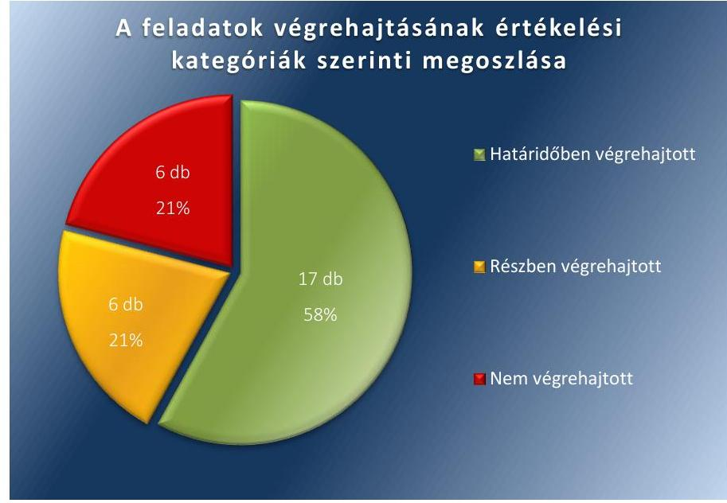

# Jelentés 

## Utóellenőrzések

Az önkormányzatok belső
kontrollrendszere kialakításának és működtetésének utóellenőrzése Bélapátfalva Város Önkormányzata 2018.

---

# Jelentés 

## Utóellenőrzések

Az önkormányzatok belső
kontrollrendszere kialakításának és működtetésének utóellenőrzése Bélapátfalva Város Önkormányzata 2018.  május 5. nap

---

|  J | AZ ELLENŐRZÉST FELÜGYELTE:  |
| --- | --- |
|   | DR. BENEDEK MÁRIA felügyeleti vezető  |
|   | AZ ELLENŐRZÉST VEZETTE ÉS A VÉGREHAJTÁSÁÉRT FELELŐS:  |
|   | JÁNOSI ISTVÁN ellenőrzésvezető  |
|   | A PROGRAM ÖSSZEÁLLÍTÁSÁÉRT FELELŐS:  |
|   | JANIK JÓZSEF LÁSZLÓ osztályvezető  |
|   | A TÉMÁHOZ KAPCSOLÓDÓ KORÁBBI SZÁMVEVŐSZÉKI JELENTÉSEK:  |
|   | - címe: Jelentés az önkormányzatok belső kontrollrendszere kialakításának, egyes kontrolltevékenységek és a belső ellenőrzés működésének ellenőrzéséről - Bélapátfalva  |
|  J | - sorszáma: 13119  |
|  |   |
|   | IKTATÓSZÁM: EL-0068-042/2017.  |
|   | TÉMASZÁM: 21  |
|   | ELLENŐRZÉS-AZONOSÍTÓ SZÁM: V0755118  |

---

# TARTALOMJEGYZÉK 

■ ÖSSZEGZÉS ..... 5
■ AZ ELLENŐRZÉS CÉLJA ..... 7
■ AZ ELLENŐRZÉS TERÜLETE ..... 8
■ AZ ELLENŐRZÉS HÁTTERE, INDOKOLTSÁGA ..... 9
■ A JELENTÉS LÉNYEGES KÉRDÉSKÖRE ..... 10
■ ELLENŐRZÉS HATÓKÖRE ÉS MÓDSZEREI ..... 11
■ MEGÁLLAPÍTÁSOK ..... 13
■ MELLÉKLETEK ..... 19
I. Sz. melléklet: Az ÁSZ 13119. számú jelentéséhez kapcsolódó intézkedési terv végrehajtása ..... 19
■ FÜGGELÉK: ÉSZREVÉTELEK ..... 25
■ RÖVIDÍTÉSEK JEGYZÉKE ..... 27

---

.

---

# ÖSSZEGZÉS 

Az Állami Számvevőszék Bélapátfalva Város Önkormányzata belső kontrollrendszere kialakításának és működtetésének utóellenőrzése során megállapította, hogy az intézkedési tervben meghatározott feladatok többsége végrehajtásra került. Azonban a pénzügyi folyamatokban kulcsszerepet betöltő kontrollok nem szabályszerű működtetése, valamint a belső ellenőrzés működtetésében fennálló hiányosságok miatt továbbra sem volt biztosított a közpénzekkel és a vagyonnal való felelős gazdálkodás.

## Az ellenőrzés társadalmi indokoltsága

Az Állami Számvevőszék stratégiájában célul tűzte ki a számvevőszéki munka hasznosulásának javítását. Ezzel összhangban ellenőrzi, hogy az ellenőrzött szervezetek megvalósították-e a korábbi ellenőrzései által feltárt hibák, hiányosságok és szabálytalanságok megszüntetése céljából elkészített intézkedési terveikben foglaltakat. A rendszeres utóellenőrzések hozzájárulnak a szükséges intézkedések tényleges végrehajtásához, ezáltal a közpénzügyek rendezettségének javulásához, igazolják, hogy lezárult a következmények nélküli ellenőrzések időszaka.

## Főbb megállapítások, következtetések

Bélapátfalva Város Önkormányzata az intézkedést igénylő megállapításokhoz és javaslatokhoz kapcsolódóan összeállított intézkedési tervben meghatározott 29 feladatból 17-et határidőre, hatot részben, hat feladatot nem hajtott végre.

A jegyző megállapította a kötelezően közzéteendő adatok nyilvánosságra hozatalának rendjét, valamint szabályozta a szervezeten belüli információáramlás rendszerét. Meghatározta a köztisztviselőkre vonatkozó hivatásetikai alapelveket és az etikai eljárási szabályokat, valamint a jogviszony megszűnés esetére a munkavállaló folyamatban lévő feladatai átadásának rendjét. Mindezek által javult a működés szabályszerűsége és átláthatósága.

A jegyző a számviteli rend kialakításával, továbbá a gazdálkodásra, ezen belül a pénzügyi folyamatokban kulcsszerepet betöltő kontrollokra vonatkozó belső szabályok meghatározásával biztosította a gazdálkodás jogszabályoknak megfelelő működtetéséhez szükséges kereteket, azonban azok szabályszerű működtetéséről nem gondoskodott. Emiatt a gazdálkodás átláthatósága és elszámoltathatósága nem volt biztosított.

A jegyző intézkedéseinek eredményeként javult a belső ellenőrzés szabályozottsága, az éves ellenőrzési terv megalapozottsága, azonban a jegyző nem gondoskodott arról, hogy a belső ellenőrzésekhez az ellenőrzések megindítását megelőzően ellenőrzési program készüljön, továbbá nem intézkedett a belső ellenőrzési jelentésekben megfogalmazott javaslatok végrehajtásáról. Ezáltal a belső ellenőrzési rendszer szabályszerű működtetése nem volt biztosított.

A jegyző nem határozta meg a gazdasági feladatot ellátó vezető és alkalmazottak helyettesítési rendjének részletes szabályait és nem szabályozta a szervezeten belüli iratforgalmat, ami akadályozta az átlátható működést.

Bélapátfalva Város Önkormányzata az intézkedési tervben meghatározott feladatok végrehajtásáról a jogszabályi előírásoknak megfelelő nyilvántartást vezette.

Az intézkedési tervben meghatározott feladatok értékelési kategóriák és belső kontrollrendszer elemek szerinti megoszlását az 1. ábra szemlélteti.

---

# Összegzés

## 1. ábra

---

# AZ ELLENŐRZÉS CÉLJA 

Az ellenőrzés célja annak értékelése volt, hogy a számvevőszéki jelentésben foglalt intézkedést igénylő megállapításokkal és javaslatokkal összhangban készített intézkedési tervben meghatározott feladatokat az ellenőrzött szervezet végrehajtotta-e.

---

# AZ ELLENŐRZÉS TERÜLETE

## Bélapátfalva Város Önkormányzata

Bélapátfalva Város Heves megyében, a Bélapátfalvai járásban található település, a járás székhelye. Lakosainak száma 2016. január 1-jén a Központi Statisztikai Hivatal Magyarország Közigazgatási Helynévkönyvében közzétett adatok alapján 2979 fő volt.

A polgármester 2014. október 12. óta tölti be tisztségét, a jegyző 1990. december 14. óta látja el feladatait.

Bélapátfalva Város Önkormányzatának működésével, valamint a polgármester és a jegyző feladat- és hatáskörébe tartozó ügyek döntésre való előkészítésével és végrehajtásával kapcsolatos feladatokat a Bélapátfalvai Közös Önkormányzati Hivatal látja el. Az Önkormányzati Hivatal¹-t Bélapátfalva, Bükkszentmárton és Mónosbél települések önkormányzatai közösen alapították 2013. január 1-jén. Az Önkormányzati Hivatal székhelye Bélapátfalva, engedélyezett létszáma 22 fő. Az Önkormányzati Hivatal rendelkezik gazdasági szervezettel.

Bélapátfalva Város Önkormányzata a 2016. évi zárszámadási adatok szerint 533,2 millió Ft költségvetési bevételt ért el és 489,0 millió Ft költségvetési kiadást teljesített. Bélapátfalva Város Önkormányzatának mérlegfőösszege 2016. december 31-én 1.608,8 millió Ft, a befektetett eszközök értéke 1.501,2 millió Ft, a követelések állománya 59,9 millió Ft, a kötelezettségek állománya 16,5 millió Ft volt.

Az Állami Számvevőszék 2013. évben ellenőrizte Bélapátfalva Város Önkormányzata belső kontrollrendszere kialakítását, egyes kontrolltevékenységek és a belső ellenőrzés működtetését a 2012. január 1.- 2012. december 31. közötti időszak vonatkozásában. Az erről szóló 13119 számú jelentését az Állami Számvevőszék 2013. december 4-én hozta nyilvánosságra. Az ellenőrzés célja annak megállapítása volt, hogy a belső kontrollrendszer elemeinek kialakítása, a pénzügyi folyamatokban kulcsszerepet betöltő teljesítésigazolás és érvényesítés, és a belső ellenőrzés szabályos működése biztosította-e az önkormányzatnál a közpénzfelhasználás szabályosságát, hozzájárult-e az értéket teremtő rend követelményének érvényesüléséhez. Az Állami Számvevőszék jelentésében szereplő javaslatok végrehajtása érdekében Bélapátfalva Város Önkormányzatának Képviselő-testülete 189/2013.(XII.19) számú határozattal intézkedési tervet fogadott el.

Az utóellenőrzés – a 2013. december 4-től 2017. június 26-ig végrehajtott feladatokat figyelembe véve – az Állami Számvevőszék jelentésében a jegyző részére megfogalmazott, intézkedést igénylő megállapításokra és javaslatokra készített, az Állami Számvevőszék részére megküldött intézkedési tervben foglalt feladatok megvalósításának ellenőrzésére, illetve értékelésére fókuszált.

---

# AZ ELLENŐRZÉS HÁTTERE, INDOKOLTSÁGA 

Az ÁSZ tv. ${ }^{2}$ 33. § (1) bekezdése értelmében a számvevőszéki jelentések intézkedést igénylő megállapításaihoz és javaslataihoz kapcsolódóan az ellenőrzött szervezet vezetője intézkedési tervet köteles összeállítani, és az Állami Számvevőszék részére megküldeni. Az intézkedési tervben foglaltak megvalósítását - az ÁSZ tv. 33. § (7) bekezdésében foglaltak alapján - az Állami Számvevőszék utóellenőrzés keretében ellenőrizheti. Az intézkedések megvalósulásának értékelése során az Állami Számvevőszék figyelembe veszi az ellenőrzött szervezetek működési feltételeiben, valamint a jogszabályi előírásokban bekövetkezett változásokat.

Az intézkedési tervekben foglalt feladatok hiányos, illetve késedelmes végrehajtása, valamint megvalósításának elmaradása azt mutatja, hogy az ellenőrzések során feltárt hibák, hiányosságok és szabálytalanságok megszüntetése nem kapott kellő hangsúlyt. Ez a szabályszerű működés és a felelős vezetői magatartás vonatkozásában kockázatot hordoz. E kockázatok feltárásával az Állami Számvevőszék utóellenőrzési rendszere fokozza a fegyelmet, és igazolja, hogy a közpénzzel való szabályos gazdálkodás felelőssége elől nem lehet kitérni.

Az utóellenőrzés négy szinten hasznosulhat:

- A társadalom szintjén az utóellenőrzés jelzi, hogy a számvevőszéki ellenőrzés megállapításainak van következménye: a hiányosságok megszüntetésére az ellenőrzött szervezet által meghatározott intézkedések végrehajtását is számon kéri az Állami Számvevőszék.
- Az ellenőrzött terület szintjén az utóellenőrzés tájékoztatást nyújt a terület döntéshozóinak a hiányosságok kiküszöbölésének jó gyakorlatairól, ezzel lehetőséget biztosítva arra, hogy az Állami Számvevőszék ellenőrzési megállapításai, javaslatai a terület nem ellenőrzött szervezeteinek a működése során is hasznosuljanak.
- Az ellenőrzött szervezet szintjén az utóellenőrzés feltárja, hogy a szervezet az intézkedések végrehajtásával hasznosította-e a korábbi ellenőrzési jelentésben a hiányosságok megszüntetése, illetve a kockázatok kezelése érdekében megfogalmazott javaslatokat.
- Az Állami Számvevőszék szintjén az utóellenőrzés visszacsatolást ad az ellenőrzési jelentések hasznosulásáról, az intézkedések elmaradása vagy részleges megvalósulása a további ellenőrzésekhez kockázati jelzésként szolgál.

---

# A JELENTÉS LÉNYEGES KÉRDÉSKÖRE 

Az ellenőrzött szervezet az intézkedési tervben foglaltakat az előírt határidőben végrehajtotta-e?

---

# ELLENŐRZÉS HATÓKÖRE ÉS MÓDSZEREI 

## Az ellenőrzés típusa

Megfelelőségi ellenőrzés.

## Az ellenőrzött időszak

Az utóellenőrzés alapját képező ÁSZ ${ }^{3}$ jelentés közzétételének napjától (2013. december 4-től) az ellenőrzésről szóló kiértesítő levél keltének napjáig (2017. június 26-ig) tartó időszak.

## Az ellenőrzés tárgya

Az ÁSZ tv. 2011. július 1-jei hatálybalépését követően a számvevőszéki jelentésben foglalt intézkedést igénylő megállapításokkal és javaslatokkal összhangban - az ellenőrzött szervezet által - készített intézkedési tervben foglaltak végrehajtásának ellenőrzése volt.

Az ellenőrzés kiterjedt minden olyan körülményre és adatra, amely az ÁSZ jogszabályban meghatározott feladatainak teljesítéséhez, valamint a program végrehajtása folyamán felmerült újabb összefüggések feltárásához szükséges volt.

## Az ellenőrzött szervezet

Bélapátfalva Város Önkormányzata

## Az ellenőrzés jogalapja

Az ÁSZ tv. 33. § (7) bekezdése alapján az intézkedési tervben foglaltak megvalósítását az ÁSZ utóellenőrzés keretében ellenőrizheti.

## Az ellenőrzés módszerei

Az ÁSZ az ellenőrzést az ellenőrzési program ellenőrzési kérdései, az ellenőrzött időszakban hatályos jogszabályok, az ellenőrzés szakmai szabályok és módszertanok figyelembevételével, önálló ellenőrzés keretében végezte.

Az ellenőrzés ideje alatt az ellenőrzött szervezettel történő kapcsolattartásra az ÁSZ SZMSZ ${ }^{4}$-ének vonatkozó előírásai alapján került sor.

---

Az utóellenőrzés megállapításait elsősorban az ÁSZ rendelkezésére álló, valamint az ellenőrzött szervezettől elektronikusan bekért dokumentumok alapozták meg.

Az ellenőrzési bizonyítékként felhasználható adatforrások közé tartoztak egyrészt a szakmai programban felsorolt adatforrások, másrészt minden - az ellenőrzés folyamán feltárt, az ellenőrzés szempontjából információt tartalmazó - dokumentum.

Az intézkedési tervben előírt feladatokat azok végrehajthatósága, illetve végrehajtása szempontjából az alábbiak szerint értékelte az ÁSZ:
$\longrightarrow$ „határidőben végrehajtott" a feladat, ha a teljesítés dokumentáltan, az intézkedési tervben előírt határidőben és tartalommal megtörtént;
$\longrightarrow$ „határidőn túl végrehajtott" a feladat, ha annak teljesítése az intézkedési tervben meghatározott módon, de az előírt határidőn túl történt meg;
$\longrightarrow$ „részben végrehajtott" a feladat, ha végrehajtása teljes körűen az intézkedési tervben előírt módon nem történt meg;
$\longrightarrow$ „nem végrehajtott", a feladat, ha a végrehajtás nem történt meg, vagy amennyiben a teljesítést nem dokumentálták;
$\longrightarrow$ „okafogyottá vált" a feladat, ha végrehajtására - meghatározott esemény bekövetkezése, továbbá külső körülmény, a működést érintő feltétel változása miatt - már nincs szükség, illetve lehetőség, és egyértelműen megállapítható, hogy az intézkedést szükségessé tevő körülmény a jövőben nem fordulhat elő;
$\longrightarrow$ „nem időszerű" az a feladat, amelynek ellenőrzési időszakon belüli végrehajtására azért nem került (kerülhetett) sor, mert az intézkedés alapjául szolgáló esemény nem következett be, de annak jövőbeni előfordulása lehetséges, a végrehajtása nem volt esedékes, vagy a végrehajtás határideje még nem járt le.
Az ellenőrzés lefolytatásához az ellenőrzött szervezet a tanúsítványok elektronikus kitöltésével, valamint az ÁSZ által kért dokumentumok elektronikus megküldésével szolgáltatott adatokat, amelyek valódiságát és teljes körűségét az ellenőrzött szervezet vezetője által tett teljességi és hitelességi nyilatkozat igazolta. Az így rendelkezésre bocsátott adatok, információk kontrollja az ellenőrzés keretében történt.

---

# MEGÁLLAPÍTÁSOK 

## Az ellenőrzött szervezet az intézkedési tervben foglaltakat az előírt
 határidőben végrehajtotta-e?

Összegző megállapítás

Bélapátfalva Város Önkormányzata az intézkedési tervben meghatározott 29 feladatból 17-et határidőben, hatot részben, hat feladatot nem hajtott végre. Az intézkedési tervben meghatározott feladatok végrehajtásáról a jogszabályban előírt nyilvántartást vezette.

Az ÁSZ a jelentésében a jegyző ${ }^{5}$ részére 29 javaslatot fogalmazott meg. A polgármester ${ }^{6}$ által előterjesztett és a Képviselő-testület által jóváhagyott intézkedési tervben a hiányosságok, szabálytalanságok megszüntetésére a jegyző részére 29 feladat került meghatározásra.

Az intézkedési tervben meghatározott feladatokat, határidőket, felelősöket és a feladatok végrehajtását az I. számú melléklet mutatja be.

A jegyző az intézkedési tervben meghatározott feladatok végrehajtásáról a Bkr. ${ }^{7}$ 14. § (1) bekezdésben meghatározott nyilvántartást a jogszabályban előírt tartalommal vezette.

Az Önkormányzat ${ }^{8}$ intézkedési tervében meghatározott feladatok végrehajtásának értékelési kategóriák szerinti megoszlását a 2. ábra szemlélteti.
2. ábra

Fonós: ÁSZ

---

# HATÁRIDŐBEN VÉGREHAJTOTT feladatok: 

1. A jegyző 2014. január 1-jétől léptette hatályba a jogszabályi előírásoknak megfelelően aktualizált Számviteli politiká${ }^{9}$-t és az Eszközök és források értékelési szabályzat${ }^{10}$-át.
2. A jegyző az Önkormányzat intézményei${ }^{11}$ jogszabályi előírásoknak megfelelő számviteli rendjét a 2014. január 1-jétől hatályos Számviteli politikában, az Eszközök és források értékelési szabályzatában, valamint a Számlarend${ }^{12}$-ben alakította ki.
3. A jegyző a jogszabályi előírásoknak megfelelően előkészítette a köztisztviselőkkel szembeni hivatásetikai alapelvek részletes tartalmát, valamint az etikai eljárás szabályait magában foglaló, 2013. augusztus 15-étől hatályos Etikai szabályzat${ }^{13}$-ot, amelyet a Képviselő-testület${ }^{14}$ határozattal hagyott jóvá.
4. A jegyző a 2014. január 1-jétől hatályos Gazdálkodási szabályzat${ }^{15}$-ban, valamint a 2014. január 1-jétől hatályos Gazdasági szervezet ügyrendjé${ }^{16}$-ben a jogszabályi előírásoknak megfelelően meghatározta a kötelezettségvállalás, az ellenjegyzés, a teljesítés igazolása, az érvényesítés és az utalványozás gyakorlásának módjával, eljárási és dokumentációs részletszabályaival, valamint az ezeket végző személyek kijelölési rendjével kapcsolatos előírásokat.
5. A jegyző a 2013. október 1-jétől hatályos Közszolgálati szabályzat${ }^{17}$-ban a jogszabályi előírásoknak megfelelően meghatározta a jogviszony megszűnése esetére a munkavállaló folyamatban lévő feladatai átadásának rendjét.
6. A jegyző a 2013. október 1-jétől hatályos Közszolgálati szabályzatban, a 2014. január 1-jétől hatályos SZMSZ${ }^{18}$-ben és a 2013. október 1-jétől hatályos Belső kontrollrendszer szabályzat${ }^{19}$-ban a jogszabályi előírásoknak megfelelően szabályozta a szervezeten belüli információáramlás rendszerét.
7. A jegyző a 2013. október 1-jétől hatályos Adatkezelési szabályzat${ }^{20}$-ban a jogszabályi előírásoknak megfelelően megállapította a kötelezően közzéteendő adatok nyilvánosságra hozatalának rendjét.
8. A jegyző a 2014. január 1-jétől hatályos Gazdálkodási szabályzatban gondoskodott arról, hogy az érvényesítésre jogosult személyek a jogszabályi előírásnak megfelelően kerüljenek kijelölésre.
9. A jegyző a kötelezettségvállalások nyilvántartását 2014. január 1-jétől kezdődően a jogszabályi előírásoknak megfelelően vezette.
10. A jegyző intézkedett, hogy a jogszabályi előírásoknak megfelelően a belső ellenőrzési kézikönyv rendszeresen, legalább kétévenként felülvizsgálatra kerüljön. A 2013. június 1-jétől hatályos Belső ellenőrzési kézikönyv${ }^{21}$ felülvizsgálatára 2015. január 2-án került sor.
11. A jegyző intézkedett, hogy az Önkormányzat stratégiai ellenőrzési terve a jogszabályi előírásoknak megfelelően a belső kontrollrendszer általános értékelésével kiegészítésre kerüljön. A kiegészítést a Képviselő-testület 2014. március 31-én határozatban hagyta jóvá.

---

12. A jegyző kezdeményezte, hogy a 2014. évi ellenőrzési terv a jogszabályi előírásoknak megfelelően tartalmazza az ellenőrzési tervet magalapozó elemzések és a kockázatelemzés eredményének összefoglaló bemutatását, valamint az ellenőrzések célját. A felsorolt elemeket tartalmazó 2014. évi ellenőrzési tervet a Képviselőtestület 2013. december 19-én határozatban hagyta jóvá.
13. A jegyző intézkedett a 2014. évi ellenőrzési terv Képviselő-testület elé terjesztéséről annak érdekében, hogy azt a Képviselő-testület a jogszabályi előírásoknak megfelelően 2013. december 31-éig jóváhagyja. A 2014. évi ellenőrzési tervet a Képviselő-testület 2013. december 19-én fogadta el.
14. A jegyző gondoskodott arról, hogy a 2014. évi ellenőrzési tervet a jogszabályi előírásoknak megfelelően kockázatelemzés alapozza meg. A 2014. évi ellenőrzési tervet a Képviselő-testület 2013. december 19-én fogadta el.
15. A jegyző kezdeményezte, hogy a 2014. évi ellenőrzési terv a jogszabályi előírásoknak megfelelően a stratégiai tervben és a kockázatelemzésben felállított prioritásokon alapuljon.
16. A jegyző a 2014. évben lefolytatott ellenőrzésektől kezdődően gondoskodott arról, hogy a belső ellenőrzés az ellenőrzési jelentések alapján tett intézkedések nyomon követését a jogszabályi előírásoknak megfelelően nyilvántartsa.
17. A jegyző a 2014. évben lefolytatott ellenőrzésektől kezdődően gondoskodott arról, hogy a belső ellenőrzési vezető az elvégzett ellenőrzésekről a jogszabályi előírásoknak megfelelő nyilvántartást vezessen.

# RÉSZBEN VÉGREHAJTOTT feladatok: 

18. A jegyző a 2013. október 1-jétől hatályos Belső kontrollrendszer szabályzatban a Bkr. előírásainak megfelelően meghatározta az Önkormányzati Hivatal tevékenységében és gazdálkodásában rejlő kockázatok kezelésének, folyamatos nyomon követésének módját, azonban Bkr. 7. § (2) bekezdésében foglaltak ellenére nem gondoskodott a kockázatok tényleges felméréséről és a szükséges intézkedések meghatározásáról.
19. A jegyző az Ávr.-ben előírtaknak megfelelően a belső szabályozás szerinti nyilvántartást vezetett a pénzügyi ellenjegyzésre, a teljesítésigazolásra, az érvényesítésre, utalványozásra jogosult személyekről és aláírás mintájukról. Azonban az Ávr.${ }^{22}$ 60. § (3) bekezdésében foglaltak ellenére a nyilvántartás nem volt naprakész, mert érvényes írásbeli kijelöléssel nem rendelkező jogkör gyakorlókat is tartalmazott.
20. A jegyző a 2013. október 1-jétől hatályos Belső kontrollrendszer szabályzatban a Bkr. 3. § e) pontjában és 10. §-ában foglaltaknak megfelelően kialakította a szervezet tevékenységének, a célok megvalósításának nyomon követését biztosító rendszert, azonban annak működtetése a belső ellenőrzési rendszer működtetési hiányosságai miatt (lásd a Jelentés 21-23. pontjait) nem volt teljes körűen biztosított.

---

21. A 2014. évi ellenőrzési terv módosítására a Képviselő-testület 178/2014 (XII.22) számú határozatával, a jegyző 2014. november 28-ai keltezésű előzetes jóváhagyása mellett került sor, azonban a Bkr. 31. § (5) és 56. § (5) bekezdésében foglaltak ellenére a 2015. évi ellenőrzési terv két alkalommal történő módosításához kapcsolódóan előzetes jegyzői jóváhagyás nem történt.
22. A jegyző a 2014. évi ellenőrzési tervben szereplő egy ellenőrzéshez kapcsolódóan a vizsgálatvezető kijelölését követően, az ellenőrzés megindítását megelőzően gondoskodott a Bkr.-ben előírtaknak megfelelő ellenőrzési program elkészítéséről, azonban a 2015. évben egy, a 2016. évben három ellenőrzés lefolytatására a Bkr. 33. § (2) bekezdésében előírtak ellenére a vizsgálatvezető által készített és a belső ellenőrzési vezető által jóváhagyott ellenőrzési program nélkül került sor.
23. A jegyző a 2014. évben elvégzett belső ellenőrzésről készített belső ellenőrzési jelentésben megfogalmazott javaslatokhoz kapcsolódóan a Bkr.-ben előírt határidőben és tartalommal gondoskodott az intézkedési terv elkészítéséről, azonban az ellenőrzött időszak további részében lefolytatott három - intézkedést igénylő javaslatokat tartalmazó - belső ellenőrzési jelentéshez kapcsolódóan a Bkr. 45. § (1)-(3) bekezdéseiben előírtak ellenére nem gondoskodott az intézkedési tervek megfelelő tartalommal és az előírt határidőben történő elkészítéséről.

# NEM VÉGREHAJTOTT feladatok: 

24. A jegyző a Bkr. 6. § (3) bekezdésében előírtak ellenére nem gondoskodott az ellenőrzési nyomvonal rendszeres aktualizálásáról.
25. A jegyző az Ávr. 13. § (5) bekezdésében előírtak ellenére nem határozta meg a gazdasági feladatot ellátó vezető és alkalmazottak helyettesítésének általános rendjét.
26. A jegyző az Ikr.${ }^{23}$ 14. § (4) bekezdésében előírtak ellenére nem biztosította az iratforgalom dokumentálását annak érdekében, hogy az iratok szervezeten belüli útja pontosan követhető és ellenőrizhető legyen.
27. A jegyző nem gondoskodott arról, hogy a teljesítés igazolásra az Ávr. 57. § (4) bekezdése szerint kijelölt személyek által, az Ávr. 57. § (1)-(3) bekezdéseiben foglaltaknak megfelelően, ellenőrizhető okmányok alapján kerüljön ellenőrzésre a kiadások teljesítésének jogossága, összegszerűsége, ellenszolgáltatást is magában foglaló kötelezettségvállalás esetében a szerződés, megrendelés teljesítése.
28. A jegyző nem gondoskodott arról, hogy az érvényesítő az Ávr. 58. § (1) bekezdése szerint a teljesítés igazolás alapján - illetve az Ávr. 57. § (3) bekezdése szerinti esetben annak hiányában is - ellenőrizze az összegszerűséget, a fedezet meglétét és a megelőző ügymenetben az Áht.${ }^{24}$, az Áhsz.${ }^{25}$, és az Ávr. előírásainak, valamint a belső szabályzatokban foglaltaknak a betartását.

---

29. A jegyző nem gondoskodott az érvényesítés Ávr. 58. § (2) bekezdésében foglalt előírtaknak megfelelő végrehajtásáról. Az érvényesítő nem jelezte az utalványozónak, hogy a teljesítés igazolást végző személy nem rendelkezett az Ávr. 57. § (4) bekezdése szerint érvényes teljesítés igazolási jogosultságra felhatalmazó kijelöléssel.

---

.

---

# MELLÉKLETEK

■ I. SZ. MELLÉKLET: AZ ÁSZ 13119. SZÁMÚ JELENTÉSÉHEZ KAPCSOLÓDÓ INTÉZKEDÉSI TERV VÉGREHAJTÁSA

|  Az intézkedési tervben meghatározott feladat | Az intézkedési tervben meghatározott határidő | Az intézkedési tervben meghatározott feladat végrehajtásának felelőse | Az intézkedési tervben meghatározott feladat végrehajtása  |
| --- | --- | --- | --- |
|  1. | 2. | 3. | 4.  |
|  Határidőben végrehajtott feladatok |  |  |   |
|  1. | Aktualizálja a Számv. tv. 14. § (11) bekezdésében foglaltaknak megfelelően a számviteli politikát és az eszközök és források értékelési szabályzatát. | Végrehajtása megtörtént. | jegyző  |
|  2. | Alakítsa ki a Htv. 140. § (1) bekezdés c) pontjában foglaltak szerint az Önkormányzat intézményeinek számviteli rendjét. | 2014. március 31. | jegyző  |
|  3. | Készítse elő az Mótv. 81. § (3) bekezdés c) pontjában foglalt feladatkörében a Kttv. 83. §-ában foglaltaknak megfelelően a köztisztviselőkkel szembeni hivatásetikai alapelvek részletes tartalmának, valamint az etikai eljárás szabályainak dokumentumait és kezdeményezze a polgármesternél a Kttv. 231. § (1) bekezdésében foglaltak alapján annak Képviselő-testület elé terjesztését. | Végrehajtása megtörtént. | jegyző  |
|  4. | Határozza meg az Ávr. 13. § (2) bekezdés a) pontjában foglaltaknak megfelelően a kötelezettségvállalás, az ellenjegyzés, a teljesítés igazolása, az érvényesítés és az utalványozás gyakorlásának módjával, eljárási és dokumentációs részletszabályaival, valamint ezeket végző személyek kijelölési rendjével kapcsolatos előírásokat. | Végrehajtása megtörtént. | jegyző  |

A jegyző a Számv. tv.${ }^{26}$ 14. § (11) bekezdésében foglaltaknak megfelelően aktualizálta a számviteli politikát és az eszközök és források értékelési szabályzatát a 2014. január 1-jétől hatályos Számviteli politikában és az Eszközök és források értékelési szabályzatában.

A jegyző a Htv.${ }^{27}$ 140. § (1) bekezdés c) pontjában foglaltak szerint kialakította az Önkormányzat intézményeinek számviteli rendjét a 2014. január 1-jétől hatályos Számviteli politikában, az Eszközök és források értékelési szabályzatában, valamint Számlarendben.

A jegyző az Mótv.${ }^{28}$ 81. § (3) bekezdés c) pontjában foglalt feladatkörében a Kttv.${ }^{29}$ 83. §-ában foglaltaknak megfelelően elkészítette a köztisztviselőkkel szembeni hivatásetikai alapelvek részletes tartalmát, valamint az etikai eljárás szabályainak szabályait magában foglaló Etikai szabályzatot, melyet a Képviselő-testület 110/2013. (VIII.8) számú határozatával fogadott el.

A jegyző a 2014. január 1-jétől hatályos Gazdálkodási szabályzatban, valamint a 2014. január 1-jétől hatályos Gazdasági szervezet ügyrendjében az Ávr. 13. § (2) bekezdés a) pontjában foglaltaknak megfelelően meghatározta a kötelezettségvállalás, az ellenjegyzés, a teljesítés igazolása, az érvényesítés és az utalványozás gyakorlásának
 módjával, eljárási és dokumentációs részletszabályaival, valamint ezeket végző személyek kijelölési rendjével kapcsolatos előírásokat.

---

|  Az intézkedési tervben meghatározott feladat | Az intézkedési tervben meghatározott határidő | Az intézkedési tervben meghatározott feladat végrehajtásának felelőse | Az intézkedési tervben meghatározott feladat végrehajtása  |
| --- | --- | --- | --- |
|  1. | 2. | 3. | 4.  |
|  5. Határozza meg a Kttv. 74. § (1) bekezdésében foglaltaknak megfelelően a jogviszony megszűnése esetére a munkavállaló folyamatban lévő feladatai átadásának rendjét. | Végrehajtása megtörtént. | jegyző | A jegyző a 2013. október 1-jétől hatályos Közszolgálati szabályzatban (II. fejezet 20-26. pontok) a Kttv. 74. § (1) bekezdésében foglaltaknak megfelelően meghatározta a jogviszony megszűnése esetére a munkavállaló folyamatban lévő feladatai átadásának rendjét.  |
|  6. Szabályozza a Bkr. 9. § (1) bekezdésében foglaltaknak megfelelően a szervezeten belüli információáramlás rendszerét. | Végrehajtása megtörtént. | jegyző | A jegyző a 2013. október 1-jétől hatályos Közszolgálati szabályzatban (III. fejezet 11. pont), az SZMSZ-ben (2.9. pont) és a Belső kontrollrendszer szabályzatban (IV. fejezet 1.2 pont) a Bkr. 9. § (1) bekezdésében foglaltaknak megfelelően szabályozta a szervezeten belüli információáramlás rendszerét.  |
|  7. Állapítsa meg az Ávr. 13. § (2) bekezdés h) pontjában foglaltaknak megfelelően a kötelezően közzéteendő adatok nyilvánosságra hozatalának rendjét. | Végrehajtása megtörtént. | jegyző | A jegyző a 2013. október 1-jétől hatályos Adatkezelési szabályzatban (VI. fejezet és 1. sz. melléklet) az Ávr. 13. § (2) bekezdés h) pontjában foglaltaknak megfelelően szabályozta a kötelezően közzéteendő adatok nyilvánosságra hozatalának rendjét.  |
|  8. Az Ávr. 55. § (2) bekezdés f) pontjának megfelelően kerüljenek kijelölésre az érvényesítésre jogosult személyek. | A képviselő-testületi döntés elfogadásától azonnal és folyamatos. | jegyző | A jegyző a 2014. január 1-jétől hatályos Gazdálkodási szabályzatban gondoskodott arról, hogy az érvényesítésre jogosult személyek az Ávr. 55. § (2) bekezdés f) pontjának foglaltaknak megfelelően kerüljenek kijelölésre.  |
|  9. A kötelezettségvállalás nyilvántartás feleljen meg az Ávr. 56. § (1)-(3) és (6) bekezdéseiben foglalt előírásoknak. | Meglévő nyilvántartás rendbetétele 2014. január 31-ig és ezt követően folyamatos. | jegyző | A jegyző a kötelezettségvállalások nyilvántartását 2014. január 1-jétől kezdődően az Ávr. 56. § (1)-(3) és (6) bekezdéseiben foglalt előírásoknak megfelelően vezette.  |
|  10. Intézkedjen a Bkr. 17. § (4) bekezdésében foglaltaknak megfelelően a belső ellenőrzési kézikönyv rendszeres, de legalább kétévenkénti felülvizsgálatáról. | 2014. március 31. | jegyző | A jegyző intézkedett annak érdekében, hogy a 2013. június 1-jétől hatályos Belső ellenőrzési kézikönyv felülvizsgálata a Bkr. 17. § (4) bekezdésében előírt két éven belül, 2015. január 2-án megtörténjen.  |
|  11. Intézkedjen a stratégiai ellenőrzési tervnek a Bkr. 30. § (1) bekezdés b) pontjában foglaltak szerinti - a belső kontrollrendszer általános értékelésével történő - kiegészítéséről. | 2014. március 31. | jegyző | A jegyző intézkedett, hogy a stratégiai ellenőrzési terv a Bkr. 30. § (1) bekezdés b) pontjában foglaltak szerint a belső kontrollrendszer általános értékelésével kiegészítésre kerüljön. A kiegészítést a Képviselő-testület 2014. március 31-én a 36/2014. (III.31) számú határozatával hagyta jóvá.  |
|  12. Kezdeményezze, hogy az ellenőrzési terv a Bkr. 31. § (4) bekezdés a) és c) pontjaiban foglaltak szerint tartalmazza | 2013. december 31. | jegyző | A jegyző gondoskodott arról, hogy az ellenőrzési terv a Bkr. 31. § (4) bekezdés a) és c) pontjaiban foglaltak szerint tartalmazza az ellenőrzési tervet magalapozó elemzések és a kockázatelemzés eredményének összefoglaló bemutatását, valamint az ellenőrzések célját. A felsorolt elemeket tartalmazó 2014. évi ellenőrzési  |

---

|  Az intézkedési tervben meghatározott feladat | Az intézkedési tervben meghatározott határidő | Az intézkedési tervben meghatározott feladat végrehajtásának felelőse | Az intézkedési tervben meghatározott feladat végrehajtása  |
| --- | --- | --- | --- |
|  az ellenőrzési tervet magalapozó elemzések és a kockázatelemzés eredményének összefoglaló bemutatását, valamint az ellenőrzések célját. | 2. | 3. | 4.  |
|  13. Intézkedjen az éves ellenőrzési terv Képviselő-testület elé terjesztéséről annak érdekében, hogy azt a Képviselő-testület az Mótv. 119. § (5) és a Bkr. 32. § (4) bekezdésében előírt határidőn belül hagyja jóvá. | 2013. december 31. | jegyző | Tervet a Képviselő-testület 2013. december 19-én a 190/2013. (XII.19) számú határozatával hagyta jóvá.  |
|  14. Intézkedjen arról, hogy az éves ellenőrzési terv a Bkr. 31. § (2) bekezdése alapján kockázatelemzésen alapuljon. | 2013. december 31. | jegyző | A jegyző intézkedett az éves ellenőrzési terv Képviselő-testület elé terjesztéséről annak érdekében, hogy azt a Képviselő-testület az Mótv. 119. § (5) és a Bkr. 32. § (4) bekezdésében előírt határidőn belül hagyja jóvá. A Képviselő-testület a 2014. évi ellenőrzési tervet 2013. december 19-én a 190/2013. (XII.19) sz. határozatában hagyta jóvá.  |
|  15. Kezdeményezze, hogy az éves ellenőrzési terv Bkr. 31. § (2) bekezdésének előírása szerint a stratégiai tervben és a kockázatelemzésben felállított prioritásokon alapuljon. | 2013. december 31. | jegyző | A jegyző gondoskodott arról, hogy a 2014. évi ellenőrzési terv a Bkr. 31. § (2) bekezdésének előírása szerint a stratégiai tervben és a kockázatelemzésben felállított prioritásokon alapuljon.  |
|  16. Kezdeményezze, hogy a belső ellenőrzés az ellenőrzési jelentések alapján tett intézkedések nyomon követését a Bkr. 21. § (2) bekezdés d) pontjában előírtak szerint biztosítsa. | 2014. január 31. és folyamatos | jegyző | A jegyző gondoskodott arról, hogy a belső ellenőrzés az ellenőrzési jelentések alapján tett intézkedések nyomon követését a Bkr. 21. § (2) bekezdés d) pontjában előírt nyilvántartásban biztosítsa.  |
|  17. Kezdeményezze, hogy a Bkr. 50. § (1)-(2) bekezdéseiben foglalt előírások szerint a belső ellenőrzési vezető az elvégzett ellenőrzésekről nyilvántartást vezessen. | 2014. január 31. és folyamatos | jegyző | A jegyző gondoskodott arról, hogy a belső ellenőrzési vezető az elvégzett ellenőrzésekről a Bkr. 50. § (1)-(2) bekezdéseiben foglalt előírások szerinti nyilvántartást vezessen.  |
|  Részben végrehajtott feladatok |  |  |   |
|  18. Mérje fel és állapítsa meg – a Bkr. 7. § (2) bekezdésében foglaltak alapján – a Polgármesteri Hivatal tevékenységében és gazdálkodásában rejlő kockázatokat, határozza meg az egyes kockázatokkal kapcsolatban szükséges intézkedéseket, valamint azok teljesítése folyamatos nyomon követésének módját. | Végrehajtása megtörtént és folyamatos. | jegyző | A jegyző a 2013. október 1-jétől hatályos Belső kontrollrendszer szabályzatban a Bkr. 7. § (2) bekezdésében foglaltaknak megfelelően meghatározta az Önkormányzati Hivatal tevékenységében és gazdálkodásában rejlő kockázatok kezelésének, folyamatos nyomon követésének módját, azonban nem gondoskodott a kockázatok tényleges felméréséről és a szükséges intézkedések meghatározásáról.  |

---

|  Az intézkedési tervben meghatározott feladat | Az intézkedési tervben meghatározott határidő | Az intézkedési tervben meghatározott feladat végrehajtásának felelőse | Az intézkedési tervben meghatározott feladat végrehajtása  |
| --- | --- | --- | --- |
|  1. | 2. | 3. | 4.  |
|  19. Intézkedjen arról, hogy a pénzügyi ellenjegyzésre, a teljesítésigazolásra, az érvényesítésre és az utalványozásra jogosult személyekről és aláírás mintájukról - az Ávr. 60. § (3) bekezdésben foglaltaknak megfelelően belső szabályozás szerinti, naprakész nyilvántartást vezessenek. | Végrehajtása megtörtént. | jegyző | A jegyző az Ávr.-ben előírtaknak megfelelően a belső szabályozásnak megfelelő nyilvántartást vezetett a pénzügyi ellenjegyzésre, a teljesítésigazolásra, az érvényesítésre, utalványozásra jogosult személyekről és aláírás mintájukról. Azonban az Ávr. 60. § (3) bekezdésében foglaltak ellenére a nyilvántartás nem volt naprakész, mert érvényes írásbeli kijelöléssel nem rendelkező jogkör gyakorlókat is tartalmazott.  |
|  20. Alakítsa ki és működtesse a Bkr. 3. § e) pontjában és a 10. §-ában foglaltak alapján a szervezet tevékenységének, a célok megvalósításának nyomon követését biztosító rendszert. | Végrehajtása megtörtént és folyamatos. | jegyző | A jegyző a 2013. október 1-jétől hatályos Belső kontrollrendszer szabályzatban (V. fejezet) a Bkr. 3. § e) pontjában és 10. §-ában foglaltak alapján kialakította a szervezet tevékenységének, a célok megvalósításának nyomon követését biztosító rendszert, azonban annak működtetése a belső ellenőrzési rendszer működtetési hiányosságai miatt (lásd a Jelentés 21-23. pontjait) nem volt teljes körűen biztosított.  |
|  21. Intézkedjen arról, hogy ellenőrzés elhagyása vagy új ellenőrzés indítása esetén - a Bkr. 31. § (5) és 56. § (5) bekezdésében foglaltaknak megfelelően - az éves ellenőrzési tervet a jegyző egyetértésével módosítsák. | Ellenőrzési terv módosításának jóváhagyását követő 30 nap. | jegyző | A jegyző gondoskodott arról, hogy a Bkr. előírásainak megfelelően a 2014. évi ellenőrzési terv módosítása az előírt határidőn belül, a jegyző 2014. november 28-ai keltezésű jóváhagyásával történjen, azonban a Bkr. 31. § (5) és 56. § (5) bekezdésében foglaltak ellenére a 2015. évi ellenőrzési terv két alkalommal történő módosításához kapcsolódóan jegyzői jóváhagyásra nem került sor.  |
|  22. Kezdeményezze, hogy a Bkr. 33. § (2) bekezdésében foglalt előírás szerint a végrehajtott ellenőrzésekhez minden esetben ellenőrzési program készüljön, és azt a belső ellenőrzési vezető hagyja jóvá. | Vizsgálatvezető kijelölését követően, ellenőrzés megindítását megelőzően. | jegyző | A jegyző a 2014. évi ellenőrzési tervben szereplő egy ellenőrzéshez ("Bélapátfalva Város Önkormányzata 2012-2013. évi vagyongazdálkodásának, a vagyon megállapítás megbízhatóságának ellenőrzéséről" c. ellenőrzés) kapcsolódóan a vizsgálatvezető kijelölését követően, az ellenőrzés megindítását megelőzően gondoskodott a Bkr.-ben előírtaknak megfelelő ellenőrzési program elkészítéséről, azonban a 2015. évben egy, a 2016. évben három ellenőrzés lefolytatására a Bkr. 33. § (2) bekezdésében előírtak ellenére a vizsgálatvezető által készített és a belső ellenőrzési vezető által jóváhagyott ellenőrzési program nélkül került sor.  |
|  23. Készítsen intézkedési tervet a Bkr. 45. § (1)-(3) bekezdéseiben foglaltaknak megfelelően a belső ellenőrzési jelentésekben megfogalmazott javaslatok végrehajtására, az előírt tartalommal és határidőn belül. | Előírt határidőn belül. | jegyző | A jegyző a 2014. évben elvégzett belső ellenőrzésről készített belső ellenőrzési jelentésben megfogalmazott javaslatokhoz kapcsolódóan a Bkr.-ben előírt határidőben és tartalommal gondoskodott az intézkedési terv elkészítéséről, azonban az ellenőrzött időszak további részében lefolytatott három - intézkedést igénylő javaslatokat tartalmazó - belső ellenőrzési jelentéshez kapcsolódóan a Bkr. 45. §  |

---

|  Az intézkedési tervben meghatározott feladat | Az intézkedési tervben meghatározott határidő | Az intézkedési tervben meghatározott feladat végrehajtásának

 felelőse | Az intézkedési tervben meghatározott feladat végrehajtása  |
| --- | --- | --- | --- |
|  1. | 2. | 3. | 4.  |
|   |  |  | (1)-(3) bekezdéseiben előírtak ellenére nem gondoskodott az intézkedési tervek megfelelő tartalommal és az előírt határidőben történő elkészítéséről.  |
|  Nem végrehajtott feladatok |  |  |   |
|  24. Intézkedjen a Bkr. 6. § (3) bekezdésében előírtaknak megfelelően az ellenőrzési nyomvonal rendszeres aktualizálásáról. | Végrehajtása megtörtént és folyamatos. | jegyző | A jegyző a Bkr. 6. § (3) bekezdésében előírtak ellenére nem gondoskodott az ellenőrzési nyomvonal rendszeres aktualizálásáról.  |
|  25. Határozza meg az Ávr. 13. § (5) bekezdésében foglaltaknak megfelelően a gazdasági feladatot ellátó vezető és alkalmazottak helyettesítésének rendjét. | 2014. március 31. | jegyző | A jegyző az Ávr. 13. § (5) bekezdésében előírtak ellenére nem határozta meg a gazdasági feladatot ellátó vezető és alkalmazottak helyettesítésének általános rendjét.  |
|  26. Biztosítsa az Ikr. 14. § (4) bekezdésében foglaltaknak megfelelően az iratforgalom dokumentálásával, hogy az iratok szervezeten belüli útja pontosan követhető és ellenőrizhető legyen. | A képviselő testületi döntés elfogadásától azonnal és folyamatos. | jegyző | A jegyző az Ikr. 14. § (4) bekezdésében előírtak ellenére nem biztosította az iratforgalom dokumentálását annak érdekében, hogy az iratok szervezeten belüli útja pontosan követhető és ellenőrizhető legyen.  |
|  27. A teljesítményigazolásra - az Ávr. 57. § (4) bekezdésében foglalt előírásnak megfelelően - kijelölt személyek az Ávr. 57. § (1) bekezdésében foglaltaknak megfelelően, ellenőrizhető okmányok alapján ellenőrizzék a kiadások teljesítésének jogosságát, összegszerűségét, ellenszolgáltatást is magába foglaló kötelezettségvállalás esetében a szerződés, megrendelés teljesítését, és azt az Ávr. 57. § (3) bekezdésében foglalt módon igazolják. | Végrehajtása megtörtént és folyamatos. | jegyző | A jegyző nem gondoskodott arról, hogy a teljesítés igazolásra az Ávr. 57. § (4) bekezdése szerint kijelölt személyek által, az Ávr. 57. § (1)-(3) bekezdéseiben foglaltaknak megfelelően, ellenőrizhető okmányok alapján kerüljön ellenőrzésre a kiadások teljesítésének jogossága, összegszerűsége, ellenszolgáltatást is magában foglaló kötelezettségvállalás esetében a szerződés, megrendelés teljesítése. A teljesítés igazolást az Ávr. 57. § (4) bekezdésében előírtak ellenére nem az arra jogosult személy végezte.  |
|  28. Az érvényesítő ellenőrizze - az Ávr. 58. § (1) bekezdése szerint - a teljesítésigazolás alapján - az Ávr. 57. § (3) bekezdése szerinti esetben annak hiányában is - az összegszerűséget, a fedezet meglétét és a megelőző ügymenetben az Áht., az Áhsz., az ÁVR. előírásainak és a belső szabályzatokban foglaltaknak a betartását. | A képviselő testületi döntés elfogadásától azonnal és folyamatos. | jegyző | A jegyző nem gondoskodott arról, hogy az érvényesítő az Ávr. 58. § (1) bekezdése szerint ellenőrizze a teljesítés igazolás alapján - illetve az Ávr. 57. § (3) bekezdése szerint meghatározott esetben annak hiányában is - az összegszerűséget, a fedezet meglétét és a megelőző ügymenetben az Áht., az Áhsz., és az Ávr. előírásainak, valamint a belső szabályzatokban foglaltaknak a betartását. Az Ávr. 58.§ (3) bekezdésében és a Gazdálkodási szabályzatban foglaltak ellenére az érvényesítés nem tartalmazta az érvényesítés keltét.  |

---

|  Az intézkedési tervben meghatározott feladat | Az intézkedési tervben meghatározott határidő | Az intézkedési tervben meghatározott feladat végrehajtásának felelőse | Az intézkedési tervben meghatározott feladat végrehajtása  |
| --- | --- | --- | --- |
|  1. | 2. | 3. | 4.  |
|  29. Az érvényesítő az Ávr. 58. § (2) bekezdésben foglalt előírásnak megfelelően jelezze az utalványozónak, ha az Áht. vagy az államháztartási számviteli kormányrendelet, az Ávr. és a belső szabályzatokban foglaltak megsértését tapasztalja. | A képviselő testületi döntés elfogadásától azonnal és folyamatos. | jegyző | A jegyző nem gondoskodott az érvényesítés Ávr. 58. § (2) bekezdésében foglalt előírtaknak megfelelő végrehajtásáról. Az érvényesítő nem jelezte az utalványozónak, hogy a teljesítés igazolást végző személy nem rendelkezett az Ávr. 57. § (4) bekezdése szerint érvényes, teljesítés igazolási jogosultságra felhatalmazó kijelöléssel.  |

---

# FÜGGELÉK: ÉSZREVÉTELEK 

A jelentéstervezetet a Számvevőszék 15 napos észrevételezésre megküldte az ellenőrzött szervezet vezetőjének az ÁSZ tv. 29. § (1) bekezdése előírásának megfelelően.
Az ellenőrzött szervezet vezetője az ÁSZ. tv. 29. § (2) bekezdésében foglalt észrevételezési jogával nem élt, a jelentéstervezetre észrevételt nem tett.

[^0]
[^0]:    * 29. § (1) Az Állami Számvevőszék az ellenőrzési megállapításait megküldi az ellenőrzött szervezet vezetőjének vagy az általa megbízott személynek, és annak, akinek személyes felelősségét állapította meg.
    (2) Az ellenőrzött szervezet vezetője és a felelősként megjelölt személy az ellenőrzés megállapításaira tizenöt napon belül írásban észrevételt tehet.
    (3) Az Állami Számvevőszék az észrevételre a beérkezésétől számított harminc napon belül írásban válaszol. A figyelembe nem vett észrevételeket köteles a jelentésben feltüntetni, és megindokolni, hogy azokat miért nem fogadta el.

---

.

---

# RÖVIDÍTÉSEK JEGYZÉKE 

${ }^{1}$ Önkormányzati Hivatal
${ }^{2}$ ÁSZ tv.
${ }^{3}$ ÁSZ
${ }^{4}$ ÁSZ SZMSZ
${ }^{5}$ jegyző
${ }^{6}$ polgármester
${ }^{7}$ Bkr.
${ }^{8}$ Önkormányzat
${ }^{9}$ Számviteli Politika
${ }^{10}$ Eszközök és források értékelési szabályzata
${ }^{11}$ Önkormányzat intézményei
${ }^{12}$ Számlarend
${ }^{13}$ Etikai Szabályzat
${ }^{14}$ Képviselő-testület
${ }^{15}$ Gazdálkodási szabályzat
${ }^{16}$ Gazdasági szervezet ügyrendje
${ }^{17}$ Közszolgálati szabályzat
${ }^{18}$ SZMSZ
${ }^{19}$ Belső kontrollrendszer szabályzat
${ }^{20}$ Adatkezelési szabályzat
${ }^{21}$ Belső ellenőrzési kézikönyv
${ }^{22}$ Ávr.
${ }^{23}$ Ikr.
${ }^{24}$ Áht.
${ }^{25}$ Áhsz.

Bélapátfalvai Közös Önkormányzati Hivatal
2011. évi LXVI. törvény az Állami Számvevőszékről (hatályos: 2011. július 1-től)

Állami Számvevőszék
Állami Számvevőszék Szervezeti és Működési Szabályzata (hatályos:
2017. január 1-től)

Bélapátfalva Város jegyzője
Bélapátfalva Város polgármestere
370/2011. (XII. 31.) Korm. rendelet a költségvetési szervek belső
kontrollrendszeréről és belső ellenőrzéséről (hatályos: 2012. január 1-től)
Bélapátfalva Város Önkormányzata
Bélapátfalvai Közös Önkormányzati Hivatal Számviteli Politikája (hatályos:
2014. január 1-től)

Bélapátfalvai Közös Önkormányzati Hivatal Eszközök és források értékelési szabályzata (hatályos: 2014. január 1-től)
Bélapátfalva Város Önkormányzata, Bélapátfalvai Közös Önkormányzati Hivatal, Bélapátfalva Művelődési Ház és Könyvtár, Bélapátfalvai Százszorszép Óvoda és Bölcsöde, Bélapátfalvai Gyermekjóléti és Szociális Szolgáltató Központ
Bélapátfalvai Közös Önkormányzati Hivatal Számlarendje (hatályos:
2014. január 1-től)

Bélapátfalvai Közös Önkormányzati Hivatal Köztisztviselői hivatásetikai alapelvei és az etikai eljárás szabályai
Bélapátfalva Város Önkormányzatának Képviselő-testülete
Bélapátfalvai Közös Önkormányzati Hivatal Gazdálkodási szabályzata (hatályos:
2014. január 1-től)

Bélapátfalvai Közös Önkormányzati Hivatal Gazdasági szervezetének ügyrendje (hatályos: 2014. január 1-től)
Bélapátfalvai Közös Önkormányzati Hivatal Közszolgálati szabályzata (hatályos:
2013. október 1-től)

Bélapátfalvai Közös Önkormányzati Hivatal Szervezeti- és működési szabályzata (hatályos: 2014. január 1-től)
Bélapátfalvai Közös Önkormányzati Hivatal Belső kontrollrendszer szabályzata (hatályos: 2013. október 1-től)
Bélapátfalvai Közös Önkormányzati Hivatal szabályzata a közérdekű adatok megismerésére irányuló kérelmek intézésének, továbbá a kötelezően közzéteendő adatok nyilvánosságra hozatalának rendjéről (hatályos:
2013. október 1-től)

Bélapátfalvai Közös Önkormányzati Hivatal belső ellenőrzési kézikönyve (hatályos: 2013. június 1-től)
az államháztartásról szóló törvény végrehajtásáról szóló 368/2011. (XII. 31.) Korm. rendelet (hatályos: 2012. január 1-től)
335/2005. (XII. 29.) Korm. rendelet a közfeladatot ellátó szervek iratkezelésének általános követelményeiről (hatályos: 2006. január 1-től)
2011. évi CXCV. törvény az államháztartásról (hatályos: 2011. december 31-től) 4/2013. (I. 11.) Korm. rendelet az államháztartás számviteléről (hatályos: 2014. január 1-től)

---

${ }^{26}$ Számv. tv.
${ }^{27}$ Htv.
${ }^{28}$ Mötv.
${ }^{29}$ Kttv.
2000. évi C. törvény a számvitelről (hatályos: 2001. január 1-től)
1991. évi XX. törvény a helyi önkormányzatok és szerveik, a köztársasági megbízottak, valamint egyes centrális alárendeltségű szervek feladat- és hatásköreiről (hatályos: 1991. július 23-tól)
Magyarország helyi önkormányzatairól szóló 2011. évi CLXXIX. törvény (hatályos: 2012. január 1-jétől)
a 2011. évi CXCIX. törvény a közszolgálati tisztségviselőkről (hatályos: 2012. március 1-től)

---

# ÁLLAMI SZÁMVEVŐSZÉK 

1052 Budapest, Apáczai Csere János utca 10.
Levélcím: 1364 Budapest 4. Pf. 54
Telefon: +36 14849100 Telefax: +36 14849200
www.asz.hu
