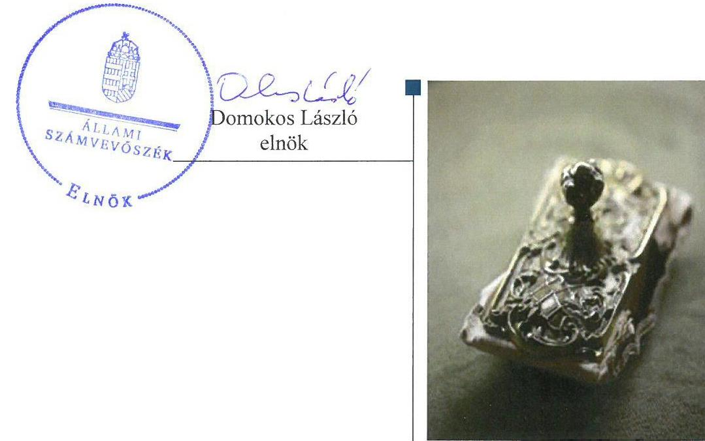
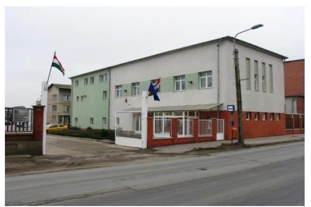

# Jelentés 

## Állami tulajdonú gazdasági társaságok

Az állami tulajdonban (résztulajdonban) lévő gazdálkodó szervezetek vagyonmegőrzési és gazdálkodási tevékenységének ellenőrzése - ATEV Fehérjefeldolgozó Zrt.
2018.

---

# Jelentés 

## Állami tulajdonú gazdasági társaságok

Az állami tulajdonban (résztulajdonban) lévő gazdálkodó szervezetek vagyonmegőrzési és gazdálkodási tevékenységének ellenőrzése - ATEV Fehérjefeldolgozó Zrt.
2018. 01. hó 05. nap

---

# AZ ELLENŐRZÉST FELÜGYELTE:

DR. NÉMETH ERZSÉBET felügyeleti vezető

## AZ ELLENŐRZÉST VEZETTE ÉS A VÉGREHAJTÁSÁÉRT FELELŐS:

IMRE ZSUZSANNA ellenőrzésvezető

## A PROGRAM ÖSSZEÁLLÍTÁSÁÉRT FELELŐS:

JANIK JÓZSEF osztályvezető

IKTATÓSZÁM: V-1359-230/2016

TÉMASZÁM: 2084.

ELLENŐRZÉS-AZONOSÍTÓ SZÁM: V075930

Jelentéseink az Országgyűlés számítógépes hálózatán és az Interneten a www.asz.hu címen is olvashatóak.

---

# TARTALOMJEGYZÉK 

■ ÖSSZEGZÉS ..... 5
■ AZ ELLENŐRZÉS CÉLJA ..... 6
■ AZ ELLENŐRZÉS TERÜLETE ..... 7
■ AZ ELLENŐRZÉS HÁTTERE, INDOKOLTSÁGA ..... 8
■ A JELENTÉS LÉNYEGES KÉRDÉSKÖREI ..... 9
■ ELLENŐRZÉS HATÓKÖRE ÉS MÓDSZEREI ..... 10
■ RÖVIDÍTÉSEK JEGYZÉKE ..... 13

---

.

---

# ÖSSZEGZÉS 

Az ATEV Fehérjefeldolgozó Zrt. tevékenységére vonatkozóan az ellenőrzés területét és időszakát érintően hatósági eljárások vannak folyamatban. Ezek lezárásáig az ellenőrzött szervezet által rendelkezésre bocsátott dokumentumok ellenőrzési bizonyítékokkal szemben támasztott kritériumoknak való megfelelése nem értékelhető, így a megállapítások megalapozásához szükséges megfelelő és ésszerű bizonyosság feltételei nem állnak fenn.

## Az ellenőrzés társadalmi indokoltsága

Az Állami Számvevőszék kiemelt célja, hogy az államháztartáson kívülre nyújtott költségvetési támogatások és ingyenes vagyonjuttatások, valamint az államháztartáson kívül működő feladat-ellátó rendszerek ellenőrzéseivel hozzájáruljon ahhoz, hogy a közpénzeket az államháztartáson kívül működő szervezetek is átlátható, rendezett módon használják fel a szerződésben átvállalt állami feladatok ellátása, továbbá az állami vagyon szerződésben vállalt átlátható, hatékony, költségtakarékos működtetése, értékének megőrzése, állagának védelme, értéknövelő használata, hasznosítása és gyarapítása érdekében.

Magyarországon az intézmény-centrikus állami feladat-ellátás, állami vagyongazdálkodás jellemző a költségvetésen kívüli feladatellátás térnyerése mellett. Ennek szereplői a nonprofit szervezetek, az önkormányzati vagy állami tulajdonú gazdasági társaságok is. Az államháztartásról szóló törvény alapján, az államháztartáson kívüli szervezetek az állami feladatok ellátásában - jogszabályban meghatározott feltételekkel - közreműködhetnek. Az ATEV Fehérjefeldolgozó Zrt. tevékenységével nagymértékben hozzájárul a köz- és állategészségügyi kockázatok csökkentéséhez, az állati melléktermékek begyűjtésével, ártalmatlanításával, feldolgozásával, illetve hasznosításával.

## Főbb megállapítások, következtetések, javaslatok

Az ATEV Fehérjefeldolgozó Zrt. tevékenységére vonatkozóan az ellenőrzés területét és időszakát érintően hatósági eljárások vannak folyamatban. Ezek lezárásáig az ellenőrzött szervezet által rendelkezésre bocsátott dokumentumok az Állami Számvevőszék módszertanában rögzített, ellenőrzési bizonyítékokkal szemben támasztott kritériumoknak (tárgyhoz tartozás, helytállóság, megbízhatóság) való megfelelése nem értékelhető, így a megállapítások megalapozásához szükséges megfelelő és ésszerű bizonyosság feltételei nem állnak fenn.

Tekintettel a fent említett körülményekre az Állami Számvevőszék az ellenőrzött szervezet gazdálkodásával kapcsolatosan nem tesz megállapításokat.

---

# AZ ELLENŐRZÉS CÉLJA 

Az ellenőrzés célja annak értékelése, hogy a tulajdonosi jogok gyakorlása szabályszerű volt-e; a gazdálkodó szervezet szabályozottsága, gazdálkodása és vagyongazdálkodási tevékenysége megfelelt-e a jogszabályi és a tulajdonosi előírásoknak; a vagyonváltozást eredményező döntések esetében a tulajdonosi jogok gyakorlója és a gazdálkodó szervezet szabályszerűen jártak-e el.

---

# AZ ELLENŐRZÉS TERÜLETE 

## ATEV Fehérjefeldolgozó Zrt.

Az ATEV Fehérjefeldolgozó Zrt. ${ }^{1}$ 1949. július 1-én alakult állami vállalat, az ÁTEV² általános jogutódja, amely 1993. szeptember 30-i hatállyal részvénytársasággá, majd 2006-ban zártkörűen működő részvénytársasággá alakult. Fő tevékenységként a nem veszélyes hulladék (elsősorban állati eredetű anyagok) kezelését és ártalmatlanítását végezte. Az állati hulla elszállítási és ártalmatlanítási költségeinek támogatásáról szóló 56/2008. (IV.25.) FVM rendelet alapján az állattartók támogatást kaptak az állattartó telepeken keletkező állati hulla ellenőrzött, biztonságos elszállításának és ártalmatlanításának elősegítése, az állategészségügyi biztonság növelése érdekében. Az állattartók ezen vissza nem térítendő támogatást az elszállítást és ártalmatlanítást végző szolgáltatón, így az ATEV Zrt.-én keresztül vehették igénybe. Ezen túlmenően az ATEV Zrt. késztermékek - jellemzően fehérjeliszt, zsír, vértermék - előállításával foglalkozott. Közfeladatot nem végzett, közszolgáltatást nem látott el az ellenőrzött időszakban. Tevékenységét a székhelyén túl az ország különböző megyéiben további 7 működő telephelyén látta el.

Az ATEV Zrt. többségi részvényese a Magyar Állam, tulajdonosi joggyakorlója a MNV Zrt. ${ }^{3}$ volt. Az ATEV Zrt.-ben kisebbségi részesedéssel rendelkezett az MFB Invest Befektetési és Vagyonkezelő Zrt. 2012. május 23-ig, valamint 2014. június 11-étől a Nemzeti Eszközgazdálkodási Zrt. A kezelésében lévő, a Magyar Állam tulajdonában álló földterületek fölött a tulajdonosi jogokat az agrárpolitikáért felelős miniszter gyakorolta a Nemzeti Földalapkezelő Szervezet (továbbiakban: NFA ${ }^{4}$ ) útján.

A vezérigazgató személye 2014. október 4-i hatállyal változott, az átlagos statisztikai létszám a 2012-2015. években 222 fő és 356 fő között alakult.

---

# AZ ELLENŐRZÉS HÁTTERE, INDOKOLTSÁGA 

Az állami tulajdonú gazdálkodó szervezetek ellenőrzése kiemelten fontos a nemzeti vagyon megőrzése, megóvása érdekében. Gazdálkodásuk jellemzően a közérdeklődés és a média figyelmének középpontjában áll, amihez hozzájárul a gazdálkodásuk körébe tartozó - közvetlen vagy közvetett állami tulajdonú - vagyon nagysága, illetve az általuk ellátott közszolgáltatások minősége és hatékonysága. A szolgáltatási árképzés megalapozottsága és az éves elszámoltatás feltételeinek kialakítása az ellenőrzés során nagy hangsúlyt kap. A szolgáltatás árában és annak támogatásában meg kell jelennie az önköltségszámítás szempontjainak, amely biztosítja a működés fenntarthatóságát (eszközpótlást) is. Az ellenőrzés rámutathat az állami tulajdonú gazdálkodó szervezetek gazdálkodási tevékenységével jó gyakorlatokra és szabálytalanságokra. Felhívhatja a figyelmet a jogszabályi követelmények teljesítéséhez szükséges feltételek hiányosságaira, hozzájárulhat az államháztartáson kívüli, de (közvetlenül vagy közvetve) állami vagyont használó gazdálkodó szervezetek tevékenységének átláthatóságához. Ellenőrzésünk eredményeképpen javaslatainkkal, megállapításainkkal hozzájárulhatunk a nemzeti vagyonnal való gazdálkodás átláthatóságának, elszámoltathatóságának javításához. Mindezt, valamint a Társaság ${ }^{5}$ vagyonának nagyságrendjét figyelembe véve és az Állami Számvevőszék Stratégiájával összhangban került sor az ATEV Fehérjefeldolgozó Zrt. ellenőrzésére a 2012-2015. évek vonatkozásában.

---

# A JELENTÉS LÉNYEGES KÉRDÉSKÖREI 

1. A társaság működésének szabályozottsága megfelelt-e az előírásoknak?
2. A társaságnál a pénzügyi-számviteli, adatszolgáltatási és ellenőrzési feladatok ellátása szabályszerű volt-e?
3. A társaság vagyongazdálkodása szabályszerű volt-e?

---

# ELLENŐRZÉS HATÓKÖRE ÉS MÓDSZEREI 

## Az ellenőrzés típusa

Megfelelőségi ellenőrzés.

## Az ellenőrzött időszak

Az ellenőrzött időszak 2012. január 1-jétől 2015. december 31-ig tartott.

## Az ellenőrzés tárgya

Állami tulajdonban (résztulajdonban) lévő gazdasági társaság gazdálkodása, kiemelten vagyongazdálkodási tevékenysége, a tulajdonosi jogok gyakorlása.

Az ellenőrzés kiterjed minden olyan körülményre és adatra, amely az ÁSZ ${ }^{6}$ jogszabályban meghatározott feladatainak teljesítéséhez, valamint a program végrehajtása folyamán felmerült újabb összefüggések feltárásához szükséges.

## Az ellenőrzött szervezet

ATEV Fehérjefeldolgozó Zrt.

## Az ellenőrzés jogalapja

Az ellenőrzés jogalapját az ÁSZ tv. ${ }^{7}$ 1. § (3) bekezdése és 5. § (3)-(5) bekezdése képezik.

## Az ellenőrzés módszerei

Az ellenőrzést a nemzetközi standardokat irányadónak tekintve az ellenőrzési program ellenőrzési kérdései, az ellenőrzött időszakban hatályos jogszabályok, az ellenőrzés szakmai szabályok és módszertanok figyelembevételével végeztük.

Az ellenőrzésre a nemzetgazdasági szempontból kiemelt jelentőségű nemzeti vagyon körébe tartozó gazdálkodó szervezetnél és a többségi állami tulajdonban álló gazdálkodó szervezetnél került sor. A program szerinti feladatokat a kiválasztott gazdálkodó szervezetnél, valamint a tulajdonosi jogok gyakorlójánál hajtottuk végre.

---

Az ellenőrzési kérdések megválaszolásához szükséges bizonyítékok megszerzése a következő ellenőrzési eljárások alkalmazásával történt: megfigyelés, kérdésfeltevés (információkérés), összehasonlítás, valamint mintavételi és elemző eljárások. Az ellenőrzési bizonyítékként felhasználható adatforrások közé tartoznak egyrészt az ellenőrzési programban felsorolt adatforrások, másrészt adatforrás lehet még minden - az ellenőrzés folyamán - feltárt, az ellenőrzés szempontjából információkat tartalmazó dokumentum.

Az ellenőrzést a kérdésekre adott válaszok kiértékelésével, valamint a megjelölt adatforrások, a csatolt tanúsítványok felhasználásával, továbbá az adott időszakban hatályos jogszabályok figyelembevételével folytattuk le. A bevételek és a ráfordítások elszámolása, valamint a vagyonnyilvántartás terén a szabályszerű működést véletlen mintavétellel és irányított kiválasztással ellenőriztük. A jogszabályok és a belső előírások szerint megfelelőnek, azaz szabályszerűnek tekintettük az adott területet, amennyiben a minta ellenőrzésének eredménye alapján 95%-os bizonyossággal a teljes sokaságban a hibaarány kisebb volt, mint 10%, nem megfelelőnek értékeltük, ha a hibaarány a 10%-ot meghaladta.

---

.

---

# RÖVIDÍTÉSEK JEGYZÉKE 

${ }^{1}$ ATEV Zrt.
${ }^{2}$ ÁTEV
${ }^{3}$ MNV Zrt.
${ }^{4}$ NFA
${ }^{5}$ társaság
${ }^{6}$ ÁSZ
${ }^{7}$ ÁSZ tv.

ATEV Fehérjefeldolgozó Zártkörűen Működő Részvénytársaság
Állatifehérje Takarmányokat Előállító Vállalat
Magyar Nemzeti Vagyonkezelő Zrt.
Nemzeti Földalapkezelő Szervezet
ATEV Fehérjefeldolgozó Zártkörűen Működő Részvénytársaság
Állami Számvevőszék
2011. évi LXVI. törvény az Állami Számvevőszékről

---

# ÁLLAMI SZÁMVEVŐSZÉK 

1052 Budapest, Apáczai Csere János utca 10.
Levélcím: 1364 Budapest 4. Pf. 54
Telefon: +36 14849100 Telefax: +36 14849200
www.asz.hu
