# Jelentés 

## Állami tulajdonú gazdasági társaságok

Az állami tulajdonban (résztulajdonban) lévő gazdálkodó szervezetek vagyonmegőrzési és gazdálkodási tevékenységének ellenőrzése - Filharmónia Magyarország Koncert és Fesztiválszervező Nonprofit Kft.
2018.

---

# Jelentés 

## Állami tulajdonú gazdasági társaságok

Az állami tulajdonban (résztulajdonban) lévő gazdálkodó szervezetek vagyonmegőrzési és gazdálkodási tevékenységének ellenőrzése - Filharmónia Magyarország Koncert és Fesztiválszervező Nonprofit Kft. 2018. január 19.

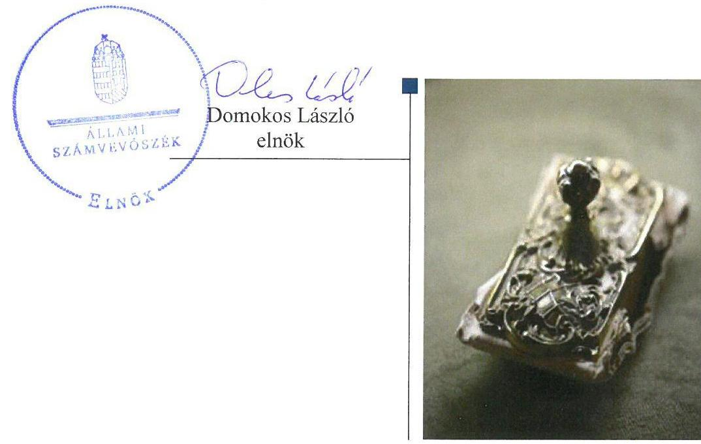

---

# AZ ELLENŐRZÉST FELÜGYELTE:

DR. NAGY IMRE felügyeleti vezető

# AZ ELLENŐRZÉST VEZETTE ÉS A VÉGREHAJTÁSÁÉRT FELELŐS:

RÁCZKEVI KATALIN ellenőrzésvezető

# A PROGRAM ÖSSZEÁLLÍTÁSÁÉRT FELELŐS:

JANIK JÓZSEF osztályvezető

---

**IKTATÓSZÁM:** V-1269-180/2016.

**TÉMASZÁM:** 2303

**ELLENŐRZÉS-AZONOSÍTÓ SZÁM:** V075924

---

Jelentéseink az Országgyűlés számítógépes hálózatán és az Interneten a www.asz.hu címen is olvashatóak.

---

# TARTALOMJEGYZÉK 

■ ÖSSZEGZÉS ..... 5
■ AZ ELLENŐRZÉS CÉLJA ..... 6
■ AZ ELLENŐRZÉS TERÜLETE ..... 7
■ AZ ELLENŐRZÉS HÁTTERE, INDOKOLTSÁGA ..... 9
■ A JELENTÉS LÉNYEGES KÉRDÉSKÖREI ..... 10
■ ELLENŐRZÉS HATÓKÖRE ÉS MÓDSZEREI ..... 11
■ MEGÁLLAPÍTÁSOK ..... 13
■ JAVASLATOK ..... 17
■ MELLÉKLETEK ..... 19
I. Sz. melléklet: Értelmező szótár ..... 19
■ FÜGGELÉK: ÉSZREVÉTELEK ..... 21
■ RÖVIDÍTÉSEK JEGYZÉKE ..... 33

---

.

---

# ÖSSZEGZÉS 

Az Emberi Erőforrások Minisztériuma tulajdonosi joggyakorlása a Filharmónia Magyarország Koncert és Fesztiválszervező Nonprofit Kft. felett nem volt szabályszerű, a Magyar Nemzeti Vagyonkezelő Zrt. részéről szabályszerű volt. A Filharmónia Magyarország Koncert és Fesztiválszervező Nonprofit Kft. vagyongazdálkodása nem volt megfelelő, nem biztosította a vagyon megőrzését, védelmét. A tulajdonosi joggyakorló felé az adatszolgáltatási kötelezettségeket teljesítette. Az éves beszámolókat azonban késedelmesen tette közzé, az előírt közérdekű adatokat pedig nem tette közzé, ezzel nem biztosította a működésének átláthatóságát.

## Az ellenőrzés társadalmi indokoltsága

Az állami tulajdonú gazdálkodó szervezetekben való részesedések a nemzeti vagyon részét képezik. Az állami vagyonnal való gazdálkodást illetően a tulajdonosi joggyakorlás és a vagyonnal való gazdálkodás feladata az állami vagyon átlátható, rendeltetésszerű és felelős felhasználásának biztosítása. Az állam meghatározza az ellátandó közszolgáltatással kapcsolatos feladatokat, amelyhez a vagyonnal kapcsolatos döntéseknek igazodniuk kell.

Magyarországon az intézmény-centrikus közfeladat-ellátás, az állami vagyon gazdálkodás jellemző a költségvetésen kívüli feladatellátás térnyerése mellett. Ennek szereplői az állami tulajdonú gazdasági társaságok is.

A számvevőszéki ellenőrzés hozzájárul a közpénzek szabályos, átlátható, elszámoltatható és eredményes felhasználásához. Minden közpénzt, közvagyont felhasználó szervezettel szemben társadalmi igény, hogy tevékenységükről elszámoljanak. Ennek megfelelően került sor a Filharmónia Magyarország Koncert és Fesztiválszervező Nonprofit Kft. ellenőrzésére a 2012-2015. évek vonatkozásában.

## Főbb megállapítások, következtetések, javaslatok

A Magyar Nemzeti Vagyonkezelő Zrt. társasági részesedések feletti tulajdonosi joggyakorlása megfelelt a jogszabályi előírásoknak. Az EMMI a társaságot az üzleti tervek, az éves mérlegbeszámolók elfogadása, a támogatásokkal való elszámoltatás során ellenőrizte. Az anyagi érdekeltségi rendszer elemeit szabályozta.

A Társaság nem alakította ki a számlarendjét. A 2013. évben térítés nélkül kapott eszközök bekerülési értékét nem a jogszabálynak megfelelő piaci értéken határozta meg.

Az ellenőrzött időszakban a közhasznú és vállalkozási tevékenység elkülönítését nem szabályozta, amely a közpénzekkel való elszámoltathatóságot akadályozta. A közhasznúsági mellékletben kimutatott közvetlenül elszámolható költségek, ráfordítások egyes tevékenységek közötti megosztásának módját nem szabályozta. A Társaság bevételeinek elszámolása megfelelt a belső szabályzatokban és a jogszabályban foglaltaknak.

A ráfordítások és az értékcsökkenési leírás elszámolásánál nem tartották be a jogszabályban foglaltakat.
Az üzleti terveket elkészítették, a tulajdonosi joggyakorló felé az adatszolgáltatási kötelezettségeket teljesítették, azonban a közzétételi kötelezettségnek nem a jogszabályi előírásoknak megfelelően tettek eleget. A Társaság a beszámolási kötelezettségének eleget tett, azonban a 2012., 2014. és 2015. évi beszámoló közzétételére a jogszabályban előírt határidőn túl került sor.

A Társaság vagyongazdálkodása nem volt szabályszerű, a vagyonnal való elszámoltathatóságot nem biztosították. A 2012. évi mérlegbeszámolót nem támasztották alá szabályszerű leltárral. A 2013. június 1-jei átszervezés során átvett vagyonelemeket nem a piaci értéken tartották nyilván.

Az ÁSZ jelentésében a Filharmónia Magyarország Koncert és Fesztiválszervező Nonprofit Kft. ügyvezetőjének kilenc javaslatot fogalmazott meg, amelyekre az érintettnek 30 napon belül intézkedési tervet kell készítenie.

---

# AZ ELLENŐRZÉS CÉLJA 

Az ellenőrzés célja annak értékelése volt, hogy a tulajdonosi jogok gyakorlása szabályszerű volt-e; a gazdálkodó szervezet szabályozottsága, gazdálkodása és vagyongazdálkodási tevékenysége megfelelt-e a jogszabályi és a tulajdonosi előírásoknak, biztosítva volt-e a közfeladatok átláthatósága és elszámoltathatósága érdekében a közszolgáltatás díjának megalapozottsága.

---

# **AZ ELLENŐRZÉS TERÜLETE**

## **Filharmónia Magyarország Koncert és Fesztiválszervező Nonprofit Korlátolt Felelősségű Társaság**

### **A FILHARMÓNIA MAGYARORSZÁG KONCERT ÉS FESZTIVÁLSZERVEZŐ NONPROFIT KFT**

A Magyar Állam kizárólagos tulajdonában álló közhasznú gazdasági társaság. Fő feladata a társadalom kulturális, közművelődési és oktatási területén belül a magyar és nemzetközi komolyzenei élet iránti szükségletek kielégítése volt. A Társaságot 1998-ban alapította a Magyar Állam. A Társaság neve 2012. január 1-től Filharmónia Budapest és Felső-Dunántúl Koncert és Fesztiválszervező Nonprofit Korlátolt Felelősségű Társaság, rövidített neve Filharmónia Budapest Nonprofit Kft. volt. A Társaság előadó-művészeti és kulturális közfeladatokat ellátó szervezet.

### **A TÁRSASÁG FELETTI TULAJDONOSI JOGOK GYAKORLÁSÁT**

2012. április 17-ig a Magyar Állam képviseletében a Magyar Nemzeti Vagyonkezelő Zrt. látta el. Az MNV Zrt. a Társaság részesedése feletti tulajdonosi jogai gyakorlását 2012. április 18-tól vagyonkezelői szerződés alapján átruházta a Nemzeti Erőforrás Minisztériumára (2012. május 14-től jogutódja az EMMI), majd 2013. január 27-től a vagyonkezelési szerződés megszűnésével megbízási szerződés alapján az Emberi Erőforrás Minisztériumára.

Az Alapító 2013. évben a Társaság átszervezéséről döntött, melynek során a közhasznú tevékenysége ellátásának érdekében 2013. június 1-jei fordulónappal a Filharmónia Kelet-Magyarországi Koncertszervező és Rendező Nonprofit Kft. és a Filharmónia Dél-Dunántúli Koncertszervező és Rendező Nonprofit Kft. egyes vagyontárgyai és egyéb vagyonelemei térítés nélkül átvételére került sor. A Társaság neve az átszervezést követően 2013. június 1-jétől Filharmónia Magyarország Koncert és Fesztiválszervező Nonprofit Korlátolt Felelősségű Társaság, rövidített neve Filharmónia Magyarország Nonprofit Kft.-re módosult.

A Társaság célja a társadalom kulturális és közművelődési célú, elsődlegesen komolyzenei közös szükségleteinek kielégítése volt. A Társaság fő tevékenysége komolyzenei hangversenyek szervezése az ország egész területén. Évente országosan 310 000 ember látogatta a Társaság koncertjeit, ebből 280 000 iskolás korú volt. A Társaság évadonként az ország 213 különböző helyszínen 1100 hangversenyt rendezett.

A Társaság önköltség-számítási szabályzat készítésére nem volt kötelezett.

A Társaság ügyvezetőjének személye az ellenőrzött időszakban egy alkalommal változott. Az eszközök értéke 2015. évben 279,4 MFt² volt, a Társaság 669,6 MFt árbevételt realizált, a foglalkoztatottak létszáma 2015. évben 34 fő volt. A Társaság törzstőkéje 5,21 MFt volt, az ellenőrzött időszakban nem változott.

---

A Társaság más gazdasági társaságban tulajdonosi részesedéssel nem rendelkezett, nemzeti vagyonba tartozó vagyont nem kezelt.

---

# AZ ELLENŐRZÉS HÁTTERE, INDOKOLTSÁGA 

Az ÁSZ ³ alapvető célkitűzése, hogy az államháztartáson kívülre nyújtott költségvetési támogatások és ingyenes vagyonjuttatások, valamint az államháztartáson kívül működő közfeladat-ellátó rendszerek ellenőrzéseivel hozzájáruljon ahhoz, hogy a közpénzeket az államháztartáson kívül működő szervezetek is átlátható, rendezett módon használják fel a közfeladatok szerződésben vállalt feladatok ellátása érdekében.

Az ellenőrzés várható hasznosulásaként az ellenőrzés megállapításai a jogalkotás számára segítséget nyújthatnak a közvagyonnal való gazdálkodás értékeléséhez, jogszabályi keretei pontosításához, az átláthatóságot biztosító szabályozáshoz. Az ellenőrzött szervezetek számára visszajelzést ad a vagyongazdálkodási tevékenységgel, beszámolással kapcsolatos szabálytalanságokról és kockázatokról. Az ellenőrzés tapasztalatai segítik és erősítik az ÁSZ hozzáadott értéket teremtő tevékenységét és tanácsadó szerepét.

---

# A JELENTÉS LÉNYEGES KÉRDÉSKÖREI 

1.     - A tulajdonosi jogok gyakorlása szabályszerű volt-e?
2.     - A Társaság pénzügyi-számviteli feladatellátása és vagyongazdálkodása megfelelt-e az előírásoknak?

---

# ELLENŐRZÉS HATÓKÖRE ÉS MÓDSZEREI 

## Az ellenőrzés típusa

Megfelelőségi ellenőrzés.

## Az ellenőrzött időszak

2012. január 1-jétől 2015. december 31-ig.

## Az ellenőrzés tárgya

Az állami tulajdonban lévő Filharmónia Magyarország Koncert és Fesztiválszervező Nonprofit Kft. gazdálkodása, kiemelten vagyongazdálkodási tevékenysége, valamint a Magyar Nemzeti Vagyonkezelő Zrt. és az Emberi Erőforrások Minisztériuma tulajdonosi joggyakorlása.

## Az ellenőrzött szervezet

A Filharmónia Magyarország Koncert és Fesztiválszervező Nonprofit Kft., valamint az Emberi Erőforrások Minisztériuma és a Magyar Nemzeti Vagyonkezelő Zrt., mint a tulajdonosi joggyakorlók.

## Az ellenőrzés jogalapja

Az Állami Számvevőszékről szóló 2011. évi LXVI. törvény 5. § (3)-(5) bekezdései.

## Az ellenőrzés módszerei

Az ellenőrzést a nemzetközi standardokat irányadónak tekintve az ellenőrzési program ellenőrzési kérdései, az ellenőrzött időszakban hatályos jogszabályok, az ellenőrzés szakmai szabályok és módszertanok figyelembevételével végeztük.

Az ellenőrzés ideje alatt az ellenőrzött szervezettel történő kapcsolattartást az ÁSZ Szervezeti és Működési Szabályzatának vonatkozó előírásai alapján biztosítottuk.

Az ellenőrzési kérdések megválaszolásához szükséges bizonyítékok megszerzése a következő ellenőrzési eljárások alkalmazásával történt: megfigyelés, kérdésfeltevés (információkérés), összehasonlítás, mintavé-

---

telezés, valamint elemző eljárás. Az ellenőrzési bizonyítékként felhasználható adatforrások egyrészt az ellenőrzési programban felsorolt adatforrások, másrészt adatforrás lehet még minden - az ellenőrzés folyamán - feltárt, az ellenőrzés szempontjából információkat tartalmazó dokumentum.

Az ellenőrzést a kérdésekre adott válaszok kiértékelésével, valamint a megjelölt adatforrások, a csatolt tanúsítványok felhasználásával, továbbá az adott időszakban hatályos jogszabályok figyelembevételével folytattuk le.

A bevételek és ráfordítások elszámolása, valamint a vagyonnyilvántartás terén a szabályszerű működést véletlen mintavétellel és irányított kiválasztással ellenőriztük. A mintatételek értékelése alapján egyrészt a sokaságban előforduló hibaarányt becsültük, másrészt az irányítottan kiválasztott tételeket értékeltük. A jogszabályoknak és a belső előírásoknak megfelelőnek, azaz szabályszerűnek tekintettük az adott területet, amennyiben a minta ellenőrzésének eredménye alapján 95%-os bizonyossággal a teljes sokaságban a hibaarány kisebb volt, mint 10%, nem megfelelőnek értékeltük, ha a hibaarány a 10%-ot meghaladta. A ráfordítások elszámolására és a vagyonnyilvántartásra vonatkozó véletlen mintavételt kockázati alapú kiválasztással egészítettük ki, amelynek során évente a három legnagyobb összegű tételt választottuk ki.

---

# 1. A tulajdonosi jogok gyakorlása szabályszerű volt-e? 

Összegző megállapítás

Az MNV Zrt. tulajdonosi joggyakorlása szabályszerű volt. Az EMMI tulajdonosi joggyakorlása nem felelt meg az előírásoknak.

A TULAJDONOSI JOGGYAKORLÁS RENDJÉT a Gt.tv.⁴ és a Ptk.⁵ előírásaival összhangban lévő Alapító okiratokban⁶ határozta meg a tulajdonosi joggyakorló⁷. A tulajdonosi joggyakorló kizárólagos hatáskörébe tartozott egyebek mellett a felügyelő bizottság⁸ tagjainak megválasztása, a szervezeti és működési szabályzat, a javadalmazási szabályzat, az éves üzleti terv és a Számv.tv.⁹ szerinti éves beszámoló elfogadása, a közhasznú szerződés megkötésével kapcsolatos döntések meghozatala és a közhasznúsági melléklet elfogadása.

Az MNV Zrt.¹⁰ és az EMMI¹¹ belső szabályzataikban kialakították a részesedések feletti tulajdonosi jogok gyakorlásának rendjét.

A TULAJDONOSI JOGGYAKORLÁS a felügyelő bizottság és a könyvvizsgáló tevékenységéhez kapcsolódóan szabályszerű volt.

Az MNV Zrt. a társasági részesedés feletti tulajdonosi jogok gyakorlására 2012. április 18-án vagyonkezelési szerződést kötött a Nemzeti Erőforrások Minisztériumával (2012. május 14-től jogutódja az EMMI) az Nvtv¹². előírásainak megfelelően. Az Nvtv. 2012. június 30-i változásával a vagyonkezelési szerződés megszüntetésére és a társasági részesedéshez kapcsolódó tulajdonosi jogok gyakorlására irányuló megbízási szerződés¹³ megkötésére került sor az MNV Zrt. és az EMMI között. A megbízási szerződést az EMMI 2013. január 27-én írta alá, ezzel nem felelt meg az Nvtv. 18. § (7) bekezdésében foglaltaknak, amely előírta 2012. december 31-ig a megbízási szerződés megkötésének kötelezettségét.

Az EMMI nem intézkedett a 2013. és 2014. években a megbízási szerződésben a Társaságra
 vonatkozóan meghatározott kontrolling adatszolgáltatás MNV Zrt. felé történő teljesítése érdekében, 2012. évben és 2015. évben teljesítette azt.

A gazdálkodást és a feladatellátást a tulajdonosi joggyakorló az éves üzleti tervek, az egyszerűsített éves beszámolók, a támogatások felhasználásáról készült jelentések elfogadása során ellenőrizte. A Társaság 2014. évi mérlegbeszámolóját az EMMI késedelemmel, 2015. június 12-én fogadta el.

Az MNV Zrt. az Ellenőrzési Igazgatósága és a felügyelő bizottság által végzett ellenőrzésekkel, valamint az állandó könyvvizsgáló megbízásával biztosította a tulajdonosi ellenőrzést. Az MNV Zrt. a felügyelő bizottságot a Tulajdonosi Ellenőrzési Szabályzat szerint beszámoltatta, 2015-ben külön ellenőrzést folytatott le, szabálytalanságot nem tárt fel.

---

A Javadalmazási Szabályzat ${ }_{1-2}$ elkészítésével a tulajdonosi joggyakorlók gondoskodtak a Tak.tv ${ }^{14}$ 5. § (3) bekezdésében foglaltaknak megfelelően a Társaság vonatkozásában a vezető tisztségviselők, felügyelőbizottsági tagok, valamint az Mt. ${ }^{15}$ 208. §-ának hatálya alá eső munkavállalók javadalmazására, valamint jogviszonya megszűnése esetére biztosított juttatások módjának, mértékének elveiről, annak rendszeréről szóló szabályzat megalkotásáról.

# 2. A Társaság pénzügyi-számviteli feladatellátása és vagyongazdálkodása megfelelt-e az előírásoknak? 

Összegző megállapítás

A pénzügyi-számviteli feladatok ellátása a bevételek elszámolása kivételével nem felelt meg az előírásoknak. A Társaság vagyongazdálkodása nem felelt meg az előírásoknak. A beszámolási kötelezettségnek késedelemmel tettek eleget.
2.1. számú megállapítás

A Társaság számlarendet nem készített, a számviteli politika nem felelt meg a jogszabályi előírásoknak. A bevételek elszámolása megfelelt az előírásoknak, a ráfordítások és az értékcsökkenés elszámolása nem volt szabályszerű.

A bevételek elszámolása megfelelt a jogszabályi és belső szabályzatokban foglalt előírásoknak.

A ráfordítások elszámolása nem felelt meg az előírásoknak, mert az eszközök illetve az eszközök forrásainak állományát megváltoztató gazdasági műveletekről a Számv. tv. 165. § (1) bekezdésében foglaltak ellenére bizonylat nem készült. A Társaság a Számv. tv. 161. § (2) bekezdésében foglalt követelményeknek megfelelő számlarend összeállításáról a Számv. tv. 161. § (1) bekezdésének előírása ellenére nem gondoskodott.

## A vagyonelemek, beruházások elszámolása nem felelt meg az előírásoknak. Nem álltak rendelkezésre az elszámolást megalapozó bizonylatok, mely a Számv. tv. 165. § (1) bekezdésének előírásainak nem felelt meg. A Társaság 2013. évben közbeszerzési eljárások lefolytatása nélkül folytatott le számítástechnikai eszköz beszerzést. Ezzel a Társaság megsértette a Kbt. ${ }^{16}$ 119. §-ára tekintettel a Kbt. 5. §-ában előírt közbeszerzési eljárás lefolytatásának kötelezettségét.

Az értékcsökkenés elszámolása nem felelt meg az előírásoknak. A Számviteli politika ${ }_{1}{ }^{17}$ a jogszabálynak megfelelően határozta meg az értékcsökkenési kulcsokat. A Számviteli politika ${ }_{2}{ }^{18}$ 9. pontjában az értékcsökkenés elszámolásának módjaként az értékcsökkenési kulcsok meghatározását nem a hasznos élettartam és várható maradványérték alapján határozták meg, amely nem felelt meg a Számv. tv. 52. § (2) bekezdésében foglaltaknak.

---

# A közhasznúsági tevékenységhez kapcsolódóan a Társaság a belső szabályzataiban nem határozta meg a közhasznú és a vállalkozási tevékenység elkülönítésének módját, valamint a közvetlenül el nem számolható költségek megosztásának szabályait, ezzel a Számv. tv. 161/A. § (1) bekezdésében, valamint a Civil. tv. ${ }^{19}$ 20. §-ában, 2015. november 28-tól a 19. §-ában foglaltaknak nem tett eleget. A szabályozási hiányosság ellenére az ellenőrzött időszakban a gyakorlatban megtörtént az elkülönítés, a közhasznúsági mellékleteket elkészítették, melyeket a könyvvizsgáló elfogadott.

A követelések nagyságrendje nem veszélyeztette a Társaság likviditását.
2.2. számú megállapítás

A Társaság az éves beszámolókat késedelemmel tette közzé, adatszolgáltatási kötelezettségének eleget tett. Adatvédelmi és adatbiztonsági szabályzat 2014. október 30-ig nem készült. Közzétételi kötelezettségének nem a jogszabályi előírásnak megfelelően tett eleget.

Az éves beszámolókat a Társaság - a 2013. évi éves beszámoló kivételével - késedelmesen tette közzé, ezzel nem tartotta be a Számv. tv. 154. § (1) bekezdésének előírásait. A Társaság késedelmesen tette közzé a 2012., a 2014. és a 2015. évi a közhasznúsági mellékletét, amely nem volt összhangban a Civil tv. 46. § (1) bekezdésében foglaltakkal. Az éves beszámolókhoz kapcsolódó, hitelesítő záradékkal ellátott könyvvizsgálói jelentések minden évben rendelkezésre álltak.

A Társaság teljesítette adatszolgáltatási kötelezettségét a tulajdonosi jogok gyakorlója részére.

## Adatvédelmi és adatkezelési szabályzattal a Társaság a 2012. január 1-jétől 2014. október 30-ig terjedő időszakra nem rendelkezett, ezzel nem tartotta be az Info tv. ${ }^{20}$ 24. § (3) bekezdésének előírásait. 2014. október 30-án hatályba helyezték a Társaság Adatvédelmi és adatkezelési szabályzatát, amely megfelelt a jogszabálynak. A Társaság a közérdekű adatok megismerésére irányuló igények teljesítésének rendjét rögzítő szabályzatot 2012. január 1-jétől 2014. október 30-ig nem készített, ezzel nem tartotta be az Info tv. 30. § (6) bekezdésének előírásait, 2014. október 30-tól az Adatvédelmi és adatkezelési szabályzat keretében rögzítették a közérdekű adatok közzétételével kapcsolatos szabályokat.

A Társaság az Info tv. 37. § (1) bekezdésében előírtak szerinti közzétételi kötelezettségének nem a jogszabályi előírásoknak megfelelően tett eleget, mivel az Info tv. 1. melléklet II/12., III/1. és III/4. pontjaiban előírtak ellenére a honlapján nem tette közzé az alaptevékenységgel kapcsolatos ellenőrzések nyilvános megállapításait, a 2015. évi beszámolót, az államháztartás pénzeszközei felhasználásával, az azokkal összefüggő 5000 E Ft-ot elérő vagy azt meghaladó értékű szerződések megnevezését, tárgyát és típusát.

A Társaságnál az ellenőrzött időszakban az EMMI által végrehajtott ellenőrzések alapján előírt visszafizetési kötelezettségnek eleget tettek.

---

### 2.3. számú megállapítás

A Társaság saját vagyonának nyilvántartása nem felelt meg a jogszabályoknak. A 2012. évi beszámolót nem támasztotta alá leltárral, a 2013-2015. évekre készült leltár. A 2013. évben térítés nélkül átvett vagyonelemeket nem piaci értéken mutatták ki.

Az Alapító okiratok az alapító kizárólagos hatáskörébe utalták a vagyonnal kapcsolatos döntési jogokat. Az SZMSZ ${ }_{1}{ }^{21}{ }_{2}{ }^{22}$ az ügyvezető vagyongazdálkodással kapcsolatos feladatát és hatáskörét az Alapító okiratokkal összhangban határozta meg.

## Az éves beszámolót 2012. évben nem tá-

masztották alá leltárral, ezzel nem tettek eleget a Számv. tv. 69. § (1) bekezdésében foglaltaknak. A 2012. évi beszámolót a független könyvvizsgáló korlátozás nélküli záradékkal látta el. A 2013-2015. évekre vonatkozóan a leltározást elvégezték.

A Társaság 2013. évben térítés nélkül átvett eszközök bekerülési értékét a Számv. tv. 50. § (4) bekezdésében előírtak ellenére nem piaci, hanem az átadó társaságoknál nyilvántartott könyv szerinti értéken mutatta ki a könyveiben, ennek következtében nem érvényesült a valódiság elve Számv. tv. 15. § (3) bekezdésben előírtak szerint. Az eszközátvétel során az eszközök bekerülési értékének szabálytalan meghatározása következtében a vagyon nyilvántartása és az értékcsökkenés elszámolása sem volt megfelelő a 2013-2015. években, amely nem felelt meg a Számv. tv. 52. § (1) bekezdésében foglaltaknak. Az Értékelési szabályzat ${ }^{23}$ térítés nélkül kapott eszközök bekerülési értékének meghatározására vonatkozó előírása nem volt összhangban a Számv. tv. 50. § (4) bekezdésében foglaltakkal.

A könyvvizsgáló a 2013. évben térítés nélkül átvett eszközökre vonatkozó helytelen bekerülési érték alkalmazását nem kifogásolta.

A saját vagyon hasznosításával, értékesítésével kapcsolatos döntések az ellenőrzött időszakban nem haladták meg az Alapító okiratban ${ }_{1-6}$ foglalt értékhatárt.

---

# JAVASLATOK 

Az ÁSZ tv. 33. § (1) bekezdésében foglaltak értelmében az ellenőrzött szervezet vezetője köteles a jelentésben foglalt megállapításokhoz kapcsolódó intézkedési tervet összeállítani és azt a jelentés kézhezvételétől számított 30 napon belül az ÁSZ részére megküldeni. Amennyiben az ellenőrzött szervezet vezetője nem küldi meg határidőben az intézkedési tervet, vagy továbbra sem elfogadható intézkedési tervet küld, az Állami Számvevőszék elnöke az ÁSZ tv. 33. § (3) bekezdése a) és b) pontjaiban foglaltakat érvényesítheti.

## A Filharmónia Magyarország Koncert és Fesztiválszervező Nonprofit Kft. ügyvezetőjének

1. Intézkedjen a ráfordítások, vagyonelemek, beruházások bizonylatokkal történő alátámasztásáról a jogszabályokban foglaltaknak megfelelően.
(2.1. sz. megállapítás 2. bekezdés 1. mondata és a 3. bekezdés 2. mondata alapján)
2. Intézkedjen a jogszabályban előírt számlarend elkészítéséről.
(2.1. sz. megállapítás 2. bekezdés 2. mondata alapján)
3. Intézkedjen arról, hogy a közbeszerzési eljárásokat folytassák le a jogszabályi előírásoknak megfelelően.
(2.1. sz. megállapítás 3. bekezdés 3. mondata alapján)
4. Intézkedjen a számviteli politika jogszabályi rendelkezések szerinti módosításáról.
(2.1. sz. megállapítás 4. bekezdés 3. mondata alapján)
5. Intézkedjen az éves beszámoló és a közhasznúsági melléklet jogszabályban meghatározott határidőben történő közzétételéről.
(2.2. sz. megállapítás 1. bekezdés 1. és 2. mondata alapján)
6. Gondoskodjon a közzétételi kötelezettség jogszabályi előírásnak megfelelő teljesítéséről.
(2.2. sz. megállapítás 4. bekezdés alapján)

---

7. Intézkedjen a térítés nélkül átvett eszközök jogszabályban előírtak szerinti nyilvántartásáról és elszámolásáról
(2.3. sz. megállapítás 3. bekezdés 1. mondata alapján)
8. Intézkedjen arról, hogy az értékcsökkenés elszámolása a jogszabályban előírtak szerint történjen.
(2.3. sz. megállapítás 3. bekezdés 2. mondata alapján)
9. Intézkedjen az Értékelési szabályzat módosításáról a jogszabályban előírtaknak megfelelően.
(2.3. sz. megállapítás 3. bekezdés 3. mondata alapján)

---

# MELLÉKLETEK 

- I. SZ. MELLÉKLET: ÉRTELMEZŐ SZÓTÁR
gazdasági társaság
állami vagyon kezelője/vagyonkezelő

MNV Zrt.
nemzeti vagyon

A Ptk2. 3:88. § (1) bekezdése szerint „a gazdasági társaságok üzletszerű közös gazdasági tevékenység folytatására, a tagok vagyoni hozzájárulásával létrehozott, jogi személyiséggel rendelkező vállalkozások, amelyekben a tagok a nyereségből közösen részesednek, és a veszteséget közösen viselik".
2013. június 27-ig:

Az állami vagyont az MNV Zrt. maga kezeli, vagy szerződés - így különösen bérlet, haszonbérlet, megbízás - alapján központi költségvetési szervnek, természetes vagy jogi személynek, vagy jogi személyiséggel nem rendelkező gazdálkodó szervezetnek hasznosításra átengedi. Az állami vagyonra vonatkozóan az MNV Zrt. kizárólag az Nvtv-ben meghatározott személyekkel köthet vagyonkezelési szerződést.
Forrás: Vtv. 23. § (1), 27. § (1)
2013. június 28-ától:

Az állami vagyonnal az MNV Zrt. maga gazdálkodik, vagy szerződés - így különösen bérlet, haszonbérlet, megbízás - alapján központi költségvetési szervnek, természetes vagy jogi személynek, vagy jogi személyiséggel nem rendelkező gazdálkodó szervezetnek hasznosításra átengedi, illetőleg vagyonkezelésbe, haszonélvezetbe adja. Az állami vagyonra vonatkozóan az MNV Zrt. kizárólag az Nvtv-ben meghatározott személyekkel köthet vagyonkezelési szerződést.
Forrás: Vtv. 23. § (1), 27. § (1)
Az állami vagyon felett, a Magyar Államot megillető tulajdonosi jogok és kötelezettségek összességét - a hatályos szabályozás szerint - az állami vagyon felügyeletéért felelős miniszter (jelenleg a nemzeti fejlesztési miniszter) gyakorolja. A miniszter feladatát nagy részben az MNV Zrt., mint tulajdonosi joggyakorló szervezet útján látja el.
a) az állam vagy a helyi önkormányzat kizárólagos tulajdonában álló dolgok,
b) az a) pont hatálya alá nem tartozó, állam vagy a helyi önkormányzat tulajdonában lévő dolog,
c) az állam vagy a helyi önkormányzat tulajdonában lévő pénzügyi eszközök, továbbá az államot vagy a helyi önkormányzatot megillető társasági részesedések,
d) az államot vagy a helyi önkormányzatot megillető bármely vagyoni értékkel rendelkező jogosultság, amelyet jogszabály vagyoni értékű jogként nevesít,
e) Magyarország határa által körbezárt terület feletti légtér,
f) az üvegházhatású gázok kibocsátási egységeinek kereskedelméről szóló törvény szerint kibocsátási egység és légiközlekedési kibocsátási egység, valamint az ENSZ Éghajlatváltozási Keretegyezménye és annak Kiotói Jegyzőkönyve végrehajtási keretrendszeréről szóló törvény szerinti kiotói egység,
g) állami vagy helyi önkormányzati fenntartású közgyűjtemény (muzeális intézmény, levéltár, közgyűjteményként működő kép- és hangar-

---

tulajdonosi jogok gyakorlója
chívum, valamint könyvtár) saját gyűjteményében nyilvántartott kulturális javak körébe tartozó dolog, kivéve, ha az
 állami vagy önkormányzati tulajdon jogszerű létrejötte kétséget kizáró módon nem bizonyítható és a dologra nézve más a tulajdonjogát bizonyítja vagy a kulturális javakra vonatkozó jogszabályokban meghatározott eljárás keretében valószínűsíti (g. pont módosult 2013. december 7-től),
h) a régészeti lelet,
i) a nemzeti adatvagyon körébe tartozó állami nyilvántartások fokozottabb védelméről szóló törvény szerinti nemzeti adatvagyon.
Forrás: Nvtv. 1. § (2)
1.
2013. június 27-ig:

Az állami vagyon felett a Magyar Államot megillető tulajdonosi jogok és kötelezettségek összességét - ha törvény eltérően nem rendelkezik - az állami vagyon felügyeletéért felelős miniszter (a továbbiakban: miniszter) gyakorolja, aki e feladatát a Magyar Nemzeti Vagyonkezelő Zártkörűen Működő Részvénytársaság (a továbbiakban: MNV Zrt.), a Magyar Fejlesztési Bank, illetve a tulajdonosi joggyakorló szervezet útján látja el. A miniszter miniszteri rendeletben, a törvényben meghatározott állami vagyoni kör tekintetében, meghatározott időtartamra, a joggyakorlás egyes szabályainak meghatározásával az őt megillető tulajdonosi jogok és kötelezettségek összességének, illetve azok meghatározott részének gyakorlóját az Áht. szerinti központi költségvetési szervek, ezek intézménye, továbbá a 100%-ban állami tulajdonban álló gazdasági társaságok közül kijelölheti.
Forrás: Vtv. 3. § (1) és (2)

## 2013. június 28-ától:

A rábízott állami vagyon felett az államot megillető tulajdonosi jogok és kötelezettségek összességét tulajdonosi joggyakorlóként:
a) ha törvény vagy miniszteri rendelet eltérően nem rendelkezik, a Magyar Nemzeti Vagyonkezelő Zártkörűen Működő Részvénytársaság (a továbbiakban: MNV Zrt.),
b) törvényben kijelölt személy vagy
c) az állami vagyon felügyeletéért felelős miniszter (a továbbiakban: miniszter) által rendeletben kijelölt személy gyakorolja.
[...] A miniszter e törvény felhatalmazása alapján - a meghatározott célok hatékonyabb elérése érdekében, miniszteri rendeletben, az ott meghatározott állami vagyoni kör tekintetében, meghatározott időtartamra - e törvény keretei között, a joggyakorlás egyes szabályainak meghatározásával - az államot megillető tulajdonosi jogok és kötelezettségek összességének, illetve azok meghatározott részének gyakorlóját az Áht. szerinti központi költségvetési szervek, ezek intézménye, továbbá a 100%-ban állami tulajdonban álló gazdasági társaságok közül kijelölheti.
Forrás: Vtv. 3. § (1) és (2)
2.

Aki a nemzeti vagyon felett az államot vagy a helyi önkormányzatot megillető tulajdonosi jogok és kötelezettségek összességének gyakorlására jogosult Forrás: Nvtv. 3. § (1) 17. pontja

---

# FÜGGELÉK: ÉSZREVÉTELEK 

A jelentéstervezetet a Számvevőszék 15 napos észrevételezésre megküldte az ellenőrzött szervezetek vezetőinek az ÁSZ tv. 29. § (1) bekezdése előírásának megfelelően.

Az ÁSZ a jelentéstervezetet észrevételezésre megküldte az emberi erőforrások miniszterének, a Magyar Nemzeti Vagyonkezelő Zrt. vezérigazgatójának, valamint a Filharmónia Magyarország Koncert és Fesztiválszervező Nonprofit Kft. ügyvezetőjének.
Az Emberi Erőforrások Minisztériuma közigazgatási államtitkárának nemleges észrevételét a függelék alább tartalmazza. A Magyar Nemzeti Vagyonkezelő Zrt. vezérigazgatójának és a Filharmónia Magyarország Koncert és Fesztiválszervező Nonprofit Kft. ügyvezetőjének észrevételét, illetve az el nem fogadott észrevételek elutasításának indoklását a függelék tartalmazza.

[^0]
[^0]:    * 29. § (1) Az Állami Számvevőszék az ellenőrzési megállapításait megküldi az ellenőrzött szervezet vezetőjének vagy az általa megbízott személynek, és annak, akinek személyes felelősségét állapította meg.
    (2) Az ellenőrzött szervezet vezetője és a felelősként megjelölt személy az ellenőrzés megállapításaira tizenöt napon belül írásban észrevételt tehet.
    (3) Az Állami Számvevőszék az észrevételre a beérkezésétől számított harminc napon belül írásban válaszol. A figyelembe nem vett észrevételeket köteles a jelentésben feltüntetni, és megindokolni, hogy azokat miért nem fogadta el.

---

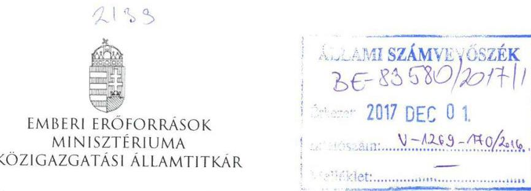

Iktatószám: 11325-11/2017/ELL

Hiv. szám: V-1269-166/2016.
Ügyintéző: Bánkné Simon Judit
Tel. szám: +36 (1) 7954430
Melléklet: -
Domokos László részére
elnök
Állami Számvevőszék
Budapest
Apáczai Csere János u. 10.
1052

Tárgy: Válaszlevél az ÁSZ V-1269-166/2016. iktatószámú megkeresésére

Tisztelt Elnök Úr!

Az „Állami tulajdonban (résztulajdonban) lévő gazdálkodó szervezetek vagyonmegőrzési és gazdálkodási tevékenységének ellenőrzése - Filharmónia Magyarország Koncert és Fesztiválszervező Nonprofit Kft." című számvevőszéki jelentéstervezethez - az SZMSZ 145. § (1) bekezdés g) pontjában meghatározott jogkörömben eljárva - nem teszek észrevételt.

Budapest, 2017. november „"„,
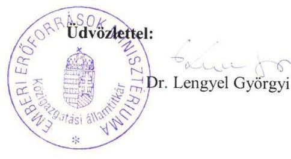

---

# 2166   2166   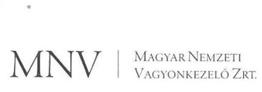 

Állami Számvevőszék

## Domokos László

elnök

1052 Budapest
Apáczai Cs. J. u. 10.

Ikt. sz.: MNV/01/10402/\#/2017.
Hiv. sz.: V-1269-165/2016.

Tisztelt Elnök Úr!
Tájékoztatom, hogy a 2017. november 16. napján „Az állami tulajdonban (résztulajdonban) lévő gazdálkodó szervezetek vagyonmegőrzési és gazdálkodási tevékenységének ellenőrzése - Filharmónia Magyarország Koncert és Fesztiválszervező Nonprofit Kft." tárgyában kézhez vett, V-1269-165/2016. ikt. sz. levél mellékleteként megküldött Jelentés-tervezetre az alábbi észrevételeket tesszük:
„Megállapítások 1. A tulajdonosi jogok gyakorlása szabályszerű volt-e? Összegző megállapítás" / 13. oldal 5. bekezdése:

A megállapítás szerint „Az EMMI nem intézkedett a 2013. és 2014. években a megbízási szerződésben a Társaságra vonatkozóan meghatározott kontrolling adatszolgáltatás MNV Zrt. felé történő teljesítése érdekében, 2012. és 2015. évben teljesítette azt."

A Társaság gazdálkodásának az Állami Számvevőszék általi vizsgálata során az „Ellenőrzési bizonyítékok helyszíni szemrevételezéséről" készült 2017. március 3-i jegyzőkönyv tanúsága szerint a monitoring adatok tekintetében „a 2013. évre vonatkozó adatok nem teljes körűek" (jegyzőkönyv 1. sz. melléklet, 28. sor).

Fentiek alapján kérjük a hivatkozott szövegrész alábbiak szerinti módosítását: „Az EMMI nem intézkedett a 2013. évben a megbízási szerződésben a Társaságra vonatkozóan meghatározott kontrolling adatszolgáltatás MNV Zrt. felé történő teljes körű teljesítése érdekében, 2012. évben, 2014. évben és 2015. évben teljesítette azt."
„Megállapítások 1. A tulajdonosi jogok gyakorlása szabályszerű volt-e? Összegző megállapítás" / 13. oldal 7. bekezdés utolsó mondata:

A hivatkozott megállapítás szerint „Az MNV Zrt. a felügyelőbizottságot a Tulajdonosi Ellenőrzési Szabályzat szerint beszámoltatta, 2015-ben külön ellenőrzést folytatott le, szabálytalanságot nem tárt fel."

Az MNV Zrt. - az ÁSZ által vizsgált időszakban hatályos - Tulajdonosi ellenőrzési szabályzata az alábbi rendelkezést tartalmazza:

---

„Az MNV Zrt. tulajdonosi ellenőrzési rendszere keretében a 100%-ban állami tulajdonban és az MNV Zrt. saját kezelésében lévő gazdasági társaságok Felügyelő Bizottságai az Éves beszámolóról készített jelentésükkel egyidejűleg beszámolót nyújtanak be az MNV Zrt. Ellenőrzési Igazgatósága részére az adott gazdasági évben folytatott tevékenységükről, külön bemutatva ügydöntő Felügyelő Bizottság esetében az e minőségben hozott döntéseket."

A Filharmónia Magyarország Koncert- és Fesztiválszervező Nonprofit Kft. feletti tulajdonosi jogok gyakorlása 2012. április 18-tól vagyonkezelési szerződés, 2013. január 28-tól megbízási szerződés alapján az EMMI részére átadásra került, így a Tulajdonosi ellenőrzési szabályzat fentiekben hivatkozott rendelkezése a Társaságra nem alkalmazható, a Társaság Felügyelő Bizottsága tevékenységéről évente beszámolót nem készített, ilyen kötelezettsége nem volt.
2015. évben az MNV Zrt. Ellenőrzési Igazgatósága a 2015. évi Tulajdonosi ellenőrzési tervben foglaltak alapján témavizsgálatot folytatott le a tulajdonosi jogokat megbízási szerződés alapján gyakorló EMMI tulajdonosi joggyakorlása alá tartozó társaságok Felügyelő Bizottságai működésére vonatkozóan, amelynek a Filharmónia Magyarország Koncert- és Fesztiválszervező Nonprofit Kft. is részese volt. A Társaság Felügyelő Bizottságának működésével kapcsolatban az ellenőrzés szabálytalanságot nem tárt fel.

Fentiek alapján kérjük a hivatkozott szövegrész alábbiak szerinti módosítását: „Az MNV Zrt. 2015. évben a Társaság Felügyelő Bizottságának tevékenységével kapcsolatban ellenőrzést folytatott le, szabálytalanságot nem tárt fel."

Kérem Elnök Urat, hogy a jelentés véglegesítése során jelen észrevételeinket szíveskedjenek figyelembe venni.

Budapest, 2017. november „30"
Üdvözlettel:
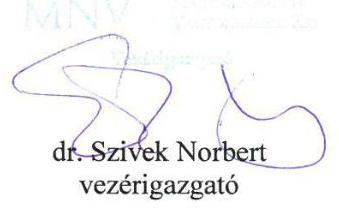

---

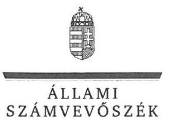

ELNÖK

Ikt.szám: V-1269-177/2016.

# Dr. Szívek Norbert úr 

vezérigazgató
Magyar Nemzeti Vagyonkezelő Zrt.

## Budapest

## Tisztelt Vezérigazgató Úr!

„Állami tulajdonú gazdasági társaságok - Az állami tulajdonban (résztulajdonban) lévő gazdálkodó szervezetek vagyonmegőrzési és gazdálkodási tevékenységének ellenőrzése - Filharmónia Magyarország Koncert és Fesztiválszervező Nonprofit Kft. " címmel készített számvevőszéki jelentéstervezetre tett észrevételeit köszönettel megkaptam.
Az Állami Számvevőszék észrevételekre vonatkozó álláspontjáról a felügyeleti vezető által készített részletes tájékoztatást csatoltan megküldöm.
Tájékoztatom Vezérigazgató urat, hogy a számvevőszéki jelentésben - az Állami Számvevőszékről szóló 2011. évi LXVI. törvény 29. § (3) bekezdése alapján - a figyelembe nem vett észrevételeket szerepeltetjük annak megindoklásával, hogy azokat miért nem fogadtuk el.

Budapest, 2017. ősz. hó 26. nap
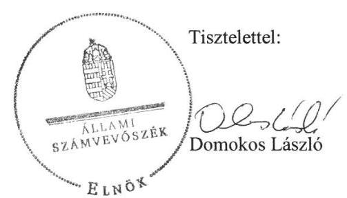

Melléklet: Tájékoztatás az észrevételek kezeléséről

---

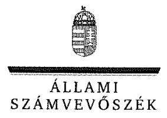

FELÜGYELETI VEZETŐ

Melléklet
Ikt.szám: V-1269-177/2016.

# Tájékoztatás   az észrevételek kezeléséről 

...Állami tulajdonú gazdasági társaságok - Az állami tulajdonban (résztulajdonban) lévő gazdálkodó szervezetek vagyonmegőrzési és gazdálkodási tevékenységének ellenőrzése - Filharmónia Magyarország Koncert és Fesztiválszervező Nonprofit Kft." címü jelentéstervezetre 2017. november 30-án tett (az Állami Számvevőszékhez 2017. december 4-én érkezett) észrevételét áttekintettük, annak kezelésével kapcsolatban a következő tájékoztatást adom.

1. A jelentéstervezet 1. számú megállapítás 5. bekezdésére (,Az EMMI nem intézkedett a 2013. és 2014. években a megbízási szerződésben a Társaságra vonatkozóan meghatározott kontrolling adatszolgáltatás MNV Zrt. felé történő teljesítése érdekében, 2012. évben és 2015. évben teljesítette azt.") vonatkozó észrevétel:
Az észrevételben leírtak szerint a 2017. március 3-ai helyszíni szemrevételezési jegyzőkönyv a 2013. évi monitoring adatokra vonatkozóan azok nem teljes körűségét rögzíti.

Az észrevétel nem megalapozott. Az adatszolgáltatásra rendelkezésre álló idő alatt adott EMMI nyilatkozat szerint az ellenőrzött gazdasági társaság monitoring adatszolgáltatásával kapcsolatban dokumentumok nem álltak a rendelkezésükre. Az MNV Zrt. által az adatszolgáltatás során rendelkezésünkre bocsátott, excel táblában vezetett nyilvántartáshoz a helyszíni ellenőrzés során bemutatott dokumentumok alapján a 2012. és a 2015. évi adatszolgáltatás teljesítését elfogadtuk, a másik két, 2013. és 2014. évről dokumentum nem igazolta.

Fentiekre tekintettel az észrevétel alapján a jelentéstervezet módosítása nem indokolt.
2. A jelentéstervezet 1. számú megállapítás 7. bekezdés utolsó mondatára (,Az MNV Zrt. a felügyelő bizottságot a Tulajdonosi Ellenőrzési Szabályzat szerint beszámoltatta, 2015-ben külön ellenőrzést folytatott le, szabálytalanságot nem tárt fel.") vonatkozó észrevétel:

Az észrevételben leírtak szerint a Társaság feletti tulajdonosi jogokat 2012. április 18-ától vagyonkezelési szerződés, 2013. január 28-ától megbízási szerződés alapján az EMMI gyakorolta. Az MNV Zrt. Tulajdonosi Ellenőrzési Szabályzata a 100%-ban állami tulajdonban és az MNV Zrt. saját kezelésében levő gazdasági társaságokra vonatkozik. Az MNV Zrt. Ellenőrzési Igazgatósága a 2015. évi Tulajdonosi ellenőrzési tervben foglalt témavizsgálatot végzett az EMMI tulajdonosi joggyakorlása alá tartozó társaságok Felügyelő Bizottságai működésére vonatkozóan, amelynek a Társaság is részese volt. Az ellenőrzés szabálytalanságot nem tárt fel.

---

Az észrevétel nem megalapozott, azt nem fogadjuk el. Az EMMI-vel kötött SZT-39088 sz. megbízási szerződés 7. Az MNV Zrt. tulajdonosi ellenőrzése címü pontja értelmében ,,az MNV Zrt. tulajdonosi ellenőrzési szabályzatát...a Felek a szerződés részének tekintik. "Az MNV Zrt. Ellenőrzési Igazgatóságának a többségi, illetve 100%-ban állami tulajdonban lévő, megbízásba adott gazdasági társaságok kiválasztott csoportja felügyelő bizottságainak 2014. évi tevékenységéről megküldött beszámolói áttekintésének tapasztalatairól szóló jelentése értelmében ,,az ellenőrzésre a megbízási szerződések „7. Az MNV Zrt. tulajdonosi ellenőrzése" címü pontja, az abban hivatkozott jogszabályok és az MNV Zrt. Tulajdonosi Ellenőrzési Szabályzata alapján kerül sor. " Az ellenőrzéshez kibocsátott megbízólevél is hivatkozik az MNV Zrt. Tulajdonosi Ellenőrzési Szabályzatára. A társaságoknak kiküldött levél értelmében pedig ,, a vizsgálat a felügyelő bizottságok beszámolása alapján kerül lefolytatásra."

Budapest, 2017. ősz. hó 26. nap

$$
\text { 4 } \quad \text { Dr. Nagy Imre }
$$

felügyeleti vezető

---

# Domokos László elnök úr részére 

Állami Számvevőszék
1052 Budapest
Apáczai Csere János utca 10.

Tárgy: észrevétel "Az állami tulajdonban (résztulajdonban) lévő gazdálkodó szervezetek vagyonmegőrzési és gazdálkodási tevékenységének ellenőrzése - Filharmónia Magyarország Koncert és Fesztiválszervező Nonprofit Kft." jelentéstervezetéhez

## Tisztelt Elnök Úr!

Köszönettel megkaptam "Az állami tulajdonban (résztulajdonban) lévő gazdálkodó szervezetek vagyonmegőrzési és gazdálkodási tevékenységének ellenőrzése - Filharmónia Magyarország Koncert és Fesztiválszervező Nonprofit
 Kft." tárgyában készült jelentéstervezetet.

A jelentéstervezet megállapításaival és javaslataival döntően egyetértek, a megfogalmazott intézkedési javaslatok végrehajtása érdekében szükséges eljárásokat kezdeményeztem.

Tájékoztatom, hogy a Társaság könyvvizsgálója részéről a jelentéstervezet kapcsán az alábbi észrevételek érkeztek, mely kapcsán kérem, észrevételként figyelembe venni szíveskedjenek az alábbi indokok alapján:

- A jelentéstervezet 2.3. számú megállapításának 3. és 4. bekezdésére vonatkozó észrevétel
- A jelentéstervezet megállapítja, hogy a Társaság 2013. évben térítés nélkül átvett eszközök bekerülési értékét a Számv.tv. 50. § (4) bekezdésben előírtak ellenére nem piaci, hanem az átadó társaságoknál nyilvántartott könyv szerinti értéken mutatta ki a könyveiben, ennek következtében nem érvényesült a valódiság elve Számv.tv. 15. § (3) bekezdésben előírtak szerint. Az eszközátvétel során az eszközök bekerülési értékének szabálytalan meghatározása következtében a vagyon nyilvántartása és az értékcsökkenés elszámolása sem volt megfelelő a 2013-2015. években, amely nem felelt meg a Számv.tv. 52. § (1) bekezdésben foglaltaknak. A jelentéstervezet megállapítja, hogy a könyvvizsgáló a 2013. évben térítés nélkül átvett eszközökre vonatkozó helytelen bekerülési érték alkalmazását nem kifogásolta.
- A 2013. üzleti évben a Filharmónia Magyarország Koncert és Fesztiválszervező Nonprofit Kft alapítói határozatok alapján térítés nélküli átadás-átvétel során eszközöket vett át. Az alapítói határozatokban az eszközök értékei meghatározásra kerültek, az alapítói határozatok rögzítették, hogy az átvétel az átadó által nyilvántartott értéken történt. Az eszközök könyv szerinti értéke megegyezett az eszközök használati értékével. A térítés nélküli átvételkor az eszközök használati értéke tükrözte az eszközök valós értékét. Az eszközök bekerülési értékei megalapozottak és valódiak voltak, a bekerülési érték meghatározásánál a valódiság számviteli alapelv érvényesült.

---

- Az Állami Számvevőszék a Filharmónia Magyarország Koncert és Fesztiválszervező Nonprofit Kft-nek a 2012-2015. éveket érintő ellenőrzéssel kapcsolatban gyanúfelvetéssel élt a könyvvizsgálat nem megfelelő elvégzése miatt. A gyanúfelvetés hatására a Magyar Könyvvizsgálói Kamara Fegyelmi Bizottsága előzetesen adatokat kért be a könyvvizsgálótól. Az MKVK Fegyelmi Bizottsága a könyvvizsgáló szakmai beszámolója alapján nem látta megalapozottnak a fegyelmi eljárás lefolytatását.

Tekintettel arra, hogy a végleges jelentés nyilvánosságra hozataláról az Állami Számvevőszék gondoskodik, a jelentéstervezet kapcsán észrevételként a fenti indokok alapján kérem, hogy a jelentésben törlésre kerüljenek a kapcsolódó megállapítások valamint a kapcsolódó javaslatok.

Egyidejűleg szeretném megköszönni Elnök Úrnak és munkatársainak az ellenőrzés lefolytatásában nyújtott munkáját, valamint segítő javaslataikat.

Pécs, 2017.11.30.

---

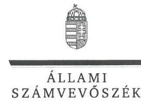

ELNÖK

Ikt.szám: V-1269-175/2016.

# Szamosi Szabolcs úr 

ügyvezető
Filharmónia Magyarország Koncert és
Fesztiválszervező Nonprofit Kft.

## Budapest

## Tisztelt Ügyvezető Úr!

„Állami tulajdonú gazdasági társaságok - Az állami tulajdonban (résztulajdonban) lévő gazdálkodó szervezetek vagyonmegőrzési és gazdálkodási tevékenységének ellenőrzése - Filharmónia Magyarország Koncert és Fesztiválszervező Nonprofit Kft. " címmel készített számvevőszéki jelentéstervezetre tett észrevételeit köszönettel megkaptam.
Az Állami Számvevőszék észrevételekre vonatkozó álláspontjáról a felügyeleti vezető által készített részletes tájékoztatást csatoltan megküldöm.
Tájékoztatom Ügyvezető urat, hogy a számvevőszéki jelentésben - az Állami Számvevőszékről szóló 2011. évi LXVI. törvény 29. § (3) bekezdése alapján - a figyelembe nem vett észrevételeket szerepeltetjük annak megindoklásával, hogy azokat miért nem fogadtuk el.

Budapest, 2018. 01. 22.
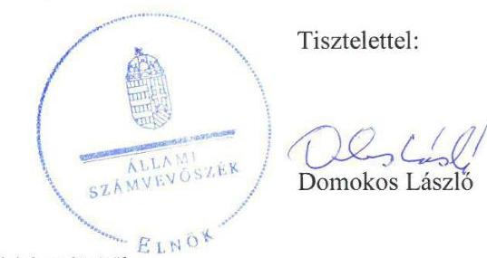

Melléklet: Tájékoztatás az észrevételek kezeléséről

---

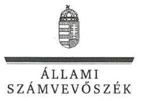

FELÜGYELETI VEZETŐ

Melléklet
Ikt.szám: V-1269-175/2016.

# Tájékoztatás   az észrevételek kezeléséről 

„Állami tulajdonú gazdasági társaságok - Az állami tulajdonban (résztulajdonban) lévő gazdálkodó szervezetek vagyonmegőrzési és gazdálkodási tevékenységének ellenőrzése - Filharmónia Magyarország Koncert és Fesztiválszervező Nonprofit Kft." címú jelentéstervezetre 2017. november 30 -án tett (az Állami Számvevőszékhez 2017. december 6-án érkezett) észrevételét áttekintettük, annak kezelésével kapcsolatban a következő tájékoztatást adom.

1. A jelentéstervezet 2.3. számú megállapítás 3. bekezdésére, valamint a 7. és 8. számú javaslatokra vonatkozó észrevétel:
Az észrevételben leírtak szerint a térítés nélkül átvett eszközöket az alapítói határozatnak megfelelően az átadó nyilvántartásaiban szereplő értéken vették nyilvántartásba, amely megegyezett azok használati értékével, tükrözte a valós értéküket.
Az észrevétel nem megalapozott. Az észrevételben hivatkozott, az ellenőrzés során az adatszolgáltatásra rendelkezésre álló időben átadott V/2013. számú alapítói határozat az eszközök átadását rögzíti, azok értékéről nem rendelkezik. A számvitelről szóló 2000. évi C törvény 50. § (4) bekezdése a piaci árat írja elő a térítés nélkül átvett eszközök esetében a nyilvántartásokban rögzítendő bekerülési értékként, attól eltérő választási lehetőséget nem tartalmaz.
Fentiekre tekintettel az észrevétel alapján a jelentéstervezet módosítása nem indokolt.

## 2. A jelentéstervezet 2.3. számú megállapítás 4. bekezdésére vonatkozó észrevétel:

Az észrevételben leírtak szerint az ÁSZ gyanúfelvetése hatására a Magyar Könyvvizsgáló Kamara Fegyelmi Bizottsága előzetes adatbekérés után nem látta megalapozottnak fegyelmi eljárás lefolytatását.
Az észrevétel nem megalapozott. A jelentéstervezetben tett megállapítást nem vitatják, az a Magyar Könyvvizsgáló Kamara Fegyelmi Bizottsága által megtett intézkedések, eljárások eredményétől függetlenül fennállt.
Fentiekre tekintettel az észrevétel alapján a jelentéstervezet módosítása nem indokolt.

Budapest, 2018. 01. 02.
Dr. Nagy Imre
felügyeleti vezető

---

.

---

# RÖVIDÍTÉSEK JEGYZÉKE 

${ }^{1}$ Társaság
${ }^{2} \mathrm{MFt}$.
${ }^{3}$ ÁSZ
${ }^{4}$ Gt.tv.
${ }^{5}$ Ptk.
${ }^{6}$ Alapító okiratok
${ }^{7}$ tulajdonosi joggyakorló
${ }^{8}$ felügyelő bizottság
${ }^{9}$ Számv.tv.
${ }^{10}$ MNV Zrt.
${ }^{11}$ EMMI
${ }^{12}$ Nvtv.
${ }^{13}$ megbízási szerződés
${ }^{14}$ Tak.tv.
${ }^{15} \mathrm{Mt}$.
${ }^{16} \mathrm{Kbt}$.
${ }^{17}$ Számviteli politika:
${ }^{18}$ Számviteli politika:
${ }^{19}$ Civil tv.
${ }^{20}$ Info tv.
${ }^{21}$ SZMSZ:
${ }^{22}$ SZMSZ:
${ }^{23}$ Értékelési szabályzat
2013. május 31-ig Filharmónia Budapest Nonprofit Kft., 2013. június 1-jétől Filharmónia Magyarország Nonprofit Kft.
millió forint
Állami Számvevőszék
2006. évi IV. törvény a gazdasági társaságokról (hatályos 2014.március 14-ig) a Polgári Törvénykönyvről szóló 2013. évi V. törvény
a Társaság 1998. május 27-én kelt, többször módosított alapító okirata
a Társaság felett a tulajdonosi jogok gyakorlója 2012. április 17-ig a Magyar Nemzeti Vagyonkezelő Zrt., 2012. április 18-tól a Magyar Nemzeti Vagyonkezelő Zrt.-vel kötött vagyonkezelői szerződés alapján a Nemzeti Erőforrás Minisztériuma, majd 2013. január 27-től megbízási szerződés alapján az Emberi Erőforrás Minisztériuma volt
a Társaság felügyelő bizottsága
2000. évi C törvény a számvitelről

Magyar Nemzeti Vagyonkezelő Zrt.
Emberi Erőforrások Minisztériuma
2011. évi CXCVI. törvény a nemzeti vagyonról (hatályos 2011. december 31-étől) az MNV Zrt. és az EMMI által a társasági részesedés hasznosítására irányuló 2013. január 27-én aláírt megbízási szerződés
2009. évi CXXII. törvény a köztulajdonban álló gazdasági társaságok takarékosabb működéséről
a Munka Törvénykönyvéről szóló 1992. évi XXII. Törvény
2011. évi CVIII. törvény a közbeszerzésekről
a Társaság Számviteli politikája (hatályos 2014. október 29-ig)
a Társaság Számviteli politikája (hatályos 2014. október 30-tól)
2011. évi CLXXV. törvény az egyesülési jogról, a közhasznú jogállásról, valamint a civil szervezetek működéséről és támogatásáról
2011. évi CXII. törvény az információs önrendelkezési jogról és az információszabadságról
a Társaság Szervezeti és Működési Szabályzata (hatályos: 2014. november 4-ig)
a Társaság Szervezeti és Működési Szabályzata (hatályos: 2014. november 5-től)
a Társaság Számviteli politika Eszközök és Források Értékelési szabályzata (hatályos 2007. december 15-től)

---

# ÁLLAMI SZÁMVEVŐSZÉK 

1052 Budapest, Apáczai Csere János utca 10.
Levélcím: 1364 Budapest 4. Pf. 54
Telefon: +36 14849100 Telefax: +36 14849200
www.asz.hu
