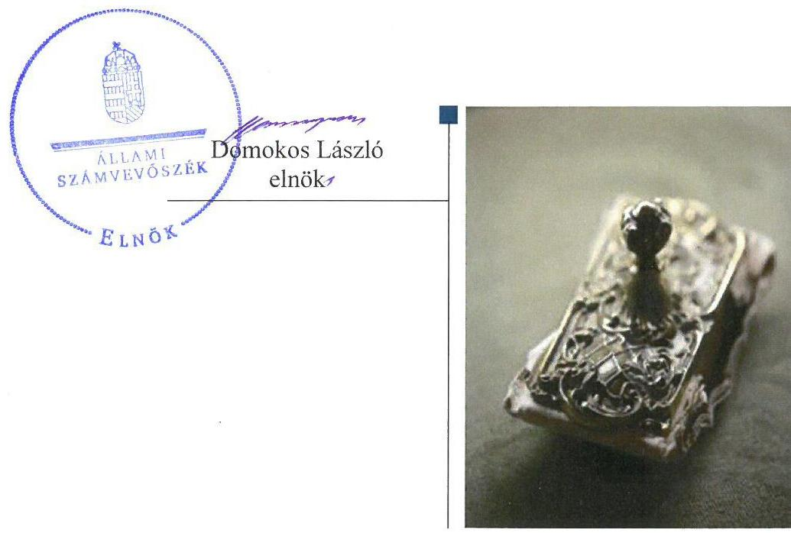
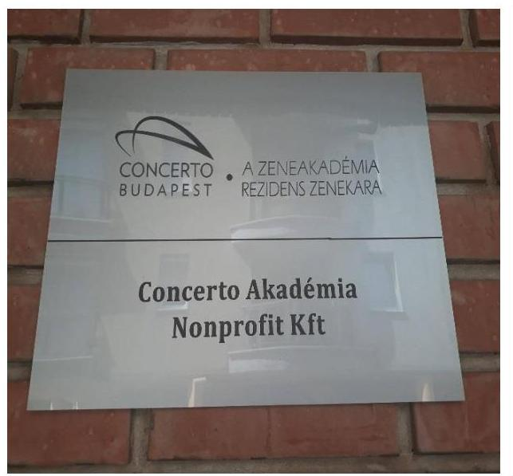
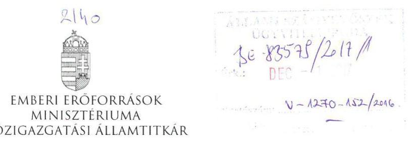
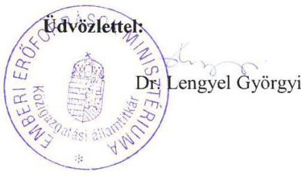
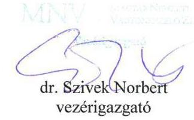
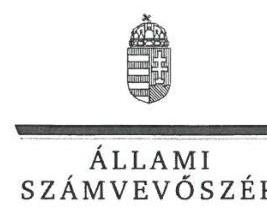
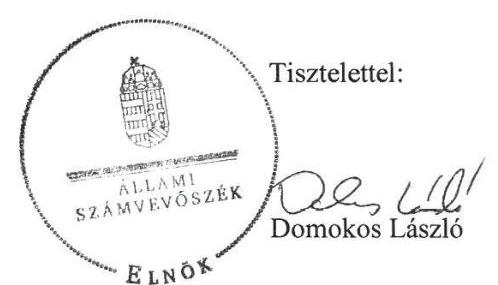
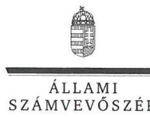

# Jelentés 

## Állami tulajdonú gazdasági társaságok

Az állami tulajdonban (résztulajdonban) lévő gazdálkodó szervezetek vagyonmegőrzési és gazdálkodási tevékenységének ellenőrzése Concerto Akadémia Nonprofit Kft.
2018.

---

# Jelentés 

## Állami tulajdonú gazdasági társaságok

Az állami tulajdonban (résztulajdonban) lévő gazdálkodó szervezetek vagyonmegőrzési és gazdálkodási tevékenységének ellenőrzése Concerto Akadémia Nonprofit Kft.
2018. cumar hó 19. nap

---

# AZ ELLENŐRZÉST FELÜGYELTE:

DR. NAGY IMRE felügyeleti vezető

# AZ ELLENŐRZÉST VEZETTE ÉS A VÉGREHAJTÁSÁÉRT FELELŐS:

RÁCZKEVI KATALIN ellenőrzésvezető

# A PROGRAM ÖSSZEÁLLÍTÁSÁÉRT FELELŐS:

JANIK JÓZSEF osztályvezető

---

**IKTATÓSZÁM:** V-1270-162/2016.

**TÉMASZÁM:** 2304

**ELLENŐRZÉS-AZONOSÍTÓ SZÁM:** V075922

---

Jelentéseink az Országgyűlés számítógépes hálózatán és az Interneta a www.asz.hu címen is olvashatóak.

---

# TARTALOMJEGYZÉK 

■ ÖSSZEGZÉS ..... 5
■ AZ ELLENŐRZÉS CÉLJA ..... 6
■ AZ ELLENŐRZÉS TERÜLETE ..... 7
■ AZ ELLENŐRZÉS HÁTTERE, INDOKOLTSÁGA ..... 9
■ A JELENTÉS LÉNYEGES KÉRDÉSKÖREI ..... 10
■ ELLENŐRZÉS HATÓKÖRE ÉS MÓDSZEREI ..... 11
■ MEGÁLLAPÍTÁSOK ..... 13
■ JAVASLATOK ..... 17
■ MELLÉKLETEK ..... 19
I. Sz. melléklet: Értelmező szótár ..... 19
■ FÜGGELÉK: ÉSZREVÉTELEK ..... 21
■ RÖVIDÍTÉSEK JEGYZÉKE ..... 29

---

.

---

# ÖSSZEGZÉS 

Az Emberi Erőforrások Minisztériuma tulajdonosi joggyakorlása a Concerto Akadémia Nonprofit Kft. felett nem volt szabályszerű, a Magyar Nemzeti Vagyonkezelő Zrt. részéről szabályszerű volt. A bevételek és ráfordítások elszámolása, a vagyongazdálkodás nem volt szabályszerű, ezáltal a Társaság elszámoltathatósága nem volt biztosított. Az adatszolgáltatási kötelezettségnek eleget tett, a 2012. és 2014. évi beszámolókat késedelmesen tette közzé. A közérdekú adatokat nem szabályszerűen tette közzé, ezzel nem biztosította az átláthatóságot.

## Az ellenőrzés társadalmi indokoltsága

Az állami tulajdonú gazdálkodó szervezetek a nemzeti vagyon részét képezik. Az állami vagyonnal való gazdálkodást illetően a tulajdonosi joggyakorlás és a vagyonnal való gazdálkodás feladata az állami vagyon átlátható, rendeltetésszerű és felelős felhasználásának biztosítása. Az állam meghatározza az ellátandó közszolgáltatással kapcsolatos feladatokat, amelyhez a vagyonnal kapcsolatos döntéseknek igazodniuk kell.

Magyarországon az intézmény-centrikus közfeladat-ellátás, az állami vagyon gazdálkodás jellemző a költségvetésen kívüli feladatellátás térnyerése mellett. Ennek szereplői az állami tulajdonú gazdasági társaságok is.

Az Állami Számvevőszék ellenőrzése hozzájárul a közpénzek szabályos, elszámoltatható és eredményes felhasználásához, a rend pedig értéket teremt. Minden közpénzt, közvagyont használó szervezettel szemben társadalmi igény, hogy tevékenységükről elszámoljanak. Ezt figyelembe véve és az Állami Számvevőszék Stratégiájával összhangban került sor a Concerto Akadémia Nonprofit Kft. ellenőrzésére a 2012-2015. évek vonatkozásában.

## Főbb megállapítások, következtetések, javaslatok

A Magyar Nemzeti Vagyonkezelő Zrt. társasági részesedések feletti tulajdonosi joggyakorlása megfelelt a jogszabályi előírásoknak. Az MNV Zrt. a Társaság tekintetében a tulajdonosi ellenőrzés lehetőségével a 2012-2015. években nem élt, így a Társaság közpénzzel és közvagyonnal való gazdálkodásának szabályosságát nem támogatta.

Az EMMI a felügyelő bizottság előírt létszámának folyamatos biztosításáról nem gondoskodott. Az EMMI a társaságot az üzleti tervek, az éves mérlegbeszámolók elfogadása, a támogatásokkal való elszámoltatás során ellenőrizte.

A Társaság az ellenőrzött időszakban a közhasznú és vállalkozási tevékenység elkülönítését nem szabályozta, amely a közpénzekkel való elszámoltathatóságot akadályozta.

A bevételek és ráfordítások elszámolása nem volt szabályszerű, mert az ellenőrzött szervezet a 2012. és 2013. évi beszámolójában szereplő adatokat a jogszabály előírásai ellenére nem támasztotta alá bizonylatokkal. A vagyonnal való gazdálkodás feltételeit, a saját vagyon értékelésének, leltározásának szabályozását csak 2013. július 1-jétől szabályozta. A 2012. évi mérlegbeszámolót leltárral nem támasztotta alá. A 2012. és 2013. üzleti évekre vonatkozóan a vagyonnal való elszámoltathatóságot a Társaság nem biztosította.

A Társaság a tulajdonosi joggyakorló felé az adatszolgáltatási kötelezettségeket teljesítette. A Társaság a beszámolási kötelezettségének eleget tett, azonban a 2012., 2014. évi beszámoló letétbe helyezésére a jogszabályban előírt határidőn túl került sor. A közérdekú adatok közzététele során a jogszabályi előírásokat nem tartotta be, ezzel a szervezet átláthatóságát nem biztosította.

Az ÁSZ jelentésében a Concerto Akadémia Nonprofit Kft. ügyvezetőjének négy javaslatot fogalmazott meg, amelyekre az érintettnek 30 napon belül intézkedési tervet kell készítenie.

---

# AZ ELLENŐRZÉS CÉLJA 

Az ellenőrzés célja annak értékelése volt, hogy a tulajdonosi jogok gyakorlása szabályszerű volt-e; a gazdálkodó szervezet szabályozottsága, gazdálkodása és vagyongazdálkodási tevékenysége megfelelt-e a jogszabályi és a tulajdonosi előírásoknak; biztosítva volt-e a közfeladatok átláthatósága és elszámoltathatósága érdekében a közszolgáltatás dijának megalapozottsága.

---

# AZ ELLENŐRZÉS TERÜLETE 

## Concerto Akadémia Nonprofit Korlátolt Felelősségű Társaság

A CONCERTO AKADÉMIA NONPROFIT KFT. a Magyar Állam kizárólagos tulajdonában álló közhasznú gazdasági társaság. Fő feladata a társadalom kulturális, közművelődési és oktatási területén belül a magyar és nemzetközi komolyzenei élet iránti szükségletek kielégítése volt.

A Társaságot ${ }^{1}$ 2008. december 8-án alapította a Magyar Állam, 2013. május 30-ig Filharmónia Dél-Dunántúli Koncertszervező és Rendező Nonprofit Korlátolt Felelősségű Társaság néven előadó-művészeti tevékenységet folytatott. A Társaság előadó-művészeti, kulturális, nevelés és oktatás, képességfejlesztés, ismeretnyújtás tevékenységek tekintetében látott el közfeladatot.

## A TÁRSASÁG FELETTI TULAJDONOSI JOGOK GYAKORLÁSÁT 2012. április 17-ig a Magyar Állam képviseletében a Magyar Nemzeti Vagyonkezelő Zrt. látta

el. Az MNV Zrt. a Társaság részesedése feletti tulajdonosi jogai gyakorlását 2012. április 18-tól vagyonkezelői szerződés alapján átruházta a Nemzeti Erőforrás Minisztériumára (2012. május 14-től jogutódja az EMMI), majd 2013. január 27-től a vagyonkezelési szerződés megszűnésével megbízási szerződés alapján az Emberi Erőforrás Minisztériumára.

Az Alapító2 képviseletében eljáró Emberi Erőforrások Minisztériuma 2013. június 1-jével a Társaságot átszervezte, melynek folytán a Társaság Concerto Akadémia Nonprofit Korlátolt Felelősségű Társaság néven müködött tovább, tevékenységi köre valamint székhelye változott, egyben fenntartója lett a Liszt Ferenc Zeneművészeti Egyetem zenekarának, a Concerto Budapest Zenekarnak. Az átszervezés során rendezvényszervezői feladatait a Filharmónia Budapest és Felső-Dunántúl Koncert- és Fesztiválszervező Nkft. (2013. június 1-jétől a Filharmónia Magyarország Koncert- és Fesztiválszervező Nkft.) vette át. Az átszervezés során a Társaság 2013. június 1-én az átadott tevékenység ellátásához szükséges vagyonelemeket térítésmentesen, közcélú adományozás címen adta át az átvevő gazdasági társaság részére.

A Társaság egyszerűsített éves beszámolót készített, közhasznú minősítéssel rendelkezett. Közhasznú tevékenysége előadó művészet, kulturális tevékenység, nevelés és oktatás, képességfejlesztés, ismeretterjesztés.

A Társaság önköltség-számítási szabályzat készítésére nem volt kötelezett.

A Társaság jegyzett tőkéje az ellenőrzött időszak alatt 3,03 M Ft volt. Az ügyvezető személye az ellenőrzött időszakban egy alkalommal változott. A Társaság vagyona 2015. évben 212,3 M Ft volt, az értékesítés nettó árbevétele 151,2 M Ft, az átlagos statisztikai létszám 2015-ben 12 fő volt.

---

A Társaság más gazdasági társaságban tulajdonosi részesedéssel nem rendelkezett, nemzeti vagyonba tartozó vagyont nem kezelt, bérleti-, vagy egyéb szerződés keretében nem használt és nem hasznosított.

---

# AZ ELLENŐRZÉS HÁTTERE, INDOKOLTSÁGA 

Az ÁSZ ${ }^{3}$ alapvető célkitűzése, hogy az államháztartáson kívülre nyújtott költségvetési támogatások és ingyenes vagyon juttatások, valamint az államháztartáson kívül működő közfeladat-ellátó rendszerek ellenőrzéseivel hozzájáruljon ahhoz, hogy a közpénzeket az államháztartáson kívül múködő szervezetek is átlátható, rendezett módon használják fel a közfeladatok szerződésben vállalt állami feladatok ellátása érdekében.

Az ellenőrzés várható hasznosulásaként az ellenőrzés megállapításai a jogalkotás számára segítséget nyújthatnak a közvagyonnal való gazdálkodás értékeléséhez, jogszabályi keretei pontosításához, az átláthatóságot biztosító szabályozáshoz. Az ellenőrzött szervezetek számára visszajelzést ad a vagyongazdálkodási tevékenységgel, beszámolással kapcsolatos szabálytalanságokról és kockázatokról. Az ellenőrzés tapasztalatai segítik és erősítik az ÁSZ hozzáadott értéket teremtő tevékenységét és tanácsadó szerepét.

---

# A JELENTÉS LÉNYEGES KÉRDÉSKÖREI 

1.     - A tulajdonosi jogok gyakorlása szabályszerű volt-e?
2.     - A Társaság pénzügyi-számviteli feladatellátása és vagyongazdálkodása megfelelt-e az előírásoknak?

---

# ELLENŐRZÉS HATÓKÖRE ÉS MÓDSZEREI 

## Az ellenőrzés típusa

Megfelelőségi ellenőrzés.

## Az ellenőrzött időszak

2012. január 1-jétől 2015. december 31-ig.

## Az ellenőrzés tárgya

Az állami tulajdonban lévő Concerto Akadémia Nonprofit Kft. gazdálkodása, kiemelten vagyongazdálkodási tevékenysége, valamint a Magyar Nemzeti Vagyonkezelő Zrt. és az Emberi Erőforrások Minisztériuma tulajdonosi joggyakorlása.

## Az ellenőrzött szervezet

A Concerto Akadémia Nonprofit Kft., valamint az Emberi Erőforrások Minisztériuma és a Magyar Nemzeti Vagyonkezelő Zrt., mint tulajdonosi joggyakorlók.

## Az ellenőrzés jogalapja

Az Állami Számvevőszékről szóló 2011. évi LXVI. törvény 5. § (3)-(5) bekezdései.

## Az ellenőrzés módszerei

Az ellenőrzést a nemzetközi standardokat irányadónak tekintve az ellenőrzési program ellenőrzési kérdései, az ellenőrzött időszakban hatályos jogszabályok, az ellenőrzés szakmai szabályok és módszertanok figyelembe vételével végezzük.

Az ellenőrzési kérdések megválaszolásához szükséges bizonyítékok megszerzése az ellenőrzött által rendelkezésre bocsátott dokumentumokra, adatokra alapozva kérdésfeltevés, mintavételezés, ellenőrzési eljárások útján történt.

---

Az ellenőrzési bizonyítékként felhasználható adatforrások közé tartozott egyrészt a szakmai program részletes szempontjainál felsorolt adatforrások, másrészt minden egyéb - az ellenőrzés folyamán feltárt, az ellenőrzés szempontjából információkat tartalmazó - dokumentumok.

Az ellenőrzés lefolytatásához a gazdálkodó szervezet a tanúsítványok elektronikus kitöltésével, valamint az ÁSZ által kért dokumentumok megküldésével szolgáltatott adatokat.

A Társaság a bevételek és ráfordítások elszámolása, valamint a vagyonnyilvántartás területe ellenőrzéséhez 2012. január 1. és 2013. május 31. közötti időszakra nem szolgáltatott adatot.

---

# 1. A tulajdonosi jogok gyakorlása szabályszerű volt-e? 

Összegző megállapítás

Az MNV Zrt. tulajdonosi joggyakorlása szabályszerű volt. Az EMMI tulajdonosi joggyakorlása nem felelt meg az előírásoknak.

A TULAJ DONOSI JOGGYAKORLÁS SZABÁLYAIT az MNV Zrt. ${ }^{4}$ és az EMMI ${ }^{5}$ a szervezeti és múködési szabályzataiban és belső szabályzataiban kialakította.

A Társaság Gt. ${ }^{6}$ és Ptk. ${ }^{7}$ előírásaival összhangban lévő Alapító okirata ${ }_{1-8}{ }^{8}$ tartalmazta a tulajdonosi jogok gyakorlói kizárólagos hatáskörébe tartozó jogosultságokat.

Az MNV Zrt. a társasági részesedés feletti tulajdonosi jogok gyakorlására 2012. április 18-án vagyonkezelési szerződést kötött a Nemzeti Erőforrások Minisztériumával (2012. május 14-től jogutódja az EMMI) az Nvtv. ${ }^{9}$ előírásainak megfelelően. Az Nvtv. 2012. június 30-i változásával a vagyonkezelési szerződés megszüntetésére és a társasági részesedéshez kapcsolódó tulajdonosi jogok gyakorlására irányuló megbízási szerződés ${ }^{10}$ megkötésére került sor az MNV Zrt. és az EMMI között.

A megbízási szerződést az EMMI 2013. január 27-én írta alá, ez nem felelt meg az Nvtv. 18. § (7) bekezdésében foglaltaknak, amely előírta 2012. december 31-ig a megbízási szerződés megkötésének kötelezettségét.

Az EMMI az ellenőrzött időszakban az $\mathrm{FB}^{11}$ Alapító okiratban meghatározott létszámát a Gt. szabálya és az Alapító okirat ${ }_{1-3}$ 9.2.8. pontja ellenére folyamatosan nem biztosította. Az FB létszáma 2012. június 1. - 2012. július 15. között kettő, 2012. július 16. - 2013. május 1. között egy és a 2013. május 1. - 2013. július 31. közötti időszakban kettő fő volt, a Társaság ügyvezetője nem hívta össze a társaság legfőbb szervét, ezzel nem teljesültek a Gt. 34. § (5) bekezdés és az Alapító okirat ${ }_{1-3}$ 12.12. pontja előírásai.

A tulajdonosi jogok gyakorlása a könyvvizsgáló vonatkozásában szabályszerű volt.

Az MNV Zrt. a Társaság tekintetében a tulajdonosi ellenőrzés lehetőségével a 2012-2015. években nem élt, így a Társaság közpénzzel és közvagyonnal való gazdálkodásának szabályosságát nem támogatta.

A GAZDÁLKODÁST ÉS A FELADATELLÁTÁST a tulajdonosi joggyakorló EMMI az éves üzleti tervek, az egyszerűsített éves beszámolók, a támogatások felhasználásáról készült jelentések elfogadása során ellenőrizte.

Az EMMI a 2012. - 2015. évi üzleti terveket határozatban elfogadta, a 2013. és 2014. évi üzleti terveknél az FB részéről írásos vélemény nem készült, mert az Alapítói okiratok3-6 12.12. pontja előírása ellenére az FB múködéséhez minimálisan szükséges 3 fő nem volt biztosított.

---

Az EMMI minden évben elfogadta a Társaság egyszerűsített éves beszámolóit. A 2012. évi beszámolót azonban a Gt. 35.§ (3) bekezdésében és az Alapító okirat ${ }_{5}$ 12.11. pontjában előírtak ellenére az FB írásbeli jelentése nélkül, a 2014. évi beszámolót pedig késedelmesen fogadta el.

Az Alapító a 2012., 2014. és 2015 évi közhasznúsági mellékleteket jóváhagyta. A 2013. évi közhasznúsági mellékletet nem hagyták jóvá, ezzel nem érvényesültek az Alapító okirat 9.2.19. pontjában foglaltak.

A JAVADALMAZÁSI SZABÁLYZAT ${ }^{12}$ elkészítésével a tulajdonosi joggyakorlók gondoskodtak a Tak.tv ${ }^{13} 5$. § (3) bekezdésében foglaltaknak megfelelően a Társaság vonatkozásában a vezető tisztségviselők, felügyelőbizottsági tagok, valamint az Mt. ${ }^{14}$ 208. §-ának hatálya alá eső munkavállalók javadalmazására, valamint jogviszonya megszűnése esetére biztosított juttatások módjának, mértékének elveiről, annak rendszeréről szóló szabályzat megalkotásáról.

# 2. A Társaság pénzügyi-számviteli feladatellátása és vagyongazdálkodása megfelelt-e az előírásoknak? 

Összegző megállapítás

A Társaság bevételeinek és ráfordításainak elszámolása, vagyongazdálkodása nem volt szabályszerű. A Társaság a beszámolási kötelezettségének késedelemmel tett eleget, a közérdekú adatok közzétételét nem szabályszerűen hajtotta végre.
2.1. számú megállapítás

A Társaság bevételeinek és ráfordításainak elszámolása nem volt szabályszerű.

A BEVÉTELEK ÉS RÁFORDÍTÁSOK ELSZÁMOLÁSA nem volt szabályszerű, mert az ellenőrzött szervezet a 2012. és 2013. évi beszámolójában szereplő adatokról a Számv. tv. 165. § (1) bekezdés előírásai ellenére, az eszközök, illetve az eszközök forrásainak állományát vagy összetételét megváltoztató gazdasági múveletekről, eseményekről nem állított ki bizonylatot.

A Társaság 2014. évben repülőjegy-vásárlás során nem tartotta be a Kbt. ${ }^{15}$ 119. §-ára való tekintettel a Kbt. 5. §-ában előírt közbeszerzési eljárás lefolytatásának kötelezettségét, valamint a beszerzés során a Társaság Alapító okirata 9.2.13. pontja értelmében a tulajdonosi joggyakorlónak előzetes jóváhagyását nem szerezték be.

A Társaság 2012. január 1. - 2013. december 31. között a Számv. tv. 161. §. (1) bekezdésben foglaltak ellenére nem készített számlarendet. 2014. január 1-jétől a Számlarendet hatályba helyezték, ezzel a hiányosságot pótolták.

A Társaság a Számv. tv. 161/A. §. (2) bekezdésben előírtak ellenére 2012. január 1. és 2015. december 31. között a nyilvántartási (könyvvezetési) rendszerét nem részletezte tovább oly módon, hogy abból a Civil tv. 46. § (1) bekezdésében előírt közhasznúsági melléklet összeállításához a civil szervezetek gazdálkodása, az adománygyűjtés és a közhasznúság

---

egyes kérdéseiről szóló 350/2011. (XII.30.) Korm. rendelet 12. § (1) bekezdése alapján a rendelet mellékletében meghatározott, a közhasznú tevékenységre vonatkozó bevételi és ráfordítási adatok rendelkezésre álljanak.
2.2. számú megállapítás

A Társaság saját vagyonának nyilvántartása nem felelt meg az előírásoknak. A 2012. évi mérlegbeszámolót leltárral nem támasztották alá. A 2012. és 2013. évekre vonatkozóan a vagyon elszámoltathatósága nem volt biztosított.

A TÁRSASÁG A SAJÁT VAGYON ÉRTÉKELÉSÉT, LELTÁROZÁSÁT 2012. január 1. - 2013. június 30. között a Számv. tv. 14. § (5) bekezdés a) pontjában előírtak ellenére nem szabályozta, mert a számviteli politika keretében nem készítette el az eszközök és források leltárkészítési és leltározási szabályzatát. 2013. július 1-étől a Leltározási és selejtezési szabályzat elkészítésével a hiányosságot pótolták.

A Társaság 2012. január 1. - 2013. május 31. közötti időszakban a Számv. tv. 161. § (3) és 165. §. (1) bekezdésekben előírtak ellenére nem rendelkezett saját vagyon nyilvántartással. A Társaság a 2012. évi beszámoló elkészítését, a mérleg tételeit a Számv. tv. 69. § (1) bekezdésben előírtak ellenére nem támasztotta alá leltárral, 2013-2015. évekre vonatkozóan a leltározást elvégezte.

A Társaságnál a 2012. és 2013. évi üzleti évre vonatkozóan a vagyoni helyzet ellenőrzéséhez nem állt rendelkezésre a Számv. tv. 165. §. (1) bekezdésében előírtak ellenére az eszközök illetve az eszközök forrásainak állományát megváltoztató gazdasági múveletekről a beszámolóban foglaltakat alátámasztó dokumentum, ezáltal a Számv. tv.15. § (2) bekezdése szerinti teljesség elve, valamint a 15. § (3) bekezdés szerinti valódiság elve sérült. A Társaság vagyonnal való elszámoltathatósága nem volt biztosított.

Az egyszerűsített éves beszámolókat 2012. és 2013. évben a könyvvizsgáló véleményezte, korlátozás nélküli független könyvvizsgálói jelentést adott ki.

A TÁRSASÁG SAJÁT VAGYON NYILVÁNTARTÁST 2013. június 1-jétől készített, amely nem felelt meg az előírásnak, mert a 2013. június 1-jei átszervezés során átadott eszközökről a Számv. tv. 165. § (1) bekezdésének megfelelő elszámolást alátámasztó bizonylat nem készült.
2.3. számú megállapítás

A Társaság az adatszolgáltatási feladatainak eleget tett, a beszámolókat közzétette. A közérdekú adatok közzétételét nem szabályozta, az adatokat nem szabályszerűen tette közzé.

## A TÁRSASÁG AZ EGYSZERÚSÍTETT ÉVES BESZÁMOLÓKAT ELKÉSZÍTETTE.

A Társaság a 2012. és a 2014. évi beszámolókat és a közhasznúsági mellékleteket a tulajdonosi joggyakorló által 2013. május 31-én, illetve 2015. június 8 -án történt jóváhagyást követően a Számv. tv. 153. § (1) és a Civil tv. 46. § (1) bekezdésben előírtak ellenére késedelmesen - 2013. június 5-én, illetve 2015. június 12-én - helyezte letétbe és tette közzé.

A Társaság az MNV Zrt. által meghatározott adatszolgáltatási kötelezettségeknek eleget tett.

---

A KÖZÉRDEKŰ ADATOK megismerésére irányuló igények teljesítésének rendjét a Társaság az Info tv. ${ }^{16} 30$. § (6) bekezdésben előírtak ellenére nem szabályozta.

A Társaság az Info tv. 37. § (1) bekezdésében előírtak szerinti közzétételi kötelezettségének nem a jogszabályi előírásoknak megfelelően tett eleget, mivel az Info tv. 1. mellékletben előírtak ellenére nem tette közzé a szervezeti adatok közül a közfeladatot ellátó szerv szervezeti felépítése, az egyes szervezeti egységek feladatai, a gazdálkodási adatok közül a vagyongazdálkodással összefüggő 5,0 M Ft-ot elérő vagy azt meghaladó szerződések adatait, valamint a tevékenységre vonatkozó adatoknál a Társaságnál végzett ellenőrzések megállapításait.

A Társaság a tulajdonosi joggyakorló által lefolytatott, a támogatási szerződések ellenőrzése során előírtak végrehajtására intézkedett.

---

# JAVASLATOK 

Az ÁSZ tv. 33. § (1) bekezdésében foglaltak értelmében az ellenőrzött szervezet vezetője köteles a jelentésben foglalt megállapításokhoz kapcsolódó intézkedési tervet összeállítani és azt a jelentés kézhezvételétől számított 30 napon belül az ÁSZ részére megküldeni. Amennyiben az ellenőrzött szervezet vezetője nem küldi meg határidőben az intézkedési tervet, vagy továbbra sem elfogadható intézkedési tervet küld, az Állami Számvevőszék elnöke az ÁSZ tv. 33. § (3) bekezdése a) és b) pontjaiban foglaltakat érvényesítheti.

## A Concerto Akadémia Nonprofit Kft. ügyvezetőjének

1. Intézkedjen, hogy a bevételek és ráfordítások elkülönített nyilvántartása a belső szabályzatokban rögzítésre kerüljön a jogszabályi előírásnak megfelelően.
(2.1. sz. megállapítás 4. bekezdése alapján)
2. Intézkedjen a saját vagyon jogszabályban előírtak szerinti nyilvántartásáról.
(2.2. sz. megállapítás 5. bekezdése alapján)
3. Intézkedjen a közérdekü adatok megismerésére irányuló igények teljesitésének rendjét rögzítő szabályzat jogszabályi előírásnak megfelelő elkészítéséről.
(2.3. sz. megállapítás 4. bekezdése alapján)
4. Intézkedjen a közzétételi kötelezettség jogszabályi előírásoknak megfelelő teljesitéséről.
(2.3. sz. megállapítás 5. bekezdése alapján)

---

.

---

# MELLÉKLETEK 

- I. SZ. MELLÉKLET: ÉRTELMEZŐ SZÓTÁR
gazdasági társaság
állami vagyon kezelője/vagyonkezelő

MNV Zrt.
nemzeti vagyon

A Ptk2. 3:88. § (1) bekezdése szerint „a gazdasági társaságok üzletszerű közös gazdasági tevékenység folytatására, a tagok vagyoni hozzájárulásával létrehozott, jogi személyiséggel rendelkező vállalkozások, amelyekben a tagok a nyereségből közösen részesednek, és a veszteséget közösen viselik".
2013. június 27-ig:

Az állami vagyont az MNV Zrt. maga kezeli, vagy szerződés - így különösen bérlet, haszonbérlet, megbízás - alapján központi költségvetési szervnek, természetes vagy jogi személynek, vagy jogi személyiséggel nem rendelkező gazdálkodó szervezetnek hasznosításra átengedi. Az állami vagyonra vonatkozóan az MNV Zrt. kizárólag az Nvtv-ben meghatározott személyekkel köthet vagyonkezelési szerződést.
Forrás: Vtv. 23. § (1), 27. § (1)
2013. június 28-ától:

Az állami vagyonnal az MNV Zrt. maga gazdálkodik, vagy szerződés - így különösen bérlet, haszonbérlet, megbízás - alapján központi költségvetési szervnek, természetes vagy jogi személynek, vagy jogi személyiséggel nem rendelkező gazdálkodó szervezetnek hasznosításra átengedi, illetőleg vagyonkezelésbe, haszonélvezetbe adja. Az állami vagyonra vonatkozóan az MNV Zrt. kizárólag az Nvtv-ben meghatározott személyekkel köthet vagyonkezelési szerződést.
Forrás: Vtv. 23. § (1), 27. § (1)
Az állami vagyon felett, a Magyar Államot megillető tulajdonosi jogok és kötelezettségek összességét - a hatályos szabályozás szerint - az állami vagyon felügyeletéért felelős miniszter (jelenleg a nemzeti fejlesztési miniszter) gyakorolja. A miniszter feladatát nagy részben az MNV Zrt., mint tulajdonosi joggyakorló szervezet útján látja el.
a) az állam vagy a helyi önkormányzat kizárólagos tulajdonában álló dolgok,
b) az a) pont hatálya alá nem tartozó, állam vagy a helyi önkormányzat tulajdonában lévő dolog,
c) az állam vagy a helyi önkormányzatot tulajdonában lévő pénzügyi eszközök, továbbá az államot vagy a helyi önkormányzatot megillető társasági részesedések,
d) az államot vagy a helyi önkormányzatot megillető bármely vagyoni értékkel rendelkező jogosultság, amelyet jogszabály vagyoni értékű jogként nevesít,
e) Magyarország határa által körbezárt terület feletti légtér,
f) az üvegházhatású gázok kibocsátási egységeinek kereskedelméről szóló törvény szerint kibocsátási egység és légiközlekedési kibocsátási egység, valamint az ENSZ Éghajlatváltozási Keretegyezménye és annak Kiotói Jegyzőkönyve végrehajtási keretrendszeréről szóló törvény szerinti kiotói egység,
g) állami vagy helyi önkormányzati fenntartású közgyűjtemény (muzeális intézmény, levéltár, közgyűjteményként működő kép- és hangar-

---

tulajdonosi jogok gyakorlója
chívum, valamint könyvtár) saját gyűjteményében nyilvántartott kulturális javak körébe tartozó dolog, kivéve, ha az állami vagy önkormányzati tulajdon jogszerű létrejötte kétséget kizáró módon nem bizonyítható és a dologra nézve más a tulajdonjogát bizonyítja vagy a kulturális javakra vonatkozó jogszabályokban meghatározott eljárás keretében valószínűsíti (g. pont módosult 2013. december 7-től),
h) a régészeti lelet,
i) a nemzeti adatvagyon körébe tartozó állami nyilvántartások fokozottabb védelméről szóló törvény szerinti nemzeti adatvagyon.
Forrás: Nvtv. 1. § (2)
1.
2013. június 27-ig:

Az állami vagyon felett a Magyar Államot megillető tulajdonosi jogok és kötelezettségek összességét - ha törvény eltérően nem rendelkezik - az állami vagyon felügyeletéért felelős miniszter (a továbbiakban: miniszter) gyakorolja, aki e feladatát a Magyar Nemzeti Vagyonkezelő Zártkörűen Működő Részvénytársaság (a továbbiakban: MNV Zrt.), a Magyar Fejlesztési Bank, illetve a tulajdonosi joggyakorló szervezet útján látja el. A miniszter miniszteri rendeletben, a törvényben meghatározott állami vagyoni kör tekintetében, meghatározott időtartamra, a joggyakorlás egyes szabályainak meghatározásával az őt megillető tulajdonosi jogok és kötelezettségek összességének, illetve azok meghatározott részének gyakorlóját az Áht. szerinti központi költségvetési szervek, ezek intézménye, továbbá a 100\%-ban állami tulajdonban álló gazdasági társaságok közül kijelölheti.
Forrás: Vtv. 3. § (1) és (2)
2013. június 28-ától:

A rábízott állami vagyon felett az államot megillető tulajdonosi jogok és kötelezettségek összességét tulajdonosi joggyakorlóként:
a) ha törvény vagy miniszteri rendelet eltérően nem rendelkezik, a Magyar Nemzeti Vagyonkezelő Zártkörűen Múködő Részvénytársaság (a továbbiakban: MNV Zrt.),
b) törvényben kijelölt személy vagy
c) az állami vagyon felügyeletéért felelős miniszter (a továbbiakban: miniszter) által rendeletben kijelölt személy gyakorolja.
[...] A miniszter e törvény felhatalmazása alapján - a meghatározott célok hatékonyabb elérése érdekében, miniszteri rendeletben, az ott meghatározott állami vagyoni kör tekintetében, meghatározott időtartamra - e törvény keretei között, a joggyakorlás egyes szabályainak meghatározásával - az államot megillető tulajdonosi jogok és kötelezettségek összességének, illetve azok meghatározott részének gyakorlóját az Áht. szerinti központi költségvetési szervek, ezek intézménye, továbbá a 100\%-ban állami tulajdonban álló gazdasági társaságok közül kijelölheti.
Forrás: Vtv. 3. § (1) és (2)
2.

Aki a nemzeti vagyon felett az államot vagy a helyi önkormányzatot megillető tulajdonosi jogok és kötelezettségek összességének gyakorlására jogosult Forrás: Nvtv. 3. § (1) 17. pontja

---

# FÜGGELÉK: ÉSZREVÉTELEK 

A jelentéstervezetet a Számvevőszék 15 napos észrevételezésre megküldte az ellenőrzött szervezetek vezetőinek az ÁSZ tv. 29. §* (1) bekezdése előírásának megfelelően.

Az ÁSZ a jelentéstervezetet észrevételezésre megküldte az emberi erőforrások miniszterének, a Magyar Nemzeti Vagyonkezelő Zrt. vezérigazgatójának, valamint a Concerto Akadémia Nonprofit Kft. ügyvezetőjének.
Az Emberi Erőforrások Minisztériuma közigazgatási államtitkárának nemleges észrevételét, illetve a Magyar Nemzeti Vagyonkezelő Zrt. vezérigazgatójának észrevételét, illetve az el nem fogadott észrevételek elutasításának indoklását a függelék alább tartalmazza.
A Concerto Akadémia Nonprofit Kft. ügyvezetője a jelentéstervezetre észrevételt nem tett.

[^0]
[^0]:    * 29. § (1) Az Állami Számvevőszék az ellenőrzési megállapításait megküldi az ellenőrzött szervezet vezetőjének vagy az általa megbízott személynek, és annak, akinek személyes felelősségét állapította meg.
    (2) Az ellenőrzött szervezet vezetője és a felelősként megjelölt személy az ellenőrzés megállapításaira tizenöt napon belül írásban észrevételt tehet.
    (3) Az Állami Számvevőszék az észrevételre a beérkezésétől számított harminc napon belül írásban válaszol. A figyelembe nem vett észrevételeket köteles a jelentésben feltüntetni, és megindokolni, hogy azokat miért nem fogadta el.

---

Iktatószám: 11325-13/2017/ELL

Hiv. szám: V-1270-148/2016.
Ügyintéző: Bánkné Simon Judit
Tel. szám: +36 (1) 7954430
Melléklet: -
Domokos László részére
elnök

Állami Számvevőszék
Budapest
Apáczai Csere János u. 10.
1052

Tárgy: Válaszlevél az ÁSZ V-1270-148/2016. iktatószámú megkeresésére

Tisztelt Elnök Úr!

Az „Állami tulajdonban (résztulajdonban) lévő gazdálkodó szervezetek vagyonmegőrzési és gazdálkodási tevékenységének ellenőrzése - Concerto Akadémia Nonprofit Kft." című számvevőszéki jelentéstervezethez - az SZMSZ 145. § (1) bekezdés g) pontjában meghatározott jogkörömben eljárva - nem teszek észrevételt.

Budapest, 2017. november „, ${ }^{\text {. }}$ ",

---

# MNV   MagyarNemzet   VagyonkezelóZrt   VEZÉRIGAZGATÓ 

Állami Számvevőszék

## Domokos László

elnök

1052 Budapest
Apáczai Cs. J. u. 10.

Ikt. sz.: MNV/01/10402/ /2017.
Hiv. sz.: V-1270-147/2016.

Tisztelt Elnök Úr!
Tájékoztatom, hogy a 2017. november 17. napján „Az állami tulajdonban (résztulajdonban) lévő gazdálkodó szervezetek vagyonmegőrzési és gazdálkodási tevékenységének ellenőrzése - Concerto Akadémia Nonprofit Kft. "tárgyában kézhez vett, V-1270-147/2016. ikt. sz. levél mellékleteként megküldött Jelentés-tervezetre az alábbi észrevételeket tesszük:
„Megállapítások 1. A tulajdonosi jogok gyakorlása szabályszerű volt-e? Összegző megállapítás" / 13. oldal 7. bekezdése:

A megállapítás szerint „Az MNV Zrt. a Társaság tekintetében a tulajdonosi ellenőrzés lehetőségével a 2012-2015. években nem élt, így a Társaság közpénzzel és közvagyonnal való gazdálkodásának szabályosságát nem támogatta."

A Társaság feletti tulajdonosi jogok gyakorlása 2012. április 18. napjától vagyonkezelési szerződés, 2013. január 27. napjától megbízási szerződés alapján az EMMI részére került átadásra. A megbízási szerződés szerint a megbízott gyakorolja az MNV Zrt.-t megillető tulajdonosi jogokat és kötelezettségeket, ebből eredően a Társaság gazdálkodásának szabályosságával kapcsolatos tulajdonosi joggyakorlói ellenőrzések lefolytatása is elsősorban az ezen jogokat ténylegesen gyakorló megbízott feladata.

Az MNV Zrt. által a nemzeti vagyonról szóló 2011. évi CXCVI. törvény 8. § (7) bekezdése alapján kialakított megbízási szerződés rendelkezései szerint a tulajdonosi jogok gyakorlásával megbízott szervezetek minden évben kötelesek a részükre kiadott éves meghatalmazások megújításához kapcsolódóan az állami tulajdonú társasági részesedések értékeléséhez szükséges valamennyi adatot, dokumentumot - így például: a társaság beszámolóját, a részesedések értékét befolyásoló, tőkeértéket érintő intézkedésekről szóló tájékoztatást - megküldeni az MNV Zrt. részére, ezzel egyidejűleg kezdeményezhetik a részükre a megbízási szerződés alapján átengedett tulajdonosi jogok gyakorlásához szükséges, következő évre szóló meghatalmazások kiadását. Az MNV Zrt. az adatszolgáltatásokat megvizsgálja, a részesedéseket értékeli, szükség szerint további információkat, kiegészítő adatszolgáltatásokat kér a megbízottaktól. Az EMMI részére - ezen vizsgálatok lefolytatása alapján - a Társaság tulajdonosi joggyakorlására vonatkozó meghatalmazás minden évben kiadásra került.

---

Az MNV Zrt. a fentieknek megfelelően, az éves meghatalmazások kiadásának keretei között lényegében minden évben folyamatba épített tulajdonosi ellenőrzés lefolytatását követően adta ki az EMMI részére a tulajdonosi jogok gyakorlásához szükséges meghatalmazást.

Fentiek okán kérjük a hivatkozott bekezdés törlését.
Kérem Elnök Urat, hogy a jelentés véglegesítése során jelen észrevételeinket szíveskedjenek figyelembe venni.

Budapest, 2017. november „, 50 "
Üdvözlettel:

---

ELNOK

Ikt.szám: V-1270-155/2016.

# dr. Szívek Norbert úr 

vezérigazgató
Magyar Nemzeti Vagyonkezelő Zrt.

## Budapest

## Tisztelt Vezérigazgató Úr!

„Állami tulajdonú gazdasági társaságok - Az állami tulajdonban (résztulajdonban) lévő gazdálkodó szervezetek vagyonmegőrzési és gazdálkodási tevékenységének ellenőrzése - Concerto Akadémia Nonprofit Kft." címmel készített számvevőszéki jelentéstervezetre tett észrevételeit köszönettel megkaptam.
Az Állami Számvevőszék észrevételekre vonatkozó álláspontjáról a felügyeleti vezető által készített részletes tájékoztatást csatoltan megküldöm.
Tájékoztatom Vezérigazgató urat, hogy a számvevőszéki jelentésben - az Állami Számvevőszékről szóló 2011. évi LXVI. törvény 29. § (3) bekezdése alapján - a figyelembe nem vett észrevételeket szerepeltetjük annak indoklásával, hogy azokat miért nem fogadtuk el.

Budapest, 2017. 12. hó 15 nap

Melléklet: Tájékoztatás az észrevételek kezeléséről

---

FELÜGYELETI VEZETŐ

Melléklet
Ikt.szám: V-1270-155/2016..

# Tájékoztatás   az észrevételek kezeléséről 

„Állami tulajdonú gazdasági társaságok - Az állami tulajdonban (résztulajdonban) lévő gazdálkodó szervezetek vagyonmegőrzési és gazdálkodási tevékenységének ellenőrzése - Concerto Akadémia Nonprofit Kft."címủ jelentéstervezetre 2017. november 30-án tett (az Állami Számvevőszékhez 2017. december 4-én érkezett) észrevételét áttekintettük, annak kezelésével kapcsolatban a következő tájékoztatást adom.

## Az észrevétel:

Összegző megállapítás 7. bekezdése (13. oldal) „Az MNV Zrt. a Társaság tekintetében a tulajdonosi ellenőrzés lehetőségével a 2012-2015. években nem élt, igy a Társaság közpénzzel és közvagyonnal való gazdálkodásának szabályosságát nem támogatta"
„A Társaság feletti tulajdonosi jogok gyakorlása 2012. április 18. napjától vagyonkezelési szerződés, 2013. január 27. napjától megbizási szerződés alapján az EMMI részére került átadásra. A megbizási szerződés szerint a megbizott gyakorolja az MNV Zrt-t megillető tulajdonosi jogokat és kötelezettségeket, ebből eredően a Társaság gazdálkodásának szabályosságával kapcsolatos tulajdonosi joggyakorlói ellenőrzések lefolytatása is elsősorban az ezen jogokat ténylegesen gyakorló megbizott feladata.
Az MNV Zrt. által a nemzeti vagyonról szóló 2011. évi CXCVI. törvény 8. § (7) bekezdése alapján kialakított megbizási szerződés rendelkezései szerint a tulajdonosi jogok gyakorlásával megbizott szervezetek minden évben kötelesek a részükre kiadott éves meghatalmazások megújitásához kapcsolódóan az állami tulajdonú társasági részesedések értékeléséhez szükséges valamennyi adatot, dokumentumot - igy például: a társaság beszámolóját, a részesedések értékét befolyásoló, tőkeértéket érintő intézkedésekről szóló tájékoztatást - megküldeni az MNV Zrt. részére azzal, egyidejüleg kezdeményezhetik a részükre a megbizási szerződés alapján átengedett tulajdonosi jogok gyakorlásához szükséges, következő évre szóló meghatalmazások kiadását. Az MNV Zrt. az adatszolgáltatásokat megvizsgálja, a részesedéseket értékeli, szükség szerint további információkat, kiegészitő adatszolgáltatásokat kér a megbizottaktól. Az EMMI részére ezen vizsgálatok lefolytatása alapján - a Társaság tulajdonosi joggyakorlására vonatkozó meghatalmazás minden évben kiadásra került.

## Az észrevételre adott válasz:

Az ÁSZ a jelentéstervezetben rögzített, észrevételezett megállapítást az ellenőrzés rendelkezésére bocsátott dokumentumok alátámasztják. Az MNV Zrt. az észrevételben hivatkozott törvénymódosítás kapcsán megkötött SZT-39 088 azonosító számú, az EMMI által 2013. január 27-én aláírt megbízási szerződés 7.1. pontja biztosította az MNV Zrt. tulajdonosi ellenőrzés jogát, mind

---

a Társaságnál, mind a Megbízottnál. Ennek kereteit a szerződésben foglaltak alapján az MNV Zrt. Tulajdonosi Ellenőrzési Szabályzata határozta meg. Az MNV Zrt. tulajdonosi ellenőrzések lefolytatása véleményükben foglaltak szerint is elsősorban a jogokat ténylegesen gyakorló megbízott feladata, a tulajdonosi ellenőrzés jogával azonban az MNV Zrt. is élhetett, amelyet az ellenőrzött időszakban nem gyakorolt.

Fentiekre tekintettel az észrevétel alapján a jelentéstervezet módosítása nem indokolt.
Budapest, 2017. 18. hó 12 nap
Dr. Nagy Imre
felügyeleti vezető

---

.

---

# RÖVIDÍTÉSEK JEGYZÉKE 

${ }^{1}$ Társaság

${ }^{2}$ Alapító
${ }^{3}$ ÁSZ
${ }^{4}$ MNV Zrt.
${ }^{5}$ EMMI
${ }^{6}$ Gt.
${ }^{7}$ Ptk.
${ }^{8}$ Alapító okirat ${ }_{1-8}$
Alapító okirat ${ }_{1}$

Alapító okirat ${ }_{2}$

Alapító okirat ${ }_{3}$

Alapító okirat ${ }_{4}$
Alapító okirat ${ }_{5}$
Alapító okirat ${ }_{6}$

Alapító okirat ${ }_{7}$

Alapító okirat ${ }_{8}$
${ }^{9}$ Nvtv.
${ }^{10}$ megbízási szerződés
${ }^{11} \mathrm{FB}$
${ }^{12}$ Javadalmazási szabályzat
${ }^{13}$ Tak.tv.
${ }^{14} \mathrm{Mt}$.
${ }^{15} \mathrm{Kbt}$.
${ }^{16}$ Info tv.

Filharmónia Dél-Dunántúli Koncertszervező és Rendező Nonprofit Korlátolt Felelősségű Társaság (2013. május 31-éig), Concerto Akadémia Nonprofit Korlátolt Felelősségű Társaság (2013. június 1-jétől)
Magyar Állam
Állami Számvevőszék
Magyar Nemzeti Vagyonkezelő Zrt.
Emberi Erőforrások Minisztériuma
a gazdasági társaságokról szóló 2006. évi IV. törvény (hatályos: 2006. július 1-étől)
a Polgári Törvénykönyvről szóló 2013. évi V. törvény (hatályos: 2014. március 15-étől)
a Társaság alapító okiratai
A Filharmónia Dél-dunántúli Nonprofit Kft Alapító okirata, hatályos: 2012. július 10-től
A Filharmónia Dél-dunántúli Nonprofit Kft Alapító okirata, hatályos: 2013. március 19-étől
A Filharmónia Dél-dunántúli Nonprofit Kft./Concerto Akadémia Nonprofit Kft. Alapító okirata, hatályos: 2013. június 1-étől
A Concerto Akadémia Nonprofit Kft. Alapító okirata, hatályos: 2013. július 12-étől
A Concerto Akadémia Nonprofit Kft. Alapító okirata, hatályos: 2013. december 31-étől
A Concerto Akadémia Nonprofit Kft. Alapító okirata, hatályos: 2014. május 29-étől
A Concerto Akadémia Nonprofit Kft. Alapító okirata, hatályos: 2015. május 29-étől
A Concerto Akadémia Nonprofit Kft. Alapító okirata, hatályos: 2015. október 29-étől
2011. évi CXCVI. törvény a nemzeti vagyonról (hatályos 2011. december 31-étől) az MNV Zrt. és az EMMI által a társasági részesedés hasznosítására irányuló 2013. január 27-én aláírt megbízási szerződés
a Társaság Felügyelő Bizottsága
a Társaság javadalmazási szabályzata
2009. évi CXXII. törvény a köztulajdonban álló gazdasági társaságok takarékosabb müködéséről
a Munka Törvénykönyvéről szóló 1992. évi XXII. törvény
a közbeszerzésekről szóló 2011. évi CVIII. tv. (hatályos: 2011. augusztus 21-étől) az információs önrendelkezési jogról és az információszabadságról szóló 2011. évi CXII. törvény (hatályos: 2011. július 27-étől)

---

ÁLLAMI SZÁMVEVŐSZÉK
1052 Budapest, Apáczai Csere János utca 10.
Levélcím: 1364 Budapest 4. Pf. 54
Telefon: +36 14849100 Telefax: +36 14849200
www.asz.hu