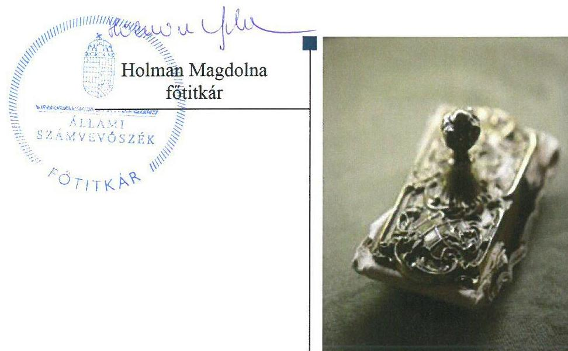

# Jelentés 

## Pártok gazdálkodása

A költségvetési támogatásban részesülő pártok 2015-2016. évi gazdálkodása törvényességének ellenőrzése a Jobbik Magyarországért Mozgalomnál 2018. 01. hó 08. nap

---

# AZ ELLENŐRZÉST FELÜGYELTE:

DR. NAGY IMRE felügyeleti vezető

# AZ ELLENŐRZÉST VEZETTE ÉS A VÉGREHAJTÁSÁÉRT FELELŐS:

KAKAS SÁNDOR ellenőrzésvezető

# A PROGRAM ÖSSZEÁLLÍTÁSÁÉRT FELELŐS:

TÓTPÁL SZABOLCS osztályvezető

# A TÉMÁHOZ KAPCSOLÓDÓ KORÁBBI SZÁMVEVŐSZÉKI JELENTÉSEK:

- címe: A költségvetési támogatásban részesülő pártok 2013-2014. évi gazdálkodása törvényességének ellenőrzése a Jobbik Magyarországért Mozgalomnál
- sorszáma: 16139

IKTATÓSZÁM: EL-0275-069/2018.

TÉMASZÁM: 34

ELLENŐRZÉS-AZONOSÍTÓ SZÁM: V080302

Jelentéseink az Országgyűlés számítógépes hálózatán és az Interneten a www.asz.hu címen is olvashatóak.

---

# TARTALOMJEGYZÉK 

■ ÖSSZEGZÉS ..... 5
■ AZ ELLENŐRZÉS CÉLJA ..... 6
■ AZ ELLENŐRZÉS TERÜLETE ..... 7
■ AZ ELLENŐRZÉS HÁTTERE, INDOKOLTSÁGA ..... 8
■ A JELENTÉS LÉNYEGES KÉRDÉSKÖREI ..... 9
■ ELLENŐRZÉS HATÓKÖRE ÉS MÓDSZEREI ..... 10
■ MEGÁLLAPÍTÁSOK ..... 12
■ JAVASLATOK ..... 14
■ MELLÉKLETEK ..... 15
I. sz. melléklet: Értelmező szótár ..... 15
■ FÜGGELÉK: ÉSZREVÉTELEK ..... 17
■ RÖVIDÍTÉSEK JEGYZÉKE ..... 19

---

.

---

# ÖSSZEGZÉS 

A Jobbik Magyarországért Mozgalom többszöri értesítés, illetve helyszíni adatkérés ellenére - a 2015-2016. évek, valamint az ellenőrzés megkezdéséig tartó időszak vonatkozásában - nem tett eleget a számvevőszéki ellenőrzés lefolytatásához szükséges törvény szerinti adatszolgáltatási kötelezettségének, az ellenőröket a párt helyiségeibe nem engedte be és ezzel akadályozta az ellenőrzés lefolytatását. A Párt nem igazolta a közpénzekkel való átlátható és ellenőrizhető gazdálkodás alapjainak megteremtését, a közpénzek szabályos, átlátható módon történő felhasználását, valamint a céljaira rendelt vagyon jogszerű használatát, megőrzését. A Párt a 2015-2016. évekre vonatkozóan nem igazolta, hogy a működéséhez szabályszerűen igénybe vehető forrásokat használt fel. Az Állami Számvevőszék kockázatjelzés alapján feltárta továbbá, hogy 2017. év első félévében a működéséhez a jogszabályt megsértve tiltott vagyoni hozzájárulást fogadott el.

## Az ellenőrzés társadalmi indokoltsága

A pártok az állampolgárok egyesülési szabadsága alapján létrehozott olyan szervezetek, amelyek kereteket nyújtanak a népakarat kialakításához és kinyilvánításához, a politikai életben való állampolgári részvételhez.

A politikai élet tisztasága érdekében törvény állapítja meg a pártok vagyonára és gazdálkodására vonatkozó szabályokat. Az egyesülési jog alapján létrejövő más szervezetekhez képest szűkebb körben határozza meg azt a gazdasági tevékenységet, amelyet a párt végezhet, biztosítja azonban a pártok részére azt a jogosultságot, hogy az állami költségvetésből támogatásban részesüljenek. A pártok gazdálkodását a politikai élet tisztasága érdekében rendszeresen indokolt ellenőrizni, ezért törvényi előírás alapján az Állami Számvevőszék a költségvetési támogatást kapott pártok gazdálkodását kétévente ellenőrzi.

## Főbb megállapítások, következtetések

A Jobbik Magyarországért Mozgalom többszöri értesítés, illetve helyszíni adatkérés ellenére - a 2015-2016. évek, valamint az ellenőrzés megkezdéséig tartó időszak vonatkozásában - nem tett eleget a számvevőszéki ellenőrzés lefolytatásához szükséges törvény szerinti adatszolgáltatási kötelezettségének, az ellenőröket a párt helyiségeibe nem engedte be és ezzel akadályozta az ellenőrzés lefolytatását.

A Jobbik nem igazolta, hogy rendelkezett volna a jogszabályban előírt szabályzatokkal, megteremtette volna a közpénzekkel való átlátható és ellenőrizhető gazdálkodás alapjait.

A Jobbik nem igazolta, hogy a könyvvezetése során érvényesítette a számviteli alapelveket, a kifizetéseket szabályszerűen teljesítette volna, továbbá a forrásokat - köztük a költségvetési támogatásokat - szabályszerűen számolta volna el, és a közpénzek felhasználását jogszerűen és átlátható módon végezte volna.

A Jobbik nem igazolta, hogy a céljaira rendelt vagyont a jogszabályoknak megfelelően használta fel, a vagyon védelmét, megőrzését biztosította volna.

A Jobbik nem igazolta a közzétett pénzügyi kimutatásokban közölt adatok valódiságát, megbízhatóságát, a közzététel szabályszerűségét.

A Jobbik a 2015-2016. évekre vonatkozóan nem igazolta, hogy a működéséhez jogszerűen igénybe vehető forrásokat használt fel. Az ÁSZ kockázatjelzés alapján feltárta, hogy a 2017. évben a törvényi tilalom ellenére - jogi személyektől származó - nem pénzbeli vagyoni hozzájárulást fogadott el 331660 ezer Ft összegben.

---

# AZ ELLENŐRZÉS CÉLJA 

AZ ELLENŐRZÉS CÉLJA annak értékelése volt, hogy a közzétett pénzügyi kimutatások a törvényi előírásoknak megfeleltek-e, a könyvvezetés és gazdálkodás során betartották-e a vonatkozó jogszabályi és belső előírásokat; a Jobbik Magyarországért Mozgalom a működéséhez szabályszerűen igénybe vehető forrásokat használt-e fel. Az ellenőrzés célja volt továbbá, hogy kockázatjelzés alapján lényegesnek ítélt ügyek szabályosságát értékelje.

---

# AZ ELLENŐRZÉS TERÜLETE 

## Jobbik Magyarországért Mozgalom

A Jobbik Magyarországért Mozgalom 2003. október 2-án jött létre, olyan egyesület, amely nyilvántartott tagsággal rendelkezik, és a nyilvántartásba vételét végző bíróság előtt kinyilvánította, hogy a Párttörvény ${ }^{1}$ rendelkezéseit magára nézve kötelezőnek ismeri el a Párttörvény 1. §-a alapján.

A Jobbik Magyarországért Mozgalom az éves költségvetési törvények adatai alapján a 2015. évben és a 2016. évben egyaránt 475800 ezer Ft központi költségvetési támogatásban részesült. A Magyar Közlönyben közzétett adatok alapján a 2015. évi pénzügyi kimutatásban 544720 ezer Ft bevételt, valamint 369747 ezer Ft kiadást, a 2016. évi pénzügyi kimutatásban 575590 ezer Ft bevételt, valamint 525675 ezer Ft kiadást számolt el.

---

# AZ ELLENŐRZÉS HÁTTERE, INDOKOLTSÁGA 

Az ÁSZ tv. 5. § (11) bekezdés a) pontja, valamint a Párttörvény 10. § (1) bekezdése alapján a pártok gazdálkodása törvényességének ellenőrzésére az ÁSZ ${ }^{2}$ jogosult. Törvényi előírás alapján az ÁSZ kétévente ellenőrzi azoknak a pártoknak a gazdálkodását, amelyek rendszeres költségvetési támogatásban részesültek.

Az ÁSZ legutóbb a Jobbik Magyarországért Mozgalom 2013-2014. évi gazdálkodásának törvényességét ellenőrizte.

A gazdálkodás szabályszerűségének, a felhasznált közpénzek nagyságának bemutatásával a társadalom objektív képet alkothat a pártok működéséről. Az ellenőrzés megállapításai a gazdálkodás megfelelőségének bemutatásával elősegíthetik, hogy a törvényalkotók konkrét lépéseket tegyenek a pártok finanszírozására vonatkozó szabályozások megváltoztatása, átláthatóbbá, ellenőrizhetőbbé tétele irányába. Az ellenőrzés rámutathat a pártok gazdálkodásával, valamint az állami költségvetésből származó források felhasználásával kapcsolatos jó gyakorlatokra és szabálytalanságokra. A hiányosságok, szabálytalanságok feltárása, az ennek kapcsán megfogalmazott megállapítások elősegíthetik a törvényi rendelkezések megsértésének szankcionálását.

---

# A JELENTÉS LÉNYEGES KÉRDÉSKÖREI 

1. A Jobbik Magyarországért Mozgalom gazdálkodásának törvényessége biztosított volt-e?
2. A Jobbik Magyarországért Mozgalom pénzügyi kimutatása megfelelt-e a törvényi előírásoknak, közzétételi kötelezettségét szabályszerűen teljesítette-e?

---

# ELLENŐRZÉS HATÓKÖRE ÉS MÓDSZEREI 

## Az ellenőrzés típusa

Szabályszerűségi ellenőrzés.

## Az ellenőrzött időszak

Az Ellenőrzési program szerint a 2015-2016. évek, amely kiterjesztésre került az ellenőrzés megkezdéséig.

## Az ellenőrzés tárgya

A Jobbik Magyarországért Mozgalom ellenőrzése során az ellenőrzés tárgyát képezték a 2015. és a 2016. évre vonatkozó pénzügyi kimutatás elkészítésére, közzétételére, a párt könyvvezetésére, gazdálkodására, ennek keretében a számviteli szabályozás kialakítására, a bizonylati rend, bizonylati fegyelem betartására, egyéb gazdálkodási, ellenőrzési és pénzügyiszámviteli informatikai feladatok ellátására irányuló tevékenységek, valamint a vagyon jogszabályi előírásoknak megfelelő hasznosítása. A 2017. évre vonatkozóan az ellenőrzés tárgyát képezte kockázatjelzés alapján a kockázatjelzésben szereplő szolgáltatások esetében a nem pénzbeli vagyoni hozzájárulások szabályosságának ellenőrzése.

Az ellenőrzés kiterjedt minden olyan körülményre és adatra, amely az ÁSZ jogszabályban meghatározott feladatainak teljesítéséhez, valamint a program végrehajtása folyamán felmerült újabb összefüggések feltárásához szükséges volt.

## Az ellenőrzött szervezet

Jobbik Magyarországért Mozgalom

## Az ellenőrzés jogalapja

Az ellenőrzés jogalapját az ÁSZ tv. 5. § (11) bekezdés a) pontja, a Párttörvény 4. § (4)-(5) bekezdései, valamint 10. § (1) és (3)-(4) bekezdései képezte.

---

# Az ellenőrzés módszerei 

Az ÁSZ az ellenőrzést az ellenőrzési program szempontjai, az ellenőrzött időszakban hatályos jogszabályok, az ellenőrzés általános szakmai szabályai az ellenőrzésre irányadó ÁSZ módszertanok figyelembevételével végezte.

Az ellenőrzési bizonyítékként felhasználható adatforrások közé tartoztak egyrészt az ellenőrzési program részletes szempontjainál felsorolt adatforrások, másrészt minden egyéb az ellenőrzés folyamán feltárt, az ellenőrzés rendelkezésére bocsátott, az ellenőrzés szempontjából információt tartalmazó dokumentum. Az ellenőrzés céljának eléréséhez szükséges bizonyítékokat a számvevő az egyes adatok közvetlen, részletes elemzésével szerezte meg, a következő eljárások alkalmazásával: megfigyelés, szemrevételezés, információkérés, valamint elemző eljárás. Az ellenőrzési bizonyítékok összegyűjtésére vonatkozó további módszer a megerősítés, ami olyan információkérés, amely során a párttól független, harmadik féltől érkezik információ vagy írásban megerősíti a párt vezetése az ellenőrzés folyamán tett szóbeli nyilatkozatait.

A jogi személyektől, jogi személyiséggel nem rendelkező személytől származó igénybe vett egyéb szolgáltatás esetén, a tiltott nem pénzbeli vagyoni hozzájárulások értékét, az ÁSZ az összehasonlítható független árak módszerével állapította meg, a rendelkezésére álló, hasonló paraméterű árura, szolgáltatásra vonatkozó, az ügyletkötés időpontjában jellemző adatok felhasználásával. Amennyiben az ÁSZ, az ellenőrzés időpontjában érvényes piaci árakkal, díjakkal, vagy a korábbi időszakra vonatkozó árral, díjjal rendelkezett, akkor az árat, díjat a szolgáltatás tényleges igénybevételének időszakára a KSH által közzétett hivatalos inflációs rátával korrigálta. Az árak, díjak megállapításakor az ÁSZ figyelembe vette, a minden piaci szereplőre egységesen érvényesített kedvezményeket.

Ha a számítás eredményeként megállapításra került, hogy a hasonló paraméterekkel alkalmazott árak, díjak megegyeztek, a párt esetében számlázott árakkal, díjakkal vagy az eltérés nem volt lényeges, akkor az ellenértéket az ÁSZ elfogadta piaci árnak, díjnak. Amennyiben a párt által fizetett ár, díj volt az alacsonyabb, akkor a különbözetet az ÁSZ tiltott forrásból származó nem pénzbeli hozzájárulásnak minősítette.

Az ÁSZ az ellenőrzés ideje alatt a Jobbik Magyarországért Mozgalommal történő kapcsolattartást az ÁSZ SZMSZ³-ének vonatkozó előírásai alapján biztosította.

Az ellenőrzés lefolytatásához a Jobbik Magyarországért Mozgalom a kért dokumentumokat nem bocsátotta rendelkezésre. Az ÁSZ a Jobbik Magyarországért Mozgalom székhelyén helyszíni szemlét tartott, amelyről a párt elnökét előzetesen tájékoztatta, azonban az előre egyeztetett időpontban az ÁSZ képviselői a Jobbik Magyarországért Mozgalom irodájába bejutni nem tudtak, a kért dokumentumokat megtekinteni nem tudták. Ezzel a Jobbik Magyarországért Mozgalom az ÁSZ ellenőrzését akadályozta.

---

# 1. A Jobbik Magyarországért Mozgalom gazdálkodásának törvényessége biztosított volt-e? 

Összegző megállapítás

A Jobbik ${ }^{4}$ nem igazolta, hogy gazdálkodása törvényes volt.
A Jobbik nem igazolta, hogy a gazdálkodására vonatkozó számviteli kereteket szabályszerűen alakította ki. A Számv. tv.-ben előírt szabályzatokat a Jobbik nem bocsátotta az ellenőrzés rendelkezésére, ezáltal nem igazolta, hogy rendelkezett volna a jogszabályban előírt szabályzatokkal, megteremtette volna a közpénzekkel való átlátható és ellenőrizhető gazdálkodás alapjait.

A Jobbik nem igazolta, hogy a könyvvezetése, nyilvántartási rendszere megfelelt a jogszabályi előírásoknak. A Jobbik a könyvvezetésével, nyilvántartási rendszerével kapcsolatos dokumentumokat, adatokat, a főkönyvi és analitikus nyilvántartásokat nem bocsátotta rendelkezésre. Ennek következtében nem igazolta, hogy a könyvvezetése során érvényesítette volna a számviteli alapelveket, a kifizetéseket szabályszerűen teljesítette volna, továbbá, hogy a forrásokat - köztük a költségvetési támogatásokat - szabályszerűen számolta el, és a közpénzek felhasználását jogszerűen és átlátható módon végezte volna.

A Jobbik nem igazolta, hogy az ellenőrzési rendszere az előírásoknak megfelelően működött. A Jobbik az ellenőrzési rendszerének működését igazoló dokumentumokat nem bocsátotta rendelkezésre, ezáltal nem igazolta, hogy azt a jogszabályi előírásoknak megfelelően kialakította és működtette, valamint hogy ezáltal az ellenőrizhető és elszámoltatható közpénzfelhasználást biztosította.

A Jobbik a 2015-2016. évekre vonatkozóan nem igazolta, hogy a működéséhez jogszerűen igénybe vehető forrásokat használt fel.

A Párttörvény 2014. január 1-jétől hatályos módosítása értelmében a pártok jogi személyektől vagyoni hozzájárulást nem fogadhatnak el. A Párttörvény 4. § (5) bekezdésének előírása szerint
 amennyiben a párt részére a vagyoni hozzájárulást nem pénzben nyújtották, köteles annak értékeléséről gondoskodni. Ha a párt a Párttörvény 4. § (2) bekezdésben foglalt szabályt megsértve tiltott, nem pénzbeli hozzájárulást fogadott el, annak értékét az ÁSZ állapítja meg. Az ÁSZ hatósági jelzést kapott a 2017. évben a Jobbik által két gazdasági társasággal, politikai plakát kihelyezésre kötött szerződésekben alkalmazott, a gazdasági társaságok hirdetési listaáraitól jelentősen elmaradó egységárak miatt. Az ÁSZ megállapította, hogy a kockázatjelzésben rögzített politikai hirdetések kihelyezésére kötött szerződések alapján a Jobbik összesen 331 660 ezer Ft nem pénzbeli vagyoni hozzájárulást fogadott el jogi személyektől, amely a Párttörvény 2014. január 1-jétől hatályos rendelkezései szerint tiltott, nem pénzbeli hozzájárulásnak minősül.

---

A Jobbik a vagyon használatának jogszerűségét nem igazolta. A Jobbik nem bocsátotta rendelkezésre a vagyonával kapcsolatos belső szabályzatokat, a vagyonának állományi értékét tartalmazó számviteli és analitikus nyilvántartásokat, ezáltal nem igazolta, hogy a céljaira rendelt vagyont a jogszabályoknak megfelelően használta volna fel, a vagyon védelmét, megőrzését biztosította volna.

# 2. A Jobbik Magyarországért Mozgalom pénzügyi kimutatása megfelelt-e a törvényi előírásoknak, közzétételi kötelezettségét szabályszerűen teljesítette-e? 

Összegző megállapítás

A Jobbik nem igazolta, hogy a pénzügyi kimutatásai a jogszabályi előírásoknak megfeleltek és a közzétételi kötelezettségének teljesítése szabályszerű volt.

A Jobbik a 2015. és 2016. évben elkészítette a Párttörvény szerinti pénzügyi kimutatást. A pénzügyi kimutatások alátámasztásául szolgáló számviteli és analitikus nyilvántartásokat, valamint a pénzügyi kimutatások összeállításával kapcsolatos belső szabályzatokat, a közzétételre vonatkozó dokumentumokat nem bocsátotta rendelkezésre, ezáltal nem igazolta a közzétett pénzügyi kimutatásokban közölt adatok valódiságát, megbízhatóságát, a közzététel szabályszerűségét.

---

# JAVASLATOK 

Az ÁSZ tv. 33. § (1) bekezdésében foglaltak értelmében az ellenőrzött szervezet vezetője köteles a jelentésben foglalt megállapításokhoz kapcsolódó intézkedési tervet összeállítani és azt a jelentés kézhezvételétől számított 30 napon belül az ÁSZ részére megküldeni. Amennyiben az ellenőrzött szervezet vezetője nem küldi meg határidőben az intézkedési tervet, vagy továbbra sem elfogadható intézkedési tervet küld, az Állami Számvevőszék elnöke az ÁSZ tv. 33. § (3) bekezdése a) és b) pontjaiban foglaltakat érvényesítheti.

## Jobbik Magyarországért Mozgalom elnökének

1. Intézkedjen a gazdálkodás során a Párttörvényben foglalt előírások betartására a tekintetben, hogy a jövőben a párt vagyoni hozzájárulást jogi személyektől ne fogadjon el.
(1. számú megállapítás 5. bekezdése alapján)

---

# MELLÉKLETEK 

- I. SZ. MELLÉKLET: ÉRTELMEZŐ SZÓTÁR
pénzügyi kimutatás
költségvetési támogatás

A Párttörvény 9. § (1) bekezdésében meghatározott, a törvény 1. számú melléklete szerinti pénzügyi kimutatás (hatályos 2015. május 6-ától), amelyet a pártok kötelesek minden év május 31-ig a Magyar Közlönyben, valamint saját honlappal rendelkező pártok a honlapjukon is közzétenni.
Az államháztartás alrendszerei terhére nyújtott pénzbeli vagy nem pénzbeli juttatás, amelyet a támogató nem elsősorban ellenszolgáltatás ellenében, de konkrét program megvalósítása vagy meghatározott időszakban a támogatott szervezet működtetése érdekében nyújt. (Civil tv. 2. § 15. pont)

---

.

---

# FÜGGELÉK: ÉSZREVÉTELEK 

Az ÁSZ tv. 29. §* (1) bekezdésének megfelelően az Állami Számvevőszék az ellenőrzési megállapításait megküldte az ellenőrzött szervezet vezetőjének. Az ÁSZ tv. 29. § (2) bekezdése alapján az ellenőrzött szervezet vezetője az ellenőrzés megállapításaira tizenöt napon belül írásban észrevételt tehetett.

A Jobbik Magyarországért Mozgalom elnöke a jelentéstervezet megállapításaira két észrevételt tett.
Az ÁSZ tv. 29. § (3) bekezdésével összhangban az ÁSZ a Függelékben feltünteti a jelentéstervezet megállapításaival kapcsolatban tett, figyelembe nem vett észrevételeket, és megindokolja, hogy azokat miért nem fogadta el.

[^0]
[^0]:    * 29. § (1) Az Állami Számvevőszék az ellenőrzési megállapításait megküldi az ellenőrzött szervezet vezetőjének vagy az általa megbízott személynek, és annak, akinek személyes felelősségét állapította meg.
    (2) Az ellenőrzött szervezet vezetője és a felelősként megjelölt személy az ellenőrzés megállapításaira tizenöt napon belül írásban észrevételt tehet.
    (3) Az Állami Számvevőszék az észrevételre a beérkezésétől számított harminc napon belül írásban válaszol. A figyelembe nem vett észrevételeket köteles a jelentésben feltüntetni, és megindokolni, hogy azokat miért nem fogadta el.

---

A Jobbik Magyarországért Mozgalom elnökének 2017. december 21-én írt (az Állami Számvevőszékhez 2017. december 21-én érkezett) levelében a jelentéstervezet megállapításaival kapcsolatban tett, figyelembe nem vett észrevételek és azok indokolása.

# 1. Az ellenőrzött szervezet vezetője észrevételt tett a Jobbik által az elektronikus adatszolgáltató felületre feltöltött dokumentumok felhasználására. 

Az észrevétel nem megalapozott, azt nem fogadom el, a megállapítások nem módosulnak. Az alapvető dokumentumok bekérésére vonatkozó hivatalos adatkérés 2017. augusztus 16-án került megküldésre, amelyet a Jobbik hivatalosan 2017. szeptember 1-jén vett kézhez. Az ÁSZ 2017. augusztus 16-ai, EL-0275-002/2017. iktatószámú levelében, és annak 1. számú, „Tájékoztató a közreműködési kötelezettségről" című mellékletében jelezte a Jobbik felé, hogy a kért dokumentumokat teljességi és hitelességi nyilatkozattal kell az ÁSZ rendelkezésére bocsátani. A teljességi és hitelességi nyilatkozat megküldésének kötelezettségét a levelében idézett, az Állami Számvevőszék ellenőrzései során felhasználandó bizonyítékokról szóló módszertani útmutató is tartalmazta. A hivatkozott jelzés ellenére a Jobbik az elektronikus felületre feltöltött dokumentumok teljességéről és hitelességéről nyilatkozatot nem adott át, nem küldött, így a dokumentumok ellenőrzési bizonyítékként történő felhasználását nem biztosította.

## 2. Az ellenőrzött szervezet vezetője észrevételt tett a tiltott vagyoni hozzájárulás elfogadásának megállapítására és a megállapítás módjára.

Az észrevétel nem megalapozott, azt nem fogadom el, a megállapítások nem módosulnak. A tiltott vagyoni hozzájárulás megállapításával kapcsolatban tájékoztatom, hogy a Párttörvény 4. § (2) bekezdése értelmében a pártok jogi személyektől vagyoni hozzájárulást nem fogadhatnak el. A Párttörvény 4. § (5) bekezdése szerint, ha a párt részére a vagyoni hozzájárulást nem pénzben nyújtották, köteles annak értékeléséről (értékének meghatározásáról) gondoskodni. A Jobbik az ellenőrzés során nem bocsátott olyan dokumentumot az ÁSZ rendelkezésére, amely igazolná a törvényben előírt értékelés elvégzését, és az észrevételeiben sem hivatkozott az értékelés elvégzésére. Így sem az ellenőrzés során, sem az észrevételében nem adott érdemi bizonyítékot arra, hogy a Jobbik nem fogadott el tiltott vagyoni hozzájárulást. A Párttörvény 4. § (5) bekezdése szerint, ha a párt a (2) bekezdésben foglalt szabályt megsértve, tiltott, nem pénzbeli hozzájárulást fogadott el, annak értékét az ÁSZ állapítja meg.

---

# RÖVIDÍTÉSEK JEGYZÉKE 

${ }^{1}$ Párttörvény
${ }^{2}$ ÁSZ
${ }^{3}$ ÁSZ SZMSZ
${ }^{4}$ Jobbik
1989. évi XXXIII. törvény a pártok működéséről és gazdálkodásáról (hatályos 1989. október 30-tól)

Állami Számvevőszék
Állami Számvevőszék Szervezeti és Működési Szabályzata
Jobbik Magyarországért Mozgalom

---

# ÁLLAMI SZÁMVEVŐSZÉK 

1052 Budapest, Apáczai Csere János utca 10.
Levélcím: 1364 Budapest 4. Pf. 54
Telefon: +36 14849100 Telefax: +36 14849200
www.asz.hu
