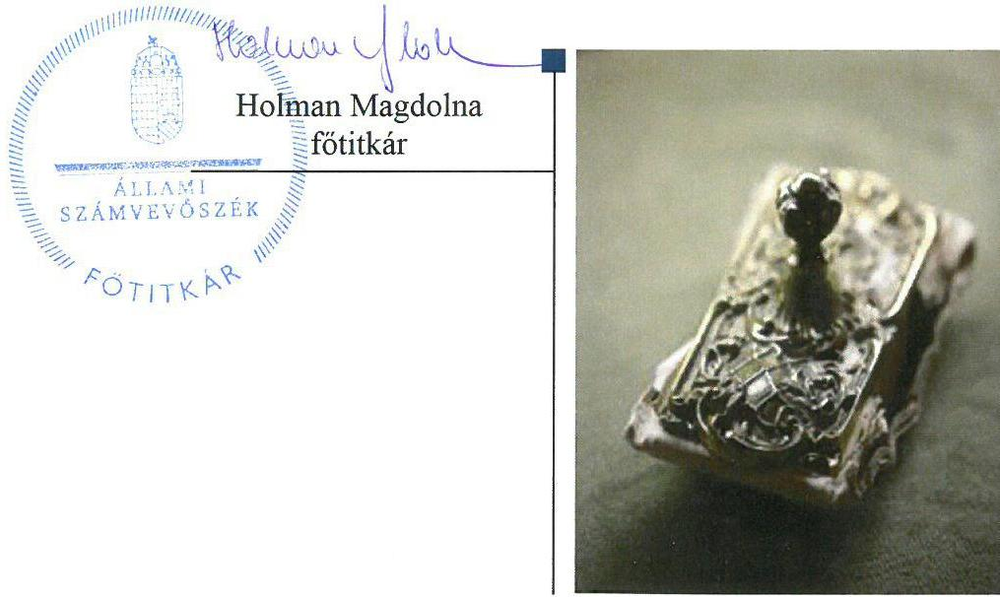

# Jelentés 

## Pártok gazdálkodása

A költségvetési támogatásban részesülő pártok 2015-2016. évi gazdálkodása törvényességének ellenőrzése a Magyar Szocialista Pártnál
2018.

---

# Jelentés 

## Pártok gazdálkodása

A költségvetési támogatásban részesülő pártok 2015-2016. évi gazdálkodása törvényességének ellenőrzése a Magyar Szocialista Pártnál
2018. O1. hó 11. nap

---

# AZ ELLENŐRZÉST FELÜGYELTE: 

DR. NAGY IMRE felügyeleti vezető

## AZ ELLENŐRZÉST VEZETTE ÉS A VÉGREHAJTÁSÁÉRT FELELŐS:

KAKAS SÁNDOR ellenőrzésvezető

## A PROGRAM ÖSSZEÁLLÍTÁSÁÉRT FELELŐS:

TÓTPÁL SZABOLCS osztályvezető

## A TÉMÁHOZ KAPCSOLÓDÓ KORÁBBI SZÁMVEVŐSZÉKI JELENTÉSEK:

- címe: Jelentés a költségvetési támogatásban részesülő pártok 2013-2014. évi gazdálkodása törvényességének ellenőrzéséről - Magyar Szocialista Párt
- sorszáma: 17094

IKTATÓSZÁM: EL-0274-215/2018.
TÉMASZÁM: 34
ELLENŐRZÉS-AZONOSÍTÓ SZÁM: V080301

---

# TARTALOMJEGYZÉK 

■ ÖSSZEGZÉS ..... 5
■ AZ ELLENŐRZÉS CÉLJA ..... 6
■ AZ ELLENŐRZÉS TERÜLETE ..... 7
■ AZ ELLENŐRZÉS HÁTTERE, INDOKOLTSÁGA ..... 8
■ A JELENTÉS LÉNYEGES KÉRDÉSKÖREI ..... 9
■ ELLENŐRZÉS HATÓKÖRE ÉS MÓDSZEREI ..... 10
■ MEGÁLLAPÍTÁSOK ..... 12
■ JAVASLATOK ..... 17
■ MELLÉKLETEK ..... 19
I. sz. melléklet: Értelmező szótár ..... 19
■ FÜGGELÉK: ÉSZREVÉTELEK ..... 21
■ RÖVIDÍTÉSEK JEGYZÉKE ..... 25

---

.

---

# ÖSSZEGZÉS 

Az Állami Számvevőszék a Magyar Szocialista Párt gazdálkodásának törvényességét ellenőrizte a 2015. január 1-jétől 2016. december 31-ig terjedő időszakra vonatkozóan. Megállapította, hogy gazdálkodásának szabályozási környezetét a jogszabályi előírásoknak megfelelően alakította ki. A könyvvezetési, nyilvántartási rendszerét, továbbá az ellenőrzési rendszerét nem az előírásoknak megfelelően müködtette. A pénzügyi kimutatásait nem a jogszabályi előírásoknak megfelelően készítette el. A Magyar Szocialista Párt a müködéséhez a jogszabályt megsértve tiltott vagyoni hozzájárulást fogadott el

## Az ellenőrzés társadalmi indokoltsága

A pártok az állampolgárok egyesülési szabadsága alapján létrehozott olyan szervezetek, amelyek kereteket nyújtanak a népakarat kialakításához és kinyilvánításához, a politikai életben való állampolgári részvételhez.

A politikai élet tisztasága érdekében törvény állapítja meg a pártok vagyonára és gazdálkodására vonatkozó szabályokat. Az egyesülési jog alapján létrejövő más szervezetekhez képest szűkebb körben határozza meg azt a gazdasági tevékenységet, amelyet a párt végezhet, biztosítja azonban a pártok részére azt a jogosultságot, hogy az állami költségvetésből támogatásban részesüljenek. A pártok gazdálkodását a politikai élet tisztasága érdekében rendszeresen indokolt ellenőrizni, ezért törvényi előírás alapján az Állami Számvevőszék a költségvetési támogatást kapott pártok gazdálkodását kétévente ellenőrzi.

## Főbb megállapítások, következtetések, javaslatok

A Magyar Szocialista Párt gazdálkodására vonatkozó számviteli keretek kialakítása és a belső szabályozások megfeleltek a jogszabályi előírásoknak. A könyvvezetési, nyilvántartási rendszerét és ellenőrzési rendszerét nem az előírásoknak megfelelően múködtette.

A Magyar Szocialista Párt a 2015. évi és a 2016. évi pénzügyi kimutatásait nem a jogszabályi előírásoknak megfelelően készítette el, ezzel nem biztosította gazdálkodásának áttekinthetőségét. A pénzügyi kimutatásokat a jogszabályi előírások szerinti határidőben a Magyar Közlöny mellékletét képező Hivatalos Értesítőben és a saját honlapján közzétette.

A Magyar Szocialista Párt a múködéséhez juttatott forrásokat szabályszerűen számolta el, azonban a jogszabályi előírás ellenére a 2015. évben 985 ezer Ft, 2016. évben 1040 ezer Ft értékben tiltott vagyoni hozzájárulást fogadott el jogi személyektől. A kiadások kifizetése során az utalványozás és a könyvviteli számlákra való hivatkozás elmaradása miatt a jogszabályok és a belső szabályzatok előírásait nem tartotta be, a közpénzekkel nem átlátható és ellenőrizhető módon gazdálkodott.

Az ÁSZ a jelentésében a Magyar Szocialista Párt elnökének 10 javaslatot fogalmazott meg, amelyre 30 napon belül intézkedési tervet kell készítenie.

---

# AZ ELLENŐRZÉS CÉLJA 

AZ ELLENŐRZÉS CÉLJA annak értékelése volt, hogy a közzétett pénzügyi kimutatások a törvényi előírásoknak megfeleltek-e, a könyvvezetés és gazdálkodás során betartották-e a vonatkozó jogszabályi és belső előírásokat; a Magyar Szocialista Párt a múködéséhez szabályszerűen igénybe vehető forrásokat használt-e fel.

---

# AZ ELLENŐRZÉS TERÜLETE 

## Magyar Szocialista Párt

A Magyar Szocialista Párt 1989. november 21-én létrejött olyan egyesület, amely nyilvántartott tagsággal rendelkezik, és a nyilvántartásba vételét végző bíróság előtt kinyilvánította, hogy a Párttörvény ${ }^{1}$ rendelkezéseit magára nézve kötelezőnek ismeri el a Párttörvény 1. §-a alapján.

A Magyar Szocialista Párt legfőbb képviseleti és döntéshozó szerve a kongresszus. Ügyvezető szervként az országos elnökség vezeti és irányítja a párt működését. Az országos párttanács a párt operatív döntéshozó szerve. A párt jelenlegi elnöke 2016. június 25 -től tölti be tisztét.

A Magyar Szocialista Párt a 2015. és a 2016. évben is 427000 ezer Ft központi költségvetési támogatásban részesült. A 2015. évi pénzügyi kimutatásban 774258 ezer Ft bevétel és 472578 ezer Ft kiadás, a 2016. évi pénzügyi kimutatásban 1624484 ezer Ft bevétel és 1936470 ezer Ft kiadás szerepelt.

A Magyar Szocialista Párt a 2015. év végén 816233 ezer Ft, 2016. év végén 625491 ezer Ft hitelállománnyal rendelkezett.

A Magyar Szocialista Párt 2003-ban létrehozta a Táncsics Mihály Alapítványt, gazdasági társaságot nem alapított.

---

# AZ ELLENŐRZÉS HÁTTERE, INDOKOLTSÁGA 

Az ÁSZ tv. ${ }^{2}$ 5. § (11) bekezdés a) pontja, valamint a Párttörvény 10. § (1) bekezdése alapján a pártok gazdálkodása törvényességének ellenőrzésére az ÁSZ ${ }^{3}$ jogosult. A Párttörvény 10. § (3) bekezdése alapján az ÁSZ kétévente ellenőrzi azoknak a pártoknak a gazdálkodását, amelyek rendszeres költségvetési támogatásban részesültek.

Az ÁSZ legutóbb a Magyar Szocialista Párt 2013-2014. évi gazdálkodásának törvényességét ellenőrizte.

A gazdálkodás szabályszerűségének, a felhasznált közpénzek nagyságának bemutatásával a társadalom objektív képet alkothat a pártok múködéséről. Az ellenőrzés megállapításai a gazdálkodás megfelelőségének bemutatásával elősegíthetik, hogy a törvényalkotók konkrét lépéseket tegyenek a pártok finanszírozására vonatkozó szabályozások megváltoztatása, átláthatóbbá, ellenőrizhetőbbé tétele irányába. Az ellenőrzés rámutathat a pártok gazdálkodásával, valamint az állami költségvetésből származó források felhasználásával kapcsolatos jó gyakorlatokra és szabálytalanságokra. Az esetleges hiányosságok, szabálytalanságok feltárása, és az ennek kapcsán megfogalmazott megállapítások elősegíthetik a törvényi rendelkezések megsértésének szankcionálását.

---

# A JELENTÉS LÉNYEGES KÉRDÉSKÖREI 

1. A Magyar Szocialista Párt gazdálkodásának törvényessége biztositott volt-e?
2. A Magyar Szocialista Párt pénzügyi kimutatása megfelelt-e a törvényi előírásoknak, közzétételi kötelezettségét szabályszerűen teljesítette-e?
3. A Magyar Szocialista Párt könyvvezetése és gazdálkodása során a vonatkozó jogszabályi rendelkezéseket és belső előírásokat betartotta-e?

---

# ELLENŐRZÉS HATÓKÖRE ÉS MÓDSZEREI 

## Az ellenőrzés típusa

Szabályszerűségi ellenőrzés.

## Az ellenőrzött időszak

2015-2016. évek

## Az ellenőrzés tárgya

A Magyar Szocialista Párt ellenőrzése során az ellenőrzés tárgyát képezték a 2015. és a 2016. évre vonatkozó pénzügyi kimutatás elkészítésére, jóváhagyására, közzétételére, a párt könyvvezetésére, gazdálkodására, ennek keretében a számviteli szabályozás kialakítására, a bizonylati rend, bizonylati fegyelem betartására, egyéb gazdálkodási, ellenőrzési és pénzügyiszámviteli informatikai feladatok ellátására irányuló tevékenységek. Az ellenőrzés tárgya volt még a források elszámolása és felhasználása, valamint a vagyon jogszabályi előírásoknak megfelelő hasznosítása.

Az ellenőrzés kiterjedt minden olyan körülményre és adatra, amely az ÁSZ jogszabályban meghatározott feladatainak teljesítéséhez, valamint a program végrehajtása folyamán felmerült újabb összefüggések feltárásához szükséges volt.

## Az ellenőrzött szervezet

Magyar Szocialista Párt

## Az ellenőrzés jogalapja

Az ellenőrzés jogalapját az ÁSZ tv. 5. § (11) bekezdés a) pontja, a Párttörvény 4. § (4)-(5) bekezdései, valamint 10. § (1) és (3)-(4) bekezdései képezték.

## Az ellenőrzés módszerei

Az ÁSZ az ellenőrzést az ellenőrzési program szempontjai, az ellenőrzött időszakban hatályos jogszabályok, az ellenőrzés általános szakmai szabá-

---

lyai az ellenőrzésre irányadó ÁSZ módszertanok figyelembevételével végezte. A gazdálkodás hibáinak kijavítására irányuló javaslatok kidolgozásakor a hatályos jogszabályok voltak az irányadóak.

Az ÁSZ az ellenőrzés ideje alatt a Magyar Szocialista Párttal történő kapcsolattartást az ÁSZ SZMSZ4-ének vonatkozó előírásai alapján biztosította.

A Magyar Szocialista Párt vonatkozásában kockázatjelzést az ÁSZ nem kapott.

Az ellenőrzési bizonyítékként felhasználható adatforrások közé tartoztak egyrészt az ellenőrzési program részletes szempontjainál felsorolt adatforrások, másrészt minden egyéb az ellenőrzés folyamán feltárt, az ellenőrzés szempontjából információt tartalmazó dokumentum.

Az ellenőrzés lefolytatásához a Magyar Szocialista Párt a tanúsítványok kitöltésével, valamint az ÁSZ által kért dokumentumok megküldésével szolgáltatott adatokat. A rendelkezésre bocsátott adatok, információk kontrollja az ellenőrzés keretében történt.

A pénzügyi kimutatás könyvviteli nyilvántartás adataival való egyezőségének, a könyvvezetés és gazdálkodás szabályszerűségének ellenőrzéséhez az ÁSZ tételes ellenőrzést és mintavételi eljárást is alkalmazott. Teljes körűen ellenőrzésre kerültek a központi költségvetésből származó támogatások, illetve a párt által nyújtott támogatások. Statisztikai mintavételi eljárás alapján ellenőrizte az ÁSZ az egyéb területeket.

A jogi személyiséggel rendelkező bérbeadó szervezettől származó, kedvezményes bérleti díj formájában kapott tiltott nem pénzbeli vagyoni hozzájárulások értékét az ÁSZ a következő módszerrel határozta meg. Az Áht. 7 hatálya alá tartozó bérbeadó szervezet tulajdonában lévő ingatlan esetében megvizsgálta, hogy más civil szervezet - amennyiben ilyen megkülönböztetést nem alkalmaztak, bármely más bérlő - esetében azonos mértékű fajlagos bérleti díjat alkalmazott-e a bérbeadó az azonos övezeti besorolású, azonos komfortfokozatú bérleményeknél. Amennyiben a párt által fizetendő bérleti díj alacsonyabb volt, akkor a más civil szervezetek, illetve egyéb szervezetek által fizetendő legmagasabb díj és a párt által fizetett díj különbözeteként állapította meg a tiltott forrásból származó nem pénzbeli hozzájárulás értékét az ÁSZ. Amennyiben a bérbeadó szervezetnek azonos övezetben, azonos komfortfokozatú ingatlan bérbeadása nem volt, valamint az egyéb piaci szereplő bérbeadók esetében értékbecslő által megállapított piaci bérleti díj és a párt által ténylegesen fizetett bérleti díj különbözetében állapította meg az ÁSZ a tiltott nem pénzbeli vagyoni hozzájárulás értékét.

Az ÁSZ az ellenőrzést által a Magyar Szocialista Párt által rendelkezésre bocsátott dokumentumokra, adatokra alapozta. Az ellenőrzés céljának eléréséhez szükséges bizonyítékokat a számvevő az egyes adatok közvetlen, részletes elemzésével szerzi meg, a következő ellenőrzési eljárások alkalmazásával: megfigyelés, szemrevételezés, információkérés, megerősítés, valamint elemző eljárás.

---

# 1. A Magyar Szocialista Párt gazdálkodásának törvényessége biztosított volt-e? 

Összegző megállapítás

Az MSZP ${ }^{5}$ gazdálkodásának törvényessége nem volt biztosított.
1.1. számú megállapítás

Az MSZP gazdálkodására vonatkozó számviteli keretek kialakítása és a belső szabályozások - a Számviteli politika ${ }^{6}$ hiányosságai mellett - megfeleltek a jogszabályi előírásoknak.

## A SZÁMV. TV.-BEN ELŐÍRT SZABÁLYZATOKKAL

az MSZP rendelkezett.

A Számviteli politika keretében elkészítették és aktualizálták a Leltározási ${ }^{7}$, a Pénzkezelési ${ }^{8}$ és az Értékelési szabályzatot ${ }^{9}$, kiadták a Számlarendet ${ }^{10}$.

Az MSZP a Számviteli politika kialakítása során nem vette figyelembe a Párttörvény előírásait, mivel a Számviteli politika nem tartalmazta az egyéb bevételek, egyéb kiadások, a múködési kiadások, a politikai tevékenység kiadásainak fogalomkörét, ismérveit. Ezzel az MSZP nem tett eleget a Számv. tv. ${ }^{11}$ 14. § (3) bekezdésében foglalt előírásnak, mely szerint a gazdálkodó adottságainak, körülményeinek leginkább megfelelő számviteli politikát kell kialakítani. A Számviteli politikában - a Számv. tv. 14. § (4) bekezdésben foglaltaktól eltérően - nem rögzítették azokat a gazdálkodóra jellemző szabályokat, előírásokat, módszereket, amelyekkel meghatározzák, hogy mit tekintenek a számviteli elszámolás, az értékelés szempontjából nem lényegesnek és nem jelentősnek.

A gazdálkodással kapcsolatos folyamatokat, a kapcsolódó feladat- és hatásköröket, felelősségi viszonyokat az Alapszabály ${ }^{12}$ rögzítette. Az Alapszabály mellékletét képező Gazdálkodási szabályzat ${ }^{13}$ előírásának megfelelően a pártigazgató és a KPEB ${ }^{14}$ elnöke kiadmányozta a gazdálkodással kapcsolatos belső szabályzatokat.
1.2. számú megállapítás

Az MSZP könyvvezetése, nyilvántartási rendszere nem felelt meg a jogszabályi és belső szabályozási előírásoknak.

A Számlarend előírásainak megfelelően a részletező nyilvántartásokat elkészítették, az analitikus nyilvántartások és a főkönyvi könyvelés között az értékadatok számszerű egyeztetésének lehetőségét a Számv. tv. szerint biztosították, de az egyeztetést, a Számv. tv. 69. § (2) bekezdésének előírása ellenére nem végezték el.

A Leltározási szabályzatnak ${ }^{15}$ megfelelően a 2016. évben elrendelték a mennyiségi leltárfelvételt, de a Leltározási szabályzat VI./3. pontjának előírása ellenére a leltárkiértékelést nem végezték el, záró jegyzőkönyv nem

---

készült, a Számv. tv. 69. § (1) bekezdésének előírása nem érvényesült, így az MSZP szabályszerű leltárral nem rendelkezett.

Az alkalmazott informatikai rendszerek alkalmasak voltak az adatok teljes körű előállítására, az Informatikai biztonsági szabályzat rendelkezett az adatok mentéséről.

Az ellenőrzött időszakban öt helyi/kerületi szervezet szűnt meg beolvadással. A megszűnések esetén a vagyonelszámolásról és a bizonylatok át-adás-átvételéről nem gondoskodtak, a Számv. tv. 169. § (4) bekezdésében foglalt bizonylatok megőrzésére vonatkozó előírás nem érvényesült.
1.3. számú megállapítás Az MSZP ellenőrzési rendszere nem az előírásoknak megfelelően múködött.

Az MSZP a vezetői ellenőrzés kereteit az Alapszabályban, az SZMSZ-ben, a Gazdálkodási szabályzatban és a Pénzkezelési szabályzatban meghatározta. Rögzítették a gazdasági múveletet elrendelő, az utalványozó és a végrehajtást igazoló személyét. Pénztárellenőrzést a pénzkezelési szabályzatban meghatározott gyakorisággal és eljárással végeztek.

Az MSZP a Ptk. ${ }^{16}$ 3:82. § (1) bekezdésében foglaltak ellenére felügyelőbizottságot nem hozott létre. Az Alapszabályban meghatározott ellenőrzési feladatok ellátására a KPEB-t múködtette.

# 2. A Magyar Szocialista Párt pénzügyi kimutatása megfelelt-e a törvényi előírásoknak, közzétételi kötelezettségét szabályszerűen teljesítette-e? 

Összegző megállapítás

### 2.1. számú megállapítás

Az MSZP pénzügyi kimutatása nem felelt meg a törvényi előírásoknak, közzétételi kötelezettségét szabályszerűen teljesítette.

Az MSZP pénzügyi kimutatása nem felelt meg a jogszabályi előírásoknak.

Az MSZP a Párttörvényben előírt szerkezetben elkészítette a 2015. és 2016. évi pénzügyi kimutatásait, amelyek tartalmazták a bevételeken belül a tagdíjakat, a költségvetésből származó támogatást, az egyéb hozzájárulásokat, adományokat. Az MSZP az 500 ezer Ft összeghatár feletti befizetéseket a pénzügyi kimutatásaiban a hozzájárulást adó megnevezésével és az összeg megjelölésével feltüntette, a múködési és politikai kiadásait elkülönítette.

A pénzügyi kimutatást az Alapszabály előírása szerint 2015. évben a Párttanács, a 2016. évben a Kongresszus fogadta el a KPEB véleményezése után.

A pénzügyi kimutatás elkészítése során a Számv. tv. 15. § (3) bekezdésében foglaltak ellenére nem érvényesült a valódiság elve. A pénzügyi kimutatás „Eszközbeszerzés" során a 2015. évben 623,1 ezer Ft-tal, a 2016. évben 8856 ezer Ft-tal kisebb összeget mutattak ki, mert az „Eszközbeszerzés" sor - a Számlarend 3. pontja 1. számlaosztálynál megfogalmazot-

---

tak ellenére - 2015-ben nem tartalmazta a kis értékű tárgyi eszközök növekményét, a 2016-ban pedig a teljes eszközbeszerzés növekményét, ezeket az összegeket a Múködési kiadások soron szerepeltették mindkét évben. A 2016. évi pénzügyi kimutatásban egy egyesületnek nyújtott 50 ezer Ft támogatást a Támogatás egyéb szervezeteknek sor helyett a Politikai tevékenység kiadása soron mutatták ki.

A 2016. évi pénzügyi kimutatás elkészítése során a Számv. tv. 15. § (5) bekezdésében foglaltak ellenére nem érvényesült a következetesség elve, mert a Számlarend 3. pontja szerint a pénzügyi kimutatásban nem kell szerepeltetni az értékcsökkenési leírás összegét, azonban azt a Múködési kiadások sorban rögzítették.

A 2015. és 2016. évi pénzügyi kimutatások nem feleltek meg a Párttörvény 1. számú mellékletének, mert Ft helyett ezer Ft-ban rögzítették az adatokat.

Az MSZP a 2015. és 2016. évi pénzügyi kimutatásait a jogszabályi előírásnak megfelelő határidőben közzétette.

Az MSZP a 2015. és 2016. évre vonatkozó pénzügyi kimutatásait a tárgyévet követő év május 31-ig a Magyar Közlöny mellékletét képező Hivatalos Értesítőben és a saját honlapján közzétette.

# 3. A Magyar Szocialista Párt könyvvezetése és gazdálkodása során a vonatkozó jogszabályi rendelkezéseket és belső előírásokat betartotta-e? 

## Összegző megállapítás

Az MSZP a könyvvezetése és gazdálkodása során a vonatkozó jogszabályi és belső előírásokat nem tartotta be.

### 3.1. számú megállapítás

Az MSZP szabályszerűen számolta el a múködéséhez juttatott forrásokat.

AZ MSZP A TAGDIJ fizetés szabályait az Alapszabályban határozta meg.

Központi költségvetési támogatásban a 2015. évben a 2015. évi költségvetési törvény ${ }^{17}$ és a 2016. évben a 2016. évi költségvetési törvény ${ }^{18} 1$. számú mellékletei szerint egyező összegben, 427000 ezer Ft-ban részesült.

A pénzügyi kimutatásban a tagdíjak, a központi költségvetésből származó támogatás és az egyéb hozzájárulások, adományok bevételi sorokon a könyvelt összegek szerepeltek, az adatok egyezősége a kapcsolódó főkönyvi számla/bevételi jogcím és az analitikus nyilvántartás adataival biztosított volt.

Az MSZP az Egyéb hozzájárulások, adományok beszámoló soron az 500 ezer Ft összeghatáron felüli adományokat az előírások szerint nevesítve rögzítette. A 2015. évi pénzügyi kimutatásban 41287 ezer Ft, 45 magánszemélytől származó, a 2016. évi pénzügyi kimutatásban 48899 ezer Ft, 53 magánszemélytől származó 500 ezer Ft feletti támogatást mutatott ki.

---

A Párttörvény 4. § (2) bekezdése értelmében a pártok jogi személyektől, nem magyar állampolgár természetes személyektől vagyoni hozzájárulást nem fogadhatnak el.

A Párttörvény 4. § (5) bekezdése szerint, ha a párt a (2) bekezdésben foglalt szabályt megsértve, tiltott vagyoni hozzájárulást fogadott el, annak értékét az ÁSZ állapítja meg. Ennek megfelelően az ÁSZ megállapította, hogy a bérelt ingatlanok után az MSZP a 2015. évben 985 ezer Ft, a 2016. évben 1040 ezer Ft vagyoni hozzájárulást fogadott el jogi személyektől, amely a Párttörvény 2014. január 1-jétől hatályos rendelkezései szerint tiltott vagyoni hozzájárulásnak minősül.

A bevételek elszámolása mindkét évben szabályszerű volt, de a házipénztári befizetések esetén a Számv. tv. 167. § (1) bekezdés c) pontjában foglaltak ellenére az utalványozás nem volt szabályszerű.

Az MSZP pártalapítványával közösen feladatot nem végzett. Gazdálko-dási-vállalkozási tevékenységet nem folytatott.

# 3.2. számú megállapítás 

Az MSZP a gazdálkodással összefüggő tevékenységének keretében a kiadások kifizetése során nem tartotta be a jogszabályok és a belső szabályzatok előírásait.

Az MSZP kiadásaira fordított összegek kifizetése, elszámolása nem volt szabályszerű.

A 2015. évben beszerzett 23 db - egyenként nettó 234 ezer Ft értékű notebookot - nem egyedileg, hanem csoportosan vették nyilvántartásba, ami nem felelt meg a Számv. tv. 16. § (1) bekezdés szerinti egyedi értékelés elvének, továbbá a Számlarend 4. pontjának és a Számviteli politika III. pontjában meghatározott értékelési alapelveknek sem.

A 2015. és 2016. években - a Számv. tv. 167. § (1) bekezdés c) pontjában előírtak ellenére - az utalványozást, illetve a könyvviteli elszámolást közvetlenül alátámasztó bizonylaton nem szerepelt a gazdasági múveletet elrendelő személy, az utalványozó és a rendelkezés végrehajtását igazoló személy aláírása. A Számv. tv. 167. § (1) bekezdés h) pontjában foglaltak ellenére nem történt meg az érintett könyvviteli számlákra történő hivatkozás.

A 2015. évben az eszközök üzembe helyezése nem volt megfelelő, mert azt a Számv. tv. 52. § (2) bekezdésében foglaltak ellenére hitelt érdemlő módon nem dokumentálták.

A foglalkoztatás és a személyi jellegú kifizetések, illetve az ehhez kapcsolódó bejelentési, adó- és járulék nyilvántartási, levonási, bevallási, befizetési, adatszolgáltatási kötelezettségek teljesítése mindkét évben megfelelte a jogszabályi és a belső szabályzatok előírásainak. A jogszabályi előírásokkal összhangban kerültek elszámolásra és kifizetésre a költségtérítések.

Az MSZP múködése során a vagyon használata megfelelt a törvényi előírásoknak.

Az MSZP a vagyonnal való gazdálkodás főbb szabályait, a kapcsolódó felelősségi és hatásköröket az Alapszabályban és az SZMSZ-ben határozta meg.

---

Az MSZP a Párttörvény 6. § (1) bekezdés b) pontja felhatalmazásával élve vagyona egy részét hasznosította. Az ellenőrzött időszakban 13 ingatlant értékesített. Ingatlanjait bérbeadás, vagy eseti terembérlet útján is hasznosította, ingó vagyontárgyakat értékesített.

Az MFB hitelből megvásárolt ingatlanokat az MSZP a Vagyon tv. ${ }^{19}$ előírásának megfelelően használta. Az MFB ${ }^{20}$ felé fennálló törlesztési kötelezettségét nem szerződés szerinti határidőben, késedelmesen teljesítette.

---

# JAVASLATOK 

Az ÁSZ tv. 33. § (1) bekezdésében foglaltak értelmében az ellenőrzött szervezet vezetője köteles a jelentésben foglalt megállapításokhoz kapcsolódó intézkedési tervet összeállítani és azt a jelentés kézhezvételétől számított 30 napon belül az ÁSZ részére megküldeni. Amennyiben az ellenőrzött szervezet vezetője nem küldi meg határidőben az intézkedési tervet, vagy továbbra sem elfogadható intézkedési tervet küld, az Állami Számvevőszék elnöke az ÁSZ tv. 33. § (3) bekezdése a) és b) pontjaiban foglaltakat érvényesítheti.

## a Magyar Szocialista Párt elnökének

1. Intézkedjen annak érdekében, hogy a Számviteli politika megfeleljen a jogszabályi elöírásoknak.
(1. 2. számú megállapítás 3. bekezdése alapján)
2. Intézkedjen az analitikus nyilvántartások és a fökönyvi könyvelés közötti egyeztetések dokumentált elvégzéséről.
(1. 2. számú megállapítás 1. bekezdése alapján)
3. Intézkedjen annak érdekében, hogy a Párt szabályszerű leltárral rendelkezzen.
(1.2. számú megállapítás 2. bekezdése alapján)
4. Intézkedjen arról, hogy helyi/ kerületi szervezetek megszünése esetén a jogszabályi előirás érvényesüljön.
(1.2. számú megállapítás 4. bekezdése alapján)
5. Intézkedjen a felügyelő-bizottság létrehozásáról.
(1.3. számú megállapítás 2. bekezdése alapján)
6. Intézkedjen annak érdekében, hogy a pénzügyi kimutatások megfeleljenek a jogszabályi elöírásoknak.
(2.1. számú megállapítás 3-5. bekezdései alapján))
7. Intézkedjen a gazdálkodás során a Párttörvényben foglalt előírások betartására a tekintetben, hogy a jövőben tiltott vagyoni hozzájárulást jogi személyektől ne fogadjon el.
(3.1. számú megállapítás 6. bekezdése alapján)

---

8. Intézkedjen a házipénztári befizetések szabályszerű utalványozásáról.
(3.1. számú megállapítása 7. bekezdése alapján)
9. Intézkedjen annak érdekében, hogy a beszerzett eszközök egyedileg kerüljenek rögzítésre a nyilvántartásba.
(3.2. számú megállapítása 2. bekezdése alapján)
10. Intézkedjen annak érdekében, hogy a kiadások könyvviteli elszámolását közvetlenül alátámasztó bizonylatok tartalmazzák a gazdasági múveletet elrendelő személy, az utalványozó és a rendelkezés végrehajtását igazoló személy aláirását, valamint az érintett könyvviteli számlákra történő hivatkozást.
(3.2. számú megállapítás 3. bekezdése alapján)

---

# MELLÉKLETEK 

- I. SZ. MELLÉKLET: ÉRTELMEZŐ SZÓTÁR
pénzügyi kimutatás
gazdálkodó tevékenység
költségvetési támogatás
nem pénzbeli támogatás

A Párttörvény 9. § (1) bekezdésében meghatározott, a törvény 1. számú melléklete szerinti pénzügyi kimutatás (hatályos 2015. május 6-ától), amelyet a pártok kötelesek minden év május 31-ig a Magyar Közlönyben, valamint saját honlappal rendelkező pártok a honlapjukon is közzétenni.
A párt a költségeinek fedezése és vagyonának gyarapítása érdekében a gazdaságivállalkozási tevékenységeket folytathat. (Párttörvény 6. §)
politikai céljainak és tevékenységének megismertetése érdekében kiadványokat jelentethet meg és terjeszthet, a pártot szimbolizáló jelvényeket és más ilyen célú tárgyakat árusíthat, és pártrendezvényeket szervezhet;
a tulajdonában álló ingatlanokat és ingókat dí ellenében hasznosíthatja és elidegenítheti.
Az államháztartás alrendszerei terhére nyújtott pénzbeli vagy nem pénzbeli juttatás, amelyet a támogató nem elsősorban ellenszolgáltatás ellenében, de konkrét program megvalósítása vagy meghatározott időszakban a támogatott szervezet müködtetése érdekében nyújt. (Civil tv. ${ }^{21}$ 2. § 15. pont)
vagyoni értékkel rendelkező forgalomképes dolog, szellemi alkotás, illetve vagyoni értékű jog részben vagy egészében, véglegesen vagy ideiglenesen, teljesen vagy részben ingyenesen történő átruházása vagy átengedése, illetve szolgáltatás biztosítása. Civil tv. 2. § 25. pont)

---

.

---

# FÜGGELÉK: ÉSZREVÉTELEK 

Az ÁSZ tv. 29. §* (1) bekezdésének megfelelően az Állami Számvevőszék az ellenőrzési megállapításait megküldte az ellenőrzött szervezet vezetőjének. Az ÁSZ tv. 29. § (2) bekezdése alapján az ellenőrzött szervezet vezetője az ellenőrzés megállapításaira tizenöt napon belül írásban észrevételt tehetett.

A Magyar Szocialista Párt elnöke a jelentéstervezet megállapításaira 6 észrevételt tett.
Az ÁSZ tv. 29. § (3) bekezdésével összhangban az ÁSZ a Függelékben feltünteti a jelentéstervezet megállapításaival kapcsolatban tett, figyelembe nem vett észrevételeket, és megindokolja, hogy azokat miért nem fogadta el.

[^0]
[^0]:    * 29. § (1) Az Állami Számvevőszék az ellenőrzési megállapításait megküldi az ellenőrzött szervezet vezetőjének vagy az általa megbízott személynek, és annak, akinek személyes felelősségét állapította meg.
    (2) Az ellenőrzött szervezet vezetője és a felelősként megjelölt személy az ellenőrzés megállapításaira tizenöt napon belül írásban észrevételt tehet.
    (3) Az Állami Számvevőszék az észrevételre a beérkezésétől számított harminc napon belül írásban válaszol. A figyelembe nem vett észrevételeket köteles a jelentésben feltüntetni, és megindokolni, hogy azokat miért nem fogadta el.

---

A Magyar Szocialista Párt elnökének 2018. január 5-én írt (az Állami Számvevőszékhez 2018. január 9-én érkezett) levelében a jelentéstervezet megállapításaival kapcsolatban tett, figyelembe nem vett észrevételek és azok indokolása.

# 1. Észrevételt tett a számviteli politikára vonatkozó megállapításokra. 

Az észrevétele nem megalapozott, azt nem fogadom el, a megállapítások nem módosulnak. A megállapítás a Számv. tv. 14. § (3) bekezdése alapján készítendő számviteli politika, és nem a Számv. tv. 161/A. § (1) bekezdésében előírt számlarend hiányosságaira vonatkozott. A Számv. tv. 14. § (3) bekezdése a számviteli politika tekintetében írja elő, hogy azt a törvényben rögzített alapelvek, értékelési előírások alapján kell kialakítani és írásba foglalni a gazdálkodó adottságainak, körülményeinek leginkább megfelelően. Az észrevétele továbbá nem cáfolta, hogy a számviteli politikában nem rögzítették azokat a gazdálkodóra jellemző szabályokat, előírásokat, módszereket, amelyekkel meghatározzák, hogy mit tekintenek a számviteli elszámolás, az értékelés szempontjából nem lényegesnek és nem jelentősnek, a számviteli politika kizárólag a lényeges- és jelentős összegű hiba meghatározását tartalmazta.

## 2. Észrevétel tett a nyilvántartásra és a leltárra vonatkozó megállapításokra.

Az észrevétele nem megalapozott, azt nem fogadom el, a megállapítások nem módosulnak. Az analitikus nyilvántartások és a főkönyvi könyvelés között az értékadatok számszerű egyeztetéséről dokumentumokat nem bocsátottak az ellenőrzés rendelkezésére. A Leltározási szabályzat VI./3 pontja értelmében a leltár kiértékelése, az eltérések megállapítása záró jegyzőkönyv felvételével történik. A leltárkiértékelés elvégzését az MSZP dokumentumokkal nem támasztotta alá. Az MSZP az ÁSZ adatbekéréseihez megküldött teljességi és hitelességi nyilatkozataiban kijelentette, hogy az ÁSZ részére átadott dokumentumok, adatok a bekért adatokra, dokumentumokra vonatkozóan teljes körű információt tartalmaznak.

## 3. Észrevételt tett a felügyelőbizottságra vonatkozó megállapítással kapcsolatban.

Az észrevétele nem megalapozott, azt nem fogadom el, a megállapítások nem módosulnak. Az észrevétele a felügyelő bizottság létrehozásának elmaradását megerősítette. A Ptk. 3:82. § (1) bekezdése értelmében kötelező felügyelőbizottságot létrehozni, ha a tagok több mint fele nem természetes személy, vagy ha a tagság létszáma a száz főt meghaladja.

## 4. Észrevételt tett a pénzügyi kimutatásra vonatkozó megállapítással kapcsolatban.

Az észrevétele nem megalapozott, azt nem fogadom el, a megállapítások nem módosulnak. Az észrevétele megerősíti, hogy a pénzügyi kimutatás „Eszközbeszerzés" során kisebb összeget mutattak ki, mert az „Eszközbeszerzés" sor - a Számlarend 3. pontja 1. számlaosztálynál megfogalmazottak ellenére - 2015-ben nem tartalmazta a kis értékű tárgyi eszközök növekményét, 2016-ban pedig a teljes eszközbeszerzés növekményét, ezeket az összegeket a Működési kiadások soron szerepeltették mindkét évben. Az Állami Számvevőszék fenntartja, hogy ezzel a Számv. tv. 15. § (3) bekezdésében foglaltak ellenére nem érvényesült a valódiság elve.
5. Észrevételt tett az ingatlanbérlet formájában a tiltott, nem pénzbeli hozzájárulás elfogadására vonatkozóan.

Az észrevétele nem megalapozott, azt nem fogadom el, a megállapítások nem módosulnak. Az észrevétel a számvevőszéki jelentéstervezet azon megállapításait sorolta fel, amelyeket az ellenőrzés szabályszerűnek ítélt. A Párttörvény 4. § (2) bekezdése értelmében a pártok jogi személyektől vagyoni hozzájárulást nem fogadhatnak el. A Párttörvény 4. § (5) bekezdése szerint, ha a párt részére a vagyoni hozzájárulást nem pénzben nyújtották, köteles annak értékeléséről (értékének meghatározásáról) gondoskodni. A Párttörvény 4. § (5) bekezdése szerint, ha a párt a (2) bekezdésben foglalt szabályt megsértve, tiltott, nem pénzbeli hozzájárulást fogadott el, annak értékét az ÁSZ állapítja meg.

---

Az ÁSZ az ellenőrzési megállapításait az MSZP által rendelkezésre bocsátott dokumentumok alapján tette meg. Az MSZP az ellenőrzés részére nem adott át az értékelés elvégzését igazoló, valamint az észrevételében hivatkozott dokumentumokat. Az MSZP az ÁSZ adat-bekéréseihez megküldött teljességi és hitelességi nyilatkozataiban kijelentette, hogy az ÁSZ részére átadott dokumentumok, adatok a bekért adatokra, dokumentumokra vonatkozóan teljes körű információt tartalmaznak.
Ez alapján az ÁSZ megállapította, hogy az MSZP a jogi személytől bérelt ingatlan tekintetében 2015-2016. években nem gondoskodott a nem pénzben nyújtott vagyoni hozzájárulás értékeléséről, értékének meghatározásáról. Az MSZP nem teljesítette törvényi kötelezettségét. A Párttörvény előírása alapján a tiltott, nem pénzbeli hozzájárulás értékét az ÁSZ állapította meg.

# 6. Észrevételt tett a kiadásokra vonatkozó megállapítással kapcsolatban. 

Az észrevétele nem megalapozott, azt nem fogadom el, a megállapítások nem módosulnak. Az észrevétele a megállapításokat nem cáfolta. A megtett megállapítások a 2015. évre, míg az észrevételek a 2016. évre vonatkoztak.

---

.

---

# RÖVIDÍTÉSEK JEGYZÉKE 

${ }^{1}$ Párttörvény
${ }^{2}$ ÁSZ tv.
${ }^{3}$ ÁSZ
${ }^{4}$ ÁSZ SZMSZ
${ }^{5}$ MSZP
${ }^{6}$ Számviteli politika
${ }^{7}$ Leltározási szabályzat
${ }^{8}$ Pénzkezelési szabályzat
${ }^{9}$ Értékelési szabályzat
${ }^{10}$ Számlarend
${ }^{11}$ Számv. tv.
${ }^{12}$ Alapszabály
${ }^{13}$ Gazdálkodási szabályzat
${ }^{14}$ KPEB
${ }^{15}$ Leltározási szabályzat
${ }^{16}$ Ptk.
${ }^{17}$ 2015. évi költségvetési törvény
${ }^{18}$ 2016. évi költségvetési törvény
${ }^{19}$ Vagyon tv.
${ }^{20}$ MFB
${ }^{21}$ Civil tv.
1989. évi XXXIII. törvény a pártok működéséről és gazdálkodásáról (hatályos 1989. október 30-tól)
2011. évi LXVI. törvény az Állami Számvevőszékről (hatályos 2011. július 1-jétől)

Állami Számvevőszék
Állami Számvevőszék Szervezeti és Működési Szabályzata
Magyar Szocialista Párt
Magyar Szocialista Párt Számviteli Politikája (Hatályos: 2015. január 1-jétől, módosítva 2016. július 1-jétől)
Leltározási és selejtezési szabályzat (Hatályos: 2015. január 1-jétől)
Magyar Szocialista Párt Országos Központ Pénzkezelési szabályzata
(Hatályos:2015. január 1-jétől, módosítva 2016. január 1-jétől)
Magyar Szocialista Párt Országos Központ Értékelési Szabályzata (Hatályos: 2015. január 1-jétől)
Magyar Szocialista Párt Számlarendje (Hatályos 2015. január 1-től, módosítva 2016. január 1-jétől)

A számvitelről szóló 2000. évi C. törvény
Magyar Szocialista Párt Alapszabálya (Hatályos:2011. december hótól egységes szerkezetben)
Magyar Szocialista Párt Gazdálkodási szabályzata (Hatályos: 2013. január 10-étől, módosítva 2016. február 24-én és 2016. október 12-én.)
Központi Pénzügyi Ellenőrző Bizottság
Leltározási és selejtezési szabályzat (Hatályos: 2015. január 1-jétől)
2013. évi V. törvény a polgári törvénykönyvről
2014. évi C. törvény Magyarország 2015. évi központi költségvetéséről
2015. évi C. törvény Magyarország 2016. évi központi költségvetéséről
2007. évi CVI. törvény az állami vagyonról

Magyar Fejlesztési Bank
2011. évi CLXXV. törvény az egyesülési jogról, a közhasznú jogállásról, valamint a civil szervezetek müködéséről és támogatásáról (hatályos 2011. december 22től)

---

# ÁLLAMI SZÁMVEVŐSZÉK 

1052 Budapest, Apáczai Csere János utca 10.
Levélcím: 1364 Budapest 4. Pf. 54
Telefon: +36 14849100 Telefax: +36 14849200
www.asz.hu