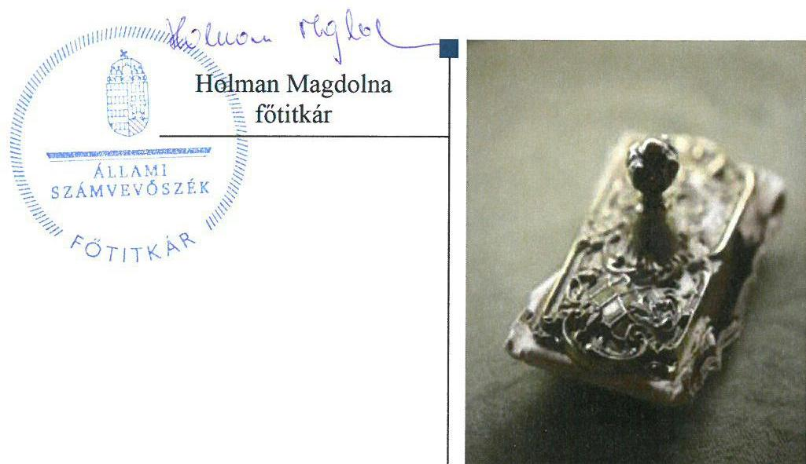

# Jelentés 

## Pártok gazdálkodása

A költségvetési támogatásban részesülő pártok 2015-2016. évi gazdálkodása törvényességének ellenőrzése a Demokratikus Koalíciónál 2018.

---

# Jelentés 

## Pártok gazdálkodása

A költségvetési támogatásban részesülő pártok 2015-2016. évi gazdálkodása törvényességének ellenőrzése a Demokratikus Koalíciónál
2018. 01. hó 09. nap

---

# AZ ELLENŐRZÉST FELÜGYELTE: 

DR. NAGY IMRE felügyeleti vezető

## AZ ELLENŐRZÉST VEZETTE ÉS A VÉGREHAJTÁSÁÉRT FELELŐS:

KAKAS SÁNDOR ellenőrzésvezető

## A PROGRAM ÖSSZEÁLLÍTÁSÁÉRT FELELŐS:

TÓTPÁL SZABOLCS osztályvezető

## A TÉMÁHOZ KAPCSOLÓDÓ KORÁBBI SZÁMVEVŐSZÉKI JELENTÉSEK:

- címe: Jelentés a költségvetési támogatásban részesülő pártok 2013-2014. évi gazdálkodása törvényességének ellenőrzéséről - Demokratikus Koalíció
- sorszáma: 16120

IKTATÓSZÁM: EL-0277-108/2017.
TÉMASZÁM: 34
ELLENŐRZÉS-AZONOSÍTÓ SZÁM: V080304

---

# TARTALOMJEGYZÉK 

■ ÖSSZEGZÉS ..... 5
■ AZ ELLENŐRZÉS CÉLJA ..... 6
■ AZ ELLENŐRZÉS TERÜLETE ..... 7
■ AZ ELLENŐRZÉS HÁTTERE, INDOKOLTSÁGA ..... 8
■ A JELENTÉS LÉNYEGES KÉRDÉSKÖREI ..... 9
■ ELLENŐRZÉS HATÓKÖRE ÉS MÓDSZEREI ..... 10
■ MEGÁLLAPÍTÁSOK ..... 12
■ JAVASLATOK ..... 17
■ MELLÉKLETEK ..... 19
I. sz. melléklet: Értelmező szótár ..... 19
■ FÜGGELÉK: ÉSZREVÉTELEK ..... 21
■ RÖVIDÍTÉSEK JEGYZÉKE ..... 25

---

.

---

# ÖSSZEGZÉS 

Az Állami Számvevőszék a Demokratikus Koalíció gazdálkodásának törvényességét ellenőrizte a 2015. január 1-jétől 2016. december 31-ig terjedő időszakra vonatkozóan. Megállapította, hogy gazdálkodásának szabályozási környezetét nem a jogszabályi előírásoknak megfelelően alakította ki, nem teremtette meg a közpénzekkel való átlátható és ellenőrizhető gazdálkodás alapjait. A pénzügyi kimutatásai nem feleltek meg a jogszabályi előírásoknak. A könyvvezetése és gazdálkodása során a vonatkozó jogszabályi rendelkezéseket és belső előírásokat nem tartotta be. A Demokratikus Koalíció müködéséhez a jogszabályt megsértve tiltott vagyoni hozzájárulást fogadott el.

## Az ellenőrzés társadalmi indokoltsága

A pártok az állampolgárok egyesülési szabadsága alapján létrehozott olyan szervezetek, amelyek kereteket nyújtanak a népakarat kialakításához és kinyilvánításához, a politikai életben való állampolgári részvételhez.

A politikai élet tisztasága érdekében törvény állapítja meg a pártok vagyonára és gazdálkodására vonatkozó szabályokat. Az egyesülési jog alapján létrejövő más szervezetekhez képest szűkebb körben határozza meg azt a gazdasági tevékenységet, amelyet a párt végezhet, biztosítja azonban a pártok részére azt a jogosultságot, hogy az állami költségvetésből támogatásban részesüljenek. A pártok gazdálkodását a politikai élet tisztasága érdekében rendszeresen indokolt ellenőrizni, ezért törvényi előírás alapján az Állami Számvevőszék a költségvetési támogatást kapott pártok gazdálkodását kétévente ellenőrzi.

## Főbb megállapítások, következtetések, javaslatok

A Demokratikus Koalíció gazdálkodására vonatkozó számviteli keretek kialakítása és a belső szabályozások tartalma nem felelt meg a jogszabályi előírásoknak, így a párt nem teremtette meg a közpénzekkel való átlátható és ellenőrizhető gazdálkodás alapjait. Az ellenőrzési rendszere nem az előírásoknak megfelelően múködött.

A Demokratikus Koalíció a 2015. és 2016. évi pénzügyi kimutatását nem a jogszabályi előírásoknak megfelelően készítette el, a pénzügyi kimutatásokat a jogszabály által előírt határidőben közzétette a Magyar Közlönyben, és a honlapján. A jogszabályi előírások ellenére a Magyar Közlönyben közzétett 2016. évi pénzügyi kimutatásban nem nevesített egy magánszemély által adományozott, 500 ezer Ft feletti összeget. A pénzügyi kimutatások összeállítása során a következetesség számviteli alapelv nem érvényesült.

A Demokratikus Koalíció a múködéséhez a jogszabály előírása ellenére a 2015. évben összesen 5480 ezer Ft, 2016. évben összesen 2765 ezer Ft értékben tiltott, nem pénzbeli vagyoni hozzájárulást fogadott el jogi személyektől.

A Demokratikus Koalíció a múködéséhez a forrásokat nem szabályszerűen számolta el, a kiadások elszámolása során az utalványozás, a rendelkezés végrehajtása igazolásának szabálytalansága miatt a jogszabályok előírásait nem tartotta be, a közpénzekkel nem átlátható és ellenőrizhető módon gazdálkodott.

A megállapítások alapján az ÁSZ a DK elnökének 13 javaslatot fogalmazott meg, amelyre 30 napon belül intézkedési tervet kell készítenie.

---

# AZ ELLENŐRZÉS CÉLJA 

AZ ELLENŐRZÉS CÉLJA annak értékelése volt, hogy a közzétett pénzügyi kimutatások a törvényi előírásoknak megfeleltek-e, a könyvvezetés és gazdálkodás során betartották-e a vonatkozó jogszabályi és belső előírásokat; a Demokratikus Koalíció a múködéséhez szabályszerűen igénybe vehető forrásokat használt-e fel.

---

# AZ ELLENŐRZÉS TERÜLETE 

## Demokratikus Koalíció

A Demokratikus Koalíció 2011. november 6-án létrejött olyan egyesület, amely nyilvántartott tagsággal rendelkezik, és a nyilvántartásba vételét végző bíróság előtt kinyilvánította, hogy a Párttörvény ${ }^{1}$ rendelkezéseit magára nézve kötelezőnek ismeri el a Párttörvény 1. §-a alapján.

A Demokratikus Koalíció legfőbb szerve a Kongresszus². A párt vezetésével kapcsolatos feladatokat az Elnökség ${ }^{3}$ látja el. Az Elnökség mellett múködő véleményező, tanácsadó testület az Országos Tanács ${ }^{4}$. A párt jelenlegi Elnöke ${ }^{5}$ a Demokratikus Koalíció alakulása óta tölti be tisztét.

A Demokratikus Koalíció az ellenőrzött időszak mindkét évében 132000 ezer Ft központi költségvetési támogatásban részesült. A 2015. évi pénzügyi kimutatásban 205378 ezer Ft bevételt, valamint 160916 ezer Ft kiadást számolt el. A 2016. évi pénzügyi kimutatás szerint az összes bevétele 195962 ezer Ft, a teljesített kiadások összege 187419 ezer Ft volt. A Demokratikus Koalíció 2015. évi és 2016. évi főkönyvi kimutatása szerint rövid lejáratú kölcsönökkel rendelkezett, amelynek értéke 2015-ben 15393 ezer Ft, 2016-ban pedig 20652 ezer Ft volt.

A Demokratikus Koalíció 2014-ben létrehozta az Új Köztársaságért Alapítványt, továbbá 2012-ben létrehozta a DÉKÁ Rendezvény Kft-t.

---

# AZ ELLENŐRZÉS HÁTTERE, INDOKOLTSÁGA 

Az ÁSZ tv. ${ }^{6}$ 5. § (11) bekezdés a) pontja, valamint a Párttörvény 10. § (1) bekezdése alapján a pártok gazdálkodása törvényességének ellenőrzésére az ÁSZ ${ }^{7}$ jogosult. Törvényi előírás az ÁSZ kétévente ellenőrzi azoknak a pártoknak a gazdálkodását, amelyek rendszeres költségvetési támogatásban részesültek.

Az ÁSZ legutóbb a Demokratikus Koalíció 2013-2014. évi gazdálkodásának törvényességét ellenőrizte.

A gazdálkodás szabályszerűségének, a felhasznált közpénzek nagyságának bemutatásával a társadalom objektív képet alkothat a pártok múködéséről. Az ellenőrzés megállapításai a gazdálkodás megfelelőségének bemutatásával elősegíthetik, hogy a törvényalkotók konkrét lépéseket tegyenek a pártok finanszírozására vonatkozó szabályozások megváltoztatása, átláthatóbbá, ellenőrizhetőbbé tétele irányába. Az ellenőrzés rámutathat a pártok gazdálkodásával, valamint az állami költségvetésből származó források felhasználásával kapcsolatos jó gyakorlatokra és szabálytalanságokra. A hiányosságok, szabálytalanságok feltárása, az ennek kapcsán megfogalmazott megállapítások elősegíthetik a törvényi rendelkezések megsértésének szankcionálását.

---

# A JELENTÉS LÉNYEGES KÉRDÉSKÖREI 

1. A Demokratikus Koalíció gazdálkodásának törvényessége biztositott volt-e?
2. A Demokratikus Koalíció pénzügyi kimutatása megfelelt-e a törvényi előírásoknak, közzétételi kötelezettségét szabályszerűen teljesítette-e?
3. A Demokratikus Koalíció könyvvezetése és gazdálkodása során a vonatkozó jogszabályi rendelkezéseket és belső előírásokat betartotta-e?

---

# ELLENŐRZÉS HATÓKÖRE ÉS MÓDSZEREI 

## Az ellenőrzés típusa

Szabályszerüségi ellenőrzés.

## Az ellenőrzött időszak

2015-2016. évek

## Az ellenőrzés tárgya

A Demokratikus Koalíció ellenőrzése során az ellenőrzés tárgyát képezték a 2015. és a 2016. évre vonatkozó pénzügyi kimutatás elkészítésére, jóváhagyására, közzétételére, a párt könyvvezetésére, gazdálkodására, ennek keretében a számviteli szabályozás kialakítására, a bizonylati rend, bizonylati fegyelem betartására, egyéb gazdálkodási, ellenőrzési és pénzügyiszámviteli informatikai feladatok ellátására irányuló tevékenységek. Az ellenőrzés tárgya volt még a források elszámolása és felhasználása, valamint a vagyon jogszabályi előírásoknak megfelelő hasznosítása.

Az ellenőrzés kiterjedt minden olyan körülményre és adatra, amely az ÁSZ jogszabályban meghatározott feladatainak teljesítéséhez, valamint a program végrehajtása folyamán felmerült újabb összefüggések feltárásához szükséges volt.

## Az ellenőrzött szervezet

Demokratikus Koalíció

## Az ellenőrzés jogalapja

Az ellenőrzés jogalapját az ÁSZ tv. 5. § (11) bekezdés a) pontja, a Párttörvény 4. § (4)-(5) bekezdései, valamint 10. § (1) és (3)-(4) bekezdései képezte.

## Az ellenőrzés módszerei

Az ÁSZ az ellenőrzést az ellenőrzési program szempontjai, az ellenőrzött időszakban hatályos jogszabályok, az ellenőrzés általános szakmai szabá-

---

lyai az ellenőrzésre irányadó ÁSZ módszertanok figyelembevételével végezte. A gazdálkodás hibáinak kijavítására irányuló javaslatok kidolgozásakor a hatályos jogszabályok voltak az irányadóak.

Az ÁSZ az ellenőrzés ideje alatt a Demokratikus Koalícióval történő kapcsolattartást az ÁSZ SZMSZ ${ }^{8}$-ének vonatkozó előírásai alapján biztosította.

A Demokratikus Koalíció vonatkozásában kockázatjelzést az ÁSZ nem kapott

Az ellenőrzési bizonyítékként felhasználható adatforrások közé tartoztak egyrészt az ellenőrzési program részletes szempontjainál felsorolt adatforrások, másrészt minden egyéb az ellenőrzés folyamán feltárt, az ellenőrzés szempontjából információt tartalmazó dokumentum.

A pénzügyi kimutatás könyvviteli nyilvántartás adataival való egyezőségének, a könyvvezetés és gazdálkodás szabályszerűségének ellenőrzéséhez az ÁSZ tételes ellenőrzést és mintavételi eljárást is alkalmazott. Teljes körűen ellenőrzésre kerültek a központi költségvetésből származó támogatások, illetve a párt által nyújtott támogatások. Statisztikai mintavételi eljárás alapján ellenőrizte az ÁSZ az egyéb területeket.

A jogi személyiséggel rendelkező bérbeadó szervezettől származó, kedvezményes bérleti díj formájában kapott tiltott nem pénzbeli vagyoni hozzájárulások értékét az ÁSZ a következő módszerrel határozta meg. Az Áht. ${ }^{9}$ hatálya alá tartozó bérbeadó szervezet tulajdonában lévő ingatlan esetében megvizsgálta, hogy más civil szervezet - amennyiben ilyen megkülönböztetést nem alkalmaztak, bármely más bérlő - esetében azonos mértékű fajlagos bérleti díjat alkalmazott-e a bérbeadó az azonos övezeti besorolású, azonos komfortfokozatú bérleményeknél. Amennyiben a párt által fizetendő bérleti díj alacsonyabb volt, akkor a más civil szervezetek, illetve egyéb szervezetek által fizetendő legmagasabb díj és a párt által fizetett díj különbözeteként állapította meg a tiltott forrásból származó nem pénzbeli hozzájárulás értékét az ÁSZ. Amennyiben a bérbeadó szervezetnek azonos övezetben, azonos komfortfokozatú ingatlan bérbeadása nem volt, valamint az egyéb piaci szereplő bérbeadók esetében értékbecslő által megállapított piaci bérleti díj és a párt által ténylegesen fizetett bérleti díj különbözetében állapította meg az ÁSZ a tiltott nem pénzbeli vagyoni hozzájárulás értékét.

Az ellenőrzés lefolytatásához a Demokratikus Koalíció a tanúsítványok kitöltésével, valamint az ÁSZ által kért dokumentumok megküldésével szolgáltatott adatokat. A rendelkezésre bocsátott adatok, információk kontrollja az ellenőrzés keretében történt.

Az ÁSZ az ellenőrzést a Demokratikus Koalíció által rendelkezésre bocsátott dokumentumokra, adatokra alapozta. Az ellenőrzés céljának eléréséhez szükséges bizonyítékokat a számvevő az egyes adatok közvetlen, részletes elemzésével alapozta meg, a következő ellenőrzési eljárások alkalmazásával: megfigyelés, szemrevételezés, információkérés, megerősítés, valamint elemző eljárás.

---

# 1. A Demokratikus Koalíció gazdálkodásának törvényessége biztosított volt-e? 

Összegző megállapítás

### 1.1. számú megállapítás

A DK ${ }^{10}$ gazdálkodásának törvényessége nem volt biztosított.
A DK gazdálkodására vonatkozó számviteli keretek kialakítása és a belső szabályozások nem feleltek meg a jogszabályi előírásoknak.

A DK a Számv. tv.-ben ${ }^{11}$ előírt szabályzatokkal a számlarend kivételével rendelkezett, amelyeket az Alapszabály $1-3^{12}$ előírásaival összhangban az Elnökség elfogadott.

A DK a Számv. tv. 14. § (11) bekezdés előírása ellenére nem vezette át 90 napon belül a Számviteli Politikán ${ }_{1,2}$ a Számv. tv. előírásainak változását, mint a jelentős, nem jelentős összegű hiba definíciójának módosulása, a kivételes nagyságú, vagy előfordulású bevétel, költség, ráfordítás meghatározása, továbbá a Párttörvény módosításából eredő, a pénzügyi kimutatás közzétételének időpontjára és tartalmára vonatkozó változásokat sem.

A DK a Számviteli Politikáját ${ }_{1,2}$ a Számv. tv. 14. § (3) bekezdésében foglaltak ellenére nem a sajátosságainak figyelembe vételével alakította ki, mert az nem tartalmazta a pénzügyi kimutatásban történő szabályszerű megjelenítéshez az eszközbeszerzések, egyéb kiadások, működési kiadások, és politikai tevékenység kiadásainak fogalomkörét, ismérveit.

A Számviteli Politika ${ }_{1,2}$ előírása ellenére a DK az ellenőrzött időszakban rendelkezett befektetett pénzügyi eszközökkel, mivel az általa alapított gazdasági társaságban 3000 ezer Ft összegű tartós részesedése volt.

A Számviteli Politika ${ }_{1,2}$ keretében elkészített Értékelési Szabályzat ${ }_{1,2}{ }^{13}$ a Számv. tv. előírásainak megfelelt. A DK a Pénzkezelési Szabályzat ${ }_{1-3}$-ban ${ }^{14}$ a Számv. tv. 14. § (8) bekezdésében foglalt előírások ellenére az ellenőrzött időszakban nem határozta meg a napi készpénz záró állomány maximális mértékét. A 2016. szeptember 30. napjáig hatályos Leltározási Szabályzat ${ }_{1}{ }^{15}$ a Számv. tv. 69. § (3) bekezdés előírásával ellentétesen a 3 év helyett 5 évente írt elő kötelező mennyiségi felvétellel történő leltározást a folyamatos mennyiségi nyilvántartás vezetésével érintett eszközöknél.

A DK a Számv. tv. 161. § (1) bekezdésének előírása ellenére számlarendet nem készített.

A DK az Alapszabály ${ }_{1-3}$-ban és a Gazdálkodási Szabályzatban ${ }^{16}$, a Párttörvényben előírt korlátozásokkal összhangban határozta meg a vagyonra és a gazdálkodásra vonatkozó rendelkezéseket.

### 1.2. számú megállapítás

A DK könyvvezetése, nyilvántartási rendszere nem felelt meg a jogszabályi és belső szabályozási előírásoknak.

Az analitikus nyilvántartások és a főkönyvi könyvelés közötti egyezőséget az ellenőrzött időszakban a Számv. tv.-el összhangban biztosították.

---

A DK pénzügyi kimutatásaiban szereplő bevételek és kiadások elszámolását alátámasztó bizonylatok a Számv. tv. 167. § (1) bekezdés c) pontjának előírása ellenére nem tartalmazták az utalványozó, illetve a rendelkezés végrehajtását igazoló személy aláírását. A kiadások közül a költségtérítések elszámolása nem volt szabályszerű, mert a DK a gépjármú használathoz kapcsolódó költségtételeket a Számv. tv. 79. § (3) bekezdése és a Számviteli Politka ${ }_{1,2}$ VIII./2. pontja ellenére nem a személyi jellegú egyéb kiadások között, hanem az igénybevett szolgáltatások között számolta el.

A DK a Számv. tv. 69. § (1) bekezdésében és a Leltározási Szabályzatban ${ }_{1,2}$ előírt leltározási kötelezettségének nem tett eleget, leltárral nem rendelkezett.

Az alkalmazott informatikai rendszer a törvényben előírt megőrzési idő alatt a számviteli adatállományokból az adatok teljes körú előállíthatóságát biztosította.
1.3. számú megállapítás

A DK ellenőrzési rendszerének múködése nem felelt meg az előírásoknak.

A DK esetében a vezetői ellenőrzésre vonatkozó szabályok az Alapszabály-ban ${ }_{1-3}$, Számviteli Politikában ${ }_{1,2}$, és a Pénzkezelési Szabályzatban ${ }_{1-3}$ kialakításra kerültek. A DK a Ptk. ${ }^{17}$ 3:82. § (1) bekezdésének előírásai ellenére Felügyelő bizottságot nem hozott létre.

A pénzügyi ellenőrzési feladatok ellátása érdekében a Gazdálkodási Szabályzatban rendelkeztek az PEB ${ }^{18}$ létrehozásáról, amelynek feladata a DK gazdálkodásának ellenőrzése volt. A PEB az ellenőrzési időszakban a Gazdálkodási Szabályzat 3. § 4. pontjában foglalt előírások ellenére a DK gazdálkodására vonatkozó ellenőrzést nem végzett.

# 2. A Demokratikus Koalíció pénzügyi kimutatása megfelelt-e a törvényi előírásoknak, közzétételi kötelezettségét szabályszerűen teljesítette-e? 

Összegző megállapítás

## 2.1. számú megállapítás

A DK között pénzügyi kimutatásai a jogszabályi előírásoknak nem feleltek meg, közzétételi kötelezettségét határidőben teljesítette.

A DK pénzügyi kimutatásai a jogszabályi előírásoknak nem feleltek meg.

A 2015. évre vonatkozó pénzügyi kimutatást nem a Párttörvény 1. számú melléklete szerinti formátumban készítették el. A 2015. évi pénzügyi kimutatás nem tartalmazta a bevételeket érintően a "A párt országgyúlési csoportjának nyújtott állami támogatás", „A párt által alapított korlátolt felelősségű társaság nyereségéből származó bevétel" sorokat, továbbá a kiadások vonatkozásában a „Támogatás a párt országgyúlési képviselőcsoportja számára", a „Támogatás egyéb szervezetnek", és a „Vállalkozások alapítására fordított összegek" sorokat. A DK a 2016. évre vonatkozó pénzügyi kimutatást a jogszabály által előírt szerkezetben készítette el.

---

A DK a Párttörvény 4. § (2) bekezdésében foglaltak ellenére a 2015. évben 2270 ezer Ft, a 2016. évben 30 ezer Ft összegben fogadott el tiltott támogatást, amelyek egy külföldi székhelyű, a Man szigeten bejegyzett gazdasági társaság utalásaiból származtak. Az elfogadott tiltott támogatásokat a 2015. év és a 2016. év pénzügyi kimutatásai az egyéb adományok, hozzájárulások soron tartalmazták.

A Párttörvény 9. § (2) bekezdésében foglaltak ellenére a DK a Magyar Közlönyben közzétett 2016. évi pénzügyi kimutatásában nem szerepeltetett nevesítve egy magánszemély által adományozott 500 ezer Ft-ot meghaladó - 756 ezer Ft - összegű hozzájárulást, ettől eltérően a honlapján közzétett 2016. évi pénzügyi kimutatásban az érintett magánszemély 500 ezer Ft feletti hozzájárulása szerepelt.

Az Elnökség a Magyar Közlönyben közzétett pénzügyi kimutatásokat fogadta el az Alapszabály ${ }_{1-3}$ előírása szerint.

A pénzügyi kimutatás összeállítása során a Számv. tv. 15. § (5) bekezdése szerinti következetesség elve nem érvényesült, tekintettel arra, hogy a pénzügyi kimutatások az ellenőrzött időszakban nem azonos elvek figyelembe vételével készültek el. A Párttörvény 1. számú mellékletében a Kiadások 5. Eszközbeszerzés sorban 2015. évet érintően az eszközbeszerzési kiadások mellett a tárgyévben költségként elszámolt 100 ezer Ft feletti eszközök értékcsökkenését is kimutatta, míg a 2016. évben a Számv. tv.-nek megfelelően a tárgyévi eszközbeszerzések főkönyvi számlák értékét jelenítette meg. A pénzügyi kimutatások a bevételi sorokra vonatkozó összeállításukat tekintve is tartalmaztak különbözőséget, a Számviteli politika VIII./2. pontjában meghatározott előírás ellenére a karitatív támogatás bevételét a 2015. évben az Egyéb bevételek között, míg a 2016. évben a Számviteli politikának megfelelően az Egyéb hozzájárulások, adományok bevételei között szerepeltették.

# 2.2. számú megállapítás 

A DK a pénzügyi kimutatásait a jogszabályban meghatározott határidőben közzétette.

A DK a pénzügyi kimutatásait a Párttörvényben meghatározott határidőben, a Magyar Közlöny Mellékletét képező Hivatalos Értesítőben, és a honlapján közzétette.

## 3. A Demokratikus Koalíció könyvvezetése és gazdálkodása során a vonatkozó jogszabályi rendelkezéseket és belső előírásokat be-tartotta-e?

Összegző megállapítás
A DK a könyvvezetése és gazdálkodása során a vonatkozó jogszabályi rendelkezéseket és belső előírásokat nem tartotta be.
3.1. számú megállapítás

A DK múködési forrásainak elszámolása nem volt szabályszerű.
A DK a tagdíjfizetés szabályait, és a fizetendő tagdíj összegét az Alapsza-bályban ${ }_{1-3}$ és az SZMSZ ${ }_{1-4}{ }^{19}$-ben határozta meg.

A pénzügyi kimutatásban megjelenített, központi költségvetésből származó támogatás az előírásoknak megfelelően megegyezett a könyvviteli

---

nyilvántartással, továbbá a 2015. évi ${ }^{20}$ és a 2016. évi költségvetési törvényekben ${ }^{21}$ meghatározott összegekkel. A DK az ellenőrzött időszak mindkét évében 132000 ezer Ft központi költségvetési támogatást kapott.

Az egyéb hozzájárulások, adományok és az egyéb bevételek elszámolása nem volt szabályszerű az ellenőrzött időszakban.

A pénzügyi kimutatásaiban szereplő egyéb adományok, hozzájárulások, és egyéb bevételi jogcím összegeinek elszámolását alátámasztó bizonylatok a Számv. tv 167. § (1) bekezdés c) pontjának előírása ellenére nem tartalmazták a bankszámlára befolyt bevételek esetében az utalványozó személy aláírását.

Az egyéb hozzájárulások, adományok, illetve az egyéb bevételi jogcím sorok tartalma a pénzügyi kimutatásokban - a 2015. évi karitatív támogatások összegén kívül - a Párttörvény és a Számv. tv. előírásainak megfelelően megegyezett a könyvviteli nyilvántartással, azon csak az előírt jogcímű, bizonylattal alátámasztott összegek szerepeltek.

A DK az „Egyéb hozzájárulások, adományok" beszámoló soron az 500 ezer Ft összeghatáron felüli adományokat a 2.1. pontban megjelölt egy magánszemély által juttatott adomány kivételével az előírások szerint nevesítve rögzítette. A 2015. évi pénzügyi kimutatásban 5851 ezer Ft, hat magánszemélytől származó, a 2016. évi pénzügyi kimutatásban 3724 ezer Ft, négy magánszemélytől származó 500 ezer Ft feletti hozzájárulást mutatott ki.

A Párttörvény 4. § (2) bekezdése értelmében a pártok jogi személyektől, nem magyar állampolgár természetes személytől vagyoni hozzájárulást, valamint névtelen adományt nem fogadhatnak el. A DK a Párttörvény 4. § (2) bekezdésének előírása ellenére a 2015. évben 2270 ezer Ft, a 2016. évben 30 ezer Ft összegű tiltott támogatást kapott.

A Párttörvény 4. § (5) bekezdése szerint, ha a párt a (2) bekezdésben foglalt szabályt megsértve, tiltott nem pénzbeli hozzájárulást fogadott el, annak értékét az Állami Számvevőszék állapítja meg. Ennek megfelelően az ÁSZ megállapította, hogy a DK a bérelt ingatlanok után 2015. évben 3210 ezer Ft, a 2016. évben 2735 ezer Ft nem pénzbeli vagyoni hozzájárulást fogadott el jogi személytől, amely a Párttörvény 2014. január 1-jétől hatályos rendelkezései szerint tiltott nem pénzbeli hozzájárulásnak minősül.

A DK gazdálkodási-vállalkozási tevékenységet nem végzett, pártalapítványával - az Új Köztársaságért Alapítvánnyal - közös feladatot nem végzett, vagyoni hozzájárulást, támogatást a Párttörvény előírásának megfelelően a pártalapítványtól nem fogadott el.

# 3.2. számú megállapítás 

A DK a gazdálkodással összefüggő tevékenységének keretében a kiadások elszámolása során nem tartotta be a jogszabályok és a belső szabályzatok előírásait.

A DK kiadásainak elszámolása az ellenőrzött időszakban nem volt szabályszerű.

A kiadások közül a költségtérítések elszámolását tekintve a könyvviteli számlákra történő hivatkozás, kontírozás/számlakijelölés nem felelt meg a Számv. tv. 167. § (1) bekezdés h.) pontjának, mert a DK a gépjármú használathoz kapcsolódó költségtételeket a Számv. tv. 79 § (3) bekezdése és a

---

Számviteli Politka ${ }_{1,2}$ VIII./2. pontja ellenére nem a személyi jellegú egyéb kiadások között, hanem az igénybevett szolgáltatások között számolta el.

A pénzügyi kimutatásaiban szereplő kiadások könyvviteli elszámolását közvetlenül alátámasztó bizonylatok a Számv. tv 167. § (1) bekezdés c.) pontjának előirása ellenére nem tartalmazták az utalványozó személy, illetve a rendelkezés végrehajtását igazoló személy aláírását.

A foglalkoztatás és a személyi jellegú kifizetések, illetve az ehhez kapcsolódó bejelentési, adó- és járulék nyilvántartási, levonási, bevallási, befizetési, adatszolgáltatási kötelezettségek teljesítése megfelelt az Art. ${ }^{22}$, az Szja tv. ${ }^{23}$ előírásainak, és a belső szabályzatokban foglaltaknak. A bérjellegú és egyéb személyi kiadások elszámolása során a Számv. tv. előírásait betartották.

A DK eszközbeszerzései kifizetése és elszámolása szabályszerű volt, az értékcsökkenés elszámolásáról az előírásoknak megfelelően gondoskodtak.

# 3.3. számú megállapítás 

## A DK múködése során a vagyon használata megfelelt a törvényi előírásoknak.

A DK a vagyonnal való gazdálkodásának alapvető szabályait az Alapszabályban $_{1-3}$, az SZMSZ $_{1-4}$-ben és a Gazdálkodási Szabályzatban a jogszabályoknak megfelelően rögzítette.

A DK az ellenőrzött időszakban saját tulajdonú ingatlannal, jogszabály szerint céljaira rendelt vagyonnal nem rendelkezett, a Vagyon tv. ${ }^{24}$ alapján az MFB $^{25}$ által nyújtott hitelt nem vett igénybe, gazdálkodási tevékenységet, vagyonhasznosítást nem folytatott.

---

# JAVASLATOK 

Az ÁSZ tv. 33. § (1) bekezdésében foglaltak értelmében az ellenőrzött szervezet vezetője köteles a jelentésben foglalt megállapításokhoz kapcsolódó intézkedési tervet összeállítani és azt a jelentés kézhezvételétől számított 30 napon belül az ÁSZ részére megküldeni. Amennyiben az ellenőrzött szervezet vezetője nem küldi meg határidőben az intézkedési tervet, vagy továbbra sem elfogadható intézkedési tervet küld, az Állami Számvevőszék elnöke az ÁSZ tv. 33. § (3) bekezdése a) és b) pontjaiban foglaltakat érvényesítheti.

## Demokratikus Koalíció Elnökének

1. Intézkedjen a Számlarend elkészitéséről a jogszabályban meghatározott tartalmi követelményeknek megfelelően.
(1.1. számú megállapítás 6. bekezdése alapján)
2. Intézkedjen a Számviteli Politika jogszabályi előírásoknak megfelelő módosításáról.
(1.1. számú megállapítás 2.-4. bekezdése alapján)
3. Intézkedjen a Pénzkezelési Szabályzat kiegészitéséről a jogszabályi előírásokban foglalt követelményeknek megfelelően.
(1.1. számú megállapítás 5. bekezdés 2. mondata alapján)
4. Intézkedjen a Leltározási Szabályzat módosításáról a jogszabályi előírásoknak megfelelően.
(1.1. számú megállapítás 5. bekezdés 3. mondata alapján)
5. Gondoskodjon arról, hogy a bevételek és ráfordítások könyvviteli elszámolását alátámasztó bizonylatok a jogszabályokban foglaltak szerint tartalmazzák az utalványozó és a rendelkezés végrehajtását igazoló személy aláírását.
(1.2. számú megállapítás 2. bekezdés 1. mondata, valamint a 3.1. sz. megállapítás 4. bekezdése alapján)
6. Intézkedjen, hogy a költségtérítések elszámolása szabályszerűen történjen.
(1.2. számú megállapítás 2. bekezdés 2. mondata alapján)

---

7. 

Tegyen eleget a jogszabályok és a belső szabályozásban foglalt leltározási és leltárkészitési kötelezettségének.
(1.2. számú megállapítás 3. bekezdése alapján)
8. Intézkedjen jogszabályban elöirt Felügyelő bizottság létrehozásáról.
(1.3. számú megállapítás 1. bekezdés 2. mondata alapján)
9. Gondoskodjon arról, hogy a Pénzügyi Ellenőrző Bizottság a belső szabályzatban elöirt feladatának tegyen eleget.
(1.3. számú megállapítás 2. bekezdés 2. mondata alapján)
10. Intézkedjen a gazdálkodás során a Párttörvényben foglalt elöírások betartására a tekintetben, hogy a jövőben a párt vagyoni hozzájárulást jogi személyektől ne fogadjon el.
(2.1. számú megállapítás 2. bekezdés 1. mondata, valamint
a 3.1. számú megállapítás 7. bekezdés 2. mondata alapján)
11. Intézkedjen a honlapon közzétett tartalomnak megfelelő 2016. évi pénzügyi kimutatás Magyar Közlönyben történő ismételt közzétételéről.
(2.1. számú megállapítás 3. bekezdés alapján)
12. Gondoskodjon, hogy a jövőben a Magyar Közlönyben és a Párt honlapján közzétett pénzügyi kimutatás azonos tartalommal és a jogszabályban elöirtaknak megfelelően tartalmazza a magányszemélyektől származó ötszázezer forintot meghaladó hozzájárulásokat.
(2.1. sz. megállapítás 3. bekezdése alapján)
13. Gondoskodjon a pénzügyi kimutatások elkészitése során a jogszabályi elöírások érvényesitéséről.
(2.1. sz. megállapítás 5. bekezdése alapján)

---

# MELLÉKLETEK 

- I. SZ. MELLÉKLET: ÉRTELMEZŐ SZÓTÁR
pénzügyi kimutatás
gazdálkodó tevékenység
költségvetési támogatás
nem pénzbeli támogatás

A Párttörvény 9. § (1) bekezdésében meghatározott, a törvény 1. számú melléklete szerinti pénzügyi kimutatás (hatályos 2015. május 6-ától), amelyet a pártok kötelesek minden év május 31-ig a Magyar Közlönyben, valamint saját honlappal rendelkező pártok a honlapjukon is közzétenni.
A párt a költségeinek fedezése és vagyonának gyarapítása érdekében a gazdaságivállalkozási tevékenységeket folytathat. (Párttörvény 6. §)
politikai céljainak és tevékenységének megismertetése érdekében kiadványokat jelentethet meg és terjeszthet, a pártot szimbolizáló jelvényeket és más ilyen célú tárgyakat árusíthat, és pártrendezvényeket szervezhet;
a tulajdonában álló ingatlanokat és ingókat dí ellenében hasznosíthatja és elidegenítheti.
Az államháztartás alrendszerei terhére nyújtott pénzbeli vagy nem pénzbeli juttatás, amelyet a támogató nem elsősorban ellenszolgáltatás ellenében, de konkrét program megvalósítása vagy meghatározott időszakban a támogatott szervezet müködtetése érdekében nyújt. (Civil tv. ${ }^{26}$ 2. § 15. pont)
vagyoni értékkel rendelkező forgalomképes dolog, szellemi alkotás, illetve vagyoni értékű jog részben vagy egészében, véglegesen vagy ideiglenesen, teljesen vagy részben ingyenesen történő átruházása vagy átengedése, illetve szolgáltatás biztosítása. Civil tv. 2. § 25. pont)

---

.

---

# FÜGGELÉK: ÉSZREVÉTELEK 

Az ÁSZ tv. 29. §* (1) bekezdésének megfelelően az Állami Számvevőszék az ellenőrzési megállapításait megküldte az ellenőrzött szervezet vezetőjének. Az ÁSZ tv. 29. § (2) bekezdése alapján az ellenőrzött szervezet vezetője az ellenőrzés megállapításaira tizenöt napon belül írásban észrevételt tehetett.

A Demokratikus Koalíció elnöke a jelentéstervezet megállapításaira 15 észrevételt tett.
Az ÁSZ tv. 29. § (3) bekezdésével összhangban az ÁSZ a Függelékben feltünteti a jelentéstervezet megállapításaival kapcsolatban tett, figyelembe nem vett észrevételeket, és megindokolja, hogy azokat miért nem fogadta el.

[^0]
[^0]:    * 29. § (1) Az Állami Számvevőszék az ellenőrzési megállapításait megküldi az ellenőrzött szervezet vezetőjének vagy az általa megbízott személynek, és annak, akinek személyes felelősségét állapította meg.
    (2) Az ellenőrzött szervezet vezetője és a felelősként megjelölt személy az ellenőrzés megállapításaira tizenöt napon belül írásban észrevételt tehet.
    (3) Az Állami Számvevőszék az észrevételre a beérkezésétől számított harminc napon belül írásban válaszol. A figyelembe nem vett észrevételeket köteles a jelentésben feltüntetni, és megindokolni, hogy azokat miért nem fogadta el.

---

A Demokratikus Koalíció elnökének 2018. január 2-án írt (az Állami Számvevőszékhez 2018. január 4-én érkezett) levelében a jelentéstervezet megállapításaival kapcsolatban tett, figyelembe nem vett észrevételek és azok indokolása.

# 1. Észrevételt tett a jelentéstervezet következtetésére, mely szerint a DK nem teremtette meg a közpénzekkel való átlátható és ellenőrizhető gazdálkodás alapjait. 

Az észrevétele nem megalapozott, azt nem fogadom el, a megállapítás nem módosul. Az észrevétel a számvevőszéki jelentéstervezet azon megállapításait sorolta fel, amelyeket az ellenőrzés szabályszerűnek ítélt, ugyanakkor nem tett észrevételt azon megállapításokra, amelyek szabálytalanságot állapítanak meg, illetve az átlátható és ellenőrizhető gazdálkodásra vonatkozó összegző következtetést megalapozzák. Így nem kifogásolta az 1.1. számú megállapítás (számviteli keretek és belső szabályozások) 2.-3.és az 5.- 6. bekezdésében, az 1.2. számú megállapítás (könyvvezetés, nyilvántartási rendszer) 2. és 3. bekezdésében, továbbá az 1.3. számú megállapítás (ellenőrzési rendszer működése) 1. és 2. bekezdésében rögzített szabálytalanságokat és hiányosságokat, amelyek alátámasztják a jelentéstervezet észrevételezett következtetését.

## 2. Észrevételt tett a tiltott vagyoni hozzájárulás megállapításának módjára.

Az észrevétele nem megalapozott, azt nem fogadom el, a megállapítás nem módosul. A Párttörvény 4. § (2) bekezdése értelmében a pártok jogi személyektől vagyoni hozzájárulást nem fogadhatnak el. A Párttörvény 4. § (5) bekezdése szerint, ha a párt részére a vagyoni hozzájárulást nem pénzben nyújtották, köteles annak értékeléséről (értékének meghatározásáról) gondoskodni. A Párttörvény 4. § (5) bekezdése szerint, ha a párt a (2) bekezdésben foglalt szabályt megsértve, tiltott, nem pénzbeli hozzájárulást fogadott el, annak értékét az ÁSZ állapítja meg.
A DK által az ellenőrzés rendelkezésére bocsátott dokumentumok alapján az ÁSZ megállapította, hogy a DK a jogi személytől bérelt ingatlan tekintetében 2015-2016. években nem gondoskodott a nem pénzben nyújtott vagyoni hozzájárulás értékeléséről, értékének meghatározásáról. A DK nem teljesítette törvényi kötelezettségét. A Párttörvény előírása alapján a tiltott, nem pénzbeli hozzájárulás értékét az ÁSZ állapította meg.

## 3. Észrevételt tett a számlarenddel kapcsolatos megállapításra.

Az észrevétele nem megalapozott, azt nem fogadom el, a megállapítás nem módosul. Az észrevétel a megállapítást nem cáfolja, hanem azt megerősíti. Az észrevétele is tartalmazza, hogy az ellenőrzés során a számlarend az ÁSZ részére nem került megküldésre. A DK az ÁSZ adatbekéréseihez megküldött teljességi és hitelességi nyilatkozataiban kijelentette, hogy az ÁSZ részére átadott dokumentumok, adatok a bekért adatokra, dokumentumokra vonatkozóan teljes körű információt tartalmaznak.
4. Észrevételt tett a leltározási szabályzatban a mennyiségi felvétellel történő leltározás gyakoriságával kapcsolatos megállapításra.
Az észrevétele nem megalapozott, azt nem fogadom el, a megállapítás nem módosul. Az észrevétel a leltározási szabályzatban a mennyiségi felvétellel történő leltározás gyakoriságára vonatkozó megállapítást nem cáfolja, hanem azt megerősíti.
5. Észrevételt tett a leltározási kötelezettség elmulasztásával kapcsolatos megállapításra.

Az észrevétele nem megalapozott, azt nem fogadom el, a megállapítás nem módosul. Az ÁSZ EL-0277-004/2017. iktatószámú adatbekérő levelére 2017. szeptember 12-ei keltezéssel adott Teljességi és hitelességi nyilatkozat mellékletében a DK kijelentette, hogy „leltározást elrendelő dokumentum nem készült" a leltározási szabályzat 6. pontjában előírtak ellenére.

---

# 6. Észrevételt tett a számviteli politikával kapcsolatos megállapításra. 

Az észrevétele nem megalapozott, azt nem fogadom el, a megállapítás nem módosul. A számvevőszéki jelentéstervezet 1.1. számú megállapítás 3. bekezdésében hivatkozott Számv. tv. 14. § (3) bekezdése értelmében a Számv. tv.-ben rögzített alapelvek, értékelési előírások alapján kell kialakítani a gazdálkodó adottságainak, körülményeinek leginkább megfelelő, a törvény végrehajtásának módszereit, eszközeit meghatározó számviteli politikát.
7. Észrevételt tett a számviteli politika befektetett pénzügyi eszközökre vonatkozó szabályozásának hiányosságával kapcsolatos megállapításra.
Az észrevétele nem megalapozott, azt nem fogadom el, a megállapítás nem módosul. Az észrevétel a számviteli politika befektetett pénzügyi eszközökre vonatkozó szabályozásának hiányosságával kapcsolatos megállapítást nem cáfolja, hanem azt megerősíti.
8. Észrevételt tett a magáncélú személygépkocsi költségtérítés elszámolásával kapcsolatos megállapításra.

Az észrevétele nem megalapozott, azt nem fogadom el, a megállapítás nem módosul. A DK az észrevételében elismerte az anyagjellegú szolgáltatások kiadások közötti elszámolásként történt téves kimutatását.
9. Észrevételt tett a DK ellenőrzési rendszerének müködésével kapcsolatos megállapításokra.

Az észrevétele nem megalapozott, azt nem fogadom el, a megállapítás nem módosul. Az ellenőrzés részére nem került olyan dokumentum átadásra, amely igazolná, hogy az ellenőrzött 2015. és 2016. éveket érintően a Pénzügyi Ellenőrző Bizottság a DK gazdálkodását ellenőrizte volna. A Pénzügyi Ellenőrző Bizottság 2016. év két ülésének jegyzőkönyvei a DK alapítványának és gazdasági társaságának gazdálkodásával kapcsolatos ügyeket tartalmazták.
10. Észrevételt tett a DK pénzügyi kimutatásának jogszabályi megfelelőségével kapcsolatban tett megállapításra.

Az észrevétele nem megalapozott, azt nem fogadom el, a megállapítás nem módosul. Az észrevétel szerint csak a nulla adattartalmú sorokat nem szerepeltették a 2015. évi pénzügyi kimutatásban. A Párttörvény 1. számú mellékletében meghatározott pénzügyi kimutatás sorainak tartalmával kapcsolatban nincs megengedő előírás, amely alapján nem kell szerepeltetni azon bevételi, illetve kiadási sorokat, amelyek adata 0 Ft , azaz nulla Ft . A pénzügyi kimutatás célja, hogy a törvényben rögzített egységes tartalommal biztosítsa a pártok gazdálkodásának átláthatóságát. A pénzügyi kimutatás összeállítása során a következetesség elvének megsértésével kapcsolatos megállapítást az észrevétel nem vitatta.
11. Észrevételt tett a DK a tiltott támogatás elfogadásával kapcsolatos megállapításra.

Az észrevétele nem megalapozott, azt nem fogadom el, a megállapítás nem módosul. Az észrevételben foglaltak megerősítik, hogy a DK részére külföldi székhelyű társaság utalta a támogatás összegét, amely a számvevőszéki jelentéstervezet megállapítása alapján a Párttörvény értelmében tiltott támogatásnak minősül
12. Észrevételt tett az 500 ezer Ft összeghatáron felüli adományok pénzügyi kimutatásban történő nevesítésének elmulasztására vonatkozó megállapításra.
Az észrevétele nem megalapozott, azt nem fogadom el. A DK az ellenőrzés során nem bocsátott olyan hiteles dokumentumot az ÁSZ rendelkezésére, amely alátámasztaná azt az észrevételét, hogy a befizetés több személytől származik, ezért a pénzügyi kimutatásra vonatkozó megállapítás nem módosul. A DK az ÁSZ adatbekéréseihez korábban megküldött teljességi és hitelességi nyilatkozataiban kijelentette, hogy az ÁSZ részére átadott dokumentumok, adatok a bekért adatokra, dokumentumokra vonatkozóan teljes körű információt tartalmaznak.

---

13. Észrevételt tett a Magyar Közlönyben és a DK saját honlapján közzétett 2016. évi pénzügyi kimutatásának eltérésével kapcsolatos megállapításra.
Az észrevétele nem megalapozott, azt nem fogadom el, a megállapítás nem módosul. Az észrevétel az ellenőrzött időszakra vonatkozóan tett megállapítást nem befolyásolja. Az észrevétel a Magyar Közlönyben és a DK saját honlapján közzétett 2016. évi pénzügyi kimutatásának eltérésével kapcsolatos megállapítást nem cáfolja, hanem azt megerősíti.
14. Észrevételt tett a DK a múködési forrásaival - a bevételi jogcímek összegeinek a jogszabályban elöírt utalványozásával - kapcsolatos megállapításokra.
Az észrevétele nem megalapozott, azt nem fogadom el, a megállapítás nem módosul. Az ÁSZ megállapítását a jelentéstervezetben foglaltaknak megfelelően a Számv. tv 167. § (1) bekezdés c) pontjának előírása támasztja alá, amely a számvevőszéki jelentéstervezet 3.1. számú megállapítás 4. bekezdésében rögzítésre került.
15. Észrevételt tett a DK a gazdálkodásával kapcsolatos kiadásainak jogszabályi és belső megfelelőségével kapcsolatos megállapításokra.
Az észrevétele nem megalapozott, azt nem fogadom el, a megállapítás nem módosul. A megállapítás alátámasztását a konkrét szabálytalanságok meghatározásával a számvevőszéki jelentéstervezet 3.2 számú megállapítás alátámasztásaként részletezett 2. és 3. bekezdések tartalmazzák.

---

# RÖVIDÍTÉSEK JEGYZÉKE 

${ }^{1}$ Párttörvény
${ }^{2}$ Kongresszus
${ }^{3}$ Elnökség
${ }^{4}$ Országos Tanács
${ }^{5}$ Elnök
${ }^{6}$ ÁSZ tv.
${ }^{7}$ ÁSZ
${ }^{8}$ ÁSZ SZMSZ
${ }^{9}$ Áht.
${ }^{10}$ DK
${ }^{11}$ Számv. tv.
${ }^{12}$ Alapszabály $_{1-3}$
${ }^{13}$ Értékelési Szabályzat ${ }_{1,2}$
${ }^{14}$ Pénzkezelési Szabályzat ${ }_{1-3}$
${ }^{15}$ Leltározási Szabályzat ${ }_{1,2}$
${ }^{16}$ Gazdálkodási Szabályzat
${ }^{17}$ Ptk.
${ }^{18}$ PEB
${ }^{19} \mathrm{SZMSZ}_{1-4}$
${ }^{20}$ 2015. évi költségvetési törvény
${ }^{21}$ 2016. évi költségvetési törvény
${ }^{22}$ Art.
${ }^{23}$ Szja. tv.
${ }^{24}$ Vagyon tv.
${ }^{25}$ MFB
${ }^{26}$ Civil tv.
1989. évi XXXIII. törvény a pártok múködéséről és gazdálkodásáról (hatályos 1989. október 30-tól)
Demokratikus Koalíció Kongresszusa
Demokratikus Koalíció Elnöksége
Demokratikus Koalíció Országos Tanácsa
Demokratikus Koalíció Elnöke
2011. évi LXVI. törvény az Állami Számvevőszékről (hatályos 2011. július 1-jétől)

Állami Számvevőszék
Állami Számvevőszék Szervezeti és Múködési Szabályzata
az államháztartásról szóló 2011. évi CXCV. törvény
Demokratikus Koalíció
2000. évi C. törvény a számvitelről (hatályos 2001. január 1-jétől)

Alapszabály2: A DK Alapszabálya (hatályos: 2015. május 13-ig)
Alapszabály2: A DK Alapszabálya (hatályos: 2015. május 14 - 2016. február 12-ig)
Alapszabály2: A DK Alapszabálya (hatályos: 2016. február 13-tól)
Értékelési szabályzat1: DK Eszközök és források értékelési szabályzata (hatályos: 2012. január 1-től)

Értékelési szabályzat2: DK Eszközök és források értékelési szabályzata (hatályos: 2013. január 1-től)

Pénzkezelési szabályzat1: DK Pénzkezelési szabályzata (hatályos: 2012. január 1-től)
Pénzkezelési szabályzat2: DK Pénzkezelési szabályzata (hatályos: 2014. január 1-től)
Pénzkezelési szabályzat3: DK Pénzkezelési szabályzata (hatályos: 2017. január 1-től)
Leltározási szabályzat1: DK Eszközök és források leltárkezelési, leltározási és selejtezési szabályzata (hatályos: 2012. január 1-től)
Leltározási szabályzat2: DK Eszközök és források leltárkezelési, leltározási és selejtezési szabályzata (hatályos: 2016. október 1-től)
DK Gazdálkodási Szabályzata (hatályos: 2012. január 28-tól)
A polgári törvénykönyvről szóló 2013. évi V. törvény (hatályos: 2014. március 15től)
DK Pénzügyi Ellenőrző Bizottsága
SZMSZ1: a DK szervezeti múködési szabályzata (hatályos: 2014. december 13-tól)
SZMSZ2: a DK szervezeti múködési szabályzata (hatályos: 2015. április 24-től)
SZMSZ3: a DK szervezeti múködési szabályzata (hatályos: 2016. március 4-től)
SZMSZ4: a DK szervezeti múködési szabályzata (hatályos: 2016. október 21-től)
2014. évi C. törvény Magyarország 2015. évi költségvetéséről
2015. évi C. törvény Magyarország 2016. évi költségvetéséről
2013. évi XCII. törvény az adózás rendjéről
1995. évi CXVII. törvény a személyi jövedelemadóról
2007. évi CVI. törvény az állami vagyonról (hatályos 2007. szeptember 25-től)

Magyar Fejlesztési Bank Zártkörűen Múködő Részvénytársaság
2011. évi CLXXV. törvény az egyesülési jogról, a közhasznú jogállásról, valamint a civil szervezetek múködéséről és támogatásáról (hatályos 2011. december 22-től)

---

# ÁLLAMI SZÁMVEVŐSZÉK 

1052 Budapest, Apáczai Csere János utca 10.
Levélcím: 1364 Budapest 4. Pf. 54
Telefon: +36 14849100 Telefax: +36 14849200
www.asz.hu