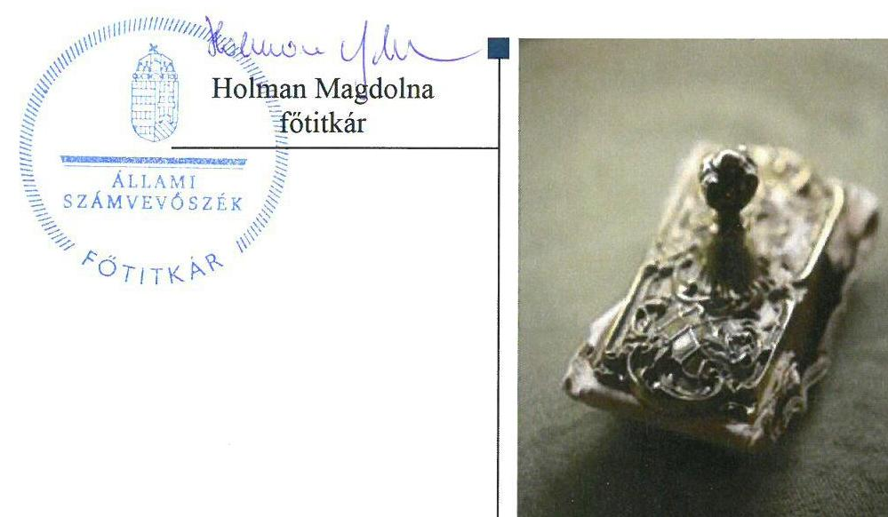

# Jelentés 

## Pártok gazdálkodása

A költségvetési támogatásban részesülő pártok 2015-2016. évi gazdálkodása törvényességének ellenőrzése az Együtt - a Korszakváltók Pártjánál 2018.

---

# Jelentés 

## Pártok gazdálkodása

A költségvetési támogatásban részesülő pártok 2015-2016. évi gazdálkodása törvényességének ellenőrzése az Együtt - a Korszakváltók Pártjánál 2018. 04. hó 10. nap

---

|  J | AZ ELLENŐRZÉST FELÜGYELTE:  |
| --- | --- |
|   | DR. NAGY IMRE felügyeleti vezető  |
|   | AZ ELLENŐRZÉST VEZETTE ÉS A VÉGREHAJTÁSÁÉRT FELELŐS:  |
|   | KAKAS SÁNDOR ellenőrzésvezető  |
|   | A PROGRAM ÖSSZEÁLLÍTÁSÁÉRT FELELŐS:  |
|   | TÓTPÁL SZABOLCS osztályvezető  |
|   | A TÉMÁHOZ KAPCSOLÓDÓ KORÁBBI SZÁMVEVŐSZÉKI JELENTÉSEK:  |
|   | - címe: Jelentés a költségvetési támogatásban részesülő pártok 2013-2014. évi gazdálkodása törvényességének ellenőrzéséről - az Együtt - a Korszakváltók Pártjánál  |
|  J | sorszáma: 16121  |
|   | IKTATÓSZÁM: EL-0278-065/2018.  |
|   | TÉMASZÁM: 34  |
|   | ELLENŐRZÉS-AZONOSÍTÓ SZÁM: V080305  |

---

# TARTALOMJEGYZÉK 

■ ÖSSZEGZÉS ..... 5
■ AZ ELLENŐRZÉS CÉLJA ..... 6
■ AZ ELLENŐRZÉS TERÜLETE ..... 7
■ AZ ELLENŐRZÉS HÁTTERE, INDOKOLTSÁGA ..... 8
■ A JELENTÉS LÉNYEGES KÉRDÉSKÖREI ..... 9
■ ELLENŐRZÉS HATÓKÖRE ÉS MÓDSZEREI ..... 10
■ MEGÁLLAPÍTÁSOK ..... 12
■ JAVASLATOK ..... 17
■ MELLÉKLETEK ..... 19
I. sz. melléklet: Értelmező szótár ..... 19
■ FÜGGELÉK: ÉSZREVÉTELEK ..... 21
■ RÖVIDÍTÉSEK JEGYZÉKE ..... 25

---

.

---

# ÖSSZEGZÉS 

Az Állami Számvevőszék az Együtt - a Korszakváltók Pártja gazdálkodásának törvényességét ellenőrizte a 2015. január 1-jétől 2016. december 31-ig terjedő időszakra vonatkozóan. Megállapította, hogy gazdálkodásának szabályozási környezetét nem a jogszabályi előírásoknak megfelelően alakította ki, nem teremtette meg a közpénzekkel való átlátható és ellenőrizhető gazdálkodás alapjait. A 2015. évi pénzügyi kimutatása nem felelt meg, a 2016. évi pénzügyi kimutatása megfelelt a jogszabályi előírásoknak. A könyvvezetése és gazdálkodása során a vonatkozó jogszabályi rendelkezéseket és belső előírásokat nem tartotta be. Az Együtt - a Korszakváltók Pártja müködéséhez a jogszabályt megsértve tiltott vagyoni hozzájárulást fogadott el.

## Az ellenőrzés társadalmi indokoltsága

A pártok az állampolgárok egyesülési szabadsága alapján létrehozott olyan szervezetek, amelyek kereteket nyújtanak a népakarat kialakításához és kinyilvánításához, a politikai életben való állampolgári részvételhez.

A politikai élet tisztasága érdekében törvény állapítja meg a pártok vagyonára és gazdálkodására vonatkozó szabályokat. Az egyesülési jog alapján létrejövő más szervezetekhez képest szűkebb körben határozza meg azt a gazdasági tevékenységet, amelyet a párt végezhet, biztosítja azonban a pártok részére azt a jogosultságot, hogy az állami költségvetésből támogatásban részesüljenek. A pártok gazdálkodását a politikai élet tisztasága érdekében rendszeresen indokolt ellenőrizni, ezért törvényi előírás alapján az Állami Számvevőszék a költségvetési támogatást kapott pártok gazdálkodását kétévente ellenőrzi.

## Főbb megállapítások, következtetések, javaslatok

Az Együtt - a Korszakváltók Pártja gazdálkodására vonatkozó számviteli keretek kialakítása és a belső szabályozások tartalma nem felelt meg a jogszabályi előírásoknak, így a párt nem teremtette meg a közpénzekkel való átlátható és ellenőrizhető gazdálkodás alapjait. A párt ellenőrzési rendszere nem az előírásoknak megfelelően működött.

A 2015. évi és 2016. évi pénzügyi kimutatásokat elkészítette, és a jogszabály által előírt határidőben közzétette a Magyar Közlönyben, azonban a honlapján történő közzétételről a jogszabályban előírt határidőben nem gondoskodott. A pénzügyi kimutatás készítése során sérült a tartalom elsődlegessége a formával szemben számviteli alapelv, a gazdálkodás átláthatósága nem volt biztosított.

A párt könyvvezetése - a leltár-összeállítási kötelezettség elmulasztása és a könyvviteli elszámolást alátámasztó bizonylatok hiányosságai miatt - nem felelt meg a jogszabályban meghatározott követelményeknek.

Az Együtt - a Korszakváltók Pártja a működéséhez a jogszabály előírása ellenére 2015. évben 5125 ezer Ft, 2016. évben 4570 ezer Ft értékben tiltott, nem pénzbeli vagyoni hozzájárulást fogadott el jogi személyektől, valamint a 2015. évben 15 ezer Ft, 2016. évben 105 ezer Ft tiltott támogatást fogadott el nem magyar állampolgár természetes személytől.

A kiadások kifizetése során az utalványozás és a könyvviteli számlákra való hivatkozás elmaradása miatt a jogszabályok és a belső szabályzatok előírásait nem tartotta be, a közpénzekkel nem átlátható és ellenőrizhető módon gazdálkodott.

A megállapítások alapján az ÁSZ az Együtt - a Korszakváltók Pártja elnökének 11 javaslatot fogalmazott meg, amelyre 30 napon belül intézkedési tervet kell készítenie.

---

# AZ ELLENŐRZÉS CÉLJA 

AZ ELLENŐRZÉS CÉLJA annak értékelése volt, hogy a közzétett pénzügyi kimutatások a törvényi előírásoknak megfeleltek-e, a könyvvezetés és gazdálkodás során betartották-e a vonatkozó jogszabályi és belső előírásokat; az Együtt - a Korszakváltók Pártja a múködéséhez szabályszerűen igénybe vehető forrásokat használte fel.

---

# AZ ELLENŐRZÉS TERÜLETE 

## Együtt - a Korszakváltók Pártja

Az Együtt - a Korszakváltók Pártja 2013. július 5-én létrejött olyan egyesület, amely nyilvántartott tagsággal rendelkezik, és a nyilvántartásba vételét végző bíróság előtt kinyilvánította, hogy a Párttörvény ${ }^{1}$ rendelkezéseit magára nézve kötelezőnek ismeri el a Párttörvény 1. §-a alapján.

Az Együtt - a Korszakváltók Pártja döntéshozó testületei a küldöttgyűlés, az OPT² és az elnökség, amely a párt ügyvezető szerveként a küldöttgyűlés két ülése között vezeti és irányítja a párt működését. A párt jelenlegi elnöke 2017. február 4-étől tölti be tisztét.

Az Együtt - a Korszakváltók Pártja az ellenőrzött időszak mindkét évében 133600 ezer Ft központi költségvetési támogatásban részesült. A 2015. évi pénzügyi kimutatásban 146 193,4 ezer Ft bevételt, valamint 100 858,1 ezer Ft kiadást számolt el. A 2016. évi pénzügyi kimutatás szerint az összes bevétele 143 858,3 ezer Ft, a teljesített kiadások összege 114 431,9 ezer Ft volt.

Az Együtt - a Korszakváltók Pártja 2014-ben létrehozta az Együtt Magyarországért Alapítványt, továbbá egyszemélyes kft-ét alapított, az EK Project 2014. Kft-ét.

---

# AZ ELLENŐRZÉS HÁTTERE, INDOKOLTSÁGA 

Az ÁSZ tv. ${ }^{3}$ 5. § (11) bekezdés a) pontja, valamint a Párttörvény 10. § (1) bekezdése alapján a pártok gazdálkodása törvényességének ellenőrzésére az ÁSZ ${ }^{6}$ jogosult. Törvényi előírás az ÁSZ kétévente ellenőrzi azoknak a pártoknak a gazdálkodását, amelyek rendszeres költségvetési támogatásban részesültek.

Az ÁSZ legutóbb az Együtt - a Korszakváltók Pártja 2013-2014. évi gazdálkodásának törvényességét ellenőrizte.

A gazdálkodás szabályszerűségének, a felhasznált közpénzek nagyságának bemutatásával a társadalom objektív képet alkothat a pártok múködéséről. Az ellenőrzés megállapításai a gazdálkodás megfelelőségének bemutatásával elősegíthetik, hogy a törvényalkotók konkrét lépéseket tegyenek a pártok finanszírozására vonatkozó szabályozások megváltoztatása, átláthatóbbá, ellenőrizhetőbbé tétele irányába. Az ellenőrzés rámutathat a pártok gazdálkodásával, valamint az állami költségvetésből származó források felhasználásával kapcsolatos jó gyakorlatokra és szabálytalanságokra. A hiányosságok, szabálytalanságok feltárása, az ennek kapcsán megfogalmazott megállapítások elősegíthetik a törvényi rendelkezések megsértésének szankcionálását.

---

# A JELENTÉS LÉNYEGES KÉRDÉSKÖREI 

1. Az Együtt - a Korszakváltók Pártja gazdálkodásának törvényessége biztositott volt-e?
2. Az Együtt - a Korszakváltók Pártja pénzügyi kimutatása megfelel-e a törvényi elöírásoknak, közzétételi kötelezettségét szabályszerűen teljesítette-e?
3. Az Együtt - a Korszakváltók Pártja könyvvezetése és gazdálkodása során a vonatkozó jogszabályi rendelkezéseket és belső elöírásokat betartotta-e?

---

# ELLENŐRZÉS HATÓKÖRE ÉS MÓDSZEREI 

## Az ellenőrzés típusa

Szabályszerűségi ellenőrzés.

## Az ellenőrzött időszak

2015-2016. évek

## Az ellenőrzés tárgya

Az Együtt - a Korszakváltók Pártja ellenőrzése során az ellenőrzés tárgyát képezték a 2015. és a 2016. évre vonatkozó pénzügyi kimutatás elkészítésére, jóváhagyására, közzétételére, a párt könyvvezetésére, gazdálkodására, ennek keretében a számviteli szabályozás kialakítására, a bizonylati rend, bizonylati fegyelem betartására, egyéb gazdálkodási, ellenőrzési és pénzügyi-számviteli informatikai feladatok ellátására irányuló tevékenységek. Az ellenőrzés tárgya volt még a források elszámolása és felhasználása, valamint a vagyon jogszabályi előírásoknak megfelelő hasznosítása.

Az ellenőrzés kiterjedt minden olyan körülményre és adatra, amely az ÁSZ jogszabályban meghatározott feladatainak teljesítéséhez, valamint a program végrehajtása folyamán felmerült újabb összefüggések feltárásához szükséges volt.

## Az ellenőrzött szervezet

Együtt - a Korszakváltók Pártja

## Az ellenőrzés jogalapja

Az ellenőrzés jogalapját az ÁSZ tv. 5. § (11) bekezdés a) pontja, a Párttörvény 4. § (4)-(5) bekezdései, valamint 10. § (1) és (3)-(4) bekezdései képezte.

## Az ellenőrzés módszerei

Az ÁSZ az ellenőrzést az ellenőrzési program szempontjai, az ellenőrzött időszakban hatályos jogszabályok, az ellenőrzés általános szakmai szabá-

---

lyai az ellenőrzésre irányadó ÁSZ módszertanok figyelembevételével végezte. A gazdálkodás hibáinak kijavítására irányuló javaslatok kidolgozásakor a hatályos jogszabályok voltak az irányadóak.

Az ÁSZ az ellenőrzés ideje alatt a párttal történő kapcsolattartást az ÁSZ SZMSZ ${ }^{5}$-ének vonatkozó előírásai alapján biztosította.

Az ellenőrzési bizonyítékként felhasználható adatforrások közé tartoztak egyrészt az ellenőrzési program részletes szempontjainál felsorolt adatforrások, másrészt minden egyéb az ellenőrzés folyamán feltárt, az ellenőrzés szempontjából információt tartalmazó dokumentum.

A pénzügyi kimutatás könyvviteli nyilvántartás adataival való egyezőségének, a könyvvezetés és gazdálkodás szabályszerűségének ellenőrzéséhez az ÁSZ tételes ellenőrzést és mintavételi eljárást is alkalmazott. Teljes körűen ellenőrzésre kerültek a központi költségvetésből származó támogatások, illetve a párt által nyújtott támogatások. Statisztikai mintavételi eljárás alapján ellenőrizte az ÁSZ az egyéb területeket.

A jogi személyiséggel rendelkező bérbeadó szervezettől származó, kedvezményes bérleti díj formájában kapott tiltott nem pénzbeli vagyoni hozzájárulások értékét az ÁSZ a következő módszerrel határozta meg. Az ÁSZ az Áht. ${ }^{6}$ hatálya alá tartozó bérbeadó szervezet tulajdonában lévő ingatlan esetében megvizsgálta, hogy más civil szervezet - amennyiben ilyen megkülönböztetést nem alkalmaztak, bármely más bérlő - esetében azonos mértékű fajlagos bérleti díjat alkalmazott-e a bérbeadó az azonos övezeti besorolású, azonos komfortfokozatú bérleményeknél. Amennyiben a párt által fizetendő bérleti díj alacsonyabb volt, akkor a más civil szervezetek, illetve egyéb szervezetek által fizetendő legmagasabb díj és a párt által fizetett díj különbözeteként állapította meg a tiltott forrásból származó nem pénzbeli hozzájárulás értékét az ÁSZ. Amennyiben a bérbeadó szervezetnek azonos övezetben, azonos komfortfokozatú ingatlan bérbeadása nem volt, valamint az egyéb piaci szereplő bérbeadók esetében értékbecslő által megállapított piaci bérleti díj és a párt által ténylegesen fizetett bérleti díj különbözetében állapította meg az ÁSZ a tiltott nem pénzbeli vagyoni hozzájárulás értékét.

Az Együtt - a Korszakváltók Pártja vonatkozásában kockázatjelzést az ÁSZ nem kapott.

Az ellenőrzés lefolytatásához az Együtt - a Korszakváltók Pártja a tanúsítványok kitöltésével, valamint az ÁSZ által kért dokumentumok megküldésével szolgáltatott adatokat. A rendelkezésre bocsátott adatok, információk kontrollja az ellenőrzés keretében történt.

Az ÁSZ az ellenőrzést az Együtt - a Korszakváltók Pártja által rendelkezésre bocsátott dokumentumokra, adatokra alapozta. Az ellenőrzés céljának eléréséhez szükséges bizonyítékokat a számvevő az egyes adatok közvetlen, részletes elemzésével szerezte meg, a következő eljárások alkalmazásával: megfigyelés, szemrevételezés, információkérés, megerősítés, valamint elemző eljárás.

---

# 1. Az Együtt - a Korszakváltók Pártja gazdálkodásának törvényessége biztosított volt-e? 

Összegző megállapítás

Az Együtt² gazdálkodásának törvényessége nem volt biztosított.
1.1. számú megállapítás

Az Együtt gazdálkodására vonatkozó számviteli keretek kialakítása és a belső szabályozások nem feleltek meg a jogszabályi előírásoknak.

AZ EGYÜTT SZÁMV. TV.-BEN ${ }^{8}$ ELŐíRT SZABÁLYZATOKKAL - a számlarend kivételével - rendelkezett. A szabályzatokat a Számv. tv előírásának megfelelően az Alapszabály ${ }_{1-3}{ }^{9}$ értelmében a párt képviseletére önállóan jogosult elnök kiadmányozta.

Az Együtt a Számv. tv. 14. § (4) bekezdésének előírása ellenére a Számviteli politika ${ }_{1,2}$ keretében nem rögzítette azokat a jellemző szabályokat, előírásokat, módszereket, amelyekkel meghatározza, hogy mit tekint a számviteli elszámolás, az értékelés szempontjából lényegesnek és nem lényegesnek. Az Együtt a Számviteli politika ${ }_{1,2}$-t a Számv. tv. 14. § (3) bekezdése ellenére nem sajátosságainak figyelembevételével alakította ki, mert az nem tartalmazta a pénzügyi kimutatás egyes kiadási sorai és a főkönyvi kivonat sorainak összefüggéseit.

A Számviteli politika ${ }_{1,2}{ }^{10}$ keretében elkészített Leltározási Szabályzat ${ }_{1,2}{ }^{11}$, Pénzkezelési Szabályzat ${ }_{1,2}{ }^{12}$ és Értékelési Szabályzat ${ }_{1,2}{ }^{13}$ a Számv. tv. előírásainak megfelelt.

Az Együtt a Számv. tv. 161. § (1) bekezdésének előírása ellenére nem készített számlarendet.

Az Együtt a vagyonra és a gazdálkodásra vonatkozó rendelkezéseket az Alapszabály ${ }_{1-3}$-ban a Párttörvényben előírt korlátozásokkal összhangban határozta meg.
1.2. számú megállapítás

Az Együtt könyvvezetése, nyilvántartási rendszere nem felelt meg a jogszabályi és belső szabályozási előírásoknak.

Az Együtt - azáltal, hogy az 1.1 számú megállapítás 4. bekezdésében foglaltak szerint nem rendelkezett számlarenddel - a Számv. tv. 161. § (3) bekezdés előírása ellenére az analitikus nyilvántartások és a főkönyvi könyvelés között az értékadatok számszerű egyeztetés lehetőségét nem biztosította, valamint a Számv. tv. 69. § (2) bekezdésének előírása ellenére az analitikus nyilvántartások és a főkönyvi könyvelés között az adatok egyeztetését nem végezte el.

Az Együtt az általa alapított EK Project Kft. törzstőkéjét a Számv. tv. 27. § (1) bekezdésével ellentétesen nem a befektetett pénzügyi eszközök, hanem a forgóeszközök között tartotta nyilván a könyveiben.

---

Az Együtt a 2015. és a 2016. évekre vonatkozóan nem tett eleget a Számv. tv. 69. § (3) bekezdésében előírt leltározási kötelezettségének.

Az Együtt a Számv. tv. előírásának megfelelően a pénzeszközöket érintő gazdasági múveletek, események bizonylatainak adatait késedelem nélkül rögzítette a könyveiben.
1.3. számú megállapítás

Az Együtt ellenőrzési rendszere nem az előírásoknak megfelelően múködött.

A pénzügyi ellenőrzési feladatok ellátása érdekében a Ptk. ${ }^{14}$ előírásának megfelelően az Alapszabályban rendelkeztek az SZB ${ }^{15}$ létrehozásáról, amely felügyelő bizottságként ellenőrzi az Együtt szerveinek múködését, valamint a jogszabályok, az alapszabály és az Együtt szervei által hozott határozatok végrehajtását. Az SZB az Alapszabály ${ }_{1-3}$-ban meghatározott, kötelező véleményezési feladatai körében a pénzügyi kimutatásokat véleményezte.

Az SZB az Alapszabály ${ }_{1-3}$ 7.1. pontjában meghatározott, az Együtt szerveinek múködése, valamint a jogszabályok, az alapszabály és az Együtt szervei által hozott határozatok végrehajtása tárgyában ellenőrzést nem végzett.

A pénztárellenőrzést a Pénzkezelési Szabályzat ${ }_{1,2}$-ben foglalt előírásnak megfelelően végezték.

# 2. Az Együtt - a Korszakváltók Pártja pénzügyi kimutatása meg-felelt-e a törvényi előírásoknak, közzétételi kötelezettségét szabályszerűen teljesítette-e? 

Összegző megállapítás

Az Együtt 2015. évi pénzügyi kimutatása nem felelt meg, a 2016. évi pénzügyi kimutatása megfelelt a jogszabályi előírásoknak, közzétételi kötelezettségének teljesítése nem volt szabályszerű.
2.1. számú megállapítás

Az Együtt 2015. évi pénzügyi kimutatása nem felelt meg, a 2016. évi pénzügyi kimutatása megfelelt a jogszabályi előírásoknak.

Az Együtt a 2015. évi és a 2016. évi pénzügyi kimutatásait a Párttörvény előírás szerinti szerkezetben elkészítette.

A pénzügyi kimutatásokat az Alapszabály ${ }_{1-3}$ előírásának megfelelően az Elnökség javaslata alapján az OPT elfogadta.

A pénzügyi kimutatás elkészítése során a Számv. tv.-ben meghatározott a tartalom elsődlegessége a formával szemben számviteli alapelv nem érvényesült. Az Együtt a Számv. tv. 16. § (3) bekezdésében foglalt előírások ellenére nem a gazdasági esemény tényleges tartalmának megfelelően mutatta be bevételeit, amikor a 2015. évben öt fő által 62 ezer Ft tagdíjként befizetett összeget adomány jogcímen vett nyilvántartásba és mutatta ki a pénzügyi kimutatásban.

Az Együtt a Számv. tv. 15. § (4) bekezdésében és a 16. § (3) bekezdésében előírtak ellenére a pénzügyi kimutatásai „3. Vállalkozások alapítására

---

2.2. számú megállapítás
fordított összegek" sorában nem mutatta ki az EK Project Kft. törzstőkéjeként jutatott 2015-ben 50 ezer Ft, 2016-ban 2165 ezer Ft összeget.

Az Együtt a 2015. évi pénzügyi kimutatás 5. Eszközbeszerzés kiadás soron nem mutatta be a 146,1 ezer Ft összegű eszközbeszerzését, 4. Múködési kiadások soron az adott évben elszámolt 25 ezer Ft terv szerinti értékcsökkenés összegét szerepeltette kiadásként.

Az Együtt a Számv. tv. 15. § (4) bekezdésében és a 16. § (3) bekezdésében előírtak ellenére a 2015. évi pénzügyi kimutatásban egy esetben egy alapítványnak nyújtott támogatást „2. Támogatás egyéb szervezeteknek" sora helyett a „7. Egyéb kiadások" soron mutatta ki.

Az Együtt az „Egyéb hozzájárulások, adományok" beszámoló sorain az egy naptári év alatt adott, 500 ezer Ft összeghatáron felüli adományokat a Párttörvény előírása szerint, a hozzájárulást adó megnevezésével és az öszszeg megjelölésével, külön feltüntette.

Az Együtt a 2015. és 2016. évi pénzügyi kimutatásokat a Magyar Közlönyben a jogszabályi előírásoknak megfelelően közzétette, a saját honlapján történő közzétételről azonban nem a jogszabályban meghatározott határidőben gondoskodott.

Az Együtt a Párttörvény 1. számú melléklet szerinti 2015. és 2016. évi pénzügyi kimutatását a Párttörvény előírásának megfelelően, határidőben közzétette a Magyar Közlöny Mellékletét képező Hivatalos Értesítőben.

Az Együtt a Párttörvény 9. § (1) bekezdésében, valamint a Számviteli politika ${ }_{1,2}$ 2. pontjában foglaltak ellenére a 2015. és a 2016. évi pénzügyi kimutatását a saját honlapján a tárgyévet követő május 31-ig nem tette közzé.

# 3. Az Együtt - a Korszakváltók Pártja könyvvezetése és gazdálkodása során a vonatkozó jogszabályi rendelkezéseket és belső előírásokat betartotta-e? 

Összegző megállapítás

Az Együtt a könyvvezetése és gazdálkodása során a vonatkozó jogszabályi rendelkezéseket és belső előírásokat nem tartotta be.

Az Együtt nem szabályszerűen számolta el és használta fel a múködéséhez a forrásokat.

A TAGDIJ fizetés szabályait, a tagok által fizetendő tagdíjak összegét az Együtt az Alapszabály ${ }_{1-3}$-ban és a Tagdijfizetési Szabályzatban ${ }^{16}$ határozta meg.

A központi költségvetésből származó támogatás beszámolósor tartalma az ellenőrzött időszakot tekintve az előírásoknak megfelelően megegyezett a könyvviteli nyilvántartással, továbbá a 2015. évi ${ }^{17}$ és a 2016. évi költségvetési törvényekben ${ }^{18}$ meghatározott összegekkel. Az Együtt az ellenőrzött időszak mindkét évében 133600 ezer Ft központi költségvetési támogatást kapott.

---

2015-ben az Együtt bevételeinek 91,4\%-át, 2016-ban 92,9\%-át a költségvetési támogatás biztosította, a fennmaradó részt mindkét évben a tagdíjak, a magánszemélyek hozzájárulásai, adományai és az egyéb bevételek alkották.

Az Együtt az „Egyéb hozzájárulások, adományok" beszámoló soron az 500 ezer Ft összeghatáron felüli adományokat az előírások szerint nevesítve rögzítette. A 2015. évi pénzügyi kimutatásban 3870 ezer Ft, két magánszemélytől származó, a 2016. évi pénzügyi kimutatásban 1000 ezer Ft, egy magánszemélytől származó 500 ezer Ft feletti támogatást mutatott ki.

A könyvviteli elszámolást közvetlenül alátámasztó bevételi bizonylatok nem tartalmazták a Számv. tv. 167. § (1) bekezdés h) pontjában foglalt előírás ellenére az érintett könyvviteli számlákra történő hivatkozást, továbbá a Számv. tv. 167. § (1) bekezdés c) pontjában foglalt előírás ellenére az utalványozó személy aláírását.

A 2015. és a 2016. évi pénzügyi kimutatás bevételi sorainak tartalma a Párttörvény és a Számv. tv. előírásainak megfelelően megegyezett a kapcsolódó főkönyvi számlák adataival, azokon bizonylatokkal alátámasztott és - a 2.1. pontban részletezettek szerint az egyéb adományok, hozzájárulások kivételével - az előírt jogcímen szerepeltek összegek.

A Párttörvény 4. § (2)-(3) bekezdései értelmében a pártok jogi személyektől, nem magyar állampolgár természetes személytől vagyoni hozzájárulást, valamint névtelen adományt nem fogadhatnak el. A Párttörvény 4. § (5) bekezdése szerint, ha a párt a (2) bekezdésben foglalt szabályt megsértve, tiltott, nem pénzbeli hozzájárulást fogadott el, annak értékét az ÁSZ állapítja meg. Ennek megfelelően az ÁSZ megállapította, hogy az Együtt a 2015. évben összesen 5125 ezer Ft, a 2016. évben összesen 4570 ezer Ft nem pénzbeli vagyoni hozzájárulást fogadott el jogi személyektől kedvezményes ingatlan bérlet formájában, amely a Párttörvény szerint tiltott, nem pénzbeli hozzájárulásnak minősül. Továbbá az Együtt megsértve a Párttörvény 4. § (3) bekezdésében foglalt rendelkezést 2015-ben 15 ezer Ft összegű, 2016-ban 105 ezer Ft összegű tiltott támogatást fogadott el nem magyar állampolgár természetes személytől.

Az Együtt gazdálkodási-vállalkozási tevékenységet nem végzett, pártalapítványával - az Együtt Magyarországért Alapítvánnyal - közös feladatot nem végzett, vagyoni hozzájárulást, támogatást a Párttörvény előírásának megfelelően a pártalapítványtól nem fogadott el.

# 3.2. számú megállapítás 

Az Együtt a gazdálkodással összefüggő tevékenységének keretében a kiadások kifizetése során nem tartotta be a jogszabályok és a belső szabályzatok előírásait.

Az Együtt kiadásaira fordított összegek kifizetése, elszámolása a 2015. és a 2016. évben a jogszabályok és a belső szabályzatok előírásainak nem felelt meg.

A könyvviteli elszámolást közvetlenül alátámasztó kiadási bizonylatok nem tartalmazták a Számv. tv. 167. § (1) bekezdés h) pontjában foglalt előírás ellenére az érintett könyvviteli számlákra történő hivatkozást, továbbá a Számv. tv. 167. § (1) bekezdés c) pontjában foglalt előírás ellenére az utalványozó személy aláírását.

Az Együtt a Számv. tv. 52. § (2) bekezdésének előírása ellenére a tárgyi eszközök üzembe helyezését hitelt érdemlő módon nem dokumentálta.

---

Az Együtt a Számv. tv. 165. § (2) bekezdésében foglalt előírást megsértve bizonylat nélkül jegyzett be adatokat a számviteli nyilvántartásába.

A pénzügyi kimutatások egyes kiadási sorainak tartalma megegyezett a könyvviteli nyilvántartással, azonban a kiadások könyvviteli nyilvántartása - a 2.1. pontban részletezettek szerint a vállalkozások alapítására fordított összegek és az egyéb szervezetnek nyújtott támogatás tekintetében - nem felelt meg a Számv. tv. és a Számviteli politika előírásainak.

Az Együttnél a foglalkoztatás, a bérjellegú és egyéb személyi kiadások elszámolása szabályszerű volt, a foglalkoztatottakat munkaviszony keretében foglalkoztatta, a munkaszerződések tartalma megfelelt a Munka tv. ${ }^{19}$ előírásainak. Az Együtt az Art. ${ }^{20}$, a Tbj tv. ${ }^{21}$ és az Szja tv. ${ }^{22}$ előírásainak megfelelően eleget tett az adó- és járulék nyilvántartási, levonási, bevallási, befizetési és adatszolgáltatási kötelezettségének. Az Együtt az ellenőrzött időszakban természetbeni juttatást nem nyújtott. A költségtérítések elszámolására és kifizetésére a jogszabályokkal összhangban került sor.

# 3.3. számú megállapítás 

Az Együtt múködése során a vagyon használata megfelelt a törvényi előírásoknak.

Az Együtt szabályzataiban kitért a vagyonnal való gazdálkodás szabályozására a jogszabályi előírásoknak megfelelően. A Számviteli politika ${ }_{1,2}$-ben rögzítette a vagyonnal való gazdálkodást érintő szabályokat, előírásokat, módszereket, feltételeket és eljárásokat.

Az Együtt, az ellenőrzött időszakban saját tulajdonú ingatlannal nem rendelkezett, a Vagyon tv. ${ }^{23}$ alapján az MFB ${ }^{24}$ által nyújtott pénzkölcsönt nem vett igénybe.

---

# JAVASLATOK 

Az ÁSZ tv. 33. § (1) bekezdésében foglaltak értelmében az ellenőrzött szervezet vezetője köteles a jelentésben foglalt megállapításokhoz kapcsolódó intézkedési tervet összeállítani és azt a jelentés kézhezvételétől számított 30 napon belül az ÁSZ részére megküldeni. Amennyiben az ellenőrzött szervezet vezetője nem küldi meg határidőben az intézkedési tervet, vagy továbbra sem elfogadható intézkedési tervet küld, az Állami Számvevőszék elnöke az ÁSZ tv. 33. § (3) bekezdése a) és b) pontjaiban foglaltakat érvényesítheti.

## Együtt - a Korszakváltók Pártja Elnökének

1. Intézkedjen a számviteli politika jogszabályban elöirtaknak megfelelő kiegészitéséről.
(1.1. sz. megállapítás 2. bekezdése alapján)
2. Intézkedjen a számlarend elkészitéséről a jogszabályban meghatározott tartalmi követelményeknek megfelelően.
(1.1. számú megállapítás 4. bekezdése alapján)
3. Intézkedjen a jogszabály elöírása szerint az analitikus nyilvántartások és a fökönyvi könyvelés értékadatai közötti egyeztetés lehetőségének biztositásáról, valamint az egyeztetések végrehajtásáról.
(1.2. számú megállapítás 1. bekezdése alapján)
4. Gondoskodjon a vállalkozás alapítására fordított összegnek, a bevételek a jogszabályban foglaltak szerinti besorolásáról, nyilvántartásáról és pénzügyi kimutatásaiban annak szabályszerű bemutatásáról.
(1.2. sz. megállapítás 2. bekezdése, 2.1. számú megállapítás 3-5. bekezdései alapján)
5. Intézkedjen a jogszabályban elöirt leltározási és leltárkészitési kötelezettségek teljesitéséről.
(1.2. számú megállapítás 3. bekezdése alapján
6. Intézkedjen arról, hogy a számvizsgáló bizottság teljes körüen tegyen eleget az Alapszabályban meghatározott ellenőrzési feladatának.
(1.3. számú megállapítás 2. bekezdése alapján)

---

7. Gondoskodjon a jogszabály előírása szerint a gazdasági események tényleges tartalmának megfelelő számviteli elszámolásról, a tartalom elsődlegessége a formával szemben számviteli alapelv érvényesítéséről.
(2.1. számú megállapítás 3-5. bekezdések alapján)
8. Gondoskodjon az éves pénzügyi kimutatásainak jogszabályban elöirt határidőn belül a saját honlapján történő közzétételéről.
(2.2. számú megállapítás 2. bekezdése alapján)
9. Gondoskodjon arról, hogy a számviteli nyilvántartásába a gazdasági eseményeket jogszabályban elöirtak szerint csak szabályszerü bizonylat alapján számolja el, a bizonylatok feleljenek meg a jogszabályban elöirt utalványozási követelményeknek.
(3.1. számú megállapítás 5. bekezdése, a 3.2. számú megállapítás 2. és 4. bekezdése alapján)
10. Intézkedjen a gazdálkodás során a Párttörvényben foglalt elöírások betartására a tekintetben, hogy a jövőben a párt vagyoni hozzájárulást ne fogadjon el.
(3.1. számú megállapítás 7. bekezdése alapján)
11. Gondoskodjon a tárgyi eszközök üzembe helyezésének jogszabályban elöirtak szerinti hitelt érdemlő dokumentálásáról.
(3.2. számú megállapítás 3. bekezdése alapján)

---

# MELLÉKLETEK 

- I. SZ. MELLÉKLET: ÉRTELMEZŐ SZÓTÁR
pénzügyi kimutatás
gazdálkodó tevékenység
költségvetési támogatás
nem pénzbeli támogatás

A Párttörvény 9. § (1) bekezdésében meghatározott, a törvény 1. számú melléklete szerinti pénzügyi kimutatás (hatályos 2015. május 6-ától), amelyet a pártok kötelesek minden év május 31-ig a Magyar Közlönyben, valamint saját honlappal rendelkező pártok a honlapjukon is közzétenni.
A párt a költségeinek fedezése és vagyonának gyarapítása érdekében a gazdaságivállalkozási tevékenységeket folytathat. (Párttörvény 6. §)
politikai céljainak és tevékenységének megismertetése érdekében kiadványokat jelentethet meg és terjeszthet, a pártot szimbolizáló jelvényeket és más ilyen célú tárgyakat árusíthat, és pártrendezvényeket szervezhet;
a tulajdonában álló ingatlanokat és ingókat dí ellenében hasznosíthatja és elidegenítheti.
Az államháztartás alrendszerei terhére nyújtott pénzbeli vagy nem pénzbeli juttatás, amelyet a támogató nem elsősorban ellenszolgáltatás ellenében, de konkrét program megvalósítása vagy meghatározott időszakban a támogatott szervezet müködtetése érdekében nyújt. (Civil tv. ${ }^{25}$ 2. § 15. pont)
vagyoni értékkel rendelkező forgalomképes dolog, szellemi alkotás, illetve vagyoni értékű jog részben vagy egészében, véglegesen vagy ideiglenesen, teljesen vagy részben ingyenesen történő átruházása vagy átengedése, illetve szolgáltatás biztosítása. Civil tv. 2. § 25. pont)

---

.

---

# FÜGGELÉK: ÉSZREVÉTELEK 

Az ÁSZ tv. 29. §* (1) bekezdésének megfelelően az Állami Számvevőszék az ellenőrzési megállapításait megküldte az ellenőrzött szervezet vezetőjének. Az ÁSZ tv. 29. § (2) bekezdése alapján az ellenőrzött szervezet vezetője az ellenőrzés megállapításaira tizenöt napon belül írásban észrevételt tehetett.

Az Együtt - a Korszakváltók Pártja elnöke a jelentéstervezet megállapításaira 7 észrevételt tett.
Az ÁSZ tv. 29. § (3) bekezdésével összhangban az ÁSZ a Függelékben feltünteti a jelentéstervezet megállapításaival kapcsolatban tett, figyelembe nem vett észrevételeket, és megindokolja, hogy azokat miért nem fogadta el.

[^0]
[^0]:    * 29. § (1) Az Állami Számvevőszék az ellenőrzési megállapításait megküldi az ellenőrzött szervezet vezetőjének vagy az általa megbízott személynek, és annak, akinek személyes felelősségét állapította meg.
    (2) Az ellenőrzött szervezet vezetője és a felelősként megjelölt személy az ellenőrzés megállapításaira tizenöt napon belül írásban észrevételt tehet.
    (3) Az Állami Számvevőszék az észrevételre a beérkezésétől számított harminc napon belül írásban válaszol. A figyelembe nem vett észrevételeket köteles a jelentésben feltüntetni, és megindokolni, hogy azokat miért nem fogadta el.

---

Az Együtt elnökének 2018. január 3-án írt (az Állami Számvevőszékhez 2018. január 3-án érkezett) levelében a jelentéstervezet megállapításaival kapcsolatban tett, figyelembe nem vett észrevételek és azok indokolása.

# 1. Észrevételt tett a tiltott, nem pénzbeli hozzájárulás összegének megállapítására, módszerére. 

Az észrevétele nem megalapozott, azt nem fogadom el, a megállapítás nem módosul. A tiltott nem pénzbeli hozzájárulás összegének megállapításával kapcsolatban az alábbiakban tájékoztatom
A Párttörvény 4. § (2) bekezdése értelmében a pártok jogi személyektől vagyoni hozzájárulást nem fogadhatnak el. A Párttörvény 4. § (5) bekezdése szerint, ha a párt részére a vagyoni hozzájárulást nem pénzben nyújtották, köteles annak értékeléséről (értékének meghatározásáról) gondoskodni. A Párttörvény 4. § (5) bekezdése szerint, ha a párt a (2) bekezdésben foglalt szabályt megsértve, tiltott, nem pénzbeli hozzájárulást fogadott el, annak értékét az ÁSZ állapítja meg.
Az ÁSZ az ellenőrzési megállapításait az Együtt által rendelkezésre bocsátott dokumentumok alapján tette meg. Az Együtt az ÁSZ adatbekéréseihez megküldött teljességi és hitelességi nyilatkozataiban kijelentette, hogy az ÁSZ részére átadott dokumentumok, adatok a bekért adatokra, dokumentumokra vonatkozóan teljes körű információt tartalmaznak.
Az Együtt az ellenőrzés részére nem adott át az értékelés elvégzését igazoló dokumentumokat. Ez alapján az ÁSZ megállapította, hogy az Együtt a jogi személytől bérelt ingatlan tekintetében 2015-2016. években nem gondoskodott a nem pénzben nyújtott vagyoni hozzájárulás értékeléséről, értékének meghatározásáról. Az Együtt nem teljesítette törvényi kötelezettségét. A Párttörvény előírása alapján a tiltott, nem pénzbeli hozzájárulás értékét az ÁSZ állapította meg.
2. Észrevételt tett a nem magyar állampolgártól elfogadott tiltott pénzbeli vagyoni hozzájárulás megállapítására vonatkozóan.

Az észrevétele nem megalapozott, azt nem fogadom el, a megállapítás nem módosul. Az Együtt nem bocsátott olyan dokumentumot az ellenőrzés részére, amely igazolná, hogy 2015-ben 15 ezer Ft összegű, 2016-ban 105 ezer Ft összegű, külföldi bankszámláról érkező utalások esetében meggyőződött az adományozó magyar állampolgárságáról. Az Együtt az ÁSZ adatbekéréseihez megküldött teljességi és hitelességi nyilatkozataiban kijelentette, hogy az ÁSZ részére átadott dokumentumok, adatok a bekért adatokra, dokumentumokra vonatkozóan teljes körű információt tartalmaznak.

## 3. Észrevételt tett a számlarend hiányára vonatkozó megállapításra.

Az észrevétele nem megalapozott, azt nem fogadom el, a megállapítás nem módosul. Az ellenőrzés részére az Együtt számlarendet nem adott át, azt az Együtt által aláírt teljességi és hitelességi nyilatkozat átadott dokumentumokat rögzítő melléklete sem tartalmazza. Az Együtt az ÁSZ adatbekéréseihez megküldött teljességi és hitelességi nyilatkozataiban kijelentette, hogy az ÁSZ részére átadott dokumentumok, adatok a bekért adatokra, dokumentumokra vonatkozóan teljes körű információt tartalmaznak.
4. Észrevételezte a tárgyi eszközök üzembe helyezésének hitelt érdemlő módon történt dokumentálására tett megállapítást.

Az észrevétele nem megalapozott, azt nem fogadom el, a megállapítás nem módosul. A tárgyi eszközök üzembe helyezésének hitelt érdemlő módon történt dokumentálása hiányát a számvevőszéki jelentéstervezet a számvitelről szóló 2000. évi C. törvény (Számv. tv.) 52. § (2) bekezdésében foglaltaknak megfelelő, az eszközök számviteli nyilvántartásba vételéhez, az állományba vétel időpontját tartalmazó bizonylat hiánya alapján állapította meg, amelyet a berendezés felszereléséről szóló számla nem helyettesít.

---

5. Észrevételezte az Együtt - a Korszakváltók Pártja számvizsgáló bizottsága ellenőrzési feladatellátására tett megállapítást.

Az észrevétele nem megalapozott, azt nem fogadom el, a megállapítás nem módosul. Az Együtt által az ellenőrzés részére átadott, a Számvizsgáló Bizottság működéséről szóló jegyzőkönyvek alátámasztják, hogy az Alapszabály 7.1. pontjában meghatározott, az Együtt szerveinek működése, valamint a jogszabályok, az alapszabály és az Együtt szervei által hozott határozatok végrehajtása tárgyában ellenőrzést nem végzett.
6. Észrevételezte a bevételekkel kapcsolatban a gazdasági esemény tényleges tartalmának nem megfelelő elszámolásra vonatkozó megállapítást.
Az észrevétele nem megalapozott, azt nem fogadom el, a megállapítás nem módosul. Az ÁSZ az egyéb hozzájárulások, adományok elszámolásának szabályszerűségének ellenőrzése során az Együtt által megküldött számviteli nyilvántartás adatai és dokumentumai alapján tett megállapítást. Az Egyéb hozzájárulások, adományok főkönyvi számlára könyvelt tételekhez kapcsolódóan az Együtt olyan 2015. évi dokumentumokat adott át, amelyeken összesen 62 ezer Ft összegben tagdíj megjelölés szerepelt. Így az Egyéb hozzájárulások, adományok főkönyvi számla megnevezése és az arra könyvelt tételek megnevezése (tagdíj) nem volt összhangban.
7. Észrevételezte a 2015. és 2016. évi pénzügyi kimutatás saját honlapján történő közzétételével kapcsolatos megállapítást.
Az észrevétele nem megalapozott, azt nem fogadom el, a megállapítás nem módosul. Az Együtt a pénzügyi kimutatásainak közzétételéhez kapcsolódóan az ellenőrzés során nem bocsátott olyan dokumentumot az ÁSZ rendelkezésére, amely a közzétételi kötelezettség teljesítését igazolta volna. Az Együtt az ÁSZ adatbekéréseihez megküldött teljességi és hitelességi nyilatkozataiban kijelentette, hogy az ÁSZ részére átadott dokumentumok, adatok a bekért adatokra, dokumentumokra vonatkozóan teljes körű információt tartalmaznak.

---

.

---

# RÖVIDÍTÉSEK JEGYZÉKE 

${ }^{1}$ Párttörvény
${ }^{2}$ OPT
${ }^{3}$ ÁSZ tv.
${ }^{4}$ ÁSZ
${ }^{5}$ ÁSZ SZMSZ
${ }^{6}$ Áht.
${ }^{7}$ Együtt
${ }^{8}$ Számv. tv.
${ }^{9}$ Alapszabály ${ }_{1}$

Alapszabály ${ }_{2}$

Alapszabály ${ }_{3}$
${ }^{10}$ Számviteli politika ${ }_{1}$

Számviteli politika ${ }_{2}$
${ }^{11}$ Leltározási Szabályzat ${ }_{1}$

Leltározási Szabályzat ${ }_{2}$
${ }^{12}$ Pénzkezelési Szabályzat ${ }_{1}$

Pénzkezelési Szabályzat ${ }_{2}$
${ }^{13}$ Értékelési Szabályzat ${ }_{1}$

Értékelési Szabályzat ${ }_{2}$
${ }^{14}$ Ptk.
${ }^{15}$ SZB
${ }^{16}$ Tagdijfizetési Szabályzat
${ }^{17}$ 2015. évi költségvetési törvény
${ }^{18}$ 2016. évi költségvetési törvény
${ }^{19}$ Munka tv.
${ }^{20}$ Art.
${ }^{21}$ Tbj. tv.
${ }^{22}$ Szja. tv.
${ }^{23}$ Vagyon tv.
${ }^{24}$ MFB
1989. évi XXXIII. törvény a pártok működéséről és gazdálkodásáról (hatályos 1989. október 30-tól)
az Együtt- a Korszakváltók Pártja Országos Politikai Tanácsa
2011. évi LXVI. törvény az Állami Számvevőszékről (hatályos 2011. július 1-jétől)

Állami Számvevőszék
Állami Számvevőszék Szervezeti és Működési Szabályzata
2011. évi CXCV. törvény az államháztartásról

Együtt - a Korszakváltók Pártja
2000. évi C. törvény a számvitelről (hatályos 2001. január 1-jétől)
az Együtt - A Korszakváltók Pártja alapszabálya (hatályos 2014. október 4-étől 2015. október 16-áig)
az Együtt - A Korszakváltók Pártja alapszabálya (hatályos 2015. október 17-étől 2016. szeptember 23-ig)
az Együtt - A Korszakváltók Pártja alapszabálya (hatályos 2016. szeptember 24étől)
az Együtt - A Korszakváltók Pártja Számviteli Politikája (hatályos 2013. augusztus 1-jétől- 2016. július 17-ig)
az Együtt- a Korszakváltók Pártja Számviteli Politika (hatályos 2016. július 18-ától)
az Együtt- a Korszakváltók Pártja Leltározási Szabályzata (hatályos 2015. január 1től 2015. február 14-éig)
az Együtt- a Korszakváltók Pártja Leltározási Szabályzata (hatályos 2015. február 15-étől)
az Együtt- a Korszakváltók Pártja Pénzkezelési Szabályzata (hatályos 2015. január 1-től 2015. február 14-éig)
az Együtt- a Korszakváltók Pártja Pénzkezelési Szabályzata (hatályos 2015. február 15-étől)
az Együtt- a Korszakváltók Pártja Értékelési Szabályzata (hatályos 2015. február 15étől)
2013. évi V. törvény a polgári törvénykönyvről
az Együtt- a Korszakváltók Pártja számvizsgáló bizottsága
Tagdijfizetési Szabályzat - Együtt - a Korszakváltók Pártja (hatályos 2015. január 1-jétől)
2014. évi C. törvény Magyarország 2015. évi költségvetéséről
2015. évi C. törvény Magyarország 2016. évi költségvetéséről
2012. évi I. törvény a munka törvénykönyvéről
2013. évi XCII. törvény az adózás rendjéről
1997. évi LXXX. törvény a társadalombiztosítás ellátásaira és a magánnyugdíjra jogosultakról, valamint e szolgáltatások fedezetéről
1995. évi CXVII. törvény a személyi jövedelemadóról
2007. évi CVI. törvény az állami vagyonról (hatályos 2007. szeptember 25-től)

Magyar Fejlesztési Bank Zártkörűen Működő Részvénytársaság

---

${ }^{25}$ Civil tv.
2011. évi CLXXV. törvény az egyesülési jogról, a közhasznú jogállásról, valamint a civil szervezetek múködéséről és támogatásáról (hatályos 2011. december 22-től)

---

# ÁLLAMI SZÁMVEVŐSZÉK 

1052 Budapest, Apáczai Csere János utca 10.
Levélcím: 1364 Budapest 4. Pf. 54
Telefon: +36 14849100 Telefax: +36 14849200
www.asz.hu