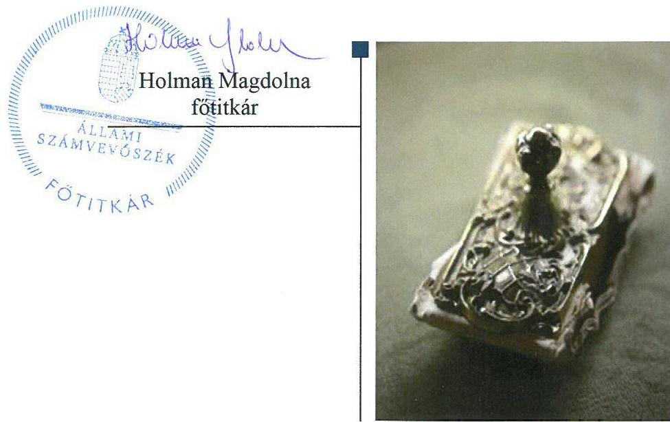

# Jelentés 

## Pártok gazdálkodása

A költségvetési támogatásban részesülő pártok 2015-2016. évi gazdálkodása törvényességének ellenőrzése a Lehet Más a Politikánál
2018.

---

# Jelentés 

## Pártok gazdálkodása

A költségvetési támogatásban részesülő pártok 2015-2016. évi gazdálkodása törvényességének ellenőrzése a Lehet Más a Politikánál
2018. 0. hó 11. nap

---

# AZ ELLENŐRZÉST FELÜGYELTE: 

DR. NAGY IMRE felügyeleti vezető

## AZ ELLENŐRZÉST VEZETTE ÉS A VÉGREHAJTÁSÁÉRT FELELŐS:

KAKAS SÁNDOR ellenőrzésvezető

## A PROGRAM ÖSSZEÁLLÍTÁSÁÉRT FELELŐS:

TÓTPÁL SZABOLCS osztályvezető

## A TÉMÁHOZ KAPCSOLÓDÓ KORÁBBI SZÁMVEVŐSZÉKI JELENTÉSEK:

- címe: Jelentés a költségvetési támogatásban részesülő pártok 2013-2014. évi gazdálkodása törvényességének ellenőrzéséről - Lehet Más a Politika
- sorszáma: 16152

IKTATÓSZÁM: EL-0276-083/2017.
TÉMASZÁM: 34
ELLENŐRZÉS-AZONOSÍTÓ SZÁM: V080303

---

# TARTALOMJEGYZÉK 

■ ÖSSZEGZÉS ..... 5
■ AZ ELLENŐRZÉS CÉLJA ..... 6
■ AZ ELLENŐRZÉS TERÜLETE ..... 7
■ AZ ELLENŐRZÉS HÁTTERE, INDOKOLTSÁGA ..... 8
■ A JELENTÉS LÉNYEGES KÉRDÉSKÖREI ..... 9
■ ELLENŐRZÉS HATÓKÖRE ÉS MÓDSZEREI ..... 10
■ MEGÁLLAPÍTÁSOK ..... 12
■ JAVASLATOK ..... 17
■ MELLÉKLETEK ..... 19
I. sz. melléklet: Értelmező szótár ..... 19
■ FÜGGELÉK: ÉSZREVÉTELEK ..... 21
■ RÖVIDÍTÉSEK JEGYZÉKE ..... 25

---

.

---

# ÖSSZEGZÉS 

Az Állami Számvevőszék a Lehet Más a Politika gazdálkodásának törvényességét ellenőrizte a 2015. január 1-jétől 2016. december 31-ig terjedő időszakra vonatkozóan. Megállapította, hogy gazdálkodásának szabályozási környezetét nem a jogszabályi előírásoknak megfelelően alakította ki, nem teremtette meg a közpénzekkel való átlátható és ellenőrizhető gazdálkodás alapjait. A könyvvezetése és gazdálkodása során a vonatkozó jogszabályi rendelkezéseket és belső előírásokat nem tartotta be. A 2015. évi és a 2016. évi pénzügyi kimutatást nem a jogszabályi előírásoknak megfelelően készítette el. A Lehet Más a Politika működéséhez a jogszabályt megsértve tiltott vagyoni hozzájárulást fogadott el.

## Az ellenőrzés társadalmi indokoltsága

A pártok az állampolgárok egyesülési szabadsága alapján létrehozott olyan szervezetek, amelyek kereteket nyújtanak a népakarat kialakításához és kinyilvánításához, a politikai életben való állampolgári részvételhez.

A politikai élet tisztasága érdekében törvény állapítja meg a pártok vagyonára és gazdálkodására vonatkozó szabályokat. Az egyesülési jog alapján létrejövő más szervezetekhez képest szűkebb körben határozza meg azt a gazdasági tevékenységet, amelyet a párt végezhet, biztosítja azonban a pártok részére azt a jogosultságot, hogy az állami költségvetésből támogatásban részesüljenek. A pártok gazdálkodását a politikai élet tisztasága érdekében rendszeresen indokolt ellenőrizni, ezért törvényi előírás alapján az Állami Számvevőszék a költségvetési támogatást kapott pártok gazdálkodását kétévente ellenőrzi.

## Főbb megállapítások, következtetések

A Lehet Más a Politika gazdálkodására vonatkozó számviteli keretek kialakítása és a belső szabályozások tartalma nem felelt meg a jogszabályi előírásoknak, így a párt nem teremtette meg a közpénzekkel való átlátható és ellenőrizhető gazdálkodás alapjait. Az ellenőrzési rendszere nem az előírásoknak megfelelően működött.

A Lehet Más a Politika a 2015. évi és a 2016. évi pénzügyi kimutatásait nem a jogszabályi előírásoknak megfelelően készítette el, ezzel nem biztosította gazdálkodásának áttekinthetőségét, és ezeket a pénzügyi kimutatásokat tette közzé a Magyar Közlöny mellékletét képező Hivatalos Értesítőben és a saját honlapján jogszabályi előírások szerinti határidőben.

A Lehet Más a Politika a működéséhez a források közül a költségvetésből juttatott támogatásokat szabályszerűen használta fel, azonban az egyéb hozzájárulások, adományok bevételeinek elszámolása nem volt szabályszerű. A jogszabályi előírás ellenére a 2015. évben 2405 ezer Ft, 2016. évben 2015 ezer Ft értékben tiltott nem pénzbeli vagyoni hozzájárulást fogadott el jogi személyektől. A kiadások kifizetése során az utalványozás és a könyvviteli számlákra való hivatkozás elmaradása miatt a jogszabályok és a belső szabályzatok előírásait nem tartotta be, a közpénzekkel nem átlátható és ellenőrizhető módon gazdálkodott.

Az ÁSZ a jelentésében az Lehet Más a Politika társelnökeinek összesen 11 javaslatot fogalmazott meg, amelyre 30 napon belül intézkedési tervet kell készíteniük.

---

# AZ ELLENŐRZÉS CÉLJA 

AZ ELLENŐRZÉS CÉLJA annak értékelése volt, hogy a közzétett pénzügyi kimutatások a törvényi előírásoknak megfeleltek-e, a könyvvezetés és gazdálkodás során betartották-e a vonatkozó jogszabályi és belső előírásokat; a Lehet Más a Politika a működéséhez szabályszerűen igénybe vehető forrásokat használt-e fel.

---

# AZ ELLENŐRZÉS TERÜLETE 

## Lehet Más a Politika

A Lehet Más a Politika 2009. április 1-jén létrejött olyan egyesület, amely nyilvántartott tagsággal rendelkezik, és a nyilvántartásba vételét végző bíróság előtt kinyilvánította, hogy a Párttörvény ${ }^{1}$ rendelkezéseit magára nézve kötelezőnek ismeri el a Párttörvény 1. §-a alapján.

A Lehet Más a Politika legfőbb döntéshozó szerve a Kongresszus volt. A Lehet Más a Politika legfőbb szervei a két kongresszus közötti időszakban az Országos Politikai Tanács² és az Országos Elnökség ${ }^{3}$ voltak. A párt képviseletét az Országos Elnökség, illetve annak tagjai közül: a két társelnök, a pártigazgató, valamint az Országos Elnökség titkára látta el az Alapszabály ${ }_{1-3}{ }^{4}$ által meghatározott feladatkörökben.

A Lehet Más a Politika a 2015. és 2016. években egyaránt 173700 ezer Ft központi költségvetési támogatásban részesült. A 2015. évi pénzügyi kimutatásban 200135 ezer Ft bevételt, valamint 164852 ezer Ft kiadást számolt el, a 2016. évi pénzügyi kimutatásban 194899 ezer Ft bevételt, valamint 172138 ezer Ft kiadást.

A Lehet Más a Politika 2010-ben létrehozta az Ökopolisz Alapítványt, 2013-ban pedig a Lehetmás Kft.-t.

---

# AZ ELLENŐRZÉS HÁTTERE, INDOKOLTSÁGA 

Az ÁSZ tv. ${ }^{5}$ 5. § (11) bekezdés a) pontja, valamint a Párttörvény 10. § (1) bekezdése alapján a pártok gazdálkodása törvényességének ellenőrzésére az ÁSZ ${ }^{6}$ jogosult. Törvényi előírás szerint az ÁSZ kétévente ellenőrzi azoknak a pártoknak a gazdálkodását, amelyek rendszeres költségvetési támogatásban részesültek.

Az ÁSZ legutóbb a Lehet Más a Politika 2013-2014. évi gazdálkodásának törvényességét ellenőrizte.

A gazdálkodás szabályszerűségének, a felhasznált közpénzek nagyságának bemutatásával a társadalom objektív képet alkothat a pártok működéséről. Az ellenőrzés megállapításai a gazdálkodás megfelelőségének bemutatásával elősegíthetik, hogy a törvényalkotók konkrét lépéseket tegyenek a pártok finanszírozására vonatkozó szabályozások megváltoztatása, átláthatóbbá, ellenőrizhetőbbé tétele irányába. Az ellenőrzés rámutathat a pártok gazdálkodásával, valamint az állami költségvetésből származó források felhasználásával kapcsolatos jó gyakorlatokra és szabálytalanságokra. Az esetleges hiányosságok, szabálytalanságok feltárása, és az ennek kapcsán megfogalmazott megállapítások elősegíthetik a törvényi rendelkezések megsértésének szankcionálását.

---

# A JELENTÉS LÉNYEGES KÉRDÉSKÖREI 

1. A Lehet Más a Politika gazdálkodásának törvényessége biztosított volt-e?
2. A Lehet Más a Politika pénzügyi kimutatása megfelelt-e a törvényi előírásoknak, közzétételi kötelezettségét szabályszerűen teljesítette-e?
3. A Lehet Más a Politika könyvvezetése és gazdálkodása során a vonatkozó jogszabályi rendelkezéseket és belső előírásokat betartotta-e?

---

# ELLENŐRZÉS HATÓKÖRE ÉS MÓDSZEREI 

## Az ellenőrzés típusa

Szabályszerűségi ellenőrzés.

## Az ellenőrzött időszak

2015-2016. évek

## Az ellenőrzés tárgya

A Lehet Más a Politika ellenőrzése során az ellenőrzés tárgyát képezték a 2015. és a 2016. évre vonatkozó pénzügyi kimutatás elkészítésére, közzétételére, a párt könyvvezetésére, gazdálkodására, ennek keretében a számviteli szabályozás kialakítására, a bizonylati rend, bizonylati fegyelem betartására, egyéb gazdálkodási, ellenőrzési és pénzügyi-számviteli informatikai feladatok ellátására irányuló tevékenységek. Az ellenőrzés tárgya volt még a források elszámolása és felhasználása, valamint a vagyon jogszabályi előírásoknak megfelelő hasznosítása.

Az ellenőrzés kiterjedt minden olyan körülményre és adatra, amely az ÁSZ jogszabályban meghatározott feladatainak teljesítéséhez, valamint a program végrehajtása folyamán felmerült újabb összefüggések feltárásához szükséges volt.

## Az ellenőrzött szervezet

Lehet Más a Politika

## Az ellenőrzés jogalapja

Az ellenőrzés jogalapját az ÁSZ tv. 5. § (11) bekezdés a) pontja, a Párttörvény 4. § (4)-(5) bekezdései, valamint 10. § (1) és (3)-(4) bekezdései képezte.

## Az ellenőrzés módszerei

Az ÁSZ az ellenőrzést az ellenőrzési program szempontjai, az ellenőrzött időszakban hatályos jogszabályok, az ellenőrzés általános szakmai szabá-

---

lyai, az ellenőrzésre irányadó ÁSZ módszertanok figyelembevételével végezte. A gazdálkodás hibáinak kijavítására irányuló javaslatok kidolgozásakor a hatályos jogszabályok voltak az irányadóak.

Az ÁSZ az ellenőrzés ideje alatt a Lehet Más a Politikával történő kapcsolattartást az ÁSZ SZMSZ7-ének vonatkozó előírásai alapján biztosította.

Az ellenőrzési bizonyítékként felhasználható adatforrások közé tartoztak egyrészt az ellenőrzési program részletes szempontjainál felsorolt adatforrások, másrészt minden egyéb az ellenőrzés folyamán feltárt, az ellenőrzés szempontjából információt tartalmazó dokumentum.

A Lehet Más a Politika vonatkozásában kockázatjelzést az ÁSZ nem kapott.

Az ellenőrzés lefolytatásához a Lehet Más a Politika a tanúsítványok kitöltésével, valamint az ÁSZ által kért dokumentumok megküldésével szolgáltatott adatokat. A rendelkezésre bocsátott adatok, információk kontrollja az ellenőrzés keretében történt.

A pénzügyi kimutatás könyvviteli nyilvántartás adataival való egyezőségének, a könyvvezetés és gazdálkodás szabályszerűségének ellenőrzéséhez az ÁSZ tételes ellenőrzést és mintavételi eljárást is alkalmazott. Teljes körűen ellenőrzésre kerültek a központi költségvetésből származó támogatások, illetve a párt által nyújtott támogatások. Statisztikai mintavételi eljárás alapján ellenőrizte az ÁSZ az egyéb területeket.

A jogi személyiséggel rendelkező bérbeadó szervezettől származó, kedvezményes bérleti díj formájában kapott tiltott nem pénzbeli vagyoni hozzájárulások értékét az ÁSZ a következő módszerrel határozta meg. Az Áht. 7 hatálya alá tartozó bérbeadó szervezet tulajdonában lévő ingatlan esetében megvizsgálta, hogy más civil szervezet - amennyiben ilyen megkülönböztetést nem alkalmaztak, bármely más bérlő - esetében azonos mértékű fajlagos bérleti díjat alkalmazott-e a bérbeadó az azonos övezeti besorolású, azonos komfortfokozatú bérleményeknél. Amennyiben a párt által fizetendő bérleti díj alacsonyabb volt, akkor a más civil szervezetek, illetve egyéb szervezetek által fizetendő legmagasabb díj és a párt által fizetett díj különbözeteként állapította meg a tiltott forrásból származó nem pénzbeli hozzájárulás értékét az ÁSZ. Amennyiben a bérbeadó szervezetnek azonos övezetben, azonos komfortfokozatú ingatlan bérbeadása nem volt, valamint az egyéb piaci szereplő bérbeadók esetében értékbecslő által megállapított piaci bérleti díj és a párt által ténylegesen fizetett bérleti díj különbözetében állapította meg az ÁSZ a tiltott nem pénzbeli vagyoni hozzájárulás értékét.

Az ÁSZ az ellenőrzést a Lehet Más a Politika által rendelkezésre bocsátott dokumentumokra, adatokra alapozta. Az ellenőrzés céljának eléréséhez szükséges bizonyítékokat a számvevő az egyes adatok közvetlen, részletes elemzésével szerezte be, a következő ellenőrzési eljárások alkalmazásával: megfigyelés, szemrevételezés, információkérés, megerősítés, valamint elemző eljárás.

---

# 1. A Lehet Más a Politika gazdálkodásának törvényessége biztosított volt-e? 

Összegző megállapítás

Az LMP ${ }^{8}$ gazdálkodásának törvényessége nem volt biztosított.
1.1. számú megállapítás

Az LMP gazdálkodására vonatkozó számviteli keretek kialakítása és a belső szabályozások nem feleltek meg a jogszabályi előírásoknak.

## A SZÁMV. TV.-BEN ${ }^{9}$ ELŐÍRT SZABÁLYZATOKKAL

az LMP rendelkezett.

Az LMP a Számv. tv. 14. § (11) bekezdésében foglaltak ellenére a 2015. évi Cl. törvény ${ }^{10}$ hatálybalépését követően, annak 37. § (3b) és (3c) bekezdései alapján, a rendkívüli bevételek és ráfordítások megszűnése miatt a 8. és 9. számlaosztályok tartalmát, továbbá - a törvény 43. § 4. pontjában meghatározott - a számviteli politika keretében írásban rögzítendő szabályokat érintő törvényi változásokat 90 napon belül nem vezette át a Számviteli politika ${ }_{1}$-en $^{11}$.

Az LMP a Számv. tv. 14. § (4) bekezdésében foglalt előírás ellenére nem rögzítette a Számviteli politika ${ }_{1}$ keretében, hogy az értékelésnél mit tekint lényegesnek, továbbá a Számviteli politika ${ }_{1-2}$ keretében, hogy az értékelésnél mit tekint jelentősnek, nem lényegesnek, nem jelentősnek.

Az LMP
 a Számviteli politika ${ }_{2}$ kialakítása során nem vette figyelembe a Párttörvény előírásait, mivel a Számviteli politika ${ }_{2}$ nem tartalmazta az egyéb bevételek, egyéb kiadások, a működési kiadások, a politikai tevékenység kiadásainak fogalomkörét, ismérveit, valamint a nem pénzbeli vagyoni hozzájárulás értékelését. Ezzel az LMP nem tett eleget a Számv. tv. 14. § (3) bekezdésében foglalt előírásnak, mely szerint a gazdálkodó adottságainak, körülményeinek leginkább megfelelő számviteli politikát kell kialakítani.

Az LMP a nyilvántartási (könyvvezetési) rendszerének kialakítása során nem gondoskodott arról, hogy a közpénzek felhasználásának és a köztulajdon használatának nyilvánossága és ellenőrizhetősége érdekében - a Számv. tv 161/A. § (2) bekezdésnek megfelelően - olyan módon részletezze azt, hogy a Párttörvényben meghatározott pénzügyi kimutatáshoz szükséges adatok megfelelő minőségben, egyeztethető módon álljanak rendelkezésre.

Az LMP a Számv. tv. 161. § (5) bekezdésének előírása ellenére a 2015. évi Cl. törvény hatálybalépését követően nem vezette át a rendkívüli ráfordítások megszűnése miatt a 8. számlaosztály tartalmát érintő törvényi változásokat a Számlarenden ${ }^{12}$.

A Számlarend a Számv. tv. 161. § (2) bekezdés b-c) pontjaiban foglalt előírások ellenére nem tartalmazta a számla értéke növekedésének, csökkenésének jogcímeit, a főkönyvi számla és az analitikus nyilvántartás kapcsolatát. Továbbá a központi költségvetésből származó támogatások

---

# 1.2. számú megállapítás 

## 1.3. számú megállapítás

könyvviteli elszámolására vonatkozó előírásokat nem a Számv. tv. 77. § (3) bekezdés m) pontjával összhangban határozta meg, mivel azokat nem az egyéb bevételek közé sorolta.

A Leltározási szabályzat ${ }_{1}$-ben ${ }^{13}$ a Számv. tv. 69. § (3) bekezdésében foglalt előírások ellenére nem határozták meg a mennyiségi felvétellel történő leltározás gyakoriságát.

A Számv. tv. 14. § (8) bekezdésében foglaltak ellenére nem határozták meg a Pénzkezelési szabályzat ${ }_{1}$-ben ${ }^{14}$ a napi készpénz záró állomány maximális mértékét, valamint a Területi szervezetek gazdálkodásának szabály-zata ${ }_{1}$-ben ${ }^{15}$ a pénzkezelés tárgyi feltételeit.

Az LMP könyvvezetése, nyilvántartási rendszere nem felelt meg a jogszabályi és belső szabályozási előírásoknak.

Az LMP a Számv. tv. 161. § (3) bekezdésében foglaltak ellenére az analitikus nyilvántartások és a főkönyvi könyvelés értékadatainak számszerű egyeztetésének lehetőségét nem biztosította. A Számv. tv. 69. § (2) bekezdésének előírása ellenére az analitikus nyilvántartások és a főkönyvi könyvelés közötti egyeztetést nem végezte el.

Az LMP a 2015. és 2016. évben a könyvei év végi zárásához a Számv. tv. 69. § (1) bekezdését megsértve nem készített a meglévő eszközeit és forrásait mennyiségben és értékben tartalmazó, tételes és ellenőrizhető leltárt. Továbbá nem tett eleget a Számv. tv. 69. § (4) bekezdésében, valamint a Leltározási szabályzat ${ }_{1-2}$-ben ${ }^{16}$ előírt leltározási kötelezettségének.

Az LMP biztosította az elektronikusan tárolt bizonylatok megőrzését, visszaállíthatóságát. A külső könyvviteli szolgáltató megbízási szerződésében a könyvviteli szolgáltató feladataként, felelősségeként rögzítették a számviteli szolgáltató tevékenység hatályos jogszabályok szerinti ellátását.

A központi költségvetésből származó támogatásokat a Számv. tv. 77. § (3) bekezdés m) pont előírásának ellenére nem egyéb bevételként számolták el.

Az LMP ellenőrzési rendszere nem az előírásoknak megfelelően működött.

Az LMP a vezetői ellenőrzés kereteit az Alapszabály ${ }_{1-3}$-ban, a gazdálkodással, a költségvetés végrehajtásával összefüggő vezetői ellenőrzési feladatokat, gazdálkodási jogköröket, a kötelezettségvállalás és az utalványozás rendjét a Kötelezettségvállalási és utalványozási szabályzat ${ }_{1-2}$-ben ${ }^{17}$, a Területi szervezetek gazdálkodási szabályzata ${ }_{1-2}$-ben ${ }^{18}$ és a Pénzkezelési szabályzat ${ }_{1-2}$-ben szabályozta.

Az LMP döntéshozó, irányító és ellenőrző szerveit, azok feladat és hatáskörét az Alapszabály ${ }_{1-3}$-ban határozták meg.

Az LMP a Ptk. 3:82. § (1) bekezdése alapján Felügyelő bizottságot hozott létre 2016. május 7-vel. A Számvizsgáló Bizottság ${ }^{19}$ a 2015. évi költségvetés végrehajtásáról szóló beszámolót 2016. május 17-én véleményezte, annak ellenére, hogy az Alapszabály ${ }_{2}$ 56. § (2) bekezdésének 2. pontja alapján az a - 2016. május 7-én létrehozott - Felügyelő bizottság ${ }^{20}$ feladata volt.

Az LMP 2016. augusztus 1-től belső ellenőrzési feladatok ellátására belső ellenőrt bízott meg.

---

# 2. A Lehet Más a Politika pénzügyi kimutatása megfelelt-e a törvényi előírásoknak, közzétételi kötelezettségét szabályszerűen teljesítette-e? 

Összegző megállapítás

Az LMP 2015. évi és 2016. évi pénzügyi kimutatásai nem feleltek meg a jogszabályi előírásoknak, közzétételi kötelezettségét szabályszerűen teljesítette.
2.1. számú megállapítás

Az LMP 2015. évi és 2016. évi pénzügyi kimutatásai nem feleltek meg a jogszabályi előírásoknak.

Az LMP a 2015. évi és a 2016. évi pénzügyi kimutatásait a Párttörvény előírása szerinti határidőben elkészítette.

Az LMP a 2015. évi pénzügyi kimutatásban - a Párttörvény 9. § (2) bekezdésének előírása ellenére - egy esetben nem szerepeltette az 500 ezer Ft-ot meghaladó hozzájárulást adó megnevezését és az adott hozzájárulás összegét. Az LMP a 2016. évi pénzügyi kimutatásban az előírásoknak megfelelően - a hozzájárulást adó megnevezésével és az összeg megjelölésével - mutatta be az 500 ezer Ft-ot meghaladó hozzájárulásokat.

Az LMP a 2015. évben a főkönyvi nyilvántartásában szereplő, a saját tulajdonában lévő gazdasági társaság számára biztosított 317 ezer Ft törzstőke-emelés összegét a Párttörvény 1. számú mellékletnek előírása ellenére nem szerepeltette a 2015. évi pénzügyi kimutatásban.

Az LMP a 2015. és 2016. évi pénzügyi kimutatásában az eszközbeszerzési kiadásokat a Párttörvény előírásainak megfelelően mutatta be. A Számviteli politika ${ }_{1}$ a működési költségek közé sorolandó költségekre vonatkozó előírása ellenére a pénzügyi kimutatásaiban a működési kiadások között szerepeltette az eszközök elszámolt értékcsökkenési leírásának összegét, a 2015. évben 1761 ezer Ft, a 2016. évben 1287 ezer Ft összegben. A szabálytalan elszámolások miatt az LMP a 2015. és a 2016. évi pénzügyi kimutatásaiban a Működési kiadások jogcímen nem a tényleges kiadások szerepeltek, ami ellentétes a Számv. tv. 15. § (3) bekezdésében foglalt valódiság elvével.

A 2015. évi pénzügyi kimutatást az Országos Politikai Tanács, a 2016. évi pénzügyi kimutatást a Kongresszus a Párttörvény és Alapszabály ${ }_{1-3}$ előírásának megfelelően elfogadta.
2.2. számú megállapítás

Az LMP a 2015. és 2016. évi pénzügyi kimutatásait a jogszabályi előírásoknak megfelelő határidőben tette közzé.

Az LMP a Párttörvény előírásainak megfelelően 2015. és 2016. évre vonatkozó pénzügyi kimutatását határidőben tette közzé a Magyar Közlöny mellékletét képező Hivatalos Értesítőben és a saját honlapján.

---

# 3. A Lehet Más a Politika könyvvezetése és gazdálkodása során a vonatkozó jogszabályi rendelkezéseket és belső előírásokat betartotta-e? 

Összegző megállapítás

Az LMP a könyvvezetése és gazdálkodása során a vonatkozó jogszabályi és belső előírásokat nem tartotta be.

### 3.1. számú megállapítás

Az LMP nem szabályszerűen számolta el a működéséhez juttatott forrásokat.

Az LMP a tagdíjakra vonatkozó előírásokat a tagdíjfizetési szabályzat ${ }_{1-2}$-ben ${ }^{21}$ határozta meg.

A pénzügyi kimutatás „Központi költségvetésből származó támogatás" sorának tartalma az előírásoknak megfelelően megegyezett a könyvviteli nyilvántartással, valamint a Költségvetési tv. ${ }_{1-2}{ }^{22}$-ben meghatározott támogatás összegével. Az állami költségvetésből kapott támogatás összege az LMP összes bevételének 2015. évben 87%-át, 2016. évben pedig 89%-át tette ki.

A párt a 2015. évi pénzügyi kimutatásban 5999 ezer Ft, hat magánszemélytől származó, a 2016. pénzügyi kimutatásban 4201 ezer Ft, hat magánszemélytől származó 500 ezer Ft feletti támogatást mutatott ki.

Az LMP a működéséhez a forrásokat nem szabályszerűen számolta el. A könyvviteli elszámolást közvetlenül alátámasztó bevételi bizonylatok nem tartalmazták a Számv. tv. 167. § (1) bekezdés c) pontjában, és a Kötelezettségvállalási szabályzat ${ }_{1}$-ben foglalt előírás ellenére az utalványozó személy aláírását, továbbá a Számv. tv. 167. § (1) bekezdés h) pontjában foglalt előírás ellenére az érintett könyvviteli számlákra történő hivatkozást.

A Párttörvény 4. § (2) bekezdése értelmében a pártok jogi személyektől, nem magyar állampolgár természetes személyektől vagyoni hozzájárulást nem fogadhatnak el.

A Párttörvény 4. § (5) bekezdése szerint, ha a párt a (2) bekezdésben foglalt szabályt megsértve, tiltott nem pénzbeli hozzájárulást fogadott el, annak értékét az ÁSZ állapítja meg. Ennek megfelelően az ÁSZ megállapította, hogy a bérelt ingatlanok után az LMP a 2015. évben 2405 ezer Ft, a 2016. évben 2015 ezer Ft nem pénzbeli vagyoni hozzájárulást fogadott el jogi személyektől, amely a Párttörvény 4. § (2) bekezdése szerint 2014. január 1-jétől tiltott nem pénzbeli hozzájárulásnak minősül.

Az LMP gazdálkodási-vállalkozási tevékenységet nem végzett, pártalapítványával - az Ökopolisz Alapítvánnyal - közös feladatot nem végzett, vagyoni hozzájárulást, támogatást a Párttörvény előírásának megfelelően a pártalapítványtól nem fogadott el.
3.2. számú megállapítás

Az LMP gazdálkodással összefüggő tevékenységének keretében a kiadások kifizetése során nem tartotta be a jogszabályok és a belső szabályzatok előírásait.

Az LMP kiadásaira fordított összegek kifizetése, elszámolása a 2015. és a 2016. években nem volt szabályszerű.

---

A 2015. évi pénzügyi kimutatás adatai - a 2.1. pontban részletezettek szerint - a vállalkozás alapítására fordított összeget nem tartalmazták, ami nem felelt a Párttörvény előírásainak. Továbbá a 2015. és a 2016. évi pénzügyi kimutatásban a Számviteli politika ${ }_{1}$ előírása ellenére a működési kiadások között kimutatták az elszámolt értékcsökkenési leírás összegét.

Az LMP kifizetéseinek könyvviteli elszámolását közvetlenül alátámasztó kiadási bizonylatok nem tartalmazták a Számv. tv. 167. § (1) bekezdés c) pontjában, valamint a Kötelezettségvállalási szabályzat ${ }_{1}$-ben foglalt előírás ellenére az utalványozó személy és a rendelkezés végrehajtását igazoló személy aláírását, továbbá a Számv. tv. 167. § (1) bekezdés h) pontjában foglalt előírás ellenére az érintett könyvviteli számlákra történő hivatkozást. A kifizetések esetében a Beszerzési szabályzat ${ }_{1}{ }^{23}$ 8. pontjának f) alpontjában foglalt előírás ellenére 300 ezer Ft-ot meghaladó tételek esetében nem minden esetben készült írásos kötelezettségvállalás.

A 2015-2016. évi személyi jellegű kifizetéseknél a munkaszerződések a Munka tv. ${ }^{24}$ előírásainak megfelelően tartalmazták a munkavállaló alapbérét és munkakörét, a munkaviszony tartamát, a munkavégzés helyét, a próbaidő mértékét. Az LMP a személyi jellegű egyéb kifizetések esetében a kiküldetési költségtérítéseket a Számv. tv. 79. § (3) bekezdésének előírása ellenére nem a személyi jellegű egyéb kifizetések között, hanem az igénybe vett szolgáltatások költségei között számolta el.

Az LMP eszközbeszerzéseinek elszámolása nem a jogszabályoknak megfelelően történt. A 100 ezer Ft-ot egyedi beszerzési érték alatti, és az azt meghaladó értékű, beszerzett tárgyi eszközöket a beruházások között tartották nyilván az üzleti év könyveinek zárásáig, annak ellenére, hogy a Számv. tv. 26. § (7) bekezdése szerint a beruházások közt a rendeltetésszerűen használatba nem vett, üzembe nem helyezett eszközök bekerülési értékét kell kimutatni. A beszerzett eszközök üzembe helyezését a Számv. tv. 52. § (2) bekezdését, valamint az Értékelési szabályzat ${ }_{1}{ }^{25}$ előírását figyelmen kívül hagyva nem dokumentálták hitelt érdemlő módon. A beruházásként nyilvántartott eszközök után egy esetben a Számv. tv. 52. § (2) bekezdése ellenére terv szerinti értékcsökkenést számoltak el.

# 3.3. számú megállapítás 

Az LMP működése során a vagyon használata megfelelt a törvényi előírásoknak.

Az LMP a vagyonnal való gazdálkodás főbb
 szabályait, a kapcsolódó felelősségi és hatásköröket az Alapszabály 1-3. pontban meghatározta.

Az LMP az ellenőrzött időszakban saját tulajdonú ingatlannal nem rendelkezett, a Vagyontv. 26. alapján az MFB 27. által nyújtott pénzkölcsönt nem vett igénybe.

---

# JAVASLATOK 

Az ÁSZ tv. 33. § (1) bekezdésében foglaltak értelmében az ellenőrzött szervezet vezetője köteles a jelentésben foglalt megállapításokhoz kapcsolódó intézkedési tervet összeállítani és azt a jelentés kézhezvételétől számított 30 napon belül az ÁSZ részére megküldeni. Amennyiben az ellenőrzött szervezet vezetője nem küldi meg határidőben az intézkedési tervet, vagy továbbra sem elfogadható intézkedési tervet küld, az Állami Számvevőszék elnöke az ÁSZ tv. 33. § (3) bekezdése a) és b) pontjaiban foglaltakat érvényesítheti.

## A Lehet Más a Politika társelnökeinek

1. Intézkedjenek a gazdálkodás törvényességének helyreállítása érdekében
a) a Számviteli politika jogszabályi előírásoknak megfelelő kiegészítéséről;
(1.1. számú megállapítás 3-4. bekezdései alapján)
b) a Számlarend jogszabályi előírásoknak megfelelő kiegészítéséről és aktualizálásáról;
(1.1. számú megállapítás 6-7. bekezdései alapján)
c) a könyvvezetési rendszer megfelelő kialakításáról a Párttörvényben meghatározott pénzügyi kimutatáshoz szükséges adatok biztosítása érdekében;
(1.1. számú megállapítás 5. bekezdése alapján)
d) az analitikus nyilvántartások és a főkönyvi könyvelés közötti, a Számviteli törvényben előírt egyeztetés lehetőségének biztosításáról és az egyeztetés elvégzéséről;
(1.2. számú megállapítás 1. bekezdése alapján)
e) a Számviteli törvényben és a Leltározási szabályzatban előírt leltározási és leltárkészítési kötelezettség teljesítéséről;
(1.2. számú megállapítás 2. bekezdése alapján)
f) a központi költségvetésből származó támogatások összegének szabályszerű elszámolásáról;
(1.2. számú megállapítás 4. bekezdése alapján)

---

g) a bevételek és a kiadások könyvviteli elszámolását alátámasztó bizonylatokon a jövőben a jogszabályi előírások szerinti hivatkozások feltüntetéséről;
(3.1. számú megállapítás 4. bekezdése és a 3.2. számú megállapítás 3. bekezdés 1. mondata alapján)
h) a személyi jellegű kifizetések keretében a költségtérítések szabályszerű elszámolásáról;
(3.2. számú megállapítás 4. bekezdés 2. mondata alapján)
i) az eszközbeszerzések jogszabályi előírásoknak megfelelő elszámolásáról, nyilvántartásáról, a beszerzett eszközök üzembe helyezésének hitelt érdemlő módon történő dokumentálásáról;
(3.2. számú megállapítás 5. bekezdése alapján)
2. Intézkedjenek a jogszabályi előírások szerinti, tartalmilag megfelelő pénzügyi kimutatás elkészítéséről.
(2.1. számú megállapítás 4. bekezdése alapján)
3. Intézkedjenek a gazdálkodás során a Párttörvényben foglalt előírások betartására a tekintetben, hogy a jövőben a párt tiltott vagyoni hozzájárulást ne fogadjon el.
(3.1. számú megállapítás 6. bekezdése alapján)

---

# MELLÉKLETEK 

- I. SZ. MELLÉKLET: ÉRTELMEZŐ SZÓTÁR
pénzügyi kimutatás
gazdálkodó tevékenység
költségvetési támogatás
nem pénzbeli támogatás

A Párttörvény 9. § (1) bekezdésében meghatározott, a törvény 1. számú melléklete szerinti pénzügyi kimutatás (hatályos 2015. május 6-ától), amelyet a pártok kötelesek minden év május 31-ig a Magyar Közlönyben, valamint saját honlappal rendelkező pártok a honlapjukon is közzétenni.
A párt a költségeinek fedezése és vagyonának gyarapítása érdekében a gazdasági vállalkozási tevékenységeket folytathat. (Párttörvény 6. §)
politikai céljainak és tevékenységének megismertetése érdekében kiadványokat jelentethet meg és terjeszthet, a pártot szimbolizáló jelvényeket és más ilyen célú tárgyakat árusíthat, és pártrendezvényeket szervezhet;
a tulajdonában álló ingatlanokat és ingókat díj ellenében hasznosíthatja és elidegenítheti.
Az államháztartás alrendszerei terhére nyújtott pénzbeli vagy nem pénzbeli juttatás, amelyet a támogató nem elsősorban ellenszolgáltatás ellenében, de konkrét program megvalósítása vagy meghatározott időszakban a támogatott szervezet működtetése érdekében nyújt. (Civil tv. 28. 2. § 15. pont)
vagyoni értékkel rendelkező forgalomképes dolog, szellemi alkotás, illetve vagyoni értékű jog részben vagy egészében, véglegesen vagy ideiglenesen, teljesen vagy részben ingyenesen történő átruházása vagy átengedése, illetve szolgáltatás biztosítása. Civil tv. 2. § 25. pont)

---

.

---

# FÜGGELÉK: ÉSZREVÉTELEK 

Az ÁSZ tv. 29. § (1) bekezdésének megfelelően az Állami Számvevőszék az ellenőrzési megállapításait megküldte az ellenőrzött szervezet vezetőjének. Az ÁSZ tv. 29. § (2) bekezdése alapján az ellenőrzött szervezet vezetője az ellenőrzés megállapításaira tizenöt napon belül írásban észrevételt tehetett.

A Lehet Más a Politika társelnöke a jelentéstervezet megállapításaira 12 észrevételt tett.
Az ÁSZ tv. 29. § (3) bekezdésével összhangban az ÁSZ a Függelékben feltünteti a jelentéstervezet megállapításaival kapcsolatban tett, figyelembe nem vett észrevételeket, és megindokolja, hogy azokat miért nem fogadta el.

[^0]
[^0]:    * 29. § (1) Az Állami Számvevőszék az ellenőrzési megállapításait megküldi az ellenőrzött szervezet vezetőjének vagy az általa megbízott személynek, és annak, akinek személyes felelősségét állapította meg.
    (2) Az ellenőrzött szervezet vezetője és a felelősként megjelölt személy az ellenőrzés megállapításaira tizenöt napon belül írásban észrevételt tehet.
    (3) Az Állami Számvevőszék az észrevételre a beérkezésétől számított harminc napon belül írásban válaszol. A figyelembe nem vett észrevételeket köteles a jelentésben feltüntetni, és megindokolni, hogy azokat miért nem fogadta el.

---

A Lehet Más a Politika társelnökének 2018. január 2-án írt (az Állami Számvevőszékhez 2018. január 4-én érkezett) levelében a jelentéstervezet megállapításaira tett észrevételek közül a 11 figyelembe nem vett észrevétel és azok indokolása.

# 1. Az ellenőrzött szervezet vezetője észrevételt tett a számviteli politikára vonatkozó megállapításra. 

Az észrevétele nem megalapozott, azt nem fogadom el, a megállapítás nem módosul. A Lehet Más a Politika (továbbiakban: LMP) Országos Elnöksége által 2016. december 31-én elfogadott Számviteli politika az észrevételében jelzettekkel ellentétben nem tartalmazta, hogy az értékelésnél mit tekint jelentősnek, nem lényegesnek, nem jelentősnek, nem tartalmazta továbbá nem tartalmazta az egyéb bevételek, egyéb kiadások, a működési kiadások, a politikai tevékenység kiadásainak fogalomkörét, ismérveit, valamint a nem pénzbeli vagyoni hozzájárulás értékelését.
2. Az ellenőrzött szervezet vezetője észrevételt tett a jogszabályi előírásoknak nem megfelelő könyvviteli rendszer kialakítására vonatkozó megállapításra.
Az észrevétele nem megalapozott, azt nem fogadom el, a megállapítás nem módosul. Az észrevétele a megállapítást nem cáfolta. Az Állami Számvevőszék megállapítása az LMP nyilvántartási (könyvvezetési) rendszere kialakításának szabálytalanságát rögzítette, az észrevételében hivatkozott egyezőségről és egyeztetések megtörténtéről szóló állítások a megállapítás szempontjából nem relevánsak.
3. Az ellenőrzött szervezet vezetője észrevételt tett a leltározási szabályzatra és a pénzkezelési szabályzatra vonatkozó megállapításra.
Az észrevétele nem megalapozott, azt nem fogadom el, a megállapítás nem módosul. Az észrevétele a megállapítást nem cáfolta. A jelentéstervezet leltározási szabályzatra és a pénzkezelési szabályzatra tett megállapításai a 2016. december 30-áig hatályos szabályzatokra vonatkoztak, amelyekre az észrevétele nem terjedt ki.
4. Az ellenőrzött szervezet vezetője észrevételt tett a leltározásra és a leltárra vonatkozó megállapításokra.

Az észrevétele nem megalapozott, azt nem fogadom el, a megállapítás nem módosul. Az észrevételében foglaltakkal ellentétben az LMP az ellenőrzés részére nem adott át dokumentumot a leltározási szabályzatnak megfelelő leltározás elvégzéséről, valamint az eszközöket és forrásokat mennyiségben és értékben tartalmazó, tételes és ellenőrizhető leltár elkészítéséről. A leltározáshoz és a leltárhoz kapcsolódóan az LMP által megküldött dokumentumok kizárólag a tárgyi eszközök egyeztetéssel elvégzett leltározásához kapcsolódtak, egyéb dokumentumot az LMP által aláírt teljességi és hitelességi nyilatkozat átadott dokumentumokat rögzítő melléklete sem tartalmaz. Az LMP az ÁSZ adatbekéréseihez megküldött teljességi és hitelességi nyilatkozataiban kijelentette, hogy az ÁSZ részére átadott dokumentumok, adatok a bekért adatokra, dokumentumokra vonatkozóan teljes körű információt tartalmaznak.
5. Az ellenőrzött szervezet vezetője észrevételt tett az analitikus nyilvántartások és főkönyvi könyvelés közötti egyeztetés végrehajtásával kapcsolatos megállapításra.
Az észrevétele nem megalapozott, azt nem fogadom el, a megállapítás nem módosul. Az észrevételében foglaltakkal ellentétben az analitikus nyilvántartások és a főkönyvi könyvelés közötti egyeztetések végrehajtásáról az LMP dokumentumot nem adott át az ellenőrzés részére, azokat az LMP által aláírt teljességi és hitelességi nyilatkozat átadott dokumentumokat rögzítő melléklete sem tartalmazza. Az LMP az ÁSZ adatbekéréseihez megküldött teljességi és hitelességi nyilatkozataiban kijelentette, hogy az ÁSZ részére átadott dokumentumok, adatok a bekért adatokra, dokumentumokra vonatkozóan teljes körű információt tartalmaznak.

---

6. Az ellenőrzött szervezet vezetője észrevételt tett a központi költségvetési támogatás nem szabályszerű elszámolására vonatkozó megállapításra.
Az észrevétele nem megalapozott, azt nem fogadom el, a megállapítás nem módosul. Az észrevétele megerősíti, hogy a központi költségvetési támogatást a bevételek között szerepeltette. Az Állami Számvevőszék fenntartja, hogy ez nem felelt meg a Számv. tv. 77. § (3) bekezdés m) pontjában foglaltaknak, amely egyértelműen előírja a támogatások egyéb bevételek közötti kimutatását.
7. Az ellenőrzött szervezet vezetője észrevételt tett a felügyelő bizottság feladatainak ellátására vonatkozó megállapítással kapcsolatosan.
Az észrevétele nem megalapozott, azt nem fogadom el, a megállapítás nem módosul. Az észrevétele megerősítette, hogy a 2015. évi költségvetés végrehajtásáról szóló beszámolót a Számvizsgáló Bizottság véleményezte. Az LMP Alapszabálya 56. § (2) bekezdésének 2. pontja egyértelműen rögzíti, hogy a felügyelő bizottság kizárólagos hatáskörébe tartozik, hogy írásban véleményezze az éves költségvetés végrehajtásáról szóló beszámolót. A 2015. évi költségvetés végrehajtásáról szóló beszámolót 2016. május 17-én azonban a Számvizsgáló Bizottság véleményezte, annak ellenére, hogy az 2016. május 7-én létrehozott Felügyelő bizottság feladata volt.
8. Az ellenőrzött szervezet vezetője észrevételt tett a pénzügyi kimutatásban szereplő működési kiadással kapcsolatos megállapításra.
Az észrevétele nem megalapozott, azt nem fogadom el, a megállapítás nem módosul. A Párttörvény 1. számú melléklete egyértelműen rögzíti, hogy a pénzügyi kimutatásnak az adott évben kiadásként elszámolt összegeket, és nem az értékcsökkenés összegét kell tartalmaznia. Az ÁSZ fenntartja, hogy az LMP 2015. és a 2016. évi pénzügyi kimutatásaiban a Működési kiadások jogcímen nem a tényleges kiadások szerepeltek, ami ellentétes a Számv. tv. 15. § (3) bekezdésében foglalt valódiság elvével.
9. Az ellenőrzött szervezet vezetője észrevételt tett a működési források elszámolására vonatkozó megállapításra.

Az észrevétele nem megalapozott, azt nem fogadom el, a megállapítás nem módosul. Az észrevétele a megállapítást nem cáfolta, az abban foglalt szabálytalanságokat elismerte. Az ellenőrzés során feltárt szabálytalanságok értékelését az ÁSZ a honlapján (www.asz.hu) elérhető nyilvános módszertani dokumentumok maradéktalan betartásával végezte. Az ellenőrzés módszereinek bemutatását az ÁSZ tv. 29. § (1) bekezdése szerinti 15 napos észrevételezésre megküldött jelentéstervezet is tartalmazta.
10. Az ellenőrzött szervezet vezetője észrevételt tett a tiltott, nem pénzbeli hozzájárulásra vonatkozó megállapításra.

Az észrevétele nem megalapozott, azt nem fogadom el, a megállapítás nem módosul. A Párttörvény 4. § (2) bekezdése értelmében a pártok jogi személyektől vagyoni hozzájárulást nem fogadhatnak el. A Párttörvény 4. § (5) bekezdése szerint, ha a párt részére a vagyoni hozzájárulást nem pénzben nyújtották, köteles annak értékeléséről (értékének meghatározásáról) gondoskodni. A Párttörvény 4. § (5) bekezdése szerint, ha a párt a (2) bekezdésben foglalt szabályt megsértve, tiltott, nem pénzbeli hozzájárulást fogadott el, annak értékét az ÁSZ állapítja meg.
Az ÁSZ az ellenőrzési megállapításait az LMP által rendelkezésre bocsátott dokumentumok alapján tette meg. Az LMP az ÁSZ adatbekéréseihez megküldött teljességi és hitelességi nyilatkozataiban kijelentette, hogy az ÁSZ részére átadott dokumentumok, adatok a bekért adatokra, dokumentumokra vonatkozóan teljes körű információt tartalmaznak.
Az LMP az ellenőrzés részére nem adott át az értékelés elvégzését igazoló dokumentumokat. Ez alapján az ÁSZ megállapította, hogy az LMP a jogi személytől bérelt ingatlan tekintetében 2015-2016. években nem gondoskodott a nem pénzben nyújtott vagyoni hozzájárulás értékeléséről, értékének meghatározásáról. Az LMP nem teljesítette törvényi kötelezettségét. A Párttörvény előírása
 alapján a tiltott, nem pénzbeli hozzájárulás értékét az ÁSZ állapította meg.

---

11. Az ellenőrzött szervezet vezetője észrevételt tett a beruházások elszámolására vonatkozó megállapításra.

Az észrevétele nem megalapozott, azt nem fogadom el, a megállapítás nem módosul. Az észrevétele megerősítette, hogy a 100 ezer Ft-ot egyedi beszerzési érték alatti, és az azt meghaladó értékű, beszerzett tárgyi eszközöket a beruházások között tartották nyilván az üzleti év könyveinek zárásáig. Ez ellentétes a Számv. tv. 26. § (7) bekezdésével, amely szerint a beruházások közt a rendeltetésszerűen használatba nem vett, üzembe nem helyezett eszközök bekerülési értékét kell kimutatni.

---

# RÖVIDÍTÉSEK JEGYZÉKE 

${ }^{1}$ Párttörvény
${ }^{2}$ Országos Politikai Tanács
${ }^{3}$ Országos Elnökség
${ }^{4}$ Alapszabály ${ }_{1}$
Alapszabály ${ }_{2}$
Alapszabály ${ }_{3}$
${ }^{5}$ ÁSZ tv.
${ }^{6}$ ÁSZ
${ }^{7}$ ÁSZ SZMSZ
${ }^{8}$ LMP
${ }^{9}$ Számv. tv.
${ }^{10}$ 2015. évi Cl. törvény
${ }^{11}$ Számviteli politika ${ }_{1}$
Számviteli politika ${ }_{2}$
${ }^{12}$ Számlarend
${ }^{13}$ Leltározási szabályzat ${ }_{1}$
${ }^{14}$ Pénzkezelési szabályzat ${ }_{1}$
${ }^{15}$ Területi szervezetek gazdálkodási szabályzata ${ }_{1}$
${ }^{16}$ Leltározási szabályzat ${ }_{2}$
${ }^{17}$ Kötelezettségvállalási szabályzat ${ }_{1}$,
Kötelezettségvállalási szabályzat ${ }_{2}$
${ }^{18}$ Területi szervezetek gazdálkodási szabályzata ${ }_{2}$
${ }^{19}$ Számvizsgáló Bizottság
${ }^{20}$ Felügyelő bizottság
${ }^{21}$ Tagdijfizetési szabályzat ${ }_{1}$
Tagdijfizetési szabályzat ${ }_{2}$
1989. évi XXXIII. törvény a pártok működéséről és gazdálkodásáról (hatályos 1989. október 30-tól)
a Lehet Más a Politika Országos Politikai Tanácsa
a Lehet Más a Politika Országos Elnöksége
a Lehet Más a Politika alapszabálya (hatályos 2014. július 20-tól 2016. május 6-ig)
a Lehet Más a Politika alapszabálya (hatályos 2016. május 6-tól 2016. szeptember 2-ig)
a Lehet Más a Politika alapszabálya (hatályos 2016. szeptember 3-tól)
2011. évi LXVI. törvény az Állami Számvevőszékről (hatályos 2011. július 1-jétől)

Állami Számvevőszék
Állami Számvevőszék Szervezeti és Működési Szabályzata
Lehet Más a Politika
2000. évi C. törvény a számvitelről (hatályos 2001. január 1-jétől)
2015. évi CL. törvény a számvitelről szóló 2000. évi C. törvény, valamint egyes pénzügyi tárgyú törvények módosításáról (hatályos 2015. július 3-ától 2016. július 1-ig)
a Lehet Más a Politika Számviteli politikája (hatályos 2014. február 28-ától 2016. december 30-áig)
a Lehet Más a Politika Számviteli politikája (hatályos 2016. december 31-től)
a Lehet Más a Politika Számlarendje (hatályos 2013. december 11-től)
a Lehet Más a Politika Leltározási szabályzata (hatályos 2013. december 11-től 2016. december 30-ig)
a Lehet Más a Politika Központi pénzkezelési szabályzata (hatályos 2013. december 11-étől 2016. december 30-áig)
a Lehet Más a Politika Területi szervezetek gazdálkodási szabályzata (hatályos 2014. február 28-tól 2016. december 1-éig)
a Lehet Más a Politika Leltározási és selejtezési szabályzata (hatályos 2016. december 31-től)
a Lehet Más a Politika Szabályzata a kötelezettségvállalásra és utalványozásra, (hatályos 2013. december 11-étől 2016. december 1-éig),
a Lehet Más a Politika Kötelezettségvállalási és utalványozási szabályzata, (hatályos 2016. december 2-ától)
a Lehet Más a Politika Területi szervezetek gazdálkodási szabályzata (hatályos 2016. december 2-től)
a Lehet Más a Politika Számvizsgáló Bizottsága (2015. január 1-2016. május 6-a között)
a Lehet Más a Politika Felügyelő Bizottsága
a Lehet Más a Politika Tagdíjbeszedésével és nyilvántartásával kapcsolatos szabályzata (hatályos: 2013. december 18-ától 2016. június 1-éig)
a Lehet Más a Politika Tagdíjbeszedésével és nyilvántartásával kapcsolatos szabályzata (hatályos: 2016. június 2-ától, módosítva 2016. augusztus 30-án, október 16-án, december 8-án, december 24-én)

---

${ }^{22}$ Költségvetési tv. ${ }_{1}$
Költségvetési tv. ${ }_{2}$
${ }^{23}$ Beszerzési szabályzat ${ }_{1}$

Beszerzési szabályzat ${ }_{2}$
${ }^{24}$ Munka tv.
${ }^{25}$ Értékelési szabályzat ${ }_{1}$

Értékelési szabályzat ${ }_{2}$
${ }^{26}$ Vagyon tv.
${ }^{27}$ MFB
${ }^{28}$ Civil tv.
2014. évi C. törvény Magyarország 2015. évi központi költségvetéséről
2015. évi C. törvény Magyarország 2016. évi központi költségvetéséről
a Lehet Más a Politika Beszerzési szabályzata (hatályos: 2013. december 11-től 2016. december 1-ig)
a Lehet Más a Politika Beszerzési szabályzata (hatályos: 2016. december 2-től)
2012. évi I. törvény a munka törvénykönyvéről
a Lehet Más a Politika Értékelési szabályzata (hatályos 2013. december 11-től 2016. december 30-ig)
a Lehet Más a Politika Értékelési szabályzata (hatályos 2016. december 31-től)
2007. évi CVI. törvény az állami vagyonról (hatályos 2007. szeptember 25-től)
Magyar Fejlesztési Bank Zártkörűen Működő Részvénytársaság
2011. évi CLXXV. törvény az egyesülési jogról, a közhasznú jogállásról, valamint a civil szervezetek működéséről és támogatásáról (hatályos 2011. december 22-től)

---

# ÁLLAMI SZÁMVEVŐSZÉK 

1052 Budapest, Apáczai Csere János utca 10.
Levélcím: 1364 Budapest 4. Pf. 54
Telefon: +36 14849100 Telefax: +36 14849200
www.asz.hu
