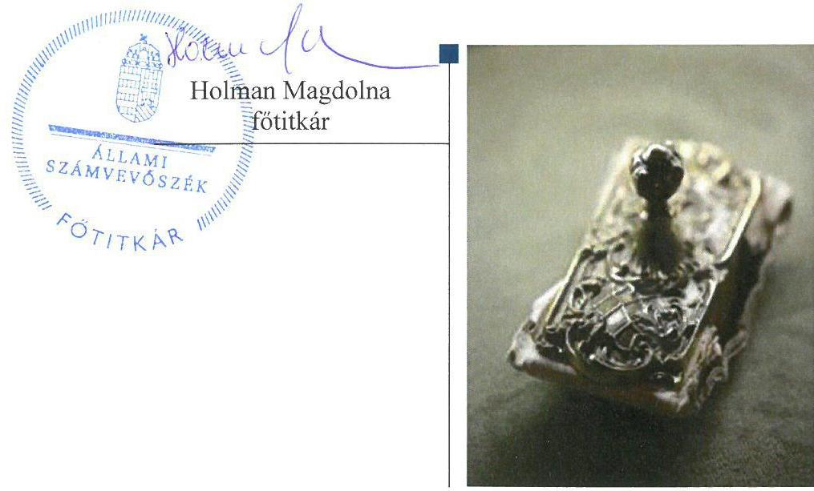

# Jelentés 

## Pártok gazdálkodása

A költségvetési támogatásban részesülő pártok 2015-2016. évi gazdálkodása törvényességének ellenőrzése a Magyar Liberális Párt - Liberálisoknál 2018.

---

# Jelentés 

## Pártok gazdálkodása

A költségvetési támogatásban részesülő pártok 2015-2016. évi gazdálkodása törvényességének ellenőrzése a Magyar Liberális Párt - Liberálisoknál
2018. 01. hó 05. nap

---

# AZ ELLENŐRZÉST FELÜGYELTE: 

DR. NAGY IMRE felügyeleti vezető

## AZ ELLENŐRZÉST VEZETTE ÉS A VÉGREHAJTÁSÁÉRT FELELŐS:

KAKAS SÁNDOR ellenőrzésvezető

## A PROGRAM ÖSSZEÁLLÍTÁSÁÉRT FELELŐS:

TÓTPÁL SZABOLCS osztályvezető

## A TÉMÁHOZ KAPCSOLÓDÓ KORÁBBI SZÁMVEVŐSZÉKI JELENTÉSEK:

- címe: Jelentés a költségvetési támogatásban részesülő pártok 2013-2014. évi gazdálkodása törvényességének ellenőrzéséről - Magyar Liberális Párt
- sorszáma: 16082

IKTATÓSZÁM: EL-0279-058/2018.
TÉMASZÁM: 34
ELLENŐRZÉS-AZONOSÍTÓ SZÁM: V080306

---

# TARTALOMJEGYZÉK 

■ ÖSSZEGZÉS ..... 5
■ AZ ELLENŐRZÉS CÉLJA ..... 6
■ AZ ELLENŐRZÉS TERÜLETE ..... 7
■ AZ ELLENŐRZÉS HÁTTERE, INDOKOLTSÁGA ..... 8
■ A JELENTÉS LÉNYEGES KÉRDÉSKÖREI ..... 9
■ ELLENŐRZÉS HATÓKÖRE ÉS MÓDSZEREI ..... 10
■ MEGÁLLAPÍTÁSOK ..... 13
■ JAVASLATOK ..... 18
■ MELLÉKLETEK ..... 21
I. sz. melléklet: Értelmező szótár ..... 21
■ FÜGGELÉK: ÉSZREVÉTELEK ..... 23
■ RÖVIDÍTÉSEK JEGYZÉKE ..... 27

---

.

---

# ÖSSZEGZÉS 

Az Állami Számvevőszék a Magyar Liberális Párt - Liberálisok gazdálkodásának törvényességét ellenőrizte a 2015. január 1-jétől 2016. december 31-ig terjedő időszakra vonatkozóan. Megállapította, hogy gazdálkodásának szabályozási környezetét nem a jogszabályi előírásoknak megfelelően alakította ki, nem teremtette meg a közpénzekkel való átlátható és ellenőrizhető gazdálkodás alapjait. A könyvvezetése és gazdálkodása során a vonatkozó jogszabályi rendelkezéseket nem tartotta be. A pénzügyi kimutatásait nem a jogszabályi előírásoknak megfelelően készítette el, nem biztosította gazdálkodásának, vagyoni helyzetének átláthatóságát. A Magyar Liberális Párt - Liberálisok működéséhez a jogszabályt megsértve tiltott vagyoni hozzájárulást fogadott el.

## Az ellenőrzés társadalmi indokoltsága

A pártok az állampolgárok egyesülési szabadsága alapján létrehozott olyan szervezetek, amelyek kereteket nyújtanak a népakarat kialakításához és kinyilvánításához, a politikai életben való állampolgári részvételhez.

A politikai élet tisztasága érdekében törvény állapítja meg a pártok vagyonára és gazdálkodására vonatkozó szabályokat. Az egyesülési jog alapján létrejövő más szervezetekhez képest szűkebb körben határozza meg azt a gazdasági tevékenységet, amelyet a párt végezhet, biztosítja azonban a pártok részére azt a jogosultságot, hogy az állami költségvetésből támogatásban részesüljenek. A pártok gazdálkodását a politikai élet tisztasága érdekében rendszeresen indokolt ellenőrizni, ezért törvényi előírás alapján az Állami Számvevőszék a költségvetési támogatást kapott pártok gazdálkodását kétévente ellenőrzi.

## Főbb megállapítások, következtetések, javaslatok

A Magyar Liberális Párt - Liberálisok gazdálkodására vonatkozó számviteli keretek kialakítása és a belső szabályozások tartalma nem felelt meg a jogszabályi előírásoknak, így a párt nem teremtette meg a közpénzekkel való átlátható és ellenőrizhető gazdálkodás alapjait. A Magyar Liberális Párt - Liberálisok ellenőrzési rendszere az előírásoknak megfelelően működött.

A Magyar Liberális Párt - Liberálisok a 2015. és 2016. évi pénzügyi kimutatását nem a jogszabályi előírásoknak megfelelően készítette el, mivel a központi költségvetésből juttatott támogatást nem megfelelően mutatta ki. Ezzel a gazdálkodásának átláthatósága nem volt biztosított. A pénzügyi kimutatások közzététele nem volt szabályszerű.

A Magyar Liberális Párt - Liberálisok a működéséhez a forrásokat nem szabályszerűen számolta el. A központi költségvetésből juttatott támogatásokat nem megfelelően számolta el a bevételei között. A jogszabályi előírás ellenére 2015. évben 710 ezer Ft, 2016. évben 5445 ezer Ft értékben tiltott, nem pénzbeli vagyoni hozzájárulást fogadott el jogi személyektől, valamint a 2015. évben 30 ezer Ft tiltott vagyoni hozzájárulást fogadott el egy nem magyar állampolgár természetes személytől. Továbbá a 2015. évben 125 ezer Ft, 2016. évben 500 ezer Ft - magánszemélytől kapott - nem pénzbeli vagyoni hozzájárulást nem vett nyilvántartásba a könyveiben. A kiadások kifizetése során a jogszabályok és a belső szabályzatok előírásait betartotta.

A megállapítások alapján az ÁSZ az MLP elnökének 12 javaslatot fogalmazott meg, amelyre 30 napon belül intézkedési tervet kell készítenie.

---

# AZ ELLENŐRZÉS CÉLJA 

AZ ELLENŐRZÉS CÉLJA annak értékelése volt, hogy a közzétett pénzügyi kimutatások a törvényi előírásoknak megfeleltek-e, a könyvvezetés és gazdálkodás során betartották-e a vonatkozó jogszabályi és belső előírásokat; a Magyar Liberális Párt - Liberálisok a működéséhez szabályszerűen igénybe vehető forrásokat hasz-nált-e fel.

---

# AZ ELLENŐRZÉS TERÜLETE 

## Magyar Liberális Párt - Liberálisok

A Magyar Liberális Párt - Liberálisok 2009. december 22-én létrejött olyan egyesület, amely nyilvántartott tagsággal rendelkezik, és a nyilvántartásba vételét végző bíróság előtt kinyilvánította, hogy a Párttörvény ${ }^{1}$ rendelkezéseit magára nézve kötelezőnek ismeri el a Párttörvény 1. §-a alapján.

A Magyar Liberális Párt - Liberálisok döntéshozó testületei a Küldöttgyűlés², mely a párt legfőbb döntéshozó szerve, az Ügyvivői Testület ${ }^{3}$, mely a párt legfőbb operatív szerve, a Pénzügyi Ellenőrző Bizottság ${ }^{4}$, mely a párt gazdálkodását, vagyonkezelését és pénzügyeit ellenőrző háromtagú testület. A párt elnöke az alapítás óta tölti be tisztét.

A Magyar Liberális Párt - Liberálisok 2015. és 2016. években évente 70800 ezer Ft központi költségvetési támogatásban részesült. A 2015. évi pénzügyi kimutatásában 61161 ezer Ft bevételt és 57030 ezer Ft kiadást számolt el, a 2016. évi pénzügyi kimutatásában pedig 66834 ezer Ft bevételt és 69940 ezer Ft kiadást mutatott ki. A 2015. január 1-jén fennállt 30000 ezer Ft hosszú lejáratú hitelállománya 2015. év végére 14 920,4 ezer Ft-ra csökkent, 2016-ban pedig a teljes összeg törlesztése megtörtént.

A Magyar Liberális Párt - Liberálisok 2014-ben létrehozta a Liberális Magyarországért Alapítványt, valamint megalapította a kizárólagos tulajdonában lévő LI-CO Tudományszervező Kereskedelmi és Szolgáltató Kft.-t.

---

# AZ ELLENŐRZÉS HÁTTERE, INDOKOLTSÁGA 

Az ÁSZ tv. ${ }^{5}$ 5. § (11) bekezdés a) pontja, valamint a Párttörvény 10. § (1) bekezdése alapján a pártok gazdálkodása törvényességének ellenőrzésére az ÁSZ ${ }^{6}$ jogosult. Törvényi előírás alapján az ÁSZ kétévente ellenőrzi azoknak a pártoknak a gazdálkodását, amelyek rendszeres költségvetési támogatásban részesültek.

Az ÁSZ legutóbb a Magyar Liberális Párt - Liberálisok 2013-2014. évi gazdálkodásának törvényességét ellenőrizte.

A gazdálkodás szabályszerűségének, a felhasznált közpénzek nagyságának bemutatásával a társadalom objektív képet alkothat a pártok működéséről. Az ellenőrzés megállapításai a gazdálkodás megfelelőségének bemutatásával elősegíthetik, hogy a törvényalkotók konkrét lépéseket tegyenek a pártok finanszírozására vonatkozó szabályozások megváltoztatása, átláthatóbbá, ellenőrizhetőbbé tétele irányába. Az ellenőrzés rámutathat a pártok gazdálkodásával, valamint az állami költségvetésből származó források felhasználásával kapcsolatos jó gyakorlatokra és szabálytalanságokra. A hiányosságok, szabálytalanságok feltárása, az ennek kapcsán megfogalmazott megállapítások elősegíthetik a törvényi rendelkezések megsértésének szankcionálását.

---

# A JELENTÉS LÉNYEGES KÉRDÉSKÖREI 

1. A Magyar Liberális Párt - Liberálisok gazdálkodásának törvényessége biztosított volt-e?
2. A Magyar Liberális Párt - Liberálisok pénzügyi kimutatása megfelelt-e a törvényi előírásoknak, közzétételi kötelezettségét szabályszerűen teljesítette-e?
3. A Magyar Liberális Párt - Liberálisok könyvvezetése és gazdálkodása során a vonatkozó jogszabályi rendelkezéseket és belső előírásokat betartotta-e?

---

# ELLENŐRZÉS HATÓKÖRE ÉS MÓDSZEREI 

## Az ellenőrzés típusa

Szabályszerűségi ellenőrzés.

## Az ellenőrzött időszak

2015-2016. évek

## Az ellenőrzés tárgya

A Magyar Liberális Párt - Liberálisok ellenőrzése során az ellenőrzés tárgyát képezték a 2015. és a 2016. évre vonatkozó pénzügyi kimutatás elkészítésére, közzétételére, a párt könyvvezetésére, gazdálkodására, ennek keretében a számviteli szabályozás kialakítására, a bizonylati rend, bizonylati fegyelem betartására, egyéb gazdálkodási, ellenőrzési és pénzügyiszámviteli informatikai feladatok ellátására irányuló tevékenységek. Az ellenőrzés tárgya volt még a források elszámolása és felhasználása, valamint a vagyon jogszabályi előírásoknak megfelelő hasznosítása.

Az ellenőrzés kiterjedt minden olyan körülményre és adatra, amely az ÁSZ jogszabályban meghatározott feladatainak teljesítéséhez, valamint a program végrehajtása folyamán felmerült újabb összefüggések feltárásához szükséges volt.

## Az ellenőrzött szervezet

Magyar Liberális Párt - Liberálisok

## Az ellenőrzés jogalapja

Az ellenőrzés jogalapját az ÁSZ tv. 5. § (11) bekezdés a) pontja, a Párttörvény 4. § (4)-(5) bekezdései, valamint 10. § (1) és (3)-(4) bekezdései képezte.

## Az ellenőrzés módszerei

Az ÁSZ az ellenőrzést az ellenőrzési program szempontjai, az ellenőrzött időszakban hatályos jogszabályok, az ellenőrzés általános szakmai szabá-

---

lyai, az ellenőrzésre irányadó ÁSZ módszertanok figyelembevételével végezte. A gazdálkodás hibáinak kijavítására irányuló javaslatok kidolgozásakor a hatályos jogszabályok voltak az irányadóak.

Az ÁSZ az ellenőrzés ideje alatt a Magyar Liberális Párt - Liberálisokkal történő kapcsolattartást az ÁSZ SZMSZ²-ének vonatkozó előírásai alapján biztosította.

Az ellenőrzési bizonyítékként felhasználható adatforrások közé tartoztak egyrészt az ellenőrzési program részletes szempontjainál felsorolt adatforrások, másrészt minden egyéb az ellenőrzés folyamán feltárt, az ellenőrzés szempontjából információt tartalmazó dokumentum.

A pénzügyi kimutatás könyvviteli nyilvántartás adataival való egyezőségének, a könyvvezetés és gazdálkodás szabályszerűségének ellenőrzéséhez az ÁSZ tételes ellenőrzést és mintavételi eljárást is alkalmazott. Teljes körűen ellenőrzésre kerültek a központi költségvetésből származó támogatások, illetve a párt által nyújtott támogatások. Statisztikai mintavételi eljárás alapján ellenőrizte az ÁSZ az egyéb területeket.

A jogi személyiséggel rendelkező bérbeadó szervezettől származó, kedvezményes bérleti díj formájában kapott tiltott nem pénzbeli vagyoni hozzájárulások értékét az ÁSZ a következő módszerrel határozta meg. Az Áht. ${ }^{8}$ hatálya alá tartozó bérbeadó szervezet tulajdonában lévő ingatlan esetében megvizsgálta, hogy más civil szervezet - amennyiben ilyen megkülönböztetést nem alkalmaztak, bármely más bérlő - esetében azonos mértékű fajlagos bérleti díjat alkalmazott-e a bérbeadó az azonos övezeti besorolású, azonos komfortfokozatú bérleményeknél. Amennyiben a párt által fizetendő bérleti díj alacsonyabb volt, akkor a más civil szervezetek, illetve egyéb szervezetek által fizetendő legmagasabb díj és a párt által fizetett díj különbözeteként állapította meg a tiltott forrásból származó nem pénzbeli hozzájárulás értékét az ÁSZ. Amennyiben a bérbeadó szervezetnek azonos övezetben, azonos komfortfokozatú ingatlan bérbeadása nem volt, valamint az egyéb piaci szereplő bérbeadók esetében értékbecslő által megállapított piaci bérleti díj és a párt által ténylegesen fizetett bérleti díj különbözetében állapította meg az ÁSZ a tiltott nem pénzbeli vagyoni hozzájárulás értékét.

A jogi személyektől, jogi személyiséggel nem rendelkező személytől származó igénybe vett egyéb szolgáltatás esetén, a tiltott nem pénzbeli vagyoni hozzájárulások értékét, az ÁSZ az összehasonlítható független árak módszerével állapította meg, a rendelkezésére álló, hasonló paraméterű árura, szolgáltatásra vonatkozó, az ügyletkötés időpontjában jellemző adatok felhasználásával. Amennyiben az ÁSZ, az ellenőrzés időpontjában érvényes piaci árakkal, díjakkal, vagy a korábbi időszakra vonatkozó árral, díjjal rendelkezett, akkor az árat, díjat a szolgáltatás tényleges igénybevételének időszakára a KSH által közzétett hivatalos inflációs rátával korrigálta. Az árak, díjak megállapításakor az ÁSZ figyelembe vette, a minden piaci szereplőre egységesen érvényesített kedvezményeket.

Ha a számítás eredményeként megállapításra került, hogy a hasonló paraméterekkel alkalmazott árak, díjak megegyeztek, a párt esetében számlázott árakkal, díjakkal vagy az eltérés nem volt lényeges, akkor az ellenértéket az ÁSZ elfogadta piaci árnak, díjnak. Amennyiben a párt által fizetett ár, díj volt az alacsonyabb, akkor a különbözetet az ÁSZ tiltott forrásból származó nem pénzbeli hozzájárulásnak minősítette.

---

A Magyar Liberális Párt - Liberálisok vonatkozásában kockázatjelzést az ÁSZ nem kapott.

Az ellenőrzés lefolytatásához a Magyar Liberális Párt - Liberálisok a tanúsítványok kitöltésével, valamint az ÁSZ által kért dokumentumok megküldésével szolgáltatott adatokat. A rendelkezésre bocsátott adatok, információk kontrollja az ellenőrzés
 keretében történt.

Az ÁSZ az ellenőrzést a Magyar Liberális Párt - Liberálisok által rendelkezésre bocsátott dokumentumokra, adatokra alapozta. Az ellenőrzés céljának eléréséhez szükséges bizonyítékokat a számvevő az egyes adatok közvetlen, részletes elemzésével alapozta meg, a következő ellenőrzési eljárások alkalmazásával: megfigyelés, szemrevételezés, információkérés, megerősítés, valamint elemző eljárás.

---

# 1. A Magyar Liberális Párt - Liberálisok gazdálkodásának törvényessége biztosított volt-e? 

Összegző megállapítás

A Magyar Liberális Párt - Liberálisok gazdálkodásának törvényessége nem volt biztosított.
1.1. számú megállapítás

A Magyar Liberális Párt - Liberálisok gazdálkodására vonatkozó számviteli keretek kialakítása és a belső szabályozások nem feleltek meg a jogszabályi előírásoknak.

## A SZÁMV. TV.-BEN ${ }^{9}$ ELŐÍRT SZABÁLYZATOKKAL

az MLP${ }^{10}$ a számlarend kivételével rendelkezett.

Az MLP a Számviteli politika ${ }^{11}$ keretében elkészítette a Leltározási Szabályzat ${ }_{1,2}{ }^{12}$-át, a Pénzkezelési Szabályzatát ${ }^{13}$ és az Értékelési Szabályzat ${ }_{1,2}{ }^{14}$-át. A Leltározási szabályzat ${ }_{2}$, valamint az Értékelési szabályzat ${ }_{1}$ a Számv. tv. előírásainak megfeleltek.

Az MLP a Számv. tv. 14. § (4) bekezdésének előírása ellenére a Számviteli politika keretében nem rögzítette azokat a jellemző szabályokat, előírásokat, módszereket, amelyekkel meghatározza, hogy mit tekint a számviteli elszámolás, az értékelés szempontjából nem lényegesnek, nem jelentősnek.

A 2016. szeptember 27-ig hatályban volt Leltározási szabályzat ${ }_{1}$ a Számv. tv. 69. § (3) bekezdésében foglaltak ellenére nem tartalmazta a mennyiségi felvétellel történő leltározás gyakoriságának meghatározását.

Az MLP a Számv. tv. 14. § (8) bekezdésében foglaltak ellenére a Pénzkezelési szabályzatban nem rendelkezett a készpénzállomány ellenőrzésekor követendő eljárásról és az ellenőrzés gyakoriságáról.

Az MLP az Értékelési szabályzata ${ }_{2}$ VI. fejezetében úgy rendelkezett, hogy a kapott nem pénzbeli vagyoni hozzájárulások értékét a könyvelésben nem szerepelteti, mely rendelkezés ellentétes a Számv. tv. 165. § (1) bekezdésében foglaltakkal.

Az MLP a Számv. tv. 161. § (1) bekezdésének előírása ellenére nem készített számlarendet.

Az Alapszabály ${ }_{1,2}{ }^{15}$ rendelkezései az MLP bevételeinek jogcímeire vonatkozóan nem feleltek meg a Párttörvény 4. § (2)-(3) bekezdéseiben foglaltaknak, mert azok olyan jogcímeket is tartalmaztak, melyek a Párttörvény 2014. évi változásai után tiltott forrásokból származó vagyoni hozzájárulásnak minősültek. Az Alapszabály ${ }_{1,2}$ az MLP bevételeiként határozta meg a jogi személyek, jogi személyiség nélküli gazdasági társaságok vagyoni hozzájárulásait, a nem magyar állampolgár természetes személyek, valamint a külföldi szervezetek vagyoni hozzájárulásait nem zárta ki a jogcímek közül.

---

Az MLP gazdálkodásával összefüggő hatásköröket, felelősségi viszonyokat és feladatokat az Alapszabály${ }_{1,2}$, a Pénzkezelési szabályzat, valamint a számviteli szolgáltatásokra vonatkozó megbízási szerződés ${ }^{16}$ megfelelő részletezettséggel tartalmazták. Az MLP pénzügyi-számviteli feladatellátásához alkalmazott informatikai rendszerrel szemben támasztott követelmények megfelelőségéért és betartásáért a számviteli szolgáltatást nyújtó megbízott volt felelős.

# 1.2. számú megállapítás 

Az MLP könyvvezetése, nyilvántartási rendszere nem felelt meg a jogszabályi és belső szabályozási előírásoknak.

Az MLP a 2015. és 2016. évre vonatkozóan a Számv. tv. 69. § (1) bekezdésében, valamint a Leltározási szabályzat ${ }_{1,2}$-ben előírt leltározási kötelezettségének nem tett eleget.

Az MLP a Számv. tv. 69. § (2) bekezdésének előírása ellenére az analitikus nyilvántartások és a főkönyvi könyvelés között az adatok egyeztetését nem végezte el.

Az MLP a Számviteli politika III.1. pontjában előírt tárgyi eszköz nyilvántartást, valamint a munkabérek és más személyi jellegű kifizetések analitikus nyilvántartását nem vezette.

Az MLP részére 2015. és 2016. években a központi költségvetési támogatást az MLP hiteltartozásának aktuális tőke- és kamatfizetési kötelezettségével csökkentett értékben folyósították. Az MLP a könyvviteli nyilvántartásában a tőketörlesztések értékét, a hitelkamatokat és egyéb bankköltségeket elszámolta, azonban ezen összegeket az egyéb bevételei között nem mutatta ki. Ezzel az MLP a könyvvezetése során megsértette a Számv. tv. 15. § (2) bekezdésében foglalt teljesség elvét, továbbá a Számv. tv. 159. §-ában foglaltak ellenére a könyvviteli nyilvántartása az eszközökben és forrásokban bekövetkezett változásokat nem a valóságnak megfelelően mutatta be.

Az MLP a Számv. tv. 165. § (3) bekezdés b) pontjának előírása ellenére a hiteltörlesztéssel kapcsolatos gazdasági műveletek bizonylatainak adatait legkésőbb a tárgynegyedévet követő hó végéig a könyveiben nem rögzítette. A hiteltörlesztés és kapcsolódó hitelkamatok, bankköltségek 2015. évi tételeinek elszámolására 2015. december 31-i, a 2016. évi tételek elszámolására 2016. július 6-i dátummal került sor.

Az MLP gépjármű bérleti szerződés alapján egy magánszemélytől 2015. évben 125 ezer Ft, 2016. évben 500 ezer Ft értékben kapott nem pénzbeli hozzájárulást a szerződés 10. pontjában foglaltak ellenére nem pénzbeli vagyoni hozzájárulásként a könyveiben nem vette nyilvántartásba, mellyel megsértette a Számv. tv. 15. § (2) bekezdésében foglalt teljesség elvét, valamint a Számv. tv. 159. §-ában foglalt előírásokat.

### 1.3. számú megállapítás

Az MLP ellenőrzési rendszere az előírásoknak megfelelően működött.

Az MLP tagjainak száma nem haladta meg a 100 főt, ezért a Ptk. ${ }^{17}$ 3:82. § (1) bekezdésében foglaltak alapján felügyelőbizottság létrehozására nem volt kötelezett. Az MLP gazdálkodását, vagyonkezelését és pénzügyeit az Alapszabály${ }_{1,2}$ értelmében, éves munkaterv alapján háromtagú Pénzügyi Ellenőrző Bizottság ellenőrizte.

---

Az MLP-nél a vezetői ellenőrzés kereteit az Alapszabály ${ }_{1,2}$-ben, valamint a Pártelnöki utasítás ${ }_{1,2}{ }^{18}$-ban szabályozták. A pártigazgató a párt tevékenységének, a tagnyilvántartásnak és a pénzkezelés szabályszerűségének ellenőrzését elvégezte, azok eredményeiről az Ügyvivői Testületnek rendszeresen beszámolt.

A kötelezettségvállalási és utalványozási jogosultságokat a Pénzkezelési szabályzatban határozták meg.

# 2. A Magyar Liberális Párt - Liberálisok pénzügyi kimutatása megfelelt-e a törvényi előírásoknak, közzétételi kötelezettségét szabályszerűen teljesítette-e? 

Összegző megállapítás

Az MLP pénzügyi kimutatása nem felelt meg a jogszabályi előírásoknak, a pénzügyi kimutatás közzététele nem volt szabályszerű.

Az MLP a 2015. és 2016. évi pénzügyi kimutatását a Párttörvényben meghatározott szerkezetben elkészítette. Az MLP a pénzügyi kimutatását a Számviteli politika IV.1. pontjában foglaltak ellenére a 2015. évben az Ügyvivői Testület, 2016. évben a Pénzügyi Ellenőrző Bizottság jóváhagyása nélkül tette közzé a Magyar Közlöny mellékletét képező Hivatalos Értesítőben és a saját honlapján. A 2015. évi pénzügyi kimutatást az Ügyvivői Testület 2016. június 1-jén, a 2016. évi pénzügyi kimutatást a Pénzügyi Ellenőrző Bizottság 2017. június 14-én utólagosan, a pénzügyi kimutatás közzétételét követően hagyta jóvá.

Az MLP a 2015. és 2016. években a Költségvetési tv. ${ }_{1,2}{ }^{19}$ alapján 70800 ezer Ft - 70800 ezer Ft költségvetési támogatást kapott, azonban a 2015. évi pénzügyi kimutatásában 58 275,2 ezer Ft, a 2016. évi pénzügyi kimutatásában 55 553,3 ezer Ft központi költségvetésből származó bevételt mutatott ki a párt hiteltörlesztése és kapcsolódó banki kamatok elszámolási szabálytalanságának eredményeként. Ezzel az MLP megsértette a Számv. tv. 15. § (2), (3), (9) bekezdésében szereplő teljesség, valódiság és bruttó elszámolás elvét. Az eltérés összege 2015. évben 12 524,8 ezer Ft (a támogatás 17,7 %-a), 2016-ban 15 246,7 ezer Ft (a támogatás 21,5 %-a) volt.

Az MLP a Számv. tv 161/A. (2) bekezdésében foglaltak ellenére a közpénzek felhasználásának és a köztulajdon használatának nyilvánossága és ellenőrizhetősége érdekében a nyilvántartási (könyvvezetési) rendszerét nem részletezte oly módon tovább, hogy abból a pénzügyi kimutatások működési és politikai kiadásainak összege rendelkezésre álljon. A 2015. és 2016. évi pénzügyi kimutatások ezen soraiban feltüntetett összegeket a meghatározásukra készített részletező számítások nem támasztották alá, mellyel sérült a Számv. tv 15. § (3) bekezdésében foglalt valódiság elve.

Az MLP a 2015. és 2016. évi pénzügyi kimutatásait a Párttörvény 1. mellékletében foglaltak ellenére Pénzügyi kimutatás helyett „Pénzügyi beszámoló" elnevezéssel, az adatokat pedig forint helyett ezer forintos mértékegységben tette közzé a Magyar Közlöny mellékletét képező Hivatalos Értesítőben és a honlapján.

---

# 3. A Magyar Liberális Párt - Liberálisok könyvvezetése és gazdálkodása során a vonatkozó jogszabályi rendelkezéseket és belső előírásokat betartotta-e? 

Összegző megállapítás

Az MLP a könyvvezetése és gazdálkodása során a vonatkozó jogszabályi rendelkezéseket és belső előírásokat nem tartotta be.
3.1. számú megállapítás

Az MLP nem szabályszerűen számolta el a működéséhez a forrásokat. A működéséhez a jogszabályt megsértve tiltott vagyoni hozzájárulást fogadott el.

AZ MLP A TAGDIJ fizetés szabályait az Alapszabály ${ }_{1,2}$-ben határozta meg.

Az MLP az „Egyéb hozzájárulások, adományok" pénzügyi kimutatás soron az 500 ezer Ft összeghatáron felüli adományokat a Párttörvény előírásai szerint nevesítve rögzítette. A 2015. évi pénzügyi kimutatásban 572 ezer Ft, egy magánszemélytől származó, a 2016. évi pénzügyi kimutatásban 1722 ezer Ft, kettő magánszemélytől származó 500 ezer Ft feletti támogatást mutatott ki.

Az MLP a Számv. tv. 77. § (3) bekezdés b) pontja ellenére a Költségvetési tv. ${ }_{1,2}$ alapján juttatott és a Magyar Államkincstár által folyósított költségvetési támogatásból a 2015. évben 12 524,8 ezer Ft összeget, 2016-ban 15 246,7 ezer Ft összeget nem mutatott ki az egyéb bevételei között, így azokat nem számolta el bevételként.

Az MLP a kapott támogatások könyvviteli elszámolását alátámasztó pénztárbizonylatain a Számv. tv. 167. § (1) bekezdés h) pontja előírásainak ellenére az érintett könyvviteli számlákra történő hivatkozást, a bankszámlakivonatokon, továbbá a 2015. évben kiállított pénztárbizonylatokon a Számv. tv. 167. § (1) bekezdés i) pontjának előírásai ellenére a könyvviteli nyilvántartásokban történt rögzítés időpontját és igazolását nem tüntette fel.

Az MLP gépjármű bérleti szerződés alapján egy magánszemélytől 2015. évben 125 ezer Ft, 2016. évben 500 ezer Ft értékben kapott nem pénzbeli hozzájárulást a Számv. tv. 77. § (3) bekezdés n) pontjában foglaltak ellenére térítés nélkül kapott (igénybe vett) szolgáltatásként nem számolta el az egyéb bevételei között.

A Párttörvény 4. § (2) bekezdés 2014. január 1-jétől hatályos módosítása értelmében a pártok jogi személyektől, nem magyar állampolgár természetes személytől vagyoni hozzájárulást, valamint névtelen adományt nem fogadhatnak el. A Párttörvény 4. § (5) bekezdése szerint, ha a párt a (2) bekezdésben foglalt szabályt megsértve, tiltott nem pénzbeli hozzájárulást fogadott el, annak értékét az ÁSZ állapítja meg. Ennek megfelelően az ÁSZ megállapította, hogy az MLP a 2015. évben 260 ezer Ft, a 2016. évben 425 ezer Ft vagyoni hozzájárulást fogadott el jogi személyektől kedvezményes ingatlan bérlet formájában. A 2015. évben 450 ezer Ft, a 2016. évben 440 ezer Ft vagyoni hozzájárulást fogadott el jogi személytől díjmentes könyvelési, számviteli, pénzkezelési szolgáltatás formájában, to-

---

# Megállapítások 

vábbá a 2016. évben 4580 ezer Ft-ot kedvezményes politikai hirdetési szolgáltatás formájában, ami a Párttörvény szerint tiltott, nem pénzbeli hozzájárulásnak minősül.

Az MLP a 2015. évben a Párttörvény 4. § (3) bekezdése előírása ellenére egy magánszemélytől kapott támogatást, akinek a magyar állampolgárságáról nem győződött meg, így 30 ezer Ft összegben tiltott vagyoni hozzájárulást fogadott el.

Az MLP gazdálkodási-vállalkozási tevékenységet nem végzett.

## 3.2. számú megállapítás

Az MLP a gazdálkodással összefüggő tevékenysége keretében a kiadások kifizetése során betartotta a jogszabályok és a belső szabályzatok előírásait.

Az MLP kiadásaira fordított összegek kifizetése, elszámolása a jogszabályok és a belső szabályzatok előírásainak megfeleltek.

A pénzügyi kimutatás egyes kiadási sorainak tartalma
 megegyezett a könyvviteli nyilvántartással, amely megfelelt a Számv. tv. és a Számviteli politika előírásainak.

A működési és egyéb kiadások elszámolása, az eszközbeszerzések kifizetése és elszámolása, valamint az értékcsökkenés elszámolása megfelelt a Számv. tv. előírásainak.

A foglalkoztatás és a személyi jellegű kifizetések, illetve az ehhez kapcsolódó kötelezettségek teljesítése megfelelt a jogszabályok és a belső szabályzatok előírásainak. Az MLP a munkavállalókat megillető költségtérítésekkel kapcsolatban Kiküldetési szabályzatot ${ }^{20}$, valamint Gépjármű Használati szabályzatot ${ }^{21}$ adott ki.

## 3.3. számú megállapítás

Az MLP működése során a vagyon használata megfelelt a törvényi előírásoknak.

Az MLP egy gazdasági társaságban rendelkezett kizárólagos tulajdonosi joggal. Más gazdasági társaságban részesedést nem szerzett, pénzeszközeit nem fektette értékpapírokba, saját tulajdonú ingatlannal nem rendelkezett.

---

# JAVASLATOK 

Az ÁSZ tv. 33. § (1) bekezdésében foglaltak értelmében az ellenőrzött szervezet vezetője köteles a jelentésben foglalt megállapításokhoz kapcsolódó intézkedési tervet összeállítani és azt a jelentés kézhezvételétől számított 30 napon belül az ÁSZ részére megküldeni. Amennyiben az ellenőrzött szervezet vezetője nem küldi meg határidőben az intézkedési tervet, vagy továbbra sem elfogadható intézkedési tervet küld, az Állami Számvevőszék elnöke az ÁSZ tv. 33. § (3) bekezdése a) és b) pontjaiban foglaltakat érvényesítheti.

## A Magyar Liberális Párt - Liberálisok elnökének

1. Intézkedjen a gazdálkodás törvényességének helyreállítása érdekében
a) a Számviteli politika és az annak keretében elkészítendő szabályzatok jogszabályi előírásoknak megfelelő kiegészítéséről és aktualizálásáról;
(1.1. számú megállapítás 3-6. bekezdései alapján)
b) a jogszabályban előírt Számlarend elkészítéséről;
(1.1. számú megállapítás 7. bekezdése alapján)
c) a jogszabályban és a Leltározási szabályzatában előírt leltározási kötelezettségének teljesítéséről;
(1.2. számú megállapítás 1. bekezdése alapján)
d) az analitikus nyilvántartások és a főkönyvi könyvelés között az adatok egyeztetéséről, valamint a Számviteli politikájában előírt analitikus nyilvántartások vezetéséről;
(1.2. számú megállapítás 2-3. bekezdései alapján)
e) a könyvvezetés során a számviteli alapelvek betartásáról;
(1.2. számú megállapítás 4. és 6. bekezdései, a 2. számú megállapítás 2-3. bekezdései alapján)
f) a könyveiben az egyéb gazdasági műveletek, események bizonylatai adatainak szabályszerű rögzítéséről;
(1.2. számú megállapítás 5. bekezdése alapján)

---

g) a központi költségvetésből származó támogatások összegének szabályszerű elszámolásáról;
(1.2. számú megállapítás 4. bekezdése, a 3.1. számú megállapítás 3. bekezdése alapján)
h) a támogatások könyvviteli elszámolását alátámasztó bizonylatokon a rögzítése során a jogszabályi előírások szerinti hivatkozások feltüntetéséről;
(3.1. számú megállapítás 4. bekezdése alapján)
i) a magánszemélytől származó nem pénzbeli hozzájárulás jogszabályi előírásoknak megfelelő elszámolásáról;
(3.1. számú megállapítás 5. bekezdése alapján)
2. Intézkedjen az Alapszabály aktualizálásáról a Párttörvényben előírt követelmények teljesítése érdekében.
(1.1. számú megállapítás 8. bekezdése alapján)
3. Intézkedjen a Párttörvényben előírtak szerinti, tartalmilag megfelelő pénzügyi kimutatás elkészítéséről, továbbá a Számviteli politikában foglaltak szerint történő jóváhagyásáról és közzétételéről.
(2. számú megállapítás 1. és 4. bekezdései alapján)
4. Intézkedjen a gazdálkodás során a Párttörvényben foglalt előírások betartására a tekintetben, hogy a jövőben a párt vagyoni hozzájárulást nem magyar állampolgár magánszemélytől és jogi személytől ne fogadjon el.
(3.1. számú megállapítás 6. bekezdés 3-4. mondatai és a 7. bekezdés alapján)

---

.

---

# MELLÉKLETEK 

- I. SZ. MELLÉKLET: ÉRTELMEZŐ SZÓTÁR
pénzügyi kimutatás
gazdálkodó tevékenység
költségvetési támogatás
nem pénzbeli támogatás

A Párttörvény 9. § (1) bekezdésében meghatározott, a törvény 1. számú melléklete szerinti pénzügyi kimutatás (hatályos 2015. május 6-ától), amelyet a pártok kötelesek minden év május 31-ig a Magyar Közlönyben, valamint saját honlappal rendelkező pártok a honlapjukon is közzétenni.
A párt a költségeinek fedezése és vagyonának gyarapítása érdekében gazdasági vállalkozási tevékenységeket folytathat. (Párttörvény 6. §)
politikai céljainak és tevékenységének megismertetése érdekében kiadványokat jelentethet meg és terjeszthet, a pártot szimbolizáló jelvényeket és más ilyen célú tárgyakat árusíthat, és pártrendezvényeket szervezhet;
a tulajdonában álló ingatlanokat és ingókat díj ellenében hasznosíthatja és elidegenítheti.
Az államháztartás alrendszerei terhére nyújtott pénzbeli vagy nem pénzbeli juttatás, amelyet a támogató nem elsősorban ellenszolgáltatás ellenében, de konkrét program megvalósítása vagy meghatározott időszakban a támogatott szervezet működtetése érdekében nyújt. (Civil tv. ${ }^{22}$ 2. § 15. pont)
vagyoni értékkel rendelkező forgalomképes dolog, szellemi alkotás, illetve vagyoni értékű jog részben vagy egészében, véglegesen vagy ideiglenesen, teljesen vagy részben ingyenesen történő átruházása vagy átengedése, illetve szolgáltatás biztosítása. (Civil tv. 2. § 25. pont)

---

.

---

# FÜGGELÉK: ÉSZREVÉTELEK 

Az ÁSZ tv. 29. §* (1) bekezdésének megfelelően az Állami Számvevőszék az ellenőrzési megállapításait megküldte az ellenőrzött szervezet vezetőjének. Az ÁSZ tv. 29. § (2) bekezdése alapján az ellenőrzött szervezet vezetője az ellenőrzés megállapításaira tizenöt napon belül írásban észrevételt tehetett.

A Magyar Liberális Párt - Liberálisok elnöke a jelentéstervezet megállapításaira tizenöt észrevételt tett.
Az ÁSZ tv. 29. § (3) bekezdésével összhangban az ÁSZ a Függelékben feltünteti a jelentéstervezet megállapításaival kapcsolatban tett, figyelembe nem vett észrevételeket, és megindokolja, hogy azokat miért nem fogadta el.

[^0]
[^0]:    * 29. § (1) Az Állami Számvevőszék az ellenőrzési megállapításait megküldi az ellenőrzött szervezet vezetőjének vagy az általa megbízott személynek, és annak, akinek személyes felelősségét állapította meg.
    (2) Az ellenőrzött szervezet vezetője és a felelősként megjelölt személy az ellenőrzés megállapításaira tizenöt napon belül írásban észrevételt tehet.
    (3) Az Állami Számvevőszék az észrevételre a beérkezésétől számított harminc napon belül írásban válaszol. A figyelembe nem vett észrevételeket köteles a jelentésben feltüntetni, és megindokolni, hogy azokat miért nem fogadta el.

---

A Magyar Liberális Párt - Liberálisok elnökének 2018. január 2-án írt (az Állami Számvevőszékhez 2018. január 3-án érkezett) levelében a jelentéstervezet megállapításaival kapcsolatban tett, figyelembe nem vett észrevételek és azok indokolása.

# 1. Az ellenőrzött szervezet vezetője észrevételt tett a számlarendre vonatkozóan. 

Az észrevétele nem megalapozott, azt nem fogadom el, a megállapítás nem módosul. Az MLP az ellenőrzés során nem bocsátott olyan hiteles dokumentumot az ÁSZ rendelkezésére, amely az észrevételét alátámasztaná. Az MLP által az ellenőrzés részére átadott számlarend nem hiteles, mivel nem tartalmazta a párt elnökének aláírását. Az MLP az ÁSZ adatbekéréseihez megküldött teljességi és hitelességi nyilatkozataiban kijelentette, hogy az ÁSZ részére átadott dokumentumok, adatok a bekért adatokra, dokumentumokra vonatkozóan teljes körű információt tartalmaznak.

## 2. Az ellenőrzött szervezet vezetője észrevételt tett a számviteli szabályzatokra vonatkozóan.

Az észrevétele nem megalapozott, azt nem fogadom el, a megállapítás nem módosul. Az ellenőrzött 2015-2016. években az MLP-nek két-két leltározási, illetve értékelési szabályzata volt hatályban. A jelentéstervezet a 2014. február 6-ától 2016. szeptember 27-éig hatályos leltározási szabályzatra, valamint a 2015. szeptember 22-étől hatályos értékelési szabályzatra vonatkozóan tett megállapítást, amelyek nem feleltek meg a számvitelről szóló 2000. évi C. törvény (továbbiakban: Számv. tv.) hivatkozott előírásainak. A 2016. szeptember 28-ától hatályos leltározási szabályzat, valamint a 2014. február 6-ától 2015. szeptember 21-éig hatályos értékelési szabályzat a Számv. tv. előírásainak megfelelt.

Az MLP által ellenőrzés során átadott számviteli politika IV.2. és IV.3. pontja csak a lényeges, illetve a jelentős összegű hiba meghatározását tartalmazta. A 2015. július 4-étől hatályos Számv. tv. 14. § (4) bekezdése szerint: „A számviteli politika keretében írásban rögzíteni kell - többek között - azokat a gazdálkodóra jellemző szabályokat, előírásokat, módszereket, amelyekkel meghatározza, hogy mit tekint a számviteli elszámolás, az értékelés szempontjából lényegesnek, jelentősnek, nem lényegesnek, nem jelentősnek, kivételes nagyságú vagy előfordulású bevételnek, költségnek, ráfordításnak, továbbá meghatározza azt, hogy a törvényben biztosított választási, minősítési lehetőségek közül melyeket, milyen feltételek fennállása esetén alkalmaz, az alkalmazott gyakorlatot milyen okok miatt kell megváltoztatni." Az MLP a jelzett módosítást az észrevételében leírtakkal ellentétben nem vezette át a számviteli politikáján.

## 3. Az ellenőrzött szervezet vezetője észrevételt tett az alapszabályra vonatkozóan.

Az észrevétele nem megalapozott, azt nem fogadom el, a megállapítás nem módosul. Az ellenőrzés során átadott, 2016. június 9-étől hatályos Alapszabály nem tartalmazta a pártok működéséről és gazdálkodásáról szóló 1989. évi XXXIII. törvény (továbbiakban: Párttörvény) 2014. január 1-jétől hatályos változásait. Az észrevételében leírtaknak ellentmond, hogy a hatályos Alapszabály 4.1. pontja a Párttörvény 4. § (2)-(3) bekezdéseiben meghatározott tiltott támogatásokat a törvény 2013. december 31-éig hatályos változata szerint, szöveghűen tartalmazta.

## 4. Az ellenőrzött szervezet vezetője észrevételt tett a leltározási kötelezettségre és az analitikus és főkönyvi könyvelés adatainak egyeztetésére vonatkozóan.

Az észrevétele nem megalapozott, azt nem fogadom el, a megállapítás nem módosul. Az ellenőrzés során a leltár, leltározás dokumentumai tekintetében az MLP a 2015. december 31-ei és a 2016. december 31-ei fordulónapra vonatkozó „Leltárfelvételi ív és összesítő tárgyi eszközök állományáról" című, a tárgyi eszközöket mennyiségben tartalmazó bizonylatot adott át. Ez a leltárfelvételi ív nem azonos a leltározási jegyzőkönyvvel, amelyet az MLP nem bocsátott az ellenőrzés rendelkezésére. A jelentéstervezet analitikus és főkönyvi könyvelés adatainak egyeztetésére vonatkozó megállapítása helytálló, az egyeztetéseket a Számv. tv. 69. § (1)-(2) bekezdéseiben előírtak ellenére az MLP az észrevétele szerint sem dokumentálta.

---

5. Az ellenőrzött szervezet vezetője észrevételt tett az analitikus nyilvántartások vezetésére vonatkozóan.

Az észrevétele nem megalapozott, azt nem fogadom el, a megállapítás nem módosul. Az MLP az ellenőrzés részére nem adott át a tárgyi eszközökre, valamint a munkabérek és más személyi jellegű kifizetésekre vonatkozó hiteles nyilvántartást. Az MLP az ÁSZ adatbekéréseihez megküldött teljességi és hitelességi nyilatkozataiban kijelentette, hogy az ÁSZ részére átadott dokumentumok, adatok a bekért adatokra, dokumentumokra vonatkozóan teljes körű információt tartalmaznak.
6. Az ellenőrzött szervezet vezetője észrevételt tett a nyilvántartási rendszer további hiányosságaira vonatkozóan. Az észrevétel a megállapításokat nem vitatja, a megállapítás nem módosul.
7. Az ellenőrzött szervezet vezetője észrevételt tett az ellenőrzési rendszer működésére vonatkozóan. Az észrevétel a megállapításokat nem vitatja, a megállapítás nem módosul.
8. Az ellenőrzött szervezet vezetője észrevételt tett a pénzügyi kimutatásra vonatkozóan.

Az észrevétele nem megalapozott, az nem cáfolja a megállapításokat, a megállapítás nem módosul. Az MLP észrevétele megerősítette a jelentéstervezetnek a pénzügyi kimutatások közzétételt követő jóváhagyására, valamint a pénzügyi kimutatás támogatás sorában feltüntetett összegre tett megállapítását.
9. Az ellenőrzött szervezet vezetője észrevételt tett a könyvvezetési rendszerre vonatkozóan.

Az észrevétele nem megalapozott, azt nem fogadom el, a megállapítás nem módosul. A Számv. tv. 161/A § (2) bekezdése szerint a közpénzek felhasználásának és a köztulajdon használatának nyilvánossága és ellenőrizhetősége érdekében a gazdálkodó nyilvántartási (könyvvezetési) rendszerét köteles oly módon továbbrészletezni, hogy abból a vonatkozó külön jogszabályban meghatározott adatok rendelkezésre álljanak. Az MLP észrevételében elismerte, hogy a könyvvezetési rendszer továbbrészletezési előírásának nem tett eleget.
10. Az ellenőrzött szervezet vezetője észrevételt tett a pénzügyi beszámolóra vonatkozóan.

Az észrevétele nem megalapozott, a jelentéstervezet megállapítását nem vitatja, annak módosítása nem indokolt.
11. Az ellenőrzött szervezet vezetője észrevételt tett az ingatlanbérlet formájában a tiltott, nem pénzbeli hozzájárulás elfogadására vonatkozóan.

Az észrevétele nem megalapozott, azt nem fogadom el, a megállapítás nem módosul. A Párttörvény 4. § (2) bekezdése értelmében a pártok jogi személyektől vagyoni hozzájárulást nem fogadhatnak el. A Párttörvény 4. § (5) bekezdése szerint, ha a párt részére a vagyoni hozzájárulást nem pénzben nyújtották, köteles annak
 értékeléséről (értékének meghatározásáról) gondoskodni. A Párttörvény 4. § (5) bekezdése szerint, ha a párt a (2) bekezdésben foglalt szabályt megsértve, tiltott, nem pénzbeli hozzájárulást fogadott el, annak értékét az ÁSZ állapítja meg.
Az MLP által az ellenőrzés rendelkezésére bocsátott dokumentumok alapján az ÁSZ megállapította, hogy az MLP a jogi személytől bérelt ingatlan tekintetében 2015-2016. években nem gondoskodott a nem pénzben nyújtott vagyoni hozzájárulás értékeléséről, értékének meghatározásáról. Az MLP nem teljesítette törvényi kötelezettségét. A Párttörvény előírása alapján a tiltott, nem pénzbeli hozzájárulás értékét az ÁSZ állapította meg.

---

12. Az ellenőrzött szervezet vezetője észrevételt tett a díjmentes könyvelési, számviteli, pénzkezelési szolgáltatás formájában nyújtott tiltott, nem pénzbeli hozzájárulás elfogadására vonatkozóan.
Az észrevétele nem megalapozott, azt nem fogadom el, a megállapítás nem módosul. Az észrevételben hivatkozott megbízási szerződés nem egyezik meg azzal a szerződéssel, amelyre az ÁSZ a megállapítását alapozta, és amelyet teljességi és hitelességi nyilatkozattal igazoltan az ellenőrzés részére átadtak. Az MLP könyvelési feladatait végző Kft.-vel 2013-ban kötött megbízási szerződés 4. pontja szerint „a megbízott szolgáltatásait díjmentesen látja el".
13. Az ellenőrzött szervezet vezetője észrevételt tett a kedvezményes politikai hirdetési szolgáltatás formájában a tiltott, nem pénzbeli hozzájárulás elfogadására vonatkozóan.
Az észrevétele nem megalapozott, azt nem fogadom el, a megállapítás nem módosul. Az MLP az ellenőrzés során és az észrevételéhez kapcsolódóan nem bocsátott olyan hiteles, ellenőrzési bizonyítékként elfogadható dokumentumot az ÁSZ rendelkezésére, amely az észrevételét alátámasztaná. Ezáltal az észrevétele nem igazolta, hogy az MLP a nem pénzben nyújtott vagyoni hozzájárulások Párttörvényben előírt értékelését a politikai hirdetési szolgáltatások tekintetében elvégezte volna.
14. Az ellenőrzött szervezet vezetője észrevételt tett a tiltott vagyoni hozzájárulás elfogadására vonatkozóan.

Az észrevétele nem megalapozott, a jelentéstervezet megállapítását nem vitatja, annak módosítása nem indokolt.
15. Az ellenőrzött szervezet vezetője észrevételt tett a kiadások kifizetésére, a vagyon használatára vonatkozóan.

Az észrevétele nem megalapozott, azt nem fogadom el, a megállapítás nem módosul. A jelentéstervezet észrevételezett megállapításai között nincs ellentmondás: a 2. számú összegző megállapítás 3. bekezdésének megállapítása a könyvvezetési rendszer hiányosságára, a 3.2. számú megállapítás a kiadások elszámolására vonatkozott.

---

# RÖVIDÍTÉSEK JEGYZÉKE 

${ }^{1}$ Párttörvény
${ }^{2}$ Küldöttgyűlés
${ }^{3}$ Ügyvivői Testület
${ }^{4}$ Pénzügyi Ellenőrző Bizottság
${ }^{5}$ ÁSZ tv.
${ }^{6}$ ÁSZ
${ }^{7}$ ÁSZ SZMSZ
${ }^{8}$ Áht.
${ }^{9}$ Számv. tv.
${ }^{10}$ MLP
${ }^{11}$ Számviteli politika
${ }^{12}$ Leltározási szabályzat:

Leltározási szabályzat:
${ }^{13}$ Pénzkezelési szabályzat
${ }^{14}$ Értékelési szabályzat:

Értékelési szabályzat:
${ }^{15}$ Alapszabály:

Alapszabály:
${ }^{16}$ Számviteli szolgáltatásokra vonatkozó szerződés
${ }^{17}$ Ptk.
${ }^{18}$ Pártelnöki utasítás:

Pártelnöki utasítás:
${ }^{19}$ Költségvetési tv.:
Költségvetési tv.:
${ }^{20}$ Kiküldetési szabályzat

1989. évi XXXIII. törvény a pártok működéséről és gazdálkodásáról (hatályos 1989. október 30-tól)
A Magyar Liberális Párt - Liberálisok legfőbb döntéshozó testülete
A Magyar Liberális Párt - Liberálisok legfőbb operatív szerve, amelynek tagjai a párt elnöke, a pártigazgató, a fővárosi választmány elnöke, valamint a Küldöttgyűlés által választott két tag
A Magyar Liberális Párt - Liberálisok gazdálkodását, vagyonkezelését és pénzügyeit ellenőrző háromtagú testület
2011. évi LXVI. törvény az Állami Számvevőszékről (hatályos 2011. július 1-jétől)
Állami Számvevőszék
Állami Számvevőszék Szervezeti és Működési Szabályzata
2011. évi CXCV. törvény az államháztartásról
2000. évi C. törvény a számvitelről (hatályos 2001. január 1-jétől)

Magyar Liberális Párt - Liberálisok
A Magyar Liberális Párt - Liberálisok számviteli politikája (hatályos 2015. január 6-tól)
A Magyar Liberális Párt - Liberálisok eszközök és források leltárkészítési és leltározási szabályzata (hatályos 2014. február 6-tól 2016. szeptember 27-ig)
A Magyar Liberális Párt - Liberálisok eszközök és források leltárkészítési és leltározási szabályzata (hatályos 2016. szeptember 28-tól)
A Magyar Liberális Párt - Liberálisok pénzkezelési szabályzata (hatályos 2015. január 6-tól)

A Magyar Liberális Párt - Liberálisok eszközök és források értékelési szabályzata (hatályos 2014. február 6-tól 2015. szeptember 21-ig)
A Magyar Liberális Párt - Liberálisok eszközök és források értékelési szabályzata (hatályos 2015. szeptember 22-től)
A Magyar Liberális Párt alapszabálya a 2014. augusztus 19. napján kelt 4. számú módosítással egységes szerkezetben (Hatályos 2014. augusztus 19-től)
A Magyar Liberális Párt alapszabálya a 2016. június 09. napján kelt 5. számú módosítással egységes szerkezetben (Hatályos 2016. június 9-től)
A 2013. december 18-án kelt megbízási szerződés az Abacus-Audit Kft. és az MLP között (hatályos 2013. december 18-tól).
2013. évi V. törvény a polgári törvénykönyvről
A Magyar Liberális Párt - Liberálisok elnökének 1/2015. (I.30.) utasítása a Magyar Liberális Párt 2015. évi ellenőrzési rendjéről
A Magyar Liberális Párt - Liberálisok elnökének 1/2016. (II.3.) utasítása a Magyar Liberális Párt 2016. évi ellenőrzési rendjéről
2014. évi C. törvény Magyarország 2015. évi költségvetéséről
2015. évi C. törvény Magyarország 2016. évi költségvetéséről

A Magyar Liberális Párt - Liberálisok kiküldetési szabályzata (hatályos: 2014. május 23-tól)

---

${ }^{21}$ Gépjármű használati szabályzat
${ }^{22}$ Civil tv.

A Magyar Liberális Párt - Liberálisok gépjármű használati szabályzata (hatályos: 2014. május 23-tól)
2011. évi CLXXV. törvény az egyesülési jogról, a közhasznú jogállásról, valamint a civil szervezetek működéséről és támogatásáról (hatályos 2011. december 22-től)

---

# ÁLLAMI SZÁMVEVŐSZÉK 

1052 Budapest, Apáczai Csere János utca 10.
Levélcím: 1364 Budapest 4. Pf. 54
Telefon: +36 14849100 Telefax: +36 14849200
www.asz.hu
