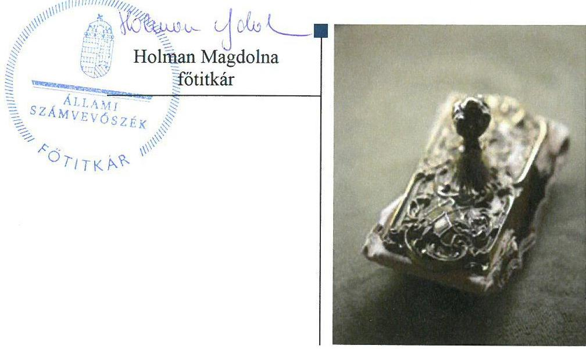

# Jelentés 

## Pártok gazdálkodása

A költségvetési támogatásban részesülő pártok 2015-2016. évi gazdálkodása törvényességének ellenőrzése a Párbeszéd Magyarországért Pártnál 2018.

---

# Jelentés 

## Pártok gazdálkodása

A költségvetési támogatásban részesülő pártok 2015-2016. évi gazdálkodása törvényességének ellenőrzése a Párbeszéd Magyarországért Pártnál 2018.  október 11. nap

---

|  AZ ELLENŐRZÉST FELÜGYELTE: |  |  |  |  |   |
| --- | --- | --- | --- | --- | --- |
|   |  | DR. NAGY IMRE felügyeleti vezető |  |  |   |
|   |  | AZ ELLENŐRZÉST VEZETTE ÉS A VÉGREHAJTÁSÁÉRT FELELŐS: |  |  |   |
|   |  | KAKAS SÁNDOR ellenőrzésvezető |  |  |   |
|   |  | A PROGRAM ÖSSZEÁLLÍTÁSÁÉRT FELELŐS: |  |  |   |
|   |  | TÓTPÁL SZABOLCS osztályvezető |  |  |   |
|   |  | A TÉMÁHOZ KAPCSOLÓDÓ KORÁBBI SZÁMVEVŐSZÉKI JELENTÉSEK: |  |  |   |
|   |  | - címe: | Jelentés a költségvetési támogatásban részesülő pártok 2013-2014. évi gazdálkodása törvényességének ellenőrzéséről – Párbeszéd Magyarországért Pártnál |  |   |
|  Jelentéseink az Országgyűlés számítógépes hálózatán és az Interneten a www.asz.hu címen is olvashatóak. |  | - sorszáma: | 16081 |  |   |
|   |  | IKTATÓSZÁM: EL-0280-063/2018. |  |  |   |
|   |  | TÉMASZÁM: 34 |  |  |   |
|   |  | ELLENŐRZÉS-AZONOSÍTÓ SZÁM: V080307 |  |  |   |

---

# TARTALOMJEGYZÉK 

■ ÖSSZEGZÉS ..... 5
■ AZ ELLENŐRZÉS CÉLJA ..... 6
■ AZ ELLENŐRZÉS TERÜLETE ..... 7
■ AZ ELLENŐRZÉS HÁTTERE, INDOKOLTSÁGA ..... 8
■ A JELENTÉS LÉNYEGES KÉRDÉSKÖREI ..... 9
■ ELLENŐRZÉS HATÓKÖRE ÉS MÓDSZEREI ..... 10
■ MEGÁLLAPÍTÁSOK ..... 13
■ JAVASLATOK ..... 19
■ MELLÉKLETEK ..... 21
I. sz. melléklet: Értelmező szótár ..... 21
■ FÜGGELÉK: ÉSZREVÉTELEK ..... 23
■ RÖVIDÍTÉSEK JEGYZÉKE ..... 27

---

.

---

# ÖSSZEGZÉS 

Az Állami Számvevőszék a Párbeszéd Magyarországért Párt gazdálkodásának törvényességét ellenőrizte a 2015. január 1-jétől 2016. december 31-ig terjedő időszakra vonatkozóan. Megállapította, hogy gazdálkodásának szabályozási környezetét nem a jogszabályi előírásoknak megfelelően alakította ki, nem teremtette meg a közpénzekkel való átlátható és ellenőrizhető gazdálkodás alapjait. A 2015. és 2016. évi pénzügyi kimutatásai nem feleltek meg a jogszabályi előírásoknak, a könyvvezetése, a bevételeinek és kiadásainak elszámolása nem volt szabályszerű. A gazdálkodása során a vonatkozó jogszabályi rendelkezéseket és belső előírásokat nem tartotta be, ezzel nem biztosította gazdálkodásának, vagyoni helyzetének átláthatóságát. A működéséhez a jogszabályt megsértve jogi személytől tiltott, nem pénzbeli vagyoni hozzájárulást fogadott el.

## Az ellenőrzés társadalmi indokoltsága

A pártok az állampolgárok egyesülési szabadsága alapján létrehozott olyan szervezetek, amelyek kereteket nyújtanak a népakarat kialakításához és kinyilvánításához, a politikai életben való állampolgári részvételhez.

A politikai élet tisztasága érdekében törvény állapítja meg a pártok vagyonára és gazdálkodására vonatkozó szabályokat. Az egyesülési jog alapján létrejövő más szervezetekhez képest szűkebb körben határozza meg azt a gazdasági tevékenységet, amelyet a párt végezhet, biztosítja azonban a pártok részére azt a jogosultságot, hogy az állami költségvetésből támogatásban részesüljenek. A pártok gazdálkodását a politikai élet tisztasága érdekében rendszeresen indokolt ellenőrizni, ezért törvényi előírás alapján az Állami Számvevőszék a költségvetési támogatást kapott pártok gazdálkodását kétévente ellenőrzi.

## Főbb megállapítások, következtetések, javaslatok

A Párbeszéd Magyarországért gazdálkodására vonatkozó számviteli keretek kialakítása és a belső szabályozások tartalma nem felelt meg a jogszabályi előírásoknak, így a párt nem teremtette meg a közpénzekkel való átlátható és ellenőrizhető gazdálkodás alapjait. Az ellenőrzési rendszere nem az előírásoknak megfelelően működött.

A Párbeszéd Magyarországért Párt a 2015. és 2016. évi pénzügyi kimutatásait a jogszabályi előírásoknak megfelelő határidőben a Magyar Közlöny mellékletét képező Hivatalos Értesítőben és a saját honlapján közzétette. A 2015. és 2016. évi pénzügyi kimutatásokat azonban nem a jogszabályi előírásoknak megfelelően készítette el, ezzel nem biztosította gazdálkodásának áttekinthetőségét. A működéséhez a 2015. évben 2615 ezer Ft, a 2016. évben 4910 ezer Ft jogi személyektől származó tiltott, nem pénzben nyújtott vagyoni hozzájárulást fogadott el.

A Párbeszéd Magyarországért Párt működéséhez felhasznált, egyéb hozzájárulások, adományok, egyéb bevételek elszámolása nem volt szabályszerű. A gazdálkodással összefüggő tevékenységének keretében a kiadások teljesítése nem volt szabályszerű, mert a jogszabályok és a belső szabályzatok előírásait nem tartotta be.

Az ÁSZ a jelentésében a Párbeszéd Magyarországért Párt társelnökeinek 10 javaslatot fogalmazott meg, amelyre 30 napon belül intézkedési tervet kell készíteniük.

---

# AZ ELLENŐRZÉS CÉLJA 

AZ ELLENŐRZÉS CÉLJA annak értékelése volt, hogy a közzétett pénzügyi kimutatások a törvényi előírásoknak megfeleltek-e, a könyvvezetés és gazdálkodás során betartották-e a vonatkozó jogszabályi és belső előírásokat; a Párbeszéd Magyarországért Párt a működéséhez szabályszerűen igénybe vehető forrásokat használta fel.

---

# AZ ELLENŐRZÉS TERÜLETE 

## Párbeszéd Magyarországért Párt

A Párbeszéd Magyarországért Párt az ellenőrzött időszakot megelőzően, 2013. július 9-én létrejött olyan egyesület, amely nyilvántartott tagsággal rendelkezik, és a nyilvántartásba vételét végző bíróság előtt kinyilvánította, hogy a Párttörvény ${ }^{1}$ rendelkezéseit magára nézve kötelezőnek ismeri el a Párttörvény 1. §-a alapján.

A Párbeszéd Magyarországért Párt Alapszabályban² rögzített célja, hogy a társadalmi párbeszéd és a közhatalom gyakorlásában való részvétel útján minél szélesebb körben érvényre jutassa elveit és értékeit, és megválasztott képviselőin keresztül részt vegyen az önkormányzatok, az Országgyűlés és az Európai Parlament munkájában. Döntéshozó szervei 2016. május 21-ig a taggyűlés és az Elnökség, 2016. május 22-től a Kongresszus és az Országos elnökség, amely két kongresszus között gyakorolja a kongresszus azon jogait, amelyek nem tartoznak a kongresszus kizárólagos feladat és hatáskörébe. A párt jelenlegi társelnökei az alakulástól töltik be tisztségüket.

A Párbeszéd Magyarországért Párt a 2015. és a 2016. évben is 106700 ezer Ft központi költségvetési támogatásban részesült. A 2015. évi pénzügyi kimutatásban 113553 ezer Ft bevételt, valamint 105337 ezer Ft kiadást számolt el. A 2016. évi pénzügyi kimutatás szerint az összes bevétele 112941 ezer Ft, a kiadások összege 95952 ezer Ft volt.

A Párbeszéd Magyarországért Párt kötelezettségállománya a 2015. év végén 32280 ezer Ft, a 2016. év végén 15560 ezer Ft volt. A Párbeszéd Magyarországért Párt 2014. júniusában létrehozta a „Megújuló Magyarországért" nevű alapítványt, 2016. január 9-én ifjúsági szervezetét a ZöldFront Ifjúsági Mozgalmat, gazdasági társaságot nem alapított, ingatlantulajdonnal nem rendelkezett.

---

# AZ ELLENŐRZÉS HÁTTERE, INDOKOLTSÁGA 

Az ÁSZ tv. ${ }^{3}$ 5. § (11) bekezdés a) pontja, valamint a Párttörvény 10. § (1) bekezdése alapján a pártok gazdálkodása törvényességének ellenőrzésére az ÁSZ ${ }^{4}$ jogosult. A Párttörvény 10. § (3) bekezdése alapján az ÁSZ kétévente ellenőrzi azoknak a pártoknak a gazdálkodását, amelyek rendszeres költségvetési támogatásban részesültek.

Az ÁSZ legutóbb a Párbeszéd Magyarországért Párt 2013-2014. évi gazdálkodásának törvényességét ellenőrizte.

A gazdálkodás szabályszerűségének, a felhasznált közpénzek nagyságának bemutatásával a társadalom objektív képet alkothat a pártok működéséről. Az ellenőrzés megállapításai a gazdálkodás megfelelőségének bemutatásával elősegíthetik, hogy a törvényalkotók konkrét lépéseket tegyenek a pártok finanszírozására vonatkozó szabályozások megváltoztatása, átláthatóbbá, ellenőrizhetőbbé tétele irányába. Az ellenőrzés rámutathat a pártok gazdálkodásával, valamint az állami költségvetésből származó források felhasználásával kapcsolatos jó gyakorlatokra és szabálytalanságokra. Az esetleges hiányosságok, szabálytalanságok feltárása, és az ennek kapcsán megfogalmazott megállapítások elősegíthetik a törvényi rendelkezések megsértésének szankcionálását.

---

# A JELENTÉS LÉNYEGES KÉRDÉSKÖREI 

1. A Párbeszéd Magyarországért Párt gazdálkodásának törvényessége biztosított volt-e?
2. A Párbeszéd Magyarországért Párt pénzügyi kimutatása megfelelt-e a törvényi előírásoknak, közzétételi kötelezettségét szabályszerűen teljesítette-e?
3. A Párbeszéd Magyarországért Párt könyvvezetése és gazdálkodása során a vonatkozó jogszabályi rendelkezéseket és belső előírásokat betartotta-e?

---

# ELLENŐRZÉS HATÓKÖRE ÉS MÓDSZEREI 

## Az ellenőrzés típusa

Szabályszerűségi ellenőrzés.

## Az ellenőrzött időszak

2015-2016. évek

## Az ellenőrzés tárgya

A Párbeszéd Magyarországért Párt ellenőrzése során az ellenőrzés tárgyát képezték a 2015. és a 2016. évre vonatkozó pénzügyi kimutatás elkészítésére, jóváhagyására, közzétételére, a párt könyvvezetésére, gazdálkodására, ennek keretében a számviteli szabályozás kialakítására, a bizonylati rend, bizonylati fegyelem betartására, egyéb gazdálkodási, ellenőrzési és pénzügyi-számviteli informatikai feladatok ellátására irányuló tevékenységek. Az ellenőrzés tárgya volt még a források elszámolása és felhasználása, valamint a vagyon jogszabályi előírásoknak megfelelő hasznosítása.

Az ellenőrzés kiterjedt minden olyan körülményre és adatra, amely az ÁSZ jogszabályban meghatározott feladatainak teljesítéséhez, valamint a program végrehajtása folyamán felmerült újabb összefüggések feltárásához szükséges volt.

## Az ellenőrzött szervezet

Párbeszéd Magyarországért Párt

## Az ellenőrzés jogalapja

Az ellenőrzés jogalapját az ÁSZ tv. 5. § (11) bekezdés a) pontja, a Párttörvény 4. § (4)-(5) bekezdései, valamint 10. § (1) és (3)-(4) bekezdései képezték.

## Az ellenőrzés módszerei

Az ÁSZ az ellenőrzést az ellenőrzési program szempontjai, az ellenőrzött időszakban hatályos jogszabályok, az ellenőrzés általános szakmai szabá-

---

lyai, az ellenőrzésre irányadó ÁSZ módszertanok figyelembevételével végezte. A gazdálkodás hibáinak kijavítására irányuló javaslatok kidolgozásakor a hatályos jogszabályok voltak az irányadóak.

Az ÁSZ az ellenőrzés ideje alatt a Párbeszéd Magyarországért Párttal történő kapcsolattartást az ÁSZ SZMSZ⁵-ének vonatkozó előírásai alapján biztosította.

Az ellenőrzési bizonyítékként felhasználható adatforrások közé tartoztak egyrészt az ellenőrzési program részletes szempontjainál felsorolt adatforrások, másrészt minden egyéb az ellenőrzés folyamán feltárt, az ellenőrzés szempontjából információt tartalmazó dokumentum.

A pénzügyi kimutatás könyvviteli nyilvántartás adataival való egyezőségének, a könyvvezetés és gazdálkodás szabályszerűségének ellenőrzéséhez az ÁSZ tételes ellenőrzést és mintavételi eljárást is alkalmazott. Teljes körűen ellenőrzésre kerültek a központi költségvetésből származó támogatások, illetve a párt által nyújtott támogatások. Statisztikai mintavételi eljárás alapján ellenőrizte az ÁSZ az egyéb területeket.

A jogi személyiséggel rendelkező bérbeadó szervezettől származó, kedvezményes bérleti díj formájában kapott tiltott nem pénzbeli vagyoni hozzájárulások értékét az ÁSZ a következő módszerrel határozta meg. Az Áht. 7 hatálya alá tartozó bérbeadó szervezet tulajdonában lévő ingatlan esetében megvizsgálta, hogy más civil szervezet - amennyiben ilyen megkülönböztetést nem alkalmaztak, bármely más bérlő - esetében azonos mértékű fajlagos bérleti díjat alkalmazott-e a bérbeadó az azonos övezeti besorolású, azonos komfortfokozatú bérleményeknél. Amennyiben a párt által fizetendő bérleti díj alacsonyabb volt, akkor a más civil szervezetek, illetve egyéb szervezetek által fizetendő legmagasabb díj és a párt által fizetett díj különbözeteként állapította meg a tiltott forrásból származó nem pénzbeli hozzájárulás értékét az ÁSZ. Amennyiben a bérbeadó szervezetnek azonos övezetben, azonos komfortfokozatú ingatlan bérbeadása nem volt, valamint az egyéb piaci szereplő bérbeadók esetében értékbecslő által megállapított piaci bérleti díj és a párt által ténylegesen fizetett bérleti díj különbözetében állapította meg az ÁSZ a tiltott nem pénzbeli vagyoni hozzájárulás értékét.

A jogi személyektől, jogi személyiséggel nem rendelkező személytől származó igénybe vett egyéb szolgáltatás esetén, a
 tiltott nem pénzbeli vagyoni hozzájárulások értékét, az ÁSZ az összehasonlítható független árak módszerével állapította meg, a rendelkezésére álló, hasonló paraméterű árura, szolgáltatásra vonatkozó, az ügyletkötés időpontjában jellemző adatok felhasználásával. Amennyiben az ÁSZ, az ellenőrzés időpontjában érvényes piaci árakkal, díjakkal, vagy a korábbi időszakra vonatkozó árral, díjjal rendelkezett, akkor az árat, díjat a szolgáltatás tényleges igénybevételének időszakára a KSH által közzétett hivatalos inflációs rátával korrigálta. Az árak, díjak megállapításakor az ÁSZ figyelembe vette a minden piaci szereplőre egységesen érvényesített kedvezményeket.

Ha a számítás eredményeként megállapításra került, hogy a hasonló paraméterekkel alkalmazott árak, díjak megegyeztek a párt esetében számlázott árakkal, díjakkal vagy az eltérés nem volt lényeges, akkor az ellenértéket az ÁSZ elfogadta piaci árnak, díjnak. Amennyiben a párt által fizetett ár, díj volt az alacsonyabb, akkor a különbözetet az ÁSZ tiltott forrásból származó nem pénzbeli hozzájárulásnak minősítette.

---

A Párbeszéd Magyarországért Párt vonatkozásában kockázatjelzést az ÁSZ nem kapott

Az ellenőrzés lefolytatásához a Párbeszéd Magyarországért Párt a tanúsítványok kitöltésével, valamint az ÁSZ által kért dokumentumok megküldésével szolgáltatott adatokat. A rendelkezésre bocsátott adatok, információk kontrollja az ellenőrzés keretében történt.

Az ÁSZ az ellenőrzést a Párbeszéd Magyarországért Párt által rendelkezésre bocsátott dokumentumokra, adatokra alapozta. Az ellenőrzés céljának eléréséhez szükséges bizonyítékokat a számvevő az egyes adatok közvetlen, részletes elemzésével alapozta meg, a következő ellenőrzési eljárások alkalmazásával: megfigyelés, szemrevételezés, információkérés, megerősítés, valamint elemző eljárás.

Az ÁSZ a tételes ellenőrzés mellett statisztikai alapú mintavételezést és értékelést alkalmazott.

---

# 1. A Párbeszéd Magyarországért Párt gazdálkodásának törvényessége biztosított volt-e? 

Összegző megállapítás

### 1.1. számú megállapítás

A PMP${ }^{6}$ gazdálkodásának törvényessége nem volt biztosított.
A PMP gazdálkodására vonatkozó számviteli keretek kialakítása és a belső szabályozások nem feleltek meg a jogszabályi előírásoknak.

## A SZÁMV. TV.-BEN${ }^{7}$ ELŐÍRT SZABÁLYZATOKKAL a PMP rendelkezett.

A PMP a Számviteli politika${ }^{8}$ keretében a Leltározási${ }^{9}$, a Pénzkezelési${ }^{10}$ és az Értékelési Szabályzatot${ }^{11}$ elkészítette. A PMP a Számlarendet${ }^{12}$ kiadta.

A PMP a Számviteli politikáját a Számv. tv. 14. § (3) bekezdésében foglaltak ellenére nem sajátosságainak figyelembevételével alakította ki, mert az nem tartalmazta az egyéb bevételek, egyéb kiadások, a működési kiadások, a politikai tevékenység kiadásainak fogalomkörét, ismérveit.

A PMP Számviteli politikája az ellenőrzött időszakban nem felelt meg a hatályos Számv. tv.-nek, mert a PMP a Számviteli politikájában a jelentős összegű hiba mértékét 500 ezer Ft-ban határozta meg és a Számv. tv. 14. § (11) bekezdése szerinti határidőben, a Számv. tv. változása hatályba lépését követően a Számviteli politikájában a változást nem vezette át annak ellenére, hogy a 2012. évi CLXXVIII. törvény${ }^{13}$ 307. §-a 2013. január 1-jétől a Számv. tv. 3. § (3) bekezdés 3. pontjában a jelentős összegű hiba mértékét 1 millió Ft-ra módosította.

A PMP Számlarendje a Számv. tv. 161. § (2) bekezdés d) pontjában foglaltak ellenére a számlarendben foglaltakat alátámasztó bizonylati rendet nem tartalmazta, ezzel a PMP nem biztosította a számviteli elszámolásokhoz kapcsolódó bizonylatok kiállításának, ellenőrzésének, kezelésének és megőrzésének rendjét. A Számlarend a Számv. tv. 161. § (2) bekezdés a) pontjának előírása ellenére nem tartalmazta minden alkalmazásra kijelölt számla számjelét és megnevezését, a politikai tevékenység kiadásaihoz kapcsolódó számlákat.

A Pénzkezelési szabályzatban a Számv. tv. 14. § (8) bekezdésében foglaltak ellenére a készpénzben és a bankszámlán tartott pénzeszközök közötti forgalomról nem rendelkeztek, továbbá a Pénzkezelési szabályzat a Számv. tv. 14. § (8) bekezdésében előírtak ellenére a készpénzállomány ellenőrzésének gyakoriságára vonatkozó rendelkezést nem tartalmazott.

A PMP a gazdálkodással kapcsolatos folyamatokat, a kapcsolódó feladat- és hatásköröket, felelősségi viszonyokat az Alapszabályban rögzítette. 2016. május 21-ig az Elnökség, 2016. május 22-től az Országos elnökség kezelte a párt vagyonát, felelt a párt vagyoni helyzetének alakulásáért.

---

# 1.2. számú megállapítás 

## A PMP könyvvezetése, nyilvántartási rendszere nem felelt meg a jogszabályi és belső szabályozási előírásoknak.

A könyvviteli nyilvántartást közvetlenül alátámasztó bizonylatok a Számv. tv. 167. § (1) bekezdés c) és h) pontjának előírásai ellenére nem tartalmazták az utalványozó - a készpénzes bevételi bizonylatok kivételével - és a rendelkezés végrehajtását igazoló személy, az ellenőr aláírását, valamint az érintett könyvviteli számlákra történő hivatkozást.

A PMP a Számlarend előírásainak megfelelően a részletező nyilvántartásokat elkészítette.

Az Adatkezelési rendben${ }^{14}$ a pénzügyi kimutatások elektronikus adatbázisához való hozzáférést meghatározták.

## 1.3. számú megállapítás

## A PMP ellenőrzési rendszere nem az előírásoknak megfelelően működött.

A PMP a vezetői ellenőrzés kereteit az Alapszabályban - 2016. szeptember 23-tól az SZMSZ${ }^{15}$-ben - meghatározta.

A PMP a gazdálkodással, a költségvetés végrehajtásával összefüggő vezetői ellenőrzési feladatokat, a gazdálkodási jogköröket, a gazdasági műveletet elrendelő és az utalványozó aláírási jogosultságát a Kötelezettségvállalási szabályzatban${ }^{16}$, a munkafolyamatba épített ellenőrzés feladatait a pénzügyi vezető munkaköri leírásában szabályozta. Pénztárellenőrzést minden hónap végén végeztek, a készpénzállomány mértékét megállapították, az ellenőrzések során eltérést nem állapítottak meg.

A PMP a Ptk.${ }^{17}$ előírásaival összhangban FB-t${ }^{18}$ hozott létre és 2014. november 9-ei taggyűlésén megválasztotta az FB tagjait. Az FB az Alapszabály szerint ellenőrizte a PMP törvényeknek megfelelő működését, az Alapszabály és a taggyűlési határozatok végrehajtását, betartását, a PMP gazdálkodását, vagyonkezelését és pénzügyeit. Előzetesen megvizsgálta és írásban véleményezte a taggyűlés elé terjesztett éves költségvetést és a költségvetés végrehajtásáról szóló beszámolót, valamint az elnökségnek a költségvetés végrehajtása, és betartása érdekében hozott döntéseit.

Az FB a PMP éves költségvetésével és az éves költségvetésről szóló beszámolóval kapcsolatos előzetes vizsgálati és véleményezési feladatait teljes körűen nem végezte el, a Ptk. 3:82. § (2) bekezdésében és az Alapszabályban előírtak ellenére a taggyűlés elé terjesztett 2016. évi költségvetés tervezetét nem véleményezte. A költségvetés elfogadásának rendjéről, illetve a PMP pénzügyeinek ellenőrzéséről szóló szabályzatok kidolgozásának elmaradásáról a pénzügyi vezetőt és pártigazgatót nem kérte számon, erre a PMP törvényeknek megfelelő működése érdekében az Elnökség figyelmét nem hívta fel.

---

# 2. A Párbeszéd Magyarországért Párt pénzügyi kimutatása megfelelt-e a törvényi előírásoknak, közzétételi kötelezettségét szabályszerűen teljesítette-e? 

Összegző megállapítás

2.1. számú megállapítás

A PMP 2015. és 2016. évi pénzügyi kimutatásai nem feleltek meg a jogszabályi előírásoknak, közzétételi kötelezettségét azonban szabályszerűen teljesítette.

A PMP a 2015. és 2016. évi pénzügyi kimutatásai nem feleltek meg a jogszabályi előírásoknak.

A PMP a Párttörvényben előírt szerkezetben készítette el a 2015. és 2016. évi pénzügyi kimutatásait, amelyek tartalmazták a bevételeken belül a tagdijakat, a költségvetésből származó támogatást, az egyéb hozzájárulásokat, adományokat. A PMP az 500 ezer Ft összeghatár feletti befizetéseket a pénzügyi kimutatásaiban a hozzájárulást adó megnevezésével és az összeg megjelölésével feltüntette, a működési és politikai kiadásait elkülönítette.

A 2015. és 2016. évi pénzügyi kimutatást az Alapszabály előírása szerint a PMP döntéshozó szervei - 2016. május 21-ig a taggyűlés és az Elnökség, 2016. május 22-től a Kongresszus és az Országos elnökség - elfogadták.

A PMP 2015. és 2016. évi pénzügyi kimutatásaiban a Számv. tv. 15. § (3) bekezdésben meghatározott valódiság elve nem érvényesült, mert a PMP a pénzügyi kimutatásaiban az eszközbeszerzéseket hibásan mutatta ki, ezért az 5. Eszközbeszerzések sora mindkét évben tévesen nem az eszközbeszerzésre teljesített kiadásokat (2015-ben 810 ezer Ft, 2016-ban 33 ezer Ft), hanem a tárgyévben elszámolt értékcsökkenést (2015-ben 653 ezer Ft, 2016-ban 103 ezer Ft) tartalmazta.

A 2015. és 2016. évi pénzügyi kimutatások elkészítése során a Számv. tv. 16. § (3) bekezdésében foglalt számviteli alapelv - tartalom elsődlegessége a formával szemben - nem érvényesült, mert a PMP a gazdasági eseményeket, ügyleteket nem a tényleges gazdasági tartalmuknak megfelelően számolta el. A PMP a Párttörvény 1. számú melléklete, valamint a Számv. tv. 3. §. (1) bekezdés 4. c) pontjában foglaltak ellenére:
a 2015. évi pénzügyi kimutatásban hibásan sorolta be egy egyesületnek adott 100 ezer Ft összegű támogatást a „6. Politikai tevékenység kiadása" sorba, és további 240 ezer Ft támogatást a „4. Működési kiadások" sorba, és azt nem a „2. Támogatás egyéb szervezeteknek" soron számolta el;
a 2016. évi pénzügyi kimutatásban hibásan mutatta ki egy egyesületnek adott 282 ezer Ft támogatást, amelyből 50 ezer Ft-ot a „6. Politikai tevékenység támogatása" soron, 232 ezer Ft-ot a „4. Működési kiadások" soron számolt el, és azt nem a „2. Támogatás egyéb szervezeteknek" soron mutatta ki.
A PMP a Párttörvény 1. számú melléklete, valamint a Számv. tv. 3. §. (1) bekezdés 4. e) pontjában foglaltak ellenére a 2016. évi pénzügyi kimutatásban hibásan sorolta be egy alapítványnak adott 1770 ezer Ft támogatást a „7. Egyéb kiadások" sorba, és azt nem a „2. Támogatás egyéb szervezeteknek" soron számolta el.

---

A PMP a 2015. és 2016. évekre vonatkozóan a Párttörvény 9. § (1) bekezdésének előírása ellenére nem a Párttörvény 1. sz. mellékletének tartalmilag megfelelő pénzügyi kimutatást tette közzé. A 2015. és 2016. évi pénzügyi kimutatások nem feleltek meg a Párttörvény 1. számú mellékletének, mert Ft helyett ezer Ft-ban rögzítették az adatokat.

# 2.2. számú megállapítás 

A PMP a 2015. és 2016. évi pénzügyi kimutatásait a jogszabályi határidőben tette közzé.

A PMP a 2015. és 2016. évre vonatkozó pénzügyi kimutatásait a tárgyévet követő év május 31-ig a Magyar Közlönyben és a saját honlapján közzétette. A 2015. évi pénzügyi kimutatást a PMP javította, a javított dokumentumot 2016. augusztus 31-én a Magyar Közlöny mellékletét képező Hivatalos Értesítőben és a saját honlapján közzétette.

## 3. A Párbeszéd Magyarországért Párt könyvvezetése és gazdálkodása során a vonatkozó jogszabályi rendelkezéseket és belső előírásokat betartotta-e?

Összegző megállapítás

### 3.1. számú megállapítás

A PMP a könyvvezetése és gazdálkodása során a vonatkozó jogszabályi és belső előírásokat nem tartotta be.

A PMP a működéséhez a források elszámolása nem volt szabályszerű.

A PMP a tagdíjfizetési kötelezettséget az Alapszabályban, szabályait az SZMSZ-ben és a Tagdíjfizetési szabályzatban${ }^{19}$ határozta meg.

Központi költségvetési támogatásban a 2015. évben a 2015. évi költségvetési törvény${ }^{20}$ és a 2016. évben a 2016. évi költségvetési törvény${ }^{21}$ 1. számú mellékletei szerint egyező összegben, 106700 ezer Ft-ban részesült. A bevételek mintegy 94%-át költségvetési támogatás biztosította.

A PMP az „Egyéb hozzájárulások, adományok" soron a Párttörvény előírásainak megfelelően az 500 ezer Ft összeghatáron felüli adományokat nevesítve rögzítette. A PMP a 2015. évi pénzügyi kimutatásban 1296 ezer Ft, a 2016. évi pénzügyi kimutatásban 1478 ezer Ft, egy magánszemélytől származó 500 ezer Ft feletti támogatást mutatott ki.

A pénzügyi kimutatásban a bevételi sorokon könyvelt összegek szerepeltek, az adatok egyeztetésének lehetősége a kapcsolódó főkönyvi számla/bevételi jogcím és az analitikus nyilvántartás adataival biztosított volt.

A 2015. és 2016. évi tagdíj bevételeket és adományokat a Számlarend előírása ellenére nem minden esetben a Számlarendben meghatározott főkönyvi
 számlákra könyvelték, azok elszámolása nem volt szabályszerű.

A PMP működéséhez felhasznált források közül az egyéb hozzájárulások, adományok és egyéb bevételek elszámolása a 2015. és a 2016. években nem felelt meg a Számv. tv. előírásainak. A könyvviteli nyilvántartást közvetlenül alátámasztó bevételi bizonylatok (banki és készpénz befizetési bizonylatok) a Számv. tv. 167. § (1) bekezdés h) pontjának előírásai ellenére nem tartalmazták az érintett könyvviteli számlákra történő hivatkozást. A

---

banki befizetési bizonylatok esetében az utalványozásra előírtak nem érvényesültek, mert a bizonylatok a Számv. tv. 167. § (1) bekezdés c) pontja és a Kötelezettségvállalási szabályzat előírásai ellenére az utalványozó és a rendelkezés végrehajtását igazoló személy, valamint az ellenőr aláírását nem tartalmazták.

A Párttörvény 2014. január 1-jétől hatályos módosítása értelmében a pártok jogi személyektől, nem magyar állampolgár természetes személytől vagyoni hozzájárulást, valamint névtelen adományt nem fogadhatnak el. A Párttörvény 4. § (5) bekezdése szerint, ha a párt a (2) bekezdésben foglalt szabályt megsértve, tiltott nem pénzbeli hozzájárulást fogadott el, annak értékét az ÁSZ állapítja meg. Ennek megfelelően az ÁSZ megállapította, hogy a PMP a 2015. évben 2615 ezer Ft, a 2016. évben 2235 ezer Ft nem pénzbeli vagyoni hozzájárulást fogadott el jogi személyektől kedvezményes ingatlan bérlet formájában, valamint a 2016. évben további 2675 ezer Ft-ot kedvezményes politikai hirdetési szolgáltatás formájában, ami a Párttörvény szerint tiltott, nem pénzbeli hozzájárulásnak minősül.

# 3.2. számú megállapítás 

## A PMP gazdálkodással összefüggő tevékenységének keretében a kiadások teljesítése nem volt szabályszerű.

A PMP kiadásaira fordított összegek kifizetése, elszámolása a 2015. és a 2016. években nem volt szabályszerű.

A PMP a kiadási jogcímeket a Számlarendben meghatározta. A 2015. és 2016. évi pénzügyi kimutatás egyes kiadási sorainak tartalma - az egyéb szervezet részére nyújtott támogatás, és az egyéb kiadások kivételével - megegyezett a könyvviteli nyilvántartással.

A 2015. és 2016. évi eszközbeszerzések, működési és egyéb kiadások elszámolása nem volt szabályszerű. Az eszközbeszerzéseknél az üzembe helyezést a Számv. tv. 52. § (2) bekezdésének előírása ellenére hitelt érdemlő módon nem dokumentálták. A 2015. évben két esetben, összesen 209,4 ezer Ft értékben az értékcsökkenés elszámolása során nem tartották be a Számv. tv. 52. § (1) és (2) bekezdéseinek, illetve a Számviteli politika előírását, mivel tévesen határozták meg az elszámolandó értékcsökkenési leírás százalékos értékét, illetve a 100 ezer Ft alatti beszerzésnél az egyösszegű elszámolással nem éltek.

A könyvviteli nyilvántartást közvetlenül alátámasztó kiadási bizonylatok a Számv. tv. 167. § (1) bekezdés c) és h) pontjának előírásai, valamint a Kötelezettségvállalási szabályzat előírása ellenére nem tartalmazták az utalványozó és a rendelkezés végrehajtását igazoló személy, az ellenőr aláírását, valamint az érintett könyvviteli számlákra történő hivatkozást.

A 2015-2016. évi személyi jellegű kifizetéseknél a munkaszerződések a Munka tv. $^{22}$ előírásainak megfelelően tartalmazták a munkavállaló alapbérét és munkakörét, a munkaviszony tartamát, a munkavégzés helyét, a próbaidő mértékét. Az Art. $^{23}$-ben előírt tartalmú bizonylatok a munkavállalók részére átadásra kerültek. A foglalkoztatáshoz kapcsolódó bejelentési, adó- és járulékfizetési kötelezettségek teljesítése megfelelt a jogszabályok előírásainak.

---

# 3.3. számú megállapítás 

A PMP működése során a vagyon használata megfelelt a törvényi előírásoknak.

A PMP a vagyonnal való gazdálkodás főbb szabályait, a kapcsolódó felelősségi és hatásköröket az Alapszabályban meghatározta. A PMP az ellenőrzött időszakban saját tulajdonú ingatlannal nem rendelkezett, a Vagyon tv. $^{24}$ alapján az MFB $^{25}$ által nyújtott pénzkölcsönt nem vett igénybe.

---

# JAVASLATOK 

Az ÁSZ tv. 33. § (1) bekezdésében foglaltak értelmében az ellenőrzött szervezet vezetője köteles a jelentésben foglalt megállapításokhoz kapcsolódó intézkedési tervet összeállítani és azt a jelentés kézhezvételétől számított 30 napon belül az ÁSZ részére megküldeni. Amennyiben az ellenőrzött szervezet vezetője nem küldi meg határidőben az intézkedési tervet, vagy továbbra sem elfogadható intézkedési tervet küld, az Állami Számvevőszék elnöke az ÁSZ tv. 33. § (3) bekezdés a) és b) pontjaiban foglaltakat érvényesítheti.

## a Párbeszéd Magyarországért Párt társelnökeinek

1. Intézkedjenek annak érdekében, hogy a Számviteli politika megfeleljen a jogszabályi előírásoknak.
(1. 2. számú megállapítás 3-4. bekezdései alapján)
2. Intézkedjenek annak érdekében, hogy a Számlarend megfeleljen a jogszabályi előírásoknak.
(1. 3. számú megállapítás 5. bekezdése alapján)
3. Intézkedjenek annak érdekében, hogy a Pénzkezelési szabályzat megfeleljen a jogszabályi előírásoknak.
(1.1. számú megállapítás 6. bekezdése alapján)
4. Intézkedjenek arról, hogy az FB a Párt éves költségvetésével és az éves költségvetésről szóló beszámolóval kapcsolatos feladatait teljes körűen végezze el.
(1.3. számú megállapítás 4. bekezdése alapján)
5. Intézkedjenek annak érdekében, hogy a pénzügyi kimutatások megfeleljenek a jogszabályi előírásoknak.
(2.1. számú megállapítás 3-6. bekezdései alapján)
6. Intézkedjenek, hogy a tagdíjbevételek és adományok elszámolása szabályszerűen történjen.
(3.1. számú megállapítás 5. bekezdései alapján)

---

7. Intézkedjenek annak érdekében, hogy a könyvviteli nyilvántartást közvetlenül alátámasztó bevételi bizonylatok tartalmazzák az érintett könyvviteli számlákra történő hivatkozást és a banki befizetési bizonylatok esetében az utalványozásra előírtak érvényesüljenek.
(3.1. számú megállapítás 6. bekezdései alapján)
8. Intézkedjenek a gazdálkodás során a Párttörvényben foglalt előírások betartására a tekintetben, hogy a jövőben a párt vagyoni hozzájárulást jogi személyektől ne fogadjon el.
(3.1. számú megállapítás 7. bekezdése alapján)
9. Intézkedjenek, hogy az eszközbeszerzések, működési és egyéb kiadások elszámolása szabályszerűen történjen.
(3.2. számú megállapítása 3. bekezdése alapján)
10. Intézkedjenek annak érdekében, hogy a könyvviteli nyilvántartást közvetlenül alátámasztó kiadási bizonylatok tartalmazzák az utalványozó és a rendelkezés végrehajtását igazoló személy, az ellenőr aláírását, valamint az érintett könyvviteli számlákra történő hivatkozást.
(3.2. számú megállapítás 4. bekezdése alapján)

---

# MELLÉKLETEK 

- I. SZ. MELLÉKLET: ÉRTELMEZŐ SZÓTÁR
pénzügyi kimutatás
gazdálkodó tevékenység
költségvetési támogatás
nem pénzbeli támogatás

A Párttörvény 9. § (1) bekezdésében meghatározott, a törvény 1. számú melléklete szerinti pénzügyi kimutatás (hatályos 2015. május 6-ától), amelyet a pártok kötelesek minden év május 31-ig a Magyar Közlönyben, valamint saját honlappal rendelkező pártok a honlapjukon is közzétenni.
A párt a költségeinek fedezése és vagyonának gyarapítása érdekében gazdasági vállalkozási tevékenységeket folytathat. (Párttörvény 6. §)
politikai céljainak és tevékenységének megismertetése érdekében kiadványokat jelentethet meg és terjeszthet, a pártot szimbolizáló jelvényeket és más ilyen célú tárgyakat árusíthat, és pártrendezvényeket szervezhet;
a tulajdonában álló ingatlanokat és ingókat díj ellenében hasznosíthatja és elidegenítheti.
Az államháztartás alrendszerei terhére nyújtott pénzbeli vagy nem pénzbeli juttatás, amelyet a támogató nem elsősorban ellenszolgáltatás ellenében, de konkrét program megvalósítása vagy meghatározott időszakban a támogatott szervezet működtetése érdekében nyújt. (Civil tv. $^{26}$ 2. § 15. pont)
vagyoni értékkel rendelkező forgalomképes dolog, szellemi alkotás, illetve vagyoni értékű jog részben vagy egészében, véglegesen vagy ideiglenesen, teljesen vagy részben ingyenesen történő átruházása vagy átengedése, illetve szolgáltatás biztosítása. (Civil tv. 2. § 25. pont)

---

.

---

# FÜGGELÉK: ÉSZREVÉTELEK 

Az ÁSZ tv. 29. §* (1) bekezdésének megfelelően az Állami Számvevőszék az ellenőrzési megállapításait megküldte az ellenőrzött szervezet vezetőjének. Az ÁSZ tv. 29. § (2) bekezdése alapján az ellenőrzött szervezet vezetője az ellenőrzés megállapításaira tizenöt napon belül írásban észrevételt tehetett.

A Párbeszéd Magyarországért Párt társelnöke a jelentéstervezet megállapításaira 12 észrevételt tett.
Az ÁSZ tv. 29. § (3) bekezdésével összhangban az ÁSZ a Függelékben feltünteti a jelentéstervezet megállapításaival kapcsolatban tett, figyelembe nem vett észrevételeket, és megindokolja, hogy azokat miért nem fogadta el.

[^0]
[^0]:    * 29. § (1) Az Állami Számvevőszék az ellenőrzési megállapításait megküldi az ellenőrzött szervezet vezetőjének vagy az általa megbízott személynek, és annak, akinek személyes felelősségét állapította meg.
    (2) Az ellenőrzött szervezet vezetője és a felelősként megjelölt személy az ellenőrzés megállapításaira tizenöt napon belül írásban észrevételt tehet.
    (3) Az Állami Számvevőszék az észrevételre a beérkezésétől számított harminc napon belül írásban válaszol. A figyelembe nem vett észrevételeket köteles a jelentésben feltüntetni, és megindokolni, hogy azokat miért nem fogadta el.

---

A Párbeszéd Magyarországért Párt társelnökének 2018. január 3-án írt (az Állami Számvevőszékhez 2018. január 4-én érkezett) levelében a jelentéstervezet megállapításaira tett észrevételek közül a 11 figyelembe nem vett észrevétel és azok indokolása.

# 1. Észrevételt tett a számviteli politikára tett megállapításokra. 

Az észrevétele nem megalapozott, azt nem fogadom el, a megállapítás nem módosul. A Párbeszéd Magyarországért Párt (a továbbiakban: PMP) az észrevételében nem vitatta, hogy a számviteli politika nem felel meg a Számv. tv. előírásainak.

## 2. Észrevételt tett a bizonylati renddel kapcsolatban.

Az észrevétele nem megalapozott, azt nem fogadom el, a megállapítás nem módosul. A PMP az észrevételében elismerte, hogy bizonylati rendet nem adott át az ellenőrzés részére, azt a PMP által aláírt teljességi és hitelességi nyilatkozat átadott dokumentumokat rögzítő melléklete sem tartalmazza. A PMP az ÁSZ adatbekéréseihez megküldött teljességi és hitelességi nyilatkozataiban kijelentette, hogy az ÁSZ részére átadott dokumentumok, adatok a bekért adatokra, dokumentumokra vonatkozóan teljes körű információt tartalmaznak.

## 3. Észrevételt tett a pénzkezelési szabályzattal kapcsolatban.

Az észrevétele nem megalapozott, azt nem fogadom el, a megállapítások nem módosulnak. Az észrevételben hivatkozott rendelkezések nem fedik le a törvényi előírásokat, mert a szabályzat nem rendelkezik a készpénzben és a bankszámlán tartott pénzeszközök közötti forgalomról, nem tartalmaz előírást a készpénz bankszámlára történő befizetésének módjáról. A pénztári nyilvántartás havonkénti egyeztetésének előírása nem helyettesíti a pénztárban lévő készpénzállomány ellenőrzésének gyakoriságának meghatározására irányuló rendelkezést.

## 4. Észrevételt tett a 2016. évi költségvetés FB általi véleményezésével kapcsolatban.

Az észrevétele nem megalapozott, azt nem fogadom el, a megállapítás nem módosul. Az észrevétele a megállapítást nem cáfolja, azt megerősíti. A PMP az ÁSZ adatbekéréseihez megküldött teljességi és hitelességi nyilatkozataiban kijelentette, hogy az ÁSZ részére átadott dokumentumok, adatok a bekért adatokra, dokumentumokra vonatkozóan teljes körű információt tartalmaznak.
5. Észrevételt tett a 2015. és 2016. évi pénzügyi kimutatásban az eszközbeszerzés soron feltüntetett összeggel kapcsolatban.

Az észrevétele nem megalapozott, azt nem fogadom el, a megállapítások nem módosulnak. Az észrevételében keveredik az eszközbeszerzésekre fordított kiadások és az értékcsökkenésre elszámolt költségek összege. A Pénzügyi kimutatás Eszközbeszerzés sorában hibásan a számviteli nyilvántartásában szereplő Értékcsökkenés sorának összege került megjelenítésre és nem a beszerzett eszközök értéke.

## 6. Észrevételt tett a 2015. és 2016. évi pénzügyi kimutatásával kapcsolatban.

Az észrevétele nem megalapozott, azt nem fogadom el, a megállapítások nem módosulnak. A Párttörvény 1. melléklete forintban kéri a megadott adatok megjelenítését.
7. Észrevételt tett a 2015. és 2016. évi tagdíjbevételek elszámolására vonatkozóan.

Az észrevétele nem megalapozott, azt nem fogadom el, a megállapítások nem módosulnak. Az észrevétele a megállapítást nem vitatja. Az adományként könyvelt befizetések másik főkönyvi számlára történő átkönyvelésével kapcsolatban tájékoztatom, hogy a Számv. tv. 165. § (1) bekezdése alapján minden gazdasági műveletről, eseményről, amely az eszközök, illetve az eszközök forrásainak állományát vagy összetételét megváltoztatja, bizonylatot kell kiállítani. A gazdasági műveletek (események) folyamatát tükröző összes bizonylat adatait a

---

könyvviteli nyilvántartásokban rögzíteni kell. Az észrevételében foglaltakat alátámasztó bizonylatot a PMP nem adott át az ellenőrzés részére. Az ÁSZ
 az ellenőrzési megállapításait a PMP által rendelkezésre bocsátott dokumentumok alapján tette meg. A PMP az ÁSZ adatbekéréseihez megküldött teljességi és hitelességi nyilatkozataiban kijelentette, hogy az ÁSZ részére átadott dokumentumok, adatok a bekért adatokra, dokumentumokra vonatkozóan teljes körű információt tartalmaznak.

# 8. Észrevételt tett a bevételi bizonylatokkal kapcsolatban. 

Az észrevétele nem megalapozott, azt nem fogadom el, a megállapítások nem módosulnak. Az ÁSZ az ellenőrzési megállapításait a PMP által rendelkezésre bocsátott dokumentumok alapján tette meg. A számviteli szabályozása nem rögzítette a Számv. tv. 167. § (7) bekezdésében foglaltak alkalmazását. Az észrevételében foglaltakat alátámasztó egyéb dokumentumot a PMP nem adott át az ellenőrzés részére. A PMP az ÁSZ adatbekéréseihez megküldött teljességi és hitelességi nyilatkozataiban kijelentette, hogy az ÁSZ részére átadott dokumentumok, adatok a bekért adatokra, dokumentumokra vonatkozóan teljes körű információt tartalmaznak.

## 9. Észrevételt tett az ingatlanbérlet és a hirdetési szolgáltatás formájában elfogadott tiltott, nem pénzbeli hozzájárulás elfogadására vonatkozóan.

Az észrevétele nem megalapozott, azt nem fogadom el, a megállapítások nem módosulnak. A Párttörvény 4. § (2) bekezdése értelmében a pártok jogi személyektől vagyoni hozzájárulást nem fogadhatnak el. A Párttörvény 4. § (5) bekezdése szerint, ha a párt részére a vagyoni hozzájárulást nem pénzben nyújtották, köteles annak értékeléséről (értékének meghatározásáról) gondoskodni. A Párttörvény 4. § (5) bekezdése szerint, ha a párt a (2) bekezdésben foglalt szabályt megsértve, tiltott, nem pénzbeli hozzájárulást fogadott el, annak értékét az ÁSZ állapítja meg.
Az ÁSZ az ellenőrzési megállapításait a PMP által rendelkezésre bocsátott dokumentumok alapján tette meg. A PMP az ÁSZ adatbekéréseihez megküldött teljességi és hitelességi nyilatkozataiban kijelentette, hogy az ÁSZ részére átadott dokumentumok, adatok a bekért adatokra, dokumentumokra vonatkozóan teljes körű információt tartalmaznak.
A PMP az ellenőrzés részére nem adott át az értékelés elvégzését igazoló dokumentumokat. Ez alapján az ÁSZ megállapította, hogy a PMP a jogi személytől bérelt ingatlan tekintetében 2015-2016. években nem gondoskodott a nem pénzben nyújtott vagyoni hozzájárulás értékeléséről, értékének meghatározásáról. A PMP nem teljesítette törvényi kötelezettségét. A Párttörvény előírása alapján a tiltott, nem pénzbeli hozzájárulás értékét az ÁSZ állapította meg.

## 10. Észrevételt tett az eszközbeszerzésekkel, működési és egyéb kiadásokkal kapcsolatban.

Az észrevétele nem megalapozott, azt nem fogadom el, a megállapítások nem módosulnak. A PMP észrevételében leírtak nem cáfolják, hanem megerősítik a jelentéstervezet megállapításait, mivel a párt a 2015. évi eszközbeszerzések esetében annak ellenére alkalmazta a 33,3%-os értékcsökkenési leírási kulcsot, hogy azt a számviteli politikája nem tartalmazta. Továbbá a számviteli politikában rendelkeztek a 100 ezer forint egyedi beszerzési, előállítási érték alatti tárgyi eszközök bekerülési értékének a használatbavételkor értékcsökkenési leírásként egy összegben történő elszámolásáról, azonban a párt ebben az esetben is a 33,3%-os leírási kulcsot alkalmazta.

## 11. Észrevételt tett a kiadási bizonylatokkal kapcsolatban.

Az észrevétele nem megalapozott, azt nem fogadom el, a megállapítások nem módosulnak. Az ÁSZ az ellenőrzési megállapításait a PMP által rendelkezésre bocsátott dokumentumok alapján tette meg. A számviteli szabályozása nem rögzítette a Számv. tv. 167. § (7) bekezdésében foglaltak alkalmazását. Az észrevételében foglaltakat alátámasztó egyéb dokumentumot a PMP nem adott át az ellenőrzés részére. A PMP az ÁSZ adatbekéréseihez megküldött teljességi és hitelességi nyilatkozataiban kijelentette, hogy az ÁSZ részére átadott dokumentumok, adatok a bekért adatokra, dokumentumokra vonatkozóan teljes körű információt tartalmaznak.

---

.

---

# RÖVIDÍTÉSEK JEGYZÉKE 

${ }^{1}$ Párttörvény
${ }^{2}$ Alapszabály:
Alapszabály:
Alapszabály:
Alapszabály ${ }_{4}$
${ }^{3}$ ÁSZ tv.
${ }^{4}$ ÁSZ
${ }^{5}$ ÁSZ SZMSZ
${ }^{6}$ PMP
${ }^{7}$ Számv. tv.
${ }^{8}$ Számviteli politika:
Számviteli politika:
${ }^{9}$ Leltározási Szabályzat:
Leltározási Szabályzat:
Leltározási Szabályzat:
${ }^{10}$ Pénzkezelési szabályzat:
Pénzkezelési szabályzat:
Pénzkezelési szabályzat:
${ }^{11}$ Értékelési Szabályzat:
Értékelési Szabályzat:
Értékelési Szabályzat:
${ }^{12}$ Számlarend:
Számlarend:
${ }^{13}$ 2012. évi CLXXVIII. törvény
1989. évi XXXIII. törvény a pártok működéséről és gazdálkodásáról (hatályos 1989. október 30-tól)
a Párbeszéd Magyarországért Párt Alapszabálya a 2015. február 14-ei Taggyúlésen elfogadott módosításokkal egységes szerkezetben;
a Párbeszéd Magyarországért Párt Alapszabálya a 2015. május 9-ei Taggyúlésen elfogadott módosításokkal egységes szerkezetben;
a Párbeszéd Magyarországért Párt Alapszabálya a 2016. január 9-10-ei
Taggyúlésen elfogadott módosításokkal egységes szerkezetben;
a Párbeszéd Magyarországért Párt Alapszabálya a 2016. május 22-ei Taggyúlésen elfogadott módosításokkal egységes szerkezetben.
2011. évi LXVI. törvény az Állami Számvevőszékről (hatályos 2011. július 1-jétől) Állami Számvevőszék
Állami Számvevőszék Szervezeti és Működési Szabályzata
Párbeszéd Magyarországért Párt
2000. évi C. törvény a számvitelről (hatályos 2001. január 1-jétől)
a Párbeszéd Magyarországért Párt Számviteli politikája (hatályos 2013. szeptember 18-tól 2015. október 29-ig)
a Párbeszéd Magyarországért Párt Számviteli politikája a 2013. szeptember 18-tól kiadott szabályzat a 2015. október 30-ai és a 2016. október 21-ei módosításokkal egységes szerkezetben (hatályos 2016. október 21-től)
a Párbeszéd Magyarországért Párt Eszközök és források leltárkészítési és leltározási szabályzata (hatályos 2013. szeptember 18-tól 2015. október 30-ig)
a Párbeszéd Magyarországért Párt Eszközök és források leltárkészítési és leltározási szabályzata (hatályos 2015. október 31-től 2016. október 21-ig)
a Párbeszéd Magyarországért Párt Eszközök és források leltárkészítési és leltározási szabályzata (hatályos 2016. október 22-től)
a Párbeszéd Magyarországért Párt Pénzkezelési Szabályzata (hatályos 2013. szeptember 18-tól 2015. október 30-ig)
a Párbeszéd Magyarországért Párt Pénzkezelési Szabályzata (hatályos 2015. október 31-től 2016. október 21-ig)
a Párbeszéd Magyarországért Párt Pénzkezelési Szabályzata (hatályos 2016. október 22-től)
a Párbeszéd Magyarországért Párt Eszközök és források értékelési szabályzata (hatályos 2013. szeptember 18-tól 2015. október 30-ig;
a Párbeszéd Magyarországért Párt Eszközök és források értékelési szabályzata (hatályos 2015. október 31-től 2016. október 21-ig;
a Párbeszéd Magyarországért Párt Eszközök és források értékelési szabályzata (hatályos 2016. október 22-től)
a Párbeszéd Magyarországért Párt Számlarendje (hatályos alakulástól 2016. október 20-ig)
a Párbeszéd Magyarországért Párt Számlarendje, a 2013. évben kiadott szabályzat a 2016. október 21-ei módosításokkal egységes szerkezetben (hatályos 2016. október 21-től)
2012. évi CLXXVIII. törvény az egyes adótörvények és azzal összefüggő egyéb törvények módosításáról

---

${ }^{14}$ Adatkezelési rend
${ }^{15}$ SZMSZ
${ }^{16}$ Kötelezettségvállalási szabályzat ${ }_{1}$

Kötelezettségvállalási szabályzat ${ }_{2}$
${ }^{17}$ Ptk.
${ }^{18}$ FB
${ }^{19}$ Tagdíjfizetési szabályzat ${ }_{3}$

Tagdíjfizetési szabályzat ${ }_{2}$
${ }^{20}$ 2015. évi költségvetési törvény
${ }^{21}$ 2016. évi költségvetési törvény
${ }^{22}$ Munka tv.
${ }^{23}$ Art.
${ }^{24}$ Vagyon tv.
${ }^{25}$ MFB
${ }^{26}$ Civil tv.
a Párbeszéd Magyarországért Párt Adatkezelési rendje a pénzügyi bizonylatokhoz és kimutatásokhoz történő hozzáférést szabályozta, hatályos 2014. szeptember 1-jétől, a 2015. október 30-ai és a 2016. október 21-ei módosításokkal egységes szerkezetben;
a Párbeszéd Magyarországért Párt Szervezeti és működési szabályzata, elfogadva 2016. szeptember 23-án;
a Párbeszéd Magyarországért Párt Szabályzata a kötelezettségvállalásra, utalványozásra és kifizetések teljesítésére (hatályos 2014. január 27-től 2016. október 20-ig)
a Párbeszéd Magyarországért Párt Szabályzata a kötelezettségvállalásra, utalványozásra és kifizetések teljesítésére (hatályos 2016. október 21-től)
2013. évi V. törvény a Polgári Törvénykönyvről
a Párbeszéd Magyarországért Párt Felügyelő Bizottsága
a Párbeszéd Magyarországért Párt Tagdíjfizetési szabályzata (hatályos 2014. szeptember 1-jétől 2015. január 4-ig)
a Párbeszéd Magyarországért Párt Tagdíjfizetési szabályzata, a 2014. szeptember 1-jétől kiadott szabályzat a 2015. január 5-ei, 2015. október 30-ai és a 2016. január 15-ei módosításokkal egységes szerkezetben (hatályos 2016. január 15-től)
2014. évi C. törvény Magyarország 2015. évi központi költségvetéséről; 2015. évi C. törvény Magyarország 2016. évi központi költségvetéséről; 2012. évi I. törvény a munka törvénykönyvéről
2003. évi XI. törvény az adózás rendjéről
2007. évi CVI. törvény az állami vagyonról (hatályos 2007. szeptember 25-től)

Magyar Fejlesztési Bank Zártkörűen Működő Részvénytársaság
2011. évi CLXXV. törvény az egyesülési jogról, a közhasznú jogállásról, valamint a civil szervezetek működéséről és támogatásáról (hatályos 2011. december 22-től)

---

# ÁLLAMI SZÁMVEVŐSZÉK 

1052 Budapest, Apáczai Csere János utca 10.
Levélcím: 1364 Budapest 4. Pf. 54
Telefon: +36 14849100 Telefax: +36 14849200
www.asz.hu
