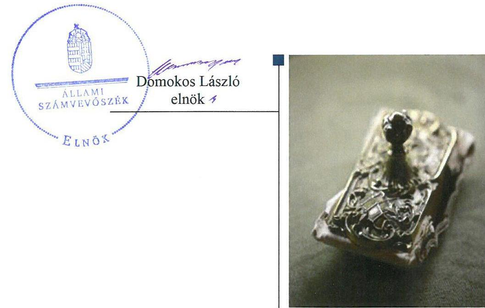
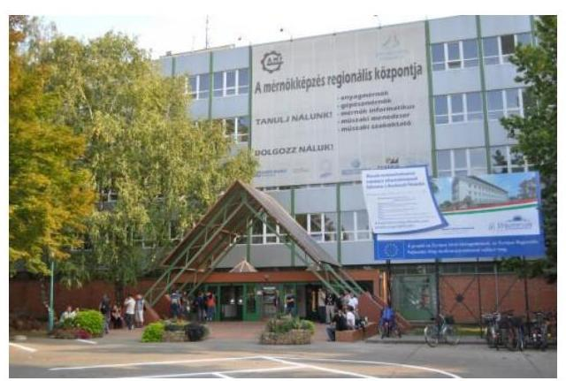
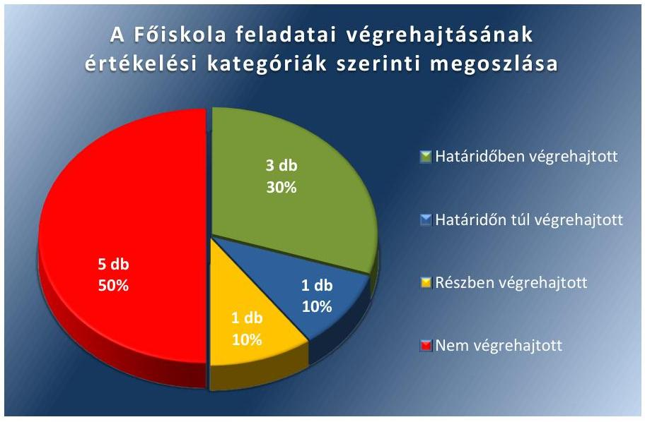

# Jelentés 

## Utóellenőrzések

Az állami felsőoktatási intézmények gazdálkodásának, működésének ellenőrzéséről készült jelentések utóellenőrzése - Kecskeméti Főiskola, mint a Neumann János Egyetem jogelődje 2018.

---

# Jelientés 

## Utóellenőrzések

Az állami felsőoktatási intézmények gazdálkodásának, működésének ellenőrzéséről készült jelentések utóellenőrzése - Kecskeméti Főiskola, mint a Neumann János Egyetem jogelődje 2018. 01. hó 23. nap

---

# AZ ELLENŐRZÉST FELÜGYELTE: 

PETŐ KRISZTINA felügyeleti vezető

## AZ ELLENŐRZÉST VEZETTE ÉS A VÉGREHAJTÁSÁÉRT FELELŐS:

HEFFNER ZOLTÁN ellenőrzésvezető
MOLNÁR ZSUZSANNA ellenőrzésvezető

## A PROGRAM ÖSSZEÁLLÍTÁSÁÉRT FELELŐS:

JANIK JÓZSEF LÁSZLÓ osztályvezető

## A TÉMÁHOZ KAPCSOLÓDÓ KORÁBBI SZÁMVEVŐSZÉKI JELENTÉS:

- címe: Jelentés a Kecskeméti Főiskola ellenőrzéséről Az állami felsőoktatási intézmények gazdálkodásának, működésének ellenőrzése
- sorszáma: 15026

IKTATÓSZÁM: V-1338-046/2016.
TÉMASZÁM: 2096
ELLENŐRZÉS-AZONOSÍTÓ SZÁM: V075544

---

# TARTALOMJEGYZÉK 

■ ÖSSZEGZÉS ..... 5
■ AZ ELLENŐRZÉS CÉLJA ..... 6
■ AZ ELLENŐRZÉS TERÜLETE ..... 7
■ AZ ELLENŐRZÉS HÁTTERE, INDOKOLTSÁGA ..... 8
■ A JELENTÉS LÉNYEGES KÉRDÉSKÖRE ..... 9
■ ELLENŐRZÉS HATÓKÖRE ÉS MÓDSZEREI ..... 10
■ MEGÁLLAPÍTÁSOK ..... 12
■ MELLÉKLETEK ..... 15
I. Sz. melléklet: Az ÁSZ 15026. számú jelentéséhez kapcsolódó Kecskeméti Főiskola intézkedési tervének végrehajtása ..... 15
■ FÜGGELÉK: ÉSZREVÉTELEK ..... 19
■ RÖVIDÍTÉSEK JEGYZÉKE ..... 21

---

.

---

# ÖSSZEGZÉS 

Az utóellenőrzés megállapította, hogy a Kecskeméti Főiskola intézkedési tervében meghatározott feladatok jelentős részét nem hajtották végre. A szabályszerű kifizetéseket biztosító kontrollokat nem müködtették megfelelően és továbbra sem gondoskodtak a térítési díjak, költségtérítések önköltségszámitással történő alátámasztásáról. A gazdálkodás terén az ÁSZ által azonosított szabálytalanságok egy része továbbra is fennállt.

## Az ellenőrzés társadalmi indokoltsága

Az Állami Számvevőszék stratégiájában célul tűzte ki a számvevőszéki munka hasznosulásának javítását. Ezzel összhangban ellenőrzi, hogy az ellenőrzött szervezetek megvalósították-e a korábbi ellenőrzései által feltárt hibák, hiányosságok és szabálytalanságok megszüntetése céljából kialakított intézkedési terveikben foglaltakat. A rendszeres utóellenőrzések hozzájárulnak a szükséges intézkedések tényleges végrehajtáshoz, ezáltal a közpénzügyek rendezettségének javulásához.

## Főbb megállapítások, következtetések

A Kecskeméti Főiskola az intézkedési tervben meghatározott tíz feladatból hármat határidőben, egyet határidőn túl, egyet részben, öt feladatot nem hajtott végre. Így az Állami Számvevőszék által korábban azonosított szabálytalanságok egy része a jogutód Pallasz Athéné Egyetem létrehozásáig fennállt. Az Állami Számvevőszék levélben hívta fel a jogutód Neumann János Egyetem kancellárjának figyelmét arra, hogy a jogelőd intézmények működésében feltárt szabálytalanságok kockázatot jelenthetnek az Egyetem szabályszerű működésére nézve.

A gazdálkodási jogkörök gyakorlására nem írásos kijelölés alapján került sor, illetve a gazdálkodási jogköröket gyakorló személyek azonosítását biztosító aláírás-mintákat tartalmazó nyilvántartást nem vezették. Mindezek alapján a szabályszerű kifizetéseket biztosító kontrollokat nem működtették megfelelően. A térítési díjak, költségtérítések önköltségszámítással történő alátámasztása elmaradt, így a korábban azonosított hiányosság továbbra is fennállt.

A Főiskola nem újította meg a gazdálkodási szabályzatát, a vagyongazdálkodási szabályzatát, a leltározási szabályzatát és az önköltségszámítási szabályzatát. Ezzel nem biztosították az elszámoltathatóság feltételeit. Nem történt meg a likviditási terv kidolgozása és irányító szervnek történő megküldése. A Főiskola vagyongazdálkodási tervet továbbra sem készített.

---

# AZ ELLENŐRZÉS CÉLJA 

Az ellenőrzés célja annak értékelése volt, hogy a számvevőszéki jelentésben ${ }^{1}$ foglalt javaslatokat megalapozó megállapításokkal összhangban készített intézkedési tervben meghatározott feladatokat az ellenőrzött szervezet végrehajtotta-e.

---

# AZ ELLENŐRZÉS TERÜLETE 

## Kecskeméti Főiskola, mint a Neumann János Egyetem jogelődje

Az Kecskeméti Főiskola 2000. január 1-jén alakult meg, a Gépipari és Automatizálási Műszaki Főiskola, a Kecskeméti Tanítóképző Főiskola és a Kertészeti és Élelmiszeripari Egyetem Kertészeti Főiskolai Kara integrálódásával. 2016. július 1-től a Szolnoki Főiskola és a Kecskeméti Főiskola integrációja eredményeként létrejött a Pallasz Athéné Egyetem. Az Egyetem² 2017. augusztus 1. napjától Neumann János Egyetem néven múködik tovább. Az Egyetemen négy karon - GAMF Műszaki és Informatikai Karon, Kertészeti és Vidékfejlesztési Karon, Pedagógusképző Karon és a Szolnoki Gazdálkodási Karon - folyik oktatás. Az Egyetem hallgatói létszáma 2016 őszén 5014 fő volt.

A rektor ${ }^{3}$ személyében 2013. július 1. óta nem volt változás. A jelenlegi rektor 2016. június 30-ig a Főiskola ${ }^{4}$ rektoraként, 2016. július 1. és 2016. december 31. között a fenntartó által megbízottként, 2017. január 1. óta az Egyetem rektoraként látja el az intézményvezetői feladatokat.

A Főiskola kancellárja ${ }^{5}$ 2015. január 23-tól töltötte be hivatalát. Az Egyetem megalapításával 2016. július 1-jétől új kancellár került kinevezésre.

A Főiskola 2015. évi költségvetési beszámolója szerint 2981,5 millió Ft költségvetési bevételt, 2413,4 millió Ft finanszírozási bevételt ért el, valamint 4747,3 millió Ft költségvetési kiadást teljesített. A 2015. december 31-i könyvviteli mérleg szerint az eszközei 8022,3 millió Ft-ot tettek ki.

A Főiskola gazdálkodásának és múködésének ellenőrzését az ÁSZ ${ }^{6}$ a 2009-2013. közötti időszakra végezte el, az erről szóló 15026. számú jelentést 2015. február 24-én tette közzé. Az ellenőrzés célja annak értékelése volt, hogy szabályos volt-e a Főiskola pénzügyi és vagyongazdálkodása, biztosított volt-e a vagyonnal való felelős gazdálkodás követelményének érvényesülése, a jogszabályi előírásoknak megfelelően múködött-e a belső kontrollrendszer, az irányítószerv tevékenysége a jogszabályi előírásoknak megfelelt-e. Az utóellenőrzés a számvevőszéki jelentésben megfogalmazott javaslatokat megalapozó megállapításokra megküldött intézkedési tervben foglalt feladatok ellenőrzésére, illetve értékelésére fókuszált.

---

# AZ ELLENŐRZÉS HÁTTERE, INDOKOLTSÁGA 

Az ÁSZ tv. ${ }^{7}$ 33. § (1) bekezdése értelmében a számvevőszéki jelentések javaslatokat megalapozó megállapításaihoz kapcsolódóan az ellenőrzött szervezet vezetője intézkedési tervet köteles összeállítani, és az Állami Számvevőszék részére megküldeni. Az intézkedési tervben foglaltak megvalósítását - az ÁSZ tv. 33. § (7) bekezdésében foglaltak alapján - az Állami Számvevőszék utóellenőrzés keretében ellenőrizheti. Az intézkedések megvalósulásának értékelése során az Állami Számvevőszék figyelembe veszi az ellenőrzött szervezetek működési feltételeiben, valamint a jogszabályi előírásokban bekövetkezett változásokat.

Az intézkedési tervben foglalt feladatok hiányos, illetve késedelmes végrehajtása, valamint megvalósításának elmaradása azt mutatja, hogy az ellenőrzések során feltárt hibák, hiányosságok és szabálytalanságok megszüntetése nem kapott kellő hangsúlyt. Ez a szabályszerű működés és a felelős vezetői magatartás vonatkozásában kockázatot hordoz. E kockázatok feltárásával az Állami Számvevőszék utóellenőrzési rendszere fokozza a fegyelmet, és igazolja, hogy a közpénzzel való szabályos gazdálkodás felelőssége elől nem lehet kitérni.

Az utóellenőrzés négy szinten hasznosulhat:
A társadalom szintjén az utóellenőrzés jelzi, hogy a számvevőszéki ellenőrzés megállapításainak van következménye: a hiányosságok megszüntetésére az ellenőrzött szervezet által meghatározott intézkedések végrehajtását is számon kéri az ÁSZ.

- Az ellenőrzött terület szintjén az utóellenőrzés tájékoztatást nyújt a terület döntéshozóinak a hiányosságok kiküszöbölésének jó gyakorlatairól, ezzel lehetőséget biztosítva arra, hogy az ÁSZ ellenőrzési megállapításai, javaslatai a terület nem ellenőrzött szervezeteinek a működése során is hasznosuljanak.
- Az ellenőrzött szervezet szintjén az utóellenőrzés feltárja, hogy a szervezet az intézkedések végrehajtásával hasznosította-e a korábbi ellenőrzési jelentésben a hiányosságok megszüntetése, illetve a kockázatok kezelése érdekében megfogalmazott javaslatokat.
- Az ÁSZ szintjén az utóellenőrzés visszacsatolást ad az ellenőrzési jelentések hasznosulásáról, az intézkedések elmaradása vagy részleges megvalósulása a további ellenőrzésekhez kockázati jelzésként szolgál.

---

# A JELENTÉS LÉNYEGES KÉRDÉSKÖRE 

A Főiskola az intézkedési tervben foglaltakat az előirt határidőben végrehajtotta-e?

---

# ELLENŐRZÉS HATÓKÖRE ÉS MÓDSZEREI 

## Az ellenőrzés típusa

Megfelelőségi ellenőrzés.

## Az ellenőrzött időszak

Az utóellenőrzés alapját képező számvevőszéki jelentés közzétételének (2015. február 24.) napjától a Pallasz Athéné Egyetem megalapításának napjáig (2016. július 1.) tartó időszak.

## Az ellenőrzés tárgya

Az ÁSZ tv. 2011. július 1-jei hatálybalépését követően a számvevőszéki jelentésben foglalt javaslatot megalapozó megállapításokkal és javaslatokkal összhangban - a Főiskola által - készített intézkedési tervben foglaltak végrehajtásának ellenőrzése.

Az ellenőrzés kiterjedt minden olyan körülményre és adatra, amely az ÁSZ jogszabályban meghatározott feladatainak teljesítéséhez, valamint a program végrehajtása folyamán felmerült újabb összefüggések feltárásához szükséges.

## Az ellenőrzött szervezet

A Kecskeméti Főiskola, mint a Neumann János Egyetem jogelődje.

## Az ellenőrzés jogalapja

Az ÁSZ tv. 33. § (7) bekezdése alapján.

## Az ellenőrzés módszerei

Az ÁSZ az ellenőrzést a nemzetközi standardokat irányadónak tekintve az ellenőrzési program ellenőrzési kérdései, az ellenőrzött időszakban hatályos jogszabályok, az ellenőrzés szakmai szabályok és módszertanok figyelembevételével, önálló ellenőrzés keretében végezte.

Az ÁSZ az ellenőrzés ideje alatt az ellenőrzött szervezettel történő kapcsolattartást az ÁSZ SZMSZ ${ }^{\circledR}$-ének vonatkozó előírásai alapján biztosította.

---

Az utóellenőrzés megállapításait elsősorban az ÁSZ rendelkezésére álló, valamint az ellenőrzött szervezetektől elektronikusan bekért dokumentumok alapozták meg.

Az ellenőrzési bizonyítékként felhasználható adatforrások közé tartoztak egyrészt a szakmai programban felsorolt adatforrások, másrészt minden - az ellenőrzés folyamán feltárt, az ellenőrzés szempontjából információt tartalmazó - dokumentum.

Az ÁSZ a gazdálkodási folyamatok szabályszerűségét az ellenőrzött szervezet által aktivált eszközök és az igénybe vett szolgáltatások számlákból, a szabályszerű vagyon-hasznosítást az ellenőrzött szervezet által kötött bérletbe adási szerződések nyilvántartásából véletlenszerűen kiválasztott 10-10 db mintatétel alapján értékelte. A kiválasztott tételek esetében azt ellenőrizte, hogy a Főiskola az intézkedési tervben meghatározott feladatok végrehajtása során biztosította-e a jogszabályok és a belső szabályzatok előírásainak megfelelő működtetést.

Az intézkedési tervben előírt feladatokat azok végrehajthatósága, illetve végrehajtása szempontjából az alábbiak szerint értékelte az ÁSZ:
—_ „határidőben végrehajtott" a feladat, ha a teljesítés dokumentáltan, az intézkedési tervben előírt határidőben és tartalommal megtörtént;
—_ „határidőn túl végrehajtott" a feladat, ha annak teljesítése az intézkedési tervben meghatározott módon, de az előírt határidőn túl történt meg;
—_ „részben végrehajtott" a feladat, ha végrehajtása teljes körűen az intézkedési tervben előírt módon nem történt meg;
—_ „nem végrehajtott" a feladat, ha a végrehajtás nem történt meg, vagy amennyiben a teljesítést nem dokumentálták;
—_ „okafogyottá vált" a feladat, ha végrehajtására - meghatározott esemény bekövetkezése, továbbá külső körülmény, a működést érintő feltétel változása miatt - már nincs szükség, illetve lehetőség, és egyértelműen megállapítható, hogy az intézkedést szükségessé tevő körülmény a jövőben nem fordulhat elő;
—_ „nem időszerű" az a feladat, amelynek ellenőrzési időszakon belüli végrehajtására azért nem került (kerülhetett) sor, mert az intézkedés alapjául szolgáló esemény nem következett be, de annak jövőbeni előfordulása lehetséges, a végrehajtása nem volt esedékes, vagy a végrehajtás határideje még nem járt le.
Az ellenőrzés lefolytatásához az ellenőrzött szervezet a tanúsítványok elektronikus kitöltésével, valamint az ÁSZ által kért dokumentumok elektronikus megküldésével szolgáltatott adatokat, amelyek valódiságát és teljes körűségét az ellenőrzött szervezet vezetője által tett teljességi és hitelességi nyilatkozat igazolta. Az így rendelkezésre bocsátott adatok, információk kontrollja az ellenőrzés keretében történt.

---

# MEGÁLLAPÍTÁSOK 

## A Főiskola az intézkedési tervben foglaltakat az előírt határidőben végrehajtotta-e?

Összegző megállapítás

A Főiskola az intézkedési tervében vállalt tíz feladat közül három feladatot határidőben, egy feladatot határidőn túl, egy feladatot részben, öt feladatot nem hajtott végre.

A kancellár intézkedési tervében a hiányosságok, szabálytalanságok megszüntetésére tíz feladatot határozott meg a határidők és a felelősök megjelölésével.

A Főiskola az intézkedési tervben meghatározott feladatok végrehajtásáról a $8 \mathrm{kr} .{ }^{9}$ által előírt nyilvántartást vezette.

Az intézkedési tervben meghatározott feladatokat, határidőket, a feladatok végrehajtásáért felelős személyeket és a feladatok végrehajtását az I. számú melléklet mutatja be.

Az intézkedési tervben meghatározott feladatok végrehajtásának értékelési kategóriák szerinti megoszlását az 1. ábra szemlélteti.

1. ábra

Fonräs: AS2

## HATÁRIDŐBEN VÉGREHAJTOTT FELADATOK:

1. (3/b.) A kancellár határidőben beterjesztette a Szenátus ${ }^{10}$ elé a Főiskola 2014. évi költségvetési beszámolóját, amelyet a Szenátus az intézkedési tervben vállaltaknak megfelelően - annak megismerését követően elfogadott.
2. (3/c.) A konkrét szerződéshez kapcsolódó munkajogi felelősség - az intézkedési tervben vállaltaknak megfelelően - megállapításra

---

került és a kancellár a vizsgálat eredményének megfelelően saját hatáskörben intézkedett az érintett munkavállalóval szemben.
3. (5.) A vagyon bérbeadással történő hasznosítása során az átláthatóság biztosítása érdekében vállalt feladatot a kancellár határidőben végrehajtotta, mert a szerződő felek a jogszabályban előírt átláthatósági nyilatkozatokat megtették.

# HATÁRIDŐN TÚL VÉGREHAJTOTT FELADATOK: 

4. (2.) A kancellár az intézkedési tervben vállalt 2015. április 30-ai határidőt követően - 2015. június 12-én - adta ki a belső ellenőrzési vezetői megbízást.

## RÉSZBEN VÉGREHAJTOTT FELADATOK:

5. (1.) A Főiskola nem dolgozta ki, illetve nem aktualizált minden intézkedési tervben vállalt szabályzatot. A pénzkezelési szabályzat ${ }^{11}$ aktualizálása határidőben megtörtént, azonban elmaradt a gazdálkodási szabályzat, a leltározási szabályzat, a vagyongazdálkodási szabályzat és az önköltségszámítási szabályzat megújítása.

## NEM VÉGREHAJTOTT FELADATOK:

6. (3/a.) A gazdasági főigazgató nem gondoskodott a szolgáltatási díjak, hallgatói térítési díjak megállapításához kapcsolódó vezetői jogosultságok - intézkedési tervben vállalt - kiadásáról. Az engedélyezési, ellenjegyzési - aláírási - kötelezettségvállalási jogkörök rögzítése és betartása nem valósult meg, mert a gazdálkodási jogkörök gyakorlására nem írásos kijelölés alapján került sor, illetve a gazdálkodási jogköröket gyakorló személyek azonosítását biztosító aláírás-minták hiányoztak. Ezzel megsértették az Ávr. 52. § (1) bekezdésében, az 55. § (2) bekezdés a) pontjában, az 57. § (4) bekezdésében, az 58. § (4) bekezdésében, az 59. § (1) bekezdésében és a 60. § (3) bekezdésében foglaltakat.
7. (3/d.) A kancellár nem gondoskodott róla, hogy az önköltségszámítások elkészítésével érintett területek, egységek elkészítsék számításaikat - az intézkedési terv 1. pontjában megújítani vállalt önköltségszámítási szabályzat alkalmazásával. Ezzel nem tettek eleget az Áhsz. ${ }^{12} 50 . \S$ (5) bekezdésében foglaltaknak.
8. (3/e.) A Főiskola a likviditási terv kidolgozására és leadására irányuló feladatát nem hajtotta végre, mert nem készítette el és nem adta le likviditási tervét az intézkedési tervben vállalt határidőre.
9. (4/a.) A Főiskola vagyongazdálkodási terve - az intézkedési tervben vállaltak ellenére - nem került a Szenátussal elfogadtatásra. Ezzel megsértették az Nftv. ${ }^{13} 12 . \S$ (3) bekezdés gb) pontját.
10. (4/b.) A kancellár a leltározási szabályzat - intézkedési tervben vállalt - kiegészítését a kisértékű immateriális javakra és tárgyi eszközökre vonatkozó előírásokkal nem hajtotta végre. Ezzel nem tett eleget az Áhsz. 22. § (2) bekezdés b) pontjában foglaltaknak.

---

.

---

# MELLÉKLETEK

- I. SZ. MELLÉKLET: AZ ÁSZ 15026. SZÁMÚ JELENTÉSÉHEZ KAPCSOLÓDÓ KECSKEMÉTI FŐISKOLA INTÉZKEDÉSI TERVÉNEK VÉGREHAJTÁSA

|  1. | Intézkedési tervben meghatározott feladat: | Az intézkedési tervben meghatározott határidő | Az intézkedési tervben meghatározott feladatok felelőse 3.  |
| --- | --- | --- | --- |
|   | 1. | 2. | 3.  |
|  Határidőben végrehajtott feladatok |  |  |   |
|  1. | (3/b.) A beszámoló elkészítését követően a Szenátus a teljes beszámoló ismeretében a legközelebbi szenátusi ülésen hozza meg a döntést. | 2015. május 31. | kancellár  |
|   | (3/c.) A (konkrét szerződéshez kapcsolódó) személyhez köthető felelősség megállapítása, munkajogi döntés meghozatala. | 2015. május 31. | kancellár  |
|  2. | (5.) Az átláthatóság biztosítása érdekében a szerződő felektől a jogszabályban előírt nyilatkozatok megtételének követelménye. | 2015. január 31. | kancellár  |
|  Határidőn túl végrehajtott feladat |  |  |   |
|  4. | (2.) Belső ellenőrzési vezetői megbízás kiadása. | 2015. április 30. | kancellár  |

A kancellár az intézkedési tervben vállalt határidőn tül - 2015. június 12-én terjesztette a Szenátus elé a Főiskola teljes 2014. évi éves költségvetési beszámolóját, amelyet a Szenátus a 13/2015. (V.21.) számú határozatával elfogadott. A kancellár a külső személyi juttatások előirányzatai terhére utólag megkötött megbízási szerződéssel kapcsolatos személyi felelősség kivizsgálásával a Főiskola belső ellenőrét bízta meg. A belső ellenőr az ügyet határidőn belül kivizsgálta és annak eredményéről, illetve javaslatáról feljegyzésben tájékoztatta a kancellárt. A kancellár a javaslatot elfogadta és az ÁSZ ellenőrzés ${ }^{14}$ során feltárt hiányosságért, szabálytalanságért felelős dolgozót 2015. május 11-én írásbeli figyelmeztetésben részesítette. A kancellár - az intézkedési tervben vállalt határidőre - gondoskodott róla, hogy a vagyon bérbeadással történő hasznosítása során a szerződő felek részéről a jogszabályban előírt átláthatósági nyilatkozatok megtételre kerüljenek. Az átláthatósági nyilatkozatok a bérbeadási szerződések részét képezték.

## Határidőn túl végrehajtott feladat

A kancellár az intézkedési tervben vállalt határidőn túl - 2015. június 12-én - adta ki a belső ellenőrzési vezetői megbízást.

---

|  5. | (1.) Szabályzatok kidolgozása, megújítása: Gazdálkodási szabályzat, Vagyongazdálkodási Szabályzat, Pénzkezelési Szabályzat, Leltározási Szabályzat, Önköltség számítási Szabályzat | 2015. szeptember 30. | kancellár | A feladat végrehajtása  |
| --- | --- | --- | --- | --- |
|   |  |  |  | A feladat végrehajtása  |
|   |  |  |  | A Főiskola az intézkedési tervben vállalt szabályzatok kidolgozásával, megújításával kapcsolatban vállalt feladatát részben hajtotta végre.  |
|   |  |  |  | Határidőben végrehajtott feladatrész:  |
|   |  |  |  | A Főiskola az intézkedési tervben vállalt határidőn belül – 2015. május 22-én – aktualizálta pénzkezelési szabályzatát15.  |
|   |  |  |  | Nem végrehajtott feladatrész:  |
|   |  |  |  | A Főiskola gazdálkodási szabályzata, leltározási és leltárkészítési szabályzata nem került megújításra az ellenőrzött időszakban. Módosított vagyongazdálkodási szabályzatát az intézkedési tervben vállalt határidő után fogadta el – 31/2015 (XI.05) számú határozatával – a Szenátus, a szabályzat hitelesítésére, s az azt követő kiadására azonban nem került sor. Az önköltségszámítási szabályzat nem került megújításra, mert a szabályzat módosítása a 29/2015 (IX.10) számú szenátusi határozat értelmében nem került elfogadásra.  |
|   |  |  |  | Nem végrehajtott feladatok  |
|   | (3/a.) Szolgáltatási díjak, hallgatói térítési díjak megállapításához kapcsolódó vezetői jogosultságok kiadása (dékánok, egységvezetők) Engedélyezési, ellenjegyzési protokoll folyamatos teljesítése - aláírási - kötelezettségvállalási jogkörök rögzítése - következetes betartása. | 2015. január 31-ig | gazdasági főigazgató | A szolgáltatási díjak, hallgatói térítési díjak megállapításához kapcsolódó vezetői jogosultságok kiadása nem valósult meg. Az intézkedési tervben vállalt engedélyezési, ellenjegyzési – aláírási – kötelezettségvállalási jogkörök rögzítése nem történt meg, mert a kötelezettségvállalásra, pénzügyi ellenjegyzésre, teljesítésigazolásra, érvényesítésre és utalványozásra jogosultak írásos kijelölése elmaradt. Ezzel nem tettek eleget az Ávr. 52. § (1) bekezdésében, az 55. § (2) bekezdés a) pontjában, az 57. § (4) bekezdésében, az 58. § (4) bekezdésében és az 59. § (1) bekezdésében foglaltaknak. A gazdálkodási jogkörök gyakorlására nem írásos kijelölés alapján került sor, illetve a gazdálkodási jogköröket gyakorló személyek azonosítását biztosító aláírás-minták hiányoztak. Ezzel megsértették az Ávr. 60. § (3) bekezdését.  |
|   | (3/d.) Az Önköltség-számítási szabályzat elkészülte után, annak alkalmazásával az önköltség-számítások elkészítése az érintett területeken, egységeknél – Oktatási iroda, Üzemeltetés, Tangazdaság, Nyomda, Könyvtár, Jegyzetellátók, Kollégium. | 2015. szeptember 30. | kancellár | Az önköltségszámítások elkészítésével érintett területek, egységek nem készítették el önköltségszámításaikat – az intézkedési terv 1. pontjában megújítani vállalt – önköltségszámítási szabályzat alkalmazásával. Ezzel nem tettek eleget az Áhsz. 50. § (5) bekezdésében foglaltaknak.  |

---

|  8. | (3/e.) A likviditási terv kidolgozása - határidős leadása. | 2015. január 31. | kancellár | A főiskola nem hajtotta végre az intézkedési tervben meghatározott feladatát, mert a vállalt határidőre - 2015. január 31-ére - nem dolgozta ki és nem adta le a likviditási tervet.  |
| --- | --- | --- | --- | --- |
|  9. | (4/a.) Vagyongazdálkodási terv elkészítése. A Szenátus felé való beterjesztése, elfogadtatása. | 2015. május 31. | kancellár | A Főiskola az intézkedési tervében vállalt feladatát nem hajtotta végre, mert vagyongazdálkodási tervét nem fogadtatta el a Szenátussal. Ezzel nem tett eleget az Nftv. 12. § (3) bekezdés gb) pontjában foglaltaknak.  |
|  10. | (4/b.) A szabályzat (leltározási szabályzat) vonatkozó pontjainak módosítása, kiegészítése (használt, de a mérlegben értékkel nem szereplő immateriális javakra és tárgyi eszközökre vonatkozó előírásokkal). | 2015. május 31. | kancellár | Az intézkedési tervben vállalt feladat nem került végrehajtásra, mert a leltározási szabályzatot nem egészítették ki a kisértékű immateriális javakra és tárgyi eszközökre vonatkozó előírásokkal. Ezzel megsértették az Áhsz. 22. § (2) bekezdés b) pontját.  |

Forrás: ÁSZ által készített táblázat

---

.

---

# FÜGGELÉK: ÉSZREVÉTELEK 

A jelentéstervezetet a Számvevőszék 15 napos észrevételezésre megküldte az ellenőrzött szervezet vezetőjének az ÁSZ tv. 29. §* (1) bekezdése előírásának megfelelően.
A Neumann János Egyetem rektora és kancellárja a jelentéstervezet megállapításaira észrevételt nem tett.

[^0]
[^0]:    * 29. § (1) Az Állami Számvevőszék az ellenőrzési megállapításait megküldi az ellenőrzött szervezet vezetőjének vagy az általa megbízott személynek, és annak, akinek személyes felelősségét állapította meg.
    (2) Az ellenőrzött szervezet vezetője és a felelősként megjelölt személy az ellenőrzés megállapításaira tizenöt napon belül írásban észrevételt tehet.
    (3) Az Állami Számvevőszék az észrevételre a beérkezésétől számított harminc napon belül írásban válaszol. A figyelembe nem vett észrevételeket köteles a jelentésben feltüntetni, és megindokolni, hogy azokat miért nem fogadta el.

---

.

---

# RÖVIDÍTÉSEK JEGYZÉKE 

${ }^{1}$ számvevőszéki jelentés
${ }^{2}$ Egyetem
${ }^{3}$ rektor
${ }^{4}$ Főiskola
${ }^{5}$ kancellár
${ }^{6}$ ÁSZ
${ }^{7}$ ÁSZ tv.
${ }^{8}$ SZMSZ
${ }^{9}$ Bkr.
${ }^{10}$ Szenátus
${ }^{11}$ pénzkezelési szabályzat
${ }^{12}$ Áhsz.
${ }^{13} \mathrm{Nftv}$.
${ }^{14}$ ÁSZ ellenőrzés
${ }^{15}$ pénzkezelési szabályzat

Az ÁSZ 15026. számú jelentése - Az állami felsőoktatási intézmények gazdálkodásának, müködésének ellenőrzése - Kecskeméti Főiskola (közzététel időpontja: 2015. február 24.)
2016. július 1-től 2017. július 30-ig Pallasz Athéné Egyetem, 2017. augusztus 1-jétől Neumann János Egyetem
Kecskeméti Főiskola rektora 2016. június 30-ig, 2016. július 1. és 2016. december 31. között a fenntartó által megbízott vezető, 2017. január 1-től az Egyetem rektora
Kecskeméti Főiskola 2016. június 30-ig
Kecskeméti Főiskola kancellárja
Állami Számvevőszék
2011. évi LXVI. törvény az Állami Számvevőszékről (hatályos 2011. július 1-jétől)
Az Állami Számvevőszék elnökének 3/2016. (XII.29.) ÁSZ utasítása az Állami Számvevőszék Szervezeti és Működési Szabályzatáról (hatályos 2017. január 1-jétől)
370/2011. (XII.31.) Korm. rendelet a költségvetési szervek belső kontrollrendszeréről és belső ellenőrzéséről (hatályos 2012. január 1-jétől)
Kecskeméti Főiskola Szenátusa
Kecskeméti Főiskola Házipénztár és Készpénzkezelési szabályzata (hatályos: 2015. május 22-től)

4/2013. (I. 11.) Korm. rendelet az államháztartás számviteléről (hatályos 2014. január 1-jétől)
2011. évi CCIV. törvény a nemzeti felsőoktatásról (hatályos: 2012. január 1-jétől)
a Kecskeméti Főiskola ellenőrzéséről - Az állami felsőoktatási intézmények gazdálkodásának, működésének ellenőrzése (15026. számú jelentés, közzététel időpontja: 2015. február 24.)
A Kecskeméti Főiskola Házipénztár és Készpénzkezelési szabályzata elfogadva a 2014/2015. tanévi 12-1/2015 (V.21.) sz. szenátusi határozatával (hatályos: 2015. május 22-től)

---

# ÁLLAMI SZÁMVEVŐSZÉK 

1052 Budapest, Apáczai Csere János utca 10.
Levélcím: 1364 Budapest 4. Pf. 54
Telefon: +36 14849100 Telefax: +36 14849200
www.asz.hu