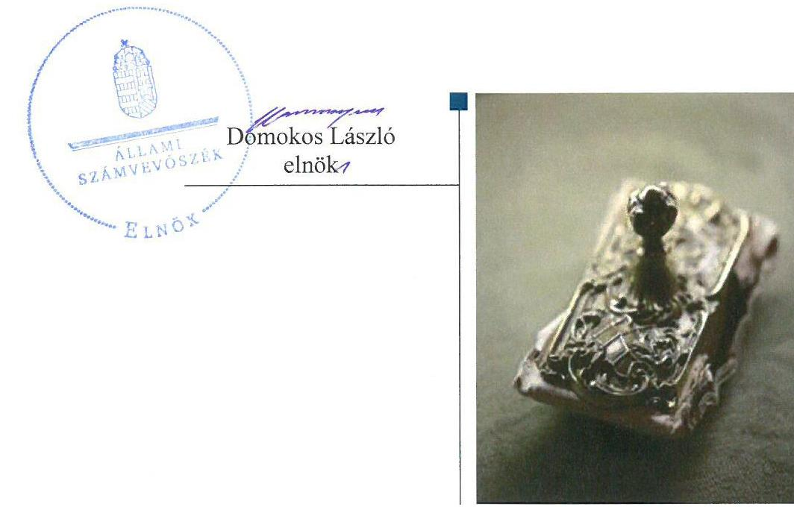
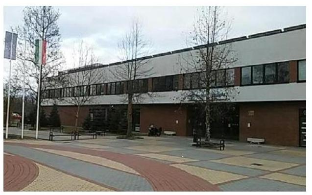
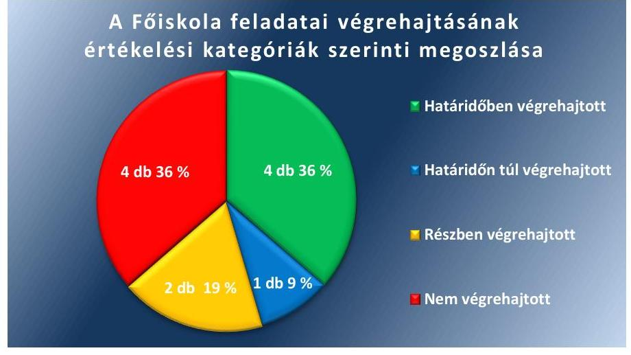
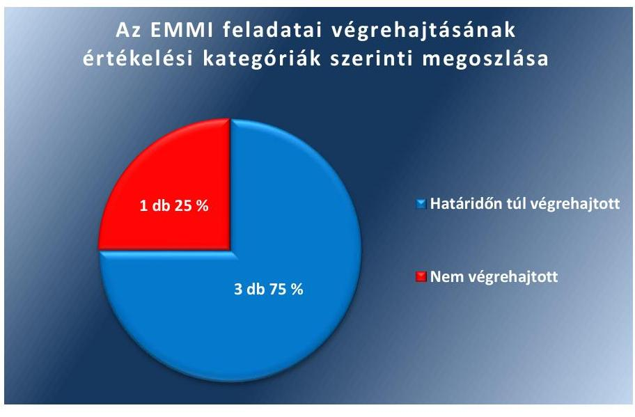
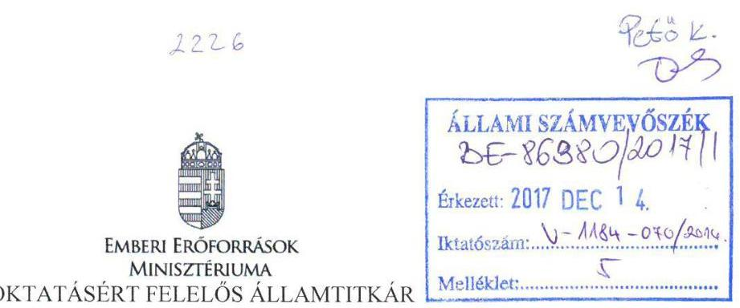
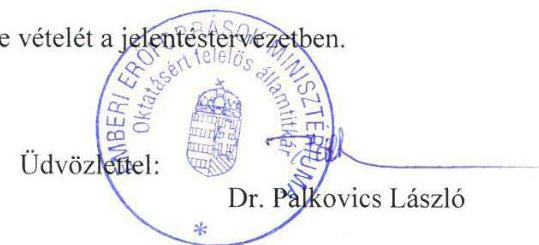
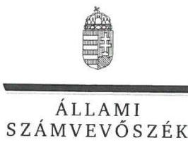
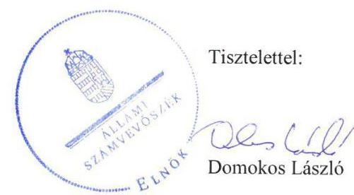

# Jelentés 

## Utóellenőrzések

Az állami felsőoktatási intézmények gazdálkodásának, működésének ellenőrzéséről készült jelentések utóellenőrzése - Szolnoki Főiskola, mint a Neumann János Egyetem jogelődje 2018.

---

# JEELAMI   SZÁMVEVŐSZÉK 

## Jelentés

## Utóellenőrzések

Az állami felsőoktatási intézmények gazdálkodásának, működésének ellenőrzéséről készült jelentések utóellenőrzése - Szolnoki Főiskola, mint a Neumann János Egyetem jogelődje 2018. 01. hó 23. nap

---

# AZ ELLENŐRZÉST FELÜGYELTE: 

PETŐ KRISZTINA felügyeleti vezető

## AZ ELLENŐRZÉST VEZETTE ÉS A VÉGREHAJTÁSÁÉRT FELELŐS:

HEFFNER ZOLTÁN ellenőrzésvezető
MOLNÁR ZSUZSANNA ellenőrzésvezető

## A PROGRAM ÖSSZEÁLLÍTÁSÁÉRT FELELŐS:

JANIK JÓZSEF LÁSZLÓ osztályvezető

## A TÉMÁHOZ KAPCSOLÓDÓ KORÁBBI SZÁMVEVŐSZÉKI JELENTÉS:

- címe: Jelentés a Szolnoki Főiskola ellenőrzéséről - Az állami felsőoktatási intézmények gazdálkodásának, működésének ellenőrzése
- sorszáma: 14196

IKTATÓSZÁM: V-1184-074/2016.
TÉMASZÁM: 2218
ELLENŐRZÉS-AZONOSÍTÓ SZÁM: V075530

---

# TARTALOMJEGYZÉK 

■ ÖSSZEGZÉS ..... 5
■ AZ ELLENŐRZÉS CÉLJA ..... 6
■ AZ ELLENŐRZÉS TERÜLETE ..... 7
■ AZ ELLENŐRZÉS HÁTTERE, INDOKOLTSÁGA ..... 8
■ A JELENTÉS LÉNYEGES KÉRDÉSKÖRE ..... 9
■ ELLENŐRZÉS HATÓKÖRE ÉS MÓDSZEREI ..... 10
■ MEGÁLLAPÍTÁSOK ..... 12
■ MELLÉKLETEK ..... 17
I. Sz. melléklet: Az ÁSZ 14196. számú jelentéséhez kapcsolódó intézkedési terv végrehajtása a Szolnoki Főiskolán ..... 17
II. Sz. melléklet: Az ÁSZ 14196. számú jelentéséhez kapcsolódó intézkedési terv végrehajtása az Emberi Erőforrások Minisztériumánál. ..... 21
■ FÜGGELÉK: ÉSZREVÉTELEK ..... 23
■ RÖVIDÍTÉSEK JEGYZÉKE ..... 27

---

.

---

# ÖSSZEGZÉS 

Az utóellenőrzés megállapította, hogy a Szolnoki Főiskola intézkedési tervében meghatározott feladatok jelentős részét nem hajtották végre. A korábban azonosított szabálytalanságok nagy része az ellenőrzött időszakban továbbra is fennállt. Az Emberi Erőforrások Minisztériuma az intézkedési tervében foglalt négy feladatból egy feladatot nem hajtott végre.

## Az ellenőrzés társadalmi indokoltsága

Az Állami Számvevőszék stratégiájában célul tűzte ki a számvevőszéki munka hasznosulásának javítását. Ezzel összhangban ellenőrzi, hogy az ellenőrzött szervezetek megvalósították-e a korábbi ellenőrzései által feltárt hibák, hiányosságok és szabálytalanságok megszüntetése céljából kialakított intézkedési terveikben foglaltakat. A rendszeres utóellenőrzések hozzájárulnak a szükséges intézkedések tényleges végrehajtásához, ezáltal a közpénzügyek rendezettségének javulásához, igazolják, hogy lezárult a következmények nélküli ellenőrzések időszaka.

## Főbb megállapítások, következtetések

A Szolnoki Főiskola az intézkedési tervben meghatározott tizenegy feladatból négyet határidőben, egyet határidőn túl, kettőt részben, négy feladatot nem hajtott végre. Így az Állami Számvevőszék által korábban azonosított hiányosságok nagy része az ellenőrzött időszakban fennállt. Az Állami Számvevőszék levélben hívta fel a Neumann János Egyetem kancellárjának figyelmét arra, hogy a jogelőd intézmények működésében feltárt szabálytalanságok kockázatot jelenthetnek a jogutód Egyetem szabályszerű működésére nézve.

A pénzügyi és vagyongazdálkodás terén a folyamatba épített és vezetői ellenőrzést nem biztosították folyamatosan. Az éves ellenőrzési terveket nem hajtották végre teljes körűen. A végre nem hajtott intézkedések következtében nem valósult meg maradéktalanul a belső kontrollrendszer jogszabályoknak megfelelő működtetése.

Nem volt szabályszerű a gazdálkodási jogkörök gyakorlása, a kifizetésekhez kötődő kontrollokkal kapcsolatos tevékenységek ellátása több esetben nem felelt meg a jogszabályoknak. A Neptun rendszerben kiállított számlák folyamatos átadása a könyvelési rendszer felé nem volt biztosított, ez kockázatot hordozhatott az elmúlt időszakban a hallgatói költségtérítések, illetve a hallgatói költségtérítésből származó követelések mérlegben történő teljes körű kimutatására nézve. A térítési díjak önköltség-számítással történő megalapozása érdekében vállalt feladatok jelentős részét végrehajtották.

A kis összegű követelések értékelési elveit követelés típusonként nem tartalmazó értékelési szabályzatok a jogszabályi előírásoknak nem feleltek meg. A Főiskola vagyongazdálkodása szabályszerűségét érintő hibák nem kerültek kijavításra.

Az Emberi Erőforrások Minisztériuma az intézkedési tervében meghatározott feladatok közül a munkajogi felelősség kivizsgálására irányuló három feladatát határidőn túl hajtotta végre, a fenntartható működés érdekében vállalt intézkedési terv elkészítése nem történt meg.

---

# AZ ELLENŐRZÉS CÉLJA 

Az ellenőrzés célja annak értékelése volt, hogy a számvevőszéki jelentésben ${ }^{1}$ foglalt javaslatokat megalapozó megállapításokkal összhangban készített intézkedési tervben meghatározott feladatokat az ellenőrzött szervezet végrehajtotta-e.

---

# AZ ELLENŐRZÉS TERÜLETE

## Szolnoki Főiskola, mint a Neumann János Egyetem jogelődje

A Szolnoki Főiskola a budapesti székhelyű Kereskedelmi, Vendéglátóipari és Idegenforgalmi Főiskola és a Külkereskedelmi Főiskola kihelyezett tagozatainak önállósodásával 1993-ban jött létre Kereskedelmi és Gazdasági Főiskola néven. Az intézmény 2000-től viseli a Szolnoki Főiskola nevet. 2006-ban a Főiskolához integrálódott a Mezőtúron működő szarvasi Tessedik Sámuel Főiskola Mezőgazdasági Főiskolai Kara, majd 2016. július 1-től a Szolnoki Főiskola és a Kecskeméti Főiskola integrációja eredményeként létrejött a Pallasz Athéné Egyetem. A Főiskola² az Egyetem Gazdálkodási Karaként működik tovább. Az Egyetem³ 2017. augusztus 1. napjától Neumann János nevét viseli. Az oktatás négy karon - GAMF Műszaki és Informatikai Karon, Kertészeti és Vidékfejlesztési Karon, Pedagógusképző Karon és a Szolnoki Gazdálkodási Karon – folyik. Az Egyetem hallgatói létszáma 2016 őszén 5014 fő volt.

Változott a 2013. július 1-től hivatalban lévő rektor⁴ személye. Az új rektor 2016. július 1. és 2016. december 31. között a fenntartó által megbízottként, 2017. január 1-je óta az Egyetem rektoraként látja el az intézményvezetői feladatokat.

A Főiskola kancellárja⁵ 2014. november 15-től töltötte be hivatalát. Az Egyetem megalapításával 2016. július 1-jétől új kancellár került kinevezésre.

A Főiskola 2015. évi költségvetési beszámolója szerint 1551,1 millió Ft költségvetési bevételt, 1307,1 millió Ft finanszírozási bevételt ért el, valamint 2809,4 millió Ft költségvetési kiadást teljesített. A 2015. december 31-i könyvviteli mérleg szerint az eszközei 2675,2 millió Ft-ot tettek ki.

A Főiskola gazdálkodásának és működésének ellenőrzését az ÁSZ⁶ a 2009–2012. közötti időszakra végezte el, az erről szóló 14196. számú jelentést 2014. július 31-én tette közzé. Az ellenőrzés célja annak értékelése volt, hogy szabályos volt-e a Főiskola pénzügyi és vagyongazdálkodása, biztosított volt-e a vagyonnal való felelős gazdálkodás követelményének érvényesülése, a jogszabályi előírásoknak megfelelően működött-e a belső kontrollrendszer, az irányítószerv tevékenysége a jogszabályi előírásoknak megfelelt-e. Az utóellenőrzés a számvevőszéki jelentésben megfogalmazott javaslatokat megalapozó megállapításokra megküldött intézkedési tervben foglalt feladatok ellenőrzésére, illetve értékelésére fókuszált.

A fenntartói jogkörök gyakorlója az Emberi Erőforrások Minisztériuma volt.

---

# AZ ELLENŐRZÉS HÁTTERE, INDOKOLTSÁGA 

Az ÁSZ tv. ${ }^{7}$ 33. § (1) bekezdése értelmében a számvevőszéki jelentések javaslatokat megalapozó megállapításaihoz kapcsolódóan az ellenőrzött szervezet vezetője intézkedési tervet köteles összeállítani, és az Állami Számvevőszék részére megküldeni. Az intézkedési tervben foglaltak megvalósítását - az ÁSZ tv. 33. § (7) bekezdésében foglaltak alapján - az Állami Számvevőszék utóellenőrzés keretében ellenőrizheti. Az intézkedések megvalósulásának értékelése során az Állami Számvevőszék figyelembe veszi az ellenőrzött szervezetek működési feltételeiben, valamint a jogszabályi előírásokban bekövetkezett változásokat.

Az intézkedési tervekben foglalt feladatok hiányos, illetve késedelmes végrehajtása, valamint megvalósításának elmaradása azt mutatja, hogy az ellenőrzések során feltárt hibák, hiányosságok és szabálytalanságok megszüntetése nem kapott kellő hangsúlyt. Ez a szabályszerű működés és a felelős vezetői magatartás vonatkozásában kockázatot hordoz. E kockázatok feltárásával az Állami Számvevőszék utóellenőrzési rendszere fokozza a fegyelmet, és igazolja, hogy a közpénzzel való szabályos gazdálkodás felelőssége elől nem lehet kitérni.

Az utóellenőrzés négy szinten hasznosulhat:
A társadalom szintjén az utóellenőrzés jelzi, hogy a számvevőszéki ellenőrzés megállapításainak van következménye: a hiányosságok megszüntetésére az ellenőrzött szervezet által meghatározott intézkedések végrehajtását is számon kéri az ÁSZ.

- Az ellenőrzött terület szintjén az utóellenőrzés tájékoztatást nyújt a terület döntéshozóinak a hiányosságok kiküszöbölésének jó gyakorlatairól, ezzel lehetőséget biztosítva arra, hogy az ÁSZ ellenőrzési megállapításai, javaslatai a terület nem ellenőrzött szervezeteinek a működése során is hasznosuljanak.
- Az ellenőrzött szervezet szintjén az utóellenőrzés feltárja, hogy a szervezet az intézkedések végrehajtásával hasznosította-e a korábbi ellenőrzési jelentésben a hiányosságok megszüntetése, illetve a kockázatok kezelése érdekében megfogalmazott javaslatokat.
- Az ÁSZ szintjén az utóellenőrzés visszacsatolást ad az ellenőrzési jelentések hasznosulásáról, az intézkedések elmaradása vagy részleges megvalósulása a további ellenőrzésekhez kockázati jelzésként szolgál.

---

# A JELENTÉS LÉNYEGES KÉRDÉSKÖRE 

A Főiskola és az EMMI az intézkedési tervekben foglaltakat az előírt határidőben végrehajtotta-e?

---

# ELLENŐRZÉS HATÓKÖRE ÉS MÓDSZEREI 

## Az ellenőrzés típusa

Megfelelőségi ellenőrzés.

## Az ellenőrzött időszak

Az utóellenőrzés alapját képező ÁSZ jelentés közzétételének (2014. július 31.) napjától a Pallasz Athéné Egyetem megalapításának napjáig (2016. július 1.) tartó időszak.

## Az ellenőrzés tárgya

Az ÁSZ tv. 2011. július 1-jei hatálybalépését követően a számvevőszéki jelentésben foglalt javaslatot megalapozó megállapításokkal és javaslatokkal összhangban - a Főiskola és az EMMI ${ }^{8}$ által - készített intézkedési tervben foglaltak végrehajtásának ellenőrzése.

Az ellenőrzés kiterjedt minden olyan körülményre és adatra, amely az ÁSZ jogszabályban meghatározott feladatainak teljesítéséhez, valamint a program végrehajtása folyamán felmerült újabb összefüggések feltárásához szükséges.

## Az ellenőrzött szervezet

A Szolnoki Főiskola, mint a Neumann János Egyetem jogelődje és az Emberi Erőforrások Minisztériuma.

## Az ellenőrzés jogalapja

Az ÁSZ tv. 33. § (7) bekezdése alapján.

## Az ellenőrzés módszerei

Az ÁSZ az ellenőrzést a nemzetközi standardokat irányadónak tekintve az ellenőrzési program ellenőrzési kérdései, az ellenőrzött időszakban hatályos jogszabályok, az ellenőrzés szakmai szabályok és módszertanok figyelembevételével, önálló ellenőrzés keretében végezte.

Az ÁSZ az ellenőrzés ideje alatt az ellenőrzött szervezettel történő kapcsolattartást az ÁSZ SZMSZ ${ }^{9}$-ének vonatkozó előírásai alapján biztosította.

---

Az utóellenőrzés megállapításait elsősorban az ÁSZ rendelkezésére álló, valamint az ellenőrzött szervezetektől elektronikusan bekért dokumentumok alapozták meg.

Az ellenőrzési bizonyítékként felhasználható adatforrások közé tartoznak egyrészt a szakmai programban felsorolt adatforrások, másrészt minden - az ellenőrzés folyamán feltárt, az ellenőrzés szempontjából információt tartalmazó - dokumentum.

A pénzügyi gazdálkodás szabályszerűségét az ellenőrzött szervezet által aktivált eszközök és az igénybe vett szolgáltatások számlákból tíz véletlenszerűen kiválasztott mintatétel alapján értékelte az ÁSZ. A kiválasztott tételek esetében azt ellenőrizte, hogy a Szolnoki Főiskola az intézkedési tervben meghatározott feladatok végrehajtása során biztosította-e a jogszabályok és a belső szabályzatok előírásainak megfelelő működtetést. Az intézkedési tervben előírt feladatokat azok végrehajthatósága, illetve végrehajtása szempontjából az alábbiak szerint értékelte az ÁSZ:
$\longrightarrow$ „határidőben végrehajtott" a feladat, ha a teljesítés dokumentáltan, az intézkedési tervben előírt határidőben és tartalommal megtörtént;
$\longrightarrow$ „határidőn túl végrehajtott" a feladat, ha annak teljesítése az intézkedési tervben meghatározott módon, de az előírt határidőn túl történt meg;
$\longrightarrow$ „részben végrehajtott" a feladat, ha végrehajtása teljes körűen az intézkedési tervben előírt módon nem történt meg;
$\longrightarrow$ „nem végrehajtott" a feladat, ha a végrehajtás nem történt meg, vagy amennyiben a teljesítést nem dokumentálták;
$\longrightarrow$ „okafogyottá vált" a feladat, ha végrehajtására - meghatározott esemény bekövetkezése, továbbá külső körülmény, a működést érintő feltétel változása miatt - már nincs szükség, illetve lehetőség, és egyértelműen megállapítható, hogy az intézkedést szükségessé tevő körülmény a jövőben nem fordulhat elő;
$\longrightarrow$ „nem időszerű" az a feladat, amelynek ellenőrzési időszakon belüli végrehajtására azért nem került (kerülhetett) sor, mert az intézkedés alapjául szolgáló esemény nem következett be, de annak jövőbeni előfordulása lehetséges, a végrehajtása nem volt esedékes, vagy a végrehajtás határideje még nem járt le.
Az ellenőrzés lefolytatásához az ellenőrzött szervezet a tanúsítványok elektronikus kitöltésével, valamint az ÁSZ által kért dokumentumok elektronikus megküldésével szolgáltat adatokat, amelyek valódiságát és teljes körűségét az ellenőrzött szervezet vezetője által tett teljességi és hitelességi nyilatkozat igazolta. Az így rendelkezésre bocsátott adatok, információk kontrollja az ellenőrzés keretében történt.

---

# MEGÁLLAPÍTÁSOK 

##
 A Főiskola és az EMMI az intézkedési tervekben foglaltakat az előírt határidőben végrehajtotta-e?

Összegző megállapítás

A Főiskola az intézkedési tervében vállalt tizenegy feladat közül négy feladatot határidőben, egy feladatot határidőn túl, két feladatot részben, négy feladatot nem hajtott végre. Az EMMI három feladatot határidőn túl hajtott végre, egy feladatot nem hajtott végre.

A rektor intézkedési tervében a hiányosságok, szabálytalanságok megszüntetésére tizenegy feladatot határozott meg a határidők és a felelősök megjelölésével.

A Főiskola az intézkedési tervben meghatározott feladatok végrehajtásáról a Bkr. ${ }^{10}$ által előírt nyilvántartást nem vezette.

A Főiskola intézkedési tervében meghatározott feladatokat, határidőket, felelősöket és a feladatok végrehajtását az I. számú melléklet mutatja be. Az intézkedési tervben meghatározott feladatok végrehajtásának értékelési kategóriák szerinti megoszlását az 1. ábra szemlélteti.

1. ábra

Forrás: ÁSZ
Az EMMI minisztere intézkedési tervében négy feladatot határozott meg a Főiskola ellenőrzéséről készült számvevőszéki jelentésben foglalt intézkedést megalapozó megállapításokkal kapcsolatban.

Az EMMI az intézkedési tervben meghatározott feladatok végrehajtásáról a Bkr. 14. § (1) bekezdésének megfelelően nyilvántartást vezetett, amely azonban - a Bkr. 47. § (2) bekezdésben foglaltak ellenére - nem tartalmazta az intézkedési terv alapján végrehajtott intézkedések rövid leírását, illetve a végre nem hajtott intézkedések okát.

---

Az EMMI intézkedési tervében meghatározott feladatokat, határidőket, felelősöket és a feladatok végrehajtását az II. számú melléklet mutatja be. Az intézkedési tervben meghatározott feladatok végrehajtásának értékelési kategóriák szerinti megoszlását a 2. ábra szemlélteti.
2. ábra

Forrás: ÁSZ

# FŐISKOLA 

## HATÁRIDŐBEN VÉGREHAJTOTT FELADATOK:

1. (1.4) A pályázatkezelési tevékenységgel kapcsolatos eljárási, pénzügyi és szakmai monitoring tevékenység eljárásrendjét az intézkedési tervben vállalt határidőn belül beépítették a pályázatkezelési szabályzatba ${ }^{11}$.
2. (2.3) Határidőben gondoskodtak a tanszékek költségeinek tevékenységek szerinti elkülönítéséről az önköltség-számítási szabályzat${ }^{12}$ módosításával.
3. (2.4) A számviteli információs rendszer intézkedési tervben vállalt átstrukturálásával határidőben megvalósították a szervezeti egységek különböző tevékenységeivel kapcsolatos bevételek és költségek elkülönített kezelését.
4. (2.6) A rektor a közbeszerzési szabálytalansághoz kapcsolódó munkáltatói külön eljárás lefolytatásáról határidőben gondoskodott, a munkajogi felelősséget kivizsgálta, a szükséges intézkedéseket megtette.

## HATÁRIDŐN TÚL VÉGREHAJTOTT FELADAT:

5. (1.1) A kockázatkezelés folyamatát, az ezzel kapcsolatos eljárásrendet a 2014. december 31-i határidőt követően - a 2015. július 16-án - életbe lépett kockázatkezelési szabályzatban ${ }^{13}$ határozták meg. A kockázati tényezők meghatározását, elemzését, értékelését és besorolását a kockázatkezelési munkacsoport - 2016. január 28-ai ülésén - végezte el.

---

# RÉSZBEN VÉGREHAJTOTT FELADATOK: 

6. (2.2) A kereskedelmi banknál vezetett hallgatói gyűjtőszámla megszüntetésre került, a hallgatói befizetések 2014. július 24-ével átvezetésre kerültek a Magyar Államkincstárnál vezetett Neptun gyűjtőszámlára. A Neptun rendszerben kiállított számlák folyamatos átadását a könyvelési rendszer felé azonban - az intézkedési tervben vállaltak ellenére - nem biztosították.
7. (2.5) Az önköltség-számítási előkalkulációkat - a 2014/2015. tanév 2. félévétől induló képzésekre - a vállalt határidőre elkészítették, utókalkulációk azonban az intézkedési tervben meghatározottak ellenére nem készültek.

## NEM VÉGREHAJTOTT FELADATOK:

8. (1.2 és 2.1) A folyamatba épített és vezetői ellenőrzés folyamatos működésének biztosítása a pénzügyi és vagyongazdálkodás terén nem valósult meg. A gazdálkodási jogkörök gyakorlása nem volt szabályszerű. Egy szabálytalan kötelezettségvállalással megsértették az Áht. ${ }^{14} 1. § 15$. pontját és a 37. § (1) bekezdését. Több alkalommal nem tettek eleget az Ávr. ${ }^{15} 55. § (1) bekezdésében foglaltaknak, mert a kötelezettségvállaláson nem szerepelt a pénzügyi ellenjegyzés tényére való utalás, illetve annak dátuma. A kifizetések során a kontrolltevékenységek szabálytalan működtetésével megsértették az Ávr. 57. § (3) bekezdését, az 58. § (1) és (3)-(4) bekezdéseit, az 59. § (1) bekezdését és a (3) bekezdés g) pontját, továbbá az Áht. 38. § (1) bekezdését.
9. (1.3) A belső ellenőr az éves ellenőrzési tervekben szereplő feladatokat az ellenőrzési időszakban nem hajtotta maradéktalanul végre, mert 2014-ben és 2015-ben két-két - az ellenőrzési tervben szereplő - ellenőrzés végrehajtása húzódott át a következő időszakra. A belső ellenőrzési vezető ezzel nem tett eleget a Bkr. 22. § (1) bekezdés b) pontjában foglalt feladatának.
10. (3.1) A mérlegtételek besorolása, értékelése a 2014-es év zárásáig az intézkedési tervben vállaltak ellenére nem készült el. Az értékelési szabályzat felülvizsgálata nem történt meg, mert az ellenőrzési időszakban két alkalommal módosított értékelési szabályzatok továbbra sem tartalmazták követelés típusonként a kis összegű követelések értékelési elveit. Ezzel megsértették az Áhsz. 50. § (2) bekezdés b) pontjában foglaltakat. A 2014. évi beszámoló készítése során a mérlegtételek szabályzat szerinti értékelése sem valósult meg.
11. (3.2) A 2013. évi mérleget nem támasztották alá tételes leltárral és a leltárak mérleg fordulónapjára történő korrekciója nem készült el. Ezzel megsértették a Számv. tv. 69. §-át, valamint az Áhsz. 5. § (1) bekezdését és a 22. §-át.

## EMMI

## HATÁRIDŐN TÚL VÉGREHAJTOTT FELADATOK:

1-3. Az EMMI határidőn túl - 2014. október 31-én - kérte fel a rektort a mérleg leltárral történő alátámasztásához kapcsolódó nyilatkozatok miatt a munkajogi felelősséggel kapcsolatos körülmények kivizsgálására, valamint a vizsgálat eredményének ismeretében a szükséges intézkedések megtételének kezdeményezésére.

# NEM VÉGREHAJTOTT FELADAT: 

4. Az EMMI nem készítette el a vállalt intézkedési tervet a kancellár bevonásával a fenntartható működés érdekében.

---

.

---

# MELLÉKLETEK

- I. SZ. MELLÉKLET: AZ ÁSZ 14196. SZÁMÚ JELENTÉSÉHEZ KAPCSOLÓDÓ INTÉZKEDÉSI TERV VÉGREHAJTÁSA A SZOLNOKI FŐISKOLÁN

|  5 | Intézkedési terv alapján meghatározott feladatok | Az intézkedési tervben meghatározott határidők | Az intézkedési tervben meghatározott felelősök | A feladatok végrehajtása  |
| --- | --- | --- | --- | --- |
|  1. | 1.4. A pályázatkezelési tevékenységgel kapcsolatos eljárási, pénzügyi és szakmai monitoring tevékenység eljárásrendjének beépítése a Pályázati Szabályzatba. | 2014. szeptember 30. | gazdasági főigazgató | A pályázatkezelési tevékenységgel kapcsolatos eljárási, pénzügyi és szakmai monitoring tevékenység eljárásrendjét a Pályázatkezelési szabályzatba határidőben beépítették. A pályázatkezelési szabályzatot a Főiskola Szenátusa a 49/b/2014. (VIII. 28.) számú határozatával fogadta el.  |
|  2. | 2.3. Önköltség-számítási Szabályzat módosítása, amely rendelkezik a tanszékek költségeinek tevékenységek szerinti elkülönítéséről. | 2014. december 31. | gazdasági főigazgató | Az önköltség-számítási szabályzat intézkedési tervben vállalt módosítását a Főiskola határidőben végrehajtotta, a szabályzat a Szenátus 57/b/2014. (X. 16.) számú határozatával került elfogadásra. A tanszékek költségeinek tevékenységek szerinti elkülönítéséről a módosított szabályzat 4. és 10. §-ai rendelkeznek.  |
|  3. | 2.4. Az elkülönítés biztosítása érdekében a számviteli információs rendszer átstrukturálása. | 2015. január 1. | gazdasági főigazgató | A tanszékek költségeinek tevékenységek szerinti elkülönítése érdekében vállalt - a számviteli információs rendszer átstrukturálására vonatkozó - feladatot a Főiskola határidőben teljesítette. A szervezeti egységek különböző tevékenységeivel (alapképzés, szakképzés, kutatás, pályázat) kapcsolatos bevételek elkülönített kezelését a témaszámok, a költségek elkülönített kezelését a költségviselők szerinti csoportosítás bevezetésével valósították meg.  |
|  4. | 2.6. Munkáltatói külön eljárás (vizsgálat) lefolytatása, szükséges intézkedés meghozatala. (A közbeszerzési szabálytalansághoz kapcsolódóan.) | 2014. október 31. | rektor | A közbeszerzési szabálytalansághoz kapcsolódó munkajogi felelősség kivizsgálása érdekében vállalt munkáltatói külön eljárás lefolytatását az intézkedési tervben meghatározott határidőben - 2014. október 22-én - végrehajtották. A vizsgálatot lefolytató bizottság megállapította, hogy a közbeszerzési szabályok megsértésében érintett munkatársak már nem közalkalmazottai a Főiskolának, a Főiskolát vagyoni kár nem érte, kártérítési igénye nem keletkezett, továbbá a szabályozási környezet felülvizsgálata, szigorítása megtörtént, így további intézkedés megtételére nincs szükség.  |

---

|  5. | 1.1 A kockázatkezelés folyamatának kialakítása, kockázati tényezők meghatározása, elemzése, értékelése, besorolása, ezzel kapcsolatos eljárásrend kialakítása | 2014. december 31. | rektor | A Főiskola a vállalt határidőn túl hajtotta végre a kockázatkezeléssel kapcsolatban az intézkedési tervben vállalt feladatait. A kockázatkezelés folyamatát és a kockázati tényezők meghatározásával, elemzésével, értékelésével, besorolásával kapcsolatos eljárásrendet a – 43/X/2015. (VII. 16.) számú szenátusi határozattal határidőn túl elfogadott – kockázatkezelési szabályzatában határozta meg. Az eljárásrendnek megfelelően a kockázatkezelési munkacsoport végezte el a kockázati tényezők meghatározását, elemzését és értékelését – 2016. január 28-án – az intézkedési tervben vállalt határidőt követően.  |
| --- | --- | --- | --- | --- |
|  6. | 2.2. További intézkedést nem igényel, mivel az OTP Nyrt.-nél vezetett hallgatói gyűjtőszámla megszüntetésre került, a Magyar Államkincstárnál vezetett Neptun gyűjtőszámla bevezetése, alkalmazása megtörtént, a Neptun rendszerben kiállított számlák folyamatos átadása a könyvelési rendszer felé biztosított. | - | - | Végrehajtott feladatrész:
A Magyar Államkincstár 2014. január 25-én nyitotta meg a Főiskola Neptun gyűjtőszámláját. A kereskedelmi banknál vezetett gyűjtőszámlán lévő hallgatói befizetések 2014. július 24-ével kerültek átvezetésre a Magyar Államkincstárnál vezetett Neptun gyűjtőszámlára.
Nem végrehajtott feladatrész:
A Neptun rendszerben kiállított számlák folyamatos átadása a könyvelési rendszer felé nem biztosított.  |
|  7. | 2.5. Önköltség-számítási elő- és utókalkulációk elkészítése a 2014/2015. 2. félévétől induló képzésektől kezdődően. | 2015. január 31. | gazdasági főigazgató | Határidőben végrehajtott feladatrész:
A Főiskola az önköltség-számítási előkalkulációkat a 2014/2015. tanév 2. félévétől induló képzésekre vonatkozóan – 2014. októberben – határidőben elkészítette.
Nem végrehajtott feladatrész:
Nem készültek az ellenőrzési időszakban önköltség-számítási utókalkulációk a 2014/2015. 2. félévétől induló képzésekre vonatkozóan.  |
|  8. | 1.2. és 2.1. Pénzügyi és vagyongazdálkodás terén a folyamatba épített és vezetői ellenőrzés folyamatos biztosítása | azonnal, folyamatosan | gazdasági főigazgató | A folyamatba épített és vezetői ellenőrzés folyamatos működésének biztosítása a pénzügyi és vagyongazdálkodás terén nem valósult meg.
A pénzügyi gazdálkodással kapcsolatos vezetői ellenőrzés alapját képező gazdálkodási szabályzatot, illetve annak – a gazdálkodási jogköröket tartalmazó – 1. számú mellékletét a személyi változások függvényében folyamatosan aktualizálták, az érintettekkel megismertették, azonban a folyamatba épített és vezetői ellenőrzés folyamatok |

---

|  8
7
5
5 | Intézkedési terv alapján meghatározott feladatok | Az intézkedési tervben meghatározott határidők | Az intézkedési tervben meghatározott felelősök | A feladatok végrehajtása  |
| --- | --- | --- | --- | --- |
|   |  |  |  | folyamatos biztosítása nem valósult meg. Egy esetben a kötelezettségvállalás dokumentuma nem volt ellátva keltezéssel, ami nem felel meg az Áht. 1. § 15. pontjában foglaltaknak. Egy kötelezettségvállalás során megsértették az Áht. 37. § (1) bekezdését, mert a kötelezettségvállalás nem a pénzügyi ellenjegyzést követően valósult meg. Két kötelezettségvállaláson nem szerepelt a pénzügyi ellenjegyzés tényére való utalás, egyen az ellenjegyzés dátuma hiányzott. Ez nem felel meg az Ávr. 55. § (1) bekezdésében foglaltaknak. Az érvényesítéseket, egy-egy kifizetés esetében a teljesítésigazolást és az utalványozást nem az arra írásos kijelöléssel rendelkező személyek végezték. Ezzel megsértették az Ávr. 58. § (4), az 57. § (3) és az 59. § (1) bekezdéseit. Egy kifizetés során az érvényesítés nem a teljesítésigazoláson alapult, mert az érvényesítés megelőzte a teljesítésigazolást. |

 Ezzel megsértették az Ávr. 58. § (1) és (3) bekezdésében foglaltakat. Az érvényesítő több kifizetés esetében sem az Ávr. 58. § (1) bekezdés alapján látta el a feladatát, mert nem ellenőrizte, hogy a megelőző ügymenetben a jogszabályi előírásokat betartották-e. Három kifizetés dokumentuma nem tartalmazta az érvényesítés keltezését. Ez nem felel meg az Ávr. 58. § (3) bekezdésében foglaltaknak. Egy esetben az utalványozás nem érvényesített okmány alapján történt meg és nagyobb összeg került kifizetésre, mint a teljesítésigazolással leigazolt. Ezzel megsértették az Áht. 38. § (1) és az Ávr. 59. § (1) bekezdését. Egy utalványrendelet nem tartalmazta az utalványozó aláírását, kettőről az utalványozás kelte hiányzott. Ez nem felel meg az Ávr. 59. § (3) bekezdés g) pontjában foglaltaknak.  |
|  9. | 1.3. Az éves ellenőrzési terv maradéktalan végrehajtása. | azonnal folyamatosan | belső ellenőr | Az éves ellenőrzési tervekben szereplő feladatok az ellenőrzési időszakban nem kerültek maradéktalanul elvégzésre. 2014-ben és 2015-ben is volt két-két – az ellenőrzési tervben szereplő – megkezdett, de le nem zárt ellenőrzés, aminek végrehajtása áthúzódott a következő időszakra. A belső ellenőrzési vezető ezzel nem tett eleget a Bkr. 22. § (1) bekezdés b) pontjában foglalt feladatának.  |
|  10. | 3.1. A mérlegtételek besorolása, értékelése a jogszabályoknak megfelelően részben a 2013. évről készített mérlegben már megtörtént, részben a 2014. éves év zárásáig rendezni szükséges. Értékelési Szabályzat felülvizsgálata és módosítása, valamint 2014. évi beszámoló készítése során a mérlegtételek szabályzat szerinti értékelése. | 2015. február 28. | gazdasági főigazgató | Nem történt meg a mérlegtételek besorolása, értékelése a 2014-es év zárásáig. Nem került sor az értékelési szabályzat felülvizsgálatára, mert a 2014. november 13-án és a 2015. július 16-án módosított értékelési szabályzatok továbbra sem tartalmazták követelés típusonként a kis összegű követelések értékelési elveit. Ezzel nem tettek eleget az Áhsz. 50. § (2) bekezdés b) pontjában foglaltaknak. A 2014. évi beszámoló készítése során a mérlegtételek szabályzat szerinti értékelése sem valósult meg.  |

---

|  E
Z
A
S
Z | Intézkedési terv alapján meghatározott feladatok | Az intézkedési tervben meghatározott határidők | Az intézkedési tervben meghatározott felelősök | A feladatok végrehajtása  |
| --- | --- | --- | --- | --- |
|  11. | 3.2 Intézkedés az alábbiak miatt nem szükséges: A 2013. évi mérleg alátámasztása tételes leltárral történt. A leltárak mérleg fordulónapjára történő korrekciója elkészült. | folyamatosan | gazdasági főigazgató | Az utóellenőrzés megállapította, hogy a 2013. évi mérleg tételes leltárral alátámasztásra nem került, és a leltárak mérleg fordulónapjára történő korrekciója nem készült el. Ezzel megsértették a Számv.tv. 69. §-át valamint az Áhsz. 5. § (1) bekezdését és a 22. §-át.  |

*Forrás: ÁSZ által készített táblázat*

---

#### *Mellékletek*

#### ▪ II. SZ. MELLÉKLET: AZ ÁSZ 14196. SZÁMÚ JELENTÉSÉHEZ KAPCSOLÓDÓ INTÉZKEDÉSI TERV VÉGREHAJTÁSA AZ EMBERI ERŐFORRÁSOK MINISZTÉRIUMÁNÁL

|  SZÁMÚ
JELENTÉSÉHEZ
KAPCSOLÓDÓ
INTÉZKEDÉSI
TERV
VÉGREHAJTÁSA
AZ EMBERI
ERŐFORRÁSOK
MINISZTÉRIUMÁNÁL |  |  |  |   |
| --- | --- | --- | --- | --- |
|  Intézkedési
terv alapján
meghatározott
feladatok | Az intézkedési
tervben meghatározott
határidők | Az intézkedési
tervben meghatározott
felelősök | A feladatok végrehajtása |   |
|   | 1. | 2. | 3. | 4.  |
|   |  | Határidőn túl végrehajtott feladatok |  |   |
|  1. | A nemzeti felsőoktatásról szóló 2011. évi CCIV. törvény
73. § (3) bekezdés e) pontja által meghatározott munkáltatói jogkörben a rektor felkérése a belső kontrollrendszer kialakításával és működtetésével, a pénzügyi és vagyongazdálkodással, vagyonkimutatással összefüggésben feltárt szabálytalanságok tekintetében a munkajogi felelősséggel kapcsolatos körülmények kivizsgálására, valamint a vizsgálat eredményének ismeretében a 75. § (4) bekezdés b) pontja alapján a szükséges intézkedések megtételének kezdeményezése. | 2014.
október 15. | felsőoktatásért felelős államtitkár | A felsőoktatásért felelős államtitkár – határidőn túl – 2014. október 31-i levelében kérte fel a rektort a mérleg leltárral történő alátámasztásához kapcsolódó nyilatkozatok miatt a munkajogi felelősséggel kapcsolatos körülmények kivizsgálására, valamint a vizsgálat eredményének ismeretében a szükséges intézkedések megtételének kezdeményezésére.  |
|  2. | A nemzeti felsőoktatásról szóló 2011. évi CCIV. törvény
73. § (3) bekezdés e) pontja által meghatározott munkáltatói jogkörben a rektor felkérése a mérleg leltárral történő alátámasztásához kapcsolódó nyilatkozatok miatt a
munkajogi felelősséggel kapcsolatos körülmények kivizsgálására, valamint a vizsgálat eredményének ismeretében a 75. § (4) bekezdés b) pontja alapján a szükséges intézkedések megtételének kezdeményezésére. | 2014.
október 15. | felsőoktatásért felelős államtitkár | A felsőoktatásért felelős államtitkár – határidőn túl – 2014. október 31-i levelében kérte fel a rektort a mérleg leltárral történő alátámasztásához kapcsolódó nyilatkozatok miatt a munkajogi felelősséggel kapcsolatos körülmények kivizsgálására, valamint a vizsgálat eredményének ismeretében a szükséges intézkedések megtételének kezdeményezésére.  |
|  3. | A nemzeti felsőoktatásról szóló 2011. évi CCIV. törvény
73. § (3) bekezdés e) pontja által meghatározott munkáltatói jogkörben a rektor felkérése a kincstári körön kívüli számlavezetés miatt szabálytalan pénzkezeléshez kapcsolódóan a munkajogi felelősség kivizsgálására, valamint a vizsgálat eredményének ismeretében a 75. § (4) bekezdés b) pontja alapján a szükséges intézkedések megtételének kezdeményezése. | 2014.
október 15. | felsőoktatásért felelős államtitkár | A felsőoktatásért felelős államtitkár – határidőn túl – 2014. október 31-i levelében kérte fel a rektort a mérleg leltárral történő alátámasztásához kapcsolódó nyilatkozatok miatt a munkajogi felelősséggel kapcsolatos körülmények kivizsgálására, valamint a vizsgálat eredményének ismeretében a szükséges intézkedések megtételének kezdeményezésére.  |

---

|  E
S
Z
A | Intézkedési
terv alapján
meghatározott feladatok | Az intézkedési
tervben meghatározott
határidők | Az intézkedési
tervben meghatározott
felelősök | A feladatok végrehajtása  |
| --- | --- | --- | --- | --- |
|   |  |  | Nem végrehajtott feladat |   |
|  4. | A Szolnoki Főiskola pénzügyi, gazdasági helyzetének ismeretében, a szabálytalanságok figyelembe vételével intézkedési terv készítése a kancellár bevonásával a fenntartható működés érdekében. | 2014.
december 31. | felsőoktatásért felelős államtitkár | A felsőoktatásért felelős államtitkár nem készítette el a vállalt intézkedési tervet a kancellár bevonásával a fenntartható működés érdekében.  |

*Forrás: ÁSZ által készített táblázat*

---

# FÜGGELÉK: ÉSZREVÉTELEK 

A jelentéstervezetet a Számvevőszék 15 napos észrevételezésre megküldte az ellenőrzött szervezetek vezetőinek az ÁSZ tv. 29. § (1) bekezdése előírásának megfelelően.
A Neumann János Egyetem rektora és kancellárja a jelentéstervezet megállapításaira észrevételt nem tett.

Az Emberi Erőforrások Minisztériuma részéről a jelentéstervezet megállapításaira észrevétel érkezett.
A függelék - mellékletek nélkül - tartalmazza az Emberi Erőforrások Minisztériuma részéről érkezett észrevételt, illetve az el nem fogadott észrevétel elutasításának indoklását.

[^0]
[^0]:    * 29. § (1) Az Állami Számvevőszék az ellenőrzési megállapításait megküldi az ellenőrzött szervezet vezetőjének vagy az általa megbízott személynek, és annak, akinek személyes felelősségét állapította meg.
    (2) Az ellenőrzött szervezet vezetője és a felelősként megjelölt személy az ellenőrzés megállapításaira tizenöt napon belül írásban észrevételt tehet.
    (3) Az Állami Számvevőszék az észrevételre a beérkezésétől számított harminc napon belül írásban válaszol. A figyelembe nem vett észrevételeket köteles a jelentésben feltüntetni, és megindokolni, hogy azokat miért nem fogadta el.

---

Iktatószám: 13566-2/2017/INTFIN
Hiv. szám: V-1184-066/2016.
Ügyintéző: Dormány Dániel
Telefon: 061 795-7148
Melléklet: 3 db

# Domokos László részére 

## elnök

Állami Számvevőszék
Budapest
Apáczai Csere János u. 10.
1052
Tárgy: „Utóellenőrzések - Az állami felsőoktatási intézmények gazdálkodásának, működésének ellenőrzéséről készült jelentés utóellenőrzése - Szolnoki Főiskola, mint a Neumann János Egyetem jogelődje" címủ jelentéstervezet észrevételezése

Tisztelt Elnök Úr!
A fenti iktatószámú, Balog Zoltán miniszter úr részére írt „Utóellenőrzések - Az állami felsőoktatási intézmények gazdálkodásának, működésének ellenőrzéséről készült jelentés utóellenőrzése - Szolnoki Főiskola, mint a Neumann János Egyetem jogelődje" címủ számvevőszéki jelentéstervezetre a következő észrevételt teszem:

A jelentéstervezet 15. oldalán tett megállapítás alapján az Emberi Erőforrások Minisztériuma a kancellár bevonásával nem készítette el az intézmény fenntartható működése érdekében az intézkedési tervet. A megállapítással nem értek egyet, mert 2015. július 15-én 37681/2015/INTFO iktatószámú levélben felkértem a Szolnoki Főiskola (továbbiakban: Főiskola) akkori rektorát és kancellárját, hogy mutassák be az intézmény gazdasági helyzetét és készítsék el a fenntartható működést biztosító intézkedési tervet. A levélre a Főiskola kizárólag elektronikusan küldte meg válaszát, az nem lelhető fel.

Ezt követően 2015. augusztus 06-án 38984-3/2015/INTFO iktatószámú levélben fordultam Varga Csaba kancellárhoz, melyben kértem, hogy mutassa be a Főiskola által megtett intézkedéseket a számviteli adatszolgáltatás és gazdálkodás problémáinak megoldásával kapcsolatban. A Főiskola a SZF/3156-2/2015. iktatószámú levélben mutatta be a megtett intézkedéseket.
Kérem, a fenti észrevételeim figyelembe vételét a jelentéstervezetben.
Budapest, 2017. december 11.

Cím: 1055 Budapest, Szalay u. 10-14. Tel: 795-9581
e-mail: laszlo.palkovics@emmi.gov.hu

---

ELNÖK

Ikt.szám: V-1184-072/2016.

# Balog Zoltán úr 

miniszter
Emberi Erőforrások Minisztériuma

## Budapest

## Tisztelt Miniszter Úr!

Az Utóellenőrzések - Az állami felsőoktatási intézmények gazdálkodásának, működésének ellenőrzéséről készült jelentések utóellenőrzése - Szolnoki Főiskola, mint a Neumann János Egyetem jogelődje címmel készített számvevőszéki jelentéstervezetre dr. Palkovics László államtitkár úr által tett észrevételt megkaptam.
Az Állami Számvevőszék észrevételre vonatkozó álláspontjáról a felügyeleti vezető által készített részletes tájékoztatást csatoltan megküldöm.
Tájékoztatom Miniszter urat, hogy a számvevőszéki jelentésben - az Állami Számvevőszékről szóló 2011. évi LXVI. törvény 29. § (3) bekezdése alapján - a figyelembe nem vett észrevételt szerepeltetjük az elutasítás indokának feltüntetésével.

Budapest, 2018. [ ]raunty hó 1. nap

Melléklet: Tájékoztatás az el nem fogadott észrevételről

---

# Tájékoztatás az el nem fogadott észrevételről 

Az Utóellenőrzések - Az állami felsőoktatási intézmények gazdálkodásának, működésének ellenőrzéséről készült jelentések utóellenőrzése - Szolnoki Főiskola, mint a Neumann János Egyetem jogelődje címú jelentéstervezetre a 13566-2/2017/INTFIN. iktatószámú levélben tett észrevételt áttekintettem. Az észrevétel kezeléséről az alábbi tájékoztatást adom.

Dr. Palkovics László oktatásért felelős államtitkár úr az észrevételben azt jelezte, hogy nem ért egyet a jelentéstervezet 15. oldalán tett azon megállapítással, hogy az Emberi Erőforrások Minisztériuma a kancellár bevonásával nem készítette el az intézmény fenntartható működése érdekében az intézkedési tervet, ugyanis 2015. július 15-én a 37681/2015/INTFO iktatószámú levélben felkérte a Szolnoki Főiskola (továbbiakban: Főiskola) akkori rektorát és kancellárját, hogy mutassák be az intézmény gazdasági helyzetét, továbbá készítsék el a fenntartható működést biztosító intézkedési tervet. A Főiskola kizárólag elektronikusan küldte meg válaszát, amely azonban nem lelhető fel. Az észrevétel szerint Államtitkár úr 2015. augusztus 6-án a 389843/2015/INTFO. iktatószámú levélben kérte Varga Csaba kancellárt, hogy mutassa be a Főiskola által megtett intézkedéseket a számviteli adatszolgáltatás és gazdálkodás problémáinak megoldásával kapcsolatban, amely kérésnek a Főiskola az SZF/3156-2/2015. iktatószámú levélben eleget tett.

Az Emberi Erőforrások Minisztériuma intézkedési tervében vállalt feladat az intézkedési terv elkészítése volt a kancellár bevonásával. Az intézkedési terv elkészítésének kezdeményezése, valamint a
 megtett intézkedésekről szóló tájékoztatás adásának kezdeményezése az intézkedési terv elkészítésére vonatkozó kötelezettség teljesítését nem pótolja. Az észrevétel nem cáfolta, hogy az intézkedési terv nem áll rendelkezésre (nem lelhető fel), amelynek hiányában az intézkedési terv elkészítésére vonatkozó kötelezettség teljesítése bizonyítékkal nem alátámasztott. A fentiekre tekintettel az észrevételt nem fogadjuk el, a jelentéstervezet módosítása nem indokolt.

Budapest, 2018. 1. hó 1. nap

Pető Krisztina
felügyeleti vezető

---

# RÖVIDÍTÉSEK JEGYZÉKE 

${ }^{1}$ számvevőszéki jelentés
${ }^{2}$ Főiskola
${ }^{3}$ Egyetem
${ }^{4}$ rektor
${ }^{5}$ kancellár
${ }^{6}$ ÁSZ
${ }^{7}$ ÁSZ tv.
${ }^{8}$ EMMI
${ }^{9}$ SZMSZ
${ }^{10}$ Bkr.
${ }^{11}$ pályázatkezelési szabályzat
${ }^{12}$ önköltség-számítási szabályzat
${ }^{13}$ kockázatkezelési szabályzat
${ }^{14}$ Áht.
${ }^{15}$ Ávr.

Az ÁSZ 14196. számú jelentése a Szolnoki Főiskola ellenőrzéséről - Az állami felsőoktatási intézmények gazdálkodásának, működésének ellenőrzése (közzététel időpontja: 2014. július 31.)
Szolnoki Főiskola 2016. június 30-ig
2016. július 1-jétől 2017. július 30-ig Pallasz Athéné Egyetem, 2017. augusztus 1-jétől Neumann János Egyetem
Szolnoki Főiskola rektora 2016. június 30-ig
Szolnoki Főiskola kancellárja 2016. június 30-ig
Állami Számvevőszék
2011. évi LXVI. törvény az Állami Számvevőszékről (hatályos 2011. július 1-jétől)

Emberi Erőforrások Minisztériuma
Az Állami Számvevőszék elnökének 3/2016. (XII.29.) ÁSZ utasítása az Állami Számvevőszék Szervezeti és Működési Szabályzatáról (hatályos 2017. január 1-jétől)
370/2011. (XII.31.) Korm. rendelet a költségvetési szervek belső kontrollrendszeréről és belső ellenőrzéséről (hatályos 2012. január 1-jétől) Szolnoki Főiskola Pályázatkezelési Szabályzata (hatályos 2014. augusztus 28-tól) Szolnoki Főiskola Önköltség-számítási Szabályzata (hatályos 2014. október 16-tól) Szolnoki Főiskola Kockázatkezelési Szabályzata (hatályos 2015. július 16-tól) 2011. évi CXCV. törvény az államháztartásról (hatályos 2015. január 1-jétől) 368/2011. (XII.31.) Korm. rendelet az államháztartásról szóló törvény végrehajtásáról

---

# ÁLLAMI SZÁMVEVŐSZÉK 

1052 Budapest, Apáczai Csere János utca 10.
Levélcím: 1364 Budapest 4. Pf. 54
Telefon: +36 14849100 Telefax: +36 14849200
www.asz.hu
