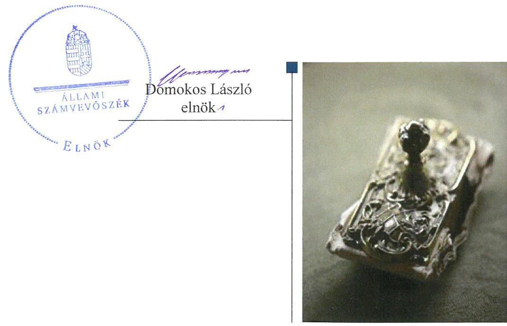
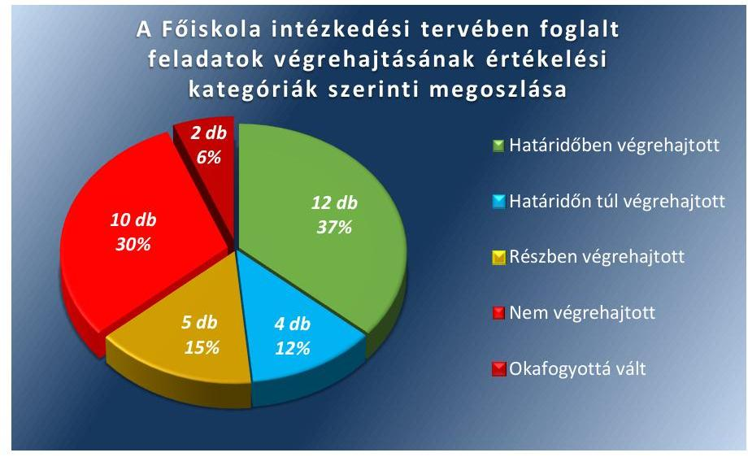

# Jelentés 

## Utóellenőrzések

Az állami felsőoktatási intézmények gazdálkodásának, működésének ellenőrzéséről készült jelentések utóellenőrzése - Eötvös József Főiskola 2018.

---

# JEJE 

ÁLLAMI
SZÁMVEVŐSZÉK

## Jelentés

## Utóellenőrzések

Az állami felsőoktatási intézmények gazdálkodásának, múködésének ellenőrzéséről készült jelentések utóellenőrzése - Eötvös József Főiskola 2018. 01. hó 23. nap

---

# AZ ELLENŐRZÉST FELÜGYELTE: 

PETŐ KRISZTINA felügyeleti vezető

## AZ ELLENŐRZÉST VEZETTE ÉS A VÉGREHAJTÁSÁÉRT FELELŐS:

SZILÁGYI GÁBOR ANTAL ellenőrzésvezető

## A PROGRAM ÖSSZEÁLLÍTÁSÁÉRT FELELŐS:

JANIK JÓZSEF LÁSZLÓ osztályvezető

## A TÉMÁHOZ KAPCSOLÓDÓ KORÁBBI SZÁMVEVŐSZÉKI JELENTÉS:

- címe: Jelentés az Eötvös József Főiskola ellenőrzéséről Az állami felsőoktatási intézmények gazdálkodásának, működésének ellenőrzése
- sorszáma: 15025

IKTATÓSZÁM: V-1345-060/2016.
TÉMASZÁM: 2096
ELLENŐRZÉS-AZONOSÍTÓ SZÁM: V075539

---

# TARTALOMJEGYZÉK 

■ ÖSSZEGZÉS ..... 5
■ AZ ELLENŐRZÉS CÉLJA ..... 6
■ AZ ELLENŐRZÉS TERÜLETE ..... 7
■ AZ ELLENŐRZÉS HÁTTERE, INDOKOLTSÁGA ..... 8
■ A JELENTÉS LÉNYEGES KÉRDÉSKÖRE ..... 9
■ ELLENŐRZÉS HATÓKÖRE ÉS MÓDSZEREI ..... 10
■ MEGÁLLAPÍTÁSOK ..... 12
■ MELLÉKLETEK ..... 17
I. Sz. melléklet: Az ÁSZ 15025. számú jelentéséhez kapcsolódó Eötvös József Főiskola intézkedési tervének végrehajtása ..... 17
II. Sz. melléklet: Az ÁSZ 15025. számú jelentéséhez kapcsolódó EMMI intézkedési terv végrehajtása ..... 25
■ FÜGGELÉK: ÉSZREVÉTELEK ..... 27
■ RÖVIDÍTÉSEK JEGYZÉKE ..... 29

---

.

---

# ÖSSZEGZÉS 

Az Eötvös József Főiskola intézkedési tervében meghatározott feladatok jelentős részét nem hajtották végre, ezzel nem biztositották a közpénzekkel való gazdálkodás elszámoltathatóságát és az átláthatóságot. Az Emberi Erőforrások Minisztériuma - mint a fenntartói jogkör gyakorlója - az intézkedési tervében foglalt feladatokat határidőben végrehajtotta.

## Az ellenőrzés társadalmi indokoltsága

Az Állami Számvevőszék stratégiájában célul tűzte ki a számvevőszéki munka hasznosulásának javítását. Ezzel összhangban ellenőrzi, hogy az ellenőrzött szervezetek megvalósították-e a korábbi ellenőrzései által feltárt hibák, hiányosságok és szabálytalanságok megszüntetése céljából kialakított intézkedési terveikben foglaltakat. A rendszeres utóellenőrzések hozzájárulnak a szükséges intézkedések tényleges végrehajtáshoz, ezáltal a közpénzügyek rendezettségének javulásához.

## Főbb megállapítások, következtetések

Az Eötvös József Főiskola intézkedési tervében meghatározott feladatokból tizenkettőt határidőben, négyet határidőn túl, ötöt részben hajtott végre, tíz feladatot nem teljesített, továbbá kettő intézkedés okafogyottá vált.

Az intézkedési tervben foglaltak ellenére a Főiskola nem gondoskodott a belső kontrollrendszer jogszabályoknak megfelelő működéséről. A szolgáltatási díjakat önköltségszámítás nem támasztotta alá és az egyes tevékenységhez kapcsolódó utókalkuláció készítése sem történt meg. A tervszerű és megalapozott vagyongazdálkodás megvalósításához nem készítettek vagyongazdálkodási tervet. A kötelezettségvállalásokat nem előzte meg pénzügyi ellenjegyzés, illetve a szabályos kifizetéseket biztosító kontrollok elmaradtak. A közérdekú adatok közzététele nem valósult meg, amellyel az átláthatóságot nem biztosították.

Az Emberi Erőforrások Minisztériuma az intézkedési tervben meghatározott három feladatából hármat határidőben végrehajtott.

---

# AZ ELLENŐRZÉS CÉLJA 

Az ellenőrzés célja annak értékelése volt, hogy a számvevőszéki jelentésben ${ }^{1}$ foglalt javaslatokat megalapozó megállapításokkal összhangban készített intézkedési tervben meghatározott feladatokat az ellenőrzött szervezetek végrehajtották-e.

---

# **AZ ELLENŐRZÉS TERÜLETE**

## **Eötvös József Főiskola**

**A BAJÁN** működő Eötvös József Főiskola jogelődjét 1870-ben alapították. Az Nftv.2 2. § (1) bekezdése alapján a Főiskola3 közfeladata oktatás és tudományos kutatás. Irányító szerve és fenntartója az Emberi Erőforrások Minisztériuma. A Főiskolán napjainkban gazdálkodási, illetve pedagógiai alapképzés folyik, emellett duális és mesterképzésre is van lehetőség. A Főiskola hallgatói részére saját szervezetében tankönyv- és jegyzetellátást, könyvtári, informatikai szolgáltatást, kollégiumi elhelyezést, kulturális és sportolási lehetőséget biztosít. A Főiskola taneszköz-fejlesztést végez, felvételi előkészítő és egyéb tanfolyamokat tart, nyelvvizsgáztatást folytat, valamint az intézményi infrastruktúra szabad kapacitásait hasznosítja (kiadói tevékenység, nyomdaipari termékek gyártása, sportlétesítmények, oktatást szolgáló helyiségek, kollégiumi szálláshelyek bérbeadása).

A rektor 2013. június 15-étől 2017. június 28-ig töltötte be tisztségét. A kancellár4 2015. január 1-től 2016. június 30-ig töltötte be a tisztséget, azt követően kancellár-helyettes látta el a feladatokat.

A Főiskola 2015. évi költségvetési beszámolója alapján költségvetési bevételként 569,9 M Ft-ot, finanszírozási bevételként 1441,4 M Ft-ot, költségvetési kiadásként 1634,6 M Ft-ot számoltak el.

A Főiskola gazdálkodásának, működésének ellenőrzését az ÁSZ5 a 2009. január 1- 2013. december 31. közötti időszakra végezte el, az erről szóló 15025. számú jelentést 2015. február 24-én tette közzé. Az ellenőrzés célja annak értékelése volt, hogy szabályos volt-e a Főiskola pénzügyi és vagyongazdálkodása, a jogszabályi előírásoknak megfelelően működött-e a belső kontrollrendszer, illetve az irányító szerv tevékenysége a jogszabályoknak megfelelő volt-e. Az ellenőrzés a Főiskola mellett kiterjedt az EMMI-re6 mint fenntartóra.

Az utóellenőrzés a – 2015. február 24-től 2017. május 30-ig végrehajtott feladatokat figyelembe véve – a számvevőszéki jelentésben a rektor7 és a miniszter8 részére megfogalmazott javaslatokat megalapozó megállapításokra készített, az ÁSZ részére megküldött intézkedési tervekben foglalt feladatok megvalósításának ellenőrzésére, illetve értékelésére fókuszált.

---

# AZ ELLENŐRZÉS HÁTTERE, INDOKOLTSÁGA 

Az ÁSZ tv. ${ }^{9}$ 33. § (1) bekezdése értelmében a számvevőszéki jelentések javaslatot megalapozó megállapításaihoz kapcsolódóan az ellenőrzött szervezet vezetője intézkedési tervet köteles összeállítani, és az Állami Számvevőszék részére megküldeni. Az intézkedési tervben foglaltak megvalósítását - az ÁSZ tv. 33. § (7) bekezdésében foglaltak alapján - az Állami Számvevőszék utóellenőrzés keretében ellenőrizheti. Az intézkedések megvalósulásának értékelése során az Állami Számvevőszék figyelembe veszi az ellenőrzött szervezetek működési feltételeiben, valamint a jogszabályi előírásokban bekövetkezett változásokat.

Az intézkedési tervekben foglalt feladatok hiányos, illetve késedelmes végrehajtása, valamint megvalósításának elmaradása azt mutatja, hogy az ellenőrzések során feltárt hibák, hiányosságok és szabálytalanságok megszüntetése nem kapott kellő hangsúlyt. Ez a szabályszerű működés és a felelős vezetői magatartás vonatkozásában kockázatot hordoz. E kockázatok feltárásával az Állami Számvevőszék utóellenőrzési rendszere fokozza a fegyelmet, és igazolja, hogy a közpénzzel való szabályos gazdálkodás felelőssége elől nem lehet kitérni.

Az utóellenőrzés négy szinten hasznosulhat:
A társadalom szintjén az utóellenőrzés jelzi, hogy a számvevőszéki ellenőrzés megállapításainak van következménye: a hiányosságok megszüntetésére az ellenőrzött szervezet által meghatározott intézkedések végrehajtását is számon kéri az ÁSZ.

- Az ellenőrzött terület szintjén az utóellenőrzés tájékoztatást nyújt a terület döntéshozóinak a hiányosságok kiküszöbölésének jó gyakorlatairól, ezzel lehetőséget biztosítva arra, hogy az ÁSZ ellenőrzési megállapításai, javaslatai a terület nem ellenőrzött szervezeteinek a működése során is hasznosuljanak.
- Az ellenőrzött szervezet szintjén az utóellenőrzés feltárja, hogy a szervezet az intézkedések végrehajtásával hasznosította-e a korábbi ellenőrzési jelentésben a hiányosságok megszüntetése, illetve a kockázatok kezelése érdekében megfogalmazott javaslatokat.
- Az ÁSZ szintjén az utóellenőrzés visszacsatolást ad az ellenőrzési jelentések hasznosulásáról, az intézkedések elmaradása vagy részleges megvalósulása a további ellenőrzésekhez kockázati jelzésként szolgál.

---

# A JELENTÉS LÉNYEGES KÉRDÉSKÖRE 

- A Főiskola és az EMMI az intézkedési tervekben foglaltakat az előirt határidőben végrehajtotta-e?

---

# ELLENŐRZÉS HATÓKÖRE ÉS MÓDSZEREI 

## Az ellenőrzés típusa

Megfelelőségi ellenőrzés

## Az ellenőrzött időszak

Az utóellenőrzés alapját képező ÁSZ jelentés közzétételének napjától (2015. február 24.) az ellenőrzésről szóló kiértesítő levél keltének napjáig (2017. május 30.) tartó időszak.

## Az ellenőrzés tárgya

Az ÁSZ tv. 2011. július 1-jei hatálybalépését követően a számvevőszéki jelentésben foglalt javaslatokat megalapozó megállapításokkal összhangban - a Főiskola és az EMMI által - készített intézkedési tervben foglaltak végrehajtásának ellenőrzése.

Az ellenőrzés kiterjedt minden olyan körülményre és adatra, amely az ÁSZ jogszabályban meghatározott feladatainak teljesítéséhez, valamint a program végrehajtása folyamán felmerült újabb összefüggések feltárásához szükséges.

## Az ellenőrzött szervezet

Eötvös József Főiskola és az Emberi Erőforrások Minisztériuma

## Az ellenőrzés jogalapja

Az ÁSZ tv. 33. § (7) bekezdése alapján az intézkedési tervben foglaltak megvalósítását az ÁSZ utóellenőrzés keretében ellenőrizheti.

## Az ellenőrzés módszerei

Az ÁSZ az ellenőrzést a nemzetközi standardokat irányadónak tekintve az ellenőrzési program ellenőrzési kérdései, az ellenőrzött időszakban hatályos jogszabályok, az ellenőrzés szakmai szabályok és módszertanok figyelembevételével, önállóan végezte.

Az ÁSZ az ellenőrzés ideje alatt a Főiskolával és az EMMI-vel történő kapcsolattartást az ÁSZ SZMSZ ${ }^{10}$-ének vonatkozó előírásai alapján biztosította.

---

Az utóellenőrzés megállapításait elsősorban az ÁSZ rendelkezésére álló, valamint az ellenőrzött szervezetektől elektronikusan bekért dokumentumok alapozták meg.

Az ellenőrzési bizonyítékként felhasználható adatforrások közé tartoztak egyrészt a szakmai programban felsorolt adatforrások, másrészt minden - az ellenőrzés folyamán feltárt, az ellenőrzés szempontjából információt tartalmazó - dokumentum.

Az ellenőrzés során a működés szabályszerűsége érdekében hozott intézkedések végrehajtását véletlen mintavétel módszerével ellenőriztük (Az intézményi ellátottak pénzbeli juttatásai, a foglalkoztatottak személyi juttatásai, a külső személyi juttatások, a dologi kiadások adatállományaiból 10-10, valamint a működési bevételek adatállományából 17 elemű minta került kiválasztásra).

Az intézkedési tervben előírt feladatokat azok végrehajthatósága, illetve végrehajtása szempontjából az alábbiak szerint értékelte az ÁSZ:
—_ „határidőben végrehajtott" a feladat, ha a teljesítés dokumentáltan, az intézkedési tervben előírt határidőben és tartalommal megtörtént;
—_ „határidőn túl végrehajtott" a feladat, ha annak teljesítése az intézkedési tervben meghatározott módon, de az előírt határidőn túl történt meg;
—_ „részben végrehajtott" a feladat, ha végrehajtása teljes körűen az intézkedési tervben előírt módon nem történt meg;
—_ „nem végrehajtott" a feladat, ha a végrehajtás nem történt meg, vagy amennyiben a teljesítést nem dokumentálták;
—_ „okafogyottá vált" a feladat, ha végrehajtására - meghatározott esemény bekövetkezése, továbbá külső körülmény, a működést érintő feltétel változása miatt - már nincs szükség, illetve lehetőség, és egyértelműen megállapítható, hogy az intézkedést szükségessé tevő körülmény a jövőben nem fordulhat elő;
—_ „nem időszerű" az a feladat, amelynek ellenőrzési időszakon belüli végrehajtására azért nem került (kerülhetett) sor, mert az intézkedés alapjául szolgáló esemény nem következett be, de annak jövőbeni előfordulása lehetséges, a végrehajtása nem volt esedékes, vagy a végrehajtás határideje még nem járt le.
Az ellenőrzés lefolytatásához az ellenőrzött szervezetek a tanúsítványok elektronikus kitöltésével, valamint az ÁSZ által kért dokumentumok elektronikus megküldésével szolgáltattak adatokat, amelyek valódiságát és teljes körűségét az ellenőrzött szervezet vezetője által tett teljességi és hitelességi nyilatkozat igazolta. Az így rendelkezésre bocsátott adatok, információk kontrollja az ellenőrzés keretében történt.

---

# MEGÁLLAPÍTÁSOK 

## A Főiskola és az EMMI az intézkedési tervekben foglaltakat az előírt határidőben végrehajtotta-e?

Összegző megállapítás

A Főiskola harminchárom intézkedési tervponthoz kapcsolódó feladatból tizenkettőt határidőben, négyet határidőn túl, ötöt részben, míg tízet nem hajtott végre, kettő feladat okafogyottá vált. Az EMMI az intézkedési tervében meghatározott három feladatot határidőben végrehajtotta.

Az intézkedési tervben a hiányosságok, szabálytalanságok megszüntetésére 33 feladatot határoztak meg. A feladatok elvégzésének felelőseként 13 esetben a kancellárt, hat esetben a megbízott gazdasági igazgatót, egy esetben a Szenátust ${ }^{11}$, egy esetben a munkáltatói jogkör gyakorlóját, egy esetben a megbízott gazdasági igazgatót és a kötelezettségvállalókat együttesen jelölték meg, 11 feladat végrehajtottként került megjelölésre.

A Főiskola intézkedési tervben meghatározott feladatokat, határidőket, felelősöket és a feladatok végrehajtását az I. számú melléklet mutatja be.

A Főiskola nem vezette a Bkr. 14. § (1) bekezdésében előírt nyilvántartást, mert a 2016. évi nyilvántartás nem tartalmazta az intézkedési tervben szereplő folyamatos határidejű intézkedések végrehajtásának nyomon követését, illetve az intézkedések elmaradásának okait.

Az intézkedési tervben tervezett feladatok végrehajtásának értékelési kategóriák szerinti megoszlását az 1. ábra szemlélteti.

1. ábra

Ferrás: ÁsZ
Az EMMI az intézkedési tervében három feladatot határozott meg a javaslatok hasznosítására.

---

Az EMMI a Bkr. 14. § (1) bekezdés előírásainak megfelelő nyilvántartást az intézkedési tervben vállalt feladatok tekintetében vezette.

Az EMMI által vállalt feladatokat a II. számú melléklet mutatja be.

# HATÁRIDŐBEN VÉGREHAJTOTT feladatok: 

1. (2/33) A szabálytalanságok kezelésének rendjére vonatkozó szabályzatot, valamint a Belső kontroll kézikönyvet a Bkr. 6. § (2) bekezdésével összhangban 2015. október 1-jei dátummal aktualizálta a Főiskola kancellárja. A Belső kontroll kézikönyv II. fejezete a kockázatkezelést, a III. fejezete az ellenőrzési nyomvonal szabályozását tartalmazza.
2. (4/33) A Főiskola az Etikai Kódexet határidőben elkészítette, mivel a Szenátus 2014. január 27-i hatállyal az 1/2014. számú határozatával fogadta el.
3. (6/33) A kancellár működtette a kockázatkezelési rendszert, a feltárt kockázatokkal kapcsolatos intézkedések nyilvántartását határidőben elkészítették, és 2016. évben is vezették.
4. (7/33) A rektor és 2015. január 1-étől a kancellár kijelölte a kötelezettségvállalásra jogosultakat, akiket teljesítésigazolásra is felhatalmazott, továbbá kijelölte az utalványozókat. A kiadások és bevételek vonatkozásában a teljesítésigazolók és utalványozók aláírás mintája teljes körűen elkészült. A gazdasági főigazgató a teljesítés igazolók és utalványozók aláírás mintáiról az Ávr ${ }^{12}$. által előírt nyilvántartást vezette.
5. (11/33) A rektor vezetői tevékenységének értékelése határidőben megtörtént a Szenátus 25/2015. (07.29.) számú határozata szerint.
6. (12/33) A Szenátus az Nftv. 12. § (3) bekezdése alapján a 2015. július 29-ei ülésén a 2014. évi költségvetési beszámoló, valamint a 2015. évi költségvetés előterjesztése megtörtént.
7. (14/33) A Főiskola térítési és juttatási szabályzatában 2015-ben rögzítették, hogy a hallgatói juttatások kizárólag pénzbeli támogatásként bocsáthatók a hallgatók rendelkezésére. A hallgatói jegyzettámogatás kifizetését a Főiskola minden esetben bankszámlára történt utalással teljesítette.
8. (20/33) A többletfeladatok részletes meghatározása és a kifizetés teljesítésigazolással történő megalapozása megtörtént.
9. (23/33) A hallgatói normatíva terhére teljesített egyes kiadások (rendezvényszervezés, telefonköltség, stb.) elszámolása a dologi kiadások között történt, nem az ellátottak juttatásai között, ami megfelel az Áhsz. ${ }^{13} 15$. számú mellékletében, valamint a számlarendben előírtaknak.
10. (30/33) A Főiskola a 100\%-os tulajdonosi részesedésű gazdasági társaságát, az EJF Kft-ét ${ }^{14}$ jogutód nélkül, végelszámolás keretében megszüntette. A Bács-Szakma Szakképzés-fejlesztési és Szervezési Non-Profit Kiemelkedően Közhasznú Zrt. a Főiskola egyetlen gazdasági társasága, amelyben 0,6\% azaz 30000 Ft részesedéssel rendelkezett.

---

11. (31/33) Az egyenlegközlő levelek a 2014. évi mérleg összeállítása során a gyakorlóiskolai menzadíj tartozók részére is kiküldésre kerültek, hasonlóan az egyéb tartozókhoz.
12. (33/33) A hallgatói befizetésekkel kapcsolatos szabálytalanságok munkajogi felelősségének kivizsgálására irányuló eljárás megindításáról a kancellár határidőben intézkedett. A gazdasági igazgató beszámoltatása alapján a felelősség érvényesítése érdekében írásbeli figyelemfelhívással élt felé.

# HATÁRIDŐN TÚL VÉGREHAJTOTT feladatok: 

13. (5/33) A Főiskola a Gazdálkodási Szabályzatot, a Kötelezettség vállalási Szabályzatot határidőben, a Gépjárművek Üzemeltetési Szabályzatot, Számlarendet, a Pénz- és értékkezelési Szabályzatát, a Felesleges vagyontárgyak hasznosítási és selejtezési Szabályzatot, a Bizonylati Szabályzatot, a Számviteli politikát, az Eszközök és Források Értékelési Szabályzatot, a Leltározási és Leltárkészítési Szabályzatot, a Közbeszerzések és egyéb beszerzések Szabályzatot, az Önköltségszámítási Szabályzatot határidőn túl aktualizálta.
14. (8/33) A közérdekű adatok megismerésére irányuló kérelmek intézésének, továbbá a kötelezően közzéteendő adatok nyilvánosságra hozatalának rendjéről szóló szabályzatot a rektor és a kancellár az intézkedési tervben meghatározott határidő lejárta után adta ki.
15. (25/33) A Főiskola az intézkedési tervben megjelölt 2014. júliusi intézkedéshez képest 2014. szeptember 15-én szüntette meg a Kereskedelmi és Hitelbank Zrt.-nél vezetett gyűjtőszámlát. A számla egyenlegét szerepeltették a főiskola mérlegében.
16. (27/33) A kancellár a Közbeszerzési és beszerzési szabályzatot az ajánlati biztosítékra vonatkozó kiegészítéssel az intézkedési tervben meghatározott határidő lejárta után adta ki.

## RÉSZBEN VÉGREHAJTOTT feladatok:

17. (3/33) A 2015. évben három alkalommal volt EJF SZMSZ ${ }^{15}$ módosítás, amelyet határidőben megküldtek, 2016. évben egyszer volt EJF SZMSZ módosítás, amit tizenöt napon belül nem küldtek meg az EMMI-nek.
18. (18/33) A 8/2014. számú rektori utasításban (2014. szeptember 23.) rendelkeztek az oktatói jelenléti ívek vezetéséről, a tényleges megtartott óraszámok feltüntetéséről, és a hónap végén a dokumentumnak az igazgatói igazolás után a Bér-és Munkaügyi Osztályra való megküldéséről. A jelenléti íveket vezették, a dokumentumok lehetővé teszik a kötelező óraszámok teljesítésének nyomon követését. Az oktatók aláírásukkal valamennyit ellátták, az intézetigazgatók nem minden esetben igazolták a teljesítés jogosságát az Ávr. 57.§ (1) bekezdésében foglaltak ellenére.
19. (26/33) A hallgatói térítési díjakról az elektronikus számlát a NEPTUN egységes tanulmányi rendszerből előállították. A hallgatói költségtérítéseket a Főiskola tárgyévi működési bevételként elszámolta. Nem valósult meg azonban a pénzügyi teljesítést követően a bevételek azonnali könyvelése.

---

20. (28/33) A Vagyongazdálkodási szabályzatban rögzítették, hogy a bérleti díj meghatározásánál a tárgyévi várható inflációval növelt előző évi fenntartási és üzemeltetési önköltségszámítást figyelembe kell venni. A térítésmentes átadás eseteit, eljárásrendjét a szabályzat nem tartalmazta. A kancellár a Vagyongazdálkodási szabályzatot az intézkedési tervben meghatározott határidő lejárta után adta ki.
21. (32/33) A külső ellenőrzések kapcsán készült intézkedési tervben foglaltak megvalósítása a Bkr. 13. § (2) bekezdésében előírtak ellenére részben teljesült. A külső ellenőrzések javaslatai alapján készült intézkedési tervek végrehajtásáról vezetett nyilvántartásban 2015. évben két feladatot határidőben végre nem hajtottként tüntettek fel, melyeket az ellenőrzött időszakon belül később sem hajtottak végre, annak ellenére, hogy a végrehajtás határideje 2015.ben volt.

# NEM VÉGREHAJTOTT feladatok: 

22. (1/33) A belső kontrollrendszer jogszabályoknak megfelelő működése nem valósult meg.
23. (9/33) A jogszabályokban meghatározott közérdekű adatokat teljes körűen nem tette közzé a főiskola.
24. (10/33) A Főiskola monitoring rendszerének továbbfejlesztése, működtetése folyamatos határidő mellett nem valósult meg.
25. (13/33) A Főiskola vagyongazdálkodási tervének szenátusi elfogadását a jogszabályi előírások ellenére nem történt meg.
26. (15/33) A Főiskola az Áhsz. előírásának megfelelően az oktatási tevékenység önköltségét szakonként, illetve tanulmányi félévenként meghatározta, a hallgatói költségtérítések összegét annak alapján állapította meg. A szolgáltatások díjtételeit belső szabályzatban nem határozták meg, illetve a megállapítottól eltérő díjtételt alkalmaztak. A bérbeadások, rendezvények esetében a megállapított díjakat költségkalkulációval nem támasztottak alá.
27. (16/33) A Főiskola az egyes tevékenységekre vonatkozó utókalkuláció készítését a 2014.évi teljesítési adatok alapján nem hajtotta végre.
28. (19/33) A kollektív szerződés aktualizálására vonatkozó intézkedési tervpont nem teljesült.
29. (22/33) Kötelezettségvállalás nem minden esetben történt előzetes pénzügyi ellenjegyzéssel az Áht. 37. § (1) bekezdésében foglaltak ellenére.
30. (24/33) A hallgatói juttatások esetében az Áht. ${ }^{16}$ szerinti kötelezettségvállalás dokumentuma és a pénzügyi ellenjegyzés, valamint az Ávr. által előírt teljesítésigazolás hiányzott, ennek következtében a gazdálkodási jogkörök gyakorlása nem az Áht. előírásainak megfelelően történt, a gazdálkodási jogkörrel kapcsolatos feladatok nem kerültek végrehajtásra.

---

31. (29/33) A Főiskola a saját, valamint a rendelkezésre bocsátott (vagyonkezelt) vagyonelemek elkülönített nyilvántartását nem vezette.

# OKAFOGYOTTÁ VÁLT feladatok: 

32. (17/33) A gyakorlóiskola tanulói által fizetendő étkezési térítési díjak megállapítási rendjének, felelősének belső szabályzatban történő rögzítése okafogyottá vált, mivel a gyakorlóiskola fenntartói joga átadásra került a Klebelsberg Intézményfenntartó Központnak.
33. (21/33.) Az állományba tartozók részére - a munkakörükbe nem tartozó feladatok ellátására - elrendelt többletfeladatokra történő kifizetés elszámolására vonatkozóan a jogszabályváltozás miatt okafogyottá vált az intézkedés.

## EMMI

## HATÁRIDŐBEN VÉGREHAJTOTT feladatok:

1. Az EMMI Belső Ellenőrzési Főosztály a belső kontrollrendszer kialakításával és működtetésével, a pénzügyi és vagyongazdálkodással, vagyonkimutatással összefüggésben feltárt szabálytalanságokhoz kapcsolódó a munkajogi felelősség kivizsgálására vonatkozó feladatot határidőben végrehajtotta.
2. Az EMMI Belső Ellenőrzési Főosztály a kincstári körön kívüli számlavezetés miatt megállapított szabálytalan pénzkezeléshez kapcsolódó munkajogi felelősség kivizsgálására és a szükséges intézkedések kezdeményezésére vonatkozó feladatot határidőben végrehajtotta.
3. Az EMMI felsőoktatásért felelős államtitkára a kancellár által kidolgozott intézményracionalizálási terv végrehajtásának folyamatos ellenőrzését határidőben végrehajtotta.

Az EMMI az ÁSZ 15025. számú jelentésének javaslatai alapján készített intézkedési tervben rögzített feladatok végrehajtásáról a nyilvántartást a Bkr. előírásainak megfelelően vezette.

---

# MELLÉKLETEK

- I. SZ. MELLÉKLET: AZ ÁSZ 15025. SZÁMÚ JELENTÉSÉHEZ KAPCSOLÓDÓ EÖTVÖS JÓZSEF FŐISKOLA INTÉZKEDÉSI TERVÉNEK VÉGREHAJTÁSA

|  5
5 | Intézkedési terv alapján meghatározott feladat
1. | Az intézkedési tervben meghatározott határidő
2. | Az intézkedési tervben meghatározott felelős
3. | A feladat végrehajtása
4.  |
| --- | --- | --- | --- | --- |
|  1. | 2./ A belső kontrollrendszer müködtetésével kapcsolatos szabályzatok aktualizálása (Kockázatkezelési Szabályzat, Szabálytalanságok Kezelésének Rendje, Ellenőrzési Nyomvonal valamennyi müködési folyamatra). | 2015.11.30. | kancellár | A szabálytalanságok kezelésének rendjére vonatkozó szabályzatot, valamint a Belső kontroll kézikönyvet a Bkr. 6. § (2) bekezdésének előírása alapján 2015. október 1-jei dátummal aktualizálta a Főiskola kancellárja. A Belső kontroll kézikönyv II. fejezete a kockázatkezelést, a III. fejezete az ellenőrzési nyomvonal szabályozását tartalmazta valamennyi müködési folyamatra.  |
|  2. | 4./ Etikai kódex készítése. | nem volt meghatározva, mert végrehajtott feladatként került megjelölésre | nem volt meghatározva, mert végrehajtott feladatként került megjelölésre | Az Etikai Kódexet határidőben elkészítették, mert a Szenátus 2014. január 27-i hatállyal az 1/2014. számú határozatával fogadta el.  |
|  3. | 6./ Kockázatkezelési rendszer müködtetése: a fóiskola tevékenységével kapcsolatos kockázatok felmérése és elemzése, a kockázatokkal kapcsolatos intézkedések megfogalmazása és azok teljesítésének nyomon követése. | 2015. november 30. egyébként folyamatos | kancellár | A kancellár a Bkr. 7. § (2) bekezdése előírásának megfelelően müködtette a kockázatkezelési rendszert. A Főiskola tevékenységében, gazdálkodásában rejlő és a szervezeti célokkal összefüggő kockázatok felmérése, elemzése, a kockázatokkal kapcsolatos intézkedések megfogalmazása és azok teljesítésének folyamatos nyomon követése megtörtént. A feltárt kockázatokkal kapcsolatos intézkedések nyilvántartását 2015. november 25-ig elkészítették, és 2016. évben is vezették.  |
|  4. | 7./ A kontrolltevékenységek keretében a teljesítésigazolásra és utalványozásra történő kijelölések a rektor által megtörténtek, a teljesítésigazolók és utalványozók aláírás mintája teljes körűen elkészült, az aláírókról a mb. gazdasági főigazgató nyilvántartást vezet. | nem volt meghatározva, mert végrehajtott feladatként került megjelölésre | nem volt meghatározva, mert végrehajtott feladatként került megjelölésre | A rektor és 2015. január 1-étől a kancellár kijelölte a kötelezettségvállalásra jogosultakat, akiket teljesítésigazolásra is felhatalmazott, továbbá kijelölte az utalványozókat. A kiadások és bevételek vonatkozásában a teljesítésigazolók és utalványozók aláírás mintája teljes körűen elkészült. A gazdasági főigazgató (2017-től a beosztása gazdasági igazgató) a teljesítés igazolók és utalványozók aláírás mintáiról az Ávr. 60. § (3) bekezdésében előírt nyilvántartást vezette.  |

---

|  5. | 11./ A rektor vezetői tevékenységének értékelése | 2015. november
30. | Szenátus | A rektor vezetői tevékenységének értékelése megtörtént a Szenátus 25/2015. (07.29.) számú határozata szerint. A minősítésben foglaltakat az emberi erőforrásokért felelős miniszter hatáskörében eljárva a felsőoktatásért felelős államtitkár 45606-1/2015/INTFO számú, 2015. szeptember 10-i levelében tudomásul vette.  |
| --- | --- | --- | --- | --- |
|  6. | 12./ A 2014. évi költségvetési beszámoló, valamint a 2015. évi költségvetés előterjesztése a Szenátus felé. | 2015.07.31. | gazdasági igazgató | A Szenátus az Nftv. 12. § (3) bekezdése alapján a 2015. július 29-ei ülésén a 2014. évi költségvetési beszámoló, valamint a 2015. évi költségvetés előterjesztése megtörtént.  |
|  7. | 14./ A hallgatói jegyzettámogatást 2014/2015. II. félévétől utalvány helyett pénzben kapják a hallgatók, a jogszabályi előírásoknak megfelelően a rendelkezésre álló keretösszeg a szociális támogatás része. | nem volt meghatározva, mert végrehajtott feladatként került megjelölésre | nem volt meghatározva, mert végrehajtott feladatként került megjelölésre | A Főiskola 2015. április 8-tól hatályos térítési és juttatási szabályzatának 5. § (2) bekezdésében rögzítették, hogy a hallgatói juttatások kizárólag pénzbeli támogatásként bocsáthatók a hallgatók rendelkezésére. A rendelkezésre álló keretösszeg a szociális támogatás részeként került elszámolásra. A hallgatói jegyzettámogatások kifizetését a Főiskola minden esetben bankszámlára történt utalással teljesítette.  |
|  8. | 20./ Többletfeladatok elrendelése esetén a feladatok részletes meghatározása, a kifizetés megalapozása teljesítésigazolással. | folyamatos | munkáltatói jogkör gyakorló | A 2/2015. számú gazdasági igazgatói körlevélben rendelkeztek a kötelezettségvállalási dokumentumok változásáról. Előírták (2015. szeptember 25.), hogy a szerződésekben (vállalkozás, megbízási, többletfeladat) az elvégzendő feladatokat részletesen, pontosan meg kell határozni és meg kell jelölni, hogy ki lesz a teljesítésigazoló. A 10/2014. sz. rektori utasítás (2014. szeptember 29.) és az 5/2016. rektori utasítás (2016. október 3.) III. Teljesítésigazolás részében, 8. és 11. melléketekben rendelkeztek a teljesítésigazolásról, annak menetéről, a teljesített feladatok összesítéséről. A IV. fejezet tartalmazta az oktatók kötelező óraszámáról szóló rendelkezést. A többletfeladatok elrendelésére vonatkozó mintákat az 1-3. mellékletben rögzítették. A gyakorlatban is megtörtént a többletfeladatok részletes meghatározása és a kifizetés teljesítés igazolással történő megalapozása.  |
|  9. | 23./ A hallgatói normatíva terhére teljesített egyes kiadások (rendezvényszervezés, telefonköltség, stb.) dologi kiadásokon történő elszámolása 2014. évben megtörtént, és az óta is ezen a kiemelt előirányzaton történik, nem az ellátottak juttatási között. | nem volt meghatározva, mert végrehajtott feladatként került megjelölésre | nem volt meghatározva, mert végrehajtott feladatként került megjelölésre | A hallgatói normatíva terhére teljesített egyes kiadások (rendezvényszervezés, telefonköltség, stb.) elszámolása az Áhsz. 15.számú mellékletében, valamint a számlarendben előírtaknak megfelelően a dologi kiadások között történt.  |
|  10. | 30./ A Főiskola a 100%-os tulajdonában lévő gazdasági társaságát 2012-ben jogutód nélküli végelszámolás keretében megszüntette. Jelenleg a Bács-Szakma Nonprofit Zrt.-ben 30.000 Ft értékben 0,6% tulajdonosi részesedése van az intézménynek. | nem volt meghatározva, mert végrehajtott feladatként került megjelölésre | nem volt meghatározva, mert végrehajtott feladatként került megjelölésre | A Főiskola a 100%-os tulajdonában lévő EJF Kft-ét 2013-ban jogutód nélkül végelszámolás keretében megszüntette. Cégközlönyben a CK 2012/47 számon tette közzé 2012. 11. 22-én és 2013.05.30-án került törlésre. A jelenleg hatályban lévő számviteli politikában-amely 2017. május 17-től hatályos - csak a Bács-Szakma Szakképzés-fejlesztési és Szervezési Non-Profit kiemelkedően Közhasznú Zrt.-t jelöli meg a Főiskola, mint egyetlen gazdasági társaságot, amelyben 0,6% azaz 30 000 Ft részesedése van. A tartós részesedés értéke főkönyvi kivonattal alátámasztott.  |

---

|  11. | 31./ 2014. évi mérleg összeállítása során a gyakorló iskolai menzadíj tartozók részére is kiküldésre került az egyéb tartozókhoz hasonlóan az egyenlegközlő levél. |  |  |   |
| --- | --- | --- | --- | --- |
|  12. | 33./ A hallgatói befizetések szabálytalansága tekintetében a munkajogi felelősséggel kapcsolatos körülmények kivizsgálására irányuló eljárás megindítása, a vizsgálat eredményének ismeretében a szükséges intézkedések megtétele. | 2015. november 30. | kancellár | A halgatói befizetések szabálytalansága tekintetében a munkajogi felelősséggel kapcsolatos körülmények kivizsgálására irányuló eljárást a kancellár határidőben megindította 2015. november 10-i levelével. A vizsgálat eredményének ismeretében a szükséges intézkedést megtette, írásban felhívta a gazdasági igazgató figyelmét a gazdálkodásra vonatkozó jogszabályváltozások és az igazgatóság feladatait érintő folyamatok nyomon követésére, a szükséges intézkedések határidőben történő megtételére és megvalósításuk ellenőrzésére vonatkozó munkaköri, vezetői kötelezettségére.  |
|   |  | Határidőn túl végrehajtott feladatok |  |   |
|  13. | 5./ Gazdálkodási szempontból meghatározó belső szabályzatok aktualizálása
5.j. Gazdálkodási szabályzat
5/k. Kötelezettségvállalási Szabályzat
5/l. Gépjárművek Üzemeltetési Szabályzata
5/a. Számlarend
5/b Pénz- és értékkezelési szabályzat
5/c. Felesleges vagyontárgyak hasznosítási és selejtezési szabályzata
5/d Bizonylati szabályzat
5/e Számviteli politika | 2015.11.30.
2015.11.30.
2015.11.30.
2014.03.20.
2014.10.29.
2014.10.29.
2014.10.29. | gazdasági igazgató
gazdasági igazgató
gazdasági igazgató
gazdasági igazgató
gazdasági igazgató
gazdasági igazgató | Határidőben aktualizált szabályzatok:
A gazdálkodási szabályzat 2015. augusztus 06-ai dátummal aktualizálásra került.
Határidőn túl aktualizált szabályzatok:
A gépjárművek igénybevételének és használatának rendjéről szóló szabályzat 2015. december 09-ei dátummal aktualizálásra került.
2015. március 16-ei dátummal aktualizálásra került a Számlarend.
2015. augusztus 06-ai és 2016. július 26-ai dátummal aktualizálásra került a Pénzkezelési szabályzat, amely tartalmazta az érték kezeléssel kapcsolatos szabályokat.
A selejtezési szabályzat 2015. augusztus 06-ai dátummal aktualizálásra került.
A bizonylati szabályzatot 2015. augusztus 06-ei dátummal aktualizálták.
A számviteli politika 2015. augusztus 06-ai dátummal aktualizálásra került.  |

---

|  5 | intézkedési terv alapján meghatározott feladat | Az intézkedési tervben meghatározott határidő | Az intézkedési tervben meghatározott felelős | A feladat végrehajtása  |
| --- | --- | --- | --- | --- |
|   | 5/f Eszközök és források értékelési szabályzata | 2014.11.25. | gazdasági igazgató | Az eszközök és források értékelési szabályzat 2015. augusztus 06-ai dátummal aktualizálásra került.  |
|   | 5/g: Leltározási és leltárkészítési szabályzat Bizonylati szabályzat | 2014.11.25. | gazdasági igazgató | A leltározási és leltárkészítési szabályzat 2015. augusztus 06-ai dátummal aktualizálásra került.  |
|   | 5/h Közbeszerzések és egyéb beszerzések szabályzata | 2014.12.31. | gazdasági igazgató | A közbeszerzések és egyéb beszerzések szabályzat 2015. december 09-ai dátummal aktualizálásra került.  |
|   | 5/i. Önköltségszámítási szabályzat | 2014.11.30. | gazdasági igazgató | Az önköltségszámítási szabályzat 2015. július 29-ei dátummal aktualizálásra került.  |
|  14. | 8./ A közérdekú adatok megismerésére irányuló kérelmek intézésének rendjére vonatkozó szabályzat elkészítése | 2015. szeptember 30. | kancellár | Az Ávr. 13. § (2) bekezdés h) pontja, illetve az Info tv. 30. § (6) bekezdése által előírt, a közérdekú adatok megismerésére irányuló kérelmek intézésének, továbbá a kötelezően közzéteendő adatok nyilvánosságra hozatalának rendjéről szóló szabályzatot a rektor és a kancellár 2015. október 7-én, az intézkedési tervben meghatározott határidő lejárta után hét nappal adta ki.  |
|  15. | 25./ A Főiskola 2014. július hónapban megszüntette a Kereskedelmi és Hitelbank Zrt.-nél vezetett hallgatói gyűjtőszámlát, és azóta a hallgatói befizetések kezelése a kincstárnál vezetett számlán történik. A számla egyenlege szerepel a Főiskola mérlegében. | nem volt meghatározva, mert végrehajtott feladatként került megjelölésre | nem volt meghatározva, mert végrehajtott feladatként került megjelölésre | A Főiskola az intézkedési tervben jelzett 2014. júliusi intézkedéshez képest 2014. szeptember hónapban szüntette meg a kereskedelmi banknál vezetett gyűjtőszámlát. A rektor 2014. szeptember 11-ei levelében számlamegszüntetési kérelemmel intézkedett a kereskedelmi banknál vezetett számla megszüntetéséről. A bank 2014. szeptember 15-én számlamegszüntető értesítést küldött a Főiskola részére. A Főiskola a Magyar Államkincstárnál NEPTUN gyűjtőszámlát nyitott. Az érvénybelépés időpontja a Magyar Államkincstár számla törzsadatok nyilvántartása kiértesítő levele alapján 2014. július 31. A számla egyenlege szerepel a 2016. évi főkönyvi kivonatban (III. 331 Forintszámlák között).  |
|  16. | 27./ A Közbeszerzések és Egyéb Beszerzések Szabályzatában rögzíteni kell az ajánlati biztosíték kezelésével, nyilvántartásával és visszaadásával kapcsolatos feladatokat. | 2015. november 30. | kancellár | A kancellár a Közbeszerzési és beszerzési szabályzatot 2015. december 8-án, az intézkedési tervben meghatározott határidő lejárta után nyolc nappal adta ki. A Közbeszerzési és beszerzési szabályzat 17. §-ában szabályozták az ajánlati biztosíték kezelésével, nyilvántartásával és visszaadásával kapcsolatos feladatokat, rendelkeztek arról, hogy azokat a Gazdasági Igazgatóság látja el.  |
|   |  |  | Részben végrehajtott feladatok |   |
|  17. | 3./ Az SZMSZ esetleges módosításának megküldése a fenntartónak | folyamatos | kancellár | Végrehajtott feladatrész:  |
|   |  |  |  | A 2015. évben három alkalommal volt SZMSZ módosítás (11/2015. (04.24.), 23/2015. (07/29), 59/2015. (12.08.) számú határozattal elfogadott), amelyeket megküldtek a fenntartónak.  |
|   |  |  |  | Nem végrehajtott feladatrész:  |

---

|  17. | Intézkedési terv alapján meghatározott feladat | Az intézkedési tervben meghatározott határidő | Az intézkedési tervben meghatározott felelős | A feladat végrehajtása  |
| --- | --- | --- | --- | --- |
|   |  |  |  | A Főiskola a Szenátus a 19/2016. (06. 07.) számú határozatával módosított SZMSZ-t az Nftv. 74. § (3) bekezdése előírása szerint a döntésétől számított tizenöt napon belül nem küldte meg a fenntartónak.  |
|  18. | 18./ 2014 szeptemberétől rektori utasítás (8/2014. számú) keretében bevezetésre került az oktatók jelenléti ive, ahol a ténylegesen megtartott órákat kell feltüntetni, és hónap végén a dokumentumot intézetigazgatói igazolás után a Bér-és Munkaügyi Osztálynak megküldeni. A dokumentum lehetővé teszi a kötelező óraszámok teljesítésének nyomon követését. | nem volt meghatározva, mert végrehajtott feladatként került megjelölésre | nem volt meghatározva, mert végrehajtott feladatként került megjelölésre | Végrehajtott feladatrész:
A 8/2014. számú rektori utasításban (2014. szeptember 23.) rendelkeztek az oktatók kötelező óraszámának nyilvántartásáról. Előírták, hogy a főiskolán teljes munkaidős és részmunkaidős közalkalmazotti jogviszonyban foglalkoztatott oktatók a számukra előírt kötelező óraszám teljesítéséről jelenléti ívet kötelesek kitölteni. A jelenléti íven az adott napon megtartott tanóra időpontját fel kell tüntetni, oktatónak aláírással el kell látni. Előírták, hogy a dokumentumot az igazgatói igazolás után a Bér-és Munkaügyi Osztályon kell leadni. A jelenléti íveket vezették, a dokumentum lehetővé teszi a kötelező óraszámok teljesítésének nyomon követését. Az oktatók aláírásukkal valamennyit ellátták.
Nem végrehajtott feladatrész:
A beküldött jelenléti íveken az intézetigazgatók nem minden esetben igazolták a teljesítés jogosságát, ami ellentétes az Ávr. 57.§ (1) bekezdésében, valamint a 8/2014. számú rektori utasításban foglaltakkal.  |
|  19. | 26./ A 2014. évi számviteli változásokból adódóan módosult a hallgatói befizetések kezelésének rendszere. Minden félév elején a Tanulmányi Osztály által kiírt térítési díjak alapján a NEPTUN tanulmányi rendszer automatikusan előírja a hallgatónak a követelést és elkészíti a hallgatónak az elektronikus számlát. Ez ugyancsak automatikusan átkerül az EOS könyvelő programba. Pénzügyi teljesítést követően a bevétel könyvelése is azonnal megtörténik. | nem volt meghatározva, mert végrehajtott feladatként került megjelölésre | nem volt meghatározva, mert végrehajtott feladatként került megjelölésre | Végrehajtott feladatrész:
A hallgatói térítési díjakról az elektronikus számlát a NEPTUN egységes tanulmányi rendszerből előállították. A hallgatói költségtérítéseket a Főiskola tárgyévi működési bevételként elszámolta.
Nem végrehajtott feladatrész:
Nem valósult meg azonban a pénzügyi teljesítést követően a bevételek azonnali könyvelése.  |
|  20. | 28./ Vagyongazdálkodási Szabályzat készítése, melyben különösen szabályozni kell a vagyontárgyak értékesítésének, térítésmentes átadásának, bérbeadásának szabályait, eljárás rendjét. A szabályzatban rögzíteni kell, hogy a bérleti díjnak fedezetet kell nyújtania a bérbe adott vagyontárgyakkal kapcsolatban felmerült fenntartási költségekre, értékcsökkenésre. | 2015. október 30. | kancellár | Végrehajtott feladatrész:
A Vagyongazdálkodási szabályzatban meghatározták a vagyontárgyak értékesítésének, bérbeadásának szabályait, eljárásrendjét. A Vagyongazdálkodási szabályzat 7. § (3) bekezdésében rögzítették, hogy a bérleti díj meghatározásánál a tárgyévi várható inflációval növelt előző évi fenntartási és üzemeltetési önköltségszámítást figyelembe kell venni. A kancellár a Vagyongazdálkodási szabályzatot 2015. december 8-án, az intézkedési tervben meghatározott határidő lejárta után adta ki.  |

---

|  20
21 | Intézkedési terv alapján meghatározott feladat | Az intézkedési tervben meghatározott határidő | Az intézkedési tervben meghatározott felelős | A feladat végrehajtása  |
| --- | --- | --- | --- | --- |
|   |  |  |  | Nem végrehajtott feladatrész:
A térítésmentes átadás eseteit, eljárásrendjét a szabályzat nem tartalmazta.  |
|   |  |  |  | Végrehajtott feladatrész:
A külső ellenőrzések javaslatai alapján készült intézkedési tervekben foglaltak megvalósítása, teljesítése az ÁSZ ellenőrzéshez kapcsolódó 13. és 19. feladat kivételével megtörtént.  |
|  21. | 32./ A különböző ellenőrzések kapcsán készült intézkedési tervben foglaltak megvalósítása és teljesítése | folyamatos | kancellár | Nem végrehajtott feladatrész:
2015. évben két feladatot határidőben végre nem hajtottként tüntettek fel, eszerint az ÁSZ ellenőrzéshez kapcsolódó intézkedési terv 13. tervpontja szerinti feladat végrehajtása - a vagyongazdálkodási terv elfogadása - az Nftv. 2015. szeptember 1-jei módosítása miatt a 2015. évben nem realizálódott és további lépéseket sem tettek. A 19. tervpont szerinti feladat - a kollektív szerződés aktualizálása - határidőben nem történt meg, és később sem került rá sor.  |
|   |  |  | Nem végrehajtott feladatok |   |
|  22. | 1./ A belső kontrollrendszer jogszabályoknak megfelelő müködése | folyamatos | kancellár | A belső kontrollrendszer jogszabályoknak megfelelő működése nem valósult meg. A kontroll környezet esetében a Szenátus a 19/2016. (06. 07.) számú határozatával módosított SZMSZ-t határidőn belül nem küldte meg a fenntartónak, a Vagyon gazdálkodási Szabályzat nem tartalmazta térítésmentes átadás eseteit, eljárásrendjét, a Szenátus nem fogadta el vagyongazdálkodási tervet. A kontroll tevékenység esetében jelenléti íveken az intézetigazgatók nem minden esetben igazolták a teljesítés jogosságát, működési bevételeknél megállapítottól eltérő díjtételt alkalmaztak, költségkalkulációval nem támasztottak alá, utókalkulációt nem készítettek, kötelezettség vállaláskor nem minden esetben történt előzetes pénzügyi ellenjegyzés, a saját, valamint rendelkezésre bocsátott vagyon elkülönített nyilvántartása nem történt meg. Az információs és kommunikációs rendszer esetében nem tették közzé foglalkoztatottak létszámára és személyi juttatásaira vonatkozó összesített adatokat, illetve a vezetők és vezető tisztségviselők illetményére, munkabérére és rendszeres juttatásaira, valamint költségtérítésére és az egyéb alkalmazottaknak nyújtott juttatásokra vonatkozó összesített adatokat valamint a 2017. évi költségvetést, illetve 2015. és 2016. évi éves költségvetési beszámolót. A nyomon követési rendszer továbbfejlesztése, működtetése nem történt meg.  |

---

|  22. | 9./ A jogszabályokban meghatározott közérdekủ adatok teljes körű közzététele | 2015. szeptember
30. azután folyamatos | kancellár | Az Info tv. 1. melléklete III. 2. pontjának rendelkezése ellenére 2016. második negyedévétől az ellenőrzött időszak végéig nem tették közzé foglalkoztatottak létszámára és személyi juttatásaira vonatkozó összesített adatokat, illetve a vezetők és vezető tisztségviselők illetményére, munkabérére és rendszeres juttatásaira, valamint költségtérítésére és az egyéb alkalmazottaknak nyújtott juttatásokra vonatkozó összesített adatokat. Az Info tv 1. melléklete I. 3. pontjának előírása ellenére nem végezték el a változást követően azonnal a kancellár, illetve a kancellár-helyettes vonatkozásában az adatokban bekövetkezett változások közzétételét. Az Info tv. 37. § (1) bekezdése, illetve 1. melléklete III. 1. pontjának rendelkezése ellenére az ellenőrzési időszak végéig nem tették közzé a Főiskola 2017. évi költségvetését, illetve 2015. és 2016. évi éves költségvetési beszámolóját.  |
| --- | --- | --- | --- | --- |
|  24. | 10./ Monitoring rendszer továbbfejlesztése, működtetése | folyamatos | kancellár | A Főiskola monitoring rendszerének továbbfejlesztése, működtetése folyamatos határidő mellett nem valósult meg, ami ellentétes a Bkr. 3. § e) pontjával.  |
|  25. | 13./ Vagyongazdálkodási terv készítése és Szenátus által történő elfogadtatása. | 2015.11.30. | kancellár | A vagyongazdálkodási tervezet elkészült, de az Nftv. 12.§ (3) gb) pontjai szerint a Szenátus a fenntartó egyetértésével dönt az intézmény vagyongazdálkodási tervéről, ami nem történt meg.  |
|  26. | 15./ A különböző díjak és költségtérítések megállapítását megalapozó önköltségszámítás készítése | 2015. szeptember
30. | gazdasági igazgató | A Főiskola az Áhsz. 50. § (5) bekezdésének megfelelően az oktatási tevékenység önköltségét szakonként, illetve tanulmányi félévenként meghatározta, a hallgatói költségtérítések összegét annak alapján állapította meg. A szolgáltatások díjtételeit belső szabályzatban nem határozták meg, illetve a megállapítottól eltérő díjtételt alkalmaztak. A bérleti szerződésben megállapított bérleti díjat a vagyongazdálkodási szabályzat, illetve az önköltségszámítási szabályzat rendelkezései ellenére költségkalkulációval nem támasztottak alá.  |
|  27. | 16./ Az egyes tevékenységekre vonatkozó utókalkuláció készítése a 2014. évi teljesítési adatok alapján | 2015. szeptember
30. | gazdasági igazgató | A Főiskola önköltségszámítási szabályzatában utókalkuláció készítését a költségvetési beszámoló készítéséhez írta elő. Az egyes tevékenységekre vonatkozó utókalkuláció készítése nem történt meg.  |
|  28. | 19./ Kollektív Szerződés aktualizálása, a gyakorlattal történő összhang megteremtése | 2015. szeptember
30. | kancellár | A Kollektív Szerződés aktualizálása, a gyakorlattal történő összehangolása nem történt meg.  |
|  29. | 22./ Kötelezettségvállalás a jogszabályi előírásoknak megfelelően minden esetben előzetes pénzügyi ellenjegyzéssel történhet. | folyamatos | gazdasági igazgató | Kötelezettségvállalás az Áht. 37. § (1) bekezdésében foglaltak ellenére, nem minden esetben történt előzetes pénzügyi ellenjegyzéssel.  |

---

|  28
29 | Intézkedési terv alapján meghatározott feladat | Az intézkedési tervben meghatározott határidő | Az intézkedési tervben meghatározott felelős | A feladat végrehajtása  |
| --- | --- | --- | --- | --- |
|  30. | 24./ A hallgatói juttatások kifizetése pénzügyi ellenjegyzés alapján történik, valamint minden esetben elkészül az utalványrendelet, melyen megvalósul a teljesítésigazolás, érvényesítés, valamint az utalványozás. | nem volt meghatározva, mert végrehajtott feladatként került megjelölésre | nem volt meghatározva, mert végrehajtott feladatként került megjelölésre | A hallgatói juttatások esetében az Áht. 37. § (1) bekezdésének rendelkezése szerinti kötelezettségvállalás dokumentuma és a pénzügyi ellenjegyzés, valamint az Ávr. 57. § (1) bekezdésében előírt teljesítésigazolás hiányzott, ennek következtében az érvényesítést és az utalványozást nem az Áht. 38. § (1) bekezdése, illetve az Ávr. 58. § (1) bekezdése előírásainak megfelelően végezték, a gazdálkodási jogkörrel kapcsolatos feladatokat nem kerültek végrehajtásra.  |
|  31. | 29./ A főiskola saját, valamint a rendelkezésre bocsátott vagyon elkülönített nyilvántartása. | 2015. november 30. | gazdasági igazgató | A Főiskola a saját, valamint a rendelkezésre bocsátott vagyonról az elkülönített nyilvántartás nem vezette, ezzel megsértette az Nftv. 87.§ (4) bekezdését.  |
|   |  |  |  | Okafogyottá vált feladatok  |
|  32. | 17./ A gyakorlóiskola tanulói által fizetendő étkezési térítési díjak megállapításai rendjének, felelősének belső szabályzatban történő rögzítése | 2015. július 31. | gazdasági igazgató | A gyakorlóiskola tanulói által fizetendő étkezési térítési díjak megállapításai rendjének, felelősének belső szabályzatban történő rögzítése feladat végrehajtása okafogyottá vált, mivel a gyakorlóiskola fenntartói joga átadásra került a Klebelsberg Intézményfenntartó Központnak 2015. augusztus 31-vel az Nkt. ${ }^{17} 84 . \S$ (7) bekezdése alapján, és ez ismert volt a Főiskola számára, valamint a határidő a nyári szünetre esett, így a megállapított díjak alkalmazására nem lett volna lehetőség.  |
|  33. | 21./ A 2014. évi számviteli változások következtében, a 4/2013. (I.1) Kormányrendelet előírásai alapján a többletfeladat elrendelése keretében kifizetett kereset kiegészítések összegét a törvény szerinti illetmények között kell kimutatni. | nem volt meghatározva, mert végrehajtott feladatként került megjelölésre | nem volt meghatározva, mert végrehajtott feladatként került megjelölésre | 2014. január 1-től a 4/2013. (I. 11.) Kormányrendelet 15. számú melléklete I. egységes rovatrendje szerint a K1101. Törvény szerinti „illetmények, munkabérek" rovaton kell elszámolni a köztisztviselők, közalkalmazottak - a közalkalmazottak jogállásáról szóló törvény szerinti - kereset-kiegészítéssel növelt illetményét.  |

Fonrás: ÁSZ által készített táblázat

---

# II. SZ. MELLÉKLET: AZ ÁSZ 15025. SZÁMÚ JELENTÉSÉHEZ KAPCSOLÓDÓ EMMI INTÉZKEDÉSI TERV VÉGREHAJTÁSA

|  SZÁMÚ
KÖTEZET | Intézkedési terv alapján meghatározott feladat | Az intézkedési tervben meghatározott határidő | Az intézkedési tervben meghatározott felelős  |
| --- | --- | --- | --- |
|   | 1. | 2. | 3.  |
|  Határidőben végrehajtott feladatok |  |  |   |
|  1. | 1. Feladat: A belső kontrollrendszer kialakításával és müködtetésével, a pénzügyi és vagyongazdálkodással, vagyonkimutatással összefüggésben feltárt szabálytalanságokhoz kapcsolódó munkajogi felelősség kivizsgálása, a szükséges intézkedések kezdeményezése | 2015. december 31. | Belső Ellenőrzési Főosztály  |
|  2. | 2. Feladat: A kincstári körön kívüli számlavezetés miatt megállapított szabálytalan pénzkezeléshez kapcsolódó munkajogi felelősség kivizsgálása, a szükséges intézkedések kezdeményezése | 2015. december 31. | Belső Ellenőrzési Főosztály  |
|  3. | 3. Feladat: A kancellár által kidolgozott intézményracionalizálási terv végrehajtásának folyamatos ellenőrzése | folyamatos | Felsőoktatásért Felelős Államtitkár  |

Az EMMI Belső Ellenőrzési Főosztálya 2015. május 5-19. között szabályszerűségi ellenőrzést végzett a Főiskolánál „az ÁSZ javaslatai alapján készült intézkedési terv végrehajtása" tárgyában, amelyről 24723-10/2015/ELL iktatószámú jelentését 2015. június 5-én adta ki. A jelentés II. 1. pontja tartalmazta a belső kontrollrendszer kialakításával és müködtetésével, a pénzügyi és vagyongazdálkodással, vagyonkimutatással összefüggésben feltárt szabálytalanságokhoz kapcsolódó munkajogi felelősség kivizsgálását. Ennek alapján az ellenőrök nem javasoltak a rektort érintő fenntartói intézkedést. Az Nftv. 73. § (3) bekezdés e) pontja alapján a Főiskola rektora tekintetében munkáltatói jogkört gyakorló EMMI miniszter a 24723-10/2015/ELL iktatószámú jelentés javaslata alapján nem kezdeményezett munkajogi eljárást a Főiskola rektorával szemben. Az EMMI Belső Ellenőrzési Főosztály 2015. május 5-19. között szabályszerűségi ellenőrzést végzett a Főiskolánál „az ÁSZ javaslatai alapján készült intézkedési terv végrehajtása" tárgyában, amelyről 24723-10/2015/ELL iktatószámú jelentését 2015. június 5-én adta ki. A jelentés II. 2. pontja tartalmazta a kincstári körön kívüli számlavezetés miatt megállapított szabálytalan pénzkezeléshez kapcsolódó munkajogi felelősség kivizsgálását. Ennek alapján az ellenőrök nem javasoltak a rektort érintő fenntartói intézkedést. Az Nftv. 73. § (3) bekezdés e) pontja alapján a Főiskola rektora tekintetében munkáltatói jogkört gyakorló EMMI miniszter a 24723-10/2015/ELL iktatószámú jelentés javaslata alapján nem kezdeményezett munkajogi eljárást a Főiskola rektorával szemben. Az EMMI felsőoktatásért felelős államtitkára 2016. február 15-én küldte meg beszámolóját a Belső Ellenőrzési Főosztály vezetője részére, amely szerint a kancellár által kidolgozott intézményracionalizálási terv végrehajtásának folyamatos ellenőrzéséért a felsőoktatásért felelős államtitkár felelős. A felsőoktatásért felelős államtitkár havonta kancellári beszámoló keretében írásban számoltatta be a kancellárt az általa megtett kancellári intézkedésekről. A kancellár éves minősítésének szempontja volt az intézményracionalizálási feladatok végrehajtása. A Főiskola likviditásának biztosítására a Felsőoktatási Struktúraátalakítási Alapból 74 millió Ft támogatást kapott.

---

.

---

# FÜGGELÉK: ÉSZREVÉTELEK 

A jelentéstervezetet a Számvevőszék 15 napos észrevételezésre megküldte az ellenőrzött szervezetek vezetőinek az ÁSZ tv. 29. §* (1) bekezdése előírásának megfelelően.

Az Eötvös József Főiskola általános rektorhelyettese és kancellár-helyettese, valamint az Emberi Eröforrások Minisztériuma a jelentéstervezet megállapításaira észrevételt nem tett.

[^0]
[^0]:    * 29. § (1) Az Állami Számvevőszék az ellenőrzési megállapításait megküldi az ellenőrzött szervezet vezetőjének vagy az általa megbízott személynek, és annak, akinek személyes felelősségét állapította meg.
    (2) Az ellenőrzött szervezet vezetője és a felelősként megjelölt személy az ellenőrzés megállapításaira tizenöt napon belül írásban észrevételt tehet.
    (3) Az Állami Számvevőszék az észrevételre a beérkezésétől számított harminc napon belül írásban válaszol. A figyelembe nem vett észrevételeket köteles a jelentésben feltüntetni, és megindokolni, hogy azokat miért nem fogadta el.

---

.

---

# RÖVIDÍTÉSEK JEGYZÉKE 

${ }^{1}$ Számvevőszéki jelentés
${ }^{2}$ Nftv.
${ }^{3}$ Főiskola
${ }^{4}$ Kancellár
${ }^{5}$ ÁSZ
${ }^{6}$ EMMI
${ }^{7}$ Rektor
${ }^{8}$ Miniszter
${ }^{9}$ ÁSZ tv.
${ }^{10}$ ÁSZ SZMSZ
${ }^{11}$ Szenátus
${ }^{12}$ Ávr.
${ }^{13}$ Áhsz.
${ }^{14}$ EJF Kft
${ }^{15}$ EJF SZMSZ
${ }^{16}$ Áht.
${ }^{17} \mathrm{Nkt}$.

Az ÁSZ 15025. számú jelentése - Az állami felsőoktatási intézmények gazdálkodásának, működésének ellenőrzése - Eötvös József Főiskola (elérhető a www.asz.hu honlapon)
2011. évi CCIV. törvény a nemzeti felsőoktatásról (hatályos: 2012.január 1-től)

Eötvös József Főiskola
Eötvös József Főiskola kancellárja
Állami Számvevőszék
Emberi Erőforrások Minisztériuma
Eötvös József Főiskola rektora
Emberi Erőforrások Minisztériuma minisztere
2011. évi LXVI. törvény az Állami Számvevőszékről (hatályos 2011. július 1-jétől)

Az Állami Számvevőszék elnökének 3/2016. (XII.29.) ÁSZ utasítása az Állami Számvevőszék Szervezeti és Működési Szabályzatáról (hatályos 2017. január 1jétől)
Eötvös József Főiskola Szenátusa
368/2011. (XII. 31.) Korm. rendelet az államháztartásról (hatályos: 2012. január 1-étől)
4/2013. (I.11.) Korm. rendelet az államháztartás számviteléről (hatályos: 2014. január 1-étől)
Bácskai Tudomány-Technika Kft.
Eötvös József Főiskola Szervezeti és Müködési Szabályzata
2011. évi CXCV. törvény az államháztartásról (hatályos: 2011. december 31-étől)
2011. évi CXC. törvény a nemzeti köznevelésről (hatályos: 2012. szeptember 1étől)

---

# ÁLLAMI SZÁMVEVŐSZÉK 

1052 Budapest, Apáczai Csere János utca 10.
Levélcím: 1364 Budapest 4. Pf. 54
Telefon: +36 14849100 Telefax: +36 14849200
www.asz.hu