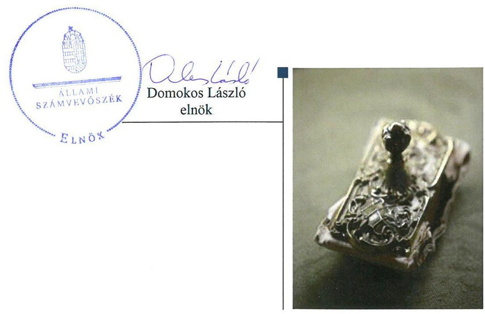
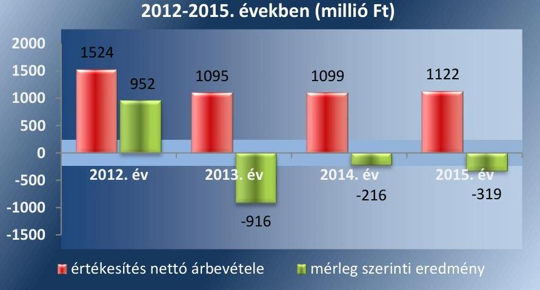
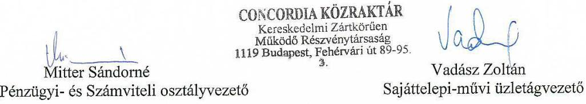
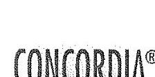
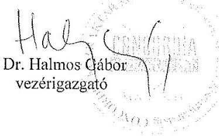
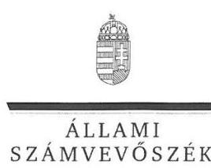
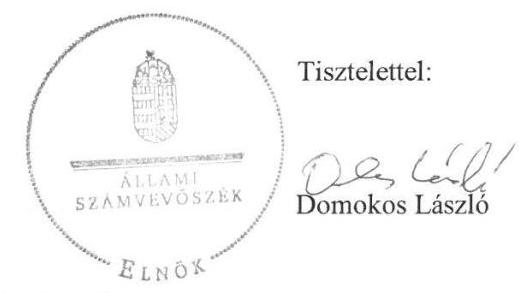

# Jelentés 

## CONCORDIA KÖZRAKTÁR Kereskedelmi Zrt.

Az állami tulajdonban (résztulajdonban) lévő gazdálkodó szervezetek vagyonmegőrzési és gazdálkodási tevékenységének ellenőrzése 2018.

---

# Jelentés 

## CONCORDIA KÖZRAKTÁR Kereskedelmi Zrt.

Az állami tulajdonban (résztulajdonban) lévő gazdálkodó szervezetek vagyonmegőrzési és gazdálkodási tevékenységének ellenőrzése
2018. január 16. nap

---

# AZ ELLENŐRZÉST FELÜGYELTE:

DR. HORVÁTH MARGIT felügyeleti vezető

## AZ ELLENŐRZÉST VEZETTE ÉS A VÉGREHAJTÁSÁÉRT FELELŐS:

- JOÓ ERIKA ellenőrzésvezető
- A PROGRAM ÖSSZEÁLLÍTÁSÁÉRT FELELŐS:
- JANIK JÓZSEF osztályvezető

IKTATÓSZÁM: V-1357-137/2016

TÉMASZÁM: 2391

ELLENŐRZÉS-AZONOSÍTÓ SZÁM: V-075928

Jelentéseink az Országgyűlés számítógépes hálózatán és az Interneten a www.asz.hu címen is olvashatóak.

---

# TARTALOMJEGYZÉK 

■ ÖSSZEGZÉS ..... 5
■ AZ ELLENŐRZÉS CÉLJA ..... 6
■ AZ ELLENŐRZÉS TERÜLETE ..... 7
■ AZ ELLENŐRZÉS HÁTTERE, INDOKOLTSÁGA ..... 9
■ A JELENTÉS LÉNYEGES KÉRDÉSKÖREI ..... 10
■ ELLENŐRZÉS HATÓKÖRE ÉS MÓDSZEREI ..... 11
■ MEGÁLLAPÍTÁSOK ..... 13
■ JAVASLATOK ..... 20
■ MELLÉKLETEK ..... 23
I. Sz. melléklet: Értelmező szótár ..... 23
II. Sz. melléklet: A Társaság mérleg és eredménykimutatás adatainak változása (adatok millió Ft) ..... 28
■ FÜGGELÉK: ÉSZREVÉTELEK ..... 29
■ RÖVIDÍTÉSEK JEGYZÉKE ..... 53

---

.

---

# ÖSSZEGZÉS 

A CONCORDIA KÖZRAKTÁR Kereskedelmi Zrt. feletti tulajdonosi jogokat a Magyar Nemzeti Vagyonkezelő Zrt. szabályszerűen gyakorolta. A Társaság működésének szabályozottsága nem felelt meg az előírásoknak. A bevételek elszámolása és az adatszolgáltatási kötelezettségek teljesítése szabályszerű volt. A ráfordítások elszámolása, a beszámolási kötelezettség teljesítése és a vagyon nyilvántartása nem volt szabályszerű, valamint az átláthatóság nem volt biztosított.

## Az ellenőrzés társadalmi indokoltsága

Az Állami Számvevőszék a stratégiáját megvalósítva ellenőrzéseivel segíti az átláthatóságot és az elszámoltathatóságot a közpénzekkel, a közvagyonnal való gazdálkodásban. Ellenőrzési témaválasztása során kiemelt figyelmet fordít a korábban ellenőrizetlen területekre.

Ellenőrzési tervének megfelelően a 2012-2015 közötti ellenőrzött időszakra az Állami Számvevőszék folytatja az állami tulajdonban (résztulajdonban) lévő gazdálkodó szervezetek vagyonmegőrzési és gazdálkodási tevékenységének ellenőrzését.

Az állami tulajdonú közraktározási gazdasági társaság és leányvállalatának vagyongazdálkodási tevékenysége, illetve az ellenőrzött szervezet, mint állami tulajdonban lévő, nemzetgazdasági szempontból kiemelt nemzeti vagyonnak minősülő társaság, raktározási és tárolási tevékenységének ellenőrzése közérdeklődésre tarthat számot.

## Főbb megállapítások, következtetések, javaslatok

A CONCORDIA KÖZRAKTÁR Kereskedelmi Zrt. felett a tulajdonosi jogokat a Magyar Nemzeti Vagyonkezelő Zrt. az előírásoknak megfelelően gyakorolta.

A CONCORDIA KÖZRAKTÁR Kereskedelmi Zrt. működésének szabályozottsága nem felelt meg az előírásoknak, mert a számviteli politika, a pénzkezelési szabályzat, az önköltségszámítási szabályzat, valamint a számlarend tartalmi szempontból nem felelt meg teljes körűen a jogszabályi előírásoknak.

A bevételek elszámolása az előírásoknak megfelelő volt, a ráfordítások és az értékcsökkenés elszámolása a jogszabályi előírásoknak nem felelt meg. A szolgáltatási díjakra vonatkozóan a jogszabályi előírás ellenére önköltségszámítást nem végeztek. A vagyon nyilvántartása nem felelt meg az előírásoknak, mert a részesedések értékelése és a céltartalék képzése nem volt szabályszerű.

A beszámolási kötelezettség teljesítése nem felelt meg a 2014. és 2015. évben az előírásoknak. Az adatszolgáltatási kötelezettségeinek a Társaság a tulajdonosi joggyakorló előírásainak megfelelően eleget tett, azonban az elektronikus közzétételre vonatkozó kötelezettségének nem tett eleget, így az átláthatóság és elszámoltathatóság követelménye nem teljesült.

A CONCORDIA KÖZRAKTÁR Kereskedelmi Zrt. kizárólag saját vagyonnal rendelkezett. A vagyon változását eredményező döntések az előírásoknak megfeleltek, ugyanakkor a Társaság vagyona az ellenőrzött időszakban csökkent, a vagyonvesztés folyamatos volt.

---

# AZ ELLENŐRZÉS CÉLJA 

Az ellenőrzés célja annak értékelése volt, hogy a tulajdonosi jogok gyakorlása szabályszerű volt-e; a gazdálkodó szervezet szabályozottsága, gazdálkodása és vagyongazdálkodási tevékenysége megfelelt-e a jogszabályi és a tulajdonosi előírásoknak; biztosítva volt-e az elszámoltathatóság; a vagyonváltozást eredményező döntések esetében a tulajdonosi jogok gyakorlója és a gazdálkodó szervezet szabályszerűen jártak-e el.

---

# AZ ELLENŐRZÉS TERÜLETE 

## CONCORDIA KÖZRAKTÁR Kereskedelmi Zrt., CONCORDIA Integrátor Kft. és Magyar Nemzeti Vagyonkezelő Zrt.

A CONCORDIA KÖZRAKTÁR Kereskedelmi Zrt. a Gabonaforgalmi- és Malomipari Szolgáltató Vállalat általános jogutódjaként 1993. június 30-án alakult át kizárólagos állami tulajdonú részvénytársasággá. A Társaság ¹, mint állami tulajdonban álló társasági részesedés az Nvtv. ² alapján nemzetgazdasági szempontból kiemelt jelentőségű nemzeti vagyonnak minősül. A magyar államot megillető tulajdonosi jogokat a Vtv. ³ előírása alapján az állami vagyon felügyeletéért felelős miniszter az MNV Zrt. ⁴ útján gyakorolta.

A Társaság sajáttelepi és művi közraktározást, valamint minőségellenőrző és minőségtanúsító szolgáltatást biztosított budapesti telephelyén és vidéki fióktelepein. A Társaság közfeladatot nem látott el. A közraktározott termékekre a Társaság közraktári jegyeket bocsátott ki, melyekre a Társaság lombardhitelt nyújtott. Főtevékenységét a Krt. ⁵ szabályozta. A Társaság a Hpt. ⁶ 3. § (1) b.) pontja és 7. § (2) bekezdése, 2014-től a Hpt. ⁷ 3. § (1) b.) pontja és 4. § (2) bekezdése szerint - tekintettel a záloghitelezésre - pénzügyi intézménynek minősült. A Társaság az ellenőrzött időszakban nem volt kormányzati szektorba sorolt.

A Társaságnál az igazgatóság jogait az alapító okiratban ₁₋₁₀⁸ foglaltak szerint a Gt. 247. § rendelkezései alapján a vezérigazgató gyakorolta. A Társaság felügyelőbizottsága a Gt. 37. § (1) bekezdése alapján ügydöntő felügyelőbizottságként működött, amelynek előzetes jóváhagyására volt szükség egyebek mellett a Társaság szervezeti és működési szabályzatának megállapítása, valamint az alapító okiratban ₁₋₁₀ meghatározott értékhatárokon belül a hitelfelvételekkel és vagyontárgyak, vagyoni értékű jogok elidegenítésével kapcsolatos döntések esetén.

A Társaságnál 2012 és 2015 között két alkalommal, 2014. május 7-én és a 2014. június 10-én került sor vezérigazgató-váltásra, a jelenlegi vezérigazgató 2017. február 24-től tölti be tisztségét.

A Társaság jegyzett tőkéje 2 120,06 millió Ft volt, tevékenysége az ellenőrzött időszakban a 2012. év kivételével veszteséges volt. A veszteséges működés következtében a saját tőke a 2012. december 31-ei 3 302,0 millió Ft-ról 2015. december 31-re 1591,0 millió Ft-ra csökkent. A saját tőke az ellenőrzött időszakban nem csökkent a jegyzett tőke - Gt. 245. § (1) bekezdés a) pontjában, illetve a Ptk. ₂ 3:270. § (1) bekezdés a) pontjában meghatározott - kétharmados szintje alá. A saját tőke alakulását az 1. ábra szemlélteti.

A Társaság vagyonkezelésbe vett állami vagyonnal nem rendelkezett, az ellenőrzött időszakban két leányvállalatban volt minősített többségű tulajdonosi részesedése.

---

1. táblázat

## BEFEKTETETT ESZKÖZÖK ÉRTÉKE A 2012-2015. ÉVEKBEN (MILLIÓ FT)

|  év | befektetett eszközök értéke  |
| --- | --- |
|  2012. december 31. | 3284,3  |
|  2013. december 31. | 2709,4  |
|  2014. december 31. | 2258,4  |
|  2015. december 31. | 2165,9  |

Forrás: 2012-2015. éves beszámolók 2. táblázat

## AZ ESZKÖZÖK HASZNÁLHATÓSÁGI FOKA A 2012. ÉS 2015. ÉVEKBEN (\%)

|  év | 2012. | 2015.  |
| --- | --- | --- |
|  ingatlanok | 70,1 | 65,5  |
|  gépek, berendezések | 15,4 | 11,8  |
|  járművek | 45,1 | 25,1  |

Forrás: 2012-2015. éves beszámolók

A Gabonaforgalmi Kereskedőház Kft. „ban”⁹ tulajdonosi részesedése 99,9\%-os volt. A leányvállalat az ellenőrzött időszakban már nem működött, a felszámolási eljárás befejezését követően 2014. március 14-én megszűnt. A Társaság a leányvállalattal szemben fennálló 301,5 millió Ft összegű követelését 2014-ben, a felszámolási eljárás befejezését követően kivezette a számviteli nyilvántartásaiból.

CONCORDIA Integrátor Kft. a teljes ellenőrzött időszak alatt működött, melyben a Társaság tulajdoni hányada 99,8\% volt. A CONCORDIA Integrátor Kft. működése a 2013-2014. években veszteséges volt. Az MNV Zrt. 2014 márciusában a CONCORDIA Integrátor Kft. fenntartásának vagy megszüntetésének szükségességéről kért egy megalapozott alapítói határozathozatalra történő előterjesztést a Társaságtól. Ezt követően a Társaság 260,0 millió Ft pótbefizetést nyújtott a leányvállalat tőkehelyzetének rendezésére, amelyet az MNV Zrt. tudomásul vett. A CONCORDIA Integrátor Kft. saját tőkéje a veszteséges gazdálkodás miatt 2015-ben a jegyzett tőke 50%-a alá csökkent, ezért a Társaság a fennálló 150,0 millió Ft vevőkövetelés elengedésével biztosította a megfelelő nagyságú saját tőkét.

A befektetett eszközök értéke a 2012. évről 2015. évre 34,1 %-kal csökkent. (1. táblázat) A tárgyi eszközök használhatósági foka csökkent az ellenőrzött időszak alatt (2. táblázat)

A Társaság az ellenőrzött időszakban öt vidéki telephelyet értékesített, melyből 544,0 millió Ft bevétele származott. Az ellenőrzött időszakban beruházásra 413,5 millió Ft-ot fordított, az elszámolt értékcsökkenés összege 698,1 millió Ft volt.

Az MNV Zrt. 2015-ben felkérte a Társaságot, hogy tevékenységének folytatása vagy megszüntetése megalapozására készítsen reorganizációs tervet. Az elkészített reorganizációs terv elfogadására az ellenőrzött időszakban nem került sor.

Az értékesítés nettó árbevétele és a mérleg szerinti eredmény alakulását a 2. ábra, a Társaság további mérleg és eredménykimutatás adatait a II. sz. melléklet mutatja be.
2. ábra

Értékesítés nettó árbevétele és mérleg szerinti eredmény a 2012-2015. években (millió Ft)

Forrás: 2012-2015. éves beszámolók

---

# AZ ELLENŐRZÉS HÁTTERE, INDOKOLTSÁGA 

AZ ÁLLAMI TULAJDONÚ GAZDÁLKODÓ SZERVEZETEK ellenőrzése kiemelten fontos a nemzeti vagyon megőrzése, megóvása érdekében. Gazdálkodásuk jellemzően a közérdeklődés és a média figyelmének középpontjában áll, amihez hozzájárul a gazdálkodásuk körébe tartozó - közvetlen vagy közvetett állami tulajdonú - vagyon nagysága, illetve az általuk ellátott közszolgáltatások minősége és hatékonysága. A szolgáltatási/közszolgáltatási árképzés megalapozottsága és az éves elszámoltatás feltételeinek kialakítása az ellenőrzés során nagy hangsúlyt kap. A szolgáltatás/közszolgáltatás árában és annak támogatásában meg kell jelennie az önköltségszámítás szempontjainak, amely biztosítja a működés fenntarthatóságát (eszközpótlást) is. Az ellenőrzés rámutathat az állami tulajdonú gazdálkodó szervezetek gazdálkodási tevékenységével kapcsolatos jó gyakorlatokra és szabálytalanságokra. Felhívhatja a figyelmet a jogszabályi követelmények teljesítéséhez szükséges feltételek hiányosságaira, hozzájárulhat az államháztartáson kívüli, de (közvetlenül vagy közvetve) állami vagyont használó gazdálkodó szervezetek tevékenységének átláthatóságához. Ellenőrzésünk eredményeképpen megállapításainkkal hozzájárulhatunk a nemzeti vagyonnal való gazdálkodás átláthatóságának, elszámoltathatóságának javításához.

---

# A JELENTÉS LÉNYEGES KÉRDÉSKÖREI 

1.     - A tulajdonosi jogok gyakorlása szabályszerű volt-e?
2.     - A társaság működésének szabályozottsága megfelelt-e az előírásoknak?
3.     - A társaságnál a pénzügyi-számviteli, adatszolgáltatási és ellenőrzési feladatok ellátása szabályszerű volt-e?
4.     - A társaság vagyongazdálkodása szabályszerű volt-e?

---

# ELLENŐRZÉS HATÓKÖRE ÉS MÓDSZEREI 

## Az ellenőrzés típusa

Megfelelőségi ellenőrzés.

## Az ellenőrzött időszak

Az ellenőrzött időszak 2012. január 1-jétől 2015. december 31-ig tart.

## Az ellenőrzés tárgya

CONCORDIA KÖZRAKTÁR Kereskedelmi Zrt. feletti tulajdonosi joggyakorlás, valamint a gazdasági társaság gazdálkodása - kiemelten vagyongazdálkodási tevékenysége - szabályozottsága és szabályszerűsége.

Az ellenőrzés kiterjed minden olyan körülményre és adatra, amely az ÁSZ ¹⁰ jogszabályban meghatározott feladatainak teljesítéséhez, valamint a program végrehajtása folyamán felmerült újabb összefüggések feltárásához szükséges.

## Az ellenőrzött szervezet

CONCORDIA KÖZRAKTÁR Kereskedelmi Zrt., CONCORDIA Integrátor Kft., Magyar Nemzeti Vagyonkezelő Zrt.

## Az ellenőrzés jogalapja

Az ellenőrzés jogalapját az ÁSZ tv. ¹¹ 1. § (3) bekezdése és 5. § (3)-(5) bekezdése képezi.

## Az ellenőrzés módszerei

Az ellenőrzést a nemzetközi standardokat irányadónak tekintve az ellenőrzési program ellenőrzési kérdései, az ellenőrzött időszakban hatályos jogszabályok, az ellenőrzés szakmai szabályok és módszertanok figyelembevételével végeztük.

Az ellenőrzés ideje alatt az ellenőrzött szervezettel történő kapcsolattartást az ÁSZ Szervezeti és Működési Szabályzatának vonatkozó
 előírásai alapján biztosítottuk.

Az ellenőrzési program szerinti feladatokat a társaságnál, valamint a tulajdonosi jogok gyakorlóinál kellett végrehajtani.

---

Az ellenőrzési kérdések megválaszolásához szükséges bizonyítékok megszerzése a következő ellenőrzési eljárások alkalmazásával történt: megfigyelés, kérdésfeltevés (információkérés), összehasonlítás, mintavételezés, valamint elemző eljárás. Az ellenőrzési bizonyítékként felhasználható adatforrások közé tartoznak egyrészt az ellenőrzési programban felsorolt adatforrások, másrészt adatforrás lehet még minden - az ellenőrzés folyamán - feltárt, az ellenőrzés szempontjából információkat tartalmazó dokumentum.

Az ellenőrzést a kérdésekre adott válaszok kiértékelésével, valamint a megjelölt adatforrások, a csatolt tanúsítványok felhasználásával, továbbá az adott időszakban hatályos jogszabályok figyelembevételével folytattuk le.

A Társaságnál a bevételek és ráfordítások elszámolása, valamint a vagyonnyilvántartás terén a szabályszerű működést véletlen mintavétellel és irányított kiválasztással ellenőriztük. A jogszabályoknak és a belső előírásoknak megfelelőnek, azaz szabályszerűnek tekintettük az adott területet, amennyiben a minta ellenőrzésének eredménye alapján 95%-os bizonyossággal a teljes sokaságban a hibaarány kisebb volt, mint 10%, nem megfelelőnek értékeltük, ha a hibaarány a 10%-ot meghaladta.

---

# 1. A tulajdonosi jogok gyakorlása szabályszerű volt-e? 

Összegző megállapítás

A Társaság feletti tulajdonosi jogok gyakorlása szabályszerű volt.

A TULAJDONOSI JOGOK GYAKORLÁSÁNAK rendjét az MNV Zrt. az SZMSZ 1₁₋₁₀-ében ¹², a szervezeti egységek feladatköreiről szóló szabályzatában ₁₋₄,¹³ a Portfoliós Kódexben,¹⁴ továbbá a Társaság alapító okiratában ₁₋₁₀ meghatározta. A felügyelőbizottság tagjait és a Társaság könyvvizsgálóját a Gt. és Ptk. előírásainak megfelelően a tulajdonosi joggyakorló választotta meg.

Úzleti terv készítésének kötelezettségét az MNV Zrt. az éves Tervezési irányelvekben ₁₋₄¹⁵ írta elő. A Társaság az üzleti terveket elkészítette, azokat a felügyelőbizottság véleménye alapján az MNV Zrt. elfogadta.¹⁶

Az éves beszámolók jóváhagyásáról az MNV Zrt. a Gt.¹⁷ és Ptk. 2 előírásainak megfelelően a felügyelőbizottság¹⁸ és a könyvvizsgáló írásbeli jelentésének birtokában határozott,¹⁹ valamint döntött a 2012-2015. évi eredmény eredménytartalékba helyezéséről.

A monitoring rendszert az MNV Zrt. a tulajdonosi joggyakorlás keretében monitoring szabályzatában²⁰ kialakította. Tulajdonosi ellenőrzést az MNV Zrt. a Vtv. előírásainak megfelelően rendszeresen végzett - 18 ellenőrzés -, melyek közül két esetben az intézkedést igénylő megállapítások alapján a Társaság intézkedési terveket készített, a további 16 ellenőrzés nem tett intézkedést igénylő megállapítást.

A vagyongazdálkodási döntések előterjesztésére vonatkozó követelményeket az MNV Zrt. a döntések előkészítésének rendjében ₁₋₄,²¹ és a Portfoliós Kódexben, valamint a Társaság alapító okiratában ₁₋₁₀ írta elő. Az alapító okirat ₁₋₁₀-ban meghatározták a vagyon változásához kapcsolódó döntések közül az alapító kizárólagos hatáskörébe tartozó döntéseket.

A VEZETŐ TISZTSÉGVISELŐK és a vezető állású munkavállalókra vonatkozó javadalmazási szabályzatot ₁,₂²² a Taktv.²³ 5. § (3) bekezdés előírásainak megfelelően a tulajdonosi joggyakorló elkészítette.

## 2. A társaság működésének szabályozottsága megfelelt-e az előírásoknak?

Összegző megállapítás

A Társaság működésének szabályozottsága nem felelt meg az előírásoknak.

A MŰKÖDÉS KERETEIT ALKOTÓ SZMSZ ₁₋₂-ben meghatározták a Társaság működésére jellemző alapvető elveket és előírásokat,

---

a szervezeti felépítését, valamint irányítási rendszerét. Az SZMSZ ₁₋₂-t a felügyelőbizottság jóváhagyta.

SZÁMVITELI POLITIKÁVAL a Számv. tv.²⁴ 14. § (4)-(8) bekezdéseiben előírtaknak megfelelően rendelkezett a Társaság. A számviteli politika²⁵ keretében elkészítették az eszközök és források értékelési szabályzatát²⁶, leltárkészítési és leltározási szabályzatát²⁷, a pénzkezelési szabályzatot²⁸ és az önköltségszámítás rendjére vonatkozó szabályzatot²⁹. A számviteli politika nem felelt meg a vonatkozó jogszabályi előírásoknak, mert
$\longrightarrow$ a számviteli politikában a tárgyi eszközök üzembehelyezés időpontját nem a Számv. tv.³⁰ 52. § (2) bekezdésében foglaltak szerint határozták meg;
$\longrightarrow$ a számviteli politikát a 245/2000. (XII.24.) Korm. rendelet³¹ 2014. december 31-ei módosulását* követően nem aktualizálták;
$\longrightarrow$ a számviteli politikát - a Számv. tv. 117. § (1) bekezdésében foglalt, 2014. január 1-jétől hatályos előírások alapján - az éves (összevont) konszolidált beszámoló készítési kötelezettség alóli felmentést eredményező mutatók határértékeivel nem módosították;
A pénzkezelési szabályzat, eszközök és források értékelési szabályzata, az önköltségszámítási szabályzat, valamint a számlarend nem felelt meg a vonatkozó jogszabályi előírásoknak, mert
$\longrightarrow$ a pénzkezelési szabályzatban a Számv. tv. 14. § (8) bekezdésében előírtak ellenére nem rendelkeztek teljes körűen a pénzforgalom (készpénzben, illetve bankszámlán történő) lebonyolításának rendjéről, a pénzkezelés személyi és tárgyi feltételeiről, felelősségi szabályairól, mivel nem történt meg a készpénzállományt érintő pénzmozgások jogcímeinek, a pénzforgalmi bankszámlák számának és a bankszámlák felett rendelkezésre jogosult személyeknek a felsorolása;
$\longrightarrow$ a vevő, adós minősítési szempontjait, a lejárt követelések fizetési késedelem napjai szerinti értékvesztés-elszámolási sávjait, valamint értékvesztés esetén a tartósság és jelentőség fogalmát a Számv. tv. 55.§ (1) és 14. § (4) bekezdéseiben előírtak ellenére nem rögzítették sem a számviteli politikában, sem az eszközök és források értékelési szabályzatában, így a követelések átláthatósága nem volt biztosított;
$\longrightarrow$ az önköltségszámítási szabályzatban a Számv. tv. 14. § (7) bekezdésében foglalt előírás ellenére a különböző telephelyeken végzett szolgáltatások dijának a Számv. tv. 51. § (2) bekezdés rendelkezései szerinti önköltségét utókalkuláció módszerével nem határozták meg;

[^0]
[^0]:    * A Korm. rendelet 5. § (h) pontja alapján 2014. december 31-ét követően a kiegészítő mellékletben be kell mutatni a közraktárnál elhelyezett áru értékesítése során az árujegy birtokosa, illetve a közraktári jegy birtokosa javára birósági vagy közjegyzői letétbe helyezett pénzösszeget. Ezt megelőzően kizárólag a bírói letétbe helyezett pénzösszeg kimutatását írta elő.

---

$\longrightarrow$ a számlarend ³² a Számv. tv. 161.§ (2) bekezdésében előírtak ellenére nem tartalmazta teljes körűen a Társaság bankszámláival és pénzügyi lízing miatti kötelezettségekkel, a béren kívüli és egyéb juttatások elszámolásával, az adónemek és hatósági díjak elszámolásával, valamint az anyagköltség és igénybe vett szolgáltatásokkal kapcsolatban alkalmazásra kijelölt számla számjelét és megnevezését.
A leltárkészítési és leltározási szabályzat megfelelt a jogszabályi előírásoknak. A Társaság kintlévőségek kezelésére vonatkozó szabályzattal ₁,₂³³, beruházási szabályzattal³⁴ és ingatlan gazdálkodási szabályzattal³⁵ is rendelkezett.

# 3. A társaságnál a pénzügyi-számviteli, adatszolgáltatási és ellenőrzési feladatok ellátása szabályszerű volt-e? 

Összegző megállapítás

A Társaság pénzügyi-számviteli feladatellátása nem volt szabályszerű, ugyanakkor az adatszolgáltatási és ellenőrzéssel kapcsolatos feladatok ellátása az előírásoknak megfelelt.
3.1. számú megállapítás

A Társaság bevételeinek elszámolása az előírásoknak megfelelően, a ráfordításainak elszámolása nem az előírásoknak megfelelően történt. A vagyon nyilvántartása az előírásoknak nem felelt meg, mert a részesedések értékelése, valamint a céltartalék képzése nem volt szabályszerű.

A BEVÉTELEK elszámolása a Számv. tv. előírásainak megfelelően, bizonylatokkal alátámasztottan, a megfelelő főkönyvi számlákon szabályszerűen történt.

A RÁFORDÍTÁSOK elszámolása nem volt szabályszerű, mert a kifizetések nem a Számv. tv. 165. § (1) bekezdés, valamint a Számv. tv. 167. § (1) bekezdés c) pont előírásai szerint történtek meg.

A BERUHÁZÁSOK, FELÚJÍTÁSOK elszámolása nem volt szabályszerű, mert a Számv. tv. 3. § (4) bekezdés 8-9. pontjaiban, illetve a Számv. tv. 48. § (2) bekezdésében előírtak ellenére a meghibásodásból eredő karbantartási, javítási munkák elszámolása felújításként történt meg, illetve a Számv. tv. 48. § (1) bekezdés előírásai ellenére a meglévő eszközön elvégzett felújítást egyedi tárgyi eszközként, egyedi leltári szám alatt aktiválták.

AZ ÉRTÉKCSÖKKENÉS elszámolása nem volt szabályszerű, mert
$\longrightarrow$ a Számv. tv. 53. § (5) bekezdésében foglaltak ellenére az üzembehelyezési bizonylatokon meghatározott várható élettartam és az értékcsökkenés elszámolása a tárgyi eszköz bővülését követően - amikor az értékcsökkenés megállapításakor figyelembe vett körülményekben lényeges változás következett be - nem volt összhangban és a változás eredményre gyakorolt számszerűsített hatását a kiegészítő mellékletben nem mutatták be;

---

3. táblázat

| ÉRTÉKVESZTÉS ALAKULÁSA |  |  |
| :--: | :--: | :--: |
| 2012.12.31. ÉS 2015.12.31. |  |  |
| (MILLIÓ FT) |  |  |
| vevőkövetelés | 2012. | 2015. |
| összesen | 176,8 | 107,4 |
| ebből: lejárt | 54,8 | 37,4 |
| ebből 360 napon túli | 21,3 | 16,3 |
| elszámolt értékvesztés | 23,9 | 16,2 |

Forrás: 2012. évi és 2015. éves beszámoló
továbbá a Számv. tv. 52. § (2) bekezdés előírása ellenére az értékcsökkenést nem az üzembe helyezés napjától kezdődően számolták el.

A KÖVETELÉSEK BEHAJTÁSA érdekében a követeléskezelési szabályzat előírásainak megfelelően intézkedett a Társaság fizetési felszólítások kiküldésével, illetve egyéb jogi lépések megtételével.

A 2012. december 31-én fennálló 176,8 millió Ft vevőkövetelés a 2015. év végére 107,4 millió Ft-ra csökkent, ugyanakkor a lejárt követelések aránya 31,0%-ról 34,8%-ra nőtt.

A Társaság a vevőkövetelések utáni értékvesztést a Számv. tv. 55. § (1) bekezdésében előírtak ellenére nem a vevők minősítése alapján, hanem a fizetési elmaradástól függően állapította meg. (3. táblázat)

A Gabonaforgalmi Kereskedőház Kft. „f.a."-val szembeni követelés leírására nem a felszámolóbiztos által 2013. május 31-én a 301,5 millió Ft összegű követelés behajthatatlanságáról szóló nyilatkozat kiadásakor, hanem 2014-ben került sor, így a Számv. tv. 65. § (7) bekezdésében előírtak ellenére a 2013. évi mérlegben behajthatatlan követelést mutattak ki. A Számv. tv. 65. § (7) bekezdésében foglalt előírás ellenére a behajthatatlan követelést legkésőbb a mérlegkészítéskor - a mérlegkészítés időpontjában rendelkezésre álló információk alapján - nem írták le a 2013. év hitelezési veszteségeként.

A VAGYON NYILVÁNTARTÁSA nem felelt meg a jogszabályi előírásoknak:
$\longrightarrow$ önállóan működő eszközt a Számv. tv. 16. § (1) és a 47. § (1) bekezdésében foglaltak ellenére tartozékként - a meglévő eszköz bővüléseként - aktiváltak, illetve a megvalósult rekonstrukciós beruházás egyedi eszközeit (mérleg, felvonók, váltók stb.) a Társaság egyetlen technológiai eszközként vette nyilvántartásba;
$\longrightarrow$ a Társaság CONCORDIA Integrátor Kft. leányvállalatban lévő részesedése után 2013-ban elszámolt értékvesztés elszámolását a Számv. tv. 54. § (1)-(2) bekezdéseiben előírtak ellenére nem támasztotta alá számításokkal;
A 2011. évben feltárt készlethiány miatt szükséges céltartalékot a Számv. tv. 41. § (1) bekezdésében előírtak ellenére nem képezték meg a tárgyévi adózás előtti eredmény terhére. A céltartalékot a 2013. évi eredmény terhére képezték meg, így a Társaság az üzleti év eredményét a 2012. évben a Számv. tv. 15. § (8) bekezdésben előírtak ellenére 139,7 millió Fttal magasabban mutatta ki. A szabálytalanság ellenére a könyvvizsgáló a 2012. éves beszámolót korlátozás nélküli hitelesítő záradékkal látta el.

LELTÁRRAL ALÁTÁMASZTOTTÁK az éves beszámolók mérlegtételeit. A leltárakat a jogszabályi előírásoknak és a leltározási és leltárkészítési szabályzatban foglaltaknak megfelelően készítették el.

---

# 3.2. számú megállapítás 

A Társaság a szolgáltatási dijait nem alapozta meg önköltségszámítással.

AZ ÖNKÖLTSÉGSZÁMÍTÁSSAL a Számv. tv. 14. § (7) bekezdés előírása ellenére a Társaság nem állapította meg a végzett szolgáltatások önköltségét.

A KÖZRAKTÁROZÁSI TEVÉKENYSÉG keretében végzett szolgáltatások dijait a Társaság a Közraktár Felügyelet által jóváhagyott Üzletszabályzat mellékletében, díjszabályzatban ₁,₂,₃³⁶ rögzítette. A díjszabályzat lehetőséget biztosított a díjszabásban meghirdetettől eltérő, egyedi árak alkalmazására is. A díjszabásban meghirdetett díjaktól az alkalmazott díjak nagyobb részben eltértek, mert az aktuális piaci viszonyoktól függően
 határozták meg azokat. A díjak meghatározása az előírásoknak megfelelően történt.

A tervezési és adatszolgáltatási kötelezettségek teljesítése az előírásoknak megfelelő volt. A beszámolási kötelezettség teljesítése az előírásoknak nem felelt meg. Az elektronikus közzétételi kötelezettségének a Társaság nem tett eleget.

A tervezési és beszámolási feladatok végrehajtásához az MNV Zrt. évente irányelveket adott ki, melyeket az éves üzleti tervek, valamint a beszámolók összeállítása során a Társaság figyelembe vett. A Társaság tervezési szabályzattal ${ }^{37}$ rendelkezett.

A Társaság a 2012-2015. években elkészítette üzleti tervét, melyet a tulajdonosi joggyakorló jóváhagyott.

Adatszolgáltatási kötelezettségét az előírásoknak megfelelően teljesítette a Társaság.

Az éves beszámolók mellett a Társaság a 2012. és a 2013. évre konszolidált beszámolót is készített. A 2014-2015. évről készített éves beszámolók a belső szabályozás előírásainak nem feleltek meg, mert a számviteli politika előírásai ellenére nem készítettek konszolidált éves beszámolót. Az éves beszámolókat a könyvvizsgáló minden évben korlátozás nélküli hitelesítő záradékkal látta el. A beszámolók letétbehelyezése és közzététele a jogszabályban meghatározott határidőig megtörtént.

Elektronikus közzétételre a Taktv. ${ }^{38}$ 2. § (1)-(2) bekezdés előírásai alapján kötelezett volt a Társaság, amely kötelezettségének a 2012-2015. években nem tett eleget.
3.4. számú megállapítás

Az ellenőrzésekkel kapcsolatos feladatok ellátása megfelelt az előírásoknak.

A belső ellenőrzés rendszeresen ellenőrizte a raktártelepek gazdálkodását, és 2015-ben elvégezte a raktártelepek ötéves átfogó ellenőrzését, melyben intézkedést igénylő javaslatot nem tett. Közös ellenőrzést végzett a belső ellenőrzés az MNV Zrt. Ellenőrzési Igazgatóságával a vagyonvédelmi tevékenységre és a követeléskezelésre vonatkozóan 2012-ben és 2013-ban. A Társaság az ellenőrzések megállapításai, javaslatai

---

alapján intézkedési terveket készített, azok végrehajtásáról a követeléskezelésre irányuló ellenőrzés esetében be is számolt a tulajdonosi jogok gyakorlójának.

A közraktári felügyelet a Társaságnál az ellenőrzött időszak minden évében, rendszeresen végzett a közraktári tevékenység szabályszerűségét vizsgáló általános és célellenőrzéseket. Az ellenőrzések a tárolt áruk nyilvántartásával, a kapcsolódó adatszolgáltatással és dokumentációval, a művi közraktározás gyakorlatával kapcsolatban tettek megállapításokat. A megállapítások alapján a Társaság a szükséges intézkedéseket megtette, gondoskodott:
$\longrightarrow$ a közraktározott áru tárolására szolgáló raktárak megfelelő higiéniai állapotának folyamatos ellenőrzéséről;
$\longrightarrow$ az ellenőrzési jegyzőkönyvek teljes körű és pontos kitöltéséről;
$\longrightarrow$ a nyilvántartások és az adatszolgáltatások egyezőségéről.
A Közraktári Felügyelet az intézkedéseket utóellenőrzés keretében ellenőrizte.

# 4. A társaság vagyongazdálkodása szabályszerű volt-e? 

## Összegző megállapítás

### 4.1. számú megállapítás

### 4.2. számú megállapítás

A Társaság vagyongazdálkodása a jogszabályi előírásoknak és a tulajdonosi joggyakorló által meghatározott követelményeknek megfelelt.

A Társaság a vagyon értékének megőrzését, gyarapítását szolgáló vagyongazdálkodás feltételeit kialakította.

A vagyongazdálkodást, ezen belül a kapcsolódó feladat- és hatásköröket, felelősségi viszonyokat az SZMSZ ${ }_{1,2}{ }^{39}$-ben, az utalványozási és kötelezettségvállalási szabályzatban, ${ }^{40}$ a beruházási szabályzatban, ${ }^{41}$ az ingatlangazdálkodási szabályzatban, ${ }^{42}$ a leltározási szabályzatban, a selejtezési és hasznosítási szabályzatban, ${ }^{43}$ a zálogkölcsön-nyújtási szabályzatban ${ }_{1-3}{ }^{44}$ valamint az eseti közbeszerzési szabályzatban ${ }^{45}$ szabályozta a Társaság.

A vagyon változását eredményező döntések megfeleltek a tulajdonosi joggyakorló előírásainak.

## A vagyonváltozást eredményező dönté-

sek előkészítésére, előterjesztésére, a döntési hatáskörökre vonatkozóan a tulajdonosi joggyakorló a Társaság alapító okiratában ${ }_{1-10}$ előírásokat fogalmazott meg. Az SZMSZ ${ }_{1,2}$, az ingatlangazdálkodási szabályzat és a beruházási szabályzat az alapító okirat ${ }_{1-10}$ rendelkezéseivel összhangban további előírásokat tartalmazott a vagyon változására vonatkozó döntések eljárási rendjéről. A vagyon változását eredményező ingatlanértékesítési, beruházási döntések megfeleltek a tulajdonosi joggyakorló által az alapító okiratban meghatározott, valamint a belső szabályzatokban rögzített előírásoknak.

---

Térítés nélküli vagyon átadására egy esetben, szabályszerűen került sor, amikor 2012-ben a Társaság térítés nélkül adott át múzeumi tárgyakat, kulturális javakat a Mezőgazdasági Múzeum részére.

Saját vagyon jelzáloggal történő megterhelése szabályszerűen történt, tulajdonosi jóváhagyásra az alapító okirat ${ }_{1-10}$ szerint nem volt szükség. A Társaság tulajdonában lévő ingatlanra 2015. szeptember 8-án a Marcali telepre folyószámla hitelkerethez kapcsolódóan került sor 200 millió Ft összegű jelzálogjog bejegyzésére. A hitelkeret meghosszabbításáról szóló szerződés megkötését a felügyelőbizottság előzetesen jóváhagyásra javasolta és az MNV Zrt. a 127/2015 (V. 18.) számú alapítói határozattal jóváhagyta. A Győri telepre 40 millió Ft erejéig jegyeztek be jelzálogjogot 2015. december 9-én. Az utóbbi ügylethez nem volt szükség a felügyelőbizottság jóváhagyására, vagy javaslatára, mert közraktározási jogügylethez kapcsolódóan került sor a jelzálogjog bejegyzésére, melynek értéke nem érte el az alapító okirat ${ }_{10}$ 7.15. pontjában meghatározott értékhatárt.
4.3. számú megállapítás

A Társaság az ellenőrzött időszakban működő kapcsolt vállalkozás felé a felelős vagyongazdálkodás, a vagyonérték megőrzés, gyarapítás követelményeit nem határozta meg. A leányvállalat vagyongazdálkodását a Társaság belső ellenőrzése ellenőrizte.

Vagyongazdálkodással kapcsolatos követelményeket a Társaság az ellenőrzött időszakban működő leányvállalata felé a Társasági szerződésben ${ }_{1-4}{ }^{46}$, illetve más módon nem írt elő. A CONCORDIA Integrátor Kft. éves beszámolási kötelezettségét teljesítette, valamint az anyavállalat felügyelőbizottsága részére eseti jelleggel beszámolókat készített.

A CONCORDIA Integrátor Kft. 2013. évben 273,3 millió Ft veszteséggel zárta az évet, saját tőkéjét teljes egészében elvesztette ( -134,9 millió Ft). A leányvállalat taggyűlése a Ptk. 2 3:189. § (2) bekezdésében előírtak szerint a saját tőke / jegyzett tőke arány helyreállítása érdekében 260,0 millió Ft pótbefizetésről döntött, melyet az anyavállalat 2014 májusában teljesített. A pótbefizetésben a Ptk. 2 3:88. § (2) és 3:183. § (3) bekezdéseiben előírtak ellenére a 0,2\%-os tulajdonrésszel rendelkező tulajdonostárs nem vett részt.

A leányvállalat 2015. I-X. havi tevékenységéről készített beszámoló adatai szerint saját tőkéje a veszteséges gazdálkodás miatt 2015-ben ismét a jegyzett tőke 50%-a alá csökkent, ezért a Ptk. 2 3:189. § (2) bekezdésében foglaltak alapján az anyavállalat a leányvállalata felé fennálló 150,0 millió Ft vevőkövetelésének elengedésével - mint a tőkehelyzet egyéb módon történő rendezése - biztosította a törzstőke mértékét elérő saját tőkét.

Pénzügyi-gazdasági ellenőrzést végzett a 2013. év során a Társaság belső ellenőrzése a CONCORDIA Integrátor Kft-nél a felügyelőbizottság felkérésére. Az ellenőrzés az ügyvezető felelősségét vetette fel a készletkezelési gyakorlat, a kintlévőségek kezelése, és egyéb szabálytalanságok miatt. Az ügyvezető megbízatása az ellenőrzést követően közös megegyezéssel megszűnt.

---

# JAVASLATOK 

Az ÁSZ tv. 33. § (1) bekezdésében foglaltak értelmében az ellenőrzött szervezet vezetője köteles a jelentésben foglalt megállapításokhoz kapcsolódó intézkedési tervet összeállítani és azt a jelentés kézhezvételétől számított 30 napon belül az ÁSZ részére megküldeni. Amennyiben az ellenőrzött szervezet vezetője nem küldi meg határidőben az intézkedési tervet, vagy továbbra sem elfogadható intézkedési tervet küld, az Állami Számvevőszék elnöke az ÁSZ tv. 33. § (3) bekezdése a) és b) pontjaiban foglaltakat érvényesítheti.
Javaslataink célja a CONCORDIA KÖZRAKTÁR Kereskedelmi Zrt. gazdálkodása szabályszerűségének és gyakorlatának javítása annak érdekében, hogy a szabályozási környezet és az alkalmazott gyakorlat megfelelően tudja támogatni az átlátható működést.

## A CONCORDIA KÖZRAKTÁR Kereskedelmi Zrt. vezérigazgatójának

1. Intézkedjen a számviteli politika kiegészítéséről az eszközök üzembe helyezési időpontja, a közraktárnál elhelyezett árujegy, illetve közraktári jegy birtokosa javára letétbe helyezett pénzeszközök, valamint az éves (összevont) konszolidált beszámoló készítési kötelezettség alóli felmentést eredményező mutatók határértékei meghatározása tekintetében a Számv. tv.-nek megfelelően.
(2. sz. megállapítás 2. bekezdés, 1-3. francia bekezdései alapján)
2. Intézkedjen a pénzkezelési szabályzat kiegészítéséről a pénzforgalom lebonyolítása rendjének, a pénzkezelés személyi és tárgyi feltételeinek és a felelősségi szabályok teljes körűvé tételével a Számv. tv.-nek megfelelően.
(2. sz. megállapítás 3. bekezdés, 1. francia bekezdése alapján)
3. Intézkedjen a vevők, adósok minősítési szempontjainak, a lejárt követelések fizetési késedelem napjai szerinti értékvesztés-elszámolási sávjainak, valamint értékvesztés esetén a tartósság és jelentőség fogalmának belső szabályzatban történő rögzítéséről a Számv. tv.-nek megfelelően.
(2. sz. megállapítás 3. bekezdés, 2. francia bekezdése alapján)
4. Intézkedjen az önköltségszámítási szabályzat kiegészítéséről a végzett szolgáltatások díja Számv. tv. előírásainak megfelelő önköltségének utókalkuláció módszerével történő meghatározásáról.
(2. sz. megállapítás 3. bekezdés, 3. francia bekezdése alapján)

---

5. Intézkedjen a számlarend kiegészítéséről a Társaság bankszámláival és pénzügyi lízing miatti kötelezettségekkel, a béren kívüli és egyéb juttatások elszámolásával, az adónemek és hatósági díjak elszámolásával, valamint az anyagköltség és igénybe vett szolgáltatásokkal kapcsolatban alkalmazásra kijelölt számla számjelével és megnevezésével, a Számv. tv. előírásainak megfelelően.
(2. sz. megállapítás 3. bekezdés, 4. francia bekezdése alapján)
6. Intézkedjen a beruházások, felújítások Számv. tv. előírásainak megfelelő elszámolásáról a karbantartási munkák, a felújítások elszámolása, az önállóan működő, egyedi eszközök nyilvántartásba vétele tekintetében.
(3. 1. sz. megállapítás 3. bekezdése és 9. bekezdés 1. francia bekezdése alapján)
7. Intézkedjen arról, hogy a Számv. tv. előírásainak megfelelően az értékcsökkenés elszámolására az eszközök várható élettartamának figyelembe vételével, az üzembe helyezés napjával kezdődően kerüljön sor.
(3. 1. sz. megállapítás 4. bekezdés 1-2. francia bekezdései alapján)
8. Intézkedjen arról, hogy vevőkövetelések értékvesztésének elszámolására a vevők minősítése alapján kerüljön sor a Számv. tv.-nek megfelelően.
(3.1. sz. megállapítás 7. bekezdése alapján)
9. Intézkedjen a végzett szolgáltatások tekintetében az önköltség meghatározásáról a Számv. tv-nek megfelelően.
(3.2. sz. megállapítás 1. bekezdése alapján)
10. Intézkedjen a Taktv. szerinti közzétételi kötelezettség teljes körű teljesítéséről.
(3.3. sz. megállapítás 5. bekezdése alapján)

---

# Javaslatunk célja a tulajdonosi joggyakorló MNV Zrt. szabályszerű működésének elősegítése, továbbá a tulajdonosi joggyakorlás kontrolljainak erősítése. 

## Az MNV Zrt. vezérigazgatójának

1. Intézkedjen
a) a számviteli politika, a számlarend, a pénzkezelési szabályzat és az önköltségszámítási szabályzat hiányosságai,
b) a beruházások, felújítások, az értékcsökkenés, az értékvesztés elszámolásának, a végzett szolgáltatások önköltsége meghatározásának hiányosságai,
c) az adatvédelmi és adatbiztonsági szabályzat hiánya, a közzétételi kötelezettség teljesítésének hiánya
miatti felelősség tisztázása érdekében, és szükség szerint intézkedjen a felelősség érvényesítéséről.
(2. sz. megállapítás: 2. bekezdés, 1-3. francia bekezdései, 3. bekezdés, 1-4. francia bekezdései; 3. 1. sz. megállapítás: 3. bekezdés, 4. bekezdés 1-2. francia bekezdései, 7. bekezdése; 3.2. sz. megállapítás 1. bekezdés; 3.3. sz. megállapítás 5. bekezdés alapján)

---

# MELLÉKLETEK 

- I. SZ. MELLÉKLET: ÉRTELMEZŐ SZÓTÁR
állami vagyon
a) Az állam tulajdonában lévő dolog, valamint a dolog módjára hasznosítható természeti erő,
b) az a) pont hatálya alá nem tartozó mindazon vagyon, amely vonatkozásában törvény az állam kizárólagos tulajdonjogát nevesíti,
c) az állam tulajdonában lévő tagsági jogviszonyt megtestesítő értékpapír, illetve az államot megillető egyéb társasági részesedés,
d) az államot megillető olyan immateriális, vagyoni értékkel rendelkező jogosultság, amelyet jogszabály vagyoni értékű jogként nevesít.
Forrás: Vtv. 1. § (2) bekezdése
2012. november 10-től az állami vagyon fogalma kiegészül a következő ponttal:
e) az állam tulajdonában lévő pénzügyi eszközök

Forrás: Vtv. 1. § (2) bekezdése
2013. június 27-ig:

Az állami vagyont az MNV Zrt. maga kezeli, vagy szerződés - így különösen bérlet, haszonbérlet, megbízás - alapján központi költségvetési szervnek, természetes vagy jogi személynek, vagy jogi személyiséggel nem rendelkező gazdálkodó szervezetnek hasznosításra átengedi.
Forrás: Vtv. 23. § (1) bekezdése
2013. június 28-ától:

Az állami vagyonnal az MNV Zrt. maga gazdálkodik, vagy szerződés - így különösen bérlet, haszonbérlet, megbízás - alapján központi költségvetési szervnek, természetes vagy jogi személynek, vagy jogi személyiséggel nem rendelkező gazdálkodó szervezetnek hasznosításra átengedi, illetőleg vagyonkezelésbe, haszonélvezetbe adja.
Forrás: Vtv. 23. § (1) bekezdése
2013. június 27-ig:

Az állami vagyont az
 MNV Zrt. maga kezeli, vagy szerződés – így különösen bérlet, haszonbérlet, megbízás – alapján központi költségvetési szervnek, természetes vagy jogi személynek, vagy jogi személyiséggel nem rendelkező gazdálkodó szervezetnek hasznosításra átengedi. Az állami vagyonra vonatkozóan az MNV Zrt. kizárólag az Nvtv-ben meghatározott személyekkel köthet vagyonkezelési szerződést.
Forrás: Vtv. 23. § (1), 27. § (1)
2013. június 28-ától:

Az állami vagyonnal az MNV Zrt. maga gazdálkodik, vagy szerződés – így különösen bérlet, haszonbérlet, megbízás – alapján központi költségvetési szervnek, természetes vagy jogi személynek, vagy jogi személyiséggel nem rendelkező gazdálkodó szervezetnek hasznosításra átengedi, illetőleg vagyonkezelésbe, haszonélvezetbe adja. Az állami vagyonra vonatkozóan az MNV Zrt. kizárólag az Nvtv-ben meghatározott személyekkel köthet vagyonkezelési szerződést.
Forrás: Vtv. 23. § (1), 27. § (1)

---

gazdálkodó szervezet
gazdasági társaság
kapcsolt vállalkozás
lombardhitel
meghatározó befolyás
2014. március 14-ig:

A Ptk. ${ }^{47}$ 685. § c) pontja szerint gazdálkodó szervezet: „az állami vállalat, az egyéb állami gazdálkodó szerv, a szövetkezet, a lakásszövetkezet, az európai szövetkezet, a gazdasági társaság, az európai részvénytársaság, az egyesülés, az európai gazdasági egyesülés, az európai területi együttműködési csoportosulás, az egyes jogi személyek vállalata, a leányvállalat, a vízgazdálkodási társulat, az erdő birtokossági társulat, a végrehajtói iroda, az egyéni cég, továbbá az egyéni vállalkozó."
2014. március 15-től:

A gazdasági társaság, az európai részvénytársaság, az egyesülés, az európai gazdasági egyesülés, az európai területi együttműködési csoportosulás, a szövetkezet, a lakásszövetkezet, az európai szövetkezet, a vízgazdálkodási társulat, az erdőbirtokossági társulat, az állami vállalat, az egyéb állami gazdálkodó szerv, az egyes jogi személyek vállalata, a közös vállalat, a végrehajtói iroda, a közjegyzői iroda, az ügyvédi iroda, a szabadalmi ügyvivői iroda, az önkéntes kölcsönös biztosító pénztár, a magánnyugdíjpénztár, az egyéni cég, továbbá az egyéni vállalkozó. Az állam, a helyi önkormányzat, a költségvetési szerv, az egyesület, a köztestület, valamint az alapítvány gazdálkodó tevékenységével összefüggő polgári jogi kapcsolataira is a gazdálkodó szervezetre vonatkozó rendelkezéseket kell alkalmazni.
Forrás: Ptk ${ }^{48} .396 . \S$
A Ptk. 2:88. § (1) bekezdése szerint „a gazdasági társaságok üzletszerű közös gazdasági tevékenység folytatására, a tagok vagyoni hozzájárulásával létrehozott, jogi személyiséggel rendelkező vállalkozások, amelyekben a tagok a nyereségből közösen részesednek, és a veszteséget közösen viselik".
A társasági adóról szóló 1996. évi LXXXI. törvény 4. § 23. pont
a) az adózó és az a személy, amelyben az adózó – a Ptk. rendelkezéseinek megfelelő alkalmazásával – közvetlenül vagy közvetve többségi befolyással rendelkezik,
b) az adózó és az a személy, amely az adózóban – a Ptk. rendelkezéseinek megfelelő alkalmazásával – közvetlenül vagy közvetve többségi befolyással rendelkezik,
c) az adózó és más személy, ha harmadik személy – a Ptk. rendelkezéseinek megfelelő alkalmazásával – közvetlenül vagy közvetve mindkettőjükben többségi befolyással rendelkezik azzal, hogy azokat a közeli hozzátartozókat, akik az adózóban és a más személyben többségi befolyással rendelkeznek, harmadik személynek kell tekinteni,
d) a külföldi vállalkozó és belföldi telephelye, valamint a külföldi vállalkozó telephelyei, továbbá a külföldi vállalkozó belföldi telephelye és az a személy, amely a külföldi vállalkozóval az a)-c) alpontban meghatározott viszonyban áll,
e) az adózó és külföldi telephelye, továbbá az adózó külföldi telephelye és az a személy, amely az adózóval az a)-c) alpontban meghatározott viszonyban áll,
f) az adózó és más személy, ha köztük az ügyvezetés egyezőségére tekintettel az üzleti és pénzügyi politikára vonatkozó döntő befolyásgyakorlás valósul meg (hatályos 2015. január 1-jétől)
A lombardhitel olyan rövidlejáratú hitel, melynek valamilyen forgalomképes ingó dolog a biztosítéka. Árulombard esetében a fedezet lehet például értékálló tőzsdei áru (gabona).
2014. március 14-ig:

A befolyással rendelkező akkor rendelkezik egy jogi személyben meghatározó befolyással, ha annak tagja, illetve részvényese és

---

a) jogosult e jogi személy vezető tisztségviselői vagy felügyelőbizottsága tagjai többségének megválasztására, illetve visszahívására, vagy
b) a jogi személy más tagjaival, illetve részvényeseivel kötött megállapodás alapján egyedül rendelkezik a szavazatok több mint ötven százalékával.
A meghatározó befolyás akkor is fennáll, ha a befolyással rendelkező számára az előzőek szerinti jogosultságok közvetett módon biztosítottak. A befolyással rendelkezőnek egy jogi személyben a szavazatok több mint ötven százalékával közvetett módon való rendelkezése vagy egy jogi személyben közvetetten fennálló meghatározó befolyása megállapítása során a jogi személyben szavazati joggal rendelkező más jogi személyt (köztes vállalkozást) megillető szavazatokat meg kell szorozni a befolyással rendelkezőnek a köztes vállalkozásban, illetve vállalkozásokban fennálló szavazatával. Ha a köztes vállalkozásban fennálló szavazatok mértéke az ötven százalékot meghaladja, akkor azt egy egészként kell figyelembe venni.
Forrás: Ptk. 1. 685/B. § (2)-(3) bekezdések
2014. március 15-től:

A befolyással rendelkező akkor rendelkezik egy jogi személyben meghatározó befolyással, ha annak tagja vagy részvényese, és
a) jogosult e jogi személy vezető tisztségviselői vagy felügyelőbizottsága tagjai többségének megválasztására, illetve visszahívására; vagy
b) a jogi személy más tagjai, illetve részvényesei a befolyással rendelkezővel kötött megállapodás alapján a befolyással rendelkezővel azonos tartalommal szavaznak, vagy a befolyással rendelkezőn keresztül gyakorolják szavazati jogukat, feltéve, hogy együtt a szavazatok több mint felével rendelkeznek.
Forrás: Ptk. 2. 8:2. § (2) bekezdés
MNV Zrt.
művi közraktározás
nemzeti vagyon

Az állami vagyon felett, a Magyar Államot megillető tulajdonosi jogok és kötelezettségek összességét – a hatályos szabályozás szerint – az állami vagyon felügyeletéért felelős miniszter (jelenleg a nemzeti fejlesztési miniszter) gyakorolja. A miniszter feladatát nagy részben az MNV Zrt., mint tulajdonosi joggyakorló szervezet útján látja el.
A közraktározást végző szolgáltató az ügyfelek tulajdonában lévő vagy általuk bérelt raktárban közraktározza a termékeket, amelyekre közraktári jegyeket bocsát ki.
az állam vagy a helyi önkormányzat kizárólagos tulajdonában álló dolgok, az a) pont hatálya alá nem tartozó, állam vagy a helyi önkormányzat tulajdonában lévő dolog,
az állam vagy a helyi önkormányzat tulajdonában lévő pénzügyi eszközök, továbbá az államot vagy a helyi önkormányzatot megillető társasági részesedések,
az államot vagy a helyi önkormányzatot megillető bármely vagyoni értékkel rendelkező jogosultság, amelyet jogszabály vagyoni értékű jogként nevesít, Magyarország határa által körbezárt terület feletti légtér,
az üvegházhatású gázok kibocsátási egységeinek kereskedelméről szóló törvény szerint kibocsátási egység és légiközlekedési kibocsátási egység, valamint az ENSZ Éghajlatváltozási Keretegyezménye és annak Kiotói Jegyzőkönyvének végrehajtási keretrendszeréről szóló törvény szerinti kiotói egység, állami vagy helyi önkormányzati fenntartású közgyűjtemény (muzeális intézmény, levéltár, közgyűjteményként működő kép- és hangarchívum, valamint könyvtár) saját gyűjteményében nyilvántartott kulturális javak körébe tartozó dolog, kivéve, ha az állami vagy önkormányzati tulajdon jogszerű létrejötte

---

tulajdonosi ellenőrzés
tulajdonosi jogok gyakorlója
kétséget kizáró módon nem bizonyítható és a dologra nézve más a tulajdonjogát bizonyítja vagy a kulturális javakra vonatkozó jogszabályokban meghatározott eljárás keretében valószínűsíti (g. pont módosult 2013. december 7-től),
a régészeti lelet,
a nemzeti adatvagyon körébe tartozó állami nyilvántartások fokozottabb védelméről szóló törvény szerinti nemzeti adatvagyon.
Forrás: Nvtv. 1. § (2)
2014. március 14-ig:

Az állami vagyon kezelőjét, haszonélvezőjét, használóját megillető jogok gyakorlását, annak szabályszerűségét, célszerűségét az MNV Zrt. – szükség szerint területi szervei útján – ellenőrzi.
2014. március 15-től:

Az állami vagyon használóját, vagyonkezelőjét és haszonélvezőjét megillető jogok gyakorlását, annak szabályszerűségét, a kötelezettségek teljesítését, valamint a vagyon rendeltetése szerinti célszerűségét a tulajdonosi joggyakorló rendszeresen ellenőrzi.
Forrás: Vhr. 20. § (1)
1.
2013. június 27-ig:

Az állami vagyon felett a Magyar Államot megillető tulajdonosi jogok és kötelezettségek összességét – ha törvény eltérően nem rendelkezik – az állami vagyon felügyeletéért felelős miniszter (a továbbiakban: miniszter) gyakorolja, aki e feladatát a Magyar Nemzeti Vagyonkezelő Zártkörűen Működő Részvénytársaság (a továbbiakban: MNV Zrt.), a Magyar Fejlesztési Bank, illetve a tulajdonosi joggyakorló szervezet útján látja el. A miniszter miniszteri rendeletben, a törvényben meghatározott állami vagyoni kör tekintetében, meghatározott időtartamra, a joggyakorlás egyes szabályainak meghatározásával az őt megillető tulajdonosi jogok és kötelezettségek összességének, illetve azok meghatározott részének gyakorlóját az Áht. szerinti központi költségvetési szervek, ezek intézménye, továbbá a 100%-ban állami tulajdonban álló gazdasági társaságok közül kijelölheti.
Forrás: Vtv. 3. § (1) és (2)
2013. június 28-ától:

A rábízott állami vagyon felett az államot megillető tulajdonosi jogok és kötelezettségek összességét tulajdonosi joggyakorlóként:
a) ha törvény vagy miniszteri rendelet eltérően nem rendelkezik, a Magyar Nemzeti Vagyonkezelő Zártkörűen Működő Részvénytársaság (a továbbiakban: MNV Zrt.),
b) törvényben kijelölt személy vagy
c) az állami vagyon felügyeletéért felelős miniszter (a továbbiakban: miniszter) által rendeletben kijelölt személy gyakorolja.
[...] A miniszter e törvény felhatalmazása alapján – a meghatározott célok hatékonyabb elérése érdekében, miniszteri rendeletben, az ott meghatározott állami vagyoni kör tekintetében, meghatározott időtartamra – e törvény keretei között, a joggyakorlás egyes szabályainak meghatározásával – az államot megillető tulajdonosi jogok és kötelezettségek összességének, illetve azok meghatározott részének gyakorlóját az Áht. szerinti központi költségvetési szervek, ezek intézménye, továbbá a 100%-ban állami tulajdonban álló gazdasági társaságok közül kijelölheti.
Forrás: Vtv. 3. § (1) és (2)

---

ügydöntő felügyelőbizottság

2.
Aki a nemzeti vagyon felett az államot vagy a helyi önkormányzatot megillető tulajdonosi jogok és kötelezettségek összességének gyakorlására jogosult Forrás: Nvtv. 3. § (1) 17. pontja
A zártkörűen működő részvénytársaság alapszabálya egyes ügydöntő határozatok meghozatalát a felügyelőbizottság előzetes jóváhagyásához kötheti (ügydöntő felügyelőbizottság). Ez esetben az ügyvezetés körében ellátott funkciók tekintetében a felügyelőbizottság tagjai is vezető tisztségviselőnek minősülnek. A felügyelőbizottság tagjai az e hatáskörükben kifejtett tevékenységgel a társaságnak okozott károkat a szerződésszegéssel okozott károkért való felelősség szabályai szerint kötelesek megtéríteni. (Gt. 37. § (1), Ptk. 2 3:123. § (1))

---

II. SZ. MELLÉKLET: A TÁRSASÁG MÉRLEG ÉS EREDMÉNYKIMUTATÁS ADATAINAK VÁLTOZÁSA (ADATOK MILLIÓ FT)

|  Megnevezés | 2012-12-31. | 2013-12-31. | 2014-12-31. | 2015-12-31.  |
| --- | --- | --- | --- | --- |
|  A. Befektetett eszközök | 3284,3 | 2709,4 | 2258,4 | 2165,9  |
|  II. Tárgyi eszközök | 2515,7 | 2335,2 | 2215,2 | 2123,6  |
|  B. Forgóeszközök | 1404,0 | 1449,8 | 1419,3 | 814,9  |
|  I. Készletek | 18,1 | 20,0 | 17,4 | 2,4  |
|  II. Követelések | 483,2 | 810,1 | 573,8 | 116,5  |
|  III. Értékpapírok | 827,9 | 576,8 | 773,8 | 647,6  |
|  IV. Pénzeszközök | 74,8 | 42,9 | 54,3 | 48,5  |
|  C. Aktív időbeli elhatárolások | 2,9 | 4,6 | 9,6 | 2,9  |
|  Eszközök (Aktívák) összesen | 4691,1 | 4163,8 | 3687,3 | 2983,7  |
|  D. Saját tőke | 3302,0 | 2385,6 | 1909,2 | 1590,6  |
|  I. Jegyzett tőke | 2120,0 | 2120,0 | 2120,0 | 2120,0  |
|  F. Kötelezettségek | 1076,8 | 1379,3 | 1625,4 | 1190,5  |
|  III. Rövid lejáratú kötelezettségek | 1056,0 | 1379,3 | 1625,4 | 1190,5  |
|  G. Passzív időbeli elhatárolások | 187,2 | 240,2 | 131,9 | 143,8  |
|  Források (Passzívák) összesen | 4691,1 | 4163,8 | 3687,3 | 2983,7  |

 | 4163,8 | 3687,3 | 2983,7  |

|  Megnevezés | 2012-12-31. | 2013-12-31. | 2014-12-31. | 2015-12-31.  |
| --- | --- | --- | --- | --- |
|  Értékesítés nettó árbevétele | 1523,7 | 1095,4 | 1099,3 | 1121,7  |
|  Egyéb bevételek | 1755,7 | 244,6 | 460,4 | 198,5  |
|  Anyagjellegű ráfordítások | 646,5 | 618,8 | 608,4 | 479,7  |
|  Személyi jellegű ráfordítások | 850,4 | 756,4 | 752,4 | 720,0  |
|  Értékcsökkenési leírás | 206,2 | 170,5 | 166,5 | 155,0  |
|  Egyéb ráfordítások | 559,4 | 669,9 | 234,7 | 225,8  |
|  A. Üzemi (üzleti) tevékenység eredménye | 1016,9 | $-874,9$ | $-201,4$ | $-259,7$  |
|  Pénzügyi műveletek bevételei | 70,8 | 68,7 | 27,8 | 29,7  |
|  Pénzügyi műveletek ráfordításai | 63,1 | 117,4 | 43,9 | 35,2  |
|  B. Pénzügyi műveletek eredménye | 7,7 | $-48,8$ | $-16,1$ | $-5,5$  |
|  C. Szokásos vállalkozási eredmény | 1024,6 | $-923,7$ | $-217,5$ | $-265,2$  |
|  Rendkívüli bevételek | 3,4 | 7,4 | 1,1 | 13,2  |
|  Rendkívüli ráfordítások | 10,9 | 0,0 | 0,0 | 66,6  |
|  D. Rendkívüli eredmény | $-7,5$ | 7,4 | 1,1 | $-53,4$  |
|  E. Adózás előtti eredmény | 1017,1 | $-916,3$ | $-216,4$ | $-318,6$  |
|  F. Mérleg szerinti eredmény | 952,1 | $-916,3$ | $-216,4$ | $-318,6$  |

Fornós: 2012-2015. éves beszámolók

---

# FÜGGELÉK: ÉSZREVÉTELEK 

A jelentéstervezetet a Számvevőszék 15 napos észrevételezésre megküldte az ellenőrzött szervezetek vezetőinek az ÁSZ tv. 29. § ${ }^{\dagger}$ (1) bekezdése előírásának megfelelően.

A CONCORDIA KÖZRAKTÁR Kereskedelmi Zrt. vezérigazgatójától érkezett észrevételeket és azok kezeléséről szóló válaszlevelet a jelentés tartalmazza. Az MNV Zrt. vezérigazgatója a jelentéstervezetre nem tett észrevételt.

[^0]
[^0]:    ${ }^{+} 29. \S$ (1) Az Állami Számvevőszék az ellenőrzési megállapításait megküldi az ellenőrzött szervezet vezetőjének vagy az általa megbízott személynek, és annak, akinek személyes felelősségét állapította meg.
    (2) Az ellenőrzött szervezet vezetője és a felelősként megjelölt személy az ellenőrzés megállapításaira tizenöt napon belül írásban észrevételt tehet.
    (3) Az Állami Számvevőszék az észrevételre a beérkezésétől számított harminc napon belül írásban válaszol. A figyelembe nem vett észrevételeket köteles a jelentésben feltüntetni, és megindokolni, hogy azokat miért nem fogadta el.

---

# CONCORDIA KÖZRAKTÁR Kereskedelmi Zrt. 

1119 Budapest, Fehérvári út 89-95. $\cdot$ Levélcím: 1518 Budapest, Pf: 30. Tel.: 456-3400 $\cdot$ Fax: 456-3458
E-mail: concordia@concordia.hu $\cdot$ Internet: www.concordia.hu

Vezérigazgatóság
Iktatószám: $274 / 2017$.
Telefon: $\quad 456-3400$

Állami Számvevőszék
Domokos László úr
elnök részére
1052 Budapest
Apáczai Csere János utca 10.

Tárgy: Jelentés tervezet véleményezése

## Tisztelt Domokos László Elnök Úr!

2017. november 17-én kézhez kaptuk a Concordia Közraktár Kereskedelmi Zrt. cégcsoportjánál végzett V0-75928 számú ellenőrzésről készült jelentés tervezetüket.
Az észrevételezésre nyitva álló határidőn belül a megállapításokra az észrevételeinket szeretnénk megtenni.

Az észrevételeiket a megállapítások beidézése követően az alábbiakban fogalmaztuk meg:

## 2. A Társaság működésének szabályozottsága megfelelt-e az előírásoknak:

## Számviteli politikával kapcsolatos megállapítások:

„a számviteli politikában a tárgyi eszközök üzembe helyezés időpontját nem a Számv. tv. 52.§ (2) bekezdésében foglaltak szerint határozták meg"

- A számviteli politikájában a Társaság rögzítette, hogy minden adott hónapban beszerzett eszköz a következő hónap 1. napjával kerül aktiválásra. Ez eltér a Számv. tv.-ben előírtaktól, de itt pár nap eltérés van és a havi ÉCS elszámolás esetében egyszerűbb a költség tervezése. A bevált módszernek a tőkére gyakorolt hatása elenyésző.
„a számviteli politikát a 245/2000. (XII.24.) Korm. rendelet 2014. december 31-ei módosulását követően nem aktualizálták"
- A 245/2000. (XII.24.) Korm. rendelet módosult 2014. dec. 31-én, miszerint „a közraktárnál elhelyezett áru értékesítése során az árujegy birtokosa, illetve a közraktári jegy birtokosa javára bírói letétbe helyezett pénzösszeget; szövegrészt felváltotta a „a közraktárnál elhelyezett áru értékesítése során az árujegy birtokosa, illetve a közraktári jegy birtokosa

---

# CONCORDIA KÖZRAKTÁR Kereskedelmi Zrt. 

1119 Budapest, Fehérvári út 89-95. $\cdot$ Levélcím: 1518 Budapest, Pf: 30. Tel.: 456-3400 $\cdot$ Fax: 456-3458
E-mail: concordia@concordia.hu $\cdot$ Internet: www.concordia.hu
javára bírósági vagy közjegyzői letétbe helyezett pénzösszeget" szöveg. Ennek a számviteli politikában történő módosítása 2016.01.01-től valósult meg. A vizsgált időszak alatt letétbe helyezett összeg a közraktárnál nem volt.
„a számviteli politikát - a Számv. tv. 117§ (1) bekezdésében foglalt, 2014. január 1-től hatályos előírások alapján - az éves (összevont) konszolidált beszámoló készítési kötelezettség alóli felmentést eredményező mutatók határértékeivel nem módosították"
-A Társaság 2016.01.01-től érvényes számviteli politikája már tartalmazza a Számv. tv.-re való hivatkozásként azt, hogy a cég konszolidált beszámoló készítésére nem kötelezett, így azt nem készít.
„a pénzkezelési szabályzatban a Számv. tv. 14. § (8) bekezdésében előírtak ellenére nem rendelkeztek teljes körűen a pénzforgalom (készpénzben, illetve bankszámlán történő) lebonyolításának rendjéről, a pénzkezelés személyi és tárgyi feltételeiről, felelősségi szabályairól, mivel nem történt meg a készpénzállományt érintő pénzmozgások jogcímeinek, a pénzforgalmi bankszámlák számának és a bankszámlák felett rendelkezésre jogosult személyek felsorolása"

- A pénzkezelési szabályzat 1. sz. melléklete, amelynek aktuális változata a házipénztárban került kifüggesztésre, tartalmazta a készpénz és bankszámla forgalom utalványozására jogosultak nevét és aláírás mintáját. Valamennyi bankszámla felett ugyanazok a személyek rendelkeztek és rendelkeznek aláírási joggal, nincs külön megkötés. Az Utalványozási és Kötelezettségvállalási Szabályzat tartalmazta a bankszámlák feletti és a házipénztár feletti utalványozásra jogosultak beosztását, amelyre a Pénzkezelési Szabályzatban hivatkozás található.
„a vevő, adós minősítés szempontjait, a lejárt követelések fizetési késedelem napjai szerinti értékvesztés-elszámolás sávjait, valamint értékvesztés esetén a tartósság és jelentőség fogalmát a Számvit. tv. 55.§ (1) és a 14.§ (4) bekezdésében előírtak ellenére nem rögzítették sem a számviteli politikában, sem az eszközök és források értékelési szabályzatában, így a követelés átláthatósága nem volt biztosított"
-A Társaság a számviteli politikájában rögzítette a kisösszegű követelések mértékét 50.000.Ft-ban, valamint azt a módszert, hogy a vevők minősítése egyedi értékelés alapján történik, amit véleményünk szerint a Számv. tv. lehetővé tesz. A törvény 55. § (2) bekezdése az alábbi lehetőséget tartalmazza: „a vevőnként, az adósonként kisösszegű követelések könyvvitelben elkülönített csoportjára - a vevők, az adósok együttes minősítése alapján - az értékvesztés összege ezen követelések nyilvántartásba vételi értékének százalékában is meghatározható, egy összegben elszámolható, elkülönítetten kimutatható." A nagy értékű követeléseket egyedileg kell értékelni! Társaságunk a vevő követelések értékelése során azt a tényt is

---

# CONCORDIA KÖZRAKTÁR Kereskedelmi Zrt. 

1119 Budapest, Fehérvári út 89-95. $\cdot$ Levélcím: 1518 Budapest, Pf: 30. Tel.: 456-3400 $\cdot$ Fax: 456-3458
E-mail: concordia@concordia.hu $\cdot$ Internet: www.concordia.hu
figyelembe veszi, hogy az adott partnernek például van-e még a raktárainkban tárolt áruja, mivel ekkor kisebb a kockázatunk. Az éves mérlegdokumentáció tartalmazta a vevőkorosító listát a képzett értékvesztés összegével, annak értékelésével (megjegyzés rovat).
„az önköltségszámítási szabályzatban a Számv. tv. 14.§ (7) bekezdésében foglalt előírás ellenére a különböző telephelyeken végzett szolgáltatások díjának a Számv. tv. 51. § (2) bekezdés rendelkezései szerinti önköltséget utókalkuláció módszerével nem határozták meg"

- A Társaság az önköltségszámítási szabályzatának átdolgozását tervezi tekintettel a későbbiekben leírt problémákra.
„a számlarend a Számv. tv. 161. § (2) bekezdésében előírtak ellenére nem tartalmazta teljes körűen a Társaság bankszámláival és pénzügyi lízing miatti kötelezettségekkel, a béren kívüli és egyéb juttatások elszámolásával, valamint az anyagköltség és igénybevett szolgáltatásokkal kapcsolatban alkalmazásra kijelölt számla számlajelét és megnevezését"
- Az évközben átalakított számlákat nem tartalmazta a számlatükör és számlarend, de ezen számlák kezelése, összefüggései azonosak a gyűjtőszámlájukkal. A számlarend és a számlatükör 2016.01.01-i hatállyal átdolgozásra került.

3. A társaságnál a Pénzügyi- számviteli , adatszolgáltatási és ellenőrzési feladatok ellátása szabályszerű volt-e?

### 3.1 megállapítás:

„A ráfordítások elszámolása nem volt szabályszerű, mert a kifizetések nem a Számvit. tv. 165. § (1) bekezdés, valamint a Számvit. tv. 167. § (1) bekezdés c) pont előírásai szerint történtek"

- A Társaság valamennyi ráfordítást tartalmazó könyvelési tétele bizonylat alapján került rögzítésre, vagy külső beérkezett bizonylat, vagy belső könyvelési bizonylat alapján.
„ A beruházások, felújítások elszámolása nem volt szabályszerű, mert a Számv. tv. 3. § (4) bekezdés 8-9. pontjaiban, illetve a Számv. tv. 48. § (2) bekezdésében előírtak ellenére a meghibásodásból eredő karbantartási, javítási munkák elszámolása felújításként történt meg, illetve a Számv. tv. 48. § (1) bekezdés előírásai ellenére a meglévő eszközökön elvégzett felújítást egyedi tárgyi eszközként, egyedi leltári szám alatt aktiválták"
-A beruházások, felújítások elszámolását kifogásoló megállapítás nem beazonosítható számunkra, a konkrét megállapítás ismeretében tudnánk észrevételezni. A Társaság minden esetben igyekszik elkülönítetten kezelni a karbantartási és a felújítási munkákat a Számv. tv. előírása szerint.

---

# CONCORDIA KÖZRAKTÁR Kereskedelmi Zrt. 

1119 Budapest, Fehérvári út 89-95. $\cdot$ Levélcím: 1518 Budapest, Pf: 30. Tel.: 456-3400 $\cdot$ Fax: 456-3458
E-mail: concordia@concordia.hu $\cdot$ Internet: www.concordia.hu
„a Számv. tv. 53. § (5) bekezdésében foglaltak ellenére az üzembe helyezési bizonylatokon meghatározott várható élettartam és az értékcsökkenés elszámolása a tárgyi eszköz bővülését követően - amikor az értékcsökkenés megállapításakor figyelembe vett körülményekben lényeges változás következett be - nem volt összhangban és a változás eredményre gyakorolt számszerűsített hatását a kiegészítő mellékletben nem mutatták ki"
-A tárgyi eszközök bővülése (ráaktiválásra gondolunk) esetén nem volt szükség a tervszerinti ÉCS megváltoztatására. Az eszköz modul a ráaktiválás esetén a növelt bruttó értékre számolja el a beállított ÉCS %-ot, így növekszik az eszköz kifutási ideje. Az alkalmazott ügyviteli programban meghatározott algoritmus szerint történik az értékcsökkenés elszámolása havonta.

## Követelések behajtása

„A Társaság a vevőkövetelések utáni értékvesztést a Számv. tv. 55. § (1) bekezdésében előírtak ellenére nem a vevők minősítése alapján, hanem a fizetési elmaradástól függően állapította meg"

- A vevőkövetelésekre mindig egyedi értékelés alapján történt az értékvesztés elszámolása nem pedig sávosan, a fizetési elmaradással egyenes arányban. A Társaságunk a vevő követelések értékelése során azt a tényt is figyelembe veszi, hogy az adott partnernek például van-e még a raktárainkban tárolt áruja, mivel ekkor kisebb a kockázatunk. Megvizsgáljuk, hogy másik üzletágunkkal kapcsolatban áll-e, mivel akkor könnyebben utolérhető a partner és kikényszeríthető a teljesítés.
„A Gabonaforgalmi Kereskedőház Kft. „f.a."-val szembeni követelés leírására nem a felszámolóbiztos által 2013. május 31-én a 301,5 millió Ft összegű követelés behajthatatlanságáról szóló nyilatkozat kiadásakor, hanem 2014-ben került sor, így a Számv. tv. 65.§ (7) bekezdésében előírtak ellenére a 2013. évi mérlegben behajthatatlan követelést mutattak ki. A behajthatatlan követelést legkésőbb a mérlegkészítésekor - a mérlegkészítés időpontjában rendelkezésre álló információk alapján - nem írták le a 2013. évi hitelezési veszteségként."
- A Gabonaforgalmi Kereskedőházzal szembeni követelés 100%-ban értékvesztett követelés volt, a felszámoló 2013-ban,

 a hitelezői igény nyilvántartásba vételekor nyilatkozott a behajthatatlanságról és az egyszerűsített felszámolási eljárás megindításáról. Ez 2014-ben fejeződött be, ekkor történt a leírás. A hitelezési veszteségkénti elszámolásnak és annak elmaradásának eredményre gyakorolt hatása nem volt.

---

# CONCORDIA KÖZRAKTÁR Kereskedelmi Zrt. 

1119 Budapest, Fehérvári út 89-95. $\cdot$ Levélcím: 1518 Budapest, Pf: 30. Tel.: 456-3400 $\cdot$ Fax: 456-3458
E-mail: concordia@concordia.hu $\cdot$ Internet: www.concordia.hu

## Vagyon nyilvántartása:

„önállóan működő eszközt a Számv. tv. 16. § (1) és a 47. § (1) bekezdésében foglaltak ellenére tartozékként - a meglévő eszköz bővüléseként - aktiváltak, illetve a rekonstrukciós beruházás egyedi eszközeit (mérleg, felvonók, váltók) a Társaság egyetlen technológiai eszközként vette nyilvántartásba"

- Az aktiválás során az egyébként önálló eszköz tartozékként kerül nyilvántartásra, ha a tartozék nélkül az eszköz nem működik, így annak részét képezi (pl. villanymotor), de a tartozékok is leltározhatók. Illetve egy technológia sor egyben kerül aktiválásra, hiszen az egy komplett eszközt képez, a beépítése következtében az egyes u.n. egyedi eszközök nélkül nem teljes a technológia. Valószínűsítjük, hogy az ÁSZ jegyzőkönyv a faddi uszályrakodó és siló rekonstrukció pályázati forrásból megvalósult beruházását tekinti rekonstrukciós beruházásnak. Itt az egyedi eszközök egy teljes technológiai sort képeznek. Lehet, hogy a felvonó külön is működik, de az uszálytöltő nélküle nem.
„a Társaság Concordia Integrátor Kft. leányvállalatában lévő részesedése után 2013-ban elszámolt értékvesztés elszámolását a Számv. tv. 54. § (1)- (2) bekezdéseiben előírtak ellenére nem támasztotta alá számításokkal"
- Az egyedi értékelés elve alapján Társaságunk a Concordia Integrátor Kft.-ben lévő befektetése piaci értékét a leányvállalat saját tőkéje, élő szerződései, követelései alapján 41 M Ft-ban állapította meg, ezért 61 MFt értékvesztést számolt el.
„A 2011. évben feltárt készlethiány miatt szükséges céltartalékot a Számv. tv. 41. § (1) bekezdésében előírtak ellenére nem képezték meg a tárgyévi adózás előtti eredmény terhére. A céltartalékot a 2013. évi eredmény terhére képezték meg, így a Társaság az üzleti év eredményét a 2012. évben a Számv. tv. 15. § (8) bekezdésében előírtak ellenére 139,7 millió Ft-tal magasabban mutatta ki. A szabálytalanság ellenére a könyvvizsgáló a 2012. évi éves beszámolót korlátozás nélküli hitelesítő záradékkal látta el."
- 2011-ben a cégünk egy közraktározott folyóbor tételnél 185,8 MFt áruhiányt észlelt. A hiány a letevő jogellenes tevékenységéből adódott, miszerint a közraktári plombákat leszedve lefejtette és elszállította a bort. A letevő a hiány észlelésekor vállalta a visszapótlást. A letevő ügyvezetője ellen, aki elrendelte a zárolt készlet elszállítását, rendőrségi feljelentést tettünk, majd Őt a bíróság jogerősen elítélte. A Társaságunk a készlethiányra nem képzett céltartalékot, mivel az akkor hatályos Krt. 22. § (1) bekezdés d) pontja kimentési lehetőséget biztosított a közraktárnak az áruhiányért való felelőssége alól abban az esetben, ha az áruhiányból eredő kár a letevő, illetve a képviseletében eljáró személy felróható magatartása miatt következik be.

---

# CONCORDIA KÖZRAKTÁR Kereskedelmi Zrt. 

1119 Budapest, Fehérvári út 89-95. $\cdot$ Levélcím: 1518 Budapest, Pf: 30. Tel.: 456-3400 $\cdot$ Fax: 456-3458
E-mail: concordia@concordia.hu $\cdot$ Internet: www.concordia.hu
2013. október 17-én a borkészletre kiadott közraktári jegyeket finanszírozó MKB keresetet nyújtott be a Fővárosi Törvényszéken a Társaságunk ellen, mivel mint zálogbirtokosnak nem tudtuk kiszolgáltatni az árut, és letevőtől nem volt várható a kár megtérítése. A bírósági tárgyalások alakulása miatt a Társaságunk képviseletében eljáró jogász szakvéleménye pervesztességet valószínűsített, ezért a zálogtulajdonossal folytatott egyeztetések alapján követelésére céltartalékot képeztünk. Az MKB.-val történő megállapodás tervezetek szerint nem a teljes áruérték megfizetéséről, hanem a fennálló hitelösszeg és kamatainak megtérítéséről tárgyaltunk, ami 139,7 millió Ft volt, a Bank kezében lévő egyéb biztosítékok értékének - melyeket átadott társaságunknak - levonása után. A szerződés aláírására a következő év elején került sor. Üzletpolitikai megfontolásból is azt látta Társaságunk célravezetőnek, ha a közraktárjegyet finanszírozó pénzintézet követelését kielégíti, ezzel elejét véve annak, hogy a bankok a Társaság által kiállított közraktárjegyeket, mint hitelfedezetet ne utasítsák vissza.

## 3.2 megállapítás:

„Az önköltségszámítással a Számv. tv. 14. § (7) bekezdés előírása ellenére a Társaság nem állapította meg a végzett szolgáltatások önköltségét"

- A Társaságunknak a szolgáltatási díjak megállapításánál nem áll módjában az önköltségszámítást alkalmazni, mivel az eltérő műszaki adottságokkal, és más-más tároló terekkel (siló, siktároló, csarnok, stb.) rendelkező raktártelepek esetében (telepenként is több féle tárolókkal), azt külön-külön és ezen belül áruféleségenként kellene elvégezni. Az így kialakítható díjakat a piacon nem tudjuk alkalmazni, mivel ugyanazon letevőink több raktárunkban, eltérő tároló típusokban, különféle áruféleséget tároltatnak, ahol elvárják az azonos szolgáltatási díjakon való teljesítést. Így nem tudjuk érvényesíteni az önköltség számítási algoritmust.

## 3.3 megállapítás:

„Az éves beszámolók mellett a Társaság a 2012. és a 2013. évre konszolidált beszámolót is készített. A 2014-2015. évről készített éves beszámolók a belső szabályozás előírásainak nem feleltek meg, mert a számviteli politika előírásai ellenére nem készítettek éves konszolidált beszámolókat. Az éves beszámolókat a könyvvizsgáló minden évben korlátozás nélküli hitelesítő záradékkal látta el."

- A 2014. évi éves beszámoló kiegészítő mellékletében a Társaság rögzítette, hogy konszolidált beszámoló készítésére nem kötelezett, mivel a mutatókat nem éri el. Így az éves beszámoló elfogadásával a Tulajdonos jóváhagyta és tudomásul vette, hogy nem készül éves (összevont) konszolidált beszámoló.

---

# CONCORDIA KÖZRAKTÁR Kereskedelmi Zrt. 

1119 Budapest, Fehérvári út 89-95. $\cdot$ Levélcím: 1518 Budapest, Pf: 30. Tel.: 456-3400 $\cdot$ Fax: 456-3458
E-mail: concordia@concordia.hu $\cdot$ Internet: www.concordia.hu
„Elektronikus közzétételre a Taktv. 2. § (1)-(2) bekezdés előírásai alapján kötelezett volt a Társaság, amely kötelezettségének a 2012-2015. évben nem tett eleget. A Társaság pénzügyi szervezetként - az Info. tv. 24. § (1) bekezdés előírásai ellenére nem nevezett ki, illetve nem bízott meg adatvédelmi felelőst, és az Info. tv. 24. § (3) bekezdése ellenére adatvédelmi és adatbiztonsági szabályzatát nem készítette el."

- A Társaság 2012-2015 években közzétette honlapján a Taktv. 2. § (1)-(2) bekezdése szerinti adatokat, melyeket 2 évig kell ott megőriznie. A 2017. évben folyamatban lévő, vírustámadásból is eredő honlapfejlesztés miatt a 2015. évi adatok nem érhetők el jelenleg. Az elérhető adatbázisban a cégjegyzésre jogosult személyek szerepelnek, akik között átfedésben a bankszámlák feletti rendelkezésre jogosultak is megtalálhatók.

Az Info tv. 24. § (3) bekezdése a rendelkezésünkre álló jogi állásfoglalás alapján Társaságunkra nem vonatkozik, mivel a Krt. 28. § (6) bekezdése alapján a közraktári kölcsönnyújtása nem minősül pénzügyi szolgáltatásnak, ezáltal nem tartozik a Hpt. hatálya alá, így nem minősül pénzügyi vállalkozásnak.

Kérjük, hogy a fent megfogalmazott észrevételeinket a végleges jelentésük elkészítése során szíveskedjenek figyelembe venni!

Budapest, 2017. november 30.

Üdvözlettel:

---

# CONCORDIA KÖZRAKTÁR Kereskedelmi Zrt. 

1119 Budapest, Fehérvári út 89-95. $\cdot$ Levélcím: 1518 Budapest, Pf: 30. Tel.: 456-3400 $\cdot$ Fax: 456-3458
E-mail: concordia@concordia.hu $\cdot$ Internet: www.concordia.hu

Vezérigazgató
Iktatószám: Vig: K/280/2017.

Állami Számvevőszék
Domokos László Úr
elnök részére
1052
Budapest
Apáczai Csere János u. 10.

## Tisztelt Domokos László Elnök Úr!

A 274/2017. iktatószámú 2017. november 30-i keltezésű, Mitter Sándorné Pénzügyi- és Számviteli Osztályvezető, valamint Vadász Zoltán sajáttelepi-művi üzletágvezető által aláírt dokumentumban foglaltakat a saját véleményemként ismerem el.

Budapest, 2017. december 21.

Üdvözlettel:

---

ELNÖK

# Dr. Halmos Gábor úr 

vezérigazgató

## CONCORDIA KÖZRAKTÁR Kereskedelmi Zrt.

## Budapest

## Tisztelt Vezérigazgató Úr!

Köszönettel vettem az „Állami tulajdonú gazdasági társaságok - Az állami tulajdonban (résztulajdonban) lévő gazdálkodó szervezetek vagyonmegőrzési és gazdálkodási tevékenységének ellenőrzése - CONCORDIA KÖZRAKTÁR Kereskedelmi Zrt." címû ellenőrzéséről készített számvevőszéki jelentéstervezetre megküldött észrevételeit.
Az Állami Számvevőszék észrevételekre vonatkozó álláspontját a felügyeleti vezető által készített részletes tájékoztatás tartalmazza, amelyet levelemhez mellékeltem.
Tájékoztatom Vezérigazgató urat, hogy az Állami Számvevőszék a figyelembe nem vett észrevételeket az Állami Számvevőszékről szóló 2011. évi LXVI. törvény 29. § (3) bekezdésében előírtak szerint köteles a jelentésében feltüntetni és megindokolni, hogy azokat miért nem fogadta el.

Budapest, 2017. 12. hó 22. nap

Melléklet: Tájékoztatás az észrevételek kezeléséről

---

# Tájékoztatás az észrevételek kezeléséről 

Megköszönöm Vezérigazgató úrnak „CONCORDIA KÖZRAKTÁR Kereskedelmi Zrt. - Állami tulajdonú gazdasági társaságok - Az állami tulajdonban (résztulajdonban) lévő gazdálkodó szervezetek vagyonmegőrzési és gazdálkodási tevékenységének ellenőrzése" címmel készített jelentéstervezetre tett észrevételeit. Az észrevételek kezeléséről az alábbi tájékoztatást adom.

## I. észrevétel:

## 2. A Társaság működésének szabályozottsága megfelelt-e az előírásoknak:

A/ Az észrevétel a jelentéstervezet 2. megállapítás 2. bekezdését, valamint a CONCORDIA KÖZRAKTÁR Kereskedelmi Zrt. vezérigazgatójának címzett 1. számú javaslatot érintette.

## Az észrevétel szerint:

## „Számviteli politikával kapcsolatos megállapítások:

„a számviteli politikában a tárgyi eszközök üzembe helyezés időpontját nem a Számv. tv. 52.§ (2) bekezdésében foglaltak szerint határozták meg"
-,, A számviteli politikájában a Társaság rögzítette, hogy minden adott hónapban beszerzett eszköz a következő hónap 1. napjával kerül aktiválásra. Ez eltér a Számv. tv.-ben előírtaktól, de itt pár nap eltérés van és a havi ÉCS elszámolás esetében egyszerűbb a költség tervezése. A bevált módszernek a tőkére gyakorolt hatása elenyésző."
,, a számviteli politikát a 245/2000. (XII. 24.) Korm. rendelet 2014. december 31-ei módosulását követően nem aktualizálták"
-,,A 245/2000. (XII.24.) Korm. rendelet módosult 2014. dec. 31-én, miszerint „a közraktárnál elhelyezett áru értékesítése során az árujegy birtokosa, illetve a közraktári jegy birtokosa javára bírói letétbe helyezett pénzösszeget; szövegrészt felváltotta a „a közraktárnál elhelyezett áru értékesítése során az árujegy birtokosa, illetve a közraktári jegy birtokosa javára bírósági vagy közjegyzői letétbe helyezett pénzösszeget" szöveg. Ennek a számviteli politikában történő módosítása 2016.01.01-től valósult meg. A vizsgált időszak alatt letétbe helyezett összeg a közraktárnál nem volt."
,, a számviteli politikát - a Számv. tv. 117§ (1) bekezdésében foglalt, 2014. január 1-től hatályos előírások alapján - az éves (összevont) konszolidált beszámoló készítési kötelezettség alóli felmentést eredményező mutatók határértékeivel nem módosították"
,, A Társaság 2016.01.01-től érvényes számviteli politikája már tartalmazza a Számv. tv.-re való hivatkozásként azt, hogy a cég konszolidált beszámoló készítésére nem kötelezett, így azt nem készít."

---

# A fenti észrevételre az alábbi választ adom: 

Észrevételét tudomásul veszem, azonban a leírtak alapján a jelentéstervezet 2. megállapítás 2. bekezdésében a számviteli politikával kapcsolatos megállapításait, valamint a Vezérigazgató úrnak címzett 1. számú javaslatot nem módosítom az alábbiak miatt:

Az ellenőrzés rendelkezésére bocsátott dokumentumok alapján megállapítottuk, hogy a Társaság a számviteli politikájában az üzembe helyezés időpontját nem a Számv. tv. 52. §.(2) bekezdésében foglaltak szerint határozta meg, hanem (számviteli politika 15.3.) az eszközök beszerzését követő hónap első napjaként.

A számviteli politikát a közraktárak éves beszámoló készítési és könyvvezetési kötelezettségének sajátosságairól szóló 245/2000. (XII. 24.) Korm. rendelet 2014. december 31-i módosítását követően az ellenőrzött időszakban nem aktualizálták, erre az észrevétel szerint az ellenőrzött időszakot követően került sor.

A számviteli politika éves (összevont) konszolidált beszámoló készítési kötelezettségre vonatkozó részét (számviteli politika 1. és 5. pontjai) az ellenőrzött időszakban nem aktualizálták, erre az észrevétel szerint az ellenőrzött időszakot követően került sor.

B/ Az észrevétel a jelentéstervezet 2. megállapítás 3. bekezdés
 1. francia bekezdését, valamint a CONCORDIA KÖZRAKTÁR Kereskedelmi Zrt. vezérigazgatójának címzett 2. számú javaslatot érintette.

## Az észrevétel szerint:

,, a pénzkezelési szabályzatban a Számv. tv. 14. § (8) bekezdésében előírtak ellenére nem rendelkeztek teljes körűen a pénzforgalom (készpénzben, illetve bankszámlán történő) lebonyolításának rendjéről, a pénzkezelés személyi és tárgyi feltételeiről, felelősségi szabályairól, mivel nem történt meg a készpénzállományt érintő pénzmozgások jogcímeinek, a pénzforgalmi bankszámlák számának és a bankszámlák felett rendelkezésre jogosult személyek felsorolása"
-,, A pénzkezelési szabályzat 1. sz. melléklete, amelynek aktuális változata a házipénztárban került kifüggesztésre, tartalmazta a készpénz és bankszámla forgalom utalványozására jogosultak nevét és aláírás mintáját. Valamennyi bankszámla felett ugyanazok a személyek rendelkeztek és rendelkeznek aláírási joggal, nincs külön megkötés. Az Utalványozási és Kötelezettségvállalási Szabályzat tartalmazta a bankszámlák feletti és a házipénztár feletti utalványozásra jogosultak beosztását, amelyre a Pénzkezelési Szabályzatban hivatkozás található."

## A fenti észrevételre az alábbi választ adom:

Észrevételét tudomásul veszem, azonban a leírtak alapján a jelentéstervezet 2. megállapítás 3. bekezdés 1. francia bekezdésében a pénzkezelési szabályzattal kapcsolatos megállapítást, valamint a Vezérigazgató úrnak címzett 2. számú javaslatot nem módosítom az alábbiak miatt:

Az ellenőrzés számára átadott pénzkezelési szabályzat nem tartalmazza készpénzállományt érintő pénzmozgások jogcímeit és a pénzforgalmi bankszámlák számát. Az észrevételben hivatkozott

---

pénzkezelési szabályzat 1. sz. mellékletét a Társaság nem bocsátotta az ellenőrzés rendelkezésére. Az ellenőrzés számára átadott szabályzat üres (kitöltetlen) 1. sz. mellékletet tartalmazott, így az nem „tartalmazta a készpénz és bankszámla forgalom utalványozására jogosultak nevét és aláírás mintáját". Az Utalványozási és Kötelezettségvállalási Szabályzat tartalmazta a bankszámlák feletti és házipénztár feletti utalványozásra jogosultak beosztását, de az sem „tartalmazta a készpénz és bankszámla forgalom utalványozására jogosultak nevét és aláírás mintáját"

C/ Az észrevétel a jelentéstervezet 2. megállapítás 3. bekezdés 2. francia bekezdését, valamint a CONCORDIA KÖZRAKTÁR Kereskedelmi Zrt. vezérigazgatójának címzett 3. számú javaslatot érintette.

# Az észrevétel szerint: 

,, a vevő, adós minősítés szempontjait, a lejárt követelések fizetési késedelem napjai szerinti értékvesztés-elszámolás sávjait, valamint értékvesztés esetén a tartósság és jelentőség fogalmát a Számvit. tv. 55.§ (1) és a 14.§ (4) bekezdésében előírtak ellenére nem rögzítették sem a számviteli politikában, sem az eszközök és források értékelési szabályzatában, így a követelés átláthatósága nem volt biztosított"
-,,A Társaság a számviteli politikájában rögzítette a kisösszegű követelések mértékét 50.000.- Ft-ban, valamint azt a módszert, hogy a vevők minősítése egyedi értékelés alapján történik, amit véleményünk szerint a Számv. tv. lehetővé tesz. A törvény 55. § (2) bekezdése az alábbi lehetőséget tartalmazza: „a vevőnként, az adósonként kisösszegű követelések könyvvitelben elkülönített csoportjára - a vevők, az adósok együttes minősítése alapján - az értékvesztés összege ezen követelések nyilvántartásba vételi értékének százalékában is meghatározható, egy összegben elszámolható, elkülönítetten kimutatható." A nagy értékű követeléseket egyedileg kell értékelni! Társaságunk a vevő követelések értékelése során azt a tényt is figyelembe veszi, hogy az adott partnernek például van-e még a raktárainkban tárolt áruja, mivel ekkor kisebb a kockázatunk. Az éves mérlegdokumentáció tartalmazta a vevőkorosító listát a képzett értékvesztés összegével, annak értékelésével (megjegyzés rovat)."

## A fenti észrevételre az alábbi választ adom:

Észrevételét tudomásul veszem, azonban a leírtak alapján a jelentéstervezet 2. megállapítás 3. bekezdés 2. francia bekezdésében a vevő, adós minősítéssel kapcsolatos megállapítást, valamint a Vezérigazgató úrnak címzett 3. számú javaslatot nem módosítom az alábbiak miatt:

A számvitelről szóló 2000. évi C. törvény (Számv. tv.) 55.§ (1) alapján a vevő, adós minősítése alapján az üzleti év mérlegfordulónapján fennálló és a mérlegkészítés időpontjáig pénzügyileg nem rendezett követelésnél értékvesztést kell elszámolni a követelés könyv szerinti értéke és a követelés várhatóan megtérülő összege közötti - veszteségjellegű - különbözet összegében, ha ez a különbözet tartósnak mutatkozik és jelentős összegű. A tartós és jelentős összegű követelések Társaság szempontjából értelmezett fogalmát a számviteli politika és az eszközök és források értékelési szabályzata sem tartalmazta. A Társaság számviteli politikájának rendelkezései szerint a követelésekre egyedi értékelés alapján értékvesztést számol el, ha a követelés várhatóan, részben vagy egészben nem térül meg, s ez tartós vagy jelentős. A vevő, adós minősítés ismérvei, azonban nem találhatóak meg a Társaság számviteli politikájában. A Társaság számviteli politikájában az

---

észrevételnek megfelelően meghatározza a kisösszegű követelések értékét, azt is, hogy a kintlévőségek „korosítása" elvégezhető az eltelt idő függvényében figyelembe véve az egyéb információkat, de nem határozta meg a lejárt követelések fizetési késedelem napjai szerinti sávokat és a sávokhoz illeszkedően az értékvesztés arányát (százalékát).

D/ Az észrevétel a jelentéstervezet 2. megállapítás 3. bekezdés 3. francia bekezdését, valamint a CONCORDIA KÖZRAKTÁR Kereskedelmi Zrt. vezérigazgatójának címzett 4. számú javaslatot érintette.

# Az észrevétel szerint: 

,,az önköltségszámítási szabályzatban a Számv. tv. 14.§ (7) bekezdésében foglalt előírás ellenére a különböző telephelyeken végzett szolgáltatások díjának a Számv. tv. 51. § (2) bekezdés rendelkezései szerinti önköltséget utókalkuláció módszerével nem határozták meg"
-,,A Társaság az önköltségszámítási szabályzatának átdolgozását tervezi tekintettel a későbbiekben leírt problémákra."

## A fenti észrevételre az alábbi választ adom:

Vezérigazgató úr tájékoztatását tudomásul veszem. Tekintettel arra, hogy az észrevétel a megállapítás tartamát nem kifogásolja, továbbá arról tájékoztat, hogy az önköltségszámítási szabályzat átdolgozását tervezi az ellenőrzés által feltárt problémák alapján, ezért a jelentéstervezet megállapítása továbbra is helytálló, a jelentéstervezet 2. megállapítás 3. bekezdés 3. francia bekezdését, valamint a Vezérigazgató úrnak címzett 4. számú javaslatot nem módosítom.

E/ Az észrevétel a jelentéstervezet 2. megállapítás 3. bekezdés 4. francia bekezdését, valamint a CONCORDIA KÖZRAKTÁR Kereskedelmi Zrt. vezérigazgatójának címzett 5. számú javaslatot érintette.

## Az észrevétel szerint:

,, a számlarend a Számv. tv. 161. § (2) bekezdésében előírtak ellenére nem tartalmazta teljes körűen a Társaság bankszámláival és pénzügyi lízing miatti kötelezettségekkel, a béren kívüli és egyéb juttatások elszámolásával, valamint az anyagköltség és igénybevett szolgáltatásokkal kapcsolatban alkalmazásra kijelölt számla számlajelét és megnevezését"
-,,Az évközben alábontott számlákat nem tartalmazta a számlatükör és számlarend, de ezen számlák kezelése, összefüggései azonosak a gyűjtőszámlájukkal. A számlarend és a számlatükör 2016.01.01-i hatállyal átdolgozásra került."

## A fenti észrevételre az alábbi választ adom:

Vezérigazgató úr tájékoztatását tudomásul veszem. Tekintettel arra, hogy az észrevétel a megállapítás tartamát nem kifogásolja, továbbá arról tájékoztat, hogy a számlarend és a számlatükör átdolgozása az ellenőrzött időszakot követően történt meg, ezért a jelentéstervezet megállapítása

---

továbbra is helytálló, a jelentéstervezet 2. megállapítás 3. bekezdés 4. francia bekezdését, valamint a Vezérigazgató úrnak címzett 5. számú javaslatot nem módosítom.

# II. észrevétel: 

## 3. A társaságnál a Pénzügyi- számviteli, adatszolgáltatási és ellenőrzési feladatok ellátása szabályszerű volt-e?

## 3.1. megállapítás:

A/ Az észrevétel a jelentéstervezet 3.1. megállapítás 2. bekezdését érintette. A megállapításhoz javaslat nem kapcsolódott.

## Az észrevétel szerint:

„A ráfordítások elszámolása nem volt szabályszerű, mert a kifizetések nem a Számvit. tv. 165. § (1) bekezdés, valamint a Számvit. tv. 167. § (1) bekezdés c) pont előírásai szerint történtek"
-,,A Társaság valamennyi ráfordítást tartalmazó könyvelési tétele bizonylat alapján került rögzítésre, vagy külső beérkezett bizonylat, vagy belső könyvelési bizonylat alapján."

## A fenti észrevételre az alábbi választ adom:

Az észrevételt nem fogadom el, a jelentéstervezet 3.1. megállapítás 2. bekezdésében a ráfordításokkal kapcsolatos megállapítás helytálló, ezért nem módosítom az alábbiak miatt:

A ráfordítások tekintetében a dokumentálás és elszámolás szabályszerűségét mintavétellel kiválasztott mintatételek alapján értékeltük, amelynek sokaságra történő kivetítését a számvevőszéki jelentéstervezet ellenőrzés módszerei című fejezet részletesen tartalmazza. A megállapításokat az Állami Számvevőszék részére a törvényi határidőben rendelkezésre bocsátott dokumentumok alapján tettük meg és ezen dokumentumokra alapozva állapítottuk meg a jelentéstervezetben rögzített hiányosságot.

A Számv. tv. 165. § (1) bekezdése szerint minden gazdasági műveletről, eseményről bizonylatot kell kiállítani és az összes bizonylat adatait a könyvviteli nyilvántartásokban rögzíteni kell. Ezzel szemben az ellenőrzött mintatételek körében előfordult, hogy a (bér)költség megállapításánál nem álltak rendelkezésre kifizetést igazoló dokumentumok. Továbbá a készpénzes számlák kifizetésének alapbizonylataként szolgáló pénztári kifizetési bizonylatok nem szabályszerűen kerültek kitöltésre.

B/ Az észrevétel a jelentéstervezet 3.1. megállapítás 3. bekezdését, valamint a CONCORDIA KÖZRAKTÁR Kereskedelmi Zrt. vezérigazgatójának címzett 6. számú javaslatot érintette.

## Az észrevétel szerint:

---

„A beruházások, felújítások elszámolása nem volt szabályszerű, mert a Számv. tv. 3. § (4) bekezdés 8-9. pontjaiban, illetve a Számv. tv. 48. § (2) bekezdésében előírtak ellenére a meghibásodásból eredő karbantartási, javítási munkák elszámolása felújításként történt meg, illetve a Számv. tv. 48. § (1) bekezdés előírásai ellenére a meglévő eszközökön elvégzett felújítást egyedi tárgyi eszközként, egyedi leltári szám alatt aktiválták"
-„A beruházások, felújítások elszámolását kifogásoló megállapítás nem beazonosítható számunkra, a konkrét megállapítás ismeretében tudnánk észrevételezni. A Társaság minden esetben igyekszik elkülönítetten kezelni a karbantartási és a felújítási munkákat a Számv. tv. előírása szerint."

# A fenti észrevételre az alábbi választ adom: 

Az észrevételt nem fogadom el, a jelentéstervezet 3.1. megállapítás 3. bekezdésében a beruházásokkal, felújításokkal kapcsolatos megállapítás helytálló, ezért a jelentéstervezetet és a Vezérigazgató úrnak címzett 6. számú javaslatot nem módosítom az alábbiak miatt:

A beruházások, felújítások tekintetében a dokumentálás és elszámolás szabályszerűségét mintavétellel kiválasztott mintatételek alapján értékeltük, amelynek sokaságra történő kivetítését a számvevőszéki jelentéstervezet ellenőrzés módszerei című fejezet részletesen tartalmazza. A megállapításokat az Állami Számvevőszék részére a törvényi határidőben rendelkezésre bocsátott dokumentumok alapján tettük meg és ezen dokumentumokra alapozva állapítottuk meg a jelentéstervezetben rögzített hiányosságot. A Számv. tv. 48. § (2) bekezdésében foglaltak ellenére karbantartási, javítási munkák is felújításként kerültek elszámolásra az ellenőrzésre kiválasztott mintatételek között. Meglévő eszközön elvégzett felújítást egyedi tárgyi eszközként, egyedi leltári szám alatt aktiváltak a Számv. tv. 48. § (1) bekezdésében foglaltak ellenére.

C/ Az észrevétel a jelentéstervezet 3.1. megállapítás 4. bekezdés 1. francia bekezdését, valamint a CONCORDIA KÖZRAKTÁR Kereskedelmi Zrt. vezérigazgatójának címzett 7. számú javaslatot érintette.

## Az észrevétel szerint:

„a Számv. tv. 53. § (5) bekezdésében foglaltak ellenére az üzembe helyezési bizonylatokon meghatározott várható élettartam és az értékcsökkenés elszámolása a tárgyi eszköz bővülését követően - amikor az értékcsökkenés megállapításakor figyelembe vett körülményekben lényeges változás következett be - nem volt összhangban és a változás eredményre gyakorolt számszerűsített hatását a kiegészítő mellékletben nem mutatták ki"
-„A tárgyi eszközök bővülése (ráaktiválásra gondolunk) esetén nem volt szükség a tervszerinti ÉCS megváltoztatására. Az eszköz modul a ráaktiválás esetén a nővelt bruttó értékre számolja el a beállított ÉCS %-ot, így növekszik az eszköz kifutási ideje. Az alkalmazott ügyviteli programban meghatározott algoritmus szerint történik az értékcsökkenés elszámolása havonta."

A fenti észrevételre az alábbi választ adom:

---

Az észrevételt nem fogadom el, a jelentéstervezet 3.1. megállapítás 4. bekezdés 1. francia bekezdésében az eszközök üzembe helyezésével kapcsolatos megállapítás helytálló, ezért a jelentéstervezetet és a Vezérigazgató úrnak címzett 7. számú javaslatot nem módosítom az alábbiak miatt:

Vezérigazgató úr terv szerinti értékcsökkenés elszámolásának gyakorlatáról
 szóló tájékoztatását tudomásul veszem. A tájékoztatás nem a jelentéstervezet megállapítását, azaz az eszközök aktiválása során az üzembe helyezési bizonylatokon rögzített várható élettartam és az értékcsökkenés tényleges elszámolása közötti eltérést vitatja, továbbá nem kifogásolja a tárgyi eszközök bővülését követően, az értékcsökkenés megállapításakor figyelembe vett körülményekben bekövetkezett lényeges változás kiegészítő mellékletben történő bemutatásának hiányát sem.

# III. észrevétel: 

## Követelések behajtása

A/ Az észrevétel a jelentéstervezet 3.1. megállapítás 7. bekezdését, valamint a CONCORDIA KÖZRAKTÁR Kereskedelmi Zrt. vezérigazgatójának címzett 8. számú javaslatot érintette.

## Az észrevétel szerint:

„A Társaság a vevőkövetelések utáni értékvesztést a Számv. tv. 55. § (1) bekezdésében előírtak ellenére nem a vevők minősítése alapján, hanem a fizetési elmaradástól függően állapította meg"
-,,A vevőkövetelésekre mindig egyedi értékelés alapján történt az értékvesztés elszámolása nem pedig sávosan, a fizetési elmaradással egyenes arányban. A Társaságunk a vevő követelések értékelése során azt a tényt is figyelembe veszi, hogy az adott partnernek például van-e még a raktárainkban tárolt áruja, mivel ekkor kisebb a kockázatunk. Megvizsgáljuk, hogy másik üzletágunkkal kapcsolatban áll-e, mivel akkor könnyebben utolérhető a partner és kikényszeríthető a teljesítés."

## A fenti észrevételre az alábbi választ adom:

Az észrevételt nem fogadom el, a jelentéstervezet 3.1. megállapítás 7. bekezdésében a vevőkövetelések után elszámolt értékvesztéssel kapcsolatos megállapítás helytálló, ezért a jelentéstervezetet és a Vezérigazgató úrnak címzett 8. számú javaslatot nem módosítom az alábbiak miatt:

Az ellenőrzés rendelkezésére bocsátott dokumentumok szerint a Társaság szinte kizárólag az éven túli vevő követeléseire számolt el értékvesztést. Az értékvesztés meghatározása objektív és szubjektív szempontjainak az I. észrevétel C/ részében idézett módon történő szabályozása nem történt meg, ezért az észrevételben bemutatott gyakorlat nem felel meg a Számv. tv. 55. § (1) bekezdésében előírtaknak.

---

B/ Az észrevétel a jelentéstervezet 3.1. megállapítás 8. bekezdését érintette. A megállapításhoz javaslat nem kapcsolódott.

# Az észrevétel szerint: 

„A Gabonaforgalmi Kereskedőház Kft. „f.a."-val szembeni követelés leírására nem a felszámolóbiztos által 2013. május 31-én a 301,5 millió Ft összegű követelés behajthatatlanságáról szóló nyilatkozat kiadásakor, hanem 2014-ben került sor, így a Számv. tv. 65.§ (7) bekezdésében előírtak ellenére a 2013. évi mérlegben behajthatatlan követelést mutattak ki. A behajthatatlan követelést legkésőbb a mérlegkészítésekor - a mérlegkészítés időpontjában rendelkezésre álló információk alapján - nem írták le a 2013. évi hitelezési veszteségként."
-„A Gabonaforgalmi Kereskedőházzal szembeni követelés 100%-ban értékvesztett követelés volt, a felszámoló 2013-ban, a hitelezői igény nyilvántartásba vételekor nyilatkozott a behajthatatlanságról és az egyszerűsített felszámolási eljárás megindításáról. Ez 2014-ben fejeződött be, ekkor történt a leírás. A hitelezési veszteségkénti elszámolásnak és annak elmaradásának eredményre gyakorolt hatása nem volt."

## A fenti észrevételre az alábbi választ adom:

Az észrevételt nem fogadom el, a jelentéstervezet 3.1. megállapítás 8. bekezdésében a követelések után elszámolt értékvesztéssel kapcsolatos megállapítás helytálló, ezért a jelentéstervezetet nem módosítom az alábbiak miatt:

Az ellenőrzés rendelkezésére bocsátott dokumentumok szerint a Társaság leányvállalata, a Gabonaforgalmi Kereskedőház Kft. „f.a."-val szembeni követelés behajthatatlanságáról a felszámoló-biztos 2013. május 31-én a „tájékoztatás az eljárás egyszerűsített módon történő zárásáról" tárgyú dokumentumban nyilatkozatot tett a Számv. tv. 3. § (4) bekezdés 10. pontjának megfelelően. Tekintettel arra, hogy a felszámoló-biztos nyilatkozatát a 2013. évben kiadta, szükséges lett volna a leányvállalat felé fennálló követelés behajthatatlan követelések közötti kimutatása a 2013. évi beszámolóban.

## IV. észrevétel:

## Vagyon nyilvántartása

A/ Az észrevétel a jelentéstervezet 3.1. megállapítás 9. bekezdés 1. francia bekezdését, valamint a CONCORDIA KÖZRAKTÁR Kereskedelmi Zrt. vezérigazgatójának címzett 6. számú javaslatot érintette.

## Az észrevétel szerint:

---

„önállóan működő eszközt a Számv. tv. 16. § (1) és a 47. § (1) bekezdésében foglaltak ellenére tartozékként - a meglévő eszköz bővüléseként - aktiváltak, illetve a rekonstrukciós beruházás egyedi eszközeit (mérleg, felvonók, váltók) a Társaság egyetlen technológiai eszközként vette nyilvántartásba"
-,,Az aktiválás során az egyébként önálló eszköz tartozékként kerül nyilvántartásra, ha a tartozék nélkül az eszköz nem működik, így annak részét képezi (pl. villanymotor), de a tartozékok is leltározhatók. Illetve egy technológia sor egyben kerül aktiválásra, hiszen az egy komplett eszközt képez, a beépítése következtében az egyes u.n. egyedi eszközök nélkül nem teljes a technológia. Valószínűsítjük, hogy az ÁSZ jegyzőkönyv a faddi uszályrakodó és siló rekonstrukció pályázati forrásból megvalósult beruházását tekinti rekonstrukciós beruházásnak. Itt az egyedi eszközök egy teljes technológiai sort képeznek. Lehet, hogy a felvonó külön is működik, de az uszálytöltő nélküle nem."

# A fenti észrevételre az alábbi választ adom: 

Az észrevételt nem fogadom el, a jelentéstervezet 3.1. megállapítás 9. bekezdés 1. francia bekezdésében az eszközök nyilvántartásával kapcsolatos megállapítás, valamint Vezérigazgatónak címzett 6. számú javaslat helytálló, ezért a jelentéstervezetet nem módosítom az alábbiak miatt:

A beruházások, felújítások tekintetében a dokumentálás és elszámolás szabályszerűségét mintavétellel kiválasztott mintatételek alapján értékeltük, amelynek sokaságra történő kivetítését a számvevőszéki jelentéstervezet ellenőrzés módszerei című fejezet részletesen tartalmazza. A megállapításokat az Állami Számvevőszék részére a törvényi határidőben rendelkezésre bocsátott dokumentumok alapján tettük meg és ezen dokumentumokra alapozva állapítottuk meg a jelentéstervezetben rögzített hiányosságot. Így például önállóan működő számítógépet nem önálló eszközként, továbbá egy rekonstrukciós beruházás egyedi eszközeit egy eszközként aktiválták a Számv. tv. 16. § (1) és a 47. § (1) bekezdésében foglaltak ellenére.

B/ Az észrevétel a jelentéstervezet 3.1. megállapítás 9. bekezdés 2. francia bekezdését érintette. A megállapításhoz javaslat nem kapcsolódott.

## Az észrevétel szerint:

,, a Társaság Concordia Integrátor Kft. leányvállalatában lévő részesedése után 2013-ban elszámolt értékvesztés elszámolását a Számv. tv. 54. § (1)- (2) bekezdéseiben előírtak ellenére nem támasztotta alá számításokkal"
-,,Az egyedi értékelés elve alapján Társaságunk a Concordia Integrátor Kft.-ben lévő befektetése piaci értékét a leányvállalat saját tőkéje, élő szerződései, követelései alapján 41 M Ft-ban állapította meg, ezért 61 MFt értékvesztést számolt el."

---

# A fenti észrevételre az alábbi választ adom: 

Az észrevételt az ellenőrzés rendelkezésére bocsátott dokumentumok ismételt áttekintését követően nem fogadom el, a jelentéstervezet 3.1. megállapítás 9. bekezdés 2. francia bekezdésében a leányvállalati részesedés után elszámolt értékvesztéssel kapcsolatos megállapítás helytálló, ezért a jelentéstervezetet nem módosítom az alábbiak miatt:

A Társaság a leányvállalatban lévő részesedése után 2013. évben elszámolt értékvesztés összegét megfelelően alátámasztó dokumentumokkal nem támasztotta alá.

C/ Az észrevétel a jelentéstervezet 3.1. megállapítás 10. bekezdését érintette. A megállapításhoz javaslat nem kapcsolódott.

## Az észrevétel szerint:

„A 2011. évben feltárt készlethiány miatt szükséges céltartalékot a Számv. tv. 41. § (1) bekezdésében előírtak ellenére nem képezték meg a tárgyévi adózás előtti eredmény terhére. A céltartalékot a 2013. évi eredmény terhére képezték meg, így a Társaság az üzleti év eredményét a 2012. évben a Számv. tv. 15. § (8) bekezdésében előírtak ellenére 139,7 millió Ft-tal magasabban mutatta ki. A szabálytalanság ellenére a könyvvizsgáló a 2012. évi éves beszámolót korlátozás nélküli hitelesítő záradékkal látta el."
„2011-ben a cégünk egy közraktározott folyóbor tételnél 185,8 MFt áruhiányt észlelt. A hiány a letevő jogellenes tevékenységéből adódott, miszerint a közraktári plombákat leszedve lefejtette és elszállította a bort. A letevő a hiány észlelésekor vállalta a visszapótlást. A letevő ügyvezetője ellen, aki elrendelte a zárolt készlet elszállítását, rendőrségi feljelentést tettünk, majd őt a bíróság jogerősen elítélte. A Társaságunk a készlethiányra nem képzett céltartalékot, mivel az akkor hatályos Krt. 22. § (1) bekezdés d) pontja kimentési lehetőséget biztosított a közraktárnak az áruhiányért való felelőssége alól abban az esetben, ha az áruhiányból eredő kár a letevő, illetve a képviseletében eljáró személy felróható magatartása miatt következik be.
2013. október 17-én a borkészletre kiadott közraktári jegyeket finanszírozó MKB keresetet nyújtott be a Fővárosi Törvényszéken a Társaságunk ellen, mivel mint zálogbirtokosnak nem tudtuk kiszolgáltatni az árut, és letevőtől nem volt várható a kár megtérítése. A bírósági tárgyalások alakulása miatt a Társaságunk képviseletében eljáró jogász szakvéleménye perveszteséget valószínűsített, ezért a zálogtulajdonossal folytatott egyeztetések alapján követelésére céltartalékot képeztünk. Az MKB.-val történő megállapodás tervezetek szerint nem a teljes áruérték megfizetéséről, hanem a fennálló hitelösszeg és kamatainak megtérítéséről tárgyaltunk, ami 139,7 millió Ft volt, a Bank kezében lévő egyéb biztosítékok értékének - melyeket átadott társaságunknak - levonása után. A szerződés aláírására a következő év elején került sor. Üzletpolitikai megfontolásból is azt látta Társaságunk célravezetőnek, ha a közraktárjegyet finanszírozó pénzintézet követelését kielégíti, ezzel elejét véve annak, hogy a bankok a Társaság által kiállított közraktárjegyeket, mint hitelfedezetet ne utasítsák vissza."

---

# A fenti észrevételre az alábbi választ adom: 

Az észrevételt nem fogadom el, a jelentéstervezet 3.1. megállapítás 10. bekezdésében a feltárt készlethiány miatti céltartalék képzéssel kapcsolatos megállapítás helytálló, ezért a jelentéstervezetet nem módosítom az alábbiak miatt:

A Számv. tv. 41. § (1) bekezdése szerint az adózás előtti eredmény terhére céltartalékot kell képezni azokra a múltbeli, illetve a folyamatban lévő ügyletekből, szerződésekből származó, harmadik felekkel szembeni fizetési kötelezettségekre, amelyek a mérlegfordulónapon valószínű vagy bizonyos, hogy fennállnak, de összegük vagy esedékességük időpontja még bizonytalan, és azokra a vállalkozó a szükséges fedezetet más módon nem biztosította. Továbbá a Számv. tv. 15. § (8) bekezdése szerint nem lehet eredményt kimutatni akkor, ha az árbevétel, a bevétel pénzügyi realizálása bizonytalan. A tárgyévi eredmény meghatározása során az értékvesztés elszámolásával, a céltartalék képzésével kell figyelembe venni az előrelátható kockázatot és feltételezhető veszteséget akkor is, ha az az üzleti év mérlegének fordulónapja és a mérlegkészítés időpontja között vált ismertté. Az értékcsökkenéseket, az értékvesztéseket és a céltartalékokat el kell számolni, függetlenül attól, hogy az üzleti év eredménye nyereség vagy veszteség. A fenti jogszabályokra tekintettel a 2011. évi készlethiányra vonatkozóan céltartalék képzése lett volna indokolt már a 2011. évi beszámoló készítése során.

## V. észrevétel:

### 3.2. megállapítás:

Az észrevétel a jelentéstervezet 3.2. megállapítás 1. bekezdését, valamint a CONCORDIA KÖZRAKTÁR Kereskedelmi Zrt. vezérigazgatójának címzett 9. számú javaslatot érintette.

## Az észrevétel szerint:

„Az önköltségszámítással a Számv. tv. 14. § (7) bekezdés előírása ellenére a Társaság nem állapította meg a végzett szolgáltatások önköltségét"
„A Társaságunknak a szolgáltatási díjak megállapításánál nem áll módjában az önköltségszámítást alkalmazni, mivel az eltérő műszaki adottságokkal, és más-más tároló terekkel (siló, siktároló, csarnok, stb.) rendelkező raktártelepek esetében (telepenként is több féle tárolókkal), azt külön-külön és ezen belül áruféleségenként kellene elvégezni. Az így kialakítható díjakat a piacon nem tudjuk alkalmazni, mivel ugyanazon letevőink több raktárunkban, eltérő tároló típusokban, különféle áruféleséget tároltatnak, ahol elvárják az azonos szolgáltatási díjakon való teljesítést. Így nem tudjuk érvényesíteni az önköltség számítási algoritmust."

## A fenti észrevételre az alábbi választ adom:

Az észrevételt nem fogadom el, a jelentéstervezet 3.2. megállapítás 1. bekezdésében az önköltségszámítással kapcsolatos megállapítás helytálló, ezért a jelentéstervezetet, valamint a Vezérigazgatónak címzett 9. számú javaslatot nem módosítom az alábbiak miatt:

---

A Számv. tv.
 14. § (7) bekezdése szerint amennyiben az értékesítésnek az eladott áruk beszerzési értékével, a közvetített szolgáltatások értékével csökkentett nettó árbevétele valamely üzleti évben az egymilliárd forintot, vagy a költségnemek szerinti költségek együttes összege az ötszázmillió forintot meghaladja, az ezt követő évtől kezdődően a saját előállítású termékek, a végzett szolgáltatások közvetlen önköltségét az önköltségszámítás rendjére vonatkozó belső szabályzat szerinti utókalkuláció módszerével kell megállapítani. Ezen kötelezettsége alól a vállalkozó a későbbiek során sem mentesül. A Társaság a fenti jogszabály alkalmazása alól a nettó árbevétele és költségeinek együttes összege alapján nem mentesül, így a végzett szolgáltatások közvetlen önköltsége tekintetében önköltségszámításra kötelezett.

# VI. észrevétel: 

### 3.3. megállapítás:

A/ Az észrevétel a jelentéstervezet 3.3. megállapítás 4. bekezdését érintette. A megállapításhoz javaslat nem kapcsolódott.

## Az észrevétel szerint:

„Az éves beszámolók mellett a Társaság a 2012. és a 2013. évre konszolidált beszámolót is készített. A 2014-2015. évről készített éves beszámolók a belső szabályozás előírásainak nem feleltek meg, mert a számviteli politika előírásai ellenére nem készítettek éves konszolidált beszámolókat. Az éves beszámolókat a könyvvizsgáló minden évben korlátozás nélküli hitelesítő záradékkal látta el."
„A 2014. évi éves beszámoló kiegészítő mellékletében a Társaság rögzítette, hogy konszolidált beszámoló készítésére nem kötelezett, mivel a mutatókat nem éri el, így az éves beszámoló elfogadásával a Tulajdonos jóváhagyta és tudomásul vette, hogy nem készül éves (összevont) konszolidált beszámoló."

## A fenti észrevételre az alábbi választ adom:

Vezérigazgató úr tájékoztatását tudomásul veszem. Tekintettel arra, hogy a tájékoztatás a jelentéstervezetben rögzített megállapítást - a konszolidált éves beszámoló hiányát, a belső előírás ellenére - nem vitatja, így az továbbra is helytálló, azt nem módosítom.

B/ Az észrevétel a jelentéstervezet 3.3. megállapítás 5. bekezdését valamint a CONCORDIA KÖZRAKTÁR Kereskedelmi Zrt. vezérigazgatójának címzett 10. számú javaslatot érintette.

## Az észrevétel szerint:

,,Elektronikus közzétételre a Taktv. 2. § (1)-(2) bekezdés előírásai alapján kötelezett volt a Társaság, amely kötelezettségének a 2012-2015. évben nem tett eleget. A Társaság - pénzügyi szervezetként - az Info. tv. 24. § (1) bekezdés előírásai ellenére nem nevezett ki, illetve nem bízott meg adatvédelmi felelőst, és az Info. tv. 24. § (3) bekezdése ellenére adatvédelmi és adatbiztonsági szabályzatát nem készítette el."

---

- „A Társaság 2012-2015 években közzétette honlapján a Taktv. 2. § (1)-(2) bekezdése szerinti adatokat, melyeket 2 évig kell ott megőriznie. A 2017. évben folyamatban lévő, vírustámadásból is eredő honlapfejlesztés miatt a 2015. évi adatok nem érhetők el jelenleg. Az elérhető adatbázisban a cégjegyzésre jogosult személyek szerepelnek, akik között átfedésben a bankszámlák feletti rendelkezésre jogosultak is megtalálhatók."
,,Az Info tv. 24. § (3) bekezdése a rendelkezésünkre álló jogi állásfoglalás alapján Társaságunkra nem vonatkozik, mivel a Krt. 28. § (6) bekezdése alapján a közraktári kölcsönnyújtása nem minősül pénzügyi szolgáltatásnak, ezáltal nem tartozik a Hpt. hatálya alá, így nem minősül pénzügyi vállalkozásnak."

# A fenti észrevételre az alábbi választ adom: 

Vezérigazgató úr észrevételét részben elfogadom.
A köztulajdonban álló gazdasági társaságok takarékosabb működéséről szóló 2009. évi CXXII. törvény szerinti közzétételi kötelezettség ellenőrzött időszakot követő teljesítésére vonatkozóan adott tájékoztatását tudomásul veszem. A tájékoztatás az ellenőrzött időszakra vonatkozó hiányosság megállapítását nem befolyásolja. A jelentéstervezet 3.3. számú megállapítás 5. bekezdés 1. mondatát, valamint a Vezérigazgató úrnak címzett 10. számú javaslat harmadik tagmondatát nem módosítom.

Ugyanakkor a jelentéstervezetből törlöm az adatvédelmi felelős kinevezésére és az adatvédelmi és adatbiztonsági szabályzat készítésére vonatkozó, a jelentéstervezet 3.3. számú megállapítás 5. bekezdés 2. mondatát, továbbá a Vezérigazgató úrnak tett 10. számú javaslat információs önrendelkezési jogról és az információszabadságról szóló 2011. évi CXII. törvénnyel összefüggő első és második tagmondatát, tekintettel arra, hogy a közraktározásról szóló 1996. évi XLVIII. törvény ellenőrzött időszakban hatályos 28. § (6) bekezdése alapján a közraktár által történő zálogkölcsönnyújtás nem minősül pénzügyi szolgáltatásnak, így a Társaság nem tartozott a 2014. január 1-ig hatályos, a hitelintézetekről és a pénzügyi vállalkozásokról szóló 1996. évi CXII. törvény, továbbá a 2014. január 1-től hatályos, a hitelintézetekről és a pénzügyi vállalkozásokról szóló 2013. évi CCXXXVII. törvény hatálya alá.

Budapest, 2017. 12. hó 12. nap

Dr. Horváth Margit felügyeleti vezető

---

.

---

# RÖVIDÍTÉSEK JEGYZÉKE 

${ }^{1}$ Társaság
${ }^{2}$ Nvtv.
${ }^{3}$ Vtv.
${ }^{4}$ MNV Zrt.
${ }^{5}$ Krt.
${ }^{6}$ Hpt. 1
${ }^{7}$ Hpt. 2
${ }^{8}$ alapító okirat ${ }_{1-10}$
${ }^{9}$ „f.a."
${ }^{10}$ ÁSZ
${ }^{11}$ ÁSZ tv.
${ }^{12}$ MNV Zrt. SZMSZ ${ }_{3-10}$
${ }^{13}$ szervezeti egységek feladatkörei1-4
${ }^{14}$ Portfoliós Kódex
${ }^{15}$ Tervezési irányelvek1-4

## CONCORDIA KÖZRAKTÁR Kereskedelmi Zrt.

2011. évi CXCVI. törvény a nemzeti vagyonról (hatályos 2012. január 1-jétől) 2007. évi CVI. törvény az állami vagyonról (hatályos: 2007. szeptember 25-től) Magyar Nemzeti Vagyonkezelő Zrt.
1996. évi XLVIII. törvény a közraktározásról (hatályos: 1996. augusztus 10-től) Hitelintézetekről és pénzügyi vállalkozásokról szóló 1996. évi CXII. törvény, (hatályos: 1997. január 1-től 2013. december 31-ig)
Hitelintézetekről és pénzügyi vállalkozásokról szóló 2013. évi CCXXXVII. törvény (hatályos: 2014. január 1-jétől)
a Társaság alapító okirata ${ }_{1}$ hatályos 2011. szeptember 5-től 2012. május 23-ig., alapító okirat2 hatályos 2012. május 24-től 2012. június 11-ig, alapító okirat3 hatályos 2012. június 12-től 2013. április 10-ig, alapító okirat4 hatályos 2013. április 11-től 2013. május 14-ig, alapító okirat5 hatályos 2013. május 15-től 2014. március 11-ig, alapító okirat6 hatályos 2014. március 12-től 2014. május 25-ig, alapító okirat7 hatályos 2014. május 26-tól 2014. augusztus 13-ig, alapító okirat8 hatályos 2014. augusztus 14-től 2014. október 28-ig, alapító okirat9 hatályos 2014. október 29-től 2015. április 26-ig, alapító okirat10 (Alapszabály) hatályos 2015. április 27-től
felszámolás alatt
Állami Számvevőszék
2011. évi LXVI. törvény az Állami Számvevőszékről

MNV Zrt. Szervezeti és Működési Szabályzata1 MNV Zrt. Igazgatósága 301/2011. (V. 30.) IG sz. határozatával jóváhagyott SZMSZ, SZMSZ2 MNV Zrt. Igazgatósága 170/2012. (IV. 16.) IG sz. határozatával jóváhagyott SZMSZ, SZMSZ3 MNV Zrt. Igazgatósága 180/2012. (IV. 23.) IG sz. határozatával jóváhagyott SZMSZ, SZMSZ4 MNV Zrt. Igazgatósága 474/2012. (IX. 24.) IG sz. határozatával jóváhagyott SZMSZ, SZMSZ5 MNV Zrt. Igazgatósága 508/2012. (X. 08.) IG sz. határozatával jóváhagyott SZMSZ, SZMSZ6 MNV Zrt. Igazgatósága 123/2013. (III. 07.) IG sz. határozatával jóváhagyott SZMSZ, SZMSZ7 MNV Zrt. Igazgatósága 246/2013. (IV. 22.) IG sz. határozatával jóváhagyott SZMSZ, SZMSZ8 MNV Zrt. Igazgatósága 287/2013. (V. 06.) IG sz. határozatával jóváhagyott SZMSZ, SZMSZ9 MNV Zrt. Igazgatósága 430/2013. (VI. 17.) IG sz. határozatával jóváhagyott SZMSZ, SZMSZ10 MNV Zrt. Igazgatósága 617/2015. (XI. 17.) IG sz. határozatával jóváhagyott SZMSZ
MNV Zrt. Szervezeti egységeinek feladatköreiről, a hatáskörök átruházásáról, valamint az aláírási jogkör gyakorlásáról szóló 40/2011.(hatályos: 2011. 11. 30-2012. 11. 22.), 30/2012. (hatályos: 2012. 11. 23-2013. 06. 30.), 29/2013. (hatályos: 2013. 07. 01-2013. 12. 31.), 52/2013.sz. (hatályos: 2014. 01. 01-től) VIG utasítás 7/2015. sz. vezérigazgatói utasítás az MNV Zrt. Portfoliós Kódexéről (hatályos: 2015. 04. 01-től)

Az MNV Zrt. 513/2011 (XI. 07.) számú határozatában a 2012. évre megfogalmazott tervezési irányelvek
Az MNV Zrt. 558/2012 (X. 24.) számú határozatában a 2013. évre megfogalmazott tervezési irányelvek

---

${ }^{16}$ üzleti tervek alapítói jóváhagyása
${ }^{17}$ Gt.
${ }^{18}$ felügyelőbizottság határozatai
${ }^{19}$ beszámolókat jóváhagyó alapítói hat.
${ }^{20}$ monitoring szabályzat
${ }^{21}$ döntések előkészítésének rendje1-4
${ }^{22}$ Javadalmazási szabályzat ${ }_{1,2}$
${ }^{23}$ Taktv.
${ }^{24}$ Számv. tv.
${ }^{25}$ Számviteli politika
${ }^{26}$ Eszközök és források értékelési
${ }^{27}$ leltárkészítési és leltározási szabályzat
${ }^{28}$ pénzkezelési szabályzat
${ }^{29}$ önköltségszámítási szabályzat
${ }^{30}$ Számv. tv.
${ }^{31}$ 245/2000. (XII.24.) Korm. rendelet
${ }^{32}$ Számlarend
${ }^{33}$ kintlévőségek kezelésére vonatkozó szabályzat ${ }_{1,2}$

Az MNV Zrt. 774/2013 (X. 21.) számú határozatában a 2014. évre megfogalmazott tervezési irányelvek
Az MNV Zrt. 4/2015 (I. 12.) számú határozatában a 2015. évre megfogalmazott tervezési irányelvek
MNV Zrt. 93/2012. (III. 26) AH a 2012. évi üzleti terv jóváhagyásáról, 504/2013.
(IX. 23.) AH a 2013. évi üzleti terv jóváhagyásáról, 197/2014. (V. 26.) AH a 2014. évi üzleti terv jóváhagyásáról, 50/2015. AH (III. 23.) a 2015. évi üzleti terv jóváhagyásáról
2006. évi IV. törvény a gazdasági társaságokról (hatályos: 2006. 07. 01-2014. március 14.)
3/2013/2. (2013. 04. 24.) sz. javaslat a 2012. évi beszámoló elfogadására, 2/2013/3.ÜN (2013. 06. 17.) sz. javaslat a 2012. évi konszolidált beszámoló elfogadására, 6/2014. (2014. 04. 29.) sz. javaslat a 2013. évi beszámoló elfogadására, 7/2015. (2015. 05. 07.) sz. javaslat a 2014. évi beszámoló elfogadására, 12/2016. (2016. 04. 12.) sz. javaslat a 2015. évi beszámoló elfogadására
MNV Zrt. 151/2013 (IV. 29.) AH a 2012. évi beszámoló jóváhagyásáról, 317/2013 (VI. 28.) AH a 2012. évi konszolidált beszámoló jóváhagyásáról, 197/2014 (V. 26.) AH a 2013. évi beszámoló jóváhagyásáról, 127/2015 (V. 18) AH a 2014. évi beszámoló jóváhagyásáról, 285/2016 (V. 04) AH a 2015. évi beszámoló jóváhagyásáról
51/2013. Vezérigazgatói utasítás az MNV Zrt. portfóliójába tartozó többségi állami tulajdonú társaságok negyedéves tulajdonosi értekezleteiről (Társasági Monitoring Szabályzat) (hatályos: 2013. december 19-től)
MNV Zrt. 29/2011. (hatályos: 2011. 06. 01-2012. 12. 17.),
35/2012. (hatályos: 2012. 12. 18-2013. 11. 03.),
44/2013. (hatályos: 2013. 11. 04-2014. 06. 02.),
18/2014. (hatályos: 2014. 06. 03-tól), sz. vezérigazgatói utasítás
a Társaság Javadalmazási szabályzata1 (hatályos: 2012. 05. 30-2013. 02. 25.), és a Javadalmazási szabályzat2 (hatályos: 2013. 02. 26-tól)
a köztulajdonban álló gazdasági társaságok takarékosabb működéséről szóló 2009. évi CXXII. törvény (hatályos: 2009. 12. 04-től)
2000. évi C. törvény a számvitelről (hatályos: 2001. január 1-jétől)
a Társaság számviteli politikája (hatályos: 2005. január 1-jétől)
a Társaság eszközök és források értékelési szabályzata (hatályos: 2005. január 1-jétől)
a Társaság 2011. május 23-tól hatályos Leltározási szabályzata, a 6/2013. VIG utasítással egységes szerkezetben
a Társaság többször módosított Pénzkezelési szabályzata (hatályos: 2007. augusztus 1-jétől)
a Társaság Önköltségszámítási szabályzata (hatályos: 2003. január 1-jétől)
2000. évi C. törvény a számvitelről (hatályos: 2001. január 1-jétől)

245/2000. (XII.24.) Korm. rendelet a közraktárak éves beszámoló készítési és könyvvezetési kötelezettségének sajátosságairól (hatályos: 2001. január 1-jétől)
a Társaság Számlarendje, melynek melléklete a Számlatükör (hatályos: 2005. január 1-jétől), a Számlatükör 2008. január 1-jétől hatályos
a kintlévőségek kezelésével és behajtásával kapcsolatos eljárási rend1 (hatályos: 2011. 07. 01-2013. 02. 28.),
a kintlévőségek kezelésével és behajtásával kapcsolatos eljárási rend2 (hatályos: 2013. 03. 01-től)

---

${ }^{34}$ beruházási szabályzat
${ }^{35}$ ingatlan gazdálkodási szabályzat
${ }^{36}$ Díjszabályzat ${ }_{1,2,3}$
${ }^{37}$ tervezési szabályzat
${ }^{38}$ Taktv.
${ }^{39}$ Szervezeti és Működési Szabályzat1,2
${ }^{40}$ Utalványozási és kötelezettségvállalási szabályzat
${ }^{41}$ Beruházási szabályzat
${ }^{42}$ Ingatlangazdálkodási szabályzat
${ }^{43}$ Selejtezési és hasznosítási szabályzat
${ }^{44}$ Zálogkölcsön-nyújtási szabályzat ${ }_{1,2,3}$
${ }^{45}$ Eseti közbeszerzési szabályzat
${ }^{46}$ leányvállalat Társasági szerződése 1-6
${ }^{47}$ Ptk. 1
${ }^{48}$ Ppt.
a Társaság beruházási szabályzatáról szóló 2/2005. Vezérigazgatói utasítás, hatályos 2005. február 24-től
a Társaság ingatlan gazdálkodási szabályzata, hatályos: 2011. március 7-től, (alapítói jóváhagyás 41/2011. AH).
a Társaság Üzletszabályzatának mellékleteként kiadott Díjszabályzata ${ }_{1}$ (hatályos: 2010. 10. 20-2013. 07. 30.), Díjszabályzat2 (hatályos: 2013. 07. 31-2015. 04. 19.), Díjszabályzat3 (hatályos: 2015. 04. 20-tól)
a Társaság Tervezési szabályzata (hatályos: 2013.
 márciustól)
a köztulajdonban álló gazdasági társaságok takarékosabb működéséről szóló 2009. évi CXXII. törvény
a Társaság Szervezeti és Működési Szabályzata¹ (hatályos: 2011. április 15-től 2015. november 17-ig), és Szervezeti és Működési Szabályzat² (hatályos: 2015. november 18-tól)
a Társaság Utalványozási és kötelezettségvállalási szabályzata (hatályos: 2004. január 1-jétől)
a Társaság Szabályzata az eszközfejlesztési tervben szereplő és a terven felüli, indítólap készítésére kötelezett beruházási, felújítási és karbantartási munkákhoz (hatályos: 2005. február 24-től)
a Társaság Ingatlan-gazdálkodási és hasznosítási szabályzata (hatályos: 2011. március 7-től)
a Társaság Selejtezési és hasznosítási szabályzata (hatályos: 2011. március 31-től)
a Társaság Zálogkölcsön-nyújtási és fedezetértékelési szabályzata¹, (hatályos: 2012. 01. 19-2013. 04. 11.), Zálogkölcsön-nyújtási és fedezetértékelési szabályzat³ (hatályos: 2013. 04. 12-2015. 11. 17.), és Zálogkölcsön-nyújtási és fedezetértékelési szabályzat³, (hatályos: 2015. 11. 18-tól)
a Társaság Eseti közbeszerzési szabályzata (hatályos: 2014. szeptember 25-től)
a CONCORDIA Integrátor Kft. Társasági szerződése¹, hatályos 2011. 12. 2-2013. 11. 10., Társasági szerződés² hatályos 2013. 11. 11-2014. 05. 14., Társasági szerződés³ hatályos 2014. 05. 15-2015. 04. 22., Társasági szerződés⁴ hatályos 2015. 04. 23-2015. 10. 11., Társasági szerződés⁵ hatályos 2015. 10. 12-2015. 12. 14., Társasági szerződés⁶ hatályos 2015. 12. 15-től
a Polgári Törvénykönyvről szóló 1959. évi IV. törvény (hatálytalan 2014. március 15-től)
a polgári perrendtartásról szóló 1952. évi III. törvény

---

# ÁLLAMI SZÁMVEVŐSZÉK 

1052 Budapest, Apáczai Csere János utca 10.
Levélcím: 1364 Budapest 4. Pf. 54
Telefon: +36 14849100 Telefax: +36 14849200
www.asz.hu
