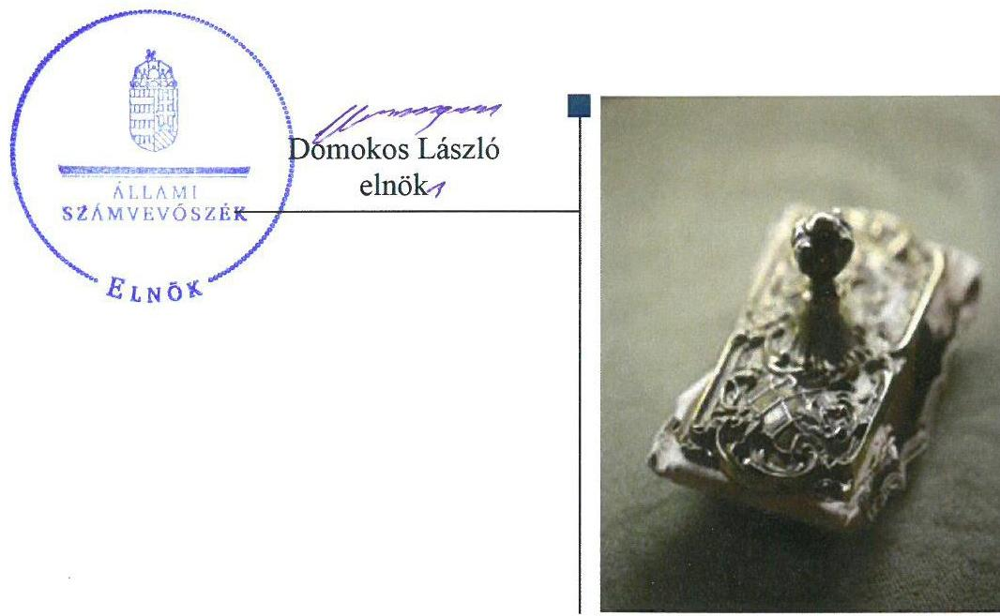
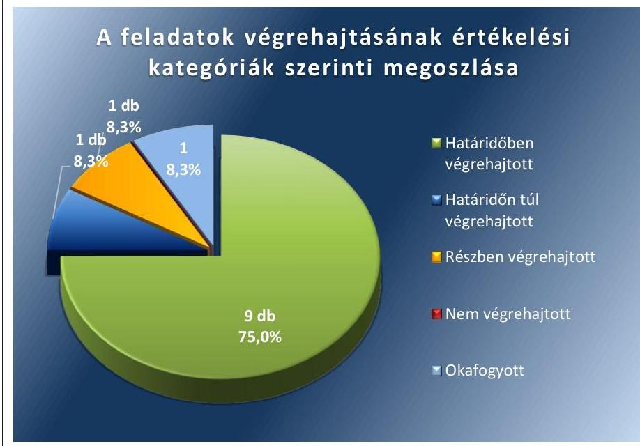
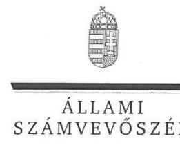
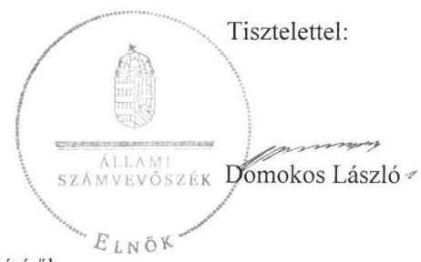

# Jelentés 

## Utóellenőrzések

Az önkormányzatok pénzügyi és vagyongazdálkodása
szabályszerúségének utóellenőrzése Orosháza Város Önkormányzata 2018.

---

# Jelentés 

## Utóellenőrzések

Az önkormányzatok pénzügyi és vagyongazdálkodása
szabályszerúségének utóellenőrzése Orosháza Város Önkormányzata
2018. jbnuár hó 1. nap

---

# AZ ELLENŐRZÉST FELÜGYELTE: 

DR. HORVÁTH MARGIT felügyeleti vezető

## AZ ELLENŐRZÉST VEZETTE ÉS A VÉGREHAJTÁSÁÉRT FELELŐS:

HOFMEISTER LÁSZLÓ ellenőrzésvezető

## A PROGRAM ÖSSZEÁLLÍTÁSÁÉRT FELELŐS:

TÓTPÁL SZABOLCS osztályvezető

## A TÉMÁHOZ KAPCSOLÓDÓ KORÁBBI SZÁMVEVŐSZÉKI JELENTÉSEK:

- címe: Jelentés az önkormányzatok pénzügyi és vagyongazdálkodása szabályszerűségének ellenőrzéséről - Orosháza
- sorszáma: 15151

IKTATÓSZÁM: EL-0186-050/2017.
TÉMASZÁM: 2096
ELLENŐRZÉS-AZONOSÍTÓ SZÁM: V0755108

---

# TARTALOMJEGYZÉK 

■ ÖSSZEGZÉS ..... 5
■ AZ ELLENŐRZÉS CÉLJA ..... 6
■ AZ ELLENŐRZÉS TERÜLETE ..... 7
■ AZ ELLENŐRZÉS HÁTTERE, INDOKOLTSÁGA ..... 8
■ A JELENTÉS LÉNYEGES KÉRDÉSKÖRE ..... 9
■ ELLENŐRZÉS HATÓKÖRE ÉS MÓDSZEREI ..... 10
■ MEGÁLLAPÍTÁSOK ..... 12
■ MELLÉKLETEK ..... 15
I. sz. melléklet: Az ÁSZ 15151 számú jelentéséhez kapcsolódó intézkedési terv végrehajtása ..... 15
■ FÜGGELÉK: ÉSZREVÉTELEK ..... 19
■ RÖVIDÍTÉSEK JEGYZÉKE ..... 27

---

.

---

# ÖSSZEGZÉS 

Az Állami Számvevőszék Orosháza Város Önkormányzata pénzügyi vagyongazdálkodása szabályszerűségének utóellenőrzése során megállapította, hogy az intézkedési tervben meghatározott feladatok többségét végrehajtották. A közpénzekkel, az önkormányzati vagyonnal való felelős gazdálkodás átláthatósága, továbbá a müködés szabályszerűsége javult, hasznosultak a szabályos vagyongazdálkodás érdekében meghatározott intézkedések.

## Az ellenőrzés társadalmi indokoltsága

Az Állami Számvevőszék stratégiájában célul tűzte ki a számvevőszéki munka hasznosulásának javítását. Ezzel összhangban ellenőrzi, hogy az ellenőrzött szervezetek megvalósították-e a korábbi ellenőrzései által feltárt hibák, hiányosságok és szabálytalanságok megszüntetése céljából kialakított intézkedési terveikben foglaltakat. A rendszeres utóellenőrzések hozzájárulnak a szükséges intézkedések tényleges végrehajtáshoz, ezáltal a közpénzügyek rendezettségének javulásához.

## Főbb megállapítások, következtetések

Orosháza Város Önkormányzata az intézkedési tervben meghatározott tizenkettő feladatból kilencet határidőben, egyet - a számlarend kiegészítését - határidőn túl hajtott végre.

A jegyző határidőben gondoskodott a vagyonrendelet módosításáról, a Városfejlesztési és Városüzemeltetési Iroda ügyrendjének elkészítéséről, a kockázatkezelési rendszer működtetéséről, a kiküldetések szabályozásáról, a zárszámadási rendelet vagyonkimutatásának, a vagyonelemek és a tévesen nyilvántartott kölcsönkövetelés számviteli nyilvántartásának jogszabálynak megfelelő kimutatásáról, a likviditási tervvel kapcsolatban vállaltak teljesítéséről. A polgármester a reorganizációs programot a Képviselő-testület elé terjesztette. A végrehajtott intézkedésekkel javult a közpénzekkel, az önkormányzati vagyonnal való gazdálkodás szabályozottsága és átláthatósága.

Egy feladatot részben hajtottak végre, egy feladat okafogyottá vált. Részben gondoskodtak a szállítói kitettség csökkentéséről.

Orosháza Város Önkormányzata az intézkedési tervben meghatározott feladatok végrehajtásáról a jogszabály szerinti nyilvántartást nem vezette.

---

# AZ ELLENŐRZÉS CÉLJA 

Az ellenőrzés célja annak értékelése volt, hogy a számvevőszéki jelentésben ${ }^{1}$ foglalt intézkedést igénylő megállapításokkal és javaslatokkal összhangban készített intézkedési tervben ${ }^{2}$ meghatározott feladatokat az ellenőrzött szervezet végrehajtotta-e.

---

# AZ ELLENŐRZÉS TERÜLETE 

## Orosháza Város Önkormányzata

Orosháza Békés megyében található, lakosainak száma 2017. január 1-jén 28087 fő volt a Belügyminisztérium Nyilvántartások Vezetéséért Felelős Államtitkárság által közzétett statisztikai adatok alapján.

A polgármester ${ }^{3}$ a 2014. évi általános önkormányzati választás óta tölti be tisztségét, a jegyző ${ }^{4}$ 2014. december 15-étől látja el feladatait.

Az Önkormányzat ${ }^{5}$ a 2016. évi konszolidált irányítószervi beszámolója szerint 4725,0 M Ft költségvetési bevételt ért el, és 5120,6 M Ft költségvetési kiadást teljesített. Mérlegfőószszege 49 046,6 M Ft, ezen belül befektetett eszközvagyona 48 100,7 M Ft, követelés állománya 168,7 M Ft, míg kötelezettségállománya 696,8 M Ft volt.
Az ÁSZ ${ }^{6}$ az Önkormányzatnál a 2011. január 1. és 2013. december 31. közötti időszakra vonatkozóan ellenőrizte a pénzügyi és vagyongazdálkodás szabályszerűségét. Az erről szóló 15151 számú jelentését az ÁSZ 2015. szeptember 15-én tette közzé. Az ÁSZ jelentésben foglalt javaslatok végrehajtása érdekében a Képviselő-testület ${ }^{7}$ a 307/2015. (XII. 18.) számú határozattal intézkedési tervet fogadott el.

Az utóellenőrzés az ÁSZ jelentésben a polgármester és a jegyző részére megfogalmazott intézkedést igénylő megállapításokra és javaslatokra készített, az ÁSZ részére megküldött intézkedési tervben foglalt feladatok megvalósításának ellenőrzésére, illetve értékelésére fókuszált.

---

# AZ ELLENŐRZÉS HÁTTERE, INDOKOLTSÁGA 

Az ÁSZ tv. ${ }^{8}$ 33. § (1) bekezdése értelmében a számvevőszéki jelentések intézkedést igénylő megállapításaihoz kapcsolódóan az ellenőrzött szervezet vezetője intézkedési tervet köteles összeállítani, és az Állami Számvevőszék részére megküldeni. Az intézkedési tervben foglaltak megvalósítását - az ÁSZ tv. 33. § (7) bekezdésében foglaltak alapján - az Állami Számvevőszék utóellenőrzés keretében ellenőrizheti. Az intézkedések megvalósulásának értékelése során az Állami Számvevőszék figyelembe veszi az ellenőrzött szervezetek múködési feltételeiben, valamint a jogszabályi előírásokban bekövetkezett változásokat.

Az intézkedési tervekben foglalt feladatok hiányos, illetve késedelmes végrehajtása, valamint megvalósításának elmaradása azt mutatja, hogy az ellenőrzések során feltárt hibák, hiányosságok és szabálytalanságok megszüntetése nem kapott kellő hangsúlyt. Ez a szabályszerű működés és a felelős vezetői magatartás vonatkozásában kockázatot hordoz. E kockázatok feltárásával az Állami Számvevőszék utóellenőrzési rendszere fokozza a fegyelmet, és igazolja, hogy a közpénzzel való szabályos gazdálkodás felelőssége elől nem lehet kitérni.

Az utóellenőrzés négy szinten hasznosulhat:
A társadalom szintjén az utóellenőrzés jelzi, hogy a számvevőszéki ellenőrzés megállapításainak van következménye: a hiányosságok megszüntetésére az ellenőrzött szervezet által meghatározott intézkedések végrehajtását is számon kéri az ÁSZ.

- Az ellenőrzött terület szintjén az utóellenőrzés tájékoztatást nyújt a terület döntéshozóinak a hiányosságok kiküszöbölésének jó gyakorlatairól, ezzel lehetőséget biztosítva arra, hogy az ÁSZ ellenőrzési megállapításai, javaslatai a terület nem ellenőrzött szervezeteinek a működése során is hasznosuljanak.
- Az ellenőrzött szervezet szintjén az utóellenőrzés feltárja, hogy a szervezet az intézkedések végrehajtásával hasznosította-e a korábbi ellenőrzési jelentésben a hiányosságok megszüntetése, illetve a kockázatok kezelése érdekében megfogalmazott javaslatokat.
- Az ÁSZ szintjén az utóellenőrzés visszacsatolást ad az ellenőrzési jelentések hasznosulásáról, az intézkedések elmaradása vagy részleges megvalósulása a további ellenőrzésekhez kockázati jelzésként szolgál.

---

# A JELENTÉS LÉNYEGES KÉRDÉSKÖRE 

Az Önkormányzat az intézkedési tervben foglaltakat az elöirt határidőben végrehajtotta-e?

---

# ELLENŐRZÉS HATÓKÖRE ÉS MÓDSZEREI 

## Az ellenőrzés típusa

Megfelelőségi ellenőrzés.

## Az ellenőrzött időszak

Az utóellenőrzés alapját képező ÁSZ jelentés közzétételének (2015. szeptember 15.) napjától az ellenőrzésről szóló kiértesítő levél keltének (2017. augusztus 22.) napjáig tartó időszak.

## Az ellenőrzés tárgya

Az ÁSZ tv. 2011. július 1-jei hatálybalépését követően a számvevőszéki jelentésben foglalt intézkedést igénylő megállapításokkal és javaslatokkal összhangban - az ellenőrzött szervezet által - készített intézkedési tervben foglaltak végrehajtásának ellenőrzése.

Az ellenőrzés kiterjedt minden olyan körülményre és adatra, amely az ÁSZ jogszabályban meghatározott feladatainak teljesítéséhez, valamint a program végrehajtása folyamán felmerült újabb összefüggések feltárásához szükséges volt.

## Az ellenőrzött szervezet

Orosháza Város Önkormányzata

## Az ellenőrzés jogalapja

Az ÁSZ tv. 33. § (7) bekezdése alapján az intézkedési tervben foglaltak megvalósítását az ÁSZ utóellenőrzés keretében ellenőrizheti.

## Az ellenőrzés módszerei

Az ÁSZ az ellenőrzést a nemzetközi standardokat irányadónak tekintve az ellenőrzési program ellenőrzési kérdései, az ellenőrzött időszakban hatályos jogszabályok, az ellenőrzés szakmai szabályok és módszertanok figyelembevételével, önállóan vagy ellenőrzéshez kapcsolódóan végezte.

Az ÁSZ az ellenőrzés ideje alatt az ellenőrzött szervezettel történő kapcsolattartást az ÁSZ SZMSZ ${ }^{\circledR}$-ének vonatkozó előírásai alapján biztosította.

---

Az utóellenőrzés megállapításait elsősorban az ÁSZ rendelkezésére álló, valamint az ellenőrzött szervezetektől elektronikusan bekért dokumentumok alapozták meg.

Az ellenőrzési bizonyítékként felhasználható adatforrások közé tartoznak egyrészt a szakmai programban felsorolt adatforrások, másrészt minden - az ellenőrzés folyamán feltárt, az ellenőrzés szempontjából információt tartalmazó - dokumentum.

Az intézkedési tervben előírt feladatokat azok végrehajthatósága, illetve végrehajtása szempontjából az alábbiak szerint értékelte az ÁSZ:
—_ „határidőben végrehajtott" a feladat, ha a teljesítés dokumentáltan, az intézkedési tervben előírt határidőben és tartalommal megtörtént;
—_ „határidőn túl végrehajtott" a feladat, ha annak teljesítése az intézkedési tervben meghatározott módon, de az előírt határidőn túl történt meg;
—_ „részben végrehajtott" a feladat, ha végrehajtása teljes körűen az intézkedési tervben előírt módon nem történt meg;
—_ „nem végrehajtott" a feladat, ha a végrehajtás nem történt meg, vagy amennyiben a teljesítést nem dokumentálták;
—_ „okafogyottá vált" a feladat, ha végrehajtására - meghatározott esemény bekövetkezése, továbbá külső körülmény, a működést érintő feltétel változása miatt - már nincs szükség, illetve lehetőség, és egyértelműen megállapítható, hogy az intézkedést szükségessé tevő körülmény a jövőben nem fordulhat elő;
—_ „nem időszerű" az a feladat, amelynek ellenőrzési időszakon belüli végrehajtására azért nem került (kerülhetett) sor, mert az intézkedés alapjául szolgáló esemény nem következett be, de annak jövőbeni előfordulása lehetséges, a végrehajtása nem volt esedékes, vagy a végrehajtás határideje még nem járt le.
Az ellenőrzés lefolytatásához az ellenőrzött szervezet a tanúsítványok elektronikus kitöltésével, valamint az ÁSZ által kért dokumentumok elektronikus megküldésével szolgáltat adatokat, amelyek valódiságát és teljes körűségét az ellenőrzött szervezet vezetője által tett teljességi és hitelességi nyilatkozat igazolta. Az így rendelkezésre bocsátott adatok, információk kontrollja az ellenőrzés keretében történt.

---

# MEGÁLLAPÍTÁSOK 

## Az Önkormányzat az intézkedési tervben foglaltakat az előírt határidőben végrehajtotta-e?

Összegző megállapítás

Az Önkormányzat az intézkedési tervben meghatározott tizenkettő feladatból kilencet határidőben, egyet határidőn túl, egyet részben hajtott végre, egy feladat okafogyottá vált. Az intézkedési tervben meghatározott feladatok végrehajtásáról a jogszabályban előírt nyilvántartást nem vezette.

Az ÁSZ a számvevőszéki jelentésében a polgármester részére négy, a jegyző részre nyolc javaslatot fogalmazott meg. A polgármester által előterjesztett és a Képviselő-testület által jóváhagyott intézkedési tervben a hiányosságok, szabálytalanságok megszüntetésére tizenkettő feladatot határoztak meg, amelyek végrehajtásának felelőse a jegyző, a közgazdasági irodavezető és a megbízott irodavezető volt.

Az intézkedési tervben meghatározott feladatokat, határidőket, felelősöket és a feladatok végrehajtását az I. számú melléklet mutatja be.

Az Önkormányzat az intézkedési tervben meghatározott feladatok végrehajtásáról nem vezette a Bkr. ${ }^{10}$ 14. § (1) bekezdésben előírt nyilvántartást.

Az Önkormányzat intézkedési tervében meghatározott feladatok végrehajtásának értékelési kategóriák szerinti megoszlását az 1. ábra szemlélteti.

1. ábra

Fonrás: ÁSZ

---

# HATÁRIDŐBEN VÉGREHAJTOTT feladatok: 

1. A Képviselő-testület elfogadta az önkormányzat vagyonáról és a vagyongazdálkodás szabályairól szóló önkormányzati rendelet módosítását a Mötv. ${ }^{11}$ előírásának megfelelően.
2. A Városfejlesztési és Városüzemeltetési Iroda ${ }^{12}$ megbízott vezetője elkészítette, a jegyző jóváhagyta a Városfejlesztési és Városüzemeltetési Iroda ügyrendjét az Ávr. ${ }^{13}$ rendelkezésének megfelelően.
3. A jegyző gondoskodott a Belföldi és külföldi kiküldetések elrendelésének és lebonyolításának szabályzatának elkészítéséről az Ávr. előírásának megfelelően.
4. A jegyző gondoskodott a Bkr. előírásainak megfelelő, a pénzügyi egyensúlyt befolyásoló kockázatok kezelésére alkalmas kockázatkezelési rendszer működtetéséről.
5. A jegyző gondoskodott a 2015. és 2016. évi zárszámadási rendelet vagyonkimutatásának az Áhsz. ${ }^{14}$ előírásának megfelelő szerkezetben és tartalommal történő elkészüléséről.
6. A jegyző gondoskodott a tévesen nyilvántartott kölcsönkövetelés számviteli nyilvántartásból való kivezetéséről a Számv. tv. előírásának megfelelően.
7. A jegyző gondoskodott a vagyonelemek Áhsz. előírásának megfelelő kimutatásáról a számviteli nyilvántartásban.
8. A jegyző gondoskodott az Áht. ${ }^{15}$ rendelkezésének megfelelően a likviditási terv elkészítéséről, az Ávr. által előírt havonkénti felülvizsgálatot elvégezték.
9. A polgármester az elkészített reorganizációs tervet a Képviselőtestület elé terjesztette.

## HATÁRIDŐN TÚL VÉGREHAJTOTT feladat:

10. A jegyző határidőben gondoskodott a számviteli politika Áhsz. rendelkezéseinek megfelelő módosításáról, azonban a számlarend jogszabálynak megfelelő módosítását 2015. december 31-e helyett 2016. március 30-án hajtotta végre.

## RÉSZBEN VÉGREHAJTOTT feladat:

11. A jegyző gondoskodott arról, hogy az Önkormányzat szállítói kötelezettségek állományában a 2016. évben ne legyen 60 napot meghaladó, késedelmes kötelezettség, azonban a 2015. és a 2017. évben ennek teljesüléséről nem gondoskodott.

NEM VÉGREHAJTOTT feladat nem volt.

## OKAFOGYOTT feladat:

12. A polgármester nem kezdeményezett munkajogi felelősségvonásra irányuló eljárást a számvevőszéki jelentésben feltárt gazdálkodással kapcsolatos szabálytalanságok nyomán, mert személyi változás miatt már nem volt lehetőség a feladat végrehajtására.

---

.

---

# MELLÉKLETEK

- I. SZ. MELLÉKLET: AZ ÁSZ 15151 SZÁMÚ JELENTÉSÉHEZ KAPCSOLÓDÓ INTÉZKEDÉSI TERV VÉGREHAJTÁSA

|  5 | Az intézkedési tervben meghatározott feladat | Az intézkedési tervben meghatározott határidő 2. | Az intézkedési tervben meghatározott feladatok felelőse 3. | A feladat végrehajtása  |
| --- | --- | --- | --- | --- |
|  1. |  |  |  | 4.  |
|   |  | Határidőben végrehajtott feladat |  |   |
|  1. | Orosháza Város Önkormányzat Képviselő-testülete 2015. augusztus 28. napján tartott ülésén megalkotta az önkormányzat vagyonáról, és a vagyongazdálkodás szabályairól szóló 13/2OO6. (IX. 15.) Ör. számú rendelet módosításáról szóló 19/2015. (VIII. 31.) önkormányzati rendeletét, mely módosítás tartalmazza a vagyonkezelői jog ellenértékét és az ingyenes átengedés szabályait. | 2015. augusztus 31. | jegyző | A Képviselő-testület a 19/2015 (VIII. 31.) rendeletével 2015. augusztus 31-én módosította az önkormányzat vagyonáról és a vagyongazdálkodás szabályairól szóló 13/2OO6. (IX. 15.) Ör. számú rendeletét, amely a Mótv. 109. § (4) bekezdés előírásának megfelelően tartalmazta a vagyonkezelői jog ellenértékét és az ingyenes átengedés szabályait.  |
|  2. | A hivatali SZMSZ ${ }^{16}$-ben a gazdasági szervezet egységeiként a Közgazdasági Iroda, valamint a Városüzemeltetési és Városfejlesztési Iroda került megjelölésre. A Gazdasági Szervezet Úgyrendje valóban csak a Közgazdasági Irodára ${ }^{17}$ terjed ki. A Városfejlesztési és Városüzemeltetési Iroda feladatait rögzítő Úgyrend elkészítésre és jóváhagyásra kerül. | 2015. december 31. | jegyző és megbízott irodavezető | A Városfejlesztési és Városüzemeltetési Iroda megbízott vezetője elkészítette, a jegyző 2015. december 11-én jóváhagyta a Városfejlesztési és Városüzemeltetési Iroda ügyrendjét az Ávr. 10/A. §-ának megfelelően.  |
|  3. | A Hivatal rendelkezik gépjárműszabályzattal, melyben található kiküldetésre vonatkozó szabályozás, viszont a javaslat alapján külön szabályzatban kerülnek dokumentálásra a belföldi és külföldi kiküldetések. | 2015. december 31. | jegyző és közgazdasági irodavezető | A jegyző határidőben, 2015. december 30-án gondoskodott a Belföldi és külföldi kiküldetések elrendelésének és lebonyolításának szabályzatának ${ }^{18}$ elkészítéséről, mely az Ávr. 13. § (2) bekezdés c) pont előírásának megfelelően rögzíti a belföldi és külföldi kiküldetések elrendelésével, valamint lebonyolításával, elszámolásával kapcsolatos szabályokat.  |
|  4. | A jegyző gondoskodik a jogszabályi előírásoknak megfelelő, a pénzügyi egyensúlyt befolyásoló kockázatok kezelésére alkalmas kockázatkezelési rendszer működtetéséről, melynek keretében: A rendszeres kockázat-elemzési és -kezelési rendszert kiterjeszti az egyéb visszterhes kö- | folyamatos | jegyző és közgazdasági irodavezető | A jegyző gondoskodott a Bkr. 7. § (1) és (2) bekezdés előírásainak megfelelő, a pénzügyi egyensúlyt befolyásoló kockázatok kezelésére alkalmas kockázat-kezelési rendszer működtetéséről. A jegyző által 2015. december 31-én aláírt kockázatelemzés és kockázatkezelés a pénzügyi egyensúlyt befolyásoló kockázatok között részletezte az egyéb visszterhes kötelezettségekkel, a garancia és kezességvállalásokkal, a gazdasági társaságok  |

---

|  Az intézkedési tervben meghatározott feladat | Az intézkedési tervben meghatározott határidő | Az intézkedési tervben meghatározott feladatok felelőse | A feladat végrehajtása  |
| --- | --- | --- | --- |
|  1. | 2. | 3. | 4.  |
|  telezettségekkel kapcsolatos, valamint a garancia- és kezességvállalásokkal, a gazdasági társaságokkal kapcsolatos mérlegen kívüli tételek miatti, pénzügyi egyensúlyt befolyásoló kockázati tényezőkre. Az integritás teljes körű érvényesülése érdekében a rendszeres kockázatelemzési és -kezelési rendszert kiterjeszti a korrupciós kockázatokra is. |  |  | mérlegen kívüli tételeivel, továbbá az integritás érvényesülésével kapcsolatos, köztük a korrupciós kockázatok kezelését.  |
|  5. | A zárszámadási rendelet mellékletét képező vagyon-kimutatást kiegészítjük az érték nélkül nyilvántartott eszközökkel. A 2015. évi zárszámadási rendelet-tervezet előterjesztése keretében a jogszabályi előírásoknak megfelelő tartalommal és szerkezetben készítjük el. | az intézkedési terv elfogadását követően évenkénti rendszerességgel | jegyző, közgazdasági irodavezető  |
|  6. | A tévesen nyilvántartott kölcsön követelés (Orosháza FC Kft. részére nyújtott 45 millió Ft), mely helyesen pótbefizetés volt, nyilvántartásunkból kivezetésre kerül. | 2015. december 31. | jegyző, közgazdasági irodavezető  |
|  7. | A számviteli nyilvántartás vezetése során elkülönítjük a vagyont a szerint, hogy forgalomképtelen, korlátozottan forgalomképes vagy forgalomképes üzleti vagyon. Gondoskodunk a számviteli nyilvántartások kialakítása és vezetése során a vagyonelemek jogszabályi előírásoknak megfelelő kimutatásáról. | az intézkedési terv elfogadását követően folyamatos | jegyző, közgazdasági irodavezető  |
|  8. | Az ÁSZ vizsgálatától függetlenül már 2014. évben, és 2015. évben is jogszabályi előírásoknak megfelelően, illetve a belső szabályzat alapján készült likviditási terv, és annak havonkénti felülvizsgálata a Hivatal Közgazdasági Irodája részéről megtörténik, valamint a jövőben is gondoskodunk ennek elvégzéséről ugyanilyen feltételek mellett. | folyamatos | jegyző és közgazdasági irodavezető  |
|  9. | A pénzügyi egyensúly hosszú távon történő fenntarthatósága érdekében az önkormányzat a 2/2015. (II. 13.) 2015. | 2016. január 31. | jegyző és közgazdasági irodavezető  |

|  Az intézkedési tervben meghatározott feladat | Az intézkedési tervben meghatározott határidő | Az intézkedési tervben meghatározott feladatok felelőse | A feladat végrehajtása  |
| --- | --- | --- | --- |
|  1. | 2. | 3. | 4.  |
|  telezettségekkel kapcsolatos, valamint a garancia- és kezességvállalásokkal, a gazdasági társaságokkal kapcsolatos mérlegen kívüli tételek miatti, pénzügyi egyensúlyt befolyásoló kockázati tényezőkre. Az integritás teljes körű érvényesülése érdekében a rendszeres kockázatelemzési és -kezelési rendszert kiterjeszti a korrupciós kockázatokra is. |  |  | mérlegen kívüli tételeivel, továbbá az integritás érvényesülésével kapcsolatos, köztük a korrupciós kockázatok kezelését.  |
|  5. | A zárszámadási rendelet mellékletét képező vagyon-kimutatást kiegészítjük az érték nélkül nyilvántartott eszközökkel. A 2015. évi zárszámadási rendelet-tervezet előterjesztése keretében a jogszabályi előírásoknak megfelelő tartalommal és szerkezetben készítjük el. | az intézkedési terv elfogadását követően évenkénti rendszerességgel | jegyző, közgazdasági irodavezető  |
|  6. | A tévesen nyilvántartott kölcsön követelés (Orosháza FC Kft. részére nyújtott 45 millió Ft), mely helyesen pótbefizetés volt, nyilvántartásunkból kivezetésre kerül. | 2015. december 31. | jegyző, közgazdasági irodavezető  |
|  7. | A számviteli nyilvántartás vezetése során elkülönítjük a vagyont a szerint, hogy forgalomképtelen, korlátozottan forgalomképes vagy forgalomképes üzleti vagyon. Gondoskodunk a számviteli nyilvántartások kialakítása és vezetése során a vagyonelemek jogszabályi előírásoknak megfelelő kimutatásáról. | az intézkedési terv elfogadását követően folyamatos | jegyző, közgazdasági irodavezető  |
|  8. | Az ÁSZ vizsgálatától függetlenül már 2014. évben, és 2015. évben is jogszabályi előírásoknak megfelelően, illetve a belső szabályzat alapján készült likviditási terv, és annak havonkénti felülvizsgálata a Hivatal Közgazdasági Irodája részéről megtörténik, valamint a jövőben is gondoskodunk ennek elvégzéséről ugyanilyen feltételek mellett. | folyamatos | jegyző és közgazdasági irodavezető  |
|  9. | A pénzügyi egyensúly hosszú távon történő fenntarthatósága érdekében az önkormányzat a 2/2015. (II. 13.) 2015. | 2016. január 31. | jegyző és közgazdasági irodavezető  |

---

|  Az intézkedési tervben meghatározott feladat | Az intézkedési tervben meghatározott határidő | Az intézkedési tervben meghatározott feladatok felelőse | A feladat végrehajtása  |
| --- | --- | --- | --- |
|  1. | 2. | 3. | 4.  |
|  évi költségvetési rendeletében meghatározta, hogy a kötelező feladatok ellátása az önként vállalt feladatok ellátása miatt nem sérülhet. Fel kell mérni a bevételszerző és kiadáscsökkentő lehetőségeket. Intézkedni kell a bevételek növelésére, a kintlévőségek behajtására, a kiadások csökkentésére. A 2016. évi költségvetés tervezése során az önkormányzat gazdasági helyzetének elemzésén alapuló, a pénzügyi egyensúlyi helyzet gyors helyreállítását, hosszú távú fenntartását, valamint az adósságállomány újratermelődésének elkerülését biztosító intézkedéseket tartalmazó reorganizációs programot készít, amelyet Képviselő-testület elé terjeszt. |  |  |   |
|  Határidőn túl végrehajtott feladat |  |  |   |
|  A Számlarend kiegészítését elkészítjük az analitikus nyilvántartások formájával és azok vezetésének módjával. A Számviteli Politikában rögzítjük a számviteli elszámolás és az értékelés szempontjából mit tekintünk lényegesnek, illetve nem lényegesnek. | 2015. december 31. | jegyző, közgazdasági irodavezető | A jegyző határidőben, 2015. december 1-jén gondoskodott a számviteli politika Áhsz. 50. § (1) bekezdés rendelkezéseinek megfelelő módosításáról, azonban a számlarend Áhsz. 51. § (3) bekezdéssel összhangban álló módosítását 2015. december 31-e helyett 2016. március 30-án hajtotta végre.  |
|  Részben végrehajtott feladat |  |  |   |
|  A szállítói kinnlevőség csökkentése érdekében az Önkormányzat az elmúlt évek gyakorlata alapján a 60 napon túli lejárt tartozások összegét jelentősen csökkentette, ennek megfelelően 2015. évben túlnyomó részben nem volt 60 napon túli tarozása. Törekszünk arra, hogy az önkormányzatnak folyamatosan ne legyen 60 napon túli szállítói állománya, a kötelezettségek határidőre kifizetésre kerüljenek. | folyamatos | jegyző, közgazdasági | A jegyző gondoskodott arról, hogy a 2016. évben az Önkormányzat szállítói kötelezettségek állományában ne legyen 60 napot meghaladó, késedelmes kötelezettség, azonban a 2015. és a 2017. évi 60 napon túli szállítói kötelezettség állomány csökkentéséről nem intézkedett.  |
|  Nem végrehajtott feladat nem volt. |  |  |   |

---

A feltárt hiányosságok, illetve szabálytalanságok nagy része 2014. évben ismertté vált. Kezelésük, azok korrigálása elkezdődött. Belső intézkedési terv került kidolgozásra, melynek eredményeként 2014 júniusában a Polgármesteri Hivatalban a Közgazdasági Irodát érintően struktúraátalakítás történt. Sor került a belső tagozódás megváltoztatására, a feladatok részletes meghatározására és a szervezeti egységek közötti elosztására. 2014-2015. évben jelentős személyi változások történtek vezetői szinten, ezért a munkajogi felelősség tisztázására irányuló eljárás megindítására már nincs lehetőség.
12. A változások során megszűnt a közgazdasági irodavezető, a közgazdasági irodavezető-helyettes valamint az iroda felügyeletét ellátó jegyző jogviszonya. Az akkori hivatali szervezeti struktúrában nem volt másik olyan szervezeti egység, amely feladatát képezte volna a feltárt hiányosságok, szabálytalanságok kiküszöbölése.
A Közszolgálati tisztviselőkkel szembeni fegyelmi eljárásról szóló 31/2012. (III. 7.) Korm. rendelet 1. § szerint a rendelet hatálya kizárólag a közszolgálati (köztisztviselői) jogviszonyban állókra terjed ki, mindebből következik, hogy nincs törvényes lehetőség a fegyelmi eljárás lefolytatására és fegyelmi büntetés kiszabására, ha a közszolgálati jogviszony megszűnt vagy megszüntetésre került.

A polgármester nem kezdeményezett munkajogi felelősségvonásra irányuló eljárást a számvevőszéki jelentésben feltárt gazdálkodással kapcsolatos szabálytalanságok nyomán, mert személyi változás miatt már nem volt lehetőség a feladat végrehajtására.

---

# FÜGGELÉK: ÉSZREVÉTELEK 

A jelentéstervezetet a Számvevőszék 15 napos észrevételezésre megküldte az ellenőrzött szervezet vezetőjének az ÁSZ tv. 29. §* (1) bekezdése előírásának megfelelően.

Orosháza Város Önkormányzata polgármesterétől érkezett észrevételeket és azok kezeléséről szóló válaszlevelet a jelentés tartalmazza.

[^0]
[^0]:    * 29. § (1) Az Állami Számvevőszék az ellenőrzési megállapításait megküldi az ellenőrzött szervezet vezetőjének vagy az általa megbízott személynek, és annak, akinek személyes felelősségét állapította meg.
    (2) Az ellenőrzött szervezet vezetője és a felelősként megjelölt személy az ellenőrzés megállapításaira tizenöt napon belül írásban észrevételt tehet.
    (3) Az Állami Számvevőszék az észrevételre a beérkezésétől számított harminc napon belül írásban válaszol. A figyelembe nem vett észrevételeket köteles a jelentésben feltüntetni, és megindokolni, hogy azokat miért nem fogadta el.

---

Orosháza Város Önkormányzat Polgármesterétól
5900 Orosháza, Szabadság tér 4-6.
Telefon: 68/413-022, Fax: 68/411-545
E-mail: polgarmester@oroshaza.hu, Honlap: www.oroshaza.hu

Iktatószám: 12-19/2017

Tárgy: Észrevételek az EL-0186-037/2017. iktatószámon megküldött, „Utóellenörzések Az önkormányzatok pénzügyi és vagyongazdálkodása szabályszerűségének utóellenőrzése - Orosháza Város Önkormányzata' című ellenőrzésről készült Állami Számvevőszéki jelentés-tervezet kapcsán.

# Állami Számvevőszék   Domokos László Elnök úr részére 

## Budapest 4.

Pf: 54
1364
Tisztelt Elnök úr!

A 2017. november 29-én kelt, EL-0186-037/2017. iktatószámú levelének mellékleteként megküldött jelentés-tervezetet köszönettel megkaptuk. Orosháza Város Önkormányzata ( a továbbiakban Önkormányzat ) a nevezett jelentés-tervezet kapcsán az alábbi észrevételeket teszi.

A megküldött dokumentum 10. pontjában rögzítésre került, hogy „A jegyző gondoskodott az Áht. rendelkezésének megfelelően a likviditási terv elkészítéséről, azonban az Ávr. által előírt havonkénti felülvizsgálatot nem végezték el.", így az intézkedési feladatban foglalt feladatot részben végrehajtottként minősítette.

Az Önkormányzat a likviditási tervei a teljesíteni kívánt kiadásokat és várható bevételeket tartalmazta a költségvetési év hátralévő időszakára vonatkozóan. A havi tervek a megelőző havi tényleges teljesítési adatokkal - valamint a rendelkezésre álló információk alapján a várható teljesítési adatokkal is - az Ávr. 122.§ (3) bekezdése alapján minden hónapban aktualizálásra kerültek, melyeket a dokumentumtárba „ÖNK 2016 évi likviditási terv" néven feltöltött adatok is alátámasztanak. Fentiek alapján kérjük a megállapítás módosítását atekintetben, hogy a feladat határidőben végrehajtásra került.

A megküldött dokumentum 11. pontja végre nem hajtott feladatként rögzíti azt, hogy a Polgármester az elkészített reorganizációs tervet nem terjesztette a Képviselőtestület elé. A Polgármester a reorganizációs tervet 2016. január 29-én terjesztette be a Képviselő-testület elé, melyet az 18/2016. (I.29.) K.t. határozatával elfogadott.

---

A határozat a dokumentumtárba „reorganizációs terv" néven feltöltött állomány első oldalán szerepel. Fentiek alapján kérjük, hogy a megállapítás kategóriáját határidőben végrehajtottra szíveskedjenek módosítani.

A jelentés-tervezet kifogásolja, hogy az önkormányzat nem vezette a költségvetési szervek belső kontrollrendszeréről és belső ellenőrzéséről szóló 370/2011. (XII. 31.) Korm. rendelet 14.§ (1) bekezdésében előírt nyilvántartást. Az Önkormányzat értelmezése szerint a nyilvántartás önmagában való megléte, vezetése nem támasztja alá a feladat végrehajtását, így - a nyilvántartás megléte ellenére - az Állami Számvevőszék által bekért Tanúsítványokban nem szerepeltettük igazoló dokumentumként, s így a dokumentumtárba sem került feltöltésre.

A megküldött dokumentum 8. pontja határidőn túl végrehajtott feladatként rögzíti, hogy a számlarend jogszabályoknak megfelelő módosítását 2015. december 31. helyett 2016. március 30-án hajtottuk végre. Az ellenőrzött időszak 2011-2013. volt, a jelzett hiányosság már a 2015. évi számlarend elkészítésekor kiküszöbölésre került, a vonatkozó szabályozást a dokumentumtárba feltöltött szabályzatok XIX. fejezete tartalmazza. Fentiek alapján kérjük, hogy a megállapítás kategóriáját határidőben végrehajtottra szíveskedjenek módosítani.

A jelentés-tervezet egyéb megállapításaira nem kívánunk észrevételt tenni.

Orosháza, 2017. december 13.

Tisztelettel:

---

# Dávid Zoltán úr 

polgármester
Orosháza Város Önkormányzat

## Orosháza

## Tisztelt Polgármester Úr!

Köszönettel vettem az „Utóellenörzések -Az önkormányzatok pénzügyi és vagyongazdálkodása szabályszerűségének utóellenörzése - Orosháza Város Önkormányzata" című ellenőrzésről készített számvevőszéki jelentéstervezetre megküldött észrevételeit.
Az Állami Számvevőszék észrevételekre vonatkozó álláspontját a felügyeleti vezető által készített részletes tájékoztatás tartalmazza, amelyet levelemhez mellékeltem.
Tájékoztatom Polgármester urat, hogy az Állami Számvevőszék a figyelembe nem vett észrevételeket az Állami Számvevőszékről szóló 2011. évi LXVI. törvény 29. § (3) bekezdésében előirtak szerint köteles a jelentésében feltüntetni és megindokolni, hogy azokat miért nem fogadta el.

Budapest, 2018. 61 hó 18 nap

Melléklet: Tájékoztatás az észrevételek kezeléséről

---

# Tájékoztatás az észrevételek kezeléséről 

Megköszönöm Polgármester úrnak az „Utóellenörzések - Az önkormányzatok pénzügyi és vagyongazdálkodása szabályszerűségének utóellenörzése - Orosháza Város Önkormányzata" címmel készített jelentés-tervezetre tett észrevételeit. Az észrevételek kezeléséről az alábbi tájékoztatást adom.

## 1. számú észrevétel:

Az észrevétel 2. és 3. bekezdéseiben rögzítettek szerint a jelentéstervezet 10. pontjában megállapításra került, hogy „A jegyző gondoskodott az Áht. rendelkezésének megfelelően a likviditási terv elkészítéséről, azonban az Ávr. által előírt havonkénti felülvizsgálatot nem végezték el.", így az ellenőrzés az intézkedési feladatot részben végrehajtottnak minősítette.
Az észrevétel szerint az Önkormányzat likviditási tervei a teljesíteni kívánt kiadásokat és várható bevételeket tartalmazták a költségvetési év hátralévő időszakára vonatkozóan. A havi tervek a megelőző havi tényleges teljesítési adatokkal - valamint a rendelkezésre álló információk alapján a várható teljesítési adatokkal is - az Ávr. 122.§ (3) bekezdése alapján minden hónapban aktualizálásra kerültek, melyeket a dokumentumtárba „ÖNK 2016 évi likviditási terv" néven feltöltött adatok is alátámasztanak. Fentiek alapján kérik a megállapítás módosítását atekintetben, hogy a feladat határidőben végrehajtásra került.
Az Önkormányzat polgármesterének likviditási terv havonkénti felülvizsgálatával összefüggő észrevételét elfogadom, a jelentés-tervezetet módosítom az alábbiak miatt.
Az ellenőrzés rendelkezésére bocsátott dokumentumok újbóli áttekintése alapján az Önkormányzat észrevételében foglaltak - mely szerint a havi likviditási terv adatok az Ávr. 122.§ (3) bekezdése alapján minden hónapban aktualizálásra kerültek - helytállóak. A havi felülvizsgálat megtörténtét az Önkormányzat 2016. évi likviditási terve vonatkozásában - az utóellenőrzés során „ÖNK 2016 évi likviditási terv" néven feltöltött adatok igazolják.
Mindezek alapján a jelentéstervezet Megállapítások része „Részben végrehajtott feladat" rész 10. pontja és az abban rögzítettek - „A jegyző gondoskodott az Áht. rendelkezésének megfelelően a likviditási terv elkészítéséről, azonban az Ávr. által előírt havonkénti felülvizsgálatot nem végezték el." - törlésre kerülnek, a Határidőben végrehajtott feladatok rész pedig 8. pont alatt a következő szöveggel egészül ki „A jegyző gondoskodott az Áht rendelkezésének megfelelően a likviditási terv elkészítéséről, az Ávr. által előírt havonkénti felülvizsgálatot elvégezték.": Módosításra kerül továbbá a jelentéstervezet intézkedési tervben meghatározott feladatok végrehajtásának értékelési kategóriák szerinti megoszlását bemutató 1. ábra. A jelentéstervezet Mellékletek része, I. sz. melléklet Részben végrehajtott feladat részében 10. pont alatt rögzítettek a Határidőben végrehajtott feladat részébe áthelyezésre kerülnek, annak 4. „A feladat végrehajtása" oszlopába beírtak a következőkre módosulnak „A jegyző gondoskodott az Áht. 78. § (2) bekezdés rendelkezésének megfelelően a likviditási terv elkészítéséről, annak havonkénti felülvizsgálatát elvégezték az Ávr. 122. § (3) bekezdés előírásának megfelelően.".

## 2. számú észrevétel:

Az észrevétel 4-5. bekezdéseiben rögzítettek szerint a jelentéstervezet 11. pontja végre nem hajtott feladatként rögzíti azt, hogy a Polgármester az elkészített reorganizációs tervet nem terjesztette a

---

Képviselő- testület elé. A Polgármester a reorganizációs tervet 2016. január 29-én terjesztette be a Képviselő-testület elé, melyet az 18/2016. (I.29.) K.t. határozatával elfogadott.
Az észrevétel szerint a határozat a dokumentumtárba „reorganizációs terv" néven feltöltött állomány első oldalán szerepel. Fentiek alapján kérik, hogy a megállapítás kategóriájának határidőben végrehajtottra módosítását.
Az Önkormányzat polgármesterének reorganizációs terv Képviselő- testület elé terjesztésével összefüggő észrevételét elfogadom, a jelentés-tervezetet módosítom az alábbiak miatt.
Az ellenőrzés rendelkezésére bocsátott dokumentumok újbóli áttekintése alapján az Önkormányzat észrevételében foglaltak - mely szerint a Polgármester a reorganizációs tervet 2016. január 29-én beterjesztette a Képviselő-testület elé, melyet az 18/2016. (I.29.) K.t. határozatával elfogadott helytállóak. A reorganizációs terv Képviselő-testület elé terjesztésének megtörténtét az utóellenőrzés során „reorganizációs terv" néven feltöltött adatok - a kivonat hitelesítésének elmaradása mellett is igazolják. A 18/2016. (I.29.) K.t. határozat az Önkormányzat honlapján, a 2016. évi képviselőtestületi határozatok között is megtalálható.
Mindezek alapján a jelentéstervezet Megállapítások része „Nem végrehajtott feladat" rész 11. pontja és az abban rögzítettek - „A polgármester az elkészített reorganizációs tervet nem terjesztette a Képviselő-testület elé." - törlésre kerülnek, a Határidőben végrehajtott feladatok rész pedig 9. pont alatt a következő szöveggel egészül ki „A polgármester az elkészített reorganizációs tervet a Képviselő-testület elé terjesztette.": Módosításra kerül továbbá a jelentéstervezet intézkedési tervben meghatározott feladatok végrehajtásának értékelési kategóriák szerinti megoszlását bemutató 1. ábra. A jelentéstervezet Mellékletek része, I. sz. melléklet Nem végrehajtott feladat részében 11. pont alatt rögzítettek a Határidőben végrehajtott feladat részébe áthelyezésre kerülnek, annak 5. „A feladat végrehajtása" oszlopába beírtak a következőkre módosulnak „A polgármester az elkészített reorganizációs tervet a Képviselő-testület elé terjesztette.".
Az 1. és 2. számú észrevételek kezelésével összefüggésben a jelentéstervezet „Főbb megállapítások, következtetések" rész 1. bekezdése a következőkre módosul: „Orosháza Város Önkormányzata az intézkedési tervben meghatározott tizenkettő feladatból kilencet határidőben, egyet - a számlarend kiegészítését - határidőn túl hajtott végre."
Az 1. és 2. számú észrevételek kezelésével összefüggésben a jelentéstervezet „Főbb megállapítások, következtetések" rész 2. bekezdése a következőkre módosul: „A jegyző határidőben gondoskodott a vagyonrendelet módosításáról, a Városfejlesztési és Városüzemeltetési Iroda ügyrendjének elkészítéséről, a kockázatkezelési rendszer müködtetéséről, a kiküldetések szabályozásáról, a zárszámadási rendelet vagyonkimutatásának, a vagyonelemek és a tévesen nyilvántartott kölcsönkövetelés számviteli nyilvántartásának jogszabálynak megfelelő kimutatásáról, a likviditási tervvel kapcsolatban vállaltak teljesítéséről. A polgármester a reorganizációs programot a Képviselőtestület elé terjesztette. A végrehajtott intézkedésekkel javult a közpénzekkel, az önkormányzati vagyonnal való gazdálkodás szabályozottsága és átláthatósága."
Az 1. és 2. számú észrevételek kezelésével összefüggésben a jelentéstervezet „Főbb megállapítások, következtetések" rész 3. bekezdése a következőkre módosul: „Egy feladatot részben hajtottak végre, egy feladat okafogyottá vált. Részben gondoskodtak a szállítói kitettség csökkentéséről."
Az 1. és 2. számú észrevételek kezelésével összefüggésben a jelentéstervezet Megállapítások rész Összegző megállapítása a következőkre módosul: „Az Önkormányzat az intézkedési tervben meghatározott tizenkettő feladatból kilencet határidőben, egyet határidőn túl, egyet részben hajtott

---

végre, egy feladat okafogyottá vált. Az intézkedési tervben meghatározott feladatok végrehajtásáról a jogszabályban előírt nyilvántartást nem vezette."

# 3. számú észrevétel: 

Az észrevétel 6. bekezdésében rögzítettek szerint a jelentéstervezet kifogásolja, hogy az önkormányzat nem vezette a költségvetési szervek belső kontrollrendszeréről és belső ellenőrzéséről szóló 370/2011. (XII. 31.) Korm. rendelet (Bkr.) 14.§ (1) bekezdésében előírt nyilvántartást. Az Önkormányzat értelmezése szerint a nyilvántartás önmagában való megléte, vezetése nem támasztja alá a feladat végrehajtását, így - a nyilvántartás megléte ellenére - az Állami Számvevőszék által bekért Tanúsítványokban nem szerepeltették igazoló dokumentumként, s így a dokumentumtárba sem került feltöltésre.
A Polgármester úr által az észrevétel 6. bekezdésében közölteket tudomásul veszem. Az ellenőrzés megkezdésekor EL0186-001/2017. iktatószám alatt kiküldött adatbekérő levél 2. számú melléklete szerint az ÁSZ az intézkedések végrehajtásának Bkr. által előírt nyilvántartásba történt bevezetését dokumentummal kérte igazolni, ennek megtörténtét azonban az Önkormányzat - sem az ellenőrzés során, sem az észrevételhez csatoltan - dokumentummal nem támasztotta alá. Ezért a jelentéstervezet Megállapítások része 3. bekezdésében - az intézkedési tervben meghatározott feladatok végrehajtásának Bkr. szerinti nyilvántartásba vezetésének elmaradására vonatkozóan - tett megállapítás változatlanul helytálló, az abban foglaltakat nem módosítom.

## 4. számú észrevétel:

Az észrevétel 7. bekezdése szerint a jelentéstervezet 8. pontja határidőn túl végrehajtott feladatként rögzíti, hogy a számlarend jogszabályoknak megfelelő módosítását 2015. december 31. helyett 2016. március 30 -án hajtották végre. Az ellenőrzött időszak 2011-2013. volt, a jelzett hiányosság már a 2015. évi számlarend elkészítésekor kiküszöbölésre került, a vonatkozó szabályozást a dokumentumtárba feltöltött szabályzatok XIX. fejezete tartalmazta. Fentiek alapján kérik a megállapítás kategóriájának határidőben végrehajtottra módosítását.
A Polgármester úr által az észrevétel 7. bekezdésében közölteket tudomásul veszem. Az ellenőrzés megkezdésekor EL0186-001/2017. iktatószám alatt kiküldött adatbekérő levél 2. számú melléklete szerint az ÁSZ az Önkormányzattól bekérte az intézkedési tervben meghatározott feladatok végrehajtását igazoló dokumentumokat. A számlarend módosításának intézkedési tervben előírt határidő szerinti végrehajtását az Önkormányzat által az ellenőrzés rendelkezésére bocsátott Számlarend 2016 megnevezésủ - dokumentum nem támasztotta alá, ezt igazoló további dokumentumot az észrevételhez sem csatoltak. Ezért a jelentéstervezet Megállapítások része Határidőn túl végrehajtott feladatok rész 8. pontjában - a számlarend módosításának időpontjával kapcsolatban - tett megállapítás változatlanul helytálló, az abban foglaltakat nem módosítom.

Budapest, 2018. 04 hó 9 nap

Dr. Horváth Margit
felügyeleti vezető

---

.

---

# RÖVIDÍTÉSEK JEGYZÉKE 

${ }^{1}$ számvevőszéki jelentés
${ }^{2}$ intézkedési terv
${ }^{3}$ polgármester
${ }^{4}$ jegyző
${ }^{5}$ Önkormányzat
${ }^{6}$ ÁSZ
${ }^{7}$ Képviselő-testület
${ }^{8}$ ÁSZ tv.
${ }^{9}$ SZMSZ
${ }^{10}$ Bkr.
${ }^{11}$ Mötv.
${ }^{12}$ Városfejlesztési és Városüzemeltetési Iroda
${ }^{13}$ Ávr.
${ }^{14}$ Áhsz.
${ }^{15}$ Áht.
${ }^{16}$ hivatali SZMSZ
${ }^{17}$ Közgazdasági Iroda
${ }^{18}$ Belföldi és külföldi kiküldetések elrendelésének és lebonyolításának szabályzata
${ }^{19}$ Számv. tv.

Az ÁSZ 15151 számú jelentése - Jelentés az önkormányzatok pénzügyi és vagyongazdálkodása szabályszerűségének ellenőrzéséről - Orosháza (elérhető a www.asz.hu honlapon)
Orosháza Város Önkormányzata intézkedési terve
Orosháza Város Önkormányzata polgármestere
Orosháza Város Önkormányzata jegyzője
Orosháza Város Önkormányzata
Állami Számvevőszék
Orosháza Város Önkormányzata Képviselő-testülete
2011. évi LXVI. törvény az Állami Számvevőszékről (hatályos 2011. július 1-jétől)

Az Állami Számvevőszék elnökének 3/2016. (XII.29.) ÁSZ utasítása az Állami Számvevőszék Szervezeti és Müködési Szabályzatáról (hatályos 2017. január 1-jétől)
370/2011. (XII.31.) Korm. rendelet a költségvetési szervek belső kontrollrendszeréről és belső ellenőrzéséről (hatályos 2012. január 1-jétől)
2011. évi CLXXXIX. törvény Magyarország helyi önkormányzatairól (hatályos 2012. január 1-jétől)

Orosházi Polgármesteri Hivatal Városfejlesztési és Városüzemeltetési Irodája 368/2011. (XII.31) Korm. rendelet az államháztartásról szóló törvény végrehajtásáról (hatályos 2012. január 1-jétől)
4/2013. (I. 11.) Korm. rendelet az államháztartás számviteléről (hatályos 2014. január 1-jétől)
2011. évi CXCV. törvény az államháztartásról (hatályos 2012. január 1-jétől)

Orosházi Polgármesteri Hivatal Szervezeti és Müködési Szabályzata
Orosházi Polgármesteri Hivatal Közgazdasági Irodája

Orosházi Polgármesteri Hivatal Belföldi és külföldi kiküldetések elrendelésének és lebonyolításának szabályzata
2000. évi C. törvény a számvitelről (hatályos 2001. január 1-jétől)

---

# ÁLLAMI SZÁMVEVŐSZÉK 

1052 Budapest, Apáczai Csere János utca 10.
Levélcím: 1364 Budapest 4. Pf. 54
Telefon: +36 14849100 Telefax: +36 14849200
www.asz.hu