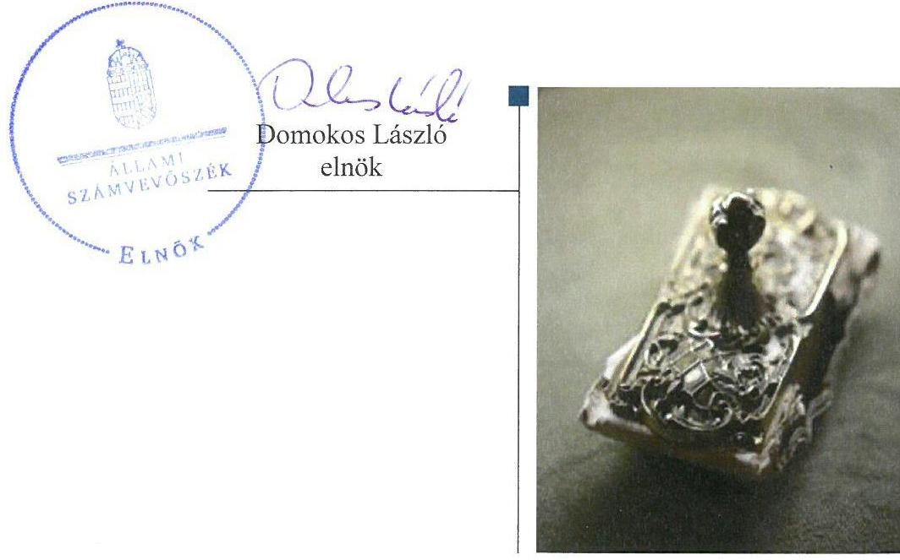
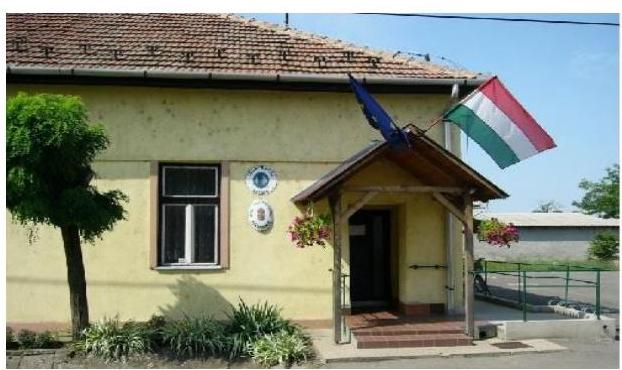
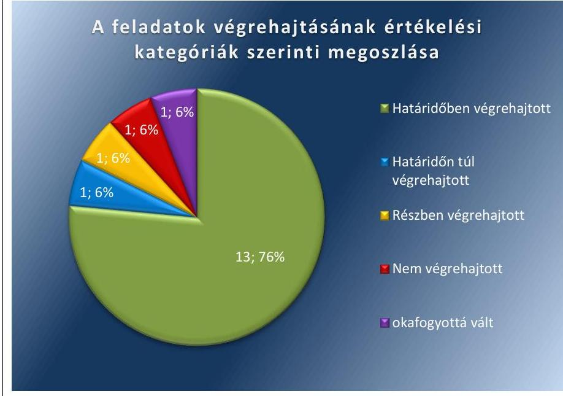

# Jelentés 

## Utóellenőrzések

Az önkormányzatok belső
kontrollrendszere kialakításának és múködtetésének utóellenőrzése Egerfarmos Községi Önkormányzat 2018.

---

# Jelentés 

## Utóellenőrzések

Az önkormányzatok belső
kontrollrendszere kialakításának és múködtetésének utóellenőrzése Egerfarmos Községi Önkormányzat 2018. 01 hó 17 nap

---

|  J | AZ ELLENŐRZÉST FELÜGYELTE:  |
| --- | --- |
|   | RENKŐ ZSUZSANNA felügyeleti vezető  |
|   | AZ ELLENŐRZÉST VEZETTE ÉS A VÉGREHAJTÁSÁÉRT FELELŐS:  |
|   | DR. DANKÓ ISTVÁN ellenőrzésvezető  |
|   | A PROGRAM ÖSSZEÁLLÍTÁSÁÉRT FELELŐS:  |
|   | JANIK JÓZSEF LÁSZLÓ osztályvezető  |
|   | A TÉMÁHOZ KAPCSOLÓDÓ KORÁBBI SZÁMVEVŐSZÉKI JELENTÉSEK:  |
|   | - címe: Jelentés az önkormányzatok belső kontrollrendszere kialakításának, egyes kontrolltevékenységek és a belső ellenőrzés müködésének ellenőrzéséről - Egerfarmos  |
|  J | sorszáma: 14087  |
|  |   |
|   | IKTATÓSZÁM: EL-0079-052/2017.  |
|   | TÉMASZÁM: 21  |
|   | ELLENŐRZÉS-AZONOSÍTÓ SZÁM: V0755123  |

---

# TARTALOMJEGYZÉK 

■ ÖSSZEGZÉS ..... 5
■ AZ ELLENŐRZÉS CÉLJA ..... 6
■ AZ ELLENŐRZÉS TERÜLETE ..... 7
■ AZ ELLENŐRZÉS HÁTTERE, INDOKOLTSÁGA ..... 8
■ A JELENTÉS LÉNYEGES KÉRDÉSKÖRE ..... 9
■ ELLENŐRZÉS HATÓKÖRE ÉS MÓDSZEREI ..... 10
■ MEGÁLLAPÍTÁSOK ..... 12
■ MELLÉKLETEK ..... 15
I. sz. melléklet: Az ÁSZ 14087. számú jelentéséhez kapcsolódó intézkedési terv pontjainak végrehajtása ..... 15
■ FÜGGELÉK: ÉSZREVÉTELEK ..... 19
■ RÖVIDÍTÉSEK JEGYZÉKE ..... 21

---

.

---

# ÖSSZEGZÉS 

Egerfarmos Községi Önkormányzat belső kontrollrendszere kialakításának és müködtetésének utóellenőrzése során az Állami Számvevőszék megállapította, hogy az Önkormányzat az intézkedési tervben foglalt feladatokat végrehajtotta. A végrehajtott feladatok javították az Önkormányzatnál a belső kontrollrendszer szabályozottságát és müködését, valamint biztosították a közpénzfelhasználás átláthatóságát és elszámoltathatóságát.

## Az ellenőrzés társadalmi indokoltsága

Az Állami Számvevőszék stratégiájában célként határozta meg a számvevőszéki munka hasznosulásának javítását. Ezzel összhangban ellenőrzi, hogy az ellenőrzött szervezetek megvalósították-e a korábbi ellenőrzései által feltárt hibák, hiányosságok és szabálytalanságok megszüntetése céljából kialakított intézkedési terveikben foglaltakat. A rendszeres utóellenőrzések hozzájárulnak a szükséges intézkedések tényleges végrehajtásához, ezáltal a közpénzügyek rendezettségének javulásához.

## Főbb megállapítások, következtetések

Az intézkedési tervben meghatározott az Önkormányzatra vonatkozó 17 feladatból az Egerfarmos Községi Önkormányzat 13 feladatot határidőben, egyet határidőn túl, egyet részben, egyet nem hajtott végre, valamint egy feladat okafogyottá vált.

A polgármester és a jegyző gondoskodott a pénzügyi folyamatokkal kapcsolatos kulcskontrollok gyakorlóinak kijelöléséről, valamint intézkedett a szervezeti működésre, a belső kontrollokra, az adatbiztonságra, a közérdekú adatok nyilvánosságra hozatalára, a szervezeten belüli és kívüli információ továbbításra, a kockázatkezelésre vonatkozó szabályok megalkotására. A végrehajtott feladatok biztosították az önkormányzat szabályos kereteken belüli müködését annak ellenére, hogy nem gondoskodtak az egyes gazdasági események tekintetében az esemény tartalmának megfelelő elszámolásáról.

A jegyző az intézkedési tervben meghatározott feladatok végrehajtásáról a jogszabályban előírt nyilvántartást vezette.

---

# AZ ELLENŐRZÉS CÉLJA 

Az ellenőrzés célja annak értékelése volt, hogy a számvevőszéki jelentésben ${ }^{1}$ foglalt intézkedést igénylő megállapításokkal és javaslatokkal összhangban készített intézkedési tervben meghatározott feladatokat az ellenőrzött szervezet végrehajtotta-e.

---

# **AZ ELLENŐRZÉS TERÜLETE**

## **Egerfarmos Községi Önkormányzat**

Egerfarmos község Heves megyében, Füzesabonyi járásban található, területe 23,8 km² állandó lakosainak száma a KSH adatai alapján 2016. január 1-jén 673 fő volt.

Az ellenőrzött időszakban a polgármester² személye a 2014. október 12-től változott. A jegyző³ személyében nem történt változás. Az Önkormányzat igazgatási feladatait 2013. március 1-től a Mezőtárkányi Közös Önkormányzati Hivatal látja el.

Az Önkormányzat és intézményei 2016. évi zárszámadási rendelete⁴ alapján 98, 8 millió Ft bevételt értek el, feladataik megvalósításához 101,4 millió Ft kiadást teljesítettek. A könyvviteli mérleg 2016. december 31-re vonatkozó mérlegfőösszege 412,6 millió Ft volt, melynek jelentős eszközeit a nemzeti vagyonba tartozó befektetett eszközök (398,0 millió Ft) jelentették. Az eszközök jelentős forrásai a saját tőke 407,9 millió Ft, és a kötelezettségek 1,9 millió Ft volt.

Az ÁSZ⁵ az Önkormányzatnál⁶ a 2012. január 1 - 2012. december 31. közötti időszakra vonatkozóan ellenőrizte az önkormányzatok belső kontrollrendszere kialakításának szabályszerűségét, egyes kontroll tevékenységek és a belső ellenőrzés működését. Az ellenőrzésről készült számvevőszéki jelentés közzétételére 2014. június 19-én került sor.

A jelentésben az ÁSZ megállapította, hogy a belső kontrollrendszer kialakítása nem felelt meg a jogszabályi előírásoknak, a pénzügyi folyamatokban kulcsszerepet betöltő teljesítésigazolás és érvényesítés belső kontrollok működése gyenge volt, valamint a belső ellenőrzés működése a jogszabályi előírásoknak nem felelt meg.

Az ellenőrzés során feltárt hiányosságok kijavítására a polgármester intézkedési tervet állított össze.

Az utóellenőrzés – a 2014. június 19. és 2017. július 27. között végrehajtott feladatokat figyelembe véve – számvevőszéki jelentésben a polgármester és a jegyző részére megfogalmazott intézkedést igénylő megállapításokra készített, az ÁSZ részére megküldött intézkedési tervben foglalt feladatok megvalósításának ellenőrzésére, illetve értékelésére fókuszált.

---

# AZ ELLENŐRZÉS HÁTTERE, INDOKOLTSÁGA 

Az ÁSZ tv. 33. § (1) bekezdése értelmében a számvevőszéki jelentések intézkedést igénylő megállapításaihoz kapcsolódóan az ellenőrzött szervezet vezetője intézkedési tervet köteles összeállítani, és az ÁSZ részére megküldeni. Az intézkedési tervben foglaltak megvalósítását - az ÁSZ tv. 33. § (7) bekezdésében foglaltak alapján - az ÁSZ utóellenőrzés keretében ellenőrizheti. Az intézkedések megvalósulásának értékelése során az ÁSZ figyelembe vette az ellenőrzött szervezetek működési feltételeiben, valamint a jogszabályi előírásokban bekövetkezett változásokat.

Az intézkedési tervben foglalt feladatok hiányos, illetve késedelmes végrehajtása, valamint megvalósításának elmaradása azt mutatja, hogy az ellenőrzés során feltárt hibák, hiányosságok és szabálytalanságok megszüntetése nem kapott kellő hangsúlyt. Ez a szabályszerű működés és a felelős vezetői magatartás vonatkozásában kockázatot hordoz. E kockázatok feltárásával az ÁSZ utóellenőrzési rendszere fokozza a fegyelmet, és igazolja, hogy a közpénzzel való szabályos gazdálkodás felelőssége elől nem lehet kitérni.

Az utóellenőrzés négy szinten hasznosulhat:
$\longrightarrow$ A társadalom szintjén az utóellenőrzés jelzi, hogy a számvevőszéki ellenőrzés megállapításainak van következménye: a hiányosságok megszüntetésére az ellenőrzött szervezet által meghatározott intézkedések végrehajtását is számon kéri az ÁSZ.
$\longrightarrow$ Az ellenőrzött terület szintjén az utóellenőrzés tájékoztatást nyújt a terület döntéshozóinak a hiányosságok kiküszöbölésének jó gyakorlatairól, ezzel lehetőséget biztosítva arra, hogy az ÁSZ ellenőrzési megállapításai, javaslatai a terület nem ellenőrzött szervezeteinek a működése során is hasznosuljanak.
$\longrightarrow$ Az ellenőrzött szervezet szintjén az utóellenőrzés feltárja, hogy a szervezet az intézkedések végrehajtásával hasznosította-e a korábbi ellenőrzési jelentésben a hiányosságok megszüntetése, illetve a kockázatok kezelése érdekében megfogalmazott javaslatokat.
$\longrightarrow$ Az ÁSZ szintjén az utóellenőrzés visszacsatolást ad az ellenőrzési jelentések hasznosulásáról, az intézkedések elmaradása vagy részleges megvalósulása a további ellenőrzésekhez kockázati jelzésként szolgál.

---

# A JELENTÉS LÉNYEGES KÉRDÉSKÖRE 

Az önkormányzat az intézkedési tervben foglaltakat az elöirt határidőben végrehajtotta-e?

---

# ELLENŐRZÉS HATÓKÖRE ÉS MÓDSZEREI 

## Az ellenőrzés típusa

Megfelelőségi ellenőrzés.

## Az ellenőrzött időszak

Az utóellenőrzés alapját képező számvevőszéki jelentés közzétételének napjától (2014. június 19.) az ellenőrzésről szóló kiértesítő levél keltének napjáig (2017. július 27.) tartó időszak.

## Az ellenőrzés tárgya

Az ÁSZ tv. 2011. július 1-jei hatálybalépését követően a számvevőszéki jelentésben foglalt intézkedést igénylő megállapításokkal összhangban - az Önkormányzat által - készített intézkedési tervekben foglaltak végrehajtásának ellenőrzése.

Az ellenőrzés kiterjedt minden olyan körülményre és adatra, amely az ÁSZ jogszabályban meghatározott feladatainak teljesítéséhez, valamint a program végrehajtása folyamán felmerült újabb összefüggések feltárásához szükséges.

## Az ellenőrzött szervezet

Egerfarmos Községi Önkormányzat

## Az ellenőrzés jogalapja

Az ÁSZ tv. 33. § (7) bekezdés alapján az intézkedési tervben foglaltak megvalósítását az ÁSZ utóellenőrzés keretében ellenőrizheti.

## Az ellenőrzés módszerei

Az ÁSZ az ellenőrzést a nemzetközi standardokat irányadónak tekintve az ellenőrzési program ellenőrzési kérdései alapján, az ellenőrzött időszakban hatályos jogszabályok, az ellenőrzés szakmai szabályok és módszertanok figyelembevételével, önálló ellenőrzés keretében végezte.

Az ÁSZ az ellenőrzés ideje alatt az Önkormányzattal a kapcsolattartást az ÁSZ SZMSZ²-ének vonatkozó előírásai alapján biztosította.

---

Az utóellenőrzés megállapításait elsősorban az ÁSZ rendelkezésére álló, valamint az ellenőrzött szervezettől elektronikusan bekért dokumentumok alapozták meg.

Az ellenőrzési bizonyítékként felhasználható adatforrások közé tartoztak egyrészt a szakmai programban felsorolt adatforrások, másrészt minden - az ellenőrzés folyamán feltárt, az ellenőrzés szempontjából információt tartalmazó - dokumentum.

Az intézkedési tervben előírt feladatokat azok végrehajthatósága, illetve végrehajtása szempontjából az alábbiak szerint értékelte az ÁSZ:
—_ „határidőben végrehajtott" a feladat, ha a teljesítés dokumentáltan, az intézkedési tervben előírt határidőben és tartalommal megtörtént;
—_ „határidőn túl végrehajtott" a feladat, ha annak teljesítése az intézkedési tervben meghatározott módon, de az előírt határidőn túl történt meg;
—_ „részben végrehajtott" a feladat, ha végrehajtása teljes körűen az intézkedési tervben előírt módon nem történt meg;
—_ „nem végrehajtott" ha a végrehajtás nem történt meg, vagy amenynyiben a teljesítést nem dokumentálták;
—_ „okafogyottá vált" a feladat, ha végrehajtására - meghatározott esemény bekövetkezése, továbbá külső körülmény, a működést érintő feltétel változása miatt - már nincs szükség, illetve lehetőség, és egyértelműen megállapítható, hogy az intézkedést szükségessé tevő körülmény a jövőben nem fordulhat elő;
—_ „nem időszerű" az a feladat, amelynek ellenőrzési időszakon belüli végrehajtására azért nem került (kerülhetett) sor, mert az intézkedés alapjául szolgáló esemény nem következett be, de annak jövőbeni előfordulása lehetséges, a végrehajtása nem volt esedékes, vagy a végrehajtás határideje még nem járt le.
Az ellenőrzés lefolytatásához az ellenőrzött szervezetek a tanúsítványok elektronikus kitöltésével, valamint az ÁSZ által kért dokumentumok elektronikus megküldésével szolgáltatott adatokat, amelyek valódiságát és teljes körűségét az ellenőrzött szervezet vezetője által tett teljességi és hitelességi nyilatkozat igazolta. Az így rendelkezésre bocsátott adatok, információk kontrollja az ellenőrzés keretében történt meg.

---

# MEGÁLLAPÍTÁSOK 

## 1. Az önkormányzat az intézkedési tervben foglaltakat az előírt határidőben végrehajtotta-e?

Összegző megállapítás

Az Önkormányzat az intézkedési tervben meghatározott 17 feladatból 13 feladatot határidőben egyet határidőn túl, egyet részben, egyet nem hajtott végre, egy feladat okafogyottá vált. A jegyző az intézkedési tervben meghatározott feladatok végrehajtásáról a jogszabályban előírt nyilvántartást vezette.

A polgármester által az ÁSZ részére megküldött intézkedési tervben a szabálytalanságok és hiányosságok megszüntetése érdekében megfogalmazott 39 feladat közül az utóellenőrzés során az ÁSZ csak azt a 17-et értékelte, amelynek végrehajtása az ellenőrzött szervezet kötelezettsége volt.

Az intézkedési tervben meghatározott feladatokat, határidőket és a feladatok végrehajtását és a felelősöket az I. számú melléklet mutatja be.

A jegyző az intézkedési tervben meghatározott feladatok végrehajtásáról vezette a Bkr. ${ }^{8}$ 14. § (1) bekezdésében előírt nyilvántartást.

Az Önkormányzat intézkedési tervében meghatározott feladatok végrehajtásának értékelési kategóriák szerinti megoszlását az 1. ábra szemlélteti.

1. ábra

Forrás: ÁSZ

---

# HATÁRIDŐBEN VÉGREHAJTOTT feladatok: 

1. A polgármester a belső kontrollrendszer működésére vonatkozó jogszabályi rendelkezések be nem tartása, valamint a teljesítésigazolás és érvényesítés kontrolokkal összefüggésben feltárt hiányosságok, szabálytalanságok tekintetében lefolytatta a munkajogi felelősséggel kapcsolatos vizsgálatot, illetve a gazdálkodás szabályszerűségét figyelemmel kísérte.
2. A jegyző az egyes intézkedési tervekben meghatározott egyes feladatok végrehajtásáról elkészítette és megküldte az írásbeli beszámolókat a költségvetési szerv vezetőjének és tájékoztatásul megküldte a belső ellenőrzési vezető részére is.
3. A jegyző az érvényesítésre jogosultakat írásban kijelölte és nyilvántartásba vette.
4. A polgármester a teljesítés igazolására jogosult személyt kijelölte.
5. A jegyző a belső ellenőrzési vezető tevékenységei és kötelességei ellátásának módjáról a belső ellenőrzési tevékenység megszervezésére vonatkozó írásbeli megállapodásban rendelkezett.
6. A jegyző intézkedett a Belső ellenőrzési stratégiai terv elkészítésére.
7. A polgármester intézkedett a belső ellenőrzési tervek Képviselő Testület által történő jóváhagyására.
8. A belső ellenőrzési vezető az éves ellenőrzési tervekben jóváhagyott ellenőrzésekhez készített ellenőrzési programot.
9. A jegyző a belső ellenőrzési jelentések alapján megfogalmazott javaslatokra készített intézkedési terveket.
10. A belső ellenőrzési vezető a belső ellenőrzési jelentésekben tett javaslatokat, a vonatkozó intézkedési terveket tartalmazó és az azok végrehajtását nyomon követő nyilvántartást vezette.
11. A belső ellenőrzési vezető az elvégzett ellenőrzésekről a jogszabálynak megfelelő nyilvántartást vezette.
12. A jegyző intézkedett az Önkormányzat vagyongazdálkodási rendeletének Képviselő-testület által történő elfogadására.
13. A jegyző a pénzgazdálkodással kapcsolatos szabályzat ${ }^{9}$-ban, valamint a szabálytalanságok kezelésének eljárásrendjében ${ }^{10}$ rögzítettek betartására dokumentáltan felhívta az érvényesítési feladatra kijelölt személyek figyelmét, a polgármester kijelölte a teljesítésigazolásra jogosult személyt.

## HATÁRIDŐN TÚL VÉGREHAJTOTT feladat:

14. A jegyző a Közös Hivatal SZMSZ ${ }^{11}$-ének az Önkormányzat Képvi-selő-testülete által történő elfogadásáról 2013. február 27. helyett 2014. február 11-ei hatállyal gondoskodott.

## RÉSZBEN VÉGREHAJTOTT feladat:

15. A jegyző intézkedett a Közös Hivatal tekintetében a vagyonnyilatkozat-tételi kötelezettséggel járó munkakörök meghatározására és

---

azokkal kapcsolatban a vagyonnyilatkozat-tételi kötelezettség szabályozására, valamint a települési képviselők vagyonnyilatkozattételi kötelezettségére vonatkozó szabályozás hatályba léptetésére, azonban nem intézkedett a bizottságok nem képviselő testületi tagjainak - Vnyttv. ${ }^{12} 4 . \S$ d) pontjában rögzített - vagyonnyilat-kozat-tételi kötelezettségére vonatkozó szabályozás kialakítása iránt.

# NEM VÉGREHAJTOTT feladat: 

16. A jegyző az Ávr. ${ }^{13}$ 59. § (3) bekezdés b), d) és f) pontjai rendelkezéseinek ellenére nem gondoskodott arról, hogy az utalványrendeletek a jogszabályi előírásoknak megfelelő tartalommal kerüljenek kiállításra és nem intézkedett a múködési célú pénzeszköz átadások elszámolásával kapcsolatban hiányosság megszüntetésére.

## OKAFOGYOTTÁ VÁLT feladat:

17. A polgármester részéről az Áht. 87. § (1) bekezdésében foglalt határidők betartása a jogszabályi rendelkezés - mely szerint a polgármesternek a képviselő-testületet az önkormányzat gazdálkodásának első félévi és háromnegyed éves helyzetéről tájékoztatnia kell - hatályon kívül helyezése miatt okafogyottá vált.

---

# MELLÉKLETEK

- I. SZ. MELLÉKLET: AZ ÁSZ 14087. SZÁMÚ JELENTÉSÉHEZ KAPCSOLÓDÓ INTÉZKEDÉSI TERV PONTJAINAK VÉGREHAJTÁSA

|  1. | 2. | 3. | 4.  |
| --- | --- | --- | --- |
|  Intézkedési tervben meghatározott feladat | Az intézkedési tervben meghatározott határidő | Az intézkedési tervben meghatározott feladatok felelőse | A feladat végrehajtása  |
|   | 2. | 3. | 4.  |
|  Határidőben végrehajtott feladatok |  |  |   |
|  1. | A belső kontrollrendszer müködésére vonatkozó jogszabályi rendelkezések be nem tartása, valamint a teljesítésigazolás, illetve az érvényesítés kontrollokkal összefüggésben feltárt hiányosságok, szabálytalanságok tekintetében az esetleges munkajogi felelősséggel kapcsolatos körülmények- kivizsgálása, majd a vizsgálat eredményének függvényében a szükséges intézkedések megtétele. A Mótv. 115. § (1) bekezdésében foglaltak alapján figyelemmel kíséri az Önkormányzat gazdálkodásának szabályszerűségét. | 2015. június 30., 2014. október 12-től folyamatos | polgármester  |
|  2. | Az egyes intézkedési tervekben meghatározott egyes feladatok végrehajtásáról az intézkedési tervben meghatározott legutolsó határidő lejártát követő 8 napon belül írásbeli beszámoló készítése a költségvetési szerv vezetője részére, és ezen beszámoló tájékoztatásul való megküldése a belső ellenőrzési vezetője részére is. | Jelen intézkedési terv előtt készült intézkedési tervek esetében 2015.június 30., illetve új intézkedési tervek esetében a Bkr. 46. (1) bekezdése szerinti határidő | jegyző  |

A polgármester a teljesítésigazolás és érvényesítés kontrolokkal összefüggésben feltárt szabálytalanság tekintetében a munkajogi felelősséggel kapcsolatos vizsgálatot lefolytatta. A kivizsgálás eredményéről 2015. április 1-jén készült feljegyzés, amelyben rögzítette, hogy a mulasztás csekély súlyára, továbbá az Önkormányzatot ért hátrányos gazdasági esemény hiányára, valamint arra a tényre, hogy a kötelezettségvállaló az Önkormányzattal nem áll jogviszonyban, a vizsgálatot megszüntette. A gazdálkodás szabályszerűségének figyelemmel kísérése a belső ellenőrzési jelentések, intézkedési tervek végrehajtásáról készített beszámolók alapján teljesített.

A jegyző intézkedett a beszámolók - lefolytatott ellenőrzések alapján készített intézkedési tervekben meghatározott legutolsó határidő lejártát követő 8 napon belüli - elkészítésére, azonban két esetben (összesen tizenkét esetből) a Bkr. 46. (1) bekezdése szerinti határidőn túl intézkedett a megküldésről a belső ellenőrzési vezető részére. (A jegyző megbízásából az aljegyző „Égerfarmos Községi Önkormányzat ingatlankataszter és ingatlan kartonok, valamint a főkönyvi nyilvántartások egyezőségének szabályszerűségi ellenőrzéséről" tárgyában 2015. évben lefolytatott ellenőrzést követően jóváhagyott intézkedési tervben meghatározott legutolsó határidő (2015. december 31.) lejártát követő 8 napon túl, 2016. február 5-én, valamint ugyanezen tárgykörben 2016. évben lefolytatott ellenőrzést követően jóváhagyott intézkedési tervben meghatározott legutolsó határidő (2016. december 31.) lejártát követő 8 napon túl, 2017. március 10-én küldte meg tájékoztatásul a beszámolót az intézkedési terv végrehajtásáról a belső ellenőrzési vezető részére.)

---

|  1. | 2. | 3. | 4.  |
| --- | --- | --- | --- |
|  3. | Az aláírás - minták 2014. november 10. napján nyilvántartásba vételre kerültek. | 2014. november 10. | jegyző  |
|  4. | A teljesítés - igazolásra jogosult személy kijelölése 2015.02.10. napján megtörtént. | 2015. február 10. | polgármester  |
|  5. | A belső ellenőrzési vezető 8kr. 22. § (1) és (2) bekezdése szerinti tevékenységei és kötelességei ellátásának módjáról való rendelkezés a belső ellenőrzési tevékenység megszervezésére vonatkozó írásbeli megállapodásban. | 2015. március 31. | jegyző  |
|  6. | Belső ellenőrzési stratégiai terv készítése az önkormányzatok 2015. március 12. napjáig elkészítendő Gazdasági programja alapján. | 2015. június 30. | jegyző  |
|  7. | A 2013. évi belső ellenőrzési terv nem pótolható (2012. november 15. napjáig kellett volna elfogadni), a jövőre nézve az éves belső ellenőrzési tervek jogszabály időben való képviselő-testület általi jóváhagyása. | Következő éves ellenőrzési terv elfogadása: 2013. december 31. majd minden év december 31. napja |   |
|  8. | Ellenőrzési program készítése. | 2013. január 1-től az új ellenőrzési vezető megbízását követően folyamatos | belső ellenőrzési vezető a 8kr. 33. § (2) bekezdésében foglalt előírásnak megfelelően 2013. január 1-től az új ellenőrzési vezető megbízását követően folyamatos  |
|  9. | Intézkedési tervek készítése. | 2013. január 1-től az új ellenőrzési vezető megbízását követően folyamatos | az ellenőrzött szerv vezetője  |

|  Az intézkedési tervben meghatározott feladat | Az intézkedési tervben meghatározott határidő | Az intézkedési tervben meghatározott feladatok felelőse  |
| --- | --- | --- |
|  2. | 3. | 4.  |
|  2014. november 10. | jegyző | A jegyző kijelölte az érvényesítésre jogosultakat és aláírás mintájukat nyilvántartásba vette a 2014. november 10-én hatályba léptetett Mezőtárkányi Közös Önkormányzat pénzgazdálkodással kapcsolatos szabályzatában.  |
|  2015. február 10. | polgármester | A polgármester a kifizetések szakmai teljesítésének igazolására jogosult személyt (alpolgármestert) írásban, kijelölő dokumentumban, 2015. február 10-ei nappal az Ávr. 57. § (4) bekezdésében előírtaknak megfelelően kijelölte.  |
|  2015. március 31. | jegyző | Jegyző a 2015. január 3-án aláírt, belső ellenőrzési tevékenység megszervezésére vonatkozó írásbeli megállapodásban rendelkezett- a 8kr. 22. § (1) és (2) bekezdései szerint - a belső ellenőrzési vezető kötelességei ellátásának módjáról.  |
|  2015. június 30. | jegyző | A jegyző intézkedésére a belső ellenőrzési vezető a 8kr. 56. § (3) bekezdés a) pontjában foglaltaknak megfelelően 2014. november 26-án elkészítette az Önkormányzat 2015-2019. évekre szóló ellenőrzési stratégiai tervét, melyet Egerfarmos Községi Önkormányzat Képviselő-testülete a 107/2014. (XII. 17.) KT határozattal, 2014. december 17-én elfogadott.  |
|  Következő éves ellenőrzési terv elfogadása: 2013. december 31. majd minden év december 31. napja |  | A polgármester, a terv képviselő-testület elé való terjesztéséért  |
|  2013. január 1-től az új ellenőrzési vezető megbízását követően folyamatos |  | A polgármester 2014-2017. években intézkedett az Önkormányzat éves belső ellenőrzési terveinek elkészítésére és a Képviselő Testület elé terjesztésére. A 2014. évi belső ellenőrzési tervet Egerfarmos Községi Önkormányzat Képviselő-testülete a 107/2013. (XII.10.) KT határozattal 2013. december 10-én, a 2015. évi belső ellenőrzési tervet a 107/2014. (XII.17.) KT határozattal 2014. december 17-én, a 2016. évi belső ellenőrzési a 126/2015. (XII.16.) KT határozattal 2015. december 16-án, a 2017. évi belső ellenőrzési tervet a 98/2016. (XII.07.) KT határozattal hagyta jóvá.  |
|  2013. január 1-től az új ellenőrzési vezető megbízását követően folyamatos |  | A belső ellenőrzési vezető a 8kr. 33. § (2) bekezdésében foglalt előírásnak megfelelően 2013-2017. években (az ellenőrzött időszak végéig) minden, az éves ellenőrzési tervekben tervezett ellenőrzéshez készített ellenőrzési programot.  |
|  2013. január 1-től az új ellenőrzési vezető megbízását követően folyamatos | az ellenőrzött szerv vezetője | A jegyző a belső ellenőrzési jelentések alapján megfogalmazott javaslatokra minden esetben a 8kr. 28. § c) pontjában és 45. § (l)-(3) bekezdéseiben foglaltak szerint intézkedési tervet készített.  |

---

|  1. | A intézkedési
tervben meghatározott feladat | Az intézkedési
tervben
meghatározott
határidő | Az intézkedési
tervben meghatározott feladatok felelőse | A feladat végrehajtása  |
| --- | --- | --- | --- | --- |
|  10. | A Bkr. 21. § (2) bekezdés d) pontjában és a 47. § (1) bekezdésében foglalt nyilvántartások vezetése. | 2013. január 1-től az új ellenőrzési vezető megbízását követően folyamatos | belső ellenőrzési vezető | A belső ellenőrzési vezető 2014. évtől folyamatosan vezette a Bkr. 21. § (2) bekezdés d) pontjában és a 47. § (1) bekezdésében foglaltaknak megfelelő a belső ellenőrzési jelentésekben tett javaslatokat, a vonatkozó intézkedési terveket és azok végrehajtását nyomon követő nyilvántartást.  |
|  11. | A Bkr. 22. § (2) bekezdés e) pontjában és az 50. § bekezdésében foglalt nyilvántartások vezetése. | 2013. január 1-től az új ellenőrzési vezető megbízását követően folyamatos | belső ellenőrzési vezető | A belső ellenőrzési vezető a belső ellenőrzés szabályszerű működésének biztosítása érdekében a Bkr. 22. § (2) bekezdés e) pontjában szereplő kötelezettségének megfelelően vezette - a Bkr. 50. §-ában foglalt előírásnak megfelelő - az elvégzett ellenőrzéseket tartalmazó nyilvántartást.  |
|  12. | A Képviselő-testület 2013. május 29-én fogadta el az Önkormányzat hatályos vagyongazdálkodási rendeletét, amely megfelel az Nvtv. 3. § (1) bekezdés 6. pontja, 5. §-a, 11. § (16) bekezdése, 13. § (1) bekezdése, 18. § (1) és (12) bekezdése, valamint a Mótv. 109. § (4) bekezdése előírásainak. | 2013. május 29. | jegyző | A jegyző intézkedett az Önkormányzat – az Nvtv. 3. § (1) bekezdés 6. pontja, 5. §-a, 11. § (16) bekezdése, 13. § (1) bekezdése, 18. § (1) és (12) bekezdése, valamint a Mótv. 109. § (4) bekezdése előírásainak megfelelő – vagyongazdálkodási rendeletének Képviselő-testület által történő elfogadására.  |
|  13. | A kötelezettségvállalások 2014. január 1. napjától az EPER Integrált Pénzügyi Rendszer szoftverrel folyamatosan nyilvántartásba vételre kerülnek. Az érvényesítő figyelmeztetésre került a Mezőtárkányi Közös Önkormányzati Hivatal 2013. március 1-től hatályos Szabálytalanságok kezelésének eljárásrendje című, valamint Mezőtárkányi Közös Önkormányzati Hivatal a Hivatal, az önkormányzatok és intézményeik pénzgazdálkodással kapcsolatos jogköreinek gyakorlásáról szóló szabályzatban foglaltak betartására. A teljesítés - igazolásra jogosult személy kijelölése 2015.02.10. napján megtörtént. A teljesítésigazolást az Ávr. 57. § (3) bekezdése szerint kijelölt személyek végzik, amelynek szabályszerűségét az érvényesítő ellenőrzi. | 2015. január 1. | jegyző | A jegyző 2014. november 10-én a pénzgazdálkodással kapcsolatos szabályzatban kijelölte az érvényesítésre jogosult személyeket. Az érvényesítési feladatokat ellátó dolgozók oktatása, figyelmeztetése megtörtént, a jegyző a pénzgazdálkodással kapcsolatos szabályzatban, valamint a szabálytalanságok kezelésének eljárásrendjében rögzítettek betartására hívta fel az érvényesítési feladatot ellátó dolgozók figyelmét, amelyről 2014. december 1 - én készítettek. A polgármester a teljesítésigazolásra jogosult személyt - az Ávr. 57. § (3) bekezdésében foglaltaknak megfelelően - 2015. február 10-én kijelölte.  |
|  14. | Mezőtárkányi Közös Önkormányzati Hivatal Szervezeti és Működési Szabályzatát Egerfarmos Községi Önkormányzat Képviselő-testülete jóváhagyta. | 2013. február 27. | jegyző | A Közös Hivatal SZMSZ-ét Egerfarmos Községi Önkormányzat Képviselő-testülete a 14/2014. (II.11.) KT határozattal a 2013. február 27-i határidőn túl, 2014. február 11-én hagyta jóvá.  |

---

|  1. | 2. | 3. | 4.  |
| --- | --- | --- | --- |
|  15. | A köztisztviselők vagyonnyilatkozat - tételi kötelezettségét
Mezőtárkányi Közös Önkormányzati Hivatal Szervezeti és Működési Szabályzatának 14. pontja szabályozza, a települési képviselő vagyonnyilatkozat - tételi kötelezettségét Egerfarmos Községi Önkormányzat Képviselő-testületének Egerfarmos Községi Önkormányzatának Szervezeti és Működési Szabályzatáról szóló 9/2014. (XI. 27.) önkormányzati rendeletének 39. § (4) bekezdésének g) pontja is előírja. A bizottságok nem - képviselő testületi tagjainak vagyonnyilatkozat - tételi kötelezettségére vonatkozó szabályozást Egerfarmos Községi Önkormányzat Képviselő – testülete a soron következő rendes testületi ülésén elfogadja. | 2013. március 1. 2014. szeptember
26. soron következő rendes Képviselő-testületi ülés | jegyző  |

|  16. | 2014. január 1. a főkönyvi esemény ÁSZ által az önkormányzattal való közlését követő 15. nap | jegyző, pénzügyi főmunkatárs | A jegyző és a pénzügyi főmunkatárs az utalványrendelet az Ávr. 59. § (3) bekezdés b), d) és f) pontjai rendelkezéseinek megfelelő tartalmú kiállítására, valamint a működési célú pénzeszköz átadások elszámolásával kapcsolatban feltárt hiányosság megszüntetésére nem intézkedett.  |
| --- | --- | --- | --- |
|  17. | Az Áht. 87. § (1) bekezdésében foglalt határidők betartása. | 2014. október 12. napjától folyamatos | polgármester  |

|  4. | A feladat végrehajtása  |
| --- | --- |
|  4. |   |

|  4. |   |
| --- | --- |
|  4. |   |

|  4. |   |
| --- | --- |
|  4. |   |

|  4. |   |
| --- | --- |
|  4. |   |

|  4. |   |
| --- | --- |
|  4. |   |

|  4. |   |
| --- | --- |
|  4. |   |

|  4. |   |
| --- | --- |
|  4. |   |

|  4. |   |
| --- | --- |
|  4. |   |

|  4. |   |
| --- | --- |
|  4. |   |

|  4. |   |
| --- | --- |
|  4. |   |

|  4. |   |
| --- | --- |
|  4. |   |

|  4. |   |
| --- | --- |
|  4. |   |

|  4. |   |
| --- | --- |
|  4. |   |

|  4. |   |
| --- | --- |
|  4. |   |

|  4. |   |
| --- | --- |
|  4. |   |

|  4. |   |
| --- | --- |
|  4. |   |

|  4. |   |
| --- | --- |
|  4. |   |

|  4. |   |
| --- | --- |
|  4. |   |

|  4. |   |
| --- | --- |
|  4. |   |

|  4. |   |
| --- | --- |
|  4. |   |

|  4. |   |
| --- | --- |
|  4. |   |

|  4. |   |
| --- | --- |
|  4. |   |

|  4. |   |
| --- | --- |
|  4. |   |

|  4. |   |
| --- | --- |
|  4. |   |

|  4. |   |
| --- | --- |
|  4. |   |

|  4. |   |
| --- | --- |
|  4. |   |

|  4. |   |
| --- | --- |
|  4. |   |

|  4. |   |
| --- | --- |
|  4. |   |

|  4. |   |
| --- | --- |
|  4. |   |

|  4. |   |
| --- | --- |
|  4. |   |

|  4. |   |
| --- | --- |
|  4. |   |

|  4. |   |
| --- | --- |
|  4. |   |

|  4. |   |
| --- | --- |
|  4. |   |

|  4. |   |
| --- | --- |
|  4. |   |

|  4. |   |
| --- | --- |
|  4. |   |

|  4. |   |
| --- | --- |
|  4. |   |

|  4. |   |
| --- | --- |
|  4. |   |

|  4. |   |
| --- | --- |
|  4. |   |

|  4. |   |
| --- | --- |
|  4. |   |

|  4. |   |
| --- | --- |
|  4. |   |

|  4. |   |
| --- | --- |
|  4. |   |

|  4. |   |
| --- | --- |
|  4. |   |

|  4. |   |
| --- | --- |
|  4. |   |

|  4. |   |
| --- | --- |
|  4. |   |

|  4. |   |
| --- | --- |
|  4. |   |

|  4. |   |
| --- | --- |
|  4. |   |

|  4. |   |
| --- | --- |
|  4. |   |

|  4. |   |
| --- | --- |
|  4. |   |

|  4. |   |
| --- | --- |
|  4. |   |

|  4. |   |
| --- | --- |
|  4. |   |

|  4. |   |
| --- | --- |
|  4. |   |

|  4. |   |
| --- | --- |
|  4. |   |

|  4. |   |
| --- | --- |
|  4. |   |

|  4. |   |
| --- | --- |
|  4. |   |

|  4. |   |
| --- | --- |
|  4. |   |

|  4. |   |
| --- | --- |
|  4. |   |

|  4. |   |
| --- | --- |
|  4. |   |

|  4. |   |
| --- | --- |
|  4. |   |

|  4. |   |
| --- | --- |
|  4. |   |

|  4. |   |
| --- | --- |
|  4. |   |

|  4. |   |
| --- | --- |
|  4. |   |

|  4. |   |
| --- | --- |
|  4. |   |

|  4. |   |
| --- | --- |
|  4. |   |

|  4. |   |
| --- | --- |
|  4. |   |

|  4. |   |
| --- | --- |
|  4. |   |

|  4. |   |
| --- | --- |
|  4. |   |

|  4. |   |
| --- | --- |
|  4. |   |

|  4. |   |
| --- | --- |
|  4. |   |

|  4. |   |
| --- | --- |
|  4. |   |

|  4. |   |
| --- | --- |
|  4. |   |

|  4. |   |
| --- | --- |
|  4. |   |

|  4. |   |
| --- | --- |
|  4. |   |

|  4. |   |
| --- | --- |
|  4. |   |

|  4. |   |
| --- | --- |
|  4. |   |

|  4. |   |
| --- | --- |
|  4. |   |

|  4. |   |
| --- | --- |
|  4. |   |

|  4. |   |
| --- | --- |
|  4. |   |

|  4. |   |
| --- | --- |
|  4. |   |

|  4. |   |
| --- | --- |
|  4. |   |

|  4. |   |
| --- | --- |
|  4. |   |

|  4. |   |
| --- | --- |
|  4. |   |

|  4. |   |
| --- | --- |
|  4. |   |

|  4. |   |
| --- | --- |
|  4. |   |

|  4. |   |
| --- | --- |
|  4. |   |

|  4. |   |
| --- | --- |
|  4. |   |

|  4. |   |
| --- | --- |
|  4. |   |

|  4. |   |
| --- | --- |
|  4. |   |

|  4. |   |
| --- | --- |
|  4. |   |

|  4. |   |
| --- | --- |
|  4. |   |

|  4. |   |
| --- | --- |
|  4. |   |

|  4. |   |
| --- | --- |
|  4. |   |

|  4. |   |
| --- | --- |
|  4. |   |

|  4. |   |
| --- | --- |
|  4. |   |

|  4. |   |
| --- | --- |
|  4. |   |

|  4. |   |
| --- | --- |
|  4. |   |

|  4. |   |
| --- | --- |
|  4. |   |

|  4. |   |
| --- | --- |
|  4. |   |

|  4. |   |
| --- | --- |
|  4. |   |

|  4. |   |
| --- | --- |
|  4. |   |

|  4. |   |
| --- | --- |
|  4. |   |

|  4. |   |
| --- | --- |
|  4. |   |

|  4. |   |
| --- | --- |
|  4. |   |

|  4. |   |
| --- | --- |
|  4. |   |

|  4. |   |
| --- | --- |
|  4. |   |

|  4. |   |
| --- | --- |
|  4. |   |

|  4. |   |
| --- | --- |
|  4. |   |

|  4. |   |
| --- | --- |
|  4. |   |

|  4. |   |
| --- | --- |
|  4. |   |

|  4. |   |
| --- | --- |
|  4. |   |

|  4. |   |
| --- | --- |
|  4. |   |

|  4. |   |
| --- | --- |
|  4. |   |

|  4. |   |
| --- | --- |
|  4. |   |

|  4. |   |
| --- | --- |
|  4. |   |

|  4. |   |
| --- | --- |
|  4. |   |

|  4. |   |
| --- | --- |
|  4. |   |

|  4. |   |
| --- | --- |
|  4. |   |

|  4. |   |
| --- | --- |
|  4. |   |

|  4. |   |
| --- | --- |
|  4. |   |

|  4. |   |
| --- | --- |
|  4. |   |

|  4. |   |
| --- | --- |
|  4. |   |

|  4. |   |
| --- | --- |
|  4. |   |

|  4. |   |
| --- | --- |
|  4. |   |

|  4. |   |
| --- | --- |
|  4. |   |

|  4. |   |
| --- | --- |
|  4. |   |

|  4. |   |
| --- | --- |
|  4. |   |

|  4. |   |
| --- | --- |
|  4. |   |

|  4. |   |
| --- | --- |
|  4. |   |

|  4. |   |
| --- | --- |
|  4. |   |

|  4. |   |
| --- | --- |
|  4. |   |

|  4. |   |
| --- | --- |
|  4. |   |

|  4. |   |
| --- | --- |
|  4. |   |

|  4. |   |
| --- | --- |
|  4. |   |

|  4. |   |
| --- | --- |
|  4. |   |

|  4. |   |
| --- | --- |
|  4. |   |

|  4. |   |
| --- | --- |
|  4. |   |

|  4. |   |
| --- | --- |
|  4. |   |

|  4. |   |
| --- | --- |
|  4. |   |

|  4. |   |
| --- | --- |
|  4. |   |

|  4. |   |
| --- | --- |
|  4. |   |

|  4. |   |
| --- | --- |
|  4. |   |

|  4. |   |
| --- | --- |
|  4. |   |

|  4. |   |
| --- | --- |
|  4. |   |

|  4. |   |
| --- | --- |
|  4. |   |

|  4. |   |
| --- | --- |
|  4. |   |

|  4. |   |
| --- | --- |
|  4. |   |

|  4. |   |
| --- | --- |
|  4. |   |

|  4. |   |
| --- | --- |
|  4. |   |

|  4. |   |
| --- | --- |
|  4. |   |

|  4. |   |
| --- | --- |
|  4. |   |

|  4. |   |
| --- | --- |
|  4. |   |

|  4. |   |
| --- | --- |
|  4. |   |

|  4. |   |
| --- | --- |
|  4. |   |

|  4. |   |
| --- | --- |
|  4. |   |

|  4. |   |
| --- | --- |
|  4. |   |

|  4. |   |
| --- | --- |
|  4. |   |

|  4. |   |
| --- | --- |
|  4. |   |

|  4. |   |
| --- | --- |
|  4. |   |

|  4. |   |
| --- | --- |
|  4. |   |

|  4. |   |
| --- | --- |
|  4. |   |

|  4. |   |
| --- | --- |
|  4. |   |

|  4. |   |
| --- | --- |
|  4. |   |

|  4. |   |
| --- | --- |
|  4. |   |

|  4. |   |
| --- | --- |
|  4. |   |

|  4. |   |
| --- | --- |
|  4. |   |

|  4. |   |
| --- | --- |
|  4. |   |

|  4. |   |
| --- | --- |
|  4. |   |

|  4. |   |
| --- | --- |
|  4. |   |

|  4. |   |
| --- | --- |
|  4. |   |

|  4. |   |
| --- | --- |
|  4. |   |

|  4. |   |
| --- | --- |
|  4. |   |

|  4. |   |
| --- | --- |
|  4. |   |

|  4. |   |
| --- | --- |
|  4. |   |

|  4. |   |
| --- | --- |
|  4. |   |

|  4. |   |
| --- | --- |
|  4. |   |

|  4. |   |
| --- | --- |
|  4. |   |

|  4. |   |
| --- | --- |
|  4. |   |

|  4. |   |
| --- | --- |
|  4. |   |

|  4. |   |
| --- | --- |
|  4. |   |

|  4. |   |
| --- | --- |
|  4. |   |

|  4. |   |
| --- | --- |
|  4. |   |

|  4. |   |
| --- | --- |
|  4. |   |

|  4. |   |
| --- | --- |
|  4. |   |

|  4. |   |
| --- | --- |
|  4. |   |

|  4. |   |
| --- | --- |
|  4. |   |

|  4. |   |
| --- | --- |
|  4. |   |

|  4. |   |
| --- | --- |
|  4. |   |

|  4. |   |
| --- | --- |
|  4. |   |

|  4. |   |
| --- | --- |
|  4. |   |

|  4. |   |
| --- | --- |
|  4. |   |

|  4. |   |
| --- | --- |
|  4. |   |

|  4. |   |
| --- | --- |
|  4. |   |

|  4. |   |
| --- | --- |
|  4. |   |

|  4. |   |
| --- | --- |
|  4. |   |

|  4. |   |
| --- | --- |
|  4. |   |

|  4. |   |
| --- | --- |
|  4. |   |

|  4. |   |
| --- | --- |
|  4. |   |

|  4. |   |
| --- | --- |
|  4. |   |

|  4. |   |
| --- | --- |
|  4. |   |

|  4. |   |
| --- | --- |
|  4. |   |

|  4. |   |
| --- | --- |
|  4. |   |

|  4. |   |
| --- | --- |
|  4. |   |

|  4. |   |
| --- | --- |
|  4. |   |

|  4. |   |
| --- | --- |
|  4. |   |

|  4. |   |
| --- | --- |
|  4. |   |

|  4. |   |
| --- | --- |
|  4. |   |

|  4. |   |
| --- | --- |
|  4. |   |

|  4. |   |
| --- | --- |
|  4. |   |

|  4. |   |
| --- | --- |
|  4. |   |

|  4. |   |
| --- | --- |
|  4. |   |

|  4. |   |
| --- | --- |
|  4. |   |

|  4. |   |
| --- | --- |
|  4. |   |

|  4. |   |
| --- | --- |
|  4. |   |

|  4. |   |
| --- | --- |
|  4. |   |

|  4. |   |
| --- | --- |
|  4. |   |

|  4. |   |
| --- | --- |
|  4. |   |

|  4. |   |
| --- | --- |
|  4. |   |

|  4. |   |
| --- | --- |
|  4. |   |

|  4. |   |
| --- | --- |
|  4. |   |

|  4. |   |
| --- | --- |
|  4. |   |

|  4. |   |
| --- | --- |
|  4. |   |

|  4. |   |
| --- | --- |
|  4. |   |

|  4. |   |
| --- | --- |
|  4. |   |

|  4. |   |
| --- | --- |
|  4. |   |

|  4. |   |
| --- | --- |
|  4. |   |

|  4. |   |
| --- | --- |
|  4. |   |

|  4. |   |
| --- | --- |
|  4. |   |

|  4. |   |
| --- | --- |
|  4. |   |

|  4. |   |
| --- | --- |
|  4. |   |

|  4. |   |
| --- | --- |
|  4. |   |

|  4. |   |
| --- | --- |
|  4. |   |

|  4. |   |
| --- | --- |
|  4. |   |

|  4. |   |
| --- | --- |
|  4. |   |

|  4. |   |
| --- | --- |
|  4. |   |

|  4. |   |
| --- | --- |
|  4. |   |

|  4. |   |
| --- | --- |
|  4. |   |

|  4. |   |
| --- | --- |
|  4. |   |

|  4. |   |
| --- | --- |
|  4. |   |

|  4. |   |
| --- | --- |
|  4. |   |

|  4. |   |
| --- | --- |
|  4. |   |

|  4. |   |
| --- | --- |
|  4. |   |

|  4. |   |
| --- | --- |
|  4. |   |

|  4. |   |
| --- | --- |
|  4. |   |

|  4. |   |
| --- | --- |
|  4. |   |

|  4. |   |
| --- | --- |
|  4. |   |

|  4. |   |
| --- | --- |
|  4. |   |

|  4. |   |
| --- | --- |
|  4. |   |

|  4. |   |
| --- | --- |
|  4. |   |

|  4. |   |
| --- | --- |
|  4. |   |

|  4. |   |
| --- | --- |
|  4. |   |

|  4. |   |
| --- | --- |
|  4. |   |

|  4. |   |
| --- | --- |
|  4. |   |

|  4. |   |
| --- | --- |
|  4. |   |

|  4. |   |
| --- | --- |
|  4. |   |

|  4. |   |
| --- | --- |
|  4. |   |

|  4. |   |
| --- | --- |
|  4. |   |

|  4. |   |
| --- | --- |
|  4. |   |

|  4. |   |
| --- | --- |
|  4. |   |

|  4. |   |
| --- | --- |
|  4. |   |

|  4. |   |
| --- | --- |
|  4. |   |

|  4. |   |
| --- | --- |
|  4. |   |

|  4. |   |
| --- | --- |
|  4. |   |

|  4. |   |
| --- | --- |
|  4. |   |

|  4. |   |
| --- | --- |
|  4. |   |

|  4. |   |
| --- | --- |
|  4. |   |

|  4. |   |
| --- | --- |
|  4. |   |

|  4. |   |
| --- | --- |
|  4. |   |

|  4. |   |
| --- | --- |
|  4. |   |

|  4. |   |
| --- | --- |
|  4. |   |

|  4. |   |
| --- | --- |
|  4. |   |

|  4. |   |
| --- | --- |
|  4. |   |

|  4. |   |
| --- | --- |
|  4. |   |

|  4. |   |
| --- | --- |
|  4. |   |

|  4. |   |
| --- | --- |
|  4. |   |

|  4. |   |
| --- | --- |
|  4. |   |

|  4. |   |
| --- | --- |
|  4. |   |

|  4. |   |
| --- | --- |
|  4. |   |

|  4. |   |
| --- | --- |
|  4. |   |

|  4. |   |
| --- | --- |
|  4. |   |

|  4. |   |
| --- | --- |
|  4. |   |

|  4. |   |
| --- | --- |
|  4. |   |

|  4. |   |
| --- | --- |
|  4. |   |

|  4. |   |
| --- | --- |
|  4. |   |

|  4. |   |
| --- | --- |
|  4. |   |

|  4. |   |
| --- | --- |
|  4. |   |

|  4. |   |
| --- | --- |
|  4. |   |

|  4. |   |
| --- | --- |
|  4. |   |

|  4. |   |
| --- | --- |
|  4. |   |

|  4. |   |
| --- | --- |
|  4. |   |

|  4. |   |
| --- | --- |
|  4. |   |

|  4. |   |
| --- | --- |
|  4. |   |

|  4. |   |
| --- | --- |
|  4. |   |

|  4. |   |
| --- | --- |
|  4. |   |

|  4. |   |
| --- | --- |
|  4. |   |

|  4. |   |
| --- | --- |
|  4. |   |

|  4. |   |
| --- | --- |
|  4. |   |

|  4. |   |
| --- | --- |
|  4. |   |

|  4. |   |
| --- | --- |
|  4. |   |

|  4. |   |
| --- | --- |
|  4. |   |

|  4. |   |
| --- | --- |
|  4. |   |

|  4. |   |
| --- | --- |
|  4. |   |

|  4. |   |
| --- | --- |
|  4. |   |

|  4. |   |
| --- | --- |
|  4. |   |

|  4. |   |
| --- | --- |
|  4. |   |

|  4. |   |
| --- | --- |
|  4. |   |

|  4. |   |
| --- | --- |
|  4. |   |

|  4. |   |
| --- | --- |
|  4. |   |

|  4. |   |
| --- | --- |
|  4. |   |

|  4. |   |
| --- | --- |
|  4. |   |

|  4. |   |
| --- | --- |
|  4. |   |

|  4. |   |
| --- | --- |
|  4. |   |

|  4. |   |
| --- | --- |
|  4. |   |

|  4. |   |
| --- | --- |
|  4. |   |

|  4. |   |
| --- | --- |
|  4. |   |

|  4. |   |
| --- | --- |
|  4. |   |

|  4. |   |
| --- | --- |
|  4. |   |

|  4. |   |
| --- | --- |
|  4. |   |

|  4. |   |
| --- | --- |
|  4. |   |

|  4. |   |
| --- | --- |
|  4. |   |

|  4. |   |
| --- | --- |
|  4. |   |

|  4. |   |
| --- | --- |
|  4. |   |

|  4. |   |
| --- | --- |
|  4. |   |

|  4. |   |
| --- | --- |
|  4. |   |

|  4. |   |
| --- | --- |
|  4. |   |

|  4. |   |
| --- | --- |
|  4. |   |

|  4. |   |
| --- | --- |
|  4. |   |

|  4. |   |
| --- | --- |
|  4. |   |

|  4. |   |
| --- | --- |
|  4. |   |

|  4. |   |
| --- | --- |
|  4. |   |

|  4. |   |
| --- | --- |
|  4. |   |

|  4. |   |
| --- | --- |
|  4. |   |

|  4. |   |
| --- | --- |
|  4. |   |

|  4. |   |
| --- | --- |
|  4. |   |

|  4. |   |
| --- | --- |
|  4. |   |

|  4. |   |
| --- | --- |
|  4. |   |

|  4. |   |
| --- | --- |
|  4. |   |

|  4. |   |
| --- | --- |
|  4. |   |

|  4. |   |
| --- | --- |
|  4. |   |

|  4. |   |
| --- | --- |
|  4. |   |

|  4. |   |
| --- | --- |
|  4. |   |

|  4. |   |
| --- | --- |
|  4. |   |

|  4. |   |
| --- | --- |
|  4. |   |

|  4. |   |
| --- | --- |
|  4. |   |

|  4. |   |
| --- | --- |
|  4. |   |

|  4. |   |
| --- | --- |
|  4. |   |

|  4. |   |
| --- | --- |
|  4. |   |

|  4. |   |
| --- | --- |
|  4. |   |

|  4. |   |
| --- | --- |
|  4. |   |

|  4. |   |
| --- | --- |
|  4. |   |

|  4. |   |
| --- | --- |
|  4. |   |

|  4. |   |
| --- | --- |
|  4. |   |

|  4. |   |
| --- | --- |
|  4. |   |

|  4. |   |
| --- | --- |
|  4. |   |

|  4. |   |
| --- | --- |
|  4. |   |

|  4. |   |
| --- | --- |
|  4. |   |

|  4. |   |
| --- | --- |
|  4. |   |

|  4. |   |
| --- | --- |
|  4. |   |

|  4. |   |
| --- | --- |
|  4. |   |

|  4. |   |
| --- | --- |
|  4. |   |

|  4. |   |
| --- | --- |
|  4. |   |

|  4. |   |
| --- | --- |
|  4. |   |

|  4. |   |
| --- | --- |
|  4. |   |

|  4. |   |
| --- | --- |
|  4. |   |

|  4. |   |
| --- | --- |
|  4. |   |

|  4. |   |
| --- | --- |
|  4. |   |

|  4. |   |
| --- | --- |
|  4. |   |

|  4. |   |
| --- | --- |
|  4. |   |

|  4. |   |
| --- | --- |
|  4. |   |

|  4. |   |
| --- | --- |
|  4. |   |

|  4. |   |
| --- | --- |
|  4. |   |

|  4. |   |
| --- | --- |
|  4. |   |

|  4. |   |
| --- | --- |
|  4. |   |

|  4. |   |
| --- | --- |
|  4. |   |

|  4. |   |
| --- | --- |
|  4. |   |

|  4. |   |
| --- | --- |
|  4. |   |

|  4. |   |
| --- | --- |
|  4. |   |

|  4. |   |
| --- | --- |
|  4. |   |

|  4. |   |
| --- | --- |
|  4. |   |

|  4. |   |
| --- | --- |
|  4. |   |

|  4. |   |
| --- | --- |
|  4. |   |

|  4. |   |
| --- | --- |
|  4. |   |

|  4. |   |
| --- | --- |
|  4. |   |

|  4. |   |
| --- | --- |
|  4. |   |

|  4. |   |
| --- | --- |
|  4. |   |

|  4. |   |
| --- | --- |
|  4. |   |

|  4. |   |
| --- | --- |
|  4. |   |

|  4. |   |
| --- | --- |
|  4. |   |

|  4. |   |
| --- | --- |
|  4. |   |

|  4. |   |
| --- | --- |
|  4. |   |

|  4. |   |
| --- | --- |
|  4. |   |

|  4. |   |
| --- | --- |
|  4. |   |

|  4. |   |
| --- | --- |
|  4. |   |

|  4. |   |
| --- | --- |
|  4. |   |

|  4. |   |
| --- | --- |
|  4. |   |

|  4. |   |
| --- | --- |
|  4. |   |

|  4. |   |
| --- | --- |
|  4. |   |

|  4. |   |
| --- | --- |
|  4. |   |

|  4. |   |
| --- | --- |
|  4. |   |

|  4. |   |
| --- | --- |
|  4. |   |

|  4. |   |
| --- | --- |
|  4. |   |

|  4. |   |
| --- | --- |
|  4. |   |

|  4. |   |
| --- | --- |
|  4. |   |

|  4. |   |
| --- | --- |
|  4. |   |

|  4. |   |
| --- | --- |
|  4. |   |

|  4. |   |
| --- | --- |
|  4. |   |

|  4. |   |
| --- | --- |
|  4. |   |

|  4. |   |
| --- | --- |
|  4. |   |

|  4. |   |

|  4. |   |
| --- | --- |
|  4. |   |

|  4. |   |
| --- | --- |
|  4. |   |

|  4. |   |

|  4. |   |
| --- | --- |
|  4. |   |

|  4. |   |

|  4. |   |
| --- | --- |
|  4. |   |

|  4. |   |

|  4. |   |

|  4. |   |

|  4. |   |

|  4. |   |

|  4. |   |

|  4. |   |

|  4. |   |

|  4. |   |

|  4. |   |

|  4. |   |

|  4. |   |

|  4. |   |

|  4. |   |

|  4. |   |

|  4. |   |

|  4. |   |

|  4. |   |

|  4. |   |

|  4. |   |

|  4. |   |

|  4. |   |

|  4. |   |

|  4. |   |

|  4. |   |

|  4. |   |

|  4. |   |

|  4. |   |

|  4. |   |

|  4. |   |

|  

---

# FÜGGELÉK: ÉSZREVÉTELEK 

A jelentéstervezetet a Számvevőszék 15 napos észrevételezésre megküldte az ellenőrzött szervezet vezetőjének az ÁSZ tv. 29. §* (1) bekezdése előírásának megfelelően.

Az ellenőrzött szervezet vezetője az ÁSZ tv. 29. § (2) bekezdésében foglalt észrevételezési jogával nem élt, a jelentéstervezetre észrevételt nem tett.

[^0]
[^0]:    * 29. § (1) Az Állami Számvevőszék az ellenőrzési megállapításait megküldi az ellenőrzött szervezet vezetőjének vagy az általa megbízott személynek, és annak, akinek személyes felelősségét állapította meg.
    (2) Az ellenőrzött szervezet vezetője és a felelősként megjelölt személy az ellenőrzés megállapításaira tizenöt napon belül írásban észrevételt tehet.
    (3) Az Állami Számvevőszék az észrevételre a beérkezésétől számított harminc napon belül írásban válaszol. A figyelembe nem vett észrevételeket köteles a jelentésben feltüntetni, és megindokolni, hogy azokat miért nem fogadta el.

---

.

---

# RÖVIDÍTÉSEK JEGYZÉKE 

${ }^{1}$ számvevőszéki jelentés
${ }^{2}$ polgármester
${ }^{3}$ jegyző
${ }^{4}$ zárszámadási rendelet
${ }^{5}$ ÁSZ
${ }^{6}$ Önkormányzat
${ }^{7}$ ÁSZ SZMSZ
${ }^{8}$ Bkr.
${ }^{9}$ pénzgazdálkodással kapcsolatos szabályzat
${ }^{10}$ szabálytalanságok kezelésének eljárásrendje
${ }^{11}$ Közös Hivatal SZMSZ
${ }^{12}$ Vnyttv.
${ }^{13}$ Ávr.

Az Állami Számvevőszék 14087 számú, az önkormányzatok belső kontrollrendszere kialakításának, egyes kontrolltevékenységek és a belső ellenőrzés müködésének ellenőrzéséről Egerfarmos címú jelentése (közzétéve 2014. június 19-én)
Egerfarmos Községi Önkormányzat polgármestere
Mezőtárkányi Közös Önkormányzati Hivatal jegyzője
Egerfarmos Községi Önkormányzat Képviselő-testületének 3/2017. (V.30) Önkormányzati rendelete az Önkormányzat 2016. évi költségvetésének végrehajtásáról
Állami Számvevőszék
Egerfarmos Községi Önkormányzat
Az Állami Számvevőszék elnökének 3/2016. (XII. 29.) ÁSZ utasítása az Állami Számvevőszék Szervezeti és Müködési Szabályzatáról (hatályos: 2017. január 1-től)
A költségvetési szervek belső kontrollrendszeréről és belső ellenőrzéséről szóló 370/2011. (XII. 31.) Korm. rendelet (hatályos 2012. január 1-től)
Mezőtárkányi Közös Önkormányzati Hivatal szabályzata a Hivatal, az önkormányzatok és intézményeik pénzgazdálkodással kapcsolatos jogköreinek gyakorlásáról (Hatályos 2014. november 10-től)
Mezőtárkányi Közös Önkormányzati hivatal szabálytalanságok kezelésének eljárásrendje (hatályos 2013. március 1-től)
Mezőtárkányi Közös Önkormányzati Hivatal Szervezeti és Müködési Szabályzata (hatályos 2013. március 1-től)
Egyes vagyonnyilatkozat-tételi kötelezettségekről szóló 2007. évi CLII. törvény (hatályos 2007. december 7-től)
Az államháztartásról szóló törvény végrehajtásáról szóló 368/2011. (XII. 31.) Korm. rendelet (hatályos 2012. január 1-jétől)

---

ÁLLAMI SZÁMVEVŐSZÉK
1052 Budapest, Apáczai Csere János utca 10.
Levélcím: 1364 Budapest 4. Pf. 54
Telefon: +36 14849100 Telefax: +36 14849200
www.asz.hu