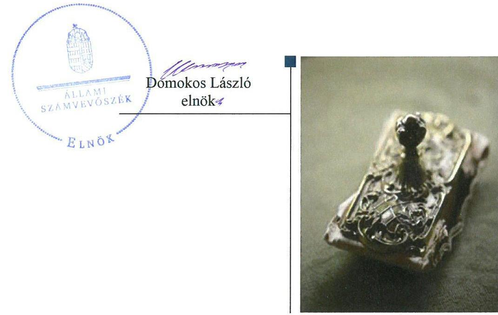
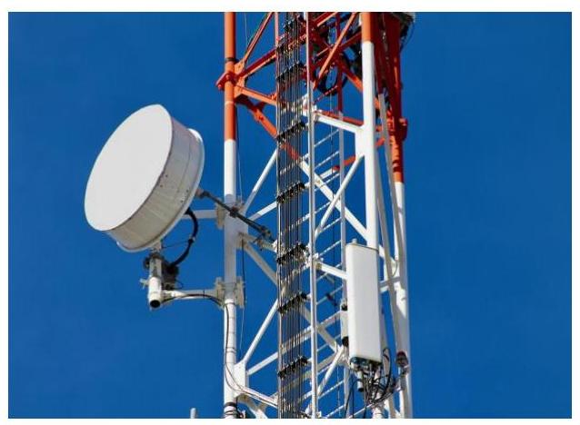

# Jelentés 

## Állami tulajdonú gazdasági társaságok

Az állami tulajdonban (résztulajdonban) lévő gazdálkodó szervezetek vagyonmegőrzési és gazdálkodási tevékenységének ellenőrzése „Antenna Hungária" Zrt.
2018.

---

# Jelentés 

## Állami tulajdonú gazdasági társaságok

Az állami tulajdonban (résztulajdonban) lévő gazdálkodó szervezetek vagyonmegőrzési és gazdálkodási tevékenységének ellenőrzése "Antenna Hungária" Zrt.
2018. jandir hó 26. nap

---

# AZ ELLENŐRZÉST FELÜGYELTE:

DR. NÉMETH ERZSÉBET felügyeleti vezető

## AZ ELLENŐRZÉST VEZETTE ÉS A VÉGREHAJTÁSÁÉRT FELELŐS:

KORSÓSNÉ VIGH ANDREA ellenőrzésvezető

## A PROGRAM ÖSSZEÁLLÍTÁSÁÉRT FELELŐS:

JANIK JÓZSEF LÁSZLÓ osztályvezető

IKTATÓSZÁM: V-1360-154/2016.

TÉMASZÁM: 2394

ELLENŐRZÉS-AZONOSÍTÓ SZÁM: V075931

Jelentéseink az Országgyűlés számítógépes hálózatán és az Interneta a www.asz.hu címen is olvashatóak.

---

# TARTALOMJEGYZÉK 

■ ÖSSZEGZÉS ..... 5
■ AZ ELLENŐRZÉS CÉLJA ..... 6
■ AZ ELLENŐRZÉS TERÜLETE ..... 7
■ AZ ELLENŐRZÉS HÁTTERE, INDOKOLTSÁGA ..... 9
■ A JELENTÉS LÉNYEGES KÉRDÉSKÖREI ..... 10
■ ELLENŐRZÉS HATÓKÖRE ÉS MÓDSZEREI ..... 11
■ MEGÁLLAPÍTÁSOK ..... 13
■ JAVASLATOK ..... 16
■ MELLÉKLETEK ..... 17
I. Sz. melléklet: Értelmező szótár ..... 17
■ FÜGGELÉK: ÉSZREVÉTELEK ..... 19
■ RÖVIDÍTÉSEK JEGYZÉKE ..... 21

---

.

---

# ÖSSZEGZÉS 

Az Antenna Hungária Zrt. felett a Nemzeti Infokommunikációs Szolgáltató Zrt. és a Nemzeti Fejlesztési Minisztérium szabályszerűen gyakorolta a tulajdonosi jogokat. Az Antenna Hungária Zrt. pénzügyi-számviteli feladatellátása és a vagyongazdálkodása nem volt szabályozott és nem volt szabályszerű.

## Az ellenőrzés társadalmi indokoltsága

Az állami tulajdonú gazdálkodó szervezetek a nemzeti vagyon részét képezik. Az állami vagyonnal való gazdálkodást illetően a tulajdonosi joggyakorlás és vagyongazdálkodás feladata az állami vagyon átlátható, rendeltetésszerű és felelős felhasználásának biztosítása. Minden közpénzt, közvagyont használó szervezettel szemben társadalmi igény, hogy tevékenységéről elszámoljon.

Az Antenna Hungária Zrt. országos műsorszóró és távközlési infrastruktúrával rendelkező állami távközlési vállalatként a hazai telekommunikációs szektor meghatározó szereplője. Egyszerre szolgáltat üzleti, kormányzati és lakossági ügyfélkörnek. Ellenőrzését a cég mérete, piaci pozíciója, vagyonának nagysága, valamint a 2014. évben történt, nemzetstratégiai jelentőségűnek minősített tulajdonosváltás - a Társaság külföldi tulajdonból a Magyar Állam tulajdonába kerülése - indokolta.

## Főbb megállapítások, következtetések, javaslatok

Az Antenna Hungária Zrt. felett a Nemzeti Infokommunikációs Szolgáltató Zrt. és a Nemzeti Fejlesztési Minisztérium szabályszerűen gyakorolta a tulajdonosi jogokat.

Az Antenna Hungária Zrt. pénzügyi-számviteli feladatellátása és vagyongazdálkodása nem volt szabályozott. A jogszabályban előírt alapvető számviteli szabályzatok közül nem rendelkezett számviteli politikával, eszközök és források értékelési szabályzattal, számlarenddel, így nem határozta meg a beszámolót megalapozó könyvvezetés, bizonylatolás, értékelés szabályrendszerét. Nem készítették el továbbá az önköltség-számítási szabályzatot, amelynek hiányában a saját előállítású termékek, végzett szolgáltatások önköltségét sem határozták meg a törvényi kötelezettség ellenére.

Az Antenna Hungária Zrt. pénzügyi-számviteli feladatellátása és vagyongazdálkodása nem volt szabályszerű, mert a bevételek, ráfordítások, az értékcsökkenés elszámolása és a vagyonnyilvántartás során a Társaság nem érvényesítette a valódiság számviteli alapelvét, mely szerint a könyvvitelben rögzített és a beszámolóban szereplő tételeknek a valóságban is megtalálhatóknak, bizonyíthatóknak, kívülállók által is megállapíthatóknak kell lenniük, értékelésüknek meg kell felelni a törvényben előírt értékelési elveknek, eljárásoknak. A beszámolók így nem nyújtottak megbízható és valós képet a Társaság vagyoni, pénzügyi és jövedelmi helyzetéről és azok változásáról. A vagyonváltozást eredményező döntések az alapszabályban rögzített hatásköri előírásoknak megfelelően történtek. A tervezési, adatszolgáltatási, valamint közzétételi kötelezettségeket szabályszerűen teljesítették.

---

# AZ ELLENŐRZÉS CÉLJA 

Az ellenőrzés célja annak értékelése volt, hogy a tulajdonosi jogok gyakorlása szabályszerű volt-e; a gazdálkodó szervezet szabályozottsága, gazdálkodása és vagyongazdálkodási tevékenysége megfelelt-e a jogszabályi és a tulajdonosi előírásoknak; a vagyonváltozást eredményező döntések esetében a tulajdonosi jogok gyakorlója és a gazdálkodó szervezet szabályszerűen jártak-e el.

---

# AZ ELLENŐRZÉS TERÜLETE 

## Antenna Hungária Zrt.

Az Antenna Hungária Zrt.-t 1992. június 30-án alapították a Magyar Músorszóró Vállalat jogutódjaként. A Társaság ${ }^{1}$ 1992. június 30-tól 2006. augusztus 25-ig állami, 2006. augusztus 25-től 2014. május 30-ig - közvetlen és közvetett módon külföldi tulajdonban volt.

A Társaság 2014. május 30-tól került a Magyar Állam 100\%os tulajdonába oly módon, hogy a korábbi francia tulajdonostól (TDF S.A.S.) a 100\%-ban állami tulajdonú NISZ Zrt. ${ }^{2}$ megvásárolta. A 106/2014. (III. 26.) Korm. rendelet ${ }^{3}$ a Társaság részvényei 100\%-ának a NISZ Zrt. általi megszerzését nemzetstratégiai jelentőségűnek minősítette, amely „hozzájárul a Nemzeti Infokommunikációs Stratégiában megfogalmazott célkitűzések eléréséhez és a közfeladatok ellátásához nélkülözhetetlen távközlési szolgáltatások megfelelő minőségi és biztonsági szintű ellátásához". A tulajdonosi joggyakorló NISZ Zrt. 2014. július 25-én értékesítette a Társaságban meglévő 100\%-os részesedését a Magyar Államot képviselő MNV Zrt. ${ }^{4}$-nek.
2014. július 25-től az ellenőrzött időszakban az $\mathrm{NFM}^{5}$ gyakorolta a tulajdonosi jogokat a 77/2012. (XII. 22.) NFM rendelet ${ }^{6}$ 1. § a) pontjában történt kijelölés alapján.

A Társaságnak a hazai telekommunikációs szektorban betöltött meghatározó szerepét mutatja, hogy az ellenőrzött időszakban kizárólag a Társaság biztosított Magyarországon országos földfelszíni televízió- és rádióműsor szétosztási, valamint műsorszórási szolgáltatásokat. E mellett multimédia, üzleti kommunikációs, infrastruktúra bérbeadása, hasznosítása, műszaki és telephelyi szolgáltatásokat nyújtott.

A Társaság jegyzett tőkéje 2014. május 30-án 11 875,2 M Ft, 2014. július 23-tól 21 233,1 M Ft volt, amely az ellenőrzött időszak végéig nem változott. A NISZ Zrt. 2014. július 23-án 25 544,5 M Ft tőkeemelést hajtott végre a Társaságnak a korábbi tulajdonos felé fennálló kölcsöntartozása refinanszírozására, amelyből 9357,9 M Ft-tal a jegyzett tőkét emelte meg, 16 168,6 M Ft-ot tőketartalékba helyezett.

A 2014. és a 2015. évi beszámolók összehasonlíthatóságát jelentősen befolyásolta, hogy a Társaság a korábban április 1-től március 31-ig tartó üzleti évről 2014. április 1-jétől áttért a naptári évvel megegyező üzleti évre, így a 2014. december 31-i fordulónappal készített beszámoló 9 hónapot lefedő törtévről, a 2015. évi beszámoló pedig már 12 hónapot lefedő teljes naptári évről készült.

A Társaság állami tulajdonba kerülését megelőző állapota, előző tulajdonosának tevékenysége befolyásolta a gazdálkodás szabályozottságát, minőségét.

A Társaság gazdálkodásának egyes kiemelt adatait az 1. táblázat szemlélteti.

---

1. táblázat

# A TÁRSASÁG GAZDÁLKODÁSÁNAK EGYES KIEMELT ADATAI 2014.01.01. - 2015.12.31. 

| Megnevezés | 2014   dec. 31. | 2015   dec. 31. |
| :-- | --: | --: |
| Mérlegfőösszeg (M Ft) | 53748,1 | 61202,0 |
| Saját tőke (M Ft) | 48944,7 | 49175,5 |
| Vevőkövetelés (M Ft) | 3133,5 | 3027,7 |
|  | április 1.- dec. 31. | január 1. - dec. 31. |
| Nettó árbevétel (M Ft) | 11110,8 | 17555,9 |
| Mérleg szerinti eredmény (M Ft) | 33,6 | 230,8 |
| Foglalkoztatottak átlagos létszáma (fő) | 316 | 344 |

Forrás: Éves beszámoló és üzleti jelentés 2014-2015.
Az Antenna Hungária Zrt. a „Digitális Átállásért" Nonprofit Kft.-ben 100\%-os, a Hungaro DigiTel Kft.-ben 55,4\%-os tulajdonosi részesedéssel rendelkezett.

---

# AZ ELLENŐRZÉS HÁTTERE, INDOKOLTSÁGA 

Az állami tulajdonú gazdálkodó szervezetek ellenőrzése kiemelten fontos a nemzeti vagyon megőrzése, megóvása érdekében. Gazdálkodásuk jellemzően a közérdeklődés és a média figyelmének középpontjában áll, amihez hozzájárul a gazdálkodásuk körébe tartozó - közvetlen vagy közvetett állami tulajdonú - vagyon nagysága.

Az ÁSZ ${ }^{7}$ középtávra szóló stratégiájában megfogalmazta, hogy az államháztartáson kívülre nyújtott költségvetési támogatások és ingyenes vagyonjuttatások, valamint az államháztartáson kívül múködő közfeladat-ellátó rendszerek ellenőrzéseivel hozzájárul ahhoz, hogy a közpénzeket az államháztartáson kívül múködő szervezetek is átlátható, rendezett módon használják fel.

Az ellenőrzés megállapításai és javaslatai hozzájárulhatnak a nemzeti vagyonnal való gazdálkodás átláthatóságának, elszámoltathatóságának javításához. Az ellenőrzési tapasztalatok segítik és erősítik az ÁSZ hozzáadott értéket teremtő tevékenységét és tanácsadó szerepét is, mivel az ellenőrzés rámutathat az állami tulajdonú gazdálkodó szervezetek gazdálkodási tevékenységével kapcsolatos jó gyakorlatokra és szabálytalanságokra, felhívhatja a figyelmet a jogszabályi követelmények teljesítéséhez szükséges feltételek hiányosságaira.

---

# A JELENTÉS LÉNYEGES KÉRDÉSKÖREI 

1.     - A tulajdonosi jogok gyakorlása szabályszerű volt-e?
2.     - A társaságnál a pénzügyi-számviteli feladatok ellátása és a vagyongazdálkodás szabályszerű volt-e?

---

# ELLENŐRZÉS HATÓKÖRE ÉS MÓDSZEREI 

## Az ellenőrzés típusa

Megfelelőségi ellenőrzés

## Az ellenőrzött időszak

A 2014. május 30-tól 2015. december 31-ig tartó időszak.

## Az ellenőrzés tárgya

Az állami tulajdonban (résztulajdonban) lévő gazdasági társaság gazdálkodása, kiemelten vagyongazdálkodási tevékenysége, a tulajdonosi jogok gyakorlása.

## Az ellenőrzött szervezet

| Antenna Hungária Zrt., Nemzeti Infokommunikációs Szolgáltató Zrt., |
| :-- |
| Nemzeti Felesztési Minisztérium |

## Az ellenőrzés jogalapja

Az ellenőrzés jogszabályi alapján az ÁSZ tv. ${ }^{8}$ 5. § (3)-(5) bekezdései képezték.

## Az ellenőrzés módszerei

Az ellenőrzést az ellenőrzési program ellenőrzési kérdései, az ellenőrzött időszakban hatályos jogszabályok, az ellenőrzés szakmai szabályok és módszertanok figyelembe vételével végeztük el.

Az ellenőrzött szervezetek az ellenőrzés lefolytatásához tanúsítványok kitöltésével, valamint az ÁSZ által kért dokumentumok megküldésével szolgáltattak adatokat.

A bevételek és ráfordítások elszámolását, és a vagyonnyilvántartás terén a szabályszerű múködést véletlenszerű mintavétellel ellenőriztük. A mintavétellel ellenőrzött területek esetében minden egyes tétel vonatkozásában szabályszerűségre vonatkozó kérdéseket tettünk fel, amelyek eredménye összesítésre került. A jogszabályoknak és a belső előírásoknak megfelelőnek tekintettük az adott területet, amennyiben a minta ellenőrzésének eredménye alapján 95\%-os bizonyossággal a teljes sokaságban a

---

hibaarány kisebb volt, mint 10\%, nem megfelelőnek értékeltük, ha a hibaarány a 10\%-ot meghaladta. A ráfordítások elszámolására és a vagyonnyilvántartásra vonatkozó véletlen mintavételt kockázati alapú kiválasztással egészítettük ki, amelynek során évente a három legnagyobb összegű tételt választottuk ki.

---

# 1. A tulajdonosi jogok gyakorlása szabályszerű volt-e? 

Összegző megállapítás

A NISZ Zrt. és az NFM szabályszerűen gyakorolták a tulajdonosi jogokat.

A TULAJ DONOSI JOGGYAKORLÁSRA vonatkozó előírásokat a NISZ Zrt. és az NFM az SZMSZ ${ }^{9}$-ében, valamint a Társaság alapszabályában ${ }^{10}$ rögzítette. Az alapszabályban a Ptk. ${ }^{11}$ elöírásaival összhangban meghatározták a tulajdonosi joggyakorló (részvényes) jogait és kötelezettségeit, a tulajdonos kizárólagos hatáskörébe tartozó döntések körét, a tulajdonosnak az igazgatóságban és az $\mathrm{FB}^{12}$-ben való képviseletét, a képviselettel összefüggő feladatokat és beszámolási kötelezettséget, továbbá rendelkeztek a könyvvizsgálóról.

A Társaság legfőbb szerve nevében eljárva a NISZ Zrt. 2014. július 24-ig, illetve 2014. július 25 -től az ellenőrzött időszakban tulajdonosi joggyakorlóként az NFM nem tett eleget a Taktv. ${ }^{13} 5 . \S$ (3) bekezdés szerinti szabályzat megalkotására vonatkozó kötelezettségének. Az igazgatóság tagjai és elnöke, az FB tagjai és elnöke, valamint a könyvvizsgáló díjazásáról részvényesi határozatban rendelkeztek a megválasztásukkal egyidejűen, az alapszabályban rögzített részvényesi jogkörnek megfelelően.

A TÁRSASÁG TEVÉKENYSÉGÉT a NISZ Zrt. heti vezetői jelentések, az NFM negyedéves monitoring adatszolgáltatási kötelezettség kialakítása és alkalmazása útján nyomon követte. Ezen túl az NFM élt tulajdonosi ellenőrzési jogkörével, 2014-ben az NFM Ellenőrzési Főosztálya a Társaság szabályozottságának átvilágítására irányuló ellenőrzést végzett, amely intézkedést igénylő megállapítást nem fogalmazott meg.

ÜZLETI TERV készítési kötelezettséget a Társaság részére az NFM 2015-től írt elő, melynek követelményeit meghatározta. A Társaság 2015. évi üzleti tervét az igazgatóság és az FB megtárgyalta és elfogadásra javasolta, az NFM jóváhagyta. A Társaság elkészítette és a tulajdonos elé terjesztette a 2015-2020. évekre vonatkozó stratégiáját, melyet az FB megtárgyalt és elfogadásra javasolt, az NFM jóváhagyott.

A SZÁMVITELI BESZÁMOLÓKAT - az FB előzetes írásbeli véleményezését követően - az NFM a Ptk.-ban előírtaknak megfelelően a könyvvizsgálói jelentések birtokában fogadta el.

---

# 2. A társaságnál a pénzügyi-számviteli feladatok ellátása és a vagyongazdálkodás szabályszerű volt-e? 

## Összegző megállapítás

2.1. számú megállapítás

A pénzügyi-számviteli feladatok ellátása és a vagyongazdálkodás nem volt szabályozott és szabályszerű.

A Társaság az alapvető számviteli szabályzatokkal nem rendelkezett. A bevételek, a ráfordítások, az értékcsökkenés elszámolása és a vagyon nyilvántartása nem volt szabályszerű. A beszámolók nem nyújtottak megbízható és valós képet a Társaság pénzügyi, vagyoni és jövedelmi helyzetéről és azok változásáról.

## ALAPVETŐ SZÁMVITELI SZABÁLYZATOKKAL a Társaság nem rendelkezett, így:

$\longrightarrow$ a Számv. tv. 14. § (3) bekezdésében előírt számviteli politikával, ezzel a Számv. tv-ben rögzített alapelvek, értékelési előírások alapján nem alakította ki és nem foglalta írásba a Társaság adottságainak, körülményeinek leginkább megfelelő, a Számv. tv. végrehajtására szolgáló módszereket, eszközöket;
$\longrightarrow$ a Számv. tv. 14. § (5) bekezdés b) pontjában előírt, az eszközök és források értékelési szabályzatával;
$\longrightarrow$ a Számv. tv. 14. § (5) bekezdés c) pontjában előírt, az önköltségszámítás rendjére vonatkozó belső szabályzattal annak ellenére, hogy a Számv. tv. (6) bekezdés alapján a Társaság nem mentesült a szabályzatkészítési kötelezettség alól. Ezáltal nem határozta meg a saját előállítású termékek, a végzett szolgáltatások tekintetében a Számv. tv. 51. § szerinti önköltség számításának utókalkuláció szerinti módszerét;
$\longrightarrow$ a Számv. tv. 161. § (1) bekezdésben előírt számlarenddel, amely szerinti könyvvezetés a beszámoló készítését maradéktalanul biztosítja.
A Számv. tv.-ben előírt szabályzatok hiányában a bevételek, ráfordítások, az értékcsökkenés elszámolása, és a vagyon nyilvántartása nem volt szabályozott, továbbá nem volt szabályszerű, mert a Társaság nem biztosította a könyvvezetés és a beszámolás során a Számv. tv. 15. § (3) bekezdésében előírt valódiság elvének az érvényesülését. Azt, hogy könyvvitelen rögzített és a beszámolóban szereplő tételeknek a valóságban is megtalálhatóknak, bizonyíthatóknak, kívülállók által is megállapíthatóknak kell lenniük, értékelésüknek meg kell felelni a Számv. tv.-ben előírt értékelési elveknek, eljárásoknak. Így a beszámolók a Társaság vagyoni, pénzügyi és jövedelmi helyzetéről és azok változásáról nem mutattak megbízható és valós képet, a Számv. tv. 18. § előírása ellenére.

A Társaságnál az értékesítésnek az eladott áruk beszerzési értékével, a közvetített szolgáltatások értékével csökkentett nettő árbevétele meghaladta az egymilliárd forintot, illetve a költségnemek szerinti költségek együttes összege is meghaladta az ötszázmillió forintot. Önköltség-számítási szabályzat hiányában ezért a Társaság nem tett eleget a Számv. tv. 14. § (7) bekezdésében foglaltaknak, amely szerint a saját előállítású termékek,

---

végzett szolgáltatások önköltségét az önköltségszámítás rendjére vonatkozó belső szabályzat szerinti utókalkuláció módszerével kell megállapítani.

A könyvvizsgáló a Számv. tv.-ben előírt szabályzatok hiánya ellenére a Társaság 2014-2015. évi beszámolóit korlátozás nélküli hitelesítő záradékkal látta el.

A Társaság rendelkezett a Számv. tv. előírásának megfelelő leltárkészítési és leltározási szabályzattal ${ }^{14}$, amely a selejtezés szabályait is magában foglalta, valamint pénzkezelési szabályzattal. ${ }^{15}$

A Társaság elkészítette a 2015-2020. évekre vonatkozó stratégia részeként a vagyongazdálkodási stratégiát, valamint a 2015. évi üzleti terv részeként a vagyongazdálkodási, fejlesztési tervet, amelyek tartalmazták a tervezett beruházásokat, fejlesztéseket. A kapcsolódó követelményeket, feladat- és hatásköröket, felelősségi viszonyokat, eljárási szabályokat az alapszabályban és a belső szabályzatokban (SZMSZ ${ }^{16}$, ÜVT Ügyrendje ${ }^{17}$, szerződéskötési szabályzat ${ }^{18}$, beszerzési szabályzat ${ }^{19}$, műszaki fejlesztési és beruházási szabályzat ${ }^{20}$, pénzügyi szabályzat ${ }^{21}$, kontrolling szabályzat ${ }^{22}$, eszközgazdálkodási szabályzat ${ }^{23}$ ) rögzítették.

A vagyon változását eredményező döntésekre szabályszerűen, az alapszabályban rögzített, a tulajdonosi joggyakorló, az igazgatóság és a vezérigazgató között megosztott hatásköri előírások betartásával került sor.
2.2. számú megállapítás

A Társaság szabályszerűen teljesítette tervezési, adatszolgáltatási és közzétételi kötelezettségeit. A belső ellenőrzés feltételrendszerét a Társaság 2015. év végére alakította ki.

ÜZLETI TERV készítésére a Társaság a 2015. évben volt kötelezett, amelynek a tulajdonosi joggyakorló elvárásainak megfelelően, határidőben eleget tett.

MONITORING RENDSZERE keretében az NFM negyedéves adatszolgáltatási kötelezettséget alakított ki, amelynek a Társaság eleget tett.

A KÖZÉRDEKŰ ADATOK közzétételére a jogszabályi előírások szerint került sor. A tulajdonosi joggyakorló által jóváhagyott beszámolókat a Társaság határidőben letétbe helyezte és közzétette.

A BELSŐ ELLENŐRZÉS feltételrendszerét - bár erre nem volt jogszabályi előírás alapján kötelezett - a Társaság a 2015. évben kialakította. Az SZMSZ-ben meghatározta a belső ellenőr feladatait és felelősségét, belső ellenőrt 2015. november hónaptól foglalkoztatott. Az ellenőrzött időszakban a 2016. évi munkaterv elkészítése és jóváhagyása történt meg, belső ellenőrzés lefolytatására nem került sor.

---

# JAVASLATOK 

Az ÁSZ tv. 33. § (1) bekezdésében foglaltak értelmében az ellenőrzött szervezet vezetője köteles a jelentésben foglalt megállapításokhoz kapcsolódó intézkedési tervet összeállítani és azt a jelentés kézhezvételétől számított 30 napon belül az ÁSZ részére megküldeni. Amennyiben az ellenőrzött szervezet vezetője nem küldi meg határidőben az intézkedési tervet, vagy továbbra sem elfogadható intézkedési tervet küld, az Állami Számvevőszék elnöke az ÁSZ tv. 33. § (3) bekezdése a) és b) pontjaiban foglaltakat érvényesítheti.

## A Nemzeti Fejlesztési Miniszternek

1. Intézkedjen a Taktv-ben elöirt szabályzat megalkotása vonatkozásában.
(1 sz. megállapítás 2. bekezdés 1. mondata alapján)

## Az Antenna Hungária Zrt. vezérigazgatójának

1. Intézkedjen a Számv. tv-ben elöirt szabályzatok elkészitéséről.
(2.1 sz. megállapítás 1. bekezdése alapján)
2. Intézkedjen, a saját elöállítású termékek és a nyújtott szolgáltatások önköltségének megállapításáról, eleget téve a Számv. tv. elöirásának.
(2.1 sz. megállapítás 3. bekezdése alapján)

---

# MELLÉKLETEK 

- I. SZ. MELLÉKLET: ÉRTELMEZŐ SZÓTÁR
állami vagyon
gazdasági társaság
gazdálkodó szervezet
tulajdonosi ellenőrzés
tulajdonosi joggyakorló
a) Az állam tulajdonában lévő dolog, valamint dolog módjára hasznosítható természeti erő;
b) az a) pont hatálya alá tartozó mindazon vagyon, amely vonatkozásában törvény az állam kizárólagos tulajdonjogát nevesíti;
c) az állam tulajdonában lévő tagsági jogviszonyt megtestesítő értékpapír, illetve az államot megillető egyéb társasági részesedés;
d) az államot megillető olyan immateriális, vagyoni értékkel rendelkező jogosultság, amelyet jogszabály vagyoni értékű jogként nevesít;
e) az állam tulajdonában lévő pénzügyi eszközök.
(Forrás: Vtv. ${ }^{24}$ 1. § (2) bekezdése)
A Ptk: 3:88. § (1) bekezdése szerint „a gazdasági társaságok üzletszerű közös gazdasági tevékenység folytatására, a tagok vagyoni hozzájárulásával létrehozott, jogi személyiséggel rendelkező vállalkozások, amelyekben a tagok a nyereségből közösen részesednek, és a veszteséget közösen viselik".
A gazdasági társaság, az európai részvénytársaság, az egyesülés, az európai gazdasági egyesülés, az európai területi együttműködési csoportosulás, a szövetkezet, a lakásszövetkezet, az európai szövetkezet, a vízgazdálkodási társulat, az erdőbirtokossági társulat, az állami vállalat, az egyéb állami gazdálkodó szerv, az egyes jogi személyek vállalata, a közös vállalat, a végrehajtói iroda, a közjegyzői iroda, az ügyvédi iroda, a szabadalmi ügyvivői iroda, az önkéntes kölcsönös biztosító pénztár, a magánnyugdíjpénztár, az egyéni cég, továbbá az egyéni vállalkozó. Az állam, a helyi önkormányzat, a költségvetési szerv, az egyesület, a köztestület, valamint az alapítvány gazdálkodó tevékenységével összefüggő polgári jogi kapcsolataira is a gazdálkodó szervezetre vonatkozó rendelkezéseket kell alkalmazni.
Forrás: Pp. ${ }^{25} 396 . \S$
Az állami vagyon használóját, vagyonkezelőjét és haszonélvezőjét megillető jogok gyakorlását, annak szabályszerűségét, a kötelezettségek teljesítését, valamint a vagyon rendeltetése szerinti célszerűségét a tulajdonosi joggyakorló rendszeresen ellenőrzi. Forrás: Vhr. ${ }^{26} 20$. §.(1)
1.

A rábízott állami vagyon felett az államot megillető tulajdonosi jogok és kötelezettségek összességét tulajdonosi joggyakorlóként:
a) ha törvény vagy miniszteri rendelet eltérően nem rendelkezik, a Magyar Nemzeti Vagyonkezelő Zártkörűen Működő Részvénytársaság (a továbbiakban: MNV Zrt.),
b) törvényben kijelölt személy vagy
c) az állami vagyon felügyeletéért felelős miniszter (a továbbiakban: miniszter) által rendeletben kijelölt személy gyakorolja.
[...] A miniszter e törvény felhatalmazása alapján - a meghatározott célok hatékonyabb elérése érdekében, miniszteri rendeletben, az ott meghatározott állami vagyoni kör tekintetében, meghatározott időtartamra - e törvény keretei között, a joggyakorlás egyes szabályainak meghatározásával - az államot megillető tulajdonosi jogok és kötelezettségek összességének, illetve azok meghatározott részének gyakorlóját az Áht. szerinti központi költségvetési szervek, ezek intézménye, továbbá a 100\%-ban állami tulajdonban álló gazdasági társaságok közül kijelölheti.
Forrás: Vtv. 3. § (1) és (2)

---

2. 

Aki a nemzeti vagyon felett az államot vagy a helyi önkormányzatot megillető tulajdonosi jogok és kötelezettségek összességének gyakorlására jogosult.
Forrás: Nvtv. ${ }^{27}$ 3. § (1) 17. pontja

---

# FÜGGELÉK: ÉSZREVÉTELEK 

A jelentéstervezetet a Számvevőszék 15 napos észrevételezésre megküldte az ellenőrzött szervezetek vezetőinek az ÁSZ tv. 29. §* (1) bekezdése előírásának megfelelően.

Az ellenőrzött szervezetek vezetői az ÁSZ tv. 29. § (2) bekezdésében foglalt észrevételezési jogukkal éltek, a jelentéstervezetre észrevételt tettek.
A függelék tartalmazza az ellenőrzöttek észrevételeit, illetve az el nem fogadott észrevételek elutasításának indoklását.

[^0]
[^0]:    * 29. § (1) Az Állami Számvevőszék az ellenőrzési megállapításait megküldi az ellenőrzött szervezet vezetőjének vagy az általa megbízott személynek, és annak, akinek személyes felelősségét állapította meg.
    (2) Az ellenőrzött szervezet vezetője és a felelősként megjelölt személy az ellenőrzés megállapításaira tizenöt napon belül írásban észrevételt tehet.
    (3) Az Állami Számvevőszék az észrevételre a beérkezésétől számított harminc napon belül írásban válaszol. A figyelembe nem vett észrevételeket köteles a jelentésben feltüntetni, és megindokolni, hogy azokat miért nem fogadta el.

---

Az Antenna Hungária Zrt. vezérigazgatójának 2017. december 4-én kelt (az Állami Számvevőszékhez 2017. december 6-án beérkezett) levelében a jelentéstervezet megállapításaival kapcsolatban tett, figyelembe nem vett észrevételek és az elutasítás indoklása.

# 1. A jelentéstervezet 2.1 sz. megállapítására, valamint ezzel összefüggésben a jelentéstervezet Összegzés, illetve a Javaslatok című fejezetekre vonatkozóan, a pénzügyi számviteli feladatok ellátásával kapcsolatos észrevétel 

Az Antenna Hungária Zrt. vezérigazgatója nem ért egyet a jelentéstervezet 2-es pontjának összegző megállapításaival, illetve a megállapításban leírtakkal, miszerint a Társaság a 2014-es és 2015-ös üzleti évekre vonatkozóan nem rendelkezett az alapvető számviteli szabályzatokkal és a bevételek, ráfordítások, az értékcsökkenés elszámolása nem volt szabályszerű. Összefüggésben ezzel a jelentéstervezet 5. oldalán szereplő Főbb megállapítások, következtetések, javaslatok pontban és a 16. oldalon szereplő „Az Antenna Hungária Zrt. vezérigazgatójának" szóló javaslat 1-es pontjában lévő szöveg tartalmával sem ért egyet a Társaság. A Társaság vezérigazgatója a Számviteli politikával kapcsolatban tett észrevétele szerint a szabályzat aláírás nélkül is hatályos, mivel a Számviteli törvény vonatkozó bekezdése nem írja elő az aláírást, mint formai feltételt a számviteli politikával kapcsolatban.

Az Állami Számvevőszék megállapítását a Társaságra vonatkozó jogszabályok és a Társaság saját belső szabályzatai alapján tette meg. Az Antenna Hungária Zrt. U-2. v-7.02 azonosító számú, Folyamat- és működésfejlesztési Szabályzatának (hatályos 2007.10.12.) 3.3 sz. Belső szabályozás készítése, módosítása című pontja értelmében a belső szabályzatok vezérigazgatói utasítással, vagy ágazatvezetői rendelkezéssel kiadott szabályzatok lehetnek, amelyeknek rendelkeznie kell a kiadmányozó aláírását, a hatályba lépés időpontját, a szabályzat egyedi azonosító számát tartalmazó hatályba helyező irattal (előlappal). Ez egyben a szabályzatok intraneten történő közzétételének előfeltétele is. Az „Antenna Hungária" Zrt. számviteli politikája nem rendelkezik hatályba helyező irattal, továbbá a Társaság nyilatkozott, hogy nem rendelkezik önköltség számítási szabályzattal és számlarenddel sem. A megállapítás módosítása ezért nem indokolt.
2. A jelentéstervezet 2.1 sz. megállapítására, valamint ezzel összefüggésben a jelentéstervezet Összegzés, illetve a Javaslatok címü fejezetekre vonatkozóan, a vagyongazdálkodás szabályozottságával, szabályszerűségével kapcsolatos észrevétel

Összefüggésben a fentiekben leírtakkal az Antenna Hungária Zrt. vezérigazgatója nem ért egyet azzal, hogy a beszámolók nem nyújtottak megbízható és valós képet a Társaság pénzügyi, vagyoni és jövedelmi helyzetéről.
A Számviteli törvényben előírt alapvető szabályzatok hiányában a bevételek, ráfordítások, az értékcsökkenés elszámolása, a vagyon nyilvántartása nem volt szabályszerű, ezért a beszámoló megalapozottsága nem volt megítélhető. Ennek hiányában a beszámoló nem nyújtott valós képet a Társaság vagyon, pénzügyi és jövedelmi helyzetéről. Erre való tekintettel a jelentéstervezet módosítását nem tartjuk indokoltnak.

A Nemzeti Fejlesztési Minisztérium minisztere 2017. december 12-én kelt (az Állami Számvevőszékhez 2017. december 20-án beérkezett) levelében tájékoztatta az Állami Számvevőszéket az Antenna Hungária Zrt. vezérigazgatójának a jelentéstervezet megállapításaira vonatkozó észrevételeiről.

A Társaság által tett észrevételek fent bemutatott elutasítására és annak indoklására tekintettel a Miniszter által is jelzett, valamint a Társaság észrevételben szintén kifogásolt megállapítások módosítását nem tartjuk indokoltnak.

---

# RÖVIDÍTÉSEK JEGYZÉKE 

${ }^{1}$ Társaság
${ }^{2}$ NISZ Zrt.
${ }^{3}$ 106/2014. (III. 26.) Korm. rendelet
${ }^{4}$ MNV Zrt.
${ }^{5}$ NFM
${ }^{6}$ 77/2012. (XII. 22.) NFM rendelet
${ }^{7}$ ÁSZ
${ }^{8}$ ÁSZ tv.
${ }^{9}$ SZMSZ
${ }^{10}$ alapszabály1-7
${ }^{11}$ Ptk.
${ }^{12}$ FB
${ }^{13}$ Taktv.
${ }^{14}$ leltárkészítési és leltározási szabályzat
${ }^{15}$ pénzkezelési szabályzat
${ }^{16}$ SZMSZ
${ }^{17}$ ÜVT Ügyrendje
${ }^{18}$ szerződéskötési szabályzat
${ }^{19}$ beszerzési szabályzat
${ }^{20}$ műszaki fejlesztési és beruházási szabályzat
${ }^{21}$ pénzügyi szabályzat
${ }^{22}$ kontrolling szabályzat
„Antenna Hungária" Magyar Műsorszóró és Rádióhírközlési Zrt. (Antenna Hungária Zrt.)
Nemzeti Infokommunikációs Szolgáltató Zrt.
106/2014. (III. 26.) Korm. rendelet az „Antenna Hungária" Magyar
Műsorszóró és Rádióhírközlési Zártkörűen Működő Részvénytársaság 100\%os társasági részesedése állami tulajdonban álló társaság általi megszerzése nemzetstratégiai jelentőségűnek minősítéséről
Magyar Nemzeti Vagyonkezelő Zrt.
Nemzeti Fejlesztési Minisztérium
az egyes gazdasági társaságok felett az államot megillető tulajdonosi jogok és kötelezettségek összességét gyakorló szervezet kijelöléséről
Állami Számvevőszék
2011. évi LXVI. törvény az Állami Számvevőszékről

Szervezeti és Működési Szabályzat
az Antenna Hungária Zrt. alapszabálya ${ }_{1}$ (2014.05.30-2014.07.23.)
az Antenna Hungária Zrt. alapszabálya ${ }_{2}$ (2014.07.23.-2014.07.25.)
az Antenna Hungária Zrt. alapszabálya ${ }_{3}$ (2014.07.25.- 2014.09.08.)
az Antenna Hungária Zrt. alapszabálya ${ }_{4}$ (2014.09.08.-2014.09.19.)
az Antenna Hungária Zrt. alapszabálya ${ }_{5}$ (2014.09.19.-2015.08.05.)
az Antenna Hungária Zrt. alapszabálya ${ }_{6}$ (2015.08.05.-2015.10.06.)
az Antenna Hungária Zrt. alapszabálya ${ }_{7}$ (2015.10.06-2015.12.28.)
2013. évi V. törvény a Polgári Törvénykönyvről (hatályos: 2014. március 15től)
Felügyelőbizottság
2009. évi CXXII. törvény a köztulajdonban álló gazdasági társaságok takarékosabb müködéséről
Az Antenna Hungária Zrt. Eszközgazdálkodási szabályzata és
Eszközgazdálkodási kézikönyve (hatályos 2013. december 20-tól)
Az Antenna Hungária Zrt. Pénzügyi szabályzata (hatályos 2005. január 1-jétől)
Az Antenna Hungária Zrt. Szervezeti és Müködési Szabályzata (hatályos 2014. január 1-jétől, módosítva 2015. március 1-jén és 2015. október 15-én)
Az Antenna Hungária Zrt. Ügyvezető Testületének Ügyrendje (hatályos 2014. október 10-től, módosítva 2015. május 28-án)
Az Antenna Hungária Zrt. A szerződéskötési, utalványozási és bankaláírási jogkör szabályozása, valamint a szerződéskötésekkel kapcsolatos feladatok meghatározása című szabályzata (hatályos 2007. december 22-től)
Az Antenna Hungária Zrt. Beszerzési szabályzata (hatályos 2007. október 19től)
Az Antenna Hungária Zrt. Műszaki fejlesztés és beruházás címú szabályzata (hatályos 2012. június 25-től)
Az Antenna Hungária Zrt. Pénzügyi szabályzata (hatályos 2005. január 1-jétől)
Az Antenna Hungária Zrt. Kontrolling szabályzata (hatályos 2004.
szeptember 13-tól)

---

${ }^{23}$ eszközgazdálkodási szabályzat
${ }^{24}$ Vtv.
${ }^{25} \mathrm{Pp}$.
${ }^{26} \mathrm{Vhr}$.
${ }^{27} \mathrm{Nvtv}$.

Az Antenna Hungária Zrt. Eszközgazdálkodási szabályzata és
Eszközgazdálkodási kézikönyve (hatályos 2013. december 20-tól)
2007. évi CVI. törvény az állami vagyonról
1952. évi III. törvény a polgári perrendtartásról

254/2007. (X. 4.) Kormányrendelet az állami vagyonnal való gazdálkodásról
2011. évi CXCVI. törvény a nemzeti vagyonról

---

# ÁLLAMI SZÁMVEVŐSZÉK 

1052 Budapest, Apáczai Csere János utca 10.
Levélcím: 1364 Budapest 4. Pf. 54
Telefon: +36 14849100 Telefax: +36 14849200
www.asz.hu